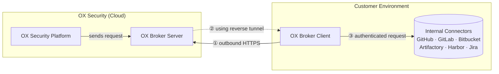

# Source: https://docs.ox.security/get-started/onboarding-to-ox/prerequisites-and-access/ox-broker.md

# OX Broker

OX Broker is a lightweight service deployed in your environment that enables OX Security to securely access and scan your internal resources without requiring any inbound firewall rules or network exposure.

Rather than opening ports to OX Security, OX Broker Client initiates a single outbound HTTPS connection from your environment to the OX Broker Server. OX Security then routes all requests through that established connection, ensuring that your internal resources remain fully isolated from the public internet while still being accessible to the OX platform.

## Architecture



1. The OX Broker Client initiates an outbound-only HTTPS connection to the OX Broker Server; no inbound firewall rules are required.
2. OX Security Platform routes requests back through the reverse tunnel to the OX Broker Client.
3. OX Broker Client forwards the authenticated request to the target internal connector.

## Supported Connectors

* GitLab
* GitHub
* Azure TFS
* Harbor
* GitLab Container Registry
* JFrog Artifactory
* Bitbucket Data Center or Server
* Jira

## Prerequisites

Before you begin, contact an OX Security Customer Success representative for feature enablement and the OX Broker server dedicated address.

OX Broker can be installed using **Docker Compose** on a Linux host or using a **Helm chart** on a Kubernetes cluster.

Ensure your environment meets the following requirements based on your chosen method.

### General requirements

<table><thead><tr><th width="240.25">Requirement Type</th><th>Details</th></tr></thead><tbody><tr><td>Operating System</td><td>Ubuntu 22.04 or later, RHEL 9 or later</td></tr><tr><td>Hardware</td><td>Minimum: 4 GB RAM, 2 CPU cores, 10 GB of available disk space</td></tr><tr><td>Network Requirements</td><td><ul><li>Connectivity to your internal connectors from the host/node.</li><li>Outgoing traffic on port 443 to the address provided by OX.</li><li>Outgoing traffic to Docker Hub for pulling container images.</li><li>Share the public IP address of the host/node with OX.</li></ul><p><strong>Proxy:</strong> If your traffic is routed through a proxy, ensure port 443 HTTPS is allowed for outbound communication to the OX environment. Share the proxy IP address with OX Security.</p></td></tr></tbody></table>

### Docker Compose requirements

| Requirement Type | Details                             |
| ---------------- | ----------------------------------- |
| Software         | Docker Engine and Docker Compose V2 |
| Access           | Root access or sudo available       |

To verify your machine is configured correctly, download and run the readiness script:

```bash
curl -fsSL https://installer.broker.ox.security/universal/oxbroker_readiness.sh -o oxbroker_readiness.sh
chmod +x oxbroker_readiness.sh
sudo ./oxbroker_readiness.sh
```

### Helm requirements

| Requirement Type | Details                                                            |
| ---------------- | ------------------------------------------------------------------ |
| Kubernetes       | Access to a Kubernetes cluster                                     |
| Software         | Helm version 3 or later, kubectl configured for the target cluster |

## Installing OX Broker

Choose the method that matches your deployment environment and follow the relevant installation procedure:

* [Docker Compose on a Linux host or virtual machine](#install-ox-broker-using-docker-compose)
* [Helm chart on a Kubernetes cluster](#install-ox-broker-using-helm)

### Install OX Broker Using Docker Compose

**To install OX Broker using Docker Compose:**

1. Download the installation script.

   ```bash
   curl -fsSL https://installer.broker.ox.security/universal/oxbroker_installer_universal.sh -o oxbroker_install.sh
   chmod +x oxbroker_install.sh
   ```

2. Run the script as root, providing the OX Broker server address supplied by OX Security:

* ```bash
  sudo ./oxbroker_install.sh --host <BROKER_HOST>
  ```

Or, if your environment routes traffic through a corporate proxy, add the `--proxy` flag.

* <pre class="language-bash"><code class="lang-bash"><strong>sudo ./oxbroker_install.sh --host &#x3C;BROKER_HOST> --proxy &#x3C;PROXY_HOST>:&#x3C;PROXY_PORT>
  </strong></code></pre>

> **Note:**\
> `<PROXY_HOST>` must be the FQDN only, for example, `proxy.company.com`.\
> Do not include the protocol or port.

The script generates an SSH key pair and credentials, and displays them on screen.

1. Send the public key to OX Security support and save the credentials in a safe location.
2. Once OX Security confirms the key has been registered, press `p` to proceed. The script starts the OX Broker services automatically.

### Install OX Broker Using Helm

This installation method deploys OX Broker into a Kubernetes cluster using a Helm chart.

**To install OX Broker using Helm:**

1. Add the OX Security Helm repository and update it.

```bash
helm repo add ox https://charts.cloud.ox.security
helm repo update
```

1. Verify the chart is available.

```bash
helm search repo ox/oxbroker
```

1. Generate authentication keys locally.

```bash
ssh-keygen -q -t rsa -b 4096 -f oxbroker-key -N "" -C "oxbroker@k8s" && cat oxbroker-key.pub
```

1. Send the public key (`oxbroker-key.pub`) to OX Security and wait for confirmation that the key has been registered.
2. Create a Kubernetes namespace and secret containing the authentication keys.

```bash
kubectl create namespace oxbroker
kubectl create secret generic oxbroker-auth-key -n oxbroker \
  
--from-file=auth-privatekey=oxbroker-key \
  
--from-file=auth-publickey=oxbroker-key.pub
```

1. Install the Helm chart using the broker server address provided by OX Security.

```bash
helm install oxbroker ox/oxbroker -n oxbroker \
  --set oxbroker.remoteHost=<BROKER_SERVER_ADDRESS>
```

1. To configure proxy settings, add the following:

```bash
  --set proxy.enabled=true \
  --set proxy.host=<PROXY_HOST> \
  --set proxy.port=<PROXY_PORT>
```

> **Note:**\
> `<PROXY_HOST>` must be the FQDN only, for example, `proxy.company.com`.\
> Do not include the protocol or port.

## Verifying OX Broker

**To confirm that OX Broker is running:**

* For Docker Compose installations:

```bash
cd oxbroker 
docker compose ps
docker compose logs -f
```

* For Helm installations:

```bash
kubectl get pods -n oxbroker
kubectl logs -n oxbroker -l app=oxbroker --all-containers=true -f
```

## Configuring OX Broker

After installation completes, use with either method:

1. Log in to the OX Security portal.
2. Go to the relevant connector.
3. Enable **OX** **Broker**.

Provide the following details:

| Field                                         | Details                                                                                             |
| --------------------------------------------- | --------------------------------------------------------------------------------------------------- |
| **Internal resource URL**                     | Provide the connector URL                                                                           |
| **Token**                                     | Add your connector token                                                                            |
| **User**                                      | The user that was generated during the OX Broker installation.                                      |
| **Password**                                  | The password that was generated during the OX Broker installation.                                  |
| **Bypass SSL Verification (not recommended)** | Enable this option if your environment lacks a proper certificate or uses a self-signed certificate |

## Upgrading OX Broker

**To upgrade OX Broker using Docker Compose:**

1. Navigate to the OX Broker directory.

```bash
cd oxbroker
```

1. Pull the latest stable images from Docker Hub.

```bash
docker compose pull
```

1. Restart the services with the updated images.

```bash
docker compose up -d
```

1. Verify the services are running.

```bash
docker compose ps
```

**To upgrade OX Broker using Helm:**

1. Update the OX Security Helm repository.

```bash
helm repo update ox
```

1. Upgrade the deployment.

```bash
helm upgrade oxbroker ox/oxbroker -n oxbroker
```

1. To upgrade to a specific version.

```bash
helm upgrade oxbroker ox/oxbroker -n oxbroker --version <VERSION>
```

1. Verify the pods are running.

```bash
kubectl get pods -n oxbroker
```

## Uninstall OX Broker

**Docker Compose**

```bash
cd oxbroker
docker compose down -v
```

**Helm**

```bash
helm uninstall oxbroker -n oxbroker
kubectl delete namespace oxbroker
```
