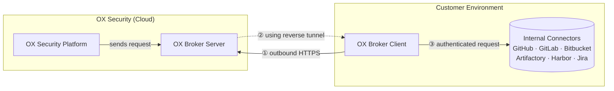

# Ox Security Documentation

Source: https://docs.ox.security/llms-full.txt

---

# Welcome to OXdocs

#### At **OX Security**, we're on a mission to eliminate manual AppSec. Our Active ASPM platform gives you the tools to do it! <a href="#at-ox-security-were-on-a-mission-to-eliminate-manual-appsec.-our-active-aspm-platform-gives-you-the" id="at-ox-security-were-on-a-mission-to-eliminate-manual-appsec.-our-active-aspm-platform-gives-you-the"></a>

* **See everything** with complete end-to-end coverage of your entire software development lifecycle.
* **Focus on what matters** with contextualized prioritization that adapts to meet your business needs.
* **Mitigate risk at scale** with automated response and no-code workflows.

You've arrived at **OXdocs,** our online help center. We invite you to take a look around and learn how to put it all in motion!

<table data-view="cards"><thead><tr><th></th><th></th><th data-hidden data-card-cover data-type="files"></th><th data-hidden data-card-target data-type="content-ref"></th></tr></thead><tbody><tr><td><strong>Get started</strong></td><td>Create an account, create an organization, and get your code repositories connected</td><td><a href="https://884876233-files.gitbook.io/~/files/v0/b/gitbook-x-prod.appspot.com/o/spaces%2FdK3XMLdV8zRg847RmGmZ%2Fuploads%2Fgit-blob-24d8e3156a5a126de822552026b06c442d1cc191%2Frocket.png?alt=media">rocket.png</a></td><td><a href="broken-reference">Broken link</a></td></tr><tr><td><strong>Start scanning</strong></td><td>Learn about our scanning methods</td><td><a href="https://884876233-files.gitbook.io/~/files/v0/b/gitbook-x-prod.appspot.com/o/spaces%2FdK3XMLdV8zRg847RmGmZ%2Fuploads%2Fgit-blob-05109a2fb7a358f21f09f7aeffe64184525cf1d9%2Fscannig.png?alt=media">scannig.png</a></td><td><a href="scan-and-analyze-with-ox/scanning">scanning</a></td></tr><tr><td><strong>Get connected</strong></td><td>Integrate your development infrastructure and other security tools to make OX your AppSec one-stop-shop</td><td><a href="https://884876233-files.gitbook.io/~/files/v0/b/gitbook-x-prod.appspot.com/o/spaces%2FdK3XMLdV8zRg847RmGmZ%2Fuploads%2Fgit-blob-61cbac76765f332b7c97d7d0e257d2fa47aa1a75%2Fwheel.png?alt=media">wheel.png</a></td><td><a href="broken-reference">Broken link</a></td></tr></tbody></table>

# Supported Languages and Frameworks

The following is the overview of supported languages across different OX Security categories:

* [Code security](#code-security-support)
* [Open Source Security & SBOM](#sca-and-sbom-support)
* [API BOM](#api-bom-support)
* [Infrastructure](#infrastructure-as-code-support)

## Code Security Support

OX supports static code analysis for the following programming languages.

| Language                    | Code Scanning | AI Fix Support |
| --------------------------- | ------------- | -------------- |
| **Python**                  | Yes           | Yes            |
| **JavaScript / TypeScript** | Yes           | Yes            |
| **Java**                    | Yes           | Yes            |
| **C#**                      | Yes           | Yes            |
| **PHP**                     | Yes           | No             |
| **Swift**                   | Yes           | No             |
| **Go**                      | Yes           | No             |
| **Rust**                    | Yes           | No             |
| **Dart**                    | Yes           | No             |
| **Ruby**                    | Yes           | No             |
| **C / C++**                 | Yes           | No             |
| **Scala**                   | Yes           | No             |
| **Kotlin**                  | Yes           | No             |
| **COBOL**                   | Yes           | No             |
| **Visual Basic .NET**       | Yes           | No             |

## SCA & SBOM Support

OX supports Software Composition Analysis (SCA) and Software Bill of Materials (SBOM) generation for the following package manager files.

| Language                | <p>Package<br>Manager</p> | <p>License<br>Scanning</p> | <p>Vulnerability<br>Scan</p> | <p>Dependency<br>Graph</p> | <p>Reachability<br>Analysis</p> | <p>Pull Request<br>Fix</p> | <p>Private Dependency<br>Scanning</p> | <p>Dependency<br>Confusion</p> | <p>Deprecated<br>Dependencies</p> | <p>Malicious<br>Dependencies</p> |
| ----------------------- | ------------------------- | -------------------------- | ---------------------------- | -------------------------- | ------------------------------- | -------------------------- | ------------------------------------- | ------------------------------ | --------------------------------- | -------------------------------- |
| **JavaScript**          | `npm`                     | Yes                        | Yes                          | Yes                        | Yes                             | Yes                        | Yes                                   | Yes                            | Yes                               | Yes                              |
|                         | `yarn`                    | Yes                        | Yes                          | Yes                        | Yes                             | Yes                        | Yes                                   | Yes                            | Yes                               | Yes                              |
|                         | `pnpm`                    | Yes                        | Yes                          | Yes                        | Yes                             | Yes                        | Yes                                   | No                             | Yes                               | Yes                              |
| **Python**              | `pip`                     | Yes                        | Yes                          | Yes                        | Yes                             | Yes                        | No                                    | Yes                            | No                                | Yes                              |
|                         | `Poetry`                  | Yes                        | Yes                          | Yes                        | Yes                             | Yes                        | No                                    | No                             | No                                | Yes                              |
|                         | `Pipenv`                  | Yes                        | Yes                          | Yes                        | Yes                             | Yes                        | No                                    | No                             | No                                | Yes                              |
|                         | `uv`                      | Yes                        | Yes                          | Yes                        | Yes                             | Yes                        | No                                    | No                             | No                                | Yes                              |
| **Java**                | `Maven`                   | Yes                        | Yes                          | Yes                        | Yes                             | Yes                        | Yes                                   | No                             | No                                | Yes                              |
|                         | `Gradle`                  | Yes                        | Yes                          | Yes                        | Yes                             | Yes                        | Yes                                   | No                             | No                                | Yes                              |
| **Scala**               | `SBT`                     | Yes                        | Yes                          | Yes                        | No                              | No                         | No                                    | No                             | No                                | Yes                              |
|                         | `Maven`                   | Yes                        | Yes                          | Yes                        | No                              | Yes                        | Yes                                   | No                             | No                                | Yes                              |
|                         | `Gradle`                  | Yes                        | Yes                          | Yes                        | No                              | Yes                        | Yes                                   | No                             | No                                | Yes                              |
| **Kotlin**              | `Maven`                   | Yes                        | Yes                          | Yes                        | Yes                             | Yes                        | Yes                                   | No                             | No                                | Yes                              |
|                         | `Gradle`                  | Yes                        | Yes                          | Yes                        | Yes                             | Yes                        | Yes                                   | No                             | No                                | Yes                              |
| **Objective-C / Swift** | `CocoaPods`               | Yes                        | Yes                          | Yes                        | No                              | No                         | No                                    | No                             | No                                | No                               |
|                         | `SwiftPM`                 | Yes                        | Yes                          | Yes                        | Yes                             | Yes                        | No                                    | No                             | No                                | No                               |
|                         | `XcodeGen`                | Yes                        | Yes                          | Yes                        | Yes                             | Yes                        | No                                    | No                             | No                                | No                               |
| **Go**                  | `Go Modules`              | Yes                        | Yes                          | Yes                        | Yes                             | Yes                        | No                                    | No                             | No                                | Yes                              |
| **Dart**                | `Dart`                    | Yes                        | Yes                          | Yes                        | Yes                             |                            |                                       |                                |                                   |                                  |
| **Rust**                | `Rust`                    | Yes                        | Yes                          | Yes                        | Yes                             |                            |                                       |                                |                                   |                                  |
| **Ruby**                | `RubyGems`                | Yes                        | Yes                          | Yes                        | No                              | No                         | No                                    | No                             | No                                | Yes                              |
| **C#**                  | `NuGet`                   | Yes                        | Yes                          | Yes                        | Yes                             | Yes                        | Yes                                   | No                             | No                                | Yes                              |
| **Visual Basic .NET**   | `NuGet`                   | Yes                        | Yes                          | Yes                        | Yes                             |                            |                                       |                                |                                   |                                  |
| **PHP**                 | `Cpmposer`                | No                         | Yes                          | Yes                        | No                              | Yes                        | No                                    | No                             | No                                | Yes                              |

## API BOM Support

OX supports API analysis and detection for specific specifications and frameworks.

<table><thead><tr><th>Language</th><th width="128">Web framework</th><th>API detection</th><th>API/Issue correlation¹</th></tr></thead><tbody><tr><td><strong>OpenAPI specification file</strong></td><td>—</td><td>Yes</td><td>N/A</td></tr><tr><td><strong>Python</strong></td><td>Flask</td><td>Yes</td><td>Yes</td></tr><tr><td></td><td>FastAPI</td><td>Yes</td><td>Yes</td></tr><tr><td></td><td>Django</td><td>Yes</td><td>Yes</td></tr><tr><td></td><td>Connexion</td><td>Yes</td><td>Yes</td></tr><tr><td></td><td>Graphene</td><td>Yes</td><td>Yes</td></tr><tr><td><strong>JavaScript &#x26; TypeScript</strong></td><td>Express.js</td><td>Yes</td><td>Yes</td></tr><tr><td></td><td>NestJS</td><td>Yes</td><td>Yes</td></tr><tr><td></td><td>Koa</td><td>Yes</td><td>Yes</td></tr><tr><td></td><td>Apollo GraphQL</td><td>Yes</td><td>Yes</td></tr><tr><td><strong>Java</strong></td><td>SpringBoot</td><td>Yes</td><td>Yes</td></tr><tr><td><strong>Go</strong></td><td>Gin</td><td>Yes</td><td>N/A</td></tr><tr><td><strong>Scala</strong></td><td>Play</td><td>Yes</td><td>Yes</td></tr><tr><td></td><td>SpringBoot</td><td>Yes</td><td>Yes</td></tr><tr><td><strong>Kotlin</strong></td><td>SpringBoot</td><td>Yes</td><td>Yes</td></tr><tr><td></td><td>Ktor</td><td>Yes</td><td>Yes</td></tr><tr><td><strong>C#</strong></td><td>Microsoft ASP.NET Core MVC</td><td>Yes</td><td>Yes</td></tr></tbody></table>

## Infrastructure as Code Support

OX detects and supports IaC tools and deployment configurations for the following platforms.

| Tool           | Supported Deployments                       |
| -------------- | ------------------------------------------- |
| Terraform      | Alibaba, AWS, GCP, Azure, Yandex, OpenStack |
| Argo Workflows | Kubernetes                                  |
| CloudFormation | AWS                                         |
| Dockerfile     | Any                                         |
| Kubernetes     | Any                                         |

# Supported Connectors

Open the accordions to view the list of connectors in each category.

## Infrastructure

<details>

<summary><mark style="color:purple;">CI/CD</mark></summary>

* Azure Pipelines
* CircleCI
* Drone CI
* GitHub Actions
* GitLab CI/CD
* Jenkins
* TeamCity
* Travis CI
* OX CI/CD Posture

</details>

<details>

<summary><mark style="color:purple;">Cloud Deployment</mark></summary>

* AWS
* Azure
* GCP

</details>

<details>

<summary><mark style="color:purple;">Git Posture</mark></summary>

* OX Git Posture

</details>

<details>

<summary><mark style="color:purple;">Kubernetes</mark></summary>

* AKS
* EKS
* GKE

</details>

<details>

<summary><mark style="color:purple;">Registry</mark></summary>

* Amazon ECR
* Azure Container Registry
* Docker Hub
* GitLab Container Registry
* Google Artifact Registry
* Harbor
* JFrog Artifactory
* Nexus Container Registry
* Red Hat Quay

</details>

<details>

<summary><mark style="color:purple;">Source Control</mark></summary>

* AWS CodeCommit
* Azure Repos
* Azure TFS
* BitBucket Cloud
* Bitbucket Data Center/Server
* Gerrit Code Review
* GitHub
* GitLab

</details>

## Security

<details>

<summary><mark style="color:purple;">Cloud Context</mark></summary>

* Microsoft Defender for Cloud
* Oligo
* Orca
* OX Cloud Context
* PAN: Prisma Cloud - CSPM
* Qualys
* SentinelOne
* Sysdig
* Tenable
* Upwind
* Wiz

</details>

<details>

<summary><mark style="color:purple;">Code Security</mark></summary>

* Checkmarx SAST
* Coverity
* Coverity on Polaris
* Fortify On Demand
* Fortify Software Security Center
* GitHub SAST
* GitLab SAST
* HCL AppScan
* Klocwork
* OX Code Security
* Semgrep CLI
* Semgrep Enterprise
* Snyk
* SonarQube
* SonarCloud
* Veracode

</details>

<details>

<summary><mark style="color:purple;">Container Security</mark></summary>

* JFrog Xray
* OX Container Security
* PAN: Prisma Cloud Containers
* Snyk
* Sysdig

</details>

<details>

<summary><mark style="color:purple;">Dynamic App Security</mark></summary>

* Applause
* Bitsight
* Bright Security
* CyCognito
* HCL AppScan
* Invicti

</details>

<details>

<summary><mark style="color:purple;">Infrastructure as Code Scan</mark></summary>

* HCL AppSan
* OX IaC Scan
* Snyk

</details>

<details>

<summary><mark style="color:purple;">Open Source Security</mark></summary>

* Black Duck
* Checkmarx SCA
* Coverity on Polaris
* Fortify on Demand
* Fossa
* GitHub Dependabot
* GitLab Dependency Scanning
* HCL AppScan
* OX Open Source Security
* Semgrep Enterprise
* Snyk
* Sonatype Nexus IQ CLI
* Sonatype
* Veracode
* WhiteSource

</details>

<details>

<summary><mark style="color:purple;">SBOM</mark></summary>

* Fossa
* OX SBOM Scan

</details>

<details>

<summary><mark style="color:purple;">Secret/PII Scan</mark></summary>

* Fortify on Demand
* Fortify Software Security Center
* GitGuardian
* GitHub Secret Detection
* GitLab Secret Detection
* HCL AppScan
* OX Secret/PII Scan
* Semgrep Enterprise

</details>

<details>

<summary><mark style="color:purple;">Security Logs</mark></summary>

* [Logz.io](http://logz.io/)
* Splunk

</details>

## Productivity

<details>

<summary><mark style="color:purple;">AI AppSec Advisor</mark></summary>

* ChatGPT

</details>

<details>

<summary><mark style="color:purple;">Dev Alerts</mark></summary>

* Microsoft Teams
* Slack

</details>

<details>

<summary><mark style="color:purple;">Ticker Manager</mark></summary>

* Asana
* Azure Boards
* GitHub Issues
* Jira
* Monday
* ServiceNow

</details>

# Contact us

We're here to help! If you have any questions or have issues with OX Security, don't hesitate to contact our support team at <support@ox.security>. We'll get back to you as soon as possible to help you resolve any issues or answer any questions you may have.

Thank you for choosing OX Security! We're excited to help you streamline your workflow and achieve your goals more efficiently.

# Onboarding to OX

The Onboarding to OX section guides you through the first steps of setting up OX for your organization.\
By the end of this section, you will have a connected, scanning, and visible environment that reflects your real development ecosystem.\
Once your setup is complete, you can continue to plan your next steps.

OX connects to your existing development and deployment tools to provide complete visibility and continuous security governance.\
The onboarding process begins with environment setup and system connections, followed by your first scans and policy configuration.

The onboarding process includes the following steps:

1. Review prerequisites
2. Connect to OX
3. Connect source control
4. Run the first scan
5. Review the results

# Prerequisites and Access

Before you begin setting up OX, review the following prerequisites to ensure a smooth onboarding process.

## Preparation steps

1. Review the [supported languages and frameworks](https://docs.ox.security/supported-languages-and-frameworks).
2. Choose your hosting type: SaaS or On-Prem. In case of the on-prem installation, use the [On-Prem Preparation Guide](https://docs.ox.security/get-started/onboarding-to-ox/prerequisites-and-access/on-prem-preparation-guide).

## Access and permissions

1. Ensure you have access to your company’s source control, CI/CD, registry, and ticketing systems.
2. Have credentials for your identity provider (for example, Okta, Azure AD, or Google Workspace) if you plan to enable SSO.

After completing these checks, proceed to [connecting to OX](https://docs.ox.security/get-started/onboarding-to-ox/connect-to-ox).

# On-Prem Preparation Guide

The OX Platform Readiness Validator checks whether your on-premises server environment is ready for an OX Security deployment.

The tool verifies infrastructure compatibility, validates network settings, and confirms access to required external services. It also generates the configuration file used during installation and creates log files to help with troubleshooting.

On-prem (self-hosted) deployments run in environments that you manage, either in your own data centers or in your cloud accounts. Before installation, you receive a system requirements list. Use the validator to confirm that your environment meets these requirements.

The validator helps you:

* Confirm the environment early with your team and OX engineers
* Reduce time spent in live troubleshooting
* Prevent deployment delays
* Ensure the system is ready before installation or updates

> <mark style="color:purple;">IMPORTANT:</mark> To ensure everything is ready before the installation or update, you must run this tool before the on-prem setup process. **The script does not install or update the platform; it only verifies readiness**.

## System requirements

This section lists the hardware and software requirements required for validation and deployment.

**Software requirements**

<table><thead><tr><th width="337">Requirement</th><th>Value</th></tr></thead><tbody><tr><td>Validator Version</td><td>2.0.0</td></tr><tr><td>Required Privileges</td><td>Root (sudo) access</td></tr><tr><td>Supported OS</td><td>Ubuntu 22.04 LTS, Ubuntu 24.04 LTS</td></tr></tbody></table>

**Minimum hardware requirements**

<table><thead><tr><th width="142">Component</th><th width="196">Requirement</th><th>Purpose</th></tr></thead><tbody><tr><td>CPU Cores</td><td>32+</td><td>High-performance Kubernetes workload processing</td></tr><tr><td>Memory</td><td>64+ GB RAM</td><td>Container orchestration and application memory</td></tr><tr><td>Storage</td><td>512+ GB disk space</td><td>Container images, logs, and persistent data</td></tr><tr><td>Network</td><td>Static IP address</td><td>Stable cluster communication</td></tr></tbody></table>

**Software tools**

<table><thead><tr><th width="141">Tool / Item</th><th>Purpose</th></tr></thead><tbody><tr><td><code>curl</code></td><td>Downloading components and testing connectivity</td></tr><tr><td><code>netstat</code></td><td>Checking port availability</td></tr><tr><td><code>nslookup</code></td><td>Validating DNS resolution</td></tr><tr><td><code>ip</code></td><td>Verifying network interfaces</td></tr><tr><td><code>lsb_release</code></td><td>Detecting OS version</td></tr></tbody></table>

## Validation script

This section describes how the script manages access, data handling, and output to maintain a secure validation process.

**Script functionality**

* The script requires root (sudo) access to perform system-level validations.
* It performs read-only checks and does not modify the system state.
* All output files, including logs and configuration files, are saved locally on the server.
* No sensitive data is transmitted externally at any stage.

When you enter the command listed below, it downloads the script, creates an executable, and then runs the executable automatically using root privileges.

At various points you’ll need to enter the configuration parameters listed in the table.

**To run the validator command on the on-prem server:**

1. Make sure the server has:

* Internet access to reach the S3 location
* `curl` installed
* Permission to run commands with `sudo`

1. Enter the following command in the terminal of the on-prem server to download and start the validator script.

   curl -o script.sh <http://ox-infra-validator.s3-website-eu-west-1.amazonaws.com/> && chmod +x script.sh && sudo ./script.sh
2. During execution, the script prompts you to enter configuration parameters.

<table><thead><tr><th width="124" valign="top">Parameter</th><th width="124" valign="top">Prompt</th><th width="164" valign="top">Format / Options</th><th width="180" valign="top">Purpose</th><th valign="top">Validation / Default</th></tr></thead><tbody><tr><td valign="top">Host IP Address</td><td valign="top">"Host IP Address"</td><td valign="top"><code>xxx.xxx.xxx.xxx</code> (e.g., <code>192.168.1.100</code>)</td><td valign="top">Static IP address for accessing the OX Platform</td><td valign="top">Must be a valid IPv4 and exist on the system</td></tr><tr><td valign="top">Host Name</td><td valign="top">"Host Name"</td><td valign="top">Alphanumeric + hyphens (e.g., <code>ox-platform-server</code>)</td><td valign="top">System hostname for the OX Platform server</td><td valign="top">Must follow standard hostname conventions</td></tr><tr><td valign="top">Server FQDN</td><td valign="top">"Server FQDN (e.g., k8s-master.company.com)"</td><td valign="top"><code>hostname.domain.com</code> (e.g., <code>ox.company.com</code>)</td><td valign="top">Full domain name for accessing the platform</td><td valign="top">Must be a valid FQDN with at least one dot</td></tr><tr><td valign="top">Use Proxy</td><td valign="top">"Use proxy server? (y/n)"</td><td valign="top"><code>y/yes</code> or <code>n/no</code></td><td valign="top">Determine if a proxy is needed for internet access</td><td valign="top">Default: <code>n</code> (no proxy)</td></tr><tr><td valign="top">Proxy URL</td><td valign="top">"Proxy URL (<a href="http://proxy.example.com:8080">http://proxy.example.com:8080</a>)"</td><td valign="top"><code>http://hostname:port</code> or <code>https://hostname:port</code></td><td valign="top">Proxy server for outbound connections (if selected)</td><td valign="top">Valid URL format if proxy is used</td></tr></tbody></table>

## Validation phases

The validation process includes several phases, each validating different items.

### **1. System information display**

| Checks                                                                                                                                                                                   |
| ---------------------------------------------------------------------------------------------------------------------------------------------------------------------------------------- |
| <p>Shows current system specifications, including:</p><p>Operating System version</p><p>CPU core count</p><p>Total memory (GB)</p><p>Root disk space (GB)</p><p>Assessment timestamp</p> |

### **2. Prerequisite validation**

<table><thead><tr><th valign="top">Checks</th><th valign="top">Possible Issues</th></tr></thead><tbody><tr><td valign="top">Root/sudo privileges<br>Ubuntu OS detection<br>Required system commands availability</td><td valign="top"><p>Running without sudo/root access</p><p>Missing system tools</p><p>Unsupported operating system</p></td></tr></tbody></table>

### **3. System requirements validation**

| Checks                                 |
| -------------------------------------- |
| CPU cores ≥ 32                         |
| <p><br>Memory ≥ 64 GB</p>              |
| <p><br>Disk space ≥ 512 GB</p>         |
| <p><br>OS version (22.04 or 24.04)</p> |

### **4. Network configuration validation**

| Checks                                                                                                                                                                                                                                                                                                                                                                                                                                 |
| -------------------------------------------------------------------------------------------------------------------------------------------------------------------------------------------------------------------------------------------------------------------------------------------------------------------------------------------------------------------------------------------------------------------------------------- |
| <p>Host IP exists on system interfaces</p><p>Hostname validation</p><p>DNS resolution for FQDN</p><p>Reverse DNS lookup</p><p>Network CIDR conflict detection</p><p>Kubernetes network planning</p><p><strong>Network CIDRs Used:</strong></p><p><strong>Pod CIDR:</strong> <code>10.244.0.0/16</code> – Internal pod communication</p><p><strong>Service CIDR:</strong> <code>10.96.0.0/12</code> – Kubernetes service networking</p> |

### **5. Proxy configuration validation**

| Checks when a proxy is enabled                                                                                                                           |
| -------------------------------------------------------------------------------------------------------------------------------------------------------- |
| <p>Proxy URL format validation</p><p>HTTP connectivity through proxy</p><p>HTTPS connectivity through proxy</p><p>Ubuntu repository access via proxy</p> |

### **6. Package repository validation**

| Checks                                                                                                                                          |
| ----------------------------------------------------------------------------------------------------------------------------------------------- |
| <p>Ubuntu repository connectivity</p><p>APT package manager functionality</p><p>Security repository access</p><p>Package query capabilities</p> |

### **7. External URL accessibility validation**

| Checks                                                                                                                                                               |
| -------------------------------------------------------------------------------------------------------------------------------------------------------------------- |
| The validator verifies that the server can access all external services necessary for container images, package managers, Helm charts, and third-party integrations. |

#### **Container registries**

| Domain              | Purpose                |
| ------------------- | ---------------------- |
| `us-docker.pkg.dev` | OX Security containers |
| `hub.docker.com`    | Common containers      |

#### **Package registries**

| Domain               | Purpose             |
| -------------------- | ------------------- |
| `registry.npmjs.org` | JavaScript packages |
| `pypi.org`           | Python packages     |
| `repo1.maven.org`    | Java packages       |
| `rubygems.org`       | Ruby packages       |
| `api.nuget.org`      | C# packages         |
| `cdn.cocoapods.org`  | iOS packages        |
| `conan.io`           | C++ packages        |

#### **Helm Chart repositories**

| Domain               | Purpose        |
| -------------------- | -------------- |
| `github.io`          | Helm charts    |
| `charts.bitnami.com` | Bitnami charts |
| `rook.io`            | Storage charts |

#### **External services**

| Domain             | Purpose                   |
| ------------------ | ------------------------- |
| `auth0.com`        | Authentication services   |
| `cloud.google.com` | Google Cloud Platform     |
| `deps.dev`         | Dependency analysis       |
| `datadoghq.com`    | Logging and observability |

### **8. Platform readiness validation**

| Checks                                                                                                                                                               |
| -------------------------------------------------------------------------------------------------------------------------------------------------------------------- |
| <p>Swap disabled (required for Kubernetes)</p><p>Port availability (80, 443, 8080, 9090)</p><p>Directory write permissions</p><p>OX Platform directory structure</p> |

#### Output files

| File                           | Purpose                                         |
| ------------------------------ | ----------------------------------------------- |
| `setup/config.toml`            | Validated config for installation               |
| `ox_readiness_<timestamp>.log` | Full validation log for support/troubleshooting |

#### Network planning

| CIDR            | Used For                   |
| --------------- | -------------------------- |
| `10.244.0.0/16` | Pod network                |
| `10.96.0.0/12`  | Kubernetes service network |

#### **Required open ports**

| Port | Purpose              |
| ---- | -------------------- |
| 80   | HTTP access          |
| 443  | HTTPS access         |
| 8080 | Management interface |
| 9090 | Monitoring service   |

## Result indicators

<table><thead><tr><th width="125">Symbol</th><th>Meaning</th></tr></thead><tbody><tr><td>✅</td><td>All checks passed</td></tr><tr><td>⚠️</td><td>Warnings (non-blocking issues)</td></tr><tr><td>❌</td><td>Errors that must be fixed</td></tr></tbody></table>

## Common warnings, errors and recommended actions

The table lists some common warnings, errors and recommended actions.

<table><thead><tr><th valign="top">Warning / Error</th><th valign="top">Meaning</th><th valign="top">Action required</th></tr></thead><tbody><tr><td valign="top">⚠️Hostname mismatch</td><td valign="top">Input doesn’t match system hostname</td><td valign="top">Will be corrected during install</td></tr><tr><td valign="top">⚠️ Reverse DNS missing</td><td valign="top">No PTR record for IP</td><td valign="top">Add reverse DNS (optional)</td></tr><tr><td valign="top">⚠️ Port in use</td><td valign="top">Port needed by OX is occupied</td><td valign="top">Stop the conflicting service</td></tr><tr><td valign="top">⚠️ Swap enabled</td><td valign="top">Swap memory is active</td><td valign="top">Disable swap before install</td></tr><tr><td valign="top">⚠️ Partial internet access</td><td valign="top">Some repos unreachable</td><td valign="top">Check firewall/proxy settings</td></tr><tr><td valign="top">❌ CPU cores insufficient</td><td valign="top">Less than 32 cores</td><td valign="top">Upgrade server hardware</td></tr><tr><td valign="top">❌ Memory insufficient</td><td valign="top">Less than 64 GB RAM</td><td valign="top">Add RAM</td></tr><tr><td valign="top">❌ Disk space too small</td><td valign="top">Less than 512 GB</td><td valign="top">Resize or expand disk</td></tr><tr><td valign="top">❌ FQDN not resolving</td><td valign="top">DNS issue</td><td valign="top">Create or correct DNS record</td></tr><tr><td valign="top">❌ Repository access failed</td><td valign="top">Proxy/firewall blocking</td><td valign="top">Adjust proxy/firewall settings</td></tr><tr><td valign="top">❌ Required port unavailable</td><td valign="top">In use by another service</td><td valign="top">Free the port</td></tr></tbody></table>

## Troubleshooting

If you experience issues during validation:

1. Review the log file for detailed information on any failed checks or errors.
2. Verify that your system meets all listed requirements.
3. If the issue persists, contact OX Security support and include the log file for assistance.

The table lists some possible issues.

<table><thead><tr><th width="175">Issue</th><th>Purpose</th><th>Command(s)</th></tr></thead><tbody><tr><td>Script Won’t Download</td><td>Check internet connectivity. Download the validator script.</td><td>ping google.com wget http://ox-infra-validator.s3-website-eu-west-1.amazonaws.com/ -O script.sh</td></tr><tr><td>Permission Denied</td><td>Run the script with root privileges. Add execute permission to the script.</td><td><code>sudo ./script.sh</code> <code>chmod +x script.sh</code></td></tr><tr><td>DNS Failures</td><td>Check the DNS configuration Test DNS resolution.</td><td><code>cat /etc/resolv.conf</code> <code>nslookup your-fqdn.com</code></td></tr><tr><td>Proxy Testing</td><td>Verify proxy connectivity.</td><td><code>curl -x http://proxy:port http://google.com</code></td></tr><tr><td>APT Repository Issues</td><td>Refresh package lists. Review repository configuration Test repository reachability</td><td><code>sudo apt update</code> <code>cat /etc/apt/sources.list</code> <code>curl -I http://archive.ubuntu.com/ubuntu/</code></td></tr></tbody></table>

## After validation

Once the validator completes:

1. Open the generated `setup/config.toml` file to review the validated system and network configuration.
2. Save the log file (`ox_readiness_<timestamp>.log`) for future reference or troubleshooting if needed.
3. Once the validation is complete, contact your OX Security support to assist with the installation and deployment.

# OX Broker

OX Broker is a lightweight service deployed in your environment that enables OX Security to securely access and scan your internal resources without requiring any inbound firewall rules or network exposure.

Rather than opening ports to OX Security, OX Broker Client initiates a single outbound HTTPS connection from your environment to the OX Broker Server. OX Security then routes all requests through that established connection, ensuring that your internal resources remain fully isolated from the public internet while still being accessible to the OX platform.

## Architecture



1. The OX Broker Client initiates an outbound-only HTTPS connection to the OX Broker Server; no inbound firewall rules are required.
2. OX Security Platform routes requests back through the reverse tunnel to the OX Broker Client.
3. OX Broker Client forwards the authenticated request to the target internal connector.

## Supported Connectors

* GitLab
* GitHub
* Azure TFS
* Harbor
* GitLab Container Registry
* JFrog Artifactory
* Bitbucket Data Center or Server
* Jira

## Prerequisites

Before you begin, contact an OX Security Customer Success representative for feature enablement and the OX Broker server dedicated address.

OX Broker can be installed using **Docker Compose** on a Linux host or using a **Helm chart** on a Kubernetes cluster.

Ensure your environment meets the following requirements based on your chosen method.

### General requirements

<table><thead><tr><th width="240.25">Requirement Type</th><th>Details</th></tr></thead><tbody><tr><td>Operating System</td><td>Ubuntu 22.04 or later, RHEL 9 or later</td></tr><tr><td>Hardware</td><td>Minimum: 4 GB RAM, 2 CPU cores, 10 GB of available disk space</td></tr><tr><td>Network Requirements</td><td><ul><li>Connectivity to your internal connectors from the host/node.</li><li>Outgoing traffic on port 443 to the address provided by OX.</li><li>Outgoing traffic to Docker Hub for pulling container images.</li><li>Share the public IP address of the host/node with OX.</li></ul><p><strong>Proxy:</strong> If your traffic is routed through a proxy, ensure port 443 HTTPS is allowed for outbound communication to the OX environment. Share the proxy IP address with OX Security.</p></td></tr></tbody></table>

### Docker Compose requirements

| Requirement Type | Details                             |
| ---------------- | ----------------------------------- |
| Software         | Docker Engine and Docker Compose V2 |
| Access           | Root access or sudo available       |

To verify your machine is configured correctly, download and run the readiness script:

```bash
curl -fsSL https://installer.broker.ox.security/universal/oxbroker_readiness.sh -o oxbroker_readiness.sh
chmod +x oxbroker_readiness.sh
sudo ./oxbroker_readiness.sh
```

### Helm requirements

| Requirement Type | Details                                                            |
| ---------------- | ------------------------------------------------------------------ |
| Kubernetes       | Access to a Kubernetes cluster                                     |
| Software         | Helm version 3 or later, kubectl configured for the target cluster |

## Installing OX Broker

Choose the method that matches your deployment environment and follow the relevant installation procedure:

* [Docker Compose on a Linux host or virtual machine](#install-ox-broker-using-docker-compose)
* [Helm chart on a Kubernetes cluster](#install-ox-broker-using-helm)

### Install OX Broker Using Docker Compose

**To install OX Broker using Docker Compose:**

1. Download the installation script.

   ```bash
   curl -fsSL https://installer.broker.ox.security/universal/oxbroker_installer_universal.sh -o oxbroker_install.sh
   chmod +x oxbroker_install.sh
   ```

2. Run the script as root, providing the OX Broker server address supplied by OX Security:

* ```bash
  sudo ./oxbroker_install.sh --host <BROKER_HOST>
  ```

Or, if your environment routes traffic through a corporate proxy, add the `--proxy` flag.

* <pre class="language-bash"><code class="lang-bash"><strong>sudo ./oxbroker_install.sh --host &#x3C;BROKER_HOST> --proxy &#x3C;PROXY_HOST>:&#x3C;PROXY_PORT>
  </strong></code></pre>

> **Note:**\
> `<PROXY_HOST>` must be the FQDN only, for example, `proxy.company.com`.\
> Do not include the protocol or port.

The script generates an SSH key pair and credentials, and displays them on screen.

1. Send the public key to OX Security support and save the credentials in a safe location.
2. Once OX Security confirms the key has been registered, press `p` to proceed. The script starts the OX Broker services automatically.

### Install OX Broker Using Helm

This installation method deploys OX Broker into a Kubernetes cluster using a Helm chart.

**To install OX Broker using Helm:**

1. Add the OX Security Helm repository and update it.

```bash
helm repo add ox https://charts.cloud.ox.security
helm repo update
```

1. Verify the chart is available.

```bash
helm search repo ox/oxbroker
```

1. Generate authentication keys locally.

```bash
ssh-keygen -q -t rsa -b 4096 -f oxbroker-key -N "" -C "oxbroker@k8s" && cat oxbroker-key.pub
```

1. Send the public key (`oxbroker-key.pub`) to OX Security and wait for confirmation that the key has been registered.
2. Create a Kubernetes namespace and secret containing the authentication keys.

```bash
kubectl create namespace oxbroker
kubectl create secret generic oxbroker-auth-key -n oxbroker \
  
--from-file=auth-privatekey=oxbroker-key \
  
--from-file=auth-publickey=oxbroker-key.pub
```

1. Install the Helm chart using the broker server address provided by OX Security.

```bash
helm install oxbroker ox/oxbroker -n oxbroker \
  --set oxbroker.remoteHost=<BROKER_SERVER_ADDRESS>
```

1. To configure proxy settings, add the following:

```bash
  --set proxy.enabled=true \
  --set proxy.host=<PROXY_HOST> \
  --set proxy.port=<PROXY_PORT>
```

> **Note:**\
> `<PROXY_HOST>` must be the FQDN only, for example, `proxy.company.com`.\
> Do not include the protocol or port.

## Verifying OX Broker

**To confirm that OX Broker is running:**

* For Docker Compose installations:

```bash
cd oxbroker 
docker compose ps
docker compose logs -f
```

* For Helm installations:

```bash
kubectl get pods -n oxbroker
kubectl logs -n oxbroker -l app=oxbroker --all-containers=true -f
```

## Configuring OX Broker

After installation completes, use with either method:

1. Log in to the OX Security portal.
2. Go to the relevant connector.
3. Enable **OX** **Broker**.

Provide the following details:

| Field                                         | Details                                                                                             |
| --------------------------------------------- | --------------------------------------------------------------------------------------------------- |
| **Internal resource URL**                     | Provide the connector URL                                                                           |
| **Token**                                     | Add your connector token                                                                            |
| **User**                                      | The user that was generated during the OX Broker installation.                                      |
| **Password**                                  | The password that was generated during the OX Broker installation.                                  |
| **Bypass SSL Verification (not recommended)** | Enable this option if your environment lacks a proper certificate or uses a self-signed certificate |

## Upgrading OX Broker

**To upgrade OX Broker using Docker Compose:**

1. Navigate to the OX Broker directory.

```bash
cd oxbroker
```

1. Pull the latest stable images from Docker Hub.

```bash
docker compose pull
```

1. Restart the services with the updated images.

```bash
docker compose up -d
```

1. Verify the services are running.

```bash
docker compose ps
```

**To upgrade OX Broker using Helm:**

1. Update the OX Security Helm repository.

```bash
helm repo update ox
```

1. Upgrade the deployment.

```bash
helm upgrade oxbroker ox/oxbroker -n oxbroker
```

1. To upgrade to a specific version.

```bash
helm upgrade oxbroker ox/oxbroker -n oxbroker --version <VERSION>
```

1. Verify the pods are running.

```bash
kubectl get pods -n oxbroker
```

## Uninstall OX Broker

**Docker Compose**

```bash
cd oxbroker
docker compose down -v
```

**Helm**

```bash
helm uninstall oxbroker -n oxbroker
kubectl delete namespace oxbroker
```

# Connect to OX

There are the following possibilities for getting connected to OX, depending on your role:

* If you're the person setting up OX for your company, or if you are trying out OX on your own, first, set up your account and [create an organization](https://docs.ox.security/get-started/onboarding-to-ox/connect-to-ox/create-an-organization).
* If you have received an email inviting you to join an OX organization, you can set up your account by [accepting the invitation](https://docs.ox.security/get-started/onboarding-to-ox/connect-to-ox/accept-an-invitation).
* After your account is created, whether you created the organization yourself or joined an existing one, you can choose how you want to authenticate by reviewing the available options in [Sign in to OX](https://docs.ox.security/get-started/onboarding-to-ox/connect-to-ox/sign-in-to-ox).

<table data-card-size="large" data-view="cards"><thead><tr><th></th><th></th><th data-hidden data-card-target data-type="content-ref"></th><th data-hidden></th><th data-hidden data-card-cover data-type="files"></th></tr></thead><tbody><tr><td><strong>Create an organization</strong></td><td>Get your company up and running with OX by creating an organization</td><td><a href="connect-to-ox/create-an-organization">create-an-organization</a></td><td></td><td><a href="https://884876233-files.gitbook.io/~/files/v0/b/gitbook-x-prod.appspot.com/o/spaces%2FdK3XMLdV8zRg847RmGmZ%2Fuploads%2Fgit-blob-d1664d3f099da60bf9f0b6caca4b480d3f54f949%2Forganization.png?alt=media">organization.png</a></td></tr><tr><td><strong>Accept an invitation</strong></td><td>Join an OX organization by accepting an invitation</td><td><a href="connect-to-ox/accept-an-invitation">accept-an-invitation</a></td><td></td><td><a href="https://884876233-files.gitbook.io/~/files/v0/b/gitbook-x-prod.appspot.com/o/spaces%2FdK3XMLdV8zRg847RmGmZ%2Fuploads%2Fgit-blob-30fc9fa7d52618b214f13c18f1e3748309de11a9%2Finvitation.png?alt=media">invitation.png</a></td></tr></tbody></table>

# Create an Organization

Use this article to create your OX account and set up your organization.\
If you already received an invitation email, skip this article and see **Accept an invitation** instead.

#### Create your OX account and organization

**To create your account and organization:**

1. Go to [**https://app.ox.security/**](https://app.ox.security/) and click **Login**.
2. In the dialog, click **Sign up**.
3. Select how you want to create your account:
   * Google
   * GitHub
   * Email and password
     1. Enter an email address.
     2. Create a password that meets the requirements.
     3. Verify your email using the link we send you.
4. OX creates your organization and prompts you to connect your repositories.
   * You can rename the organization now or later in **Settings**.
5. Choose how you want to get started:
   * **Load demo data** to explore OX without connecting your own repositories.
   * **Connect your repositories** to start scanning immediately.

***

#### Load demo data

**To load demo data:**

1. From the dialog, click **Alternatively try the OX Demo**.
2. OX loads and scans demo repositories and opens your **Dashboard**.

***

#### Connect your repositories

Follow the steps in the dialog to connect repositories from GitHub, GitLab, Bitbucket, or Azure Repos.\
If your source control system doesn’t appear in the dialog, close it and go to **Connectors** to select another platform.


**At a glance:** Create an OX account and an organization, then explore how we can secure your software supply chain. You can use our demo data to get acquainted, or you can jump right in and connect your own repositories.


## Overview


If you've received an email invitation to join an OX organization, you can skip this article and create your account by accepting the invitation.


If you're trying out OX on your own or if you're the person setting up OX for your company, follow these steps to get connected:

### **1: Create your OX account and organization**

**To create an OX account and organization:**

1. Go to [**https://app.ox.security/**](https://app.ox.security/) and click the **Login** button at the top-right corner of the screen.
2. In the dialog, click **Sign up.**\\

   <div align="left"><figure><figcaption></figcaption></figure></div>
3. From the **Create your account** dialog, select the method you want to use to create your account:
   * Google (requires an existing Google account)
   * GitHub (requires an existing GitHub account)
     * **Note:** Choosing this option does not connect your GitHub repositories to OX.
   * Email address and password
     1. Enter an email address where you can receive mail.
     2. Create a password that meets the requirements displayed in the dialog.
     3. Click **Continue.**
     4. Check your email inbox for a verification email. Click the link in the email.
4. OX creates your organization and prompts you to connect a code repository.
   * If you want to change the organization name, you can do it here. Or you can change it later from the **Settings** page.
5. Follow the instructions in section 2a or 2b, below:
   * If you want to explore using the demo data before connecting your repositories, follow the steps in section [**2a**](#id-2a-load-demo-data)**.**\
     \&#xNAN;**– OR –**
   * If you'd rather get started with OX using your own data, skip section 2a and follow the steps in section [**2b**](#id-2b-connect-your-repositories) to connect your repositories.

### 2a: Load demo data

**To load the demo data:**

1. From the dialog, click the **Alternatively try the OX Demo** link.\\

   <div align="left"><figure><figcaption></figcaption></figure></div>
2. OX loads and scans the demo data and opens the **Dashboard** (this takes a minute or two).


Congratulations! You're ready to start exploring OX using the demo data.


### 2b: Connect your repositories

<div align="left"><figure><figcaption></figcaption></figure></div>


If your repositories are located on a source control platform other than the 4 available in this dialog:

1. Click **X** to close the dialog.
2. In the **Choose your environment setup** dialog that appears, click **Connect manually.**
3. The **Connectors** page will open, allowing you to select your source control platform from all the available OX-supported options.
   

**To connect your repositories, follow the instructions in the tab below for your source control platform:**



There are 3 authorization options available for GitHub:

* OX GitHub app (default)
* GitHub identity provider
* GitHub access token

**To select an option and connect:**

1. Click the  button.\
   The **Connect** button and the **Other authorization options** dropdown are now available.
2. Select your authorization option:
   1. To use the **OX GitHub app** (the default option), click **Connect** and follow the prompts.
   2. To use the **GitHub identity provider:**
      * Click the arrow to open the **Other authorization options** dropdown.
      * Select **Use git identity provider** and follow the prompts to sign in and authorize OX.
   3. To use a **GitHub access token:**
      * Click the arrow to open the **Other authorization options** dropdown.
      * Select **Use git access token.**
        * Enter the git host URL.\
          **Note:** By default, OX enters the GitHub SaaS URL (<https://api.github.com>). If you use a self-hosted git installation (GitHub Enterprise Server), replace it with your local git URL.
        * Follow the displayed instructions for generating a GitHub access token and paste it into the **Token** field.
        * Click **Connect.**
3. From the displayed list, select the repositories you want OX to monitor and protect.
   * By default, all detected repositories are selected. You can check/uncheck options according to your preference.
   * Check the **Monitor all newly created repos option** if you want OX to begin monitoring any future repos automatically upon their creation.
4. Click **Continue.**

OX starts a scan of the selected repos and opens the **Dashboard.**


Congratulations! You're ready to start using OX.

**Note:** If you have repositories on other source control platforms, you can connect them anytime from the **Connectors** page.




There are 2 authorization options available for GitLab:

* GitLab identity provider (default)
* GitLab access token

**To select an option and connect:**

1. Click the  button.\
   The **Connect** button and the **Other authorization options** dropdown are now available.
2. Select your authorization option:
   1. To use the **GitLab identity provider** (the default option), click **Connect** and follow the prompts to sign in and authorize OX.
   2. To use a **GitLab access token:**
      * Click the arrow to open the **Other authorization options** dropdown.
      * Select **Use git access token.**
        * Enter the git host URL.\
          **Note:** By default, OX enters the GitLab SaaS URL (<https://gitlab.com>). If you use a self-hosted git installation (GitLab Self-Managed), replace it with your local git URL.
        * Follow the displayed instructions for generating a GitLab access token and paste it into the **Token** field.
        * Click **Connect.**
3. From the displayed list, select the repositories you want OX to monitor and protect.
   * By default, all detected repositories are selected. You can check/uncheck options according to your preference.
   * Check the **Monitor all newly created repos option** if you want OX to begin monitoring any future repos automatically upon their creation.
4. Click **Continue.**

OX starts a scan of the selected repos and opens the **Dashboard.**


Congratulations! You're ready to start using OX.

**Note:** If you have repositories on other source control platforms, you can connect them anytime from the **Connectors** page.




There are 3 authorization options available for Bitbucket Cloud:

* OX Bitbucket app (default)
* Bitbucket identity provider

**To select an option and connect:**

1. Click the  button.\
   The **Connect** button and the **Other authorization options** dropdown are now available.
2. Select your authorization option:
   1. To use the **OX Bitbucket app** (the default option), click **Connect** and follow the prompts.
   2. To use the **Bitbucket identity provider:**
      * Click the arrow to open the **Other authorization options** dropdown.
      * Select **Use git identity provider** and follow the prompts to sign in and authorize OX.
3. From the displayed list, select the repositories you want OX to monitor and protect.
   * By default, all detected repositories are selected. You can check/uncheck options according to your preference.
   * Check the **Monitor all newly created repos option** if you want OX to begin monitoring any future repos automatically upon their creation.
4. Click **Continue.**

OX starts a scan of the selected repos and opens the **Dashboard.**


Congratulations! You're ready to start using OX.

**Note:** If you have repositories on other source control platforms, you can connect them anytime from the **Connectors** page.




There are 2 authorization options available for Azure Repos:

* Azure identity provider (default)
* Azure access token

**To select an option and connect:**

1. Click the  button.\
   The **Connect** button and the **Other authorization options** dropdown are now available.
2. Select your authorization option:
   1. To use the **Azure identity provider** (the default option), click **Connect** and follow the prompts to sign in and authorize OX.
   2. To use an **Azure access token:**
      * Click the arrow to open the **Other authorization options** dropdown.
      * Select **Use git access token.**
        * The Azure SaaS URL (<https://dev.azure.com/>) is automatically filled in. If you use an on-prem installation (Azure DevOps Server), do not connect from this screen. Instead, connect from the **Connectors** page.
        * Follow the displayed instructions for generating an Azure access token and paste it into the **Token** field.
        * Click **Connect.**
3. From the displayed list, select the repositories you want OX to monitor and protect.
   * By default, all detected repositories are selected. You can check/uncheck options according to your preference.
   * Check the **Monitor all newly created repos option** if you want OX to begin monitoring any future repos automatically upon their creation.
4. Click **Continue.**

OX starts a scan of the selected repos and opens the **Dashboard.**


Congratulations! You're ready to start using OX.

**Note:** If you have repositories on other source control platforms, you can connect them anytime from the **Connectors** page.




# Accept an Invitation

Use this article to create your OX account after receiving an invitation to an existing organization.

#### Accept an invitation and create your account

**To accept an invitation:**

1. Open the invitation email and click **Accept invitation**.
2. In the dialog, select how you want to create your account.
3. Click **Continue**. OX logs you in and opens your organization's **Dashboard**.

#### Notes

Your available sign-in options depend on your organization’s IT policies.\
If your organization uses SSO, the dialog may look different or show fewer account-creation methods.


**At a glance:** Create an OX account by accepting an invitation to join an organization.


Cool! You've received an email invitation to join an OX security organization.

**To accept the invitation:**

1. Click the **Accept invitation** link in the email you received.
2. In the dialog, select one of the available options for creating your account.

   <div align="left"><figure><figcaption></figcaption></figure></div>
3. Click **Continue,** and you're done!

You'll be taken directly to your organization's [**Dashboard**](https://docs.ox.security/get-started/onboarding-to-ox/connect-to-ox/broken-reference), which is a great place to start exploring all of OX's features.


**Important!**

Your organization's administrator and IT policies determine the options available for signing up and logging in. Therefore, the dialog you see may differ significantly from the one pictured above, especially if your organization uses single sign-on (SSO) with a service like Okta or SAML.


# Sign in to OX

Use this article to choose the sign-in method for your organization. OX Security supports the following sign-in methods:

* **Social/third-party sign-in using** [Google or GitHub](#allow-sign-in-with-google-or-github): Provides a strong layer of security by delegating password management via the OAuth/OpenID Connect protocol. Your application never stores the password. However, admins need to assign roles and scopes to users manually.
* [Username and password](#allow-sign-in-with-username-and-password): Gives your organization complete control but imposes the highest administrative and security burden. The organization must secure and manage all user credentials and strictly enforce complex password standards. As with Google / GitHub, admins need to assign roles and scopes to users manually.
* [Single Sign-On (SSO)](#allow-sign-in-using-single-sign-on-sso): Provides the highest level of security by centralizing credential management and policy enforcement (like Multi-Factor Authentication) through a dedicated Identity Provider (IdP). The initial setup is complex and requires time and specialized knowledge of IdP applications and protocols (SAML/OIDC). SSO provides the option for auto-provisioning, which the other methods do not.

### Prerequisites

You need OX admin permissions.

### Allow sign-in with Google or GitHub

Use this option when you want users to sign in to OX using existing Google or GitHub accounts.

OX uses OAuth to authenticate with Google and GitHub. These providers do not return role or scope data. You assign each user’s role and scope in OX after the user signs in for the first time.

**To allow sign-in with Google or GitHub:**

1. Go to **Settings > Login**.
2. Select **Google** or **GitHub**.
3. Confirm that the sign-in toggle is enabled.
4. After a user signs in, assign their role and scope. For instructions, see the article **Users**.

### Allow sign-in with username and password

Use this option when you want users to authenticate directly with OX.

Users set a password when they activate their account from the invitation email.\
You assign each user’s role and scope in OX after the user signs in for the first time.

**To allow sign-in with username and password:**

1. Invite the user from the Users page. OX sends the invitation email.
2. The user activates the account and sets a password.
3. After a user signs in, assign their role and scope. For instructions, see the article **Users**.

### Allow sign-in using Single Sign-On (SSO)

Use this option when your organization uses an identity provider (IdP) to manage authentication.

SSO uses your IdP to verify users with corporate credentials.\
You can map IdP groups to OX roles and scopes to reduce manual work, or you can configure manually.

**To set up SSO, follow the instructions in the relevant article:**

* [SSO with Entra ID](https://docs.ox.security/get-started/onboarding-to-ox/connect-to-ox/sign-in-to-ox/logging-into-microsoft-entra-id)
* [SSO with Okta](https://docs.ox.security/get-started/onboarding-to-ox/connect-to-ox/sign-in-to-ox/logging-into-okta)
* [SSO with OpenID Connect](https://docs.ox.security/get-started/onboarding-to-ox/connect-to-ox/sign-in-to-ox/sso-with-openid-connect)
* [SSO with PingIdentity](https://docs.ox.security/get-started/onboarding-to-ox/connect-to-ox/sign-in-to-ox/sso-with-saml-1)
* [SSO with SAML](https://docs.ox.security/get-started/onboarding-to-ox/connect-to-ox/sign-in-to-ox/sso-with-saml)

# SSO with SAML

OX Security supports Single Sign-On (SSO) for secure authentication and centralized access control.\
The connection allows users to sign in to OX Security with their corporate credentials managed by an Identity Provider (IdP).

OX Security supports:

* **Auto-provisioning:** Automatically creates user accounts at first login.
* **App-initiated login:** Starts login directly from the OX sign-in page.
* **Group-based roles and scopes:** Assigns OX permissions based on IdP groups.

When auto-provisioning is **ON**:

* OX automatically creates a user account when someone signs in through the IdP.
* Account details (name, email, groups) come directly from the IdP.
* You do not need to invite users manually.

When auto-provisioning is **OFF:**

* OX does not create accounts automatically.
* You must invite users manually before they can access OX.



* Users who are not invited via the OX Members page receive the **Read Only** role by default.
* When auto-provisioning with roles is configured, role assignments must be managed in the IdP.
* Roles assigned directly in OX are ignored for SSO users.
  

## Prerequisites

* OX and IdP admin permissions
* A decision on enabling optional features:
  * App-initiated login
  * Auto-provisioning for roles
  * Auto-provisioning for scopes
* Access to your IdP’s SAML metadata and X.509 certificate


If you are new to SAML 2.0, check out the article [Connect Your App to SAML Identity Providers](https://auth0.com/docs/authenticate/identity-providers/enterprise-identity-providers/saml).


## Process steps

1. [Get the OX inputs for your IdP \[OX\]](#step1)
2. [Register the application \[IdP\]](#step-2-register-the-application-in-the-idp-idp)
3. [Configure the IdP settings \[IdP\]](#step-3-configure-the-idp-settings-idp)
4. [Configure SSO \[OX\]](#step-4-configure-sso-ox)
5. [Enable IdP app-initiated login and visibility \[OX - IdP\]](#optional-step-5-enable-idp-app-initiated-login-and-visibility-ox-idp)
6. [Configure auto-provisioning for roles \[OX - IdP\]](#optional-step-6-configure-auto-provisioning-for-roles-ox-idp)
7. [Configure Auto-Provisioning for Scopes \[OX - IdP\]](#optional-step-7-configure-auto-provisioning-for-scopes-ox-idp)
8. [Test the sign-in \[OX\]](#step-8-test-the-sign-in-ox)
9. [Troubleshooting](#troubleshooting)

## Step 1: Get OX Inputs for your IdP \[OX] <a href="#step1" id="step1"></a>

The inputs are specific for your IdP and organization.

1. To get the correct values from OX, go to **Settings > Login** and click the IdP icon. The [Configuration](https://app.ox.security/settings?tab=login\&loginOption=SAML)screen opens.<br>

   <div align="left"><figure><figcaption></figcaption></figure></div>
2. Click **SAML SSO SETUP INSTRUCTIONS**.
3. Locate the parameters, copy the values, and save them for use in Step 3.
   1. Single Sign-On URL (ACS)
   2. Audience URI (SP Entity ID)
   3. Initiate login URI

## Step 2: Register the application \[IdP]

1. Log in to your IdP Admin console.
2. Go to **Applications > Create App Integration** (or equivalent).
3. Select **SAML 2.0** as the sign-in method.
4. Enter an App integration name e.g., OX Security SSO.
5. Save the changes.

## Step 3: Configure the IdP settings \[IdP]

1. In your IdP, open the SAML setup or metadata page.
2. Paste the OX values that you saved in Step 1 into your IdP's configuration:
   * Single Sign-On URL (ACS)
   * Audience URI (SP Entity ID)
   * Initiate login URI
3. Set the attributes for: name, email, email\_verified.
4. Collect and save the following IdP details to paste into OX.
   * Company domain: Your IdP domain name.
   * Identity provider Single Sign-On URL: the IdP SSO endpoint.
   * X.509 certificate: Download and convert to Base64 and save the file.

## Step 4: Configure SSO \[OX]

1. In OX, go to **Settings > Login** and click the relevant IdP icon. The [Configuration](https://app.ox.security/settings?tab=login\&loginOption=SAML)screen opens.

   <div align="left"><figure><figcaption></figcaption></figure></div>
2. Enter the details collected from your IdP in Step 3.
   * Company domain
   * Sign-In URL (Identity Provider Single Sign-On URL)
   * X.509 certificate (Base64)
3. Click **Save**.

   <div data-gb-custom-block data-tag="hint" data-style="info" class="hint hint-info"><p>Auto-provisioning is enabled by default. The feature allows OX to create user accounts automatically upon first sign-in. To disable it, deactivate the toggle.</p></div>

## Optional Step 5: Enable IdP app-initiated login and visibility \[OX-IdP]

This step allows users to start their login directly from your IdP dashboard.

1. In your IdP, open **General settings** for the OX SAML app.
2. Add the Initiate login URI you saved in Step 1.
3. Click **Save**.

## Optional Step 6: Configure auto-provisioning for roles \[OX-IdP]

This step enables the automatic assignment of OX Security roles based on user groups in your IdP.

1. Each role group requires a prefix. The default is: XApp-.\
   To change the prefix in OX, go to **Settings > Login > \[IdP icon]** and enter a different prefix.

   <div align="left"><figure><figcaption></figcaption></figure></div>
2. **Create IdP role groups:** In your IdP, go to **Directory > Groups** and create groups using these exact names (case-sensitive) for each OX role you want to sync:
   * OXApp-Admin
   * OXApp-Developer
   * OXApp-Dev Manager/Security Champion
   * OXApp-Policy Manager
   * OXApp-Read Only
3. **Map group attributes**: In your IdP, ensure you have groups attribute mapping enabled.
4. **Enable sync:** In OX, go to **Settings > Login > \[IdP icon]** and enable **Sync OX Group Roles** using the prefix you selected.

   <div align="left"><figure><figcaption></figcaption></figure></div>
5. Click **Save**.
6. In the IdP, assign users who need that specific scope access as members of the corresponding group.

## Optional Step 7: Configure Auto-Provisioning for Scopes \[OX-IdP]

This step enables the automatic assignment of granular access scopes based on user groups in your IdP. There is no prefix required for Scopes in OX; however, you do need to create a Scopes group and assign an owner.

1. In OX, go to the Applications page, and select an app from the list. From the header, click the **Assign Owner** icon.

   <figure><figcaption></figcaption></figure>
2. In the **Assign Application Owners** screen:

   * Select a role.
   * App New Owner: Enter a descriptive name.
   * Email: Enter an email. The email can be a functional address.

   <div align="left"><figure><figcaption></figcaption></figure></div>
3. Click + **ADD**. This generates the SSO Group String. Save this string to paste into the IdP.

   <div align="left"><figure><figcaption></figcaption></figure></div>
4. **Create scope groups in the IdP**: In your IdP, go to **Directory > Groups** and create scope groups using these specific formats.\
   \
   \- **App Owner Scope:** `OXAppOwnerScope-<SCOPE_NAME>-id:<APP_OWNER_ID>`\
   Example: OXAppOwnerScope-DevOps-id:<devops@acme.com>\
   \
   \- **Tag Scope:** `OXTagScope-<TAG_NAME>-id:<TAG_ID>`\
   Example: OXTagScope-app-id:acme-app
5. **Assign members in the IdP:** In the IdP, assign members to the relevant scope groups.
6. **Enable sync in OX:** In OX, go to **Settings > Login > \[Idp]** and enable the toggle **Sync OX Group Scopes**. Generally select the **Entire Organization.**<br>

   <div align="left"><figure><figcaption></figcaption></figure></div>
7. Click **Save**.

## Step 8: Test the Sign-In \[OX]

1. In OX, log out then log in again using your SSO.
2. Verify that the configured roles and scopes from your IdP are applied correctly.

Your OX organization is now connected to your IdP. Users can sign in securely with corporate credentials, and applied roles and scopes are based on the IdP configuration.

## Troubleshooting

The table lists some possible issues and recommended actions.

<table><thead><tr><th width="163" valign="top">Issue</th><th width="225" valign="top">Cause</th><th valign="top">Action</th></tr></thead><tbody><tr><td valign="top">User cannot sign in</td><td valign="top">Incorrect SSO URL or certificate.</td><td valign="top">Verify the IdP Single Sign-On URL and X.509 certificate match the OX setup.</td></tr><tr><td valign="top">Account not created</td><td valign="top">Auto-provisioning disabled.</td><td valign="top">Enable auto-provisioning in your IdP or invite the user manually.</td></tr><tr><td valign="top">Role not applied</td><td valign="top">Group mapping mismatch.</td><td valign="top">Ensure IdP group names match OX role names exactly.</td></tr><tr><td valign="top">Scope not applied</td><td valign="top">Scope group format incorrect.</td><td valign="top">Confirm group naming matches OXAppOwnerScope- or OXTagScope- format.</td></tr><tr><td valign="top">Role changes ignored in OX</td><td valign="top">Roles managed in IdP.</td><td valign="top">Manage all role assignments within the IdP.</td></tr><tr><td valign="top">Certificate errors</td><td valign="top">Expired or malformed X.509.</td><td valign="top">Re-upload a valid Base64 certificate in OX.</td></tr></tbody></table>

# SSO with PingIdentity

OX Security supports Single Sign-On (SSO) for secure authentication and centralized access control.\
The connection allows users to sign in to OX Security with their corporate credentials managed by an Identity Provider (IdP).

OX Security supports:

* **Auto-provisioning:** Automatically creates user accounts at first login.
* **App-initiated login:** Starts login directly from the OX sign-in page.
* **Group-based roles and scopes:** Assigns OX permissions based on IdP groups.

When auto-provisioning is **ON**:

* OX automatically creates a user account when someone signs in through the IdP.
* Account details (name, email, groups) come directly from the IdP.
* You do not need to invite users manually.

When auto-provisioning is **OFF:**

* OX does not create accounts automatically.
* You must invite users manually before they can access OX.



* Users who are not invited via the OX Members page receive the **Read Only** role by default.
* When auto-provisioning with roles is configured, role assignments must be managed in the IdP.
* Roles assigned directly in OX are ignored for SSO users.
  

## Prerequisites

* OX and IdP admin permissions
* Access to your PingIdentity SAML configuration details and X.509 certificate
* A decision on enabling optional features:
  * App-initiated login
  * Auto-provisioning for roles
  * Auto-provisioning for scopes


If you are new to PingIdentity, check out the article [Quickstart: Create a PingIdentity Application](https://docs.pingidentity.com/solution-guides/workforce_use_cases/htg_config_saml_app.html#configuring-a-saml-application-in-pingone).


## Process steps

1. [Get the OX inputs for your IdP \[OX\]](#step1)
2. [Register the application \[IdP\]](#step-2-register-the-application-in-the-idp-idp)
3. [Configure the IdP settings \[IdP\]](#step-3-configure-the-idp-settings-idp)
4. [Configure SSO \[OX\]](#step-4-configure-sso-ox)
5. [Enable IdP app-initiated login and visibility \[OX - IdP\]](#optional-step-5-enable-idp-app-initiated-login-and-visibility-ox-idp)
6. [Configure auto-provisioning for roles \[OX - IdP\]](#optional-step-6-configure-auto-provisioning-for-roles-ox-idp)
7. [Configure Auto-Provisioning for Scopes \[OX - IdP\]](#optional-step-7-configure-auto-provisioning-for-scopes-ox-idp)
8. [Test the sign-in \[OX\]](#step-8-test-the-sign-in-ox)
9. [Troubleshooting](#troubleshooting)

## Step 1: Get OX Inputs for your IdP \[OX] <a href="#step1" id="step1"></a>

The inputs are specific for your IdP and organization.

1. To get the correct values from OX, go to **Settings > Login** and click the IdP icon. The [Configuration](https://app.ox.security/settings?tab=login\&loginOption=PingFederate)screen opens.<br>

   <div align="left"><figure><figcaption></figcaption></figure></div>
2. Click **PINGIDENTITY SSO SETUP INSTRUCTIONS**.
3. Locate the parameters, copy the values, and save them for use in Step 3.
   * Single Sign-On URL (ACS)
   * SP Entity ID
   * Initiate login URI

## Step 2: Register the application \[IdP]

1. Log in to your PingIdentity Admin Console.
2. Go to **Applications > Add Application**.
3. Select SAML 2.0 as the sign-in method.
4. Enter an application name, for example, OX Security SSO.
5. Save the changes.

## Step 3: Configure the IdP settings \[IdP]

1. In your PingIdentity console, under the application you created, go to the **Browser SSO/Connection** tab (or similar).
2. Paste the OX values from the [Configuration screen](https://app.ox.security/settings?tab=login\&loginOption=PingFederate) that you saved in Step 1 and paste them into your IdP's configuration:
   * Single Sign-On URL (ACS)
   * Audience URI (SP Entity ID)
   * Initiate Login URI (Target Resource URL in PingIdentity)
3. In **Attribute Mapping** (or Attribute Contract) set the attributes for: name, email, email\_verified.
4. Collect and save the following PingIdentity details to paste into OX later:
   * Initiate Single Sign-On URL: the IdP SSO endpoint
   * X.509 Certificate: download the signing certificate (PEM .crt file). It’s already Base64-encoded.

## Step 4: Configure SSO \[OX]

1. In OX, go to **Settings > Login** and click the relevant IdP icon. The [Configuration](https://app.ox.security/settings?tab=login\&loginOption=SAML)screen opens.

   <div align="left"><figure><figcaption></figcaption></figure></div>
2. Enter the details collected from your IdP in Step 3.
   * Initiate Single Sign-On URL
   * X.509 certificate (Base64)
3. Click **Save**.

   <div data-gb-custom-block data-tag="hint" data-style="info" class="hint hint-info"><p>Auto-provisioning is enabled by default. The feature allows OX to create user accounts automatically upon first sign-in. To disable it, deactivate the toggle.</p></div>

## Optional Step 5: Enable IdP app-initiated login and visibility \[OX-IdP]

This step allows users to start their login directly from your IdP dashboard.

1. In your IdP, open **General Settings** (or Connection Configuration) for the PingIdentity app
2. Add the Initiate login URI you saved in Step 1.
3. Click **Save**.

## Optional Step 6: Configure auto-provisioning for roles \[OX-IdP]

This step enables the automatic assignment of OX Security roles based on user groups in your IdP.

1. Each role group requires a prefix. The default is: XApp-.\
   To change the prefix in OX, go to **Settings > Login > \[IdP icon]** and enter a different prefix.

   <div align="left"><figure><figcaption></figcaption></figure></div>
2. **Create IdP role groups:** In your IdP, go to **Directory > Groups** and create groups using these exact names (case-sensitive) for each OX role you want to sync:
   * OXApp-Admin
   * OXApp-Developer
   * OXApp-Dev Manager/Security Champion
   * OXApp-Policy Manager
   * OXApp-Read Only
3. **Map group attributes**: In your IdP, ensure you have groups attribute mapping enabled.
4. **Enable sync:** In OX, go to **Settings > Login > \[IdP icon]** and enable **Sync OX Group Roles** using the prefix you selected.

   <div align="left"><figure><figcaption></figcaption></figure></div>
5. Click **Save**.
6. In the IdP, assign users who need that specific scope access as members of the corresponding group.

## Optional Step 7: Configure Auto-Provisioning for Scopes \[OX-IdP]

This step enables the automatic assignment of granular access scopes based on user groups in your IdP. There is no prefix required for Scopes in OX; however, you do need to create a Scopes group and assign an owner.

1. In OX, go to the Applications page, and select an app from the list. From the header, click the **Assign Owner** icon.

   <figure><figcaption></figcaption></figure>
2. In the **Assign Application Owners** screen:

   * Select a role.
   * App New Owner: Enter a descriptive name.
   * Email: Enter an email. The email can be a functional address.

   <div align="left"><figure><figcaption></figcaption></figure></div>
3. Click + **ADD**. This generates the SSO Group String. Save this string to paste into the IdP.

   <div align="left"><figure><figcaption></figcaption></figure></div>
4. **Create scope groups in the IdP**: In your IdP, go to **Directory > Groups** and create scope groups using these specific formats.\
   \
   \- **App Owner Scope:** `OXAppOwnerScope-<SCOPE_NAME>-id:<APP_OWNER_ID>`\
   Example: OXAppOwnerScope-DevOps-id:<devops@acme.com>\
   \
   \- **Tag Scope:** `OXTagScope-<TAG_NAME>-id:<TAG_ID>`\
   Example: OXTagScope-app-id:acme-app
5. **Assign members in the IdP:** In the IdP, assign members to the relevant scope groups.
6. **Enable sync in OX:** In OX, go to **Settings > Login > \[Idp]** and enable the toggle **Sync OX Group Scopes**. Generally select the **Entire Organization.**<br>

   <div align="left"><figure><figcaption></figcaption></figure></div>
7. Click **Save**.

## Step 8: Test the Sign-In \[OX]

1. In OX, log out and then log in again using your SSO.
2. Verify that the configured roles and scopes from your IdP are applied correctly.

Your OX organization is now connected to your IdP. Users can sign in securely with corporate credentials, and applied roles and scopes are based on the IdP configuration.

## Troubleshooting

The table lists some possible issues and recommended actions.

<table><thead><tr><th width="218" valign="top">Issue</th><th valign="top">Recommended Action</th></tr></thead><tbody><tr><td valign="top">Users cannot sign in</td><td valign="top">Verify that the PingIdentity Single Sign-On Service URL and X.509 certificate match the OX setup.</td></tr><tr><td valign="top">Account not created</td><td valign="top">Enable auto-provisioning in OX or invite the user manually.</td></tr><tr><td valign="top">Role not applied</td><td valign="top">Ensure PingIdentity group names match OX role names exactly.</td></tr><tr><td valign="top">Scope not applied</td><td valign="top">Confirm group naming follows OXAppOwnerScope- or OXTagScope- format.</td></tr><tr><td valign="top">Role changes ignored in OX</td><td valign="top">Manage all role assignments within PingIdentity.</td></tr><tr><td valign="top">Certificate errors</td><td valign="top">Re-upload a valid Base64-encoded certificate in OX.</td></tr></tbody></table>

# SSO with OpenID Connect

OX Security supports Single Sign-On (SSO) for secure authentication and centralized access control.\
The connection allows users to sign in to OX Security with their corporate credentials managed by an Identity Provider (IdP).

OX Security supports:

* **Auto-provisioning:** Automatically creates user accounts at first login.
* **App-initiated login:** Starts login directly from the OX sign-in page.
* **Group-based roles and scopes:** Assigns OX permissions based on IdP groups.

When auto-provisioning is **ON**:

* OX automatically creates a user account when someone signs in through the IdP.
* Account details (name, email, groups) come directly from the IdP.
* You do not need to invite users manually.

When auto-provisioning is **OFF:**

* OX does not create accounts automatically.
* You must invite users manually before they can access OX.



* Users who are not invited via the OX Members page receive the **Read Only** role by default.
* When auto-provisioning with roles is configured, role assignments must be managed in the IdP.
* Roles assigned directly in OX are ignored for SSO users.
  

## Prerequisites

* OX and IdP admin permissions
* A decision on enabling optional features:
  * App-initiated login
  * Auto-provisioning for roles
  * Auto-provisioning for scopes
* Access to your IdP’s OIDC metadata and ability to create a Client ID and Client Secret


If you are new to OIDC, check out the article [Connect to OpenID Connect Identity Providers](https://auth0.com/docs/authenticate/identity-providers/enterprise-identity-providers/oidcConnect%20Your%20App%20to%20SAML%20Identity%20Providers.)


## Process steps

1. [Get the OX inputs for your IdP \[OX\]](#step1)
2. [Register the application \[IdP\]](#step-2-register-the-application-in-the-idp-idp)
3. [Configure the IdP settings \[IdP\]](#step-3-configure-the-idp-settings-idp)
4. [Configure SSO \[OX\]](#step-4-configure-sso-ox)
5. [Enable IdP app-initiated login and visibility \[OX - IdP\]](#optional-step-5-enable-idp-app-initiated-login-and-visibility-ox-idp)
6. [Configure auto-provisioning for roles \[OX - IdP\]](#optional-step-6-configure-auto-provisioning-for-roles-ox-idp)
7. [Configure Auto-Provisioning for Scopes \[OX - IdP\]](#optional-step-7-configure-auto-provisioning-for-scopes-ox-idp)
8. [Test the sign-in \[OX\]](#step-8-test-the-sign-in-ox)
9. [Troubleshooting](#troubleshooting)

## Step 1: Get OX Inputs for your IdP \[OX] <a href="#step1" id="step1"></a>

The inputs are specific for your IdP and organization.

1. To get the correct values from OX, go to **Settings > Login** and click the IdP icon. The [Configuration](https://app.ox.security/settings?tab=login\&loginOption=OIDC)screen opens.<br>

   <div align="left"><figure><figcaption></figcaption></figure></div>
2. Click **OIDC SSO SETUP INSTRUCTIONS**.
3. Find the parameters, copy the values, and save them for use in Step 3:
   * Redirect URI (Callback URL)
   * Initiate login URI

## Step 2: Register the application \[IdP]

1. Log in to your IdP Admin console.
2. Go to **Applications > Create App Integration** (or equivalent).
3. Select OIDC 2.0 as the sign-in method.
4. Choose Web Application as application type.
5. Set the Sign-in redirect URI to: <https://auth.app.ox.security/login/callback>
6. Save to generate the Client ID and Client Secret.

## Step 3: Configure the IdP settings \[IdP]

1. In your IdP, open the Admin console.
2. Configure the Redirect URI (Callback URL): Use the value you saved in Step 1.
3. Copy these values from your IdP and save them for use in Step 4.
   * OIDC Domain
   * Client ID
   * Client Secret

## Step 4: Configure SSO \[OX]

1. In OX, go to **Settings > Login** and click the relevant IdP icon. The [Configuration](https://app.ox.security/settings?tab=login\&loginOption=OIDC)screen opens.

   <div align="left"><figure><figcaption></figcaption></figure></div>
2. Enter the details collected from your IdP in Step 3.
   * OIDC Domain
   * Client ID
   * Client Secret
3. Click **Save**.

   <div data-gb-custom-block data-tag="hint" data-style="info" class="hint hint-info"><p>Auto-provisioning is enabled by default. The feature allows OX to create user accounts automatically upon first sign-in. To disable it, deactivate the toggle.</p></div>

## Optional Step 5: Enable IdP app-initiated login and visibility \[OX-IdP]

This step allows users to start their login directly from your IdP dashboard.

1. In your IdP, open **General settings** for the OIDC app.
2. Add the Initiate login URI you saved in Step 1.
3. Click **Save**.

## Optional Step 6: Configure auto-provisioning for roles \[OX-IdP]

This step enables the automatic assignment of OX Security roles based on user groups in your IdP.

1. Each role group requires a prefix. The default is: XApp-.\
   To change the prefix in OX, go to **Settings > Login > \[IdP icon]** and enter a different prefix.

   <div align="left"><figure><figcaption></figcaption></figure></div>
2. **Create IdP role groups:** In your IdP, go to **Directory > Groups** and create groups using these exact names (case-sensitive) for each OX role you want to sync:
   * OXApp-Admin
   * OXApp-Developer
   * OXApp-Dev Manager/Security Champion
   * OXApp-Policy Manager
   * OXApp-Read Only
3. **Map group attributes**: In your IdP, ensure you have groups attribute mapping enabled.
4. **Enable sync:** In OX, go to **Settings > Login > \[IdP icon]** and enable **Sync OX Group Roles** using the prefix you selected.

   <div align="left"><figure><figcaption></figcaption></figure></div>
5. Click **Save**.
6. In the IdP, assign users who need that specific scope access as members of the corresponding group.

## Optional Step 7: Configure Auto-Provisioning for Scopes \[OX-IdP]

This step enables the automatic assignment of granular access scopes based on user groups in your IdP. There is no prefix required for Scopes in OX; however, you do need to create a Scopes group and assign an owner.

1. In OX, go to the Applications page, and select an app from the list. From the header, click the **Assign Owner** icon.

   <figure><figcaption></figcaption></figure>
2. In the **Assign Application Owners** screen:

   * Select a role.
   * App New Owner: Enter a descriptive name.
   * Email: Enter an email. The email can be a functional address.

   <div align="left"><figure><figcaption></figcaption></figure></div>
3. Click + **ADD**. This generates the SSO Group String. Save this string to paste into the IdP.

   <div align="left"><figure><figcaption></figcaption></figure></div>
4. **Create scope groups in the IdP**: In your IdP, go to **Directory > Groups** and create scope groups using these specific formats.\
   \
   \- **App Owner Scope:** `OXAppOwnerScope-<SCOPE_NAME>-id:<APP_OWNER_ID>`\
   Example: OXAppOwnerScope-DevOps-id:<devops@acme.com>\
   \
   \- **Tag Scope:** `OXTagScope-<TAG_NAME>-id:<TAG_ID>`\
   Example: OXTagScope-app-id:acme-app
5. **Assign members in the IdP:** In the IdP, assign members to the relevant scope groups.
6. **Enable sync in OX:** In OX, go to **Settings > Login > \[Idp]** and enable the toggle **Sync OX Group Scopes**. Generally select the **Entire Organization.**<br>

   <div align="left"><figure><figcaption></figcaption></figure></div>
7. Click **Save**.

## Step 8: Test the Sign-In \[OX]

1. In OX, log out then log in again using your SSO.
2. Verify that the configured roles and scopes from your IdP are applied correctly.

Your OX organization is now connected to your IdP. Users can sign in securely with corporate credentials, and applied roles and scopes are based on the IdP configuration.

## Troubleshooting

The table lists some possible issues and recommended actions.

<table><thead><tr><th valign="top">Issue</th><th valign="top">Cause</th><th valign="top">Action</th></tr></thead><tbody><tr><td valign="top">invalid_token</td><td valign="top">Client Secret mismatch</td><td valign="top">Regenerate the Client Secret in the IdP.</td></tr><tr><td valign="top">invalid_redirect_uri</td><td valign="top">Callback URL not registered</td><td valign="top">Register the URL from the production environment.</td></tr><tr><td valign="top">Missing user info</td><td valign="top">Claims not enabled</td><td valign="top">Add profile and email scopes in the IdP; enable name, email, email_verified.</td></tr><tr><td valign="top">Roles not applied</td><td valign="top">Groups claim missing or filter not set</td><td valign="top">Enable the groups claim. Set the group claim filter to match all (.*) if required.</td></tr><tr><td valign="top">Scopes not applied</td><td valign="top">Scope group name format is wrong</td><td valign="top">Verify that OXAppOwnerScope-… or OXTagScope-… formats exactly.</td></tr></tbody></table>

# SSO with Okta

Okta is an identity and access management platform that supports OpenID Connect (OIDC) for secure single sign-on.

OX supports OIDC SSO with Okta so your users can sign in to OX with their company credentials.

This guide shows how to create an OIDC Web Application in Okta, connect it to OX, and optionally use Okta groups to control OX roles and scopes.

## Prerequisites

* Okta Admin Console permissions to create applications and manage groups.
* OX Owner or Admin permissions.

## Step 1: Create the OIDC application \[Okta]

Create an OpenID Connect (OIDC) Web Application in Okta that represents OX. This app sets the redirect URI and provides the Client ID and Client Secret you need when connecting to OX.

**To create the OIDC application:**

1. Sign in to the **Okta Admin Console**.
2. Select **Applications** > **Applications** > **Create App Integration**, and set the following:

* **Sign-in method:** **OIDC – OpenID Connect**.
* **Application type:** **Web Application**.

1. Select **Next**, and set the following:

* **App integration name:** enter a clear name, for example, **OX Security SSO**.
* **Sign-in redirect URIs:** add your OX callback URL. Take the URL from the [Okta Configuration](https://app.ox.security/settings?tab=login\&loginOption=Okta)dialog box (<https://app.ox.security/settings?tab=login\\&loginOption=Okta>).

1. Select **Save**.

## Step 2: Get Client ID and Client Secret \[Okta]

* In the **Okta Admin Console**, go to **Applications > Applications > your app >** **General**, and find and copy: **Client ID** and **Client Secret**.

## Step 3: Configure SSO in OX \[OX]

1. In the OX platform, go to **Settings** > **Login Settings** and select **Okta**. The [Okta Configuration](https://app.ox.security/settings?tab=login\&loginOption=Okta) dialog box opens.

<figure><figcaption></figcaption></figure>

<table><thead><tr><th width="219">Parameter</th><th>Description</th></tr></thead><tbody><tr><td><strong>Okta Domain</strong></td><td>Add your Okta domain (for example, <code>https://your-domain.okta.com</code>).</td></tr><tr><td><strong>Client ID</strong></td><td>Paste the Client ID from the Okta app.</td></tr><tr><td><strong>Client Secret</strong></td><td>Paste the Client Secret from the Okta app.</td></tr><tr><td><strong>Enable auto provisioning</strong></td><td>Enable this option if you want users to sign in without inviting them in the OX Members page and to control roles and scopes using Okta groups.<br><strong>Note:</strong><br>- If you do not configure auto-provisioning with roles, users who are not invited from the OX Members page sign in as <strong>Read Only</strong> by default.<br>- If you configure auto-provisioning with roles, manage role assignments only in Okta. Role changes in the OX Members page are ignored for users who sign in with Okta SSO.</td></tr><tr><td><strong>Sync OX Group Roles</strong></td><td>Roles define the permission level a user has in OX (Admin, Developer, Policy Manager, Read Only). When you map Okta groups to OX roles, Okta becomes the single source of truth for who can do what. This reduces manual changes in OX, enforces least-privilege, and keeps audits simple because access is managed in one place.</td></tr><tr><td><strong>Sync OX Group Scopes</strong></td><td>Scopes control what data and assets a user can see or manage in OX (for example by application owner or by tag). Mapping Okta groups to OX scopes lets you segment access cleanly across teams, business units, or projects. You keep sensitive areas visible only to the right people, and visibility updates follow org changes in Okta automatically.</td></tr></tbody></table>

1. Select **Save**.

## Step 4: Assign users to the app \[Okta]

1. In the **Okta Admin Console**, go to **Applications > your app > Assignments**
2. Select **Assign**, and assign **People** and **Groups** who can sign in to OX.
3. Select **Save**.

## Step 5: Enable app-initiated login and catalog visibility \[Okta]

1. In the **Okta Admin Console**, go to **Applications > your app** > **General** > **App Settings** > **Edit**.
2. **Login initiated by:** select **Either Okta or App**.
3. Select **Display application icon to users**.
4. **Initiate login URI:** Take the URL from the [Okta Configuration](https://app.ox.security/settings?tab=login\&loginOption=Okta)dialog box (<https://app.ox.security/settings?tab=login\\&loginOption=Okta>).

> **Note:** For On-Prem\
> [`https://app.ox.security/sso-login?organization=`](https://app.ox.security/sso-login?organization=)`<ORG_ID>&organization_name=<ORG_SLUG>&display_name=<DISPLAY_NAME>Example:`\
> <https://app.ox.security/sso-login?organization=org_XXX&organization_name=d7992de2-acme&display_name=acmeorg&connection=okta-acme>

1. Select **Save**.

## Step 6: Map Okta groups to OX roles \[Okta and OX]

1. In the **Okta Admin Console**, go to **Directory** > **Groups**.
2. Select **Add group**.
3. Create the groups you need using these exact names:\
   `OXApp-Admin`\
   `OXApp-Developer`\
   `OXApp-Dev Manager/Security Champion`\
   `OXApp-Policy Manager`\
   `OXApp-Read Only`
4. Open each new group, select **Assign people,** and add the relevant users or groups.
5. Go to Applications > your app > **Sign On** > **OpenID Connect ID Token** > **Edit**
6. **Group claim type:** **Filter**.
7. **Group claim filter:** **groups** **Matches regex** `.*`\
   (This includes group names in the ID token.)
8. Select **Save**.
9. In the OX platform, go to **Settings > Login Settings** and enable **Sync OX Group Roles**.

## Step 7: Map Okta groups to OX scopes \[Okta and OX]

1. In the **Okta Admin Console**, go to **Directory** > **Groups**
2. Select **Add group**.
3. Name scope groups using these formats. Use values from **View details** in the OX **Application scope** dropdown.

   **App Owner scope**\
   `OXAppOwnerScope-<SCOPE_NAME>-id:<APP_OWNER_ID>`\
   Example: `OXAppOwnerScope-DevOps-id:devops@acme.com`

   **Tag scope**\
   `OXTagScope-<TAG_NAME>-id:<TAG_ID>`\
   Example: `OXTagScope-app-id:acme-app`
4. Open each new group, select **Assign people**, and add the relevant users or groups.
5. Go to **Applications > your app >** **Sign On** . **OpenID Connect ID Token** . **Edit**
6. **Group claim type:** **Filter**.
7. **Group claim filter:** **groups** **Matches regex** `.*`
8. Select **Save**.
9. In the OX platform, go to **Settings > Login Settings** and enable **Sync OX Group Scopes**.

## Step 8: Test the sign-in \[OX]

1. In the OX platform, go to `https://<ENV>.app.ox.security/`.
2. Select **Sign in with Okta** and sign in with a user you assigned.
3. If you configured the **Initiate login URI**, you can open that link to start the flow directly.

## Troubleshooting

| Symptom                            | Where to fix | What to check                                                                                                                          |
| ---------------------------------- | ------------ | -------------------------------------------------------------------------------------------------------------------------------------- |
| Invalid redirect URI               | Okta         | The **Sign-in redirect URIs** entry must exactly match `https://auth.<ENV>.app.ox.security/login/callback`.                            |
| Invalid client or secret           | OX and Okta  | Paste the exact **Client ID** and **Client Secret** from the Okta app. Ensure the secret is valid.                                     |
| User not authorized to use the app | Okta         | Applications → your app → **Assignments**. Ensure the user or their group is assigned.                                                 |
| Roles do not match after sign-in   | Okta and OX  | Verify the user’s Okta group membership. Ensure **Group claim filter** includes groups and **Sync OX Group Roles/Scopes** is on in OX. |

# SSO Okta Express Config

This article describes how to set up SSO with Okta that is fast and secure. The feature includes:

* **Service Provider (SP)-Initiated Authentication (SSO) Flow:** The authentication flow occurs when the user logs in to OX.
* **Just-In-Time (JIT) Provisioning:** Users are automatically created on their first login. Email and name attributes are provisioned.
* **Universal Logout:** When enabled, Okta can terminate user sessions and tokens when risk is detected or when an admin initiates logout.

## Just-in-time (JIT) provisioning

With JIT provisioning enabled, users are automatically created in OX when they first sign in via Okta.

* When a user authenticates via Okta for the first time, a new user account is automatically created with the email and name from Okta.
* The user is granted access to OX immediately.

**Attributes Provisioned**

* Email address
* Full name

**Auto-provisioning of roles and scopes (optional)**

See steps 5 and 6.

## Prerequisites

* Okta admin rights to configure the setup.
* Contact your OX support team to discuss if this approach aligns with your use case.

## Configuration steps

* [Add the OX application in Okta](#step-1-add-the-ox-application-in-okta)
* [Express configure SSO](#step-2-express-configure-sso)
* [Enable universal logout](#step-3-enable-universal-logout)
* [Assign users and test](#step-4-assign-users-and-test)
* [Configure auto-provisioning for roles (optional)](#step-5-configure-auto-provisioning-for-roles-optional)
* [Configure auto-provisioning for scopes (optional)](#step-6-configure-auto-provisioning-for-scopes-optional)

### Step 1: Add the OX application in Okta

1. In Okta, go to **Applications > Browse App Catalog**.
2. Search for OX and click **Add Integration**.
3. Click **Done**.

### Step 2: Express configure SSO

1. In the newly created OX application, click the **Sign On** tab.
2. Click E**xpress Configure & Universal UL**.
3. Select the organization you want to set up with Okta SSO.
4. When prompted for credentials, enter the admin email and temporary password provided by OX. Alternatively, use a Google or GitHub social login.
5. In the next screen, approve the connection with OX to complete the setup.

### Step 3: Enable universal logout

1. In the **Sign On** tab of the OX application.
2. Activate the checkbox **Okta system or admin initiates logout**.

### Step 4: Assign users and test

Once OX has confirmed the setup is complete:

1. Assign the admin account to the OX application in Okta.
2. Assign any other users or groups that should have access to OX.
3. Test the login flow. Open [OX](https://www.ox.security/)and log in with the admin account.
4. You should be automatically redirected to your Okta SSO login.

### Step 5: Configure auto-provisioning for roles (optional)

Roles are provisioned in Okta.

1. In Okta, go to **Directory > Profile Editor**.
2. Search for a user of the app.
3. Set the name of the Roles variable to **userGroups**.<br>

   <figure><figcaption></figcaption></figure>
4. Select the user.
5. Click **Add Attribute** and add all the settings shown in the image.\
   
6. Click **Save and Add Another**.\
   For the last user, click **Save**, not **Save and Add Another**.

### Step 6: Configure auto-provisioning for scopes (optional)

Scopes are provisioned in Okta.

1. In Okta, go to **Directory > Profile Editor**.
2. Search for a user of the app.
3. Set the name of the Scopes variable to **userScopes**.
4. Select the user.
5. Click **Add Attribute** and add all the settings shown in the image.
6. Click **Save and Add Another**.
7. For the last user, click **Save**, not **Save and Add Another**.

## Universal logout

When Universal Logout is enabled, Okta can terminate user sessions across all applications. The feature ensures that when a user is logged out of Okta, they are also logged out of OX. Universal logout is triggered when:

* An administrator initiates a logout from the Okta Admin Console.
* The Okta system detects risk and terminates sessions for security.

## Troubleshooting

If you need help, reach out to [OX support](http://support@ox.security).

# SSO with Microsoft Entra ID

Microsoft Entra ID (formerly Azure Active Directory) supports OpenID Connect (OIDC) for secure single sign-in.\
OX supports OIDC SSO with Entra ID so your users can sign in to OX with their company credentials.\
This section matches the structure and tone of your Okta SSO page for consistency.

## Prerequisites

* Entra admin permissions to register applications and manage Enterprise applications.
* OX Owner or Admin permissions.

## Step 1: Register the application \[Entra]

Create an application registration in Entra ID that represents OX. This app sets the redirect URI and provides the Application (client) ID you will use in OX.

To register the application:

1. In the **Entra admin center**, go to **Applications** > **App registrations** > **New registration**, and set the following parameters:

| Parameter                    | Description                                                                     |
| ---------------------------- | ------------------------------------------------------------------------------- |
| **Name:**                    | Set the app name, for example, **OX Security SSO**.                             |
| **Supported account types:** | **Accounts in this organizational directory only (Single tenant)**.             |
| **Redirect URI:**            | **Platform:** **Web** \| **URL:** `https://auth.app.ox.security/login/callback` |

1. Select **Register**.

## Step 2: Create a client secret \[Entra]

1. Open the app **Certificates & secrets** page.
2. Select **New client secret**.
3. Enter a description and select an expiry period.
4. Select **Add**.

<figure><figcaption></figcaption></figure>

1. Copy and save the **Value** now. You will not see it again.

## Step 3: Configure SSO in OX \[OX]

1. In the OX platform, go to **Settings** > **Login Settings** and select **Microsoft Entra ID**. Take the values from the [Configuration](https://app.ox.security/settings?tab=login\&loginOption=AzureAD)screen.

<figure><figcaption></figcaption></figure>

1. Fill the fields using as follows:

| Parameter                                 | Description                                                                                                                                                                                                                                                                                                                                                                            |
| ----------------------------------------- | -------------------------------------------------------------------------------------------------------------------------------------------------------------------------------------------------------------------------------------------------------------------------------------------------------------------------------------------------------------------------------------- |
| **Entra domain or Tenant (Directory) ID** | Enter your tenant primary domain (for example, `contoso.onmicrosoft.com`) or the Directory (tenant) ID GUID.                                                                                                                                                                                                                                                                           |
| **Application (client) ID**               | Paste the **Application (client) ID** from the Entra app registration **Overview**.                                                                                                                                                                                                                                                                                                    |
| **Client Secret (Value)**                 | Paste the client secret value you created in Entra.                                                                                                                                                                                                                                                                                                                                    |
| **Enable auto provisioning**              | Enable this if you want users to sign in without inviting them in the OX Members page and to control roles and scopes using Entra ID groups. **Note:** If you do not configure auto-provisioning with roles, users who are not invited sign in as **Read Only**. If you do configure roles, manage role assignments only in Entra ID. OX role changes are ignored for Entra SSO users. |
| **Sync OX Group Roles**                   | When enabled, OX assigns a role (Admin, Developer, Policy Manager, Read Only) based on the user’s Entra ID group membership. Manage memberships in Entra ID.                                                                                                                                                                                                                           |
| **Sync OX Group Scopes**                  | When enabled, OX grants data visibility based on Entra ID group names that represent application owner scopes or tag scopes. Manage memberships in Entra ID.                                                                                                                                                                                                                           |

1. Select **Save**.

## Step 4: Assign users to the Enterprise application \[Entra]

1. In the **Entra admin center**, go to **Enterprise applications** and open your app.
2. Go to **Users and groups**.
3. Select **Add user/group** and assign the people and groups who can sign in to OX.
4. Select **Assign**.

## Step 5: Enable app-initiated login and catalog visibility \[Entra]

1. In **App registrations** > your app > **Branding & properties**, set the following parameters:

| Parameter         | Value                                                                                                                                         |
| ----------------- | --------------------------------------------------------------------------------------------------------------------------------------------- |
| **Home page URL** | `https://app.ox.security/sso-login?organization=<ORG_ID>&organization_name=<ORG_SLUG>&display_name=<DISPLAY_NAME>&connection=waad-<ORG_SLUG>` |

1. In **Enterprise applications** > your app > **Properties**, set the following parameters:

| Parameter                         | Value   |
| --------------------------------- | ------- |
| **Enabled for users to sign-in?** | **Yes** |
| **Assignment required?**          | **Yes** |
| **Visible to users?**             | **Yes** |

1. Select **Save**.

## Step 6: Map Entra ID groups to OX roles \[Entra and OX]

1. In **Groups**, create the groups you need using these exact names:\
   `OXApp-Admin`\
   `OXApp-Developer`\
   `OXApp-Dev Manager/Security Champion`\
   `OXApp-Policy Manager`\
   `OXApp-Read Only`
2. Add the relevant users to each group.
3. Include group claims in the token for OX (for example, add **groups** to the ID token in **Token configuration**).
4. In the OX platform, enable **Sync OX Group Roles** in **Settings** > **Login Settings**.

## Step 7: Map Entra ID groups to OX scopes \[Entra and OX]

1. In **Groups**, create scope groups using these formats. Use values from **View details** in the OX **Application scope** dropdown.

   **App Owner scope**\
   `OXAppOwnerScope-<SCOPE_NAME>-id:<APP_OWNER_ID>`\
   Example: `OXAppOwnerScope-DevOps-id:devops@acme.com`

   **Tag scope**\
   `OXTagScope-<TAG_NAME>-id:<TAG_ID>`\
   Example: `OXTagScope-app-id:acme-app`
2. Add members to each scope group.
3. Ensure group claims include these groups for OX.
4. In the OX platform, enable **Sync OX Group Scopes** in **Settings** > **Login Settings**.

## Step 8: Test the sign-in \[OX]

1. In the OX platform, go to `https://app.ox.security/` or your environment URL.
2. Select **Sign in with Microsoft** and sign in with an assigned user.
3. If you configured the **Home page URL** in Step 5, open that link to start the flow.

## Troubleshooting

| Symptom                                    | Where to fix | What to check                                                                                                                                                   |
| ------------------------------------------ | ------------ | --------------------------------------------------------------------------------------------------------------------------------------------------------------- |
| Reply URL mismatch                         | Entra        | The **Redirect URI** must exactly match `https://auth.app.ox.security/login/callback`.                                                                          |
| Invalid client secret                      | Entra and OX | Paste the secret **Value** in OX and verify it is not expired.                                                                                                  |
| User not authorized to use the app         | Entra        | **Enterprise applications** → your app → **Users and groups**. Ensure the user or their group is assigned.                                                      |
| Roles or scopes do not match after sign-in | Entra and OX | Verify the user’s Entra group membership, ensure group claims are in the ID token, and confirm **Sync OX Group Roles** or **Sync OX Group Scopes** is on in OX. |

# Connect Your Source Control

OX Security integrates directly with a wide range of source control systems, providing complete visibility into the security posture of your code from the earliest stages of development.

By connecting your source control platforms, whether hosted in the cloud, on-premises, or hybrid, you can continuously scan repositories for vulnerabilities, secrets, misconfigurations, open source risks, and compliance violations.

Why connect your source control system:

* **Shift security left** by identifying issues in code as soon as it's written.
* **Automatically scan** all repositories, including new ones, with minimal manual effort.
* **Map findings to code ownership** by linking vulnerabilities to specific commits, pull requests, and authors.
* **Unify visibility** across your entire codebase, regardless of where it’s hosted or how it’s structured.
* **Maintain coverage** across SaaS-hosted and self-managed environments without duplicating effort.

## Supported systems

OX currently supports integration with the following source control platforms:

* [GitHub](https://docs.ox.security/get-started/onboarding-to-ox/source-control/github)
* [GitLab](https://docs.ox.security/get-started/onboarding-to-ox/source-control/gitlab)
* [Bitbucket Cloud](https://docs.ox.security/get-started/onboarding-to-ox/source-control/bitbucket)
* [Bitbucket Data Center / Server](https://docs.ox.security/get-started/onboarding-to-ox/source-control/bitbucket)
* [Azure Repos](https://docs.ox.security/get-started/onboarding-to-ox/source-control/azure)
* Azure TFS (Team Foundation Server / Azure DevOps Server)
* AWS CodeCommit
* Gerrit Code Review

# Connection Methods

OX supports multiple connection methods so you can connect source control systems, cloud platforms, and security tools using an approach that matches your deployment model, security posture, and permission requirements.\
Each method represents a common integration pattern used across OX connectors.

## How to choose a connection method

Select a connection method based on where your systems are hosted, how access is managed in your organization, and whether your environment allows inbound connectivity.

SaaS environments typically use App, Identity Provider, or Token connections.\
On-prem or restricted environments require OX Broker.

OX supports several connection methods that follow common integration patterns across connectors. Each method differs in how authentication is handled, how permissions are managed, and how connectivity is established.

### App

The App method is the most **straightforward and easy to apply**. It uses a standard OAuth-based installation flow that can be completed with minimal configuration.

During setup, permissions are requested and scoped automatically, lowering configuration overhead and reducing the steps you need to take. Because the integration is managed and permissions are granted through a guided install process, this method is ideal for quick onboarding.

### Identity Provider

The Identity Provider method relies on an external authentication system such as SSO, allowing users to authenticate through a centralized identity service instead of managing tokens directly.

This method removes the need for API token handling while providing federated access using established identity standards. It’s simple in terms of credential management and works well if you already use an identity provider for access control.

### Token

The Token method uses direct API credentials to create the connection. Tokens can be scoped with **granular permissions**, letting you control exactly what resources OX can access.

This pattern is common when an organization requires fine-tuned access restrictions or must comply with strict security policies. Unlike managed App integrations that abstract permission details, this method makes permissions explicit and configurable.

### OX Broker

OX Broker is a secure, containerized service that runs in your environment and enables communication between internal resources and OX services. Instead of requiring inbound access from the internet, the broker initiates a secure outbound connection to OX.

This reverses the traditional connectivity model, removing the need for open inbound ports or whitelisted IPs. It’s particularly useful for restricted or on-premises environments where network security or internal access constraints are high.

## Connection methods comparison

| Method            | Deployment model     | Primary use                | Token management       | Permission control     | Network model | Recommended when                      |
| ----------------- | -------------------- | -------------------------- | ---------------------- | ---------------------- | ------------- | ------------------------------------- |
| App               | SaaS                 | Managed integration        | Not required           | Limited                | Outbound      | Fast setup is preferred               |
| Identity Provider | SaaS                 | Centralized authentication | Not required           | Limited                | Outbound      | Central identity is in place          |
| Token             | SaaS                 | Direct API access          | Required               | Full                   | Outbound      | Fine-grained permissions are required |
| OX Broker         | On-Prem / Restricted | Internal system access     | Depends on integration | Depends on integration | Outbound-only | Inbound connectivity is restricted    |

### Notes

* Not all connectors support all connection methods.
* Available methods are listed on each connector’s setup page.
* Some connectors support multiple methods to address different deployment scenarios.

# GitHub

GitHub provides cloud-based hosting for software development and version control using Git. It offers distributed version control and source code management capabilities.

By connecting GitHub to OX, you enable the system to map your applications and scan them for security issues.

In addition, when connecting GitHub, GitHub Actions is a CI/CD platform that automates the build, test, and deployment pipeline.

Before deciding on the connection method you are going to use, learn about [the connection methods used in OX](https://docs.ox.security/get-started/onboarding-to-ox/source-control/connection-methods). The following connection methods are available:

* [GitHub App](#github-app)
* [Identity Provider](#identity-provider)
* [Token](#token)
* [OX Broker](https://docs.ox.security/get-started/onboarding-to-ox/prerequisites-and-access/ox-broker)

### GitHub Server Options

* **GitHub.com (Public SaaS)**: If you are using the public GitHub server, you can log in using either the Identity Provider or Token method. The Token method defaults to the public GitHub server address.
* **GitHub Enterprise (Private Server)**: If you are using a private GitHub instance, select the Token login option and provide your GitHub server URL.

## Connecting Multiple Accounts

You can connect multiple source control accounts within the same organization, securing them all under a single organization in the OX platform. For instance, you can connect multiple GitLab accounts under one organization using multiple token connections, multiple identity providers, or multiple apps connections.

Integrating with multiple accounts is especially beneficial for large organizations where different departments may need separate credentials to access different GitLab instances or other services. The integration is flexible and robust because you can combine different connection methods, such as using tokens for more sensitive accounts and apps and identity providers for less sensitive ones.

## Connecting using GitHub App

The GitHub App method offers a streamlined way to connect an OX platform account to GitHub. This method uses an application created by OX Security, which simplifies the connection process.

When using this method, you install the OX GitHub app into your GitHub organization. The app is granted permissions to access your GitHub data, allowing the OX platform to interact with your repositories.

**To connect with GitHub App:**

1. In the **OX** platform, go to **Connectors** and select **GitHub > GITHUB APP**.

<figure><figcaption></figcaption></figure>

1. Select **CONNECT**. You are automatically redirected to the source control system’s authentication dialog.
2. Login to GitHub. The **Install OX Security** dialog appears with the list of organizations that you have defined on GitHub.

<figure><figcaption></figcaption></figure>

1. Select the organization with which you want to set the GitHub-OX integration.

<figure><figcaption></figcaption></figure>

1. In the **Install & Authorize OX Security** dialog, select as follows:

* **All repositories:** Grants OX GITHUB APP permissions to all the GitHub repositories within the selected GitHub organization.
* **Only select repositories:** Select GitHub repositories to which you want to grants OX GITHUB APP permissions within the selected GitHub organization.

1. Select **Install & Authorize**. The connection is established and you are redirected back to OX Security, where the list of all the repositories that participate in the integration appears.

<figure><figcaption></figcaption></figure>

1. Select the repos you want to scan and click **SAVE**.
2. (optional) [Select branches you want to scan within the selected repos.](https://docs.ox.security/scan-and-analyze-with-ox/scanning/multi-branch-support)
3. To connect more GitHub accounts to the same organization in the OX platform, select **Add another GitHub App +**, add the app and select **CONNECT**.

## Connecting using Identity Provider

The Identity Provider (IDP) method is another way to link GitHub to OX Security. This method relies on authentication services provided by GitHub or a third-party service. The user connects using their GitHub account credentials, allowing the OX platform to use GitHub as the identity provider for authentication.

**To connect with Identity Provider:**

1. In the **OX** platform, go to **Connectors** and select **GitHub > IDENTITY PROVIDER**.

<figure><figcaption><p><mark style="color:red;">need to replace this screenshot</mark></p></figcaption></figure>

1. Select **CONNECT**. You are automatically redirected to the source control system’s authentication dialog.
2. Log in to GitHub and grant permissions to access the data.

<figure><figcaption></figcaption></figure>

1. Select **Authorize oxsecurity**. The connection is established and you are redirected back to OX Security, where the list of all the repositories that participate in the integration appears.

<figure><figcaption></figcaption></figure>

1. Select the repos you want to scan and select **SAVE**.
2. (optional) [Select branches you want to scan within the selected repos.](https://docs.ox.security/scan-and-analyze-with-ox/scanning/multi-branch-support)
3. To connect more GitHub accounts to the same organization in the OX platform, select **Add another Identity Provider +**, set the required parameters and select **CONNECT**.

## Connecting using Token

The Token method provides the most flexibility for connecting GitHub to OX Security. In this method, users generate an API token in GitHub, which serves as a security credential to allow OX Security access to specific repositories and actions.

**To connect with Token:**

1. [Get a GitHub token.](https://docs.ox.security/get-started/onboarding-to-ox/source-control/github/getting-github-tokens)
2. In the **OX** platform, go to **Connectors** and select **GitHub > TOKEN**.

<figure><figcaption></figcaption></figure>

1. In the **Configure your GitHub credentials** dialog, set the following parameters:

   | Parameter           | Description                                                                                                         |
   | ------------------- | ------------------------------------------------------------------------------------------------------------------- |
   | **GitHub Host URL** | Add your GitHub organization account URL.                                                                           |
   | **Token**           | Paste the GitHub token you have created.                                                                            |
   | **Token Name**      | <p>The token name is automatically generated by OX app.<br>You can change/edit the connection name at any time.</p> |
2. To select specific repositories for scanning by OX platform, select the gear icon next to **DELETE**.

<figure><figcaption></figcaption></figure>

1. Select the repos you want to protect.

<figure><figcaption></figcaption></figure>

1. Select **SAVE**.
2. (optional) [Select branches you want to scan within the selected repos.](https://docs.ox.security/scan-and-analyze-with-ox/scanning/multi-branch-support)
3. To connect more GitHub accounts to the same organization in the OX platform, select **Add another Token +**, set the required parameters and select **CONNECT**.

# Getting GitHub Tokens

When integrating with [GitHub](https://docs.ox.security/get-started/onboarding-to-ox/source-control/github) source control and [GitHub Issues](https://docs.ox.security/ticketing-and-messaging/ticket-management/github-issues), you need to get GitHub tokens.

**To get GitHub tokens:**

1. Log in to your GitHub account.
2. From your profile picture in the top-right corner select **Settings**, then scroll down and select **Developer settings**.

<figure><figcaption></figcaption></figure>

1. In the **Developer settings** page, select **Personal access tokens > Tokens (classic)** and define the parameters as follows.

<figure><figcaption></figcaption></figure>

| Parameter         | Description                                                                                                                                                                                                                                                                                                                                                                                  |
| ----------------- | -------------------------------------------------------------------------------------------------------------------------------------------------------------------------------------------------------------------------------------------------------------------------------------------------------------------------------------------------------------------------------------------- |
| **Name**          | A significant name that makes it easy to identify the purpose of the token.                                                                                                                                                                                                                                                                                                                  |
| **Expiration**    | Set the expiration date as far as possible.                                                                                                                                                                                                                                                                                                                                                  |
| **Select scopes** | <p>By selecting scopes you define the access permissions.<br></p><p>For GitHub source control - OX integration, select the following scopes:</p><ul><li>read:packages</li><li>write:org</li><li>read:org</li><li>read:repo\_hook</li><li>user:email</li></ul><p>For GitHub Issues - OX integration, select the following scopes:</p><ul><li>repo</li><li>read:user</li><li>project</li></ul> |

1. Select **Create token**.

<figure><figcaption></figcaption></figure>

1. Copy the token and store it in a different location.\
   After closing this dialog you cannot see it again.

# GitLab

GitLab is a web-based DevOps lifecycle tool that provides a Git repository manager providing wiki, issue-tracking, and continuous integration and deployment pipeline features.

Connecting your GitLab allows OX to map your apps and scan them for security issues.

### GitLab server

* **gitlab.com** - if you are using the public SaaS GitLab server, you can use either an "Identity provider" or "Token" login. The Token option has the address of the SaaS server by default.
* **GitLab Enterprise** - if you are using a private GitLab installation, use the "Token" login and provide the GitLab server URL on the "Token" login tab.

### Connection options

* **Identity Provider** - just click “Connect” under the “Identity Provider” tab and follow the instructions on the screen.


{% file src="<https://884876233-files.gitbook.io/~/files/v0/b/gitbook-x-prod.appspot.com/o/spaces%2FdK3XMLdV8zRg847RmGmZ%2Fuploads%2Fgit-blob-8aab6a6065c018fc22dfb2d52bb3801549d8a7ae%2FGitLab%20Connector%20-%20Identity%20Provider.mp4?alt=media>" %}
GitLab Connector - Onboarding using Identity Provider - Video


* **Token** - Create a token in GitLab with the permissions (scopes) mentioned below, copy the token into the token field and click “Connect.”

.png?alt=media)

### Token scopes required

* api
* read\_user
* read\_registry

.png?alt=media)

Once you have verified GitLab connectivity, you can see all the repositories and select them for scanning.

### Setting repositories' scope

You can use the "Gear" icon to choose the repositories' scope OX will cover. Only repositories chosen here will be covered and scanned.

Here you can also decide what will happen by default with newly discovered repositories.

{% file src="<https://884876233-files.gitbook.io/~/files/v0/b/gitbook-x-prod.appspot.com/o/spaces%2FdK3XMLdV8zRg847RmGmZ%2Fuploads%2Fgit-blob-de5aba894fd0bd66c32ff96810bcb76abaaff8f8%2FGitLab%20Connector%20-%20Token.mp4?alt=media>" %}
GitLab Connector - Onboarding using a Token - Video


# Bitbucket

Integrate Bitbucket Cloud with OX to centralize repository security findings alongside container, pipeline, cloud, and runtime signals already in OX.

OX scans Bitbucket repositories on a schedule and on demand, enriches findings with OX context (application mapping, workflows, and compliance), and presents a unified queue for investigation and reporting.

After you connect, Bitbucket scan results appear in the Active issues page (use the filter\
**Source tool > Bitbucket Cloud**).

## What OX adds

* **Context and correlation:** OX maps Bitbucket findings to applications, services, and teams to show impact and ownership.
* **Prioritization with severity factors:** OX may reprioritize scanner severities when exploitability and environment context reduce risk (for example, Critical → High). Severity factors explain why the priority changed.
* **Evidence at a glance:** When available, OX displays scanner evidence, file locations, and remediation guidance alongside OX analytics to speed triage.

## Terminology mapping

Bitbucket and OX use different labels for similar concepts. Use this quick map while you work.

<table><thead><tr><th width="255.2222900390625">Bitbucket Cloud</th><th>OX Security</th></tr></thead><tbody><tr><td>Pipelines</td><td>CI/CD Pipelines</td></tr><tr><td>Repositories</td><td>Applications</td></tr></tbody></table>

## Connection methods

For general information about connection methods, see the article [Connection methods](https://docs.ox.security/get-started/onboarding-to-ox/source-control/connection-methods).

There are three options to connect Bitbucket Cloud to OX.

<table><thead><tr><th width="247.0740966796875" valign="top">Connection Method</th><th valign="top">Details</th></tr></thead><tbody><tr><td valign="top"><a href="#connect-with-the-ox-bitbucket-app">Bitbucket App </a>(recommended)</td><td valign="top">Use the OX-created application for streamlined connection with app-level permissions. Simplifies installation and authorization.</td></tr><tr><td valign="top"><a href="#connect-with-identity-provider">Identity Provider</a></td><td valign="top">Use your existing connection for centralized authentication.</td></tr><tr><td valign="top"><a href="#connect-with-username-and-password">User name and password</a></td><td valign="top">Use Bitbucket app passwords for basic authentication with granular permission control.</td></tr></tbody></table>

## Prerequisites

#### Prerequisites for all connection methods

| Prerequisite           | Description                                                    |
| ---------------------- | -------------------------------------------------------------- |
| OX permissions         | Permission to configure connectors                             |
| Bitbucket Cloud access | Access to the Bitbucket Cloud workspace(s) you want to connect |

#### Additional prerequisites by connection method

<table><thead><tr><th width="244.851806640625" valign="top">Connection Method</th><th valign="top">Prerequisites</th></tr></thead><tbody><tr><td valign="top">Bitbucket app</td><td valign="top">Permission to install apps in the workspace</td></tr><tr><td valign="top">Identity provider (IdP)</td><td valign="top">Access to Bitbucket Cloud using an OAuth connection and Bitbucket Cloud administrator access</td></tr><tr><td valign="top">User name and password</td><td valign="top">Bitbucket account with permission to generate app passwords</td></tr></tbody></table>

## Connect with the OX Bitbucket app

The Bitbucket App method uses an OX-created application to simplify connection. The app requests read access to repositories and branches, pull requests, and pipeline configuration results.

1. Verify that the [prerequisites](#prerequisites) are in place.
2. In OX, go to **Connectors** and select **Bitbucket Cloud > BITBUCKET APP**.<br>

   <div align="left"><figure><figcaption></figcaption></figure></div>
3. Select **CONNECT**. OX validates the credentials.
4. The **Grant access** dialog opens.<br>

   <div align="left"><figure><figcaption></figcaption></figure></div>
5. In **Configure your Bitbucket Cloud connector**, select the repos you want OX to scan.<br>

   <div align="left"><figure><figcaption></figcaption></figure></div>
6. Select **SAVE**.
7. In **Configure your Bitbucket Cloud credentials**, select **VERIFY CONNECTIVITY.**<br>

   <div align="left"><figure><figcaption></figcaption></figure></div>

A green success message at the bottom of the screen indicates a successful connection. If verification fails, check your credentials and permissions.

#### Optional configurations

* To change the repositories OX scans and monitors, see the section [Change the repositories OX scans](#change-the-repositories-ox-scans).
* To connect more Bitbucket accounts to the same organization in the OX platform, see the section [Connect multiple Bitbucket accounts](#connect-multiple-bitbucket-accounts).

## Connect with Identity Provider

1. Verify that the [prerequisites](#prerequisites) are in place.
2. In OX, go to **Connectors** and select **Bitbucket Cloud > IDENTITY PROVIDER**.<br>

   <div align="left"><figure><figcaption></figcaption></figure></div>
3. Select **CONNECT**. OX validates the credentials.
4. In **Confirm access to your account**, select **Grant access**.<br>

   <div align="left"><figure><figcaption></figcaption></figure></div>
5. In **Configure your Bitbucket connector**, select the repos you want OX to scan.<br>

   <div align="left"><figure><figcaption></figcaption></figure></div>
6. Select **SAVE**.
7. In **Configure your Bitbucket credentials**, select **VERIFY CONNECTIVITY**.\
   A green checkmark indicates a successful connection. If verification fails, check your credentials and permissions.

#### Optional configurations

* To change the repositories OX scans and monitors, see the section [Change the repositories OX scans](#change-the-repositories-ox-scans).
* To connect more Bitbucket accounts to the same organization in the OX platform, see the section [Connect multiple Bitbucket accounts](#connect-multiple-bitbucket-accounts).

## Connect with user name and password

**Step 1: Create password and permissions \[Bitbucket]**

For information on creating a password, see the Bitbucket article[Create an app password](https://support.atlassian.com/bitbucket-cloud/docs/create-an-app-password/).\
You can also get the link from the OX UI. Click the link **HELP CONNECTING A PASSWORD**.

<div align="left"><figure><figcaption></figcaption></figure></div>

1. Verify that the [prerequisites](#prerequisites) are in place.
2. Log in to your Bitbucket Cloud workspace.
3. Go to **Settings > Personal settings > App passwords**.
4. Select **Create app password**.
5. Enter a meaningful label (for example, OX Security Integration).
6. Select the required permissions:
   * Account: Read and Write
   * Workspace memberships: Read and Write
   * Projects: Write and Admin
   * Repositories: Write and Admin
   * Pull requests: Read and Write
   * Issues: Read and Write
   * Snippets: Read
   * Webhooks: Read and Write
   * Pipelines: Read
   * Runners: Read
7. Select **Create**.
8. Copy and store the app password in a secure location. You cannot view it again.

> **Best practice:** Store credentials in a secrets manager and set a reminder to rotate it according to your policy.

**Step 2: Connect to OX \[OX]**

1. Go to **Connectors** and select **Bitbucket Cloud > USER NAME AND PASSWORD**.<br>

   <div align="left"><figure><figcaption></figcaption></figure></div>
2. Enter the following parameters.

<table><thead><tr><th width="260.407470703125" valign="top">Parameter</th><th valign="top">Details</th></tr></thead><tbody><tr><td valign="top">Bitbucket Cloud Host URL</td><td valign="top">https://api.bitbucket.org/2.0 (system-generated</td></tr><tr><td valign="top">User Name</td><td valign="top">Your Bitbucket name</td></tr><tr><td valign="top">Password</td><td valign="top">Your Bitbucket password</td></tr><tr><td valign="top">Connection Name</td><td valign="top">Enter a meaningful name</td></tr></tbody></table>

1. Select **CONNECT**. OX validates the credentials.
2. In **Configure your Bitbucket connector**, select the repos you want OX to scan.<br>

   <div align="left"><figure><figcaption></figcaption></figure></div>
3. Select **SAVE**.
4. In **Configure your Bitbucket credentials**, select **VERIFY CONNECTIVITY**.\
   A green checkmark indicates a successful connection. If verification fails, check your credentials and permissions.

#### Optional configurations

* To change the repositories OX scans and monitors, see the section [Change the repositories OX scans](#change-the-repositories-ox-scans).
* To connect more Bitbucket accounts to the same organization in the OX platform, see the section [Connect multiple Bitbucket accounts](#connect-multiple-bitbucket-accounts).

## Change the repositories OX scans

Once you have a connection, you can change the repositories that OX scans and monitors.

1. Use the **Gear** icon at the bottom of the Configuration screen.
2. OX displays the locations or objects that OX scans and monitors.
3. Change the selection as needed.
4. Select **SAVE**.

<div align="left"><figure><figcaption></figcaption></figure></div>

## Connect multiple Bitbucket accounts

You can connect multiple Bitbucket Cloud accounts within the same OX organization. OX secures all accounts under a single organization, and each account can use a different connection method.

This setup is useful for large organizations where different teams manage separate Bitbucket Cloud workspaces or require different authentication models. You can combine connection methods—for example:

* Use the Bitbucket app for streamlined setup and app-level access.
* Use username and password/token for accounts that do not support app installation.
* Use an identity provider for centrally managed user access.

To add another Bitbucket account, select the connection method and follow the steps in this article.

<br>

# Azure Repos

Azure Repos is a set of version control tools that you can use to manage your code. Azure Repos provides two types of version control:

1. Git: distributed version control.
2. Team Foundation Version Control (TFVC): centralized version control.

Azure Pipelines is a cloud-based solution that automatically builds and tests code projects.

Connecting your Azure account allows OX to map and scan your apps for security issues.

### Connection options

* **Identity Provider** - just click “Connect” under the “Identity Provider” tab and follow the instructions on the screen.
* **Token** - [Create an access token in Azure DevOps](https://docs.microsoft.com/en-us/azure/devops/organizations/accounts/use-personal-access-tokens-to-authenticate?view=azure-devops\&tabs=Windows) with the permissions mentioned below, copy the token into the token field and click “Connect”.

### Token scopes required

* Auditing - Read Audit Log
* Build - Read
* Code - Full
* Code - Status
* Graph - Read and Manage
* Identity - Read and Manage
* Member Entitlement Management - Read and Write
* Project and Team - Read, Write and Manage
* Release - Read
* Security - Manage
* User profile - Read
* Wiki - Read
* Work items - Read and Write

<figure><figcaption></figcaption></figure>

<figure><figcaption></figcaption></figure>

<figure><figcaption></figcaption></figure>

<figure><figcaption></figcaption></figure>

Once you have verified Azure repos connectivity, you can see all the repositories and can select them for scanning.

### Setting repositories' scope

You can use the "Gear" icon to choose the repositories' scope OX will cover. Only repositories chosen here will be covered and scanned.

Here you can also decide what will happen by default with newly discovered repositories.

# Connecting to Azure

#### Getting your Subscription ID

1. Search "subscriptions" in the search bar and click on it.

<figure><figcaption></figcaption></figure>

1. Select your Subscription.

<figure><figcaption></figcaption></figure>

1. Once you click on subscription, select overview on the right-side panel you will get your **Subscription ID**.

<figure><figcaption></figcaption></figure>

#### Get Client ID, Client Secret and Tenant ID

1. Search for "App Registrations" in the search bar and click on it.

<figure><figcaption></figcaption></figure>

1. From the list, select the App which will have Container registry access.

<figure><figcaption></figcaption></figure>

1. Once selected, click on overview on the left side menu and on the right-side panel you will see Client ID and Tenant ID.

<figure><figcaption></figcaption></figure>

1. On the same page on the left side menu click on the only option - Certificates & Secrets. You can create a new secret or use an existing secret value.

<figure><figcaption></figcaption></figure>

# OX Scanners

OX-provided scanning technologies appear in the platform as OX connectors and analyze your code, containers, cloud environment, and running applications.

Each scanner activates automatically once the required connection is established. When you connect your environment, OX ingests data, runs the appropriate scans, and displays results in the Dashboard, Applications, and Active Issues pages.

<figure><figcaption></figcaption></figure>

OX Security includes the following scanners:

* [OX CI/CD Posture](#ox-ci-cd-posture)
* [OX Cloud Context](#ox-cloud-context)
* [OX Code Security](#ox-code-security)
* [OX Container Security](#ox-container-security)
* [OX Dynamic App Security](#ox-dynamic-app-security)
* [OX Git Posture](#ox-git-posture)
* [OX IaC Scan](#ox-iac-scan)
* [OX K8s Inspector (Beta)](#ox-k8s-inspector-beta)
* [OX Open Source Security](#ox-open-source-security)
* [OX SBOM Scan](#ox-sbom-scan)
* [OX Secret / PII Scan](#ox-secret-pii-scan)

### How OX Scanners Work

Each scanner requires a specific connection or configuration step. Once connected, OX begins scanning automatically and continues scanning on a regular schedule.

| Scanner                                                                 | What You Must Connect First                  | What the Scanner Does                                                                                                  | What Happens If Not Connected                      |
| ----------------------------------------------------------------------- | -------------------------------------------- | ---------------------------------------------------------------------------------------------------------------------- | -------------------------------------------------- |
| **Code Security** (SAST, IaC Scan, Secrets, SBOM, Open Source Security) | Source control (required)                    | Scans code for vulnerabilities, secrets, IaC misconfigurations, license risks, dependency issues, and generates SBOMs. | No code-level visibility.                          |
| **Container Security**                                                  | Container registry                           | Scans container images stored in registries for OS/package CVEs, misconfigurations, secrets, and insecure base images. | No image scanning or container posture visibility. |
| **Cloud Context**                                                       | Cloud account (AWS, GCP, Azure)              | Scans cloud resources and configuration, detects misconfigurations, and enriches issues with cloud context.            | No cloud posture or resource-level insights.       |
| **Dynamic App Security (DAST)**                                         | Defined target (URL/endpoint)                | Performs dynamic security testing on running applications.                                                             | No runtime application testing.                    |
| **Kubernetes Inspector / Runtime Sensor** (Early Availability)          | Kubernetes cluster + deployed runtime sensor | Provides runtime visibility into container workloads, image usage, and live execution context.                         | No runtime metadata or workload-level insights.    |

## Scanner Requirements and Recommended Order

OX scanners activate automatically once the required connection is in place. The steps below describe the recommended onboarding order and explain what each connection enables.

1. **Connect your source control.**\
   This is required for OX to operate.\
   Connecting source control activates all code-level scanners, including SAST, Secrets, IaC scanning, SBOM generation, and Open Source Security.\
   Without this step, no code scanning or dependency analysis can run.

   After completing this step, your initial onboarding is essentially complete.\
   **All other steps are optional** and depend on your environment, maturity, and security goals. You can configure them later at any time.
2. **Connect container registries** (optional).\
   This enables OX to scan Docker/container images stored in registries such as Amazon ECR, Google Artifact Registry, Azure Container Registry, Docker Hub, or GitHub Container Registry.\
   Connecting a registry allows OX to automatically discover images and scan them for OS/package CVEs, misconfigurations, secrets, and insecure base images.\
   Without this connection, OX cannot analyze your built containers.
3. **Connect cloud accounts** (optional).\
   Connecting AWS, GCP, or Azure accounts enables OX to scan cloud resources and configurations, detect misconfigurations, and enrich issues with cloud context.\
   Without a cloud connection, cloud posture and cloud-resource visibility are not available.
4. **Set up DAST targets** (optional).\
   To run Dynamic Application Security Testing, you must define one or more application targets (URLs or endpoints).\
   Once targets are configured, OX performs active testing of running applications.\
   Without defined targets, DAST scans will not run.
5. **Deploy the runtime sensor** (advanced / Early Availability).\
   Deploying the runtime sensor in your Kubernetes clusters enables runtime-level insights, including workload behavior, image usage, and live execution context.\
   Without the sensor, OX cannot collect runtime metadata or correlate issues with live workloads.

## Enable a connector

Most OX connectors are enabled by default. If the connector isn’t enabled.

**To enable the connector:**

1. Go to the **Connectors** page and locate the relevant connector. Here's an example.\
   
2. Click the icon to open the connection screen.
3. Click the toggle to enable the connector or follow the on-screen instructions.

## Disable a connector

You can disable a connector in the production environment, but not in the demo environment. Once disconnected, issues and related data are no longer displayed in the UI.

**To disable the connector:**

1. Go to the **Connectors** page and locate the relevant connector.
2. Click the icon to open the connection screen.
3. Click the toggle to disable the connector or click **DELETE**.

To reconnect, click the toggle or reconnect following the on-screen instructions.

## OX CI/CD Posture

The connector analyzes Git and repositories posture to ensure best practices and standards are maintained for code health and organization.

The connector is ON by default.

## OX Cloud Context

The connector scans cloud environments and configurations to identify security risks, misconfigurations, runtime vulnerabilities, and non-compliance with security best practices.

The connector is ON by default.

AWS is the cloud provider.

For more on cloud-related artifacts, see the article [Cloud BOM](https://docs.ox.security/bom/cloud-bom).

## OX Code Security

The connector scans cloud environments and configurations to identify security risks, misconfigurations, runtime vulnerabilities, and non-compliance with security best practices.

The connector is ON by default.

For supported languages and frameworks, see the [Code Security](https://docs.ox.security/supported-languages-and-frameworks) section in the article [Supported Languages and Frameworks](https://docs.ox.security/supported-languages-and-frameworks).

## OX Container Security

The connector scans container images for vulnerabilities, secrets, misconfigurations, and security best practices to ensure a secure containerized environment.

The connector is ON by default.

## OX Dynamic App Security

The connector scans real-time testing of live applications to uncover vulnerabilities in their running environments. It simulates real attack scenarios to identify what truly matters, beyond static code analysis.

The connector is ON by default.

## OX Git Posture

The connector analyzes Git and repositories posture to ensure best practices and standards are maintained for code health and organization.

The connector is ON by default.

## OX IaC Scan

The connector scans source code to detect infrastructure-as-code configurations for security best practices and potential misconfigurations that could lead to vulnerabilities.

The connector is ON by default.

For supported languages and frameworks, see the[Infrastructure as Code Support](https://app.gitbook.com/s/DoksSYnSCvYSMGAaU9SQ/supported-languages-and-frameworks) section in the article[Supported Languages and Frameworks](https://app.gitbook.com/s/DoksSYnSCvYSMGAaU9SQ/supported-languages-and-frameworks).

## OX K8s Inspector (Beta)

The connector runs in your Kubernetes cluster and collects runtime metadata and configuration details. It securely sends this data to the OX platform, providing visibility into active workloads, identifying public images in use, and enriching vulnerability context.

The connector is OFF by default. To connect, see the article [OX K8s Inspector](https://docs.ox.security/making-connections/ox-inspector).

For supported languages and frameworks, see the [Infrastructure as Code Support](https://docs.ox.security/supported-languages-and-frameworks) section in the article [Supported Languages and Frameworks](https://docs.ox.security/supported-languages-and-frameworks).

## OX Open Source Security

The connector scans source code to detect vulnerable open-source components, libraries, and Docker files that could be exposed.

The connector is ON by default.

For supported languages and frameworks, see the section ​[Open Source Security & SBOM](https://docs.ox.security/get-started/supported-languages-and-frameworks#sca-and-sbom-support) in the article [Supported Languages and Frameworks](https://docs.ox.security/get-started/supported-languages-and-frameworks).

## OX SBOM Scan

The connector scans source code and containers to generate a detailed Software Bill Of Materials with all components, libraries, and tools used in the software, along with their versions and dependencies, for transparency and compliance.

The connector is ON by default.

For supported languages and frameworks, see the section ​[Open Source Security & SBOM](https://docs.ox.security/get-started/supported-languages-and-frameworks#sca-and-sbom-support) in the article [Supported Languages and Frameworks](https://docs.ox.security/get-started/supported-languages-and-frameworks).

You might also want to check these articles: [Malicious Dependencies](https://docs.ox.security/policies/malicious-dependencies) and [SBOM](https://docs.ox.security/bom/sbom).

## OX Secret / PII Scan

The connector scans source code to detect and alert on embedded secrets, such as passwords or API keys, and personally identifiable information (PII) that could be exposed.

The connector is ON by default.

# Review Scan Results

After you connect your source control system, OX runs an initial scan. Review the results to confirm that OX detected the expected applications and added new issues for your repositories.

* [**Dashboard:**](https://docs.ox.security/get-started/onboarding-to-ox/review-scan-results/dashboard) Go to **Dashboard** to see an overview of detected applications and issues from the first scan.
* [**Applications:**](https://docs.ox.security/scan-and-analyze-with-ox/analyzing-scan-results/applications) Go to **Applications** to verify that OX identified the applications you expected.
* [**Active Issues:**](https://docs.ox.security/scan-and-analyze-with-ox/analyzing-scan-results/issues) Go to **Issues > Active Issues** to review the issues created during the first scan.
* [**Reports:**](https://docs.ox.security/generate-reports/reporting) Go to **Reports** to view scan results.

# Dashboard

The OX dashboard provides a system-wide snapshot of your security posture. It brings together issue status, application security coverage, asset inventory, and trends in a single view so you can quickly understand what requires attention.

OX focuses on protecting what really matters by reducing noise and highlighting real risk. The dashboard helps you:

* See the full impact of an issue across tools and environments through aggregation, by grouping related findings into a single issue.
* Focus remediation efforts where they matter most through prioritization, by ranking issues based on runtime context, exposure, and business impact.
* Improve visibility across your delivery pipeline and runtime environment, by showing security coverage from source control through deployment.
* Track progress over time, by monitoring severity and status trends as issues move through remediation.

This page describes the standard dashboard that opens by default when you log in. You can later replace this view with [a custom dashboard based on a report](https://docs.ox.security/get-started/onboarding-to-ox/review-scan-results/custom-dashboard-views) that better matches your daily workflow.

<figure><figcaption></figcaption></figure>

## Issues status and prioritization

This section summarizes open issues by severity and shows how findings move through OX processing, from raw scanner output to actionable, prioritized issues.

<figure><figcaption></figcaption></figure>

<table><thead><tr><th width="179.83343505859375">Element</th><th>Description</th></tr></thead><tbody><tr><td><strong>Severity Summary</strong></td><td>Cards that show the number of open issues for each severity level (Apocalypse, Critical, High, Medium) and the current MTTR for each level.</td></tr><tr><td><strong>Original Alerts</strong></td><td>The total number of findings as reported by connected scanners and tools, before OX applies correlation or prioritization.</td></tr><tr><td><strong>OX Aggregation</strong></td><td>A consolidated view of related findings grouped into a single issue based on shared attributes such as asset, component, vulnerability type, and location.</td></tr><tr><td><strong>OX Prioritization</strong></td><td>A ranked view of aggregated issues based on severity, runtime context, exposure, and business impact.</td></tr></tbody></table>

## AppSec Data Fabric

This section shows coverage across the main stages of your software delivery and runtime environment. Each tile represents a domain and indicates whether posture and scan data are available.

<figure><figcaption></figcaption></figure>

| Domain               | What it shows                                                                                                                         | Why it matters                                                         |
| -------------------- | ------------------------------------------------------------------------------------------------------------------------------------- | ---------------------------------------------------------------------- |
| **Source Control**   | Posture and scan coverage for connected repositories, including code, secrets and PII, open source, SBOM, and Infrastructure as Code. | Confirms that development assets and dependencies are being monitored. |
| **CI/CD**            | Pipeline posture and scan status for connected CI/CD systems.                                                                         | Confirms that security checks run during build and deployment.         |
| **Registry**         | Container and artifact security coverage for connected registries.                                                                    | Confirms that images and artifacts are scanned before deployment.      |
| **Cloud Deployment** | Runtime and cloud context, including API security, artifact integrity, and cloud exposure.                                            | Shows risk in deployed and running workloads.                          |

## Assets

This section provides a count of key asset types managed by OX.

<figure><figcaption></figcaption></figure>

| Asset type                          | Description                                                                          |
| ----------------------------------- | ------------------------------------------------------------------------------------ |
| **Applications**                    | Logical groupings of repositories, services, and workloads managed as a single unit. |
| **Pipeline protected repositories** | Repositories with CI/CD protection and scan enforcement enabled.                     |
| **Libraries**                       | Open source and third-party dependencies identified across repositories and images.  |
| **APIs**                            | Discovered or defined application programming interfaces.                            |
| **Artifacts**                       | Build outputs such as packages and images stored in registries.                      |
| **Cloud assets**                    | Cloud resources discovered across connected accounts.                                |
| **SaaS**                            | Connected software-as-a-service applications.                                        |

## Issue severity trend over time

This chart shows how the number of issues changes over time by severity.

<figure><figcaption></figcaption></figure>

| Aspect             | Description                                                       |
| ------------------ | ----------------------------------------------------------------- |
| **Time range**     | The period displayed on the horizontal axis.                      |
| **Severity bands** | Color-coded areas that represent issue counts per severity level. |
| **Data points**    | Snapshots of issue counts at each point in time.                  |

## Issue status trend over time

This chart shows how issue states change over time, such as open, resolved, or suppressed.

<figure><figcaption></figcaption></figure>

| Aspect                | Description                                                      |
| --------------------- | ---------------------------------------------------------------- |
| **Time range**        | The period displayed on the horizontal axis.                     |
| **Status categories** | Issue states tracked over time.                                  |
| **Data points**       | Snapshots of issue counts for each status at each point in time. |

## Last scan indicator

The upper-right corner of the dashboard shows the time of the most recent scan.

<figure><figcaption></figcaption></figure>

| Field         | Description                                                               |
| ------------- | ------------------------------------------------------------------------- |
| **Last scan** | The timestamp of the most recent completed scan across connected sources. |

# Custom Dashboard Views

You can personalize your [Dashboard](https://docs.ox.security/get-started/onboarding-to-ox/review-scan-results/dashboard)by adding additional dashboard views based on existing reports. A dashboard view is a personal configuration that lets you switch between report-based views and optionally apply one as your default dashboard.

Custom dashboard views are user-specific. Each user manages their own views and default dashboard, and these settings do not affect other users in the organization.

## **Add/remove a report as a dashboard view**

You can add any existing report as an additional dashboard view, without changing the standard dashboard.

**To add a report as a dashboard view:**

1. Go to **Reports**.
2. Open the report you want to add as a dashboard view.
3. In the upper-right corner of the report, select the three-dots menu.

<figure><figcaption></figcaption></figure>

1. Select **Add as Dashboard view**.

The report is now available as an additional dashboard view. Adding a dashboard view does not change your default dashboard.

**To remove a dashboard view:**

1. Open the report.
2. Select the three-dots menu.

<figure><figcaption></figcaption></figure>

1. Select **Remove from Dashboard**.

## **View and switch between dashboard views**

After you add one or more dashboard views, you can switch between them directly from the Dashboard page. You do not need to reopen the report itself.

**To switch between dashboard views:**

1. Go to **Dashboard**.
2. Select the arrow next to the dashboard title.

<figure><figcaption></figcaption></figure>

1. Select the dashboard view you want to see.

The selected dashboard view opens immediately. Dashboard views are not shown automatically. You must explicitly select them from the list.

## **Set a dashboard view as your default**

You can optionally apply one of your dashboard views as your default dashboard. This replaces the standard dashboard for you only.

Setting a default dashboard does not remove the standard dashboard and does not affect other users.

**To set a dashboard view as the default:**

1. Go to **Dashboard**.
2. Open the dashboard views list.
3. Select the dashboard view you want to apply.
4. Select **Apply as default**.

Once applied, this dashboard view opens automatically when you go to the Dashboard page.

# Planning Next Steps

After reviewing your first scan results, plan the next steps to tailor OX to your environment and workflow:

* **Connect Container Registries and Cloud Accounts:** Add container registries and cloud accounts if they are relevant to your environment. This is optional and depends on the type of applications you manage.
* [**Connect Your Ticketing and Messaging Systems:**](https://docs.ox.security/ticketing-and-messaging/about-messaging-and-ticketing-in-ox) Connect systems such as Jira to streamline issue creation and assignment from OX.
* [**Connect CI/CD Pipelines:**](https://docs.ox.security/scan-and-analyze-with-ox/scanning/scanning-ci-cd-pipelines) Integrate your pipelines to scan, build artifacts, and enforce security checks during development. This step is more advanced and not required for your first scan.
* [**Configure Workflows:**](https://docs.ox.security/automate-with-ox-workflows/ox-automations) Adjust or create workflows to define how issues should be handled, routed, or automated across your teams.
* [**Enable Runtime Visibility:**](https://docs.ox.security/secure-runtime/ox-runtime-sensor) Connect your runtime environment to help OX understand which components are actually used in production.
* [**Fine-tune Policies:**](https://docs.ox.security/ox-policies/policies) Review the built-in policies, such as License Policy and other security policies, and confirm they reflect the rules you want to enforce in your organization.

# Deployment Checklist

Use this checklist to guide the core steps required to deploy OX in your environment.

The list helps ensure that your setup is complete, your environment is connected, and your workflows and pipeline logic are properly configured.

Although onboarding technically ends once source control is connected and initial scans run, this checklist continues into the full deployment lifecycle, allowing you to fine-tune the platform and gradually automate your security processes.

| Area                        | Task                                                                                        | Status |
| --------------------------- | ------------------------------------------------------------------------------------------- | ------ |
| **Login**                   | Add users manually or invite them to your organization                                      | ☐      |
|                             | Configure SSO                                                                               | ☐      |
|                             | Create scopes using tags or owners                                                          | ☐      |
| **Connect the Environment** | Connect core systems: SCM (required), Registry, Cloud, Kubernetes, Ticketing, Messaging     | ☐      |
|                             | Validate that all required resources are selected for scanning                              | ☐      |
| **Review Results**          | Verify that scans are running and results appear in the Dashboard, Applications, and Issues | ☐      |
|                             | Confirm that the initial code scan completed successfully                                   | ☐      |
| **Platform Fine-Tuning**    | Review Business Priority Score and adjust as needed                                         | ☐      |
| **Workflows**               | Review issues and design workflows according to your organizational processes               | ☐      |
|                             | Configure workflow logic and test automation paths                                          | ☐      |
| **Pipeline Integration**    | Configure pipeline workflows                                                                | ☐      |
|                             | Connect pipeline integration(s) and run in monitor mode                                     | ☐      |
| **Policies**                | Review policies and fine-tune configurations                                                | ☐      |

# Scanning Methods

OX Security continuously monitors your development and runtime environments to identify and prioritize security issues across the software supply chain.

OX connects to your source control, CI/CD, artifact registries, cloud environments, and external testing tools to collect findings and context. Each scan enriches OX’s unified graph, so you see one consistent view of issues, owners, impact, and required actions.

OX supports multiple scan entry points. Repository and registry connectors keep your data in sync so new commits, pull requests, images, and packages are analyzed without manual effort. Pipeline jobs validate builds before they ship and can block based on your policy. The IDE extension analyzes local changes to help you fix issues before they reach the repo. You can also import results and SBOMs from third-party scanners, or trigger on-demand scans by API when you need a targeted check.

The OX scanning engine supports multiple scanning modes, enabling flexible and comprehensive coverage tailored to your workflow and infrastructure.

This section covers the available scanning methods in OX:

* [**Regular Scans**:](https://docs.ox.security/get-started/onboarding-to-ox/ox-connectors) Automatically triggered by default across all connected assets, these scans ensure ongoing security visibility.
* [**Selected Repositories Scans**:](https://docs.ox.security/scan-and-analyze-with-ox/scanning/scanning-selected-repositories) Target specific repositories to reduce scan scope and optimize performance when full coverage is not needed.
* [**Pipeline Scans**:](https://docs.ox.security/scan-and-analyze-with-ox/scanning/scanning-ci-cd-pipelines) Integrated directly into your CI/CD pipelines to detect vulnerabilities immediately after build, before images are deployed or pushed to registries.
* [**IDE Scans:**](https://docs.ox.security/scan-and-analyze-with-ox/scanning/ox-ide-extension) Run in your IDE with the OX IDE extension to analyze modified files as you code, flag issues inline, and suggest fixes including AI-based remediation for supported languages, preventing new issues before commit.
* [**Multi-branch Scans:**](https://docs.ox.security/scan-and-analyze-with-ox/scanning/multi-branch-support) Extend coverage beyond the default branch to scan multiple branches in parallel (for example, development, staging, production) and maintain visibility across release lines.

# Scanning Code and Artifacts in CI/CD Pipelines

OX Security integrates with CI/CD pipelines to scan code and artifacts changes as they are introduced. This enables early detection of vulnerabilities and misconfigurations during development, before code is merged or deployed.

Pipeline scanning is one of several targeted scanning methods supported by OX and is designed to complement the full scan.

While a full scan provides broad visibility across all repositories on a scheduled basis, pipeline scans focus on a single repository and analyze only the changes introduced in a specific push or pull request.

Benefits of pipeline scans:

* **Speed**: Pipeline scans are faster because they only analyze modified files.
* **Immediate feedback**: Scans run as soon as code is pushed or a pull request is opened.
* **Focused results**: Helps developers quickly identify and resolve newly introduced issues like secrets or vulnerabilities.

### How pipeline scanning works in OX

A pipeline scan runs automatically when triggered by version control events such as pushes or pull requests.

The scan analyzes the affected files or artifacts and reports any security findings. This allows teams to block risky builds and enforce secure coding practices early in the development lifecycle.

OX Security supports the following types of pipeline scans:

* **Pull request event scans:** Scans only the files that were modified in the source branch before it is merged into the target branch.
* **Push event scans:** Scans only the files that were modified in commits pushed to the source branch after the last successful pipeline scan on that branch.

## Setting up pipeline scans

1. Before setting up pipeline scans, make sure the repository went through a full scan.

> **Note:**\
> Pipeline scans can run even if a full scan has not been completed. However, running a full scan first is recommended for accurate and complete results, because pipeline scans rely on the application and repository data collected during the full scan.

1. Go to the **Applications** page.

<figure><figcaption></figcaption></figure>

1. Select a repository for which you want to configure pipeline scanning and click the **Pipeline Settings** icon at the top.
2. In the [Pipeline Settings page, review the settings that define how the scan behaves](https://docs.ox.security/scan-and-analyze-with-ox/scanning/scanning-ci-cd-pipelines/pipeline-scan-settings).

> **Note:** OX Security recommends using the default settings.

1. Configure the [trigger mechanism in your source control platform](https://docs.ox.security/scan-and-analyze-with-ox/scanning/scanning-ci-cd-pipelines/integrating-source-control-platforms).
2. Go to the [**Pipeline Workflows** page to define how OX reacts to findings](https://docs.ox.security/automate-with-ox-workflows/pipeline-workflows).
3. Validate the integration.\
   Push a code change or open a pull request to verify that the pipeline scan runs and reacts as expected.
4. [View and analyze scan results.](https://docs.ox.security/scan-and-analyze-with-ox/scanning/scanning-ci-cd-pipelines/understanding-pipeline-scan-results)

# Pipeline Scan Settings

When configuring [pipeline scans](https://docs.ox.security/scan-and-analyze-with-ox/scanning/scanning-ci-cd-pipelines), you need to define how the scan behaves.

You can configure which branches trigger scans, whether to respond to push or pull request events, and how to handle timeouts or scan failures.

For example, you might choose to react only to pull requests, which typically represent changes intended for merging into protected branches.

OX Security recommends starting with the default configuration and adjusting it based on your workflow needs.

<figure><figcaption></figcaption></figure>

<table data-header-hidden><thead><tr><th width="139.8333740234375"></th><th></th><th></th></tr></thead><tbody><tr><td><strong>Setting</strong></td><td><strong>Description</strong></td><td><strong>Recommendation</strong></td></tr><tr><td><strong>Timeout</strong></td><td>Maximum time a pipeline scan is allowed to run. If exceeded, the scan is terminated. Helps prevent stuck or long-running jobs.</td><td>Use default at first. Tune based on observed performance.</td></tr><tr><td><strong>Behavior on Error/Timeout</strong></td><td>Defines whether the pipeline should be blocked if the scan fails or times out. Failure may not indicate an issue, could be a timeout or data fetch problem.</td><td>Start with non-blocking (alert). Move to blocking once pipelines are stable.</td></tr><tr><td><strong>Scan Performance Mode</strong></td><td>Controls the depth of repository analysis performed during the pipeline scan, as follows:<br>- <strong>Detailed scan:</strong> Runs the scan with dependency graph generation and also collects Git repository information (Git history and related metadata from the <code>.git</code> folder during clone).<br>This mode enables additional context such as information derived from commit history (for example, author-related metadata) and other details based on Git history.<br>- <strong>Regular scan:</strong> Runs the scan with dependency graph generation.<br>This mode provides dependency-graph-based context, but does not collect Git history information.<br>- <strong>Fast scan:</strong> Runs the scan without generating the dependency graph.</td><td><p>Available only using feature flag. Use only if needed and enabled for your account.<br><br>Start with <strong>Regular</strong>.</p><p>Use <strong>Fast</strong> when you need shorter scan times and can work without dependency graph context. The time saved depends on how long dependency graph generation takes for your repositories.</p><p>Use <strong>Detailed</strong> when you need Git-history-based context. It can be around <strong>2x slower</strong> than Regular depending on the repository.</p></td></tr></tbody></table>

# Integrating Source Control Platforms

OX supports App, Webhook, and Direct CI/CD methods for integrating with your source control system. These methods are not mutually exclusive; you can combine them.

Required scopes and permissions for each source control integration are described in their respective configuration guides.

#### Comparison of Integration Methods

| Method                                                                                                                                                                              | Pros                                      | Considerations                                                                                                                                                    |
| ----------------------------------------------------------------------------------------------------------------------------------------------------------------------------------- | ----------------------------------------- | ----------------------------------------------------------------------------------------------------------------------------------------------------------------- |
| [GitHub App and Bitbucket App](https://docs.ox.security/scan-and-analyze-with-ox/scanning/scanning-ci-cd-pipelines/integrating-source-control-platforms/app-pipeline-integration)   | Minimal setup per repo, UI-based control  | Available only for supported platforms (GitHub, Bitbucket).                                                                                                       |
| [Direct CI/CD](https://docs.ox.security/scan-and-analyze-with-ox/scanning/scanning-ci-cd-pipelines/integrating-source-control-platforms/direct-source-control-pipeline-integration) | Full customization per repo               | <ul><li>Requires configuring and maintaining YAML file in each repository.</li><li>Setup can be more complex and requires familiarity with YAML syntax.</li></ul> |
| [Webhook](https://docs.ox.security/scan-and-analyze-with-ox/scanning/scanning-ci-cd-pipelines/broken-reference)                                                                     | Centralized setup, easy to apply at scale | Less flexible than per-repo YAML.                                                                                                                                 |

OX integrates with the following source control platforms:

* **App**
  * [GitHub App](https://docs.ox.security/scan-and-analyze-with-ox/scanning/scanning-ci-cd-pipelines/broken-reference)
  * [Bitbucket App](https://docs.ox.security/scan-and-analyze-with-ox/scanning/scanning-ci-cd-pipelines/integrating-source-control-platforms/app-pipeline-integration/bitbucket-app)
* **Webhooks**
  * [GitLab Webhooks](https://docs.ox.security/scan-and-analyze-with-ox/scanning/scanning-ci-cd-pipelines/broken-reference)
* **Direct CI/CD**
  * [GitHub Actions](https://docs.ox.security/scan-and-analyze-with-ox/scanning/scanning-ci-cd-pipelines/integrating-source-control-platforms/direct-source-control-pipeline-integration/github-actions)
  * [GitLab CI/CD](https://docs.ox.security/scan-and-analyze-with-ox/scanning/scanning-ci-cd-pipelines/integrating-source-control-platforms/direct-source-control-pipeline-integration/gitlab-ci-cd)
  * [Bitbucket Pipelines](https://docs.ox.security/scan-and-analyze-with-ox/scanning/scanning-ci-cd-pipelines/integrating-source-control-platforms/direct-source-control-pipeline-integration/bitbucket-pipelines)
  * [Jenkins](https://docs.ox.security/scan-and-analyze-with-ox/scanning/scanning-ci-cd-pipelines/integrating-source-control-platforms/direct-source-control-pipeline-integration/jenkins)
  * [Azure Pipelines and Azure DevOps](https://docs.ox.security/scan-and-analyze-with-ox/scanning/scanning-ci-cd-pipelines/integrating-source-control-platforms/direct-source-control-pipeline-integration/azure-pipelines-and-azure-devops)

## Configuring SaaS and On-Prem source control platforms

All source control systems operate both as Software as a Service (SaaS) and on-premises solutions, with the exception of Gerrit, which only functions as an on-prem solution.

To configure your source control system on-premises, it must meet the following requirements:

* Whitelist IPs for OX connection.
* OX\_HOST\_URL: <https://your.onprem.url/>
* For OX Broker, you need to whitelist outgoing traffic to OX IPs.

# App Pipeline Integration

The App method provides a seamless way to trigger pipeline scans without modifying the pipeline code. After installing and connecting a supported app, such as GitHub App or Bitbucket App, you can manage scan behavior using the OX platform.

This method is ideal for teams that want centralized control over scans without editing each repository’s configuration. It also enables advanced capabilities such as workflow assignment and selective scanning, defined per application inside the OX platform.

You can view or edit scan behavior under each application’s Pipeline Settings page once the integration is active.

#### App Integration in Pipeline Scanning

The App Integration method optimizes pipeline scanning by providing automation and centralized management. Once an app like GitHub or Bitbucket is installed and connected, it leverages OX platform features to streamline scanning processes.

**Key Advantages:**

* **Centralized Control**: Manage all scan settings through a unified interface without touching source code.
* **Advanced Customization**: Assign workflows and select specific scans tailored to each application's requirements.
* **Scalability**: Easily expand the scanning process across multiple applications or repositories with minimal setup.

# GitHub App

OX Security supports pipeline scanning using the GitHub App, which uses GitHub webhooks to trigger scans.

This approach does not require modifying CI/CD configurations or adding the OX CLI to pipeline jobs. Instead, OX listens for GitHub events and initiates scans automatically.

OX detects pull requests and push events directly from GitHub. Based on the event, OX identifies the modified files and performs a scan.

The scan runs outside your pipeline and reports results in the OX UI. No CLI or container is needed inside your GitHub workflow.

## Prerequisites

* The GitHub App must be installed in your GitHub organization.
* [You must grant the app access to the repositories you want to scan.](https://docs.ox.security/get-started/onboarding-to-ox/source-control/github)

## Required Configuration

OX initiates scans using webhook data from GitHub. You do not need to add variables or modify settings. You just need to [make sure that webhooks are enabled.](https://docs.ox.security/scan-and-analyze-with-ox/scanning/scanning-ci-cd-pipelines/integrating-source-control-platforms/webhooks-pipeline-integration)

# Bitbucket App

OX Security supports integration with Bitbucket Cloud using the OX Bitbucket App.

This integration enables automatic pipeline scans triggered by events such as push and pull requests, without modifying your CI/CD pipeline configuration.

OX listens for push and pull request events from Bitbucket Cloud. When an event is detected, OX identifies the modified files and triggers a pipeline scan for the specific repository.

Scans run outside the Bitbucket pipeline and results are [displayed in the OX platform](https://docs.ox.security/scan-and-analyze-with-ox/scanning/scanning-ci-cd-pipelines/understanding-pipeline-scan-results).

## Prerequisites

* Bitbucket Cloud account
* Admin access to your Bitbucket workspace
* The OX Bitbucket App is installed and authorized for your repositories

## Required Configuration

OX initiates scans using webhook data from BitBucket. You do not need to add variables or modify settings. You just need to [make sure that webhooks are enabled.](https://docs.ox.security/scan-and-analyze-with-ox/scanning/scanning-ci-cd-pipelines/integrating-source-control-platforms/app-pipeline-integration/broken-reference)

**To connect to Bitbucket app:**

1. Go to the OX platform and navigate to **Connectors > Source Control**.
2. Select **Bitbucket App** and click **Connect**. You are redirected to Bitbucket.
3. Approve the OX Security app.
4. Select the repositories you want to monitor with OX. When connected, OX automatically receives webhook events and perform scans on changes.

# Webhooks Pipeline Integration

You can configure source control systems to notify OX using a webhook on relevant events. Webhooks can be set up once for each group or project.

This method is useful for customers managing many repositories or using UI-driven CI/CD.

Webhook settings control how OX interacts with your source control system to report scan statuses and trigger scans automatically.

These settings define whether OX sends status updates, such as scan started/finished, back to the platform, and which branch events trigger scans.

**To set webhooks:**

1. Go to the **Applications** page and select the applications in which you want to apply pipeline scan.
2. Click the **Pipeline Settings icon** at the top.
3. In the **Webhooks** section of the **Pipelines** dialog, perform webhook configuration by source control platform, as follows:

   * For GitLab Webhooks integration, enable **GitLab Commit Status and Merge Request Notes Reporting**.

   <figure><figcaption></figcaption></figure>

   * For GitHub App integration, enable **GitHub Checks**.

   <figure><figcaption></figcaption></figure>

   * For Bitbucket App integration, enable **Bitbucket Code Insights and Build Status Reporting**.

   <figure><figcaption></figcaption></figure>
4. Define which branches and events to monitor. You can use default options (e.g., `main`, `protected`) or patterns like `release-*`.

| Setting                        | Description                                                                                                                                 | Recommendation                                                                      |
| ------------------------------ | ------------------------------------------------------------------------------------------------------------------------------------------- | ----------------------------------------------------------------------------------- |
| Branch Event Types to Scan     | Specifies the types of branch events (Push, Pull Request) that trigger scans.                                                               | Choose Pull Request for protected/default branches. Customize for others as needed. |
| Branch Filters (Name Patterns) | Define naming patterns for branches to include in scan events. You can use wildcard (`*`) to include multiple branches with similar naming. | Use this to scan custom branch types, e.g., `release-*` or `feature-*`.             |

1. Select **SAVE**.

# GitLab Webhooks

OX Security integrates with GitLab webhooks to enable commit status updates and merge request comments after scans.

> **Note:** GitLab webhook integrations do not support IDP-based credentials (such as OAuth or SSO). You must use personal or group access tokens.

### Step 1: Configure webhooks in GitLab

After configuring your connector in the OX platform, create a webhook in GitLab. You can set it at the group level or project level.

| Field            | Value                                                                                                                                                                                                                                   |
| ---------------- | --------------------------------------------------------------------------------------------------------------------------------------------------------------------------------------------------------------------------------------- |
| **URL**          | `https://api.cloud.ox.security/api/gitlab/webhooks`                                                                                                                                                                                     |
| **Secret token** | [Your OX Security integration key.](https://docs.ox.security/scan-and-analyze-with-ox/scanning/scanning-ci-cd-pipelines/integrating-source-control-platforms/direct-source-control-pipeline-integration/creating-ci-cd-integration-key) |
| **Triggers**     | Enable **Merge request events** and **Push events**, depending on your needs.                                                                                                                                                           |

### Step 2: [Enable scanning with webhooks in OX Security](https://docs.ox.security/scan-and-analyze-with-ox/scanning/scanning-ci-cd-pipelines/integrating-source-control-platforms/webhooks-pipeline-integration)

**For example:**

* **Commit status:** Appears as an external stage check in GitLab.

<figure><figcaption></figcaption></figure>

* **Merge request note:** A comment with scan details is added to the merge request.

<figure><figcaption></figcaption></figure>

# Direct CI/CD Integration

The Direct Source Control integration allows teams to define their configurations using a YAML file directly within their repositories. This method provides the flexibility to customize the integration settings and behavior for each project.

Most CI systems (e.g., GitHub Actions, GitLab CI) allow defining pipelines using YAML files. You can add OX scan steps to these files directly in the repository.

* Example: Add a scan command to `.gitlab-ci.yml` or `.github/workflows/scan.yml`
* You can specify flags, severity filters, and behavior per pipeline job.

This method provides granular control over integration settings and allows version-controlled configuration management, but requires configuration for each repository and might be more complex in configuration and maintenance than other methods.

You can use this method in the following systems:

* [GitHub Actions](https://docs.ox.security/scan-and-analyze-with-ox/scanning/scanning-ci-cd-pipelines/integrating-source-control-platforms/direct-source-control-pipeline-integration/github-actions)
* [GitLab CI/CD](https://docs.ox.security/scan-and-analyze-with-ox/scanning/scanning-ci-cd-pipelines/integrating-source-control-platforms/direct-source-control-pipeline-integration/gitlab-ci-cd)
* [Bitbucket Pipelines](https://docs.ox.security/scan-and-analyze-with-ox/scanning/scanning-ci-cd-pipelines/integrating-source-control-platforms/direct-source-control-pipeline-integration/bitbucket-pipelines)
* [Jenkins](https://docs.ox.security/scan-and-analyze-with-ox/scanning/scanning-ci-cd-pipelines/integrating-source-control-platforms/direct-source-control-pipeline-integration/jenkins)
* [Azure Pipelines and Azure DevOps](https://docs.ox.security/scan-and-analyze-with-ox/scanning/scanning-ci-cd-pipelines/integrating-source-control-platforms/direct-source-control-pipeline-integration/azure-pipelines-and-azure-devops)
* [Generic CI](https://docs.ox.security/scan-and-analyze-with-ox/scanning/scanning-ci-cd-pipelines/integrating-source-control-platforms/direct-source-control-pipeline-integration/generic-ci)

# Creating CI/CD Integration Key

To integrate with CI/CD platforms, you need to create integration keys.

**To create a new integration key:**

1. From the left pane of the **OX dashboard**, select **Settings > API Key Settings**.
2. In the **API Key Settings** window, select **CREATE API KEY**.

<figure><figcaption></figcaption></figure>

1. In the **Create API Key** box set the following and select **CREATE**:

* **API Key Name:** Add a meaningful name that is easy to identify. It is good practice to include the key's intended purpose in the name.
* **API Key Type:** Select **CI/CD Integration**.
* **Expiration Date:** Until when you can use this key.

<figure><figcaption></figcaption></figure>

1. Copy the **API Key Secret** to be used when connecting to APIs. Save the key in a safe location. This is the only time when you can see and copy the actual key.
2. Select **CLOSE**. The new key appears in the **API Key Settings** page.

# GitHub Actions

OX Security integrates with GitHub Actions to detect vulnerabilities in your code or container images during CI/CD builds.

The OX GitHub Action runs a full security scan, covering secrets, SAST, SCA, IaC, and more, on every push or pull request, and evaluates the results against your defined security policies. If a blocking issue is detected, the workflow will fail unless overridden.

You can configure global or repository-specific policies in the OX platform to determine enforcement behavior.

This integration is highly customizable and supports any event trigger supported by GitHub Actions.

> When using pull request or push triggers in GitHub Actions, scans run automatically without needing manual webhook setup.

## Prerequisites

* A **GitHub repository** connected to your OX application.
* A valid **OX Security API key** stored as `OX_API_KEY` in your repository secrets.

## Required environment variables

| Input        | Description                                                                                                                                                                                                      |
| ------------ | ---------------------------------------------------------------------------------------------------------------------------------------------------------------------------------------------------------------- |
| `ox_api_key` | [The OX Security API key.](https://docs.ox.security/scan-and-analyze-with-ox/scanning/scanning-ci-cd-pipelines/integrating-source-control-platforms/direct-source-control-pipeline-integration/broken-reference) |

## Optional environment variables

| Input                  | Description                                                                  |
| ---------------------- | ---------------------------------------------------------------------------- |
| `ox_override_blocking` | Set to `true` to override blocking issues and allow the workflow to succeed. |
| `ox_timeout`           | Maximum scan duration in minutes. Defaults to `20`.                          |
| `ox_fail_on_timeout`   | Set to `true` to fail the job if the scan times out.                         |
| `ox_fail_on_error`     | Set to `true` to fail the job when network or system errors occur.           |

## Advanced environment variables

| Input                       | Description                                                                                         |
| --------------------------- | --------------------------------------------------------------------------------------------------- |
| `ox_disable_ssl_validation` | Set to `true` to disable SSL certificate validation (useful for self-signed or internal endpoints). |

## Integration Example (`.github/workflows/scan.yml`)

```yaml
name: Security Scan

on:
  push:
    branches: [main]
  pull_request:
    branches: [main]

jobs:
  scan:
    runs-on: ubuntu-latest
    steps:
      - name: Checkout repository
        uses: actions/checkout@v3

      - name: OX Security Scan
        uses: oxsecurity/ox-security-scan@main
        with:
          ox_api_key: ${{ secrets.OX_API_KEY }}
          # ox_override_blocking: false
          # ox_timeout: 20
          # ox_fail_on_timeout: false
          # ox_fail_on_error: false
          # ox_disable_ssl_validation: false
```

# GitLab CI/CD

OX Security integrates with GitLab CI/CD pipelines to detect vulnerabilities in Docker-based jobs.

To run scans on merge requests before they are merged, you must enable `merge request pipelines` in your GitLab CI/CD settings.

### Prerequisites

* **Docker support:** Your GitLab runners must support Docker and be able to run Docker-based jobs.

### Required environment variables

| Variable     | Description                                                                                                                                                                                                      |
| ------------ | ---------------------------------------------------------------------------------------------------------------------------------------------------------------------------------------------------------------- |
| `OX_API_KEY` | [The OX Security API key.](https://docs.ox.security/scan-and-analyze-with-ox/scanning/scanning-ci-cd-pipelines/integrating-source-control-platforms/direct-source-control-pipeline-integration/broken-reference) |

### Optional environment variables

| Variable               | Description                                                        |
| ---------------------- | ------------------------------------------------------------------ |
| `OX_OVERRIDE_BLOCKING` | Set to `true` to override job failure caused by blocking issues.   |
| `OX_TIMEOUT`           | Maximum duration of the scan, in minutes.                          |
| `OX_FAIL_ON_TIMEOUT`   | Set to `true` to fail the job if a scan times out.                 |
| `OX_FAIL_ON_ERROR`     | Set to `true` to fail the job if a system or network error occurs. |

### Advanced environment variables

| Variable                    | Description                                                                                                  |
| --------------------------- | ------------------------------------------------------------------------------------------------------------ |
| `OX_DISABLE_SSL_VALIDATION` | Set to `true` to disable SSL certificate validation for self-signed certificates in on-premise environments. |

### Integration example (`.gitlab-ci.yml`)

```yaml
stages:
  - test

ox_security_scan:
  stage: test
  image: oxsecurity/ox-block-mode:latest
  variables:
    OX_API_KEY: $OX_API_KEY
    # OX_OVERRIDE_BLOCKING: false
    # OX_TIMEOUT: 20
    # OX_FAIL_ON_TIMEOUT: false
    # OX_FAIL_ON_ERROR: false
  script:
    - ox-block-mode
  allow_failure: false
```

# Bitbucket Pipelines

OX Security supports integration with Bitbucket Pipelines to scan code changes during development. This allows you to detect security issues before the code is merged or deployed.

## Prerequisites

* Bitbucket Pipelines must support running Docker image–based pipes.
* The `OX_BITBUCKET_FULL_COMMIT` variable must be set explicitly due to a known Bitbucket issue that causes `BITBUCKET_COMMIT` to be shortened. Without this, scans may fail.

## Required environment variables

| Variable     | Description                                                                                                                                                                                                       |
| ------------ | ----------------------------------------------------------------------------------------------------------------------------------------------------------------------------------------------------------------- |
| `OX_API_KEY` | [Your OX Security API key.](https://docs.ox.security/scan-and-analyze-with-ox/scanning/scanning-ci-cd-pipelines/integrating-source-control-platforms/direct-source-control-pipeline-integration/broken-reference) |

## Optional environment variables

| Variable                   | Description                                                                   |
| -------------------------- | ----------------------------------------------------------------------------- |
| `OX_BITBUCKET_FULL_COMMIT` | Full commit SHA. Required due to Bitbucket’s short SHA issue.                 |
| `OX_OVERRIDE_BLOCKING`     | Set to `true` to allow the job to continue even if blocking issues are found. |
| `OX_TIMEOUT`               | Scan timeout (in minutes).                                                    |
| `OX_FAIL_ON_TIMEOUT`       | Set to `true` to fail the job if the scan times out.                          |
| `OX_FAIL_ON_ERROR`         | Set to `true` to fail the job if an infrastructure or network error occurs.   |

## Advanced environment variables

| Variable                    | Description                                                                 |
| --------------------------- | --------------------------------------------------------------------------- |
| `OX_DISABLE_SSL_VALIDATION` | Disables SSL certificate validation for self-signed certs (on-premise use). |

### Integration Example (`bitbucket-pipelines.yml`)

```yaml
image: node:18

pipelines:
  pull-requests:
    main:
      - step:
          name: OX
          script:
            - export OX_BITBUCKET_FULL_COMMIT=$(git rev-parse --verify $BITBUCKET_COMMIT 2>/dev/null)
            - pipe: docker://oxsecurity/ox-block-mode
              variables:
                OX_API_KEY: $OX_API_KEY
                OX_BITBUCKET_FULL_COMMIT: $OX_BITBUCKET_FULL_COMMIT
                # OX_OVERRIDE_BLOCKING: false
                # OX_TIMEOUT: 20
                # OX_FAIL_ON_TIMEOUT: false
                # OX_FAIL_ON_ERROR: false
```

> **Note:** The `OX_BITBUCKET_FULL_COMMIT` variable is required for proper scan functionality. Bitbucket's default `BITBUCKET_COMMIT` may return a short SHA and cause issues in scan context detection.

# Jenkins

OX Security integrates with Jenkins to scan Docker-based builds for security issues.

To scan pull requests before they are merged, you must configure Jenkins to provide source and target branch information in the pipeline.

### Prerequisites

* **Docker support:** Jenkins must be able to run Docker containers.
* **Git information:** Jenkins must use the Git plugin or be manually configured to provide commit and branch details.

### Required environment variables

| Variable      | Description                                                                                                                                                                                                              |
| ------------- | ------------------------------------------------------------------------------------------------------------------------------------------------------------------------------------------------------------------------ |
| `OX_API_KEY`  | [The OX Security integration key.](https://docs.ox.security/scan-and-analyze-with-ox/scanning/scanning-ci-cd-pipelines/integrating-source-control-platforms/direct-source-control-pipeline-integration/broken-reference) |
| `OX_HOST_URL` | The OX platform URL (only if using an on-premise installation).                                                                                                                                                          |
| `GIT_URL`     | The repository URL. Provided by the Git plugin or entered manually.                                                                                                                                                      |
| `GIT_COMMIT`  | The commit SHA. Provided by the Git plugin or replaced with `OX_COMMIT_SHA`.                                                                                                                                             |
| `GIT_BRANCH`  | The branch name. Provided by the Git plugin or replaced with `OX_SOURCE_BRANCH`.                                                                                                                                         |

### Optional environment variables

| Variable               | Description                                                                          |
| ---------------------- | ------------------------------------------------------------------------------------ |
| `OX_TARGET_BRANCH`     | The target branch name. Recommended when running scans before merging pull requests. |
| `OX_OVERRIDE_BLOCKING` | Set to `true` to override stage failure caused by blocking issues.                   |
| `OX_TIMEOUT`           | Maximum duration of the scan, in minutes.                                            |
| `OX_FAIL_ON_TIMEOUT`   | Set to `true` to fail the stage if a scan times out.                                 |
| `OX_FAIL_ON_ERROR`     | Set to `true` to fail the stage if a system or network error occurs.                 |

### Advanced environment variables

| Variable                    | Description                                                                                                  |
| --------------------------- | ------------------------------------------------------------------------------------------------------------ |
| `OX_DISABLE_SSL_VALIDATION` | Set to `true` to disable SSL certificate validation for self-signed certificates in on-premise environments. |

### Integration example (`Jenkinsfile`)

```groovy
pipeline {
    agent any

    stages {
        stage('OX Security Scan') {
            agent {
                docker {
                    alwaysPull true
                    image 'oxsecurity/ox-block-mode:latest'
                }
            }

            environment {
                OX_API_KEY = credentials('ox-api-key')
                // OX_COMMIT_SHA = 6f3f6a038baa67b40f12d0692e75c40ad49a986e
                // OX_SOURCE_BRANCH = development
                // OX_TARGET_BRANCH = main
                // OX_OVERRIDE_BLOCKING = false
                // OX_TIMEOUT = 20
                // OX_FAIL_ON_TIMEOUT = false
                // OX_FAIL_ON_ERROR = false
            }

            steps {
                script {
                    sh 'ox-block-mode'
                }
            }
        }
    }
}
```

# Azure Pipelines and Azure DevOps

Azure Pipelines and Azure DevOps serve as essential tools for enhancing your CI/CD workflows.

Azure Pipelines is a cloud-based service that facilitates build and release automation, enabling continuous integration and continuous delivery for applications.

Azure DevOps integrates with OX Security Scan Extension, providing additional capabilities to Azure DevOps, and extending its functionality by integrating third-party tools and services.

Integrating with OX Security can be achieved through Azure Pipelines for direct CI/CD security measures or using Azure DevOps Extensions for wider functional enhancements, as follows:

* [**Azure Pipelines Integration**](https://docs.ox.security/scan-and-analyze-with-ox/scanning/scanning-ci-cd-pipelines/integrating-source-control-platforms/direct-source-control-pipeline-integration/azure-pipelines-and-azure-devops/azure-pipelines)**:** Embeds security into the CI/CD pipeline, enabling automatic vulnerability scanning during builds. This direct integration focuses on improving security within the CI/CD workflow and requires Docker support for executing security checks.
* [**Azure DevOps Integration:**](https://docs.ox.security/scan-and-analyze-with-ox/scanning/scanning-ci-cd-pipelines/integrating-source-control-platforms/direct-source-control-pipeline-integration/azure-pipelines-and-azure-devops/ox-scan-extension-for-azure-devops) Offers broader customization, allowing the incorporation of third-party tools and services, including security measures. While this provides additional capabilities across Azure DevOps, it's less specialized for CI/CD-specific security than a dedicated Azure Pipelines integration.

Choosing between these integrations depends on your specific needs: if you require streamlined security embedded directly into the CI/CD process, Azure Pipelines is ideal.

For broader DevOps enhancements, including security across various areas, Azure DevOps Extensions are more suitable.

# Azure Pipelines

OX Security integrates with Azure Pipelines to scan builds for vulnerabilities during the CI/CD process. Azure Pipelines integration is ideal for streamlined security embedded directly into the CI/CD process.

## Prerequisites

* **Docker support:** Ensure your Azure agents can run Docker containers and execute `docker run`.

## Required environment variables

| Variable     | Description                                                                                                                                                                                                                                               |
| ------------ | --------------------------------------------------------------------------------------------------------------------------------------------------------------------------------------------------------------------------------------------------------- |
| `OX_API_KEY` | [The OX Security integration key.](https://docs.ox.security/scan-and-analyze-with-ox/scanning/scanning-ci-cd-pipelines/integrating-source-control-platforms/direct-source-control-pipeline-integration/azure-pipelines-and-azure-devops/broken-reference) |

## Optional environment variables

| Variable               | Description                                                        |
| ---------------------- | ------------------------------------------------------------------ |
| `OX_OVERRIDE_BLOCKING` | Set to `true` to override job failure caused by blocking issues.   |
| `OX_TIMEOUT`           | Maximum duration of the scan, in minutes.                          |
| `OX_FAIL_ON_TIMEOUT`   | Set to `true` to fail the job if a scan times out.                 |
| `OX_FAIL_ON_ERROR`     | Set to `true` to fail the job if a system or network error occurs. |

## Advanced environment variables

| Variable                    | Description                                                                                                  |
| --------------------------- | ------------------------------------------------------------------------------------------------------------ |
| `OX_DISABLE_SSL_VALIDATION` | Set to `true` to disable SSL certificate validation for self-signed certificates in on-premise environments. |

### Integration example (`azure-pipelines.yml`)

```yaml
pool:
  vmImage: ubuntu-latest

variables:
  - group: "OX"

stages:
  - stage: OX Security Scan
    jobs:
      - job: OX
        displayName: Run OX Security Scan
        steps:
          - script: |
              docker run \
                -e OX_API_KEY=$(OX_API_KEY) \
                --env-file <(env | grep 'SYSTEM_\|BUILD_') \
                oxsecurity/ox-block-mode:latest
```

# OX Scan Extension for Azure DevOps

OX Security provides an Azure DevOps extension that directly integrates with your pipeline, allowing security scans to be part of your CI/CD process. This integration method is suitable for broader DevOps enhancements, including security across various areas.

The overall process involves installing the OX Security Scan Extension from the Azure Marketplace, then authorizing it in your Azure DevOps environment.

Following installation, you integrate the extension by creating a service connection with your OX API key, configuring necessary settings, and optionally granting permissions for broader project access.

### Installing OX Security Scan Extension

1. To install the extension from the Azure Marketplace, follow the process [OX Security Scan Extension](https://marketplace.visualstudio.com/items?itemName=oxsecurity.ox-security-scan-task).
2. To authorize the extension:

   a. Go to **Azure Organization Settings** → **Extensions**.

   b. Select **OX Security Scan Extension**.

   c. Ensure there is no **Authorize** button next to the extension name (this confirms authorization is complete).

### Integrating OX Security Scan Extension in your Azure DevOps environment

#### Step 1: Creating a service connection

1. Navigate to:\
   **Azure Project** → **Project Settings** → **Service connections** → **New service connection**.
2. Search for **OX** and select **OX Security Authentication**.
3. Configure the connection:
   * Keep the default **Server URL**.
   * Enter your [**OX API key**](https://docs.ox.security/scan-and-analyze-with-ox/scanning/scanning-ci-cd-pipelines/integrating-source-control-platforms/direct-source-control-pipeline-integration/creating-ci-cd-integration-key).
   * Set a **Service connection name**.
4. Optional settings:
   * Enable **Grant access permission to all pipelines**.\
     [Learn more](https://learn.microsoft.com/en-us/azure/devops/pipelines/process/repository-resource?view=azure-devops#add-pipeline-permission-to-a-repository-resource)
   * Share the service connection across projects:\
     [Learn more](https://learn.microsoft.com/en-us/azure/devops/pipelines/policies/permissions?view=azure-devops#set-service-connection-project-permissions)

<figure><figcaption></figcaption></figure>

#### Step 2: (Optional) Adding branch [build validation](https://learn.microsoft.com/en-us/azure/devops/repos/git/branch-policies?view=azure-devops\&tabs=browser#build-validation) policies

This step allows enforcing scans before merging pull requests.

#### Step 3: Adding the OX scan task to your Azure pipeline

1. Edit your [Azure pipeline](https://learn.microsoft.com/en-us/azure/devops/pipelines/get-started/what-is-azure-pipelines?view=azure-devops).
2. Search for **OX** and [select the **OX Security Scan** task](https://learn.microsoft.com/en-us/azure/devops/pipelines/process/tasks?view=azure-devops\&tabs=yaml).
3. Under **API key**, choose the previously created **Service Connection**.
4. Review and configure other task properties.

<figure><figcaption></figcaption></figure>

| Step Number      | Description                                                                                                                                                                                                                                                                                                                                                                                                                                                                                                                                                                                                                                                                                      |
| ---------------- | ------------------------------------------------------------------------------------------------------------------------------------------------------------------------------------------------------------------------------------------------------------------------------------------------------------------------------------------------------------------------------------------------------------------------------------------------------------------------------------------------------------------------------------------------------------------------------------------------------------------------------------------------------------------------------------------------ |
| General Settings | [Make sure the settings are the same as in the General Settings in OX Security.](https://docs.ox.security/scan-and-analyze-with-ox/scanning/scanning-ci-cd-pipelines/pipeline-scan-settings)                                                                                                                                                                                                                                                                                                                                                                                                                                                                                                     |
| Advanced         | <ul><li><strong>Enable debug mode</strong><br>Turns on detailed logging to help troubleshoot issues during pipeline scan execution. Use this option only for debugging, as it may generate verbose internal logs.</li><li><strong>Disable SSL validation</strong><br>Skips SSL certificate validation when connecting to external services. Recommended only for testing or non-production environments where SSL certificates may not be trusted.</li><li><strong>Override blocking issues</strong><br>Allows the pipeline to continue even if blocking security issues are detected. Useful in development or staging environments where you want to test despite unresolved issues.</li></ul> |

1. Each field includes a short description accessible using the ⓘ icon.
2. Add the task as a pipeline step.

<figure><figcaption></figcaption></figure>

* After adding the scan task, you see the **OXSecurityScan** step in your pipeline run.

<figure><figcaption></figcaption></figure>

* When the scan completes, a new **OX Security Scan** tab appears in the Azure DevOps pipeline interface, showing scan results.

<figure><figcaption></figcaption></figure>

# Generic CI

You can integrate OX with any CI/CD system that supports running Docker images, even if it’s not listed among the officially supported integrations. This method, called Generic CI Integration, lets you trigger pipeline scans by running the OX Docker image and providing the required environment variables manually.

Use this method for CI/CD systems such as Bamboo, TeamCity, or any other platform that can execute Docker containers.

Use this integration when:

* Your CI/CD system isn’t one of the officially supported platforms.
* You need a temporary solution before a native integration is developed.
* You’re running OX scans locally or in custom build environments.

### How It Works

The Generic CI method runs the same Docker image used for standard pipeline integrations (`oxsecurity/ox-block-mode`), but does not rely on any built-in detection logic for a specific CI system.\
Instead, you provide a small set of environment variables that describe the repository, branch, and commit being scanned.

When the scan runs, OX treats it exactly like any other pipeline scan. The results appear in the platform under CI/CD Type: Generic, with the same blocking behavior, vulnerability display, and scan details as native integrations.

### Prerequisites

Before you begin:

1. Ensure your CI/CD system can run Docker images.
2. [Obtain an OX API key from your organization’s settings.](https://docs.ox.security/scan-and-analyze-with-ox/scanning/scanning-ci-cd-pipelines/integrating-source-control-platforms/direct-source-control-pipeline-integration/broken-reference)
3. Make sure the repository you want to scan is already connected to OX.

### Required Environment Variables

| Variable           | Description                                                                      |
| ------------------ | -------------------------------------------------------------------------------- |
| `OX_GENERIC_CI`    | Must be set to `true` to indicate a generic CI execution.                        |
| `OX_API_KEY`       | Your OX API key for authentication.                                              |
| `OX_GIT_URL`       | The repository URL. Provided by the Git plugin or entered manually.              |
| `OX_SOURCE_BRANCH` | <p>The name of the branch being scanned, for example:<br><code>master</code></p> |
| `OX_COMMIT_SHA`    | The commit SHA, for example: `842cb296ed26a6fd2c59ebdf129d265649877448`          |

### Optional Environment Variables

| Variable            | Description                                                           |
| ------------------- | --------------------------------------------------------------------- |
| `OX_TARGET_BRANCH`  | The target branch in case of a pull request, for example: `feature-a` |
| `OX_JOB_ID`         | The identifier of the CI job. Displayed in OX under the scan details. |
| `OX_JOB_URL`        | A link to the job run in your CI system. Appears in the OX UI.        |
| `OX_JOB_USER`       | The user or system that triggered the scan.                           |
| `OX_JOB_USER_EMAIL` | The email of the user that triggered the scan.                        |

### Example

The following example shows how to execute a Generic CI scan from any CI/CD system or even locally:

```bash
docker run --rm \
  -e OX_GENERIC_CI=true \
  -e OX_API_KEY=<your_api_key> \
  -e OX_GIT_URL=https://github.com/example/repo.git \
  -e OX_SOURCE_BRANCH=main \
  -e OX_COMMIT_SHA=abc123def \
  oxsecurity/ox-pipeline-scan:latest
```

You can add optional parameters to include job metadata:

```bash
  -e OX_JOB_ID=123 \
  -e OX_JOB_URL=https://ci.example.com/job/123 \
  -e OX_JOB_USER_EMAIL=developer@example.com
```

# Understanding Pipeline Scan Results

The scan results appear in the OX platform as follows:

* [**Pipeline Summary**:](https://docs.ox.security/scan-and-analyze-with-ox/scanning/scanning-ci-cd-pipelines/broken-reference) Includes links to the CI job, affected repository, and number of issues.
* [**Pipeline Issues**:](https://docs.ox.security/scan-and-analyze-with-ox/scanning/scanning-ci-cd-pipelines/broken-reference) Includes details about each issue, similar to the Active Issues page.

# Pipeline Summary

The Pipeline Summary page provides a high-level view of all pipeline scans across your organization and lets you drill into specific jobs.

<figure><figcaption></figcaption></figure>

### KPI Cards & Trend Charts

| Widget                                                          | Description                                                   | How to read it                                                                                                    |
| --------------------------------------------------------------- | ------------------------------------------------------------- | ----------------------------------------------------------------------------------------------------------------- |
| **Pipeline Protected Repos** (donut)                            | Distribution of repositories protected by pipeline workflows. | Segments show the count per state (for example, **Passed**, **Monitor**, **Blocked**) with a total in the header. |
| **Pipeline Scan Status Trend** (line)                           | Trend of pipeline scan outcomes over time.                    | Lines track counts per status (Passed/Monitor/Blocked) by date.                                                   |
| **Pipeline Scan Trends (Grouped by Issue Severity)** (area/bar) | New issues found in pipeline scans, grouped by severity.      | Use it to spot spikes in **Critical**/**High** findings after recent changes.                                     |
| **Pipeline Duration Trend** (line)                              | Average or median runtime of pipeline scans over time.        | Use to monitor performance regressions in scan duration.                                                          |

### Filters Panel

Use the left panel to narrow results. You can combine multiple filters, save them under My Filters, and clear them at any time.

| Filter                     | What it narrows                               | Examples / Notes                                                               |
| -------------------------- | --------------------------------------------- | ------------------------------------------------------------------------------ |
| **Result**                 | Overall pipeline scan outcome.                | Passed, Monitor, Blocked.                                                      |
| **Application**            | Specific app/repository.                      | Filters all widgets and the grid to the selected app(s).                       |
| **Severity**               | Findings severity considered in results.      | Critical, High, Medium, Low.                                                   |
| **Event Type**             | Source-control event that triggered the scan. | Push, Pull/Merge Request.                                                      |
| **CI/CD Type**             | The CI/CD system used.                        | GitHub Actions, GitLab CI, Bitbucket Pipelines, Jenkins, Azure Pipelines, etc. |
| **Scanned Branch**         | Branch name or pattern.                       | `main`, `release/*`, feature branches.                                         |
| **App Tag**                | Application labels/tags.                      | Use tags for teams, services, or risk groups.                                  |
| **Job Triggered By**       | Who initiated the job.                        | Username/service account.                                                      |
| **Job ID**                 | Specific pipeline job identifier.             | Paste or select a known ID to jump to that job.                                |
| **Scan Completion Status** | Technical execution status.                   | Completed, Timed out, Error.                                                   |
| **Scan Type**              | What was scanned.                             | Code, Container image, etc.                                                    |
| **Artifact**               | Artifact identifier/name (if applicable).     | Image digest/name, package, etc.                                               |
| **Artifact Tag**           | Artifact tag or label.                        | For example, `v1.2.3`, `latest`.                                               |

### Results Grid

The table lists each pipeline scan. Most cells link to details.

| Column             | What it shows                                      | Interactions / Notes                                                                                                 |
| ------------------ | -------------------------------------------------- | -------------------------------------------------------------------------------------------------------------------- |
| **Job ID**         | Unique identifier for the pipeline scan job.       | Click to open the job’s details page (summary, issues, logs).                                                        |
| **Scanned Branch** | Branch that triggered the scan.                    | Helps correlate findings to code paths/releases.                                                                     |
| **App Name**       | The application (repository) scanned.              | Click to open the app overview (depending on permissions).                                                           |
| **Scan Type**      | The kind of scan that ran.                         | Indicates whether the scan was for Source Code or a Docker Image.                                                    |
| **Triggered By**   | User or system that started the scan.              | Shows avatar/name when available.                                                                                    |
| **Issues**         | Whether issues were detected.                      | A check (✓) means no issues of interest. A number indicates count of issues that met your workflow conditions.       |
| **Blocking**       | Whether the workflow triggered a **block** action. | ✓ means not blocked. You may also see a ratio such as **0 out of 1** (blocked rules matched / total blocking rules). |
| **Date**           | When the scan completed.                           | Uses your selected time range.                                                                                       |

### Common Tasks

* **Check organization health:** Use the Pipeline Protected Repos donut and Status Trend chart to see protection coverage and outcome trends.
* **Investigate recent spikes:** Look at Pipeline Scan Trends (Grouped by Issue Severity) to spot increases in Critical/High findings; filter by Application or Scanned Branch to localize.
* **Review slow scans:** Use Pipeline Duration Trend and filter by CI/CD Type or Application to find regressions and tune performance.
* **Drill into a specific job:** Find the row by Job ID or apply filters, then click Job ID to open details, such as issues, policy matches, and actions taken.

# Pipeline Issues

The Pipeline Issues page presents all the issues found during pipeline scans with the actions Block, Alert, and Discovered.

<figure><figcaption></figcaption></figure>

Pipeline issues include an additional status field that does not exist in the Active Issues page:

* **New**: Issue did not appear in previous scans.
* **Old**: Issue already exists in the Active Issues page.

You can configure [pipeline workflows](https://docs.ox.security/automate-with-ox-workflows/pipeline-workflows) to react differently to new vs. old issues.

# Docker Image Scanning in CI/CD Pipelines

> **Note:** This capability is currently in Early Access (EA) and is not generally available. To request access, please contact OX technical support.

OX Security supports scanning container images immediately after they are built in your CI/CD pipeline. This allows you to detect vulnerabilities at the earliest possible stage, before the image is pushed to a registry or used in any runtime environment.

The scan is performed as a dedicated pipeline step, using an OX-provided scanner image and configuration.

The integration runs within CI/CD pipelines for repositories that are monitored in OX.

First, you need to configure the container scanning and then you can view the results, as follows:

1. [Pipeline Configuration (Outside OX)](#pipeline-configuration)
2. [Workflow Configuration (Inside OX)](#pipeline-workflow-configuration)
3. [Viewing Scan Results](https://docs.ox.security/scan-and-analyze-with-ox/scanning/scanning-ci-cd-pipelines/understanding-pipeline-scan-results)

## Pipeline Configuration

To scan Docker images during pipeline execution, you must add a new step to your CI/CD configuration. OX provides a Docker image published on Docker Hub that runs the scanner.

### Prerequisites

* [OX CI/CD Integration key](https://docs.ox.security/scan-and-analyze-with-ox/scanning/scanning-ci-cd-pipelines/integrating-source-control-platforms/direct-source-control-pipeline-integration/creating-ci-cd-integration-key)
* Docker image name and tag to be scanned
* CI/CD environment that supports injecting these values
* CI/CD environment that supports mounting the host’s Docker socket into the container, OR providing remote access to the Docker daemon using TCP

| **Environment Variable** | **Description**                             | **Examples**                                                                                                                   |
| ------------------------ | ------------------------------------------- | ------------------------------------------------------------------------------------------------------------------------------ |
| `DOCKER_HOST`            | Specifies the address of the Docker daemon. | <p><code>unix:///var/run/docker.sock</code> (default for local)<br><code>tcp\://192.168.1.100:2375</code> (for remote TCP)</p> |

## System Requirements

| Requirement Type                | CPU       | Memory     |
| ------------------------------- | --------- | ---------- |
| Minimum System Requirements     | 1 core    | 512 MB RAM |
| Recommended System Requirements | 1–2 cores | 1 GB RAM   |

### Example: GitLab CI

```yaml
image_scan:
  stage: scan
  image: oxsecurity/ox-image-scanner:latest
  variables:
    OX_API_KEY: <your_api_key>
    OX_ARTIFACT_NAME: <image_name>
    OX_ARTIFACT_TAG:  <image_tag>
    DOCKER_HOST: <docker_host_url or path_to_socket, defaults to unix:///var/run/docker.sock>
  script:
    - scan-image
```

### Example: Azure

```
 - job: OX
        displayName: OX Security Image Scan
        steps:
          - script: |
              docker run \
                --rm \
                -e OX_API_KEY=<your_api_key> \
                -e OX_ARTIFACT_NAME=<image_name> \
                -e OX_ARTIFACT_TAG=<image_tag> \
                -e DOCKER_HOST=unix:///var/run/docker.sock \
                --env-file <(env | grep 'SYSTEM_\|BUILD_') \
                -v /var/run/docker.sock:/var/run/docker.sock \
                oxsecurity/ox-image-scanner:latest
```

## Pipeline Workflow Configuration

After configuring the pipeline, you must define how OX handles the scan results. This is done in the [Pipeline Workflows area of the OX platform.](https://docs.ox.security/automate-with-ox-workflows/pipeline-workflows)

**To configure the workflow:**

1. Go to **Pipeline Workflows** in the OX UI.
2. Drag the **Container Security** policy from the left panel into your active workflow.
3. Define actions based on issue severity or type (e.g., alert, block the pipeline).

<figure><figcaption></figcaption></figure>

1. Save the updated workflow.

> **Note:** During early access, the **Container Security** policy is not part of the default workflow and must be added manually.

# Securing Docker Images

> **Note:** This capability is currently in Early Access (EA) and is not generally available. To request access, please contact OX technical support.

You can securely sign your Docker images stored in AWS Elastic Container Registry (ECR) using AWS Signer. This process ensures the integrity and authenticity of Docker images by centralizing signing requests within OX app, providing you clear visibility into the signing activities.

By incorporating artifact signing into your CI/CD pipelines, you can streamline operations and enhance software supply chain security.

The following guidelines present the necessary steps to configure and execute securing Docker images, including granting OX the required permissions and integrating the signing process into your workflow.

### Granting AWS Signer Permissions

You can grant AWS Signer permissions only for a signing profile that you already have in AWS Signer.

#### To grant AWS Signer Permissions

1. Navigate to the **AWS Signer** service in your AWS Management Console.
2. Create a new signing profile that aligns with your specific requirements. For container image signing, we recommend selecting the appropriate platform, such as `Notation-OCI-SHA384-ECDSA`.
3. Save the signing profile name for the granting access process.
4. To grant access to your signing profile, use the AWS Command Line Interface (CLI) and execute the following command:

   ```bash
   aws signer add-profile-permission \
       --profile-name "<SigningProfileName>" \
       --principal "<OX_AWS_Account_ID>" \
       --action signer:SignPayload \
       --statement-id "<UniqueStatementID>" \
       --region <AWS_REGION>
   ```

| Parameter              | Description                                                                         |
| ---------------------- | ----------------------------------------------------------------------------------- |
| `<SigningProfileName>` | The name of the signing profile in AWS Signer.                                      |
| `<OX_AWS_Account_ID>`  | The AWS Account ID of OX that is granted the permission.                            |
| `signer:SignPayload`   | The action to be allowed, which in this case is the ability to sign payloads.       |
| `<UniqueStatementID>`  | A unique identifier for the permission statement, e.g., "OxSecurityAccountSigning". |
| `<AWS_REGION>`         | The AWS region where the signing profile and related resources are located.         |

1. Ensure that the JSON policy remains valid after adding this statement.
2. Save the updated repository policy.
3. To verify the AWS Signer permissions, use the following AWS CLI command or review the repository policy directly within the ECR console:

   ```bash
   aws signer list-profile-permissions --profile-name "<YourSigningProfileName>"
   ```

### Granting ECR Repository Permissions

1. In the **Amazon ECR** console, select the repository that contains the Docker images you intend to have signed.
2. Navigate to the **Permissions** tab and click **Edit repository policy**.
3. To allow OXSecurity AWS account to push images, add the following policy statement to your existing repository policy:

   ```json
   {
       "Version": "2012-10-17",
       "Statement": [
           {
               "Sid": "AllowCrossAccountAccess",
               "Effect": "Allow",
               "Principal": {
                   "AWS": "arn:aws:iam::<OX_AWS_Account_ID>:root"
               },
               "Action": [
                   "ecr:BatchCheckLayerAvailability",
                   "ecr:BatchGetImage",
                   "ecr:CompleteLayerUpload",
                   "ecr:GetDownloadUrlForLayer",
                   "ecr:InitiateLayerUpload",
                   "ecr:PutImage",
                   "ecr:UploadLayerPart"
               ]
           }
       ]
   }
   ```

4. Save the updated repository policy.

# Gradle Dependency Resolution in CI/CD

Gradle projects require dependency resolution to run in the same environment where the project is built. Because `build.gradle` files can include executable logic, environment-specific paths, and private repositories, dependency analysis must occur inside the CI pipeline to ensure accurate results.

To support this, OX Security provides a CI-based dependency resolver that integrates directly into your Gradle build process.

Supported CI platforms include GitHub Actions, GitLab CI, Bitbucket Pipelines, Azure DevOps, and Jenkins, with minor configuration differences Gradle - CI\_CD integration.

Gradle dependency resolution cannot be reliably inferred through static analysis alone. Running the resolver inside the CI pipeline provides the following benefits:

* **Context awareness:** Uses the same credentials, environment variables, and repository access as the build.
* **Accurate dependency graphs:** Dependencies are captured directly from Gradle, without guessing or inference.
* **Improved SBOM quality:** The resulting SBOM reflects the dependencies actually used at build time.

This approach avoids common issues such as missing private dependencies or incorrect version resolution Gradle - CI\_CD integration.

## How the Gradle CI dependency flow works

During a typical CI run, Gradle resolves dependencies using credentials, environment variables, and internal repositories that are available only at build time. OX integrates into this flow by running a lightweight binary inside the same pipeline step.

This approach allows OX to:

* Capture the exact dependency tree resolved by Gradle.
* Generate accurate dependency graphs for each `build.gradle` file.
* Reuse collected dependency data in future scans.

A typical Gradle CI pipeline with OX integration follows these stages:

1. **Checkout source code:** The CI system pulls the repository from the source control platform.
2. **Materialize secrets:** Credentials and environment variables are injected for access to private repositories.
3. **Resolve dependencies and build:** Gradle resolves dependencies and builds the project using the native build context.
4. **Run OX dependency resolver:** The OX CI binary runs inside the pipeline and captures resolved dependency graphs.
5. **Publish artifacts:** Build artifacts are published if all verification steps succeed.

This flow ensures dependency resolution happens exactly as Gradle performs it during the build Gradle - CI\_CD integration.

## What happens after the first run

After the dependency graphs are successfully collected:

* OX stores them securely.
* Future scans reuse the stored graphs.
* The CI resolver does not need to run again unless dependencies change.

This keeps ongoing scans fast and reliable while maintaining accuracy.

## Configure Gradle Dependency Resolution in CI/CD

This procedure explains how to enable Gradle dependency resolution using the OX CI SBOM resolver.

Before you begin, make sure your Gradle project builds successfully in CI without OX.

### Step 1: Create an OX API key

[Create an API key for CI/CD integration](https://docs.ox.security/scan-and-analyze-with-ox/scanning/scanning-ci-cd-pipelines/integrating-source-control-platforms/direct-source-control-pipeline-integration/creating-ci-cd-integration-key), or reuse an existing key.

### Step 2: Store the API key as a repository secret

Define the following repository secret in your CI system:

* `OX_API_KEY=<your_api_key>`

The secret must be available to the pipeline stage that runs the OX CI resolver Gradle - CI\_CD integration.

### Step 3: Ensure Git metadata is available

OX requires Git metadata to associate dependency data with the correct repository and commit.

**Supported platforms**

The following CI platforms are supported natively and require no additional configuration:

* GitHub
* GitLab
* Bitbucket
* Azure DevOps

Git metadata is collected automatically.

**Jenkins pipelines**

For Jenkins, you must explicitly set the following environment variables:

* `GIT_URL`
* `GIT_BRANCH`
* `GIT_COMMIT`

Use the Jenkins Git plugin to populate these values. An example is provided in the appendix Gradle - CI\_CD integration.

### Step 4: Add a pipeline stage for the OX resolver

Add a new pipeline stage with the following placement rules:

* Run the stage **after** the Gradle build step
* Run the stage **before** any OX blocking or enforcement stages, if used

This ensures Gradle has fully resolved dependencies before OX collects them Gradle - CI\_CD integration.

### Step 5: Download and run the OX CI SBOM resolver

In the new pipeline stage:

1. Download the `ox-ci-sbom` binary for your runner architecture:

AMD64: <https://download.cloud.ox.security/latest/amd64/ox-ci-sbom>\
ARM64: <https://download.cloud.ox.security/latest/arm64/ox-ci-sbom>

1. Grant execute permissions.
2. Run the binary.

The resolver automatically detects all `build.gradle` files and captures the resolved dependency graph Gradle - CI\_CD integration.

### Step 6: Verify successful execution

After the pipeline runs:

* Confirm the `ox-ci-sbom` client completes successfully.
* Verify that a success message appears in the pipeline logs.

If the resolver fails, dependency data is not sent to OX Gradle - CI\_CD integration.

### Step 7: Enable the capability for your organization

After the first successful run, contact OX Support and request enablement of the Gradle CI SBOM resolver for your organization.

This step is required for results to appear in OX.

### \[Optional] Improve performance using parallel execution

The OX CI SBOM resolver can process Gradle dependency data in parallel to reduce execution time.

By default, the resolver runs with a conservative level of parallelism. You can explicitly allow it to use multiple CPU cores available on the CI runner.

This is useful for repositories with:

* Multiple `build.gradle` files
* Large dependency graphs
* Long Gradle resolution times

**How parallel execution works**

When enabled, the resolver runs multiple parsing threads in parallel.\
Each thread processes Gradle dependency data independently.

The maximum number of parallel threads is limited by the number of CPU cores available to the machine running the pipeline step, such as a container or pod in your CI environment.

**To enable parallel execution, define the following environment variable in your CI pipeline:**

```
OX_USE_CPUS_NUM=N
```

Where `N` is the number of CPU cores the resolver is allowed to use.

For example:

* `OX_USE_CPUS_NUM=2` limits execution to two cores
* `OX_USE_CPUS_NUM=4` allows up to four parallel threads

**Recommendations**

* Set this value based on the CPU resources allocated to your CI runner.
* Avoid setting a value higher than the number of available cores.
* Increasing this value improves performance but does not affect scan accuracy or results.

This setting is optional and can be adjusted without changing the pipeline structure.

# Scanning Selected Repositories

Running a full scan triggers a system-wide process that consumes significant resources. During this time, the OX platform is partially unavailable. A selective scan is faster than a full scan. During the scan, you can view and filter applications in the Applications page.

Instead of waiting for the next scheduled scan or triggering a full scan across all applications, you can run a selective scan when you need to scan a specific application urgently.

For example, if you make changes to a repository during the day and want to scan it immediately, you can run a selective scan instead of scanning the entire organization.

> **Note:** You can use this option to scan only repositories that have already been scanned at least once.

When using selective scan, you can:

* Select up to five repositories.
* Include only code repository applications. Repository applications are those connected to source control systems such as GitHub, GitLab, Bitbucket, and so on.
* Review audit logs that record this scan activity for traceability.

**To scan selected repositories:**

1. In the **OX Security** platform, go to **Applications**.
2. Select up to 5 code repo applications and click the select repo scan button on the top bar.

<figure><figcaption></figcaption></figure>

# Scanning Multiple Branches

You can streamline your security management across multiple branches ensuring comprehensive visibility into potential vulnerabilities with multi-branch scanning that allows scanning multiple branches within a repository.

This capability enables you to go beyond scanning just the default branch and extend your security coverage to branches representing specific versions of your software, OR various development stages, such as:

* specific versions of your software, OR
* various development stages, such as: development, staging, production.

## Working in the Multi-Branch mode

With multi-branch support, every branch is treated as a separate application in the OX platform, allowing you to track and resolve issues independently for each branch.

The branches that you select are scanned in addition to the default branch, which is scanned alongside the multi-branch selection.

Enabling the capability can change how the system operates, and it may affect existing data or issue handling. You can expect potential delays or changes in the data and issue resolution process, as the scan process becomes more complex.

You can define which branches to scan in the following ways:

* [for all repos](#securing-branches-in-all-repos)
* [for an individual repo](#securing-branches-of-an-individual-repo)

## Enabling the capability and securing branches in all repos

Initially the capability is disabled and only the branch that defined as default is scanned.

> **Note:** **To enable the Multi-Branch capability, contact OX Security Technical Support at <support@ox.security>, or contact your regional customer success manager.**

**To define branches for scanning:**

1. Go to **Settings** > **Applications** and scroll down to the **Branch Scanning** section.

<figure><figcaption></figcaption></figure>

1. Enable **Multi-branch scan**.
2. To set specific branch names for scanning in all repos, add branch name(s) in the **Branches for scanning** box.

> **Note:** If you request a branch that does not exist, the system creates an irrelevant application for this branch. For example you request to scan the branch named `version-1-3-front-end`. OX platform searches all the repos for this branch name and creates irrelevant apps each time it was not found.

1. Select **UPDATE**.

## Securing branches of an individual repo

When Multiple-branch scan is [enabled](#enabling-the-capability-and-securing-branches-in-all-repos), you can specify which branches to scan in each repo. You can scan up to 4 branches in each repo, the default branch and 3 other branches that you select.

When multiple branches are selected for scanning from a specific repo, OX designates one branch as the primary application. It’s marked with a unique icon and you can filter the Applications table using the Primary Application tag.

The primary application performs several roles, including receiving issues from third-party integrations, artifact scanners, Git posture, and cloud checks and so on.

<figure><figcaption><p>Primary Application</p></figcaption></figure>

**To set branches for scanning in a specific repo:**

1. In the **Connectors** page, select the source control system that you use to integrate with the OX platform.
2. In the **Configure \[source control name] Credentials** dialog, select the gear icon next to **DELETE** .

<figure><figcaption></figcaption></figure>

1. In the **Configure your** \[**source control name] Connector** dialog, select the repos that you want to scan.

<figure><figcaption></figcaption></figure>

1. To specify which branches to scan in selected repo, click the gear icon next to the repo and select up to 4 branches, including the default one, in the **Select Branches to Scan** dialog.

<figure><figcaption></figcaption></figure>

1. Click **SELECT**. The in the **Select Branches to Scan** dialog closes.

> **Note:** Selecting specific branches for scanning overrides the global branch-scanning settings.

1. In the **Configure your** \[**source control name] Connector** dialog, select **SAVE**.

# OX IDE Extension

The OX IDE extension provides scanning code changes locally within Visual Studio Code (VS Code) and similar environments, such as Cursor, Windsurf, VSCodium. It integrates with the OX Security platform and is intended for developers.

This option is not a replacement for full repository scans, but a complementary tool for early-stage, local validation.

The repository you scan must exist in your organization and be known to OX.

Currently the following issue categories are supported: Open Source Security, Code Security, SBOM, IaC, Secret/PII.

The main goal is to let you scan code locally before pushing changes to a remote repository, as follows:

* Detect vulnerabilities and secrets before they are exposed.
* Prevent pushing malicious code to shared environments.
* Fixing security issues early in the development process.

## How it works

After you install the IDE Extension, it appears in the side toolbar with the OX icon, and starts monitoring changes to files in your workspace.

You can initiate a scan directly from the IDE, which compresses your local changes and sends them to the OX backend for analysis. Scan results, such as vulnerable dependencies and hard-coded secrets are displayed in a dedicated sidebar, with each issue linked to the exact line of code and accompanied by a recommended fix.

You can group these findings by severity or category, filtering the view to focus on critical issues or to see all results at once. Throughout the process, the UI keeps you informed of scan status and messages (for example, **Scan is cancelled**).

After a scan completes, the IDE extension displays the detected issues in the left sidebar of your development environment. To help you review and prioritize results more efficiently, the extension supports grouping and filtering options.

## Requirements

* Visual Studio Code ^1.96.0
* Git extension for VS Code
* An OX.security account with API access

## Generating IDE/CLI Integration key

Before you install the extension, you need to generate an API key.

> **Note:** A user with Admin and Developer roles can create an API Key for the IDE extension. The API Key will be created according to the user's scope.

**To generate an API key:**

1. From the left pane of OX Security platform, select **Settings > API Key Settings**.
2. In the **API Key Settings** window, select **CREATE API KEY**.
3. In the **Create API Key** dialog, set the following:

<figure><figcaption></figcaption></figure>

|                     |                                                                                                                        |
| ------------------- | ---------------------------------------------------------------------------------------------------------------------- |
| **API Key Name**    | Add a meaningful name that is easy to identify. It is good practice to include the key's intended purpose in the name. |
| **API Key Type**    | Select IDE Integration.                                                                                                |
| **Expiration Date** | Until when you can use this key.                                                                                       |

1. Select **CREATE**. The key appears.

<figure><figcaption></figcaption></figure>

1. Copy and save the API Key Secret to be used when connecting to APIs. This is the only time when you can see and copy the key.
2. Select **CLOSE**. The new key appears in the **API Key Settings** page.

<figure><figcaption></figcaption></figure>

## Installing the OX IDE Extension

You can install the OX IDE Extension from your IDE marketplace, as follows:

* **VS Code Marketplace:** <https://marketplace.visualstudio.com/items?itemName=oxsecurity.ox-ide>
* **Open VSX Marketplace:** <https://open-vsx.org/extension/oxsecurity/ox-ide>

> **Note:** If your environment blocks marketplace access, for example, offline or restricted networks, contact OX technical support.

**To install the IDE extension and run a security scan:**

1. In **Marketplace**, search for **OX Security**.

<figure><figcaption></figcaption></figure>

1. Select **Install**. The OX icon appears in the left bar, and a welcome page appears.

<figure><figcaption></figcaption></figure>

1. In the **Welcome to OX Security** page, select **Open settings**. The **Settings** tab opens on the right.

<figure><figcaption></figcaption></figure>

1. Add the API key that you generated in the OX Security platform. The message **No issues detected yet** appears on the left and the OX icon appears on the side bar.

<figure><figcaption></figcaption></figure>

The following commands are now available from the side bar:

|                         |                                                              |
| ----------------------- | ------------------------------------------------------------ |
| `Open Settings`         | Opens the OX extension settings panel.                       |
| `Report an Issue`       | Opens a template to report bugs to the OX GitHub repository. |
| `Upload Logs`           | Sends logs to telemetry.                                     |
| `Focus on Found Issues` | Highlights issues in the sidebar.                            |

## Setting API endpoints for OX cloud services

By default OX IDE extension operates on cloud using settings predefined by OX Security. In addition, you can manually switch to the custom API endpoint.

**To define API endpoints:**

1. In the top part of the OX IDE extension, click the gear icon next to the scan button and select **Settings**.
2. To work on-prem or other scenarios, clear **Use predefined API endpoints for OX cloud**, and then in the **Custom API Endpoints** text box, type your local deployment URL.

<figure><figcaption></figcaption></figure>

## Sending logs/events to the telemetry service

To support compliance and regulatory opt-out requirements, OX IDE extension can send logs/events to the telemetry service. This option is enabled by default, and you can disable it.

**To disable sending logs/events to telemetry service:**

1. In the top part of the OX IDE extension, click the gear icon next to the scan button and select **Settings**.

<figure><figcaption></figcaption></figure>

1. Clear the **Enable telemetry for your VS Code extension** checkbox.

## Running a scan and analyzing the results

After installing the OX IDE extension and setting it up, you can start running security scans.

When viewing scan results, you can select an issue to navigate directly to the relevant line in the code. This allows you to understand and resolve issues without leaving the OX IDE extension.

**To run a scan:**

* Click the triangle button on the top. The scan runs and then the results appear with the direct link to the specific location in the code that contains a security risk and remediation recommendations.

<figure><figcaption></figcaption></figure>

Each issue in the list includes the following:

* Severity label
* Short description
* Category
* Status
* Reference to the affected code line
* Suggested fix

### Grouping issues

You can organize issues into logical sets for better navigation, as follows:

* **By severity:** Displays issues in the following order: Critical, High, Medium, and Low. Use this option to focus on the most urgent issues first.\
  OR,
* **By category:** Displays issues based on their type: Open Source Security, Code Security, SBOM, IaC, Secret/PII. Use this option to address similar types of issues across your codebase.

Each group is collapsible and expandable.

**To group security issues:**

* In the top part of the OX IDE extension, click the gear icon next to the scan button and select **Settings**.

<figure><figcaption></figcaption></figure>

### Filtering issues

You can use filtering to reduce visual noise and concentrate on the issues that matter most.

You can filter which issues to display, based on the severity levels. The Appoxalypse severity level issues are always presented by default and you cannot set the extension not to display them.

**To filter security issues:**

* In the top part of the OX IDE extension, click the gear icon next to the scan button and select **Settings**.

<figure><figcaption></figcaption></figure>

You’re now ready to start using the OX IDE VS Code extension.

# OX CLI

OX CLI tool allows developers to scan modified files in their local repositories for security issues. It works similarly to the [IDE extension](https://docs.ox.security/scan-and-analyze-with-ox/scanning/broken-reference), but is designed for command-line usage.

Currently the following issue categories are supported: Open Source Security, Code Security, SBOM, IaC, Secret/PII.

The repository you scan must exist in your organization and be known to OX.

In case the repository is not recognized, scans will fail.

## Prerequisites

Before you begin the installation process, make sure the following tools are installed:

* [Node.js](https://nodejs.org/), version 16 and newer
* npm
* [Git](https://git-scm.com/downloads)

## Installing OX CLI

The CLI installation method is for users installing from the public npm registry.

**To install OX CLI:**

```bash
npm install -g @oxappsec/ox-cli
```

### Verifying successful installation

To verify that the CLI is working, run `ox-cli --version`. The available commands, options, and the current version appear.

<figure><figcaption></figcaption></figure>

### Updating OX CLI

**To update OX CLI, update public NPM builds:**

* Run:

```
ox-cli update
```

**To verify the update in both distributions:**

```bash
ox-cli --version
```

### Uninstalling OX CLI

**To uninstall OX CLI, run:**

```bash
npm uninstall -g @oxappsec/ox-cli
```

## Before you begin running scans in OX CLI

Before you start scanning, you need to perform the initial configuration, which includes configuring the OX CLI tool with the necessary credentials.\
In addition, you can set API endpoints for staging or development environments, and also enable sending logs/events to datalog.

**To perform the initial configuration:**

1. [Retrieve your IDE/CLI integration key from the OX platform.](https://docs.ox.security/scan-and-analyze-with-ox/scanning/broken-reference)
2. In **OX CLI**, run:

```bash
ox-cli config set api-key <your-api-key>
```

**Note:** You can also run `ox-cli config` with no parameters and press **Enter**, to be prompted for the API key interactively.

<figure><figcaption></figcaption></figure>

1. (Optional) Set API endpoint for staging or development environments:

```bash
ox-cli config set api-host https://custom.api.endpoint.com
```

1. (Optional) Enable telemetry.

```bash
ox-cli config set enable-telemetry true
```

1. Use environment variables as an alternative to `config`:

   ```bash
   export OX_API_KEY=your-api-key
   export OX_API_ENDPOINT=https://your-api-endpoint.com
   ox-cli scan
   ```

   > **Recommended:** Run `ox-cli config` without arguments to securely enter your API key.
2. To confirm your current configuration:

```bash
ox-cli config get <parameter>
```

## Scanning modified files in OX CLI

During the scan process, OX CLI detects changes in the repository, such as new lines, changed dependencies, deleted files, and so on using the `scan [targetDir]` command.

It compresses only those changes and then sends them securely to the backend for analysis.

> **Important:** Only local modifications are scanned, not the entire repository. The scanned repository must already exist in your OX organization.

OX CLI scans a repository for security issues. If `targetDir` is not provided, the current directory is scanned.

**Usage:**

```bash
ox-cli scan [targetDir] [options]
```

**Arguments:**

* `targetDir` Directory to scan (defaults to the current directory)

**Options:**

| Option                       | Description                                                                                                                                                                                                                                                                                                                                                        |
| ---------------------------- | ------------------------------------------------------------------------------------------------------------------------------------------------------------------------------------------------------------------------------------------------------------------------------------------------------------------------------------------------------------------ |
| `--format <format>`          | Set the output format. Supported values: `text` (default), `json`, `sarif`.                                                                                                                                                                                                                                                                                        |
| `--severity <severities>`    | <p>Filter results by severity. Provide a comma-separated list, e.g., <code>Critical,High</code>.<br><br>Supported severities: <code>Critical</code>, <code>High</code>, <code>Medium</code>, <code>Low</code>, <code>Info</code>.<br><br>The Appoxalypse severity level issues are always presented by default and you cannot set the CLI not to display them.</p> |
| `--group <group>`            | <p>OX CLI allows <a href="broken-reference">the same grouping options, as OX IDE extension</a>.<br><br>Group results in the report. Supported values: <code>severity</code> (default), <code>category</code>.</p>                                                                                                                                                  |
| `--git-remote-name <remote>` | [Specify the Git remote name](#specifying-git-remote).                                                                                                                                                                                                                                                                                                             |

**Example command:**

```bash
ox-cli scan ./my-project --severity Critical,High --format json
```

**Example output:**

<figure><figcaption></figcaption></figure>

### Specifying Git remote

You can compare your local changes against a specific Git remote, which helps determining what is new or modified compared to the remote repository.

**To compare your local changes against a specific Git remote:**

* Replace `origin` with the name of your Git remote and run:

```bash
ox-cli scan --git-remote-name origin
```

### Git Hook Integration

OX CLI can be integrated with Git hooks to block risky code before commit or push.

**To integrate Git hooks:**

1. To install pre-push hook (default):

```bash
ox-cli install-git-hook --type pre-push 
```

1. To install pre-commit hook:

```bash
ox-cli install-git-hook --type pre-commit
```

1. To uninstall pre-push hook:

```bash
ox-cli uninstall-git-hook --type pre-push
```

1. To overwrite an existing hook, use `--force` .

For further support, contact your OX Security representative.

# Agentic Pentest

> **Notes:**
>
> * This capability is currently in Early Access (EA) and is not generally available. To request access, please contact OX technical support.
> * Currently, automatic scans are not available in Agentic Pentest. You can trigger a scan manually only, using the **Scan All Targets** option.

Agentic Pentest evaluates your web applications by simulating an autonomous penetration test. It discovers exposed targets, triggers DAST scans, and reports exploitable findings directly in OX.

You can view the Agentic Pentest issues in the Active Issues page, Category > Dynamic App Security.

<figure><figcaption></figcaption></figure>

## Filtering targets

The Targets panel displays all configured targets. For each target, you see the environment name, last scanned time, and scanning status.

<figure><figcaption></figcaption></figure>

You can filter the list as follows:

| Filter            | Description                                                                                                                                                                                                                                                                                                                                                                                                                                                                                                                          |
| ----------------- | ------------------------------------------------------------------------------------------------------------------------------------------------------------------------------------------------------------------------------------------------------------------------------------------------------------------------------------------------------------------------------------------------------------------------------------------------------------------------------------------------------------------------------------ |
| Deployment Status | Shows targets by assigned environment                                                                                                                                                                                                                                                                                                                                                                                                                                                                                                |
| Issues            | Filters targets based on detected issues                                                                                                                                                                                                                                                                                                                                                                                                                                                                                             |
| Severity          | Filters by highest severity found on the target                                                                                                                                                                                                                                                                                                                                                                                                                                                                                      |
| Target Status     | <ul><li><strong>Not Scanned</strong>: The target or URL was created but has not been scanned yet, or was excluded from scanning.</li><li><strong>Accessible</strong>: The scanner was able to successfully reach and interact with the target or URL.</li><li><strong>Blocked</strong>: The scanner could not access the target or URL due to access restrictions, authentication failures, or network limitations.</li><li><strong>Error</strong>: The scan encountered an error and could not be completed successfully.</li></ul> |
| Target Type       | Filters by type of application scanned                                                                                                                                                                                                                                                                                                                                                                                                                                                                                               |

## Adding a new target

Creating a target defines the application that Agentic Pentester scans. After adding a target, OX can authenticate to the application, run penetration tests, and report vulnerabilities.

When you open the Agentic Pentest page for the first time, the Targets list is empty. To start scanning, you need to add at least one target.

You can modify any configured target at any time. Updating the URL, authentication settings, or exceptions does not delete scan history.

**To create a target:**

1. Go to the **Agentic Pentest** page and select **Add Target**.

<figure><figcaption></figcaption></figure>

| Field                      | Description                                                                                                                                                                                                                                                                                                                                                                                                                                         |
| -------------------------- | --------------------------------------------------------------------------------------------------------------------------------------------------------------------------------------------------------------------------------------------------------------------------------------------------------------------------------------------------------------------------------------------------------------------------------------------------- |
| **Target name**            | A descriptive name for the application you want to test.                                                                                                                                                                                                                                                                                                                                                                                            |
| **URL**                    | The full URL to the application.                                                                                                                                                                                                                                                                                                                                                                                                                    |
| **Target type**            | Currently only **Web app** scanning is supported.                                                                                                                                                                                                                                                                                                                                                                                                   |
| **Authentication**         | <ul><li><strong>No authentication</strong></li><li><strong>Simple authentication:</strong> Enter the username and password that the Agentic Pentest will use to authenticate against the target.</li></ul>                                                                                                                                                                                                                                          |
| **Deployment Environment** | <p>Select the relevant deployment environment for the targeted web application, either from a pre-existing list or by adding environments relevant to your organization.</p><p>The following environments are available:<br>- Staging<br>- Production<br>- Deployment<br><br><strong>Note:</strong> Scanning web applications in Production is not recommended and may cause performance degradation or temporary instability to your services.</p> |
| **URL Exclusions**         | If there are areas of the application that should not be scanned, add URL exclusion rules. Any URL containing the specified pattern will be ignored during scans.                                                                                                                                                                                                                                                                                   |

1. Select **Add Target**.
2. To ensure you own the target or are authorized to scan it, review the legal confirmation message and approve it. The target becomes active only after confirmation.

<figure><figcaption></figcaption></figure>

After the target is created, it appears in the **Targets** list. The status shows **Not Scanned** until the first scan is triggered.

## Reviewing an existing target

When you select an existing target, OX opens the target details view. This view provides a summary of the target configuration, scan status, and all URLs discovered during scanning.

<figure><figcaption></figcaption></figure>

<table><thead><tr><th width="256">Section</th><th>Description</th></tr></thead><tbody><tr><td><strong>Target Overview</strong></td><td>Displays the main details of the target, including the target name and URL, deployment environment, target type, overall accessibility status, total number of detected issues, and the last scan date and time.<br>This helps you quickly understand whether the target is reachable, when it was last scanned, and whether security issues were identified.</td></tr><tr><td><strong>Sub Targets</strong></td><td><p>Lists all URLs discovered under the target during scanning.</p><p>Each entry represents:</p><ul><li>A specific URL accessed by Agentic Pentester</li><li>HTTP method used</li><li>URL status: Not Scanned (was not scanned by OX), Accessible (was scanned by OX), Blocked (OX could not scan the URL)</li><li>Last scan time</li><li>Detected issues grouped by severity</li></ul><p>The list is populated automatically after the first scan.</p></td></tr><tr><td><strong>Filtering Sub Targets</strong></td><td><p>Allows filtering the list of sub-targets to focus on relevant URLs.</p><ul><li><strong>With Issues:</strong> Shows only URLs with detected issues.</li><li><strong>All:</strong> Displays all discovered URLs. A search field can be used to locate specific URLs.</li></ul></td></tr><tr><td><strong>URL Status and Issues</strong></td><td>Shows whether each URL was accessible during scanning. When issues are detected, severity indicators appear in the Issues column.<br>Selecting a severity indicator opens the Issues page filtered by the selected target and URL.</td></tr><tr><td><strong>Configuration</strong></td><td>Allows updating the target configuration, including authentication method, deployment environment, and URL exclusion rules.<br>Configuration changes apply only to future scans and do not remove existing scan results.</td></tr></tbody></table>

## Scanning Protected Applications (Whitelisting)

Some web applications are protected by security measures such as Web Application Firewalls (WAFs) or network firewalls that may block incoming scan traffic.

To ensure Agentic Pentester can successfully access and assess these targets without interruption, OX provides a set of dedicated Static IPs: 18.202.47.201, 63.33.147.64.

# Monorepo Scanning

OX supports monorepo scanning, which is scanning repositories that contain multiple services or applications under a single root directory.

In OX, a monorepo can be managed either as a single OX application or divided into multiple OX applications using Monorepos Segmented Scanning. This setting controls how the repository is structured in the platform and how risk, policies, and workflows are applied. It does not affect scan depth or detection accuracy.

## When Monorepos Segmented Scanning Is Enabled

When enabled, OX divides a single repository into smaller OX applications based on the file names you define in the connector configuration.

Each folder that contains at least one of the specified file names is designated as a separate OX application. OX builds a separate dependency graph per segment, evaluates policies per segment, and calculates risk and prioritization at segment level. Each segment appears as an independent OX application in the platform and can follow its own workflow and ticketing configuration.

Findings remain mapped to their exact file paths. The segmentation affects organizational structure and risk calculation, not file-level visibility.

**To enable and define segmented scanning:**

1. Go to **Settings > Applications**.
2. Enable **Monorepos Segmented Scanning** (Default: enabled).
3. In the **File List** field, enter one or more file names that define application boundaries. File names are case-insensitive.
4. Click **Update**.

After saving the configuration, OX designates any folder that contains at least one of the specified files as a separate OX application during subsequent scans.

If you modify the file list and click Update, OX applies the updated segmentation rules to future scans.

## When Monorepos Segmented Scanning Is Disabled

When segmented scanning is disabled, OX treats the repository root as a single OX application.

All detected manifests are analyzed together under one repository context. A unified dependency graph is built, policies apply at repository scope, and findings are aggregated under one application.

Findings are still associated with their specific file paths, and full analysis is preserved. Ownership, prioritization, reporting, and workflows are calculated at repository level rather than per service.

# Analyzing Scan Results

OX unifies findings from your source control, pipelines, registries, cloud accounts, and external testing tools into a single, consistent view. Each result is normalized, deduplicated, linked to its asset and owner, and refreshed on every scan.

Use filters to narrow results by application, severity, status, policy, time window, and ownership. Review root cause, exploitability, affected assets, and remediation steps. Track SLAs and confirm fixes with evidence from subsequent scans.

Analysis views in OX:

* **Active Issues:** A cross-environment list of findings with full context and guidance. Triage, prioritize, assign, and verify fixes with links to code, builds, and assets.
* **Applications:** An application-centric summary of posture. See open work, risk indicators, ownership, and progress for each product or service.
* **Matching third-party projects to OX apps:** Map external project identifiers (for example, scanner “projects” or repo paths) to OX applications to consolidate results and ownership. Supports automatic suggestions with manual review and API updates.
* **Importing issues from external systems:** Bring findings from other scanners or ticketing systems into OX, preserve key metadata, deduplicate against existing results, and keep status synchronized for reporting and audits.

# Applications


**At a glance:** Review a list of all applications by business priority. Get an overview of each application's highest severity issues and drill down into all the details. Perform application-related actions and export comprehensive application information.


<figure><figcaption></figcaption></figure>

## Summary table

The **Applications** page summary table shows the tags assigned to each application, the highest-severity issues identified during the last scan, and a color-coded representation of the highest-severity issue found at each scanning stage along the software supply chain. Applications are listed in business-priority order.


**What is business priority?**

The **business priority** of an application indicates its criticality to your business. It is not related to the application's security state; rather, it allows us to prioritize the issue risk in business-critical applications over those that are not.

Business priority calculation is based on these 3 factors:

* **Development effort:** The number of developers involved, code commits, frequent changes, etc. The more development effort, the higher the priority
* **Cloud usage:** Applications deployed to the cloud receive a higher score. The higher the usage, the higher the priority.
* **Internal characteristics of the application:** Use of PII or financial data, for example, will increase business priority.

You can [adjust the business priority](#set-priority) of any application.


## Application details

Click on any application in the table to view its details.

<figure><figcaption></figcaption></figure>

The application details pane provides extensive information about the app. Switch among tabs to navigate the types of detailed information available.

## Application actions

The actions available from the buttons at the top of the page give you full control over an application's treatment in OX. You can apply these actions to one application at a time or select multiple applications to apply actions in bulk.

### Assign owners

Click **Assign owners** to give the people you select appropriate roles with respect to an application.

<div align="left"><figure><figcaption></figcaption></figure></div>

You can assign one or more owners to a number of different roles:

* Dev owner
* Business owner
* Security owner
* Watcher

You can also add a new owner in the system by adding their name and email.

### Set priority

The **Set priority** dropdown allows you to:

* Adjust the OX-assigned business priority of an app.
* Designate an app as irrelevant.
  * Once an app is marked as irrelevant, it will be moved to the **Irrelevant applications** and [**Exclusions**](https://docs.ox.security/exclusions-and-sla/scope-policy-and-sla-compliance/exclusions) pages and won't be scanned in future scans.
  * If you decide to make the app relevant again, you can do so from the **Irrelevant applications** or [**Exclusions**](https://docs.ox.security/exclusions-and-sla/scope-policy-and-sla-compliance/exclusions) page.

## Export

You can export numerous types of data from the **Applications** page in various formats.

<div align="left"><figure><figcaption></figcaption></figure></div>

# Active Issues


**At a glance:** Review a summary list of all issues identified during the scan and apply detailed filters to highlight those most relevant to your organization. Then, dig into detailed data for each issue, including recommendations for remediation.


<figure><figcaption></figcaption></figure>

## Summary table

The **Issues** page summary table shows each issue's severity, category, application, owner, date of discovery, and count. You can sort the table by any of its columns, perform detailed issue filtering, and choose from an extensive list of actions for handling each issue.

### Filter issues

The filter pane on the left side of the **Issues** page provides extensive options for filtering issues. You can filter by one or more criteria simultaneously and save your filter combinations to use again later. After you apply a filter, the summary table will display only those issues that meet the filter criteria.

<div align="left"><figure><figcaption></figcaption></figure></div>

See the **Reference** section below for a list of all [**Issues** page filters](#issues-page-filters).

## Issue details

<figure><figcaption></figcaption></figure>

The issue details pane provides extensive information about the app, including recommendations for remediation, attack path, a list of reachable vulnerabilities, and more. Switch among tabs to navigate the types of detailed information available.

## Issue actions

The buttons in the issue details pane give you extensive options for issue treatment. These actions include:

* Adding a comment
* Starting ChatGPT with pre-filled prompts for obtaining more information about the issue
* Applying an automatic fix for the issue (when available)
* Viewing a code fix (when available)
* Opening a pull request applying the code fix
* Sending an alert to one or more of your organization's Slack channels
* Creating a Jira ticket or linking to an existing ticket
* Excluding the issue
  * This moves the issue to the [**Exclusions**](https://docs.ox.security/exclusions-and-sla/scope-policy-and-sla-compliance/exclusions) page and prevents it from being reported in future scans.
* Making the app in which the issue was found irrelevant
  * When the app is made irrelevant, all of that app's issues will be removed from the summary table.
* Disabling the policy that the issue violated
  * Disabling a policy prevents all issues related to that policy from being reported in future scans.
* Viewing and editing the policy that the issue violated (in a new browser tab)
* Changing the issue's severity
* Reporting the issue to OX as a false positive, with the option to exclude the issue

### Bulk issue actions

Certain issue actions can be applied to multiple issues simultaneously by selecting the relevant issues in the summary table and using the buttons at the top of the table:

* Excluding the issues
* Changing the issues' severity
* Creating a new Jira ticket
* Adding, editing, or deleting a comment

## Export

You can export several reports from the **Issues** page in various formats:

* All issues
  * Aggregated (CSV or PDF)
  * Non-aggregated (CSV)
* Filtered issues
  * Aggregated (CSV or PDF)
  * Non-aggregated (CSV)

## Reference

<details>

<summary>Issues page filters</summary>


</details>

# Resolved and Removed Issues

> **Note:** This capability is currently in Early Access (EA) and is not generally available. To request access, please contact OX technical support.

The [Resolved Issues](#resolved-issues) and [Removed Issues](#removed-issues) pages in the OX Security platform provide auditability, transparency, and insights into the security issues lifecycle.

These pages support teams in reviewing what has been addressed, understanding why issues disappeared, and exporting reports for analysis or compliance.

### Supported Categories

Currently, the resolved/removed Issues views support the following categories (EA stage):

* **Secrets**
* **Static Code Analysis** (referred to internally, not in UI)
* **Git Posture**
* **Cloud CSPM**

> **Note:** Currently third-party issues, such as Snyk and Prisma, are not yet supported in these views.

## Exporting resolved/removed issues

You can export resolved issues as CSV files.

Export is limited by user role. You can define which roles can export issues, for example, define that read-only users can only view.

The following export options are available:

* Exporting all the issues
* Exporting limited by filtering, for example, only high severity, by application, and so on.

## Resolved issues

Resolved Issues are security issues that were identified and later resolved by code fixes, configuration changes, permission updates, dependency removal or updates, and so on.

These issues are no longer active, but are kept in a dedicated view for auditing and reporting.

Monitoring resolved issues provides the following advantages:

* **Accountability**: Teams can track what was fixed and by whom.
* **Learning and Prevention**: Reviewing resolved issues can help prevent similar mistakes in the future.
* **Reporting**: Teams can export a report of resolved issues for compliance or KPI tracking.
* **Verification**: Ensures issues were not accidentally removed without resolution.

<figure><figcaption></figcaption></figure>

| Section                  | Description                                                                                                                                                                                                                                             |
| ------------------------ | ------------------------------------------------------------------------------------------------------------------------------------------------------------------------------------------------------------------------------------------------------- |
| **Filters Panel**        | Located on the left side, it includes filters such as Resolved Reasons, Severity, Application, Category, Issue Name, CVE, etc., to narrow down the issue list.                                                                                          |
| **MTTR and Trend Graph** | Displays Mean Time To Resolution (MTTR) for various severity levels (e.g., Appoxalypse, High, Medium) and a trend graph of issue resolution over time.                                                                                                  |
| Resolved Issues Table    | <p>Main table displaying resolved issues in which most of the columns are the same as in the Active Issues page, except for the following:<br>- <strong>Resolved Date</strong><br>- <a href="#resolved-reason"><strong>Resolved Reason</strong></a></p> |
| Issue Details Panel      | Appears when selecting a row in the table. Tabs include Summary, App Info, Vulnerabilities, Artifacts, and more, providing complete context for the resolution.                                                                                         |

### Resolved issues use cases

* A developer removed a credential from the code.
* An application admin changes repo settings to fix a misconfiguration.
* Teams want to generate a report of all high-severity issues resolved in the last month.
* A configuration change closed an exposure.

### Resolved Reason

The OX platform assigns a Resolved Reason automatically, which reflects how the issue was resolved, as follows:

* **Configuration fixed**
* **Dependency removed**
* **Outside collaborator status changed**
* **Branch protection configuration changed**
* **Org member repos now private**

These reasons are predefined by OX and may evolve as the platform expands.

## Removed Issues

Removed issues are security issues that that no longer appear in the OX platform. OX Security changes issue status to removed in the following cases:

* OX changes detection logic, for example, updated signatures
* Applications being inactive for extended periods such as 6 months and more
* User-defined exclusions

Monitoring removed issues helps explaining why issues suddenly disappear from the active issues list and prevents confusion about missing issues.

<figure><figcaption></figcaption></figure>

The Removed issues page contains the same components as the Active Issues page.

Typical use cases are:

* OX changed detection rules, so certain issues are no longer flagged.
* An application hasn’t been active for over six months.
* An exclusion rule removed the issue.

# Change Intelligence

The Change Intelligence page helps you understand how issues evolve between scans by showing what changed, when it changed, and how those changes affect your security posture. It highlights new issues, resolved issues, removed issues, and severity changes so you can track risk trends over time instead of reviewing individual findings in isolation.

By combining trend analysis with detailed scan comparisons, Change Intelligence allows you to identify regressions, validate remediation efforts, and understand the impact of coverage or detection changes across applications and time periods.

Change Intelligence data is also available through the API for automation, reporting, and integration with external systems.

<figure><figcaption></figcaption></figure>

## Filters

Filters define the scope of data shown across the entire Change Intelligence view.

The selected filters are applied together and affect the trend graph, Latest Scan Changes, and Historical Changes.

Updating any filter immediately refreshes the data to reflect the selected scan range, application scope, and severity levels.

<table><thead><tr><th width="159.83331298828125">Filter</th><th>Description</th></tr></thead><tbody><tr><td><strong>Time range</strong></td><td><p>Controls two aspects of the data:</p><ul><li>The range of past scans that can be compared against the latest scan</li><li>Extends or limits the time period of historical scans displayed in the trend graph and the Historical Changes view.</li></ul></td></tr><tr><td><strong>Application</strong></td><td>Filters the data to include only issues related to the selected applications. This filter affects the trend graph as well as both the Latest Scan Changes and Historical Changes sections.</td></tr><tr><td><strong>Severity</strong></td><td>Filters the data to include only issues with the selected severity levels. This filter affects the trend graph as well as both the Latest Scan Changes and Historical Changes sections.</td></tr></tbody></table>

## Issues Status Trend Over Time

This section provides a graph that shows the number of issues over time by type of change. You can use the date selector to view data for different periods, such as the last week or month.

<table><thead><tr><th width="248.16668701171875">Change Type</th><th>Description</th></tr></thead><tbody><tr><td><strong>New</strong></td><td>Issues discovered for the first time in the selected period.</td></tr><tr><td><strong>Changed Severity</strong></td><td>Issues whose severity level was updated since the last scan.</td></tr><tr><td><strong>Resolved</strong></td><td>Issues that were fixed and are no longer active.</td></tr><tr><td><strong>Removed</strong></td><td>Issues that were removed because their source or component was removed.</td></tr></tbody></table>

## Latest Scan Changes

This section lists all changes detected between the latest scan and the selected previous scan. It allows you to compare results and identify what has changed since the last run.

<figure><figcaption></figcaption></figure>

Counters at the top of the list summarize totals for each category.

Each record in the list includes key information about the issue and its change type. You can expand an item to see detailed context.

The following examples illustrate common types of issue changes displayed in this view:

| What you see                                                                                                           | What it means                                                                                                                                                                                                                                                                                                                                                  |
| ---------------------------------------------------------------------------------------------------------------------- | -------------------------------------------------------------------------------------------------------------------------------------------------------------------------------------------------------------------------------------------------------------------------------------------------------------------------------------------------------------- |
| **114 New** with severity counters                                                                                     | A total of 114 new issues were detected between the latest scan and the selected past scan. The colored counters show how these new issues are distributed by severity.                                                                                                                                                                                        |
| **Repository CTO / ChainProtect – development was created on Sat Feb 07 2026 and first seen in OX on Mon Feb 09 2026** | A repository that was scanned by OX for the first time. All issues listed under this entry are considered new relative to the selected comparison scan.                                                                                                                                                                                                        |
| **Detected by policy – CSPM issue**                                                                                    | Issues that were identified as a result of policy evaluation rather than code, dependency, or image scanning.                                                                                                                                                                                                                                                  |
| **Dependency `webpack@5.101.1` was assigned a new vulnerability (CVE-2025-65438)**                                     | A dependency that was associated with a newly published vulnerability. The discovery date indicates when the vulnerability information became available to OX.                                                                                                                                                                                                 |
| **Clickable issue count or severity badge**                                                                            | Selecting a link navigates you to a filtered issues view. For **New** entries, the link opens the **Active Issues** page showing the newly detected issues. For **Resolved** or **Removed** entries, the link opens the corresponding **Resolved** or **Removed** issues view, allowing you to review issues that were closed or removed in the selected scan. |

### Export

You can export change data directly from the Change Intelligence page.\
Export options include exporting all detected groupings or exporting only the groupings that match the currently applied filters.

### AI Summary

AI Summary provides an automated overview of the issues currently displayed on the page. It summarizes the findings based on the current view, helping you understand what stands out without reviewing every record manually.

<figure><figcaption></figcaption></figure>

This is useful when you have a large number of issues or frequent scan updates, and you need a quick way to understand the main changes and risks.

AI Summary is optional and disabled by default. This allows organizations to control whether issue data is sent to an AI service, based on internal security and compliance requirements.

When AI Summary is enabled, no issue details, image names, application names, or user data are sent to the AI model. Only library names may be shared for processing in order to generate the summary. Some organizations keep this disabled due to legal or privacy requirements.

Organizations can configure AI Summary to work with their own OpenAI token. In this case, data is sent using the customer-managed token.

**To Enable AI Summary:**

1. Go to **Settings** > **AI Settings**.
2. Enable **AI Summary**.

## Historical Changes

The Historical Changes view shows issue updates from previous scans within the selected date range. It helps identify when issues were introduced, when their severity changed, and how risks evolved over time.\
Each entry reflects the state of the issue at that scan point, including severity changes, resolution, or removal.

Historical results reflect the state of issues at the time of each scan. As coverage, scope, or detection logic changes, issues may later appear as resolved or excluded. For this reason, issue links are available only for the latest scan.

<figure><figcaption></figcaption></figure>

The following examples illustrate how to interpret common entries in the Historical Changes view.

| What you see                                                                                             | What it means                                                                                                                      |
| -------------------------------------------------------------------------------------------------------- | ---------------------------------------------------------------------------------------------------------------------------------- |
| **34 New** with severity counters                                                                        | Thirty-four new issues were detected in this scan. The counters show how these issues are distributed by severity.                 |
| **Development dependencies are now deprecated**                                                          | Issues that were detected because certain dependencies were marked as deprecated during this scan.                                 |
| **Private image `ppa:latest` created was scanned for the first time because it was detected in runtime** | A container image that was scanned for the first time after being detected as running in the environment.                          |
| **45 Removed**                                                                                           | Issues that were removed in this scan, typically due to scope reduction, coverage changes, or components no longer being relevant. |

# Matching 3rd-Party Projects to OX Apps

> **Note:** This capability is currently in Early Access (EA) and is not generally available. To request access, please contact OX technical support.

OX automatically maps repositories to corresponding third-party projects, helping you unify visibility across third party tools, such as Snyk.

This capability allows you the following:

* Display application data and security issues from third-party tools in the correct project context.
* Gain a unified view of your projects across tools.
* Ensure accurate reporting by aligning repository and project data.
* Maintain control over mappings through manual settings or matching files.

Manual matching methods:

* [Manual Matching](#manual-matching)
* [File-Based Matching](#file-based-matching)

Automatic matching that OX Security performs during scan in the following order:

1. [Name-Based Matching](#name-based-matching)
2. [AI-Based Matching](#ai-based-matching)

## Manual matching

When matching OX repository to an external project, you can manually replace an existing match if the automatic match is incorrect.

When matching an external project to a repository, you can create a match manually, if none exists.

<figure><figcaption></figcaption></figure>

**To edit an application-to-project match:**

1. In the **Applications** page, select the application for which you want to do the match.
2. In the application details panel, go to the **Matched Projects** tab and select the edit icon in the relevant line.
3. In the **Match Application to Project** dialog, select the app name that you want to assign to this project.

<figure><figcaption></figcaption></figure>

1. Select **SAVE**.

**To match a project to a repository:**

1. In the **Applications** page, select the application for which you want to do the match.
2. In the application details panel, go to the **Matched Projects** tab and click **Match Projects to App**.
3. In the **Match Projects to App** dialog, select the project name that you want to assign to this repo under the relevant connected security tool.
4. Select **SAVE**.

## File-based matching

You can provide a mapping file that defines the relationships between repositories and security projects. This file is uploaded using a specific API endpoint.

If a matching file is provided through the API, OX uses the mappings defined in the file, as follows:

```
// [
    {
      "externalToolProject": "ThirdPartyProjectName",
      "oxRepo": "ServiceChannel/ServiceClick/CustomerRepoName"
    },
    {
      "externalToolProject": "ThirdPartyProjectName",
      "oxRepo": "ServiceChannel/ServiceClick/CustomerRepoName"
    },
    {
      "externalToolProject": "ThirdPartyProjectName",
      "oxRepo": "ServiceChannel/ServiceClick/CustomerRepoName"
    }
  ]
```

Where:

| `externalToolProject` | The name of the project in the third party tool, for example, "Analytics\_Genie-genieApp". |
| --------------------- | ------------------------------------------------------------------------------------------ |
| `oxRepo`              | The name of the application in the OX Security platform, for example, "genie-app".         |

The fileUpload query:

```
// query UploadFile($data: String!, $dataType: UploadDataType!, $connectorName: PolicyFileConnectorName!, $fileType: FileType) {
  uploadFile(data: $data, dataType: $dataType, connectorName: $connectorName, fileType: $fileType) {
    requestId
    success
  }
}
```

The input that you add for file Upload:

```
// {
  "data": "",
  "dataType": "",
  "connectorName": "",
  "fileType": ""
}
```

Where `dataType` must be either `Base64` or `JSON`

For further explanations about connecting to OX API, read [API Documentation](https://docs.ox.security/api-documentation/api-reference).

## Name-based Matching

During scan, OX Security matches repositories and projects based on name similarity, where project name ≈ repository name.

It requires no manual input or configuration, it is performed automatically and is always enabled.

## AI-based matching

> **Notes:** The only customer data that OX Security sends to the AI service is the project name.

If other matching methods are not available, OX applies AI-based logic to match repositories with third-party projects. This method helps reduce manual effort, especially when working with large volumes of data or unclear naming conventions.

The process is done automatically during the scan.

AI algorithms analyze the names of repositories and projects and automatically create matches based on advanced similarity patterns.

This capability is enabled by default, and you can disable it at any moment (Settings > AI > AI Matching Between OX Applications and Third-Party Projects).

When the AI-based matching is used, an indicator appears in the Applications page.

# Importing Issues by File Upload

You can upload files containing security issues discovered outside of OX, so you can manage them together with your other issues.

Typical use cases include:

* You received a pen-test report and want the findings to appear in OX alongside your other issues.
* You use a product that OX does not natively integrate with and want those findings in OX for single-pane tracking.

Currently, the supported file format is JSON.

## Uploading issue files

You upload issue files to OX through the OX platform or using the OX API. You prepare the file according to the required schema, upload it, and OX processes the data and displays the issues in the UI.

**To import the file using OX platform:**

1. [Prepare the file that you want to upload.](https://docs.ox.security/scan-and-analyze-with-ox/analyzing-scan-results/importing-issues-from-external-files/preparing-a-file-for-manual-upload)
2. In the **Active Issues** page, select **Import** from the top bar.
3. Drag and drop or search for the file you want to upload.

> **Note:** Make sure the files that you import have meaningful names that identify the origin of the uploaded issues, for example, Pen Test, Black Duck, Snyk, Torque. The name you provide in this field is used later in the Source Tool filter in OX, when you want to view the imported issues in OX.

<figure><figcaption></figcaption></figure>

1. Select **IMPORT**. When your file is successfully uploaded, you have the option to download or remove it.

<figure><figcaption></figcaption></figure>

1. Select **CLOSE**. The imported issues appear in the Active Issues page only after you run a new scan.

**To import the file using OX API:**

1. [Prepare the file that you want to upload.](https://docs.ox.security/scan-and-analyze-with-ox/analyzing-scan-results/importing-issues-from-external-files/preparing-a-file-for-manual-upload)
2. [Create a new API key.](https://docs.ox.security/api-documentation/api-reference/ox-api-authentication)
3. Upload the file using OX API. OX processes the file and creates or maps Applications and Issues.

An example of an API call to upload a file as curl:

```
curl --location '' \
--header 'content-type: application/json' \
--header 'Authorization: <ox api token>' \
--header 'x-apollo-operation-name: file-upload' \
--data '{"query":"mutation UploadThirdPartyFileBase64($data: String!, $tool: String!, $fileType: ThirdPartyUploadDataType) {\n  uploadThirdPartyFileBase64(data: $data, tool: $tool, fileType: $fileType) {\n    requestId\n    success\n  }\n}","variables":{"data":"<base64 string>","tool":"<tool name>","fileType":"<file type>"}}'
```

Where:

| Placeholder      | Description                                                                                                                                                                  |
| ---------------- | ---------------------------------------------------------------------------------------------------------------------------------------------------------------------------- |
| `<OX API token>` | The API key you have created in OX.                                                                                                                                          |
| `<tool name>`    | The name of the tool that generated the issues. Can be any string.                                                                                                           |
| `<data>`         | The JSON file encoded as a Base64 string.                                                                                                                                    |
| `<file type>`    | <p>Supports the following values:</p><ul><li><strong>JSON:</strong> Used for regular uploads in OX format.</li><li><strong>SARIF:</strong> Used for SARIF uploads.</li></ul> |

1. Perform a scan to ensure the uploaded issues are added to your organization in OX.

   > **Note:** Running a scan after the upload is required for the issues to be registered in your organization.

## Viewing and managing imported files

After you run a scan, you can view the imported issues in the Active Issues page and the Applications page.

OX validates each uploaded file automatically. If any required fields are missing or invalid, the upload fails. A tooltip appears in the UI showing which fields caused the problem.

You can download or drag the file back to your computer, fix the errors, and re-upload it.\
Invalid files cannot be imported until all validation errors are resolved.

In case you don't want to view the imported issues, you can remove the imported files at any time. The issues imported from the removed file will not appear in OX after the next scan.

You can also download the file to your system and view the issues contained in it.

**To view the imported issues in OX Security:**

* Go to **Active Issues** and in the **Filters** pane, select **Source Tool > Manual Upload**.

<figure><figcaption></figcaption></figure>

* **Applications** and in the **Filters** pane, select **Category > Manual Upload**.

<figure><figcaption></figcaption></figure>

**To remove/download the imported files:**

1. Go to **Active Issues > Manage Files**.

<figure><figcaption></figcaption></figure>

1. Remove the files that you want, or download the files to view the issues that were imported. After the next scan, the issues that were imported from the file you removed no longer appear in OX.

# Preparing a File for Manual Upload

The `OxThirdPartyIssue` interface is a template for creating a structured report about issues found in third-party apps.

The schema must include the `name` field that identifies the origin of the uploaded issues. The name you provide in this field is used after scan, when filtering the issues to view the imported issues in OX.

The interface is flexible, so you can report as much or as little as you know, as follows:

* **Required fields:** You must fill in.
* **Optional fields:** You add to the file only if you have the relevant information.

```
// interface OxThirdPartyIssue {
  reportId: string;
  dateGenerated: string;
  testerInfo: {
    name: string;
    email: string;
  };
  applications: Array<{
    name: string;
    tags?: string[];
    findings: Array<{
      id: string;
      title: string;
      severity: string;
      summary?: string;
      impact?: string;
      recommendation?: string;
      reference?: string;
      linkToExternalProduct?: string;
      libraryName?: string;
      libraryVersion?: string;
      assets?: Array<{
        filePath: string;
        snippet?: string;
        artifacts?: Array<{
          name: string;
          tags: string[];
          sha: string;
          region: string;
        }>;
      }>;
      vulnerabilities?: Array<{
        cve: string;
        cvssScore?: string;
        cvssVersion?: string;
        cveDescription?: string;
        epss?: string;
        percentile?: string;
        kev?: boolean;
        publishedExploitDate?: string;
        hasPublicExploit?: boolean;
        publicExploitLink?: string;
        attackVector?: string;
      }>;
      severityFactorsPerIssue?: Array<{
        name: string;
        type: "Exploitable"|"Reachable"|"Damage"
      }>;
    }>;
  }>;
}
```

## General info

<table><thead><tr><th width="158.66668701171875">Field</th><th>Type</th><th width="107.3333740234375">Required</th><th>Description</th></tr></thead><tbody><tr><td><code>reportId</code></td><td>string</td><td>Required</td><td>Unique ID for the report</td></tr><tr><td><code>dateGenerated</code></td><td>string</td><td>Required</td><td>Date the report was created</td></tr><tr><td><code>testerInfo.name</code></td><td>string</td><td>Required</td><td>Name of the tester</td></tr><tr><td><code>testerInfo.email</code></td><td>string</td><td>Required</td><td>Email of the tester</td></tr></tbody></table>

## Applications

The following table presents the information about the applications that were tested and in which the issues were found.

| Field      | Type      | Required | Description                                      |
| ---------- | --------- | -------- | ------------------------------------------------ |
| `name`     | string    | Required | Name of the app                                  |
| `tags`     | string\[] | Optional | Labels for the app, for examle “web”, “finance”) |
| `findings` | array     | Required | List of issues found in the app                  |

## Findings

The following table presents the information about the problems that were identified in the applications.

| Field                   | Type   | Required | Description                             |
| ----------------------- | ------ | -------- | --------------------------------------- |
| `id`                    | string | Required | Unique ID for the issue                 |
| `title`                 | string | Required | Short name of the issue                 |
| `severity`              | string | Required | Severity level (e.g., “High”)           |
| `summary`               | string | Optional | Short explanation of the issue          |
| `impact`                | string | Optional | Why this issue is bad                   |
| `recommendation`        | string | Optional | Suggested fix                           |
| `reference`             | string | Optional | Link to more info/documentation         |
| `linkToExternalProduct` | string | Optional | Link to the tool/report that found this |
| `libraryName`           | string | Optional | Name of the software library involved   |
| `libraryVersion`        | string | Optional | Version of the library                  |

## Assets

The following table presents the information about the files/code affected by the issue, if such exist. This section is optional in case no files were damaged.

| Field       | Type   | Required | Description                           |
| ----------- | ------ | -------- | ------------------------------------- |
| `filePath`  | string | Required | File location where issue appears     |
| `snippet`   | string | Optional | Small piece of code showing the issue |
| `artifacts` | array  | Optional | Additional details                    |

## Artifacts

The following table presents the information about the additional info inside the affected file.

| Field    | Type      | Required | Description                             |
| -------- | --------- | -------- | --------------------------------------- |
| `name`   | string    | Required | Name of the artifact                    |
| `tags`   | string\[] | Required | Tags describing the artifact            |
| `sha`    | string    | Required | Unique identifier (digital fingerprint) |
| `region` | string    | Required | Region/location in the file             |

## Vulnerabilities

The following table presents the information that is included only in case the issue is linked to a known security flaw, for example, a CVE.

<table><thead><tr><th width="148.66668701171875">Field</th><th>Type</th><th>Required</th><th>Description</th></tr></thead><tbody><tr><td><code>cve</code></td><td>string</td><td>Required</td><td>CVE ID (e.g. "CVE-2024-0001")</td></tr><tr><td><code>cvssScore</code></td><td>string</td><td>Optional</td><td>Severity score (0–10)</td></tr><tr><td><code>cvssVersion</code></td><td>string</td><td>Optional</td><td>Version of the scoring system</td></tr><tr><td><code>cveDescription</code></td><td>string</td><td>Optional</td><td>Description of the vulnerability</td></tr><tr><td><code>epss</code></td><td>string</td><td>Optional</td><td>Likelihood of exploitation</td></tr><tr><td><code>percentile</code></td><td>string</td><td>Optional</td><td>How this compares to other CVEs</td></tr><tr><td><code>kev</code></td><td>boolean</td><td>Optional</td><td>Is it a Known Exploited Vulnerability?</td></tr><tr><td><code>publishedExploitDate</code></td><td>string</td><td>Optional</td><td>When an exploit became public</td></tr><tr><td><code>hasPublicExploit</code></td><td>boolean</td><td>Optional</td><td>Is there public code to attack it?</td></tr><tr><td><code>publicExploitLink</code></td><td>string</td><td>Optional</td><td>Link to exploit code</td></tr><tr><td><code>attackVector</code></td><td>string</td><td>Optional</td><td>How the attack works (e.g. "Network")</td></tr></tbody></table>

## Severity factors

The following table presents the information that explains why this issue is considered severe.

| Field  | Type   | Required | Description                                    |
| ------ | ------ | -------- | ---------------------------------------------- |
| `name` | string | Required | Name of the factor (e.g. "Remote Execution")   |
| `type` | string | Required | Type/category (e.g. "Security", "Performance") |

## Example of a file for manual upload

```
//  {
  "reportId": "RPT-20250730-001",
  "dateGenerated": "2025-07-30",
  "testerInfo": {
    "name": "Alice Green",
    "email": "alice.green@example.com"
  },
  "applications": [
    {
      "name": "FinanceApp",
      "tags": ["financial", "web", "production"],
      "findings": [
        {
          "id": "FIN-001",
          "title": "Outdated jQuery Version",
          "severity": "High",
          "summary": "jQuery 1.7.2 is outdated and vulnerable to known attacks.",
          "impact": "May allow XSS and other vulnerabilities.",
          "recommendation": "Upgrade to jQuery 3.x or later.",
          "reference": "https://snyk.io/vuln/npm:jquery",
          "linkToExternalProduct": "https://tracker.example.com/issue/FIN-001",
          "libraryName": "jquery",
          "libraryVersion": "1.7.2",
          "assets": [
            {
              "filePath": "public/js/vendor/jquery.js",
              "snippet": "/*! jQuery v1.7.2 | (c) 2012 jQuery Foundation */",
              "artifacts": [
                {
                  "name": "jquery.js",
                  "tags": ["library", "javascript"],
                  "sha": "abc123def456",
                  "region": "us-east-1"
                },
                {
                  "name": "jquery.min.js",
                  "tags": ["minified", "production"],
                  "sha": "xyz789ghi012",
                  "region": "us-west-2"
                }
              ]
            },
            {
              "filePath": "public/js/vendor/maxim.js",
              "snippet": "/*! jQuery v1.7.2 | (c) 2012 jQuery Foundation */",
              "artifacts": [
                {
                  "name": "jquery.js",
                  "tags": ["library", "javascript"],
                  "sha": "abc123def456",
                  "region": "us-east-1"
                },
                {
                  "name": "jquery.min.js",
                  "tags": ["minified", "production"],
                  "sha": "xyz789ghi012",
                  "region": "us-west-2"
                }
              ]
            }
          ],
          "vulnerabilities": [
            {
              "cve": "CVE-2012-6708",
              "cvssScore": "6.1",
              "cvssVersion": "3.1",
              "cveDescription": "XSS in jQuery 1.7.2 via input manipulation.",
              "epss": "0.91",
              "percentile": "99.7",
              "kev": true,
              "publishedExploitDate": "2017-05-12",
              "hasPublicExploit": true,
              "publicExploitLink": "https://www.exploit-db.com/exploits/38269",
              "attackVector": "Network"
            },
            {
              "cve": "CVE-2015-9251",
              "cvssScore": "6.1",
              "cvssVersion": "3.0",
              "cveDescription": "XSS vulnerability due to improper sanitization.",
              "epss": "0.88",
              "percentile": "98.1",
              "kev": false,
              "publishedExploitDate": "2018-02-27",
              "hasPublicExploit": true,
              "publicExploitLink": "https://nvd.nist.gov/vuln/detail/CVE-2015-9251",
              "attackVector": "Network"
            }
          ],
          "severityFactorsPerIssue": [
            {
              "name": "Weak Entropy Source",
              "type": "Damage"
            },
            {
              "name": "Used in Token Generation",
              "type": "Reachable"
            }
          ]
        },
        {
          "id": "FIN-002",
          "title": "Hardcoded Credentials",
          "severity": "Critical",
          "summary": "Hardcoded database credentials found in source code.",
          "impact": "May allow attackers to access database.",
          "recommendation": "Remove hardcoded credentials and use environment variables.",
          "assets": [
            {
              "filePath": "config/database.js",
              "snippet": "const password = 'dbadmin123';",
              "artifacts": [
                {
                  "name": "database.js",
                  "tags": ["config", "sensitive"],
                  "sha": "d3adb33f",
                  "region": "eu-central-1"
                },
                {
                  "name": "backup-database.js",
                  "tags": ["backup", "deprecated"],
                  "sha": "feedface",
                  "region": "eu-west-1"
                }
              ]
            }
          ],
          "severityFactorsPerIssue": [
            {
              "name": "Weak Entropy Source",
              "type": "Damage"
            },
            {
              "name": "Used in Token Generation",
              "type": "Reachable"
            }
          ]
        },
        {
          "id": "LOGI-003",
          "title": "Use of Insecure Random Generator",
          "severity": "Medium",
          "summary": "The `Math.random()` function is used to generate session tokens.",
          "impact": "Predictable session IDs can lead to session hijacking.",
          "recommendation": "Use a cryptographically secure random number generator.",
          "assets": [
            {
              "filePath": "src/utils/token.js",
              "snippet": "return Math.random().toString(36).substring(2);",
              "artifacts": [
                {
                  "name": "token.js",
                  "tags": ["auth", "token"],
                  "sha": "cafebabe",
                  "region": "us-west-1"
                },
                {
                  "name": "legacy-token.js",
                  "tags": ["deprecated"],
                  "sha": "facefeed",
                  "region": "us-east-2"
                }
              ]
            },
            {
              "filePath": "src/security/session.js",
              "snippet": "const token = Math.random();",
              "artifacts": [
                {
                  "name": "session.js",
                  "tags": ["security"],
                  "sha": "deadbeef",
                  "region": "us-west-2"
                },
                {
                  "name": "session-backup.js",
                  "tags": ["backup"],
                  "sha": "beadfeed",
                  "region": "us-central-1"
                }
              ]
            }
          ],
          "severityFactorsPerIssue": [
            {
              "name": "Credential Exposure",
              "type": "Damage"
            },
            {
              "name": "Accessible in Public Repo",
              "type": "Reachable"
            }
          ]
        }
      ]
    }
  ]
}

                    "name": "jquery.js",
                    "tags": [
                      "library",
                      "javascript"
                    ],
                    "sha": "abc123def456",
                    "region": "us-east-1"
                  },
                  {
                    "name": "jquery.min.js",
                    "tags": [
                      "minified",
                      "production"
                    ],
                    "sha": "xyz789ghi012",
                    "region": "us-west-2"
                  }
                ]
              }
            ],
            "vulnerabilities": [
              {
                "cve": "CVE-2012-6708",
                "cvssScore": "6.1",
                "cvssVersion": "3.1",
                "cveDescription": "XSS in jQuery 1.7.2 via input manipulation.",
                "epss": "0.91",
                "percentile": "99.7",
                "kev": true,
                "publishedExploitDate": "2017-05-12",
                "hasPublicExploit": true,
                "publicExploitLink": "https://www.exploit-db.com/exploits/38269",
                "attackVector": "Network"
              },
              {
                "cve": "CVE-2015-9251",
                "cvssScore": "6.1",
                "cvssVersion": "3.0",
                "cveDescription": "XSS vulnerability due to improper sanitization.",
                "epss": "0.88",
                "percentile": "98.1",
                "kev": false,
                "publishedExploitDate": "2018-02-27",
                "hasPublicExploit": true,
                "publicExploitLink": "https://nvd.nist.gov/vuln/detail/CVE-2015-9251",
                "attackVector": "Network"
              }
            ],
            "severityFactorsPerIssue": [
              {
                "name": "Public Exploit Available",
                "type": "Exploitable"
              },
              {
                "name": "Widely Used Library",
                "type": "Reachable"
              },
              {
                "name": "Damage",
                "type": "Damage"
              }
            ]
          },
          {
            "id": "FIN-002",
            "title": "Hardcoded Credentials",
            "severity": "Critical",
            "summary": "Hardcoded database credentials found in source code.",
            "impact": "May allow attackers to access database.",
            "recommendation": "Remove hardcoded credentials and use environment variables.",
            "assets": [
              {
                "filePath": "config/database.js",
                "snippet": "const password = 'dbadmin123';",
                "artifacts": [
                  {
                    "name": "database.js",
                    "tags": [
                      "config",
                      "sensitive"
                    ],
                    "sha": "d3adb33f",
                    "region": "eu-central-1"
                  },
                  {
                    "name": "backup-database.js",
                    "tags": [
                      "backup",
                      "deprecated"
                    ],
                    "sha": "feedface",
                    "region": "eu-west-1"
                  }
                ]
              }
            ],
            "severityFactorsPerIssue": [
              {
                "name": "Credential Exposure",
                "type": "Impact"
              },
              {
                "name": "Accessible in Public Repo",
                "type": "Exposure"
              }
            ]
          },
          {
            "id": "LOGI-003",
            "title": "Use of Insecure Random Generator",
            "severity": "Medium",
            "summary": "The `Math.random()` function is used to generate session tokens.",
            "impact": "Predictable session IDs can lead to session hijacking.",
            "recommendation": "Use a cryptographically secure random number generator.",
            "assets": [
              {
                "filePath": "src/utils/token.js",
                "snippet": "return Math.random().toString(36).substring(2);",
                "artifacts": [
                  {
                    "name": "token.js",
                    "tags": ["auth", "token"],
                    "sha": "cafebabe",
                    "region": "us-west-1"
                  },
                  {
                    "name": "legacy-token.js",
                    "tags": ["deprecated"],
                    "sha": "facefeed",
                    "region": "us-east-2"
                  }
                ]
              },
              {
                "filePath": "src/security/session.js",
                "snippet": "const token = Math.random();",
                "artifacts": [
                  {
                    "name": "session.js",
                    "tags": ["security"],
                    "sha": "deadbeef",
                    "region": "us-west-2"
                  },
                  {
                    "name": "session-backup.js",
                    "tags": ["backup"],
                    "sha": "beadfeed",
                    "region": "us-central-1"
                  }
                ]
              }
            ],
            "severityFactorsPerIssue": [
              {
                "name": "Weak Entropy Source",
                "type": "Cryptography"
              },
              {
                "name": "Used in Token Generation",
                "type": "Authentication"
              }
            ]
          }
        ]
      }
    ]
  }
```

# AI Based Search

AI Search lets you describe what you are searching for in natural language without learning every filter or field.

AI Search does not add data. It interprets your request and applies existing filters on the page. If a concept is not represented in your data or filters, results can be empty.

Best practices:

* Be specific when a term is broad. If the exploit is too general, name the exploit type or context.
* Combine conditions in one sentence. For example, critical and high, or reachable and exploitable.
* If you get no results, start simple and add one condition at a time.
* After AI applies filters, review them, adjust as needed, and search again.

## What You Can Do With AI Search

| Task                      | How it works                                                                             |
| ------------------------- | ---------------------------------------------------------------------------------------- |
| Find by severity          | “Show all critical and high issues” applies Severity = Critical, High.                   |
| Find by security concept  | “Show all issues with improper authorization” or “Show all cross-site scripting issues.” |
| Find by multiple concepts | “Show all issues with overprivileged access and cross-site scripting.”                   |
| Find by time pressure     | “Show all issues with SLA due in the next 7 days.”                                       |
| Find by severity factors  | “Show issues that are reachable, exploitable, and high damage.”                          |

## Using the AI search

1. Go to a supported page, such as Active Issues, and select **Search with AI**.

<figure><figcaption></figcaption></figure>

1. Enter a request in natural language, for example, show all critical and high issues for juice-shop.

<figure><figcaption></figcaption></figure>

1. Review the filters the system applied for you, and adjust any filter if needed.
2. Run the search again.

## Example requests you can try

| Example request                                                     | What OX will look for                                                                 |
| ------------------------------------------------------------------- | ------------------------------------------------------------------------------------- |
| Show all critical and high issues                                   | Severity = Critical, High                                                             |
| Show all issues with improper authorization                         | Access control issues that match improper authorization                               |
| Show all issues with overprivileged access and cross-site scripting | Combined match for overprivileged access and XSS                                      |
| Show all issues with SLA due in the next 7 days                     | SLA due date within 7 days                                                            |
| Show issues that are reachable, exploitable, and high damage        | Severity factor combinations indicating reachability, exploitability, and high impact |

# AI Severity Simulator

The OX AI Severity simulator reviews Open Source Security issues and proposes a severity level that reflects the actual risk inside your environment. The simulator checks CVEs and determines if they are reachable and exploitable. The results help you focus on the issues that matter most.

## What the simulator does

The simulator reviews the CVE severity of each Open Source Security issue and performs these actions:

* Checks impact and asset importance
* Evaluates exploitability of CVEs
* Adds CVE evidence and code snippets when they are exploitable

The results form part of active issues and are flagged with a red or green robot.

* <mark style="color:red;">Red</mark> robot: The CVE is exploitable.
* <mark style="color:green;">Green</mark> robot: The CVE is not exploitable.

<figure><figcaption></figcaption></figure>

## View AI simulator issues

1. Open the **Active Issues** page.
2. Enter ‘AI Simulated’ in the **Severity Factor** filter search.<br>

   <div align="left"><figure><figcaption></figcaption></figure></div>
3. Select an issue, click the **Vulnerabilities** tab, and hover over the robot icon to view evidence and related code snippets.<br>

   <figure><figcaption></figcaption></figure>
4. To view changes in severity and get details of exploitable packages, click the **Summary** tab.<br>

   <figure><figcaption></figcaption></figure>

# About VibeSec

> **Note:** This capability is currently in Early Access (EA) and is not generally available. To request access, please contact OX technical support.

VibeSec brings AI-driven security directly into your developers’ workflow. It connects OX security intelligence with everyday development tools, allowing developers to identify and fix issues as they code.

VibeSec’s goal is to shorten the path from detection to remediation by turning OX insights into real-time, context-aware guidance. It integrates seamlessly with AI development environments, providing automatic security feedback and fix suggestions without interrupting the developer’s flow.

In addition to helping developers remediate existing issues, VibeSec proactively secures newly written code, preventing security risks before they reach production.

## How It Works

1. **Integration with OX**\
   VibeSec connects your OX workspace with AI-assisted coding tools. Once configured, it automatically syncs security goals, rules, and insights.
2. **Developer Experience**\
   Developers see VibeSec suggestions directly inside their IDE. They can accept, reject, or learn from the AI-generated fix recommendations.
3. **Visibility for AppSec**\
   AppSec and DevSecOps teams can view analytics showing adoption, risks prevented, and progress toward organizational goals.

## VibeSec setup overview

To start working with VibeSec, you need to configure it in two places: in OX and in your developers’ IDE.\
In OX, you define your organization’s security goals using OX Mind, which helps you set measurable and actionable objectives for your teams.\
In the IDE, you connect VibeSec so developers can receive AI-driven security insights and fix suggestions while coding.

Once both sides are configured, VibeSec aligns your organizational goals with your developers’ daily work, ensuring that every coding decision contributes to your broader security objectives.

Continue to:

* [**Set Goals in the OX Platform**](https://docs.ox.security/vibesec/vibesec/setting-appsec-goals-with-ox-mind)
* [**Configure VibeSec for Developers**](https://docs.ox.security/vibesec/vibesec/deploying-vibesec)

# Setting AppSec Goals with OX Mind

> **Note:** This capability is currently in Early Access (EA) and is not generally available. To request access, please contact OX technical support.

OX Mind is the AI agent in OX. You can use it to define high-level security and AppSec goals for your team.

OX Mind proposes an actionable plan to reach each goal, creates the relevant settings inside OX with your approval, and guides you through execution step by step.

**To start defining your AppSec goals:**

1. From any page in OX, select the OX Mind icon.

<figure><figcaption></figcaption></figure>

1. Select **CREATE A NEW GOAL**. OX Mind converses with you on screen and guides you through the process until your goal is clearly defined.

<figure><figcaption></figcaption></figure>

1. To implement your goal, follow how to add [OX security rules in Cursor](https://docs.ox.security/vibesec/vibesec/deploying-vibesec).

# Model Context Protocol

> **Note:** This capability is currently in Early Access (EA) and is not generally available. To request access, please contact OX technical support.

OX Security supports integration with AI agents through the Model Context Protocol (MCP), allowing structured, secure interaction between agents and OX Security data.

With this setup, organizations can build or connect smart assistants that interact with their security data conversationally, without logging into the OX UI or navigating dashboards.

Any AI system or tool that supports MCP integration can work with OX.

By exposing selected data and actions through an MCP server, OX Security enables AI-powered tools, such as Cursor, Claude, VS Code extensions, and internal company agents to query and act on live security information from OX.

For the actual integration instructions, refer to [MCP Integration Guide](https://docs.ox.security/vibesec/model-context-protocol/mcp-integration-guide).

## How It Works

When an AI agent connects to the OX MCP server using valid credentials, such as an organization token. It gains access to a set of registered tools, each representing a secure function call that retrieves or manipulates data in OX.

For example:

* The agent can call `Get Issues` to retrieve a list of open security issues.
* The agent can access `Get Applications`, `Get Pipelines`, and other endpoints to pull context from different parts of the OX platform.

This enables natural language agents to:

* Access and interpret OX Security data.
* Intelligently select and orchestrate the required tools to meet user goals.
* Execute actions and deliver the results directly within the conversational interface.

#### Read Data

The following table presents APIs that support use cases such as generating reports, answering questions like, what are my top vulnerabilities, or retrieving application-level insights directly within an agent interface.

The following data can be retrieved by authorized AI agents using MCP:

| Area                                                                      | Description                                                                               |
| ------------------------------------------------------------------------- | ----------------------------------------------------------------------------------------- |
| <p><strong>Active Issues</strong><br><code>GetIssues</code></p>           | Access currently open and unresolved security issues.                                     |
| <p><strong>Removed Issues</strong><br><code>GetRemovedIssues</code></p>   | Retrieves issues that were automatically resolved due to code or environment changes.     |
| <p><strong>Resolved Issues</strong><br><code>GetResolvedIssues</code></p> | Views issues that were manually or automatically marked as resolved.                      |
| <p><strong>Pipeline Issues</strong><br><code>GetPipelineIssues</code></p> | Pulls data from pipeline scans, including scan results and related issues.                |
| <p><strong>Applications</strong><br><code>GetApplications</code></p>      | Accesses metadata on registered applications, including name, environment, and ownership. |
| <p>SBOM<br><code>GetSbom</code></p>                                       | Retrieves Software Bill of Materials (SBOM) data for specific components or applications. |

#### Perform Actions

There are capabilities that allow AI agents to not only retrieve data but also interact with it, empowering workflows such as issue resolution, feedback tagging, or prioritization suggestions.

> **Note:** All MCP operations are permission-controlled and scoped by organization-level access tokens. Agents can only access data and perform actions that have been explicitly exposed using the OX MCP server configuration.

The following actions can be performed by AI agents through MCP:

| Action                                                                                                                                                | Description                                                                 |
| ----------------------------------------------------------------------------------------------------------------------------------------------------- | --------------------------------------------------------------------------- |
| <p><strong>Add Comment</strong><br><code>AddCommentToIssue</code></p>                                                                                 | Posts a contextual comment on a specific issue.                             |
| <p><strong>Mark as False Positive</strong><br><code>ReportAsFalsePositive</code><br><code>ReportFalsePositiveForPipelineIssues</code><br><br><br></p> | Updates issue status to "false positive" for improved filtering and triage. |
| <p><strong>Change Severity</strong><br><code>UpdateIssueSeverity</code></p>                                                                           | Modifies the severity level of an issue (e.g., from High to Medium).        |
| <p><strong>Exclude Issues</strong><br><code>ExcludeIssues</code></p>                                                                                  | Mark an issue as excluded so it no longer affects risk metrics or reports.  |

### Using MCP on-prem

You can use MCP SaaS and on-prem.

**To use MCP on-prem:**

1. Verify the [GTP connector](https://docs.ox.security/fix-with-ox/gpt) is connected.
2. Use the following URL:

```
// https://${onpremHostName}/api/mcp
```

## Example Use Cases

When MCP is connected to OX, AI agents can assist with a wide range of queries and operations:

### Show all my critical issues

<figure><figcaption></figcaption></figure>

### Generate a leadership report

<figure><figcaption></figcaption></figure>

<figure><figcaption></figcaption></figure>

### More examples

| Use Case                              | Example Prompt                                               | Agent Action (via MCP)                                                                |
| ------------------------------------- | ------------------------------------------------------------ | ------------------------------------------------------------------------------------- |
| **Query Top Issues**                  | "What are the top 10 critical issues in my OX organization?" | Runs `GetIssues` and returns a severity-sorted list of the top issues.                |
| **Summarize Vulnerabilities by Team** | "How many issues are assigned to each team lead?"            | Queries ownership metadata and returns a breakdown by team lead.                      |
| **Contextual Recommendations**        | "Should I fix this issue or mark it as excluded?"            | Retrieves issue details (e.g., via `GetIssueDetails`) and recommends the next action. |

# MCP Integration Guide

This guide explains how to integrate OX Security with your IDE using an [MCP server](https://docs.ox.security/vibesec/model-context-protocol). It includes setup for the following:

* [MCP Integration key](#creating-a-new-mpc-integration-key)
* [Cursor integration with OX MCP](#integrating-cursor-with-ox-mcp)
* [Claude Desktop integration with OX MCP](#integrating-claude-desktop-with-ox-mpc)
* [VS Code integration with OX MCP](#integrating-visual-studio-code-with-ox-mpc)

## Creating a new MCP integration key

To integrate with the MCP server, you need to create an integration key.

**To create a new MCP integration key:**

1. From the left pane of the **OX dashboard**, select **Settings > API Key Settings**.
2. In the **API Key Settings** window, select **CREATE API KEY**.

<figure><figcaption></figcaption></figure>

1. In the **Create API Key** box set the following:

| Parameter           | Description                                                                                                                                                                                                                                                                |
| ------------------- | -------------------------------------------------------------------------------------------------------------------------------------------------------------------------------------------------------------------------------------------------------------------------- |
| **API Key Name**    | A descriptive name for the API key to identify its purpose MCP key 1                                                                                                                                                                                                       |
| **API Key Type**    | Select **MCP Integration**                                                                                                                                                                                                                                                 |
| **Assign role**     | Assign a role according to your permissions needs. Example: **Admin** for full access. **Operator** for limited access to specific actions.                                                                                                                                |
| **Assign scopes**   | <p>Defines which applications and issues the API key can access:</p><ul><li><strong>Entire organization:</strong> Access to all applications and issues in the organization.</li><li><strong>Custom:</strong> Access restricted to specific applications/issues.</li></ul> |
| **Expiration Date** | The date and time when the API key will expire and no longer be valid.                                                                                                                                                                                                     |

1. Copy the **API Key Secret** to be used when connecting to APIs. Save the key in a safe location. This is the only time when you can see and copy the actual key.
2. Select **CLOSE**. The new key appears in the **API Key Settings** page.

## Integrating Cursor with OX MCP

By integrating with OX’s MCP, Cursor becomes a security-aware development assistant, able to query live security data, suggest actions, and triage issues directly from your IDE

**To integrate Cursor with OX MCP:**

1\. Click [here](cursor://anysphere.cursor-deeplink/mcp/install?name=ox-security\&config=eyJ1cmwiOiJodHRwczovL2FwaS5jbG91ZC5veC5zZWN1cml0eS9hcGkvbWNwIiwiaGVhZGVycyI6eyJBdXRob3JpemF0aW9uIjoiUEFTVEVfWU9VUl9BUElfVE9LRU5fSEVSRSJ9fQ%3D%3D), to open Cursor in the relevant location where you can start working.

<figure><figcaption></figcaption></figure>

1. In the authorization header, replace the placeholder value with the [MCP Integration key that you saved](#creating-a-new-mpc-integration-key).
2. Click **Install**.

In the Cursor tools menu, OX Security logo appears.

<figure><figcaption></figcaption></figure>

More info: [Cursor Documentation](https://docs.cursor.com/en/tools/developers).

## Integrating Claude Desktop with OX MCP

Claude Desktop offers an intuitive interface for integrating with OX Security's MCP, providing teams with robust security capabilities directly from their desktop environment.

> **Note:** Ensure Node.js v18+ is installed. If using `nvm`, make sure no versions lower than 18.x are active.

**To integrate Claude Desktop with OX MCP:**

1. In Claude Desktop, go to **Settings** > **Developer**.

<figure><figcaption></figcaption></figure>

1. Select **Edit Config**.

Claude automatically opens the configuration file `claude_desktop_config.json`

1. Add the JSON MCP server configuration for OX Security as provided by your administrator or documentation.

```
{
  "mcpServers": {
    "ox-security": {
      "command": "npx",
      "args": [
        "mcp-remote",
        "https://api.cloud.ox.security/api/mcp",
        "--header",
        "Authorization:PASTE_YOUR_API_TOKEN_HERE"
      ]
    }
  }
```

1. Replace `PASTE_YOUR_API_TOKEN_HERE` with the [MCP Integration key that you saved](#creating-a-new-mpc-integration-key).
2. Save the file and restart Claude Desktop.

After restart, OX Security appears as an available MCP server in Claude Desktop.

<figure><figcaption></figcaption></figure>

#### Troubleshooting (Windows)

In case you have issues setting up MCP servers in Windows, consider using alternative commands, such as `npx.cmd` or direct Node.js execution.

**Use `npx.cmd`:**

```json
{
  "mcpServers": {
    "ox-security": {
      "command": "npx.cmd",
      "args": [
        "-y",
        "mcp-remote@0.1.18",
        "https://api.cloud.ox.security/api/mcp",
        "--header",
        "Authorization:${AUTH_TOKEN}"
      ],
      "env": {
        "AUTH_TOKEN": "PASTE_YOUR_API_TOKEN_HERE"
      }
    }
  }
}
```

**Run Node.js directly:**

1. Install MCP Remote globally:

   ```bash
   npm install -g mcp-remote@0.1.2
   ```

2. Update your config with your local Node.js path:

```json
{
  "mcpServers": {
    "ox-security": {
      "command": "C:\YOUR_NODE_INSTALL_FOLDER\node.exe",
      "args": [
        "YOUR_MCP_REMOTE_FOLDER\node_modules\mcp-remote\dist\client.js",
        "https://api.cloud.ox.security/api/mcp",
        "--header",
        "Authorization:${AUTH_TOKEN}"
      ],
      "env": {
        "AUTH_TOKEN": "PASTE_YOUR_API_TOKEN_HERE"
      }
    }
  }
}
```

## Integrating Visual Code with OX MCP

Visual Studio Code provides versatile options to connect with OX Security's MCP, enabling developers to streamline their security workflows within the versatile VS Code ecosystem.

**To integrate VS Code with OX MCP:**

1. Open **VS Code Settings**.
2. Open **MCP User Configuration**, see [VS Code MCP Docs](https://code.visualstudio.com/docs/copilot/chat/mcp-servers) for details.

<figure><figcaption></figcaption></figure>

1. Add the JSON MCP server configuration for OX Security in `mcp.json`:

```json
{
  "servers": {
    "ox-security": {
      "command": "npx",
      "args": [
        "mcp-remote",
        "https://api.cloud.ox.security/api/mcp",
        "--header",
        "Authorization:PASTE_YOUR_API_TOKEN_HERE"
      ]
    }
  }
```

1. Replace `PASTE_YOUR_API_TOKEN_HERE` with the [MCP Integration key that you saved](#creating-a-new-mpc-integration-key).
2. Save the configuration.
3. In the **VS Code chat**, click **Add Context**.

<figure><figcaption></figcaption></figure>

1. Select the desired tools.

<figure><figcaption></figcaption></figure>

OX Security appears as an available MCP server.

<figure><figcaption></figcaption></figure>

<figure><figcaption></figcaption></figure>

# About Messaging and Ticketing in OX

OX helps you manage security work across your organization by connecting to your internal communication and ticketing channels. These connections make it easier to track issues, share updates, and ensure that the right people take action at the right time.

With [ticketing](https://docs.ox.security/ticketing-and-messaging/ticket-management), OX can create and update tasks based on the issues you want to follow in your workflows. With [messaging](https://docs.ox.security/ticketing-and-messaging/messaging), OX can send notifications to your team so you stay aware of important activity as it happens.

Use ticketing and messaging together to streamline collaboration, reduce missed alerts, and keep your security work aligned with how your organization already operates.

# Ticket Management

In OX Security, ticketing connectors play an essential role in linking security incident management with ticketing platforms.

These connectors facilitate the efficient transfer of incident data, ensuring rapid response and resolution times.

Ticketing connectors support integrated workflows by automatically creating and updating tickets based on security events, thus improving organizational security posture and operational efficiency.

#### Supported Ticketing Connectors in OX Security

* [Asana](https://docs.ox.security/ticketing-and-messaging/ticket-management/asana)
* [Azure Boards](https://docs.ox.security/ticketing-and-messaging/ticket-management/azure-boards)
* [GitHub Issues](https://docs.ox.security/ticketing-and-messaging/ticket-management/github-issues)
* [Jira](https://docs.ox.security/ticketing-and-messaging/ticket-management/jira)
* [Monday](https://docs.ox.security/ticketing-and-messaging/ticket-management/monday)
* [ServiceNow](https://docs.ox.security/ticketing-and-messaging/ticket-management/servicenow)

# Asana Ticketing

Asana is a powerful work management platform that helps teams organize, track, and manage their projects and tasks efficiently.

With features like task assignments, project timelines, collaboration tools, and automation, Asana enables teams to stay aligned and productive, ensuring smooth project execution from start to finish.

Integrating OX Security with Asana brings security into the heart of your project management workflow, ensuring that security issues are tracked and resolved alongside other development tasks, as follows:

* **Automated Security Task Creation**: Security vulnerabilities detected by OX Security can be automatically logged as tasks in Asana, ensuring they are addressed without delay.
* **Improved Collaboration**: Developers, security teams, and project managers can work together seamlessly by managing security-related tasks within their existing Asana workflows.
* **Enhanced Visibility and Tracking**: Security issues are prioritized alongside other work, giving teams clear visibility into security risks and their resolution status.
* **Better Compliance and Risk Management**: By tracking security-related tasks within Asana, organizations can maintain compliance and reduce security risks proactively.

## Prerequisites

* Asana account

## Getting Asana Token

1. Log in to your Asana account.
2. Click your profile picture in the top-right corner and select **Settings**, then select **Apps**.

<figure><figcaption></figcaption></figure>

1. Click **View developer console**.

<figure><figcaption></figcaption></figure>

1. Select + **Create new token**.

<figure><figcaption></figcaption></figure>

1. Add token details:

| **Token name**                     | A significant name that makes it easy to identify the purpose of the token. |
| ---------------------------------- | --------------------------------------------------------------------------- |
| **I agree to the Asana API Terms** | To read the terms, click **Asana API Terms** and then select the option.    |

1. Select **Create token**.

<figure><figcaption></figcaption></figure>

1. Copy the token and store it in a different location. After closing this dialog you cannot see it again.

## Connecting to Asana

1. In the **OX app**, go to **Connectors** and search for Asana.

<figure><figcaption></figcaption></figure>

1. Select **Asana**. The **Configure your Asana credentials** dialog appears.

<figure><figcaption></figcaption></figure>

1. Select **CONNECT**. The Asana connector is configured.

## Adding Asana Tickets

After establishing the connection with Asana, you can add Asana tickets to tasks and issues in OX using one of the following methods:

* Adding a new ticket to an issue, or bulk of issues.
* Adding a new ticket as a scheduled task using workflows.

<figure><figcaption></figcaption></figure>

**To add a new Asana ticket in OX:**

1. In the **Issues** page, identify and select the issue for which you want to add a new ticket in Asana.
2. Select the Asana icon.

<figure><figcaption></figcaption></figure>

1. Set the ticket details in the **Create Asana Ticket** dialog and select CREATE TICKET.

<figure><figcaption></figcaption></figure>

| Parameter        | Description                                                                                                   |
| ---------------- | ------------------------------------------------------------------------------------------------------------- |
| **Title**        | The title of the ticket that describes the problem/issue.                                                     |
| **Project**      | The name of the project, as it's defined in Asana.                                                            |
| **Priority**     | Set the priority that you think should be assigned to this ticket.                                            |
| **Assignee**     | Set the team member who will work on the ticket.                                                              |
| **Tags**         | Add tags for ticket classification. You can add only default Asana tags or tags that you have added in Asana. |
| **Dependencies** | Here you can add other Asana tickets that are related to/dependent on this ticket.                            |

The new ticket appears in Asana.

<figure><figcaption></figcaption></figure>

# Azure Boards

Azure Boards is a work tracking tool within Azure DevOps that helps software development teams plan, track, and discuss work items efficiently.

It provides customizable Kanban boards, backlogs, dashboards, and reporting tools to streamline project management, ensuring teams can collaborate effectively on software development and delivery.

Integrating OX Security with Azure Boards enhances your software development lifecycle by embedding security insights directly into your workflow, as follows:

* **Automated Issue Tracking:** Security findings detected by OX Security can be logged as work items in Azure Boards, ensuring that vulnerabilities are addressed promptly.
* **Seamless Collaboration:** Developers, security teams, and project managers can manage security-related tasks within their existing work tracking system, reducing friction in the remediation process.
* **Improved Security Visibility:** The integration provides clear visibility into security risks within the development pipeline, helping teams prioritize and resolve issues efficiently.
* **Enhanced Compliance Management:** Organizations can ensure compliance by tracking security-related tasks alongside other development activities, making audits and reporting more manageable.

## Prerequisites

* Microsoft Azure account

## Getting Azure Boards Token

1. Log in to your Azure DevOps account:\
   [https://${hosturl}/${OrgName}](https://${hosturl}/$%7BOrgName%7D)
2. From your profile picture in the top-right corner select **User settings**.

<figure><figcaption></figcaption></figure>

1. Select **Personal Access Tokens** and then click **+ New Token**.
2. In the **Create a new personal access token dialog box**, set the following:

<figure><figcaption></figcaption></figure>

| Parameter            | Description                                                                                                                                                                                                                                                                                       |
| -------------------- | ------------------------------------------------------------------------------------------------------------------------------------------------------------------------------------------------------------------------------------------------------------------------------------------------- |
| **Name**             | A significant name that makes it easy to identify the purpose of the token.                                                                                                                                                                                                                       |
| **Organization**     | <p>Your organization name.<br>In case your azure account is used for several organizations, you need to choose from a list.</p>                                                                                                                                                                   |
| **Expiration (UTC)** | <p>Set the expiration date as far as possible.<br>Set a specific number of days for the token's validity.<br>Define a number of days based on your organization needs.<br><strong>Note:</strong> For security reasons, it is not recommended to use the option <strong>Never expire</strong>.</p> |
| **Scopes**           | <p>The scope of access associated with this token. Set the following:<br>- <strong>Work items</strong>: <strong>Read & write</strong>.<br>- <strong>Member Entitlement Management</strong>: <strong>Read</strong><br>- <strong>Project and Team</strong>: <strong>Read</strong></p>               |

1. Select **Create**. The dialog with the token appears.

<figure><figcaption></figcaption></figure>

1. Copy the token and store it in a different location.\
   After closing this dialog you cannot see it again.

## Connecting to Microsoft Azure

1. In the **OX app**, go to **Connectors** and search for Azure Boards.

<figure><figcaption></figcaption></figure>

1. Select **Azure Boards** and set the following parameters in the **Configure your Azure Boards credentials** dialog.

<figure><figcaption></figcaption></figure>

| Parameter                 | Description                                |
| ------------------------- | ------------------------------------------ |
| **Azure Boards Host URL** | Add your Azure DevOps account URL.         |
| **Token**                 | Paste the token you have created.          |
| **Token Name**            | The name is generated automatically by OX. |

1. Select **CONNECT**. The success message appears.

## Adding Azure Boards Tickets

After establishing the connection with Azure Boards, you can add Azure tickets for DevOps tasks and issues in OX using one of the following methods:

* Adding a new ticket to an issue, or bulk of issues.
* Adding a new ticket as a scheduled task using workflows.

<figure><figcaption></figcaption></figure>

**To add a new Azure ticket in OX:**

1. In the Issues page, identify and select the issue for which you want to add a devops related ticket in Azure Boards.
2. Select the Azure Boards icon.

<figure><figcaption></figcaption></figure>

1. Set the ticket details in the **Create Azure Boards Ticket** dialog and select CREATE TICKET.

<figure><figcaption></figcaption></figure>

| Parameter        | Description                                                       |
| ---------------- | ----------------------------------------------------------------- |
| **Title**        | The title of the ticket that describes the problem/issue.         |
| **Project**      | The name of the project, as it's defined in Azure Boards.         |
| **Priority**     | Set the priority that you think should be assigned to this issue. |
| **Assign To**    | Set the team member who will work on the ticket.                  |
| **Tags**         | Add tags for ticket classification.                               |
| **Story Points** | Define how long it should take to resolve this ticket.            |
| **Type**         | Specify the type of the Azure ticket (**Epic, Issue, Task**).     |
| **Teams**        | The team that should resolve the ticket.                          |
| **Area**         | The area, as defined in the Azure Boards ticket.                  |
| **Iteration**    | The sprint in which this ticket must be resolved.                 |

The new ticket appears in Azure Boards.

<figure><figcaption></figcaption></figure>

# GitHub Issues

GitHub is a widely used platform for version control and collaborative software development. It enables teams to manage repositories, track issues, and collaborate efficiently through pull requests, code reviews, and project boards.

Integrating OX Security with GitHub enhances your software development lifecycle by embedding security insights directly into your GitHub workflow, as follows:

* **Automated Issue Tracking**: Security findings detected by OX Security can be logged as issues or pull requests in GitHub, ensuring that vulnerabilities are tracked and addressed promptly.
* **Seamless Collaboration**: Developers, security teams, and project managers can manage security-related tasks within their existing GitHub environment, streamlining the remediation process and improving team collaboration.
* **Improved Security Visibility**: The integration provides clear visibility into security risks within the development pipeline, helping teams prioritize and resolve issues more efficiently.
* **Enhanced Compliance Management**: Organizations can ensure compliance by tracking security-related tasks alongside other development activities, simplifying audits and reporting.

## Prerequisites

GitHub account.


OX integration supports GitHub privet repositories only.


## Connecting to GitHub Issues

1. [Get a GitHub token.](https://docs.ox.security/get-started/onboarding-to-ox/source-control/github/getting-github-tokens)
2. In the **OX** platform, go to **Connectors** and search for **GitHub Issues**.

<figure><figcaption></figcaption></figure>

1. Select **GitHub Issues** and set the following parameters in the **Configure your GitHub Issues credentials** dialog.

<figure><figcaption></figcaption></figure>

| Parameter                  | Description                                                                                                     |
| -------------------------- | --------------------------------------------------------------------------------------------------------------- |
| **GitHub Issues Host URL** | Add your GitHub organization account URL.                                                                       |
| **Token**                  | Paste the GitHub token you have created.                                                                        |
| **Token Name**             | <p>The token name is automatically generated by OX.<br>You can change/edit the connection name at any time.</p> |

1. Select **CONNECT**. The success message appears.

## Adding GitHub Tickets

After establishing the connection with Jira, you can add Jira tickets for a variety of tasks and issues in OX using one of the following methods:

* Adding a new ticket to an issue, or bulk of issues.
* Adding a new ticket as a scheduled task using workflows.

<figure><figcaption></figcaption></figure>

**To add a new GitHub ticket in OX:**

1. In the **Issues** page, identify and select the issue for which you want to add a ticket in GitHub.
2. Select the GitHub icon.

<figure><figcaption></figcaption></figure>

1. Set the ticket parameters in the **Create GitHub Issue Ticket** dialog.

<figure><figcaption></figcaption></figure>

| Parameter        | Description                                                                                    |
| ---------------- | ---------------------------------------------------------------------------------------------- |
| **Title**        | The title of the ticket that describes the problem/issue, as it appears in the OX Issues page. |
| **Organization** | Your organization name.                                                                        |
| **Project**      | The name of the project, as it's defined in GitHub.                                            |
| **Labels**       | Select GitHub labels.                                                                          |
| **Repository**   | Select the repository where the issue was identified.                                          |
| **Assigned To**  | Select the person to who you want to assign the ticket.                                        |

1. Select **CREATE TICKET**.

The new ticket appears in GitHub.

<figure><figcaption></figcaption></figure>

# Jira

Jira is a powerful project management and issue-tracking tool widely used by development teams to plan, track, and manage software projects.

It provides robust workflows, automation, and integrations that streamline collaboration between teams.

Integrating OX Security with Jira enhances security visibility within your existing development workflows.

This integration allows security issues and vulnerabilities detected by OX to be automatically logged as Jira issues, ensuring they are tracked, prioritized, and resolved alongside other development tasks.

By seamlessly embedding security insights into Jira, teams can maintain a proactive approach to risk management while minimizing workflow disruptions.

## Jira Cloud and Jira On-Prem

OX supports integrating with both JIRA Cloud and JIRA On-Prem for ticketing automation.

When integrating OX with JIRA On-Prem, you can automatically create and update tickets based on issues detected in your environment. Unlike JIRA Cloud, JIRA On-Prem requires additional configuration steps, particularly around the URL format and authentication method.

When connecting OX to a JIRA On-Prem instance, you need to decide what authentication method to use for the connection. You define the method by defining the URL format, as follows:

* Token-based authentication (this method is recommended, as it is more secure)

```
https://<domain>/release/v${version}/api/2/bearer
```

* Basic username-password authentication

```
https://<domain>/release/v${version}/api/2
```

The integration process includes the following:

1. [Prerequisites](#prerequisites)
2. Get Jira tokens: for [Jira on Cloud](#getting-jira-cloud-token), for [Jira On-Prem](#getting-jira-on-prem-token)

* Connect to: [Jira on Cloud](#connecting-to-jira-on-the-cloud), [Jira On-Prem](#connecting-to-jira-on-prem)
* [Add Jira tickets](#adding-jira-tickets)

## Prerequisites

A Jira account.

## Getting Jira Cloud token

1. Log in to your Atlassian account.
2. From your profile picture in the top-right corner, select **Profile**.

<figure><figcaption></figcaption></figure>

1. In your profile settings page, select **Manage your account** and then select **Security**.

<figure><figcaption></figcaption></figure>

1. Scroll down to the **API Tokens** section, select **Create and manage API tokens**, and then select **Create API token.**

<figure><figcaption></figcaption></figure>

1. In the **Create API token** dialog, define the following.

<figure><figcaption></figcaption></figure>

| Parameter      | Description                                                                 |
| -------------- | --------------------------------------------------------------------------- |
| **Name**       | A significant name that makes it easy to identify the purpose of the token. |
| **Expires on** | Set the expiration date as far as possible.                                 |

1. Select **Create**. The dialog with the token appears.

<figure><figcaption></figcaption></figure>

1. Copy the token and store it in a safe location.\
   After closing this dialog you cannot see it again.

## Getting Jira On-Prem token

1. Log in to your Atlassian account.
2. Click your profile avatar and select **Profile**.
3. Navigate to **Personal Access Tokens**.

<figure><figcaption></figcaption></figure>

1. Click **Create token**.

<figure><figcaption></figcaption></figure>

1. Provide a name and expiration period, then click **Create**.
2. Copy the token and store it in a safe location.\
   After closing this dialog, you cannot see it again.

   > **Note:** This process may differ slightly based on your JIRA On-Prem version.

## Connecting to Jira on the Cloud

1. In the **OX app**, go to **Connectors** and search for Jira.

<figure><figcaption></figcaption></figure>

1. Select **Jira** and set the following parameters in the **Configure your Jira credentials** dialog.

<figure><figcaption></figcaption></figure>

| Parameter         | Description                                         |
| ----------------- | --------------------------------------------------- |
| **Jira Host URL** | Add your organization account URL.                  |
| **User Name**     | Type the email address used as your Jira user name. |
| **Token Name**    | Paste the Jira token you have created.              |

1. Select **CONNECT**. The success message appears.

## Connecting to Jira On-Prem

1. In the **OX app**, go to **Connectors** and search for Jira.

<figure><figcaption></figcaption></figure>

1. Select **Jira** and set the following parameters in the **Configure your Jira credentials** dialog.

<figure><figcaption></figcaption></figure>

<table><thead><tr><th width="188.3333740234375">Parameter</th><th width="305.9998779296875">Description</th></tr></thead><tbody><tr><td><strong>Jira Host URL</strong></td><td><p>Add the URL format that defines the <a href="#jira-cloud-and-jira-on-prem">authentication method for the Jira on-prem</a> connection, where:<br></p><ul><li><code>&#x3C;domain></code> : The base domain of the JIRA server</li><li><code>&#x3C;version></code> : The JIRA version</li></ul></td></tr><tr><td><strong>User Name</strong></td><td>Type your JIRA username.</td></tr><tr><td><strong>Token Name</strong></td><td>Based on the authentication method you are using, paste the Jira token you have created, or add your actual JIRA password.</td></tr></tbody></table>

1. Select **CONNECT**. The success message appears.

## Adding Jira tickets

After establishing the connection with Jira, you can add Jira tickets for a variety of tasks and issues in OX using one of the following methods:

* Adding a new ticket to an issue, or bulk of issues.
* Adding a new ticket as a scheduled task using workflows.

<figure><figcaption></figcaption></figure>

**To add a new Jira ticket in OX:**

1. In the Issues page, identify and select the issue for which you want to add a new ticket in Jira.
2. Select the Jira icon.

<figure><figcaption></figcaption></figure>

1. Set the ticket mandatory parameters in the **Create Jira Issue** dialog.

<figure><figcaption></figcaption></figure>

| Parameter      | Description                                                                                    |
| -------------- | ---------------------------------------------------------------------------------------------- |
| **Summary**    | The title of the ticket that describes the problem/issue, as it appears in the OX Issues page. |
| **Project**    | The name of the project, as it's defined in Jira.                                              |
| **Issue Type** | Select the issue type.                                                                         |

1. (Optional)Set the other Jira ticket parameters.
2. Select **SUBMIT**.

The new ticket appears in Jira.

<figure><figcaption></figcaption></figure>

# Jira Permissions

* **Permission name:** May differ, depending on your version of Jira. For on-premises Jira the permissions interface is similar to Jira Cloud, but the might look slightly different.
* **Project permissions:** Are configured in the project administration page and may differ, depending on their project permission scheme.
* **Cloud Jira:** Has specific team-managed projects, where permissions are defined for roles and then roles are assigned to users. Role permissions are similar to project level permissions defined in the permission scheme.\
  **Settings > Projects > Target Projects > Project Settings > Access > Manage Users/Roles**
* **Default permission scheme:** Grants access to add-on for all the members of administrators and developers groups. No additional configuration is required in this case.

## Project Level Permissions

To change, go to **Settings > Projects > Target Projects > Project Settings > Permissions**.

| **Permission Name** | **Code**            | **Purpose / Required For**                                                                   |
| ------------------- | ------------------- | -------------------------------------------------------------------------------------------- |
| **Browse Projects** | `BROWSE_PROJECTS`   | <p>- Viewing project information<br>- Searching projects<br>- Accessing project settings</p> |
| **Create Issues**   | `CREATE_ISSUES`     | <p>- Creating new issues<br>- Bulk issue creation</p>                                        |
| **Edit Issues**     | `EDIT_ISSUES`       | <p>- Updating existing issues<br>- Transitioning issues</p>                                  |
| **Comment Issues**  | `ADD_COMMENTS`      | - Adding comments to issues                                                                  |
| **Close Issues**    | `TRANSITION_ISSUES` | <p>- Closing/resolving issues<br>- Changing issue status</p>                                 |
| **Assign Issues**   | `ASSIGN_ISSUES`     | <p>- Changing issue assignees<br>- Assigning during issue creation</p>                       |

## Global Permissions

To change, go to **Settings > System > Global Permissions**.

| **Permission Name** | **Code**       | **Purpose / Required For**                             |
| ------------------- | -------------- | ------------------------------------------------------ |
| **Browse Users**    | `BROWSE_USERS` | <p>- Searching users<br>- Viewing user information</p> |

## Additional Jira Cloud Requirements

To ensure a successful integration with Jira Cloud, the user whose credentials are used during the connector integration process, must have the **User** role for the relevant Jira product.

Most Jira projects are associated with either Jira Software or Jira Service Management. To prevent integration issues, assign the **User** role to the user for both products. This role provides the necessary permissions to make API calls.

**To check your user role:**

1. Sign in to Jira Cloud as an administrator.\
   Make sure you have the required permissions to manage users.
2. Go to **Settings** > **User Management**.
3. Search for the user whose credentials are used in the connectors.
4. Select the username to open their profile.
5. Under **Product Access**, confirm that the user has access to the relevant Jira product.
6. Verify that the user role is set to **User** for the applicable product.

# Automating Jira Ticketing

In addition to [creating Jira tickets from OX](https://docs.ox.security/ticketing-and-messaging/ticket-management/jira), you can automate several aspects of how security issues are tracked and updated in Jira. These automations help you sync key information between platforms, reduce manual updates, and ensure consistency across issue workflows.

You can automatically add comments to Jira tickets based on actions taken in OX, set due dates aligned with your SLAs or custom rules, and map issue severity to Jira priorities. These capabilities improve collaboration between security and development teams by keeping Jira issues accurate and up to date.

You can also dynamically populate Jira ticket fields using contextual values from OX issues. This allows required Jira custom text fields and labels to be automatically filled with issue-specific data when a ticket is created, instead of using static values.

The following automated capabilities are available:

* [Adding comments to Jira tickets](https://docs.ox.security/ticketing-and-messaging/ticket-management/jira/page-1)
* [Mapping default due dates](#mapping-default-due-dates)
* [Mapping Jira priorities](#mapping-jira-priorities)
* [Closing Jira tickets](#closing-jira-tickets)

## Mapping default Due Dates

You can add to a Jira ticket a custom field named Due Date and then configure a default Due Date value in OX platform based on the OX issue severity. This helps ensure that tickets align with your SLA expectations without requiring manual date entry.

> **Note:** Jira ticket must include the Due Date field for this mapping to work. If you manually change the value of the Due Date parameter in Jira while creating the ticket, that value overrides the default defined in OX.

For example, if a critical issue has a 3-day SLA, the Due Date parameter in Jira will automatically be set to 3 days from the ticket creation date, unless manually overridden.

**To map default Due Dates:**

1. Go to **Settings > TICKETING AND MESSAGING**.

<figure><figcaption></figcaption></figure>

1. Enable **Add Due Dates to Jira tickets**.
2. Set the **Due Date** parameter in Jira in one of the following ways:

* **Use Due Dates from OX SLA Settings**: The **Due Date** is automatically taken from the **Settings > SLA** definitions in OX.
* **Set default Due Dates**: Define manually SLA for each severity level. These settings override all the other SLA settings for the selected issues.

## Mapping Jira Priorities

You can map issue severity levels in OX to the Priority parameter values in Jira. This ensures that each ticket created reflects the appropriate level of urgency within your existing Jira workflows.

For example, mappings might include:

* `Critical` severity → `Highest` Jira priority
* `High` severity → `High` Jira priority
* `Medium` severity → `Medium` Jira priority

After you configure these settings, all the they are applied automatically for all the new when tickets created for OX issues.

**To map priorities:**

1. Go to **Settings > TICKETING AND MESSAGING**.

<figure><figcaption></figcaption></figure>

1. Enable **Map severity to Jira Priority field**.
2. Enable the severity levels that you want to map and define the **Priority** value in Jira associated with each severity level in OX.

## Closing Jira tickets

You can configure automatic Jira ticket closure when an issue is resolved or excluded.

Depending on your organization's Jira status settings, you can select the status that is applied to closed tickets.

The process runs automatically once configured.

**To set automatic status updates:**

1. Go to **Settings > TICKETING AND MESSAGING**.

<figure><figcaption></figcaption></figure>

1. Enable the automatic Jira ticket closure option(s).
2. For each closure option, set the status that you want to appear in Jira when the ticket is closed.

## Mapping Dynamic Jira Fields

You can configure Jira ticket fields to be populated dynamically using contextual values from OX issues.

Instead of entering static text, you can insert dynamic parameters that are resolved automatically when the Jira ticket is created. Each ticket will contain values specific to the issue that triggered it.

Dynamic parameters are supported for required Jira custom fields of type String (Text), as well as for the Labels field.

When configuring ticket creation in a workflow or during manual ticket creation, type `@` in a supported text field to select an available issue attribute.

Supported parameters include:

• License\
• Application name\
• Library name\
• Library version\
• CVSS score\
• Repository name\
• Tags

When a ticket is created:

• Static values remain identical across all tickets.\
• Dynamic parameters are resolved per issue before the ticket is sent to Jira.

Field Support Rules

Dynamic parameters are supported only when:

• The Jira field is defined as Required.\
• The field type is String (Text).

If a required field is not of type String, it appears in the configuration but does not support dynamic parameters.

If a field is not defined as Required in Jira, it does not appear in OX for mapping.

The list of available custom fields is synchronized with the Jira project configuration.

Supported Flows

Dynamic parameters are supported in:

• Workflow-based Jira ticket creation\
• Manual Jira ticket creation

# Adding comments to Jira tickets

You can configure OX platform to automatically add comments to a variety of ticketing systems when specific actions are taken on OX issues. This ensures that developers working in this system are informed of changes made by security teams without needing direct communication.

When enabled, OX adds the comment directly to the linked ticket automatically, no manual entry is required.

You can choose which actions should trigger comments and enable them individually. This allows teams to control the level of detail shown in the ticketing system and avoid unnecessary noise.

The following ticketing systems are supported:

* Jira
* Azure Boards
* Asana
* Monday
* ServiceNow

**To add comments automatically:**

1. Go to **Settings > TICKETING AND MESSAGING**.

<figure><figcaption></figcaption></figure>

2\. Enable the options that you want, as follows:

* **The issue is resolved:** The issue was resolved or reopened in the OX platform.
* **The issue's severity changes:** The severity definition of this issue was changed.
* **The issue is excluded:** The issue was excluded from the security scan, and from now on this issue will not be reported.
* **The issue is no longer available:** The issue was not identified in a specific scan.
* **The issue is reported as false positive:** The issue was manually defined in the OX platform as false positive, and a comment about it is automatically generated in the ticket linked to this issue.
* **A comment was added to the OX issue:** A new comment is manually added to an issue in the OX platform, and the same comment is automatically added to the ticket.

# Monday

Monday is a versatile work management platform that helps teams streamline workflows, track projects, and collaborate efficiently.

It offers customizable dashboards, automation, and integrations to enhance productivity across various industries.

By integrating OX Security with Monday.com, teams can seamlessly incorporate security insights into their existing workflows.

This integration enables the following:

* automatic tracking of security issues
* real-time updates on vulnerabilities
* visibility into security risks

With OX Security’s capabilities, development and security teams can prioritize and address threats directly from their Monday.com workspace, ensuring a more secure and efficient software development process.


OX Security supports only working with Monday boards.


## Prerequisites

* Monday account.

## Getting Monday Token

1. Log in to your Monday.com account.
2. Click your profile picture in the top-right corner and select **Administration**.
3. In the left pane, select **Connections** and then in the right pane select the **API** tab.
4. In the **API Token** section, click **Generate** and then **Copy**.

<figure><figcaption></figcaption></figure>

1. Copy the token and store it in a different location. After closing this dialog you cannot see it again.

## Connecting to Monday

1. In the **OX app**, go to **Connectors** and search for Monday.

<figure><figcaption></figcaption></figure>

1. Select **Monday**. The **Configure your Monday credentials** dialog appears.

<figure><figcaption></figcaption></figure>

1. Select **CONNECT**. The Monday connector is configured.

## Adding Monday Tickets

After establishing the connection with Monday, you can add Monday tickets to tasks and issues in OX using one of the following methods:

* Adding a new ticket to an issue, or bulk of issues.
* Adding a new ticket as a scheduled task using workflows.

<figure><figcaption></figcaption></figure>

**To add a new Monday ticket in OX:**

1. In the **Issues** page, identify and select the issue for which you want to add a new ticket in Monday.
2. Select the Monday icon.

<figure><figcaption></figcaption></figure>

1. Set the ticket details in the **Create Monday Ticket** dialog and select **CREATE TICKET**.

<figure><figcaption></figcaption></figure>

| Parameter       | Description                                               |
| --------------- | --------------------------------------------------------- |
| **Title**       | The title of the ticket that describes the problem/issue. |
| **Workspace**   | The name of the workspace, as it's defined in Monday.     |
| **Board**       | The Monday board associated with this ticket.             |
| **Status**      | The status of the ticket.                                 |
| **Assigned To** | Set the team member who will work on the ticket.          |

The new ticket appears in Monday.

<figure><figcaption></figcaption></figure>

# ServiceNow

ServiceNow is a leading digital workflow platform that helps organizations manage IT services, operations, and business processes with automation and efficiency. It’s widely used for incident management, change control, and service requests across enterprise environments.

Integrating OX Security with ServiceNow brings security insights directly into your IT operations workflows. Vulnerabilities and security issues detected by OX can be automatically converted into ServiceNow incidents or tasks, allowing IT and security teams to respond faster and more effectively.

**Benefits of the integration include:**

* **Centralized Incident Management:** Track and resolve security issues within the same platform used for IT operations.
* **Faster Response Times:** Automate ticket creation based on real-time vulnerability findings from OX.
* **Improved Collaboration:** Bridge the gap between security and IT teams with shared visibility and accountability.
* **Consistent Workflow:** Align security issue handling with your organization’s existing escalation and resolution processes.

## Prerequisites

* ServiceNow admin account.

## Creating a Dedicated ServiceNow API User

For ServiceNow-OX integrated incident management, you need to [define a new dedicated API user](#create-a-new-api-user) and then [assign this user the required roles and permissions](#assign-required-roles).

### Create a new API user

1. Go to <https://developer.servicenow.com/> and log in to your ServiceNow admin account.
2. Select **Start Building >** **Request Instance**. The process of instace creation takes 5-10 mins).
3. Select **Manage instance password**.

<figure><figcaption></figcaption></figure>

1. Top start using services, click **Instance URL** and use the **Username** and the **Password**.

<figure><figcaption></figcaption></figure>

1. From the top menu, select **All > Users** and then in the right top corner, select **New**.

<figure><figcaption></figcaption></figure>

1. Set the following parameters and select **Submit**.

| Parameter                | Description                                        |
| ------------------------ | -------------------------------------------------- |
| **User ID**              | api\_incident\_user                                |
| **First Name**           | Your first name.                                   |
| **Last Name**            | Your last name.                                    |
| **Password needs reset** | Select this checkbox.                              |
| **Active**               | Select this checkbox.                              |
| **Email**                | Type your email address for getting notifications. |
| **Time zone**            | Verify that the time zone is correct.              |

The new user appears in the list of users.

<figure><figcaption></figcaption></figure>

1. Select the desired User ID.

<figure><figcaption></figcaption></figure>

1. Select **Set Password**, then select **Generate**, copy the new password and store it in a safe location.

<figure><figcaption></figcaption></figure>

1. To link the new password to the user, select **Update**.

### Assign required roles

1. In the user definitions page, scroll down and select **Roles > Edit**.

<figure><figcaption></figcaption></figure>

1. Define the roles as follows and then select **Save**.

<figure><figcaption></figcaption></figure>

| Role                | Description                          |
| ------------------- | ------------------------------------ |
| itil                | for incident creation and management |
| rest\_service       | essential for API access.            |
| rest\_api\_explorer | for testing API access               |
| catalog\_admin      | for category access                  |
| sn\_incident\_read  | for incident reading scope           |
| sn\_incident\_write | for incident writing scope           |

The new services appear in the user defidition page.

<figure><figcaption></figcaption></figure>

## Connecting to ServiceNow

1. In the **OX app**, go to **Connectors** and search for ServiceNow.

<figure><figcaption></figcaption></figure>

1. Select **ServiceNow**. The **Configure your ServiceNow credentials** dialog appears.

<figure><figcaption></figcaption></figure>

| Parameter               | Description                                                                      |
| ----------------------- | -------------------------------------------------------------------------------- |
| **ServiceNow Host URL** | The URL of the ServiceNow developer site.                                        |
| **User Name**           | The name of the user that was defined in ServiceNow for the integration with OX. |
| **Password**            | The password for the OX user in ServiceNow.                                      |
| **Token Name**          | The token name is automatically generated by OX.                                 |

1. Select **CONNECT**. The ServiceNow connector is configured.

## Adding ServiceNow Tickets

After establishing the connection with ServiceNow, you can add ServiceNow tickets to tasks and issues in OX using one of the following methods:

* Adding a new ticket to an issue, or bulk of issues.
* Adding a new ticket as a scheduled task using workflows.

<figure><figcaption></figcaption></figure>

**To add a new ServiceNow ticket in OX:**

1. In the **Issues** page, identify and select the issue for which you want to add a new ticket in ServiceNow.
2. Select the ServiceNow icon.

<figure><figcaption></figcaption></figure>

1. Set the ticket details in the **Create ServiceNow Ticket** dialog and select **CREATE TICKET**.

<figure><figcaption></figcaption></figure>

| Parameter       | Description                                               |
| --------------- | --------------------------------------------------------- |
| **Title**       | The title of the ticket that describes the problem/issue. |
| **Category**    | The name of the workspace, as it's defined in Monday.     |
| **Assigned To** | Set the team member who will work on the ticket.          |
| **Priority**    | Set the priority for the ticket                           |

The new ticket appears in ServiceNow.

<figure><figcaption></figcaption></figure>

# Messaging

OX can send notifications to your team’s communication channels, so you stay updated on important activity across your applications, pipelines, and workflows. Messaging helps you track new issues, monitor changes, and take action without leaving the tools you already use.

You can connect OX to your messaging platforms and choose which notifications you want to receive. Each integration includes its own configuration page.

This section includes:

* [Slack integration](https://docs.ox.security/ticketing-and-messaging/messaging/slack)
* [Microsoft Teams integration](https://docs.ox.security/ticketing-and-messaging/messaging/microsoft-teams)

Use these integrations to keep your team informed and improve response time across your security processes.

# Slack

Integrate Slack with OX to receive real-time security alerts, incident updates, and workflow notifications directly within your Slack channels or private messages.

This integration streamlines incident management, reduces response time, enhances team collaboration, and enables you to:

* Send information about an individual issue to Slack
* Add OX-Slack related tasks as part of OX workflows

## Connection methods

You can connect OX to Slack in one of two ways:

* [OX Slack App](#connect-with-the-ox-slack-app): Use the published OX Security Alerts Slack app. It will be added to your Slack workspace during authorization.
* [Token](#connect-with-a-token): Use your own Slack app by providing its Bot User OAuth Token. For this method, add the permission scopes described in the section [Permission scopes](#permission-scopes).

## Prerequisites

<table><thead><tr><th width="145.00006103515625" valign="top">Connection</th><th width="242.33331298828125" valign="top">OX</th><th valign="top">Slack</th></tr></thead><tbody><tr><td valign="top">OX Slack App</td><td valign="top">Permission to configure connectors</td><td valign="top">Workspace with installation permissions</td></tr><tr><td valign="top">Slack Token</td><td valign="top">Permission to configure connectors</td><td valign="top">Workspace with installation permissions<br><br>A Slack app with permissions listed in the section <a href="#permission-scopes">Permission scopes</a>.</td></tr></tbody></table>

## Permission scopes

Both connection methods use the OAuth scopes listed in the table.

* The Slack integration requests OAuth scopes to enable OX to display the list of channels (public and private) and people in your workspace. This allows you to choose where to send an issue.
* Once you've made your selection, OX needs permission to send the message to that channel or person.
* If you use the OX Slack app method, the scopes are automatically configured when you authorize the OX Security Alerts app. If you connect with a token, you add the scopes yourself.

<table><thead><tr><th width="180.199951171875" valign="top">Scope</th><th width="172.06671142578125" valign="top">Required / Optional</th><th valign="top">Description</th></tr></thead><tbody><tr><td valign="top">chat:write</td><td valign="top">Required</td><td valign="top">Send messages as the app (alerts and issue notifications).</td></tr><tr><td valign="top">channels:read</td><td valign="top">Required</td><td valign="top">View basic information about public channels so you can select where to publish an issue.</td></tr><tr><td valign="top">groups:read</td><td valign="top">Required</td><td valign="top">View basic information about private channels so you can select where to publish an issue.</td></tr><tr><td valign="top">users:read</td><td valign="top">Required</td><td valign="top">View people in the workspace (for the channel/user picker).</td></tr><tr><td valign="top">users:read.email</td><td valign="top">Required</td><td valign="top">View email addresses of people in the workspace (to resolve users by email when needed).</td></tr><tr><td valign="top">chat:write.public</td><td valign="top">Optional</td><td valign="top">Send messages to public channels the app is not a member of.<br><br>Only required when posting to a channel the app has not been added to.</td></tr></tbody></table>

For full scope descriptions, see[Slack's OAuth scopes documentation](https://api.slack.com/scopes).

## Connect with the OX Slack App

Use the published OX Security Alerts Slack app. The connection process adds the app to your Slack workspace during authorization. The OX Security Alerts app includes the required OAuth scopes.

1. Verify that the [prerequisites](#prerequisites)are in place.
2. In the OX app, go to **Connectors > Dev Alerts** and select **Slack**.
3. In **Configure your Slack credentials,** select **IDENTITY PROVIDER**.
4. Select **VERIFY CONNECTIVITY**.\
   A green success message at the bottom of the screen indicates a successful connection. If verification fails, check your credentials and permissions.
5. Select **CONNECT**.
6. You are redirected to Slack to authorize OX Security Alerts.
7. In Slack, review the requested permissions and select **Allow**.<br>

   <div align="left"><figure><figcaption></figcaption></figure></div>
8. After authorization, you are returned to OX.

The Slack connector is configured and ready to use.

## Connect with a Token

#### Step 1: Create a Slack app \[Slack]

1. Verify that the [prerequisites](#prerequisites)are in place.
2. Create a Slack app in the[Slack API](https://api.slack.com/apps) (or use an existing one).
3. In your app's **OAuth & Permissions**, scroll down to **Bot Token Scopes**.
4. Add the required scopes listed in the [permissions scopes table](#permission-scopes). As a minimum, add:
   * chat:write
   * channels:read
   * groups:read
   * users:read
   * users:read.email
   * Add chat:write.public if you need to post to public channels the app is not in.
5. Install or reinstall the app to your workspace.
6. Copy the Bot User OAuth token (starts with xoxb-).\
   **Best practice:** Store the Bot User OAuth token securely. OX uses it to call the Slack API on your behalf within the scopes you granted.

#### Step 2: Connect to OX \[OX]

1. In the OX app, go to **Connectors > Dev Alerts** and select **Slack**.<br>

   <div align="left"><figure><figcaption></figcaption></figure></div>
2. In **Configure your Slack credentials**, select **TOKEN**.
3. Enter the following parameters.

<table><thead><tr><th valign="top">Parameter</th><th valign="top">Description</th></tr></thead><tbody><tr><td valign="top">Slack Host URL</td><td valign="top">The Slack URL for your account</td></tr><tr><td valign="top">Token</td><td valign="top">The Slack token</td></tr></tbody></table>

1. Select **VERIFY CONNECTIVITY**.\
   A green success message at the bottom of the screen indicates a successful connection. If verification fails, check your credentials and permissions.
2. Select **CONNECT**.

## Send a message to a Slack channel

You can send issue notifications to Slack channels directly from the Active Issues page.

1. In Active Issues, locate the issue.
2. You can send the message to Slack from the bottom of an issue (left) or from the 3-dots menu (right).<br>

   <figure><figcaption></figcaption></figure>
3. Select **Send to Slack**.
4. The **Send to Slack** dialog opens.

   <div align="left"><figure><figcaption></figcaption></figure></div>

   * **Channel/User:** Choose the Slack channel where you want to send the notification.
   * **Add your own comment** (optional): Add a comment to provide additional context.
5. Select **SEND**.

## Add Slack messages to workflows

1. In OX, go to **Workflows**.
2. Select the relevant workflow.
3. Find the workflow step where you want to add the Slack action and select **+**.
4. Select **Action > Slack**.<br>

   <div align="left"><figure><figcaption></figcaption></figure></div>
5. Configure the following settings.

<table><thead><tr><th width="222.5333251953125" valign="top">Setting</th><th valign="top">Description</th></tr></thead><tbody><tr><td valign="top">Select channel</td><td valign="top">Choose the Slack channel where notifications should be sent</td></tr><tr><td valign="top">(Optional)<br>Add your own comment</td><td valign="top">Add a custom message to provide additional context. It's good practice to explain the reason for the notification.</td></tr><tr><td valign="top">Execute on</td><td valign="top"><p>Select the condition that triggers this action:</p><p>• New, Updated or Existing Issues<br>• Periodic</p></td></tr></tbody></table>

1. Select **ADD**.

The new Slack action appears in the workflow.\
When the workflow runs and the specified condition is met, OX sends a notification to the configured Slack channel.

# Microsoft Teams

Microsoft Teams is a powerful collaboration platform that enables seamless communication and coordination across organizations. With its integration capabilities, it can serve as an effective notification and communication system for security platforms such as OX Security.

By leveraging Microsoft Teams, you can receive real-time security alerts, incident updates, and workflow notifications directly within your Teams channels or private chats, ensuring swift response and improved security operations.

This way, you can streamline incident management, reduce response time, and enhance team collaboration.

Integration use-cases:

* [Sending information about an individual issue to Teams.](#sending-a-teams-message-about-an-issue)
* [Adding OX-Teams related tasks as part of OX workflows.](#adding-teams-messages-to-workflows)

## Prerequisites

* Microsoft Teams account
* (Optional) Administrative access to Microsoft Azure Admin Center
* Permissions to manage enterprise applications in Azure

## Connecting to Microsoft Teams

1. In the **OX app**, go to **Connectors** and search for Microsoft Teams.

<figure><figcaption></figcaption></figure>

1. Select **Microsoft Teams**. The **Configure your Microsoft Teams credentials** dialog appears.

<figure><figcaption></figcaption></figure>

1. Select **CONNECT**. The Microsoft Teams connector is configured.
2. In case you do not have the administrative access to Microsoft Azure Admin Center, the permissions request appears.

<figure><figcaption></figcaption></figure>

1. Select **Accept**.

## Viewing OX in Microsoft Entra admin center

1. Go to **Microsoft Entra admin center,** login and select **Applications** **>** **Enterprise Applications**.

<figure><figcaption></figcaption></figure>

1. From the right pane, select **OXSecurity**. The **OX Security Overview** pane appears.

<figure><figcaption></figcaption></figure>

1. From the left pane, select **Permissions**. The **Permissions** pane appears, displaying the list of the channels through which you can get messages to Teams.

<figure><figcaption></figcaption></figure>

## Sending a Teams message about an issue

1. In the **OX app**, go to **Active Issues,** select the issue about which you want to send a message to Microsoft Teams, and in the issue property section, select the Teams icon. The **Send message to Teams** dialog appears.

<figure><figcaption></figcaption></figure>

1. Add recipients and a comment, and select **SEND**.

## Adding Teams messages to workflows

1. In the **OX app**, go to **Workflows** and select the workflow to which you want to add sending Teams messages.
2. In the workflow, find the step to which you want to add the Teams-related action and click **+**.

<figure><figcaption></figcaption></figure>

1. Select **Action > Teams** and set the following:

| **Select recipients:**               | Select message recipients.                                                                                                                                       |
| ------------------------------------ | ---------------------------------------------------------------------------------------------------------------------------------------------------------------- |
| **Select recipients fallback:**      | Select fallback recipients.                                                                                                                                      |
| **(Optional) Add your own comment:** | IT's a good practice to add a comment to the message, providing additional info.                                                                                 |
| **Execute on:**                      | <p>Select one of the following conditions:<br>- New Issues<br>- Updated Issues<br>- New or Updated Issues<br>- New, Updated or Existing Issues<br>- Periodic</p> |

<figure><figcaption></figcaption></figure>

1. Select **ADD**. The new action appears in the workflow.

<figure><figcaption></figcaption></figure>

# OX Security Alerts for Microsoft Teams

You can use the Microsoft Teams Bot Identity Provider connector to send OX notifications from an organization app, verified in [Azure Marketplace](https://marketplace.microsoft.com/en-us/product/office/WA200008847?tab=Overview), instead of from individual user identities.

This gives consistent sender identity (“OX Security”), allows org-wide rollout through Teams policies, and works from issues and workflows with deep links back to OX.

<figure><figcaption></figcaption></figure>

### Prerequisites

* Microsoft Teams admin with permission to manage apps and policies in the Teams Admin Center.

### Step 1: Publish the OX Security app to your Teams tenant

1. Go to the **Teams Admin Center**.
2. Go to **Teams apps** > **Manage apps**.\
   Search for **OX Security** and open the app from the Azure Marketplace.

<figure><figcaption></figcaption></figure>

1. Set the app to **Allowed** for your organization, if required by your app permission policies.
2. Go to **Teams apps** > **Setup policies**.
3. Create a new **App setup policy** or edit an existing one; for example, edit the default policy **Global (Org-wide default)**.

<figure><figcaption></figcaption></figure>

1. In **Installed apps**, select the **OX Security Alerts** app.

<figure><figcaption></figcaption></figure>

1. Select **Add**. This installs the app for everyone covered by the policy, which means all the users within the organization assigned to the policy.

### Step 2: Connect OX to the Bot Identity Provider

1. In OX, go to **Settings** > **Connectors**.
2. Select **Microsoft Teams**.

<figure><figcaption></figcaption></figure>

1. Choose **Bot Identity Provider** and select **Connect**.
2. Complete the Microsoft consent flow, then return to OX and confirm the connector shows **Connected**.

### Step 3: Send notifications from a workflow (optional)

1. In OX, go to **Settings** > [**Workflows**](https://docs.ox.security/automate-with-ox-workflows/creating-a-workflow).
2. Create or edit a workflow and with a **Send Teams notification** action.

<figure><figcaption></figcaption></figure>

# About Policies

Policies help organizations control risk across the supply chain and enforce security standards. When a policy detects a violation, OX creates an issue and links it to the relevant application, repository, or artifact.

<figure><figcaption></figcaption></figure>

## **Policy categories**

Each policy category focuses on a different area of the organization’s supply chain, such as code, dependencies, pipelines, cloud posture, or artifacts. You can view the categories on the Policies page in the UI.

<table><thead><tr><th width="164" valign="top">Policy Category</th><th width="373.0908203125" valign="top">Description</th><th valign="top">Typical Critical issues</th></tr></thead><tbody><tr><td valign="top"><strong>Git Posture</strong></td><td valign="top">Checks repository configuration, access controls, branch protection rules, exposure settings, and overall repository security posture.</td><td valign="top"><p>Public repo</p><p>Weak branch protection</p></td></tr><tr><td valign="top"><strong>Code Security</strong></td><td valign="top"><p>Evaluates source code using static analysis and pattern detection (SAST).</p><p>Identifies insecure coding patterns and vulnerabilities in source code before the application is built or deployed.</p></td><td valign="top"><p>SAST issues<br>Use of unapproved SaaS in code<br>Code smell detections<br>SQL Injection</p><p>XML External Entity</p></td></tr><tr><td valign="top"><strong>Secret / PII Sca</strong>n</td><td valign="top">Detects exposed secrets, credentials, and personal identifiable information in code, configuration files, and commit history.</td><td valign="top">API key leak<br>Token in history<br><br>Hard-coded secrets</td></tr><tr><td valign="top"><strong>Open Source Security</strong></td><td valign="top">Uses Software Composition Analysis (SCA).<br>Reviews open-source packages for common vulnerabilities and Exposures (CVEs) in open-source dependencies or base images</td><td valign="top">Critical CVEs</td></tr><tr><td valign="top"><strong>SBOM</strong></td><td valign="top">Uses third party libraries with unapproved licensing, low health (i.e., outdated or unpopular libraries) and malicious behavior.<br><br>Validates dependency and artifact metadata, including completeness, accuracy, and licensing compliance across the supply chain.</td><td valign="top">Disallowed license Missing metadata<br>Malicious dependencies</td></tr><tr><td valign="top"><strong>Infrastructure as Code Scan</strong></td><td valign="top">Checks IaC templates (Terraform, CloudFormation, Kubernetes YAML, Helm, etc.) for insecure defaults and misconfigurations.</td><td valign="top">Open security group<br>Weak IAM role</td></tr><tr><td valign="top"><strong>CI/CD Posture</strong></td><td valign="top">Evaluates CI/CD pipeline permissions, runner security, secret handling, and build isolation controls.</td><td valign="top">Insecure runner<br>Poor secret handling</td></tr><tr><td valign="top"><strong>Security Tool Coverage</strong></td><td valign="top">Confirms that required scanning tools and security controls are installed, configured, and active in the environment.</td><td valign="top"><p>Missing scan</p><p>Disabled tool</p></td></tr><tr><td valign="top"><strong>Container Security</strong></td><td valign="top">Analyzes container images for vulnerabilities, embedded secrets, insecure configurations, and unsafe base images.</td><td valign="top">Vulnerable base image Embedded secrets</td></tr><tr><td valign="top"><strong>Dynamic App Security</strong></td><td valign="top">Detects security issues found during runtime testing, including logic flaws, authentication failures, and exposed endpoints.</td><td valign="top"><p>Auth bypass</p><p>Logic flaw</p></td></tr><tr><td valign="top"><strong>API Security</strong></td><td valign="top">Checks API configuration, authentication, authorization, and exposure settings to ensure safe API behavior.</td><td valign="top"><p>Weak authorization</p><p>Exposed endpoints</p></td></tr><tr><td valign="top"><strong>Artifact Integrity</strong></td><td valign="top">Validates that build artifacts are authenticated, untampered, complete, and consistent with expected metadata.</td><td valign="top"><p>Tampered artifact</p><p>Missing signature</p></td></tr><tr><td valign="top"><strong>Cloud Security</strong></td><td valign="top">Evaluates Cloud Asset Posture and Cloud Security Posture (CSPM).</td><td valign="top">Public bucket, exposed access key</td></tr><tr><td valign="top"><strong>Manual Upload</strong></td><td valign="top">Analyzes manually uploaded issue files (CSV/SARIF).</td><td valign="top"><p>Malware indicator</p><p>Invalid metadata</p></td></tr></tbody></table>

## **Policy permissions**

<table><thead><tr><th width="306">Role</th><th width="214" align="center">View</th><th align="center">Edit</th></tr></thead><tbody><tr><td>Admin</td><td align="center"><i class="fa-check">:check:</i></td><td align="center"><i class="fa-check">:check:</i></td></tr><tr><td>Policy Manager</td><td align="center"><i class="fa-check">:check:</i></td><td align="center"><i class="fa-check">:check:</i></td></tr><tr><td>Dev Manager / Security Champion</td><td align="center"><i class="fa-check">:check:</i></td><td align="center"><i class="fa-check">:check:</i></td></tr><tr><td>Developer</td><td align="center"><i class="fa-check">:check:</i></td><td align="center"><i class="fa-check">:check:</i></td></tr><tr><td>Read only</td><td align="center"><i class="fa-check">:check:</i></td><td align="center"><i class="fa-x">:x:</i></td></tr></tbody></table>

## **Edit policy settings**

OX determines the policy severity by default, but you can change the severity or enable / disable the policy if your organization requires it.

<figure><figcaption></figcaption></figure>

**To change policy severity:**

1. Select the severity from the dropdown.
2. To save the change in the current profile, click **SAVE** in the page header.

**To enable or disable a policy:**

1. Use the ON / OFF toggle.
2. To save the change in the current profile, click **SAVE** in the page header.


If you want to save the changes **and** create a separate profile, see the section [Create or edit policy profiles](#create-or-edit-policy-profiles).


## **Filter policy issues**

1. Open the Active Issues page.
2. Use the **Policy** filter to refine the list by category or specific policy.

## **Create or edit policy profiles**

The Policies page has a default profile. You can create multiple profiles anḍ decide which profile you want to be the active profile. OX backs up the active profile only.

<figure><figcaption></figcaption></figure>

**To save changes to the current profile:**

1. Change either the severity and/or ON/OFF status on one or multiple policies.
2. From the page header, click **SAVE**.

**To create a new profile:**

* From the page header, click **SAVE AS**, name the profile, and choose whether to set it as the active profile.\ 

**To change the active profile:**

1. From the page header, open the **Select Profile** dropdown and select the profile you want to make active.
2. Activate the checkbox **Set as active profile**. When you return to the Policies page, the new active profile displays.\
   %20\(1\).png?alt=media)

**To view a non-active profile:**

* Select the profile from the Select Profile dropdown.

## Policy best practices

We recommend you:

* Review issues regularly to identify non-compliant artifacts.
* Enable only the policies your organization needs.
* Adjust the OX policy severity only if you believe that the default severity does not reflect your organization’s risk policy.

# API Security Policies

API Security policies identify security weaknesses in APIs that may expose applications to unauthorized access or data leakage. The policies focus on configuration and design issues in API definitions and implementations, helping teams detect risks early as APIs become a critical interface for applications and services.

The article describes the policies in this category, configuration options, and the impact of policy violations. For an overview of policies and policy management, see the [Policies](https://docs.ox.security/ox-policies)article.

<figure><figcaption></figcaption></figure>

## View and manage API Security policies

Open each policy to view the business impact and optional settings.

<details>

<summary><mark style="color:purple;">API security issue</mark></summary>

**Purpose:** Detects misconfigurations and security weaknesses in APIs in source code (not in runtime/cloud-deployed environments). Examples are insecure endpoints or insufficient access controls.

**Business impact:** Security lapses in APIs can allow attackers to access data, bypass authorization, or disrupt services. As organizations rely more heavily on APIs for integration and functionality, unresolved API security issues can lead to widespread data exposure and system compromise.

<figure><figcaption></figcaption></figure>

<table><thead><tr><th width="228.333251953125" valign="top">Setting</th><th width="282.6666259765625" valign="top">Description</th><th valign="top">Default</th></tr></thead><tbody><tr><td valign="top">ON/OFF (toggle)</td><td valign="top">Enable/disable the policy.</td><td valign="top">ON</td></tr><tr><td valign="top">Show issues of severity (dropdown)</td><td valign="top">Limits which severities appear as issues.</td><td valign="top">All (including Info)</td></tr><tr><td valign="top">Ignore Application Business Priority for severity calculation (checkbox)</td><td valign="top">When enabled, severity is not adjusted based on application priority.</td><td valign="top"><p>OFF</p><p><br></p></td></tr></tbody></table>

</details>

<details>

<summary><mark style="color:purple;">OpenAPI security issue</mark></summary>

**Purpose:** Validates OpenAPI specifications to identify misconfigurations, insecure definitions, and gaps in authentication or access control.

**Business impact:** Misconfigured OpenAPI definitions can expose sensitive endpoints or weaken security controls, increasing the risk of unauthorized access and data breaches. As OpenAPI specifications often drive API implementation and client behavior, security gaps at this level can propagate across services and amplify overall system risk.

<figure><figcaption></figcaption></figure>

<table><thead><tr><th width="231.666748046875" valign="top">Setting</th><th width="294.666748046875" valign="top">Description</th><th valign="top">Default</th></tr></thead><tbody><tr><td valign="top">ON/OFF (toggle)</td><td valign="top">Enable/disable the policy.</td><td valign="top">ON</td></tr><tr><td valign="top">Show issues of severity (dropdown)</td><td valign="top">Limits which severities appear as issues.</td><td valign="top">All (including Info)</td></tr><tr><td valign="top">Ignore Application Business Priority for severity calculation (checkbox)</td><td valign="top">When enabled, severity is not adjusted based on application priority.</td><td valign="top"><p>OFF</p><p><br></p></td></tr></tbody></table>

</details>

## View policy issues

1. Open the Active Issues page.
2. Use the **Category** filter and select the policy category to view related active issues.
3. Use the **Policy** filter to narrow the list to a specific policy.
4. Apply the Category and Policy filters separately or together, depending on how specific you want the results to be.
5. Use the search box to refine results, such as filtering by file name, keyword, or rule identifier.

## Create or save policy profiles

When you change a policy’s severity, ON/OFF toggle or any other setting, you must save the current profile or create a new one.

* To save the current profile, click **SAVE** in the page header.
* To create a new profile, click **SAVE AS** in the page header. For instructions, see the section [Create or edit policy profiles](https://open-2c.gitbook.com/url/preview/site_RHimt/~/revisions/esBak1HVuTgsCEeNbzHE/policies?theme=light#create-or-edit-policy-profiles)in the [Policies](https://docs.ox.security/ox-policies/policies)article.

# Artifact Integrity Policies

Artifact Integrity policies validate the source and integrity of artifacts running in cloud environments.

These policies ensure that artifacts originate from approved build pipelines and trusted registries, helping confirm that deployed software has not been altered or introduced outside authorized processes. Enforcing artifact integrity reduces supply chain risk and helps maintain trust in the software delivery process.

The article describes the policies in this category, configuration options, and the impact of policy violations. For an overview of policies and policy management, see the [Policies](https://docs.ox.security/ox-policies) article and a more detailed article on the policy group [Artifact Integrity](https://docs.ox.security/ox-policies/artifact-integrity).

<figure><figcaption></figcaption></figure>

## View and manage Artifact Integriy policies

Open each policy to view the business impact and optional settings.

<details>

<summary><mark style="color:purple;">Cloud artifact is not from a trusted registry</mark></summary>

**Purpose:** Detect running artifacts that originate from registries not associated with an approved CI/CD process.

**Business impact:** Artifacts from untrusted registries increase the risk of deploying tampered or malicious images. This can lead to security breaches, data exposure, or compromised runtime environments.

<figure><figcaption></figcaption></figure>

| Setting                                                                  | Description                                                           | Default               |
| ------------------------------------------------------------------------ | --------------------------------------------------------------------- | --------------------- |
| ON/OFF (toggle)                                                          | Enable/disable the policy.                                            | OFF                   |
| Ignore Application Business Priority for severity calculation (checkbox) | When enabled, severity is not adjusted based on application priority. | <p>OFF</p><p><br></p> |
| Trusted registry and images                                              | Click to add                                                          | Current setting       |

</details>

<details>

<summary><mark style="color:purple;">Registry artifact is not from CI/CD</mark></summary>

**Purpose:** Validates that artifacts running in the cloud have a corresponding build record in the CI/CD pipeline to confirm they were produced through an approved build process. Enforcing CI/CD provenance helps ensure artifact integrity and reduces the risk of supply-chain compromise.

**Business impact:** Running artifacts that cannot be traced back to a CI/CD pipeline may have been introduced outside approved workflows. This increases the risk of deploying tampered or malicious artifacts.

<figure><figcaption></figcaption></figure>

| Setting                                                                  | Description                                                           | Default               |
| ------------------------------------------------------------------------ | --------------------------------------------------------------------- | --------------------- |
| ON/OFF (toggle)                                                          | Enable/disable the policy.                                            | OFF                   |
| Ignore Application Business Priority for severity calculation (checkbox) | When enabled, severity is not adjusted based on application priority. | <p>OFF</p><p><br></p> |
| Trusted registry and images                                              | Click to add                                                          | Current setting       |

</details>

## View policy issues

1. Open the Active Issues page.
2. Use the **Category** filter and select the policy category to view related active issues.
3. Use the **Policy** filter to narrow the list to a specific policy.
4. Apply the Category and Policy filters separately or together, depending on how specific you want the results to be.
5. Use the search box to refine results, such as filtering by file name, keyword, or rule identifier.

## Create or save policy profiles

When you change a policy’s severity, ON/OFF toggle or any other setting, you must save the current profile or create a new one.

* To save the current profile, click **SAVE** in the page header.
* To create a new profile, click **SAVE AS** in the page header. For instructions, see the section [Create or edit policy profiles](https://open-2c.gitbook.com/url/preview/site_RHimt/~/revisions/esBak1HVuTgsCEeNbzHE/policies?theme=light#create-or-edit-policy-profiles)in the [Policies](https://docs.ox.security/ox-policies/policies)article.

***

<br>

# Artifact Integrity

Artifact Integrity ensures that container images in your registries were built by your organization's CI/CD pipeline and not pushed from an unknown or unauthorized source, such as a developer's local machine or a malicious actor.

The main goals are:

* Verifying artifact origin prevents the risk of running images that might be tampered with or injected with malicious code.
* Providing assurance that all deployed artifacts are traceable to your build process.

Currently OX Security supports artifact integrity in GitLab and GitHub pipelines.

Verifying artifact integrity in container images contains the following steps:

1. [Update images with metadata labels](#updating-your-ci-cd-pipelines-with-labels)
2. [Enable the Artifact Integrity policy and exlude trusted images](#enabling-the-artifact-integrity-policy)
3. Run a security scan
4. [Analyze the results](#analyzing-the-container-image-scan-results)

## Prerequisites

Use the following environment variables in your pipeline:

* **For GitLab:** `CI_PROJECT_ID`, `CI_JOB_ID`
* **For GitHub:** `GITHUB_REPOSITORY`, `GITHUB_RUN_ID`

## Updating your CI/CD pipelines with labels

When building the image, you need to include specific metadata labels in the image. Then, during the security scan, OX Security analyzes image labels and corresponding pipeline logs to ensure the integrity and trustworthiness of the image, as follows:

* If OX finds a match in the build logs, the image is marked as verified.
* If no match is found, the image is flagged as unverified, and you are advised to review it.

The labels are added to the `docker build` command during the Docker build process. The label keys are the same for all CI/CD systems, but the values differ depending on the platform.

| Label                          | GitHub Value           | GitLab Value       |
| ------------------------------ | ---------------------- | ------------------ |
| `security.ox.image.ci.repo.id` | `${GITHUB_REPOSITORY}` | `${CI_PROJECT_ID}` |
| `security.ox.image.ci.job.id`  | `${GITHUB_RUN_ID}`     | `${CI_JOB_ID}`     |
| `security.ox.image.ci.source`  | `github`               | `gitlab`           |

> **Important:**\
> Do not use `docker build --push`.\
> Use separate `docker build` and `docker push` commands. This ensures the image hash is visible and can be verified during artifact integrity checks.

**Docker build command example:**

```bash
docker build -t $YOUR_IMAGE_NAME \
  --label "security.ox.image.ci.repo.id=..." \
  --label "security.ox.image.ci.job.id=..." \
  --label "security.ox.image.ci.source=..."

docker push $YOUR_IMAGE_NAME
```

<figure><figcaption></figcaption></figure>

## Before the scan

Before running a scan on the container image to which you have added the metadata labels, you need to enable the policy that verifies the image.

In addition, you can exclude images from scan by name or registry name.

**To enable the Artifact Integrity policy:**

1. In the OX Security platform, go to **Policies > Artifact Integrity**.

<figure><figcaption></figcaption></figure>

1. Enable **Registry artifact not from CI/CD**.
2. To reduce load during the scan, exclude trusted images, as follows: in the **Trusted registries and images** box, add trusted images/registries names.

<figure><figcaption></figcaption></figure>

1. To save your policy definitions, select **SAVE AS** or **SAVE**.

## Analyzing the container image scan results

After running a security scan, you can view the artifact integrity status and plan your further actions.

**To view the artifact integrity status:**

1. In the **Artifact BOM** page, select the image you have scanned and check the artifact integrity status in the image overview.

<figure><figcaption></figcaption></figure>

The following integrity statuses are available:

| Status                            | Required actions                                                                                                                                                                                                                                                                                                                                                                               |
| --------------------------------- | ---------------------------------------------------------------------------------------------------------------------------------------------------------------------------------------------------------------------------------------------------------------------------------------------------------------------------------------------------------------------------------------------- |
| **Integrity verified**            |                                                                                                                                                                                                                                                                                                                                                                                                |
| **Integrity verification failed** | <ol><li>Review the relevant pipeline and ensure the correct labels were added during build.</li><li>Make sure the Docker build and push commands are not combined into one (<code>docker build --push</code>) as it hides the image hash.</li><li>If the labels and commands are correct, then maybe the image came from an unknown source. In that case you must rebuild the image.</li></ol> |
| **N/A**                           | Review the image and make sure the labels were added correctly.                                                                                                                                                                                                                                                                                                                                |

1. When artifact integrity is not verified, a new security issue is added in the **Issues** page.

<figure><figcaption></figcaption></figure>

The following issue types can be added by OX Security:

| Issue Type                                                                 | Description                                                                                                                                                                        |
| -------------------------------------------------------------------------- | ---------------------------------------------------------------------------------------------------------------------------------------------------------------------------------- |
| **Image was not correlated with any known artifact from the build system** | The artifact did not pass the artifact integrity check.                                                                                                                            |
| **Image is not from a known repository**                                   | The image contains all required labels, but cannot be matched to any known repository. This issue can be resolved by adding the missing repository in the corresponding connector. |
| **Image previously had labels but now does not**                           | The image currently lacks the required labels, while previous versions of this image had the correct labels.                                                                       |

# CI/CD Posture Policies

CI/CD Posture policies detect insecure configurations, integrations, and behaviors within continuous integration and delivery environments. These policies focus on workflows, permissions, webhooks, secrets handling, and tool usage that affect pipeline integrity. Proper CI/CD posture reduces the risk of unauthorized access, supply chain compromise, and insecure code reaching production.

The article describes the policies in this category, configuration options, and the impact of policy violations. For an overview of policies and policy management, see the [Policies](https://docs.ox.security/ox-policies)article.

<figure><figcaption></figcaption></figure>

## View and manage CI/CD Posture policies

Open each policy to view the business impact and optional settings.

<details>

<summary><mark style="color:purple;">Anomaly in webhook usage</mark></summary>

**Purpose:** Detects uncommon or anomalous webhook configurations that may indicate unauthorized or persistent access to code repositories.

**Business impact:** Anomalous webhooks can allow long-term unauthorized access after account compromise. They may also expose source code or secrets through unintended data transfer. This increases the risk of data leakage and supply chain compromise.

<figure><figcaption></figcaption></figure>

<table><thead><tr><th width="228.333251953125" valign="top">Setting</th><th width="300.6666259765625" valign="top">Description</th><th valign="top">Default</th></tr></thead><tbody><tr><td valign="top">ON/OFF (toggle)</td><td valign="top">Enable/disable the policy.</td><td valign="top">ON</td></tr><tr><td valign="top">Max Repos Process</td><td valign="top">An issue will only be generated if the webhook URL is present in less than the selected percentage of repositories.</td><td valign="top">Current setting</td></tr><tr><td valign="top">Max Repos Count</td><td valign="top">An issue will only be generated if the webhook URL is present in less than the selected count of repositories.</td><td valign="top">Current setting</td></tr><tr><td valign="top">Ignore Application Business Priority for severity calculation (checkbox)</td><td valign="top">When enabled, severity is not adjusted based on application priority.</td><td valign="top"><p>OFF</p><p><br></p></td></tr><tr><td valign="top">Domain Exclusions (dropdown)</td><td valign="top">Webhooks utilizing domains with the specific regex will not generate issues. Select from the list.</td><td valign="top">Current setting</td></tr></tbody></table>

</details>

<details>

<summary><mark style="color:purple;">CI/CD bot can approve code review</mark></summary>

**Purpose**: Detects repository configurations that allow CI/CD bots to approve code reviews.

**Business impact:** Allowing bots to approve reviews enables self-review bypass of branch protection rules. A single compromised developer account can push unreviewed code to protected branches. This increases the risk of introducing malicious or insecure changes into production.

<figure><figcaption></figcaption></figure>

<table><thead><tr><th width="232.666748046875">Setting</th><th width="344.6666259765625">Description</th><th>Default</th></tr></thead><tbody><tr><td>ON/OFF (toggle)</td><td>Enable/disable the policy.</td><td>ON</td></tr><tr><td>Repos Type (dropdown)</td><td>Choose if the policy applies to private, public, or all repo types.</td><td>Current setting</td></tr><tr><td>Only Enforce with Branch Protection (checkbox)</td><td>If enabled the policy will only be checked for repos with branch protection requiring code reviews</td><td>Current setting</td></tr><tr><td>Ignore Application Business Priority for severity calculation (checkbox)</td><td>When enabled, severity is not adjusted based on application priority.</td><td><p>OFF</p><p><br></p></td></tr></tbody></table>

</details>

<details>

<summary><mark style="color:purple;">CI/CD context values in workflow</mark></summary>

**Purpose:** Detects CI/CD workflows that use context values in execution paths without validation.

**Business impact:** Untrusted context values can enable injection of malicious content into workflows. This may lead to unintended command execution or abuse of CI/CD actions and APIs. Such exposure increases the risk of pipeline compromise.

<figure><figcaption></figcaption></figure>


This policy currently applies to GitHub only.


<table><thead><tr><th width="230.6666259765625" valign="top">Setting</th><th width="297.3333740234375" valign="top">Description</th><th valign="top">Default</th></tr></thead><tbody><tr><td valign="top">ON/OFF (toggle)</td><td valign="top">Enable/disable the policy.</td><td valign="top">ON</td></tr><tr><td valign="top">SCA (dropdown)</td><td valign="top">Select one or more approved SCA applications.</td><td valign="top">Current setting</td></tr><tr><td valign="top">Ignore Application Business Priority for severity calculation (checkbox)</td><td valign="top">When enabled, severity is not adjusted based on application priority.</td><td valign="top">OFF</td></tr></tbody></table>

</details>

<details>

<summary><mark style="color:purple;">CI/CD workflow security issue</mark></summary>

**Purpose:** Detects invalid configuration settings and security vulnerabilities within CI/CD workflow files.

**Business impact:** Insecure workflow files can allow unauthorized changes, unintended execution, or abuse of CI/CD capabilities. These weaknesses increase the risk of pipeline compromise and introduction of malicious code. Failure to address them can undermine the integrity of the build and deployment process.

<figure><figcaption></figcaption></figure>

<table><thead><tr><th width="263.9998779296875" valign="top">Setting</th><th width="282.666748046875" valign="top">Description</th><th valign="top">Defau</th></tr></thead><tbody><tr><td valign="top">ON/OFF (toggle)</td><td valign="top">Enable/disable the policy.</td><td valign="top">ON</td></tr><tr><td valign="top">Show issues of severity (dropdown)</td><td valign="top">Limits which severities appear as issues.</td><td valign="top">All (including Info)</td></tr><tr><td valign="top">Ignore Application Business Priority for severity calculation (checkbox)</td><td valign="top">When enabled, severity is not adjusted based on application priority.</td><td valign="top">OFF</td></tr></tbody></table>

</details>

<details>

<summary><mark style="color:purple;">Deprecated command in workflow</mark></summary>

**Purpose:** Detects CI/CD workflows that use deprecated GitHub Actions commands with known security weaknesses.

**Business impact:** Deprecated commands can expose workflows to injection vulnerabilities during execution. Attackers may exploit these weaknesses to manipulate paths or environment variables. Continued use increases the risk of workflow compromise and unintended code execution.

<figure><figcaption></figcaption></figure>


This policy currently applies to GitHub only.


<table><thead><tr><th width="252.6666259765625" valign="top">Setting</th><th width="296.0001220703125" valign="top">Description</th><th valign="top">Default</th></tr></thead><tbody><tr><td valign="top">ON/OFF (toggle)</td><td valign="top">Enable/disable the policy.</td><td valign="top">ON</td></tr><tr><td valign="top">Repo Visibility</td><td valign="top">Determines if this policy applies to public repos, private repos or both.</td><td valign="top">Current setting</td></tr><tr><td valign="top">Ignore Application Business Priority for severity calculation (checkbox)</td><td valign="top">When enabled, severity is not adjusted based on application priority.</td><td valign="top">OFF</td></tr></tbody></table>

</details>

<details>

<summary><mark style="color:purple;">Excessive permissions in workflow file</mark></summary>

**Purpose**: Detects CI/CD workflow files that request permissions exceeding what is required for job execution.

**Business impact:** Excessive permissions increase the impact of token exposure during workflow execution. A compromised token can grant attackers broader access to the repository or allow bypass of controls such as required reviews. Limiting permissions reduces the blast radius of credential misuse and pipeline compromise.

<figure><figcaption></figcaption></figure>


This policy currently applies to GitHub only.


<table><thead><tr><th width="230.6666259765625" valign="top">Setting</th><th width="297.3333740234375" valign="top">Description</th><th valign="top">Default</th></tr></thead><tbody><tr><td valign="top">ON/OFF (toggle)</td><td valign="top">Enable/disable the policy.</td><td valign="top">ON</td></tr><tr><td valign="top">Repo Visibility</td><td valign="top">Determines if this policy applies to public repos, private repos or both.</td><td valign="top">Current setting</td></tr><tr><td valign="top">Ignore Application Business Priority for severity calculation (checkbox)</td><td valign="top">When enabled, severity is not adjusted based on application priority.</td><td valign="top">OFF</td></tr></tbody></table>

</details>

<details>

<summary><mark style="color:purple;">Excessive permissions in workflow setting</mark></summary>

**Purpose:** Detects CI/CD workflows where permission settings grant broader access than required, based on GitHub API configuration data.

**Business impact:** Overly permissive workflow settings increase the impact of token theft or misuse. Compromised tokens may allow attackers to access repositories, secrets, or bypass review requirements. Applying least-privilege permissions limits the potential damage from compromised CI/CD credentials.

<figure><figcaption></figcaption></figure>


This policy currently applies to GitHub only.


<table><thead><tr><th width="230.6666259765625" valign="top">Setting</th><th width="297.3333740234375" valign="top">Description</th><th valign="top">Default</th></tr></thead><tbody><tr><td valign="top">ON/OFF (toggle)</td><td valign="top">Enable/disable the policy.</td><td valign="top">ON</td></tr><tr><td valign="top">Repo Visibility</td><td valign="top">Determines if this policy applies to public repos, private repos or both.</td><td valign="top">Current setting</td></tr><tr><td valign="top">Ignore Application Business Priority for severity calculation (checkbox)</td><td valign="top">When enabled, severity is not adjusted based on application priority.</td><td valign="top">OFF</td></tr></tbody></table>

</details>

<details>

<summary><mark style="color:purple;">Incorrect storage of secret in GitHub Action</mark></summary>

**Purpose:** Detects GitHub Actions configurations where sensitive values are stored as variables instead of encrypted secrets.

**Business impact:** Storing secrets in plaintext variables increases the risk of exposure if a runner is compromised. Exposed credentials can be used to access repositories, services, or infrastructure. Proper secret storage reduces the likelihood of credential leakage and unauthorized access.

<figure><figcaption></figcaption></figure>


This policy currently applies to GitHub only.


<table><thead><tr><th width="230.6666259765625" valign="top">Setting</th><th width="297.3333740234375" valign="top">Description</th><th valign="top">Default</th></tr></thead><tbody><tr><td valign="top">ON/OFF (toggle)</td><td valign="top">Enable/disable the policy.</td><td valign="top">ON</td></tr><tr><td valign="top">Repo Visibility</td><td valign="top">Determines if this policy applies to public repos, private repos or both.</td><td valign="top">Current setting</td></tr><tr><td valign="top">Ignore Application Business Priority for severity calculation (checkbox)</td><td valign="top">When enabled, severity is not adjusted based on application priority.</td><td valign="top">OFF</td></tr></tbody></table>

</details>

<details>

<summary><mark style="color:purple;">Malicious webhook</mark></summary>

**Purpose:** Detects webhook URLs with a malicious reputation based on threat intelligence sources.

**Business impact:** Malicious webhooks can provide attackers with continuous visibility into code and environment changes. They may enable data exfiltration or support persistence after a breach. Leaving such webhooks in place increases the risk of ongoing compromise.

<figure><figcaption></figcaption></figure>

<table><thead><tr><th width="230.6666259765625" valign="top">Setting</th><th width="297.3333740234375" valign="top">Description</th><th valign="top">Default</th></tr></thead><tbody><tr><td valign="top">ON/OFF (toggle)</td><td valign="top">Enable/disable the policy.</td><td valign="top">ON</td></tr><tr><td valign="top">Ignore Application Business Priority for severity calculation (checkbox)</td><td valign="top">When enabled, severity is not adjusted based on application priority.</td><td valign="top">OFF</td></tr></tbody></table>

</details>

<details>

<summary><mark style="color:purple;">Secret echoed in workflow console</mark></summary>

**Purpose:** Detects CI/CD workflows that output secret values to logs or console output.

**Business impact:** Exposed secrets in workflow logs can be accessed by users with log visibility or, in public logs, by anyone. Compromised credentials may enable unauthorized access to systems or services. This increases the risk of data breaches and lateral movement.

<figure><figcaption></figcaption></figure>


This policy currently applies to GitHub only.


<table><thead><tr><th width="230.6666259765625" valign="top">Setting</th><th width="297.3333740234375" valign="top">Description</th><th valign="top">Default</th></tr></thead><tbody><tr><td valign="top">ON/OFF (toggle)</td><td valign="top">Enable/disable the policy.</td><td valign="top">OFF</td></tr><tr><td valign="top">Repo Visibility</td><td valign="top">Determines if this policy applies to public repos, private repos or both.</td><td valign="top">Current setting</td></tr><tr><td valign="top">Show issues of severity (dropdown)</td><td valign="top">Limits which severities appear as issues.</td><td valign="top">All (including Info)</td></tr></tbody></table>

</details>

<details>

<summary><mark style="color:purple;">Suspicious webhook</mark></summary>

**Purpose:** Detects webhook URLs with a suspicious reputation based on threat intelligence sources.

**Business impact:** Suspicious webhooks may indicate early-stage compromise or unauthorized monitoring of repository activity. They can expose information about code changes and environments. Failure to investigate increases the risk of escalation to persistent or malicious access.

<figure><figcaption></figcaption></figure>

<table><thead><tr><th width="230.6666259765625" valign="top">Setting</th><th width="297.3333740234375" valign="top">Description</th><th valign="top">Default</th></tr></thead><tbody><tr><td valign="top">ON/OFF (toggle)</td><td valign="top">Enable/disable the policy.</td><td valign="top">ON</td></tr><tr><td valign="top">Ignore Application Business Priority for severity calculation (checkbox)</td><td valign="top">When enabled, severity is not adjusted based on application priority.</td><td valign="top">OFF</td></tr></tbody></table>

</details>

<details>

<summary><mark style="color:purple;">Unauthorized CI/CD used</mark></summary>

**Purpose:** Detects code repositories that are built or deployed using CI/CD systems not approved by the organization.

**Business impact:** Use of unauthorized CI/CD bypasses required guardrails, tests, and security checks. Code changes may reach production without validation. This increases the risk of introducing vulnerabilities or malicious code.

<figure><figcaption></figcaption></figure>

<table><thead><tr><th width="242.6666259765625" valign="top">Setting</th><th width="297.3333740234375" valign="top">Description</th><th valign="top">Default</th></tr></thead><tbody><tr><td valign="top">ON/OFF (toggle)</td><td valign="top">Enable/disable the policy.</td><td valign="top">ON</td></tr><tr><td valign="top">Ignore Application Business Priority for severity calculation (checkbox)</td><td valign="top">When enabled, severity is not adjusted based on application priority.</td><td valign="top">OFF</td></tr><tr><td valign="top">CI/CD</td><td valign="top">Select one or more approved to be used CI/CD tools for this policy.</td><td valign="top">Current setting</td></tr><tr><td valign="top">Ignore Business Priority Less Than</td><td valign="top">Ignore repos with a Business Priority that is less than the value entered.</td><td valign="top">Current setting</td></tr></tbody></table>

</details>

<details>

<summary><mark style="color:purple;">Unauthorized serverless function deployment</mark></summary>

> **Note:** This capability is currently in Early Access (EA) and is not generally available. To request access, please contact OX technical support.

**Purpose:** Detects serverless functions that are deployed without using an authorized CI/CD application.

**Business impact:** Unauthorized deployment bypasses required build, test, and security controls. Functions may run with insecure code or misconfigurations. This increases the risk of runtime vulnerabilities and unauthorized behavior in production.

<figure><figcaption></figcaption></figure>

<table><thead><tr><th width="230.6666259765625" valign="top">Setting</th><th width="308" valign="top">Description</th><th valign="top">Default</th></tr></thead><tbody><tr><td valign="top">ON/OFF (toggle)</td><td valign="top">Enable/disable the policy.</td><td valign="top">ON</td></tr><tr><td valign="top">Ignore Application Business Priority for severity calculation (checkbox)</td><td valign="top">When enabled, severity is not adjusted based on application priority.</td><td valign="top">OFF</td></tr><tr><td valign="top">Ignore Business Priority Less Than</td><td valign="top">Ignore repos with a business priority that is less than the value entered.</td><td valign="top">Current setting</td></tr></tbody></table>

</details>

<details>

<summary><mark style="color:purple;">Unpinned (SHA) third-party actions in GitHub</mark></summary>

**Purpose:** Detects GitHub Actions workflows that reference third-party actions without pinning them to a specific commit Service Hash Algorithm (SHA).

**Business impact:** Unpinned actions can change without notice and introduce malicious or insecure behavior. A compromised action may access repository secrets or use the GITHUB\_TOKEN to modify code. This increases the risk of supply chain attacks through CI/CD workflows.

<figure><figcaption></figcaption></figure>


This policy currently applies to GitHub only.


<table><thead><tr><th width="237.333251953125" valign="top">Setting</th><th width="307.3333740234375" valign="top">Description</th><th valign="top">Default</th></tr></thead><tbody><tr><td valign="top">ON/OFF (toggle)</td><td valign="top">Enable/disable the policy.</td><td valign="top">ON</td></tr><tr><td valign="top">Repo Visibility</td><td valign="top">Determine if this policy applies to public repos, private repos or both.</td><td valign="top">Current setting</td></tr><tr><td valign="top">Skip Verified Creators</td><td valign="top">If the repo creator is verified, no violation will occur.</td><td valign="top">ON</td></tr><tr><td valign="top">Exclude Actions Creators</td><td valign="top">When the action creator is excluded, no violation occurs.<br><br>Click to add values.</td><td valign="top">Current setting</td></tr><tr><td valign="top">Ignore Application Business Priority for severity calculation (checkbox)</td><td valign="top">When enabled, severity is not adjusted based on application priority.</td><td valign="top"><p>OFF</p><p><br></p></td></tr></tbody></table>

</details>

<details>

<summary><mark style="color:purple;">Webhook with unknown reputation</mark></summary>

**Purpose:** Detects webhook URLs with an unknown reputation based on threat intelligence sources.

**Business impact:** Webhooks with unknown reputations may indicate unauthorized or unverified integrations. They can expose information about code changes and environments. Failure to validate these webhooks increases the risk of data exposure and persistent access.

<figure><figcaption></figcaption></figure>

<table><thead><tr><th width="228.333251953125" valign="top">Setting</th><th width="300.6666259765625" valign="top">Description</th><th valign="top">Default</th></tr></thead><tbody><tr><td valign="top">ON/OFF (toggle)</td><td valign="top">Enable/disable the policy.</td><td valign="top">ON</td></tr><tr><td valign="top">Ignore Application Business Priority for severity calculation (checkbox)</td><td valign="top">When enabled, severity is not adjusted based on application priority.</td><td valign="top">OFF</td></tr></tbody></table>

</details>

<details>

<summary><mark style="color:purple;">Webhook without secret key</mark></summary>

**Purpose:** Detects webhooks that are configured without a secret key for request validation.

**Business impact:** Webhooks without a secret key cannot verify the authenticity of incoming requests. Attackers may spoof webhook calls to trigger unauthorized actions or extract data. This weakens trust in CI/CD integrations and increases the risk of abuse.

<figure><figcaption></figcaption></figure>

<table><thead><tr><th width="264.333251953125" valign="top">Setting</th><th width="322.6666259765625" valign="top">Description</th><th valign="top">Default</th></tr></thead><tbody><tr><td valign="top">ON/OFF (toggle)</td><td valign="top">Enable/disable the policy.</td><td valign="top">ON</td></tr><tr><td valign="top">Ignore Application Business Priority for severity calculation (checkbox)</td><td valign="top">When enabled, severity is not adjusted based on application priority.</td><td valign="top">OFF</td></tr></tbody></table>

</details>

<details>

<summary><mark style="color:purple;">Webhook without SSL/TLS</mark></summary>

**Purpose:** Detects webhooks that communicate over connections not secured with SSL/TLS.

**Business impact:** Unencrypted webhook traffic can be intercepted or modified in transit. Exposed data may include code or sensitive metadata. This increases the risk of data leakage and man-in-the-middle attacks.

<figure><figcaption></figcaption></figure>

<table><thead><tr><th width="228.333251953125" valign="top">Setting</th><th width="300.6666259765625" valign="top">Description</th><th valign="top">Default</th></tr></thead><tbody><tr><td valign="top">ON/OFF (toggle)</td><td valign="top">Enable/disable the policy.</td><td valign="top">ON</td></tr><tr><td valign="top">Show issues of severity (dropdown)</td><td valign="top">Limits which severities appear as issues.</td><td valign="top">All (including Info)</td></tr></tbody></table>

</details>

## View policy issues

1. Open the Active Issues page.
2. Use the **Category** filter and select the policy category to view related active issues.
3. Use the **Policy** filter to narrow the list to a specific policy.
4. Apply the Category and Policy filters separately or together, depending on how specific you want the results to be.
5. Use the search box to refine results, such as filtering by file name, keyword, or rule identifier.

## Create or save policy profiles

When you change a policy’s severity, ON/OFF toggle or any other setting, you must save the current profile or create a new one.

* To save the current profile, click **SAVE** in the page header.
* To create a new profile, click **SAVE AS** in the page header. For instructions, see the section [Create or edit policy profiles](https://open-2c.gitbook.com/url/preview/site_RHimt/~/revisions/esBak1HVuTgsCEeNbzHE/policies?theme=light#create-or-edit-policy-profiles)in the [Policies](https://docs.ox.security/ox-policies/policies)article.

# Cloud Context Policies

Cloud Context policies identify security risks, hardcoded secrets and PII, and misconfigurations in your cloud environments. OX evaluates cloud assets using cloud provider metadata and configuration data to identify risk and exposures.

The article describes the policies in this category, configuration options, and the impact of policy violations. For an overview of policies and policy management, see the [Policies](https://docs.ox.security/ox-policies)article.

<figure><figcaption></figcaption></figure>

## View and manage Cloud Context policies

Open each policy to view the business impact and optional settings.

<details>

<summary><mark style="color:purple;">CSPM issue</mark></summary>

**Purpose:** Detects cloud environment misconfigurations.

**Business impact:** Misconfigured cloud environments increase the risk of unauthorized access, data exposure, and compliance violations. CSPM evaluates cloud configurations against security benchmarks to identify risky settings early. Addressing these findings reduces the likelihood of security incidents and regulatory issues.

<figure><figcaption></figcaption></figure>

<table><thead><tr><th width="228.333251953125" valign="top">Setting</th><th width="300.6666259765625" valign="top">Description</th><th valign="top">Default</th></tr></thead><tbody><tr><td valign="top">ON/OFF (toggle)</td><td valign="top">Enable/disable the policy.</td><td valign="top">ON</td></tr><tr><td valign="top">Show issues of severity (dropdown)</td><td valign="top">Limits which severities appear as issues.</td><td valign="top">All (including Info)</td></tr><tr><td valign="top">Ignore Application Business Priority for severity calculation (checkbox)</td><td valign="top">When enabled, severity is not adjusted based on application priority.</td><td valign="top"><p>OFF</p><p><br></p></td></tr></tbody></table>

</details>

<details>

<summary><mark style="color:purple;">CSPM secret</mark></summary>

**Purpose:** Detects hardcoded secrets stored in cloud environments.

**Business impact:** Storing secrets insecurely in cloud environments increases the risk of unauthorized access, data breaches, and broader infrastructure compromise. Secrets such as API keys, tokens, and credentials that are exposed or misconfigured in cloud services can be exploited by attackers. Identifying and securing these secrets early helps protect cloud environments and reduce the impact of security incidents.

<figure><figcaption></figcaption></figure>

<table><thead><tr><th width="231.666748046875" valign="top">Setting</th><th width="294.666748046875" valign="top">Description</th><th valign="top">Default</th></tr></thead><tbody><tr><td valign="top">ON/OFF (toggle)</td><td valign="top">Enable/disable the policy.</td><td valign="top">ON</td></tr><tr><td valign="top">Show issues of severity (dropdown)</td><td valign="top">Limits which severities appear as issues.</td><td valign="top">All (including Info)</td></tr><tr><td valign="top">Ignore Application Business Priority for severity calculation (checkbox)</td><td valign="top">When enabled, severity is not adjusted based on application priority.</td><td valign="top"><p>OFF</p><p><br></p></td></tr></tbody></table>

</details>

<details>

<summary><mark style="color:purple;">PII in Runtime</mark></summary>

**Purpose:**&#x44;etects exposure of personally identifiable information in applications, workloads, and cloud storage during runtime execution.

**Business impact:** Exposed personally identifiable information (PII) during runtime increases the risk of privacy violations and regulatory impact. Runtime PII, such as email addresses or credit card numbers, may be processed by applications and can be exploited if exposed. Protecting PII during runtime helps maintain user trust and supports compliance with data protection regulations.

<figure><figcaption></figcaption></figure>

<table><thead><tr><th width="230.6666259765625" valign="top">Setting</th><th width="297.3333740234375" valign="top">Description</th><th valign="top">Default</th></tr></thead><tbody><tr><td valign="top">ON/OFF (toggle)</td><td valign="top">Enable/disable the policy.</td><td valign="top">ON</td></tr><tr><td valign="top">Show issues of severity (dropdown)</td><td valign="top">Limits which severities appear as issues.</td><td valign="top">All (including Info)</td></tr><tr><td valign="top">Report PII On<br>(dropdown)</td><td valign="top"><p>Resource locations that OX scans to detect exposed secrets.<br></p><p>Use the checkboxes to change the selection.</p></td><td valign="top">Current selection</td></tr><tr><td valign="top">Ignore Application Business Priority for severity calculation (checkbox)</td><td valign="top">When enabled, severity is not adjusted based on application priority.</td><td valign="top">OFF</td></tr></tbody></table>

</details>

<details>

<summary><mark style="color:purple;">Runtime open source vulnerability</mark></summary>

**Purpose:** Detects known open-source vulnerabilities (CVEs) in components used at runtime.

**Business impact:** Failing to scan applications for vulnerabilities at runtime can leave security flaws undetected and increase the risk of breaches. Runtime vulnerability scanning identifies exploitable weaknesses while applications are running. Addressing these findings early reduces the likelihood of unauthorized access, data exposure, and system compromise.

<figure><figcaption></figcaption></figure>


This policy is only available via third-party integrations like Prisma Cloud, Wiz, Orca, Oligo, and Microsoft Defender for Cloud.


<table><thead><tr><th width="230.6666259765625" valign="top">Setting</th><th width="318.666748046875" valign="top">Description</th><th valign="top">Defau</th></tr></thead><tbody><tr><td valign="top">ON/OFF (toggle)</td><td valign="top">Enable/disable the policy.</td><td valign="top">ON</td></tr><tr><td valign="top">Show issues of severity (dropdown)</td><td valign="top">Limits which severities appear as issues.</td><td valign="top">All (including Info)</td></tr><tr><td valign="top">Ignore Application Business Priority for severity calculation (checkbox)</td><td valign="top">When enabled, severity is not adjusted based on application priority.</td><td valign="top">OFF</td></tr></tbody></table>

</details>

<details>

<summary><mark style="color:purple;">Runtime operating system vulnerability</mark></summary>

**Purpose:** Detects known operating system vulnerabilities (CVEs) in runtime environments.

**Business impact:** Failing to scan operating systems for vulnerabilities at runtime allows security gaps to persist and increases the risk of system compromise. Runtime scanning identifies exploitable flaws in operating systems while they are in use. Addressing these findings early reduces the likelihood of breaches, unauthorized access, and exposure of sensitive data.

<figure><figcaption></figcaption></figure>


This policy is only available via third-party integrations like Prisma Cloud, Wiz, Orca, Oligo, and Microsoft Defender for Cloud.


<table><thead><tr><th width="230.6666259765625" valign="top">Setting</th><th width="297.3333740234375" valign="top">Description</th><th valign="top">Default</th></tr></thead><tbody><tr><td valign="top">ON/OFF (toggle)</td><td valign="top">Enable/disable the policy.</td><td valign="top">ON</td></tr><tr><td valign="top">Show issues of severity (dropdown)</td><td valign="top">Limits which severities appear as issues.</td><td valign="top">All (including Info)</td></tr><tr><td valign="top">Ignore Application Business Priority for severity calculation (checkbox)</td><td valign="top">When enabled, severity is not adjusted based on application priority.</td><td valign="top">OFF</td></tr></tbody></table>

</details>

<details>

<summary><mark style="color:purple;">SAST in cloud functions</mark></summary>

> **Note:** This capability is currently in Early Access (EA) and is not generally available. To request access, please contact OX technical support.

**Purpose:** Analyzes cloud function source code to detect security vulnerabilities using static analysis.

**Business impact:** Failing to analyze cloud function source code, such as AWS Lambdas, for security flaws allows insecure coding patterns to reach production. SAST identifies vulnerabilities in function code before runtime, reducing the risk of unauthorized access, data exposure, and logic-based attacks. Addressing these issues early improves the security of serverless workloads.

<figure><figcaption></figcaption></figure>


This policy is only available via third-party integrations like Prisma Cloud, Wiz, Orca, Oligo, and Microsoft Defender for Cloud.


<table><thead><tr><th width="230.6666259765625" valign="top">Setting</th><th width="297.3333740234375" valign="top">Description</th><th valign="top">Default</th></tr></thead><tbody><tr><td valign="top">ON/OFF (toggle)</td><td valign="top">Enable/disable the policy.</td><td valign="top">ON</td></tr><tr><td valign="top">Show issues of severity (dropdown)</td><td valign="top">Limits which severities appear as issues.</td><td valign="top">All (including Info)</td></tr><tr><td valign="top">Ignore Application Business Priority for severity calculation (checkbox)</td><td valign="top">When enabled, severity is not adjusted based on application priority.</td><td valign="top">OFF</td></tr></tbody></table>

</details>

<details>

<summary><mark style="color:purple;">SAST in runtime</mark></summary>

> **Note:** This capability is currently in Early Access (EA) and is not generally available. To request access, please contact OX technical support.

**Purpose:** Analyzes application code to detect security vulnerabilities using static analysis before runtime.

**Business impact:** Failing to analyze application code for security flaws allows insecure coding patterns to persist and increases the risk of breaches and system compromise. SAST identifies vulnerabilities in code before runtime, reducing the likelihood of unauthorized access, data exposure, and logic-based attacks. Addressing these issues early improves application security as systems evolve.

<figure><figcaption></figcaption></figure>


This policy is only available via third-party integrations like Prisma Cloud, Wiz, Orca, Oligo, and Microsoft Defender for Cloud.


<table><thead><tr><th width="230.6666259765625" valign="top">Setting</th><th width="297.3333740234375" valign="top">Description</th><th valign="top">Default</th></tr></thead><tbody><tr><td valign="top">ON/OFF (toggle)</td><td valign="top">Enable/disable the policy.</td><td valign="top">ON</td></tr><tr><td valign="top">Show issues of severity (dropdown)</td><td valign="top">Limits which severities appear as issues.</td><td valign="top">All (including Info)</td></tr><tr><td valign="top">Ignore Application Business Priority for severity calculation (checkbox)</td><td valign="top">When enabled, severity is not adjusted based on application priority.</td><td valign="top">OFF</td></tr></tbody></table>

</details>

<details>

<summary><mark style="color:purple;">Secrets in cloud functions</mark></summary>

> **Note:** This capability is currently in Early Access (EA) and is not generally available. To request access, please contact OX technical support.

**Purpose:** Detects exposed secrets in cloud function code or configuration.

**Business impact:** Failing to detect exposed secrets in cloud functions, such as AWS Lambdas, increases the risk of unauthorized access and system compromise. Hardcoded or misconfigured secrets, including API keys and credentials, can be exploited to access cloud resources or sensitive data. Identifying and securing these secrets early reduces the risk of breaches and limits the impact of security incidents in serverless environments.

<figure><figcaption></figcaption></figure>


This policy is only available via third-party integrations like Prisma Cloud, Wiz, Orca, Oligo, and Microsoft Defender for Cloud.


<table><thead><tr><th width="230.6666259765625" valign="top">Setting</th><th width="297.3333740234375" valign="top">Description</th><th valign="top">Default</th></tr></thead><tbody><tr><td valign="top">ON/OFF (toggle)</td><td valign="top">Enable/disable the policy.</td><td valign="top">ON</td></tr><tr><td valign="top">Show issues of severity (dropdown)</td><td valign="top">Limits which severities appear as issues.</td><td valign="top">All (including Info)</td></tr><tr><td valign="top">Ignore Application Business Priority for severity calculation (checkbox)</td><td valign="top">When enabled, severity is not adjusted based on application priority.</td><td valign="top">OFF</td></tr></tbody></table>

</details>

<details>

<summary><mark style="color:purple;">Secrets in runtime</mark></summary>

**Purpose:** Detects exposed secrets in applications, workloads and cloud storage during runtime execution.

**Business impact:** Exposed secrets during runtime increase the risk of unauthorized access and data breaches. Runtime secrets such as API keys, tokens, and credentials are required for application operation, but if mishandled or exposed, they can be exploited by attackers. Detecting and securing runtime secrets early reduces the risk of compromise and limits the impact of security incidents.

<figure><figcaption></figcaption></figure>

<table><thead><tr><th width="230.6666259765625" valign="top">Setting</th><th width="297.3333740234375" valign="top">Description</th><th valign="top">Default</th></tr></thead><tbody><tr><td valign="top">ON/OFF (toggle)</td><td valign="top">Enable/disable the policy.</td><td valign="top">ON</td></tr><tr><td valign="top">Show issues of severity (dropdown)</td><td valign="top">Limits which severities appear as issues.</td><td valign="top">All (including Info)</td></tr><tr><td valign="top">Report Secrets On<br>(dropdown)</td><td valign="top"><p>Cloud resource locations that OX scans to detect exposed secrets.<br></p><p>Use the checkboxes to change the selection.</p></td><td valign="top">Current selection</td></tr><tr><td valign="top">Ignore Application Business Priority for severity calculation (checkbox)</td><td valign="top">When enabled, severity is not adjusted based on application priority.</td><td valign="top">OFF</td></tr></tbody></table>

</details>

<details>

<summary><mark style="color:purple;">Unscanned image in Kubernetes cluster</mark></summary>

**Purpose:** Detects container images in Kubernetes clusters that have not been scanned for vulnerabilities.

**Business impact:** Running container images that have not been scanned at runtime introduces unknown security risks into Kubernetes environments. Unverified images may contain critical vulnerabilities or malicious code that attackers can exploit. Scanning images before or during runtime helps enforce security standards, reduce the attack surface, and prevent untrusted images from compromising the cluster.

<figure><figcaption></figcaption></figure>

<table><thead><tr><th width="230.6666259765625" valign="top">Setting</th><th width="297.3333740234375" valign="top">Description</th><th valign="top">Default</th></tr></thead><tbody><tr><td valign="top">ON/OFF (toggle)</td><td valign="top">Enable/disable the policy.</td><td valign="top">OFF</td></tr><tr><td valign="top">Show issues of severity (dropdown)</td><td valign="top">Limits which severities appear as issues.</td><td valign="top">All (including Info)</td></tr></tbody></table>

</details>

<details>

<summary><mark style="color:purple;">Vulnerable dependency (CVE) in cloud functions</mark></summary>

> **Note:** This capability is currently in Early Access (EA) and is not generally available. To request access, please contact OX technical support.

**Purpose:** Detects known CVE vulnerabilities in third-party dependencies used by cloud functions.

**Business impact:** Using cloud functions that rely on third-party libraries with known CVEs exposes serverless workloads to security risks. Vulnerable dependencies can be exploited to gain unauthorized access, execute malicious code, or compromise data. Identifying and addressing these issues early reduces supply chain risk and prevents inherited vulnerabilities from reaching production.

<figure><figcaption></figcaption></figure>


This policy is only available via third-party integrations like Prisma Cloud, Wiz, Orca, Oligo, and Microsoft Defender for Cloud.


<table><thead><tr><th width="230.6666259765625" valign="top">Setting</th><th width="297.3333740234375" valign="top">Description</th><th valign="top">Default</th></tr></thead><tbody><tr><td valign="top">ON/OFF (toggle)</td><td valign="top">Enable/disable the policy.</td><td valign="top">ON</td></tr><tr><td valign="top">Show issues of severity (dropdown)</td><td valign="top">Limits which severities appear as issues.</td><td valign="top">All (including Info)</td></tr><tr><td valign="top">Ignore Application Business Priority for severity calculation (checkbox)</td><td valign="top">When enabled, severity is not adjusted based on application priority.</td><td valign="top">OFF</td></tr></tbody></table>

</details>

<details>

<summary><mark style="color:purple;">Vulnerable dependency (CVE) in VM</mark></summary>

> **Note:** This capability is currently in Early Access (EA) and is not generally available. To request access, please contact OX technical support.

**Purpose:** Detects known CVE vulnerabilities in third-party dependencies installed on virtual machines.

**Business impact:** Using virtual machines that contain dependencies with known CVEs exposes systems to exploitation and compromise. Vulnerable third-party libraries installed on VMs can be abused to gain unauthorized access, escalate privileges, or disrupt workloads. Identifying and addressing these vulnerabilities early reduces supply chain risk and helps protect running virtual machine environments.

<figure><figcaption></figcaption></figure>


This policy is only available via third-party integrations like Prisma Cloud, Wiz, Orca, Oligo, and Microsoft Defender for Cloud.


<table><thead><tr><th width="230.6666259765625" valign="top">Setting</th><th width="297.3333740234375" valign="top">Description</th><th valign="top">Default</th></tr></thead><tbody><tr><td valign="top">ON/OFF (toggle)</td><td valign="top">Enable/disable the policy.</td><td valign="top">ON</td></tr><tr><td valign="top">Show issues of severity (dropdown)</td><td valign="top">Limits which severities appear as issues.</td><td valign="top">All (including Info)</td></tr><tr><td valign="top">Ignore Application Business Priority for severity calculation (checkbox)</td><td valign="top">When enabled, severity is not adjusted based on application priority.</td><td valign="top">OFF</td></tr></tbody></table>

</details>

<details>

<summary><mark style="color:purple;">Vulnerability management</mark></summary>

**Purpose:** Detects security issues across the environment, including obsolete software, misconfigurations, and system vulnerabilities.

**Business impact:** Unmanaged vulnerabilities increase the risk of unauthorized access, data breaches, and operational disruption. The Vulnerability Management policy identifies security issues such as end-of-life software, insecure configurations, and system weaknesses across the environment. Addressing these findings reduces overall risk exposure and helps maintain a secure and compliant infrastructure.

<figure><figcaption></figcaption></figure>


This policy is only available via third-party integrations like Qualys.


<table><thead><tr><th width="230.6666259765625" valign="top">Setting</th><th width="297.3333740234375" valign="top">Description</th><th valign="top">Default</th></tr></thead><tbody><tr><td valign="top">ON/OFF (toggle)</td><td valign="top">Enable/disable the policy.</td><td valign="top">ON</td></tr><tr><td valign="top">Show issues of severity (dropdown)</td><td valign="top">Limits which severities appear as issues.</td><td valign="top">All (including Info)</td></tr><tr><td valign="top">Ignore Application Business Priority for severity calculation (checkbox)</td><td valign="top">When enabled, severity is not adjusted based on application priority.</td><td valign="top">OFF</td></tr></tbody></table>

</details>

<details>

<summary><mark style="color:purple;">Vulnerable public image (CVE) in Kubernetes cluster</mark></summary>

**Purpose:** Detects Kubernetes workloads that use public container images with known CVEs.

**Business impact**: Using public container images without vulnerability scanning introduces security risks into Kubernetes clusters. Images from public registries may contain known vulnerabilities that attackers can exploit to gain unauthorized access or compromise data. Scanning public images before deployment helps block high-risk images and reduces the risk of cluster compromise.

<figure><figcaption></figcaption></figure>

<table><thead><tr><th width="228.333251953125" valign="top">Setting</th><th width="300.6666259765625" valign="top">Description</th><th valign="top">Default</th></tr></thead><tbody><tr><td valign="top">ON/OFF (toggle)</td><td valign="top">Enable/disable the policy.</td><td valign="top">ON</td></tr><tr><td valign="top">Show issues of severity (dropdown)</td><td valign="top">Limits which severities appear as issues.</td><td valign="top">All (including Info)</td></tr></tbody></table>

</details>

## View policy issues

1. Open the Active Issues page.
2. Use the **Category** filter and select the policy category to view related active issues.
3. Use the **Policy** filter to narrow the list to a specific policy.
4. Apply the Category and Policy filters separately or together, depending on how specific you want the results to be.
5. Use the search box to refine results, such as filtering by file name, keyword, or rule identifier.

## Create or save policy profiles

When you change a policy’s severity, ON/OFF toggle or any other setting, you must save the current profile or create a new one.

* To save the current profile, click **SAVE** in the page header.
* To create a new profile, click **SAVE AS** in the page header. For instructions, see the section [Create or edit policy profiles](https://open-2c.gitbook.com/url/preview/site_RHimt/~/revisions/esBak1HVuTgsCEeNbzHE/policies?theme=light#create-or-edit-policy-profiles)in the [Policies](https://docs.ox.security/ox-policies/policies)article.

# Code Security Policies

Code Security policies identify security vulnerabilities or flaws in your source code early in the CI:CD and before runtime. Addressing these issues can prevent security breaches, data leaks, and system compromises. OX evaluates source code using static analysis and pattern detection (SAST).

The article describes the policies in this category, configuration options, and the impact of policy violations. For an overview of policies and policy management, see the [Policies](https://docs.ox.security/ox-policies)article.

## **View and manage Code Security policies** <a href="#view-and-manage-code-security-policies" id="view-and-manage-code-security-policies"></a>

Open each policy to view the business impact and optional settings.

<details>

<summary><mark style="color:purple;">SAST issue</mark></summary>

**Purpose:** Analyzes application source code using static analysis to identify security vulnerabilities and insecure coding patterns.

**Business impact:** SAST findings indicate security vulnerabilities in your source code that attackers may exploit. Addressing these issues early prevents data exposure, unauthorized access, and costly remediation later in the development cycle.

<figure><figcaption></figcaption></figure>

<table><thead><tr><th width="235.3333740234375">Setting</th><th width="290">Description</th><th>Default</th></tr></thead><tbody><tr><td>ON/OFF (toggle)</td><td>Enable/disable the policy.</td><td>ON</td></tr><tr><td>Show issues of severity (dropdown)</td><td>Limits which severities appear as issues.</td><td>All (including Info)</td></tr><tr><td>Ignore Application Business Priority for severity calculation (checkbox)</td><td>When enabled, severity is not adjusted based on application priority.</td><td>OFF</td></tr></tbody></table>

</details>

<details>

<summary><mark style="color:purple;">Unapproved SaaS in code</mark></summary>

**Purpose:** Detects references in application code to SaaS services or APIs that are not approved for use by the organization.

**Business impact:** SAST findings indicate security vulnerabilities in your source code that attackers may exploit. Addressing these issues early prevents data exposure, unauthorized access, and costly remediation later in the development cycle.

<figure><figcaption></figcaption></figure>

<table><thead><tr><th width="218" valign="top">Setting</th><th width="306" valign="top">Description</th><th valign="top">Default</th></tr></thead><tbody><tr><td valign="top">ON/OFF (toggle)</td><td valign="top">Enable/disable the policy.</td><td valign="top">OFF</td></tr><tr><td valign="top">Show issues of severity<br>(dropdown)</td><td valign="top">Limits which severities appear as issues.</td><td valign="top">All (including Info)</td></tr><tr><td valign="top">Category (checkboxes)</td><td valign="top"><p>This policy enables organizations to:</p><ul><li>Define which SaaS categories are unapproved</li><li>Establish a list of approved services</li><li>Configure the severity level for violations</li></ul><p>Select SaaS categories to monitor:</p><p><br>Database, Ticketing, Messaging, Logging, Development Tool, Marketing, AI, CRM, Monitoring, Cloud, Email Service, Fintech, IaC, Data Service, Auth, Social Media, Ecommerce, File Hosting, Data Analytics</p></td><td valign="top">OFF</td></tr><tr><td valign="top">Ignore Application Business Priority for severity calculation (checkbox)</td><td valign="top">When enabled, severity is not adjusted based on application priority.</td><td valign="top">OFF</td></tr></tbody></table>

**Worked example**

The image below shows a policy configuration where the **Database** and **Ticketing SaaS** categories are set as unapproved. Within these categories, **MongoDB Atlas**, **SnowflakeDB**, and **Asana** are marked as approved services.

Use of other database services triggers a **critical** severity issue, while use of other ticketing services triggers a **high** severity issue.

<figure><figcaption></figcaption></figure>

</details>

<details>

<summary><mark style="color:purple;">Code Smell issue</mark></summary>

**Purpose:** Identifies poor or inefficient coding patterns that may affect code quality, maintainability, or long-term reliability.

**Business impact:** Code smells indicate poor coding practices that increase technical debt, reduce maintainability, and slow development. They can lead to performance issues, hidden bugs, and costly refactoring as the system grows. Over time, unmanaged code smells reduce productivity and create instability in applications.

<figure><figcaption></figcaption></figure>

<table><thead><tr><th width="197" valign="top">Setting</th><th width="325" valign="top">Description</th><th valign="top">Default</th></tr></thead><tbody><tr><td valign="top">ON/OFF (toggle)</td><td valign="top">Enable/disable the policy.</td><td valign="top">ON</td></tr><tr><td valign="top">Show issues of severity<br>(dropdown)</td><td valign="top">Limits which severities appear as issues.</td><td valign="top">All (including Info)</td></tr><tr><td valign="top">Always set to Info severity<br>(checkbox)</td><td valign="top">Forces all code smell findings to be created as Info severity only.</td><td valign="top">OFF</td></tr><tr><td valign="top">Ignore Application Business Priority for severity calculation (checkbox)</td><td valign="top">When enabled, severity is not adjusted based on application priority.</td><td valign="top">OFF</td></tr></tbody></table>

</details>

## View policy issues

1. Open the Active Issues page.
2. Use the **Category** filter and select the policy category to view related active issues.
3. Use the **Policy** filter to narrow the list to a specific policy.
4. Apply the Category and Policy filters separately or together, depending on how specific you want the results to be.
5. Use the search box to refine results, such as filtering by file name, keyword, or rule identifier.

## Create or save policy profiles

You can also view code-related issues on the Application page, where the Issues tab shows findings linked to that application.

When you change a policy’s severity, ON/OFF toggle or any other setting, you must save the current profile or create a new one.

* To save the current profile, click **SAVE** in the page header.
* To create a new profile, click **SAVE AS** in the page header. For instructions, see the section [Create or edit policy profiles](https://open-2c.gitbook.com/url/preview/site_RHimt/~/revisions/esBak1HVuTgsCEeNbzHE/policies?theme=light#create-or-edit-policy-profiles)in the [Policies](https://docs.ox.security/ox-policies/policies)article.

# Container Security Policies

Container Security policies identify security risks in container images and their underlying components. The policies evaluate dependencies introduced through base images, operating system layers, user code, and build instructions, as well as configuration settings and sensitive data embedded in containers.

Identifying vulnerabilities, misconfigurations, and policy violations early helps reduce supply chain risk and limits the likelihood of insecure images being deployed into runtime environments.

The article describes the policies in this category, configuration options, and the impact of policy violations. For an overview of policies and policy management, see the [Policies](https://docs.ox.security/ox-policies)article.

<figure><figcaption></figcaption></figure>

## View and manage Container Security policies

Open each policy to view the business impact and optional settings.

<details>

<summary><mark style="color:purple;">Deprecated dependency in container from user code or instruction</mark></summary>

> **Note:** This capability is currently in Early Access (EA) and is not generally available. To request access, please contact OX technical support.

**Purpose:** Identifies deprecated libraries introduced into container images through user code or build instructions.

**Business impact:** Deprecated libraries are no longer maintained and may not receive security fixes, increasing the risk of vulnerabilities and instability. Continuing to use deprecated dependencies can expose containerized applications to known security issues and operational risk.

<figure><figcaption></figcaption></figure>

<table><thead><tr><th width="228.333251953125" valign="top">Setting</th><th width="282.6666259765625" valign="top">Description</th><th valign="top">Default</th></tr></thead><tbody><tr><td valign="top">ON/OFF (toggle)</td><td valign="top">Enable/disable the policy.</td><td valign="top">ON</td></tr><tr><td valign="top">Ignore Application Business Priority for severity calculation (checkbox)</td><td valign="top">When enabled, severity is not adjusted based on application priority.</td><td valign="top"><p>OFF</p><p><br></p></td></tr></tbody></table>

</details>

<details>

<summary><mark style="color:purple;">Malicious dependency in container</mark></summary>

**Purpose:** Detects third-party libraries or packages embedded in container images that contain malicious code.

**Business impact:** Malicious dependencies can be exploited to steal data, execute remote code, enable lateral movement, or take over underlying systems. These dependencies may be introduced through techniques such as typosquatting, dependency confusion, or compromised repositories, increasing the risk of severe security breaches in containerized environments.

For more on this policy, see the article [Malicious Dependencies](https://docs.ox.security/ox-policies/malicious-dependencies).

<figure><figcaption></figcaption></figure>

<table><thead><tr><th width="231.666748046875" valign="top">Setting</th><th width="294.666748046875" valign="top">Description</th><th valign="top">Default</th></tr></thead><tbody><tr><td valign="top">ON/OFF (toggle)</td><td valign="top">Enable/disable the policy.</td><td valign="top">OFF</td></tr><tr><td valign="top">Ignore Application Business Priority for severity calculation (checkbox)</td><td valign="top">When enabled, severity is not adjusted based on application priority.</td><td valign="top"><p>OFF</p><p><br></p></td></tr></tbody></table>

</details>

<details>

<summary><mark style="color:purple;">Misconfiguration in container</mark></summary>

**Purpose:** Identifies insecure or non-compliant configuration settings in container images and container runtime settings.

When enabling this policy, any container misconfiguration with a severity higher than the set limit triggers a security issue.

**Business impact:** Container misconfigurations can introduce security vulnerabilities that expose applications and infrastructure to attack. Issues related to base images, user permissions, network access, or file system settings can be exploited to gain unauthorized access or compromise running services, leading to severe business and security impacts.

<figure><figcaption></figcaption></figure>

<table><thead><tr><th width="231.666748046875" valign="top">Setting</th><th width="294.666748046875" valign="top">Description</th><th valign="top">Default</th></tr></thead><tbody><tr><td valign="top">ON/OFF (toggle)</td><td valign="top">Enable/disable the policy.</td><td valign="top">ON</td></tr><tr><td valign="top">Show issues of severity (dropdown)</td><td valign="top">Limits which severities appear as issues.</td><td valign="top">All (including Info)</td></tr><tr><td valign="top">Ignore Application Business Priority for severity calculation (checkbox)</td><td valign="top">When enabled, severity is not adjusted based on application priority.</td><td valign="top"><p>OFF</p><p><br></p></td></tr></tbody></table>

</details>

<details>

<summary><mark style="color:purple;">Outdated dependency in container from user code or instruction</mark></summary>

**Purpose:** Identifies libraries introduced into container images through user code or build instructions that are not using current versions.

When enabling this policy, any container misconfiguration with a severity higher than the set limit triggers a security issue.

**Business impact:** Outdated libraries may miss important security fixes and improvements available in newer versions. Continuing to use outdated dependencies increases exposure to known vulnerabilities and reduces the overall security and reliability of containerized applications.

<figure><figcaption></figcaption></figure>

<table><thead><tr><th valign="top">Setting</th><th valign="top">Description</th><th valign="top">Default</th></tr></thead><tbody><tr><td valign="top">ON/OFF (toggle)</td><td valign="top">Enable/disable the policy.</td><td valign="top">OFF</td></tr><tr><td valign="top">Compare</td><td valign="top">When a major version is selected, there will be no violation if the latest version of a library is just a minor version change.</td><td valign="top">Current setting</td></tr><tr><td valign="top">Major version draft</td><td valign="top"><p>Major Version Drift<br></p><p>A violation will occur only if the difference between the latest major version and the deployed major version is more than or equal to the drift.</p></td><td valign="top">Current setting</td></tr><tr><td valign="top">Days since update</td><td valign="top">Days that a library that has a newer version can remain without being updated.</td><td valign="top">Current setting</td></tr><tr><td valign="top">Ignore Application Business Priority for severity calculation (checkbox)</td><td valign="top">When enabled, severity is not adjusted based on application priority.</td><td valign="top"><p>OFF</p><p><br></p></td></tr></tbody></table>

</details>

<details>

<summary><mark style="color:purple;">Pll in container</mark></summary>

**Purpose:** Detects hardcoded personally identifiable information (PII) present within container images.

**Business impact:** Storing PII in container images increases the risk of data exposure and privacy violations. If container images are shared, reused, or accessed without proper controls, exposed PII may lead to regulatory non-compliance and loss of user trust.

<figure><figcaption></figcaption></figure>

<table><thead><tr><th width="231.666748046875" valign="top">Setting</th><th width="294.666748046875" valign="top">Description</th><th valign="top">Default</th></tr></thead><tbody><tr><td valign="top">ON/OFF (toggle)</td><td valign="top">Enable/disable the policy.</td><td valign="top">ON</td></tr><tr><td valign="top">Show issues of severity (dropdown)</td><td valign="top">Limits which severities appear as issues.</td><td valign="top">All (including Info)</td></tr></tbody></table>

</details>

<details>

<summary><mark style="color:purple;">Secret in container</mark></summary>

**Purpose:** Detects hardcoded secrets in container images or exposed through insecure container configuration.

**Business impact:** Embedded or misconfigured secrets in container environments can expose sensitive information and enable unauthorized access. If secrets are included directly in images or improperly protected, attackers may exploit them to access systems or data, increasing the risk of breaches and loss of confidentiality.

<figure><figcaption></figcaption></figure>

<table><thead><tr><th width="231.666748046875" valign="top">Setting</th><th width="294.666748046875" valign="top">Description</th><th valign="top">Default</th></tr></thead><tbody><tr><td valign="top">ON/OFF (toggle)</td><td valign="top">Enable/disable the policy.</td><td valign="top">ON</td></tr><tr><td valign="top">Show issues of severity (dropdown)</td><td valign="top">Limits which severities appear as issues.</td><td valign="top">All (including Info)</td></tr><tr><td valign="top">Ignore Application Business Priority for severity calculation (checkbox)</td><td valign="top">When enabled, severity is not adjusted based on application priority.</td><td valign="top"><p>OFF</p><p><br></p></td></tr><tr><td valign="top">Generate issue for base image secrets (toggle)</td><td valign="top">Enable/disable</td><td valign="top">ON</td></tr></tbody></table>

</details>

<details>

<summary><mark style="color:purple;">Unapproved dependency license in container from user code or instruction</mark></summary>

**Purpose:** Sets specific licenses that are approved for usage in open-source libraries. This policy will detect if any open-source library introduced into container images through user code or build instructions violates these settings.

* Users can configure a list of approved licenses OR unapproved licenses
* When this policy is enabled, any license not in the approved list is considered unapproved.

**Business impact: Using** dependencies with unapproved licenses in containers can create legal and compliance risks. License terms may conflict with organizational policies or legal obligations, potentially leading to intellectual property disputes or financial liability.

<figure><figcaption></figcaption></figure>

<table><thead><tr><th width="255.666748046875" valign="top">Setting</th><th width="282.666748046875" valign="top">Description</th><th valign="top">Default</th></tr></thead><tbody><tr><td valign="top">ON/OFF (toggle)</td><td valign="top">Enable/disable the policy.</td><td valign="top">OFF</td></tr><tr><td valign="top">Approved licenses<br>(SPDX format)</td><td valign="top"><p>Add/remove licenses.</p><p>Use the SPDX format to add.</p></td><td valign="top">Current setting</td></tr><tr><td valign="top">Not approved licenses<br>(SPDX format)</td><td valign="top"><p>Add/remove licenses.</p><p>Use the SPDX format to add.</p></td><td valign="top">Current setting</td></tr><tr><td valign="top">Ignore Application Business Priority for severity calculation (checkbox)</td><td valign="top">When enabled, severity is not adjusted based on application priority.</td><td valign="top"><p>OFF</p><p><br></p></td></tr></tbody></table>

</details>

<details>

<summary><mark style="color:purple;">Unpopular dependency in container from user code or instruction</mark></summary>

**Purpose:** Sets minimal popularity metrics (stars/downloads/forks) for libraries introduced into container images through user code or build instructions. When enabling this policy, any library detected with less than the set limit will trigger a security issue.

**Business impact:** Libraries with very few users are less likely to be actively reviewed, maintained, or tested, which can increase security and stability risks. Using widely adopted libraries is generally safer, as they tend to be more stable and receive more frequent updates and community scrutiny.

<figure><figcaption></figcaption></figure>

<table><thead><tr><th width="231.666748046875" valign="top">Setting</th><th width="294.666748046875" valign="top">Description</th><th valign="top">Default</th></tr></thead><tbody><tr><td valign="top">ON/OFF (toggle)</td><td valign="top">Enable/disable the policy.</td><td valign="top">OFF</td></tr><tr><td valign="top">Stars count</td><td valign="top"><p>Minimum number of stars.<br></p><p>Policy violation occurs only when all arguments (forks, stars, and downloads, if available) are violated.</p></td><td valign="top">Current setting</td></tr><tr><td valign="top">Downloads count</td><td valign="top"><p>Minimum number of downloads.</p><p><br>Policy violation occurs only when all arguments (forks, stars, and downloads if available) are violated.</p></td><td valign="top">Current setting</td></tr><tr><td valign="top">Forks counts</td><td valign="top"><p>Minimum number of forks.</p><p><br>Policy violation occurs only when all arguments (forks, stars, and downloads, if available) are violated.</p></td><td valign="top">Current setting</td></tr><tr><td valign="top">Ignore Application Business Priority for severity calculation (checkbox)</td><td valign="top">When enabled, severity is not adjusted based on application priority.</td><td valign="top"><p>OFF</p><p><br></p></td></tr></tbody></table>

</details>

<details>

<summary><mark style="color:purple;">Vulnerable dependency (CVE) in container from base image</mark></summary>

**Purpose**: Detects known vulnerabilities in dependencies inherited from the container base image. When enabled, any CVE detected in a base image’s dependency with a severity higher than the set limit triggers a security issue.

**Business impact: Base** images often include operating system components and libraries that applications rely on to run. Vulnerabilities in these foundational components can be inherited by all containers built from the image, increasing the attack surface and risk of exploitation. Identifying base image vulnerabilities early helps ensure containers are built on secure, up-to-date foundations.

<figure><figcaption></figcaption></figure>

<table><thead><tr><th width="231.666748046875" valign="top">Setting</th><th width="294.666748046875" valign="top">Description</th><th valign="top">Default</th></tr></thead><tbody><tr><td valign="top">ON/OFF (toggle)</td><td valign="top">Enable/disable the policy.</td><td valign="top">ON</td></tr><tr><td valign="top">Show issues of severity (dropdown)</td><td valign="top">Limits which severities appear as issues.</td><td valign="top">All (including Info)</td></tr><tr><td valign="top">Ignore Application Business Priority for severity calculation (checkbox)</td><td valign="top">When enabled, severity is not adjusted based on application priority.</td><td valign="top"><p>OFF</p><p><br></p></td></tr></tbody></table>

</details>

<details>

<summary><mark style="color:purple;">Vulnerable dependency (CVE) in container from operating system</mark></summary>

**Purpose:** Detects known operating system vulnerabilities present in the operating system layer of container images. When enabling this policy, any CVE detected in the container’s operating system with a severity higher than the set limit will trigger a security issue.

**Business impact:** Containers rely on an underlying operating system layer that may include outdated, vulnerable, or misconfigured components. Vulnerabilities at the OS level can increase the attack surface and be exploited to compromise containerized workloads. Identifying and addressing OS-level vulnerabilities helps reduce risk and strengthens the security posture of container environments.

<figure><figcaption></figcaption></figure>

<table><thead><tr><th width="231.666748046875" valign="top">Setting</th><th width="294.666748046875" valign="top">Description</th><th valign="top">Default</th></tr></thead><tbody><tr><td valign="top">ON/OFF (toggle)</td><td valign="top">Enable/disable the policy.</td><td valign="top">ON</td></tr><tr><td valign="top">Show issues of severity (dropdown)</td><td valign="top">Limits which severities appear as issues.</td><td valign="top">All (including Info)</td></tr><tr><td valign="top">Ignore Application Business Priority for severity calculation (checkbox)</td><td valign="top">When enabled, severity is not adjusted based on application priority.</td><td valign="top"><p>OFF</p><p><br></p></td></tr></tbody></table>

</details>

<details>

<summary><mark style="color:purple;">Vulnerable dependency (CVE) in container from user code</mark></summary>

**Purpose:** Detects known vulnerabilities in open-source libraries introduced into container images through user application code.

**Business impact:** Containers often include open-source libraries that may contain known vulnerabilities. If these vulnerabilities are not identified, they can be exploited to gain unauthorized access, expose data, or compromise systems. As the use of containers and open-source components increases, unaddressed vulnerabilities can significantly raise security risk.

<figure><figcaption></figcaption></figure>

<table><thead><tr><th width="231.666748046875" valign="top">Setting</th><th width="294.666748046875" valign="top">Description</th><th valign="top">Default</th></tr></thead><tbody><tr><td valign="top">ON/OFF (toggle)</td><td valign="top">Enable/disable the policy.</td><td valign="top">ON</td></tr><tr><td valign="top">Show issues of severity (dropdown)</td><td valign="top">Limits which severities appear as issues.</td><td valign="top">All (including Info)</td></tr><tr><td valign="top">Ignore Application Business Priority for severity calculation (checkbox)</td><td valign="top">When enabled, severity is not adjusted based on application priority.</td><td valign="top"><p>OFF</p><p><br></p></td></tr></tbody></table>

</details>

<details>

<summary><mark style="color:purple;">Vulnerable dependency (CVE) in container from user instruction</mark></summary>

**Purpose:** Detects known vulnerabilities in open-source libraries introduced into container images through user-defined build instructions in the Dockerfile. When enabling this policy, any CVE detected in the container’s dockerfile instructions with a severity higher than the set limit will trigger a security issue.

**Business impact:** Dependencies added through Dockerfile instructions may include open-source libraries with known vulnerabilities. If these vulnerabilities are not identified, they can be exploited to gain unauthorized access, expose data, or compromise containerized workloads. As container builds increasingly rely on custom instructions, unscanned dependencies can significantly increase security risk.

<figure><figcaption></figcaption></figure>

<table><thead><tr><th width="231.666748046875" valign="top">Setting</th><th width="294.666748046875" valign="top">Description</th><th valign="top">Default</th></tr></thead><tbody><tr><td valign="top">ON/OFF (toggle)</td><td valign="top">Enable/disable the policy.</td><td valign="top">ON</td></tr><tr><td valign="top">Show issues of severity (dropdown)</td><td valign="top">Limits which severities appear as issues.</td><td valign="top">All (including Info)</td></tr><tr><td valign="top">Ignore Application Business Priority for severity calculation (checkbox)</td><td valign="top">When enabled, severity is not adjusted based on application priority.</td><td valign="top"><p>OFF</p><p><br></p></td></tr></tbody></table>

</details>

<details>

<summary><mark style="color:purple;">Vulnerable dependency (CVE) in Java archive package</mark></summary>

**Purpose:** Detects known vulnerabilities in Java archive (JAR) packages included in container images.

When enabled, any CVE detected in a dependency located in a JAR artifact with a severity higher than the set limit triggers a security issue.

**Business impact:** Java archive packages may contain critical security flaws that can be exploited if left unaddressed. Failing to identify vulnerabilities in these components can lead to unauthorized access, data exposure, and broader application compromise.

<figure><figcaption></figcaption></figure>

<table><thead><tr><th width="231.666748046875" valign="top">Setting</th><th width="294.666748046875" valign="top">Description</th><th valign="top">Default</th></tr></thead><tbody><tr><td valign="top">ON/OFF (toggle)</td><td valign="top">Enable/disable the policy.</td><td valign="top">ON</td></tr><tr><td valign="top">Show issues of severity (dropdown)</td><td valign="top">Limits which severities appear as issues.</td><td valign="top">All (including Info)</td></tr><tr><td valign="top">Ignore Application Business Priority for severity calculation (checkbox)</td><td valign="top">When enabled, severity is not adjusted based on application priority.</td><td valign="top"><p>OFF</p><p><br></p></td></tr></tbody></table>

</details>

<details>

<summary><mark style="color:purple;">Vulnerable dependency (CVE) in public image hosted in private registry</mark></summary>

**Purpose: Detects** known vulnerabilities in public container images that are hosted or mirrored in private registries.

When enabled, any CVE detected in a privately hosted public image with a severity higher than the set limit triggers a security issue.

**Business impact: Public** images hosted on private registries may contain vulnerable dependencies that can be exploited. Failing to identify these vulnerabilities increases the risk of security breaches and operational disruption, even when images are stored in internal registries.

<figure><figcaption></figcaption></figure>

<table><thead><tr><th width="231.666748046875" valign="top">Setting</th><th width="294.666748046875" valign="top">Description</th><th valign="top">Default</th></tr></thead><tbody><tr><td valign="top">ON/OFF (toggle)</td><td valign="top">Enable/disable the policy.</td><td valign="top">ON</td></tr><tr><td valign="top">Show issues of severity (dropdown)</td><td valign="top">Limits which severities appear as issues.</td><td valign="top">All (including Info)</td></tr></tbody></table>

</details>

## View policy issues

1. Open the Active Issues page.
2. Use the **Category** filter and select the policy category to view related active issues.
3. Use the **Policy** filter to narrow the list to a specific policy.
4. Apply the Category and Policy filters separately or together, depending on how specific you want the results to be.
5. Use the search box to refine results, such as filtering by file name, keyword, or rule identifier.

## Create or save policy profiles

When you change a policy’s severity, ON/OFF toggle or any other setting, you must save the current profile or create a new one.

* To save the current profile, click **SAVE** in the page header.
* To create a new profile, click **SAVE AS** in the page header. For instructions, see the section [Create or edit policy profiles](https://open-2c.gitbook.com/url/preview/site_RHimt/~/revisions/esBak1HVuTgsCEeNbzHE/policies?theme=light#create-or-edit-policy-profiles)in the [Policies](https://docs.ox.security/ox-policies/policies)article.

---

[Next Page](/llms-full.txt/1)
