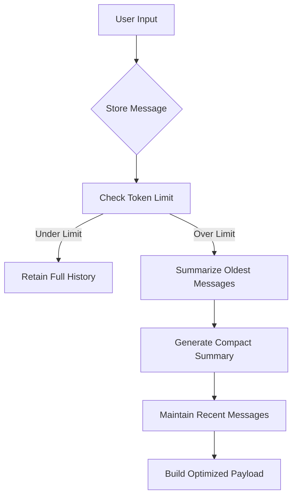

# Chat Summary Memory Buffer

Source: https://docs.perplexity.ai/docs/cookbook/articles/memory-management/chat-summary-memory-buffer/README

Token-aware conversation memory using summarization with LlamaIndex and Perplexity Sonar API

## Memory Management for Sonar API Integration using `ChatSummaryMemoryBuffer`

### Overview

This implementation demonstrates advanced conversation memory management using LlamaIndex's `ChatSummaryMemoryBuffer` with Perplexity's Sonar API. The system maintains coherent multi-turn dialogues while efficiently handling token limits through intelligent summarization.

### Key Features

* **Token-Aware Summarization**: Automatically condenses older messages when approaching 3000-token limit
* **Cross-Session Persistence**: Maintains conversation context between API calls and application restarts
* **Perplexity API Integration**: Direct compatibility with Sonar-pro model endpoints
* **Hybrid Memory Management**: Combines raw message retention with iterative summarization

### Implementation Details

#### Core Components

1. **Memory Initialization**

```python theme={null}
memory = ChatSummaryMemoryBuffer.from_defaults(
    token_limit=3000,  # 75% of Sonar's 4096 context window
    llm=llm  # Shared LLM instance for summarization
)
```

* Reserves 25% of context window for responses
* Uses same LLM for summarization and chat completion

1. **Message Processing Flow**



1. **API Compatibility Layer**

```python theme={null}
messages_dict = [
    {"role": m.role, "content": m.content}
    for m in messages
]
```

* Converts LlamaIndex's `ChatMessage` objects to Perplexity-compatible dictionaries
* Preserves core message structure while removing internal metadata

### Usage Example

**Multi-Turn Conversation:**

```python theme={null}
