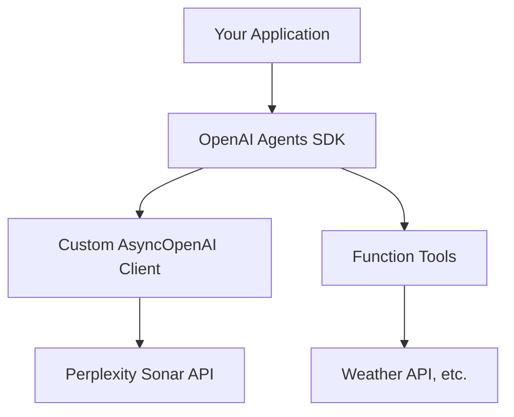

# OpenAI Agents Integration
Source: https://docs.perplexity.ai/docs/cookbook/articles/openai-agents-integration/README

Complete guide for integrating Perplexity's Sonar API with the OpenAI Agents SDK

## 🎯 What You'll Build

By the end of this guide, you'll have:

* ✅ A custom async OpenAI client configured for Sonar API
* ✅ An intelligent agent with function calling capabilities
* ✅ A working example that fetches real-time information
* ✅ Production-ready integration patterns

## 🏗️ Architecture Overview



This integration allows you to:

1. **Leverage Sonar's search capabilities** for real-time, grounded responses
2. **Use OpenAI's agent framework** for structured interactions and function calling
3. **Combine both** for powerful, context-aware applications

## 📋 Prerequisites

Before starting, ensure you have:

* **Python 3.7+** installed
* **Perplexity API Key** - [Get one here](https://docs.perplexity.ai/home)
* **OpenAI Agents SDK** access and familiarity

## 🚀 Installation

Install the required dependencies:

```bash theme={null}
pip install openai nest-asyncio
```

:::info
The `nest-asyncio` package is required for running async code in environments like Jupyter notebooks that already have an event loop running.
:::

## ⚙️ Environment Setup

Configure your environment variables:

```bash theme={null}
