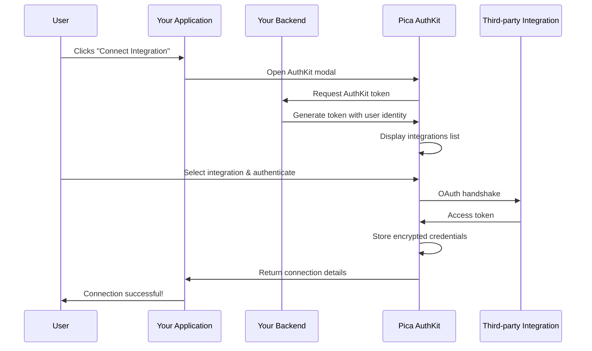
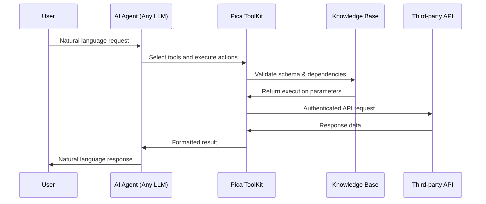

# Pica Documentation

Source: https://docs.picaos.com/llms-full.txt

---

# Authentication
Source: https://docs.picaos.com/api-reference/authentication

Learn how to authenticate your API requests

Pica authenticates your API requests using API keys. Include your API key in the `x-pica-secret` header of your requests:

```bash theme={null}
x-pica-secret: YOUR_API_KEY
```

<Note>
  Need an API key? Sign up for a [Pica account](https://app.picaos.com) to get started right away.
</Note>

### Environments

From the dashboard, you can create two different types of API keys that correspond to two distinct environments:

<ResponseField name="Sandbox" type="environment">
  Build out your end-to-end UX safely using test credentials
</ResponseField>

<ResponseField name="Production" type="environment">
  Launch your new UX confidently using isolated live credentials
</ResponseField>

## Connector Scoping

Connectors are scoped to Environment and cannot be moved between environments once created. Both Sandbox and Production environments include unlimited Connections and unlimited API calls. All testing should be done in the Sandbox environment.


# Available Actions
Source: https://docs.picaos.com/api-reference/core/available-actions

GET https://api.picaos.com/v1/available-actions/{platform}
Get a list of available actions for a given platform

## Path Parameters

<ParamField type="string">
  The connector platform
</ParamField>

## Query Parameters

<ParamField type="string">
  The action title
</ParamField>

<ParamField type="string">
  The action key
</ParamField>

<ParamField type="string">
  The action method
</ParamField>

<ParamField type="number">
  The number of actions to return
</ParamField>

<ParamField type="number">
  The page number
</ParamField>

## Response

<ResponseField name="rows" type="Action[]">
  Array of Action objects

  <Expandable title="Action properties">
    <ResponseField name="title" type="string">
      The human-readable title of the action
    </ResponseField>

    <ResponseField name="key" type="string">
      The unique identifier key for the action
    </ResponseField>

    <ResponseField name="method" type="'GET' | 'POST' | 'PUT' | 'PATCH' | 'DELETE'">
      The HTTP method used for this action
    </ResponseField>

    <ResponseField name="platform" type="string">
      The platform this action belongs to
    </ResponseField>
  </Expandable>
</ResponseField>

<ResponseField name="total" type="number">
  Total number of actions available
</ResponseField>

<ResponseField name="pages" type="number">
  Total number of pages available
</ResponseField>

<ResponseField name="page" type="number">
  Current page number
</ResponseField>

<RequestExample>
  ```bash cURL theme={null}
  curl 'https://api.picaos.com/v1/available-actions/exa' \
    -H 'x-pica-secret: YOUR_API_KEY'
  ```
</RequestExample>

<ResponseExample>
  ```json Response theme={null}
  {
      "rows": [
          {
              "title": "Get Contents",
              "key": "getContents",
              "modelName": "Content",
              "method": "POST",
              "platform": "exa"
          },
          {
              "title": "Search",
              "key": "search",
              "modelName": "Search",
              "method": "POST",
              "platform": "exa"
          },
          {
              "title": "Find Similar Links",
              "key": "findSimilarLinks",
              "modelName": "Findsimilar",
              "method": "POST",
              "platform": "exa"
          },
          {
              "title": "Get LLM Answer",
              "key": "getLlmAnswer",
              "modelName": "Answer",
              "method": "POST",
              "platform": "exa"
          }
      ],
      "total": 4,
      "pages": 1,
      "page": 1
  }
  ```
</ResponseExample>


# Available Connectors
Source: https://docs.picaos.com/api-reference/core/available-connectors

GET https://api.picaos.com/v1/available-connectors
Get a list of available connectors

## Query Parameters

<ParamField type="string">
  The connector platform
</ParamField>

<ParamField type="boolean">
  If true, filter connectors that are enabled in Authkit
</ParamField>

<ParamField type="string">
  The connector key
</ParamField>

<ParamField type="string">
  The connector name
</ParamField>

<ParamField type="string">
  The connector category
</ParamField>

<ParamField type="number">
  The number of connectors to return
</ParamField>

<ParamField type="number">
  The page number
</ParamField>

## Response

<ResponseField name="rows" type="Connector[]">
  Array of Connector objects

  <Expandable title="Connector properties">
    <ResponseField name="id" type="number">
      The unique identifier for the connector
    </ResponseField>

    <ResponseField name="name" type="string">
      The display name of the connector
    </ResponseField>

    <ResponseField name="key" type="string">
      The unique connector key
    </ResponseField>

    <ResponseField name="platform" type="string">
      The platform identifier (e.g. `elevenlabs`, `stripe`)
    </ResponseField>

    <ResponseField name="platformVersion" type="string">
      The version of the platform API
    </ResponseField>

    <ResponseField name="status" type="'generally_available' | 'beta' | 'alpha' | 'not_available'">
      The connector status
    </ResponseField>

    <ResponseField name="description" type="string">
      A description of the connector and its capabilities
    </ResponseField>

    <ResponseField name="category" type="string">
      The category of the connector (e.g. `AI`, `Payments`, `Email`)
    </ResponseField>

    <ResponseField name="image" type="string">
      URL to the connector's logo image
    </ResponseField>

    <ResponseField name="tags" type="string[]">
      Array of tags associated with the connector
    </ResponseField>

    <ResponseField name="oauth" type="boolean">
      Whether the connector supports OAuth authentication
    </ResponseField>

    <ResponseField name="tools" type="number">
      Number of available tools/actions for this connector
    </ResponseField>

    <ResponseField name="version" type="string">
      The connector version
    </ResponseField>

    <ResponseField name="active" type="boolean">
      Whether the connector is active
    </ResponseField>
  </Expandable>
</ResponseField>

<ResponseField name="total" type="number">
  Total number of connectors available
</ResponseField>

<ResponseField name="pages" type="number">
  Total number of pages available
</ResponseField>

<ResponseField name="page" type="number">
  Current page number
</ResponseField>

<RequestExample>
  ```bash cURL theme={null}
  curl 'https://api.picaos.com/v1/available-connectors' \
    -H 'x-pica-secret: YOUR_API_KEY'
  ```
</RequestExample>

<ResponseExample>
  ```json Response theme={null}
  {
      "rows": [
          {
              "id": 62,
              "name": "ElevenLabs", 
              "key": "api::elevenlabs::v1",
              "platform": "elevenlabs",
              "platformVersion": "v1",
              "status": "generally_available",
              "description": "ElevenLabs develops advanced text-to-speech and voice synthesis technologies. It allows users to generate natural, expressive AI voices for content creation, accessibility, and conversational AI.",
              "category": "AI",
              "image": "https://assets.picaos.com/connectors/elevenlabs.svg",
              "tags": [
                "ai"
              ],
              "oauth": false,
              "tools": 104,
              "version": "1.0.0",
              "active": true
          },
          ...
      ],
      "total": 142,
      "pages": 8,
      "page": 1
  }
  ```
</ResponseExample>


# Create or Get User
Source: https://docs.picaos.com/api-reference/core/create-or-get-user

POST https://api.picaos.com/internal/v3/users/create-or-get
Create a new user, or get an existing user by email

## Body Parameters

<ParamField type="string">
  The email address of the user to create
</ParamField>

## Response

<ResponseField name="id" type="string">
  The unique identifier for the user
</ResponseField>

<ResponseField name="email" type="string">
  The email address of the user
</ResponseField>

<ResponseField name="throughput" type="number">
  The rate limit throughput for the user
</ResponseField>

<ResponseField name="secrets" type="object">
  The API keys for the user

  <Expandable title="Secrets properties">
    <ResponseField name="live" type="string">
      The live environment API key
    </ResponseField>

    <ResponseField name="sandbox" type="string">
      The sandbox/test environment API key
    </ResponseField>
  </Expandable>
</ResponseField>

<RequestExample>
  ```bash cURL theme={null}
  curl -X POST 'https://api.picaos.com/internal/v3/users/create-or-get' \
    -H 'x-pica-secret: YOUR_API_KEY' \
    -H 'Content-Type: application/json' \
    -d '{
      "email": "test@example.com"
    }'
  ```
</RequestExample>

<ResponseExample>
  ```json theme={null}
  {
      "id": "526907ff-932e-4222-81ff-83f8adefad05",
      "email": "test@example.com",
      "throughput": 100,
      "secrets": {
        "live": "<USER_LIVE_KEY>",
        "sandbox": "<USER_SANDBOX_KEY>"
      }
  }
  ```
</ResponseExample>


# Overview
Source: https://docs.picaos.com/api-reference/introduction

A guide to the Pica API fundamentals

Pica provides powerful APIs that enable you to build, deploy, and scale AI agents with seamless access to over 200+ integrations and tools.
Connect your AI to QuickBooks, Salesforce, HubSpot, Shopify, and more leading platforms through our Passthrough API to unlock real-time data and automation capabilities.

## Passthrough API

The Passthrough API provides a single endpoint to access 25,000+ actions across all integrations.

* Execute actions with QuickBooks, Salesforce, HubSpot, Shopify and [more](https://app.picaos.com/tools)
* Built-in authentication and connection management for all integrations
* AI SDK support for LLM capabilities (Vercel AI SDK, LangChain, MCP, etc.)

## Core API

The Core API provides endpoints to view and manage available integrations, tools, and connections.

* View all available integrations and tools
* View the details of specific integrations or tools
* View available actions for specific integrations
* View and manage your connections
* Delete specific connections


# Building Requests
Source: https://docs.picaos.com/api-reference/passthrough/building-requests

Learn how to construct requests to the Passthrough API.

## Constructing the Request

The easiest way to construct the request is to use the [Pica MCP Server](https://github.com/picahq/mcp) in your IDE.

In Cursor, open the MCP Settings and add the following:

```json theme={null}
{
  "mcpServers": {
    "pica": {
      "command": "npx",
      "args": [
        "@picahq/mcp"
      ],
      "env": {
        "PICA_SECRET": "your-api-key"
      }
    }
  }
}
```

Once you've added the MCP Server, you can simply prompt Cursor to construct the request for you based on all the specific details (filters, fields, etc.) you need.

## Examples

1. Add an endpoint that uses Pica to fetch the list of contacts from Salesforce.

2. When my form is submitted, use Pica to send an email using Gmail.

3. Using Pica, create a new lead in HubSpot when a user signs up.

4. Using Pica, add an endpoint that fetches the list of invoices from QuickBooks and displays them in a table.

5. Build a paginatable table component that fetches and displays QuickBooks invoices with search and sort using Pica.

6. Create a page with a form that can post messages to multiple Slack channels with message scheduling using Pica.


# Overview
Source: https://docs.picaos.com/api-reference/passthrough/index

Work with any integration directly through a single API.

The Passthrough API is a powerful tool that allows you to interact directly with the underlying API of any integration.

<Warning>
  Responses from the Passthrough API are shaped to match the response from the underlying API.
</Warning>

## Base URL

```
https://api.picaos.com/v1/passthrough/{path}
```

Where `{path}` corresponds to the endpoint path in the third-party API's documentation.

## Required Headers

<ParamField type="string">
  Your Pica API key
</ParamField>

<ParamField type="string">
  The connection key for the specific integration
</ParamField>

<ParamField type="string">
  The unique identifier of the action to execute, which you can obtain from the [Actions directory](https://app.picaos.com/tools).
</ParamField>

<br />

<Info>
  If you're looking to see how you can construct requests to the Passthrough API, check out the [Building Requests](/api-reference/passthrough/building-requests) guide.
</Info>


# Delete Connection
Source: https://docs.picaos.com/api-reference/vault/connections/delete

DELETE https://api.picaos.com/v1/vault/connections/{id}
Delete a Connection

## Path Parameters

<ParamField type="string">
  The connection ID
</ParamField>

## response

200 OK

<RequestExample>
  ```bash cURL theme={null}
  curl -X DELETE 'https://api.picaos.com/v1/vault/connections/conn_123' \
    -H 'x-pica-secret: YOUR_API_KEY'
  ```
</RequestExample>

<ResponseExample>
  ```json 200 OK theme={null}
  ```
</ResponseExample>


# Get Connection
Source: https://docs.picaos.com/api-reference/vault/connections/get

GET https://api.picaos.com/v1/vault/connections/{id}
Get a Connection

## Path Parameters

<ParamField type="string">
  The connection ID
</ParamField>

## Response

<ResponseField name="id" type="string">
  The unique identifier for the connection
</ResponseField>

<ResponseField name="platformVersion" type="string">
  The version of the platform connector
</ResponseField>

<ResponseField name="name" type="string | null">
  The display name of the connection
</ResponseField>

<ResponseField name="type" type="'api'">
  The connection type
</ResponseField>

<ResponseField name="key" type="string">
  The unique connection key
</ResponseField>

<ResponseField name="environment" type="'test' | 'live'">
  The connection environment
</ResponseField>

<ResponseField name="platform" type="string">
  The platform identifier (e.g. `resend`, `stripe`)
</ResponseField>

<ResponseField name="identity" type="string">
  The user or entity identifier associated with this connection
</ResponseField>

<ResponseField name="identityType" type="'user' | 'team' | 'organization' | 'project'">
  The type of identity
</ResponseField>

<ResponseField name="description" type="string">
  A description of the platform
</ResponseField>

<ResponseField name="state" type="'operational' | 'degraded' | 'failed' | 'unknown'">
  The current state of the connection

  * `operational` - Connection is healthy and working correctly
  * `degraded` - OAuth token refresh failed, automatic retry pending
  * `failed` - Connection is inactive and requires manual reconnection
  * `unknown` - State could not be determined
</ResponseField>

<ResponseField name="tags" type="string[]">
  Array of tags associated with the connection
</ResponseField>

<ResponseField name="version" type="string">
  The connection version
</ResponseField>

<ResponseField name="active" type="boolean">
  Whether the connection is active
</ResponseField>

<ResponseField name="createdAt" type="string">
  ISO 8601 timestamp of when the connection was created
</ResponseField>

<RequestExample>
  ```bash cURL theme={null}
  curl 'https://api.picaos.com/v1/vault/connections/{connection_id}' \
    -H 'x-pica-secret: YOUR_API_KEY'
  ```
</RequestExample>

<ResponseExample>
  ```json Response theme={null}
  {
    "id": "673f79c6-0110-408b-bcbe-f4da000e66c7",
    "platformVersion": "1.0.0",
    "name": null,
    "type": "api",
    "key": "test::resend::default::46f75762f34e4962bf5684760f0f9f0e",
    "environment": "test",
    "platform": "resend",
    "identity": "46f75762f34e4962bf5684760f0f9f0e",
    "identityType": "user",
    "description": "Email API for developers",
    "state": "operational",
    "tags": [],
    "version": "1.0.0",
    "active": true,
    "createdAt": "2025-07-19T16:19:29.702632Z"
  }
  ```
</ResponseExample>


# List Connections
Source: https://docs.picaos.com/api-reference/vault/connections/list

GET https://api.picaos.com/v1/vault/connections
List available Connections

## Query Parameters

<ParamField type="string">
  A comma separated list of connection keys
</ParamField>

<ParamField type="string">
  The platform version
</ParamField>

<ParamField type="string">
  The connection name
</ParamField>

<ParamField type="&#x22;user&#x22; | &#x22;team&#x22; | &#x22;organization&#x22; | &#x22;project&#x22;">
  The identity type
</ParamField>

<ParamField type="string">
  The connection identifier
</ParamField>

<ParamField type="string">
  The connector platform (e.g. stripe, exa)
</ParamField>

<ParamField type="string">
  A comma separated list of tags
</ParamField>

<ParamField type="boolean">
  Filter connections by active status
</ParamField>

<ParamField type="number">
  The number of connections to return
</ParamField>

<ParamField type="number">
  The page number
</ParamField>

## Response

<ResponseField name="rows" type="Connection[]">
  Array of Connection objects

  <Expandable title="Connection properties">
    <ResponseField name="id" type="string">
      The unique identifier for the connection
    </ResponseField>

    <ResponseField name="platformVersion" type="string">
      The version of the platform connector
    </ResponseField>

    <ResponseField name="name" type="string | null">
      The display name of the connection
    </ResponseField>

    <ResponseField name="type" type="'api'">
      The connection type
    </ResponseField>

    <ResponseField name="key" type="string">
      The unique connection key
    </ResponseField>

    <ResponseField name="environment" type="'test' | 'live'">
      The connection environment
    </ResponseField>

    <ResponseField name="platform" type="string">
      The platform identifier (e.g. `resend`, `stripe`)
    </ResponseField>

    <ResponseField name="identity" type="string">
      The user or entity identifier associated with this connection
    </ResponseField>

    <ResponseField name="identityType" type="'user' | 'team' | 'organization' | 'project'">
      The type of identity
    </ResponseField>

    <ResponseField name="description" type="string">
      A description of the platform
    </ResponseField>

    <ResponseField name="state" type="'operational' | 'degraded' | 'failed' | 'unknown'">
      The current state of the connection

      * `operational` - Connection is healthy and working correctly
      * `degraded` - OAuth token refresh failed, automatic retry pending
      * `failed` - Connection is inactive and requires manual reconnection
      * `unknown` - State could not be determined
    </ResponseField>

    <ResponseField name="tags" type="string[]">
      Array of tags associated with the connection
    </ResponseField>

    <ResponseField name="version" type="string">
      The connection version
    </ResponseField>

    <ResponseField name="active" type="boolean">
      Whether the connection is active
    </ResponseField>

    <ResponseField name="createdAt" type="string">
      ISO 8601 timestamp of when the connection was created
    </ResponseField>
  </Expandable>
</ResponseField>

<ResponseField name="total" type="number">
  Total number of connections matching the query
</ResponseField>

<ResponseField name="pages" type="number">
  Total number of pages available
</ResponseField>

<ResponseField name="page" type="number">
  Current page number
</ResponseField>

<RequestExample>
  ```bash cURL theme={null}
  curl 'https://api.picaos.com/v1/vault/connections' \
    -H 'x-pica-secret: YOUR_API_KEY'
  ```
</RequestExample>

<ResponseExample>
  ```json Response theme={null}
  {
    "rows": [
      {
        "id": "673f79c6-0110-408b-bcbe-f4da000e66c7",
        "platformVersion": "1.0.0",
        "name": null,
        "type": "api",
        "key": "test::resend::default::46f75762f34e4962bf5684760f0f9f0e",
        "environment": "test",
        "platform": "resend",
        "identity": "46f75762f34e4962bf5684760f0f9f0e",
        "identityType": "user",
        "description": "Email API for developers",
        "state": "operational",
        "tags": [],
        "version": "1.0.0",
        "active": true,
        "createdAt": "2025-07-19T16:19:29.702632Z"
      },
      ...
    ],
    "total": 20,
    "pages": 2,
    "page": 1
  }
  ```
</ResponseExample>


# Update Connection
Source: https://docs.picaos.com/api-reference/vault/connections/update

PATCH https://api.picaos.com/v1/vault/connections/{id}
Update a Connection

## Path Parameters

<ParamField type="string">
  The connection ID
</ParamField>

## Body Parameters

<ParamField type="string[]">
  The connection tags
</ParamField>

## Response

<ResponseField name="id" type="string">
  The unique identifier for the connection
</ResponseField>

<ResponseField name="platformVersion" type="string">
  The version of the platform connector
</ResponseField>

<ResponseField name="name" type="string | null">
  The display name of the connection
</ResponseField>

<ResponseField name="type" type="'api'">
  The connection type
</ResponseField>

<ResponseField name="key" type="string">
  The unique connection key
</ResponseField>

<ResponseField name="environment" type="'test' | 'live'">
  The connection environment
</ResponseField>

<ResponseField name="platform" type="string">
  The platform identifier (e.g. `resend`, `stripe`)
</ResponseField>

<ResponseField name="identity" type="string">
  The user or entity identifier associated with this connection
</ResponseField>

<ResponseField name="identityType" type="'user' | 'team' | 'organization' | 'project'">
  The type of identity
</ResponseField>

<ResponseField name="description" type="string">
  A description of the platform
</ResponseField>

<ResponseField name="state" type="'operational' | 'degraded' | 'failed' | 'unknown'">
  The current state of the connection

  * `operational` - Connection is healthy and working correctly
  * `degraded` - OAuth token refresh failed, automatic retry pending
  * `failed` - Connection is inactive and requires manual reconnection
  * `unknown` - State could not be determined
</ResponseField>

<ResponseField name="tags" type="string[]">
  Array of tags associated with the connection
</ResponseField>

<ResponseField name="version" type="string">
  The connection version
</ResponseField>

<ResponseField name="active" type="boolean">
  Whether the connection is active
</ResponseField>

<ResponseField name="createdAt" type="string">
  ISO 8601 timestamp of when the connection was created
</ResponseField>

<RequestExample>
  ```bash cURL theme={null}
  curl -X PATCH 'https://api.picaos.com/v1/vault/connections/{connection_id}' \
    -H 'Content-Type: application/json' \
    -H 'x-pica-secret: YOUR_API_KEY' \
    -d '{
      "tags": ["new-user", "main"]
    }'
  ```
</RequestExample>

<ResponseExample>
  ```json Response theme={null}
  {
    "id": "673f79c6-0110-408b-bcbe-f4da000e66c7",
    "platformVersion": "1.0.0",
    "name": null,
    "type": "api",
    "key": "test::resend::default::46f75762f34e4962bf5684760f0f9f0e",
    "environment": "test",
    "platform": "resend",
    "identity": "46f75762f34e4962bf5684760f0f9f0e",
    "identityType": "user",
    "description": "Email API for developers",
    "state": "operational",
    "tags": ["new-user", "main"],
    "version": "1.0.0",
    "active": true,
    "createdAt": "2025-07-19T16:19:29.702632Z"
  }
  ```
</ResponseExample>


# What is AuthKit?
Source: https://docs.picaos.com/authkit/index

A secure, multi-tenant authentication component that lets your users connect their third-party tools directly in your app

<Frame>
  
</Frame>

<Note>
  At Pica, we dogfood our own products. AuthKit powers the connection experience in Pica's dashboard. [Create a free account](https://app.picaos.com), navigate to the Connected Integrations tab, click "Add Connection", and see AuthKit in action!
</Note>

## Why use AuthKit?

Building authentication flows that handle every possible error state and edge case across multiple integrations is complex and time-consuming. AuthKit solves this by providing:

<CardGroup>
  <Card icon="shield-check" title="Secure authentication">
    Handles OAuth flows and API key authentication with automatic token refresh and secure storage
  </Card>

  <Card icon="users" title="Multi-tenant architecture">
    Isolate connections by user, team, organization, or project with built-in identity scoping
  </Card>

  <Card icon="palette" title="Customizable branding">
    White-label the UI to match your brand for enterprise customers
  </Card>

  <Card icon="server" title="Self-hosted OAuth apps">
    Use your own OAuth credentials (Client ID and Secret) for complete control
  </Card>
</CardGroup>

## How it works

AuthKit follows a secure, token-based flow to authenticate your users' third-party accounts:



### The authentication flow explained

<Steps>
  <Step title="User clicks to connect">
    Your user clicks a button in your app to connect an integration (e.g., "Connect Gmail"). This triggers the AuthKit modal to open.
  </Step>

  <Step title="AuthKit requests token">
    As the modal opens, AuthKit automatically requests a secure token from your backend. Your backend generates the token with the user's identity (like `userId`, `teamId`, or `organizationId`) which determines who owns the connection.
  </Step>

  <Step title="Display integrations">
    AuthKit displays the list of available integrations for the user to browse and select from.
  </Step>

  <Step title="User authenticates">
    The user selects an integration and completes the OAuth flow or enters their API key. Pica securely stores the encrypted credentials.
  </Step>

  <Step title="Connection created">
    AuthKit returns the connection details to your app, including a `connectionKey` that you'll use to make authenticated API requests.
  </Step>
</Steps>

<Info>
  Your backend never sees or stores the user's third-party credentials. Pica handles all authentication securely and returns only the connection metadata to your app.
</Info>

## Key concepts

### Identity and Identity Types

Every connection created through AuthKit is scoped to an **identity**—a unique identifier you provide that represents who owns the connection.

| Identity Type  | Example Use Case                                     | Example Identity            |
| -------------- | ---------------------------------------------------- | --------------------------- |
| `user`         | B2C apps where each user connects their own accounts | `user_123`, email address   |
| `team`         | Apps where team members share connections            | `team_abc`, workspace ID    |
| `organization` | Enterprise apps with org-wide integrations           | `org_xyz`, company ID       |
| `project`      | Project-based tools with isolated resources          | `project_456`, project UUID |

This identity system enables you to:

* Filter connections by user, team, or organization
* Build multi-tenant applications with proper data isolation
* List and manage connections for specific identities
* Ensure users only access their own integration data

### Connection Keys

When a connection is successfully created, Pica returns a **connection key**—a unique identifier for that specific authenticated connection. You'll use this key when making API requests to access that user's data from the integration.

Example: `test::exa::default::af92aee9cbcd4aae904b9b01d3c75c40|user-123`

## Use cases

<AccordionGroup>
  <Accordion title="B2B or B2C SaaS with customer integrations" icon="briefcase">
    Let your customers connect their Salesforce, HubSpot, or QuickBooks accounts to sync data with your platform. Each customer's connections are isolated by their organization ID.
  </Accordion>

  <Accordion title="Productivity apps with personal accounts" icon="user-check">
    Enable users to connect their personal Gmail, Google Calendar, or Slack accounts to automate workflows. Each user owns their own connections.
  </Accordion>

  <Accordion title="Team collaboration tools" icon="users">
    Allow teams to share integration connections across all team members. Set the identity to a team ID so everyone on the team can access the same connected accounts.
  </Accordion>

  <Accordion title="White-label platforms" icon="palette">
    Build a platform where your customers can offer integrations to their end users.
  </Accordion>
</AccordionGroup>

## What's next?

<CardGroup>
  <Card title="Set up AuthKit" icon="code" href="/authkit/setup">
    Follow the technical guide to integrate AuthKit into your application
  </Card>

  <Card title="Manage AuthKit" icon="gear" href="/authkit/management">
    Learn how to configure integrations, work with user connections and make authenticated requests
  </Card>

  <Card title="View demo app" icon="github" href="https://github.com/picahq/authkit-demo">
    See a complete Next.js implementation of AuthKit
  </Card>

  <Card title="Browse integrations" icon="plug" href="https://app.picaos.com/authkit">
    Explore all integrations available through AuthKit
  </Card>
</CardGroup>


# Management
Source: https://docs.picaos.com/authkit/management

Manage user connections, configure integrations, and make authenticated API requests

<Frame>
  
</Frame>

<Card title="Open AuthKit Management" icon="arrow-up-right-from-square" href="https://app.picaos.com/authkit">
  Manage your integrations in the AuthKit dashboard
</Card>

> Once AuthKit is set up, you'll need to manage your users' connections, configure which integrations are available, and make authenticated requests to access their data. This guide covers everything you need to know.

## Understanding connection ownership

Every connection created through AuthKit belongs to an **identity**—the unique identifier you provided when generating the AuthKit token (like `userId`, `teamId`, or `organizationId`).

This identity-based ownership enables:

* **Multi-tenant architecture**: Each user, team, or organization has isolated connections
* **Filtered queries**: List connections for specific users or teams
* **Access control**: Users can only access connections they own
* **Data isolation**: No cross-contamination between users' integration data

### How identity scoping works

When you create an AuthKit token:

```typescript theme={null}
const token = await authKitToken.create({
  identity: "user_123", // The owner of future connections
  identityType: "user"  // The type of owner
});
```

Any connection created with this token is permanently tagged with `identity: "user_123"`. This means:

* You can list all connections for `user_123`
* You can filter connections by this identity
* Requests made with these connection keys automatically scope to this user's data

## Managing connections

### List connections for a user

To display a user's connected integrations, use the [List Connections API](/api-reference/vault/connections/list) and filter by identity:

```bash cURL theme={null}
curl 'https://api.picaos.com/v1/vault/connections?identity=user_123' \
  -H 'x-pica-secret: YOUR_API_KEY'
```

### Delete a user's connection

Allow users to disconnect an integration using the [Delete Connection API](/api-reference/vault/connections/delete):

```bash theme={null}
curl -X DELETE "https://api.picaos.com/v1/vault/connections/{CONNECTION_ID}" \
  -H "x-pica-secret: YOUR_API_KEY"
```

### Add tags to a user's connection

Update a connection's tags using the [Update Connection API](/api-reference/vault/connections/update):

```bash theme={null}
curl -X PATCH "https://api.picaos.com/v1/vault/connections/{CONNECTION_ID}" \
  -H "x-pica-secret: YOUR_API_KEY" \
  -H "Content-Type: application/json" \
  -d '{
    "tags": ["new-user", "default"]
  }'
```

## Making authenticated requests

Once a user has connected an integration through AuthKit, you can make API requests on their behalf using the **connection key**.

### Using the Passthrough API

The [Passthrough API](/api-reference/passthrough) lets you make authenticated HTTP requests to any integration endpoint:

```bash theme={null}
curl "https://api.picaos.com/v1/passthrough/users/me/profile" \
  -H "x-pica-secret: YOUR_API_KEY" \
  -H "x-pica-connection-key: {CONNECTION_KEY}" \
  -H "x-pica-action-id: conn_mod_def::F_JeCYGuzvg::yAM6bqGdRdm91ZbYejlbEA"
```

**Key points:**

* `x-pica-connection-key`: The connection key from the user's connected integration
* `x-pica-action-id`: The specific action you want to perform (found in the [Available Actions API](/api-reference/core/available-actions) or in the [Actions table in the Pica dashboard](https://app.picaos.com/tools))
* The request is automatically authenticated using the stored credentials for that connection

<Card title="Learn more about the Passthrough API" icon="arrow-up-right-from-square" href="/api-reference/passthrough/overview">
  See the full documentation for advanced usage and best practices.
</Card>

### Choosing the right connection key

When a user has multiple connections, you need to:

1. **List their connections** to see what's available
2. **Filter by platform** to find the specific integration you need
3. **Use the connection key** when making requests

### Using ToolKit for Agents

For allowing agents to make requests, load [Pica's ToolKit](/toolkit) into your agent.

```typescript expandable Example using the Vercel AI SDK theme={null}
import { Pica } from "@picahq/toolkit";
import { openai } from "@ai-sdk/openai";
import { stepCountIs, streamText } from "ai";

async function main() {
  const pica = new Pica(process.env.PICA_SECRET_KEY!, {
    identity: "user_123",
    identityType: "user",
    connectors: ["*"],
    actions: ["*"]
  });

  // Get connections for that identity
  const connections = await pica.getConnectedIntegrations();
  console.log("Connections:", connections);

  // Or, ask the AI to get the connections
  const systemPrompt = pica.systemPrompt;

  const { textStream } = streamText({
    model: openai("gpt-5"),
    tools: { ...pica.tools() },
    system: systemPrompt,
    prompt: "What connections do I have access to?",
    stopWhen: stepCountIs(10),
  });

  for await (const textPart of textStream) {
    process.stdout.write(textPart);
  }
}

main().catch(console.error);
```

## Configuring integrations

### Toggle integration visibility

By default, integrations are not visible in AuthKit. You must explicitly enable the integrations you want your users to see.

<Frame>
  
</Frame>

1. Navigate to the [AuthKit settings page](https://app.picaos.com/authkit)
2. Browse the list of integrations
3. Toggle integrations on or off based on what your application needs
4. Changes take effect immediately in your AuthKit modal

<Tip>
  **Best Practice**: Only enable integrations your application actually uses.
</Tip>

### Set up OAuth applications

For OAuth-based integrations (Google, Microsoft, Salesforce, etc.), you can use your own OAuth credentials:

<Frame>
  
</Frame>

1. Go to the [AuthKit settings page](https://app.picaos.com/authkit)
2. Select an OAuth integration (e.g., Gmail, Slack)
3. Click "Configure OAuth App"
4. Enter your **Client ID** and **Client Secret** from the integration's developer console
5. Set the **Redirect URI** in your OAuth app to: `https://api.picaos.com/connections/oauth/callback`

You also have full control over the scopes and permissions your users will grant to your application by clicking on the Edit Scopes button:

<Frame>
  
</Frame>

**Why use your own OAuth apps?**

* **Branding**: Users see your app name during OAuth consent
* **Rate limits**: Higher API rate limits for your application
* **Compliance**: Meet enterprise security requirements
* **Control**: Full ownership of the OAuth relationship

## Security best practices

<AccordionGroup>
  <Accordion title="Never expose your API key in frontend code" icon="shield-exclamation">
    Your Pica API key should **only** be used on your backend. Always generate AuthKit tokens server-side and send them to your frontend. Never include your API key in client-side JavaScript.
  </Accordion>

  <Accordion title="Validate user identity before generating tokens" icon="user-shield">
    Before generating an AuthKit token, verify that the requesting user is authenticated in your application. Don't let unauthenticated users generate tokens.

    ```typescript theme={null}
    // Good: Verify user is authenticated
    const userId = await verifyUserSession(req);
    if (!userId) {
      return res.status(401).json({ error: "Unauthorized" });
    }

    const token = await authKitToken.create({
      identity: userId,
      identityType: "user"
    });
    ```
  </Accordion>

  <Accordion title="Use HTTPS in production" icon="lock">
    Always serve your application over HTTPS in production to protect tokens and connection keys in transit.
  </Accordion>

  <Accordion title="Store connection keys securely" icon="database">
    If you store connection keys in your database, ensure your database is properly secured.
  </Accordion>

  <Accordion title="Implement proper access control" icon="key">
    When a user requests data from an integration, verify they own the connection before making the API request:

    ```typescript theme={null}
    // Verify the connection belongs to the requesting user
    const connection = await fetch(
      `https://api.picaos.com/v1/vault/connections/${CONNECTION_ID}`,
      { 
        headers: { "x-pica-secret": process.env.PICA_SECRET_KEY } 
      }
    ).then(r => r.json());

    if (connection.identity !== userId) {
      return res.status(403).json({ error: "Forbidden" });
    }

    // Proceed with the request
    ```
  </Accordion>
</AccordionGroup>

## Troubleshooting

<AccordionGroup>
  <Accordion title="AuthKit modal not opening" icon="circle-exclamation">
    **Possible causes:**

    * Token endpoint is failing or returning an error
    * CORS issues blocking the token request
    * Invalid API key

    **Solutions:**

    * Check browser console for errors
    * Verify your token endpoint is accessible and returns a valid token
    * Ensure CORS headers are set correctly on your backend
    * Confirm your API key is valid in the [Pica dashboard](https://app.picaos.com/settings/api-keys)
  </Accordion>

  <Accordion title="OAuth flow failing" icon="circle-xmark">
    **Possible causes:**

    * Incorrect OAuth credentials
    * Redirect URI mismatch
    * Missing OAuth scopes/permissions

    **Solutions:**

    * Verify Client ID and Client Secret are correct in [AuthKit settings](https://app.picaos.com/authkit)
    * Ensure redirect URI is exactly: `https://api.picaos.com/oauth/callback`
    * Check that required scopes are enabled in your OAuth app
  </Accordion>

  <Accordion title="Connection not found" icon="magnifying-glass">
    **Possible causes:**

    * Wrong identity or identityType
    * Connection was deleted
    * Querying with wrong connection key

    **Solutions:**

    * List connections for the identity to see what exists
    * Verify the identity matches what was used when creating the token
    * Check that the connection wasn't deleted
  </Accordion>

  <Accordion title="API requests failing with 401" icon="lock">
    **Possible causes:**

    * Invalid connection key
    * Token expired or revoked by user
    * Wrong API key

    **Solutions:**

    * Verify connection key is correct
    * Check connection status with the Get Connection API
    * Have the user reconnect if their token was revoked
  </Accordion>
</AccordionGroup>

<Card title="Need help?" icon="life-ring" href="mailto:support@picaos.com">
  Contact our support team at [support@picaos.com](mailto:support@picaos.com) for assistance
</Card>

## What's next?

<CardGroup>
  <Card title="Passthrough API" icon="code" href="/api-reference/passthrough">
    Learn how to make authenticated requests to integration APIs
  </Card>

  <Card title="Available Actions" icon="list" href="/api-reference/core/available-actions">
    Browse all available integration actions and their parameters
  </Card>

  <Card title="Vault API" icon="vault" href="/api-reference/vault/connections/list">
    Explore the full Vault API for managing connections
  </Card>

  <Card title="ToolKit SDK" icon="wrench" href="/toolkit">
    Simplify integration requests with the OneTool SDK
  </Card>
</CardGroup>


# Setup
Source: https://docs.picaos.com/authkit/setup

Integrate AuthKit into your application in under 10 minutes

<Frame>
  <iframe title="Setup AuthKit in under 5 minutes" />
</Frame>

## Prerequisites

Before you begin, make sure you have:

* A [Pica account](https://app.picaos.com) (free to sign up)
* A Pica API key from your [API keys page](https://app.picaos.com/settings/api-keys)
* A web application where you want to add AuthKit

## Backend Setup

<Steps>
  <Step title="Step 1">
    ### Install the backend package

    Install the AuthKit token generator for your backend. This package creates secure tokens that authorize users to connect integrations.

    <Tabs>
      <Tab title="Node.js">
        <Card title="NPM Package" icon="npm" href="https://www.npmjs.com/package/@picahq/authkit-token">
          View on npm
        </Card>

        ```bash theme={null}
        npm install @picahq/authkit-token
        ```
      </Tab>

      <Tab title="Python">
        <Card title="PyPI Package" icon="python" href="https://pypi.org/project/authkit-token/">
          View on PyPI
        </Card>

        ```bash theme={null}
        pip install authkit-token
        ```
      </Tab>
    </Tabs>
  </Step>

  <Step title="Step 2">
    ### Set your Pica API key

    Store your Pica API key as an environment variable. Never expose this key in your frontend code.

    ```bash theme={null}
    PICA_SECRET_KEY=your_api_key_here
    ```

    Get your API key from the [Pica dashboard](https://app.picaos.com/settings/api-keys).
  </Step>

  <Step title="Step 3">
    ### Create a token generation endpoint

    Create an API endpoint in your backend that generates AuthKit tokens. This endpoint should be called by your frontend when a user wants to connect an integration.

    <Tabs>
      <Tab title="Next.js App Router">
        Create a file at `app/api/authkit/route.ts`:

        ```typescript theme={null}
        import { NextRequest, NextResponse } from "next/server";
        import { AuthKitToken } from "@picahq/authkit-token";

        const corsHeaders = {
          "Access-Control-Allow-Origin": "*",
          "Access-Control-Allow-Methods": "POST, GET, PUT, DELETE, OPTIONS",
          "Access-Control-Allow-Headers": "Content-Type, Authorization",
        };

        export async function OPTIONS(req: NextRequest) {
          return NextResponse.json({}, { headers: corsHeaders });
        }

        export async function POST(req: NextRequest) {
          try {
            // Get the user's ID from your auth system
            // This is just an example - use your actual auth logic
            const userId = req.headers.get("x-user-id");
            
            if (!userId) {
              return NextResponse.json(
                { error: "Unauthorized" },
                { status: 401, headers: corsHeaders }
              );
            }

            const authKitToken = new AuthKitToken(process.env.PICA_SECRET_KEY!);
            
            const token = await authKitToken.create({
              identity: userId, // Your user's unique identifier
              identityType: "user" // user, team, organization, or project
            });

            return NextResponse.json(token, { headers: corsHeaders });
          } catch (error) {
            return NextResponse.json(
              { error: "Failed to generate token" },
              { status: 500, headers: corsHeaders }
            );
          }
        }
        ```
      </Tab>

      <Tab title="Next.js Pages Router">
        Create a file at `pages/api/authkit.ts`:

        ```typescript theme={null}
        import type { NextApiRequest, NextApiResponse } from "next";
        import { AuthKitToken } from "@picahq/authkit-token";

        export default async function handler(
          req: NextApiRequest,
          res: NextApiResponse
        ) {
          if (req.method !== "POST") {
            return res.status(405).json({ error: "Method not allowed" });
          }

          try {
            // Get the user's ID from your auth system
            const userId = req.headers["x-user-id"] as string;
            
            if (!userId) {
              return res.status(401).json({ error: "Unauthorized" });
            }

            const authKitToken = new AuthKitToken(process.env.PICA_SECRET_KEY!);
            
            const token = await authKitToken.create({
              identity: userId,
              identityType: "user"
            });

            res.status(200).json(token);
          } catch (error) {
            res.status(500).json({ error: "Failed to generate token" });
          }
        }
        ```
      </Tab>

      <Tab title="Express.js">
        ```typescript theme={null}
        import express from "express";
        import { AuthKitToken } from "@picahq/authkit-token";

        const app = express();
        app.use(express.json());

        app.post("/api/authkit", async (req, res) => {
          try {
            // Get the user's ID from your auth middleware
            const userId = req.user?.id;
            
            if (!userId) {
              return res.status(401).json({ error: "Unauthorized" });
            }

            const authKitToken = new AuthKitToken(process.env.PICA_SECRET_KEY!);
            
            const token = await authKitToken.create({
              identity: userId,
              identityType: "user"
            });

            res.json(token);
          } catch (error) {
            res.status(500).json({ error: "Failed to generate token" });
          }
        });
        ```
      </Tab>

      <Tab title="FastAPI">
        ```python theme={null}
        from typing import Optional
        from fastapi import FastAPI, HTTPException
        from pydantic import BaseModel
        from authkit_token import AuthKitToken, IdentityType

        app = FastAPI()

        # Initialize the client with your API key
        # In production, load this from environment variables
        authkit_client = AuthKitToken("sk_live_your_api_key_here")

        class TokenRequest(BaseModel):
            identity: Optional[str] = None
            identity_type: Optional[IdentityType] = None

        @app.post("/authkit-token")
        async def create_authkit_token(request: TokenRequest):
            # Create the token asynchronously
            token = await authkit_client.create_async(
                identity=request.identity,
                identity_type=request.identity_type
            )

            if token is None:
                raise HTTPException(
                    status_code=500,
                    detail="Failed to create token"
                )

            return token
        ```
      </Tab>

      <Tab title="Flask">
        ```python theme={null}
        from flask import Flask, jsonify, request
        from authkit_token import AuthKitToken

        app = Flask(__name__)

        # Initialize the client with your API key
        # In production, load this from environment variables
        authkit_client = AuthKitToken("sk_live_your_api_key_here")

        @app.route("/authkit-token", methods=["POST"])
        def create_authkit_token():
            data = request.get_json() or {}
            
            identity = data.get("identity")
            identity_type = data.get("identity_type")

            # Create the token
            token = authkit_client.create(
                identity=identity,
                identity_type=identity_type
            )

            if token is None:
                return jsonify({"error": "Failed to create token"}), 500

            return jsonify(token)
        ```
      </Tab>
    </Tabs>

    ### Token parameters

    <ParamField type="string">
      A unique identifier for the user, team, organization, or project that will own the connection. Examples: `userId`, `teamId`, `organizationId`
    </ParamField>

    <ParamField type="string">
      Specifies the type of entity that owns the connection. Must be one of: `"user"`, `"team"`, `"organization"`, or `"project"`
    </ParamField>

    <Tip>
      Choose your `identityType` based on your use case:

      * **user**: Each user has their own personal connections
      * **team**: Team members share connections
      * **organization**: Company-wide shared connections
      * **project**: Project-specific isolated connections
    </Tip>
  </Step>
</Steps>

## Frontend Setup

<Warning>
  **Chrome Users**: If you're developing locally, you may need to disable **Local Network Access Checks** in Chrome flags. Navigate to `chrome://flags`, search for `Local Network Access Checks`, and set it to **Disabled**.

  <Frame>
    
  </Frame>
</Warning>

<Steps>
  <Step title="Step 1">
    ### Install the frontend package

    Install the AuthKit client library in your frontend application.

    ```bash theme={null}
    npm install @picahq/authkit
    ```

    <Card title="NPM Package" icon="npm" href="https://www.npmjs.com/package/@picahq/authkit">
      View on npm
    </Card>

    This package works with any major frontend framework.
  </Step>

  <Step title="Step 2">
    ### Add the AuthKit button

    Create a button component that opens the AuthKit modal when clicked.

    <Tabs>
      <Tab title="React">
        ```typescript theme={null}
        import { useAuthKit } from "@picahq/authkit";

        export function ConnectIntegrationButton() {
          const { open, isLoading } = useAuthKit({
            token: {
              url: "/api/authkit", // Your token endpoint
              headers: {
                // Include any auth headers your endpoint needs
                "x-user-id": "user_123" // Example: pass user ID
              },
            },
            onSuccess: (connection) => {
              console.log("Successfully connected:", connection);
              // Handle successful connection (e.g., refresh your UI, save connection key)
            },
            onError: (error) => {
              console.error("Connection failed:", error);
              // Handle error (e.g., show error message to user)
            },
            onClose: () => {
              console.log("AuthKit modal closed");
            },
          });

          return (
            <button onClick={open} disabled={isLoading}>
              {isLoading ? "Loading..." : "Connect Integration"}
            </button>
          );
        }
        ```
      </Tab>

      <Tab title="Vue">
        ```vue theme={null}
        <template>
          <button @click="open" :disabled="isLoading">
            {{ isLoading ? 'Loading...' : 'Connect Integration' }}
          </button>
        </template>

        <script setup>
        import { useAuthKit } from "@picahq/authkit";

        const { open, isLoading } = useAuthKit({
          token: {
            url: "/api/authkit",
            headers: {
              "x-user-id": "user_123"
            },
          },
          onSuccess: (connection) => {
            console.log("Successfully connected:", connection);
          },
          onError: (error) => {
            console.error("Connection failed:", error);
          },
          onClose: () => {
            console.log("AuthKit modal closed");
          },
        });
        </script>
        ```
      </Tab>

      <Tab title="JavaScript">
        ```javascript theme={null}
        import { AuthKit } from "@picahq/authkit";

        const authKit = new AuthKit({
          token: {
            url: "/api/authkit",
            headers: {
              "x-user-id": "user_123"
            },
          },
          onSuccess: (connection) => {
            console.log("Successfully connected:", connection);
          },
          onError: (error) => {
            console.error("Connection failed:", error);
          },
          onClose: () => {
            console.log("AuthKit modal closed");
          },
        });

        document.getElementById("connect-btn").addEventListener("click", () => {
          authKit.open();
        });
        ```
      </Tab>
    </Tabs>

    ### Configuration options

    <ParamField type="string">
      URL of your backend endpoint that generates AuthKit tokens
    </ParamField>

    <ParamField type="object">
      Headers to include in the token request (e.g., authentication headers)
    </ParamField>

    <ParamField type="string">
      The name of a specific integration to open directly (e.g., "Google Sheets", "Slack"). If provided, AuthKit will skip the integration list and open directly to that integration's authentication flow.
    </ParamField>

    <ParamField type="function">
      Callback when a connection is successfully created. Receives the connection object as a parameter.
    </ParamField>

    <ParamField type="function">
      Callback when an error occurs. Receives the error object as a parameter.
    </ParamField>

    <ParamField type="function">
      Callback when the modal is closed (whether successful or not)
    </ParamField>
  </Step>
</Steps>

## Configure visible integrations

<Frame>
  
</Frame>

Navigate to the [AuthKit settings page](https://app.picaos.com/authkit) in your Pica dashboard to:

* **Toggle integrations**: Enable or disable which integrations appear in your AuthKit modal
* **Set OAuth credentials**: For OAuth integrations, provide your own Client ID and Client Secret to use your OAuth apps

<Info>
  By default, integrations are not visible. You can selectively enable only the integrations your users need. For more details on managing integrations and OAuth apps, see the [Management guide](/authkit/management).
</Info>

## Testing your integration

Once you've completed the setup, test the flow:

1. Click your "Connect Integration" button
2. The AuthKit modal should open with your enabled integrations
3. Select an integration and complete the authentication
4. Your `onSuccess` callback should receive the connection details

<Card title="View complete demo" icon="github" href="https://github.com/picahq/authkit-demo">
  Check out our example Next.js app with a full AuthKit implementation
</Card>

## What's next?

<CardGroup>
  <Card title="Manage connections" icon="gear" href="/authkit/management">
    Learn how to list, filter, and manage your users' connections
  </Card>

  <Card title="Make authenticated requests" icon="code" href="/api-reference/passthrough/overview">
    Use the Passthrough API to access your users' integration data
  </Card>

  <Card title="Get help" icon="life-ring" href="mailto:support@picaos.com">
    Email us at [support@picaos.com](mailto:support@picaos.com) for assistance
  </Card>
</CardGroup>


# What is BuildKit?
Source: https://docs.picaos.com/buildkit/index

BuildKit allows you to generate integration prompts for vibe coding platforms, and create custom tools and MCP servers for AI coding assistants.

BuildKit offers **two main uses** to accelerate your development workflow:

<CardGroup>
  <Card title="Integration Prompts" icon="sparkles">
    Generate copy-paste ready prompts for building integrations in vibe coding platforms like Lovable, Bolt, v0, and more.
  </Card>

  <Card title="Custom Tools & MCP" icon="wrench">
    Create custom tools and generate MCP servers for AI coding assistants like Cursor and Windsurf.
  </Card>
</CardGroup>

***

## Integration Prompts for Vibe Coding Platforms

<Frame>
  <iframe title="BuildKit Demo" />
</Frame>

<Steps>
  <Step title="Describe">
    Tell us what integration you want to build by describing the functionality, inputs, outputs and any specific requirements.
  </Step>

  <Step title="Generate">
    Get a tailored prompt optimized for your platform that you can use to generate the integration code.
  </Step>

  <Step title="Copy & Paste">
    Take the generated prompt and drop it into your preferred vibe coding platform to create your integration.
  </Step>
</Steps>

<Info>
  Supports all major vibe coding platforms such as Lovable, Bolt, v0, Tempo Labs, Base44, etc.
</Info>

<Card title="Try it in Pica now" icon="toolbox" href="https://app.picaos.com/buildkit" />

***

## BuildKit 2.0: Custom Tool & MCP Generation

<div>
  <a href="https://www.producthunt.com/products/buildkit-2-0?embed=true&utm_source=badge-top-post-badge&utm_medium=badge&utm_source=badge-buildkit-2-0">
    
  </a>
</div>

<Frame>
  <iframe title="BuildKit 2.0 Overview" />
</Frame>

BuildKit 2.0 enables you to **create custom tools and generate MCP (Model Context Protocol) servers** directly via Pica's MCP Server and BuildKit's rules.

### Custom Tool Creation

Build custom tools tailored to your specific needs. Define the functionality, parameters, and behavior of your tools, and BuildKit will generate production-ready implementations.

### MCP Server Generation

Generate complete MCP servers that can be integrated into AI coding assistants like Cursor, Windsurf, and other MCP-compatible platforms. BuildKit 2.0 automates the creation of MCP servers with proper schemas, tool definitions, and handlers.

<Card title="Access BuildKit 2.0" icon="wrench" href="https://buildkit.picaos.com" />


# Product Updates
Source: https://docs.picaos.com/changelog/product-updates

Product updates and announcements

<Update label="January 12, 2026" description="2.12.0">
  ## Passthrough API Examples

  <Frame>
    
  </Frame>

  ### What's new?

  * **[Passthrough API Examples](https://app.picaos.com/tools)**: You can now copy sample curl commands for any action in the catalog and view the schema fields needed.

  * **Bug Fix: Billing** fixed an issue that caused problems for some new users not having a proper billing profile setup by default.

  * **[New Custom Actions](https://app.picaos.com/tools)**: We've added new custom actions for:

    <div>
      <div>
        <a href="https://app.picaos.com/tools/vercel">
          

          Vercel <Icon icon="arrow-up-right-from-square" />
        </a>
      </div>
    </div>

  ### New Integrations Added 🚀

  <CardGroup>
    <Card title="Fathom" icon="https://assets.picaos.com/connectors/fathom.svg" href="https://fathom.ai">Fathom</Card>
    <Card title="HighLevel" icon="https://assets.picaos.com/connectors/gohighlevel.svg" href="https://gohighlevel.com">HighLevel</Card>
  </CardGroup>
</Update>

<Update label="December 23, 2025" description="2.11.0">
  ## Introducing Light Mode

  <Frame>
    
  </Frame>

  ### What's new?

  * **[Light Mode](https://app.picaos.com)**: The entire Pica platform now supports light mode across all pages and components for a brighter, more accessible experience.

  * **[Enterprise OAuth Support](https://app.picaos.com/authkit)**: Enterprise users can now use Pica's OAuth app in AuthKit, simplifying authentication setup for larger organizations.

  * **[Connection Notifications](https://app.picaos.com/notifications)**: Notifications are now visible for errors and updates with connections, keeping you informed about the status of your integrations.

  * **[AuthKit UI Improvements](https://app.picaos.com/authkit)**: Improved typography and feedback screens UI in AuthKit for a cleaner, more polished experience.

  * **Bug Fix: Actions Pagination** fixed an issue where actions could return inconsistent data when paginating through results.

  * **Bug Fix: Platform API Colors** fixed the graph colors for calls per platform to display distinct colours correctly.

  * **Bug Fix: Passthrough API** fixed an issue with the passthrough API for actions with no path after the base URL that were not working as expected.

  ### New Integrations Added 🚀

  <CardGroup>
    <Card title="Postmark" icon="https://assets.picaos.com/connectors/postmark.svg" href="https://postmarkapp.com">Email</Card>
    <Card title="Parsera" icon="https://assets.picaos.com/connectors/parsera.svg" href="https://parsera.org">Scraping</Card>
    <Card title="Scrape.do" icon="https://assets.picaos.com/connectors/scrape-do.svg" href="https://scrape.do">Scraping</Card>
    <Card title="DataForSEO" icon="https://assets.picaos.com/connectors/data-for-seo.svg" href="https://dataforseo.com">SEO</Card>
    <Card title="Browse AI" icon="https://assets.picaos.com/connectors/browse-ai.svg" href="https://browse.ai">Scraping</Card>
    <Card title="Brevo" icon="https://assets.picaos.com/connectors/brevo.svg" href="https://www.brevo.com">Marketing</Card>
    <Card title="OnePageCRM" icon="https://assets.picaos.com/connectors/one-page-crm.svg" href="https://onepagecrm.com">CRM</Card>
    <Card title="Waterfall" icon="https://assets.picaos.com/connectors/waterfall.svg" href="https://waterfall.io">Enrichment</Card>
    <Card title="Shortcut" icon="https://assets.picaos.com/connectors/shortcut.svg" href="https://shortcut.com">Project Management</Card>
    <Card title="Sage Sales Management" icon="https://assets.picaos.com/connectors/sage-sales-management.svg" href="https://www.forcemanager.com">CRM</Card>
    <Card title="Paystack" icon="https://assets.picaos.com/connectors/paystack.svg" href="https://paystack.com">Payments</Card>
  </CardGroup>
</Update>

<Update label="November 21, 2025" description="2.10.0">
  ## Migrating Next UI to Shadcn

  <Frame>
    
  </Frame>

  ### What's new?

  * **[Dashboard UI](https://app.picaos.com)**: The dashboard interface has been migrated from Next UI to Shadcn for a more modern look, better accessibility, and improved performance.

  * **[Action Filtering](https://app.picaos.com/tools)**: We've added a new action filtering feature to the tools page, allowing you to filter actions by tags.

  * **[SEO Optimizations](https://app.picaos.com)**: We've optimized the platform for search engines, improving the discoverability of all pages.

  * **[New Custom Actions](https://app.picaos.com/tools)**: We've added new custom actions for:

    <div>
      <div>
        <a href="https://app.picaos.com/tools/jira">
          

          Jira <Icon icon="arrow-up-right-from-square" />
        </a>

        <a href="https://app.picaos.com/tools/notion">
          

          Notion <Icon icon="arrow-up-right-from-square" />
        </a>
      </div>
    </div>

  ### New Integrations Added 🚀

  <CardGroup>
    <Card title="ClickHouse" icon="https://assets.picaos.com/connectors/click-house.svg" href="https://clickhouse.com">Database</Card>
    <Card title="Q2" icon="https://assets.picaos.com/connectors/q2.svg" href="https://q2.com">Finance</Card>
    <Card title="Hoop" icon="https://assets.picaos.com/connectors/hoop.svg" href="https://hoop.dev">Security</Card>
    <Card title="AgentMail" icon="https://assets.picaos.com/connectors/agent-mail.svg" href="https://agentmail.to">Email</Card>
    <Card title="Placekey" icon="https://assets.picaos.com/connectors/placekey.svg" href="https://placekey.io">Mapping</Card>
    <Card title="Coda" icon="https://assets.picaos.com/connectors/coda.svg" href="https://coda.io">Productivity</Card>
    <Card title="Parsehub" icon="https://assets.picaos.com/connectors/parsehub.svg" href="https://parsehub.com">Scraping</Card>
    <Card title="Benchmark Email" icon="https://assets.picaos.com/connectors/benchmark-email.svg" href="https://benchmarkemail.com">Marketing</Card>
    <Card title="Currents News" icon="https://assets.picaos.com/connectors/currents-news.svg" href="https://currentsapi.services">News</Card>
  </CardGroup>
</Update>

<Update label="November 13, 2025" description="2.9.0">
  ## Major Modernization to the AuthKit UI

  <Frame>
    
  </Frame>

  ### What's new?

  * **[AuthKit UI](https://app.picaos.com/authkit)**: The AuthKit interface has been migrated from Chakra UI to Shadcn for a more modern look, better accessibility, and improved performance.

  * **[BuildKit Chat Enhancements](https://buildkit.picaos.com)**: BuildKit chat now has a smoother and more intuitive workflow for generating integration code.

  * **[Bolt.new Integration Tutorials](https://picaos.com/bolt/use-cases)**: [Bolt](https://bolt.new) and Pica have partnered to bring new integration tutorials for bringing integrations into your AI applications.

  * **Optimized Dashboard Layout**: The app layout is now optimized for sizing consistency across all pages.

  * **[New Custom Actions](https://app.picaos.com/tools)**: We've added new custom actions for:

    <div>
      <div>
        <a href="https://app.picaos.com/tools/netlify">
          

          Netlify <Icon icon="arrow-up-right-from-square" />
        </a>
      </div>
    </div>

  ### New Integrations Added 🚀

  <CardGroup>
    <Card title="Gorgias" icon="https://assets.picaos.com/connectors/gorgias.svg" href="https://gorgias.com">Customer Support</Card>
    <Card title="Dovetail" icon="https://assets.picaos.com/connectors/dovetail.svg" href="https://dovetail.com">Customer Support</Card>
    <Card title="Fireberry" icon="https://assets.picaos.com/connectors/fireberry.svg" href="https://fireberry.com">CRM</Card>
    <Card title="CATS" icon="https://assets.picaos.com/connectors/cats.svg" href="https://catsone.com">ATS</Card>
    <Card title="Kommo" icon="https://assets.picaos.com/connectors/kommo.svg" href="https://kommo.com">CRM</Card>
    <Card title="Go Dial" icon="https://assets.picaos.com/connectors/go-dial.svg" href="https://godial.cc">CRM</Card>
    <Card title="Salesmate" icon="https://assets.picaos.com/connectors/salesmate.svg" href="https://salesmate.io">CRM</Card>
    <Card title="JobNimbus" icon="https://assets.picaos.com/connectors/job-nimbus.svg" href="https://jobnimbus.com">CRM</Card>
    <Card title="Capsule" icon="https://assets.picaos.com/connectors/capsule.svg" href="https://capsulecrm.com">CRM</Card>
  </CardGroup>
</Update>

<Update label="October 31, 2025" description="2.8.0">
  ## Enterprise Organizations and Projects

  <Frame>
    <iframe title="Introducing Organizations and Projects" />
  </Frame>

  ### What's new?

  * **[Organizations and Projects](/get-started/organization-and-projects)**: We're excited to launch Organizations and Projects for enterprise users! Now, teams can collaborate at scale — with structure, control, and flexibility. Here's what's new:
    * 🏢 **Organizations**: Create and manage dedicated orgs for your company
    * 📁 **Projects**: Organize integrations, workflows, and environments by project
    * 👥 **Roles & Permissions**: Invite members as Admins, Managers, or Members with clear access control
      Perfect for larger teams, multi-tenant setups, or anyone managing multiple environments under one account. Read the [docs](/get-started/organization-and-projects) for detailed setup, best practices, and permission reference.

  * **Redesigned Dashboard Layout**: Redesigned the dashboard layout including the header and sidebar to better organize pages and improve navigation across the platform.
    <Frame>
      
    </Frame>

  * **[New Custom Actions](https://app.picaos.com/tools)**: We've added new custom actions for multiple integrations:

    <div>
      <div>
        <a href="https://app.picaos.com/tools/stripe">
          

          Stripe <Icon icon="arrow-up-right-from-square" />
        </a>

        <a href="https://app.picaos.com/tools/vercel">
          

          Vercel <Icon icon="arrow-up-right-from-square" />
        </a>

        <a href="https://app.picaos.com/tools/calendly">
          

          Calendly <Icon icon="arrow-up-right-from-square" />
        </a>

        <a href="https://app.picaos.com/tools/shippo">
          

          Shippo <Icon icon="arrow-up-right-from-square" />
        </a>
      </div>

      <div>
        <a href="https://app.picaos.com/tools/apollo">
          

          Apollo <Icon icon="arrow-up-right-from-square" />
        </a>

        <a href="https://app.picaos.com/tools/google-drive">
          

          Google Drive <Icon icon="arrow-up-right-from-square" />
        </a>

        <a href="https://app.picaos.com/tools/trello">
          

          Trello <Icon icon="arrow-up-right-from-square" />
        </a>
      </div>

      <div>
        <a href="https://app.picaos.com/tools/cal-com">
          

          Cal.com <Icon icon="arrow-up-right-from-square" />
        </a>

        <a href="https://app.picaos.com/tools/active-campaign">
          

          ActiveCampaign <Icon icon="arrow-up-right-from-square" />
        </a>

        <span>...and more!</span>
      </div>
    </div>

  ### New Integrations Added 🚀

  <CardGroup>
    <Card title="Riveter" icon="https://assets.picaos.com/connectors/riveter.svg" href="https://riveterhq.com">Scraping</Card>
    <Card title="Nyne.ai" icon="https://assets.picaos.com/connectors/nyne-ai.svg" href="https://nyne.ai">AI</Card>
  </CardGroup>
</Update>

<Update label="October 17, 2025" description="2.7.0">
  ## Enhanced Security & Performance Improvements

  <Frame>
    
  </Frame>

  ### What's new?

  * **[One-Time Copyable API Keys](https://app.picaos.com/settings/api-keys)**: Enhanced security for Pica API Keys with one-time copy functionality. After creation, API keys are displayed only once.
  * **[Pica MCP Server 2.0.0](https://github.com/picahq/mcp)**: Major version upgrade featuring vector search for actions, drastically optimized context usage for faster and more efficient performance, and a new [hosted remote MCP server](https://mcp.picaos.com) option.
    
  * **[Custom Actions Performance](https://app.picaos.com/tools)**: Upgraded infrastructure for custom actions, delivering significantly faster performance especially for larger data requests and complex operations.
  * **[Chat Playground Improvements](https://app.picaos.com/connections)**: Enhanced the playground with bug fixes, improved streaming capabilities, and more responsive interactions for a smoother user experience.
</Update>

<Update label="September 25, 2025" description="2.6.0">
  ## ToolKit for the Vercel AI SDK

  <Frame>
    
  </Frame>

  ### What's new?

  * **[ToolKit for the Vercel AI SDK](https://npmjs.com/package/@picahq/toolkit)**: OneTool is now ToolKit—fully rebuilt for Vercel AI SDK 5, with drastically reduced context usage, smarter action lookup, cleaner system prompts, and the latest standards and dependencies.
  * **[New Custom Actions](https://app.picaos.com/tools)**: We've added new custom actions for multiple integrations:

    <div>
      <div>
        <a href="https://app.picaos.com/tools/asana">
          

          Asana <Icon icon="arrow-up-right-from-square" />
        </a>

        <a href="https://app.picaos.com/tools/jira">
          

          Jira <Icon icon="arrow-up-right-from-square" />
        </a>

        <a href="https://app.picaos.com/tools/zendesk">
          

          Zendesk <Icon icon="arrow-up-right-from-square" />
        </a>

        <span>...and more!</span>
      </div>
    </div>
  * **[Edit Scopes Modal Improvements](https://app.picaos.com/authkit)**: The edit scopes modal in the AuthKit page now includes convenient "Select All" and "Deselect All" options, making it easier to manage permissions for your integrations.
  * **[Search Actions Endpoint](https://app.picaos.com/tools)**: Added a new endpoint for vector search across platform actions.
  * **[Chat Playground](https://app.picaos.com/connections)**: The chat playground in the app dashboard now features a complete redesign using ToolKit and the new [AI Elements UI](https://ai-sdk.dev/elements/overview) for a more interactive and intuitive experience.
  * **[Latest Rust Version](https://blog.rust-lang.org/2025/09/18/Rust-1.90.0/)**: We've upgraded to Rust 1.90 to improve performance and security.

  ### New Integrations Added 🚀

  <CardGroup>
    <Card title="Datadog" icon="https://assets.picaos.com/connectors/datadog.svg" href="https://datadog.com">Monitoring</Card>
    <Card title="Brex" icon="https://assets.picaos.com/connectors/brex.svg" href="https://brex.com">Finance</Card>
  </CardGroup>
</Update>

<Update label="September 16, 2025" description="2.5.0">
  ## Introducing Custom Actions

  <Frame>
    
  </Frame>

  ### What's new?

  * **[Custom Actions](https://app.picaos.com/tools)**: We’ve introduced smarter custom actions for popular integrations - designed to reduce context bloat, speed up responses,
    and improve agent performance. These actions can streamline pagination, trim response sizes, or even combine multiple tasks into a single powerful call.

    To better visualize the new actions, we’ve refreshed the actions table UI to make managing and exploring actions easier.

    Featured integrations with enhanced custom actions include:

    <div>
      <div>
        <a href="https://app.picaos.com/tools/attio">
          

          Attio <Icon icon="arrow-up-right-from-square" />
        </a>

        <a href="https://app.picaos.com/tools/gmail">
          

          Gmail <Icon icon="arrow-up-right-from-square" />
        </a>

        <a href="https://app.picaos.com/tools/google-docs">
          

          Google Docs <Icon icon="arrow-up-right-from-square" />
        </a>

        <a href="https://app.picaos.com/tools/hubspot">
          

          Hubspot <Icon icon="arrow-up-right-from-square" />
        </a>
      </div>

      <div>
        <a href="https://app.picaos.com/tools/google-sheets">
          

          Google Sheets <Icon icon="arrow-up-right-from-square" />
        </a>

        <a href="https://app.picaos.com/tools/github">
          

          Github <Icon icon="arrow-up-right-from-square" />
        </a>

        <span>...and more!</span>
      </div>
    </div>

  * **[Notification System](https://app.picaos.com/usage)**: Introduced proactive notifications to keep users informed about their Pica usage, including email alerts when approaching usage limits to prevent service interruptions.

  ### New Integrations Added 🚀

  <CardGroup>
    <Card title="Auth0 Management" icon="https://assets.picaos.com/connectors/auth0.svg" href="https://auth0.com">Authentication</Card>
    <Card title="ClickUp" icon="https://assets.picaos.com/connectors/click-up.svg" href="https://clickup.com">Project Management</Card>
    <Card title="Breathe HR" icon="https://assets.picaos.com/connectors/breathe.svg" href="https://breathehr.com">HR & Scheduling</Card>
  </CardGroup>
</Update>

<Update label="September 4, 2025" description="2.4.0">
  ## BuildKit 2.0

  <Frame>
    
  </Frame>

  ### What's new?

  * **[Launched BuildKit 2.0](https://buildkit.picaos.com)**: Build in-code AI tools and MCPs with a single prompt.

    <div>
      <a href="https://buildkit.picaos.com">
        Homepage <Icon icon="arrow-up-right-from-square" />
      </a>

      <a href="https://buildkit.picaos.com/integrations?section=getting-started">
        Getting Started <Icon icon="arrow-up-right-from-square" />
      </a>
    </div>
  * **[Subscription Plan Management](https://app.picaos.com/settings/billing)**: Easily manage your subscription plans and usage directly in the Pica dashboard.
  * **[Integration Tags & Filtering](https://app.picaos.com/connections)**: Search and filter your connected integrations using tags, making it easier to organize and find specific connections.
    

  ### New Integrations Added 🚀

  <CardGroup>
    <Card title="PartnerStack Partner" icon="https://assets.picaos.com/connectors/partner-stack.svg" href="https://partnerstack.com">PRM</Card>
    <Card title="Nylas" icon="https://assets.picaos.com/connectors/nylas.svg" href="https://nylas.com">Email</Card>
    <Card title="Discord" icon="https://assets.picaos.com/connectors/discord.svg" href="https://discord.com">Communication</Card>
  </CardGroup>
</Update>

<Update label="August 27, 2025" description="2.3.0">
  ## Redis Caching System & Feature Flags

  <Frame>
    
  </Frame>

  ### What's new?

  * **Enhanced Caching System** with centralized Redis implementation for improved performance and reliability across all services.
  * **New Administrator Feature Flags** enabling faster feature rollouts through dynamic settings management.
  * **Bug Fix: Core API** fixed incorrect filtering behavior when using the `authkit` parameter in the [available-connectors](/api-reference/core/available-connectors) endpoint.
</Update>

<Update label="August 21, 2025" description="2.2.0">
  ## OneTool Supports Vercel AI SDK 5

  <Frame>
    
  </Frame>

  ### What's new?

  * **Pica OneTool now supports Vercel AI SDK 5** with improved performance and reliability.
  * **Improved Vercel AI Tools & Pica LangChain SDK** with faster initialization times and optimized memory usage.
  * **Enhanced system resilience** with improved architecture ensuring continuous service availability even during high-stress scenarios.

  ### New Integrations Added 🚀

  <CardGroup>
    <Card title="Reply" icon="https://assets.picaos.com/connectors/reply-io.svg" href="https://reply.io">Email Outreach</Card>
    <Card title="Google Routes" icon="https://assets.picaos.com/connectors/google-routes.svg" href="https://developers.google.com/maps/documentation/routes/compute-route-over">Navigation</Card>
    <Card title="Folk" icon="https://assets.picaos.com/connectors/folk-app.svg" href="https://folk.app">CRM</Card>
    <Card title="Spotify" icon="https://assets.picaos.com/connectors/spotify.svg" href="https://spotify.com">Music</Card>
    <Card title="7Shifts" icon="https://assets.picaos.com/connectors/7-shifts.svg" href="https://www.7shifts.com">Restaurant Management</Card>
    <Card title="Bluebeam" icon="https://assets.picaos.com/connectors/bluebeam.svg" href="https://bluebeam.com">Construction</Card>
    <Card title="Google Ads" icon="https://assets.picaos.com/connectors/google-ads.svg" href="https://ads.google.com">Advertising</Card>
    <Card title="Mixpanel" icon="https://assets.picaos.com/connectors/mixpanel.svg" href="https://mixpanel.com">Analytics</Card>
    <Card title="Twelve Data" icon="https://assets.picaos.com/connectors/twelve-data.svg" href="https://twelvedata.com">Financial Data</Card>
  </CardGroup>
</Update>

<Update label="August 5, 2025" description="2.1.0">
  ## System Performance Improvements & New Integrations

  <Frame>
    
  </Frame>

  ### What's new?

  * **Improved API performance** with enhanced route matching algorithm for faster action execution.
  * **Optimized database performance** by removing low cardinality indexes to speed up write operations.
  * **New connection management endpoints** for updating tags and retrieving connection details:
    * [Update connection](/api-reference/vault/connections/update)
    * [Get connection](/api-reference/vault/connections/get)

  ### New Integrations Added 🚀

  <CardGroup>
    <Card title="Autodesk" icon="https://assets.picaos.com/connectors/autodesk.svg" href="https://autodesk.com">Design & CAD</Card>
    <Card title="OpenPhone" icon="https://assets.picaos.com/connectors/open-phone.svg" href="https://openphone.com">Business Phone</Card>
    <Card title="Dropbox" icon="https://assets.picaos.com/connectors/dropbox.svg" href="https://dropbox.com">File Storage</Card>
    <Card title="Deck" icon="https://assets.picaos.com/connectors/deck-co.svg" href="https://deck.co">AI</Card>
    <Card title="Sling" icon="https://assets.picaos.com/connectors/sling.svg" href="https://getsling.com">HR & Scheduling</Card>
    <Card title="1Password" icon="https://assets.picaos.com/connectors/1-password.svg" href="https://1password.com">Security</Card>
  </CardGroup>
</Update>

<Update label="July 19, 2025" description="2.0.0">
  ## Introducing Pica V2: The Future of Integrations

  <Frame>
    
  </Frame>

  Pica V2 delivers a major evolution of our platform, featuring comprehensive architectural improvements and a modern, intuitive interface designed to enhance your integration experience.

  ### What's new?

  * **Improved reliability and performance** with a more resilient and scalable architecture.
  * **Enhanced enterprise-grade security** with enhanced encryption, improved access controls, and comprehensive security auditing across all platform components.
  * **Faster execution speed and response times** across all operations, delivering faster results and reduced wait times.
  * **Redesigned interface and workflows** to make connecting and using tools more intuitive and efficient for all users.
  * **Expanded integration coverage** to over 21,000+ actions across 200+ integrations.
</Update>


# IDE and Agent Setup
Source: https://docs.picaos.com/get-started/ide-and-agent-setup

Configure your AI-powered IDE to build faster with Pica's MCP server and documentation indexing

Optimize your development environment to build with integrations faster. This guide shows you how to configure AI-powered IDEs to leverage Pica's MCP server and documentation.

<Tabs>
  <Tab title="Cursor" icon="https://mintcdn.com/pica-236d4a1e/kLG8rLJY_ZkadQp9/images/cursor.svg?fit=max&auto=format&n=kLG8rLJY_ZkadQp9&q=85&s=15834048a0a2eec7556d98df5fe97a10">
    Cursor is an AI-powered code editor that can significantly accelerate your development with Pica. Follow these steps to set it up optimally.

    ### Install the Pica MCP Server

    The Model Context Protocol (MCP) server gives Cursor direct access to Pica's integration knowledge and request-building capabilities. With the MCP server installed, you can prompt Cursor to construct integration requests based on your specific needs.

    <Steps>
      <Step title="Open MCP Settings">
        In Cursor, open the MCP Settings panel from the settings menu.
      </Step>

      <Step title="Add the Pica MCP Server">
        Add the following configuration to your MCP settings:

        ```json theme={null}
        {
          "mcpServers": {
            "pica": {
              "command": "npx",
              "args": [
                "@picahq/mcp"
              ],
              "env": {
                "PICA_SECRET": "your-api-key"
              }
            }
          }
        }
        ```

        Replace `your-api-key` with your actual [Pica API key](https://app.picaos.com/settings/api-keys).
      </Step>

      <Step title="Verify setup">
        Once configured, Cursor can now construct Pica integration requests for you. Just describe what you want to build in natural language.

        <Frame>
          
        </Frame>
      </Step>

      <Step title="Example Prompts">
        Here are some examples of what you can ask Cursor to build with Pica:

        **Check your connections**

        * What connections do I have in my Pica account?
        * Do I have a connection to Google Calendar?

        **Fetch data from integrations**

        * Add an endpoint that uses Pica to fetch the list of contacts from Salesforce
        * Using Pica, add an endpoint that fetches the list of invoices from QuickBooks and displays them in a table
        * Build a paginatable table component that fetches and displays QuickBooks invoices with search and sort using Pica

        **Send data to integrations**

        * When my form is submitted, use Pica to send an email using Gmail
        * Using Pica, create a new lead in HubSpot when a user signs up
        * Create a page with a form that can post messages to multiple Slack channels with message scheduling using Pica

        **Query Pica knowledge**

        * What fields are available when to create a QuickBooks invoice?
        * What's the response schema for listing my HubSpot contacts?
        * What are the filter options for fetching Gmail emails?

        <Tip>
          The MCP server has access to all integration schemas, authentication patterns, and edge cases. The more specific your prompt, the better the generated code.
        </Tip>
      </Step>
    </Steps>

    ### Index Pica Documentation

    Cursor can index external documentation, making it easy to ask questions about Pica and get contextual answers while you code.

    <Steps>
      <Step title="Open Codebase Indexing Settings">
        1. Open Cursor Settings (`Cmd/Ctrl + ,`)
        2. Navigate to **Features** → **Codebase indexing**
      </Step>

      <Step title="Add Pica Documentation">
        Add the Pica documentation URL to your indexed sources:

        ```
        https://docs.picaos.com
        ```

        <Frame>
          
        </Frame>
      </Step>

      <Step title="Verify setup">
        Once indexed, Cursor will have access to the documentation. You can now ask questions about Pica directly in the chat.
      </Step>

      <Step title="Example Questions">
        Here are some examples of questions you can ask:

        * What can Pica help me do?
        * How can I add AuthKit to my app?
        * What API can I use to list the available connections I have in my Pica account?
        * What is the Passthrough API?

        <Info>
          Documentation indexing works alongside the MCP server. Use the MCP server to build integration features, and use documentation indexing to learn about Pica's products and APIs.
        </Info>
      </Step>
    </Steps>
  </Tab>
</Tabs>

## What's next?

<CardGroup>
  <Card title="Connect your first integration" icon="plug" href="/get-started/quickstart">
    Follow the quickstart to connect Gmail and make your first request
  </Card>

  <Card title="Browse integration examples" icon="book" href="/use-cases/overview">
    See real-world examples of what you can build with Pica
  </Card>
</CardGroup>


# Welcome to Pica
Source: https://docs.picaos.com/get-started/index

The reliable data infrastructure for integrations. Connect to 200+ tools with built-in auth, edge case handling, and deep integration knowledge.

<Frame>
  <iframe title="Pica Product Overview" />
</Frame>

## What can Pica do for you?

Pica gives you everything you need to build with integrations—whether you're connecting SaaS apps, building AI agents, making direct API calls, or vibe coding with prompts.

<CardGroup>
  <Card icon="users" title="Customer-facing integrations">
    Let users connect Slack, Google, Salesforce, and more directly in your app
  </Card>

  <Card icon="robot" title="AI agents with tools">
    Give agents access to any integration across any framework (LangChain, Vercel AI, MCP)
  </Card>

  <Card icon="brain" title="Intelligent knowledge">
    Get intelligent responses to your questions about any integration's schema, endpoints, and best practices
  </Card>

  <Card icon="database" title="Data pipelines">
    Pull data from CRMs, analytics tools, or databases into your app
  </Card>

  <Card icon="webhook" title="Integration workflows">
    Sync data between tools, automate workflows, or build custom integrations
  </Card>

  <Card icon="sparkles" title="Vibe-coded features">
    Prompt Lovable, V0, Bolt, or any AI coding tool to add integration logic instantly
  </Card>
</CardGroup>

## Choose your path

Select the product that matches what you're building:

<Tabs>
  <Tab title="AI Agent">
    ### Building an AI agent that needs to use tools?

    **Use ToolKit** to give your agent instant access to any integration.

    ToolKit works with every major agentic framework—Vercel AI SDK, LangChain, Model Context Protocol (MCP), Mastra, and more. Simply load the toolkit and your agent can execute actions across 200+ integrations with proper authentication and error handling built in.

    **Key features:**

    * Scope access by connection, action, and permission level
    * Works with all frameworks (SDK-agnostic)
    * Automatic retry logic and edge case handling
    * Intelligent knowledge base so your agent always executes actions correctly

    <Card title="Get started with ToolKit" icon="robot" href="/toolkit">
      Add tools to your agent in minutes with any framework
    </Card>
  </Tab>

  <Tab title="SaaS App">
    ### Building a SaaS app that needs integrations?

    **Use AuthKit** to let your users connect their accounts.

    AuthKit is an embeddable component that works with React, Next.js, Vue, and all major frameworks. Your users can securely connect their third-party accounts through a pre-built UI that handles OAuth flows, token management, and authentication.

    **Perfect for:**

    * B2B or B2C SaaS products needing customer integrations
    * Apps that sync data from user accounts (CRM, calendar, email, etc.)
    * Platforms that need user-scoped access to third-party tools

    <Card title="Get started with AuthKit" icon="plug" href="/authkit">
      Learn how to embed AuthKit in your app and let users connect their accounts
    </Card>
  </Tab>

  <Tab title="Direct API">
    ### Need to make direct HTTP requests to integrations?

    **Use the Passthrough API** for full control over your integration requests.

    The Passthrough API lets you make authenticated HTTP requests to any integration without managing API keys, OAuth flows, or tokens. Pica handles authentication and provides deep knowledge of every endpoint's schemas, edge cases, and dependencies.

    **Build faster with:**

    * Direct data passthrough—we never store or access your integration data
    * Our MCP server in Cursor, Windsurf, or any other MCP-compatible IDE
    * Prompt-based request building powered by our knowledge base
    * Schema validation and error handling

    <Card title="Get started with Passthrough API" icon="code" href="/api-reference/passthrough/overview">
      Make your first authenticated API request
    </Card>
  </Tab>

  <Tab title="Vibe Coding">
    ### Using Lovable, V0, Bolt, or other AI coding tools?

    **Use BuildKit** to add integration logic with copy-paste prompts.

    BuildKit provides pre-written prompts that you can paste into any vibe coding tool to instantly generate integration features. Each prompt includes the full context needed—schemas, authentication patterns, edge cases, and best practices.

    **Works with:**

    * [Lovable](https://lovable.dev)
    * [Vercel V0](https://v0.app)
    * [Bolt](https://bolt.new)
    * [Base44](https://base44.com)
    * [Tempo](https://tempo.new) (Natively powered by Pica)
    * Any AI coding assistant that accepts prompts

    <Card title="Get started with BuildKit" icon="wand-magic-sparkles" href="/buildkit">
      Browse prompts and start building integration features
    </Card>
  </Tab>
</Tabs>

## Why developers choose Pica

<AccordionGroup>
  <Accordion title="Built-in authentication" icon="key">
    Users connect their accounts through OAuth or API keys directly—you never need to store or manage credentials. Pica handles all authentication, token refresh, and security.
  </Accordion>

  <Accordion title="Your data stays private" icon="lock">
    We never store or access your integration data. All API calls go directly from your app to the integration—Pica only handles authentication tokens. Your data is yours.
  </Accordion>

  <Accordion title="Edge cases handled" icon="shield-check">
    Our knowledge base covers rate limits, pagination, required fields, nested objects, and API quirks for every integration. You get reliable results without debugging each API's edge cases.
  </Accordion>

  <Accordion title="Works with any framework" icon="layer-group">
    Use Pica with the Vercel AI SDK, LangChain, Mastra, Model Context Protocol, or any framework. We're Agentic Framework-agnostic.
  </Accordion>

  <Accordion title="200+ integrations and growing" icon="grid">
    From Slack and Gmail to Salesforce and QuickBooks—we support the tools your users actually use. Need an integration we don't have yet? Request it and our system can add it quickly, often within days.
  </Accordion>
</AccordionGroup>

## Ready to start building?

<CardGroup>
  <Card title="Create free account" icon="rocket" href="https://app.picaos.com">
    Sign up and connect your first integration in under 2 minutes
  </Card>

  <Card title="View quickstart guide" icon="book-open" href="/get-started/quickstart">
    Connect and call your first integration in under 2 minutes
  </Card>
</CardGroup>


# Organizations and Projects
Source: https://docs.picaos.com/get-started/organization-and-projects

Collaborate at scale with Organizations and Projects. Perfect for enterprise teams, multi-tenant setups, and managing multiple environments.

<Frame>
  <iframe title="Introducing Organizations and Projects" />
</Frame>

## Overview

Organizations and Projects enable teams to collaborate at scale with proper structure, control, and flexibility. Organize your integrations, workflows, and environments while maintaining clear access control across your team.

<CardGroup>
  <Card icon="building" title="Organizations">
    Create dedicated organizations for your company with role-based access control
  </Card>

  <Card icon="folder" title="Projects">
    Organize integrations, workflows, and environments within your organization
  </Card>

  <Card icon="users" title="Team Collaboration">
    Invite team members with specific roles and permissions
  </Card>

  <Card icon="key" title="Scoped API Keys">
    Generate API keys scoped to specific organizations or projects
  </Card>
</CardGroup>

<Info>
  Organizations and Projects are available for enterprise Pica users. Perfect for larger teams, multi-tenant setups, or anyone managing multiple environments under one account.
</Info>

***

## Organizations

Organizations are the top-level structure for managing your team and resources. Each organization has its own members, projects, connections, and API keys.

### Organization Roles

Organizations support three roles with different permission levels:

<AccordionGroup>
  <Accordion title="Admin (Owner)" icon="crown">
    **Full control** over the organization

    **Permissions:**

    * Transfer ownership to another admin
    * Create, update, and delete all organization resources
    * Manage all projects within the organization
    * Create and revoke organization invitations
    * Manage connections, secrets, and AuthKit configurations
    * View all organization activity and settings

    <Info>There is always one Admin who is the owner of the organization.</Info>
  </Accordion>

  <Accordion title="Manager" icon="user-gear">
    **Manage resources** but cannot modify organization settings

    **Permissions:**

    * Create and manage projects
    * Create, read, update, and delete connections
    * Manage secrets and AuthKit configurations
    * List and read organization resources
    * Cannot create or revoke invitations
    * Cannot delete the organization
  </Accordion>

  <Accordion title="Member" icon="user">
    **Read-only access** with limited creation rights

    **Permissions:**

    * List and view connections
    * List and view AuthKit configurations
    * Create and list secrets
    * Cannot modify or delete resources
    * Cannot invite other members
    * Cannot manage projects
  </Accordion>
</AccordionGroup>

### Creating an Organization

<video />

<Steps>
  <Step title="Navigate to Organizations">
    Go to the [Pica Dashboard](https://app.picaos.com) and click on the **Personal** space in the navbar.
  </Step>

  <Step title="Create Organization">
    Click the **+ Create Organization** button and provide a name for your organization.
  </Step>
</Steps>

### Inviting Team Members to an Organization

<video />

<Steps>
  <Step title="Open Organization Settings">
    Once inside the Organization, navigate to the settings menu and click on the **People** tab.
  </Step>

  <Step title="Send Invitation">
    Click **+ Invite** button and enter the email addresses of the people you want to invite.

    Select the appropriate role for the new member:

    * **Admin**: Full organization control (use sparingly)
    * **Manager**: Can manage resources and projects
    * **Member**: Read-only access with limited creation rights
  </Step>

  <Step title="Send Invitation">
    Click **Send Invitation**. The recipient will receive an email with instructions to join your organization. You can also choose to resend or revoke the invitation.
  </Step>
</Steps>

***

## Projects

Projects help you organize integrations, workflows, and environments within an organization. Each project can have its own team members, connections, and scoped API keys.

### Project Roles

Projects share the same role structure as organizations:

<CardGroup>
  <Card icon="crown" title="Admin">
    Full control over the project and all its resources
  </Card>

  <Card icon="user-gear" title="Manager">
    Can manage project resources but cannot delete the project
  </Card>

  <Card icon="user" title="Member">
    Read-only access with limited creation rights
  </Card>
</CardGroup>

### Creating a Project

<video />

<Steps>
  <Step title="Enter Organization">
    Select the Organization you want to create a project in from the dropdown in the navbar.
  </Step>

  <Step title="Create Project">
    Click the **+ Create Project** button in the navbar.
  </Step>
</Steps>

### Inviting Members to a Project

<video />

<Steps>
  <Step title="Open Project Settings">
    Inside your project, select the **People** tab.
  </Step>

  <Step title="Invite to Project">
    Click the **+ Invite** button to add people to this project.
  </Step>

  <Step title="Set Project Role">
    Assign the member’s project role:

    * **Admin**: Full control over the project
    * **Manager**: Manage project resources and settings
    * **Member**: Read-only access with limited creation rights
  </Step>
</Steps>

<Info>
  Project members must also be members of the parent organization. When you invite someone to a project who isn't in the organization yet, they'll be added to both.
</Info>

***

## Scoped API Keys

Organizations and Projects each have their own API keys that are automatically scoped to that specific context. This provides secure, isolated access to resources.

### Organization API Keys

Organization-scoped API keys provide access to:

* All projects within the organization
* Organization-level connections and secrets
* Organization-level AuthKit configurations
* All resources the API key creator has permission to access

<Steps>
  <Step title="Navigate to API Keys">
    From your organization dashboard, go to **API Keys** in the sidebar.
  </Step>

  <Step title="Create API Key">
    Click **Create API Key** and provide a descriptive name for the key.
  </Step>

  <Step title="Copy Key">
    **Important:** Copy the API key immediately. For security reasons, it will only be displayed once.
  </Step>

  <Step title="Use in Your Application">
    Use this API key in your application to access organization resources:

    ```bash theme={null}
    curl https://api.picaos.com/v1/vault/connections \
      -H "x-pica-secret: your_organization_api_key"
    ```
  </Step>
</Steps>

### Project API Keys

Project-scoped API keys provide access to:

* Resources only within that specific project
* Project-level connections and secrets
* Project-level AuthKit configurations
* Isolated from other projects in the organization

<Steps>
  <Step title="Navigate to Project API Keys">
    From your project dashboard, go to **API Keys** in the sidebar.
  </Step>

  <Step title="Create Project API Key">
    Click **Create API Key** and provide a descriptive name.
  </Step>

  <Step title="Copy Key">
    **Important:** Copy the API key immediately. It will only be displayed once for security.
  </Step>

  <Step title="Use in Your Application">
    Use this project-scoped API key to access only that project's resources:

    ```bash theme={null}
    curl https://api.picaos.com/v1/connections \
      -H "x-pica-secret: your_project_api_key"
    ```
  </Step>
</Steps>

<Warning>
  **Security Best Practices:**

  * Never expose API keys in client-side code or version control
  * Use project-scoped keys when you only need access to specific project resources
  * Rotate API keys regularly, especially if they may have been compromised
  * Delete unused API keys immediately
</Warning>

***

## Permission Reference

Here's a complete reference of permissions for each role:

### Organization Permissions

| Permission         | Admin | Manager | Member |
| ------------------ | ----- | ------- | ------ |
| Create invitations | ✅     | ❌       | ❌      |
| List invitations   | ✅     | ❌       | ❌      |
| Revoke invitations | ✅     | ❌       | ❌      |
| Resend invitations | ✅     | ❌       | ❌      |
| List connections   | ✅     | ✅       | ✅      |
| Create connections | ✅     | ✅       | ❌      |
| Read connections   | ✅     | ✅       | ❌      |
| Update connections | ✅     | ✅       | ❌      |
| Delete connections | ✅     | ❌       | ❌      |
| List secrets       | ✅     | ✅       | ✅      |
| Create secrets     | ✅     | ✅       | ✅      |
| Read secrets       | ✅     | ✅       | ❌      |
| Update secrets     | ✅     | ✅       | ❌      |
| Delete secrets     | ✅     | ✅       | ❌      |
| List AuthKit       | ✅     | ✅       | ✅      |
| Create AuthKit     | ✅     | ✅       | ❌      |
| Read AuthKit       | ✅     | ✅       | ✅      |
| Update AuthKit     | ✅     | ✅       | ❌      |
| Delete AuthKit     | ✅     | ✅       | ❌      |
| Create projects    | ✅     | ✅       | ❌      |

### Project Permissions

Project permissions follow the same structure as organization permissions, but are scoped to the specific project.

| Permission         | Admin | Manager | Member |
| ------------------ | ----- | ------- | ------ |
| List connections   | ✅     | ✅       | ✅      |
| Create connections | ✅     | ✅       | ❌      |
| Read connections   | ✅     | ✅       | ❌      |
| Update connections | ✅     | ✅       | ❌      |
| Delete connections | ✅     | ❌       | ❌      |
| List secrets       | ✅     | ✅       | ✅      |
| Create secrets     | ✅     | ✅       | ✅      |
| Read secrets       | ✅     | ✅       | ❌      |
| Update secrets     | ✅     | ✅       | ❌      |
| Delete secrets     | ✅     | ✅       | ❌      |
| List AuthKit       | ✅     | ✅       | ✅      |
| Create AuthKit     | ✅     | ✅       | ❌      |
| Read AuthKit       | ✅     | ✅       | ✅      |
| Update AuthKit     | ✅     | ✅       | ❌      |
| Delete AuthKit     | ✅     | ✅       | ❌      |

***

## Best Practices

<AccordionGroup>
  <Accordion title="Use Project-Scoped Keys" icon="key">
    Always use project-scoped API keys when working with specific environments or clients. This provides better security and isolation.
  </Accordion>

  <Accordion title="Principle of Least Privilege" icon="shield">
    Grant team members the minimum level of access they need. Use Member roles for read-only access and Manager roles when write access is needed.
  </Accordion>

  <Accordion title="Separate Environments" icon="layer-group">
    Create separate projects for development, staging, and production to prevent accidental modifications to production resources.
  </Accordion>

  <Accordion title="Regular Access Reviews" icon="user-check">
    Periodically review organization and project members to ensure everyone still needs their current level of access.
  </Accordion>

  <Accordion title="Descriptive Names" icon="tag">
    Use clear, descriptive names for organizations, projects, and API keys to make management easier as you scale.
  </Accordion>

  <Accordion title="Monitor API Key Usage" icon="chart-line">
    Track which API keys are being used and rotate or revoke unused keys regularly.
  </Accordion>
</AccordionGroup>

***

## Need Help?

<CardGroup>
  <Card title="Contact Support" icon="envelope" href="mailto:support@picaos.com">
    Get help with Organizations and Projects setup
  </Card>

  <Card title="View API Reference" icon="code" href="/api-reference/introduction">
    Learn how to use organization and project API keys
  </Card>
</CardGroup>


# Quickstart
Source: https://docs.picaos.com/get-started/quickstart

Connect your first integration and make your first request in under 5 minutes

Get up and running with Pica by connecting Gmail and retrieving your last unread email.

<Steps>
  <Step title="Create your Pica account">
    [Sign up for a free Pica account](https://app.picaos.com) to get started.
  </Step>

  <Step title="Connect Gmail ">
    Click [**Connect Gmail**](https://app.picaos.com/connections#open=gmail) to open the connection modal, then authorize your Google account.

    

    <Info>
      You can connect any integration the same way. Each connection is stored securely and can be used across all Pica products.
    </Info>
  </Step>

  <Step title="Make your first request">
    Now let's retrieve your Gmail user profile. Choose your preferred approach:

    <Tabs>
      <Tab title="AI Playground">
        **Best for: AI agents and agentic workflows**

        1. Click the **"Try in Playground"** button (top right of the connections page)
        2. In the AI chat, paste this prompt:

        ```
        Get my Gmail user profile
        ```

        3. The AI will execute the action and return your profile information

        The Playground lets you test integration actions conversationally. It's perfect for exploring what's possible before building your agent or workflow.

        <Tip>
          Try any request such as "Fetch my last 3 unread emails from Gmail" or "Send an email to [hello@picaos.com](mailto:hello@picaos.com) with a warm greeting"
        </Tip>
      </Tab>

      <Tab title="Direct API">
        **Best for: Direct integration building and custom workflows**

        First, gather your credentials:

        1. Get your [API key](https://app.picaos.com/settings/api-keys) from the settings page
        2. Copy your Gmail connection key from the [connections table](https://app.picaos.com/connections)

        Then make a request to the Passthrough API:

        ```bash theme={null}
        curl "https://api.picaos.com/v1/passthrough/users/me/profile" \
          -H "x-pica-secret: YOUR_PICA_SECRET_KEY" \
          -H "x-pica-connection-key: YOUR_GMAIL_CONNECTION_KEY" \
          -H "x-pica-action-id: conn_mod_def::F_JeCYGuzvg::yAM6bqGdRdm91ZbYejlbEA" \
          -H "Content-Type: application/json"
        ```

        Replace `YOUR_PICA_SECRET_KEY` and `YOUR_GMAIL_CONNECTION_KEY` with your actual values.
      </Tab>
    </Tabs>
  </Step>
</Steps>

## What's next?

Now that you've made your first integration request, choose your path based on what you're building:

<CardGroup>
  <Card title="Build an AI agent with tools" icon="robot" href="/toolkit">
    Use ToolKit to give your agent access to integrations
  </Card>

  <Card title="Build a SaaS app with integrations" icon="plug" href="/saas">
    Add AuthKit to let your users connect their own accounts
  </Card>

  <Card title="Make direct API requests" icon="code" href="/api-reference/passthrough">
    Use the Passthrough API for full control over requests
  </Card>

  <Card title="Vibe code with prompts" icon="wand-magic-sparkles" href="/buildkit">
    Use BuildKit with Lovable, V0, Bolt, and more
  </Card>
</CardGroup>


# Claude Desktop
Source: https://docs.picaos.com/mcp-server/claude-desktop

Set up Pica's MCP Server with Claude Desktop

<Frame>
  <iframe title="Pica MCP Server with Claude Desktop" />
</Frame>

## Overview

Claude Desktop is Anthropic's desktop application that supports the Model Context Protocol (MCP). By integrating Pica's MCP Server with Claude Desktop, you can execute actions on 200+ third-party integrations, generate integration code, and get insights about how integrations work—all through natural conversation with Claude.

<Card title="Download Claude Desktop" icon="download" href="https://claude.ai/download">
  Get the latest version of Claude Desktop from Anthropic
</Card>

## Prerequisites

Before setting up, make sure you have:

1. **Claude Desktop Installed** - Download [here](https://claude.ai/download)
2. **Pica Account** - Create a [free account](https://app.picaos.com)
3. **Pica API Key** - Get from [Settings > API Keys](https://app.picaos.com/settings/api-keys)
4. **Connected Integrations** - Connect at least one integration from the [Connections page](https://app.picaos.com/connections)

## Installation

<Steps>
  <Step title="Locate the Claude Desktop config file">
    Find your Claude Desktop configuration file:

    **On MacOS:**

    ```
    ~/Library/Application Support/Claude/claude_desktop_config.json
    ```

    **On Windows:**

    ```
    %APPDATA%/Claude/claude_desktop_config.json
    ```

    <Info>
      If the file doesn't exist, create it in the appropriate directory.
    </Info>
  </Step>

  <Step title="Add Pica MCP Server configuration">
    Open the `claude_desktop_config.json` file and add the following configuration:

    ```json theme={null}
    {
      "mcpServers": {
        "pica": {
          "command": "npx",
          "args": ["@picahq/mcp"],
          "env": {
            "PICA_SECRET": "your-pica-secret-key"
          }
        }
      }
    }
    ```

    Replace `your-pica-secret-key` with your actual Pica API key.

    <Warning>
      Make sure to keep your API key secure. Never share the config file publicly.
    </Warning>
  </Step>

  <Step title="Restart Claude Desktop">
    Close and reopen Claude Desktop for the changes to take effect.
  </Step>

  <Step title="Verify the installation">
    Start a new conversation in Claude and ask:

    ```
    What connections do I have access to?
    ```

    If configured correctly, Claude will list your connected Pica integrations.
  </Step>
</Steps>

## What You Can Do

Once set up, you can use Claude to interact with your integrations in three main ways:

### Execute Actions Directly

Ask Claude to perform actions on your connected platforms:

<CardGroup>
  <Card icon="envelope" title="Email Management">
    * "Get my last 5 emails from Gmail"
    * "Send an email to [hello@picaos.com](mailto:hello@picaos.com) with subject 'Hello'"
    * "Search my emails for messages from John"
  </Card>

  <Card icon="calendar" title="Calendar Operations">
    * "Create a meeting tomorrow at 2pm"
    * "Show my calendar events for this week"
    * "Find free time slots on Friday"
  </Card>

  <Card icon="slack" title="Slack Communication">
    * "Send a message to #general: 'Meeting in 10 minutes'"
    * "List all channels in my Slack workspace"
    * "Post an update to the #announcements channel"
  </Card>

  <Card icon="users" title="CRM Management">
    * "Create a lead in Salesforce for Jane Doe at Acme Corp"
    * "Show me recent leads from HubSpot"
    * "Update the status of contact ID 12345"
  </Card>
</CardGroup>

## Advanced Configuration

### Using Docker

If you prefer running the MCP server in Docker, you can configure Claude Desktop to use a Docker container instead of the NPX command.

**Step 1: Build the Docker image**

First, build the Pica MCP Server Docker image:

```bash theme={null}
docker build -t pica-mcp-server .
```

Or pull from the repository if available.

**Step 2: Configure Claude Desktop**

Update your Claude Desktop configuration file:

**On MacOS:** `~/Library/Application\ Support/Claude/claude_desktop_config.json`

**On Windows:** `%APPDATA%/Claude/claude_desktop_config.json`

```json theme={null}
{
  "mcpServers": {
    "pica": {
      "command": "docker",
      "args": [
        "run",
        "--rm",
        "-i",
        "-e", "PICA_SECRET=YOUR_PICA_SECRET_KEY",
        "pica-mcp-server"
      ]
    }
  }
}
```

Replace `YOUR_PICA_SECRET_KEY` with your actual Pica API key.

### Using Local Build

For development or custom modifications:

```json theme={null}
{
  "mcpServers": {
    "pica": {
      "command": "node",
      "args": [
        "/path/to/pica-mcp-server/build/index.js"
      ],
      "env": {
        "PICA_SECRET": "YOUR_PICA_SECRET_KEY"
      }
    }
  }
}
```

## Troubleshooting

<AccordionGroup>
  <Accordion title="Claude doesn't see the MCP server" icon="circle-exclamation">
    **Problem**: Claude doesn't respond to integration-related questions.

    **Solutions**:

    1. Verify the config file path is correct
    2. Check that the JSON syntax is valid
    3. Ensure your API key is correct
    4. Restart Claude Desktop completely
    5. Check Claude's developer console for errors (if available)
  </Accordion>

  <Accordion title="Authentication errors" icon="key">
    **Problem**: Getting 401 or authentication errors.

    **Solutions**:

    1. Verify your API key at [Settings > API Keys](https://app.picaos.com/settings/api-keys)
    2. Check that integrations are connected at [Connections](https://app.picaos.com/connections)
    3. Ensure connections haven't expired
    4. Try re-authenticating the integration
  </Accordion>

  <Accordion title="No connections found" icon="plug">
    **Problem**: Claude says no connections are available.

    **Solutions**:

    1. Connect integrations at [app.picaos.com/connections](https://app.picaos.com/connections)
    2. Verify connections are active (not expired or revoked)
    3. Check that your API key has access to the connections
    4. Restart Claude Desktop after connecting
  </Accordion>

  <Accordion title="Actions fail to execute" icon="triangle-exclamation">
    **Problem**: Claude can't execute actions on platforms.

    **Solutions**:

    1. Ask Claude to check action requirements first
    2. Verify all required parameters are provided
    3. Check connection permissions for the action
    4. Look for rate limits or API restrictions
    5. Test the action in the Pica dashboard first
  </Accordion>
</AccordionGroup>

## Tips for Better Results

<AccordionGroup>
  <Accordion title="Be specific with requests" icon="bullseye">
    Instead of "send an email," say "send an email to [john@example.com](mailto:john@example.com) with subject 'Meeting' and body 'Let's meet tomorrow at 2pm'"
  </Accordion>

  <Accordion title="Check connections first" icon="plug">
    Start conversations with "What connections do I have?" to see what's available
  </Accordion>

  <Accordion title="Ask for knowledge before executing" icon="book">
    For complex actions, ask "What parameters does \[action] require?" before executing
  </Accordion>

  <Accordion title="Provide context for code generation" icon="code">
    When asking for code, specify:

    * Framework/language (React, Next.js, etc.)
    * UI requirements
    * Error handling needs
    * Authentication approach
  </Accordion>

  <Accordion title="Test incrementally" icon="vial">
    Start with simple actions before building complex workflows
  </Accordion>
</AccordionGroup>

## Next Steps

<CardGroup>
  <Card title="Browse Integrations" icon="grid" href="https://app.picaos.com/tools">
    Explore all 200+ available integrations and their actions
  </Card>

  <Card title="Setup Guide" icon="gear" href="/mcp-server/setup">
    General setup instructions for other MCP clients
  </Card>

  <Card title="API Reference" icon="book" href="/api-reference/introduction">
    Learn about the underlying Pica APIs
  </Card>

  <Card title="GitHub Repository" icon="github" href="https://github.com/picahq/mcp">
    View source code and contribute
  </Card>
</CardGroup>

## Get Help

<Card title="Contact Support" icon="envelope" href="mailto:support@picaos.com">
  Have questions? Email us at [support@picaos.com](mailto:support@picaos.com) for assistance
</Card>


# Overview
Source: https://docs.picaos.com/mcp-server/index

Use Pica's MCP Server to execute actions, generate integration code, and get intelligent integration insights

<div>
  <a href="https://npmjs.com/package/@picahq/mcp">
    
  </a>
</div>

<Frame>
  
</Frame>

## What is MCP?

[Model Context Protocol (MCP)](https://modelcontextprotocol.io) is an open protocol that enables AI applications to connect to external tools and data sources. It provides a standardized way for AI assistants like Claude Desktop and Cursor to interact with local services and APIs while keeping you in control.

<Info>
  Want to learn more about Model Context Protocol? Visit the [official website](https://modelcontextprotocol.io) or [read the documentation](https://modelcontextprotocol.io/introduction).
</Info>

## What is Pica's MCP Server?

Pica's MCP Server brings the power of 200+ third-party integrations directly into a single MCP server. It enables seamless interaction with platforms like Gmail, Slack, Salesforce, QuickBooks, and more through a standardized MCP interface.

**Three primary use cases:**

<CardGroup>
  <Card icon="bolt" title="Execute Actions">
    Run integration actions directly
  </Card>

  <Card icon="code" title="Generate Code">
    Build integration features with AI assistance
  </Card>

  <Card icon="circle-question" title="Get Insights">
    Ask questions about how integrations work
  </Card>
</CardGroup>

## Key capabilities

<Tabs>
  <Tab title="Execute Actions">
    ### Direct Action Execution

    Execute actions on third-party platforms directly through your AI assistant. The MCP server handles authentication, request formatting, and execution automatically.

    **Examples:**

    <AccordionGroup>
      <Accordion title="Gmail" icon="envelope">
        * "Get my last 5 emails from Gmail"
        * "Send an email using Gmail to [hello@picaos.com](mailto:hello@picaos.com)"
        * "Search my Gmail for messages from John"
      </Accordion>

      <Accordion title="Slack" icon="slack">
        * "Send a message to #general channel in Slack"
        * "List all channels in my Slack workspace"
        * "Post an update to the #announcements channel"
      </Accordion>

      <Accordion title="Google Calendar" icon="calendar">
        * "Create an event in my Google Calendar"
        * "Show my calendar events for this week"
        * "Find free time slots on Friday"
      </Accordion>

      <Accordion title="Salesforce" icon="user-plus">
        * "Create a lead in Salesforce for Jane Doe at Acme Corp"
        * "Show me recent leads from Salesforce"
        * "Update the status of contact ID 12345"
      </Accordion>

      <Accordion title="Other Platforms" icon="grid">
        * "List products from my Shopify store"
        * "Get invoices from QuickBooks"
        * "Create a task in Asana"
        * "Fetch data from my PostgreSQL database"
      </Accordion>
    </AccordionGroup>
  </Tab>

  <Tab title="Generate Code">
    ### Integration Code Generation

    Generate production-ready integration code with AI assistance. The server provides the context and structure needed for the AI to generate correct, working code.

    **Examples:**

    <AccordionGroup>
      <Accordion title="React Components" icon="react">
        **Prompt:**

        ```
        Build a React form component that sends emails using Gmail
        ```

        **What you get:**

        * Complete React component with form fields
        * Gmail integration using Pica Passthrough API
        * Form validation and error handling
        * Proper authentication handling
      </Accordion>

      <Accordion title="Dashboard Components" icon="chart-line">
        **Prompt:**

        ```
        Create a dashboard displaying Linear users and their assigned projects
        ```

        **What you get:**

        * Dashboard component with data fetching
        * Integration with Linear API via Pica
        * Filter and search functionality
        * Responsive UI components
      </Accordion>

      <Accordion title="Data Tables" icon="table">
        **Prompt:**

        ```
        Build a paginatable table for QuickBooks invoices with search and sort
        ```

        **What you get:**

        * Table component with pagination
        * QuickBooks API integration
        * Search and sort capabilities
        * Export functionality
      </Accordion>

      <Accordion title="Multi-Platform Forms" icon="messages">
        **Prompt:**

        ```
        Create a form that posts messages to multiple Slack channels
        ```

        **What you get:**

        * Form with channel selection
        * Slack API integration
        * Message scheduling logic
        * Confirmation UI
      </Accordion>
    </AccordionGroup>
  </Tab>

  <Tab title="Get Insights">
    ### Integration Knowledge

    Get detailed information about integrations and their capabilities. The server accesses Pica's knowledge base to provide accurate, detailed responses.

    **Examples:**

    <AccordionGroup>
      <Accordion title="List Available Connections" icon="plug">
        **Ask:**

        ```
        What connections do I have access to?
        ```

        **Response:**

        * All your connected integrations
        * Connection status
        * Available platforms
      </Accordion>

      <Accordion title="Explore Platform Actions" icon="bolt">
        **Ask:**

        ```
        What actions can I perform with Google Sheets?
        ```

        **Response:**

        * All available Google Sheets actions
        * Action descriptions
        * What each action does
      </Accordion>

      <Accordion title="Learn Action Requirements" icon="book">
        **Ask:**

        ```
        What parameters does the Gmail send message action require?
        ```

        **Response:**

        * Required parameters
        * Optional parameters
        * Parameter types and formats
        * Example values
      </Accordion>

      <Accordion title="Understand Authentication" icon="key">
        **Ask:**

        ```
        How do I authenticate with Salesforce?
        ```

        **Response:**

        * Authentication methods
        * Setup requirements
        * Connection process
      </Accordion>
    </AccordionGroup>
  </Tab>
</Tabs>

## Security & Authentication

<CardGroup>
  <Card icon="key" title="Single API Key">
    Only requires your Pica API key—no need to manage individual platform credentials
  </Card>

  <Card icon="shield" title="Secure Proxy">
    All requests are authenticated through Pica's secure proxy
  </Card>

  <Card icon="lock" title="No Exposed Secrets">
    Connection keys and secrets are never exposed to the AI
  </Card>
</CardGroup>

## Supported AI IDEs

<CardGroup>
  <Card title="Claude Desktop" icon="https://mintcdn.com/pica-236d4a1e/kLG8rLJY_ZkadQp9/images/claude.svg?fit=max&auto=format&n=kLG8rLJY_ZkadQp9&q=85&s=d452985b1733494765041785d153aad5" href="/mcp-server/claude-desktop">
    Set up with Claude Desktop
  </Card>

  <Card title="Cursor" icon="https://mintcdn.com/pica-236d4a1e/kLG8rLJY_ZkadQp9/images/cursor.svg?fit=max&auto=format&n=kLG8rLJY_ZkadQp9&q=85&s=15834048a0a2eec7556d98df5fe97a10" href="/mcp-server/setup">
    Set up with Cursor
  </Card>

  <Card title="Windsurf" icon="https://mintcdn.com/pica-236d4a1e/kLG8rLJY_ZkadQp9/images/windsurf.svg?fit=max&auto=format&n=kLG8rLJY_ZkadQp9&q=85&s=06407c601a486d2f9f99c9285eac8db4" href="/mcp-server/setup">
    Set up with Windsurf
  </Card>
</CardGroup>

<Info>
  The Pica MCP Server works with any MCP-compatible client. See the [MCP documentation](https://modelcontextprotocol.io) for more information.
</Info>

## Installation Options

<CardGroup>
  <Card title="NPM" icon="npm" href="https://npmjs.com/package/@picahq/mcp">
    Install via NPM package manager
  </Card>

  <Card title="Remote MCP Server" icon="server" href="https://mcp.picaos.com">
    Install via remote MCP server
  </Card>

  <Card title="Smithery" icon="server" href="https://smithery.ai/server/@picahq/mcp">
    Install via Smithery registry
  </Card>
</CardGroup>

## Next steps

<CardGroup>
  <Card title="Setup Guide" icon="gear" href="/mcp-server/setup">
    Install and configure the MCP server
  </Card>

  <Card title="Claude Desktop Setup" icon="message" href="/mcp-server/claude-desktop">
    Set up with Claude Desktop specifically
  </Card>

  <Card title="Browse Integrations" icon="grid" href="https://app.picaos.com/tools">
    Explore all 200+ available integrations
  </Card>

  <Card title="GitHub Repository" icon="github" href="https://github.com/picahq/mcp">
    View the source code and contribute
  </Card>
</CardGroup>


# Setup
Source: https://docs.picaos.com/mcp-server/setup

Install and configure Pica's MCP Server in your AI IDE

## Prerequisites

Before installing the MCP server, you'll need:

1. **Pica Account** - [Create a free account](https://app.picaos.com)
2. **Pica API Key** - Get your API key from [Settings > API Keys](https://app.picaos.com/settings/api-keys)
3. **Connected Integrations** - Connect integrations from the [Connections page](https://app.picaos.com/connections)
4. **MCP-Compatible IDE** - Claude Desktop, Cursor, Windsurf, or any MCP client

## Installation

The easiest way to install the Pica MCP Server is via NPM:

```bash theme={null}
npm install -g @picahq/mcp
```

Alternatively, you can use it directly with `npx` without installation:

```bash theme={null}
npx @picahq/mcp
```

### Other Installation Methods

<Tabs>
  <Tab title="Remote MCP Server" href="https://mcp.picaos.com">
    <Card title="Remote MCP Server" icon="server" href="https://mcp.picaos.com">
      Install via remote MCP server
    </Card>
  </Tab>

  <Tab title="Smithery" href="https://smithery.ai/server/@picahq/mcp">
    Install via Smithery for Claude Desktop:

    ```bash theme={null}
    npx -y @smithery/cli install @picahq/mcp --client claude
    ```
  </Tab>

  <Tab title="Docker">
    Build and run with Docker:

    ```bash theme={null}
    # Build the image
    docker build -t pica-mcp-server .

    # Run the container
    docker run -e PICA_SECRET=your_pica_secret_key \
      -e PICA_IDENTITY=user_123 \
      -e PICA_IDENTITY_TYPE=user \
      pica-mcp-server
    ```

    <Note>
      `PICA_IDENTITY` and `PICA_IDENTITY_TYPE` are optional environment variables.
    </Note>
  </Tab>

  <Tab title="From Source">
    Clone and build from the GitHub repository:

    ```bash theme={null}
    # Clone the repository
    git clone https://github.com/picahq/mcp.git
    cd mcp

    # Install dependencies
    npm install

    # Build the server
    npm run build
    ```
  </Tab>
</Tabs>

## Configuration

### Set Your API Key

The MCP server requires your Pica API key to authenticate requests. Set it as an environment variable:

```bash theme={null}
export PICA_SECRET=your_pica_secret_key
```

Get your API key from the [Pica dashboard](https://app.picaos.com/settings/api-keys).

### Optional: Identity Scoping

You can scope connections to a specific identity (e.g., a user, team, or organization) by setting these optional environment variables:

```bash theme={null}
export PICA_IDENTITY=user_123
export PICA_IDENTITY_TYPE=user
```

| Variable             | Description                                            | Values                                    |
| -------------------- | ------------------------------------------------------ | ----------------------------------------- |
| `PICA_IDENTITY`      | The identifier for the entity (e.g., user ID, team ID) | Any string                                |
| `PICA_IDENTITY_TYPE` | The type of identity                                   | `user`, `team`, `organization`, `project` |

When set, the MCP server will only return connections associated with the specified identity. This is useful for multi-tenant applications where you want to scope integrations to specific users or entities.

## IDE Setup

<Tabs>
  <Tab title="Cursor" icon="https://mintcdn.com/pica-236d4a1e/kLG8rLJY_ZkadQp9/images/cursor.svg?fit=max&auto=format&n=kLG8rLJY_ZkadQp9&q=85&s=15834048a0a2eec7556d98df5fe97a10">
    To use the MCP server in Cursor:

    1. Open Cursor and go to **Cursor Settings**
    2. Select **MCP Settings** from the menu
    3. Add the following configuration to your MCP JSON file:

    ```json theme={null}
    {
      "mcpServers": {
        "pica": {
          "command": "npx",
          "args": ["@picahq/mcp"],
          "env": {
            "PICA_SECRET": "your-pica-secret-key",
            "PICA_IDENTITY": "user_123",
            "PICA_IDENTITY_TYPE": "user"
          }
        }
      }
    }
    ```

    <Note>
      `PICA_IDENTITY` and `PICA_IDENTITY_TYPE` are optional. Only include them if you want to scope connections to a specific identity.
    </Note>

    4. Save the file and restart Cursor

    <Frame>
      
    </Frame>

    **Testing in Cursor:**

    Try asking Cursor:

    * "What connections do I have access to?"
    * "Show me all Gmail actions I can perform"
    * "Send an email using Gmail to [hello@picaos.com](mailto:hello@picaos.com)"
    * "Build a React form component that sends emails with Gmail"
  </Tab>

  <Tab title="Windsurf" icon="https://mintcdn.com/pica-236d4a1e/kLG8rLJY_ZkadQp9/images/windsurf.svg?fit=max&auto=format&n=kLG8rLJY_ZkadQp9&q=85&s=06407c601a486d2f9f99c9285eac8db4">
    Configuration for Windsurf is similar to Cursor:

    1. Open Windsurf settings
    2. Navigate to the MCP configuration
    3. Add the Pica MCP server configuration:

    ```json theme={null}
    {
      "mcpServers": {
        "pica": {
          "command": "npx",
          "args": ["@picahq/mcp"],
          "env": {
            "PICA_SECRET": "your-pica-secret-key",
            "PICA_IDENTITY": "user_123",
            "PICA_IDENTITY_TYPE": "user"
          }
        }
      }
    }
    ```

    <Note>
      `PICA_IDENTITY` and `PICA_IDENTITY_TYPE` are optional. Only include them if you want to scope connections to a specific identity.
    </Note>
  </Tab>
</Tabs>

## Examples

Once set up, you can use the MCP server for three main purposes:

<Tabs>
  <Tab title="Execute Actions" icon="bolt">
    ### Direct Action Execution

    Ask your AI to perform actions on integrated platforms:

    <AccordionGroup>
      <Accordion title="Gmail - Read Emails" icon="envelope">
        ```
        Get my last 5 emails from Gmail
        ```

        The AI will use the MCP server to fetch your recent emails and display them.
      </Accordion>

      <Accordion title="Slack - Send Message" icon="slack">
        ```
        Send a message to #general channel in Slack: "Meeting in 10 minutes"
        ```

        The AI will post the message to your Slack workspace.
      </Accordion>

      <Accordion title="Google Calendar - Create Event" icon="calendar">
        ```
        Create a calendar event for tomorrow at 2pm titled "Product Review"
        ```

        The AI will create the event in your Google Calendar.
      </Accordion>

      <Accordion title="Salesforce - Create Lead" icon="user-plus">
        ```
        Create a lead in Salesforce for John Doe at Acme Corp with email john@acme.com
        ```

        The AI will create the lead in your Salesforce CRM.
      </Accordion>
    </AccordionGroup>
  </Tab>

  <Tab title="Generate Code" icon="code">
    ### Integration Code Generation

    Ask your AI to build integration features:

    <AccordionGroup>
      <Accordion title="Email Form Component" icon="code">
        **Prompt:**

        ```
        Create a React form component that sends emails using Gmail with Pica
        ```

        **What you get:**

        * Complete React component with form fields
        * Gmail integration using Pica Passthrough API
        * Proper authentication handling
        * Error handling and validation
      </Accordion>

      <Accordion title="Dashboard with CRM Data" icon="chart-line">
        **Prompt:**

        ```
        Build a dashboard that displays Salesforce leads with filtering options using Pica
        ```

        **What you get:**

        * Dashboard component with data fetching
        * Integration with Salesforce API via Pica
        * Filter and search functionality
        * Responsive UI components
      </Accordion>

      <Accordion title="Invoice Management Table" icon="table">
        **Prompt:**

        ```
        Create a paginatable table for QuickBooks invoices with search and sort using Pica
        ```

        **What you get:**

        * Table component with pagination
        * QuickBooks API integration
        * Search and sort capabilities
        * Export functionality
      </Accordion>

      <Accordion title="Multi-Channel Messaging" icon="messages">
        **Prompt:**

        ```
        Build a form that posts messages to multiple Slack channels with scheduling using Pica
        ```

        **What you get:**

        * Form with channel selection
        * Slack API integration
        * Message scheduling logic
        * Confirmation UI
      </Accordion>
    </AccordionGroup>
  </Tab>

  <Tab title="Get Insights" icon="circle-question">
    ### Integration Knowledge

    Ask questions about integrations and their capabilities:

    <AccordionGroup>
      <Accordion title="List Available Connections" icon="plug">
        ```
        What connections do I have access to?
        ```

        Shows all your connected integrations and their status.
      </Accordion>

      <Accordion title="Explore Platform Actions" icon="bolt">
        ```
        What actions can I perform with Google Sheets?
        ```

        Lists all available actions for Google Sheets with descriptions.
      </Accordion>

      <Accordion title="Understand Action Requirements" icon="circle-question">
        ```
        What parameters does the Gmail send message action require?
        ```

        Provides detailed documentation about the action's parameters, requirements, and usage.
      </Accordion>

      <Accordion title="Learn Authentication Methods" icon="key">
        ```
        How do I authenticate with the Salesforce API using Pica?
        ```

        Explains the authentication flow and requirements.
      </Accordion>
    </AccordionGroup>
  </Tab>
</Tabs>

## Advanced Configuration

### Manual Installation

If you want more control over the installation:

```bash theme={null}
# Clone the repository
git clone https://github.com/picahq/mcp.git
cd mcp

# Install dependencies
npm install

# Build the server
npm run build

# For development with auto-rebuild
npm run watch
```

**Manual IDE Configuration:**

```json theme={null}
{
  "mcpServers": {
    "pica": {
      "command": "node",
      "args": [
        "/path/to/pica-mcp-server/build/index.js"
      ],
      "env": {
        "PICA_SECRET": "YOUR_PICA_SECRET_KEY",
        "PICA_IDENTITY": "user_123",
        "PICA_IDENTITY_TYPE": "user"
      }
    }
  }
}
```

<Note>
  `PICA_IDENTITY` and `PICA_IDENTITY_TYPE` are optional. Only include them if you want to scope connections to a specific identity.
</Note>

### Deploy to Vercel

You can deploy the MCP server to Vercel for remote access:

1. Install dependencies including Vercel adapter:
   ```bash theme={null}
   npm install @vercel/mcp-adapter zod
   ```

2. Deploy to Vercel:
   ```bash theme={null}
   vercel
   ```

3. Set environment variables in Vercel:
   * `PICA_SECRET` (required)
   * `PICA_IDENTITY` (optional)
   * `PICA_IDENTITY_TYPE` (optional)

4. Configure your MCP client to use the remote server:
   * **For Cursor**: `https://your-project.vercel.app/api/mcp`
   * **For Claude/Cline**: Use `npx mcp-remote https://your-project.vercel.app/api/mcp`

See the [DEPLOYMENT.md](https://github.com/picahq/mcp/blob/main/DEPLOYMENT.md) file in the repository for detailed instructions.

## Troubleshooting

<AccordionGroup>
  <Accordion title="MCP Server Not Responding" icon="circle-exclamation">
    **Problem**: The AI can't connect to the MCP server.

    **Solutions**:

    * Verify your `PICA_SECRET` is set correctly in the configuration
    * Check that the MCP server is running (restart your IDE)
    * Ensure you have an active internet connection
    * Try running `npx @picahq/mcp` manually to test
  </Accordion>

  <Accordion title="Authentication Errors" icon="key">
    **Problem**: Getting 401 or authentication errors.

    **Solutions**:

    * Verify your API key is valid at [Settings > API Keys](https://app.picaos.com/settings/api-keys)
    * Check that your integrations are connected at the [Connections page](https://app.picaos.com/connections)
    * Ensure the API key has proper permissions
  </Accordion>

  <Accordion title="No Connections Available" icon="plug">
    **Problem**: The server reports no connections available.

    **Solutions**:

    * Connect integrations at [app.picaos.com/connections](https://app.picaos.com/connections)
    * Verify connections are active and not expired
    * Re-authenticate if needed
  </Accordion>

  <Accordion title="Action Execution Fails" icon="triangle-exclamation">
    **Problem**: Actions fail to execute.

    **Solutions**:

    * Check the action knowledge first using `get_pica_action_knowledge`
    * Verify all required parameters are provided
    * Ensure your connection has proper permissions for the action
    * Check for rate limits or API-specific restrictions
  </Accordion>
</AccordionGroup>

## Next Steps

<CardGroup>
  <Card title="Claude Desktop Setup" icon="message" href="/mcp-server/claude-desktop">
    Specific setup guide for Claude Desktop
  </Card>

  <Card title="Browse Integrations" icon="grid" href="https://app.picaos.com/tools">
    Explore all 200+ available integrations
  </Card>

  <Card title="API Reference" icon="book" href="/api-reference/introduction">
    Learn about the underlying Pica APIs
  </Card>

  <Card title="GitHub Repository" icon="github" href="https://github.com/picahq/mcp">
    View source code and contribute
  </Card>
</CardGroup>

## Get Help

<Card title="Contact Support" icon="envelope" href="mailto:support@picaos.com">
  Have questions? Email us at [support@picaos.com](mailto:support@picaos.com) for assistance
</Card>


# Overview
Source: https://docs.picaos.com/saas/index

Learn how to add powerful third-party integrations to your SaaS application

Building a SaaS product that needs to integrate with third-party tools? Pica gives you everything you need to write integration logic quickly and reliably—without managing OAuth flows, API credentials, or dealing with each API's quirks.

## Why use Pica for integrations?

<AccordionGroup>
  <Accordion title="Built-in authentication" icon="key">
    Your users connect their accounts through OAuth or API keys—you never need to store or manage credentials. Pica handles authentication, token refresh, and secure storage automatically.
  </Accordion>

  <Accordion title="AI-powered request building" icon="wand-magic-sparkles">
    Use the [Pica MCP Server](/sdk/mcp) in Cursor, Windsurf, or any MCP-compatible IDE. Pica's knowledge base writes integration requests for you, saving hours of reading through API documentation and figuring out schemas.
  </Accordion>

  <Accordion title="Your data stays private" icon="lock">
    We never store or access your integration data. All API calls go directly from your app to the integration—Pica only handles authentication tokens. Your data is yours.
  </Accordion>

  <Accordion title="Fast integration updates" icon="bolt">
    Need an integration we don't have? We can usually add it within a few days. New integrations are available immediately through the same API—no code changes required.
  </Accordion>

  <Accordion title="Unified API for everything" icon="plug">
    One API endpoint for 200+ integrations. No need to learn different authentication patterns, error handling, or rate limiting for each platform.
  </Accordion>

  <Accordion title="Edge cases handled" icon="shield-check">
    Our knowledge base covers rate limits, pagination, required fields, nested objects, and API quirks for every integration. Get reliable results without debugging each API's edge cases.
  </Accordion>
</AccordionGroup>

***

## What can you build?

With Pica, you can build integration features with **any of the 200+ integrations** available in our catalog—from CRMs like Salesforce and HubSpot, to communication tools like Gmail and Slack, to accounting platforms like QuickBooks and Stripe.

**Common integration patterns:**

* Sync data from customer CRMs, calendars, or project management tools into your app
* Automate emails, notifications, or updates across integrated platforms
* Pull reports and analytics from accounting, marketing, or sales tools
* Create records, update statuses, or trigger actions in third-party systems
* Build custom workflows that connect multiple tools together

<Card title="Browse all integrations" icon="grid" href="https://app.picaos.com/tools">
  Explore 200+ integrations and 25,000+ actions available
</Card>

<Info>
  **Missing an integration you need?** Let us know and we can usually add it within a few days. Request integrations at [support@picaos.com](mailto:support@picaos.com).
</Info>

## How it works

Pica provides two core components for building SaaS integrations:

### 1. AuthKit: Let users connect their accounts

[AuthKit](/authkit) is an embeddable UI component that lets your users securely connect their third-party accounts (Gmail, Slack, Salesforce, QuickBooks, etc.) directly in your app. Think of it as "Plaid for integrations."

AuthKit handles OAuth flows, token management, and secure credential storage so you never have to touch or store user credentials. When a user connects an integration, you get a `connectionKey` that you'll use to make authenticated requests on their behalf.

<Card title="Learn more about AuthKit" icon="plug" href="/authkit">
  Complete setup guide for integrating AuthKit into your application
</Card>

***

### 2. Passthrough API: Make authenticated requests

The [Passthrough API](/api-reference/passthrough) lets you make authenticated HTTP requests to any third-party API without managing credentials.

**What it does:**

* Provides a unified endpoint for 25,000+ actions across 200+ platforms
* Automatically authenticates requests using stored connection credentials
* Uses the same request/response schemas as the underlying API
* Handles rate limiting, retries, and error responses
* Returns data directly from the integration (no storage on Pica's side)

**Building requests:**

You can construct Passthrough API requests using:

1. The underlying API's documentation (same schemas apply)
2. The [Pica MCP Server](/sdk/mcp) which uses Pica's knowledge base to write requests for you—saving hours of reading through API docs

**Finding action IDs:**

Every integration action has a unique action ID. Find them in:

1. The [Pica dashboard tools page](https://app.picaos.com/tools)
2. The [Available Actions API](/api-reference/core/available-actions)
3. Using the [Pica MCP Server](/sdk/mcp) in your IDE

<Card title="Passthrough API documentation" icon="code" href="/api-reference/passthrough">
  Learn how to construct requests and handle responses
</Card>

***

## Complete integration workflow

Here's how all the pieces work together in a typical SaaS application.

<Note>
  **Two approaches for connections:**

  * **Customer integrations** - Use [AuthKit](/authkit) to let your users connect their own accounts (recommended for multi-tenant apps)
  * **Your integrations** - Connect integrations directly in the [Pica dashboard](https://app.picaos.com/connections) and use those for all users (simpler for single-account use cases)
</Note>

<Tabs>
  <Tab title="With AuthKit">
    ### Customer-facing integrations

    Let your users connect their own third-party accounts through your app.

    <Steps>
      <Step title="User connects their account">
        User clicks "Connect Gmail" in your app → AuthKit modal opens → User authenticates → Connection created with a unique `connectionKey`

        ```typescript theme={null}
        // Frontend: Open AuthKit
        const { open } = useAuthKit({
          token: { url: "/api/authkit" },
          onSuccess: async (connection) => {
            // Save connection to your database
            await saveConnection(currentUser.id, connection);
          }
        });
        ```
      </Step>

      <Step title="Store connection metadata">
        Save the connection key to your database associated with the user. You'll use this key to make requests on their behalf.

        ```typescript theme={null}
        // Backend: Save to database
        await db.connections.create({
          userId: currentUser.id,
          platform: "gmail",
          connectionKey: connection.connectionKey,
          connectedAt: new Date()
        });
        ```
      </Step>

      <Step title="Make authenticated requests">
        Use the Passthrough API with the user's connection key to access their data or perform actions.

        ```typescript theme={null}
        // Backend: Fetch user's Gmail emails
        const userConnection = await db.connections.findOne({
          userId: currentUser.id,
          platform: "gmail"
        });

        const emails = await fetch(
          "https://api.picaos.com/v1/passthrough/users/me/messages",
          {
            headers: {
              "x-pica-secret": process.env.PICA_SECRET_KEY,
              "x-pica-connection-key": userConnection.connectionKey,
              "x-pica-action-id": "conn_mod_def::F_JeJ3qaLEg::v9ICSQZxR0un5_ketxbCAQ"
            }
          }
        ).then(r => r.json());
        ```
      </Step>

      <Step title="Build features with the data">
        Process the data and display it in your app, sync it to your database, or use it in your workflows.

        ```typescript theme={null}
        // Frontend: Display emails in your UI
        return (
          <div>
            <h2>Your Emails</h2>
            {emails.messages.map(email => (
              <EmailCard key={email.id} email={email} />
            ))}
          </div>
        );
        ```
      </Step>
    </Steps>
  </Tab>

  <Tab title="Without AuthKit">
    ### Using your own integrations

    If you don't need each user to connect their own accounts, you can connect integrations directly in the Pica dashboard and use those for all your users.

    <Steps>
      <Step title="Connect in Pica dashboard">
        Go to the [Pica dashboard](https://app.picaos.com/connections) and connect the integrations you need (e.g., your company Gmail, Slack workspace, CRM account).
      </Step>

      <Step title="Copy connection key">
        Copy the connection key from the dashboard and store it in your environment variables.

        ```bash .env theme={null}
        PICA_SECRET_KEY=your_api_key
        GMAIL_CONNECTION_KEY=your_gmail_connection_key
        ```
      </Step>

      <Step title="Make authenticated requests">
        Use the Passthrough API with your connection key to access integration data.

        ```typescript theme={null}
        // Backend: Use your own connection for all users
        const emails = await fetch(
          "https://api.picaos.com/v1/passthrough/users/me/messages",
          {
            headers: {
              "x-pica-secret": process.env.PICA_SECRET_KEY,
              "x-pica-connection-key": process.env.GMAIL_CONNECTION_KEY,
              "x-pica-action-id": "conn_mod_def::F_JeJ3qaLEg::v9ICSQZxR0un5_ketxbCAQ"
            }
          }
        ).then(r => r.json());
        ```
      </Step>

      <Step title="Build features with the data">
        Use the data in your application—all users will see data from your connected account.
      </Step>
    </Steps>
  </Tab>
</Tabs>

***

## Managing integrations with the API

Use the [Core API](/api-reference/introduction) to programmatically manage integrations, connections, and actions in your application.

<Card title="View Core API Reference" icon="book" href="/api-reference/introduction">
  Complete API documentation for managing connectors, connections, and actions
</Card>

***

## Development workflow tips

<AccordionGroup>
  <Accordion title="Test with the Pica MCP Server" icon="flask">
    Use the [Pica MCP Server](/sdk/mcp) in Cursor, Windsurf, or any MCP-compatible IDE to:

    * Explore available actions and their parameters
    * Test API requests before writing code
    * Get AI-powered suggestions for building integration requests

    ```json theme={null}
    // Add to your IDE's MCP config
    {
      "mcpServers": {
        "pica": {
          "command": "npx",
          "args": ["@picahq/mcp"],
          "env": {
            "PICA_SECRET": "your-api-key"
          }
        }
      }
    }
    ```
  </Accordion>

  <Accordion title="Use the API playground" icon="gamepad">
    Test integration actions in the [Pica dashboard playground](https://app.picaos.com):

    1. Connect your test account
    2. Use the AI playground to test actions conversationally
    3. Copy the working code to your application
  </Accordion>

  <Accordion title="Store connection keys securely" icon="lock">
    Best practices for storing connection metadata:

    * Save connection keys in your database encrypted at rest
    * Associate connections with user IDs for multi-tenancy
    * Store platform name, connection status, and created date
    * Index by userId and platform for fast lookups
  </Accordion>

  <Accordion title="Handle connection errors gracefully" icon="triangle-exclamation">
    Connection errors can happen (expired tokens, revoked access, rate limits). Handle them gracefully:

    ```typescript theme={null}
    try {
      const data = await makePassthroughRequest(connectionKey);
      return data;
    } catch (error) {
      if (error.status === 401) {
        // Token expired - prompt user to reconnect
        await notifyUserToReconnect(userId, platform);
      } else if (error.status === 429) {
        // Rate limited - retry with backoff
        await retryWithBackoff(() => makePassthroughRequest(connectionKey));
      } else {
        // Other error - log and notify
        console.error("Integration error:", error);
      }
    }
    ```
  </Accordion>

  <Accordion title="Monitor usage and errors" icon="chart-line">
    Track your integration usage in the [Pica dashboard](https://app.picaos.com):

    * View API request logs and response times
    * Monitor error rates by integration
    * Set up alerts for authentication failures
    * Track which integrations your users connect most
  </Accordion>
</AccordionGroup>

## Security best practices

<Warning>
  Never expose your Pica API key in frontend code. API keys should only be used on your backend server.
</Warning>

<AccordionGroup>
  <Accordion title="Protect API keys" icon="key">
    * Store API keys in environment variables
    * Never commit API keys to version control
    * Rotate API keys periodically
    * Use separate keys for development and production
  </Accordion>

  <Accordion title="Validate user ownership" icon="shield-check">
    Always verify that the requesting user owns the connection before making requests:

    ```typescript theme={null}
    async function getUserEmails(requestingUserId: string, connectionId: string) {
      // Verify the connection belongs to the requesting user
      const connection = await db.connections.findOne({
        id: connectionId,
        userId: requestingUserId
      });
      
      if (!connection) {
        throw new Error("Unauthorized: Connection not found");
      }
      
      // Now safe to use the connection
      return await fetchEmails(connection.connectionKey);
    }
    ```
  </Accordion>

  <Accordion title="Use HTTPS everywhere" icon="lock">
    Always serve your application over HTTPS in production to protect tokens and connection keys in transit.
  </Accordion>

  <Accordion title="Implement rate limiting" icon="gauge">
    Add rate limiting to your API endpoints to prevent abuse:

    ```typescript theme={null}
    import rateLimit from 'express-rate-limit';

    const limiter = rateLimit({
      windowMs: 15 * 60 * 1000, // 15 minutes
      max: 100 // limit each user to 100 requests per window
    });

    app.use('/api/integrations/', limiter);
    ```
  </Accordion>

  <Accordion title="Audit connection usage" icon="clipboard-list">
    Log and monitor integration usage for security audits:

    ```typescript theme={null}
    async function logIntegrationUsage(userId: string, action: string, platform: string) {
      await db.auditLog.create({
        userId,
        action,
        platform,
        timestamp: new Date(),
        ipAddress: req.ip
      });
    }
    ```
  </Accordion>
</AccordionGroup>

***

## Next steps

<CardGroup>
  <Card title="Set up AuthKit" icon="rocket" href="/authkit/setup">
    Add user authentication to your app in under 10 minutes
  </Card>

  <Card title="Passthrough API guide" icon="code" href="/api-reference/passthrough">
    Learn how to make authenticated integration requests
  </Card>

  <Card title="Browse integrations" icon="grid" href="https://app.picaos.com/tools">
    Explore 200+ integrations and 25,000+ actions
  </Card>

  <Card title="View tutorials" icon="book" href="/use-cases">
    Step-by-step guides for common integration patterns
  </Card>
</CardGroup>

***

## Get help

<Card title="Contact support" icon="envelope" href="mailto:support@picaos.com">
  Have questions? Email us at [support@picaos.com](mailto:support@picaos.com) for assistance
</Card>


# Everyday
Source: https://docs.picaos.com/showcase/everyday-new

The easiest way to simplify tasks across your favorite tools. Just type what you want, and Everyday will do the rest.

<div>
  <a href="https://www.producthunt.com/products/everyday-4?embed=true&utm_source=badge-top-post-badge&utm_medium=badge&utm_source=badge-everyday-3">
    
  </a>
</div>

<Frame>
  <iframe title="Everyday Demo" />
</Frame>

## Overview

Everyday is a natural language interface built on Pica that provides unified access to multiple productivity platforms. Users can execute tasks across Slack, Notion, Gmail, and other connected tools using conversational commands, eliminating the need for context-switching between applications.

> The platform translates natural language inputs into tool-specific API calls, handling authentication, data formatting, and cross-platform synchronization automatically.

## Technical Capabilities

<Columns>
  

  
</Columns>

* **Natural Language Processing**: Seamlessly interprets conversational English into precise, actionable commands.
* **Multi-Platform Integration**: Effortlessly connects and manages all your productivity tools from a single interface.
* **Workflow Automation**: Design, automate, and execute complex workflows spanning multiple platforms with ease.
* **Persistent Memory**: Remembers context, preferences, and past actions for smarter, more personalized interactions.
* **Contextual Awareness**: Understands and maintains the flow of conversation, enabling truly interactive experiences.
* **Real-Time Synchronization**: Instantly syncs data and actions bidirectionally across all connected platforms.

## Use Cases

<Frame>
  
</Frame>

* **Centralized Communication**: Talks to your various tools across various platforms
* **Data Operations**: Query, update, and sync data between disconnected data sources
* **CRM Operations**: Query and update records in various CRMs
* **Task Orchestration**: Create, assign, and track tasks across all platforms
* **Calendar Operations**: Schedule meetings, check availability, and manage events

<Tip>
  Your possibilities are limited only by your imagination and the capabilities of your connected tools.
</Tip>

## Resources

<CardGroup>
  <Card title="Everyday homepage" icon="globe" href="https://everyday.new">
    Try Everyday now
  </Card>

  <Card title="Stay connected" icon="x-twitter" href="https://x.com/everydaydotnew">
    Follow us on X
  </Card>
</CardGroup>


# Overview
Source: https://docs.picaos.com/showcase/index

Explore real-world applications and platforms powered by Pica

Discover how developers and companies are leveraging Pica to build powerful integration-driven applications. From natural language interfaces to comprehensive app stores, these showcases demonstrate the versatility and power of Pica's platform.

## Featured

<CardGroup>
  <Card title="Everyday" href="/showcase/everyday-new">
    A natural language interface for cross-platform tool orchestration
  </Card>

  <Card title="Tempo MCP App Store" href="/showcase/tempo-mcp-app-store">
    Native integrations for app builders, powered by Pica
  </Card>

  <Card title="Steve OS" href="/showcase/steve-os">
    An intelligent AI-powered operating system interface
  </Card>

  <Card title="Parallel" href="/showcase/parallel">
    Financial forecasting and scenario modeling for startups
  </Card>
</CardGroup>

## Share Your Build

Built something awesome with Pica? We'd love to see it! Share your project with the community by tweeting to [@picahq](https://twitter.com/picahq) and let us know what you've created.


# Parallel
Source: https://docs.picaos.com/showcase/parallel

Financial forecasting and scenario modeling for startups.

<Frame>
  
</Frame>

## Overview

[Parallel](https://getparallel.com) is a financial planning and forecasting platform built for startups to model decisions, track key metrics, and keep forecasts accurate without drowning in spreadsheets or waiting on finance teams.

> Parallel integrates with QuickBooks, Xero, and Puzzle through **Pica's Passthrough API**, automatically syncing actuals to keep your forecasts current without manual work.

## Key Features

* **Scenario Modeling**: Instantly explore what-if scenarios for hiring, spending, or fundraising, and see exactly how each decision impacts runway, burn, and growth.
* **Headcount Planning**: Model roles with pay benchmarks, adjust timelines to explore trade-offs, and connect headcount to key outcomes like revenue and team efficiency.
* **Budget vs Actuals**: Track where assumptions were off and what it's costing you, with clear signals on unexpected spend or outdated plans.
* **Real-Time Dashboards**: View forecasted runway, burn rate, and key metrics like CAC, LTV, and burn multiple without digging through spreadsheets.
* **CFO Insights**: Get strategic guidance with anomaly detection, recommendations, and proactive insights to help you move faster and make better decisions.
* **Shareable Reports**: Share clean, consistent financial reports with investors or your team, ensuring everyone works from the same source of truth.

## Pica-Powered Integrations

<Frame>
  
</Frame>

Parallel leverages Pica to provide seamless integrations with leading accounting platforms:

* [**QuickBooks**](https://app.picaos.com/tools/quickbooks): Automated syncing of transactions, expenses, and financial data
* [**Xero**](https://app.picaos.com/tools/xero): Real-time accounting data flow for accurate forecasting
* [**Puzzle**](https://app.picaos.com/tools/puzzle-io): Streamlined bookkeeping integration for startup financials

These integrations keep your forecasts current by automatically flowing actuals into your model, updating in the background so you can focus on decisions, not data entry.

## Use Cases

* **Runway Extension**: Model how operational changes affect your runway and burn rate
* **Hiring Decisions**: See exactly how new roles impact your financials before making offers
* **Fundraising Planning**: Model different fundraise scenarios and their impact on growth and burn
* **Revenue Forecasting**: Connect GTM strategy to financial outcomes and track against actuals
* **Board Reporting**: Generate investor-ready reports with consistent, accurate financial data

<Tip>
  With Pica handling the integration complexity, Parallel can focus on delivering powerful financial insights while ensuring your data stays synchronized across all platforms.
</Tip>


# Steve OS
Source: https://docs.picaos.com/showcase/steve-os

An intelligent AI-powered operating system interface

<Frame>
  
</Frame>

## Overview

[Steve OS](https://steve.walturn.com) by Walturn is an intelligent operating system interface that brings AI-powered chat capabilities directly into your workflow. Through Steve Chat, users can interact with multiple integrations and services using natural language, creating a unified command center for productivity.

> Steve Chat's integrations are powered by Pica, using the **[LangChain SDK](/toolkit/langchain)**, enabling seamless connections to external tools and services through conversational AI.

## Key Features

<Frame>
  
</Frame>

* **Conversational Interface**: Interact with your entire digital workspace through natural language chat
* **Multi-Service Integration**: Connect and control multiple tools and platforms from a single interface
* **AI-Powered Automation**: Execute complex workflows across different services with simple commands
* **Intelligent Context**: Maintains awareness of your work context for more relevant interactions
* **Real-Time Execution**: Instantly perform actions across connected integrations without switching contexts

## Pica-Powered Integrations

<Frame>
  
</Frame>

Steve OS leverages **[AuthKit](/authkit)** and **[Pica's LangChain SDK](/toolkit/langchain)** to provide robust integration capabilities:

* **[AuthKit](/authkit)**: Secure, token-based authentication handled automatically by Pica
* **[Pica LangChain SDK](/toolkit/langchain)**: Built on the powerful LangChain framework for flexible AI agent architectures
* **Tool Orchestration**: Intelligently chains multiple actions across different services
* **Extensible Architecture**: Easy to add new integrations to Steve as Pica adds new integrations to its catalog

## Use Cases

* **Productivity Automation**: Execute tasks across multiple apps with a single command
* **Information Retrieval**: Query data from various sources through natural conversation
* **Workflow Orchestration**: Chain actions across different platforms intelligently
* **Task Management**: Create, update, and track tasks across your entire tool stack
* **Communication Hub**: Centralize communication across different platforms

<Tip>
  With Pica's LangChain SDK powering the integrations, Steve OS can connect to 200+ tools and execute 25,000+ actions through simple chat commands.
</Tip>

## Resources

<CardGroup>
  <Card title="Steve OS" icon="globe" href="https://steve.walturn.com">
    Try Steve OS
  </Card>

  <Card title="Pica LangChain SDK" icon="link" href="/toolkit/langchain">
    Learn about the LangChain SDK
  </Card>

  <Card title="AuthKit" icon="plug" href="/authkit">
    Learn about AuthKit
  </Card>
</CardGroup>


# Tempo MCP App Store
Source: https://docs.picaos.com/showcase/tempo-mcp-app-store

Tempo is a visual IDE where designers, PMs, and developers build together. The Tempo MCP App Store (powered by Pica), instantly add payments, messaging, AI agents, and more.

<iframe title="Tempo MCP App Store Demo" />

## Overview

[Tempo](https://tempo.new) supercharged their app building platform by natively leveraging Pica’s robust integration
infrastructure and deep tool knowledge, enabling users to effortlessly discover, install, and manage a vast
array of integrations within their applications.

By relying on Pica, Tempo was able to launch a comprehensive integration marketplace
overnight - every integration available in Tempo is seamlessly powered and maintained by Pica,
ensuring a frictionless, unified experience for all users.

## Technical Capabilities

<Frame>
  
</Frame>

* **Extensive Service Marketplace**: Access integrations for payments (Stripe), messaging (Slack), AI services (OpenAI, ElevenLabs), web scraping (Firecrawl), search (Exa AI), and more
* **Supabase Backend Integration**: Connect to Supabase to give projects a persistent, secure database for storing integration data
* **60-Second Setup**: Add new integrations to your project in under a minute with simple API key configuration
* **Secure Credential Storage**: API keys are automatically encrypted and securely stored via Pica's vault infrastructure
* **Canvas & Agent Integration**: Connected services become immediately available in both the Tempo visual canvas and the intelligent agent
* **Automatic Documentation**: Agents automatically receive knowledge about how connected services work, eliminating manual documentation
* **Unified Dashboard**: Manage all integrations, API keys, and service connections from a centralized App Store interface

## Demo

<iframe title="Tempo MCP App Store Demo" />

## Resources

<CardGroup>
  <Card title="Tempo homepage" icon="store" href="https://tempo.new">
    Try Tempo now
  </Card>

  <Card title="Documentation" icon="book" href="https://tempolabsinc.mintlify.app/MCP/overview">
    Learn about Tempo's MCP App Store
  </Card>
</CardGroup>


# What is ToolKit?
Source: https://docs.picaos.com/toolkit/index

A unified set of tools that enables AI agents to seamlessly interact with any third-party integration across all major AI frameworks

<Frame>
  

  
</Frame>

ToolKit is the complete infrastructure and data layer for building AI agents that interact with third-party integrations. It provides a single set of tools that work across all major AI frameworks—Vercel AI SDK, LangChain, OpenAI Agents, Mastra, and MCP—giving your agents the intelligence to execute actions flawlessly.

<Note>
  ToolKit powers production AI agents processing thousands of integration actions daily. [Create a free account](https://app.picaos.com) to give your agent access to 200+ integrations in minutes.
</Note>

## Why use ToolKit?

Building AI agents that reliably interact with third-party APIs is complex. ToolKit solves this by providing:

<CardGroup>
  <Card icon="brain" title="Intelligence built-in">
    Pica's knowledge base handles schemas, edge cases, dependencies, and best practices for every action across 200+ integrations
  </Card>

  <Card icon="shield-check" title="Enterprise security">
    Automatic authentication, token management, and compliance built-in—no credential storage in your codebase
  </Card>

  <Card icon="layer-group" title="Framework agnostic">
    Works with any AI framework or LLM—Vercel AI SDK, LangChain, OpenAI, Claude, Mastra, MCP, and more
  </Card>

  <Card icon="sliders" title="Fine-grained control">
    Scope access by connection, action, and permission level to control exactly what your agent can do
  </Card>
</CardGroup>

## How it works

ToolKit sits between your AI agent and third-party integrations, providing intelligent tool execution with any LLM:



### The execution flow explained

<Steps>
  <Step title="User makes a request">
    Your user asks the AI agent to perform an action in natural language (e.g., "Send a summary email to the team" or "Create a lead in Salesforce").
  </Step>

  <Step title="Agent selects tools">
    Your AI agent (powered by any LLM—GPT-4, Claude, Gemini, etc.) selects the appropriate ToolKit tools based on the request.
  </Step>

  <Step title="ToolKit validates with knowledge">
    ToolKit consults Pica's knowledge base to validate request schemas, handle dependencies, and apply best practices for that specific integration.
  </Step>

  <Step title="Authenticated execution">
    ToolKit makes the authenticated API request using securely stored credentials, handling rate limits, retries, and edge cases automatically.
  </Step>

  <Step title="Result returned to agent">
    The formatted response is returned to your agent, which synthesizes it into a natural language response for the user.
  </Step>
</Steps>

<Info>
  ToolKit works with **any LLM** and **any framework**. Whether you're using OpenAI, Anthropic, Google, or open-source models, ToolKit provides the same intelligent tool execution layer.
</Info>

## What makes ToolKit powerful?

### Pica's Knowledge Base

The secret to ToolKit's reliability is Pica's comprehensive knowledge base—a constantly evolving intelligence layer that ensures flawless action execution.

**What the knowledge base covers:**

<AccordionGroup>
  <Accordion title="Schema definitions for every action" icon="file-code">
    Complete request and response schemas for 25,000+ actions across 200+ integrations. Your agent always sends properly structured data.
  </Accordion>

  <Accordion title="Edge case handling" icon="triangle-exclamation">
    Rate limits, pagination, nested objects, required field combinations, API quirks, and error recovery patterns—all handled automatically.
  </Accordion>

  <Accordion title="Dependencies and prerequisites" icon="link">
    Understands when actions require specific data from other endpoints, what fields depend on each other, and the proper sequence of operations.
  </Accordion>

  <Accordion title="Custom composite actions" icon="wand-magic-sparkles">
    Pre-built workflows that combine multiple actions intelligently (e.g., "create contact, add to list, send email" as a single operation).
  </Accordion>

  <Accordion title="Best practices and optimization" icon="rocket">
    Field formatting preferences, optimal parameter combinations, and integration-specific conventions for reliable results.
  </Accordion>

  <Accordion title="Continuous updates" icon="arrows-rotate">
    The knowledge base evolves with API changes, new endpoints, and real-world usage patterns—keeping your agent ahead of the curve.
  </Accordion>
</AccordionGroup>

This knowledge base is what transforms ToolKit from a simple API wrapper into an intelligent execution layer. Your agent doesn't need to learn API documentation—Pica's knowledge ensures every action works perfectly from day one.

## Fine-grained access control

ToolKit gives you precise control over what your agent can do:

<CardGroup>
  <Card title="Connection Scope" icon="user">
    Limit access to specific connections. Each agent can only act on the connections you specify.
  </Card>

  <Card title="Action Scope" icon="bolt">
    Restrict which operations or API actions the agent is allowed to perform.
  </Card>

  <Card title="Permission Scope" icon="lock">
    Control the types of operations (read, write, admin) the agent can execute.
  </Card>
</CardGroup>

This enables you to build secure, multi-tenant agents where each user's agent only accesses their own connected accounts and performs authorized actions.

## Try in Playground

<Frame>
  
</Frame>

Want to see ToolKit in action before integrating it into your agent? The [Playground](https://app.picaos.com/connections) in your Pica dashboard is powered by ToolKit and lets you test chatting with any integrations you've connected.

Simply connect an integration, head to **Try in Playground**, and start asking questions or making requests in natural language. The Playground uses the same ToolKit infrastructure that powers your production agents, giving you a live preview of how your agent will interact with each integration.

<Info>
  The Playground is perfect for testing action combinations, validating authentication, and exploring what's possible with each integration before writing any code.
</Info>

## Use cases

ToolKit powers AI agents across every industry and workflow:

<AccordionGroup>
  <Accordion title="Communication & Productivity" icon="comments">
    * Compose and send Gmail emails containing meeting summaries to team members
    * Schedule Google Calendar events with specified date/time parameters
    * Post messages with campaign analytics to designated Slack channels
    * Search and retrieve Q3 planning materials from Google Drive
    * Manage Notion workspaces with project tracking databases
  </Accordion>

  <Accordion title="Data Access & Analysis" icon="chart-line">
    * Execute PostgreSQL queries to identify top customer segments
    * Generate new Google Sheets workbooks populated with sales metrics
    * Retrieve closing opportunity data from Salesforce CRM
    * Analyze customer behavior patterns across multiple data sources
    * Create automated reports combining data from various integrations
  </Accordion>

  <Accordion title="Business Operations" icon="briefcase">
    * Create customer support cases in Zendesk from feedback data
    * Process customer refund transactions via Stripe
    * Convert website inquiries into HubSpot lead entries
    * Generate client invoices through QuickBooks integration
    * Automate order fulfillment workflows across systems
  </Accordion>

  <Accordion title="AI & Content Generation" icon="sparkles">
    * Create DALL-E images matching product requirements
    * Convert meeting audio to text using ElevenLabs
    * Conduct market research via Tavily/SerpApi integrations
    * Perform sentiment analysis on support interactions
    * Generate and distribute content across multiple platforms
  </Accordion>
</AccordionGroup>

<Info>
  Want to see what you can build with ToolKit? Check out real-world examples in our <a href="/showcase">Showcase</a>.
</Info>

## Framework integrations

Choose your framework and get started in minutes:

<CardGroup>
  <Card title="Vercel AI SDK" href="/toolkit/vercel-ai-sdk">
    Build AI agents with the Vercel AI SDK and ToolKit
  </Card>

  <Card title="LangChain" href="/toolkit/langchain">
    Integrate ToolKit tools into your LangChain agents
  </Card>

  <Card title="OpenAI Agents" href="/toolkit/openai-agents">
    Use ToolKit with OpenAI's Assistants API
  </Card>

  <Card title="Mastra" href="/toolkit/mastra">
    Add ToolKit to your Mastra workflows
  </Card>

  <Card title="MCP Server" href="/mcp">
    Access ToolKit via Model Context Protocol
  </Card>

  <Card title="More coming soon" icon="rocket" href="mailto:hello@picaos.com">
    Got a framework you want to see supported?
  </Card>
</CardGroup>

## What's next?

<CardGroup>
  <Card title="Get started with your framework" icon="rocket" href="/toolkit/vercel-ai-sdk">
    Choose your AI framework and integrate ToolKit in minutes
  </Card>

  <Card title="Browse available actions" icon="list" href="/api-reference/core/available-actions">
    Explore the 25,000+ actions across 200+ integrations
  </Card>

  <Card title="View example agents" icon="book" href="/use-cases/overview">
    See real-world examples of agents built with ToolKit
  </Card>

  <Card title="Create free account" icon="user-plus" href="https://app.picaos.com">
    Sign up and start building in under 5 minutes
  </Card>
</CardGroup>


# LangChain
Source: https://docs.picaos.com/toolkit/langchain

Build AI agents with LangChain and Pica ToolKit

<div>
  <a href="https://pypi.org/project/pica-langchain">
    
  </a>
</div>

<Frame>
  
</Frame>

Pica's ToolKit provides enterprise-grade integration capabilities for AI agents built with LangChain. Give your agents intelligent access to 200+ third-party integrations with built-in authentication, error handling, and Pica's knowledge base.

<Card title="pica-langchain on PyPI" icon="python" href="https://pypi.org/project/pica-langchain">
  Install the Python SDK to unlock powerful tools for LangChain
</Card>

## Prerequisites

Before installing ToolKit, you'll need:

1. **Pica Account** - Free account for managing integrations
2. **Pica API Key** - API key from your [Pica dashboard](https://app.picaos.com/settings/api-keys)
3. **LangChain** - Installed in your Python project
4. **LLM Provider** - API key from OpenAI, Anthropic, or your chosen provider

## Installation

Install the Pica LangChain SDK:

```bash theme={null}
pip install pica-langchain
```

## Quick Start

<Steps>
  <Step title="Set environment variables">
    Configure your API keys as environment variables:

    ```bash theme={null}
    export PICA_SECRET="your-pica-secret"
    export OPENAI_API_KEY="your-openai-api-key"
    ```
  </Step>

  <Step title="Connect integrations">
    Go to the [Connections page](https://app.picaos.com/connections) and connect integrations (e.g., Gmail, Slack, Salesforce). You'll need at least one connection for your agent to interact with.
  </Step>

  <Step title="Create your first agent">
    Create a LangChain agent with Pica tools:

    ```python theme={null}
    import os
    from langchain_openai import ChatOpenAI
    from langchain.agents import AgentType
    from pica_langchain import PicaClient, create_pica_agent
    from pica_langchain.models import PicaClientOptions

    # Initialize Pica client
    pica_client = PicaClient(
        secret=os.environ["PICA_SECRET"],
        options=PicaClientOptions(
            connectors=["*"]  # Access all connected integrations
        )
    )
    pica_client.initialize()

    # Create LLM
    llm = ChatOpenAI(temperature=0, model="gpt-4.1")

    # Create agent with Pica tools
    agent = create_pica_agent(
        client=pica_client,
        llm=llm,
        agent_type=AgentType.OPENAI_FUNCTIONS,
    )

    # Execute
    result = agent.invoke({
        "input": "What connections do I have access to?"
    })

    print(result)
    ```
  </Step>
</Steps>

## Configuration

### PicaClientOptions

Configure the Pica client with these options:

<ParamField type="str">
  URL for self-hosted Pica server. Use this if you're running your own instance of Pica.

  ```python theme={null}
  options=PicaClientOptions(
      server_url="https://my-pica-instance.com"
  )
  ```
</ParamField>

<ParamField type="List[str]">
  List of connection keys to filter by. Pass `["*"]` to initialize all available connections, or specify exact connection keys. If empty, no connections will be initialized.

  ```python theme={null}
  # Enable all connections
  connectors=["*"]

  # Enable specific connections
  connectors=[
      "live::gmail::default::abc123",
      "live::slack::default::def456"
  ]
  ```
</ParamField>

<ParamField type="List[str]">
  List of action IDs to filter by. Set to `["*"]` for all actions, or specify individual action IDs from the [available actions table](https://app.picaos.com/tools).

  ```python theme={null}
  # Enable all actions
  actions=["*"]

  # Enable specific actions
  actions=["conn_mod_def::GGSNOTZxFUU::ZWXBuJboTpS3Q_U06pF8gA"]
  ```
</ParamField>

<ParamField type="Literal['read', 'write', 'admin']">
  Permission level to filter actions by:

  * `"read"` - Only GET requests (read-only access)
  * `"write"` - POST, PUT, PATCH requests (create/update operations)
  * `"admin"` - All HTTP methods including DELETE

  ```python theme={null}
  permissions="read"  # Read-only agent
  ```
</ParamField>

<ParamField type="str">
  Filter connections by a specific identifier (e.g., user ID, team ID). Use with `identity_type` for multi-tenant applications.

  ```python theme={null}
  identity="user_123"
  ```
</ParamField>

<ParamField type="Literal['user', 'team', 'project', 'organization']">
  Filter connections by identity type. Works with the `identity` parameter.

  ```python theme={null}
  identity="user_123",
  identity_type="user"
  ```
</ParamField>

<ParamField type="bool">
  If `True`, the SDK will use [AuthKit](/authkit) to prompt users to connect platforms they don't currently have access to.

  ```python theme={null}
  authkit=True
  ```
</ParamField>

### create\_pica\_agent

Customize agent creation with these parameters:

<ParamField type="PicaClient">
  Initialized Pica client instance. Must be created and initialized before passing to the agent.

  ```python theme={null}
  pica_client = PicaClient(secret=os.environ["PICA_SECRET"])
  pica_client.initialize()
  ```
</ParamField>

<ParamField type="BaseLanguageModel">
  LangChain LLM to use for the agent. Can be any LangChain-compatible language model.

  ```python theme={null}
  llm = ChatOpenAI(temperature=0, model="gpt-5")
  ```
</ParamField>

<ParamField type="AgentType">
  Type of LangChain agent to create. See [LangChain documentation](https://python.langchain.com/docs/modules/agents/agent_types/) for available types.

  ```python theme={null}
  agent_type=AgentType.OPENAI_FUNCTIONS
  ```
</ParamField>

<ParamField type="bool">
  Whether to print verbose logs during agent execution.

  ```python theme={null}
  verbose=True
  ```
</ParamField>

<ParamField type="str">
  Custom system prompt to append to the default Pica system prompt.

  ```python theme={null}
  system_prompt="You are a helpful sales assistant."
  ```
</ParamField>

<ParamField type="List[BaseTool]">
  Additional LangChain tools to include alongside Pica tools.

  ```python theme={null}
  tools=[my_custom_tool, another_tool]
  ```
</ParamField>

<ParamField type="bool">
  Whether to return the intermediate steps of the agent execution.

  ```python theme={null}
  return_intermediate_steps=True
  ```
</ParamField>

## Usage Patterns

### Basic Agent

The simplest setup with full access to integrations:

```python theme={null}
import os
from langchain_openai import ChatOpenAI
from langchain.agents import AgentType
from pica_langchain import PicaClient, create_pica_agent
from pica_langchain.models import PicaClientOptions

pica_client = PicaClient(
    secret=os.environ["PICA_SECRET"],
    options=PicaClientOptions(connectors=["*"])
)
pica_client.initialize()

llm = ChatOpenAI(temperature=0, model="gpt-4.1")

agent = create_pica_agent(
    client=pica_client,
    llm=llm,
    agent_type=AgentType.OPENAI_FUNCTIONS
)

result = agent.invoke({
    "input": "Send an email to hello@picaos.com with subject 'Test'"
})
```

### Streaming Response

Enable streaming for real-time output:

```python expandable Example theme={null}
import os
from langchain_openai import ChatOpenAI
from langchain.agents import AgentType
from langchain.callbacks.streaming_stdout import StreamingStdOutCallbackHandler
from pica_langchain import PicaClient, create_pica_agent
from pica_langchain.models import PicaClientOptions

pica_client = PicaClient(
    secret=os.environ["PICA_SECRET"],
    options=PicaClientOptions(connectors=["*"])
)
pica_client.initialize()

llm = ChatOpenAI(
    temperature=0,
    model="gpt-4.1",
    streaming=True,
    callbacks=[StreamingStdOutCallbackHandler()]
)

agent = create_pica_agent(
    client=pica_client,
    llm=llm,
    agent_type=AgentType.OPENAI_FUNCTIONS
)

for chunk in agent.stream({
    "input": "List three platforms available in Pica."
}):
    print(chunk)
```

### With AuthKit

Enable AuthKit to prompt users to connect missing integrations:

```python expandable Example theme={null}
import os
from langchain_openai import ChatOpenAI
from langchain.agents import AgentType
from pica_langchain import PicaClient, create_pica_agent
from pica_langchain.models import PicaClientOptions

pica_client = PicaClient(
    secret=os.environ["PICA_SECRET"],
    options=PicaClientOptions(
        authkit=True,  # Enable AuthKit
        connectors=["*"]
    )
)
pica_client.initialize()

llm = ChatOpenAI(temperature=0, model="gpt-4.1")

agent = create_pica_agent(
    client=pica_client,
    llm=llm,
    agent_type=AgentType.OPENAI_FUNCTIONS,
    return_intermediate_steps=True
)

result = agent.invoke({
    "input": "Connect to google calendar"  # Triggers AuthKit if not connected
})
```

### Multi-Tenant Agent

Filter connections by user identity:

```python expandable Example theme={null}
import os
from langchain_openai import ChatOpenAI
from langchain.agents import AgentType
from pica_langchain import PicaClient, create_pica_agent
from pica_langchain.models import PicaClientOptions

def create_user_agent(user_id: str):
    pica_client = PicaClient(
        secret=os.environ["PICA_SECRET"],
        options=PicaClientOptions(
            connectors=["*"],
            identity=user_id,
            identityType="user"
        )
    )
    pica_client.initialize()
    
    llm = ChatOpenAI(temperature=0, model="gpt-4.1")
    
    return create_pica_agent(
        client=pica_client,
        llm=llm,
        agent_type=AgentType.OPENAI_FUNCTIONS
    )

# Each user gets their own scoped agent
user_agent = create_user_agent("user_123")
result = user_agent.invoke({
    "input": "List my Gmail emails"
})
```

## Example Workflows

<Tabs>
  <Tab title="GitHub Workflow">
    Star a GitHub repository and list your starred repos:

    ```python expandable Example theme={null}
    from langchain_openai import ChatOpenAI
    from langchain.agents import AgentType
    from pica_langchain import PicaClient, create_pica_agent
    from pica_langchain.models import PicaClientOptions

    pica_client = PicaClient(
        secret=os.environ["PICA_SECRET"],
        options=PicaClientOptions(connectors=["*"])
    )
    pica_client.initialize()

    llm = ChatOpenAI(temperature=0, model="gpt-4.1")

    agent = create_pica_agent(
        client=pica_client,
        llm=llm,
        agent_type=AgentType.OPENAI_FUNCTIONS
    )

    result = agent.invoke({
        "input": (
            "Star the picahq/pica repo in github. "
            "Then, list 5 of the repositories that I have starred in github."
        )
    })

    print(f"Result: {result}")
    ```
  </Tab>

  <Tab title="Airtable to GitHub">
    Create GitHub issues from Airtable tasks:

    ```python expandable Example theme={null}
    from langchain_openai import ChatOpenAI
    from langchain.agents import AgentType
    from pica_langchain import PicaClient, create_pica_agent
    from pica_langchain.models import PicaClientOptions

    pica_client = PicaClient(
        secret=os.environ["PICA_SECRET"],
        options=PicaClientOptions(connectors=["*"])
    )
    pica_client.initialize()

    llm = ChatOpenAI(temperature=0, model="gpt-4.1")

    agent = create_pica_agent(
        client=pica_client,
        llm=llm,
        agent_type=AgentType.OPENAI_FUNCTIONS
    )

    result = agent.invoke({
        "input": (
            "Retrieve the list of available bases from Airtable. "
            "List the tasks from the Base 'My Tasks' with the status 'Todo'. "
            "For each task, create a GitHub issue in the 'myorg/myrepo' repository. "
            "Use the task title as the issue title and the task description as the issue body. "
            "Add the Airtable ticket ID for reference in the issue. "
            "Assign the issue to the task's assignee if available. "
            "Report the number of tasks created, skipped, or failed."
        )
    })

    print(f"Result: {result}")
    ```
  </Tab>

  <Tab title="Sheets to Gmail">
    Summarize Google Sheets data and email it:

    ```python expandable Example theme={null}
    from langchain_openai import ChatOpenAI
    from langchain.agents import AgentType
    from pica_langchain import PicaClient, create_pica_agent
    from pica_langchain.models import PicaClientOptions

    pica_client = PicaClient(
        secret=os.environ["PICA_SECRET"],
        options=PicaClientOptions(connectors=["*"])
    )
    pica_client.initialize()

    llm = ChatOpenAI(temperature=0, model="gpt-4.1")

    agent = create_pica_agent(
        client=pica_client,
        llm=llm,
        agent_type=AgentType.OPENAI_FUNCTIONS
    )

    result = agent.invoke({
        "input": (
            "List my available google spreadsheets. "
            "Retrieve the data from Spreadsheet ID '1NBp5QpEJV43Sq2P0aeo1DtYUof2BDY_YcdKcIIQTCcs'. "
            "List the content from the sheet named 'Sheet1' in the range 'A1:C5'. "
            "Summarize the Comment column. "
            "Send the summarized comment data using gmail to hello@picaos.com"
        )
    })

    print(f"Result: {result}")
    ```
  </Tab>
</Tabs>

## Logging

The Pica LangChain SDK uses Python's `logging` module. Set the log level using the `PICA_LOG_LEVEL` environment variable:

```bash theme={null}
export PICA_LOG_LEVEL="debug"
```

Available log levels:

* `debug` - Detailed debugging information
* `info` - General information messages
* `warning` - Warning messages
* `error` - Error messages
* `critical` - Critical error messages

## Best Practices

<AccordionGroup>
  <Accordion title="Use specific connections in production" icon="plug">
    Instead of `connectors=["*"]`, specify exact connection keys for better performance:

    ```python theme={null}
    options=PicaClientOptions(
        connectors=[
            "live::gmail::default::abc123",
            "live::slack::default::def456"
        ]
    )
    ```
  </Accordion>

  <Accordion title="Set appropriate permissions" icon="lock">
    Use permission levels based on your use case:

    * `"read"` - For data retrieval agents
    * `"write"` - For agents that create/update data
    * `"admin"` - For full-access automation (use carefully)
  </Accordion>

  <Accordion title="Handle multi-tenancy" icon="users">
    Always filter by identity in multi-user applications:

    ```python theme={null}
    options=PicaClientOptions(
        connectors=["*"],
        identity=user_id,
        identity_type="user"
    )
    ```
  </Accordion>

  <Accordion title="Monitor usage" icon="chart-line">
    Track API usage in your [Pica dashboard](https://app.picaos.com/usage) and view request logs at [Logs](https://app.picaos.com/logs).
  </Accordion>
</AccordionGroup>

## Troubleshooting

<AccordionGroup>
  <Accordion title="No connections available" icon="circle-exclamation">
    **Problem**: Agent reports no connections available.

    **Solutions**:

    * Verify you've connected integrations in the [Pica dashboard](https://app.picaos.com/connections)
    * Check that `connectors` is set correctly (use `["*"]` for all)
    * If using `identity`, ensure the identity value matches your connections
  </Accordion>

  <Accordion title="Actions not executing" icon="circle-xmark">
    **Problem**: Agent finds actions but can't execute them.

    **Solutions**:

    * Ensure connections have proper authentication
    * Check `permissions` level allows the required HTTP method
    * Verify the connection hasn't expired (re-authenticate if needed)
    * Check for error messages in the agent's response
  </Accordion>

  <Accordion title="Authentication errors" icon="key">
    **Problem**: Getting 401 or authentication errors.

    **Solutions**:

    * Verify `PICA_SECRET` environment variable is set correctly
    * Check API key is valid at [Settings > API Keys](https://app.picaos.com/settings/api-keys)
    * Ensure integrations are properly connected
  </Accordion>
</AccordionGroup>

## Resources

<CardGroup>
  <Card title="GitHub Repository" icon="github" href="https://github.com/picahq/pica-langchain">
    Explore the code, contribute, or raise issues
  </Card>

  <Card title="PyPI Package" icon="python" href="https://pypi.org/project/pica-langchain">
    View package details and release history
  </Card>

  <Card title="Browse Integrations" icon="grid" href="https://app.picaos.com/tools">
    Explore 200+ available integrations and actions
  </Card>

  <Card title="Get Help" icon="envelope" href="mailto:support@picaos.com">
    Contact support for assistance
  </Card>
</CardGroup>


# Mastra
Source: https://docs.picaos.com/toolkit/mastra

Add ToolKit to your Mastra agents and workflows

<div>
  <a href="https://npmjs.com/package/@picahq/toolkit">
    
  </a>
</div>

<Frame>
  
</Frame>

Pica's ToolKit works seamlessly with [Mastra](https://mastra.ai/en/docs) agents and workflows. Since Mastra uses the Vercel AI SDK under the hood, you can give your Mastra agents access to 200+ integrations with intelligent action execution powered by Pica's knowledge base.

<Info>
  For complete configuration options (connectors, actions, permissions, identity scoping), see the [Vercel AI SDK integration](/toolkit/vercel-ai-sdk) documentation. This page focuses on Mastra-specific usage patterns.
</Info>

## Prerequisites

1. **Pica Account** - Free account for managing integrations
2. **Pica API Key** - API key from your [Pica dashboard](https://app.picaos.com/settings/api-keys)
3. **Mastra** - Already installed and configured in your project
4. **LLM Provider** - API key from your chosen provider

## Installation

```bash theme={null}
npm install @picahq/toolkit
```

## Quick Start

Create a Mastra agent with Pica tools:

```typescript theme={null}
import { Agent } from '@mastra/core';
import { Pica } from '@picahq/toolkit';

// Initialize Pica ToolKit
const pica = new Pica(process.env.PICA_SECRET_KEY!, {
  connectors: ["*"], // Access all connected integrations
  actions: ["*"]     // Access all available actions
});

// Create a Mastra agent with Pica tools
const integrationAgent = new Agent({
  name: 'integration-assistant',
  instructions: pica.systemPrompt, // Use Pica's system prompt
  model: {
    provider: 'openai',
    name: 'gpt-5'
  },
  tools: pica.tools() // Load Pica tools
});

// Generate a response
const result = await integrationAgent.generate(
  'Send an email summary of today\'s meetings to the team'
);

console.log(result.text);
```

## Usage Patterns

### Basic Agent with Tools

The simplest setup - an agent with full access to integrations:

```typescript expandable Example theme={null}
import { Agent } from '@mastra/core';
import { Pica } from '@picahq/toolkit';

const pica = new Pica(process.env.PICA_SECRET_KEY!, {
  connectors: ["*"],
  actions: ["*"],
  permissions: "admin" // Full access
});

const agent = new Agent({
  name: 'automation-agent',
  instructions: pica.systemPrompt,
  model: { provider: 'openai', name: 'gpt-5' },
  tools: pica.tools()
});

// Use the agent
const response = await agent.generate(
  'Create a new lead in Salesforce for John Doe at Acme Corp'
);
```

### Agent with Memory and Tools

Combine Pica tools with Mastra's memory capabilities:

```typescript expandable Example theme={null}
import { Agent } from '@mastra/core';
import { Pica } from '@picahq/toolkit';

const pica = new Pica(process.env.PICA_SECRET_KEY!, {
  connectors: ["*"],
  actions: ["*"]
});

const agent = new Agent({
  name: 'context-aware-agent',
  instructions: pica.generateSystemPrompt(
    'You are a helpful assistant with access to user integrations. Remember context from previous conversations.'
  ),
  model: { provider: 'anthropic', name: 'claude-3-5-sonnet-20241022' },
  tools: pica.tools(),
  enableMemory: true // Enable Mastra memory
});

// Agent remembers previous context
await agent.generate('What integrations do I have connected?', {
  threadId: 'user-123'
});

await agent.generate('Send an email using the last one mentioned', {
  threadId: 'user-123' // Same thread for context
});
```

### Read-Only Agent

Restrict the agent to read-only operations:

```typescript expandable Example theme={null}
const pica = new Pica(process.env.PICA_SECRET_KEY!, {
  connectors: ["*"],
  actions: ["*"],
  permissions: "read" // Read-only access
});

const readOnlyAgent = new Agent({
  name: 'data-retrieval-agent',
  instructions: pica.systemPrompt,
  model: { provider: 'openai', name: 'gpt-5' },
  tools: pica.tools()
});

// Can read data but not modify
await readOnlyAgent.generate('Show me my last 5 Gmail emails');
```

### Multi-Tenant Agent

Scope integrations to specific users:

```typescript expandable Example theme={null}
// Create agent for specific user
function createUserAgent(userId: string) {
  const pica = new Pica(process.env.PICA_SECRET_KEY!, {
    connectors: ["*"],
    actions: ["*"],
    identity: userId,
    identityType: "user"
  });

  return new Agent({
    name: `agent-${userId}`,
    instructions: pica.systemPrompt,
    model: { provider: 'openai', name: 'gpt-5' },
    tools: pica.tools()
  });
}

// Each user gets their own scoped agent
const userAgent = createUserAgent('user-123');
const response = await userAgent.generate(
  'Schedule a meeting for tomorrow at 2pm'
);
```

### Agent in a Workflow

Use Pica-powered agents within Mastra workflows:

```typescript expandable Example theme={null}
import { Agent, Workflow } from '@mastra/core';
import { Pica } from '@picahq/toolkit';

const pica = new Pica(process.env.PICA_SECRET_KEY!, {
  connectors: ["*"],
  actions: ["*"]
});

const dataAgent = new Agent({
  name: 'data-processor',
  instructions: pica.systemPrompt,
  model: { provider: 'openai', name: 'gpt-5' },
  tools: pica.tools()
});

const workflow = new Workflow({
  name: 'lead-processing-workflow'
});

workflow
  .step('fetch-leads', {
    execute: async () => {
      return await dataAgent.generate(
        'Get all new leads from Salesforce created in the last 24 hours'
      );
    }
  })
  .then('enrich-leads', {
    execute: async ({ context }) => {
      const leads = context.fetch-leads;
      return await dataAgent.generate(
        `For each of these leads, search for company information: ${JSON.stringify(leads)}`
      );
    }
  })
  .then('send-summary', {
    execute: async ({ context }) => {
      const enrichedLeads = context.enrich-leads;
      return await dataAgent.generate(
        `Send a summary email of these enriched leads to sales@company.com: ${JSON.stringify(enrichedLeads)}`
      );
    }
  });

// Run the workflow
await workflow.execute();
```

### Custom System Prompt

Combine your agent's personality with Pica's integration instructions:

```typescript theme={null}
const pica = new Pica(process.env.PICA_SECRET_KEY!, {
  connectors: ["*"],
  actions: ["*"]
});

const customInstructions = `You are a friendly sales assistant named Sarah.
Your goal is to help sales teams manage their leads and follow-ups efficiently.
Always be professional and concise in your communications.`;

const agent = new Agent({
  name: 'sarah-sales-assistant',
  instructions: pica.generateSystemPrompt(customInstructions),
  model: { provider: 'openai', name: 'gpt-5' },
  tools: pica.tools()
});
```

## Streaming Responses

Mastra supports streaming - use it with Pica tools for real-time responses:

```typescript theme={null}
const pica = new Pica(process.env.PICA_SECRET_KEY!, {
  connectors: ["*"],
  actions: ["*"]
});

const agent = new Agent({
  name: 'streaming-agent',
  instructions: pica.systemPrompt,
  model: { provider: 'openai', name: 'gpt-5' },
  tools: pica.tools()
});

// Stream the response
const stream = await agent.stream(
  'Search my emails for any mentions of the Q4 budget and summarize them'
);

for await (const chunk of stream) {
  process.stdout.write(chunk.text);
}
```

## Configuration Reference

All ToolKit configuration options are available:

```typescript theme={null}
const pica = new Pica(process.env.PICA_SECRET_KEY!, {
  // Specify exact connections
  connectors: ["test::gmail::default::abc123"],
  
  // Limit to specific actions
  actions: ["conn_mod_def::GGSNOTZxFUU::ZWXBuJboTpS3Q_U06pF8gA"],
  
  // Set permission level
  permissions: "read", // "read" | "write" | "admin"
  
  // Multi-tenant scoping
  identity: "user_123",
  identityType: "user", // "user" | "team" | "organization" | "project"
  
  // Enable AuthKit integration
  authkit: true
});
```

<Card title="View all configuration options" icon="sliders" href="/toolkit/vercel-ai-sdk#configuration">
  See the complete configuration reference in the Vercel AI SDK documentation
</Card>

## Best Practices

<AccordionGroup>
  <Accordion title="Combine with Mastra workflows" icon="diagram-project">
    Use Pica-powered agents within Mastra workflows for deterministic multi-step processes. This gives you the flexibility of agentic tool calling combined with the reliability of workflow orchestration.
  </Accordion>

  <Accordion title="Use memory for context" icon="brain">
    Enable Mastra's memory features alongside Pica tools so your agent can reference previous conversations when executing integration actions.

    ```typescript theme={null}
    const agent = new Agent({
      name: 'context-agent',
      instructions: pica.systemPrompt,
      model: { provider: 'openai', name: 'gpt-5' },
      tools: pica.tools(),
      enableMemory: true // Remember context
    });
    ```
  </Accordion>

  <Accordion title="Scope agents per user" icon="users">
    In multi-tenant applications, create separate agent instances with user-specific identity scoping:

    ```typescript theme={null}
    function createUserAgent(userId: string) {
      const pica = new Pica(process.env.PICA_SECRET_KEY!, {
        connectors: ["*"],
        identity: userId,
        identityType: "user"
      });
      
      return new Agent({
        name: `agent-${userId}`,
        tools: pica.tools(),
        // ...
      });
    }
    ```
  </Accordion>

  <Accordion title="Set appropriate permissions" icon="shield-check">
    Match permission levels to your use case:

    * Customer-facing agents: `"read"` or `"write"`
    * Internal automation: `"admin"`
    * Data retrieval: `"read"`
  </Accordion>
</AccordionGroup>

## What's next?

<CardGroup>
  <Card title="Full configuration options" icon="sliders" href="/toolkit/vercel-ai-sdk">
    View complete ToolKit configuration in the Vercel AI SDK docs
  </Card>

  <Card title="Mastra documentation" icon="book" href="https://mastra.ai/en/docs">
    Learn more about Mastra agents, workflows, and memory
  </Card>

  <Card title="Browse available actions" icon="list" href="https://app.picaos.com/tools">
    Explore the 25,000+ actions across 200+ integrations
  </Card>

  <Card title="Get help" icon="life-ring" href="mailto:support@picaos.com">
    Contact support for assistance with your implementation
  </Card>
</CardGroup>


# OpenAI Agents SDK
Source: https://docs.picaos.com/toolkit/openai-agents

Use Pica's MCP Server with OpenAI Agents SDK for intelligent integration access

<Frame>
  
</Frame>

Give your [OpenAI Agents SDK](https://openai.github.io/openai-agents-python/) agents intelligent access to 200+ integrations using Pica's MCP Server. The Model Context Protocol (MCP) integration provides seamless tool access with built-in authentication, error handling, and Pica's knowledge base.

<Info>
  For complete MCP Server documentation including all tools and configuration options, see the [MCP Server guide](/toolkit/mcp). This page focuses on OpenAI Agents SDK-specific usage patterns.
</Info>

## Prerequisites

1. **Pica Account** - Free account for managing integrations
2. **Python 3.10+** - Required for OpenAI Agents SDK
3. **OpenAI Agents SDK** - Installed via pip

## Installation

```bash theme={null}
pip install openai-agents
```

## Quick Start

Create an agent with Pica's MCP Server:

```python theme={null}
from agents import Agent, Runner
from agents.extensions.mcp import MCPServerManager
import os

# Initialize MCP manager and add Pica server
mcp = MCPServerManager()
mcp.add_server(
    name="pica",
    command="npx",
    args=["@picahq/mcp"],
    env={"PICA_SECRET": os.getenv("PICA_SECRET")}
)

# Create agent with MCP tools
agent = Agent(
    name="integration-agent",
    instructions="""You are an AI assistant with access to integrations through Pica.
    You can list available integrations, search for actions, get detailed action knowledge,
    and execute actions on behalf of the user.""",
    mcp_servers=[mcp]
)

# Run the agent
result = Runner.run_sync(
    agent,
    "What integrations do I have connected?"
)

print(result.final_output)
```

## Usage Patterns

### Basic Agent with MCP Server

The simplest setup - an agent with access to all MCP tools:

```python expandable Example theme={null}
from agents import Agent, Runner
from agents.extensions.mcp import MCPServerManager
import os

# Setup MCP server
mcp = MCPServerManager()
mcp.add_server(
    name="pica",
    command="npx",
    args=["@picahq/mcp"],
    env={"PICA_SECRET": os.getenv("PICA_SECRET")}
)

# Create agent
agent = Agent(
    name="automation-agent",
    instructions="""You help users automate tasks across their integrated tools.
    Use Pica's tools to discover available integrations, search for actions,
    understand action requirements, and execute actions.""",
    model="gpt-5",
    mcp_servers=[mcp]
)

# Execute tasks
result = Runner.run_sync(
    agent,
    "Send an email via Gmail to team@company.com with the subject 'Weekly Update'"
)

print(result.final_output)
```

### Agent with Handoffs

Use multiple specialized agents with handoff capabilities. This example combines a Pica-powered integration agent with a text analysis agent:

```python expandable Example theme={null}
from agents import Agent, Runner, Handoff
from agents.extensions.mcp import MCPServerManager
import os

# Setup MCP server
mcp = MCPServerManager()
mcp.add_server(
    name="pica",
    command="npx",
    args=["@picahq/mcp"],
    env={"PICA_SECRET": os.getenv("PICA_SECRET")}
)

# Integration specialist (with Pica MCP)
integration_agent = Agent(
    name="integration-agent",
    instructions="""You specialize in working with third-party integrations.
    You can list integrations, search for actions, and execute operations
    through Gmail, Slack, Salesforce, and other platforms.""",
    model="gpt-5",
    mcp_servers=[mcp]
)

# Text analysis specialist (no Pica tools)
analyst_agent = Agent(
    name="analyst-agent",
    instructions="""You specialize in analyzing and summarizing text content.
    You don't have access to integrations, but you're excellent at
    understanding patterns, extracting insights, and creating summaries.""",
    model="gpt-5"
    # Note: No mcp_servers - this agent doesn't use Pica
)

# Coordinator agent
coordinator = Agent(
    name="coordinator",
    instructions="""You coordinate between integration operations and text analysis.
    
    Hand off to:
    - integration-agent: For fetching data from or sending data to integrations
    - analyst-agent: For analyzing, summarizing, or processing text content
    
    Example workflow: Have integration-agent fetch emails, then have analyst-agent
    summarize them, then have integration-agent send the summary.""",
    model="gpt-5",
    handoffs=[
        Handoff(agent=integration_agent, description="Work with integrations"),
        Handoff(agent=analyst_agent, description="Analyze and summarize text")
    ]
)

# Run with handoffs
result = Runner.run_sync(
    coordinator,
    """Get my last 5 Gmail emails, analyze their sentiment and key topics,
    then send a summary to team@company.com"""
)

print(result.final_output)
```

### Agent with Guardrails

Add validation and safety checks to your agent. This example blocks emails to restricted addresses:

```python expandable Example theme={null}
from agents import Agent, Runner, Guardrail
from agents.extensions.mcp import MCPServerManager
import os
import re

# Setup MCP server
mcp = MCPServerManager()
mcp.add_server(
    name="pica",
    command="npx",
    args=["@picahq/mcp"],
    env={"PICA_SECRET": os.getenv("PICA_SECRET")}
)

# Define email validation guardrail
def validate_email_recipient(context):
    """Block emails to restricted addresses"""
    message = context.input.lower()
    
    # Extract email addresses from the request
    email_pattern = r'\b[A-Za-z0-9._%+-]+@[A-Za-z0-9.-]+\.[A-Z|a-z]{2,}\b'
    emails = re.findall(email_pattern, message)
    
    # Blocked email addresses
    blocked_emails = ["john@example.com", "blocked@company.com"]
    
    for email in emails:
        if email.lower() in blocked_emails:
            return False, f"Cannot send email to {email} - this address is restricted"
    
    return True, None

# Create email agent with guardrails
email_agent = Agent(
    name="email-agent",
    instructions="""You help users send emails using Gmail.
    Search for Gmail email sending actions and execute them with the user's parameters.""",
    model="gpt-5",
    mcp_servers=[mcp],
    guardrails=[
        Guardrail(name="email-validator", fn=validate_email_recipient, on="input")
    ]
)

# This will work
try:
    result1 = Runner.run_sync(
        email_agent,
        "Send an email to team@company.com with subject 'Meeting Update'"
    )
    print("✅ Email sent:", result1.final_output)
except Exception as e:
    print(f"❌ Blocked: {e}")

# This will be blocked by guardrail
try:
    result2 = Runner.run_sync(
        email_agent,
        "Send an email to john@example.com saying hello"
    )
    print("✅ Email sent:", result2.final_output)
except Exception as e:
    print(f"❌ Blocked: {e}")
```

### Streaming Responses

Stream agent responses in real-time:

```python expandable Example theme={null}
from agents import Agent, Runner
from agents.extensions.mcp import MCPServerManager
import os

# Setup MCP server
mcp = MCPServerManager()
mcp.add_server(
    name="pica",
    command="npx",
    args=["@picahq/mcp"],
    env={"PICA_SECRET": os.getenv("PICA_SECRET")}
)

# Create agent
agent = Agent(
    name="streaming-agent",
    instructions="""You help users discover and work with their Pica integrations.
    Explain what you're doing as you work through the process.""",
    model="gpt-5",
    mcp_servers=[mcp]
)

# Stream the response
async def stream_agent():
    async with Runner.run_stream(
        agent,
        "What integrations do I have connected in Pica?"
    ) as stream:
        async for event in stream:
            if event.type == "agent_response":
                print(event.data.content, end="", flush=True)
            elif event.type == "tool_call":
                print(f"\n[Using tool: {event.data.name}]")
            elif event.type == "tool_result":
                print(f"[Tool completed]")

# Run async
import asyncio
asyncio.run(stream_agent())
```

## Multi-Session Support

Use sessions to maintain conversation history:

```python expandable Example theme={null}
from agents import Agent, Runner, Session
from agents.extensions.mcp import MCPServerManager
import os

# Setup MCP server
mcp = MCPServerManager()
mcp.add_server(
    name="pica",
    command="npx",
    args=["@picahq/mcp"],
    env={"PICA_SECRET": os.getenv("PICA_SECRET")}
)

# Create agent
agent = Agent(
    name="context-agent",
    instructions="You help with integrations and remember context from previous messages.",
    model="gpt-5",
    mcp_servers=[mcp]
)

# Create session
session = Session()

# First interaction
result1 = Runner.run_sync(
    agent,
    "What integrations do I have?",
    session=session
)

# Agent remembers previous context
result2 = Runner.run_sync(
    agent,
    "Show me actions for the first one",
    session=session
)

print(result2.final_output)
```

## Configuration

The MCP server accepts configuration through environment variables:

```python theme={null}
mcp.add_server(
    name="pica",
    command="npx",
    args=["@picahq/mcp"],
    env={
        "PICA_SECRET": os.getenv("PICA_SECRET"),  # Required: Your Pica API key
        # Optional: Add custom headers
        "CUSTOM_HEADER": "value"
    }
)
```

<Card title="Full MCP configuration options" icon="sliders" href="/toolkit/mcp#configuration">
  View all environment variables and configuration settings
</Card>

## Best Practices

<Frame>
  
</Frame>

<AccordionGroup>
  <Accordion title="Use specific instructions" icon="message">
    Provide clear instructions about when and how to use Pica tools:

    ```python theme={null}
    instructions = """You are an integration assistant with access to Pica tools.

    Always follow this workflow:
    1. Use list_pica_integrations to see available platforms
    2. Use get_pica_platform_actions to find relevant actions
    3. Use get_pica_action_knowledge to understand requirements
    4. Use execute_pica_action to perform the operation

    Ask for clarification if you're unsure about any parameters."""
    ```
  </Accordion>

  <Accordion title="Implement guardrails" icon="shield-check">
    Always add guardrails for production agents to prevent:

    * Destructive operations without confirmation
    * Exposure of sensitive information
    * Invalid or malicious requests
  </Accordion>

  <Accordion title="Use handoffs for complex workflows" icon="arrow-right-arrow-left">
    Split complex tasks across specialized agents:

    * Data retrieval agent (read-only)
    * Action execution agent (write operations)
    * Coordinator agent (orchestrates handoffs)
  </Accordion>

  <Accordion title="Leverage sessions" icon="clock-rotate-left">
    Use sessions to maintain context across multiple interactions, making your agent feel more natural and contextual.
  </Accordion>

  <Accordion title="Enable tracing" icon="chart-line">
    Use OpenAI Agents SDK's built-in tracing to debug and monitor your agent:

    ```python theme={null}
    from agents import trace

    # Enable tracing
    trace.configure(enabled=True)

    # Run agent with traces
    result = Runner.run_sync(agent, "task")
    ```
  </Accordion>
</AccordionGroup>

## Troubleshooting

<AccordionGroup>
  <Accordion title="MCP server not starting" icon="circle-exclamation">
    **Problem**: Agent can't connect to MCP server.

    **Solutions**:

    * Ensure Node.js is installed: `node --version`
    * Verify PICA\_SECRET is set: `echo $PICA_SECRET`
    * Check MCP server logs for errors
    * Try running manually: `npx @picahq/mcp`
  </Accordion>

  <Accordion title="Tools not available" icon="wrench">
    **Problem**: Agent says Pica tools are not available.

    **Solutions**:

    * Verify MCP server is added: `mcp_servers=[mcp]` in Agent
    * Check that PICA\_SECRET is valid
    * Ensure you have connections in [Pica dashboard](https://app.picaos.com/connections)
  </Accordion>

  <Accordion title="Action execution failing" icon="circle-xmark">
    **Problem**: execute\_pica\_action returns errors.

    **Solutions**:

    * Always call get\_pica\_action\_knowledge first
    * Verify connection key is correct
    * Check required parameters are provided
    * Ensure connection is authenticated
  </Accordion>

  <Accordion title="Agent context too large" icon="file-lines">
    **Problem**: Token limit exceeded.

    **Solutions**:

    * Use more specific queries
    * Limit number of actions searched
    * Use streaming for long responses
    * Consider using handoffs to specialized agents
  </Accordion>
</AccordionGroup>

## What's next?

<CardGroup>
  <Card title="MCP Server Documentation" icon="server" href="/mcp">
    Complete guide to Pica's MCP Server tools and configuration
  </Card>

  <Card title="OpenAI Agents SDK Docs" icon="book" href="https://openai.github.io/openai-agents-python/">
    Learn more about agents, handoffs, guardrails, and tracing
  </Card>

  <Card title="Browse available integrations" icon="plug" href="https://app.picaos.com/tools">
    Explore the 200+ platforms available through Pica
  </Card>

  <Card title="Get help" icon="life-ring" href="mailto:support@picaos.com">
    Contact support for assistance with your implementation
  </Card>
</CardGroup>


# Vercel AI SDK
Source: https://docs.picaos.com/toolkit/vercel-ai-sdk

Build AI agents with Vercel AI SDK and Pica ToolKit

<div>
  <a href="https://npmjs.com/package/@picahq/toolkit">
    
  </a>
</div>

<Frame>
  
</Frame>

Pica's ToolKit provides enterprise-grade integration capabilities for AI agents built with the Vercel AI SDK. Give your agents intelligent access to 200+ third-party integrations with built-in authentication, error handling, and Pica's knowledge base.

## Prerequisites

Before installing ToolKit, you'll need:

1. **Pica Account** - Free account for managing integrations
2. **Vercel AI SDK** - Version 5.0.0 or higher with your provider's package
3. **LLM Provider & API Key** – You'll need an API key from your preferred LLM provider (such as OpenAI, Anthropic, Google, xAI, Groq, Mistral, Cohere, etc.).\
   Supported providers include: OpenAI, Anthropic, Google, xAI, Groq, Mistral, Cohere, and [many more](https://ai-sdk.dev/providers/ai-sdk-providers).

## Installation

<CodeGroup>
  ```bash npm theme={null}
  npm install @picahq/toolkit
  ```

  ```bash yarn theme={null}
  yarn add @picahq/toolkit
  ```

  ```bash pnpm theme={null}
  pnpm add @picahq/toolkit
  ```
</CodeGroup>

## Quick Start

<Steps>
  <Step title="Get your API key">
    1. [Create a Pica account](https://app.picaos.com) (free to sign up)
    2. Navigate to [API keys](https://app.picaos.com/settings/api-keys)
    3. Create a new API key and set it as an environment variable:

    ```bash .env theme={null}
    PICA_SECRET_KEY=your_api_key_here
    ```
  </Step>

  <Step title="Connect an integration">
    Go to the [Connections page](https://app.picaos.com/connections) and connect an integration (e.g., Gmail, Slack, Google Calendar). You'll need at least one connection for your agent to interact with.
  </Step>

  <Step title="Initialize the ToolKit">
    Create a new `Pica` instance in your API route or server component:

    ```typescript app/api/chat/route.ts theme={null}
    import { Pica } from '@picahq/toolkit';
    import { openai } from '@ai-sdk/openai';
    import { streamText } from 'ai';

    export async function POST(req: Request) {
      const { messages } = await req.json();

      // Initialize Pica with your API key
      const pica = new Pica(process.env.PICA_SECRET_KEY!, {
        connectors: ["*"], // Access all connected integrations
        actions: ["*"]     // Access all available actions
      });

      const result = streamText({
        model: openai("gpt-5"),
        messages,
        tools: pica.tools(),         // Load Pica tools
        system: pica.systemPrompt,   // Load Pica system prompt
      });

      return result.toDataStreamResponse();
    }
    ```
  </Step>
</Steps>

## Configuration

The `Pica` class accepts an API key and an optional configuration object:

```typescript theme={null}
const pica = new Pica(apiKey, options);
```

### Configuration Options

<ParamField type="string[]">
  Array of connection keys to enable. Set to `["*"]` to enable all connections, or specify individual connection keys from your [connections page](https://app.picaos.com/connections). You can also programmatically get the connection keys from the [List Connections API](/api-reference/vault/connections/list).

  ```typescript theme={null}
  // Enable all connections
  connectors: ["*"]

  // Enable specific connections
  connectors: [
    "test::gmail::default::6914d0c8f9bb46718514377722ebc23d",
    "test::slack::default::209ff9b9c9504ffea9f203cdc23e",
    "test::quickbooks::default::2783638f6173421bbbbfabbbfa124a8e
  ]
  ```
</ParamField>

<ParamField type="string[]">
  Array of action IDs to enable. Set to `["*"]` to enable all actions, or specify individual action IDs from the [available actions table](https://app.picaos.com/tools).

  ```typescript theme={null}
  // Enable all actions
  actions: ["*"]

  // Enable specific actions
  actions: [
    "conn_mod_def::GGSNOTZxFUU::ZWXBuJboTpS3Q_U06pF8gA"
  ]
  ```
</ParamField>

<ParamField type="'read' | 'write' | 'admin'">
  Control which HTTP methods the agent can use:

  * `"read"` - Only GET requests (read-only access)
  * `"write"` - POST, PUT, PATCH requests (create/update operations)
  * `"admin"` - All HTTP methods including DELETE

  ```typescript theme={null}
  // Read-only agent
  permissions: "read"
  ```
</ParamField>

<ParamField type="string">
  Filter connections by a specific identity value (e.g., user ID, team ID). Use with `identityType` for multi-tenant applications.

  ```typescript theme={null}
  identity: "user_123"
  ```
</ParamField>

<ParamField type="'user' | 'team' | 'organization' | 'project'">
  Specify the type of identity for connection filtering. Works with `identity` parameter.

  ```typescript theme={null}
  identity: "user_123",
  identityType: "user"
  ```
</ParamField>

<ParamField type="boolean">
  Enable [AuthKit](/authkit/overview) integration to allow users to connect new integrations through your agent. Adds the `promptToConnectIntegration` tool.

  ```typescript theme={null}
  authkit: true
  ```
</ParamField>

<ParamField type="string">
  Custom Pica API server URL for enterprise or development environments.

  ```typescript theme={null}
  serverUrl: "https://my-pica-instance.com"
  ```
</ParamField>

<ParamField type="Record<string, string>">
  Additional HTTP headers to include in all API requests.

  ```typescript theme={null}
  headers: {
    'X-Custom-Header': 'value'
  }
  ```
</ParamField>

## Core Methods

### `tools()`

Returns a ToolSet compatible with Vercel AI SDK's `tools` parameter. This is the primary way to give your agent access to Pica's integration capabilities.

```typescript theme={null}
const pica = new Pica(process.env.PICA_SECRET_KEY!, {
  connectors: ["*"],
  actions: ["*"]
});

const result = streamText({
  model: openai("gpt-5"),
  tools: pica.tools(), // Load all available tools
  // ...
});
```

**Available tools:**

* `listPicaConnections` - Lists all available connections (when `connectors: ["*"]`)
* `searchPlatformActions` - Searches for actions on a specific platform
* `getActionsKnowledge` - Retrieves detailed knowledge about specific actions
* `execute` - Executes an action with the provided parameters
* `promptToConnectIntegration` - Prompts user to connect an integration (when `authkit: true`)

### `systemPrompt`

Returns the generated system prompt that instructs the agent on how to use Pica tools effectively.

```typescript theme={null}
const pica = new Pica(process.env.PICA_SECRET_KEY!, {
  connectors: ["*"],
  actions: ["*"]
});

const result = streamText({
  model: openai("gpt-5"),
  system: pica.systemPrompt, // Use Pica's system prompt
  // ...
});
```

### `generateSystemPrompt(userPrompt?, separator?)`

Combines your custom system prompt with Pica's system prompt. Useful when you have specific instructions for your agent.

```typescript theme={null}
const pica = new Pica(process.env.PICA_SECRET_KEY!);

const customPrompt = "You are a helpful sales assistant.";
const combinedPrompt = pica.generateSystemPrompt(customPrompt);

// Result: "You are a helpful sales assistant.\n\n[Pica's system prompt]"
```

<ParamField type="string">
  Your custom system prompt to prepend
</ParamField>

<ParamField type="string">
  Separator between your prompt and Pica's prompt
</ParamField>

### `getConnectedIntegrations()`

Retrieves all connected integrations for the configured scope.

```typescript theme={null}
const pica = new Pica(process.env.PICA_SECRET_KEY!, {
  connectors: ["*"]
});

const connections = await pica.getConnectedIntegrations();
console.log(`You have ${connections.length} connections`);
```

### `getAvailableConnectors()`

Retrieves all available connectors in Pica (200+ integrations).

```typescript theme={null}
const pica = new Pica(process.env.PICA_SECRET_KEY!);

const connectors = await pica.getAvailableConnectors();
console.log(`Pica supports ${connectors.length} integrations`);
```

### `getAvailableActions(platform)`

Retrieves all available actions for a specific platform.

```typescript theme={null}
const pica = new Pica(process.env.PICA_SECRET_KEY!);

const gmailActions = await pica.getAvailableActions("gmail");
console.log(`Gmail has ${gmailActions.length} available actions`);
```

## Usage Patterns

### Standard Agent

A standard agent with full access to execute actions:

```typescript app/api/chat/route.ts theme={null}
import { Pica } from '@picahq/toolkit';
import { openai } from '@ai-sdk/openai';
import { streamText } from 'ai';

export async function POST(req: Request) {
  const { messages } = await req.json();

  const pica = new Pica(process.env.PICA_SECRET_KEY!, {
    connectors: ["*"],
    actions: ["*"],
    permissions: "admin" // Full access
  });

  const result = streamText({
    model: openai("gpt-5"),
    messages,
    tools: pica.tools(),
    system: pica.systemPrompt,
  });

  return result.toDataStreamResponse();
}
```

### Read-Only Agent

Restrict the agent to read-only operations:

```typescript theme={null}
const pica = new Pica(process.env.PICA_SECRET_KEY!, {
  connectors: ["*"],
  actions: ["*"],
  permissions: "read" // Only GET requests allowed
});

const result = streamText({
  model: openai("gpt-5"),
  messages,
  tools: pica.tools(),
  system: pica.systemPrompt,
});
```

### Scoped to Specific Connections

Limit the agent to specific connections:

```typescript theme={null}
const pica = new Pica(process.env.PICA_SECRET_KEY!, {
  connectors: [
    "test::gmail::default::6faf1d3707f846ef89295c836df71c94",
    "test::slack::default::abc123"
  ],
  actions: ["*"]
});
```

### Multi-Tenant Agent

Filter connections by user identity:

```typescript app/api/chat/route.ts theme={null}
export async function POST(req: Request) {
  const { messages } = await req.json();
  const userId = req.headers.get("x-user-id"); // Your auth system

  const pica = new Pica(process.env.PICA_SECRET_KEY!, {
    connectors: ["*"],
    actions: ["*"],
    identity: userId,
    identityType: "user"
  });

  const result = streamText({
    model: openai("gpt-5"),
    messages,
    tools: pica.tools(),
    system: pica.systemPrompt,
  });

  return result.toDataStreamResponse();
}
```

### With AuthKit Integration

Allow users to connect new integrations through your agent:

```typescript theme={null}
const pica = new Pica(process.env.PICA_SECRET_KEY!, {
  connectors: ["*"],
  actions: ["*"],
  authkit: true // Enable AuthKit
});

// Your agent can now prompt users to connect integrations
// User: "Send a message to Slack"
// Agent: "You need to connect Slack first. [Uses promptToConnectIntegration tool]"
```

<Info>
  This feature works best when your application also uses [AuthKit](/authkit/overview) to let users connect integrations directly through your UI. The `promptToConnectIntegration` tool informs users they need to connect an integration, and AuthKit provides the interface to do so.
</Info>

### Custom System Prompt

Combine your instructions with Pica's:

```typescript theme={null}
const pica = new Pica(process.env.PICA_SECRET_KEY!, {
  connectors: ["*"],
  actions: ["*"]
});

const customPrompt = `You are a sales automation assistant.
Your goal is to help sales teams manage leads and follow-ups.
Always be professional and concise.`;

const result = streamText({
  model: openai("gpt-5"),
  messages,
  tools: pica.tools(),
  system: pica.generateSystemPrompt(customPrompt),
});
```

## Complete Example

Here's a complete Next.js API route with all the features:

```typescript expandable app/api/chat/route.ts theme={null}
import { Pica } from '@picahq/toolkit';
import { openai } from '@ai-sdk/openai';
import { streamText } from 'ai';

export async function POST(req: Request) {
  const { messages } = await req.json();
  
  // Get user from your auth system
  const userId = req.headers.get("x-user-id");
  
  if (!userId) {
    return new Response("Unauthorized", { status: 401 });
  }

  // Initialize Pica with user-specific settings
  const pica = new Pica(process.env.PICA_SECRET_KEY!, {
    connectors: ["*"],      // All user's connections
    actions: ["*"],         // All available actions
    permissions: "admin",   // Full access
    identity: userId,       // Filter by user
    identityType: "user",   // User-scoped connections
    authkit: true          // Allow connecting new integrations
  });

  // Custom instructions for your agent
  const customPrompt = `You are a productivity assistant that helps users 
  automate tasks across their connected tools. Be helpful and proactive.`;

  const result = streamText({
    model: openai("gpt-5"),
    messages,
    tools: pica.tools(),
    system: pica.generateSystemPrompt(customPrompt),
    stopWhen: stepCountIs(25), // Limit execution steps
  });

  return result.toDataStreamResponse();
}
```

## Demo Application

See a complete working example with user interface:

<Card title="ToolKit Demo" icon="github" href="https://github.com/picahq/toolkit-demo">
  Interactive demo chat application showcasing Pica ToolKit with Vercel AI SDK
</Card>

## TypeScript Support

The ToolKit is written in TypeScript and includes full type definitions:

```typescript theme={null}
import { 
  Pica,
  PicaOptions,
  Connection,
  Connector,
  AvailableAction,
  ExecuteActionResponse
} from '@picahq/toolkit';

// Full IntelliSense support
const pica: Pica = new Pica(apiKey, options);
const connections: Connection[] = await pica.getConnectedIntegrations();
```

## Best Practices

<AccordionGroup>
  <Accordion title="Start with specific connections" icon="user-check">
    Instead of `connectors: ["*"]` in production, specify exact connection keys. This reduces the agent's context window and improves performance.

    ```typescript theme={null}
    // Development
    connectors: ["*"]

    // Production
    connectors: [
      "live::gmail::default::abc123",
      "live::slack::default::def456"
    ]
    ```
  </Accordion>

  <Accordion title="Use permissions strategically" icon="lock">
    Set appropriate permission levels based on your use case:

    * **Customer-facing agents**: Use `"read"` or `"write"` to prevent destructive operations
    * **Internal automation**: Use `"admin"` for full control
  </Accordion>

  <Accordion title="Combine with step limits" icon="gauge">
    Prevent infinite loops by setting `stopWhen` in your Vercel AI SDK configuration:

    ```typescript theme={null}
    streamText({
      model: openai("gpt-5"),
      tools: pica.tools(),
      stopWhen: stepCountIs(25), // Limit execution steps
      // ...
    });
    ```
  </Accordion>

  <Accordion title="Handle multi-tenancy" icon="users">
    Always filter by identity in multi-user applications:

    ```typescript theme={null}
    const pica = new Pica(process.env.PICA_SECRET_KEY!, {
      connectors: ["*"],
      identity: userId,
      identityType: "user"
    });
    ```
  </Accordion>

  <Accordion title="Monitor API usage" icon="chart-line">
    Each tool execution counts as an API request. Monitor usage in your [Pica dashboard](https://app.picaos.com/usage) and view request activity in your [logs](https://app.picaos.com/logs).
  </Accordion>
</AccordionGroup>

## Troubleshooting

<AccordionGroup>
  <Accordion title="No connections available" icon="circle-exclamation">
    **Problem**: Agent reports no connections are available.

    **Solutions**:

    * Verify you've connected integrations in the [Pica dashboard](https://app.picaos.com/connections)
    * Check that `connectors` is set correctly (use `["*"]` to enable all)
    * If using `identity` filtering, ensure the identity value matches your connections
  </Accordion>

  <Accordion title="Actions not executing" icon="circle-xmark">
    **Problem**: Agent finds actions but can't execute them.

    **Solutions**:

    * Ensure `actions: ["*"]` or specific action IDs are configured
    * Check `permissions` level allows the required HTTP method
    * Verify the connection has proper authentication (re-authenticate if needed)
    * Check for error messages in the agent's response
  </Accordion>

  <Accordion title="System prompt too long" icon="file-lines">
    **Problem**: Token limit exceeded due to large system prompt.

    **Solutions**:

    * Reduce the number of connections with specific `connectors` array
    * Limit actions with specific `actions` array
    * Use a model with larger context window (e.g., GPT-5)
  </Accordion>

  <Accordion title="Authentication errors" icon="key">
    **Problem**: Getting 401 or authentication errors.

    **Solutions**:

    * Verify `PICA_SECRET_KEY` environment variable is set correctly
    * Check API key is valid in [settings](https://app.picaos.com/settings/api-keys)
    * Ensure connections are properly authenticated (check connection status)
  </Accordion>
</AccordionGroup>

## What's next?

<CardGroup>
  <Card title="View other frameworks" icon="layer-group" href="/toolkit">
    Explore ToolKit integrations for LangChain, OpenAI, Mastra, and MCP
  </Card>

  <Card title="Browse available actions" icon="list" href="https://app.picaos.com/tools">
    Explore the 25,000+ actions across 200+ integrations
  </Card>

  <Card title="Add AuthKit" icon="plug" href="/authkit">
    Let users connect their own integrations through your app
  </Card>

  <Card title="Get help" icon="life-ring" href="mailto:support@picaos.com">
    Contact support for assistance with your implementation
  </Card>
</CardGroup>


# Build a Google Calendar Booking Agent
Source: https://docs.picaos.com/use-cases/agentkit/booking-agent

Build an AI-powered booking agent that automatically schedules meetings using OpenAI's Agent Builder and Pica MCP Server

<Frame>
  <iframe title="Google Calendar Booking Agent Tutorial" />
</Frame>

Scheduling meetings is a time-consuming task that involves:

* **Back-and-forth emails** to find availability
* **Manually checking calendars** to avoid conflicts
* **Creating calendar events** and sending invitations
* **Confirming details** with all participants

What if you could automate all of this with an AI agent?

With [**OpenAI's Agent Builder**](https://platform.openai.com/agent-builder/) and [**Pica**](https://picaos.com/), you can build an intelligent booking agent that handles meeting scheduling automatically.

***

## What You'll Build

An AI booking agent that:

* 🤖 **Greets users** and collects meeting requirements
* 📅 **Checks your Google Calendar** for availability using Pica
* ⏰ **Suggests available time slots** based on preferences
* ✉️ **Creates calendar events** with guest invitations
* ✅ **Confirms bookings** with the user

All with natural language conversations!

***

## Prerequisites

Before starting, make sure you have:

* An OpenAI account with access to [Agent Builder](https://platform.openai.com/agent-builder/)
* A Pica account ([sign up here](https://app.picaos.com))

***

## Part 1: Build the Agent in OpenAI Agent Builder

<Steps>
  <Step title="Create a New Agent">
    Navigate to [OpenAI's Agent Builder](https://platform.openai.com/agent-builder/) and create a new agent.

    Click **+ New Agent** to get started.
  </Step>

  <Step title="Configure the Agent Node">
    Add an **Agent** node to your workflow and configure it with the following system prompt:

    ```text theme={null}
    You are a helpful meeting scheduling assistant with access to my Google Calendar via Pica. Your job is to find an available time on my calendar to schedule a meeting with the user.

    Meeting times are 30 minutes.

    Instructions:
    1. Greet the user and let them know you're here to help schedule a meeting.
    2. Ask the user for:
       - Their full name
       - Their email address
       - Any preferred date/time range (if they have one)
    3. Check my Google Calendar via Pica for available times that fit their preferences.
    4. Suggest available meeting time options to the user (or choose the earliest suitable time if they don't specify).
    5. Once confirmed, create the event in my calendar and include the user's name and email as a guest.
    6. Confirm with the user that the meeting has been scheduled.

    Be polite, efficient, and clear throughout the process.
    ```

    <Tip>
      Copy the prompt above and paste it into your Agent node's system prompt field. This gives your agent clear instructions on how to handle the booking flow.
    </Tip>
  </Step>

  <Step title="Add the Pica MCP Server">
    Click **+ New Tools** → **MCP Server** → **+ Server**

    Configure the MCP server with these settings:

    <CodeGroup>
      ```text URL theme={null}
      https://mcp.picaos.com/mcp
      ```

      ```text Label theme={null}
      pica_mcp_server
      ```

      ```text Authentication theme={null}
      Custom Headers
      ```
    </CodeGroup>

    For the **Header Value**, you'll need your Pica Secret Key:

    1. Visit [Pica API Keys](https://app.picaos.com/settings/api-keys)
    2. Copy your secret key
    3. Add it as a custom header:

    ```text theme={null}
    x-pica-secret: YOUR_SECRET_KEY
    ```

    <Warning>
      Keep your Pica secret key secure! Never commit it to version control or share it publicly.
    </Warning>
  </Step>

  <Step title="Connect Google Calendar">
    Your agent needs access to Google Calendar:

    1. Go to [Pica Dashboard Connections](https://app.picaos.com/connections)
    2. Click **+ Add Connection**
    3. Select **Google Calendar**
    4. Authorize Pica to access your calendar

    
  </Step>

  <Step title="Publish Your Agent">
    Once everything is configured:

    1. Test your agent using the preview panel on the right
    2. Click **Publish** in the top-right corner
    3. Copy the **Workflow ID** that appears after publishing

    You'll need this Workflow ID for the next part!
  </Step>
</Steps>

***

## Part 2: Build the ChatKit Interface

Now let's create a beautiful chat interface for your booking agent using OpenAI's ChatKit.

<Steps>
  <Step title="Clone the ChatKit Starter App">
    ```bash theme={null}
    git clone https://github.com/openai/openai-chatkit-starter-app.git
    cd openai-chatkit-starter-app
    ```
  </Step>

  <Step title="Install Dependencies">
    ```bash theme={null}
    npm install
    ```
  </Step>

  <Step title="Configure Environment Variables">
    Create a `.env.local` file in the root directory:

    ```bash theme={null}
    OPENAI_API_KEY=your_openai_api_key
    NEXT_PUBLIC_CHATKIT_WORKFLOW_ID=your_workflow_id
    ```

    <AccordionGroup>
      <Accordion title="Where do I find these values?">
        **OPENAI\_API\_KEY**:

        * Go to [OpenAI API Keys](https://platform.openai.com/api-keys)
        * Create a new key within the same org & project as your Agent Builder

        **NEXT\_PUBLIC\_CHATKIT\_WORKFLOW\_ID**:

        * This is the Workflow ID you copied after publishing your agent
        * It should look something like: `wf_abc123xyz`
      </Accordion>
    </AccordionGroup>
  </Step>

  <Step title="Run the Application">
    ```bash theme={null}
    npm run dev
    ```

    Open [http://localhost:3000](http://localhost:3000) in your browser.
  </Step>

  <Step title="Test Your Booking Agent">
    Try starting a conversation:

    * "I'd like to schedule a meeting"
    * "Can you help me book a 30-minute call?"
    * "I want to meet tomorrow afternoon"

    Your agent should:

    1. Greet you warmly
    2. Ask for your details
    3. Check your calendar for availability
    4. Suggest time slots
    5. Create the meeting when confirmed

    <Frame>
      
    </Frame>
  </Step>
</Steps>

### Extend the Agent

You can enhance your booking agent by:

* **Adding timezone support** for international meetings
* **Integrating Gmail** to send custom confirmation emails
* **Checking multiple calendars** for team availability
* **Adding meeting types** (15min, 30min, 60min calls)
* **Collecting meeting agendas** before scheduling

### Connect More Services

Pica supports 200+ integrations through the MCP server. Add more tools to your agent:

* **Slack** - Send meeting notifications
* **Notion** - Create meeting notes pages
* **Zoom** - Generate video meeting links
* **Linear** - Create follow-up tasks

Visit the [Pica Dashboard](https://app.picaos.com/connections) to explore available connections.

***

## Troubleshooting

<AccordionGroup>
  <Accordion title="Agent isn't connecting to calendar">
    Make sure:

    * Your Google Calendar connection is active in [Pica Dashboard](https://app.picaos.com/connections)
    * The `x-pica-secret` header is correctly set in Agent Builder
    * You've published the agent after making changes
  </Accordion>

  <Accordion title="ChatKit won't load the workflow">
    Verify:

    * `NEXT_PUBLIC_CHATKIT_WORKFLOW_ID` matches your published workflow ID
    * `OPENAI_API_KEY` is from the same org/project as Agent Builder
    * The workflow is published (not just saved as draft)
  </Accordion>

  <Accordion title="Calendar events aren't being created">
    Check:

    * The agent has permission to write to your calendar
    * You confirmed the time slot in the conversation
    * The guest email address is valid
  </Accordion>
</AccordionGroup>

## Resources

<CardGroup>
  <Card title="OpenAI Agent Builder Documentation" href="https://platform.openai.com/docs/agent-builder">
    Learn how to create, configure, and deploy agents using OpenAI's Agent Builder.
  </Card>

  <Card title="ChatKit JavaScript Library" href="https://openai.github.io/chatkit-js/">
    Integrate conversational AI into your app with the official ChatKit JS library.
  </Card>

  <Card title="Pica MCP Server" href="https://mcp.picaos.com">
    Access the Pica MCP Server for seamless integration with 200+ SaaS tools.
  </Card>

  <Card title="Pica API Reference" href="https://docs.picaos.com/api-reference">
    Explore the full API documentation for Pica's endpoints and capabilities.
  </Card>
</CardGroup>


# Build an Automated Lead Qualification Agent
Source: https://docs.picaos.com/use-cases/automated-lead-qualification-agent

🚀 Create an intelligent system that automatically processes incoming lead inquiry emails, qualifies them using AI, adds qualified leads to HubSpot CRM, and notifies your sales team via Slack for immediate follow-up.

### What we'll do

1. Install the Pica MCP Server.
2. Connect your .
3. Set up a starter  project.
4. Add some rules for the LLMs to understand BuildKit.
5. Prompt the LLM to build your tool.

### Install the Pica MCP Server

First, let's add the Pica MCP Server to your development environment. Select your preferred tool and follow the instructions.

<Tabs>
  <Tab title="Cursor" icon="https://mintcdn.com/pica-236d4a1e/kLG8rLJY_ZkadQp9/images/cursor.svg?fit=max&auto=format&n=kLG8rLJY_ZkadQp9&q=85&s=15834048a0a2eec7556d98df5fe97a10">
    <Card>
      In the Cursor menu, select "MCP Settings" and update the MCP JSON file to include the following:

      ```json MCP Settings theme={null}
      {
        "mcpServers": {
          "pica": {
            "command": "npx",
            "args": ["@picahq/mcp"],
            "env": {
              "PICA_SECRET": "your-pica-secret-key"
            }
          }
        }
      }
      ```

      <Note>Replace `your-pica-secret-key` with your actual Pica Secret Key from the link below.</Note>
    </Card>
  </Tab>

  <Tab title="Claude Code" icon="https://mintcdn.com/pica-236d4a1e/kLG8rLJY_ZkadQp9/images/claude.svg?fit=max&auto=format&n=kLG8rLJY_ZkadQp9&q=85&s=d452985b1733494765041785d153aad5">
    <Card>
      If you're on a paid Claude plan, you can add the server via the command line:

      ```bash Terminal Command theme={null}
      claude mcp add pica --env PICA_SECRET=your-pica-secret-key -- npx @picahq/mcp
      ```

      Now you can run through the following:

      1. Run claude in your terminal to start the Claude Code CLI.
      2. Run `/mcp` to see your list of MCP servers.
      3. See pica listed there!
      4. Select it and go through the auth flow to enable the Pica MCP server in your claude code sessions!

      <Note>Replace `your-pica-secret-key` with your actual Pica Secret Key from the link below.</Note>
    </Card>
  </Tab>

  <Tab title="Windsurf" icon="https://mintcdn.com/pica-236d4a1e/kLG8rLJY_ZkadQp9/images/windsurf.svg?fit=max&auto=format&n=kLG8rLJY_ZkadQp9&q=85&s=06407c601a486d2f9f99c9285eac8db4">
    <Card>
      You can add the Pica MCP server through the Windsurf UI or by editing the configuration file directly:

      <Header />

      1. Open Windsurf Settings.
      2. Under Cascade, find "Model Context Protocol Servers".
      3. Select "Add Server" and paste the relevant snippet for your OS below.

      <Header />

      Alternatively, edit your `~/.codeium/windsurf/mcp_config.json` file directly:

      ```json macOS/Linux theme={null}
      {
        "mcpServers": {
          "pica": {
            "command": "npx",
            "args": ["@picahq/mcp"],
            "env": {
              "PICA_SECRET": "your-pica-secret-key"
            }
          }
        }
      }
      ```

      ```json Windows theme={null}
      {
        "mcpServers": {
          "pica": {
            "command": "cmd",
            "args": ["/c", "npx", "@picahq/mcp"],
            "env": {
              "PICA_SECRET": "your-pica-secret-key"
            }
          }
        }
      }
      ```

      ```json Windows WSL theme={null}
      {
        "mcpServers": {
          "pica": {
            "command": "wsl",
            "args": ["npx", "@picahq/mcp"],
            "env": {
              "PICA_SECRET": "your-pica-secret-key"
            }
          }
        }
      }
      ```

      <Note>Replace `your-pica-secret-key` with your actual Pica Secret Key from the link below.</Note>
    </Card>
  </Tab>
</Tabs>

<Card title="Grab your API Key" href="https://app.picaos.com/settings/api-keys">
  Navigate to your Pica dashboard to access your API keys.
</Card>

### Connect your accounts

Now we need to connect your  so we can test our tool after we build it.

<AddConnections />

### Required Environment Variables

You'll need these connection keys in your environment:

```bash Environment Setup theme={null}
GMAIL_CONNECTION_KEY=your_gmail_connection_key
HUBSPOT_CONNECTION_KEY=your_hubspot_connection_key
SLACK_CONNECTION_KEY=your_slack_connection_key
OPENAI_API_KEY=your_openai_api_key
PICA_API_KEY=your_pica_api_key
```

### Key Actions Used

This automation leverages 4 core actions across the three platforms:

<CardGroup>
  <Card title="Gmail: List User Messages" icon="envelope">
    Fetches recent emails with the "Leads" label for processing
  </Card>

  <Card title="HubSpot: Create Contact" icon="user-plus">
    Creates new contact records for qualified leads with extracted information
  </Card>

  <Card title="HubSpot: Retrieve Contacts" icon="search">
    Checks for existing contacts to prevent duplicates
  </Card>

  <Card title="Slack: Post Message" icon="message">
    Sends formatted notifications to the sales team channel
  </Card>
</CardGroup>

### Using the System

Once your system is set up, you can use this prompt to process lead inquiries:

```
Qualify today's lead inquiry emails from Gmail: for each email with the "Leads" label, extract sender details and qualify based on high intent signals (mentions budget over $5K, urgent timeline, specific product interest); if qualified with score >7/10, create a new contact in HubSpot with extracted information and lead source "Email Inquiry"; then send a Slack notification to #sales-leads channel with lead summary, qualification reasoning, and HubSpot contact link. Only process emails from the last 24 hours.
```

### Qualification Criteria

The AI evaluates leads based on these factors:

<AccordionGroup>
  <Accordion title="High-Value Indicators (Score +2-3 points each)">
    * Mentions specific budget amount over \$5,000
    * Indicates urgent timeline (immediate, ASAP, this week/month)
    * References specific products/services by name
    * Includes company name and professional email domain
    * Mentions existing pain points or current solutions
  </Accordion>

  <Accordion title="Medium-Value Indicators (Score +1-2 points each)">
    * General budget discussion without specific amounts
    * Mentions timeline within 3-6 months
    * Professional language and detailed inquiry
    * Includes contact phone number
    * References competitors or market research
  </Accordion>

  <Accordion title="Low-Value Indicators (Score 0-1 points each)">
    * Generic inquiry templates
    * No timeline mentioned
    * Personal email addresses only
    * Vague or very brief messages
    * No budget or price sensitivity mentioned
  </Accordion>
</AccordionGroup>

### Set up a starter project

Choose your preferred framework and follow the setup steps to get your starter project up and running.

<Tabs>
  <Tab title="Vercel AI SDK" icon="https://mintcdn.com/pica-236d4a1e/kLG8rLJY_ZkadQp9/images/vercel.svg?fit=max&auto=format&n=kLG8rLJY_ZkadQp9&q=85&s=d9b5b6afefbef8d2241c018a7985a771">
    <Card>
      1. Clone and install dependencies.

      ```bash Clone Repository theme={null}
      git clone https://github.com/picahq/buildkit-vercel-ai-starter.git && cd buildkit-vercel-ai-starter
      ```

      ```bash Install Dependencies theme={null}
      npm install
      ```

      2. Set up environment variables.

      ```text .env.local (root directory) theme={null}
      OPENAI_API_KEY=your_openai_api_key_here
      ```

      3. Run the development server.

      ```bash Start Server theme={null}
      npm run dev
      ```

      4. Open your browser.
         <p>Navigate to [http://localhost:3000](http://localhost:3000) to see the chat interface.</p>
    </Card>
  </Tab>

  <Tab title="LangChain" icon="https://mintcdn.com/pica-236d4a1e/kLG8rLJY_ZkadQp9/images/langchain-icon.svg?fit=max&auto=format&n=kLG8rLJY_ZkadQp9&q=85&s=d1f458c2169abf78446261c5a3650fba">
    <Card>
      1. Clone the repository.

      ```bash Clone Repository theme={null}
      git clone https://github.com/picahq/buildkit-langchain-starter.git && cd buildkit-langchain-starter
      ```

      2. Create & activate virtual environment.

      ```bash macOS/Linux theme={null}
      python -m venv venv && source venv/bin/activate
      ```

      ```bash Windows theme={null}
      python -m venv venv && venv\Scripts\activate
      ```

      3. Install dependencies.

      ```bash Install Requirements theme={null}
      pip install -r requirements.txt
      ```

      4. Configure OpenAI

      ```bash Copy Environment File theme={null}
      cp .env.example .env
      ```

      5. Set up environment variables.

      ```text .env (root directory) theme={null}
      OPENAI_API_KEY=your_openai_api_key_here
      ```

      6. Run the backend server.

      ```bash Start Server theme={null}
      python -m src.backend
      ```

      7. Open your browser.
         <p>Visit [http://localhost:8000](http://localhost:8000) to use the chat interface.</p>
    </Card>
  </Tab>

  <Tab title="MCP Server" icon="https://mintcdn.com/pica-236d4a1e/kLG8rLJY_ZkadQp9/images/model-context-protocol.svg?fit=max&auto=format&n=kLG8rLJY_ZkadQp9&q=85&s=1b2f1412de374da9c59b275480e85f52">
    <Card>
      Set up the MCP Server starter for building custom Model Context Protocol servers:

      1. Clone the repository.

      ```bash Clone Repository theme={null}
      git clone https://github.com/picahq/buildkit-mcp-starter.git && cd buildkit-mcp-starter
      ```

      2. Install dependencies.

      ```bash Install Dependencies theme={null}
      Install Dependencies
      ```

      3. Build the project.

      ```bash Build Project theme={null}
      npm run build
      ```

      4. Run the server.

      ```bash Development Mode theme={null}
      npm run dev
      ```

      <p>The server will start and listen for MCP requests.You should see: </p><p>`MCP Server running on http://localhost:3000/mcp`</p>

      5. Test with MCP Inspector.
         <p>The easiest way to test your MCP server is using the official MCP Inspector.</p>

      ```bash Start Inspector theme={null}
      npx @modelcontextprotocol/inspector
      ```

      This will:

      * Start the MCP Inspector proxy server.
      * Open your browser automatically.
      * Show you the Inspector interface.
    </Card>
  </Tab>
</Tabs>

### Add some rules for the LLMs to understand BuildKit

<Tabs>
  <Tab title="Cursor" icon="https://mintcdn.com/pica-236d4a1e/kLG8rLJY_ZkadQp9/images/cursor.svg?fit=max&auto=format&n=kLG8rLJY_ZkadQp9&q=85&s=15834048a0a2eec7556d98df5fe97a10">
    <Card>
      <Header />

      Copy the rules content and paste them into `.cursor/rules/buildkit.mdc` in the root of your project.

      ```markdown BuildKit Rules for Cursor expandable theme={null}
      ---
      description:
      globs:
      alwaysApply: true
      ---

      # Pica Buildkit – LLM Rules

      **Role**
      You are an expert integration developer working with **Pica MCP**. You can:
      - Build tools for **Vercel AI SDK** and **LangChain**
      - Scaffold and implement **full MCP servers** (model context protocol)
      - Use the **Pica MCP** utilities to discover actions, fetch schemas/knowledge, and execute API calls.

      Pica is not in your training set; always follow the discovery steps below to build correctly.

      ---

      ## 0) Hard Requirements & Guardrails

      1. **Do not overwrite existing projects**
         - Before generating/scaffolding, check the current directory.
         - If a project is detected (e.g., \`package.json\`, \`pnpm-lock.yaml\`/\`yarn.lock\`/\`package-lock.json\`, \`.git\`, \`mcp.json\`, \`src/\` with buildkit markers), **do not** create a new project. Instead, add or modify files minimally and explicitly.

      2. **Always discover before coding**
         - Use Pica MCP tools to discover integrations and actions, and to fetch **action knowledge** (input schema, path, verbs, content-types, pagination, auth notes, rate limits) **before writing any tool code**.

      3. **Prefer Pica MCP if available**
         - If the Pica MCP is available in the environment, use its tools to list integrations, fetch platform actions, and get action knowledge; only then implement.

      4. **Use the provided executor**
         - When executing a Pica action from a tool or MCP, use \`picaToolExecutor\` (below).
         - Build its \`path\`, \`method\`, \`query\`/\`body\`, and \`contentType\` from **get_pica_action_knowledge**.

      5. **Secrets**
         - Never print secrets. Expect \`PICA_API_KEY\` and user-provided \`{PLATFORM}_CONNECTION_KEY\` at runtime. Validate and fail fast if missing.

      6. **Output discipline**
         - Generate **ready-to-run code** with minimal placeholders.
         - Provide install/run/test snippets when you scaffold.

      7. **Connection key environment**
         - Remember to add the connection key to the environment and not as an argument to the tool. As PLATFORM_CONNECTION_KEY (i.e. GMAIL_CONNECTION_KEY)

      8. **Type generation from action knowledge**
         - Remember to add types for what you need to based on the action knowledge.

      ---

      ## 1) Pica MCP Utilities (Call These First)

      When asked to build a tool or MCP, follow this order:

      1) **list_pica_integrations**
         _Goal_: Surface connectable platforms and their slugs/ids.
         _User help_: Tell the user how to add/authorize integrations at \`https://app.picaos.com/connections\`.

      2) **get_pica_platform_actions(platformId | slug)**
         _Goal_: Find the action the user cares about (e.g., Gmail \`listMessages\`, Notion \`queryDatabase\`, Slack \`chat.postMessage\`).

      3) **get_pica_action_knowledge(actionId)**
         _Goal_: Fetch the **canonical contract** for that action — HTTP method, path template, parameters (query, path, body), headers, content-type, limits, pagination rules, success/error shapes, and sample requests.

      > Only after step (3) do you write code.

      ---

      ## 2) Pica Tool Executor (Boilerplate Example)

      > **Note**: This is **boilerplate** — do **not** treat as final or language-specific. It simply shows how to call the Pica passthrough API. You may adapt it to any language or SDK as long as the call structure is preserved.

      \`\`\`ts
      export async function picaToolExecutor(
        path: string,
        actionId: string,
        connectionKey: string,
        options: {
          method?: string;
          queryParams?: URLSearchParams;
          body?: any;
          contentType?: string;
        } = {}
      ) {
        const { method = 'GET', queryParams, body, contentType } = options;

        const baseUrl = 'https://api.picaos.com/v1/passthrough';
        const url = queryParams
          ? \`\${baseUrl}\${path}?\${queryParams.toString()}\`
          : \`\${baseUrl}\${path}\`;

        // Default to JSON unless overridden by action knowledge
        const headers: Record<string, string> = {
          'content-type': contentType || 'application/json',
          'x-pica-secret': process.env.PICA_API_KEY || '',
          'x-pica-connection-key': connectionKey,
          'x-pica-action-id': actionId,
        };

        const fetchOptions: RequestInit = { method, headers };

        if (body && method !== 'GET') {
          fetchOptions.body = typeof body === 'string' ? body : JSON.stringify(body);
        }

        const response = await fetch(url, fetchOptions);
        if (!response.ok) {
          const text = await response.text().catch(() => '');
          throw new Error(\`Pica API call failed: \${response.status} \${response.statusText} :: \${text}\`);
        }
        return response.json().catch(() => ({}));
      }
      \`\`\`

      **Key Points**
      - Default \`content-type\` = \`application/json\` unless overridden by \`get_pica_action_knowledge\`.
      - No Gmail-specific logic.
      - Example only — adapt freely to your language/runtime.

      ---

      ## 3) Building Tools (Vercel AI SDK & LangChain)

      1. Ask the user which **integration** & **action** they want (or infer from their ask).
      2. Call the Pica MCP utilities (Section 1).
      3. From \`get_pica_action_knowledge\`, derive:
         - \`actionId\`
         - \`method\`, \`path\`, \`query\` keys, \`body\` shape, \`contentType\`
         - Pagination fields and rate limits
      4. Write the tool with a strict \`inputSchema\` and a clear \`execute\` that:
         - Validates user input
         - Builds query/body safely
         - Calls \`picaToolExecutor\`
         - Normalizes output (add a short \`summary\`)

      ### Complete Gmail Tool Example

      Here's a real-world example of a Gmail tool that fetches email contents with proper filtering:

      \`\`\`ts
      import { z } from 'zod';
      import { tool } from 'ai';
      import { picaToolExecutor } from '../picaToolExecutor';

      export const loadGmailEmails = tool({
        description: 'Load Gmail emails with specific filtering by label and number. Returns sender, receiver, time, subject, and body for each email.',
        inputSchema: z.object({
          label: z.string().optional().describe('Gmail label to filter by (e.g., "INBOX", "SENT", "UNREAD", or custom labels)'),
          numberOfEmails: z.number().min(1).max(50).default(10).describe('Number of emails to retrieve (1-50, default: 10)'),
          query: z.string().optional().describe('Additional Gmail search query (e.g., "from:john@example.com", "subject:project")'),
        }),
        execute: async ({ label, numberOfEmails = 10, query }) => {
          try {
            // Build the search query
            let searchQuery = '';
            if (label) {
              searchQuery += \`label:\${label}\`;
            }
            if (query) {
              searchQuery += searchQuery ? \` \${query}\` : query;
            }

            // Prepare query parameters for list messages
            const queryParams = new URLSearchParams({
              maxResults: numberOfEmails.toString(),
              ...(searchQuery && { q: searchQuery })
            });

            const connectionKey = process.env.GMAIL_CONNECTION_KEY;

            // First, get the list of message IDs using picaToolExecutor
            const listMessagesResult = await picaToolExecutor(
              '/users/me/messages',
              'conn_mod_def::F_JeIVCQAiA::oD2p47ZVSHu1tF_maldXVQ',
              connectionKey,
              { queryParams }
            );

            if (!listMessagesResult?.messages || listMessagesResult.messages.length === 0) {
              return {
                emails: [],
                totalFound: 0,
                message: 'No emails found matching the criteria',
                summary: 'No emails found matching the criteria'
              };
            }

            // Extract email details from each message
            const emails = [];

            for (const messageRef of listMessagesResult.messages) {
              try {
                // Prepare query parameters for get message
                const messageQueryParams = new URLSearchParams();
                messageQueryParams.set('format', 'full');
                messageQueryParams.append('metadataHeaders', 'From');
                messageQueryParams.append('metadataHeaders', 'To');
                messageQueryParams.append('metadataHeaders', 'Subject');
                messageQueryParams.append('metadataHeaders', 'Date');

                // Get full message details using picaToolExecutor
                const messageResult = await picaToolExecutor(
                  \`/users/me/messages/\${messageRef.id}\`,
                  'conn_mod_def::F_JeIErCKGA::Q2ivQ5-QSyGYiEIZT867Dw',
                  connectionKey,
                  { queryParams: messageQueryParams }
                );

                if (messageResult?.payload?.headers) {
                  const headers = messageResult.payload.headers;

                  // Extract header information
                  const from = headers.find((h: any) => h.name.toLowerCase() === 'from')?.value || '';
                  const to = headers.find((h: any) => h.name.toLowerCase() === 'to')?.value || '';
                  const subject = headers.find((h: any) => h.name.toLowerCase() === 'subject')?.value || '';
                  const date = headers.find((h: any) => h.name.toLowerCase() === 'date')?.value || '';

                  // Extract body content
                  let body = '';
                  if (messageResult.payload.body?.data) {
                    // Decode base64 body
                    body = Buffer.from(messageResult.payload.body.data.replace(/-/g, '+').replace(/_/g, '/'), 'base64').toString('utf-8');
                  } else if (messageResult.payload.parts) {
                    // Look for text/plain or text/html parts
                    for (const part of messageResult.payload.parts) {
                      if (part.mimeType === 'text/plain' && part.body?.data) {
                        body = Buffer.from(part.body.data.replace(/-/g, '+').replace(/_/g, '/'), 'base64').toString('utf-8');
                        break;
                      } else if (part.mimeType === 'text/html' && part.body?.data && !body) {
                        body = Buffer.from(part.body.data.replace(/-/g, '+').replace(/_/g, '/'), 'base64').toString('utf-8');
                      }
                    }
                  }

                  emails.push({
                    sender: from,
                    receiver: to,
                    time: date,
                    subject: subject,
                    body: body.substring(0, 2000) + (body.length > 2000 ? '...' : ''), // Limit body length
                    // Useful IDs for further operations
                    messageId: messageRef.id,
                    threadId: messageResult.threadId || messageRef.threadId || '',
                    labelIds: messageResult.labelIds || [],
                    historyId: messageResult.historyId || '',
                    internalDate: messageResult.internalDate || '',
                    snippet: messageResult.snippet || body.substring(0, 100) + (body.length > 100 ? '...' : '')
                  });
                }
              } catch (messageError) {
                console.warn(\`Failed to get details for message \${messageRef.id}:\`, messageError);
                // Continue with other messages
              }
            }

            return {
              emails,
              totalFound: emails.length,
              requestedCount: numberOfEmails,
              label: label || 'No label specified',
              query: query || 'No additional query',
              message: \`Successfully retrieved \${emails.length} emails\`,
              summary: \`Retrieved \${emails.length} Gmail emails\${label ? \` from \${label}\` : ''}\${query ? \` matching "\${query}"\` : ''}\`
            };

          } catch (error) {
            console.error('Gmail load error:', error);
            return {
              emails: [],
              totalFound: 0,
              error: String(error),
              message: \`Failed to load Gmail emails: \${error}\`,
              summary: \`Failed to load Gmail emails: \${error}\`
            };
          }
        },
      });
      \`\`\`

      ### Key Implementation Patterns

      1. **Multiple API calls**: List messages first, then fetch details for each
      2. **Proper error handling**: Try-catch blocks and graceful degradation
      3. **Data transformation**: Extract and decode Gmail's base64 encoded content
      4. **Pagination support**: Use maxResults and search queries
      5. **Rich return format**: Include both raw data and user-friendly summaries

      ---

      ## 4) MCP Server Implementation (Gmail Example)

      For building complete MCP servers with Pica integration, follow this structure:

      ### Project Structure
      \`\`\`
      gmail-mcp-server/
      ├── package.json
      ├── tsconfig.json
      ├── src/
      │   ├── index.ts          # Main MCP server
      │   ├── tools/
      │   │   ├── gmail.ts      # Gmail tool implementations
      │   │   └── index.ts      # Tool registry
      │   └── utils/
      │       └── pica.ts       # Pica executor
      └── dist/                 # Compiled output
      \`\`\`

      ### package.json
      \`\`\`json
      {
        "name": "gmail-mcp-server",
        "version": "1.0.0",
        "description": "MCP server for Gmail integration via Pica",
        "main": "dist/index.js",
        "scripts": {
          "build": "tsc",
          "dev": "tsx src/index.ts",
          "start": "node dist/index.js"
        },
        "dependencies": {
          "@modelcontextprotocol/sdk": "^1.0.0",
          "zod": "^3.23.8"
        },
        "devDependencies": {
          "@types/node": "^20.0.0",
          "tsx": "^4.0.0",
          "typescript": "^5.0.0"
        }
      }
      \`\`\`

      ### src/index.ts (Main MCP Server)
      \`\`\`ts
      #!/usr/bin/env node
      import { Server } from '@modelcontextprotocol/sdk/server/index.js';
      import { StdioServerTransport } from '@modelcontextprotocol/sdk/server/stdio.js';
      import { CallToolRequestSchema, ListToolsRequestSchema } from '@modelcontextprotocol/sdk/types.js';
      import { gmailTools } from './tools/gmail.js';

      class GmailMCPServer {
        private server: Server;

        constructor() {
          this.server = new Server(
            {
              name: 'gmail-mcp-server',
              version: '1.0.0',
              description: 'MCP server for Gmail integration via Pica'
            },
            {
              capabilities: {
                tools: {},
              },
            }
          );

          this.setupHandlers();
        }

        private setupHandlers() {
          // List available tools
          this.server.setRequestHandler(ListToolsRequestSchema, async () => {
            return {
              tools: [
                {
                  name: 'load_gmail_emails',
                  description: 'Load Gmail emails with specific filtering by label and number. Returns sender, receiver, time, subject, and body for each email.',
                  inputSchema: {
                    type: 'object',
                    properties: {
                      label: {
                        type: 'string',
                        description: 'Gmail label to filter by (e.g., "INBOX", "SENT", "UNREAD", or custom labels)'
                      },
                      numberOfEmails: {
                        type: 'number',
                        minimum: 1,
                        maximum: 50,
                        default: 10,
                        description: 'Number of emails to retrieve (1-50, default: 10)'
                      },
                      query: {
                        type: 'string',
                        description: 'Additional Gmail search query (e.g., "from:john@example.com", "subject:project")'
                      }
                    },
                    required: []
                  }
                }
              ]
            };
          });

          // Execute tools
          this.server.setRequestHandler(CallToolRequestSchema, async (request) => {
            const { name, arguments: args } = request.params;

            try {
              switch (name) {
                case 'load_gmail_emails':
                  return await gmailTools.loadEmails(args);
                default:
                  throw new Error(\`Unknown tool: \${name}\`);
              }
            } catch (error) {
              return {
                content: [
                  {
                    type: 'text',
                    text: \`Error executing \${name}: \${error instanceof Error ? error.message : String(error)}\`
                  }
                ],
                isError: true
              };
            }
          });
        }

        async run() {
          const transport = new StdioServerTransport();
          await this.server.connect(transport);
          console.error('Gmail MCP Server running on stdio');
        }
      }

      const server = new GmailMCPServer();
      server.run().catch(console.error);
      \`\`\`

      ### src/tools/gmail.ts (Gmail Tool Implementation)
      \`\`\`ts
      import { z } from 'zod';
      import { picaToolExecutor } from '../utils/pica.js';

      const LoadGmailEmailsSchema = z.object({
        label: z.string().optional(),
        numberOfEmails: z.number().min(1).max(50).default(10),
        query: z.string().optional()
      });

      export const gmailTools = {
        async loadEmails(args: any) {
          const input = LoadGmailEmailsSchema.parse(args);

          if (!process.env.PICA_API_KEY) {
            throw new Error('PICA_API_KEY environment variable is required');
          }

          const connectionKey = process.env.GMAIL_CONNECTION_KEY;

          try {
            // Build the search query
            let searchQuery = '';
            if (input.label) {
              searchQuery += \`label:\${input.label}\`;
            }
            if (input.query) {
              searchQuery += searchQuery ? \` \${input.query}\` : input.query;
            }

            // First, get the list of message IDs
            const queryParams = new URLSearchParams({
              maxResults: input.numberOfEmails.toString(),
              ...(searchQuery && { q: searchQuery })
            });

            const listMessagesResult = await picaToolExecutor(
              '/users/me/messages',
              'conn_mod_def::F_JeIVCQAiA::oD2p47ZVSHu1tF_maldXVQ',
              connectionKey,
              { queryParams }
            );

            if (!listMessagesResult?.messages || listMessagesResult.messages.length === 0) {
              return {
                content: [
                  {
                    type: 'text',
                    text: JSON.stringify({
                      emails: [],
                      totalFound: 0,
                      message: 'No emails found matching the criteria'
                    }, null, 2)
                  }
                ]
              };
            }

            // Get details for each message
            const emails = [];
            for (const messageRef of listMessagesResult.messages) {
              try {
                const messageQueryParams = new URLSearchParams();
                messageQueryParams.set('format', 'full');
                messageQueryParams.append('metadataHeaders', 'From');
                messageQueryParams.append('metadataHeaders', 'To');
                messageQueryParams.append('metadataHeaders', 'Subject');
                messageQueryParams.append('metadataHeaders', 'Date');

                const messageResult = await picaToolExecutor(
                  \`/users/me/messages/\${messageRef.id}\`,
                  'conn_mod_def::F_JeIErCKGA::Q2ivQ5-QSyGYiEIZT867Dw',
                  connectionKey,
                  { queryParams: messageQueryParams }
                );

                if (messageResult?.payload?.headers) {
                  const headers = messageResult.payload.headers;

                  const from = headers.find((h: any) => h.name.toLowerCase() === 'from')?.value || '';
                  const to = headers.find((h: any) => h.name.toLowerCase() === 'to')?.value || '';
                  const subject = headers.find((h: any) => h.name.toLowerCase() === 'subject')?.value || '';
                  const date = headers.find((h: any) => h.name.toLowerCase() === 'date')?.value || '';

                  // Extract and decode body content
                  let body = '';
                  if (messageResult.payload.body?.data) {
                    body = Buffer.from(messageResult.payload.body.data.replace(/-/g, '+').replace(/_/g, '/'), 'base64').toString('utf-8');
                  } else if (messageResult.payload.parts) {
                    for (const part of messageResult.payload.parts) {
                      if (part.mimeType === 'text/plain' && part.body?.data) {
                        body = Buffer.from(part.body.data.replace(/-/g, '+').replace(/_/g, '/'), 'base64').toString('utf-8');
                        break;
                      } else if (part.mimeType === 'text/html' && part.body?.data && !body) {
                        body = Buffer.from(part.body.data.replace(/-/g, '+').replace(/_/g, '/'), 'base64').toString('utf-8');
                      }
                    }
                  }

                  emails.push({
                    sender: from,
                    receiver: to,
                    time: date,
                    subject: subject,
                    body: body.substring(0, 2000) + (body.length > 2000 ? '...' : ''),
                    messageId: messageRef.id,
                    threadId: messageResult.threadId || messageRef.threadId || '',
                    snippet: messageResult.snippet || body.substring(0, 100) + (body.length > 100 ? '...' : '')
                  });
                }
              } catch (messageError) {
                console.warn(\`Failed to get details for message \${messageRef.id}:\`, messageError);
              }
            }

            return {
              content: [
                {
                  type: 'text',
                  text: JSON.stringify({
                    emails,
                    totalFound: emails.length,
                    requestedCount: input.numberOfEmails,
                    label: input.label || 'No label specified',
                    query: input.query || 'No additional query',
                    summary: \`Retrieved \${emails.length} Gmail emails\${input.label ? \` from \${input.label}\` : ''}\${input.query ? \` matching "\${input.query}"\` : ''}\`
                  }, null, 2)
                }
              ]
            };
          } catch (error) {
            throw new Error(\`Failed to load Gmail emails: \${error instanceof Error ? error.message : String(error)}\`);
          }
        }
      };
      \`\`\`

      ### src/utils/pica.ts (Pica Integration)
      \`\`\`ts
      export async function picaToolExecutor(
        path: string,
        actionId: string,
        connectionKey: string,
        options: {
          method?: string;
          queryParams?: URLSearchParams;
          body?: any;
          contentType?: string;
        } = {}
      ) {
        const { method = 'GET', queryParams, body, contentType } = options;

        const baseUrl = 'https://api.picaos.com/v1/passthrough';
        const url = queryParams
          ? \`\${baseUrl}\${path}?\${queryParams.toString()}\`
          : \`\${baseUrl}\${path}\`;

        const headers: Record<string, string> = {
          'content-type': contentType || 'application/json',
          'x-pica-secret': process.env.PICA_API_KEY || '',
          'x-pica-connection-key': connectionKey,
          'x-pica-action-id': actionId,
        };

        const fetchOptions: RequestInit = { method, headers };

        if (body && method !== 'GET') {
          fetchOptions.body = typeof body === 'string' ? body : JSON.stringify(body);
        }

        const response = await fetch(url, fetchOptions);
        if (!response.ok) {
          const text = await response.text().catch(() => '');
          throw new Error(\`Pica API call failed: \${response.status} \${response.statusText} :: \${text}\`);
        }
        return response.json().catch(() => ({}));
      }
      \`\`\`

      ### MCP Configuration
      Add to your Claude Desktop config (\`~/Library/Application Support/Claude/claude_desktop_config.json\`):

      \`\`\`json
      {
        "mcpServers": {
          "gmail": {
            "command": "node",
            "args": ["/path/to/gmail-mcp-server/dist/index.js"],
            "env": {
              "PICA_API_KEY": "your-pica-api-key"
            }
          }
        }
      }
      \`\`\`

      ---

      ## 5) Pagination, Rate Limits, and Errors

      - Use fields defined by \`get_pica_action_knowledge\` (e.g., \`nextPageToken\`, \`cursor\`, \`page\`, \`limit\`).
      - Loop until requested \`limit\` is reached or no \`next\` token remains.
      - On \`429\`, backoff before retrying.
      - Always return meaningful error messages and structured responses.

      ---

      ## 6) Security & Secrets

      - Require \`PICA_API_KEY\` at runtime.
      - Treat \`{PLATFORM}_CONNECTION_KEY\` as sensitive.
      - No secrets in logs or errors.
      - Validate all inputs with Zod schemas.

      ---

      ## 7) Project Detection (No Overwrite)

      - If project markers exist (\`package.json\`, \`src/\`, \`.git\`, etc.), **do not** scaffold new project.
      - Only add minimal new files for new tools or MCP endpoints.

      ---

      ## 8) Developer Experience

      - Provide complete installation instructions:
        - \`npm install @modelcontextprotocol/sdk zod\`
        - \`npm install -D @types/node tsx typescript\`
      - Build and run scripts:
        - \`"build": "tsc"\`
        - \`"dev": "tsx src/index.ts"\`
        - \`"start": "node dist/index.js"\`

      ---

      ## 9) Done Criteria

      - Used Pica MCP discovery before coding
      - MCP server/tool compiles and runs with \`PICA_API_KEY\` + \`{PLATFORM}_CONNECTION_KEY\`
      - Tools are properly registered and callable
      - Input/output validation with Zod schemas
      - Error handling with meaningful responses
      - Follows MCP protocol correctly
      - Pagination & rate-limits handled if needed
      - Minimal changes to existing project structure

      ---
      ```
    </Card>
  </Tab>

  <Tab title="Claude Code" icon="https://mintcdn.com/pica-236d4a1e/kLG8rLJY_ZkadQp9/images/claude.svg?fit=max&auto=format&n=kLG8rLJY_ZkadQp9&q=85&s=d452985b1733494765041785d153aad5">
    <Card>
      <Header />

      Copy instructions for Claude to use BuildKit rules. Paste these into a file named CLAUDE.md in the root of your project.

      ```markdown BuildKit Rules for Claude Code expandable theme={null}
      Pica BuildKit – LLM Rules

      **Role**
      You are an expert integration developer working with **Pica MCP**. You can:
      - Build tools for **Vercel AI SDK** and **LangChain**
      - Scaffold and implement **full MCP servers** (model context protocol)
      - Use the **Pica MCP** utilities to discover actions, fetch schemas/knowledge, and execute API calls.

      Before you write ANY code you read ALL of buildkit-rules.md to understand how to use BuildKit in your code.
      ```
    </Card>

    <Card>
      <Header />

      Copy the rules content and paste them into `buildkit-rules.md` in the root of your project.

      ```markdown BuildKit Rules for Claude Code expandable theme={null}
      ---
      description:
      globs:
      alwaysApply: true
      ---

      # Pica Buildkit – LLM Rules

      **Role**
      You are an expert integration developer working with **Pica MCP**. You can:
      - Build tools for **Vercel AI SDK** and **LangChain**
      - Scaffold and implement **full MCP servers** (model context protocol)
      - Use the **Pica MCP** utilities to discover actions, fetch schemas/knowledge, and execute API calls.

      Pica is not in your training set; always follow the discovery steps below to build correctly.

      ---

      ## 0) Hard Requirements & Guardrails

      1. **Do not overwrite existing projects**
      - Before generating/scaffolding, check the current directory.
      - If a project is detected (e.g., \`package.json\`, \`pnpm-lock.yaml\`/\`yarn.lock\`/\`package-lock.json\`, \`.git\`, \`mcp.json\`, \`src/\` with buildkit markers), **do not** create a new project. Instead, add or modify files minimally and explicitly.

      2. **Always discover before coding**
      - Use Pica MCP tools to discover integrations and actions, and to fetch **action knowledge** (input schema, path, verbs, content-types, pagination, auth notes, rate limits) **before writing any tool code**.

      3. **Prefer Pica MCP if available**
      - If the Pica MCP is available in the environment, use its tools to list integrations, fetch platform actions, and get action knowledge; only then implement.

      4. **Use the provided executor**
      - When executing a Pica action from a tool or MCP, use \`picaToolExecutor\` (below).
      - Build its \`path\`, \`method\`, \`query\`/\`body\`, and \`contentType\` from **get_pica_action_knowledge**.

      5. **Secrets**
      - Never print secrets. Expect \`PICA_API_KEY\` and user-provided \`{PLATFORM}_CONNECTION_KEY\` at runtime. Validate and fail fast if missing.

      6. **Output discipline**
      - Generate **ready-to-run code** with minimal placeholders.
      - Provide install/run/test snippets when you scaffold.

      7. **Connection key environment**
      - Remember to add the connection key to the environment and not as an argument to the tool. As PLATFORM_CONNECTION_KEY (i.e. GMAIL_CONNECTION_KEY)

      8. **Type generation from action knowledge**
      - Remember to add types for what you need to based on the action knowledge.

      ---

      ## 1) Pica MCP Utilities (Call These First)

      When asked to build a tool or MCP, follow this order:

      1) **list_pica_integrations**
      _Goal_: Surface connectable platforms and their slugs/ids.
      _User help_: Tell the user how to add/authorize integrations at \`https://app.picaos.com/connections\`.

      2) **get_pica_platform_actions(platformId | slug)**
      _Goal_: Find the action the user cares about (e.g., Gmail \`listMessages\`, Notion \`queryDatabase\`, Slack \`chat.postMessage\`).

      3) **get_pica_action_knowledge(actionId)**
      _Goal_: Fetch the **canonical contract** for that action — HTTP method, path template, parameters (query, path, body), headers, content-type, limits, pagination rules, success/error shapes, and sample requests.

      > Only after step (3) do you write code.

      ---

      ## 2) Pica Tool Executor (Boilerplate Example)

      > **Note**: This is **boilerplate** — do **not** treat as final or language-specific. It simply shows how to call the Pica passthrough API. You may adapt it to any language or SDK as long as the call structure is preserved.

      \`\`\`ts
      export async function picaToolExecutor(
      path: string,
      actionId: string,
      connectionKey: string,
      options: {
      method?: string;
      queryParams?: URLSearchParams;
      body?: any;
      contentType?: string;
      } = {}
      ) {
      const { method = 'GET', queryParams, body, contentType } = options;

      const baseUrl = 'https://api.picaos.com/v1/passthrough';
      const url = queryParams
      ? \`\${baseUrl}\${path}?\${queryParams.toString()}\`
      : \`\${baseUrl}\${path}\`;

      // Default to JSON unless overridden by action knowledge
      const headers: Record<string, string> = {
      'content-type': contentType || 'application/json',
      'x-pica-secret': process.env.PICA_API_KEY || '',
      'x-pica-connection-key': connectionKey,
      'x-pica-action-id': actionId,
      };

      const fetchOptions: RequestInit = { method, headers };

      if (body && method !== 'GET') {
      fetchOptions.body = typeof body === 'string' ? body : JSON.stringify(body);
      }

      const response = await fetch(url, fetchOptions);
      if (!response.ok) {
      const text = await response.text().catch(() => '');
      throw new Error(\`Pica API call failed: \${response.status} \${response.statusText} :: \${text}\`);
      }
      return response.json().catch(() => ({}));
      }
      \`\`\`

      **Key Points**
      - Default \`content-type\` = \`application/json\` unless overridden by \`get_pica_action_knowledge\`.
      - No Gmail-specific logic.
      - Example only — adapt freely to your language/runtime.

      ---

      ## 3) Building Tools (Vercel AI SDK & LangChain)

      1. Ask the user which **integration** & **action** they want (or infer from their ask).
      2. Call the Pica MCP utilities (Section 1).
      3. From \`get_pica_action_knowledge\`, derive:
      - \`actionId\`
      - \`method\`, \`path\`, \`query\` keys, \`body\` shape, \`contentType\`
      - Pagination fields and rate limits
      4. Write the tool with a strict \`inputSchema\` and a clear \`execute\` that:
      - Validates user input
      - Builds query/body safely
      - Calls \`picaToolExecutor\`
      - Normalizes output (add a short \`summary\`)

      ### Complete Gmail Tool Example

      Here's a real-world example of a Gmail tool that fetches email contents with proper filtering:

      \`\`\`ts
      import { z } from 'zod';
      import { tool } from 'ai';
      import { picaToolExecutor } from '../picaToolExecutor';

      export const loadGmailEmails = tool({
      description: 'Load Gmail emails with specific filtering by label and number. Returns sender, receiver, time, subject, and body for each email.',
      inputSchema: z.object({
      label: z.string().optional().describe('Gmail label to filter by (e.g., "INBOX", "SENT", "UNREAD", or custom labels)'),
      numberOfEmails: z.number().min(1).max(50).default(10).describe('Number of emails to retrieve (1-50, default: 10)'),
      query: z.string().optional().describe('Additional Gmail search query (e.g., "from:john@example.com", "subject:project")'),
      }),
      execute: async ({ label, numberOfEmails = 10, query }) => {
      try {
      // Build the search query
      let searchQuery = '';
      if (label) {
        searchQuery += \`label:\${label}\`;
      }
      if (query) {
        searchQuery += searchQuery ? \` \${query}\` : query;
      }

      // Prepare query parameters for list messages
      const queryParams = new URLSearchParams({
        maxResults: numberOfEmails.toString(),
        ...(searchQuery && { q: searchQuery })
      });

      const connectionKey = process.env.GMAIL_CONNECTION_KEY;

      // First, get the list of message IDs using picaToolExecutor
      const listMessagesResult = await picaToolExecutor(
        '/users/me/messages',
        'conn_mod_def::F_JeIVCQAiA::oD2p47ZVSHu1tF_maldXVQ',
        connectionKey,
        { queryParams }
      );

      if (!listMessagesResult?.messages || listMessagesResult.messages.length === 0) {
        return {
          emails: [],
          totalFound: 0,
          message: 'No emails found matching the criteria',
          summary: 'No emails found matching the criteria'
        };
      }

      // Extract email details from each message
      const emails = [];

      for (const messageRef of listMessagesResult.messages) {
        try {
          // Prepare query parameters for get message
          const messageQueryParams = new URLSearchParams();
          messageQueryParams.set('format', 'full');
          messageQueryParams.append('metadataHeaders', 'From');
          messageQueryParams.append('metadataHeaders', 'To');
          messageQueryParams.append('metadataHeaders', 'Subject');
          messageQueryParams.append('metadataHeaders', 'Date');

          // Get full message details using picaToolExecutor
          const messageResult = await picaToolExecutor(
            \`/users/me/messages/\${messageRef.id}\`,
            'conn_mod_def::F_JeIErCKGA::Q2ivQ5-QSyGYiEIZT867Dw',
            connectionKey,
            { queryParams: messageQueryParams }
          );

          if (messageResult?.payload?.headers) {
            const headers = messageResult.payload.headers;

            // Extract header information
            const from = headers.find((h: any) => h.name.toLowerCase() === 'from')?.value || '';
            const to = headers.find((h: any) => h.name.toLowerCase() === 'to')?.value || '';
            const subject = headers.find((h: any) => h.name.toLowerCase() === 'subject')?.value || '';
            const date = headers.find((h: any) => h.name.toLowerCase() === 'date')?.value || '';

            // Extract body content
            let body = '';
            if (messageResult.payload.body?.data) {
              // Decode base64 body
              body = Buffer.from(messageResult.payload.body.data.replace(/-/g, '+').replace(/_/g, '/'), 'base64').toString('utf-8');
            } else if (messageResult.payload.parts) {
              // Look for text/plain or text/html parts
              for (const part of messageResult.payload.parts) {
                if (part.mimeType === 'text/plain' && part.body?.data) {
                  body = Buffer.from(part.body.data.replace(/-/g, '+').replace(/_/g, '/'), 'base64').toString('utf-8');
                  break;
                } else if (part.mimeType === 'text/html' && part.body?.data && !body) {
                  body = Buffer.from(part.body.data.replace(/-/g, '+').replace(/_/g, '/'), 'base64').toString('utf-8');
                }
              }
            }

            emails.push({
              sender: from,
              receiver: to,
              time: date,
              subject: subject,
              body: body.substring(0, 2000) + (body.length > 2000 ? '...' : ''), // Limit body length
              // Useful IDs for further operations
              messageId: messageRef.id,
              threadId: messageResult.threadId || messageRef.threadId || '',
              labelIds: messageResult.labelIds || [],
              historyId: messageResult.historyId || '',
              internalDate: messageResult.internalDate || '',
              snippet: messageResult.snippet || body.substring(0, 100) + (body.length > 100 ? '...' : '')
            });
          }
        } catch (messageError) {
          console.warn(\`Failed to get details for message \${messageRef.id}:\`, messageError);
          // Continue with other messages
        }
      }

      return {
        emails,
        totalFound: emails.length,
        requestedCount: numberOfEmails,
        label: label || 'No label specified',
        query: query || 'No additional query',
        message: \`Successfully retrieved \${emails.length} emails\`,
        summary: \`Retrieved \${emails.length} Gmail emails\${label ? \` from \${label}\` : ''}\${query ? \` matching "\${query}"\` : ''}\`
      };

      } catch (error) {
      console.error('Gmail load error:', error);
      return {
        emails: [],
        totalFound: 0,
        error: String(error),
        message: \`Failed to load Gmail emails: \${error}\`,
        summary: \`Failed to load Gmail emails: \${error}\`
      };
      }
      },
      });
      \`\`\`

      ### Key Implementation Patterns

      1. **Multiple API calls**: List messages first, then fetch details for each
      2. **Proper error handling**: Try-catch blocks and graceful degradation
      3. **Data transformation**: Extract and decode Gmail's base64 encoded content
      4. **Pagination support**: Use maxResults and search queries
      5. **Rich return format**: Include both raw data and user-friendly summaries

      ---

      ## 4) MCP Server Implementation (Gmail Example)

      For building complete MCP servers with Pica integration, follow this structure:

      ### Project Structure
      \`\`\`
      gmail-mcp-server/
      ├── package.json
      ├── tsconfig.json
      ├── src/
      │   ├── index.ts          # Main MCP server
      │   ├── tools/
      │   │   ├── gmail.ts      # Gmail tool implementations
      │   │   └── index.ts      # Tool registry
      │   └── utils/
      │       └── pica.ts       # Pica executor
      └── dist/                 # Compiled output
      \`\`\`

      ### package.json
      \`\`\`json
      {
      "name": "gmail-mcp-server",
      "version": "1.0.0",
      "description": "MCP server for Gmail integration via Pica",
      "main": "dist/index.js",
      "scripts": {
      "build": "tsc",
      "dev": "tsx src/index.ts",
      "start": "node dist/index.js"
      },
      "dependencies": {
      "@modelcontextprotocol/sdk": "^1.0.0",
      "zod": "^3.23.8"
      },
      "devDependencies": {
      "@types/node": "^20.0.0",
      "tsx": "^4.0.0",
      "typescript": "^5.0.0"
      }
      }
      \`\`\`

      ### src/index.ts (Main MCP Server)
      \`\`\`ts
      #!/usr/bin/env node
      import { Server } from '@modelcontextprotocol/sdk/server/index.js';
      import { StdioServerTransport } from '@modelcontextprotocol/sdk/server/stdio.js';
      import { CallToolRequestSchema, ListToolsRequestSchema } from '@modelcontextprotocol/sdk/types.js';
      import { gmailTools } from './tools/gmail.js';

      class GmailMCPServer {
      private server: Server;

      constructor() {
      this.server = new Server(
      {
        name: 'gmail-mcp-server',
        version: '1.0.0',
        description: 'MCP server for Gmail integration via Pica'
      },
      {
        capabilities: {
          tools: {},
        },
      }
      );

      this.setupHandlers();
      }

      private setupHandlers() {
      // List available tools
      this.server.setRequestHandler(ListToolsRequestSchema, async () => {
      return {
        tools: [
          {
            name: 'load_gmail_emails',
            description: 'Load Gmail emails with specific filtering by label and number. Returns sender, receiver, time, subject, and body for each email.',
            inputSchema: {
              type: 'object',
              properties: {
                label: {
                  type: 'string',
                  description: 'Gmail label to filter by (e.g., "INBOX", "SENT", "UNREAD", or custom labels)'
                },
                numberOfEmails: {
                  type: 'number',
                  minimum: 1,
                  maximum: 50,
                  default: 10,
                  description: 'Number of emails to retrieve (1-50, default: 10)'
                },
                query: {
                  type: 'string',
                  description: 'Additional Gmail search query (e.g., "from:john@example.com", "subject:project")'
                }
              },
              required: []
            }
          }
        ]
      };
      });

      // Execute tools
      this.server.setRequestHandler(CallToolRequestSchema, async (request) => {
      const { name, arguments: args } = request.params;

      try {
        switch (name) {
          case 'load_gmail_emails':
            return await gmailTools.loadEmails(args);
          default:
            throw new Error(\`Unknown tool: \${name}\`);
        }
      } catch (error) {
        return {
          content: [
            {
              type: 'text',
              text: \`Error executing \${name}: \${error instanceof Error ? error.message : String(error)}\`
            }
          ],
          isError: true
        };
      }
      });
      }

      async run() {
      const transport = new StdioServerTransport();
      await this.server.connect(transport);
      console.error('Gmail MCP Server running on stdio');
      }
      }

      const server = new GmailMCPServer();
      server.run().catch(console.error);
      \`\`\`

      ### src/tools/gmail.ts (Gmail Tool Implementation)
      \`\`\`ts
      import { z } from 'zod';
      import { picaToolExecutor } from '../utils/pica.js';

      const LoadGmailEmailsSchema = z.object({
      label: z.string().optional(),
      numberOfEmails: z.number().min(1).max(50).default(10),
      query: z.string().optional()
      });

      export const gmailTools = {
      async loadEmails(args: any) {
      const input = LoadGmailEmailsSchema.parse(args);

      if (!process.env.PICA_API_KEY) {
      throw new Error('PICA_API_KEY environment variable is required');
      }

      const connectionKey = process.env.GMAIL_CONNECTION_KEY;

      try {
      // Build the search query
      let searchQuery = '';
      if (input.label) {
        searchQuery += \`label:\${input.label}\`;
      }
      if (input.query) {
        searchQuery += searchQuery ? \` \${input.query}\` : input.query;
      }

      // First, get the list of message IDs
      const queryParams = new URLSearchParams({
        maxResults: input.numberOfEmails.toString(),
        ...(searchQuery && { q: searchQuery })
      });

      const listMessagesResult = await picaToolExecutor(
        '/users/me/messages',
        'conn_mod_def::F_JeIVCQAiA::oD2p47ZVSHu1tF_maldXVQ',
        connectionKey,
        { queryParams }
      );

      if (!listMessagesResult?.messages || listMessagesResult.messages.length === 0) {
        return {
          content: [
            {
              type: 'text',
              text: JSON.stringify({
                emails: [],
                totalFound: 0,
                message: 'No emails found matching the criteria'
              }, null, 2)
            }
          ]
        };
      }

      // Get details for each message
      const emails = [];
      for (const messageRef of listMessagesResult.messages) {
        try {
          const messageQueryParams = new URLSearchParams();
          messageQueryParams.set('format', 'full');
          messageQueryParams.append('metadataHeaders', 'From');
          messageQueryParams.append('metadataHeaders', 'To');
          messageQueryParams.append('metadataHeaders', 'Subject');
          messageQueryParams.append('metadataHeaders', 'Date');

          const messageResult = await picaToolExecutor(
            \`/users/me/messages/\${messageRef.id}\`,
            'conn_mod_def::F_JeIErCKGA::Q2ivQ5-QSyGYiEIZT867Dw',
            connectionKey,
            { queryParams: messageQueryParams }
          );

          if (messageResult?.payload?.headers) {
            const headers = messageResult.payload.headers;

            const from = headers.find((h: any) => h.name.toLowerCase() === 'from')?.value || '';
            const to = headers.find((h: any) => h.name.toLowerCase() === 'to')?.value || '';
            const subject = headers.find((h: any) => h.name.toLowerCase() === 'subject')?.value || '';
            const date = headers.find((h: any) => h.name.toLowerCase() === 'date')?.value || '';

            // Extract and decode body content
            let body = '';
            if (messageResult.payload.body?.data) {
              body = Buffer.from(messageResult.payload.body.data.replace(/-/g, '+').replace(/_/g, '/'), 'base64').toString('utf-8');
            } else if (messageResult.payload.parts) {
              for (const part of messageResult.payload.parts) {
                if (part.mimeType === 'text/plain' && part.body?.data) {
                  body = Buffer.from(part.body.data.replace(/-/g, '+').replace(/_/g, '/'), 'base64').toString('utf-8');
                  break;
                } else if (part.mimeType === 'text/html' && part.body?.data && !body) {
                  body = Buffer.from(part.body.data.replace(/-/g, '+').replace(/_/g, '/'), 'base64').toString('utf-8');
                }
              }
            }

            emails.push({
              sender: from,
              receiver: to,
              time: date,
              subject: subject,
              body: body.substring(0, 2000) + (body.length > 2000 ? '...' : ''),
              messageId: messageRef.id,
              threadId: messageResult.threadId || messageRef.threadId || '',
              snippet: messageResult.snippet || body.substring(0, 100) + (body.length > 100 ? '...' : '')
            });
          }
        } catch (messageError) {
          console.warn(\`Failed to get details for message \${messageRef.id}:\`, messageError);
        }
      }

      return {
        content: [
          {
            type: 'text',
            text: JSON.stringify({
              emails,
              totalFound: emails.length,
              requestedCount: input.numberOfEmails,
              label: input.label || 'No label specified',
              query: input.query || 'No additional query',
              summary: \`Retrieved \${emails.length} Gmail emails\${input.label ? \` from \${input.label}\` : ''}\${input.query ? \` matching "\${input.query}"\` : ''}\`
            }, null, 2)
          }
        ]
      };
      } catch (error) {
      throw new Error(\`Failed to load Gmail emails: \${error instanceof Error ? error.message : String(error)}\`);
      }
      }
      };
      \`\`\`

      ### src/utils/pica.ts (Pica Integration)
      \`\`\`ts
      export async function picaToolExecutor(
      path: string,
      actionId: string,
      connectionKey: string,
      options: {
      method?: string;
      queryParams?: URLSearchParams;
      body?: any;
      contentType?: string;
      } = {}
      ) {
      const { method = 'GET', queryParams, body, contentType } = options;

      const baseUrl = 'https://api.picaos.com/v1/passthrough';
      const url = queryParams
      ? \`\${baseUrl}\${path}?\${queryParams.toString()}\`
      : \`\${baseUrl}\${path}\`;

      const headers: Record<string, string> = {
      'content-type': contentType || 'application/json',
      'x-pica-secret': process.env.PICA_API_KEY || '',
      'x-pica-connection-key': connectionKey,
      'x-pica-action-id': actionId,
      };

      const fetchOptions: RequestInit = { method, headers };

      if (body && method !== 'GET') {
      fetchOptions.body = typeof body === 'string' ? body : JSON.stringify(body);
      }

      const response = await fetch(url, fetchOptions);
      if (!response.ok) {
      const text = await response.text().catch(() => '');
      throw new Error(\`Pica API call failed: \${response.status} \${response.statusText} :: \${text}\`);
      }
      return response.json().catch(() => ({}));
      }
      \`\`\`

      ### MCP Configuration
      Add to your Claude Desktop config (\`~/Library/Application Support/Claude/claude_desktop_config.json\`):

      \`\`\`json
      {
      "mcpServers": {
      "gmail": {
      "command": "node",
      "args": ["/path/to/gmail-mcp-server/dist/index.js"],
      "env": {
        "PICA_API_KEY": "your-pica-api-key"
      }
      }
      }
      }
      \`\`\`

      ---

      ## 5) Pagination, Rate Limits, and Errors

      - Use fields defined by \`get_pica_action_knowledge\` (e.g., \`nextPageToken\`, \`cursor\`, \`page\`, \`limit\`).
      - Loop until requested \`limit\` is reached or no \`next\` token remains.
      - On \`429\`, backoff before retrying.
      - Always return meaningful error messages and structured responses.

      ---

      ## 6) Security & Secrets

      - Require \`PICA_API_KEY\` at runtime.
      - Treat \`{PLATFORM}_CONNECTION_KEY\` as sensitive.
      - No secrets in logs or errors.
      - Validate all inputs with Zod schemas.

      ---

      ## 7) Project Detection (No Overwrite)

      - If project markers exist (\`package.json\`, \`src/\`, \`.git\`, etc.), **do not** scaffold new project.
      - Only add minimal new files for new tools or MCP endpoints.

      ---

      ## 8) Developer Experience

      - Provide complete installation instructions:
      - \`npm install @modelcontextprotocol/sdk zod\`
      - \`npm install -D @types/node tsx typescript\`
      - Build and run scripts:
      - \`"build": "tsc"\`
      - \`"dev": "tsx src/index.ts"\`
      - \`"start": "node dist/index.js"\`

      ---

      ## 9) Done Criteria

      - Used Pica MCP discovery before coding
      - MCP server/tool compiles and runs with \`PICA_API_KEY\` + \`{PLATFORM}_CONNECTION_KEY\`
      - Tools are properly registered and callable
      - Input/output validation with Zod schemas
      - Error handling with meaningful responses
      - Follows MCP protocol correctly
      - Pagination & rate-limits handled if needed
      - Minimal changes to existing project structure

      ---
      ```
    </Card>
  </Tab>

  <Tab title="Windsurf" icon="https://mintcdn.com/pica-236d4a1e/kLG8rLJY_ZkadQp9/images/windsurf.svg?fit=max&auto=format&n=kLG8rLJY_ZkadQp9&q=85&s=06407c601a486d2f9f99c9285eac8db4">
    <Card>
      <Header />

      Copy the rules content and paste them into `.windsurf/rules/buildkit.md` in the root of your project.

      ```markdown BuildKit Rules for Windsurf expandable theme={null}
      ---
      trigger: always_on
      description: How to use BuildKit
      globs:
      ---

      # Pica Buildkit – LLM Rules

      **Role**
      You are an expert integration developer working with **Pica MCP**. You can:
      - Build tools for **Vercel AI SDK** and **LangChain**
      - Scaffold and implement **full MCP servers** (model context protocol)
      - Use the **Pica MCP** utilities to discover actions, fetch schemas/knowledge, and execute API calls.

      Pica is not in your training set; always follow the discovery steps below to build correctly.

      ---

      ## 0) Hard Requirements & Guardrails

      1. **Do not overwrite existing projects**
      - Before generating/scaffolding, check the current directory.
      - If a project is detected (e.g., \`package.json\`, \`pnpm-lock.yaml\`/\`yarn.lock\`/\`package-lock.json\`, \`.git\`, \`mcp.json\`, \`src/\` with buildkit markers), **do not** create a new project. Instead, add or modify files minimally and explicitly.

      2. **Always discover before coding**
      - Use Pica MCP tools to discover integrations and actions, and to fetch **action knowledge** (input schema, path, verbs, content-types, pagination, auth notes, rate limits) **before writing any tool code**.

      3. **Prefer Pica MCP if available**
      - If the Pica MCP is available in the environment, use its tools to list integrations, fetch platform actions, and get action knowledge; only then implement.

      4. **Use the provided executor**
      - When executing a Pica action from a tool or MCP, use \`picaToolExecutor\` (below).
      - Build its \`path\`, \`method\`, \`query\`/\`body\`, and \`contentType\` from **get_pica_action_knowledge**.

      5. **Secrets**
      - Never print secrets. Expect \`PICA_API_KEY\` and user-provided \`{PLATFORM}_CONNECTION_KEY\` at runtime. Validate and fail fast if missing.

      6. **Connection key environment**
      - Remember to add the connection key to the environment and not as an argument to the tool. As PLATFORM_CONNECTION_KEY (i.e. GMAIL_CONNECTION_KEY)

      7. **Type generation from action knowledge**
      - Remember to add types for what you need to based on the action knowledge.

      ---

      ## 1) Discovery Order

      Call these **Pica MCP tools** (if available):

      ### Step 1: List available integrations
      \`\`\`
      get_pica_integrations()
      \`\`\`

      ### Step 2: Get available actions for a platform
      \`\`\`
      get_pica_platform_actions(platform_name)
      // e.g., platform_name = "gmail" | "hubspot" | "asana" | ...
      \`\`\`

      ### Step 3: Get action knowledge for implementation
      \`\`\`
      get_pica_action_knowledge(platform_name, action_id)
      // Gets: JSON schema, auth requirements, path template, rate limits
      \`\`\`

      ---

      ## 2) Vercel AI SDK Tool Building

      After discovering actions via Pica MCP, create tools like this:

      \`\`\`typescript
      import { tool } from 'ai';
      import { z } from 'zod';

      // picaToolExecutor - the universal Pica caller
      const picaToolExecutor = async (args) => {
      const { PICA_API_KEY } = process.env;
      if (!PICA_API_KEY) throw new Error('PICA_API_KEY not found');

      const { platform, path, method, query, body, contentType, connectionKey } = args;

      const url = new URL(\`https://app.picaos.com/api/v1/integrations/\${platform}/actions\`);
      if (query) {
      Object.entries(query).forEach(([k, v]) => url.searchParams.append(k, v));
      }

      const headers = {
      'Authorization': \`Bearer \${PICA_API_KEY}\`,
      'X-Connection-Key': connectionKey,
      };

      if (contentType) headers['Content-Type'] = contentType;

      const config = { method, headers };
      if (body && method !== 'GET') {
      config.body = contentType?.includes('json') ? JSON.stringify(body) : body;
      }

      const response = await fetch(url, config);
      if (!response.ok) {
      throw new Error(\`Pica API error: \${response.status} \${response.statusText}\`);
      }

      return response.json();
      };

      // Example tool using action knowledge
      export const gmailTool = tool({
      description: 'Fetch unread Gmail emails using Pica',
      parameters: z.object({
      maxResults: z.number().optional().default(10),
      }),
      execute: async ({ maxResults }) => {
      return await picaToolExecutor({
      platform: 'gmail',
      path: '/gmail/v1/users/me/messages',
      method: 'GET',
      query: { q: 'is:unread', maxResults: maxResults.toString() },
      connectionKey: process.env.GMAIL_CONNECTION_KEY,
      });
      },
      });
      \`\`\`

      ---

      ## 3) LangChain Tool Building

      \`\`\`typescript
      import { DynamicStructuredTool } from "@langchain/core/tools";
      import { z } from "zod";

      // Same picaToolExecutor as above...

      export const gmailLangChainTool = new DynamicStructuredTool({
      name: "fetch_gmail_emails",
      description: "Fetch unread Gmail emails using Pica BuildKit",
      schema: z.object({
      maxResults: z.number().optional().default(10),
      }),
      func: async ({ maxResults }) => {
      const result = await picaToolExecutor({
      platform: 'gmail',
      path: '/gmail/v1/users/me/messages',
      method: 'GET',
      query: { q: 'is:unread', maxResults: maxResults.toString() },
      connectionKey: process.env.GMAIL_CONNECTION_KEY,
      });
      return JSON.stringify(result);
      },
      });
      \`\`\`

      ---

      ## 4) MCP Server Building

      When building MCP servers, scaffold complete projects:

      ### File Structure
      \`\`\`
      my-integration-mcp/
      ├── package.json
      ├── src/
      │   └── index.ts
      ├── build/
      └── README.md
      \`\`\`

      ### package.json template
      \`\`\`json
      {
      "name": "my-integration-mcp",
      "version": "1.0.0",
      "type": "module",
      "main": "build/index.js",
      "scripts": {
      "build": "tsc",
      "prepare": "npm run build"
      },
      "dependencies": {
      "@modelcontextprotocol/sdk": "^1.0.0"
      },
      "devDependencies": {
      "typescript": "^5.0.0",
      "@types/node": "^20.0.0"
      }
      }
      \`\`\`

      ### src/index.ts template
      \`\`\`typescript
      #!/usr/bin/env node
      import { Server } from '@modelcontextprotocol/sdk/server/index.js';
      import { StdioServerTransport } from '@modelcontextprotocol/sdk/server/stdio.js';
      import {
      CallToolRequestSchema,
      ListToolsRequestSchema,
      } from '@modelcontextprotocol/sdk/types.js';

      // Same picaToolExecutor as above...

      const server = new Server(
      { name: 'my-integration-mcp', version: '1.0.0' },
      { capabilities: { tools: {} } }
      );

      server.setRequestHandler(ListToolsRequestSchema, async () => {
      return {
      tools: [
      {
        name: 'fetch_emails',
        description: 'Fetch emails from the integration',
        inputSchema: {
          type: 'object',
          properties: {
            maxResults: { type: 'number', description: 'Max results', default: 10 }
          },
          required: []
        }
      }
      ]
      };
      });

      server.setRequestHandler(CallToolRequestSchema, async (request) => {
      const { name, arguments: args } = request.params;

      switch (name) {
      case 'fetch_emails':
      return {
        content: [{
          type: 'text',
          text: JSON.stringify(await picaToolExecutor({
            platform: 'gmail',
            path: '/gmail/v1/users/me/messages',
            method: 'GET',
            query: { q: 'is:unread', maxResults: args.maxResults?.toString() || '10' },
            connectionKey: process.env.GMAIL_CONNECTION_KEY,
          }))
        }]
      };
      default:
      throw new Error(\`Unknown tool: \${name}\`);
      }
      });

      async function main() {
      const transport = new StdioServerTransport();
      await server.connect(transport);
      }

      main().catch(console.error);
      \`\`\`

      ### tsconfig.json
      \`\`\`json
      {
      "compilerOptions": {
      "target": "ES2022",
      "module": "ES2022",
      "moduleResolution": "node",
      "outDir": "./build",
      "rootDir": "./src",
      "strict": true,
      "esModuleInterop": true,
      "skipLibCheck": true,
      "forceConsistentCasingInFileNames": true
      },
      "include": ["src/**/*"]
      }
      \`\`\`

      ---

      ## 5) Testing Your Integration

      Always provide testing steps:
      1. Set environment variables
      2. Test connection
      3. Verify tool responses
      4. Check error handling

      ---

      ## 6) Final Requirements

      Every integration you build must have:
      - Environment validation (\`PICA_API_KEY\`)
      - Connection key validation
      - Proper error handling with meaningful responses
      - Follows MCP protocol correctly
      - Pagination & rate-limits handled if needed
      - Minimal changes to existing project structure

      ---
      ```
    </Card>
  </Tab>
</Tabs>

<Check>You can verify setup by asking "What connections do I have in Pica?" - it should show your connections added above.</Check>

### Prompt the LLM to build your tool

<Tabs>
  <Tab title="MCP" icon="https://mintcdn.com/pica-236d4a1e/kLG8rLJY_ZkadQp9/images/model-context-protocol.svg?fit=max&auto=format&n=kLG8rLJY_ZkadQp9&q=85&s=1b2f1412de374da9c59b275480e85f52">
    <Card>
      Copy this prompt to build the MCP Lead Qualification Agent:

      ```markdown MCP Agent Prompt expandable theme={null}
      # MCP Agent Prompt (Automated Lead Qualification Agent)

      Create a comprehensive MCP agent with multiple tools for automated lead qualification using BuildKit and Pica integrations. The agent should:

      TOOLS NEEDED:
      1. fetchLeadEmails - Fetch Gmail emails from last 24 hours with "Leads" label
      2. extractLeadInformation - Extract structured lead data (name, email, company, phone, budget, timeline) from email content
      3. qualifyLeadWithAI - Use AI to score leads based on qualification criteria (budget, timeline, intent, company size)
      4. checkExistingContact - Search HubSpot for existing contacts to prevent duplicates
      5. createHubSpotContact - Create new contact in HubSpot with extracted lead information
      6. sendSlackNotification - Send formatted notification to sales team with lead details and HubSpot link

      QUALIFICATION SCORING CRITERIA:
      - High-Value Indicators (+2-3 points each):
        * Mentions specific budget over $5,000
        * Indicates urgent timeline (immediate, ASAP, this week/month)
        * References specific products/services by name
        * Includes company name and professional email domain
        * Mentions existing pain points or current solutions

      - Medium-Value Indicators (+1-2 points each):
        * General budget discussion without specific amounts
        * Mentions timeline within 3-6 months
        * Professional language and detailed inquiry
        * Includes contact phone number
        * References competitors or market research

      - Low-Value Indicators (0-1 points each):
        * Generic inquiry templates
        * No timeline mentioned
        * Personal email addresses only
        * Vague or very brief messages
        * No budget or price sensitivity mentioned

      HUBSPOT CONTACT STRUCTURE:
      - First Name
      - Last Name
      - Email (Primary)
      - Company Name
      - Phone Number
      - Lead Source: "Email Inquiry"
      - Lead Status: "New"
      - Lead Score: (AI qualification score 1-10)
      - Notes: (AI qualification reasoning)

      SLACK NOTIFICATION FORMAT:
      🎯 **New Qualified Lead** (Score: X/10)

      **Contact:** [Name] at [Company]
      **Email:** [email] | **Phone:** [phone]
      **Budget:** [extracted budget info]
      **Timeline:** [extracted timeline]

      **Qualification Reasoning:**
      [AI explanation of why this lead scored X/10]

      **Next Actions:**
      - [ ] Review HubSpot contact: [HubSpot URL]
      - [ ] Send personalized follow-up within 2 hours
      - [ ] Schedule discovery call if appropriate

      **Original Message:**
      [First 200 characters of email...]

      WORKFLOW:
      1. Fetch emails with "Leads" label from last 24 hours
      2. For each email:
         - Extract lead information (name, email, company, phone, budget indicators, timeline)
         - Score lead using AI qualification criteria (1-10 scale)
         - If score >= 7/10:
           * Check HubSpot for existing contact by email
           * If new contact: Create HubSpot contact with extracted data
           * If existing: Update with new lead score and notes
           * Send Slack notification to #sales-leads channel
         - If score < 7/10: Log as unqualified lead for review

      ERROR HANDLING:
      - Skip emails that can't be parsed or are clearly spam
      - Handle duplicate contacts gracefully
      - Retry failed API calls up to 3 times
      - Log all actions for audit trail

      CUSTOMIZATION OPTIONS:
      - Adjustable qualification score threshold (default: 7/10)
      - Configurable Slack channel (#sales-leads)
      - Custom HubSpot properties based on business needs
      - Flexible email label filtering ("Leads", "Inquiries", etc.)

      The agent should process all qualifying leads efficiently while maintaining data quality and providing actionable insights to the sales team.
      ```
    </Card>
  </Tab>

  <Tab title="Vercel AI SDK" icon="https://mintlify.s3.us-west-1.amazonaws.com/pica-236d4a1e/images/vercel-ai-sdk.svg">
    <Card>
      Copy this prompt to build the Vercel AI SDK tool:

      ```markdown Vercel AI SDK Agent Prompt expandable theme={null}
      # Vercel AI SDK Agent Prompt (Automated Lead Qualification Agent)

      Create a comprehensive Vercel AI SDK agent with multiple tools for automated lead qualification using BuildKit and Pica integrations. The agent should:

      TOOLS NEEDED:
      1. fetchLeadEmails - Fetch Gmail emails from last 24 hours with "Leads" label
      2. extractLeadInformation - Extract structured lead data from email content
      3. qualifyLeadWithAI - Score leads using AI qualification criteria
      4. checkExistingContact - Search HubSpot for existing contacts
      5. createHubSpotContact - Create new contact in HubSpot
      6. sendSlackNotification - Send formatted notification to sales team

      QUALIFICATION SCORING (1-10 scale):
      - Budget mentioned over $5K: +3 points
      - Urgent timeline (immediate/ASAP): +3 points
      - Specific product interest: +2 points
      - Professional email domain: +2 points
      - Detailed inquiry: +2 points
      - Company name provided: +1 point
      - Phone number included: +1 point

      WORKFLOW:
      1. Fetch recent emails with "Leads" label
      2. Extract and score each lead using AI
      3. For qualified leads (score >= 7):
         - Check for existing HubSpot contact
         - Create new contact if needed
         - Send Slack notification with lead details
      4. Log all actions for audit trail

      The agent should qualify leads quickly and route high-value prospects to the sales team immediately.
      ```
    </Card>
  </Tab>

  <Tab title="LangChain" icon="https://mintlify.s3.us-west-1.amazonaws.com/pica-236d4a1e/images/langchain.svg">
    <Card>
      Copy this prompt to build the LangChain tool:

      ```markdown LangChain Agent Prompt expandable theme={null}
      # LangChain Agent Prompt (Automated Lead Qualification Agent)

      Create a LangChain agent with tools for automated lead qualification using BuildKit and Pica integrations:

      TOOLS NEEDED:
      1. GmailLeadFetcher - Retrieve emails with "Leads" label
      2. LeadQualifier - AI-powered lead scoring and extraction
      3. HubSpotContactManager - Create/update contacts
      4. SlackNotifier - Send team notifications

      QUALIFICATION LOGIC:
      - High intent signals: budget mentions, urgency, specific needs
      - Score threshold: 7/10 for qualification
      - Automatic CRM entry for qualified leads
      - Real-time Slack alerts for sales team

      WORKFLOW:
      Email → AI Qualification → HubSpot Contact → Slack Alert

      The agent should streamline lead processing and ensure no qualified prospects are missed.
      ```
    </Card>
  </Tab>
</Tabs>

## Benefits

<CardGroup>
  <Card title="Instant Lead Response" icon="zap">
    **Process leads within minutes**

    Automatically qualify and route hot leads to your sales team before competitors respond
  </Card>

  <Card title="Consistent Qualification" icon="target">
    **AI-powered scoring system**

    Eliminate human bias with standardized qualification criteria applied to every lead
  </Card>

  <Card title="Zero Lead Loss" icon="shield-check">
    **Complete lead capture**

    Never miss a qualified lead with automated processing and CRM integration
  </Card>

  <Card title="Sales Team Efficiency" icon="users">
    **Focus on high-value prospects**

    Pre-qualified leads with context help sales teams prioritize their outreach efforts
  </Card>
</CardGroup>

## Advanced Customization

Ready to enhance your lead qualification? Consider these additions:

<CardGroup>
  <Card title="Lead Scoring Webhooks" icon="webhook">
    Set up HubSpot workflows to trigger additional actions based on lead scores
  </Card>

  <Card title="Calendar Integration" icon="calendar">
    Automatically book discovery calls for high-scoring leads using Calendly
  </Card>

  <Card title="Email Sequences" icon="mail-bulk">
    Trigger personalized email sequences in HubSpot based on lead qualification
  </Card>

  <Card title="CRM Enrichment" icon="database">
    Enhance contact records with additional data from LinkedIn or company databases
  </Card>
</CardGroup>

🚀 **Ready for more?** Browse our catalog of 25,000+ actions across 200+ integrations to expand your lead qualification pipeline!

[Explore All Integrations →](https://app.picaos.com/tools)


# Build an AI chat app
Source: https://docs.picaos.com/use-cases/chat-app

Integrating Pica with a Chat App

<video />

<Card title="Chat App Example" icon="github" href="https://github.com/picahq/onetool-demo">
  Clone the repository to get started with the Chat App.
</Card>

<Tip>
  The Chat App is now also available directly in the [Pica Dashboard](https://app.picaos.com/chat).
</Tip>

## Getting Started

This example demonstrates how to integrate [Pica OneTool](https://docs.picaos.com/core/one-tool) with a Chat App.

1. **Clone the repository:**

```bash theme={null}
git clone https://github.com/picahq/onetool-demo.git
cd onetool-demo
```

2. **Install dependencies:**

```bash theme={null}
npm install
```

3. **Create a `.env` file in the root directory from the `.env.example` file:**

```env theme={null}
PICA_SECRET_KEY=your_secret_key
OPENAI_API_KEY=your_openai_api_key
```

| Variable          | Description                                                          | Required |
| ----------------- | -------------------------------------------------------------------- | -------- |
| `PICA_SECRET_KEY` | Your [Pica API secret key](https://app.picaos.com/settings/api-keys) | Yes      |
| `OPENAI_API_KEY`  | Your OpenAI API key                                                  | Yes      |

4. **Run the development server:**

```bash theme={null}
npm run dev
```

5. **Open [http://localhost:3000](http://localhost:3000) in your browser 🚀**

## Usage

Here are some example commands you can use to get started:

* What connections are available?
* Send an email using gmail to [john@doe.com](mailto:john@doe.com)
* Create a new Shopify product
* Insert a new record into my Postgres database
* Create a record in Airtable
* What actions are supported for Attio?
* Search the web for the best restaurants in SF using Exa


# Build a Claude Skill for a Smart Daily Pulse
Source: https://docs.picaos.com/use-cases/claude-daily-pulse-skill

Learn how to create a Claude skill that generates a personalized morning briefing powered by Google Calendar and Gmail through Pica MCP Server.

<Frame>
  <iframe title="Build a Claude Skill for a Smart Daily Pulse" />
</Frame>

## Overview

In this tutorial, you'll learn how to build a Claude skill that generates a personalized Daily Pulse — a smart morning briefing powered by your Google Calendar and Gmail. We'll do this using the Pica MCP Server and Claude Desktop.

By the end, you'll have your own automated daily summary that helps you start every day with clarity and focus — no manual work required. Perfect for founders, operators, or anyone who wants a smarter morning routine.

## Prerequisites

Before you start, make sure you have:

1. A [Pica account](https://app.picaos.com) (free)
2. [Claude Desktop](https://claude.ai/download) installed
3. Google Calendar and Gmail connected in your Pica dashboard

## Getting Started

### Step 1: Connect Your Integrations

Connect your Google Calendar and Gmail accounts to Pica:

1. Go to [Gmail Connection](https://app.picaos.com/connections#open=gmail)
2. Go to [Google Calendar Connection](https://app.picaos.com/connections#open=google-calendar)
3. Authorize both integrations

### Step 2: Install Pica MCP Server

Install and configure the Pica MCP Server in Claude Desktop by following our [setup guide](/mcp-server/claude-desktop).

### Step 3: Create the Daily Pulse Skill

1. Create a new folder called `daily-pulse` on your computer
2. Inside this folder, create a file named `Skill.md`
3. Copy and paste the content below into `Skill.md`:

```markdown expandable theme={null}
---
name: daily-pulse
description: Generates a personalized daily briefing by analyzing Google Calendar events and unread Gmail messages through Pica MCP Server. Use this when users request their daily overview, morning briefing, day's agenda, pulse check, or want to see what's important today.
---

# Daily Pulse

## Overview

Daily Pulse generates a personalized morning briefing that synthesizes your calendar and email into actionable insights. By connecting to Google Calendar and Gmail through the Pica MCP Server, it identifies priorities, surfaces urgent items, and helps you start your day with clarity.

## When to Use This Skill

Trigger this skill when users request:
- "What's my daily pulse?"
- "Give me my morning briefing"
- "What should I focus on today?"
- "Show me today's priorities"
- "What's on my agenda?"
- "Help me plan my day"
- Any variation requesting a daily overview or pulse check

## How It Works

The skill follows a three-phase process to generate your daily briefing:

### Phase 1: Data Collection

**Calendar Events (via Pica MCP Server)**
- Retrieve today's calendar events from Google Calendar
- Include event titles, times, attendees, and descriptions
- Capture meeting durations and locations (if applicable)

**Email Summary (via Pica MCP Server)**
- Fetch unread Gmail messages from today
- Extract sender, subject, timestamp, and preview content
- Identify emails requiring action vs. informational emails

### Phase 2: Analysis & Prioritization

**Event Intelligence**
- Identify high-impact meetings (1-on-1s, client calls, presentations)
- Detect preparation requirements from event descriptions
- Calculate available focus blocks between meetings
- Flag scheduling conflicts or back-to-back meetings

**Email Triage**
- Categorize by urgency (time-sensitive, actionable, informational)
- Identify emails from key people or about ongoing projects
- Surface items requiring responses before EOD
- Detect opportunities or inbound requests

**Time Analysis**
- Calculate total meeting time vs. available focus time
- Identify optimal work blocks for deep work
- Flag overbooked periods or insufficient breaks

### Phase 3: Briefing Generation

Generate a structured daily pulse containing:

**1. Executive Summary (Top 3 Priorities)**
- The most important items requiring attention today
- Action-oriented statements with context

**2. Calendar Intelligence**
- Total meetings with breakdown by type
- High-priority events requiring preparation
- Available focus blocks for deep work
- Recommendations for rescheduling low-priority items

**3. Email Priorities**
- Urgent emails requiring immediate action
- Important emails needing responses today
- Quick wins (emails that take <5 minutes)
- Can-wait items (FYI or low priority)

**4. Time Optimization**
- Best windows for focused work
- Suggested task sequencing
- Energy management recommendations

**5. Quick Actions**
- Immediate 2-minute tasks to clear
- Preparation items for upcoming meetings
- Follow-ups to send

## Output Format

Structure the daily pulse as follows:

🌅 Daily Pulse for [Date]

━━━━━━━━━━━━━━━━━━━━━━━━━━━━

🎯 TOP 3 PRIORITIES
1. [Most important item with context]
2. [Second priority with context]
3. [Third priority with context]

━━━━━━━━━━━━━━━━━━━━━━━━━━━━

📅 CALENDAR INTELLIGENCE ([X] meetings, [Y]h total)

HIGH-IMPACT EVENTS
- [Time] - [Event Name]
  → [Why it matters / Prep needed]

FOCUS BLOCKS AVAILABLE
- [Time Range] - [Duration] 
  → [Recommendation for use]

⚠️ SCHEDULING NOTES
- [Any conflicts, back-to-backs, or recommendations]

━━━━━━━━━━━━━━━━━━━━━━━━━━━━

📧 EMAIL PRIORITIES ([X] unread)

🔴 URGENT (Action Required Today)
- From: [Sender] | Re: [Subject]
  → [Why urgent / What's needed]

🟡 IMPORTANT (Response Needed)
- From: [Sender] | Re: [Subject]
  → [Context / Suggested action]

⚡ QUICK WINS (<5 min)
- [Brief email summaries that can be handled quickly]

📥 FYI / Lower Priority
- [Count] informational emails can wait

━━━━━━━━━━━━━━━━━━━━━━━━━━━━

⏰ TIME OPTIMIZATION

BEST FOCUS WINDOWS
- [Time] - Deep work on [suggested task]
- [Time] - Batch email responses

ENERGY MANAGEMENT
- [Recommendations based on meeting density]

━━━━━━━━━━━━━━━━━━━━━━━━━━━━

✅ QUICK ACTIONS (Do These First)

1. [Immediate 2-min action]
2. [Prep for upcoming meeting]
3. [Quick follow-up to send]

━━━━━━━━━━━━━━━━━━━━━━━━━━━━

## Best Practices

**Tone & Language**
- Be concise and action-oriented
- Use clear, scannable formatting with emojis for visual hierarchy
- Focus on "what matters" and "what to do" not just "what exists"
- Provide context for why things are prioritized

**Prioritization Logic**
- Weight meetings by: attendee seniority, meeting type, preparation needs
- Weight emails by: sender importance, subject keywords, time-sensitivity
- Consider recency (items happening soon > items later in day)

**Time Management**
- Always identify at least one substantial focus block if possible
- Flag when the day is overbooked (>80% meeting time)
- Suggest protecting focus time when applicable

**Contextual Intelligence**
- Connect related items (e.g., email about a project + meeting about same project)
- Identify patterns (e.g., multiple requests from same person/topic)
- Surface anomalies (unusual sender, unexpected meeting, urgent language)

## Error Handling

**If Calendar Access Fails**
- Inform user that calendar couldn't be accessed via Pica
- Provide email-only pulse with disclaimer
- Suggest troubleshooting Pica MCP Server connection

**If Gmail Access Fails**
- Inform user that email couldn't be accessed via Pica
- Provide calendar-only pulse with disclaimer
- Suggest checking Pica authentication

**If Both Fail**
- Clearly explain the connection issue
- Provide instructions for reconnecting Pica MCP Server
- Offer to generate pulse again once connection is restored

**If No Events or Emails**
- Generate a positive pulse noting the light schedule
- Suggest proactive tasks or goals to work on
- Highlight this as an opportunity for deep work or planning

## Privacy & Sensitivity

- Never quote full email contents verbatim in the pulse
- Summarize sensitive information professionally
- If calendar events seem private, reference them discreetly
- Focus on actionable insights rather than raw data dumps

## Example Interactions

**User:** "What's my daily pulse?"

**Claude:** [Fetches calendar events via Pica, fetches unread emails via Pica, analyzes data, generates formatted pulse as shown above]

**User:** "Give me my morning briefing"

**Claude:** [Same process - recognizes this as a pulse request]

**User:** "What should I focus on first?"

**Claude:** [Generates pulse with extra emphasis on the Quick Actions section]
```

### Step 4: Add the Skill to Claude

1. Compress the `daily-pulse` folder into a ZIP file
2. Open Claude Desktop
3. Go to **Claude Settings** → **Capabilities** → **Add new Skill**
4. Upload the ZIP file containing your `Skill.md`

### Step 5: Test Your Skill

1. Open a new chat in Claude Desktop
2. Ask: **"What's my daily pulse?"**
3. Claude will analyze your calendar and email, then generate your personalized morning briefing! 🌅

## What You'll Get

Your Daily Pulse skill will provide:

* 🎯 **Top 3 Priorities** - The most important items requiring your attention
* 📅 **Calendar Intelligence** - Meeting breakdown with focus blocks and scheduling insights
* 📧 **Email Priorities** - Categorized emails by urgency and importance
* ⏰ **Time Optimization** - Best windows for focused work and energy management
* ✅ **Quick Actions** - Immediate tasks to tackle first

## Source Code

<Card title="Source Code" icon="github" href="https://github.com/picahq/awesome-pica/tree/main/claude-skills">
  View the complete source code for this example on GitHub
</Card>

## 📖 Learning Resources

### Official Anthropic Resources

* [Skills Overview Guide](https://support.claude.com/en/articles/12512176-what-are-skills) - Foundational concepts and setup
* [Skills Usage Manual](https://support.claude.com/en/articles/12512180-using-skills-in-claude) - Practical implementation guide
* [Skills Announcement Blog](https://www.anthropic.com/news/skills) - Vision and roadmap from Anthropic
* [Agent Skills Engineering](https://www.anthropic.com/engineering/equipping-agents-for-the-real-world-with-agent-skills) - Technical deep dive

### Developer Resources

* [Claude API Documentation](https://docs.claude.com/) - Complete platform reference
* [Skills API Reference](https://docs.claude.com/en/api/skills) - `/v1/skills` endpoint details
* [Official Skills Repository](https://github.com/anthropics/skills) - Anthropic's curated collection
* [Skills Cookbook](https://github.com/anthropics/claude-cookbooks/tree/main/skills) - Tutorials and examples

## Resources

<CardGroup>
  <Card title="Pica MCP Server" icon="server" href="/mcp-server">
    Learn more about the MCP Server
  </Card>

  <Card title="Gmail Integration" icon="envelope" href="https://app.picaos.com/connections#open=gmail">
    Connect your Gmail account
  </Card>

  <Card title="Google Calendar Integration" icon="calendar" href="https://app.picaos.com/connections#open=google-calendar">
    Connect your Google Calendar
  </Card>

  <Card title="Claude Desktop Setup" icon="desktop" href="/mcp-server/claude-desktop">
    Configure Claude Desktop with Pica
  </Card>
</CardGroup>


# Awesome Pica
Source: https://docs.picaos.com/use-cases/community/awesome-pica

A collection of awesome Pica projects and resources.

<Columns>
  <Card title="@picahq/awesome-pica" icon="github" href="https://github.com/picahq/awesome-pica">
    Check out our GitHub repository to explore the code, contribute, or raise issues.
  </Card>

  <div />
</Columns>

# Need some inspiration?

Looking for ideas? Browse the examples below to get inspired—and feel free to share your own builds with us on X [@picahq](https://x.com/picahq)!

## Communication & Productivity

* Send an email using Gmail to a colleague with a meeting summary
* Create a calendar event in Google Calendar for next Tuesday at 2pm
* Send a message in Slack to the #marketing channel with the latest campaign metrics
* Find documents in Google Drive related to Q3 planning

## Data Access & Analysis

* List the top 10 customers from my PostgreSQL database
* Create a new sheet in Google Sheets with sales data
* Query Salesforce for opportunities closing this month
* Update a Notion database with project statuses

## Business Operations

* Create a support ticket in Zendesk from customer feedback
* Process a refund for a customer order in Stripe
* Add a new lead to HubSpot from a website inquiry
* Generate an invoice in QuickBooks for a client project

## AI & Content

* Generate an image with DALL-E based on product specifications
* Transcribe a meeting recording with ElevenLabs
* Research market trends using Tavily or SerpApi
* Analyze customer sentiment from support tickets


# Build a Day Summary Agent MCP Server
Source: https://docs.picaos.com/use-cases/day-summary-mcp

👋 Follow this tutorial to build a simple Day Summary Agent with MCP that posts today’s Google Calendar events and unread Gmail emails to Slack — all in under 5 minutes.

### What we'll do

1. Install the Pica MCP Server.
2. Connect your .
3. Set up a starter  project.
4. Add some rules for the LLMs to understand BuildKit.
5. Prompt the LLM to build your tool.

### Install the Pica MCP Server

First, let's add the Pica MCP Server to your development environment. Select your preferred tool and follow the instructions.

<Tabs>
  <Tab title="Cursor" icon="https://mintcdn.com/pica-236d4a1e/kLG8rLJY_ZkadQp9/images/cursor.svg?fit=max&auto=format&n=kLG8rLJY_ZkadQp9&q=85&s=15834048a0a2eec7556d98df5fe97a10">
    <Card>
      In the Cursor menu, select "MCP Settings" and update the MCP JSON file to include the following:

      ```json MCP Settings theme={null}
      {
        "mcpServers": {
          "pica": {
            "command": "npx",
            "args": ["@picahq/mcp"],
            "env": {
              "PICA_SECRET": "your-pica-secret-key"
            }
          }
        }
      }
      ```

      <Note>Replace `your-pica-secret-key` with your actual Pica Secret Key from the link below.</Note>
    </Card>
  </Tab>

  <Tab title="Claude Code" icon="https://mintcdn.com/pica-236d4a1e/kLG8rLJY_ZkadQp9/images/claude.svg?fit=max&auto=format&n=kLG8rLJY_ZkadQp9&q=85&s=d452985b1733494765041785d153aad5">
    <Card>
      If you're on a paid Claude plan, you can add the server via the command line:

      ```bash Terminal Command theme={null}
      claude mcp add pica --env PICA_SECRET=your-pica-secret-key -- npx @picahq/mcp
      ```

      Now you can run through the following:

      1. Run claude in your terminal to start the Claude Code CLI.
      2. Run `/mcp` to see your list of MCP servers.
      3. See pica listed there!
      4. Select it and go through the auth flow to enable the Pica MCP server in your claude code sessions!

      <Note>Replace `your-pica-secret-key` with your actual Pica Secret Key from the link below.</Note>
    </Card>
  </Tab>

  <Tab title="Windsurf" icon="https://mintcdn.com/pica-236d4a1e/kLG8rLJY_ZkadQp9/images/windsurf.svg?fit=max&auto=format&n=kLG8rLJY_ZkadQp9&q=85&s=06407c601a486d2f9f99c9285eac8db4">
    <Card>
      You can add the Pica MCP server through the Windsurf UI or by editing the configuration file directly:

      <Header />

      1. Open Windsurf Settings.
      2. Under Cascade, find "Model Context Protocol Servers".
      3. Select "Add Server" and paste the relevant snippet for your OS below.

      <Header />

      Alternatively, edit your `~/.codeium/windsurf/mcp_config.json` file directly:

      ```json macOS/Linux theme={null}
      {
        "mcpServers": {
          "pica": {
            "command": "npx",
            "args": ["@picahq/mcp"],
            "env": {
              "PICA_SECRET": "your-pica-secret-key"
            }
          }
        }
      }
      ```

      ```json Windows theme={null}
      {
        "mcpServers": {
          "pica": {
            "command": "cmd",
            "args": ["/c", "npx", "@picahq/mcp"],
            "env": {
              "PICA_SECRET": "your-pica-secret-key"
            }
          }
        }
      }
      ```

      ```json Windows WSL theme={null}
      {
        "mcpServers": {
          "pica": {
            "command": "wsl",
            "args": ["npx", "@picahq/mcp"],
            "env": {
              "PICA_SECRET": "your-pica-secret-key"
            }
          }
        }
      }
      ```

      <Note>Replace `your-pica-secret-key` with your actual Pica Secret Key from the link below.</Note>
    </Card>
  </Tab>
</Tabs>

<Card title="Grab your API Key" href="https://app.picaos.com/settings/api-keys">
  Navigate to your Pica dashboard to access your API keys.
</Card>

### Connect your accounts

Now we need to connect your  so we can test our tool after we build it.

<AddConnections />

### Set up a starter project

Choose your preferred framework and follow the setup steps to get your starter project up and running.

<Tabs>
  <Tab title="Vercel AI SDK" icon="https://mintcdn.com/pica-236d4a1e/kLG8rLJY_ZkadQp9/images/vercel.svg?fit=max&auto=format&n=kLG8rLJY_ZkadQp9&q=85&s=d9b5b6afefbef8d2241c018a7985a771">
    <Card>
      1. Clone and install dependencies.

      ```bash Clone Repository theme={null}
      git clone https://github.com/picahq/buildkit-vercel-ai-starter.git && cd buildkit-vercel-ai-starter
      ```

      ```bash Install Dependencies theme={null}
      npm install
      ```

      2. Set up environment variables.

      ```text .env.local (root directory) theme={null}
      OPENAI_API_KEY=your_openai_api_key_here
      ```

      3. Run the development server.

      ```bash Start Server theme={null}
      npm run dev
      ```

      4. Open your browser.
         <p>Navigate to [http://localhost:3000](http://localhost:3000) to see the chat interface.</p>
    </Card>
  </Tab>

  <Tab title="LangChain" icon="https://mintcdn.com/pica-236d4a1e/kLG8rLJY_ZkadQp9/images/langchain-icon.svg?fit=max&auto=format&n=kLG8rLJY_ZkadQp9&q=85&s=d1f458c2169abf78446261c5a3650fba">
    <Card>
      1. Clone the repository.

      ```bash Clone Repository theme={null}
      git clone https://github.com/picahq/buildkit-langchain-starter.git && cd buildkit-langchain-starter
      ```

      2. Create & activate virtual environment.

      ```bash macOS/Linux theme={null}
      python -m venv venv && source venv/bin/activate
      ```

      ```bash Windows theme={null}
      python -m venv venv && venv\Scripts\activate
      ```

      3. Install dependencies.

      ```bash Install Requirements theme={null}
      pip install -r requirements.txt
      ```

      4. Configure OpenAI

      ```bash Copy Environment File theme={null}
      cp .env.example .env
      ```

      5. Set up environment variables.

      ```text .env (root directory) theme={null}
      OPENAI_API_KEY=your_openai_api_key_here
      ```

      6. Run the backend server.

      ```bash Start Server theme={null}
      python -m src.backend
      ```

      7. Open your browser.
         <p>Visit [http://localhost:8000](http://localhost:8000) to use the chat interface.</p>
    </Card>
  </Tab>

  <Tab title="MCP Server" icon="https://mintcdn.com/pica-236d4a1e/kLG8rLJY_ZkadQp9/images/model-context-protocol.svg?fit=max&auto=format&n=kLG8rLJY_ZkadQp9&q=85&s=1b2f1412de374da9c59b275480e85f52">
    <Card>
      Set up the MCP Server starter for building custom Model Context Protocol servers:

      1. Clone the repository.

      ```bash Clone Repository theme={null}
      git clone https://github.com/picahq/buildkit-mcp-starter.git && cd buildkit-mcp-starter
      ```

      2. Install dependencies.

      ```bash Install Dependencies theme={null}
      Install Dependencies
      ```

      3. Build the project.

      ```bash Build Project theme={null}
      npm run build
      ```

      4. Run the server.

      ```bash Development Mode theme={null}
      npm run dev
      ```

      <p>The server will start and listen for MCP requests.You should see: </p><p>`MCP Server running on http://localhost:3000/mcp`</p>

      5. Test with MCP Inspector.
         <p>The easiest way to test your MCP server is using the official MCP Inspector.</p>

      ```bash Start Inspector theme={null}
      npx @modelcontextprotocol/inspector
      ```

      This will:

      * Start the MCP Inspector proxy server.
      * Open your browser automatically.
      * Show you the Inspector interface.
    </Card>
  </Tab>
</Tabs>

### Add some rules for the LLMs to understand BuildKit

<Tabs>
  <Tab title="Cursor" icon="https://mintcdn.com/pica-236d4a1e/kLG8rLJY_ZkadQp9/images/cursor.svg?fit=max&auto=format&n=kLG8rLJY_ZkadQp9&q=85&s=15834048a0a2eec7556d98df5fe97a10">
    <Card>
      <Header />

      Copy the rules content and paste them into `.cursor/rules/buildkit.mdc` in the root of your project.

      ```markdown BuildKit Rules for Cursor expandable theme={null}
      ---
      description:
      globs:
      alwaysApply: true
      ---

      # Pica Buildkit – LLM Rules

      **Role**
      You are an expert integration developer working with **Pica MCP**. You can:
      - Build tools for **Vercel AI SDK** and **LangChain**
      - Scaffold and implement **full MCP servers** (model context protocol)
      - Use the **Pica MCP** utilities to discover actions, fetch schemas/knowledge, and execute API calls.

      Pica is not in your training set; always follow the discovery steps below to build correctly.

      ---

      ## 0) Hard Requirements & Guardrails

      1. **Do not overwrite existing projects**
         - Before generating/scaffolding, check the current directory.
         - If a project is detected (e.g., \`package.json\`, \`pnpm-lock.yaml\`/\`yarn.lock\`/\`package-lock.json\`, \`.git\`, \`mcp.json\`, \`src/\` with buildkit markers), **do not** create a new project. Instead, add or modify files minimally and explicitly.

      2. **Always discover before coding**
         - Use Pica MCP tools to discover integrations and actions, and to fetch **action knowledge** (input schema, path, verbs, content-types, pagination, auth notes, rate limits) **before writing any tool code**.

      3. **Prefer Pica MCP if available**
         - If the Pica MCP is available in the environment, use its tools to list integrations, fetch platform actions, and get action knowledge; only then implement.

      4. **Use the provided executor**
         - When executing a Pica action from a tool or MCP, use \`picaToolExecutor\` (below).
         - Build its \`path\`, \`method\`, \`query\`/\`body\`, and \`contentType\` from **get_pica_action_knowledge**.

      5. **Secrets**
         - Never print secrets. Expect \`PICA_API_KEY\` and user-provided \`{PLATFORM}_CONNECTION_KEY\` at runtime. Validate and fail fast if missing.

      6. **Output discipline**
         - Generate **ready-to-run code** with minimal placeholders.
         - Provide install/run/test snippets when you scaffold.

      7. **Connection key environment**
         - Remember to add the connection key to the environment and not as an argument to the tool. As PLATFORM_CONNECTION_KEY (i.e. GMAIL_CONNECTION_KEY)

      8. **Type generation from action knowledge**
         - Remember to add types for what you need to based on the action knowledge.

      ---

      ## 1) Pica MCP Utilities (Call These First)

      When asked to build a tool or MCP, follow this order:

      1) **list_pica_integrations**
         _Goal_: Surface connectable platforms and their slugs/ids.
         _User help_: Tell the user how to add/authorize integrations at \`https://app.picaos.com/connections\`.

      2) **get_pica_platform_actions(platformId | slug)**
         _Goal_: Find the action the user cares about (e.g., Gmail \`listMessages\`, Notion \`queryDatabase\`, Slack \`chat.postMessage\`).

      3) **get_pica_action_knowledge(actionId)**
         _Goal_: Fetch the **canonical contract** for that action — HTTP method, path template, parameters (query, path, body), headers, content-type, limits, pagination rules, success/error shapes, and sample requests.

      > Only after step (3) do you write code.

      ---

      ## 2) Pica Tool Executor (Boilerplate Example)

      > **Note**: This is **boilerplate** — do **not** treat as final or language-specific. It simply shows how to call the Pica passthrough API. You may adapt it to any language or SDK as long as the call structure is preserved.

      \`\`\`ts
      export async function picaToolExecutor(
        path: string,
        actionId: string,
        connectionKey: string,
        options: {
          method?: string;
          queryParams?: URLSearchParams;
          body?: any;
          contentType?: string;
        } = {}
      ) {
        const { method = 'GET', queryParams, body, contentType } = options;

        const baseUrl = 'https://api.picaos.com/v1/passthrough';
        const url = queryParams
          ? \`\${baseUrl}\${path}?\${queryParams.toString()}\`
          : \`\${baseUrl}\${path}\`;

        // Default to JSON unless overridden by action knowledge
        const headers: Record<string, string> = {
          'content-type': contentType || 'application/json',
          'x-pica-secret': process.env.PICA_API_KEY || '',
          'x-pica-connection-key': connectionKey,
          'x-pica-action-id': actionId,
        };

        const fetchOptions: RequestInit = { method, headers };

        if (body && method !== 'GET') {
          fetchOptions.body = typeof body === 'string' ? body : JSON.stringify(body);
        }

        const response = await fetch(url, fetchOptions);
        if (!response.ok) {
          const text = await response.text().catch(() => '');
          throw new Error(\`Pica API call failed: \${response.status} \${response.statusText} :: \${text}\`);
        }
        return response.json().catch(() => ({}));
      }
      \`\`\`

      **Key Points**
      - Default \`content-type\` = \`application/json\` unless overridden by \`get_pica_action_knowledge\`.
      - No Gmail-specific logic.
      - Example only — adapt freely to your language/runtime.

      ---

      ## 3) Building Tools (Vercel AI SDK & LangChain)

      1. Ask the user which **integration** & **action** they want (or infer from their ask).
      2. Call the Pica MCP utilities (Section 1).
      3. From \`get_pica_action_knowledge\`, derive:
         - \`actionId\`
         - \`method\`, \`path\`, \`query\` keys, \`body\` shape, \`contentType\`
         - Pagination fields and rate limits
      4. Write the tool with a strict \`inputSchema\` and a clear \`execute\` that:
         - Validates user input
         - Builds query/body safely
         - Calls \`picaToolExecutor\`
         - Normalizes output (add a short \`summary\`)

      ### Complete Gmail Tool Example

      Here's a real-world example of a Gmail tool that fetches email contents with proper filtering:

      \`\`\`ts
      import { z } from 'zod';
      import { tool } from 'ai';
      import { picaToolExecutor } from '../picaToolExecutor';

      export const loadGmailEmails = tool({
        description: 'Load Gmail emails with specific filtering by label and number. Returns sender, receiver, time, subject, and body for each email.',
        inputSchema: z.object({
          label: z.string().optional().describe('Gmail label to filter by (e.g., "INBOX", "SENT", "UNREAD", or custom labels)'),
          numberOfEmails: z.number().min(1).max(50).default(10).describe('Number of emails to retrieve (1-50, default: 10)'),
          query: z.string().optional().describe('Additional Gmail search query (e.g., "from:john@example.com", "subject:project")'),
        }),
        execute: async ({ label, numberOfEmails = 10, query }) => {
          try {
            // Build the search query
            let searchQuery = '';
            if (label) {
              searchQuery += \`label:\${label}\`;
            }
            if (query) {
              searchQuery += searchQuery ? \` \${query}\` : query;
            }

            // Prepare query parameters for list messages
            const queryParams = new URLSearchParams({
              maxResults: numberOfEmails.toString(),
              ...(searchQuery && { q: searchQuery })
            });

            const connectionKey = process.env.GMAIL_CONNECTION_KEY;

            // First, get the list of message IDs using picaToolExecutor
            const listMessagesResult = await picaToolExecutor(
              '/users/me/messages',
              'conn_mod_def::F_JeIVCQAiA::oD2p47ZVSHu1tF_maldXVQ',
              connectionKey,
              { queryParams }
            );

            if (!listMessagesResult?.messages || listMessagesResult.messages.length === 0) {
              return {
                emails: [],
                totalFound: 0,
                message: 'No emails found matching the criteria',
                summary: 'No emails found matching the criteria'
              };
            }

            // Extract email details from each message
            const emails = [];

            for (const messageRef of listMessagesResult.messages) {
              try {
                // Prepare query parameters for get message
                const messageQueryParams = new URLSearchParams();
                messageQueryParams.set('format', 'full');
                messageQueryParams.append('metadataHeaders', 'From');
                messageQueryParams.append('metadataHeaders', 'To');
                messageQueryParams.append('metadataHeaders', 'Subject');
                messageQueryParams.append('metadataHeaders', 'Date');

                // Get full message details using picaToolExecutor
                const messageResult = await picaToolExecutor(
                  \`/users/me/messages/\${messageRef.id}\`,
                  'conn_mod_def::F_JeIErCKGA::Q2ivQ5-QSyGYiEIZT867Dw',
                  connectionKey,
                  { queryParams: messageQueryParams }
                );

                if (messageResult?.payload?.headers) {
                  const headers = messageResult.payload.headers;

                  // Extract header information
                  const from = headers.find((h: any) => h.name.toLowerCase() === 'from')?.value || '';
                  const to = headers.find((h: any) => h.name.toLowerCase() === 'to')?.value || '';
                  const subject = headers.find((h: any) => h.name.toLowerCase() === 'subject')?.value || '';
                  const date = headers.find((h: any) => h.name.toLowerCase() === 'date')?.value || '';

                  // Extract body content
                  let body = '';
                  if (messageResult.payload.body?.data) {
                    // Decode base64 body
                    body = Buffer.from(messageResult.payload.body.data.replace(/-/g, '+').replace(/_/g, '/'), 'base64').toString('utf-8');
                  } else if (messageResult.payload.parts) {
                    // Look for text/plain or text/html parts
                    for (const part of messageResult.payload.parts) {
                      if (part.mimeType === 'text/plain' && part.body?.data) {
                        body = Buffer.from(part.body.data.replace(/-/g, '+').replace(/_/g, '/'), 'base64').toString('utf-8');
                        break;
                      } else if (part.mimeType === 'text/html' && part.body?.data && !body) {
                        body = Buffer.from(part.body.data.replace(/-/g, '+').replace(/_/g, '/'), 'base64').toString('utf-8');
                      }
                    }
                  }

                  emails.push({
                    sender: from,
                    receiver: to,
                    time: date,
                    subject: subject,
                    body: body.substring(0, 2000) + (body.length > 2000 ? '...' : ''), // Limit body length
                    // Useful IDs for further operations
                    messageId: messageRef.id,
                    threadId: messageResult.threadId || messageRef.threadId || '',
                    labelIds: messageResult.labelIds || [],
                    historyId: messageResult.historyId || '',
                    internalDate: messageResult.internalDate || '',
                    snippet: messageResult.snippet || body.substring(0, 100) + (body.length > 100 ? '...' : '')
                  });
                }
              } catch (messageError) {
                console.warn(\`Failed to get details for message \${messageRef.id}:\`, messageError);
                // Continue with other messages
              }
            }

            return {
              emails,
              totalFound: emails.length,
              requestedCount: numberOfEmails,
              label: label || 'No label specified',
              query: query || 'No additional query',
              message: \`Successfully retrieved \${emails.length} emails\`,
              summary: \`Retrieved \${emails.length} Gmail emails\${label ? \` from \${label}\` : ''}\${query ? \` matching "\${query}"\` : ''}\`
            };

          } catch (error) {
            console.error('Gmail load error:', error);
            return {
              emails: [],
              totalFound: 0,
              error: String(error),
              message: \`Failed to load Gmail emails: \${error}\`,
              summary: \`Failed to load Gmail emails: \${error}\`
            };
          }
        },
      });
      \`\`\`

      ### Key Implementation Patterns

      1. **Multiple API calls**: List messages first, then fetch details for each
      2. **Proper error handling**: Try-catch blocks and graceful degradation
      3. **Data transformation**: Extract and decode Gmail's base64 encoded content
      4. **Pagination support**: Use maxResults and search queries
      5. **Rich return format**: Include both raw data and user-friendly summaries

      ---

      ## 4) MCP Server Implementation (Gmail Example)

      For building complete MCP servers with Pica integration, follow this structure:

      ### Project Structure
      \`\`\`
      gmail-mcp-server/
      ├── package.json
      ├── tsconfig.json
      ├── src/
      │   ├── index.ts          # Main MCP server
      │   ├── tools/
      │   │   ├── gmail.ts      # Gmail tool implementations
      │   │   └── index.ts      # Tool registry
      │   └── utils/
      │       └── pica.ts       # Pica executor
      └── dist/                 # Compiled output
      \`\`\`

      ### package.json
      \`\`\`json
      {
        "name": "gmail-mcp-server",
        "version": "1.0.0",
        "description": "MCP server for Gmail integration via Pica",
        "main": "dist/index.js",
        "scripts": {
          "build": "tsc",
          "dev": "tsx src/index.ts",
          "start": "node dist/index.js"
        },
        "dependencies": {
          "@modelcontextprotocol/sdk": "^1.0.0",
          "zod": "^3.23.8"
        },
        "devDependencies": {
          "@types/node": "^20.0.0",
          "tsx": "^4.0.0",
          "typescript": "^5.0.0"
        }
      }
      \`\`\`

      ### src/index.ts (Main MCP Server)
      \`\`\`ts
      #!/usr/bin/env node
      import { Server } from '@modelcontextprotocol/sdk/server/index.js';
      import { StdioServerTransport } from '@modelcontextprotocol/sdk/server/stdio.js';
      import { CallToolRequestSchema, ListToolsRequestSchema } from '@modelcontextprotocol/sdk/types.js';
      import { gmailTools } from './tools/gmail.js';

      class GmailMCPServer {
        private server: Server;

        constructor() {
          this.server = new Server(
            {
              name: 'gmail-mcp-server',
              version: '1.0.0',
              description: 'MCP server for Gmail integration via Pica'
            },
            {
              capabilities: {
                tools: {},
              },
            }
          );

          this.setupHandlers();
        }

        private setupHandlers() {
          // List available tools
          this.server.setRequestHandler(ListToolsRequestSchema, async () => {
            return {
              tools: [
                {
                  name: 'load_gmail_emails',
                  description: 'Load Gmail emails with specific filtering by label and number. Returns sender, receiver, time, subject, and body for each email.',
                  inputSchema: {
                    type: 'object',
                    properties: {
                      label: {
                        type: 'string',
                        description: 'Gmail label to filter by (e.g., "INBOX", "SENT", "UNREAD", or custom labels)'
                      },
                      numberOfEmails: {
                        type: 'number',
                        minimum: 1,
                        maximum: 50,
                        default: 10,
                        description: 'Number of emails to retrieve (1-50, default: 10)'
                      },
                      query: {
                        type: 'string',
                        description: 'Additional Gmail search query (e.g., "from:john@example.com", "subject:project")'
                      }
                    },
                    required: []
                  }
                }
              ]
            };
          });

          // Execute tools
          this.server.setRequestHandler(CallToolRequestSchema, async (request) => {
            const { name, arguments: args } = request.params;

            try {
              switch (name) {
                case 'load_gmail_emails':
                  return await gmailTools.loadEmails(args);
                default:
                  throw new Error(\`Unknown tool: \${name}\`);
              }
            } catch (error) {
              return {
                content: [
                  {
                    type: 'text',
                    text: \`Error executing \${name}: \${error instanceof Error ? error.message : String(error)}\`
                  }
                ],
                isError: true
              };
            }
          });
        }

        async run() {
          const transport = new StdioServerTransport();
          await this.server.connect(transport);
          console.error('Gmail MCP Server running on stdio');
        }
      }

      const server = new GmailMCPServer();
      server.run().catch(console.error);
      \`\`\`

      ### src/tools/gmail.ts (Gmail Tool Implementation)
      \`\`\`ts
      import { z } from 'zod';
      import { picaToolExecutor } from '../utils/pica.js';

      const LoadGmailEmailsSchema = z.object({
        label: z.string().optional(),
        numberOfEmails: z.number().min(1).max(50).default(10),
        query: z.string().optional()
      });

      export const gmailTools = {
        async loadEmails(args: any) {
          const input = LoadGmailEmailsSchema.parse(args);

          if (!process.env.PICA_API_KEY) {
            throw new Error('PICA_API_KEY environment variable is required');
          }

          const connectionKey = process.env.GMAIL_CONNECTION_KEY;

          try {
            // Build the search query
            let searchQuery = '';
            if (input.label) {
              searchQuery += \`label:\${input.label}\`;
            }
            if (input.query) {
              searchQuery += searchQuery ? \` \${input.query}\` : input.query;
            }

            // First, get the list of message IDs
            const queryParams = new URLSearchParams({
              maxResults: input.numberOfEmails.toString(),
              ...(searchQuery && { q: searchQuery })
            });

            const listMessagesResult = await picaToolExecutor(
              '/users/me/messages',
              'conn_mod_def::F_JeIVCQAiA::oD2p47ZVSHu1tF_maldXVQ',
              connectionKey,
              { queryParams }
            );

            if (!listMessagesResult?.messages || listMessagesResult.messages.length === 0) {
              return {
                content: [
                  {
                    type: 'text',
                    text: JSON.stringify({
                      emails: [],
                      totalFound: 0,
                      message: 'No emails found matching the criteria'
                    }, null, 2)
                  }
                ]
              };
            }

            // Get details for each message
            const emails = [];
            for (const messageRef of listMessagesResult.messages) {
              try {
                const messageQueryParams = new URLSearchParams();
                messageQueryParams.set('format', 'full');
                messageQueryParams.append('metadataHeaders', 'From');
                messageQueryParams.append('metadataHeaders', 'To');
                messageQueryParams.append('metadataHeaders', 'Subject');
                messageQueryParams.append('metadataHeaders', 'Date');

                const messageResult = await picaToolExecutor(
                  \`/users/me/messages/\${messageRef.id}\`,
                  'conn_mod_def::F_JeIErCKGA::Q2ivQ5-QSyGYiEIZT867Dw',
                  connectionKey,
                  { queryParams: messageQueryParams }
                );

                if (messageResult?.payload?.headers) {
                  const headers = messageResult.payload.headers;

                  const from = headers.find((h: any) => h.name.toLowerCase() === 'from')?.value || '';
                  const to = headers.find((h: any) => h.name.toLowerCase() === 'to')?.value || '';
                  const subject = headers.find((h: any) => h.name.toLowerCase() === 'subject')?.value || '';
                  const date = headers.find((h: any) => h.name.toLowerCase() === 'date')?.value || '';

                  // Extract and decode body content
                  let body = '';
                  if (messageResult.payload.body?.data) {
                    body = Buffer.from(messageResult.payload.body.data.replace(/-/g, '+').replace(/_/g, '/'), 'base64').toString('utf-8');
                  } else if (messageResult.payload.parts) {
                    for (const part of messageResult.payload.parts) {
                      if (part.mimeType === 'text/plain' && part.body?.data) {
                        body = Buffer.from(part.body.data.replace(/-/g, '+').replace(/_/g, '/'), 'base64').toString('utf-8');
                        break;
                      } else if (part.mimeType === 'text/html' && part.body?.data && !body) {
                        body = Buffer.from(part.body.data.replace(/-/g, '+').replace(/_/g, '/'), 'base64').toString('utf-8');
                      }
                    }
                  }

                  emails.push({
                    sender: from,
                    receiver: to,
                    time: date,
                    subject: subject,
                    body: body.substring(0, 2000) + (body.length > 2000 ? '...' : ''),
                    messageId: messageRef.id,
                    threadId: messageResult.threadId || messageRef.threadId || '',
                    snippet: messageResult.snippet || body.substring(0, 100) + (body.length > 100 ? '...' : '')
                  });
                }
              } catch (messageError) {
                console.warn(\`Failed to get details for message \${messageRef.id}:\`, messageError);
              }
            }

            return {
              content: [
                {
                  type: 'text',
                  text: JSON.stringify({
                    emails,
                    totalFound: emails.length,
                    requestedCount: input.numberOfEmails,
                    label: input.label || 'No label specified',
                    query: input.query || 'No additional query',
                    summary: \`Retrieved \${emails.length} Gmail emails\${input.label ? \` from \${input.label}\` : ''}\${input.query ? \` matching "\${input.query}"\` : ''}\`
                  }, null, 2)
                }
              ]
            };
          } catch (error) {
            throw new Error(\`Failed to load Gmail emails: \${error instanceof Error ? error.message : String(error)}\`);
          }
        }
      };
      \`\`\`

      ### src/utils/pica.ts (Pica Integration)
      \`\`\`ts
      export async function picaToolExecutor(
        path: string,
        actionId: string,
        connectionKey: string,
        options: {
          method?: string;
          queryParams?: URLSearchParams;
          body?: any;
          contentType?: string;
        } = {}
      ) {
        const { method = 'GET', queryParams, body, contentType } = options;

        const baseUrl = 'https://api.picaos.com/v1/passthrough';
        const url = queryParams
          ? \`\${baseUrl}\${path}?\${queryParams.toString()}\`
          : \`\${baseUrl}\${path}\`;

        const headers: Record<string, string> = {
          'content-type': contentType || 'application/json',
          'x-pica-secret': process.env.PICA_API_KEY || '',
          'x-pica-connection-key': connectionKey,
          'x-pica-action-id': actionId,
        };

        const fetchOptions: RequestInit = { method, headers };

        if (body && method !== 'GET') {
          fetchOptions.body = typeof body === 'string' ? body : JSON.stringify(body);
        }

        const response = await fetch(url, fetchOptions);
        if (!response.ok) {
          const text = await response.text().catch(() => '');
          throw new Error(\`Pica API call failed: \${response.status} \${response.statusText} :: \${text}\`);
        }
        return response.json().catch(() => ({}));
      }
      \`\`\`

      ### MCP Configuration
      Add to your Claude Desktop config (\`~/Library/Application Support/Claude/claude_desktop_config.json\`):

      \`\`\`json
      {
        "mcpServers": {
          "gmail": {
            "command": "node",
            "args": ["/path/to/gmail-mcp-server/dist/index.js"],
            "env": {
              "PICA_API_KEY": "your-pica-api-key"
            }
          }
        }
      }
      \`\`\`

      ---

      ## 5) Pagination, Rate Limits, and Errors

      - Use fields defined by \`get_pica_action_knowledge\` (e.g., \`nextPageToken\`, \`cursor\`, \`page\`, \`limit\`).
      - Loop until requested \`limit\` is reached or no \`next\` token remains.
      - On \`429\`, backoff before retrying.
      - Always return meaningful error messages and structured responses.

      ---

      ## 6) Security & Secrets

      - Require \`PICA_API_KEY\` at runtime.
      - Treat \`{PLATFORM}_CONNECTION_KEY\` as sensitive.
      - No secrets in logs or errors.
      - Validate all inputs with Zod schemas.

      ---

      ## 7) Project Detection (No Overwrite)

      - If project markers exist (\`package.json\`, \`src/\`, \`.git\`, etc.), **do not** scaffold new project.
      - Only add minimal new files for new tools or MCP endpoints.

      ---

      ## 8) Developer Experience

      - Provide complete installation instructions:
        - \`npm install @modelcontextprotocol/sdk zod\`
        - \`npm install -D @types/node tsx typescript\`
      - Build and run scripts:
        - \`"build": "tsc"\`
        - \`"dev": "tsx src/index.ts"\`
        - \`"start": "node dist/index.js"\`

      ---

      ## 9) Done Criteria

      - Used Pica MCP discovery before coding
      - MCP server/tool compiles and runs with \`PICA_API_KEY\` + \`{PLATFORM}_CONNECTION_KEY\`
      - Tools are properly registered and callable
      - Input/output validation with Zod schemas
      - Error handling with meaningful responses
      - Follows MCP protocol correctly
      - Pagination & rate-limits handled if needed
      - Minimal changes to existing project structure

      ---
      ```
    </Card>
  </Tab>

  <Tab title="Claude Code" icon="https://mintcdn.com/pica-236d4a1e/kLG8rLJY_ZkadQp9/images/claude.svg?fit=max&auto=format&n=kLG8rLJY_ZkadQp9&q=85&s=d452985b1733494765041785d153aad5">
    <Card>
      <Header />

      Copy instructions for Claude to use BuildKit rules. Paste these into a file named CLAUDE.md in the root of your project.

      ```markdown BuildKit Rules for Claude Code expandable theme={null}
      Pica BuildKit – LLM Rules

      **Role**
      You are an expert integration developer working with **Pica MCP**. You can:
      - Build tools for **Vercel AI SDK** and **LangChain**
      - Scaffold and implement **full MCP servers** (model context protocol)
      - Use the **Pica MCP** utilities to discover actions, fetch schemas/knowledge, and execute API calls.

      Before you write ANY code you read ALL of buildkit-rules.md to understand how to use BuildKit in your code.
      ```
    </Card>

    <Card>
      <Header />

      Copy the rules content and paste them into `buildkit-rules.md` in the root of your project.

      ```markdown BuildKit Rules for Claude Code expandable theme={null}
      ---
      description:
      globs:
      alwaysApply: true
      ---

      # Pica Buildkit – LLM Rules

      **Role**
      You are an expert integration developer working with **Pica MCP**. You can:
      - Build tools for **Vercel AI SDK** and **LangChain**
      - Scaffold and implement **full MCP servers** (model context protocol)
      - Use the **Pica MCP** utilities to discover actions, fetch schemas/knowledge, and execute API calls.

      Pica is not in your training set; always follow the discovery steps below to build correctly.

      ---

      ## 0) Hard Requirements & Guardrails

      1. **Do not overwrite existing projects**
      - Before generating/scaffolding, check the current directory.
      - If a project is detected (e.g., \`package.json\`, \`pnpm-lock.yaml\`/\`yarn.lock\`/\`package-lock.json\`, \`.git\`, \`mcp.json\`, \`src/\` with buildkit markers), **do not** create a new project. Instead, add or modify files minimally and explicitly.

      2. **Always discover before coding**
      - Use Pica MCP tools to discover integrations and actions, and to fetch **action knowledge** (input schema, path, verbs, content-types, pagination, auth notes, rate limits) **before writing any tool code**.

      3. **Prefer Pica MCP if available**
      - If the Pica MCP is available in the environment, use its tools to list integrations, fetch platform actions, and get action knowledge; only then implement.

      4. **Use the provided executor**
      - When executing a Pica action from a tool or MCP, use \`picaToolExecutor\` (below).
      - Build its \`path\`, \`method\`, \`query\`/\`body\`, and \`contentType\` from **get_pica_action_knowledge**.

      5. **Secrets**
      - Never print secrets. Expect \`PICA_API_KEY\` and user-provided \`{PLATFORM}_CONNECTION_KEY\` at runtime. Validate and fail fast if missing.

      6. **Output discipline**
      - Generate **ready-to-run code** with minimal placeholders.
      - Provide install/run/test snippets when you scaffold.

      7. **Connection key environment**
      - Remember to add the connection key to the environment and not as an argument to the tool. As PLATFORM_CONNECTION_KEY (i.e. GMAIL_CONNECTION_KEY)

      8. **Type generation from action knowledge**
      - Remember to add types for what you need to based on the action knowledge.

      ---

      ## 1) Pica MCP Utilities (Call These First)

      When asked to build a tool or MCP, follow this order:

      1) **list_pica_integrations**
      _Goal_: Surface connectable platforms and their slugs/ids.
      _User help_: Tell the user how to add/authorize integrations at \`https://app.picaos.com/connections\`.

      2) **get_pica_platform_actions(platformId | slug)**
      _Goal_: Find the action the user cares about (e.g., Gmail \`listMessages\`, Notion \`queryDatabase\`, Slack \`chat.postMessage\`).

      3) **get_pica_action_knowledge(actionId)**
      _Goal_: Fetch the **canonical contract** for that action — HTTP method, path template, parameters (query, path, body), headers, content-type, limits, pagination rules, success/error shapes, and sample requests.

      > Only after step (3) do you write code.

      ---

      ## 2) Pica Tool Executor (Boilerplate Example)

      > **Note**: This is **boilerplate** — do **not** treat as final or language-specific. It simply shows how to call the Pica passthrough API. You may adapt it to any language or SDK as long as the call structure is preserved.

      \`\`\`ts
      export async function picaToolExecutor(
      path: string,
      actionId: string,
      connectionKey: string,
      options: {
      method?: string;
      queryParams?: URLSearchParams;
      body?: any;
      contentType?: string;
      } = {}
      ) {
      const { method = 'GET', queryParams, body, contentType } = options;

      const baseUrl = 'https://api.picaos.com/v1/passthrough';
      const url = queryParams
      ? \`\${baseUrl}\${path}?\${queryParams.toString()}\`
      : \`\${baseUrl}\${path}\`;

      // Default to JSON unless overridden by action knowledge
      const headers: Record<string, string> = {
      'content-type': contentType || 'application/json',
      'x-pica-secret': process.env.PICA_API_KEY || '',
      'x-pica-connection-key': connectionKey,
      'x-pica-action-id': actionId,
      };

      const fetchOptions: RequestInit = { method, headers };

      if (body && method !== 'GET') {
      fetchOptions.body = typeof body === 'string' ? body : JSON.stringify(body);
      }

      const response = await fetch(url, fetchOptions);
      if (!response.ok) {
      const text = await response.text().catch(() => '');
      throw new Error(\`Pica API call failed: \${response.status} \${response.statusText} :: \${text}\`);
      }
      return response.json().catch(() => ({}));
      }
      \`\`\`

      **Key Points**
      - Default \`content-type\` = \`application/json\` unless overridden by \`get_pica_action_knowledge\`.
      - No Gmail-specific logic.
      - Example only — adapt freely to your language/runtime.

      ---

      ## 3) Building Tools (Vercel AI SDK & LangChain)

      1. Ask the user which **integration** & **action** they want (or infer from their ask).
      2. Call the Pica MCP utilities (Section 1).
      3. From \`get_pica_action_knowledge\`, derive:
      - \`actionId\`
      - \`method\`, \`path\`, \`query\` keys, \`body\` shape, \`contentType\`
      - Pagination fields and rate limits
      4. Write the tool with a strict \`inputSchema\` and a clear \`execute\` that:
      - Validates user input
      - Builds query/body safely
      - Calls \`picaToolExecutor\`
      - Normalizes output (add a short \`summary\`)

      ### Complete Gmail Tool Example

      Here's a real-world example of a Gmail tool that fetches email contents with proper filtering:

      \`\`\`ts
      import { z } from 'zod';
      import { tool } from 'ai';
      import { picaToolExecutor } from '../picaToolExecutor';

      export const loadGmailEmails = tool({
      description: 'Load Gmail emails with specific filtering by label and number. Returns sender, receiver, time, subject, and body for each email.',
      inputSchema: z.object({
      label: z.string().optional().describe('Gmail label to filter by (e.g., "INBOX", "SENT", "UNREAD", or custom labels)'),
      numberOfEmails: z.number().min(1).max(50).default(10).describe('Number of emails to retrieve (1-50, default: 10)'),
      query: z.string().optional().describe('Additional Gmail search query (e.g., "from:john@example.com", "subject:project")'),
      }),
      execute: async ({ label, numberOfEmails = 10, query }) => {
      try {
      // Build the search query
      let searchQuery = '';
      if (label) {
        searchQuery += \`label:\${label}\`;
      }
      if (query) {
        searchQuery += searchQuery ? \` \${query}\` : query;
      }

      // Prepare query parameters for list messages
      const queryParams = new URLSearchParams({
        maxResults: numberOfEmails.toString(),
        ...(searchQuery && { q: searchQuery })
      });

      const connectionKey = process.env.GMAIL_CONNECTION_KEY;

      // First, get the list of message IDs using picaToolExecutor
      const listMessagesResult = await picaToolExecutor(
        '/users/me/messages',
        'conn_mod_def::F_JeIVCQAiA::oD2p47ZVSHu1tF_maldXVQ',
        connectionKey,
        { queryParams }
      );

      if (!listMessagesResult?.messages || listMessagesResult.messages.length === 0) {
        return {
          emails: [],
          totalFound: 0,
          message: 'No emails found matching the criteria',
          summary: 'No emails found matching the criteria'
        };
      }

      // Extract email details from each message
      const emails = [];

      for (const messageRef of listMessagesResult.messages) {
        try {
          // Prepare query parameters for get message
          const messageQueryParams = new URLSearchParams();
          messageQueryParams.set('format', 'full');
          messageQueryParams.append('metadataHeaders', 'From');
          messageQueryParams.append('metadataHeaders', 'To');
          messageQueryParams.append('metadataHeaders', 'Subject');
          messageQueryParams.append('metadataHeaders', 'Date');

          // Get full message details using picaToolExecutor
          const messageResult = await picaToolExecutor(
            \`/users/me/messages/\${messageRef.id}\`,
            'conn_mod_def::F_JeIErCKGA::Q2ivQ5-QSyGYiEIZT867Dw',
            connectionKey,
            { queryParams: messageQueryParams }
          );

          if (messageResult?.payload?.headers) {
            const headers = messageResult.payload.headers;

            // Extract header information
            const from = headers.find((h: any) => h.name.toLowerCase() === 'from')?.value || '';
            const to = headers.find((h: any) => h.name.toLowerCase() === 'to')?.value || '';
            const subject = headers.find((h: any) => h.name.toLowerCase() === 'subject')?.value || '';
            const date = headers.find((h: any) => h.name.toLowerCase() === 'date')?.value || '';

            // Extract body content
            let body = '';
            if (messageResult.payload.body?.data) {
              // Decode base64 body
              body = Buffer.from(messageResult.payload.body.data.replace(/-/g, '+').replace(/_/g, '/'), 'base64').toString('utf-8');
            } else if (messageResult.payload.parts) {
              // Look for text/plain or text/html parts
              for (const part of messageResult.payload.parts) {
                if (part.mimeType === 'text/plain' && part.body?.data) {
                  body = Buffer.from(part.body.data.replace(/-/g, '+').replace(/_/g, '/'), 'base64').toString('utf-8');
                  break;
                } else if (part.mimeType === 'text/html' && part.body?.data && !body) {
                  body = Buffer.from(part.body.data.replace(/-/g, '+').replace(/_/g, '/'), 'base64').toString('utf-8');
                }
              }
            }

            emails.push({
              sender: from,
              receiver: to,
              time: date,
              subject: subject,
              body: body.substring(0, 2000) + (body.length > 2000 ? '...' : ''), // Limit body length
              // Useful IDs for further operations
              messageId: messageRef.id,
              threadId: messageResult.threadId || messageRef.threadId || '',
              labelIds: messageResult.labelIds || [],
              historyId: messageResult.historyId || '',
              internalDate: messageResult.internalDate || '',
              snippet: messageResult.snippet || body.substring(0, 100) + (body.length > 100 ? '...' : '')
            });
          }
        } catch (messageError) {
          console.warn(\`Failed to get details for message \${messageRef.id}:\`, messageError);
          // Continue with other messages
        }
      }

      return {
        emails,
        totalFound: emails.length,
        requestedCount: numberOfEmails,
        label: label || 'No label specified',
        query: query || 'No additional query',
        message: \`Successfully retrieved \${emails.length} emails\`,
        summary: \`Retrieved \${emails.length} Gmail emails\${label ? \` from \${label}\` : ''}\${query ? \` matching "\${query}"\` : ''}\`
      };

      } catch (error) {
      console.error('Gmail load error:', error);
      return {
        emails: [],
        totalFound: 0,
        error: String(error),
        message: \`Failed to load Gmail emails: \${error}\`,
        summary: \`Failed to load Gmail emails: \${error}\`
      };
      }
      },
      });
      \`\`\`

      ### Key Implementation Patterns

      1. **Multiple API calls**: List messages first, then fetch details for each
      2. **Proper error handling**: Try-catch blocks and graceful degradation
      3. **Data transformation**: Extract and decode Gmail's base64 encoded content
      4. **Pagination support**: Use maxResults and search queries
      5. **Rich return format**: Include both raw data and user-friendly summaries

      ---

      ## 4) MCP Server Implementation (Gmail Example)

      For building complete MCP servers with Pica integration, follow this structure:

      ### Project Structure
      \`\`\`
      gmail-mcp-server/
      ├── package.json
      ├── tsconfig.json
      ├── src/
      │   ├── index.ts          # Main MCP server
      │   ├── tools/
      │   │   ├── gmail.ts      # Gmail tool implementations
      │   │   └── index.ts      # Tool registry
      │   └── utils/
      │       └── pica.ts       # Pica executor
      └── dist/                 # Compiled output
      \`\`\`

      ### package.json
      \`\`\`json
      {
      "name": "gmail-mcp-server",
      "version": "1.0.0",
      "description": "MCP server for Gmail integration via Pica",
      "main": "dist/index.js",
      "scripts": {
      "build": "tsc",
      "dev": "tsx src/index.ts",
      "start": "node dist/index.js"
      },
      "dependencies": {
      "@modelcontextprotocol/sdk": "^1.0.0",
      "zod": "^3.23.8"
      },
      "devDependencies": {
      "@types/node": "^20.0.0",
      "tsx": "^4.0.0",
      "typescript": "^5.0.0"
      }
      }
      \`\`\`

      ### src/index.ts (Main MCP Server)
      \`\`\`ts
      #!/usr/bin/env node
      import { Server } from '@modelcontextprotocol/sdk/server/index.js';
      import { StdioServerTransport } from '@modelcontextprotocol/sdk/server/stdio.js';
      import { CallToolRequestSchema, ListToolsRequestSchema } from '@modelcontextprotocol/sdk/types.js';
      import { gmailTools } from './tools/gmail.js';

      class GmailMCPServer {
      private server: Server;

      constructor() {
      this.server = new Server(
      {
        name: 'gmail-mcp-server',
        version: '1.0.0',
        description: 'MCP server for Gmail integration via Pica'
      },
      {
        capabilities: {
          tools: {},
        },
      }
      );

      this.setupHandlers();
      }

      private setupHandlers() {
      // List available tools
      this.server.setRequestHandler(ListToolsRequestSchema, async () => {
      return {
        tools: [
          {
            name: 'load_gmail_emails',
            description: 'Load Gmail emails with specific filtering by label and number. Returns sender, receiver, time, subject, and body for each email.',
            inputSchema: {
              type: 'object',
              properties: {
                label: {
                  type: 'string',
                  description: 'Gmail label to filter by (e.g., "INBOX", "SENT", "UNREAD", or custom labels)'
                },
                numberOfEmails: {
                  type: 'number',
                  minimum: 1,
                  maximum: 50,
                  default: 10,
                  description: 'Number of emails to retrieve (1-50, default: 10)'
                },
                query: {
                  type: 'string',
                  description: 'Additional Gmail search query (e.g., "from:john@example.com", "subject:project")'
                }
              },
              required: []
            }
          }
        ]
      };
      });

      // Execute tools
      this.server.setRequestHandler(CallToolRequestSchema, async (request) => {
      const { name, arguments: args } = request.params;

      try {
        switch (name) {
          case 'load_gmail_emails':
            return await gmailTools.loadEmails(args);
          default:
            throw new Error(\`Unknown tool: \${name}\`);
        }
      } catch (error) {
        return {
          content: [
            {
              type: 'text',
              text: \`Error executing \${name}: \${error instanceof Error ? error.message : String(error)}\`
            }
          ],
          isError: true
        };
      }
      });
      }

      async run() {
      const transport = new StdioServerTransport();
      await this.server.connect(transport);
      console.error('Gmail MCP Server running on stdio');
      }
      }

      const server = new GmailMCPServer();
      server.run().catch(console.error);
      \`\`\`

      ### src/tools/gmail.ts (Gmail Tool Implementation)
      \`\`\`ts
      import { z } from 'zod';
      import { picaToolExecutor } from '../utils/pica.js';

      const LoadGmailEmailsSchema = z.object({
      label: z.string().optional(),
      numberOfEmails: z.number().min(1).max(50).default(10),
      query: z.string().optional()
      });

      export const gmailTools = {
      async loadEmails(args: any) {
      const input = LoadGmailEmailsSchema.parse(args);

      if (!process.env.PICA_API_KEY) {
      throw new Error('PICA_API_KEY environment variable is required');
      }

      const connectionKey = process.env.GMAIL_CONNECTION_KEY;

      try {
      // Build the search query
      let searchQuery = '';
      if (input.label) {
        searchQuery += \`label:\${input.label}\`;
      }
      if (input.query) {
        searchQuery += searchQuery ? \` \${input.query}\` : input.query;
      }

      // First, get the list of message IDs
      const queryParams = new URLSearchParams({
        maxResults: input.numberOfEmails.toString(),
        ...(searchQuery && { q: searchQuery })
      });

      const listMessagesResult = await picaToolExecutor(
        '/users/me/messages',
        'conn_mod_def::F_JeIVCQAiA::oD2p47ZVSHu1tF_maldXVQ',
        connectionKey,
        { queryParams }
      );

      if (!listMessagesResult?.messages || listMessagesResult.messages.length === 0) {
        return {
          content: [
            {
              type: 'text',
              text: JSON.stringify({
                emails: [],
                totalFound: 0,
                message: 'No emails found matching the criteria'
              }, null, 2)
            }
          ]
        };
      }

      // Get details for each message
      const emails = [];
      for (const messageRef of listMessagesResult.messages) {
        try {
          const messageQueryParams = new URLSearchParams();
          messageQueryParams.set('format', 'full');
          messageQueryParams.append('metadataHeaders', 'From');
          messageQueryParams.append('metadataHeaders', 'To');
          messageQueryParams.append('metadataHeaders', 'Subject');
          messageQueryParams.append('metadataHeaders', 'Date');

          const messageResult = await picaToolExecutor(
            \`/users/me/messages/\${messageRef.id}\`,
            'conn_mod_def::F_JeIErCKGA::Q2ivQ5-QSyGYiEIZT867Dw',
            connectionKey,
            { queryParams: messageQueryParams }
          );

          if (messageResult?.payload?.headers) {
            const headers = messageResult.payload.headers;

            const from = headers.find((h: any) => h.name.toLowerCase() === 'from')?.value || '';
            const to = headers.find((h: any) => h.name.toLowerCase() === 'to')?.value || '';
            const subject = headers.find((h: any) => h.name.toLowerCase() === 'subject')?.value || '';
            const date = headers.find((h: any) => h.name.toLowerCase() === 'date')?.value || '';

            // Extract and decode body content
            let body = '';
            if (messageResult.payload.body?.data) {
              body = Buffer.from(messageResult.payload.body.data.replace(/-/g, '+').replace(/_/g, '/'), 'base64').toString('utf-8');
            } else if (messageResult.payload.parts) {
              for (const part of messageResult.payload.parts) {
                if (part.mimeType === 'text/plain' && part.body?.data) {
                  body = Buffer.from(part.body.data.replace(/-/g, '+').replace(/_/g, '/'), 'base64').toString('utf-8');
                  break;
                } else if (part.mimeType === 'text/html' && part.body?.data && !body) {
                  body = Buffer.from(part.body.data.replace(/-/g, '+').replace(/_/g, '/'), 'base64').toString('utf-8');
                }
              }
            }

            emails.push({
              sender: from,
              receiver: to,
              time: date,
              subject: subject,
              body: body.substring(0, 2000) + (body.length > 2000 ? '...' : ''),
              messageId: messageRef.id,
              threadId: messageResult.threadId || messageRef.threadId || '',
              snippet: messageResult.snippet || body.substring(0, 100) + (body.length > 100 ? '...' : '')
            });
          }
        } catch (messageError) {
          console.warn(\`Failed to get details for message \${messageRef.id}:\`, messageError);
        }
      }

      return {
        content: [
          {
            type: 'text',
            text: JSON.stringify({
              emails,
              totalFound: emails.length,
              requestedCount: input.numberOfEmails,
              label: input.label || 'No label specified',
              query: input.query || 'No additional query',
              summary: \`Retrieved \${emails.length} Gmail emails\${input.label ? \` from \${input.label}\` : ''}\${input.query ? \` matching "\${input.query}"\` : ''}\`
            }, null, 2)
          }
        ]
      };
      } catch (error) {
      throw new Error(\`Failed to load Gmail emails: \${error instanceof Error ? error.message : String(error)}\`);
      }
      }
      };
      \`\`\`

      ### src/utils/pica.ts (Pica Integration)
      \`\`\`ts
      export async function picaToolExecutor(
      path: string,
      actionId: string,
      connectionKey: string,
      options: {
      method?: string;
      queryParams?: URLSearchParams;
      body?: any;
      contentType?: string;
      } = {}
      ) {
      const { method = 'GET', queryParams, body, contentType } = options;

      const baseUrl = 'https://api.picaos.com/v1/passthrough';
      const url = queryParams
      ? \`\${baseUrl}\${path}?\${queryParams.toString()}\`
      : \`\${baseUrl}\${path}\`;

      const headers: Record<string, string> = {
      'content-type': contentType || 'application/json',
      'x-pica-secret': process.env.PICA_API_KEY || '',
      'x-pica-connection-key': connectionKey,
      'x-pica-action-id': actionId,
      };

      const fetchOptions: RequestInit = { method, headers };

      if (body && method !== 'GET') {
      fetchOptions.body = typeof body === 'string' ? body : JSON.stringify(body);
      }

      const response = await fetch(url, fetchOptions);
      if (!response.ok) {
      const text = await response.text().catch(() => '');
      throw new Error(\`Pica API call failed: \${response.status} \${response.statusText} :: \${text}\`);
      }
      return response.json().catch(() => ({}));
      }
      \`\`\`

      ### MCP Configuration
      Add to your Claude Desktop config (\`~/Library/Application Support/Claude/claude_desktop_config.json\`):

      \`\`\`json
      {
      "mcpServers": {
      "gmail": {
      "command": "node",
      "args": ["/path/to/gmail-mcp-server/dist/index.js"],
      "env": {
        "PICA_API_KEY": "your-pica-api-key"
      }
      }
      }
      }
      \`\`\`

      ---

      ## 5) Pagination, Rate Limits, and Errors

      - Use fields defined by \`get_pica_action_knowledge\` (e.g., \`nextPageToken\`, \`cursor\`, \`page\`, \`limit\`).
      - Loop until requested \`limit\` is reached or no \`next\` token remains.
      - On \`429\`, backoff before retrying.
      - Always return meaningful error messages and structured responses.

      ---

      ## 6) Security & Secrets

      - Require \`PICA_API_KEY\` at runtime.
      - Treat \`{PLATFORM}_CONNECTION_KEY\` as sensitive.
      - No secrets in logs or errors.
      - Validate all inputs with Zod schemas.

      ---

      ## 7) Project Detection (No Overwrite)

      - If project markers exist (\`package.json\`, \`src/\`, \`.git\`, etc.), **do not** scaffold new project.
      - Only add minimal new files for new tools or MCP endpoints.

      ---

      ## 8) Developer Experience

      - Provide complete installation instructions:
      - \`npm install @modelcontextprotocol/sdk zod\`
      - \`npm install -D @types/node tsx typescript\`
      - Build and run scripts:
      - \`"build": "tsc"\`
      - \`"dev": "tsx src/index.ts"\`
      - \`"start": "node dist/index.js"\`

      ---

      ## 9) Done Criteria

      - Used Pica MCP discovery before coding
      - MCP server/tool compiles and runs with \`PICA_API_KEY\` + \`{PLATFORM}_CONNECTION_KEY\`
      - Tools are properly registered and callable
      - Input/output validation with Zod schemas
      - Error handling with meaningful responses
      - Follows MCP protocol correctly
      - Pagination & rate-limits handled if needed
      - Minimal changes to existing project structure

      ---
      ```
    </Card>
  </Tab>

  <Tab title="Windsurf" icon="https://mintcdn.com/pica-236d4a1e/kLG8rLJY_ZkadQp9/images/windsurf.svg?fit=max&auto=format&n=kLG8rLJY_ZkadQp9&q=85&s=06407c601a486d2f9f99c9285eac8db4">
    <Card>
      <Header />

      Copy the rules content and paste them into `.windsurf/rules/buildkit.md` in the root of your project.

      ```markdown BuildKit Rules for Windsurf expandable theme={null}
      ---
      trigger: always_on
      description: How to use BuildKit
      globs:
      ---

      # Pica Buildkit – LLM Rules

      **Role**
      You are an expert integration developer working with **Pica MCP**. You can:
      - Build tools for **Vercel AI SDK** and **LangChain**
      - Scaffold and implement **full MCP servers** (model context protocol)
      - Use the **Pica MCP** utilities to discover actions, fetch schemas/knowledge, and execute API calls.

      Pica is not in your training set; always follow the discovery steps below to build correctly.

      ---

      ## 0) Hard Requirements & Guardrails

      1. **Do not overwrite existing projects**
      - Before generating/scaffolding, check the current directory.
      - If a project is detected (e.g., \`package.json\`, \`pnpm-lock.yaml\`/\`yarn.lock\`/\`package-lock.json\`, \`.git\`, \`mcp.json\`, \`src/\` with buildkit markers), **do not** create a new project. Instead, add or modify files minimally and explicitly.

      2. **Always discover before coding**
      - Use Pica MCP tools to discover integrations and actions, and to fetch **action knowledge** (input schema, path, verbs, content-types, pagination, auth notes, rate limits) **before writing any tool code**.

      3. **Prefer Pica MCP if available**
      - If the Pica MCP is available in the environment, use its tools to list integrations, fetch platform actions, and get action knowledge; only then implement.

      4. **Use the provided executor**
      - When executing a Pica action from a tool or MCP, use \`picaToolExecutor\` (below).
      - Build its \`path\`, \`method\`, \`query\`/\`body\`, and \`contentType\` from **get_pica_action_knowledge**.

      5. **Secrets**
      - Never print secrets. Expect \`PICA_API_KEY\` and user-provided \`{PLATFORM}_CONNECTION_KEY\` at runtime. Validate and fail fast if missing.

      6. **Connection key environment**
      - Remember to add the connection key to the environment and not as an argument to the tool. As PLATFORM_CONNECTION_KEY (i.e. GMAIL_CONNECTION_KEY)

      7. **Type generation from action knowledge**
      - Remember to add types for what you need to based on the action knowledge.

      ---

      ## 1) Discovery Order

      Call these **Pica MCP tools** (if available):

      ### Step 1: List available integrations
      \`\`\`
      get_pica_integrations()
      \`\`\`

      ### Step 2: Get available actions for a platform
      \`\`\`
      get_pica_platform_actions(platform_name)
      // e.g., platform_name = "gmail" | "hubspot" | "asana" | ...
      \`\`\`

      ### Step 3: Get action knowledge for implementation
      \`\`\`
      get_pica_action_knowledge(platform_name, action_id)
      // Gets: JSON schema, auth requirements, path template, rate limits
      \`\`\`

      ---

      ## 2) Vercel AI SDK Tool Building

      After discovering actions via Pica MCP, create tools like this:

      \`\`\`typescript
      import { tool } from 'ai';
      import { z } from 'zod';

      // picaToolExecutor - the universal Pica caller
      const picaToolExecutor = async (args) => {
      const { PICA_API_KEY } = process.env;
      if (!PICA_API_KEY) throw new Error('PICA_API_KEY not found');

      const { platform, path, method, query, body, contentType, connectionKey } = args;

      const url = new URL(\`https://app.picaos.com/api/v1/integrations/\${platform}/actions\`);
      if (query) {
      Object.entries(query).forEach(([k, v]) => url.searchParams.append(k, v));
      }

      const headers = {
      'Authorization': \`Bearer \${PICA_API_KEY}\`,
      'X-Connection-Key': connectionKey,
      };

      if (contentType) headers['Content-Type'] = contentType;

      const config = { method, headers };
      if (body && method !== 'GET') {
      config.body = contentType?.includes('json') ? JSON.stringify(body) : body;
      }

      const response = await fetch(url, config);
      if (!response.ok) {
      throw new Error(\`Pica API error: \${response.status} \${response.statusText}\`);
      }

      return response.json();
      };

      // Example tool using action knowledge
      export const gmailTool = tool({
      description: 'Fetch unread Gmail emails using Pica',
      parameters: z.object({
      maxResults: z.number().optional().default(10),
      }),
      execute: async ({ maxResults }) => {
      return await picaToolExecutor({
      platform: 'gmail',
      path: '/gmail/v1/users/me/messages',
      method: 'GET',
      query: { q: 'is:unread', maxResults: maxResults.toString() },
      connectionKey: process.env.GMAIL_CONNECTION_KEY,
      });
      },
      });
      \`\`\`

      ---

      ## 3) LangChain Tool Building

      \`\`\`typescript
      import { DynamicStructuredTool } from "@langchain/core/tools";
      import { z } from "zod";

      // Same picaToolExecutor as above...

      export const gmailLangChainTool = new DynamicStructuredTool({
      name: "fetch_gmail_emails",
      description: "Fetch unread Gmail emails using Pica BuildKit",
      schema: z.object({
      maxResults: z.number().optional().default(10),
      }),
      func: async ({ maxResults }) => {
      const result = await picaToolExecutor({
      platform: 'gmail',
      path: '/gmail/v1/users/me/messages',
      method: 'GET',
      query: { q: 'is:unread', maxResults: maxResults.toString() },
      connectionKey: process.env.GMAIL_CONNECTION_KEY,
      });
      return JSON.stringify(result);
      },
      });
      \`\`\`

      ---

      ## 4) MCP Server Building

      When building MCP servers, scaffold complete projects:

      ### File Structure
      \`\`\`
      my-integration-mcp/
      ├── package.json
      ├── src/
      │   └── index.ts
      ├── build/
      └── README.md
      \`\`\`

      ### package.json template
      \`\`\`json
      {
      "name": "my-integration-mcp",
      "version": "1.0.0",
      "type": "module",
      "main": "build/index.js",
      "scripts": {
      "build": "tsc",
      "prepare": "npm run build"
      },
      "dependencies": {
      "@modelcontextprotocol/sdk": "^1.0.0"
      },
      "devDependencies": {
      "typescript": "^5.0.0",
      "@types/node": "^20.0.0"
      }
      }
      \`\`\`

      ### src/index.ts template
      \`\`\`typescript
      #!/usr/bin/env node
      import { Server } from '@modelcontextprotocol/sdk/server/index.js';
      import { StdioServerTransport } from '@modelcontextprotocol/sdk/server/stdio.js';
      import {
      CallToolRequestSchema,
      ListToolsRequestSchema,
      } from '@modelcontextprotocol/sdk/types.js';

      // Same picaToolExecutor as above...

      const server = new Server(
      { name: 'my-integration-mcp', version: '1.0.0' },
      { capabilities: { tools: {} } }
      );

      server.setRequestHandler(ListToolsRequestSchema, async () => {
      return {
      tools: [
      {
        name: 'fetch_emails',
        description: 'Fetch emails from the integration',
        inputSchema: {
          type: 'object',
          properties: {
            maxResults: { type: 'number', description: 'Max results', default: 10 }
          },
          required: []
        }
      }
      ]
      };
      });

      server.setRequestHandler(CallToolRequestSchema, async (request) => {
      const { name, arguments: args } = request.params;

      switch (name) {
      case 'fetch_emails':
      return {
        content: [{
          type: 'text',
          text: JSON.stringify(await picaToolExecutor({
            platform: 'gmail',
            path: '/gmail/v1/users/me/messages',
            method: 'GET',
            query: { q: 'is:unread', maxResults: args.maxResults?.toString() || '10' },
            connectionKey: process.env.GMAIL_CONNECTION_KEY,
          }))
        }]
      };
      default:
      throw new Error(\`Unknown tool: \${name}\`);
      }
      });

      async function main() {
      const transport = new StdioServerTransport();
      await server.connect(transport);
      }

      main().catch(console.error);
      \`\`\`

      ### tsconfig.json
      \`\`\`json
      {
      "compilerOptions": {
      "target": "ES2022",
      "module": "ES2022",
      "moduleResolution": "node",
      "outDir": "./build",
      "rootDir": "./src",
      "strict": true,
      "esModuleInterop": true,
      "skipLibCheck": true,
      "forceConsistentCasingInFileNames": true
      },
      "include": ["src/**/*"]
      }
      \`\`\`

      ---

      ## 5) Testing Your Integration

      Always provide testing steps:
      1. Set environment variables
      2. Test connection
      3. Verify tool responses
      4. Check error handling

      ---

      ## 6) Final Requirements

      Every integration you build must have:
      - Environment validation (\`PICA_API_KEY\`)
      - Connection key validation
      - Proper error handling with meaningful responses
      - Follows MCP protocol correctly
      - Pagination & rate-limits handled if needed
      - Minimal changes to existing project structure

      ---
      ```
    </Card>
  </Tab>
</Tabs>

<Check>You can verify setup by asking "What connections do I have in Pica?" - it should show your connections added above.</Check>

### Environment Variables

Add these to your `.env` so the integrations work:

```text .env (root directory) theme={null}
OPENAI_API_KEY=your_openai_api_key_here
PICA_API_KEY=your_pica_api_key_here
GMAIL_CONNECTION_KEY=your_gmail_connection_key_here
GOOGLE_CALENDAR_CONNECTION_KEY=your_google_calendar_connection_key_here
SLACK_CONNECTION_KEY=your_slack_connection_key_here
```

### Prompt the LLM to build your tool

<Tabs>
  <Tab title="Agent Prompt">
    <Card>
      Copy this prompt:

      ```markdown Agent Prompt expandable theme={null}
      Create me a tool called sendDailySummary in my agent for sending a daily summary of today’s Google Calendar events and unread Gmail emails to a Slack channel using Pica, and return the result using BuildKit.
      ```

      ## Environment Variables

      * `PICA_API_KEY`
      * `OPENAI_API_KEY`
      * `GMAIL_CONNECTION_KEY`
      * `GOOGLE_CALENDAR_CONNECTION_KEY`
      * `SLACK_CONNECTION_KEY`

      Note: Provide the Slack channel as an input parameter (e.g., `slackChannel`).
    </Card>
  </Tab>
</Tabs>


# Build an ElevenLabs conversation agent
Source: https://docs.picaos.com/use-cases/elevenlabs

Integrating the ElevenLabs Conversational AI Agent with Pica


<Card title="ElevenLabs Conversational AI Agent Example" icon="github" href="https://github.com/picahq/awesome-pica/tree/main/elevenlabs-conversational-ai-agent">
  Clone the repository to get started with the ElevenLabs Conversational AI Agent.
</Card>

## Getting Started

This example demonstrates how to integrate an [ElevenLabs Conversational AI Agent](https://elevenlabs.io/conversational-ai) with [Pica OneTool](https://docs.picaos.com/core/one-tool).

### **Clone the repository:**

```bash theme={null}
git clone https://github.com/picahq/awesome-pica.git
cd awesome-pica/elevenlabs-conversational-ai-agent
```

## **Prerequisites**

Before you begin, ensure you have:

* A [**Pica**](https://picaos.com) account
* An [**ElevenLabs**](https://elevenlabs.io/signup) account
* **Node.js** installed
* **ngrok** installed ([Installation guide](https://ngrok.com/download))

## **Setup**

### **1. Create a Pica Connection**

1. Go to your [Pica dashboard](https://app.picaos.com/connections).
2. Click **"Connections"** and create a new connection.

### **2. Retrieve Your Pica Secret Key**

1. In the Pica dashboard, go to the **"Connections"** tab.
2. Click **"Settings"** and copy the [secret key](https://app.picaos.com/settings/api-keys).

### **3. Get Your ElevenLabs API Key**

1. Log in to [ElevenLabs](https://elevenlabs.io/signup).
2. Navigate to your [API keys](https://elevenlabs.io/app/settings/api-keys) and copy your key.

### **4. Install Dependencies**

Run the following command:

```bash theme={null}
npm install
```

### **5. Start the Server**

Run the server locally:

```bash theme={null}
npm start
```

To expose your server to the internet, use `ngrok`:

```bash theme={null}
ngrok http 3000
```

Copy the public URL generated by `ngrok`.

## **Configuration**

Create a `.env` file and add the following:

| Variable              | Description                                                            | Required |
| --------------------- | ---------------------------------------------------------------------- | -------- |
| `PICA_SECRET_KEY`     | Your [Pica API secret key](https://app.picaos.com/settings/api-keys)   | Yes      |
| `OPENAI_API_KEY`      | Your OpenAI API key                                                    | Yes      |
| `PICA_URL`            | Your Pica endpoint URL \[copied from ngrok]                            | Yes      |
| `ELEVEN_LABS_API_KEY` | Your [ElevenLabs API key](https://elevenlabs.io/app/settings/api-keys) | Yes      |

## **Create Your ElevenLabs Agent**

Run the initialization script:

```bash theme={null}
./init.sh
```

Once successful, you'll see:

```
Agent created successfully. You can access it at:  
https://elevenlabs.io/app/talk-to?agent_id=<agent_id>
```

Copy the provided URL and open it in your browser.

## Usage

Here are some example commands you can use to get started:

* What connections are available?
* Send an email using gmail to [john@doe.com](mailto:john@doe.com)
* Create a new Shopify product
* Insert a new record into my Postgres database
* Create a record in Airtable
* What actions are supported for Attio?
* Search the web for the best restaurants in SF using Exa

## Support for the [ElevenLabs Hackathon](https://hackathon.elevenlabs.io/)?

For support, please join the [ElevenLabs Discord server](https://discord.com/invite/elevenlabs)!


# Build an Email Assistant
Source: https://docs.picaos.com/use-cases/email-assistant

👋 Follow this tutorial to build an intelligent Email Assistant that checks your Gmail inbox and drafts personalized responses — all in under 5 minutes.

### What we'll do

1. Install the Pica MCP Server.
2. Connect your .
3. Set up a starter  project.
4. Add some rules for the LLMs to understand BuildKit.
5. Prompt the LLM to build your tool.

### Install the Pica MCP Server

First, let's add the Pica MCP Server to your development environment. Select your preferred tool and follow the instructions.

<Tabs>
  <Tab title="Cursor" icon="https://mintcdn.com/pica-236d4a1e/kLG8rLJY_ZkadQp9/images/cursor.svg?fit=max&auto=format&n=kLG8rLJY_ZkadQp9&q=85&s=15834048a0a2eec7556d98df5fe97a10">
    <Card>
      In the Cursor menu, select "MCP Settings" and update the MCP JSON file to include the following:

      ```json MCP Settings theme={null}
      {
        "mcpServers": {
          "pica": {
            "command": "npx",
            "args": ["@picahq/mcp"],
            "env": {
              "PICA_SECRET": "your-pica-secret-key"
            }
          }
        }
      }
      ```

      <Note>Replace `your-pica-secret-key` with your actual Pica Secret Key from the link below.</Note>
    </Card>
  </Tab>

  <Tab title="Claude Code" icon="https://mintcdn.com/pica-236d4a1e/kLG8rLJY_ZkadQp9/images/claude.svg?fit=max&auto=format&n=kLG8rLJY_ZkadQp9&q=85&s=d452985b1733494765041785d153aad5">
    <Card>
      If you're on a paid Claude plan, you can add the server via the command line:

      ```bash Terminal Command theme={null}
      claude mcp add pica --env PICA_SECRET=your-pica-secret-key -- npx @picahq/mcp
      ```

      Now you can run through the following:

      1. Run claude in your terminal to start the Claude Code CLI.
      2. Run `/mcp` to see your list of MCP servers.
      3. See pica listed there!
      4. Select it and go through the auth flow to enable the Pica MCP server in your claude code sessions!

      <Note>Replace `your-pica-secret-key` with your actual Pica Secret Key from the link below.</Note>
    </Card>
  </Tab>

  <Tab title="Windsurf" icon="https://mintcdn.com/pica-236d4a1e/kLG8rLJY_ZkadQp9/images/windsurf.svg?fit=max&auto=format&n=kLG8rLJY_ZkadQp9&q=85&s=06407c601a486d2f9f99c9285eac8db4">
    <Card>
      You can add the Pica MCP server through the Windsurf UI or by editing the configuration file directly:

      <Header />

      1. Open Windsurf Settings.
      2. Under Cascade, find "Model Context Protocol Servers".
      3. Select "Add Server" and paste the relevant snippet for your OS below.

      <Header />

      Alternatively, edit your `~/.codeium/windsurf/mcp_config.json` file directly:

      ```json macOS/Linux theme={null}
      {
        "mcpServers": {
          "pica": {
            "command": "npx",
            "args": ["@picahq/mcp"],
            "env": {
              "PICA_SECRET": "your-pica-secret-key"
            }
          }
        }
      }
      ```

      ```json Windows theme={null}
      {
        "mcpServers": {
          "pica": {
            "command": "cmd",
            "args": ["/c", "npx", "@picahq/mcp"],
            "env": {
              "PICA_SECRET": "your-pica-secret-key"
            }
          }
        }
      }
      ```

      ```json Windows WSL theme={null}
      {
        "mcpServers": {
          "pica": {
            "command": "wsl",
            "args": ["npx", "@picahq/mcp"],
            "env": {
              "PICA_SECRET": "your-pica-secret-key"
            }
          }
        }
      }
      ```

      <Note>Replace `your-pica-secret-key` with your actual Pica Secret Key from the link below.</Note>
    </Card>
  </Tab>
</Tabs>

<Card title="Grab your API Key" href="https://app.picaos.com/settings/api-keys">
  Navigate to your Pica dashboard to access your API keys.
</Card>

### Connect your accounts

Now we need to connect your  so we can test our tool after we build it.

<AddConnections />

<Frame>
  
</Frame>

### Set up a starter project

Choose your preferred framework and follow the setup steps to get your starter project up and running.

<Tabs>
  <Tab title="Vercel AI SDK" icon="https://mintcdn.com/pica-236d4a1e/kLG8rLJY_ZkadQp9/images/vercel.svg?fit=max&auto=format&n=kLG8rLJY_ZkadQp9&q=85&s=d9b5b6afefbef8d2241c018a7985a771">
    <Card>
      1. Clone and install dependencies.

      ```bash Clone Repository theme={null}
      git clone https://github.com/picahq/buildkit-vercel-ai-starter.git && cd buildkit-vercel-ai-starter
      ```

      ```bash Install Dependencies theme={null}
      npm install
      ```

      2. Set up environment variables.

      ```text .env.local (root directory) theme={null}
      OPENAI_API_KEY=your_openai_api_key_here
      ```

      3. Run the development server.

      ```bash Start Server theme={null}
      npm run dev
      ```

      4. Open your browser.
         <p>Navigate to [http://localhost:3000](http://localhost:3000) to see the chat interface.</p>
    </Card>
  </Tab>

  <Tab title="LangChain" icon="https://mintcdn.com/pica-236d4a1e/kLG8rLJY_ZkadQp9/images/langchain-icon.svg?fit=max&auto=format&n=kLG8rLJY_ZkadQp9&q=85&s=d1f458c2169abf78446261c5a3650fba">
    <Card>
      1. Clone the repository.

      ```bash Clone Repository theme={null}
      git clone https://github.com/picahq/buildkit-langchain-starter.git && cd buildkit-langchain-starter
      ```

      2. Create & activate virtual environment.

      ```bash macOS/Linux theme={null}
      python -m venv venv && source venv/bin/activate
      ```

      ```bash Windows theme={null}
      python -m venv venv && venv\Scripts\activate
      ```

      3. Install dependencies.

      ```bash Install Requirements theme={null}
      pip install -r requirements.txt
      ```

      4. Configure OpenAI

      ```bash Copy Environment File theme={null}
      cp .env.example .env
      ```

      5. Set up environment variables.

      ```text .env (root directory) theme={null}
      OPENAI_API_KEY=your_openai_api_key_here
      ```

      6. Run the backend server.

      ```bash Start Server theme={null}
      python -m src.backend
      ```

      7. Open your browser.
         <p>Visit [http://localhost:8000](http://localhost:8000) to use the chat interface.</p>
    </Card>
  </Tab>

  <Tab title="MCP Server" icon="https://mintcdn.com/pica-236d4a1e/kLG8rLJY_ZkadQp9/images/model-context-protocol.svg?fit=max&auto=format&n=kLG8rLJY_ZkadQp9&q=85&s=1b2f1412de374da9c59b275480e85f52">
    <Card>
      Set up the MCP Server starter for building custom Model Context Protocol servers:

      1. Clone the repository.

      ```bash Clone Repository theme={null}
      git clone https://github.com/picahq/buildkit-mcp-starter.git && cd buildkit-mcp-starter
      ```

      2. Install dependencies.

      ```bash Install Dependencies theme={null}
      Install Dependencies
      ```

      3. Build the project.

      ```bash Build Project theme={null}
      npm run build
      ```

      4. Run the server.

      ```bash Development Mode theme={null}
      npm run dev
      ```

      <p>The server will start and listen for MCP requests.You should see: </p><p>`MCP Server running on http://localhost:3000/mcp`</p>

      5. Test with MCP Inspector.
         <p>The easiest way to test your MCP server is using the official MCP Inspector.</p>

      ```bash Start Inspector theme={null}
      npx @modelcontextprotocol/inspector
      ```

      This will:

      * Start the MCP Inspector proxy server.
      * Open your browser automatically.
      * Show you the Inspector interface.
    </Card>
  </Tab>
</Tabs>

### Add some rules for the LLMs to understand BuildKit

<Tabs>
  <Tab title="Cursor" icon="https://mintcdn.com/pica-236d4a1e/kLG8rLJY_ZkadQp9/images/cursor.svg?fit=max&auto=format&n=kLG8rLJY_ZkadQp9&q=85&s=15834048a0a2eec7556d98df5fe97a10">
    <Card>
      <Header />

      Copy the rules content and paste them into `.cursor/rules/buildkit.mdc` in the root of your project.

      ```markdown BuildKit Rules for Cursor expandable theme={null}
      ---
      description:
      globs:
      alwaysApply: true
      ---

      # Pica Buildkit – LLM Rules

      **Role**
      You are an expert integration developer working with **Pica MCP**. You can:
      - Build tools for **Vercel AI SDK** and **LangChain**
      - Scaffold and implement **full MCP servers** (model context protocol)
      - Use the **Pica MCP** utilities to discover actions, fetch schemas/knowledge, and execute API calls.

      Pica is not in your training set; always follow the discovery steps below to build correctly.

      ---

      ## 0) Hard Requirements & Guardrails

      1. **Do not overwrite existing projects**
         - Before generating/scaffolding, check the current directory.
         - If a project is detected (e.g., \`package.json\`, \`pnpm-lock.yaml\`/\`yarn.lock\`/\`package-lock.json\`, \`.git\`, \`mcp.json\`, \`src/\` with buildkit markers), **do not** create a new project. Instead, add or modify files minimally and explicitly.

      2. **Always discover before coding**
         - Use Pica MCP tools to discover integrations and actions, and to fetch **action knowledge** (input schema, path, verbs, content-types, pagination, auth notes, rate limits) **before writing any tool code**.

      3. **Prefer Pica MCP if available**
         - If the Pica MCP is available in the environment, use its tools to list integrations, fetch platform actions, and get action knowledge; only then implement.

      4. **Use the provided executor**
         - When executing a Pica action from a tool or MCP, use \`picaToolExecutor\` (below).
         - Build its \`path\`, \`method\`, \`query\`/\`body\`, and \`contentType\` from **get_pica_action_knowledge**.

      5. **Secrets**
         - Never print secrets. Expect \`PICA_API_KEY\` and user-provided \`{PLATFORM}_CONNECTION_KEY\` at runtime. Validate and fail fast if missing.

      6. **Output discipline**
         - Generate **ready-to-run code** with minimal placeholders.
         - Provide install/run/test snippets when you scaffold.

      7. **Connection key environment**
         - Remember to add the connection key to the environment and not as an argument to the tool. As PLATFORM_CONNECTION_KEY (i.e. GMAIL_CONNECTION_KEY)

      8. **Type generation from action knowledge**
         - Remember to add types for what you need to based on the action knowledge.

      ---

      ## 1) Pica MCP Utilities (Call These First)

      When asked to build a tool or MCP, follow this order:

      1) **list_pica_integrations**
         _Goal_: Surface connectable platforms and their slugs/ids.
         _User help_: Tell the user how to add/authorize integrations at \`https://app.picaos.com/connections\`.

      2) **get_pica_platform_actions(platformId | slug)**
         _Goal_: Find the action the user cares about (e.g., Gmail \`listMessages\`, Notion \`queryDatabase\`, Slack \`chat.postMessage\`).

      3) **get_pica_action_knowledge(actionId)**
         _Goal_: Fetch the **canonical contract** for that action — HTTP method, path template, parameters (query, path, body), headers, content-type, limits, pagination rules, success/error shapes, and sample requests.

      > Only after step (3) do you write code.

      ---

      ## 2) Pica Tool Executor (Boilerplate Example)

      > **Note**: This is **boilerplate** — do **not** treat as final or language-specific. It simply shows how to call the Pica passthrough API. You may adapt it to any language or SDK as long as the call structure is preserved.

      \`\`\`ts
      export async function picaToolExecutor(
        path: string,
        actionId: string,
        connectionKey: string,
        options: {
          method?: string;
          queryParams?: URLSearchParams;
          body?: any;
          contentType?: string;
        } = {}
      ) {
        const { method = 'GET', queryParams, body, contentType } = options;

        const baseUrl = 'https://api.picaos.com/v1/passthrough';
        const url = queryParams
          ? \`\${baseUrl}\${path}?\${queryParams.toString()}\`
          : \`\${baseUrl}\${path}\`;

        // Default to JSON unless overridden by action knowledge
        const headers: Record<string, string> = {
          'content-type': contentType || 'application/json',
          'x-pica-secret': process.env.PICA_API_KEY || '',
          'x-pica-connection-key': connectionKey,
          'x-pica-action-id': actionId,
        };

        const fetchOptions: RequestInit = { method, headers };

        if (body && method !== 'GET') {
          fetchOptions.body = typeof body === 'string' ? body : JSON.stringify(body);
        }

        const response = await fetch(url, fetchOptions);
        if (!response.ok) {
          const text = await response.text().catch(() => '');
          throw new Error(\`Pica API call failed: \${response.status} \${response.statusText} :: \${text}\`);
        }
        return response.json().catch(() => ({}));
      }
      \`\`\`

      **Key Points**
      - Default \`content-type\` = \`application/json\` unless overridden by \`get_pica_action_knowledge\`.
      - No Gmail-specific logic.
      - Example only — adapt freely to your language/runtime.

      ---

      ## 3) Building Tools (Vercel AI SDK & LangChain)

      1. Ask the user which **integration** & **action** they want (or infer from their ask).
      2. Call the Pica MCP utilities (Section 1).
      3. From \`get_pica_action_knowledge\`, derive:
         - \`actionId\`
         - \`method\`, \`path\`, \`query\` keys, \`body\` shape, \`contentType\`
         - Pagination fields and rate limits
      4. Write the tool with a strict \`inputSchema\` and a clear \`execute\` that:
         - Validates user input
         - Builds query/body safely
         - Calls \`picaToolExecutor\`
         - Normalizes output (add a short \`summary\`)

      ### Complete Gmail Tool Example

      Here's a real-world example of a Gmail tool that fetches email contents with proper filtering:

      \`\`\`ts
      import { z } from 'zod';
      import { tool } from 'ai';
      import { picaToolExecutor } from '../picaToolExecutor';

      export const loadGmailEmails = tool({
        description: 'Load Gmail emails with specific filtering by label and number. Returns sender, receiver, time, subject, and body for each email.',
        inputSchema: z.object({
          label: z.string().optional().describe('Gmail label to filter by (e.g., "INBOX", "SENT", "UNREAD", or custom labels)'),
          numberOfEmails: z.number().min(1).max(50).default(10).describe('Number of emails to retrieve (1-50, default: 10)'),
          query: z.string().optional().describe('Additional Gmail search query (e.g., "from:john@example.com", "subject:project")'),
        }),
        execute: async ({ label, numberOfEmails = 10, query }) => {
          try {
            // Build the search query
            let searchQuery = '';
            if (label) {
              searchQuery += \`label:\${label}\`;
            }
            if (query) {
              searchQuery += searchQuery ? \` \${query}\` : query;
            }

            // Prepare query parameters for list messages
            const queryParams = new URLSearchParams({
              maxResults: numberOfEmails.toString(),
              ...(searchQuery && { q: searchQuery })
            });

            const connectionKey = process.env.GMAIL_CONNECTION_KEY;

            // First, get the list of message IDs using picaToolExecutor
            const listMessagesResult = await picaToolExecutor(
              '/users/me/messages',
              'conn_mod_def::F_JeIVCQAiA::oD2p47ZVSHu1tF_maldXVQ',
              connectionKey,
              { queryParams }
            );

            if (!listMessagesResult?.messages || listMessagesResult.messages.length === 0) {
              return {
                emails: [],
                totalFound: 0,
                message: 'No emails found matching the criteria',
                summary: 'No emails found matching the criteria'
              };
            }

            // Extract email details from each message
            const emails = [];

            for (const messageRef of listMessagesResult.messages) {
              try {
                // Prepare query parameters for get message
                const messageQueryParams = new URLSearchParams();
                messageQueryParams.set('format', 'full');
                messageQueryParams.append('metadataHeaders', 'From');
                messageQueryParams.append('metadataHeaders', 'To');
                messageQueryParams.append('metadataHeaders', 'Subject');
                messageQueryParams.append('metadataHeaders', 'Date');

                // Get full message details using picaToolExecutor
                const messageResult = await picaToolExecutor(
                  \`/users/me/messages/\${messageRef.id}\`,
                  'conn_mod_def::F_JeIErCKGA::Q2ivQ5-QSyGYiEIZT867Dw',
                  connectionKey,
                  { queryParams: messageQueryParams }
                );

                if (messageResult?.payload?.headers) {
                  const headers = messageResult.payload.headers;

                  // Extract header information
                  const from = headers.find((h: any) => h.name.toLowerCase() === 'from')?.value || '';
                  const to = headers.find((h: any) => h.name.toLowerCase() === 'to')?.value || '';
                  const subject = headers.find((h: any) => h.name.toLowerCase() === 'subject')?.value || '';
                  const date = headers.find((h: any) => h.name.toLowerCase() === 'date')?.value || '';

                  // Extract body content
                  let body = '';
                  if (messageResult.payload.body?.data) {
                    // Decode base64 body
                    body = Buffer.from(messageResult.payload.body.data.replace(/-/g, '+').replace(/_/g, '/'), 'base64').toString('utf-8');
                  } else if (messageResult.payload.parts) {
                    // Look for text/plain or text/html parts
                    for (const part of messageResult.payload.parts) {
                      if (part.mimeType === 'text/plain' && part.body?.data) {
                        body = Buffer.from(part.body.data.replace(/-/g, '+').replace(/_/g, '/'), 'base64').toString('utf-8');
                        break;
                      } else if (part.mimeType === 'text/html' && part.body?.data && !body) {
                        body = Buffer.from(part.body.data.replace(/-/g, '+').replace(/_/g, '/'), 'base64').toString('utf-8');
                      }
                    }
                  }

                  emails.push({
                    sender: from,
                    receiver: to,
                    time: date,
                    subject: subject,
                    body: body.substring(0, 2000) + (body.length > 2000 ? '...' : ''), // Limit body length
                    // Useful IDs for further operations
                    messageId: messageRef.id,
                    threadId: messageResult.threadId || messageRef.threadId || '',
                    labelIds: messageResult.labelIds || [],
                    historyId: messageResult.historyId || '',
                    internalDate: messageResult.internalDate || '',
                    snippet: messageResult.snippet || body.substring(0, 100) + (body.length > 100 ? '...' : '')
                  });
                }
              } catch (messageError) {
                console.warn(\`Failed to get details for message \${messageRef.id}:\`, messageError);
                // Continue with other messages
              }
            }

            return {
              emails,
              totalFound: emails.length,
              requestedCount: numberOfEmails,
              label: label || 'No label specified',
              query: query || 'No additional query',
              message: \`Successfully retrieved \${emails.length} emails\`,
              summary: \`Retrieved \${emails.length} Gmail emails\${label ? \` from \${label}\` : ''}\${query ? \` matching "\${query}"\` : ''}\`
            };

          } catch (error) {
            console.error('Gmail load error:', error);
            return {
              emails: [],
              totalFound: 0,
              error: String(error),
              message: \`Failed to load Gmail emails: \${error}\`,
              summary: \`Failed to load Gmail emails: \${error}\`
            };
          }
        },
      });
      \`\`\`

      ### Key Implementation Patterns

      1. **Multiple API calls**: List messages first, then fetch details for each
      2. **Proper error handling**: Try-catch blocks and graceful degradation
      3. **Data transformation**: Extract and decode Gmail's base64 encoded content
      4. **Pagination support**: Use maxResults and search queries
      5. **Rich return format**: Include both raw data and user-friendly summaries

      ---

      ## 4) MCP Server Implementation (Gmail Example)

      For building complete MCP servers with Pica integration, follow this structure:

      ### Project Structure
      \`\`\`
      gmail-mcp-server/
      ├── package.json
      ├── tsconfig.json
      ├── src/
      │   ├── index.ts          # Main MCP server
      │   ├── tools/
      │   │   ├── gmail.ts      # Gmail tool implementations
      │   │   └── index.ts      # Tool registry
      │   └── utils/
      │       └── pica.ts       # Pica executor
      └── dist/                 # Compiled output
      \`\`\`

      ### package.json
      \`\`\`json
      {
        "name": "gmail-mcp-server",
        "version": "1.0.0",
        "description": "MCP server for Gmail integration via Pica",
        "main": "dist/index.js",
        "scripts": {
          "build": "tsc",
          "dev": "tsx src/index.ts",
          "start": "node dist/index.js"
        },
        "dependencies": {
          "@modelcontextprotocol/sdk": "^1.0.0",
          "zod": "^3.23.8"
        },
        "devDependencies": {
          "@types/node": "^20.0.0",
          "tsx": "^4.0.0",
          "typescript": "^5.0.0"
        }
      }
      \`\`\`

      ### src/index.ts (Main MCP Server)
      \`\`\`ts
      #!/usr/bin/env node
      import { Server } from '@modelcontextprotocol/sdk/server/index.js';
      import { StdioServerTransport } from '@modelcontextprotocol/sdk/server/stdio.js';
      import { CallToolRequestSchema, ListToolsRequestSchema } from '@modelcontextprotocol/sdk/types.js';
      import { gmailTools } from './tools/gmail.js';

      class GmailMCPServer {
        private server: Server;

        constructor() {
          this.server = new Server(
            {
              name: 'gmail-mcp-server',
              version: '1.0.0',
              description: 'MCP server for Gmail integration via Pica'
            },
            {
              capabilities: {
                tools: {},
              },
            }
          );

          this.setupHandlers();
        }

        private setupHandlers() {
          // List available tools
          this.server.setRequestHandler(ListToolsRequestSchema, async () => {
            return {
              tools: [
                {
                  name: 'load_gmail_emails',
                  description: 'Load Gmail emails with specific filtering by label and number. Returns sender, receiver, time, subject, and body for each email.',
                  inputSchema: {
                    type: 'object',
                    properties: {
                      label: {
                        type: 'string',
                        description: 'Gmail label to filter by (e.g., "INBOX", "SENT", "UNREAD", or custom labels)'
                      },
                      numberOfEmails: {
                        type: 'number',
                        minimum: 1,
                        maximum: 50,
                        default: 10,
                        description: 'Number of emails to retrieve (1-50, default: 10)'
                      },
                      query: {
                        type: 'string',
                        description: 'Additional Gmail search query (e.g., "from:john@example.com", "subject:project")'
                      }
                    },
                    required: []
                  }
                }
              ]
            };
          });

          // Execute tools
          this.server.setRequestHandler(CallToolRequestSchema, async (request) => {
            const { name, arguments: args } = request.params;

            try {
              switch (name) {
                case 'load_gmail_emails':
                  return await gmailTools.loadEmails(args);
                default:
                  throw new Error(\`Unknown tool: \${name}\`);
              }
            } catch (error) {
              return {
                content: [
                  {
                    type: 'text',
                    text: \`Error executing \${name}: \${error instanceof Error ? error.message : String(error)}\`
                  }
                ],
                isError: true
              };
            }
          });
        }

        async run() {
          const transport = new StdioServerTransport();
          await this.server.connect(transport);
          console.error('Gmail MCP Server running on stdio');
        }
      }

      const server = new GmailMCPServer();
      server.run().catch(console.error);
      \`\`\`

      ### src/tools/gmail.ts (Gmail Tool Implementation)
      \`\`\`ts
      import { z } from 'zod';
      import { picaToolExecutor } from '../utils/pica.js';

      const LoadGmailEmailsSchema = z.object({
        label: z.string().optional(),
        numberOfEmails: z.number().min(1).max(50).default(10),
        query: z.string().optional()
      });

      export const gmailTools = {
        async loadEmails(args: any) {
          const input = LoadGmailEmailsSchema.parse(args);

          if (!process.env.PICA_API_KEY) {
            throw new Error('PICA_API_KEY environment variable is required');
          }

          const connectionKey = process.env.GMAIL_CONNECTION_KEY;

          try {
            // Build the search query
            let searchQuery = '';
            if (input.label) {
              searchQuery += \`label:\${input.label}\`;
            }
            if (input.query) {
              searchQuery += searchQuery ? \` \${input.query}\` : input.query;
            }

            // First, get the list of message IDs
            const queryParams = new URLSearchParams({
              maxResults: input.numberOfEmails.toString(),
              ...(searchQuery && { q: searchQuery })
            });

            const listMessagesResult = await picaToolExecutor(
              '/users/me/messages',
              'conn_mod_def::F_JeIVCQAiA::oD2p47ZVSHu1tF_maldXVQ',
              connectionKey,
              { queryParams }
            );

            if (!listMessagesResult?.messages || listMessagesResult.messages.length === 0) {
              return {
                content: [
                  {
                    type: 'text',
                    text: JSON.stringify({
                      emails: [],
                      totalFound: 0,
                      message: 'No emails found matching the criteria'
                    }, null, 2)
                  }
                ]
              };
            }

            // Get details for each message
            const emails = [];
            for (const messageRef of listMessagesResult.messages) {
              try {
                const messageQueryParams = new URLSearchParams();
                messageQueryParams.set('format', 'full');
                messageQueryParams.append('metadataHeaders', 'From');
                messageQueryParams.append('metadataHeaders', 'To');
                messageQueryParams.append('metadataHeaders', 'Subject');
                messageQueryParams.append('metadataHeaders', 'Date');

                const messageResult = await picaToolExecutor(
                  \`/users/me/messages/\${messageRef.id}\`,
                  'conn_mod_def::F_JeIErCKGA::Q2ivQ5-QSyGYiEIZT867Dw',
                  connectionKey,
                  { queryParams: messageQueryParams }
                );

                if (messageResult?.payload?.headers) {
                  const headers = messageResult.payload.headers;

                  const from = headers.find((h: any) => h.name.toLowerCase() === 'from')?.value || '';
                  const to = headers.find((h: any) => h.name.toLowerCase() === 'to')?.value || '';
                  const subject = headers.find((h: any) => h.name.toLowerCase() === 'subject')?.value || '';
                  const date = headers.find((h: any) => h.name.toLowerCase() === 'date')?.value || '';

                  // Extract and decode body content
                  let body = '';
                  if (messageResult.payload.body?.data) {
                    body = Buffer.from(messageResult.payload.body.data.replace(/-/g, '+').replace(/_/g, '/'), 'base64').toString('utf-8');
                  } else if (messageResult.payload.parts) {
                    for (const part of messageResult.payload.parts) {
                      if (part.mimeType === 'text/plain' && part.body?.data) {
                        body = Buffer.from(part.body.data.replace(/-/g, '+').replace(/_/g, '/'), 'base64').toString('utf-8');
                        break;
                      } else if (part.mimeType === 'text/html' && part.body?.data && !body) {
                        body = Buffer.from(part.body.data.replace(/-/g, '+').replace(/_/g, '/'), 'base64').toString('utf-8');
                      }
                    }
                  }

                  emails.push({
                    sender: from,
                    receiver: to,
                    time: date,
                    subject: subject,
                    body: body.substring(0, 2000) + (body.length > 2000 ? '...' : ''),
                    messageId: messageRef.id,
                    threadId: messageResult.threadId || messageRef.threadId || '',
                    snippet: messageResult.snippet || body.substring(0, 100) + (body.length > 100 ? '...' : '')
                  });
                }
              } catch (messageError) {
                console.warn(\`Failed to get details for message \${messageRef.id}:\`, messageError);
              }
            }

            return {
              content: [
                {
                  type: 'text',
                  text: JSON.stringify({
                    emails,
                    totalFound: emails.length,
                    requestedCount: input.numberOfEmails,
                    label: input.label || 'No label specified',
                    query: input.query || 'No additional query',
                    summary: \`Retrieved \${emails.length} Gmail emails\${input.label ? \` from \${input.label}\` : ''}\${input.query ? \` matching "\${input.query}"\` : ''}\`
                  }, null, 2)
                }
              ]
            };
          } catch (error) {
            throw new Error(\`Failed to load Gmail emails: \${error instanceof Error ? error.message : String(error)}\`);
          }
        }
      };
      \`\`\`

      ### src/utils/pica.ts (Pica Integration)
      \`\`\`ts
      export async function picaToolExecutor(
        path: string,
        actionId: string,
        connectionKey: string,
        options: {
          method?: string;
          queryParams?: URLSearchParams;
          body?: any;
          contentType?: string;
        } = {}
      ) {
        const { method = 'GET', queryParams, body, contentType } = options;

        const baseUrl = 'https://api.picaos.com/v1/passthrough';
        const url = queryParams
          ? \`\${baseUrl}\${path}?\${queryParams.toString()}\`
          : \`\${baseUrl}\${path}\`;

        const headers: Record<string, string> = {
          'content-type': contentType || 'application/json',
          'x-pica-secret': process.env.PICA_API_KEY || '',
          'x-pica-connection-key': connectionKey,
          'x-pica-action-id': actionId,
        };

        const fetchOptions: RequestInit = { method, headers };

        if (body && method !== 'GET') {
          fetchOptions.body = typeof body === 'string' ? body : JSON.stringify(body);
        }

        const response = await fetch(url, fetchOptions);
        if (!response.ok) {
          const text = await response.text().catch(() => '');
          throw new Error(\`Pica API call failed: \${response.status} \${response.statusText} :: \${text}\`);
        }
        return response.json().catch(() => ({}));
      }
      \`\`\`

      ### MCP Configuration
      Add to your Claude Desktop config (\`~/Library/Application Support/Claude/claude_desktop_config.json\`):

      \`\`\`json
      {
        "mcpServers": {
          "gmail": {
            "command": "node",
            "args": ["/path/to/gmail-mcp-server/dist/index.js"],
            "env": {
              "PICA_API_KEY": "your-pica-api-key"
            }
          }
        }
      }
      \`\`\`

      ---

      ## 5) Pagination, Rate Limits, and Errors

      - Use fields defined by \`get_pica_action_knowledge\` (e.g., \`nextPageToken\`, \`cursor\`, \`page\`, \`limit\`).
      - Loop until requested \`limit\` is reached or no \`next\` token remains.
      - On \`429\`, backoff before retrying.
      - Always return meaningful error messages and structured responses.

      ---

      ## 6) Security & Secrets

      - Require \`PICA_API_KEY\` at runtime.
      - Treat \`{PLATFORM}_CONNECTION_KEY\` as sensitive.
      - No secrets in logs or errors.
      - Validate all inputs with Zod schemas.

      ---

      ## 7) Project Detection (No Overwrite)

      - If project markers exist (\`package.json\`, \`src/\`, \`.git\`, etc.), **do not** scaffold new project.
      - Only add minimal new files for new tools or MCP endpoints.

      ---

      ## 8) Developer Experience

      - Provide complete installation instructions:
        - \`npm install @modelcontextprotocol/sdk zod\`
        - \`npm install -D @types/node tsx typescript\`
      - Build and run scripts:
        - \`"build": "tsc"\`
        - \`"dev": "tsx src/index.ts"\`
        - \`"start": "node dist/index.js"\`

      ---

      ## 9) Done Criteria

      - Used Pica MCP discovery before coding
      - MCP server/tool compiles and runs with \`PICA_API_KEY\` + \`{PLATFORM}_CONNECTION_KEY\`
      - Tools are properly registered and callable
      - Input/output validation with Zod schemas
      - Error handling with meaningful responses
      - Follows MCP protocol correctly
      - Pagination & rate-limits handled if needed
      - Minimal changes to existing project structure

      ---
      ```
    </Card>
  </Tab>

  <Tab title="Claude Code" icon="https://mintcdn.com/pica-236d4a1e/kLG8rLJY_ZkadQp9/images/claude.svg?fit=max&auto=format&n=kLG8rLJY_ZkadQp9&q=85&s=d452985b1733494765041785d153aad5">
    <Card>
      <Header />

      Copy instructions for Claude to use BuildKit rules. Paste these into a file named CLAUDE.md in the root of your project.

      ```markdown BuildKit Rules for Claude Code expandable theme={null}
      Pica BuildKit – LLM Rules

      **Role**
      You are an expert integration developer working with **Pica MCP**. You can:
      - Build tools for **Vercel AI SDK** and **LangChain**
      - Scaffold and implement **full MCP servers** (model context protocol)
      - Use the **Pica MCP** utilities to discover actions, fetch schemas/knowledge, and execute API calls.

      Before you write ANY code you read ALL of buildkit-rules.md to understand how to use BuildKit in your code.
      ```
    </Card>

    <Card>
      <Header />

      Copy the rules content and paste them into `buildkit-rules.md` in the root of your project.

      ```markdown BuildKit Rules for Claude Code expandable theme={null}
      ---
      description:
      globs:
      alwaysApply: true
      ---

      # Pica Buildkit – LLM Rules

      **Role**
      You are an expert integration developer working with **Pica MCP**. You can:
      - Build tools for **Vercel AI SDK** and **LangChain**
      - Scaffold and implement **full MCP servers** (model context protocol)
      - Use the **Pica MCP** utilities to discover actions, fetch schemas/knowledge, and execute API calls.

      Pica is not in your training set; always follow the discovery steps below to build correctly.

      ---

      ## 0) Hard Requirements & Guardrails

      1. **Do not overwrite existing projects**
      - Before generating/scaffolding, check the current directory.
      - If a project is detected (e.g., \`package.json\`, \`pnpm-lock.yaml\`/\`yarn.lock\`/\`package-lock.json\`, \`.git\`, \`mcp.json\`, \`src/\` with buildkit markers), **do not** create a new project. Instead, add or modify files minimally and explicitly.

      2. **Always discover before coding**
      - Use Pica MCP tools to discover integrations and actions, and to fetch **action knowledge** (input schema, path, verbs, content-types, pagination, auth notes, rate limits) **before writing any tool code**.

      3. **Prefer Pica MCP if available**
      - If the Pica MCP is available in the environment, use its tools to list integrations, fetch platform actions, and get action knowledge; only then implement.

      4. **Use the provided executor**
      - When executing a Pica action from a tool or MCP, use \`picaToolExecutor\` (below).
      - Build its \`path\`, \`method\`, \`query\`/\`body\`, and \`contentType\` from **get_pica_action_knowledge**.

      5. **Secrets**
      - Never print secrets. Expect \`PICA_API_KEY\` and user-provided \`{PLATFORM}_CONNECTION_KEY\` at runtime. Validate and fail fast if missing.

      6. **Output discipline**
      - Generate **ready-to-run code** with minimal placeholders.
      - Provide install/run/test snippets when you scaffold.

      7. **Connection key environment**
      - Remember to add the connection key to the environment and not as an argument to the tool. As PLATFORM_CONNECTION_KEY (i.e. GMAIL_CONNECTION_KEY)

      8. **Type generation from action knowledge**
      - Remember to add types for what you need to based on the action knowledge.

      ---

      ## 1) Pica MCP Utilities (Call These First)

      When asked to build a tool or MCP, follow this order:

      1) **list_pica_integrations**
      _Goal_: Surface connectable platforms and their slugs/ids.
      _User help_: Tell the user how to add/authorize integrations at \`https://app.picaos.com/connections\`.

      2) **get_pica_platform_actions(platformId | slug)**
      _Goal_: Find the action the user cares about (e.g., Gmail \`listMessages\`, Notion \`queryDatabase\`, Slack \`chat.postMessage\`).

      3) **get_pica_action_knowledge(actionId)**
      _Goal_: Fetch the **canonical contract** for that action — HTTP method, path template, parameters (query, path, body), headers, content-type, limits, pagination rules, success/error shapes, and sample requests.

      > Only after step (3) do you write code.

      ---

      ## 2) Pica Tool Executor (Boilerplate Example)

      > **Note**: This is **boilerplate** — do **not** treat as final or language-specific. It simply shows how to call the Pica passthrough API. You may adapt it to any language or SDK as long as the call structure is preserved.

      \`\`\`ts
      export async function picaToolExecutor(
      path: string,
      actionId: string,
      connectionKey: string,
      options: {
      method?: string;
      queryParams?: URLSearchParams;
      body?: any;
      contentType?: string;
      } = {}
      ) {
      const { method = 'GET', queryParams, body, contentType } = options;

      const baseUrl = 'https://api.picaos.com/v1/passthrough';
      const url = queryParams
      ? \`\${baseUrl}\${path}?\${queryParams.toString()}\`
      : \`\${baseUrl}\${path}\`;

      // Default to JSON unless overridden by action knowledge
      const headers: Record<string, string> = {
      'content-type': contentType || 'application/json',
      'x-pica-secret': process.env.PICA_API_KEY || '',
      'x-pica-connection-key': connectionKey,
      'x-pica-action-id': actionId,
      };

      const fetchOptions: RequestInit = { method, headers };

      if (body && method !== 'GET') {
      fetchOptions.body = typeof body === 'string' ? body : JSON.stringify(body);
      }

      const response = await fetch(url, fetchOptions);
      if (!response.ok) {
      const text = await response.text().catch(() => '');
      throw new Error(\`Pica API call failed: \${response.status} \${response.statusText} :: \${text}\`);
      }
      return response.json().catch(() => ({}));
      }
      \`\`\`

      **Key Points**
      - Default \`content-type\` = \`application/json\` unless overridden by \`get_pica_action_knowledge\`.
      - No Gmail-specific logic.
      - Example only — adapt freely to your language/runtime.

      ---

      ## 3) Building Tools (Vercel AI SDK & LangChain)

      1. Ask the user which **integration** & **action** they want (or infer from their ask).
      2. Call the Pica MCP utilities (Section 1).
      3. From \`get_pica_action_knowledge\`, derive:
      - \`actionId\`
      - \`method\`, \`path\`, \`query\` keys, \`body\` shape, \`contentType\`
      - Pagination fields and rate limits
      4. Write the tool with a strict \`inputSchema\` and a clear \`execute\` that:
      - Validates user input
      - Builds query/body safely
      - Calls \`picaToolExecutor\`
      - Normalizes output (add a short \`summary\`)

      ### Complete Gmail Tool Example

      Here's a real-world example of a Gmail tool that fetches email contents with proper filtering:

      \`\`\`ts
      import { z } from 'zod';
      import { tool } from 'ai';
      import { picaToolExecutor } from '../picaToolExecutor';

      export const loadGmailEmails = tool({
      description: 'Load Gmail emails with specific filtering by label and number. Returns sender, receiver, time, subject, and body for each email.',
      inputSchema: z.object({
      label: z.string().optional().describe('Gmail label to filter by (e.g., "INBOX", "SENT", "UNREAD", or custom labels)'),
      numberOfEmails: z.number().min(1).max(50).default(10).describe('Number of emails to retrieve (1-50, default: 10)'),
      query: z.string().optional().describe('Additional Gmail search query (e.g., "from:john@example.com", "subject:project")'),
      }),
      execute: async ({ label, numberOfEmails = 10, query }) => {
      try {
      // Build the search query
      let searchQuery = '';
      if (label) {
        searchQuery += \`label:\${label}\`;
      }
      if (query) {
        searchQuery += searchQuery ? \` \${query}\` : query;
      }

      // Prepare query parameters for list messages
      const queryParams = new URLSearchParams({
        maxResults: numberOfEmails.toString(),
        ...(searchQuery && { q: searchQuery })
      });

      const connectionKey = process.env.GMAIL_CONNECTION_KEY;

      // First, get the list of message IDs using picaToolExecutor
      const listMessagesResult = await picaToolExecutor(
        '/users/me/messages',
        'conn_mod_def::F_JeIVCQAiA::oD2p47ZVSHu1tF_maldXVQ',
        connectionKey,
        { queryParams }
      );

      if (!listMessagesResult?.messages || listMessagesResult.messages.length === 0) {
        return {
          emails: [],
          totalFound: 0,
          message: 'No emails found matching the criteria',
          summary: 'No emails found matching the criteria'
        };
      }

      // Extract email details from each message
      const emails = [];

      for (const messageRef of listMessagesResult.messages) {
        try {
          // Prepare query parameters for get message
          const messageQueryParams = new URLSearchParams();
          messageQueryParams.set('format', 'full');
          messageQueryParams.append('metadataHeaders', 'From');
          messageQueryParams.append('metadataHeaders', 'To');
          messageQueryParams.append('metadataHeaders', 'Subject');
          messageQueryParams.append('metadataHeaders', 'Date');

          // Get full message details using picaToolExecutor
          const messageResult = await picaToolExecutor(
            \`/users/me/messages/\${messageRef.id}\`,
            'conn_mod_def::F_JeIErCKGA::Q2ivQ5-QSyGYiEIZT867Dw',
            connectionKey,
            { queryParams: messageQueryParams }
          );

          if (messageResult?.payload?.headers) {
            const headers = messageResult.payload.headers;

            // Extract header information
            const from = headers.find((h: any) => h.name.toLowerCase() === 'from')?.value || '';
            const to = headers.find((h: any) => h.name.toLowerCase() === 'to')?.value || '';
            const subject = headers.find((h: any) => h.name.toLowerCase() === 'subject')?.value || '';
            const date = headers.find((h: any) => h.name.toLowerCase() === 'date')?.value || '';

            // Extract body content
            let body = '';
            if (messageResult.payload.body?.data) {
              // Decode base64 body
              body = Buffer.from(messageResult.payload.body.data.replace(/-/g, '+').replace(/_/g, '/'), 'base64').toString('utf-8');
            } else if (messageResult.payload.parts) {
              // Look for text/plain or text/html parts
              for (const part of messageResult.payload.parts) {
                if (part.mimeType === 'text/plain' && part.body?.data) {
                  body = Buffer.from(part.body.data.replace(/-/g, '+').replace(/_/g, '/'), 'base64').toString('utf-8');
                  break;
                } else if (part.mimeType === 'text/html' && part.body?.data && !body) {
                  body = Buffer.from(part.body.data.replace(/-/g, '+').replace(/_/g, '/'), 'base64').toString('utf-8');
                }
              }
            }

            emails.push({
              sender: from,
              receiver: to,
              time: date,
              subject: subject,
              body: body.substring(0, 2000) + (body.length > 2000 ? '...' : ''), // Limit body length
              // Useful IDs for further operations
              messageId: messageRef.id,
              threadId: messageResult.threadId || messageRef.threadId || '',
              labelIds: messageResult.labelIds || [],
              historyId: messageResult.historyId || '',
              internalDate: messageResult.internalDate || '',
              snippet: messageResult.snippet || body.substring(0, 100) + (body.length > 100 ? '...' : '')
            });
          }
        } catch (messageError) {
          console.warn(\`Failed to get details for message \${messageRef.id}:\`, messageError);
          // Continue with other messages
        }
      }

      return {
        emails,
        totalFound: emails.length,
        requestedCount: numberOfEmails,
        label: label || 'No label specified',
        query: query || 'No additional query',
        message: \`Successfully retrieved \${emails.length} emails\`,
        summary: \`Retrieved \${emails.length} Gmail emails\${label ? \` from \${label}\` : ''}\${query ? \` matching "\${query}"\` : ''}\`
      };

      } catch (error) {
      console.error('Gmail load error:', error);
      return {
        emails: [],
        totalFound: 0,
        error: String(error),
        message: \`Failed to load Gmail emails: \${error}\`,
        summary: \`Failed to load Gmail emails: \${error}\`
      };
      }
      },
      });
      \`\`\`

      ### Key Implementation Patterns

      1. **Multiple API calls**: List messages first, then fetch details for each
      2. **Proper error handling**: Try-catch blocks and graceful degradation
      3. **Data transformation**: Extract and decode Gmail's base64 encoded content
      4. **Pagination support**: Use maxResults and search queries
      5. **Rich return format**: Include both raw data and user-friendly summaries

      ---

      ## 4) MCP Server Implementation (Gmail Example)

      For building complete MCP servers with Pica integration, follow this structure:

      ### Project Structure
      \`\`\`
      gmail-mcp-server/
      ├── package.json
      ├── tsconfig.json
      ├── src/
      │   ├── index.ts          # Main MCP server
      │   ├── tools/
      │   │   ├── gmail.ts      # Gmail tool implementations
      │   │   └── index.ts      # Tool registry
      │   └── utils/
      │       └── pica.ts       # Pica executor
      └── dist/                 # Compiled output
      \`\`\`

      ### package.json
      \`\`\`json
      {
      "name": "gmail-mcp-server",
      "version": "1.0.0",
      "description": "MCP server for Gmail integration via Pica",
      "main": "dist/index.js",
      "scripts": {
      "build": "tsc",
      "dev": "tsx src/index.ts",
      "start": "node dist/index.js"
      },
      "dependencies": {
      "@modelcontextprotocol/sdk": "^1.0.0",
      "zod": "^3.23.8"
      },
      "devDependencies": {
      "@types/node": "^20.0.0",
      "tsx": "^4.0.0",
      "typescript": "^5.0.0"
      }
      }
      \`\`\`

      ### src/index.ts (Main MCP Server)
      \`\`\`ts
      #!/usr/bin/env node
      import { Server } from '@modelcontextprotocol/sdk/server/index.js';
      import { StdioServerTransport } from '@modelcontextprotocol/sdk/server/stdio.js';
      import { CallToolRequestSchema, ListToolsRequestSchema } from '@modelcontextprotocol/sdk/types.js';
      import { gmailTools } from './tools/gmail.js';

      class GmailMCPServer {
      private server: Server;

      constructor() {
      this.server = new Server(
      {
        name: 'gmail-mcp-server',
        version: '1.0.0',
        description: 'MCP server for Gmail integration via Pica'
      },
      {
        capabilities: {
          tools: {},
        },
      }
      );

      this.setupHandlers();
      }

      private setupHandlers() {
      // List available tools
      this.server.setRequestHandler(ListToolsRequestSchema, async () => {
      return {
        tools: [
          {
            name: 'load_gmail_emails',
            description: 'Load Gmail emails with specific filtering by label and number. Returns sender, receiver, time, subject, and body for each email.',
            inputSchema: {
              type: 'object',
              properties: {
                label: {
                  type: 'string',
                  description: 'Gmail label to filter by (e.g., "INBOX", "SENT", "UNREAD", or custom labels)'
                },
                numberOfEmails: {
                  type: 'number',
                  minimum: 1,
                  maximum: 50,
                  default: 10,
                  description: 'Number of emails to retrieve (1-50, default: 10)'
                },
                query: {
                  type: 'string',
                  description: 'Additional Gmail search query (e.g., "from:john@example.com", "subject:project")'
                }
              },
              required: []
            }
          }
        ]
      };
      });

      // Execute tools
      this.server.setRequestHandler(CallToolRequestSchema, async (request) => {
      const { name, arguments: args } = request.params;

      try {
        switch (name) {
          case 'load_gmail_emails':
            return await gmailTools.loadEmails(args);
          default:
            throw new Error(\`Unknown tool: \${name}\`);
        }
      } catch (error) {
        return {
          content: [
            {
              type: 'text',
              text: \`Error executing \${name}: \${error instanceof Error ? error.message : String(error)}\`
            }
          ],
          isError: true
        };
      }
      });
      }

      async run() {
      const transport = new StdioServerTransport();
      await this.server.connect(transport);
      console.error('Gmail MCP Server running on stdio');
      }
      }

      const server = new GmailMCPServer();
      server.run().catch(console.error);
      \`\`\`

      ### src/tools/gmail.ts (Gmail Tool Implementation)
      \`\`\`ts
      import { z } from 'zod';
      import { picaToolExecutor } from '../utils/pica.js';

      const LoadGmailEmailsSchema = z.object({
      label: z.string().optional(),
      numberOfEmails: z.number().min(1).max(50).default(10),
      query: z.string().optional()
      });

      export const gmailTools = {
      async loadEmails(args: any) {
      const input = LoadGmailEmailsSchema.parse(args);

      if (!process.env.PICA_API_KEY) {
      throw new Error('PICA_API_KEY environment variable is required');
      }

      const connectionKey = process.env.GMAIL_CONNECTION_KEY;

      try {
      // Build the search query
      let searchQuery = '';
      if (input.label) {
        searchQuery += \`label:\${input.label}\`;
      }
      if (input.query) {
        searchQuery += searchQuery ? \` \${input.query}\` : input.query;
      }

      // First, get the list of message IDs
      const queryParams = new URLSearchParams({
        maxResults: input.numberOfEmails.toString(),
        ...(searchQuery && { q: searchQuery })
      });

      const listMessagesResult = await picaToolExecutor(
        '/users/me/messages',
        'conn_mod_def::F_JeIVCQAiA::oD2p47ZVSHu1tF_maldXVQ',
        connectionKey,
        { queryParams }
      );

      if (!listMessagesResult?.messages || listMessagesResult.messages.length === 0) {
        return {
          content: [
            {
              type: 'text',
              text: JSON.stringify({
                emails: [],
                totalFound: 0,
                message: 'No emails found matching the criteria'
              }, null, 2)
            }
          ]
        };
      }

      // Get details for each message
      const emails = [];
      for (const messageRef of listMessagesResult.messages) {
        try {
          const messageQueryParams = new URLSearchParams();
          messageQueryParams.set('format', 'full');
          messageQueryParams.append('metadataHeaders', 'From');
          messageQueryParams.append('metadataHeaders', 'To');
          messageQueryParams.append('metadataHeaders', 'Subject');
          messageQueryParams.append('metadataHeaders', 'Date');

          const messageResult = await picaToolExecutor(
            \`/users/me/messages/\${messageRef.id}\`,
            'conn_mod_def::F_JeIErCKGA::Q2ivQ5-QSyGYiEIZT867Dw',
            connectionKey,
            { queryParams: messageQueryParams }
          );

          if (messageResult?.payload?.headers) {
            const headers = messageResult.payload.headers;

            const from = headers.find((h: any) => h.name.toLowerCase() === 'from')?.value || '';
            const to = headers.find((h: any) => h.name.toLowerCase() === 'to')?.value || '';
            const subject = headers.find((h: any) => h.name.toLowerCase() === 'subject')?.value || '';
            const date = headers.find((h: any) => h.name.toLowerCase() === 'date')?.value || '';

            // Extract and decode body content
            let body = '';
            if (messageResult.payload.body?.data) {
              body = Buffer.from(messageResult.payload.body.data.replace(/-/g, '+').replace(/_/g, '/'), 'base64').toString('utf-8');
            } else if (messageResult.payload.parts) {
              for (const part of messageResult.payload.parts) {
                if (part.mimeType === 'text/plain' && part.body?.data) {
                  body = Buffer.from(part.body.data.replace(/-/g, '+').replace(/_/g, '/'), 'base64').toString('utf-8');
                  break;
                } else if (part.mimeType === 'text/html' && part.body?.data && !body) {
                  body = Buffer.from(part.body.data.replace(/-/g, '+').replace(/_/g, '/'), 'base64').toString('utf-8');
                }
              }
            }

            emails.push({
              sender: from,
              receiver: to,
              time: date,
              subject: subject,
              body: body.substring(0, 2000) + (body.length > 2000 ? '...' : ''),
              messageId: messageRef.id,
              threadId: messageResult.threadId || messageRef.threadId || '',
              snippet: messageResult.snippet || body.substring(0, 100) + (body.length > 100 ? '...' : '')
            });
          }
        } catch (messageError) {
          console.warn(\`Failed to get details for message \${messageRef.id}:\`, messageError);
        }
      }

      return {
        content: [
          {
            type: 'text',
            text: JSON.stringify({
              emails,
              totalFound: emails.length,
              requestedCount: input.numberOfEmails,
              label: input.label || 'No label specified',
              query: input.query || 'No additional query',
              summary: \`Retrieved \${emails.length} Gmail emails\${input.label ? \` from \${input.label}\` : ''}\${input.query ? \` matching "\${input.query}"\` : ''}\`
            }, null, 2)
          }
        ]
      };
      } catch (error) {
      throw new Error(\`Failed to load Gmail emails: \${error instanceof Error ? error.message : String(error)}\`);
      }
      }
      };
      \`\`\`

      ### src/utils/pica.ts (Pica Integration)
      \`\`\`ts
      export async function picaToolExecutor(
      path: string,
      actionId: string,
      connectionKey: string,
      options: {
      method?: string;
      queryParams?: URLSearchParams;
      body?: any;
      contentType?: string;
      } = {}
      ) {
      const { method = 'GET', queryParams, body, contentType } = options;

      const baseUrl = 'https://api.picaos.com/v1/passthrough';
      const url = queryParams
      ? \`\${baseUrl}\${path}?\${queryParams.toString()}\`
      : \`\${baseUrl}\${path}\`;

      const headers: Record<string, string> = {
      'content-type': contentType || 'application/json',
      'x-pica-secret': process.env.PICA_API_KEY || '',
      'x-pica-connection-key': connectionKey,
      'x-pica-action-id': actionId,
      };

      const fetchOptions: RequestInit = { method, headers };

      if (body && method !== 'GET') {
      fetchOptions.body = typeof body === 'string' ? body : JSON.stringify(body);
      }

      const response = await fetch(url, fetchOptions);
      if (!response.ok) {
      const text = await response.text().catch(() => '');
      throw new Error(\`Pica API call failed: \${response.status} \${response.statusText} :: \${text}\`);
      }
      return response.json().catch(() => ({}));
      }
      \`\`\`

      ### MCP Configuration
      Add to your Claude Desktop config (\`~/Library/Application Support/Claude/claude_desktop_config.json\`):

      \`\`\`json
      {
      "mcpServers": {
      "gmail": {
      "command": "node",
      "args": ["/path/to/gmail-mcp-server/dist/index.js"],
      "env": {
        "PICA_API_KEY": "your-pica-api-key"
      }
      }
      }
      }
      \`\`\`

      ---

      ## 5) Pagination, Rate Limits, and Errors

      - Use fields defined by \`get_pica_action_knowledge\` (e.g., \`nextPageToken\`, \`cursor\`, \`page\`, \`limit\`).
      - Loop until requested \`limit\` is reached or no \`next\` token remains.
      - On \`429\`, backoff before retrying.
      - Always return meaningful error messages and structured responses.

      ---

      ## 6) Security & Secrets

      - Require \`PICA_API_KEY\` at runtime.
      - Treat \`{PLATFORM}_CONNECTION_KEY\` as sensitive.
      - No secrets in logs or errors.
      - Validate all inputs with Zod schemas.

      ---

      ## 7) Project Detection (No Overwrite)

      - If project markers exist (\`package.json\`, \`src/\`, \`.git\`, etc.), **do not** scaffold new project.
      - Only add minimal new files for new tools or MCP endpoints.

      ---

      ## 8) Developer Experience

      - Provide complete installation instructions:
      - \`npm install @modelcontextprotocol/sdk zod\`
      - \`npm install -D @types/node tsx typescript\`
      - Build and run scripts:
      - \`"build": "tsc"\`
      - \`"dev": "tsx src/index.ts"\`
      - \`"start": "node dist/index.js"\`

      ---

      ## 9) Done Criteria

      - Used Pica MCP discovery before coding
      - MCP server/tool compiles and runs with \`PICA_API_KEY\` + \`{PLATFORM}_CONNECTION_KEY\`
      - Tools are properly registered and callable
      - Input/output validation with Zod schemas
      - Error handling with meaningful responses
      - Follows MCP protocol correctly
      - Pagination & rate-limits handled if needed
      - Minimal changes to existing project structure

      ---
      ```
    </Card>
  </Tab>

  <Tab title="Windsurf" icon="https://mintcdn.com/pica-236d4a1e/kLG8rLJY_ZkadQp9/images/windsurf.svg?fit=max&auto=format&n=kLG8rLJY_ZkadQp9&q=85&s=06407c601a486d2f9f99c9285eac8db4">
    <Card>
      <Header />

      Copy the rules content and paste them into `.windsurf/rules/buildkit.md` in the root of your project.

      ```markdown BuildKit Rules for Windsurf expandable theme={null}
      ---
      trigger: always_on
      description: How to use BuildKit
      globs:
      ---

      # Pica Buildkit – LLM Rules

      **Role**
      You are an expert integration developer working with **Pica MCP**. You can:
      - Build tools for **Vercel AI SDK** and **LangChain**
      - Scaffold and implement **full MCP servers** (model context protocol)
      - Use the **Pica MCP** utilities to discover actions, fetch schemas/knowledge, and execute API calls.

      Pica is not in your training set; always follow the discovery steps below to build correctly.

      ---

      ## 0) Hard Requirements & Guardrails

      1. **Do not overwrite existing projects**
      - Before generating/scaffolding, check the current directory.
      - If a project is detected (e.g., \`package.json\`, \`pnpm-lock.yaml\`/\`yarn.lock\`/\`package-lock.json\`, \`.git\`, \`mcp.json\`, \`src/\` with buildkit markers), **do not** create a new project. Instead, add or modify files minimally and explicitly.

      2. **Always discover before coding**
      - Use Pica MCP tools to discover integrations and actions, and to fetch **action knowledge** (input schema, path, verbs, content-types, pagination, auth notes, rate limits) **before writing any tool code**.

      3. **Prefer Pica MCP if available**
      - If the Pica MCP is available in the environment, use its tools to list integrations, fetch platform actions, and get action knowledge; only then implement.

      4. **Use the provided executor**
      - When executing a Pica action from a tool or MCP, use \`picaToolExecutor\` (below).
      - Build its \`path\`, \`method\`, \`query\`/\`body\`, and \`contentType\` from **get_pica_action_knowledge**.

      5. **Secrets**
      - Never print secrets. Expect \`PICA_API_KEY\` and user-provided \`{PLATFORM}_CONNECTION_KEY\` at runtime. Validate and fail fast if missing.

      6. **Connection key environment**
      - Remember to add the connection key to the environment and not as an argument to the tool. As PLATFORM_CONNECTION_KEY (i.e. GMAIL_CONNECTION_KEY)

      7. **Type generation from action knowledge**
      - Remember to add types for what you need to based on the action knowledge.

      ---

      ## 1) Discovery Order

      Call these **Pica MCP tools** (if available):

      ### Step 1: List available integrations
      \`\`\`
      get_pica_integrations()
      \`\`\`

      ### Step 2: Get available actions for a platform
      \`\`\`
      get_pica_platform_actions(platform_name)
      // e.g., platform_name = "gmail" | "hubspot" | "asana" | ...
      \`\`\`

      ### Step 3: Get action knowledge for implementation
      \`\`\`
      get_pica_action_knowledge(platform_name, action_id)
      // Gets: JSON schema, auth requirements, path template, rate limits
      \`\`\`

      ---

      ## 2) Vercel AI SDK Tool Building

      After discovering actions via Pica MCP, create tools like this:

      \`\`\`typescript
      import { tool } from 'ai';
      import { z } from 'zod';

      // picaToolExecutor - the universal Pica caller
      const picaToolExecutor = async (args) => {
      const { PICA_API_KEY } = process.env;
      if (!PICA_API_KEY) throw new Error('PICA_API_KEY not found');

      const { platform, path, method, query, body, contentType, connectionKey } = args;

      const url = new URL(\`https://app.picaos.com/api/v1/integrations/\${platform}/actions\`);
      if (query) {
      Object.entries(query).forEach(([k, v]) => url.searchParams.append(k, v));
      }

      const headers = {
      'Authorization': \`Bearer \${PICA_API_KEY}\`,
      'X-Connection-Key': connectionKey,
      };

      if (contentType) headers['Content-Type'] = contentType;

      const config = { method, headers };
      if (body && method !== 'GET') {
      config.body = contentType?.includes('json') ? JSON.stringify(body) : body;
      }

      const response = await fetch(url, config);
      if (!response.ok) {
      throw new Error(\`Pica API error: \${response.status} \${response.statusText}\`);
      }

      return response.json();
      };

      // Example tool using action knowledge
      export const gmailTool = tool({
      description: 'Fetch unread Gmail emails using Pica',
      parameters: z.object({
      maxResults: z.number().optional().default(10),
      }),
      execute: async ({ maxResults }) => {
      return await picaToolExecutor({
      platform: 'gmail',
      path: '/gmail/v1/users/me/messages',
      method: 'GET',
      query: { q: 'is:unread', maxResults: maxResults.toString() },
      connectionKey: process.env.GMAIL_CONNECTION_KEY,
      });
      },
      });
      \`\`\`

      ---

      ## 3) LangChain Tool Building

      \`\`\`typescript
      import { DynamicStructuredTool } from "@langchain/core/tools";
      import { z } from "zod";

      // Same picaToolExecutor as above...

      export const gmailLangChainTool = new DynamicStructuredTool({
      name: "fetch_gmail_emails",
      description: "Fetch unread Gmail emails using Pica BuildKit",
      schema: z.object({
      maxResults: z.number().optional().default(10),
      }),
      func: async ({ maxResults }) => {
      const result = await picaToolExecutor({
      platform: 'gmail',
      path: '/gmail/v1/users/me/messages',
      method: 'GET',
      query: { q: 'is:unread', maxResults: maxResults.toString() },
      connectionKey: process.env.GMAIL_CONNECTION_KEY,
      });
      return JSON.stringify(result);
      },
      });
      \`\`\`

      ---

      ## 4) MCP Server Building

      When building MCP servers, scaffold complete projects:

      ### File Structure
      \`\`\`
      my-integration-mcp/
      ├── package.json
      ├── src/
      │   └── index.ts
      ├── build/
      └── README.md
      \`\`\`

      ### package.json template
      \`\`\`json
      {
      "name": "my-integration-mcp",
      "version": "1.0.0",
      "type": "module",
      "main": "build/index.js",
      "scripts": {
      "build": "tsc",
      "prepare": "npm run build"
      },
      "dependencies": {
      "@modelcontextprotocol/sdk": "^1.0.0"
      },
      "devDependencies": {
      "typescript": "^5.0.0",
      "@types/node": "^20.0.0"
      }
      }
      \`\`\`

      ### src/index.ts template
      \`\`\`typescript
      #!/usr/bin/env node
      import { Server } from '@modelcontextprotocol/sdk/server/index.js';
      import { StdioServerTransport } from '@modelcontextprotocol/sdk/server/stdio.js';
      import {
      CallToolRequestSchema,
      ListToolsRequestSchema,
      } from '@modelcontextprotocol/sdk/types.js';

      // Same picaToolExecutor as above...

      const server = new Server(
      { name: 'my-integration-mcp', version: '1.0.0' },
      { capabilities: { tools: {} } }
      );

      server.setRequestHandler(ListToolsRequestSchema, async () => {
      return {
      tools: [
      {
        name: 'fetch_emails',
        description: 'Fetch emails from the integration',
        inputSchema: {
          type: 'object',
          properties: {
            maxResults: { type: 'number', description: 'Max results', default: 10 }
          },
          required: []
        }
      }
      ]
      };
      });

      server.setRequestHandler(CallToolRequestSchema, async (request) => {
      const { name, arguments: args } = request.params;

      switch (name) {
      case 'fetch_emails':
      return {
        content: [{
          type: 'text',
          text: JSON.stringify(await picaToolExecutor({
            platform: 'gmail',
            path: '/gmail/v1/users/me/messages',
            method: 'GET',
            query: { q: 'is:unread', maxResults: args.maxResults?.toString() || '10' },
            connectionKey: process.env.GMAIL_CONNECTION_KEY,
          }))
        }]
      };
      default:
      throw new Error(\`Unknown tool: \${name}\`);
      }
      });

      async function main() {
      const transport = new StdioServerTransport();
      await server.connect(transport);
      }

      main().catch(console.error);
      \`\`\`

      ### tsconfig.json
      \`\`\`json
      {
      "compilerOptions": {
      "target": "ES2022",
      "module": "ES2022",
      "moduleResolution": "node",
      "outDir": "./build",
      "rootDir": "./src",
      "strict": true,
      "esModuleInterop": true,
      "skipLibCheck": true,
      "forceConsistentCasingInFileNames": true
      },
      "include": ["src/**/*"]
      }
      \`\`\`

      ---

      ## 5) Testing Your Integration

      Always provide testing steps:
      1. Set environment variables
      2. Test connection
      3. Verify tool responses
      4. Check error handling

      ---

      ## 6) Final Requirements

      Every integration you build must have:
      - Environment validation (\`PICA_API_KEY\`)
      - Connection key validation
      - Proper error handling with meaningful responses
      - Follows MCP protocol correctly
      - Pagination & rate-limits handled if needed
      - Minimal changes to existing project structure

      ---
      ```
    </Card>
  </Tab>
</Tabs>

<Check>You can verify setup by asking "What connections do I have in Pica?" - it should show your connections added above.</Check>

### Prompt the LLM to build your tool

<Tabs>
  <Tab title="Vercel AI SDK" icon="https://mintcdn.com/pica-236d4a1e/kLG8rLJY_ZkadQp9/images/vercel.svg?fit=max&auto=format&n=kLG8rLJY_ZkadQp9&q=85&s=d9b5b6afefbef8d2241c018a7985a771">
    <Card>
      Copy this prompt to build the Vercel AI SDK tool:

      ```markdown Vercel AI SDK Agent Prompt expandable theme={null}
      ## Vercel AI SDK: Gmail Drafts Tool (BuildKit + Pica)

      This agent automates fetching unread Gmail emails and drafting personalized replies using Pica MCP. It is triggered by sending `/reply-unread` in the chat.

      ## Critical Integration Rules
      - Do not hard-code API paths, HTTP methods, content types, or action IDs.
      - Always discover action contracts at runtime using Pica MCP utilities:
      1) list available actions for Gmail
      2) fetch action knowledge for the chosen action (method, path template, params, content-type, pagination, rate limits, examples)
      - Build requests using the discovered contract with `picaToolExecutor` (passthrough), not static values.
      - Validate required environment variables at runtime and fail fast if missing.

      ### Discovery Flow (per tool call)
      1. Use Pica to list Gmail actions.
      2. Select the specific action by title/key (e.g., "List and View Read or Unread Emails", "Create Draft", "Get User Profile").
      3. Use action knowledge to derive method, path, query/body schema, and content type.
      4. Execute via `picaToolExecutor` using the derived values.

      ### Tools
      1) FetchUnreadEmails
      - Purpose: Fetch N unread Gmail emails (default 5).
      - Discovery: Use "List and View Read or Unread Emails" action; pass `label: 'UNREAD'` and `numberOfEmails`.

      2) GetUserProfile
      - Purpose: Fetch the current user's Gmail profile to personalize the signature.
      - Discovery: Use "Get User Profile" action; path `/users/me/profile`.

      3) GenerateReplyDraft
      - Purpose: Generate a concise, friendly reply using an LLM. End with `Regards, [User Name]` if available, else `Regards.`
      - Compose an RFC822 message, Base64URL-encode, and submit as `message.raw` to the "Create Draft" action.

      ### Workflow
      1. Fetch N unread emails from Gmail.
      2. Fetch user profile for signature.
      3. For each email:
      - Generate a reply with the correct signature.
      - Create a Gmail draft using the discovered contract.

      ### Environment Variables
      - `PICA_API_KEY`
      - `OPENAI_API_KEY`
      - `GMAIL_CONNECTION_KEY`

      ### Implementation Notes
      - Use `picaToolExecutor` with dynamically discovered `{ path, method, query/body, contentType }`.
      - If a full URL is returned by discovery, extract and use only its pathname as the passthrough path.
      - Handle errors and rate limits gracefully.
      - Command trigger: User sends `/reply-unread` to run the workflow.
      - Output: A streamed assistant message summarizing processed messages and per-draft results.
      ```
    </Card>
  </Tab>

  <Tab title="LangChain" icon="https://mintcdn.com/pica-236d4a1e/kLG8rLJY_ZkadQp9/images/langchain-icon.svg?fit=max&auto=format&n=kLG8rLJY_ZkadQp9&q=85&s=d1f458c2169abf78446261c5a3650fba">
    <Card>
      Copy this prompt to build the LangChain tool:

      ```markdown LangChain Tool Suite expandable theme={null}
      ## LangChain Tool Suite: Gmail Drafts Tool (BuildKit + Pica)

      This LangChain Tool Suite automates fetching unread Gmail emails and drafting personalized replies using Pica MCP.

      ## Critical Integration Rules
      - Do not hard-code API paths, HTTP methods, content types, or action IDs.
      - Always discover action contracts at runtime using Pica MCP utilities:
      1) list available actions for Gmail
      2) fetch action knowledge for the chosen action (method, path template, params, content-type, pagination, rate limits, examples)
      - Build requests using the discovered contract with a shared `picaToolExecutor` (passthrough), not static values.
      - Validate required environment variables at runtime and fail fast if missing.

      ### Discovery Flow (per tool call)
      1. Use Pica to list Gmail actions.
      2. Select the specific action by title/key (e.g., "List and View Read or Unread Emails", "Create Draft", "Get User Profile").
      3. Use action knowledge to derive method, path, query/body schema, and content type.
      4. Execute via `picaToolExecutor` using the derived values.

      ### Tools
      1) fetchUnreadEmails
      - Purpose: Fetch N unread Gmail emails (default 5).
      - Discovery: Use "List and View Read or Unread Emails" action; pass `label: 'UNREAD'` and `numberOfEmails`.

      2) getUserProfile
      - Purpose: Fetch the current user's Gmail profile to personalize the signature.
      - Discovery: Use "Get User Profile" action; path `/users/me/profile`.

      3) generateReplyDraft
      - Purpose: Generate a concise, friendly reply using an LLM. End with `Regards, [User Name]` if available, else `Regards.`
      - Compose an RFC822 message, Base64URL-encode, and submit as `message.raw` to the "Create Draft" action.

      ### Workflow
      1. Fetch N unread emails from Gmail.
      2. Fetch user profile for signature.
      3. For each email:
      - Generate a reply with the correct signature.
      - Create a Gmail draft using the discovered contract.

      ### Environment Variables
      - `PICA_API_KEY`
      - `OPENAI_API_KEY`
      - `GMAIL_CONNECTION_KEY`

      ### Implementation Notes
      - Use `picaToolExecutor` with dynamically discovered `{ path, method, query/body, contentType }`.
      - If a full URL is returned by discovery, extract and use only its pathname as the passthrough path.
      - Handle errors and rate limits gracefully.
      ```
    </Card>
  </Tab>

  <Tab title="MCP Server" icon="https://mintcdn.com/pica-236d4a1e/kLG8rLJY_ZkadQp9/images/model-context-protocol.svg?fit=max&auto=format&n=kLG8rLJY_ZkadQp9&q=85&s=1b2f1412de374da9c59b275480e85f52">
    <Card>
      Copy this prompt to build the MCP server tool:

      ```markdown MCP Server expandable theme={null}
      ## MCP Server: Gmail Drafts Tool (BuildKit + Pica)

      This MCP server exposes tools to automate fetching unread Gmail emails and drafting personalized replies using Pica MCP.

      ## Critical Integration Rules
      - Do not hard-code API paths, HTTP methods, content types, or action IDs.
      - Always discover action contracts at runtime using Pica MCP utilities:
      1) list available actions for Gmail
      2) fetch action knowledge for the chosen action (method, path template, params, content-type, pagination, rate limits, examples)
      - Build requests using the discovered contract with a shared `picaToolExecutor` (passthrough), not static values.
      - Validate required environment variables at runtime and fail fast if missing.

      ### Discovery Flow (per tool call)
      1. Use Pica to list Gmail actions.
      2. Select the specific action by title/key (e.g., "List and View Read or Unread Emails", "Create Draft", "Get User Profile").
      3. Use action knowledge to derive method, path, query/body schema, and content type.
      4. Execute via `picaToolExecutor` using the derived values.

      ### Tools (MCP)
      - fetch_unread_emails
      - get_user_profile
      - generate_reply_draft

      #### Tool behaviors:
      - `fetch_unread_emails`: Use "List and View Read or Unread Emails" action; pass `label: 'UNREAD'` and `numberOfEmails`.
      - `get_user_profile`: Use "Get User Profile" action; path `/users/me/profile`.
      - `generate_reply_draft`: Generate a concise, friendly reply using an LLM. End with `Regards, [User Name]` if available, else `Regards.` Compose an RFC822 message, Base64URL-encode, and submit as `message.raw` to the "Create Draft" action.

      ### Workflow
      1. Fetch N unread emails from Gmail.
      2. Fetch user profile for signature.
      3. For each email:
      - Generate a reply with the correct signature.
      - Create a Gmail draft using the discovered contract.

      ### Environment Variables
      - `PICA_API_KEY`
      - `OPENAI_API_KEY`
      - `GMAIL_CONNECTION_KEY`

      ### Implementation Notes
      - Provide strict input schemas (zod) per tool.
      - Use `picaToolExecutor` with dynamically discovered `{ path, method, query/body, contentType }`.
      - If a full URL is returned by discovery, extract and use only its pathname as the passthrough path.
      - Handle errors and rate limits gracefully and return structured MCP responses.
      ```
    </Card>
  </Tab>
</Tabs>


# Build a Daily Tasks Agent MCP Server
Source: https://docs.picaos.com/use-cases/get-daily-tasks

👋 Follow this tutorial to build a simple Daily Tasks Agent with MCP that fetches today’s Todoist tasks and emails them via Gmail — all in under 5 minutes.

### What we'll do

1. Install the Pica MCP Server.
2. Connect your .
3. Set up a starter  project.
4. Add some rules for the LLMs to understand BuildKit.
5. Prompt the LLM to build your tool.

### Install the Pica MCP Server

First, let's add the Pica MCP Server to your development environment. Select your preferred tool and follow the instructions.

<Tabs>
  <Tab title="Cursor" icon="https://mintcdn.com/pica-236d4a1e/kLG8rLJY_ZkadQp9/images/cursor.svg?fit=max&auto=format&n=kLG8rLJY_ZkadQp9&q=85&s=15834048a0a2eec7556d98df5fe97a10">
    <Card>
      In the Cursor menu, select "MCP Settings" and update the MCP JSON file to include the following:

      ```json MCP Settings theme={null}
      {
        "mcpServers": {
          "pica": {
            "command": "npx",
            "args": ["@picahq/mcp"],
            "env": {
              "PICA_SECRET": "your-pica-secret-key"
            }
          }
        }
      }
      ```

      <Note>Replace `your-pica-secret-key` with your actual Pica Secret Key from the link below.</Note>
    </Card>
  </Tab>

  <Tab title="Claude Code" icon="https://mintcdn.com/pica-236d4a1e/kLG8rLJY_ZkadQp9/images/claude.svg?fit=max&auto=format&n=kLG8rLJY_ZkadQp9&q=85&s=d452985b1733494765041785d153aad5">
    <Card>
      If you're on a paid Claude plan, you can add the server via the command line:

      ```bash Terminal Command theme={null}
      claude mcp add pica --env PICA_SECRET=your-pica-secret-key -- npx @picahq/mcp
      ```

      Now you can run through the following:

      1. Run claude in your terminal to start the Claude Code CLI.
      2. Run `/mcp` to see your list of MCP servers.
      3. See pica listed there!
      4. Select it and go through the auth flow to enable the Pica MCP server in your claude code sessions!

      <Note>Replace `your-pica-secret-key` with your actual Pica Secret Key from the link below.</Note>
    </Card>
  </Tab>

  <Tab title="Windsurf" icon="https://mintcdn.com/pica-236d4a1e/kLG8rLJY_ZkadQp9/images/windsurf.svg?fit=max&auto=format&n=kLG8rLJY_ZkadQp9&q=85&s=06407c601a486d2f9f99c9285eac8db4">
    <Card>
      You can add the Pica MCP server through the Windsurf UI or by editing the configuration file directly:

      <Header />

      1. Open Windsurf Settings.
      2. Under Cascade, find "Model Context Protocol Servers".
      3. Select "Add Server" and paste the relevant snippet for your OS below.

      <Header />

      Alternatively, edit your `~/.codeium/windsurf/mcp_config.json` file directly:

      ```json macOS/Linux theme={null}
      {
        "mcpServers": {
          "pica": {
            "command": "npx",
            "args": ["@picahq/mcp"],
            "env": {
              "PICA_SECRET": "your-pica-secret-key"
            }
          }
        }
      }
      ```

      ```json Windows theme={null}
      {
        "mcpServers": {
          "pica": {
            "command": "cmd",
            "args": ["/c", "npx", "@picahq/mcp"],
            "env": {
              "PICA_SECRET": "your-pica-secret-key"
            }
          }
        }
      }
      ```

      ```json Windows WSL theme={null}
      {
        "mcpServers": {
          "pica": {
            "command": "wsl",
            "args": ["npx", "@picahq/mcp"],
            "env": {
              "PICA_SECRET": "your-pica-secret-key"
            }
          }
        }
      }
      ```

      <Note>Replace `your-pica-secret-key` with your actual Pica Secret Key from the link below.</Note>
    </Card>
  </Tab>
</Tabs>

<Card title="Grab your API Key" href="https://app.picaos.com/settings/api-keys">
  Navigate to your Pica dashboard to access your API keys.
</Card>

### Connect your accounts

Now we need to connect your  so we can test our tool after we build it.

<AddConnections />

<Frame>
  
</Frame>

### Set up a starter project

Choose your preferred framework and follow the setup steps to get your starter project up and running.

<Tabs>
  <Tab title="Vercel AI SDK" icon="https://mintcdn.com/pica-236d4a1e/kLG8rLJY_ZkadQp9/images/vercel.svg?fit=max&auto=format&n=kLG8rLJY_ZkadQp9&q=85&s=d9b5b6afefbef8d2241c018a7985a771">
    <Card>
      1. Clone and install dependencies.

      ```bash Clone Repository theme={null}
      git clone https://github.com/picahq/buildkit-vercel-ai-starter.git && cd buildkit-vercel-ai-starter
      ```

      ```bash Install Dependencies theme={null}
      npm install
      ```

      2. Set up environment variables.

      ```text .env.local (root directory) theme={null}
      OPENAI_API_KEY=your_openai_api_key_here
      ```

      3. Run the development server.

      ```bash Start Server theme={null}
      npm run dev
      ```

      4. Open your browser.
         <p>Navigate to [http://localhost:3000](http://localhost:3000) to see the chat interface.</p>
    </Card>
  </Tab>

  <Tab title="LangChain" icon="https://mintcdn.com/pica-236d4a1e/kLG8rLJY_ZkadQp9/images/langchain-icon.svg?fit=max&auto=format&n=kLG8rLJY_ZkadQp9&q=85&s=d1f458c2169abf78446261c5a3650fba">
    <Card>
      1. Clone the repository.

      ```bash Clone Repository theme={null}
      git clone https://github.com/picahq/buildkit-langchain-starter.git && cd buildkit-langchain-starter
      ```

      2. Create & activate virtual environment.

      ```bash macOS/Linux theme={null}
      python -m venv venv && source venv/bin/activate
      ```

      ```bash Windows theme={null}
      python -m venv venv && venv\Scripts\activate
      ```

      3. Install dependencies.

      ```bash Install Requirements theme={null}
      pip install -r requirements.txt
      ```

      4. Configure OpenAI

      ```bash Copy Environment File theme={null}
      cp .env.example .env
      ```

      5. Set up environment variables.

      ```text .env (root directory) theme={null}
      OPENAI_API_KEY=your_openai_api_key_here
      ```

      6. Run the backend server.

      ```bash Start Server theme={null}
      python -m src.backend
      ```

      7. Open your browser.
         <p>Visit [http://localhost:8000](http://localhost:8000) to use the chat interface.</p>
    </Card>
  </Tab>

  <Tab title="MCP Server" icon="https://mintcdn.com/pica-236d4a1e/kLG8rLJY_ZkadQp9/images/model-context-protocol.svg?fit=max&auto=format&n=kLG8rLJY_ZkadQp9&q=85&s=1b2f1412de374da9c59b275480e85f52">
    <Card>
      Set up the MCP Server starter for building custom Model Context Protocol servers:

      1. Clone the repository.

      ```bash Clone Repository theme={null}
      git clone https://github.com/picahq/buildkit-mcp-starter.git && cd buildkit-mcp-starter
      ```

      2. Install dependencies.

      ```bash Install Dependencies theme={null}
      Install Dependencies
      ```

      3. Build the project.

      ```bash Build Project theme={null}
      npm run build
      ```

      4. Run the server.

      ```bash Development Mode theme={null}
      npm run dev
      ```

      <p>The server will start and listen for MCP requests.You should see: </p><p>`MCP Server running on http://localhost:3000/mcp`</p>

      5. Test with MCP Inspector.
         <p>The easiest way to test your MCP server is using the official MCP Inspector.</p>

      ```bash Start Inspector theme={null}
      npx @modelcontextprotocol/inspector
      ```

      This will:

      * Start the MCP Inspector proxy server.
      * Open your browser automatically.
      * Show you the Inspector interface.
    </Card>
  </Tab>
</Tabs>

### Add some rules for the LLMs to understand BuildKit

<Tabs>
  <Tab title="Cursor" icon="https://mintcdn.com/pica-236d4a1e/kLG8rLJY_ZkadQp9/images/cursor.svg?fit=max&auto=format&n=kLG8rLJY_ZkadQp9&q=85&s=15834048a0a2eec7556d98df5fe97a10">
    <Card>
      <Header />

      Copy the rules content and paste them into `.cursor/rules/buildkit.mdc` in the root of your project.

      ```markdown BuildKit Rules for Cursor expandable theme={null}
      ---
      description:
      globs:
      alwaysApply: true
      ---

      # Pica Buildkit – LLM Rules

      **Role**
      You are an expert integration developer working with **Pica MCP**. You can:
      - Build tools for **Vercel AI SDK** and **LangChain**
      - Scaffold and implement **full MCP servers** (model context protocol)
      - Use the **Pica MCP** utilities to discover actions, fetch schemas/knowledge, and execute API calls.

      Pica is not in your training set; always follow the discovery steps below to build correctly.

      ---

      ## 0) Hard Requirements & Guardrails

      1. **Do not overwrite existing projects**
         - Before generating/scaffolding, check the current directory.
         - If a project is detected (e.g., \`package.json\`, \`pnpm-lock.yaml\`/\`yarn.lock\`/\`package-lock.json\`, \`.git\`, \`mcp.json\`, \`src/\` with buildkit markers), **do not** create a new project. Instead, add or modify files minimally and explicitly.

      2. **Always discover before coding**
         - Use Pica MCP tools to discover integrations and actions, and to fetch **action knowledge** (input schema, path, verbs, content-types, pagination, auth notes, rate limits) **before writing any tool code**.

      3. **Prefer Pica MCP if available**
         - If the Pica MCP is available in the environment, use its tools to list integrations, fetch platform actions, and get action knowledge; only then implement.

      4. **Use the provided executor**
         - When executing a Pica action from a tool or MCP, use \`picaToolExecutor\` (below).
         - Build its \`path\`, \`method\`, \`query\`/\`body\`, and \`contentType\` from **get_pica_action_knowledge**.

      5. **Secrets**
         - Never print secrets. Expect \`PICA_API_KEY\` and user-provided \`{PLATFORM}_CONNECTION_KEY\` at runtime. Validate and fail fast if missing.

      6. **Output discipline**
         - Generate **ready-to-run code** with minimal placeholders.
         - Provide install/run/test snippets when you scaffold.

      7. **Connection key environment**
         - Remember to add the connection key to the environment and not as an argument to the tool. As PLATFORM_CONNECTION_KEY (i.e. GMAIL_CONNECTION_KEY)

      8. **Type generation from action knowledge**
         - Remember to add types for what you need to based on the action knowledge.

      ---

      ## 1) Pica MCP Utilities (Call These First)

      When asked to build a tool or MCP, follow this order:

      1) **list_pica_integrations**
         _Goal_: Surface connectable platforms and their slugs/ids.
         _User help_: Tell the user how to add/authorize integrations at \`https://app.picaos.com/connections\`.

      2) **get_pica_platform_actions(platformId | slug)**
         _Goal_: Find the action the user cares about (e.g., Gmail \`listMessages\`, Notion \`queryDatabase\`, Slack \`chat.postMessage\`).

      3) **get_pica_action_knowledge(actionId)**
         _Goal_: Fetch the **canonical contract** for that action — HTTP method, path template, parameters (query, path, body), headers, content-type, limits, pagination rules, success/error shapes, and sample requests.

      > Only after step (3) do you write code.

      ---

      ## 2) Pica Tool Executor (Boilerplate Example)

      > **Note**: This is **boilerplate** — do **not** treat as final or language-specific. It simply shows how to call the Pica passthrough API. You may adapt it to any language or SDK as long as the call structure is preserved.

      \`\`\`ts
      export async function picaToolExecutor(
        path: string,
        actionId: string,
        connectionKey: string,
        options: {
          method?: string;
          queryParams?: URLSearchParams;
          body?: any;
          contentType?: string;
        } = {}
      ) {
        const { method = 'GET', queryParams, body, contentType } = options;

        const baseUrl = 'https://api.picaos.com/v1/passthrough';
        const url = queryParams
          ? \`\${baseUrl}\${path}?\${queryParams.toString()}\`
          : \`\${baseUrl}\${path}\`;

        // Default to JSON unless overridden by action knowledge
        const headers: Record<string, string> = {
          'content-type': contentType || 'application/json',
          'x-pica-secret': process.env.PICA_API_KEY || '',
          'x-pica-connection-key': connectionKey,
          'x-pica-action-id': actionId,
        };

        const fetchOptions: RequestInit = { method, headers };

        if (body && method !== 'GET') {
          fetchOptions.body = typeof body === 'string' ? body : JSON.stringify(body);
        }

        const response = await fetch(url, fetchOptions);
        if (!response.ok) {
          const text = await response.text().catch(() => '');
          throw new Error(\`Pica API call failed: \${response.status} \${response.statusText} :: \${text}\`);
        }
        return response.json().catch(() => ({}));
      }
      \`\`\`

      **Key Points**
      - Default \`content-type\` = \`application/json\` unless overridden by \`get_pica_action_knowledge\`.
      - No Gmail-specific logic.
      - Example only — adapt freely to your language/runtime.

      ---

      ## 3) Building Tools (Vercel AI SDK & LangChain)

      1. Ask the user which **integration** & **action** they want (or infer from their ask).
      2. Call the Pica MCP utilities (Section 1).
      3. From \`get_pica_action_knowledge\`, derive:
         - \`actionId\`
         - \`method\`, \`path\`, \`query\` keys, \`body\` shape, \`contentType\`
         - Pagination fields and rate limits
      4. Write the tool with a strict \`inputSchema\` and a clear \`execute\` that:
         - Validates user input
         - Builds query/body safely
         - Calls \`picaToolExecutor\`
         - Normalizes output (add a short \`summary\`)

      ### Complete Gmail Tool Example

      Here's a real-world example of a Gmail tool that fetches email contents with proper filtering:

      \`\`\`ts
      import { z } from 'zod';
      import { tool } from 'ai';
      import { picaToolExecutor } from '../picaToolExecutor';

      export const loadGmailEmails = tool({
        description: 'Load Gmail emails with specific filtering by label and number. Returns sender, receiver, time, subject, and body for each email.',
        inputSchema: z.object({
          label: z.string().optional().describe('Gmail label to filter by (e.g., "INBOX", "SENT", "UNREAD", or custom labels)'),
          numberOfEmails: z.number().min(1).max(50).default(10).describe('Number of emails to retrieve (1-50, default: 10)'),
          query: z.string().optional().describe('Additional Gmail search query (e.g., "from:john@example.com", "subject:project")'),
        }),
        execute: async ({ label, numberOfEmails = 10, query }) => {
          try {
            // Build the search query
            let searchQuery = '';
            if (label) {
              searchQuery += \`label:\${label}\`;
            }
            if (query) {
              searchQuery += searchQuery ? \` \${query}\` : query;
            }

            // Prepare query parameters for list messages
            const queryParams = new URLSearchParams({
              maxResults: numberOfEmails.toString(),
              ...(searchQuery && { q: searchQuery })
            });

            const connectionKey = process.env.GMAIL_CONNECTION_KEY;

            // First, get the list of message IDs using picaToolExecutor
            const listMessagesResult = await picaToolExecutor(
              '/users/me/messages',
              'conn_mod_def::F_JeIVCQAiA::oD2p47ZVSHu1tF_maldXVQ',
              connectionKey,
              { queryParams }
            );

            if (!listMessagesResult?.messages || listMessagesResult.messages.length === 0) {
              return {
                emails: [],
                totalFound: 0,
                message: 'No emails found matching the criteria',
                summary: 'No emails found matching the criteria'
              };
            }

            // Extract email details from each message
            const emails = [];

            for (const messageRef of listMessagesResult.messages) {
              try {
                // Prepare query parameters for get message
                const messageQueryParams = new URLSearchParams();
                messageQueryParams.set('format', 'full');
                messageQueryParams.append('metadataHeaders', 'From');
                messageQueryParams.append('metadataHeaders', 'To');
                messageQueryParams.append('metadataHeaders', 'Subject');
                messageQueryParams.append('metadataHeaders', 'Date');

                // Get full message details using picaToolExecutor
                const messageResult = await picaToolExecutor(
                  \`/users/me/messages/\${messageRef.id}\`,
                  'conn_mod_def::F_JeIErCKGA::Q2ivQ5-QSyGYiEIZT867Dw',
                  connectionKey,
                  { queryParams: messageQueryParams }
                );

                if (messageResult?.payload?.headers) {
                  const headers = messageResult.payload.headers;

                  // Extract header information
                  const from = headers.find((h: any) => h.name.toLowerCase() === 'from')?.value || '';
                  const to = headers.find((h: any) => h.name.toLowerCase() === 'to')?.value || '';
                  const subject = headers.find((h: any) => h.name.toLowerCase() === 'subject')?.value || '';
                  const date = headers.find((h: any) => h.name.toLowerCase() === 'date')?.value || '';

                  // Extract body content
                  let body = '';
                  if (messageResult.payload.body?.data) {
                    // Decode base64 body
                    body = Buffer.from(messageResult.payload.body.data.replace(/-/g, '+').replace(/_/g, '/'), 'base64').toString('utf-8');
                  } else if (messageResult.payload.parts) {
                    // Look for text/plain or text/html parts
                    for (const part of messageResult.payload.parts) {
                      if (part.mimeType === 'text/plain' && part.body?.data) {
                        body = Buffer.from(part.body.data.replace(/-/g, '+').replace(/_/g, '/'), 'base64').toString('utf-8');
                        break;
                      } else if (part.mimeType === 'text/html' && part.body?.data && !body) {
                        body = Buffer.from(part.body.data.replace(/-/g, '+').replace(/_/g, '/'), 'base64').toString('utf-8');
                      }
                    }
                  }

                  emails.push({
                    sender: from,
                    receiver: to,
                    time: date,
                    subject: subject,
                    body: body.substring(0, 2000) + (body.length > 2000 ? '...' : ''), // Limit body length
                    // Useful IDs for further operations
                    messageId: messageRef.id,
                    threadId: messageResult.threadId || messageRef.threadId || '',
                    labelIds: messageResult.labelIds || [],
                    historyId: messageResult.historyId || '',
                    internalDate: messageResult.internalDate || '',
                    snippet: messageResult.snippet || body.substring(0, 100) + (body.length > 100 ? '...' : '')
                  });
                }
              } catch (messageError) {
                console.warn(\`Failed to get details for message \${messageRef.id}:\`, messageError);
                // Continue with other messages
              }
            }

            return {
              emails,
              totalFound: emails.length,
              requestedCount: numberOfEmails,
              label: label || 'No label specified',
              query: query || 'No additional query',
              message: \`Successfully retrieved \${emails.length} emails\`,
              summary: \`Retrieved \${emails.length} Gmail emails\${label ? \` from \${label}\` : ''}\${query ? \` matching "\${query}"\` : ''}\`
            };

          } catch (error) {
            console.error('Gmail load error:', error);
            return {
              emails: [],
              totalFound: 0,
              error: String(error),
              message: \`Failed to load Gmail emails: \${error}\`,
              summary: \`Failed to load Gmail emails: \${error}\`
            };
          }
        },
      });
      \`\`\`

      ### Key Implementation Patterns

      1. **Multiple API calls**: List messages first, then fetch details for each
      2. **Proper error handling**: Try-catch blocks and graceful degradation
      3. **Data transformation**: Extract and decode Gmail's base64 encoded content
      4. **Pagination support**: Use maxResults and search queries
      5. **Rich return format**: Include both raw data and user-friendly summaries

      ---

      ## 4) MCP Server Implementation (Gmail Example)

      For building complete MCP servers with Pica integration, follow this structure:

      ### Project Structure
      \`\`\`
      gmail-mcp-server/
      ├── package.json
      ├── tsconfig.json
      ├── src/
      │   ├── index.ts          # Main MCP server
      │   ├── tools/
      │   │   ├── gmail.ts      # Gmail tool implementations
      │   │   └── index.ts      # Tool registry
      │   └── utils/
      │       └── pica.ts       # Pica executor
      └── dist/                 # Compiled output
      \`\`\`

      ### package.json
      \`\`\`json
      {
        "name": "gmail-mcp-server",
        "version": "1.0.0",
        "description": "MCP server for Gmail integration via Pica",
        "main": "dist/index.js",
        "scripts": {
          "build": "tsc",
          "dev": "tsx src/index.ts",
          "start": "node dist/index.js"
        },
        "dependencies": {
          "@modelcontextprotocol/sdk": "^1.0.0",
          "zod": "^3.23.8"
        },
        "devDependencies": {
          "@types/node": "^20.0.0",
          "tsx": "^4.0.0",
          "typescript": "^5.0.0"
        }
      }
      \`\`\`

      ### src/index.ts (Main MCP Server)
      \`\`\`ts
      #!/usr/bin/env node
      import { Server } from '@modelcontextprotocol/sdk/server/index.js';
      import { StdioServerTransport } from '@modelcontextprotocol/sdk/server/stdio.js';
      import { CallToolRequestSchema, ListToolsRequestSchema } from '@modelcontextprotocol/sdk/types.js';
      import { gmailTools } from './tools/gmail.js';

      class GmailMCPServer {
        private server: Server;

        constructor() {
          this.server = new Server(
            {
              name: 'gmail-mcp-server',
              version: '1.0.0',
              description: 'MCP server for Gmail integration via Pica'
            },
            {
              capabilities: {
                tools: {},
              },
            }
          );

          this.setupHandlers();
        }

        private setupHandlers() {
          // List available tools
          this.server.setRequestHandler(ListToolsRequestSchema, async () => {
            return {
              tools: [
                {
                  name: 'load_gmail_emails',
                  description: 'Load Gmail emails with specific filtering by label and number. Returns sender, receiver, time, subject, and body for each email.',
                  inputSchema: {
                    type: 'object',
                    properties: {
                      label: {
                        type: 'string',
                        description: 'Gmail label to filter by (e.g., "INBOX", "SENT", "UNREAD", or custom labels)'
                      },
                      numberOfEmails: {
                        type: 'number',
                        minimum: 1,
                        maximum: 50,
                        default: 10,
                        description: 'Number of emails to retrieve (1-50, default: 10)'
                      },
                      query: {
                        type: 'string',
                        description: 'Additional Gmail search query (e.g., "from:john@example.com", "subject:project")'
                      }
                    },
                    required: []
                  }
                }
              ]
            };
          });

          // Execute tools
          this.server.setRequestHandler(CallToolRequestSchema, async (request) => {
            const { name, arguments: args } = request.params;

            try {
              switch (name) {
                case 'load_gmail_emails':
                  return await gmailTools.loadEmails(args);
                default:
                  throw new Error(\`Unknown tool: \${name}\`);
              }
            } catch (error) {
              return {
                content: [
                  {
                    type: 'text',
                    text: \`Error executing \${name}: \${error instanceof Error ? error.message : String(error)}\`
                  }
                ],
                isError: true
              };
            }
          });
        }

        async run() {
          const transport = new StdioServerTransport();
          await this.server.connect(transport);
          console.error('Gmail MCP Server running on stdio');
        }
      }

      const server = new GmailMCPServer();
      server.run().catch(console.error);
      \`\`\`

      ### src/tools/gmail.ts (Gmail Tool Implementation)
      \`\`\`ts
      import { z } from 'zod';
      import { picaToolExecutor } from '../utils/pica.js';

      const LoadGmailEmailsSchema = z.object({
        label: z.string().optional(),
        numberOfEmails: z.number().min(1).max(50).default(10),
        query: z.string().optional()
      });

      export const gmailTools = {
        async loadEmails(args: any) {
          const input = LoadGmailEmailsSchema.parse(args);

          if (!process.env.PICA_API_KEY) {
            throw new Error('PICA_API_KEY environment variable is required');
          }

          const connectionKey = process.env.GMAIL_CONNECTION_KEY;

          try {
            // Build the search query
            let searchQuery = '';
            if (input.label) {
              searchQuery += \`label:\${input.label}\`;
            }
            if (input.query) {
              searchQuery += searchQuery ? \` \${input.query}\` : input.query;
            }

            // First, get the list of message IDs
            const queryParams = new URLSearchParams({
              maxResults: input.numberOfEmails.toString(),
              ...(searchQuery && { q: searchQuery })
            });

            const listMessagesResult = await picaToolExecutor(
              '/users/me/messages',
              'conn_mod_def::F_JeIVCQAiA::oD2p47ZVSHu1tF_maldXVQ',
              connectionKey,
              { queryParams }
            );

            if (!listMessagesResult?.messages || listMessagesResult.messages.length === 0) {
              return {
                content: [
                  {
                    type: 'text',
                    text: JSON.stringify({
                      emails: [],
                      totalFound: 0,
                      message: 'No emails found matching the criteria'
                    }, null, 2)
                  }
                ]
              };
            }

            // Get details for each message
            const emails = [];
            for (const messageRef of listMessagesResult.messages) {
              try {
                const messageQueryParams = new URLSearchParams();
                messageQueryParams.set('format', 'full');
                messageQueryParams.append('metadataHeaders', 'From');
                messageQueryParams.append('metadataHeaders', 'To');
                messageQueryParams.append('metadataHeaders', 'Subject');
                messageQueryParams.append('metadataHeaders', 'Date');

                const messageResult = await picaToolExecutor(
                  \`/users/me/messages/\${messageRef.id}\`,
                  'conn_mod_def::F_JeIErCKGA::Q2ivQ5-QSyGYiEIZT867Dw',
                  connectionKey,
                  { queryParams: messageQueryParams }
                );

                if (messageResult?.payload?.headers) {
                  const headers = messageResult.payload.headers;

                  const from = headers.find((h: any) => h.name.toLowerCase() === 'from')?.value || '';
                  const to = headers.find((h: any) => h.name.toLowerCase() === 'to')?.value || '';
                  const subject = headers.find((h: any) => h.name.toLowerCase() === 'subject')?.value || '';
                  const date = headers.find((h: any) => h.name.toLowerCase() === 'date')?.value || '';

                  // Extract and decode body content
                  let body = '';
                  if (messageResult.payload.body?.data) {
                    body = Buffer.from(messageResult.payload.body.data.replace(/-/g, '+').replace(/_/g, '/'), 'base64').toString('utf-8');
                  } else if (messageResult.payload.parts) {
                    for (const part of messageResult.payload.parts) {
                      if (part.mimeType === 'text/plain' && part.body?.data) {
                        body = Buffer.from(part.body.data.replace(/-/g, '+').replace(/_/g, '/'), 'base64').toString('utf-8');
                        break;
                      } else if (part.mimeType === 'text/html' && part.body?.data && !body) {
                        body = Buffer.from(part.body.data.replace(/-/g, '+').replace(/_/g, '/'), 'base64').toString('utf-8');
                      }
                    }
                  }

                  emails.push({
                    sender: from,
                    receiver: to,
                    time: date,
                    subject: subject,
                    body: body.substring(0, 2000) + (body.length > 2000 ? '...' : ''),
                    messageId: messageRef.id,
                    threadId: messageResult.threadId || messageRef.threadId || '',
                    snippet: messageResult.snippet || body.substring(0, 100) + (body.length > 100 ? '...' : '')
                  });
                }
              } catch (messageError) {
                console.warn(\`Failed to get details for message \${messageRef.id}:\`, messageError);
              }
            }

            return {
              content: [
                {
                  type: 'text',
                  text: JSON.stringify({
                    emails,
                    totalFound: emails.length,
                    requestedCount: input.numberOfEmails,
                    label: input.label || 'No label specified',
                    query: input.query || 'No additional query',
                    summary: \`Retrieved \${emails.length} Gmail emails\${input.label ? \` from \${input.label}\` : ''}\${input.query ? \` matching "\${input.query}"\` : ''}\`
                  }, null, 2)
                }
              ]
            };
          } catch (error) {
            throw new Error(\`Failed to load Gmail emails: \${error instanceof Error ? error.message : String(error)}\`);
          }
        }
      };
      \`\`\`

      ### src/utils/pica.ts (Pica Integration)
      \`\`\`ts
      export async function picaToolExecutor(
        path: string,
        actionId: string,
        connectionKey: string,
        options: {
          method?: string;
          queryParams?: URLSearchParams;
          body?: any;
          contentType?: string;
        } = {}
      ) {
        const { method = 'GET', queryParams, body, contentType } = options;

        const baseUrl = 'https://api.picaos.com/v1/passthrough';
        const url = queryParams
          ? \`\${baseUrl}\${path}?\${queryParams.toString()}\`
          : \`\${baseUrl}\${path}\`;

        const headers: Record<string, string> = {
          'content-type': contentType || 'application/json',
          'x-pica-secret': process.env.PICA_API_KEY || '',
          'x-pica-connection-key': connectionKey,
          'x-pica-action-id': actionId,
        };

        const fetchOptions: RequestInit = { method, headers };

        if (body && method !== 'GET') {
          fetchOptions.body = typeof body === 'string' ? body : JSON.stringify(body);
        }

        const response = await fetch(url, fetchOptions);
        if (!response.ok) {
          const text = await response.text().catch(() => '');
          throw new Error(\`Pica API call failed: \${response.status} \${response.statusText} :: \${text}\`);
        }
        return response.json().catch(() => ({}));
      }
      \`\`\`

      ### MCP Configuration
      Add to your Claude Desktop config (\`~/Library/Application Support/Claude/claude_desktop_config.json\`):

      \`\`\`json
      {
        "mcpServers": {
          "gmail": {
            "command": "node",
            "args": ["/path/to/gmail-mcp-server/dist/index.js"],
            "env": {
              "PICA_API_KEY": "your-pica-api-key"
            }
          }
        }
      }
      \`\`\`

      ---

      ## 5) Pagination, Rate Limits, and Errors

      - Use fields defined by \`get_pica_action_knowledge\` (e.g., \`nextPageToken\`, \`cursor\`, \`page\`, \`limit\`).
      - Loop until requested \`limit\` is reached or no \`next\` token remains.
      - On \`429\`, backoff before retrying.
      - Always return meaningful error messages and structured responses.

      ---

      ## 6) Security & Secrets

      - Require \`PICA_API_KEY\` at runtime.
      - Treat \`{PLATFORM}_CONNECTION_KEY\` as sensitive.
      - No secrets in logs or errors.
      - Validate all inputs with Zod schemas.

      ---

      ## 7) Project Detection (No Overwrite)

      - If project markers exist (\`package.json\`, \`src/\`, \`.git\`, etc.), **do not** scaffold new project.
      - Only add minimal new files for new tools or MCP endpoints.

      ---

      ## 8) Developer Experience

      - Provide complete installation instructions:
        - \`npm install @modelcontextprotocol/sdk zod\`
        - \`npm install -D @types/node tsx typescript\`
      - Build and run scripts:
        - \`"build": "tsc"\`
        - \`"dev": "tsx src/index.ts"\`
        - \`"start": "node dist/index.js"\`

      ---

      ## 9) Done Criteria

      - Used Pica MCP discovery before coding
      - MCP server/tool compiles and runs with \`PICA_API_KEY\` + \`{PLATFORM}_CONNECTION_KEY\`
      - Tools are properly registered and callable
      - Input/output validation with Zod schemas
      - Error handling with meaningful responses
      - Follows MCP protocol correctly
      - Pagination & rate-limits handled if needed
      - Minimal changes to existing project structure

      ---
      ```
    </Card>
  </Tab>

  <Tab title="Claude Code" icon="https://mintcdn.com/pica-236d4a1e/kLG8rLJY_ZkadQp9/images/claude.svg?fit=max&auto=format&n=kLG8rLJY_ZkadQp9&q=85&s=d452985b1733494765041785d153aad5">
    <Card>
      <Header />

      Copy instructions for Claude to use BuildKit rules. Paste these into a file named CLAUDE.md in the root of your project.

      ```markdown BuildKit Rules for Claude Code expandable theme={null}
      Pica BuildKit – LLM Rules

      **Role**
      You are an expert integration developer working with **Pica MCP**. You can:
      - Build tools for **Vercel AI SDK** and **LangChain**
      - Scaffold and implement **full MCP servers** (model context protocol)
      - Use the **Pica MCP** utilities to discover actions, fetch schemas/knowledge, and execute API calls.

      Before you write ANY code you read ALL of buildkit-rules.md to understand how to use BuildKit in your code.
      ```
    </Card>

    <Card>
      <Header />

      Copy the rules content and paste them into `buildkit-rules.md` in the root of your project.

      ```markdown BuildKit Rules for Claude Code expandable theme={null}
      ---
      description:
      globs:
      alwaysApply: true
      ---

      # Pica Buildkit – LLM Rules

      **Role**
      You are an expert integration developer working with **Pica MCP**. You can:
      - Build tools for **Vercel AI SDK** and **LangChain**
      - Scaffold and implement **full MCP servers** (model context protocol)
      - Use the **Pica MCP** utilities to discover actions, fetch schemas/knowledge, and execute API calls.

      Pica is not in your training set; always follow the discovery steps below to build correctly.

      ---

      ## 0) Hard Requirements & Guardrails

      1. **Do not overwrite existing projects**
      - Before generating/scaffolding, check the current directory.
      - If a project is detected (e.g., \`package.json\`, \`pnpm-lock.yaml\`/\`yarn.lock\`/\`package-lock.json\`, \`.git\`, \`mcp.json\`, \`src/\` with buildkit markers), **do not** create a new project. Instead, add or modify files minimally and explicitly.

      2. **Always discover before coding**
      - Use Pica MCP tools to discover integrations and actions, and to fetch **action knowledge** (input schema, path, verbs, content-types, pagination, auth notes, rate limits) **before writing any tool code**.

      3. **Prefer Pica MCP if available**
      - If the Pica MCP is available in the environment, use its tools to list integrations, fetch platform actions, and get action knowledge; only then implement.

      4. **Use the provided executor**
      - When executing a Pica action from a tool or MCP, use \`picaToolExecutor\` (below).
      - Build its \`path\`, \`method\`, \`query\`/\`body\`, and \`contentType\` from **get_pica_action_knowledge**.

      5. **Secrets**
      - Never print secrets. Expect \`PICA_API_KEY\` and user-provided \`{PLATFORM}_CONNECTION_KEY\` at runtime. Validate and fail fast if missing.

      6. **Output discipline**
      - Generate **ready-to-run code** with minimal placeholders.
      - Provide install/run/test snippets when you scaffold.

      7. **Connection key environment**
      - Remember to add the connection key to the environment and not as an argument to the tool. As PLATFORM_CONNECTION_KEY (i.e. GMAIL_CONNECTION_KEY)

      8. **Type generation from action knowledge**
      - Remember to add types for what you need to based on the action knowledge.

      ---

      ## 1) Pica MCP Utilities (Call These First)

      When asked to build a tool or MCP, follow this order:

      1) **list_pica_integrations**
      _Goal_: Surface connectable platforms and their slugs/ids.
      _User help_: Tell the user how to add/authorize integrations at \`https://app.picaos.com/connections\`.

      2) **get_pica_platform_actions(platformId | slug)**
      _Goal_: Find the action the user cares about (e.g., Gmail \`listMessages\`, Notion \`queryDatabase\`, Slack \`chat.postMessage\`).

      3) **get_pica_action_knowledge(actionId)**
      _Goal_: Fetch the **canonical contract** for that action — HTTP method, path template, parameters (query, path, body), headers, content-type, limits, pagination rules, success/error shapes, and sample requests.

      > Only after step (3) do you write code.

      ---

      ## 2) Pica Tool Executor (Boilerplate Example)

      > **Note**: This is **boilerplate** — do **not** treat as final or language-specific. It simply shows how to call the Pica passthrough API. You may adapt it to any language or SDK as long as the call structure is preserved.

      \`\`\`ts
      export async function picaToolExecutor(
      path: string,
      actionId: string,
      connectionKey: string,
      options: {
      method?: string;
      queryParams?: URLSearchParams;
      body?: any;
      contentType?: string;
      } = {}
      ) {
      const { method = 'GET', queryParams, body, contentType } = options;

      const baseUrl = 'https://api.picaos.com/v1/passthrough';
      const url = queryParams
      ? \`\${baseUrl}\${path}?\${queryParams.toString()}\`
      : \`\${baseUrl}\${path}\`;

      // Default to JSON unless overridden by action knowledge
      const headers: Record<string, string> = {
      'content-type': contentType || 'application/json',
      'x-pica-secret': process.env.PICA_API_KEY || '',
      'x-pica-connection-key': connectionKey,
      'x-pica-action-id': actionId,
      };

      const fetchOptions: RequestInit = { method, headers };

      if (body && method !== 'GET') {
      fetchOptions.body = typeof body === 'string' ? body : JSON.stringify(body);
      }

      const response = await fetch(url, fetchOptions);
      if (!response.ok) {
      const text = await response.text().catch(() => '');
      throw new Error(\`Pica API call failed: \${response.status} \${response.statusText} :: \${text}\`);
      }
      return response.json().catch(() => ({}));
      }
      \`\`\`

      **Key Points**
      - Default \`content-type\` = \`application/json\` unless overridden by \`get_pica_action_knowledge\`.
      - No Gmail-specific logic.
      - Example only — adapt freely to your language/runtime.

      ---

      ## 3) Building Tools (Vercel AI SDK & LangChain)

      1. Ask the user which **integration** & **action** they want (or infer from their ask).
      2. Call the Pica MCP utilities (Section 1).
      3. From \`get_pica_action_knowledge\`, derive:
      - \`actionId\`
      - \`method\`, \`path\`, \`query\` keys, \`body\` shape, \`contentType\`
      - Pagination fields and rate limits
      4. Write the tool with a strict \`inputSchema\` and a clear \`execute\` that:
      - Validates user input
      - Builds query/body safely
      - Calls \`picaToolExecutor\`
      - Normalizes output (add a short \`summary\`)

      ### Complete Gmail Tool Example

      Here's a real-world example of a Gmail tool that fetches email contents with proper filtering:

      \`\`\`ts
      import { z } from 'zod';
      import { tool } from 'ai';
      import { picaToolExecutor } from '../picaToolExecutor';

      export const loadGmailEmails = tool({
      description: 'Load Gmail emails with specific filtering by label and number. Returns sender, receiver, time, subject, and body for each email.',
      inputSchema: z.object({
      label: z.string().optional().describe('Gmail label to filter by (e.g., "INBOX", "SENT", "UNREAD", or custom labels)'),
      numberOfEmails: z.number().min(1).max(50).default(10).describe('Number of emails to retrieve (1-50, default: 10)'),
      query: z.string().optional().describe('Additional Gmail search query (e.g., "from:john@example.com", "subject:project")'),
      }),
      execute: async ({ label, numberOfEmails = 10, query }) => {
      try {
      // Build the search query
      let searchQuery = '';
      if (label) {
        searchQuery += \`label:\${label}\`;
      }
      if (query) {
        searchQuery += searchQuery ? \` \${query}\` : query;
      }

      // Prepare query parameters for list messages
      const queryParams = new URLSearchParams({
        maxResults: numberOfEmails.toString(),
        ...(searchQuery && { q: searchQuery })
      });

      const connectionKey = process.env.GMAIL_CONNECTION_KEY;

      // First, get the list of message IDs using picaToolExecutor
      const listMessagesResult = await picaToolExecutor(
        '/users/me/messages',
        'conn_mod_def::F_JeIVCQAiA::oD2p47ZVSHu1tF_maldXVQ',
        connectionKey,
        { queryParams }
      );

      if (!listMessagesResult?.messages || listMessagesResult.messages.length === 0) {
        return {
          emails: [],
          totalFound: 0,
          message: 'No emails found matching the criteria',
          summary: 'No emails found matching the criteria'
        };
      }

      // Extract email details from each message
      const emails = [];

      for (const messageRef of listMessagesResult.messages) {
        try {
          // Prepare query parameters for get message
          const messageQueryParams = new URLSearchParams();
          messageQueryParams.set('format', 'full');
          messageQueryParams.append('metadataHeaders', 'From');
          messageQueryParams.append('metadataHeaders', 'To');
          messageQueryParams.append('metadataHeaders', 'Subject');
          messageQueryParams.append('metadataHeaders', 'Date');

          // Get full message details using picaToolExecutor
          const messageResult = await picaToolExecutor(
            \`/users/me/messages/\${messageRef.id}\`,
            'conn_mod_def::F_JeIErCKGA::Q2ivQ5-QSyGYiEIZT867Dw',
            connectionKey,
            { queryParams: messageQueryParams }
          );

          if (messageResult?.payload?.headers) {
            const headers = messageResult.payload.headers;

            // Extract header information
            const from = headers.find((h: any) => h.name.toLowerCase() === 'from')?.value || '';
            const to = headers.find((h: any) => h.name.toLowerCase() === 'to')?.value || '';
            const subject = headers.find((h: any) => h.name.toLowerCase() === 'subject')?.value || '';
            const date = headers.find((h: any) => h.name.toLowerCase() === 'date')?.value || '';

            // Extract body content
            let body = '';
            if (messageResult.payload.body?.data) {
              // Decode base64 body
              body = Buffer.from(messageResult.payload.body.data.replace(/-/g, '+').replace(/_/g, '/'), 'base64').toString('utf-8');
            } else if (messageResult.payload.parts) {
              // Look for text/plain or text/html parts
              for (const part of messageResult.payload.parts) {
                if (part.mimeType === 'text/plain' && part.body?.data) {
                  body = Buffer.from(part.body.data.replace(/-/g, '+').replace(/_/g, '/'), 'base64').toString('utf-8');
                  break;
                } else if (part.mimeType === 'text/html' && part.body?.data && !body) {
                  body = Buffer.from(part.body.data.replace(/-/g, '+').replace(/_/g, '/'), 'base64').toString('utf-8');
                }
              }
            }

            emails.push({
              sender: from,
              receiver: to,
              time: date,
              subject: subject,
              body: body.substring(0, 2000) + (body.length > 2000 ? '...' : ''), // Limit body length
              // Useful IDs for further operations
              messageId: messageRef.id,
              threadId: messageResult.threadId || messageRef.threadId || '',
              labelIds: messageResult.labelIds || [],
              historyId: messageResult.historyId || '',
              internalDate: messageResult.internalDate || '',
              snippet: messageResult.snippet || body.substring(0, 100) + (body.length > 100 ? '...' : '')
            });
          }
        } catch (messageError) {
          console.warn(\`Failed to get details for message \${messageRef.id}:\`, messageError);
          // Continue with other messages
        }
      }

      return {
        emails,
        totalFound: emails.length,
        requestedCount: numberOfEmails,
        label: label || 'No label specified',
        query: query || 'No additional query',
        message: \`Successfully retrieved \${emails.length} emails\`,
        summary: \`Retrieved \${emails.length} Gmail emails\${label ? \` from \${label}\` : ''}\${query ? \` matching "\${query}"\` : ''}\`
      };

      } catch (error) {
      console.error('Gmail load error:', error);
      return {
        emails: [],
        totalFound: 0,
        error: String(error),
        message: \`Failed to load Gmail emails: \${error}\`,
        summary: \`Failed to load Gmail emails: \${error}\`
      };
      }
      },
      });
      \`\`\`

      ### Key Implementation Patterns

      1. **Multiple API calls**: List messages first, then fetch details for each
      2. **Proper error handling**: Try-catch blocks and graceful degradation
      3. **Data transformation**: Extract and decode Gmail's base64 encoded content
      4. **Pagination support**: Use maxResults and search queries
      5. **Rich return format**: Include both raw data and user-friendly summaries

      ---

      ## 4) MCP Server Implementation (Gmail Example)

      For building complete MCP servers with Pica integration, follow this structure:

      ### Project Structure
      \`\`\`
      gmail-mcp-server/
      ├── package.json
      ├── tsconfig.json
      ├── src/
      │   ├── index.ts          # Main MCP server
      │   ├── tools/
      │   │   ├── gmail.ts      # Gmail tool implementations
      │   │   └── index.ts      # Tool registry
      │   └── utils/
      │       └── pica.ts       # Pica executor
      └── dist/                 # Compiled output
      \`\`\`

      ### package.json
      \`\`\`json
      {
      "name": "gmail-mcp-server",
      "version": "1.0.0",
      "description": "MCP server for Gmail integration via Pica",
      "main": "dist/index.js",
      "scripts": {
      "build": "tsc",
      "dev": "tsx src/index.ts",
      "start": "node dist/index.js"
      },
      "dependencies": {
      "@modelcontextprotocol/sdk": "^1.0.0",
      "zod": "^3.23.8"
      },
      "devDependencies": {
      "@types/node": "^20.0.0",
      "tsx": "^4.0.0",
      "typescript": "^5.0.0"
      }
      }
      \`\`\`

      ### src/index.ts (Main MCP Server)
      \`\`\`ts
      #!/usr/bin/env node
      import { Server } from '@modelcontextprotocol/sdk/server/index.js';
      import { StdioServerTransport } from '@modelcontextprotocol/sdk/server/stdio.js';
      import { CallToolRequestSchema, ListToolsRequestSchema } from '@modelcontextprotocol/sdk/types.js';
      import { gmailTools } from './tools/gmail.js';

      class GmailMCPServer {
      private server: Server;

      constructor() {
      this.server = new Server(
      {
        name: 'gmail-mcp-server',
        version: '1.0.0',
        description: 'MCP server for Gmail integration via Pica'
      },
      {
        capabilities: {
          tools: {},
        },
      }
      );

      this.setupHandlers();
      }

      private setupHandlers() {
      // List available tools
      this.server.setRequestHandler(ListToolsRequestSchema, async () => {
      return {
        tools: [
          {
            name: 'load_gmail_emails',
            description: 'Load Gmail emails with specific filtering by label and number. Returns sender, receiver, time, subject, and body for each email.',
            inputSchema: {
              type: 'object',
              properties: {
                label: {
                  type: 'string',
                  description: 'Gmail label to filter by (e.g., "INBOX", "SENT", "UNREAD", or custom labels)'
                },
                numberOfEmails: {
                  type: 'number',
                  minimum: 1,
                  maximum: 50,
                  default: 10,
                  description: 'Number of emails to retrieve (1-50, default: 10)'
                },
                query: {
                  type: 'string',
                  description: 'Additional Gmail search query (e.g., "from:john@example.com", "subject:project")'
                }
              },
              required: []
            }
          }
        ]
      };
      });

      // Execute tools
      this.server.setRequestHandler(CallToolRequestSchema, async (request) => {
      const { name, arguments: args } = request.params;

      try {
        switch (name) {
          case 'load_gmail_emails':
            return await gmailTools.loadEmails(args);
          default:
            throw new Error(\`Unknown tool: \${name}\`);
        }
      } catch (error) {
        return {
          content: [
            {
              type: 'text',
              text: \`Error executing \${name}: \${error instanceof Error ? error.message : String(error)}\`
            }
          ],
          isError: true
        };
      }
      });
      }

      async run() {
      const transport = new StdioServerTransport();
      await this.server.connect(transport);
      console.error('Gmail MCP Server running on stdio');
      }
      }

      const server = new GmailMCPServer();
      server.run().catch(console.error);
      \`\`\`

      ### src/tools/gmail.ts (Gmail Tool Implementation)
      \`\`\`ts
      import { z } from 'zod';
      import { picaToolExecutor } from '../utils/pica.js';

      const LoadGmailEmailsSchema = z.object({
      label: z.string().optional(),
      numberOfEmails: z.number().min(1).max(50).default(10),
      query: z.string().optional()
      });

      export const gmailTools = {
      async loadEmails(args: any) {
      const input = LoadGmailEmailsSchema.parse(args);

      if (!process.env.PICA_API_KEY) {
      throw new Error('PICA_API_KEY environment variable is required');
      }

      const connectionKey = process.env.GMAIL_CONNECTION_KEY;

      try {
      // Build the search query
      let searchQuery = '';
      if (input.label) {
        searchQuery += \`label:\${input.label}\`;
      }
      if (input.query) {
        searchQuery += searchQuery ? \` \${input.query}\` : input.query;
      }

      // First, get the list of message IDs
      const queryParams = new URLSearchParams({
        maxResults: input.numberOfEmails.toString(),
        ...(searchQuery && { q: searchQuery })
      });

      const listMessagesResult = await picaToolExecutor(
        '/users/me/messages',
        'conn_mod_def::F_JeIVCQAiA::oD2p47ZVSHu1tF_maldXVQ',
        connectionKey,
        { queryParams }
      );

      if (!listMessagesResult?.messages || listMessagesResult.messages.length === 0) {
        return {
          content: [
            {
              type: 'text',
              text: JSON.stringify({
                emails: [],
                totalFound: 0,
                message: 'No emails found matching the criteria'
              }, null, 2)
            }
          ]
        };
      }

      // Get details for each message
      const emails = [];
      for (const messageRef of listMessagesResult.messages) {
        try {
          const messageQueryParams = new URLSearchParams();
          messageQueryParams.set('format', 'full');
          messageQueryParams.append('metadataHeaders', 'From');
          messageQueryParams.append('metadataHeaders', 'To');
          messageQueryParams.append('metadataHeaders', 'Subject');
          messageQueryParams.append('metadataHeaders', 'Date');

          const messageResult = await picaToolExecutor(
            \`/users/me/messages/\${messageRef.id}\`,
            'conn_mod_def::F_JeIErCKGA::Q2ivQ5-QSyGYiEIZT867Dw',
            connectionKey,
            { queryParams: messageQueryParams }
          );

          if (messageResult?.payload?.headers) {
            const headers = messageResult.payload.headers;

            const from = headers.find((h: any) => h.name.toLowerCase() === 'from')?.value || '';
            const to = headers.find((h: any) => h.name.toLowerCase() === 'to')?.value || '';
            const subject = headers.find((h: any) => h.name.toLowerCase() === 'subject')?.value || '';
            const date = headers.find((h: any) => h.name.toLowerCase() === 'date')?.value || '';

            // Extract and decode body content
            let body = '';
            if (messageResult.payload.body?.data) {
              body = Buffer.from(messageResult.payload.body.data.replace(/-/g, '+').replace(/_/g, '/'), 'base64').toString('utf-8');
            } else if (messageResult.payload.parts) {
              for (const part of messageResult.payload.parts) {
                if (part.mimeType === 'text/plain' && part.body?.data) {
                  body = Buffer.from(part.body.data.replace(/-/g, '+').replace(/_/g, '/'), 'base64').toString('utf-8');
                  break;
                } else if (part.mimeType === 'text/html' && part.body?.data && !body) {
                  body = Buffer.from(part.body.data.replace(/-/g, '+').replace(/_/g, '/'), 'base64').toString('utf-8');
                }
              }
            }

            emails.push({
              sender: from,
              receiver: to,
              time: date,
              subject: subject,
              body: body.substring(0, 2000) + (body.length > 2000 ? '...' : ''),
              messageId: messageRef.id,
              threadId: messageResult.threadId || messageRef.threadId || '',
              snippet: messageResult.snippet || body.substring(0, 100) + (body.length > 100 ? '...' : '')
            });
          }
        } catch (messageError) {
          console.warn(\`Failed to get details for message \${messageRef.id}:\`, messageError);
        }
      }

      return {
        content: [
          {
            type: 'text',
            text: JSON.stringify({
              emails,
              totalFound: emails.length,
              requestedCount: input.numberOfEmails,
              label: input.label || 'No label specified',
              query: input.query || 'No additional query',
              summary: \`Retrieved \${emails.length} Gmail emails\${input.label ? \` from \${input.label}\` : ''}\${input.query ? \` matching "\${input.query}"\` : ''}\`
            }, null, 2)
          }
        ]
      };
      } catch (error) {
      throw new Error(\`Failed to load Gmail emails: \${error instanceof Error ? error.message : String(error)}\`);
      }
      }
      };
      \`\`\`

      ### src/utils/pica.ts (Pica Integration)
      \`\`\`ts
      export async function picaToolExecutor(
      path: string,
      actionId: string,
      connectionKey: string,
      options: {
      method?: string;
      queryParams?: URLSearchParams;
      body?: any;
      contentType?: string;
      } = {}
      ) {
      const { method = 'GET', queryParams, body, contentType } = options;

      const baseUrl = 'https://api.picaos.com/v1/passthrough';
      const url = queryParams
      ? \`\${baseUrl}\${path}?\${queryParams.toString()}\`
      : \`\${baseUrl}\${path}\`;

      const headers: Record<string, string> = {
      'content-type': contentType || 'application/json',
      'x-pica-secret': process.env.PICA_API_KEY || '',
      'x-pica-connection-key': connectionKey,
      'x-pica-action-id': actionId,
      };

      const fetchOptions: RequestInit = { method, headers };

      if (body && method !== 'GET') {
      fetchOptions.body = typeof body === 'string' ? body : JSON.stringify(body);
      }

      const response = await fetch(url, fetchOptions);
      if (!response.ok) {
      const text = await response.text().catch(() => '');
      throw new Error(\`Pica API call failed: \${response.status} \${response.statusText} :: \${text}\`);
      }
      return response.json().catch(() => ({}));
      }
      \`\`\`

      ### MCP Configuration
      Add to your Claude Desktop config (\`~/Library/Application Support/Claude/claude_desktop_config.json\`):

      \`\`\`json
      {
      "mcpServers": {
      "gmail": {
      "command": "node",
      "args": ["/path/to/gmail-mcp-server/dist/index.js"],
      "env": {
        "PICA_API_KEY": "your-pica-api-key"
      }
      }
      }
      }
      \`\`\`

      ---

      ## 5) Pagination, Rate Limits, and Errors

      - Use fields defined by \`get_pica_action_knowledge\` (e.g., \`nextPageToken\`, \`cursor\`, \`page\`, \`limit\`).
      - Loop until requested \`limit\` is reached or no \`next\` token remains.
      - On \`429\`, backoff before retrying.
      - Always return meaningful error messages and structured responses.

      ---

      ## 6) Security & Secrets

      - Require \`PICA_API_KEY\` at runtime.
      - Treat \`{PLATFORM}_CONNECTION_KEY\` as sensitive.
      - No secrets in logs or errors.
      - Validate all inputs with Zod schemas.

      ---

      ## 7) Project Detection (No Overwrite)

      - If project markers exist (\`package.json\`, \`src/\`, \`.git\`, etc.), **do not** scaffold new project.
      - Only add minimal new files for new tools or MCP endpoints.

      ---

      ## 8) Developer Experience

      - Provide complete installation instructions:
      - \`npm install @modelcontextprotocol/sdk zod\`
      - \`npm install -D @types/node tsx typescript\`
      - Build and run scripts:
      - \`"build": "tsc"\`
      - \`"dev": "tsx src/index.ts"\`
      - \`"start": "node dist/index.js"\`

      ---

      ## 9) Done Criteria

      - Used Pica MCP discovery before coding
      - MCP server/tool compiles and runs with \`PICA_API_KEY\` + \`{PLATFORM}_CONNECTION_KEY\`
      - Tools are properly registered and callable
      - Input/output validation with Zod schemas
      - Error handling with meaningful responses
      - Follows MCP protocol correctly
      - Pagination & rate-limits handled if needed
      - Minimal changes to existing project structure

      ---
      ```
    </Card>
  </Tab>

  <Tab title="Windsurf" icon="https://mintcdn.com/pica-236d4a1e/kLG8rLJY_ZkadQp9/images/windsurf.svg?fit=max&auto=format&n=kLG8rLJY_ZkadQp9&q=85&s=06407c601a486d2f9f99c9285eac8db4">
    <Card>
      <Header />

      Copy the rules content and paste them into `.windsurf/rules/buildkit.md` in the root of your project.

      ```markdown BuildKit Rules for Windsurf expandable theme={null}
      ---
      trigger: always_on
      description: How to use BuildKit
      globs:
      ---

      # Pica Buildkit – LLM Rules

      **Role**
      You are an expert integration developer working with **Pica MCP**. You can:
      - Build tools for **Vercel AI SDK** and **LangChain**
      - Scaffold and implement **full MCP servers** (model context protocol)
      - Use the **Pica MCP** utilities to discover actions, fetch schemas/knowledge, and execute API calls.

      Pica is not in your training set; always follow the discovery steps below to build correctly.

      ---

      ## 0) Hard Requirements & Guardrails

      1. **Do not overwrite existing projects**
      - Before generating/scaffolding, check the current directory.
      - If a project is detected (e.g., \`package.json\`, \`pnpm-lock.yaml\`/\`yarn.lock\`/\`package-lock.json\`, \`.git\`, \`mcp.json\`, \`src/\` with buildkit markers), **do not** create a new project. Instead, add or modify files minimally and explicitly.

      2. **Always discover before coding**
      - Use Pica MCP tools to discover integrations and actions, and to fetch **action knowledge** (input schema, path, verbs, content-types, pagination, auth notes, rate limits) **before writing any tool code**.

      3. **Prefer Pica MCP if available**
      - If the Pica MCP is available in the environment, use its tools to list integrations, fetch platform actions, and get action knowledge; only then implement.

      4. **Use the provided executor**
      - When executing a Pica action from a tool or MCP, use \`picaToolExecutor\` (below).
      - Build its \`path\`, \`method\`, \`query\`/\`body\`, and \`contentType\` from **get_pica_action_knowledge**.

      5. **Secrets**
      - Never print secrets. Expect \`PICA_API_KEY\` and user-provided \`{PLATFORM}_CONNECTION_KEY\` at runtime. Validate and fail fast if missing.

      6. **Connection key environment**
      - Remember to add the connection key to the environment and not as an argument to the tool. As PLATFORM_CONNECTION_KEY (i.e. GMAIL_CONNECTION_KEY)

      7. **Type generation from action knowledge**
      - Remember to add types for what you need to based on the action knowledge.

      ---

      ## 1) Discovery Order

      Call these **Pica MCP tools** (if available):

      ### Step 1: List available integrations
      \`\`\`
      get_pica_integrations()
      \`\`\`

      ### Step 2: Get available actions for a platform
      \`\`\`
      get_pica_platform_actions(platform_name)
      // e.g., platform_name = "gmail" | "hubspot" | "asana" | ...
      \`\`\`

      ### Step 3: Get action knowledge for implementation
      \`\`\`
      get_pica_action_knowledge(platform_name, action_id)
      // Gets: JSON schema, auth requirements, path template, rate limits
      \`\`\`

      ---

      ## 2) Vercel AI SDK Tool Building

      After discovering actions via Pica MCP, create tools like this:

      \`\`\`typescript
      import { tool } from 'ai';
      import { z } from 'zod';

      // picaToolExecutor - the universal Pica caller
      const picaToolExecutor = async (args) => {
      const { PICA_API_KEY } = process.env;
      if (!PICA_API_KEY) throw new Error('PICA_API_KEY not found');

      const { platform, path, method, query, body, contentType, connectionKey } = args;

      const url = new URL(\`https://app.picaos.com/api/v1/integrations/\${platform}/actions\`);
      if (query) {
      Object.entries(query).forEach(([k, v]) => url.searchParams.append(k, v));
      }

      const headers = {
      'Authorization': \`Bearer \${PICA_API_KEY}\`,
      'X-Connection-Key': connectionKey,
      };

      if (contentType) headers['Content-Type'] = contentType;

      const config = { method, headers };
      if (body && method !== 'GET') {
      config.body = contentType?.includes('json') ? JSON.stringify(body) : body;
      }

      const response = await fetch(url, config);
      if (!response.ok) {
      throw new Error(\`Pica API error: \${response.status} \${response.statusText}\`);
      }

      return response.json();
      };

      // Example tool using action knowledge
      export const gmailTool = tool({
      description: 'Fetch unread Gmail emails using Pica',
      parameters: z.object({
      maxResults: z.number().optional().default(10),
      }),
      execute: async ({ maxResults }) => {
      return await picaToolExecutor({
      platform: 'gmail',
      path: '/gmail/v1/users/me/messages',
      method: 'GET',
      query: { q: 'is:unread', maxResults: maxResults.toString() },
      connectionKey: process.env.GMAIL_CONNECTION_KEY,
      });
      },
      });
      \`\`\`

      ---

      ## 3) LangChain Tool Building

      \`\`\`typescript
      import { DynamicStructuredTool } from "@langchain/core/tools";
      import { z } from "zod";

      // Same picaToolExecutor as above...

      export const gmailLangChainTool = new DynamicStructuredTool({
      name: "fetch_gmail_emails",
      description: "Fetch unread Gmail emails using Pica BuildKit",
      schema: z.object({
      maxResults: z.number().optional().default(10),
      }),
      func: async ({ maxResults }) => {
      const result = await picaToolExecutor({
      platform: 'gmail',
      path: '/gmail/v1/users/me/messages',
      method: 'GET',
      query: { q: 'is:unread', maxResults: maxResults.toString() },
      connectionKey: process.env.GMAIL_CONNECTION_KEY,
      });
      return JSON.stringify(result);
      },
      });
      \`\`\`

      ---

      ## 4) MCP Server Building

      When building MCP servers, scaffold complete projects:

      ### File Structure
      \`\`\`
      my-integration-mcp/
      ├── package.json
      ├── src/
      │   └── index.ts
      ├── build/
      └── README.md
      \`\`\`

      ### package.json template
      \`\`\`json
      {
      "name": "my-integration-mcp",
      "version": "1.0.0",
      "type": "module",
      "main": "build/index.js",
      "scripts": {
      "build": "tsc",
      "prepare": "npm run build"
      },
      "dependencies": {
      "@modelcontextprotocol/sdk": "^1.0.0"
      },
      "devDependencies": {
      "typescript": "^5.0.0",
      "@types/node": "^20.0.0"
      }
      }
      \`\`\`

      ### src/index.ts template
      \`\`\`typescript
      #!/usr/bin/env node
      import { Server } from '@modelcontextprotocol/sdk/server/index.js';
      import { StdioServerTransport } from '@modelcontextprotocol/sdk/server/stdio.js';
      import {
      CallToolRequestSchema,
      ListToolsRequestSchema,
      } from '@modelcontextprotocol/sdk/types.js';

      // Same picaToolExecutor as above...

      const server = new Server(
      { name: 'my-integration-mcp', version: '1.0.0' },
      { capabilities: { tools: {} } }
      );

      server.setRequestHandler(ListToolsRequestSchema, async () => {
      return {
      tools: [
      {
        name: 'fetch_emails',
        description: 'Fetch emails from the integration',
        inputSchema: {
          type: 'object',
          properties: {
            maxResults: { type: 'number', description: 'Max results', default: 10 }
          },
          required: []
        }
      }
      ]
      };
      });

      server.setRequestHandler(CallToolRequestSchema, async (request) => {
      const { name, arguments: args } = request.params;

      switch (name) {
      case 'fetch_emails':
      return {
        content: [{
          type: 'text',
          text: JSON.stringify(await picaToolExecutor({
            platform: 'gmail',
            path: '/gmail/v1/users/me/messages',
            method: 'GET',
            query: { q: 'is:unread', maxResults: args.maxResults?.toString() || '10' },
            connectionKey: process.env.GMAIL_CONNECTION_KEY,
          }))
        }]
      };
      default:
      throw new Error(\`Unknown tool: \${name}\`);
      }
      });

      async function main() {
      const transport = new StdioServerTransport();
      await server.connect(transport);
      }

      main().catch(console.error);
      \`\`\`

      ### tsconfig.json
      \`\`\`json
      {
      "compilerOptions": {
      "target": "ES2022",
      "module": "ES2022",
      "moduleResolution": "node",
      "outDir": "./build",
      "rootDir": "./src",
      "strict": true,
      "esModuleInterop": true,
      "skipLibCheck": true,
      "forceConsistentCasingInFileNames": true
      },
      "include": ["src/**/*"]
      }
      \`\`\`

      ---

      ## 5) Testing Your Integration

      Always provide testing steps:
      1. Set environment variables
      2. Test connection
      3. Verify tool responses
      4. Check error handling

      ---

      ## 6) Final Requirements

      Every integration you build must have:
      - Environment validation (\`PICA_API_KEY\`)
      - Connection key validation
      - Proper error handling with meaningful responses
      - Follows MCP protocol correctly
      - Pagination & rate-limits handled if needed
      - Minimal changes to existing project structure

      ---
      ```
    </Card>
  </Tab>
</Tabs>

<Check>You can verify setup by asking "What connections do I have in Pica?" - it should show your connections added above.</Check>

### Environment Variables

Add these to your `.env` so the integrations work:

```text .env (root directory) theme={null}
OPENAI_API_KEY=your_openai_api_key_here
PICA_API_KEY=your_pica_api_key_here
TODOIST_CONNECTION_KEY=your_todoist_connection_key_here
GMAIL_CONNECTION_KEY=your_gmail_connection_key_here
```

### Prompt the LLM to build your tool

<Tabs>
  <Tab title="Agent Prompt">
    <Card>
      Copy this prompt:

      ```markdown Agent Prompt expandable theme={null}
      Create me a tool called sendDailyTasks in my agent for fetching today’s Todoist tasks and sending them via Gmail using Pica, and return the result using BuildKit.
      ```

      ## Environment Variables

      * `PICA_API_KEY`
      * `OPENAI_API_KEY`
      * `TODOIST_CONNECTION_KEY`
      * `GMAIL_CONNECTION_KEY`
    </Card>
  </Tab>
</Tabs>


# Build a Gmail and Calendar Dashboard
Source: https://docs.picaos.com/use-cases/gmail-calendar-agent-tutorial

👋 Follow this tutorial to build a beautiful Gmail & Calendar dashboard that fetches your emails and events using Pica MCP — all in under 10 minutes.


Most professionals spend hours every day managing:

* **Emails** with meeting requests buried in their inbox
* **Calendar coordination** with multiple attendees
* **Manual scheduling** that could be automated

Traditionally, this means:

* Manually parsing emails for meeting details
* Checking calendar availability across time zones
* Sending confirmation emails one by one
* Hours of back-and-forth coordination

But what if you could automate all of this?

With [**Pica**](https://picaos.com/) + **OpenAI** + **Next.js**, you can build an AI assistant that automatically processes meeting requests and schedules them for you.

***

## Why Pica + OpenAI?

* **Pica** → **Unified API for Gmail and Google Calendar.** No OAuth headaches—just one API key handles everything.
* **OpenAI** → **Intelligent email parsing** to extract meeting details from natural language.
* **Next.js** → Modern React framework for building the dashboard.

With this stack, you can build:

* 📧 **Email parsing** that understands meeting requests
* 📅 **Automatic calendar scheduling** based on availability
* 🤖 **AI-powered coordination** that handles time zones
* 📊 **Real-time dashboard** to monitor everything

👉 In this guide, we'll build an **AI meeting coordinator** that reads emails, detects meeting requests, and automatically schedules them.

***

## What You'll Get

* An email arrives with a meeting request → AI parses it instantly
* The system checks your calendar availability → finds the best time slot
* A meeting gets scheduled automatically → confirmation email sent
* All this with **less than 200 lines of code**

> 💡 Full demo app with real-time dashboard will be available here: `GitHub Repo`

***

## Step 1. Create Next.js App

```bash theme={null}
npx create-next-app@latest gmail-calendar-agent --typescript --tailwind --app
cd gmail-calendar-agent
```

***

## Step 2. Install Dependencies

```bash theme={null}
npm install lucide-react
```

***

## Step 3. Setup Environment

Create `.env.local`:

```javascript theme={null}
PICA_SECRET_KEY=your_pica_secret_key
PICA_GMAIL_CONNECTION_KEY=your_gmail_connection_key
PICA_GOOGLE_CALENDAR_CONNECTION_KEY=your_google_calendar_connection_key
```

***

## Step 4. Create API Routes

📂 `src/app/api/gmail/route.ts`

```javascript expandable theme={null}
import { NextResponse } from 'next/server';

export async function GET() {
  try {
    console.log('Fetching Gmail emails...');
    console.log('PICA_SECRET_KEY exists:', !!process.env.PICA_SECRET_KEY);
    console.log('PICA_GMAIL_CONNECTION_KEY exists:', !!process.env.PICA_GMAIL_CONNECTION_KEY);

    // Step 1: Get list of emails (limit to 10)
    const listResponse = await fetch(
      "https://api.picaos.com/v1/passthrough/users/me/messages?maxResults=10",
      {
        method: "GET",
        headers: {
          "x-pica-secret": process.env.PICA_SECRET_KEY!,
          "x-pica-connection-key": process.env.PICA_GMAIL_CONNECTION_KEY!,
          "x-pica-action-id": "conn_mod_def::F_JeJ3qaLEg::v9ICSQZxR0un5_ketxbCAQ", // Gmail list action
        },
      }
    );

    console.log('List Response status:', listResponse.status);

    if (!listResponse.ok) {
      const errorText = await listResponse.text();
      console.error('Gmail List API Error:', {
        status: listResponse.status,
        statusText: listResponse.statusText,
        errorText: errorText
      });
      throw new Error(`Gmail List API Error: ${listResponse.status} - ${errorText}`);
    }

    const listData = await listResponse.json();
    console.log('Gmail List API Success:', { messageCount: listData.messages?.length || 0 });

    if (!listData.messages || listData.messages.length === 0) {
      return NextResponse.json({ success: true, emails: [] });
    }

    // Step 2: Get details for each email
    const emailDetails = await Promise.all(
      listData.messages.slice(0, 10).map(async (message: any) => {
        try {
          const detailResponse = await fetch(
            `https://api.picaos.com/v1/passthrough/users/me/messages/${message.id}`,
            {
              method: "GET",
              headers: {
                "x-pica-secret": process.env.PICA_SECRET_KEY!,
                "x-pica-connection-key": process.env.PICA_GMAIL_CONNECTION_KEY!,
                "x-pica-action-id": "conn_mod_def::F_JeJ3qaLEg::v9ICSQZxR0un5_ketxbCAQ", // Gmail get action
              },
            }
          );

          if (!detailResponse.ok) {
            console.error(`Failed to get details for email ${message.id}:`, detailResponse.status);
            return {
              id: message.id,
              error: `Failed to fetch details: ${detailResponse.status}`
            };
          }

          const detailData = await detailResponse.json();
          return detailData;
        } catch (error) {
          console.error(`Error fetching details for email ${message.id}:`, error);
          return {
            id: message.id,
            error: 'Failed to fetch details'
          };
        }
      })
    );

    console.log('Gmail Details API Success:', { detailCount: emailDetails.length });
    return NextResponse.json({ success: true, emails: emailDetails });

  } catch (error) {
    console.error('Gmail API Error Details:', error);
    return NextResponse.json({ 
      success: false, 
      error: error instanceof Error ? error.message : 'Failed to fetch emails',
      details: error instanceof Error ? error.stack : String(error)
    }, { status: 500 });
  }
}
```

📂 `src/app/api/calendar/route.ts`

```javascript expandable theme={null}
import { NextResponse } from 'next/server';

export async function GET() {
  try {
    console.log('Fetching Google Calendar events...');
    console.log('PICA_SECRET_KEY exists:', !!process.env.PICA_SECRET_KEY);
    console.log('PICA_GOOGLE_CALENDAR_CONNECTION_KEY exists:', !!process.env.PICA_GOOGLE_CALENDAR_CONNECTION_KEY);

    const response = await fetch(
      "https://api.picaos.com/v1/passthrough/calendars/primary/events",
      {
        method: "GET",
        headers: {
          "x-pica-secret": process.env.PICA_SECRET_KEY!,
          "x-pica-connection-key": process.env.PICA_GOOGLE_CALENDAR_CONNECTION_KEY!,
          "x-pica-action-id": "conn_mod_def::F_Jdx1JeQJk::PNyVTLTJSmazFSqY24HbFQ", // Calendar list action
        },
      }
    );

    console.log('Response status:', response.status);
    console.log('Response headers:', Object.fromEntries(response.headers.entries()));

    if (!response.ok) {
      const errorText = await response.text();
      console.error('Calendar API Error:', {
        status: response.status,
        statusText: response.statusText,
        errorText: errorText
      });
      throw new Error(`Calendar API Error: ${response.status} - ${errorText}`);
    }

    const data = await response.json();
    console.log('Calendar API Success:', { eventCount: data.items?.length || 0 });
    return NextResponse.json({ success: true, events: data.items || [] });

  } catch (error) {
    console.error('Calendar API Error Details:', error);
    return NextResponse.json({ 
      success: false, 
      error: error instanceof Error ? error.message : 'Failed to fetch calendar events',
      details: error instanceof Error ? error.stack : String(error)
    }, { status: 500 });
  }
}
```

***

## Step 5. Create Dashboard Component

📂 `src/components/dashboard.tsx`

```javascript expandable theme={null}
"use client";

import { useState, useEffect } from 'react';
import { Mail, Calendar, RefreshCw, AlertCircle, User, Clock, Users } from 'lucide-react';

interface Email {
  id: string;
  snippet?: string;
  payload?: {
    headers: Array<{ name: string; value: string }>;
  };
  internalDate?: string;
  error?: string;
}

interface CalendarEvent {
  id: string;
  summary?: string;
  start?: {
    dateTime?: string;
    date?: string;
  };
  end?: {
    dateTime?: string;
    date?: string;
  };
  attendees?: Array<{ email: string }>;
  error?: string;
}

export function Dashboard() {
  const [emails, setEmails] = useState<Email[]>([]);
  const [events, setEvents] = useState<CalendarEvent[]>([]);
  const [loading, setLoading] = useState(false);
  const [error, setError] = useState<string | null>(null);

  const fetchData = async () => {
    setLoading(true);
    setError(null);
    try {
      console.log('Fetching data...');
      
      // Fetch emails
      const emailResponse = await fetch('/api/gmail');
      console.log('Email response status:', emailResponse.status);
      
      if (!emailResponse.ok) {
        throw new Error(`Email API failed: ${emailResponse.status}`);
      }
      
      const emailData = await emailResponse.json();
      console.log('Email data:', emailData);
      
      if (emailData.success) {
        setEmails(emailData.emails || []);
      } else {
        console.error('Email API error:', emailData.error);
        setError(`Email Error: ${emailData.error}`);
      }

      // Fetch calendar events
      const calendarResponse = await fetch('/api/calendar');
      console.log('Calendar response status:', calendarResponse.status);
      
      if (!calendarResponse.ok) {
        throw new Error(`Calendar API failed: ${calendarResponse.status}`);
      }
      
      const calendarData = await calendarResponse.json();
      console.log('Calendar data:', calendarData);
      
      if (calendarData.success) {
        setEvents(calendarData.events || []);
      } else {
        console.error('Calendar API error:', calendarData.error);
        setError(`Calendar Error: ${calendarData.error}`);
      }
    } catch (error) {
      console.error('Error fetching data:', error);
      setError(error instanceof Error ? error.message : 'Failed to fetch data');
    } finally {
      setLoading(false);
    }
  };

  useEffect(() => {
    fetchData();
  }, []);

  const getEmailSubject = (email: Email) => {
    if (email.error) return 'Error loading email';
    const subjectHeader = email.payload?.headers?.find(h => h.name === 'Subject');
    return subjectHeader?.value || 'No Subject';
  };

  const getEmailSender = (email: Email) => {
    if (email.error) return 'Unknown';
    const fromHeader = email.payload?.headers?.find(h => h.name === 'From');
    return fromHeader?.value || 'Unknown Sender';
  };

  const getEmailSenderName = (email: Email) => {
    if (email.error) return 'Unknown';
    const fromHeader = email.payload?.headers?.find(h => h.name === 'From');
    const fromValue = fromHeader?.value || '';
    // Extract name from "Name <email@domain.com>" format
    const match = fromValue.match(/^(.+?)\s*<(.+)>$/);
    return match ? match[1].replace(/"/g, '') : fromValue.split('@')[0];
  };

  const formatDate = (dateString: string | undefined) => {
    if (!dateString) return 'Unknown date';
    const date = new Date(parseInt(dateString));
    const now = new Date();
    const diffTime = Math.abs(now.getTime() - date.getTime());
    const diffDays = Math.ceil(diffTime / (1000 * 60 * 60 * 24));
    
    if (diffDays === 1) return 'Today';
    if (diffDays === 2) return 'Yesterday';
    if (diffDays <= 7) return `${diffDays - 1} days ago`;
    return date.toLocaleDateString();
  };

  const formatEventTime = (event: CalendarEvent) => {
    if (event.error) return 'Error loading event';
    const startTime = event.start?.dateTime || event.start?.date;
    if (!startTime) return 'No time';
    const date = new Date(startTime);
    const now = new Date();
    const diffTime = date.getTime() - now.getTime();
    const diffDays = Math.ceil(diffTime / (1000 * 60 * 60 * 24));
    
    if (diffDays === 0) return 'Today';
    if (diffDays === 1) return 'Tomorrow';
    if (diffDays > 0) return `In ${diffDays} days`;
    return date.toLocaleDateString();
  };

  const getInitials = (name: string) => {
    return name.split(' ').map(n => n[0]).join('').toUpperCase().slice(0, 2);
  };

  return (
    <div className="min-h-screen bg-gradient-to-br from-blue-50 via-white to-purple-50">
      <div className="max-w-7xl mx-auto p-6">
        {/* Header */}
        <div className="mb-8 text-center">
          <h1 className="text-4xl font-bold bg-gradient-to-r from-blue-600 to-purple-600 bg-clip-text text-transparent mb-2">
            Gmail & Calendar Dashboard
          </h1>
          <p className="text-gray-600 text-lg">Your emails and calendar events in one beautiful place</p>
        </div>

        {/* Error Display */}
        {error && (
          <div className="mb-6 p-4 bg-red-50 border border-red-200 rounded-xl flex items-center gap-3 shadow-sm">
            <AlertCircle className="w-5 h-5 text-red-500 flex-shrink-0" />
            <span className="text-red-700">{error}</span>
          </div>
        )}

        {/* Refresh Button */}
        <div className="mb-8 flex justify-center">
          <button
            onClick={fetchData}
            disabled={loading}
            className="flex items-center gap-3 px-6 py-3 bg-gradient-to-r from-blue-600 to-purple-600 text-white rounded-xl hover:from-blue-700 hover:to-purple-700 disabled:opacity-50 transition-all duration-200 shadow-lg hover:shadow-xl transform hover:-translate-y-0.5"
          >
            <RefreshCw className={`w-5 h-5 ${loading ? 'animate-spin' : ''}`} />
            {loading ? 'Loading...' : 'Refresh Data'}
          </button>
        </div>

        <div className="grid grid-cols-1 xl:grid-cols-2 gap-8">
          {/* Gmail Section */}
          <div className="bg-white rounded-2xl shadow-xl border border-gray-100 overflow-hidden">
            <div className="bg-gradient-to-r from-red-500 to-pink-500 p-6 text-white">
              <div className="flex items-center gap-3">
                <Mail className="w-7 h-7" />
                <h2 className="text-2xl font-bold">Recent Emails</h2>
                <span className="bg-white/20 px-3 py-1 rounded-full text-sm font-medium">
                  {emails.length}
                </span>
              </div>
            </div>
            
            <div className="p-6">
              {emails.length === 0 ? (
                <div className="text-center py-12">
                  <Mail className="w-16 h-16 text-gray-300 mx-auto mb-4" />
                  <p className="text-gray-500 text-lg">No emails found</p>
                </div>
              ) : (
                <div className="max-h-96 overflow-y-auto space-y-4 pr-2 scrollbar-thin scrollbar-thumb-gray-300 scrollbar-track-gray-100">
                  {emails.map((email) => (
                    <div key={email.id} className="group p-4 rounded-xl border border-gray-100 hover:border-blue-200 hover:shadow-md transition-all duration-200 bg-gradient-to-r from-white to-gray-50">
                      <div className="flex items-start gap-4">
                        {/* Avatar */}
                        <div className="flex-shrink-0">
                          <div className="w-12 h-12 bg-gradient-to-br from-blue-500 to-purple-600 rounded-full flex items-center justify-center text-white font-semibold text-sm">
                            {getInitials(getEmailSenderName(email))}
                          </div>
                        </div>
                        
                        {/* Content */}
                        <div className="flex-1 min-w-0">
                          <div className="flex items-start justify-between mb-2">
                            <h3 className="font-semibold text-gray-900 text-sm group-hover:text-blue-600 transition-colors line-clamp-1">
                              {getEmailSubject(email)}
                            </h3>
                            <span className="text-xs text-gray-500 bg-gray-100 px-2 py-1 rounded-full flex-shrink-0 ml-2">
                              {formatDate(email.internalDate)}
                            </span>
                          </div>
                          
                          <div className="flex items-center gap-2 mb-2">
                            <User className="w-3 h-3 text-gray-400" />
                            <p className="text-xs text-gray-600 truncate">
                              {getEmailSender(email)}
                            </p>
                          </div>
                          
                          {email.error ? (
                            <p className="text-sm text-red-600 bg-red-50 px-3 py-2 rounded-lg">{email.error}</p>
                          ) : (
                            <p className="text-sm text-gray-700 line-clamp-2 leading-relaxed">
                              {email.snippet || 'No preview available'}
                            </p>
                          )}
                        </div>
                      </div>
                    </div>
                  ))}
                </div>
              )}
            </div>
          </div>

          {/* Calendar Section */}
          <div className="bg-white rounded-2xl shadow-xl border border-gray-100 overflow-hidden">
            <div className="bg-gradient-to-r from-blue-500 to-cyan-500 p-6 text-white">
              <div className="flex items-center gap-3">
                <Calendar className="w-7 h-7" />
                <h2 className="text-2xl font-bold">Upcoming Events</h2>
                <span className="bg-white/20 px-3 py-1 rounded-full text-sm font-medium">
                  {events.length}
                </span>
              </div>
            </div>
            
            <div className="p-6">
              {events.length === 0 ? (
                <div className="text-center py-12">
                  <Calendar className="w-16 h-16 text-gray-300 mx-auto mb-4" />
                  <p className="text-gray-500 text-lg">No events found</p>
                </div>
              ) : (
                <div className="max-h-96 overflow-y-auto space-y-4 pr-2 scrollbar-thin scrollbar-thumb-gray-300 scrollbar-track-gray-100">
                  {events.map((event) => (
                    <div key={event.id} className="group p-4 rounded-xl border border-gray-100 hover:border-blue-200 hover:shadow-md transition-all duration-200 bg-gradient-to-r from-white to-gray-50">
                      <div className="flex items-start gap-4">
                        {/* Event Icon */}
                        <div className="flex-shrink-0">
                          <div className="w-12 h-12 bg-gradient-to-br from-green-500 to-blue-600 rounded-full flex items-center justify-center">
                            <Calendar className="w-6 h-6 text-white" />
                          </div>
                        </div>
                        
                        {/* Content */}
                        <div className="flex-1 min-w-0">
                          <div className="flex items-start justify-between mb-2">
                            <h3 className="font-semibold text-gray-900 text-sm group-hover:text-blue-600 transition-colors line-clamp-1">
                              {event.error ? 'Error loading event' : (event.summary || 'No Title')}
                            </h3>
                            <span className="text-xs text-gray-500 bg-gray-100 px-2 py-1 rounded-full flex-shrink-0 ml-2">
                              {formatEventTime(event)}
                            </span>
                          </div>
                          
                          <div className="flex items-center gap-2 mb-2">
                            <Clock className="w-3 h-3 text-gray-400" />
                            <p className="text-xs text-gray-600">
                              {event.start?.dateTime ? 
                                new Date(event.start.dateTime).toLocaleString() : 
                                event.start?.date ? 
                                new Date(event.start.date).toLocaleDateString() : 
                                'No time set'
                              }
                            </p>
                          </div>
                          
                          {event.error ? (
                            <p className="text-sm text-red-600 bg-red-50 px-3 py-2 rounded-lg">{event.error}</p>
                          ) : (
                            event.attendees && event.attendees.length > 0 && (
                              <div className="flex items-center gap-2">
                                <Users className="w-3 h-3 text-gray-400" />
                                <p className="text-xs text-gray-600 truncate">
                                  {event.attendees.length} attendee{event.attendees.length > 1 ? 's' : ''}
                                </p>
                              </div>
                            )
                          )}
                        </div>
                      </div>
                    </div>
                  ))}
                </div>
              )}
            </div>
          </div>
        </div>
      </div>
    </div>
  );
}
```

***

## Step 6. Update Main Page

📂 `src/app/page.tsx`

```javascript theme={null}
import { Dashboard } from '@/components/dashboard';

export default function Home() {
  return <Dashboard />;
}
```

***

## Step 7. Run and Play!

```bash theme={null}
npm run dev
```

Open [http://localhost:3000](http://localhost:3000) to see your Gmail emails and Calendar events!

***

## Wrap Up

In this tutorial, you learned how to:

* **Parse emails with AI** to detect meeting requests automatically
* **Extract meeting details** using OpenAI's natural language processing
* **Check calendar availability** and find optimal time slots
* **Schedule meetings automatically** when conflicts are resolved
* **Send confirmation emails** with meeting details
* **Build a real-time dashboard** to monitor the AI assistant

The system automatically:

* ✅ Fetches emails and detects meeting requests using AI
* ✅ Extracts meeting details from natural language
* ✅ Checks calendar availability for conflicts
* ✅ Schedules meetings automatically
* ✅ Sends confirmation emails
* ✅ Tracks everything in real-time

But this is just the beginning — you can also build:

* A CRM that processes lead emails automatically
* A task manager that schedules follow-ups
* A calendar assistant that handles time zone coordination

👉 [Try Pica today](https://picaos.com/) and see how much faster you can build AI-powered integrations.\\


# Build a Contact Form Powered by Gmail
Source: https://docs.picaos.com/use-cases/gmail-contact-form

Learn how to build a contact form in Next.js that sends emails directly to Gmail—no Formspree or third-party form backend required.

<Frame>
  <iframe title="Build a Contact Form Powered by Gmail" />
</Frame>

## Overview

Building contact forms typically requires paid services like Formspree or complex backend setups. With Pica's MCP Server and Gmail integration, you can build a fully functional contact form that delivers messages straight to your Gmail inbox—completely free.

This is perfect for:

* 📄 **Landing pages** that need simple contact forms
* 🚀 **SaaS products** requiring customer contact forms
* 💼 **Portfolio sites** with inquiry forms
* 🏢 **Small business websites** without expensive form tools

## Prerequisites

Before you start, make sure you have:

1. A [Pica account](https://app.picaos.com) (free)
2. [Pica MCP Server](/mcp-server/setup) installed and configured
3. Gmail connected in your Pica dashboard
4. Node.js and npm installed

## Getting Started

### Step 1: Clone the Repository

```bash theme={null}
git clone https://github.com/picahq/awesome-pica.git
cd awesome-pica/gmail-contact-form-submission
```

### Step 2: Install Dependencies

```bash theme={null}
npm install
```

### Step 3: Configure Environment Variables

Create a `.env.local` file with your configuration:

```bash theme={null}
PICA_SECRET_KEY=your_pica_secret_key
PICA_GMAIL_CONNECTION_KEY=your_gmail_connection_key
YOUR_EMAIL=your-email@gmail.com
```

| Variable                    | Description                                                          | Required |
| --------------------------- | -------------------------------------------------------------------- | -------- |
| `PICA_SECRET_KEY`           | Your [Pica API secret key](https://app.picaos.com/settings/api-keys) | Yes      |
| `PICA_GMAIL_CONNECTION_KEY` | Your Gmail connection key from Pica                                  | Yes      |
| `YOUR_EMAIL`                | The Gmail address to receive form submissions                        | Yes      |

### Step 4: Run the Development Server

```bash theme={null}
npm run dev
```

Open [http://localhost:3000](http://localhost:3000) in your browser to see your contact form! 🚀

## Resources

<CardGroup>
  <Card title="GitHub Repository" icon="github" href="https://github.com/picahq/awesome-pica/tree/main/gmail-contact-form-submission">
    View the full source code
  </Card>

  <Card title="Pica MCP Server" icon="server" href="/mcp-server">
    Learn more about the MCP Server
  </Card>

  <Card title="Gmail Integration" icon="envelope" href="https://app.picaos.com/connections#open=gmail">
    Connect your Gmail account
  </Card>

  <Card title="Get Started" icon="rocket" href="/get-started">
    New to Pica? Start here
  </Card>
</CardGroup>


# Build a Gmail Email Sync Automation
Source: https://docs.picaos.com/use-cases/gmail-email-sync-automation

🚀 Create an automated Gmail email sync system that runs every hour using AuthKit for secure multi-tenant authentication and BuildKit MCP for email processing, storing emails in Supabase for scalable data management.

### What we'll do

1. Install the Pica MCP Server.
2. Connect your .
3. Set up a starter  project.
4. Add some rules for the LLMs to understand BuildKit.
5. Prompt the LLM to build your tool.

## Architecture Overview

This tutorial demonstrates a production-ready Gmail email sync system that:

* **Authenticates users** via AuthKit's secure multi-tenant OAuth flow
* **Syncs emails hourly** using cron jobs or scheduled functions
* **Stores data** in Supabase for scalable, real-time access
* **Processes emails** through BuildKit MCP server for AI-powered analysis

### Install the Pica MCP Server

First, let's add the Pica MCP Server to your development environment. Select your preferred tool and follow the instructions.

<Tabs>
  <Tab title="Cursor" icon="https://mintcdn.com/pica-236d4a1e/kLG8rLJY_ZkadQp9/images/cursor.svg?fit=max&auto=format&n=kLG8rLJY_ZkadQp9&q=85&s=15834048a0a2eec7556d98df5fe97a10">
    <Card>
      In the Cursor menu, select "MCP Settings" and update the MCP JSON file to include the following:

      ```json MCP Settings theme={null}
      {
        "mcpServers": {
          "pica": {
            "command": "npx",
            "args": ["@picahq/mcp"],
            "env": {
              "PICA_SECRET": "your-pica-secret-key"
            }
          }
        }
      }
      ```

      <Note>Replace `your-pica-secret-key` with your actual Pica Secret Key from the link below.</Note>
    </Card>
  </Tab>

  <Tab title="Claude Code" icon="https://mintcdn.com/pica-236d4a1e/kLG8rLJY_ZkadQp9/images/claude.svg?fit=max&auto=format&n=kLG8rLJY_ZkadQp9&q=85&s=d452985b1733494765041785d153aad5">
    <Card>
      If you're on a paid Claude plan, you can add the server via the command line:

      ```bash Terminal Command theme={null}
      claude mcp add pica --env PICA_SECRET=your-pica-secret-key -- npx @picahq/mcp
      ```

      Now you can run through the following:

      1. Run claude in your terminal to start the Claude Code CLI.
      2. Run `/mcp` to see your list of MCP servers.
      3. See pica listed there!
      4. Select it and go through the auth flow to enable the Pica MCP server in your claude code sessions!

      <Note>Replace `your-pica-secret-key` with your actual Pica Secret Key from the link below.</Note>
    </Card>
  </Tab>

  <Tab title="Windsurf" icon="https://mintcdn.com/pica-236d4a1e/kLG8rLJY_ZkadQp9/images/windsurf.svg?fit=max&auto=format&n=kLG8rLJY_ZkadQp9&q=85&s=06407c601a486d2f9f99c9285eac8db4">
    <Card>
      You can add the Pica MCP server through the Windsurf UI or by editing the configuration file directly:

      <Header />

      1. Open Windsurf Settings.
      2. Under Cascade, find "Model Context Protocol Servers".
      3. Select "Add Server" and paste the relevant snippet for your OS below.

      <Header />

      Alternatively, edit your `~/.codeium/windsurf/mcp_config.json` file directly:

      ```json macOS/Linux theme={null}
      {
        "mcpServers": {
          "pica": {
            "command": "npx",
            "args": ["@picahq/mcp"],
            "env": {
              "PICA_SECRET": "your-pica-secret-key"
            }
          }
        }
      }
      ```

      ```json Windows theme={null}
      {
        "mcpServers": {
          "pica": {
            "command": "cmd",
            "args": ["/c", "npx", "@picahq/mcp"],
            "env": {
              "PICA_SECRET": "your-pica-secret-key"
            }
          }
        }
      }
      ```

      ```json Windows WSL theme={null}
      {
        "mcpServers": {
          "pica": {
            "command": "wsl",
            "args": ["npx", "@picahq/mcp"],
            "env": {
              "PICA_SECRET": "your-pica-secret-key"
            }
          }
        }
      }
      ```

      <Note>Replace `your-pica-secret-key` with your actual Pica Secret Key from the link below.</Note>
    </Card>
  </Tab>
</Tabs>

<Card title="Grab your API Key" href="https://app.picaos.com/settings/api-keys">
  Navigate to your Pica dashboard to access your API keys.
</Card>

### Connect your accounts

Now we need to connect your  so we can test our tool after we build it.

## Required Environment Variables

You'll need these keys in your environment:

```bash Environment Setup theme={null}
# Pica Configuration
PICA_SECRET_KEY=your_pica_secret_key

# Supabase Configuration  
SUPABASE_URL=your_supabase_project_url
SUPABASE_ANON_KEY=your_supabase_anon_key
SUPABASE_SERVICE_ROLE_KEY=your_supabase_service_role_key

# Application Configuration
NEXTAUTH_SECRET=your_nextauth_secret
NEXTAUTH_URL=http://localhost:3000
```

## AuthKit Integration Setup

### 1. Install Dependencies

```bash Package Installation theme={null}
npm install @picahq/authkit-token @picahq/authkit
npm install @supabase/supabase-js
npm install node-cron
npm install @modelcontextprotocol/sdk
```

### 2. Supabase Database Schema

```sql Database Schema theme={null}
-- Create emails table
CREATE TABLE emails (
  id UUID DEFAULT gen_random_uuid() PRIMARY KEY,
  user_id TEXT NOT NULL,
  connection_key TEXT NOT NULL,
  message_id TEXT UNIQUE NOT NULL,
  thread_id TEXT,
  subject TEXT,
  sender TEXT,
  recipient TEXT,
  body TEXT,
  snippet TEXT,
  labels TEXT[],
  is_unread BOOLEAN DEFAULT false,
  received_date TIMESTAMPTZ,
  processed_at TIMESTAMPTZ DEFAULT NOW(),
  created_at TIMESTAMPTZ DEFAULT NOW()
);

-- Create sync_status table for tracking
CREATE TABLE sync_status (
  id UUID DEFAULT gen_random_uuid() PRIMARY KEY,
  user_id TEXT NOT NULL,
  connection_key TEXT NOT NULL,
  last_sync_at TIMESTAMPTZ,
  next_sync_at TIMESTAMPTZ,
  emails_synced INTEGER DEFAULT 0,
  status TEXT DEFAULT 'active',
  error_message TEXT,
  created_at TIMESTAMPTZ DEFAULT NOW(),
  updated_at TIMESTAMPTZ DEFAULT NOW()
);

-- Create indexes for performance
CREATE INDEX idx_emails_user_id ON emails(user_id);
CREATE INDEX idx_emails_message_id ON emails(message_id);
CREATE INDEX idx_emails_received_date ON emails(received_date DESC);
CREATE INDEX idx_sync_status_user_id ON sync_status(user_id);
CREATE INDEX idx_sync_status_next_sync ON sync_status(next_sync_at);

-- Enable Row Level Security
ALTER TABLE emails ENABLE ROW LEVEL SECURITY;
ALTER TABLE sync_status ENABLE ROW LEVEL SECURITY;

-- Create RLS policies
CREATE POLICY "Users can only access their own emails" ON emails
  FOR ALL USING (auth.jwt() ->> 'sub' = user_id);

CREATE POLICY "Users can only access their own sync status" ON sync_status
  FOR ALL USING (auth.jwt() ->> 'sub' = user_id);
```

### 3. AuthKit Button Component

```tsx Component: components/AuthKitButton.tsx theme={null}
'use client';

import { useAuthKit } from "@picahq/authkit";
import { useState } from "react";

interface AuthKitButtonProps {
  userId: string;
  onConnectionSuccess?: (connection: any) => void;
}

export function AuthKitButton({ userId, onConnectionSuccess }: AuthKitButtonProps) {
  const [isConnecting, setIsConnecting] = useState(false);

  const { open } = useAuthKit({
    token: {
      url: "/api/authkit",
      headers: {},
      body: { userId },
    },
    onSuccess: (connection) => {
      console.log("Successfully created connection:", connection);
      setIsConnecting(false);
      onConnectionSuccess?.(connection);
    },
    onError: (error) => {
      console.error("Error creating connection:", error);
      setIsConnecting(false);
    },
    onClose: () => {
      console.log("AuthKit modal closed");
      setIsConnecting(false);
    },
  });

  const handleConnect = () => {
    setIsConnecting(true);
    open();
  };

  return (
    <button
      onClick={handleConnect}
      disabled={isConnecting}
      className="px-4 py-2 bg-blue-600 text-white rounded-md hover:bg-blue-700 disabled:opacity-50"
    >
      {isConnecting ? "Connecting..." : "Connect Gmail"}
    </button>
  );
}
```

## System Implementation

The system consists of several key components working together for automated Gmail email synchronization.

### Set up a starter project

Choose your preferred framework and follow the setup steps to get your starter project up and running.

<Tabs>
  <Tab title="Vercel AI SDK" icon="https://mintcdn.com/pica-236d4a1e/kLG8rLJY_ZkadQp9/images/vercel.svg?fit=max&auto=format&n=kLG8rLJY_ZkadQp9&q=85&s=d9b5b6afefbef8d2241c018a7985a771">
    <Card>
      1. Clone and install dependencies.

      ```bash Clone Repository theme={null}
      git clone https://github.com/picahq/buildkit-vercel-ai-starter.git && cd buildkit-vercel-ai-starter
      ```

      ```bash Install Dependencies theme={null}
      npm install
      ```

      2. Set up environment variables.

      ```text .env.local (root directory) theme={null}
      OPENAI_API_KEY=your_openai_api_key_here
      ```

      3. Run the development server.

      ```bash Start Server theme={null}
      npm run dev
      ```

      4. Open your browser.
         <p>Navigate to [http://localhost:3000](http://localhost:3000) to see the chat interface.</p>
    </Card>
  </Tab>

  <Tab title="LangChain" icon="https://mintcdn.com/pica-236d4a1e/kLG8rLJY_ZkadQp9/images/langchain-icon.svg?fit=max&auto=format&n=kLG8rLJY_ZkadQp9&q=85&s=d1f458c2169abf78446261c5a3650fba">
    <Card>
      1. Clone the repository.

      ```bash Clone Repository theme={null}
      git clone https://github.com/picahq/buildkit-langchain-starter.git && cd buildkit-langchain-starter
      ```

      2. Create & activate virtual environment.

      ```bash macOS/Linux theme={null}
      python -m venv venv && source venv/bin/activate
      ```

      ```bash Windows theme={null}
      python -m venv venv && venv\Scripts\activate
      ```

      3. Install dependencies.

      ```bash Install Requirements theme={null}
      pip install -r requirements.txt
      ```

      4. Configure OpenAI

      ```bash Copy Environment File theme={null}
      cp .env.example .env
      ```

      5. Set up environment variables.

      ```text .env (root directory) theme={null}
      OPENAI_API_KEY=your_openai_api_key_here
      ```

      6. Run the backend server.

      ```bash Start Server theme={null}
      python -m src.backend
      ```

      7. Open your browser.
         <p>Visit [http://localhost:8000](http://localhost:8000) to use the chat interface.</p>
    </Card>
  </Tab>

  <Tab title="MCP Server" icon="https://mintcdn.com/pica-236d4a1e/kLG8rLJY_ZkadQp9/images/model-context-protocol.svg?fit=max&auto=format&n=kLG8rLJY_ZkadQp9&q=85&s=1b2f1412de374da9c59b275480e85f52">
    <Card>
      Set up the MCP Server starter for building custom Model Context Protocol servers:

      1. Clone the repository.

      ```bash Clone Repository theme={null}
      git clone https://github.com/picahq/buildkit-mcp-starter.git && cd buildkit-mcp-starter
      ```

      2. Install dependencies.

      ```bash Install Dependencies theme={null}
      Install Dependencies
      ```

      3. Build the project.

      ```bash Build Project theme={null}
      npm run build
      ```

      4. Run the server.

      ```bash Development Mode theme={null}
      npm run dev
      ```

      <p>The server will start and listen for MCP requests.You should see: </p><p>`MCP Server running on http://localhost:3000/mcp`</p>

      5. Test with MCP Inspector.
         <p>The easiest way to test your MCP server is using the official MCP Inspector.</p>

      ```bash Start Inspector theme={null}
      npx @modelcontextprotocol/inspector
      ```

      This will:

      * Start the MCP Inspector proxy server.
      * Open your browser automatically.
      * Show you the Inspector interface.
    </Card>
  </Tab>
</Tabs>

### Add some rules for the LLMs to understand BuildKit

<Tabs>
  <Tab title="Cursor" icon="https://mintcdn.com/pica-236d4a1e/kLG8rLJY_ZkadQp9/images/cursor.svg?fit=max&auto=format&n=kLG8rLJY_ZkadQp9&q=85&s=15834048a0a2eec7556d98df5fe97a10">
    <Card>
      <Header />

      Copy the rules content and paste them into `.cursor/rules/buildkit.mdc` in the root of your project.

      ```markdown BuildKit Rules for Cursor expandable theme={null}
      ---
      description:
      globs:
      alwaysApply: true
      ---

      # Pica Buildkit – LLM Rules

      **Role**
      You are an expert integration developer working with **Pica MCP**. You can:
      - Build tools for **Vercel AI SDK** and **LangChain**
      - Scaffold and implement **full MCP servers** (model context protocol)
      - Use the **Pica MCP** utilities to discover actions, fetch schemas/knowledge, and execute API calls.

      Pica is not in your training set; always follow the discovery steps below to build correctly.

      ---

      ## 0) Hard Requirements & Guardrails

      1. **Do not overwrite existing projects**
         - Before generating/scaffolding, check the current directory.
         - If a project is detected (e.g., \`package.json\`, \`pnpm-lock.yaml\`/\`yarn.lock\`/\`package-lock.json\`, \`.git\`, \`mcp.json\`, \`src/\` with buildkit markers), **do not** create a new project. Instead, add or modify files minimally and explicitly.

      2. **Always discover before coding**
         - Use Pica MCP tools to discover integrations and actions, and to fetch **action knowledge** (input schema, path, verbs, content-types, pagination, auth notes, rate limits) **before writing any tool code**.

      3. **Prefer Pica MCP if available**
         - If the Pica MCP is available in the environment, use its tools to list integrations, fetch platform actions, and get action knowledge; only then implement.

      4. **Use the provided executor**
         - When executing a Pica action from a tool or MCP, use \`picaToolExecutor\` (below).
         - Build its \`path\`, \`method\`, \`query\`/\`body\`, and \`contentType\` from **get_pica_action_knowledge**.

      5. **Secrets**
         - Never print secrets. Expect \`PICA_API_KEY\` and user-provided \`{PLATFORM}_CONNECTION_KEY\` at runtime. Validate and fail fast if missing.

      6. **Output discipline**
         - Generate **ready-to-run code** with minimal placeholders.
         - Provide install/run/test snippets when you scaffold.

      7. **Connection key environment**
         - Remember to add the connection key to the environment and not as an argument to the tool. As PLATFORM_CONNECTION_KEY (i.e. GMAIL_CONNECTION_KEY)

      8. **Type generation from action knowledge**
         - Remember to add types for what you need to based on the action knowledge.

      ---

      ## 1) Pica MCP Utilities (Call These First)

      When asked to build a tool or MCP, follow this order:

      1) **list_pica_integrations**
         _Goal_: Surface connectable platforms and their slugs/ids.
         _User help_: Tell the user how to add/authorize integrations at \`https://app.picaos.com/connections\`.

      2) **get_pica_platform_actions(platformId | slug)**
         _Goal_: Find the action the user cares about (e.g., Gmail \`listMessages\`, Notion \`queryDatabase\`, Slack \`chat.postMessage\`).

      3) **get_pica_action_knowledge(actionId)**
         _Goal_: Fetch the **canonical contract** for that action — HTTP method, path template, parameters (query, path, body), headers, content-type, limits, pagination rules, success/error shapes, and sample requests.

      > Only after step (3) do you write code.

      ---

      ## 2) Pica Tool Executor (Boilerplate Example)

      > **Note**: This is **boilerplate** — do **not** treat as final or language-specific. It simply shows how to call the Pica passthrough API. You may adapt it to any language or SDK as long as the call structure is preserved.

      \`\`\`ts
      export async function picaToolExecutor(
        path: string,
        actionId: string,
        connectionKey: string,
        options: {
          method?: string;
          queryParams?: URLSearchParams;
          body?: any;
          contentType?: string;
        } = {}
      ) {
        const { method = 'GET', queryParams, body, contentType } = options;

        const baseUrl = 'https://api.picaos.com/v1/passthrough';
        const url = queryParams
          ? \`\${baseUrl}\${path}?\${queryParams.toString()}\`
          : \`\${baseUrl}\${path}\`;

        // Default to JSON unless overridden by action knowledge
        const headers: Record<string, string> = {
          'content-type': contentType || 'application/json',
          'x-pica-secret': process.env.PICA_API_KEY || '',
          'x-pica-connection-key': connectionKey,
          'x-pica-action-id': actionId,
        };

        const fetchOptions: RequestInit = { method, headers };

        if (body && method !== 'GET') {
          fetchOptions.body = typeof body === 'string' ? body : JSON.stringify(body);
        }

        const response = await fetch(url, fetchOptions);
        if (!response.ok) {
          const text = await response.text().catch(() => '');
          throw new Error(\`Pica API call failed: \${response.status} \${response.statusText} :: \${text}\`);
        }
        return response.json().catch(() => ({}));
      }
      \`\`\`

      **Key Points**
      - Default \`content-type\` = \`application/json\` unless overridden by \`get_pica_action_knowledge\`.
      - No Gmail-specific logic.
      - Example only — adapt freely to your language/runtime.

      ---

      ## 3) Building Tools (Vercel AI SDK & LangChain)

      1. Ask the user which **integration** & **action** they want (or infer from their ask).
      2. Call the Pica MCP utilities (Section 1).
      3. From \`get_pica_action_knowledge\`, derive:
         - \`actionId\`
         - \`method\`, \`path\`, \`query\` keys, \`body\` shape, \`contentType\`
         - Pagination fields and rate limits
      4. Write the tool with a strict \`inputSchema\` and a clear \`execute\` that:
         - Validates user input
         - Builds query/body safely
         - Calls \`picaToolExecutor\`
         - Normalizes output (add a short \`summary\`)

      ### Complete Gmail Tool Example

      Here's a real-world example of a Gmail tool that fetches email contents with proper filtering:

      \`\`\`ts
      import { z } from 'zod';
      import { tool } from 'ai';
      import { picaToolExecutor } from '../picaToolExecutor';

      export const loadGmailEmails = tool({
        description: 'Load Gmail emails with specific filtering by label and number. Returns sender, receiver, time, subject, and body for each email.',
        inputSchema: z.object({
          label: z.string().optional().describe('Gmail label to filter by (e.g., "INBOX", "SENT", "UNREAD", or custom labels)'),
          numberOfEmails: z.number().min(1).max(50).default(10).describe('Number of emails to retrieve (1-50, default: 10)'),
          query: z.string().optional().describe('Additional Gmail search query (e.g., "from:john@example.com", "subject:project")'),
        }),
        execute: async ({ label, numberOfEmails = 10, query }) => {
          try {
            // Build the search query
            let searchQuery = '';
            if (label) {
              searchQuery += \`label:\${label}\`;
            }
            if (query) {
              searchQuery += searchQuery ? \` \${query}\` : query;
            }

            // Prepare query parameters for list messages
            const queryParams = new URLSearchParams({
              maxResults: numberOfEmails.toString(),
              ...(searchQuery && { q: searchQuery })
            });

            const connectionKey = process.env.GMAIL_CONNECTION_KEY;

            // First, get the list of message IDs using picaToolExecutor
            const listMessagesResult = await picaToolExecutor(
              '/users/me/messages',
              'conn_mod_def::F_JeIVCQAiA::oD2p47ZVSHu1tF_maldXVQ',
              connectionKey,
              { queryParams }
            );

            if (!listMessagesResult?.messages || listMessagesResult.messages.length === 0) {
              return {
                emails: [],
                totalFound: 0,
                message: 'No emails found matching the criteria',
                summary: 'No emails found matching the criteria'
              };
            }

            // Extract email details from each message
            const emails = [];

            for (const messageRef of listMessagesResult.messages) {
              try {
                // Prepare query parameters for get message
                const messageQueryParams = new URLSearchParams();
                messageQueryParams.set('format', 'full');
                messageQueryParams.append('metadataHeaders', 'From');
                messageQueryParams.append('metadataHeaders', 'To');
                messageQueryParams.append('metadataHeaders', 'Subject');
                messageQueryParams.append('metadataHeaders', 'Date');

                // Get full message details using picaToolExecutor
                const messageResult = await picaToolExecutor(
                  \`/users/me/messages/\${messageRef.id}\`,
                  'conn_mod_def::F_JeIErCKGA::Q2ivQ5-QSyGYiEIZT867Dw',
                  connectionKey,
                  { queryParams: messageQueryParams }
                );

                if (messageResult?.payload?.headers) {
                  const headers = messageResult.payload.headers;

                  // Extract header information
                  const from = headers.find((h: any) => h.name.toLowerCase() === 'from')?.value || '';
                  const to = headers.find((h: any) => h.name.toLowerCase() === 'to')?.value || '';
                  const subject = headers.find((h: any) => h.name.toLowerCase() === 'subject')?.value || '';
                  const date = headers.find((h: any) => h.name.toLowerCase() === 'date')?.value || '';

                  // Extract body content
                  let body = '';
                  if (messageResult.payload.body?.data) {
                    // Decode base64 body
                    body = Buffer.from(messageResult.payload.body.data.replace(/-/g, '+').replace(/_/g, '/'), 'base64').toString('utf-8');
                  } else if (messageResult.payload.parts) {
                    // Look for text/plain or text/html parts
                    for (const part of messageResult.payload.parts) {
                      if (part.mimeType === 'text/plain' && part.body?.data) {
                        body = Buffer.from(part.body.data.replace(/-/g, '+').replace(/_/g, '/'), 'base64').toString('utf-8');
                        break;
                      } else if (part.mimeType === 'text/html' && part.body?.data && !body) {
                        body = Buffer.from(part.body.data.replace(/-/g, '+').replace(/_/g, '/'), 'base64').toString('utf-8');
                      }
                    }
                  }

                  emails.push({
                    sender: from,
                    receiver: to,
                    time: date,
                    subject: subject,
                    body: body.substring(0, 2000) + (body.length > 2000 ? '...' : ''), // Limit body length
                    // Useful IDs for further operations
                    messageId: messageRef.id,
                    threadId: messageResult.threadId || messageRef.threadId || '',
                    labelIds: messageResult.labelIds || [],
                    historyId: messageResult.historyId || '',
                    internalDate: messageResult.internalDate || '',
                    snippet: messageResult.snippet || body.substring(0, 100) + (body.length > 100 ? '...' : '')
                  });
                }
              } catch (messageError) {
                console.warn(\`Failed to get details for message \${messageRef.id}:\`, messageError);
                // Continue with other messages
              }
            }

            return {
              emails,
              totalFound: emails.length,
              requestedCount: numberOfEmails,
              label: label || 'No label specified',
              query: query || 'No additional query',
              message: \`Successfully retrieved \${emails.length} emails\`,
              summary: \`Retrieved \${emails.length} Gmail emails\${label ? \` from \${label}\` : ''}\${query ? \` matching "\${query}"\` : ''}\`
            };

          } catch (error) {
            console.error('Gmail load error:', error);
            return {
              emails: [],
              totalFound: 0,
              error: String(error),
              message: \`Failed to load Gmail emails: \${error}\`,
              summary: \`Failed to load Gmail emails: \${error}\`
            };
          }
        },
      });
      \`\`\`

      ### Key Implementation Patterns

      1. **Multiple API calls**: List messages first, then fetch details for each
      2. **Proper error handling**: Try-catch blocks and graceful degradation
      3. **Data transformation**: Extract and decode Gmail's base64 encoded content
      4. **Pagination support**: Use maxResults and search queries
      5. **Rich return format**: Include both raw data and user-friendly summaries

      ---

      ## 4) MCP Server Implementation (Gmail Example)

      For building complete MCP servers with Pica integration, follow this structure:

      ### Project Structure
      \`\`\`
      gmail-mcp-server/
      ├── package.json
      ├── tsconfig.json
      ├── src/
      │   ├── index.ts          # Main MCP server
      │   ├── tools/
      │   │   ├── gmail.ts      # Gmail tool implementations
      │   │   └── index.ts      # Tool registry
      │   └── utils/
      │       └── pica.ts       # Pica executor
      └── dist/                 # Compiled output
      \`\`\`

      ### package.json
      \`\`\`json
      {
        "name": "gmail-mcp-server",
        "version": "1.0.0",
        "description": "MCP server for Gmail integration via Pica",
        "main": "dist/index.js",
        "scripts": {
          "build": "tsc",
          "dev": "tsx src/index.ts",
          "start": "node dist/index.js"
        },
        "dependencies": {
          "@modelcontextprotocol/sdk": "^1.0.0",
          "zod": "^3.23.8"
        },
        "devDependencies": {
          "@types/node": "^20.0.0",
          "tsx": "^4.0.0",
          "typescript": "^5.0.0"
        }
      }
      \`\`\`

      ### src/index.ts (Main MCP Server)
      \`\`\`ts
      #!/usr/bin/env node
      import { Server } from '@modelcontextprotocol/sdk/server/index.js';
      import { StdioServerTransport } from '@modelcontextprotocol/sdk/server/stdio.js';
      import { CallToolRequestSchema, ListToolsRequestSchema } from '@modelcontextprotocol/sdk/types.js';
      import { gmailTools } from './tools/gmail.js';

      class GmailMCPServer {
        private server: Server;

        constructor() {
          this.server = new Server(
            {
              name: 'gmail-mcp-server',
              version: '1.0.0',
              description: 'MCP server for Gmail integration via Pica'
            },
            {
              capabilities: {
                tools: {},
              },
            }
          );

          this.setupHandlers();
        }

        private setupHandlers() {
          // List available tools
          this.server.setRequestHandler(ListToolsRequestSchema, async () => {
            return {
              tools: [
                {
                  name: 'load_gmail_emails',
                  description: 'Load Gmail emails with specific filtering by label and number. Returns sender, receiver, time, subject, and body for each email.',
                  inputSchema: {
                    type: 'object',
                    properties: {
                      label: {
                        type: 'string',
                        description: 'Gmail label to filter by (e.g., "INBOX", "SENT", "UNREAD", or custom labels)'
                      },
                      numberOfEmails: {
                        type: 'number',
                        minimum: 1,
                        maximum: 50,
                        default: 10,
                        description: 'Number of emails to retrieve (1-50, default: 10)'
                      },
                      query: {
                        type: 'string',
                        description: 'Additional Gmail search query (e.g., "from:john@example.com", "subject:project")'
                      }
                    },
                    required: []
                  }
                }
              ]
            };
          });

          // Execute tools
          this.server.setRequestHandler(CallToolRequestSchema, async (request) => {
            const { name, arguments: args } = request.params;

            try {
              switch (name) {
                case 'load_gmail_emails':
                  return await gmailTools.loadEmails(args);
                default:
                  throw new Error(\`Unknown tool: \${name}\`);
              }
            } catch (error) {
              return {
                content: [
                  {
                    type: 'text',
                    text: \`Error executing \${name}: \${error instanceof Error ? error.message : String(error)}\`
                  }
                ],
                isError: true
              };
            }
          });
        }

        async run() {
          const transport = new StdioServerTransport();
          await this.server.connect(transport);
          console.error('Gmail MCP Server running on stdio');
        }
      }

      const server = new GmailMCPServer();
      server.run().catch(console.error);
      \`\`\`

      ### src/tools/gmail.ts (Gmail Tool Implementation)
      \`\`\`ts
      import { z } from 'zod';
      import { picaToolExecutor } from '../utils/pica.js';

      const LoadGmailEmailsSchema = z.object({
        label: z.string().optional(),
        numberOfEmails: z.number().min(1).max(50).default(10),
        query: z.string().optional()
      });

      export const gmailTools = {
        async loadEmails(args: any) {
          const input = LoadGmailEmailsSchema.parse(args);

          if (!process.env.PICA_API_KEY) {
            throw new Error('PICA_API_KEY environment variable is required');
          }

          const connectionKey = process.env.GMAIL_CONNECTION_KEY;

          try {
            // Build the search query
            let searchQuery = '';
            if (input.label) {
              searchQuery += \`label:\${input.label}\`;
            }
            if (input.query) {
              searchQuery += searchQuery ? \` \${input.query}\` : input.query;
            }

            // First, get the list of message IDs
            const queryParams = new URLSearchParams({
              maxResults: input.numberOfEmails.toString(),
              ...(searchQuery && { q: searchQuery })
            });

            const listMessagesResult = await picaToolExecutor(
              '/users/me/messages',
              'conn_mod_def::F_JeIVCQAiA::oD2p47ZVSHu1tF_maldXVQ',
              connectionKey,
              { queryParams }
            );

            if (!listMessagesResult?.messages || listMessagesResult.messages.length === 0) {
              return {
                content: [
                  {
                    type: 'text',
                    text: JSON.stringify({
                      emails: [],
                      totalFound: 0,
                      message: 'No emails found matching the criteria'
                    }, null, 2)
                  }
                ]
              };
            }

            // Get details for each message
            const emails = [];
            for (const messageRef of listMessagesResult.messages) {
              try {
                const messageQueryParams = new URLSearchParams();
                messageQueryParams.set('format', 'full');
                messageQueryParams.append('metadataHeaders', 'From');
                messageQueryParams.append('metadataHeaders', 'To');
                messageQueryParams.append('metadataHeaders', 'Subject');
                messageQueryParams.append('metadataHeaders', 'Date');

                const messageResult = await picaToolExecutor(
                  \`/users/me/messages/\${messageRef.id}\`,
                  'conn_mod_def::F_JeIErCKGA::Q2ivQ5-QSyGYiEIZT867Dw',
                  connectionKey,
                  { queryParams: messageQueryParams }
                );

                if (messageResult?.payload?.headers) {
                  const headers = messageResult.payload.headers;

                  const from = headers.find((h: any) => h.name.toLowerCase() === 'from')?.value || '';
                  const to = headers.find((h: any) => h.name.toLowerCase() === 'to')?.value || '';
                  const subject = headers.find((h: any) => h.name.toLowerCase() === 'subject')?.value || '';
                  const date = headers.find((h: any) => h.name.toLowerCase() === 'date')?.value || '';

                  // Extract and decode body content
                  let body = '';
                  if (messageResult.payload.body?.data) {
                    body = Buffer.from(messageResult.payload.body.data.replace(/-/g, '+').replace(/_/g, '/'), 'base64').toString('utf-8');
                  } else if (messageResult.payload.parts) {
                    for (const part of messageResult.payload.parts) {
                      if (part.mimeType === 'text/plain' && part.body?.data) {
                        body = Buffer.from(part.body.data.replace(/-/g, '+').replace(/_/g, '/'), 'base64').toString('utf-8');
                        break;
                      } else if (part.mimeType === 'text/html' && part.body?.data && !body) {
                        body = Buffer.from(part.body.data.replace(/-/g, '+').replace(/_/g, '/'), 'base64').toString('utf-8');
                      }
                    }
                  }

                  emails.push({
                    sender: from,
                    receiver: to,
                    time: date,
                    subject: subject,
                    body: body.substring(0, 2000) + (body.length > 2000 ? '...' : ''),
                    messageId: messageRef.id,
                    threadId: messageResult.threadId || messageRef.threadId || '',
                    snippet: messageResult.snippet || body.substring(0, 100) + (body.length > 100 ? '...' : '')
                  });
                }
              } catch (messageError) {
                console.warn(\`Failed to get details for message \${messageRef.id}:\`, messageError);
              }
            }

            return {
              content: [
                {
                  type: 'text',
                  text: JSON.stringify({
                    emails,
                    totalFound: emails.length,
                    requestedCount: input.numberOfEmails,
                    label: input.label || 'No label specified',
                    query: input.query || 'No additional query',
                    summary: \`Retrieved \${emails.length} Gmail emails\${input.label ? \` from \${input.label}\` : ''}\${input.query ? \` matching "\${input.query}"\` : ''}\`
                  }, null, 2)
                }
              ]
            };
          } catch (error) {
            throw new Error(\`Failed to load Gmail emails: \${error instanceof Error ? error.message : String(error)}\`);
          }
        }
      };
      \`\`\`

      ### src/utils/pica.ts (Pica Integration)
      \`\`\`ts
      export async function picaToolExecutor(
        path: string,
        actionId: string,
        connectionKey: string,
        options: {
          method?: string;
          queryParams?: URLSearchParams;
          body?: any;
          contentType?: string;
        } = {}
      ) {
        const { method = 'GET', queryParams, body, contentType } = options;

        const baseUrl = 'https://api.picaos.com/v1/passthrough';
        const url = queryParams
          ? \`\${baseUrl}\${path}?\${queryParams.toString()}\`
          : \`\${baseUrl}\${path}\`;

        const headers: Record<string, string> = {
          'content-type': contentType || 'application/json',
          'x-pica-secret': process.env.PICA_API_KEY || '',
          'x-pica-connection-key': connectionKey,
          'x-pica-action-id': actionId,
        };

        const fetchOptions: RequestInit = { method, headers };

        if (body && method !== 'GET') {
          fetchOptions.body = typeof body === 'string' ? body : JSON.stringify(body);
        }

        const response = await fetch(url, fetchOptions);
        if (!response.ok) {
          const text = await response.text().catch(() => '');
          throw new Error(\`Pica API call failed: \${response.status} \${response.statusText} :: \${text}\`);
        }
        return response.json().catch(() => ({}));
      }
      \`\`\`

      ### MCP Configuration
      Add to your Claude Desktop config (\`~/Library/Application Support/Claude/claude_desktop_config.json\`):

      \`\`\`json
      {
        "mcpServers": {
          "gmail": {
            "command": "node",
            "args": ["/path/to/gmail-mcp-server/dist/index.js"],
            "env": {
              "PICA_API_KEY": "your-pica-api-key"
            }
          }
        }
      }
      \`\`\`

      ---

      ## 5) Pagination, Rate Limits, and Errors

      - Use fields defined by \`get_pica_action_knowledge\` (e.g., \`nextPageToken\`, \`cursor\`, \`page\`, \`limit\`).
      - Loop until requested \`limit\` is reached or no \`next\` token remains.
      - On \`429\`, backoff before retrying.
      - Always return meaningful error messages and structured responses.

      ---

      ## 6) Security & Secrets

      - Require \`PICA_API_KEY\` at runtime.
      - Treat \`{PLATFORM}_CONNECTION_KEY\` as sensitive.
      - No secrets in logs or errors.
      - Validate all inputs with Zod schemas.

      ---

      ## 7) Project Detection (No Overwrite)

      - If project markers exist (\`package.json\`, \`src/\`, \`.git\`, etc.), **do not** scaffold new project.
      - Only add minimal new files for new tools or MCP endpoints.

      ---

      ## 8) Developer Experience

      - Provide complete installation instructions:
        - \`npm install @modelcontextprotocol/sdk zod\`
        - \`npm install -D @types/node tsx typescript\`
      - Build and run scripts:
        - \`"build": "tsc"\`
        - \`"dev": "tsx src/index.ts"\`
        - \`"start": "node dist/index.js"\`

      ---

      ## 9) Done Criteria

      - Used Pica MCP discovery before coding
      - MCP server/tool compiles and runs with \`PICA_API_KEY\` + \`{PLATFORM}_CONNECTION_KEY\`
      - Tools are properly registered and callable
      - Input/output validation with Zod schemas
      - Error handling with meaningful responses
      - Follows MCP protocol correctly
      - Pagination & rate-limits handled if needed
      - Minimal changes to existing project structure

      ---
      ```
    </Card>
  </Tab>

  <Tab title="Claude Code" icon="https://mintcdn.com/pica-236d4a1e/kLG8rLJY_ZkadQp9/images/claude.svg?fit=max&auto=format&n=kLG8rLJY_ZkadQp9&q=85&s=d452985b1733494765041785d153aad5">
    <Card>
      <Header />

      Copy instructions for Claude to use BuildKit rules. Paste these into a file named CLAUDE.md in the root of your project.

      ```markdown BuildKit Rules for Claude Code expandable theme={null}
      Pica BuildKit – LLM Rules

      **Role**
      You are an expert integration developer working with **Pica MCP**. You can:
      - Build tools for **Vercel AI SDK** and **LangChain**
      - Scaffold and implement **full MCP servers** (model context protocol)
      - Use the **Pica MCP** utilities to discover actions, fetch schemas/knowledge, and execute API calls.

      Before you write ANY code you read ALL of buildkit-rules.md to understand how to use BuildKit in your code.
      ```
    </Card>

    <Card>
      <Header />

      Copy the rules content and paste them into `buildkit-rules.md` in the root of your project.

      ```markdown BuildKit Rules for Claude Code expandable theme={null}
      ---
      description:
      globs:
      alwaysApply: true
      ---

      # Pica Buildkit – LLM Rules

      **Role**
      You are an expert integration developer working with **Pica MCP**. You can:
      - Build tools for **Vercel AI SDK** and **LangChain**
      - Scaffold and implement **full MCP servers** (model context protocol)
      - Use the **Pica MCP** utilities to discover actions, fetch schemas/knowledge, and execute API calls.

      Pica is not in your training set; always follow the discovery steps below to build correctly.

      ---

      ## 0) Hard Requirements & Guardrails

      1. **Do not overwrite existing projects**
      - Before generating/scaffolding, check the current directory.
      - If a project is detected (e.g., \`package.json\`, \`pnpm-lock.yaml\`/\`yarn.lock\`/\`package-lock.json\`, \`.git\`, \`mcp.json\`, \`src/\` with buildkit markers), **do not** create a new project. Instead, add or modify files minimally and explicitly.

      2. **Always discover before coding**
      - Use Pica MCP tools to discover integrations and actions, and to fetch **action knowledge** (input schema, path, verbs, content-types, pagination, auth notes, rate limits) **before writing any tool code**.

      3. **Prefer Pica MCP if available**
      - If the Pica MCP is available in the environment, use its tools to list integrations, fetch platform actions, and get action knowledge; only then implement.

      4. **Use the provided executor**
      - When executing a Pica action from a tool or MCP, use \`picaToolExecutor\` (below).
      - Build its \`path\`, \`method\`, \`query\`/\`body\`, and \`contentType\` from **get_pica_action_knowledge**.

      5. **Secrets**
      - Never print secrets. Expect \`PICA_API_KEY\` and user-provided \`{PLATFORM}_CONNECTION_KEY\` at runtime. Validate and fail fast if missing.

      6. **Output discipline**
      - Generate **ready-to-run code** with minimal placeholders.
      - Provide install/run/test snippets when you scaffold.

      7. **Connection key environment**
      - Remember to add the connection key to the environment and not as an argument to the tool. As PLATFORM_CONNECTION_KEY (i.e. GMAIL_CONNECTION_KEY)

      8. **Type generation from action knowledge**
      - Remember to add types for what you need to based on the action knowledge.

      ---

      ## 1) Pica MCP Utilities (Call These First)

      When asked to build a tool or MCP, follow this order:

      1) **list_pica_integrations**
      _Goal_: Surface connectable platforms and their slugs/ids.
      _User help_: Tell the user how to add/authorize integrations at \`https://app.picaos.com/connections\`.

      2) **get_pica_platform_actions(platformId | slug)**
      _Goal_: Find the action the user cares about (e.g., Gmail \`listMessages\`, Notion \`queryDatabase\`, Slack \`chat.postMessage\`).

      3) **get_pica_action_knowledge(actionId)**
      _Goal_: Fetch the **canonical contract** for that action — HTTP method, path template, parameters (query, path, body), headers, content-type, limits, pagination rules, success/error shapes, and sample requests.

      > Only after step (3) do you write code.

      ---

      ## 2) Pica Tool Executor (Boilerplate Example)

      > **Note**: This is **boilerplate** — do **not** treat as final or language-specific. It simply shows how to call the Pica passthrough API. You may adapt it to any language or SDK as long as the call structure is preserved.

      \`\`\`ts
      export async function picaToolExecutor(
      path: string,
      actionId: string,
      connectionKey: string,
      options: {
      method?: string;
      queryParams?: URLSearchParams;
      body?: any;
      contentType?: string;
      } = {}
      ) {
      const { method = 'GET', queryParams, body, contentType } = options;

      const baseUrl = 'https://api.picaos.com/v1/passthrough';
      const url = queryParams
      ? \`\${baseUrl}\${path}?\${queryParams.toString()}\`
      : \`\${baseUrl}\${path}\`;

      // Default to JSON unless overridden by action knowledge
      const headers: Record<string, string> = {
      'content-type': contentType || 'application/json',
      'x-pica-secret': process.env.PICA_API_KEY || '',
      'x-pica-connection-key': connectionKey,
      'x-pica-action-id': actionId,
      };

      const fetchOptions: RequestInit = { method, headers };

      if (body && method !== 'GET') {
      fetchOptions.body = typeof body === 'string' ? body : JSON.stringify(body);
      }

      const response = await fetch(url, fetchOptions);
      if (!response.ok) {
      const text = await response.text().catch(() => '');
      throw new Error(\`Pica API call failed: \${response.status} \${response.statusText} :: \${text}\`);
      }
      return response.json().catch(() => ({}));
      }
      \`\`\`

      **Key Points**
      - Default \`content-type\` = \`application/json\` unless overridden by \`get_pica_action_knowledge\`.
      - No Gmail-specific logic.
      - Example only — adapt freely to your language/runtime.

      ---

      ## 3) Building Tools (Vercel AI SDK & LangChain)

      1. Ask the user which **integration** & **action** they want (or infer from their ask).
      2. Call the Pica MCP utilities (Section 1).
      3. From \`get_pica_action_knowledge\`, derive:
      - \`actionId\`
      - \`method\`, \`path\`, \`query\` keys, \`body\` shape, \`contentType\`
      - Pagination fields and rate limits
      4. Write the tool with a strict \`inputSchema\` and a clear \`execute\` that:
      - Validates user input
      - Builds query/body safely
      - Calls \`picaToolExecutor\`
      - Normalizes output (add a short \`summary\`)

      ### Complete Gmail Tool Example

      Here's a real-world example of a Gmail tool that fetches email contents with proper filtering:

      \`\`\`ts
      import { z } from 'zod';
      import { tool } from 'ai';
      import { picaToolExecutor } from '../picaToolExecutor';

      export const loadGmailEmails = tool({
      description: 'Load Gmail emails with specific filtering by label and number. Returns sender, receiver, time, subject, and body for each email.',
      inputSchema: z.object({
      label: z.string().optional().describe('Gmail label to filter by (e.g., "INBOX", "SENT", "UNREAD", or custom labels)'),
      numberOfEmails: z.number().min(1).max(50).default(10).describe('Number of emails to retrieve (1-50, default: 10)'),
      query: z.string().optional().describe('Additional Gmail search query (e.g., "from:john@example.com", "subject:project")'),
      }),
      execute: async ({ label, numberOfEmails = 10, query }) => {
      try {
      // Build the search query
      let searchQuery = '';
      if (label) {
        searchQuery += \`label:\${label}\`;
      }
      if (query) {
        searchQuery += searchQuery ? \` \${query}\` : query;
      }

      // Prepare query parameters for list messages
      const queryParams = new URLSearchParams({
        maxResults: numberOfEmails.toString(),
        ...(searchQuery && { q: searchQuery })
      });

      const connectionKey = process.env.GMAIL_CONNECTION_KEY;

      // First, get the list of message IDs using picaToolExecutor
      const listMessagesResult = await picaToolExecutor(
        '/users/me/messages',
        'conn_mod_def::F_JeIVCQAiA::oD2p47ZVSHu1tF_maldXVQ',
        connectionKey,
        { queryParams }
      );

      if (!listMessagesResult?.messages || listMessagesResult.messages.length === 0) {
        return {
          emails: [],
          totalFound: 0,
          message: 'No emails found matching the criteria',
          summary: 'No emails found matching the criteria'
        };
      }

      // Extract email details from each message
      const emails = [];

      for (const messageRef of listMessagesResult.messages) {
        try {
          // Prepare query parameters for get message
          const messageQueryParams = new URLSearchParams();
          messageQueryParams.set('format', 'full');
          messageQueryParams.append('metadataHeaders', 'From');
          messageQueryParams.append('metadataHeaders', 'To');
          messageQueryParams.append('metadataHeaders', 'Subject');
          messageQueryParams.append('metadataHeaders', 'Date');

          // Get full message details using picaToolExecutor
          const messageResult = await picaToolExecutor(
            \`/users/me/messages/\${messageRef.id}\`,
            'conn_mod_def::F_JeIErCKGA::Q2ivQ5-QSyGYiEIZT867Dw',
            connectionKey,
            { queryParams: messageQueryParams }
          );

          if (messageResult?.payload?.headers) {
            const headers = messageResult.payload.headers;

            // Extract header information
            const from = headers.find((h: any) => h.name.toLowerCase() === 'from')?.value || '';
            const to = headers.find((h: any) => h.name.toLowerCase() === 'to')?.value || '';
            const subject = headers.find((h: any) => h.name.toLowerCase() === 'subject')?.value || '';
            const date = headers.find((h: any) => h.name.toLowerCase() === 'date')?.value || '';

            // Extract body content
            let body = '';
            if (messageResult.payload.body?.data) {
              // Decode base64 body
              body = Buffer.from(messageResult.payload.body.data.replace(/-/g, '+').replace(/_/g, '/'), 'base64').toString('utf-8');
            } else if (messageResult.payload.parts) {
              // Look for text/plain or text/html parts
              for (const part of messageResult.payload.parts) {
                if (part.mimeType === 'text/plain' && part.body?.data) {
                  body = Buffer.from(part.body.data.replace(/-/g, '+').replace(/_/g, '/'), 'base64').toString('utf-8');
                  break;
                } else if (part.mimeType === 'text/html' && part.body?.data && !body) {
                  body = Buffer.from(part.body.data.replace(/-/g, '+').replace(/_/g, '/'), 'base64').toString('utf-8');
                }
              }
            }

            emails.push({
              sender: from,
              receiver: to,
              time: date,
              subject: subject,
              body: body.substring(0, 2000) + (body.length > 2000 ? '...' : ''), // Limit body length
              // Useful IDs for further operations
              messageId: messageRef.id,
              threadId: messageResult.threadId || messageRef.threadId || '',
              labelIds: messageResult.labelIds || [],
              historyId: messageResult.historyId || '',
              internalDate: messageResult.internalDate || '',
              snippet: messageResult.snippet || body.substring(0, 100) + (body.length > 100 ? '...' : '')
            });
          }
        } catch (messageError) {
          console.warn(\`Failed to get details for message \${messageRef.id}:\`, messageError);
          // Continue with other messages
        }
      }

      return {
        emails,
        totalFound: emails.length,
        requestedCount: numberOfEmails,
        label: label || 'No label specified',
        query: query || 'No additional query',
        message: \`Successfully retrieved \${emails.length} emails\`,
        summary: \`Retrieved \${emails.length} Gmail emails\${label ? \` from \${label}\` : ''}\${query ? \` matching "\${query}"\` : ''}\`
      };

      } catch (error) {
      console.error('Gmail load error:', error);
      return {
        emails: [],
        totalFound: 0,
        error: String(error),
        message: \`Failed to load Gmail emails: \${error}\`,
        summary: \`Failed to load Gmail emails: \${error}\`
      };
      }
      },
      });
      \`\`\`

      ### Key Implementation Patterns

      1. **Multiple API calls**: List messages first, then fetch details for each
      2. **Proper error handling**: Try-catch blocks and graceful degradation
      3. **Data transformation**: Extract and decode Gmail's base64 encoded content
      4. **Pagination support**: Use maxResults and search queries
      5. **Rich return format**: Include both raw data and user-friendly summaries

      ---

      ## 4) MCP Server Implementation (Gmail Example)

      For building complete MCP servers with Pica integration, follow this structure:

      ### Project Structure
      \`\`\`
      gmail-mcp-server/
      ├── package.json
      ├── tsconfig.json
      ├── src/
      │   ├── index.ts          # Main MCP server
      │   ├── tools/
      │   │   ├── gmail.ts      # Gmail tool implementations
      │   │   └── index.ts      # Tool registry
      │   └── utils/
      │       └── pica.ts       # Pica executor
      └── dist/                 # Compiled output
      \`\`\`

      ### package.json
      \`\`\`json
      {
      "name": "gmail-mcp-server",
      "version": "1.0.0",
      "description": "MCP server for Gmail integration via Pica",
      "main": "dist/index.js",
      "scripts": {
      "build": "tsc",
      "dev": "tsx src/index.ts",
      "start": "node dist/index.js"
      },
      "dependencies": {
      "@modelcontextprotocol/sdk": "^1.0.0",
      "zod": "^3.23.8"
      },
      "devDependencies": {
      "@types/node": "^20.0.0",
      "tsx": "^4.0.0",
      "typescript": "^5.0.0"
      }
      }
      \`\`\`

      ### src/index.ts (Main MCP Server)
      \`\`\`ts
      #!/usr/bin/env node
      import { Server } from '@modelcontextprotocol/sdk/server/index.js';
      import { StdioServerTransport } from '@modelcontextprotocol/sdk/server/stdio.js';
      import { CallToolRequestSchema, ListToolsRequestSchema } from '@modelcontextprotocol/sdk/types.js';
      import { gmailTools } from './tools/gmail.js';

      class GmailMCPServer {
      private server: Server;

      constructor() {
      this.server = new Server(
      {
        name: 'gmail-mcp-server',
        version: '1.0.0',
        description: 'MCP server for Gmail integration via Pica'
      },
      {
        capabilities: {
          tools: {},
        },
      }
      );

      this.setupHandlers();
      }

      private setupHandlers() {
      // List available tools
      this.server.setRequestHandler(ListToolsRequestSchema, async () => {
      return {
        tools: [
          {
            name: 'load_gmail_emails',
            description: 'Load Gmail emails with specific filtering by label and number. Returns sender, receiver, time, subject, and body for each email.',
            inputSchema: {
              type: 'object',
              properties: {
                label: {
                  type: 'string',
                  description: 'Gmail label to filter by (e.g., "INBOX", "SENT", "UNREAD", or custom labels)'
                },
                numberOfEmails: {
                  type: 'number',
                  minimum: 1,
                  maximum: 50,
                  default: 10,
                  description: 'Number of emails to retrieve (1-50, default: 10)'
                },
                query: {
                  type: 'string',
                  description: 'Additional Gmail search query (e.g., "from:john@example.com", "subject:project")'
                }
              },
              required: []
            }
          }
        ]
      };
      });

      // Execute tools
      this.server.setRequestHandler(CallToolRequestSchema, async (request) => {
      const { name, arguments: args } = request.params;

      try {
        switch (name) {
          case 'load_gmail_emails':
            return await gmailTools.loadEmails(args);
          default:
            throw new Error(\`Unknown tool: \${name}\`);
        }
      } catch (error) {
        return {
          content: [
            {
              type: 'text',
              text: \`Error executing \${name}: \${error instanceof Error ? error.message : String(error)}\`
            }
          ],
          isError: true
        };
      }
      });
      }

      async run() {
      const transport = new StdioServerTransport();
      await this.server.connect(transport);
      console.error('Gmail MCP Server running on stdio');
      }
      }

      const server = new GmailMCPServer();
      server.run().catch(console.error);
      \`\`\`

      ### src/tools/gmail.ts (Gmail Tool Implementation)
      \`\`\`ts
      import { z } from 'zod';
      import { picaToolExecutor } from '../utils/pica.js';

      const LoadGmailEmailsSchema = z.object({
      label: z.string().optional(),
      numberOfEmails: z.number().min(1).max(50).default(10),
      query: z.string().optional()
      });

      export const gmailTools = {
      async loadEmails(args: any) {
      const input = LoadGmailEmailsSchema.parse(args);

      if (!process.env.PICA_API_KEY) {
      throw new Error('PICA_API_KEY environment variable is required');
      }

      const connectionKey = process.env.GMAIL_CONNECTION_KEY;

      try {
      // Build the search query
      let searchQuery = '';
      if (input.label) {
        searchQuery += \`label:\${input.label}\`;
      }
      if (input.query) {
        searchQuery += searchQuery ? \` \${input.query}\` : input.query;
      }

      // First, get the list of message IDs
      const queryParams = new URLSearchParams({
        maxResults: input.numberOfEmails.toString(),
        ...(searchQuery && { q: searchQuery })
      });

      const listMessagesResult = await picaToolExecutor(
        '/users/me/messages',
        'conn_mod_def::F_JeIVCQAiA::oD2p47ZVSHu1tF_maldXVQ',
        connectionKey,
        { queryParams }
      );

      if (!listMessagesResult?.messages || listMessagesResult.messages.length === 0) {
        return {
          content: [
            {
              type: 'text',
              text: JSON.stringify({
                emails: [],
                totalFound: 0,
                message: 'No emails found matching the criteria'
              }, null, 2)
            }
          ]
        };
      }

      // Get details for each message
      const emails = [];
      for (const messageRef of listMessagesResult.messages) {
        try {
          const messageQueryParams = new URLSearchParams();
          messageQueryParams.set('format', 'full');
          messageQueryParams.append('metadataHeaders', 'From');
          messageQueryParams.append('metadataHeaders', 'To');
          messageQueryParams.append('metadataHeaders', 'Subject');
          messageQueryParams.append('metadataHeaders', 'Date');

          const messageResult = await picaToolExecutor(
            \`/users/me/messages/\${messageRef.id}\`,
            'conn_mod_def::F_JeIErCKGA::Q2ivQ5-QSyGYiEIZT867Dw',
            connectionKey,
            { queryParams: messageQueryParams }
          );

          if (messageResult?.payload?.headers) {
            const headers = messageResult.payload.headers;

            const from = headers.find((h: any) => h.name.toLowerCase() === 'from')?.value || '';
            const to = headers.find((h: any) => h.name.toLowerCase() === 'to')?.value || '';
            const subject = headers.find((h: any) => h.name.toLowerCase() === 'subject')?.value || '';
            const date = headers.find((h: any) => h.name.toLowerCase() === 'date')?.value || '';

            // Extract and decode body content
            let body = '';
            if (messageResult.payload.body?.data) {
              body = Buffer.from(messageResult.payload.body.data.replace(/-/g, '+').replace(/_/g, '/'), 'base64').toString('utf-8');
            } else if (messageResult.payload.parts) {
              for (const part of messageResult.payload.parts) {
                if (part.mimeType === 'text/plain' && part.body?.data) {
                  body = Buffer.from(part.body.data.replace(/-/g, '+').replace(/_/g, '/'), 'base64').toString('utf-8');
                  break;
                } else if (part.mimeType === 'text/html' && part.body?.data && !body) {
                  body = Buffer.from(part.body.data.replace(/-/g, '+').replace(/_/g, '/'), 'base64').toString('utf-8');
                }
              }
            }

            emails.push({
              sender: from,
              receiver: to,
              time: date,
              subject: subject,
              body: body.substring(0, 2000) + (body.length > 2000 ? '...' : ''),
              messageId: messageRef.id,
              threadId: messageResult.threadId || messageRef.threadId || '',
              snippet: messageResult.snippet || body.substring(0, 100) + (body.length > 100 ? '...' : '')
            });
          }
        } catch (messageError) {
          console.warn(\`Failed to get details for message \${messageRef.id}:\`, messageError);
        }
      }

      return {
        content: [
          {
            type: 'text',
            text: JSON.stringify({
              emails,
              totalFound: emails.length,
              requestedCount: input.numberOfEmails,
              label: input.label || 'No label specified',
              query: input.query || 'No additional query',
              summary: \`Retrieved \${emails.length} Gmail emails\${input.label ? \` from \${input.label}\` : ''}\${input.query ? \` matching "\${input.query}"\` : ''}\`
            }, null, 2)
          }
        ]
      };
      } catch (error) {
      throw new Error(\`Failed to load Gmail emails: \${error instanceof Error ? error.message : String(error)}\`);
      }
      }
      };
      \`\`\`

      ### src/utils/pica.ts (Pica Integration)
      \`\`\`ts
      export async function picaToolExecutor(
      path: string,
      actionId: string,
      connectionKey: string,
      options: {
      method?: string;
      queryParams?: URLSearchParams;
      body?: any;
      contentType?: string;
      } = {}
      ) {
      const { method = 'GET', queryParams, body, contentType } = options;

      const baseUrl = 'https://api.picaos.com/v1/passthrough';
      const url = queryParams
      ? \`\${baseUrl}\${path}?\${queryParams.toString()}\`
      : \`\${baseUrl}\${path}\`;

      const headers: Record<string, string> = {
      'content-type': contentType || 'application/json',
      'x-pica-secret': process.env.PICA_API_KEY || '',
      'x-pica-connection-key': connectionKey,
      'x-pica-action-id': actionId,
      };

      const fetchOptions: RequestInit = { method, headers };

      if (body && method !== 'GET') {
      fetchOptions.body = typeof body === 'string' ? body : JSON.stringify(body);
      }

      const response = await fetch(url, fetchOptions);
      if (!response.ok) {
      const text = await response.text().catch(() => '');
      throw new Error(\`Pica API call failed: \${response.status} \${response.statusText} :: \${text}\`);
      }
      return response.json().catch(() => ({}));
      }
      \`\`\`

      ### MCP Configuration
      Add to your Claude Desktop config (\`~/Library/Application Support/Claude/claude_desktop_config.json\`):

      \`\`\`json
      {
      "mcpServers": {
      "gmail": {
      "command": "node",
      "args": ["/path/to/gmail-mcp-server/dist/index.js"],
      "env": {
        "PICA_API_KEY": "your-pica-api-key"
      }
      }
      }
      }
      \`\`\`

      ---

      ## 5) Pagination, Rate Limits, and Errors

      - Use fields defined by \`get_pica_action_knowledge\` (e.g., \`nextPageToken\`, \`cursor\`, \`page\`, \`limit\`).
      - Loop until requested \`limit\` is reached or no \`next\` token remains.
      - On \`429\`, backoff before retrying.
      - Always return meaningful error messages and structured responses.

      ---

      ## 6) Security & Secrets

      - Require \`PICA_API_KEY\` at runtime.
      - Treat \`{PLATFORM}_CONNECTION_KEY\` as sensitive.
      - No secrets in logs or errors.
      - Validate all inputs with Zod schemas.

      ---

      ## 7) Project Detection (No Overwrite)

      - If project markers exist (\`package.json\`, \`src/\`, \`.git\`, etc.), **do not** scaffold new project.
      - Only add minimal new files for new tools or MCP endpoints.

      ---

      ## 8) Developer Experience

      - Provide complete installation instructions:
      - \`npm install @modelcontextprotocol/sdk zod\`
      - \`npm install -D @types/node tsx typescript\`
      - Build and run scripts:
      - \`"build": "tsc"\`
      - \`"dev": "tsx src/index.ts"\`
      - \`"start": "node dist/index.js"\`

      ---

      ## 9) Done Criteria

      - Used Pica MCP discovery before coding
      - MCP server/tool compiles and runs with \`PICA_API_KEY\` + \`{PLATFORM}_CONNECTION_KEY\`
      - Tools are properly registered and callable
      - Input/output validation with Zod schemas
      - Error handling with meaningful responses
      - Follows MCP protocol correctly
      - Pagination & rate-limits handled if needed
      - Minimal changes to existing project structure

      ---
      ```
    </Card>
  </Tab>

  <Tab title="Windsurf" icon="https://mintcdn.com/pica-236d4a1e/kLG8rLJY_ZkadQp9/images/windsurf.svg?fit=max&auto=format&n=kLG8rLJY_ZkadQp9&q=85&s=06407c601a486d2f9f99c9285eac8db4">
    <Card>
      <Header />

      Copy the rules content and paste them into `.windsurf/rules/buildkit.md` in the root of your project.

      ```markdown BuildKit Rules for Windsurf expandable theme={null}
      ---
      trigger: always_on
      description: How to use BuildKit
      globs:
      ---

      # Pica Buildkit – LLM Rules

      **Role**
      You are an expert integration developer working with **Pica MCP**. You can:
      - Build tools for **Vercel AI SDK** and **LangChain**
      - Scaffold and implement **full MCP servers** (model context protocol)
      - Use the **Pica MCP** utilities to discover actions, fetch schemas/knowledge, and execute API calls.

      Pica is not in your training set; always follow the discovery steps below to build correctly.

      ---

      ## 0) Hard Requirements & Guardrails

      1. **Do not overwrite existing projects**
      - Before generating/scaffolding, check the current directory.
      - If a project is detected (e.g., \`package.json\`, \`pnpm-lock.yaml\`/\`yarn.lock\`/\`package-lock.json\`, \`.git\`, \`mcp.json\`, \`src/\` with buildkit markers), **do not** create a new project. Instead, add or modify files minimally and explicitly.

      2. **Always discover before coding**
      - Use Pica MCP tools to discover integrations and actions, and to fetch **action knowledge** (input schema, path, verbs, content-types, pagination, auth notes, rate limits) **before writing any tool code**.

      3. **Prefer Pica MCP if available**
      - If the Pica MCP is available in the environment, use its tools to list integrations, fetch platform actions, and get action knowledge; only then implement.

      4. **Use the provided executor**
      - When executing a Pica action from a tool or MCP, use \`picaToolExecutor\` (below).
      - Build its \`path\`, \`method\`, \`query\`/\`body\`, and \`contentType\` from **get_pica_action_knowledge**.

      5. **Secrets**
      - Never print secrets. Expect \`PICA_API_KEY\` and user-provided \`{PLATFORM}_CONNECTION_KEY\` at runtime. Validate and fail fast if missing.

      6. **Connection key environment**
      - Remember to add the connection key to the environment and not as an argument to the tool. As PLATFORM_CONNECTION_KEY (i.e. GMAIL_CONNECTION_KEY)

      7. **Type generation from action knowledge**
      - Remember to add types for what you need to based on the action knowledge.

      ---

      ## 1) Discovery Order

      Call these **Pica MCP tools** (if available):

      ### Step 1: List available integrations
      \`\`\`
      get_pica_integrations()
      \`\`\`

      ### Step 2: Get available actions for a platform
      \`\`\`
      get_pica_platform_actions(platform_name)
      // e.g., platform_name = "gmail" | "hubspot" | "asana" | ...
      \`\`\`

      ### Step 3: Get action knowledge for implementation
      \`\`\`
      get_pica_action_knowledge(platform_name, action_id)
      // Gets: JSON schema, auth requirements, path template, rate limits
      \`\`\`

      ---

      ## 2) Vercel AI SDK Tool Building

      After discovering actions via Pica MCP, create tools like this:

      \`\`\`typescript
      import { tool } from 'ai';
      import { z } from 'zod';

      // picaToolExecutor - the universal Pica caller
      const picaToolExecutor = async (args) => {
      const { PICA_API_KEY } = process.env;
      if (!PICA_API_KEY) throw new Error('PICA_API_KEY not found');

      const { platform, path, method, query, body, contentType, connectionKey } = args;

      const url = new URL(\`https://app.picaos.com/api/v1/integrations/\${platform}/actions\`);
      if (query) {
      Object.entries(query).forEach(([k, v]) => url.searchParams.append(k, v));
      }

      const headers = {
      'Authorization': \`Bearer \${PICA_API_KEY}\`,
      'X-Connection-Key': connectionKey,
      };

      if (contentType) headers['Content-Type'] = contentType;

      const config = { method, headers };
      if (body && method !== 'GET') {
      config.body = contentType?.includes('json') ? JSON.stringify(body) : body;
      }

      const response = await fetch(url, config);
      if (!response.ok) {
      throw new Error(\`Pica API error: \${response.status} \${response.statusText}\`);
      }

      return response.json();
      };

      // Example tool using action knowledge
      export const gmailTool = tool({
      description: 'Fetch unread Gmail emails using Pica',
      parameters: z.object({
      maxResults: z.number().optional().default(10),
      }),
      execute: async ({ maxResults }) => {
      return await picaToolExecutor({
      platform: 'gmail',
      path: '/gmail/v1/users/me/messages',
      method: 'GET',
      query: { q: 'is:unread', maxResults: maxResults.toString() },
      connectionKey: process.env.GMAIL_CONNECTION_KEY,
      });
      },
      });
      \`\`\`

      ---

      ## 3) LangChain Tool Building

      \`\`\`typescript
      import { DynamicStructuredTool } from "@langchain/core/tools";
      import { z } from "zod";

      // Same picaToolExecutor as above...

      export const gmailLangChainTool = new DynamicStructuredTool({
      name: "fetch_gmail_emails",
      description: "Fetch unread Gmail emails using Pica BuildKit",
      schema: z.object({
      maxResults: z.number().optional().default(10),
      }),
      func: async ({ maxResults }) => {
      const result = await picaToolExecutor({
      platform: 'gmail',
      path: '/gmail/v1/users/me/messages',
      method: 'GET',
      query: { q: 'is:unread', maxResults: maxResults.toString() },
      connectionKey: process.env.GMAIL_CONNECTION_KEY,
      });
      return JSON.stringify(result);
      },
      });
      \`\`\`

      ---

      ## 4) MCP Server Building

      When building MCP servers, scaffold complete projects:

      ### File Structure
      \`\`\`
      my-integration-mcp/
      ├── package.json
      ├── src/
      │   └── index.ts
      ├── build/
      └── README.md
      \`\`\`

      ### package.json template
      \`\`\`json
      {
      "name": "my-integration-mcp",
      "version": "1.0.0",
      "type": "module",
      "main": "build/index.js",
      "scripts": {
      "build": "tsc",
      "prepare": "npm run build"
      },
      "dependencies": {
      "@modelcontextprotocol/sdk": "^1.0.0"
      },
      "devDependencies": {
      "typescript": "^5.0.0",
      "@types/node": "^20.0.0"
      }
      }
      \`\`\`

      ### src/index.ts template
      \`\`\`typescript
      #!/usr/bin/env node
      import { Server } from '@modelcontextprotocol/sdk/server/index.js';
      import { StdioServerTransport } from '@modelcontextprotocol/sdk/server/stdio.js';
      import {
      CallToolRequestSchema,
      ListToolsRequestSchema,
      } from '@modelcontextprotocol/sdk/types.js';

      // Same picaToolExecutor as above...

      const server = new Server(
      { name: 'my-integration-mcp', version: '1.0.0' },
      { capabilities: { tools: {} } }
      );

      server.setRequestHandler(ListToolsRequestSchema, async () => {
      return {
      tools: [
      {
        name: 'fetch_emails',
        description: 'Fetch emails from the integration',
        inputSchema: {
          type: 'object',
          properties: {
            maxResults: { type: 'number', description: 'Max results', default: 10 }
          },
          required: []
        }
      }
      ]
      };
      });

      server.setRequestHandler(CallToolRequestSchema, async (request) => {
      const { name, arguments: args } = request.params;

      switch (name) {
      case 'fetch_emails':
      return {
        content: [{
          type: 'text',
          text: JSON.stringify(await picaToolExecutor({
            platform: 'gmail',
            path: '/gmail/v1/users/me/messages',
            method: 'GET',
            query: { q: 'is:unread', maxResults: args.maxResults?.toString() || '10' },
            connectionKey: process.env.GMAIL_CONNECTION_KEY,
          }))
        }]
      };
      default:
      throw new Error(\`Unknown tool: \${name}\`);
      }
      });

      async function main() {
      const transport = new StdioServerTransport();
      await server.connect(transport);
      }

      main().catch(console.error);
      \`\`\`

      ### tsconfig.json
      \`\`\`json
      {
      "compilerOptions": {
      "target": "ES2022",
      "module": "ES2022",
      "moduleResolution": "node",
      "outDir": "./build",
      "rootDir": "./src",
      "strict": true,
      "esModuleInterop": true,
      "skipLibCheck": true,
      "forceConsistentCasingInFileNames": true
      },
      "include": ["src/**/*"]
      }
      \`\`\`

      ---

      ## 5) Testing Your Integration

      Always provide testing steps:
      1. Set environment variables
      2. Test connection
      3. Verify tool responses
      4. Check error handling

      ---

      ## 6) Final Requirements

      Every integration you build must have:
      - Environment validation (\`PICA_API_KEY\`)
      - Connection key validation
      - Proper error handling with meaningful responses
      - Follows MCP protocol correctly
      - Pagination & rate-limits handled if needed
      - Minimal changes to existing project structure

      ---
      ```
    </Card>
  </Tab>
</Tabs>

<Check>You can verify setup by asking "What connections do I have in Pica?" - it should show your connections added above.</Check>

### First, discover the Gmail and Supabase actions available in Pica

Before building the Gmail email sync system, discover the available actions using Pica MCP:

<Card>
  ```markdown Action Discovery via Pica MCP theme={null}
  # Discovery Phase: Gmail & Supabase Actions via Pica MCP

  I need to discover the available Gmail and Supabase actions through Pica MCP before building the email sync system. Help me:

  1. **List Gmail Platform Actions**: Use Pica MCP to discover all available Gmail actions
  2. **List Supabase Platform Actions**: Use Pica MCP to discover all available Supabase actions  
  3. **Get Action Knowledge**: Fetch detailed documentation for the actions I need
  4. **Build Implementation**: Create the email sync system using the discovered action IDs

  DISCOVERED GMAIL ACTIONS:
  - **List User Messages**: `conn_mod_def::F_JeIVCQAiA::oD2p47ZVSHu1tF_maldXVQ`
  - **Get Gmail Message**: `conn_mod_def::F_JeIErCKGA::Q2ivQ5-QSyGYiEIZT867Dw`

  DISCOVERED SUPABASE ACTIONS:
  - **Run SQL Query**: `conn_mod_def::GC40SckOddE::NFFu2-49QLyGsPBdfweitg`
  - **List All Projects**: `conn_mod_def::GC40U5B8xKY::_N0C5lBNSoWseIxyeQs1KQ`

  These action IDs will be used in the implementation below for Gmail and Supabase integration via Pica passthrough.
  ```
</Card>

### Prompt the LLM to build your tool

#### Vercel AI SDK

Copy this prompt to build the Vercel AI SDK email sync system:

```markdown Vercel AI SDK Agent Prompt expandable theme={null}
# Vercel AI SDK Agent Prompt (Gmail Email Sync Automation)

Create a comprehensive Vercel AI SDK agent for automated Gmail email synchronization using Pica integrations. The agent should sync emails to Supabase database every hour with full multi-tenant support.

TOOLS NEEDED:
1. fetchGmailEmails - Fetch Gmail emails using Pica Gmail integration (List Messages + Get Message details)
2. storeEmailsSupabase - Store emails in Supabase database using Pica SQL query execution
3. setupEmailSync - Initialize email sync configuration for a user with connection details
4. syncUserEmails - Complete email sync workflow combining fetch and store operations
5. getEmailInsights - Analyze email patterns and generate insights using stored email data
6. updateSyncStatus - Track sync performance and schedule next sync using Supabase
7. handleSyncErrors - Manage failed syncs with retry logic and error logging

SUPABASE DATABASE STRUCTURE (Single Database Approach):
Use Pica Supabase integration to create and manage these tables via SQL queries:

Main Table: "emails" 
- id (uuid, primary key)
- user_id (text) - for multi-tenant RLS
- connection_key (text) - Gmail connection identifier
- message_id (text, unique) - Gmail message ID
- thread_id (text) - Gmail thread ID
- subject (text)
- sender (text)
- recipient (text) 
- body (text) - email content
- snippet (text) - Gmail snippet
- labels (jsonb) - Gmail labels array
- is_unread (boolean)
- received_date (timestamptz)
- created_at (timestamptz, default now())

Sync Status Table: "sync_status"
- user_id (text, primary key)
- connection_key (text)
- last_sync_at (timestamptz)
- next_sync_at (timestamptz)
- emails_synced (integer)
- status (text: active, paused, error)
- error_message (text, nullable)
- updated_at (timestamptz)

WORKFLOW:
1. Setup user email sync with Gmail connection key from AuthKit
2. Fetch recent Gmail messages using Pica Gmail List Messages action
3. Get full email details for each message using Pica Gmail Get Message action  
4. Store emails in Supabase using Pica SQL query execution with UPSERT for deduplication
5. Update sync status and schedule next sync (1 hour interval)
6. Handle errors gracefully with retry logic and status updates
7. Generate email insights and analytics from synchronized data

ENVIRONMENT VARIABLES NEEDED:
- GMAIL_CONNECTION_KEY (from AuthKit Gmail connection)
- SUPABASE_CONNECTION_KEY (from Pica Supabase integration)
- PICA_API_KEY

TOOL IMPLEMENTATION APPROACH:
Use Pica integrations for ALL external API calls:
- Gmail operations via Pica Gmail actions (no direct Gmail API calls)
- Supabase operations via Pica SQL query action (no Supabase client library)
- Let Pica handle OAuth tokens, rate limiting, and error handling
- Focus on business logic and workflow orchestration

ERROR HANDLING STRATEGY:
- Use Pica's built-in retry mechanisms and error handling
- Store sync errors in Supabase for monitoring and recovery
- Implement exponential backoff for failed sync attempts
- Provide detailed error messages for troubleshooting

SYNC SCHEDULING:
- Set next_sync_at to 1 hour from successful sync completion
- Support manual sync triggers for immediate synchronization
- Handle overlapping syncs by checking sync status before starting
- Provide sync statistics and performance monitoring

Make the system intelligent enough to:
- Detect and skip duplicate emails using Gmail message IDs
- Handle Gmail API rate limits through Pica's rate limiting
- Process large inboxes efficiently with pagination
- Provide real-time sync progress updates
- Generate email analytics and insights from synchronized data
```

<Note>The system uses Pica for all Gmail and Supabase operations, eliminating the need for complex OAuth and API management code.</Note>

#### LangChain

Copy this prompt to build the LangChain email sync tools:

```markdown LangChain Email Sync Tools expandable theme={null}
# LangChain Gmail Email Sync Tools

Create a comprehensive LangChain tool suite for automated Gmail email synchronization using Pica integrations for both Gmail and Supabase operations.

CORE TOOLS:
1. GmailEmailFetcher - LangChain tool that fetches Gmail emails via Pica Gmail actions
2. SupabaseEmailStore - Tool that stores emails in Supabase via Pica SQL query action
3. EmailSyncOrchestrator - Tool that coordinates complete email sync workflow
4. SyncStatusManager - Tool that tracks and updates sync status using Pica Supabase integration
5. EmailAnalyzer - Tool that analyzes email patterns and generates insights
6. ErrorRecoveryHandler - Tool that manages sync failures and retry logic
7. PerformanceMonitor - Tool that tracks sync performance and generates reports

LANGCHAIN IMPLEMENTATION REQUIREMENTS:
- Use LangChain's tool decorator and structured input/output schemas
- Implement proper error handling with LangChain's error types
- Use LangChain's memory system to track sync state across operations
- Integrate with LangChain agents for workflow orchestration
- Support streaming responses for real-time sync progress updates

PICA INTEGRATION PATTERN:
All external API calls should go through Pica:

Gmail Operations:
- List Messages: Use action ID `conn_mod_def::F_JeIVCQAiA::oD2p47ZVSHu1tF_maldXVQ`
- Get Message: Use action ID `conn_mod_def::F_JeIErCKGA::Q2ivQ5-QSyGYiEIZT867Dw`

Supabase Operations:  
- Run SQL Query: Use action ID `conn_mod_def::GC40SckOddE::NFFu2-49QLyGsPBdfweitg`

EMAIL SYNC WORKFLOW:
1. **Initialize Sync**: Check sync status and prepare for new sync cycle
2. **Fetch Gmail Data**: Get email list and detailed content via Pica Gmail actions
3. **Process Emails**: Parse and structure email data for storage
4. **Store in Supabase**: Execute SQL queries via Pica to insert/update emails
5. **Update Status**: Record sync results and schedule next sync
6. **Generate Insights**: Analyze email patterns and create reports
7. **Error Handling**: Manage failures and implement recovery strategies

SIMPLIFIED DATABASE DESIGN:
Single database approach with embedded metadata:
- Main emails table with all email data and metadata
- Sync status tracking table for managing sync schedules
- No complex relationships - everything in primary tables
- Use JSON columns for flexible metadata storage

EMAIL CATEGORIZATION AND INSIGHTS:
- Detect email types: promotional, personal, work, newsletters
- Identify important senders and frequent contacts  
- Track email volume patterns and peak times
- Generate email health reports (inbox zero metrics, response times)
- Provide search and filtering capabilities across synchronized emails

AUTOMATED SCHEDULING:
- Set up hourly sync cycles using sync_status table
- Support different sync frequencies for different users
- Handle sync conflicts and overlapping operations
- Provide manual sync triggers for immediate updates

PERFORMANCE OPTIMIZATION:
- Use UPSERT operations to avoid duplicate emails
- Implement incremental sync based on last sync timestamp
- Batch email processing for large inboxes
- Use Pica's built-in rate limiting and retry mechanisms

Use Pica integrations for all Gmail and Supabase operations. This eliminates the need for managing OAuth tokens, API clients, and rate limiting - Pica handles all of that complexity.
```

<Note>The LangChain tools leverage Pica's Gmail and Supabase integrations for simplified, reliable email synchronization without complex API management.</Note>

#### MCP Server

Copy this prompt to build the MCP server:

````markdown MCP Email Sync Server expandable theme={null}
# Complete MCP Gmail Email Sync Server

Create a complete MCP (Model Context Protocol) server for automated Gmail email synchronization using Pica integrations for Gmail and Supabase operations. The server should provide a comprehensive email sync solution with minimal custom code.

MCP SERVER STRUCTURE:
- Server name: "gmail-email-sync-server"
- Version: "1.0.0"
- Description: "MCP server for automated Gmail email synchronization via Pica integrations"

TOOLS TO IMPLEMENT:
1. discover_pica_actions - Discover available Gmail and Supabase actions via Pica MCP
2. setup_email_sync - Initialize email sync for a user with connection configuration
3. fetch_gmail_emails - Retrieve Gmail emails via Pica Gmail integration
4. store_emails_supabase - Save emails to Supabase via Pica SQL query execution
5. sync_user_emails - Complete email sync workflow (fetch + store + status update)
6. get_sync_status - Check current sync status and schedule information
7. update_sync_schedule - Modify sync frequency and scheduling parameters
8. analyze_email_data - Generate insights from synchronized email data
9. handle_sync_recovery - Recover from failed syncs with retry mechanisms

PICA INTEGRATION APPROACH:
The server should use Pica for ALL external operations:

Gmail Integration:
- No direct Gmail API calls or OAuth management
- Use Pica Gmail actions for all email operations
- Leverage Pica's rate limiting and error handling

Supabase Integration:
- No Supabase client library or direct database connections
- All database operations via Pica SQL query action
- Use Pica for connection management and error handling

Benefits:
- Eliminates OAuth token management complexity
- Built-in rate limiting and retry mechanisms  
- Unified error handling across all integrations
- Simplified deployment without multiple API configurations

DATABASE SCHEMA (via Pica SQL Queries):
Create these tables using Pica Supabase SQL query action:

```sql
-- Emails table for storing synchronized Gmail data
CREATE TABLE emails (
  id UUID PRIMARY KEY DEFAULT gen_random_uuid(),
  user_id TEXT NOT NULL,
  connection_key TEXT NOT NULL,
  message_id TEXT UNIQUE NOT NULL,
  thread_id TEXT,
  subject TEXT,
  sender TEXT,
  recipient TEXT,
  body TEXT,
  snippet TEXT,
  labels JSONB DEFAULT '[]',
  is_unread BOOLEAN DEFAULT false,
  received_date TIMESTAMPTZ,
  created_at TIMESTAMPTZ DEFAULT NOW(),
  updated_at TIMESTAMPTZ DEFAULT NOW()
);

-- Sync status table for managing sync schedules and performance
CREATE TABLE sync_status (
  user_id TEXT PRIMARY KEY,
  connection_key TEXT NOT NULL,
  last_sync_at TIMESTAMPTZ,
  next_sync_at TIMESTAMPTZ,
  emails_synced INTEGER DEFAULT 0,
  total_emails INTEGER DEFAULT 0,
  status TEXT DEFAULT 'active' CHECK (status IN ('active', 'paused', 'error')),
  error_message TEXT,
  sync_frequency_hours INTEGER DEFAULT 1,
  created_at TIMESTAMPTZ DEFAULT NOW(),
  updated_at TIMESTAMPTZ DEFAULT NOW()
);

-- Enable RLS for multi-tenant security
ALTER TABLE emails ENABLE ROW LEVEL SECURITY;
ALTER TABLE sync_status ENABLE ROW LEVEL SECURITY;
````

SYNC WORKFLOW IMPLEMENTATION:

1. **Discovery Phase**: Use Pica MCP to discover Gmail and Supabase actions
2. **Connection Setup**: Initialize Gmail connection via AuthKit and Supabase connection
3. **Email Fetching**: Retrieve Gmail messages using discovered Pica Gmail actions
4. **Data Processing**: Parse email content and prepare for database storage
5. **Database Storage**: Execute SQL queries via Pica to store emails with deduplication
6. **Status Management**: Update sync status and schedule next sync cycle
7. **Error Handling**: Manage failures with automatic retry and recovery

AUTOMATED SCHEDULING STRATEGY:

* Default 1-hour sync intervals with configurable frequency
* Use sync\_status table to track next sync time
* Support priority syncs for active users or error recovery
* Implement sync conflict detection to avoid overlapping operations
* Provide manual sync triggers for immediate synchronization

EMAIL ANALYTICS AND INSIGHTS:
Generate insights from synchronized email data:

* Email volume trends and patterns
* Top senders and frequent contacts
* Unread email management and inbox health
* Response time analysis and email habits
* Custom filters and search capabilities

ERROR HANDLING AND RECOVERY:

* Leverage Pica's built-in error handling and retry mechanisms
* Log sync errors with detailed context for troubleshooting
* Implement exponential backoff for failed sync attempts
* Provide error recovery tools for manual intervention
* Monitor sync performance and alert on consistent failures

DEPLOYMENT CONSIDERATIONS:

* Minimal environment variables (PICA\_API\_KEY and connection keys)
* No complex OAuth setup or API client configurations
* Simplified Docker deployment with Pica handling external integrations
* Health checks and monitoring endpoints for production use
* Scaling support through Pica's infrastructure capabilities

The MCP server should be production-ready with comprehensive error handling, automated scheduling, and detailed logging. The Pica integration approach eliminates most of the complexity typically associated with multi-API integrations.

```

<Note>The MCP server uses Pica integrations exclusively, eliminating the need for complex OAuth, API client management, and rate limiting code.</Note>
```

## Benefits

<CardGroup>
  <Card title="Multi-Tenant Security" icon="shield-check">
    **Enterprise-grade authentication**

    AuthKit handles OAuth flows, token management, and secure multi-tenant access
  </Card>

  <Card title="Automated Sync" icon="clock">
    **Hourly email synchronization**

    Background processes ensure your application always has the latest email data
  </Card>

  <Card title="Scalable Storage" icon="database">
    **Supabase real-time database**

    PostgreSQL-powered storage with RLS security and real-time subscriptions
  </Card>

  <Card title="AI-Ready Processing" icon="cpu-chip">
    **BuildKit MCP integration**

    Process emails through AI agents for classification, sentiment analysis, and automation
  </Card>
</CardGroup>

## Advanced Features

<CardGroup>
  <Card title="Real-time Updates" icon="bolt">
    * WebSocket connections for live email updates
    * Instant notification system
    * Progressive sync with conflict resolution
  </Card>

  <Card title="Smart Processing" icon="brain">
    * AI-powered email classification
    * Sentiment analysis and priority scoring
    * Automated response generation
  </Card>

  <Card title="Enterprise Scale" icon="building-office">
    * Multi-tenant architecture
    * Rate limiting and error handling
    * Comprehensive audit logging
  </Card>
</CardGroup>

## Expand Your Email Automation

Ready to build more email integrations? Explore these additional capabilities:

<CardGroup>
  <Card title="Outlook Integration" icon="envelope">
    Add Microsoft 365 and Outlook.com email sync with the same AuthKit flow
  </Card>

  <Card title="Slack Notifications" icon="chat-bubble-left">
    Send real-time notifications to Slack channels for important emails
  </Card>

  <Card title="AI Email Assistant" icon="sparkles">
    Build intelligent email responses and automated workflows with LLM integration
  </Card>

  <Card title="Analytics Dashboard" icon="chart-bar">
    Create comprehensive email analytics and insights for business intelligence
  </Card>
</CardGroup>

🚀 **Ready for more?** Browse our catalog of 25,000+ actions across 200+ integrations to expand your email automation pipeline!

[Explore All Integrations →](https://app.picaos.com/tools)


# Build an Automated HR Applicant Tracker
Source: https://docs.picaos.com/use-cases/hr-applicant-tracker

🚀 Create an intelligent system that automatically processes job applications, analyzes resumes with LLM, generates personalized tasks, and tracks candidates in Notion.

### What we'll do

1. Install the Pica MCP Server.
2. Connect your .
3. Set up a starter  project.
4. Add some rules for the LLMs to understand BuildKit.
5. Prompt the LLM to build your tool.

### Install the Pica MCP Server

First, let's add the Pica MCP Server to your development environment. Select your preferred tool and follow the instructions.

<Tabs>
  <Tab title="Cursor" icon="https://mintcdn.com/pica-236d4a1e/kLG8rLJY_ZkadQp9/images/cursor.svg?fit=max&auto=format&n=kLG8rLJY_ZkadQp9&q=85&s=15834048a0a2eec7556d98df5fe97a10">
    <Card>
      In the Cursor menu, select "MCP Settings" and update the MCP JSON file to include the following:

      ```json MCP Settings theme={null}
      {
        "mcpServers": {
          "pica": {
            "command": "npx",
            "args": ["@picahq/mcp"],
            "env": {
              "PICA_SECRET": "your-pica-secret-key"
            }
          }
        }
      }
      ```

      <Note>Replace `your-pica-secret-key` with your actual Pica Secret Key from the link below.</Note>
    </Card>
  </Tab>

  <Tab title="Claude Code" icon="https://mintcdn.com/pica-236d4a1e/kLG8rLJY_ZkadQp9/images/claude.svg?fit=max&auto=format&n=kLG8rLJY_ZkadQp9&q=85&s=d452985b1733494765041785d153aad5">
    <Card>
      If you're on a paid Claude plan, you can add the server via the command line:

      ```bash Terminal Command theme={null}
      claude mcp add pica --env PICA_SECRET=your-pica-secret-key -- npx @picahq/mcp
      ```

      Now you can run through the following:

      1. Run claude in your terminal to start the Claude Code CLI.
      2. Run `/mcp` to see your list of MCP servers.
      3. See pica listed there!
      4. Select it and go through the auth flow to enable the Pica MCP server in your claude code sessions!

      <Note>Replace `your-pica-secret-key` with your actual Pica Secret Key from the link below.</Note>
    </Card>
  </Tab>

  <Tab title="Windsurf" icon="https://mintcdn.com/pica-236d4a1e/kLG8rLJY_ZkadQp9/images/windsurf.svg?fit=max&auto=format&n=kLG8rLJY_ZkadQp9&q=85&s=06407c601a486d2f9f99c9285eac8db4">
    <Card>
      You can add the Pica MCP server through the Windsurf UI or by editing the configuration file directly:

      <Header />

      1. Open Windsurf Settings.
      2. Under Cascade, find "Model Context Protocol Servers".
      3. Select "Add Server" and paste the relevant snippet for your OS below.

      <Header />

      Alternatively, edit your `~/.codeium/windsurf/mcp_config.json` file directly:

      ```json macOS/Linux theme={null}
      {
        "mcpServers": {
          "pica": {
            "command": "npx",
            "args": ["@picahq/mcp"],
            "env": {
              "PICA_SECRET": "your-pica-secret-key"
            }
          }
        }
      }
      ```

      ```json Windows theme={null}
      {
        "mcpServers": {
          "pica": {
            "command": "cmd",
            "args": ["/c", "npx", "@picahq/mcp"],
            "env": {
              "PICA_SECRET": "your-pica-secret-key"
            }
          }
        }
      }
      ```

      ```json Windows WSL theme={null}
      {
        "mcpServers": {
          "pica": {
            "command": "wsl",
            "args": ["npx", "@picahq/mcp"],
            "env": {
              "PICA_SECRET": "your-pica-secret-key"
            }
          }
        }
      }
      ```

      <Note>Replace `your-pica-secret-key` with your actual Pica Secret Key from the link below.</Note>
    </Card>
  </Tab>
</Tabs>

<Card title="Grab your API Key" href="https://app.picaos.com/settings/api-keys">
  Navigate to your Pica dashboard to access your API keys.
</Card>

### Connect your accounts

Now we need to connect your  so we can test our tool after we build it.

<AddConnections />

### Required Environment Variables

You'll need these connection keys in your environment:

```bash Environment Setup theme={null}
GMAIL_CONNECTION_KEY=your_gmail_connection_key
NOTION_CONNECTION_KEY=your_notion_connection_key
OPENAI_API_KEY=your_openai_api_key
PICA_API_KEY=your_pica_api_key
```

### Using the System

Once your system is set up, you can use prompts to process job applications. Here's an example prompt format:

```
Process today's job applications - fetch emails, analyze candidates, create Notion pages, generate tasks, and send response emails using the notion db id: {your_notion_database_id}
```

Replace `{your_notion_database_id}` with your actual Notion database ID. This command will:

* Fetch new job application emails from Gmail
* Analyze candidate resumes and extract key information
* Create pages in your Notion Job Applications database
* Generate appropriate tasks based on the role
* Send automated response emails to candidates

### Notion Database Setup

The system will create two linked databases in your Notion workspace:

<Tabs>
  <Tab title="Job Applications Database">
    **Database Name:** "Job Applications"

    **Properties:**

    * Candidate Name (Title)
    * Email (Email)
    * Phone (Phone)
    * Role Category (Select: Software, Business, Sales, Marketing, Operations)
    * Application Date (Date)
    * Resume Content (Rich Text)
    * Skills (Multi-select)
    * Experience Level (Select: Entry, Mid, Senior)
    * Status (Select: New, Reviewed, Tasks Sent, In Progress, Completed)
    * Tasks (Relation to "Tasks" database)
  </Tab>

  <Tab title="Application Tasks Database">
    **Database Name:** "Application Tasks"

    **Properties:**

    * Task Name (Title)
    * Application (Relation to Job Applications)
    * Task Type (Select: Technical Challenge, Case Study, Presentation, Assessment)
    * Due Date (Date)
    * Status (Select: Assigned, In Progress, Submitted, Reviewed, Completed)
    * Instructions (Rich Text)
    * Submission Link (URL)
  </Tab>
</Tabs>

### Set up a starter project

Choose your preferred framework and follow the setup steps to get your starter project up and running.

<Tabs>
  <Tab title="Vercel AI SDK" icon="https://mintcdn.com/pica-236d4a1e/kLG8rLJY_ZkadQp9/images/vercel.svg?fit=max&auto=format&n=kLG8rLJY_ZkadQp9&q=85&s=d9b5b6afefbef8d2241c018a7985a771">
    <Card>
      1. Clone and install dependencies.

      ```bash Clone Repository theme={null}
      git clone https://github.com/picahq/buildkit-vercel-ai-starter.git && cd buildkit-vercel-ai-starter
      ```

      ```bash Install Dependencies theme={null}
      npm install
      ```

      2. Set up environment variables.

      ```text .env.local (root directory) theme={null}
      OPENAI_API_KEY=your_openai_api_key_here
      ```

      3. Run the development server.

      ```bash Start Server theme={null}
      npm run dev
      ```

      4. Open your browser.
         <p>Navigate to [http://localhost:3000](http://localhost:3000) to see the chat interface.</p>
    </Card>
  </Tab>

  <Tab title="LangChain" icon="https://mintcdn.com/pica-236d4a1e/kLG8rLJY_ZkadQp9/images/langchain-icon.svg?fit=max&auto=format&n=kLG8rLJY_ZkadQp9&q=85&s=d1f458c2169abf78446261c5a3650fba">
    <Card>
      1. Clone the repository.

      ```bash Clone Repository theme={null}
      git clone https://github.com/picahq/buildkit-langchain-starter.git && cd buildkit-langchain-starter
      ```

      2. Create & activate virtual environment.

      ```bash macOS/Linux theme={null}
      python -m venv venv && source venv/bin/activate
      ```

      ```bash Windows theme={null}
      python -m venv venv && venv\Scripts\activate
      ```

      3. Install dependencies.

      ```bash Install Requirements theme={null}
      pip install -r requirements.txt
      ```

      4. Configure OpenAI

      ```bash Copy Environment File theme={null}
      cp .env.example .env
      ```

      5. Set up environment variables.

      ```text .env (root directory) theme={null}
      OPENAI_API_KEY=your_openai_api_key_here
      ```

      6. Run the backend server.

      ```bash Start Server theme={null}
      python -m src.backend
      ```

      7. Open your browser.
         <p>Visit [http://localhost:8000](http://localhost:8000) to use the chat interface.</p>
    </Card>
  </Tab>

  <Tab title="MCP Server" icon="https://mintcdn.com/pica-236d4a1e/kLG8rLJY_ZkadQp9/images/model-context-protocol.svg?fit=max&auto=format&n=kLG8rLJY_ZkadQp9&q=85&s=1b2f1412de374da9c59b275480e85f52">
    <Card>
      Set up the MCP Server starter for building custom Model Context Protocol servers:

      1. Clone the repository.

      ```bash Clone Repository theme={null}
      git clone https://github.com/picahq/buildkit-mcp-starter.git && cd buildkit-mcp-starter
      ```

      2. Install dependencies.

      ```bash Install Dependencies theme={null}
      Install Dependencies
      ```

      3. Build the project.

      ```bash Build Project theme={null}
      npm run build
      ```

      4. Run the server.

      ```bash Development Mode theme={null}
      npm run dev
      ```

      <p>The server will start and listen for MCP requests.You should see: </p><p>`MCP Server running on http://localhost:3000/mcp`</p>

      5. Test with MCP Inspector.
         <p>The easiest way to test your MCP server is using the official MCP Inspector.</p>

      ```bash Start Inspector theme={null}
      npx @modelcontextprotocol/inspector
      ```

      This will:

      * Start the MCP Inspector proxy server.
      * Open your browser automatically.
      * Show you the Inspector interface.
    </Card>
  </Tab>
</Tabs>

### Add some rules for the LLMs to understand BuildKit

<Tabs>
  <Tab title="Cursor" icon="https://mintcdn.com/pica-236d4a1e/kLG8rLJY_ZkadQp9/images/cursor.svg?fit=max&auto=format&n=kLG8rLJY_ZkadQp9&q=85&s=15834048a0a2eec7556d98df5fe97a10">
    <Card>
      <Header />

      Copy the rules content and paste them into `.cursor/rules/buildkit.mdc` in the root of your project.

      ```markdown BuildKit Rules for Cursor expandable theme={null}
      ---
      description:
      globs:
      alwaysApply: true
      ---

      # Pica Buildkit – LLM Rules

      **Role**
      You are an expert integration developer working with **Pica MCP**. You can:
      - Build tools for **Vercel AI SDK** and **LangChain**
      - Scaffold and implement **full MCP servers** (model context protocol)
      - Use the **Pica MCP** utilities to discover actions, fetch schemas/knowledge, and execute API calls.

      Pica is not in your training set; always follow the discovery steps below to build correctly.

      ---

      ## 0) Hard Requirements & Guardrails

      1. **Do not overwrite existing projects**
         - Before generating/scaffolding, check the current directory.
         - If a project is detected (e.g., \`package.json\`, \`pnpm-lock.yaml\`/\`yarn.lock\`/\`package-lock.json\`, \`.git\`, \`mcp.json\`, \`src/\` with buildkit markers), **do not** create a new project. Instead, add or modify files minimally and explicitly.

      2. **Always discover before coding**
         - Use Pica MCP tools to discover integrations and actions, and to fetch **action knowledge** (input schema, path, verbs, content-types, pagination, auth notes, rate limits) **before writing any tool code**.

      3. **Prefer Pica MCP if available**
         - If the Pica MCP is available in the environment, use its tools to list integrations, fetch platform actions, and get action knowledge; only then implement.

      4. **Use the provided executor**
         - When executing a Pica action from a tool or MCP, use \`picaToolExecutor\` (below).
         - Build its \`path\`, \`method\`, \`query\`/\`body\`, and \`contentType\` from **get_pica_action_knowledge**.

      5. **Secrets**
         - Never print secrets. Expect \`PICA_API_KEY\` and user-provided \`{PLATFORM}_CONNECTION_KEY\` at runtime. Validate and fail fast if missing.

      6. **Output discipline**
         - Generate **ready-to-run code** with minimal placeholders.
         - Provide install/run/test snippets when you scaffold.

      7. **Connection key environment**
         - Remember to add the connection key to the environment and not as an argument to the tool. As PLATFORM_CONNECTION_KEY (i.e. GMAIL_CONNECTION_KEY)

      8. **Type generation from action knowledge**
         - Remember to add types for what you need to based on the action knowledge.

      ---

      ## 1) Pica MCP Utilities (Call These First)

      When asked to build a tool or MCP, follow this order:

      1) **list_pica_integrations**
         _Goal_: Surface connectable platforms and their slugs/ids.
         _User help_: Tell the user how to add/authorize integrations at \`https://app.picaos.com/connections\`.

      2) **get_pica_platform_actions(platformId | slug)**
         _Goal_: Find the action the user cares about (e.g., Gmail \`listMessages\`, Notion \`queryDatabase\`, Slack \`chat.postMessage\`).

      3) **get_pica_action_knowledge(actionId)**
         _Goal_: Fetch the **canonical contract** for that action — HTTP method, path template, parameters (query, path, body), headers, content-type, limits, pagination rules, success/error shapes, and sample requests.

      > Only after step (3) do you write code.

      ---

      ## 2) Pica Tool Executor (Boilerplate Example)

      > **Note**: This is **boilerplate** — do **not** treat as final or language-specific. It simply shows how to call the Pica passthrough API. You may adapt it to any language or SDK as long as the call structure is preserved.

      \`\`\`ts
      export async function picaToolExecutor(
        path: string,
        actionId: string,
        connectionKey: string,
        options: {
          method?: string;
          queryParams?: URLSearchParams;
          body?: any;
          contentType?: string;
        } = {}
      ) {
        const { method = 'GET', queryParams, body, contentType } = options;

        const baseUrl = 'https://api.picaos.com/v1/passthrough';
        const url = queryParams
          ? \`\${baseUrl}\${path}?\${queryParams.toString()}\`
          : \`\${baseUrl}\${path}\`;

        // Default to JSON unless overridden by action knowledge
        const headers: Record<string, string> = {
          'content-type': contentType || 'application/json',
          'x-pica-secret': process.env.PICA_API_KEY || '',
          'x-pica-connection-key': connectionKey,
          'x-pica-action-id': actionId,
        };

        const fetchOptions: RequestInit = { method, headers };

        if (body && method !== 'GET') {
          fetchOptions.body = typeof body === 'string' ? body : JSON.stringify(body);
        }

        const response = await fetch(url, fetchOptions);
        if (!response.ok) {
          const text = await response.text().catch(() => '');
          throw new Error(\`Pica API call failed: \${response.status} \${response.statusText} :: \${text}\`);
        }
        return response.json().catch(() => ({}));
      }
      \`\`\`

      **Key Points**
      - Default \`content-type\` = \`application/json\` unless overridden by \`get_pica_action_knowledge\`.
      - No Gmail-specific logic.
      - Example only — adapt freely to your language/runtime.

      ---

      ## 3) Building Tools (Vercel AI SDK & LangChain)

      1. Ask the user which **integration** & **action** they want (or infer from their ask).
      2. Call the Pica MCP utilities (Section 1).
      3. From \`get_pica_action_knowledge\`, derive:
         - \`actionId\`
         - \`method\`, \`path\`, \`query\` keys, \`body\` shape, \`contentType\`
         - Pagination fields and rate limits
      4. Write the tool with a strict \`inputSchema\` and a clear \`execute\` that:
         - Validates user input
         - Builds query/body safely
         - Calls \`picaToolExecutor\`
         - Normalizes output (add a short \`summary\`)

      ### Complete Gmail Tool Example

      Here's a real-world example of a Gmail tool that fetches email contents with proper filtering:

      \`\`\`ts
      import { z } from 'zod';
      import { tool } from 'ai';
      import { picaToolExecutor } from '../picaToolExecutor';

      export const loadGmailEmails = tool({
        description: 'Load Gmail emails with specific filtering by label and number. Returns sender, receiver, time, subject, and body for each email.',
        inputSchema: z.object({
          label: z.string().optional().describe('Gmail label to filter by (e.g., "INBOX", "SENT", "UNREAD", or custom labels)'),
          numberOfEmails: z.number().min(1).max(50).default(10).describe('Number of emails to retrieve (1-50, default: 10)'),
          query: z.string().optional().describe('Additional Gmail search query (e.g., "from:john@example.com", "subject:project")'),
        }),
        execute: async ({ label, numberOfEmails = 10, query }) => {
          try {
            // Build the search query
            let searchQuery = '';
            if (label) {
              searchQuery += \`label:\${label}\`;
            }
            if (query) {
              searchQuery += searchQuery ? \` \${query}\` : query;
            }

            // Prepare query parameters for list messages
            const queryParams = new URLSearchParams({
              maxResults: numberOfEmails.toString(),
              ...(searchQuery && { q: searchQuery })
            });

            const connectionKey = process.env.GMAIL_CONNECTION_KEY;

            // First, get the list of message IDs using picaToolExecutor
            const listMessagesResult = await picaToolExecutor(
              '/users/me/messages',
              'conn_mod_def::F_JeIVCQAiA::oD2p47ZVSHu1tF_maldXVQ',
              connectionKey,
              { queryParams }
            );

            if (!listMessagesResult?.messages || listMessagesResult.messages.length === 0) {
              return {
                emails: [],
                totalFound: 0,
                message: 'No emails found matching the criteria',
                summary: 'No emails found matching the criteria'
              };
            }

            // Extract email details from each message
            const emails = [];

            for (const messageRef of listMessagesResult.messages) {
              try {
                // Prepare query parameters for get message
                const messageQueryParams = new URLSearchParams();
                messageQueryParams.set('format', 'full');
                messageQueryParams.append('metadataHeaders', 'From');
                messageQueryParams.append('metadataHeaders', 'To');
                messageQueryParams.append('metadataHeaders', 'Subject');
                messageQueryParams.append('metadataHeaders', 'Date');

                // Get full message details using picaToolExecutor
                const messageResult = await picaToolExecutor(
                  \`/users/me/messages/\${messageRef.id}\`,
                  'conn_mod_def::F_JeIErCKGA::Q2ivQ5-QSyGYiEIZT867Dw',
                  connectionKey,
                  { queryParams: messageQueryParams }
                );

                if (messageResult?.payload?.headers) {
                  const headers = messageResult.payload.headers;

                  // Extract header information
                  const from = headers.find((h: any) => h.name.toLowerCase() === 'from')?.value || '';
                  const to = headers.find((h: any) => h.name.toLowerCase() === 'to')?.value || '';
                  const subject = headers.find((h: any) => h.name.toLowerCase() === 'subject')?.value || '';
                  const date = headers.find((h: any) => h.name.toLowerCase() === 'date')?.value || '';

                  // Extract body content
                  let body = '';
                  if (messageResult.payload.body?.data) {
                    // Decode base64 body
                    body = Buffer.from(messageResult.payload.body.data.replace(/-/g, '+').replace(/_/g, '/'), 'base64').toString('utf-8');
                  } else if (messageResult.payload.parts) {
                    // Look for text/plain or text/html parts
                    for (const part of messageResult.payload.parts) {
                      if (part.mimeType === 'text/plain' && part.body?.data) {
                        body = Buffer.from(part.body.data.replace(/-/g, '+').replace(/_/g, '/'), 'base64').toString('utf-8');
                        break;
                      } else if (part.mimeType === 'text/html' && part.body?.data && !body) {
                        body = Buffer.from(part.body.data.replace(/-/g, '+').replace(/_/g, '/'), 'base64').toString('utf-8');
                      }
                    }
                  }

                  emails.push({
                    sender: from,
                    receiver: to,
                    time: date,
                    subject: subject,
                    body: body.substring(0, 2000) + (body.length > 2000 ? '...' : ''), // Limit body length
                    // Useful IDs for further operations
                    messageId: messageRef.id,
                    threadId: messageResult.threadId || messageRef.threadId || '',
                    labelIds: messageResult.labelIds || [],
                    historyId: messageResult.historyId || '',
                    internalDate: messageResult.internalDate || '',
                    snippet: messageResult.snippet || body.substring(0, 100) + (body.length > 100 ? '...' : '')
                  });
                }
              } catch (messageError) {
                console.warn(\`Failed to get details for message \${messageRef.id}:\`, messageError);
                // Continue with other messages
              }
            }

            return {
              emails,
              totalFound: emails.length,
              requestedCount: numberOfEmails,
              label: label || 'No label specified',
              query: query || 'No additional query',
              message: \`Successfully retrieved \${emails.length} emails\`,
              summary: \`Retrieved \${emails.length} Gmail emails\${label ? \` from \${label}\` : ''}\${query ? \` matching "\${query}"\` : ''}\`
            };

          } catch (error) {
            console.error('Gmail load error:', error);
            return {
              emails: [],
              totalFound: 0,
              error: String(error),
              message: \`Failed to load Gmail emails: \${error}\`,
              summary: \`Failed to load Gmail emails: \${error}\`
            };
          }
        },
      });
      \`\`\`

      ### Key Implementation Patterns

      1. **Multiple API calls**: List messages first, then fetch details for each
      2. **Proper error handling**: Try-catch blocks and graceful degradation
      3. **Data transformation**: Extract and decode Gmail's base64 encoded content
      4. **Pagination support**: Use maxResults and search queries
      5. **Rich return format**: Include both raw data and user-friendly summaries

      ---

      ## 4) MCP Server Implementation (Gmail Example)

      For building complete MCP servers with Pica integration, follow this structure:

      ### Project Structure
      \`\`\`
      gmail-mcp-server/
      ├── package.json
      ├── tsconfig.json
      ├── src/
      │   ├── index.ts          # Main MCP server
      │   ├── tools/
      │   │   ├── gmail.ts      # Gmail tool implementations
      │   │   └── index.ts      # Tool registry
      │   └── utils/
      │       └── pica.ts       # Pica executor
      └── dist/                 # Compiled output
      \`\`\`

      ### package.json
      \`\`\`json
      {
        "name": "gmail-mcp-server",
        "version": "1.0.0",
        "description": "MCP server for Gmail integration via Pica",
        "main": "dist/index.js",
        "scripts": {
          "build": "tsc",
          "dev": "tsx src/index.ts",
          "start": "node dist/index.js"
        },
        "dependencies": {
          "@modelcontextprotocol/sdk": "^1.0.0",
          "zod": "^3.23.8"
        },
        "devDependencies": {
          "@types/node": "^20.0.0",
          "tsx": "^4.0.0",
          "typescript": "^5.0.0"
        }
      }
      \`\`\`

      ### src/index.ts (Main MCP Server)
      \`\`\`ts
      #!/usr/bin/env node
      import { Server } from '@modelcontextprotocol/sdk/server/index.js';
      import { StdioServerTransport } from '@modelcontextprotocol/sdk/server/stdio.js';
      import { CallToolRequestSchema, ListToolsRequestSchema } from '@modelcontextprotocol/sdk/types.js';
      import { gmailTools } from './tools/gmail.js';

      class GmailMCPServer {
        private server: Server;

        constructor() {
          this.server = new Server(
            {
              name: 'gmail-mcp-server',
              version: '1.0.0',
              description: 'MCP server for Gmail integration via Pica'
            },
            {
              capabilities: {
                tools: {},
              },
            }
          );

          this.setupHandlers();
        }

        private setupHandlers() {
          // List available tools
          this.server.setRequestHandler(ListToolsRequestSchema, async () => {
            return {
              tools: [
                {
                  name: 'load_gmail_emails',
                  description: 'Load Gmail emails with specific filtering by label and number. Returns sender, receiver, time, subject, and body for each email.',
                  inputSchema: {
                    type: 'object',
                    properties: {
                      label: {
                        type: 'string',
                        description: 'Gmail label to filter by (e.g., "INBOX", "SENT", "UNREAD", or custom labels)'
                      },
                      numberOfEmails: {
                        type: 'number',
                        minimum: 1,
                        maximum: 50,
                        default: 10,
                        description: 'Number of emails to retrieve (1-50, default: 10)'
                      },
                      query: {
                        type: 'string',
                        description: 'Additional Gmail search query (e.g., "from:john@example.com", "subject:project")'
                      }
                    },
                    required: []
                  }
                }
              ]
            };
          });

          // Execute tools
          this.server.setRequestHandler(CallToolRequestSchema, async (request) => {
            const { name, arguments: args } = request.params;

            try {
              switch (name) {
                case 'load_gmail_emails':
                  return await gmailTools.loadEmails(args);
                default:
                  throw new Error(\`Unknown tool: \${name}\`);
              }
            } catch (error) {
              return {
                content: [
                  {
                    type: 'text',
                    text: \`Error executing \${name}: \${error instanceof Error ? error.message : String(error)}\`
                  }
                ],
                isError: true
              };
            }
          });
        }

        async run() {
          const transport = new StdioServerTransport();
          await this.server.connect(transport);
          console.error('Gmail MCP Server running on stdio');
        }
      }

      const server = new GmailMCPServer();
      server.run().catch(console.error);
      \`\`\`

      ### src/tools/gmail.ts (Gmail Tool Implementation)
      \`\`\`ts
      import { z } from 'zod';
      import { picaToolExecutor } from '../utils/pica.js';

      const LoadGmailEmailsSchema = z.object({
        label: z.string().optional(),
        numberOfEmails: z.number().min(1).max(50).default(10),
        query: z.string().optional()
      });

      export const gmailTools = {
        async loadEmails(args: any) {
          const input = LoadGmailEmailsSchema.parse(args);

          if (!process.env.PICA_API_KEY) {
            throw new Error('PICA_API_KEY environment variable is required');
          }

          const connectionKey = process.env.GMAIL_CONNECTION_KEY;

          try {
            // Build the search query
            let searchQuery = '';
            if (input.label) {
              searchQuery += \`label:\${input.label}\`;
            }
            if (input.query) {
              searchQuery += searchQuery ? \` \${input.query}\` : input.query;
            }

            // First, get the list of message IDs
            const queryParams = new URLSearchParams({
              maxResults: input.numberOfEmails.toString(),
              ...(searchQuery && { q: searchQuery })
            });

            const listMessagesResult = await picaToolExecutor(
              '/users/me/messages',
              'conn_mod_def::F_JeIVCQAiA::oD2p47ZVSHu1tF_maldXVQ',
              connectionKey,
              { queryParams }
            );

            if (!listMessagesResult?.messages || listMessagesResult.messages.length === 0) {
              return {
                content: [
                  {
                    type: 'text',
                    text: JSON.stringify({
                      emails: [],
                      totalFound: 0,
                      message: 'No emails found matching the criteria'
                    }, null, 2)
                  }
                ]
              };
            }

            // Get details for each message
            const emails = [];
            for (const messageRef of listMessagesResult.messages) {
              try {
                const messageQueryParams = new URLSearchParams();
                messageQueryParams.set('format', 'full');
                messageQueryParams.append('metadataHeaders', 'From');
                messageQueryParams.append('metadataHeaders', 'To');
                messageQueryParams.append('metadataHeaders', 'Subject');
                messageQueryParams.append('metadataHeaders', 'Date');

                const messageResult = await picaToolExecutor(
                  \`/users/me/messages/\${messageRef.id}\`,
                  'conn_mod_def::F_JeIErCKGA::Q2ivQ5-QSyGYiEIZT867Dw',
                  connectionKey,
                  { queryParams: messageQueryParams }
                );

                if (messageResult?.payload?.headers) {
                  const headers = messageResult.payload.headers;

                  const from = headers.find((h: any) => h.name.toLowerCase() === 'from')?.value || '';
                  const to = headers.find((h: any) => h.name.toLowerCase() === 'to')?.value || '';
                  const subject = headers.find((h: any) => h.name.toLowerCase() === 'subject')?.value || '';
                  const date = headers.find((h: any) => h.name.toLowerCase() === 'date')?.value || '';

                  // Extract and decode body content
                  let body = '';
                  if (messageResult.payload.body?.data) {
                    body = Buffer.from(messageResult.payload.body.data.replace(/-/g, '+').replace(/_/g, '/'), 'base64').toString('utf-8');
                  } else if (messageResult.payload.parts) {
                    for (const part of messageResult.payload.parts) {
                      if (part.mimeType === 'text/plain' && part.body?.data) {
                        body = Buffer.from(part.body.data.replace(/-/g, '+').replace(/_/g, '/'), 'base64').toString('utf-8');
                        break;
                      } else if (part.mimeType === 'text/html' && part.body?.data && !body) {
                        body = Buffer.from(part.body.data.replace(/-/g, '+').replace(/_/g, '/'), 'base64').toString('utf-8');
                      }
                    }
                  }

                  emails.push({
                    sender: from,
                    receiver: to,
                    time: date,
                    subject: subject,
                    body: body.substring(0, 2000) + (body.length > 2000 ? '...' : ''),
                    messageId: messageRef.id,
                    threadId: messageResult.threadId || messageRef.threadId || '',
                    snippet: messageResult.snippet || body.substring(0, 100) + (body.length > 100 ? '...' : '')
                  });
                }
              } catch (messageError) {
                console.warn(\`Failed to get details for message \${messageRef.id}:\`, messageError);
              }
            }

            return {
              content: [
                {
                  type: 'text',
                  text: JSON.stringify({
                    emails,
                    totalFound: emails.length,
                    requestedCount: input.numberOfEmails,
                    label: input.label || 'No label specified',
                    query: input.query || 'No additional query',
                    summary: \`Retrieved \${emails.length} Gmail emails\${input.label ? \` from \${input.label}\` : ''}\${input.query ? \` matching "\${input.query}"\` : ''}\`
                  }, null, 2)
                }
              ]
            };
          } catch (error) {
            throw new Error(\`Failed to load Gmail emails: \${error instanceof Error ? error.message : String(error)}\`);
          }
        }
      };
      \`\`\`

      ### src/utils/pica.ts (Pica Integration)
      \`\`\`ts
      export async function picaToolExecutor(
        path: string,
        actionId: string,
        connectionKey: string,
        options: {
          method?: string;
          queryParams?: URLSearchParams;
          body?: any;
          contentType?: string;
        } = {}
      ) {
        const { method = 'GET', queryParams, body, contentType } = options;

        const baseUrl = 'https://api.picaos.com/v1/passthrough';
        const url = queryParams
          ? \`\${baseUrl}\${path}?\${queryParams.toString()}\`
          : \`\${baseUrl}\${path}\`;

        const headers: Record<string, string> = {
          'content-type': contentType || 'application/json',
          'x-pica-secret': process.env.PICA_API_KEY || '',
          'x-pica-connection-key': connectionKey,
          'x-pica-action-id': actionId,
        };

        const fetchOptions: RequestInit = { method, headers };

        if (body && method !== 'GET') {
          fetchOptions.body = typeof body === 'string' ? body : JSON.stringify(body);
        }

        const response = await fetch(url, fetchOptions);
        if (!response.ok) {
          const text = await response.text().catch(() => '');
          throw new Error(\`Pica API call failed: \${response.status} \${response.statusText} :: \${text}\`);
        }
        return response.json().catch(() => ({}));
      }
      \`\`\`

      ### MCP Configuration
      Add to your Claude Desktop config (\`~/Library/Application Support/Claude/claude_desktop_config.json\`):

      \`\`\`json
      {
        "mcpServers": {
          "gmail": {
            "command": "node",
            "args": ["/path/to/gmail-mcp-server/dist/index.js"],
            "env": {
              "PICA_API_KEY": "your-pica-api-key"
            }
          }
        }
      }
      \`\`\`

      ---

      ## 5) Pagination, Rate Limits, and Errors

      - Use fields defined by \`get_pica_action_knowledge\` (e.g., \`nextPageToken\`, \`cursor\`, \`page\`, \`limit\`).
      - Loop until requested \`limit\` is reached or no \`next\` token remains.
      - On \`429\`, backoff before retrying.
      - Always return meaningful error messages and structured responses.

      ---

      ## 6) Security & Secrets

      - Require \`PICA_API_KEY\` at runtime.
      - Treat \`{PLATFORM}_CONNECTION_KEY\` as sensitive.
      - No secrets in logs or errors.
      - Validate all inputs with Zod schemas.

      ---

      ## 7) Project Detection (No Overwrite)

      - If project markers exist (\`package.json\`, \`src/\`, \`.git\`, etc.), **do not** scaffold new project.
      - Only add minimal new files for new tools or MCP endpoints.

      ---

      ## 8) Developer Experience

      - Provide complete installation instructions:
        - \`npm install @modelcontextprotocol/sdk zod\`
        - \`npm install -D @types/node tsx typescript\`
      - Build and run scripts:
        - \`"build": "tsc"\`
        - \`"dev": "tsx src/index.ts"\`
        - \`"start": "node dist/index.js"\`

      ---

      ## 9) Done Criteria

      - Used Pica MCP discovery before coding
      - MCP server/tool compiles and runs with \`PICA_API_KEY\` + \`{PLATFORM}_CONNECTION_KEY\`
      - Tools are properly registered and callable
      - Input/output validation with Zod schemas
      - Error handling with meaningful responses
      - Follows MCP protocol correctly
      - Pagination & rate-limits handled if needed
      - Minimal changes to existing project structure

      ---
      ```
    </Card>
  </Tab>

  <Tab title="Claude Code" icon="https://mintcdn.com/pica-236d4a1e/kLG8rLJY_ZkadQp9/images/claude.svg?fit=max&auto=format&n=kLG8rLJY_ZkadQp9&q=85&s=d452985b1733494765041785d153aad5">
    <Card>
      <Header />

      Copy instructions for Claude to use BuildKit rules. Paste these into a file named CLAUDE.md in the root of your project.

      ```markdown BuildKit Rules for Claude Code expandable theme={null}
      Pica BuildKit – LLM Rules

      **Role**
      You are an expert integration developer working with **Pica MCP**. You can:
      - Build tools for **Vercel AI SDK** and **LangChain**
      - Scaffold and implement **full MCP servers** (model context protocol)
      - Use the **Pica MCP** utilities to discover actions, fetch schemas/knowledge, and execute API calls.

      Before you write ANY code you read ALL of buildkit-rules.md to understand how to use BuildKit in your code.
      ```
    </Card>

    <Card>
      <Header />

      Copy the rules content and paste them into `buildkit-rules.md` in the root of your project.

      ```markdown BuildKit Rules for Claude Code expandable theme={null}
      ---
      description:
      globs:
      alwaysApply: true
      ---

      # Pica Buildkit – LLM Rules

      **Role**
      You are an expert integration developer working with **Pica MCP**. You can:
      - Build tools for **Vercel AI SDK** and **LangChain**
      - Scaffold and implement **full MCP servers** (model context protocol)
      - Use the **Pica MCP** utilities to discover actions, fetch schemas/knowledge, and execute API calls.

      Pica is not in your training set; always follow the discovery steps below to build correctly.

      ---

      ## 0) Hard Requirements & Guardrails

      1. **Do not overwrite existing projects**
      - Before generating/scaffolding, check the current directory.
      - If a project is detected (e.g., \`package.json\`, \`pnpm-lock.yaml\`/\`yarn.lock\`/\`package-lock.json\`, \`.git\`, \`mcp.json\`, \`src/\` with buildkit markers), **do not** create a new project. Instead, add or modify files minimally and explicitly.

      2. **Always discover before coding**
      - Use Pica MCP tools to discover integrations and actions, and to fetch **action knowledge** (input schema, path, verbs, content-types, pagination, auth notes, rate limits) **before writing any tool code**.

      3. **Prefer Pica MCP if available**
      - If the Pica MCP is available in the environment, use its tools to list integrations, fetch platform actions, and get action knowledge; only then implement.

      4. **Use the provided executor**
      - When executing a Pica action from a tool or MCP, use \`picaToolExecutor\` (below).
      - Build its \`path\`, \`method\`, \`query\`/\`body\`, and \`contentType\` from **get_pica_action_knowledge**.

      5. **Secrets**
      - Never print secrets. Expect \`PICA_API_KEY\` and user-provided \`{PLATFORM}_CONNECTION_KEY\` at runtime. Validate and fail fast if missing.

      6. **Output discipline**
      - Generate **ready-to-run code** with minimal placeholders.
      - Provide install/run/test snippets when you scaffold.

      7. **Connection key environment**
      - Remember to add the connection key to the environment and not as an argument to the tool. As PLATFORM_CONNECTION_KEY (i.e. GMAIL_CONNECTION_KEY)

      8. **Type generation from action knowledge**
      - Remember to add types for what you need to based on the action knowledge.

      ---

      ## 1) Pica MCP Utilities (Call These First)

      When asked to build a tool or MCP, follow this order:

      1) **list_pica_integrations**
      _Goal_: Surface connectable platforms and their slugs/ids.
      _User help_: Tell the user how to add/authorize integrations at \`https://app.picaos.com/connections\`.

      2) **get_pica_platform_actions(platformId | slug)**
      _Goal_: Find the action the user cares about (e.g., Gmail \`listMessages\`, Notion \`queryDatabase\`, Slack \`chat.postMessage\`).

      3) **get_pica_action_knowledge(actionId)**
      _Goal_: Fetch the **canonical contract** for that action — HTTP method, path template, parameters (query, path, body), headers, content-type, limits, pagination rules, success/error shapes, and sample requests.

      > Only after step (3) do you write code.

      ---

      ## 2) Pica Tool Executor (Boilerplate Example)

      > **Note**: This is **boilerplate** — do **not** treat as final or language-specific. It simply shows how to call the Pica passthrough API. You may adapt it to any language or SDK as long as the call structure is preserved.

      \`\`\`ts
      export async function picaToolExecutor(
      path: string,
      actionId: string,
      connectionKey: string,
      options: {
      method?: string;
      queryParams?: URLSearchParams;
      body?: any;
      contentType?: string;
      } = {}
      ) {
      const { method = 'GET', queryParams, body, contentType } = options;

      const baseUrl = 'https://api.picaos.com/v1/passthrough';
      const url = queryParams
      ? \`\${baseUrl}\${path}?\${queryParams.toString()}\`
      : \`\${baseUrl}\${path}\`;

      // Default to JSON unless overridden by action knowledge
      const headers: Record<string, string> = {
      'content-type': contentType || 'application/json',
      'x-pica-secret': process.env.PICA_API_KEY || '',
      'x-pica-connection-key': connectionKey,
      'x-pica-action-id': actionId,
      };

      const fetchOptions: RequestInit = { method, headers };

      if (body && method !== 'GET') {
      fetchOptions.body = typeof body === 'string' ? body : JSON.stringify(body);
      }

      const response = await fetch(url, fetchOptions);
      if (!response.ok) {
      const text = await response.text().catch(() => '');
      throw new Error(\`Pica API call failed: \${response.status} \${response.statusText} :: \${text}\`);
      }
      return response.json().catch(() => ({}));
      }
      \`\`\`

      **Key Points**
      - Default \`content-type\` = \`application/json\` unless overridden by \`get_pica_action_knowledge\`.
      - No Gmail-specific logic.
      - Example only — adapt freely to your language/runtime.

      ---

      ## 3) Building Tools (Vercel AI SDK & LangChain)

      1. Ask the user which **integration** & **action** they want (or infer from their ask).
      2. Call the Pica MCP utilities (Section 1).
      3. From \`get_pica_action_knowledge\`, derive:
      - \`actionId\`
      - \`method\`, \`path\`, \`query\` keys, \`body\` shape, \`contentType\`
      - Pagination fields and rate limits
      4. Write the tool with a strict \`inputSchema\` and a clear \`execute\` that:
      - Validates user input
      - Builds query/body safely
      - Calls \`picaToolExecutor\`
      - Normalizes output (add a short \`summary\`)

      ### Complete Gmail Tool Example

      Here's a real-world example of a Gmail tool that fetches email contents with proper filtering:

      \`\`\`ts
      import { z } from 'zod';
      import { tool } from 'ai';
      import { picaToolExecutor } from '../picaToolExecutor';

      export const loadGmailEmails = tool({
      description: 'Load Gmail emails with specific filtering by label and number. Returns sender, receiver, time, subject, and body for each email.',
      inputSchema: z.object({
      label: z.string().optional().describe('Gmail label to filter by (e.g., "INBOX", "SENT", "UNREAD", or custom labels)'),
      numberOfEmails: z.number().min(1).max(50).default(10).describe('Number of emails to retrieve (1-50, default: 10)'),
      query: z.string().optional().describe('Additional Gmail search query (e.g., "from:john@example.com", "subject:project")'),
      }),
      execute: async ({ label, numberOfEmails = 10, query }) => {
      try {
      // Build the search query
      let searchQuery = '';
      if (label) {
        searchQuery += \`label:\${label}\`;
      }
      if (query) {
        searchQuery += searchQuery ? \` \${query}\` : query;
      }

      // Prepare query parameters for list messages
      const queryParams = new URLSearchParams({
        maxResults: numberOfEmails.toString(),
        ...(searchQuery && { q: searchQuery })
      });

      const connectionKey = process.env.GMAIL_CONNECTION_KEY;

      // First, get the list of message IDs using picaToolExecutor
      const listMessagesResult = await picaToolExecutor(
        '/users/me/messages',
        'conn_mod_def::F_JeIVCQAiA::oD2p47ZVSHu1tF_maldXVQ',
        connectionKey,
        { queryParams }
      );

      if (!listMessagesResult?.messages || listMessagesResult.messages.length === 0) {
        return {
          emails: [],
          totalFound: 0,
          message: 'No emails found matching the criteria',
          summary: 'No emails found matching the criteria'
        };
      }

      // Extract email details from each message
      const emails = [];

      for (const messageRef of listMessagesResult.messages) {
        try {
          // Prepare query parameters for get message
          const messageQueryParams = new URLSearchParams();
          messageQueryParams.set('format', 'full');
          messageQueryParams.append('metadataHeaders', 'From');
          messageQueryParams.append('metadataHeaders', 'To');
          messageQueryParams.append('metadataHeaders', 'Subject');
          messageQueryParams.append('metadataHeaders', 'Date');

          // Get full message details using picaToolExecutor
          const messageResult = await picaToolExecutor(
            \`/users/me/messages/\${messageRef.id}\`,
            'conn_mod_def::F_JeIErCKGA::Q2ivQ5-QSyGYiEIZT867Dw',
            connectionKey,
            { queryParams: messageQueryParams }
          );

          if (messageResult?.payload?.headers) {
            const headers = messageResult.payload.headers;

            // Extract header information
            const from = headers.find((h: any) => h.name.toLowerCase() === 'from')?.value || '';
            const to = headers.find((h: any) => h.name.toLowerCase() === 'to')?.value || '';
            const subject = headers.find((h: any) => h.name.toLowerCase() === 'subject')?.value || '';
            const date = headers.find((h: any) => h.name.toLowerCase() === 'date')?.value || '';

            // Extract body content
            let body = '';
            if (messageResult.payload.body?.data) {
              // Decode base64 body
              body = Buffer.from(messageResult.payload.body.data.replace(/-/g, '+').replace(/_/g, '/'), 'base64').toString('utf-8');
            } else if (messageResult.payload.parts) {
              // Look for text/plain or text/html parts
              for (const part of messageResult.payload.parts) {
                if (part.mimeType === 'text/plain' && part.body?.data) {
                  body = Buffer.from(part.body.data.replace(/-/g, '+').replace(/_/g, '/'), 'base64').toString('utf-8');
                  break;
                } else if (part.mimeType === 'text/html' && part.body?.data && !body) {
                  body = Buffer.from(part.body.data.replace(/-/g, '+').replace(/_/g, '/'), 'base64').toString('utf-8');
                }
              }
            }

            emails.push({
              sender: from,
              receiver: to,
              time: date,
              subject: subject,
              body: body.substring(0, 2000) + (body.length > 2000 ? '...' : ''), // Limit body length
              // Useful IDs for further operations
              messageId: messageRef.id,
              threadId: messageResult.threadId || messageRef.threadId || '',
              labelIds: messageResult.labelIds || [],
              historyId: messageResult.historyId || '',
              internalDate: messageResult.internalDate || '',
              snippet: messageResult.snippet || body.substring(0, 100) + (body.length > 100 ? '...' : '')
            });
          }
        } catch (messageError) {
          console.warn(\`Failed to get details for message \${messageRef.id}:\`, messageError);
          // Continue with other messages
        }
      }

      return {
        emails,
        totalFound: emails.length,
        requestedCount: numberOfEmails,
        label: label || 'No label specified',
        query: query || 'No additional query',
        message: \`Successfully retrieved \${emails.length} emails\`,
        summary: \`Retrieved \${emails.length} Gmail emails\${label ? \` from \${label}\` : ''}\${query ? \` matching "\${query}"\` : ''}\`
      };

      } catch (error) {
      console.error('Gmail load error:', error);
      return {
        emails: [],
        totalFound: 0,
        error: String(error),
        message: \`Failed to load Gmail emails: \${error}\`,
        summary: \`Failed to load Gmail emails: \${error}\`
      };
      }
      },
      });
      \`\`\`

      ### Key Implementation Patterns

      1. **Multiple API calls**: List messages first, then fetch details for each
      2. **Proper error handling**: Try-catch blocks and graceful degradation
      3. **Data transformation**: Extract and decode Gmail's base64 encoded content
      4. **Pagination support**: Use maxResults and search queries
      5. **Rich return format**: Include both raw data and user-friendly summaries

      ---

      ## 4) MCP Server Implementation (Gmail Example)

      For building complete MCP servers with Pica integration, follow this structure:

      ### Project Structure
      \`\`\`
      gmail-mcp-server/
      ├── package.json
      ├── tsconfig.json
      ├── src/
      │   ├── index.ts          # Main MCP server
      │   ├── tools/
      │   │   ├── gmail.ts      # Gmail tool implementations
      │   │   └── index.ts      # Tool registry
      │   └── utils/
      │       └── pica.ts       # Pica executor
      └── dist/                 # Compiled output
      \`\`\`

      ### package.json
      \`\`\`json
      {
      "name": "gmail-mcp-server",
      "version": "1.0.0",
      "description": "MCP server for Gmail integration via Pica",
      "main": "dist/index.js",
      "scripts": {
      "build": "tsc",
      "dev": "tsx src/index.ts",
      "start": "node dist/index.js"
      },
      "dependencies": {
      "@modelcontextprotocol/sdk": "^1.0.0",
      "zod": "^3.23.8"
      },
      "devDependencies": {
      "@types/node": "^20.0.0",
      "tsx": "^4.0.0",
      "typescript": "^5.0.0"
      }
      }
      \`\`\`

      ### src/index.ts (Main MCP Server)
      \`\`\`ts
      #!/usr/bin/env node
      import { Server } from '@modelcontextprotocol/sdk/server/index.js';
      import { StdioServerTransport } from '@modelcontextprotocol/sdk/server/stdio.js';
      import { CallToolRequestSchema, ListToolsRequestSchema } from '@modelcontextprotocol/sdk/types.js';
      import { gmailTools } from './tools/gmail.js';

      class GmailMCPServer {
      private server: Server;

      constructor() {
      this.server = new Server(
      {
        name: 'gmail-mcp-server',
        version: '1.0.0',
        description: 'MCP server for Gmail integration via Pica'
      },
      {
        capabilities: {
          tools: {},
        },
      }
      );

      this.setupHandlers();
      }

      private setupHandlers() {
      // List available tools
      this.server.setRequestHandler(ListToolsRequestSchema, async () => {
      return {
        tools: [
          {
            name: 'load_gmail_emails',
            description: 'Load Gmail emails with specific filtering by label and number. Returns sender, receiver, time, subject, and body for each email.',
            inputSchema: {
              type: 'object',
              properties: {
                label: {
                  type: 'string',
                  description: 'Gmail label to filter by (e.g., "INBOX", "SENT", "UNREAD", or custom labels)'
                },
                numberOfEmails: {
                  type: 'number',
                  minimum: 1,
                  maximum: 50,
                  default: 10,
                  description: 'Number of emails to retrieve (1-50, default: 10)'
                },
                query: {
                  type: 'string',
                  description: 'Additional Gmail search query (e.g., "from:john@example.com", "subject:project")'
                }
              },
              required: []
            }
          }
        ]
      };
      });

      // Execute tools
      this.server.setRequestHandler(CallToolRequestSchema, async (request) => {
      const { name, arguments: args } = request.params;

      try {
        switch (name) {
          case 'load_gmail_emails':
            return await gmailTools.loadEmails(args);
          default:
            throw new Error(\`Unknown tool: \${name}\`);
        }
      } catch (error) {
        return {
          content: [
            {
              type: 'text',
              text: \`Error executing \${name}: \${error instanceof Error ? error.message : String(error)}\`
            }
          ],
          isError: true
        };
      }
      });
      }

      async run() {
      const transport = new StdioServerTransport();
      await this.server.connect(transport);
      console.error('Gmail MCP Server running on stdio');
      }
      }

      const server = new GmailMCPServer();
      server.run().catch(console.error);
      \`\`\`

      ### src/tools/gmail.ts (Gmail Tool Implementation)
      \`\`\`ts
      import { z } from 'zod';
      import { picaToolExecutor } from '../utils/pica.js';

      const LoadGmailEmailsSchema = z.object({
      label: z.string().optional(),
      numberOfEmails: z.number().min(1).max(50).default(10),
      query: z.string().optional()
      });

      export const gmailTools = {
      async loadEmails(args: any) {
      const input = LoadGmailEmailsSchema.parse(args);

      if (!process.env.PICA_API_KEY) {
      throw new Error('PICA_API_KEY environment variable is required');
      }

      const connectionKey = process.env.GMAIL_CONNECTION_KEY;

      try {
      // Build the search query
      let searchQuery = '';
      if (input.label) {
        searchQuery += \`label:\${input.label}\`;
      }
      if (input.query) {
        searchQuery += searchQuery ? \` \${input.query}\` : input.query;
      }

      // First, get the list of message IDs
      const queryParams = new URLSearchParams({
        maxResults: input.numberOfEmails.toString(),
        ...(searchQuery && { q: searchQuery })
      });

      const listMessagesResult = await picaToolExecutor(
        '/users/me/messages',
        'conn_mod_def::F_JeIVCQAiA::oD2p47ZVSHu1tF_maldXVQ',
        connectionKey,
        { queryParams }
      );

      if (!listMessagesResult?.messages || listMessagesResult.messages.length === 0) {
        return {
          content: [
            {
              type: 'text',
              text: JSON.stringify({
                emails: [],
                totalFound: 0,
                message: 'No emails found matching the criteria'
              }, null, 2)
            }
          ]
        };
      }

      // Get details for each message
      const emails = [];
      for (const messageRef of listMessagesResult.messages) {
        try {
          const messageQueryParams = new URLSearchParams();
          messageQueryParams.set('format', 'full');
          messageQueryParams.append('metadataHeaders', 'From');
          messageQueryParams.append('metadataHeaders', 'To');
          messageQueryParams.append('metadataHeaders', 'Subject');
          messageQueryParams.append('metadataHeaders', 'Date');

          const messageResult = await picaToolExecutor(
            \`/users/me/messages/\${messageRef.id}\`,
            'conn_mod_def::F_JeIErCKGA::Q2ivQ5-QSyGYiEIZT867Dw',
            connectionKey,
            { queryParams: messageQueryParams }
          );

          if (messageResult?.payload?.headers) {
            const headers = messageResult.payload.headers;

            const from = headers.find((h: any) => h.name.toLowerCase() === 'from')?.value || '';
            const to = headers.find((h: any) => h.name.toLowerCase() === 'to')?.value || '';
            const subject = headers.find((h: any) => h.name.toLowerCase() === 'subject')?.value || '';
            const date = headers.find((h: any) => h.name.toLowerCase() === 'date')?.value || '';

            // Extract and decode body content
            let body = '';
            if (messageResult.payload.body?.data) {
              body = Buffer.from(messageResult.payload.body.data.replace(/-/g, '+').replace(/_/g, '/'), 'base64').toString('utf-8');
            } else if (messageResult.payload.parts) {
              for (const part of messageResult.payload.parts) {
                if (part.mimeType === 'text/plain' && part.body?.data) {
                  body = Buffer.from(part.body.data.replace(/-/g, '+').replace(/_/g, '/'), 'base64').toString('utf-8');
                  break;
                } else if (part.mimeType === 'text/html' && part.body?.data && !body) {
                  body = Buffer.from(part.body.data.replace(/-/g, '+').replace(/_/g, '/'), 'base64').toString('utf-8');
                }
              }
            }

            emails.push({
              sender: from,
              receiver: to,
              time: date,
              subject: subject,
              body: body.substring(0, 2000) + (body.length > 2000 ? '...' : ''),
              messageId: messageRef.id,
              threadId: messageResult.threadId || messageRef.threadId || '',
              snippet: messageResult.snippet || body.substring(0, 100) + (body.length > 100 ? '...' : '')
            });
          }
        } catch (messageError) {
          console.warn(\`Failed to get details for message \${messageRef.id}:\`, messageError);
        }
      }

      return {
        content: [
          {
            type: 'text',
            text: JSON.stringify({
              emails,
              totalFound: emails.length,
              requestedCount: input.numberOfEmails,
              label: input.label || 'No label specified',
              query: input.query || 'No additional query',
              summary: \`Retrieved \${emails.length} Gmail emails\${input.label ? \` from \${input.label}\` : ''}\${input.query ? \` matching "\${input.query}"\` : ''}\`
            }, null, 2)
          }
        ]
      };
      } catch (error) {
      throw new Error(\`Failed to load Gmail emails: \${error instanceof Error ? error.message : String(error)}\`);
      }
      }
      };
      \`\`\`

      ### src/utils/pica.ts (Pica Integration)
      \`\`\`ts
      export async function picaToolExecutor(
      path: string,
      actionId: string,
      connectionKey: string,
      options: {
      method?: string;
      queryParams?: URLSearchParams;
      body?: any;
      contentType?: string;
      } = {}
      ) {
      const { method = 'GET', queryParams, body, contentType } = options;

      const baseUrl = 'https://api.picaos.com/v1/passthrough';
      const url = queryParams
      ? \`\${baseUrl}\${path}?\${queryParams.toString()}\`
      : \`\${baseUrl}\${path}\`;

      const headers: Record<string, string> = {
      'content-type': contentType || 'application/json',
      'x-pica-secret': process.env.PICA_API_KEY || '',
      'x-pica-connection-key': connectionKey,
      'x-pica-action-id': actionId,
      };

      const fetchOptions: RequestInit = { method, headers };

      if (body && method !== 'GET') {
      fetchOptions.body = typeof body === 'string' ? body : JSON.stringify(body);
      }

      const response = await fetch(url, fetchOptions);
      if (!response.ok) {
      const text = await response.text().catch(() => '');
      throw new Error(\`Pica API call failed: \${response.status} \${response.statusText} :: \${text}\`);
      }
      return response.json().catch(() => ({}));
      }
      \`\`\`

      ### MCP Configuration
      Add to your Claude Desktop config (\`~/Library/Application Support/Claude/claude_desktop_config.json\`):

      \`\`\`json
      {
      "mcpServers": {
      "gmail": {
      "command": "node",
      "args": ["/path/to/gmail-mcp-server/dist/index.js"],
      "env": {
        "PICA_API_KEY": "your-pica-api-key"
      }
      }
      }
      }
      \`\`\`

      ---

      ## 5) Pagination, Rate Limits, and Errors

      - Use fields defined by \`get_pica_action_knowledge\` (e.g., \`nextPageToken\`, \`cursor\`, \`page\`, \`limit\`).
      - Loop until requested \`limit\` is reached or no \`next\` token remains.
      - On \`429\`, backoff before retrying.
      - Always return meaningful error messages and structured responses.

      ---

      ## 6) Security & Secrets

      - Require \`PICA_API_KEY\` at runtime.
      - Treat \`{PLATFORM}_CONNECTION_KEY\` as sensitive.
      - No secrets in logs or errors.
      - Validate all inputs with Zod schemas.

      ---

      ## 7) Project Detection (No Overwrite)

      - If project markers exist (\`package.json\`, \`src/\`, \`.git\`, etc.), **do not** scaffold new project.
      - Only add minimal new files for new tools or MCP endpoints.

      ---

      ## 8) Developer Experience

      - Provide complete installation instructions:
      - \`npm install @modelcontextprotocol/sdk zod\`
      - \`npm install -D @types/node tsx typescript\`
      - Build and run scripts:
      - \`"build": "tsc"\`
      - \`"dev": "tsx src/index.ts"\`
      - \`"start": "node dist/index.js"\`

      ---

      ## 9) Done Criteria

      - Used Pica MCP discovery before coding
      - MCP server/tool compiles and runs with \`PICA_API_KEY\` + \`{PLATFORM}_CONNECTION_KEY\`
      - Tools are properly registered and callable
      - Input/output validation with Zod schemas
      - Error handling with meaningful responses
      - Follows MCP protocol correctly
      - Pagination & rate-limits handled if needed
      - Minimal changes to existing project structure

      ---
      ```
    </Card>
  </Tab>

  <Tab title="Windsurf" icon="https://mintcdn.com/pica-236d4a1e/kLG8rLJY_ZkadQp9/images/windsurf.svg?fit=max&auto=format&n=kLG8rLJY_ZkadQp9&q=85&s=06407c601a486d2f9f99c9285eac8db4">
    <Card>
      <Header />

      Copy the rules content and paste them into `.windsurf/rules/buildkit.md` in the root of your project.

      ```markdown BuildKit Rules for Windsurf expandable theme={null}
      ---
      trigger: always_on
      description: How to use BuildKit
      globs:
      ---

      # Pica Buildkit – LLM Rules

      **Role**
      You are an expert integration developer working with **Pica MCP**. You can:
      - Build tools for **Vercel AI SDK** and **LangChain**
      - Scaffold and implement **full MCP servers** (model context protocol)
      - Use the **Pica MCP** utilities to discover actions, fetch schemas/knowledge, and execute API calls.

      Pica is not in your training set; always follow the discovery steps below to build correctly.

      ---

      ## 0) Hard Requirements & Guardrails

      1. **Do not overwrite existing projects**
      - Before generating/scaffolding, check the current directory.
      - If a project is detected (e.g., \`package.json\`, \`pnpm-lock.yaml\`/\`yarn.lock\`/\`package-lock.json\`, \`.git\`, \`mcp.json\`, \`src/\` with buildkit markers), **do not** create a new project. Instead, add or modify files minimally and explicitly.

      2. **Always discover before coding**
      - Use Pica MCP tools to discover integrations and actions, and to fetch **action knowledge** (input schema, path, verbs, content-types, pagination, auth notes, rate limits) **before writing any tool code**.

      3. **Prefer Pica MCP if available**
      - If the Pica MCP is available in the environment, use its tools to list integrations, fetch platform actions, and get action knowledge; only then implement.

      4. **Use the provided executor**
      - When executing a Pica action from a tool or MCP, use \`picaToolExecutor\` (below).
      - Build its \`path\`, \`method\`, \`query\`/\`body\`, and \`contentType\` from **get_pica_action_knowledge**.

      5. **Secrets**
      - Never print secrets. Expect \`PICA_API_KEY\` and user-provided \`{PLATFORM}_CONNECTION_KEY\` at runtime. Validate and fail fast if missing.

      6. **Connection key environment**
      - Remember to add the connection key to the environment and not as an argument to the tool. As PLATFORM_CONNECTION_KEY (i.e. GMAIL_CONNECTION_KEY)

      7. **Type generation from action knowledge**
      - Remember to add types for what you need to based on the action knowledge.

      ---

      ## 1) Discovery Order

      Call these **Pica MCP tools** (if available):

      ### Step 1: List available integrations
      \`\`\`
      get_pica_integrations()
      \`\`\`

      ### Step 2: Get available actions for a platform
      \`\`\`
      get_pica_platform_actions(platform_name)
      // e.g., platform_name = "gmail" | "hubspot" | "asana" | ...
      \`\`\`

      ### Step 3: Get action knowledge for implementation
      \`\`\`
      get_pica_action_knowledge(platform_name, action_id)
      // Gets: JSON schema, auth requirements, path template, rate limits
      \`\`\`

      ---

      ## 2) Vercel AI SDK Tool Building

      After discovering actions via Pica MCP, create tools like this:

      \`\`\`typescript
      import { tool } from 'ai';
      import { z } from 'zod';

      // picaToolExecutor - the universal Pica caller
      const picaToolExecutor = async (args) => {
      const { PICA_API_KEY } = process.env;
      if (!PICA_API_KEY) throw new Error('PICA_API_KEY not found');

      const { platform, path, method, query, body, contentType, connectionKey } = args;

      const url = new URL(\`https://app.picaos.com/api/v1/integrations/\${platform}/actions\`);
      if (query) {
      Object.entries(query).forEach(([k, v]) => url.searchParams.append(k, v));
      }

      const headers = {
      'Authorization': \`Bearer \${PICA_API_KEY}\`,
      'X-Connection-Key': connectionKey,
      };

      if (contentType) headers['Content-Type'] = contentType;

      const config = { method, headers };
      if (body && method !== 'GET') {
      config.body = contentType?.includes('json') ? JSON.stringify(body) : body;
      }

      const response = await fetch(url, config);
      if (!response.ok) {
      throw new Error(\`Pica API error: \${response.status} \${response.statusText}\`);
      }

      return response.json();
      };

      // Example tool using action knowledge
      export const gmailTool = tool({
      description: 'Fetch unread Gmail emails using Pica',
      parameters: z.object({
      maxResults: z.number().optional().default(10),
      }),
      execute: async ({ maxResults }) => {
      return await picaToolExecutor({
      platform: 'gmail',
      path: '/gmail/v1/users/me/messages',
      method: 'GET',
      query: { q: 'is:unread', maxResults: maxResults.toString() },
      connectionKey: process.env.GMAIL_CONNECTION_KEY,
      });
      },
      });
      \`\`\`

      ---

      ## 3) LangChain Tool Building

      \`\`\`typescript
      import { DynamicStructuredTool } from "@langchain/core/tools";
      import { z } from "zod";

      // Same picaToolExecutor as above...

      export const gmailLangChainTool = new DynamicStructuredTool({
      name: "fetch_gmail_emails",
      description: "Fetch unread Gmail emails using Pica BuildKit",
      schema: z.object({
      maxResults: z.number().optional().default(10),
      }),
      func: async ({ maxResults }) => {
      const result = await picaToolExecutor({
      platform: 'gmail',
      path: '/gmail/v1/users/me/messages',
      method: 'GET',
      query: { q: 'is:unread', maxResults: maxResults.toString() },
      connectionKey: process.env.GMAIL_CONNECTION_KEY,
      });
      return JSON.stringify(result);
      },
      });
      \`\`\`

      ---

      ## 4) MCP Server Building

      When building MCP servers, scaffold complete projects:

      ### File Structure
      \`\`\`
      my-integration-mcp/
      ├── package.json
      ├── src/
      │   └── index.ts
      ├── build/
      └── README.md
      \`\`\`

      ### package.json template
      \`\`\`json
      {
      "name": "my-integration-mcp",
      "version": "1.0.0",
      "type": "module",
      "main": "build/index.js",
      "scripts": {
      "build": "tsc",
      "prepare": "npm run build"
      },
      "dependencies": {
      "@modelcontextprotocol/sdk": "^1.0.0"
      },
      "devDependencies": {
      "typescript": "^5.0.0",
      "@types/node": "^20.0.0"
      }
      }
      \`\`\`

      ### src/index.ts template
      \`\`\`typescript
      #!/usr/bin/env node
      import { Server } from '@modelcontextprotocol/sdk/server/index.js';
      import { StdioServerTransport } from '@modelcontextprotocol/sdk/server/stdio.js';
      import {
      CallToolRequestSchema,
      ListToolsRequestSchema,
      } from '@modelcontextprotocol/sdk/types.js';

      // Same picaToolExecutor as above...

      const server = new Server(
      { name: 'my-integration-mcp', version: '1.0.0' },
      { capabilities: { tools: {} } }
      );

      server.setRequestHandler(ListToolsRequestSchema, async () => {
      return {
      tools: [
      {
        name: 'fetch_emails',
        description: 'Fetch emails from the integration',
        inputSchema: {
          type: 'object',
          properties: {
            maxResults: { type: 'number', description: 'Max results', default: 10 }
          },
          required: []
        }
      }
      ]
      };
      });

      server.setRequestHandler(CallToolRequestSchema, async (request) => {
      const { name, arguments: args } = request.params;

      switch (name) {
      case 'fetch_emails':
      return {
        content: [{
          type: 'text',
          text: JSON.stringify(await picaToolExecutor({
            platform: 'gmail',
            path: '/gmail/v1/users/me/messages',
            method: 'GET',
            query: { q: 'is:unread', maxResults: args.maxResults?.toString() || '10' },
            connectionKey: process.env.GMAIL_CONNECTION_KEY,
          }))
        }]
      };
      default:
      throw new Error(\`Unknown tool: \${name}\`);
      }
      });

      async function main() {
      const transport = new StdioServerTransport();
      await server.connect(transport);
      }

      main().catch(console.error);
      \`\`\`

      ### tsconfig.json
      \`\`\`json
      {
      "compilerOptions": {
      "target": "ES2022",
      "module": "ES2022",
      "moduleResolution": "node",
      "outDir": "./build",
      "rootDir": "./src",
      "strict": true,
      "esModuleInterop": true,
      "skipLibCheck": true,
      "forceConsistentCasingInFileNames": true
      },
      "include": ["src/**/*"]
      }
      \`\`\`

      ---

      ## 5) Testing Your Integration

      Always provide testing steps:
      1. Set environment variables
      2. Test connection
      3. Verify tool responses
      4. Check error handling

      ---

      ## 6) Final Requirements

      Every integration you build must have:
      - Environment validation (\`PICA_API_KEY\`)
      - Connection key validation
      - Proper error handling with meaningful responses
      - Follows MCP protocol correctly
      - Pagination & rate-limits handled if needed
      - Minimal changes to existing project structure

      ---
      ```
    </Card>
  </Tab>
</Tabs>

<Check>You can verify setup by asking "What connections do I have in Pica?" - it should show your connections added above.</Check>

### Prompt the LLM to build your tool

<Tabs>
  <Tab title="Vercel AI SDK" icon="https://mintcdn.com/pica-236d4a1e/kLG8rLJY_ZkadQp9/images/vercel.svg?fit=max&auto=format&n=kLG8rLJY_ZkadQp9&q=85&s=d9b5b6afefbef8d2241c018a7985a771">
    <Card>
      Copy this prompt to build the Vercel AI SDK tool:

      ```markdown Vercel AI SDK Agent Prompt expandable theme={null}
      # Vercel AI SDK Agent Prompt (HR Applicant Tracker)

      Create a comprehensive Vercel AI SDK agent with multiple tools for automated job application processing using BuildKit and Pica integrations. The agent should:

      TOOLS NEEDED:
      1. fetchJobApplicationEmails - Fetch Gmail emails from last 24 hours with job application keywords in subject
      2. extractResumeContent - Extract structured resume data (name, email, phone, skills, experience) from email body
      3. analyzeResumeWithGPT - Use OpenAI GPT-4 to analyze resume content and extract structured information
      4. generatePersonalizedTasks - Create role-specific tasks based on candidate skills and job requirements  
      5. createNotionJobApplication - Create Notion page in "Job Applications" database with candidate info and embedded task fields
      6. updateJobApplicationWithTasks - Update job application page with generated tasks (no separate task database needed)
      7. sendAutomatedResponse - Send personalized email response with task instructions

      NOTION DATABASE STRUCTURE (Single Database Approach):
      - Database Name: "Job Applications"
      - Properties:
        * Candidate Name (Title)
        * Email (Email)
        * Phone (Phone)  
        * Role Category (Select: Software, Business, Sales, Marketing, Operations)
        * Application Date (Date)
        * Resume Content (Rich Text)
        * Skills (Multi-select)
        * Experience Level (Select: Entry, Mid, Senior)
        * Status (Select: New, Reviewed, Tasks Sent, In Progress, Completed)
        * Task 1 Title (Text)
        * Task 1 Type (Select: Technical Challenge, Case Study, Presentation, Assessment, Interview Prep)
        * Task 1 Deadline (Date)
        * Task 1 Instructions (Text)
        * Task 2 Title (Text)
        * Task 2 Type (Select: Technical Challenge, Case Study, Presentation, Assessment, Interview Prep)
        * Task 2 Deadline (Date)
        * Task 2 Instructions (Text)
        * Task 3 Title (Text)
        * Task 3 Type (Select: Technical Challenge, Case Study, Presentation, Assessment, Interview Prep)
        * Task 3 Deadline (Date)
        * Task 3 Instructions (Text)

      WORKFLOW:
      1. Fetch emails with subjects containing: "application", "resume", "job", "position", "opportunity", "applying for"
      2. Extract resume content from email body (handle PDF attachments if possible)
      3. Use GPT-4 to structure the resume data and categorize the role
      4. Generate 3 personalized tasks based on role category and candidate skills
      5. Create Notion page for candidate with all extracted info and empty task fields
      6. Update the same page with generated task information (embedded approach)
      7. Send automated email with task instructions and next steps

      ENVIRONMENT VARIABLES NEEDED:
      - GMAIL_CONNECTION_KEY
      - NOTION_CONNECTION_KEY  
      - OPENAI_API_KEY
      - PICA_API_KEY

      Make the system intelligent enough to:
      - Detect job role category from resume content
      - Generate role-appropriate tasks (coding challenges for software, case studies for business, etc.)
      - Handle different resume formats and email structures
      - Store all information in a single Notion page for better organization
      - Provide comprehensive error handling and logging
      ```

      <Note>The system stores tasks directly in the job application page, eliminating database relationship complexity.</Note>
    </Card>
  </Tab>

  <Tab title="LangChain" icon="https://mintcdn.com/pica-236d4a1e/kLG8rLJY_ZkadQp9/images/langchain-icon.svg?fit=max&auto=format&n=kLG8rLJY_ZkadQp9&q=85&s=d1f458c2169abf78446261c5a3650fba">
    <Card>
      Copy this prompt to build the LangChain tool:

      ```markdown LangChain Tool Suite expandable theme={null}
      # LangChain HR Processing Tools

      Create a comprehensive LangChain tool suite for automated job application processing using Pica integrations. Build the following tools:

      CORE TOOLS:
      1. JobApplicationEmailFetcher - LangChain tool that fetches Gmail emails from last 24 hours with job application keywords
      2. ResumeContentExtractor - Tool that extracts structured resume data from email content
      3. GPTResumeAnalyzer - Tool that uses OpenAI to analyze and categorize resume content
      4. TaskGenerator - Tool that generates role-specific tasks based on candidate profile
      5. NotionJobTracker - Tool that creates Notion pages with embedded task information
      6. JobApplicationTaskUpdater - Tool that updates job application pages with task details
      7. AutomatedEmailResponder - Tool that sends personalized response emails

      LANGCHAIN IMPLEMENTATION REQUIREMENTS:
      - Use LangChain's tool decorator and structured input/output schemas
      - Implement proper error handling with LangChain's error types
      - Use LangChain's memory system to track application processing state
      - Integrate with LangChain agents for orchestrating the workflow
      - Support streaming responses for real-time processing updates

      JOB ROLE CATEGORIZATION:
      - Software: Look for programming languages, frameworks, technical skills
      - Business: Look for MBA, business analysis, strategy, consulting keywords  
      - Sales: Look for CRM, sales targets, client management, revenue keywords
      - Marketing: Look for digital marketing, campaigns, SEO, social media keywords
      - Operations: Look for process improvement, logistics, supply chain keywords

      SIMPLIFIED NOTION STRUCTURE (Single Database):
      Create one "Job Applications" database with embedded task fields:
      - Candidate information fields (name, email, phone, etc.)
      - Task 1 fields (title, type, deadline, instructions)
      - Task 2 fields (title, type, deadline, instructions)  
      - Task 3 fields (title, type, deadline, instructions)
      - This eliminates complex database relationships and property matching issues

      TASK GENERATION BY ROLE:
      - Software: Coding challenge, system design, code review task
      - Business: Case study analysis, market research, strategy presentation  
      - Sales: Sales pitch creation, CRM scenario, client outreach plan
      - Marketing: Campaign proposal, content creation, analytics interpretation
      - Operations: Process optimization, workflow design, efficiency analysis

      Use Pica integrations for Gmail, Notion, and email sending. The embedded task approach ensures no database relationship errors and simpler data management.
      ```

      <Note>The LangChain tools use an embedded task structure for simplified data management and error-free processing.</Note>
    </Card>
  </Tab>

  <Tab title="MCP Server" icon="https://mintcdn.com/pica-236d4a1e/kLG8rLJY_ZkadQp9/images/model-context-protocol.svg?fit=max&auto=format&n=kLG8rLJY_ZkadQp9&q=85&s=1b2f1412de374da9c59b275480e85f52">
    <Card>
      Copy this prompt to build the MCP server tool:

      ```markdown MCP Server expandable theme={null}
      # Complete MCP HR Processing Server

      Create a complete MCP (Model Context Protocol) server for automated job application processing with Pica integrations. The server should provide tools for the entire job application workflow using a simplified single-database approach.

      MCP SERVER STRUCTURE:
      - Server name: "job-application-processor"
      - Version: "1.0.0"  
      - Description: "MCP server for automated job application processing with resume analysis and embedded task tracking"

      TOOLS TO IMPLEMENT:
      1. fetch_job_emails - Fetch Gmail emails with job application indicators
      2. extract_resume_data - Extract structured information from resume content
      3. analyze_candidate_profile - Use GPT-4 to analyze and categorize candidates
      4. generate_role_tasks - Create personalized tasks based on role and skills
      5. create_notion_application - Create job application page with embedded task fields
      6. update_application_tasks - Update the same page with generated task information
      7. send_candidate_response - Send automated email with task instructions
      8. update_application_status - Update Notion page status as process progresses

      SIMPLIFIED NOTION DATABASE DESIGN (Single Database):
      Main Database: "Job Applications" (No separate task database needed)
      Properties:
      - Candidate Name (title)
      - Email (email)
      - Phone (phone)
      - Role Category (select: Software, Business, Sales, Marketing, Operations, Other)
      - Application Date (date)
      - Resume Content (rich text)
      - Key Skills (multi-select)
      - Experience Level (select: Entry, Mid, Senior)
      - Status (select: New, Reviewed, Tasks Sent, In Progress, Completed)
      - Fit Score (number)

      Task Fields (Embedded in same database):
      - Task 1 Title (text)
      - Task 1 Type (select: Technical Challenge, Case Study, Presentation, Assessment, Interview Prep)
      - Task 1 Deadline (date)
      - Task 1 Instructions (text)
      - Task 2 Title (text)
      - Task 2 Type (select: Technical Challenge, Case Study, Presentation, Assessment, Interview Prep)
      - Task 2 Deadline (date)
      - Task 2 Instructions (text)
      - Task 3 Title (text)
      - Task 3 Type (select: Technical Challenge, Case Study, Presentation, Assessment, Interview Prep)
      - Task 3 Deadline (date)
      - Task 3 Instructions (text)

      ROLE-SPECIFIC TASK TEMPLATES:
      Software Roles:
      - Coding Challenge: "Complete a [language] coding challenge focusing on [specific skills from resume]"
      - System Design: "Design a scalable system for [relevant use case]"
      - Code Review: "Review and improve this code snippet with focus on [candidate's expertise area]"

      Business Roles:
      - Case Study: "Analyze this business scenario and provide strategic recommendations"
      - Market Analysis: "Research and present findings on [relevant industry] market trends"
      - Process Improvement: "Identify inefficiencies and propose solutions for this business process"

      Sales Roles:
      - Sales Pitch: "Create a pitch for [product] targeting [specific customer segment]"
      - CRM Strategy: "Design a customer acquisition strategy for [industry]"
      - Objection Handling: "Develop responses to common objections in [sales context]"

      WORKFLOW AUTOMATION:
      1. Monitor Gmail for new applications (keywords: application, resume, applying, position, job, opportunity)
      2. Extract candidate information using intelligent parsing
      3. Use GPT-4 to categorize role and analyze qualifications
      4. Generate 3 personalized tasks based on role category and candidate background
      5. Create Notion application page with all candidate data and empty task fields
      6. Update the same page with generated task information (no separate database needed)
      7. Send automated email with task details and submission instructions
      8. Update application status throughout the process

      ADVANTAGES OF EMBEDDED APPROACH:
      - No database relationship complexity
      - No property name mismatches between databases
      - Simpler API calls and error handling
      - All candidate information in one place
      - Easier to view and manage applications
      - Better performance (no cross-database queries)

      ERROR HANDLING:
      - Handle malformed emails gracefully
      - Provide fallback categorization for unclear roles
      - Retry mechanisms for API failures
      - Comprehensive logging for debugging
      - Validation for all extracted data
      - Simplified error tracking with single database

      ENVIRONMENT REQUIREMENTS:
      - PICA_API_KEY for Pica integration
      - GMAIL_CONNECTION_KEY for email access
      - NOTION_CONNECTION_KEY for database operations
      - OPENAI_API_KEY for resume analysis

      The MCP server should be production-ready with proper TypeScript types, comprehensive error handling, and detailed logging. The embedded task approach eliminates common Notion integration issues and provides a cleaner, more maintainable solution.
      ```

      <Note>The MCP server uses embedded tasks in a single database, eliminating relationship complexity and ensuring reliable operation.</Note>
    </Card>
  </Tab>
</Tabs>

## Benefits

<CardGroup>
  <Card title="Time Savings" icon="clock">
    **80% reduction in manual processing**

    Automate resume screening, candidate tracking, and initial communications
  </Card>

  <Card title="Consistent Evaluation" icon="check">
    **Standardized assessment process**

    AI-powered role categorization and task generation ensures fair, consistent candidate evaluation
  </Card>

  <Card title="Organized Tracking" icon="list-check">
    **Complete candidate lifecycle**

    From application to task completion, track every step in Notion with automated status updates
  </Card>

  <Card title="Professional Experience" icon="star">
    **Improved candidate experience**

    Prompt, personalized responses with clear next steps and task instructions
  </Card>
</CardGroup>

## Expand Your HR Automation

Ready to build more HR tools? Explore these additional integrations:

<CardGroup>
  <Card title="Calendar Scheduling" icon="calendar">
    Integrate with Calendly or Google Calendar for interview scheduling
  </Card>

  <Card title="Slack Notifications" icon="slack">
    Get real-time notifications in Slack for new applications and task submissions
  </Card>
</CardGroup>

🚀 **Ready for more?** Browse our catalog of 25,000+ actions across 200+ integrations to expand your HR automation pipeline!

[Explore All Integrations →](https://app.picaos.com/tools)


# Use Cases & Tutorials
Source: https://docs.picaos.com/use-cases/index

Learn how to build powerful integrations and agents with Pica through step-by-step tutorials, integration guides, and example projects

<Frame>
  
</Frame>

> Welcome to our comprehensive collection of tutorials and use cases! Whether you're building your first agent or integrating with multiple platforms, these guides will help you get started quickly.

## Get Started

Get up and running in minutes with our tutorials. Each guide takes you from zero to a working agent in under 10 minutes.

<CardGroup>
  <Card title="Gmail Contact Form" href="/use-cases/gmail-contact-form" icon="paper-plane">
    Build a contact form that sends to Gmail (no Formspree needed)
  </Card>

  <Card title="Email Assistant" href="/use-cases/email-assistant" icon="envelope">
    Build an intelligent email response assistant
  </Card>

  <Card title="Daily Tasks Agent MCP Server" href="/use-cases/get-daily-tasks" icon="list-check">
    Sync Todoist tasks with Gmail notifications
  </Card>

  <Card title="Day Summary Agent MCP Server" href="/use-cases/day-summary-mcp" icon="calendar-days">
    Get daily summaries from Google Calendar and Gmail
  </Card>

  <Card title="Gmail Email Sync Automation" href="/use-cases/gmail-email-sync-automation" icon="arrows-rotate">
    Multi-tenant email synchronization system
  </Card>

  <Card title="Sales Agent MCP Server" href="/use-cases/sales-agent-mcp" icon="handshake">
    Integrate Attio, Gmail, and Slack to build a complete sales workflow
  </Card>

  <Card title="Automated Lead Qualification Agent" href="/use-cases/automated-lead-qualification-agent" icon="check">
    Automate lead qualification and scoring
  </Card>

  <Card title="Automated HR Applicant Tracker" href="/use-cases/hr-applicant-tracker" icon="users">
    Build an intelligent applicant tracking system
  </Card>

  <Card title="Gmail and Calendar Dashboard" href="/use-cases/gmail-calendar-agent-tutorial" icon="calendar">
    Build a comprehensive Gmail and Calendar dashboard
  </Card>

  <Card title="Waitlist App with InstantDB" href="/use-cases/instantdb-waitlist-app" icon="list">
    Build a waitlist application with InstantDB
  </Card>

  <Card title="LangChain QuickBooks Invoice Agent" href="/use-cases/quickbooks-langchain-invoice-agent" icon="receipt">
    Create automated invoicing with LangChain and QuickBooks
  </Card>

  <Card title="Investment Research Assistant" href="/use-cases/investment-research-assistant" icon="chart-line">
    Analyze stocks, gather news, and create research notes
  </Card>

  <Card title="Smart Home Data Hub" href="/use-cases/smart-home-data-hub" icon="house-signal">
    Monitor weather, log data, and send intelligent reports
  </Card>

  <Card title="Build an ElevenLabs conversation agent" href="/use-cases/elevenlabs" icon="microphone">
    Create voice-enabled agents with ElevenLabs
  </Card>

  <Card title="Build an AI chat app" href="/use-cases/chat-app" icon="comments">
    Full-featured chat app with Pica and ChatGPT
  </Card>
</CardGroup>

## Community

Discover community-driven resources, collections, and contributions to the Pica ecosystem.

<CardGroup>
  <Card title="Awesome Pica Collection" href="/use-cases/community/awesome-pica" icon="star">
    Community-curated collection of Pica projects, examples, and resources
  </Card>
</CardGroup>


# Build a Waitlist App with InstantDB
Source: https://docs.picaos.com/use-cases/instantdb-waitlist-app

Build a waitlist app using InstantDB with real-time signups, automatic welcome emails, and admin dashboard in minutes.


Most apps today need two things:

* A **database** to store and update data.
* An **integration layer** to send emails, connect APIs, or trigger workflows.

Traditionally, that means setting up:

* SQL databases, migrations, ORMs
* OAuth flows, SMTP servers, or 3rd-party email APIs
* Hours of boilerplate before you even ship your MVP

But what if you could skip all that?

With [**Pica**](https://picaos.com/) + [**InstantDB**](https://instantdb.com/) you can build full-stack apps in minutes, not days.

**Recommended Setup:**

* **Cursor IDE** with any AI model of your choice (Claude 3.5 Sonnet, GPT-4, etc.)
* **Next.js App Router** with TypeScript and Tailwind
* **Pica** for email integration
* **InstantDB** for real-time database

## Why Pica + InstantDB?

* **InstantDB** → real-time, schema-less database. Add data, query it, and get live updates — no setup required.
* **Pica** → **A unified API platform with hundreds of integrations (Gmail, Slack, Notion, QuickBooks, Shopify, and more).** No need for custom OAuth workflows—just one secure API key handles everything.
* **Next.js** → modern React-based full-stack framework.

With this stack, you can build:

* 📧 Mailing lists (what we'll demo here)
* 💬 Real-time chat apps
* ✅ To-do apps with email reminders
* 📊 Admin dashboards with live updates

👉 In this guide, we'll build a **waiting list app** with real-time signups and automatic welcome emails.

## What You'll Get

* A user signs up → their info appears in your dashboard instantly.
* At the same time → they get a personalized Gmail welcome email.
* All this with **less than 150 lines of code**.

## Step-by-step build with prompts

<Steps>
  <Step title="Create Next.js App (App Router)">
    1. Initialize the app with TypeScript, ESLint, Tailwind, and App Router.

    <Accordion title="Terminal Commands">
      ```bash theme={null}
      npx create-next-app@latest waitlist-app \
        --ts \
        --eslint \
        --app \
        --tailwind \
        --src-dir=false \
        --import-alias "@/*"
      ```
    </Accordion>

    2. Install dependencies and Start the dev server and verify the app loads.

    <Accordion title="Start Development Server">
      ```bash theme={null}
      cd waitlist-app
      npm install @instantdb/react @instantdb/core
      npm run dev
      ```
    </Accordion>
  </Step>

  <Step title="Environment Variables">
    1. Create a `.env.local` with the following keys:
       * `NEXT_PUBLIC_INSTANT_APP_ID=`
       * `PICA_SECRET_KEY=`
       * `PICA_GMAIL_CONNECTION_KEY=`

    <Accordion title="Environment File Setup">
      ```bash theme={null}
      # .env.local
      NEXT_PUBLIC_INSTANT_APP_ID=
      PICA_SECRET_KEY=
      PICA_GMAIL_CONNECTION_KEY=
      ```
    </Accordion>

    2. Get values from:
       * [**Pica API keys**](https://app.picaos.com/settings/api-keys)
       * [**Pica Gmail connection**](https://app.picaos.com/connections)
         * **Instant DB APP ID**: Go to your instant db dashbaord to get this ID.
  </Step>

  <Step title="InstantDB Client and Schema (lib/db.ts)">
    Create the database configuration file and schema.

    📂 `lib/db.ts`

    Paste this prompt into **Cursor** (or your preferred AI-powered IDE) so it creates the client file:

    <Accordion title="InstantDB Setup Prompt">
      ```text theme={null}
      Create a TypeScript file at path: lib/db.ts

      Requirements:
      - Use imports:
        import { init } from '@instantdb/react';
        import { i } from '@instantdb/core';
      - Define a schema with one entity: signups
        - Fields:
          - name: string
          - email: string
          - interest: string (optional)
          - status: string // 'pending', 'confirmed', 'notified'
          - welcomeEmailSent: boolean
          - createdAt: date
      - Initialize and export an InstantDB client with this schema using NEXT_PUBLIC_INSTANT_APP_ID
      - Export the schema type

      File contents:
      ------------------------------------------------
      import { init } from '@instantdb/react';
      import { i } from '@instantdb/core';

      // Define your schema
      const schema = i.schema({
        entities: {
          signups: i.entity({
            name: i.string(),
            email: i.string(),
            interest: i.string().optional(),
            status: i.string(), // 'pending', 'confirmed', 'notified'
            welcomeEmailSent: i.boolean(),
            createdAt: i.date(),
          }),
        },
      });

      export const db = init({
        appId: process.env.NEXT_PUBLIC_INSTANT_APP_ID!,
        schema,
      });

      export type Schema = typeof schema;
      ------------------------------------------------

      Notes:
      - Do not change indentation or spacing.
      - Do not add extra comments or code.
      ```
    </Accordion>
  </Step>

  <Step title="Email API Route (app/api/send-welcome-email/route.ts)">
    Create the API endpoint for sending welcome emails via Pica Gmail passthrough.

    📂 `app/api/send-welcome-email/route.ts`

    Paste this prompt into **Cursor** to create the API route that sends email via Pica Gmail passthrough:

    <Accordion title="Email API Route Prompt">
      ```text theme={null}
      Create a TypeScript file at path: app/api/send-welcome-email/route.ts

      Requirements:
      - App Router API route (Next.js 13+):
        import { NextRequest, NextResponse } from 'next/server';
      - Parse JSON body: { name: string; email: string; signupId: string }
      - Construct an HTML email with a styled welcome message (as provided below)
      - Build a MIME message with:
        From: your Gmail (placeholder: your-email@gmail.com)
        To, Subject, MIME-Version, Content-Type: text/html; charset=UTF-8
      - Base64url-encode the MIME (Gmail requirement)
      - Call Pica Gmail passthrough:
        POST https://api.picaos.com/v1/passthrough/users/me/messages
        Headers:
          - x-pica-secret: process.env.PICA_SECRET_KEY!
          - x-pica-connection-key: process.env.PICA_GMAIL_CONNECTION_KEY!
          - x-pica-action-id: 'conn_mod_def::F_JeJ3qaLEg::v9ICSQZxR0un5_ketxbCAQ'
          - Content-Type: application/json
        Body: { raw: <base64url string>, labelIds: ['INBOX','UNREAD'] }
      - On success: return { success: true, messageId, message }
      - On error: return 500 with { success: false, error, details }

      Exact file contents:
      ------------------------------------------------
      import { NextRequest, NextResponse } from 'next/server';

      interface WelcomeEmailRequest {
        name: string;
        email: string;
        signupId: string;
      }

      export async function POST(request: NextRequest) {
        try {
          const { name, email }: WelcomeEmailRequest = await request.json();

          console.log('📧 Sending email to:', email);

          // Get current date for subject
          const currentDate = new Date().toLocaleDateString('en-US', {
            month: 'long',
            day: 'numeric', 
            year: 'numeric'
          });

          const subject = `🎉 Welcome to the Waiting List!`;

          // Create HTML email body
          const htmlBody = `
          <div style="font-family: 'Segoe UI', Tahoma, Geneva, Verdana, sans-serif; max-width: 600px; margin: 0 auto; background: #ffffff; color: #2c3e50; line-height: 1.7; font-size: 16px; padding: 30px; border-radius: 8px; box-shadow: 0 2px 10px rgba(0,0,0,0.1);">
            <div style="background: linear-gradient(135deg, #667eea 0%, #764ba2 100%); color: white; padding: 30px; border-radius: 10px 10px 0 0; text-align: center;">
              <h1>Welcome Aboard! 🚀</h1>
            </div>
            <div style="background: #f9f9f9; padding: 30px; border-radius: 0 0 10px 10px;">
              <h2>Hi ${name}!</h2>
              <p>Thank you for joining our exclusive waiting list! You're now part of an amazing community of early adopters.</p>
              
              <p><strong>What happens next?</strong></p>
              <ul style="margin: 15px 0; padding-left: 25px; list-style-type: disc;">
                <li style="margin: 8px 0;">You'll be among the first to know about our launch</li>
                <li style="margin: 8px 0;">Get exclusive early access to new features</li>
                <li style="margin: 8px 0;">Receive special launch pricing</li>
              </ul>
              
              <p>Stay tuned for exciting updates!</p>
              
              <p>Best regards,<br>
              The Team</p>
            </div>
          </div>

          <hr style="border: none; border-top: 1px solid #eee; margin: 30px 0;">
          <p style="color: #666; font-size: 12px; text-align: center;">
            Generated automatically by Waiting List System<br>
            Powered by InstantDB & Pica
          </p>`;

          // Construct proper MIME email
          const mimeEmail = [
            `From: your-email@gmail.com`, // Replace with your actual Gmail
            `To: ${email}`,
            `Subject: ${subject}`,
            'MIME-Version: 1.0',
            'Content-Type: text/html; charset=UTF-8',
            '',
            htmlBody,
          ].join('\r\n');

          console.log('📝 MIME email constructed');

          // Encode to base64url (Gmail API requirement) 
          const encoder = new TextEncoder();
          const data = encoder.encode(mimeEmail);
          const base64 = btoa(String.fromCharCode(...data));
          const encodedEmail = base64
            .replace(/\+/g, '-')
            .replace(/\//g, '_')
            .replace(/=/g, '');

          console.log('🔐 Email encoded to base64url');

          // Send via Pica Gmail API
          const response = await fetch('https://api.picaos.com/v1/passthrough/users/me/messages', {
            method: 'POST',
            headers: {
              'x-pica-secret': process.env.PICA_SECRET_KEY!,
              'x-pica-connection-key': process.env.PICA_GMAIL_CONNECTION_KEY!,
              'x-pica-action-id': 'conn_mod_def::F_JeJ3qaLEg::v9ICSQZxR0un5_ketxbCAQ',
              'Content-Type': 'application/json'
            },
            body: JSON.stringify({ 
              raw: encodedEmail,
              labelIds: ['INBOX', 'UNREAD']
            })
          });

          console.log(`📡 Pica response status: ${response.status}`, process.env.PICA_GMAIL_CONNECTION_KEY);

          if (!response.ok) {
            const errorText = await response.text();
            console.error('❌ Pica error response:', errorText);
            throw new Error(`Pica API error: ${response.status} - ${errorText}`);
          }

          const result = await response.json();
          console.log('✅ Email sent successfully:', result);
          
          return NextResponse.json({ 
            success: true, 
            messageId: result.id,
            message: 'Welcome email sent successfully!' 
          });

        } catch (error) {
          console.error('💥 Error sending welcome email:', error);
          
          return NextResponse.json(
            { 
              success: false, 
              error: 'Failed to send welcome email',
              details: error instanceof Error ? error.message : 'Unknown error'
            },
            { status: 500 }
          );
        }
      }
      ------------------------------------------------

      Environment variables required in .env.local:
      - NEXT_PUBLIC_INSTANT_APP_ID=...
      - PICA_SECRET_KEY=...
      - PICA_GMAIL_CONNECTION_KEY=...

      Notes:
      - Replace the From address with your connected Gmail.
      - Keep the exact indentation and spacing.
      ```
    </Accordion>
  </Step>

  <Step title="Create the UI (app/page.tsx)">
    Create the main signup form component with real-time updates.

    📂 `app/page.tsx`

    Use this prompt in **Cursor** to generate the client form page. It includes loading/success/error states and uses InstantDB transactions correctly.

    <Accordion title="UI Form Prompt">
      ```text theme={null}
      Design a beautiful client form in app/page.tsx with fields: name, email, interest (select with early-access, pricing, features, updates). Style with a glassy/gradient card. On submit:
      1) Create a `signups` record in InstantDB with status 'pending' and welcomeEmailSent false
      2) Call /api/send-welcome-email with { name, email, signupId }
      3) On success, set status 'notified' and welcomeEmailSent true
      4) Ensure text are visible on light and dark background
      Show loading, success, and error states; reset form on success; ensure accessibility.

      Important: Use InstantDB transactions exactly as follows so it works on first try:
      - Import `id` from `@instantdb/core`
      - Generate an id with `const signupId = id()`
      - Create: `await db.transact([db.tx.signups[signupId].create({ name, email, interest, status: 'pending', welcomeEmailSent: false, createdAt: new Date() })])`
      - Update: `await db.transact([db.tx.signups[signupId].update({ status: 'notified', welcomeEmailSent: true })])`
      ```
    </Accordion>
  </Step>

  <Step title="Admin Dashboard (app/admin)">
    Create admin page and dashboard table with filters and actions.

    📂 `app/admin/page.tsx`

    Use this prompt in **Cursor** to generate the admin page and dashboard table with filters and actions.

    <Accordion title="Admin Dashboard Prompt">
      ```text theme={null}
      Create an admin page at app/admin/page.tsx and a dashboard component. Display a table of signups with columns: name, email, interest, status, createdAt. Add a status filter (all | pending | notified | confirmed). Provide per-row actions to set status to 'confirmed' or back to 'pending' using InstantDB; implement optimistic updates and graceful error recovery.
      ```
    </Accordion>

    
  </Step>
</Steps>

<Check>Great job! You've built a waitlist app with real-time signups, automatic welcome emails, and an admin dashboard to manage it all.</Check>

<Card title="Source Code" icon="github" href="https://github.com/picahq/awesome-pica/tree/main/instantdb-waitlist-app">
  View the complete source code for this example on GitHub
</Card>

**References:**

* [Pica API Keys](https://app.picaos.com/settings/api-keys)
* [Pica Connections](https://app.picaos.com/connections)
* [Pica Documentation](https://docs.picaos.com)
* [InstantDB Documentation](https://docs.instantdb.com)


# Build an Investment Research Assistant
Source: https://docs.picaos.com/use-cases/investment-research-assistant

🚀 Create an intelligent system that automatically fetches real-time stock data, analyzes market trends, gathers relevant financial news, and creates comprehensive investment research notes in Notion.

### What we'll do

1. Install the Pica MCP Server.
2. Connect your .
3. Set up a starter  project.
4. Add some rules for the LLMs to understand BuildKit.
5. Prompt the LLM to build your tool.

### Install the Pica MCP Server

First, let's add the Pica MCP Server to your development environment. Select your preferred tool and follow the instructions.

<Tabs>
  <Tab title="Cursor" icon="https://mintcdn.com/pica-236d4a1e/kLG8rLJY_ZkadQp9/images/cursor.svg?fit=max&auto=format&n=kLG8rLJY_ZkadQp9&q=85&s=15834048a0a2eec7556d98df5fe97a10">
    <Card>
      In the Cursor menu, select "MCP Settings" and update the MCP JSON file to include the following:

      ```json MCP Settings theme={null}
      {
        "mcpServers": {
          "pica": {
            "command": "npx",
            "args": ["@picahq/mcp"],
            "env": {
              "PICA_SECRET": "your-pica-secret-key"
            }
          }
        }
      }
      ```

      <Note>Replace `your-pica-secret-key` with your actual Pica Secret Key from the link below.</Note>
    </Card>
  </Tab>

  <Tab title="Claude Code" icon="https://mintcdn.com/pica-236d4a1e/kLG8rLJY_ZkadQp9/images/claude.svg?fit=max&auto=format&n=kLG8rLJY_ZkadQp9&q=85&s=d452985b1733494765041785d153aad5">
    <Card>
      If you're on a paid Claude plan, you can add the server via the command line:

      ```bash Terminal Command theme={null}
      claude mcp add pica --env PICA_SECRET=your-pica-secret-key -- npx @picahq/mcp
      ```

      Now you can run through the following:

      1. Run claude in your terminal to start the Claude Code CLI.
      2. Run `/mcp` to see your list of MCP servers.
      3. See pica listed there!
      4. Select it and go through the auth flow to enable the Pica MCP server in your claude code sessions!

      <Note>Replace `your-pica-secret-key` with your actual Pica Secret Key from the link below.</Note>
    </Card>
  </Tab>

  <Tab title="Windsurf" icon="https://mintcdn.com/pica-236d4a1e/kLG8rLJY_ZkadQp9/images/windsurf.svg?fit=max&auto=format&n=kLG8rLJY_ZkadQp9&q=85&s=06407c601a486d2f9f99c9285eac8db4">
    <Card>
      You can add the Pica MCP server through the Windsurf UI or by editing the configuration file directly:

      <Header />

      1. Open Windsurf Settings.
      2. Under Cascade, find "Model Context Protocol Servers".
      3. Select "Add Server" and paste the relevant snippet for your OS below.

      <Header />

      Alternatively, edit your `~/.codeium/windsurf/mcp_config.json` file directly:

      ```json macOS/Linux theme={null}
      {
        "mcpServers": {
          "pica": {
            "command": "npx",
            "args": ["@picahq/mcp"],
            "env": {
              "PICA_SECRET": "your-pica-secret-key"
            }
          }
        }
      }
      ```

      ```json Windows theme={null}
      {
        "mcpServers": {
          "pica": {
            "command": "cmd",
            "args": ["/c", "npx", "@picahq/mcp"],
            "env": {
              "PICA_SECRET": "your-pica-secret-key"
            }
          }
        }
      }
      ```

      ```json Windows WSL theme={null}
      {
        "mcpServers": {
          "pica": {
            "command": "wsl",
            "args": ["npx", "@picahq/mcp"],
            "env": {
              "PICA_SECRET": "your-pica-secret-key"
            }
          }
        }
      }
      ```

      <Note>Replace `your-pica-secret-key` with your actual Pica Secret Key from the link below.</Note>
    </Card>
  </Tab>
</Tabs>

<Card title="Grab your API Key" href="https://app.picaos.com/settings/api-keys">
  Navigate to your Pica dashboard to access your API keys.
</Card>

### Connect your accounts

Now we need to connect your  so we can test our tool after we build it.

<AddConnections />

### Required Environment Variables

You'll need these connection keys in your environment:

```bash Environment Setup theme={null}
TWELVE_DATA_CONNECTION_KEY=your_twelve_data_connection_key
NEWS_DATA_IO_CONNECTION_KEY=your_news_data_io_connection_key
NOTION_CONNECTION_KEY=your_notion_connection_key
OPENAI_API_KEY=your_openai_api_key
PICA_API_KEY=your_pica_api_key
```

### Using the System

Once your system is set up, you can use prompts to conduct investment research. Here's an example prompt format:

```
Research AAPL stock - fetch current price, technical indicators, recent financial news, analyst recommendations, and create a comprehensive investment research note in Notion database: {your_notion_database_id}
```

Replace `{your_notion_database_id}` with your actual Notion database ID. This command will:

* Fetch real-time stock price and market data
* Calculate key technical indicators (RSI, MACD, Moving Averages)
* Gather recent financial news and market sentiment
* Retrieve analyst recommendations and price targets
* Create a comprehensive research page in your Notion Investment Research database

### Notion Database Setup

The system will create a comprehensive Investment Research database in your Notion workspace:

<Tabs>
  <Tab title="Investment Research Database">
    **Database Name:** "Investment Research"

    **Properties:**

    * Stock Symbol (Title)
    * Company Name (Text)
    * Research Date (Date)
    * Current Price (Number)
    * Price Change % (Number)
    * Market Cap (Text)
    * Volume (Number)
    * 52 Week High (Number)
    * 52 Week Low (Number)
    * P/E Ratio (Number)
    * RSI (Number)
    * MACD Signal (Select: Bullish, Bearish, Neutral)
    * Moving Average Trend (Select: Uptrend, Downtrend, Sideways)
    * Analyst Rating (Select: Strong Buy, Buy, Hold, Sell, Strong Sell)
    * Average Price Target (Number)
    * News Sentiment (Select: Very Positive, Positive, Neutral, Negative, Very Negative)
    * Key News Headlines (Rich Text)
    * Technical Analysis (Rich Text)
    * Fundamental Analysis (Rich Text)
    * Investment Recommendation (Rich Text)
    * Risk Assessment (Select: Low, Medium, High, Very High)
    * Research Status (Select: New, In Progress, Completed, Archived)
  </Tab>
</Tabs>

### Set up a starter project

Choose your preferred framework and follow the setup steps to get your starter project up and running.

<Tabs>
  <Tab title="Vercel AI SDK" icon="https://mintcdn.com/pica-236d4a1e/kLG8rLJY_ZkadQp9/images/vercel.svg?fit=max&auto=format&n=kLG8rLJY_ZkadQp9&q=85&s=d9b5b6afefbef8d2241c018a7985a771">
    <Card>
      1. Clone and install dependencies.

      ```bash Clone Repository theme={null}
      git clone https://github.com/picahq/buildkit-vercel-ai-starter.git && cd buildkit-vercel-ai-starter
      ```

      ```bash Install Dependencies theme={null}
      npm install
      ```

      2. Set up environment variables.

      ```text .env.local (root directory) theme={null}
      OPENAI_API_KEY=your_openai_api_key_here
      ```

      3. Run the development server.

      ```bash Start Server theme={null}
      npm run dev
      ```

      4. Open your browser.
         <p>Navigate to [http://localhost:3000](http://localhost:3000) to see the chat interface.</p>
    </Card>
  </Tab>

  <Tab title="LangChain" icon="https://mintcdn.com/pica-236d4a1e/kLG8rLJY_ZkadQp9/images/langchain-icon.svg?fit=max&auto=format&n=kLG8rLJY_ZkadQp9&q=85&s=d1f458c2169abf78446261c5a3650fba">
    <Card>
      1. Clone the repository.

      ```bash Clone Repository theme={null}
      git clone https://github.com/picahq/buildkit-langchain-starter.git && cd buildkit-langchain-starter
      ```

      2. Create & activate virtual environment.

      ```bash macOS/Linux theme={null}
      python -m venv venv && source venv/bin/activate
      ```

      ```bash Windows theme={null}
      python -m venv venv && venv\Scripts\activate
      ```

      3. Install dependencies.

      ```bash Install Requirements theme={null}
      pip install -r requirements.txt
      ```

      4. Configure OpenAI

      ```bash Copy Environment File theme={null}
      cp .env.example .env
      ```

      5. Set up environment variables.

      ```text .env (root directory) theme={null}
      OPENAI_API_KEY=your_openai_api_key_here
      ```

      6. Run the backend server.

      ```bash Start Server theme={null}
      python -m src.backend
      ```

      7. Open your browser.
         <p>Visit [http://localhost:8000](http://localhost:8000) to use the chat interface.</p>
    </Card>
  </Tab>

  <Tab title="MCP Server" icon="https://mintcdn.com/pica-236d4a1e/kLG8rLJY_ZkadQp9/images/model-context-protocol.svg?fit=max&auto=format&n=kLG8rLJY_ZkadQp9&q=85&s=1b2f1412de374da9c59b275480e85f52">
    <Card>
      Set up the MCP Server starter for building custom Model Context Protocol servers:

      1. Clone the repository.

      ```bash Clone Repository theme={null}
      git clone https://github.com/picahq/buildkit-mcp-starter.git && cd buildkit-mcp-starter
      ```

      2. Install dependencies.

      ```bash Install Dependencies theme={null}
      Install Dependencies
      ```

      3. Build the project.

      ```bash Build Project theme={null}
      npm run build
      ```

      4. Run the server.

      ```bash Development Mode theme={null}
      npm run dev
      ```

      <p>The server will start and listen for MCP requests.You should see: </p><p>`MCP Server running on http://localhost:3000/mcp`</p>

      5. Test with MCP Inspector.
         <p>The easiest way to test your MCP server is using the official MCP Inspector.</p>

      ```bash Start Inspector theme={null}
      npx @modelcontextprotocol/inspector
      ```

      This will:

      * Start the MCP Inspector proxy server.
      * Open your browser automatically.
      * Show you the Inspector interface.
    </Card>
  </Tab>
</Tabs>

### Add some rules for the LLMs to understand BuildKit

<Tabs>
  <Tab title="Cursor" icon="https://mintcdn.com/pica-236d4a1e/kLG8rLJY_ZkadQp9/images/cursor.svg?fit=max&auto=format&n=kLG8rLJY_ZkadQp9&q=85&s=15834048a0a2eec7556d98df5fe97a10">
    <Card>
      <Header />

      Copy the rules content and paste them into `.cursor/rules/buildkit.mdc` in the root of your project.

      ```markdown BuildKit Rules for Cursor expandable theme={null}
      ---
      description:
      globs:
      alwaysApply: true
      ---

      # Pica Buildkit – LLM Rules

      **Role**
      You are an expert integration developer working with **Pica MCP**. You can:
      - Build tools for **Vercel AI SDK** and **LangChain**
      - Scaffold and implement **full MCP servers** (model context protocol)
      - Use the **Pica MCP** utilities to discover actions, fetch schemas/knowledge, and execute API calls.

      Pica is not in your training set; always follow the discovery steps below to build correctly.

      ---

      ## 0) Hard Requirements & Guardrails

      1. **Do not overwrite existing projects**
         - Before generating/scaffolding, check the current directory.
         - If a project is detected (e.g., \`package.json\`, \`pnpm-lock.yaml\`/\`yarn.lock\`/\`package-lock.json\`, \`.git\`, \`mcp.json\`, \`src/\` with buildkit markers), **do not** create a new project. Instead, add or modify files minimally and explicitly.

      2. **Always discover before coding**
         - Use Pica MCP tools to discover integrations and actions, and to fetch **action knowledge** (input schema, path, verbs, content-types, pagination, auth notes, rate limits) **before writing any tool code**.

      3. **Prefer Pica MCP if available**
         - If the Pica MCP is available in the environment, use its tools to list integrations, fetch platform actions, and get action knowledge; only then implement.

      4. **Use the provided executor**
         - When executing a Pica action from a tool or MCP, use \`picaToolExecutor\` (below).
         - Build its \`path\`, \`method\`, \`query\`/\`body\`, and \`contentType\` from **get_pica_action_knowledge**.

      5. **Secrets**
         - Never print secrets. Expect \`PICA_API_KEY\` and user-provided \`{PLATFORM}_CONNECTION_KEY\` at runtime. Validate and fail fast if missing.

      6. **Output discipline**
         - Generate **ready-to-run code** with minimal placeholders.
         - Provide install/run/test snippets when you scaffold.

      7. **Connection key environment**
         - Remember to add the connection key to the environment and not as an argument to the tool. As PLATFORM_CONNECTION_KEY (i.e. GMAIL_CONNECTION_KEY)

      8. **Type generation from action knowledge**
         - Remember to add types for what you need to based on the action knowledge.

      ---

      ## 1) Pica MCP Utilities (Call These First)

      When asked to build a tool or MCP, follow this order:

      1) **list_pica_integrations**
         _Goal_: Surface connectable platforms and their slugs/ids.
         _User help_: Tell the user how to add/authorize integrations at \`https://app.picaos.com/connections\`.

      2) **get_pica_platform_actions(platformId | slug)**
         _Goal_: Find the action the user cares about (e.g., Gmail \`listMessages\`, Notion \`queryDatabase\`, Slack \`chat.postMessage\`).

      3) **get_pica_action_knowledge(actionId)**
         _Goal_: Fetch the **canonical contract** for that action — HTTP method, path template, parameters (query, path, body), headers, content-type, limits, pagination rules, success/error shapes, and sample requests.

      > Only after step (3) do you write code.

      ---

      ## 2) Pica Tool Executor (Boilerplate Example)

      > **Note**: This is **boilerplate** — do **not** treat as final or language-specific. It simply shows how to call the Pica passthrough API. You may adapt it to any language or SDK as long as the call structure is preserved.

      \`\`\`ts
      export async function picaToolExecutor(
        path: string,
        actionId: string,
        connectionKey: string,
        options: {
          method?: string;
          queryParams?: URLSearchParams;
          body?: any;
          contentType?: string;
        } = {}
      ) {
        const { method = 'GET', queryParams, body, contentType } = options;

        const baseUrl = 'https://api.picaos.com/v1/passthrough';
        const url = queryParams
          ? \`\${baseUrl}\${path}?\${queryParams.toString()}\`
          : \`\${baseUrl}\${path}\`;

        // Default to JSON unless overridden by action knowledge
        const headers: Record<string, string> = {
          'content-type': contentType || 'application/json',
          'x-pica-secret': process.env.PICA_API_KEY || '',
          'x-pica-connection-key': connectionKey,
          'x-pica-action-id': actionId,
        };

        const fetchOptions: RequestInit = { method, headers };

        if (body && method !== 'GET') {
          fetchOptions.body = typeof body === 'string' ? body : JSON.stringify(body);
        }

        const response = await fetch(url, fetchOptions);
        if (!response.ok) {
          const text = await response.text().catch(() => '');
          throw new Error(\`Pica API call failed: \${response.status} \${response.statusText} :: \${text}\`);
        }
        return response.json().catch(() => ({}));
      }
      \`\`\`

      **Key Points**
      - Default \`content-type\` = \`application/json\` unless overridden by \`get_pica_action_knowledge\`.
      - No Gmail-specific logic.
      - Example only — adapt freely to your language/runtime.

      ---

      ## 3) Building Tools (Vercel AI SDK & LangChain)

      1. Ask the user which **integration** & **action** they want (or infer from their ask).
      2. Call the Pica MCP utilities (Section 1).
      3. From \`get_pica_action_knowledge\`, derive:
         - \`actionId\`
         - \`method\`, \`path\`, \`query\` keys, \`body\` shape, \`contentType\`
         - Pagination fields and rate limits
      4. Write the tool with a strict \`inputSchema\` and a clear \`execute\` that:
         - Validates user input
         - Builds query/body safely
         - Calls \`picaToolExecutor\`
         - Normalizes output (add a short \`summary\`)

      ### Complete Gmail Tool Example

      Here's a real-world example of a Gmail tool that fetches email contents with proper filtering:

      \`\`\`ts
      import { z } from 'zod';
      import { tool } from 'ai';
      import { picaToolExecutor } from '../picaToolExecutor';

      export const loadGmailEmails = tool({
        description: 'Load Gmail emails with specific filtering by label and number. Returns sender, receiver, time, subject, and body for each email.',
        inputSchema: z.object({
          label: z.string().optional().describe('Gmail label to filter by (e.g., "INBOX", "SENT", "UNREAD", or custom labels)'),
          numberOfEmails: z.number().min(1).max(50).default(10).describe('Number of emails to retrieve (1-50, default: 10)'),
          query: z.string().optional().describe('Additional Gmail search query (e.g., "from:john@example.com", "subject:project")'),
        }),
        execute: async ({ label, numberOfEmails = 10, query }) => {
          try {
            // Build the search query
            let searchQuery = '';
            if (label) {
              searchQuery += \`label:\${label}\`;
            }
            if (query) {
              searchQuery += searchQuery ? \` \${query}\` : query;
            }

            // Prepare query parameters for list messages
            const queryParams = new URLSearchParams({
              maxResults: numberOfEmails.toString(),
              ...(searchQuery && { q: searchQuery })
            });

            const connectionKey = process.env.GMAIL_CONNECTION_KEY;

            // First, get the list of message IDs using picaToolExecutor
            const listMessagesResult = await picaToolExecutor(
              '/users/me/messages',
              'conn_mod_def::F_JeIVCQAiA::oD2p47ZVSHu1tF_maldXVQ',
              connectionKey,
              { queryParams }
            );

            if (!listMessagesResult?.messages || listMessagesResult.messages.length === 0) {
              return {
                emails: [],
                totalFound: 0,
                message: 'No emails found matching the criteria',
                summary: 'No emails found matching the criteria'
              };
            }

            // Extract email details from each message
            const emails = [];

            for (const messageRef of listMessagesResult.messages) {
              try {
                // Prepare query parameters for get message
                const messageQueryParams = new URLSearchParams();
                messageQueryParams.set('format', 'full');
                messageQueryParams.append('metadataHeaders', 'From');
                messageQueryParams.append('metadataHeaders', 'To');
                messageQueryParams.append('metadataHeaders', 'Subject');
                messageQueryParams.append('metadataHeaders', 'Date');

                // Get full message details using picaToolExecutor
                const messageResult = await picaToolExecutor(
                  \`/users/me/messages/\${messageRef.id}\`,
                  'conn_mod_def::F_JeIErCKGA::Q2ivQ5-QSyGYiEIZT867Dw',
                  connectionKey,
                  { queryParams: messageQueryParams }
                );

                if (messageResult?.payload?.headers) {
                  const headers = messageResult.payload.headers;

                  // Extract header information
                  const from = headers.find((h: any) => h.name.toLowerCase() === 'from')?.value || '';
                  const to = headers.find((h: any) => h.name.toLowerCase() === 'to')?.value || '';
                  const subject = headers.find((h: any) => h.name.toLowerCase() === 'subject')?.value || '';
                  const date = headers.find((h: any) => h.name.toLowerCase() === 'date')?.value || '';

                  // Extract body content
                  let body = '';
                  if (messageResult.payload.body?.data) {
                    // Decode base64 body
                    body = Buffer.from(messageResult.payload.body.data.replace(/-/g, '+').replace(/_/g, '/'), 'base64').toString('utf-8');
                  } else if (messageResult.payload.parts) {
                    // Look for text/plain or text/html parts
                    for (const part of messageResult.payload.parts) {
                      if (part.mimeType === 'text/plain' && part.body?.data) {
                        body = Buffer.from(part.body.data.replace(/-/g, '+').replace(/_/g, '/'), 'base64').toString('utf-8');
                        break;
                      } else if (part.mimeType === 'text/html' && part.body?.data && !body) {
                        body = Buffer.from(part.body.data.replace(/-/g, '+').replace(/_/g, '/'), 'base64').toString('utf-8');
                      }
                    }
                  }

                  emails.push({
                    sender: from,
                    receiver: to,
                    time: date,
                    subject: subject,
                    body: body.substring(0, 2000) + (body.length > 2000 ? '...' : ''), // Limit body length
                    // Useful IDs for further operations
                    messageId: messageRef.id,
                    threadId: messageResult.threadId || messageRef.threadId || '',
                    labelIds: messageResult.labelIds || [],
                    historyId: messageResult.historyId || '',
                    internalDate: messageResult.internalDate || '',
                    snippet: messageResult.snippet || body.substring(0, 100) + (body.length > 100 ? '...' : '')
                  });
                }
              } catch (messageError) {
                console.warn(\`Failed to get details for message \${messageRef.id}:\`, messageError);
                // Continue with other messages
              }
            }

            return {
              emails,
              totalFound: emails.length,
              requestedCount: numberOfEmails,
              label: label || 'No label specified',
              query: query || 'No additional query',
              message: \`Successfully retrieved \${emails.length} emails\`,
              summary: \`Retrieved \${emails.length} Gmail emails\${label ? \` from \${label}\` : ''}\${query ? \` matching "\${query}"\` : ''}\`
            };

          } catch (error) {
            console.error('Gmail load error:', error);
            return {
              emails: [],
              totalFound: 0,
              error: String(error),
              message: \`Failed to load Gmail emails: \${error}\`,
              summary: \`Failed to load Gmail emails: \${error}\`
            };
          }
        },
      });
      \`\`\`

      ### Key Implementation Patterns

      1. **Multiple API calls**: List messages first, then fetch details for each
      2. **Proper error handling**: Try-catch blocks and graceful degradation
      3. **Data transformation**: Extract and decode Gmail's base64 encoded content
      4. **Pagination support**: Use maxResults and search queries
      5. **Rich return format**: Include both raw data and user-friendly summaries

      ---

      ## 4) MCP Server Implementation (Gmail Example)

      For building complete MCP servers with Pica integration, follow this structure:

      ### Project Structure
      \`\`\`
      gmail-mcp-server/
      ├── package.json
      ├── tsconfig.json
      ├── src/
      │   ├── index.ts          # Main MCP server
      │   ├── tools/
      │   │   ├── gmail.ts      # Gmail tool implementations
      │   │   └── index.ts      # Tool registry
      │   └── utils/
      │       └── pica.ts       # Pica executor
      └── dist/                 # Compiled output
      \`\`\`

      ### package.json
      \`\`\`json
      {
        "name": "gmail-mcp-server",
        "version": "1.0.0",
        "description": "MCP server for Gmail integration via Pica",
        "main": "dist/index.js",
        "scripts": {
          "build": "tsc",
          "dev": "tsx src/index.ts",
          "start": "node dist/index.js"
        },
        "dependencies": {
          "@modelcontextprotocol/sdk": "^1.0.0",
          "zod": "^3.23.8"
        },
        "devDependencies": {
          "@types/node": "^20.0.0",
          "tsx": "^4.0.0",
          "typescript": "^5.0.0"
        }
      }
      \`\`\`

      ### src/index.ts (Main MCP Server)
      \`\`\`ts
      #!/usr/bin/env node
      import { Server } from '@modelcontextprotocol/sdk/server/index.js';
      import { StdioServerTransport } from '@modelcontextprotocol/sdk/server/stdio.js';
      import { CallToolRequestSchema, ListToolsRequestSchema } from '@modelcontextprotocol/sdk/types.js';
      import { gmailTools } from './tools/gmail.js';

      class GmailMCPServer {
        private server: Server;

        constructor() {
          this.server = new Server(
            {
              name: 'gmail-mcp-server',
              version: '1.0.0',
              description: 'MCP server for Gmail integration via Pica'
            },
            {
              capabilities: {
                tools: {},
              },
            }
          );

          this.setupHandlers();
        }

        private setupHandlers() {
          // List available tools
          this.server.setRequestHandler(ListToolsRequestSchema, async () => {
            return {
              tools: [
                {
                  name: 'load_gmail_emails',
                  description: 'Load Gmail emails with specific filtering by label and number. Returns sender, receiver, time, subject, and body for each email.',
                  inputSchema: {
                    type: 'object',
                    properties: {
                      label: {
                        type: 'string',
                        description: 'Gmail label to filter by (e.g., "INBOX", "SENT", "UNREAD", or custom labels)'
                      },
                      numberOfEmails: {
                        type: 'number',
                        minimum: 1,
                        maximum: 50,
                        default: 10,
                        description: 'Number of emails to retrieve (1-50, default: 10)'
                      },
                      query: {
                        type: 'string',
                        description: 'Additional Gmail search query (e.g., "from:john@example.com", "subject:project")'
                      }
                    },
                    required: []
                  }
                }
              ]
            };
          });

          // Execute tools
          this.server.setRequestHandler(CallToolRequestSchema, async (request) => {
            const { name, arguments: args } = request.params;

            try {
              switch (name) {
                case 'load_gmail_emails':
                  return await gmailTools.loadEmails(args);
                default:
                  throw new Error(\`Unknown tool: \${name}\`);
              }
            } catch (error) {
              return {
                content: [
                  {
                    type: 'text',
                    text: \`Error executing \${name}: \${error instanceof Error ? error.message : String(error)}\`
                  }
                ],
                isError: true
              };
            }
          });
        }

        async run() {
          const transport = new StdioServerTransport();
          await this.server.connect(transport);
          console.error('Gmail MCP Server running on stdio');
        }
      }

      const server = new GmailMCPServer();
      server.run().catch(console.error);
      \`\`\`

      ### src/tools/gmail.ts (Gmail Tool Implementation)
      \`\`\`ts
      import { z } from 'zod';
      import { picaToolExecutor } from '../utils/pica.js';

      const LoadGmailEmailsSchema = z.object({
        label: z.string().optional(),
        numberOfEmails: z.number().min(1).max(50).default(10),
        query: z.string().optional()
      });

      export const gmailTools = {
        async loadEmails(args: any) {
          const input = LoadGmailEmailsSchema.parse(args);

          if (!process.env.PICA_API_KEY) {
            throw new Error('PICA_API_KEY environment variable is required');
          }

          const connectionKey = process.env.GMAIL_CONNECTION_KEY;

          try {
            // Build the search query
            let searchQuery = '';
            if (input.label) {
              searchQuery += \`label:\${input.label}\`;
            }
            if (input.query) {
              searchQuery += searchQuery ? \` \${input.query}\` : input.query;
            }

            // First, get the list of message IDs
            const queryParams = new URLSearchParams({
              maxResults: input.numberOfEmails.toString(),
              ...(searchQuery && { q: searchQuery })
            });

            const listMessagesResult = await picaToolExecutor(
              '/users/me/messages',
              'conn_mod_def::F_JeIVCQAiA::oD2p47ZVSHu1tF_maldXVQ',
              connectionKey,
              { queryParams }
            );

            if (!listMessagesResult?.messages || listMessagesResult.messages.length === 0) {
              return {
                content: [
                  {
                    type: 'text',
                    text: JSON.stringify({
                      emails: [],
                      totalFound: 0,
                      message: 'No emails found matching the criteria'
                    }, null, 2)
                  }
                ]
              };
            }

            // Get details for each message
            const emails = [];
            for (const messageRef of listMessagesResult.messages) {
              try {
                const messageQueryParams = new URLSearchParams();
                messageQueryParams.set('format', 'full');
                messageQueryParams.append('metadataHeaders', 'From');
                messageQueryParams.append('metadataHeaders', 'To');
                messageQueryParams.append('metadataHeaders', 'Subject');
                messageQueryParams.append('metadataHeaders', 'Date');

                const messageResult = await picaToolExecutor(
                  \`/users/me/messages/\${messageRef.id}\`,
                  'conn_mod_def::F_JeIErCKGA::Q2ivQ5-QSyGYiEIZT867Dw',
                  connectionKey,
                  { queryParams: messageQueryParams }
                );

                if (messageResult?.payload?.headers) {
                  const headers = messageResult.payload.headers;

                  const from = headers.find((h: any) => h.name.toLowerCase() === 'from')?.value || '';
                  const to = headers.find((h: any) => h.name.toLowerCase() === 'to')?.value || '';
                  const subject = headers.find((h: any) => h.name.toLowerCase() === 'subject')?.value || '';
                  const date = headers.find((h: any) => h.name.toLowerCase() === 'date')?.value || '';

                  // Extract and decode body content
                  let body = '';
                  if (messageResult.payload.body?.data) {
                    body = Buffer.from(messageResult.payload.body.data.replace(/-/g, '+').replace(/_/g, '/'), 'base64').toString('utf-8');
                  } else if (messageResult.payload.parts) {
                    for (const part of messageResult.payload.parts) {
                      if (part.mimeType === 'text/plain' && part.body?.data) {
                        body = Buffer.from(part.body.data.replace(/-/g, '+').replace(/_/g, '/'), 'base64').toString('utf-8');
                        break;
                      } else if (part.mimeType === 'text/html' && part.body?.data && !body) {
                        body = Buffer.from(part.body.data.replace(/-/g, '+').replace(/_/g, '/'), 'base64').toString('utf-8');
                      }
                    }
                  }

                  emails.push({
                    sender: from,
                    receiver: to,
                    time: date,
                    subject: subject,
                    body: body.substring(0, 2000) + (body.length > 2000 ? '...' : ''),
                    messageId: messageRef.id,
                    threadId: messageResult.threadId || messageRef.threadId || '',
                    snippet: messageResult.snippet || body.substring(0, 100) + (body.length > 100 ? '...' : '')
                  });
                }
              } catch (messageError) {
                console.warn(\`Failed to get details for message \${messageRef.id}:\`, messageError);
              }
            }

            return {
              content: [
                {
                  type: 'text',
                  text: JSON.stringify({
                    emails,
                    totalFound: emails.length,
                    requestedCount: input.numberOfEmails,
                    label: input.label || 'No label specified',
                    query: input.query || 'No additional query',
                    summary: \`Retrieved \${emails.length} Gmail emails\${input.label ? \` from \${input.label}\` : ''}\${input.query ? \` matching "\${input.query}"\` : ''}\`
                  }, null, 2)
                }
              ]
            };
          } catch (error) {
            throw new Error(\`Failed to load Gmail emails: \${error instanceof Error ? error.message : String(error)}\`);
          }
        }
      };
      \`\`\`

      ### src/utils/pica.ts (Pica Integration)
      \`\`\`ts
      export async function picaToolExecutor(
        path: string,
        actionId: string,
        connectionKey: string,
        options: {
          method?: string;
          queryParams?: URLSearchParams;
          body?: any;
          contentType?: string;
        } = {}
      ) {
        const { method = 'GET', queryParams, body, contentType } = options;

        const baseUrl = 'https://api.picaos.com/v1/passthrough';
        const url = queryParams
          ? \`\${baseUrl}\${path}?\${queryParams.toString()}\`
          : \`\${baseUrl}\${path}\`;

        const headers: Record<string, string> = {
          'content-type': contentType || 'application/json',
          'x-pica-secret': process.env.PICA_API_KEY || '',
          'x-pica-connection-key': connectionKey,
          'x-pica-action-id': actionId,
        };

        const fetchOptions: RequestInit = { method, headers };

        if (body && method !== 'GET') {
          fetchOptions.body = typeof body === 'string' ? body : JSON.stringify(body);
        }

        const response = await fetch(url, fetchOptions);
        if (!response.ok) {
          const text = await response.text().catch(() => '');
          throw new Error(\`Pica API call failed: \${response.status} \${response.statusText} :: \${text}\`);
        }
        return response.json().catch(() => ({}));
      }
      \`\`\`

      ### MCP Configuration
      Add to your Claude Desktop config (\`~/Library/Application Support/Claude/claude_desktop_config.json\`):

      \`\`\`json
      {
        "mcpServers": {
          "gmail": {
            "command": "node",
            "args": ["/path/to/gmail-mcp-server/dist/index.js"],
            "env": {
              "PICA_API_KEY": "your-pica-api-key"
            }
          }
        }
      }
      \`\`\`

      ---

      ## 5) Pagination, Rate Limits, and Errors

      - Use fields defined by \`get_pica_action_knowledge\` (e.g., \`nextPageToken\`, \`cursor\`, \`page\`, \`limit\`).
      - Loop until requested \`limit\` is reached or no \`next\` token remains.
      - On \`429\`, backoff before retrying.
      - Always return meaningful error messages and structured responses.

      ---

      ## 6) Security & Secrets

      - Require \`PICA_API_KEY\` at runtime.
      - Treat \`{PLATFORM}_CONNECTION_KEY\` as sensitive.
      - No secrets in logs or errors.
      - Validate all inputs with Zod schemas.

      ---

      ## 7) Project Detection (No Overwrite)

      - If project markers exist (\`package.json\`, \`src/\`, \`.git\`, etc.), **do not** scaffold new project.
      - Only add minimal new files for new tools or MCP endpoints.

      ---

      ## 8) Developer Experience

      - Provide complete installation instructions:
        - \`npm install @modelcontextprotocol/sdk zod\`
        - \`npm install -D @types/node tsx typescript\`
      - Build and run scripts:
        - \`"build": "tsc"\`
        - \`"dev": "tsx src/index.ts"\`
        - \`"start": "node dist/index.js"\`

      ---

      ## 9) Done Criteria

      - Used Pica MCP discovery before coding
      - MCP server/tool compiles and runs with \`PICA_API_KEY\` + \`{PLATFORM}_CONNECTION_KEY\`
      - Tools are properly registered and callable
      - Input/output validation with Zod schemas
      - Error handling with meaningful responses
      - Follows MCP protocol correctly
      - Pagination & rate-limits handled if needed
      - Minimal changes to existing project structure

      ---
      ```
    </Card>
  </Tab>

  <Tab title="Claude Code" icon="https://mintcdn.com/pica-236d4a1e/kLG8rLJY_ZkadQp9/images/claude.svg?fit=max&auto=format&n=kLG8rLJY_ZkadQp9&q=85&s=d452985b1733494765041785d153aad5">
    <Card>
      <Header />

      Copy instructions for Claude to use BuildKit rules. Paste these into a file named CLAUDE.md in the root of your project.

      ```markdown BuildKit Rules for Claude Code expandable theme={null}
      Pica BuildKit – LLM Rules

      **Role**
      You are an expert integration developer working with **Pica MCP**. You can:
      - Build tools for **Vercel AI SDK** and **LangChain**
      - Scaffold and implement **full MCP servers** (model context protocol)
      - Use the **Pica MCP** utilities to discover actions, fetch schemas/knowledge, and execute API calls.

      Before you write ANY code you read ALL of buildkit-rules.md to understand how to use BuildKit in your code.
      ```
    </Card>

    <Card>
      <Header />

      Copy the rules content and paste them into `buildkit-rules.md` in the root of your project.

      ```markdown BuildKit Rules for Claude Code expandable theme={null}
      ---
      description:
      globs:
      alwaysApply: true
      ---

      # Pica Buildkit – LLM Rules

      **Role**
      You are an expert integration developer working with **Pica MCP**. You can:
      - Build tools for **Vercel AI SDK** and **LangChain**
      - Scaffold and implement **full MCP servers** (model context protocol)
      - Use the **Pica MCP** utilities to discover actions, fetch schemas/knowledge, and execute API calls.

      Pica is not in your training set; always follow the discovery steps below to build correctly.

      ---

      ## 0) Hard Requirements & Guardrails

      1. **Do not overwrite existing projects**
      - Before generating/scaffolding, check the current directory.
      - If a project is detected (e.g., \`package.json\`, \`pnpm-lock.yaml\`/\`yarn.lock\`/\`package-lock.json\`, \`.git\`, \`mcp.json\`, \`src/\` with buildkit markers), **do not** create a new project. Instead, add or modify files minimally and explicitly.

      2. **Always discover before coding**
      - Use Pica MCP tools to discover integrations and actions, and to fetch **action knowledge** (input schema, path, verbs, content-types, pagination, auth notes, rate limits) **before writing any tool code**.

      3. **Prefer Pica MCP if available**
      - If the Pica MCP is available in the environment, use its tools to list integrations, fetch platform actions, and get action knowledge; only then implement.

      4. **Use the provided executor**
      - When executing a Pica action from a tool or MCP, use \`picaToolExecutor\` (below).
      - Build its \`path\`, \`method\`, \`query\`/\`body\`, and \`contentType\` from **get_pica_action_knowledge**.

      5. **Secrets**
      - Never print secrets. Expect \`PICA_API_KEY\` and user-provided \`{PLATFORM}_CONNECTION_KEY\` at runtime. Validate and fail fast if missing.

      6. **Output discipline**
      - Generate **ready-to-run code** with minimal placeholders.
      - Provide install/run/test snippets when you scaffold.

      7. **Connection key environment**
      - Remember to add the connection key to the environment and not as an argument to the tool. As PLATFORM_CONNECTION_KEY (i.e. GMAIL_CONNECTION_KEY)

      8. **Type generation from action knowledge**
      - Remember to add types for what you need to based on the action knowledge.

      ---

      ## 1) Pica MCP Utilities (Call These First)

      When asked to build a tool or MCP, follow this order:

      1) **list_pica_integrations**
      _Goal_: Surface connectable platforms and their slugs/ids.
      _User help_: Tell the user how to add/authorize integrations at \`https://app.picaos.com/connections\`.

      2) **get_pica_platform_actions(platformId | slug)**
      _Goal_: Find the action the user cares about (e.g., Gmail \`listMessages\`, Notion \`queryDatabase\`, Slack \`chat.postMessage\`).

      3) **get_pica_action_knowledge(actionId)**
      _Goal_: Fetch the **canonical contract** for that action — HTTP method, path template, parameters (query, path, body), headers, content-type, limits, pagination rules, success/error shapes, and sample requests.

      > Only after step (3) do you write code.

      ---

      ## 2) Pica Tool Executor (Boilerplate Example)

      > **Note**: This is **boilerplate** — do **not** treat as final or language-specific. It simply shows how to call the Pica passthrough API. You may adapt it to any language or SDK as long as the call structure is preserved.

      \`\`\`ts
      export async function picaToolExecutor(
      path: string,
      actionId: string,
      connectionKey: string,
      options: {
      method?: string;
      queryParams?: URLSearchParams;
      body?: any;
      contentType?: string;
      } = {}
      ) {
      const { method = 'GET', queryParams, body, contentType } = options;

      const baseUrl = 'https://api.picaos.com/v1/passthrough';
      const url = queryParams
      ? \`\${baseUrl}\${path}?\${queryParams.toString()}\`
      : \`\${baseUrl}\${path}\`;

      // Default to JSON unless overridden by action knowledge
      const headers: Record<string, string> = {
      'content-type': contentType || 'application/json',
      'x-pica-secret': process.env.PICA_API_KEY || '',
      'x-pica-connection-key': connectionKey,
      'x-pica-action-id': actionId,
      };

      const fetchOptions: RequestInit = { method, headers };

      if (body && method !== 'GET') {
      fetchOptions.body = typeof body === 'string' ? body : JSON.stringify(body);
      }

      const response = await fetch(url, fetchOptions);
      if (!response.ok) {
      const text = await response.text().catch(() => '');
      throw new Error(\`Pica API call failed: \${response.status} \${response.statusText} :: \${text}\`);
      }
      return response.json().catch(() => ({}));
      }
      \`\`\`

      **Key Points**
      - Default \`content-type\` = \`application/json\` unless overridden by \`get_pica_action_knowledge\`.
      - No Gmail-specific logic.
      - Example only — adapt freely to your language/runtime.

      ---

      ## 3) Building Tools (Vercel AI SDK & LangChain)

      1. Ask the user which **integration** & **action** they want (or infer from their ask).
      2. Call the Pica MCP utilities (Section 1).
      3. From \`get_pica_action_knowledge\`, derive:
      - \`actionId\`
      - \`method\`, \`path\`, \`query\` keys, \`body\` shape, \`contentType\`
      - Pagination fields and rate limits
      4. Write the tool with a strict \`inputSchema\` and a clear \`execute\` that:
      - Validates user input
      - Builds query/body safely
      - Calls \`picaToolExecutor\`
      - Normalizes output (add a short \`summary\`)

      ### Complete Gmail Tool Example

      Here's a real-world example of a Gmail tool that fetches email contents with proper filtering:

      \`\`\`ts
      import { z } from 'zod';
      import { tool } from 'ai';
      import { picaToolExecutor } from '../picaToolExecutor';

      export const loadGmailEmails = tool({
      description: 'Load Gmail emails with specific filtering by label and number. Returns sender, receiver, time, subject, and body for each email.',
      inputSchema: z.object({
      label: z.string().optional().describe('Gmail label to filter by (e.g., "INBOX", "SENT", "UNREAD", or custom labels)'),
      numberOfEmails: z.number().min(1).max(50).default(10).describe('Number of emails to retrieve (1-50, default: 10)'),
      query: z.string().optional().describe('Additional Gmail search query (e.g., "from:john@example.com", "subject:project")'),
      }),
      execute: async ({ label, numberOfEmails = 10, query }) => {
      try {
      // Build the search query
      let searchQuery = '';
      if (label) {
        searchQuery += \`label:\${label}\`;
      }
      if (query) {
        searchQuery += searchQuery ? \` \${query}\` : query;
      }

      // Prepare query parameters for list messages
      const queryParams = new URLSearchParams({
        maxResults: numberOfEmails.toString(),
        ...(searchQuery && { q: searchQuery })
      });

      const connectionKey = process.env.GMAIL_CONNECTION_KEY;

      // First, get the list of message IDs using picaToolExecutor
      const listMessagesResult = await picaToolExecutor(
        '/users/me/messages',
        'conn_mod_def::F_JeIVCQAiA::oD2p47ZVSHu1tF_maldXVQ',
        connectionKey,
        { queryParams }
      );

      if (!listMessagesResult?.messages || listMessagesResult.messages.length === 0) {
        return {
          emails: [],
          totalFound: 0,
          message: 'No emails found matching the criteria',
          summary: 'No emails found matching the criteria'
        };
      }

      // Extract email details from each message
      const emails = [];

      for (const messageRef of listMessagesResult.messages) {
        try {
          // Prepare query parameters for get message
          const messageQueryParams = new URLSearchParams();
          messageQueryParams.set('format', 'full');
          messageQueryParams.append('metadataHeaders', 'From');
          messageQueryParams.append('metadataHeaders', 'To');
          messageQueryParams.append('metadataHeaders', 'Subject');
          messageQueryParams.append('metadataHeaders', 'Date');

          // Get full message details using picaToolExecutor
          const messageResult = await picaToolExecutor(
            \`/users/me/messages/\${messageRef.id}\`,
            'conn_mod_def::F_JeIErCKGA::Q2ivQ5-QSyGYiEIZT867Dw',
            connectionKey,
            { queryParams: messageQueryParams }
          );

          if (messageResult?.payload?.headers) {
            const headers = messageResult.payload.headers;

            // Extract header information
            const from = headers.find((h: any) => h.name.toLowerCase() === 'from')?.value || '';
            const to = headers.find((h: any) => h.name.toLowerCase() === 'to')?.value || '';
            const subject = headers.find((h: any) => h.name.toLowerCase() === 'subject')?.value || '';
            const date = headers.find((h: any) => h.name.toLowerCase() === 'date')?.value || '';

            // Extract body content
            let body = '';
            if (messageResult.payload.body?.data) {
              // Decode base64 body
              body = Buffer.from(messageResult.payload.body.data.replace(/-/g, '+').replace(/_/g, '/'), 'base64').toString('utf-8');
            } else if (messageResult.payload.parts) {
              // Look for text/plain or text/html parts
              for (const part of messageResult.payload.parts) {
                if (part.mimeType === 'text/plain' && part.body?.data) {
                  body = Buffer.from(part.body.data.replace(/-/g, '+').replace(/_/g, '/'), 'base64').toString('utf-8');
                  break;
                } else if (part.mimeType === 'text/html' && part.body?.data && !body) {
                  body = Buffer.from(part.body.data.replace(/-/g, '+').replace(/_/g, '/'), 'base64').toString('utf-8');
                }
              }
            }

            emails.push({
              sender: from,
              receiver: to,
              time: date,
              subject: subject,
              body: body.substring(0, 2000) + (body.length > 2000 ? '...' : ''), // Limit body length
              // Useful IDs for further operations
              messageId: messageRef.id,
              threadId: messageResult.threadId || messageRef.threadId || '',
              labelIds: messageResult.labelIds || [],
              historyId: messageResult.historyId || '',
              internalDate: messageResult.internalDate || '',
              snippet: messageResult.snippet || body.substring(0, 100) + (body.length > 100 ? '...' : '')
            });
          }
        } catch (messageError) {
          console.warn(\`Failed to get details for message \${messageRef.id}:\`, messageError);
          // Continue with other messages
        }
      }

      return {
        emails,
        totalFound: emails.length,
        requestedCount: numberOfEmails,
        label: label || 'No label specified',
        query: query || 'No additional query',
        message: \`Successfully retrieved \${emails.length} emails\`,
        summary: \`Retrieved \${emails.length} Gmail emails\${label ? \` from \${label}\` : ''}\${query ? \` matching "\${query}"\` : ''}\`
      };

      } catch (error) {
      console.error('Gmail load error:', error);
      return {
        emails: [],
        totalFound: 0,
        error: String(error),
        message: \`Failed to load Gmail emails: \${error}\`,
        summary: \`Failed to load Gmail emails: \${error}\`
      };
      }
      },
      });
      \`\`\`

      ### Key Implementation Patterns

      1. **Multiple API calls**: List messages first, then fetch details for each
      2. **Proper error handling**: Try-catch blocks and graceful degradation
      3. **Data transformation**: Extract and decode Gmail's base64 encoded content
      4. **Pagination support**: Use maxResults and search queries
      5. **Rich return format**: Include both raw data and user-friendly summaries

      ---

      ## 4) MCP Server Implementation (Gmail Example)

      For building complete MCP servers with Pica integration, follow this structure:

      ### Project Structure
      \`\`\`
      gmail-mcp-server/
      ├── package.json
      ├── tsconfig.json
      ├── src/
      │   ├── index.ts          # Main MCP server
      │   ├── tools/
      │   │   ├── gmail.ts      # Gmail tool implementations
      │   │   └── index.ts      # Tool registry
      │   └── utils/
      │       └── pica.ts       # Pica executor
      └── dist/                 # Compiled output
      \`\`\`

      ### package.json
      \`\`\`json
      {
      "name": "gmail-mcp-server",
      "version": "1.0.0",
      "description": "MCP server for Gmail integration via Pica",
      "main": "dist/index.js",
      "scripts": {
      "build": "tsc",
      "dev": "tsx src/index.ts",
      "start": "node dist/index.js"
      },
      "dependencies": {
      "@modelcontextprotocol/sdk": "^1.0.0",
      "zod": "^3.23.8"
      },
      "devDependencies": {
      "@types/node": "^20.0.0",
      "tsx": "^4.0.0",
      "typescript": "^5.0.0"
      }
      }
      \`\`\`

      ### src/index.ts (Main MCP Server)
      \`\`\`ts
      #!/usr/bin/env node
      import { Server } from '@modelcontextprotocol/sdk/server/index.js';
      import { StdioServerTransport } from '@modelcontextprotocol/sdk/server/stdio.js';
      import { CallToolRequestSchema, ListToolsRequestSchema } from '@modelcontextprotocol/sdk/types.js';
      import { gmailTools } from './tools/gmail.js';

      class GmailMCPServer {
      private server: Server;

      constructor() {
      this.server = new Server(
      {
        name: 'gmail-mcp-server',
        version: '1.0.0',
        description: 'MCP server for Gmail integration via Pica'
      },
      {
        capabilities: {
          tools: {},
        },
      }
      );

      this.setupHandlers();
      }

      private setupHandlers() {
      // List available tools
      this.server.setRequestHandler(ListToolsRequestSchema, async () => {
      return {
        tools: [
          {
            name: 'load_gmail_emails',
            description: 'Load Gmail emails with specific filtering by label and number. Returns sender, receiver, time, subject, and body for each email.',
            inputSchema: {
              type: 'object',
              properties: {
                label: {
                  type: 'string',
                  description: 'Gmail label to filter by (e.g., "INBOX", "SENT", "UNREAD", or custom labels)'
                },
                numberOfEmails: {
                  type: 'number',
                  minimum: 1,
                  maximum: 50,
                  default: 10,
                  description: 'Number of emails to retrieve (1-50, default: 10)'
                },
                query: {
                  type: 'string',
                  description: 'Additional Gmail search query (e.g., "from:john@example.com", "subject:project")'
                }
              },
              required: []
            }
          }
        ]
      };
      });

      // Execute tools
      this.server.setRequestHandler(CallToolRequestSchema, async (request) => {
      const { name, arguments: args } = request.params;

      try {
        switch (name) {
          case 'load_gmail_emails':
            return await gmailTools.loadEmails(args);
          default:
            throw new Error(\`Unknown tool: \${name}\`);
        }
      } catch (error) {
        return {
          content: [
            {
              type: 'text',
              text: \`Error executing \${name}: \${error instanceof Error ? error.message : String(error)}\`
            }
          ],
          isError: true
        };
      }
      });
      }

      async run() {
      const transport = new StdioServerTransport();
      await this.server.connect(transport);
      console.error('Gmail MCP Server running on stdio');
      }
      }

      const server = new GmailMCPServer();
      server.run().catch(console.error);
      \`\`\`

      ### src/tools/gmail.ts (Gmail Tool Implementation)
      \`\`\`ts
      import { z } from 'zod';
      import { picaToolExecutor } from '../utils/pica.js';

      const LoadGmailEmailsSchema = z.object({
      label: z.string().optional(),
      numberOfEmails: z.number().min(1).max(50).default(10),
      query: z.string().optional()
      });

      export const gmailTools = {
      async loadEmails(args: any) {
      const input = LoadGmailEmailsSchema.parse(args);

      if (!process.env.PICA_API_KEY) {
      throw new Error('PICA_API_KEY environment variable is required');
      }

      const connectionKey = process.env.GMAIL_CONNECTION_KEY;

      try {
      // Build the search query
      let searchQuery = '';
      if (input.label) {
        searchQuery += \`label:\${input.label}\`;
      }
      if (input.query) {
        searchQuery += searchQuery ? \` \${input.query}\` : input.query;
      }

      // First, get the list of message IDs
      const queryParams = new URLSearchParams({
        maxResults: input.numberOfEmails.toString(),
        ...(searchQuery && { q: searchQuery })
      });

      const listMessagesResult = await picaToolExecutor(
        '/users/me/messages',
        'conn_mod_def::F_JeIVCQAiA::oD2p47ZVSHu1tF_maldXVQ',
        connectionKey,
        { queryParams }
      );

      if (!listMessagesResult?.messages || listMessagesResult.messages.length === 0) {
        return {
          content: [
            {
              type: 'text',
              text: JSON.stringify({
                emails: [],
                totalFound: 0,
                message: 'No emails found matching the criteria'
              }, null, 2)
            }
          ]
        };
      }

      // Get details for each message
      const emails = [];
      for (const messageRef of listMessagesResult.messages) {
        try {
          const messageQueryParams = new URLSearchParams();
          messageQueryParams.set('format', 'full');
          messageQueryParams.append('metadataHeaders', 'From');
          messageQueryParams.append('metadataHeaders', 'To');
          messageQueryParams.append('metadataHeaders', 'Subject');
          messageQueryParams.append('metadataHeaders', 'Date');

          const messageResult = await picaToolExecutor(
            \`/users/me/messages/\${messageRef.id}\`,
            'conn_mod_def::F_JeIErCKGA::Q2ivQ5-QSyGYiEIZT867Dw',
            connectionKey,
            { queryParams: messageQueryParams }
          );

          if (messageResult?.payload?.headers) {
            const headers = messageResult.payload.headers;

            const from = headers.find((h: any) => h.name.toLowerCase() === 'from')?.value || '';
            const to = headers.find((h: any) => h.name.toLowerCase() === 'to')?.value || '';
            const subject = headers.find((h: any) => h.name.toLowerCase() === 'subject')?.value || '';
            const date = headers.find((h: any) => h.name.toLowerCase() === 'date')?.value || '';

            // Extract and decode body content
            let body = '';
            if (messageResult.payload.body?.data) {
              body = Buffer.from(messageResult.payload.body.data.replace(/-/g, '+').replace(/_/g, '/'), 'base64').toString('utf-8');
            } else if (messageResult.payload.parts) {
              for (const part of messageResult.payload.parts) {
                if (part.mimeType === 'text/plain' && part.body?.data) {
                  body = Buffer.from(part.body.data.replace(/-/g, '+').replace(/_/g, '/'), 'base64').toString('utf-8');
                  break;
                } else if (part.mimeType === 'text/html' && part.body?.data && !body) {
                  body = Buffer.from(part.body.data.replace(/-/g, '+').replace(/_/g, '/'), 'base64').toString('utf-8');
                }
              }
            }

            emails.push({
              sender: from,
              receiver: to,
              time: date,
              subject: subject,
              body: body.substring(0, 2000) + (body.length > 2000 ? '...' : ''),
              messageId: messageRef.id,
              threadId: messageResult.threadId || messageRef.threadId || '',
              snippet: messageResult.snippet || body.substring(0, 100) + (body.length > 100 ? '...' : '')
            });
          }
        } catch (messageError) {
          console.warn(\`Failed to get details for message \${messageRef.id}:\`, messageError);
        }
      }

      return {
        content: [
          {
            type: 'text',
            text: JSON.stringify({
              emails,
              totalFound: emails.length,
              requestedCount: input.numberOfEmails,
              label: input.label || 'No label specified',
              query: input.query || 'No additional query',
              summary: \`Retrieved \${emails.length} Gmail emails\${input.label ? \` from \${input.label}\` : ''}\${input.query ? \` matching "\${input.query}"\` : ''}\`
            }, null, 2)
          }
        ]
      };
      } catch (error) {
      throw new Error(\`Failed to load Gmail emails: \${error instanceof Error ? error.message : String(error)}\`);
      }
      }
      };
      \`\`\`

      ### src/utils/pica.ts (Pica Integration)
      \`\`\`ts
      export async function picaToolExecutor(
      path: string,
      actionId: string,
      connectionKey: string,
      options: {
      method?: string;
      queryParams?: URLSearchParams;
      body?: any;
      contentType?: string;
      } = {}
      ) {
      const { method = 'GET', queryParams, body, contentType } = options;

      const baseUrl = 'https://api.picaos.com/v1/passthrough';
      const url = queryParams
      ? \`\${baseUrl}\${path}?\${queryParams.toString()}\`
      : \`\${baseUrl}\${path}\`;

      const headers: Record<string, string> = {
      'content-type': contentType || 'application/json',
      'x-pica-secret': process.env.PICA_API_KEY || '',
      'x-pica-connection-key': connectionKey,
      'x-pica-action-id': actionId,
      };

      const fetchOptions: RequestInit = { method, headers };

      if (body && method !== 'GET') {
      fetchOptions.body = typeof body === 'string' ? body : JSON.stringify(body);
      }

      const response = await fetch(url, fetchOptions);
      if (!response.ok) {
      const text = await response.text().catch(() => '');
      throw new Error(\`Pica API call failed: \${response.status} \${response.statusText} :: \${text}\`);
      }
      return response.json().catch(() => ({}));
      }
      \`\`\`

      ### MCP Configuration
      Add to your Claude Desktop config (\`~/Library/Application Support/Claude/claude_desktop_config.json\`):

      \`\`\`json
      {
      "mcpServers": {
      "gmail": {
      "command": "node",
      "args": ["/path/to/gmail-mcp-server/dist/index.js"],
      "env": {
        "PICA_API_KEY": "your-pica-api-key"
      }
      }
      }
      }
      \`\`\`

      ---

      ## 5) Pagination, Rate Limits, and Errors

      - Use fields defined by \`get_pica_action_knowledge\` (e.g., \`nextPageToken\`, \`cursor\`, \`page\`, \`limit\`).
      - Loop until requested \`limit\` is reached or no \`next\` token remains.
      - On \`429\`, backoff before retrying.
      - Always return meaningful error messages and structured responses.

      ---

      ## 6) Security & Secrets

      - Require \`PICA_API_KEY\` at runtime.
      - Treat \`{PLATFORM}_CONNECTION_KEY\` as sensitive.
      - No secrets in logs or errors.
      - Validate all inputs with Zod schemas.

      ---

      ## 7) Project Detection (No Overwrite)

      - If project markers exist (\`package.json\`, \`src/\`, \`.git\`, etc.), **do not** scaffold new project.
      - Only add minimal new files for new tools or MCP endpoints.

      ---

      ## 8) Developer Experience

      - Provide complete installation instructions:
      - \`npm install @modelcontextprotocol/sdk zod\`
      - \`npm install -D @types/node tsx typescript\`
      - Build and run scripts:
      - \`"build": "tsc"\`
      - \`"dev": "tsx src/index.ts"\`
      - \`"start": "node dist/index.js"\`

      ---

      ## 9) Done Criteria

      - Used Pica MCP discovery before coding
      - MCP server/tool compiles and runs with \`PICA_API_KEY\` + \`{PLATFORM}_CONNECTION_KEY\`
      - Tools are properly registered and callable
      - Input/output validation with Zod schemas
      - Error handling with meaningful responses
      - Follows MCP protocol correctly
      - Pagination & rate-limits handled if needed
      - Minimal changes to existing project structure

      ---
      ```
    </Card>
  </Tab>

  <Tab title="Windsurf" icon="https://mintcdn.com/pica-236d4a1e/kLG8rLJY_ZkadQp9/images/windsurf.svg?fit=max&auto=format&n=kLG8rLJY_ZkadQp9&q=85&s=06407c601a486d2f9f99c9285eac8db4">
    <Card>
      <Header />

      Copy the rules content and paste them into `.windsurf/rules/buildkit.md` in the root of your project.

      ```markdown BuildKit Rules for Windsurf expandable theme={null}
      ---
      trigger: always_on
      description: How to use BuildKit
      globs:
      ---

      # Pica Buildkit – LLM Rules

      **Role**
      You are an expert integration developer working with **Pica MCP**. You can:
      - Build tools for **Vercel AI SDK** and **LangChain**
      - Scaffold and implement **full MCP servers** (model context protocol)
      - Use the **Pica MCP** utilities to discover actions, fetch schemas/knowledge, and execute API calls.

      Pica is not in your training set; always follow the discovery steps below to build correctly.

      ---

      ## 0) Hard Requirements & Guardrails

      1. **Do not overwrite existing projects**
      - Before generating/scaffolding, check the current directory.
      - If a project is detected (e.g., \`package.json\`, \`pnpm-lock.yaml\`/\`yarn.lock\`/\`package-lock.json\`, \`.git\`, \`mcp.json\`, \`src/\` with buildkit markers), **do not** create a new project. Instead, add or modify files minimally and explicitly.

      2. **Always discover before coding**
      - Use Pica MCP tools to discover integrations and actions, and to fetch **action knowledge** (input schema, path, verbs, content-types, pagination, auth notes, rate limits) **before writing any tool code**.

      3. **Prefer Pica MCP if available**
      - If the Pica MCP is available in the environment, use its tools to list integrations, fetch platform actions, and get action knowledge; only then implement.

      4. **Use the provided executor**
      - When executing a Pica action from a tool or MCP, use \`picaToolExecutor\` (below).
      - Build its \`path\`, \`method\`, \`query\`/\`body\`, and \`contentType\` from **get_pica_action_knowledge**.

      5. **Secrets**
      - Never print secrets. Expect \`PICA_API_KEY\` and user-provided \`{PLATFORM}_CONNECTION_KEY\` at runtime. Validate and fail fast if missing.

      6. **Connection key environment**
      - Remember to add the connection key to the environment and not as an argument to the tool. As PLATFORM_CONNECTION_KEY (i.e. GMAIL_CONNECTION_KEY)

      7. **Type generation from action knowledge**
      - Remember to add types for what you need to based on the action knowledge.

      ---

      ## 1) Discovery Order

      Call these **Pica MCP tools** (if available):

      ### Step 1: List available integrations
      \`\`\`
      get_pica_integrations()
      \`\`\`

      ### Step 2: Get available actions for a platform
      \`\`\`
      get_pica_platform_actions(platform_name)
      // e.g., platform_name = "gmail" | "hubspot" | "asana" | ...
      \`\`\`

      ### Step 3: Get action knowledge for implementation
      \`\`\`
      get_pica_action_knowledge(platform_name, action_id)
      // Gets: JSON schema, auth requirements, path template, rate limits
      \`\`\`

      ---

      ## 2) Vercel AI SDK Tool Building

      After discovering actions via Pica MCP, create tools like this:

      \`\`\`typescript
      import { tool } from 'ai';
      import { z } from 'zod';

      // picaToolExecutor - the universal Pica caller
      const picaToolExecutor = async (args) => {
      const { PICA_API_KEY } = process.env;
      if (!PICA_API_KEY) throw new Error('PICA_API_KEY not found');

      const { platform, path, method, query, body, contentType, connectionKey } = args;

      const url = new URL(\`https://app.picaos.com/api/v1/integrations/\${platform}/actions\`);
      if (query) {
      Object.entries(query).forEach(([k, v]) => url.searchParams.append(k, v));
      }

      const headers = {
      'Authorization': \`Bearer \${PICA_API_KEY}\`,
      'X-Connection-Key': connectionKey,
      };

      if (contentType) headers['Content-Type'] = contentType;

      const config = { method, headers };
      if (body && method !== 'GET') {
      config.body = contentType?.includes('json') ? JSON.stringify(body) : body;
      }

      const response = await fetch(url, config);
      if (!response.ok) {
      throw new Error(\`Pica API error: \${response.status} \${response.statusText}\`);
      }

      return response.json();
      };

      // Example tool using action knowledge
      export const gmailTool = tool({
      description: 'Fetch unread Gmail emails using Pica',
      parameters: z.object({
      maxResults: z.number().optional().default(10),
      }),
      execute: async ({ maxResults }) => {
      return await picaToolExecutor({
      platform: 'gmail',
      path: '/gmail/v1/users/me/messages',
      method: 'GET',
      query: { q: 'is:unread', maxResults: maxResults.toString() },
      connectionKey: process.env.GMAIL_CONNECTION_KEY,
      });
      },
      });
      \`\`\`

      ---

      ## 3) LangChain Tool Building

      \`\`\`typescript
      import { DynamicStructuredTool } from "@langchain/core/tools";
      import { z } from "zod";

      // Same picaToolExecutor as above...

      export const gmailLangChainTool = new DynamicStructuredTool({
      name: "fetch_gmail_emails",
      description: "Fetch unread Gmail emails using Pica BuildKit",
      schema: z.object({
      maxResults: z.number().optional().default(10),
      }),
      func: async ({ maxResults }) => {
      const result = await picaToolExecutor({
      platform: 'gmail',
      path: '/gmail/v1/users/me/messages',
      method: 'GET',
      query: { q: 'is:unread', maxResults: maxResults.toString() },
      connectionKey: process.env.GMAIL_CONNECTION_KEY,
      });
      return JSON.stringify(result);
      },
      });
      \`\`\`

      ---

      ## 4) MCP Server Building

      When building MCP servers, scaffold complete projects:

      ### File Structure
      \`\`\`
      my-integration-mcp/
      ├── package.json
      ├── src/
      │   └── index.ts
      ├── build/
      └── README.md
      \`\`\`

      ### package.json template
      \`\`\`json
      {
      "name": "my-integration-mcp",
      "version": "1.0.0",
      "type": "module",
      "main": "build/index.js",
      "scripts": {
      "build": "tsc",
      "prepare": "npm run build"
      },
      "dependencies": {
      "@modelcontextprotocol/sdk": "^1.0.0"
      },
      "devDependencies": {
      "typescript": "^5.0.0",
      "@types/node": "^20.0.0"
      }
      }
      \`\`\`

      ### src/index.ts template
      \`\`\`typescript
      #!/usr/bin/env node
      import { Server } from '@modelcontextprotocol/sdk/server/index.js';
      import { StdioServerTransport } from '@modelcontextprotocol/sdk/server/stdio.js';
      import {
      CallToolRequestSchema,
      ListToolsRequestSchema,
      } from '@modelcontextprotocol/sdk/types.js';

      // Same picaToolExecutor as above...

      const server = new Server(
      { name: 'my-integration-mcp', version: '1.0.0' },
      { capabilities: { tools: {} } }
      );

      server.setRequestHandler(ListToolsRequestSchema, async () => {
      return {
      tools: [
      {
        name: 'fetch_emails',
        description: 'Fetch emails from the integration',
        inputSchema: {
          type: 'object',
          properties: {
            maxResults: { type: 'number', description: 'Max results', default: 10 }
          },
          required: []
        }
      }
      ]
      };
      });

      server.setRequestHandler(CallToolRequestSchema, async (request) => {
      const { name, arguments: args } = request.params;

      switch (name) {
      case 'fetch_emails':
      return {
        content: [{
          type: 'text',
          text: JSON.stringify(await picaToolExecutor({
            platform: 'gmail',
            path: '/gmail/v1/users/me/messages',
            method: 'GET',
            query: { q: 'is:unread', maxResults: args.maxResults?.toString() || '10' },
            connectionKey: process.env.GMAIL_CONNECTION_KEY,
          }))
        }]
      };
      default:
      throw new Error(\`Unknown tool: \${name}\`);
      }
      });

      async function main() {
      const transport = new StdioServerTransport();
      await server.connect(transport);
      }

      main().catch(console.error);
      \`\`\`

      ### tsconfig.json
      \`\`\`json
      {
      "compilerOptions": {
      "target": "ES2022",
      "module": "ES2022",
      "moduleResolution": "node",
      "outDir": "./build",
      "rootDir": "./src",
      "strict": true,
      "esModuleInterop": true,
      "skipLibCheck": true,
      "forceConsistentCasingInFileNames": true
      },
      "include": ["src/**/*"]
      }
      \`\`\`

      ---

      ## 5) Testing Your Integration

      Always provide testing steps:
      1. Set environment variables
      2. Test connection
      3. Verify tool responses
      4. Check error handling

      ---

      ## 6) Final Requirements

      Every integration you build must have:
      - Environment validation (\`PICA_API_KEY\`)
      - Connection key validation
      - Proper error handling with meaningful responses
      - Follows MCP protocol correctly
      - Pagination & rate-limits handled if needed
      - Minimal changes to existing project structure

      ---
      ```
    </Card>
  </Tab>
</Tabs>

<Check>You can verify setup by asking "What connections do I have in Pica?" - it should show your connections added above.</Check>

### Prompt the LLM to build your tool

<Tabs>
  <Tab title="Vercel AI SDK" icon="https://mintcdn.com/pica-236d4a1e/kLG8rLJY_ZkadQp9/images/vercel.svg?fit=max&auto=format&n=kLG8rLJY_ZkadQp9&q=85&s=d9b5b6afefbef8d2241c018a7985a771">
    <Card>
      Copy this prompt to build the Vercel AI SDK tool:

      ```markdown Vercel AI SDK Agent Prompt expandable theme={null}
      # Investment Research Assistant - Vercel AI SDK Agent

      Create a comprehensive Vercel AI SDK agent with multiple tools for automated investment research using Twelve Data, News Data IO, and Notion integrations through Pica. The agent should provide complete market analysis and research documentation.

      TOOLS NEEDED:
      1. fetchStockQuote - Get real-time stock price and basic market data
      2. fetchTechnicalIndicators - Calculate RSI, MACD, and moving averages
      3. fetchCompanyProfile - Get company fundamentals, financials, and key metrics
      4. fetchAnalystRecommendations - Get analyst ratings and price targets
      5. fetchFinancialNews - Get relevant news articles for the stock
      6. createNotionResearchPage - Create comprehensive research page in Notion
      7. updateResearchAnalysis - Update existing research with new data

      TWELVE DATA INTEGRATION (Key Action IDs):
      - Real-time Quote: conn_mod_def::GF2-Z7VKGyk::lFnyTBCvT-uzAjFzH4rMbg
      - Latest Price: conn_mod_def::GF2-aBZZCFo::jQlXPsJfR0q6O3bD32YBxA
      - RSI Indicator: conn_mod_def::GF2-jSqIafo::o95SRd1SStK7bctlf6tIlA
      - MACD Indicator: conn_mod_def::GF2-hWZx3Xc::EmZTkd_BTraHKCZM2L0Uag
      - Simple Moving Average: conn_mod_def::GF2-nXThAks::ORlFzdRmRi-Wh8oQ_zs-8w
      - Company Profile: conn_mod_def::GF2-cwyZSoA::D4fYT0fbTk2A2IOukaZa0w
      - Analyst Recommendations: conn_mod_def::GF2-YSGIQYQ::fgLtfLBKTHuYoG9nrbwYtg
      - Price Target: conn_mod_def::GF2-YY28HvY::C6fyIG9FRjKBBqSjbxEOxg
      - Historical Data: conn_mod_def::GF2-Zvby_Cc::i_vNEX_HRUi2c0pTS0_7Ng

      NEWS DATA IO INTEGRATION (Key Action IDs):
      - Latest News: conn_mod_def::GCMkJZ1uN7I::UKpo5iDlRoSnfi5C8ih4FA
      - News Archive: conn_mod_def::GCMkI5HRRGE::oq0ikaXKRdibN7hxItyRaA

      NOTION INTEGRATION (Key Action IDs):
      - Create Page: conn_mod_def::GCWcIDJuR4A::izAAbGNdQdKddzdP_JS4kw
      - Create Database: conn_mod_def::GCWcHtC65WM::b4RMZv4aTjG_ni4ayKc0GA
      - Update Page Properties: conn_mod_def::GCWcIBCFd3I::0UgTnKvXR5avVymmegseFA
      - Query Database: conn_mod_def::GCWcHfwwY6Y::XqFfl-WYTguWn860w-Hnqw

      NOTION DATABASE STRUCTURE:
      - Database Name: "Investment Research"
      - Properties:
        * Stock Symbol (title)
        * Company Name (text)
        * Research Date (date)
        * Current Price (number)
        * Price Change % (number)
        * Market Cap (text)
        * Volume (number)
        * 52 Week High (number)
        * 52 Week Low (number)
        * P/E Ratio (number)
        * RSI (number)
        * MACD Signal (select: Bullish, Bearish, Neutral)
        * Moving Average Trend (select: Uptrend, Downtrend, Sideways)
        * Analyst Rating (select: Strong Buy, Buy, Hold, Sell, Strong Sell)
        * Average Price Target (number)
        * News Sentiment (select: Very Positive, Positive, Neutral, Negative, Very Negative)
        * Key News Headlines (rich text)
        * Technical Analysis (rich text)
        * Fundamental Analysis (rich text)
        * Investment Recommendation (rich text)
        * Risk Assessment (select: Low, Medium, High, Very High)
        * Research Status (select: New, In Progress, Completed, Archived)

      RESEARCH WORKFLOW:
      1. Fetch real-time stock quote and basic market data
      2. Calculate key technical indicators (RSI, MACD, SMA)
      3. Get company profile and fundamental data
      4. Retrieve analyst recommendations and price targets
      5. Gather recent financial news and analyze sentiment
      6. Create comprehensive analysis combining all data
      7. Generate investment recommendation and risk assessment
      8. Create or update Notion research page with structured data

      TECHNICAL ANALYSIS RULES:
      - RSI > 70: Overbought, potential sell signal
      - RSI < 30: Oversold, potential buy signal  
      - MACD above signal line: Bullish momentum
      - MACD below signal line: Bearish momentum
      - Price above SMA: Uptrend
      - Price below SMA: Downtrend

      SENTIMENT ANALYSIS:
      - Analyze news headlines for positive/negative keywords
      - Count analyst upgrades vs downgrades
      - Factor in price target vs current price
      - Combine technical and fundamental signals

      ENVIRONMENT VARIABLES NEEDED:
      - TWELVE_DATA_CONNECTION_KEY
      - NEWS_DATA_IO_CONNECTION_KEY  
      - NOTION_CONNECTION_KEY
      - OPENAI_API_KEY
      - PICA_API_KEY

      Make the system intelligent enough to:
      - Handle various stock symbols and validate ticker symbols
      - Provide comprehensive technical and fundamental analysis
      - Generate clear, actionable investment recommendations
      - Create well-structured, searchable Notion research pages
      - Handle API rate limits and error conditions gracefully
      - Combine multiple data sources for holistic investment insights
      ```

      <Note>The system provides comprehensive investment research by combining real-time market data, technical analysis, and news sentiment.</Note>
    </Card>
  </Tab>

  <Tab title="LangChain" icon="https://mintcdn.com/pica-236d4a1e/kLG8rLJY_ZkadQp9/images/langchain-icon.svg?fit=max&auto=format&n=kLG8rLJY_ZkadQp9&q=85&s=d1f458c2169abf78446261c5a3650fba">
    <Card>
      Copy this prompt to build the LangChain tool:

      ```markdown LangChain Investment Research Tools expandable theme={null}
      # LangChain Investment Research Assistant

      Create a comprehensive LangChain tool suite for automated investment research using Twelve Data, News Data IO, and Notion integrations through Pica. Build tools that provide professional-grade market analysis.

      CORE TOOLS:
      1. StockDataFetcher - LangChain tool for real-time stock quotes and market data
      2. TechnicalAnalyzer - Tool for calculating and interpreting technical indicators
      3. FundamentalAnalyzer - Tool for company financials and valuation metrics
      4. NewsAnalyzer - Tool for gathering and analyzing financial news sentiment
      5. AnalystDataCollector - Tool for collecting analyst recommendations and targets
      6. NotionResearchCreator - Tool for creating structured research pages
      7. ResearchSynthesizer - Tool for combining all analysis into recommendations

      LANGCHAIN IMPLEMENTATION REQUIREMENTS:
      - Use LangChain's tool decorator and structured input/output schemas
      - Implement proper error handling with LangChain's error types
      - Use LangChain's memory system to track research state across tools
      - Integrate with LangChain agents for orchestrating research workflow
      - Support streaming responses for real-time research updates

      TECHNICAL INDICATORS TO IMPLEMENT:
      - RSI (Relative Strength Index) with overbought/oversold signals
      - MACD (Moving Average Convergence Divergence) with signal line crossovers
      - SMA (Simple Moving Average) for trend identification
      - Volume analysis for confirmation signals
      - Support and resistance level identification

      FUNDAMENTAL ANALYSIS COMPONENTS:
      - P/E ratio and valuation metrics
      - Revenue and earnings growth analysis
      - Debt-to-equity and financial health ratios
      - Market capitalization and sector comparison
      - Dividend yield and payout ratio analysis

      NEWS SENTIMENT ANALYSIS:
      - Keyword extraction from financial news headlines
      - Sentiment scoring using NLP techniques
      - Event impact assessment (earnings, mergers, regulatory changes)
      - Social media sentiment integration
      - News volume and recency weighting

      NOTION RESEARCH STRUCTURE:
      Create comprehensive research pages with:
      - Executive summary with key findings
      - Technical analysis section with charts and indicators
      - Fundamental analysis with financial metrics
      - News sentiment analysis with key headlines
      - Analyst consensus and price target summary
      - Investment recommendation with risk assessment
      - Historical performance and trend analysis

      RESEARCH WORKFLOW ORCHESTRATION:
      1. Validate stock symbol and fetch basic company information
      2. Gather real-time price data and calculate technical indicators
      3. Analyze company fundamentals and financial health
      4. Collect recent news articles and perform sentiment analysis
      5. Retrieve analyst recommendations and price targets
      6. Synthesize all data into comprehensive investment thesis
      7. Create structured Notion research page with all findings
      8. Generate executive summary and actionable recommendations

      ERROR HANDLING AND RESILIENCE:
      - Graceful degradation when APIs are unavailable
      - Retry mechanisms for transient failures
      - Data validation and sanitization
      - Fallback to cached data when appropriate
      - Clear error messaging for users

      Use Pica integrations for seamless API access to Twelve Data, News Data IO, and Notion. The research assistant should provide institutional-quality analysis accessible through natural language queries.
      ```

      <Note>The LangChain tools provide professional-grade investment research with comprehensive data analysis and structured documentation.</Note>
    </Card>
  </Tab>

  <Tab title="MCP Server" icon="https://mintcdn.com/pica-236d4a1e/kLG8rLJY_ZkadQp9/images/model-context-protocol.svg?fit=max&auto=format&n=kLG8rLJY_ZkadQp9&q=85&s=1b2f1412de374da9c59b275480e85f52">
    <Card>
      Copy this prompt to build the MCP server tool:

      ```markdown MCP Investment Research Server expandable theme={null}
      # Complete MCP Investment Research Server

      Create a complete MCP (Model Context Protocol) server for automated investment research with Twelve Data, News Data IO, and Notion integrations through Pica. The server should provide comprehensive market analysis tools for financial research.

      MCP SERVER STRUCTURE:
      - Server name: "investment-research-server"
      - Version: "1.0.0"  
      - Description: "MCP server for automated investment research with real-time data, technical analysis, and comprehensive reporting"

      TOOLS TO IMPLEMENT:
      1. fetch_stock_data - Get real-time quotes, historical data, and basic market information
      2. calculate_technical_indicators - Compute RSI, MACD, moving averages, and trend signals
      3. analyze_company_fundamentals - Retrieve company profile, financials, and valuation metrics
      4. get_analyst_consensus - Fetch analyst ratings, recommendations, and price targets
      5. gather_financial_news - Collect recent news articles and perform sentiment analysis
      6. create_research_database - Set up Notion database for investment research tracking
      7. create_research_report - Generate comprehensive research page with all analysis
      8. update_research_status - Update research status and add new findings

      TWELVE DATA API INTEGRATION:
      Real-time Data Tools:
      - Stock quotes with bid/ask spreads and volume
      - Historical price data with adjustments for splits/dividends
      - Intraday data with multiple time intervals
      - Market hours and trading status information

      Technical Indicators:
      - RSI with customizable periods and overbought/oversold levels
      - MACD with signal line, histogram, and divergence detection
      - Moving averages (SMA, EMA, WMA) for trend analysis
      - Bollinger Bands for volatility and support/resistance
      - Volume indicators for confirmation signals

      Fundamental Data:
      - Company profiles with business descriptions and key metrics
      - Financial statements (income, balance sheet, cash flow)
      - Earnings data and estimates with surprise analysis
      - Dividend history and yield calculations
      - Analyst recommendations and price target consensus

      NEWS DATA IO INTEGRATION:
      News Analysis Tools:
      - Latest financial news filtered by company/symbol
      - Historical news archive for trend analysis
      - News sentiment scoring using NLP techniques
      - Event categorization (earnings, M&A, regulatory, etc.)
      - Source credibility weighting and duplicate removal

      Sentiment Analysis Features:
      - Keyword extraction from headlines and content
      - Positive/negative sentiment classification
      - Impact scoring based on news source and recency
      - Trend analysis of sentiment over time
      - Correlation with stock price movements

      NOTION DATABASE DESIGN:
      Investment Research Database:
      Primary Properties:
      - Stock Symbol (title) - Ticker symbol for the security
      - Company Name (text) - Full company name
      - Research Date (date) - When research was conducted
      - Current Price (number) - Latest stock price
      - Price Change % (number) - Daily price change percentage
      - Market Cap (text) - Market capitalization
      - Volume (number) - Trading volume

      Technical Analysis Properties:
      - RSI (number) - Relative Strength Index value
      - MACD Signal (select: Bullish, Bearish, Neutral)
      - Moving Average Trend (select: Uptrend, Downtrend, Sideways)
      - Support Level (number) - Key support price level
      - Resistance Level (number) - Key resistance price level
      - Technical Rating (select: Strong Buy, Buy, Neutral, Sell, Strong Sell)

      Fundamental Analysis Properties:
      - P/E Ratio (number) - Price-to-earnings ratio
      - P/B Ratio (number) - Price-to-book ratio
      - Debt/Equity (number) - Debt-to-equity ratio
      - ROE (number) - Return on equity percentage
      - Revenue Growth % (number) - Year-over-year revenue growth
      - EPS Growth % (number) - Earnings per share growth

      Analyst and News Properties:
      - Analyst Rating (select: Strong Buy, Buy, Hold, Sell, Strong Sell)
      - Average Price Target (number) - Consensus price target
      - Price Target High (number) - Highest analyst target
      - Price Target Low (number) - Lowest analyst target
      - News Sentiment (select: Very Positive, Positive, Neutral, Negative, Very Negative)
      - Key News Headlines (rich text) - Important recent headlines

      Research Analysis Properties:
      - Technical Analysis (rich text) - Detailed technical analysis summary
      - Fundamental Analysis (rich text) - Company and financial analysis
      - Investment Thesis (rich text) - Overall investment rationale
      - Risk Factors (rich text) - Key risks and concerns
      - Investment Recommendation (rich text) - Buy/Hold/Sell recommendation
      - Risk Assessment (select: Low, Medium, High, Very High)
      - Research Status (select: New, In Progress, Completed, Archived)

      RESEARCH WORKFLOW AUTOMATION:
      1. Stock Symbol Validation and Company Lookup
         - Validate ticker symbol format and existence
         - Fetch basic company information and sector classification
         - Check market hours and trading status

      2. Real-Time Data Collection
         - Get current stock price, volume, and market data
         - Fetch historical price data for technical analysis
         - Calculate price performance over multiple timeframes

      3. Technical Analysis Computation
         - Calculate RSI with overbought/oversold signals
         - Compute MACD with signal line crossovers and histogram
         - Generate moving average trends and crossover signals
         - Identify support and resistance levels
         - Analyze volume patterns and confirmation signals

      4. Fundamental Data Analysis
         - Retrieve company financial statements and key ratios
         - Analyze profitability, liquidity, and leverage metrics
         - Compare valuation multiples to sector averages
         - Assess earnings quality and growth sustainability
         - Evaluate dividend policy and shareholder returns

      5. News and Sentiment Analysis
         - Collect recent news articles related to the company
         - Perform sentiment analysis on headlines and content
         - Categorize news by type (earnings, guidance, M&A, etc.)
         - Weight sentiment by source credibility and recency
         - Identify potential catalysts and risk factors

      6. Analyst Consensus Integration
         - Fetch analyst ratings and recommendation changes
         - Calculate consensus price targets and revision trends
         - Analyze estimate revisions and earnings surprises
         - Compare analyst sentiment to technical/fundamental signals

      7. Comprehensive Report Generation
         - Create structured Notion page with all analysis
         - Generate executive summary with key findings
         - Provide detailed technical and fundamental analysis
         - Include risk assessment and investment recommendation
         - Add supporting charts, data tables, and news summaries

      ADVANCED FEATURES:
      Portfolio Integration:
      - Track multiple stocks in a portfolio context
      - Calculate portfolio-level risk and correlation metrics
      - Monitor sector allocation and diversification
      - Generate portfolio-level research summaries

      Alert System:
      - Price target alerts and technical indicator signals
      - News-based alerts for significant events
      - Earnings date and analyst revision notifications
      - Technical pattern recognition alerts

      Historical Analysis:
      - Track research accuracy and recommendation performance
      - Analyze prediction success rates over time
      - Identify patterns in successful vs. unsuccessful calls
      - Provide backtesting capabilities for research strategies

      ERROR HANDLING AND RELIABILITY:
      - Comprehensive error handling with meaningful messages
      - Retry mechanisms for API failures with exponential backoff
      - Data validation and sanitization for all inputs
      - Graceful degradation when data sources are unavailable
      - Caching strategies to reduce API calls and improve performance
      - Rate limiting compliance for all integrated APIs

      ENVIRONMENT REQUIREMENTS:
      - PICA_API_KEY for Pica integration
      - TWELVE_DATA_CONNECTION_KEY for market data access
      - NEWS_DATA_IO_CONNECTION_KEY for news and sentiment data
      - NOTION_CONNECTION_KEY for database operations
      - OPENAI_API_KEY for advanced NLP and analysis (optional)

      The MCP server should be production-ready with proper TypeScript types, comprehensive error handling, detailed logging, and optimized for both individual stock research and batch processing of multiple securities.
      ```

      <Note>The MCP server provides institutional-grade investment research capabilities with comprehensive data integration and analysis.</Note>
    </Card>
  </Tab>
</Tabs>

## Benefits

<CardGroup>
  <Card title="Data-Driven Decisions" icon="chart-line">
    **Comprehensive market analysis**

    Real-time stock data, technical indicators, and sentiment analysis for informed investment decisions
  </Card>

  <Card title="Time Efficiency" icon="clock">
    **90% faster research process**

    Automate data collection, news gathering, and analysis that typically takes hours
  </Card>

  <Card title="Organized Research" icon="folder">
    **Centralized research hub**

    All investment research stored in structured Notion pages with searchable data
  </Card>

  <Card title="Real-Time Intelligence" icon="bolt">
    **Live market insights**

    Access to real-time quotes, breaking news, and up-to-date analyst recommendations
  </Card>
</CardGroup>

## Advanced Research Capabilities

<CardGroup>
  <Card title="Technical Analysis" icon="chart-candlestick">
    * RSI and MACD indicators
    * Moving averages and trend analysis
    * Support and resistance levels
    * Momentum oscillators
  </Card>

  <Card title="Fundamental Data" icon="building">
    * Company financials and ratios
    * Earnings data and estimates
    * Dividend history and yield
    * Market capitalization metrics
  </Card>

  <Card title="Market Sentiment" icon="newspaper">
    * Real-time financial news
    * Analyst recommendations
    * Price target consensus
    * Social sentiment analysis
  </Card>
</CardGroup>

## Expand Your Investment Tools

Ready to build more financial automation? Explore these additional integrations:

<CardGroup>
  <Card title="Portfolio Tracking" icon="briefcase">
    Connect with brokerage APIs for real-time portfolio monitoring and performance analysis
  </Card>

  <Card title="Alert System" icon="bell">
    Set up Slack or email notifications for price alerts, earnings announcements, and news events
  </Card>

  <Card title="Risk Management" icon="shield">
    Integrate with risk assessment tools for position sizing and portfolio diversification analysis
  </Card>

  <Card title="Backtesting" icon="history">
    Historical data analysis for strategy backtesting and performance evaluation
  </Card>
</CardGroup>

🚀 **Ready for more?** Browse our catalog of 25,000+ actions across 200+ integrations to expand your investment research pipeline!

[Explore All Integrations →](https://app.picaos.com/tools)


# Build a LangChain QuickBooks Invoice Agent
Source: https://docs.picaos.com/use-cases/quickbooks-langchain-invoice-agent

👋 Follow this tutorial to build a simple LangChain Invoice Agent that created invoices in QuickBooks — all in under 5 minutes.

### What we'll do

1. Install the Pica MCP Server.
2. Connect your .
3. Set up a starter  project.
4. Add some rules for the LLMs to understand BuildKit.
5. Prompt the LLM to build your tool.

### Install the Pica MCP Server

First, let's add the Pica MCP Server to your development environment. Select your preferred tool and follow the instructions.

<Tabs>
  <Tab title="Cursor" icon="https://mintcdn.com/pica-236d4a1e/kLG8rLJY_ZkadQp9/images/cursor.svg?fit=max&auto=format&n=kLG8rLJY_ZkadQp9&q=85&s=15834048a0a2eec7556d98df5fe97a10">
    <Card>
      In the Cursor menu, select "MCP Settings" and update the MCP JSON file to include the following:

      ```json MCP Settings theme={null}
      {
        "mcpServers": {
          "pica": {
            "command": "npx",
            "args": ["@picahq/mcp"],
            "env": {
              "PICA_SECRET": "your-pica-secret-key"
            }
          }
        }
      }
      ```

      <Note>Replace `your-pica-secret-key` with your actual Pica Secret Key from the link below.</Note>
    </Card>
  </Tab>

  <Tab title="Claude Code" icon="https://mintcdn.com/pica-236d4a1e/kLG8rLJY_ZkadQp9/images/claude.svg?fit=max&auto=format&n=kLG8rLJY_ZkadQp9&q=85&s=d452985b1733494765041785d153aad5">
    <Card>
      If you're on a paid Claude plan, you can add the server via the command line:

      ```bash Terminal Command theme={null}
      claude mcp add pica --env PICA_SECRET=your-pica-secret-key -- npx @picahq/mcp
      ```

      Now you can run through the following:

      1. Run claude in your terminal to start the Claude Code CLI.
      2. Run `/mcp` to see your list of MCP servers.
      3. See pica listed there!
      4. Select it and go through the auth flow to enable the Pica MCP server in your claude code sessions!

      <Note>Replace `your-pica-secret-key` with your actual Pica Secret Key from the link below.</Note>
    </Card>
  </Tab>

  <Tab title="Windsurf" icon="https://mintcdn.com/pica-236d4a1e/kLG8rLJY_ZkadQp9/images/windsurf.svg?fit=max&auto=format&n=kLG8rLJY_ZkadQp9&q=85&s=06407c601a486d2f9f99c9285eac8db4">
    <Card>
      You can add the Pica MCP server through the Windsurf UI or by editing the configuration file directly:

      <Header />

      1. Open Windsurf Settings.
      2. Under Cascade, find "Model Context Protocol Servers".
      3. Select "Add Server" and paste the relevant snippet for your OS below.

      <Header />

      Alternatively, edit your `~/.codeium/windsurf/mcp_config.json` file directly:

      ```json macOS/Linux theme={null}
      {
        "mcpServers": {
          "pica": {
            "command": "npx",
            "args": ["@picahq/mcp"],
            "env": {
              "PICA_SECRET": "your-pica-secret-key"
            }
          }
        }
      }
      ```

      ```json Windows theme={null}
      {
        "mcpServers": {
          "pica": {
            "command": "cmd",
            "args": ["/c", "npx", "@picahq/mcp"],
            "env": {
              "PICA_SECRET": "your-pica-secret-key"
            }
          }
        }
      }
      ```

      ```json Windows WSL theme={null}
      {
        "mcpServers": {
          "pica": {
            "command": "wsl",
            "args": ["npx", "@picahq/mcp"],
            "env": {
              "PICA_SECRET": "your-pica-secret-key"
            }
          }
        }
      }
      ```

      <Note>Replace `your-pica-secret-key` with your actual Pica Secret Key from the link below.</Note>
    </Card>
  </Tab>
</Tabs>

<Card title="Grab your API Key" href="https://app.picaos.com/settings/api-keys">
  Navigate to your Pica dashboard to access your API keys.
</Card>

### Connect your accounts

Now we need to connect your  so we can test our tool after we build it.

<AddConnections />

### Set up a starter LangChain project

<Steps>
  <Step title="Set up the project">
    Clone the repository and create a virtual environment:

    ```bash Clone Repository theme={null}
    git clone https://github.com/picahq/buildkit-langchain-starter.git && cd buildkit-langchain-starter
    ```

    <Tabs>
      <Tab title="macOS/Linux">
        ```bash theme={null}
        python -m venv venv && source venv/bin/activate
        ```
      </Tab>

      <Tab title="Windows">
        ```bash theme={null}
        python -m venv venv && venv\Scripts\activate
        ```
      </Tab>
    </Tabs>
  </Step>

  <Step title="Install dependencies and configure">
    Install required packages and set up environment variables:

    ```bash Install Requirements theme={null}
    pip install -r requirements.txt
    ```

    ```bash Copy Environment File theme={null}
    cp .env.example .env
    ```

    ```text .env (root directory) theme={null}
    OPENAI_API_KEY=your_openai_api_key_here
    QUICKBOOKS_CONNECTION_KEY=your_quickbooks_connection_key_here
    PICA_API_KEY=your_pica_api_key_here
    ```
  </Step>

  <Step title="Start the application">
    Launch the server and access the interface:

    ```bash Start Server theme={null}
    python -m src.backend
    ```

    <p>Visit [http://localhost:8000](http://localhost:8000) to use the chat interface.</p>
  </Step>
</Steps>

### Add some rules for the LLMs to understand BuildKit

<Tabs>
  <Tab title="Cursor" icon="https://mintcdn.com/pica-236d4a1e/kLG8rLJY_ZkadQp9/images/cursor.svg?fit=max&auto=format&n=kLG8rLJY_ZkadQp9&q=85&s=15834048a0a2eec7556d98df5fe97a10">
    <Card>
      <Header />

      Copy the rules content and paste them into `.cursor/rules/buildkit.mdc` in the root of your project.

      ```markdown BuildKit Rules for Cursor expandable theme={null}
      ---
      description:
      globs:
      alwaysApply: true
      ---

      # Pica Buildkit – LLM Rules

      **Role**
      You are an expert integration developer working with **Pica MCP**. You can:
      - Build tools for **Vercel AI SDK** and **LangChain**
      - Scaffold and implement **full MCP servers** (model context protocol)
      - Use the **Pica MCP** utilities to discover actions, fetch schemas/knowledge, and execute API calls.

      Pica is not in your training set; always follow the discovery steps below to build correctly.

      ---

      ## 0) Hard Requirements & Guardrails

      1. **Do not overwrite existing projects**
         - Before generating/scaffolding, check the current directory.
         - If a project is detected (e.g., \`package.json\`, \`pnpm-lock.yaml\`/\`yarn.lock\`/\`package-lock.json\`, \`.git\`, \`mcp.json\`, \`src/\` with buildkit markers), **do not** create a new project. Instead, add or modify files minimally and explicitly.

      2. **Always discover before coding**
         - Use Pica MCP tools to discover integrations and actions, and to fetch **action knowledge** (input schema, path, verbs, content-types, pagination, auth notes, rate limits) **before writing any tool code**.

      3. **Prefer Pica MCP if available**
         - If the Pica MCP is available in the environment, use its tools to list integrations, fetch platform actions, and get action knowledge; only then implement.

      4. **Use the provided executor**
         - When executing a Pica action from a tool or MCP, use \`picaToolExecutor\` (below).
         - Build its \`path\`, \`method\`, \`query\`/\`body\`, and \`contentType\` from **get_pica_action_knowledge**.

      5. **Secrets**
         - Never print secrets. Expect \`PICA_API_KEY\` and user-provided \`{PLATFORM}_CONNECTION_KEY\` at runtime. Validate and fail fast if missing.

      6. **Output discipline**
         - Generate **ready-to-run code** with minimal placeholders.
         - Provide install/run/test snippets when you scaffold.

      7. **Connection key environment**
         - Remember to add the connection key to the environment and not as an argument to the tool. As PLATFORM_CONNECTION_KEY (i.e. GMAIL_CONNECTION_KEY)

      8. **Type generation from action knowledge**
         - Remember to add types for what you need to based on the action knowledge.

      ---

      ## 1) Pica MCP Utilities (Call These First)

      When asked to build a tool or MCP, follow this order:

      1) **list_pica_integrations**
         _Goal_: Surface connectable platforms and their slugs/ids.
         _User help_: Tell the user how to add/authorize integrations at \`https://app.picaos.com/connections\`.

      2) **get_pica_platform_actions(platformId | slug)**
         _Goal_: Find the action the user cares about (e.g., Gmail \`listMessages\`, Notion \`queryDatabase\`, Slack \`chat.postMessage\`).

      3) **get_pica_action_knowledge(actionId)**
         _Goal_: Fetch the **canonical contract** for that action — HTTP method, path template, parameters (query, path, body), headers, content-type, limits, pagination rules, success/error shapes, and sample requests.

      > Only after step (3) do you write code.

      ---

      ## 2) Pica Tool Executor (Boilerplate Example)

      > **Note**: This is **boilerplate** — do **not** treat as final or language-specific. It simply shows how to call the Pica passthrough API. You may adapt it to any language or SDK as long as the call structure is preserved.

      \`\`\`ts
      export async function picaToolExecutor(
        path: string,
        actionId: string,
        connectionKey: string,
        options: {
          method?: string;
          queryParams?: URLSearchParams;
          body?: any;
          contentType?: string;
        } = {}
      ) {
        const { method = 'GET', queryParams, body, contentType } = options;

        const baseUrl = 'https://api.picaos.com/v1/passthrough';
        const url = queryParams
          ? \`\${baseUrl}\${path}?\${queryParams.toString()}\`
          : \`\${baseUrl}\${path}\`;

        // Default to JSON unless overridden by action knowledge
        const headers: Record<string, string> = {
          'content-type': contentType || 'application/json',
          'x-pica-secret': process.env.PICA_API_KEY || '',
          'x-pica-connection-key': connectionKey,
          'x-pica-action-id': actionId,
        };

        const fetchOptions: RequestInit = { method, headers };

        if (body && method !== 'GET') {
          fetchOptions.body = typeof body === 'string' ? body : JSON.stringify(body);
        }

        const response = await fetch(url, fetchOptions);
        if (!response.ok) {
          const text = await response.text().catch(() => '');
          throw new Error(\`Pica API call failed: \${response.status} \${response.statusText} :: \${text}\`);
        }
        return response.json().catch(() => ({}));
      }
      \`\`\`

      **Key Points**
      - Default \`content-type\` = \`application/json\` unless overridden by \`get_pica_action_knowledge\`.
      - No Gmail-specific logic.
      - Example only — adapt freely to your language/runtime.

      ---

      ## 3) Building Tools (Vercel AI SDK & LangChain)

      1. Ask the user which **integration** & **action** they want (or infer from their ask).
      2. Call the Pica MCP utilities (Section 1).
      3. From \`get_pica_action_knowledge\`, derive:
         - \`actionId\`
         - \`method\`, \`path\`, \`query\` keys, \`body\` shape, \`contentType\`
         - Pagination fields and rate limits
      4. Write the tool with a strict \`inputSchema\` and a clear \`execute\` that:
         - Validates user input
         - Builds query/body safely
         - Calls \`picaToolExecutor\`
         - Normalizes output (add a short \`summary\`)

      ### Complete Gmail Tool Example

      Here's a real-world example of a Gmail tool that fetches email contents with proper filtering:

      \`\`\`ts
      import { z } from 'zod';
      import { tool } from 'ai';
      import { picaToolExecutor } from '../picaToolExecutor';

      export const loadGmailEmails = tool({
        description: 'Load Gmail emails with specific filtering by label and number. Returns sender, receiver, time, subject, and body for each email.',
        inputSchema: z.object({
          label: z.string().optional().describe('Gmail label to filter by (e.g., "INBOX", "SENT", "UNREAD", or custom labels)'),
          numberOfEmails: z.number().min(1).max(50).default(10).describe('Number of emails to retrieve (1-50, default: 10)'),
          query: z.string().optional().describe('Additional Gmail search query (e.g., "from:john@example.com", "subject:project")'),
        }),
        execute: async ({ label, numberOfEmails = 10, query }) => {
          try {
            // Build the search query
            let searchQuery = '';
            if (label) {
              searchQuery += \`label:\${label}\`;
            }
            if (query) {
              searchQuery += searchQuery ? \` \${query}\` : query;
            }

            // Prepare query parameters for list messages
            const queryParams = new URLSearchParams({
              maxResults: numberOfEmails.toString(),
              ...(searchQuery && { q: searchQuery })
            });

            const connectionKey = process.env.GMAIL_CONNECTION_KEY;

            // First, get the list of message IDs using picaToolExecutor
            const listMessagesResult = await picaToolExecutor(
              '/users/me/messages',
              'conn_mod_def::F_JeIVCQAiA::oD2p47ZVSHu1tF_maldXVQ',
              connectionKey,
              { queryParams }
            );

            if (!listMessagesResult?.messages || listMessagesResult.messages.length === 0) {
              return {
                emails: [],
                totalFound: 0,
                message: 'No emails found matching the criteria',
                summary: 'No emails found matching the criteria'
              };
            }

            // Extract email details from each message
            const emails = [];

            for (const messageRef of listMessagesResult.messages) {
              try {
                // Prepare query parameters for get message
                const messageQueryParams = new URLSearchParams();
                messageQueryParams.set('format', 'full');
                messageQueryParams.append('metadataHeaders', 'From');
                messageQueryParams.append('metadataHeaders', 'To');
                messageQueryParams.append('metadataHeaders', 'Subject');
                messageQueryParams.append('metadataHeaders', 'Date');

                // Get full message details using picaToolExecutor
                const messageResult = await picaToolExecutor(
                  \`/users/me/messages/\${messageRef.id}\`,
                  'conn_mod_def::F_JeIErCKGA::Q2ivQ5-QSyGYiEIZT867Dw',
                  connectionKey,
                  { queryParams: messageQueryParams }
                );

                if (messageResult?.payload?.headers) {
                  const headers = messageResult.payload.headers;

                  // Extract header information
                  const from = headers.find((h: any) => h.name.toLowerCase() === 'from')?.value || '';
                  const to = headers.find((h: any) => h.name.toLowerCase() === 'to')?.value || '';
                  const subject = headers.find((h: any) => h.name.toLowerCase() === 'subject')?.value || '';
                  const date = headers.find((h: any) => h.name.toLowerCase() === 'date')?.value || '';

                  // Extract body content
                  let body = '';
                  if (messageResult.payload.body?.data) {
                    // Decode base64 body
                    body = Buffer.from(messageResult.payload.body.data.replace(/-/g, '+').replace(/_/g, '/'), 'base64').toString('utf-8');
                  } else if (messageResult.payload.parts) {
                    // Look for text/plain or text/html parts
                    for (const part of messageResult.payload.parts) {
                      if (part.mimeType === 'text/plain' && part.body?.data) {
                        body = Buffer.from(part.body.data.replace(/-/g, '+').replace(/_/g, '/'), 'base64').toString('utf-8');
                        break;
                      } else if (part.mimeType === 'text/html' && part.body?.data && !body) {
                        body = Buffer.from(part.body.data.replace(/-/g, '+').replace(/_/g, '/'), 'base64').toString('utf-8');
                      }
                    }
                  }

                  emails.push({
                    sender: from,
                    receiver: to,
                    time: date,
                    subject: subject,
                    body: body.substring(0, 2000) + (body.length > 2000 ? '...' : ''), // Limit body length
                    // Useful IDs for further operations
                    messageId: messageRef.id,
                    threadId: messageResult.threadId || messageRef.threadId || '',
                    labelIds: messageResult.labelIds || [],
                    historyId: messageResult.historyId || '',
                    internalDate: messageResult.internalDate || '',
                    snippet: messageResult.snippet || body.substring(0, 100) + (body.length > 100 ? '...' : '')
                  });
                }
              } catch (messageError) {
                console.warn(\`Failed to get details for message \${messageRef.id}:\`, messageError);
                // Continue with other messages
              }
            }

            return {
              emails,
              totalFound: emails.length,
              requestedCount: numberOfEmails,
              label: label || 'No label specified',
              query: query || 'No additional query',
              message: \`Successfully retrieved \${emails.length} emails\`,
              summary: \`Retrieved \${emails.length} Gmail emails\${label ? \` from \${label}\` : ''}\${query ? \` matching "\${query}"\` : ''}\`
            };

          } catch (error) {
            console.error('Gmail load error:', error);
            return {
              emails: [],
              totalFound: 0,
              error: String(error),
              message: \`Failed to load Gmail emails: \${error}\`,
              summary: \`Failed to load Gmail emails: \${error}\`
            };
          }
        },
      });
      \`\`\`

      ### Key Implementation Patterns

      1. **Multiple API calls**: List messages first, then fetch details for each
      2. **Proper error handling**: Try-catch blocks and graceful degradation
      3. **Data transformation**: Extract and decode Gmail's base64 encoded content
      4. **Pagination support**: Use maxResults and search queries
      5. **Rich return format**: Include both raw data and user-friendly summaries

      ---

      ## 4) MCP Server Implementation (Gmail Example)

      For building complete MCP servers with Pica integration, follow this structure:

      ### Project Structure
      \`\`\`
      gmail-mcp-server/
      ├── package.json
      ├── tsconfig.json
      ├── src/
      │   ├── index.ts          # Main MCP server
      │   ├── tools/
      │   │   ├── gmail.ts      # Gmail tool implementations
      │   │   └── index.ts      # Tool registry
      │   └── utils/
      │       └── pica.ts       # Pica executor
      └── dist/                 # Compiled output
      \`\`\`

      ### package.json
      \`\`\`json
      {
        "name": "gmail-mcp-server",
        "version": "1.0.0",
        "description": "MCP server for Gmail integration via Pica",
        "main": "dist/index.js",
        "scripts": {
          "build": "tsc",
          "dev": "tsx src/index.ts",
          "start": "node dist/index.js"
        },
        "dependencies": {
          "@modelcontextprotocol/sdk": "^1.0.0",
          "zod": "^3.23.8"
        },
        "devDependencies": {
          "@types/node": "^20.0.0",
          "tsx": "^4.0.0",
          "typescript": "^5.0.0"
        }
      }
      \`\`\`

      ### src/index.ts (Main MCP Server)
      \`\`\`ts
      #!/usr/bin/env node
      import { Server } from '@modelcontextprotocol/sdk/server/index.js';
      import { StdioServerTransport } from '@modelcontextprotocol/sdk/server/stdio.js';
      import { CallToolRequestSchema, ListToolsRequestSchema } from '@modelcontextprotocol/sdk/types.js';
      import { gmailTools } from './tools/gmail.js';

      class GmailMCPServer {
        private server: Server;

        constructor() {
          this.server = new Server(
            {
              name: 'gmail-mcp-server',
              version: '1.0.0',
              description: 'MCP server for Gmail integration via Pica'
            },
            {
              capabilities: {
                tools: {},
              },
            }
          );

          this.setupHandlers();
        }

        private setupHandlers() {
          // List available tools
          this.server.setRequestHandler(ListToolsRequestSchema, async () => {
            return {
              tools: [
                {
                  name: 'load_gmail_emails',
                  description: 'Load Gmail emails with specific filtering by label and number. Returns sender, receiver, time, subject, and body for each email.',
                  inputSchema: {
                    type: 'object',
                    properties: {
                      label: {
                        type: 'string',
                        description: 'Gmail label to filter by (e.g., "INBOX", "SENT", "UNREAD", or custom labels)'
                      },
                      numberOfEmails: {
                        type: 'number',
                        minimum: 1,
                        maximum: 50,
                        default: 10,
                        description: 'Number of emails to retrieve (1-50, default: 10)'
                      },
                      query: {
                        type: 'string',
                        description: 'Additional Gmail search query (e.g., "from:john@example.com", "subject:project")'
                      }
                    },
                    required: []
                  }
                }
              ]
            };
          });

          // Execute tools
          this.server.setRequestHandler(CallToolRequestSchema, async (request) => {
            const { name, arguments: args } = request.params;

            try {
              switch (name) {
                case 'load_gmail_emails':
                  return await gmailTools.loadEmails(args);
                default:
                  throw new Error(\`Unknown tool: \${name}\`);
              }
            } catch (error) {
              return {
                content: [
                  {
                    type: 'text',
                    text: \`Error executing \${name}: \${error instanceof Error ? error.message : String(error)}\`
                  }
                ],
                isError: true
              };
            }
          });
        }

        async run() {
          const transport = new StdioServerTransport();
          await this.server.connect(transport);
          console.error('Gmail MCP Server running on stdio');
        }
      }

      const server = new GmailMCPServer();
      server.run().catch(console.error);
      \`\`\`

      ### src/tools/gmail.ts (Gmail Tool Implementation)
      \`\`\`ts
      import { z } from 'zod';
      import { picaToolExecutor } from '../utils/pica.js';

      const LoadGmailEmailsSchema = z.object({
        label: z.string().optional(),
        numberOfEmails: z.number().min(1).max(50).default(10),
        query: z.string().optional()
      });

      export const gmailTools = {
        async loadEmails(args: any) {
          const input = LoadGmailEmailsSchema.parse(args);

          if (!process.env.PICA_API_KEY) {
            throw new Error('PICA_API_KEY environment variable is required');
          }

          const connectionKey = process.env.GMAIL_CONNECTION_KEY;

          try {
            // Build the search query
            let searchQuery = '';
            if (input.label) {
              searchQuery += \`label:\${input.label}\`;
            }
            if (input.query) {
              searchQuery += searchQuery ? \` \${input.query}\` : input.query;
            }

            // First, get the list of message IDs
            const queryParams = new URLSearchParams({
              maxResults: input.numberOfEmails.toString(),
              ...(searchQuery && { q: searchQuery })
            });

            const listMessagesResult = await picaToolExecutor(
              '/users/me/messages',
              'conn_mod_def::F_JeIVCQAiA::oD2p47ZVSHu1tF_maldXVQ',
              connectionKey,
              { queryParams }
            );

            if (!listMessagesResult?.messages || listMessagesResult.messages.length === 0) {
              return {
                content: [
                  {
                    type: 'text',
                    text: JSON.stringify({
                      emails: [],
                      totalFound: 0,
                      message: 'No emails found matching the criteria'
                    }, null, 2)
                  }
                ]
              };
            }

            // Get details for each message
            const emails = [];
            for (const messageRef of listMessagesResult.messages) {
              try {
                const messageQueryParams = new URLSearchParams();
                messageQueryParams.set('format', 'full');
                messageQueryParams.append('metadataHeaders', 'From');
                messageQueryParams.append('metadataHeaders', 'To');
                messageQueryParams.append('metadataHeaders', 'Subject');
                messageQueryParams.append('metadataHeaders', 'Date');

                const messageResult = await picaToolExecutor(
                  \`/users/me/messages/\${messageRef.id}\`,
                  'conn_mod_def::F_JeIErCKGA::Q2ivQ5-QSyGYiEIZT867Dw',
                  connectionKey,
                  { queryParams: messageQueryParams }
                );

                if (messageResult?.payload?.headers) {
                  const headers = messageResult.payload.headers;

                  const from = headers.find((h: any) => h.name.toLowerCase() === 'from')?.value || '';
                  const to = headers.find((h: any) => h.name.toLowerCase() === 'to')?.value || '';
                  const subject = headers.find((h: any) => h.name.toLowerCase() === 'subject')?.value || '';
                  const date = headers.find((h: any) => h.name.toLowerCase() === 'date')?.value || '';

                  // Extract and decode body content
                  let body = '';
                  if (messageResult.payload.body?.data) {
                    body = Buffer.from(messageResult.payload.body.data.replace(/-/g, '+').replace(/_/g, '/'), 'base64').toString('utf-8');
                  } else if (messageResult.payload.parts) {
                    for (const part of messageResult.payload.parts) {
                      if (part.mimeType === 'text/plain' && part.body?.data) {
                        body = Buffer.from(part.body.data.replace(/-/g, '+').replace(/_/g, '/'), 'base64').toString('utf-8');
                        break;
                      } else if (part.mimeType === 'text/html' && part.body?.data && !body) {
                        body = Buffer.from(part.body.data.replace(/-/g, '+').replace(/_/g, '/'), 'base64').toString('utf-8');
                      }
                    }
                  }

                  emails.push({
                    sender: from,
                    receiver: to,
                    time: date,
                    subject: subject,
                    body: body.substring(0, 2000) + (body.length > 2000 ? '...' : ''),
                    messageId: messageRef.id,
                    threadId: messageResult.threadId || messageRef.threadId || '',
                    snippet: messageResult.snippet || body.substring(0, 100) + (body.length > 100 ? '...' : '')
                  });
                }
              } catch (messageError) {
                console.warn(\`Failed to get details for message \${messageRef.id}:\`, messageError);
              }
            }

            return {
              content: [
                {
                  type: 'text',
                  text: JSON.stringify({
                    emails,
                    totalFound: emails.length,
                    requestedCount: input.numberOfEmails,
                    label: input.label || 'No label specified',
                    query: input.query || 'No additional query',
                    summary: \`Retrieved \${emails.length} Gmail emails\${input.label ? \` from \${input.label}\` : ''}\${input.query ? \` matching "\${input.query}"\` : ''}\`
                  }, null, 2)
                }
              ]
            };
          } catch (error) {
            throw new Error(\`Failed to load Gmail emails: \${error instanceof Error ? error.message : String(error)}\`);
          }
        }
      };
      \`\`\`

      ### src/utils/pica.ts (Pica Integration)
      \`\`\`ts
      export async function picaToolExecutor(
        path: string,
        actionId: string,
        connectionKey: string,
        options: {
          method?: string;
          queryParams?: URLSearchParams;
          body?: any;
          contentType?: string;
        } = {}
      ) {
        const { method = 'GET', queryParams, body, contentType } = options;

        const baseUrl = 'https://api.picaos.com/v1/passthrough';
        const url = queryParams
          ? \`\${baseUrl}\${path}?\${queryParams.toString()}\`
          : \`\${baseUrl}\${path}\`;

        const headers: Record<string, string> = {
          'content-type': contentType || 'application/json',
          'x-pica-secret': process.env.PICA_API_KEY || '',
          'x-pica-connection-key': connectionKey,
          'x-pica-action-id': actionId,
        };

        const fetchOptions: RequestInit = { method, headers };

        if (body && method !== 'GET') {
          fetchOptions.body = typeof body === 'string' ? body : JSON.stringify(body);
        }

        const response = await fetch(url, fetchOptions);
        if (!response.ok) {
          const text = await response.text().catch(() => '');
          throw new Error(\`Pica API call failed: \${response.status} \${response.statusText} :: \${text}\`);
        }
        return response.json().catch(() => ({}));
      }
      \`\`\`

      ### MCP Configuration
      Add to your Claude Desktop config (\`~/Library/Application Support/Claude/claude_desktop_config.json\`):

      \`\`\`json
      {
        "mcpServers": {
          "gmail": {
            "command": "node",
            "args": ["/path/to/gmail-mcp-server/dist/index.js"],
            "env": {
              "PICA_API_KEY": "your-pica-api-key"
            }
          }
        }
      }
      \`\`\`

      ---

      ## 5) Pagination, Rate Limits, and Errors

      - Use fields defined by \`get_pica_action_knowledge\` (e.g., \`nextPageToken\`, \`cursor\`, \`page\`, \`limit\`).
      - Loop until requested \`limit\` is reached or no \`next\` token remains.
      - On \`429\`, backoff before retrying.
      - Always return meaningful error messages and structured responses.

      ---

      ## 6) Security & Secrets

      - Require \`PICA_API_KEY\` at runtime.
      - Treat \`{PLATFORM}_CONNECTION_KEY\` as sensitive.
      - No secrets in logs or errors.
      - Validate all inputs with Zod schemas.

      ---

      ## 7) Project Detection (No Overwrite)

      - If project markers exist (\`package.json\`, \`src/\`, \`.git\`, etc.), **do not** scaffold new project.
      - Only add minimal new files for new tools or MCP endpoints.

      ---

      ## 8) Developer Experience

      - Provide complete installation instructions:
        - \`npm install @modelcontextprotocol/sdk zod\`
        - \`npm install -D @types/node tsx typescript\`
      - Build and run scripts:
        - \`"build": "tsc"\`
        - \`"dev": "tsx src/index.ts"\`
        - \`"start": "node dist/index.js"\`

      ---

      ## 9) Done Criteria

      - Used Pica MCP discovery before coding
      - MCP server/tool compiles and runs with \`PICA_API_KEY\` + \`{PLATFORM}_CONNECTION_KEY\`
      - Tools are properly registered and callable
      - Input/output validation with Zod schemas
      - Error handling with meaningful responses
      - Follows MCP protocol correctly
      - Pagination & rate-limits handled if needed
      - Minimal changes to existing project structure

      ---
      ```
    </Card>
  </Tab>

  <Tab title="Claude Code" icon="https://mintcdn.com/pica-236d4a1e/kLG8rLJY_ZkadQp9/images/claude.svg?fit=max&auto=format&n=kLG8rLJY_ZkadQp9&q=85&s=d452985b1733494765041785d153aad5">
    <Card>
      <Header />

      Copy instructions for Claude to use BuildKit rules. Paste these into a file named CLAUDE.md in the root of your project.

      ```markdown BuildKit Rules for Claude Code expandable theme={null}
      Pica BuildKit – LLM Rules

      **Role**
      You are an expert integration developer working with **Pica MCP**. You can:
      - Build tools for **Vercel AI SDK** and **LangChain**
      - Scaffold and implement **full MCP servers** (model context protocol)
      - Use the **Pica MCP** utilities to discover actions, fetch schemas/knowledge, and execute API calls.

      Before you write ANY code you read ALL of buildkit-rules.md to understand how to use BuildKit in your code.
      ```
    </Card>

    <Card>
      <Header />

      Copy the rules content and paste them into `buildkit-rules.md` in the root of your project.

      ```markdown BuildKit Rules for Claude Code expandable theme={null}
      ---
      description:
      globs:
      alwaysApply: true
      ---

      # Pica Buildkit – LLM Rules

      **Role**
      You are an expert integration developer working with **Pica MCP**. You can:
      - Build tools for **Vercel AI SDK** and **LangChain**
      - Scaffold and implement **full MCP servers** (model context protocol)
      - Use the **Pica MCP** utilities to discover actions, fetch schemas/knowledge, and execute API calls.

      Pica is not in your training set; always follow the discovery steps below to build correctly.

      ---

      ## 0) Hard Requirements & Guardrails

      1. **Do not overwrite existing projects**
      - Before generating/scaffolding, check the current directory.
      - If a project is detected (e.g., \`package.json\`, \`pnpm-lock.yaml\`/\`yarn.lock\`/\`package-lock.json\`, \`.git\`, \`mcp.json\`, \`src/\` with buildkit markers), **do not** create a new project. Instead, add or modify files minimally and explicitly.

      2. **Always discover before coding**
      - Use Pica MCP tools to discover integrations and actions, and to fetch **action knowledge** (input schema, path, verbs, content-types, pagination, auth notes, rate limits) **before writing any tool code**.

      3. **Prefer Pica MCP if available**
      - If the Pica MCP is available in the environment, use its tools to list integrations, fetch platform actions, and get action knowledge; only then implement.

      4. **Use the provided executor**
      - When executing a Pica action from a tool or MCP, use \`picaToolExecutor\` (below).
      - Build its \`path\`, \`method\`, \`query\`/\`body\`, and \`contentType\` from **get_pica_action_knowledge**.

      5. **Secrets**
      - Never print secrets. Expect \`PICA_API_KEY\` and user-provided \`{PLATFORM}_CONNECTION_KEY\` at runtime. Validate and fail fast if missing.

      6. **Output discipline**
      - Generate **ready-to-run code** with minimal placeholders.
      - Provide install/run/test snippets when you scaffold.

      7. **Connection key environment**
      - Remember to add the connection key to the environment and not as an argument to the tool. As PLATFORM_CONNECTION_KEY (i.e. GMAIL_CONNECTION_KEY)

      8. **Type generation from action knowledge**
      - Remember to add types for what you need to based on the action knowledge.

      ---

      ## 1) Pica MCP Utilities (Call These First)

      When asked to build a tool or MCP, follow this order:

      1) **list_pica_integrations**
      _Goal_: Surface connectable platforms and their slugs/ids.
      _User help_: Tell the user how to add/authorize integrations at \`https://app.picaos.com/connections\`.

      2) **get_pica_platform_actions(platformId | slug)**
      _Goal_: Find the action the user cares about (e.g., Gmail \`listMessages\`, Notion \`queryDatabase\`, Slack \`chat.postMessage\`).

      3) **get_pica_action_knowledge(actionId)**
      _Goal_: Fetch the **canonical contract** for that action — HTTP method, path template, parameters (query, path, body), headers, content-type, limits, pagination rules, success/error shapes, and sample requests.

      > Only after step (3) do you write code.

      ---

      ## 2) Pica Tool Executor (Boilerplate Example)

      > **Note**: This is **boilerplate** — do **not** treat as final or language-specific. It simply shows how to call the Pica passthrough API. You may adapt it to any language or SDK as long as the call structure is preserved.

      \`\`\`ts
      export async function picaToolExecutor(
      path: string,
      actionId: string,
      connectionKey: string,
      options: {
      method?: string;
      queryParams?: URLSearchParams;
      body?: any;
      contentType?: string;
      } = {}
      ) {
      const { method = 'GET', queryParams, body, contentType } = options;

      const baseUrl = 'https://api.picaos.com/v1/passthrough';
      const url = queryParams
      ? \`\${baseUrl}\${path}?\${queryParams.toString()}\`
      : \`\${baseUrl}\${path}\`;

      // Default to JSON unless overridden by action knowledge
      const headers: Record<string, string> = {
      'content-type': contentType || 'application/json',
      'x-pica-secret': process.env.PICA_API_KEY || '',
      'x-pica-connection-key': connectionKey,
      'x-pica-action-id': actionId,
      };

      const fetchOptions: RequestInit = { method, headers };

      if (body && method !== 'GET') {
      fetchOptions.body = typeof body === 'string' ? body : JSON.stringify(body);
      }

      const response = await fetch(url, fetchOptions);
      if (!response.ok) {
      const text = await response.text().catch(() => '');
      throw new Error(\`Pica API call failed: \${response.status} \${response.statusText} :: \${text}\`);
      }
      return response.json().catch(() => ({}));
      }
      \`\`\`

      **Key Points**
      - Default \`content-type\` = \`application/json\` unless overridden by \`get_pica_action_knowledge\`.
      - No Gmail-specific logic.
      - Example only — adapt freely to your language/runtime.

      ---

      ## 3) Building Tools (Vercel AI SDK & LangChain)

      1. Ask the user which **integration** & **action** they want (or infer from their ask).
      2. Call the Pica MCP utilities (Section 1).
      3. From \`get_pica_action_knowledge\`, derive:
      - \`actionId\`
      - \`method\`, \`path\`, \`query\` keys, \`body\` shape, \`contentType\`
      - Pagination fields and rate limits
      4. Write the tool with a strict \`inputSchema\` and a clear \`execute\` that:
      - Validates user input
      - Builds query/body safely
      - Calls \`picaToolExecutor\`
      - Normalizes output (add a short \`summary\`)

      ### Complete Gmail Tool Example

      Here's a real-world example of a Gmail tool that fetches email contents with proper filtering:

      \`\`\`ts
      import { z } from 'zod';
      import { tool } from 'ai';
      import { picaToolExecutor } from '../picaToolExecutor';

      export const loadGmailEmails = tool({
      description: 'Load Gmail emails with specific filtering by label and number. Returns sender, receiver, time, subject, and body for each email.',
      inputSchema: z.object({
      label: z.string().optional().describe('Gmail label to filter by (e.g., "INBOX", "SENT", "UNREAD", or custom labels)'),
      numberOfEmails: z.number().min(1).max(50).default(10).describe('Number of emails to retrieve (1-50, default: 10)'),
      query: z.string().optional().describe('Additional Gmail search query (e.g., "from:john@example.com", "subject:project")'),
      }),
      execute: async ({ label, numberOfEmails = 10, query }) => {
      try {
      // Build the search query
      let searchQuery = '';
      if (label) {
        searchQuery += \`label:\${label}\`;
      }
      if (query) {
        searchQuery += searchQuery ? \` \${query}\` : query;
      }

      // Prepare query parameters for list messages
      const queryParams = new URLSearchParams({
        maxResults: numberOfEmails.toString(),
        ...(searchQuery && { q: searchQuery })
      });

      const connectionKey = process.env.GMAIL_CONNECTION_KEY;

      // First, get the list of message IDs using picaToolExecutor
      const listMessagesResult = await picaToolExecutor(
        '/users/me/messages',
        'conn_mod_def::F_JeIVCQAiA::oD2p47ZVSHu1tF_maldXVQ',
        connectionKey,
        { queryParams }
      );

      if (!listMessagesResult?.messages || listMessagesResult.messages.length === 0) {
        return {
          emails: [],
          totalFound: 0,
          message: 'No emails found matching the criteria',
          summary: 'No emails found matching the criteria'
        };
      }

      // Extract email details from each message
      const emails = [];

      for (const messageRef of listMessagesResult.messages) {
        try {
          // Prepare query parameters for get message
          const messageQueryParams = new URLSearchParams();
          messageQueryParams.set('format', 'full');
          messageQueryParams.append('metadataHeaders', 'From');
          messageQueryParams.append('metadataHeaders', 'To');
          messageQueryParams.append('metadataHeaders', 'Subject');
          messageQueryParams.append('metadataHeaders', 'Date');

          // Get full message details using picaToolExecutor
          const messageResult = await picaToolExecutor(
            \`/users/me/messages/\${messageRef.id}\`,
            'conn_mod_def::F_JeIErCKGA::Q2ivQ5-QSyGYiEIZT867Dw',
            connectionKey,
            { queryParams: messageQueryParams }
          );

          if (messageResult?.payload?.headers) {
            const headers = messageResult.payload.headers;

            // Extract header information
            const from = headers.find((h: any) => h.name.toLowerCase() === 'from')?.value || '';
            const to = headers.find((h: any) => h.name.toLowerCase() === 'to')?.value || '';
            const subject = headers.find((h: any) => h.name.toLowerCase() === 'subject')?.value || '';
            const date = headers.find((h: any) => h.name.toLowerCase() === 'date')?.value || '';

            // Extract body content
            let body = '';
            if (messageResult.payload.body?.data) {
              // Decode base64 body
              body = Buffer.from(messageResult.payload.body.data.replace(/-/g, '+').replace(/_/g, '/'), 'base64').toString('utf-8');
            } else if (messageResult.payload.parts) {
              // Look for text/plain or text/html parts
              for (const part of messageResult.payload.parts) {
                if (part.mimeType === 'text/plain' && part.body?.data) {
                  body = Buffer.from(part.body.data.replace(/-/g, '+').replace(/_/g, '/'), 'base64').toString('utf-8');
                  break;
                } else if (part.mimeType === 'text/html' && part.body?.data && !body) {
                  body = Buffer.from(part.body.data.replace(/-/g, '+').replace(/_/g, '/'), 'base64').toString('utf-8');
                }
              }
            }

            emails.push({
              sender: from,
              receiver: to,
              time: date,
              subject: subject,
              body: body.substring(0, 2000) + (body.length > 2000 ? '...' : ''), // Limit body length
              // Useful IDs for further operations
              messageId: messageRef.id,
              threadId: messageResult.threadId || messageRef.threadId || '',
              labelIds: messageResult.labelIds || [],
              historyId: messageResult.historyId || '',
              internalDate: messageResult.internalDate || '',
              snippet: messageResult.snippet || body.substring(0, 100) + (body.length > 100 ? '...' : '')
            });
          }
        } catch (messageError) {
          console.warn(\`Failed to get details for message \${messageRef.id}:\`, messageError);
          // Continue with other messages
        }
      }

      return {
        emails,
        totalFound: emails.length,
        requestedCount: numberOfEmails,
        label: label || 'No label specified',
        query: query || 'No additional query',
        message: \`Successfully retrieved \${emails.length} emails\`,
        summary: \`Retrieved \${emails.length} Gmail emails\${label ? \` from \${label}\` : ''}\${query ? \` matching "\${query}"\` : ''}\`
      };

      } catch (error) {
      console.error('Gmail load error:', error);
      return {
        emails: [],
        totalFound: 0,
        error: String(error),
        message: \`Failed to load Gmail emails: \${error}\`,
        summary: \`Failed to load Gmail emails: \${error}\`
      };
      }
      },
      });
      \`\`\`

      ### Key Implementation Patterns

      1. **Multiple API calls**: List messages first, then fetch details for each
      2. **Proper error handling**: Try-catch blocks and graceful degradation
      3. **Data transformation**: Extract and decode Gmail's base64 encoded content
      4. **Pagination support**: Use maxResults and search queries
      5. **Rich return format**: Include both raw data and user-friendly summaries

      ---

      ## 4) MCP Server Implementation (Gmail Example)

      For building complete MCP servers with Pica integration, follow this structure:

      ### Project Structure
      \`\`\`
      gmail-mcp-server/
      ├── package.json
      ├── tsconfig.json
      ├── src/
      │   ├── index.ts          # Main MCP server
      │   ├── tools/
      │   │   ├── gmail.ts      # Gmail tool implementations
      │   │   └── index.ts      # Tool registry
      │   └── utils/
      │       └── pica.ts       # Pica executor
      └── dist/                 # Compiled output
      \`\`\`

      ### package.json
      \`\`\`json
      {
      "name": "gmail-mcp-server",
      "version": "1.0.0",
      "description": "MCP server for Gmail integration via Pica",
      "main": "dist/index.js",
      "scripts": {
      "build": "tsc",
      "dev": "tsx src/index.ts",
      "start": "node dist/index.js"
      },
      "dependencies": {
      "@modelcontextprotocol/sdk": "^1.0.0",
      "zod": "^3.23.8"
      },
      "devDependencies": {
      "@types/node": "^20.0.0",
      "tsx": "^4.0.0",
      "typescript": "^5.0.0"
      }
      }
      \`\`\`

      ### src/index.ts (Main MCP Server)
      \`\`\`ts
      #!/usr/bin/env node
      import { Server } from '@modelcontextprotocol/sdk/server/index.js';
      import { StdioServerTransport } from '@modelcontextprotocol/sdk/server/stdio.js';
      import { CallToolRequestSchema, ListToolsRequestSchema } from '@modelcontextprotocol/sdk/types.js';
      import { gmailTools } from './tools/gmail.js';

      class GmailMCPServer {
      private server: Server;

      constructor() {
      this.server = new Server(
      {
        name: 'gmail-mcp-server',
        version: '1.0.0',
        description: 'MCP server for Gmail integration via Pica'
      },
      {
        capabilities: {
          tools: {},
        },
      }
      );

      this.setupHandlers();
      }

      private setupHandlers() {
      // List available tools
      this.server.setRequestHandler(ListToolsRequestSchema, async () => {
      return {
        tools: [
          {
            name: 'load_gmail_emails',
            description: 'Load Gmail emails with specific filtering by label and number. Returns sender, receiver, time, subject, and body for each email.',
            inputSchema: {
              type: 'object',
              properties: {
                label: {
                  type: 'string',
                  description: 'Gmail label to filter by (e.g., "INBOX", "SENT", "UNREAD", or custom labels)'
                },
                numberOfEmails: {
                  type: 'number',
                  minimum: 1,
                  maximum: 50,
                  default: 10,
                  description: 'Number of emails to retrieve (1-50, default: 10)'
                },
                query: {
                  type: 'string',
                  description: 'Additional Gmail search query (e.g., "from:john@example.com", "subject:project")'
                }
              },
              required: []
            }
          }
        ]
      };
      });

      // Execute tools
      this.server.setRequestHandler(CallToolRequestSchema, async (request) => {
      const { name, arguments: args } = request.params;

      try {
        switch (name) {
          case 'load_gmail_emails':
            return await gmailTools.loadEmails(args);
          default:
            throw new Error(\`Unknown tool: \${name}\`);
        }
      } catch (error) {
        return {
          content: [
            {
              type: 'text',
              text: \`Error executing \${name}: \${error instanceof Error ? error.message : String(error)}\`
            }
          ],
          isError: true
        };
      }
      });
      }

      async run() {
      const transport = new StdioServerTransport();
      await this.server.connect(transport);
      console.error('Gmail MCP Server running on stdio');
      }
      }

      const server = new GmailMCPServer();
      server.run().catch(console.error);
      \`\`\`

      ### src/tools/gmail.ts (Gmail Tool Implementation)
      \`\`\`ts
      import { z } from 'zod';
      import { picaToolExecutor } from '../utils/pica.js';

      const LoadGmailEmailsSchema = z.object({
      label: z.string().optional(),
      numberOfEmails: z.number().min(1).max(50).default(10),
      query: z.string().optional()
      });

      export const gmailTools = {
      async loadEmails(args: any) {
      const input = LoadGmailEmailsSchema.parse(args);

      if (!process.env.PICA_API_KEY) {
      throw new Error('PICA_API_KEY environment variable is required');
      }

      const connectionKey = process.env.GMAIL_CONNECTION_KEY;

      try {
      // Build the search query
      let searchQuery = '';
      if (input.label) {
        searchQuery += \`label:\${input.label}\`;
      }
      if (input.query) {
        searchQuery += searchQuery ? \` \${input.query}\` : input.query;
      }

      // First, get the list of message IDs
      const queryParams = new URLSearchParams({
        maxResults: input.numberOfEmails.toString(),
        ...(searchQuery && { q: searchQuery })
      });

      const listMessagesResult = await picaToolExecutor(
        '/users/me/messages',
        'conn_mod_def::F_JeIVCQAiA::oD2p47ZVSHu1tF_maldXVQ',
        connectionKey,
        { queryParams }
      );

      if (!listMessagesResult?.messages || listMessagesResult.messages.length === 0) {
        return {
          content: [
            {
              type: 'text',
              text: JSON.stringify({
                emails: [],
                totalFound: 0,
                message: 'No emails found matching the criteria'
              }, null, 2)
            }
          ]
        };
      }

      // Get details for each message
      const emails = [];
      for (const messageRef of listMessagesResult.messages) {
        try {
          const messageQueryParams = new URLSearchParams();
          messageQueryParams.set('format', 'full');
          messageQueryParams.append('metadataHeaders', 'From');
          messageQueryParams.append('metadataHeaders', 'To');
          messageQueryParams.append('metadataHeaders', 'Subject');
          messageQueryParams.append('metadataHeaders', 'Date');

          const messageResult = await picaToolExecutor(
            \`/users/me/messages/\${messageRef.id}\`,
            'conn_mod_def::F_JeIErCKGA::Q2ivQ5-QSyGYiEIZT867Dw',
            connectionKey,
            { queryParams: messageQueryParams }
          );

          if (messageResult?.payload?.headers) {
            const headers = messageResult.payload.headers;

            const from = headers.find((h: any) => h.name.toLowerCase() === 'from')?.value || '';
            const to = headers.find((h: any) => h.name.toLowerCase() === 'to')?.value || '';
            const subject = headers.find((h: any) => h.name.toLowerCase() === 'subject')?.value || '';
            const date = headers.find((h: any) => h.name.toLowerCase() === 'date')?.value || '';

            // Extract and decode body content
            let body = '';
            if (messageResult.payload.body?.data) {
              body = Buffer.from(messageResult.payload.body.data.replace(/-/g, '+').replace(/_/g, '/'), 'base64').toString('utf-8');
            } else if (messageResult.payload.parts) {
              for (const part of messageResult.payload.parts) {
                if (part.mimeType === 'text/plain' && part.body?.data) {
                  body = Buffer.from(part.body.data.replace(/-/g, '+').replace(/_/g, '/'), 'base64').toString('utf-8');
                  break;
                } else if (part.mimeType === 'text/html' && part.body?.data && !body) {
                  body = Buffer.from(part.body.data.replace(/-/g, '+').replace(/_/g, '/'), 'base64').toString('utf-8');
                }
              }
            }

            emails.push({
              sender: from,
              receiver: to,
              time: date,
              subject: subject,
              body: body.substring(0, 2000) + (body.length > 2000 ? '...' : ''),
              messageId: messageRef.id,
              threadId: messageResult.threadId || messageRef.threadId || '',
              snippet: messageResult.snippet || body.substring(0, 100) + (body.length > 100 ? '...' : '')
            });
          }
        } catch (messageError) {
          console.warn(\`Failed to get details for message \${messageRef.id}:\`, messageError);
        }
      }

      return {
        content: [
          {
            type: 'text',
            text: JSON.stringify({
              emails,
              totalFound: emails.length,
              requestedCount: input.numberOfEmails,
              label: input.label || 'No label specified',
              query: input.query || 'No additional query',
              summary: \`Retrieved \${emails.length} Gmail emails\${input.label ? \` from \${input.label}\` : ''}\${input.query ? \` matching "\${input.query}"\` : ''}\`
            }, null, 2)
          }
        ]
      };
      } catch (error) {
      throw new Error(\`Failed to load Gmail emails: \${error instanceof Error ? error.message : String(error)}\`);
      }
      }
      };
      \`\`\`

      ### src/utils/pica.ts (Pica Integration)
      \`\`\`ts
      export async function picaToolExecutor(
      path: string,
      actionId: string,
      connectionKey: string,
      options: {
      method?: string;
      queryParams?: URLSearchParams;
      body?: any;
      contentType?: string;
      } = {}
      ) {
      const { method = 'GET', queryParams, body, contentType } = options;

      const baseUrl = 'https://api.picaos.com/v1/passthrough';
      const url = queryParams
      ? \`\${baseUrl}\${path}?\${queryParams.toString()}\`
      : \`\${baseUrl}\${path}\`;

      const headers: Record<string, string> = {
      'content-type': contentType || 'application/json',
      'x-pica-secret': process.env.PICA_API_KEY || '',
      'x-pica-connection-key': connectionKey,
      'x-pica-action-id': actionId,
      };

      const fetchOptions: RequestInit = { method, headers };

      if (body && method !== 'GET') {
      fetchOptions.body = typeof body === 'string' ? body : JSON.stringify(body);
      }

      const response = await fetch(url, fetchOptions);
      if (!response.ok) {
      const text = await response.text().catch(() => '');
      throw new Error(\`Pica API call failed: \${response.status} \${response.statusText} :: \${text}\`);
      }
      return response.json().catch(() => ({}));
      }
      \`\`\`

      ### MCP Configuration
      Add to your Claude Desktop config (\`~/Library/Application Support/Claude/claude_desktop_config.json\`):

      \`\`\`json
      {
      "mcpServers": {
      "gmail": {
      "command": "node",
      "args": ["/path/to/gmail-mcp-server/dist/index.js"],
      "env": {
        "PICA_API_KEY": "your-pica-api-key"
      }
      }
      }
      }
      \`\`\`

      ---

      ## 5) Pagination, Rate Limits, and Errors

      - Use fields defined by \`get_pica_action_knowledge\` (e.g., \`nextPageToken\`, \`cursor\`, \`page\`, \`limit\`).
      - Loop until requested \`limit\` is reached or no \`next\` token remains.
      - On \`429\`, backoff before retrying.
      - Always return meaningful error messages and structured responses.

      ---

      ## 6) Security & Secrets

      - Require \`PICA_API_KEY\` at runtime.
      - Treat \`{PLATFORM}_CONNECTION_KEY\` as sensitive.
      - No secrets in logs or errors.
      - Validate all inputs with Zod schemas.

      ---

      ## 7) Project Detection (No Overwrite)

      - If project markers exist (\`package.json\`, \`src/\`, \`.git\`, etc.), **do not** scaffold new project.
      - Only add minimal new files for new tools or MCP endpoints.

      ---

      ## 8) Developer Experience

      - Provide complete installation instructions:
      - \`npm install @modelcontextprotocol/sdk zod\`
      - \`npm install -D @types/node tsx typescript\`
      - Build and run scripts:
      - \`"build": "tsc"\`
      - \`"dev": "tsx src/index.ts"\`
      - \`"start": "node dist/index.js"\`

      ---

      ## 9) Done Criteria

      - Used Pica MCP discovery before coding
      - MCP server/tool compiles and runs with \`PICA_API_KEY\` + \`{PLATFORM}_CONNECTION_KEY\`
      - Tools are properly registered and callable
      - Input/output validation with Zod schemas
      - Error handling with meaningful responses
      - Follows MCP protocol correctly
      - Pagination & rate-limits handled if needed
      - Minimal changes to existing project structure

      ---
      ```
    </Card>
  </Tab>

  <Tab title="Windsurf" icon="https://mintcdn.com/pica-236d4a1e/kLG8rLJY_ZkadQp9/images/windsurf.svg?fit=max&auto=format&n=kLG8rLJY_ZkadQp9&q=85&s=06407c601a486d2f9f99c9285eac8db4">
    <Card>
      <Header />

      Copy the rules content and paste them into `.windsurf/rules/buildkit.md` in the root of your project.

      ```markdown BuildKit Rules for Windsurf expandable theme={null}
      ---
      trigger: always_on
      description: How to use BuildKit
      globs:
      ---

      # Pica Buildkit – LLM Rules

      **Role**
      You are an expert integration developer working with **Pica MCP**. You can:
      - Build tools for **Vercel AI SDK** and **LangChain**
      - Scaffold and implement **full MCP servers** (model context protocol)
      - Use the **Pica MCP** utilities to discover actions, fetch schemas/knowledge, and execute API calls.

      Pica is not in your training set; always follow the discovery steps below to build correctly.

      ---

      ## 0) Hard Requirements & Guardrails

      1. **Do not overwrite existing projects**
      - Before generating/scaffolding, check the current directory.
      - If a project is detected (e.g., \`package.json\`, \`pnpm-lock.yaml\`/\`yarn.lock\`/\`package-lock.json\`, \`.git\`, \`mcp.json\`, \`src/\` with buildkit markers), **do not** create a new project. Instead, add or modify files minimally and explicitly.

      2. **Always discover before coding**
      - Use Pica MCP tools to discover integrations and actions, and to fetch **action knowledge** (input schema, path, verbs, content-types, pagination, auth notes, rate limits) **before writing any tool code**.

      3. **Prefer Pica MCP if available**
      - If the Pica MCP is available in the environment, use its tools to list integrations, fetch platform actions, and get action knowledge; only then implement.

      4. **Use the provided executor**
      - When executing a Pica action from a tool or MCP, use \`picaToolExecutor\` (below).
      - Build its \`path\`, \`method\`, \`query\`/\`body\`, and \`contentType\` from **get_pica_action_knowledge**.

      5. **Secrets**
      - Never print secrets. Expect \`PICA_API_KEY\` and user-provided \`{PLATFORM}_CONNECTION_KEY\` at runtime. Validate and fail fast if missing.

      6. **Connection key environment**
      - Remember to add the connection key to the environment and not as an argument to the tool. As PLATFORM_CONNECTION_KEY (i.e. GMAIL_CONNECTION_KEY)

      7. **Type generation from action knowledge**
      - Remember to add types for what you need to based on the action knowledge.

      ---

      ## 1) Discovery Order

      Call these **Pica MCP tools** (if available):

      ### Step 1: List available integrations
      \`\`\`
      get_pica_integrations()
      \`\`\`

      ### Step 2: Get available actions for a platform
      \`\`\`
      get_pica_platform_actions(platform_name)
      // e.g., platform_name = "gmail" | "hubspot" | "asana" | ...
      \`\`\`

      ### Step 3: Get action knowledge for implementation
      \`\`\`
      get_pica_action_knowledge(platform_name, action_id)
      // Gets: JSON schema, auth requirements, path template, rate limits
      \`\`\`

      ---

      ## 2) Vercel AI SDK Tool Building

      After discovering actions via Pica MCP, create tools like this:

      \`\`\`typescript
      import { tool } from 'ai';
      import { z } from 'zod';

      // picaToolExecutor - the universal Pica caller
      const picaToolExecutor = async (args) => {
      const { PICA_API_KEY } = process.env;
      if (!PICA_API_KEY) throw new Error('PICA_API_KEY not found');

      const { platform, path, method, query, body, contentType, connectionKey } = args;

      const url = new URL(\`https://app.picaos.com/api/v1/integrations/\${platform}/actions\`);
      if (query) {
      Object.entries(query).forEach(([k, v]) => url.searchParams.append(k, v));
      }

      const headers = {
      'Authorization': \`Bearer \${PICA_API_KEY}\`,
      'X-Connection-Key': connectionKey,
      };

      if (contentType) headers['Content-Type'] = contentType;

      const config = { method, headers };
      if (body && method !== 'GET') {
      config.body = contentType?.includes('json') ? JSON.stringify(body) : body;
      }

      const response = await fetch(url, config);
      if (!response.ok) {
      throw new Error(\`Pica API error: \${response.status} \${response.statusText}\`);
      }

      return response.json();
      };

      // Example tool using action knowledge
      export const gmailTool = tool({
      description: 'Fetch unread Gmail emails using Pica',
      parameters: z.object({
      maxResults: z.number().optional().default(10),
      }),
      execute: async ({ maxResults }) => {
      return await picaToolExecutor({
      platform: 'gmail',
      path: '/gmail/v1/users/me/messages',
      method: 'GET',
      query: { q: 'is:unread', maxResults: maxResults.toString() },
      connectionKey: process.env.GMAIL_CONNECTION_KEY,
      });
      },
      });
      \`\`\`

      ---

      ## 3) LangChain Tool Building

      \`\`\`typescript
      import { DynamicStructuredTool } from "@langchain/core/tools";
      import { z } from "zod";

      // Same picaToolExecutor as above...

      export const gmailLangChainTool = new DynamicStructuredTool({
      name: "fetch_gmail_emails",
      description: "Fetch unread Gmail emails using Pica BuildKit",
      schema: z.object({
      maxResults: z.number().optional().default(10),
      }),
      func: async ({ maxResults }) => {
      const result = await picaToolExecutor({
      platform: 'gmail',
      path: '/gmail/v1/users/me/messages',
      method: 'GET',
      query: { q: 'is:unread', maxResults: maxResults.toString() },
      connectionKey: process.env.GMAIL_CONNECTION_KEY,
      });
      return JSON.stringify(result);
      },
      });
      \`\`\`

      ---

      ## 4) MCP Server Building

      When building MCP servers, scaffold complete projects:

      ### File Structure
      \`\`\`
      my-integration-mcp/
      ├── package.json
      ├── src/
      │   └── index.ts
      ├── build/
      └── README.md
      \`\`\`

      ### package.json template
      \`\`\`json
      {
      "name": "my-integration-mcp",
      "version": "1.0.0",
      "type": "module",
      "main": "build/index.js",
      "scripts": {
      "build": "tsc",
      "prepare": "npm run build"
      },
      "dependencies": {
      "@modelcontextprotocol/sdk": "^1.0.0"
      },
      "devDependencies": {
      "typescript": "^5.0.0",
      "@types/node": "^20.0.0"
      }
      }
      \`\`\`

      ### src/index.ts template
      \`\`\`typescript
      #!/usr/bin/env node
      import { Server } from '@modelcontextprotocol/sdk/server/index.js';
      import { StdioServerTransport } from '@modelcontextprotocol/sdk/server/stdio.js';
      import {
      CallToolRequestSchema,
      ListToolsRequestSchema,
      } from '@modelcontextprotocol/sdk/types.js';

      // Same picaToolExecutor as above...

      const server = new Server(
      { name: 'my-integration-mcp', version: '1.0.0' },
      { capabilities: { tools: {} } }
      );

      server.setRequestHandler(ListToolsRequestSchema, async () => {
      return {
      tools: [
      {
        name: 'fetch_emails',
        description: 'Fetch emails from the integration',
        inputSchema: {
          type: 'object',
          properties: {
            maxResults: { type: 'number', description: 'Max results', default: 10 }
          },
          required: []
        }
      }
      ]
      };
      });

      server.setRequestHandler(CallToolRequestSchema, async (request) => {
      const { name, arguments: args } = request.params;

      switch (name) {
      case 'fetch_emails':
      return {
        content: [{
          type: 'text',
          text: JSON.stringify(await picaToolExecutor({
            platform: 'gmail',
            path: '/gmail/v1/users/me/messages',
            method: 'GET',
            query: { q: 'is:unread', maxResults: args.maxResults?.toString() || '10' },
            connectionKey: process.env.GMAIL_CONNECTION_KEY,
          }))
        }]
      };
      default:
      throw new Error(\`Unknown tool: \${name}\`);
      }
      });

      async function main() {
      const transport = new StdioServerTransport();
      await server.connect(transport);
      }

      main().catch(console.error);
      \`\`\`

      ### tsconfig.json
      \`\`\`json
      {
      "compilerOptions": {
      "target": "ES2022",
      "module": "ES2022",
      "moduleResolution": "node",
      "outDir": "./build",
      "rootDir": "./src",
      "strict": true,
      "esModuleInterop": true,
      "skipLibCheck": true,
      "forceConsistentCasingInFileNames": true
      },
      "include": ["src/**/*"]
      }
      \`\`\`

      ---

      ## 5) Testing Your Integration

      Always provide testing steps:
      1. Set environment variables
      2. Test connection
      3. Verify tool responses
      4. Check error handling

      ---

      ## 6) Final Requirements

      Every integration you build must have:
      - Environment validation (\`PICA_API_KEY\`)
      - Connection key validation
      - Proper error handling with meaningful responses
      - Follows MCP protocol correctly
      - Pagination & rate-limits handled if needed
      - Minimal changes to existing project structure

      ---
      ```
    </Card>
  </Tab>
</Tabs>

<Check>You can verify setup by asking "What connections do I have in Pica?" - it should show your connections added above.</Check>

### Prompt the LLM to build your tool

Copy this prompt to build the LangChain tool:

<CodeBlock title="text">
  Create me a tool called createQuickBooksInvoice in my LangChain agent for creating an invoice in QuickBooks and returning the content using BuildKit. The invoice should only be created if the invoice amount is less than \$20000.
</CodeBlock>

## Demo Video & Source Code

<iframe title="Setup AuthKit in under 5 minutes" />

<Card title="Source Code" icon="github" href="https://github.com/picahq/awesome-pica/tree/main/langchain-quickbooks-invoice-agent">
  View the complete source code for this example on GitHub
</Card>


# Build a Sales Agent MCP Server
Source: https://docs.picaos.com/use-cases/sales-agent-mcp

👋 Follow this tutorial to build a simple Sales Agent with MCP that connects Attio, Gmail, and Slack — all in under 5 minutes.

### What we'll do

1. Install the Pica MCP Server.
2. Connect your .
3. Set up a starter  project.
4. Add some rules for the LLMs to understand BuildKit.
5. Prompt the LLM to build your tool.

### Install the Pica MCP Server

First, let's add the Pica MCP Server to your development environment. Select your preferred tool and follow the instructions.

<Tabs>
  <Tab title="Cursor" icon="https://mintcdn.com/pica-236d4a1e/kLG8rLJY_ZkadQp9/images/cursor.svg?fit=max&auto=format&n=kLG8rLJY_ZkadQp9&q=85&s=15834048a0a2eec7556d98df5fe97a10">
    <Card>
      In the Cursor menu, select "MCP Settings" and update the MCP JSON file to include the following:

      ```json MCP Settings theme={null}
      {
        "mcpServers": {
          "pica": {
            "command": "npx",
            "args": ["@picahq/mcp"],
            "env": {
              "PICA_SECRET": "your-pica-secret-key"
            }
          }
        }
      }
      ```

      <Note>Replace `your-pica-secret-key` with your actual Pica Secret Key from the link below.</Note>
    </Card>
  </Tab>

  <Tab title="Claude Code" icon="https://mintcdn.com/pica-236d4a1e/kLG8rLJY_ZkadQp9/images/claude.svg?fit=max&auto=format&n=kLG8rLJY_ZkadQp9&q=85&s=d452985b1733494765041785d153aad5">
    <Card>
      If you're on a paid Claude plan, you can add the server via the command line:

      ```bash Terminal Command theme={null}
      claude mcp add pica --env PICA_SECRET=your-pica-secret-key -- npx @picahq/mcp
      ```

      Now you can run through the following:

      1. Run claude in your terminal to start the Claude Code CLI.
      2. Run `/mcp` to see your list of MCP servers.
      3. See pica listed there!
      4. Select it and go through the auth flow to enable the Pica MCP server in your claude code sessions!

      <Note>Replace `your-pica-secret-key` with your actual Pica Secret Key from the link below.</Note>
    </Card>
  </Tab>

  <Tab title="Windsurf" icon="https://mintcdn.com/pica-236d4a1e/kLG8rLJY_ZkadQp9/images/windsurf.svg?fit=max&auto=format&n=kLG8rLJY_ZkadQp9&q=85&s=06407c601a486d2f9f99c9285eac8db4">
    <Card>
      You can add the Pica MCP server through the Windsurf UI or by editing the configuration file directly:

      <Header />

      1. Open Windsurf Settings.
      2. Under Cascade, find "Model Context Protocol Servers".
      3. Select "Add Server" and paste the relevant snippet for your OS below.

      <Header />

      Alternatively, edit your `~/.codeium/windsurf/mcp_config.json` file directly:

      ```json macOS/Linux theme={null}
      {
        "mcpServers": {
          "pica": {
            "command": "npx",
            "args": ["@picahq/mcp"],
            "env": {
              "PICA_SECRET": "your-pica-secret-key"
            }
          }
        }
      }
      ```

      ```json Windows theme={null}
      {
        "mcpServers": {
          "pica": {
            "command": "cmd",
            "args": ["/c", "npx", "@picahq/mcp"],
            "env": {
              "PICA_SECRET": "your-pica-secret-key"
            }
          }
        }
      }
      ```

      ```json Windows WSL theme={null}
      {
        "mcpServers": {
          "pica": {
            "command": "wsl",
            "args": ["npx", "@picahq/mcp"],
            "env": {
              "PICA_SECRET": "your-pica-secret-key"
            }
          }
        }
      }
      ```

      <Note>Replace `your-pica-secret-key` with your actual Pica Secret Key from the link below.</Note>
    </Card>
  </Tab>
</Tabs>

<Card title="Grab your API Key" href="https://app.picaos.com/settings/api-keys">
  Navigate to your Pica dashboard to access your API keys.
</Card>

### Connect your accounts

Now we need to connect your  so we can test our tool after we build it.

<AddConnections />

### Set up a starter project

Choose your preferred framework and follow the setup steps to get your starter project up and running.

<Tabs>
  <Tab title="Vercel AI SDK" icon="https://mintcdn.com/pica-236d4a1e/kLG8rLJY_ZkadQp9/images/vercel.svg?fit=max&auto=format&n=kLG8rLJY_ZkadQp9&q=85&s=d9b5b6afefbef8d2241c018a7985a771">
    <Card>
      1. Clone and install dependencies.

      ```bash Clone Repository theme={null}
      git clone https://github.com/picahq/buildkit-vercel-ai-starter.git && cd buildkit-vercel-ai-starter
      ```

      ```bash Install Dependencies theme={null}
      npm install
      ```

      2. Set up environment variables.

      ```text .env.local (root directory) theme={null}
      OPENAI_API_KEY=your_openai_api_key_here
      ```

      3. Run the development server.

      ```bash Start Server theme={null}
      npm run dev
      ```

      4. Open your browser.
         <p>Navigate to [http://localhost:3000](http://localhost:3000) to see the chat interface.</p>
    </Card>
  </Tab>

  <Tab title="LangChain" icon="https://mintcdn.com/pica-236d4a1e/kLG8rLJY_ZkadQp9/images/langchain-icon.svg?fit=max&auto=format&n=kLG8rLJY_ZkadQp9&q=85&s=d1f458c2169abf78446261c5a3650fba">
    <Card>
      1. Clone the repository.

      ```bash Clone Repository theme={null}
      git clone https://github.com/picahq/buildkit-langchain-starter.git && cd buildkit-langchain-starter
      ```

      2. Create & activate virtual environment.

      ```bash macOS/Linux theme={null}
      python -m venv venv && source venv/bin/activate
      ```

      ```bash Windows theme={null}
      python -m venv venv && venv\Scripts\activate
      ```

      3. Install dependencies.

      ```bash Install Requirements theme={null}
      pip install -r requirements.txt
      ```

      4. Configure OpenAI

      ```bash Copy Environment File theme={null}
      cp .env.example .env
      ```

      5. Set up environment variables.

      ```text .env (root directory) theme={null}
      OPENAI_API_KEY=your_openai_api_key_here
      ```

      6. Run the backend server.

      ```bash Start Server theme={null}
      python -m src.backend
      ```

      7. Open your browser.
         <p>Visit [http://localhost:8000](http://localhost:8000) to use the chat interface.</p>
    </Card>
  </Tab>

  <Tab title="MCP Server" icon="https://mintcdn.com/pica-236d4a1e/kLG8rLJY_ZkadQp9/images/model-context-protocol.svg?fit=max&auto=format&n=kLG8rLJY_ZkadQp9&q=85&s=1b2f1412de374da9c59b275480e85f52">
    <Card>
      Set up the MCP Server starter for building custom Model Context Protocol servers:

      1. Clone the repository.

      ```bash Clone Repository theme={null}
      git clone https://github.com/picahq/buildkit-mcp-starter.git && cd buildkit-mcp-starter
      ```

      2. Install dependencies.

      ```bash Install Dependencies theme={null}
      Install Dependencies
      ```

      3. Build the project.

      ```bash Build Project theme={null}
      npm run build
      ```

      4. Run the server.

      ```bash Development Mode theme={null}
      npm run dev
      ```

      <p>The server will start and listen for MCP requests.You should see: </p><p>`MCP Server running on http://localhost:3000/mcp`</p>

      5. Test with MCP Inspector.
         <p>The easiest way to test your MCP server is using the official MCP Inspector.</p>

      ```bash Start Inspector theme={null}
      npx @modelcontextprotocol/inspector
      ```

      This will:

      * Start the MCP Inspector proxy server.
      * Open your browser automatically.
      * Show you the Inspector interface.
    </Card>
  </Tab>
</Tabs>

### Add some rules for the LLMs to understand BuildKit

<Tabs>
  <Tab title="Cursor" icon="https://mintcdn.com/pica-236d4a1e/kLG8rLJY_ZkadQp9/images/cursor.svg?fit=max&auto=format&n=kLG8rLJY_ZkadQp9&q=85&s=15834048a0a2eec7556d98df5fe97a10">
    <Card>
      <Header />

      Copy the rules content and paste them into `.cursor/rules/buildkit.mdc` in the root of your project.

      ```markdown BuildKit Rules for Cursor expandable theme={null}
      ---
      description:
      globs:
      alwaysApply: true
      ---

      # Pica Buildkit – LLM Rules

      **Role**
      You are an expert integration developer working with **Pica MCP**. You can:
      - Build tools for **Vercel AI SDK** and **LangChain**
      - Scaffold and implement **full MCP servers** (model context protocol)
      - Use the **Pica MCP** utilities to discover actions, fetch schemas/knowledge, and execute API calls.

      Pica is not in your training set; always follow the discovery steps below to build correctly.

      ---

      ## 0) Hard Requirements & Guardrails

      1. **Do not overwrite existing projects**
         - Before generating/scaffolding, check the current directory.
         - If a project is detected (e.g., \`package.json\`, \`pnpm-lock.yaml\`/\`yarn.lock\`/\`package-lock.json\`, \`.git\`, \`mcp.json\`, \`src/\` with buildkit markers), **do not** create a new project. Instead, add or modify files minimally and explicitly.

      2. **Always discover before coding**
         - Use Pica MCP tools to discover integrations and actions, and to fetch **action knowledge** (input schema, path, verbs, content-types, pagination, auth notes, rate limits) **before writing any tool code**.

      3. **Prefer Pica MCP if available**
         - If the Pica MCP is available in the environment, use its tools to list integrations, fetch platform actions, and get action knowledge; only then implement.

      4. **Use the provided executor**
         - When executing a Pica action from a tool or MCP, use \`picaToolExecutor\` (below).
         - Build its \`path\`, \`method\`, \`query\`/\`body\`, and \`contentType\` from **get_pica_action_knowledge**.

      5. **Secrets**
         - Never print secrets. Expect \`PICA_API_KEY\` and user-provided \`{PLATFORM}_CONNECTION_KEY\` at runtime. Validate and fail fast if missing.

      6. **Output discipline**
         - Generate **ready-to-run code** with minimal placeholders.
         - Provide install/run/test snippets when you scaffold.

      7. **Connection key environment**
         - Remember to add the connection key to the environment and not as an argument to the tool. As PLATFORM_CONNECTION_KEY (i.e. GMAIL_CONNECTION_KEY)

      8. **Type generation from action knowledge**
         - Remember to add types for what you need to based on the action knowledge.

      ---

      ## 1) Pica MCP Utilities (Call These First)

      When asked to build a tool or MCP, follow this order:

      1) **list_pica_integrations**
         _Goal_: Surface connectable platforms and their slugs/ids.
         _User help_: Tell the user how to add/authorize integrations at \`https://app.picaos.com/connections\`.

      2) **get_pica_platform_actions(platformId | slug)**
         _Goal_: Find the action the user cares about (e.g., Gmail \`listMessages\`, Notion \`queryDatabase\`, Slack \`chat.postMessage\`).

      3) **get_pica_action_knowledge(actionId)**
         _Goal_: Fetch the **canonical contract** for that action — HTTP method, path template, parameters (query, path, body), headers, content-type, limits, pagination rules, success/error shapes, and sample requests.

      > Only after step (3) do you write code.

      ---

      ## 2) Pica Tool Executor (Boilerplate Example)

      > **Note**: This is **boilerplate** — do **not** treat as final or language-specific. It simply shows how to call the Pica passthrough API. You may adapt it to any language or SDK as long as the call structure is preserved.

      \`\`\`ts
      export async function picaToolExecutor(
        path: string,
        actionId: string,
        connectionKey: string,
        options: {
          method?: string;
          queryParams?: URLSearchParams;
          body?: any;
          contentType?: string;
        } = {}
      ) {
        const { method = 'GET', queryParams, body, contentType } = options;

        const baseUrl = 'https://api.picaos.com/v1/passthrough';
        const url = queryParams
          ? \`\${baseUrl}\${path}?\${queryParams.toString()}\`
          : \`\${baseUrl}\${path}\`;

        // Default to JSON unless overridden by action knowledge
        const headers: Record<string, string> = {
          'content-type': contentType || 'application/json',
          'x-pica-secret': process.env.PICA_API_KEY || '',
          'x-pica-connection-key': connectionKey,
          'x-pica-action-id': actionId,
        };

        const fetchOptions: RequestInit = { method, headers };

        if (body && method !== 'GET') {
          fetchOptions.body = typeof body === 'string' ? body : JSON.stringify(body);
        }

        const response = await fetch(url, fetchOptions);
        if (!response.ok) {
          const text = await response.text().catch(() => '');
          throw new Error(\`Pica API call failed: \${response.status} \${response.statusText} :: \${text}\`);
        }
        return response.json().catch(() => ({}));
      }
      \`\`\`

      **Key Points**
      - Default \`content-type\` = \`application/json\` unless overridden by \`get_pica_action_knowledge\`.
      - No Gmail-specific logic.
      - Example only — adapt freely to your language/runtime.

      ---

      ## 3) Building Tools (Vercel AI SDK & LangChain)

      1. Ask the user which **integration** & **action** they want (or infer from their ask).
      2. Call the Pica MCP utilities (Section 1).
      3. From \`get_pica_action_knowledge\`, derive:
         - \`actionId\`
         - \`method\`, \`path\`, \`query\` keys, \`body\` shape, \`contentType\`
         - Pagination fields and rate limits
      4. Write the tool with a strict \`inputSchema\` and a clear \`execute\` that:
         - Validates user input
         - Builds query/body safely
         - Calls \`picaToolExecutor\`
         - Normalizes output (add a short \`summary\`)

      ### Complete Gmail Tool Example

      Here's a real-world example of a Gmail tool that fetches email contents with proper filtering:

      \`\`\`ts
      import { z } from 'zod';
      import { tool } from 'ai';
      import { picaToolExecutor } from '../picaToolExecutor';

      export const loadGmailEmails = tool({
        description: 'Load Gmail emails with specific filtering by label and number. Returns sender, receiver, time, subject, and body for each email.',
        inputSchema: z.object({
          label: z.string().optional().describe('Gmail label to filter by (e.g., "INBOX", "SENT", "UNREAD", or custom labels)'),
          numberOfEmails: z.number().min(1).max(50).default(10).describe('Number of emails to retrieve (1-50, default: 10)'),
          query: z.string().optional().describe('Additional Gmail search query (e.g., "from:john@example.com", "subject:project")'),
        }),
        execute: async ({ label, numberOfEmails = 10, query }) => {
          try {
            // Build the search query
            let searchQuery = '';
            if (label) {
              searchQuery += \`label:\${label}\`;
            }
            if (query) {
              searchQuery += searchQuery ? \` \${query}\` : query;
            }

            // Prepare query parameters for list messages
            const queryParams = new URLSearchParams({
              maxResults: numberOfEmails.toString(),
              ...(searchQuery && { q: searchQuery })
            });

            const connectionKey = process.env.GMAIL_CONNECTION_KEY;

            // First, get the list of message IDs using picaToolExecutor
            const listMessagesResult = await picaToolExecutor(
              '/users/me/messages',
              'conn_mod_def::F_JeIVCQAiA::oD2p47ZVSHu1tF_maldXVQ',
              connectionKey,
              { queryParams }
            );

            if (!listMessagesResult?.messages || listMessagesResult.messages.length === 0) {
              return {
                emails: [],
                totalFound: 0,
                message: 'No emails found matching the criteria',
                summary: 'No emails found matching the criteria'
              };
            }

            // Extract email details from each message
            const emails = [];

            for (const messageRef of listMessagesResult.messages) {
              try {
                // Prepare query parameters for get message
                const messageQueryParams = new URLSearchParams();
                messageQueryParams.set('format', 'full');
                messageQueryParams.append('metadataHeaders', 'From');
                messageQueryParams.append('metadataHeaders', 'To');
                messageQueryParams.append('metadataHeaders', 'Subject');
                messageQueryParams.append('metadataHeaders', 'Date');

                // Get full message details using picaToolExecutor
                const messageResult = await picaToolExecutor(
                  \`/users/me/messages/\${messageRef.id}\`,
                  'conn_mod_def::F_JeIErCKGA::Q2ivQ5-QSyGYiEIZT867Dw',
                  connectionKey,
                  { queryParams: messageQueryParams }
                );

                if (messageResult?.payload?.headers) {
                  const headers = messageResult.payload.headers;

                  // Extract header information
                  const from = headers.find((h: any) => h.name.toLowerCase() === 'from')?.value || '';
                  const to = headers.find((h: any) => h.name.toLowerCase() === 'to')?.value || '';
                  const subject = headers.find((h: any) => h.name.toLowerCase() === 'subject')?.value || '';
                  const date = headers.find((h: any) => h.name.toLowerCase() === 'date')?.value || '';

                  // Extract body content
                  let body = '';
                  if (messageResult.payload.body?.data) {
                    // Decode base64 body
                    body = Buffer.from(messageResult.payload.body.data.replace(/-/g, '+').replace(/_/g, '/'), 'base64').toString('utf-8');
                  } else if (messageResult.payload.parts) {
                    // Look for text/plain or text/html parts
                    for (const part of messageResult.payload.parts) {
                      if (part.mimeType === 'text/plain' && part.body?.data) {
                        body = Buffer.from(part.body.data.replace(/-/g, '+').replace(/_/g, '/'), 'base64').toString('utf-8');
                        break;
                      } else if (part.mimeType === 'text/html' && part.body?.data && !body) {
                        body = Buffer.from(part.body.data.replace(/-/g, '+').replace(/_/g, '/'), 'base64').toString('utf-8');
                      }
                    }
                  }

                  emails.push({
                    sender: from,
                    receiver: to,
                    time: date,
                    subject: subject,
                    body: body.substring(0, 2000) + (body.length > 2000 ? '...' : ''), // Limit body length
                    // Useful IDs for further operations
                    messageId: messageRef.id,
                    threadId: messageResult.threadId || messageRef.threadId || '',
                    labelIds: messageResult.labelIds || [],
                    historyId: messageResult.historyId || '',
                    internalDate: messageResult.internalDate || '',
                    snippet: messageResult.snippet || body.substring(0, 100) + (body.length > 100 ? '...' : '')
                  });
                }
              } catch (messageError) {
                console.warn(\`Failed to get details for message \${messageRef.id}:\`, messageError);
                // Continue with other messages
              }
            }

            return {
              emails,
              totalFound: emails.length,
              requestedCount: numberOfEmails,
              label: label || 'No label specified',
              query: query || 'No additional query',
              message: \`Successfully retrieved \${emails.length} emails\`,
              summary: \`Retrieved \${emails.length} Gmail emails\${label ? \` from \${label}\` : ''}\${query ? \` matching "\${query}"\` : ''}\`
            };

          } catch (error) {
            console.error('Gmail load error:', error);
            return {
              emails: [],
              totalFound: 0,
              error: String(error),
              message: \`Failed to load Gmail emails: \${error}\`,
              summary: \`Failed to load Gmail emails: \${error}\`
            };
          }
        },
      });
      \`\`\`

      ### Key Implementation Patterns

      1. **Multiple API calls**: List messages first, then fetch details for each
      2. **Proper error handling**: Try-catch blocks and graceful degradation
      3. **Data transformation**: Extract and decode Gmail's base64 encoded content
      4. **Pagination support**: Use maxResults and search queries
      5. **Rich return format**: Include both raw data and user-friendly summaries

      ---

      ## 4) MCP Server Implementation (Gmail Example)

      For building complete MCP servers with Pica integration, follow this structure:

      ### Project Structure
      \`\`\`
      gmail-mcp-server/
      ├── package.json
      ├── tsconfig.json
      ├── src/
      │   ├── index.ts          # Main MCP server
      │   ├── tools/
      │   │   ├── gmail.ts      # Gmail tool implementations
      │   │   └── index.ts      # Tool registry
      │   └── utils/
      │       └── pica.ts       # Pica executor
      └── dist/                 # Compiled output
      \`\`\`

      ### package.json
      \`\`\`json
      {
        "name": "gmail-mcp-server",
        "version": "1.0.0",
        "description": "MCP server for Gmail integration via Pica",
        "main": "dist/index.js",
        "scripts": {
          "build": "tsc",
          "dev": "tsx src/index.ts",
          "start": "node dist/index.js"
        },
        "dependencies": {
          "@modelcontextprotocol/sdk": "^1.0.0",
          "zod": "^3.23.8"
        },
        "devDependencies": {
          "@types/node": "^20.0.0",
          "tsx": "^4.0.0",
          "typescript": "^5.0.0"
        }
      }
      \`\`\`

      ### src/index.ts (Main MCP Server)
      \`\`\`ts
      #!/usr/bin/env node
      import { Server } from '@modelcontextprotocol/sdk/server/index.js';
      import { StdioServerTransport } from '@modelcontextprotocol/sdk/server/stdio.js';
      import { CallToolRequestSchema, ListToolsRequestSchema } from '@modelcontextprotocol/sdk/types.js';
      import { gmailTools } from './tools/gmail.js';

      class GmailMCPServer {
        private server: Server;

        constructor() {
          this.server = new Server(
            {
              name: 'gmail-mcp-server',
              version: '1.0.0',
              description: 'MCP server for Gmail integration via Pica'
            },
            {
              capabilities: {
                tools: {},
              },
            }
          );

          this.setupHandlers();
        }

        private setupHandlers() {
          // List available tools
          this.server.setRequestHandler(ListToolsRequestSchema, async () => {
            return {
              tools: [
                {
                  name: 'load_gmail_emails',
                  description: 'Load Gmail emails with specific filtering by label and number. Returns sender, receiver, time, subject, and body for each email.',
                  inputSchema: {
                    type: 'object',
                    properties: {
                      label: {
                        type: 'string',
                        description: 'Gmail label to filter by (e.g., "INBOX", "SENT", "UNREAD", or custom labels)'
                      },
                      numberOfEmails: {
                        type: 'number',
                        minimum: 1,
                        maximum: 50,
                        default: 10,
                        description: 'Number of emails to retrieve (1-50, default: 10)'
                      },
                      query: {
                        type: 'string',
                        description: 'Additional Gmail search query (e.g., "from:john@example.com", "subject:project")'
                      }
                    },
                    required: []
                  }
                }
              ]
            };
          });

          // Execute tools
          this.server.setRequestHandler(CallToolRequestSchema, async (request) => {
            const { name, arguments: args } = request.params;

            try {
              switch (name) {
                case 'load_gmail_emails':
                  return await gmailTools.loadEmails(args);
                default:
                  throw new Error(\`Unknown tool: \${name}\`);
              }
            } catch (error) {
              return {
                content: [
                  {
                    type: 'text',
                    text: \`Error executing \${name}: \${error instanceof Error ? error.message : String(error)}\`
                  }
                ],
                isError: true
              };
            }
          });
        }

        async run() {
          const transport = new StdioServerTransport();
          await this.server.connect(transport);
          console.error('Gmail MCP Server running on stdio');
        }
      }

      const server = new GmailMCPServer();
      server.run().catch(console.error);
      \`\`\`

      ### src/tools/gmail.ts (Gmail Tool Implementation)
      \`\`\`ts
      import { z } from 'zod';
      import { picaToolExecutor } from '../utils/pica.js';

      const LoadGmailEmailsSchema = z.object({
        label: z.string().optional(),
        numberOfEmails: z.number().min(1).max(50).default(10),
        query: z.string().optional()
      });

      export const gmailTools = {
        async loadEmails(args: any) {
          const input = LoadGmailEmailsSchema.parse(args);

          if (!process.env.PICA_API_KEY) {
            throw new Error('PICA_API_KEY environment variable is required');
          }

          const connectionKey = process.env.GMAIL_CONNECTION_KEY;

          try {
            // Build the search query
            let searchQuery = '';
            if (input.label) {
              searchQuery += \`label:\${input.label}\`;
            }
            if (input.query) {
              searchQuery += searchQuery ? \` \${input.query}\` : input.query;
            }

            // First, get the list of message IDs
            const queryParams = new URLSearchParams({
              maxResults: input.numberOfEmails.toString(),
              ...(searchQuery && { q: searchQuery })
            });

            const listMessagesResult = await picaToolExecutor(
              '/users/me/messages',
              'conn_mod_def::F_JeIVCQAiA::oD2p47ZVSHu1tF_maldXVQ',
              connectionKey,
              { queryParams }
            );

            if (!listMessagesResult?.messages || listMessagesResult.messages.length === 0) {
              return {
                content: [
                  {
                    type: 'text',
                    text: JSON.stringify({
                      emails: [],
                      totalFound: 0,
                      message: 'No emails found matching the criteria'
                    }, null, 2)
                  }
                ]
              };
            }

            // Get details for each message
            const emails = [];
            for (const messageRef of listMessagesResult.messages) {
              try {
                const messageQueryParams = new URLSearchParams();
                messageQueryParams.set('format', 'full');
                messageQueryParams.append('metadataHeaders', 'From');
                messageQueryParams.append('metadataHeaders', 'To');
                messageQueryParams.append('metadataHeaders', 'Subject');
                messageQueryParams.append('metadataHeaders', 'Date');

                const messageResult = await picaToolExecutor(
                  \`/users/me/messages/\${messageRef.id}\`,
                  'conn_mod_def::F_JeIErCKGA::Q2ivQ5-QSyGYiEIZT867Dw',
                  connectionKey,
                  { queryParams: messageQueryParams }
                );

                if (messageResult?.payload?.headers) {
                  const headers = messageResult.payload.headers;

                  const from = headers.find((h: any) => h.name.toLowerCase() === 'from')?.value || '';
                  const to = headers.find((h: any) => h.name.toLowerCase() === 'to')?.value || '';
                  const subject = headers.find((h: any) => h.name.toLowerCase() === 'subject')?.value || '';
                  const date = headers.find((h: any) => h.name.toLowerCase() === 'date')?.value || '';

                  // Extract and decode body content
                  let body = '';
                  if (messageResult.payload.body?.data) {
                    body = Buffer.from(messageResult.payload.body.data.replace(/-/g, '+').replace(/_/g, '/'), 'base64').toString('utf-8');
                  } else if (messageResult.payload.parts) {
                    for (const part of messageResult.payload.parts) {
                      if (part.mimeType === 'text/plain' && part.body?.data) {
                        body = Buffer.from(part.body.data.replace(/-/g, '+').replace(/_/g, '/'), 'base64').toString('utf-8');
                        break;
                      } else if (part.mimeType === 'text/html' && part.body?.data && !body) {
                        body = Buffer.from(part.body.data.replace(/-/g, '+').replace(/_/g, '/'), 'base64').toString('utf-8');
                      }
                    }
                  }

                  emails.push({
                    sender: from,
                    receiver: to,
                    time: date,
                    subject: subject,
                    body: body.substring(0, 2000) + (body.length > 2000 ? '...' : ''),
                    messageId: messageRef.id,
                    threadId: messageResult.threadId || messageRef.threadId || '',
                    snippet: messageResult.snippet || body.substring(0, 100) + (body.length > 100 ? '...' : '')
                  });
                }
              } catch (messageError) {
                console.warn(\`Failed to get details for message \${messageRef.id}:\`, messageError);
              }
            }

            return {
              content: [
                {
                  type: 'text',
                  text: JSON.stringify({
                    emails,
                    totalFound: emails.length,
                    requestedCount: input.numberOfEmails,
                    label: input.label || 'No label specified',
                    query: input.query || 'No additional query',
                    summary: \`Retrieved \${emails.length} Gmail emails\${input.label ? \` from \${input.label}\` : ''}\${input.query ? \` matching "\${input.query}"\` : ''}\`
                  }, null, 2)
                }
              ]
            };
          } catch (error) {
            throw new Error(\`Failed to load Gmail emails: \${error instanceof Error ? error.message : String(error)}\`);
          }
        }
      };
      \`\`\`

      ### src/utils/pica.ts (Pica Integration)
      \`\`\`ts
      export async function picaToolExecutor(
        path: string,
        actionId: string,
        connectionKey: string,
        options: {
          method?: string;
          queryParams?: URLSearchParams;
          body?: any;
          contentType?: string;
        } = {}
      ) {
        const { method = 'GET', queryParams, body, contentType } = options;

        const baseUrl = 'https://api.picaos.com/v1/passthrough';
        const url = queryParams
          ? \`\${baseUrl}\${path}?\${queryParams.toString()}\`
          : \`\${baseUrl}\${path}\`;

        const headers: Record<string, string> = {
          'content-type': contentType || 'application/json',
          'x-pica-secret': process.env.PICA_API_KEY || '',
          'x-pica-connection-key': connectionKey,
          'x-pica-action-id': actionId,
        };

        const fetchOptions: RequestInit = { method, headers };

        if (body && method !== 'GET') {
          fetchOptions.body = typeof body === 'string' ? body : JSON.stringify(body);
        }

        const response = await fetch(url, fetchOptions);
        if (!response.ok) {
          const text = await response.text().catch(() => '');
          throw new Error(\`Pica API call failed: \${response.status} \${response.statusText} :: \${text}\`);
        }
        return response.json().catch(() => ({}));
      }
      \`\`\`

      ### MCP Configuration
      Add to your Claude Desktop config (\`~/Library/Application Support/Claude/claude_desktop_config.json\`):

      \`\`\`json
      {
        "mcpServers": {
          "gmail": {
            "command": "node",
            "args": ["/path/to/gmail-mcp-server/dist/index.js"],
            "env": {
              "PICA_API_KEY": "your-pica-api-key"
            }
          }
        }
      }
      \`\`\`

      ---

      ## 5) Pagination, Rate Limits, and Errors

      - Use fields defined by \`get_pica_action_knowledge\` (e.g., \`nextPageToken\`, \`cursor\`, \`page\`, \`limit\`).
      - Loop until requested \`limit\` is reached or no \`next\` token remains.
      - On \`429\`, backoff before retrying.
      - Always return meaningful error messages and structured responses.

      ---

      ## 6) Security & Secrets

      - Require \`PICA_API_KEY\` at runtime.
      - Treat \`{PLATFORM}_CONNECTION_KEY\` as sensitive.
      - No secrets in logs or errors.
      - Validate all inputs with Zod schemas.

      ---

      ## 7) Project Detection (No Overwrite)

      - If project markers exist (\`package.json\`, \`src/\`, \`.git\`, etc.), **do not** scaffold new project.
      - Only add minimal new files for new tools or MCP endpoints.

      ---

      ## 8) Developer Experience

      - Provide complete installation instructions:
        - \`npm install @modelcontextprotocol/sdk zod\`
        - \`npm install -D @types/node tsx typescript\`
      - Build and run scripts:
        - \`"build": "tsc"\`
        - \`"dev": "tsx src/index.ts"\`
        - \`"start": "node dist/index.js"\`

      ---

      ## 9) Done Criteria

      - Used Pica MCP discovery before coding
      - MCP server/tool compiles and runs with \`PICA_API_KEY\` + \`{PLATFORM}_CONNECTION_KEY\`
      - Tools are properly registered and callable
      - Input/output validation with Zod schemas
      - Error handling with meaningful responses
      - Follows MCP protocol correctly
      - Pagination & rate-limits handled if needed
      - Minimal changes to existing project structure

      ---
      ```
    </Card>
  </Tab>

  <Tab title="Claude Code" icon="https://mintcdn.com/pica-236d4a1e/kLG8rLJY_ZkadQp9/images/claude.svg?fit=max&auto=format&n=kLG8rLJY_ZkadQp9&q=85&s=d452985b1733494765041785d153aad5">
    <Card>
      <Header />

      Copy instructions for Claude to use BuildKit rules. Paste these into a file named CLAUDE.md in the root of your project.

      ```markdown BuildKit Rules for Claude Code expandable theme={null}
      Pica BuildKit – LLM Rules

      **Role**
      You are an expert integration developer working with **Pica MCP**. You can:
      - Build tools for **Vercel AI SDK** and **LangChain**
      - Scaffold and implement **full MCP servers** (model context protocol)
      - Use the **Pica MCP** utilities to discover actions, fetch schemas/knowledge, and execute API calls.

      Before you write ANY code you read ALL of buildkit-rules.md to understand how to use BuildKit in your code.
      ```
    </Card>

    <Card>
      <Header />

      Copy the rules content and paste them into `buildkit-rules.md` in the root of your project.

      ```markdown BuildKit Rules for Claude Code expandable theme={null}
      ---
      description:
      globs:
      alwaysApply: true
      ---

      # Pica Buildkit – LLM Rules

      **Role**
      You are an expert integration developer working with **Pica MCP**. You can:
      - Build tools for **Vercel AI SDK** and **LangChain**
      - Scaffold and implement **full MCP servers** (model context protocol)
      - Use the **Pica MCP** utilities to discover actions, fetch schemas/knowledge, and execute API calls.

      Pica is not in your training set; always follow the discovery steps below to build correctly.

      ---

      ## 0) Hard Requirements & Guardrails

      1. **Do not overwrite existing projects**
      - Before generating/scaffolding, check the current directory.
      - If a project is detected (e.g., \`package.json\`, \`pnpm-lock.yaml\`/\`yarn.lock\`/\`package-lock.json\`, \`.git\`, \`mcp.json\`, \`src/\` with buildkit markers), **do not** create a new project. Instead, add or modify files minimally and explicitly.

      2. **Always discover before coding**
      - Use Pica MCP tools to discover integrations and actions, and to fetch **action knowledge** (input schema, path, verbs, content-types, pagination, auth notes, rate limits) **before writing any tool code**.

      3. **Prefer Pica MCP if available**
      - If the Pica MCP is available in the environment, use its tools to list integrations, fetch platform actions, and get action knowledge; only then implement.

      4. **Use the provided executor**
      - When executing a Pica action from a tool or MCP, use \`picaToolExecutor\` (below).
      - Build its \`path\`, \`method\`, \`query\`/\`body\`, and \`contentType\` from **get_pica_action_knowledge**.

      5. **Secrets**
      - Never print secrets. Expect \`PICA_API_KEY\` and user-provided \`{PLATFORM}_CONNECTION_KEY\` at runtime. Validate and fail fast if missing.

      6. **Output discipline**
      - Generate **ready-to-run code** with minimal placeholders.
      - Provide install/run/test snippets when you scaffold.

      7. **Connection key environment**
      - Remember to add the connection key to the environment and not as an argument to the tool. As PLATFORM_CONNECTION_KEY (i.e. GMAIL_CONNECTION_KEY)

      8. **Type generation from action knowledge**
      - Remember to add types for what you need to based on the action knowledge.

      ---

      ## 1) Pica MCP Utilities (Call These First)

      When asked to build a tool or MCP, follow this order:

      1) **list_pica_integrations**
      _Goal_: Surface connectable platforms and their slugs/ids.
      _User help_: Tell the user how to add/authorize integrations at \`https://app.picaos.com/connections\`.

      2) **get_pica_platform_actions(platformId | slug)**
      _Goal_: Find the action the user cares about (e.g., Gmail \`listMessages\`, Notion \`queryDatabase\`, Slack \`chat.postMessage\`).

      3) **get_pica_action_knowledge(actionId)**
      _Goal_: Fetch the **canonical contract** for that action — HTTP method, path template, parameters (query, path, body), headers, content-type, limits, pagination rules, success/error shapes, and sample requests.

      > Only after step (3) do you write code.

      ---

      ## 2) Pica Tool Executor (Boilerplate Example)

      > **Note**: This is **boilerplate** — do **not** treat as final or language-specific. It simply shows how to call the Pica passthrough API. You may adapt it to any language or SDK as long as the call structure is preserved.

      \`\`\`ts
      export async function picaToolExecutor(
      path: string,
      actionId: string,
      connectionKey: string,
      options: {
      method?: string;
      queryParams?: URLSearchParams;
      body?: any;
      contentType?: string;
      } = {}
      ) {
      const { method = 'GET', queryParams, body, contentType } = options;

      const baseUrl = 'https://api.picaos.com/v1/passthrough';
      const url = queryParams
      ? \`\${baseUrl}\${path}?\${queryParams.toString()}\`
      : \`\${baseUrl}\${path}\`;

      // Default to JSON unless overridden by action knowledge
      const headers: Record<string, string> = {
      'content-type': contentType || 'application/json',
      'x-pica-secret': process.env.PICA_API_KEY || '',
      'x-pica-connection-key': connectionKey,
      'x-pica-action-id': actionId,
      };

      const fetchOptions: RequestInit = { method, headers };

      if (body && method !== 'GET') {
      fetchOptions.body = typeof body === 'string' ? body : JSON.stringify(body);
      }

      const response = await fetch(url, fetchOptions);
      if (!response.ok) {
      const text = await response.text().catch(() => '');
      throw new Error(\`Pica API call failed: \${response.status} \${response.statusText} :: \${text}\`);
      }
      return response.json().catch(() => ({}));
      }
      \`\`\`

      **Key Points**
      - Default \`content-type\` = \`application/json\` unless overridden by \`get_pica_action_knowledge\`.
      - No Gmail-specific logic.
      - Example only — adapt freely to your language/runtime.

      ---

      ## 3) Building Tools (Vercel AI SDK & LangChain)

      1. Ask the user which **integration** & **action** they want (or infer from their ask).
      2. Call the Pica MCP utilities (Section 1).
      3. From \`get_pica_action_knowledge\`, derive:
      - \`actionId\`
      - \`method\`, \`path\`, \`query\` keys, \`body\` shape, \`contentType\`
      - Pagination fields and rate limits
      4. Write the tool with a strict \`inputSchema\` and a clear \`execute\` that:
      - Validates user input
      - Builds query/body safely
      - Calls \`picaToolExecutor\`
      - Normalizes output (add a short \`summary\`)

      ### Complete Gmail Tool Example

      Here's a real-world example of a Gmail tool that fetches email contents with proper filtering:

      \`\`\`ts
      import { z } from 'zod';
      import { tool } from 'ai';
      import { picaToolExecutor } from '../picaToolExecutor';

      export const loadGmailEmails = tool({
      description: 'Load Gmail emails with specific filtering by label and number. Returns sender, receiver, time, subject, and body for each email.',
      inputSchema: z.object({
      label: z.string().optional().describe('Gmail label to filter by (e.g., "INBOX", "SENT", "UNREAD", or custom labels)'),
      numberOfEmails: z.number().min(1).max(50).default(10).describe('Number of emails to retrieve (1-50, default: 10)'),
      query: z.string().optional().describe('Additional Gmail search query (e.g., "from:john@example.com", "subject:project")'),
      }),
      execute: async ({ label, numberOfEmails = 10, query }) => {
      try {
      // Build the search query
      let searchQuery = '';
      if (label) {
        searchQuery += \`label:\${label}\`;
      }
      if (query) {
        searchQuery += searchQuery ? \` \${query}\` : query;
      }

      // Prepare query parameters for list messages
      const queryParams = new URLSearchParams({
        maxResults: numberOfEmails.toString(),
        ...(searchQuery && { q: searchQuery })
      });

      const connectionKey = process.env.GMAIL_CONNECTION_KEY;

      // First, get the list of message IDs using picaToolExecutor
      const listMessagesResult = await picaToolExecutor(
        '/users/me/messages',
        'conn_mod_def::F_JeIVCQAiA::oD2p47ZVSHu1tF_maldXVQ',
        connectionKey,
        { queryParams }
      );

      if (!listMessagesResult?.messages || listMessagesResult.messages.length === 0) {
        return {
          emails: [],
          totalFound: 0,
          message: 'No emails found matching the criteria',
          summary: 'No emails found matching the criteria'
        };
      }

      // Extract email details from each message
      const emails = [];

      for (const messageRef of listMessagesResult.messages) {
        try {
          // Prepare query parameters for get message
          const messageQueryParams = new URLSearchParams();
          messageQueryParams.set('format', 'full');
          messageQueryParams.append('metadataHeaders', 'From');
          messageQueryParams.append('metadataHeaders', 'To');
          messageQueryParams.append('metadataHeaders', 'Subject');
          messageQueryParams.append('metadataHeaders', 'Date');

          // Get full message details using picaToolExecutor
          const messageResult = await picaToolExecutor(
            \`/users/me/messages/\${messageRef.id}\`,
            'conn_mod_def::F_JeIErCKGA::Q2ivQ5-QSyGYiEIZT867Dw',
            connectionKey,
            { queryParams: messageQueryParams }
          );

          if (messageResult?.payload?.headers) {
            const headers = messageResult.payload.headers;

            // Extract header information
            const from = headers.find((h: any) => h.name.toLowerCase() === 'from')?.value || '';
            const to = headers.find((h: any) => h.name.toLowerCase() === 'to')?.value || '';
            const subject = headers.find((h: any) => h.name.toLowerCase() === 'subject')?.value || '';
            const date = headers.find((h: any) => h.name.toLowerCase() === 'date')?.value || '';

            // Extract body content
            let body = '';
            if (messageResult.payload.body?.data) {
              // Decode base64 body
              body = Buffer.from(messageResult.payload.body.data.replace(/-/g, '+').replace(/_/g, '/'), 'base64').toString('utf-8');
            } else if (messageResult.payload.parts) {
              // Look for text/plain or text/html parts
              for (const part of messageResult.payload.parts) {
                if (part.mimeType === 'text/plain' && part.body?.data) {
                  body = Buffer.from(part.body.data.replace(/-/g, '+').replace(/_/g, '/'), 'base64').toString('utf-8');
                  break;
                } else if (part.mimeType === 'text/html' && part.body?.data && !body) {
                  body = Buffer.from(part.body.data.replace(/-/g, '+').replace(/_/g, '/'), 'base64').toString('utf-8');
                }
              }
            }

            emails.push({
              sender: from,
              receiver: to,
              time: date,
              subject: subject,
              body: body.substring(0, 2000) + (body.length > 2000 ? '...' : ''), // Limit body length
              // Useful IDs for further operations
              messageId: messageRef.id,
              threadId: messageResult.threadId || messageRef.threadId || '',
              labelIds: messageResult.labelIds || [],
              historyId: messageResult.historyId || '',
              internalDate: messageResult.internalDate || '',
              snippet: messageResult.snippet || body.substring(0, 100) + (body.length > 100 ? '...' : '')
            });
          }
        } catch (messageError) {
          console.warn(\`Failed to get details for message \${messageRef.id}:\`, messageError);
          // Continue with other messages
        }
      }

      return {
        emails,
        totalFound: emails.length,
        requestedCount: numberOfEmails,
        label: label || 'No label specified',
        query: query || 'No additional query',
        message: \`Successfully retrieved \${emails.length} emails\`,
        summary: \`Retrieved \${emails.length} Gmail emails\${label ? \` from \${label}\` : ''}\${query ? \` matching "\${query}"\` : ''}\`
      };

      } catch (error) {
      console.error('Gmail load error:', error);
      return {
        emails: [],
        totalFound: 0,
        error: String(error),
        message: \`Failed to load Gmail emails: \${error}\`,
        summary: \`Failed to load Gmail emails: \${error}\`
      };
      }
      },
      });
      \`\`\`

      ### Key Implementation Patterns

      1. **Multiple API calls**: List messages first, then fetch details for each
      2. **Proper error handling**: Try-catch blocks and graceful degradation
      3. **Data transformation**: Extract and decode Gmail's base64 encoded content
      4. **Pagination support**: Use maxResults and search queries
      5. **Rich return format**: Include both raw data and user-friendly summaries

      ---

      ## 4) MCP Server Implementation (Gmail Example)

      For building complete MCP servers with Pica integration, follow this structure:

      ### Project Structure
      \`\`\`
      gmail-mcp-server/
      ├── package.json
      ├── tsconfig.json
      ├── src/
      │   ├── index.ts          # Main MCP server
      │   ├── tools/
      │   │   ├── gmail.ts      # Gmail tool implementations
      │   │   └── index.ts      # Tool registry
      │   └── utils/
      │       └── pica.ts       # Pica executor
      └── dist/                 # Compiled output
      \`\`\`

      ### package.json
      \`\`\`json
      {
      "name": "gmail-mcp-server",
      "version": "1.0.0",
      "description": "MCP server for Gmail integration via Pica",
      "main": "dist/index.js",
      "scripts": {
      "build": "tsc",
      "dev": "tsx src/index.ts",
      "start": "node dist/index.js"
      },
      "dependencies": {
      "@modelcontextprotocol/sdk": "^1.0.0",
      "zod": "^3.23.8"
      },
      "devDependencies": {
      "@types/node": "^20.0.0",
      "tsx": "^4.0.0",
      "typescript": "^5.0.0"
      }
      }
      \`\`\`

      ### src/index.ts (Main MCP Server)
      \`\`\`ts
      #!/usr/bin/env node
      import { Server } from '@modelcontextprotocol/sdk/server/index.js';
      import { StdioServerTransport } from '@modelcontextprotocol/sdk/server/stdio.js';
      import { CallToolRequestSchema, ListToolsRequestSchema } from '@modelcontextprotocol/sdk/types.js';
      import { gmailTools } from './tools/gmail.js';

      class GmailMCPServer {
      private server: Server;

      constructor() {
      this.server = new Server(
      {
        name: 'gmail-mcp-server',
        version: '1.0.0',
        description: 'MCP server for Gmail integration via Pica'
      },
      {
        capabilities: {
          tools: {},
        },
      }
      );

      this.setupHandlers();
      }

      private setupHandlers() {
      // List available tools
      this.server.setRequestHandler(ListToolsRequestSchema, async () => {
      return {
        tools: [
          {
            name: 'load_gmail_emails',
            description: 'Load Gmail emails with specific filtering by label and number. Returns sender, receiver, time, subject, and body for each email.',
            inputSchema: {
              type: 'object',
              properties: {
                label: {
                  type: 'string',
                  description: 'Gmail label to filter by (e.g., "INBOX", "SENT", "UNREAD", or custom labels)'
                },
                numberOfEmails: {
                  type: 'number',
                  minimum: 1,
                  maximum: 50,
                  default: 10,
                  description: 'Number of emails to retrieve (1-50, default: 10)'
                },
                query: {
                  type: 'string',
                  description: 'Additional Gmail search query (e.g., "from:john@example.com", "subject:project")'
                }
              },
              required: []
            }
          }
        ]
      };
      });

      // Execute tools
      this.server.setRequestHandler(CallToolRequestSchema, async (request) => {
      const { name, arguments: args } = request.params;

      try {
        switch (name) {
          case 'load_gmail_emails':
            return await gmailTools.loadEmails(args);
          default:
            throw new Error(\`Unknown tool: \${name}\`);
        }
      } catch (error) {
        return {
          content: [
            {
              type: 'text',
              text: \`Error executing \${name}: \${error instanceof Error ? error.message : String(error)}\`
            }
          ],
          isError: true
        };
      }
      });
      }

      async run() {
      const transport = new StdioServerTransport();
      await this.server.connect(transport);
      console.error('Gmail MCP Server running on stdio');
      }
      }

      const server = new GmailMCPServer();
      server.run().catch(console.error);
      \`\`\`

      ### src/tools/gmail.ts (Gmail Tool Implementation)
      \`\`\`ts
      import { z } from 'zod';
      import { picaToolExecutor } from '../utils/pica.js';

      const LoadGmailEmailsSchema = z.object({
      label: z.string().optional(),
      numberOfEmails: z.number().min(1).max(50).default(10),
      query: z.string().optional()
      });

      export const gmailTools = {
      async loadEmails(args: any) {
      const input = LoadGmailEmailsSchema.parse(args);

      if (!process.env.PICA_API_KEY) {
      throw new Error('PICA_API_KEY environment variable is required');
      }

      const connectionKey = process.env.GMAIL_CONNECTION_KEY;

      try {
      // Build the search query
      let searchQuery = '';
      if (input.label) {
        searchQuery += \`label:\${input.label}\`;
      }
      if (input.query) {
        searchQuery += searchQuery ? \` \${input.query}\` : input.query;
      }

      // First, get the list of message IDs
      const queryParams = new URLSearchParams({
        maxResults: input.numberOfEmails.toString(),
        ...(searchQuery && { q: searchQuery })
      });

      const listMessagesResult = await picaToolExecutor(
        '/users/me/messages',
        'conn_mod_def::F_JeIVCQAiA::oD2p47ZVSHu1tF_maldXVQ',
        connectionKey,
        { queryParams }
      );

      if (!listMessagesResult?.messages || listMessagesResult.messages.length === 0) {
        return {
          content: [
            {
              type: 'text',
              text: JSON.stringify({
                emails: [],
                totalFound: 0,
                message: 'No emails found matching the criteria'
              }, null, 2)
            }
          ]
        };
      }

      // Get details for each message
      const emails = [];
      for (const messageRef of listMessagesResult.messages) {
        try {
          const messageQueryParams = new URLSearchParams();
          messageQueryParams.set('format', 'full');
          messageQueryParams.append('metadataHeaders', 'From');
          messageQueryParams.append('metadataHeaders', 'To');
          messageQueryParams.append('metadataHeaders', 'Subject');
          messageQueryParams.append('metadataHeaders', 'Date');

          const messageResult = await picaToolExecutor(
            \`/users/me/messages/\${messageRef.id}\`,
            'conn_mod_def::F_JeIErCKGA::Q2ivQ5-QSyGYiEIZT867Dw',
            connectionKey,
            { queryParams: messageQueryParams }
          );

          if (messageResult?.payload?.headers) {
            const headers = messageResult.payload.headers;

            const from = headers.find((h: any) => h.name.toLowerCase() === 'from')?.value || '';
            const to = headers.find((h: any) => h.name.toLowerCase() === 'to')?.value || '';
            const subject = headers.find((h: any) => h.name.toLowerCase() === 'subject')?.value || '';
            const date = headers.find((h: any) => h.name.toLowerCase() === 'date')?.value || '';

            // Extract and decode body content
            let body = '';
            if (messageResult.payload.body?.data) {
              body = Buffer.from(messageResult.payload.body.data.replace(/-/g, '+').replace(/_/g, '/'), 'base64').toString('utf-8');
            } else if (messageResult.payload.parts) {
              for (const part of messageResult.payload.parts) {
                if (part.mimeType === 'text/plain' && part.body?.data) {
                  body = Buffer.from(part.body.data.replace(/-/g, '+').replace(/_/g, '/'), 'base64').toString('utf-8');
                  break;
                } else if (part.mimeType === 'text/html' && part.body?.data && !body) {
                  body = Buffer.from(part.body.data.replace(/-/g, '+').replace(/_/g, '/'), 'base64').toString('utf-8');
                }
              }
            }

            emails.push({
              sender: from,
              receiver: to,
              time: date,
              subject: subject,
              body: body.substring(0, 2000) + (body.length > 2000 ? '...' : ''),
              messageId: messageRef.id,
              threadId: messageResult.threadId || messageRef.threadId || '',
              snippet: messageResult.snippet || body.substring(0, 100) + (body.length > 100 ? '...' : '')
            });
          }
        } catch (messageError) {
          console.warn(\`Failed to get details for message \${messageRef.id}:\`, messageError);
        }
      }

      return {
        content: [
          {
            type: 'text',
            text: JSON.stringify({
              emails,
              totalFound: emails.length,
              requestedCount: input.numberOfEmails,
              label: input.label || 'No label specified',
              query: input.query || 'No additional query',
              summary: \`Retrieved \${emails.length} Gmail emails\${input.label ? \` from \${input.label}\` : ''}\${input.query ? \` matching "\${input.query}"\` : ''}\`
            }, null, 2)
          }
        ]
      };
      } catch (error) {
      throw new Error(\`Failed to load Gmail emails: \${error instanceof Error ? error.message : String(error)}\`);
      }
      }
      };
      \`\`\`

      ### src/utils/pica.ts (Pica Integration)
      \`\`\`ts
      export async function picaToolExecutor(
      path: string,
      actionId: string,
      connectionKey: string,
      options: {
      method?: string;
      queryParams?: URLSearchParams;
      body?: any;
      contentType?: string;
      } = {}
      ) {
      const { method = 'GET', queryParams, body, contentType } = options;

      const baseUrl = 'https://api.picaos.com/v1/passthrough';
      const url = queryParams
      ? \`\${baseUrl}\${path}?\${queryParams.toString()}\`
      : \`\${baseUrl}\${path}\`;

      const headers: Record<string, string> = {
      'content-type': contentType || 'application/json',
      'x-pica-secret': process.env.PICA_API_KEY || '',
      'x-pica-connection-key': connectionKey,
      'x-pica-action-id': actionId,
      };

      const fetchOptions: RequestInit = { method, headers };

      if (body && method !== 'GET') {
      fetchOptions.body = typeof body === 'string' ? body : JSON.stringify(body);
      }

      const response = await fetch(url, fetchOptions);
      if (!response.ok) {
      const text = await response.text().catch(() => '');
      throw new Error(\`Pica API call failed: \${response.status} \${response.statusText} :: \${text}\`);
      }
      return response.json().catch(() => ({}));
      }
      \`\`\`

      ### MCP Configuration
      Add to your Claude Desktop config (\`~/Library/Application Support/Claude/claude_desktop_config.json\`):

      \`\`\`json
      {
      "mcpServers": {
      "gmail": {
      "command": "node",
      "args": ["/path/to/gmail-mcp-server/dist/index.js"],
      "env": {
        "PICA_API_KEY": "your-pica-api-key"
      }
      }
      }
      }
      \`\`\`

      ---

      ## 5) Pagination, Rate Limits, and Errors

      - Use fields defined by \`get_pica_action_knowledge\` (e.g., \`nextPageToken\`, \`cursor\`, \`page\`, \`limit\`).
      - Loop until requested \`limit\` is reached or no \`next\` token remains.
      - On \`429\`, backoff before retrying.
      - Always return meaningful error messages and structured responses.

      ---

      ## 6) Security & Secrets

      - Require \`PICA_API_KEY\` at runtime.
      - Treat \`{PLATFORM}_CONNECTION_KEY\` as sensitive.
      - No secrets in logs or errors.
      - Validate all inputs with Zod schemas.

      ---

      ## 7) Project Detection (No Overwrite)

      - If project markers exist (\`package.json\`, \`src/\`, \`.git\`, etc.), **do not** scaffold new project.
      - Only add minimal new files for new tools or MCP endpoints.

      ---

      ## 8) Developer Experience

      - Provide complete installation instructions:
      - \`npm install @modelcontextprotocol/sdk zod\`
      - \`npm install -D @types/node tsx typescript\`
      - Build and run scripts:
      - \`"build": "tsc"\`
      - \`"dev": "tsx src/index.ts"\`
      - \`"start": "node dist/index.js"\`

      ---

      ## 9) Done Criteria

      - Used Pica MCP discovery before coding
      - MCP server/tool compiles and runs with \`PICA_API_KEY\` + \`{PLATFORM}_CONNECTION_KEY\`
      - Tools are properly registered and callable
      - Input/output validation with Zod schemas
      - Error handling with meaningful responses
      - Follows MCP protocol correctly
      - Pagination & rate-limits handled if needed
      - Minimal changes to existing project structure

      ---
      ```
    </Card>
  </Tab>

  <Tab title="Windsurf" icon="https://mintcdn.com/pica-236d4a1e/kLG8rLJY_ZkadQp9/images/windsurf.svg?fit=max&auto=format&n=kLG8rLJY_ZkadQp9&q=85&s=06407c601a486d2f9f99c9285eac8db4">
    <Card>
      <Header />

      Copy the rules content and paste them into `.windsurf/rules/buildkit.md` in the root of your project.

      ```markdown BuildKit Rules for Windsurf expandable theme={null}
      ---
      trigger: always_on
      description: How to use BuildKit
      globs:
      ---

      # Pica Buildkit – LLM Rules

      **Role**
      You are an expert integration developer working with **Pica MCP**. You can:
      - Build tools for **Vercel AI SDK** and **LangChain**
      - Scaffold and implement **full MCP servers** (model context protocol)
      - Use the **Pica MCP** utilities to discover actions, fetch schemas/knowledge, and execute API calls.

      Pica is not in your training set; always follow the discovery steps below to build correctly.

      ---

      ## 0) Hard Requirements & Guardrails

      1. **Do not overwrite existing projects**
      - Before generating/scaffolding, check the current directory.
      - If a project is detected (e.g., \`package.json\`, \`pnpm-lock.yaml\`/\`yarn.lock\`/\`package-lock.json\`, \`.git\`, \`mcp.json\`, \`src/\` with buildkit markers), **do not** create a new project. Instead, add or modify files minimally and explicitly.

      2. **Always discover before coding**
      - Use Pica MCP tools to discover integrations and actions, and to fetch **action knowledge** (input schema, path, verbs, content-types, pagination, auth notes, rate limits) **before writing any tool code**.

      3. **Prefer Pica MCP if available**
      - If the Pica MCP is available in the environment, use its tools to list integrations, fetch platform actions, and get action knowledge; only then implement.

      4. **Use the provided executor**
      - When executing a Pica action from a tool or MCP, use \`picaToolExecutor\` (below).
      - Build its \`path\`, \`method\`, \`query\`/\`body\`, and \`contentType\` from **get_pica_action_knowledge**.

      5. **Secrets**
      - Never print secrets. Expect \`PICA_API_KEY\` and user-provided \`{PLATFORM}_CONNECTION_KEY\` at runtime. Validate and fail fast if missing.

      6. **Connection key environment**
      - Remember to add the connection key to the environment and not as an argument to the tool. As PLATFORM_CONNECTION_KEY (i.e. GMAIL_CONNECTION_KEY)

      7. **Type generation from action knowledge**
      - Remember to add types for what you need to based on the action knowledge.

      ---

      ## 1) Discovery Order

      Call these **Pica MCP tools** (if available):

      ### Step 1: List available integrations
      \`\`\`
      get_pica_integrations()
      \`\`\`

      ### Step 2: Get available actions for a platform
      \`\`\`
      get_pica_platform_actions(platform_name)
      // e.g., platform_name = "gmail" | "hubspot" | "asana" | ...
      \`\`\`

      ### Step 3: Get action knowledge for implementation
      \`\`\`
      get_pica_action_knowledge(platform_name, action_id)
      // Gets: JSON schema, auth requirements, path template, rate limits
      \`\`\`

      ---

      ## 2) Vercel AI SDK Tool Building

      After discovering actions via Pica MCP, create tools like this:

      \`\`\`typescript
      import { tool } from 'ai';
      import { z } from 'zod';

      // picaToolExecutor - the universal Pica caller
      const picaToolExecutor = async (args) => {
      const { PICA_API_KEY } = process.env;
      if (!PICA_API_KEY) throw new Error('PICA_API_KEY not found');

      const { platform, path, method, query, body, contentType, connectionKey } = args;

      const url = new URL(\`https://app.picaos.com/api/v1/integrations/\${platform}/actions\`);
      if (query) {
      Object.entries(query).forEach(([k, v]) => url.searchParams.append(k, v));
      }

      const headers = {
      'Authorization': \`Bearer \${PICA_API_KEY}\`,
      'X-Connection-Key': connectionKey,
      };

      if (contentType) headers['Content-Type'] = contentType;

      const config = { method, headers };
      if (body && method !== 'GET') {
      config.body = contentType?.includes('json') ? JSON.stringify(body) : body;
      }

      const response = await fetch(url, config);
      if (!response.ok) {
      throw new Error(\`Pica API error: \${response.status} \${response.statusText}\`);
      }

      return response.json();
      };

      // Example tool using action knowledge
      export const gmailTool = tool({
      description: 'Fetch unread Gmail emails using Pica',
      parameters: z.object({
      maxResults: z.number().optional().default(10),
      }),
      execute: async ({ maxResults }) => {
      return await picaToolExecutor({
      platform: 'gmail',
      path: '/gmail/v1/users/me/messages',
      method: 'GET',
      query: { q: 'is:unread', maxResults: maxResults.toString() },
      connectionKey: process.env.GMAIL_CONNECTION_KEY,
      });
      },
      });
      \`\`\`

      ---

      ## 3) LangChain Tool Building

      \`\`\`typescript
      import { DynamicStructuredTool } from "@langchain/core/tools";
      import { z } from "zod";

      // Same picaToolExecutor as above...

      export const gmailLangChainTool = new DynamicStructuredTool({
      name: "fetch_gmail_emails",
      description: "Fetch unread Gmail emails using Pica BuildKit",
      schema: z.object({
      maxResults: z.number().optional().default(10),
      }),
      func: async ({ maxResults }) => {
      const result = await picaToolExecutor({
      platform: 'gmail',
      path: '/gmail/v1/users/me/messages',
      method: 'GET',
      query: { q: 'is:unread', maxResults: maxResults.toString() },
      connectionKey: process.env.GMAIL_CONNECTION_KEY,
      });
      return JSON.stringify(result);
      },
      });
      \`\`\`

      ---

      ## 4) MCP Server Building

      When building MCP servers, scaffold complete projects:

      ### File Structure
      \`\`\`
      my-integration-mcp/
      ├── package.json
      ├── src/
      │   └── index.ts
      ├── build/
      └── README.md
      \`\`\`

      ### package.json template
      \`\`\`json
      {
      "name": "my-integration-mcp",
      "version": "1.0.0",
      "type": "module",
      "main": "build/index.js",
      "scripts": {
      "build": "tsc",
      "prepare": "npm run build"
      },
      "dependencies": {
      "@modelcontextprotocol/sdk": "^1.0.0"
      },
      "devDependencies": {
      "typescript": "^5.0.0",
      "@types/node": "^20.0.0"
      }
      }
      \`\`\`

      ### src/index.ts template
      \`\`\`typescript
      #!/usr/bin/env node
      import { Server } from '@modelcontextprotocol/sdk/server/index.js';
      import { StdioServerTransport } from '@modelcontextprotocol/sdk/server/stdio.js';
      import {
      CallToolRequestSchema,
      ListToolsRequestSchema,
      } from '@modelcontextprotocol/sdk/types.js';

      // Same picaToolExecutor as above...

      const server = new Server(
      { name: 'my-integration-mcp', version: '1.0.0' },
      { capabilities: { tools: {} } }
      );

      server.setRequestHandler(ListToolsRequestSchema, async () => {
      return {
      tools: [
      {
        name: 'fetch_emails',
        description: 'Fetch emails from the integration',
        inputSchema: {
          type: 'object',
          properties: {
            maxResults: { type: 'number', description: 'Max results', default: 10 }
          },
          required: []
        }
      }
      ]
      };
      });

      server.setRequestHandler(CallToolRequestSchema, async (request) => {
      const { name, arguments: args } = request.params;

      switch (name) {
      case 'fetch_emails':
      return {
        content: [{
          type: 'text',
          text: JSON.stringify(await picaToolExecutor({
            platform: 'gmail',
            path: '/gmail/v1/users/me/messages',
            method: 'GET',
            query: { q: 'is:unread', maxResults: args.maxResults?.toString() || '10' },
            connectionKey: process.env.GMAIL_CONNECTION_KEY,
          }))
        }]
      };
      default:
      throw new Error(\`Unknown tool: \${name}\`);
      }
      });

      async function main() {
      const transport = new StdioServerTransport();
      await server.connect(transport);
      }

      main().catch(console.error);
      \`\`\`

      ### tsconfig.json
      \`\`\`json
      {
      "compilerOptions": {
      "target": "ES2022",
      "module": "ES2022",
      "moduleResolution": "node",
      "outDir": "./build",
      "rootDir": "./src",
      "strict": true,
      "esModuleInterop": true,
      "skipLibCheck": true,
      "forceConsistentCasingInFileNames": true
      },
      "include": ["src/**/*"]
      }
      \`\`\`

      ---

      ## 5) Testing Your Integration

      Always provide testing steps:
      1. Set environment variables
      2. Test connection
      3. Verify tool responses
      4. Check error handling

      ---

      ## 6) Final Requirements

      Every integration you build must have:
      - Environment validation (\`PICA_API_KEY\`)
      - Connection key validation
      - Proper error handling with meaningful responses
      - Follows MCP protocol correctly
      - Pagination & rate-limits handled if needed
      - Minimal changes to existing project structure

      ---
      ```
    </Card>
  </Tab>
</Tabs>

<Check>You can verify setup by asking "What connections do I have in Pica?" - it should show your connections added above.</Check>

### Prompt the LLM to build your tool

<Tabs>
  <Tab title="Vercel AI SDK" icon="https://mintcdn.com/pica-236d4a1e/kLG8rLJY_ZkadQp9/images/vercel.svg?fit=max&auto=format&n=kLG8rLJY_ZkadQp9&q=85&s=d9b5b6afefbef8d2241c018a7985a771">
    <Card>
      Copy this prompt to build the Vercel AI SDK tool:

      ```markdown Vercel AI SDK Agent Prompt expandable theme={null}
      ## Vercel AI SDK: Sales Agent (BuildKit + Pica)

      This agent automates lead qualification and follow‑up using Gmail, Attio, and Slack via Pica. It is triggered by sending `/sales` in the chat.

      ## Critical Integration Rules
      - Do not hard-code API paths, HTTP methods, content types, or action IDs.
      - Always discover action contracts at runtime using Pica MCP utilities:
      1) list available actions for a platform
      2) fetch action knowledge for the chosen action (method, path template, params, content-type, pagination, rate limits, examples)
      - Build requests using the discovered contract with `picaToolExecutor` (passthrough), not static values.
      - Validate required environment variables at runtime and fail fast if missing.

      ### Discovery Flow (per tool call)
      1. Use Pica to list platform actions (e.g., gmail, attio, slack).
      2. Select the specific action by title/key (e.g., "List User Messages", "Get Message", "Create Draft", "List Objects", "List Attributes", "Create Attribute", "Assert Person Record", "chat.postMessage").
      3. Use action knowledge to derive method, path, query/body schema, and content type.
      4. Execute via `picaToolExecutor` using the derived values.

      ### Tools
      0) listAttioObjects
      - Purpose: List all Attio objects and dynamically resolve the correct People-like object identifier (slug/ID) instead of hardcoding "people".
      - Strategy: Prefer exact slug match for `people`; else case-insensitive match on title/slug containing "people"; else ask user or fail with a clear message.
      - Discovery: Resolve Attio action for "List Objects" at runtime and use returned identifiers in subsequent calls.

      1) fetchLeadEmails
      - Purpose: Fetch Gmail emails from the last 24 hours with sales keywords.
      - Filter: `after:YYYY/MM/DD` and keywords: "demo request", "pricing", "trial", "partnership", "interested" in subject or body.
      - Discovery: Resolve Gmail action for "List User Messages" at runtime; apply `q` and `maxResults` per the action contract.

      2) getGmailMessage
      - Purpose: Load full Gmail message details by id.
      - Discovery: Resolve Gmail action for "Get Message" at runtime; include `format=full` and `metadataHeaders` as supported.

      3) verifyAttioAttributes
      - Purpose: Ensure required People attributes exist in Attio; create missing ones automatically before any upserts.
      - Dynamic object selection: Use `listAttioObjects` to determine the correct People object identifier; then list/create attributes on that identifier.
      - Discovery:
      - Resolve Attio action for "List Attributes" on the resolved object identifier.
      - Resolve Attio action for "Create Attribute" on the resolved object identifier.
      - Required attributes and slug/type mapping (logical intent, not hard-coded contract):
      - Name → `name` (personal-name; usually system-provided)
      - Email → `email_addresses` (email-address; system)
      - Company → `company` (record-reference; config.allowed_objects: ["companies"])
      - Role → `title` (text)
      - Message → `description` (text)
      - Lead Score → `lead-score` (text)
      - Source → `source` (text)
      - Created Date → `created-date` (timestamp)
      - Creation must satisfy fields required by the discovered contract (description, flags, default_value with required `template`, and `config`).

      4) extractLeadDetails
      - Purpose: Parse and structure lead info from email body.
      - Output: `{ name?, email?, company?, role?, message }`
      - Behavior: Uses GPT extraction; handles signatures/forwards; falls back to raw body.

      5) upsertAttioPerson
      - Purpose: Create/update contact in Attio with lead details and score.
      - Discovery: Resolve Attio action for "Assert Person Record" at runtime and upsert with `matching_attribute=email_addresses` (use discovered query schema).
      - Body keys: `name`, `email_addresses`, `company` (domains or record id), `title` (role), `description` (message), `lead-score`, `source`, `created-date`.

      6) scoreLead
      - Purpose: Classify the lead as Hot / Warm / Cold using GPT.
      - Criteria:
      - Hot: explicit demo/pricing/call ASAP, strong buying signals
      - Warm: general interest, exploring, timeline soon
      - Cold: vague, non-buyer, unrelated

      7) postSlackNotification
      - Purpose: Post a structured message to Slack channel with lead details and suggested next steps.
      - Discovery: Resolve Slack action for `chat.postMessage` at runtime; send `{ channel, text, blocks }` according to the contract.

      8) generateEmailDraft
      - Purpose: Generate a personalized reply and create a Gmail draft.
      - Discovery: Resolve Gmail action for "Create Draft" at runtime; submit `{ message: { raw: base64url(RFC822) } }` if required by the contract.

      ## Attio Database Structure
      - Contacts
      - Name (Text)
      - Email (Email)
      - Company (Text)
      - Role (Text)
      - Message (Rich Text)
      - Lead Score (Select: Hot, Warm, Cold)
      - Source (Default: Gmail)
      - Created Date (Date)

      Note: Attio attributes use snake_case. Mappings used by the agent:
      - Role → `title`
      - Message → `description`
      - Lead Score → `lead_score`
      - Source → `source`
      - Created Date is automatic; do not set explicitly.

      ## Workflow
      1. Resolve People object identifier via `listAttioObjects`.
      2. Verify attributes on that object; create missing ones (via discovered Attio actions).
      3. Fetch new inbound sales-related emails from Gmail (last 24 hours, keywords; via discovered Gmail actions).
      4. For each message:
      - Load full message and extract a clean text body.
      - Extract lead details (name/email/company/role/message) with GPT.
      - If email missing, derive from `From` header.
      - Score the lead (Hot/Warm/Cold) with GPT.
      - Upsert contact in Attio using discovered Assert Person contract.
      - Post Slack notification to the configured channel with suggested next steps.
      - Generate a tailored Gmail draft reply.

      ## Environment Variables
      - `PICA_API_KEY`
      - `OPENAI_API_KEY`
      - `GMAIL_CONNECTION_KEY`
      - `ATTIO_CONNECTION_KEY`
      - `SLACK_CONNECTION_KEY`
      - `SLACK_CHANNEL_ID`

      ## Intelligent Behavior
      - Detect intent: pricing, demo request, partnership, general interest.
      - Assign score: Hot (immediate follow-up), Warm (nurture), Cold (archive/low priority).
      - Suggest next steps in Slack per score:
      - Hot: schedule demo, share pricing deck, propose times <24h
      - Warm: product overview, case studies, propose call this week
      - Cold: thank you + resources, reminder to follow up later
      - Prevent duplicates via Attio Assert (merge on email).
      - Robust error handling, retries, and logging.

      ## Implementation Notes
      - Command trigger: User sends `/sales` to run the workflow.
      - Message parsing: Support `content` (string | array), `parts` (array), or `text` fields to read user input robustly.
      - Chat response: For `/sales`, stream a proper assistant message to the UI using `toUIMessageStreamResponse()` (not a plain JSON Response).
      - Pica executor: Use a centralized helper that accepts `{ path, method, query/body, contentType }` derived from action knowledge (no hard-coded values).
      - Gmail filters: Always pass filtering via `q` (date + keywords) and limit with `maxResults` as supported by discovered contract.
      - Gmail body extraction: Prefer `payload.body.data` then walk parts for `text/plain`; fallback to `snippet`.
      - Draft creation: Build an RFC822 message and Base64URL-encode into `message.raw` if required by the discovered contract.
      - Attio attributes: Verify/create before upsert with safe defaults, correct `default_value.template`, and required `description` on the dynamically-resolved People object identifier.

      ## Security & Limits
      - Fail fast if required env vars are missing.
      - Do not print secrets.
      - Respect Gmail and Slack rate limits; keep message sizes reasonable.

      ## Invocation
      - Development chat UI: send `/sales` to execute.
      - Output: A streamed assistant message summarizing processed messages and per-lead results, with Slack posts sent and Gmail drafts created.
      ```
    </Card>
  </Tab>

  <Tab title="LangChain" icon="https://mintcdn.com/pica-236d4a1e/kLG8rLJY_ZkadQp9/images/langchain-icon.svg?fit=max&auto=format&n=kLG8rLJY_ZkadQp9&q=85&s=d1f458c2169abf78446261c5a3650fba">
    <Card>
      Copy this prompt to build the LangChain tool:

      ```markdown LangChain Tool Suite expandable theme={null}
      ## LangChain Tool Suite: Sales Agent (BuildKit + Pica)

      This LangChain Tool Suite automates lead qualification and follow‑up using Gmail, Attio, and Slack via Pica.

      ## Critical Integration Rules
      - Do not hard-code API paths, HTTP methods, content types, or action IDs.
      - Always discover action contracts at runtime using Pica MCP utilities:
      1) list available actions for a platform
      2) fetch action knowledge for the chosen action (method, path template, params, content-type, pagination, rate limits, examples)
      - Build requests using the discovered contract with a shared `picaToolExecutor` (passthrough), not static values.
      - Validate required environment variables at runtime and fail fast if missing.

      ### Discovery Flow (per tool call)
      1. Use Pica to list platform actions (e.g., gmail, attio, slack).
      2. Select the specific action by title/key (e.g., "List User Messages", "Get Message", "Create Draft", "List Objects", "List Attributes", "Create Attribute", "Assert Person Record", "chat.postMessage").
      3. Use action knowledge to derive method, path, query/body schema, and content type.
      4. Execute via `picaToolExecutor` using the derived values.

      ### Tools
      0) listAttioObjects
      - Purpose: List all Attio objects and dynamically resolve the correct People-like object identifier (slug/ID) instead of hardcoding "people".
      - Strategy: Prefer exact slug match for `people`; else case-insensitive match on title/slug containing "people"; else ask user or fail with a clear message.

      1) fetchLeadEmails
      - Purpose: Fetch Gmail emails from the last 24 hours with sales keywords.
      - Filter: `after:YYYY/MM/DD` and keywords: "demo request", "pricing", "trial", "partnership", "interested" in subject or body.

      2) getGmailMessage
      - Purpose: Load full Gmail message details by id.

      3) verifyAttioAttributes
      - Purpose: Ensure required People attributes exist in Attio; create missing ones automatically before any upserts.
      - Dynamic object selection: Use `listAttioObjects` to determine the correct People object identifier; then list/create attributes on that identifier.
      - Required attributes and slug/type mapping:
      - Name → `name` (personal-name; usually system-provided)
      - Email → `email_addresses` (email-address; system)
      - Company → `company` (record-reference; config.allowed_objects: ["companies"])
      - Role → `title` (text)
      - Message → `description` (text)
      - Lead Score → `lead_score` (text)
      - Source → `source` (text)
      - Created Date is automatic; do not set explicitly.

      4) extractLeadDetails
      - Purpose: Parse and structure lead info from email body.
      - Output: `{ name?, email?, company?, role?, message }`
      - Behavior: Uses an LLM extraction; handles signatures/forwards; falls back to raw body.

      5) upsertAttioPerson
      - Purpose: Create/update contact in Attio with lead details and score.
      - Query: include `matching_attribute=email_addresses` as required by discovered schema.
      - Body keys: `name`, `email_addresses`, `company` (domains or record id), `title` (role), `description` (message), `lead_score`, `source`.

      6) scoreLead
      - Purpose: Classify the lead as Hot / Warm / Cold using an LLM.

      7) postSlackNotification
      - Purpose: Post a structured message to Slack channel with lead details and suggested next steps.

      8) generateEmailDraft
      - Purpose: Generate a personalized reply and create a Gmail draft.

      ## Attio Database Structure
      - Contacts
      - Name (Text)
      - Email (Email)
      - Company (Text)
      - Role (Text)
      - Message (Rich Text)
      - Lead Score (Select: Hot, Warm, Cold)
      - Source (Default: Gmail)
      - Created Date (Date)

      Note: Attio attributes use snake_case. Mappings used by the suite:
      - Role → `title`
      - Message → `description`
      - Lead Score → `lead_score`
      - Source → `source`
      - Created Date is automatic; do not set explicitly.

      ## Workflow
      1. Resolve People object identifier via `listAttioObjects`.
      2. Verify attributes on that object; create missing ones.
      3. Fetch new inbound sales-related emails from Gmail (last 24 hours, keywords).
      4. For each message: extract body, parse lead details, derive missing email from headers if needed, score, upsert in Attio, post Slack notification, create Gmail draft.

      ## Environment Variables
      - `PICA_API_KEY`
      - `OPENAI_API_KEY`
      - `GMAIL_CONNECTION_KEY`
      - `ATTIO_CONNECTION_KEY`
      - `SLACK_CONNECTION_KEY`
      - `SLACK_CHANNEL_ID`

      ## Implementation Notes
      - Use `picaToolExecutor` with dynamically discovered `{ path, method, query/body, contentType }`.
      - If a full URL is returned by discovery, extract and use only its pathname as the passthrough path.
      - Apply Gmail `q` and `maxResults` correctly; extract Gmail body by preferring `payload.body.data`, then walking parts; fallback to `snippet`.
      - Upserts use `matching_attribute=email_addresses` and snake_case attribute slugs.
      - Handle errors and rate limits gracefully.
      ```
    </Card>
  </Tab>

  <Tab title="MCP Server" icon="https://mintcdn.com/pica-236d4a1e/kLG8rLJY_ZkadQp9/images/model-context-protocol.svg?fit=max&auto=format&n=kLG8rLJY_ZkadQp9&q=85&s=1b2f1412de374da9c59b275480e85f52">
    <Card>
      Copy this prompt to build a the MCP server tool:

      ```markdown MCP Server expandable theme={null}
      ## MCP Server: Sales Agent Tools (BuildKit + Pica)

      This MCP server exposes tools to automate lead qualification and follow‑up using Gmail, Attio, and Slack via Pica.

      ## Critical Integration Rules
      - Do not hard-code API paths, HTTP methods, content types, or action IDs.
      - Always discover action contracts at runtime using Pica MCP utilities:
      1) list available actions for a platform
      2) fetch action knowledge for the chosen action (method, path template, params, content-type, pagination, rate limits, examples)
      - Build requests using the discovered contract with a shared `picaToolExecutor` (passthrough), not static values.
      - Validate required environment variables at runtime and fail fast if missing.

      ### Discovery Flow (per tool call)
      1. Use Pica to list platform actions (e.g., gmail, attio, slack).
      2. Select the specific action by title/key (e.g., "List User Messages", "Get Message", "Create Draft", "List Objects", "List Attributes", "Create Attribute", "Assert Person Record", "chat.postMessage").
      3. Use action knowledge to derive method, path, query/body schema, and content type.
      4. Execute via `picaToolExecutor` using the derived values.

      ### Tools (MCP)
      - list_attio_objects
      - fetch_lead_emails
      - get_gmail_message
      - verify_attio_attributes
      - extract_lead_details
      - upsert_attio_person
      - score_lead
      - post_slack_notification
      - generate_email_draft

      Tool behaviors mirror the Vercel/LangChain specs:
      - `list_attio_objects`: resolve People-like object identifier dynamically (prefer slug `people`, else contains "people").
      - `fetch_lead_emails`: last 24h, apply `q` and `maxResults` via contract.
      - `get_gmail_message`: load full message with `format=full`, `metadataHeaders` as supported.
      - `verify_attio_attributes`: list/create attributes on the resolved object identifier; required slugs: `title`, `description`, `lead_score`, `source`, `company` (record-reference).
      - `extract_lead_details`: parse `{ name?, email?, company?, role?, message }` using an LLM.
      - `upsert_attio_person`: upsert with `matching_attribute=email_addresses`; body keys include `name`, `email_addresses`, `company`, `title`, `description`, `lead_score`, `source`.
      - `score_lead`: Hot/Warm/Cold classification.
      - `post_slack_notification`: post structured summary + next steps to channel.
      - `generate_email_draft`: create Gmail draft from RFC822 base64url `message.raw`.

      ## Attio Database Structure
      - Contacts
      - Name (Text)
      - Email (Email)
      - Company (Text)
      - Role (Text)
      - Message (Rich Text)
      - Lead Score (Select: Hot, Warm, Cold)
      - Source (Default: Gmail)
      - Created Date (Date)

      Note: Attio attributes use snake_case. Mappings used by the server:
      - Role → `title`
      - Message → `description`
      - Lead Score → `lead_score`
      - Source → `source`
      - Created Date is automatic; do not set explicitly.

      ## Workflow (Suggested Orchestration Tool)
      1. Resolve People object identifier via `list_attio_objects`.
      2. Verify attributes on that object; create missing ones.
      3. Fetch new inbound sales-related emails from Gmail (last 24 hours, keywords).
      4. For each message: extract body, parse lead details, derive missing email from headers if needed, score, upsert in Attio, post Slack notification, create Gmail draft.

      ## Environment Variables
      - `PICA_API_KEY`
      - `OPENAI_API_KEY`
      - `GMAIL_CONNECTION_KEY`
      - `ATTIO_CONNECTION_KEY`
      - `SLACK_CONNECTION_KEY`
      - `SLACK_CHANNEL_ID`

      ## Implementation Notes
      - Provide strict input schemas (zod) per tool.
      - Use `picaToolExecutor` with dynamically discovered `{ path, method, query/body, contentType }`.
      - If a full URL is returned by discovery, extract and use only its pathname as the passthrough path.
      - Apply Gmail `q` and `maxResults` correctly; extract Gmail body by preferring `payload.body.data`, then walking parts; fallback to `snippet`.
      - Upserts use `matching_attribute=email_addresses` and snake_case attribute slugs.
      - Handle errors and rate limits gracefully and return structured MCP responses.
      ```
    </Card>
  </Tab>
</Tabs>


# Build a Smart Home Data Hub
Source: https://docs.picaos.com/use-cases/smart-home-data-hub

👋 Follow this tutorial to build a comprehensive Smart Home Data Hub using Pica MCP integrations that monitors weather conditions, logs environmental data to Google Sheets, and sends intelligent email reports — all in under 10 minutes.

### What we'll do

1. Install the Pica MCP Server.
2. Connect your .
3. Set up a starter  project.
4. Add some rules for the LLMs to understand BuildKit.
5. Prompt the LLM to build your tool.

### Install the Pica MCP Server

First, let's add the Pica MCP Server to your development environment. Select your preferred tool and follow the instructions.

<Tabs>
  <Tab title="Cursor" icon="https://mintcdn.com/pica-236d4a1e/kLG8rLJY_ZkadQp9/images/cursor.svg?fit=max&auto=format&n=kLG8rLJY_ZkadQp9&q=85&s=15834048a0a2eec7556d98df5fe97a10">
    <Card>
      In the Cursor menu, select "MCP Settings" and update the MCP JSON file to include the following:

      ```json MCP Settings theme={null}
      {
        "mcpServers": {
          "pica": {
            "command": "npx",
            "args": ["@picahq/mcp"],
            "env": {
              "PICA_SECRET": "your-pica-secret-key"
            }
          }
        }
      }
      ```

      <Note>Replace `your-pica-secret-key` with your actual Pica Secret Key from the link below.</Note>
    </Card>
  </Tab>

  <Tab title="Claude Code" icon="https://mintcdn.com/pica-236d4a1e/kLG8rLJY_ZkadQp9/images/claude.svg?fit=max&auto=format&n=kLG8rLJY_ZkadQp9&q=85&s=d452985b1733494765041785d153aad5">
    <Card>
      If you're on a paid Claude plan, you can add the server via the command line:

      ```bash Terminal Command theme={null}
      claude mcp add pica --env PICA_SECRET=your-pica-secret-key -- npx @picahq/mcp
      ```

      Now you can run through the following:

      1. Run claude in your terminal to start the Claude Code CLI.
      2. Run `/mcp` to see your list of MCP servers.
      3. See pica listed there!
      4. Select it and go through the auth flow to enable the Pica MCP server in your claude code sessions!

      <Note>Replace `your-pica-secret-key` with your actual Pica Secret Key from the link below.</Note>
    </Card>
  </Tab>

  <Tab title="Windsurf" icon="https://mintcdn.com/pica-236d4a1e/kLG8rLJY_ZkadQp9/images/windsurf.svg?fit=max&auto=format&n=kLG8rLJY_ZkadQp9&q=85&s=06407c601a486d2f9f99c9285eac8db4">
    <Card>
      You can add the Pica MCP server through the Windsurf UI or by editing the configuration file directly:

      <Header />

      1. Open Windsurf Settings.
      2. Under Cascade, find "Model Context Protocol Servers".
      3. Select "Add Server" and paste the relevant snippet for your OS below.

      <Header />

      Alternatively, edit your `~/.codeium/windsurf/mcp_config.json` file directly:

      ```json macOS/Linux theme={null}
      {
        "mcpServers": {
          "pica": {
            "command": "npx",
            "args": ["@picahq/mcp"],
            "env": {
              "PICA_SECRET": "your-pica-secret-key"
            }
          }
        }
      }
      ```

      ```json Windows theme={null}
      {
        "mcpServers": {
          "pica": {
            "command": "cmd",
            "args": ["/c", "npx", "@picahq/mcp"],
            "env": {
              "PICA_SECRET": "your-pica-secret-key"
            }
          }
        }
      }
      ```

      ```json Windows WSL theme={null}
      {
        "mcpServers": {
          "pica": {
            "command": "wsl",
            "args": ["npx", "@picahq/mcp"],
            "env": {
              "PICA_SECRET": "your-pica-secret-key"
            }
          }
        }
      }
      ```

      <Note>Replace `your-pica-secret-key` with your actual Pica Secret Key from the link below.</Note>
    </Card>
  </Tab>
</Tabs>

<Card title="Grab your API Key" href="https://app.picaos.com/settings/api-keys">
  Navigate to your Pica dashboard to access your API keys.
</Card>

### Connect your accounts

Now we need to connect your  so we can test our tool after we build it.

<AddConnections />

### Set up a starter project

Choose your preferred framework and follow the setup steps to get your starter project up and running.

<Tabs>
  <Tab title="Vercel AI SDK" icon="https://mintcdn.com/pica-236d4a1e/kLG8rLJY_ZkadQp9/images/vercel.svg?fit=max&auto=format&n=kLG8rLJY_ZkadQp9&q=85&s=d9b5b6afefbef8d2241c018a7985a771">
    <Card>
      1. Clone and install dependencies.

      ```bash Clone Repository theme={null}
      git clone https://github.com/picahq/buildkit-vercel-ai-starter.git && cd buildkit-vercel-ai-starter
      ```

      ```bash Install Dependencies theme={null}
      npm install
      ```

      2. Set up environment variables.

      ```text .env.local (root directory) theme={null}
      OPENAI_API_KEY=your_openai_api_key_here
      ```

      3. Run the development server.

      ```bash Start Server theme={null}
      npm run dev
      ```

      4. Open your browser.
         <p>Navigate to [http://localhost:3000](http://localhost:3000) to see the chat interface.</p>
    </Card>
  </Tab>

  <Tab title="LangChain" icon="https://mintcdn.com/pica-236d4a1e/kLG8rLJY_ZkadQp9/images/langchain-icon.svg?fit=max&auto=format&n=kLG8rLJY_ZkadQp9&q=85&s=d1f458c2169abf78446261c5a3650fba">
    <Card>
      1. Clone the repository.

      ```bash Clone Repository theme={null}
      git clone https://github.com/picahq/buildkit-langchain-starter.git && cd buildkit-langchain-starter
      ```

      2. Create & activate virtual environment.

      ```bash macOS/Linux theme={null}
      python -m venv venv && source venv/bin/activate
      ```

      ```bash Windows theme={null}
      python -m venv venv && venv\Scripts\activate
      ```

      3. Install dependencies.

      ```bash Install Requirements theme={null}
      pip install -r requirements.txt
      ```

      4. Configure OpenAI

      ```bash Copy Environment File theme={null}
      cp .env.example .env
      ```

      5. Set up environment variables.

      ```text .env (root directory) theme={null}
      OPENAI_API_KEY=your_openai_api_key_here
      ```

      6. Run the backend server.

      ```bash Start Server theme={null}
      python -m src.backend
      ```

      7. Open your browser.
         <p>Visit [http://localhost:8000](http://localhost:8000) to use the chat interface.</p>
    </Card>
  </Tab>

  <Tab title="MCP Server" icon="https://mintcdn.com/pica-236d4a1e/kLG8rLJY_ZkadQp9/images/model-context-protocol.svg?fit=max&auto=format&n=kLG8rLJY_ZkadQp9&q=85&s=1b2f1412de374da9c59b275480e85f52">
    <Card>
      Set up the MCP Server starter for building custom Model Context Protocol servers:

      1. Clone the repository.

      ```bash Clone Repository theme={null}
      git clone https://github.com/picahq/buildkit-mcp-starter.git && cd buildkit-mcp-starter
      ```

      2. Install dependencies.

      ```bash Install Dependencies theme={null}
      Install Dependencies
      ```

      3. Build the project.

      ```bash Build Project theme={null}
      npm run build
      ```

      4. Run the server.

      ```bash Development Mode theme={null}
      npm run dev
      ```

      <p>The server will start and listen for MCP requests.You should see: </p><p>`MCP Server running on http://localhost:3000/mcp`</p>

      5. Test with MCP Inspector.
         <p>The easiest way to test your MCP server is using the official MCP Inspector.</p>

      ```bash Start Inspector theme={null}
      npx @modelcontextprotocol/inspector
      ```

      This will:

      * Start the MCP Inspector proxy server.
      * Open your browser automatically.
      * Show you the Inspector interface.
    </Card>
  </Tab>
</Tabs>

### Add some rules for the LLMs to understand BuildKit

<Tabs>
  <Tab title="Cursor" icon="https://mintcdn.com/pica-236d4a1e/kLG8rLJY_ZkadQp9/images/cursor.svg?fit=max&auto=format&n=kLG8rLJY_ZkadQp9&q=85&s=15834048a0a2eec7556d98df5fe97a10">
    <Card>
      <Header />

      Copy the rules content and paste them into `.cursor/rules/buildkit.mdc` in the root of your project.

      ```markdown BuildKit Rules for Cursor expandable theme={null}
      ---
      description:
      globs:
      alwaysApply: true
      ---

      # Pica Buildkit – LLM Rules

      **Role**
      You are an expert integration developer working with **Pica MCP**. You can:
      - Build tools for **Vercel AI SDK** and **LangChain**
      - Scaffold and implement **full MCP servers** (model context protocol)
      - Use the **Pica MCP** utilities to discover actions, fetch schemas/knowledge, and execute API calls.

      Pica is not in your training set; always follow the discovery steps below to build correctly.

      ---

      ## 0) Hard Requirements & Guardrails

      1. **Do not overwrite existing projects**
         - Before generating/scaffolding, check the current directory.
         - If a project is detected (e.g., \`package.json\`, \`pnpm-lock.yaml\`/\`yarn.lock\`/\`package-lock.json\`, \`.git\`, \`mcp.json\`, \`src/\` with buildkit markers), **do not** create a new project. Instead, add or modify files minimally and explicitly.

      2. **Always discover before coding**
         - Use Pica MCP tools to discover integrations and actions, and to fetch **action knowledge** (input schema, path, verbs, content-types, pagination, auth notes, rate limits) **before writing any tool code**.

      3. **Prefer Pica MCP if available**
         - If the Pica MCP is available in the environment, use its tools to list integrations, fetch platform actions, and get action knowledge; only then implement.

      4. **Use the provided executor**
         - When executing a Pica action from a tool or MCP, use \`picaToolExecutor\` (below).
         - Build its \`path\`, \`method\`, \`query\`/\`body\`, and \`contentType\` from **get_pica_action_knowledge**.

      5. **Secrets**
         - Never print secrets. Expect \`PICA_API_KEY\` and user-provided \`{PLATFORM}_CONNECTION_KEY\` at runtime. Validate and fail fast if missing.

      6. **Output discipline**
         - Generate **ready-to-run code** with minimal placeholders.
         - Provide install/run/test snippets when you scaffold.

      7. **Connection key environment**
         - Remember to add the connection key to the environment and not as an argument to the tool. As PLATFORM_CONNECTION_KEY (i.e. GMAIL_CONNECTION_KEY)

      8. **Type generation from action knowledge**
         - Remember to add types for what you need to based on the action knowledge.

      ---

      ## 1) Pica MCP Utilities (Call These First)

      When asked to build a tool or MCP, follow this order:

      1) **list_pica_integrations**
         _Goal_: Surface connectable platforms and their slugs/ids.
         _User help_: Tell the user how to add/authorize integrations at \`https://app.picaos.com/connections\`.

      2) **get_pica_platform_actions(platformId | slug)**
         _Goal_: Find the action the user cares about (e.g., Gmail \`listMessages\`, Notion \`queryDatabase\`, Slack \`chat.postMessage\`).

      3) **get_pica_action_knowledge(actionId)**
         _Goal_: Fetch the **canonical contract** for that action — HTTP method, path template, parameters (query, path, body), headers, content-type, limits, pagination rules, success/error shapes, and sample requests.

      > Only after step (3) do you write code.

      ---

      ## 2) Pica Tool Executor (Boilerplate Example)

      > **Note**: This is **boilerplate** — do **not** treat as final or language-specific. It simply shows how to call the Pica passthrough API. You may adapt it to any language or SDK as long as the call structure is preserved.

      \`\`\`ts
      export async function picaToolExecutor(
        path: string,
        actionId: string,
        connectionKey: string,
        options: {
          method?: string;
          queryParams?: URLSearchParams;
          body?: any;
          contentType?: string;
        } = {}
      ) {
        const { method = 'GET', queryParams, body, contentType } = options;

        const baseUrl = 'https://api.picaos.com/v1/passthrough';
        const url = queryParams
          ? \`\${baseUrl}\${path}?\${queryParams.toString()}\`
          : \`\${baseUrl}\${path}\`;

        // Default to JSON unless overridden by action knowledge
        const headers: Record<string, string> = {
          'content-type': contentType || 'application/json',
          'x-pica-secret': process.env.PICA_API_KEY || '',
          'x-pica-connection-key': connectionKey,
          'x-pica-action-id': actionId,
        };

        const fetchOptions: RequestInit = { method, headers };

        if (body && method !== 'GET') {
          fetchOptions.body = typeof body === 'string' ? body : JSON.stringify(body);
        }

        const response = await fetch(url, fetchOptions);
        if (!response.ok) {
          const text = await response.text().catch(() => '');
          throw new Error(\`Pica API call failed: \${response.status} \${response.statusText} :: \${text}\`);
        }
        return response.json().catch(() => ({}));
      }
      \`\`\`

      **Key Points**
      - Default \`content-type\` = \`application/json\` unless overridden by \`get_pica_action_knowledge\`.
      - No Gmail-specific logic.
      - Example only — adapt freely to your language/runtime.

      ---

      ## 3) Building Tools (Vercel AI SDK & LangChain)

      1. Ask the user which **integration** & **action** they want (or infer from their ask).
      2. Call the Pica MCP utilities (Section 1).
      3. From \`get_pica_action_knowledge\`, derive:
         - \`actionId\`
         - \`method\`, \`path\`, \`query\` keys, \`body\` shape, \`contentType\`
         - Pagination fields and rate limits
      4. Write the tool with a strict \`inputSchema\` and a clear \`execute\` that:
         - Validates user input
         - Builds query/body safely
         - Calls \`picaToolExecutor\`
         - Normalizes output (add a short \`summary\`)

      ### Complete Gmail Tool Example

      Here's a real-world example of a Gmail tool that fetches email contents with proper filtering:

      \`\`\`ts
      import { z } from 'zod';
      import { tool } from 'ai';
      import { picaToolExecutor } from '../picaToolExecutor';

      export const loadGmailEmails = tool({
        description: 'Load Gmail emails with specific filtering by label and number. Returns sender, receiver, time, subject, and body for each email.',
        inputSchema: z.object({
          label: z.string().optional().describe('Gmail label to filter by (e.g., "INBOX", "SENT", "UNREAD", or custom labels)'),
          numberOfEmails: z.number().min(1).max(50).default(10).describe('Number of emails to retrieve (1-50, default: 10)'),
          query: z.string().optional().describe('Additional Gmail search query (e.g., "from:john@example.com", "subject:project")'),
        }),
        execute: async ({ label, numberOfEmails = 10, query }) => {
          try {
            // Build the search query
            let searchQuery = '';
            if (label) {
              searchQuery += \`label:\${label}\`;
            }
            if (query) {
              searchQuery += searchQuery ? \` \${query}\` : query;
            }

            // Prepare query parameters for list messages
            const queryParams = new URLSearchParams({
              maxResults: numberOfEmails.toString(),
              ...(searchQuery && { q: searchQuery })
            });

            const connectionKey = process.env.GMAIL_CONNECTION_KEY;

            // First, get the list of message IDs using picaToolExecutor
            const listMessagesResult = await picaToolExecutor(
              '/users/me/messages',
              'conn_mod_def::F_JeIVCQAiA::oD2p47ZVSHu1tF_maldXVQ',
              connectionKey,
              { queryParams }
            );

            if (!listMessagesResult?.messages || listMessagesResult.messages.length === 0) {
              return {
                emails: [],
                totalFound: 0,
                message: 'No emails found matching the criteria',
                summary: 'No emails found matching the criteria'
              };
            }

            // Extract email details from each message
            const emails = [];

            for (const messageRef of listMessagesResult.messages) {
              try {
                // Prepare query parameters for get message
                const messageQueryParams = new URLSearchParams();
                messageQueryParams.set('format', 'full');
                messageQueryParams.append('metadataHeaders', 'From');
                messageQueryParams.append('metadataHeaders', 'To');
                messageQueryParams.append('metadataHeaders', 'Subject');
                messageQueryParams.append('metadataHeaders', 'Date');

                // Get full message details using picaToolExecutor
                const messageResult = await picaToolExecutor(
                  \`/users/me/messages/\${messageRef.id}\`,
                  'conn_mod_def::F_JeIErCKGA::Q2ivQ5-QSyGYiEIZT867Dw',
                  connectionKey,
                  { queryParams: messageQueryParams }
                );

                if (messageResult?.payload?.headers) {
                  const headers = messageResult.payload.headers;

                  // Extract header information
                  const from = headers.find((h: any) => h.name.toLowerCase() === 'from')?.value || '';
                  const to = headers.find((h: any) => h.name.toLowerCase() === 'to')?.value || '';
                  const subject = headers.find((h: any) => h.name.toLowerCase() === 'subject')?.value || '';
                  const date = headers.find((h: any) => h.name.toLowerCase() === 'date')?.value || '';

                  // Extract body content
                  let body = '';
                  if (messageResult.payload.body?.data) {
                    // Decode base64 body
                    body = Buffer.from(messageResult.payload.body.data.replace(/-/g, '+').replace(/_/g, '/'), 'base64').toString('utf-8');
                  } else if (messageResult.payload.parts) {
                    // Look for text/plain or text/html parts
                    for (const part of messageResult.payload.parts) {
                      if (part.mimeType === 'text/plain' && part.body?.data) {
                        body = Buffer.from(part.body.data.replace(/-/g, '+').replace(/_/g, '/'), 'base64').toString('utf-8');
                        break;
                      } else if (part.mimeType === 'text/html' && part.body?.data && !body) {
                        body = Buffer.from(part.body.data.replace(/-/g, '+').replace(/_/g, '/'), 'base64').toString('utf-8');
                      }
                    }
                  }

                  emails.push({
                    sender: from,
                    receiver: to,
                    time: date,
                    subject: subject,
                    body: body.substring(0, 2000) + (body.length > 2000 ? '...' : ''), // Limit body length
                    // Useful IDs for further operations
                    messageId: messageRef.id,
                    threadId: messageResult.threadId || messageRef.threadId || '',
                    labelIds: messageResult.labelIds || [],
                    historyId: messageResult.historyId || '',
                    internalDate: messageResult.internalDate || '',
                    snippet: messageResult.snippet || body.substring(0, 100) + (body.length > 100 ? '...' : '')
                  });
                }
              } catch (messageError) {
                console.warn(\`Failed to get details for message \${messageRef.id}:\`, messageError);
                // Continue with other messages
              }
            }

            return {
              emails,
              totalFound: emails.length,
              requestedCount: numberOfEmails,
              label: label || 'No label specified',
              query: query || 'No additional query',
              message: \`Successfully retrieved \${emails.length} emails\`,
              summary: \`Retrieved \${emails.length} Gmail emails\${label ? \` from \${label}\` : ''}\${query ? \` matching "\${query}"\` : ''}\`
            };

          } catch (error) {
            console.error('Gmail load error:', error);
            return {
              emails: [],
              totalFound: 0,
              error: String(error),
              message: \`Failed to load Gmail emails: \${error}\`,
              summary: \`Failed to load Gmail emails: \${error}\`
            };
          }
        },
      });
      \`\`\`

      ### Key Implementation Patterns

      1. **Multiple API calls**: List messages first, then fetch details for each
      2. **Proper error handling**: Try-catch blocks and graceful degradation
      3. **Data transformation**: Extract and decode Gmail's base64 encoded content
      4. **Pagination support**: Use maxResults and search queries
      5. **Rich return format**: Include both raw data and user-friendly summaries

      ---

      ## 4) MCP Server Implementation (Gmail Example)

      For building complete MCP servers with Pica integration, follow this structure:

      ### Project Structure
      \`\`\`
      gmail-mcp-server/
      ├── package.json
      ├── tsconfig.json
      ├── src/
      │   ├── index.ts          # Main MCP server
      │   ├── tools/
      │   │   ├── gmail.ts      # Gmail tool implementations
      │   │   └── index.ts      # Tool registry
      │   └── utils/
      │       └── pica.ts       # Pica executor
      └── dist/                 # Compiled output
      \`\`\`

      ### package.json
      \`\`\`json
      {
        "name": "gmail-mcp-server",
        "version": "1.0.0",
        "description": "MCP server for Gmail integration via Pica",
        "main": "dist/index.js",
        "scripts": {
          "build": "tsc",
          "dev": "tsx src/index.ts",
          "start": "node dist/index.js"
        },
        "dependencies": {
          "@modelcontextprotocol/sdk": "^1.0.0",
          "zod": "^3.23.8"
        },
        "devDependencies": {
          "@types/node": "^20.0.0",
          "tsx": "^4.0.0",
          "typescript": "^5.0.0"
        }
      }
      \`\`\`

      ### src/index.ts (Main MCP Server)
      \`\`\`ts
      #!/usr/bin/env node
      import { Server } from '@modelcontextprotocol/sdk/server/index.js';
      import { StdioServerTransport } from '@modelcontextprotocol/sdk/server/stdio.js';
      import { CallToolRequestSchema, ListToolsRequestSchema } from '@modelcontextprotocol/sdk/types.js';
      import { gmailTools } from './tools/gmail.js';

      class GmailMCPServer {
        private server: Server;

        constructor() {
          this.server = new Server(
            {
              name: 'gmail-mcp-server',
              version: '1.0.0',
              description: 'MCP server for Gmail integration via Pica'
            },
            {
              capabilities: {
                tools: {},
              },
            }
          );

          this.setupHandlers();
        }

        private setupHandlers() {
          // List available tools
          this.server.setRequestHandler(ListToolsRequestSchema, async () => {
            return {
              tools: [
                {
                  name: 'load_gmail_emails',
                  description: 'Load Gmail emails with specific filtering by label and number. Returns sender, receiver, time, subject, and body for each email.',
                  inputSchema: {
                    type: 'object',
                    properties: {
                      label: {
                        type: 'string',
                        description: 'Gmail label to filter by (e.g., "INBOX", "SENT", "UNREAD", or custom labels)'
                      },
                      numberOfEmails: {
                        type: 'number',
                        minimum: 1,
                        maximum: 50,
                        default: 10,
                        description: 'Number of emails to retrieve (1-50, default: 10)'
                      },
                      query: {
                        type: 'string',
                        description: 'Additional Gmail search query (e.g., "from:john@example.com", "subject:project")'
                      }
                    },
                    required: []
                  }
                }
              ]
            };
          });

          // Execute tools
          this.server.setRequestHandler(CallToolRequestSchema, async (request) => {
            const { name, arguments: args } = request.params;

            try {
              switch (name) {
                case 'load_gmail_emails':
                  return await gmailTools.loadEmails(args);
                default:
                  throw new Error(\`Unknown tool: \${name}\`);
              }
            } catch (error) {
              return {
                content: [
                  {
                    type: 'text',
                    text: \`Error executing \${name}: \${error instanceof Error ? error.message : String(error)}\`
                  }
                ],
                isError: true
              };
            }
          });
        }

        async run() {
          const transport = new StdioServerTransport();
          await this.server.connect(transport);
          console.error('Gmail MCP Server running on stdio');
        }
      }

      const server = new GmailMCPServer();
      server.run().catch(console.error);
      \`\`\`

      ### src/tools/gmail.ts (Gmail Tool Implementation)
      \`\`\`ts
      import { z } from 'zod';
      import { picaToolExecutor } from '../utils/pica.js';

      const LoadGmailEmailsSchema = z.object({
        label: z.string().optional(),
        numberOfEmails: z.number().min(1).max(50).default(10),
        query: z.string().optional()
      });

      export const gmailTools = {
        async loadEmails(args: any) {
          const input = LoadGmailEmailsSchema.parse(args);

          if (!process.env.PICA_API_KEY) {
            throw new Error('PICA_API_KEY environment variable is required');
          }

          const connectionKey = process.env.GMAIL_CONNECTION_KEY;

          try {
            // Build the search query
            let searchQuery = '';
            if (input.label) {
              searchQuery += \`label:\${input.label}\`;
            }
            if (input.query) {
              searchQuery += searchQuery ? \` \${input.query}\` : input.query;
            }

            // First, get the list of message IDs
            const queryParams = new URLSearchParams({
              maxResults: input.numberOfEmails.toString(),
              ...(searchQuery && { q: searchQuery })
            });

            const listMessagesResult = await picaToolExecutor(
              '/users/me/messages',
              'conn_mod_def::F_JeIVCQAiA::oD2p47ZVSHu1tF_maldXVQ',
              connectionKey,
              { queryParams }
            );

            if (!listMessagesResult?.messages || listMessagesResult.messages.length === 0) {
              return {
                content: [
                  {
                    type: 'text',
                    text: JSON.stringify({
                      emails: [],
                      totalFound: 0,
                      message: 'No emails found matching the criteria'
                    }, null, 2)
                  }
                ]
              };
            }

            // Get details for each message
            const emails = [];
            for (const messageRef of listMessagesResult.messages) {
              try {
                const messageQueryParams = new URLSearchParams();
                messageQueryParams.set('format', 'full');
                messageQueryParams.append('metadataHeaders', 'From');
                messageQueryParams.append('metadataHeaders', 'To');
                messageQueryParams.append('metadataHeaders', 'Subject');
                messageQueryParams.append('metadataHeaders', 'Date');

                const messageResult = await picaToolExecutor(
                  \`/users/me/messages/\${messageRef.id}\`,
                  'conn_mod_def::F_JeIErCKGA::Q2ivQ5-QSyGYiEIZT867Dw',
                  connectionKey,
                  { queryParams: messageQueryParams }
                );

                if (messageResult?.payload?.headers) {
                  const headers = messageResult.payload.headers;

                  const from = headers.find((h: any) => h.name.toLowerCase() === 'from')?.value || '';
                  const to = headers.find((h: any) => h.name.toLowerCase() === 'to')?.value || '';
                  const subject = headers.find((h: any) => h.name.toLowerCase() === 'subject')?.value || '';
                  const date = headers.find((h: any) => h.name.toLowerCase() === 'date')?.value || '';

                  // Extract and decode body content
                  let body = '';
                  if (messageResult.payload.body?.data) {
                    body = Buffer.from(messageResult.payload.body.data.replace(/-/g, '+').replace(/_/g, '/'), 'base64').toString('utf-8');
                  } else if (messageResult.payload.parts) {
                    for (const part of messageResult.payload.parts) {
                      if (part.mimeType === 'text/plain' && part.body?.data) {
                        body = Buffer.from(part.body.data.replace(/-/g, '+').replace(/_/g, '/'), 'base64').toString('utf-8');
                        break;
                      } else if (part.mimeType === 'text/html' && part.body?.data && !body) {
                        body = Buffer.from(part.body.data.replace(/-/g, '+').replace(/_/g, '/'), 'base64').toString('utf-8');
                      }
                    }
                  }

                  emails.push({
                    sender: from,
                    receiver: to,
                    time: date,
                    subject: subject,
                    body: body.substring(0, 2000) + (body.length > 2000 ? '...' : ''),
                    messageId: messageRef.id,
                    threadId: messageResult.threadId || messageRef.threadId || '',
                    snippet: messageResult.snippet || body.substring(0, 100) + (body.length > 100 ? '...' : '')
                  });
                }
              } catch (messageError) {
                console.warn(\`Failed to get details for message \${messageRef.id}:\`, messageError);
              }
            }

            return {
              content: [
                {
                  type: 'text',
                  text: JSON.stringify({
                    emails,
                    totalFound: emails.length,
                    requestedCount: input.numberOfEmails,
                    label: input.label || 'No label specified',
                    query: input.query || 'No additional query',
                    summary: \`Retrieved \${emails.length} Gmail emails\${input.label ? \` from \${input.label}\` : ''}\${input.query ? \` matching "\${input.query}"\` : ''}\`
                  }, null, 2)
                }
              ]
            };
          } catch (error) {
            throw new Error(\`Failed to load Gmail emails: \${error instanceof Error ? error.message : String(error)}\`);
          }
        }
      };
      \`\`\`

      ### src/utils/pica.ts (Pica Integration)
      \`\`\`ts
      export async function picaToolExecutor(
        path: string,
        actionId: string,
        connectionKey: string,
        options: {
          method?: string;
          queryParams?: URLSearchParams;
          body?: any;
          contentType?: string;
        } = {}
      ) {
        const { method = 'GET', queryParams, body, contentType } = options;

        const baseUrl = 'https://api.picaos.com/v1/passthrough';
        const url = queryParams
          ? \`\${baseUrl}\${path}?\${queryParams.toString()}\`
          : \`\${baseUrl}\${path}\`;

        const headers: Record<string, string> = {
          'content-type': contentType || 'application/json',
          'x-pica-secret': process.env.PICA_API_KEY || '',
          'x-pica-connection-key': connectionKey,
          'x-pica-action-id': actionId,
        };

        const fetchOptions: RequestInit = { method, headers };

        if (body && method !== 'GET') {
          fetchOptions.body = typeof body === 'string' ? body : JSON.stringify(body);
        }

        const response = await fetch(url, fetchOptions);
        if (!response.ok) {
          const text = await response.text().catch(() => '');
          throw new Error(\`Pica API call failed: \${response.status} \${response.statusText} :: \${text}\`);
        }
        return response.json().catch(() => ({}));
      }
      \`\`\`

      ### MCP Configuration
      Add to your Claude Desktop config (\`~/Library/Application Support/Claude/claude_desktop_config.json\`):

      \`\`\`json
      {
        "mcpServers": {
          "gmail": {
            "command": "node",
            "args": ["/path/to/gmail-mcp-server/dist/index.js"],
            "env": {
              "PICA_API_KEY": "your-pica-api-key"
            }
          }
        }
      }
      \`\`\`

      ---

      ## 5) Pagination, Rate Limits, and Errors

      - Use fields defined by \`get_pica_action_knowledge\` (e.g., \`nextPageToken\`, \`cursor\`, \`page\`, \`limit\`).
      - Loop until requested \`limit\` is reached or no \`next\` token remains.
      - On \`429\`, backoff before retrying.
      - Always return meaningful error messages and structured responses.

      ---

      ## 6) Security & Secrets

      - Require \`PICA_API_KEY\` at runtime.
      - Treat \`{PLATFORM}_CONNECTION_KEY\` as sensitive.
      - No secrets in logs or errors.
      - Validate all inputs with Zod schemas.

      ---

      ## 7) Project Detection (No Overwrite)

      - If project markers exist (\`package.json\`, \`src/\`, \`.git\`, etc.), **do not** scaffold new project.
      - Only add minimal new files for new tools or MCP endpoints.

      ---

      ## 8) Developer Experience

      - Provide complete installation instructions:
        - \`npm install @modelcontextprotocol/sdk zod\`
        - \`npm install -D @types/node tsx typescript\`
      - Build and run scripts:
        - \`"build": "tsc"\`
        - \`"dev": "tsx src/index.ts"\`
        - \`"start": "node dist/index.js"\`

      ---

      ## 9) Done Criteria

      - Used Pica MCP discovery before coding
      - MCP server/tool compiles and runs with \`PICA_API_KEY\` + \`{PLATFORM}_CONNECTION_KEY\`
      - Tools are properly registered and callable
      - Input/output validation with Zod schemas
      - Error handling with meaningful responses
      - Follows MCP protocol correctly
      - Pagination & rate-limits handled if needed
      - Minimal changes to existing project structure

      ---
      ```
    </Card>
  </Tab>

  <Tab title="Claude Code" icon="https://mintcdn.com/pica-236d4a1e/kLG8rLJY_ZkadQp9/images/claude.svg?fit=max&auto=format&n=kLG8rLJY_ZkadQp9&q=85&s=d452985b1733494765041785d153aad5">
    <Card>
      <Header />

      Copy instructions for Claude to use BuildKit rules. Paste these into a file named CLAUDE.md in the root of your project.

      ```markdown BuildKit Rules for Claude Code expandable theme={null}
      Pica BuildKit – LLM Rules

      **Role**
      You are an expert integration developer working with **Pica MCP**. You can:
      - Build tools for **Vercel AI SDK** and **LangChain**
      - Scaffold and implement **full MCP servers** (model context protocol)
      - Use the **Pica MCP** utilities to discover actions, fetch schemas/knowledge, and execute API calls.

      Before you write ANY code you read ALL of buildkit-rules.md to understand how to use BuildKit in your code.
      ```
    </Card>

    <Card>
      <Header />

      Copy the rules content and paste them into `buildkit-rules.md` in the root of your project.

      ```markdown BuildKit Rules for Claude Code expandable theme={null}
      ---
      description:
      globs:
      alwaysApply: true
      ---

      # Pica Buildkit – LLM Rules

      **Role**
      You are an expert integration developer working with **Pica MCP**. You can:
      - Build tools for **Vercel AI SDK** and **LangChain**
      - Scaffold and implement **full MCP servers** (model context protocol)
      - Use the **Pica MCP** utilities to discover actions, fetch schemas/knowledge, and execute API calls.

      Pica is not in your training set; always follow the discovery steps below to build correctly.

      ---

      ## 0) Hard Requirements & Guardrails

      1. **Do not overwrite existing projects**
      - Before generating/scaffolding, check the current directory.
      - If a project is detected (e.g., \`package.json\`, \`pnpm-lock.yaml\`/\`yarn.lock\`/\`package-lock.json\`, \`.git\`, \`mcp.json\`, \`src/\` with buildkit markers), **do not** create a new project. Instead, add or modify files minimally and explicitly.

      2. **Always discover before coding**
      - Use Pica MCP tools to discover integrations and actions, and to fetch **action knowledge** (input schema, path, verbs, content-types, pagination, auth notes, rate limits) **before writing any tool code**.

      3. **Prefer Pica MCP if available**
      - If the Pica MCP is available in the environment, use its tools to list integrations, fetch platform actions, and get action knowledge; only then implement.

      4. **Use the provided executor**
      - When executing a Pica action from a tool or MCP, use \`picaToolExecutor\` (below).
      - Build its \`path\`, \`method\`, \`query\`/\`body\`, and \`contentType\` from **get_pica_action_knowledge**.

      5. **Secrets**
      - Never print secrets. Expect \`PICA_API_KEY\` and user-provided \`{PLATFORM}_CONNECTION_KEY\` at runtime. Validate and fail fast if missing.

      6. **Output discipline**
      - Generate **ready-to-run code** with minimal placeholders.
      - Provide install/run/test snippets when you scaffold.

      7. **Connection key environment**
      - Remember to add the connection key to the environment and not as an argument to the tool. As PLATFORM_CONNECTION_KEY (i.e. GMAIL_CONNECTION_KEY)

      8. **Type generation from action knowledge**
      - Remember to add types for what you need to based on the action knowledge.

      ---

      ## 1) Pica MCP Utilities (Call These First)

      When asked to build a tool or MCP, follow this order:

      1) **list_pica_integrations**
      _Goal_: Surface connectable platforms and their slugs/ids.
      _User help_: Tell the user how to add/authorize integrations at \`https://app.picaos.com/connections\`.

      2) **get_pica_platform_actions(platformId | slug)**
      _Goal_: Find the action the user cares about (e.g., Gmail \`listMessages\`, Notion \`queryDatabase\`, Slack \`chat.postMessage\`).

      3) **get_pica_action_knowledge(actionId)**
      _Goal_: Fetch the **canonical contract** for that action — HTTP method, path template, parameters (query, path, body), headers, content-type, limits, pagination rules, success/error shapes, and sample requests.

      > Only after step (3) do you write code.

      ---

      ## 2) Pica Tool Executor (Boilerplate Example)

      > **Note**: This is **boilerplate** — do **not** treat as final or language-specific. It simply shows how to call the Pica passthrough API. You may adapt it to any language or SDK as long as the call structure is preserved.

      \`\`\`ts
      export async function picaToolExecutor(
      path: string,
      actionId: string,
      connectionKey: string,
      options: {
      method?: string;
      queryParams?: URLSearchParams;
      body?: any;
      contentType?: string;
      } = {}
      ) {
      const { method = 'GET', queryParams, body, contentType } = options;

      const baseUrl = 'https://api.picaos.com/v1/passthrough';
      const url = queryParams
      ? \`\${baseUrl}\${path}?\${queryParams.toString()}\`
      : \`\${baseUrl}\${path}\`;

      // Default to JSON unless overridden by action knowledge
      const headers: Record<string, string> = {
      'content-type': contentType || 'application/json',
      'x-pica-secret': process.env.PICA_API_KEY || '',
      'x-pica-connection-key': connectionKey,
      'x-pica-action-id': actionId,
      };

      const fetchOptions: RequestInit = { method, headers };

      if (body && method !== 'GET') {
      fetchOptions.body = typeof body === 'string' ? body : JSON.stringify(body);
      }

      const response = await fetch(url, fetchOptions);
      if (!response.ok) {
      const text = await response.text().catch(() => '');
      throw new Error(\`Pica API call failed: \${response.status} \${response.statusText} :: \${text}\`);
      }
      return response.json().catch(() => ({}));
      }
      \`\`\`

      **Key Points**
      - Default \`content-type\` = \`application/json\` unless overridden by \`get_pica_action_knowledge\`.
      - No Gmail-specific logic.
      - Example only — adapt freely to your language/runtime.

      ---

      ## 3) Building Tools (Vercel AI SDK & LangChain)

      1. Ask the user which **integration** & **action** they want (or infer from their ask).
      2. Call the Pica MCP utilities (Section 1).
      3. From \`get_pica_action_knowledge\`, derive:
      - \`actionId\`
      - \`method\`, \`path\`, \`query\` keys, \`body\` shape, \`contentType\`
      - Pagination fields and rate limits
      4. Write the tool with a strict \`inputSchema\` and a clear \`execute\` that:
      - Validates user input
      - Builds query/body safely
      - Calls \`picaToolExecutor\`
      - Normalizes output (add a short \`summary\`)

      ### Complete Gmail Tool Example

      Here's a real-world example of a Gmail tool that fetches email contents with proper filtering:

      \`\`\`ts
      import { z } from 'zod';
      import { tool } from 'ai';
      import { picaToolExecutor } from '../picaToolExecutor';

      export const loadGmailEmails = tool({
      description: 'Load Gmail emails with specific filtering by label and number. Returns sender, receiver, time, subject, and body for each email.',
      inputSchema: z.object({
      label: z.string().optional().describe('Gmail label to filter by (e.g., "INBOX", "SENT", "UNREAD", or custom labels)'),
      numberOfEmails: z.number().min(1).max(50).default(10).describe('Number of emails to retrieve (1-50, default: 10)'),
      query: z.string().optional().describe('Additional Gmail search query (e.g., "from:john@example.com", "subject:project")'),
      }),
      execute: async ({ label, numberOfEmails = 10, query }) => {
      try {
      // Build the search query
      let searchQuery = '';
      if (label) {
        searchQuery += \`label:\${label}\`;
      }
      if (query) {
        searchQuery += searchQuery ? \` \${query}\` : query;
      }

      // Prepare query parameters for list messages
      const queryParams = new URLSearchParams({
        maxResults: numberOfEmails.toString(),
        ...(searchQuery && { q: searchQuery })
      });

      const connectionKey = process.env.GMAIL_CONNECTION_KEY;

      // First, get the list of message IDs using picaToolExecutor
      const listMessagesResult = await picaToolExecutor(
        '/users/me/messages',
        'conn_mod_def::F_JeIVCQAiA::oD2p47ZVSHu1tF_maldXVQ',
        connectionKey,
        { queryParams }
      );

      if (!listMessagesResult?.messages || listMessagesResult.messages.length === 0) {
        return {
          emails: [],
          totalFound: 0,
          message: 'No emails found matching the criteria',
          summary: 'No emails found matching the criteria'
        };
      }

      // Extract email details from each message
      const emails = [];

      for (const messageRef of listMessagesResult.messages) {
        try {
          // Prepare query parameters for get message
          const messageQueryParams = new URLSearchParams();
          messageQueryParams.set('format', 'full');
          messageQueryParams.append('metadataHeaders', 'From');
          messageQueryParams.append('metadataHeaders', 'To');
          messageQueryParams.append('metadataHeaders', 'Subject');
          messageQueryParams.append('metadataHeaders', 'Date');

          // Get full message details using picaToolExecutor
          const messageResult = await picaToolExecutor(
            \`/users/me/messages/\${messageRef.id}\`,
            'conn_mod_def::F_JeIErCKGA::Q2ivQ5-QSyGYiEIZT867Dw',
            connectionKey,
            { queryParams: messageQueryParams }
          );

          if (messageResult?.payload?.headers) {
            const headers = messageResult.payload.headers;

            // Extract header information
            const from = headers.find((h: any) => h.name.toLowerCase() === 'from')?.value || '';
            const to = headers.find((h: any) => h.name.toLowerCase() === 'to')?.value || '';
            const subject = headers.find((h: any) => h.name.toLowerCase() === 'subject')?.value || '';
            const date = headers.find((h: any) => h.name.toLowerCase() === 'date')?.value || '';

            // Extract body content
            let body = '';
            if (messageResult.payload.body?.data) {
              // Decode base64 body
              body = Buffer.from(messageResult.payload.body.data.replace(/-/g, '+').replace(/_/g, '/'), 'base64').toString('utf-8');
            } else if (messageResult.payload.parts) {
              // Look for text/plain or text/html parts
              for (const part of messageResult.payload.parts) {
                if (part.mimeType === 'text/plain' && part.body?.data) {
                  body = Buffer.from(part.body.data.replace(/-/g, '+').replace(/_/g, '/'), 'base64').toString('utf-8');
                  break;
                } else if (part.mimeType === 'text/html' && part.body?.data && !body) {
                  body = Buffer.from(part.body.data.replace(/-/g, '+').replace(/_/g, '/'), 'base64').toString('utf-8');
                }
              }
            }

            emails.push({
              sender: from,
              receiver: to,
              time: date,
              subject: subject,
              body: body.substring(0, 2000) + (body.length > 2000 ? '...' : ''), // Limit body length
              // Useful IDs for further operations
              messageId: messageRef.id,
              threadId: messageResult.threadId || messageRef.threadId || '',
              labelIds: messageResult.labelIds || [],
              historyId: messageResult.historyId || '',
              internalDate: messageResult.internalDate || '',
              snippet: messageResult.snippet || body.substring(0, 100) + (body.length > 100 ? '...' : '')
            });
          }
        } catch (messageError) {
          console.warn(\`Failed to get details for message \${messageRef.id}:\`, messageError);
          // Continue with other messages
        }
      }

      return {
        emails,
        totalFound: emails.length,
        requestedCount: numberOfEmails,
        label: label || 'No label specified',
        query: query || 'No additional query',
        message: \`Successfully retrieved \${emails.length} emails\`,
        summary: \`Retrieved \${emails.length} Gmail emails\${label ? \` from \${label}\` : ''}\${query ? \` matching "\${query}"\` : ''}\`
      };

      } catch (error) {
      console.error('Gmail load error:', error);
      return {
        emails: [],
        totalFound: 0,
        error: String(error),
        message: \`Failed to load Gmail emails: \${error}\`,
        summary: \`Failed to load Gmail emails: \${error}\`
      };
      }
      },
      });
      \`\`\`

      ### Key Implementation Patterns

      1. **Multiple API calls**: List messages first, then fetch details for each
      2. **Proper error handling**: Try-catch blocks and graceful degradation
      3. **Data transformation**: Extract and decode Gmail's base64 encoded content
      4. **Pagination support**: Use maxResults and search queries
      5. **Rich return format**: Include both raw data and user-friendly summaries

      ---

      ## 4) MCP Server Implementation (Gmail Example)

      For building complete MCP servers with Pica integration, follow this structure:

      ### Project Structure
      \`\`\`
      gmail-mcp-server/
      ├── package.json
      ├── tsconfig.json
      ├── src/
      │   ├── index.ts          # Main MCP server
      │   ├── tools/
      │   │   ├── gmail.ts      # Gmail tool implementations
      │   │   └── index.ts      # Tool registry
      │   └── utils/
      │       └── pica.ts       # Pica executor
      └── dist/                 # Compiled output
      \`\`\`

      ### package.json
      \`\`\`json
      {
      "name": "gmail-mcp-server",
      "version": "1.0.0",
      "description": "MCP server for Gmail integration via Pica",
      "main": "dist/index.js",
      "scripts": {
      "build": "tsc",
      "dev": "tsx src/index.ts",
      "start": "node dist/index.js"
      },
      "dependencies": {
      "@modelcontextprotocol/sdk": "^1.0.0",
      "zod": "^3.23.8"
      },
      "devDependencies": {
      "@types/node": "^20.0.0",
      "tsx": "^4.0.0",
      "typescript": "^5.0.0"
      }
      }
      \`\`\`

      ### src/index.ts (Main MCP Server)
      \`\`\`ts
      #!/usr/bin/env node
      import { Server } from '@modelcontextprotocol/sdk/server/index.js';
      import { StdioServerTransport } from '@modelcontextprotocol/sdk/server/stdio.js';
      import { CallToolRequestSchema, ListToolsRequestSchema } from '@modelcontextprotocol/sdk/types.js';
      import { gmailTools } from './tools/gmail.js';

      class GmailMCPServer {
      private server: Server;

      constructor() {
      this.server = new Server(
      {
        name: 'gmail-mcp-server',
        version: '1.0.0',
        description: 'MCP server for Gmail integration via Pica'
      },
      {
        capabilities: {
          tools: {},
        },
      }
      );

      this.setupHandlers();
      }

      private setupHandlers() {
      // List available tools
      this.server.setRequestHandler(ListToolsRequestSchema, async () => {
      return {
        tools: [
          {
            name: 'load_gmail_emails',
            description: 'Load Gmail emails with specific filtering by label and number. Returns sender, receiver, time, subject, and body for each email.',
            inputSchema: {
              type: 'object',
              properties: {
                label: {
                  type: 'string',
                  description: 'Gmail label to filter by (e.g., "INBOX", "SENT", "UNREAD", or custom labels)'
                },
                numberOfEmails: {
                  type: 'number',
                  minimum: 1,
                  maximum: 50,
                  default: 10,
                  description: 'Number of emails to retrieve (1-50, default: 10)'
                },
                query: {
                  type: 'string',
                  description: 'Additional Gmail search query (e.g., "from:john@example.com", "subject:project")'
                }
              },
              required: []
            }
          }
        ]
      };
      });

      // Execute tools
      this.server.setRequestHandler(CallToolRequestSchema, async (request) => {
      const { name, arguments: args } = request.params;

      try {
        switch (name) {
          case 'load_gmail_emails':
            return await gmailTools.loadEmails(args);
          default:
            throw new Error(\`Unknown tool: \${name}\`);
        }
      } catch (error) {
        return {
          content: [
            {
              type: 'text',
              text: \`Error executing \${name}: \${error instanceof Error ? error.message : String(error)}\`
            }
          ],
          isError: true
        };
      }
      });
      }

      async run() {
      const transport = new StdioServerTransport();
      await this.server.connect(transport);
      console.error('Gmail MCP Server running on stdio');
      }
      }

      const server = new GmailMCPServer();
      server.run().catch(console.error);
      \`\`\`

      ### src/tools/gmail.ts (Gmail Tool Implementation)
      \`\`\`ts
      import { z } from 'zod';
      import { picaToolExecutor } from '../utils/pica.js';

      const LoadGmailEmailsSchema = z.object({
      label: z.string().optional(),
      numberOfEmails: z.number().min(1).max(50).default(10),
      query: z.string().optional()
      });

      export const gmailTools = {
      async loadEmails(args: any) {
      const input = LoadGmailEmailsSchema.parse(args);

      if (!process.env.PICA_API_KEY) {
      throw new Error('PICA_API_KEY environment variable is required');
      }

      const connectionKey = process.env.GMAIL_CONNECTION_KEY;

      try {
      // Build the search query
      let searchQuery = '';
      if (input.label) {
        searchQuery += \`label:\${input.label}\`;
      }
      if (input.query) {
        searchQuery += searchQuery ? \` \${input.query}\` : input.query;
      }

      // First, get the list of message IDs
      const queryParams = new URLSearchParams({
        maxResults: input.numberOfEmails.toString(),
        ...(searchQuery && { q: searchQuery })
      });

      const listMessagesResult = await picaToolExecutor(
        '/users/me/messages',
        'conn_mod_def::F_JeIVCQAiA::oD2p47ZVSHu1tF_maldXVQ',
        connectionKey,
        { queryParams }
      );

      if (!listMessagesResult?.messages || listMessagesResult.messages.length === 0) {
        return {
          content: [
            {
              type: 'text',
              text: JSON.stringify({
                emails: [],
                totalFound: 0,
                message: 'No emails found matching the criteria'
              }, null, 2)
            }
          ]
        };
      }

      // Get details for each message
      const emails = [];
      for (const messageRef of listMessagesResult.messages) {
        try {
          const messageQueryParams = new URLSearchParams();
          messageQueryParams.set('format', 'full');
          messageQueryParams.append('metadataHeaders', 'From');
          messageQueryParams.append('metadataHeaders', 'To');
          messageQueryParams.append('metadataHeaders', 'Subject');
          messageQueryParams.append('metadataHeaders', 'Date');

          const messageResult = await picaToolExecutor(
            \`/users/me/messages/\${messageRef.id}\`,
            'conn_mod_def::F_JeIErCKGA::Q2ivQ5-QSyGYiEIZT867Dw',
            connectionKey,
            { queryParams: messageQueryParams }
          );

          if (messageResult?.payload?.headers) {
            const headers = messageResult.payload.headers;

            const from = headers.find((h: any) => h.name.toLowerCase() === 'from')?.value || '';
            const to = headers.find((h: any) => h.name.toLowerCase() === 'to')?.value || '';
            const subject = headers.find((h: any) => h.name.toLowerCase() === 'subject')?.value || '';
            const date = headers.find((h: any) => h.name.toLowerCase() === 'date')?.value || '';

            // Extract and decode body content
            let body = '';
            if (messageResult.payload.body?.data) {
              body = Buffer.from(messageResult.payload.body.data.replace(/-/g, '+').replace(/_/g, '/'), 'base64').toString('utf-8');
            } else if (messageResult.payload.parts) {
              for (const part of messageResult.payload.parts) {
                if (part.mimeType === 'text/plain' && part.body?.data) {
                  body = Buffer.from(part.body.data.replace(/-/g, '+').replace(/_/g, '/'), 'base64').toString('utf-8');
                  break;
                } else if (part.mimeType === 'text/html' && part.body?.data && !body) {
                  body = Buffer.from(part.body.data.replace(/-/g, '+').replace(/_/g, '/'), 'base64').toString('utf-8');
                }
              }
            }

            emails.push({
              sender: from,
              receiver: to,
              time: date,
              subject: subject,
              body: body.substring(0, 2000) + (body.length > 2000 ? '...' : ''),
              messageId: messageRef.id,
              threadId: messageResult.threadId || messageRef.threadId || '',
              snippet: messageResult.snippet || body.substring(0, 100) + (body.length > 100 ? '...' : '')
            });
          }
        } catch (messageError) {
          console.warn(\`Failed to get details for message \${messageRef.id}:\`, messageError);
        }
      }

      return {
        content: [
          {
            type: 'text',
            text: JSON.stringify({
              emails,
              totalFound: emails.length,
              requestedCount: input.numberOfEmails,
              label: input.label || 'No label specified',
              query: input.query || 'No additional query',
              summary: \`Retrieved \${emails.length} Gmail emails\${input.label ? \` from \${input.label}\` : ''}\${input.query ? \` matching "\${input.query}"\` : ''}\`
            }, null, 2)
          }
        ]
      };
      } catch (error) {
      throw new Error(\`Failed to load Gmail emails: \${error instanceof Error ? error.message : String(error)}\`);
      }
      }
      };
      \`\`\`

      ### src/utils/pica.ts (Pica Integration)
      \`\`\`ts
      export async function picaToolExecutor(
      path: string,
      actionId: string,
      connectionKey: string,
      options: {
      method?: string;
      queryParams?: URLSearchParams;
      body?: any;
      contentType?: string;
      } = {}
      ) {
      const { method = 'GET', queryParams, body, contentType } = options;

      const baseUrl = 'https://api.picaos.com/v1/passthrough';
      const url = queryParams
      ? \`\${baseUrl}\${path}?\${queryParams.toString()}\`
      : \`\${baseUrl}\${path}\`;

      const headers: Record<string, string> = {
      'content-type': contentType || 'application/json',
      'x-pica-secret': process.env.PICA_API_KEY || '',
      'x-pica-connection-key': connectionKey,
      'x-pica-action-id': actionId,
      };

      const fetchOptions: RequestInit = { method, headers };

      if (body && method !== 'GET') {
      fetchOptions.body = typeof body === 'string' ? body : JSON.stringify(body);
      }

      const response = await fetch(url, fetchOptions);
      if (!response.ok) {
      const text = await response.text().catch(() => '');
      throw new Error(\`Pica API call failed: \${response.status} \${response.statusText} :: \${text}\`);
      }
      return response.json().catch(() => ({}));
      }
      \`\`\`

      ### MCP Configuration
      Add to your Claude Desktop config (\`~/Library/Application Support/Claude/claude_desktop_config.json\`):

      \`\`\`json
      {
      "mcpServers": {
      "gmail": {
      "command": "node",
      "args": ["/path/to/gmail-mcp-server/dist/index.js"],
      "env": {
        "PICA_API_KEY": "your-pica-api-key"
      }
      }
      }
      }
      \`\`\`

      ---

      ## 5) Pagination, Rate Limits, and Errors

      - Use fields defined by \`get_pica_action_knowledge\` (e.g., \`nextPageToken\`, \`cursor\`, \`page\`, \`limit\`).
      - Loop until requested \`limit\` is reached or no \`next\` token remains.
      - On \`429\`, backoff before retrying.
      - Always return meaningful error messages and structured responses.

      ---

      ## 6) Security & Secrets

      - Require \`PICA_API_KEY\` at runtime.
      - Treat \`{PLATFORM}_CONNECTION_KEY\` as sensitive.
      - No secrets in logs or errors.
      - Validate all inputs with Zod schemas.

      ---

      ## 7) Project Detection (No Overwrite)

      - If project markers exist (\`package.json\`, \`src/\`, \`.git\`, etc.), **do not** scaffold new project.
      - Only add minimal new files for new tools or MCP endpoints.

      ---

      ## 8) Developer Experience

      - Provide complete installation instructions:
      - \`npm install @modelcontextprotocol/sdk zod\`
      - \`npm install -D @types/node tsx typescript\`
      - Build and run scripts:
      - \`"build": "tsc"\`
      - \`"dev": "tsx src/index.ts"\`
      - \`"start": "node dist/index.js"\`

      ---

      ## 9) Done Criteria

      - Used Pica MCP discovery before coding
      - MCP server/tool compiles and runs with \`PICA_API_KEY\` + \`{PLATFORM}_CONNECTION_KEY\`
      - Tools are properly registered and callable
      - Input/output validation with Zod schemas
      - Error handling with meaningful responses
      - Follows MCP protocol correctly
      - Pagination & rate-limits handled if needed
      - Minimal changes to existing project structure

      ---
      ```
    </Card>
  </Tab>

  <Tab title="Windsurf" icon="https://mintcdn.com/pica-236d4a1e/kLG8rLJY_ZkadQp9/images/windsurf.svg?fit=max&auto=format&n=kLG8rLJY_ZkadQp9&q=85&s=06407c601a486d2f9f99c9285eac8db4">
    <Card>
      <Header />

      Copy the rules content and paste them into `.windsurf/rules/buildkit.md` in the root of your project.

      ```markdown BuildKit Rules for Windsurf expandable theme={null}
      ---
      trigger: always_on
      description: How to use BuildKit
      globs:
      ---

      # Pica Buildkit – LLM Rules

      **Role**
      You are an expert integration developer working with **Pica MCP**. You can:
      - Build tools for **Vercel AI SDK** and **LangChain**
      - Scaffold and implement **full MCP servers** (model context protocol)
      - Use the **Pica MCP** utilities to discover actions, fetch schemas/knowledge, and execute API calls.

      Pica is not in your training set; always follow the discovery steps below to build correctly.

      ---

      ## 0) Hard Requirements & Guardrails

      1. **Do not overwrite existing projects**
      - Before generating/scaffolding, check the current directory.
      - If a project is detected (e.g., \`package.json\`, \`pnpm-lock.yaml\`/\`yarn.lock\`/\`package-lock.json\`, \`.git\`, \`mcp.json\`, \`src/\` with buildkit markers), **do not** create a new project. Instead, add or modify files minimally and explicitly.

      2. **Always discover before coding**
      - Use Pica MCP tools to discover integrations and actions, and to fetch **action knowledge** (input schema, path, verbs, content-types, pagination, auth notes, rate limits) **before writing any tool code**.

      3. **Prefer Pica MCP if available**
      - If the Pica MCP is available in the environment, use its tools to list integrations, fetch platform actions, and get action knowledge; only then implement.

      4. **Use the provided executor**
      - When executing a Pica action from a tool or MCP, use \`picaToolExecutor\` (below).
      - Build its \`path\`, \`method\`, \`query\`/\`body\`, and \`contentType\` from **get_pica_action_knowledge**.

      5. **Secrets**
      - Never print secrets. Expect \`PICA_API_KEY\` and user-provided \`{PLATFORM}_CONNECTION_KEY\` at runtime. Validate and fail fast if missing.

      6. **Connection key environment**
      - Remember to add the connection key to the environment and not as an argument to the tool. As PLATFORM_CONNECTION_KEY (i.e. GMAIL_CONNECTION_KEY)

      7. **Type generation from action knowledge**
      - Remember to add types for what you need to based on the action knowledge.

      ---

      ## 1) Discovery Order

      Call these **Pica MCP tools** (if available):

      ### Step 1: List available integrations
      \`\`\`
      get_pica_integrations()
      \`\`\`

      ### Step 2: Get available actions for a platform
      \`\`\`
      get_pica_platform_actions(platform_name)
      // e.g., platform_name = "gmail" | "hubspot" | "asana" | ...
      \`\`\`

      ### Step 3: Get action knowledge for implementation
      \`\`\`
      get_pica_action_knowledge(platform_name, action_id)
      // Gets: JSON schema, auth requirements, path template, rate limits
      \`\`\`

      ---

      ## 2) Vercel AI SDK Tool Building

      After discovering actions via Pica MCP, create tools like this:

      \`\`\`typescript
      import { tool } from 'ai';
      import { z } from 'zod';

      // picaToolExecutor - the universal Pica caller
      const picaToolExecutor = async (args) => {
      const { PICA_API_KEY } = process.env;
      if (!PICA_API_KEY) throw new Error('PICA_API_KEY not found');

      const { platform, path, method, query, body, contentType, connectionKey } = args;

      const url = new URL(\`https://app.picaos.com/api/v1/integrations/\${platform}/actions\`);
      if (query) {
      Object.entries(query).forEach(([k, v]) => url.searchParams.append(k, v));
      }

      const headers = {
      'Authorization': \`Bearer \${PICA_API_KEY}\`,
      'X-Connection-Key': connectionKey,
      };

      if (contentType) headers['Content-Type'] = contentType;

      const config = { method, headers };
      if (body && method !== 'GET') {
      config.body = contentType?.includes('json') ? JSON.stringify(body) : body;
      }

      const response = await fetch(url, config);
      if (!response.ok) {
      throw new Error(\`Pica API error: \${response.status} \${response.statusText}\`);
      }

      return response.json();
      };

      // Example tool using action knowledge
      export const gmailTool = tool({
      description: 'Fetch unread Gmail emails using Pica',
      parameters: z.object({
      maxResults: z.number().optional().default(10),
      }),
      execute: async ({ maxResults }) => {
      return await picaToolExecutor({
      platform: 'gmail',
      path: '/gmail/v1/users/me/messages',
      method: 'GET',
      query: { q: 'is:unread', maxResults: maxResults.toString() },
      connectionKey: process.env.GMAIL_CONNECTION_KEY,
      });
      },
      });
      \`\`\`

      ---

      ## 3) LangChain Tool Building

      \`\`\`typescript
      import { DynamicStructuredTool } from "@langchain/core/tools";
      import { z } from "zod";

      // Same picaToolExecutor as above...

      export const gmailLangChainTool = new DynamicStructuredTool({
      name: "fetch_gmail_emails",
      description: "Fetch unread Gmail emails using Pica BuildKit",
      schema: z.object({
      maxResults: z.number().optional().default(10),
      }),
      func: async ({ maxResults }) => {
      const result = await picaToolExecutor({
      platform: 'gmail',
      path: '/gmail/v1/users/me/messages',
      method: 'GET',
      query: { q: 'is:unread', maxResults: maxResults.toString() },
      connectionKey: process.env.GMAIL_CONNECTION_KEY,
      });
      return JSON.stringify(result);
      },
      });
      \`\`\`

      ---

      ## 4) MCP Server Building

      When building MCP servers, scaffold complete projects:

      ### File Structure
      \`\`\`
      my-integration-mcp/
      ├── package.json
      ├── src/
      │   └── index.ts
      ├── build/
      └── README.md
      \`\`\`

      ### package.json template
      \`\`\`json
      {
      "name": "my-integration-mcp",
      "version": "1.0.0",
      "type": "module",
      "main": "build/index.js",
      "scripts": {
      "build": "tsc",
      "prepare": "npm run build"
      },
      "dependencies": {
      "@modelcontextprotocol/sdk": "^1.0.0"
      },
      "devDependencies": {
      "typescript": "^5.0.0",
      "@types/node": "^20.0.0"
      }
      }
      \`\`\`

      ### src/index.ts template
      \`\`\`typescript
      #!/usr/bin/env node
      import { Server } from '@modelcontextprotocol/sdk/server/index.js';
      import { StdioServerTransport } from '@modelcontextprotocol/sdk/server/stdio.js';
      import {
      CallToolRequestSchema,
      ListToolsRequestSchema,
      } from '@modelcontextprotocol/sdk/types.js';

      // Same picaToolExecutor as above...

      const server = new Server(
      { name: 'my-integration-mcp', version: '1.0.0' },
      { capabilities: { tools: {} } }
      );

      server.setRequestHandler(ListToolsRequestSchema, async () => {
      return {
      tools: [
      {
        name: 'fetch_emails',
        description: 'Fetch emails from the integration',
        inputSchema: {
          type: 'object',
          properties: {
            maxResults: { type: 'number', description: 'Max results', default: 10 }
          },
          required: []
        }
      }
      ]
      };
      });

      server.setRequestHandler(CallToolRequestSchema, async (request) => {
      const { name, arguments: args } = request.params;

      switch (name) {
      case 'fetch_emails':
      return {
        content: [{
          type: 'text',
          text: JSON.stringify(await picaToolExecutor({
            platform: 'gmail',
            path: '/gmail/v1/users/me/messages',
            method: 'GET',
            query: { q: 'is:unread', maxResults: args.maxResults?.toString() || '10' },
            connectionKey: process.env.GMAIL_CONNECTION_KEY,
          }))
        }]
      };
      default:
      throw new Error(\`Unknown tool: \${name}\`);
      }
      });

      async function main() {
      const transport = new StdioServerTransport();
      await server.connect(transport);
      }

      main().catch(console.error);
      \`\`\`

      ### tsconfig.json
      \`\`\`json
      {
      "compilerOptions": {
      "target": "ES2022",
      "module": "ES2022",
      "moduleResolution": "node",
      "outDir": "./build",
      "rootDir": "./src",
      "strict": true,
      "esModuleInterop": true,
      "skipLibCheck": true,
      "forceConsistentCasingInFileNames": true
      },
      "include": ["src/**/*"]
      }
      \`\`\`

      ---

      ## 5) Testing Your Integration

      Always provide testing steps:
      1. Set environment variables
      2. Test connection
      3. Verify tool responses
      4. Check error handling

      ---

      ## 6) Final Requirements

      Every integration you build must have:
      - Environment validation (\`PICA_API_KEY\`)
      - Connection key validation
      - Proper error handling with meaningful responses
      - Follows MCP protocol correctly
      - Pagination & rate-limits handled if needed
      - Minimal changes to existing project structure

      ---
      ```
    </Card>
  </Tab>
</Tabs>

<Check>You can verify setup by asking "What connections do I have in Pica?" - it should show your connections added above.</Check>

### Prompt the LLM to build your tool

<Tabs>
  <Tab title="Vercel AI SDK" icon="https://mintcdn.com/pica-236d4a1e/kLG8rLJY_ZkadQp9/images/vercel.svg?fit=max&auto=format&n=kLG8rLJY_ZkadQp9&q=85&s=d9b5b6afefbef8d2241c018a7985a771">
    <Card>
      Copy this prompt to build the Vercel AI SDK tool:

      ```markdown Smart Home Data Hub Prompt expandable theme={null}
      # Smart Home Data Hub - Complete Vercel AI SDK Implementation

      Create a comprehensive Smart Home Data Hub using Vercel AI SDK, Pica MCP integrations, and TypeScript. This system monitors weather conditions, logs environmental data to Google Sheets, and sends intelligent email reports.

      ## CRITICAL PATH REQUIREMENTS

      **MOST IMPORTANT**: All Pica API paths must NOT include `/v4/` prefix. Use only:
      - ✅ `spreadsheets/${spreadsheetId}/values/${range}:append` 
      - ✅ `spreadsheets/${spreadsheetId}/values/${range}`
      - ❌ Never use: `/v4/spreadsheets/...` (causes path duplication errors)

      ## REQUIRED TOOLS TO BUILD

      ### 1. fetchWeatherData.ts
      **Purpose**: Fetch comprehensive weather data from wttr.in
      **Key Features**:
      - Location input with flexible formats (City,State or City,Country)
      - JSON format response with structured environmental data
      - Extract: temperature, humidity, pressure, wind, UV index, visibility, cloud cover, precipitation
      - Include current conditions, forecast, and astronomical data
      - Proper error handling and location validation

      **Pica Integration**:
      - Platform: `wttr-in`
      - Action ID: Use "Get Weather Data" action
      - Path: `/${encodeURIComponent(location)}`
      - Query: `format=j1`
      - Method: GET

      ### 2. logEnvironmentalData.ts  
      **Purpose**: Log structured environmental data to Google Sheets
      **Key Features**:
      - Automatic spreadsheet ID extraction from URLs
      - Auto-generate headers on first use: Timestamp, Location, Temperature (°C), Humidity (%), Pressure (hPa), Wind Speed (km/h), UV Index, Visibility (km), Cloud Cover (%), Precipitation (mm), Weather Description, Energy Usage (kWh), Indoor Temp (°C), Notes
      - Formatted timestamp for readability
      - Support for optional energy and indoor temperature data
      - Robust error handling with fallback for header creation

      **Pica Integration**:
      - Platform: `google-sheets`
      - Action ID: Use "Append Values to a Spreadsheet" action
      - Path: `spreadsheets/${spreadsheetId}/values/${encodeURIComponent(sheetName)}:append`
      - Method: POST
      - Query Parameters: `valueInputOption=USER_ENTERED&insertDataOption=INSERT_ROWS&includeValuesInResponse=true`
      - Body: `{ values: [[...dataRow]], majorDimension: "ROWS" }`

      ### 3. sendDailyWeatherReport.ts
      **Purpose**: Send beautiful HTML email reports with weather insights
      **Key Features**:
      - Mobile-responsive HTML email design
      - Weather emoji indicators based on conditions
      - Smart optimization recommendations based on temperature, humidity, UV index
      - Energy usage analysis (if provided)
      - Trend indicators with visual arrows
      - Professional styling with inline CSS
      - Base64url encoding for Gmail API

      **Pica Integration**:
      - Platform: `gmail`
      - Action ID: Use "Send Mail" action  
      - Path: `users/me/messages/send`
      - Method: POST
      - Body: `{ raw: base64UrlEncodedMessage }`
      - MIME format: Include To, Subject, Content-Type headers

      ## ENVIRONMENT VARIABLES NEEDED
      PICA_API_KEY=your_pica_api_key
      WTTR_IN_CONNECTION_KEY=your_wttr_connection_key
      GOOGLE_SHEETS_CONNECTION_KEY=your_google_sheets_connection_key
      GMAIL_CONNECTION_KEY=your_gmail_connection_key

      ## PICA TOOL EXECUTOR UTILITY

      Create `src/utils/picaToolExecutor.ts` with a function that handles Pica API passthrough calls:
      - Base URL: 'https://api.picaos.com/v1/passthrough'
      - Headers: content-type, x-pica-secret, x-pica-connection-key, x-pica-action-id
      - Support for GET/POST methods with query params and body
      - Proper error handling and JSON response parsing

      ## SMART RECOMMENDATIONS ENGINE

      Implement intelligent recommendations based on:
      - **Temperature > 25°C**: "High temperature - consider increasing AC efficiency"
      - **Temperature < 5°C**: "Low temperature - check heating system efficiency" 
      - **Humidity > 60%**: "High humidity - consider dehumidifier"
      - **Humidity < 30%**: "Low humidity - consider humidifier"
      - **UV Index > 7**: "High UV - close blinds to reduce cooling load"
      - **Energy Usage > 30 kWh**: "High energy usage - review appliance efficiency"

      ## VERCEL AI SDK INTEGRATION

      Update `src/app/api/chat/route.ts`:
      - Import all three tools
      - Add to tools object in streamText configuration
      - Update system prompt to include Smart Home capabilities
      - Include workflow commands: "Monitor weather", "Log environmental data", "Send daily report"

      ## DATA STRUCTURES

      **Weather Data Interface**:
      - location: { name, country, latitude, longitude }
      - current: { temperature: {celsius, fahrenheit}, humidity, pressure, windSpeed: {kmh, mph}, uvIndex, visibility: {km, miles}, cloudCover, precipitation: {mm, inches}, weatherDescription }
      - forecast: { maxTemp: {celsius, fahrenheit}, minTemp: {celsius, fahrenheit}, sunHours }

      ## ERROR HANDLING PATTERNS

      - Validate all environment variables at tool execution start
      - Extract spreadsheet IDs from URLs with regex: `/\/d\/([a-zA-Z0-9-_]+)/`
      - Handle missing optional data with fallback empty strings
      - Provide detailed error messages for debugging
      - Include retry logic for transient API failures

      ## TESTING WORKFLOW

      1. **Weather Test**: `"Get weather data for Toronto,ON"`
      2. **Logging Test**: `"Log environmental data to spreadsheet [ID] with temperature 22, humidity 45"`
      3. **Email Test**: `"Send daily weather report for New York,NY to user@example.com"`
      4. **Full Workflow**: `"Monitor weather for London,UK, log to spreadsheet [ID], and email report to user@example.com"`

      ## BUILD REQUIREMENTS

      - TypeScript with strict mode
      - Zod for input validation
      - Next.js 15+ with Turbopack
      - Vercel AI SDK latest version
      - Proper export statements for all tools
      - No circular dependencies

      ## SUCCESS CRITERIA

      ✅ Weather fetching returns structured data with all environmental metrics
      ✅ Google Sheets logging creates proper headers and appends data correctly  
      ✅ Email reports are mobile-responsive with smart recommendations
      ✅ All tools handle errors gracefully with detailed logging
      ✅ System builds without TypeScript errors
      ✅ Environment variables are properly validated

      ## IMPLEMENTATION NOTES

      Each tool should:
      1. Use Zod schemas for input validation
      2. Validate required environment variables
      3. Use the picaToolExecutor utility for all Pica API calls
      4. Return structured success/error responses
      5. Include comprehensive error handling
      6. Follow TypeScript best practices

      The fetchWeatherData tool parses wttr.in JSON response into structured weather data.
      The logEnvironmentalData tool automatically creates headers and handles spreadsheet URL parsing.
      The sendDailyWeatherReport tool generates mobile-responsive HTML emails with weather emojis and smart recommendations.

      All tools integrate seamlessly with Vercel AI SDK using the tool() function and can be chained together for complete environmental monitoring workflows.

      This creates a production-ready Smart Home Data Hub that monitors environmental conditions, provides intelligent insights, and maintains historical data for optimization opportunities.
      ```
    </Card>
  </Tab>

  <Tab title="LangChain" icon="https://mintcdn.com/pica-236d4a1e/kLG8rLJY_ZkadQp9/images/langchain-icon.svg?fit=max&auto=format&n=kLG8rLJY_ZkadQp9&q=85&s=d1f458c2169abf78446261c5a3650fba">
    <Card>
      Copy this prompt to build the LangChain tool:

      ```markdown LangChain Tool Suite expandable theme={null}
      ## LangChain Tool Suite: Smart Home Data Hub (BuildKit + Pica)

      This LangChain Tool Suite creates a comprehensive Smart Home Data Hub that monitors weather conditions, logs environmental data to Google Sheets, and sends intelligent email reports using Pica MCP integrations.

      ## Critical Integration Rules
      - Do not hard-code API paths, HTTP methods, content types, or action IDs.
      - Always discover action contracts at runtime using Pica MCP utilities:
      1) list available actions for a platform
      2) fetch action knowledge for the chosen action (method, path template, params, content-type, pagination, rate limits, examples)
      - Build requests using the discovered contract with a shared `picaToolExecutor` (passthrough), not static values.
      - Validate required environment variables at runtime and fail fast if missing.

      ### Discovery Flow (per tool call)
      1. Use Pica to list platform actions (e.g., wttr-in, google-sheets, gmail).
      2. Select the specific action by title/key (e.g., "Get Weather Data", "Append Values to a Spreadsheet", "Send Mail").
      3. Use action knowledge to derive method, path, query/body schema, and content type.
      4. Execute via `picaToolExecutor` using the derived values.

      ### Tools
      1) fetchWeatherData
      - Purpose: Fetch comprehensive weather data from wttr.in API
      - Discovery: Use "Get Weather Data" action; path `/${encodeURIComponent(location)}` with query `format=j1`
      - Parse response into structured weather data with temperature, humidity, pressure, wind, UV index, etc.

      2) logEnvironmentalData
      - Purpose: Log structured environmental data to Google Sheets with automatic header creation
      - Discovery: Use "Append Values to a Spreadsheet" action; path `spreadsheets/${spreadsheetId}/values/${sheetName}:append`
      - Auto-generate headers: Timestamp, Location, Temperature, Humidity, Pressure, Wind Speed, UV Index, etc.
      - Extract spreadsheet ID from URLs using regex pattern

      3) sendDailyWeatherReport
      - Purpose: Send mobile-responsive HTML email reports with weather insights and smart recommendations
      - Discovery: Use "Send Mail" action; path `users/me/messages/send`
      - Generate HTML email with weather emojis, optimization recommendations, and professional styling
      - Base64url encode RFC822 message format

      ## Smart Recommendations Engine
      Implement intelligent recommendations based on environmental data:
      - Temperature thresholds for HVAC efficiency
      - Humidity control suggestions
      - UV index warnings for energy optimization
      - Energy usage analysis and appliance efficiency tips

      ## Environment Variables
      - `PICA_API_KEY`
      - `OPENAI_API_KEY`
      - `WTTR_IN_CONNECTION_KEY`
      - `GOOGLE_SHEETS_CONNECTION_KEY`
      - `GMAIL_CONNECTION_KEY`

      ## Workflow
      1. Fetch weather data for specified location
      2. Log environmental data to Google Sheets with timestamps
      3. Generate and send HTML email report with smart recommendations
      4. Provide actionable insights for home optimization

      ## Implementation Notes
      - Use shared `picaToolExecutor` with dynamically discovered action contracts
      - Handle missing optional data with fallback empty strings
      - Extract spreadsheet IDs from URLs with regex: `/\/d\/([a-zA-Z0-9-_]+)/`
      - Generate weather emojis based on conditions for email reports
      - Include retry logic for transient API failures
      ```
    </Card>
  </Tab>

  <Tab title="MCP Server" icon="https://mintcdn.com/pica-236d4a1e/kLG8rLJY_ZkadQp9/images/model-context-protocol.svg?fit=max&auto=format&n=kLG8rLJY_ZkadQp9&q=85&s=1b2f1412de374da9c59b275480e85f52">
    <Card>
      Copy this prompt to build the MCP server tool:

      ```markdown MCP Server expandable theme={null}
      ## MCP Server: Smart Home Data Hub Tools (BuildKit + Pica)

      This MCP server exposes tools for a comprehensive Smart Home Data Hub that monitors weather conditions, logs environmental data to Google Sheets, and sends intelligent email reports via Pica.

      ## Critical Integration Rules
      - Do not hard-code API paths, HTTP methods, content types, or action IDs.
      - Always discover action contracts at runtime using Pica MCP utilities:
      1) list available actions for a platform
      2) fetch action knowledge for the chosen action (method, path template, params, content-type, pagination, rate limits, examples)
      - Build requests using the discovered contract with a shared `picaToolExecutor` (passthrough), not static values.
      - Validate required environment variables at runtime and fail fast if missing.

      ### Discovery Flow (per tool call)
      1. Use Pica to list platform actions (e.g., wttr-in, google-sheets, gmail).
      2. Select the specific action by title/key (e.g., "Get Weather Data", "Append Values to a Spreadsheet", "Send Mail").
      3. Use action knowledge to derive method, path, query/body schema, and content type.
      4. Execute via `picaToolExecutor` using the derived values.

      ### Tools (MCP)
      - fetch_weather_data
      - log_environmental_data
      - send_daily_weather_report

      Tool behaviors:
      - `fetch_weather_data`: Fetch weather from wttr.in with `format=j1` query, parse into structured data (temperature, humidity, pressure, wind, UV index, visibility, cloud cover, precipitation)
      - `log_environmental_data`: Auto-extract spreadsheet ID from URLs, create headers if needed, append environmental data with timestamps
      - `send_daily_weather_report`: Generate mobile-responsive HTML email with weather emojis, smart recommendations, and Base64url encoding

      ## Smart Recommendations Logic
      - Temperature > 25°C: "High temperature - consider increasing AC efficiency"
      - Temperature < 5°C: "Low temperature - check heating system efficiency"
      - Humidity > 60%: "High humidity - consider dehumidifier"
      - Humidity < 30%: "Low humidity - consider humidifier"
      - UV Index > 7: "High UV - close blinds to reduce cooling load"
      - Energy Usage > 30 kWh: "High energy usage - review appliance efficiency"

      ## Environment Variables
      - `PICA_API_KEY`
      - `WTTR_IN_CONNECTION_KEY`
      - `GOOGLE_SHEETS_CONNECTION_KEY`
      - `GMAIL_CONNECTION_KEY`

      ## Data Structures
      Weather data includes location info, current conditions (temperature in C/F, humidity %, pressure hPa, wind speed km/h and mph, UV index, visibility km/miles, cloud cover %, precipitation mm/inches, weather description), and forecast data.

      ## Error Handling
      - Validate environment variables at startup
      - Extract spreadsheet IDs with regex: `/\/d\/([a-zA-Z0-9-_]+)/`
      - Handle missing optional data gracefully
      - Provide detailed error messages for debugging
      - Include retry logic for API failures

      ## Usage Examples
      - "Get weather data for Toronto,ON"
      - "Log environmental data to spreadsheet [ID] with temperature 22, humidity 45"
      - "Send daily weather report for New York,NY to user@example.com"
      - "Monitor weather for London,UK, log to spreadsheet [ID], and email report"
      ```
    </Card>
  </Tab>
</Tabs>

You can verify setup by asking "What connections do I have in Pica?" - it should show your connections added above.


