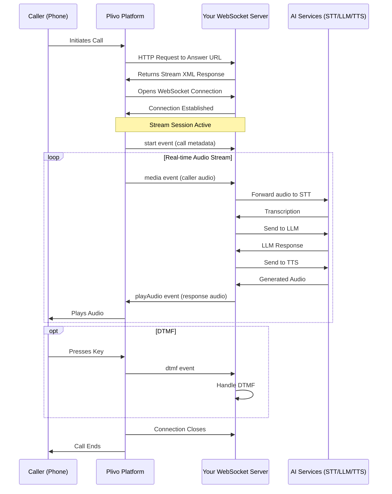

# Source: https://plivo.com/docs/voice-agents/audio-streaming/concepts/audio-streaming-guide.md

> ## Documentation Index
> Fetch the complete documentation index at: https://plivo.com/docs/llms.txt
> Use this file to discover all available pages before exploring further.

# Audio Streaming Guide

> Build Voice AI applications with real-time bidirectional audio streaming

Real-time bidirectional audio streaming enables Voice AI applications, live transcription, voice assistants, and custom audio processing on Plivo calls.

***

## Prerequisites

### 1. Plivo Account

[Sign up for Plivo](https://www.plivo.com/request-trial/) and get your credentials:

| Credential     | Where to Find                              |
| -------------- | ------------------------------------------ |
| **Auth ID**    | [Plivo Console](https://cx.plivo.com/home) |
| **Auth Token** | [Plivo Console](https://cx.plivo.com/home) |

### 2. Phone Number

You need a voice-enabled Plivo number to make or receive calls.

| Call Type    | Number Requirement                                                      |
| ------------ | ----------------------------------------------------------------------- |
| **Inbound**  | Callers dial your Plivo number, triggers your Answer URL, starts stream |
| **Outbound** | Your Plivo number is the Caller ID when making calls via API            |

**Get a number:**

1. Go to [Phone Numbers > Buy Numbers](https://cx.plivo.com/phone-numbers)
2. Select country and type (local, toll-free, mobile)
3. Filter by `voice_enabled = true`
4. Purchase

<Accordion title="India Numbers (Additional Requirements)">
  Indian phone numbers require KYC compliance:

  | Requirement           | Details                                              |
  | --------------------- | ---------------------------------------------------- |
  | Account currency      | Must be INR                                          |
  | KYC documents         | Certificate of Incorporation (COI) + GST Certificate |
  | Business registration | India-registered businesses only                     |

  Submit compliance at [Compliance Application](https://cx.plivo.com/phone-numbers?tab=compliance) before purchasing. See [Rent India Numbers](/numbers/rent-india-numbers) for details.
</Accordion>

### 3. WebSocket Server

Your server must:

* Accept WebSocket connections over `wss://`
* Be publicly accessible (use ngrok for local development)
* Handle Plivo's stream events (start, media, dtmf, stop)

### 4. AI Service Credentials (Optional)

For voice AI applications, you'll typically need:

* **Speech-to-Text**: Deepgram, Google Speech, AWS Transcribe
* **LLM**: OpenAI, Anthropic, Google Gemini
* **Text-to-Speech**: ElevenLabs, Google TTS, Amazon Polly

***

## How It Works

Plivo streams real-time audio between phone calls and your WebSocket server.

```
Phone Call <-> Plivo <-> WebSocket <-> Your Server <-> AI Services
```

### Architecture



### Step-by-Step Flow

1. **Call Initiation**: A caller dials your Plivo number, or your application initiates an outbound call.

2. **Answer URL Request**: Plivo makes an HTTP request to your configured Answer URL.

3. **Stream XML Response**: Your server responds with XML containing the `<Stream>` element, specifying the WebSocket URL and streaming parameters.

4. **WebSocket Connection**: Plivo establishes a WebSocket connection to your specified URL.

5. **Start Event**: Plivo sends a `start` event containing call metadata (call ID, stream ID, media format).

6. **Media Streaming**:
   * **Inbound**: Plivo continuously sends `media` events containing base64-encoded audio chunks from the caller.
   * **Outbound**: Your server sends `playAudio` events with base64-encoded audio to be played to the caller.

7. **DTMF Events**: When the caller presses keys, Plivo sends `dtmf` events with the digit information.

8. **Control Events**: Your server can send `clearAudio` to interrupt playback or `checkpoint` to track playback progress.

9. **Connection Close**: When the call ends or streaming stops, the WebSocket connection closes.

***

## Stream XML

The `<Stream>` XML element initiates audio streaming for a call. Include it in your Answer URL response.

### Basic Syntax

```xml  theme={null}
<?xml version="1.0" encoding="UTF-8"?>
<Response>
    <Stream bidirectional="true" keepCallAlive="true" contentType="audio/x-mulaw;rate=8000">
        wss://your-server.com/stream
    </Stream>
</Response>
```

### Parameters

| Parameter              | Type    | Default                   | Description                                                                                   |
| ---------------------- | ------- | ------------------------- | --------------------------------------------------------------------------------------------- |
| `bidirectional`        | boolean | `false`                   | Enable two-way audio streaming. When `true`, you can send audio back to the caller.           |
| `keepCallAlive`        | boolean | `false`                   | Keep the call active after the stream ends. When `false`, the call ends when streaming stops. |
| `contentType`          | string  | `audio/x-mulaw;rate=8000` | Audio codec and sample rate. See [Supported Content Types](#supported-content-types).         |
| `statusCallbackUrl`    | string  | —                         | URL for stream status callbacks (started, stopped, failed).                                   |
| `statusCallbackMethod` | string  | `POST`                    | HTTP method for status callbacks (`GET` or `POST`).                                           |
| `extraHeaders`         | string  | —                         | Custom headers to include in the start event. Format: `key1=value1;key2=value2`               |

### Supported Content Types

| Content Type              | Description                | Use Case                                                                 |
| ------------------------- | -------------------------- | ------------------------------------------------------------------------ |
| `audio/x-mulaw;rate=8000` | mu-law codec at 8kHz       | **Recommended**. Standard telephony, lowest latency, best compatibility. |
| `audio/x-l16;rate=8000`   | Linear PCM 16-bit at 8kHz  | Higher quality for speech processing.                                    |
| `audio/x-l16;rate=16000`  | Linear PCM 16-bit at 16kHz | High-quality speech recognition.                                         |

### Examples

#### Bidirectional Stream with mu-law Codec

```xml  theme={null}
<?xml version="1.0" encoding="UTF-8"?>
<Response>
    <Speak>Hello! I'm connecting you to our AI assistant.</Speak>
    <Stream bidirectional="true"
            keepCallAlive="true"
            contentType="audio/x-mulaw;rate=8000">
        wss://your-server.com/stream
    </Stream>
</Response>
```

#### Stream with Status Callbacks and Extra Headers

```xml  theme={null}
<?xml version="1.0" encoding="UTF-8"?>
<Response>
    <Stream bidirectional="true"
            keepCallAlive="true"
            contentType="audio/x-mulaw;rate=8000"
            statusCallbackUrl="https://your-server.com/stream-status"
            statusCallbackMethod="POST"
            extraHeaders="userId=12345;sessionId=abc-xyz">
        wss://your-server.com/stream
    </Stream>
</Response>
```

***

## Stream APIs

Control active streams programmatically via REST API calls.

### Base URL

```
https://api.plivo.com/v1/Account/{auth_id}/Call/{call_uuid}/Stream/
```

### Authentication

Use HTTP Basic Authentication with your Plivo Auth ID and Auth Token.

### Stop a Stream

**Endpoint**: `DELETE /v1/Account/{auth_id}/Call/{call_uuid}/Stream/`

```bash  theme={null}
curl -X DELETE \
  https://api.plivo.com/v1/Account/YOUR_AUTH_ID/Call/CALL_UUID/Stream/ \
  -u YOUR_AUTH_ID:YOUR_AUTH_TOKEN
```

### Get Stream Details

**Endpoint**: `GET /v1/Account/{auth_id}/Call/{call_uuid}/Stream/`

```bash  theme={null}
curl -X GET \
  https://api.plivo.com/v1/Account/YOUR_AUTH_ID/Call/CALL_UUID/Stream/ \
  -u YOUR_AUTH_ID:YOUR_AUTH_TOKEN
```

### Using the Plivo SDK

#### Node.js

```javascript  theme={null}
const plivo = require('plivo');
const client = new plivo.Client('YOUR_AUTH_ID', 'YOUR_AUTH_TOKEN');

// Stop a stream
await client.calls.stopStream('CALL_UUID');
```

#### Python

```python  theme={null}
import plivo

client = plivo.RestClient('YOUR_AUTH_ID', 'YOUR_AUTH_TOKEN')

# Stop a stream
client.calls.stop_stream(call_uuid='CALL_UUID')
```

***

## Stream Status Callbacks

Configure a callback URL to receive notifications about stream lifecycle events.

### Configuration

```xml  theme={null}
<Stream bidirectional="true"
        statusCallbackUrl="https://your-server.com/stream-status"
        statusCallbackMethod="POST">
    wss://your-server.com/stream
</Stream>
```

### Callback Parameters

| Parameter      | Type   | Description                                    |
| -------------- | ------ | ---------------------------------------------- |
| `CallUUID`     | string | The unique identifier for the call             |
| `StreamID`     | string | The unique identifier for the stream           |
| `Event`        | string | The event type: `started`, `stopped`, `failed` |
| `Timestamp`    | string | ISO 8601 timestamp of the event                |
| `From`         | string | The caller's phone number                      |
| `To`           | string | The called phone number                        |
| `Direction`    | string | Call direction: `inbound` or `outbound`        |
| `StatusReason` | string | Reason for status (on `stopped` or `failed`)   |
| `Duration`     | number | Stream duration in seconds (on `stopped`)      |

### Example Handler

```javascript  theme={null}
app.post('/stream-status', (req, res) => {
  const { CallUUID, StreamID, Event, StatusReason, Duration } = req.body;

  switch (Event) {
    case 'started':
      console.log(`Stream ${StreamID} started for call ${CallUUID}`);
      break;
    case 'stopped':
      console.log(`Stream ${StreamID} stopped after ${Duration}s: ${StatusReason}`);
      break;
    case 'failed':
      console.error(`Stream ${StreamID} failed: ${StatusReason}`);
      break;
  }

  res.sendStatus(200);
});
```

***

## Signature Validation

Plivo signs WebSocket connection requests to verify authenticity. Validate these signatures to ensure requests originate from Plivo.

### V3 Signature Headers

| Header                       | Description                     |
| ---------------------------- | ------------------------------- |
| `X-Plivo-Signature-V3`       | The HMAC-SHA256 signature       |
| `X-Plivo-Signature-V3-Nonce` | A unique nonce for this request |

### Using the Plivo SDK

```javascript  theme={null}
import { validateV3Signature } from 'plivo';

const isValid = validateV3Signature(
  method,     // 'GET' for WebSocket upgrade requests
  uri,        // Full URI including protocol and path
  nonce,      // X-Plivo-Signature-V3-Nonce header value
  authToken,  // Your Plivo Auth Token
  signature,  // X-Plivo-Signature-V3 header value
);
```

### Using the Node.js Stream SDK

The `plivo-stream-sdk-node` handles signature validation automatically:

```javascript  theme={null}
const plivoServer = new PlivoWebSocketServer({
  server,
  path: '/stream',
  validateSignature: true,
  authToken: process.env.PLIVO_AUTH_TOKEN,
});
```

When `validateSignature` is enabled, connections with invalid signatures are automatically rejected with a 1008 WebSocket close code.

***

## WebSocket Events

All communication over the WebSocket uses JSON messages. Here are the essential events you need to handle.

### Events from Plivo (Input)

| Event          | Description                                                                           |
| -------------- | ------------------------------------------------------------------------------------- |
| `start`        | Sent once when stream begins. Contains call metadata (callId, streamId, mediaFormat). |
| `media`        | Sent continuously. Contains base64-encoded audio chunks (\~20ms each).                |
| `dtmf`         | Sent when caller presses keys. Contains the digit pressed.                            |
| `playedStream` | Confirmation that audio with a checkpoint finished playing.                           |
| `clearedAudio` | Confirmation that the audio queue was cleared.                                        |

### Events to Plivo (Output)

| Event        | Description                                                                   |
| ------------ | ----------------------------------------------------------------------------- |
| `playAudio`  | Send audio to the caller. Include base64 payload matching stream contentType. |
| `checkpoint` | Mark a point in audio queue. Receive `playedStream` when reached.             |
| `clearAudio` | Clear all queued audio. Use for interruption handling.                        |

### Quick Example

```javascript  theme={null}
// Handle incoming events
ws.on('message', (data) => {
  const event = JSON.parse(data);

  switch (event.event) {
    case 'start':
      console.log('Stream started:', event.start.streamId);
      break;
    case 'media':
      // Forward audio to STT service
      const audio = Buffer.from(event.media.payload, 'base64');
      sttClient.send(audio);
      break;
    case 'dtmf':
      console.log('DTMF pressed:', event.dtmf.digit);
      break;
  }
});

// Send audio to caller
ws.send(JSON.stringify({
  event: 'playAudio',
  media: {
    contentType: 'audio/x-mulaw',
    sampleRate: 8000,
    payload: base64EncodedAudio
  }
}));
```

For complete event schemas, TypeScript types, and detailed field documentation, see the [Audio Streaming Protocol Reference](/voice-agents/audio-streaming/concepts/audio-streaming-reference).

***

## X-Headers

Pass custom metadata from your Stream XML to your WebSocket server.

### Usage

```xml  theme={null}
<Stream bidirectional="true"
        extraHeaders="userId=12345;sessionId=abc-xyz;tier=premium">
    wss://your-server.com/stream
</Stream>
```

### Parsing

```javascript  theme={null}
function parseExtraHeaders(extraHeaders) {
  const headers = {};
  if (!extraHeaders) return headers;

  for (const pair of extraHeaders.split(';')) {
    const [key, value] = pair.split('=');
    if (key && value) {
      headers[key.trim()] = decodeURIComponent(value.trim());
    }
  }
  return headers;
}

// Usage
const headers = parseExtraHeaders(event.extra_headers);
console.log(headers.userId);     // "12345"
console.log(headers.sessionId);  // "abc-xyz"
```

***

## Limits

### WebSocket and Stream Limits

| Limit                               | Value                        |
| ----------------------------------- | ---------------------------- |
| Maximum WebSocket URL length        | 2048 characters              |
| Maximum concurrent streams per call | 1                            |
| Maximum stream duration             | Same as call duration        |
| Audio buffer size (playback queue)  | \~60 seconds of audio        |
| Maximum WebSocket message size      | 64 KB                        |
| Recommended audio chunk size        | 16 KB base64-encoded or less |

***

## Best Practices

### Use mu-law 8000Hz

**Why mu-law at 8kHz is recommended:**

1. **Native Telephony Format**: No transcoding required, lowest latency
2. **Bandwidth Efficient**: Compresses 16-bit audio to 8-bit while maintaining voice quality
3. **Universal Compatibility**: Every STT/TTS service supports mu-law
4. **Sufficient for Voice**: Human speech is well-represented at 8kHz

```xml  theme={null}
<!-- Recommended configuration -->
<Stream bidirectional="true"
        contentType="audio/x-mulaw;rate=8000">
    wss://your-server.com/stream
</Stream>
```

### Minimize Latency

For a responsive Voice AI experience, aim for under 1 second total response time:

| Component            | Target Latency |
| -------------------- | -------------- |
| Speech-to-Text       | \< 200ms       |
| LLM Processing       | \< 500ms       |
| Text-to-Speech       | \< 200ms       |
| Network (round trip) | \< 100ms       |

**Server Location**: Deploy your WebSocket server close to your expected caller locations. Plivo routes calls through the edge location closest to the caller.

| Traffic Source | Recommended Server Location                        |
| -------------- | -------------------------------------------------- |
| US-focused     | US East (Virginia) or US West (Oregon)             |
| Europe-focused | Frankfurt or London                                |
| Asia-Pacific   | Singapore or Mumbai                                |
| Global         | Deploy in multiple regions with geographic routing |

### Handle Interruptions

Always support user interruption using `clearAudio`:

```javascript  theme={null}
// When user speaks while AI is playing
if (userSpeaking && aiPlaying) {
  ws.send(JSON.stringify({
    event: 'clearAudio',
    streamId: streamId
  }));
}
```

***

## Integration Guides

For complete code examples and step-by-step tutorials:

<CardGroup cols={2}>
  <Card title="Plivo Stream SDK" icon="code" href="/voice-agents/audio-streaming/integration-guides/plivo-stream-sdk">
    Official SDKs for Python, Node.js, and Java with full examples using Deepgram, OpenAI, and ElevenLabs
  </Card>

  <Card title="Pipecat" icon="robot" href="/voice-agents/audio-streaming/integration-guides/pipecat">
    Build with the Pipecat framework for simplified voice AI pipelines
  </Card>
</CardGroup>

***

## Next Steps

* **[Protocol Reference](/voice-agents/audio-streaming/concepts/audio-streaming-reference)**: Complete JSON schemas, TypeScript types, and advanced patterns
* **[Plivo Stream SDK](/voice-agents/audio-streaming/integration-guides/plivo-stream-sdk)**: Production-ready SDKs with examples

***

## Support

For questions, issues, or feature requests:

* **Documentation**: [https://www.plivo.com/docs/](https://www.plivo.com/docs/)
* **Support**: [support@plivo.com](mailto:support@plivo.com)
* **GitHub Issues**: For SDK-specific issues

***

*Last updated: January 2026*
