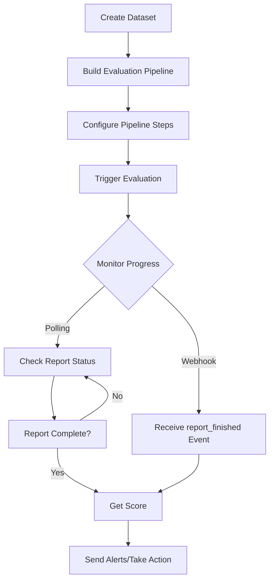
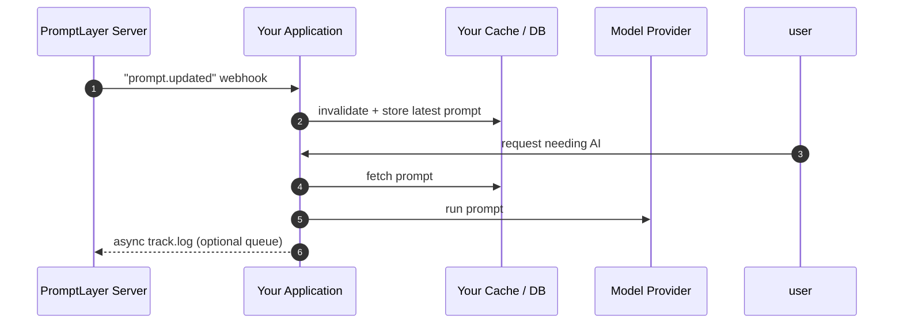

# Promptlayer Documentation

Source: https://docs.promptlayer.com/llms-full.txt

---

# Custom Providers
Source: https://docs.promptlayer.com/features/custom-providers


Custom providers let you connect to additional LLM providers beyond the built-in options, including DeepSeek, Grok, and more!

## Setting Up a Custom Provider

To add a custom provider to your workspace:

1. Navigate to **Settings → Custom Providers and Models**
2. Click the **Add Custom Provider** button
3. Configure the provider with the following details:

   * **Name**: A descriptive name for your provider (e.g., "DeepSeek")
   * **Client**: Select the appropriate client type for your provider's base URL
   * **Base URL**: The endpoint URL for your custom provider
   * **API Key**


## Creating Custom Models

Once your provider is configured, you can define models for it:

1. In **Settings → Custom Providers and Models**, click on your custom provider row to expand it
2. Click **Create Custom Model**
3. Fill in the model configuration:

   * **Provider**: Select the custom provider you created earlier
   * **Model Name**: Choose from known models or enter a custom identifier
   * **Display Name**: A friendly name that appears in the prompt playground
   * **Model Type**: Specify whether this is a Chat or Completion model


## Using Custom Models

After setup, your custom models seamlessly integrate with PromptLayer's features. You can:

* Select them in the Playground alongside standard models
* Use them in the Prompt Editor for template creation
* Track requests and analyze performance just like any other model


Custom providers give you complete control over your model infrastructure while maintaining all the benefits of PromptLayer's prompt management and observability features.

## Example Integrations

Looking for specific integration guides? See our detailed setup instructions for [OpenRouter](/features/openrouter-integration), [Exa](/features/exa-integration), and [xAI (Grok)](/features/xai-integration).

Follow the steps above to configure any OpenAI-compatible provider as a custom provider in PromptLayer.


# Getting Started
Source: https://docs.promptlayer.com/features/evaluations/building-pipelines


<iframe title="YouTube video player" />

The overall process of building an evaluation pipeline looks like this:

1. **Select Your Dataset**: Choose or upload datasets to serve as the basis for your evaluations, whether for scoring, regression testing, or bulk job processing.
2. **Build Your Pipeline**: Start by visually constructing your evaluation pipeline, defining each step from input data processing to final evaluation.
3. **Run Evaluations**: Execute your pipeline, observe the results in a spreadsheet-like interface, and make informed decisions based on comprehensive metrics and scores.

## Creating a Pipeline

1. **Initiate a Batch Run**: Start by creating a new batch run, which requires specifying a name and selecting a dataset.
2. **Dataset Selection**: Upload a CSV/JSON dataset, or create a dataset from historical data using filters like time range, prompt template logs, scores, and metadata. [Learn more here.](/features/evaluations/datasets)

You now have a pipeline. Preview mode allows you to iterate with live feedback, allowing for adjustments in real-time.

## Setting up the Pipeline

### Adding Steps

Click 'Add Step' to start building your pipeline, with each column representing a step in the evaluation process.

Steps execute in order left to right. That means that if a column depends on a previous column, make sure it appears to the right of the dependency.

#### Common Step Types

* **Prompt Template**: Select a prompt template from the registry, set model parameters, LLM, arguments, and template version.
* **Custom API Endpoint**: Define a URL to send and receive data, suitable for custom evaluators or external systems.
* **Human Input**: Engage human graders by adding a step that allows for textual input.
* **String Comparison**: Use this step to compare the outputs of two previous step, showing a visual diff when relevant.

#### Scoring

If the last step of your evaluation pipeline contains all booleans or numeric values, that will be consider the score for the row. Your full evaluation report will have a scorecard of the average of this last step.

*NOTE: All cells in the last column must be boolean or all must be numeric. If any cell deviates, the score will not be calculated*

## Executing Full Batch Runs

Transition from pipeline to full batch run to apply your pipeline across the entire dataset for comprehensive evaluation.


# Node & Column Types
Source: https://docs.promptlayer.com/features/evaluations/column-types

Complete reference for all node types used in Agents and evaluation pipelines

This page documents all available node types for Agents (workflows) and column types for evaluation pipelines. Agents and evaluations share the same node types—each has specific configuration options that determine its behavior.

<Note>
  In Agents, these are called **nodes**. In evaluation pipelines, they're called **columns**. The configuration is identical.
</Note>

## How Column Sources Work

Columns can reference data from two places:

1. **Dataset columns** - Reference data directly from your dataset by using the dataset column name
2. **Other evaluation columns** - Reference the output of a previous column by using that column's `name`

When you specify a `source` or include a column name in `sources`, the system first looks for an evaluation column with that name, then falls back to looking for a dataset column.

<Info>
  Columns are executed in order based on their `position`. A column can only reference other columns that come before it in the pipeline.
</Info>

### Example: Chaining Columns Together

A common pattern is to chain columns: run a prompt, extract a field from the JSON output, then compare it to a ground truth value from the dataset.

```python theme={null}
columns = [
    # Step 1: Run the prompt template (position 1)
    {
        "column_type": "PROMPT_TEMPLATE",
        "name": "LLM Output",  # Other columns reference this name
        "configuration": {
            "template": {"name": "my-prompt"},
            "prompt_template_variable_mappings": {
                "question": "user_question"  # Maps to dataset column
            }
        }
    },
    # Step 2: Extract a field from the LLM output (position 2)
    {
        "column_type": "JSON_PATH",
        "name": "Extracted Status",
        "configuration": {
            "source": "LLM Output",  # References the column above
            "json_path": "$.status"
        }
    },
    # Step 3: Compare extracted value to dataset ground truth (position 3)
    {
        "column_type": "COMPARE",
        "name": "Status Match",
        "configuration": {
            "sources": [
                "Extracted Status",   # References the column above
                "expected_status"     # References a dataset column
            ],
            "comparison_type": {"type": "STRING"}
        },
        "is_part_of_score": True
    }
]
```

## Execution Types

These columns execute prompts, code, or external services.

<AccordionGroup>
  <Accordion title="PROMPT_TEMPLATE">
    Runs a prompt template from the registry against each row.

    | Field                               | Type    | Required | Description                                           |
    | ----------------------------------- | ------- | -------- | ----------------------------------------------------- |
    | `template.name`                     | string  | Yes      | Name of the prompt template                           |
    | `template.version_number`           | integer | No       | Specific version number. Uses latest if omitted       |
    | `template.label`                    | string  | No       | Release label to use, e.g. "production"               |
    | `prompt_template_variable_mappings` | object  | Yes      | Maps template input variables to dataset/column names |
    | `engine`                            | object  | No       | Override the template's default model settings        |
    | `engine.provider`                   | string  | No       | Provider name, e.g. "openai", "anthropic"             |
    | `engine.model`                      | string  | No       | Model name, e.g. "gpt-4", "claude-3-opus"             |
    | `engine.parameters`                 | object  | No       | Model parameters like temperature, max\_tokens        |

    <Info>
      The `prompt_template_variable_mappings` object maps **prompt input variables** (keys) to **dataset or column names** (values). The key is the variable name in your prompt template (e.g., `{{question}}`), and the value is where to get the data from.
    </Info>

    ```json theme={null}
    {
      "column_type": "PROMPT_TEMPLATE",
      "name": "Generate Response",
      "configuration": {
        "template": {
          "name": "my-prompt",
          "label": "production"
        },
        "prompt_template_variable_mappings": {
          "question": "user_question",
          "context": "retrieved_context"
        }
      }
    }
    ```

    **Complete example with all input variables:**

    If your prompt template has variables `{{company}}`, `{{product}}`, and `{{query}}`, map each one:

    ```json theme={null}
    {
      "column_type": "PROMPT_TEMPLATE",
      "name": "Product Analysis",
      "configuration": {
        "template": {
          "name": "product-analyzer"
        },
        "prompt_template_variable_mappings": {
          "company": "company_name",
          "product": "product_name",
          "query": "user_query"
        }
      }
    }
    ```
  </Accordion>

  <Accordion title="CODE_EXECUTION">
    Executes custom Python or JavaScript code. The code receives a `data` dictionary containing all column values for the current row.

    | Field      | Type   | Required | Description              |
    | ---------- | ------ | -------- | ------------------------ |
    | `code`     | string | Yes      | The code to execute      |
    | `language` | string | Yes      | "PYTHON" or "JAVASCRIPT" |

    ```json theme={null}
    {
      "column_type": "CODE_EXECUTION",
      "name": "Custom Logic",
      "configuration": {
        "code": "result = len(data['response'].split())\nreturn result",
        "language": "PYTHON"
      }
    }
    ```
  </Accordion>

  <Accordion title="ENDPOINT">
    Calls an external HTTP endpoint. The request body contains all column values for the current row.

    | Field     | Type   | Required | Description             |
    | --------- | ------ | -------- | ----------------------- |
    | `url`     | string | Yes      | The HTTP endpoint URL   |
    | `headers` | object | No       | HTTP headers to include |

    ```json theme={null}
    {
      "column_type": "ENDPOINT",
      "name": "External Validator",
      "configuration": {
        "url": "https://api.example.com/validate",
        "headers": {
          "Authorization": "Bearer token123"
        }
      }
    }
    ```
  </Accordion>

  <Accordion title="WORKFLOW">
    Runs a PromptLayer workflow.

    | Field                     | Type    | Required | Description                              |
    | ------------------------- | ------- | -------- | ---------------------------------------- |
    | `workflow_id`             | integer | Yes      | ID of the workflow to run                |
    | `workflow_version_number` | integer | No       | Specific version. Uses latest if omitted |
    | `workflow_label`          | string  | No       | Release label to use                     |
    | `input_mappings`          | object  | Yes      | Maps workflow inputs to column names     |

    ```json theme={null}
    {
      "column_type": "WORKFLOW",
      "name": "Run Analysis Workflow",
      "configuration": {
        "workflow_id": 123,
        "input_mappings": {
          "input_text": "response"
        }
      }
    }
    ```
  </Accordion>

  <Accordion title="MCP">
    Executes an MCP (Model Context Protocol) action.

    | Field            | Type    | Required | Description                      |
    | ---------------- | ------- | -------- | -------------------------------- |
    | `mcp_server_id`  | integer | Yes      | ID of the MCP server             |
    | `tool_name`      | string  | Yes      | Name of the tool to call         |
    | `input_mappings` | object  | Yes      | Maps tool inputs to column names |

    ```json theme={null}
    {
      "column_type": "MCP",
      "name": "MCP Tool Call",
      "configuration": {
        "mcp_server_id": 456,
        "tool_name": "search",
        "input_mappings": {
          "query": "search_query"
        }
      }
    }
    ```
  </Accordion>

  <Accordion title="HUMAN">
    Adds a column for manual human evaluation.

    | Field        | Type   | Required | Description                    |
    | ------------ | ------ | -------- | ------------------------------ |
    | `data_type`  | string | Yes      | "number" or "string"           |
    | `ui_element` | object | Yes      | UI configuration for the input |

    ```json theme={null}
    {
      "column_type": "HUMAN",
      "name": "Human Rating",
      "configuration": {
        "data_type": "number",
        "ui_element": {
          "type": "slider",
          "min": 1,
          "max": 5
        }
      }
    }
    ```
  </Accordion>

  <Accordion title="CONVERSATION_SIMULATOR">
    Simulates multi-turn conversations to test chatbots and conversational agents. An AI-powered user persona engages in realistic dialogue with your prompt template, allowing you to evaluate how well your agent handles extended interactions.

    | Field                                  | Type    | Required    | Description                                                                                                                                                            |
    | -------------------------------------- | ------- | ----------- | ---------------------------------------------------------------------------------------------------------------------------------------------------------------------- |
    | `template.name`                        | string  | Yes         | Name of the prompt template to test                                                                                                                                    |
    | `template.version_number`              | integer | No          | Specific version number                                                                                                                                                |
    | `template.label`                       | string  | No          | Release label to use                                                                                                                                                   |
    | `prompt_template_variable_mappings`    | object  | Yes         | Maps template input variables to dataset columns                                                                                                                       |
    | `user_persona`                         | string  | Conditional | Static persona description. Required if `user_persona_source` not set                                                                                                  |
    | `user_persona_source`                  | string  | Conditional | Column name containing the persona. Required if `user_persona` not set                                                                                                 |
    | `conversation_completed_prompt`        | string  | No          | Guidance for when to consider the conversation complete (e.g., "End when the user confirms their order" or "Complete when the assistant calls the submit\_order tool") |
    | `conversation_completed_prompt_source` | string  | No          | Column name containing the completion guidance. Use instead of `conversation_completed_prompt` for dynamic guidance                                                    |
    | `is_user_first`                        | boolean | No          | If true, simulated user sends the first message (default: false)                                                                                                       |
    | `max_turns`                            | integer | No          | Maximum conversation turns (default: system setting, max: 150)                                                                                                         |
    | `conversation_samples`                 | array   | No          | Example conversations to guide the simulation style                                                                                                                    |

    <Info>
      The `user_persona` defines how the simulated user behaves - their goals, communication style, and what questions they ask. Use `user_persona_source` to pull different personas from your dataset for varied test scenarios.
    </Info>

    <Info>
      The `conversation_completed_prompt` provides explicit guidance for determining when a conversation should end. This is useful for defining specific end conditions like tool calls, confirmation messages, or goal achievement. The guidance can be holistic (general rules) or specific (look for a certain phrase or tool call).
    </Info>

    **Basic example with static persona:**

    ```json theme={null}
    {
      "column_type": "CONVERSATION_SIMULATOR",
      "name": "Support Chat Test",
      "configuration": {
        "template": {
          "name": "customer-support-bot"
        },
        "prompt_template_variable_mappings": {
          "customer_name": "customer_name",
          "product": "product_name"
        },
        "user_persona": "You are a frustrated customer who purchased a defective product. You want a refund but will accept a replacement if the agent is helpful. Ask follow-up questions and push back on unhelpful responses.",
        "is_user_first": true,
        "max_turns": 5
      }
    }
    ```

    **Dynamic personas from dataset:**

    For comprehensive testing, store different user personas in your dataset to test various scenarios:

    ```json theme={null}
    {
      "column_type": "CONVERSATION_SIMULATOR",
      "name": "Multi-Scenario Test",
      "configuration": {
        "template": {
          "name": "sales-assistant"
        },
        "prompt_template_variable_mappings": {
          "rep_name": "rep_name",
          "product": "product_name",
          "customer_context": "customer_context"
        },
        "user_persona_source": "test_persona",
        "is_user_first": true,
        "max_turns": 6
      }
    }
    ```

    Where your dataset has a `test_persona` column with different personas:

    * Row 1: "You are a busy executive who needs quick answers. Be impatient if responses are too long."
    * Row 2: "You are a technical user who asks detailed follow-up questions about implementation."
    * Row 3: "You are price-sensitive and keep asking about discounts and alternatives."

    **Custom completion conditions:**

    Use `conversation_completed_prompt` to define specific end conditions for your conversations:

    ```json theme={null}
    {
      "column_type": "CONVERSATION_SIMULATOR",
      "name": "Order Flow Test",
      "configuration": {
        "template": {
          "name": "order-assistant"
        },
        "prompt_template_variable_mappings": {
          "customer_name": "customer_name",
          "order_items": "items"
        },
        "user_persona": "You are a customer placing an order. Provide your shipping address and payment method when asked.",
        "conversation_completed_prompt": "The conversation is complete when the assistant calls the submit_order tool or confirms that the order has been placed successfully.",
        "max_turns": 10
      }
    }
    ```

    You can also use `conversation_completed_prompt_source` to pull completion guidance from your dataset:

    ```json theme={null}
    {
      "column_type": "CONVERSATION_SIMULATOR",
      "name": "Goal-Based Test",
      "configuration": {
        "template": {
          "name": "support-agent"
        },
        "prompt_template_variable_mappings": {
          "context": "support_context"
        },
        "user_persona_source": "test_persona",
        "conversation_completed_prompt_source": "completion_condition",
        "max_turns": 8
      }
    }
    ```

    Where your dataset has a `completion_condition` column with different end conditions:

    * Row 1: "End when the user says 'thank you' or indicates satisfaction"
    * Row 2: "Complete when the assistant provides a ticket number"
    * Row 3: "End when the refund\_process tool is called"

    **Evaluating conversation quality:**

    Chain with `LLM_ASSERTION` to evaluate the full conversation:

    ```json theme={null}
    {
      "column_type": "LLM_ASSERTION",
      "name": "Conversation Quality",
      "configuration": {
        "source": "Support Chat Test",
        "prompt": "Did the agent maintain a professional tone throughout and successfully resolve the customer's issue?"
      },
      "is_part_of_score": true
    }
    ```
  </Accordion>
</AccordionGroup>

## Evaluation Types

These columns evaluate or compare data and typically return boolean or numeric scores.

<AccordionGroup>
  <Accordion title="LLM_ASSERTION">
    Uses an LLM to evaluate content against a natural language prompt. Returns a boolean indicating pass/fail.

    | Field           | Type   | Required    | Description                                                     |
    | --------------- | ------ | ----------- | --------------------------------------------------------------- |
    | `source`        | string | Yes         | Column name containing the content to evaluate                  |
    | `prompt`        | string | Conditional | The assertion prompt. Required if `prompt_source` not set       |
    | `prompt_source` | string | Conditional | Column name containing the prompt. Required if `prompt` not set |

    **Basic example with static prompt:**

    ```json theme={null}
    {
      "column_type": "LLM_ASSERTION",
      "name": "Quality Check",
      "configuration": {
        "source": "response",
        "prompt": "Is this response helpful, accurate, and free of harmful content?"
      },
      "is_part_of_score": true
    }
    ```

    **Dynamic prompts from dataset:**

    Use `prompt_source` to pull assertion prompts from a dataset column. This lets you define different assertions per row.

    ```json theme={null}
    {
      "column_type": "LLM_ASSERTION",
      "name": "Custom Assertions",
      "configuration": {
        "source": "LLM Output",
        "prompt_source": "assertions"
      },
      "is_part_of_score": true
    }
    ```

    Where your dataset has an `assertions` column containing the prompt text for each row.

    **Multiple assertions per row:**

    You can run multiple assertions against the same content by providing a JSON array of prompts. Each assertion is evaluated independently, and the results are returned as a dictionary.

    ```json theme={null}
    {
      "column_type": "LLM_ASSERTION",
      "name": "Compliance Checks",
      "configuration": {
        "source": "LLM Output",
        "prompt_source": "llm_assertions"
      },
      "is_part_of_score": true
    }
    ```

    Where your dataset's `llm_assertions` column contains a JSON array:

    ```json theme={null}
    "[\"Does the response avoid making unauthorized claims?\", \"Is patient data properly redacted?\", \"Does it cite approved sources only?\"]"
    ```

    The output will be a dictionary with each assertion as a key and its boolean result as the value.
  </Accordion>

  <Accordion title="COMPARE">
    Compares two values for equality. Supports string comparison and JSON comparison with optional JSONPath.

    | Field                       | Type   | Required | Description                                              |
    | --------------------------- | ------ | -------- | -------------------------------------------------------- |
    | `sources`                   | array  | Yes      | Array of exactly 2 column names to compare               |
    | `comparison_type.type`      | string | Yes      | "STRING" or "JSON"                                       |
    | `comparison_type.json_path` | string | No       | JSONPath to extract before comparing. Only for JSON type |

    ```json theme={null}
    {
      "column_type": "COMPARE",
      "name": "Accuracy",
      "configuration": {
        "sources": ["predicted_value", "ground_truth"],
        "comparison_type": {"type": "STRING"}
      },
      "is_part_of_score": true
    }
    ```

    With JSON path:

    ```json theme={null}
    {
      "column_type": "COMPARE",
      "name": "JSON Field Match",
      "configuration": {
        "sources": ["api_response", "expected_response"],
        "comparison_type": {
          "type": "JSON",
          "json_path": "$.result.status"
        }
      }
    }
    ```
  </Accordion>

  <Accordion title="CONTAINS">
    Checks if a value contains a substring (case-insensitive).

    | Field          | Type   | Required    | Description                                                     |
    | -------------- | ------ | ----------- | --------------------------------------------------------------- |
    | `source`       | string | Yes         | Column name to search in                                        |
    | `value`        | string | Conditional | Static substring to find. Required if value\_source not set     |
    | `value_source` | string | Conditional | Column name containing the substring. Required if value not set |

    ```json theme={null}
    {
      "column_type": "CONTAINS",
      "name": "Has Keyword",
      "configuration": {
        "source": "response",
        "value": "thank you"
      }
    }
    ```
  </Accordion>

  <Accordion title="REGEX">
    Tests if content matches a regular expression pattern. Returns boolean.

    | Field           | Type   | Required | Description                |
    | --------------- | ------ | -------- | -------------------------- |
    | `source`        | string | Yes      | Column name to test        |
    | `regex_pattern` | string | Yes      | Regular expression pattern |

    ```json theme={null}
    {
      "column_type": "REGEX",
      "name": "Valid Email Format",
      "configuration": {
        "source": "email_field",
        "regex_pattern": "^[\\w.-]+@[\\w.-]+\\.\\w+$"
      }
    }
    ```
  </Accordion>

  <Accordion title="COSINE_SIMILARITY">
    Calculates semantic similarity between two texts using embeddings. Returns a float between 0 and 1.

    | Field     | Type  | Required | Description                                |
    | --------- | ----- | -------- | ------------------------------------------ |
    | `sources` | array | Yes      | Array of exactly 2 column names to compare |

    ```json theme={null}
    {
      "column_type": "COSINE_SIMILARITY",
      "name": "Semantic Similarity",
      "configuration": {
        "sources": ["generated_response", "reference_response"]
      },
      "is_part_of_score": true
    }
    ```
  </Accordion>

  <Accordion title="ABSOLUTE_NUMERIC_DISTANCE">
    Calculates the absolute difference between two numeric values.

    | Field     | Type  | Required | Description                                        |
    | --------- | ----- | -------- | -------------------------------------------------- |
    | `sources` | array | Yes      | Array of exactly 2 column names containing numbers |

    ```json theme={null}
    {
      "column_type": "ABSOLUTE_NUMERIC_DISTANCE",
      "name": "Score Difference",
      "configuration": {
        "sources": ["predicted_score", "actual_score"]
      }
    }
    ```
  </Accordion>

  <Accordion title="AI_DATA_EXTRACTION">
    Uses an LLM to extract specific information from content based on a natural language query.

    | Field    | Type   | Required | Description                                     |
    | -------- | ------ | -------- | ----------------------------------------------- |
    | `source` | string | Yes      | Column name containing the content              |
    | `query`  | string | Yes      | Natural language description of what to extract |

    ```json theme={null}
    {
      "column_type": "AI_DATA_EXTRACTION",
      "name": "Extract Sentiment",
      "configuration": {
        "source": "response",
        "query": "What is the overall sentiment? Return only: positive, negative, or neutral"
      }
    }
    ```
  </Accordion>
</AccordionGroup>

## Extraction Types

These columns extract or parse data from other columns.

<AccordionGroup>
  <Accordion title="JSON_PATH">
    Extracts data from JSON using JSONPath expressions.

    | Field                | Type    | Required | Description                                               |
    | -------------------- | ------- | -------- | --------------------------------------------------------- |
    | `source`             | string  | Yes      | Column name containing JSON data                          |
    | `json_path`          | string  | Yes      | JSONPath expression (e.g., "$.field", "$.items\[0].name") |
    | `return_first_match` | boolean | No       | Return only first match (default: true) or all matches    |

    ```json theme={null}
    {
      "column_type": "JSON_PATH",
      "name": "Extract Agent",
      "configuration": {
        "source": "llm_output",
        "json_path": "$.selected_agent",
        "return_first_match": true
      }
    }
    ```
  </Accordion>

  <Accordion title="XML_PATH">
    Extracts data from XML using XPath expressions.

    | Field         | Type    | Required | Description                                                          |
    | ------------- | ------- | -------- | -------------------------------------------------------------------- |
    | `source`      | string  | Yes      | Column name containing XML data                                      |
    | `xml_path`    | string  | Yes      | XPath expression                                                     |
    | `type`        | string  | No       | "find" for first match or "findall" for all matches. Default: "find" |
    | `return_text` | boolean | No       | Return text content only or full XML. Default: true                  |

    ```json theme={null}
    {
      "column_type": "XML_PATH",
      "name": "Extract Title",
      "configuration": {
        "source": "xml_response",
        "xml_path": ".//item/title",
        "type": "find",
        "return_text": true
      }
    }
    ```
  </Accordion>

  <Accordion title="REGEX_EXTRACTION">
    Extracts content matching a regular expression pattern. Returns an array of all matches.

    | Field           | Type   | Required | Description                 |
    | --------------- | ------ | -------- | --------------------------- |
    | `source`        | string | Yes      | Column name to extract from |
    | `regex_pattern` | string | Yes      | Regular expression pattern  |

    ```json theme={null}
    {
      "column_type": "REGEX_EXTRACTION",
      "name": "Extract Numbers",
      "configuration": {
        "source": "text_content",
        "regex_pattern": "\\d+\\.?\\d*"
      }
    }
    ```
  </Accordion>

  <Accordion title="PARSE_VALUE">
    Parses and converts a value to a specific type.

    | Field    | Type   | Required | Description                                             |
    | -------- | ------ | -------- | ------------------------------------------------------- |
    | `source` | string | Yes      | Column name to parse                                    |
    | `type`   | string | Yes      | Target type: "string", "number", "boolean", or "object" |

    ```json theme={null}
    {
      "column_type": "PARSE_VALUE",
      "name": "Parse Score",
      "configuration": {
        "source": "score_string",
        "type": "number"
      }
    }
    ```
  </Accordion>
</AccordionGroup>

## Transformation Types

These columns transform, combine, or validate data.

<AccordionGroup>
  <Accordion title="VARIABLE">
    Creates a static value that can be referenced by other columns.

    | Field         | Type   | Required | Description        |
    | ------------- | ------ | -------- | ------------------ |
    | `value.type`  | string | Yes      | "string" or "json" |
    | `value.value` | any    | Yes      | The static value   |

    String variable:

    ```json theme={null}
    {
      "column_type": "VARIABLE",
      "name": "Environment",
      "configuration": {
        "value": {
          "type": "string",
          "value": "production"
        }
      }
    }
    ```

    JSON variable:

    ```json theme={null}
    {
      "column_type": "VARIABLE",
      "name": "Config",
      "configuration": {
        "value": {
          "type": "json",
          "value": {"threshold": 0.8, "max_retries": 3}
        }
      }
    }
    ```
  </Accordion>

  <Accordion title="ASSERT_VALID">
    Validates that data is in a valid format. Returns boolean.

    | Field    | Type   | Required | Description                                                  |
    | -------- | ------ | -------- | ------------------------------------------------------------ |
    | `source` | string | Yes      | Column name to validate                                      |
    | `type`   | string | Yes      | Expected format: "object" for valid JSON, "number", or "sql" |

    ```json theme={null}
    {
      "column_type": "ASSERT_VALID",
      "name": "Is Valid JSON",
      "configuration": {
        "source": "api_response",
        "type": "object"
      }
    }
    ```
  </Accordion>

  <Accordion title="COALESCE">
    Returns the first non-null value from multiple sources.

    | Field     | Type  | Required | Description                      |
    | --------- | ----- | -------- | -------------------------------- |
    | `sources` | array | Yes      | Array of column names, minimum 2 |

    ```json theme={null}
    {
      "column_type": "COALESCE",
      "name": "Best Response",
      "configuration": {
        "sources": ["primary_response", "fallback_response", "default_response"]
      }
    }
    ```
  </Accordion>

  <Accordion title="COMBINE_COLUMNS">
    Combines multiple column values into a single dictionary object.

    | Field     | Type  | Required | Description                      |
    | --------- | ----- | -------- | -------------------------------- |
    | `sources` | array | Yes      | Array of column names to combine |

    ```json theme={null}
    {
      "column_type": "COMBINE_COLUMNS",
      "name": "Combined Context",
      "configuration": {
        "sources": ["question", "context", "metadata"]
      }
    }
    ```
  </Accordion>

  <Accordion title="COUNT">
    Counts occurrences in text content.

    | Field    | Type   | Required | Description                                                   |
    | -------- | ------ | -------- | ------------------------------------------------------------- |
    | `source` | string | Yes      | Column name to count in                                       |
    | `type`   | string | Yes      | What to count: "chars", "words", "sentences", or "paragraphs" |

    ```json theme={null}
    {
      "column_type": "COUNT",
      "name": "Word Count",
      "configuration": {
        "source": "response",
        "type": "words"
      }
    }
    ```
  </Accordion>

  <Accordion title="MATH_OPERATOR">
    Performs numeric comparisons. Returns boolean.

    | Field      | Type   | Required    | Description                                                                                                       |
    | ---------- | ------ | ----------- | ----------------------------------------------------------------------------------------------------------------- |
    | `sources`  | array  | Yes         | Array with first source column, and optionally second source column                                               |
    | `operator` | string | Yes         | Comparison operator: "lt" for less than, "le" for less or equal, "gt" for greater than, "ge" for greater or equal |
    | `value`    | number | Conditional | Static value to compare against. Required if second source not provided                                           |

    Compare to static value:

    ```json theme={null}
    {
      "column_type": "MATH_OPERATOR",
      "name": "Above Threshold",
      "configuration": {
        "sources": ["score"],
        "operator": "ge",
        "value": 0.8
      }
    }
    ```

    Compare two columns:

    ```json theme={null}
    {
      "column_type": "MATH_OPERATOR",
      "name": "A Greater Than B",
      "configuration": {
        "sources": ["score_a", "score_b"],
        "operator": "gt"
      }
    }
    ```
  </Accordion>

  <Accordion title="MIN_MAX">
    Finds the minimum or maximum value from an array or JSON structure.

    | Field       | Type   | Required | Description                                        |
    | ----------- | ------ | -------- | -------------------------------------------------- |
    | `source`    | string | Yes      | Column name containing the data                    |
    | `type`      | string | Yes      | "min" or "max"                                     |
    | `json_path` | string | No       | JSONPath to extract values from, if source is JSON |

    ```json theme={null}
    {
      "column_type": "MIN_MAX",
      "name": "Highest Score",
      "configuration": {
        "source": "scores_array",
        "type": "max",
        "json_path": "$[*].value"
      }
    }
    ```
  </Accordion>
</AccordionGroup>


# Continuous Integration
Source: https://docs.promptlayer.com/features/evaluations/continuous-integration


Continuous Integration (CI) of prompt evaluations is the holy grail of prompt engineering. 🏆

CI in the context of prompt engineering involves the automated testing and validation of prompts every time a new version is created or updated. LLMs are a probabilistic technology. It is hard (read: virtually impossible) to ensure a new prompt version doesn't break old user behavior just by eyeballing the prompt. Rigorous testing is the best tool we have.

We believe that it's important to both allow subject-matter experts to write new prompts and provide them with tools to easily test if the prompts broke anything. That's where PromptLayer evaluations comes in.

## Test-driven Prompt Engineering

Similar to test-driven development (TDD) in software engineering, test-driven prompt engineering involves writing and running evaluations against new prompt versions before they are used in production. This proactive testing ensures that new prompts meet predefined criteria and behave as expected, minimizing the risk of unintended consequences.

Setting up automatic evaluations on a specific prompt template is easy. When creating a new version, after adding a commit message, you will be prompted to select an evaluation pipeline to run. After doing this once, every new prompt template you create will run this pipeline by default.

**NOTE**: Make sure your evaluation pipeline uses the "latest" version of the prompt template in its column step. The template is fetched at runtime. If you specify a frozen version, the evaluation report won't reflect your newest prompt template.


## Testing Strategies

### Backtesting

Backtesting involves running new prompt versions against a dataset compiled from historical production data. This strategy provides a real-world context for evaluating prompts, allowing you to assess how new versions would have performed under past conditions. It's an effective way to detect potential regressions and validate improvements, ensuring that updates enhance rather than detract from the user experience.

To set up backtests, follow the steps below:

**1. Create a historical dataset**


[Create a dataset](/features/evaluations/datasets) using a search query. For example, I might want to create a dataset using all logged requests:

* That use `my_prompt_template` version 6 or version 5
* That were made in the last 2 months
* That were using the tag `prod`
* That users gave a 👍 response to

This dataset will help you understand if your new prompt version broke any previous versions!

**2. Build an evaluation pipeline**

The next step is to create an evaluation pipeline using our new historical dataset.

In plain English, this evaluation will feed in historical request context into your new prompt version then compare the new results to the old results. You can do a simple string comparison or get fancy with cosine similarities. PromptLayer will even show you a diff view for responses that are different.

**3. Run it when you make a new version**

This is the fun part. Next time you make a new prompt version, just select our new backtesting pipeline to see how the new prompt version fairs.


### Regression Testing

Regression testing is the continuous refinement of evaluation datasets to include new edge cases and scenarios as they are discovered. This iterative process ensures that prompts remain robust against a growing set of challenges, preventing regressions in areas previously identified as potential failure points. By continually updating evaluations with new edge cases, you maintain a high standard of prompt quality and reliability.

The process of setting up regression tests looks similar to backtesting.

[Create a dataset](/features/evaluations/datasets) containing test cases for every edge case you can think of. The dataset should include context variables that you can input to your prompt template.

### Scoring

The evaluation can result in a single quantitative final score. To configure the score card, all you need to do is make sure that the last step consists entirely of numbers or Booleans. A final objective score makes comparing prompt performance easy, and it will be displayed alongside prompts in the Prompt Registry.


# Datasets
Source: https://docs.promptlayer.com/features/evaluations/datasets


Datasets are often used for evaluations, but they can also be exported. Each dataset can be assigned a name for easy search later on.

You can create a dataset from your LLM request history or by uploading a dataset file.

## Creating a Dataset from History

Creating a dataset from your history is straightforward using the Dataset dialogue. Here, you can build a dataset from your request history. The dataset will include metadata, input variable context, tags, and the request response. This is useful for backtesting new prompt versions.

When creating a dataset from your history, several options are available for customization. You have the option to use time filters to narrow down the history included in the dataset by specifying a start and end time. Additionally, you can refine your dataset by including specific metadata or prompt templates, where metadata involves key-value pairs and prompt templates can be specified by name and version numbers. For those seeking more advanced customization, filtering based on a search query, specific scoring criteria, or tags can be used to build your dataset.

## Creating a Dataset File

JSON or CSV files are accepted for the dataset input file.

### JSON Format

In the JSON format, each test case is represented as a separate JSON object. The keys of the object correspond to the input variable names defined in the prompt template. The values represent the specific input values for each test case. Here's an example:

```json theme={null}
[
  {
    "name": "John Doe",
    "age": 30,
    "location": "New York"
  },
  {
    "name": "Jane Smith",
    "age": 35,
    "location": "Los Angeles"
  },
  {
    "name": "Michael Johnson",
    "age": 40,
    "location": "Chicago"
  }
]

```

In the above example, the prompt template may contain input variables like `{name}`, `{age}`, and `{location}`. Each test case object provides the corresponding values for these variables.

### CSV Format

In the CSV format, each test case is represented as a separate row in the CSV file. The column headers correspond to the input variable names defined in the prompt template. The cells in each row represent the specific input values for each test case. Here's an example:

```
name,age,location
John Doe,30,New York
Jane Smith,35,Los Angeles
Michael Johnson,40,Chicago
```

In this example, the prompt template may contain input variables like `{name}`, `{age}`, and `{location}`. Each row in the CSV file provides the corresponding values for these variables.


# Eval Types
Source: https://docs.promptlayer.com/features/evaluations/eval-types


This page provides an overview of the various evaluation column types available on our platform.

## Primary Types


### Prompt Template

The *Prompt Template* evaluation type allows you to execute a prompt template from the Prompt Registry. You have the flexibility to select the latest version, a specific label, or a particular version of the prompt template. You also have the ability to assign the input variables based on available inputs from the dataset or other columns. You can override the model parameters that are set in the Prompt Registry. This functionality is particularly useful for testing a prompt template within a larger evaluation pipeline, comparing different model parameters, or implementing an "LLM as a judge" prompt template.

### Custom API Endpoint

The *Custom API Endpoint* enables you to set up a webhook that our system will call (POST) with all the columns to the left of the API endpoint when that cell is executed. As cells are processed sequentially, we will call this endpoint with all the columns to the left as the given payload, and the returned result will be displayed. This feature allows for extensive customization to accommodate specific use cases and integrate with external systems or custom evaluators.

The payload will be in the form of

```json theme={null}
    {
        data: {
            "column1": "value1",
            "column2": "value2",
            "column3": "value3",
            ...
        }
    }
```

### MCP

The *MCP Action* allows you to run functions on a remote MCP server. Simply plug in your server URL and auth, select your function and you will be able to call your function with inputs mapped from other cells. For more information about MCP check out [the official MCP docs.](https://modelcontextprotocol.io/introduction)

### Human Input

The *Human Input* evaluation type allows the addition of either numeric or text input where an evaluator can provide feedback via a slider or a text box. This input can then be utilized in subsequent columns in the evaluation pipeline, allowing for the incorporation of human judgment.

### Code Execution

The *Code Execution* evaluation type allows you to write and execute code for each row in your dataset. You can access the data through the `data` variable and return the cell value. Note that stdout will be ignored. There is a `6 minute timeout` for code execution.

Code example to return a list of the names of each column:

<CodeGroup>
  ```py Python theme={null}
  message = "These are my column names: "
  columns = [column_name for column_name in data.keys()]
  return message + str(columns)
  ```

  ```js JavaScript theme={null}
  const message = "These are my column names: ";
  const columns = Object.keys(data);
  return message + JSON.stringify(columns);
  ```
</CodeGroup>

**Python Runtime**

```
The Python runtime runs Python 3.12.0 with no filesystem. Runtime does have network access. Only the standard library is available. Here are the resource quotas:

- Input code size: 1MiB
- Size of stdin: 10MiB
- Size of stdout: 20MiB
- Size of stderr: 10MiB
- Number of environment variables: 100
- Environment variable key size: 4KiB
- Environment variable value size: 100KiB
- Number of arguments: 100
- Argument size: 100KiB
- Memory consumption: 128MiB
```

**JavaScript Runtime**

```
The JavaScript runtime is built on Mozilla's SpiderMonkey engine with no filesystem. Runtime does have network access. It is not node or deno. Available APIs include:

- Legacy Encoding: atob, btoa, decodeURI, encodeURI, decodeURIComponent, encodeURIComponent
- Streams: ReadableStream, ReadableStreamBYOBReader, ReadableStreamBYOBRequest, ReadableStreamDefaultReader, ReadableStreamDefaultController, ReadableByteStreamController, WritableStream, ByteLengthQueuingStrategy, CountQueuingStrategy, TransformStream
- URL: URL, URLSearchParams
- Console: console
- Performance: Performance
- Task: queueMicrotask, setInterval, setTimeout, clearInterval, clearTimeout
- Location: WorkerLocation, location
- JSON: JSON
- Encoding: TextEncoder, TextDecoder, CompressionStream, DecompressionStream
- Structured Clone: structuredClone
- Fetch: fetch, Request, Response, Headers
- Crypto: SubtleCrypto, Crypto, crypto, CryptoKey

Resource Quotas:

- Input code size: 1MiB
- Size of stdin: 10MiB
- Size of stdout: 20MiB
- Size of stderr: 10MiB
- Number of environment variables: 100
- Environment variable key size: 4KiB
- Environment variable value size: 100KiB
- Number of arguments: 100
- Argument size: 100KiB
- Memory consumption: 128MiB
```

### Coding Agent

The *Coding Agent* evaluation type uses an AI coding agent (such as [Claude Code](https://www.claude.com/product/claude-code)) in a secure, sandboxed environment for each row in your dataset. Instead of writing code directly, you provide natural language instructions describing what you want to accomplish, and the AI coding agent handles the implementation.

**How it works:**

You provide a **natural language prompt** describing the task you want to accomplish. The coding agent executes in an isolated sandbox with access to:

* **variables.json** - Automatically injected file containing all column values from previous cells in that row
* **File attachments** - Any files you upload (CSV, JSON, text files, etc.) are available in the sandbox
* **Network access** - Can make API calls and fetch external data

The agent returns the result which populates the cell for that row.

**Example use cases:**

* **Data transformation**: "Parse the JSON response from the API column and extract all user emails into a comma-separated list"
* **File processing**: "Read the attached sales\_data.csv and calculate the total revenue for products in the 'Electronics' category"
* **API integration**: "Use the api\_key from variables.json to fetch user details from [https://api.example.com/users/\{user\_id}](https://api.example.com/users/\{user_id}) and return their account status"

### Conversation Simulator

The *Conversation Simulator* evaluation type automates the back-and-forth between your AI agent and simulated users to test conversational AI performance. This is particularly useful for evaluating multi-turn conversations where context maintenance, goal achievement, and user interaction patterns are critical.

When setting up the conversation simulator:

* Select your AI agent prompt template from the Prompt Registry
* Pass in user details or context variables from your dataset
* Define a test persona that challenges your AI with specific behaviors or constraints

**Example Test Persona:**

```
User is nervous about seeing the doctor, hasn't been in a long time, 
won't share phone number until asked three times for it
```

**Optional Advanced Configuration:**

* **User Goes First**: By default, the AI agent initiates the conversation. You can enable this setting to have the simulated user start the conversation instead.

* **Conversation Samples**: You can provide sample conversations to help guide the simulated user's responses. These samples help maintain consistent voice and interaction patterns, ensuring the simulated user behaves realistically and consistently with your expected user base.

* **Completion Guidance**: Define specific conditions for when the conversation should be considered complete. This is useful for specifying end conditions like tool calls, confirmation messages, or goal achievement (e.g., "End when the assistant calls the submit\_order tool" or "Complete when the user confirms their booking"). You can provide this as a static value or pull it from a dataset column for varied test scenarios.

The conversation results are returned as a JSON list of messages that can then be evaluated using other eval types like LLM Assertions to assess success criteria.

## Simple Evals


### Equality Comparison

*Equality Comparison* allows you to compare two different columns as strings. It provides a visual diff if there is a difference between the columns. Note that the diff is not used when calculating the score in that column and the column will be treated as a boolean for the purposes of a score. If there is no difference, it this column return true.

### Contains Value

The *Contains* evaluation type enables you to search for a substring within a column. For instance, you could search for a specific word or phrase within each cell in the column. It is using the python `in` operator to check if the substring is in the cell and is case insensitive.

### Regex Match

The *Regex Match* evaluation type allows you to define a regular expression pattern to search within the column. This provides powerful pattern matching capabilities for complex text analysis tasks.

### Absolute Numeric Distance

The *Absolute Numeric Distance* evaluation type allows you to select two different columns and output the absolute distance between their numeric values in a new column. Both source columns must contain numeric values.

## LLM Evals


### Run LLM Assertion

The *LLM Assertion* evaluation type enables you to run an assertion on a column using natural language prompts. You can create prompts such as "Does this contain an API key?", "Is this sensitive content?", or "Is this in English?". Our system uses a backend prompt template that processes your assertion and returns either true or false. Assertions should be framed as questions.

#### Using Template Variables

You can use template variables in your assertions to reference values from other dataset columns. This allows you to create dynamic assertions that adapt based on your data.

Use f-string style syntax with single curly braces: `{variable_name}`

**Example assertions with variables:**

* `"Is the response written in {language}?"`
* `"Does the output discuss {topic}?"`
* `"Is the tone {expected_tone}?"`

When you include variables in your assertion, a mapping interface will appear allowing you to connect each variable to a dataset column. For example, if your assertion is `"Is the response written in {language}?"` and you have a column called `target_language`, you would map `language` → `target_language`.

<Note>
  All variables used in assertions must be mapped to a column. If a variable is not mapped, the evaluation will fail with an error indicating which variable mapping is missing.
</Note>

#### Multiple Assertions

You can add multiple assertions to evaluate different criteria on the same data source. Each assertion is evaluated independently and returns its own true/false result.

### AI Data Extract

The *AI Data Extract* evaluation type uses AI/LLM to extract specific information from data sources. You can describe what you want to extract using natural language queries, whether the content is JSON, XML, or just unstructured text.

Example queries:

* "Extract the product name"
* "Find the customer's email address"
* "Get all mentioned dates"
* "Extract the total price including tax"

### Cosine Similarity

*Cosine Similarity* allows you to compare the vector distance between two columns. The system takes the two columns you supply, converts them into strings, and then embeds them using OpenAI's embedding vectors. It then calculates the cosine similarity, resulting in a number between 0 and 1. This metric is useful for understanding how semantically similar two bodies of text are, which can be valuable in assessing topic adherence or content similarity.

## Helper Functions


### JSON Extraction

The *JSON Extraction* evaluation type allows you to define a JSON path and extract either the first match or all matches in that path. We will automatically cast the source column into a JSON object. This is particularly useful for parsing structured data within your evaluations.

### Parse Value

The *Parse Value* column type enables you to convert another column into one of the following value types: string, number, Boolean, or JSON.

### Apply Diff

The *Apply Diff* evaluation type applies diff patches to original content, similar to git merge operations. This helper function requires two source columns: the original content and a diff patch to apply.

This evaluation type is particularly powerful when combined with code generation workflows or document editing pipelines where AI agents generate incremental changes rather than complete replacements. It enables sophisticated multi-step workflows where agents can review and refine each other's outputs.

Using diff formats often saves context and leads to better results for editing large content.

**Diff Format Details**

The diff patch must be in the standard **unified diff** format, including file headers and hunk headers, as used by tools like `git` and described in the [unidiff documentation](https://pypi.org/project/unidiff/).

If you are using an LLM to generate the diffs, copy and paste the following text into your prompt for format specifics:

```markdown theme={null}
## Unified Diff Specification (strict unidiff)

Produce a valid **unified diff** with file headers and hunk headers. Only modifications of existing text are supported (no file creation or deletion).

### File headers (required)
- Old (source):  \`--- a/<filename>\`
- New (target):  \`+++ b/<filename>\`
- Use consistent prefixes \`a/\` and \`b/\`.

### Hunk headers (required for every changed region)
- Format: \`@@ -<start_old>,<len_old> +<start_new>,<len_new> @@\`
  - \`<start_old>\` / \`<start_new>\` are 1-based line numbers.
  - \`<len_old>\` / \`<len_new>\` are the line counts for the hunk in old/new.
  - Multiple hunks per file are allowed; order them top-to-bottom.

### Hunk body line prefixes (strict)
- \`' '\` (space)  = unchanged context line
- \`-\`          = line removed from source
- \`+\`          = line added in target
- Preserve original whitespace and line endings exactly.

### Rules
- The concatenation of all **context + removed** lines in each hunk must appear **verbatim and contiguously** in the source file.
- Keep context minimal but sufficient for unambiguous matching (usually 1-3 lines around changes).
- Multiple files may be patched in one diff, but each requires its own \`---\` / \`+++\` headers and hunks.
- If no changes are needed, output an empty string (no diff).

### Example
--- a/essay.txt
+++ b/essay.txt
@@ -1,4 +1,4 @@
 This is a simple essay.
-It has a bad sentence.
+It has a better sentence.
 The end.`}
          title="Copy diff specification"
        />
      </div>
    ),
    render: HelperFunctionBlocks.ApplyDiffBlock,
    weight: 5,
  },
};
```

### Static Value

The *Static Value* evaluation type allows you to pre-populate a column with a specific value. This is useful for adding constant values or context that you may need to use later in one of the other columns in your evaluation pipeline.

### Type Validation

*Type Validation* returns a boolean for the given source column if it fits one of the specified types. The types supported for validation are JSON, number, or SQL. It will return `true` if the value is valid for the specified type, and `false` otherwise. For SQL validation, the system utilizes the [SQLGlot library](https://github.com/tobymao/sqlglot?tab=readme-ov-file#parser-errors).

### Coalesce

The *Coalesce* evaluation type allows you to take multiple different columns and coalesce them, similar to [SQL's COALESCE function](https://www.w3schools.com/sql/func_sqlserver_coalesce.asp).

### Count

The *Count* evaluation type allows you to select a source column and count either the characters, words, or paragraphs within it. This will output a numeric value, which can be useful for analyzing the length or complexity of LLM outputs.

Please reach out to us if you have any other evaluation types you would like to see on the platform. We are always looking to expand our evaluation capabilities to better serve your needs.


# Eval Examples
Source: https://docs.promptlayer.com/features/evaluations/examples


## Building & Evaluating a RAG Chatbot

<div>
  <iframe />
</div>

This example shows how you can use PromptLayer to evaluate Retrieval Augmented Generation (RAG) systems. As a cornerstone of the LLM revolution, RAG systems enhance our ability to extract precise information from vast datasets, significantly improving question-answering capabilities.

We will create a RAG system designed for financial data analysis using a dataset from the New York Stock Exchange. The tutorial video elaborates on the step-by-step process of constructing a pipeline that encompasses prompt creation, data retrieval, and the evaluation of the system's efficacy in answering finance-related queries.

Most importantly, you can use PromptLayer to build end-to-end evaluation tests for RAG systems.

## Migrating Prompts to Open-Source Models


[Click Here to Read the Tutorial](https://blog.promptlayer.com/migrating-prompts-to-open-source-models-c21e1d482d6f)

This tutorial demonstrates how to use PromptLayer to migrate prompts between different language models, with a focus on open-source models like [Mistral](https://mistral.ai/). It covers techniques for batch model comparisons, allowing you to evaluate the performance of your prompt across multiple models. The example showcases migrating an existing prompt for a RAG system to the open-source Mistral model and comparing the new outputs with visual diffs.

The key steps include:

1. Setting up a batch evaluation pipeline to run the prompt on both the original model (e.g., GPT) and the new target model (Mistral), while diffing the outputs.
2. Analyzing the results, including accuracy scores, cost/latency metrics, and string output diffs, to assess the impact of migrating to the new model.
3. Seamlessly updating the prompt template to use the new model (Mistral) if the migration is beneficial.

This example highlights PromptLayer's capabilities for efficient prompt iteration and evaluation across different language models, facilitating the adoption of open-source alternatives like Mistral.


# Evals Overview
Source: https://docs.promptlayer.com/features/evaluations/overview


**We believe that evaluation engineering is half the challenge of building a good prompt.** The Evaluations page is designed to help you iterate, build, and run batch evaluations on top of your prompts. Every prompt and every use case is different.

Inspired by the flexibility of tools like Excel, we offer a visual pipeline builder that allows users to construct complex evaluation batches tailored to their specific requirements. Whether you're scoring prompts, running bulk jobs, or conducting regression testing, the Evaluations page provides the tools needed to assess prompt quality effectively. Made for both engineers and subject-matter experts.

## Common Tasks

* **Scoring Prompts**: Utilize golden datasets for comparing prompt outputs with ground truths and incorporate human or AI evaluators for quality assessment.
* **One-off Bulk Jobs**: Ideal for prompt experimentation and iteration.
* **Backtesting**: Use historical data to build datasets and compare how a new prompt version performs against real production examples.
* **Regression Testing**: Build evaluation pipelines and datasets to prevent edge-case regression on prompt template updates.
* **Continuous Integration**: Connect evaluation pipelines to prompt templates to automatically run an eval with each new version (and catologue the results). Think of it like a Github action.

## Examples Use-Cases

* **Chatbot Enhancements**: Improve chatbot interactions by evaluating responses to user requests against semantic criteria.
* **RAG System Testing**: Build a RAG pipeline and validate responses against a golden dataset.
* **SQL Bot Optimization**: Test Natural Language to SQL generation prompts by *actually* running generated queries against a database (using the API Endpoint step), followed by an evaluation of the results' accuracy.
* **Improving Summaries**: Combine AI evaluating prompts and human graders to help improve prompts without a ground truth.

## Additional Resources

For a deeper understanding of evaluation approaches, especially for complex LLM applications beyond simple classification or programming tasks, check out our blog post: [How to Evaluate LLM Prompts Beyond Simple Use Cases](https://blog.promptlayer.com/how-to-evaluate-llm-prompts-beyond-simple-use-cases/). This guide explores strategies like Decomposition Testing, working with Negative Examples, and implementing LLM as a Judge Rubric frameworks.

[Click here to see in-depth examples.](/features/evaluations/examples)


# Online or Programmatic Evals
Source: https://docs.promptlayer.com/features/evaluations/programmatic


PromptLayer offers powerful options for configuring and running evaluation pipelines programmatically in your workflows. This is ideal for users who require the flexibility to run evaluations from code, enabling seamless integration with existing CI/CD pipelines or custom automation scripts.

## Recommended Workflow

We recommend a systematic approach to implementing automated evaluations:



This approach enables two powerful use cases:

### 1. Nightly Evaluations (Production Monitoring)

Run scheduled evaluations to ensure nothing has changed in your production system. The score can be sent to Slack or your alerting system with a direct link to the evaluation pipeline. This helps detect production issues by sampling a wide range of requests and comparing against expected performance.

### 2. CI/CD Integration

Trigger evaluations in your CI/CD pipeline (GitHub, GitLab, etc.) whenever relevant PRs are created. Wait for the evaluation score before proceeding with deployment, to make sure that your changes do not break anything.

## Complete Example: Building an Evaluation Pipeline

Here's a complete example of building an evaluation pipeline from scratch using the API.

### Option A: Single Request (Recommended)

Create the entire pipeline with columns and custom scoring in one API call:

```python theme={null}
import requests
import base64

API_KEY = "your_api_key"
BASE_URL = "https://api.promptlayer.com"

headers = {
    "X-API-Key": API_KEY,
    "Content-Type": "application/json"
}

# Step 1: Create a dataset group
dataset_group_response = requests.post(
    f"{BASE_URL}/api/public/v2/dataset-groups",
    headers=headers,
    json={"name": "QA Test Dataset Group"}
)
dataset_group_id = dataset_group_response.json()["dataset_group"]["id"]

# Step 2: Upload dataset
csv_content = """question,expected_answer
What is the capital of France?,Paris
Who wrote Romeo and Juliet?,William Shakespeare
What is 2+2?,4"""

encoded_csv = base64.b64encode(csv_content.encode()).decode()
dataset_response = requests.post(
    f"{BASE_URL}/api/public/v2/dataset-versions/from-file",
    headers=headers,
    json={
        "dataset_group_id": dataset_group_id,
        "file_name": "test_qa.csv",
        "file_content_base64": encoded_csv
    }
)

# Wait for async dataset processing
import time
time.sleep(3)

# Step 3: Create pipeline with columns and custom scoring in ONE call
report_response = requests.post(
    f"{BASE_URL}/reports",
    headers=headers,
    json={
        "dataset_group_id": dataset_group_id,
        "name": "QA Evaluation Pipeline",
        "columns": [
            {
                "column_type": "LLM_ASSERTION",
                "name": "Answer Correct",
                "configuration": {
                    "source": "expected_answer",
                    "prompt": "Is this a valid answer to the question?"
                },
                "is_part_of_score": True
            },
            {
                "column_type": "LLM_ASSERTION",
                "name": "Answer Complete",
                "configuration": {
                    "source": "expected_answer",
                    "prompt": "Is this answer complete and not missing key information?"
                },
                "is_part_of_score": True
            }
        ],
        "score_configuration": {
            "code": """
# Weighted scoring
weights = {"Answer Correct": 0.7, "Answer Complete": 0.3}
total_weight = weighted_sum = 0

for row in data:
    for col, weight in weights.items():
        if col in row:
            total_weight += weight
            val = row[col]
            if isinstance(val, dict) and 'value' in val:
                val = val['value']
            if val == True:
                weighted_sum += weight

score = (weighted_sum / total_weight * 100) if total_weight > 0 else 0
return {"score": round(score, 2)}
""",
            "code_language": "PYTHON"
        }
    }
)
report_id = report_response.json()["report_id"]

# Step 4: Run the evaluation
run_response = requests.post(
    f"{BASE_URL}/reports/{report_id}/run",
    headers=headers,
    json={"name": "QA Eval Run"}
)
run_report_id = run_response.json()["report_id"]

# Step 5: Poll for completion and get score
while True:
    status_response = requests.get(f"{BASE_URL}/reports/{run_report_id}", headers=headers)
    if status_response.json()["status"] == "COMPLETED":
        break
    time.sleep(5)

score_response = requests.get(f"{BASE_URL}/reports/{run_report_id}/score", headers=headers)
print(f"Score: {score_response.json()['score']['overall_score']}%")
```

### Option B: Step-by-Step

For more control, you can create the pipeline and add columns separately:

```python theme={null}
import requests
import json

API_KEY = "your_api_key"
BASE_URL = "https://api.promptlayer.com"

headers = {
    "X-API-Key": API_KEY,
    "Content-Type": "application/json"
}

# Step 1: Create a dataset group
dataset_group_response = requests.post(
    f"{BASE_URL}/api/public/v2/dataset-groups",
    headers=headers,
    json={"name": "QA Test Dataset Group"}
)
dataset_group_id = dataset_group_response.json()["id"]

# Step 2: Create a dataset version (from CSV)
csv_content = """question,expected_answer
What is the capital of France?,Paris
Who wrote Romeo and Juliet?,William Shakespeare
What is 2+2?,4"""

import base64
encoded_csv = base64.b64encode(csv_content.encode()).decode()

dataset_response = requests.post(
    f"{BASE_URL}/api/public/v2/dataset-versions/from-file",
    headers=headers,
    json={
        "dataset_group_id": dataset_group_id,
        "file_name": "test_qa.csv",
        "file_content_base64": encoded_csv
    }
)
dataset_id = dataset_response.json()["id"]

# Step 3: Create the evaluation pipeline (report)
report_response = requests.post(
    f"{BASE_URL}/reports",
    headers=headers,
    json={
        "dataset_group_id": dataset_group_id,
        "name": "QA Evaluation Pipeline"
    }
)
report_id = report_response.json()["report_id"]

# Step 4: Add columns to the pipeline

# Column 1: Prompt Template to generate answers
requests.post(
    f"{BASE_URL}/report-columns",
    headers=headers,
    json={
        "report_id": report_id,
        "column_type": "PROMPT_TEMPLATE",
        "name": "AI Answer",
        "configuration": {
            "template": {
                "name": "qa_answerer",
                "version_number": null
            },
            "prompt_template_variable_mappings": {
                "question": "question"  # Maps to dataset column
            },
            "engine": {
                "provider": "openai",
                "model": "gpt-4",
                "parameters": {"temperature": 0.3}
            }
        }
    }
)

# Column 2: Compare AI answer with expected answer
requests.post(
    f"{BASE_URL}/report-columns",
    headers=headers,
    json={
        "report_id": report_id,
        "column_type": "COMPARE",
        "name": "Exact Match",
        "configuration": {
            "source1": "AI Answer",
            "source2": "expected_answer"
        }
    }
)

# Column 3: LLM assertion for semantic correctness
requests.post(
    f"{BASE_URL}/report-columns",
    headers=headers,
    json={
        "report_id": report_id,
        "column_type": "LLM_ASSERTION",
        "name": "Semantically Correct",
        "configuration": {
            "source": "AI Answer",
            "prompt": "Is this answer semantically equivalent to the expected answer?"
        },
        "is_part_of_score": True  # Include in final score calculation
    }
)

# Step 5: Run the evaluation
run_response = requests.post(
    f"{BASE_URL}/reports/{report_id}/run",
    headers=headers,
    json={
        "name": "QA Eval Run #1",
        "dataset_id": dataset_id
    }
)

# Step 6: Poll for completion
import time
while True:
    status_response = requests.get(
        f"{BASE_URL}/reports/{report_id}",
        headers=headers
    )
    status = status_response.json()["status"]
    if status == "COMPLETED":
        break
    print(f"Status: {status}, waiting...")
    time.sleep(5)

# Step 7: Get the final score
score_response = requests.get(
    f"{BASE_URL}/reports/{report_id}/score",
    headers=headers
)
score = score_response.json()["score"]["overall_score"]
print(f"Evaluation complete! Score: {score}%")
```

## Step-by-Step Implementation

### Step 1: Create a Dataset

To run evaluations, you'll need a dataset against which to test your prompts. PromptLayer now provides a comprehensive set of APIs for dataset management:

#### 1.1 Create a Dataset Group

First, create a dataset group to organize your datasets:

* **Endpoint**: `POST /api/public/v2/dataset-groups`
* **Description**: Create a new dataset group within a workspace
* **Authentication**: JWT or API key
* **Docs Link**: [Create Dataset Group](../../reference/create-dataset-group)

```json theme={null}
{
  "name": "Production Evaluation Datasets"
}
```

#### 1.2 Create a Dataset Version

Once you have a dataset group, you can create dataset versions using two methods:

##### Option A: From Request History

Create a dataset from your existing request logs:

* **Endpoint**: `POST /api/public/v2/dataset-versions/from-filter-params`
* **Description**: Create a dataset version by filtering request logs
* **Authentication**: API key only
* **Docs Link**: [Create Dataset Version from Filter Params](../../reference/create-dataset-version-from-filter-params)

```json theme={null}
{
  "dataset_group_id": 123,
  "tags": ["prod"],
  "metadata": {
    "environment": "production"
  },
  "prompt_id": 456,
  "start_time": "2024-01-01T00:00:00Z",
  "end_time": "2024-01-31T23:59:59Z"
}
```

##### Option B: From File Upload

Upload a CSV or JSON file to create a dataset:

* **Endpoint**: `POST /api/public/v2/dataset-versions/from-file`
* **Description**: Create a dataset version by uploading a file
* **Authentication**: API key only
* **Docs Link**: [Create Dataset Version from File](../../reference/create-dataset-version-from-file)

```json theme={null}
{
  "dataset_group_id": 123,
  "file_name": "test_cases.csv",
  "file_content_base64": "aW5wdXQsZXhwZWN0ZWRfb3V0cHV0LHNjb3JlCiJIZWxsbyIsIldvcmxkIiwxLjAK..."
}
```

### Step 2: Create an Evaluation Pipeline

Create your evaluation pipeline (called a "report" in the API) by making a POST request to `/reports`:

* **Endpoint**: `POST /reports`
* **Description**: Creates a new evaluation pipeline
* **Authentication**: JWT or API key
* **Docs Link**: [Create Reports](../../reference/create-reports)

#### Request Payload

```json theme={null}
{
  "dataset_group_id": 123,           // Required: ID of the dataset group
  "name": "My Evaluation Pipeline",  // Optional: Pipeline name (auto-generated if not provided)
  "folder_id": null,                 // Optional: Folder ID for organization
  "dataset_version_number": null     // Optional: Specific version (uses latest if not specified)
}
```

#### Response

```json theme={null}
{
  "success": true,
  "report_id": 456  // Use this ID for adding columns and running evaluations
}
```

### Step 3: Configure Pipeline Steps

The evaluation pipeline consists of steps, each referred to as a "report column". Columns execute sequentially from left to right, where each column can reference the outputs of previous columns.

* **Endpoint**: `POST /report-columns`
* **Description**: Add a step to your evaluation pipeline
* **Authentication**: JWT or API key

#### Basic Request Structure

```json theme={null}
{
  "report_id": 456,              // Required: The report ID from Step 2
  "column_type": "COLUMN_TYPE",  // Required: Type of evaluation (see Column Types Reference)
  "name": "Column Name",         // Required: Display name for this step
  "configuration": {},           // Required: Type-specific configuration
  "position": null,              // Optional: Column position (auto-assigned if not provided)
  "is_part_of_score": false      // Optional: Include this column in score calculation
}
```

#### Scoring Columns

By default, only the last column in a pipeline is used for score calculation. To include multiple columns in the final score, set `is_part_of_score: true` on each column you want to include. The final score will be the average of all included columns.

## Column Types Reference

Below is a complete reference of all available column types and their configurations. Each column type serves a specific purpose in your evaluation pipeline.

### Primary Column Types

#### PROMPT\_TEMPLATE

Executes a prompt template from your Prompt Registry.

```json theme={null}
{
  "column_type": "PROMPT_TEMPLATE",
  "name": "Generate Response",
  "configuration": {
    "template": {
      "name": "my_prompt_template",     // Required: Template name
      "version_number": null,            // Optional: Specific version (null for latest)
      "label": null                      // Optional: Use specific label
    },
    "prompt_template_variable_mappings": {
      "input_var": "column_name"        // Map template variables to columns
    },
    "engine": {                         // Optional: Override template's default engine
      "provider": "openai",
      "model": "gpt-4",
      "parameters": {
        "temperature": 0.7,
        "max_tokens": 500
      }
    },
    "verbose": false,                   // Optional: Include detailed response info
    "return_template_only": false       // Optional: Return template without executing
  },
  "report_id": 456
}
```

#### ENDPOINT

Calls a custom API endpoint with data from previous columns.

```json theme={null}
{
  "column_type": "ENDPOINT",
  "name": "Custom Evaluator",
  "configuration": {
    "url": "https://api.example.com/evaluate",  // Required: Endpoint URL
    "headers": {                                 // Optional: Custom headers
      "Authorization": "Bearer token"
    },
    "timeout": 30                                // Optional: Timeout in seconds
  },
  "report_id": 456
}
```

#### MCP

Executes functions on a Model Context Protocol (MCP) server.

```json theme={null}
{
  "column_type": "MCP",
  "name": "MCP Function",
  "configuration": {
    "server_url": "https://mcp.example.com",    // Required: MCP server URL
    "function_name": "analyze_text",            // Required: Function to execute
    "auth": {                                    // Optional: Authentication
      "type": "bearer",
      "token": "your_token"
    },
    "input_mappings": {                         // Map function inputs to columns
      "text": "response_column"
    }
  },
  "report_id": 456
}
```

#### HUMAN

Allows manual human input for evaluation.

```json theme={null}
{
  "column_type": "HUMAN",
  "name": "Human Review",
  "configuration": {
    "input_type": "text",              // Required: "text" or "numeric"
    "prompt": "Rate the response quality",  // Optional: Instructions for reviewer
    "min": 0,                          // For numeric: minimum value
    "max": 10                          // For numeric: maximum value
  },
  "report_id": 456
}
```

#### CODE\_EXECUTION

Executes Python or JavaScript code for custom logic.

```json theme={null}
{
  "column_type": "CODE_EXECUTION",
  "name": "Custom Processing",
  "configuration": {
    "language": "python",              // Required: "python" or "javascript"
    "code": "# Access data dict\nresult = len(data['response'])\nreturn result"
  },
  "report_id": 456
}
```

#### CODING\_AGENT

Uses an AI coding agent to process data.

```json theme={null}
{
  "column_type": "CODING_AGENT",
  "name": "AI Processing",
  "configuration": {
    "prompt": "Extract all email addresses from the response column",
    "files": []                       // Optional: File attachments (base64 encoded)
  },
  "report_id": 456
}
```

#### CONVERSATION\_SIMULATOR

Simulates multi-turn conversations for testing chatbots and conversational agents.

```json theme={null}
{
  "column_type": "CONVERSATION_SIMULATOR",
  "name": "Conversation Test",
  "configuration": {
    "template": {
      "name": "support_agent",
      "version_number": null
    },
    "prompt_template_variable_mappings": {
      "customer_name": "customer_name"
    },
    "user_persona": "You are a frustrated customer who needs quick help. Ask follow-up questions if responses are unclear.",
    "conversation_completed_prompt": "The conversation is complete when the assistant resolves the issue or the user indicates they are satisfied.",
    "is_user_first": true,            // Optional: If true, simulated user starts (default: false)
    "max_turns": 10,                  // Optional: Maximum conversation turns (max: 150)
    "conversation_samples": []         // Optional: Example conversations to guide style
  },
  "report_id": 456
}
```

You can also use `user_persona_source` instead of `user_persona` to pull the persona from a dataset column for varied test scenarios. Similarly, use `conversation_completed_prompt_source` to pull completion guidance from a dataset column.

#### WORKFLOW

Executes a PromptLayer workflow.

```json theme={null}
{
  "column_type": "WORKFLOW",
  "name": "Run Workflow",
  "configuration": {
    "workflow_id": 123,               // Required: Workflow ID
    "input_mappings": {               // Map workflow inputs to columns
      "input_param": "source_column"
    }
  },
  "report_id": 456
}
```

### Node & Column Types

#### LLM\_ASSERTION

Uses an LLM to evaluate assertions about the data.

```json theme={null}
{
  "column_type": "LLM_ASSERTION",
  "name": "Quality Check",
  "configuration": {
    "source": "response_column",      // Required: Column to evaluate
    "prompt": "Is this response professional and helpful?"  // Required (unless using prompt_source): Question to evaluate
  },
  "report_id": 456,
  "is_part_of_score": true  // Optional: Include in score calculation
}
```

**Using template variables:**

You can use f-string style template variables `{variable_name}` in your assertions and map them to dataset columns using `variable_mappings`:

```json theme={null}
{
  "column_type": "LLM_ASSERTION",
  "name": "Language Check",
  "configuration": {
    "source": "response_column",
    "prompt": "Is the response written in {language}?",
    "variable_mappings": {
      "language": "target_language_column"  // Maps {language} to the target_language_column
    }
  },
  "report_id": 456
}
```

**Multiple assertions:**

Pass a JSON array string to evaluate multiple assertions:

```json theme={null}
{
  "column_type": "LLM_ASSERTION",
  "name": "Multi Check",
  "configuration": {
    "source": "response_column",
    "prompt": "[\"Is this professional?\", \"Is this helpful?\"]"
  },
  "report_id": 456
}
```

**Importing assertions from a column:**

Use `prompt_source` instead of `prompt` to read assertions from a dataset column:

```json theme={null}
{
  "column_type": "LLM_ASSERTION",
  "name": "Dynamic Assertion",
  "configuration": {
    "source": "response_column",
    "prompt_source": "assertions_column"  // Column containing assertion(s)
  },
  "report_id": 456
}
```

#### AI\_DATA\_EXTRACTION

Extracts specific data using AI.

```json theme={null}
{
  "column_type": "AI_DATA_EXTRACTION",
  "name": "Extract Info",
  "configuration": {
    "source": "response_column",      // Required: Column to extract from
    "extraction_prompt": "Extract all product names mentioned"  // Required: What to extract
  },
  "report_id": 456
}
```

#### COMPARE

Compares two columns for equality.

```json theme={null}
{
  "column_type": "COMPARE",
  "name": "Response Match",
  "configuration": {
    "source1": "expected_output",     // Required: First column
    "source2": "actual_output"        // Required: Second column
  },
  "report_id": 456
}
```

#### CONTAINS

Checks if a column contains specific text.

```json theme={null}
{
  "column_type": "CONTAINS",
  "name": "Contains Check",
  "configuration": {
    "source": "response_column",      // Required: Column to search in
    "value": "error",                 // Option 1: Static value to search for
    "value_source": "expected_column" // Option 2: Column containing search value
  },
  "report_id": 456
}
```

#### REGEX

Matches a regular expression pattern.

```json theme={null}
{
  "column_type": "REGEX",
  "name": "Pattern Match",
  "configuration": {
    "source": "response_column",      // Required: Column to search
    "pattern": "\\d{3}-\\d{3}-\\d{4}" // Required: Regex pattern
  },
  "report_id": 456
}
```

#### REGEX\_EXTRACTION

Extracts text using a regex pattern.

```json theme={null}
{
  "column_type": "REGEX_EXTRACTION",
  "name": "Extract Pattern",
  "configuration": {
    "source": "response_column",      // Required: Column to extract from
    "pattern": "(\\w+@\\w+\\.\\w+)",  // Required: Extraction pattern
    "group": 1                        // Optional: Capture group (default: 0)
  },
  "report_id": 456
}
```

#### COSINE\_SIMILARITY

Calculates semantic similarity between two texts.

```json theme={null}
{
  "column_type": "COSINE_SIMILARITY",
  "name": "Similarity Score",
  "configuration": {
    "source1": "expected_response",   // Required: First text column
    "source2": "actual_response"      // Required: Second text column
  },
  "report_id": 456
}
```

#### ABSOLUTE\_NUMERIC\_DISTANCE

Calculates absolute distance between numeric values.

```json theme={null}
{
  "column_type": "ABSOLUTE_NUMERIC_DISTANCE",
  "name": "Score Difference",
  "configuration": {
    "source1": "expected_score",      // Required: First numeric column
    "source2": "actual_score"         // Required: Second numeric column
  },
  "report_id": 456
}
```

### Helper Column Types

#### JSON\_PATH

Extracts data from JSON using JSONPath.

```json theme={null}
{
  "column_type": "JSON_PATH",
  "name": "Extract JSON",
  "configuration": {
    "source": "json_response",        // Required: Column with JSON data
    "path": "$.data.items[0].name",   // Required: JSONPath expression
    "return_all": false                // Optional: Return all matches (default: false)
  },
  "report_id": 456
}
```

#### XML\_PATH

Extracts data from XML using XPath.

```json theme={null}
{
  "column_type": "XML_PATH",
  "name": "Extract XML",
  "configuration": {
    "source": "xml_response",         // Required: Column with XML data
    "xpath": "//item[@id='1']/name",  // Required: XPath expression
    "return_all": false                // Optional: Return all matches
  },
  "report_id": 456
}
```

#### PARSE\_VALUE

Converts column values to different types.

```json theme={null}
{
  "column_type": "PARSE_VALUE",
  "name": "Parse to JSON",
  "configuration": {
    "source": "response_column",      // Required: Column to parse
    "target_type": "json"             // Required: "string", "number", "boolean", or "json"
  },
  "report_id": 456
}
```

#### APPLY\_DIFF

Applies diff patches to content.

```json theme={null}
{
  "column_type": "APPLY_DIFF",
  "name": "Apply Changes",
  "configuration": {
    "original_source": "original_code",  // Required: Original content column
    "diff_source": "diff_patch"          // Required: Diff patch column
  },
  "report_id": 456
}
```

#### VARIABLE

Creates a static value column.

```json theme={null}
{
  "column_type": "VARIABLE",
  "name": "Static Context",
  "configuration": {
    "value": "production",            // Required: Static value
    "value_type": "string"            // Optional: Value type hint
  },
  "report_id": 456
}
```

#### ASSERT\_VALID

Validates data types (JSON, number, SQL).

```json theme={null}
{
  "column_type": "ASSERT_VALID",
  "name": "Validate JSON",
  "configuration": {
    "source": "response_column",      // Required: Column to validate
    "validation_type": "json"         // Required: "json", "number", or "sql"
  },
  "report_id": 456
}
```

#### COALESCE

Returns the first non-null value from multiple columns.

```json theme={null}
{
  "column_type": "COALESCE",
  "name": "First Valid",
  "configuration": {
    "sources": ["col1", "col2", "col3"]  // Required: List of columns to coalesce
  },
  "report_id": 456
}
```

#### COMBINE\_COLUMNS

Combines multiple columns into one.

```json theme={null}
{
  "column_type": "COMBINE_COLUMNS",
  "name": "Combine Data",
  "configuration": {
    "sources": ["col1", "col2"],      // Required: Columns to combine
    "separator": ", ",                // Optional: Separator (default: ", ")
    "format": "{col1}: {col2}"        // Optional: Custom format string
  },
  "report_id": 456
}
```

#### COUNT

Counts characters, words, or paragraphs.

```json theme={null}
{
  "column_type": "COUNT",
  "name": "Word Count",
  "configuration": {
    "source": "response_column",      // Required: Column to count
    "count_type": "words"             // Required: "characters", "words", or "paragraphs"
  },
  "report_id": 456
}
```

#### MATH\_OPERATOR

Performs mathematical operations.

```json theme={null}
{
  "column_type": "MATH_OPERATOR",
  "name": "Calculate Score",
  "configuration": {
    "source1": "score1",              // Required: First operand
    "source2": "score2",              // Required: Second operand
    "operator": "+"                   // Required: "+", "-", "*", "/", "%", "**"
  },
  "report_id": 456
}
```

#### MIN\_MAX

Finds minimum or maximum values.

```json theme={null}
{
  "column_type": "MIN_MAX",
  "name": "Max Score",
  "configuration": {
    "sources": ["score1", "score2", "score3"],  // Required: Columns to compare
    "operation": "max"                          // Required: "min" or "max"
  },
  "report_id": 456
}
```

## Column Reference Syntax

When configuring columns that reference other columns, use these formats:

* **Dataset columns**: Use the exact column name from your dataset (e.g., `"question"`, `"expected_output"`)
* **Previous step columns**: Use the exact name you gave to the column (e.g., `"AI Answer"`, `"Validation Result"`)
* **Variable columns**: For columns of type VARIABLE, reference them by their name

### Important Notes

1. **Column Order Matters**: Columns execute left to right. A column can only reference columns to its left.
2. **Column Names**: Must be unique within a pipeline. Use descriptive names.
3. **Dataset Columns**: Are automatically available as the first columns in your pipeline.
4. **Error Handling**: If a column fails, subsequent columns that depend on it will also fail.
5. **Scoring**: If your last column contains all boolean or numeric values, it becomes the evaluation score.

### Step 4: Trigger the Evaluation

Once your pipeline is configured, trigger it programmatically using the run endpoint:

* **Endpoint**: `POST /reports/{report_id}/run`
* **Description**: Execute the evaluation pipeline with optional dataset refresh
* **Docs Link**: [Run Evaluation Pipeline](../../reference/run-report)

#### Example Payload

```json theme={null}
{
  "name": "Nightly Eval - 2024-12-15",
  "dataset_id": 123
}
```

### Step 5: Monitor and Retrieve Results

You have two options for monitoring evaluation progress:

#### Option A: Polling

Continuously check the report status until completion:

* **Endpoint**: `GET /reports/{report_id}`
* **Description**: Retrieve the status and results of a specific report by its ID.
* **Docs Link**: [Get Report Status](../../reference/get-report)

```bash theme={null}
# Response includes status: "RUNNING" or "COMPLETED"
{
    "success": true,
    "report": {...},
    "status": "COMPLETED",
    "stats": {
        "status_counts": {
            "COMPLETED": 95,
            "FAILED": 3,
            "QUEUED": 0,
            "RUNNING": 2
        }
    }
}
```

#### Option B: Webhooks

Listen for the `report_finished` webhook event for real-time notifications when evaluations complete.

### Step 6: Get the Score

Once the evaluation is complete, retrieve the final score:

* **Endpoint**: `GET /reports/{report_id}/score`
* **Description**: Fetch the score of a specific report by its ID.
* **Docs Link**: [Get Evaluation Score](../../reference/get-report-score)

#### Example Response

```json theme={null}
{
  "success": true,
  "message": "success",
  "score": {
    "overall_score": 87.5,
    "score_type": "multi_column",
    "has_custom_scoring": false,
    "details": {
      "columns": [
        {
          "column_name": "Accuracy Check",
          "score": 90.0,
          "score_type": "boolean"
        },
        {
          "column_name": "Safety Check",
          "score": 85.0,
          "score_type": "boolean"
        }
      ]
    }
  }
}
```

### Step 7: Configure Custom Scoring (Optional)

By default, PromptLayer calculates scores by averaging boolean columns. For more control, you can configure custom scoring logic using Python or JavaScript code.

* **Endpoint**: `PATCH /reports/{report_id}/score-card`
* **Description**: Configure which columns to include and optionally provide custom scoring code
* **Docs Link**: [Configure Custom Scoring](../../reference/update-report-score-card)

#### Example: Weighted Scoring

```python theme={null}
import requests

# Configure custom scoring with weights
requests.patch(
    f"{BASE_URL}/reports/{report_id}/score-card",
    headers=headers,
    json={
        "column_names": ["Accuracy Check", "Style Check", "Safety Check"],
        "code": """
# Weight accuracy more heavily than other checks
weights = {
    "Accuracy Check": 0.5,
    "Style Check": 0.2,
    "Safety Check": 0.3
}

total_weight = 0
weighted_sum = 0

for row in data:
    for col_name, weight in weights.items():
        if col_name in row and isinstance(row[col_name], bool):
            total_weight += weight
            if row[col_name]:
                weighted_sum += weight

score = (weighted_sum / total_weight * 100) if total_weight > 0 else 0
return {"score": score}
""",
        "code_language": "PYTHON"
    }
)
```

#### Example: All Checks Must Pass

```python theme={null}
requests.patch(
    f"{BASE_URL}/reports/{report_id}/score-card",
    headers=headers,
    json={
        "column_names": ["Accuracy Check", "Safety Check", "Format Check"],
        "code": """
# A row only counts as passed if ALL checks pass
check_columns = ["Accuracy Check", "Safety Check", "Format Check"]
passed_rows = 0
total_rows = len(data)

for row in data:
    all_passed = all(
        row.get(col) == True
        for col in check_columns
        if col in row
    )
    if all_passed:
        passed_rows += 1

score = (passed_rows / total_rows * 100) if total_rows > 0 else 0
return {"score": score}
""",
        "code_language": "PYTHON"
    }
)
```

#### Custom Code Interface

Your custom code receives a `data` variable containing all evaluation results:

```python theme={null}
data = [
    {
        "input": "What is 2+2?",
        "expected": "4",
        "AI Response": "The answer is 4",
        "Accuracy Check": True,
        "Safety Check": True
    },
    # ... more rows
]
```

Your code must return a dictionary with at least a `score` key (0-100):

```python theme={null}
return {"score": 85.5}
```


# Score Card
Source: https://docs.promptlayer.com/features/evaluations/score-card


The score card feature in PromptLayer allows you to assign a score to each evaluation you run. This score provides a quick and easy way to assess the performance of your prompts and compare different versions.

## Configuring the Score Card

<Frame>
  
</Frame>

### Default Configuration

By default, the score is calculated based on the last column in your evaluation results:

* If the last column contains Booleans, the score will be the percentage of `true` values.
* If the last column contains numbers, the score will be the average of those numbers.

### Custom Column Selection

You can customize which columns are included in the score card calculation. When setting up your evaluation pipeline, click the "Score card" button to configure the score card.

Here, you can add specific columns to be included in the score calculation:

* If you add multiple numeric columns, the total score will be the average of the averages for each selected column.
* If you add multiple Boolean columns, the total score will be the average of the `true` percentages for each selected column.
* Columns that do not contain numbers or Booleans will not be included in the score calculation.

<Frame>
  
</Frame>

These selected columns will also be formatted for more easy viewing in the evaluation report. You will see larger numbers, and check/x icons for booleans.

### Custom Scoring Logic

For more advanced scoring needs, you can provide your own custom scoring logic using Python or JavaScript code. The code execution environment is the same as the one used for the code execution evaluation column type [(learn more)](/features/evaluations/eval-types#code-execution).

This custom scoring logic can be used to generate a single score number or a drill-down matrix.

<Frame>
  
</Frame>

You can optionally return multiple drill-down matrices. This is useful for generating confusion matrices.

<Frame>
  
</Frame>

Your custom scoring code must return an object with the following keys:

* `score` (required): A number representing the overall score. This is mandatory.
* `score_matrix` (optional): A list of lists of lists, representing one or more matrices of drilled-down scores. Each cell in these matrices can be a raw value or an object with metadata.

#### Score Matrix Cell Format

Each cell in the `score_matrix` can be either:

* A raw value (string or number), or
* An object with the following properties:
  * `value`: The actual value of the cell, which can be a string or number.
  * `positive_metric`: (Optional) A boolean indicating whether an increase in this value is considered positive (`true`). If absent, we default to true.

**Examples**

* Simple value: `42`
* Object with metadata: `{"value": 42, "positive_metric": true}`

The optional `positive_metric` property can be used to indicate how changes in the value should be interpreted when comparing evaluations. This is particularly useful for automated reporting and analysis tools.

#### Adding Titles to Score Matrices

To add titles to your score matrices, simply add an extra field to the first row of the matrix and it will automatically be interpreted as the primary title. For example, if you have a matrix like:

```python theme={null}
[[1,2],[1,2]]
```

You can add a title by modifying it to:

```python theme={null}
[["Title",1,2],[1,2]]
```

### Code example

The `data` variable will be available in your scoring code, which is a list containing a dictionary for each row in the evaluation results. The keys in each dictionary correspond to the column names, and the values are the corresponding cell values.

For example:

```py Python theme={null}
# The variable `data` is a list of rows.
# Each row is a dictionary of column name -> value
# For example: [
#       {'columnA': 1, 'columnB': 2},
#       {'columnA': 4, 'columnB': 1}
#  ]
#
# Must return a dictionary with the following structure:
# {
#   'score': int,  # Required
#   'score_matrix': [[[int, int, ...], ...]...],  # Optional - list of lists of lists of integers
# }

return {
    'score': len(data),
    'score_matrix': [[
        ["Criteria", "Weight", "Value"],
        ["Correctness", 4, 7],
        ["Completeness", 3, 6],
        ["Accuracy", 5, 8],
        ["Relevance", 4, 9]
    ]],
}
```

## Comparing Evaluation Reports

You can compare two evaluation reports to see how scores and other metrics have changed between runs. Simply click the "Compare" button and select the evaluation reports you want to compare.

The score card and any score matrices will be displayed side-by-side for easy comparison of your prompt's performance over time.

<Frame>
  
</Frame>


# Exa
Source: https://docs.promptlayer.com/features/exa-integration


[Exa](https://exa.ai/) provides AI-powered web search and research models that can be integrated with PromptLayer through custom providers. Exa's models excel at finding relevant information, generating research reports, and providing cited answers from web sources.

## Setting Up Exa as a Custom Provider

To use Exa models in PromptLayer:

1. Navigate to **Settings → Custom Providers and Models** in your PromptLayer dashboard
2. Click **Create Custom Provider**
3. Configure the provider with the following details:
   * **Name**: Exa (or your preferred name)
   * **Client**: OpenAI
   * **Base URL**: `https://api.exa.ai`
   * **API Key**: Your Exa API key (get one at [exa.ai](https://exa.ai))

<Note>
  Exa uses OpenAI-compatible endpoints, which is why we select OpenAI as the client type.
</Note>

## Creating Custom Models (Recommended)

For easier model selection in the Playground and Prompt Registry, you can create custom models:

1. In **Settings → Custom Providers and Models**, find your Exa provider in the list
2. Click on the Exa row to expand it
3. Click **Create Custom Model**
4. Configure each model:
   * **Provider**: Select the Exa provider you created
   * **Model Name**: Enter the Exa model identifier (e.g., `exa`, `exa-research`)
   * **Display Name**: A friendly name like "Exa Answer" or "Exa Research"
   * **Model Type**: Chat
5. Repeat for each model you want to use

This allows you to select Exa models directly from the dropdown instead of typing them manually.

## Available Models

Exa regularly updates their model offerings. Example models include:

* **`exa`**: Fast answer generation with web search
* **`exa-research`**: In-depth research with comprehensive citations
* **`exa-research-pro`**: Advanced research capabilities

For the complete and up-to-date list of available models, visit [Exa's official documentation](https://docs.exa.ai/reference/openai-sdk).

## Using Exa in PromptLayer

### In the Playground

After setup, you can use Exa models in the PromptLayer Playground:

1. Open the Playground
2. Select your Exa provider from the provider dropdown
3. Choose your desired Exa model
4. Start querying with your prompts

### In the Prompt Registry

Exa models work seamlessly with PromptLayer's Prompt Registry:

* Select Exa models when creating or editing prompt templates
* Use templates with Exa models in evaluations
* Track and analyze Exa API usage alongside other providers

### Key Features

Exa models in PromptLayer support:

* **Citations**: Exa responses include source citations for research and fact-checking
* **Research Capabilities**: Deep web search for comprehensive answers
* **Web Search Integration**: Real-time access to current web information

## SDK Usage

Once you've set up your Exa custom provider and created a prompt template in the dashboard, you can run it programmatically with the PromptLayer SDK:

```python theme={null}
from promptlayer import PromptLayer

promptlayer = PromptLayer(api_key="pl_****")

# Run a prompt template that uses your Exa custom provider
response = promptlayer.run(
    prompt_name="your-exa-prompt",
    input_variables={"query": "latest developments in AI safety"}
)

# Access the response
print(response["raw_response"].choices[0].message.content)

# The request is automatically logged with request_id
print(f"Request ID: {response['request_id']}")
```

<Info>
  Using [`promptlayer.run()`](/running-requests/promptlayer-run) ensures your requests are properly logged to PromptLayer and leverages your prompt templates from the Prompt Registry. This is the recommended approach for production use.
</Info>

## Related Documentation

* [Custom Providers](/features/custom-providers)
* [Supported Providers](/features/supported-providers)
* [Exa Official Documentation](https://docs.exa.ai/reference/openai-sdk)


# FAQ
Source: https://docs.promptlayer.com/features/faq


Frequently Asked Questions

Don't see your question here? Send a message in [Discord](https://discord.gg/DBAhQbW39S) or email us at [hello@promptlayer.com](mailto:hello@promptlayer.com)

## Does PromptLayer support multi-modal image models like `gpt-4-vision`?

Yes, PromptLayer supports multi-modal image models, including `gpt-4-vision-preview`. They are used in a similar way to normal LLMs.

To use `gpt-4-vision-preview` with PromptLayer, follow these steps:

1. Ensure you have the PromptLayer and OpenAI Python libraries installed.
2. Replace the standard OpenAI import with the [PromptLayer SDK client](/languages/python) (or use the REST API).
3. Make your request to `gpt-4-vision-preview` with the necessary image inputs, either through image URLs or base64 encoded images.
4. Check the PromptLayer dashboard to see your request logged!


Multi-modal models are also supported in the Prompt Registry, Playground, and Evaluations pages.

## Do you support OpenAI function calling?

Yes, we take great pride in staying up to date. PromptLayer is 1-to-1 with OpenAI's library. That means, if you are using PromptLayer+OpenAI through the Python libraries, [function calling](https://platform.openai.com/docs/guides/function-calling) will be implicitly supported.

## Does PromptLayer support streaming?

Yes, streaming requests are supported on the PromptLayer Python and JS SDK. PromptLayer now includes `prompt_blueprint` support in streaming responses, providing both raw streaming data and progressively built structured responses.

When streaming is enabled, each chunk includes:

* `raw_response`: The raw streaming response from the LLM provider
* `prompt_blueprint`: The progressively built prompt blueprint showing the current state of the response
* `request_id`: Only included in the final chunk to indicate completion

Example usage for OpenAI:

```python theme={null}
for chunk in pl.run(prompt_name="your-prompt", stream=True):
    # Access raw streaming response
    print(chunk["raw_response"])
    
    # Access progressively built prompt blueprint
    if chunk["prompt_blueprint"]:
        current_response = chunk["prompt_blueprint"]["prompt_template"]["messages"][-1]
        if current_response.get("content"):
            print(f"Current response: {current_response['content']}")
```

Example usage for Anthropic:

```python theme={null}
for chunk in pl.run(prompt_name="your-prompt", stream=True):
    raw_chunk = chunk["raw_response"]
    
    # Handle Anthropic streaming event types
    if raw_chunk.get("type") == "content_block_delta":
        delta = raw_chunk.get("delta", {})
        if delta.get("type") == "text_delta":
            print(f"Streaming content: {delta.get('text', '')}")
    
    # Access progressively built prompt blueprint
    if chunk["prompt_blueprint"]:
        current_response = chunk["prompt_blueprint"]["prompt_template"]["messages"][-1]
        if current_response.get("content") and len(current_response["content"]) > 0:
            text_content = current_response["content"][0].get("text", "")
            if text_content:
                print(f"Current response: {text_content}")
```

If you are using [LangChain](/languages/langchain), streaming is only supported when you use the `PromptLayerCallbackHandler`. Streaming is not supported through the PromptLayer-specific LLMs (the old way to use LangChain).

Finally, if you are interacting with PromptLayer through our [REST API](/languages/rest-api) you will need to store the whole output and log it to PromptLayer (`log-request`) only after it is finished.

## I'm having trouble with the LangChain integration.

Try updating both LangChain and PromptLayer to their most recent versions.

## Can I export my data from PromptLayer?

Yes. You can export your usage data with the button shown below.

Filter your training data export by tags, a search query, or metadata.

<video>
  <source type="video/mp4" />
</video>

## Do you support on-premises deployment?

Yes, we do support on-premises deployment for a select few of our enterprise customers. However, we are rolling out this option slowly.

If you are interested in onprem, please [contact us](mailto:hello@promptlayer.com) for more information.

## Does AsyncOpenAI work with PromptLayer?

Yes, AsyncOpenAI is compatible with PromptLayer. Use them together as demonstrated in example below.

```python theme={null}
from promptlayer import PromptLayer 
promptlayer_client = PromptLayer(api_key="pl_*****")

import asyncio
# from openai import AsyncOpenAI
AsyncOpenAI = promptlayer_client.openai.AsyncOpenAI

client = AsyncOpenAI(
    api_key="sk-***",
)


async def main() -> None:
    chat_completion = await client.chat.completions.create(
        messages=[
            {
                "role": "user",
                "content": "Say this is a test",
            }
        ],
        model="gpt-3.5-turbo",
    )
    print(chat_completion)

asyncio.run(main())
```

## Is PromptLayer SOC 2 certified?

Yes, we have achieved SOC 2 Type 2 certification. Please [contact us](mailto:hello@promptlayer.com) for the report.

## Why doesn't my evaluation report use the newest version of my prompt?

To ensure your evaluation report reflects the newest version of your prompt template, you must configure your evaluation pipeline to use the "latest" version of the prompt template in its column step. The template is fetched at runtime, and specifying a frozen version will result in the evaluation report not reflecting your newest prompt template.


## What model providers do you support on your evaluations page?

While you can log LLM requests from any model and our Prompt Registry is agnostic, our evaluations & playground requests support OpenAI's GPT, Anthropic's Claude, Google's Gemini, Bedrock, Mistral, and Cohere.

## Do you support open source models?

PromptLayer provides out-of-the-box support for Mistral in our logs, playground, Prompt Registry, and evals. You can also connect your own models to the logs & registry.

## What's the difference between tags and metadata?

Both [tags](/features/prompt-history/tagging-requests) and [metadata](/features/prompt-history/metadata) enable the addition of supplementary information to your request logs, yet they serve distinct purposes. Tags are ideal for classifying requests into a limited number of predefined categories, such as "prod" or "dev". Conversely, metadata is tailored for capturing unique, request-specific details like user IDs or session IDs.

## Why do I see extra input variables in my prompt template? Parsing does not seem to be working.

If you see extra input variables in the Prompt Registry or when creating an evaluation, it is likely due to string parsing errors. By default every prompt template uses "f-string" string parsing (`{var}`). If your prompt includes JSON, this will cause issues. We recommend switching to "jinja2" string parsing (`{{var}}`) to avoid such issues.

To switch input variable string parsers, navigate to the prompt template in the Prompt Registry. Then, click "Edit". In the editor, on the top right, you will see a dropdown that allows you to switch between "f-string" and "jinja2". For more details on using template variables effectively, see our [Template Variables](/features/prompt-registry/template-variables) documentation.

## How do I inject multiple messages into my prompt template?

You can use [placeholders](/features/prompt-registry/placeholder-messages), built just for that!

## Does PromptLayer support self-hosted models or custom base URLs?

Yes, PromptLayer supports using your own self-hosted models, those from providers like HuggingFace, or Azure OpenAI. To use a custom base URL:

1. Go to your workspace settings
2. Scroll to "Provider Base URLs"
3. Add the base URL for your model provider


### Can I cancel my PromptLayer subscription?

Yes, you can cancel your subscription at any time. Your subscription will remain active until the end of the billing cycle. To cancel your subscription, go to your settings and click on billing portal.

## Does PromptLayer support Grok from xAI?

Yes, PromptLayer supports Grok models through custom providers. For detailed setup instructions and usage guidelines, see our [xAI (Grok) integration guide](/features/xai-integration).

## Does PromptLayer support Deepseek models?

Yes, PromptLayer supports Deepseek models through custom base URLs. Configure it in workspace settings under "Provider Base URLs" using OpenAI as the provider and `https://api.deepseek.com` as the base URL. You can then use models like `deepseek-chat` and `deepseek-reasoner` in the Playground and Prompt Registry.

## Does PromptLayer support MCP?

Yes, PromptLayer supports MCP functions in agents. The MCP Action node allows you to invoke remote functions hosted on your MCP server. To use it, configure the node with your MCP server's base URL and authentication token. Then, select the target function from the available list—PromptLayer will automatically introspect the function schema. Input parameters can be dynamically mapped from outputs of previous nodes, enabling full integration with the rest of your agent workflow. Function calls are executed at runtime, and outputs are passed downstream like any other node result.

<iframe />

## How do I use OpenAI's built-in tools (Web Search, File Search)?

PromptLayer supports OpenAI's built-in tools from the Responses API, including Web Search and File Search with Vector Stores. These tools enable your prompts to access real-time web information and search through uploaded documents—all without writing custom function definitions.

Learn how to set up and use these tools in our [Tool Calling documentation](/features/prompt-registry/tool-calling#built-in-tools-openai-responses-api).


# OpenRouter
Source: https://docs.promptlayer.com/features/openrouter-integration


[OpenRouter](https://openrouter.ai) provides access to a wide variety of cutting-edge models through a unified API, including models like DeepSeek, Claude, GPT-4, and many others that may not be available through standard providers.

## Setting Up OpenRouter as a Custom Provider

To use OpenRouter models in PromptLayer:

1. **Get an OpenRouter API Key**: Sign up at [OpenRouter](https://openrouter.ai) and obtain your API key from their dashboard
2. Navigate to **Settings → Custom Providers and Models** in your PromptLayer dashboard
3. Click **Create Custom Provider**
4. Configure the provider with the following details:
   * **Name**: OpenRouter
   * **Client**: OpenAI (OpenRouter uses OpenAI-compatible endpoints)
   * **Base URL**: `https://openrouter.ai/api/v1`
   * **API Key**: Your OpenRouter API key

## Creating Custom Models (Recommended)

For easier model selection in the Playground and Prompt Registry, you can save specific OpenRouter models:

1. In **Settings → Custom Providers and Models**, find your OpenRouter provider in the list
2. Click on the OpenRouter row to expand it
3. Click **Create Custom Model** in the expanded section
4. Configure each model:
   * **Model Name**: Enter the OpenRouter model identifier (e.g., `deepseek/deepseek-chat`, `anthropic/claude-3.5-sonnet`)
   * **Display Name**: A friendly name like "DeepSeek Chat" or "Claude 3.5 Sonnet"
   * **Model Type**: Chat
5. Repeat for each model you want to use

The full list of available models can be found in [OpenRouter's documentation](https://openrouter.ai/docs/overview/models).

## Available Models

OpenRouter regularly updates their model offerings and provides access to many providers. Example models include:

* **`deepseek/deepseek-chat`**: DeepSeek's latest chat model
* **`anthropic/claude-3.5-sonnet`**: Claude 3.5 Sonnet via OpenRouter
* **`openai/gpt-4-turbo`**: GPT-4 Turbo via OpenRouter
* **`google/gemini-pro-1.5`**: Gemini Pro 1.5 via OpenRouter
* **`meta-llama/llama-3.1-405b`**: Llama 3.1 405B via OpenRouter

For the complete and up-to-date list of available models, visit [OpenRouter's models documentation](https://openrouter.ai/docs/overview/models).

## Using OpenRouter in PromptLayer

### In the Playground

After setup, you can use OpenRouter models in the PromptLayer Playground:

1. Open the Playground
2. Select your OpenRouter provider from the provider dropdown
3. Choose your desired model (or type the model identifier)
4. Start querying with your prompts

### In the Prompt Registry

OpenRouter models work seamlessly with PromptLayer's Prompt Registry:

* Select OpenRouter models when creating or editing prompt templates
* Use templates with OpenRouter models in evaluations
* Track and analyze OpenRouter API usage alongside other providers

### Key Benefits

OpenRouter provides:

* **Wide Model Selection**: Access to models from multiple providers through one API
* **Automatic Rate Limiting and Failover**: OpenRouter handles rate limiting between providers
* **Cost Optimization**: Compare pricing across different models and providers
* **Model Availability**: Access to models that might not be directly available in your region

## SDK Usage

Once you've set up your OpenRouter custom provider and created a prompt template in the dashboard, you can run it programmatically with the PromptLayer SDK:

```python theme={null}
from promptlayer import PromptLayer

promptlayer = PromptLayer(api_key="pl_****")

# Run a prompt template that uses your OpenRouter custom provider
response = promptlayer.run(
    prompt_name="your-openrouter-prompt",
    input_variables={"query": "your input"}
)

# Access the response
print(response["raw_response"].choices[0].message.content)

# The request is automatically logged with request_id
print(f"Request ID: {response['request_id']}")
```

<Info>
  Using [`promptlayer.run()`](/running-requests/promptlayer-run) ensures your requests are properly logged to PromptLayer and leverages your prompt templates from the Prompt Registry. This is the recommended approach for production use.
</Info>

## Related Documentation

* [Custom Providers](/features/custom-providers)
* [Supported Providers](/features/supported-providers)
* [OpenRouter Official Documentation](https://openrouter.ai/docs)


# Custom Logging
Source: https://docs.promptlayer.com/features/prompt-history/custom-logging


## When to Use Custom Logging

Use the `log_request` method when:

* You're **not** using PromptLayer's proxied versions of OpenAI or Anthropic clients
* You're **not** using `pl_client.run()` for executing prompts
* You need more flexibility (e.g., background processing, custom models)
* You want to track requests made outside the PromptLayer SDK

While custom logging requires more manual work, it offers greater control over the logging process and supports any LLM provider.

## API Reference

For complete documentation on the `log_request` API, see the [Log Request API Reference](/reference/log-request).

## Request Parameters

When logging a custom request, you can use the following parameters (see [API Reference](/reference/log-request) for details):

* **`provider`** (required): The LLM provider name (e.g., "openai", "anthropic")
* **`model`** (required): The specific model used (e.g., "gpt-4o", "claude-3-7-sonnet-20250219")
* **`input`** (required): The input prompt in Prompt Blueprint format
* **`output`** (required): The model response in Prompt Blueprint format
* **`request_start_time`**: Timestamp when the request started
* **`request_end_time`**: Timestamp when the response was received
* **`prompt_name`**: Name of the prompt template if using one from PromptLayer
* **`prompt_id`**: Unique identifier for the prompt template
* **`prompt_version_number`**: Version number of the prompt template
* **`prompt_input_variables`**: Variables used in the prompt template
* **`input_tokens`**: Number of input tokens used
* **`output_tokens`**: Number of output tokens generated
* **`tags`**: Array of strings for categorizing requests
* **`metadata`**: Custom JSON object for ability to search and filter requests later
* **`api_type`**: Api type to be used when working with openai/azure-openai (e.g, "chat-completions", "responses")

## Basic Usage

The `input` and `output` must be in [prompt blueprint format](/running-requests/prompt-blueprints):

```python theme={null}
pl_client.log_request(
    provider="provider_name",
    model="model_name",
    input=input_in_blueprint_format,
    output=output_in_blueprint_format,
    # Optional parameters
    request_start_time=start_time,
    request_end_time=end_time,
    prompt_name="template_name",
    prompt_version_number=1,
    prompt_input_variables={"variable": "value"},
    tags=["tag1", "tag2"],
    metadata={"custom_field": "value"}
    # Only to be provided in case of openai/azure-openai (chat-completions/responses)
    api_type=api_type 
)
```

## Provider Conversion Helpers

### OpenAI Format Converter

```python theme={null}
def openai_to_blueprint(messages, completion=None):
    """Convert OpenAI format to PromptLayer blueprint format."""
    # Convert input
    input_blueprint = {
        "type": "chat",
        "messages": [
            {
                "role": msg["role"],
                "content": [{"type": "text", "text": msg["content"]}]
                if isinstance(msg["content"], str) else msg["content"]
            }
            for msg in messages
        ]
    }

    # Convert output if provided
    output_blueprint = None
    if completion:
        if hasattr(completion.choices[0].message, "tool_calls") and completion.choices[0].message.tool_calls:
            # Handle tool calls - IMPORTANT: content must be an empty array, not null/None
            output_blueprint = {
                "type": "chat",
                "messages": [{
                    "role": "assistant",
                    "content": [],  # Required: must be empty array for tool-only responses
                    "tool_calls": [
                        {
                            "id": tool_call.id,
                            "type": "function",
                            "function": {
                                "name": tool_call.function.name,
                                "arguments": tool_call.function.arguments
                            }
                        }
                        for tool_call in completion.choices[0].message.tool_calls
                    ]
                }]
            }
        else:
            # Standard response
            output_blueprint = {
                "type": "chat",
                "messages": [{
                    "role": "assistant",
                    "content": [{"type": "text", "text": completion.choices[0].message.content}]
                }]
            }

    return input_blueprint, output_blueprint
```

### Anthropic Format Converter

```python theme={null}
def anthropic_to_blueprint(messages, system=None, response=None):
    """Convert Anthropic format to PromptLayer blueprint format."""
    # Convert input
    input_blueprint = {
        "type": "chat",
        "messages": []
    }
    
    # Add system message if present
    if system:
        input_blueprint["messages"].append({
            "role": "system",
            "content": [{"type": "text", "text": system}]
        })
    
    # Add conversation messages
    for msg in messages:
        input_blueprint["messages"].append({
            "role": msg["role"],
            "content": [{"type": "text", "text": msg["content"]}]
            if isinstance(msg["content"], str) else msg["content"]
        })
    
    # Convert output if provided
    output_blueprint = None
    if response:
        response_text = ""
        if hasattr(response, "content") and response.content:
            # Get text from first content block
            if hasattr(response.content[0], "text"):
                response_text = response.content[0].text
        
        output_blueprint = {
            "type": "chat",
            "messages": [{
                "role": "assistant",
                "content": [{"type": "text", "text": response_text}]
            }]
        }
    
    return input_blueprint, output_blueprint
```

## OpenAI Example

```python theme={null}
from openai import OpenAI
from promptlayer import PromptLayer
import time

# Setup clients
pl_client = PromptLayer(api_key="pl_...")
client = OpenAI()

# Prepare request
messages = [
    {"role": "system", "content": "You are an AI assistant"},
    {"role": "user", "content": "Write a one-sentence bedtime story about a unicorn."}
]

# Execute request
request_start_time = time.time()
completion = client.chat.completions.create(
    model="gpt-4o",
    messages=messages
)
request_end_time = time.time()

# Convert formats
input_blueprint, output_blueprint = openai_to_blueprint(messages, completion)

# Log to PromptLayer
pl_client.log_request(
    provider="openai",
    model="gpt-4o",
    input=input_blueprint,
    output=output_blueprint,
    request_start_time=request_start_time,
    request_end_time=request_end_time,
    input_tokens=completion.usage.prompt_tokens,
    output_tokens=completion.usage.completion_tokens,
    api_type="chat-completions"
)
```

## Anthropic Example

```python theme={null}
import anthropic
from promptlayer import PromptLayer
import time

# Setup clients
pl_client = PromptLayer(api_key="pl_...")
client = anthropic.Anthropic()

# Prepare request
system = "You are a seasoned data scientist at a Fortune 500 company."
messages = [
    {"role": "user", "content": "Analyze this dataset for anomalies: <dataset>{{DATASET}}</dataset>"}
]

# Execute request
request_start_time = time.time()
response = client.messages.create(
    model="claude-3-7-sonnet-20250219",
    system=system,
    max_tokens=2048,
    messages=messages
)
request_end_time = time.time()

# Convert formats
input_blueprint, output_blueprint = anthropic_to_blueprint(messages, system, response)

# Log to PromptLayer
pl_client.log_request(
    provider="anthropic",
    model="claude-3-7-sonnet-20250219",
    input=input_blueprint,
    output=output_blueprint,
    request_start_time=request_start_time,
    request_end_time=request_end_time,
    input_tokens=response.usage.input_tokens,
    output_tokens=response.usage.output_tokens
)
```

## Working with Tools and Function Calls

For OpenAI/Anthropic function calling or tool use:

<Warning>
  **Important**: When logging assistant messages with tool calls but no text content, you must include an empty `content` array (not `null` or omitted). This ensures proper display in the PromptLayer dashboard.
</Warning>

```python theme={null}
# Assistant message with tool calls (no text response)
assistant_tool_call_blueprint = {
    "type": "chat",
    "messages": [{
        "role": "assistant",
        "content": [],  # Required: empty array, not null
        "tool_calls": [{
            "id": "call_abc123",
            "type": "function",
            "function": {
                "name": "get_weather",
                "arguments": "{\"location\": \"San Francisco\"}"
            }
        }]
    }]
}

# Tool response example
tool_response_blueprint = {
    "type": "chat",
    "messages": [
        # Previous messages...
        {
            "role": "tool",
            "content": [{"type": "text", "text": "{\"temperature\": 72}"}],
            "tool_call_id": "call_abc123"
        }
    ]
}
```

## Complete JavaScript Example

```javascript theme={null}
import { PromptLayer } from "@promptlayer/promptlayer";
import { OpenAI } from "openai";

const plClient = new PromptLayer({ apiKey: "pl_..." });
const openai = new OpenAI();

// Helper function
function openaiToBlueprint(messages, completion = null) {
  const inputBlueprint = {
    type: "chat",
    messages: messages.map(msg => ({
      role: msg.role,
      content: typeof msg.content === "string" 
        ? [{ type: "text", text: msg.content }] 
        : msg.content
    }))
  };
  
  let outputBlueprint = null;
  if (completion) {
    outputBlueprint = {
      type: "chat",
      messages: [{
        role: "assistant",
        content: [{
          type: "text",
          text: completion.choices[0].message.content
        }]
      }]
    };
  }
  
  return { inputBlueprint, outputBlueprint };
}

async function main() {
  const messages = [
    { role: "user", content: "Hello world" }
  ];
  
  const requestStartTime = Date.now();
  const completion = await openai.chat.completions.create({
    model: "gpt-4o",
    messages
  });
  const requestEndTime = Date.now();
  
  const { inputBlueprint, outputBlueprint } = openaiToBlueprint(messages, completion);
  
  await plClient.logRequest({
    provider: "openai",
    model: "gpt-4o",
    input: inputBlueprint,
    output: outputBlueprint,
    requestStartTime,
    requestEndTime,
    inputTokens: completion.usage.prompt_tokens,
    outputTokens: completion.usage.completion_tokens,
    api_type: "chat-completions"
  });
}

main();
```


# Groups
Source: https://docs.promptlayer.com/features/prompt-history/groups


[Endpoint Reference](/reference/track-group)

It is helpful to link requests to eachother when building workflows with chains and agents. PromptLayer allows you to create a group and add individual request IDs into the group. You will then be able to visually inspect groups through the dashboard.

<CodeGroup>
  ```python Python theme={null}
  pl_group_id = promptlayer_client.group.create()

  promptlayer_client.track.group(
    request_id=pl_request_id, 
    group_id=pl_group_id
  )
  ```

  ```js JavaScript theme={null}
  const pl_group_id = await promptLayerClient.group.create()

  await promptLayerClient.track.group({
    request_id: pl_request_id, 
    group_id: pl_group_id
  })
  ```

  ```bash REST theme={null}
  curl --request POST \
    --url https://api.promptlayer.com/rest/track-group \
    --header 'Content-Type: application/json' \
    --data '{
      "api_key": "pl_<YOUR API KEY>",
      "request_id": "<REQUEST ID>",
      "group_id": "<GROUP ID>",
  }'
  ```
</CodeGroup>

Request group information will appear on the dashboard.


# Metadata
Source: https://docs.promptlayer.com/features/prompt-history/metadata


PromptLayer allows you to attach multiple key value pairs as metadata to a request. In the dashboard, you can look up requests and analyze analytics using metadata.

We recommend using this for things like session IDs, user IDs, or error messages. Metadata is useful to help you use the [advanced search](/why-promptlayer/advanced-search) or understand the Analytics page.

[Endpoint Reference](/reference/track-metadata)

<CodeGroup>
  ```python Python theme={null}
  promptlayer_client.track.metadata(
    request_id=pl_request_id,
    metadata={
        "user_id":"1abf2345f",
        "post_id": "2cef2345f"
    }
  )
  ```

  ```js JavaScript theme={null}
  promptLayerClient.track.metadata({
    request_id: pl_request_id,
    metadata: {
        "user_id":"1abf2345f",
        "post_id": "2cef2345f"
    }
  })
  ```

  ```java Java theme={null}
  ```

  ```bash REST theme={null}
  curl --request POST \
    --url https://api.promptlayer.com/rest/track-metadata \
    --header 'Content-Type: application/json' \
    --data '{
      "api_key": "pl_<YOUR API KEY>",
      "request_id": "<REQUEST ID>",
      "metadata": {
        "user_id":"1abf2345f",
        "post_id": "2cef2345f"
      }
    }'
  ```
</CodeGroup>

Things to note:

1. Currently keys and values need to be strings in PromptLayer.
2. If you track a key that was already tracked before for a specific request\_id, the value that corresponds to that key will be replaced.

***

Once metadata is added, you will then be able to see it in the web UI.


Please note that while metadata is optimized for storing unique, request-specific data such as user IDs or session IDs, it might not be the best choice for categorizing requests when you have a small set of predefined categories. For categorization based on a small number of predefined options, please use [tags](/features/prompt-history/tagging-requests) instead.


# Request IDs
Source: https://docs.promptlayer.com/features/prompt-history/request-id


Every PromptLayer log has a unique PromptLayer Request ID (`pl_id`).

All tracking in PromptLayer is based on the `pl_request_id`. This identifier is needed to enrich logs with [metadata](/features/prompt-history/metadata), [scores](/features/prompt-history/scoring-requests), [associated prompt templates](/features/prompt-history/tracking-templates), and more.

You can quickly grab a request ID from the web UI as shown below.


Specific instructions for retrieving the ID programmatically are below.

## REST API

The `pl_request_id` is returned as `request_id` in the case of a successful request when using the `REST api` with `/log-request`. This means that `request_id` will be a key in the object returned by a successful logged response.

[Learn more](/reference/log-request)

## Python

To retrieve the `pl_request_id` using OpenAI in Python (through `promptlayer_client.openai.OpenAI`), set the argument `return_pl_id` to `true` in your function call. This will change the call to now return the OpenAI response and the `pl_request_id`. If you are using `stream=true`, then only the last `pl_request_id` will be the id; otherwise, it will be `None`.

The same is true for Anthropic.

```python theme={null}
from promptlayer import PromptLayer
promptlayer_client = PromptLayer()

OpenAI = promptlayer_client.openai.OpenAI
client = OpenAI()

response, pl_request_id = client.Completion.create(
    engine="gpt-3.5-turbo-instruct", 
    prompt="hi my name is ", 
    return_pl_id=True
)
```

## Javascript

To retrieve the `pl_request_id` using OpenAI in JavaScript (through `promptLayerClient.OpenAI`), set the argument `return_pl_id` to `true` in your function call. This will change the call to now return the OpenAI response and the `pl_request_id`. If you are using `stream: true`, then only the last `pl_request_id` will be the id; otherwise, it will be `undefined`.

The same is true for Anthropic.

```js theme={null}
import { PromptLayer } from "promptlayer";
const promptLayerClient = new PromptLayer();

const OpenAI = promptLayerClient.OpenAI;
const client = new OpenAI();

const [response, pl_request_id] = await client.completions.create({
    model: "gpt-3.5-turbo-instruct",
    prompt: "hi my name is ",
    return_pl_id: true
});
```

## LangChain

### With Callback (newer)

For LangChain PromptLayer integration, define a `pl_id_callback` callback inside the `PromptLayerCallbackHandler`. This takes in the `pl_request_id` and can be used accordingly. Here's an example:

```python theme={null}
def pl_id_callback(pl_request_id):
    print(pl_request_id)

llm = OpenAI(
    model_name="gpt-3.5-turbo-instruct",
    callbacks=[
        PromptLayerCallbackHandler(
            pl_id_callback=pl_id_callback, 
            pl_tags=["langchain"]
        )
    ],
)

llm("How tall are you?")
```

### With Specific Models (older)

For LangChain PromptLayer integration, set the argument `return_pl_id` to true when instantiating your model. This will add the PromptLayer request ID in the `generation_info` field of the Generation returned when using `.generate` or `.agenerate`. Here's an example:

```python theme={null}
from langchain.llms import PromptLayerOpenAI
llm = PromptLayerOpenAI(return_pl_id=True)

llm_results = llm.generate(["hello world"])
for res in llm_results.generations:
    print("pl request id: ", res[0].generation_info["pl_request_id"])
```


# Score Requests
Source: https://docs.promptlayer.com/features/prompt-history/scoring-requests


Every PromptLayer request can be given an integer score 0-100.


To associate a score with a prompt, you can either do this visually from the dashboard or programmatically.
By default, an individual score is named default. You can enrich a request with multiple scores using "named scores" as shown below.
[Endpoint Reference](/reference/track-score)

<CodeGroup>
  ```python Python theme={null}
  # named score
  promptlayer_client.track.score(
    request_id=pl_request_id, 
    score_name="summarization",
    score=100
  )

  # default score
  promptlayer_client.track.score(
    request_id=pl_request_id, 
    # score_name="default",
    score=100
  )
  ```

  ```js JavaScript theme={null}
  promptLayerClient.track.score({
    request_id: pl_request_id,
    score: 100
  })
  ```

  ```bash REST theme={null}
  curl --request POST \
    --url https://api.promptlayer.com/rest/track-score \
    --header 'Content-Type: application/json' \
    --data '{
      "api_key": "pl_<YOUR API KEY>",
      "request_id": "<REQUEST ID>",
      "score": <YOUR SCORE>,
      "name": <YOUR SCORE NAME>,
    }'
  ```
</CodeGroup>


# Sharing Requests
Source: https://docs.promptlayer.com/features/prompt-history/sharing-prompts


Often you may find yourself collaborating on prompts with other stakeholders. PromptLayer allows you to share prompts that were logged on our system easily.

To do this, navigate to the dashboard and find the prompt you want to share:


In the top right-hand corner, select the share button and click on the tab to make your prompt public:


*Copy that link, and you are good to go!*

Here is a link to the shared prompt from this tutorial: [https://promptlayer.com/share/89cb2cbf2e8b42a341bcd1da5443f65d](https://promptlayer.com/share/89cb2cbf2e8b42a341bcd1da5443f65d)

***

Want to say hi 👋 , submit a feature request, or report a bug? [✉️ Contact us](mailto:hello@magniv.io)


# Logging Structured Outputs
Source: https://docs.promptlayer.com/features/prompt-history/structured-output-logging


## Overview

When logging requests that use structured outputs (JSON schemas), you need to include the schema configuration in the `parameters` field of your `/log-request` call. This allows PromptLayer to properly track and display your structured output configurations alongside your request history.

## When to Use This

Use structured output logging when you're:

* Making API calls with JSON schema validation (OpenAI, Anthropic, Google, etc.)
* Tracking requests that enforce specific response formats
* Analyzing how different schema configurations affect model outputs
* Building applications that require reliable, parseable JSON responses

## Basic Structure

The structured output configuration goes in the `parameters` field of your log request, using the `response_format` key with `json_schema` configuration:

```json theme={null}
{
  "provider": "openai",
  "model": "gpt-4",
  "input": {...},
  "output": {...},
  "parameters": {
    "temperature": 0.7,
    "response_format": {
      "type": "json_schema",
      "json_schema": {
        "name": "YourSchemaName",
        "description": "Description of what this schema represents",
        "schema": {
          "type": "object",
          "properties": {
            // Your JSON schema properties
          },
          "required": ["field1", "field2"],
          "additionalProperties": false
        },
        "strict": true
      }
    }
  }
}
```

## Complete Examples

### OpenAI with Structured Outputs

```python theme={null}
import promptlayer
from datetime import datetime

promptlayer.api_key = "your_api_key"

# Make your OpenAI call with structured outputs
response = openai.chat.completions.create(
    model="gpt-4",
    messages=[{"role": "user", "content": "Generate a recipe for chocolate cake"}],
    response_format={
        "type": "json_schema",
        "json_schema": {
            "name": "Recipe",
            "description": "A structured recipe format",
            "schema": {
                "type": "object",
                "properties": {
                    "recipe_name": {"type": "string"},
                    "ingredients": {
                        "type": "array",
                        "items": {
                            "type": "object",
                            "properties": {
                                "name": {"type": "string"},
                                "amount": {"type": "string"}
                            },
                            "required": ["name", "amount"]
                        }
                    },
                    "instructions": {
                        "type": "array",
                        "items": {"type": "string"}
                    }
                },
                "required": ["recipe_name", "ingredients", "instructions"],
                "additionalProperties": False
            },
            "strict": True
        }
    }
)

# Log the request to PromptLayer
promptlayer.log_request(
    provider="openai",
    model="gpt-4",
    input={
        "type": "chat",
        "messages": [{"role": "user", "content": "Generate a recipe for chocolate cake"}]
    },
    output={
        "type": "chat",
        "messages": [{"role": "assistant", "content": response.choices[0].message.content}]
    },
    request_start_time=datetime.now(),
    request_end_time=datetime.now(),
    parameters={
        "response_format": {
            "type": "json_schema",
            "json_schema": {
                "name": "Recipe",
                "description": "A structured recipe format",
                "schema": {
                    "type": "object",
                    "properties": {
                        "recipe_name": {"type": "string"},
                        "ingredients": {
                            "type": "array",
                            "items": {
                                "type": "object",
                                "properties": {
                                    "name": {"type": "string"},
                                    "amount": {"type": "string"}
                                },
                                "required": ["name", "amount"]
                            }
                        },
                        "instructions": {
                            "type": "array",
                            "items": {"type": "string"}
                        }
                    },
                    "required": ["recipe_name", "ingredients", "instructions"],
                    "additionalProperties": False
                },
                "strict": True
            }
        }
    },
    tags=["structured-output", "recipe-generation"],
    api_type="chat-completions"
)
```

### Google Gemini with Structured Outputs

```python theme={null}
import promptlayer
from datetime import datetime

promptlayer.api_key = "your_api_key"

# Log a Google Gemini request with structured outputs
promptlayer.log_request(
    provider="google",
    model="gemini-2.0-flash-lite-preview-02-05",
    input={
        "type": "chat",
        "messages": [{"role": "user", "content": "Create a product listing"}]
    },
    output={
        "type": "chat",
        "messages": [{"role": "assistant", "content": "..."}]
    },
    request_start_time=datetime.now(),
    request_end_time=datetime.now(),
    parameters={
        "response_format": {
            "type": "json_schema",
            "json_schema": {
                "name": "ProductListing",
                "description": "Product information structure",
                "schema": {
                    "type": "object",
                    "properties": {
                        "product_name": {"type": "string"},
                        "price": {"type": "number"},
                        "description": {"type": "string"},
                        "features": {
                            "type": "array",
                            "items": {"type": "string"}
                        }
                    },
                    "required": ["product_name", "price"],
                    "additionalProperties": False
                },
                "strict": False
            }
        },
        "temperature": 0,
        "maxOutputTokens": 256
    },
    tags=["google", "structured-output"]
)
```

### JavaScript/TypeScript Example

```javascript theme={null}
import Promptlayer from 'promptlayer';

const promptlayer = new Promptlayer({ apiKey: 'your_api_key' });

// Make your API call with structured outputs
const response = await openai.chat.completions.create({
  model: 'gpt-4',
  messages: [{ role: 'user', content: 'Extract contact information' }],
  response_format: {
    type: 'json_schema',
    json_schema: {
      name: 'ContactInfo',
      description: 'Structured contact information',
      schema: {
        type: 'object',
        properties: {
          name: { type: 'string' },
          email: { type: 'string' },
          phone: { type: 'string' }
        },
        required: ['name', 'email'],
        additionalProperties: false
      },
      strict: true
    }
  }
});

// Log to PromptLayer
await promptlayer.logRequest({
  provider: 'openai',
  model: 'gpt-4',
  input: {
    type: 'chat',
    messages: [{ role: 'user', content: 'Extract contact information' }]
  },
  output: {
    type: 'chat',
    messages: [{ role: 'assistant', content: response.choices[0].message.content }]
  },
  request_start_time: new Date().toISOString(),
  request_end_time: new Date().toISOString(),
  parameters: {
    response_format: {
      type: 'json_schema',
      json_schema: {
        name: 'ContactInfo',
        description: 'Structured contact information',
        schema: {
          type: 'object',
          properties: {
            name: { type: 'string' },
            email: { type: 'string' },
            phone: { type: 'string' }
          },
          required: ['name', 'email'],
          additionalProperties: false
        },
        strict: true
      }
    }
  },
  tags: ['structured-output', 'contact-extraction']
});
```

## REST API Example

If you're calling the `/log-request` endpoint directly via REST API:

```bash theme={null}
curl -X POST https://api.promptlayer.com/log-request \
  -H "Content-Type: application/json" \
  -H "X-API-KEY: your_api_key" \
  -d '{
    "provider": "openai",
    "model": "gpt-4",
    "input": {
      "type": "chat",
      "messages": [{"role": "user", "content": "Generate a user profile"}]
    },
    "output": {
      "type": "chat",
      "messages": [{"role": "assistant", "content": "{\"name\":\"John\",\"age\":30}"}]
    },
    "request_start_time": "2024-01-15T10:00:00Z",
    "request_end_time": "2024-01-15T10:00:02Z",
    "parameters": {
      "temperature": 0.7,
      "response_format": {
        "type": "json_schema",
        "json_schema": {
          "name": "UserProfile",
          "description": "User profile information",
          "schema": {
            "type": "object",
            "properties": {
              "name": {"type": "string"},
              "age": {"type": "number"},
              "email": {"type": "string"}
            },
            "required": ["name", "age"],
            "additionalProperties": false
          },
          "strict": true
        }
      }
    },
    "tags": ["user-profile", "structured-output"]
  }'
```

## Schema Configuration Details

### Key Fields

* **`name`** (required): A descriptive name for your schema (e.g., "Recipe", "ContactInfo")
* **`description`** (optional): Explains what the schema represents
* **`schema`** (required): The actual JSON schema definition following JSON Schema specification
* **`strict`** (optional): When `true`, enforces strict validation (supported by some providers like OpenAI)

### Schema Best Practices

1. **Use clear property names**: Make your schema self-documenting
2. **Specify required fields**: Use the `required` array to mark mandatory properties
3. **Set `additionalProperties: false`**: Prevents unexpected fields in the response
4. **Use descriptive types**: Leverage JSON Schema's type system (string, number, array, object, boolean)
5. **Add validation constraints**: Use `minLength`, `maxLength`, `minimum`, `maximum`, etc. when appropriate

## Tracking Schema Variations

Use tags and metadata to track different schema versions:

```python theme={null}
promptlayer.log_request(
    # ... other parameters ...
    parameters={
        "response_format": {
            "type": "json_schema",
            "json_schema": {
                "name": "Recipe_v2",  # Version in name
                # ... schema definition ...
            }
        }
    },
    tags=["structured-output", "recipe-v2", "production"],
    metadata={
        "schema_version": "2.0",
        "environment": "production"
    }
)
```

## Common Issues and Solutions

### Issue: Schema not showing in PromptLayer dashboard

**Solution**: Ensure the `response_format` is nested correctly within the `parameters` field, not at the top level of your log request.

### Issue: Provider rejects the schema

**Solution**: Different providers have different schema support levels:

* **OpenAI**: Full support with `strict: true` mode
* **Anthropic**: Supports basic JSON mode
* **Google**: Supports schemas with some limitations

Check your provider's documentation for specific schema requirements.

### Issue: Response doesn't match schema

**Solution**:

1. Verify your schema is valid JSON Schema
2. Test with `strict: true` if your provider supports it
3. Check that your prompt clearly instructs the model about the expected format
4. Review logged requests in PromptLayer to debug schema mismatches

## See Also

* [Structured Outputs in Prompt Registry](/features/prompt-registry/structured-outputs) - Creating prompts with structured outputs
* [Custom Logging Guide](/features/prompt-history/custom-logging) - General guide to logging requests
* [Log Request API Reference](/reference/log-request) - Full API specification
* [Metadata Documentation](/features/prompt-history/metadata) - Using metadata for tracking
* [Tagging Requests](/features/prompt-history/tagging-requests) - Organizing requests with tags


# Tags
Source: https://docs.promptlayer.com/features/prompt-history/tagging-requests


While using PromptLayer, over time the number of logs will grow, making it difficult to find what you are looking for. Tags are a great way to help keep things organized.

Tags can be used for whatever you want, but the top 2 ways are to:

1. Keep track of which application you are working on
2. If you are chaining prompts together, where you are in the pipeline

For example, if you are working on an email application that has three chained stages, it would be a good idea to tag all the requests in this application with `email` and the corresponding stage `stage-x`

To add a tag, add the keyword argument `pl_tags` into your OpenAI request like so:

<CodeGroup>
  ```python Python SDK theme={null}
  openai.Completion.create(
    engine="gpt-3.5-turbo-instruct",
    prompt="My name is",
    pl_tags=["pipeline3", "world"] # 🍰 PromptLayer tags
  )
  ```

  ```js JavaScript theme={null}
  openai.completions.create({
    model: "gpt-3.5-turbo-instruct",
    prompt: "My name is",
    pl_tags: ["pipeline3", "world"], // 🍰 PromptLayer tags
  });
  ```

  ```python Python (LangChain) theme={null}
  llm = OpenAI(
      model_name="gpt-3.5-turbo-instruct",
      callbacks=[
          PromptLayerCallbackHandler(
              pl_tags=["pipeline3", "world"] # 🍰 PromptLayer tags
          ),
      ],
  )
  response = llm("My name is")
  ```

  ```js Javascript (LangChain) theme={null}
  const llm = new PromptLayerOpenAI({
    temperature: 0.9,
    openAIApiKey: process.env.OPENAI_API_KEY,
    promptLayerApiKey: process.env.PROMPTLAYER_API_KEY,
    plTags: ["pipeline3", "world"], // 🍰 PromptLayer tags
  });
  llm.call("My name is");
  ```
</CodeGroup>

Alternatively, use the REST API endpoint `/log-request` ([read more](/reference/log-request)).

This will then show up on your PromptLayer dashboard:


And can be filtered by clicking on the tags button by the search-bar:

## 

Please note that tags are optimized for categorization based on a small number of predefined options. For request enrichments with n > 1000 options, please use [metadata](/features/prompt-history/metadata) instead.


# Tracking Templates
Source: https://docs.promptlayer.com/features/prompt-history/tracking-templates


PromptLayer allows you to track prompt template usage, latency, cost, and more. This is done by associating a request with a prompt template as shown below.

[Endpoint Reference](/reference/track-prompt)

To associate requests with a prompt from the prompt registry, run the code

<CodeGroup>
  ```python Python theme={null}
  promptlayer_client.track.prompt(
    request_id=pl_request_id, 
    prompt_name="example-2",
    prompt_input_variables=input_variables,
    version=2
  )
  ```

  ```js JavaScript theme={null}
  promptLayerClient.track.prompt({
    request_id: pl_request_id, 
    prompt_name: "example-2",
    prompt_input_variables: input_variables,
    version: 2
  })
  ```

  ```bash REST theme={null}
  curl --request POST \
    --url https://api.promptlayer.com/rest/track-prompt \
    --header 'Content-Type: application/json' \
    --data '{
      "api_key": "pl_<YOUR API KEY>",
      "request_id": "<REQUEST ID>",
      "prompt_name": "<PROMPT TEMPLATE NAME>",
      "prompt_input_variables": <PROMPT TEMPLATE INPUT VARIABLES>,
      "version": <PROMPT TEMPLATE VERSION NUMBER>
    }'
  ```
</CodeGroup>

Where `prompt_name` is a prompt in your prompt registry, `prompt_input_variables` is a dictionary corresponding to the input variables you formatted the prompt with, and `version` is the version of the prompt you are trying to track. `version` is optional, by default it will track the newest version of the prompt.

This information will appear on your dashboard under your request and prompt template pages.


You can also use prompt [template release labels](/features/prompt-registry#release-labels) instead of a version number.

<CodeGroup>
  ```python Python theme={null}
  promptlayer_client.track.prompt(
    request_id=pl_request_id, 
    prompt_name="example-2",
    prompt_input_variables=input_variables,
    label="prod"
  )
  ```

  ```js JavaScript theme={null}
  promptLayerClient.track.prompt({
    request_id: pl_request_id, 
    prompt_name: "example-2",
    prompt_input_variables: input_variables,
    label: "prod"
  })
  ```

  ```bash REST theme={null}
  curl --request POST \
    --url https://api.promptlayer.com/rest/track-prompt \
    --header 'Content-Type: application/json' \
    --data '{
      "api_key": "pl_<YOUR API KEY>",
      "request_id": "<REQUEST ID>",
      "prompt_name": "<PROMPT TEMPLATE NAME>",
      "prompt_input_variables": <PROMPT TEMPLATE INPUT VARIABLES>,
      "label": "<YOUR PROMPT VERSION LABEL>"
    }'
  ```
</CodeGroup>


# Dynamic Release Labels
Source: https://docs.promptlayer.com/features/prompt-registry/dynamic-release-labels


Dynamic Release Labels allow you to overload release labels and dynamically route traffic to different prompt versions based on percentages or user segments. 🏷️

For an overview of the benefits and key use cases, check out our [A/B Releases](/why-promptlayer/ab-releases) page.

## Overview

Normally, a release label (e.g., "prod") points to a specific prompt version. Dynamic Release Labels let you overload this mapping and split traffic between multiple versions.

This is powered by the A/B Releases feature. When you create an A/B Release, it dynamically routes requests for the specified release label based on your configuration.


## Usage

<video>
  <source type="video/mp4" />

  Your browser does not support the video tag.
</video>

1. Navigate to the A/B Releases Registry in the PromptLayer UI.
2. Create a new A/B Release and select the release label to overload (e.g., "prod").
3. See the base prompt version and choose the version(s) to release.
4. Set the traffic percentages for each version.
   * The percentages must add up to 100%.
   * Example: 90% to version 3 (stable), 10% to version 4 (new).
5. (Optional) Add user segments and define which version each segment should receive.
   * Segments are defined using request metadata (e.g., user ID, company).
   * Example: Internal employees receive version 4 (dev) 50% of the time.
6. Save the A/B Release. It will now dynamically route traffic for the specified release label.

**Important**: When [logging requests](/features/prompt-history/tracking-templates), make sure to log the specific version returned, not just the release label. The label will always point to the original version in your logs.

To stop dynamically routing traffic, simply delete the A/B Release. The release label will revert to its base mapping.

***

Dynamic Release Labels give you fine-grained control over prompt version routing. Use them to safely test updates, roll out new versions, and segment users. 🎯


# Input Variable Sets
Source: https://docs.promptlayer.com/features/prompt-registry/input-variable-sets


Input Variable Sets allow you to save and reuse collections of input variables across prompts and agents. Instead of re-entering the same variable values repeatedly, you can create named sets and apply them wherever needed.

## What are Input Variable Sets?

An Input Variable Set is a named collection of key-value pairs that can be stored in your workspace and reused across different contexts. Think of them as saved inputs for your prompt templates.

For example, if you frequently test prompts with the same customer data or use cases, you can save those variable values as a set and quickly apply them to any prompt template.

## Creating Input Variable Sets

You can create Input Variable Sets from several locations in PromptLayer:

### From the Prompt Editor

1. Open any prompt template with [template variables](/features/prompt-registry/template-variables)
2. Fill in your input variables with the values you want to save
3. Click the **Save** button in the input variables section
4. Name your variable set and choose a folder location
5. Click **Save** to create the set


### From the Registry

You can also create Input Variable Sets directly from the Registry:

1. Navigate to the **Registry** section
2. Click **New** → **Input Variable Set**
3. Enter a name and configure your variables
4. Save to your chosen folder


## Using Input Variable Sets

Once created, you can load saved variable sets in the prompt editor by clicking the **Load** button in the input variables section. Variable sets also work with agent executions, allowing you to apply consistent inputs for test runs and evaluations.


## Importing and Exporting

You can import variables from various sources:

* **From Datasets**: Import variables from evaluation datasets
* **From Request Logs**: Use actual request data as variable sets
* **From Files**: Upload JSON or CSV files with variable data

Export options allow you to:

* Save sets to files for backup
* Share between workspaces
* Version control your test data

## Integration with Template Variables

Input Variable Sets work seamlessly with both [f-string and Jinja2 template formats](/features/prompt-registry/template-variables):

* Sets automatically match variable names in your templates
* Missing variables are highlighted
* Extra variables in sets are safely ignored

For more information on how to structure your template variables, see the [Template Variables documentation](/features/prompt-registry/template-variables).

## Related Documentation

* [Template Variables](/features/prompt-registry/template-variables) - Learn how to create dynamic prompts with variables
* [Datasets](/features/evaluations/datasets) - Use datasets for comprehensive evaluation
* [Playground](/why-promptlayer/playground) - Test prompts with different variable configurations


# Prompt Registry Overview
Source: https://docs.promptlayer.com/features/prompt-registry/overview


The Prompt Registry allows you to easily manage your prompt templates, which are customizable prompt strings with placeholders for variables.

Specifically, a prompt template is your prompt string with variables indicated in curly brackets (`This is a prompt by {author_name}`). Learn more about using [template variables](/features/prompt-registry/template-variables). Prompt templates can have tags and are uniquely named.

You can use this tool to programmatically retrieve and publish prompts (even at runtime!). That is, this registry makes it easy to start [A/B testing](/why-promptlayer/ab-releases) your prompts. Viewed as a "**Prompt Management System**”, this registry allows your org to pull out and organize the prompts that are currently dispersed throughout your codebase.

<video>
  <source type="video/mp4" />
</video>

## Collaboration

The Prompt Registry is perfect for engineering teams looking to organize & track their many prompt templates.

... but the **real** power of the registry is collaboration. Engineering teams waste cycles deploying prompts and content teams are often blocked waiting on these deploys.

By programmatically pulling down prompt templates at runtime, product and content teams can visually update & deploy prompt templates without waiting on eng deploys.

We know quick feedback loops are important, but the Prompt Registry also makes those annoying last-minute prompt updates easy.

### Comments

The Prompt Registry supports threaded comments on prompt versions, enabling collaborative discussions about edits and ideas. This feature facilitates communication between team members, allowing them to share feedback, suggest improvements, and document the reasoning behind prompt changes. By fostering collaboration through comments, teams can make more informed decisions and maintain a clear history of prompt evolution.

<video>
  <source type="video/mp4" />
</video>

## Getting a Template

The Prompt Registry is designed to be used at runtime to pull the latest prompt template for your request.

It’s simple.

<CodeGroup>
  ```python Python SDK theme={null}
  template_dict = promptlayer_client.templates.get("my_template")
  ```

  ```js JavaScript theme={null}
  const template_dict = await promptLayerClient.templates.get("my_template");
  ```
</CodeGroup>

Alternatively, use the REST API endpoint `/prompte-templates/{prompt_name}` ([read more](/reference/templates-get)).

### By Release Label

Release labels like `prod` and `staging` can be optionally applied to template versions and used to retrieve the template.

<CodeGroup>
  ```python Python SDK theme={null}
  promptlayer_client.templates.get("my_template", { "label": "prod" })
  ```

  ```js JavaScript theme={null}
  const template_dict = await promptLayerClient.templates.get("my_template", { label: "prod" });
  ```
</CodeGroup>

### By Version

You can also optionally pass `version` to get an older version of a prompt. By default the newest version of a prompt is returned

<CodeGroup>
  ```python Python SDK theme={null}
  template_dict = promptlayer_client.templates.get("my_template", { "version": 3 })
  ```

  ```js JavaScript theme={null}
  const template_dict = await promptLayerClient.templates.get("my_template", { version: 3 });

  ```
</CodeGroup>

### Metadata

When fetching a prompt template, you can view your `metadata` using the following code snippet:

<CodeGroup>
  ```python Python SDK theme={null}
  template = promptlayer_client.templates.get("my_template")
  print(template["metadata"])
  ```

  ```js JavaScript theme={null}
  const template = await promptLayerClient.templates.get("my_template");
  console.log(template.metadata);
  ```
</CodeGroup>

### Formatting

PromptLayer can format and convert your prompt to the correct LLM format. You can do this by passing the arguments `provider` and `input_variables`.

Currently we support `provider` type of either `openai` or `anthropic`.

#### Setting Execution Parameters

When using PromptLayer, ensure you set any necessary parameters for execution, such as `provider`, `input_variables`, and other specific parameters required by the LLM provider (e.g., `temperature`, `max_tokens` for OpenAI). Use the `llm_kwargs` as provided. If you need to override certain arguments, it is recommended to create a new version on PromptLayer. Alternatively, you can override them on your end if necessary.

<CodeGroup>
  ```python Python SDK theme={null}
  input_variables = {
      "city": "Washington, D.C.", 
      "interests": "resorts, museums, beaches"
  }

  city_choice_prompt = promptlayer_client.templates.get("city_choice",
  {
    "provider": "openai",
    "input_variables": input_variables
  })

  response, pl_request_id = client.completions.create(
    **city_choice_prompt['llm_kwargs'],
    pl_tags=["getting_started_example"],
    return_pl_id=True
  )
  ```

  ```js JavaScript theme={null}
  const input_variables = {
    city: "Washington, D.C.",
    interests: "resorts, museums, beaches",
  };
  const city_choice_prompt = await promptLayerClient.templates.get("city_choice", {
    provider: "openai",
    input_variables,
  });

  const [response, pl_request_id] = await openai.completions.create({
    ...city_choice_prompt.llm_kwargs,
    pl_tags: ["getting_started_example"],
    return_pl_id: true,
  });
  ```
</CodeGroup>

## Publishing a Template

You can use the UI or API to create a template.

Templates are unique by name, which means that publishing a template with the same name will overwrite old templates.

### String Formats

You may choose to select from one of the two supported template formats (`f-string, jinja2`) to declare variables. (`f-string`) allows you to declare variables using curly brackets (`{variable_name}`) while (`jinja2`) allows you to declare variables using double curly brackets (`{{variable_name}}`). For a more detailed explanation of both formats, see our [Template Variables](/features/prompt-registry/template-variables) documentation.


### Visually


To create a template using the UI, simply navigate to the Registry and click "Create Template". This will allow you to create the template visually. You can also edit old templates from the UI.

Rename a template by triple-clicking on its name. It’s best practice to keep template names unique and lowercase.

### Programmatically

While it's easiest to publish prompt templates visually through the dashboard, some users prefer the programatic interface detailed below.

<CodeGroup>
  ```python Python SDK theme={null}
  promptlayer_client.templates.publish({
    "prompt_name": "my_template", 
    "prompt_template": my_template,
    "tags": ["my_tag"]   
  })
  ```

  ```js JavaScript theme={null}
  promptLayerClient.templates.publish({
    prompt_name: "my_template",
    prompt_template: my_template,
    tags: ["my_tag"],
  });
  ```
</CodeGroup>

### Release Labels

Prompt labels are a way to put a label on your prompt template to help you organize and search for them. This enables you to get a specific version of prompt using the label. You can add as many labels as you want to a prompt template with one restriction - the label must be unique across all versions. This means that you cannot have a label called `prod` on both version 1 and version 2 of a prompt template. This restriction is in place to prevent confusion when searching for prompt templates.

<video>
  <source type="video/mp4" />
</video>

You can also set release labels via the SDK

<CodeGroup>
  ```python Python SDK theme={null}
  pt = promptlayer_client.templates.get("demo-template")

  promptlayer_client.templates.publish({
      "prompt_name": "demo-template",
      "commit_message": "This is a test",
      "prompt_template": pt["prompt_template"],
      "release_labels": ["prod"],
  })
  ```

  ```js JavaScript theme={null}
  const pt = await promptLayerClient.templates.get({
    prompt_name: "demo-template"
  });

  promptLayerClient.templates.publish({
    prompt_name: "demo-template",
    commit_message: "This is a test",
    prompt_template: pt.prompt_template,
    "release_labels": ["prod"],
  });
  ```
</CodeGroup>

### Commit Messages

Prompt commit messages allow you to set a brief 72 character-long description on each of your prompt template version to help you keep track of changes.

<video>
  <source type="video/mp4" />
</video>

You can also retrieve the commit messages through code. You'll see them when you list all templates.

<CodeGroup>
  ```python Python SDK theme={null}
  promptlayer_client.templates.all()
  ```

  ```js JavaScript theme={null}
  promptLayerClient.templates.all()
  ```
</CodeGroup>

Or set them, by specifing a commit\_message arg to templates.publish, like this:

<CodeGroup>
  ```python Python SDK theme={null}
  pt = promptlayer_client.templates.get("demo-template")

  promptlayer_client.templates.publish({
      "prompt_name": "demo-template",
      "commit_message": "This is a test",
      "prompt_template": pt["prompt_template"],
  })
  ```

  ```js JavaScript theme={null}
  const pt = await promptLayerClient.templates.get({
    prompt_name: "demo-template"
  });

  promptLayerClient.templates.publish({
    prompt_name: "demo-template",
    commit_message: "This is a test",
    prompt_template: pt.prompt_template,
  });
  ```
</CodeGroup>

They are also available through the following REST API endpoints

`/prompt-templates/{identifier}` ([read more](/reference/templates-get))

`/rest/prompt-templates` ([read more](/reference/templates-publish))

### Metadata

Custom metadata can be associated with individual prompt template versions. This allows you to set values such as provider, model, temperature, or any other key-value pair for each prompt template version. Please note that the `model` attribute is reserved for model parameters, avoid putting custom metadata here.


Custom non-model related metadata can be seen and edited through the Prompt Template Version edit page.


You can use our Python SDK to publish a prompt template with metadata. For example, here's how you can set the `model` metadata along with a custom `category` metadata:

<CodeGroup>
  ```python Python SDK theme={null}
  promptlayer_client.templates.publish({
      "prompt_name": "my_template",
      "prompt_template": my_template,
      "metadata": {
          "model": {
              "provider": "openai",
              "name": "gpt-3.5-turbo",
              "parameters": {"temperature": 0.5, "max_tokens": 256},
          },
          "category": "weather",
      }
  })
  ```

  ```js JavaScript theme={null}
  promptLayerClient.templates.publish({
    prompt_name: "my_template",
    prompt_template: my_template,
    metadata: {
      model: {
        provider: "openai",
        name: "gpt-3.5-turbo",
        parameters: { temperature: 0.5, max_tokens: 256 },
      },
      category: "weather",
    },
  });
  ```
</CodeGroup>

Alternatively, use the REST API endpoint `/rest/prompt-templates` ([read more](/reference/templates-publish)).

You can also use Langchain to create a template, either by pulling it from LangchainHub, creating a custom template, or providing a Python dictionary directly.

## Tracking templates

The power of the Prompt Registry comes from associating requests with the template they used. This allows you to track average score, latency, and cost of each prompt template. You can also see the individual requests using the template.


To associate a request with a prompt template and some input variables, use the code below with the [pl\_request\_id](/features/prompt-history/request-id) for the request.

<CodeGroup>
  ```python Python SDK theme={null}
  promptlayer_client.track.prompt(request_id=pl_request_id,
      prompt_name='<PROMPT_NAME>', prompt_input_variables={...})
  ```

  ```js JavaScript theme={null}
  promptLayerClient.track.prompt({
    request_id: pl_request_id,
    prompt_name: '<PROMPT_NAME>',
    prompt_input_variables: {...} 
  })
  ```
</CodeGroup>

Alternatively, use the REST API endpoint `/rest/track-prompt` ([read more](/reference/track-prompt)).

Learn more about tracking templates [here](/features/prompt-history/tracking-templates)

## A/B Testing

The Prompt Registry, combined with our powerful [A/B Releases](/why-promptlayer/ab-releases) feature, allows you to easily perform A/B tests on your prompts. This feature enables you to test different versions of your prompts in production, safely roll out updates, and segment users.

With A/B Releases, you can:

* Test new prompt versions with a subset of users before a full rollout
* Gradually release updates to minimize risk
* Segment users to receive specific versions (e.g., beta users, internal employees)

Here's how it works:

1. Create multiple versions of a prompt template in the Prompt Registry.
2. Use [Dynamic Release Labels](/features/prompt-registry/dynamic-release-labels) to split traffic between different prompt versions based on percentages or user segments.
3. Retrieve the appropriate prompt version at runtime using the `get` method with a release label.

CMS systems like the Prompt Registry are useful for A/B testing because they allow you to programmatically manage and publish different versions of a prompt template. By creating multiple versions of a prompt template, you can serve different prompts to different users and measure which version performs better.

## Getting all Prompts Programmatically

To get all prompts from prompt registry you can use the following code snippet:

<CodeGroup>
  ```python Python SDK theme={null}
  all_prompts = promptlayer_client.templates.all()
  ```

  ```js JavaScript theme={null}
  const all_prompts = promptLayerClient.templates.all()
  ```
</CodeGroup>

By default this returns 30 prompts. You can change this by passing in the `per_page` argument. For example, to get 100 prompts you can do the following:

<CodeGroup>
  ```python Python SDK theme={null}
  all_prompts = templates.all(per_page=100)
  ```

  ```js JavaScript theme={null}
  const all_prompts = promptLayerClient.templates.all({ per_page: 100 })
  ```
</CodeGroup>

You can also define the page you want to get by passing in the `page` argument. For example, to get the second page of prompts you can do the following:

<CodeGroup>
  ```python Python SDK theme={null}
  all_prompts = templates.all(page=2)
  ```

  ```js JavaScript theme={null}
  const all_prompts = promptLayerClient.templates.all({ page: 2 })
  ```
</CodeGroup>

You can filter prompts by release label using the `label` argument. This will return all prompts that have that release label:

<CodeGroup>
  ```python Python SDK theme={null}
  all_prompts = templates.all(label="prod")
  ```

  ```js JavaScript theme={null}
  const all_prompts = promptLayerClient.templates.all({ label: "prod" })
  ```
</CodeGroup>

It is important to note that `prompt_template` represents the latest version of the prompt template.

Alternatively, use the REST API endpoint `/prompt-templates` ([read more](/reference/list-prompt-templates)).

## Using Images as Input Variables

You can dynamically set images into your user prompt by setting an image input variable in your prompt template. This allows you to provide a list of input images to be used in your prompt.

To define an image input variable, simply click the attach icon in the prompt registry and enter a name for the variable in the resulting modal dialog.


You can then use this input variable in your prompt template as you would any other input variable. Keep in mind we expect the image input variable to be a list of image urls or base64 encoded images.

<CodeGroup>
  ```python Python SDK theme={null}
    input_variables = {
        "user_photos": [
          "https://example.com/image1.jpg", 
          "https://example.com/image2.jpg"
        ]
    }
    promptlayer_client.run("my_template", input_variables=input_variables)
  ```

  ```js JavaScript theme={null}
    const inputVariables = {
        user_photos: [
          "https://example.com/image1.jpg",
          "https://example.com/image2.jpg"
        ]
    }
    promptLayerClient.run("my_template", inputVariables=inputVariables)
  ```
</CodeGroup>


# Placeholder Messages
Source: https://docs.promptlayer.com/features/prompt-registry/placeholder-messages


Placeholder Messages are a powerful feature that allows you to inject messages into a prompt template. By using the `placeholder` message role, you can define placeholders within your prompt template that can be replaced with full messages at runtime. This complements our standard [template variables](/features/prompt-registry/template-variables) feature, which allows you to insert simple values into your prompts.

This is useful to inject conversation context.

## Creating Placeholder Messages

You can create Placeholder Messages either through the PromptLayer dashboard or programmatically using the `templates.publish` method.

In the dashboard, simply create a new message with the role `placeholder` and provide the desired placeholder content.


## Running a Template with Placeholders

Programmatically, you can include Placeholder Messages when publishing a prompt template:

```python theme={null}
promptlayer_client.run(
    prompt_name="template-name",
    input_variables={
        "fill_in_message": [
            {
                "role": "user",
                "content": [{"type": "text", "text": "My age is 29"}],
            },
            {
                "role": "assistant",
                "content": [{"type": "text", "text": "What a wonderful age!"}],
            }
        ]
    },
)
```

Passed in messages must confirm to our [prompt blueprint](/quickstart-part-two#prompt-blueprint) format.


# Release Labels
Source: https://docs.promptlayer.com/features/prompt-registry/release-labels


Release Labels provide a powerful way to organize and manage versions of your prompt templates in the Prompt Registry. They allow you to:

* Easily deploy different versions of a prompt template
* Safely test new versions with a subset of users before a full rollout
* Gradually release updates to minimize risk
* Segment users to receive specific versions (e.g., beta users, internal employees)

## Adding Release Labels

You can add Release Labels to a specific version of a prompt template either through the UI.

1. In the Prompt Registry, hover over a prompt template version
2. Click "Add Release Label"
3. Enter a unique label name (e.g. "prod", "staging", "v2")


## Retrieving Prompts by Release Label

To retrieve a specific version of a prompt template, pass the `label` parameter when getting the template:

<CodeGroup>
  ```python Python SDK theme={null}
  promptlayer_client.templates.get("my_template", { "label": "prod" })
  ```

  ```js JavaScript theme={null}
  const template = await promptLayerClient.templates.get("my_template", { label: "prod" });
  ```
</CodeGroup>

This will return the version of the prompt template associated with the "prod" release label. This also works with `promptlayer_client.run()`.

## Using Release Labels for A/B Testing

Release Labels, combined with [Dynamic Release Labels](/features/prompt-registry/dynamic-release-labels), enable powerful A/B testing capabilities:

1. Create multiple versions of a prompt template
2. Set up a Dynamic Release Label to overload an existing release label (e.g., "prod")
3. Configure the Dynamic Release Label to split traffic between different versions based on percentages or user segments
4. Programmatically retrieve the prompt using the original release label, which will now dynamically route to the appropriate version
5. Analyze performance of each version using PromptLayer's analytics and Evaluations

This approach allows you to test prompt changes on a subset of users, compare performance, and gradually roll out updates while maintaining a single, consistent Release Label for your application to use.

## Best Practices

* Use descriptive Release Labels that indicate the version's stage or intended audience (e.g., "prod", "staging", "beta\_users")
* Remove unused Release Labels to keep your prompt template organized
* Use Dynamic Release Labels for more advanced traffic splitting and segmentation

With Release Labels, you can confidently manage prompt template versions and roll out updates without code changes. Combine them with PromptLayer's [versioning](/features/prompt-registry/overview), [analytics](/why-promptlayer/analytics), and [evaluations](/features/evaluations/overview) for a powerful prompt engineering workflow.


# Snippets
Source: https://docs.promptlayer.com/features/prompt-registry/snippets


Snippets allow you to modularize and reuse pieces of your prompt templates, much like using building blocks to create a larger structure. This feature enables you to compose complex templates by referencing other prompt templates within a parent template.

<div>
  <iframe />
</div>

## How Snippets Work

### Adding Snippets via the Dashboard

To add a new snippet while writing a template in the Dashboard:

1. Tap the `/` symbol.
2. Select `Snippets` from the dropdown menu.
3. A dialog box will appear, guiding you through the insertion of your snippet.


*Inserting a snippet from the Dashboard*

### Creating Snippets Programmatically

A snippet is a reference to a prompt template that can be inserted into another template. You can reference templates in three ways:

1. **By Template Name**: `@@@template_name@@@` - This will automatically use the latest version of the referenced template.
2. **By Template Version Number**: `@@@template_name@version_number:{number}@@@` - This points to a specific version of the template.
3. **By Template Label**: `@@@template_name@label:{label_name}@@@` - This uses the version of the template that has the specified label.

### Restrictions

It's important to note that only completion templates can be used as snippets.

## Rendering Snippets

When you run a parent template that contains snippets, the system 'renders' the template, replacing the snippet references with their actual content. This transpilation occurs whether you run the template from the Playground, use the Evaluation functionality, or retrieve it through the SDKs, providing you with a fully realized version of your prompt.


*Rendering snippets from the Playground*

### Webhooks

When you update a snippet, there will be a webhook of type `prompt_template_updated` for all of the templates that import the snippet.

## Visualizing Snippets in Templates

When editing a prompt that contains snippets, you'll see the snippet references as strings in the format described above, depending on how you've chosen to reference them.

When you open a prompt template from the Registry, you'll see it as a clickable pill that will take you to the referenced version.


*Navigating to a snippet*

## Why snippets?

By leveraging snippets, you can create a more maintainable and scalable prompt management system, allowing for greater flexibility and efficiency in your prompt template creation process.


# Structured Outputs
Source: https://docs.promptlayer.com/features/prompt-registry/structured-outputs


Structured outputs ensure LLM responses follow specific formats, making them easier to use in your applications. For more advanced structured data requirements, you may also want to check out our [Tool Calling documentation](/features/prompt-registry/tool-calling).

## What are Structured Outputs?

Structured outputs define formats LLMs must follow when generating responses:

* Consistent response formats
* Easier parsing and validation
* More reliable integration with your applications
* Less error handling

Examples include customer records, product information, and analytical results.

## Creating Structured Outputs with JSON Schema

<video>
  <source type="video/mp4" />
</video>

To add a JSON schema to your prompt template:

1. Edit your prompt template
2. Click "Functions & Output"
3. Select "Structured Output"
4. Click "Add Schema"
5. Define your schema structure

### Example: Customer Review Analysis Schema

```json theme={null}
{
  "type": "object",
  "properties": {
    "sentiment": {
      "type": "string",
      "enum": ["positive", "neutral", "negative"],
      "description": "The overall sentiment of the review"
    },
    "topics": {
      "type": "array",
      "items": {
        "type": "string"
      },
      "description": "List of topics mentioned in the review"
    }
  },
  "required": ["sentiment", "topics"]
}
```

## Schema Configuration Options

### Strict Mode

Strict mode enforces more rigorous schema validation. When enabled, the LLM output must exactly match the schema specification with no additional fields or deviations.

In the schema editor:

1. Toggle "Strict Mode" in the schema settings
2. Ensure your schema is complete and accurate
3. Test with sample inputs

### Additional Properties

Control whether objects can have properties not defined in your schema:

* **Disabled** (default): Only properties you define are allowed
* **Enabled**: Objects can include additional properties beyond those specified

This applies to the root object and all nested objects in your schema.

## String Validation

Add constraints to string fields to ensure proper formatting. The schema editor provides an intuitive interface for configuring these constraints:


### Length Constraints

Control the minimum and maximum length of strings using the **Min Length** and **Max Length** fields. For example, you might require a username to be between 3-20 characters, or limit a bio field to 500 characters maximum.

### Pattern Matching

Use regex patterns to validate string formats. Enter your regular expression in the **Pattern** field to enforce specific formats like alphanumeric usernames with underscores (`^[a-zA-Z0-9_]+$`) or valid phone numbers (`^\+?[1-9]\d{1,14}$`).

### Format Validation

Specify standard formats for automatic validation using the **Select format...** dropdown. This provides built-in validation for common data types like email addresses, URLs, dates, and UUIDs without requiring custom regex patterns.

**Supported formats:**

* `date-time` - ISO 8601 datetime (e.g., "2024-01-15T10:30:00Z")
* `date` - Full date (e.g., "2024-01-15")
* `time` - Time (e.g., "10:30:00")
* `duration` - ISO 8601 duration
* `email` - Email address
* `idn-email` - Internationalized email address
* `hostname` - Valid hostname
* `idn-hostname` - Internationalized hostname
* `ipv4` - IPv4 address
* `ipv6` - IPv6 address
* `uri` - URI/URL
* `uri-reference` - URI reference
* `iri` - Internationalized URI
* `iri-reference` - Internationalized URI reference
* `uuid` - UUID format
* `uri-template` - URI template
* `json-pointer` - JSON pointer
* `relative-json-pointer` - Relative JSON pointer
* `regex` - Regular expression

## Number Validation

Add constraints to number fields to ensure proper validation. The schema editor provides an intuitive interface for configuring these constraints:


### Range Constraints

Control the minimum and maximum values using the **Minimum** and **Maximum** fields. For example, you might require an age to be between 0-150, or limit a rating to 1-5 stars.

### Exclusive Boundaries

Use **Exclusive Minimum** and **Exclusive Maximum** checkboxes when you need strict inequalities. For instance, a price field might need to be greater than 0 (not equal to 0), requiring an exclusive minimum.

### Multiple Of

Specify that numbers must be multiples of a particular value using the **Multiple Of** field. This is useful for ensuring prices are rounded to cents (0.01), requiring even numbers (2), or enforcing other step values.

**Example use cases:**

* Age between 0-150 (inclusive)
* Price greater than 0, rounded to cents (exclusive minimum: 0, multipleOf: 0.01)
* Rating from 1-5 stars (inclusive range)

## Array Validation

Control array size and structure.


### Size Constraints

Control the minimum and maximum number of items in an array using the **Minimum Items** and **Maximum Items** fields. For example, you might require at least 1 tag but no more than 10, or limit search results to a maximum of 5 items.

**Example use cases:**

* Tags array with 1-10 items
* Top 5 search results (maximum only)
* At least 3 required reviewers (minimum only)

## Nested Objects and Required Fields

Using **Composition** mode you can define complex structures with nested objects and specify which fields are required at each level:


In the interactive editor:

1. Create your parent object
2. Add nested properties
3. Toggle "Required" for each field at its level
4. Nest objects as deeply as needed using the "Add Field" button

## Reusable Schema Definitions with \$defs

For complex schemas with repeated structures, use `$defs` to define reusable components:


### Using \$defs in the Interactive Editor

1. Click "Add Definition" at the bottom of the schema editor
2. Name your definition (e.g., "Person", "Address")
3. Define its structure like any other object
4. Reference it using the **Select \$ref** dropdown:


**Benefits:**

* Avoid duplicating complex structures
* Maintain consistency across your schema
* Easier to update common patterns

## Using Variables in Structured Outputs

You can make your schemas dynamic by using template variables:

<Note>
  Variables in structured outputs only work with Jinja2 format with the Jinja2 option enabled. F-string format isn't supported.
</Note>

### Interactive Mode

When using the interactive schema editor, you can add variables in two ways:

1. **For enum values**: Click the enum field and toggle the switch to "Use Variable"

<video>
  <source type="video/mp4" />

  Your browser does not support the video tag.
</video>

2. **For text/string values**: Type `{{ variable_name }}` directly in any text field

<video>
  <source type="video/mp4" />

  Your browser does not support the video tag.
</video>

### JSON Mode

Variables must be in quotes, except for enum variables:

```json theme={null}
{
  "type": "object",
  "properties": {
    "sentiment": {
      "type": "string",
      "enum": {name: "sentiment_options", type: "enum_variable"},
      "description": "The sentiment of the {{ content_type }}"
    },
    "topics": {
      "type": "array",
      "items": {
        "type": "string"
      },
      "description": "List of topics mentioned in the {{ document_type }}"
    }
  }
}
```

When running the prompt, provide your variables:

```python theme={null}
response = pl.run(
   prompt_name="content_analyzer",
   input_variables={
       "text": "I really enjoyed the new restaurant downtown. The food was amazing and the service was excellent.",
       "sentiment_options": ["positive", "neutral", "negative"],
       "document_type": "review",
       "content_type": "customer feedback"
   }
)
```

### Variable Use Cases

**Dynamic validation constraints:**

```json theme={null}
{
  "type": "object",
  "properties": {
    "username": {
      "type": "string",
      "minLength": "{{ min_username_length }}",
      "maxLength": "{{ max_username_length }}",
      "description": "Username with configurable length"
    }
  }
}
```

**Context-dependent descriptions:**

```json theme={null}
{
  "type": "object",
  "properties": {
    "analysis": {
      "type": "string",
      "description": "Analysis of {{ document_type }} for {{ use_case }}"
    }
  }
}
```

For more information on template variables, see our [Template Variables documentation](/features/prompt-registry/template-variables).

## Dynamic Schema Injection with Variable Type

For advanced use cases, you can inject entire schema sections dynamically at runtime using the `variable` type. This allows you to define different schemas based on runtime conditions without creating multiple prompt templates.

### How It Works

1. In the schema editor, select "variable" as the type for a field
2. Specify a variable name (e.g., `userSchema`)
3. At runtime, pass the complete schema object for that variable

### Example: Dynamic User Schema

In your prompt template schema:

```json theme={null}
{
  "type": "object",
  "properties": {
    "user_data": {
      "type": "variable",
      "name": "userSchema"
    },
    "metadata": {
      "type": "object",
      "properties": {
        "timestamp": { "type": "string" },
        "version": { "type": "string" }
      }
    }
  }
}
```

At runtime, provide the complete schema:

```python theme={null}
response = pl.run(
   prompt_name="dynamic_processor",
   input_variables={
       "userSchema": {
           "type": "object",
           "properties": {
               "name": { "type": "string" },
               "age": { "type": "number" },
               "preferences": {
                   "type": "array",
                   "items": { "type": "string" }
               }
           },
           "required": ["name", "age"]
       }
   }
)
```

The `user_data` field will be replaced entirely with the schema you provide, allowing different structures for different use cases.

### Use Cases for Dynamic Schemas

**Multi-tenant applications:**

```python theme={null}
# Different schema per customer
customer_schemas = {
    "enterprise": {
        "type": "object",
        "properties": {
            "company_name": { "type": "string" },
            "department": { "type": "string" },
            "employee_count": { "type": "number" }
        }
    },
    "individual": {
        "type": "object",
        "properties": {
            "name": { "type": "string" },
            "age": { "type": "number" }
        }
    }
}

response = pl.run(
    prompt_name="user_analyzer",
    input_variables={
        "userSchema": customer_schemas[customer_type]
    }
)
```

**Dynamic form processing:**

```python theme={null}
# Schema based on form configuration
form_schema = build_schema_from_config(form_config)

response = pl.run(
    prompt_name="form_processor",
    input_variables={
        "formSchema": form_schema
    }
)
```

### Important Notes

* Variable schemas only work with Jinja2 template format
* The entire field is replaced with the provided schema object
* Ensure the injected schema is valid JSON schema syntax
* The injected schema inherits the `additionalProperties` setting from the parent

## Best Practices

* **For enum values:** Use `{name: "variable_name", type: "enum_variable"}` in JSON mode or the variable selector in interactive mode
* **For text variables:** Include them within quotes as `{{ variable_name }}` in both modes
* **For dynamic schemas:** Use `type: "variable"` with a descriptive variable name
* Only Jinja2 format works for variables in structured outputs
* Ensure all variables used in the schema are provided
* Use proper JSON formatting with variables


# Template Variables
Source: https://docs.promptlayer.com/features/prompt-registry/template-variables


Creating flexible, dynamic prompts is essential to getting the most out of LLMs. PromptLayer's template system allows you to build reusable prompts where values can be inserted at runtime. This guide explains the two formatting options available in our platform: `f-string` and `jinja2`.

<Info>
  Looking to save and reuse variable values? Check out [Input Variable Sets](/features/prompt-registry/input-variable-sets) to learn how to create named collections of variables that can be applied across prompts, playground, and agents.
</Info>

## What are input variables?

Input variables make your prompts dynamic by creating placeholders that get replaced with actual values when the prompt is used. This allows you to:

* Personalize prompts with user information
* Insert specific context or data
* Create reusable prompt templates for different scenarios
* Conditionally include or exclude sections based on available data

PromptLayer supports two popular templating systems, each with their own strengths:

1. **F-strings**: Simple, straightforward variable replacement
2. **Jinja2**: Advanced templating with conditional logic, loops, and filters

## F-string Variables

F-strings (formatted string literals) offer a straightforward way to insert variables into your prompts using simple curly braces.

### Basic Syntax

```
Tell me about {topic} in a way that {audience} would understand.
```

### How It Works

When you use this template, you provide values for each variable:

<CodeGroup>
  ```python Python theme={null}
  input_variables = {
      "topic": "quantum computing",
      "audience": "high school students"
  }

  template = promptlayer_client.templates.get("educational_prompt", {
      "input_variables": input_variables
  })
  ```

  ```js JavaScript theme={null}
  const input_variables = {
      topic: "quantum computing",
      audience: "high school students"
  };

  const template = await promptLayerClient.templates.get("educational_prompt", {
      input_variables
  });
  ```
</CodeGroup>

The resulting prompt would be:

```
Tell me about quantum computing in a way that high school students would understand.
```

### F-string Best Practices

* Use descriptive variable names that clearly indicate their purpose
* Keep variable names simple and avoid special characters
* Make sure all variables in your template have corresponding values at runtime
* Use f-strings when you need simple variable substitution without complex logic

## Jinja2 Templates

Jinja2 is a more powerful templating engine that extends beyond basic variable replacement. It's ideal for complex prompt structures that require conditionals, loops, or data transformations.

PromptLayer supports the full Jinja2 spec. Read more about best practices for using Jinja2 [here](https://blog.promptlayer.com/prompt-templates-with-jinja2-2/).

### When to Use Jinja2

Consider using Jinja2 instead of f-strings when:

* You need conditional sections in your prompts
* You're working with lists or JSON data that needs to be formatted
* Your prompt requires loops to handle multiple items
* You want to transform variables (uppercase, lowercase, etc.)
* You're using nested data structures

<Warning>
  If your templates contain JSON, always use Jinja2 instead of f-strings, as the curly braces in JSON can conflict with f-string syntax.
</Warning>

### Basic Variable Replacement

Jinja2 uses double curly braces for variable insertion:

```
Hello, {{ user_name }}! Let's discuss {{ topic }} today.
```

### Conditional Logic

Include or exclude sections based on whether variables exist or meet certain conditions:

```
Let's analyze this text:
{{ text }}


Focus on these key points:

- {{ point }}


Provide a general summary.

```

### Loops for Lists and Collections

Iterate through lists of items to include multiple elements:

```
Please analyze the following products:

- {{ product.name }}: priced at ${{ product.price }}, category: {{ product.category }}

```

### Working with JSON Data

Jinja2 excels at handling structured JSON inputs:

```

Based on your purchase history:

- {{ purchase.item }} (purchased on {{ purchase.date }})


Here are our recommendations:

- {{ item.name }}: {{ item.description }}


Welcome new customer! Here are our popular items:

- {{ item.name }}: {{ item.description }}


```

### Text Transformation with Filters

Apply transformations to your variables using filters:

```
Original query: {{ query }}
Searching for: {{ query | lower }}
Categories: {{ categories | join(", ") }}
```

### Advanced Jinja2 Techniques

#### Default Values

Provide fallbacks for optional variables:

```
Hello, {{ user.name | default("valued customer") }}!
```

#### Macro Definitions

Create reusable template components:

```

- {{ item.name }} (${{ item.price }}): {{ item.description }}


Our featured products:

{{ format_product(product) }}

```

#### Working with Conditionals

Make templates adaptable to different inputs:

```

Let me explain {{ topic }} in simple terms...

As you're familiar with the basics of {{ topic }}...

Given your advanced understanding of {{ topic }}...

```

By leveraging these formatting options, you can create versatile prompt templates that adapt to different scenarios, making your PromptLayer workflows more flexible and powerful.

## Setting Template Format

When creating a template in PromptLayer, select the appropriate format based on your needs:


## Input Variable Examples

### F-string Example

<CodeGroup>
  ```python Python theme={null}
  input_variables = {
      "product_name": "Smart Home Hub",
      "customer_segment": "tech enthusiasts",
      "pain_points": "complex setup process, compatibility issues"
  }
  ```

  ```js JavaScript theme={null}
  const input_variables = {
      product_name: "Smart Home Hub",
      customer_segment: "tech enthusiasts",
      pain_points: "complex setup process, compatibility issues"
  };
  ```
</CodeGroup>

### Jinja2 Example with Structured Data

<CodeGroup>
  ```python Python theme={null}
  input_variables = {
      "user": {
          "name": "Alex",
          "role": "Marketing Manager",
          "experience_level": "intermediate"
      },
      "topics": ["SEO optimization", "content strategy", "social media"],
      "show_advanced": True
  }
  ```

  ```js JavaScript theme={null}
  const input_variables = {
      user: {
          name: "Alex",
          role: "Marketing Manager",
          experience_level: "intermediate"
      },
      topics: ["SEO optimization", "content strategy", "social media"],
      show_advanced: true
  };
  ```
</CodeGroup>

## Structured Outputs

Template variables can also be used within structured output schemas to create dynamic validation rules and response formats. For more information, see our [Structured Outputs documentation](/features/prompt-registry/structured-outputs).


# Tool Calling
Source: https://docs.promptlayer.com/features/prompt-registry/tool-calling


The Prompt Registry supports all major tool calling formats, including [OpenAI tools](https://platform.openai.com/docs/guides/function-calling), OpenAI functions, [Anthropic tools](https://docs.anthropic.com/en/docs/build-with-claude/tool-use), and Gemini tools.

You can create tool schemas interactively, and your prompt template will seemlessly work on any LLM. Tool calling in PromptLayer is model-agnostic.

<Tip>
  Learn more about when you should use tools [on our blog](https://blog.promptlayer.com/tool-calling-with-llms-how-and-when-to-use-it-d65493a87954).
</Tip>

## What is Tool Calling?

Tool calling (previously known as function calling) is a powerful feature that allows Language Models (LLMs) to return structured data and invoke predefined functions with JSON arguments. This capability enables more complex interactions and structured outputs from LLMs.

Key benefits of tool calling include:

* Structured Outputs: Tool arguments are always in JSON format, enforced by JSONSchema at the API level. See our [Structured Outputs](/features/prompt-registry/structured-outputs) documentation for more details.
* Efficient Communication: Tool calling is a concept built into the model, reducing token usage and improving understanding.
* Model Routing: Facilitates setting up modular prompts with specific responsibilities.
* Prompt Injection Protection: Strict schema definitions at the model level make it harder to "jailbreak" the model.

## Creating Custom Tools

### Creating Visually

Tools can be defined, called, and set up visually through the Prompt Registry.

<video>
  <source type="video/mp4" />
</video>

### Publishing Programmatically

To publish a prompt template with tools programmatically, you can add the arguments `tools` and `tool_choice` to your prompt\_template object. This is similar to how you would publish a regular prompt template.

## Built-in Tools (OpenAI Responses API)

OpenAI's [Responses API](https://openai.com/index/new-tools-for-building-agents/) includes powerful pre-built tools that work seamlessly with PromptLayer. These tools enable your prompts to access real-time information and search through files—all without writing custom function definitions.

### Available Pre-Built Tools

PromptLayer currently supports the following OpenAI built-in tools:

* **Web Search** — Get fast, up-to-date answers with citations from the web
* **File Search** — Search through uploaded files and documents using Vector Stores
* **Code Interpreter** — Write and execute Python code in a secure, sandboxed environment

Additional tools like Image Generation may be available depending on your OpenAI API access.

### How to Add Built-in Tools in PromptLayer

Follow these steps to enable OpenAI's pre-built tools in your PromptLayer prompts:

1. **Open your prompt in the Prompt Registry** and navigate to the prompt editor

2. **Switch to the Responses API**:
   * Click the **LLM Provider** settings at the bottom of the editor
   * Change the **API** dropdown from **Chat Completions API** to **Responses API**

3. **Open the Function & Output Schema Editor**:
   * Click the **Functions & Output** button at the bottom of the editor

4. **Add a pre-built tool**:
   * Click the **Built-in tools** button (on the right side)
   * Browse available tools like **Web Search**, **File Search**, **Code Interpreter**, or **Image Generation**
   * Click **Add Tool** for the tool you want to use
   * The tool will appear in your **Function definitions** list with a checkmark

5. **Configure tool\_choice** (optional):
   * Set **tool\_choice** to **auto** to let the model decide when to use the tool
   * Or select a specific tool to force its use

6. **Save and run your prompt**:
   * Close the modal and click **Run** to test your prompt
   * The model will automatically use the pre-built tool when appropriate
   * You'll see tool usage indicators like **"Preparing search parameters..."** or **"Found web results for: \[query]"** in the response

### Using File Search with Vector Stores

OpenAI's File Search tool enables semantic search over your documents using Vector Stores. This powerful feature allows your prompts to automatically retrieve relevant information from uploaded files during inference, making it perfect for building RAG (Retrieval-Augmented Generation) systems, knowledge bases, and documentation assistants.

#### Setting Up File Search

For the **File Search** tool, you'll need to create and attach Vector Stores containing your documents:

1. **Enable File Search** by following the steps above to add it as a built-in tool

2. **Create and configure a Vector Store**:
   * Click **Manage Vector Stores** in the File Search configuration
   * Click **Create** to make a new vector store with a custom name
   * Upload files via drag-and-drop or file selection (single or multiple files)
   * View storage usage, file counts, and manage attached files

3. **Attach Vector Stores to your prompt**:
   * Select one or more vector stores using checkboxes
   * Click **Save Selection** to attach them
   * The vector store IDs are added to your tool configuration

4. **Run your prompt**:
   * The LLM will automatically search vector stores when relevant
   * Retrieved context is used to generate informed responses
   * Sources can be traced back to specific documents

### Using Code Interpreter

OpenAI's Code Interpreter tool enables your prompts to write and execute Python code within a secure, sandboxed environment. This powerful feature allows for dynamic problem-solving, data analysis, visualization generation, and file processing—all without writing custom function definitions.

To enable Code Interpreter, follow the steps above to add it as a built-in tool. The tool is configured with `container: { type: "auto" }` by default, which automatically manages the execution environment. The LLM will automatically use Code Interpreter when it needs to perform calculations, analyze data, create visualizations, or process files.

For detailed information about Code Interpreter's capabilities, file handling, and configuration options, see the [OpenAI Code Interpreter Guide](https://platform.openai.com/docs/guides/tools-code-interpreter).

### Learn More

* [OpenAI Web Search Guide](https://platform.openai.com/docs/guides/tools-web-search)
* [OpenAI File Search Guide](https://platform.openai.com/docs/guides/tools-file-search)
* [OpenAI Code Interpreter Guide](https://platform.openai.com/docs/guides/tools-code-interpreter)
* [OpenAI Responses API Announcement](https://openai.com/index/new-tools-for-building-agents/)
* [Deep Research API Cookbook](https://cookbook.openai.com/examples/deep_research_api/introduction_to_deep_research_api)


# Webhooks
Source: https://docs.promptlayer.com/features/prompt-registry/webhooks


Webhooks can be set up to receive notifications about changes to prompt templates. This functionality is particularly useful for storing prompts in cache, allowing for quicker retrieval without slowing down releases.

### Event Payload Format

When an event occurs, we send a POST request with a payload in this structure:

```json theme={null}
{
  "event_type": "string",
  "details": "object",
  "user_id": "number",
  "user_name": "string or null",
  "user_email": "string or null",
  "workspace_id": "number",
  "timestamp": "ISO 8601 format timestamp",
}
```

### Supported Event Types

We notify you for these events:

| Event Type                                   | Description                                                                                                                                                                                                | Details                                                                                                                                                                                                                                  |
| -------------------------------------------- | ---------------------------------------------------------------------------------------------------------------------------------------------------------------------------------------------------------- | ---------------------------------------------------------------------------------------------------------------------------------------------------------------------------------------------------------------------------------------- |
| `prompt_template_version_created`            | When a new version of a prompt template is created.                                                                                                                                                        | <ul><li>`prompt_template_name` (string)</li><li>`prompt_template_version_number` (number)</li><li>`prompt_template_id` (number)</li></ul>                                                                                                |
| `prompt_template_name_changed`               | When a prompt template's name is changed.                                                                                                                                                                  | <ul><li>`prompt_template_id` (number)</li><li>`prompt_template_name` (string)</li><li>`old_prompt_template_name` (string)</li></ul>                                                                                                      |
| `prompt_template_deleted`                    | When a prompt template is deleted.                                                                                                                                                                         | <ul><li>`prompt_template_id` (number)</li><li>`prompt_template_name` (string)</li></ul>                                                                                                                                                  |
| `prompt_template_label_created`              | When a new release label for a prompt template is created.                                                                                                                                                 | <ul><li>`prompt_template_id` (number)</li><li>`prompt_template_name` (string)</li><li>`prompt_template_version_number` (number)</li><li>`prompt_template_label` (string)</li></ul>                                                       |
| `prompt_template_label_deleted`              | When a release label for a prompt template is deleted.                                                                                                                                                     | <ul><li>`prompt_template_id` (number)</li><li>`prompt_template_name` (string)</li><li>`prompt_template_version_number` (number)</li><li>`prompt_template_label` (string)</li></ul>                                                       |
| `prompt_template_label_moved`                | When a release label is moved between prompt template versions.                                                                                                                                            | <ul><li>`prompt_template_id` (number)</li><li>`prompt_template_name` (string)</li><li>`prompt_template_version_number` (number)</li><li>`old_prompt_template_version_number` (number)</li><li>`prompt_template_label` (string)</li></ul> |
| `prompt_template_updated`                    | When a snippet imported in a prompt template is updated.                                                                                                                                                   | <ul><li>`prompt_template_id` (number)</li><li>`prompt_template_name` (string)</li><li>`prompt_template_version_number` (number)</li></ul>                                                                                                |
| `agent_run_finished`                         | When an agent (workflow) run is completed. <br /><br /> Note: This event may fire multiple times for the same execution and is not triggered for runs from the dashboard, only when called via SDK or API. | <ul><li>`agent_name` (string)</li><li>`agent_id` (number)</li><li>`agent_execution_id` (number)</li></ul>                                                                                                                                |
| `report_finished`                            | When a evaluation report is completed.                                                                                                                                                                     | <ul><li>`report_id` (number)</li><li>`report_name` (string)</li></ul>                                                                                                                                                                    |
| `dataset_version_created_by_file`            | When a dataset version is successfully created from a file upload.                                                                                                                                         | <ul><li>`dataset_id` (number)</li><li>`dataset_version_number` (number)</li></ul>                                                                                                                                                        |
| `dataset_version_created_by_file_failed`     | When dataset file processing fails.                                                                                                                                                                        | <ul><li>`error_message` (string)</li></ul>                                                                                                                                                                                               |
| `dataset_version_created_from_filter_params` | When a dataset version is created from filter parameters.                                                                                                                                                  | <ul><li>`dataset_id` (number)</li><li>`rows_added` (number)</li><li>`dataset_version_number` (number)</li></ul>                                                                                                                          |

### Example Payload

```json theme={null}
{
  "event_type":"prompt_template_label_moved",
  "details":{
    "prompt_template_id":12,
    "prompt_template_name":"Hello",
    "prompt_template_version_number":9,
    "old_prompt_template_version_number":8,
    "prompt_template_label":"prod"
  },
  "user_id":1,
  "user_name":"John Doe",
  "user_email":"john.doe@example.com",
  "workspace_id":1,
  "timestamp":"2023-12-01T22:05:57.924833"
}
```

### Configuring a Webhook

To set up a webhook, go to the **Webhook** section in the **Settings** page. Enter the URL of the endpoint you want to send the webhook to and click **Submit**.


### Securing Your Webhook

When you create a webhook, you'll receive a webhook secret signature that looks like this:


This secret is used to verify that incoming webhook requests are authentic and come from PromptLayer. The signature is included in the `X-PromptLayer-Signature` header of each webhook request.

#### Verifying Webhook Signatures

Here are code examples showing how to verify the signatures:

<CodeGroup>
  ```python Python theme={null}

  import hmac
  import hashlib
  import json

  signature = "HEADER FROM X-PromptLayer-Signature" # Replace with actual header value
  secret_key = "SECRET KEY FROM PROMPTLAYER DASHBOARD" # Replace with actual secret key
  payload = {} # Replace with actual payload
  payload_str = json.dumps(payload, sort_keys=True)
  expected_signature = hmac.new(
      key=secret_key.encode(),
      msg=payload_str.encode('utf-8'),
      digestmod=hashlib.sha256
  ).hexdigest()

  if hmac.compare_digest(expected_signature, signature):
      print("Signature is valid")
  else:
      print("Signature is invalid")
  ```

  ```javascript JavaScript theme={null}
  import crypto from "crypto";
  import stringify from "json-stable-stringify";

  // Replace these with actual values
  const signature = "HEADER FROM X-PromptLayer-Signature"; // From request header
  const secretKey = "SECRET KEY FROM PROMPTLAYER DASHBOARD"; // Your webhook secret
  const payload = {}; // Replace with actual request body

  export function formatPayload(payload) {
    const raw = stringify(payload);
    const spacedColons = raw.replace(/"([^"]+)"\s*:/g, '"$1": ');
    const spaced = spacedColons.replace(/,(?=(?:\s*[\{"\[]))/g, ", ");
    return spaced;
  }

  export function generateSignature(payload, secretKey) {
    const normalized = formatPayload(payload);
    return crypto
      .createHmac("sha256", secretKey)
      .update(normalized)
      .digest("hex");
  }

  export function verifySignature(signature, payload, secretKey) {
    const expected = generateSignature(payload, secretKey);
    try {
      return crypto.timingSafeEqual(
        Buffer.from(signature, "hex"),
        Buffer.from(expected, "hex")
      );
    } catch {
      return false;
    }
  }
   
  const isValid = verifySignature(signature, payload, secretKey);
  console.log("Signature is", isValid ? "valid" : "invalid");
  ```
</CodeGroup>


# Zero Downtime Releases
Source: https://docs.promptlayer.com/features/prompt-registry/zero-downtime-releases


## Input Variable Handling

The `pl.run()` function handles input variables in the following ways:

1. **Normal Usage**:

Provide all required variables as defined in your prompt template:

```python theme={null}
response = pl.run(
   prompt_name="movie_recommender",
   prompt_release_label="prod",
   input_variables={
       "favorite_movie": "The Shawshank Redemption"
   },
)
```

2. **Missing Variables**:

If you don't provide the required input variables, you'll receive a warning in the console, but the prompt template will still run. The missing variables will be sent to the LLM as unprocessed strings:

```python theme={null}
response = pl.run(
   prompt_name="movie_recommender",
   prompt_release_label="prod",
   input_variables={},
)
```

```
WARNING: While getting your prompt template: Some input variables are missing: (`favorite_movie`)
Undefined variable in message index 1: 'favorite_movie' is undefined
```

3. **Extra Variables**:

If you include extra variables that aren't in the template, they will be ignored:

```python theme={null}
response = pl.run(
   prompt_name="movie_recommender",
   prompt_release_label="prod",
   input_variables={
       "favorite_movie": "The Shawshank Redemption",
       "release_year": 1994
   },
)
```

In this case, the `release_year` variable will be ignored in the LLM request if it's not part of the current template.

When you need to add new input variables to your prompt template, it's important to keep your source code in sync with the template changes. This guide outlines the process for deploying these updates to your production environment.

## Example Scenario

Assume you have a prompt template version tagged with `prod` that uses only one input variable, `favorite_movie`:

```python theme={null}
response = pl.run(
    prompt_name="movie_recommender",
    prompt_release_label="prod",
    input_variables={
        "favorite_movie": "The Shawshank Redemption"
    },
)
```

## Update Process

Follow these steps to safely add a new `mood` variable to your prompt template:

1. Create a new template version with the new `mood` variable

2. Apply a unique temporary label (e.g., `new-var`) to the new version

3. Update and deploy your code to use the new template version and include the new variable:

```python theme={null}
response = pl.run(
   prompt_name="movie_recommender",
   prompt_release_label="new-var",
   input_variables={
       "favorite_movie": "The Shawshank Redemption",
       "mood": "uplifting"
   },
)
```

4. In the PromptLayer UI, move the `prod` label to the most recent prompt version

5. Update your source code to reference the `prod` prompt version again and deploy:

```python theme={null}
response = pl.run(
   prompt_name="movie_recommender",
   prompt_release_label="prod",
   input_variables={
       "favorite_movie": "The Shawshank Redemption",
       "mood": "uplifting"
   },
)
```

6. Delete the temporary `new-var` label from the PromptLayer UI


# Supported Providers
Source: https://docs.promptlayer.com/features/supported-providers


Below is the list of LLM providers supported in PromptLayer along with key capability notes. For providers not listed or advanced deployments, see [Custom Providers](/features/custom-providers).

## Provider Details

### OpenAI

* Chat Completions and Responses API are both supported.
* Function/Tool Calling (including built-in Responses API tools: Web Search, File Search) — see [Tool Calling](/features/prompt-registry/tool-calling#built-in-tools-openai-responses-api).
* JSON mode / structured outputs.
* Vision models (e.g., `gpt-4-vision`) — see [FAQ: multimodal](/features/faq#does-promptlayer-support-multi-modal-image-models-like-gpt-4-vision).
* Streaming via SDK (Python/JS).
* Tip: You can also connect via [OpenRouter](/features/custom-providers#openrouter) as a custom provider to access many OpenAI-compatible models.

### OpenAI Azure

* Same usage as OpenAI but configured with Azure deployment settings.
* Ensure deployment name, API version, and resource URL are correctly configured.
* Most OpenAI features apply; some params differ per Azure config.

### Anthropic

* Tool Use (Anthropic Messages API).
* Claude 3 family supports image inputs.
* Streaming via SDK.
* If you previously used "Anthropic Bedrock", migrate to the native Anthropic provider or to Claude via Amazon Bedrock.

### Google (Gemini)

* Multimodal support for images.
* Use either the direct Google provider or Vertex AI based on your infrastructure preference.

### Vertex AI

* Gemini and Anthropic Claude served through Google Cloud's Vertex AI.
* Configure project, region, and credentials as required by Vertex AI.

### Amazon Bedrock

* Access Anthropic Claude and Meta Llama (and other families) via AWS Bedrock.
* Capabilities vary per model—some models may not support tools or certain parameters.

### Mistral

* Streaming supported; tool/function-call support depends on the specific model.

### Cohere

* Command/Command-R family supported.
* Feature availability (streaming, tool use) depends on the chosen model.

### Hugging Face

* Evaluation support varies by model/task—text-generation models generally work best.
* For endpoints with OpenAI-compatible shims, you can configure via a custom base URL.

### Anthropic Bedrock (Deprecated)

* This legacy integration is deprecated.
* Use the native Anthropic provider, or access Claude via Amazon Bedrock with the Bedrock provider.

## OpenAI-compatible Base URL Providers

Many third‑party providers expose an OpenAI‑compatible API. You can connect any such provider by configuring a Provider Base URL that uses the OpenAI client. See [Custom Providers](/features/custom-providers) for more details.

How to set up:

1. Go to your workspace settings → "Provider Base URLs".
2. Click "Create New" and configure:
   * LLM Provider: OpenAI
   * Base URL: the provider's endpoint (examples below)
   * API Key: the provider's key
3. Optional: Create Custom Models for a cleaner model dropdown in the Playground/Prompt Registry.

Examples:

* OpenRouter — Base URL: [https://openrouter.ai/api/v1](https://openrouter.ai/api/v1) (see [example](/features/custom-providers#openrouter))
* Exa — Base URL: [https://api.exa.ai](https://api.exa.ai) (see [integration guide](/features/exa-integration))
* xAI (Grok) — Base URL: [https://api.x.ai/v1](https://api.x.ai/v1) (see [integration guide](/features/xai-integration))
* DeepSeek — Base URL: [https://api.deepseek.com](https://api.deepseek.com) (see [FAQ](/features/faq#does-promptlayer-support-deepseek-models))
* Hugging Face gateways that offer OpenAI-compatible endpoints — use the gateway URL provided by your deployment

Capabilities:

* Works in Logs, Prompt Registry, and Playground.
* Evaluations: supported when the provider's OpenAI-compat layer matches PromptLayer parameters; remove unsupported params if needed (e.g., some providers do not support "seed").
* Tool/Function Calling and streaming availability depend on the provider/model.

## Related Docs

* [Custom Providers](/features/custom-providers)
* [Tool Calling](/features/prompt-registry/tool-calling)
* [Template Variables](/features/prompt-registry/template-variables)
* [FAQ](/features/faq)


# xAI (Grok)
Source: https://docs.promptlayer.com/features/xai-integration


[xAI](https://x.ai/) provides the Grok family of large language models that can be integrated with PromptLayer through custom providers. Grok models offer advanced reasoning capabilities and real-time knowledge through X (Twitter) integration.

## Setting Up xAI as a Custom Provider

To use Grok models in PromptLayer:

1. Navigate to **Settings → Custom Providers and Models** in your PromptLayer dashboard
2. Click **Create Custom Provider**
3. Configure the provider with the following details:
   * **Name**: xAI (or your preferred name)
   * **Client**: OpenAI
   * **Base URL**: `https://api.x.ai/v1`
   * **API Key**: Your xAI API key (get one at [x.ai](https://x.ai))

<Note>
  xAI uses OpenAI-compatible endpoints, which is why we select OpenAI as the client type.
</Note>

## Creating Custom Models (Recommended)

For easier model selection in the Playground and Prompt Registry, you can create custom models:

1. In **Settings → Custom Providers and Models**, find your xAI provider in the list
2. Click on the xAI row to expand it
3. Click **Create Custom Model**
4. Configure each model:
   * **Provider**: Select the xAI provider you created
   * **Model Name**: Enter the Grok model identifier (e.g., `grok-4-fast-reasoning`, `grok-3`)
   * **Display Name**: A friendly name like "Grok 2" or "Grok Beta"
   * **Model Type**: Chat
5. Repeat for each model you want to use

This allows you to select Grok models directly from the dropdown instead of typing them manually.

## Available Models

xAI regularly updates their model offerings. Example models include:

* **`grok-4-fast-reasoning`**: Latest Grok 4 with fast reasoning (2M context)
* **`grok-4-fast-non-reasoning`**: Grok 4 optimized for speed (2M context)
* **`grok-code-fast-1`**: Specialized for code generation tasks
* **`grok-3`**: Grok 3 with advanced reasoning capabilities
* **`grok-2-vision-1212`**: Grok 2 with vision capabilities

For the complete and up-to-date list of available models and their capabilities, visit [xAI's official model documentation](https://docs.x.ai/docs/models).

## Using Grok in PromptLayer

### In the Playground

After setup, you can use Grok models in the PromptLayer Playground:

1. Open the Playground
2. Select your xAI provider from the provider dropdown
3. Choose your desired Grok model
4. Start querying with your prompts

### In the Prompt Registry

Grok models work seamlessly with PromptLayer's Prompt Registry:

* Select Grok models when creating or editing prompt templates
* Use templates with Grok models in evaluations
* Track and analyze xAI API usage alongside other providers

### Parameter Compatibility

<Warning>
  Some OpenAI parameters may not be compatible with Grok models. If you encounter errors:

  * Remove unsupported parameters like `seed`
  * Check [xAI's documentation](https://docs.x.ai/docs/models) for supported parameters
  * Use the Playground to test parameter compatibility before deploying
</Warning>

## SDK Usage

Once you've set up your xAI custom provider and created a prompt template in the dashboard, you can run it programmatically with the PromptLayer SDK:

```python theme={null}
from promptlayer import PromptLayer

promptlayer = PromptLayer(api_key="pl_****")

# Run a prompt template that uses your xAI custom provider
# (Your template should be configured to use a Grok model like grok-4-fast-reasoning)
response = promptlayer.run(
    prompt_name="your-grok-prompt",
    input_variables={"topic": "quantum computing"}
)

# Access the response
print(response["raw_response"].choices[0].message.content)

# The request is automatically logged with request_id
print(f"Request ID: {response['request_id']}")
```

<Info>
  Using [`promptlayer.run()`](/running-requests/promptlayer-run) ensures your requests are properly logged to PromptLayer and leverages your prompt templates from the Prompt Registry. This is the recommended approach for production use, and it handles any parameter compatibility differences automatically based on your template configuration.
</Info>

## Related Documentation

* [Custom Providers](/features/custom-providers)
* [Supported Providers](/features/supported-providers)
* [xAI Official Documentation](https://docs.x.ai/docs/models)


# Welcome to PromptLayer
Source: https://docs.promptlayer.com/introduction

PromptLayer is the largest platform for prompt engineering

PromptLayer is the most popular platform for prompt management, collaboration, and evaluation.

Teams use PromptLayer to build AI applications with domain knowledge. Our users range from machine learning engineers to lawyers to non-technical content writers.

Create and manage prompts through our visual dashboard ([why use a prompt CMS?](/why-promptlayer/prompt-management)). Programmatically retrieve prompt templates. Log request history and enrich those requests with metadata.

Welcome to the PromptLayer docs. Happy prompting 🍰

Stay up to date by following us on [Twitter](https://twitter.com/promptlayer) and joining the [Discord](https://discord.gg/DBAhQbW39S).

## Getting Started

Install and use PromptLayer on the most popular platforms

<CardGroup>
  <Card title="Quickstart" icon="flag-checkered" href="/quickstart">
    Learn how to use PromptLayer and build your first project.
  </Card>

  <Card title="Tutorial Videos" icon="video" href="/tutorial-videos">
    Watch tutorial videos to get started with PromptLayer.
  </Card>
</CardGroup>

## Getting help

The fastest way to ask questions is through [Discord](https://discord.gg/DBAhQbW39S).

You can also always contact us at [hello@promptlayer.com](mailto:hello@promptlayer.com) 👋

## Features

Learn about all the cool things PromptLayer can help you do

<CardGroup>
  <Card title="Prompt Registry" icon="notebook" href="/features/prompt-registry/overview">
    Version and create prompt templates visually. Programmatically retrieve them.
  </Card>

  <Card title="Evaluate Prompts" icon="ranking-star" href="/features/evaluations/overview">
    Batch run prompts against sample input datasets. Build regression tests, one-off batches, or backtest new prompts.
  </Card>

  <Card title="Advanced Search" icon="magnifying-glass" href="/why-promptlayer/advanced-search">
    Learn how to find requests using metadata and tags on our dashboard.
  </Card>

  <Card title="Analytics" icon="chart-pie-simple" href="/why-promptlayer/analytics">
    Understand high-level analytics of your LLM usage.
  </Card>
</CardGroup>


# Integrations
Source: https://docs.promptlayer.com/languages/integrations


PromptLayer works seamlessly with many popular LLM frameworks and abstractions.

Don't see the integration you are looking for? [Email us!](mailto:hello@promptlayer.com) 👋

## LangChain

Please read the [LangChain documentation page](/languages/langchain).

## LiteLLM

[LiteLLM](https://github.com/BerriAI/litellm) allows you to call any LLM API all using the OpenAI format. This is the easiest way to swap in and out new models and see which one works best for your prompts. Works with models such as Anthropic, HuggingFace, Cohere, PaLM, Replicate, Azure.

Please read the [LiteLLM documentation page](https://docs.litellm.ai/docs/observability/promptlayer_integration)

## LlamaIndex

[LlamaIndex](https://www.llamaindex.ai/) is a data framework for LLM-based applications. Read more about our integration on the [LlamaIndex documentation page](https://docs.llamaindex.ai/en/stable/module_guides/observability/observability.html#promptlayer)

## Hugging Face

PromptLayer supports integration with [Hugging Face](https://huggingface.co/models), allowing you to use any model available on Hugging Face within the platform. To set up:

1. Go to Settings
2. Navigate to the Hugging Face section
3. Click "Create New"


Once configured, you can use Hugging Face models throughout the platform, including:

* Prompt Registry
* Evaluations
* All other platform features

## Amazon Bedrock

PromptLayer supports integration with [Amazon Bedrock](https://aws.amazon.com/bedrock/), AWS's fully managed service for accessing foundation models. Amazon Bedrock provides access to models from leading AI companies including Anthropic, Cohere, Meta, and Amazon's own Titan models. To set up:

1. Go to Settings
2. Navigate to the Amazon Bedrock section
3. Enter your AWS Access Key ID
4. Enter your AWS Secret Access Key
5. Select your AWS Region (e.g., us-east-1, us-west-2)
6. Click "Save Bedrock Credentials"

Once configured, you can access a wide range of model families through Bedrock, including:

* **Anthropic Claude** models (Claude 3 Opus, Sonnet, Haiku, and Claude 2)
* **Amazon Titan** models (Titan Text, Titan Embeddings, Titan Image)
* **Meta Llama** models (Llama 2 and Llama 3 variants)
* **Cohere** models (Command and Embed)
* **Mistral AI** models (Mistral and Mixtral)
* And more as they become available on Bedrock

All Bedrock models are available throughout the platform, including:

* Prompt Registry for template management
* Evaluations for testing and comparison
* Playground for experimentation
* All other platform features

Note: Ensure your AWS IAM user has the necessary permissions to invoke Bedrock models in your selected region.

## Vertex AI

PromptLayer supports integration with [Google Cloud Vertex AI](https://cloud.google.com/vertex-ai), allowing you to use both Google's foundation models and your own custom-deployed models.

### Standard Models

To set up Vertex AI for standard models:

1. Go to Settings
2. Navigate to the Vertex AI section
3. Enter your Vertex AI Project ID
4. Enter your Vertex AI Location (e.g., us-central1)
5. Attach your Vertex AI Security Credentials JSON file
6. Click "Save Vertex AI Credentials"


Once configured, you can use Vertex AI foundation models including:

* Gemini models (gemini-pro, gemini-pro-vision, gemini-1.5-pro, etc.)
* Claude models (claude-3-sonnet, claude-3-haiku, claude-3-opus, etc.)
* PaLM models (text-bison, chat-bison, etc.)

### Custom Models

Vertex AI also supports deploying and using your own custom models. This allows you to:

* Deploy fine-tuned versions of foundation models
* Use models from Model Garden
* Deploy custom-trained models from your ML pipelines
* Access specialized domain-specific models

To use custom models:

1. Deploy your model to a Vertex AI endpoint in your project
2. In PromptLayer Settings, navigate to Custom Models
3. Click "Create Custom Model"
4. Select "Vertex AI" as the provider
5. Enter your model endpoint details:
   * **Endpoint ID**: The deployed model endpoint identifier
   * **Model Name**: The specific model version or identifier
   * **Display Name**: A friendly name for use in PromptLayer
6. Configure any model-specific parameters

Custom Vertex AI models are fully integrated with all platform features including Prompt Registry, Evaluations, and request tracking.


# JavaScript
Source: https://docs.promptlayer.com/languages/javascript


To get started, create an account by clicking “*Log in*” on [PromptLayer](https://promptlayer.com/). Once logged in, click the button to create an API key and save this in a secure location ([Guide to Using Env Vars](https://nodejs.org/en/learn/command-line/how-to-read-environment-variables-from-nodejs)).

Once you have that all set up, install PromptLayer using `npm`.

```bash theme={null}
npm install promptlayer
```

Set up a PromptLayer client in your JavaScript file.

```js theme={null}
import { PromptLayer } from "promptlayer";
const promptLayerClient = new PromptLayer();
```

Optionally, you can specify the API key and base URL in the client.

```js theme={null}
const promptLayerClient = new PromptLayer({ apiKey: "pl_****", baseURL: "https://api.promptlayer.com" });
```

<Warning>PromptLayer's JavaScript library is not compatible with client-side (browser) environments. It is designed for use exclusively in server-side runtimes such as Node.js, Bun, or Deno.</Warning>

## OpenAI

In the JavaScript file where the OpenAI APIs are integrated, include the following lines. They enable PromptLayer to track your requests without additional code modifications.

```js theme={null}
import { PromptLayer } from "promptlayer";
const promptLayerClient = new PromptLayer();

const OpenAI = promptLayerClient.OpenAI;
const openai = new OpenAI();
```

**You can then use `openai` as you would if you had imported it directly.**

<Info>
  Your OpenAI API Key is **never** sent to our servers. All OpenAI requests are
  made locally from your machine, PromptLayer just logs the request.
</Info>

### Adding PromptLayer tags: `pl_tags`

PromptLayer allows you to add tags through the `pl_tags` argument. This allows you to track and group requests in the dashboard.

**Tags are not required but we recommend them!**

```js theme={null}
openai.chat.completions.create({
  messages: [{ role: "user", content: "Say this is a test" }],
  model: "gpt-3.5-turbo",
  pl_tags: ["test"],
});
```

### Returning request id: `return_pl_id`

PromptLayer provides an option to retrieve the request id using the `return_pl_id` argument. When set to true, it returns a tuple where the second element is the request id.

```js theme={null}
openai.chat.completions.create({
  messages: [{ role: "user", content: "Say this is a test" }],
  model: "gpt-3.5-turbo",
  return_pl_id: true,
});
```

### TypeScript

The PromptLayer JavaScript library also supports TypeScript. You can type cast the `OpenAI` class to `typeof BaseOpenAI` to get the correct typings.

```ts theme={null}
import BaseOpenAI from "openai";

import { PromptLayer } from "promptlayer";
const promptLayerClient = new PromptLayer({ apiKey: process.env.PROMPTLAYER_API_KEY });

const OpenAI: typeof BaseOpenAI = promptLayerClient.OpenAI;

const openai = new OpenAI();
```

You can also use our custom attributes `pl_tags` and `return_pl_id` with TypeScript. You will need to add the `@ts-ignore` comment to ignore the TypeScript error.

```ts theme={null}
openai.chat.completions.create({
  messages: [{ role: "user", content: "Say this is a test" }],
  model: "gpt-3.5-turbo",
  // @ts-ignore
  return_pl_id: true,
});
```

This is because the `pl_tags` and `return_pl_id` arguments are not part of the OpenAI API.

## Anthropic

Using Anthropic with PromptLayer is very similar to how to one would use OpenAI.

Below is an example code snippet of the one line replacement:

```js theme={null}
import { PromptLayer } from "promptlayer";
const promptLayerClient = new PromptLayer({ apiKey: process.env.PROMPTLAYER_API_KEY });

// Instead of `import Anthropic from "@anthropic-ai/sdk";` ->
const Anthropic = promptLayerClient.Anthropic;
const anthropic = new Anthropic();

const response = anthropic.completions.create({
  prompt: `${Anthropic.HUMAN_PROMPT} How many toes do dogs have? more information more information more${Anthropic.AI_PROMPT}`,
  stop_sequences: [Anthropic.HUMAN_PROMPT],
  model: "claude-v1-100k",
  max_tokens_to_sample: 100,
  pl_tags: ["test-anthropic-1"],
  return_pl_id: true,
});
console.log(response);
```

Here is how it would look like on the dashbaord:


## Error Handling

PromptLayer provides robust error handling with configurable error behavior for JavaScript/TypeScript applications.

### Using `throwOnError`

By default, PromptLayer throws errors when API requests fail. You can control this behavior using the `throwOnError` parameter:

```js theme={null}
import { PromptLayer } from "promptlayer";

// Default behavior: throws errors on API failures
const promptLayerClient = new PromptLayer({ 
  apiKey: "pl_****", 
  throwOnError: true 
});

// Alternative: logs warnings instead of throwing errors
const promptLayerClient = new PromptLayer({ 
  apiKey: "pl_****", 
  throwOnError: false 
});
```

**Example with error handling:**

```js theme={null}
import { PromptLayer } from "promptlayer";

const promptLayerClient = new PromptLayer({ apiKey: process.env.PROMPTLAYER_API_KEY });

try {
  // Attempt to get a template that might not exist
  const template = await promptLayerClient.templates.get("NonExistentTemplate");
  console.log(template);
} catch (error) {
  console.error("Failed to get template:", error.message);
}
```

**Example with warnings (throwOnError: false):**

```js theme={null}
import { PromptLayer } from "promptlayer";

// Initialize with throwOnError: false to get warnings instead of errors
const promptLayerClient = new PromptLayer({ 
  apiKey: process.env.PROMPTLAYER_API_KEY,
  throwOnError: false 
});

// This will log a warning instead of throwing an error if the template doesn't exist
const template = await promptLayerClient.templates.get("NonExistentTemplate");
// Returns null if not found, with a warning logged to console
```

### Automatic Retry Mechanism

PromptLayer includes a built-in retry mechanism using the industry-standard [p-retry](https://github.com/sindresorhus/p-retry) library to handle transient failures gracefully. This ensures your application remains resilient when temporary issues occur.

**Retry Behavior:**

* **Total Attempts**: 4 attempts (1 initial + 3 retries)
* **Exponential Backoff**: Retries wait progressively longer between attempts (2s, 4s, 8s)
* **Max Wait Time**: 15 seconds maximum wait between retries

**What Triggers Retries:**

* **5xx Server Errors**: Internal server errors, service unavailable, etc.
* **429 RateLimit Errors**: API RateLimit Error.
* **Network Errors**: Connection failures (ENOTFOUND, ECONNREFUSED, ETIMEDOUT, etc.)

**What Fails Immediately (No Retries):**

* **4xx Client Errors**: Bad requests, authentication errors, not found, validation errors, etc. except for 429 Ratelimit error.

<Info>
  The retry mechanism operates transparently in the background. You don't need to implement retry logic yourself - PromptLayer handles it automatically for recoverable errors.
</Info>

### Logging

PromptLayer logs info to the console before each retry attempt. When a retry occurs, you'll see log messages like:

```
INFO: Retrying PromptLayer API request in 2.0 seconds...
INFO: Retrying PromptLayer API request in 4.0 seconds...
INFO: Retrying PromptLayer API request in 8.0 seconds...
```

To capture these logs in your application, you can monitor `console.info` output or use a logging library that intercepts console methods.

## Edge

PromptLayer can be used with Edge functions. Please use either our Javascript library or REST library directly.

```js theme={null}
import BaseAnthropic from "@anthropic-ai/sdk";

import { PromptLayer } from "promptlayer";
const promptLayerClient = new PromptLayer({ apiKey: process.env.PROMPTLAYER_API_KEY });

const Anthropic: typeof BaseAnthropic = promptLayerClient.Anthropic;

const anthropic = new Anthropic();

// Add this line
export const runtime = "edge";

export const POST = async () => {
  const response = await anthropic.messages.create({
    messages: [
      {
        role: "user",
        content: "What is the capital of France?",
      },
    ],
    max_tokens: 100,
    model: "claude-3-sonnet-20240229",
  });
  return Response.json(response.content[0].text);
};
```

Or use streaming. Here's another example that can be run in NextJS on edge.

```js theme={null}
import BaseAnthropic from "@anthropic-ai/sdk";
import { AnthropicStream, StreamingTextResponse } from "ai";

import { PromptLayer } from "promptlayer";
const promptLayerClient = new PromptLayer({ apiKey: process.env.PROMPTLAYER_API_KEY });

// Add this line
export const runtime = "edge";

const Anthropic: typeof BaseAnthropic = promptLayerClient.Anthropic;
const anthropic = new Anthropic();

export const POST = async (request: Request) => {
  const { messages } = await request.json();
  const response = await anthropic.messages.create({
    messages,
    max_tokens: 100,
    model: "claude-3-sonnet-20240229",
    stream: true,
  });
  const stream = AnthropicStream(response);
  return new StreamingTextResponse(stream);
};
```


# LangChain
Source: https://docs.promptlayer.com/languages/langchain


PromptLayer works seamlessly with [LangChain](https://langchain.readthedocs.io). LangChain is a popular Python library aimed at assisting in the development of LLM applications. It provides a lot of helpful features like chains, agents, and memory.

Using PromptLayer with LangChain is simple. See the LangChain docs below:

* [Python Docs](https://python.langchain.com/docs/modules/model_io/models/llms/integrations/promptlayer_openai)

* [Javascript Docs](https://js.langchain.com/docs/modules/models/llms/integrations#promptlayeropenai)

There are two main ways to use LangChain with PromptLayer. The recommended way (as of LangChain version `0.0.221`) is to use the `PromptLayerCallbackHandler`. Alternatively, you can use a PromptLayer-specific LLM or Chat model.

## Using Callbacks

<Info>Right now, callbacks only work with LangChain in Python.</Info>

This is the recommended way to use LangChain with PromptLayer. It is simpler and more extendible than the other method below.

*Every* LLM supported by LangChain works with PromptLayer's callback.

Start by importing `PromptLayerCallbackHandler`. This callback function will log your request after each LLM response.

```python theme={null}
import promptlayer # Don't forget this 🍰
from langchain.callbacks import PromptLayerCallbackHandler
```

Now, when instantiating a model, just include the `PromptLayerCallbackHandler` in the callbacks.

```python theme={null}
llm = OpenAI(
    model_name="gpt-3.5-turbo-instruct",
    callbacks=[PromptLayerCallbackHandler(pl_tags=["langchain"])],
)
```

🎉 That's it! 🎉

### Full Examples

Below are some full examples using PromptLayer with various LLMs through LangChain.

#### OpenAI

<CodeGroup>
  ```python Completion theme={null}
  import promptlayer # Don't forget this 🍰
  from langchain.callbacks import PromptLayerCallbackHandler

  # OpenAI Completion Model
  from langchain.llms import OpenAI

  llm = OpenAI(
      model_name="gpt-3.5-turbo-instruct",
      callbacks=[
          PromptLayerCallbackHandler(pl_tags=["langchain"])
      ],
  )
  llm("How tall are you?")
  ```

  ```python Chat theme={null}
  import promptlayer # Don't forget this 🍰
  from langchain.callbacks import PromptLayerCallbackHandler

  # OpenAI Chat Model
  from langchain.chat_models import ChatOpenAI
  from langchain.schema import (
      AIMessage,
      HumanMessage,
      SystemMessage,
  )

  chat_llm = ChatOpenAI(
      temperature=0,
      streaming=True,
      callbacks=[PromptLayerCallbackHandler(
          pl_tags=["langchain"]
      )],
  )
  llm_results = chat_llm(
      [
          SystemMessage(content="You are a funny AI comedian."),
          HumanMessage(content="What comes after 1,2,3 ?"),
      ]
  )
  print(llm_results)
  ```
</CodeGroup>

#### GPT4All

```python theme={null}
import promptlayer # Don't forget this 🍰
from langchain.callbacks import PromptLayerCallbackHandler

from langchain.llms import GPT4All
model = GPT4All(model="./models/gpt4all-model.bin", n_ctx=512, n_threads=8)

response = model("Once upon a time, ", callbacks=[
    PromptLayerCallbackHandler(pl_tags=["langchain", "gpt4all"])])
```

#### HuggingFace Hub

You can use the HuggingFace wrapper to try out many different LLMs.

```python theme={null}
import promptlayer # Don't forget this 🍰
from langchain.callbacks import PromptLayerCallbackHandler

from langchain import HuggingFaceHub

falcon_repo_id = "tiiuae/falcon-7b-instruct"

llm = HuggingFaceHub(repo_id=falcon_repo_id, 
        huggingfacehub_api_token="<HUGGINFACEHUB_API_TOKEN>", 
        model_kwargs={"temperature": 1.0, "max_length": 64}, 
        callbacks=[PromptLayerCallbackHandler(pl_tags=["langchain", "huggingface"])])

llm("How do you make a layer cake?")
```

#### Async Requests

```python theme={null}
import promptlayer # Don't forget this 🍰
from langchain.callbacks import PromptLayerCallbackHandler

# OpenAI Completion Model
from langchain.llms import OpenAI

import asyncio
async def async_generate(llm):
    resp = await llm.agenerate(['My name is "'])
    print(resp, pl_request_id)

asyncio.run(async_generate(openai_llm))
```

### PromptLayer Request ID

The [PromptLayer request ID](/features/prompt-history/request-id) is used to tag requests with [metadata](/features/prompt-history/metadata), [scores](/features/prompt-history/scoring-requests), [associated prompt templates](/features/prompt-history/tracking-templates), and more.

`PromptLayerCallbackHandler` can optionally take in its own callback function that takes the request ID as an argument.

<CodeGroup>
  ```python Simple theme={null}
  def pl_id_callback(pl_request_id):
      print(pl_request_id)

  llm = OpenAI(
      model_name="gpt-3.5-turbo-instruct",
      callbacks=[
          PromptLayerCallbackHandler(
              pl_id_callback=pl_id_callback, 
              pl_tags=["langchain"]
          )
      ],
  )

  llm("How tall are you?")
  ```

  ```python Full Example theme={null}
  # Import required libraries
  from langchain_openai import ChatOpenAI
  from langchain.callbacks import PromptLayerCallbackHandler
  from promptlayer import PromptLayer

  # Initialize PromptLayer client
  pl_client = PromptLayer()

  # Global variables
  PROMPT_NAME = ''
  INPUT_VARIABLES = {}

  # Helper functions
  def convert_role(role):
      """Convert 'user' role to 'human', keep others as is."""
      return "human" if role == "user" else role

  def convert_content(content):
      """Extract text content from list or return as is."""
      return content[0]["text"] if isinstance(content, list) else content

  def track_prompt_usage(prompt_layer_id):
      """Track prompt usage in PromptLayer."""
      pl_client.track.prompt(prompt_name=PROMPT_NAME, request_id=prompt_layer_id, prompt_input_variables=INPUT_VARIABLES)

  # Initialize LangChain ChatOpenAI with PromptLayer callback
  llm = ChatOpenAI(
      model="gpt-4o",
      temperature=0,
      max_tokens=None,
      timeout=None,
      max_retries=2,
      callbacks=[PromptLayerCallbackHandler(pl_id_callback=track_prompt_usage)]
  )

  PROMPT_NAME = "ai-poet-test"
  INPUT_VARIABLES = {"topic": "PromptLayer the Premier Prompt Engineering Platform"}
  template = pl_client.templates.get(PROMPT_NAME, {"input_variables": INPUT_VARIABLES})
  pl_messages = template["llm_kwargs"]["messages"]

  messages = [
      (convert_role(pl_message["role"]), convert_content(pl_message["content"])) for pl_message in pl_messages
  ]
  ai_msg = llm.invoke(messages)

  PROMPT_NAME = "check-the-weather"
  INPUT_VARIABLES = {'location': 'New York'}
  template = pl_client.templates.get(PROMPT_NAME, {"input_variables": INPUT_VARIABLES})
  pl_messages = template["llm_kwargs"]["messages"]
  messages = [
      (convert_role(pl_message["role"]), convert_content(pl_message["content"])) for pl_message in pl_messages
  ]
  ai_msg = llm.invoke(messages)
  ```
</CodeGroup>

## PromptLayer OpenAI Models

Alternatively, the older (but still supported) way to use LangChain with PromptLayer is through specific PromptLayer LLMs and Chat Models.

Please note: Do not use these models in addition to the callback. Use one or the other.

See below for examples:

<CodeGroup>
  ```python Chat (Recommended) theme={null}
  from langchain.chat_models import PromptLayerChatOpenAI
  from langchain.schema import (
     SystemMessage,
     HumanMessage,
  )
  chat = PromptLayerChatOpenAI(pl_tags=["langchain"])
  chat([
   SystemMessage(content="You are a helpful assistant that translates English to French."),
   HumanMessage(content="Translate this sentence from English to French. I love programming.")
  ])
  ```

  ```python Chat (Alternate) theme={null}
  from langchain.llms import PromptLayerOpenAIChat
  llm = PromptLayerOpenAIChat()
  resp = llm("tell me a joke")
  ```

  ```python Completion theme={null}
  from langchain.llms import PromptLayerOpenAI
  llm = PromptLayerOpenAI(pl_tags=["langchain"])
  llm("My name is")
  ```
</CodeGroup>


# Python
Source: https://docs.promptlayer.com/languages/python


To get started, create an account by clicking “*Log in*” on [PromptLayer](https://promptlayer.com/). Once logged in, click the button to create an API key and save this in a secure location ([Guide to Using Env Vars](https://towardsdatascience.com/the-quick-guide-to-using-environment-variables-in-python-d4ec9291619e)).

Once you have that all set up, [install PromptLayer using](https://pypi.org/project/promptlayer/) `pip`.

```bash theme={null}
pip install promptlayer
```

PromptLayer python library has support for both OpenAI and Anthropic LLMs!

Set up a PromptLayer client in your python file.

```python theme={null}
from promptlayer import PromptLayer
promptlayer_client = PromptLayer()
```

Optionally, you can specify the API key and base URL in the client.

```python theme={null}
promptlayer_client = PromptLayer(api_key="pl_****", base_url="https://api.promptlayer.com")
```

## OpenAI

In the Python file where you use OpenAI APIs, add the following. This allows us to keep track of your requests without needing any other code changes.

<CodeGroup>
  ```python openai >= 1.0.0 theme={null}
  from promptlayer import PromptLayer
  promptlayer_client = PromptLayer()

  OpenAI = promptlayer_client.openai.OpenAI
  client = OpenAI()
  ```

  ```python openai < 1.0.0 theme={null}
  from promptlayer import PromptLayer
  promptlayer_client = PromptLayer()

  openai = promptlayer_client.openai
  ```
</CodeGroup>

**You can then use `openai` as you would if you had imported it directly.**

<Info>Your OpenAI API Key is **never** sent to our servers. All OpenAI requests are made locally from your machine, PromptLayer just logs the request.</Info>

There is only one difference… PromptLayer allows you to add tags through the `pl_tags` argument. This allows you to track and group requests in the dashboard.

************Tags are not required but we recommend them!************

```python theme={null}
completion = client.chat.completions.create(
  model="gpt-3.5-turbo",
  messages=[
    {"role": "system", "content": "You are an AI."},
    {"role": "user", "content": "Compose a poem please."}
  ],
  pl_tags=["getting-started"]
)
```

After making your first few requests, you should be able to see them in the PromptLayer dashboard!


Here is a complete code snippet:

```python theme={null}
from promptlayer import PromptLayer
promptlayer_client = PromptLayer()

# Swap out 'from openai import OpenAI'
OpenAI = promptlayer_client.openai.OpenAI

client = OpenAI()
completion = client.chat.completions.create(
  model="gpt-3.5-turbo",
  messages=[
    {"role": "system", "content": "You are an AI."},
    {"role": "user", "content": "Compose a poem please."}
  ],
  pl_tags=["getting-started"]
)
print(completion.choices[0].message)
```

## Anthropic

Using Anthropic with PromptLayer is very similar to how to one would use OpenAI.

Below is an example code snippet of the one line replacement:

```python theme={null}
from promptlayer import PromptLayer
promptlayer_client = PromptLayer()

# Swap out 'from anthropic import Anthropic'
anthropic = promptlayer_client.anthropic

client = anthropic.Anthropic()

completion = client.completions.create(
    prompt=f'{anthropic.HUMAN_PROMPT} How many toes do dogs have? {anthropic.AI_PROMPT}',
    stop_sequences=[anthropic.HUMAN_PROMPT],
    model='claude-v1-100k',
    max_tokens_to_sample=100,
    pl_tags=['animal-toes']
)

print(completion)
```

Here is how it would look like on the dashbaord:


## Error Handling

PromptLayer provides robust error handling with specialized exception classes and configurable error behavior.

### Exception Classes

The library includes specific exception types following industry best practices:

```python theme={null}
from promptlayer import (
    PromptLayerAPIError,              # General API errors
    PromptLayerBadRequestError,       # 400 errors
    PromptLayerAuthenticationError,   # 401 errors
    PromptLayerNotFoundError,         # 404 errors
    PromptLayerValidationError,       # Input validation errors
    PromptLayerAPIConnectionError,    # Connection failures
    PromptLayerAPITimeoutError,       # Timeout errors
    PromptLayerRateLimitError,        # 429 rate limit errors
)
```

### Using `throw_on_error`

By default, PromptLayer throws exceptions when errors occur. You can control this behavior using the `throw_on_error` parameter:

```python theme={null}
from promptlayer import PromptLayer

# Default behavior: throws exceptions on errors
promptlayer_client = PromptLayer(api_key="pl_****", throw_on_error=True)

# Alternative: logs warnings instead of throwing exceptions
promptlayer_client = PromptLayer(api_key="pl_****", throw_on_error=False)
```

**Example with exception handling:**

```python theme={null}
from promptlayer import PromptLayer, PromptLayerNotFoundError, PromptLayerValidationError

promptlayer_client = PromptLayer()

try:
    # Attempt to get a template that might not exist
    template = promptlayer_client.templates.get("NonExistentTemplate")
except PromptLayerNotFoundError as e:
    print(f"Template not found: {e}")
except PromptLayerValidationError as e:
    print(f"Invalid input: {e}")
```

**Example with warnings (throw\_on\_error=False):**

```python theme={null}
from promptlayer import PromptLayer

# Initialize with throw_on_error=False to get warnings instead of exceptions
promptlayer_client = PromptLayer(throw_on_error=False)

# This will log a warning instead of throwing an exception if the template doesn't exist
template = promptlayer_client.templates.get("NonExistentTemplate")
# Returns None if not found, with a warning logged
```

### Automatic Retry Mechanism

PromptLayer includes a built-in retry mechanism to handle transient failures gracefully. This ensures your application remains resilient when temporary issues occur.

**Retry Behavior:**

* **Total Attempts**: 4 attempts (1 initial + 3 retries)
* **Exponential Backoff**: Retries wait progressively longer between attempts (2s, 4s, 8s)
* **Max Wait Time**: 15 seconds maximum wait between retries

**What Triggers Retries:**

* **5xx Server Errors**: Internal server errors, service unavailable, etc.
* **429 Rate Limit Errors**: When rate limits are exceeded

**What Fails Immediately (No Retries):**

* **Connection Errors**: Network connectivity issues
* **Timeout Errors**: Request timeouts
* **4xx Client Errors** (except 429): Bad requests, authentication errors, not found, etc.

<Info>
  The retry mechanism operates transparently in the background. You don't need to implement retry logic yourself - PromptLayer handles it automatically for recoverable errors.
</Info>

### Logging

PromptLayer uses Python's built-in `logging` module for all log output:

```python theme={null}
import logging
from promptlayer import PromptLayer

# Configure logging to see PromptLayer logs
logging.basicConfig(level=logging.INFO)

promptlayer_client = PromptLayer()

# Now you'll see log output from PromptLayer operations
```

**Setting log levels:**

```python theme={null}
import logging

# Get the PromptLayer logger
logger = logging.getLogger("promptlayer")

# Set to WARNING to only see warnings and errors
logger.setLevel(logging.WARNING)

# Set to DEBUG to see detailed information
logger.setLevel(logging.DEBUG)
```

**Viewing Retry Logs:**

When retries occur, PromptLayer logs warnings before each retry attempt:

```python theme={null}
import logging
from promptlayer import PromptLayer

# Set up logging to see retry attempts
logging.basicConfig(
    level=logging.WARNING,
    format='%(asctime)s - %(name)s - %(levelname)s - %(message)s'
)

promptlayer_client = PromptLayer()

# If a retry occurs, you'll see log messages like:
# "Retrying in 2 seconds..."
# "Retrying in 4 seconds..."
```

## Async Support

PromptLayer supports asynchronous operations, ideal for managing concurrent tasks in non-blocking environments like web servers, microservices, or Jupyter notebooks.

### Initializing the Async Client

To use asynchronous non-blocking methods, initialize AsyncPromptLayer as shown:

```python theme={null}
from promptlayer import AsyncPromptLayer

# Initialize an asynchronous client with your API key
async_promptlayer_client = AsyncPromptLayer(api_key="pl_****")
```

### Async Usage Examples

The asynchronous client functions similarly to the synchronous version, but allows for non-blocking execution with `asyncio`. Below are example uses.

#### Example 1: Async Template Management

Use asynchronous methods to manage templates:

```python theme={null}
import asyncio
from promptlayer import AsyncPromptLayer

async def main():
    async_promptlayer_client = AsyncPromptLayer(api_key="pl_****")

    # Fetch a template asynchronously
    template = await async_promptlayer_client.templates.get("Test1")
    print(template)

    # Fetch all templates asynchronously
    templates = await async_promptlayer_client.templates.all()
    print(templates)

# Run the async function
asyncio.run(main())
```

#### Example 2: Async Agent Execution

Run Agents asynchronously for better efficiency:

```python theme={null}
import asyncio
from promptlayer import AsyncPromptLayer

async def main():
    async_promptlayer_client = AsyncPromptLayer(api_key="pl_****")

    response = await async_promptlayer_client.run_workflow(
        workflow_name="example_agent",
        workflow_version=1,
        input_variables={"num1": "1", "num2": "2"},
        return_all_outputs=True,
    )
    print(response)

# Run the async function
asyncio.run(main())
```

#### Example 3: Async Tracking and Logging

Track and log requests asynchronously:

```python theme={null}
import asyncio
from promptlayer import AsyncPromptLayer

async def main():
    async_promptlayer_client = AsyncPromptLayer(api_key="pl_****")

    # Track metadata asynchronously
    request_id = "pl_request_id_example"
    await async_promptlayer_client.track.metadata(request_id, {"key": "value"})

    # Log request asynchronously (for detailed logging, refer to the custom logging page)
    await async_promptlayer_client.log_request(
        provider="openai",
        model="gpt-3.5-turbo",
        input=prompt_template,
        output=output_template,
        request_start_time=1630945600,
        request_end_time=1630945605,
    )

# Run the async function
asyncio.run(main())
```

For more information on custom logging, please visit our [Custom Logging Documentation](/features/prompt-history/custom-logging).

#### Example 4: Asynchronous Prompt Execution with run Method

You can execute prompt templates asynchronously using the run method. This allows you to run a prompt template by name with given input variables.

```python theme={null}
import asyncio
from promptlayer import AsyncPromptLayer

async def main():
    async_promptlayer_client = AsyncPromptLayer(api_key="pl_****")

    # Execute a prompt template asynchronously
    response = await async_promptlayer_client.run(
        prompt_name="TestPrompt",
        input_variables={"variable1": "value1", "variable2": "value2"}
    )
    print(response)

# Run the async function
asyncio.run(main())
```

#### Example 5: Asynchronous Streaming Prompt Execution with run Method

You can run streaming prompt template using the run method as well.

```python theme={null}

import asyncio
import os
from promptlayer import AsyncPromptLayer


async def main():
    async_promptlayer_client = AsyncPromptLayer(
        api_key=os.environ.get("PROMPTLAYER_API_KEY")
    )

    response_generator = await async_promptlayer_client.run(
        prompt_name="TestPrompt",
        input_variables={"variable1": "value1", "variable2": "value2"}, stream=True
    )

    final_response = ""
    async for response in response_generator:
        # Access raw streaming response
        print("Raw streaming response:", response["raw_response"])
        
        # Access progressively built prompt blueprint
        if response["prompt_blueprint"]:
            current_response = response["prompt_blueprint"]["prompt_template"]["messages"][-1]
            if current_response.get("content"):
                print(f"Current response: {current_response['content']}")

# Run the async function
asyncio.run(main())
```

In this example, replace "TestPrompt" with the name of your prompt template, and provide any required input variables. When streaming is enabled, each chunk includes both the raw streaming response and the progressively built `prompt_blueprint`, allowing you to track how the response is constructed in real-time.

### Supported Methods: Synchronous vs. Asynchronous

The following table provides an overview of the methods currently available in both synchronous and asynchronous versions of the PromptLayer client:

| **Method**         | **Description**               | **Synchronous Version**               | **Asynchronous Version**                    |
| ------------------ | ----------------------------- | ------------------------------------- | ------------------------------------------- |
| `templates.get()`  | Retrieves a template by name. | `promptlayer_client.templates.get()`  | `async_promptlayer_client.templates.get()`  |
| `templates.all()`  | Retrieves all templates.      | `promptlayer_client.templates.all()`  | `async_promptlayer_client.templates.all()`  |
| `run()`            | Executes a prompt template.   | `promptlayer_client.run()`            | `async_promptlayer_client.run()`            |
| `run_workflow()`   | Executes an Agent.            | `promptlayer_client.run_workflow()`   | `async_promptlayer_client.run_workflow()`   |
| `track.metadata()` | Tracks metadata.              | `promptlayer_client.track.metadata()` | `async_promptlayer_client.track.metadata()` |
| `track.group()`    | Tracks a group.               | `promptlayer_client.track.group()`    | `async_promptlayer_client.track.group()`    |
| `track.prompt()`   | Tracks a prompt.              | `promptlayer_client.track.prompt()`   | `async_promptlayer_client.track.prompt()`   |
| `track.score()`    | Tracks a score.               | `promptlayer_client.track.score()`    | `async_promptlayer_client.track.score()`    |
| `group.create()`   | Creates a new group.          | `promptlayer_client.group.create()`   | `async_promptlayer_client.group.create()`   |
| `log_request()`    | Logs a request.               | `promptlayer_client.log_request()`    | `async_promptlayer_client.log_request()`    |

> **Note:** All asynchronous methods require an active event loop. Use them within an `async` function and run the function using `asyncio.run()` or another method suitable for managing event loops (e.g., `await` in Jupyter notebooks).

***

Want to say hi 👋, submit a feature request, or report a bug? [✉️ Contact us](mailto:hello@promptlayer.com)


# REST API
Source: https://docs.promptlayer.com/languages/rest-api


Right now, the best way to access PromptLayer is through our Python wrapper library that can be installed with `pip install promptlayer`.

Our REST API is fully supported, the Python library is simply a wrapper over it.

## Overview

PromptLayer provides a powerful REST API that allows you to interact with the platform programmatically. The API enables you to perform various actions, such as tracking requests, getting prompt templates, publishing prompt templates, tracking scores, associating prompt templates with requests, and associating metadata with requests.

## API Reference

For detailed information about the available API endpoints and their usage, please refer to our [REST API Reference](/reference/rest-api-reference).


# Migration Guide
Source: https://docs.promptlayer.com/migration


PromptLayer takes less than 5 minutes to setup.

* Sign up for an account at [www.promptlayer.com](http://www.promptlayer.com)
* Grab an API key from PromptLayer. Find it in settings (*click the cog on the top right*).

It's super easy to add PromptLayer to an existing project. Usually only takes one line.

<CodeGroup>
  ```python Python openai >= 1.0.0 theme={null}
  # Make sure to `pip install promptlayer`
  from promptlayer import PromptLayer
  promptlayer_client = PromptLayer()

  # Swap out your 'from openai import OpenAI'
  OpenAI = promptlayer_client.openai.OpenAI

  # Leave this
  client = OpenAI()
  ```

  ```python Python openai < 1.0.0 theme={null}
  # Make sure to `pip install promptlayer`
  from promptlayer import PromptLayer
  promptlayer_client = PromptLayer()

  # Swap out your 'import openai'
  openai = promptlayer_client.openai
  ```

  ```js JavaScript theme={null}
  // Make sure to `npm install promptlayer`
  import { PromptLayer } from "promptlayer";
  const promptLayerClient = new PromptLayer();

  // Swap out `import OpenAI from "openai"`
  const OpenAI = promptLayerClient.OpenAI;

  // Leave this
  const openai = new OpenAI();
  ```

  ```python Python with LangChain theme={null}
  # Make sure to `pip install promptlayer`
  from langchain.callbacks import PromptLayerCallbackHandler

  # Example using OpenAI completions
  from langchain.llms import OpenAI
  llm = OpenAI(
      model_name="gpt-3.5-turbo-instruct",
      callbacks=[PromptLayerCallbackHandler(pl_tags=["langchain"])]
  )
  llm("My name is")

  # Example using OpenAI chat
  from langchain.chat_models import ChatOpenAI
  from langchain.schema import (SystemMessage, HumanMessage)
  chat = ChatOpenAI(callbacks=[PromptLayerCallbackHandler(pl_tags=["langchain"])])
  chat_llm([
    SystemMessage(content="You are an AI assistant."),
    HumanMessage(content="What's your name?")
  ])
  ```

  ```js JS/TS with Langchain theme={null}
  // Install with `npm install langchain`

  // Using OpenAI completions
  const { PromptLayerOpenAI } = require("langchain/llms/openai");
  const llm = new PromptLayerOpenAI({
    temperature: 0.9,
    openAIApiKey: "YOUR-API-KEY", // Replace with your OpenAI API key
    promptLayerApiKey: "YOUR-API-KEY", // Replace with your PromptLayer API key
  });
  llm.call("How do I use PromptLayer with OpenAIChat?").then(console.log);

  // Using OpenAI chat
  const { PromptLayerChatOpenAI } = require("langchain/chat_models/openai");
  const { SystemChatMessage } = require("langchain/schema");
  const chat = new PromptLayerChatOpenAI({
      returnPromptLayerId: true,
      openAIApiKey: "YOUR-API-KEY", // Replace with your OpenAI API key
      promptLayerApiKey: "YOUR-API-KEY", // Replace with your PromptLayer API key
      });
  chat.generate([
    [new SystemChatMessage("You are a helpful AI assistant."),],
  ]).then(console.log);
  ```
</CodeGroup>


# Deployment Strategies
Source: https://docs.promptlayer.com/onboarding-guides/deployment-strategies

Choose from three integration patterns. Direct SDK calls, webhook caching, or managed agents.

PromptLayer fits into your stack at three levels of sophistication:

1. **`promptlayer_client.run`** – zero-setup SDK sugar
2. **Webhook-driven caching** – maintain local cache of prompt templates
3. **Managed Agents** – let PromptLayer orchestrate everything server-side

<Frame>
  
</Frame>

***

# Use `promptlayer_client.run` (quickest path)

When every millisecond of developer time counts, call `promptlayer_client.run()` directly from your application code.

1. Fetch latest prompt – We pull the template (by version or release label) from PromptLayer.
2. Execute – The SDK sends the populated prompt to OpenAI, Anthropic, Gemini, etc.
3. Log – The raw request/response pair is saved back to PromptLayer.

<CodeGroup>
  ```python Python theme={null}
  from promptlayer import PromptLayer
  pl_client = PromptLayer(api_key="...")

  response = pl_client.run(
      prompt_name="order-summary",
      input_variables={"cart": cart_items},
      prompt_release_label="prod"
  )
  ```

  ```js JavaScript theme={null}
  import { PromptLayer } from "promptlayer";
  const plClient = new PromptLayer({ apiKey: "..." });

  const response = await plClient.run({
    promptName: "order-summary",
    inputVariables: { cart: cartItems },
    promptReleaseLabel: "prod"
  });
  ```
</CodeGroup>

**Under the hood**

1. SDK pulls the latest prompt (or the version/label you specify).
2. Your client calls the model provider (OpenAI, Anthropic, Gemini, …).
3. SDK writes the log back to PromptLayer.

> 💡 **Tip** – If latency is critical, enqueue the log to a background worker and let your request return immediately.

***

# Cache prompts with Webhooks

Eliminate the extra round‑trip by **replicating prompts into your own cache or database**.

PromptLayer keeps that cache fresh through webhook events—no polling required.



### Step‑by‑step

1. **Subscribe to webhooks in the UI**

Read more here about webhooks [here](/features/prompt-registry/webhooks).

2. **Maintain a local cache**

```python theme={null}
# pseudocode
def handle_pl_webhook(event):
    prompt = event["data"]
    db.prompts.upsert(prompt["prompt_template_name"], prompt)
```

3. **Serve traffic**

```python theme={null}
prompt = db.prompts.get("order-summary")
llm_response = openai.chat.completions.create(...)
queue.enqueue(track_to_promptlayer, llm_response)
```

> **Tip:** Most teams push the track\_to\_promptlayer onto a Redis or SQS queue so as to not block on the logging of a request.

Read the full guide: **[PromptLayer Webhooks ↗](/features/prompt-registry/webhooks)**

***

# Run fully-managed Agents

For complex workflows requiring orchestration, use PromptLayer's managed agent infrastructure.

### How it works

1. Define multi-step workflows in PromptLayer's Agent Builder
2. Trigger agent execution via API
3. Monitor execution on PromptLayer servers
4. Receive results via webhook or polling

PromptLayer handles all orchestration, parallelization, and model provider communication.

### Implementation

<CodeGroup>
  ```python Python theme={null}
  from promptlayer import PromptLayer
  promptlayer_client = PromptLayer(api_key="…")

  execution = promptlayer_client.run_workflow(  # SDK method
      workflow_name="customer_support_agent",   # <- this is an Agent
      workflow_label_name="prod",
      input_variables={"ticket_id": 123}
  )
  ```

  ```ts JavaScript theme={null}
  import { PromptLayer } from "promptlayer";
  const promptlayer_client = new PromptLayer({ apiKey: "…" });

  const execution = await promptlayer_client.runWorkflow({
    workflowName: "customer_support_agent",    // <- this is an Agent
    workflowLabelName: "prod",
    inputVariables: { ticket_id: 123 }
  });

  ```
</CodeGroup>

Because execution is server-side, you inherit centralized tracing, cost analytics, and secure sandboxed tool-nodes without extra ops.

Learn more: **[Agents documentation ↗](/why-promptlayer/agents)**

***

## Which pattern should I pick?

| Requirement                 | `promptlayer_client.run` | Webhook Cache | Managed Agent |
| --------------------------- | :----------------------: | :-----------: | :-----------: |
| ⏱️ *extreme latency reqs*   |             ❌            |       ✅       |       ✅       |
| 🛠 *Single LLM call*        |             ✅            |       ✅       |       ➖       |
| 🌩 *Complex plans / tools*  |             ➖            |       ➖       |       ✅       |
| 👥 *Non-eng prompt editors* |             ✅            |       ✅       |       ✅       |
| 🧰 *Zero ops overhead*      |             ✅            |       ➖       |       ✅       |

***

## Further reading 📚

* **Quickstart** – [Your first prompt](/quickstart)
* **Webhooks** – [Events & signature verification](/features/prompt-registry/webhooks)
* **Agents** – [Concepts & versioning](/why-promptlayer/agents)
* **CI for prompts** – [Continuous Integration guide](/features/evaluations/ci)

***

> ✉️ **Need a hand?** Ping us in Discord or email [hello@promptlayer.com](mailto:hello@promptlayer.com)—happy to chat architecture!


# Quickstart
Source: https://docs.promptlayer.com/quickstart


PromptLayer is your workbench for AI engineering. Version, test, and monitor every prompt and agent with robust evals and tracing. Empower domain experts to iterate alongside engineers in the visual editor.

This tutorial walks you through building an AI application that generates cake recipes. By the end, you'll know how to:

* Create and run prompts in the visual editor
* Track versions with diffs and commit messages
* Switch between LLMs (OpenAI, Anthropic, etc.)
* Deploy to production with release labels
* View logs and debug issues

<Info>
  [Create an account](https://dashboard.promptlayer.com/create-account) to follow along.
</Info>

## Creating Your First Prompt

Prompts are the core IP of any AI application. By managing them in PromptLayer instead of hardcoding them, you can edit prompts without deploying code, track every change, and test new versions safely.

From the PromptLayer dashboard, click **New** → **Prompt**.

<Frame>
  
</Frame>

A prompt starts with two messages. The **System** message sets the AI's behavior. The **User** message is what gets sent each time you run it.

<Accordion title="System and User Messages">
  **System message**: Defines the AI's persona, tone, and rules. Think of it as the "instruction manual" that stays constant across all runs. Use it for things like:

  * Setting a persona ("You are a helpful assistant...")
  * Defining output format ("Always respond in JSON...")
  * Establishing guardrails ("Never discuss competitors...")

  **User message**: The input that changes each time the prompt runs. This is where you put the actual request and any input variables. In production, your code will dynamically fill in this message.

  Some prompts also use **Assistant** messages to show example responses, which helps the AI understand the expected format.

  Learn more about [LLM idioms](https://blog.promptlayer.com/llm-idioms/) and why chat formats matter.
</Accordion>

Replace the default content with:

```markdown System theme={null}
You are a Michelin-star pastry chef. Generate cake recipes with:

**Overview**: One paragraph about the cake
**Ingredients**: Bullet points with metric and US measurements  
**Instructions**: Numbered steps with temperatures and timing
**Variations**: Optional frostings or substitutions
```

```markdown User theme={null}
Create a recipe for {{cake_type}} that serves {{serving_size}} people.
```

Notice `{{cake_type}}` and `{{serving_size}}`. These are [input variables](/features/prompt-registry/template-variables)—think of them like mad-libs. When you run the prompt, you'll fill these in with real values.

<Frame>
  
</Frame>

### Running Your Prompt

To test your prompt:

1. Click **Define input variables** in the right panel
2. Set `cake_type` to "Chocolate Cake" and `serving_size` to "8"
3. Click **Run**

<Frame>
  
</Frame>

Save your prompt by clicking **Save Template**.

<Accordion title="Retrieving Prompts in Your Code">
  Your application fetches prompts from PromptLayer at runtime using the SDK or REST API. This keeps prompts out of your codebase and lets you update them without redeploying. It also means PMs and domain experts can edit prompts directly in the dashboard without waiting for engineering.

  ```python theme={null}
  from promptlayer import PromptLayer
  client = PromptLayer()

  # Fetch and run a prompt by name
  response = client.run(
      prompt_name="cake-recipe",
      input_variables={"cake_type": "Chocolate", "serving_size": "8"}
  )
  ```

  See [Deployment Strategies](/onboarding-guides/deployment-strategies) for caching strategies.
</Accordion>

## Versioning Your Prompt

PromptLayer tracks every change you make to a prompt. Each save creates a new version with a record of what changed, when, and by whom.

<Accordion title="Prompt Writing Tips">
  * Use headers to structure your prompt (`**Section**:`)
  * Be specific about output format
  * Include examples when possible

  PromptLayer supports [Jinja2 templates](/features/prompt-registry/template-variables#jinja2-templates) for more advanced variable logic. For structured outputs, see our guide on [tool calling with LLMs](https://blog.promptlayer.com/tool-calling-with-llms-how-and-when-to-use-it/).
</Accordion>

### Editing Prompts

To edit a prompt, open it in the editor and make your changes. You can edit any message, add new messages, or change model settings.

Let's try it. Add this line to the end of your System message:

```
Always include a "Baker's Tip" at the end with advice for beginners.
```

Click **Save Template**. Before saving, PromptLayer shows you a diff of exactly what changed: deletions in red, additions in green. Add a commit message like "Added baker's tip requirement" and save.

<Frame>
  
</Frame>

Your version history appears in the left panel. You can click any previous version to view it.

<Frame>
  
</Frame>

Hover over a version and click **View Diff** to compare any two versions side by side.

<Frame>
  
</Frame>

### Writing Prompts with AI

Click the magic wand icon to open the AI prompt writer. It can help rewrite or improve your prompts based on your instructions. Try asking it to "add allergy warnings" to the recipe generator.

<Frame>
  
</Frame>

### Switching LLMs

PromptLayer is model-agnostic. You can switch between OpenAI, Anthropic, Google, and [other providers](/features/supported-providers) without changing your prompt. Click the model name at the bottom of the editor to switch.

<Frame>
  
</Frame>

All prompts work across models, including [function calling and tool use](/features/prompt-registry/tool-calling). You can also connect [private models or custom hosts](/features/custom-providers), and build [fine-tuned models](/why-promptlayer/fine-tuning).

<Note>
  Any model with a `base_url` can be added as a [custom provider](/features/custom-providers) - including self-hosted models, Azure OpenAI, or any OpenAI-compatible API.
</Note>

## Deploying to Prod

Once your prompt is ready, PromptLayer can manage which version goes live. Release labels let you control which version is in production, so you can update prompts without touching code.

For engineers: PromptLayer offers several [deployment strategies](/onboarding-guides/deployment-strategies) including our Python or TypeScript SDKs, webhook-driven caching, fully managed agents, or [self-hosted](/self-hosted) deployments.

### Release Labels

Release labels control which prompt version is live. You can mark versions as "production", "staging", or "testing". Your code fetches the prompt by label, so you can update the live version without changing any code.

<Frame>
  
</Frame>

Learn more about [release labels](/features/prompt-registry/release-labels).

### A/B Testing

PromptLayer supports A/B testing prompts in production. Common use cases include:

* Testing a new prompt version on 10% of traffic before full rollout
* Segmenting beta users to receive an experimental prompt based on user metadata

To start an A/B test, assign release labels to different prompt versions and configure traffic splits in the dashboard.

<Frame>
  
</Frame>

Learn more about [A/B testing](/why-promptlayer/ab-releases).

## Building Agents

Agents are multi-step AI workflows. Unlike a single prompt, an agent can chain multiple prompts together, use tools, and make decisions based on intermediate results.

For example, you could extend the cake recipe generator into an agent that:

1. Generates the recipe (using our prompt from earlier)
2. Scales the ingredients for 100 people
3. Calculates the total cost based on current grocery prices

Create an agent by clicking **New** → **Agent**. You can build workflows visually using a drag-and-drop editor. Connect prompts, add conditionals, and loop over data. No code required.

<Frame>
  
</Frame>

Like prompts, agents are versioned with commit messages and can be retrieved via the SDK.

<Frame>
  
</Frame>

Learn more about [Agents](/why-promptlayer/agents).

## Evaluations

Evals test how well your prompts perform. Common use cases include:

* **LLM-as-judge**: Use AI to score outputs against criteria like tone, accuracy, or formatting
* **Historical backtests**: Compare a new prompt version against real production data
* **Model comparisons**: Test the same prompt across GPT-4, Claude, Gemini, etc.
* **Regression testing**: Automatically run evals when a prompt is updated to catch edge cases
* **Human grading**: Collect feedback from domain experts on prompt quality

<Frame>
  
</Frame>

You can build evaluation pipelines visually and connect them to prompts for continuous testing. Learn more about [Evaluations](/features/evaluations/overview).

## Logs and Analytics

Every prompt run is logged with full request and response details. You can attach [metadata](/features/prompt-history/metadata) like user IDs, session IDs, or feature flags to each request, making it easy to debug issues for specific users. [Analytics](/why-promptlayer/analytics) show cost, latency, and usage patterns across your prompts.

<Frame>
  
</Frame>

### Viewing Logs

Click **Logs** in the sidebar to see all requests. You can filter by prompt, [search by content](/why-promptlayer/advanced-search), and debug errors.

<Frame>
  
</Frame>

You can also view logs for a specific prompt by clicking **Analytics & Logs** in the prompt editor.

<Frame>
  
</Frame>

From the logs table, you can select historical requests and click **Backtest** to run a new prompt version against those inputs and compare results.

### Traces and Spans

For agents, [traces](/running-requests/traces) show each step of the workflow as spans. You can see timing, inputs, and outputs for every step. Traces are OpenTelemetry (OTEL) compatible, so you can integrate with your existing observability stack.

<Frame>
  
</Frame>

<Tip>
  Continue to [Quickstart Part 2](/quickstart-part-two) to learn about evaluations, backtests, and connecting PromptLayer to your code.
</Tip>

You can also watch our [Tutorial Videos](/tutorial-videos) for guided walkthroughs.

### Prompt Management

* [Scalable Prompt Management and Collaboration](https://blog.promptlayer.com/scalable-prompt-management-and-collaboration/) — Best practices for organizing and collaborating on prompts
* [Prompt Management](/why-promptlayer/prompt-management) — Why prompt management matters

### Evaluations

* [Eval Examples](/features/evaluations/examples) — Building RAG chatbots and migrating prompts
* [How to Evaluate LLM Prompts Beyond Simple Use Cases](https://blog.promptlayer.com/how-to-evaluate-llm-prompts-beyond-simple-use-cases/) — Advanced evaluation techniques
* [Production Traffic is the Key to Prompt Engineering](https://blog.promptlayer.com/production-traffic-is-the-key-to-prompt-engineering/) — Using real data to improve prompts

### Migration

* [Migrating Prompts to Open-Source Models](https://blog.promptlayer.com/migrating-prompts-to-open-source-models/) — Switching to Mistral and other open-source LLMs
* [Migration Guide](/migration) — Moving to PromptLayer from other solutions


# Quickstart - Pt 2
Source: https://docs.promptlayer.com/quickstart-part-two


<Info>This continues from [Quickstart Part 1](/quickstart), where we built a cake recipe generator prompt.</Info>

In Part 1, you created a prompt, tested it in the playground, and learned about versioning. Now let's evaluate prompt quality, test different models, and connect everything to your code.

## Evaluating a Prompt

Before deploying a prompt, you want to know if it's actually good. PromptLayer lets you build evaluation pipelines that score your prompt's outputs automatically.

### Creating a Dataset

Evaluations run against a dataset - a collection of test cases with inputs and expected outputs. Let's create one for our cake recipe prompt.

Click **New** → **Dataset** and name it "cake-recipes-test".

<Frame>
  
</Frame>

Add a few test cases. Each row needs the input variables your prompt expects (`cake_type`, `serving_size`) and optionally an expected output to compare against:

<Accordion title="Sample CSV for cake recipe dataset">
  ```csv theme={null}
  cake_type,serving_size,expected_output
  Chocolate Cake,8,"Should include cocoa or chocolate, have clear measurements"
  Vanilla Birthday Cake,12,"Should be festive, mention frosting options"
  Gluten-Free Lemon Cake,6,"Must not include wheat flour, should use alternatives"
  Vegan Carrot Cake,10,"No eggs or dairy, should suggest substitutes"
  ```

  <a href="/onboarding-guides/example-dataset/cake-recipes.csv">Download this CSV</a> or add rows manually in the UI.
</Accordion>

Learn more about [Datasets](/features/evaluations/datasets).

### Creating an Eval Pipeline

Now let's build a pipeline that runs your prompt against each test case and scores the results.

Click **New** → **Evaluation** and select your dataset.

First, add a **Prompt Template** column. This runs your prompt against each row in the dataset, using the column values as input variables. The output appears in a new column.

Next, add an **LLM-as-judge** scoring column. This uses AI to score each output against criteria you define. For our recipe prompt, we might check:

* Does the recipe include all required sections (Overview, Ingredients, Instructions)?
* Are measurements provided in both metric and US units?
* Is the serving size correct?

<Frame>
  
</Frame>

You can also add an **Equality Comparison** column to compare the prompt output against the `expected_output` column in your dataset.

<Frame>
  
</Frame>

Run the evaluation to see scores across all test cases. Learn more about [Evaluations](/features/evaluations/overview).

<Accordion title="Other evaluation types">
  Beyond LLM-as-judge, PromptLayer supports:

  * **Human grading**: Collect scores from domain experts
  * **Equality Comparison**: Compare outputs to expected results
  * **Cosine similarity**: Measure semantic similarity between outputs
  * **Code evaluators**: Write custom Python scoring functions

  Agent nodes work the same way in eval pipelines.
</Accordion>

### Testing Different Models

Want to compare how your prompt performs across GPT, Claude, and Gemini? Create a new evaluation for model comparison.

Add multiple **Prompt Template** columns, each configured with a different model override. The pipeline runs your prompt on each model and shows results side by side.

<Frame>
  
</Frame>

This helps you find the best price/performance balance for your use case. PromptLayer supports all major providers, plus any OpenAI-compatible API via [custom base URLs](/features/custom-providers).

## Historical Backtests

Once your prompt is in production, you'll have real request logs. Use these to test new prompt versions against actual user inputs.

### Creating a Historical Dataset

Go to **Datasets** and click **Add from Request History**. This opens a request log browser where you can filter and select requests.

<Frame>
  
</Frame>

Filter by prompt name, date range, metadata, or search content. Select the requests you want and click **Add Requests**. This captures the real inputs your users sent, along with the outputs your current prompt produced.

### Running a Backtest

Create an evaluation that runs your new prompt version against this historical dataset. Add columns for:

* **New prompt output**: The response from your updated prompt version
* **Equality Comparison**: Side-by-side comparison highlighting changes from the original output

<Frame>
  
</Frame>

Backtests are powerful because they show impact on real user data without needing to define exact pass/fail criteria upfront. You can quickly spot if a change produces dramatically different outputs.

Learn more about [backtesting](/features/evaluations/continuous-integration#backtesting).

## CI/CD Evaluation

Attach an evaluation pipeline to run automatically every time you save a new prompt version - similar to GitHub Actions running tests on each commit.

When saving a prompt, the commit dialog lets you select an evaluation pipeline. Choose one and click **Next**.

From then on, each new version you create will run through the eval and show its score in the version history. This makes it easy to spot regressions before they reach production.

<Frame>
  
</Frame>

Learn more about [continuous integration](/features/evaluations/continuous-integration).

## Ad-Hoc Batch Runs

Evaluations aren't just for testing prompts - they're one of the best tools for running prompts in batch. Think of it like a spreadsheet where each column can be an AI-powered computation.

Upload a CSV or create a dataset, add prompt columns, run the batch, and export the results. Common use cases:

* **Data labeling**: Run GPT over production data to create labeled training datasets
* **Research**: Use web search prompts to find information about a list of companies or people
* **Content generation**: Process hundreds of items (commits, support tickets, reviews) to generate summaries or emails
* **Data enrichment**: Take a list of names and enrich with company, location, or other attributes

You don't need to build permanent evaluation infrastructure for this. One-off, ad-hoc batch runs are a perfectly valid use case. Create a dataset, add your prompt columns, run it, export, and move on.

## Connecting in Code

PromptLayer serves as the source of truth for your prompts. Your application fetches prompts by name, keeping prompt logic out of your codebase and enabling non-engineers to make changes.

### Installation

<CodeGroup>
  ```bash Python theme={null}
  pip install promptlayer
  ```

  ```bash JavaScript theme={null}
  npm install promptlayer
  ```
</CodeGroup>

### Running Prompts

Initialize the client and run a prompt. The SDK fetches the prompt template from PromptLayer, runs it against your configured LLM provider locally, then logs the result back.

<CodeGroup>
  ```python Python theme={null}
  from promptlayer import PromptLayer

  client = PromptLayer()  # Uses PROMPTLAYER_API_KEY env var

  response = client.run(
      prompt_name="cake-recipe",
      input_variables={
          "cake_type": "Chocolate Cake",
          "serving_size": "8"
      }
  )
  ```

  ```javascript JavaScript theme={null}
  import { PromptLayer } from "promptlayer";

  const client = new PromptLayer();

  const response = await client.run({
      promptName: "cake-recipe",
      inputVariables: {
          cake_type: "Chocolate Cake",
          serving_size: "8"
      }
  });
  ```
</CodeGroup>

<Accordion title="Output Format">
  The response includes a [prompt blueprint](/running-requests/prompt-blueprints) - a model-agnostic format that works the same whether you're using OpenAI, Anthropic, or any other provider. Access the generated content with:

  ```python theme={null}
  print(response["prompt_blueprint"]["prompt_template"]["messages"][-1]["content"])
  ```

  This lets you switch models without changing how you read responses.
</Accordion>

After running, head to **Logs** in PromptLayer to see your request with the full input, output, and latency.

<Frame>
  
</Frame>

Use `prompt_release_label="production"` to fetch the version labeled for production. Use `prompt_version=3` to pin to a specific version number. Agents work the same way - just pass the agent name. Store API keys as environment variables (`PROMPTLAYER_API_KEY`, `OPENAI_API_KEY`) - the client reads these automatically.

### Metadata and Logging

Add metadata to track requests by user, session, or feature flag:

```python theme={null}
response = client.run(
    prompt_name="cake-recipe",
    input_variables={"cake_type": "Chocolate", "serving_size": "8"},
    tags=["production", "recipe-feature"],
    metadata={
        "user_id": "user_123",
        "session_id": "sess_abc"
    }
)

# Add a score after reviewing the output
client.track.score(request_id=response["request_id"], score=95)
```

Your metadata and tags appear in the log details, letting you filter and search by user or feature.

<Frame>
  
</Frame>

Learn more about [metadata](/features/prompt-history/metadata) and [tagging](/features/prompt-history/tagging-requests).

For agents or complex workflows, enable tracing with `client = PromptLayer(enable_tracing=True)` and use the `@client.traceable` decorator on your functions to see each step as spans. Learn more about [traces](/running-requests/traces).

## Organizations

Use [organizations and workspaces](/why-promptlayer/shared-workspaces) to manage teams and environments. Common setups include separate workspaces for Production, Staging, and Development.

<Frame>
  
</Frame>

Key features:

* **Role-based access control**: Owner, Admin, Editor, and Viewer roles at organization and workspace levels
* **Audit logs**: Track who changed what and when
* **Author attribution**: See who created and modified each prompt version
* **Centralized billing**: Manage usage across all workspaces

Each workspace has its own API key. Switch between workspaces using the dropdown in the top navigation.

## Next Steps

* [Deployment Strategies](/onboarding-guides/deployment-strategies) - Caching, webhooks, and production patterns
* [Tutorial Videos](/tutorial-videos) - Watch walkthroughs of common workflows
* [API Reference](/reference) - Full SDK documentation


# Add Column to Evaluation Pipeline
Source: https://docs.promptlayer.com/reference/add-report-columns

POST /report-columns
Adds a new evaluation step (column) to an existing evaluation pipeline. Columns execute sequentially from left to right and can reference data from previous columns.

**Column Types Available:**
- **Primary**: PROMPT_TEMPLATE, ENDPOINT, MCP, HUMAN, CODE_EXECUTION, CODING_AGENT, CONVERSATION_SIMULATOR, WORKFLOW
- **Evaluation**: LLM_ASSERTION, AI_DATA_EXTRACTION, COMPARE, CONTAINS, REGEX, REGEX_EXTRACTION, COSINE_SIMILARITY, ABSOLUTE_NUMERIC_DISTANCE
- **Helper**: JSON_PATH, XML_PATH, PARSE_VALUE, APPLY_DIFF, VARIABLE, ASSERT_VALID, COALESCE, COMBINE_COLUMNS, COUNT, MATH_OPERATOR, MIN_MAX

See the full documentation for detailed configuration requirements for each column type.

This endpoint adds evaluation steps (columns) to an existing evaluation pipeline. Columns execute sequentially from left to right, with each column able to reference outputs from previous columns.

## Important Notes

* **Single Column Per Request**: This endpoint only allows adding one column at a time. To add multiple columns, make separate API calls for each.
* **Column Order Matters**: Columns execute left to right. A column can only reference columns to its left.
* **Unique Names Required**: Each column name must be unique within the pipeline.
* **Dataset Columns Protected**: You cannot overwrite columns that come from the dataset.

## Scoring

By default, only the last column in a pipeline is used for score calculation. To include multiple columns in the final score:

* Set `is_part_of_score: true` on each column you want to include in the score
* Columns must produce boolean or numeric values to be scored
* When multiple columns are marked for scoring, the final score is the average of all included columns

## Column Types and Configuration

For the complete list of supported column types and their detailed configuration options, see the [Node & Column Types](/features/evaluations/column-types) documentation.

## Batch Adding Columns

Since columns must be added one at a time, here's a pattern for adding multiple columns:

```python theme={null}
import requests

columns = [
    {
        "column_type": "PROMPT_TEMPLATE",
        "name": "Generate",
        "configuration": {...}
    },
    {
        "column_type": "LLM_ASSERTION",
        "name": "Validate",
        "configuration": {...}
    }
]

for column in columns:
    response = requests.post(
        "https://api.promptlayer.com/report-columns",
        headers={"X-API-KEY": "your_key"},
        json={
            "report_id": 456,
            **column
        }
    )
    if response.status_code != 201:
        print(f"Failed: {column['name']}")
        break
```

## Column Reference Syntax

When configuring columns that reference other columns:

* **Dataset columns**: Use exact column name from dataset (e.g., `"question"`)
* **Previous columns**: Use the name you assigned (e.g., `"AI Response"`)
* **Variable columns**: Reference by their name

## Error Handling

The endpoint validates:

1. Column type is valid
2. Column name is unique within the pipeline
3. Configuration matches the column type schema
4. Referenced columns exist (for dependent columns)
5. User has permission to modify the pipeline

Common errors:

* `400`: Invalid configuration or duplicate column name
* `403`: Cannot overwrite dataset columns or lacking permissions
* `404`: Report not found or not accessible


# Create Dataset Group
Source: https://docs.promptlayer.com/reference/create-dataset-group

POST /api/public/v2/dataset-groups

Create a new dataset group within a workspace. When a dataset group is created, an initial draft dataset (version\_number = -1) is automatically created. Dataset group names must be unique within a workspace. Supports both JWT and API key authentication.

### Authentication

This endpoint requires JWT or API key authentication.


# Create Dataset Version from File
Source: https://docs.promptlayer.com/reference/create-dataset-version-from-file

POST /api/public/v2/dataset-versions/from-file

Create a new dataset version by uploading a CSV or JSON file. The file is processed asynchronously and webhooks are sent when complete. Files are uploaded to AWS S3 for processing.

### Authentication

This endpoint requires API key authentication only.

### Asynchronous Processing

This endpoint initiates an asynchronous job to process the uploaded file. The actual dataset version creation happens in the background. A draft dataset (version\_number = -1) is created immediately, and upon successful processing, it's assigned a proper version number.

### Webhooks

The following webhooks are triggered during the process:

* `dataset_version_created_by_file` - Sent when the dataset version is successfully created
* `dataset_version_created_by_file_failed` - Sent if the dataset creation fails

### Notes

* Maximum file size: 100MB
* Failed drafts are automatically cleaned up


# Create Dataset Version from Request History
Source: https://docs.promptlayer.com/reference/create-dataset-version-from-filter-params

POST /api/public/v2/dataset-versions/from-filter-params

Create a new dataset version by filtering existing request logs. The dataset is populated asynchronously based on the provided filter parameters.

### Authentication

This endpoint requires API key authentication only.

### Asynchronous Processing

This endpoint initiates an asynchronous job to process the request logs based on the filter parameters. The actual dataset version creation happens in the background. A draft dataset (version\_number = -1) is created immediately.

### Webhooks

The following webhook is triggered when the process completes:

* `dataset_version_created_from_filter_params` - Sent when the dataset version is successfully created, includes:
  * `dataset_id`: ID of the created dataset
  * `rows_added`: Number of rows added to the dataset
  * `dataset_version_number`: Final version number assigned

### Notes

* If an existing draft dataset exists for the dataset group, it will be updated with new filter params
* If no matching request logs are found, an empty dataset version is created
* Failed drafts are automatically cleaned up


# Create Folder
Source: https://docs.promptlayer.com/reference/create-folder

POST /api/public/v2/folders
Creates a new folder in the workspace. Folders can be nested within other folders by providing a parent_id. The folder name must be unique within its parent folder (or at the root level if no parent is specified).

Creates a new folder in the workspace. Folders can be nested within other folders by providing a parent\_id. The folder name must be unique within its parent folder (or at the root level if no parent is specified).


# Create Evaluation Pipeline
Source: https://docs.promptlayer.com/reference/create-reports

POST /reports
Creates a new evaluation pipeline (report) with optional evaluation columns and custom scoring.

This endpoint creates an Evaluation Pipeline associated with a dataset.

## Request Parameters

| Parameter                | Type      | Required | Description                                            |
| ------------------------ | --------- | -------- | ------------------------------------------------------ |
| `dataset_group_id`       | `integer` | Yes      | ID of the dataset group to use                         |
| `name`                   | `string`  | No       | Name for the pipeline (auto-generated if not provided) |
| `folder_id`              | `integer` | No       | Folder ID for organization                             |
| `dataset_version_number` | `integer` | No       | Specific dataset version (uses latest if not provided) |
| `columns`                | `array`   | No       | List of evaluation columns to add                      |
| `score_configuration`    | `object`  | No       | Custom scoring logic configuration                     |

## Column Definition

Each column in the `columns` array accepts:

| Field              | Type      | Required | Description                                                        |
| ------------------ | --------- | -------- | ------------------------------------------------------------------ |
| `column_type`      | `string`  | Yes      | Type of column (see supported types below)                         |
| `name`             | `string`  | Yes      | Display name for the column                                        |
| `configuration`    | `object`  | Yes      | Column-type-specific configuration                                 |
| `position`         | `integer` | No       | Position in the pipeline (auto-assigned if not provided)           |
| `is_part_of_score` | `boolean` | No       | Whether this column contributes to the score (defaults to `false`) |

### Supported Column Types

<Info>
  For detailed configuration options for each column type, see the [Node & Column Types](/features/evaluations/column-types) documentation.
</Info>

| Type                        | Description                                                  |
| --------------------------- | ------------------------------------------------------------ |
| `PROMPT_TEMPLATE`           | Runs a prompt template from the registry                     |
| `CODE_EXECUTION`            | Executes custom Python or JavaScript code                    |
| `ENDPOINT`                  | Calls an external HTTP endpoint                              |
| `WORKFLOW`                  | Runs a PromptLayer workflow                                  |
| `MCP`                       | Executes an MCP action                                       |
| `HUMAN`                     | Manual human evaluation                                      |
| `CONVERSATION_SIMULATOR`    | Simulates multi-turn conversations for testing chatbots      |
| `LLM_ASSERTION`             | AI-powered assertion that evaluates content against a prompt |
| `AI_DATA_EXTRACTION`        | AI-powered data extraction from content                      |
| `COMPARE`                   | Compares two values for equality                             |
| `CONTAINS`                  | Checks if a value contains a substring                       |
| `REGEX`                     | Matches content against a regular expression                 |
| `COSINE_SIMILARITY`         | Calculates semantic similarity between texts                 |
| `ABSOLUTE_NUMERIC_DISTANCE` | Calculates absolute difference between numbers               |
| `JSON_PATH`                 | Extracts data using JSONPath expressions                     |
| `XML_PATH`                  | Extracts data using XPath expressions                        |
| `REGEX_EXTRACTION`          | Extracts content using a regular expression                  |
| `PARSE_VALUE`               | Parses and converts values to a specific type                |
| `VARIABLE`                  | Static value or constant                                     |
| `ASSERT_VALID`              | Validates data format (JSON, number, SQL)                    |
| `COALESCE`                  | Returns first non-null value from multiple sources           |
| `COMBINE_COLUMNS`           | Combines multiple column values into a dict                  |
| `COUNT`                     | Counts chars, words, sentences, or paragraphs                |
| `MATH_OPERATOR`             | Numeric comparison operations                                |
| `MIN_MAX`                   | Finds minimum or maximum values                              |

## Scoring

There are two independent ways to calculate scores:

### Built-in Scoring (`is_part_of_score`)

Set `is_part_of_score: true` on columns to have PromptLayer automatically average their values into a score.

### Custom Scoring (`score_configuration`)

Write custom code that receives all report data and calculates the score however you want.

| Field           | Type     | Required | Description                                     |
| --------------- | -------- | -------- | ----------------------------------------------- |
| `code`          | `string` | Yes      | Python or JavaScript code for score calculation |
| `code_language` | `string` | No       | `"PYTHON"` (default) or `"JAVASCRIPT"`          |

Your custom code receives a `data` variable (list of row dictionaries with all column values) and must return a dictionary with at least a `score` key (0-100).

## Examples

### Built-in Scoring

Use `is_part_of_score: true` to have PromptLayer automatically average the column values:

```python theme={null}
import requests

response = requests.post(
    "https://api.promptlayer.com/reports",
    headers={"X-API-Key": "your_api_key"},
    json={
        "dataset_group_id": 123,
        "name": "Pipeline with Built-in Scoring",
        "columns": [
            {
                "column_type": "LLM_ASSERTION",
                "name": "Accuracy Check",
                "configuration": {
                    "source": "response",
                    "prompt": "Is this response accurate?"
                },
                "is_part_of_score": True
            },
            {
                "column_type": "LLM_ASSERTION",
                "name": "Safety Check",
                "configuration": {
                    "source": "response",
                    "prompt": "Is this response safe?"
                },
                "is_part_of_score": True
            }
        ]
    }
)
```

### Custom Scoring

Use `score_configuration` to write custom scoring logic:

```python theme={null}
import requests

response = requests.post(
    "https://api.promptlayer.com/reports",
    headers={"X-API-Key": "your_api_key"},
    json={
        "dataset_group_id": 123,
        "name": "Pipeline with Custom Scoring",
        "columns": [
            {
                "column_type": "LLM_ASSERTION",
                "name": "Accuracy Check",
                "configuration": {
                    "source": "response",
                    "prompt": "Is this response accurate?"
                }
            },
            {
                "column_type": "LLM_ASSERTION",
                "name": "Safety Check",
                "configuration": {
                    "source": "response",
                    "prompt": "Is this response safe?"
                }
            }
        ],
        "score_configuration": {
            "code": """
# Weighted scoring: accuracy matters more
weights = {"Accuracy Check": 0.7, "Safety Check": 0.3}
total_weight = weighted_sum = 0

for row in data:
    for col, weight in weights.items():
        if col in row:
            total_weight += weight
            if row[col] == True:
                weighted_sum += weight

score = (weighted_sum / total_weight * 100) if total_weight > 0 else 0
return {"score": round(score, 2)}
""",
            "code_language": "PYTHON"
        }
    }
)
```


# Create Agent
Source: https://docs.promptlayer.com/reference/create-workflow

POST /rest/workflows

Create a new Agent or a new version of an existing Agent programmatically. This endpoint allows you to define the complete agent configuration including nodes, edges (conditional connections), input variables, and release labels.

Please note that this feature was previously called "Workflows" and is now called "Agents". Some references to "Workflows" remain in our SDK and will be updated before the feature exits beta.

## HTTP Request

`POST /rest/workflows`

## Request Body

The request body expects a JSON object with the following structure:

### Schema

```json theme={null}
{
  "name": "string (optional, for new agents)",
  "workflow_id": "integer (optional, for new version of existing agent)",
  "workflow_name": "string (optional, for new version of existing agent)",
  "folder_id": "integer (optional)",
  "commit_message": "string (optional)",
  "nodes": [
    {
      "name": "string (required)",
      "node_type": "string (required)",
      "configuration": "object (required)",
      "dependencies": ["string"],
      "is_output_node": "boolean"
    }
  ],
  "required_input_variables": {
    "variable_name": "type"
  },
  "edges": [
    {
      "source_node_name": "string",
      "target_node_name": "string",
      "is_and": "boolean",
      "conditionals": [
        {
          "position": "integer",
          "operator": "string",
          "left_config": "object",
          "right_config": "object"
        }
      ]
    }
  ],
  "release_labels": ["string"]
}
```

### Parameters

#### Agent Identification

* **name** (string, optional): The name for a new agent. If not provided, a name will be auto-generated. Cannot be used with `workflow_id` or `workflow_name`.
* **workflow\_id** (integer, optional): The ID of an existing agent to create a new version for.
* **workflow\_name** (string, optional): The name of an existing agent to create a new version for.
* **folder\_id** (integer, optional): The folder ID to place the agent in.

#### Version Details

* **commit\_message** (string, optional): A message describing the changes in this version.

#### Nodes

Each node represents a step in the agent workflow:

* **name** (string, required): Unique name for the node within this agent.
* **node\_type** (string, required): The type of node. See [Node Types](#node-types) below.
* **configuration** (object, required): Node-specific configuration.
* **dependencies** (array of strings, optional): Names of nodes or input variables this node depends on.
* **is\_output\_node** (boolean, required): Whether this node is an output node. At least one node must be an output node.

#### Input Variables

* **required\_input\_variables** (object, optional): A mapping of variable names to their types (e.g., `{"user_query": "string"}`).

#### Edges (Conditional Connections)

Edges define conditional branching between nodes:

* **source\_node\_name** (string, required): The source node name.
* **target\_node\_name** (string, required): The target node name (must have source in its dependencies).
* **is\_and** (boolean, required): Whether multiple conditionals use AND logic (true) or OR logic (false).
* **conditionals** (array, required): At least one conditional:
  * **position** (integer): Order of evaluation.
  * **operator** (string): One of `=`, `!=`, `<`, `>`, `<=`, `>=`, `in`, `not_in`, `is_null`, `is_not_null`.
  * **left\_config** (object): Left side of comparison.
  * **right\_config** (object): Right side of comparison.

#### Release Labels

* **release\_labels** (array of strings, optional): Labels to attach to this version (e.g., `["production", "staging"]`).

## Node Types

Agents use the same node types as evaluation pipelines. For the complete list of supported node types and their detailed configuration options, see the [Node & Column Types](/features/evaluations/column-types) documentation.

Common node types include:

| Node Type            | Description                        |
| -------------------- | ---------------------------------- |
| `VARIABLE`           | Static value                       |
| `CODE_EXECUTION`     | Run Python or JavaScript code      |
| `PROMPT_TEMPLATE`    | Call an LLM with a prompt template |
| `ENDPOINT`           | Make an HTTP request               |
| `COMPARE`            | Compare two values                 |
| `CONTAINS`           | Check if string contains value     |
| `LLM_ASSERTION`      | LLM-based evaluation               |
| `AI_DATA_EXTRACTION` | Extract structured data            |
| `CODING_AGENT`       | Claude Code sandbox                |

## Response

**Status Code**: 201 (Created)

```json theme={null}
{
  "success": true,
  "message": "Workflow created successfully",
  "workflow_id": 123,
  "workflow_name": "my-agent",
  "workflow_version_id": 456,
  "version_number": 1,
  "release_labels": ["production"],
  "nodes": [
    {
      "id": "uuid",
      "name": "output_node",
      "node_type": "VARIABLE",
      "is_output_node": true
    }
  ],
  "required_input_variables": {
    "user_input": "string"
  }
}
```

## Examples

### Create a Simple Agent

```python theme={null}
import requests

response = requests.post(
    "https://api.promptlayer.com/rest/workflows",
    headers={"X-API-KEY": "your-api-key"},
    json={
        "name": "greeting-agent",
        "commit_message": "Initial version",
        "nodes": [
            {
                "name": "greeting",
                "node_type": "VARIABLE",
                "is_output_node": True,
                "configuration": {
                    "value": {"type": "string", "value": "Hello, World!"}
                },
                "dependencies": []
            }
        ],
        "release_labels": ["production"]
    }
)
```

### Create an Agent with Multiple Nodes

```python theme={null}
response = requests.post(
    "https://api.promptlayer.com/rest/workflows",
    headers={"X-API-KEY": "your-api-key"},
    json={
        "name": "classifier-agent",
        "nodes": [
            {
                "name": "classify",
                "node_type": "PROMPT_TEMPLATE",
                "is_output_node": False,
                "configuration": {
                    "template": {
                        "prompt_name": "intent-classifier",
                        "label": "production"
                    }
                },
                "dependencies": ["user_message"]
            },
            {
                "name": "is_urgent",
                "node_type": "CONTAINS",
                "is_output_node": False,
                "configuration": {
                    "source": "classify",
                    "value": "urgent"
                },
                "dependencies": ["classify"]
            },
            {
                "name": "response",
                "node_type": "PROMPT_TEMPLATE",
                "is_output_node": True,
                "configuration": {
                    "template": {
                        "prompt_name": "response-generator",
                        "label": "production"
                    }
                },
                "dependencies": ["classify", "is_urgent", "user_message"]
            }
        ],
        "required_input_variables": {
            "user_message": "string"
        }
    }
)
```

### Create an Agent with Conditional Edges

```python theme={null}
response = requests.post(
    "https://api.promptlayer.com/rest/workflows",
    headers={"X-API-KEY": "your-api-key"},
    json={
        "name": "routing-agent",
        "nodes": [
            {
                "name": "router",
                "node_type": "PROMPT_TEMPLATE",
                "is_output_node": False,
                "configuration": {"template": {"prompt_name": "router"}},
                "dependencies": ["query"]
            },
            {
                "name": "sales_handler",
                "node_type": "PROMPT_TEMPLATE",
                "is_output_node": True,
                "configuration": {"template": {"prompt_name": "sales-response"}},
                "dependencies": ["router", "query"]
            },
            {
                "name": "support_handler",
                "node_type": "PROMPT_TEMPLATE",
                "is_output_node": True,
                "configuration": {"template": {"prompt_name": "support-response"}},
                "dependencies": ["router", "query"]
            }
        ],
        "required_input_variables": {"query": "string"},
        "edges": [
            {
                "source_node_name": "router",
                "target_node_name": "sales_handler",
                "is_and": True,
                "conditionals": [{
                    "position": 0,
                    "operator": "=",
                    "left_config": {"type": "source", "source": {"name": "router"}},
                    "right_config": {"type": "static_value", "static_value": "sales"}
                }]
            },
            {
                "source_node_name": "router",
                "target_node_name": "support_handler",
                "is_and": True,
                "conditionals": [{
                    "position": 0,
                    "operator": "=",
                    "left_config": {"type": "source", "source": {"name": "router"}},
                    "right_config": {"type": "static_value", "static_value": "support"}
                }]
            }
        ]
    }
)
```

### Create a New Version of an Existing Agent

```python theme={null}
# By workflow ID
response = requests.post(
    "https://api.promptlayer.com/rest/workflows",
    headers={"X-API-KEY": "your-api-key"},
    json={
        "workflow_id": 123,
        "commit_message": "Updated configuration",
        "nodes": [...],
        "release_labels": ["staging"]
    }
)

# By workflow name
response = requests.post(
    "https://api.promptlayer.com/rest/workflows",
    headers={"X-API-KEY": "your-api-key"},
    json={
        "workflow_name": "my-agent",
        "commit_message": "v2 updates",
        "nodes": [...],
        "release_labels": ["production"]
    }
)
```

## Error Responses

| Status Code | Error                                                          |
| ----------- | -------------------------------------------------------------- |
| 400         | Invalid request body, duplicate name, validation errors        |
| 401         | Missing or invalid API key                                     |
| 404         | Workflow not found (when using workflow\_id or workflow\_name) |


# Delete Reports by Name
Source: https://docs.promptlayer.com/reference/delete-reports-by-name

DELETE /reports/name/{report_name}

This endpoint archives all reports with the specified name within the workspace associated with the provided API key.


# Get Evaluation
Source: https://docs.promptlayer.com/reference/get-report

GET /reports/{report_id}
Retrieve the info about a report.

This endpoint allows you to retrieve the info about a report.

Please note that if you want to get the score of a report, you should use the `GET /reports/{report_id}/score` endpoint instead ([link](./reference/get-report-score)).


# Get Evaluation Score
Source: https://docs.promptlayer.com/reference/get-report-score

GET /reports/{report_id}/score
Retrieve the score of a specific report.

This endpoint allows you to retrieve the score of a specific report by its ID.


# Get Snippet Usage
Source: https://docs.promptlayer.com/reference/get-snippet-usage

GET /prompt-templates/{identifier}/snippet-usage
Get all prompts that use a given snippet (prompt template). Returns a list of prompts and their version numbers that reference this snippet.

Get all prompts that use a given snippet (prompt template). Returns a list of prompts and their version numbers that reference this snippet, as well as any release labels that reference it. The identifier can be either the prompt name or the prompt id.


# List Datasets
Source: https://docs.promptlayer.com/reference/list-datasets

GET /api/public/v2/datasets

Retrieve a paginated list of datasets based on various filtering criteria. This endpoint allows you to retrieve datasets with various filtering options including dataset group, prompt, report, workspace, and name filters. Supports both JWT and API key authentication.

### Authentication

This endpoint requires JWT or API key authentication.

### Filtering by Name

Use the `name` parameter to search for datasets by their dataset group name. The search is case-insensitive and matches partial names. This is useful for discovering existing datasets programmatically before creating new ones.

### Filtering by Status

Use the `status` parameter to control which datasets are returned based on their deletion status:

* `active` (default): Returns only active datasets
* `deleted`: Returns only deleted/archived datasets
* `all`: Returns both active and deleted datasets


# List Evaluations
Source: https://docs.promptlayer.com/reference/list-evaluations

GET /api/public/v2/evaluations

Retrieve a paginated list of evaluations in your workspace.

### Authentication

This endpoint requires JWT or API key authentication.

### Filtering by Name

Use the `name` parameter to search for evaluations by name. The search is case-insensitive and matches partial names. This is useful for discovering existing evaluations programmatically.

### Filtering by Status

Use the `status` parameter to control which evaluations are returned based on their deletion status:

* `active` (default): Returns only active evaluations
* `deleted`: Returns only deleted/archived evaluations
* `all`: Returns both active and deleted evaluations


# Get All Prompt Templates
Source: https://docs.promptlayer.com/reference/list-prompt-templates

GET /prompt-templates

Get a paginated list of all prompt templates in your workspace.

### Filtering

* **label**: Filter prompt templates by release label (e.g., 'prod', 'dev', 'staging')
* **name**: Filter prompt templates by name (case-insensitive partial match)

### Filtering by Status

Use the `status` parameter to control which prompt templates are returned based on their deletion status:

* `active` (default): Returns only active prompt templates
* `deleted`: Returns only deleted/archived prompt templates
* `all`: Returns both active and deleted prompt templates

### Authentication

This endpoint requires API key authentication via the `X-API-KEY` header.


# Get All Workflows / Agents
Source: https://docs.promptlayer.com/reference/list-workflows

GET /workflows

Get a list of all workflows/agents in the system.


# Log Request
Source: https://docs.promptlayer.com/reference/log-request

POST /log-request

Log a request to the system. This is useful for logging requests from custom LLM providers.

## Using Structured Outputs

When logging requests that use structured outputs (JSON schemas), include the schema configuration in the `parameters` field using the `response_format.json_schema` structure.

**Example:**

```json theme={null}
{
  "provider": "openai",
  "model": "gpt-4",
  "api_type": "chat-completions"
  "parameters": {
    "temperature": 0.7,
    "response_format": {
      "type": "json_schema",
      "json_schema": {
        "name": "YourSchemaName",
        "schema": {
          "type": "object",
          "properties": {
            "field1": {"type": "string"}
          },
          "required": ["field1"]
        }
      }
    }
  }
}
```

For complete examples with OpenAI, Anthropic, Google Gemini, and detailed implementation guidance, see:

**[Logging Structured Outputs Guide →](/features/prompt-history/structured-output-logging)**

## Related Documentation

* [Custom Logging Guide](/features/prompt-history/custom-logging) - General guide to logging requests
* [Structured Outputs in Prompt Registry](/features/prompt-registry/structured-outputs) - Creating prompts with structured outputs
* [Metadata Documentation](/features/prompt-history/metadata) - Using metadata for tracking


# Update Agent (PATCH)
Source: https://docs.promptlayer.com/reference/patch-workflow

PATCH /rest/workflows/{workflow_id_or_name}

Partially update an Agent by creating a new version with merged changes. This endpoint allows you to modify specific nodes without resending the entire configuration.

The PATCH operation:

1. Fetches the specified base version (or latest if not specified)
2. Merges your node updates with existing nodes
3. Creates a new version with the merged configuration

Please note that this feature was previously called "Workflows" and is now called "Agents". Some references to "Workflows" remain in our SDK and will be updated before the feature exits beta.

## HTTP Request

`PATCH /rest/workflows/{workflow_id_or_name}`

## Path Parameters

* **workflow\_id\_or\_name** (string, required): The ID or name of the Agent to update.

## Request Body

The request body expects a JSON object with the following structure:

### Schema

```json theme={null}
{
  "base_version": "integer (optional)",
  "commit_message": "string (optional)",
  "nodes": {
    "node_name": {
      "node_type": "string (optional)",
      "configuration": "object (optional)",
      "dependencies": ["string"] "(optional)",
      "is_output_node": "boolean (optional)"
    },
    "node_to_remove": null
  },
  "required_input_variables": {
    "variable_name": "type"
  },
  "edges": [...],
  "release_labels": ["string"]
}
```

### Parameters

#### Version Control

* **base\_version** (integer, optional): The version number to base changes on. Defaults to the latest version.
* **commit\_message** (string, optional): A message describing the changes.

#### Node Updates

The `nodes` object is keyed by node name:

* **Updating a node**: Provide the node name with an object containing the fields to update. Unspecified fields are preserved from the base version.
* **Removing a node**: Set the node name to `null`.
* **Adding a node**: Provide a node name that doesn't exist in the base version with `node_type` and `configuration` (required for new nodes). See [Node & Column Types](/features/evaluations/column-types) for available node types.

#### Other Fields

* **required\_input\_variables** (object, optional): If provided, replaces the input variables entirely.
* **edges** (array, optional): If provided, replaces edges entirely. If not provided, edges are copied from the base version (excluding edges referencing removed nodes).
* **release\_labels** (array of strings, optional): Labels to attach to the new version.

## Response

**Status Code**: 201 (Created)

```json theme={null}
{
  "success": true,
  "message": "Workflow version created successfully",
  "workflow_id": 123,
  "workflow_name": "my-agent",
  "workflow_version_id": 789,
  "version_number": 3,
  "base_version": 2,
  "release_labels": ["staging"],
  "nodes": [
    {
      "id": "uuid",
      "name": "updated_node",
      "node_type": "VARIABLE",
      "is_output_node": true
    }
  ],
  "required_input_variables": {
    "user_input": "string"
  }
}
```

## Examples

### Update a Single Node's Configuration

Update just the configuration of one node while preserving everything else:

```python theme={null}
import requests

response = requests.patch(
    "https://api.promptlayer.com/rest/workflows/my-agent",
    headers={"X-API-KEY": "your-api-key"},
    json={
        "commit_message": "Updated prompt template version",
        "nodes": {
            "response_generator": {
                "configuration": {
                    "template": {
                        "prompt_name": "response-v2",
                        "label": "production"
                    }
                }
            }
        }
    }
)
```

### Add a New Node

Add a new node to an existing agent:

```python theme={null}
response = requests.patch(
    "https://api.promptlayer.com/rest/workflows/my-agent",
    headers={"X-API-KEY": "your-api-key"},
    json={
        "commit_message": "Added logging node",
        "nodes": {
            "logger": {
                "node_type": "CODE_EXECUTION",
                "configuration": {
                    "code": "print(f'Processing: {input_data}')",
                    "language": "PYTHON"
                },
                "dependencies": ["input_data"],
                "is_output_node": False
            }
        }
    }
)
```

### Remove a Node

Remove a node from the agent:

```python theme={null}
response = requests.patch(
    "https://api.promptlayer.com/rest/workflows/my-agent",
    headers={"X-API-KEY": "your-api-key"},
    json={
        "commit_message": "Removed deprecated node",
        "nodes": {
            "old_processor": None  # This removes the node
        }
    }
)
```

### Branch from a Specific Version

Create a new version based on an older version (not the latest):

```python theme={null}
response = requests.patch(
    "https://api.promptlayer.com/rest/workflows/my-agent",
    headers={"X-API-KEY": "your-api-key"},
    json={
        "base_version": 5,  # Branch from version 5
        "commit_message": "Hotfix based on v5",
        "nodes": {
            "output": {
                "configuration": {
                    "value": {"type": "string", "value": "fixed"}
                }
            }
        }
    }
)
```

### Update Multiple Nodes at Once

```python theme={null}
response = requests.patch(
    "https://api.promptlayer.com/rest/workflows/my-agent",
    headers={"X-API-KEY": "your-api-key"},
    json={
        "commit_message": "Major update",
        "nodes": {
            "node_a": {
                "configuration": {"value": {"type": "string", "value": "updated_a"}}
            },
            "node_b": {
                "dependencies": ["node_a", "new_input"]
            },
            "old_node": None,  # Remove this node
            "new_node": {      # Add this node
                "node_type": "VARIABLE",
                "configuration": {"value": {"type": "string", "value": "new"}},
                "dependencies": [],
                "is_output_node": False
            }
        },
        "required_input_variables": {
            "original_input": "string",
            "new_input": "string"
        },
        "release_labels": ["staging"]
    }
)
```

### Update and Deploy to Production

```python theme={null}
response = requests.patch(
    "https://api.promptlayer.com/rest/workflows/123",
    headers={"X-API-KEY": "your-api-key"},
    json={
        "commit_message": "Production deploy",
        "nodes": {
            "response": {
                "configuration": {
                    "template": {"prompt_name": "prod-response", "label": "production"}
                }
            }
        },
        "release_labels": ["production"]  # Move production label to this version
    }
)
```

## Merge Behavior

| Field                        | Merge Behavior                                                 |
| ---------------------------- | -------------------------------------------------------------- |
| `nodes`                      | Merge by name - update matching, keep unmentioned, remove null |
| `nodes[name].configuration`  | Deep merge with existing config                                |
| `nodes[name].dependencies`   | Full replace (not merged)                                      |
| `nodes[name].is_output_node` | Update if specified                                            |
| `required_input_variables`   | Full replace if specified                                      |
| `edges`                      | Full replace if specified, otherwise copied from base          |
| `release_labels`             | Move labels to new version                                     |

## Error Responses

| Status Code | Error                                                   |
| ----------- | ------------------------------------------------------- |
| 400         | Validation error, no output nodes, invalid dependencies |
| 401         | Missing or invalid API key                              |
| 404         | Workflow not found, base version not found              |


# Create a Prompt Template Label
Source: https://docs.promptlayer.com/reference/prompt-labels-create

POST /prompts/{prompt_id}/label

Create a release label for a prompt template version.


# Delete a Prompt Template Label
Source: https://docs.promptlayer.com/reference/prompt-labels-delete

DELETE /prompt-labels/{prompt_label_id}

Delete a prompt label from a prompt version.


# Move Prompt Template Labels
Source: https://docs.promptlayer.com/reference/prompt-labels-patch

PATCH /prompt-labels/{prompt_label_id}

Move a prompt label from one prompt version to another


# REST API Reference
Source: https://docs.promptlayer.com/reference/rest-api-reference


Right now, the primary way to access PromptLayer is through our Python wrapper library that can be installed with `pip install promptlayer`.

The Python library is a wrapper over our REST API. If you use another language, like Javascript, just interact directly with the API.

Here are the calls you can make via our REST API:

1. [Get Prompt Template](/reference/templates-get)
2. [Publish Prompt Template](/reference/templates-publish)
3. [Get Prompt Template Labels](/reference/templates-labels-get)
4. [Create Prompt Template Label](/reference/prompt-labels-create)
5. [Move Prompt Template Labels](/reference/prompt-labels-patch)
6. [Delete Prompt Template Label](/reference/prompt-labels-delete)
7. [Track Score](/reference/track-score)
8. [Track Prompt](/reference/track-prompt)
9. [Track Group](/reference/track-group)
10. [Track Metadata](/reference/track-metadata)
11. [Get All Prompt Templates](/reference/list-prompt-templates)
12. [List Datasets](/reference/list-datasets)
13. [Create Dataset Group](/reference/create-dataset-group)
14. [Create Dataset Version from File](/reference/create-dataset-version-from-file)
15. [Create Dataset Version from Filter Params](/reference/create-dataset-version-from-filter-params)
16. [Create Dataset from History](/reference/create-dataset-version-from-filter-params)
17. [Create Evaluation Pipeline](/reference/create-reports)
18. [Delete Reports by Name](/reference/delete-reports-by-name)
19. [Get Agent Version Execution Results](/reference/workflow-version-execution-results)
20. [Run Agent](/reference/run-workflow)
21. [Create Spans Bulk](/reference/spans-bulk)


# Run Full Evaluation
Source: https://docs.promptlayer.com/reference/run-report

POST /reports/{report_id}/run
Run an evaluation pipeline

This endpoint allows you to run an evaluation pipeline. You can optionally update the dataset.


# Run Agent
Source: https://docs.promptlayer.com/reference/run-workflow

POST /workflows/{workflow_name}/run

Initiate the execution of a specific Agent by its name. You can specify input variables, metadata, and choose which version of the Agent to run.

Please note that this feature was previously called "Workflows" and is now called "Agents". Some references to "Workflows" remain in our SDK and will be updated before the feature exits beta.

## HTTP Request

`POST /workflows/{workflow_name}/run`

## Path Parameters

* **workflow\_name** (string, required): The name of the Agent you wish to execute.

## Request Body

The request body expects a JSON object with the following structure:

### Schema

```json theme={null}
{
  "workflow_label_name": "string (optional)",
  "workflow_version_number": "integer (optional)",
  "metadata": {
    "string": "string"
  },
  "input_variables": {
    "string": "any"
  },
  "return_all_outputs": "boolean (default: false)",
  "callback_url": "string (optional)"
}
```

### Parameters

* **workflow\_label\_name** (string, optional): The label of the specific Agent version to run.
* **workflow\_version\_number** (integer, optional): The version number of the Agent to run.
* **metadata** (object, optional): Additional metadata to attach to the execution.
* **input\_variables** (object, optional): Input variables for the Agent execution.
* **return\_all\_outputs** (boolean, optional, default: false): Whether to return all node outputs or just the final output.
* **callback\_url** (string, optional): An HTTP URL where execution results will be POSTed when the Agent completes. When provided, the API returns HTTP 202 (Accepted) immediately and sends results to this URL asynchronously. Ideal for long-running agents and webhook-based integrations.

## Response

**Status Code**: 201 (Created) or 202 (Accepted) if `callback_url` is provided

When a `callback_url` is provided, PromptLayer will POST the following to your callback URL when the agent completes:

```json theme={null}
{
  "workflow_version_execution_id": "integer",
  "final_output": {
    "Node Name": {
      "status": "SUCCESS | FAILURE",
      "value": "any",
      "error_message": "string | null",
      "raw_error_message": "string | null",
      "is_output_node": "boolean"
    }
  }
}
```

The `final_output` structure matches the response from the [GET /workflow-version-execution-results](/reference/workflow-version-execution-results) endpoint.


# Create Spans Bulk
Source: https://docs.promptlayer.com/reference/spans-bulk

POST /spans-bulk

Create multiple spans in bulk with optional log request for each span. This endpoint is used for creating observability spans from telemetry data.

## Request Body

The request body must contain a `spans` array, where each span can optionally include a `log_request` field to simultaneously create a request log associated with the span.

### Span Fields

* **name** (string, required): The name of the span
* **context** (object, required): Contains trace\_id, span\_id, and trace\_state
* **kind** (enum, required): One of SpanKind.CLIENT, SpanKind.CONSUMER, SpanKind.INTERNAL, SpanKind.PRODUCER, SpanKind.SERVER
* **parent\_id** (string, optional): The ID of the parent span
* **start\_time** (integer, required): Start time in nanoseconds since epoch
* **end\_time** (integer, required): End time in nanoseconds since epoch
* **status** (object, required): Contains status\_code (StatusCode.ERROR, StatusCode.OK, StatusCode.UNSET) and optional description
* **attributes** (object, required): Key-value pairs of span attributes
* **events** (array, optional): Array of span events
* **links** (array, optional): Array of span links
* **resource** (object, required): Contains attributes object and schema\_url
* **log\_request** (object, optional): Optional request log data to create alongside the span

### Log Request Fields (Optional)

When included, the `log_request` field creates a request log associated with the span:

* **provider** (string, required): The LLM provider (e.g., "openai", "anthropic")
* **model** (string, required): The model name
* **input** (object, required): The input template (chat or completion format)
* **output** (object, required): The output template (chat or completion format)
* **request\_start\_time** (datetime, required): ISO format datetime
* **request\_end\_time** (datetime, required): ISO format datetime
* **parameters** (object, optional): Model parameters used
* **tags** (array\[string], optional): Tags to associate with the request
* **metadata** (object, optional): Metadata key-value pairs
* **prompt\_name** (string, optional): Name of the prompt template
* **prompt\_version\_number** (integer, optional): Version number of the prompt
* **prompt\_input\_variables** (object, optional): Variables used in the prompt
* **input\_tokens** (integer, optional): Number of input tokens
* **output\_tokens** (integer, optional): Number of output tokens
* **price** (float, optional): Cost of the request
* **function\_name** (string, optional): Name of the function called
* **score** (integer, optional): Score between 0-100

## Response

Returns a JSON object with:

* **success** (boolean): Whether the operation succeeded
* **spans** (array): Array of created span objects
* **request\_logs** (array, optional): Array of created request log objects (only present if log\_request was provided)

## Example Request

```json theme={null}
{
  "spans": [
    {
      "name": "llm_call",
      "context": {
        "trace_id": "d4b5e2a1-3c8f-4e9a-b7d6-1a2b3c4d5e6f",
        "span_id": "a1b2c3d4-5e6f-7a8b-9c0d-1e2f3a4b5c6d",
        "trace_state": "promptlayer=enabled"
      },
      "kind": "SpanKind.CLIENT",
      "parent_id": "parent123",
      "start_time": 1630000000000000000,
      "end_time": 1630000001000000000,
      "status": {
        "status_code": "StatusCode.OK",
        "description": "Success"
      },
      "attributes": {
        "llm.provider": "openai",
        "llm.model": "gpt-3.5-turbo"
      },
      "resource": {
        "attributes": {
          "service.name": "my-app"
        },
        "schema_url": "https://opentelemetry.io/schemas/1.9.0"
      },
      "log_request": {
        "provider": "openai",
        "model": "gpt-3.5-turbo",
        "input": {
          "type": "chat",
          "messages": [
            {
              "role": "user",
              "content": [{"type": "text", "text": "Hello!"}]
            }
          ]
        },
        "output": {
          "type": "chat",
          "messages": [
            {
              "role": "assistant",
              "content": [{"type": "text", "text": "Hi there! How can I help you?"}]
            }
          ]
        },
        "request_start_time": "2024-01-20T10:00:00Z",
        "request_end_time": "2024-01-20T10:00:01Z",
        "prompt_name": "greeting_prompt",
        "prompt_version_number": 1,
        "input_tokens": 10,
        "output_tokens": 12,
        "tags": ["production", "greeting"],
        "metadata": {
          "user_id": "user123",
          "session": "abc123"
        }
      }
    }
  ]
}
```

## Notes

* Spans with names "openai.OpenAI" or "anthropic.Anthropic" are excluded from processing
* When `log_request` is provided, the created request log will be associated with the span via the span\_id
* If a prompt\_name is specified but not found, the span will still be created but the log\_request creation will be skipped for that span
* All operations are atomic - if any span creation fails, the entire batch is rolled back


# Get Prompt Template
Source: https://docs.promptlayer.com/reference/templates-get

POST /prompt-templates/{identifier}

Retrieve a prompt template using either the `prompt_name` or `prompt_id`. Optionally, specify `version` (version number) or `label` (release label like "prod") to retrieve a specific version. If not specified, the latest version is returned.

PromptLayer will try to read the model provider from the parameters you attached to the prompt template. You can optionally pass in a `provider` to override the one set in the Prompt Registry. This will return LLM-specific arguments that can be passed directly into your LLM client. To format the template with input variables, use `input_variables`.


# Get Prompt Template Labels
Source: https://docs.promptlayer.com/reference/templates-labels-get

GET /prompt-templates/{identifier}/labels

Retrieve all the release labels assigned to a prompt template. Identifiers can be either `prompt_name` or `prompt_id`.


# Publish Prompt Template
Source: https://docs.promptlayer.com/reference/templates-publish

POST /rest/prompt-templates

Publish Prompt Template allows you to programmatically create a new version of a prompt template and make it available for use in the application.


# Track Group
Source: https://docs.promptlayer.com/reference/track-group

POST /rest/track-group

Associate a group with a request.

## Example Code

```python theme={null}
pl_group_id = promptlayer_client.group.create()

import requests
response = requests.post(
  "https://api.promptlayer.com/rest/track-group",
  json={
      "api_key": "<YOUR_API_KEY>",
      "request_id": "<REQUEST_ID>",
      "group_id": pl_group_id,
  },
)
```


# Track Metadata
Source: https://docs.promptlayer.com/reference/track-metadata

POST /rest/track-metadata

Associate a metadata dictionary with a request. This can be used for things like session\_ids, user\_ids, location, etc.

## Example Code

```python theme={null}
import requests
response = requests.post(
  "https://api.promptlayer.com/rest/track-metadata",
  json={
      "api_key": "<YOUR_API_KEY>",
      "request_id": "<REQUEST_ID>",
      "metadata": {"session_id": "abc123", "user_id": "user123"}
  },
)
```


# Track Prompt
Source: https://docs.promptlayer.com/reference/track-prompt

POST /rest/track-prompt

Associate a prompt template with a request.

## Example Code

```python theme={null}
import requests
response = requests.post(
  "https://api.promptlayer.com/rest/track-prompt",
  json={
      "api_key": "<YOUR_API_KEY>",
      "prompt_name": "<PROMPT_NAME>",
      "prompt_input_variables": {"variable1": "value1", "variable2": "value2"},
      "request_id": "<REQUEST_ID>",
      "version": "<VERSION>"
  },
)
```


# Track Score
Source: https://docs.promptlayer.com/reference/track-score

POST /rest/track-score

Track score allows you to associate a score 0-100 with each request.


# Configure Custom Scoring
Source: https://docs.promptlayer.com/reference/update-report-score-card

PATCH /reports/{report_id}/score-card
Configure custom scoring logic for an evaluation pipeline

This endpoint allows you to configure custom scoring logic for an evaluation pipeline. You can specify which columns to include in the score calculation and optionally provide custom code to compute the final score.

## Use Cases

* **Weighted Scoring**: Apply different weights to different evaluation columns
* **Conditional Logic**: Only count certain results based on conditions
* **Complex Aggregations**: Calculate scores based on multiple factors with custom formulas
* **Threshold-Based Scoring**: Pass/fail based on meeting certain criteria

## Request Parameters

| Parameter       | Type       | Required | Description                                                  |
| --------------- | ---------- | -------- | ------------------------------------------------------------ |
| `column_names`  | `string[]` | Yes      | List of column names to include in score calculation         |
| `code`          | `string`   | No       | Custom Python or JavaScript code for score calculation       |
| `code_language` | `string`   | No       | Language of the code: `"PYTHON"` (default) or `"JAVASCRIPT"` |

## Custom Code Interface

When providing custom code, your code receives a `data` variable containing all evaluation results and must return a dictionary with a `score` key.

### Input: `data`

A list of dictionaries, where each dictionary represents one row from your dataset with all column values:

```python theme={null}
data = [
    {
        "input_column": "What is 2+2?",
        "expected_output": "4",
        "AI Response": "The answer is 4",
        "Accuracy Check": True,
        "Relevance Check": True
    },
    {
        "input_column": "What is the capital of France?",
        "expected_output": "Paris",
        "AI Response": "The capital of France is Paris",
        "Accuracy Check": True,
        "Relevance Check": True
    },
    # ... more rows
]
```

### Output Requirements

Your code must return a dictionary with at least a `score` key (number between 0-100):

```python theme={null}
return {
    "score": 85.5,  # Required: final score (0-100)
    "score_matrix": [...]  # Optional: detailed breakdown for UI display
}
```

## Examples

### Example 1: Weighted Scoring

Apply different weights to different evaluation columns:

```python theme={null}
# Weight accuracy more heavily than style
weights = {
    "Accuracy Check": 0.7,
    "Style Check": 0.3
}

total_weight = 0
weighted_sum = 0

for row in data:
    for col_name, weight in weights.items():
        if col_name in row and isinstance(row[col_name], bool):
            total_weight += weight
            if row[col_name]:
                weighted_sum += weight

score = (weighted_sum / total_weight * 100) if total_weight > 0 else 0
return {"score": score}
```

### Example 2: All Must Pass

Require all checks to pass for a row to count as successful:

```python theme={null}
check_columns = ["Accuracy Check", "Safety Check", "Format Check"]
passed_rows = 0
total_rows = len(data)

for row in data:
    all_passed = all(
        row.get(col) == True
        for col in check_columns
        if col in row
    )
    if all_passed:
        passed_rows += 1

score = (passed_rows / total_rows * 100) if total_rows > 0 else 0
return {"score": score}
```

### Example 3: Threshold-Based Scoring

Apply different score contributions based on thresholds:

```python theme={null}
total_score = 0
max_score = len(data) * 100

for row in data:
    similarity = row.get("Similarity Score", 0)

    if similarity >= 0.95:
        total_score += 100  # Perfect match
    elif similarity >= 0.8:
        total_score += 75   # Good match
    elif similarity >= 0.6:
        total_score += 50   # Acceptable
    else:
        total_score += 0    # Failed

score = (total_score / max_score * 100) if max_score > 0 else 0
return {"score": score}
```

### Example 4: Category-Specific Scoring

Different scoring logic for different categories:

```python theme={null}
category_scores = {}
category_counts = {}

for row in data:
    category = row.get("category", "default")
    passed = row.get("Quality Check", False)

    if category not in category_scores:
        category_scores[category] = 0
        category_counts[category] = 0

    category_counts[category] += 1
    if passed:
        category_scores[category] += 1

# Average across categories (equal weight per category)
category_percentages = [
    (category_scores[cat] / category_counts[cat] * 100)
    for cat in category_scores
    if category_counts[cat] > 0
]

score = sum(category_percentages) / len(category_percentages) if category_percentages else 0
return {"score": score}
```

## Response

```json theme={null}
{
  "success": true,
  "report": {
    "id": 456,
    "name": "My Evaluation Pipeline",
    "score_configuration": {
      "code": "...",
      "code_language": "PYTHON"
    },
    // ... other report fields
  }
}
```

## Notes

* Custom code runs in a sandboxed environment with limited execution time
* The `score` value should be between 0 and 100
* If no custom code is provided, the default scoring (average of boolean columns) is used
* Changes to the score card on a blueprint affect all future runs
* For completed runs, the score is recalculated immediately after updating the score card


# Get Agent Version Execution Results
Source: https://docs.promptlayer.com/reference/workflow-version-execution-results

GET /workflow-version-execution-results

Retrieve the execution results of a specific Agent version. You can include all output nodes by setting the `return_all_outputs` query parameter to `true`.

This endpoint returns a status code of `200` when the agent has finished execution. If the agent is still in the process of running, it will return a status code of `202`.

Please note that this feature was previously called "Workflows" and is now called "Agents". Some references to "Workflows" remain in our SDK and will be updated before the feature exits beta.


# Prompt Blueprints
Source: https://docs.promptlayer.com/running-requests/prompt-blueprints


Prompt Blueprints are a core concept in PromptLayer that provides a standardized, model-agnostic representation of prompts. They serve as an abstraction layer that:

* Creates a unified format that works across all LLM providers (OpenAI, Anthropic, etc.)
* Enables seamless switching between different models without code changes
* Standardizes how prompts, responses, and tool calls are structured and stored
* Ensures consistent handling of various content types (text, images, function calls)

Think of Prompt Blueprints as a universal language for LLM interactions that shields your application from provider-specific implementation details.

## Accessing the Prompt Blueprint

Instead of accessing the raw LLM response via `response["raw_response"]`, it's recommended to use the standardized `response["prompt_blueprint"]`. This ensures consistency across different providers.

```python theme={null}
response = promptlayer_client.run(
    prompt_name="ai-poet",
    input_variables={'topic': 'food'},
)

print(response["prompt_blueprint"]["prompt_template"]["messages"][-1]["content"][-1]["text"])
```

With this approach, you can update from one provider to another (e.g., OpenAI to Anthropic) without any code changes.

## Streaming Support

PromptLayer now supports streaming responses with prompt\_blueprint integration. When streaming is enabled, each chunk includes both the raw streaming response and the progressively built prompt\_blueprint, allowing you to track how the response is constructed in real-time.

### OpenAI Streaming Example

```python theme={null}
import promptlayer

# Initialize PromptLayer client
promptlayer_client = promptlayer.PromptLayer()

# Run with streaming enabled
response_stream = promptlayer_client.run(
    prompt_name="ai-poet",
    input_variables={'topic': 'food'},
    stream=True
)

# Process streaming chunks
for chunk in response_stream:
    # Access the raw streaming response
    raw_chunk = chunk["raw_response"]
    
    # Access the progressively built prompt blueprint
    prompt_blueprint = chunk["prompt_blueprint"]
    
    if raw_chunk.choices and raw_chunk.choices[0].delta.content:
        print(f"Streaming content: {raw_chunk.choices[0].delta.content}")
    
    # The prompt_blueprint shows the current state of the response
    if prompt_blueprint and prompt_blueprint["prompt_template"]["messages"]:
        current_response = prompt_blueprint["prompt_template"]["messages"][-1]
        if current_response.get("content"):
            print(f"Current response: {current_response['content']}")
```

### Anthropic Streaming Example

```python theme={null}
import promptlayer

# Initialize PromptLayer client
promptlayer_client = promptlayer.PromptLayer()

# Run with streaming enabled for Anthropic
response_stream = promptlayer_client.run(
    prompt_name="helpful-assistant",
    input_variables={'task': 'prompt engineering tip'},
    stream=True
)

# Process streaming chunks
for chunk in response_stream:
    # Access the raw streaming response
    raw_chunk = chunk["raw_response"]
    
    # Access the progressively built prompt blueprint
    prompt_blueprint = chunk["prompt_blueprint"]
    
    # Handle different Anthropic streaming event types
    if raw_chunk.get("type") == "content_block_delta":
        delta = raw_chunk.get("delta", {})
        if delta.get("type") == "text_delta":
            print(f"Streaming content: {delta.get('text', '')}")
    
    # The prompt_blueprint shows the current state of the response
    if prompt_blueprint and prompt_blueprint["prompt_template"]["messages"]:
        current_response = prompt_blueprint["prompt_template"]["messages"][-1]
        if current_response.get("content") and len(current_response["content"]) > 0:
            # Get the text content from the current response
            text_content = current_response["content"][0].get("text", "")
            if text_content:
                print(f"Current response: {text_content}")
```

### Key Features of Streaming with Prompt Blueprint

* **Progressive Building**: Each streaming chunk includes the current state of the prompt\_blueprint, showing how the response is built incrementally
* **Real-time Access**: You can access both the raw streaming data and the structured prompt blueprint format simultaneously
* **Consistent Format**: The prompt\_blueprint maintains the same standardized format across all streaming chunks
* **Final State**: The last chunk contains the complete prompt\_blueprint with the full response

### Streaming Response Structure

Each streaming chunk contains:

```python theme={null}
{
    "request_id": None,  # Present only in the final chunk
    "raw_response": ChatCompletionChunk(...),  # Raw streaming response from provider
    "prompt_blueprint": {
        "prompt_template": {
            "type": "chat",
            "messages": [
                {
                    "role": "assistant",
                    "content": [
                        {"type": "text", "text": "Current response text..."}
                    ],
                    "input_variables": [],
                    "template_format": "f-string"
                }
            ],
            "input_variables": []
        },
        "metadata": {
            "model": {
                "provider": "openai",
                "name": "gpt-4o",
                "parameters": {
                    "temperature": 1,
                    "stream": True,
                    # ... other parameters
                }
            }
        }
    }
}
```

The `request_id` is only included in the final chunk, indicating the completion of the streaming response.

## Placeholder Messages

Placeholder Messages are a powerful feature that allows you to inject messages into a prompt template at runtime. By using the `placeholder` role, you can define placeholders within your prompt template that can be replaced with full messages when the prompt is executed.

For more detailed information on Placeholder Messages, including how to create and use them, please refer to our dedicated [Placeholder Messages Documentation](/features/prompt-registry/placeholder-messages) page.

### Running a Template with Placeholders

When running a prompt that includes placeholders, you need to supply the messages that will replace the placeholders in the input variables.

```python theme={null}
response = promptlayer_client.run(
    prompt_name="template-name",
    input_variables={
        "fill_in_message": [
            {
                "role": "user",
                "content": [{"type": "text", "text": "My age is 29"}],
            },
            {
                "role": "assistant",
                "content": [{"type": "text", "text": "What a wonderful age!"}],
            }
        ]
    },
)
```

**Note**: The messages provided must conform to the Prompt Blueprint format.

## Prompt Blueprint Message Format

Each message in a Prompt Blueprint should be a dictionary with the following structure:

* **`role`**: The role of the message sender (`user`, `assistant`, etc.).
* **`content`**: A list of content items, where each item has:
  * **`type`**: The type of content (`text`, `thinking`, `media`, etc.).
  * **`text`**: The text content (if `type` is `text`).
  * **`thinking`**: The thinking content (if `type` is `thinking`).
  * **`signature`**: The signature content (if `type` is `thinking`).

### Example Message

```python theme={null}
{
    "role": "user",
    "content": [{"type": "text", "text": "Hello, how are you?"}],
}
```

### Example Message with Thinking support

```python theme={null}
{
    "role": "user",
    "content": [
        {"signature": "xxxxxx-xxxxx-xxxx-xxxx", "type": "thinking", "thinking": "User is greeting and asking for my wellbeing."},
        {"type": "text", "text": "Hello, how are you?"},
    ]
}
```

You're absolutely right - let me update that part of the documentation to show a more realistic tool response format that uses structured JSON data. Here's the revised section:

## Tools and Function Calling

The Prompt Blueprint supports tool and function calling capabilities. This section demonstrates how to define available tools, handle assistant tool calls, and provide tool responses.

### Defining Available Tools

When creating a prompt template, you can specify available tools under the `tools` field. Each tool definition follows this structure:

```python theme={null}
tools = [
    {
        "type": "function",
        "function": {
            "name": "get_weather",
            "parameters": {
                "type": "object",
                "properties": {
                    "location": {"type": "string"}
                }
            }
        }
    }
]


prompt_template = {
    "type": "chat",
    "messages": messages,
    "tools": tools
}
```

The `parameters` field is of interest because it specifies the expected input parameters for the function. The LLM provider will use this information to generate the appropriate tool call. You can define the `parameters` using [JSON Schema](https://json-schema.org) format. You can read moe about how OpenAI uses JSON Schema for defining parameters [here](https://platform.openai.com/docs/guides/function-calling). And you can read more about how Anthropic uses JSON Schema for defining parameters [here](https://docs.anthropic.com/en/docs/build-with-claude/tool-use).

### Assistant Tool Calls

When the assistant decides to use a tool, the response will include a `tool_calls` field in the message. The format is:

```python theme={null}
{
    "role": "assistant",
    "tool_calls": [
        {
            "id": "call_abc123",
            "type": "function",
            "function": {
                "name": "get_weather",
                "arguments": "{\"location\": \"Paris\"}"
            }
        }
    ]
}
```

* `id` is used by the assistant to track the tool call.
* `type` is always `function`.
* `function` contains the function details
  * `name` tells us which function to call
  * `arguments` is a JSON string containing the function's input parameters.

For more information about how PromptLayer structures tool calls, please refer to schema definition towards end of this page.

### Providing Tool Responses

After executing the requested function, you can provide the result back to the assistant using a "tool" role message. The response should be structured JSON data:

```python theme={null}
{
    "role": "tool",
    "content": [
        {
            "type": "text",
            "text": "{\"temperature\": 72, \"conditions\": \"sunny\", \"humidity\": 45}"
        }
    ],
    "tool_call_id": "call_abc123"
}
```

Here is an example of how to log a request with tool calls and responses using OpenAI:

```python theme={null}
from openai import OpenAI
client = OpenAI()
model = "gpt-4o"
tools = [
    {
        "type": "function",
        "function": {
            "name": "get_weather",
            "parameters": {
                "type": "object",
                "properties": {"location": {"type": "string"}},
            },
        },
    }
]
messages = [
    {
        "role": "user",
        "content": [
            {"type": "text", "text": "What's the weather like in Paris today?"}
        ],
    }
]
prompt_template = {
    "type": "chat",
    "messages": messages,
    "tools": tools,
}

request_start_time = time.time()
completion = client.chat.completions.create(
    model=model,
    messages=prompt_template["messages"],
    tools=prompt_template["tools"],
)
request_end_time = time.time()
print(completion.choices[0].message.tool_calls)

promptlayer.log_request(
    provider="openai",
    model=model,
    input=prompt_template,
    output={
        "type": "chat",
        "messages": [
            {
                "role": "assistant",
                "tool_calls": [
                    tool_call.model_dump()
                    for tool_call in completion.choices[0].message.tool_calls
                ],
            }
        ],
    },
    input_tokens=completion.usage.prompt_tokens,
    output_tokens=completion.usage.completion_tokens,
    request_start_time=request_start_time,
    request_end_time=request_end_time,
)
```

## Multi-Modal Variables

PromptLayer supports any number of modalities in a single prompt. You can include text, images, videos, and other media types in your prompt templates.

The `media_variable` content allows you to dynamically insert a list of medias into prompt template messages.

The `media_variable` is nested within the message content. The `type` and `name` are required fields specifying the type of content and the name of the variable, respectively. The `name` is the name of the list of medias to be dynamically inserted.

```json theme={null}
{
    "role": "user",
    "content": [
        {
            "type": "media_variable",
            "name": "media"
        }
    ]
}
```

When defining a prompt template, you can specify an `media_variable` to dynamically include medias in your messages.


#### Running with Media Variables

```python theme={null}
response = pl_client.run(
    prompt_name="image-prompt",
    input_variables={
        "media": [
            "https://example.com/image1.jpg",
            "https://example.com/image2.jpg"
        ]
    },
)

print(response)
```

<Note>Notice that the `media` is a list of strings, they can either be public URLs or base64 strings.</Note>

## Structured Outputs

Prompt Blueprints can be configured to produce structured outputs that follow a specific format defined by JSON Schema. This ensures consistent response formats that are easier to parse and integrate with your applications.

For detailed information on creating and using structured outputs with your prompt templates, see our [Structured Outputs documentation](/features/prompt-registry/structured-outputs).

## Prompt Blueprint Schema


# Run
Source: https://docs.promptlayer.com/running-requests/promptlayer-run


The `run()` method is a core function of the PromptLayer SDK, allowing you to execute prompts and interact with various LLM providers using a unified interface.

## Basic Usage

<Note>
  For any LLM provider you plan to use, you must set its corresponding API key as an environment variable (for example, `OPENAI_API_KEY`, `ANTHROPIC_API_KEY`, `GOOGLE_API_KEY` etc.). The PromptLayer client does not support passing these keys directly in code. If the relevant environment variables are not set, any requests to those LLM providers will fail.
</Note>

<Accordion title="Provider-Specific Configuration">
  ### Using Gemini models through Vertex AI

  **Python SDK**: Set these environment variables:

  * `GOOGLE_GENAI_USE_VERTEXAI=true`
  * `GOOGLE_CLOUD_PROJECT="<google_cloud_project_id>"`
  * `GOOGLE_CLOUD_LOCATION="region"`
  * `GOOGLE_APPLICATION_CREDENTIALS="path/to/google_service_account_file.json"`

  **JavaScript SDK**: Set these environment variables:

  * `VERTEX_AI_PROJECT_ID="<google_cloud_project_id>"`
  * `VERTEX_AI_PROJECT_LOCATION="region"`
  * `GOOGLE_APPLICATION_CREDENTIALS="path/to/google_service_account_file.json"`

  ### Using Claude models through Vertex AI

  **Python SDK**: Set these environment variables:

  * `ANTHROPIC_VERTEX_PROJECT_ID="<google_cloud_project_id>"`
  * `CLOUD_ML_REGION="region"`
  * `GOOGLE_APPLICATION_CREDENTIALS="path/to/google_service_account_file.json"`

  **JavaScript SDK**: Set these environment variables:

  * `GOOGLE_APPLICATION_CREDENTIALS="path/to/google_service_account_file.json"`
  * `CLOUD_ML_REGION="region"`
</Accordion>

<CodeGroup>
  ```python Python theme={null}
  from promptlayer import PromptLayer

  pl = PromptLayer(api_key="your_api_key")

  response = pl.run(
      prompt_name="your-prompt-name",
      input_variables={"variable_name": "value"}
  )

  print(response["prompt_blueprint"]["prompt_template"]["messages"][-1]["content"][-1]["text"])
  ```

  ```js JavaScript theme={null}
  import { PromptLayer } from "promptlayer";

  const pl = new PromptLayer({ apiKey: "your_api_key" });

  const response = await pl.run({
    promptName: "your-prompt-name",
    inputVariables: { variableName: "value" }
  });

  console.log(response.prompt_blueprint.prompt_template.messages.slice(-1)[0].content.slice(-1)[0].text);
  ```
</CodeGroup>

## Parameters

* `prompt_name` / `promptName` (str, required): The name of the prompt to run.
* `prompt_version` / `promptVersion` (int, optional): Specific version of the prompt to use.
* `prompt_release_label` / `promptReleaseLabel` (str, optional): Release label of the prompt (e.g., "prod", "staging").
* `input_variables` / `inputVariables` (Dict\[str, Any], optional): Variables to be inserted into the prompt template.
* `tags` (List\[str], optional): Tags to associate with this run.
* `metadata` (Dict\[str, str], optional): Additional metadata for the run.
* `group_id` / `groupId` (int, optional): Group ID to associate with this run.
* `model_parameter_overrides` / `modelParameterOverrides` (Union\[Dict\[str, Any], None], optional): Model-specific parameter overrides.
* `stream` (bool, default=False): Whether to stream the response.
* `provider` (str, optional): The LLM provider to use (e.g., "openai", "anthropic", "google"). This is useful if you want to override the provider specified in the prompt template.
* `model` (str, optional): The model to use (e.g., "gpt-4o", "claude-3-7-sonnet-latest", "gemini-2.5-flash"). This is useful if you want to override the model specified in the prompt template.

## Return Value

The method returns a dictionary (Python) or object (JavaScript) with the following keys:

* `request_id`: Unique identifier for the request.
* `raw_response`: The raw response from the LLM provider.
* `prompt_blueprint`: The prompt blueprint used for the request.

## Advanced Usage

### Streaming

To stream the response:

<CodeGroup>
  ```python Python theme={null}
  for chunk in pl.run(prompt_name="your-prompt", stream=True):
      # Access raw streaming response
      print(chunk["raw_response"])
      
      # Access progressively built prompt blueprint
      if chunk["prompt_blueprint"]:
          current_response = chunk["prompt_blueprint"]["prompt_template"]["messages"][-1]
          if current_response.get("content"):
              print(f"Current response: {current_response['content']}")
  ```

  ```js JavaScript theme={null}
  const stream = await pl.run({
    promptName: "your-prompt",
    stream: true
  });

  for await (const chunk of stream) {
    // Access raw streaming response
    console.log(chunk.raw_response);
    
    // Access progressively built prompt blueprint
    if (chunk.prompt_blueprint) {
      const currentResponse = chunk.prompt_blueprint.prompt_template.messages.slice(-1)[0];
      if (currentResponse.content) {
        console.log("Current response:", currentResponse.content);
      }
    }
  }
  ```
</CodeGroup>

When streaming is enabled, each chunk includes both the raw streaming response and the progressively built `prompt_blueprint`, allowing you to track how the response is constructed in real-time. The `request_id` is only included in the final chunk.

### Using Different Versions or Release Labels

<CodeGroup>
  ```python Python theme={null}
  response = pl.run(
      prompt_name="your-prompt",
      prompt_version=2,  # or
      prompt_release_label="staging"
  )
  ```

  ```js JavaScript theme={null}
  const response = await pl.run({
    promptName: "your-prompt",
    promptVersion: 2,  // or
    promptReleaseLabel: "staging"
  });
  ```
</CodeGroup>

### Adding Tags and Metadata

<CodeGroup>
  ```python Python theme={null}
  response = pl.run(
      prompt_name="your-prompt",
      tags=["test", "experiment"],
      metadata={"user_id": "12345"}
  )
  ```

  ```js JavaScript theme={null}
  const response = await pl.run({
    promptName: "your-prompt",
    tags: ["test", "experiment"],
    metadata: { userId: "12345" }
  });
  ```
</CodeGroup>

### Overriding Model Parameters

You can also override `provider` and `model` at runtime to choose a different LLM provider or model. This is useful if you want to use a different provider than the one specified in the prompt template. PromptLayer will automatically return the corrent `llm_kwargs` for the specified provider and model with default values for the parameters corresponding to the `provider` and `model`.

<CodeGroup>
  ```python Python SDK theme={null}
  response = pl.run(
      prompt_name="your-prompt",
      provider="openai",  # or "anthropic", "google", etc.
      model="gpt-4",  # or "claude-2", "gemini-1.5-pro", etc.
  )
  ```

  ```js JavaScript theme={null}
  const response = await pl.run({
    promptName: "your-prompt",
    provider: "openai",  // or "anthropic", "google", etc.
    model: "gpt-4"  // or "claude-2", "gemini-1.5-pro", etc.
  });
  ```
</CodeGroup>

<Tip>
  Make sure to set both `model` and `provider` in order to run the request against correct LLM provider with correct parameters.
</Tip>


# Run Agent
Source: https://docs.promptlayer.com/running-requests/promptlayer-run-agent


The `run_workflow()` method initiates the execution of predefined Agents in PromptLayer, allowing you to start complex, multi-step sequences. For a comprehensive understanding of Agents, including their use cases, key concepts, and versioning, please refer to the [Agents documentation](/why-promptlayer/agents).

## Basic Usage

<CodeGroup>
  ```python Python theme={null}
  from promptlayer import PromptLayer

  pl = PromptLayer(api_key="your_api_key")

  response = pl.run_workflow(
      workflow_name="Your Agent Name",
      workflow_version=1
  )

  print(response)
  ```

  ```js JavaScript theme={null}
  import { PromptLayer } from "promptlayer";

  const pl = new PromptLayer({ apiKey: "your_api_key" });

  const response = await pl.runWorkflow({
    workflowName: "Your Agent Name",
    workflowVersion: 1
  });

  console.log(response);
  ```
</CodeGroup>

## Parameters

* `workflow_name` / `workflowName` (str, required): The name of the Agent to run.
* `input_variables` / `inputVariables` (Dict\[str, Any], optional): Variables to be used in the Agent.
* `metadata` (Dict\[str, str], optional): Additional metadata for the Agent run.
* `workflow_label_name` / `workflowLabelName` (str, optional): Label name for the Agent version.
* `workflow_version` / `workflowVersion` (int, optional): Specific version number of the Agent to run.
* `return_all_outputs` / `returnAllOutputs` (bool, optional): Whether to return all outputs from the Agent execution.

## Return Value

By default, when `return_all_outputs` / `returnAllOutputs` is `false`, the method returns only the final node’s output as a single value; when set to `true`, it returns a dictionary (Python) or object (JavaScript) containing detailed outputs (including status) for each node in the agent.

### When `return_all_outputs` / `returnAllOutputs` is False (default):

The method returns only the final node’s output as a single value. For example, if your output node produces False, the method simply returns:

Example response:

```python theme={null}
False
```

### When `return_all_outputs` / `returnAllOutputs` is True:

You receive a dictionary (Python) or object (JavaScript) of all node outputs. Each key corresponds to a node in the workflow with details such as:

* `status` (str): The execution status (e.g., `"SUCCESS"`, `"FAILED"`).
* `value` (Any): The output (e.g., text, boolean).
* `error_message` / `raw_error_message`: Error information, if any.
* `is_output_node` (bool): Indicates whether this node is the designated “final output” node.

Example response:

```json theme={null}
{
  "Node 1": {
    "status": "SUCCESS",
    "value": "First node",
    "error_message": null,
    "raw_error_message": null,
    "is_output_node": false
  },
  "Node 2": {
    "status": "FAILED",
    "value": null,
    "error_message": "Code execution failed: Traceback...",
    "raw_error_message": {
      "raw": "Code execution failed: Traceback..."
    },
    "is_output_node": true
  }
}
```

## Advanced Usage

### Using Input Variables

<CodeGroup>
  ```python Python theme={null}
  response = pl.run_workflow(
      workflow_name="Data Analysis Agent",
      input_variables={"dataset_url": "https://example.com/data.csv"}
  )
  ```

  ```js JavaScript theme={null}
  const response = await pl.runWorkflow({
    workflowName: "Data Analysis Agent",
    inputVariables: { dataset_url: "https://example.com/data.csv" }
  });
  ```
</CodeGroup>

### Adding Metadata

<CodeGroup>
  ```python Python theme={null}
  response = pl.run_workflow(
      workflow_name="Customer Service Agent",
      metadata={"customer_id": "12345"}
  )
  ```

  ```js JavaScript theme={null}
  const response = await pl.runWorkflow({
    workflowName: "Customer Service Agent",
    metadata: { customer_id: "12345" }
  });
  ```
</CodeGroup>

### Using Agent Labels

<CodeGroup>
  ```python Python theme={null}
  response = pl.run_workflow(
      workflow_name="Marketing Campaign Agent",
      workflow_label_name="production"
  )
  ```

  ```js JavaScript theme={null}
  const response = await pl.runWorkflow({
    workflowName: "Marketing Campaign Agent",
    workflowLabelName: "production"
  });
  ```
</CodeGroup>

## Run Agents using the REST API

**Step 1: Kick off the agent run**

Start by making a request to ["POST /workflows/agentName/run"](/reference/run-workflow).

This request requires:

* `input_variables` – JSON object with the variables the agent needs
* `metadata` – *optional* JSON for extra metadata
* `return_all_outputs` – Set to `true` if you want to include all intermediate node results

The response will contain a `workflow_version_execution_id` that you'll need for the next step.

**Step 2: Poll until completion**

After initiating the run, check for results using ["GET /workflow-version-execution-results"](http://localhost:3000/reference/workflow-version-execution-results).

Include these query parameters:

* `workflow_version_execution_id` – The ID received from step 1
* `return_all_outputs` – Same setting as in the first request

When polling (suggestion):

* Check every **5000 ms**
* A **200** status code means the run is complete, while **202** indicates it's still running
* Consider timing out after about 10 minutes

Depending on if you set `return_all_outputs` or not, you will either return the output value or all node values on completion.

## Run Agents with Callback Webhooks

Instead of polling for results, you can provide a `callback_url` when initiating the agent run. This is ideal for long-running agents and webhook-based integrations.

**How it works:**

1. **Make a single request** to ["POST /workflows/agentName/run"](/reference/run-workflow) with a `callback_url` parameter
2. **Receive immediate response** with HTTP 202 (Accepted) and the `workflow_version_execution_id`
3. **PromptLayer executes the agent** asynchronously in the background
4. **Results are POSTed** to your callback URL when complete

**Example request:**

```json theme={null}
{
  "input_variables": {
    "query": "Analyze this dataset"
  },
  "return_all_outputs": true,
  "callback_url": "https://hooks.zapier.com/your-callback-url"
}
```

**Callback payload:**

When the agent completes, PromptLayer will POST the execution results to your callback URL:

```json theme={null}
{
  "workflow_version_execution_id": 123,
  "final_output": {
    "Node Name": {
      "status": "SUCCESS",
      "value": "result",
      "error_message": null,
      "raw_error_message": null,
      "is_output_node": true
    }
  }
}
```

This approach eliminates the need for polling and handles timeouts gracefully, making it perfect for webhook-based integrations.


# Traces
Source: https://docs.promptlayer.com/running-requests/traces


Traces are a powerful feature in PromptLayer that allow you to monitor and analyze the execution flow of your applications, including LLM requests. Built on OpenTelemetry, Traces provide detailed insights into function calls, their durations, inputs, and outputs.

## Overview

Traces in PromptLayer offer a comprehensive view of your application's performance and behavior. They allow you to:

* Visualize the execution flow of your functions
* Track LLM requests and their associated metadata
* Measure function durations and identify performance bottlenecks
* Inspect function inputs and outputs for debugging

**Note:** The left menu in the PromptLayer UI only shows root spans, which represent the entry function of your program. While your program is running, you might not see all spans in the UI immediately, even though child spans are being sent to the backend. The root span, along with all its child spans, will only appear in the UI once the program completes. This behavior is particularly noticeable in long-running programs or those with complex execution flows.


## Automatic LLM Request Tracing

When you initialize the PromptLayer class with `enable_tracing` set to `True`, PromptLayer will automatically track any LLM calls made using the PromptLayer library. This allows you to capture detailed information about your LLM requests, including:

* Model used
* Input prompts
* Generated responses
* Request duration
* Associated metadata

<CodeGroup>
  ```python Python theme={null}
  from promptlayer import PromptLayer

  # Initialize PromptLayer with tracing enabled
  pl_client = PromptLayer(enable_tracing=True)
  ```

  ```javascript JavaScript theme={null}
  import { PromptLayer } from "promptlayer";

  // Initialize PromptLayer with tracing enabled
  const promptlayer = new PromptLayer({
      apiKey: process.env.PROMPTLAYER_API_KEY,
      enableTracing: true,
  });
  ```
</CodeGroup>

Once PromptLayer is initialized with tracing enabled, you can use the `run()` method to execute prompts. All LLM calls made through this method will be automatically traced, providing detailed insights into your prompt executions.

<CodeGroup>
  ```python Python theme={null}
  response = pl_client.run(
      prompt_name="simple-greeting",
      input_variables={
          "name": "Alice"
      },
      metadata={
          "user_id": "12345"
      }
  )

  print(response)
  ```

  ```javascript JavaScript theme={null}
  async function runPrompt() {
      try {
          const response = await promptlayer.run({
              promptName: "simple-greeting",
              inputVariables: {
                  name: "Alice"
              },
              metadata: {
                  user_id: "12345"
              }
          });

          console.log(response);
      } catch (error) {
          console.error("Error running prompt:", error);
      }
  }

  runPrompt();
  ```
</CodeGroup>

## Custom Function Tracing

In addition to automatic LLM request tracing, you can also use the `traceable` decorator (for Python) or `wrapWithSpan` (for JavaScript) to explicitly track span data for additional functions. This allows you to gather detailed information about function executions.

<CodeGroup>
  ```python Python theme={null}
  # Use the @pl_client.traceable() decorator to trace a function
  @pl_client.traceable()
  def greet(name):
      return f"Hello, {name}!"

  # Use the decorator with custom attributes
  @pl_client.traceable(attributes={"function_type": "math"})
  def calculate_sum(a, b):
      return a + b

  result1 = greet("Alice")
  print(result1)

  result2 = calculate_sum(5, 3)
  print(result2)
  ```

  ```javascript JavaScript theme={null}
  // Define and wrap a function with PromptLayer tracing
  const greet = promptlayer.wrapWithSpan('greet', (name: string): string => {
      return `Hello, ${name}!`;
  });

  const result = greet("Alice");
  console.log(result);
  ```
</CodeGroup>

## Setting Custom Span Names

When tracing functions, you may want to set custom names for your spans to make them more descriptive. Both Python and JavaScript implementations of PromptLayer allow you to set custom span names.

### Python

In Python, you can set a custom span name by passing the `name` parameter to the `traceable` decorator:

```python theme={null}
@pl_client.traceable(name="CustomGreeting")
def greet(name):
    return f"Hello, {name}!"

result = greet("Alice")
print(result)
```

If you don't provide a name parameter, the span will use the function's name by default.

### JavaScript

In JavaScript, you can set a custom span name by passing it as the first argument to the wrapWithSpan function:

```javascript JavaScript theme={null}
const greet = promptlayer.wrapWithSpan('CustomGreeting', (name) => {
    return `Hello, ${name}!`;
});

const result = greet("Alice");
console.log(result);
```

If you want to use the function's name as the span name, you can simply pass the function name as a string:

```javascript JavaScript theme={null}
const greet = promptlayer.wrapWithSpan('greet', (name) => {
    return `Hello, ${name}!`;
});
```

## Creating Parent Spans and Grouping Function Calls

To create a parent span and group multiple function calls within it, you can use the traceable decorator on a main function that calls other traced functions.
Here's an example that demonstrates this concept:

```python theme={null}
from promptlayer import PromptLayer

# Initialize PromptLayer with tracing enabled
pl_client = PromptLayer(enable_tracing=True)

@pl_client.traceable(name="custom-span")
def main():
    # This function will be the parent span
    openai_call()
    anthropic_call()
    custom_function()
    run_prompt()

@pl_client.traceable()
def openai_call():
    OpenAI = pl_client.openai.OpenAI
    openai = OpenAI()
    template = pl_client.templates.get("simple-greeting")
    response, pl_request_id = openai.chat.completions.create(
        **template["llm_kwargs"],
        return_pl_id=True
    )
    print("OpenAI response:", response.choices[0].message.content)

@pl_client.traceable()
def anthropic_call():
    anthropic = pl_client.anthropic.Anthropic()
    # Add your Anthropic API call here
    print("Anthropic call executed")

@pl_client.traceable()
def custom_function():
    # This is a custom function that will be traced
    result = "Custom function executed"
    print(result)
    return result

@pl_client.traceable()
def run_prompt():
    response = pl_client.run(
        prompt_name="simple-greeting",
        input_variables={}
    )
    print("Prompt response:", response["prompt_blueprint"]["prompt_template"]["messages"][-1])

if __name__ == "__main__":
    main()
```


# Self-Hosted PromptLayer
Source: https://docs.promptlayer.com/self-hosted

Deploy PromptLayer in your own infrastructure for complete data control and compliance

# Self-Hosted PromptLayer

<Note>
  Self-hosted PromptLayer is an **Enterprise-only** feature. [Contact us](mailto:hello@promptlayer.com) to learn more about licensing and custom installation support.
</Note>

PromptLayer can be deployed entirely within your own infrastructure, giving you complete control over your data while maintaining all the powerful features of our cloud platform. Our self-hosted solution inherits the same SOC 2, HIPAA, and GDPR compliance standards as our cloud offering.

## Architecture Overview


### Core Components

Our self-hosted architecture consists of fully dockerized services designed for scalability and reliability:

#### **Frontend**

The web interface for accessing PromptLayer's dashboard, analytics, and management features. Connects directly to the Backend API Service for all operations.

#### **Backend API Service**

The core Python Flask application that handles all API requests, authentication, and business logic. This service orchestrates communication between all other components and serves as the primary entry point for both the frontend and SDK integrations.

#### **PostgreSQL Database (v15)**

The primary relational database storing all metadata, configurations, user data, and system state. We use PostgreSQL 15 for its robust performance, reliability, and advanced features.

#### **Object Storage**

High-performance storage for request/response data, logs, and large payloads. Supports both Amazon S3 and Google Cloud Storage, allowing you to use your existing cloud storage infrastructure.

#### **Redis/Valkey (v8.1.0)**

In-memory data store using Valkey 8.1.0 (Redis-compatible) for:

* Job queue management
* Caching frequently accessed data
* Session management
* Real-time data processing

#### **Background Services**

* **APScheduler**: Handles scheduled tasks, periodic jobs, and cron-like operations
* **Celery Background Workers**: Distributed task queue for asynchronous processing, data pipelines, and heavy computations
* **Redis Queue Background Workers**: Lightweight job processing for real-time operations and quick tasks

#### **Code Executor**

Isolated Docker container environment for safely executing code blocks in evaluations and the agents builder. Provides sandboxed execution with resource limits and security controls.

## System Requirements

### Minimum Infrastructure

For a production deployment, you'll need:

* **5+ backend nodes** for core services (exact number depends on scale)
* **2 Redis/Valkey instances**
* **1 PostgreSQL instance** (with recommended replication for production)
* **Object storage** (S3 or GCS bucket)

<Info>
  We provide consultation to help determine the optimal number of backend nodes and resource allocation based on your expected usage patterns and scale requirements.
</Info>

### Supported Platforms

* **PostgreSQL**: Version 15
* **Redis**: Valkey 8.1.0 (Redis-compatible)
* **Object Storage**: Amazon S3, Google Cloud Storage
* **Container Runtime**: Docker, Kubernetes

## Deployment Options

### Cloud Providers

We provide pre-built Docker images with Helm charts for:

<CardGroup>
  <Card title="AWS" icon="aws">
    Optimized for Amazon Web Services with EKS, RDS, and S3 integration
  </Card>

  <Card title="Google Cloud" icon="google">
    Designed for Google Cloud Platform with GKE, Cloud SQL, and GCS
  </Card>
</CardGroup>

<Note>
  While we officially support AWS and GCP, we can work with other cloud providers based on your requirements. Contact our team for custom deployment options.
</Note>

### Deployment Methods

1. **Kubernetes with Helm** (Recommended for production)
   * Full orchestration and scaling capabilities
   * Built-in health checks and auto-recovery
   * Horizontal pod autoscaling support

2. **Docker Compose** (Development/testing)
   * Quick setup for evaluation
   * Suitable for single-node deployments

3. **Custom Installation**
   * Available with enterprise support
   * Tailored to your specific infrastructure

## Security & Authentication

### Authentication Methods

* **Built-in Authentication**: Default user management system with secure password policies
* **Single Sign-On (SSO)**: Integration via Auth0 supporting:
  * SAML 2.0
  * OAuth 2.0 / OpenID Connect
  * Active Directory / LDAP

### Compliance & Security

Our self-hosted solution maintains the same security standards as our cloud platform:

* **SOC 2 Type II** compliant architecture
* **HIPAA** ready configurations
* **GDPR** compliant data handling
* Encryption at rest and in transit
* API key management with role-based access control
* Audit logging and compliance reporting

## Scaling & Performance

### Auto-scaling Configuration

We expose parameters for automatic scaling based on:

* CPU utilization
* Memory usage
* Queue depth
* Request rate

Our team provides consultation to help configure auto-scaling rules optimized for your usage patterns.

### High Availability

* Multi-node backend deployment
* Redis replication with automatic failover
* PostgreSQL streaming replication
* Load balancing across service instances

## Monitoring & Maintenance

### Observability

We recommend **Datadog** for comprehensive monitoring, providing:

* Real-time metrics and dashboards
* Log aggregation and analysis
* APM tracing
* Custom alerts and notifications

Alternative monitoring solutions can be integrated based on your existing infrastructure.

### Updates & Upgrades

We follow industry best practices for updates:

* **Versioned Docker images** with detailed release notes
* **Rolling updates** via Kubernetes
* **Automated database migrations** with rollback capabilities
* **GitOps-compatible** deployment workflows

<Warning>
  Always review release notes and test updates in a staging environment before applying to production.
</Warning>

## Data Management

### Migration Support

* **Export from Cloud**: We provide full data export from PromptLayer Cloud for migration to self-hosted
* **Import tools**: Automated scripts for importing existing data
* **Zero-downtime migration**: Support for gradual migration strategies

### Backup & Recovery

* Automated backup schedules for PostgreSQL and object storage
* Point-in-time recovery capabilities
* Disaster recovery playbooks
* Data retention policies configurable to your requirements

## Licensing & Support

### License Tiers

<CardGroup>
  <Card title="Basic Self-Hosted" icon="server">
    * Software license
    * Documentation access
    * Community support
    * Quarterly updates
  </Card>

  <Card title="Enterprise Support" icon="building">
    * Priority support SLA
    * Custom installation assistance
    * Dedicated success manager
    * Training and onboarding
  </Card>
</CardGroup>

### Professional Services

Our team offers additional services to ensure successful deployment:

* **Installation Support**: Expert assistance with initial setup
* **Architecture Review**: Optimization recommendations for your use case
* **Custom Integration**: Tailored solutions for unique requirements
* **Training**: Comprehensive onboarding for your team

## Getting Started

<Steps>
  <Step title="Contact Sales">
    [Reach out to our team](mailto:hello@promptlayer.com) to discuss your requirements and obtain a license.
  </Step>

  <Step title="Architecture Planning">
    Work with our solutions team to design your deployment architecture.
  </Step>

  <Step title="Deployment">
    Receive access to Docker images, Helm charts, and deployment guides.
  </Step>

  <Step title="Configuration">
    Configure authentication, monitoring, and scaling parameters.
  </Step>

  <Step title="Migration">
    Import existing data from PromptLayer Cloud if applicable.
  </Step>

  <Step title="Go Live">
    Launch your self-hosted PromptLayer instance with ongoing support.
  </Step>
</Steps>

## Frequently Asked Questions

<AccordionGroup>
  <Accordion title="How long does deployment typically take?">
    Initial deployment can be completed in 1-2 days with our pre-built Helm charts. Custom installations may take 3+ days depending on requirements.
  </Accordion>

  <Accordion title="Can I use my existing PostgreSQL and Redis instances?">
    Yes, as long as they meet our version requirements (PostgreSQL 15+, Valkey/Redis 8.1.0+). We'll help validate compatibility during setup.
  </Accordion>

  <Accordion title="What happens to my data if I switch from cloud to self-hosted?">
    We provide complete data export tools and migration support. Your data remains intact and accessible throughout the transition.
  </Accordion>

  <Accordion title="How are updates handled?">
    We release versioned Docker images quarterly with security patches as needed. You control when and how updates are applied to your instance.
  </Accordion>

  <Accordion title="Is there a difference in features between cloud and self-hosted?">
    Self-hosted PromptLayer includes all core features of our cloud platform. Some cloud-specific integrations may require additional configuration.
  </Accordion>
</AccordionGroup>

## Contact Us

Ready to deploy PromptLayer in your infrastructure? Our enterprise team is here to help.

<Card title="Get Started" icon="rocket" href="mailto:hello@promptlayer.com">
  Contact our team to discuss your self-hosted deployment requirements and get a customized solution.
</Card>


# Tutorial Videos
Source: https://docs.promptlayer.com/tutorial-videos


These tutorial videos will walk you through key features and help you get up and running quickly.

Let's start with a quick tour of PromptLayer in action: prompt management, testing, deployment, agents, and evaluations all in one workflow.

<iframe />

Read more about the [Bakery Demo on our blog](https://blog.promptlayer.com/promptlayer-bakery-demo/) to learn how we built Artificial Indulgence and how it showcases PromptLayer's features in action.

## Prompt Management

### Creating Your First Prompt

Learn how to create structured templates with variables that you can reuse across your applications.

<iframe />

### Deploying Prompts to Production

Learn how to safely deploy prompt versions to production and staging environments.

<iframe />

## Evaluation & Testing

### Building Your First Evaluation

Create evaluations that are use-case specific and help prevent prompt regression.

<iframe />

### Choosing the Best AI Model

Learn how to test your use cases across multiple models to find the best fit.

<iframe />

### Testing With Production Data

Build comprehensive test sets from your historical data for effective evaluation.

<iframe />

### Conversation Simulation Evals

Learn how to evaluate conversational AI systems using simulated user interactions.

<iframe />

## Agents & Workflows

### Building Multi-Step Agents

Chain multiple LLM calls together to tackle complex problems.

<iframe />

## Logging and Optimization

### Monitoring LLM Requests

Track and analyze your LLM requests in real-time to understand usage patterns, monitor performance, and debug issues across your applications.

<iframe />

### A/B Testing for Prompts

Systematically compare different prompt versions to make data-driven decisions.

<iframe />

## Additional Resources

For more in-depth information, check out our comprehensive documentation:

* [Prompt Management Guide](https://docs.promptlayer.com/onboarding-guides/prompt-management)
* [Evaluation Guide](https://docs.promptlayer.com/onboarding-guides/evaluation)
* [Agentic Workflows Guide](https://docs.promptlayer.com/onboarding-guides/agentic-workflows)
* [Observability Guide](https://docs.promptlayer.com/onboarding-guides/observability)


# A/B Testing
Source: https://docs.promptlayer.com/why-promptlayer/ab-releases


A/B Releases is a powerful feature that allows you to test different versions of your prompts in production, safely roll out updates, and segment users. 🚀

For technical details and usage instructions, check out the [Dynamic Release Labels](/features/prompt-registry/dynamic-release-labels) page.

## Overview

A/B Releases work by dynamically overloading your release labels. You can split traffic between different prompt versions based on percentages or user segments. This lets you:

* Test new prompt versions with a subset of users before a full rollout
* Gradually release updates to minimize risk
* Segment users to receive specific versions (e.g., beta users, internal employees)

## Use Cases

### Testing Prompt Updates

Have a stable prompt version that's working well but want to test an update? Create an A/B Release!

You can direct a small percentage of traffic (e.g., 20%) to the new version. If there are no issues after a week, you can slowly increase the percentage. This minimizes the risk of rolling out an update to all users at once.


### Gradual Rollouts

Ready to roll out a new prompt version but want to minimize risk? Use A/B Releases to gradually ramp up traffic to the new version.

Start with a 5% rollout, then increase to 10%, 25%, 50%, and eventually 100% as you gain confidence in the new version. This staged approach ensures a smooth transition for your users.

### User Segmentation

Want to give certain users access to a dev version of your prompt? A/B Releases make this easy.

Define user segments based on metadata (e.g., user ID, company) and specify which prompt version each segment should receive. This lets you test new versions with beta users or give internal employees access to dev versions.

For example, you could create a segment for internal user IDs and configure their traffic split to be 50% dev version and 50% stable version. Alternatively, you could segment based on the user's subscription level, giving free users access to experimental prompt versions first before rolling them out to paying customers. This allows you to gather feedback and iterate on new features without affecting your premium user base.

***

A/B Releases give you the power to experiment, safely roll out updates, and deliver targeted experiences. Try it out and take control of your prompt releases! 🎉


# Advanced Search
Source: https://docs.promptlayer.com/why-promptlayer/advanced-search


PromptLayer advanced search capabilities allows you to find exactly what you want using tags, search queries, metadata, favorites, and score filtering.

## Using the Search Bar

To start your search, enter the keywords you want to find into the search bar and click on the "Search" button. You can use freeform search to find any text within the PromptLayer.


## Advanced Search Filters

#### Metadata Search

Use the metadata search filter to search for specific metadata within the PromptLayer. You can search for user IDs, session IDs, tokens, error messages, status codes, and other metadata by entering the metadata field name and value into the search bar.

PromptLayer allows you to attach multiple key value pairs as metadata to a request. In the dashboard, you can look up requests and analyze analytics using metadata. The method for adding metadata to a request can be found in our documentation [here](/features/prompt-history/tracking-metadata-and-request-ids.mdx).

<CodeGroup>
  ```python Python theme={null}
  promptlayer_client.track.metadata(
    request_id=pl_request_id,
    metadata={
        "user_id":"1abf2345f",
        "session_id": "2cef2345f",
        "error_message": "None"
    }
  )
  ```

  ```js JavaScript theme={null}
  promptLayerClient.track.metadata({
    request_id:pl_request_id,
    metadata:{
        "user_id":"1abf2345f",
        "session_id": "2cef2345f",
        "error_message": "None"
    }
  })
  ```
</CodeGroup>

The metadata search filter works by clicking on "Key" in the advanced search filter, selecting the desired metadata key (in this case, user\_id), selecting the relevant value under "Value", and clicking "Add filter".


#### Score Filtering

Use the score filtering feature to search for prompts based on their scores. You can filter prompts by selecting the score range in the "Score" dropdown.

Score filtering is a powerful tool for analyzing the performance of your prompts. You can use it to identify high-performing prompts, or to find prompts that may need improvement.


Below is an example of how you can score a request programmatically. It can also be done through the dashboard as shown [here](/features/prompt-history/scoring-requests).

<CodeGroup>
  ```python Python theme={null}
  promptlayer_client.track.score(
    request_id=pl_request_id, 
    score_name="summarization", # optional score name
    score=100
  )
  ```

  ```js JavaScript theme={null}
  promptLayerClient.track.score({
    request_id: pl_request_id,
    score: 100
  })
  ```
</CodeGroup>

#### Tags Search

Use the tags search filter to search for specific tags within the PromptLayer.

Tags are used to group product features, prod/dev versions, and other categories. You can search for tags by selecting them in the "Tags" dropdown.

Tagging a request is easy. Read more about it [here](/features/prompt-history/organizing-with-tags).

<CodeGroup>
  ```python Python Native theme={null}
  openai.Completion.create(
    engine="text-ada-001", 
    prompt="My name is", 
    pl_tags=["mytag1", "mytag2"]
  )
  ```

  ```js JavaScript theme={null}
  openai.completions.create({
    model:"text-ada-001", 
    prompt:"My name is", 
    pl_tags:["mytag1", "mytag2"]
  })
  ```

  ```python Python LangChain theme={null}
  from langchain.llms import PromptLayerOpenAI
  llm = PromptLayerOpenAI(pl_tags=["mytag1", "mytag2"])
  resp = llm("tell me a joke")
  ```
</CodeGroup>

#### Favorites

By selecting the "favorite" tag, you can narrow by favorited requests. To favorite a request, click the star on the top right on the dashboard.


# Agents
Source: https://docs.promptlayer.com/why-promptlayer/agents


<iframe title="YouTube video player" />

PromptLayer Agents let you quickly build, launch, and manage AI workflows that use multiple LLMs and business rules. You can create and test these AI systems easily using a visual drag-and-drop tool, and then deploy them without needing to worry about complex infrastructure management.


## Use Cases

### 1. **Combining Multiple LLM Calls into a Single Output**

Improve AI-generated responses by using results from multiple LLM calls, either by merging outputs or choosing the best one. This can lead to:

* More thorough and precise outputs
* Enhanced decision-making by considering multiple perspectives
* Higher reliability through comparing multiple AI answers

### 2. **Building Complex Agents**

Create advanced AI systems that can handle multi-step tasks and solve complex problems. These systems can:

* Integrate multiple LLM calls
* Incorporate external data sources
* Automate complex decision-making processes

## Key Concepts

### 1. Input Variables

Input Variables are the data you feed into an Agent. They can be text, numbers, or other information the Agent uses in its various steps to produce the final result.


### 2. Nodes

Nodes are the building blocks of the Agent. Each node represents a specific action or decision. Types include:

* **Prompt Template**: Make an LLM call using a specified prompt template and input variables.
* **Callback Endpoint**: Make external API calls (ex: RAG steps) or trigger callback requests after workflow processes finish.
* **Coding Agent**: Execute AI coding agents (such as Claude Code) in a sandboxed environment for data transformations, file processing, and complex analysis. [Learn more about Coding Agent](/features/evaluations/eval-types#coding-agent)
* **Math Operator**: Perform numerical comparisons or calculations between different data sources.
* **Parse Value**: Extract and process specific data types like strings, numbers, or JSON from inputs.

<Info>
  **Want to learn about all available node types?** Agent nodes use the same building blocks as evaluation types. [View all eval types](/features/evaluations/eval-types) to see the full catalog of nodes you can use in your agents, including LLM assertions, data extraction, conversation simulators, and more.
</Info>


### 3. Conditional Edges

Conditional Edges allow you to create branching logic within your Agent workflows. By clicking on an edge between nodes, you can define conditions that determine the path your workflow will take. Conditions can be combined using logical operators such as **AND** or **OR**, and support comparisons including:

* Equal (`==`)
* Not Equal (`!=`)
* Less Than (`<`)
* Greater Than (`>`)
* Less Than or Equal To (`<=`)
* Greater Than or Equal To (`>=`)

You can compare values against numbers or booleans, and multiple conditions can be combined to create complex branching logic. This enables your Agent to dynamically route execution paths based on intermediate results or external data, allowing for more sophisticated and context-aware workflows.


### 4. Output Nodes

Output Nodes determine what your Agent returns as its final result. When using Conditional Edges to create different paths in your workflow, you can place multiple Output Nodes at the end of different branches. Similar to a "return statement" in programming, whichever Output Node executes successfully first will provide the final output. This allows your Agent to deliver different results based on the specific conditions that were met during the workflow.


## Versioning

Agent versioning automatically tracks changes over time. Each update creates a new version, allowing you to safely experiment with new ideas while keeping the current production version stable. You can view the full history of your Agent's changes, which helps with team collaboration and iterative development.


## Running an Agent

You can run an Agent in three ways: using the [Python or JavaScript SDK](/running-requests/promptlayer-run-agent), via the [REST API with polling](/running-requests/promptlayer-run-agent#run-agents-using-the-rest-api), or with the [REST API using callback webhooks](/running-requests/promptlayer-run-agent#run-agents-with-callback-webhooks) for long-running agents.

After running an Agent, the full trace, including spans from all nodes, will be visible in the left traces menu. This allows you to visualize the execution path and see intermediate outputs at each step, helping you debug and optimize your Agent.


# Analytics
Source: https://docs.promptlayer.com/why-promptlayer/analytics


The Analytics page provides valuable insights into the performance and usage of your application. By leveraging various features and metrics, you can make data-driven decisions to optimize your application and enhance user experience. This documentation will guide you through the different analytics features available.


## Metrics

Here you can find key performance indicators to assess your application's performance and track its usage. Metrics include: average latency, total cost, and total requests. These metrics provide valuable information on response time, financial impact, and usage volume.

## Analyzing Usage Patterns

Understanding usage patterns is crucial for optimizing your application and improving user experience. Analyzing usage patterns involves exploring prompt registry states, model distributions, tokens and requests over time, latency and cost analytics, and prompt template overall costs. These features provide insights into how prompts, models, and resources are utilized, helping you make informed decisions to enhance your application's performance.

## Filtering and Organization

To streamline your analysis, the analytics page offers filtering options based on metadata and tags.

### Filtering by Metadata


You can filter the analytics page using [metadata attributes](/features/prompt-history/metadata) such as user ID, location, version, and more. This allows you to narrow down the data and focus on specific segments for in-depth analysis.

### Tag Filtering

[Tag filtering](/features/prompt-history/tagging-requests) allows you to categorize and organize your requests based on specific tags you assign. It simplifies the process of analyzing specific groups of requests, making it easier to identify trends and patterns.


# Scoring & Ranking Prompts
Source: https://docs.promptlayer.com/why-promptlayer/evaluation-and-ranking


One of the biggest challenges in prompt engineering is understanding if Prompt A performs better than Prompt B. PromptLayer helps you solve this.

Testing in development can only get you so far. We believe the best way to understand your prompts is by analyzing them in production.

Below are some ways you can use PromptLayer to answer the following key questions:

* How much does PromptA vs PromptB cost?
* How often is PromptA used?
* Is PromptA working better than PromptB?
* Which prompts are receiving the most negative user feedback?
* How do I synthetically evaluate my prompts using LLMs?

## A/B Testing


PromptLayer is best used as an orchestration & data layer of your prompts.

That means [A/B testing](/why-promptlayer/ab-releases) is easy. Use the [Prompt Registry](/features/prompt-registry) to version templates build different tests and automatically segment versions using [dynamic release labels](/features/prompt-registry/dynamic-release-labels).

## Scoring

*Every PromptLayer request can have multiple "Scores". A score is an integer from 0-100.*


In PromptLayer, ranking is based on Score values. Scores can be updated via the UI or programmatically, allowing for the creation of named or unnamed scores. For further details, refer to the provided documentation on prompt history, metadata, and request IDs.
The three most common ways to Score to rank your prompts are:

1. **User feedback**: Present a 👍 and 👎 to your users after the completion. A user press of one of those buttons fills in a score of \[100, 0] respectively.
2. **RLHF**: Use our visual dashboard to fill in scores by hand. You can then use this data to decide between prompt templates or to fine-tune.
3. **Synthetic Evaluation**: Use LLMs to score LLMs. After getting a completion, run an evaluation prompt on it and translate that to a score \[0, 100].

   For example, your prompt could be:

   ```
   The following is an AI chat message given to a user:

   {completion}

   --

   We are worried that the chatbot is being rude. 
   How rude is the chat on a scale of 0 to 100?
   ```

## Analytics

After populating Scores as described above, navigate to the Prompt Template page to see how each template stacks up.


## Pricing

We live in the real world, so money matters. Building a prod LLM system means managing price. Some LLMs are cheaper than other LLMs. Some prompts are cheaper than other prompts.

Each request history page will tell you its individual cost:


You can also see the lifetime cost of a template in the Prompt Registry template page.


# Fine-Tuning
Source: https://docs.promptlayer.com/why-promptlayer/fine-tuning


Fine-tuning is incredibly powerful. PromptLayer lets you build and iterate models in a few clicks.

If you are already logging your `gpt-4` requests in PromptLayer, it only takes a few clicks to fine-tune a `gpt-3.5-turbo` model on those requests! ✨

## What is fine-tuning?

Fine-tuning is a technique to specialize a pre-trained large language model (LLM) for a specific task. It involves training the LLM on a small dataset of examples, where the input is the text to be processed and the output is the desired output, such as a classification label, a translation, or a generated text.

Fine-tuning is powerful because it allows developers to create a model that is tailored to their specific needs. This could be used to improve model output quality, shorten a system prompt without degrading performance, or to decrease latency by building off of a smaller model.

Here are some examples of how fine-tuning can be used:

* **Reduce latency and cost:** Fine-tune `gpt-3.5-turbo` on `gpt-4` outputs to achieve `gpt-4`-quality results on a faster and cheaper model.
* **Save on tokens:** Generate training data using a long and complex prompt. When fine-tuning, change the prompt to something shorter and save on tokens.
* **Improve output format:** Generate synthetic training data to teach a base model to only output text in JSON.

## Create training data

The first step to fine-tuning is preparing the training data you want the model to learn from. Training data in this case are just LLM requests.

### Log in the background

The simplest way to do this is to just connect your application to PromptLayer and start logging requests. Just wait a week and your production users will have created tons of training data for you!

### Batch run prompts

Alternatively, you can use PromptLayer to generate these training requests. Visit the [Evaluations page](/why-promptlayer/evaluation-page) to run batch jobs of your prompts.

For example, to generate fine-tuning data you can run a prompt template from the [Prompt Registry](/features/prompt-registry) against 200 test cases on `gpt-4`. Then just filter the sidebar based its specific test run tag.


## Select training data

Use the sidebar search area to filter for your training data. All the data that appears from that search query will be used to fine-tune.

[Learn more about search filters](/why-promptlayer/advanced-search)

<div>
  
</div>

## Start the fine-tune job

Click "Fine-Tune" in the sidebar, follow the steps, and kick off a job.

## Test out your new model

**Success!** 🎉 Now you have a new fine-tuned model. Let's see if it's any good...

<div>
  
</div>

### Try it in Playground

Copy the model name and navigate to the PromptLayer Playground. There you can run an arbitrary request on the new model. See how it does!

<div>
  
</div>

### Try it in Evaluations

It's important to test your fine-tune model a little more rigorously than one-off Playground requests. Navigate to the [Evaluations page](/why-promptlayer/evaluation-page) and run some batch tests. See how the fine-tuned candidate compares to a standard `gpt-4` candidate.


# How PromptLayer Works
Source: https://docs.promptlayer.com/why-promptlayer/how-it-works

Data-driven prompt engineering

PromptLayer is a devtool that allows you to track, manage, and share your GPT prompt engineering. It acts as a middleware between your code and OpenAI's python library, recording all your API requests and saving relevant metadata for easy exploration and search in the PromptLayer dashboard.

## **How it Works**

PromptLayer works by wrapping your OpenAI API requests and logging data about them after they are sent. This is all done from your machine, your API key is never sent. This means that it does not interfere with the functionality of your existing codebase or require any changes to your application's architecture. All you need to do is add PromptLayer as an add-on to your existing LLM application and start making requests as usual.

As you make OpenAI API requests, PromptLayer records them and saves relevant metadata such as the prompt used, the response returned, and any additional parameters that were passed. This data is stored by PromptLayer and can be easily accessed via the PromptLayer dashboard.

[https://github.com/MagnivOrg/prompt-layer-library](https://github.com/MagnivOrg/prompt-layer-library)

## **Features**

Some of the key features of PromptLayer include:

* **API request logging:** PromptLayer records all your OpenAI API requests, allowing you to search and explore request history in the PromptLayer dashboard.
* **Metadata tracking:** Under the hood, PromptLayer logs each OpenAI request *after* the request is made, saving relevant metadata such as the prompt used, the response returned, and any additional parameters that were passed.
* **Easy integration:** PromptLayer is an add-on to your existing LLM application and requires no changes to your application's architecture.
* **Designed for production:** PromptLayer is designed to help maintain LLMs in production and aid in the development process. It is prod-ready and will not interfere with your application's functionality even if it fails.
* **Collaboration:** PromptLayer allows you to share your prompt engineering with others, making it easy to collaborate on projects with teammates or share your work with the wider community.

## **Getting Started**

To get started with PromptLayer, you will need to sign up for an account on the PromptLayer website. Once you have created an account, you can follow the instructions to add PromptLayer as an add-on to your existing LLM application.

Once you have added PromptLayer to your application, all your OpenAI API requests will be logged and saved to the cloud. You can access this data via the PromptLayer dashboard, which allows you to search and explore your request history, view metadata, and collaborate with others.

## **Pricing**

PromptLayer offers flexible pricing options to suit different needs and usage levels. Here's an overview of our pricing structure:

#### Free Plan

* Perfect for hackers and individual developers
* Includes 7 days of log retention
* Up to 5,000 requests
* Ideal for getting started and exploring PromptLayer's features

#### Pro Plan

* Designed for power users and small teams
* Priced at \$50/month/user
* Unlimited log retention
* Up to 100,000 requests
* Full access to advanced features like evaluations, fine-tuning, and workspaces
* Collaboration tools for team members

#### Enterprise Plan

* Tailored for larger teams and organizations with specific requirements
* Custom pricing based on needs
* Includes all Pro features plus:
  * Shared Slack channel for support
  * Self-hosted option available
  * SOC 2 compliance
  * Custom service & data agreements
  * Dedicated evaluation workers

PromptLayer is **free for most users**. The Free plan provides ample resources for individuals and small projects to leverage PromptLayer's core functionality without any cost. This allows you to integrate PromptLayer into your workflow, track your API requests, and benefit from its features without financial commitment.

For those requiring more advanced features, longer data retention, or higher request volumes, the Pro and Enterprise plans offer enhanced capabilities to support your growing needs.

To discuss specific requirements or to learn more about our Enterprise offerings, please contact us at [hello@promptlayer.com](mailto:hello@promptlayer.com).

## **Conclusion**

PromptLayer is a powerful devtool that makes it easy to track, manage, and share your GPT prompt engineering. With its easy integration, prod-ready design, and collaboration features, it is an essential tool for anyone working with LLMs in production or development. Sign up for an account on the PromptLayer website to get started today!


# Multi-Turn Chat
Source: https://docs.promptlayer.com/why-promptlayer/multi-turn-chat


Building reliable conversational AI systems requires careful management of state and conversation history. This guide explains how to implement multi-turn chat using PromptLayer's stateless approach, which enhances reliability and makes your agents easier to test and debug.

## Why Stateless Turns?

Traditional conversational AI systems often maintain complex internal state, making them difficult to debug, test, and scale. The stateless approach treats each turn of the conversation as an independent, deterministic function that receives all necessary context through input variables.

### The Black Box Approach

The best way to build reliable conversational AI is to treat each turn as a black box. You provide inputs (conversation history, current query, available tools) and receive outputs (response, tool calls, next actions). This approach optimizes for rapid development and iteration - you're simply crafting prompts in natural language and validating outputs. By building your conversational system around this principle, you enable quick prompt iterations and fast feedback cycles, which are essential for developing robust multi-turn interactions.

The stateless approach particularly shines when it comes to systematic evaluation of conversation flows. For a deeper dive into evaluating multi-turn conversations, check out our blog post on [best practices for evaluating back-and-forth conversational AI](https://blog.promptlayer.com/best-practi-to-evaluate-back-and-forth-conversational-ai-in-promptlayer/).

## Implementation Pattern

Here's the core pattern for implementing stateless multi-turn chat using [`promptlayer_client.run()`](/running-requests/promptlayer-run):

### Basic Conversation (No Tools)

Maintain a running history of the conversation, adding each exchange as you go.

* Start with empty conversation history
* Loop:
  * Send user question + history to PromptLayer
  * Get AI response
  * Add both to history
  * Get next user question
  * If no more questions, exit loop

<Accordion title="View Flow Diagram">
  ```mermaid theme={null}
  flowchart TD
      Start([Start with empty history]) --> Input[Get user question]
      Input --> Send[Send question + history to PromptLayer]
      Send --> Response[Get AI response]
      Response --> AddHistory[Add user question & AI response to history]
      AddHistory --> NextInput{Get next user question}
      NextInput -->|Has question| Send
      NextInput -->|No question| End([End conversation])
  ```
</Accordion>

<Accordion title="View Python Code">
  ```python theme={null}
  def run_conversation(user_question):
      chat_history = []

      while True:
          # For basic prompts without tools
          result = promptlayer_client.run(
              prompt_name="multi-turn-assistant",
              input_variables={
                  "user_question": user_question,
                  "chat_history": chat_history
              },
              tags=["multi-turn-chat"]
          )

          # Extract the assistant's last message
          last_message = result["prompt_blueprint"]["prompt_template"]["messages"][-1]

          # Add to conversation history
          chat_history.append({
              "role": "user",
              "content": [{"type": "text", "text": user_question}]
          })
          chat_history.append(last_message)

          # Get next user input
          user_question = get_next_user_input()
          if not user_question:
              break

      return last_message if 'last_message' in locals() else None
  ```
</Accordion>

### Conversation with Tools

The AI can make multiple tool calls before responding, accumulating results in a separate message buffer. For a deeper understanding of when and how to use tool calling, check out our blog post on [tool calling with LLMs](https://blog.promptlayer.com/tool-calling-with-llms-how-and-when-to-use-it/).

* Start with empty history and empty tool messages
* Loop:
  * Send user question + history + tool messages to PromptLayer
  * Get AI response
  * If AI wants to use tools:
    * Add AI message to tool messages
    * Execute each tool
    * Add tool results to tool messages
    * Loop back (AI might need more tools)
  * Else (final response):
    * Add everything to history
    * Clear tool messages for next turn
    * Get next user question

<Accordion title="View Flow Diagram">
  ```mermaid theme={null}
  flowchart TD
      Start([Start with empty history & tool messages]) --> Input[Get user question]
      Input --> Send[Send question + history + tool messages to PromptLayer]
      Send --> Response[Get AI response]
      Response --> CheckTools{AI wants to use tools?}

      CheckTools -->|Yes| AddToolCall[Add AI message to tool messages]
      AddToolCall --> ExecuteTool[Execute each tool]
      ExecuteTool --> AddToolResult[Add tool results to tool messages]
      AddToolResult --> Send

      CheckTools -->|No - Final response| AddToHistory[Add everything to history]
      AddToHistory --> ClearTools[Clear tool messages]
      ClearTools --> NextInput{Get next user question}
      NextInput -->|Has question| Send
      NextInput -->|No question| End([End conversation])
  ```
</Accordion>

<Accordion title="View Python Code">
  ```python theme={null}
  def run_conversation_with_tools(user_question):
      chat_history = []
      ai_in_progress = []  # Messages from AI's tool interactions

      while True:
          # With tools, include ai_in_progress for multi-step operations
          result = promptlayer_client.run(
              prompt_name="multi-turn-assistant-with-tools",
              input_variables={
                  "chat_history": chat_history,
                  "user_question": user_question,
                  "ai_in_progress": ai_in_progress  # [AI call, tool response, AI call, tool response, ...]
              },
              tags=["multi-turn-chat"]
          )

          last_message = result["prompt_blueprint"]["prompt_template"]["messages"][-1]

          # Check if conversation should end
          function_call = last_message.get("function_call")
          if function_call and function_call.get("name") == "end_conversation":
              return last_message if 'last_message' in locals() else None

          # Handle tool calls - AI might need multiple tool calls before responding
          if last_message.get("tool_calls") or last_message.get("function_call"):
              # Add AI's message with tool call to ai_in_progress
              ai_in_progress.append(last_message)

              # Execute tool and add response
              if last_message.get("tool_calls"):
                  for tool_call in last_message["tool_calls"]:
                      tool_result = execute_tool(tool_call)
                      ai_in_progress.append({
                          "role": "tool",
                          "content": [{"type": "text", "text": str(tool_result)}],
                          "tool_call_id": tool_call["id"]
                      })
              elif last_message.get("function_call"):
                  tool_result = execute_tool(last_message["function_call"])
                  ai_in_progress.append({
                      "role": "function",
                      "name": last_message["function_call"]["name"],
                      "content": str(tool_result)
                  })
              # Loop continues - AI can make another tool call or respond to user
          else:
              # AI provided final response - add everything to history
              chat_history.append({
                  "role": "user",
                  "content": [{"type": "text", "text": user_question}]
              })

              # Add any tool interactions from ai_in_progress to history
              if ai_in_progress:
                  chat_history.extend(ai_in_progress)

              # Add final response
              chat_history.append(last_message)

              # Clear ai_in_progress for next user turn
              ai_in_progress = []

              # Get next user input
              user_question = get_next_user_input()
              if not user_question:
                  break

      return last_message if 'last_message' in locals() else None
  ```
</Accordion>

<Note>
  You can also implement this pattern using agents for more complex workflows with multiple nodes and conditional logic. See [Running Agents](/running-requests/promptlayer-run-agent) for details on using `promptlayer_client.run_agent()`.
</Note>

## Designing Your Stateless Prompt

Your prompt template should be designed to receive all necessary state through input variables. Here's an example of a properly configured multi-turn assistant with tools:


Notice how the prompt template includes:

* A system message with instructions and tool usage behavior
* Placeholder for `{{chat_history}}` to inject conversation context
* User message with `{{user_question}}`
* Placeholder for `{{ai_in_progress}}` to handle tool interactions

### Required Input Variables

1. **chat\_history**: Array of previous messages in the conversation
2. **user\_question**: The current user message or query
3. **ai\_in\_progress**: Array of messages representing ongoing tool interactions (only used with tools, placed AFTER user\_question)

### Understanding ai\_in\_progress

The `ai_in_progress` variable is specifically for handling multi-step tool interactions where the AI needs to make multiple tool calls before responding to the user. It's placed AFTER the user\_question because it represents the AI's response to that question. It contains a sequence of messages like:

* AI's tool call (in response to user\_question)
* Tool's response
* AI's next tool call
* Tool's response
* Final AI message to user

This allows the AI to perform complex operations (like searching, then filtering, then formatting results) without requiring user input between each step. Once the AI provides a final response, all these messages are moved to chat\_history for the next turn. If your prompt doesn't use tools, you can omit this variable entirely.

### Using Message Placeholders

[Message Placeholders](/features/prompt-registry/placeholder-messages) are crucial for injecting conversation context into your prompts. They allow you to dynamically insert the conversation history into your prompt template. For more details on template variables and dynamic prompts, see our [Template Variables](/features/prompt-registry/template-variables) guide:

```python theme={null}
# In your prompt template, use placeholders:
# Role: placeholder
# Content: {{chat_history}}
#
# Role: user
# Content: {{user_question}}

# For basic conversations without tools:
promptlayer_client.run(
    prompt_name="multi-turn-assistant",
    input_variables={
        "chat_history": [
            {
                "role": "user",
                "content": [{"type": "text", "text": "What's the weather?"}]
            },
            {
                "role": "assistant",
                "content": [{"type": "text", "text": "I'll check the weather for you."}]
            }
        ],
        "user_question": "How about tomorrow?"
    }
)

# For conversations with tools, add ai_in_progress after user_question:
# Role: placeholder
# Content: {{chat_history}}
#
# Role: user
# Content: {{user_question}}
#
# Role: placeholder
# Content: {{ai_in_progress}}
```

## Handling Tool Calls

For agents that use tools, maintain tool state externally. See our [Tool Calling](/features/prompt-registry/tool-calling) documentation for setting up tool definitions in your prompts:

```python theme={null}
def handle_tool_execution(agent_response, tool_registry):
    """Execute tools and prepare results for next turn"""

    if not agent_response.get("tool_calls"):
        return None

    tool_results = []
    for call in agent_response["tool_calls"]:
        tool = tool_registry.get(call["name"])
        if tool:
            result = tool.execute(call["arguments"])
            tool_results.append({
                "tool": call["name"],
                "call_id": call["id"],
                "result": result
            })

    return tool_results
```

## Integration with Evaluation

The stateless approach makes it easy to evaluate your conversational AI:

1. **Record real conversations** as sequences of inputs and outputs
2. **Replay conversations** with modified parameters to test variations
3. **Evaluate individual turns** for quality and correctness
4. **Test edge cases** by crafting specific conversation states

Learn more about setting up comprehensive evaluations in our [Evaluation and Ranking](/why-promptlayer/evaluation-and-ranking) guide.

## Next Steps

* Explore [Message Placeholders](/features/prompt-registry/placeholder-messages) for dynamic prompt construction
* Set up [Evaluations](/why-promptlayer/evaluation-and-ranking) for your conversational flows
* Learn about [Agent development](/why-promptlayer/agents) for complex workflows
* Read our guide on [Tool Calling](/features/prompt-registry/tool-calling) for implementing tool-enabled assistants
* Check out [Structured Outputs](/features/prompt-registry/structured-outputs) for formatted responses


# Playground
Source: https://docs.promptlayer.com/why-promptlayer/playground


The Playground is a native way to create and run new LLM requests all through PromptLayer. Your run history will be tracked in the sidebar. The Playground is most useful as a tool to "replay" and debug old requests.

## Replay requests

The Playground allows PromptLayer users to rerun previous LLM requests. Simply click "Open in Playground" on any historical request.

<div>
  
</div>

## OpenAI Tools

The Playground fully supports [OpenAI function calling](https://platform.openai.com/docs/guides/function-calling). These tools can be accessed directly from the Playground interface and can be incorporated into your requests as needed. *Not even OpenAI's playground does this 👀*

<div>
  
</div>

## Custom models

The Playground also supports the use of custom models for LLM requests. This means you can use a fine-tuned model or a dedicated OpenAI instance.


# Prompt Management
Source: https://docs.promptlayer.com/why-promptlayer/prompt-management


**We believe that prompt management is a critical component of building successful AI products with Large Language Models (LLMs).** The Prompt Registry is designed to help you decouple prompts from code, enable collaboration among technical and non-technical stakeholders, and streamline the prompt development lifecycle.

Inspired by software engineering best practices, we offer a Prompt Registry that allows users to store, version, and organize prompts outside of their codebase. Whether you're a developer, product manager, QA tester, or subject-matter expert, the Prompt Registry provides simple tools needed to effectively manage and collaborate on prompts. Made for both engineers and non-technical prompt engineers.

## Prompt Engineer Faster

<div>
  <iframe />
</div>

For an in-depth look at the evolution of prompt management, from hard-coded prompts to a dedicated Prompt Management Tool like PromptLayer, check out this insightful blog post by Greg Baugues: [Make it easy to iterate on your prompts](https://haihai.ai/friction).

In this post, Greg shares his experience building LLM-based apps and how the approach to prompt management has evolved over time. He discusses the challenges of having prompts intermingled with code and the benefits of using a Prompt Management Tool to reduce friction in prompt iteration, enabling faster experimentation and collaboration.

## Prompt Management

The key to writing good prompts is to build a dev environment that let's your team prompt engineer quickly and systematically. A CMS is the way to do this.

[Read our blog post on prompt management and collaboration.](https://blog.promptlayer.com/scalable-prompt-management-and-collaboration-fff28af39b9b)

### Key Features

* **Decoupling Prompts from Code**: Store prompts in the Prompt Registry CMS, separate from your codebase, allowing for faster iterations and more stakeholder collaboration.

* **Modular Design**: Create reusable prompt snippets and organize prompts into folders to promote modular design and better organization.

* **Collaboration Strategies**: Set up access controls and freeze versions to ensure that the right people have the right access at the right time, delineating production from development environments.

* **Descriptive Commit Messages**: Automatically track changes and use descriptive commit messages for each prompt version.

* **Programmatic Access**: Pull prompts programmatically at runtime using the PromptLayer API, keeping your codebase clean and maintainable.

### Benefits

* **Faster Iterations**: Decouple prompt development from regular engineering releases, enabling faster iteration cycles.

* **Inclusive Collaboration**: Involve non-technical stakeholders like PMs, QA testers, and subject-matter experts in the prompt development process.

* **Organized Prompt Library**: Maintain a tidy and organized prompt library with folders, snippets, and versioning.

* **Controlled Access**: Ensure the right people have the right access at the right time with granular access controls and version freezing.

<div>
  <iframe />
</div>


# Organizations & Workspaces
Source: https://docs.promptlayer.com/why-promptlayer/shared-workspaces


The Organizations & Workspaces feature in PromptLayer provides a comprehensive system for team collaboration and resource management. Organizations serve as the top-level container for your company, while workspaces allow you to organize projects, teams, and resources within your organization.

## Key Features

* **Organization Management**: Centralized control over your entire company's PromptLayer usage
* **Workspace Organization**: Create multiple workspaces for different teams, projects, or environments
* **Role-Based Access Control**: Manage permissions at both organization and workspace levels
* **Resource Sharing**: Share prompts, evaluations, and other resources across your team
* **Billing Management**: Consolidated billing and usage tracking at the organization level

## Organizations

An organization represents your company or top-level entity in PromptLayer. It provides:

* Centralized billing and subscription management
* User management across all workspaces
* Organization-wide settings and configurations
* Usage tracking and analytics

### Organization Roles

Organizations support different user roles:

* **Owner**: Full administrative access, billing management, and ability to manage all workspaces
* **Admin**: Can manage users, create workspaces, and access all workspace data
* **Member**: Default role with access to assigned workspaces

### Managing Your Organization

Organization settings allow you to:

* Manage organization members and their roles
* View billing and subscription details
* Configure organization-wide settings
* Monitor usage across all workspaces

## Workspaces

Workspaces are collaborative environments within your organization where teams can:

* Share prompt templates and evaluations
* Collaborate on projects
* Organize resources by team or project
* Maintain separate environments (dev, staging, production)

### Creating a Workspace

You can create a new workspace by clicking the 'Create Workspace' button from the workspace dropdown.


Choose a unique name for your workspace to enhance its identity and ease of recognition among team members.


### Workspace Management

Upon creating a workspace, you'll be designated as the workspace administrator. This role empowers you to:

* Invite new members to the workspace
* Manage member permissions
* Remove members from the workspace
* Configure workspace-specific settings
* Delete the workspace if needed


### Workspace Roles and Permissions

Each workspace supports granular permission control:

* **Workspace Admin**: Full control over workspace settings and members
* **Editor**: Can create, edit, and delete resources within the workspace
* **Viewer**: Read-only access to workspace resources

## Best Practices

Organizations typically structure workspaces by team (Engineering, Data Science, Product), by project, or by environment (dev, staging, production). When managing access, follow the principle of least privilege and regularly review workspace memberships to ensure proper access control.

## Billing and Limits

* Billing is managed at the organization level
* Workspace limits depend on your subscription plan
* Usage is tracked across all workspaces in your organization


# Voice Agents
Source: https://docs.promptlayer.com/why-promptlayer/voice-agents


Voice agents represent a powerful evolution in AI-powered customer interactions, combining speech-to-text (STT), language understanding, and text-to-speech (TTS) to create natural conversational experiences. PromptLayer provides comprehensive tools to help you build, observe, and continuously evaluate voice agents—from prompt management and multi-step workflows to rigorous testing and cost tracking.

## How PromptLayer Helps with Voice Agents

Building a production-ready voice agent (like an after-hours appointment assistant or customer support line) requires careful orchestration of multiple AI components. PromptLayer serves as your central platform for:

* **[Prompt Engineering & Version Control](/features/prompt-registry/overview)**: Iterate rapidly on conversation prompts without code deployments
* **[Multi-Step Workflow Design](/why-promptlayer/agents)**: Build complex voice agent logic with visual drag-and-drop interfaces
* **Comprehensive [Observability](/why-promptlayer/analytics)**: Track every interaction with full context of what was said and how the agent responded
* **[Rigorous Evaluation](/features/evaluations/overview)**: Test conversation flows, measure quality, and catch issues before they reach customers
* **Cost Optimization**: Monitor token usage and latency across all voice interactions

Whether you're using [ElevenLabs](https://elevenlabs.io) for text-to-speech, [VAPI](https://vapi.ai) for telephony integration, [Hume AI](https://hume.ai) for emotion analysis, or OpenAI's Realtime API, PromptLayer helps you manage the conversational intelligence at the heart of your voice agent.

## Prompt Management for Voice Conversations

The quality of your voice agent starts with well-crafted prompts. PromptLayer's [Prompt Registry](/features/prompt-registry/overview) acts as a content management system for all conversation logic, enabling your team to iterate without engineering involvement.

### Versioned Conversation Templates

Design your voice agent's system prompts, conversation flow, and response templates visually in the dashboard. Each change creates a new version with full history, making it easy to:

* Track who changed what and when
* Compare prompt versions side-by-side with diff views
* Roll back to previous versions if needed
* Test new conversation approaches without affecting production

<CodeGroup>
  ```python Python theme={null}
  from promptlayer import PromptLayer

  pl = PromptLayer(api_key="your_api_key")

  # Run with conversation context using the production version
  result = pl.run(
      prompt_name="customer-service-assistant",
      prompt_release_label="production",
      input_variables={
          "customer_query": transcribed_text,
          "business_hours": "Monday-Friday 8 AM - 6 PM",
          "current_time": "7:30 PM"
      },
      tags=["voice-agent", "after-hours"]
  )
  ```

  ```javascript JavaScript theme={null}
  import { PromptLayer } from "promptlayer";

  const pl = new PromptLayer({ apiKey: "your_api_key" });

  // Run with conversation context using the production version
  const result = await pl.run({
    promptName: "customer-service-assistant",
    promptReleaseLabel: "production",
    inputVariables: {
      customer_query: transcribedText,
      business_hours: "Monday-Friday 8 AM - 6 PM",
      current_time: "7:30 PM"
    },
    tags: ["voice-agent", "after-hours"]
  });
  ```
</CodeGroup>

### A/B Testing Conversation Strategies

Use [Dynamic Release Labels](/features/prompt-registry/dynamic-release-labels) to test different conversation approaches in production. For example, test two different greeting styles:

* **Version A**: Warm and conversational ("Hi there! Thanks for calling...")
* **Version B**: Professional and concise ("Thank you for calling. How can I help?")

Route 50% of calls to each version and use PromptLayer's analytics to determine which yields better customer satisfaction scores or appointment booking rates.

## Building Multi-Step Voice Workflows

Voice agents often require complex logic: transcribe speech → understand intent → fetch information → generate response → synthesize speech. PromptLayer's [Agents](/why-promptlayer/agents) feature lets you design these workflows visually.

### Agent Workflow Example

Here's how you might structure a voice agent workflow in PromptLayer:

1. **Input Node**: Receives transcribed customer query from your STT service
2. **Prompt Template Node**: Processes the query with your conversation prompt
3. **Conditional Logic**: Branches based on customer intent
   * If asking about hours → Provide recorded answer
   * If upset (detected via sentiment) → Route to empathetic response path
   * If requesting appointment → Proceed to booking flow
4. **Callback Endpoint Node**: Calls external APIs (e.g., ElevenLabs for TTS, your scheduling system)
5. **Output Node**: Returns final response to speak to the customer

### Integrating Voice APIs with PromptLayer Agents

PromptLayer Agents let you orchestrate your entire voice workflow visually. Within your agent, use **Callback Endpoint Nodes** to integrate external voice services like ElevenLabs for text-to-speech, OpenAI's Realtime API for voice-enabled responses, or your own telephony platform.

These callback nodes can:

* Convert your agent's text responses to speech (TTS)
* Call your scheduling system to check appointment availability
* Trigger webhooks to your voice platform (VAPI, Twilio, etc.)
* Return results that feed into subsequent nodes in your workflow

All of these integrations are logged and traced by PromptLayer, giving you full visibility into your voice agent's execution flow.

## Evaluating Voice Agent Quality

Rigorous evaluation is critical for voice agents where mistakes directly impact customer experience. PromptLayer's [Evaluations](/features/evaluations/overview) framework provides multiple approaches to test and improve conversation quality.

### 1. Conversation Simulator (Text Content)

The [Conversation Simulator](/features/evaluations/eval-types#conversation-simulator) tests the **conversational content and logic** of your voice agent—not the audio quality itself. Define realistic customer personas and let PromptLayer simulate entire text-based conversations:

```python theme={null}
# Define a test persona
difficult_customer_persona = """
You are a frustrated customer calling after hours about a missed appointment.
You are upset and won't provide your phone number until the assistant apologizes.
You speak in short, terse sentences.
"""

# The simulator will automatically:
# 1. Generate user messages based on the persona
# 2. Get text responses from your voice agent prompt
# 3. Continue the conversation for 8-10 turns
# 4. Return full transcript as JSON
```

This helps you test the **conversation quality** (what your agent says):

* Context retention across multiple turns
* Goal achievement (did agent collect name, phone, and appointment time?)
* Handling difficult personalities
* Recovery from misunderstandings

<Note>
  The Conversation Simulator evaluates text content only. For voice-specific quality (pronunciation, tone, audio clarity), you'll need to test with actual voice output using your TTS provider's tools.
</Note>

### 2. Dataset-Driven Testing

Create evaluation datasets from typical customer queries:

| Input Query                         | Expected Behavior                     | Expected Information       |
| ----------------------------------- | ------------------------------------- | -------------------------- |
| "What are your hours tomorrow?"     | Provide hours, offer to take message  | Must mention opening time  |
| "Do you service electric vehicles?" | Provide info or offer callback        | Must not make false claims |
| "I need an emergency tow"           | Urgent tone, provide emergency number | Must prioritize urgency    |

Run your agent against each test case and use PromptLayer's evaluation types including LLM-based assertions to judge subjective quality criteria (e.g., "Does this response address the customer's question directly?" or "Is the tone appropriate?"). PromptLayer will score your agent's responses automatically, giving you pass/fail metrics across hundreds of test cases.

### 3. Human Feedback Integration

For production calls, capture customer satisfaction scores using the [Scoring API](/features/prompt-history/scoring-requests):

<CodeGroup>
  ```python Python theme={null}
  # After call completes, log customer rating
  pl.track.score(
      request_id=voice_call_request_id,
      score=customer_rating  # 0-100 scale (or convert 1-5 stars)
  )
  ```

  ```javascript JavaScript theme={null}
  // Track customer satisfaction
  await pl.track.score({
    requestId: voiceCallRequestId,
    score: customerRating  // 0-100
  });
  ```
</CodeGroup>

Aggregate these scores by prompt version to identify which conversation approaches yield higher satisfaction.

### 4. Voice-Specific Quality Checks

#### Speech Content Parity

Verify your TTS output matches intended text:

1. Generate audio with ElevenLabs/OpenAI TTS
2. Transcribe it back with Whisper
3. Compare transcript to original text
4. Flag mismatches indicating pronunciation issues

#### Latency Benchmarks

PromptLayer evaluations automatically track and display latency for each request, helping you monitor response times throughout your voice agent workflow. You can use PromptLayer's analytics to ensure your agent stays under acceptable thresholds (typically under 2000ms for voice interactions) and identify any bottlenecks in your LLM processing.

## Observability for Voice Interactions

PromptLayer's [Observability](/platform/observability) suite gives you full visibility into every voice interaction, even though the audio itself flows through external services.

### What You Can Track

* **Full Conversation Context**: See the transcribed text of what customers said and how your agent responded
* **Prompt Versions Used**: Know exactly which prompt template was active for each call
* **Token Usage & Costs**: Track spending per conversation, per shop location, or per time period
* **Latency Breakdown**: Identify slow points in your workflow (STT, LLM, TTS)
* **Metadata Filtering**: Tag calls with `customer_id`, `shop_location`, `call_type` for granular analysis

### Traces for Multi-Step Workflows

When using PromptLayer Agents for voice workflows, [traces](/running-requests/traces) show each step:

```
Voice Call Trace #1234
├─ Input: "I need an oil change for tomorrow"
├─ Node 1: Intent Classification → "appointment_request"
├─ Node 2: Slot Filling Prompt → extracted {service: "oil change", timeframe: "tomorrow"}
├─ Node 3: Availability Check (Callback) → slots available at 9 AM, 2 PM
├─ Node 4: Confirmation Prompt → "We have openings at 9 AM or 2 PM..."
└─ Output: Confirmation message + collected phone number
```

This makes debugging failed conversations straightforward—you can see exactly where logic went wrong.

## Best Practices for Voice Agent Evaluation

Test with diverse conversation scenarios (cooperative customers, difficult cases, edge cases) and track metrics aligned with your business goals:

* **Conversation quality**: Information capture rate, task completion, customer satisfaction
* **Continuous improvement**: Build regression test suites from failed conversations, backtest new prompts against production data

## Getting Started

To begin building voice agents with PromptLayer:

1. **Create voice agent prompts** in the [Prompt Registry](/features/prompt-registry/overview)
2. **Design multi-step workflows** with [Agents](/why-promptlayer/agents) if needed
3. **Build evaluation datasets** covering your expected call types
4. **Set up evaluation pipelines** with relevant quality checks
5. **Integrate with your voice platform** (VAPI, ElevenLabs, etc.) via API
6. **Monitor production calls** using observability and analytics
7. **Iterate based on data** using A/B tests and regression testing

PromptLayer provides the prompt management, workflow orchestration, observability, and evaluation infrastructure you need to build production-ready voice agents that continuously improve over time.


