# Questdb Documentation

Source: https://questdb.io/llms-full.txt

---

# QuestDB - Complete Content

This file contains the complete text content of QuestDB website organized hierarchically.

QuestDB is the open-source time-series database for demanding workloads—from trading floors to mission control. It delivers ultra-low latency, high ingestion throughput, and a multi-tier storage engine. Native support for Parquet and SQL keeps your data portable, AI-ready—no vendor lock-in.

## Docs
The official QuestDB documentation. Learn how to accelerate your time-series, capital markets, and heavy industry use cases.
- [Full Documentation Content](https://questdb.com/docs/llms-full.txt)
- [Compact Documentation Content](https://questdb.com/docs/llms.txt)

## About us
- [About QuestDB](https://questdb.com/about-us): QuestDB is building the next generation open source time-series database, backed by leading enterprise VCs and open source founders. Join us in our mission to deliver breakthrough performance for time-series applications.

## Careers
- [Careers at QuestDB](https://questdb.com/careers): Join QuestDB in building breakthrough technology for time-series data. We are a remote-first company offering competitive equity, flexible hours, and a culture of ownership and autonomy.

## Customers
- [Customers](https://questdb.com/customers): QuestDB Customers - High-performance time-series database for capital markets, IoT, and industrial applications. Trusted by industry leaders like Mizuho, Airbus, OKX, and B3 Exchange.

## Enterprise
- [Enterprise](https://questdb.com/enterprise): QuestDB Enterprise - Enterprise-grade time-series database with premium support, security features, and compliance capabilities for mission-critical applications.

## Download
- [Download QuestDB](https://questdb.com/download): Download QuestDB - High-performance open-source time-series database. Available as Docker image, binary download, or cloud deployment. Get started in minutes.

## Market Data
- [Market Data](https://questdb.com/market-data): QuestDB for Market Data - Ultra-low latency database for financial market data, tick data, and real-time analytics. Trusted by trading firms and exchanges worldwide.

## Contributors
- [Contributors](https://questdb.com/contributors): QuestDB Contributors - Meet the open source community building the fastest time-series database. Contribute code, documentation, or join our community.


## Compare
- [QuestDB vs kdb+](https://questdb.com/compare/questdb-vs-kdb): QuestDB vs kdb+ for capital markets. Compare architecture, programming models, and operational characteristics for time-series analytics workloads.


## Blog

### QuestDB and the Modern Data Stack: Bridging Time Series, OLAP, and the Lakehouse
**Description**: How the database landscape evolved from OLTP bottlenecks to open formats, and where QuestDB's three-tier storage engine fits in today's data ecosystem.

When was the last time you wished your database was *slower*? Probably never.
And yet, for most of the history of databases, speed at the scale of millions of
writes per second and queries over billions of records wasn't even on the table.

At QuestDB, we've had a front-row seat to how the database landscape has
evolved. This post tells the story of how we got here, where things stand today,
and how QuestDB fits into the modern data ecosystem. Not just as a time series
database, but as a high-performance analytical engine for both real-time and
historical data, built on the open standards the agent-driven data stack
demands.

How we got here

To understand where QuestDB fits, it helps to understand the landscape it was
born into.

Two decades ago, databases followed the OLTP pattern. They were heavily biased
for reads, not writes, designed for a few million rows at best, and relied on
indexes to speed up queries. Every developer in the 90s knew the refrain: *the
database is the bottleneck*.

Then came two parallel movements. NoSQL databases optimized for fast inserts and
fast non-analytical queries. Great for throughput, but not for the kind of
analytical workloads that businesses increasingly needed. OLAP databases went
the other direction: optimized for large batch inserts and fast analytical
queries via complex indexes, materialization, denormalization, and data
duplication.

The separation of storage and compute

Following the success of MapReduce and HDFS for data processing, many OLAP
databases separated storage from computation. The key advantage was that multiple
independent engines could now query the same data without each needing its own
copy. As more teams and systems began writing data into shared object storage,
the data lake emerged: a single space where different engines could query data
created by others. But data lakes were still static. Writes were mostly batched,
the OLAP file formats of the time made it very costly to update individual
records, ...

### QuestDB Enterprise 3.2.3: WAL cleaner, TLS metrics, and HORIZON JOIN
**Description**: QuestDB Enterprise 3.2.3 ships the object store WAL cleaner, TLS certificate expiration metrics, faster ASOF and WINDOW joins, HORIZON JOIN for post-trade analysis, and JIT compilation on ARM64.

---

QuestDB Enterprise 3.2.3 is out. This release brings automatic WAL cleanup in
object storage, TLS certificate expiration monitoring, faster joins, new SQL
functions, and everything from [QuestDB 9.3.3](/blog/questdb-9-3-3-release/).

---

Highlights

Object store WAL cleaner

The primary node now automatically deletes replicated WAL data from object
storage once it is no longer needed by any replica or backup. The cleaner
consults backup manifests and checkpoint history to compute the oldest safe
deletion boundary, includes rate limiting per cloud provider, and persists
progress for crash recovery. Enabled by default and configurable via
[`replication.primary.cleaner.*`](/docs/high-availability/setup/#wal-data-cleanup)
properties.

TLS certificate expiration metrics

New Prometheus gauge metrics report seconds until the active TLS certificate
expires for each TLS-enabled endpoint:

- `questdb_tls_cert_ttl_seconds_http`
- `questdb_tls_cert_ttl_seconds_http_min`
- `questdb_tls_cert_ttl_seconds_line`
- `questdb_tls_cert_ttl_seconds_pg`

Values update on certificate reload, making it straightforward to set up
alerting for upcoming expirations.

Faster ASOF and WINDOW joins

Initial slave frame positioning now uses binary search instead of linearly
scanning all preceding time frames, reducing first-lookup cost from O(N) to
O(log P) where P is the number of partitions. This benefits all `ASOF JOIN`,
`LT JOIN`, and `WINDOW JOIN` queries with large right-hand-side tables.

`twap()` - time-weighted average price

The new [`twap(price, timestamp)`](/docs/query/functions/aggregation/#twap)
aggregate computes time-weighted averages using step-function integration.
Unlike `VWAP`, which weights by volume, `TWAP` weights by duration. It supports
parallel `GROUP BY` and `SAMPLE BY` with all `FILL` modes.

`array_sort()` and `array_reverse()`

New scalar functions for double arrays of any dimensionality.
[`array_sort`](/docs/query/functions/array/#array_sort) sorts each
innermo...

### QuestDB Wins Best Trading Analytics Platform at TradingTech Insight Awards Europe 2026
**Description**: QuestDB has been named Best Trading Analytics Platform at the TradingTech Insight Awards Europe 2026, voted by the practitioners who run analytics at market scale every day.

We are delighted to share that QuestDB has been named **Best Trading Analytics Platform** at the
[TradingTech Insight Awards Europe 2026](https://a-teaminsight.com/awards/tradingtech-insight-awards-europe/),
presented at TradingTech Summit London on February 26th.

Our CTO Vlad Ilyushchenko and Sales Lead Kevin Maro were there to accept the award in person.
Vlad also joined a panel of industry leaders from Citi and Keysight Technologies to discuss
*High Performance Trading Infrastructure: the blueprint for speed, trust and competitive edge*.
The conversation covered ground that sits at the heart of what QuestDB is built for: the tension
between speed and data integrity, sub-microsecond execution in fragmented European markets, and
how firms should think about TCO when choosing between co-location and cloud.

Recognition from the people who run the systems

What sets the [TradingTech Insight Awards](https://a-teaminsight.com/awards/tradingtech-insight-awards-europe/) apart is how the winners are determined. These are
practitioner votes. Quants, engineers, and traders who run analytics at market scale, day in and
day out. Winning their recognition matters more to us than most accolades.

QuestDB was founded seven years ago on a straightforward but stubborn conviction: that capital
markets teams should not have to choose between performance and openness. Legacy time-series
infrastructure has long forced uncomfortable trade-offs. Raw speed at the cost of SQL familiarity.
Analytical power at the cost of scalability. We built QuestDB to make those a false choice.

What the community is seeing in practice

This award comes at a moment when we are shipping some of the most impactful features in
QuestDB's history, and we think the timing reflects what practitioners are experiencing firsthand.

**[HORIZON joins](/docs/query/sql/horizon-join/)** are a good example. Calculating markout horizons involves measuring the P&L
impact of a trade across a range of future time intervals...

### QuestDB 9.3.3: HORIZON JOIN, twap(), and JIT on ARM64
**Description**: QuestDB 9.3.3 introduces HORIZON JOIN, a new join type built for markout analysis. Alongside twap(), SQL-standard named WINDOW definitions, JIT on ARM64, and major performance gains across Parquet I/O, parallel GROUP BY, and UNION queries.

<hr />

QuestDB 9.3.3 is here - and `HORIZON JOIN` is the headline. It is a new join
type built for markout analysis: measure how prices evolve at specific time
offsets after an event, in a single query. If you have been stitching this
together with self-joins, window functions, and application logic, those days
are over.

Alongside `HORIZON JOIN`, we are shipping `twap()` for time-weighted averages,
SQL-standard `WINDOW` definitions, JIT-compiled filters on ARM64, and major
performance gains across Parquet I/O, parallel `GROUP BY`, and `UNION` queries.

---

`HORIZON JOIN` for markout analysis

[`HORIZON JOIN`](/docs/query/sql/horizon-join/) lets you measure how a metric
evolves at fixed time offsets relative to events - the core of markout analysis
in trading. For each row on the left side, it computes `left_timestamp + offset`,
performs an `ASOF` match against the right table, and aggregates the results.

Here is an example: measure the average mid-price at 1-second intervals up to
60 seconds after each trade:

```questdb-sql title="Post-trade markout curve with RANGE" demo
SELECT
    h.offset / 1000000000 AS horizon_sec,
    t.symbol,
    avg((m.best_bid + m.best_ask) / 2) AS avg_mid
FROM fx_trades AS t
HORIZON JOIN market_data AS m ON (symbol)
    RANGE FROM 1s TO 60s STEP 1s AS h
ORDER BY t.symbol, horizon_sec;
```

`RANGE ... STEP` generates uniform offsets. For non-uniform horizons - or to
look before the event - use `LIST`:

```questdb-sql title="Pre- and post-trade markout with LIST" demo
SELECT
    h.offset / 1000000000 AS horizon_sec,
    t.symbol,
    avg((m.best_bid + m.best_ask) / 2 - t.price) AS avg_markout
FROM fx_trades AS t
HORIZON JOIN market_data AS m ON (symbol)
    LIST (-5s, -1s, 0, 1s, 5s, 30s, 1m) AS h
ORDER BY t.symbol, horizon_sec;
```

The horizon pseudo-table exposes `h.offset` (raw microsecond value) and
`h.timestamp` (the computed timestamp), both usable in expressions and grouping.

No self-joins. No `UNION ALL` over multiple `ASOF` ...

### The Windows DLL loader lock: how a Rust thread can hang your JVM
**Description**: A deep dive into debugging sporadic CI hangs on Windows, leading us through process dumps, WinDbg, and finally uncovering a deadlock between Rust thread destruction and the JVM's safepoint mechanism.

<hr />

Introduction

Several weeks ago, we encountered a silent, sporadic hang in our Windows CI
pipeline. After a deep investigation, we uncovered a deadlock that left
processes completely frozen with no ability to extract a Java stack trace.

This blog post walks through our debugging journey and includes low-level
details about the Java Virtual Machine's garbage collection, Rust's thread-local
storage, the JNI (Java Native Interface) attachment protocol, and a core Windows
kernel primitive known as the Loader Lock.

> **TL;DR:**
>
> On Windows, the OS holds the process-wide **Loader Lock** during thread
> termination (specifically during Rust's TLS destruction).
>
> TLS destruction triggers `jni-rs`, which tries to detach the thread from the
> JVM. This step transitions the thread from "Native" to "VM" state, and because
> the GC is running, this transition is blocked at the **Safepoint Barrier**.
> The Rust thread waits for the GC to unpark it.
>
> Simultaneously, the GC is waiting for a _newly spawning_ Java thread to report
> in. However, this new thread cannot reach the safepoint; it is blocked in the
> OS initialization phase, waiting for the **Loader Lock** (held by the Rust
> thread).

The First Clues: A Local Reproducer and Thread Dumps

Our CI pipeline runs a suite of tests on Linux, MacOS and Windows using Azure
Pipelines. On Windows, we noticed that some test suites would occasionally hang
until the job timed out.

My first reflex was to replicate the issue locally in order to gather more
details. After a few attempts, the hang occurred, and I was able to capture a
process dump.

With this process dump, I was able to extract native stacks using
[WinDbg](https://learn.microsoft.com/en-us/windows-hardware/drivers/debuggercmds/windbg-overview)
and Java stacks using
[jhsdb](https://docs.oracle.com/en/java/javase/11/tools/jhsdb.html). We found
three clues:

1. **The main thread was stuck in GC:**

```
"Time-limited test" #4053 daemon prio=5 tid=0x000001918...

### QuestDB 9.3.2: TICK, arg_max, and Exponential Moving Averages
**Description**: QuestDB 9.3.2 introduces TICK, a temporal interval syntax that turns complex time-range filters into one-liners. Alongside new aggregate and window functions for time-series analytics, a 6x speedup on Parquet queries, and improved LLM integration.

<hr />

QuestDB 9.3.2 is here - and TICK is the headline. It is a new temporal interval
syntax that turns complex time-range filters into one-liners. If you have ever
wrestled with timezone-aware schedules, business day logic, or multi-session
windows in SQL, this is for you.

Alongside TICK, we are shipping new aggregate and window functions for
time-series analytics, a 6x speedup on Parquet queries, and improved LLM
integration.

---

TICK: Temporal Interval Calendar Kit

[TICK](/docs/query/operators/tick/) is a compact DSL for expressing complex time
intervals directly in your WHERE clause. It replaces the UNION ALL chains,
application-side date generation, and tangled BETWEEN logic that time-range
queries typically require.

Here is the pitch in one example. Say you want a month of NYSE data - trading
hours only, workdays only, in New York time:

```questdb-sql title="TICK expression for NYSE trading hours" demo
SELECT * FROM trades
WHERE timestamp IN '2026-01-[01..31]T09:30@America/New_York#workday;6h30m';
```

That single string expands into 22 optimised interval scans, one per trading
day, each using binary search on the designated timestamp. No unions. No
subqueries. No client-side calendar math.

TICK syntax features

TICK supports a rich set of composable features:

- **Bracket expansion**: `[01..31]`, `[09,14]:30`
- **Date variables**: `$today`, `$yesterday`, `$tomorrow`, `$now`
- **Business day arithmetic**: `$today - 5bd`
- **Timezone-aware DST handling**: `@America/New_York`
- **Day-of-week filters**: `#workday`, `#Mon,Wed,Fri`
- **Duration suffixes**: `;6h30m`

These are all composable in a single expression. A few more patterns to give you
the flavour:

```questdb-sql title="More TICK examples" demo
-- Last 5 business days
SELECT * FROM trades WHERE timestamp IN '$today - 5bd..$today - 1bd';

-- Today's data (full day)
SELECT * FROM fx_trades WHERE timestamp IN '$today';

-- Last hour of data
SELECT * FROM fx_trades WHERE timestamp IN '$now - 1h..$no...

### Building Real-Time Bollinger Bands Charts with SQL and Grafana
**Description**: Learn how to calculate Bollinger Bands with QuestDB SQL and visualize them in Grafana, overlaying technical indicators on candlestick charts for real-time market analysis.

Bollinger Bands are one of the most widely used technical indicators in trading, and for good reason: they turn price volatility into something you can see at a glance. The concept is simple, a moving average with upper and lower bands based on standard deviation. When price touches or breaks through the bands, it's at an extreme relative to recent volatility. That's not a signal on its own, but combined with other indicators, it helps traders spot potential reversals and breakout opportunities.

In this post, I'll show you how to calculate Bollinger Bands using SQL, visualize them in Grafana, and then overlay them on candlestick charts alongside other indicators. This is exactly the approach we use in our [live FX order book dashboard](https://questdb.com/dashboards/fx-orderbook/).

What are Bollinger Bands?

Bollinger Bands consist of three lines:

- **Middle Band**: A simple moving average (SMA), typically over 20 periods
- **Upper Band**: The SMA plus 2 standard deviations
- **Lower Band**: The SMA minus 2 standard deviations

The bands expand when volatility increases and contract when the market is quiet. When the bands contract tightly (a "squeeze"), it often precedes a significant price move, though the direction must be determined using other indicators. Traders use Bollinger Bands to spot potential breakouts, gauge trend strength, and identify mean reversion opportunities.

Calculating Bollinger Bands in QuestDB

Here's the SQL to calculate Bollinger Bands using 15-minute OHLC candles with a 20-period window. You can <a href="https://demo.questdb.io/?query=WITH%20stats%20AS%20%28%0A%20%20SELECT%0A%20%20%20%20timestamp%2C%0A%20%20%20%20symbol%2C%0A%20%20%20%20close%2C%0A%20%20%20%20AVG%28close%29%20OVER%20%28%0A%20%20%20%20%20%20PARTITION%20BY%20symbol%0A%20%20%20%20%20%20ORDER%20BY%20timestamp%0A%20%20%20%20%20%20ROWS%20BETWEEN%2019%20PRECEDING%20AND%20CURRENT%20ROW%0A%20%20%20%20%29%20AS%20sma20%2C%0A%20%20%20%20AVG%28close%20%2A%20close%29%20OVER%20%28%0...

### Building the Market Depth Chart Grafana Never Made
**Description**: Learn how to build interactive market depth charts in Grafana using the Plotly plugin and QuestDB, including a technique for highlighting order book walls without visual clutter.

In 2022, someone [asked Grafana for market depth visualization support](https://github.com/grafana/grafana/discussions/59763).
Three years later, there is still no built-in solution or
third-party plugins. If you want to see order book depth in real-time, you're
out of luck.

So I built one. It queries QuestDB arrays at 250ms intervals,
handles 50-100 price levels per side, and uses a segmented algorithm to
highlight liquidity walls without visual clutter. The complete code is in the
[QuestDB blog-examples repository](https://github.com/questdb/blog-examples/tree/main/2026-01-visualizing-market-depth-grafana-questdb-plotly).

Here's how it works. You can see the result in our
[live FX order book dashboard](https://questdb.com/dashboards/fx-orderbook/)
(screenshot below, market depth chart in top right), which updates in real-time
with actual EUR/USD, GBP/USD, and other major currency pairs.

Quick Context for Non-Finance Readers

A market depth chart shows how much buying and selling interest exists at each
price level in an order book. Large "walls" of orders act as support and
resistance, traders watch these to understand liquidity and predict where prices
might stall. Think of it as a histogram of supply and demand, but cumulative and
updating in real-time. See [my previous post](/blog/analyzing-market-depth-questdb)
for a detailed explanation.

The Visualization Challenge

A market depth chart is a stepped area chart showing cumulative volume at each
price level. The bid side (green) typically appears on the left with prices
decreasing, and the ask side (red) appears on the right with prices increasing.
The gap in the middle represents the bid-ask spread.

Several challenges make this tricky to render:

1. **Scale variance**: Volumes can vary by orders of magnitude (from thousands
   to millions), requiring logarithmic scaling
2. **Stepped rendering**: Unlike smooth line charts, depth charts need
   "stair-step" rendering where each price level creates a horizon...

### How a 40-Line Fix Eliminated a 400x Performance Gap
**Description**: A deep dive into an OpenJDK commit that replaced slow /proc file parsing with a single syscall, revealing obscure Linux kernel internals and a 20-year-old optimization opportunity.

I have a habit of skimming the OpenJDK commit log every few weeks. Many commits are too complex for me to grasp in the limited time I have reserved for this ... _special hobby_. But occasionally something catches my eye.

Last week, [this commit](https://github.com/openjdk/jdk/commit/858d2e434dd) stopped me mid-scroll:

```
858d2e434dd 8372584: [Linux]: Replace reading proc to get thread CPU
time with clock_gettime
```

The diffstat was interesting: `+96 insertions, -54 deletions`. The changeset adds a 55-line JMH benchmark, which means the production code itself is actually reduced.

The Deleted Code

Here's what got removed from `os_linux.cpp`:

```cpp
static jlong user_thread_cpu_time(Thread *thread) {
  pid_t  tid = thread->osthread()->thread_id();
  char *s;
  char stat[2048];
  size_t statlen;
  char proc_name[64];
  int count;
  long sys_time, user_time;
  char cdummy;
  int idummy;
  long ldummy;
  FILE *fp;

  os::snprintf_checked(proc_name, 64, "/proc/self/task/%d/stat", tid);
  fp = os::fopen(proc_name, "r");
  if (fp == nullptr) return -1;
  statlen = fread(stat, 1, 2047, fp);
  stat[statlen] = '\0';
  fclose(fp);

  // Skip pid and the command string. Note that we could be dealing with
  // weird command names, e.g. user could decide to rename java launcher
  // to "java 1.4.2 :)", then the stat file would look like
  //                1234 (java 1.4.2 :)) R ... ...
  // We don't really need to know the command string, just find the last
  // occurrence of ")" and then start parsing from there. See bug 4726580.
  s = strrchr(stat, ')');
  if (s == nullptr) return -1;

  // Skip blank chars
  do { s++; } while (s && isspace((unsigned char) *s));

  count = sscanf(s,"%c %d %d %d %d %d %lu %lu %lu %lu %lu %lu %lu",
                 &cdummy, &idummy, &idummy, &idummy, &idummy, &idummy,
                 &ldummy, &ldummy, &ldummy, &ldummy, &ldummy,
                 &user_time, &sys_time);
  if (count != 13) return -1;

  return (jlong)user_time * (1000000000 ...

### QuestDB 9.3: Window joins, views, PIVOT, and AI in the console
**Description**: QuestDB 9.3 introduces window joins for range-based time alignment, views for reusable query logic, PIVOT for wide-schema aggregations, and AI-assisted workflows directly inside the Web Console.

<hr />

Happy new year! Time to update those `WHERE timestamp IN '2025'` filters.

We are kicking off the year with QuestDB 9.3, which packs four major additions:
**window joins** for correlating rows with aggregates from a surrounding time
range, **views** for reusable query logic with overridable parameters,
**PIVOT** to reshape rows into columns, and **AI assistance** built into the
Web Console using your own API keys.

Let us walk through each one.

---

Window joins: range-based time alignment

Time-series analytics often require correlating events with data from a
surrounding time window, for example looking at market prices around each
trade, or sensor readings before and after an anomaly.

Previously, you would need complex subqueries or correlated joins to answer
questions like "what was the average price in the 10 seconds after each trade?"

QuestDB 9.3 introduces [window joins](/docs/query/sql/window-join/), a specialized join syntax for exactly
this pattern. Each row from a primary table joins with a time window of rows
from another table, and aggregations are computed over the matching rows.

Note this is an initial release of Window Joins, which will be improved at the upcoming 9.3.1 release.

Example: trades and surrounding prices

Consider an FX trading scenario where you want to correlate each trade with
the average bid and ask prices from the 10 seconds following the trade:

```questdb-sql title="Window join on trades and prices"
SELECT
  t.*,
  avg(p.bid_price) AS avg_bid,
  avg(p.ask_price) AS avg_ask,
  min(p.timestamp) AS from_ts,
  max(p.timestamp) AS to_ts
FROM fx_trades t
WINDOW JOIN core_price p ON symbol
  RANGE BETWEEN 0 seconds FOLLOWING AND 10 seconds FOLLOWING
  INCLUDE PREVAILING
WHERE t.timestamp IN today();
```

The `RANGE BETWEEN ... FOLLOWING` clause defines the time window relative to
each trade. `INCLUDE PREVAILING` ensures you get the most recent price even if
there is no exact match at the window boundary.

This eliminates pag...

### QuestDB 2025: Year in Review
**Description**: 16 open-source releases and 15 enterprise releases: arrays, nanosecond timestamps, DECIMAL, optimized joins, and enterprise replication. From capital markets to crypto, fintech, and high-cardinality sensor workloads.

2025 was transformative for QuestDB. Across 16 open-source releases and 15 enterprise releases, we shipped features for the most demanding time-series workloads.

Capital markets remains our deepest focus. Trading desks, quants, algo traders, and market makers drove features like arrays for order book analytics, nanosecond timestamps for fuller time resolution, DECIMAL for exact calculations, optimized joins for TCA, and enterprise-grade replication.

But we're also seeing strong adoption beyond finance. DECIMAL is critical for crypto where tracking Bitcoin balances requires high precision. Ingestion robustness and high throughput for high-cardinality workloads serve energy, aerospace, and PhysicalAI/Robotics teams handling millions of distinct sensor series. And QPS and latency optimizations power fraud detection across fintech and crypto/web3.

We've also invested in open formats. Parquet support enables seamless interoperability with the broader data ecosystem, with more to come in 2026.

Here's what we shipped in 2025.

Data Types: Precision Meets Performance

Capital markets data comes in shapes that traditional databases struggle with. We needed types that match how financial data actually works.

Arrays: Order Books Without Reshaping

**Release**: 9.0 (July 2025)

Order book snapshots are inherently multidimensional: 50-100 bid levels, 50-100 ask levels, each with price and size. Traditionally, you'd flatten this into separate rows, destroying the semantic relationship and making queries painful.

QuestDB 9.0 introduced true N-dimensional arrays with NumPy-like operations and zero-copy performance. Now you can store complete order book snapshots as native array columns:

```sql
CREATE TABLE orderbook_snapshots (
  timestamp TIMESTAMP,
  symbol SYMBOL,
  bids DOUBLE[][],    -- [price, size] pairs
  asks DOUBLE[][]     -- [price, size] pairs
) TIMESTAMP(timestamp) PARTITION BY DAY;
```

Query the entire order book history without reshaping. Compute cumulative d...

### How to Build Market Depth Charts from Order Book Data with QuestDB
**Description**: Learn how to model FX order book data in QuestDB using SQL arrays and build real-time market depth charts for trading and market microstructure analysis.

If you've ever looked at a trading terminal or watched market data flow by, you've probably noticed those waterfall-like
charts showing layers of buy and sell orders stacked at different price levels. These are market depth charts, and
they're one of the most valuable tools for understanding what's really happening in a market at any given moment.

In this post, I'll walk through how to store order book data efficiently in QuestDB using arrays, and then show you how
to transform that data into market depth visualizations using SQL. By the end, you'll understand not just how to build
these charts, but why they matter for anyone working with financial data. In fact, the techniques we'll cover here are
exactly what power the market depth chart (top right panel) in our [live FX order book dashboard](https://questdb.com/dashboards/fx-orderbook/),
which visualizes real-time EUR/USD, GBP/USD, and other major currency pairs.

Understanding Order Books and Market Depth Charts

Before we dive into the technical implementation, let's talk about what we're actually modeling here. If you're already
familiar with order books and market making, feel free to skip ahead. But if terms like "best bid" and "order book levels"
sound like financial jargon, stick with me for a moment.

The Order Book: A Market's Memory

An order book is essentially a live snapshot of supply and demand for a financial instrument. Think of it as a two-sided
auction that never stops. On one side, you have buyers (the "bid" side) saying "I want to buy at this price." On the other
side, you have sellers (the "ask" or "offer" side) saying "I'll sell at this price."

Each side of the book is organized by **price levels**. A price level is simply a price point where one or more orders are
waiting. For example, if three different traders want to buy EUR/USD at 1.1650, that becomes one price level with the combined
volume from all three orders.

Here's where it gets interesting: the bid side is sorted in **descendi...

### How a Kernel Bug Froze My Machine: Debugging an Async-profiler Deadlock
**Description**: How I investigated and worked around a kernel bug that caused async-profiler to freeze my machine whenever I tried to use a profiler.

<hr/>

I've been a Linux user since the late 90s, starting with [Slackware](http://www.slackware.com/) on an underpowered AMD K6.
Over the years I've hit plenty of bugs, but the last decade has been remarkably stable - until a kernel bug started
freezing my machine whenever I used [async-profiler](https://github.com/async-profiler/async-profiler/).

I'm not a kernel developer, but I found myself poking around kernel source code to understand the problem better and
figure out what was going on under the hood.

The problem
I was about to start an investigation of latency spikes in QuestDB reported by a user. To do that, I wanted to use the async-profiler to capture [CPU heatmaps](https://github.com/async-profiler/async-profiler/blob/3a493bedc4c6463ba19970018c50e0c9d7dcbfda/docs/Heatmap.md).

However, when I tried to attach the profiler, my machine froze completely. It did not respond to any
keys, it was impossible to switch to a terminal, it did not respond to SSH. The only way to recover was to hard
reboot it. I tried to start QuestDB with the profiler already configured to start at launch - the same result, a frozen machine almost immediately after the launch.

I thought that was weird, this had not happened to me in years. It was already late in the evening, I felt tired anyway so I decided to call it a day. There was a tiny chance I was hallucinating
and the problem would go away by itself overnight. A drowning man will clutch at a straw after all.

The next day, I tried to attach the profiler again - same result, frozen machine. Async-profiler integration in QuestDB is a relatively new feature, so I thought
there might be a bug in the integration code, perhaps a regression in the recent QuestDB release. So I built an older QuestDB version: The same result, frozen machine. This was puzzling - I positively
knew this worked before. How do I know? Because I worked on the [integration code](https://github.com/questdb/questdb/pull/6150) not too long ago, and I tested t...

### InfluxDB 3 Core Benchmarks: QuestDB Comparison
**Description**: Performance benchmarks comparing InfluxDB 3 Core against QuestDB 9.2.2 using the industry-standard TSBS benchmark suite.

This article presents benchmark results for InfluxDB 3 Core compared to QuestDB 9.2.2. InfluxDB 3 Core, which [reached general availability in April 2025](https://www.businesswire.com/news/home/20250415573560/en/InfluxData-Announces-General-Availability-of-InfluxDB-3-Core-and-InfluxDB-3-Enterprise-Simplifying-How-Developers-Build-with-Time-Series-Data), is a complete rewrite of InfluxDB using Apache Arrow and DataFusion.

**Key results:** QuestDB ingests data **12x to 36x** faster than InfluxDB 3 Core (up to 11.4M rows/sec vs 320K rows/sec), and runs analytical queries **17x to 418x** faster depending on query type. InfluxDB 3 Core shows consistent ~320K rows/sec ingestion regardless of cardinality.

> **For InfluxDB v1/v2 benchmarks and detailed architecture comparison, see [QuestDB vs InfluxDB](/blog/influxdb-vs-questdb-comparison/)**.

About InfluxDB 3 Core

InfluxDB 3 Core represents a major architectural shift for InfluxDB:

- **Complete rewrite** in Rust (previously Go)
- **Apache Arrow** for in-memory data representation
- **DataFusion** query engine (Apache Arrow's SQL query engine)
- **Parquet** for storage format
- **Arrow Flight** for query protocol (gRPC-based)

This is a fundamentally different database from InfluxDB v1 and v2. The new architecture aims to improve analytical query performance through columnar processing.

Performance benchmarks

We use the open-source, industry-standard [Time Series Benchmark Suite (TSBS)](https://github.com/questdb/tsbs) for all benchmarks. We extended the InfluxDB query runner to support v3 via Arrow Flight using the official [influxdb3-go](https://github.com/InfluxCommunity/influxdb3-go) client library.

**Hardware:** AWS EC2 r8a.8xlarge (32 vCPU, 256 GB RAM, AMD EPYC), GP3 EBS storage (20,000 IOPS, 1 GB/s throughput)

**Software:**
- Ubuntu 22.04
- InfluxDB 3 Core (`quay.io/influxdb/influxdb3-core:latest` as of December 2025)
- QuestDB 9.2.2

Ingestion benchmark

We test a `cpu-only` scenario with two days of CPU da...

### Benchmark and comparison: QuestDB vs. InfluxDB v1/v2 
**Description**: Benchmarks and an overview of InfluxDB versus QuestDB to compare features, functionality, performance, and ease of use.

This article compares QuestDB and InfluxDB on performance, architecture, and ease of use. Last updated December 2, 2025 with benchmarks for InfluxDB v1.11, v2.7.12, and QuestDB 9.2.2.

> **For InfluxDB 3 Core benchmarks, see [our latest post](/blog/influxdb3-core-benchmarks/)**.

**Key results:** QuestDB ingests data up to **36x** faster than InfluxDB (11.36M rows/sec vs 203K rows/sec at 1M hosts), and runs analytical queries **23x to 130x** faster, with heavy aggregations **17x** faster. InfluxDB is marginally faster (~2x) on two specific simple aggregation queries.

Introduction to InfluxDB and QuestDB

**QuestDB** (released 2019) is an open-source [time-series database](/glossary/time-series-database/) licensed under Apache License 2.0. Written in low-latency (Zero-GC) Java and C++, it is designed for low-latency, high-throughput ingestion and fast analytical queries using standard SQL. QuestDB uses a columnar storage model where all time series live in a single table structure, avoiding per-series overhead.

**InfluxDB** (released 2013) is a time-series database developed by InfluxData. The open-source versions (v1 under MIT, v2 OSS under proprietary license) are written in Go. InfluxDB uses a measurement-based data model where each unique combination of tags creates a separate series with its own storage structure.

| Aspect | QuestDB | InfluxDB |
|--------|---------|----------|
| License | Apache 2.0 | v1: MIT, v2 OSS: Proprietary |
| Implementation | Java, C++ | Go |
| Query language | Standard SQL | InfluxQL, Flux |
| Data model | Relational (tables + rows) | Measurement-based (series) |
| Ingestion protocols | ILP, PostgreSQL wire, HTTP | ILP, HTTP API |
| High cardinality | No performance impact | Performance degrades |

Performance benchmarks

We use the open-source, industry-standard [Time Series Benchmark Suite (TSBS)](https://github.com/questdb/tsbs) for all benchmarks, which supports InfluxDB (v1 and v2) and QuestDB out of the box.

**Hardware:** AWS ...

### TimescaleDB vs. QuestDB: Performance benchmarks and overview
**Description**: Compare QuestDB and TimescaleDB with up-to-date performance benchmarks and architectural comparisons.

<hr />

Choosing the right database is a careful exercise. We feel the best way to help
you cut through the marketing noise is to provide the most rigorous benchmarks
available, and then to put the results in context.

TimescaleDB and QuestDB are two popular open-source time-series databases.
TimescaleDB positions itself as an enhanced PostgreSQL for faster analytics,
while QuestDB is purpose-built for raw performance, low latency, and high
throughput.

To that end, this article contains a deep performance comparison of
**TimescaleDB** and **QuestDB**.

Introducing TimescaleDB & QuestDB

Both Timescale & QuestDB aim to help developers scale time series workloads.

According to DB-Engines, the two break down as such:

| Feature                 | QuestDB                   | TimescaleDB       |
| ----------------------- | ------------------------- | ----------------- |
| Primary database model  | Time Series DBMS          | Time Series DBMS  |
| Implementation language | Java (zero-GC), C++, Rust | C                 |
| SQL?                    | Yes                       | Yes               |
| APIs                    | ILP, HTTP, PGWire, JDBC   | JDBC, ODBC, C lib |

TimescaleDB is a time series database built atop PostgreSQL. It's provided under
two licenses: Apache 2.0 and the proprietary
[Timescale License](https://github.com/timescale/timescaledb/blob/main/tsl/LICENSE-TIMESCALE).
It's an extension of PostgreSQL, rather than a standalone database. For many in
the PostgreSQL ecosystem, it provides a familiar entry point into time series
workloads while retaining full PostgreSQL compatibility.

> Want to see a QuestDB comparison vs. InfluxDB?
> [Read the article](/blog/influxdb-vs-questdb-comparison/)

On the other side, QuestDB is an open-source time series database licensed under
Apache License 2.0. It's built from the ground up for maximum performance and
ease-of-use, and has been tempered against the highest throughput, highest
cardinality ingestion cases. It's a...

### We finally benchmarked InfluxDB 3 OSS Core (Alpha)
**Description**: After many years of waiting, we benchmarked InfluxDB 3 OSS Core (Alpha). How does it fare? What are its strengths and weaknesses? We take an initial look, benchmark ingestion, and spot some caveats..

> **Editor’s note:** This article was written during the InfluxDB 3 alpha phase. InfluxDB 3 is now generally available. For up-to-date benchmarks and performance comparisons against QuestDB, see our latest [InfluxDB 3 Core benchmark](https://questdb.com/blog/influxdb3-core-benchmarks/).

<hr />

InfluxDB 3 released as a [Cloud-only product](https://www.influxdata.com/blog/introducing-influxdb-3-0/) in April 2023.
Along with the release, the team announced their plans to [release an open source version](https://www.influxdata.com/blog/the-plan-for-influxdb-3-0-open-source/).
It was billed as having 100x faster queries, 10x faster ingestion performance, and 10x better compression.
The community was enthusiastic, especially for the release of the open source version.

At long last, in January 2025, InfluxDB 3 Core Alpha [finally released](https://www.influxdata.com/blog/influxdb3-open-source-public-alpha/).
The release blog post states it is "a high-performance recent-data engine". This is a slight deviation from the usual "time-series database" descriptor, and we'll unpack precisely why.

But before we get too deep, we should mention that InfluxData states that version 3 is Alpha and **not production-ready**.
Given it's working in their cloud, and that we didn't want to wait for a stable version to get a ballpark of its performance,
we decided to offer an early look.

In our testing, we found that InfluxDB 3.0 Core ingested data approximately **5.5 times slower** than QuestDB 8.2.2. 

We'll unpack the results and examine potential trade-offs.

> **Disclaimer**: These tests were conducted using a custom Python script in a controlled AWS environment. They are
intended to provide a ballpark performance estimate rather than an exhaustive evaluation. Your mileage may vary.

Speaking of trade-offs

There is a big one off the top, and it's hinted at by the label "recent-data engine". With InfluxDB 3 Core, you can store
as much data as you want. But a single query may only co...

### QuestDB 9.2: Exact arithmetic and smarter temporal joins
**Description**: QuestDB 9.2 introduces a native DECIMAL type for exact arithmetic, a new Dense ASOF JOIN algorithm for long distance temporal matches, and quality of life improvements like symbol auto scaling enabled by default.

<hr />

With QuestDB 9.2, you get native [decimals](/docs/query/datatypes/decimal/) for exact arithmetic and a faster engine for temporal joins.

This release introduces a new **DECIMAL** type for precise numeric work, a [**Dense ASOF JOIN** algorithm](/docs/concepts/deep-dive/sql-optimizer-hints/#dense-algo)
for workloads with long distance matches, and makes **symbol capacity auto scaling** the default so
high cardinality datasets work smoothly.

If 9.0 armed QuestDB with arrays and 9.1 added nanosecond timestamps and continuous profiling, 9.2
is about getting your numbers and temporal joins exactly right.

Let us dive in.

---

Exact arithmetic with DECIMAL

Fixed-point arithmetic is great for physics, not so great for ledgers.

If you have ever seen `0.30000000000000004` in a financial report, you know the problem. Floating
point types like `DOUBLE` trade a bit of numerical accuracy for speed and range. That is usually
fine, but not when you are reconciling accounts, PnL, or crypto balances.

QuestDB 9.2 introduces a native `DECIMAL(precision, scale)` [type](/docs/query/datatypes/overview/) that stores fixed point numbers
with **exact arithmetic**.

```questdb-sql title="Floating point vs DECIMAL"
-- With DOUBLE:
SELECT 0.1 + 0.2;

-- With DECIMAL:
SELECT 0.1m + 0.2m;
```

- The first query uses `DOUBLE` and can produce `0.30000000000000004`.
- The second uses DECIMAL literals (the `m` suffix) and returns `0.3` exactly.

No hidden rounding, no surprises.

Precision and scale, without thinking about storage

`DECIMAL` follows the classic SQL model:

- `precision` is the total number of significant digits.
- `scale` is how many digits live after the decimal point.

For example, `DECIMAL(14, 2)` gives you up to 999,999,999,999.99, which is usually enough for
monetary amounts in a single currency.

```questdb-sql title="Defining financial columns with DECIMAL"
CREATE TABLE transactions (
  id         LONG,
  account_id SYMBOL,
  amount     DECIMAL(14, 2),  -- up to ...

### Building an FX Liquidity Stress Analysis Workflow with QuestDB
**Description**: Build an FX liquidity stress pipeline with QuestDB: ingest L2 order book data, engineer features, label stress, and train an XGBoost model

<hr />

Liquidity dry-ups in FX markets can sharply raise execution costs for large
institutional orders. During stressed conditions, bid–ask spreads widen and
market depth thins out, making it harder to execute large trades efficiently.
Traditional indicators often react only after the fact, so traders have little
time to adjust.

In this tutorial, we build a compact FX liquidity stress analysis pipeline using
QuestDB and Python. We’ll show how to stream and aggregate high-frequency order
book data, engineer microstructure features, label stress periods, and train an
XGBoost model for early warnings. The focus is on reproducible data science, not
black-box trading: everything runs end-to-end with open tools and SQL-based
time-series processing.

The Liquidity Challenge in FX Markets

Episodes of stress in FX markets often emerge without warning. The
[IMF reports](https://www.imf.org/en/Blogs/Articles/2025/10/07/economic-uncertainty-can-test-the-resilience-of-the-foreign-exchange-market)
that during periods of uncertainty,

> currency bid-ask spreads widen, and foreign funding and hedging costs rise.

These conditions typically appear around macro announcements, flash crashes, or
when major trading sessions overlap and liquidity providers withdraw. As order
book depth evaporates, execution costs can spike within seconds.

Conventional monitoring tools only register these shifts once spreads have
already widened. Understanding and anticipating such moments requires data with
fine time resolution, showing how spreads, volumes, and imbalance evolve in the
seconds before stress appears. In this workflow we use second-level aggregated
data for simplicity, but the same ideas apply to sub-second or microsecond
feeds.

Detecting stress ahead of time involves two main ingredients:

- Computing liquidity measures such as spread,
  [imbalance](/glossary/order-book-imbalance/), depth, and volatility on
  streaming market data.
- Training a model on historical patterns to identi...

### The Mystery of the Phantom Quote in My CI Builds
**Description**: How a phantom single quote from bash's set -x caused random CI build failures through a race condition between stdout and stderr in Azure Pipelines.

<hr/>

Working on distributed systems at Hazelcast and now at QuestDB, I've debugged my share of race conditions - the kind involving network partitions,
timing issues, and subtle concurrency bugs. But the bug I hit last week was different.

A CI build was failing randomly, all because of a single, phantom single-quote ('). The root cause? Not a typo,
not a dangling string, but a bizarre race condition... **between stdout and stderr**.

The Setup: A "Simple" CI Step

My goal was straightforward: speed up our Rust builds in Azure Pipelines using [`sccache`](https://github.com/mozilla/sccache/). The plan was simple:

1. Create a Bash script step to run on our macOS and Windows builders.
2. The script would check if `sccache` was already installed.
3. If not, it would download the correct release from GitHub, unpack it, and move it to a known path.
4. Finally, it would set the `RUSTC_WRAPPER` environment variable for subsequent steps using the `##vso[task.setvariable]` [logging command](https://learn.microsoft.com/en-us/azure/devops/pipelines/process/set-variables-scripts?view=azure-devops&tabs=bash).

> A quick note on `##vso[task.setvariable]`: This is an Azure Pipelines logging command - a special string that the agent watches for in your script's output (on both stdout and stderr). When it sees this pattern, it parses the command and sets an environment variable that subsequent steps in the pipeline can use. It's how you pass values between different tasks in a pipeline. You simply echo the command, and the agent does the rest.

Here's what the pipeline step looked like:
```yaml
- bash: |
    set -eux
    SCCACHE_VERSION="0.10.0"

    export PATH="$(CARGO_INSTALL_PATH)/bin:$PATH"

    if [ "$(uname)" == "Darwin" ]; then
      SCCACHE_BINARY="sccache"
      ARCHIVE="sccache-v${SCCACHE_VERSION}-x86_64-apple-darwin.tar.gz"
    else
      SCCACHE_BINARY="sccache.exe"
      ARCHIVE="sccache-v${SCCACHE_VERSION}-x86_64-pc-windows-msvc.tar.gz"
    fi

    if [ -f "$(CARGO_...

### Order Book Imbalance Analysis with QuestDB Arrays
**Description**: Learn how to analyze order book imbalance (OBI) data using QuestDB’s array types. This tutorial uses synthetic Bitcoin order book data to demonstrate metrics, queries, and Grafana visualizations for market imbalance and spoofing detection.

<hr />

Order Book Imbalance Analysis with QuestDB Arrays

[Order book imbalance](/glossary/order-book-imbalance/) (OBI) is a simple yet powerful metric that
measures the disparity between buy and sell orders at different price points in an order book.
OBI provides insight into short-term price pressure that often leads to directional moves, making
it an early indicator for traders looking to capitalize on market movements.

Storing order book data to compute OBI with traditional relational databases has been challenging
as you need to use multiple columns to store bid/ask prices and bid/ask volumes at each price level.
A sample schema to capture that market data may look like the following:

```questdb-sql
CREATE TABLE market_data (
 timestamp TIMESTAMP,
 symbol SYMBOL,
 bid_price_1 DOUBLE, bid_volume_1 DOUBLE,
 bid_price_2 DOUBLE, bid_volume_2 DOUBLE,
 ask_price_1 DOUBLE, ask_volume_1 DOUBLE,
 ask_price_2 DOUBLE, ask_volume_2 DOUBLE,
) TIMESTAMP(timestamp) PARTITION BY HOUR;
```

Then you would need to aggregate those columns to calculate total liquidity and calculate other
metrics for further analysis. With QuestDB 9.0, representing this data has become significantly
easier with N-dimensional array types. Instead of storing each price and volume level in separate
columns, you can store them in NumPy-like arrays and make use of array functions like `array_avg`,
`array_sum`, `array_count`, and `array_stddev_samp` for simple analysis. In other words, the table
schema can be represented cleanly like the following instead:

```questdb-sql
CREATE TABLE market_data (
  timestamp TIMESTAMP,
  symbol SYMBOL,
  bids DOUBLE[][],
  asks DOUBLE[][]
) TIMESTAMP(timestamp) PARTITION BY HOUR;
```

In this tutorial, let’s take a look at analyzing order book imbalance using synthetic Bitcoin data.
You can follow along by downloading the sample parquet data
[hosted on GitHub](https://github.com/questdb/blog-examples/blob/main/2025-10-order-book-imbalance/btc_order_book_samples.parq...

### QuestDB 9.1: Precision, Profiling, and Power
**Description**: QuestDB 9.1 brings nanosecond timestamps, continuous profiling, dynamic symbol map scaling, and major JOIN and performance improvements. It is our most precise and introspective release yet.

<hr />

QuestDB 9.1 is here. Precision and introspection meet performance.

This release introduces **nanosecond timestamps**, integrated **continuous profiling**,
**auto-scaling symbol maps**, and **smarter JOINs**. The result: more precision, more visibility,
and more throughput, all in one release.

Let’s dive in.

---

Nanosecond timestamps

For workloads where every nanosecond counts, QuestDB now supports a new data type:
[`TIMESTAMP_NS`](/docs/query/datatypes/overview/#timestamp-and-date-considerations).

```questdb-sql title="Creating a nanosecond-precision table"
CREATE TABLE ticks (
  ts TIMESTAMP_NS,
  symbol SYMBOL,
  price DOUBLE
) timestamp(ts);
```

- `TIMESTAMP_NS` offers **true nanosecond precision**, ideal for high-frequency trading,
  sensor data, or sub-microsecond event tracking.
- The existing `TIMESTAMP` type remains unchanged (microsecond precision).
- You can use `TIMESTAMP_NS` anywhere you would use a regular timestamp, in filters, ordering,
  joins, or aggregates.

Backwards compatibility is preserved: older tables continue to use microseconds.
New ones can opt in to nanosecond precision for full analytical accuracy.

```tip
`SAMPLE BY`, `ASOF JOIN`, and window functions all support nanosecond timestamps.
```

---

Continuous profiling

Understanding performance has never been easier.

QuestDB 9.1 integrates the [Async Profiler](https://github.com/questdb/questdb/pull/6150),
the standard low-overhead profiler for the JVM, directly into the server.

You can now capture **CPU or allocation flame graphs** continuously or on demand, without any
external setup.

```bash title="Capture a 30-second CPU profile"
questdb.sh profile -- -e cpu -d 30 -f /tmp/cpu.html
```

Profiles are exported as interactive HTML flame graphs or JFR (Java Flight Recorder) files.

- Zero overhead when idle
- Around 10% overhead when active
- No restart required

Use it to trace slow queries, high CPU usage, or unusual memory patterns, in production or during
load tests....

### QuestDB + Hacktoberfest 2025: Build Something That Lasts
**Description**: Join QuestDB for Hacktoberfest 2025. Contribute meaningful pull requests, connect with our community, and earn exclusive swag.

<hr />

For some, October means cooler nights and early sunsets. For others, it means
longer days and warmer skies. Wherever you are, it is the month when the open
source community comes together to celebrate Hacktoberfest.

At QuestDB we are excited to welcome new and returning contributors to our
 projects and to celebrate another year of collaboration.

What is Hacktoberfest?

[Hacktoberfest](https://hacktoberfest.com) is an annual celebration of open
source organized by DigitalOcean. From October 1 through October 31, anyone can
take part by opening pull requests and helping projects grow. It is a great
chance to sharpen your skills and connect with the global developer community.

Why contribute to QuestDB?

QuestDB is an open source time-series database focused on performance and
simplicity. The core engine is built in Java, C++, and Rust. Alongside it we
maintain a web console written in TypeScript and React, and a full set of
documentation. All of these are open for contributions, and Hacktoberfest is the
perfect time to get involved.

We value quality over quantity. Small typo fixes are always appreciated, but for
Hacktoberfest we encourage contributors to look for issues that have a real
impact. You will find open issues with the `hacktoberfest` label in our GitHub
repos. If you are unsure where to begin, drop a message in the **#contributors**
channel of our [Slack](https://slack.questdb.com/) and we will point you in the
right direction. AI-generated contributions are discouraged because we want your
ideas and your work.

Rewards

Contributing to open source is rewarding in itself, but we like to add a little
extra. Anyone who successfully contributes to a QuestDB project during
Hacktoberfest will receive one of our exclusive t-shirts as a thank you. And
that's on top of the [Hacktoberfest Rewards](https://hacktoberfest.com/participation/).

How to get started

1. **Register for Hacktoberfest**: Sign up on the
   [official Hacktoberfest website](https://...

### From Rust to Reality: The Hidden Journey of fetch_max
**Description**: A compiler deep-dive tracing Rust’s AtomicU64::fetch_max from macro expansion and rustc intrinsics through LLVM’s atomicrmw umax and AtomicExpandPass to the final x86-64 CAS loop

<hr />

How a Job Interview Sent Me Down a Compiler Rabbit Hole

I occasionally interview candidates for engineering roles. We need people who understand
concurrent programming. One of our favorite questions involves keeping track of a
maximum value across multiple producer threads - a classic pattern that appears in many
real-world systems.

Candidates can use any language they want.
In Java (the language I know best), you might write a [CAS loop](https://en.wikipedia.org/wiki/Compare-and-swap),
or if you're feeling functional, use `updateAndGet()` with a lambda:

```java
AtomicLong highScore = new AtomicLong(100);
[...]
highScore.updateAndGet(current -> Math.max(current, newScore));
```

But that lambda is doing work - it's still looping under the hood, retrying if
another thread interferes. You can see the loop right in [AtomicLong's source code](https://github.com/openjdk/jdk/blob/5271448b3a013b2e3edcd619a4a3b975b292dae1/src/java.base/share/classes/java/util/concurrent/atomic/AtomicLong.java#L268-L288).

Then one candidate chose Rust.

I was following along as he started typing, expecting to see either an explicit
CAS loop or some functional wrapper around one. But instead, he just wrote:

```rust
high_score.fetch_max(new_score, Ordering::Relaxed);
```

_"Rust has fetch_max built in,"_ he explained casually, moving on to the next
part of the problem.

Hold on. This wasn't a wrapper around a loop pattern - this was a first-class
atomic operation, sitting right there next to `fetch_add` and `fetch_or`. Java
doesn't have this. C++ doesn't have this. How could Rust just... have this?

After the interview, curiosity got the better of me. Why would Rust provide
`fetch_max` as a built-in intrinsic? Intrinsics usually exist to leverage
specific hardware instructions. But x86-64 doesn't have an `atomic max`
instruction. So there had to be a CAS loop somewhere in the pipeline. Unless...
maybe some architectures _do_ have this instruction natively? And if so, how
does the ...

### Why Parquet Matters for Time Series and Financial Services
**Description**: Financial data is growing at a pace that is hard to keep up with. Every tick, quote, and trade across multiple exchanges adds up fast. Open formats provide the answer. Instead of locking your data into one vendor's	ecosystem, open standards let it move freely. This resonates well with QuestDB, whose mission has always been to provide the fastest time series database. It embraces open formats, so Parquet support comes naturally.

<hr />

Financial data is growing at a pace that is hard to keep up with. Every tick, quote, and trade across multiple exchanges
adds up fast. A single day can produce billions of rows, and stretch that across months or years, and you are looking at
terabytes of information. Analysts, quants, and data engineers face the same challenge: how do you make sense of all
this data as quick as the market needs it?

[Open formats](/compare/questdb-vs-kdb/#open-vs-closed-data-formats-and-ecosystem) provide the answer. Instead of locking your data into one vendor's ecosystem, open standards let it move
freely. They simplify integration, reduce storage costs, and make pipelines more flexible. No team wants to be stuck
with a rigid system when markets change this quickly.

Among these formats, [Parquet](https://parquet.apache.org/) stands out. By storing data column by column instead of
row by row, Parquet allows you to read only what you need. If your strategy only requires prices and timestamps, you can skip the rest. That means faster queries, lower memory usage, and less unnecessary I/O.

This resonates well with QuestDB, whose mission has always been to provide the fastest time series database. It embraces
open formats, hence it naturally comes with Parquet support.

What Makes Parquet Different

Parquet was originally created at Twitter and Cloudera. Today, it is an Apache project and a standard supported by
nearly every modern analytics tool, including Spark, Flink, DuckDB, Pandas, and, of course, QuestDB.

As mentioned, Parquet is not a "traditional" row-based data format. Row-based storage is like saving it one row at a
time. You grab the whole row, even if you only need a few cells. [Columnar storage](/docs/schema-design-essentials/#columnar-storage-model-and-table-density), such as Parquet or databases
like QuestDB, keeps each column together. When only certain data points are needed, you do not touch the rest.

Parquet has become a standard in the data engineering an...

### Immutable images when embedding QuestDB Java library and noexec /tmp
**Description**: A guide on how to run QuestDB’s Java library in hardened environments where /tmp is mounted with noexec, by pre-bundling native libraries and using the questdb.libs.dir system property.

<hr/>

When `/tmp` is mounted with `noexec` (a common hardening step), the QuestDB **Java** library may still try to unpack its
native libraries into `/tmp` and load them from there. On hardened hosts or minimal containers, this fails with
`UnsatisfiedLinkError` or permission errors.

This guide shows how to run QuestDB’s Java library without writing executables to `/tmp`, by **pre-bundling** the native
libs and pointing QuestDB at them via `-Dquestdb.libs.dir`. It also documents the fallback of redirecting Java’s temp directory.

> **Important:** If you're using **official QuestDB server container images** or **platform-specific distributions**,
you **do not need to do anything**. They already ship the native libraries and set `-Dquestdb.libs.dir`, so nothing gets
unpacked to `/tmp`. The rest of this guide is only for teams building their **own** images from scratch or embedding the
QuestDB Java library in another application.

---

TL;DR

**On official QuestDB images/distributions? You're done. This is already handled.**

* QuestDB’s Java library needs two native libs at runtime:
    * `libquestdb.so`
    * `libquestdbr.so`
* They both are **already inside the JAR** under:
    * `io/questdb/bin/linux-x86-64/` (for x86\_64)
    * `io/questdb/bin/linux-aarch64/` (for ARM64)
* **Best practice:** extract those `.so` files at **build time** into your image (or host) and start the JVM with:

```bash
java -Dquestdb.libs.dir=/opt/questdb/lib -jar your-app.jar
```

* **Alternative:** move Java’s temp dir off `/tmp`:

```bash
java -Djava.io.tmpdir=/run/questdb-tmp -jar your-app.jar
```

…but pre-bundling is preferable for immutable builds and least surprise in prod.

---

Who is affected?

This guide applies to teams who **embed the QuestDB Java library via Maven/Gradle** in a custom application, especially
when that application is deployed to a hardened container or host where `/tmp` is mounted with `noexec`.

---

Why this happens

QuestDB ships two native libraries (`lib...

### Highly Available Reads with QuestDB
**Description**: Learn how to get highly available reads across multiple QuestDB instances using open-source or enterprise deployments.

<hr />

QuestDB is designed for high performance and reliability, and under normal circumstances, a single node can handle
substantial load with ease. But in production environments, even the best systems can face disruptions: network
issues, storage limits, power outages, or routine maintenance can all cause a node to go offline.

If you're building mission-critical or latency-sensitive applications, you want to make sure that read queries don't fail
just because a single node is down. [QuestDB Enterprise](https://questdb.com/enterprise/) supports built-in
replication, so you can distribute read traffic across replicas and keep queries running even during outages.

PostgreSQL-compatible clients, by default, don't have visibility into replication state. This applies to both PostgreSQL
and QuestDB. If a node goes down, the client won't automatically fail over unless you configure it to.

You can handle this at the infrastructure level using DNS failover, floating IPs, or a proxy between your servers and
clients. But there's no need to complicate things on the server side. Most Postgres clients already support multiple
hosts in the connection string, making it easy to implement client-side failover.

In this post, you'll learn how to implement **high-availability reads** using standard PostgreSQL clients and basic
reconnect logic. If you don’t have a replicated cluster yet, you can simulate one locally and walk through examples in
several languages.

---

Overview of replication using QuestDB Enterprise

In QuestDB Enterprise, [replicas stay in sync automatically](https://questdb.com/docs/high-availability/overview/), using object
store to propagate any DDL, DML, WAL ingestion, or authorization change to all the replicas in the cluster. Adding or
removing replicas, and having them catch up to a consistent state is fully automated. Your entire topology behaves as a
single logical database.

✅ You change a setting? It's updated everywhere.

✅ You create a table? It's re...

### Leveraging LLMs to Interact with QuestDB Data
**Description**: Learn how to query and ingest data in QuestDB using Large Language Models like Claude through REST APIs and PostgreSQL MCP servers. This post explores real-world examples of natural language interfaces, autonomous agents, and AI-assisted database interactions

<hr />

Thanks to Large Language Models (LLMs), interacting with your data is easier than ever.
Previously, you needed to know SQL, a coding language like Python, or some Business
Intelligence (BI) tool to query and analyze your data stored away in some database. But now,
you can simply ask questions in plain English, and let the LLM contextualize that data for you.

Every day, new advancements in AI are lowering this barrier further. At first, one would need
to ask an LLM to write out a SQL query to translate prompts like "show me the average price of
Bitcoin in the last five days" and copy-paste that into a dashboard or BI tool. Then came Model
Context Protocols (MCPs), which standardized how LLMs can retrieve information from external
sources that the model was not trained on. Once the MCP server is connected, you can now
interact with the database directly from your LLM interface (whether that be your terminal,
IDE, or LLM application) instead of having to switch context. And now, we are seeing semi-autonomous
agents automating more and more of this away.

In this article, we'll explore how to leverage LLM tools like Claude to interact
with QuestDB. We'll first look at utilizing QuestDB's built-in REST API as well as using an OSS
PostgreSQL MCP server. Let's explore how these two approaches differ in philosophy and how we
can leverage either path based on the use case.

```tip
You can follow along by using the example prompts to any of the LLM tool of your choice.
If you get stuck, you can reference the code snippets for a working demo.
```

REST API: The Direct HTTP Approach

One of the interesting aspects of QuestDB is that it exposes a [REST HTTP API endpoint](https://questdb.com/docs/query/rest-api/) on port
9000 for querying data. Specifically, it has two endpoints with `?query` parameter:
- `/exp`: export SQL query as CSV
- `/exec`: runs SQL query and returns results as JSON

Since REST APIs are well understood and widely used, this makes it easy for LLM t...

### When AI Optimizations Miss the Mark: A Case Study in Array Shape Calculation
**Description**: A database engineer at QuestDB discovers that an AI-suggested optimization for array shape calculation in their Parquet reader actually made the code slower, and achieves a 5x average speedup by applying a few simple optimizations.

<hr />

As a core database engineer at QuestDB, I regularly work with
performance-critical code that processes massive datasets. Recently, I
encountered an interesting case where an AI-suggested optimization actually made
our code slower, despite appearing more sophisticated on paper. This experience
highlights the importance of benchmarking real-world performance rather than
relying solely on theoretical improvements.

The Function: Array Shape Calculation

The function in question is `calculate_array_shape`, a critical component of our
Apache Parquet reader that computes the dimensions of
[arrays](/docs/query/datatypes/array/) from
[repetition levels](https://parquet.apache.org/docs/file-format/nestedencoding).
In case of ND arrays, the repetition levels specify at what repeated field
(think, dimension) in the path an array element is defined. Thus, repetition
levels are nothing more but an array of integers. The `calculate_array_shape`
function processes potentially millions of elements during large dataset
exports, making its performance crucial to overall system throughput. The very
first version of the function was simple, but left a lot to wish when it comes
to being CPU-friendly:

```rust
const ARRAY_NDIMS_LIMIT: i32 = 32; // maximum number of dimensions

pub fn calculate_array_shape(
    shape: &mut [u32; ARRAY_NDIMS_LIMIT], // sink for the calculated shape
    max_rep_level: u32,                   // maximum possible repetition level
    rep_levels: &[u32],                   // the repetition levels list
) {
    if rep_levels.len() == 0 {
        return;
    }

    let max_rep_level = max_rep_level as usize;
    let mut counts = [0_u32; ARRAY_NDIMS_LIMIT];
    for &rep_level in rep_levels {
        let rep_level = std::cmp::max(rep_level, 1) as usize;
        // Reset counts for dimensions deeper than repetition level
        for dim in rep_level..max_rep_level {
            counts[dim] = 0;
        }
        // Increment count at the deepest level (where ...

### Ingesting L2 order book data with multidimensional arrays
**Description**: Learn how to ingest level-2 (L2) order book data into QuestDB's new multi-dimensional array type.

<hr />

If you’ve ever worked with cryptocurrency or financial market
[tick data](/glossary/tick-data/), you know that Level 2 (L2) data is critical
for understanding [market depth](/glossary/market-depth-heatmap/). Unlike Level
1 data, which only shows the best bid and ask prices, L2 data reveals more
information about market liquidity and
[order flow](/glossary/order-flow-imbalance-models/) with aggregated bid and ask
volumes across multiple price levels. This data is crucial for traders, market
makers, and quantitative analysts to make informed decisions based on supply and
demand dynamics.

But ingesting, storing, and querying L2 data has historically been no easy feat.
Efficiently representing multiple `(price, size)` pairs for `bids` and `asks`
within a traditional database schema has been challenging, especially when using
a relational database that isn't optimized for array or nested data.

Typically, to store something like an order book with many price-size pairs,
you’d have to:

- Create multiple rows per timestamp, one for each price level, leading to data
  explosion and slow queries.
- Use JSON or other nested types (if supported), which often don’t perform well
  for analytical workloads.
- Lose the compactness and speed benefits of storing all price and size data in
  a contiguous structure.

This schema design complexity and performance bottleneck make L2 data management
cumbersome.

Recently, QuestDB (9.0.0+) added support for float64 arrays, which makes
ingesting and querying L2 data much more efficient. Let's give it a spin. We'll
modify the existing
[Cryptofeed tutorial](/blog/ingesting-financial-tick-data-using-time-series-database/)
to instead store L2 data as arrays.

Prerequisites

QuestDB supports the `ARRAY` type from versions 9.0.0 onwards. You can find the
latest release from [the download page](/download/).

We will use the Docker container for our tests.

First, pull the latest QuestDB image and run it:

```sh title="Start QuestDB Dock...

### Order book analytics using the N-Dimensional array
**Description**: QuestDB's new N-dimensional arrays are a great match for storing and analyzing a market order book. This blog provides a cookbook with ready-made examples of analytical order book queries.

In version 9, QuestDB gained a major new data type: the
[N-dimensional array](/docs/query/datatypes/array/). The best way to think of it is "a
NumPy array in a single database column". The array, no matter how many
dimensions it has, is stored as a single, uninterrupted block of numbers. This
allows it to be processed by the CPU at the blazing speed of pure sequential
access, using vectorized SIMD instructions.

In the initial incarnation we focused on the use case of order book analytics.
The array can currently only store `DOUBLE` values, which is what we need here.
We model an order book as a two-dimensional array with two rows: the prices, and
the corresponding order sizes (volumes).

| row/col | 1      | 2      | 3      | ... |
| ------- | ------ | ------ | ------ | --- |
| 1       | price1 | price2 | price3 | ... |
| 2       | size1  | size2  | size3  | ... |

An order book documents all the outstanding market orders, sorted from the most
to the least favorable one. For buy orders, the book proceeds from the highest
bid price to the lowest one; for sell orders, it starts with the lowest price.
The best bid price is always less than the best ask price, otherwise the orders
would have been matched and executed.

At any given column, the two rows document all orders issued at the exact price
stated in the first row, and their combined volume in the second row.

Actors on the market use the order book to gain all kinds of insight into the
pulse of the market, way beyond just the current bid/ask price and their spread.
In this blog post we'll go over a number of specific examples with the most
typical analytics you can do on order books.

Why N-dimensional arrays for order books?

QuestDB adopters have so far stored order book data using multiple columns for
each price level, creating schemas like this:

```sql title="Traditional QuestDB approach with multiple columns"
CREATE TABLE market_data (
  timestamp TIMESTAMP,
  symbol SYMBOL,
  bid_price_1 DOUBLE, bid_volu...

### Don't get stale! Fine-tuning ASOF JOIN with TOLERANCE in QuestDB
**Description**: QuestDB's new TOLERANCE clause for ASOF JOIN ensures you only join with relevant, recent data, preventing stale joins in time-series analyses. This synergises perfectly with recent upgrades to our ASOF JOIN algorithm, helping to bring you accurate results with low latency.

<hr />

<Summary>
[ASOF JOIN](/docs/query/sql/asof-join/) in QuestDB is a powerhouse for
joining time-series data, like trades to quotes. Traditionally, it matches a
record from one table (e.g., a trade) with the _latest_ record from another
table (e.g., a quote) that occurred at or before the trade's timestamp. 
However, "latest" doesn't always mean "recent enough", potentially leading to
joins with stale data.

QuestDB's new `TOLERANCE` clause for `ASOF JOIN` solves this. By specifying a
maximum time window (e.g., `TOLERANCE 1s`), you can ensure matches are not just the
latest, but also _relevantly recent_.

This provides finer control, prevents misleading joins that return out-of-date
information, and can even boost query performance.

</Summary>

An ASOF JOIN refresher

In the world of time-series data - whether it's financial market ticks, IoT
sensor readings, or application logs - events are ordered by time, and this
chronological order is what gives the data its meaning.

When you need to combine two such time-series datasets, for instance, matching
trades to the prevailing market quotes at the time of execution, you need a
specialized tool. In QuestDB, that tool is `ASOF JOIN`.

`ASOF JOIN` (short for "as of join") is designed specifically for these
scenarios. Its fundamental logic is: for each row in a "left" table, find the
row in a "right" table that has the latest timestamp less than or equal to the
left table's row's timestamp.

If multiple columns define the match (e.g., a stock symbol), `ASOF JOIN` handles
that too, finding the latest match _for each key_.

Let's consider a classic market data example.

We have a `trades` table and a `quotes` table:

**`trades` table:**

| timestamp                | symbol | price | quantity |
| ------------------------ | ------ | ----- | -------- |
| 2025-06-05T10:00:00.100Z | BTCUSD | 70000 | 1        |
| 2025-06-05T10:00:00.500Z | ETHUSD | 3800  | 10       |
| 2025-06-05T10:00:01.200Z | BTCUSD | 70001 | 2        |
...

### QuestDB 9.0: Armed with Arrays
**Description**: QuestDB 9.0 synthesizes key feedback from leading firms into the most polished and robust version of QuestDB yet. Highlights include the much anticipated N-dimensional arrays, new types of materialized view with improved efficiency, and a refreshed Web Console, now supporting multi-line execution. One the performance side, we've sped up data deduplication and further optimised our time-series joins.

<hr />

QuestDB 9.0 is a big one! We’ve added N-dimensional arrays, calendar-savvy
materialized views, increased data-deduplication efficiency, computed smarter
JOINs, and refreshed the Web Console's UX — all while doubling down on
robustness.

Whether you’re already running QuestDB in production or spinning up your first
instance, 9.0 is a big step forward.

Without further ado, here are the core additions.

N-dimensional Arrays

QuestDB 9.0 debuts true N-dimensional Arrays. These are true shaped-and-strided,
NumPy-like arrays — common array operations (e.g. slicing, transposing) are
handled with zero copying. Instead, the underlying buffer is shared between
different operators, whether the arrays are stored on-disk or in-memory. The
data is contiguous and stored as a true tensor rather than nested lists.

Enjoy zero-copy slicing, transposing, cumulative ops, and aggregates. Ideal for
market data order-book depth or ML weight snapshots, with more data types on the
way. Run spread, liquidity, and imbalance analytics in a single SQL query — no
ETL, no UDFs.

Our first public beta supports `DOUBLE[]` of any shape. Many core array
operations are included in this release, and we will be rapidly releasing more.

See our guides for using [arrays](/docs/query/datatypes/array/) with
[order book data](/docs/tutorials/order-book/).

Binary Line Protocol

To push those arrays at wire speed, QuestDB now speaks binary `DOUBLE[]` /
`DOUBLE`.

This raises the bar even higher for high-throughput ingestion, especially for
array-based data such as order-books. Lower bandwidth usage, faster server-side
processing, it all adds up!

With QuestDB's existing support for zero-copy Pandas dataframe ingestion, its
never been easier to get your N-dimensional array data into QuestDB:

```python

from questdb.ingress import Sender

df = pd.DataFrame({
    'symbol': pd.Categorical(['ETH-USD', 'BTC-USD']),
    'side': pd.Categorical(['sell', 'sell']),
    'price': [2615.54, 39269.98],
    'amount...

### Streaming market data from Arroyo into QuestDB
**Description**: Learn how to connect Arroyo to QuestDB using the HTTP ILP endpoint and standard SQL. We'll explore the pros and cons of other approaches like Kafka Connect and Debezium, and walk through a working example using Arroyo's webhook sink.

<hr />

Introduction

[Arroyo](https://www.arroyo.dev/) is a new stream processing engine that’s gained a lot of attention since its
release — and especially after its recent acquisition by Cloudflare. Designed for low-latency, SQL-first stream
processing, Arroyo is written in Rust and makes it easy to build streaming data pipelines without the complexity of
alternative systems like Apache Flink or Spark.

It’s fast, lightweight, and expressive. And more importantly for us: it speaks SQL.

QuestDB is a high-performance time-series database built for SQL. If you’re using Arroyo for in-stream processing — such
as enrichment, validation, or transformation — and need a sink that can power real-time analytics, QuestDB is a natural fit.

The problem: no native QuestDB connector

When I first looked into connecting Arroyo and QuestDB, I considered a few approaches:

Option 1: Kafka + Kafka Connect

Arroyo already supports Kafka sinks, and we have a Kafka Connect connector for QuestDB. Here’s how it might look:

```json
{
  "connector.class": "io.questdb.kafka.QuestDBSinkConnector",
  "tasks.max": "5",
  "topics": "trades",
  "client.conf.string": "http::addr=http://localhost:9000;",
  "name": "questdb-trades",
  "value.converter": "org.apache.kafka.connect.json.JsonConverter",
  "include.key": false,
  "key.converter": "org.apache.kafka.connect.storage.StringConverter",
  "table": "trades",
  "symbols": "symbol, side",
  "timestamp.field.name": "ts",
  "value.converter.schemas.enable": true
}
```

This works, especially if you're already using Kafka. But it adds overhead — an extra system to manage, with added CPU
and memory usage, increased latency, and a need to debug Kafka Connect itself if anything goes wrong. On top of that,
it uses JSON encoding, which is not ideal for throughput.

Option 2: Postgres sink

Arroyo offers PostgreSQL compatibility through Debezium, which also requires Kafka. And again, the format is JSON —
which is bulky, and the pipeline is still more ...

### How to create a materialized view
**Description**: Learn what a materialized view is, its benefits and drawbacks, and how to quickly create materialized views in QuestDB to supercharge your aggregation queries with incremental refresh.

<hr />

If you asked me what the most common query is that I see every QuestDB user run, I would have to say a basic `SAMPLE BY`. For example, when working with market data, most users need to display OHLC prices (Open High Low Close)
on a dashboard. Those can be computed via:

```questdb-sql title="OHLC Sample By Query"
 SELECT
    timestamp,
    symbol,
    first(price) AS open,
    max(price) as high,
    min(price) as low,
    last(price) AS close,
    sum(amount) AS volume
 FROM trades
 SAMPLE BY 15m;
```

QuestDB excels at this type of query, but... if you are ingesting data at scale, and you are powering
dashboards serving several users, you can start overloading your server.

Another common use case for `SAMPLE BY` queries is to downsample data into a historical table, while deleting the
raw data from the original table after a while, expiring it with [TTL](/docs/concepts/ttl/). This is a good strategy both to save storage and
to have more performant historical queries, but it needs automation and maintenance, and can be error-prone.

In this post, I will discuss how to use materialized views to help you in these two scenarios. I'll explain some of the benefits and drawbacks. Then we'll walk through how to set up a base table, create a materialized view for hourly averages, and verify that the view is kept up to date — without
relying on external tools.

Finally, we'll look at some example use cases to demonstrate how views can simplify more complex needs.

Overview

Materialized views in QuestDB offer a powerful way to optimize your aggregation queries. By pre-computing and storing
the results of time-based queries, you can significantly reduce query latency by avoiding re-running complex computations every time.

The best part is that views refresh automatically every time you ingest data into the base table,
so they are always up to date, and can be used to power real-time dashboards.

Benefits

Materialized views provide a cost-efficient way to pre-compu...

### Real-time analytics with an all-in-one system: Are we there yet?
**Description**: Explore how modern databases are evolving into unified real-time analytics platforms. Compare TimescaleDB, ClickHouse, InfluxDB, and QuestDB's approaches to handling both historical and streaming data through materialized views.

Real-time data analytics have been around for more than a decade, and the
ecosystem is quite mature. However, a robust pipeline requires a deep amount of
hand-crafted integration work.

After all, there are many powerful and useful parts in a typical real-time
analytics toolchain. This is especially evident in use cases which combine
insights over a full historical dataset, while also needing to handle new data
every second from the real world.

While there are strong multi-product choices today, we want to know what would
happen if **a single product** tried to handle the full range of real-time
analytics challenges.

Can any emerging entrants become a true one-stop-shop solution?

Use case: aggregate functions over time slices

To better understand the overall challenge, consider requirements behind an
[open-high-low-close](/glossary/ohlc-candlestick) (OHLC) or candlestick chart
used for trading applications in financial markets. You can get a chart at
various levels of detail: live updates from the current trading day, seamlessly
combined with the data from the past week, month, year, and so on.

To calculate the values for these charts, you have to partition the full dataset
into time slices of various sizes, and find the min/avg/max values for each
slice. These time ranges can be significant.

This is an example of a general and versatile class of real-time analytics:
_**aggregate functions over time slices**_.

There's a lot going on under-the-hood to make this work well and fast. To
illustrate, we'll look at typical real-time analytics system design today, and
then we'll contrast that with a look at several database systems.

Main challenges

Like with financial charts, we tend to perform real-time analytics on a dataset
that is both massive and rapidly growing. This creates several tough challenges:

1. Storing massive data volumes cheaply and effectively
2. Returning robust results at no more than few seconds of latency
3. Returning correct results after up...

### Building K-line (Candlestick) Charts with QuestDB and Grafana
**Description**: In this tutorial, we will stream real-time crypto data from polygon.io and utilize QuestDB’s new materialized view functionality to create aggregated OHLC tables efficiently. We will then visualize them via k-line charts in Grafana.

Building K-line (Candlestick) Charts with QuestDB and Grafana

K-line or candlestick charts are a popular way to visualize tick data to show price movement of an asset over time.
For a given time window, each k-line chart shows the open, high, low, and close (OHLC) data points as well as the price
movement via color (green for positive, where close price is higher than open price, and red for negative).

In this tutorial, we will stream real-time crypto data from polygon.io and utilize QuestDB’s new materialized view
functionality to create aggregated OHLC tables efficiently. We will then visualize them via k-line charts in Grafana.

Setting up QuestDB and Grafana

Before getting started with our data ingestion, let’s startup QuestDB and Grafana via Docker Compose. For this exercise,
we will utilize the Postgres Wire port (`8812`) to both ingest data and for Grafana to connect to pull data. [Materialized view support for QuestDB](/docs/concepts/materialized-views/) has been GA since 8.3.1, so make sure to upgrade to latest if using older versions! 

Create `docker-compose.yml` file as below:

```yaml
services:
 questdb:
   image: questdb/questdb:latest
   container_name: questdb
   ports:
     - "8812:8812"
     - "9000:9000"
   environment:
     - QDB_PG_READONLY_USER_ENABLED=true

 grafana:
   image: grafana/grafana:latest
   container_name: grafana
   ports:
     - "3000:3000"
   depends_on:
     - questdb
```

Then run it in the background via: `docker compose up -d`. Navigate to `localhost:9000` (QuestDB’s UI) and
`localhost:3000` (Grafana’s UI) to make sure both are running.

Streaming Crypto Data via Polygon.io

Now that we have QuestDB and Grafana up and running, let’s work on ingesting trades data into QuestDB.

Since Polygon.io provides a nice WebSocket connection to stream real-time trades data from various exchanges, we will
use it to populate our raw `trades` table in QuestDB. The WebSocket feature is part of the “Currencies Starter” package
 (costs $49...

### Why AI needs a database
**Description**: AI won't replace databases — but it will transform how we use them. This article explores why AI and databases work better together, breaking down LLM tokenization, real-time data access, and retrieval strategies like RAG, vector search, and direct SQL querying.

AI-powered language models have arrived. The hype storm is real. Suddenly, frontier models are the hammer and every opportunity looks like a nail. 

But is this really the case? Will an AI solve all of our infrastructure and development challenges? Nope - not yet, anyways. That said, their intelligent use will supercharge our capabilties and require broad adaptation.

In this article, we'll pierce through the confusion and wild claims, and better define the dynamic and profound _agentified_ era of database + AI collaboration.

To that tune, we'll consider a question: 

Will an AI replace my database? 

To answer that, we'll start with _**the token problem**_.

The token problem

A token is the smallest unit of text a language model processes, typically a word, subword, or even a character, depending on the tokenizer. Models don't read text like humans do — they break text into tokens, which serve as the building blocks for understanding and generating language.

Let's demonstrate simplified tokenization on a context-rich sentence:

This whole sentence is 6 tokens.

It's a tidy process. But what about information that isn't text?

Structured data doesn't tokenize well — LLMs stumble over it. 

To illustrate the point, let's "tokenize" a structured timestamp:

That's 17 tokens, depending on the tokenizer - ChatGPT-4o pictured. 

Converted into a microsecond timestamp - `1646762637609765` -  it's 7.

Either way, that's a lot of tokens for a single, precise point of data.

Databases - especially [time-series databases](/glossary/time-series-database/) - are _stuffed_ with structured data. 

Consider a database table full of financial trades.

We have one such database on our demo instance:

```questdb-sql title="The reliable ol' trades table" demo
SELECT * FROM trades;
```
This table has over 1.5 billion rows representing various trades across time. 

As an uncompressed file it's "only" 52GB - pretty lean, right?

But how many tokens do you think are contained in that 5...

### Design by Decision Fatigue
**Description**: An essay on how the decisions we make writing software shape our enjoyment of the craft

<hr />

Over the course of my career, I've been fortunate to build several large-scale software systems from scratch. Starting from an empty directory and blank IDE is a refreshing experience, and those early milestones like your first contributor or bit of customer feedback feel rewarding. 

But in contrast, many of us spend our day jobs making what seem like tiny changes into endless piles upon piles of someone else's pre-built code. It can be frustrating and thankless.

It makes me wonder: How can we design software to _not_ end up like those complex beasts someone else has to maintain, which were once fresh projects like mine, born with good intentions? 

Early days

At almost every step in the early phases of a software project, you are one decision away from a disaster. This disaster won't end up rendering the entire project useless. Instead, it will manifest itself as tech debt. This debt has the potential to slow future progress down to an arduous grind; maybe not today, but at some point in the medium-to-long-term future. 

With an empty directory staring back at you, there are plenty of technical choices to be made:

- Which language(s) do I use?
- Which frameworks do I use?
- How will I structure my code?
- What will I write myself, and when will I reach for a library?
- Once I've decided that, then which library should I use?
- How will I configure my program?
- How will my program communicate with others?

And these are just _some_ of the _big ones_. 

What about all of the tiny choices that we are constantly making as we code?

- Do I pass this variable as an argument to a function or store it somewhere more globally accessible?
- What do I name this thing?
- Which package does this class or function belong in?
- Should I introduce a layer of abstraction here?
- Should I use a `switch` here?
- How will I handle this error?

While these questions may _seem_ insignificant compared to the ones in the previous list, one must be careful. It can only take a ...

### Automating Workflows in QuestDB: Bash scripts, Dagster, and Apache Airflow
**Description**: Learn how to automate tasks in QuestDB using workflow tools like Apache Airflow and Dagster, or just using the API from bash scripts.

<hr />

Very often, our community wants to automate common tasks in QuestDB. 

For example, maybe they want to detach some folders and move them to
object storage, or maybe they want to run some complex queries on a schedule and export the results as CSV. Folks might even drop partitions when some conditions are met, beyond the capabilities of our [native table TTL](/docs/concepts/ttl/).

To accomplish this, we need a reliable way to automate execution.

In this post, we will explore three ways to automate workflows in QuestDB:

1. **Bash + Cron**: A lightweight and simple way to schedule commands
2. **Dagster**: A modern data orchestrator with strong developer tooling
3. **Apache Airflow**: A mature workflow automation platform widely used in production environments

Each method has its own strengths and trade-offs, and we will highlight them with real examples. You can find all the
code for these approaches in our [GitHub repository](https://github.com/questdb/data-orchestration-and-scheduling-samples).

---

Option 1: Bash + Cron

A simple way to automate tasks in QuestDB is to use a Bash script and a cron job. This method is quick to set up and works well for lightweight scheduling needs.

```bash title="Example Bash Script"
!/bin/bash

Configuration
ROOT_DIRECTORY="/root/.questdb/db"
TABLE_NAME="ecommerce_stats"
S3_BUCKET="questdb-javier-demos"
S3_KEY_PREFIX="bash-demo"

Calculate the date 21 days ago
OLDER_THAN_DATE=$(date -v-21d '+%Y-%m-%d')

Convert and detach partitions older than 21 days
curl -G "http://localhost:9000/exec" --data-urlencode "query=ALTER TABLE $TABLE_NAME CONVERT PARTITION TO PARQUET WHERE ts < '$OLDER_THAN_DATE'"
curl -G "http://localhost:9000/exec" --data-urlencode "query=ALTER TABLE $TABLE_NAME DETACH PARTITION WHERE ts < '$OLDER_THAN_DATE'"

Find and process detached partitions
find $ROOT_DIRECTORY -type d -name "*.detached" | while read detached_dir; do
    # Compress Parquet files
    find "$detached_dir" -type f -name "*.parquet" | w...

### QuestDB 8.2.2 - New real-time monitoring, Table TTL and more
**Description**: QuestDB 8.2.2 introduces built-in monitoring, automatic data cleanup with TTL, new window functions, and simplified SQL syntax with DECLARE. Discover the latest improvements in time-series data management.

<hr />

2025 is a fresh new year. There's a renewed sense of optimism, and we're pleased to ride that wave into our latest release. QuestDB had a massively successful year in 2024, being the only time-series database to show significant growth in global [DB-Engines ranking](https://db-engines.com/en/ranking/time+series+dbms). And we're just getting started.

But enough about that, you're here for the goods!

For itemized patch notes, see our [release notes page](/release-notes/).

Real-time QuestDB monitoring

How you monitor QuestDB is your choice. To provide our community with a strong out-of-the-box option, we've added a new monitoring dashboard to the Web Console. To access it, click the new **Add metrics** icon above the table view:

The dashboard can be tailored to show you what you want to track. All data is shown in real-time from internal telemetric data. Now, no third-party service is required to monitor your QuestDB instance. Customize the timezone, time-frame and refresh rate to your liking:

Parallelized Parquet queries

Parquet file reading received a nice boost. The `read_parquet()` SQL function now supports parallel execution, leveraging QuestDB's query engine to process Parquet files with the same parallel filtering and aggregation capabilities as native tables:

```questdb-sql title="Parallel Parquet query example" demo
EXPLAIN SELECT
  symbol,
  max(price)
FROM read_parquet('trades.parquet');
```

Parquet queries will now take full advantage of multiple CPU cores, improving performance for large datasets. The parallelization is particularly effective for:

- Complex filtering operations
- Aggregations across large datasets
- Group by operations

If you need to disable parallel execution for any reason, you can do so via the `cairo.sql.parallel.read.parquet.enabled` configuration property:

```yaml title="server.conf"
cairo.sql.parallel.read.parquet.enabled=false
```

New SQL syntax

Headlining this release is a great new tool to manage historical ...

### Exploring high resolution foreign exchange (FX) data
**Description**: A tutorial on ingesting high frequency FX top-of-book data and running some analysis with some of QuestDB's latest SQL functions. We'll demonstrate using free, high resolution data from TrueFx.

<hr />

In a [previous post](/blog/analyzing-the-ecb-historical-fx-rates/), we looked at FX rates from the European Central Bank (ECB) over a period of multiple years. Looking at these rates was a useful way to explore some important parts of European history through a financial lens. While extensive, this dataset was relatively sparse as it only included daily fixings for the currency pairs in scope.

In this post, we'll increase the resolution and look at intraday FX data using some of QuestDB's oldest and newest finance functions. High-frequency FX data provides a granular view of market movements, capturing every tick and allowing for detailed analysis of trading patterns and market behavior.

Before we dive in, here's a realtime replay to give a sense of the dataset resolution. The width of the chart window is 10 seconds:

About the dataset

Getting our hands on high-resolution quality market data can be challenging. Some platforms, such as crypto exchanges, offer it for free via an API, while other data is often behind a paywall. In this instance, [TrueFx](https://www.truefx.com/) offers historical CSV downloads on their website after creating an account. This is a nice opportunity to play with high-resolution FX data.

As currencies trade over the counter, there is no centralized exchange reporting market data. Instead, the dataset is composed of contributions from FX dealing banks, brokers, and asset managers. What's nice about this dataset is that it provides tick-by-tick prices, with a resolution up to a millisecond.

High-resolution data is valuable because it allows traders and analysts to observe market dynamics in real-time, identify trends, and make informed decisions based on the most current information.

The CSV files look like the following:

```text
~/D/october> head EURUSD-2024-10.csv
EUR/USD,20241009 14:40:21.818,1.09476,1.09478
EUR/USD,20241009 14:40:21.912,1.09473,1.09482
EUR/USD,20241009 14:40:22.131,1.09476,1.09478
EUR/USD,20241009 14:40:22...

### Build candlestick charts in minutes with QuestDB and React
**Description**: Learn how to leverage QuestDB data and the Apache ECharts library to build candlestick charts. We provide a pre-made component to get you started in seconds. We'll also show you how to fetch market data, store it in QuestDB, and render it as a candlestick chart in minutes.

<hr />

When analyzing financial markets, one of the most popular ways to
visualize asset prices (such as crypto tokens, stocks, or forex pairs) is the candlestick chart. Candlestick charts deliver an at-a-glance view of price changes over time — including an asset's open, high, low, and close (often abbreviated as OHLC). With just a quick glimpse, traders can identify potential trends, reversals, and patterns like [doji candles, hammer patterns, or engulfing patterns](/glossary/ohlc-candlestick/#common-candlestick-patterns).

In this post, we walk through how to build candlestick charts using QuestDB (for data storage and queries) and Apache ECharts (for interactive chart rendering). We also explain how to read these charts and show a complete React component that updates rapidly with QuestDB's demo data.

In the end, you'll have your own embeddable component - like this:

This is a real-time candlestick chart that updates every 500ms.

It's hitting our public QuestDB instance to retrieve BTC-USDT tick data.

Cool, right? It's quick and easy for any trader or analyst to start creating their own custom dashboards. Let's get started.

Why candlestick charts?

Candlestick charts originated in Japan more than a century ago and remain an essential tool for traders. Due to their great utility, they have endured. But why? What makes them so useful?

- **Quick visual identification**: The color of each candle indicates whether the price closed higher (green) or lower (red) than it opened, in an instant
- **Price range**: The "wick" (thin line) above and below the candle body shows the asset's highest and lowest prices during that time period
- **Patterns**: Candlestick patterns can provide hints into momentum shifts and potential trend reversals. See our [comprehensive guide to candlestick patterns](/glossary/ohlc-candlestick/#common-candlestick-patterns) for detailed examples

Compared to line charts that only show close prices, candlestick charts offer more granularity —...

### Analyzing Bitcoin Options Data with QuestDB
**Description**: Bitcoin is booming. Learn how to use Python and QuestDB to analyze Bitcoin options data. Get ahead of the next price movement in minutes.

<hr />

On October 18, the Securities and Exchange Commission (SEC) [approved](https://www.reuters.com/markets/us/us-sec-gives-green-light-options-listing-spot-bitcoin-etfs-nyse-2024-10-18/) the New York Stock Exchange to list and trade options tied to three spot bitcoin ETFs including Fidelity, Ark21Shares, and Grayscale. CBOE Global Markets also followed suit by [listing](https://ir.cboe.com/news/news-details/2024/Cboe-to-Launch-the-First-Cash-Settled-Options-Product-Related-to-Spot-Bitcoin-Beginning-Monday-December-2/default.aspx) its first cash-settled Bitcoin ETF options on December 2. 

We now have more options for Bitcoin investors than ever, and it’s an exciting time to start analyzing that public data. And we also have an incoming US regime that appears to be crypto-friendly, and a heckuva bull run that's pushed Bitcoin to new all-time highs.

What does the future have in-store for Bitcoin? Who knows - but with this data and QuestDB, in just a few minutes, you'll be well-equipped to find out.

Using the Deribit API

To begin, we'll need some data. Our ideal source will be both public and accessible via an API, at little (or preferably no) cost. For this, we'll use [Deribit](https://www.deribit.com/)'s public API. What's Derebit?

Deribit is a cryptocurrency derivatives platform. Launched in June 2016 after two years of dedicated development, Deribit appeared as the world's first cryptocurrency options exchange. 

Even though Deribit is not licensed to operate in the US, we can still grab data from its public endpoint. Let’s start out by exploring which Bitcoin options are available for us to consume:

```python

BASE_URL = "https://www.deribit.com/api/v2"

def get_options_data():  
   # Endpoint to get the available Bitcoin options  
   endpoint = "/public/get_instruments"  
   params = {  
       "currency": "BTC",  
       "kind": "option"  # Fetch only options instruments  
   }

   response = requests.get(BASE_URL + endpoint, params=params)

   if respo...

### Scaling a trading bot with a time-series database
**Description**: Learn how to scale a trading bot with a time-series database. We'll review the options and build out a pattern and proof of concept to get you started. Code examples included!

<hr />

We recently came across an interesting article by Marc van Duyn on “[How to build a trading bot in 5 steps](https://medium.com/@marcvanduyn/how-to-create-a-trading-bot-in-4-steps-b4939ed7479a)”, which walks through building a trading bot using an open-source Python library called the [investing-algorithm-framework](https://github.com/coding-kitties/investing-algorithm-framework). 

This framework comes with a suite of nice features such as order execution and tracking, broker and exchange connection, convenience methods for backtesting, as well as fast deployment options for various cloud providers. Out of the box, the investing algorithm framework works with a SQLite database or an in-memory db for data persistence. 

This inspired us to explore how trading bots can scale effectively using a modern time-series database like QuestDB, especially for handling growing volumes of tick data. We got to thinking about how this proof-of-concept bot can be scaled up for an actual, production use case. 

So we dove into this specific implementation and also tried a few other popular solutions to come up with a hypothetical exercise in scaling a trading bot with our next-generation [time-series database](/glossary/time-series-database/). Why trading bots? As the volume of market data grows and trading strategies become more complex, scaling trading bots to handle high-frequency, multi-market scenarios has become essential.

Testing out Awesome Quant Examples

Before diving into our solution, we wanted to first check out some of the other popular libraries and frameworks linked in the original article. The [Awesome Quant](https://wilsonfreitas.github.io/awesome-quant/) Github page aggregates a bunch of libraries and packages used for various parts of building a trading bot from data storage, model building, trading, and backtesting. 

We didn’t go through each example in detail, but after reviewing some of the more popular packages, we bucketed them into these loose cat...

### Making a trading Gameboy: A pocket exchange and algo trading platform
**Description**: An exchange and algo trading station in your pocket!

<hr />

So in a nutshell I made this:

The story

I didn't wake up one day thinking I'd make a trading Gameboy.

It all came about gradually. Some might say I fell into a rabbit hole.

While it's satisfying to create something, I took the most pleasure in learning
new things and gradually solving new problems.

This post is to share much of that I have learned.

From displaying a price...

My kid had a [Raspberry Pi](/blog/raspberry-pi-5-benchmark/) and he loved it.

Debian came pre-installed with a version of minecraft, and he really enjoyed
having a tiny single-board computer with dangling wires. Unfortunately, the
bare-bones setup was also a weakness and we ended up stepping on the HDMI
connector and rendering the board unusable.

One day, he asked if I could get him a replacement. Upon checking the
[Raspberry Pi website](https://www.raspberrypi.com/), I came across the
Raspberry Pi Pico microcontroller and a basic electronic kit with buttons, LEDs,
and a two-line display which seemed more appropriate for his age.

Unlike the Raspberry Pi computer, the Pico is a microcontroller. Mostly this
means it's not running an operating system and instead can run simple code. They
are also typically less powerful with only 256kb of RAM instead of Gigabytes for
the bigger brother, and have a lower clock speed.

However, this also means the controller starts immediately running your code
upon power up, and it does not have to share resources to maintain an underlying
system. This results in low power consumption, making them appropriate for
battery-powered use cases.

After blinking a few coloured LEDs, we found that we could use potentiometers to
control how much electricity would go through the circuit. We could then read
this value from a screen. With some tinkering, we made a calculator which would
multiply two numbers which are set using the potentiometer:

This was a pretty cool object to bring to school for a demo, and both of us were
pretty satisfied. But it then occu...

### Revealing the stories in French real estate data
**Description**: Using time series of real estate transactions to understand underlying trends in the French real estate market

<hr />

Real estate markets have been all over the place since COVID.

In countries such as the UK where mortgage rates are indexed to the central
bank, it seems harder for many to meet increased mortgage payments and harder to
sell or remortgage property. In the US, while most mortgages are fixed-rate,
rising interest rates still squeeze new buyers and those looking to refinance,
making affordability a growing concern.

In urban centres, generalised work-from-home policies reduced the need for
office space and the profitability of commercial landlords. We also heard of an
exodus from cities to suburbs following the lockdowns.

But what's really happening? Does the underlying data confirm these stories, or
unveil new ones? We'll look into France because of a personal connection and
residual Olympic enthusiasm.

Bon voyage!

Our real estate dataset

The Demande de Valeurs Foncières (DVF) is a
[publicly accessible dataset](https://www.data.gouv.fr/fr/datasets/demandes-de-valeurs-foncieres/)
provided by the French government. It's based on notary records and contains
information about real estate transactions in France, allowing individuals,
researchers, and professionals to access detailed property data. It includes
information on the date of the transaction, the sale price, surface and property
details.

Enriched versions such as
[this one](https://files.data.gouv.fr/geo-dvf/latest/csv/) are also available
and include additional information such as the coordinates of the parcel which
will further allow us to visualise the data on a map:

```
Index of /geo-dvf/latest/csv/
../
2019/
2020/
2021/
2022/
2023/
2024/
```

Follow along

To reproduce and follow the examples in this tutorial, you'll need:

- A running instance of QuestDB
  - Not running yet? Check out the [quick start](/docs/getting-started/quick-start/).
- A running instance of Grafana
  - We've got a [small guide](/docs/integrations/visualization/grafana/) to help
- Sample data, as described above:
  [DVF da...

### Time-series and analytical databases walk into a bar
**Description**: Explore the evolution of QuestDB and how it improved its time-series database capabilities for analytical queries, presented at P99 CONF 2024.

<hr />

_The following write-up is based on a talk from
[P99 CONF 2024](https://www.p99conf.io/)._

_Watch the talk and/or read along!_

**Presented by: Andrei Pechkurov, Core Engineer at QuestDB**

Introducing Andrei and QuestDB

Hello everyone! Today, I'll be discussing the **differences between time-series
databases** and **analytical databases** and how we improved our time-series
database at QuestDB to handle both efficiently. Many of the techniques and
optimizations I'll cover are relevant to modern databases, making this talk
helpful for anyone interested in analytical database performance.

But first, let me introduce myself. I'm **Andrei Pechkurov**, part of the
QuestDB core engineering team. I have a passion for concurrency, performance,
and distributed systems, and when I'm not working on the QuestDB query engine
with our amazing team, you'll find me enjoying board games with my family.

Time-Series vs. analytical databases

Before diving into the specifics, let's get a clear picture of the **differences
between time-series databases** and **analytical databases**. For storytelling
purposes, I'll be using **QuestDB** as an example of a time-series database.

Meet QuestDB

QuestDB is an **open-source
[time-series database](/glossary/time-series-database)** licensed under Apache
2.0. It supports **SQL** with specialized extensions for time-series data and
provides **high-speed ingestion** via InfluxDB's line protocol over TCP or HTTP.
The data is stored in a **columnar format**, partitioned and ordered by time,
and can be native or Parquet.

QuestDB is written mostly in **Java**, with portions in **C++** and **Rust**. It
features optimizations inspired by high-frequency trading systems, including
**zero garbage collection (GC)** on the hot path and the use of an in-house API
instead of Java's standard library. Our **parallel, vectorized query engine**
also comes equipped with a **JIT compiler**.

Time-series database specifics

The primary strength of a tim...

### Monitoring QuestDB with simple curl commands
**Description**: This post explores useful curl commands for monitoring QuestDB load and state, designed to output single numbers that can be fed into monitoring tools.

<hr />

There are many ways to observe a system.

QuestDB offers [Prometheus](/docs/integrations/other/prometheus/)-compatible
metrics out of the box. We have detailed guides on
[setting up logs and alerts](/docs/operations/logging-metrics/) in our
documentation and a
[comprehensive post on using QuestDB with Prometheus](/blog/2022/12/13/using-prometheus-loki-grafana-monitor-questdb-kubernetes/).

However, there are times when you need something quick and straightforward and
don't need a third-party tool. In this post, we'll explore some useful `curl`
commands and SQL queries for monitoring the load and state of your QuestDB
instance. These commands are designed to output a single number.

Note that all examples can be tested against our
[public demo instance](https://demo.questdb.io/). They just might not return
interesting values!

Monitoring concurrent SQL queries

You can monitor the number of concurrent SQL queries running on your QuestDB
instance using the following command:

```bash
curl -G https://demo.questdb.io/exp \
    --data-urlencode 'query=select count(*)-1 from query_activity();' \
    -d 'nm=true'
```

This command subtracts 1 from the total count to exclude the query used to fetch
the data itself.

Monitoring WAL lag

As of version 7.3.10, the default table type is
[WAL tables](/docs/concepts/write-ahead-log/). These tables ensure that data
modifications are first recorded in a log before being applied to the database.

WAL tables permit concurrent data ingestion from more than one interface, enable
simultaneous modification of data, and allow schema changes without locking the
entire table. They also allow sequential disk writes that are faster than random
ones.

Without WAL tables, features like deduplication and the handling of out-of-order
data would be much more difficult, if not impossible.

We can get a breakdown of a WAL table's state with the `wal_tables();` function:

```javascript title="WAL table information" demo
wal_tables()
```

It'l...

### QuestDB and Raspberry Pi 5 benchmark, a pocket-sized powerhouse
**Description**: How does the Raspberry Pi 5 handle rigorous data benchmarking? We see how well QuestDB and the RPi5 ingest and query billions of data points.

<hr />

Compute costs, power costs and storage costs are going up. Developers are looking for cost-friendly alternatives. Enter the Raspberry Pi 5, which is mighty far beyond its form-factor. Paired with a next gen database, how does it perform with intensive workloads?

Pretty well! So well infact that perhaps the data centre of the future is a
Raspberry Pi cluster in the corner of your office? Impossible!

Or is it? Let's find out.

This article will evaluate raw database performance.

We'll see what we can get out of the Pi5's minimal, power-efficient package.

The Why of Pi

For those unfamiliar, the Raspberry Pi is a small, integrated computing device.
It comes equipped with concise and minimal hardware. Since its creation in 2012,
the Pi has gotten better with each release. The 5 marks a standout year. Why?
Performance and power efficiency.

It's equipped with a 2.4 GHz Quad-Core 64-bit ARM Cortex-A76. It's small enough
to maintain its power-sipping nature, while offering enough juice for common
server workloads or a proper "desktop grade" experience. The onboard GPU even
supports Vulkan 1.2 which can offer light gaming if that's your thing. Our
recommendation? [Factorio](https://www.factorio.com/)!

The Raspberry Pi comes in 4GB and 8GB models and is deeply extensible. It has
ports that can attach to a variety of sensors and common peripherals. Out of the
box, it uses a small SD card for storage:

> If you're interested in setting up a Pi on your own, we have a guide to follow
> which outlines all the setup work:
> [How to upgrade and benchmark a Raspberry Pi](/blog/how-to-benchmark-raspberry-pi/).

We've benchmarked QuestDB using the 4GB version.

And?!

The results...

First: ingestion.

Ingestion benchmark results

We can see the average, median and max by scale and worker count.

This is every second, and the value indicates number of rows ingested:

| Scale     | Workers | Avg.   | Median | Max    |
| --------- | ------- | ------ | ------ | ------ |
| 10...

### The future of fast databases: Lessons from a decade of QuestDB
**Description**: Explore lessons from a decade of QuestDB and a look at the future of fast databases, presented at Big Data London 2024.

<hr />

When was the last time you wished your database was slower at ingesting or
querying data? Exactly — no one ever does. That’s the question I posed to the
audience at [Big Data London](https://www.bigdataldn.com/), and as expected, not
a single hand went up. I followed up with another: “How excited would you be to
work with a new database that uses non-standard data storage, requiring you to
write custom ETL just to integrate it with your existing systems?” Still, no
hands.

This framed the conversation about fast databases — what they mean today and how
they’re evolving to meet the demands of the future. To me, a fast database is
one designed for **frequent, performant ingestion of millions of records** and
**efficient querying of datasets with billions of records**. But before looking
ahead, let’s revisit the past.

> Watch the
> [Big Data LDN 2024](https://www.bigdataldn.com/en-gb/conference.html?speakers=Javier%20Ramirez#/sessions)
> talk and read along!

A look back: Databases in the 90s

In the 90s, databases were often the bottleneck in projects. Systems weren’t
designed for the real-time data demands of today, handling thousands or - at
most - hundreds of thousands of records. Databases back then followed the **OLTP
model**, optimized for reads, not writes, and indexing was crucial for speeding
up queries.

The arrival of **OLAP** and
[**NoSQL databases**](/glossary/non-relational-database/) brought new
capabilities. NoSQL offered fast inserts and simple, non-analytical queries,
while OLAP was optimized for batch inserts and complex analytical queries. With
the success of **MapReduce** and **HDFS**, OLAP systems introduced distributed
query capabilities, paving the way for the emergence of **data lakes**.

However, the data lake model had a significant limitation: **immutability**.
Once data was written, updating records was a costly and slow process,
especially with [object storage](/glossary/object-storage/). These systems
thrived on batch processing...

### QuestDB 8.1.2 - Tabs & Balance
**Description**: Upgrade to QuestDB 8.1.2 for enhanced reliability, new features like Web Console UI tabs and financial functions, performance boosts, and critical bug fixes.

<hr />

October has arrived, and with it the fall. According to an interesting
character, it's also Libra ♎ season, a phase of balance. It works for us, as
this release restores the balance within QuestDB's production reliability.
Chasing maximum performance and cutting-edge features is our favourite game. But
every now and then, it's essential to double-back and smooth out the edges so
that the overall experience presents consistent excellence. And, well, we'll
keep improving performance too.

Download, upgrade, and prepare for the seasonal feasts. 🎃

> For the full release notes and bug fixes,
> [see GitHub](https://github.com/questdb/questdb/releases/tag/8.1.2).

Breaking Changes 💥

Though not generally breaking, please be aware of the following:

- **Logging level adjustments**: Some log messages previously logged at the
  `INFO` level have been changed to `DEBUG`. This reduction in log verbosity may
  impact monitoring systems relying on these messages. Adjust logging
  configurations as necessary.

New features 🐣

Web Console UI tabs

The [QuestDB Web Console](https://questdb.com/docs/getting-started/web-console/overview/) features tabs
for better query management. Tabs are archived upon closing and can be brought
back from the history section as needed. They can be labelled, too, for easy
identification.

Whether you're comparing multiple queries or switching between datasets, tabs
streamline your workflow — no more losing track of open queries.

New financial function `spread_bps`

Introducing the `spread_bps` function, designed for quick financial insights. By
calculating the difference between two numeric values (e.g., bid and ask prices)
in basis points, this function streamlines your financial data analysis.

```questdb-sql title="Simple spread_bps example" demo
SELECT spread_bps(1.5760, 1.5763)
```

Perfect for traders looking to analyze bid-ask spreads, `spread_bps` quickly
calculates the basis point difference between prices, speeding up your analy...

### QuestDB + Hacktoberfest 2024: Embrace the Season of Open Source!
**Description**: Contribute your open source PRs to the QuestDB project for Hacktoberfest 2024. We've got swag!

<hr />

Join the QuestDB team for Hacktoberfest 2024!

As the leaves change color in the Northern Hemisphere and the flowers bloom in
the Southern Hemisphere, October brings a sense of renewal and transformation no
matter where you are in the world. What better way to celebrate this season of
change than by diving into open source?

We're thrilled to announce that QuestDB is participating in **Hacktoberfest
2024**! Whether you're basking in autumn's glow or welcoming the spring
sunshine, we invite you to join us in a global celebration of open-source
collaboration.

What's Hacktoberfest?

[Hacktoberfest](https://hacktoberfest.com) is a month-long festival of open
source organized by DigitalOcean, open to everyone everywhere. From October 1 to
October 31, contributors of all skill levels are encouraged to support
open-source projects by contributing changes and improvements.

Rewards Await!

Beyond the satisfaction of contributing to projects that impact developers
worldwide, participants who make four valid pull or merge requests during
October will earn a digital badge through Holopin. Each accepted contribution
unlocks a new level in your badge, allowing you to personalize it and showcase
your achievements to the community.

But that's not all! As a token of our appreciation, if you successfully
contribute to any QuestDB project during Hacktoberfest, we'll send you one of
our exclusive QuestDB t-shirts.

🚀 How to Contribute to QuestDB

[QuestDB](https://github.com/questdb/questdb) is an open-source,
high-performance time-series database designed for real-time analytics built
from the ground up in Java, C++, and Rust. The web console project is TypeScript
and React. We're passionate about speed, efficiency, and community
collaboration.

Check out our [live demo](https://demo.questdb.io) or project
[quick start](https://github.com/questdb/time-series-streaming-analytics-template)
if you'd like to see what we're all about.

Steps to Get Started:

1. **Register for H...

### Combine Java and Rust Code Coverage in a Polyglot Project
**Description**: This tutorial guides you through the steps needed to create a joint code coverage report that includes code covered by JUnit and Rust tests, as well as Rust code covered by JUnit tests via JNI.

<hr />

Our QuestDB codebase has been gaining a significant amount of Rust code lately.
While we're a Java-first project, our idiosyncratic take on it – zero garbage,
most data accessed through mmapped files and native heap allocation – means that
we mesh naturally well with a systems programming language like Rust. Check out
our recent
[blog post](/blog/leveraging-rust-in-our-high-performance-java-database/) for
more insight.

One of the trickier aspects of allowing a new language into your codebase is
testing. Java is really great here. Apart from a very mature and capable testing
and continuous integration (CI) framework, it's also quite easy and convenient
to generate a test coverage report, which answers the question: "Which lines of
code are exercised by the tests?"

But, what happens when a significant part of your code is Rust behind JNI? In
this post I'll take you through the steps that achieve the following setup for
your CI builds:

1. Run native Rust tests, recording their code coverage
2. Run Java tests, recording the coverage of both Java and Rust code
3. Merge everything into a unified report and attach it to an open PR, focused
   on just the diff of that PR

The end result is that a comment like this appears on your PR:

You can see the above comment in an
[example pull request](https://github.com/questdb/coverage-demo/pull/1) on the
demo project accompanying this post. It includes some Java code and a native
library built in Rust that gets called through JNI. It also includes a complete
[GitHub workflow file](https://github.com/questdb/coverage-demo/blob/main/.github/workflows/coverage.yml)
that performs the steps needed to create the comment.

Why Rust is a great choice for us

According to the
[latest StackOverflow developer survey](https://survey.stackoverflow.co/2024/technology/),
Rust has entered the mainstream, being as popular as Go, and significantly more
popular than Kotlin. Many projects that were originally started in a more
established ...

### Building a new vector based storage model
**Description**: The detailed story of how to build a vector-based storage model from scratch.

<hr />

In the early stages of QuestDB, we were inspired by vector-based append-only
systems like kdb+. The approach offered better speed and simplified code paths.
Our needs also required that row timestamps be stored in ascending order,
resulting in fast time series queries without an expensive index, which made the
model even more compelling.

But we soon found out that this model does not fit well with all data
acquisition use cases, such as out-of-order data. Although several workarounds
were available, we wanted to provide this functionality without losing any
performance. This changed was shipped two years ago, in QuestDB 6.0. But we feel
it's a fun time capsule, solving a critical problem which benefitted us greatly
today.

The solution that we present in this article is built from scratch. It's a neat
technical story detailing the sort of problem you'll run into when building your
own database, and there's sample code and helpful images.

The problem with out-of-order data

First, let's look at the challenge with out-of-order or O3 data. Our initial
data model had one fatal flaw - records were discarded if they appeared
out-of-order by timestamp compared to existing data. That's not ideal. In
real-world applications, payload data doesn’t behave like this way. There's
network jitter, latency, or clock synchronization issues and that make
out-of-order data mroe common.

We knew that the lack of out-of-order (O3) support was a showstopper for some
users and we needed a solid solution. There were possible workarounds, such as
using a single table per data source or re-ordering tables periodically, but for
most users this is neither convenient nor sustainable.

Options to deal with O3 data

As we reviewed our data model, one possibility was to use something radically
different from what we already had, such as including LSM trees or B-trees,
commonly used in time series databases. Adding trees would bring the benefit of
ordered data, on the fly, without inventin...

### Calibrating VWAP executions with QuestDB and Grafana
**Description**: Learn how to calibrate VWAP (volume weighted average price) executions using QuestDB and Grafana for accurate marketing trading benchmarks and volume predictions.

<hr />

VWAP, or Volume Weighted Average Price, is a cumulative benchmark used to track the price of financial instruments.
It represents the average price at which a security has traded throughout the day, adjusted for volume.
It can help analysts assess the quality of individual trades or look at the overall trend of the market.
VWAP is widely considered as one of the most important benchmarks.

In this post, we will use QuestDB and [Grafana](/docs/integrations/visualization/grafana/)
to understand how the VWAP algorithmic trading strategy works, and how to calibrate it with the help of volume profiles.
The volume profile of an instrument is created by analyzing historical data, and it shows how the overall traded
volume is distributed over the trading day.

What is the VWAP trading strategy?

When executing large orders, it is often beneficial to slice the order into smaller chunks over the trading day
to avoid adverse price impacts due to lack of liquidity. This is usually carried out by a slicing algorithm, such
as the VWAP trading strategy, which aims to match the average execution price of the orders with the VWAP benchmark.

The Cumulative Nature of VWAP
VWAP is cumulative, meaning it aggregates data from the beginning of the trading day up to the current point, providing
a rolling benchmark.

```math
\text{VWAP} = \frac{\sum_{\substack{trades}} \text{Price}_t \cdot \text{Quantity}_t}{\sum_{\substack{trades}}\text{Quantity}_t}
```

Calculating VWAP with QuestDB

All the examples below point to the [QuestDB Live Demo](https://demo.questdb.io/), with real time ingestion of
crypto trades. Give it a go!

The following query calculates the VWAP from individual trades in QuestDB:
```questdb-sql
SELECT timestamp, cumulative_value/cumulative_volume AS vwap
FROM (
    SELECT timestamp,
           SUM(traded_value)
                OVER (ORDER BY timestamp) AS cumulative_value,
           SUM(volume)
                OVER (ORDER BY timestamp) AS cumulative_volume
    FR...

### The story of our SAMPLE BY enhancements
**Description**: Explore bug-fixing and feature development for our time-series extension, SAMPLE BY.

<hr />

It all begins with a simple query, and a not so simple result.

```questdb-sql title="Sampling trip data from 2018" demo
SELECT pickup_datetime as t, count
FROM trips
WHERE pickup_datetime IN '2018'
SAMPLE BY 5d
LIMIT 5
```

In this query, we use QuestDB's `SAMPLE BY`[^1] syntax to downsample data from
the NYC Taxi dataset. This query will sub-sample the trips with start dates in
2018 into buckets of 5 days, and then take the first 5 rows.

Or will it?

The bug

Running this query, we get the following, _curious_, result:

| t                           | count   |
| --------------------------- | ------- |
| 2017-12-30T00:00:00.000000Z | 808413  |
| 2018-01-04T00:00:00.000000Z | 1264083 |
| 2018-01-09T00:00:00.000000Z | 1647305 |
| 2018-01-14T00:00:00.000000Z | 1580716 |
| 2018-01-19T00:00:00.000000Z | 1542316 |

Despite filtering the data to be `IN '2018'`[^2], the first bucket starts in
`'2017'`. Most people would not expect this result set. With `2017` as our first
result, it looks more like a bug in the `SAMPLE BY` code. However, let's keep an
open mind as we investigate further.

EXPLAINing things

We obtain the query plan by re-running the query with `EXPLAIN`:

```questdb-sql title="Explaining the query" demo
EXPLAIN
SELECT pickup_datetime as t, count
FROM trips
WHERE pickup_datetime IN '2018'
SAMPLE BY 5d
LIMIT 5
```

This is the plan:

```
Sort light lo: 5
  keys: [t]
    Async Group By workers: 46
      keys: [t]
      values: [count(*)]
      filter: null
        DataFrame
            Row forward scan
            Interval forward scan on: trips
              intervals: [("2018-01-01T00:00:00.000000Z","2018-12-31T23:59:59.999999Z")]
```

This plan does not contain any `SAMPLE BY` nodes, which might initially be
surprising. This is due to an optimisation pass which rewrites `SAMPLE BY`
queries (which run single-threaded) into `GROUP BY` queries (which run in
parallel).

This optimisation is specifically for `ALIGN TO CALENDAR` queries, the
`SAMPLE BY...

### A cloud engineer's first QuestDB Pull Request
**Description**: A story about how a QuestDB cloud engineer grew professionally and leveled up his systems programming skills while working on his first major Pull Request to the QuestDB core database

<hr />

It was a little over a year and a half into my tenure as a cloud engineer at QuestDB
when I started my first Pull Request to the core database. Before that, I had spent
my time working with tools like Kubernetes and Docker to manage QuestDB deployments
across multiple datacenters. I implemented production-grade observability solutions,
wrote a Kubernetes operator in Golang, and pored over seemingly minute details our AWS bills.

While I enjoyed the cloud-native work (and still do!), I continued to have a nagging desire
to meaningfully contribute the actual database that I spent all day orchestrating. It took the
birth of my daughter, and the accompanying parental leave, for me to disconnect a bit and
think about my priorities and career goals. 

What was really stopping me from contributing?
Was it the dreaded imposter syndrome? Or just a backlog of cloud-related tasks on my plate? After all,
QuestDB is open source, so not much was stopping me from submitting some code changes.

With this mindset, I had a meeting with Vlad, our CTO, as I was ending my leave and about to start
ramping my workload back up.

Config Hot-Reloading

Since I was coming back to work part-time for a bit, I figured that I could pick up a project
that wasn't particularly time-sensitive so I could continue to help out with the
baby at home.

One item that came up was the ability for QuestDB to adjust its runtime
configuration on-the-fly. To do so, we'd need to monitor the config file,
server.conf, and apply any configuration changes to the database without
restarting it.

This task immediately resonated with me, since I've personally felt the pain of
not having this "hot-reload" feature. I've spent way too many hours writing
Kubernetes operator code that restarts a running QuestDB Pod on a mounted
ConfigMap change. Having the opportunity to build a hot-reload feature was
tantalizing, to say the least.

So I was off to the races, excited to get started working on my first major
contribut...

### Tracking data changes (CDC) in QuestDB
**Description**: Tracking data changes in QuestDB is crucial for various applications like real-time integrations, machine learning updates, and continuous table materialization. By leveraging the wal_transactions table, you can monitor and react to data changes efficiently. This post explores how to utilize these features, including practical examples and a sample repository for hands-on learning.

<hr />

Tracking changes in your database is important for applications such as updating
machine learning models, pushing data to webhooks, monitoring data ingestion,
and much more. QuestDB provides mechanisms to handle these tasks efficiently. In
this post, we'll explore how to monitor data changes in QuestDB and leverage
these capabilities for advanced use cases.

Why track data changes?

There are a few practical reasons to track data changes:

1. **Real-time integrations**: Push data changes to webhooks or other
   applications in real time, enabling immediate data processing and
   integrations.
2. **Machine learning**: Automatically retrain models when new data reaches a
   certain threshold, ensuring your models stay current with the latest data.
3. **Continuous table materialization**: Continuously update materialized views
   based on incoming data, ensuring that derived tables remain up-to-date.
4. **Table-level monitoring**: Keep track of data ingestion rates, detect
   anomalies, and ensure your database tables are performing optimally.

Change Data Capture in QuestDB

QuestDB can be used as a target for Change Data Capture (CDC) using tools like
Debezium. However, it cannot be used as an origin of CDC out of the box. To
track data changes within QuestDB, you can leverage the `wal_transactions`
pseudo-table, which provides metadata about the transactions applied to your
tables.

Using `wal_transactions`

The `wal_transactions` function provides metadata about the transactions applied
to a table. To query this function, run the following:

```sql
SELECT * FROM wal_transactions('your_table_name');
```

This query returns several columns, including:

- `sequencerTxn`: The transaction ID.
- `minTimestamp` and `maxTimestamp`: The range of timestamps for the data in the
  transaction.
- `rowCount`: The number of rows affected by the transaction.
- `structureVersion`: The version of the table structure at the time of the
  transaction.

Though do note, there ar...

### Unpacking time-series data for developers
**Description**: What is time-series data? Is all data time-series data? How often does data exist outside of time? We answer these questions and explain why time-series data will continue to grow in popularity.

<hr />

Time-series data is everywhere. It's the fastest growing new data type. But
where is it all coming from? And isn't _all_ data essentially series data? When
does data ever exist outside of time? This article investigates the source of
all this new time bound data, and explains why more and more of it will keep
coming.

What is time-series data?

What is time-series data? Isn't all data time-series data? Does data ever exist
outside of time?

The quick and clean answer is no, not all data is time-series data. There are
_many_ data types and most do not relate to time. To demonstrate, we'll pick a
common non-time-series data type: relational data.

Relational data is organized into tables and linked to other data through common
attributes. An example would be a database of dogs, their breed, and whether or
not they are well-behaved. This data is relational, categorical and
cross-sectional. It's a snapshot of a group of entities with no relationship to
"when". In this case, these entities are dogs. Adorable! But not time-series
data.

In this example, time is not relevant to the name, breed and behavioural
tendencies of our dogs. It does not matter when the dog was added to the table,
or when any of its values changed. The entities are held in a timeless vacuum.

By contrast, time-series data is indexed in accordance with time, which is
linear and synchronized. It consists of a sequence of data points, each
associated with a timestamp. An example would be if our database of dogs
included the dog's name, their breed, and their time in the local dog race:

This table contains a timestamp and so now contains time-series data. But this
data is not _**the**_ time-series data that requires specific features or a
specialized time-series database. To require a specialized database, data must
also match a specific set of demand and usage patterns. For now, it is simply
time-series data in a _transactional, relational database_.

In each action, a wake of time

When does ...

### Debugging distributed database mysteries with Rust, packet capture and Polars
**Description**: Unravel a mysterious network bandwidth issue in QuestDB's primary-replica replication was identified and resolved. Learn about the tools and techniques used, including Rust for packet capture and Python with Polars for data analysis, to optimize network performance.

<hr />

A few months back I was working on the primary-replica replication feature in
QuestDB. The feature was nearing completion of development but we had a report
that it was using a significant amounts of network bandwidth.

During the process of debugging the issue I ended up implementing my own
quick'n'dirty network profiling tooling. This is a blog post on how I wrote the
tool and how I analysed the data.

The performance problem

A bit of context first: Our database instances do not replicate directly
point-to-point. Instead, they compress and upload the table's WAL (write-ahead
log) files to a central object store such as AWS S3 or Azure Blob store. In
other words, we store each table's full edit history in a series of files in the
object store that we can replay back at any time.

<div style={{textAlign: 'center'}}>

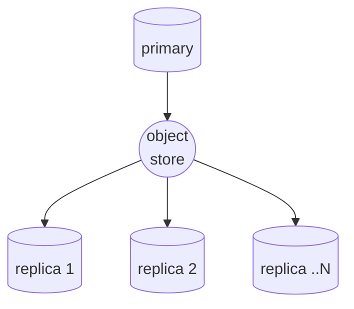

</div>

This architecture:

- decouples deployment
- allows rebuilding a database instance up to a specific transaction point
- is generally more scalable

By delegating the work to an external component, it relieves the primary
database instance from having to deal with serving the replica instances.

Each uploaded file (segment) contains a block of transactions. We overwrite the
last file over and over with more transactions until it's large enough to roll
over to the next file. We need to do this because the compatible object stores
we use, for the most part, do not support appending.

<div style={{textAlign: 'center'}}>

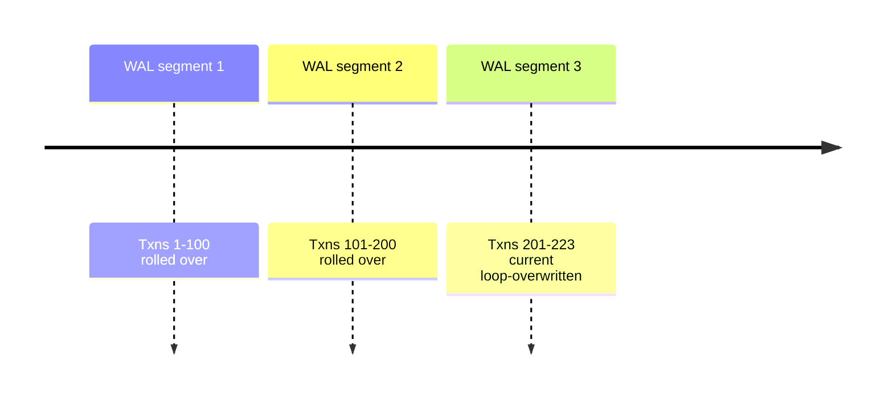

</div>

Being a time series database, users would typically stream (ingest) r...

### QuestDB 8.1.0 - Parquet, smarter snapshots, improved SAMPLE BY, and more
**Description**: QuestDB 8.1.0 opens up Parquet files. This release marks a big step towards QuestDB's next generation architecture. Lots of other goodies, too.

<hr />

QuestDB 8.1.0 has arrived.

Our [prior release](/blog/questdb-release-8-0-3/) introduced JSON extraction.

And now, by popular demand, QuestDB meets
[Apache Parquet](/glossary/apache-parquet/).

In this release, QuestDB's foundation takes another step towards our
next-generation architecture. This article will break down three key features,
then itemize performance improvements and bugs.

_For the full notes including PR links,
[checkout GitHub](https://github.com/questdb/questdb/releases/8.1.0)._

Parquet read support

Headlining this release is read support for
[Apache Parquet](/glossary/apache-parquet/).

With Parquet support, you can have:

- timeseries data within Questdb
- master tables on Parquet files

And then join them with a single query.

To do so, use the `read_parquet()` function to read
[Apache Parquet](https://questdb.com/glossary/apache-parquet/) files.

```questdb-sql title='Extracting JSON and reading Parquet'
WITH parsed_data AS (
  SELECT
    timestamp,
    json_extract(metadata, '$.location') AS location
  FROM
    read_parquet('financial_demo.parquet')
  ORDER BY
    timestamp
) timestamp(timestamp)
SELECT
  timestamp,
  location,
  count()
FROM
  parsed_data
SAMPLE BY
  1d
FILL(null);
```

The query above:

1. Reads a Parquet file named `financial_demo.parquet`
2. Extracts the timestamp and location from the JSON metadata column
3. Orders the data by timestamp
4. Counts the occurrences of each location for each day
5. Additionally, if there are any days with no data, those days will be included
   in the result set with null values

For more information, check out the
[documentation](/docs/query/functions/parquet/).

Both JSON support and Parquet reading are new as of the past two weeks. We plan
on continuing this pace of innovation to improve and polish these in-demand
features. **We'll need your help!** If it fits your use-case, we'd love to hear
from you.

Please note that Parquet support is currently in beta.

Improved SAMPLE BY

...

### Why we opened a public Discourse forum (and you should too)
**Description**: Feeling pushed out by Slack? Check out the top 3 public Slack alternatives in this article, which will help you measure the pros and cons and decide which alternative to choose.

<hr />

QuestDB is recognized for having an active, vibrant and responsive public Slack.
It's [still there](https://slack.questdb.com/), and every day people ask
questions, spec out possible contributions, provide feedback and just chat with
the team.

While Slack can add a lot of value to people, there are significant drawbacks
when using it as your core public community. **And to make matters worse, Slack
continues to deprecate APIs that are essential for running them!**

So, what are the drawbacks? And are there alternatives?

We'll unpack them, and check out three of them.

But first, what's Slack doing to prevent public Slack communities?

IRC + ELECTRON = PING!

Slack is a useful tool. At first, many struggled with its demanding nature. For
better or worse, what was initially a slick new version of primitive IRC
patterns with channels and slash commands has become _the workplace_ for many
companies. While IRC was/is beautiful, Slack significantly broadened the appeal.

Enterprises have taken to it, and it's clear why:

- it's sticky
- has a strong developer ecosystem
- keeps pace with the flow of work relatively well
- works for all levels of people

But for everything it does well, it does not:

- allow viewership without an account
- index into search engines, thus no SEO benefit (!!)
- keep
  [history beyond 90 days](https://slack.com/help/articles/27204752526611-Feature-limitations-on-the-free-version-of-Slack#message-history)
  on a free plan
- have high quality search

This makes it a suboptimal place from which to grow a thriving community
platform. Without these features, the significant effort spent towards support
and engagement doesn't catalyze further growth. It's fast, dynamic, and mostly
one-and-done.

In short, it doesn't scale well. Though it does work, thanks to the team's
effort and the APIs and plugins that made public Slack possible. Well, at least
before some subtle yet crucial API and free plan changes.

So how _did it_ work? And how does...

### QuestDB 8.0.3 - JSON support, smarter Web Console, and more
**Description**: QuestDB 8.0.3 contains lots of goodies. JSON support, a more helpful Web Console, performance improvements (naturally), and much more.

<hr />

**Summer time!** 🌞 For some, that's sunshine, beaches, and lotion, all that fun
stuff. Or, perhaps, hiding inside near the air conditioner because it's hot! For
QuestDB, it's another set of improvements. This release contains a bundle of
smaller improvements, with new features laying down major groundwork. And - of
course - the usual motion of performance improvements. Hot indeed. 🔥

**Upgrade! Apply liberal amounts of sunscreen!**

_For the full notes including PR links,
[checkout GitHub](https://github.com/questdb/questdb/releases/8.0.3)._

Breaking changes 💥

- **QuestDB no longer supports FreeBSD**. We test major browser versions on each
  release. That means everything we write needs to account for multiple OS
  paradigms. FreeBSD has very small market share, and more often than not we'd
  trip over edge cases. To speed things up, we've made the decision to drop
  support. This means FreeBSD is no longer tested during development.

- **NFS is now an unsupported file system**. QuestDB will refuse to start if
  running on an NFS disk. We recommend using ZFS. For a full list of supported
  filesystems, checkout the
  [Capacity Planning documentation](/docs/getting-started/capacity-planning/#supported-filesystems).

New features 🐣

JSON support

The `json_extract()` function is the first step towards robust JSON support.
Leveraging the [simdjson](https://github.com/simdjson/simdjson) library by
[Daniel Lemire](https://github.com/lemire), it allows extracting fields from a
JSON document and storing them into VARCHAR columns. There is some performance
overhead, so we recommend using it to test a schema before moving from JSON to
native column types.

```questdb-sql
SELECT
    json_extract(trade_details, '$.quantity')::long quantity,
    json_extract(trade_details, '$.price')::double price,
    json_extract(trade_details, '$.executions[0].timestamp')::timestamp first_ex_ts
FROM
    trades
WHERE
    json_extract(trade_details, '$.exchange') = 'NASDAQ'
```

...

### Top 5 InfluxDB alternatives
**Description**: Looking to move on from InfluxDB? We'll look at the top 5 choices. Whether you're in finance, observability, or IoT, we'll help you find the right solution for the job.

<hr />

Since its initial release in 2013, [InfluxDB](https://www.influxdata.com/) has held a prominent position in the time-series database ecosystem. As a pioneer in this space, InfluxDB gained widespread adoption across observability, application monitoring, and Internet of Things (IoT) use cases. However, a combination of architectural churn, product fragmentation, and persistent performance limitations at scale has led many teams to actively evaluate alternatives.

Thankfully in 2026, the ecosystem for time-series data is now more robust and diverse, offering users powerful–and often much simpler–options depending on their use case. In this article, we’ll explore five compelling InfluxDB alternatives to consider if your team is starting fresh or looking to migrate off InfluxDB entirely.

InfluxDB, history in brief

To understand why teams are reconsidering InfluxDB, it’s useful to look at how the product has evolved.
Over the last decade, [time-series](/blog/what-is-time-series-data/) workloads have changed dramatically. Data volumes exploded, cardinality increased, and new use cases emerged—particularly in cloud-native infrastructure, industrial IoT, and financial data. In response, the InfluxData team introduced multiple major architectural rewrites in an attempt to keep pace.

These changes included:
- A rewrite of the core engine from Go to Rust
- Multiple query-language pivots—from SQL-like InfluxQL, to Flux, and now SQL
- Fragmented product structure with changes spread across several cloud-specific offerings, including serverless, single-tenant, and multi-tenant variants

Most recently, InfluxDB 3.0 Core (*finally*) reached general availability in April 2025 after a long incubation period once the [cloud-only InfluxDB 3](https://www.influxdata.com/blog/introducing-influxdb-3-0/) was released way back in April 2023. This gave users a clearer split between InfluxDB Core (open source) and commercial enterprise offerings that have been in flux (no pun intend...

### Weather data visualization and forecasting with QuestDB, Kafka and Grafana
**Description**: In this tutorial, we’ll use Kafka to stream weather data from the OpenWeatherMap API, store and process it with QuestDB, and create insightful visualizations with Grafana. Example code and easy-to-follow instructions.

<hr />

Weather stations, satellites, and sensor arrays generate a ton of
weather-related events every millisecond. When captured, this data can go on to
become valuable for various applications such as agriculture, transportation,
energy, and disaster management. For this, a specialized time-series database
like QuestDB can help store and efficiently process large volumes of data.

In this tutorial, we will stream and visualize large volumes of data into
QuestDB. To do so, we'll use [Kafka](/docs/ingestion/message-brokers/kafka/), a
distributed streaming platform that can handle high-volume data streams. Then,
we will apply [Grafana](https://grafana.com/), a powerful open-source data
visualization tool, to create a cool dashboard for weather forecasting.

Prerequisites

To follow along with this tutorial, you will require:

- A [Docker](https://www.docker.com/) environment set up on your machine
- Docker images for Grafana, Kafka, and QuestDB
- [Node.js](https://nodejs.org/en) and [npm](https://www.npmjs.com/)
- Basic knowledge of Node.js, [Express.js](https://expressjs.com/), Kafka, and
  Grafana

Node.js application setup

To start, we'll create a pair of microservices. One service will be the Kafka
stream provider, and the other service will consume these data streams for
storage in QuestDB.

First, create a new directory for your project and navigate into it:

```bash
mkdir weather-data-visualization
cd weather-data-visualization
```

Then, create a new Node.js project using the npm command:

```bash
npm init -y
```

Next, install the following dependencies:

```bash
npm install @questdb/nodejs-client dotenv express kafkajs node-cron node-fetch
```

- **@questdb/nodejs-client**: The official
  [QuestDB Node client library](https://github.com/questdb/nodejs-questdb-client)
- **dotenv:** Zero-dependency module that loads environment variables from an
  env file into process.env
- **express**: Minimal Node web application framework
- **kafkajs**: Kafka client for ...

### Analyzing multi-stream market data with Databento, Grafana and QuestDB
**Description**: Source live market-data from exchanges via Databento, build dashboards in Grafana, and derive analytics to better understand the markets.

<hr />

Market data comes in droves and can be very difficult to manage. This is true
for those who interface with a single financial exchange, let alone many. Banks,
hedge funds, and other groups trying to wrangle multiple capital markets have
their hands full.

That's why services like [Databento](/docs/integrations/other/databento/) -
a market data aggregator - are valuable. They provide a single, normalized feed
that covers multiple venues. This convenience comes with some tradeoffs, but for
the most part [Databento](/docs/integrations/other/databento/) maintains the
three financial connectivity ideals of latency, convenience, and integrity. And
the best part? It interfaces well with QuestDB for aggregation and analysis.

In this post, we'll look at [Databento](/docs/integrations/other/databento/) and
see how to get started pulling data into QuestDB.

What are market data aggregators?

In past articles, we looked at
[building live trading dashboards](/blog/build-your-custom-trading-dashboard/)
to better understand markets in real-time using data from
[crypto exchanges such as Coinbase public API](/blog/moving-average-signals-questdb-grafana-coinbase/).
While it was trivial to connect to a single exchange, in a real trading setup,
one would need to establish and maintain connections with multiple venues, all
with their own standards.

Market data aggregators are set up to solve this problem in both crypto and tradfi.
They take away the pain of onboarding and maintaining multiple exchange
connections by providing a single normalized feed that covers multiple venues.

Some aggregators pass through raw market data directly from the exchanges. This
typically induces lower latency but lacks standardisation. It's simple to tap
into the aggregator's feed, but then there is downstream work to account for
each underlying venue's specifics such as trading phases.

Other aggregators may offer a very standardised REST API where all market data
is normalized. However, this is...

### ASOF Join — The "Do What I Mean" of the Database World
**Description**: Learn about AS OF JOIN, a powerful feature that lets you correlate events in time-series data. It's that rare moment where the database will just Do What You Mean, in a single keyword!

<hr />

Dealing with time-series data means dealing with events — pieces of data that
say "_this_ thing happened at _this_ moment". Describing "the thing" involves
users, merchants, physical sensors, and so on. We denote each of these with an
ID, so an event is basically a record full of IDs. To do anything meaningful
with it, you must expand the ID into the info you have on that
thing/person/organization. You keep this in some tables, so naturally you want a
JOIN to bring it all in.

However, this info changes over time, and you have to keep the full history on
it. You need the history so that you can pull in the particular info that was
valid for an event _as of_ the time it occurred, like this:

It's such an obvious concept, isn't it? But when you go write the SQL for it,
you may hit a brick wall. WINDOW, ORDER BY, MAX, LIMIT, subselect, and you're
still not getting what you want. Then you turn to Stack Overflow, and find a
solution that involves ninja-level wielding of all those tools you were trying
out but didn't quite get right. It's ten lines long, and you spend the afternoon
figuring it out. Then you spend the next day trying to blend it into your
existing query, which already had 10+ lines of heavyweight business logic.

You've probably hit a snag or two like this along your career, and this is what
makes the [ASOF JOIN](/docs/query/sql/asof-join/) so special: it's one of
those rare moments where the database will just _Do What You Mean_, in a single
keyword!

IoT example: correlate sensor data with recorded events

To make things specific, let's go with a fun example: an acceleration sensor
mounted on SpaceX's Starship booster stage. In this example, we use the "as of"
idea a bit differently than the above description. Instead of expanding an ID
with time-sensitive metadata, we correlate the events from two tables. This is
another common use case.

We have two tables:

1. `accel_sensor`, recording the sensor's readings
2. `event`, where we note the start ...

### Analyzing the beautiful charts and history behind ECB FX rates
**Description**: In this post, we look at beautiful charts that track the European Central Bank FX rates, and then look at historical events that made a big impact. Made with Grafana and QuestDB.

<hr />

The European Central Bank (ECB) is the central bank for the euro. The ECB
administers monetary policy within the Eurozone, which consists of 19 of the 27
member states of the European Union that have adopted the euro as their common
currency.

In this article, we'll look at the historical ECB foreign exchange (FX) rates
dataset and analyze it over-time. You'll enjoy it if you have an interest in
foreign currency exchange, history or finance in general. And also if you have
an affinity for pretty charts.

The beauty of a good chart

In our previous post about
[managing Grafana variables](/blog/manage-large-symbol-lists-questdb-grafana/),
we imported and used the ECB currency fixing historical dataset as our example
data.

This data is quite different from the data we would typically look at because:

- (a) it's a much lower frequency - one price per day
- (b) the timeframe is much larger - decades

This means that this dataset contains a lot of history. In retrospect, did major
world events have an impact on these rates? To answer this question, we picked a
few historical events. The history is not only interesting, it also leads to
some beautiful charts!

Building from the data

We'll break our analysis down into a few key parts.

Price change overview

The first way we can look at these prices is through a change-based approach.
For example, we can look at the day-to-day change in percentage terms. What's
interesting about this representation is that it highlights significant events
pretty clearly:

```questdb-sql
SELECT
  timestamp time,
  currency,
  (last(price)/first(price)-1)*10000 delta
FROM fx
WHERE $__timeFilter(timestamp)
SAMPLE BY 2d
```

Just from this view, a few events jump out without the need to calculate any
further derivatives:

- 2008 Financial Crisis
- 2015 Invasion of Crimea
- Covid in 2020
- Turkish inflation in 2022
- Swiss Franc peg removal in 2014

It's been a wild couple of decades!

Timeline overview

Another way to look at it is t...

### Mastering Grafana Map Markers and Geomaps
**Description**: The Grafana Geomap panel is a powerful visualisation for showing static and moving objects on a map in realtime. In this tutorial, we'll look at how to use Grafana maps with QuestDB, and share tips and tricks along the way.

<hr />

The
[Grafana Geomap](https://grafana.com/docs/grafana/latest/panels-visualizations/visualizations/geomap/)
panel is a powerful visualisation. With it, you can show both static and moving
objects on a map in realtime. In this tutorial, we'll look at how to use Grafana
maps with QuestDB, and share tips and tricks along the way.

Sample data

For this tutorial, we will apply
[this csv file](https://slabstatic.com/prod/uploads/0tkl9ybv/posts/attachments/U49TJRCcHFoSfm4XmYy45x-h.csv)
full of Sydney, Australia bus data.

Start Grafana and QuestDB

Grafana provides an official QuestDB plugin.

To run through this tutorial, you'll need:

- Sample data (Check!)
- Running QuestDB
- Running Grafana instance

Need a hand?

[Read our blog](/blog/time-series-monitoring-dashboard-grafana-questdb/) to get
QuestDB and Grafana running with the official plugin.

Import the sample data

Navigate to where you saved the sample csv file and run the following curl command to import it into QuestDB (assuming you have saved the file as `buses.csv`):

```shell
curl -F data=@buses.csv "http://localhost:9000/imp?name=buses"
```

We are importing the `buses.csv` file and creating a table called `buses`. 

Alternatively, you can navigate to `localhost:9000` and use the Web UI to import the csv file manually. 

For more information, check out the [QuestDB Guide: CSV import](/docs/ingestion/import-csv/). 

Making map magic

Adding a Geomap panel

Click `Add` in your Grafana dashboard.

Then select `Visualization`.

From there, choose the `Geomap` panel.

Point the panel to your QuestDB data source:

We can then add a query to start getting positional data. In this case, we'll
use the previously linked Sydney Bus dataset. We'll use the `LATEST BY`
statement which displays the last known datapoint for each individual bus:

```sql
buses LATEST BY plate;
```

By default, this plots a map using a `markers` layer. Neat! However, the map is
not quite how we would like it. Since all the buses are i...

### Fluid real-time dashboards with Grafana and QuestDB
**Description**: Use Grafana with QuestDB to build a monitoring dashboard for visualization of time series data.

<hr />

In this tutorial, we'll learn how to create a real-time Grafana dashboard. The dashboard
will have line charts as data visualizations that make use of aggregate SQL
functions and Grafana global variables for sampling data based on dashboard
settings. It's straight-forward and powerful!

We'll use the
[official QuestDB Grafana plugin](https://grafana.com/grafana/plugins/questdb-questdb-datasource/).
For further inspiration, checkout our [NYC taxi](/dashboards/taxi/) and
[Crypto](/dashboards/crypto/) dashboards.

What is Grafana?

Grafana is an open-source visualization and dashboard tool for any type of data.
It allows you to query, visualize, alert on, and understand your metrics no
matter where they are stored. With its powerful query language, you can quickly
analyze complex data sets and create dynamic dashboards to monitor your
applications and infrastructure. Grafana also provides an ever-growing library
of plugins for data sources, panel types, and visualizations.

Grafana consists of a server that connects to one or more data sources to
retrieve data, which the user then visualizes from their browser.

The following three Grafana features will be used in this tutorial:

1. **Data source** - this is how you tell Grafana where your data is stored and
   how you want to access it. For this tutorial, we will have a QuestDB server
   running which we will access via QuestDB data
   source plugin.
2. **Dashboard** - A group of widgets that are displayed together on the same
   screen.
3. **Panel** - A single visualization which can be a graph or table.

Setup

Start Grafana

Start Grafana using `docker run` with the `--add-host` parameter:

```shell
docker run --add-host=host.docker.internal:host-gateway \
-p 3000:3000 --name=grafana \
-v grafana-storage:/var/lib/grafana \
grafana/grafana-oss
```

Once the Grafana server has started, you can access it via port 3000
(`http://localhost:3000`). The default login credentials
are as follows:

```shell
user:admin...

### QuestDB 8.0: Major Release
**Description**: QuestDB 8.0 brings major performance improvements, compression to open source, and implements the VARCHAR type. We also have new functions for finance! Learn about our latest.

<hr />

QuestDB gets a major version bump.

8.0 blends deep improvements with helpful new functions.

Without further ado, let's take a look at the core additions.

P E R F O R M A N C E

Performance is something of an internal obsession. When compared to competitors
([1](/blog/influxdb-vs-questdb-comparison/), [2](/blog/timescaledb-vs-questdb-comparison/)) we
already match up very well. But leading performance is a journey without a
destination. As such, through a series of compounding optimizations, we see an
average of 50% faster query speeds when looking at our Clickbench total
benchmarks.

Contributing to this improvement, in addition to a set of under-the-hood
updates, are the following major features.

Compression for OSS

Previously, system-level compression was available only within
[QuestDB Enterprise](/enterprise/). We're pleased to announce that compression
is available within open source and can be used today. To get you up-and-running
quick, we have a [short guide](/docs/deployment/compression-zfs/).

Compression is provided via ZFS, and we expect at least a 6x reduction in
storage utilization. But system-level compression is one aspect of lowering disk
usage. Another aspect is reducing the size of the files generated by the
database.

And to that tune, we'll introduce VARCHAR.

VARCHAR replaces STRING

For those unfamiliar, VARCHAR stands for _variable character_. It has been an
integral part of SQL since near its inception. Its adoption in QuestDB provides
benefits over the existing STRING type:

| Feature        | `VARCHAR`                                            | `STRING`                                                      |
| -------------- | ---------------------------------------------------- | ------------------------------------------------------------- |
| Encoding       | UTF-8                                                | UTF-16                                                        |
| Storage        | Typically lower storage requi...

### How to upgrade and benchmark a Raspberry Pi5
**Description**: Just how powerful is a Raspberry Pi 5? In this article, we'll show you how to upgrade and prepare your Raspberry Pi for benchmarking and how to properly install an NVMe 2.0 SSD (pictures!). We'll put it through the paces in disk writes and assess overall hardware utilization.

<hr />

This article will demonstrate how to upgrade your Raspberry Pi with an SSD and
operating system setup which can take advantage of the new hardware. It'll then
show how to setup your OS, the
[time-series benchmarking suite](/blog/optimizing-optimizer-time-series-benchmark-suite/),
and install QuestDB.

With this preparation, you can follow along with
[our own benchmarking attempt](/blog/raspberry-pi-5-benchmark/). It's helpful
for those who want to install an M.2 NVMe on their Raspberry Pi, or those who
want to do that _and_ benchmark QuestDB.

Make a Pi

Step one. Supe up the Pi.

And for that, we'll use a very solid M.2 NVMe SSD.

Our chosen NVMe drive will exceed 2000mb/s in both read and write. A
top-of-the-line SD card will tickle 300mb/s at best. With a very fast NVMe
drive, we'll move data as fast as the CPU can handle. Our bottleneck won't be
storage. And an NVMe drive is also much more durable.

To prevent this article from stretching too long, we'll summarize the build
steps and link to high quality resources.

Attach the M.2 drive

Our next step is to attach the NVMe drive to the Pi.

The manufacturer of the M.2 extension kit, Pimoroni, offers
[clear and easy-to-follow](https://learn.pimoroni.com/article/getting-started-with-nvme-base)
documentation.

It involves fastening the Pi to the board:

Then assembling it all together, with the delicate-yet-responsible bridge strip
cable snapped-in:

After that, we secure it in the case. We recommend using a case with a fan. The
extra air movement will ensure your Pi stays cool and comfortable, even during
intense benchmarks.

All of the remaining steps occur on the software-side.

Set the Pi to M.2

For this step, we followed a
[solid guide from Tom's Hardware](https://www.tomshardware.com/raspberry-pi/how-to-turbo-charge-your-raspberry-pi-5-with-an-nvme-boot-drive).

The M.2 is not automatically detected. To enable it, we edit the Raspberry Pi
firmware settings. To do so, boot into the Pi and alter a coup...

### Build your own resource monitor with QuestDB and Grafana
**Description**: Learn how to build a resource monitor with QuestDB and Grafana, and visualize system resource usage data. Also learn how to correlate application events with resource utilization!

<hr />

There are many open tools that allow system administrators to monitor resource
utilisation such as CPU, memory, disk, and network. While most of these tools
only display the data in an interface, few offer to store the data and make it
available to query - or visualize - at a later date.

In this tutorial we'll build a small resource monitor to do just that:

1. Polls a system for resource usage
2. Saves the output in a QuestDB instance
3. Display the output Grafana in realtime

We'll also see how we can use the resulting time series to correlate with other
events such as running a particular bit of code. By the end, you'll have a solid
template that deepens your understand of both resource monitoring and analysis
and the code/resource relationship.

Setup

To reproduce examples in this tutorial, you need

- A running instance of QuestDB
  - Not running yet? Checkout the [quick start](/docs/getting-started/quick-start/).
- A running instance of Grafana
  - We've got a [small guide](/docs/integrations/visualization/grafana/) to help
- Sample data. In this case, we'll use `psutil` to generate data about local
  ressource usage (CPU, Ram) within a Python script.

Generate data with psutil

In this article, we'll use Python.

It's clear and readable, and the basics apply to many other languages.

The `psutil` library will raise information about local resource usage.

It performs a variety of functions to get resource information, including
looking at and even managing system related process.. We can put its features
into two main buckets: (1) system monitoring and (2) process management:

- System monitoring:

  - Monitor resource utilization like CPU, memory, disks, network, sensors and
    so on
  - Retrieve system uptime and boot time
  - Access information about system users, battery status, and disk partitions

- Process management:

  - System process infomoration, such as their ID, name, status & CPU/memory
    usage
  - Control processes; terminate or k...

### Does "vpmovzxbd" Scare You? Here's Why it Doesn't Have To
**Description**: Learn about SIMD, its mnemonics, registers and instructions. We'll demonstrate how these parallel processing techniques enhance database query speeds through an accessible walkthrough. Impress your programmer friends!

<hr />

At QuestDB, we have a [JIT compiler](/docs/concepts/deep-dive/jit-compiler/) for the WHERE
clause of SQL queries. We implement it with hand-coded SIMD instructions — such
as the one from the title. When I started working here, I have to admit — these
instructions scared me! But, once I sat down to study them, it turned out to be
much less scary, in fact, not scary at all. It just took some getting used to.

This article provides a gentle intro to what I found out, and shares how I got
to write some SIMD code of my own. Much of the obscurity comes from unfamiliar
jargon. Let me deal with a few items of that first, to ease you into the topic.

What exactly is a SIMD instruction?

SIMD stands for "Single Instruction, Multiple Data". Before studying it, I had
this mental model that such an instruction would run some equivalent of a loop
to do work on a block of memory. In fact, even the original 8086 instruction set
has a few instructions like that, for example `repne scasb` scans a whole string
for a matching byte!

The actual selling point of a SIMD instruction is not "multiple data" itself,
but "multiple data _in parallel"_. Another non-obvious thing I found out was
that a SIMD instruction operates on a CPU register, just like a "regular"
instruction, and not on a block of memory of arbitrary size.

A traditional register represents a single value, for example a 64-bit integer.
If you are processing a collection of items, you have to do it one by one:

SIMD instructions use their own special registers, which represent _vectors_ of
values. Just like a regular register, a SIMD register has a fixed size, for
example 256 bits. However, a given SIMD instruction can see the contents of that
register in many different ways: as four 64-bit integers, or eight 32-bit
integers, or even thirty-two 8-bit integers. Some other instructions can use the
same register as a vector of floating-point values instead of integers.

A single SIMD instruction therefore has the effect ...

### Create an ADS-B flight radar with QuestDB and a Raspberry Pi
**Description**: Discover how to build your own flight radar with QuestDB and a Raspberry Pi. Follow our step-by-step tutorial to set up a scalable, real-time aircraft tracking system using minimal hardware and ADS-B technology. Perfect for IoT enthusiasts and hobbyists.

<hr />

We've been keen on the Raspberry Pi lately. It's fun to play with and makes for
an excellent demonstration. The Pi shows us that even with minimal hardware we
can create useful and scaleable things.

In our previous post, we showed how to
[setup a lightweight QuestDB server on a Raspberry Pi](/blog/create-iot-server-raspberry-pi/).
In this post, we'll use the same server, only juiced up with a little more
sensor hardware.

Our mission? To track airplanes flying around the world. We'll apply a similar
method used by [FlightRadar24](https://www.flightradar24.com/),
[FlightAware](https://www.flightaware.com/), and other flight tracking services
that use the ADS-B service.

What is ADS-B?

ADS-B is an acronym for Automatic Dependent Surveillance Broadcast.

Aircraft equipped with this system automatically broadcast their position,
identification, bearing, altitude, and more, at a regular interval to nearby
aircraft and ground stations. These ground stations are vital to keep our skies
safe. And we're about to build one.

The system is called 'dependent' because the transmitted position is calculated
using the aircraft's onboard navigation systems, which often includes GPS,
inertial navigation units, and more.

In other words, the position transmitted is where the aircraft "thinks" it is.
It supplements radar in Air Traffic Control situations, and can also help
aircraft identify each other's relative positions.

> If you're a frequent reader of the blog, you'll notice this is similar to the
> AIS system for ships we discussed in
> [Tracking sea faring ships](https://questdb.com/blog/tracking-sea-faring-ships-ais-grafana/).

Required gear

To track planes, we need additional hardware beyond the
[base QuestDB + Raspberry Pi IoT server](/blog/create-iot-server-raspberry-pi/).

We need:

- An ADS-B SDR dongle. In this case, we'll use the
  [FlightAware prostick](https://www.flightaware.com/adsb/prostick/).
- A 1090MHz SDR antenna. These come either for indoor or outd...

### Build a temperature IoT sensor with Raspberry Pi Pico & QuestDB
**Description**: Learn how to build a robust IoT temperature sensor using Raspberry Pi Pico & QuestDB in this detailed tutorial. Discover step-by-step instructions for setting up your sensor, connecting to WiFi, and integrating with QuestDB for real-time data analysis. Perfect for DIY enthusiasts and developers looking to expand their IoT projects.

<hr />

In a previous post, we looked at how to
[setup a lightweight QuestDB server on a Raspberry Pi](/blog/create-iot-server-raspberry-pi/)
to collect data from a potential mesh of IoT devices. We used a very bare bones,
a minimal Python app for our example sensor.

In this post, we'll explore how to setup a much more robust Raspberry Pi Pico as
a temperature sensor. While its sensor is not the most accurate, it has the
advantage of being onboard the chip. No soldering required!

At the end, we'll have a baseline for a potential sensor mesh that features more
accurate temperature sensors or a variety of different sensor types. And with
QuestDB, the confidence that we can scale it as far as we need.

Pi Pico vs Raspberry Pi

All forms of Pi are delicious (and functional). Yet they have their pros and
cons, different ingredients if you will. Enter the Raspberry Pi Pico.

Unlike its bigger brother, the Raspberry Pi, the Raspberry Pi Pico is not a
computer. Rather it's a microcontroller with a bunch of General Purpose
Input/Output (GPIO) pins that connect various devices and circuits such as
sensors, LEDs, small displays, buttons and so on. There are many, many
possibilities.

The original Pi comes with gigabytes of RAM. The Pico only offers… 256kb. While
it is far less powerful, the Pico is also significantly cheaper, at about 8$ per
unit. However, it requires much less power and can even run on batteries for
extended periods of time.

As a tradeoff, the Pico is not able to run an operating system and needs to be
programmed externally. This program is then saved to the onboard memory where it
will start executing as soon as power is supplied to the Pico.

Pico as a temperature sensor

The Pi Pico offers three interesting features for building a mesh of remote
temperature sensors:

- First, it has an onboard temperature sensor. This means there is no need to
  purchase a sensor and connect/solder it to the pins. It's quick to get
  started.

- Second, if it's a Pi Pic...

### Create an IoT server with QuestDB and a Raspberry Pi
**Description**: Discover how to build an efficient IoT server using QuestDB on a Raspberry Pi in this comprehensive tutorial. Learn to handle vast time-series data from IoT devices with ease, achieving over 1 million rows per second ingestion. Ideal for developers and hobbyists looking to scale their IoT solutions from home projects to industrial applications.

<hr />

Networks of IoT devices provide a ton of value to a great many industries.
Building and deploying sensors within an IoT network is also a great way to see
the generation of time-series data, which can be bursty-if-not-explosive. For
this reason, many look for a high-performance time series database as the
central source for IoT sensor ingestion.

While this guide is for a modest home temperature sensor configuration, QuestDB
can scale up to handle the blasts of sensor data generated via:

- rockets bound for outer-space
- nuclear reactors
- the cranes moving our goods at the worlds busiest ports
- the fastest cars ripping around the track in the Formula 1

Plus more! And it can do so on minimal hardware. On a Raspberry Pi for example,
you can **easily ingest over 1 million rows per second**. In this guide, we'll
setup a QuestDB server on a Raspberry Pi. Then we'll send it example sensor data
via a skeleton temperature reading device written in Python.

Requirements

For this tutorial, you will need

- A Raspberry Pi, 4 or 5 is best
- An SD card
- An appropriate power supply
- Some peripherals (display, keyboard, mouse, micro-HDMI cable or adapter)

Getting the OS running

Out of the box, a Raspberry Pi does not have an operating system from which it
can boot. The OS is usually flashed on an SD card which can then be inserted in
the Raspberry Pi's SD card slot.

While there are many choices of OS, a popular distribution is the official
Raspberry Pi OS. It often comes pre-packaged when you purchase a Raspberry Pi.
However, if you need an OS or want to choose your own, the
[Raspberry Pi official software page](https://www.raspberrypi.com/software/)
allows you to download a convenient flashing tool.

From the tool, the steps are:

1. Choose the OS you want
2. Choose the SD card you want to flash the image on
3. Flash it
4. Insert the flashed card into the Raspberry Pi

That's it. You're good to go!

After installing the OS and booting the Raspberry Pi, you will ...

### Maximize your SQL efficiency: SELECT best practices
**Description**: Unlock the secrets to faster, more efficient SQL queries with our expert guide on best practices for SELECT statements. Perfect for developers and DBAs looking to optimize database performance and resource usage. Dive into our practical tips and enhance your SQL skills.

<hr />

SQL is wildly popular. Within it, the most common command is the SELECT
statement. After all, what good is a database full of valuable information if
you're unable to read it with flexibility and efficiency?

This guide walks you through best SELECT practices. Afterwards, you'll write
more efficient and powerful SQL statements. This can save both processing time
and resources, leading to faster queries and cheaper databases.

While many of the optimization tips would make sense universally across any SQL
database, the statements we show are specific for QuestDB and many include its
robust time-series extensions.

If you don't have a database of your own running, consider launching these
queries into the [QuestDB demo instance](https://demo.questdb.io). The example
queries leverage the built in data sets when possible.

Apply columnar specificity

> **Read only the columns you need and avoid doing select \*.**

The first one may seem like common sense, but searching GitHub for
`SELECT * FROM` returns 5.7 million results. Surely a great number of these are
only looking for a column or two. Specifying a column vs. all columns narrows
down the result set. This reduces data transfer and lightens the load on memory.

Specify - or "scope" - specific columns, if all you need are specific columns:

```questdb-sql
SELECT fare_amount from trips;
```

Scoping your columns is always a wise idea. But where it shines most is within
databases that support the
[columnar database format](https://questdb.com/glossary/columnar-database/), such
as QuestDB.

Always filter by designated timestamp

Designated timestamps are a very powerful feature. With timestamps, the database
quickly locates the initial data point that is relevant to the query.

QuestDB optimizes query execution by physically organizing data in ascending
order based on a designated timestamp and partitioning this data according to a
predefined resolution.

This minimizes random access operations, instead favourin...

### 1BRC merykitty’s Magic SWAR: 8 Lines of Code Explained in 3,000 Words
**Description**: Explore the ingenious method behind the One Billion Row Challenge's fastest temperature parsing technique, featuring a deep dive into Quân Anh Mai's (@merykitty) optimization code without loops or if statements, leveraging bitwise operations and ALU magic for unparalleled efficiency.

<hr />

In a
[recent blog post](https://questdb.com/blog/billion-row-challenge-step-by-step/)
I described the most important optimizations I and other contestants applied at
the recent [One Billion Row Challenge (1BRC)](https://1brc.dev/). Using them I
showed how the performance of the initial idiomatic, parallelized Java code
improves by a factor of 40. We went from 71 seconds, down to 1.7.

The optimization techniques we applied ranged from simple and digestible to
arcane and mystifying. One technique in particular stood out as especially
awesome but cryptic, and I noted that explaining it would take another full blog
post.

So, here we are!

Enter the 1BRC

Several experts predicted at the outset of the 1BRC contest that, once the
"usual suspects" are dealt with, one particular concern would become the
botteneck: parsing the temperature from the CSV file. It isn't a complicated
format – the temperature can range from -99.9 to 99.9, so there are a total of
four possible arrangements of characters: `-XX.X`, `-X.X`, `X.X`, and `XX.X`.
But, when your goal is to parse one billion of them in less than a second, every
little detail and variation becomes an issue.

Initially, contestants used the `Double.parseDouble()` library call. But soon
enough, custom solutions started popping up that were up to a screenful long.
Many adopted an approach that looked pretty optimal. It didn't involve any
loops, and had the seeming "theoretical minimum" of two branching points,
covering the four possibilities.

Then, out of the blue, a solution appeared that set the Twitter #1BRC hashtag on
fire. No `if` statements, and just a single read from the file! It was a part of
the solution contributed by Quân Anh Mai (GitHub handle
[@merykitty](https://github.com/MeryKitty)). The code looked like nothing less
than magic incantations, and even the top experts nodded in disbelief.

Since 1BRC was an open source contest, everyone could look at and copy ideas
from others. As a result, this snipp...

### The Billion Row Challenge (1BRC) - Step-by-step from 71s to 1.7s
**Description**: I took part in the Billion Row Challenge. Enjoy a deep, step-by-step summary of how you get from a Parallel Java Streams implementation that takes 71 seconds to a super-optimized version that takes 1.7 seconds. Example code and walkthroughs included!

<hr />

As I was browsing my timeline on the boring afternoon of the New Year's Day
2024,
[this tweet by Gunnar Morling](https://x.com/gunnarmorling/status/1741839724933751238)
jumped out:

> How fast can YOU aggregate 1B rows using modern #Java? Grab your threads, flex
> your SIMD, and kick off 2024 true coder style by joining this friendly little
> competition. Submissions accepted until Jan 31.

The challenge was this:

> Write a Java program for retrieving temperature measurement values from a text
> file and calculating the min, mean, and max temperature per weather station.
> There’s just one caveat: the file has 1,000,000,000 rows!

My first thought was, "Pfft, min, mean and max, that's so simple!" And the
dataset was simple as well: just 413 unique keys, of quite uniform, short
lengths. Super-simple data format. A whole _month_ to do it. Where's the
challenge?? As is often the case, the devil was in the details.

It soon dawned on the contestants that calculating only min, mean and max made
the competition harder, not easier. But why? There wasn't one obvious place
consuming CPU cycles. Opportunities to make it even faster lay everywhere, even
in the darkest corners of the CPU architecture.

As a saving grace, the challenge was held out in the open on GitHub. Copying
others' ideas wasn't just allowed, it was encouraged. This was to be a learning
experience, not a war of secrets.

It was also going to be a month-long frenzy of research, ingenuity, and just
plain _fun_. It grabbed the attention and devotion of hundreds of enthusiasts,
including at least a dozen or two top Java performance experts.

The winning solution is the one submitted by none other than Thomas Wuerthinger
([@thomaswue](https://github.com/thomaswue)), the lead of the GraalVM project —
that's the kind of heavyweights I'm talking about! Along with several other key
contestants, he introduced many of the great ideas that everyone else grabbed
and incorporated into their own submissions.

My s...

### Replace InfluxDB with QuestDB
**Description**: Example code included! Easily migrate from InfluxDB to QuestDB for improved performance, reduced costs and better ease of use with the newly introduced InfluxDB Line Protocol over HTTP. ILP over HTTP enables a seamless, high-performance InfluxDB replacement for your time-series database needs.

<hr />

InfluxDB has long been a leader in time-series. However, for higher performance
and scale requirements, such as with
[high cardinality](/glossary/high-cardinality/) data and for better developer
ergonomics, teams have started looking for a replacement.

But replacing a database can be tricky. They and their unique quirks are often
deeply embedded in business logic. The easier the lift, the better.

To that tune, we're pleased to announce that with the newly released InfluxDB
Line Protocol (ILP) over HTTP, QuestDB can now act as a drop-in ingestion
replacement for InfluxDB use cases.

Let's see it in action!

Why move from InfluxDB?

But first, we should answer the burning question.

Why migrate at all?

Comparisons are tricky due to the broad array of overlapping products offered by
Influx. And in the end, it always comes down to your team's specific needs.

But in most cases, [time-series data](/blog/what-is-time-series-data/) appears
in explosive volumes. If as a result, you've run into elevated Cloud or
infrastructure costs, hit ingestion bottlenecks due to overall throughput
requirements or high data cardinality, then QuestDB can help.

We'll touch on comparative points, but for focused comparisons then see:

- [Comparing TimescaleDB and QuestDB performance and architecture blog](/blog/timescaledb-vs-questdb-comparison/)
- [QuestDB vs InfluxDB internal comparison blog](/blog/influxdb-vs-questdb-comparison/)

Introducing ILP over HTTP

Previously, to use the InfluxDB Line Protocol to ingest data into QuestDB, teams
had to either use the QuestDB client library or send data to the ILP TCP
endpoint. While the TCP receiver was a performant and reliable option for those
who wanted to use ILP, onboarding was inconvenient for existing InfluxDB users.
They would have to refactor their codebase to use either the QuestDB clients or
the TCP endpoint, both for ingest and query.

To significantly ease the friction, QuestDB now supports ILP over HTTP. Teams
can update ...

### How crypto exchanges like Coinbase make money
**Description**: Discover how Coinbase and other exchanges generate revenue. We explore Coinbase's fee structures and trading strategies, using QuestDB's new window functions for real-time revenue analysis. Ideal for both tech and financial enthusiasts.

<hr />

Coinbase is a leading cryptocurrency exchange platform founded in 2012. It has
become a key player in the digital currency space, in large part due to its
adherence to regulatory structures and its ease of use. But have you ever
wondered how an exchange like Coinbase makes money? We know they collect fees,
but how does that actually shake out?

In our [7.3.7 release](https://github.com/questdb/questdb/releases/tag/7.3.7),
we rolled out new `sum()` & `over()` window functions. These functions make it
possible to calculate cumulative sums over an interval of time. We can use such
functions to derive all kinds of useful information, and to answer our central
question.

In this post, we'll estimate crypto exchange revenue based on publicly available
trading flows. You don't need to be a technical _or_ financial expert.

How does an exchange make money?

A crypto exchange typically makes money by taking a percentage on every trade. A
simplistic example is, consider that they charge 0.10% (10 basis points) on the
notional value of each trade. For a trade worth $10,000, the exchange would make
`10,000 x 0.10% x 2 = $20`. The amount is multiplied by two because the
transaction involves two parties, and each party pays the fee.

In practice there are other important considerations and the fees can vary
greatly. The two main variables are:

1. Whether the exchange has a varying fee structure or a **tiered fee
   structure** or discounts for, say, holding a certain quantity of the exchange
   token

2. Whether the exchange charges differently - or even pays for - **Maker
   trades** as opposed to **Taker trades**

Let's dig into both.

About tiered fee structures

Crypto exchanges do not typically charge the same level of fees to all traders.
Instead, they implement a tiered fee system whereby traders who bring more
volume to the exchange are compensated with lower fees.

This provides an incentive. More active traders are encouraged to send all their
orders to a parti...

### Tracking sea faring ships with AIS data and Grafana
**Description**: Explore maritime traffic analysis through historical AIS data. Learn about AIS system capabilities, data conversion, and visualization techniques with heatmaps and time-series databases, offering a deep dive into vessel tracking and maritime patterns with QuestDB and Grafana.

<hr />

```shell
Drunken Sailor - Ye' old sea shanty
What shall we do with a drunken sailor?
What shall we do with a drunken sailor?
What shall we do with a drunken sailor?
Early in the morning!
```

What shall we do? We'd keep an eye on their boat, that's for sure. Who knows
where it could wind up? In this post, we will look at historical location data
from the Automatic Identification System (AIS) to analyze traffic and create
visualizations to have us chart the ships that sail the seas.

There will be no more singing. Weigh the anchor! Hoist the sails! Make way!

What is the Automatic Identification System?

The
[Automatic Identification System](https://en.wikipedia.org/wiki/Automatic_identification_system)
broadcasts ship data. It works by leveraging the ships' onboard
[transceivers](https://en.wikipedia.org/wiki/Transceiver) which communicate
their position, course, speed, and other metrics. It is mostly intended as an
anti-collision system to support traffic controllers and
[coast guards](https://www.youtube.com/watch?v=VSdxqIBfEAw) in addition to other
means such as radar.

For certain ship sizes, continuous AIS data transmission is often a regulatory
requirement. As a result, the AIS transceivers are typically always on. Turning
the AIS system off may in some cases indicate that a ship is attempting to hide
their position, possibly to hide illegal activity such as
[off-radar fishing](https://www.ft.com/content/d77fff4d-a9c6-4224-89fc-b3b08d1d833b)
or sanctions evasion such as
[North Korea oil smuggling](https://ig.ft.com/north-korea-oil-smuggling/). And
that can attract the attention of authorities.

Typical AIS data would include:

- the ship's position
- bearing
- speed
- type
- a unique identifier called MMSI, the
  [Maritime Mobile Service Identity](https://en.wikipedia.org/wiki/Maritime_Mobile_Service_Identity)
- journey start and end time

If this sounds like "[time-series data](/blog/what-is-time-series-data/)",
you're correct. This data exemplifies t...

### US Bitcoin ETFs: Understanding fair value
**Description**: Visual and accessible exploration of the latest Bitcoin ETF releases in the U.S. Discover how market dynamics impact fair value, the role of market-makers, and the nuances of Premium and Discount in ETF pricing. Read before you trade!

<hr />

Bitcoin Exchange-Traded Funds (ETFs) are live in the United States! As
anticipated, the Security and Exchange Commission approved 11 products to start
trading on regulated exchanges. Investors are excited! But are they going to get
a fair price? ETF launches have interesting dynamics, and in this post we'll
look at how some of them materialized.

ETF trading dynamics, the secondary market

A primary market is when investors buy securities directly from the issuer, and
not from other investors. An Initial Public Offering (IPO) is one such example,
where the funds raised go to the company in exchange for initial share. There
are then secondary markets.

The secondary market is the most intuitive. Shares of a stock like `AAPL`
typically trade only on the secondary market. After shares are issued, they
change hands on a secondary market such as a stock exchange. Just like stocks,
ETFs trade on the secondary market. Unlike stocks, ETF shares also trade on the
'primary' market, which we'll explain further into this post.

ETF issuers typically contract market-makers to enrich the secondary market.
Market-makers post executable quotes most of the time in the ETF orderbook, so
that it is liquid.

This liquidity makes the product more attractive to investors as they know they
can execute against these quotes to enter and exit a position. In other words:
They will avoid a situation where there is no one to buy their ETF if they need
to liquidate for whatever reason.

Considering only the existence of a secondary market for the moment, we can see
that a market-maker is constantly posting quotes with a fixed spread. But what
if everyone was selling to the market-maker?

In that case, they would sometimes offset/shift/fade (terminology varies by
desk) their prices. The more they buy, the lower their bid and ask will be. This
is both as a measure to mitigate concentration risk, or buying a lot of the same
thing, and to mitigate inventory.

Consequently, the ETF may trade ...

### Visualizing real-time NYC cab data and geodata
**Description**: Explore a simulated real-time dashboard of NYC's taxi industry using historical data, showcasing dynamic visualizations of taxi flows, fares, tips, and hotspots for effective business management and analysis. Created with Grafana and QuestDB, a high performance time series database.

<hr />

A friend left his job in banking and decided to open a pizzeria with his mates.
They were quite successful, and within a few years they went from 1 restaurant
to 8. As this happened, they gradually went from running individual restaurants
to macro managing them remotely. To help them do so, they built a realtime view
of all the pizzerias.

Inspired by their experiences, an idea appeared when we came across the New York
City taxi dataset. We thought: How would business analytics look for the NYC
taxi business? Could we monitor it in real-time? How would it look?

To answer this, we constructed a pseudo-realtime dashboard to test the concept.
The graph uses
[real data from New York City cabs](https://www.nyc.gov/site/tlc/about/tlc-trip-record-data.page),
replayed with an offset of a few years to simulate streaming data. Let's see how
it works.

> See the [NYC Taxi Grafana dashboards](/dashboards/taxi) in real-time.

How to simulate real-time data

Unfortunately, we do not have access to true real-time data for NYC taxis. To
simulate "real-timely-ness", we instead tune data from real historical files.

To do so, the data is loaded into QuestDB and then the queries are run against
the year 2015 with current month, day and time. We will then visualize this data on
Grafana. If you wish to follow along, check out
[our tutorial](/blog/time-series-monitoring-dashboard-grafana-questdb/) on how
to connect QuestDB and Grafana or visit the
[Grafana docs](/docs/integrations/visualization/grafana/).

To import the data into QuestDB, first download the parquet files for the
intervals you are interested in from the above address. Then, we can use the
[python client](https://py-questdb-client.readthedocs.io/en/latest/index.html)
to insert the rows into a QuestDB table in just a few lines of code:

```python

from questdb.ingress import Sender

path = 'PATH_TO_YOUR_FILES'
fileName = 'NAME_OF_YOUR_FILE'
trips = pq.read_table(f'{path}{fileName}.parquet').to_pandas()

with Sender...

### Visualizing yield curves with Grafana and QuestDB
**Description**: Explore the significance of the yield curve in finance, its impact on investments, and market responses during events like the COVID pandemic, with a deep dive into time-bound SQL query analysis using QuestDB and Grafana for financial insights.

<hr />

In simple terms, a yield curve is a graph that shows how much money you could
earn from an investment over different periods of time. In financial terms, the
yield curve is a plot of the yield of fixed-interest securities against the time
left to maturity.

The yield curve is major piece of data that underpins most of finance, from
mortgage rates to the price of Tesla's stock. In this post, we'll look deeper at
what the overall yield curve is and visualise how it changed in the last few
years. From there, we'll try to see what it means for the markets overall.

What is the yield, and what does it mean?

The yield of a security is the income derived from holding the security. It is
generally expressed in annual terms. For example, consider that an investment
costs $97 and that it pays off $100 in 3 months time. The investor purchasing
this investment would make $3 on their investment of $97 over 3 months. The
yield is therefore $3/$97 = 3.09% for the quarter, or around 12% per annum.

Let's add another layer. Consider if another investment was available paying
back $100 in three months, but costing only $95. Then its yield would be 5.26%
over the quarter, or around 26% per annum. The reason both investments can exist
and have different yields while paying out the same amount at the same time is
that they would have different risk profiles. More risk means investors want
more reward for taking this risk, and therefore as a result they expect higher
yields.

In effect, the yield is a quantity we observe from the prices of different
investments. It reflects the amount investors want to earn to buy this
investment, as implied by the price at which the investment is trading. Such
investment may be a loan and an investor may want more reward for loaning to a
"riskier" venture than to an established - and in theory more reliable -
business.

The yield curve

In the previous example, we used the yield to compare two investments from two
different sources. For example...

### Normalizing Grafana charts with window functions
**Description**: Discover how to use the first_value() window function in SQL to normalize and compare time series data in Grafana. This article provides a step-by-step guide to creating more effective Grafana visualizations, with simplified queries and improved performance for data analysis.

<hr />

In a previous post, we looked at how to
[create dynamic lists of symbols and charts in Grafana](/blog/manage-large-symbol-lists-questdb-grafana/).
While this is great to watch individual charts for different symbols, sometimes
you may want to merge all the charts together to compare changes in a visual
manner.

One of our community members had been struggling with this over time and had
tried various approaches. As a result, we created an implementation of the
`first_value()` window function which easily solves the underlying issues with
these types of visualizations. This article explains how it's applied.

As a reminder, if you like to follow along with your own instance of QuestDB and
Grafana, follow
[our tutorial](/blog/time-series-monitoring-dashboard-grafana-questdb/) or visit
the [Grafana docs](/docs/integrations/visualization/grafana/) for more information.

This data in particular was pulled using the
[cryptofeed](https://github.com/bmoscon/cryptofeed) library. See
[this tutorial](https://questdb.com/blog/ingesting-financial-tick-data-using-time-series-database/#method-1-ingesting-data-using-the-cryptofeed-library)
to set it up quickly and start ingesting real trades from the largest crypto
exchanges directly into QuestDB.

The simple approach

Unfortunately … does not work. If we were to create a chart with the prices of
ETH-USD and BTC-USD, then we would end up with something like this…

```sql
SELECT
  timestamp,
  symbol,
  price
FROM
  trades
WHERE
  $__timeFilter(timestamp)
  AND symbol IN ('ETH-USD', 'BTC-USD')
```

The chart uses the `partition by values` Grafana transformation to generate two
series. As you can see, the price of 'BTC-USD' is roughly 17x greater than
'ETH-USD'. On the same scale, the time series are hard to compare. If we wanted
to look at volatility or another moving metric, we'd need lots of patience and a
very strong magnifying glass.

Overriding the axis

One solution to create comparable data is to assign each series to...

### How to increase Grafana refresh rate frequency
**Description**: Quick and easy example. Learn how to increase the refresh rate frequency of Grafana.

<hr />

A nice thing about [Grafana](/docs/integrations/visualization/grafana/) is seeing your
dynamic dashboards refresh as data updates over time. However, to limit the load
on the Grafana server both on the browser and on the underlying database, the
maximum default refresh rate is once every 5 seconds. While this is certainly
more than enough for some applications, in more real-time use cases such as
financial market data, there is a latent need to always get always closer to
realtime.

Conveniently, Grafana allows you to easily tweak server settings to allow for
higher frequencies. But there's a catch. Whatever is sending data to your
dashboard needs to accommodate your desired rate. Luckily, Questdb can support
hyper-fast refresh rates. The end result is more up to date dashboard with
smooth continuous-looking updates and that unparalleled feeling of realtime.

We recently built a series of
[financial market data dashboards](/dashboards/crypto/) that refresh at a very
fast interval. This guide shows you how to do the same.

Why higher frequency

The first question to ask is whether this feature is useful for your use case.
Here are some example reasons and scenarios where this can be useful.

It depends on the scale

There is little upside in having high refresh rate on large scale charts which
span a few hours to a few days. But when you are looking at small intervals such
as the last minute, last 5 minutes and so on, then a higher update frequency
makes sense as the short term changes become much more visible.

Most up to date information

Often times you want to get updated information as soon as possible. Generally,
if you are looking at prices, it's better to be looking at the latest price
possible rather than at a price that's 5 seconds old. Whether it is material or
not depends on your use case.

If you are actively trading using Grafana charts as a tool, for example to
highlight arbitrage opportunities, then want the latest price as soon as
possible. I...

### OLAP vs Time-Series Databases: The SQL Perspective
**Description**: Dive into the world of SQL in time-series analytics with our in-depth comparison across QuestDB, TimeScale, DuckDB, ClickHouse, and PostgreSQL. This blog post explores their unique SQL extensions and capabilities, demonstrating their effectiveness in scenarios like latest record queries, time-interval filtering, approximate time ASOF JOINs, and linear interpolation downsampling. Discover the optimal database choice for your specific analytical needs in time-series data analytics.

<hr />

When I started developing software, the database world was all about **OLTP** –
Online Transactional Processing. These were the days of databases primarily
handling the [CRUD operations](https://questdb.com/glossary/crud/): Create, Read,
Update, and Delete. **SQL** was king, universally used despite the subtle
variations across platforms.

Back then, only large corporations could afford Online Analytical Processing
(**OLAP**). They used expensive Data Warehouses to ingest and analyze historical
data, which was rarely updated and typically deleted in bulk. Since there was no
standard language for OLAP, each system often invented its own.

But things changed in the past 10 years. The database landscape exploded; every
OLAP system adopted SQL as its query language, computation became much cheaper,
and now _almost_ every database is either open source or offers a generous
free-tier. So, today the question isn't whether my
[OLAP database](/blog/olap-vs-time-series-databases-the-sql-perspective/)
supports SQL or if I can afford it. Instead, it's about whether it supports my
business use case and how its performance stacks up relative to the money
invested in infrastructure.

In this article, I'll show you how SQL is used across various
[OLAP databases](/blog/olap-vs-time-series-databases-the-sql-perspective/) for
time-series analytics. You'll see how some databases have adapted their _SQL
extensions_ specifically for time-series scenarios. We're going to dive into
query comparisons in **QuestDB, TimeScale, DuckDB, and ClickHouse**, and I’m
also including **PostgreSQL** in the mix to offer a perspective on how it
compares to these more specialized databases.

Time-series queries in a nutshell

[Time-series analytics](https://questdb.com/glossary/time-series-analysis/)
involve handling large data volumes with some typical patterns:

- Recent _individual_ rows may provide specific insights, whereas older data is
  typically more useful when aggregated to reveal broad...

### Tracking correlations across financial market assets
**Description**: Learn how to use Grafana and QuestDB to analyze and visualize the dynamic, correlated relationships between assets like ETH-USDT and BTC-USDT. Examples and sample data included!

<hr />

Tracking financial assets can be tricky. Emerging crytocurrency markets present
a perfect field to battle test some tried-and-true analysis methods. To that
tune, we'll look at "correlation" and "pair trading".

For example, consider whether the pair of Bitcoin (BTC) and Ethereum (ETH) are
correlated, and whether their correlation is a valuable signal. Are they
becoming more or less correlated? Why? We can dig into that, and more, and we
can do it all through slick, easy to follow charts.

In this article, we'll investigate the correlation between BTC and ETH through a
correlation scatter chart, presented in Grafana using QuestDB. If you wish to
follow along, check out
[our tutorial](/blog/time-series-monitoring-dashboard-grafana-questdb/) for
setup instructions or visit the
[Grafana docs](/docs/integrations/visualization/grafana/).

Why correlation matters in trading?

First, let's answer why correlations matter.

There are many reasons, and we'll pick three.

1. Diversification

Anyone involved in finance has heard the following at some point: _"Don't put
all your eggs in the same basket!"_, _"Diversify your risk"_. These helpful
adages all speak towards portfolio diversification.

The idea of diversification is that the volatility, and therefore the risk, of
the portfolio is reduced overall when it is spread out among a greater number of
assets. If you have many small and varied bets and a few of them go wrong, it
does not affect your bottom line as much as if you missed on a handful of big,
related bets.

Correlating assets also helps to see whether you are diversifying as much as you
intend. It may be the case that your diversification strategy blends together
two strongly correlated assets. In that case, you'd be wise to... diversify
better.

2. Hedging your bets

Correlations can help indicate assets that make strong hedges. For example, if
you are exposed to a US bank and the market is closed, you can trade a US banks
ETF in Europe as a temporary hed...

### Build your own custom trading dashboard
**Description**: Learn to build a custom trade watch with this tutorial. Aggregate and visualize market data for efficient trading using Grafana and QuestDB. Enhance your financial market analysis with our guide.

<hr />

The default view on most trading platforms is a trading instrument view. You
will have one view for BTC-USD, one for ETH-BTC, one for BTC-USDT, one for
BTC-USDC and so on. They are treated as different entities on the front-end but
in reality… It's all connected!

Typically, you would be presented with a page per pair with order books, charts,
and trade history, in addition to your own blotter. This can be difficult to
make sense of. It can be challenging to connect related pairs together or to get
a broad sense of what's happening overall.

Making a custom view

If you are a maker, then you may be tempted -- like the folks at QuestDB -- to
build your own tools. Most exchanges allow live market data to be pulled via an
API connection. We
[already showed how to build something similar](/blog/moving-average-signals-questdb-grafana-coinbase/)
with the Coinbase API, and we can use the same principles to build our own
aggregated trade blotter to improve our view of the markets overall.

While building your own platform requires initial time and effort, depending on
how you trade, it can be very valuable in the long run. It makes it infinitely
easier to build custom tools to help you trade more efficiently or to simply
increase your market awareness. As before, we'll combine the high performance
ingest and query capabilities of QuestDB with the custom chart wizardry of
Grafana. If you need a refresher on how to connect the two, check out
[our tutorial](/blog/time-series-monitoring-dashboard-grafana-questdb/) or visit
the [Grafana docs](/docs/integrations/visualization/grafana/).

This data in particular was pulled using the
[cryptofeed](https://github.com/bmoscon/cryptofeed) library. See
[this tutorial](https://questdb.com/blog/ingesting-financial-tick-data-using-time-series-database/#method-1-ingesting-data-using-the-cryptofeed-library)
to set it up quickly and start ingesting real trades from the largest crypto
exchanges directly into QuestDB.

Trade watch

The ...

### Managing large lists of symbols with Grafana variables and QuestDB
**Description**: Learn how to manage large lists of symbols efficiently with Grafana variables and QuestDB. This tutorial guides you through creating dynamic dashboards for real-time financial data analysis, making your data monitoring scalable and automated.

<hr />

[Grafana](/docs/integrations/visualization/grafana/) is great at creating custom
dashboard with vibrant custom charts. One lesser known feature is the ability to
create dynamic dashboards which adjust to your dataset on-the-fly. This is
particularly useful in financial use cases where you ingest data on a multitude
of distinct symbols and add new symbols over time. QuestDB - known for its peak
ingestion performance and SQL analytics - is a strong match for Grafana for
market data use-cases.

Our tutorial will use the
[ECB historical FX rates](https://www.ecb.europa.eu/stats/policy_and_exchange_rates/euro_reference_exchange_rates/html/index.en.html)
dataset as an example. This dataset is well representative of financial market
data. Note that it is a simplified daily dataset that only covers a few
currencies exclusively against the EUR.

In real cases, the list of distinct symbols could be much larger and the
frequency much higher. The bottom line is that you will be able to do something
like this in no time, regardless of the size of the list and the underlying
sampling frequency:

Setup QuestDB and Grafana

Before we begin, if you would like to follow along, check out
[our tutorial](/blog/time-series-monitoring-dashboard-grafana-questdb/) on
setting up QuestDB and connecting to Grafana, or visit the
[Grafana docs](/docs/integrations/visualization/grafana/).

Now let's get started!

The problem with non dynamic charts

Let's say you start a new dashboard to view FX rates in realtime. The simple
approach is to create individual charts for each currency.

For example something like this:

```questdb-sql
SELECT timestamp as time, price
FROM ecbFxRates
WHERE $__timeFilter(timestamp) AND currency = 'USD'
```

The last part `AND currency = 'USD'` means that if you want to add another
currency, you need to manually create a new chart, copy paste the query and
adjust the hardcoded currency. This quickly becomes tedious and will not scale
well, particularly if you ha...

### Moving average signals with QuestDB, Grafana and Coinbase
**Description**: Discover how to use QuestDB, Grafana, and Coinbase for moving average signals in trading. Learn to define moving averages, build indicators, and extract signals for profitable trading strategies.

<hr />

The idea of quant trading is to try and find new predictive signals to derive
profitable trading strategies. As a result there are a plethora of market
signals, from simple widespread ones used by retail outlets to complicated
proprietary strategies employed by hedge funds.

In this article, we'll look at using QuestDB queries in a
[Grafana](/docs/integrations/visualization/grafana/) dashboard to derive and test simple
trading signals. We will use the Coinbase crypto market data as the underlying
source of data. If you wish to follow along, please refer to
[our tutorial](/blog/time-series-monitoring-dashboard-grafana-questdb/) on
setting up QuestDB and Grafana via Docker or visit the
[Grafana docs](/docs/integrations/visualization/grafana/).

This data in particular was pulled using the
[cryptofeed](https://github.com/bmoscon/cryptofeed) library. See
[this tutorial](https://questdb.com/blog/ingesting-financial-tick-data-using-time-series-database/#method-1-ingesting-data-using-the-cryptofeed-library)
to set it up quickly and start ingesting real trades from the largest crypto
exchanges directly into QuestDB.

Calculating a moving average

A moving average computes the average price of a stock over a rolling window of
time. Conveniently, this is a strong use of QuestDB's newly released
[window functions](/docs/query/functions/window-functions/overview/).

We can define a moving average in a query as follows:

```questdb-sql
SELECT timestamp time,
       symbol,
       price,
       avg(price)
       OVER (PARTITION BY symbol
             ORDER BY timestamp
             RANGE 1 HOUR PRECEDING ) moving_average_1h,
FROM trades
WHERE $__timeFilter(timestamp)
AND   symbol = $Pairs
```

The moving average would look like the following…

Moving average as a technical analysis indicator

**Technical analysis** refers to analysis based solely on chart data. This
contrasts with other types of analysis, such as **fundamental analysis** which
looks at the underlying valu...

### QuestDB Release Week #4
**Description**: Release week 4 brings key features to QuestDB and QuestDB Enterprise. Replication, TLS Encryption, SQL Auto-Complete, 50% improved Query Speed and Window Functions highlight this monumental week.

Release week #4 is upon us!

This major milestone marks a leap forward in QuestDB's handling of high-demand
production use cases. To that tune, we're happy to announce two major features
in Replication and TLS Encryption in QuestDB Enterprise.

In QuestDB open source, we've got two recent releases with significant
improvements. In 7.3.4, we're releasing Window Functions, more analytic
functions, improved performance, a refreshed [Web Console](/docs/getting-started/web-console/overview/),
improved documentation and many fixes and improvements. Hot on its heels is
7.3.5 which improves query speeds for select queries and introduces a new
percentile function.

QuestDB Cloud? Secure your deployments with Role-Based Access Control (RBAC) and
enjoy the new streamlined developer experience, which includes sub-60 second
instance creation, better in-line help and one-click sample data sets.

The team is eager to get all these goodies into the hands of our community.

QuestDB Enterprise, Engage

QuestDB Enterprise now offers database Replication and TLS Encryption. High
availability is essential for high demand production cases. In the event of the
unforeseen, redundancy can stave off significant disasters. Configure a primary.
Configure one or more replicas. That's it! Oh, and TLS everything too.

- **[Replication](/docs/high-availability/overview/)**: QuestDB Enterprise supports
  high availability through primary-replica replication and point-in-time
  recovery. Our documentation will walk you through setup for database
  replication.

- **[TLS Encryption](/docs/security/tls/)**: Transport Layer Security (TLS)
  encryption is now available on all supported network interfaces and protocols:
  InfluxDB Line Protocol over TCP, PostgreSQL Wire Protocol and HTTP (REST API).
  QuestDB supports TLS v1.2 and v1.3.

QuestDB Enterprise includes everything released in open source version `7.3.4`,
plus both Replication and TLS Encryption. These features are also available to
every Ques...

### Building a faster hash table for high performance SQL joins
**Description**: Why is a fast hash table important for optimal SQL performance? We answer this question and explain how the QuestDB team designed FastMap, our hash table specialized for SQL execution.

If you run a **JOIN** or a **GROUP BY** in a database of your choice, there is a
good chance that there is a hash table at the core of the data processing. At
QuestDB, we have **FastMap**, a hash table used for hash join and aggregate
handling. While high performing, its design is a bit unconventional as it
differs from most general-purpose hash tables.

In this article, we'll tell you why hash tables are important to databases, how
QuestDB's **FastMap** works and why it speeds up SQL execution.

Database + hash table = ❤️

QuestDB is an open-source
[time-series database](/glossary/time-series-database/) that supports
[InfluxDB Line Protocol](/docs/ingestion/ilp/overview/) for fast streaming
ingestion and SQL over [Postgres wire protocol](/docs/reference/api/postgres/)
and [HTTP](/docs/query/rest-api/) for flexible and efficient querying. Like
most SQL databases, we support JOINs:

```questdb-sql
SELECT e.first_name, e.last_name, c.name
FROM employees e
JOIN companies c
ON e.company_id = c.id;
```

The above query involves an implicit
[INNER JOIN](/docs/query/sql/join/#inner-join) and returns something like
the following result set:

| first_name | last_name | name            |
| ---------- | --------- | --------------- |
| John       | Doe       | Example Company |
| Jane       | Doe       | Example Company |

What exactly does the database do to return this result? There are multiple
approaches to processing a JOIN, one of which is the so-called
[hash join](https://en.wikipedia.org/wiki/Hash_join).

To complete a hash join, we first iterate the joined table (**companies** in our
example) and store all join key to row mappings in a hash table. Then, we can
iterate the first table (**employees**) while using the hash table to find the
joined rows:

```java
public Row nextRow() {
    // Build the hash table, if it's not already built.
    if (!builtJoinTable) {
        // The table holds company id to row pairs.
        joinTable = new HashMap<Integer, Row>();
      ...

### Solving duplicate data with performant deduplication
**Description**: Duplicate data is an expensive and frustrating problem. QuestDB provides data deduplication. See how it compares with strong storage engines like Clickhouse & Timescale.

_It's a mad, mad, mad, mad world..._

Your plane lands and the cabin crew announces: "You may now use your electronic
devices.” You switch your phone on and a few seconds later a text message
welcomes you to the network and informs you of the (outrageous) service rates.
Minutes later, you get exactly the same message. Double-y outrageous! What just
happened? Well, you've been "at-least-once'd”.

The same thing can happen tens of thousands of times when you ingest time
series, analytic or event data. Duplicate data is a pain. It wastes compute and
storage resources, slows down ingestion times and distorts the accuracy of your
data sets. Wouldn't it be better if “at-least-once” was “exactly once?”

In this article, we'll look at data deduplication and compare the performance
impact of data deduplication across Timescale, Clickhouse and QuestDB.

Performance details for the curious mind

Before we get into more details about deduplication, including the approach we
took with QuestDB, let's start with the data. Of course, we expect deduplication
to degrade performance somewhat. How much will depend on the number of
`UPSERT Keys` and on the number of conflicts. But how much?

To demonstrate, we'll run an experiment.

Our goal is to evaluate the performance impact when ingesting a dataset twice.

Our methodology is:

1. Ingest a dataset once
1. Re-ingest the same dataset again

This is a pretty ugly scenario, as every row means a conflict. To make things
even more interesting, we will ingest the datasets in parallel. This will force
the databases to not only deal with duplicates, but also with out-of-order data.
The processing of out-of-order data — while valuable for customers ingesting
large data volumes — is more challenging to process.

To make sure performance degradation is within industry expectations, we will
run the experiment against two very popular and excellent databases that we
usually meet in real-time or time-series use cases: Clickhouse and Timescale.

> ...

### QuestDB + Hacktoberfest 2023: 10 Years of Hacking
**Description**: Join the QuestDB team for Hacktoberfest 2023. We've got t-shirts!

Join QuestDB for Hacktoberfest 2023

October! For many of us, October offers balanced respite between extreme
seasons. It's a time of reflection, family and celebration. We reflect on what
we've wrought in months past and welcome the passing of one thing and the rise
of another. And what better way to embrace the future ahead than to meet new
people and explore some new challenges?

If you have access to a computer, internet, and some free time, join us in the
yearly celebration of open source and all of its contributors:
**Hacktoberfest!**

What's Hacktoberfest?

[Hacktoberfest](https://hacktoberfest.com) runs from September 26 to October 31.
It's a big, fun, internet-wide community building event to celebrate open source
software and collaborative building. If you've been waiting for an opportunity
to dive into open source, meet a new community and work on some stimulating
challenges, then keep reading. There's even a reward or two.

Hacktoberfest is for developers, writers and designers who want to contribute to
open source. Your mission, should you choose to accept it, is to find issues
tagged with `hacktoberfest` and complete them. If they are merged, great! You've
satisfied a requirement and have earned a reward. And you've helped celebrate
Hacktoberfest's 10 year anniversary.

Reward? You mean... treats?

Yes! The first 50,000 participants who
[successfully close an issue](https://hacktoberfest.com/participation/#contributors)
will be rewarded with a tree planted in their name on behalf of Tree Nation. 🌴
Want an extra challenge? Close four issues and receive... an alluringly
mysterious _unique digital reward_ from the Hacktoberfest sponsors.

To start, [register with Hacktoberfest](https://hacktoberfest.com/auth/) anytime
between September 26 and October 31. As a participant, QuestDB offers GitHub
issues which count against the requirements. Checkout
[our below list](#-contribute-to-questdb) of open issues tagged with
`hacktoberfest`.

In addition to the off...

### Time-series IoT tracker using QuestDB, Node.js, and Grafana
**Description**: Learn with step-by-step examples how to use time-series data and build a real-time IoT tracker.

<hr />

Time-series data is all around us. We rely on financial
[tick data](/glossary/tick-data/) to make monetary decisions. Application
services track web engagement and deep system metrics. Even data with no obvious
relationship to time is often bound to time-based metadata. In almost every
aspect of our connected lives, time leads a stream of data, from GPS and
geolocation to health monitors and much more.

Managing [time-series data](/blog/what-is-time-series-data/) - especially at
large volumes - is challenging with traditional tools. Why? Time-series data
needs precise chronological order. The key insight within a data set is seldom
an individual data point, but rather the patterns seen once data is down-sampled
or aggregated. Without chronological order, insights from these patterns are
lost.

Since traditional tools were not designed to handle order at very high ingest
volume, we see performance challenges at scale. In recent years, we’ve seen a
rise of [time-series databases](/glossary/time-series-database/) that are better
optimized for these workloads.

In this tutorial, we’ll simulate a busy, real-time IoT tracker and see how
QuestDB, a fast [time-series database](/glossary/time-series-database/), can
ingest and analyze that data efficiently.

Time-series data and IoT

This project will have three main components:

- Node.js IoT simulator to generate some fake data to QuestDB
- QuestDB to store that data
- [Grafana](/docs/integrations/visualization/grafana/) to visualize the data

You can easily replace the IoT simulator with real-data sources from managed
services like AWS IoT Core or Azure IoT. But we want to show off ingestion and
query performance, so we’re using simulated data for convenience.

Prerequisites

- [Node.js 18+](https://nodejs.org/en)
- [Docker & Docker Compose](https://docs.docker.com/get-docker/)

IoT simulator setup

First, create a new Node.js project:

```
mkdir questdb-iot && npm init -y
```

Next, install the
[QuestDB Node.js cl...

### Our Website Source Is Now Private, A Cautionary Tale
**Description**: Trying to decide whether to make your website open or closed source? Read our cautionary tale before you decide.

<hr />

_"Imitation is the most sincere form of flattery" - Oscar Wilde_

As an open source company that strives to be as transparent as possible — both
internally and in the community — we want to have all our code public. We want
you to see it all, even for our blogs, docs and marketing pages. But as far as
our website goes, recent unfortunate events have made us reconsider our
position.

We'll share what we learned so that it doesn't happen to you!

Great artists…

We're doing our best to grow the right way. Like most developer types, we keep a
close eye on metrics that indicate how well we're doing.

For page traffic, we want to know whose reading what, what is shared — if we
know what you like and what is helpful, we can make more of it.

We're growing, and our traffic remains modest. When something succeeds on Reddit
or HackerNews, we feel it. When the charts go up, it's a real thrill.

During one such event, one of our engineers, Maciej, looked into Google
Analytics and noticed something of an... anomaly in our traffic. It had
exploded. And a large portion of it originated from an uncommon region — Brazil:

Hey, neat! Something must have resonated within the Brazilian developer
community. But which page? One of our deep technical articles? Must be.

A few clicks later, we determined that the source of traffic was not what we had
hoped. Far from coming from one of our fresh new articles, it was generated by
an _unknown_ page. A page with which none of us had any familiarity. This was
because it was, in fact, from a different website entirely:

Uh oh. But was this just one page? Nope, it was many of them.

Looking deeper, traffic spanned many paths:

Apart from the root domain, these were all unexpected. Not good. But with all
this data pointing to unfamiliar pages, we knew exactly where to look for
answers. The moment we landed on the strange site, it confirmed what we had all
expected.

While the main landing page and its site paths were altered, the rest our...

### Leveraging Rust in our high-performance Java database
**Description**: A guide to adding Rust to a Java codebase with JNI and the rust-maven-plugin.

<hr />

In this article, I will summarize how and why we've started using Rust in our
Java code base. Specifically, I'll cover:

- Our style of Zero-GC Java.
- Circumstances when we pick Rust over Java.
- Rust build integration with Maven.
- A few JNI basics.
- Integrated logging between Rust and Java.
- Developer Workflow.
- Upcoming QuestDB features in Rust.

Hopefully, this blog post will act as a starting point and guide for anyone
wishing to embed Rust within their Java code base.

In this article, I assume both Java and Rust basics.

Zero-GC Java in our Database

Currently, QuestDB's open-source code base comprises ~90% Java and ~10% C, C++,
or Assembly.

The code has been written by wrapping system calls and networking primitives for
Windows, Linux, and MacOS into JNI bindings and then writing the database logic
in Java on top of that layer. Similarly, bulk memory allocation (as used by
network buffers and queries) is typically done off the Java heap by calling the
`malloc` and `free` functions via JNI.

Our code aims to avoid garbage collection, as much as possible, and is always
free of garbage collection on any performance-critical paths (such as when
ingesting data).

Our Java code is not idiomatic: We seldom use the `new` keyword and objects are
designed to be pooled and reused. Many of our types implement the `Closable`
interface to manage the lifetime of native code resources (memory, network
sockets, etc).

Over time, we ended up with our internally-developed standard library to handle
things like networking, threading, collections, logging, and even text
encodings.

When we compile, we bundle everything (Java `.class` files and native code
artifacts) into a single `.jar` which relies solely on the JVM as its
dependency.

These techniques are time-intensive, but the results are clear with a product
that's easy to compile, deploy and run. The performance is evident from the
first time launching the database, which is ready to serve requests within
seco...

### Navigating Access Control Design: Pursuing Clarity and Simplicity
**Description**: Many consider access control lists a solved problem. But there still room for innovation. Read the article to found out where.

<hr />

When delving into access control system design, one might assume that it is a
solved problem and that all the important decisions have already been made.
After all, many successful applications already exist, and each of them has
solved its own access control challenge. While there is no need to re-invent the
wheel, there are many places where innovation can still occur.

To start, let's put access control in simple terms. When a user authenticates
themselves, the system reads their permissions and then determines the
operations that they are allowed to perform. To help with this, users are often
categorized into groups or assigned specific roles, and thus synchronize their
permissions with a wider bucket.

While this appears straightforward, nuanced details can significantly impact the
overall functionality of an otherwise solid RBAC pattern. In crafting QuestDB's
access control solution, we encountered pivotal decisions that shaped our
approach.

Groups or Roles?

Our first dilemma lies in naming the entity that we use to organize users into
collectives. Role seems like a good choice. A role implies that functionality is
bundled and then granted to relevant users who fit the role's description. Roles
are created, assigned to users, and their tasks are defined. In a perfect world,
it's neat and tidy.

However, here's the catch — unfortunately, reality falls short of perfection!

The initial simplicity soon crumbles as applications evolve, giving rise to a
tangled and overlapping assortment of roles. These roles may then stray from
their original purpose and lose their authentic alignment with their intended
functionalities. Instead, they morph into a jumble of permissions for diverse
users.

An analyst might be part developer. One developer may need a single permission
that would be destructive in the hands of other another developer. And then you
need another admin, but they're only half an admin. It starts clean, but
complexity soon catches up. The challe...

### QuestDB Enterprise: Role-based Access Control Walkthrough
**Description**: Role-based access control is now available in QuestDB Enterprise. This article presents a walkthrough of a basic implementation.

Introducing role-based access control

Role-based Access Control (RBAC) is a common request from teams with fast
growing datasets. **[QuestDB Enterprise](/enterprise/)** now provides a robust,
SQL-based access control syntax to keep permissions organized and your team free
from the looming stress of accidental destruction.

This tutorial demonstrates RBAC basics with both Postgres Wire (PGWire) and
InfluxDB Line Protocol (ILP) ingest examples. After reading, you will be ready
to administer an instance of any size.

Role call

Full administrative access to all tables and operations is useful for moving
fast during implementation. But eventually, projects demonstrate value and
datasets grow, and more team members request access. These people often span
many types of role and possess a wide range of technical comfort. We want to
accommodate their needs, and make it easy to grant or revoke access as required.

For example, analysts, support agents and similar may just want to `SELECT` and
read wherever appropriate and work with the peace-of-mind that they will not
**blow something up** by mistake. While an overall administrator will want to
alter permissions, see everything, create tables and `INSERT` data.

If someone no longer needs access? One command and they are revoked.

How does it work? Proceed!

Enable ACL in QuestDB Enterprise

Role-based Access Control is the concept and an Access Control List (ACL) is how
the concept is put into practice. We start with the assumption that you have a
local QuestDB Enterprise binary running.

In our QuestDB `server.conf`, set the following to `true`:

```shell
Enable access control and authentication
acl.enabled=true
```

Access control automatically enables authentication. If you are after
authentication without authorization, use this config option instead:

```shell
Enable authentication only, no ACL
auth.enabled=true
```

Using the default credential of `admin` / `quest`, the user can now login with
full permissions. We ar...

### Concurrent Data Structure Design Walkthrough
**Description**: How to design a lock-free data structure? A detective story for curious developers.

Investigating data structures

Concurrent data structure design is hard. This blog offers a guided tour on
constructing a special-purpose concurrent map that heavily favors readers. The
article will not just present yet another ready-to-use data structure. Instead,
I will walk you through the design process while solving a real-world problem. I
will even present dead ends that I bumped into along the way. It's a detective
story for programmers interested in concurrent programming.

By the end of the article, we will have a concurrent map for storing blobs of
data in native memory. The map is lock-free on a reading path and is also very
conservative with memory allocations. Let's get started!

_This article assumes basics in Java or a Java-like programming language._

The problem

I need a concurrent map where keys are strings and values are fixed-size blobs
(public cryptographic keys). This could sound like a
[job for the plain old ConcurentHashMap from JDK](https://x.com/PeterVeentjer/status/1685999603684872193),
but there's a twist: the blobs must be available outside of the Java heap.

Why? So that callers can get a pointer to a blob and pass it to Rust code via
JNI. The Rust code then uses the public key to verify digital signatures.

Here's a simplified version of the interface:

```java
interface ConcurrentString2KeyMap {
  void set(String username, long keyPtr);
  long get(String username);
  void remove(String username);
}
```

The `set()` method receives a username and a pointer to a key. The map outlives
the pointers it receives, so it must copy the memory under the received pointers
into its own buffer. In other words: the `get()` method must return a pointer to
this internal buffer, not the original pointer which was used for `set()`.

I can assume the `get()` method will be used frequently and often on the hot
path, while the mutation methods will be invoked rarely and never on the hot
path.

This is roughly how readers are going to use it:

```java
boo...

### Fuzz Testing Is the Best Thing To Happen to Our Application Tests
**Description**: Fuzz tests have helped us catch many critical bugs. Should your team consider fuzz testing? They're the best thing to happen to our application tests so far.

So, maybe you need fuzz testing?

Almost two years ago, we were playing an endless game of whack-a-mole game with
segfaults, data corruption, and various concurrency bugs. Our users were
reporting them and, for each report, we had to reproduce the bug, analyze and -
finally - fix it. Eventually, we decided to take a step back and come up with a
deeper solution. This article details our pain, and the journey we took to get
out of it. Maybe we can help you out of a similar bind.

Slaying the many headed hydra

One bug solved, five more appear. We caught bugs and our users caught bugs. Each
report lead to an investigation and - in most cases - a resolution. But
sometimes users would apply workarounds and proceed forward without reporting
the issue, and some bugs would go unresolved. This loop led to frustration for
both our users and the QuestDB team.

We introduced the first fuzz test into the QuestDB project in an attempt to make
the database more robust, and since then we have added many more of them. It's
hard to quantify the bugs found by fuzzing, but all of the known critical ones
are gone and it's a very rare case nowadays to see a critical issue reported by
the community.

On top of that, recently the SQLancer team added QuestDB support to their
testing tool and helped us to find a number of issues in our SQL engine. That's
why we believe that almost any complex application would gain a lot from this
kind of test, so if yours doesn't have them, today we hope to inspire you to
start writing fuzz tests.

What is fuzzing?

> "What's the fuzz? Tell me what's happening." - Modified lyrics from a
> well-known [rock opera](https://en.wikipedia.org/wiki/Jesus_Christ_Superstar)

Before sharing our story, let's start with the basics and define a fuzz test.

[Wikipedia says](https://en.wikipedia.org/wiki/Fuzzing) that:

> ... fuzzing or fuzz testing is an automated software testing technique that
> involves providing invalid, unexpected, or random data as inputs to a comp...

### QuestDB 7.3 Release: Deduplication and IPv4 Support
**Description**: QuestDB 7.3 release notes

QuestDB 7.3 release overview

Headlining our latest release is support for
[data deduplication](#data-deduplication) and the
[IPv4 data type](#support-for-ipv4). Additionally, we are pleased to offer new
SQL syntax for combining two longs into a single UUID, improved tuning for WAL
tables, and several fixes and stability improvements.

Let's take a deeper look.

Data deduplication

[Data deduplication](https://questdb.com/docs/concepts/deduplication/) preserves
the clarity of data from any source. With deduplication, duplicates are
discarded discretely before they hit the disk. As a result, they will not
contribute to an increase in storage cost or SQL query performance. And the best
part?

**Data deduplication has a negligible impact on ingestion performance!**

You can turn it on, and keep it on.

Why data duplication?

Those who know [time-series data](/blog/what-is-time-series-data/) know all
about the madness of duplicate data. When many different sources blast streams
of fluctuating data together, there is bound to be overlap. If unintended, this
overlap burns storage resources, and compromises the integrity of sensitive data
sets.

Consider a pair of common use cases for deduplication...

Mistakes? Refresh, don't duplicate

A bursting data stream generates 500,000 data points over a brief window of
time. But alas, its latest burst was inaccurate as the stream was
mis-calibrated. To try fix it, the operator cancelled the burst mid-send. But
even though the burst did not complete, 250,000 rows still made it through with
success. Now a range of time is inaccurate.

The operator recalibrates the stream, and the revised data are re-sent over the
same time period. It now succeeds in full. Unfortunately, the prior 250,000
inaccurate records are still present. To make matters worse, there are now
duplicates that share a timestamp, half correct and half incorrect.

In total, there are 750,000 events instead of the intended 500,000. With
deduplication, existing timesta...

### Visualizing IoT Data with MQTT, QuestDB, and Grafana
**Description**: Learn how to visualize your IoT data using QuestDB and Grafana.

<hr />

Time-series data is crucial for IoT device monitoring and data visualization in
industries such as agriculture, renewable energy, and meteorology. It enables
trend analysis, anomaly detection, and predictive analytics, empowering
businesses to optimize performance and make data-driven decisions. Thanks to
technological advancements and the accessibility of open-source tools, gathering
and analyzing data from IoT devices has become easier than ever before.

In this tutorial, we will guide you through the process of setting up a
monitoring system for IoT device data. We will use historical electricity
consumption data from some European countries, captured at a 15-minute
resolution. The data is sent to an MQTT-compatible message broker called
Mosquitto, and then channeled to QuestDB through Telegraf, a highly efficient
data collector. To visualize the results, we will connect Grafana to QuestDB
using its Postgres interface.

Since we don't have our own sensors to collect the data and send it directly to
the broker, we will create the scenario by having a script that gathers the
electricity consumption data from
[Open Power System Data](https://data.open-power-system-data.org/time_series/2020-10-06)
and sends it to Mosquitto.

Prerequisites

Before delving into the system setup, please make sure that you have installed
the following:

- [Docker](https://www.docker.com/)
- The latest [Go](https://go.dev/dl/) version

Setting up the prerequisites

To get started, clone the prepared
[GitHub repository](https://github.com/questdb/questdb-mock-power-sensor):

```bash
git clone https://github.com/questdb/questdb-mock-power-sensor mock-sensor
```

This repository contains all the configuration files and mock sensor scripts we
will need during the tutorial.

Furthermore, we are going to need a new Docker network named "tutorial" to
enable communication between containers without installing additional software
on the host system. To create the new network, execute the f...

### QuestDB 7.2 Release
**Description**: QuestDB 7.2 release notes

QuestDB 7.2 release overview

In QuestDB 7.2, we introduce implicit variable-size
[time partitions](/docs/concepts/partitions/).

The new feature intelligently splits partitions at strategic points, ensuring
smaller partition sizes and reducing the surface area for copy-on-write
operations. This minimizes write amplification and maintains high write
performance, even during heavy load scenarios.

Previously, QuestDB utilized fixed-size time partitions to store data in
[ascending chronological order](/docs/architecture/questdb-architecture/). However, this
approach resulted in write amplification, particularly towards the end of each
time interval.

To tackle this problem, implicit variable-size time partitions are introduced.

With the new feature, write amplification is reduced by orders of magnitude.
Users can now experience sustained write performance, even in demanding
environments.

To further optimize the system, we have implemented a sophisticated statistical
model to balance the split and squash logic. As a result, partitions
statistically unlikely to be modified again are asynchronously squashed,
reducing the number of files on disk and alleviating stress on the OS metadata
catalog.

Breaking changes for QuestDB 7.2

This is a breaking change. Partitions created by 7.2 may not be understood by
earlier versions.

To downgrade the instance version, you may need to
[`SQUASH`](/docs/query/sql/alter-table-squash-partitions/) partitions for
each table.

Additional resources

- [QuestDB 7.2 release notes](https://github.com/questdb/questdb/releases/tag/7.2)
- [Splitting and squashing time partitions](/docs/concepts/partitions/#splitting-and-squashing-time-partitions)

### Max Open Files Limit on MacOS for the JVM
**Description**: A story about finding out the correct way to set the max open file limit on macOS.

<hr />

We have all been there before; you hit that invisible wall and cannot get
through it.

If you have not, try to run a Java application that requires more than 10240
open file descriptors on macOS!

I think you can already guess what this post is about. Yes, exactly that -
`ulimit`, `launchctl`, `sysctl`, a mysterious 10240 wall, the frustration, and
the sleepless nights...

The problem

Some applications, such as QuestDB, sometimes just have to open lots of files.
While querying a database table which contains a large amount of historical
data, we can easily hit limits set by the operating system.

One such limit is the maximum number of file descriptors a process is allowed to
use. On most operating systems, it is straightforward to
[increase this limit](/docs/getting-started/capacity-planning/#maximum-open-files),
usually required after the database reaches a certain size. It turns out to be
more involved on macOS. You try to use `ulimit`, `launchctl`, `sysctl`, and it
seems that the limit has been increased, but the application still hits a wall.

After some research, you may find references to a legendary macOS-specific limit
set at 10240. Digging deeper, going through endless pages until someone hints
about a JVM option in a random Stack Overflow answer. This option, namely
`-XX:-MaxFDLimit`, instructs the JVM to ignore this limit.

What is this limit exactly? Does the magic JVM option really help? I decided to
clear up the confusion by running a small test using QuestDB.

The experiment

Test application

Below is a small Java application I used for the test. This app ingests rows
into QuestDB and queries them after ingesting every ten rows:

```java
public class SenderExamples {
    public static void main(String[] args) {
        final Calendar c = Calendar.getInstance();
        c.set(Calendar.YEAR, 2020);
        c.set(Calendar.MONTH, Calendar.JANUARY);
        c.set(Calendar.DATE, 1);
        c.set(Calendar.HOUR, 0);
        c.set(Calendar.MINUTE, ...

### Exploring Financial Tick Data with Jupyter Notebook and Pandas
**Description**: Visualizing financial tick data by ingesting data into QuestDB and analyzing trends with Pandas, Jupyter Notebook, matplotlib, and seaborn. records on the fly.

<hr />

Pandas is one of the most popular open-source Python libraries used for data
analysis and manipulation. It provides standard data structures (e.g.,
Dataframe, Series) and utility functions that make it easier to sanitize,
transform, and analyze various data sets. Pandas also has great support for
NumPy’s `datetime64` and `timedelta64` types as well as integrations with other
popular libraries such as `scikits.timeseries`, which makes for a great choice
to process and analyze time series data.

The extensive capabilities of Pandas for
[time-series data](/blog/what-is-time-series-data/) make it a great
complementary piece for QuestDB for a data analytics tech stack. Pandas provides
the data structure for working with various
[time-series data](/blog/what-is-time-series-data/) types and analytic libraries
in memory, while QuestDB provides fast and reliable storage options. When used
in combinations, users can easily manipulate data either in Pandas or QuestDB
for insights.

In this article, we will explore crypto prices with Pandas and QuestDB, keeping
in mind the various scenarios for integration. We will walk through several
options to ingest data into a Python workspace or QuestDB, analyze the dataset
using Pandas or SQL, and finally visualize the results.

Prerequisites

- [Crypto dataset](https://www.kaggle.com/sudalairajkumar/cryptocurrencypricehistory)
- [Jupyter Notebook](https://jupyter.org/)
- [QuestDB](/docs/deployment/docker/)

Importing financial tick data

Depending on the size and the format of the data, we have a few options to

dataset from Kaggle is relatively small and in a nice CSV format that is
well-supported by QuestDB. In this case, we can easily use the console UI to
upload the CSV files.

Download and run the latest version of QuestDB:

```
$ docker run -p 9000:9000 \
   -p 9009:9009 \
   -p 8812:8812 \
   -p 9003:9003 \
   questdb/questdb
```

Navigate to `http://localhost:9000`, click on the
“Upload” icon on the left-hand panel and i...

### Time-Series Data Visualization with Apache Superset and QuestDB
**Description**: A tutorial to create your first batch and real-time charts and dashboards for time series data using Apache Superset

<hr />

One of the most common uses of a
[time-series database](/glossary/time-series-database/) is visualizing data on a
dashboard to inform business decisions. This tutorial will show you how to
connect QuestDB and Apache Superset. QuestDB is an open-source time-series
database and Apache Superset is an open-source data exploration and
visualization platform. By combining these, you can create a dashboard
displaying data from multiple tables.

Installing and starting QuestDB

If you are not yet using QuestDB, or if you are using a version lower than
7.1.2, please refer to [our documentation](/docs/deployment/docker/). In my
case, I start a QuestDB instance (with ephemeral storage) using Docker:

```shell
docker run \
  -p 9000:9000 -p 9009:9009 -p 8812:8812 -p 9003:9003 \
  questdb/questdb:7.1.2
```

The datasets

We will be working with two datasets that we need to download and import into
QuestDB. The first one represents taxi rides in the city of New York. The
[original dataset](https://www.nyc.gov/site/tlc/about/tlc-trip-record-data.page)
is very large. Therefore, we are going to work with a subset that represents a
few minutes of taxi rides on January 1st, 2018. You can download and import
[the dataset](https://raw.githubusercontent.com/javier/questdb-quickstart/main/trips.csv)
from the command line using curl:

```shell
curl https://raw.githubusercontent.com/javier/questdb-quickstart/main/trips.csv > trips_2018.csv
curl -F data=@trips_2018.csv 'http://localhost:9000/imp?overwrite=false&name=trips_2018&timestamp=pickup_datetime&partitionBy=DAY'
```

The second dataset represents energy consumption and next-day forecast at
15-minute intervals for a few European countries. We have curated a subset of
the [original dataset](https://data.open-power-system-data.org/time_series/)
containing
[data for 2018](https://raw.githubusercontent.com/javier/questdb-quickstart/main/energy_2018.csv).
Download the data and import it to QuestDB with:

```shell
curl https://raw.gi...

### Optimizing the Optimizer: the Time-Series Benchmark Suite
**Description**: The story of how QuestDB optimizes the Time-Series Benchmark Suite.

<hr />

The [Time-Series Benchmark Suite](https://github.com/timescale/tsbs), or TSBS,
is a well-known benchmarking tool for anyone who's into
[time-series databases](/glossary/time-series-database/). While not ideal, just
like any other benchmark, it does a decent job representing common workloads for
a [time-series database](/glossary/time-series-database/).

Timescale created TSBS based on another
[benchmark tool](https://github.com/influxdata/influxdb-comparisons) from the
InfluxDB team. Here at QuestDB, we've been using TSBS to measure and optimize
ingestion and query performance for a few years already. Today we'd like to
introduce our own TSBS fork, share the story of the optimization we made, and
explain why we ended with a fork instead of contributing to the upstream repo
(spoiler: we did that too).

In search of the bottleneck

We've
been using
TSBS to measure and compare ingestion throughput for a few years (see our [InfluxDB](/blog/influxdb-vs-questdb-comparison/) and [TimescaleDB](/blog/timescaledb-vs-questdb-comparison/) comparisons). Considering
that QuestDB implements
[InfluxDB Line Protocol](https://questdb.com/docs/ingestion/ilp/overview/)
(ILP) over TCP, it's not a secret that our initial implementation of the QuestDB
TSBS module was based on the InfluxDB one. We had a great start. However, we
eventually discovered that the optimizations in the database had little to no
effect on the TSBS results.

The most obvious explanation would be that all optimizations we were adding were
worthless, but what if TSBS was the bottleneck?

Luckily that was simple to test.

A meaningful approach to optimize any client-side library, such as a database
driver or a benchmark tool, is to swap the server with a no-op implementation
and then profile the library. In our case, swapping QuestDB's ILP server is as
simple as running `socat` with the following command:

```bash
socat /dev/null,ignoreeof tcp-listen:9009,fork,reuseaddr
```

This command runs `socat` TCP proxy...

### Investigating Linux Phantom Disk Reads
**Description**: An investigation of weird hardware utilization highlighting some interesting Linux kernel behaviors.

<hr />

Not so long ago, one of our users reached out for a case of weird hardware
utilization. They were using our ILP (InfluxDB Line Protocol)
[client](/docs/ingestion/overview/#first-party-clients) to insert rows into
their QuestDB database, but along with disk writes, they also observed
significant disk reads. That's definitely not expected from a write-only
workload, so we had to get to the bottom of this problem. Today we share this
story, full of rises and falls, as well as Linux kernel magic.

The problem: unexpected reads

As you may already know, QuestDB has an append-only columnar
[storage format](/docs/architecture/questdb-architecture/) for data persistence. In
practice, this means that as the database writes a new row, it appends its
column values to several column files.

This creates high disk write rates due to the sequential write pattern. When
handling a write-only load, the database is not expected to read much from the
disk. This is why the particular issue was surprising to us.

After a few attempts, we managed to reproduce the issue. The symptoms looked
like the following `iostat` output:

Here we have 10-70MB/s for disk writes while reads are as high as 40-50MB/s.
Read utilization should be close to zero in ingest-only scenarios. The high read
volume is, therefore, very much unexpected.

Using Linux utilities to investigate

The first thing we wanted to understand was the exact files that were read by
the database. Luckily, nothing is impossible in Linux. The `blktrace` utility
combined with `blkparse` can be used to collect all reads on the given disk:

```bash
sudo blktrace -d /dev/nvme0n1 -a read -o - | blkparse -i -
```

The above command prints all disk-read events happening on the system. The
output looks something like the following:

```
259,0    7     4618     5.943408644 425548  Q  RA 536514808 + 8 [questdb-ilpwrit]
259,0    7     4619     5.943408967 425548  G  RA 536514808 + 8 [questdb-ilpwrit]
259,0    7     4620     5.943409085 ...

### Exploring Query Plan Scan Nodes with SQL EXPLAIN
**Description**: A tour of scan nodes available in QuestDB.

<hr />

Welcome to another post on SQL performance tuning! Previously, in
[EXPLAIN Your SQL Query Plan](/blog/explain-sql-query-plan/), we learned how to
use [EXPLAIN](/docs/query/sql/explain/) to check the estimated execution
plan of a query. This time we'll focus on the basic methods the QuestDB SQL
engine uses to read data - scan nodes.

So, what is a scan node?

A scan node is a query execution plan node responsible for fetching data
according to an algorithm.

Imagine binary search on sorted data but with partitions, indexes, and column
data files instead of arrays.

Most databases refer to scan nodes using custom terms, like "operations" or
"select types", while in literature, it's usually "access methods".

The QuestDB SQL engine uses the following scan nodes:

- Frame scan
- Interval scan
- Index scan
  - Index scan in table order
  - Index scan in index order

All of the above support both forward and backward scanning.

Any non-trivial query is bound to use one of these, so as with traditional CS
algorithms, it makes sense to learn about their characteristics to write more
optimized SQL queries.

All the examples in this article use tables available in the
[QuestDB demo instance](https://demo.questdb.io/).

The following is the schema for the table `trades`:

```questdb-sql
CREATE TABLE trades (
 symbol SYMBOL,
 side SYMBOL,
 price DOUBLE,
 amount DOUBLE,
 timestamp TIMESTAMP
) timestamp (timestamp) PARTITION BY DAY WAL;
```

Frame scan

Frame scan, also known as Full Table Scan, reads all table rows. With QuestDB's
column-based storage model, the amount of data to read depends on the columns
used in the query.

A query selecting all columns amounts to a traditional Full Table Scan. A query
selecting a single/a few columns from a wide table might read just a few percent
of the table's data.

Frame forward scans start at the first row of the oldest partition (the one with
the lowest timestamp partition key value) and stop at the last row of the latest
one (...

### Ingesting Financial Tick Data Using a Time-Series Database
**Description**: An overview of three methods to ingest live market data into QuestDB.

<hr />

In this tutorial, we’ll take a look at three different ways to ingest crypto
market data into QuestDB for further analysis:

1. Using the [Cryptofeed](https://github.com/bmoscon/cryptofeed) library
2. Writing a custom data pipeline
3. Via [Change Data Capture (CDC)](/glossary/change-data-capture/)

Prerequisites

We will be using QuestDB to ingest and store crypto market data. Create a new
directory and from the directory, run the following to start a local instance of
QuestDB:

```shell
mkdir cryptofeed-questdb
cd cryptofeed-questdb
docker run \
  -p 9000:9000 -p 9009:9009 -p 8812:8812 -p 9003:9003 \
-v "$(pwd):/var/lib/questdb" \
  questdb/questdb
```

Method 1: ingesting data using the Cryptofeed library

One of the easiest ways to ingest market data is to use an open-source tool
called Cryptofeed. The Python library establishes websocket connections to
various exchanges including Binance, [OKX](https://www.okx.com/), Gemini, and
Kraken and returns trade, market, and book update data in a standardized format.
Cryptofeed also has native integration with QuestDB, making it a great choice to
ingest data rapidly.

To get started, create a virtual environment with Python 3.8+. We will use
[venv](https://docs.python.org/3/library/venv.html) but you can use conda,
poetry, or virtualenv as well. We will create a venv for cryptofeed:

```shell
$ python3 -m venv cryptofeed
$ source cryptofeed/bin/activate
```

Then install cryptofeed: `pip install cryptofeed`

Navigate into the `cryptofeed` directory and create a new file `questdb.py`. We
will then paste the following to ingest trade data for BTC-USDT pair from OKX
and Gemini:

```python
from cryptofeed import FeedHandler
from cryptofeed.backends.quest import TradeQuest
from cryptofeed.defines import TRADES
from cryptofeed.exchanges import OKX, Gemini

QUEST_HOST = '127.0.0.1'
QUEST_PORT = 9009

def main():
   f = FeedHandler()
   f.add_feed(OKX(channels=[TRADES], symbols=['BTC-USDT'], callbacks={TRADES: TradeQuest...

### Integrate Apache Spark and QuestDB for Time-Series Analytics
**Description**: Tutorial demonstrating the process to integrate Apache Spark with QuestDB to assist time-series data engineering.

<hr />

[Spark](https://spark.apache.org/) is an analytics engine for large-scale data
engineering. Despite its long history, it still has its well-deserved place in
the big data landscape. QuestDB, on the other hand, is a
[time-series database](/glossary/time-series-database/) with a very high data
ingestion rate. This means that Spark desperately needs data, a lot of it!...and
QuestDB has it, a match made in heaven.

Of course, there is pandas for data analytics! The key here is the expression
_large-scale_. Unlike pandas, Spark is a distributed system and can scale really
well.

What does this mean exactly?

Let's take a look at how data is processed in Spark.

For the purposes of this article, we only need to know that a Spark job consists
of multiple tasks, and each task works on a single data partition. Tasks are
executed parallel in stages, distributed on the cluster. Stages have a
dependency on the previous ones; tasks from different stages cannot run in
parallel.

The schematic diagram below depicts an example job:


In this tutorial, we will load data from a QuestDB table into a Spark
application and explore the inner working of Spark to refine data loading.
Finally, we will modify and save the data back to QuestDB.

Loading data to Spark

First thing first, we need to load time-series data from QuestDB. I will use an
existing table, `trades`, with just over 1.3 million rows.

It contains bitcoin trades, spanning over 3 days: not exactly a big data
scenario but good enough to experiment.

The table contains the following columns:

| Column Name | Column Type |
| ----------- | ----------- |
| `symbol`    | SYMBOL      |
| `side`      | SYMBOL      |
| `price`     | DOUBLE      |
| `amount`    | DOUBLE      |
| `timestamp` | TIMESTAMP   |

The table is partitioned by day, and the `timestamp` column serves as the
designated timestamp.

QuestDB accepts connections via...

### Comparing InfluxDB, TimescaleDB, and QuestDB Time-Series Databases
**Description**: A high-level overview of time-series databases to compare features, functionality, maturity, and performance.

[Time-series database](/glossary/time-series-database/) have quietly become one of the most competitive categories in the modern data stack. What began as a niche solution for metrics and monitoring has expanded into a foundational layer for observability, IoT, financial markets, and, more recently, AI and ML workloads that depend on high-resolution temporal data.

> **Latest Benchmarks:** For up-to-date benchmarks with current versions, see our comparisons:
> - [TimescaleDB vs. QuestDB](/blog/timescaledb-vs-questdb-comparison/)
> - [InfluxDB v1/v2 vs. QuestDB](/blog/influxdb-vs-questdb-comparison/)
> - [InfluxDB 3 Core vs. QuestDB](/blog/influxdb3-core-benchmarks/)

Among the most frequently evaluated options today are [InfluxDB](https://www.influxdata.com/), [TimescaleDB](https://www.tigerdata.com/), and QuestDB. All three target time-series workloads, but they arrive there via very different architectural paths. And those differences matter more than ever in 2026.

Before diving into the comparison, it’s worth revisiting *why* time-series databases have grown so quickly.

Why use a time-series database?

[Time-series databases](/glossary/time-series-database/) (TSDB) are optimized to ingest, store, and query data indexed by time. Typical examples include: 

- Infrastructure and application metrics
- Observability signals (logs, traces, metrics)
- IoT and sensor readings
- User behavior and event streams
- Financial market and trading data
- Feature stores and time-indexed ML inputs

Time-series workloads also tend to share a few defining characteristics:

- Every record is time-indexed, often at high resolution
- Write throughput matters more than transactional updates
- Queries are window-based, aggregating across time ranges
- [Downsampling](/glossary/downsampling/) and rollups are more important than point lookups
- Data volume grows continuously, while older data becomes less relevant

Traditional relational databases can model time-series data, but they are ...

### Processing Time-Series Data with QuestDB and Apache Kafka
**Description**: Streaming market data to QuestDB using Golang and Apache Kafka

<hr />

[Apache Kafka](/docs/ingestion/message-brokers/kafka/) is a battle-tested
distributed stream-processing platform popular in the financial industry to
handle mission-critical transactional workloads. Kafka's ability to handle large
volumes of real-time market data makes it a core infrastructure component for
trading, risk management, and fraud detection. Financial institutions use Kafka
to stream data from market data feeds, transaction data, and other external
sources to drive decisions.

A common data pipeline to ingest and store financial data involves publishing
real-time data to Kafka and utilizing Kafka Connect to stream that to databases.
For example, the market data team may continuously update real-time quotes for a
security to Kafka, and the trading team may consume that data to make buy/sell
orders. Processed market data and orders may then be saved to a time series
database for further analysis.

In this article, we'll create a sample data pipeline to illustrate how this
could work in practice. We will poll an external data source (FinnHub) for
real-time quotes of stocks and ETFs, and publish that information to Kafka.
Kafka Connect will then grab those records and publish it to a time series
database (QuestDB) for analysis.

Prerequisites

- Git
- Docker Engine: 20.10+
- [Golang 1.19+](https://go.dev/doc/install)
- [FinnHub API Token](https://finnhub.io/)

Setup

To run the example locally, first clone the
[repo](https://github.com/Yitaek/stocks-kafka-questdb)

The codebase is organized into three parts:

- Golang code is located at the root of the repo
- Dockerfile for the Kafka Connect QuestDB image and the Docker Compose YAML
  file is under docker
- JSON files for Kafka Connect sinks are under `kafka-connect-sinks`

Building the Kafka Connect QuestDB Image

We first need to build the Kafka Connect docker image with QuestDB Sink
connector. Navigate to the `docker` directory and run `docker-compose build`.

The Dockerfile is simply installing t...

### The Inner Workings of Distributed Databases
**Description**: Comparison of replication options of time-series databases.

<hr />

> This post examines the various replication strategies used by popular
> time-series and
> [OLAP databases](/blog/olap-vs-time-series-databases-the-sql-perspective/) to
> implement high-availability. Our learnings from this research have inspired us
> as we continue to build replication into our own performance-focused database,
> [QuestDB](https://github.com/questdb/questdb). The database is built in C++,
> low latency Java, and recently Rust! The codebase has no external dependencies
> and we implement SQL with native time-series extensions.

After being unable to ride my new electric bike to work yet again because it was
in the shop (this time because of a wiring problem that prevented the bike from
running!), I started to think about how I could create some redundancy in my
biking setup so I wouldn't be stuck riding the Tube for weeks at a time due to
simple maintenance or a supply chain issue. What if I had another bike to ride
while my current one is being fixed? That would definitely help, but electric
bikes are expensive, and there's little room to store a backup bike in my cozy
London apartment.

Believe it or not, this problem is similar to what I've been tackling at my day
job as a database developer. Just like bicycles, databases can break down too!
Sometimes hardware fails mysteriously, or a network config has changed and your
database is no longer reachable. Sure, you could always restore your data from a
backup onto new hardware in the event of a failure, but then you're stuck with
downtime and potentially lost data; and that's assuming you've tested your
restore process recently to ensure that it even works! Even if you're able to
run a restore seamlessly, just like I need to wait for the shop to finish fixing
my bike before I can start riding it to work again, you would also need to wait
for the restore to complete and the new database to be configured before using
it.

But luckily, unlike my bike situation, modern databases have the capabi...

### Migrating from Relational Databases to Time-series Databases
**Description**: The unique characteristics of time-series data and some options to consider when migrating from a relational database to a time-series database.

Learn more about the unique characteristics of time-series data and some options
to consider when migrating from a
[relational database](/glossary/relational-database/) to a
[time-series database](/glossary/time-series-database/).
[Read more](https://itnext.io/migrating-from-relational-databases-to-time-series-databases-9f059a3e34cb)

### MongoDB Time Series Benchmark and Review
**Description**: A comparison between MongoDB and QuestDB focusing on performance and user experience.

<hr />

This article compares QuestDB with one of the most popular databases on the
market, [MongoDB](https://www.mongodb.com/). We look at the two databases in
terms of benchmark performance and user experience.

Introduction to time-series databases

[Time-series data](/blog/what-is-time-series-data/)has gained popularity in
recent years. It is used in a wide variety of industries and use cases. As a
result, we have seen the emergence of new
[time-series databases](/glossary/time-series-database/), either purposefully
built to handle [time-series data](/blog/what-is-time-series-data/), or as an
additional functionality on top of a general-purpose database. Time series data
is often processed with dedicated tooling. This is because handling this type of
data has a few individual requirements:

- Time series data is often continuously appended (streamed in) from sources
  such as market data providers, sensors or via message brokers such as
  [Kafka](/docs/ingestion/message-brokers/kafka/).
- The significance of data typically decreases over time. Older data is often
  less critical than newer one.
- Recent data often needs to be processed and analyzed quickly, in real-time.

Based on these traits, the evaluation of a
[time-series database](/glossary/time-series-database/) should cover the
following characteristics:

- High ingestion speed to process large amounts of data with
  [high cardinality](/glossary/high-cardinality/)
- Fast queries for data analysis "on the fly"
- Ease of use with a well-known language that can facilitate time-series data
  manipulation
- Data lifecycle strategies

Introduction to MongoDB and QuestDB

Founded in 2009, MongoDB is an open-source, NoSQL, document-oriented database,
subject to Server Side Public License (commercial license also available). It
leads the ranking for document stores (Feb 2023) on
[DB-Engines](https://db-engines.com/en/ranking/document+store). MongoDB is
implemented in C++, with time-series data support added in ve...

### Loading Pandas DataFrames into QuestDB
**Description**: Learn how to use the QuestDB Python package to ingest Pandas DataFrames.

<hr />

Pandas is an open-source data analysis and data manipulation library for Python
that has become an essential tool for data scientists and analysts. It provides
a simple and intuitive way to manipulate data, making it a popular choice for
data analysis tasks. However, while Pandas is excellent for small to
medium-sized datasets, it can struggle with large datasets that exceed the
available memory of the machine it is running on.

This is where QuestDB comes in, as it is well suited for processing large
time-series datasets. By loading Pandas DataFrames into QuestDB, we can leverage
[powerful data processing capabilities](https://github.com/questdb/py-tsbs-benchmark#serialization-network-send--data-insertion-into-questdb)
of the database, allowing you to analyze and manipulate large datasets.

In this tutorial, we will learn how to load large Pandas dataframes into
QuestDB. We use yellow and green taxi trip records published by NYC Taxi &
Limousine Commission as our data source.

Prerequisites to start loading Pandas DataFrames into QuestDB

For this tutorial, it is recommended to have a basic understanding of Python,
and SQL. Also, you will need to have the following installed on your machine:

- Docker

Downloading the dataset before loading it using Pandas

Before we begin loading the data into QuestDB, we need to obtain the data that
we will be working with. As mentioned above, we will use the NYC TLC’s records
of yellow and green taxi trips. Let’s download the data:

1. Create a new directory called `pandas-to-questdb` and a `data` directory
   inside that.
1. Edit and execute the following command in your terminal to download the
   parquet files:

```shell
curl -L -o ./data/yellow_tripdata_2022-<MONTH>.parquet https://d37ci6vzurychx.cloudfront.net/trip-data/yellow_tripdata_2022-<MONTH>.parquet
```

Make sure you replace `<MONTH>` with the zero-prefixed number of the month you
wish to download (between 01 and 11, the 12th month is not available at the ti...

### Running Databases on Kubernetes
**Description**: Things to consider when running a database on Kubernetes.

{/* prettier-ignore-start */}

A few weeks ago, [Kelsey Hightower](https://twitter.com/kelseyhightower)
[wrote a tweet](https://twitter.com/kelseyhightower/status/1624081136073994240)
and held a
[live discussion on Twitter](https://twitter.com/kelseyhightower/status/1624096644865327105)
about whether it's a good idea or not to run a database on Kubernetes. This
happened to be incredibly timely for me, since we at QuestDB are about to launch
[our own cloud database service](https://questdb.com/cloud/) (built on top of
k8s)!

"Rubbing Kubernetes on Postgres won't turn it into Cloud SQL"

> Tweet from <a href="https://twitter.com/kelseyhightower">Kelsey Hightower</a>{" "}
  via <a href="https://twitter.com/">Twitter</a>

> You can run databases on Kubernetes because it&#39;s fundamentally the same as
> running a database on a VM. The biggest challenge is understanding that
> rubbing Kubernetes on Postgres won&#39;t turn it into Cloud SQL. 🧵

One of the biggest takeaways from this discussion is that there seems to be a
misconception about the features that k8s actually provides. While newcomers to
k8s may expect that it can handle complex application lifecycle features
out-of-the-box, it in fact only provides a set of cloud-native primitives (or
building blocks) for you to configure and use to deploy your workflows. Any
functionality outside of these core building blocks needs to be implemented
somehow in additional orchestration code (usually in the form of an operator) or
config.

K8s Primitives

When working with databases, the obvious concern is data persistence. Earlier in
its history, k8s really shined in the area of orchestrating stateless workloads,
but support for stateful workflows was limited. Eventually, primitives like
[StatefulSets](https://kubernetes.io/docs/concepts/workloads/controllers/statefulset/),
[PersistentVolumes](https://kubernetes.io/docs/concepts/storage/persistent-volumes/)
(PVs), and PersistentVolumeClaims (PVCs) were developed to help orch...

### The Tale of Troubleshooting: Unstable Builds and Open Source Infrastructure
**Description**: A story about troubleshooting and fixing an issue in Apache Maven

<hr />

Donald Knuth [famously wrote](https://dl.acm.org/doi/10.1145/356635.356640) that
Premature Optimization is the root of all evil. I, for one, believe that all
evil comes from spuriously failing builds. Nothing steals my confidence in a
project as quickly as unstable builds alternating between green and red for no
reason. This is a story about unstable builds and troubleshooting. More
importantly, this story is written to thank all contributors to basic software
infrastructure - the infrastructure we all use and take for granted.

Surprise in logs

Upon logging into
[Azure Pipelines](https://azure.microsoft.com/en-gb/products/devops/pipelines/)
to review the logs of multiple failed builds, I mentally braced myself for a
potentially arduous troubleshooting session. I suspected that a race condition
was the culprit that caused non-deterministic outcomes. Therefore, I was
surprised to discover the actual reasons for the recent build failures. They
were all similar to this:

```
2023-02-22T13:57:55.6111290Z [ERROR] Plugin org.apache. Maven.plugins:maven-clean-plugin:3.2.0 or one of its dependencies could not be resolved: Failed to read artifact descriptor for org.apache.maven.plugins:maven-clean-plugin:jar:3.2.0: Could not transfer artifact org.apache.maven.plugins:maven-clean-plugin:pom:3.2.0 from/to central (https://repo.maven.apache.org/maven2): Connection reset -> [Help 1]
2023-02-22T13:57:55.6113250Z [ERROR]
2023-02-22T13:57:55.6126660Z [ERROR] To see the full stack trace of the errors, re-run Maven with the -e switch.
2023-02-22T13:57:55.6127480Z [ERROR] Re-run Maven using the -X switch to enable full debug logging.
2023-02-22T13:57:55.6127880Z [ERROR]
2023-02-22T13:57:55.6128720Z [ERROR] For more information about the errors and possible solutions, please read the following articles:
2023-02-22T13:57:55.6129520Z [ERROR] [Help 1] http://cwiki.apache.org/confluence/display/MAVEN/PluginResolutionException
```

This was the most interesting part:
`Could not tra...

### QuestDB 7.0 Release
**Description**: QuestDB 7.0 release notes

We have released QuestDB 7.0! The main feature,
[Write Ahead Log (WAL)](/docs/concepts/write-ahead-log/), allows concurrent data
ingestion across all interfaces and improves the data ingestion rate. WAL is
also the first step for achieving high availability and replication, both are on
our roadmap. [Read more](https://github.com/questdb/questdb/releases/tag/7.0.1)

### QuestDB with Python, Pandas, and SQL in a Jupyter notebook
**Description**: Interactive Jupyter Lab environment with QuestDB, Python, and time-series energy data.

We built `play` for anyone to try our database in a very easy way. There’s a
Jupyter Lab notebook, data, sample code, queries, and graphs. The data is grid
energy usage and forecasts at 15-minute intervals. You’ll be able to play with
just under half a million rows, try out queries and plot a few graphs.
[Try it out now!](https://play.questdb.io/)

### UUID: Coordination-Free Unique Keys and Why They are Useful
**Description**: Introduction to the UUID data type and coordination-free unique IDs

<hr />

Let’s build an IoT application with weather sensors deployed around the globe.
The sensors will collect data and we store the data along with the IDs of the
sensors. We’ll run multiple database instances, and the sensors will write to
the geographically closest database. All databases will regularly exchange data,
so eventually, all the databases will have data from all the sensors.

We need each sensor to have a globally unique ID. How can we achieve it? For
example, we could run a service assigning sensor IDs as a part of the sensor
installation procedure. It would mean additional architectural complexity, but
it's doable. Sensor IDs are immutable, so each sensor needs to talk to the ID
service only once - right after the installation. That’s not too bad.

What if we need to store a unique ID for each data reading? Hitting the
centralized ID service whenever we need to store data is not an option. That
would stress the ID service too much and when the ID service is unavailable no
sensor could write any data.

What are the possible solutions?

In the simplest case, each sensor could talk to the remote ID service and
reserve a block of IDs it could then assign locally without further
coordination. When it exhausts the block, it asks the ID service for a new one.
This strategy would reduce the load on the ID service, and sensors could
function even when the ID service is temporarily unavailable. We could also
generate local reading IDs and prefix them with our unique immutable sensor ID.
We could also be smart and use fancy ID algorithms like FlakeIDs.

The strategies mentioned aim to minimize the need for coordination while still
making sure that the IDs are unique globally. The goal is to generate unique IDs
without any coordination at all. This is what we call coordination-free unique
IDs.

UUID enters the scene

Flip a coin 128 times and write down 1 for each head and 0 for each tail. This
gives you a sequence of 128 1s and 0s, or 128 bits of randomness. ...

### Data Integration for Time-Series: ETL, ELT, and CDC
**Description**: An overview of popular data integration strategies with a highlight on CDC.

<hr />

As digital transformation reaches more industries, the number of data points
generated is growing exponentially. As such, data integration strategies to
collect such large volumes of data from different sources in varying formats and
structures are now a primary concern for data engineering teams. Traditional
approaches to data integration, which have largely focused on curating highly
structured data into data warehouses, struggle to deal with the volume and
heterogeneity of new data sets.

[Time-series data](/blog/what-is-time-series-data/) present an additional layer
of complexity. By nature, the value of each time series data point diminishes
over time as the granularity of the data loses relevance as it gets stale. So it
is crucial for teams to carefully plan data integration strategies into
[time-series databases](/glossary/time-series-database/) (TSDBs) to ensure that
the analysis reflects the [trends](/glossary/time-series-analysis/#trend) and
situation in near real-time.

In this article, we'll examine some of the most popular data integration
solutions for [time-series databases](/glossary/time-series-database/):

- **ETL** (Extract, Transform, Load)
- **ELT** (Extract, Load, Transform)
- **[Data Streaming](/glossary/stream-processing/) with CDC**
  [(Change Data Capture)](/glossary/change-data-capture/)

Given the need for real-time insights for time series data, many modern
event-driven architectures now implement data streaming with CDC. To illustrate
how it works in practice, we will walk through a reference implementation with
QuestDB to show that CDC can flexibly handle the needs of a time series data
source.

Extract, Transform, Load (ETL)

ETL is a traditional and popular data integration strategy that involves first
transforming the data into a predetermined structure, before loading the data
into the target system (typically a data warehouse).

One of the main advantages of ETL is that it provides the highest degree of
customization. Sinc...

### EXPLAIN Your SQL Query Plan
**Description**: Introduction to EXPLAIN command, which can help with performance tuning

<hr />

We recently implemented the [`EXPLAIN`](/docs/query/sql/explain/) SQL
keyword. In this new series of articles, we are going to shed light on how to
fine tune your SQL queries to improve performance, with the help of `EXPLAIN`.
We start the first post of this series with an introduction to the `EXPLAIN`
execution plan.

Optimization in SQL

One of the first tasks I got when I started working as a Java software developer
was about optimization: optimization for nightly processes of an online
reservation system, a traditional three-tiered Java web application backed by
then-popular RDBMS. A story like many others - processes that started fast and
nimble became slow and resource-hungry over the years, up to a point where they
were running late, overlapped with daily load, or just errored out.

Not good.

Quick code reconnaissance showed that the said batch processes relied heavily on
the database. They ran many custom multi-page-long SQLs one after another and
exported some results to data files. Checking logs revealed that some took
seconds while others dragged on for tens of minutes. Profiling JVM only showed
that the application is waiting on queries. System logs weren't more useful than
that - they showed lots of IO and CPU load but didn't give any hint as to why.

It seems the only option is to speed up queries.

Right, but how?

At first, I had no idea. I simply took the slowest query and started making
changes here and there. Most changes didn't improve the query speed, and when
they did, it turned out that the query was broken. Applying good advice from
Internet forums didn't help at all. After a few hours, I gave up and tried
asking local database gurus for help. To my surprise, the suggestions I received
were repeating the 'Internet wisdom', e.g.:

- "Use hint X."
- "`UNION` is slow, rewrite it to `UNION ALL`."
- "You have to use index, because full table scan is slow."

While still trying to apply any advice I could find and feeling tired, I
discovere...

### Three SQL Keywords for Finding Missing Data
**Description**: How to use QuestDB's SQL keywords to identify gaps in your database

<hr />

Whether you are just starting to work with a specific data set or monitoring
activities and reports based on existing data sets, one of the first things you
need to consider is the quality of the data you're dealing with. Continuity is
one of the most critical factors in gauging the quality of
[time-series data](/blog/what-is-time-series-data/). Time-series systems usually
serve use cases where data needs to be consumed, processed, and acted upon with
urgency.

Take the example of a public transport vehicle. For the safety of passengers and
the timeliness of the service, vehicles need their various sensors - GPS,
proximity sensors, pressure sensors, engine diagnostics sensors, and so on.
Continuously using the data from these sensors helps the public transport
service guarantee timeliness, safety, and reliability. However, a break in the
data coming from these sensors would mean that there’s a problem.

Most data access frameworks, including query languages and importable libraries,
allow you to filter and see columns or rows where data is missing. The concept
of data continuity and completeness isn't more relevant anywhere than when
you're talking about [time-series data](/blog/what-is-time-series-data/). By
definition, [time-series data](/blog/what-is-time-series-data/) needs to be
continuous. However, the granularity of the continuum might differ for different
requirements.

When you have to test your data for completeness in a
[relational database](/glossary/relational-database/), you often have to write
complex SQL queries paired with intermediate or temporary tables to find missing
data. In some cases, these queries can be tedious and non-performant. QuestDB is
a [time-series database](/glossary/time-series-database/) that lets you store
and consume your data in tabular form, but it's not what you would call a
traditional relational database. To cater to the time-series workloads, QuestDB
extends the standard SQL functionalities using SQL extensions. O...

### QuestDB 6.7 Release
**Description**: QuestDB 6.7 release notes

<hr />

Find out what's new for QuestDB 6.7: new `UUID` data type, `EXPLAIN` keyword to
fetch execution plan, and more functionalities for your QuestDB instance.

In version 6.7, we added support for the
[UUID data type](/docs/query/datatypes/overview/#the-uuid-type) and
[trigonometric functions](/docs/query/functions/trigonometric/).

In addition, checkout the new [`EXPLAIN`](/docs/query/sql/explain/) SQL
keyword to learn more about your query execution plan!

Read the
[full release notes](https://github.com/questdb/questdb/releases/tag/6.7).

### Using QuestDB to collect infrastructure metrics
**Description**: An article with a hands-on example of how QuestDB is using our own database to monitor our Cloud Platform.

<hr />

One of my favorite things about QuestDB is the ability to write queries in SQL
against a high-performance time series database. Since I've been using SQL as my
primary query language for basically my entire professional career, it feels
natural for me to interact with data using SQL instead of other newer
proprietary query languages. Combined with QuestDB's
[custom SQL extensions](https://questdb.com/docs/concepts/deep-dive/sql-extensions/), its
built-in SQL support makes writing complex queries a breeze.

In my life as a Cloud Engineer, I deal with time series metrics all the time.
Unfortunately, many of today's popular metrics databases don't support the SQL
query language. As a result, I've become more dependent on pre-built dashboards,
and it takes me longer to write my own queries with JOINs, transformations, and
temporal aggregations.

QuestDB can be a great choice for ingesting application and infrastructure
metrics, it just requires a little more work on the initial setup than the
Kubernetes tooling du jour. Despite this extra upfront time investment (which is
fairly minimal in the grand scheme of things), I think that the benefits of
using QuestDB for infrastructure metrics are worth it. With QuestDB, you get
[industry-leading performance](https://questdb.com/blog/2021/06/16/high-cardinality-time-series-data-performance/)
and the ability to interact with the database in the most commonly-used query
language in existence.

In this article, I will demonstrate how we use QuestDB as the main component in
this new feature. This should provide enough information for you to also use
QuestDB for ingesting, storing, and querying infrastructure metrics in your own
clusters.

Architecture

[Prometheus](https://prometheus.io/) is a common time series database that is
already installed in many Kubernetes clusters. We will be leveraging its
[remote write](https://prometheus.io/docs/practices/remote_write/) functionality
to pipe data into QuestDB for querying and ...

### Realtime crypto tracker with QuestDB Kafka Connector
**Description**: Send real-time cryptocurrency metrics to Kafka topics, ingest to QuestDB, and calculate moving averages with Pandas.

<hr />

As someone interested in the future of DeFi
([decentralized finance](https://yitaek.medium.com/intro-to-defi-b4ab2ec0f156)),
I wanted to better track the price of different cryptocurrencies and store them
into a timeseries database for further analysis. I found an interesting talk by
Ludvig Sandman and Bruce Zulu at Kafka Summit London 2019,
[Using Kafka Streams to Analyze Live Trading Activity for Crypto Exchanges](https://www.confluent.io/kafka-summit-lon19/using-kafka-streams-analyze-trading-crypto-exchanges/),
so I decided to leverage Kafka and modify it for my own use.

QuestDB is a fast, open-source,
[time-series database](/glossary/time-series-database/) with SQL support. This
makes it a great candidate to store financial market data for further historical
trend analysis and generating trade signals. The team has released an official
[QuestDB Kafka connector](/docs/ingestion/message-brokers/kafka/).
Underneath the hood, the new connector uses InfluxDB line protocol (ILP), which
has excellent ingestion performance and easy schema management. So I decided to
give this a spin and apply it to my project,
[kafka-crypto-questdb](https://github.com/Yitaek/kafka-crypto-questdb).

Prerequisites

- [Docker](https://docs.docker.com/get-docker/) with at least 4GB memory
- [Python 3.7+](https://www.python.org/download/) and
  [pip](https://pypi.org/project/pip/)
- [GitHub repository](https://github.com/Yitaek/kafka-crypto-questdb) which
  contains the source for the examples below

**Note:** Memory can be increased on Docker Desktop in **Settings -> Resources
-> Memory** and increasing the default limit from `2GB` to `4GB`.

Project setup

At a high level, this project polls the public Coinbase API for the price of
Bitcoin, Ethereum, and Chainlink. This information was then published onto
individual topics on [Kafka](/docs/ingestion/message-brokers/kafka/) (e.g.
topic_BTC) and sent to QuestDb via Kafka Connect:

 paradigm to **ELT** (Extract-Load-Transform) where raw
data is first loaded into a data lake before transformations are applied (e.g.,
aggregations, joins) for further analysis. Traditional ETL pipelines were hard
to maintain and relatively inflexible with changing business needs. As new cloud
technologies promised cheaper storage and better scalability, data pipelines
could move away from pre-built extractions and batch uploads to a more streaming
architecture.

[Change data capture (CDC)](/glossary/change-data-capture/) fits nicely into
this paradigm shift where changes to data from one source can be
[streamed](/glossary/stream-processing/) to other destinations. As the name
implies, CDC tracks changes in data (usually a database) and provides plugins to
act on those changes. For event-driven architectures, CDC is especially useful
as a consistent data delivery mechanism between service boundaries (e.g.,
[Outbox Pattern](https://microservices.io/patterns/data/transactional-outbox.html)).
In a complex microservice environment, CDC helps to simplify data delivery logic
by offloading the burden to the CDC systems.

To illustrate, let's take a reference architecture to stream stock updates from
PostgreSQL into QuestDB. A simple Java Spring App polls stock prices by ticker
symbol and updates the current price to a PostgreSQL database. Then the updates
are detected by [Debezium](https://debezium.io/) (a popular CDC system) and fed
to a [Kafka](/docs/ingestion/message-brokers/kafka/) topic. Finally, the
[Kafka Connect QuestDB connector](/docs/ingestion/message-brokers/kafka/)
listens to that topic and streams changes into QuestDB for analysis.


Structuring the data pipeline this way allows the application to be simple. The
Java Spring App only needs to fetch the latest stock data and commit to
P...

### Using Prometheus, Loki, and Grafana to monitor QuestDB in Kubernetes
**Description**: How to monitor a QuestDB instance using Loki and Prometheus

<hr />

One of our Cloud engineers, [Steve Sklar](https://github.com/sklarsa), shares
with us how to use some of the most popular tools in the Kubernetes ecosystem to
build monitoring infrastructure for your QuestDB instances.

Monitoring QuestDB in Kubernetes

As any experienced infrastructure operator will tell you, monitoring and
observability tools are critical for supporting production cloud services.
Real-time analytics and logs help to detect anomalies and aid in debugging,
ultimately improving the ability of a team to recover from (and even prevent)
incidents. Since container technologies are drastically changing the
infrastructure world, new tools are constantly emerging to help solve these
problems. Kubernetes and its ecosystem have addressed the need for
infrastructure monitoring with a variety of newly emerging solutions. Thanks to
the orchestration benefits that Kubernetes provides, these tools are easy to
install, maintain, and use.

Luckily, QuestDB is built with these concerns in mind. From the presence of core
database features to the support for orchestration tooling, QuestDB is easy to
deploy on containerized infrastructure. This tutorial will describe how to use
today's most popular open source tooling to monitor your QuestDB instance
running in a Kubernetes cluster.

Components

Our goal is to deploy a QuestDB instance on a Kubernetes cluster while also
connecting it to centralized metrics and logging systems. We will be installing
the following components in our cluster:

- A [QuestDB](https://questdb.com/) database server
- [Prometheus](https://prometheus.io/) to collect and store QuestDB metrics
- [Loki](https://grafana.com/oss/loki/) to store logs from QuestDB
- [Promtail](https://grafana.com/docs/loki/latest/clients/promtail/) to ship
  logs to Loki
- [Grafana](https://grafana.com/oss/grafana) to build dashboards with data from
  Prometheus and Loki

These components work together as illustrated in the diagram below:

Prerequisites

To foll...

### Listen to Your CPU - Full-table Scans Are Fast
**Description**: Demonstrating the raw speed of modern hardware

<hr />

One of our core engineers, [Jaromir Hamala](https://x.com/jerrinot), was
inspired by an article comparing performance between index merging and composite
indexes. He conducted a similar test on QuestDB's table scanning strategy. In
this article, Jaromir explains the benefit of table scanning and shows the
superior query performance it brings.

A Hacker News article: index merges and composite indexes

While browsing Hacker News, I stumbled upon an excellent article written by
Simon Hørup Eskildsen:
["Index Merges vs Composite Indexes in Postgres and MySQL"](https://sirupsen.com/index-merges).
Simon compares index performance for queries using a conjunction of two
attributes. This is a fancy way to say that an SQL query contains a predicate
similar to this:

```questdb-sql
WHERE attribute1 = 'foo' AND attribute2 = 'bar;
```

The article does multiple things exceptionally well:

- It describes different strategies a database engine can use to evaluate the
  query: composite indexes v.s. merging results from individual indexes.
- It shows systematic thinking about performance. It tries to estimate expected
  performance results based on the capabilities of modern hardware in
  combination with educated guesses about how a database likely works. I found
  this part incredibly fascinating. Reasoning about performance from first
  principles is more than just cool. It helps to build a better intuition and
  deeper understanding of our tools.
- It shows the actual results from MySQL and PostgreSQL, discusses how they
  differ from the expected results, and tries to explain the reasons. Again,
  very enlightening!

While reading the article, I wondered: how would QuestDB perform in this
scenario? My curiosity increased after reading a
[discussion](https://news.ycombinator.com/item?id=33765570) on Hacker News -
someone posted results from a similar query running on ClickHouse. So I thought
that it'd be interesting to do a similar one on QuestDB!

To index or not inde...

### QuestDB 6.6.1 - Dynamic Commits
**Description**: The detailed story of how QuestDB 6.6.1 increases data freshness

<hr />

We are excited to announce the release of
[QuestDB 6.6.1](https://github.com/questdb/questdb/releases/tag/6.6.1), which
brings dynamic commits to optimize ingestion throughput and data freshness for
reads. In this blog post, our CTO, Vlad, shares the story driving the creation
of the dynamic commits.

QuestDB's data structure and out-of-order data ingestion

Many storage systems adopt a Log-Structured Merge tree at their core. QuestDB
differs from them, and the ingested data will always be ordered by timestamp
once it is committed to disk. QuestDB 6.0 enabled
[out-of-order ingestion](/docs/guides/out-of-order-commit-lag/),
for which we introduced a commit lag to optimize ingestion throughput for
unordered data. The commit lag includes a time-based buffer and delays the data
commit. This way, out-of-order data can be re-ordered on the fly in memory.
QuestDB's in-memory reordering is particularly efficient, and avoids heavy
copy-on-merge operations, which would be needed otherwise.

As such, we have an implicit trade-off between the ingestion throughput of
unordered data and the availability of data for reads. A higher buffer implies a
longer time delay for the data to be available for reads, while a short buffer
might affect disk write throughput, as we need to reshuffle already committed
out-of-order data.

To recap, when treating the incoming data, the commit lag ensures:

- Data is sorted chronologically.
- New data is merged with the existing one.
- A consistent view of the existing data is maintained for concurrent reads.


For QuestDB 6.5.5 and earlier versions, users needed to understand the "shape"
of their data to adjust the commit lag value, either through server
configuration or query settings.

A misconfigured commit lag would lead to user pain and frustration: some of our
users would expect data to be available for reads immediately, but the default
configuration ...

### SQL Extensions for Time Series Data in QuestDB - Part II
**Description**: SQL extensions for time series data in QuestDB part II

<hr />

This tutorial follows up on our previous one, where we introduced SQL extensions in QuestDB
that make [time series analysis](/glossary/time-series-analysis/) easier. Today,
you will learn about the [`SAMPLE BY` extension](/docs/query/sql/sample-by/)
in detail, which will enable you to work with
[time-series data](/blog/what-is-time-series-data/) efficiently because of its
simplicity and flexibility.

To get started with this tutorial, you should know that `SAMPLE BY` is a SQL
extension in QuestDB that helps you group or bucket
[time-series data](/blog/what-is-time-series-data/) based on the
[designated timestamp](/docs/concepts/designated-timestamp/). This removes the
need for lengthy `CASE WHEN` statements and `GROUP BY` clauses. Not only that,
the `SAMPLE BY` extension enables you to quickly deal with many other
data-related issues, such as
[missing data](/docs/query/sql/sample-by/#fill-options),
[incorrect timezones](/docs/query/sql/sample-by/#time-zone), and
[offsets](/docs/query/sql/sample-by/#with-offset).

This tutorial assumes you have an up-and-running QuestDB instance ready for use.
Let's dive straight into it.

Setup

Import sample data

Similar to the previous tutorial, we'll use
[the NYC taxi rides data for February 2018](https://s3-eu-west-1.amazonaws.com/questdb.io/datasets/grafana_tutorial_dataset.tar.gz).
You can use the following script that utilizes the
[HTTP REST API](/docs/ingestion/import-csv/#import-csv-via-rest/) to upload data
into QuestDB:

```sh
curl https://s3-eu-west-1.amazonaws.com/questdb.io/datasets/grafana_tutorial_dataset.tar.gz > grafana_data.tar.gz
tar -xvf grafana_data.tar.gz
curl -F data=@taxi_trips_feb_2018.csv http://localhost:9000/imp
curl -F data=@weather.csv http://localhost:9000/imp
```

Alternatively, you can use
[the import functionality in the QuestDB console](/docs/getting-started/web-console/overview/#import), as
shown in the image below:

![Screenshot of QuestDB Web Console import tab](/images/blog/2022-11-23...

### QuestDB at Devoxx Belgium 2022
**Description**: An overview of QuestDB's participation at Devoxx Belgium this year.

<hr />

As a member of the Java community, QuestDB sponsored this year's Devoxx Belgium
as a Silver partner. Our CTO, Vlad, delivered a talk and we spoke to many
attendees!

About Devoxx

Devoxx is a series of tech events organized by local community groups. Devoxx
Belgium is one of the Devoxx events where community members explore the latest
technology advancements with some of the most inspiring speakers in the tech
sector. Diverse, local, and global talent introduce the newest and most vital
content from the developer community. Devoxx has a strong Java community
presence, with sessions covering cloud, big data, security, architecture,
artificial intelligence, machine learning, robotics, programming languages,
methodologies, and developer culture. This year, the event took place in
Antwerp, 10-14 October 2022.

QuestDB at Devoxx

As a member of the Java community, QuestDB sponsored this year's Devoxx Belgium
as a Silver partner, together with open-source databases such as Neo4j, Redis,
MongoDB, and many other tech companies.

We wanted to make the most of meeting the community, and we thought nearly a
fifth of our company should be enough, but the attendees were eager to learn
more about QuestDB and we wished we had more people!

Our ability to ingest over 1.5 million records per second caught a lot of
attention and people were interested to learn the fact that we are a fully open
source, Apache 2.0 licensed project: participants appreciated the opportunity to
see the source code and use it in any way they see fit. They were also excited
about our managed cloud offering. All in all, we spoke to over 100 attendees
from every type of company and use case: public sector organizations, financial
industry, industrial IoT companies, fleet tracking, energy providers, telcos,
and of course some geeks thinking of using QuestDB for their personal projects.

In addition, attendees could get their hands dirty and run interactive queries
on our demo datasets, so techies exper...

### Data Lifecycle with QuestDB
**Description**: This tutorial shows ways to downsample data and detach or drop partitions when old data is no longer necessary using QuestDB.

<hr />

Introduction

For most applications dealing with time series data, the value of each data
point diminishes over time as the granularity of the dataset loses relevance as
it gets stale. For example, when applying a real-time
[anomaly detection](/glossary/anomaly-detection/) model, more granular data
(e.g., data collected at second resolution), would yield better results.
However, to train [forecasting](/glossary/forecasting/) models afterwards,
recording data at such high frequency may not be needed and would be costly in
terms of storage and compute.

When I was working for an IoT company, to combat this issue, we stored data in
three separate databases. To show the most up to date value, latest updates were
pushed to a NoSQL realtime database. Simultaneously, all the data was appended
to both a time series database storing up to 3 months of data for quick analysis
and to an
[OLAP database](/blog/olap-vs-time-series-databases-the-sql-perspective/) for
long-term storage. To stop the time series database from exploding in size, we
also ran a nightly job to delete old data. As the size of the data grew
exponentially with IoT devices, this design caused operational issues with
maintaining three different databases.

QuestDB solves this by providing easy ways to
[downsample](/glossary/downsampling/) the data and also detach or drop
partitions when old data is no longer necessary. This helps to keep all the data
in a single database for most operations and move stale data to cheaper storage
in line with a mature data retention policy.

To illustrate, let’s revisit the
[IoT application involving heart rate data](/blog/2021/02/05/streaming-heart-rate-data-with-iot-core-and-questdb/).
Unfortunately, Google decided to
[shut down its Cloud IoT Core service](https://techcrunch.com/2022/08/17/google-cloud-will-shutter-its-iot-core-service-next-year/),
so we’ll use randomized data for this demo.

Populating heart rate data

Let’s begin by running [QuestDB via Docker](/doc...

### QuestDB at Big Data LDN 2022
**Description**: Big Data LDN (London) is the UK’s leading free to attend data & analytics conference and exhibition. This year, Javier Ramirez, Developer Advocate at QuestDB, delivered a talk on "Ingesting A Million Time Series Per Second On A Single Instance".

Big Data LDN (London) is UK’s leading data and analytics conference and
exhibition. This year, [Javier Ramirez](https://github.com/javier), Developer
Advocate at QuestDB, delivered a talk on "Ingesting A Million Time Series Per
Second On A Single Instance".

Big Data LDN is the largest event focusing on data in the UK, with two days of
talks in parallel tracks, plus dozens of vendors. This was a great opportunity
to learn about the latest trends and engage with data-minded folks. We asked
Javier to tell us more about the experience.

What was the crowd like?

A good mix of data engineers, data analysts, decision makers, data vendors, and
some students. There were some well-known developer tools and databases, such as
Confluent ([Kafka](/docs/ingestion/message-brokers/kafka/)),
[OLAP database](/blog/olap-vs-time-series-databases-the-sql-perspective/)
ClickHouse, InfluxData (the parent company of InfluxDB), MongoDB, and Fivetran,
to name a few.

Who did you meet?

We actually met a few QuestDB users, which was an absolute pleasure. We also met
a lot of companies with interesting near real time challenges looking for
solutions, and we found some time to talk to other vendors, explore
collaborations, or simply have a friendly talk about QuestDB's data analytics
capacities. Users were from many different backgrounds: companies managing
wireless networks producing thousands of events per millisecond, hedge funds
overseeing a wide variety of assets, and cryptocurrency exchanges. We even had a
great time speaking with a F1 team looking for a time series database. We hope
to see them all soon in our community slack channel!

What did you talk about?

Mostly about fast and big data, but also quite a bit about the internals of
QuestDB and what makes us stand out from the rest. In particular, our latest
developments on optimizing imports using `io_uring`, or the fact that we use
JAVA with near zero Garbage Collection were popular topics. But we mostly talked
about real use case...

### DevStories #1: Time-series for sports prediction markets
**Description**: This is a brand-new series for which we interviewed different developers in our community. For the post of this series, we interviewed Kevin Kamto, Co-founder at AthleteX.

_DevStories is our brand-new series. We interview developers in our community to
understand how they build applications with QuestDB. For the first post of this
series, we are thrilled to interview
[Kevin Kamto](https://www.linkedin.com/in/kevin-kamto/), Co-founder at
AthleteX._

Hi Kevin, could you tell us more about yourself?

My name is Kevin Kamto. I'm one of the core contributors and co-founders of
AthleteX. That means that on a day to day basis, I operate as the head of sales
and point of coordination for the team.

How did you get to know time series databases in the first place?

I've been working in the IoT space as a developer for many years. For a cool
project I worked on, we needed to create a device that measured the WiFi usage
in the company to observe the day to day patterns. That's when I got introduced
to InfluxDB, one of the time series database pioneers at that time.

Tell us more about AthleteX, what is this project about?

This is the backstory: during the middle of COVID-19, there were a lot of
markets seeing red. So we asked ourselves, what is an investor to do during this
time? As someone who loves sports like soccer and basketball, I thought that if
I could put my money towards an athlete, I could keep it safe.

> This blog post is not investment advice. 😇

The idea of AthleteX is that you can invest in the performance of your favorite
athletes. Essentially, we created a fantasy sports prediction market. You can go
to the platform to either long or short the performance of an athlete by trading
the Athlete Performance Tokens (APTs). The price of an APT is based on an
athlete's in-game statistics. Taking baseball as an example, we determine price
using the Wins Above Replacement (WAR) formula, and the price is updated in
real-time.

How is the use case related to time series databases?

Using MLB (baseball) as an example, some in-game metrics such as bats and home
runs are generated every minute or every five minutes. We must store all that
...

### Join Hacktoberfest 2022 and contribute to QuestDB!
**Description**: Hacktoberfest 2022 is starting! We are super excited to meet with other open source contributors and maintainers. To celebrate this, we put together some hints for you to get started.

Hacktoberfest 2022 is starting soon! We're super excited about joining
Hacktoberfest again and meeting new or returning open-source contributors! 🤝

Hacktoberfest

For those who aren't familiar with Hacktoberfest, it's a month-long online
celebration for open-source softwares and communities. The first 40,000
participants who
[successfully completed the requirements](https://hacktoberfest.com/participation/#contributors)
will be rewarded with a special-edition Hacktoberfest T-shirt 👕 or a tree
planted in your name. 🌴

Participating in Hacktoberfest is one of our approaches to raise awareness and
encourage more developers or technical writers to contribute to open source. We
welcome both code and non-code contributions, such as docs improvement,
tutorials, and blog posts.

⛳ About us

[QuestDB](https://github.com/questdb/questdb) is a high-performance open-source
database for time series. The project is built from scratch in Java and C++ with
no dependencies and zero garbage collection. It is optimized for high-throughput
ingestion over InfluxDB line protocol and fast SQL queries. QuestDB is also one
of the most popular time series databases according to the independent reviewer
[DBEngines](https://db-engines.com/en/ranking/time+series+dbms).

Developers can use QuestDB as a library for java applications.
[Official clients](/docs/ingestion/overview/#first-party-clients) for
[Python](https://github.com/questdb/py-questdb-client),
[Go](https://github.com/questdb/go-questdb-client),
[C, C++, Rust](https://github.com/questdb/c-questdb-client),
[Node.js](https://github.com/questdb/nodejs-questdb-client) and
[.NET](https://github.com/questdb/net-questdb-client) are also available for the
wider developer community.

This year, there are three QuestDB open source projects opted in for
Hacktoberfest:

1. [**QuestDB**](https://github.com/questdb/questdb): QuestDB core database,
   mainly written in Java and C++. Check
   [CONTRIBUTING.md](https://github.com/questdb/questdb/...

### Importing 300k rows/sec with io_uring
**Description**: QuestDB 6.5 introduces a new `COPY` commands allowing importing large CSV files. This article reveals the story behind it and highlights the exciting benchmark results using this new SQL command.

In this blog post, QuestDB’s very own
[Andrei Pechkurov](https://github.com/puzpuzpuz) presents how to ingest large
CSV files a lot more efficiently using the SQL
[`COPY`](https://questdb.com/docs/query/sql/copy/) statement, and takes us
through the journey of benchmarking. Andrei also shares insights about how the
new improvement is made possible by `io_uring` and compares QuestDB's import
versus several well-known OLAP and
[time-series databases](/glossary/time-series-database/) in Clickhouse's
ClickBench benchmark.

Introduction

As an open source time series database company, we understand that getting your
existing data into the database in a fast and convenient manner is as important
as being able to ingest and
[query](https://questdb.com/blog/2022/05/26/query-benchmark-questdb-versus-clickhouse-timescale)
your data efficiently later on. That's why we decided to dedicate our new
release, QuestDB 6.5, to the new parallel
[CSV file import](https://questdb.com/docs/ingestion/import-csv/) feature. In
this blog post, we discuss what parallel import means for our users and how it's
implemented internally. As a bonus, we also share how recent ClickHouse team's
benchmark helped us to improve both QuestDB and its demonstrated results.

How ClickBench helped us improve

Recently ClickHouse conducted a
[benchmark](https://github.com/ClickHouse/ClickBench) for their own database and
many others, including QuestDB. The benchmark included data import as the first
step. Since we were in the process of building a faster import, this benchmark
provided us with nice test data and baseline results. So, what have we achieved?
Let's find out. The benchmark was using QuestDB's HTTP
[import endpoint](https://questdb.com/docs/query/rest-api/#imp---import-data)
to ingest the data into an existing non-partitioned table. You may wonder why it
doesn't use a [partitioned](https://questdb.com/docs/concepts/partitions/) table,
which stores the data sorted by the timestamp values and provide...

### QuestDB 6.5 Release - CSV import
**Description**: QuestDB 6.5 release notes

This release brings a new algorithm for the SQL `COPY` statement, which is
specifically designed to enable **fast and easy CSV Import for large and
unsorted data files**. This feature comes in handy when there's a need to
migrate a large amount of data from other databases to QuestDB
[Guide: CSV import](/docs/ingestion/import-csv/). In addition, there are several
improvements and fixes for the Influx line protocol, Core, and SQL engine.

Read the
[full release notes](https://github.com/questdb/questdb/releases/tag/6.5).

### Setting up Basic Authentication for QuestDB open source using Nginx
**Description**: How to implement Nginx Basic Authentication for QuestDB open source.

<hr />

This post comes from
Kovid Rathee,
who has put together a tutorial to show how to add extra security by
implementing Nginx Basic Authentication for QuestDB open source.

Introduction

```warning

 This article is now obsolete. Starting from [QuestDB 8.0.3](https://github.com/questdb/questdb/releases/tag/8.0.3), you can configure Basic Auth [directly
 on QuestDB](https://questdb.com/docs/configuration/overview/#http-server) by setting the `http.user` and `http.password`
 parameters.
```
---

Data privacy and security is one of the most critical areas of concern when
working with any data. This is even more true for
[time-series database](/glossary/time-series-database/) because a lot of
[time-series data](/blog/what-is-time-series-data/) deals with highly essential
financial, geospatial, and medical data, among many others.

While QuestDB open source has already
[added authentication on top of the InfluxDB line protocol](/docs/ingestion/ilp/overview/#authentication)
to secure your [time-series data](/blog/what-is-time-series-data/) ingestion
workloads into QuestDB, you might need more layers of security, mainly to
prevent unauthorized access to your critical data from your QuestDB
[Web Console](/docs/getting-started/web-console/overview/).

There are several ways to achieve this, such as
[SSH tunneling](https://en.wikipedia.org/wiki/Tunneling_protocol),
[OAuth](https://oauth.net/),
[token-based auth](https://www.okta.com/au/identity-101/what-is-token-based-authentication/),
etc. However, this article will take you through the most straightforward
authentication setup of them so that you can get started with basic
authentication with minimal effort using Nginx.

```tip
While you can set up authentication for QuestDB open source,
[QuestDB Enterprise](/enterprise) offers built-in authentication that offers a
hassle-free, Out-of-the-Box solution.
```

How Basic Authentication Works in Nginx

Nginx is a multi-purpose application that can be used as a
[reverse prox...

### Time Series Forecasting with TensorFlow and QuestDB
**Description**: Timeseries is a type of data used to train machine learning models. You may have numerical data for predicting housing prices or classification data for categorizing dog and cat breeds. It's also the special type of data used for training machine learning algorithms where time is the crucial component.

<hr />

This post is contributed by
[Gourav Singh Bais](https://www.linkedin.com/in/gourav-singh-bais/), who has
written an excellent tutorial that shows how to build an application that uses
time series data to forecast trends and events using Tensorflow and QuestDB.
Thanks for the submission!

Machine Learning for Timeseries Forecasting

Machine learning is taking the world by storm, performing many tasks with
human-like accuracy. In the medical field, there are now smart assistants that
can check your health over time. In finance, there are tools that can predict
the return on your investment with a reasonable degree of accuracy. In online
marketing, there are product recommenders that suggest specific products and
brands based on your purchase history.

In each of these fields, a different type of data can be used to train machine
learning models. Among them, _time series data_ is used for training machine
learning algorithms where time is the crucial component.

Time series data is complex and involves time-dependent features that go beyond
the scope of what traditional machine learning algorithms like Regression,
Classification, and Clustering are useful for. Thankfully, there are machine
learning models we can use for
**[time series forecasting](/glossary/forecasting/)**.

Predictions resulted from time series forecasting may not be wholly precise due
to the variable nature of time, but they do provide reasonable approximations
that are applicable in a variety of fields. Let’s consider a few use cases:

- **Predictive maintenance:** nowadays, IoT (internet of things), AI (artificial
  intelligence), and integrated systems are being embedded into electronic,
  mechanical, and other types of devices to make them smart. These IoT devices
  have sensors to keep track of relevant values over time; and artificial
  intelligence, of which time series forecasting is a component, is used to
  analyze this data and make predictions regarding the approximate time at whi...

### 4Bn rows/sec query benchmark: Clickhouse vs QuestDB vs Timescale
**Description**: QuestDB 6.3 brings parallel filter execution optimization to our SQL engine allowing us to reduce both cold and hot query execution times quite dramatically.

> **Update (2025):** This article was written in 2022 using older software versions (QuestDB 6.3.1, ClickHouse 22.4, TimescaleDB 2.6). For up-to-date benchmarks with current versions, see our latest comparisons:
> - [TimescaleDB vs. QuestDB](/blog/timescaledb-vs-questdb-comparison/)
> - [InfluxDB v1/v2 vs. QuestDB](/blog/influxdb-vs-questdb-comparison/)
> - [InfluxDB 3 Core vs. QuestDB](/blog/influxdb3-core-benchmarks/)

QuestDB 6.2, our previous minor version release,
[introduced](https://questdb.com/blog/2022/01/12/jit-sql-compiler) JIT
(Just-in-Time) compiler for SQL filters. As we mentioned last time, the next
step would be to parallelize the query execution when suitable to improve the
execution time even further and that's what we're going to discuss and benchmark
today. QuestDB 6.3 enables JIT compiled filters by default and, what's even more
noticeable, includes parallel SQL filter execution optimization allowing us to
reduce both cold and hot query execution times quite dramatically.

Prior to diving into the implementation details and running some before/after
benchmarks for QuestDB, we'll be having a friendly competition with two popular
time series and analytical databases, TimescaleDB and ClickHouse. The purpose of
the competition is nothing more but an attempt to understand whether our
parallel filter execution is worth the hassle or not.

Comparing with other databases

Our test box is a c5a.12xlarge AWS VM running Ubuntu Server 20.04 64-bit. In
practice, this means 48 vCPU and 96 GB RAM. The attached storage is a 1 TB gp3
volume configured for 1,000 MB/s throughput and 16,000 IOPS. Apart from that,
we'll be using QuestDB 6.3.1 with the default settings which means both parallel
filter execution and JIT compilation being enabled.

In order to make the benchmark easily reproducible, we're going to use
[TSBS](https://github.com/timescale/tsbs) benchmark utilities to generate the
data. We'll be using so-called IoT use case:

```bash
./tsbs_generate_data ...

### How to build a real-time crypto tracker with Redpanda and QuestDB
**Description**: Analyze cryptocurrency price trends in real-time with Redpanda and QuestDB.

<hr />

Analyze cryptocurrency price trends in real-time with
[Redpanda](/docs/ingestion/message-brokers/redpanda/) and store for further
investigation in QuestDB.
[Read more](https://redpanda.com/blog/real-time-crypto-tracker-questdb-redpanda/)

### QuestDB 6.3 Release Highlights
**Description**: QuestDB 6.3 Release Highlights

<hr />

May 2022 brings **QuestDB 6.3**, a release focused on _performance and
usability_ based on the vital feedback of our
[Community Forum](https://community.questdb.com/) and
[customers](https://questdb.com/customers/). Here's a roundup of changes that
have just landed in the latest, greatest version yet.

Multi-threaded SQL execution for filter queries

We have parallelized and achieved significant performance gains in SQL
statements that contain a `where` clause with simple arithmetic expressions, and
for queries that make use of `limit` with both positive and negative offsets.
This is thanks to the improved
[JIT sub-system](https://questdb.com/blog/2022/01/12/jit-sql-compiler/), which is
now always switched on by default, and through extensive use of our in-house
[async bus](https://questdb.com/blog/2021/11/03/interthread).

[Enter the Demo Box](https://demo.questdb.io/) and experience how **1.63 x
10<sup>9</sup>** rows are blazed through in milliseconds:

Filesystem snapshot support for cloud environments (AWS, Azure, GCP)

We have optimised query cache retention for all ingestion methods (Http, ILP,
PostgreSQL Wire Protocol), along with providing support for database backups via
filesystem snapshots. Combined, these enable live database backups to be
inexpensive in terms of impact on ongoing ingestion, SQL execution performance,
and cloud costs.

You can now backup your database live via cloud-native filesystem snapshots in
three steps:

1. Issue statement `SNAPSHOT PREPARE`, which locks all table readers and flushes
   filesystem caches to disk (through the sync syscall).
2. Invoke the cloud-specific snapshot procedure and leave it running for however
   long it needs.
3. Issue statement `SNAPSHOT COMPLETE` to release the readers. You do **not have
   to wait** for #2 to complete.

This feature can be disabled by setting `cairo.snapshot.recovery.enabled` to
false.

Performance optimisation for LATEST ON syntax

We have optimised the execution of `LATEST ON...

### Enabling Machine Learning in QuestDB with MindsDB
**Description**: Combine MindsDB and QuestDB for machine learning predictions with SQL.

Combining both MindsDB and QuestDB gives you unbound prediction ability with
SQL.
[Read more](https://mindsdb.com/blog/tutorial-enabling-machine-learning-in-questdb-with-mindsdb/)

### Demo of live crypto data streamed with QuestDB and Grafana
**Description**: Demo of live crypto data streamed with QuestDB and Grafana

<hr />

At QuestDB we are all about performance. To showcase querying capabilities of
the database we have been running a live demo of historical taxi rides in NYC
with 1.6 billion rows <sup>[1]</sup> and a geospatial dataset that contains the
locations of 250k unique ships <sup>[2]</sup> moving over time. You can analyze
this dataset with SQL on our [live instance](https://demo.questdb.io/) and see
how fast each query is processed. Today, we introduce a new dataset on the same
demo instance: crypto market data ingested in real-time from the Coinbase
Exchange. For ingestion, we use a convenient Python library
[Cryptofeed](https://github.com/bmoscon/cryptofeed), a cryptocurrency exchange
feed handler that supports QuestDB. And for visualization, we use
[Grafana](/docs/integrations/visualization/grafana/) to create interactive live charts,
which refresh every 5 seconds.

We ingest the following columns into QuestDB in real-time for each BTC-USDT and
ETH-USDT trades coming through the Coinbase Exchange:

- price
- side (buy/sell)
- amount
- timestamp

To get you started, we added a set of example queries in the live demo of
QuestDB [Web Console](/docs/getting-started/web-console/overview/). These pre-written queries leverage
the standard SQL syntax and time-series SQL extensions in QuestDB. When clicking
on a query, it's automatically added to the SQL editor. Then, click the

<kbd>Run</kbd> button or press <kbd>F9</kbd> to execute the query. Despite the
large amount of data stored on the demo instance, the queries should come back
in milliseconds!

Let's go through these sample queries one by one.

Last prices of BTC and ETH

To find out the latest prices of BTC and ETH in USD. We use the
[`LATEST ON`](/docs/query/sql/latest-on/) syntax, which is
native to QuestDB's SQL Engine:

```questdb-sql title="Latest BTC and ETH prices" demo
SELECT * FROM trades
WHERE symbol in ('BTC-USDT', 'ETH-USDT')
LATEST ON timestamp PARTITION BY symbol;
```

Below is a real-time chart for ...

### Crypto Volume Profiles with QuestDB and Julia
**Description**: Build Bitcoin volume curves using Julia and QuestDB to better understand the flow of trading throughout the day.

<hr />

When is the Bitcoin market most active and how does this activity change
throughout the day? This is an important question to answer for any algorithmic
trading strategy as it is more expensive to trade in low volume (illiquid) times
and this could end up costing you money. In this post, I'll use QuestDB and
Julia to calculate the average intraday volume profile which will show us how
the pattern of trading varies throughout the day.

Environment

I'm using QuestDB version 6.2 and Julia version 1.7. I've installed the
following packages from the Julia general repository.

```julia
using LibPQ
using DataFrames, DataFramesMeta
using PlotThemes
using Plots
using Dates
```

For more information about getting setup with QuestDB read their
[get started with QuestDB](https://questdb.com/docs/deployment/docker/) guide.

Contents

- [Importing CSV's into QuestDB](#importing-csvs-into-questdb-via-julia)
- [Bitcoin daily volume trends](#bitcoin-daily-volume-trends)
- [Bitcoin intraday volume profiles](#bitcoin-intraday-volume-profiles)
- [Smoothing the volume profiles with LOESS](#smoothing-the-volume-profiles-with-loess)

Importing CSVs into QuestDB via Julia

I've written before about connecting a data source to QuestDB in real-time and
[building you own crypto trade database](https://dm13450.github.io/2021/08/05/questdb-part-1.html).
Now I will take a different approach and show you how to use QuestDB with csv
files. This involves connecting to QuestDB using the REST API and passing the
file with a corresponding database schema.

As most of us have our data in CSVs, (despite the flaws) this will hopefully
help you build Bitcoin volume curves using Julia and QuestDB to better
understand the flow of trading throughout the day. ove to a more practical
database solution. I spent most of my Ph.D. wrestling with flat files and could
have saved some time by moving to a database sooner.

In my case, I have a folder of CSV files of BTCUSD trades downloaded from Alpaca
Market...

### Crypto Data Visualization Dashboards with Grafana
**Description**: Learn how to using Python to fetch cryptocurrency data from Coinbase, store it in QuestDB, and visualize the data using Grafana.

<hr />

This post comes from Tancrede Collard, who has written an excellent tutorial
that shows how to use Python to fetch cryptocurrency data from Coinbase, store
it in QuestDB, and visualize the data using
[Grafana](/docs/integrations/visualization/grafana/). Thanks for the submission,
Tancrede!

Visualizing time series data

When analyzing streaming data such as cryptocurrency or market metrics, the
foundation of the data processing pipeline is efficient storage and queries. To
use this data for insights and analytics, data visualization is a convenient way
to plot and convey [trends](/glossary/time-series-analysis/#trend), create
actionable reports, or even set up alerting.

Most cryptocurrency trading projects will focus on price charts and standard
indicators like [RSI](https://www.investopedia.com/terms/r/rsi.asp) or moving
averages. Derivatives are often overlooked in many cryptocurrency analytics and
visualization projects, and there's plenty to explore, such as the underlying
pricing metrics such as volatility and funding rates.

A lot of common off-the-shelf tools can plot prices over time, but few are
available for derivative features. Having control of the underlying database,
creating custom metrics, and building dashboards based on these metrics allows
us to build our own solutions with custom pricing inputs and models for
derivatives.

In this tutorial, you'll learn how to fetch data from the Coinbase API using a
Python script, load the data into QuestDB and run SQL queries via QuestDB for
derivatives insights. We'll be visualizing data using Grafana so that we can
build dashboards for reporting or alerts based on metrics you care about.

Prerequisites

To follow with this tutorial, you'll need the following:

- [Coinbase](https://www.coinbase.com/signup) account with an
  [API key](https://developers.coinbase.com/api/v2)
- [Homebrew](https://brew.sh/) for macOS users

Installing QuestDB using homebrew

Before we can start storing data, we'll need to...

### How to generate time-series data in QuestDB
**Description**: Learn how to mock timeseries data using built-in SQL functions in QuestDB to generate dummy data for testing and rapid prototyping according to your schemas.

This post comes from Gábor Boros, who has written an excellent tutorial that
shows how to mock timeseries data using built-in SQL functions in QuestDB to
generate dummy data for testing and rapid prototyping according to custom
schemas. Thanks for the submission, Gábor!

Mocking and generating time series data

As developers, we often have to generate sample data for numerous reasons:
feeding integration tests, realistic staging environments or developing an
application locally.

This process can be time-consuming, especially when we need data on a bigger
scale. Fortunately, some databases are helping our work and trying to offload
some weight from our shoulders by providing functions to generate data.

This tutorial will cover how to generate test data using QuestDB using built-in
generators so you can quickly mock data similar to your own production data.

Types of time series data

Before diving deep into generating data using QuestDB, we need to take one step
back to discuss what types of time series data we can generate, what "mock data"
is, and what generator functions are available for use. Let's start with the
different types of time series data. We can classify the data based on the
frequency we receive them into two categories: regular and irregular data.

Regular data is received per a pre-defined period, usually collected by a
collector node or sent by an agent. Collecting metrics from a server fits into
this category perfectly, as shown in the tutorial where we
[connected Telegraf with QuestDB](/blog/2021/07/09/telegraf-and-questdb-for-storing-metrics-in-a-timeseries-database/).
The Telegraf agent running on the server collects the metrics on a pre-defined
basis and sends them to the QuestDB instance.

The opposite of regular data is the irregular data which is collected
dynamically. The main point about irregular data is that we cannot predict how
often the data will arrive. As of examples,
[automating ETL jobs](/blog/2021/03/31/automating-etl-jobs-on-...

### Calling on our community members to help us support Ukraine
**Description**: We thank all our stakeholders, users and community members for your support during these challenging times.

<hr />

There is a lot of Ukraine in QuestDB: Our co-founder Vlad and two of our
engineers, Alex and Eugene, are both Ukrainians. This is our response and our
call on all our users to join us in helping the people of Ukraine.

Eugene was working from his home in Kyiv - the war now forced him and his family
to hide in a bunker. Last Thursday he managed to join our daily standup call in
between bombardments and we were glad to see him alive and well. Our collective
prayers go to him and his family.

We deplore the situation and are focussed on supporting our employees. With the
help of other communities we are evaluating the best options for our employees
and their families, offering logistical support and providing the latest
security updates.

We also call on all our users to join us in helping the people of Ukraine -
together, we can make an impact.

- The following [website](https://supportukrainenow.org/) is a source of
  information to help people in need through donations and other means.

We thank all our stakeholders, users and community members for your support
during these challenging times.

We hope that peace gets restored in the region quickly.

QuestDB team

### Order Flow Imbalance - A High Frequency Trading Signal
**Description**: Calculate order flow imbalance and build high-frequency trading signals with QuestDB.

<hr />

Calculate the order flow imbalance and build a high-frequency trading signal
with the results.
[Read more](https://dm13450.github.io/2022/02/02/Order-Flow-Imbalance.html)

### QuestDB 6.2 January release, SQL JIT compiler
**Description**: We've released version 6.2 and here are the highlights including SQL JIT compiler, JDK 17 support, SQL and ILP improvements and autocomplete in the Web Console.

<hr />

We've just published 6.2 and it includes a lot of changes, such as SQL JIT
compiler, JDK 17 support, SQL and ILP improvements, settings to improve the
memory footprint when used with [Grafana](/docs/integrations/visualization/grafana/),
autocomplete in the [Web Console](/docs/getting-started/web-console/overview/), improved ILP stability,
and more. Here's a roundup of changes that have just landed in the latest and
greatest version!

JDK 17 support

QuestDB is now compatible with JDK 17, the latest long-term support (LTS) Java
release. We also updated the binary distributions and the Docker image to use
OpenJDK 17.

Just-in-Time compiler for SQL engine

Release 6.2 brings a brand new JIT (Just-in-Time) compiler as a part of the SQL
engine. The compiler aims to significantly improve execution times for queries
with simple arithmetic expressions used to filter the data.

To give you an impression on the performance improvements, let's consider the
following query on the `trips` table that we use in our
[live demo](https://demo.questdb.io/):

```sql
SELECT count(), max(total_amount), avg(total_amount)
FROM trips
WHERE total_amount > 150 AND passenger_count = 1;
```

The below image shows the execution time for this query with and without enabled
[JIT compiler](/docs/concepts/deep-dive/jit-compiler/):

The SQL JIT compiler is a beta feature and is disabled by default. To enable it,
you should change the `cairo.sql.jit.mode` setting in your `server.conf` file.

```ini title="path/to/server.conf"
cairo.sql.jit.mode=on
```

When QuestDB starts with the enabled JIT compiler, the server logs contain
messages relating to `SQL JIT compiler` like the following:

```log
2021-12-16T09:25:34.472450Z A server-main SQL JIT compiler mode: on
2021-12-16T09:25:34.472475Z A server-main Note: JIT compiler mode is a beta feature.
```

JIT compilation won't take place for any query you run. To learn when the
compilation took place for a query, you should check the server logs to co...

### How we built a SIMD JIT compiler for SQL in QuestDB
**Description**: QuestDB 6.2.0 brings a brand new JIT (Just-in-Time) compiler as a part of the SQL engine. This post describes our storage model, how we built a JIT compiler for SQL and our plans for improving it in future.

<hr />

QuestDB 6.2.0 brings a brand new JIT (Just-in-Time) compiler as a part of the
SQL engine. The compiler aims to significantly improve execution times for
queries with simple arithmetic expressions used to filter the data. It took us
11K lines of code, 250+ commits, and plenty of coffee to ship it, and we'd like
to share the story with you.

Before we dive into the implementation details behind our
[JIT compiler](/docs/concepts/deep-dive/jit-compiler/), let's understand what kind of
problems JIT compilation aims to solve in our SQL engine and where exactly you
should expect performance improvements.

It can often happen that analytical queries run by users end up performing a
full scan over a table or, at least, over some of its partitions. Here is an
example of such a query:

```questdb-sql
SELECT *
FROM trips
WHERE pickup_datetime IN ('2009-01') AND total_amount > 150;
```

The above query returns relatively expensive trips within one month from 10+
years of taxi data available on our [live demo](https://demo.questdb.io/). To
execute this query, QuestDB has to scan 13.5 million rows. This means that the
database has to do many sequential reads from the column files and apply the
filter expression (think, `WHERE` clause) to each value. There is a good chance
that the data is already in the page cache or the disk is fast enough not to
become the bottleneck. Thus, the execution time for such queries has all chances
to be limited by the CPU performance.

The pre-JIT implementation of filter expression evaluation in QuestDB is based
on the operator function call tree. The functions are nothing more than Java
classes you may find
[as part of the Griffin engine](https://github.com/questdb/questdb/tree/master/core/src/main/java/io/questdb/griffin/engine/functions).
This approach is quite powerful and general, but it also has some disadvantages
we will cover.

Pre-JIT filtering

As you may already know, QuestDB has a
[column-based storage model](/docs/architecture/qu...

### Our two-year journey to raise $15m in venture capital
**Description**: We've raised over $15 million in venture capital to fund development of the fastest open source time series database. This post describes our two-year journey to raising our $12.5m Series A, what we learned along the way, and the pitch deck we used.

<hr />

Since founding QuestDB, we've raised over $15 million in venture capital to fund
the development of the fastest open source time series database. This blog post
describes the two-year journey to raise our Series A, what we learned along the
way and the pitch deck we used for the raise.

Founding an open-source company

I met my co-founder Vlad at a fintech startup and he told me about a project of
his that was 5 years in the making. "I have built a database from scratch and I
want to make it open source to empower developers to store large amounts of data
efficiently. It's a fast database that doesn't use code dependencies and you can
access the data with SQL". We discussed the ins and outs of why people need a
system like this and I was all-in on the idea of starting a company around it.

We started our journey in London, which hadn't typically been the birthplace of
successful open source databases. Pitching a database made from scratch with an
optimized codebase in zero-GC Java/C++ to squeeze every bit of performance from
modern hardware wasn't an easy affair. Most of the venture capital funds we
initially met were struggling to understand the value proposition, especially
for an open-source product that wasn't generating revenue at the time.

Preparing for a seed round

In the spring of 2020 we were asking for $2m to hire a few talented engineers
and work on the product. We eventually met a few VCs who saw the potential from
a technological standpoint but wanted to see revenue even though we incorporated
the company a few weeks before. We then met a believer, Paul at the VC firm
Episode 1, who had lived in the bay area for decades. He understood the
potential of open source and community building to fuel developer adoption. We
eventually convinced several other European funds with a growing interest in
open source startups such as Seedcamp to invest as well. In March 2020, we
raised $2m overall, which kicked things off.

We launched an open source versio...

### QuestDB 6.1.3 December release, Prometheus improvements
**Description**: We've released version 6.1.3 and here's the highlights including Prometheus metrics, Prometheus Alertmanager support, SQL additions and Monaco Editor support.

<hr />

We've just published 6.1.3 and it includes Prometheus Alertmanager support, new
counters in the Prometheus endpoint for memory info, automatic query timeout,
Monaco as the new SQL editor for QuestDB's web interface, and more UI additions.
Here's a roundup of changes that have just landed in the latest and greatest
version!

Monaco Editor from VS Code in QuestDB UI

The SQL editor in QuestDB's [Web Console](/docs/getting-started/web-console/overview/) now includes the
[Monaco Editor that powers VS Code](https://microsoft.github.io/monaco-editor/).
Upgrading the SQL editor to use the Monaco Editor brings with it many
improvements and functionality that comes by default with VS Code, so now you
get convenient features like bracket matching, find and replace-all, multiple
cursor selection, and more right out of the box.

For more information on using the Monaco Editor in QuestDB, type <kbd>F1</kbd>
in QuestDB's [Web Console](/docs/getting-started/web-console/overview/), or refer to the official
[Monaco documentation](https://code.visualstudio.com/docs/editor/codebasics).

Prometheus metrics

Prometheus is an open-source systems monitoring and alerting toolkit which
collects and stores metrics as time series data. Prometheus collects small
pieces of data about many components to help build a picture of the state and
trajectory of a system. The scraped metrics are stored, and rules can be applied
to aggregate and generate new metrics from existing data or generate alerts
based on user-defined triggers.

QuestDB has a `/metrics` HTTP endpoint on port `9003` which provide counters in
Prometheus format. Prometheus can be used to visualize and graph QuestDB metrics
prefixed with `questdb_`:

For more information on configuring QuestDB and Prometheus to graph QuestDB
metrics, see the [Prometheus documentation](/docs/integrations/other/prometheus/)
for examples and hints for setup and configuration.

Prometheus Alertmanager

Release 6.1.3 introduces a new log writer for...

### Analyzing Financial Time-Series Data via the Julia Language and QuestDB
**Description**: Dean Markwick describes high-frequency finance concepts such as trade prices, financial returns, time series autocorrelation, empirical price impact and others via the Julia programming language.

<hr />

What's the difference between finance and high-frequency finance?

I like to think of this question as taking a microscope to finance data and
magnifying everything up to see the nitty-gritty. Most people start by
downloading daily stock prices from something like Yahoo or Google finance. For
some applications, this type of data is enough if you are looking at long-term
trends or say differences between countries, but a whole other world is lurking
underneath those four daily prices.

In the not-so-distant past, getting your hands on more granular data was either
expensive or out of reach to the hobbyist, but there has since been a revolution
thanks to crypto. Now, many crypto exchanges provide their data for free and
this combined with some excellent open-source (and free) tools allow you to
build your own little high-frequency research labs.

This tutorial will hold your hand and introduce you to the concepts of
high-frequency finance and what makes it different. If you are finance-curious
this is the tutorial for you and with Julia and QuestDB I will highlight some of
the basic concepts behind modern data-driven finance.

This tutorial is broken down into the following sections:

1. **The dataset:** what kind of data are we working with?
2. **Prices:** what does a high-frequency price source look like?
3. **Returns:** how do we prepare the data for analysis and how are the returns
   distributed?
4. **Correlations:** what does the correlation look like between returns?
5. **Trades:** how can we measure price impact using high-frequency trades?

Creating a dataset of crypto trades from Coinbase

I've written about hooking up to the Coinbase API and storing the results in
QuestDB. It's a technical post and you can
[read the tutorial here](/blog/2021/09/17/high-frequency-finance-julia-lang/).
By using the same process as highlighted in that post, I have stored Bitcoin-USD
exchange rate data and trade data from 09:00 on the 24th of July 2021 to 14:30
on the 2...

### Why I joined QuestDB as a core database engineer
**Description**: The story of how Miguel Arregui joined as a software engineer building the fastest open source time series database.

<hr />

This post was written by Miguel Arregui, who describes how he developed a
passion for computing early on, his experience in research at CERN and the ESA,
and eventually working at QuestDB. Miguel works as a software engineer in the
core database team, improving upon the internals of the fastest open source time
series database.

My introduction to computing

My parents are the kind that pursues crafty hobbies after work and involves
their children, so my childhood was great. I came into existence at
`1978-02-28T08:00:00.000000Z`. We helped our mechanical engineer dad in the
garage and our tailoress mom in her studio. It became ingrained in us to never
waste time. When we finished school, I would either do crafty stuff at home or
do something else, most competitive sports like sailing and tae-kwon-do.

One day on `1989-05-11T09:00:00.000000Z`, I received a gift of an
[Amstrad CPC 464](https://en.wikipedia.org/wiki/Amstrad_CPC_464) with a matching
green phosphorous screen. This was my first encounter with computing. I played
many games, learned to copy them (tapes) for sharing, invited friends to code
some basic, or transcribe code examples from coding books. Back then, owning a
computer was the exception and a sure flag for nerdiness that I happily wore.

My second encounter with computing took place in the form of an Intel Pentium my
dad bought "for work." The whole family shared an email account and would warn
each other not to pick up the phone. The internet connection was set up over the
same twisted copper wire that also served the phone. I learned DOS and Pascal,
later some Linux booted from a floppy, and I was hooked. A little later, I
started my university years, entirely devoted to learning the discipline,
techniques, methodology, possibilities, the craft of software engineering had to
offer.

Starting to code professionally

University years were fantastic. My sole purpose was to get a degree as fast as
possible because I also had to pay for student...

### How we built inter-thread messaging from scratch
**Description**: Detailed explanation of QuestDB's thread messaging system. A benchmark also shows the capabilities of this system.

<hr />

Inter-thread messaging is a fundamental part of any asynchronous system. It is
the component responsible for the transportation of data between threads.
Messaging forms the infrastructure, scaffolding multi-threaded applications, and
just like real-world transport infrastructure, we want it to be inexpensive,
fast, reliable, and clean. For QuestDB, we wrote our own messaging system, and
this post is about how it works and how fast it is.

Architecture

Borrowing heavily from world-famous Disruptor our messaging revolves around
multiple threads accessing shared circular data structure. We call it RingQueue.
Semantically RingQueue provides unbounded, index-based, random access to its
elements. It does not coordinate concurrent access nor does it provide
guarantees on thread safety. Coordination and thread-safety is a concern of
Sequences. Sequences are responsible for providing indices that can be used to
access RingQueue concurrently and safely.

To help sequences do their magic they have to be shaped into a graph. We start
with syntax to chain sequences together:

`a.then(b).then(c).then(d)`

The result is a trivial sequence graph:

`a -> b -> c -> d`

To branch we use helper class FanOut:

`a.then(FanOut.to(b).and(c)).then(d)`

The result is this sequence graph:

```shell
     +--> B -->+
A -->|         |--> D
     +--> C -->+
```

These two pieces of syntax are flexible enough to create any desired flow. This
example shows that FanOut can have chain of sequences and other FanOuts:

`a.then(FanOut.to(FanOut.to(b).and(c)).and(d.then(e)).then(f)`

It is quite a mouthful but it creates this nice little graph:

```shell
        +--> B -->+
    +-> |         |
    |   +--> C -->+
A-->|             |--> F
    |             |
    +-> D -> E -->+
```

FanOut can also be used as a placeholder in a chain to allow threads to
subscribe/unsubscribe on the fly. Dynamic subscription is then simply adding a
new sequence to FanOut:

```java
// You can add as many sequences ...

### Real-time stock price dashboard using QuestDB, Python and Plotly
**Description**: How to schedule tasks in Python, store stock market data in QuestDB, and create beautiful real-time dashboards using Plotly and Dash.

<hr />

This post comes from Gábor Boros, who has written an excellent tutorial that
shows how to build dashboards using Plotly and QuestDB that track and chart
stock prices in real-time. Thanks for the submission, Gábor!

Why Plotly and Dash are useful for real-time applications

If you're working with large amounts of data, efficiently storing raw
information will be your first obstacle. The next challenge is to make sense of
the data utilizing analytics. One of the fastest ways to convey the state of
data is through charts and graphs.

In this tutorial, we will create a real-time streaming dashboard using QuestDB,
Celery, Redis, Plotly, and Dash. It will be a fun project with excellent charts
to quickly understand the state of a system with beautiful data visualizations.

Plotly defines itself as "the front end for ML and data science models", which
describes it really well. Plotly has an "app framework" called Dash which we can
use to create web applications quickly and efficiently. Dash abstracts away the
boilerplate needed to set up a web server and several handlers for it.

Project overview

The project will be built from two main components:

- a backend that periodically fetches user-defined stock data from
  [Finnhub](https://finnhub.io/), and
- a front-end that utilizes Plotly and Dash to visualize the gathered data on
  interactive charts

For this tutorial, you will need some experience in Python and basic SQL
knowledge. We will use Celery backed by Redis as the message broker and QuestDB
as storage to periodically fetch data.

Let's see the prerequisites and jump right in!

Prerequisites

- [Python 3.8 or newer](https://www.python.org/downloads/)
- [Docker & Docker Compose](https://docs.docker.com/get-docker/)
- [Finnhub](https://finnhub.io/) account and sandbox API key
- Basic SQL skills

The source code for this tutorial is available at the corresponding
[GitHub repository](https://github.com/gabor-boros/questdb-stock-market-dashboard).

Environment ...

### Demo geospatial and timeseries queries on 250k unique devices
**Description**: We now support geospatial data in our time series database by adding geohashes to our type system along with language features to support common operations using this type.

The last significant features we shipped dealt with out-of-order data ingestion,
and we focused our efforts on hitting the highest write-throughput that we could
achieve for that release. Our latest feature highlight adds space as a new
dimension that our database can manage and allows users to work with data sets
that have spatial and time components.

We shipped an initial implementation with software release version 6.0.5, and
we've updated [our demo instance](https://demo.questdb.io/) so anyone can test
these features out. To help with running queries on this sort of data, we've
included an example data set which simulates 250,000 moving objects, and we've
provided examples in the SQL editor to demo common types of queries.

This blog post is mainly for people who work with geospatial data struggling
with performance, are looking for new tooling, or need to track changes in
geodata over time. This post should also be interesting for those who want to
read about how we added geospatial support to our time series database from a
technical perspective.

What are geohashes?

Geohashes work by dividing the Earth into 32 separate grids, and each grid is
assigned an alphanumeric character. We can increase the precision by
sub-dividing each grid into 32 again and adding a new alphanumeric character.
The result is a base32 alphanumeric string that we call a geohash, with greater
precision obtained with longer-length strings.

To support geospatial data, we added a new `geohash` type which would allow
special handling of geohashes. We'll take a look at the syntax we introduced in
the [language additions section below](#questdb-geohash-syntax-and-storage), but
first, let's get an idea of what a geohash represents in terms of geographic
area, we can take a few examples and compare the resulting grid size:

| Type           | Example        | Area (precision)  |
| -------------- | -------------- | ----------------- |
| `geohash(1c)`  | `u`            | 5,000km × 5,000km |
| ...

### Join Hacktoberfest 2021 and contribute to QuestDB!
**Description**: Hacktoberfest 2021 is starting! We are super excited to meet with other open source contributors and maintainers. To celebrate this, we put together some hints for you to get started.

Hacktoberfest 2021 is starting today! For the first time, QuestDB is
participating as an open source project. We're super excited to meet with other
open source contributors and maintainers.

For those who're not familiar with Hacktoberfest, it's a month-long online
celebration for open source software and communities. By
[contributing to open source projects](https://hacktoberfest.digitalocean.com/participation),
you can get a special edition Hacktoberfest T-shirt 👕 or choose to plant a tree
for our planet. 🌴

Many widely used open-source projects are maintained by a small number of
developers or even a single person without any financial incentives. And we rely
so much on their perseverance and commitment! Participating in Hacktoberfest is
one of our approaches to raise awareness and encourage more people to contribute
to open source. To celebrate Hacktoberfest, we put together some hints for you
to get started.

⛳ Get started

1. Make sure you have a GitHub (or GitLab) account
1. Sign up for the event at
   [Hacktoberfest&#39;s official website](https://hacktoberfest.digitalocean.com/)
1. Go to open source repositories that opt in for Hacktoberfest:
   - **QuestDB Core Project**:
     [https://github.com/questdb/questdb](https://github.com/questdb/questdb)
   - Or, look for other open source projects labeled with `hacktoberfest` in
     their topics
1. If you're new to the project, look for open issues labeled with
   `good first issues` or `help wanted` to get started
1. Before you commit, don't forget to read `CONTRIBUTING.md` and follow the
   contribution guideline 👍

🎁 Tees, trees and QuestDB swag

Once you reach the
[contribution target](https://hacktoberfest.digitalocean.com/participation) of
**4 valid pull requests**, you can claim the reward from the official organizer!
In addition, if you successfully contribute to QuestDB projects, we offer extra
SWAG for you through our [SWAG program](/community/)!

ℹ️ Get support and updates

Some questions might...

### High frequency finance with Julia and QuestDB
**Description**: Learn how to use QuestDB as a time series database for high-frequency trading, calculate the limit order book, price impact, trade sign distribution, and other concepts via the Julia programming language.

This post was written by Dean Markwick, who has put together an excellent
example using QuestDB as a time series database for high-frequency trading. This
post shows how to use QuestDB to calculate the limit order book, price impact,
trade sign distribution, and other concepts via the Julia programming language.

_Originally published at
[Dean's personal blog](https://dm13450.github.io/2021/08/12/questdb-part2.html)._

Connecting to QuestDB from Julia lang

In my first post, I showed how to set up a producer/consumer model to build a
`BTCUSD` trades database using the CoinbasePro WebSocket feed. Now I'll show you
how you can connect to the same database to pull out the data, use some specific
timeseries database queries and hopefully show where this type of database is
helpful by improving some of my old calculations.

I ingested just over 24 hours worth of data over the 24th and 25th of July,
2021, but I completely missed the massive rally, which is just my luck. That
would have been interesting to look at, but never mind! I'm going to repeat some
of the calculations from
[older blog posts on high-frequency finance](http://dm13450.github.io/2021/06/25/HighFreqCrypto.html)
using more data this time.

Julia can connect to the database using the
[LibPQ.jl](https://github.com/invenia/LibPQ.jl) package and execute queries
using all their functions. This is very handy as we don't have to worry about
database drivers or connection methods; we can just connect and go.

```julia
using LibPQ
using DataFrames, DataFramesMeta
using Plots
using Statistics, StatsBase
using CategoricalArrays
```

The following is the default connection credentials for the database used to
connect to QuestDB:

```julia title="Connection credentials in Julia"
conn = LibPQ.Connection("""
             dbname=qdb
             host=127.0.0.1
             password=quest
             port=8812
             user=admin""")
```

```bash
    PostgreSQL connection (CONNECTION_OK) with parameters:
      user =...

### QuestDB 6.0.5 September release, geospatial support
**Description**: QuestDB 6.0.5 is available now and includes support for geospatial data with the introduction of geohash support for fast and efficient geodata queries and storage.

The latest QuestDB release introduces support for geospatial data via the
addition of geohash types. Geohashes encode geographic areas as base-32 strings,
and native support for this type allows for fast and efficient querying and
storage of geodata. Also included are helper functions for rounding timestamps,
performance improvements for existing functions, alongside other fixes and
features. Here's the full roundup of changes that have just landed!

QuestDB 6.0.5

The addition of geospatial data in QuestDB opens up various possibilities to
include spatial dimensions in data sets in QuestDB. We're excited at the options
for using QuestDB in different new use cases such as asset tracking, computer
vision, machine learning, and other challenging domains. We're excited to see
what our community builds with the newly-supported functionality and eagerly
awaiting your feedback!

Geospatial support via geohashes

A **geohash** is a convenient way of expressing a location using a short
alphanumeric string, with greater precision obtained with longer strings. The
basic idea is that the Earth is divided into grids of defined size, and each
area is assigned a unique id called its Geohash.

For a given location on Earth, we can convert latitude and longitude as the
approximate center point of a grid represented by a geohash string. This string
is the Geohash and will determine which of the predefined regions the point
belongs to.

To assist with geospatial queries, a new `geohash` type has been added to
QuestDB which allows storing and querying spatial data. The syntax follows the
format `geohash(<precision>)`. The following examples show how to create tables
with geohash types and to make basic queries by geohash:

```questdb-sql title="Geohash overview"
-- Create two geohash columns with different precision
CREATE TABLE geo_data (g5c geohash(5c), g29b geohash(29b));
-- Inserting geohash literals
INSERT INTO geo_data VALUES(#u33d8, ##10101111100101111111101101101)
-- Querying ...

### Launch a QuestDB droplet in 1-click via the DigitalOcean marketplace
**Description**: QuestDB can now be launched on DigitalOcean via 1-Click apps which allows you to get started with a high-performance time series database on the cloud quickly and easily.

We're happy to announce that QuestDB is available with an official listing on
the DigitalOcean marketplace. Deploying QuestDB via 1-click app means it's quick
and easy to get started with a high-performance SQL database for time series. In
this announcement, we'll show you how to get started and show how you can make
use of some free DigitalOcean credit for new users.

The DigitalOcean marketplace

DigitalOcean is a platform with software listings from independent vendors that
run on cloud resources. You can launch virtual private servers (VPS) called
"Droplets", which use KVM as the hypervisor and can be created in various sizes,
in 13 different data center regions and with various options out of the box,
including 6 Linux distributions and over 100 1-Click applications.

Launching QuestDB via the DigitalOcean marketplace allows you to configure the
latest QuestDB version as a Droplet with the configuration of your choosing such
as:

- The geographic region of your choice
- Persistent block storage
- Monitoring
- Credentials management for remote access (SSH)
- Backups
- Networking and VPC configuration

How to create a QuestDB droplet

QuestDB is available on DigitalOcean through **1-Click Apps** reviewed by their
staff. Setup using this method is quite easy and can be performed in a few short
steps:

1. Navigate to the
   [QuestDB listing](https://marketplace.digitalocean.com/apps/questdb?refcode=50d6b551562b)
   on DigitalOcean
2. Click **Create QuestDB Droplet**
3. Select the basic plan for your Droplet (4GB RAM is recommended)

4. Choose a region closest to you
5. At the **Authentication** section, enter your SSH public key, or set a
   password
6. Set a hostname for the droplet such as `questdb-demo`
7. Leave all other settings with their defaults, and click **Create Droplet** at
   the bottom of the page

After 30 seconds, QuestDB should be ready to use. To validate that we set
everything up successfully, copy the Droplet's IP address by clicking on it and
n...

### QuestDB 6.0.4 July release, Prometheus metrics support
**Description**: QuestDB 6.0.4 is available now with highlights such as performance improvements, increased parallelization of existing code, calendar alignment for `SAMPLE BY` queries, and a new Prometheus endpoint.

We've published the latest QuestDB release, and it focuses on community-driven
topics raised with us recently by our users. The features included are
performance improvements, increased parallelization of existing code, and
calendar alignment for `SAMPLE BY` queries. Also included is the introduction of
a framework for exposing Prometheus metrics by our community member Piotr
Rżysko. Here's the full roundup of changes that have just landed!

QuestDB 6.0.4

This release fixes issues raised and prioritized by the developer community, and
includes stability fixes across several subsystems. The addition of a framework
for Prometheus metrics is an exciting feature that we expect will be
continuously developed with more types of counters and gauges added as we get
feedback on its use. The addition of monitoring using Prometheus will simplify
how users gain insights into the performance and activity of deployed instances
of QuestDB.

SAMPLE BY with calendar alignment

It's now possible to perform `SAMPLE BY` queries where the sampled groups align
strictly to calendar dates with optional time zones and offsets. The default
behavior for sampling is unchanged from previous releases, and calendar
alignment is possible through the use of the following optional keywords:

```questdb-sql
SELECT ts, count() FROM sensors
SAMPLE BY 1d
ALIGN TO CALENDAR
-- additional configuration for offsets and time zones
ALIGN TO CALENDAR WITH OFFSET
ALIGN TO CALENDAR TIME ZONE {tz_id}
ALIGN TO CALENDAR TIME ZONE {tz_id} WITH OFFSET
```

For more information on using calendar alignment with sampled groups, see the
[SAMPLE BY documentation](/docs/query/sql/sample-by/#align-to-calendar).

SQL performance improvements

We gathered user feedback on the most critical query types that require faster
execution speed, and we have improved `LATEST BY` handling internally. These
enhancements are possible by massively parallelizing how these operations are
executed and optimizing aggregate calculations withi...

### Using Telegraf and QuestDB to store metrics in a time series database
**Description**: How to use the Telegraf agent to collect system metrics from DigitalOcean droplets, store the metrics in QuestDB, and perform basic data visualization and SQL queries using a time series database.

This tutorial is written by [Gábor Boros](https://github.com/gabor-boros), who
has put together some great examples of using Telegraf as a means of collecting
and sending system metrics as time series data to QuestDB for analysis and
visualization.

Thanks Gábor for the awesome contribution!

Introduction

Telegraf is a plugin-driven server agent for collecting, processing,
aggregating, and writing metrics. With
[more than 200 plugins](https://docs.influxdata.com/telegraf/v1.19/plugins/), it
can collect almost any kind of data about the server it is running on,
application data or even filesystem changes.

Although Telegraf can collect an exceptional amount and variety of data, we need
to store and visualize this information at some point. Considering that we
collect the metrics over time, a convenient way to store time series data is
using a time series database. We'll use QuestDB for ingestion and perform some
basic visualization for this tutorial.

Multiple telegraf clients and out-of-order data

When you use multiple clients, it can happen that data coming from various
sources simultaneously can arrive out-of-order by time. QuestDB used to have the
downside of dropping this kind of out-of-order data. The QuestDB team solved
this as of [the 6.0 release](/blog/2021/04/20/questdb-release-6-0-alpha/),
meaning there is no need to apply any workarounds like sorting data ourselves
before inserting.

This tutorial will set up multiple virtual machines, install Telegraf, QuestDB
and experiment with how we can visualize the incoming data about server status
(load, CPU, swap, and memory usage) over time.

Celebrating the recent public market debut of DigitalOcean and QuestDB's
marketplace offering, we are going to join the celebration. Therefore, we will
need the following resources for the tutorial:

- A DigitalOcean account (get 100 USD credit for free by signing up using
  [the QuestDB referral link](https://m.do.co/c/50d6b551562b))
- Basic `shell` knowledge
- Basic kno...

### How databases handle 10 million devices in high-cardinality benchmarks
**Description**: Most open source time series databases struggle with high-cardinality time series data. Learn more about high-cardinality and how to benchmark database performance with this type of data.

If you're working with large amounts of data, you've likely heard about
[high-cardinality](/glossary/high-cardinality/) or ran into issues relating to
it. It might sound like an intimidating topic if you're unfamiliar with it, but
this article explains what cardinality is and why it crops up often with
databases of all types. IoT and monitoring are use cases where high-cardinality
is more likely to be a concern. Still, a solid understanding of this concept
helps when planning general-purpose database schemas and understanding common
factors that can influence database performance.

What is high-cardinality data?

Cardinality typically refers to the number of elements in a set's size. In the
context of a time series database (TSDB), rows will usually have columns that
categorize the data and act like tags. Assume you have 1000 IoT devices in 20
locations, they're running one of 5 firmware versions, and report input from 5
types of sensor per device. The cardinality of this set is 500,000 (**1000 x 20
x 5 x 5**). This can quickly get unmanageable in some cases, as even adding and
tracking a new firmware version for the devices would increase the set to
600,000 (**1000 x 20 x 6 x 5**).

In these scenarios, experience shows that we will want to eventually get
insights on more kinds of information about the devices, such as application
errors, device state, metadata, configuration and so on. With each new tag or
category we add to our data set, cardinality grows exponentially. In a database,
high-cardinality boils down to the following two conditions:

1. a table has many indexed columns
2. each indexed column contains many unique values

How can I measure database performance using high-cardinality data?

A popular way of measuring the throughput of time series databases is to use the
Time Series Benchmark Suite, a collection of Go programs that generate metrics
from multiple simulated systems. For measuring the performance of QuestDB, we
create data in InfluxDB line pr...

### QuestDB version 6.0 alpha
**Description**: An alpha version for QuestDB version 6.0 is available now to test with highlights such as out-of-order support, improved InfluxDB Line Protocol ingestion and multiple fixes and improvements

<hr />

We've just published an alpha version for the upcoming 6.0 major release and it
includes long-awaited support for ingesting out-of-order records on-the-fly, a
complete overhaul of the InfluxDB Line Protocol subsystem, and multiple fixes
which provide stability improvements. Here's a roundup of changes that have just
landed in the latest and greatest version!

QuestDB 6.0 alpha

QuestDB relies on an append-only model and in versions prior to 6.0, we reject
records that appear (chronologically) out-of-order by timestamp at the database.
In real-world applications, data doesn’t follow this rule because of network
jitter, latency or even clock synchronization issues. Out-of-order (O3) support
adds flexibility to the system and provides compatibility with the
[Time Series Benchmark Suite](https://github.com/timescale/tsbs) (TSBS) which is
used to reliably measure and compare the performance of time series databases.

Also included with this version is a massive internal revision of InfluxDB Line
Protocol (ILP) ingestion which brings significant performance improvements,
alongside multiple UI fixes for the [Web Console](/docs/getting-started/web-console/overview/) and SQL
features.

New features

- **O3 support** for ingestion of records which are out-of-order by timestamp
- **ARM64 support**
- `fileName` parameter can be specified for the `/exp` endpoint for CSV exports
- PostgreSQL JDBC driver now supports `getSQLKeywords` method
- UI improvements for results with only one column
- Notification element does not obscure returned rows

Bug fixes

- `LIMIT -1` returns last row as expected
- Epoch timestamps supported in CSV imports
- Behavior of `ORDER BY` query returns correct values on non-cached symbol types
- Column names allow the use of minus `-` and underscore `_` characters for
  compatibility with InfluxDB Line Protocol messages

How do I run it?

The alpha release has been published to
[Docker Hub](https://hub.docker.com/r/questdb/questdb/tags?page=1&orde...

### Streaming on-chain Ethereum data to QuestDB
**Description**: Learn how to use Infura, Blockchain ETL, and QuestDB to stream Ethereum data to a time series database for visualization and analysis.

<hr />

This submission comes from one of our community contributors
[Yitaek Hwang](https://yitaek.medium.com/) who has put together another
excellent tutorial that shows how to stream Ethereum blockchain data into
QuestDB for time series data visualization and analysis.

Thanks for another great contribution, Yitaek!

Introduction

Previously, I wrote about using
[Coinbase API and Kafka Connect](/blog/2021/03/18/questdb-and-prometheus-on-gke-autopilot/)
to track the price of various cryptocurrencies in real-time. While price is an
important factor for a potential investor, on-chain data like block information
(gas used, difficulty), transactions, and smart contracts also provide useful
metrics for technical analysis. In this tutorial, we will pull on-chain data
from Ethereum and stream it to QuestDB for further analysis and visualization.

**Disclaimer:** This tutorial is not investment or financial advice. All views
expressed here are my own.

Prerequisites

- [Python 3.6+](https://www.python.org/download/)
- [Docker](https://www.docker.com/products/docker-desktop)
- [Infura](https://infura.io/) account

> Note: This tutorial uses ethereum-etl 1.6.x series. Later releases may not be
compatible with QuestDB.

Accessing Ethereum on-chain data

Infura is a development platform powered by Consensys with a generous free tier
(100k requests/day) to pull data from Ethereum Mainnet and Testnets. Create a
new project in your Infura account under Ethereum:

Make note of the HTTPS endpoint for the Mainnet in the following format:

```txt
https://mainnet.infura.io/v3/<your-project-id>
```

Create table for time series data

The ETL script we will use to stream Ethereum data provides the following
on-chain information:

- Blocks
- Contracts
- Logs
- Token Transfers
- Tokens
- Traces
- Transactions

For simplicity, we will only stream blocks and token transfers in this example,
but the schema for all the available on-chain data is located under
[ethereum-etl-postgres/schema](ht...

### Automating ETL jobs on time series data with QuestDB on Google Cloud Platform
**Description**: Learn how to build an ETL job using Cloud Functions to extract data, remove personally-identifiable information, and load the transformed time series data into QuestDB.

<hr />

This submission comes from one of our community contributors
[Gábor Boros](https://github.com/gabor-boros) who has put together another
excellent tutorial showing how to use cloud functions together with QuestDB to
build a custom ETL job that runs on time series data. The corresponding
repository for this tutorial with code examples is available to
[browse on GitHub](https://github.com/gabor-boros/questdb-etl-jobs).

Thanks for another great contribution, Gábor!

Introduction

In the world of big data, software developers and data analysts often have to
write scripts or complex software collections to process data before sending it
to a data store for further analysis. This process is commonly called ETL, which
stands for Extract, Transform and Load.

What are ETL jobs for?

Let's consider the following example: a medium-sized webshop with a few thousand
orders per day exports order information hourly. After a while, we would like to
visualize purchase trends, and we might want to share the results between
departments or even publicly. Since the exported data contains personally
identifiable information (PII), we should anonymize it before using or exposing
it to the public.

For the example above, we can use an ETL job to extract the incoming data,
remove any PII and load the transformed data into a database used as the data
visualization backend later.

Prerequisites

During this tutorial, we will use Python to write the cloud functions, so basic
python knowledge is essential. Aside from these skills, you will need the
following resources:

- A [Google Cloud Platform](https://console.cloud.google.com/getting-started)
  (GCP) account and a GCP Project.
- Enable the
  [Cloud Build API](https://console.cloud.google.com/marketplace/product/google/cloudbuild.googleapis.com) -
  when enabling APIs **ensure that the correct GCP project is selected**.

Creating an ETL job

As an intermediate data store where the webshop exports the data, we will use
Google Storage...

### Running QuestDB and Prometheus on GKE Autopilot
**Description**: Learn how Google Kubernetes Engine in Autopilot can run QuestDB and Prometheus with automated backups for a production-ready time series database deployment.

<hr />

This submission comes from one of our community contributors
[Yitaek Hwang](https://yitaek.medium.com/) who has put together another
excellent tutorial that shows how to use the official QuestDB Helm chart with
Google's Autopilot feature on GKE. Yitaek also includes details of how to use a
Prometheus exporter and automated backups to demonstrate a production-ready
deploy of QuestDB.

Thanks for another great contribution, Yitaek!

Introduction

Recently, I've been experimenting with QuestDB as a primary time series database
to [stream](/glossary/stream-processing/) and analyze IoT and financial data:

- [Streaming Heart Rate Data with IoT Core and QuestDB](/blog/2021/02/05/streaming-heart-rate-data-with-iot-core-and-questdb/)
- [Real-time Crypto Tracker with Kafka and QuestDB](/blog/realtime-crypto-tracker-with-questdb-kafka-connector/)

While I was able to validate the power of QuestDB in storing massive amounts of
data and querying them quickly in those two projects, I was mostly running them
on my laptop via Docker. To scale my experiments, I wanted to create a more
production-ready setup, including monitoring and disaster recovery, on
Kubernetes. So in this guide, we'll walk through setting up QuestDB on GKE with
Prometheus and Velero.

Prerequisites

Before getting started with the tutorial, you will need the following:

- [GCP account](https://cloud.google.com/)
- [gcloud CLI](https://cloud.google.com/sdk/docs/install) for programmatic
  access to Google Cloud resources
- [Helm 3](https://v3.helm.sh/docs/intro/install/), the package manager for
  Kubernetes

Setting up GKE Autopilot

As a DevOps engineer/SRE, I'm a huge fan of GKE since it provides many features
out of the box, such as cluster autoscaling, network policy plugins, and managed
Istio compared to other managed Kubernetes options available. Recently Google
Cloud announced
[GKE Autopilot](https://cloud.google.com/blog/products/containers-kubernetes/introducing-gke-autopilot),
a new mode that...

### Real-time stock price alerts using Python, Grafana and QuestDB
**Description**: Use Python to query stock prices via REST API, stream the results to QuestDB, and configure Slack alerts based on changes in time series data using Grafana.

<hr />

This submission comes from one of our community contributors
[Kovid Rathee](https://kovidrathee.medium.com/) who has written a great guide
for setting up alerting via [Grafana](/docs/integrations/visualization/grafana/).

Thanks for your contribution, Kovid!

Introduction

There are many reasons why reacting to time series data is useful, and the
quicker you can respond to changes in this data, the better. The best tool for
this job is easily a time series database, a type of database designed to write
and read large amounts of measurements that change over time.

In this tutorial, you will learn how to read data from a REST API and
[stream](/glossary/stream-processing/) it to QuestDB, an open-source time series
database. We will use Grafana to visualize the data and notify Slack of changes
that interest us. We use Python to fetch data from the API and stream it to
QuestDB, and you can easily customize the scripts to check different stocks or
even APIs.

Prerequisites

Before getting started with the tutorial, you will need the following:

- [Docker](https://www.docker.com/products/docker-desktop) to run Grafana and
  QuestDB with Docker Compose
- [IexFinance account](https://iextrading.com/developers/), which offers a free
  tier for 50,000 API calls per month to poll stock prices
- [Slack workspace](https://slack.com/intl/en-gb/help/articles/206845317-Create-a-Slack-workspace)
  (optional)

The Python example in this tutorial uses
[real-time price for a stock](https://github.com/questdb/questdb-slack-grafana-alerts/blob/main/python/stock_data_TSLA_example.py#L29),
using the last trade on IEX. Prices outside of market hours can be retrieved
from the `extendedPrice` field from the Quote endpoint. For more information,
see the IexCloud quote endpoint

This tutorial uses Slack as an example notification channel to deliver alerts
via Grafana, but it's simple to choose another channel you would like alerts
delivered to, such as your own REST API via webhook,
[Ka...

### QuestDB 5.0.6 Release Highlights, January 2021
**Description**: We've released version 5.0.6 and here's the highlights including PostgreSQL wire improvements, SQL additions and new functions for troubleshooting

We've just released software version 5.0.6 and it comes with plenty of
additional features and functionality, a full refactoring of PostgreSQL wire
support, and multiple fixes to improve the stability of the system. Here's a
roundup of recent changes that have just landed.

Improving PostgreSQL wire protocol support

The complete refactoring of PostgreSQL wire protocol, including binary support,
means improved usability for many popular libraries and languages.

```python title="Parameterized queries in Python"
insert 10 records
for x in range(10):
  now = dt.datetime.utcnow()
  date = dt.datetime.now().date()
  cursor.execute("""
    INSERT INTO trades
    VALUES (%s, %s, %s, %s);
    """, (now, date, "python example", x))
commit records
connection.commit()
```

Users can now use prepared statements (bind variables), which allows for better
efficiency on repeated queries:

```rust title="Prepared statement in Rust"
    // Prepared statement
    let mut txn = client.transaction()?;
    let statement = txn.prepare("insert into trades values ($1,$2,$3,$4)")?;
    for value in 0..10 {
        let utc = Utc::now();
        let sys_time = SystemTime::now();
        txn.execute(&statement, &[&utc.naive_local(), &sys_time, &name, &value])?;
    }
    txn.commit()?;

```

The documentation pages have more complete code examples which show how to
[insert data](/docs/ingestion/overview/#postgresql-wire-protocol-pgwire) and
[query Data](/docs/query/overview/#postgresql) using popular tools and
frameworks in Node, Go, Rust, Java and Python.

Adding Grafana alerting

Support for the RFC339Nano timestamp format enables the use of alerting via
[Grafana](/docs/integrations/visualization/grafana/). This helps identify unintended
changes, minimize disruptions and stay on top of your system or infrastructure:


Easily showing build details

There's now a function built-in that pr...

### Stream heart rate data into QuestDB via Google IoT Core
**Description**: An end-to-end demo of a simple IoT system to stream and visualize heart rate data in Grafana via Google Cloud Platform

<hr />

This submission comes from one of our community contributors
[Yitaek Hwang](https://github.com/Yitaek) who has put together a nice guide for
streaming fitness data into QuestDB with Google Cloud Platform.

Thanks for your contribution, Yitaek!

Background

Thanks to the growing popularity of fitness trackers and smartwatches, more
people are tracking their biometrics data closely and integrating IoT into their
everyday lives. In my search for a DIY heart rate tracker, I found an excellent
walkthrough from Brandon Freitag and
[Gabe Weiss](https://medium.com/u/87b2115d4438), using Google Cloud services to
[stream data](/glossary/stream-processing/) from a Raspberry Pi with a heart
rate sensor to BigQuery via IoT Core and Cloud Dataflow.

Although Cloud Dataflow supports streaming inserts to BigQuery, I wanted to take
this opportunity to try out a new
[time-series database](/glossary/time-series-database/) I came across called
QuestDB. QuestDB is a fast open-source
[time-series database](/glossary/time-series-database/) with Postgres and Influx
line protocol compatibility. The [live demo](https://demo.questdb.io) on the
website queries the NYC taxi rides dataset with over 1.6 billion rows in
milliseconds, so I was excited to give this database a try. To round out the
end-to-end demo, I used [Grafana](/docs/integrations/visualization/grafana/) to pull and
visualize data from QuestDB.

Prerequisites

- [NodeJS v14+](https://nodejs.org/en/download/)
- [Docker](https://www.docker.com/products/docker-desktop)
- [A Google Cloud Account](https://console.cloud.google.com/)
- [gcloud sdk](https://cloud.google.com/sdk/docs/install)

In this tutorial, we will use a Debian image and a Python script to send
simulated sensor data through IoT Core.

Google Cloud Setup

In order to use Cloud IoT Core and Cloud Pub/Sub, you need to first create a
Google Cloud Platform account and a new project (mine is called
`questdb-iot-demo` ). Navigate to

**APIs & Services -> Enable APIs a...

### A low-code bitcoin ticker built with QuestDB and n8n.io
**Description**: This tutorial shows how to build a bitcoin ticker for ingesting real-time data into QuestDB using n8n.io

<hr />

We've had many predictions of the emerging trends of 2020. Three that ended up
ringing very true were the popularity of low-code platforms, the rise of
[time-series databases](/glossary/time-series-database/), and a digital currency
boom. This tutorial combines these three topics into one example workflow
automation that stores and analyzes Bitcoin market prices in QuestDB with a
workflow template to get up and running quickly.

Prerequisites

This tutorial will use the docker images for both QuestDB and n8n.io so users
should ensure that they have the following installed and running on their
system:

- [Docker Desktop](https://docs.docker.com/get-docker/)

Confirm that this is correctly set up by requesting the version number:

```shell
docker --version
Docker version 20.10.2, build 2291f61
```

What is a low-code platform

low-code platforms allow for building applications without having to dig deep
into code or technical implementation details. Most of the tools in this
category use a visual editor and have drag-and-drop features to allow for
quickly building systems that would otherwise require more intensive development
resources. The main benefits are for users who either lack professional
programming experience or don't want to invest time building applications from
the ground up and manage rapidly-changing compatibility issues.

A great platform that I've been using recently is [n8n.io](https://n8n.io/),
which offers a creative and efficient visual editor for process automation. Over
200 integrations supported out-of-the-box means you have a lot to choose from if
you want to start streaming data into QuestDB from the supported nodes quickly.

This tutorial demonstrates how to use an n8n.io workflow that queries Bitcoin
market prices via a REST API and uses QuestDB as a data store for the market
prices as time series data.

Setup steps

The first step will be to get n8n.io up and running using docker:

```shell
docker run -it --rm \
  --name n8n \
  -...

### Monitoring the uptime of an application with Python, Nuxt.js and QuestDB
**Description**: This detailed tutorial shows how to use QuestDB in a robust application status page and includes a repository with the example code ready to deploy.

<hr />

This submission comes from one of our community contributors
[Gábor Boros](https://github.com/gabor-boros) who has built an extremely robust
statuspage application which uses QuestDB as a data sink.

Thanks for your contribution, Gábor!

Why build a status page for an application?

Highly available services that serve millions of requests rely on the visibility
of the system status for customers and internal teams. This tutorial shows how a
lightweight and performant
[time-series database](/glossary/time-series-database/) coupled with queued
status checks and a simple UI are key ingredients for robust application
monitoring.

Even if we design the most reliable systems, incidents will occur for
hard-to-predict reasons. It's critical to provide as much information as
possible to users, customers, and service teams. The most convenient way to
display this is through a status page.

Although the page's responsibility is to provide information, it can reduce the
support team's load and eliminate duplicate support tickets. Status pages are a
crucial part of incident management, and usually, other teams enjoy benefits
like client and service owners when they need to refer to SLAs. In this
tutorial, I'll show you how to build a simple yet powerful status page that
scores well on performance and design.

What we will build

Overview

As mentioned above, we will build a simple status page made of two parts: the
backend monitors our service, and a frontend shows our services' status on an
hourly scale.

You will need some experience in Python, JavaScript, and basic SQL knowledge. To
build our service, we will use FastAPI, an ultra-fast Python web framework,
Celery for scheduling monitoring tasks, QuestDB, the fastest open-source
[time-series database](/glossary/time-series-database/), to store monitoring
results, and NuxtJs to display them.

There's a lot to learn, so let's jump right in!

_The containerized source code is available at
https://github.com/gabor-boros/q...

### Building a garbage-free network stack for Kafka streams
**Description**: Our database's network stack handles multiple TCP connections on a single thread without garbage collection for reliably ingesting time series data.

<hr />

Garbage collection is a type of automatic memory management that's used in many
modern programming languages. The point of the garbage collector is to free up
memory used by objects which are no longer being used by a program. Although
it's convenient for developers not to think about manually deallocating memory,
it can be a poisoned chalice that comes with several hard-to-predict downsides.

How can garbage collection cause performance issues?

Some garbage collectors completely halt the program's execution to make sure no
new objects are created while it cleans up. To avoid these unpredictable
**stop-the-world** pauses in a program, incremental and concurrent garbage
collectors were developed. Although they provide great benefit in many cases,
there's additional design choices that wind up back into development phases
where you have to indirectly deal with memory allocation.

Another issue is that garbage collectors themselves consume resources to decide
what to free up, which can add considerable overhead. Environments dealing with
real-time data are latency-sensitive and require high performance and
efficiency. In these applications, unpredictable halting behavior combined with
excess computation time or memory usage is not acceptable.

As we're building an open source high-performance time series database, we have
these environments in mind and use design patterns and tooling that focuses on
writing code that's efficient and reliable. When we need additional
functionality that would introduce performance knocks through standard
libraries, we can leverage our own implementations using native methods. This is
what prompted us to add a network stack that executes garbage-free.

This component bypasses Java's native non-blocking IO with our own notification
system. This component's job is to delegate tasks to worker threads and use
queues for events and TCP socket connections. The result is a new generic
network stack used to handle all incoming network co...

### Community contribution from Alex Pelagenko improving our HTTP server
**Description**: One of QuestDB’s major contributors, Alex Pelagenko, shares his experience on improving QuestDB’s HTTP server.

<hr />

I have recently made a sizable contribution to QuestDB’s code and wanted to
share my experience and feedback while it is still fresh in my head. I am not a
complete outsider for the project and know Vlad personally but other than that
it was voluntary to add a few lines of code to a project I like.

The HTTP server for QuestDB

QuestDB has a custom HTTP stack that uses non-blocking socket IO via a thin
layer of JNI OS abstraction. Non-blocking IO is handled via two state machines.
One for inbound traffic, which includes a series of parsing state machines. The
other for outbound traffic. We focus on the outbound traffic state machine,
which has to deal with two types of interruptions: slow socket on one side and
data availability on the other. While slow socket interruption was already dealt
with, the data availability interruption had been handled in a very trivial
manner. When data was unavailable, the HTTP stack would report an immediate
error and trigger a send-to-socket state machine.

Data availability interruptions are due to QuestDB’s single writer model. A
table will be locked while the HTTP server is dealing with a CSV import request.
A request to alter the locked table will bounce back with an error. Why is this
interesting? It is a difficult problem of coordination amongst threads while at
the same time keeping the whole stack non-blocking.

How I added queuing to QuestDB's HTTP stack

The first hurdle was to understand the stack, which is hard to follow at first
glance. Control is passed around via both conditional statements and exception
mechanisms. The thread messaging stack is also unusual. The API is
non-blocking - the thread must find another task if the outbound queue is full
or the inbound queue is empty.

Instead of rejecting requests due to data availability errors, I added a queuing
system that catches the state of these requests in a priority queue. This queue
is then processed by idle threads (idle because of IO interruptions) and re...

### Authentication for InfluxDB line protocol
**Description**: QuestDB has added authentication for InfluxDB line protocol over TCP

<hr />

QuestDB supports ingesting records using InfluxDB line protocol. This means that
you can benefit from a simple, lightweight, and convenient message format to add
data points to tables. We've further improved support for this feature by adding
authentication, so your endpoint is more secure. This post describes how we
added this functionality and how to enable it via QuestDB configuration.

Adding InfluxDB line protocol support to QuestDB

[InfluxDB line protocol](/docs/ingestion/ilp/overview/) is popular because
it is a simple text based format, you simply open a socket and send data points
line by line. Implementation is easy because encoding is trivial and there is no
response to parse. The protocol can be used over UDP or TCP with minimal
overhead.

This is all great as long as your endpoint can not be accessed by unauthorised
actors that could send junk to your database. If your endpoint is public, then
you could secure it by encapsulating it in a secure transport layer such as
[TLS](https://en.wikipedia.org/wiki/Transport_Layer_Security), adding complexity
to your infrastructure that needs to be managed. This is something we sought to
avoid. Our goals when implementing authentication were:

- Use a secure, future proof, authentication method.
- Minimise protocol complexity and transport overhead.
- Configuration solely in QuestDB without the need for storing secret data.

Adding authentication to InfluxDB line protocol

To these ends we decided to provide authentication for the InfluxDB line
protocol over TCP with a simple
[challenge/response](https://en.wikipedia.org/wiki/Challenge%E2%80%93response_authentication)
mechanism, where the challenge is a
[nonce](https://en.wikipedia.org/wiki/Cryptographic_nonce) and the response a
signature.
[Elliptic curve cryptography](https://en.wikipedia.org/wiki/Elliptic-curve_cryptography)
(ECC curve P-256) with [SHA-256](https://en.wikipedia.org/wiki/SHA-2) was chosen
for the signature algorithm, this ensures strong ...

### NYC taxi meter and options pricing
**Description**: An experiment analyzing the NYC taxi dataset through the eyes of an options trader.

<hr />

Every cab I have ever ridden has been complaining about how hard it is to make
ends meet as a driver. Using a dataset of over 1.6 billion taxi rides, 700
million FHV rides (Uber, Lyft, etc.), and 10 years of weather and gas prices
data, I examine whether the antiquated meter system impacts NYC cabbies'
livelihood, rather than competition from the likes of Uber.

A few of months ago, I was putting together data for QuestDB's demo that we
shared on [ShowHN](https://news.ycombinator.com/item?id=23616878). It has been a
while since I left derivatives trading, and was not expecting to end up writing
about options pricing. Much to my surprise, the economics of a taxi meter are
very similar to options. This provides an interesting perspective into the fate
of taxi drivers.

The economics of the taxi meter

Most rides are priced using the
[standard meter system](https://www1.nyc.gov/site/tlc/passengers/taxi-fare.page).
The meter is a machine, which calculates the price of a ride based on inputs
such as time, speed, and distance. Additionally, it adds taxes, tolls and
surcharges depending on a variety of factors such as the route taken or the time
of the day.

Most of the driver's earnings come from the `fare`, which consists of a
`flat fare` $2.50 for entering the cab, and a `variable fare`. The variable fare
is a function of speed, time and distance. It is calculated as follows:

- When the cab drives above 12mph, $2.50 per mile
- Otherwise, $0.50 per minute

This post focuses on the variable fare, i.e the output of the meter excluding
the $2.50 start fee and extras. To be able to compare rides with one another, we
normalize it as an `hourly rate` of driving a customer around.

Modelling variable earnings for taxi drivers

Let's assume a cab is driving a customer at a constant speed during one hour. At
the end of the hour, the driver can expect to pocket `variable earnings` of:

- $30 if they drove below 12mph ($0.50 a minute)
- $2.50 x their average speed if they ...

### Why performance matters in time-series data
**Description**: Thoughts on why speed and performance are crucial to time series database ingestion and analytics.

Good data from the past helps us make better decisions in the present. Most of
today's data were created within the past ten years, and human data output will
only grow exponentially from here on. This sudden pervasiveness of data means
that we need new ways to store and process information focusing on efficiency
and sustainability. This article describes why speed and performance in a
[time-series database](/glossary/time-series-database/) is the key to staying
afloat in a sea of data.

The
[International Data Corporation predicts](https://www.seagate.com/files/www-content/our-story/trends/files/idc-seagate-dataage-whitepaper.pdf)
that the total collected sum of human data will reach 175 zettabytes by 2025.
One zettabyte is a billion terabytes of course, or a trillion gigabytes,
depending on which mind-bending measurement you prefer.

While we have no issue storing and collecting this data, the real trick lies in
how we process it. Forrester data says as much as
[73% of the data](https://go.forrester.com/blogs/hadoop-is-datas-darling-for-a-reason/)
within an enterprise goes unused for analytics, a huge missed opportunity to
capture and process data effectively. That’s why a number of teams are working
on competitive products to make data more useful.

QuestDB is concerned with capturing time-series data in particular, which lets
us represent and understand change over time. Time-series data might pertain to
changes to the weather, changes in a machine’s performance, or even changes in
your own weight. But quite unlike weighing yourself once a day and storing those
standalone states in a database, time-series data calls for capturing every
single tiny fluctuation in your weight, up or down, whenever you sweat, get
sick, eat a meal, or use the bathroom.

Processing this category of data calls for a high-performance system that can
quickly manipulate lots of individual data points to turn that data into a
decision-making aid. Performance is uniquely important to time-...

### Fast IoT Stack with QuestDB, MQTT, and Telegraf
**Description**: How to create a simple IoT stack that uses a Mosquitto MQTT Broker, Telegraf and QuestDB.

<hr />

This tutorial is written by one of our community contributors, Shan Desai. Shan
is a Software Engineer at Emerson Discrete Automation. His work involves using
IoT devices / IIoT Devices and Edge Computing Solutions. You can find more
details on [Shan's personal website](https://shantanoo-desai.github.io/).

Thanks a lot for your contribution, Shan!

Overview

> QuestDB is the fastest open-source
> [time-series database](/glossary/time-series-database/) out there in terms of
> performance.

The QuestDB team was kind enough to welcome me into their community and I wanted
to make things easier for people trying things out with QuestDB.

Lo! and behold [Questitto][1] an _out-of-the-box_ repository for your initial
IoT Applications. The repository is an altered version for my repository
[tiguitto][2] which helps users deploy the highly used **TIG+Mosquitto
(Telegraf, InfluxDB, Grafana) + Mosquitto MQTT Broker** stack in no time.

[1]: https://github.com/shantanoo-desai/questitto
[2]: https://github.com/shantanoo-desai/tiguitto

Motivation

I am really looking forward to use some `SQL` queries with
[time-series database](/glossary/time-series-database/) and `QuestDB` provides
such functionalities as well as some cool new features of
[Dynamic Timestamping](/docs/query/functions/timestamp/).

Not to mention, my staple
[InfluxDB's line Protocol](/docs/ingestion/ilp/overview/) is supported via
sockets too!

Stack

`questitto` currently comes with basic user authentication support for Mosquitto
MQTT broker. The broker allows only specific users to publish / subscribe data
hence reducing misuse. Telegraf writes the incoming data via subscribing to the
MQTT Broker and pushes the data to QuestDB.

In order to make it easy to deploy, the stack is deployable via `docker` and
configuration is made simple via usage of text files (MQTT broker's users) and
an Environment File (for Telegraf)

Setup

Clone the repository:

```bash
git clone https://github.com/shantanoo-desai/ques...

### Re-examining our approach to memory mapping
**Description**: What we learned by re-examining our approach to memory mapping. A low level implementation, as close as possible to the kernel, enabled even greater performance.

<hr />

How does QuestDB get the kind of performance it does, and how are we continuing
to squeeze another 50-60% out of it? This post will look at a code change we
thought would create a negative performance impact, which actually brought a
substantial boost in the system's overall performance and demonstrates that we
are constantly learning more about performance improvements.

If you like this content, show it with a star on
[GitHub](https://github.com/questdb/questdb) or come say hi in our
[community forums](https://community.questdb.com/).

How to improve time series performance

QuestDB started out with a single-threaded approach to queries and such. But one
obvious way to improve performance in a Java application like this is to
parallelize as much as you can by using multiple threads of execution.

I've written multi-threaded applications, and they are not easy to do. It's hard
to coordinate the work between multiple threads, and to make sure that there are
no race conditions, collisions, etc.

How to store time series data more efficiently

So first it's important to understand that QuestDB stores it's data in columnar
format. We store each column of data in a file. So for every column of data,
there is a file.

We then split those columns up into data frames that are independent and can be
computed completely independently of each other.

The problem we encountered with this framing scheme was that it was impossible
to frame variable length data. Data spilled out of the frame, making it
difficult to manage.

You see, we store fixed length fields with fixed length values, such that
aligning frames to 8 bytes would ensure that all our fixed length data does not
straddle frames. Hence all the columns are the same frame width. But strings and
blobs can't be forced into 8 bytes without making them useless.

So we could extract extreme performance out of all the fixed-length values, but
these variable-length values dragged the performance back down.

Which bring...

### My journey making QuestDB
**Description**: The detailed story of how the open source time series database QuestDB came to life.

<hr />

A few weeks ago, I posted
[the story of how I started QuestDB on Hacker News](https://news.ycombinator.com/item?id=23975807).
Several people found the story interesting, so I thought I would post it here
and describe the passage from working at a large energy trading company,
discovering memory-mapping approaches in Java, the beginnings of building the
system as a side-project, and how we got to where we are today with companies
relying on production instances of our
[time-series database](/glossary/time-series-database/).

How I started building an open source time series database

It started in 2012 when an energy trading company hired me to rebuild their
real-time vessel tracking system. Management wanted me to use a well-known XML
database that they had just bought a license for. This option would have
required to take down production for about a week just to ingest the data. And a
week downtime was not an option. With no more money to spend on software, I
turned to alternatives such as OpenTSDB but they were not a fit for our data
model. There was no solution in sight to deliver the project.

Then, I stumbled upon
[Peter Lawrey’s Java Chronicle library](https://github.com/peter-lawrey/Java-Chronicle).
It loaded the same data in 2 minutes instead of a week using memory-mapped
files. Besides the performance aspect, I found it fascinating that such a simple
method was solving multiple issues simultaneously: fast write, read can happen
even before data is committed to disk, code interacts with memory rather than IO
functions, no buffers to copy. Incidentally, this was my first exposure to
zero-GC Java.

But there were several issues. First, at the time It didn’t look like the
library was going to be maintained. Second, it used Java NIO instead of using
the OS API directly. This adds overhead since it creates individual objects with
sole purpose to hold a memory address for each memory page. Third, although the
NIO allocation API was well documented, the rel...

### Demo launch on HackerNews retrospective
**Description**: What happens when you put a SQL database on the internet? Demo launch on HackerNews retrospective.

If you listen to, well, pretty much anyone rational, they will tell you in no
uncertain terms that the last thing you ever want to do is put your SQL Database
on the public internet. Even if you're crazy enough to do that, you certainly
should never post the address to it on a place like Hacker News. We did it
anyway, and this post describes why we did it, what we learned and what people
tried to do with it.

Why we built QuestDB

We've built the fastest open source SQL Database and we're pretty proud of it.
We wanted to give anyone that wanted the opportunity a chance to take it for a
spin. With real data. Doing real queries. Almost anyone can pull together a demo
that performs great under just the right conditions, with all the parameters
tightly controlled.

But what happens if you unleash the hordes on it? What happens if you let anyone
run queries against it? Well, we can tell you, now.

What makes QuestDB unique?

First off, it's a SQL-based Time Series database, built from the ground up for
performance. It's built to store and query very large amounts of data very
quickly.

We deployed it on an AWS `c5.metal` server in the London, UK datacenter (sorry
all you North Americans, there's some built-in latency due to the laws of
physics). It was configured with 196GB of RAM, but we were only using 40GB at
peak usage. The `c5.metal` instance provides 2 24-core CPUs (48 cores), but we
only used one of them (24 cores) on 23 threads. We really weren't using anywhere
_close_ to the full potential of this AWS instance. That didn't appear to matter
at all.

The data is stored on an AWS EBS volume that provides SSD access to the data.
It's not all in memory.

The data is the entire
[NYC Taxi Database](https://www1.nyc.gov/site/tlc/about/tlc-trip-record-data.page)
plus associated weather data. It amounts to 1.6 billion records, weighing in at
about 350GB of data. That's a lot. And it's too much to store in-memory. It's
too much to cache.

We provided some clickable queries...

### Sending IoT sensor data from Arduino to QuestDB
**Description**: See how to build an IoT application using Arduino, which sends temperature and humidity sensor data to QuestDB.

<hr />

This tutorial covers my first steps of connecting an IoT device to QuestDB to
explore the features and functionality. After using InfluxDB as a main data
store for sensor data in the past, I'll be looking at the workflow and ease of
use from this perspective and showing how simple it is for me to make the switch
over to QuestDB.

> This tutorial uses the UDP receiver, which is deprecated since QuestDB version
6.5.2. We recommend the [TCP receiver](/docs/ingestion/ilp/overview/)
instead.

The Database Part

The first thing I had to do was to get QuestDB up and running. Luckily, this is
very straightforward. There are a few options, the
[Docker](/docs/deployment/docker/) image for those who want to run without
installing any dependencies, a [Homebrew](/docs/getting-started/quick-start/#homebrew/) install
with `brew install questdb`, grabbing the [binaries](/download/) directly, and
building from source. Since I work here, and I wanted to test out the latest and
greatest [Web Console](/docs/getting-started/web-console/overview/), I decided to build using maven:

```shell
mvn clean package -DskipTests
```


It builds really quickly due to the lack of external dependencies, so that is
great! Then all that's left to do is to start the server:

```shell
mkdir qdb
java -p core/target/questdb-5.0.5-SNAPSHOT.jar -m io.questdb/io.questdb.ServerMain -d qdb
```


That is literally all there is to getting QuestDB built and running. But that's
just the first part. Now it's time to do something actually useful with it.
First, I'll need to create a table in QuestDB to store my IoT Data (A bit more
on this later, so store a pointer to this).

```
create table iot (
  dev_id symbol index,
  dev_name symbol index,
  temperature double,
  humidity double,
  timestamp timestamp
) timestamp(timestamp) partition ...

### Things we learned about sums
**Description**: What we learned implementing Kahan and Neumaier compensated sum algorithms, benchmark and comparison with Clickhouse.

<hr />

In the world of databases, benchmarking performance has always been the hottest
topic. Who is faster for data ingestion and queries? About a month ago we
announced a new release with SIMD aggregations on
[HackerNews](https://news.ycombinator.com/item?id=22803504) and
[Reddit](https://www.reddit.com/r/programming/comments/fwlk0k/questdb_using_simd_to_aggregate_billions_of/).
Fast. But were those results numerically accurate?

Speed is not everything. Some of the feedback we have received pointed us toward
the accuracy of our results. This is something typically overlooked in the
space, but our sums turned out to be "naive", with small errors for large
computations. By compounding a very small error over and over through a set of
operations, it can eventually become significant enough for people to start
worrying about it.

We then went on to include an accurate summation algorithm (such as "Kahan" and
"Neumaier" compensated sums). Now that we're doing the sums accurately, we
wanted to see how it affected performance. There is typically a trade-off
between speed and accuracy. However, by extracting even more performance out of
QuestDB (see below for how we did it), we managed to compute accurate sums as
fast as naive ones! Since comparisons to Clickhouse have been our most frequent
question, we have run the numbers and the result is:
[2x faster for summing 1bn doubles will nulls](#comparison-with-clickhouse).

All of this is included in our new
[release 4.2.1](https://github.com/questdb/questdb/releases/tag/4.2.1)

You can find our repository on [GitHub](https://github.com/questdb/questdb/).
All your
[issues](https://github.com/questdb/questdb/issues?q=is%3Aissue+is%3Aopen+sort%3Aupdated-desc),
[pull-requests](https://github.com/questdb/questdb/pulls?q=is%3Apr+is%3Aopen+sort%3Aupdated-desc)
and [stars](https://github.com/questdb/questdb/) are welcome 🙂.

How did we get there?

We used prefetch and co-routines techniques to pull data from RAM to cache in
paral...

### Aggregating billions of rows per second with SIMD
**Description**: How SIMD instructions make aggregations faster in QuestDB, including benchmark results and a comparison with Postgres.

<hr />

[SIMD instructions](https://en.wikipedia.org/wiki/SIMD) are specific CPU
instruction sets for arithmetic calculations that use synthetic parallelization.
This approach allows us to perform the same calculations and operations on
numerous data points simultaneously. This post describes how SIMD works with
typical operation performance and describes additional optimizations we managed
to achieve.

What are SIMD operations?

Instead of spreading the work across CPU cores, SIMD performs vector operations
on multiple items using a **single** CPU instruction. In practice, if you were
to add 8 numbers together, SIMD does that in 1 operation instead of 8. We get
compounded performance improvements by combining SIMD with actual
parallelisation and spanning the work across CPUs.

QuestDB 4.2 introduces SIMD instructions, which made our aggregations faster by
100x! QuestDB is available open source (Apache 2.0) . If you like what we do,
please consider [starring our repo](https://github.com/questdb/questdb) and
following us on GitHub.

As of now, SIMD operations are available for non-keyed aggregation queries, such
as `select sum(value) from table`. In future releases, we will extend these to
keyed aggregations, for example `select key, sum(value) from table` (note the
intentional omission of `GROUP BY`). This will also result in ultrafast
aggregation for time bucketed queries using `SAMPLE BY`.

How much faster is SIMD?

We ran performance tests using 2 different CPUs: the
[Intel 8850H](https://ark.intel.com/content/www/us/en/ark/products/134899/intel-core-i7-8850h-processor-9m-cache-up-to-4-30-ghz.html)
and the AMD Ryzen 3900X. Both were running on 4 threads.

| Test                              | Query                                                                                                   |
| --------------------------------- | ------------------------------------------------------------------------------------------------------- |
| sum of 1Bn doubles <br/...

### Airtel XStream Play uses QuestDB for real-time engagement and device insights
**Description**: Learn how Airtel XStream Play uses QuestDB to track engagement and device metrics for their rich video media streaming service.

[Airtel XStream Play](https://www.airtelxstream.in/) is an "Over the Top" (OTT)
media provider, offering high quality media streaming services. Millions of
subscribers connect to XStream Play every month to watch their favourite movies,
TV shows and sports including cricket and football. As a subsidiary of Bharti
Airtel, they are part of a leading global telecommunications company with
operations in 18 countries across Asia and Africa.

XStream Play is the fastest growing aggregator platform in India, with over 100
million users. Their library features a blend of Indian and Western content from
partners such as Sony LIV, Lionsgate Play, Hoichoi, ManoramaMax, Ultra and more.

Unpacking the XStream Play analytics opportunity

The Airtel XStream Play engineering team wanted to expand their user engagement
analytics. As an OTT platform offering rich video media, everything happens by
time. What time something was watched, how long it was watched, which time
segments, and from which device, are questions that matter. These data points,
pulled from a regionally distributed content delivery network, inform capacity
planning and spend, and also creative decisions like which content engages and
where it drops off.

Why Airtel XStream Play chose QuestDB for monitoring user engagement

To try and capture their rapidly growing bursts of time series data, the team
began with a different analytical database. For lower traffic it worked. Once
the service exceeded 100 million users, the database failed to properly
aggregate data and latency increased as it struggled with ingestion throughput.

XStream Play is growing fast. Current ingestion peak is over 1 billion records
per day, roughly 16,000 per second. For the analytics engine to meet current and
future needs, the database had to handle significantly higher throughput. That
brought them to QuestDB.

Ajay Pilaniya, Senior Engineer at XStream Play responsible for the
implementation, explains the choice: "We initially ran benchmar...

### Aquis Exchange (SIX Group) runs exchange-wide surveillance on QuestDB
**Description**: QuestDB is used by Aquis Exchange to store their infrastructure and business metrics in a single place and analyze them in real time across multiple dimensions.

[Aquis Exchange (SIX Group)](https://www.aquis.eu/) uses QuestDB for
exchange-wide surveillance, analyzing orders, trades, and infrastructure metrics
in real time.

About Aquis Exchange (SIX Group)

Aquis Exchange (SIX Group) is a pan-European financial exchange operating cash
equities trading businesses and providing markets for equity and debt products.
They also develop trading and exchange technology used by third parties.

Aquis is regulated by the UK Financial Conduct Authority and France's Autorité
des marchés financiers, operating Multilateral Trading Facility venues across
the UK and EU27. They are the only European trading venue operating on a
subscription pricing model.

From conversations with Paul Roberts, Head of Infrastructure at Aquis Exchange,
we learned firsthand the scale and latency requirements of their infrastructure,
and how QuestDB now powers market surveillance, real-time monitoring of exchange
activity, and operational metrics.

Capturing every market event in real time

Aquis needed a system that could capture every order, trade, and infrastructure
metric for real-time surveillance and monitoring.

Because they operate regulated markets, timing and latency are critical. Their
engineering teams generate comprehensive latency reports per security, per
market, and per client. These reports measure the exact time it takes for an
order—whether submitted through FIX or native binary protocols—to reach the
matching engine and complete as an executed trade.

They also track all incoming orders and trades, including counts, quantities,
and notional amounts, aggregating this data to construct a live order book
representing the tradable volume at each price level.

Why they chose QuestDB for monitoring their infrastructure

Aquis required a high-throughput database capable of ingesting every event
entering their exchange with consistent performance. Queries needed to be fast
enough to react to exchange activity in real time and trigger alerts when
an...

### Copenhagen Atomics trusts QuestDB for real-time monitoring
**Description**: Copenhagen Atomics, manufacturer of next generation molten salt reactors, uses QuestDB to monitor their thorium reactors in real time.

[Copenhagen Atomics](https://www.copenhagenatomics.com/), manufacturer of next
generation molten salt reactors, uses QuestDB to monitor their thorium reactors
in real time.

Introduction

Founded by a group of scientists and engineers in 2014,
[Copenhagen Atomics](https://www.copenhagenatomics.com) aims to address one of
the most burning issues for our planet: the bottleneck in the supply of energy
resources. The team develops Generation IV reactors, which are molten salt
reactors. These reactors use thorium to burn spent nuclear fuel, which reduces
the radioactivity of the nuclear waste while producing high energy output. The
design of these reactors fits in a container. This results in lower costs of
construction and increased safety, as both issues are associated with
traditional large scale nuclear power plants.

Modelling on how offshore windmill energy achieved economies of scale through
mass production, Copenhagen Atomics aims to scale up the production of molten
salt reactors to provide Energy as a Service. Depending on the energy needs of
each client, the company will lease the reactors and sell the generated energy
while managing the equipment after decommission.

Architecture overview

Reactors function in a sealed environment, and monitoring this environment is a
crucial step for [anomaly detection](/glossary/anomaly-detection/). QuestDB is
the time series database behind the growing number of sensors, which
continuously send back information such as temperature, liquid flow and
pressure. The data is then filtered and presented to the plot systems,
accessible via the web browser for monitoring purposes.

Copenhagen Atomics deploys its architecture on Azure and hosts API servers as
well as QuestDB's engine on Kubernetes. Each reactor sends thousands of data
points to the API servers every 10 milliseconds. The number of reactor sensor
values is likely to grow by a factor of 10 in the near future.

From the API servers, the team runs two parallel processes:...

### Energetech powers commodity trading strategies with QuestDB
**Description**: Energetech uses QuestDB as the backbone of their trading strategies, managing real-time commodity prices and forecasts for energy markets.

[Energetech](https://www.energetech.ae/) uses QuestDB as the backbone of their
commodity trading strategies, managing real-time prices and forecasts for
energy markets.

Handling vast energy data

Energetech stores two main types of time-series data: market data (prices, order
book snapshots) and forecasts.

They ingest transaction and order book data from various venues and perform
'latest by' or aggregating queries for downstream applications.

With multiple external forecast providers publishing data several times a day,
Energetech requires efficient data deduplication and high ingestion performance
to handle short bursts of high-volume data.

<Screenshot
  src="/images/case-study/energetech/energetech-dashboard.webp"
  alt="Energetech Dashboard"
  title={
    <>
      QuestDB enables Energetech to process and aggregate financial market data
      instantly. <a href="/market-data/">Learn more</a>
    </>
  }
/>

Cost-saving data architecture

Energetech's architecture efficiently ingests and processes vast amounts of
energy data from multiple providers. QuestDB plays a central role in storing and
querying time-series data with high performance and reliability.

The built-in [deduplication](/docs/concepts/deduplication/) and
[out-of-order](/blog/building-a-new-vector-based-storage-model/#the-problem-with-out-of-order-data)
handling capabilities of QuestDB simplify the data pipeline, enabling Energetech
to focus on delivering value to their clients. It also significantly limits
database growth, which results in both immediate and sustained cost savings.

```mermaid
flowchart TB
    subgraph Providers
        A[Market data]
    end
    subgraph Ingestion
        B[Apache Kafka]
        C[Price Index]
        D[Forecasts]
    end
    subgraph Storage
        E[QuestDB]
    end
    subgraph Processing
        F[Prices API]
    end
    subgraph Serving
        G[Grafana]
    end
    Providers --> Ingestion
    Ingestion --> Storage
    Storage --> Processing
    Proces...

### OKX relies on QuestDB for exchange-wide analytics
**Description**: OKX is one of the world's largest cryptocurrency exchanges, handling billions of dollars in daily trading volume and serving millions of users worldwide.

OKX is one of the world's largest cryptocurrency exchanges, handling billions of
dollars in daily trading volume and serving millions of users worldwide. OKX's quantitative trading division requires real-time analytics, low-latency
ingestion, and continuous performance at scale.

To meet these requirements, OKX selected **QuestDB** as its core time series
database for market data analytics and trade execution analysis. They
replaced legacy systems that could no longer keep up with ingestion rates and
operational complexity, standardizing on QuestDB for its mix of high
performance, simplicity, and open architecture.

The Challenge

OKX handles streams of **high frequency market data**, capturing every quote,
order fill, and event happening on the exchange. Each system must process large
volumes of messages per second while ensuring data integrity and enabling fast
query access for analytics.

Before adopting QuestDB, OKX used **InfluxDB** to store internal market data.
Over time, ingestion performance degraded as data volumes increased, which led
to operational friction and frequent re-tuning of clusters. Data retention had
to be limited, query latency grew, and debugging slowdowns became costly.

OKX needed a system that could:

- Ingest high-frequency market events without bottlenecks
- Offer SQL capabilities for rapid analytics and monitoring
- Integrate easily with Apache Kafka and Grafana
- Deploy in their own cloud environments for data locality
- Support ~1 week hot retention while archiving raw data to object storage

Key Components

**Apache Kafka integration:** OKX publishes internal market data and order fill
streams to Kafka. QuestDB ingests those streams and runs behind a load balancer,
allowing multiple instances to process data in parallel for scalability and
resilience.

**Fast market data ingestion:** QuestDB's high-throughput endpoint provides ultra-fast ingestion from
internal services while keeping writes schema-aware and simple to operate.

**Gra...

### Reflexivity switched from InfluxDB to QuestDB
**Description**: Reflexivity is a SaaS company that uses QuestDB to provide state-of-the-art AI technology to help investors turn Big Data into investment insights.

[Reflexivity](https://www.reflexivity.com/) is a SaaS company that uses QuestDB
to provide AI-powered investment insights from all data that moves markets.

Reflexivity uses AI and machine learning to help investors extract signals from
vast amounts of market data. The platform ingests and processes billions of data
points, including prices, fundamentals and sentiment, then distills them into
actionable alerts such as "Analyst expectations are turning negative for AAPL;
historically this pattern precedes outperformance of the stock."

This workload relies on a continuous stream of time series data that must be
stored efficiently and queried quickly by downstream models. Every step of the
pipeline needs to be optimised, from ingestion to historical analysis, in order
to keep query latency low while controlling infrastructure cost.

Scaling challenges with InfluxDB

Before adopting QuestDB, Reflexivity experimented with several databases,
including MongoDB, Cassandra and TimescaleDB. After extensive testing they
initially standardised on InfluxDB, which provided the best performance at the
time. As the company and data volumes grew, however, the InfluxDB deployment
became increasingly expensive and difficult to operate.

The production cluster ran on four m4.2xlarge instances with 128 GiB of RAM.
Memory usage across the cluster frequently sat above 80 percent and regularly
spiked to 100 percent several times per week. When the team projected
infrastructure requirements for future growth, it became clear that InfluxDB
would not be a viable option at scale.

Selecting a new time series database

When evaluating alternatives, Reflexivity defined a set of practical questions
that any replacement needed to answer positively:

- Can existing data be moved seamlessly and quickly?
- Can the team query a representative sample of data with response times at
  least as good as InfluxDB?
- Can new data be ingested without disruption?
- Can new time series be created on the fly as...

### Virtual Global Trading leverages QuestDB for efficient energy data management
**Description**: Virtual Global Trading uses QuestDB to manage time-series data for energy production and consumption, enabling dynamic pricing and efficient energy distribution across smart meters, power plants, and grid infrastructure.

[Virtual Global Trading](https://www.vgt.energy/) uses QuestDB to manage
time-series data for energy production and consumption, enabling dynamic pricing
and efficient energy distribution across smart meters, power plants, and grid
infrastructure.

Efficient energy data management

Virtual Global Trading leverages QuestDB to receive data from a broad array of
smart meters, power plants, sensors, and other devices that monitor energy grid
usage. Data is time-bound for billing and tracking purposes, and a dedicated
time-series database ensures clean, timely arrival of the information required
for downstream analytics.

SQL, clean and simple

Virtual Global Trading uses powerful SQL queries to manage and aggregate
time-series data efficiently. Time-series extensions such as `SAMPLE BY` enhance
the precision of these queries, enabling better data handling and visualization.

Data from various sensors arrives in real time, then is processed and aggregated
by time. This supports dynamic pricing calculations and real-time information
for both customers and internal applications.

The following query illustrates how deduplication, aggregation, and
calendar-aligned sampling work together:

- A subquery filters and deduplicates data by `measuredUTC` and `importedUTC`
  using `LATEST ON`.
- The outer query aggregates the filtered data, sums `value`, and computes the
  minimum of `measuredUTC` and `importedUTC`.
- `SAMPLE BY` groups the data into yearly intervals and aligns it to the
  calendar in the `'Europe/Zurich'` time zone.

```questdb-sql
SELECT
  datapointName,
  meteringPointID,
  source,
  sourceID,
  interval,
  status,
  MIN(measuredUTC) AS measuredUTC,
  MIN(importedUTC) AS importedUTC,
  SUM(value) AS value
FROM
(
  SELECT
    datapointName,
    meteringPointID,
    value,
    source,
    sourceID,
    interval,
    status,
    measuredUTC,
    importedUTC
  FROM
    <DataTable>
  WHERE
    measuredUTC >= '2015-10-31T00:00:00.000000Z'
    AND measuredUTC < '2025-1...

### XRP Ledger uses QuestDB for real-time blockchain analytics
**Description**: The Inclusive Financial Technology Foundation needs fast, modern tooling to keep up with XRP Ledger and the Xahau network as a rapidly evolving L1 blockchain with over 1500 applications.

The
[Inclusive Financial Technology Foundation (previously XRP Ledger Foundation)](https://inftf.org/)
needs fast, modern tooling for the [XRP Ledger](https://xrpl.org/), a rapidly
evolving L1 blockchain with over 1500 applications. The ecosystem, including the
[Xahau](https://xahau.network/) smart contract sidechain, continues to grow.

Handling vast transaction data

A large amount of transaction data is being processed on the XRP Ledger and the
Xahau Network.

They use QuestDB to provide an API that formats transaction data based on
transaction time, enabling user-facing applications to retrieve data in an
organized, human-friendly format.

<Screenshot
  src="/images/case-study/xrp-ledger/dash-smaller.webp"
  alt="XRP Ledger Dashboard"
  title={
    <>
      QuestDB enables the XRP Ledger to process vast amounts of transaction data
      instantly.{" "}
      <a href="/use-cases/#monitoring-and-real-time-analytics"> Learn more</a>
    </>
  }
/>

Why XRP Ledger chose QuestDB

Daniel Siedentopf, Technical Team Lead, explains that the XRP Ledger Foundation
needed a robust database to take over the role previously filled by their former
engine, which had been discontinued because of its high operational cost. The
replacement had to handle large volumes of time series data generated by
blockchain transactions, support complex queries, and deliver high reliability
and performance.

The team evaluated several time series databases, including InfluxDB and
TimescaleDB, using performance benchmarks as the main decision factor. QuestDB
was selected because it delivered better query speed and data throughput than
the alternatives, which is critical for XRPL workloads where real-time
processing and fast access to historical data are essential.

Open source was another important requirement. QuestDB's open source model
aligned with the foundation's operational philosophy and gave the team
flexibility as their architecture evolves.

In production, QuestDB now powers complex qu...


## Glossary

### ACID Table
**Description**: Comprehensive overview of ACID tables in data systems. Learn how these database tables guarantee data consistency and reliability through Atomicity, Consistency, Isolation, and Durability properties.

<Summary>
An ACID table is a database table that guarantees the four fundamental properties of transaction processing: Atomicity, Consistency, Isolation, and Durability. In modern data architectures, ACID tables are crucial for maintaining data integrity, especially in [data lake](/glossary/data-lake/) and [lakehouse architecture](/glossary/lakehouse-architecture/) implementations.
</Summary>

Understanding ACID properties in tables

ACID tables implement four key guarantees:

1. **Atomicity**: All operations within a transaction either complete fully or not at all
2. **Consistency**: Data remains valid according to defined rules
3. **Isolation**: Concurrent transactions don't interfere with each other
4. **Durability**: Committed changes persist even during system failures

```mermaid
graph TD
    A[Transaction Start] --> B{Atomic Operation}
    B -->|Success| C[Commit]
    B -->|Failure| D[Rollback]
    C --> E[Durable State]
    D --> F[Previous State]
```

Implementation in modern ...

### Adaptive Trading Algorithms
**Description**: Comprehensive overview of adaptive trading algorithms in financial markets. Learn how these sophisticated systems dynamically adjust their strategies based on changing market conditions.

<Summary>
Adaptive trading algorithms are automated trading systems that dynamically modify their behavior and parameters in response to changing market conditions. These algorithms use real-time feedback loops to optimize their trading strategies, adjusting factors such as order timing, size, and placement based on observed market dynamics and execution performance.
</Summary>

Core principles of adaptive trading algorithms

Adaptive trading algorithms operate on the principle of continuous learning and adjustment. Unlike static algorithms that follow fixed rules, adaptive systems incorporate feedback mechanisms to evolve their strategies based on:

- Market microstructure changes
- Execution performance metrics
- Liquidity dynamics
- Price volatility patterns
- Trading volume profiles

These algorithms align closely with the Adaptive Market Hypothesis, which suggests that market efficiency and trading opportunities evolve over time.

Adaptation mechanisms

Real-time parameter adjustm...

### Advanced Message Queuing Protocol (AMQP)
**Description**: Comprehensive overview of the Advanced Message Queuing Protocol (AMQP). Learn how this open standard messaging protocol enables reliable message exchange in financial systems and time-series data flows.

<Summary>
The Advanced Message Queuing Protocol (AMQP) is an open standard application layer protocol for message-oriented middleware that enables reliable message exchange between applications and systems. It provides a standardized way to handle message queuing, routing, reliability, and security across different platforms and implementations.
</Summary>

Core concepts and architecture

AMQP defines a robust messaging architecture built around several key components:

1. Publishers (producers) that send messages
2. Exchanges that route messages
3. Queues that store messages
4. Consumers that receive messages

The protocol supports multiple messaging patterns:

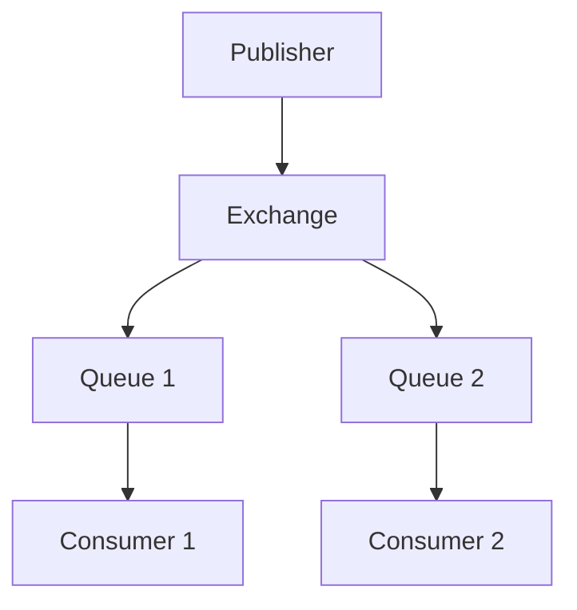

Financial market applications

In financial markets, AMQP is widely used for:

- Market data distribution
- Order flow messaging
- [Trade Lifecycle Management](/glossary/trade...

### Aggregation Pipeline
**Description**: Comprehensive overview of aggregation pipelines in time-series data processing. Learn how these sequential data transformation workflows enable complex analytics and efficient data processing at scale.

<Summary>
An aggregation pipeline is a sequence of data transformation stages that process time-series data in a defined order. Each stage takes input from the previous stage, performs specific operations, and passes results to the next stage, enabling complex analytics through composable operations.
</Summary>

Understanding aggregation pipelines

Aggregation pipelines process data through a series of stages, where each stage transforms the data in some way. This approach is particularly powerful for time-series data analysis, as it allows complex transformations to be broken down into manageable, sequential steps.

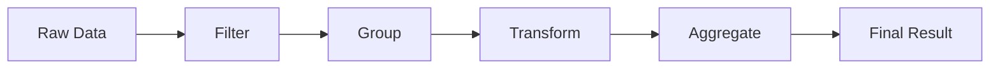

Key components and operations

Common pipeline stages include:

1. **Filtering**: Reducing the dataset based on conditions
2. **Grouping**: Organizing data by specific fields
3. **Transformation**: Modifying data structure or...

### AI-Augmented Portfolio Optimization
**Description**: Comprehensive overview of AI-augmented portfolio optimization in financial markets. Learn how artificial intelligence enhances modern portfolio theory and improves investment outcomes through advanced data analysis and adaptive strategies.

<Summary>
AI-augmented portfolio optimization combines traditional portfolio management techniques with artificial intelligence to enhance investment decision-making. This approach leverages machine learning algorithms and advanced data analytics to improve asset allocation, risk management, and return optimization beyond conventional mean-variance optimization methods.
</Summary>

How AI enhances portfolio optimization

AI-augmented portfolio optimization extends traditional portfolio theory by incorporating:

1. Dynamic asset allocation that adapts to changing market conditions
2. Complex pattern recognition in market behavior
3. Multi-factor optimization across numerous constraints
4. Real-time portfolio rebalancing signals
5. Alternative data integration for enhanced market insights

The integration of AI enables portfolio managers to process vast amounts of structured and unstructured data, identifying subtle relationships that traditional statistical methods might miss.

Key comp...

### Alert Thresholding
**Description**: Comprehensive overview of alert thresholding in time-series monitoring. Learn how this critical technique helps detect anomalies and trigger notifications based on predefined conditions in time-series data.

<Summary>
Alert thresholding is a monitoring technique that triggers notifications when time-series metrics cross predefined boundary values. It enables automated detection of anomalies, performance issues, or business-critical conditions by comparing real-time data against established thresholds.
</Summary>

Understanding alert thresholding fundamentals

Alert thresholding establishes boundaries for acceptable behavior in time-series data. When values exceed these boundaries, the system generates alerts to notify stakeholders. This process involves several key components:

1. Threshold definition - Static or dynamic values that represent boundaries
2. Comparison logic - Rules for evaluating metrics against thresholds
3. Alert generation - Creation and delivery of notifications
4. Alert state management - Tracking of active and resolved alerts

```mermaid
flowchart LR
    A[Time-series Data] --> B[Threshold Check]
    B --> C{Condition Met?}
    C -->|Yes| D[Generate Alert]
    C -->|N...

### Algorithmic Execution Strategies
**Description**: Comprehensive overview of algorithmic execution strategies in financial markets. Learn how automated trading algorithms optimize order execution across venues while minimizing market impact and transaction costs.

<Summary>
Algorithmic execution strategies are automated trading approaches that break large orders into smaller pieces and execute them over time according to predefined rules and market conditions. These strategies aim to minimize market impact, reduce transaction costs, and achieve optimal execution prices while managing various risks.
</Summary>

Core components of execution algorithms

Execution algorithms incorporate several key elements to achieve their objectives:

- Order scheduling: Determining the optimal timing and size of child orders
- Venue selection: Choosing where to route orders based on liquidity and costs
- Price limits: Setting boundaries to control execution prices
- Market impact estimation: Modeling how trades affect market prices
- Risk controls: Monitoring and managing execution risks

Common execution strategy types

Time-Weighted Average Price (TWAP)

[TWAP](/glossary/time-weighted-average-price-twap/) strategies divide orders into equal-sized pieces and exe...

### Algorithmic Portfolio Rebalancing
**Description**: Comprehensive overview of algorithmic portfolio rebalancing in financial markets. Learn how automated systems maintain target allocations, manage risk, and optimize trading costs across multiple asset classes.

<Summary>
Algorithmic portfolio rebalancing refers to the automated process of adjusting portfolio holdings to maintain desired asset allocations and risk targets. These systems use quantitative methods to optimize trade execution while minimizing market impact and transaction costs.
</Summary>

Understanding algorithmic portfolio rebalancing

Algorithmic portfolio rebalancing combines [execution algorithms](/glossary/execution-algorithms/) with portfolio optimization techniques to systematically maintain target asset allocations. As market movements cause portfolio weights to drift from their targets, rebalancing algorithms calculate required trades and execute them efficiently.

The process typically involves:

1. Monitoring portfolio drift from targets
2. Calculating optimal rebalancing trades
3. Executing trades while managing costs
4. Verifying post-trade allocations

```mermaid
graph TD
    A[Monitor Portfolio Drift] --> B[Calculate Target Trades]
    B --> C[Cost Analysis]
    C...

### Algorithmic Risk Controls
**Description**: Comprehensive overview of algorithmic risk controls in financial markets. Learn how these critical safeguards protect trading systems and market participants from operational and financial risks.

<Summary>
Algorithmic risk controls are automated systems and procedures designed to monitor, detect, and prevent potentially dangerous trading behavior in electronic trading environments. These controls act as guardrails for [algorithmic trading](/glossary/algorithmic-trading/) systems, helping to prevent erroneous trades, maintain position limits, and ensure compliance with regulatory requirements.
</Summary>

Core components of algorithmic risk controls

Pre-trade risk checks
Pre-trade risk controls validate orders before they enter the market, examining factors such as:

- Position limits and exposure thresholds
- Order size and price boundaries
- Trading frequency and order flow rates
- Available capital and margin requirements

```mermaid
flowchart TD
    A[Incoming Order] --> B{Pre-trade Check}
    B -->|Pass| C[Submit to Market]
    B -->|Fail| D[Reject Order]
    C --> E[Post-trade Monitoring]
    E -->|Risk Threshold Breach| F[Emergency Actions]
```

Real-time monitoring and ...

### Algorithmic Stablecoins and Systemic Risk
**Description**: Comprehensive overview of algorithmic stablecoins and their potential impact on financial system stability. Learn how these digital assets work, their mechanisms for maintaining price stability, and the systemic risks they may pose to markets.

<Summary>
Algorithmic stablecoins are digital assets designed to maintain a stable value through automated supply adjustments and financial incentives, rather than traditional collateral backing. Their innovative but complex mechanisms can potentially create systemic risks in financial markets through interconnectedness, procyclical behaviors, and cascade effects.
</Summary>

How algorithmic stablecoins work

Algorithmic stablecoins attempt to maintain price stability (usually pegged to $1) through automated supply and demand mechanisms. Unlike traditional collateralized stablecoins, they rely on algorithmic incentives and token economics.

The typical mechanism involves two tokens:
- A stablecoin targeting a fixed price
- A volatile "share" token that absorbs price fluctuations

```mermaid
flowchart TD
    A[Price Above Target] --> B[Mint New Stablecoins]
    B --> C[Sell for Share Tokens]
    C --> D[Burn Share Tokens]
    D --> E[Price Returns to Target]
    F[Price Below Target] --...

### Algorithmic Trading
**Description**: Comprehensive overview of algorithmic trading in financial markets. Learn how automated trading strategies execute orders using predefined rules, mathematical models, and real-time market data analysis.

<Summary>
Algorithmic trading is the automated execution of trading decisions using computer programs that follow predefined rules and mathematical models. These systems analyze market data in real-time, make trading decisions, and automatically execute orders without direct human intervention. Algorithmic trading accounts for a significant portion of trading volume in modern financial markets.
</Summary>

Core components of algorithmic trading

Algorithmic trading systems consist of several interconnected components that work together to implement trading strategies:

1. Data processing engine - Ingests and normalizes real-time [market data](/market-data/) from multiple sources
2. Strategy engine - Analyzes data and generates trading signals based on predefined rules
3. Risk management module - Enforces position limits and [pre-trade risk checks](/glossary/pre-trade-risk-checks/)
4. Order execution engine - Implements [order execution algorithms](/glossary/order-execution-algorithms/)...

### Alternative Data Sources in Finance
**Description**: Comprehensive overview of alternative data sources in financial markets and time-series analysis. Learn how non-traditional data enhances investment decisions and market analysis.

<Summary>
Alternative data sources in finance refer to non-traditional data sets used to gain investment insights and trading advantages. These sources complement conventional financial data like price and volume, offering unique perspectives on market behavior, company performance, and economic trends.
</Summary>

Understanding alternative data in finance

Alternative data encompasses a wide range of non-traditional information sources that can provide trading signals or investment insights. Unlike conventional market data such as [Real-Time Market Data (RTMD)](/market-data/), alternative data offers unique perspectives that may not be immediately reflected in market prices.

Common categories include:
- Satellite imagery of retail parking lots
- Social media sentiment analysis
- Mobile device location data
- Credit card transaction data
- Weather patterns affecting commodities
- Supply chain monitoring data

Market applications and value generation

Alternative data's value lies in i...

### Alternative Liquidity Pools
**Description**: Comprehensive overview of alternative liquidity pools in financial markets. Learn how these specialized trading venues complement traditional exchanges and provide unique execution opportunities.

<Summary>
Alternative liquidity pools are specialized trading venues that offer market participants ways to execute trades outside traditional exchanges. These venues typically provide unique matching mechanisms, pricing models, and execution opportunities while helping traders minimize market impact and information leakage.
</Summary>

Understanding alternative liquidity pools

Alternative liquidity pools operate alongside traditional exchanges to provide additional venues for trading financial instruments. These venues include [Dark Pools](/glossary/dark-pools/), Alternative Trading Systems (ATS), and other specialized matching facilities that offer different execution models from conventional exchanges.

Key characteristics

Non-displayed liquidity
Alternative liquidity pools often feature non-displayed or partially displayed orders, helping institutional investors execute large trades while minimizing market impact. This characteristic is particularly valuable for:

- Block trades ...

### Analytical Query Engine
**Description**: Comprehensive overview of analytical query engines in data processing. Learn how these specialized systems optimize and execute complex queries across large datasets for business intelligence and analytics.

<Summary>
An analytical query engine is a specialized software component designed to process complex queries efficiently across large datasets, optimizing for read-heavy workloads and aggregation operations. These engines are fundamental to business intelligence, data analytics, and time-series analysis systems.
</Summary>

How analytical query engines work

Analytical query engines employ sophisticated optimization techniques to process queries efficiently:

```mermaid
flowchart LR
    A[Query Input] --> B[Query Parser]
    B --> C[Query Optimizer]
    C --> D[Execution Plan]
    D --> E[Distributed Execution]
    E --> F[Result Assembly]
```

The engine processes queries through several key stages:
1. Query parsing and validation
2. Optimization and plan generation
3. Distributed execution
4. Result aggregation and delivery

Key features and capabilities

Columnar processing
Most modern analytical engines leverage [columnar storage](/glossary/columnar-database/) for efficient data ac...

### Anomaly Detection in Industrial Systems
**Description**: Comprehensive overview of anomaly detection in industrial systems. Learn how organizations leverage time-series data analysis to identify equipment failures, process deviations, and operational irregularities.

<Summary>
Anomaly detection in industrial systems refers to the automated identification of unusual patterns, unexpected behavior, or deviations from normal operating conditions in manufacturing and process control environments. This critical capability helps organizations prevent equipment failures, maintain product quality, and optimize operational efficiency through real-time monitoring and analysis of time-series data from sensors and control systems.
</Summary>

Understanding industrial anomaly detection

Industrial anomaly detection systems analyze continuous streams of sensor data to identify patterns that deviate from expected behavior. These systems typically monitor multiple parameters simultaneously, including:

- Temperature and pressure readings
- Vibration patterns
- Power consumption
- Flow rates
- Chemical composition measurements
- Production line speeds

```mermaid
graph TD
    A[Sensor Data Collection] --> B[Data Preprocessing]
    B --> C[Normal Pattern Learning]
  ...

### Anomaly Detection in Time Series Data
**Description**: Comprehensive overview of anomaly detection in time series data. Learn how organizations identify unusual patterns and outliers in sequential data to detect anomalies, prevent system failures, and maintain market integrity.

<Summary>
Anomaly detection in time series data is the process of identifying unusual patterns, outliers, or unexpected behavior in sequential data points ordered by time. In financial markets and industrial systems, this capability is crucial for detecting market manipulation, system failures, and trading anomalies that could indicate risks or opportunities.
</Summary>

Understanding time series anomalies

Time series anomalies typically fall into three main categories:

1. Point anomalies: Single data points that deviate significantly from the expected range
2. Contextual anomalies: Data points that are unusual in a specific context or time window
3. Pattern anomalies: Sequences of points that form unusual patterns

For example, in financial markets, a sudden price spike might be a point anomaly, while unusual trading volumes during typically quiet periods represent contextual anomalies. Pattern anomalies could include irregular order book patterns that might indicate market manipula...

### What Is Anomaly Detection?
**Description**: Anomaly detection is an emerging feature in time series data analysis. This glossary will teach you about algorithms for and applications of anomaly detection.

<hr />

Anomaly detection is an important part of
[time series analysis](/glossary/time-series-analysis/) where data points with
significant deviations from the rest of the data are identified. These
deviations are known as anomalies. Deviations can be defined and measured in
terms of mathematical measures of distance, such as against the standard
deviation or via the output of some user-defined values, like threshold. They
can also be well outside of any previously expected or defined boundary.

Algorithms for anomaly detection

While there are many approaches for anomaly detection in time series data,
common approaches can be categorized into the following buckets:

- **Threshold-based**: The simplest approach is to define a threshold so that
  any data point that falls outside these ranges are marked as anomalies. This
  approach works great for use cases where the values are bounded and where
  normal behavior is known beforehand. For example, we can set thresholds for
  CPU and me...

### Anomaly Score
**Description**: Comprehensive overview of anomaly scores in time-series analysis. Learn how these numerical metrics quantify the degree of abnormality in data points and their crucial role in anomaly detection systems.

<Summary>
An anomaly score is a numerical value that quantifies how much a data point or pattern deviates from expected normal behavior. In time-series analysis, these scores help identify and rank potential anomalies, enabling automated detection systems to prioritize and classify unusual events.
</Summary>

How anomaly scores work

Anomaly scores measure the degree of deviation from normal patterns using statistical or machine learning methods. The higher the score, the more likely a data point represents an anomaly. These scores typically account for multiple factors:

- Historical patterns and seasonality
- Statistical distributions
- Multiple dimensions or metrics
- Context-specific thresholds

```python
Simplified example of Z-score based anomaly scoring
def calculate_anomaly_score(value, mean, std_dev):
    return abs((value - mean) / std_dev)
```

Common scoring methods

Statistical approaches

Statistical methods calculate anomaly scores based on probability distributions and ...

### Apache Hudi
**Description**: Comprehensive overview of Apache Hudi (Hadoop Upserts Deletes and Incrementals). Learn how this data lake framework enables atomic transactions, upserts, and incremental data processing on large-scale datasets.

<Summary>
Apache Hudi (Hadoop Upserts Deletes and Incrementals) is an open-source data lake framework that brings database-like capabilities to data lakes. It enables atomic transactions, upserts, and incremental data processing while managing data stored in [object storage](/glossary/object-storage/) systems.
</Summary>

Core concepts and architecture

Hudi organizes data into logical tables that map to paths in the underlying storage. Each Hudi table consists of:

- File groups: Collections of files containing related records
- File slices: Groups of base files and log files that contain record versions
- Timeline: Metadata tracking all changes and operations on the table

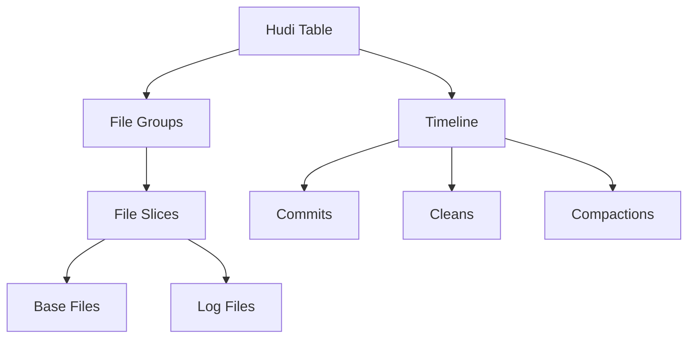

Table types and storage options

Hudi supports two main table types:

1. Copy-on-Write (CoW): ...

### Apache Iceberg
**Description**: Comprehensive overview of Apache Iceberg, an open table format for huge analytic datasets. Learn how Iceberg manages large-scale data lake tables with atomic transactions, schema evolution, and time travel capabilities.

<Summary>
Apache Iceberg is an open table format designed for massive analytic datasets. It provides transactional guarantees, schema evolution, and time travel capabilities while managing large-scale data lake tables. Iceberg enables reliable, high-performance access to data lake storage through its table format specification.
</Summary>

How Apache Iceberg works

Iceberg manages tables through a series of immutable snapshots, each representing a complete version of the table. This approach enables atomic transactions and time travel queries while maintaining performance at scale.

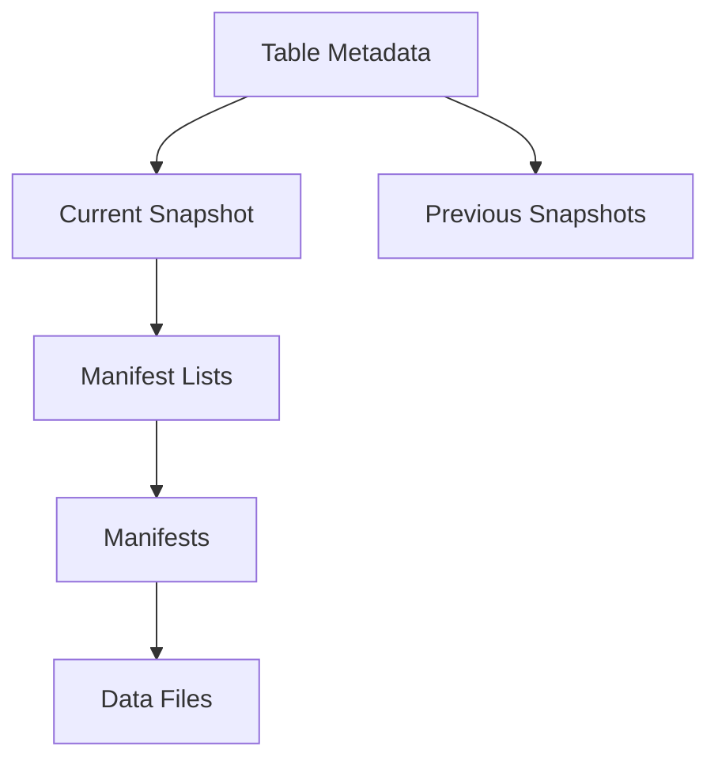

Key features and capabilities

Schema evolution
Iceberg supports in-place schema evolution, allowing columns to be added, removed, or reordered without copying data. This flexibility is crucial for time-series data management where ...

### Apache Parquet, What It Is and Why to Use It
**Description**: This article describes parquet, how it works, its benefits, and who might take advantage of it. Complete with examples, and technical descriptions, it's fit for beginners and experts alike.

<hr />

Apache Parquet is a columnar storage file format designed for efficient data
processing and storage. It was developed to handle large-scale data processing
and analytics through better performance and more efficient data compression. It
was initially created by engineers at Twitter and Cloudera, and was released in
March 2013 as an [open-source project](https://github.com/apache/parquet-format)
under the Apache Software Foundation.

We'll unpack what it is and compare its features to other storage formats.

Why Parquet?

The motivation behind Parquet was to address the limitations of existing storage
formats, particularly for "big data" processing. Twitter needed a more efficient
and performant way to store and process large-scale datasets, especially for
analytic queries.

According to the excellent article
"[The birth of Parquet](https://sympathetic.ink/2024/01/24/Chapter-1-The-birth-of-Parquet.html)"
by Julien Le Dem, Parquet was born out of the "Red Elm" system. The goal wa...

### Append-only Log
**Description**: Comprehensive overview of append-only logs in time-series databases and distributed systems. Learn how these sequential data structures ensure data integrity and enable efficient event streaming.

<Summary>
An append-only log is a data structure that only allows new records to be added to the end of the sequence, never modified or deleted. This immutable design pattern is fundamental to time-series databases, event sourcing systems, and distributed data platforms, providing a reliable foundation for data consistency and real-time streaming.
</Summary>

How append-only logs work

Append-only logs store data sequentially, with each new record receiving a unique, monotonically increasing identifier. This sequential nature creates a natural timeline of events, making them ideal for:

- Time-series data storage
- Event sourcing
- Transaction logging
- Change data capture (CDC)

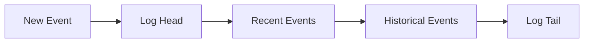

Benefits of append-only design

Data integrity
Since existing records cannot be modified, append-only logs provide natural audit trails and make it easier to maintain data c...

### Append-only Storage
**Description**: Comprehensive overview of append-only storage in time-series databases. Learn how this write pattern optimizes data ingestion, ensures data immutability, and enables high-performance time-series operations.

<Summary>
Append-only storage is a database design pattern where new data is exclusively added to the end of existing data structures, without modifying or deleting existing records. This approach is particularly well-suited for time-series databases, offering superior write performance, data integrity, and simplified recovery mechanisms.
</Summary>

How append-only storage works

Append-only storage treats data as an immutable log of events, where each new record is written sequentially after the previous one. This pattern aligns naturally with time-series data, where newer events occur later in time and are written in chronological order.


The sequential nature of writes eliminates the need for random disk access during ingestion, leading to significantly improved write performance.

Benefits for time-series workloads

Optimized write performance
Since data is only written ...

### Arbitrage-Free Pricing Models
**Description**: Comprehensive overview of arbitrage-free pricing models in financial markets. Learn how these mathematical frameworks ensure consistent pricing across related securities and prevent risk-free profit opportunities.

<Summary>
Arbitrage-free pricing models are mathematical frameworks that ensure consistent pricing relationships between related financial instruments, preventing opportunities for risk-free profits. These models are fundamental to modern financial theory and form the basis for pricing derivatives and complex securities.
</Summary>

Understanding arbitrage-free pricing models

Arbitrage-free pricing models are built on the fundamental principle that in efficient markets, no risk-free profit opportunities should exist. These models establish mathematical relationships between related securities to ensure consistent pricing across markets and instruments.

The core assumption is that if prices deviate from their theoretical arbitrage-free relationships, market participants would quickly exploit these opportunities, bringing prices back into alignment. This principle is essential for:

- Derivatives pricing
- Fixed income valuation
- Cross-market pricing relationships
- Risk management ca...

### Arithmetic Coding
**Description**: Comprehensive overview of arithmetic coding in data compression. Learn how this advanced entropy coding technique achieves optimal compression by representing messages as subranges of real numbers.

<Summary>
Arithmetic coding is a sophisticated data compression technique that encodes entire messages by representing them as subintervals of the unit interval [0,1). Unlike simpler encoding schemes that replace individual symbols with codewords, arithmetic coding can achieve compression rates very close to the theoretical entropy limit by treating the input as a single unit.
</Summary>

Understanding arithmetic coding fundamentals

Arithmetic coding works by iteratively subdividing an interval based on the probability distribution of input symbols. Each symbol progressively narrows the interval, with the final encoded message being any number within the final subinterval.

The encoding process follows these key steps:

1. Initialize the interval [0,1)
2. For each input symbol:
   - Divide the current interval proportionally according to symbol probabilities 
   - Select the subinterval corresponding to the current symbol
   - Make this the new working interval

The mathematical repre...

### Asset Price Correlation
**Description**: Comprehensive overview of asset price correlation in financial markets. Learn how correlation between different assets impacts portfolio management, risk assessment, and trading strategies.

<Summary>
Asset price correlation measures the statistical relationship between price movements of different financial instruments. This metric is fundamental to portfolio management, risk assessment, and trading strategies, as it helps quantify how different assets move in relation to each other over time.
</Summary>

Understanding asset price correlation

Correlation coefficients range from -1 to +1, where:
- +1 indicates perfect positive correlation
- -1 indicates perfect negative correlation
- 0 indicates no correlation

The most common measure is the Pearson correlation coefficient, calculated as:

ρ = Cov(X,Y) / (σx * σy)

Where:
- Cov(X,Y) is the covariance between assets X and Y
- σx and σy are the standard deviations of X and Y respectively

Importance in financial markets

Asset price correlation plays a crucial role in:
- Portfolio diversification
- Risk management
- [Statistical Arbitrage (Stat Arb)](/glossary/statistical-arbitrage-stat-arb/)
- Hedging strategies
- Market r...

### Atomic Transactions in Financial Systems
**Description**: Comprehensive overview of atomic transactions in financial markets and trading systems. Learn how atomic operations ensure data consistency and reliability in critical financial operations.

<Summary>
Atomic transactions are operations that must be executed as a single, indivisible unit where either all steps complete successfully or none of them do. In financial systems, atomic transactions are crucial for maintaining data consistency and preventing partial updates that could lead to incorrect balances, failed trades, or mismatched positions.
</Summary>

Understanding atomic transactions in finance

In financial markets, atomic transactions are essential for maintaining the integrity of trading operations. For example, when executing a trade, multiple steps must occur atomically:

1. Verify available funds/positions
2. Place the order
3. Update account balances
4. Record the transaction

If any step fails, the entire transaction must be rolled back to prevent inconsistencies. This "all-or-nothing" property is fundamental to financial system reliability.

Applications in market operations

Order execution

In [algorithmic trading](/glossary/algorithmic-trading/), atomic tr...

### Auction Mechanisms
**Description**: Comprehensive overview of auction mechanisms in financial markets. Learn how exchanges use auctions to facilitate price discovery and maintain market stability through opening, closing, and volatility auctions.

<Summary>
Auction mechanisms are structured processes used in financial markets to aggregate supply and demand, establish fair prices, and facilitate orderly trading. These mechanisms play a crucial role in price discovery, particularly during market opens, closes, and periods of high volatility.
</Summary>

Types of market auctions

Opening auctions
Opening auctions determine the first traded price of the day. During the pre-opening phase, market participants submit orders that accumulate in the order book without immediate execution. The auction algorithm calculates the price that maximizes tradable volume while minimizing imbalance.

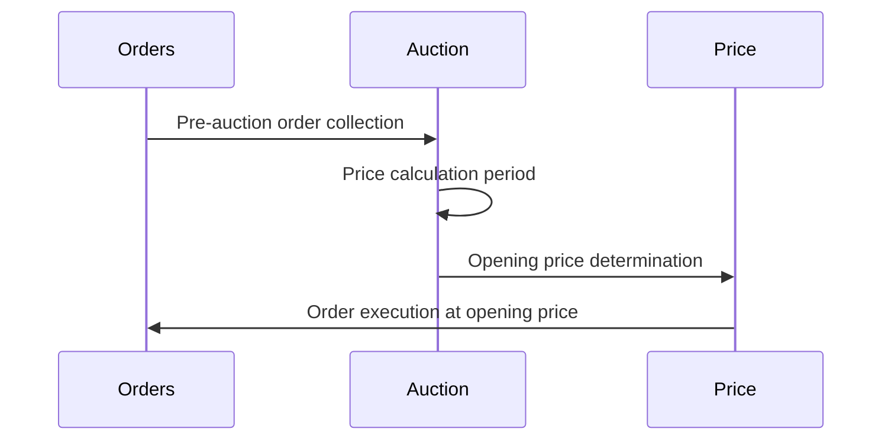

Closing auctions 
Closing auctions establish the offi...

### Autocorrelation Function
**Description**: Comprehensive overview of autocorrelation function (ACF) in time-series analysis. Learn how this statistical tool measures serial correlation and helps identify patterns in sequential data.

<Summary>
The autocorrelation function (ACF) measures the correlation between observations at different time lags in a time series. It reveals patterns, seasonality, and dependencies in sequential data by quantifying how similar the series is to itself when shifted by various time intervals.
</Summary>

Understanding autocorrelation function

The autocorrelation function is a fundamental tool in [time-series analysis](/glossary/time-series-analysis/) that measures the linear correlation between observations separated by specific time lags. For a time series $Y_t$, the ACF at lag $k$ is defined as:

$$ \rho(k) = \frac{\mathbb{E}[(Y_t - \mu)(Y_{t+k} - \mu)]}{\sigma^2} $$

Where:
- $\mu$ is the mean of the series
- $\sigma^2$ is the variance
- $k$ is the lag value
- $\mathbb{E}$ denotes expected value

Properties and interpretation

Key characteristics

1. **Range**: ACF values fall between -1 and 1
   - +1 indicates perfect positive correlation
   - -1 indicates perfect negative correlat...

### Automated Market Makers (AMM)
**Description**: Comprehensive overview of Automated Market Makers (AMM) in decentralized finance. Learn how these algorithmic systems provide liquidity and enable permissionless trading through mathematical formulas.

<Summary>
Automated Market Makers (AMMs) are algorithmic trading systems that enable permissionless trading by using mathematical formulas to determine asset prices and manage liquidity pools. Unlike traditional order book markets, AMMs allow continuous trading without requiring matching buyers and sellers, making them a cornerstone of decentralized finance (DeFi) infrastructure.
</Summary>

How automated market makers work

AMMs use deterministic pricing algorithms, typically based on the constant product formula (x * y = k), where x and y represent the quantities of two assets in a liquidity pool, and k is a constant. This mathematical relationship automatically adjusts prices based on changes in the pool's composition.

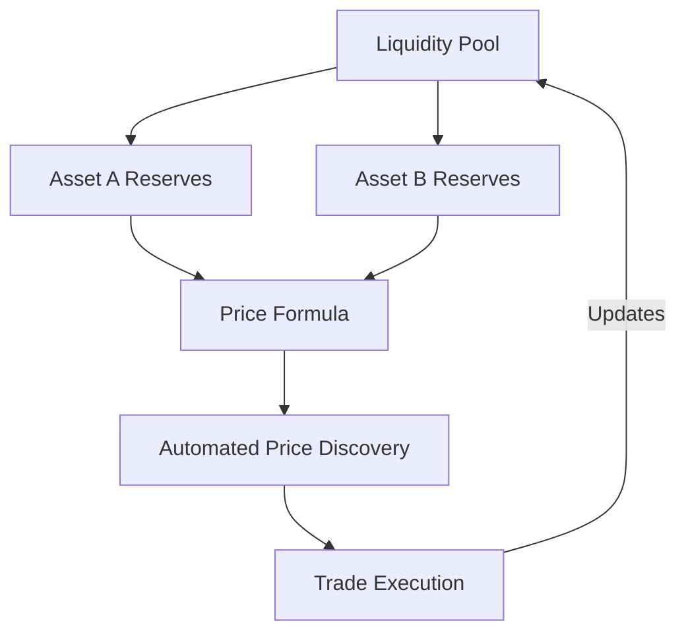

Key features of AMMs

Constant li...

### Availability Zone
**Description**: Comprehensive overview of availability zones in distributed systems. Learn how these isolated infrastructure locations enable high availability and fault tolerance in cloud and database deployments.

<Summary>
An availability zone (AZ) is a distinct physical location within a cloud region that contains isolated power, networking, and cooling infrastructure. AZs enable high availability by allowing systems to continue operating even if one zone experiences failures, making them crucial for distributed databases and mission-critical applications.
</Summary>

Understanding availability zones

Availability zones are physically separate data centers within a geographic region that operate independently while maintaining high-bandwidth, low-latency network connections between them. Each zone has its own:

- Power supply and backup systems
- Cooling infrastructure
- Network connectivity
- Security controls

This isolation ensures that issues affecting one zone (like power outages or natural disasters) don't impact others, creating the foundation for [high availability](/glossary/high-availability/) architectures.

```mermaid
graph TD
    R[Region] --> AZ1[Availability Zone 1]
    R --> AZ...

### Avro
**Description**: Comprehensive overview of Apache Avro data serialization. Learn how this compact binary format enables efficient data exchange and schema evolution in time-series systems.

<Summary>
Apache Avro is a data serialization system that provides a compact, fast binary format with integrated schema support. Designed for efficient data exchange in big data systems, Avro combines schema evolution capabilities with type safety while maintaining high performance.
</Summary>

How Avro works

Avro serializes data using a schema-based approach. Each Avro record contains both the data and its schema definition, enabling self-describing data streams. The schema is defined using JSON, while the data itself is stored in a compact binary format.

```mermaid
graph LR
    A[JSON Schema] --> B[Avro Serializer]
    C[Application Data] --> B
    B --> D[Binary Avro Data]
    D --> E[Avro Deserializer]
    E --> F[Reconstructed Data]
```

Schema evolution capabilities

One of Avro's key strengths is its support for schema evolution, allowing data producers and consumers to work with different schema versions. This is particularly valuable in time-series systems where data structu...

### Backfill
**Description**: Comprehensive overview of backfill in time-series databases. Learn how backfilling enables historical data loading, supports data corrections, and maintains data completeness in time-series systems.

<Summary>
Backfill refers to the process of loading or updating historical data in a time-series database. This operation is essential for filling gaps in data history, correcting errors, or initializing systems with historical records. Backfilling must handle out-of-order data ingestion while maintaining data consistency and system performance.
</Summary>

Understanding backfill operations

Backfill operations are crucial for maintaining complete and accurate time-series data. Unlike real-time data ingestion, backfilling involves processing historical data that may arrive out of chronological order or need to be updated retroactively.

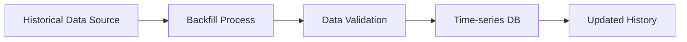

Common backfill scenarios

Data recovery and correction
When systems experience downtime or data errors, backfilling helps restore data integrity by:
- Filling gaps from service interrup...

### Backpressure (Data Streaming)
**Description**: Comprehensive overview of backpressure in data streaming systems. Learn how backpressure mechanisms regulate data flow and prevent system overload in high-frequency trading and market data processing.

<Summary>
Backpressure is a flow control mechanism in data streaming systems that regulates the rate of data transmission between components to prevent system overload. In financial markets, backpressure is critical for managing high-volume market data feeds and ensuring reliable trade execution.
</Summary>

Understanding backpressure in financial systems

In financial markets, data flows at extremely high rates, particularly in [high-frequency trading](/glossary/high-frequency-trading-risk/) systems and [real-time market data](/market-data/) processing. Backpressure mechanisms ensure system stability by controlling data flow when downstream components cannot keep pace with incoming data rates.

When a system experiences backpressure:
1. Downstream components signal their processing capacity limits
2. Upstream components adjust their transmission rates
3. Buffer systems manage temporary data surges
4. Flow control protocols prevent data loss

Market data applications

Market data syste...

### Backpressure Handling
**Description**: Comprehensive overview of backpressure handling in data systems. Learn how this flow control mechanism prevents system overload and ensures reliable data processing in high-volume time-series applications.

<Summary>
Backpressure handling refers to mechanisms that manage and control data flow when a system's consumption rate cannot match its input rate. It's a critical flow control pattern that prevents system overload by regulating data transmission between components, ensuring system stability and reliable data processing.
</Summary>

Understanding backpressure in data systems

Backpressure occurs when a system component receives data faster than it can process it. Like water pressure in a pipe, data "pressure" builds up when there's a mismatch between input and processing rates. Effective backpressure handling implements strategies to manage this pressure and maintain system stability.

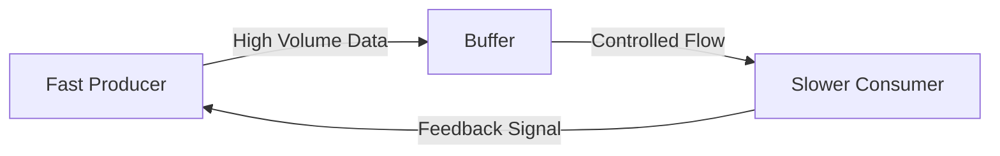

Common backpressure handling strategies

Buffer-based approaches
Systems can implement buffers to temporarily store incoming data when processing canno...

### Backpressure Protocol
**Description**: Comprehensive overview of backpressure protocols in data systems. Learn how these flow control mechanisms prevent system overload and ensure reliable data processing in high-volume time-series applications.

<Summary>
  A backpressure protocol is a flow control mechanism that regulates data
  transmission rates between producers and consumers in distributed systems. It
  prevents system overload by allowing downstream components to signal their
  processing capacity to upstream components, ensuring system stability and
  reliable data processing.
</Summary>

How backpressure protocols work

Backpressure protocols implement feedback loops between system components to
maintain processing equilibrium. When a consumer approaches its capacity limits,
it signals upstream producers to reduce their transmission rate, preventing
buffer overflows and system instability.

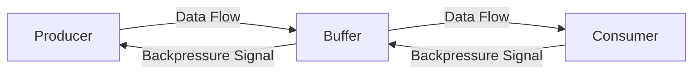

This mechanism is particularly crucial in
[time-series databases](/glossary/time-series-database/) and streaming systems
where data ingestion rates can vary signific...

### Backtesting
**Description**: Comprehensive overview of backtesting in financial markets. Learn how backtesting validates trading strategies by simulating their historical performance using past market data.

<Summary>
Backtesting is a critical methodology in quantitative finance that evaluates trading strategies by simulating their performance using historical market data. This process helps traders and analysts assess the viability of trading strategies before risking real capital in live markets.
</Summary>

Core concepts of backtesting

Backtesting simulates trading decisions using historical price data and market conditions to evaluate how a strategy would have performed in the past. The process involves reconstructing market conditions and applying trading rules systematically to generate performance metrics.

Key components include:
- Historical market data and pricing
- Trading strategy rules and parameters
- Transaction cost modeling
- Position sizing and risk management rules
- Performance measurement metrics

Types of backtesting approaches

Point-in-time backtesting
This method uses only data that would have been available at each historical moment, preventing look-ahead bias. I...

### BASE Model
**Description**: Comprehensive overview of the BASE model in distributed databases. Learn how this consistency model prioritizes availability and scalability over strict consistency, making it particularly relevant for time-series systems.

<Summary>
The BASE model (Basically Available, Soft state, Eventually consistent) is a database design philosophy that favors availability and performance over immediate consistency. Unlike the ACID model's strict guarantees, BASE accepts that database state may be in flux, making it particularly suitable for distributed time-series systems where high-speed ingestion and scalability are critical.
</Summary>

Understanding the BASE principles

The BASE model consists of three core principles:

1. **Basically Available**: The system guarantees availability of data, even in the presence of failures, though responses may be incomplete or in flux.

2. **Soft state**: The system's state may change over time, even without input, due to eventual consistency requirements.

3. **Eventually consistent**: The system will become consistent over time, given that the system processes all updates.

```mermaid
flowchart LR
    A[Write Request] --> B[Node 1]
    A --> C[Node 2]
    A --> D[Node 3]
    B...

### Basel III
**Description**: Comprehensive overview of Basel III regulatory framework. Learn how these international banking standards strengthen capital requirements, liquidity rules, and risk management practices in financial institutions.

<Summary>
Basel III is a comprehensive set of international banking regulations introduced after the 2008 financial crisis to strengthen financial institutions' resilience. The framework enhances capital requirements, introduces new liquidity standards, and establishes stricter risk management practices for banks and financial institutions.
</Summary>

Core components of Basel III

Basel III builds upon previous frameworks with three main pillars:

1. Capital requirements
- Increased minimum common equity requirement from 2% to 4.5%
- Additional capital conservation buffer of 2.5%
- Countercyclical capital buffer of 0-2.5%

2. Liquidity standards
- Liquidity Coverage Ratio (LCR)
- Net Stable Funding Ratio (NSFR)

3. Leverage restrictions
- 3% minimum leverage ratio
- Additional requirements for systemically important banks

Capital requirements and buffers

Basel III significantly strengthens capital requirements through multiple layers:

```mermaid
graph TD
    A[Total Capital Require...

### Batch Boundary
**Description**: Comprehensive overview of batch boundaries in time-series data processing. Learn how these logical demarcation points help organize data ingestion and processing workflows.

<Summary>
A batch boundary is a logical delimiter that defines the start and end points of a data batch in time-series systems. It helps organize data processing workflows by creating clear demarcation points between groups of records, enabling efficient batch processing and ensuring data consistency.
</Summary>

Understanding batch boundaries

Batch boundaries serve as critical control points in [batch ingestion](/glossary/batch-ingestion/) workflows. They help systems determine where one batch ends and another begins, which is essential for:

- Maintaining data consistency
- Managing resource allocation
- Enabling parallel processing
- Facilitating error handling and recovery

A batch boundary can be defined by various criteria:

```mermaid
graph LR
    A[Batch Boundary Types] --> B[Time-based]
    A --> C[Size-based]
    A --> D[Event-based]
    A --> E[Checkpoint-based]
```

Time-based batch boundaries

Time-based batch boundaries are common in time-series data processing, where da...

### Batch Ingestion
**Description**: Comprehensive overview of batch ingestion in time-series databases. Learn how batch processing enables efficient loading of historical data, the tradeoffs between batch and streaming ingestion, and best practices for optimizing batch operations.

<Summary>
  Batch ingestion is a data loading pattern where records are collected into
  groups and processed together in discrete intervals, rather than handled
  individually in real-time. This approach is particularly important for
  time-series databases, offering efficient ways to load historical data,
  perform bulk updates, and optimize resource usage.
</Summary>

How batch ingestion works

Batch ingestion aggregates data into chunks before processing, following a
collect-then-process pattern. This differs from
[real-time ingestion](/glossary/real-time-data-ingestion/) where records are
processed immediately as they arrive. The batch process typically involves:

1. Data collection and staging
2. Validation and transformation
3. Bulk loading into the target database
4. Post-load verification and cleanup

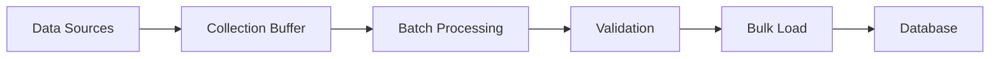

Advan...

### Batch vs. Stream Processing
**Description**: Comprehensive overview of batch and stream processing in time-series data systems. Learn how these fundamental data processing paradigms differ and their implications for financial markets and real-time analytics.

<Summary>
Batch and stream processing represent two distinct approaches to data processing. Batch processing handles data in large, fixed chunks at scheduled intervals, while stream processing deals with data continuously in real-time as it arrives. The choice between these methods significantly impacts system architecture, latency, and resource utilization.
</Summary>

Understanding batch processing

Batch processing involves collecting data over a period and processing it as a group or "batch." This approach is analogous to processing trades at the end of a trading day or calculating [portfolio rebalancing](/glossary/portfolio-rebalancing-algorithms/) adjustments overnight.

Key characteristics of batch processing:
- Fixed processing windows
- High throughput for large datasets
- Predictable resource allocation
- Lower operational complexity
- Built-in error recovery mechanisms

```mermaid
graph TD
    A[Data Collection] --> B[Data Storage]
    B --> C[Batch Window]
    C --> D[Proce...

### Batch Windowing
**Description**: Comprehensive overview of batch windowing in time-series data processing. Learn how this technique groups and processes data in discrete time intervals for efficient analysis and aggregation.

<Summary>
Batch windowing is a data processing technique that groups time-series data into discrete, non-overlapping time intervals (windows) for analysis and aggregation. This approach enables efficient processing of large datasets by breaking them into manageable chunks based on time boundaries.
</Summary>

Understanding batch windowing fundamentals

Batch windowing divides continuous time-series data into fixed-size time intervals, processing each window as a separate unit. Unlike [sliding window](/glossary/sliding-window/) operations, batch windows are distinct and non-overlapping, making them ideal for periodic reporting and aggregations.

```mermaid
graph LR
    A[Continuous Data Stream] --> B[Window 1: 00:00-00:05]
    A --> C[Window 2: 00:05-00:10]
    A --> D[Window 3: 00:10-00:15]
    B --> E[Process Window]
    C --> E
    D --> E
```

Implementation in time-series databases

In time-series databases, batch windowing is commonly implemented using the SAMPLE BY clause for reg...

### Bayesian Inference in Quant Trading
**Description**: Comprehensive overview of Bayesian inference in quantitative trading. Learn how this probabilistic framework enables traders to update market beliefs systematically and adapt trading strategies based on new information.

<Summary>
Bayesian inference in quantitative trading is a probabilistic framework that enables systematic updating of market beliefs and trading strategies as new information becomes available. It provides a rigorous mathematical foundation for combining prior knowledge with real-time market data to generate more robust trading decisions.
</Summary>

Understanding Bayesian inference in trading

Bayesian inference provides a mathematical framework for updating probabilistic beliefs about market conditions as new data arrives. Unlike traditional [statistical risk models](/glossary/statistical-risk-models/), Bayesian approaches explicitly model uncertainty and allow traders to incorporate prior knowledge into their analysis.

The core components include:

1. Prior distributions - Initial beliefs about market parameters
2. Likelihood functions - Models of how market data is generated
3. Posterior distributions - Updated beliefs after observing new data

Applications in quantitative trading...

### Bayesian Updating
**Description**: Comprehensive overview of Bayesian updating in statistical inference and time series analysis. Learn how this dynamic probability updating framework combines prior beliefs with new evidence.

<Summary>
Bayesian updating is a mathematical framework for revising probability estimates as new data becomes available. It combines [prior distributions](/glossary/prior-distribution/) with observed evidence to produce updated posterior distributions, enabling dynamic statistical inference that becomes more refined over time.
</Summary>

Understanding Bayesian updating

Bayesian updating forms the foundation of probabilistic inference by providing a formal method to update beliefs based on new evidence. The process uses Bayes' theorem to combine:

1. Prior beliefs (represented as probability distributions)
2. New evidence (through the likelihood function)
3. Updated beliefs (posterior distributions)

The mathematical form of Bayes' theorem for updating is:

$$ P(\theta|D) = \frac{P(D|\theta)P(\theta)}{P(D)} $$

Where:
- $P(\theta|D)$ is the posterior probability
- $P(D|\theta)$ is the likelihood
- $P(\theta)$ is the prior probability
- $P(D)$ is the marginal likelihood

Applications ...

### Benchmark Index
**Description**: Comprehensive overview of benchmark indices in financial markets. Learn how these standardized market measures serve as performance yardsticks and underlie countless financial products.

<Summary>
A benchmark index is a standardized measure that tracks the performance of a specific market segment or investment strategy. It serves as a reference point for evaluating investment performance, constructing financial products, and making asset allocation decisions. Common examples include the S&P 500 for U.S. large-cap stocks and the Bloomberg Global Aggregate for fixed income markets.
</Summary>

Core functions of benchmark indices

Benchmark indices serve multiple critical functions in financial markets. They provide a standardized way to measure market performance, enable performance attribution analysis, and form the basis for index-linked investment products like ETFs. The construction and maintenance of these indices follow strict methodologies to ensure representativeness and reliability.

```mermaid
graph TD
    A[Benchmark Index] --> B[Performance Measurement]
    A --> C[Product Creation]
    A --> D[Risk Analysis]
    B --> E[Portfolio Tracking]
    B --> F[Attrib...

### Binomial Option Pricing Model
**Description**: Comprehensive overview of the Binomial Option Pricing Model in financial derivatives. Learn how this discrete-time model values options through a tree structure of possible price paths.

<Summary>
The Binomial Option Pricing Model is a discrete-time framework for valuing options by modeling multiple possible price paths through a binary tree structure. Each node represents a possible asset price, with branches representing up or down movements, ultimately leading to a distribution of potential option payoffs that can be discounted to determine present value.
</Summary>

Core concepts of the binomial model

The binomial model assumes that an asset price can only move up or down by specific factors during each time step. This simplified approach creates a powerful framework for understanding option pricing and replication through dynamic hedging.

Key parameters include:
- Up factor (u): The multiplicative factor for upward price movements
- Down factor (d): The multiplicative factor for downward price movements
- Risk-free rate (r): The interest rate used for discounting
- Probability (p): Risk-neutral probability of an upward movement

The model's mathematical foundati...

### Black-Scholes Model for Option Pricing
**Description**: Comprehensive overview of the Black-Scholes Model for option pricing. Learn how this fundamental mathematical model revolutionized derivatives pricing and trading through elegant closed-form solutions.

<Summary>
The Black-Scholes Model is a mathematical framework for pricing European-style options. Published in 1973 by Fischer Black, Myron Scholes, and Robert Merton, it provides a closed-form solution for determining theoretical option prices based on variables including the underlying price, strike price, time to expiration, risk-free rate, and volatility.
</Summary>

Core equation and assumptions

The Black-Scholes partial differential equation (PDE) for option pricing is:

$\frac{\partial V}{\partial t} + \frac{1}{2}\sigma^2S^2\frac{\partial^2 V}{\partial S^2} + rS\frac{\partial V}{\partial S} - rV = 0$

Where:
- $V$ is the option value
- $S$ is the underlying asset price
- $t$ is time
- $r$ is the risk-free rate
- $\sigma$ is volatility

The model makes several key assumptions:
- European-style options (no early exercise)
- Log-normal distribution of underlying returns
- Constant volatility and risk-free rate
- No dividends
- No transaction costs or taxes
- Continuous trading

Cl...

### Black-Scholes Model Limitations
**Description**: Comprehensive examination of the key limitations in the Black-Scholes options pricing model. Learn how these constraints affect pricing accuracy and risk management in modern markets.

<Summary>
The Black-Scholes model's limitations highlight critical gaps between theoretical assumptions and real market behavior. While revolutionary for options pricing, the model's simplifying assumptions about market conditions, volatility behavior, and trading mechanics can lead to significant pricing discrepancies in practice.
</Summary>

Understanding the model's core constraints

The Black-Scholes model, while foundational to modern [options pricing](/glossary/arbitrage-free-pricing-models/), operates under several idealized assumptions that diverge from real market conditions. These limitations become particularly important for trading systems and risk management frameworks that rely on the model's outputs.

```mermaid
graph TD
    A[Black-Scholes Assumptions] --> B[Constant Volatility]
    A --> C[Log-Normal Distribution]
    A --> D[Continuous Trading]
    A --> E[No Transaction Costs]
    B --> F[Volatility Smile]
    C --> G[Fat Tails]
    D --> H[Market Gaps]
    E --> I[R...

### Block Trade Reporting
**Description**: Comprehensive overview of block trade reporting in financial markets. Learn how large trades are reported to market participants while managing information leakage and market impact.

<Summary>
Block trade reporting refers to the regulatory requirements and market practices for disclosing large-scale securities transactions. These specialized reporting mechanisms balance market transparency with the need to minimize market impact for institutional-sized trades.
</Summary>

Understanding block trade reporting

Block trade reporting encompasses the rules, systems, and practices for disclosing large securities transactions to the market. Block trades are substantial orders that exceed normal market size and require special handling to avoid significant market impact. The reporting framework must balance two competing interests: market transparency and the legitimate need to protect large traders from adverse price movements.

Key components of block trade reporting

Reporting thresholds

Different markets and asset classes have specific size thresholds that qualify a trade as a block transaction. For example:
- Equity markets typically define blocks as trades of 10,000...

### Blockchain-Based Repo Markets
**Description**: Comprehensive overview of blockchain-based repo markets. Learn how distributed ledger technology transforms traditional repurchase agreements through automated collateral management, smart contracts, and real-time settlement.

<Summary>
Blockchain-based repo markets represent an innovative evolution of traditional repurchase agreements, leveraging [distributed ledger technology](/glossary/distributed-ledger-technology-dlt/) to automate collateral management, enhance settlement efficiency, and reduce counterparty risk. These systems use smart contracts to execute repo transactions with real-time settlement and automated margin calls.
</Summary>

How blockchain transforms repo markets

Traditional repo markets face several operational challenges, including manual processes, settlement delays, and complex collateral management. Blockchain technology addresses these issues through:

1. Automated collateral management
2. Real-time settlement
3. Smart contract-driven margin calls
4. Transparent transaction records

```mermaid
flowchart TD
    A[Repo Agreement Initiation] --> B[Smart Contract Creation]
    B --> C[Collateral Lock]
    C --> D[Real-time Settlement]
    D --> E[Automated Margin Calls]
    E --> F[Con...

### Bloom Filter
**Description**: Comprehensive overview of Bloom filters in database systems. Learn how these probabilistic data structures enable efficient membership testing while optimizing memory usage and query performance.

<Summary>
  A Bloom filter is a space-efficient probabilistic data structure used to test
  whether an element is a member of a set. It can tell us that an element is
  definitely not in a set or that it probably is, trading perfect accuracy for
  significantly reduced memory usage and improved performance.
</Summary>

How Bloom filters work

Bloom filters work by using multiple hash functions to map elements to positions
in a bit array. When adding an element, the filter sets bits at positions
determined by each hash function. To test membership, the filter checks if all
the bits corresponding to an element's hash values are set.

```mermaid
graph LR
    A[Input Element] --> H1[Hash 1]
    A --> H2[Hash 2]
    A --> H3[Hash 3]
    H1 --> B[Bit Array]
    H2 --> B
    H3 --> B
```

Applications in time-series databases

In time-series databases, Bloom filters serve several critical purposes:

1. **Partition Pruning**: Quickly determine which partitions don't contain
   specific timesta...

### Bootstrap Resampling
**Description**: Comprehensive overview of bootstrap resampling in statistical analysis. Learn how this powerful resampling technique helps estimate uncertainty and validate models in financial applications.

<Summary>
Bootstrap resampling is a statistical method that estimates the sampling distribution of an estimator by repeatedly sampling with replacement from the original dataset. This technique is particularly valuable in financial analysis and time-series modeling where traditional parametric methods may be unreliable or assumptions about data distribution are uncertain.
</Summary>

Understanding bootstrap resampling

Bootstrap resampling creates multiple synthetic datasets by randomly sampling observations from the original data with replacement. Each bootstrapped sample has the same size as the original dataset, but some observations may appear multiple times while others may not appear at all.

The mathematical foundation can be expressed as:

$\hat{\theta}^{*}_b = s(\mathbf{X}^{*}_b)$

Where:
- $\mathbf{X}^{*}_b$ is the $b$-th bootstrap sample
- $s(\cdot)$ is the statistic of interest
- $\hat{\theta}^{*}_b$ is the estimate from the $b$-th bootstrap sample

Applications in financia...

### Bulk Synchronous Processing
**Description**: Comprehensive overview of Bulk Synchronous Processing (BSP) in time-series systems. Learn how this parallel computing model enables efficient large-scale data processing through synchronized computation and communication phases.

<Summary>
Bulk Synchronous Processing (BSP) is a parallel computing model that organizes computation into a sequence of supersteps, each consisting of concurrent computation, communication, and synchronization phases. In financial and time-series systems, BSP enables efficient processing of large datasets by coordinating parallel tasks while maintaining data consistency.
</Summary>

How bulk synchronous processing works

BSP divides processing into three distinct phases that repeat cyclically:

```mermaid
graph TD
    A[Concurrent Computation] --> B[Communication]
    B --> C[Barrier Synchronization]
    C --> A
```

1. **Concurrent Computation**: Processors perform local computations independently
2. **Communication**: Processors exchange data as needed
3. **Barrier Synchronization**: All processors synchronize before starting the next superstep

This structured approach ensures consistency while enabling parallel processing at scale.

Applications in financial systems

BSP is particu...

### Buy-Side vs Sell-Side Trading
**Description**: Comprehensive overview of buy-side and sell-side trading in financial markets. Learn how these distinct market participants interact, their roles, and their impact on market structure.

<Summary>
Buy-side and sell-side trading represent the two main categories of participants in financial markets. Buy-side firms manage investments on behalf of end clients, while sell-side firms provide trading services, market making, and research to the buy-side. This fundamental division shapes market structure and drives trading dynamics.
</Summary>

Understanding buy-side and sell-side roles

The financial markets ecosystem is built around the interaction between buy-side and sell-side participants. Each plays a distinct but complementary role in market functioning.

Buy-side characteristics

Buy-side firms primarily manage investment portfolios for beneficial owners, including:

- Asset management companies
- Pension funds
- Insurance companies
- Mutual funds
- Hedge funds
- Endowments

These institutions focus on investment performance and typically access markets through sell-side intermediaries.

Sell-side characteristics

Sell-side firms provide trading services and market ac...

### Cache Eviction
**Description**: Comprehensive overview of cache eviction in database systems. Learn how cache eviction policies optimize memory usage and system performance through selective data removal.

<Summary>
Cache eviction is the process of removing entries from a cache to free up space for new data. In time-series databases and financial systems, efficient cache eviction strategies are crucial for maintaining optimal performance while managing limited memory resources.
</Summary>

How cache eviction works

Cache eviction occurs when a cache reaches its capacity limit and must remove existing entries to accommodate new data. The process follows specific policies that determine which items to remove based on factors like access patterns, age, or priority.

```mermaid
flowchart LR
    A[New Data] --> B{Cache Full?}
    B -->|No| C[Add to Cache]
    B -->|Yes| D[Eviction Policy]
    D --> E[Remove Selected Items]
    E --> C
```

Common eviction policies

Least Recently Used (LRU)
LRU evicts the cache entries that haven't been accessed for the longest time. This policy works well for time-series data where recent information is typically more valuable than older data.

First In, Fir...

### What Is the CAP Theorem?
**Description**: Comprehensive overview of the CAP Theorem in distributed systems. Learn how this fundamental principle helps architects balance consistency, availability, and partition tolerance in time-series databases and financial systems.

<Summary>
The CAP theorem states that a distributed database system can only guarantee two of three properties simultaneously: Consistency (C), Availability (A), and Partition tolerance (P). This fundamental principle helps system architects make informed decisions about trade-offs in distributed database design, particularly for time-series and financial applications.
</Summary>

Understanding the CAP theorem

The CAP theorem, also known as Brewer's theorem, was first proposed by computer scientist Eric Brewer in 2000. It defines three critical properties of distributed systems:

1. **Consistency**: All nodes see the same data at the same time
2. **Availability**: Every request receives a response
3. **Partition tolerance**: The system continues to operate despite network partitions

```mermaid
graph TD
    A[CAP Theorem] --> B[Consistency]
    A --> C[Availability]
    A --> D[Partition Tolerance]
    B --> E[All nodes see same data]
    C --> F[Every request gets response]
    D -->...

### Capital Asset Pricing Model (CAPM)
**Description**: Comprehensive overview of the Capital Asset Pricing Model (CAPM). Learn how this fundamental model determines expected returns based on systematic risk and its applications in modern portfolio management.

<Summary>
The Capital Asset Pricing Model (CAPM) is a foundational theory in modern finance that describes the relationship between systematic risk and expected return for assets, particularly stocks. CAPM provides a theoretical framework for calculating the required rate of return for an asset based on its sensitivity to market risk (beta) and the market risk premium.
</Summary>

Understanding CAPM

The Capital Asset Pricing Model expresses the expected return of an asset as a function of the risk-free rate, the asset's correlation with market returns (beta), and the market risk premium. The model builds on [portfolio optimization](/glossary/portfolio-optimization/) theory and introduces the concept of systematic and unsystematic risk.

The CAPM formula

The fundamental CAPM equation is:

$$ E(R_i) = R_f + \beta_i(E(R_m) - R_f) $$

Where:
- $E(R_i)$ = Expected return of asset i
- $R_f$ = Risk-free rate
- $\beta_i$ = Beta of asset i
- $E(R_m)$ = Expected return of the market
- $(E(R_m)...

### Capital Markets Infrastructure
**Description**: Comprehensive overview of capital markets infrastructure and its critical components. Learn how trading systems, market data networks, and post-trade infrastructure enable modern financial markets.

<Summary>
  Capital markets infrastructure refers to the interconnected systems, networks,
  and institutions that enable the functioning of financial markets. This
  includes trading platforms, clearing houses, settlement systems, market data
  providers, and the technological framework that supports trading and
  post-trade activities.
</Summary>

Core components of capital markets infrastructure

Trading systems

The foundation of modern capital markets consists of electronic trading
platforms and [order matching engines](/glossary/order-matching-engine/) that
facilitate price discovery and trade execution. These systems process millions
of orders per second while maintaining strict latency requirements.

Market data distribution

[Real-Time Market Data (RTMD)](/market-data/) networks distribute pricing
information, order book updates, and trade reports across market participants.
This infrastructure requires specialized
[feed handlers](/glossary/market-data-feed-handlers/) and ultr...

### Cardinality Estimation
**Description**: Comprehensive overview of cardinality estimation in databases and time-series systems. Learn how these algorithms approximate distinct value counts efficiently while managing memory usage.

<Summary>
Cardinality estimation is a technique used to approximate the number of distinct values in a dataset without storing every unique value in memory. In time-series databases, accurate cardinality estimates are crucial for query optimization, resource allocation, and understanding data patterns while maintaining system performance.
</Summary>

Understanding cardinality estimation

Cardinality estimation addresses a fundamental challenge in database systems: determining how many unique values exist in a dataset without exhaustively counting them. This is particularly important in time-series databases where datasets can be massive and continuous.

For example, in a financial trading system monitoring stock transactions, you might need to estimate:
- Number of unique traders per day
- Distinct symbols traded in a time window
- Unique price levels observed

Exact counting would require storing every value in memory, which becomes impractical at scale. Cardinality estimation algorit...

### Causal Inference in Economic Time Series
**Description**: Comprehensive overview of causal inference in economic time series analysis. Learn how researchers identify and measure causal relationships in financial and economic data using advanced statistical methods.

<Summary>
Causal inference in economic time series analysis focuses on identifying and quantifying cause-and-effect relationships in economic and financial data. It combines statistical techniques, economic theory, and temporal information to distinguish genuine causal effects from mere correlations.
</Summary>

Understanding causal inference in time series

Causal inference in economic time series aims to answer questions like "Does monetary policy cause changes in inflation?" or "Do commodity prices drive currency movements?" Unlike standard statistical correlations, causal analysis seeks to establish directional relationships while accounting for:

- Temporal precedence (causes must precede effects)
- Confounding variables
- Feedback loops
- Structural breaks
- Non-linear relationships

Key methodological approaches

Granger causality

The most widely used framework for testing causality in time series is Granger causality. A variable X is said to Granger-cause Y if past values of X...

### Central Bank Digital Currency (CBDC) Models
**Description**: Comprehensive overview of Central Bank Digital Currency (CBDC) models and architectures. Learn how different CBDC implementations impact financial markets, monetary policy, and payment systems.

<Summary>
Central Bank Digital Currency (CBDC) models represent different architectural approaches for implementing digital versions of national currencies. These models vary in their distribution methods, access frameworks, and technological underpinnings, each with distinct implications for monetary policy, financial stability, and payment systems.
</Summary>

Understanding CBDC models

Central Bank Digital Currencies represent a significant evolution in monetary systems, combining the reliability of central bank money with digital technology. The key models can be categorized based on:

1. Distribution architecture
2. Access framework 
3. Technology infrastructure

Direct vs indirect CBDC models

```mermaid
flowchart TD
    CB[Central Bank]
    PU[Public Users]
    FI[Financial Intermediaries]
    
    subgraph Direct Model
    CB -->|Direct Access| PU
    end
    
    subgraph Indirect Model
    CB -->|CBDC| FI
    FI -->|CBDC Services| PU
    end
```

Direct model
In the direct mo...

### Central Counterparty Clearing (CCP)
**Description**: Comprehensive overview of Central Counterparty Clearing (CCP) in financial markets. Learn how CCPs manage counterparty risk, ensure trade settlement, and maintain market stability through novation and multilateral netting.

<Summary>
A Central Counterparty Clearing house (CCP) is a financial institution that acts as an intermediary between buyers and sellers in financial markets, becoming the counterparty to both sides of a transaction. CCPs reduce counterparty risk by guaranteeing trade settlement and managing default risk through a sophisticated system of margin requirements, default funds, and risk management procedures.
</Summary>

How central counterparty clearing works

When a trade is executed between two parties, the CCP interposes itself between them through a process called novation. The original contract is replaced by two new contracts - one between the buyer and the CCP, and another between the seller and the CCP. This structure transforms bilateral credit risk into a standardized relationship with a well-capitalized and highly regulated clearing house.

```mermaid
graph TD
    A[Seller] -->|Original Trade| B[Buyer]
    C[CCP] -->|New Contract 1| A
    C -->|New Contract 2| B
```

Core functi...

### What Is Change Data Capture (CDC)?
**Description**: Want to learn about Change Data Capture (CDC)? Read our glossary on this popular data integration technique and deepen your technical knowledge.

<hr />

Change data capture (CDC) is a data integration technique used to track changes
to a data source and deliver those changes to destination systems in real time.

Most commonly, change data capture is used to monitor changes to a source
database and propagate those changes to a database, data warehouse, data lake,
or event streaming platform.

CDC is useful in situations where data consistency across various systems is
important. For example, change data capture systems are heavily utilized for
data replication, data migration, and data processing pipelines. Because CDC
systems track changes in real time, it preserves data integrity across systems
better than solutions that use batch processing.

Use cases and benefits

Unlike batch processing systems that rely on periodic bulk uploads, CDC system’s
ability to track changes and sync data in real-time unlocks several use cases:

- **Real-time data integration**: CDC enables near real-time synchronization of
  data that can be used...

### Changelog Stream
**Description**: Comprehensive overview of changelog streams in time-series and database systems. Learn how these sequential records track data modifications and enable event sourcing, replication, and data recovery.

<Summary>
  A changelog stream is a sequential record of all data modifications in a
  database or time-series system. It captures changes in chronological order,
  providing an immutable history of updates, inserts, and deletes that can be
  used for replication, auditing, and event reconstruction.
</Summary>

How changelog streams work

Changelog streams maintain an ordered sequence of change events, each
containing:

- The type of operation (insert, update, delete)
- Timestamp of the change
- The affected data values (before and after states)
- Additional metadata (user, transaction ID, etc.)

```mermaid
flowchart LR
    A[Database Write] --> B[Change Capture]
    B --> C[Changelog Stream]
    C --> D[Consumers]
    D --> E[Replication]
    D --> F[Audit Trail]
    D --> G[Event Sourcing]
```

Applications in time-series systems

In time-series databases, changelog streams are particularly valuable for:

Real-time data propagation

- Enabling [real-time analytics](/glossary/real-tim...

### Changepoint Detection
**Description**: Comprehensive overview of changepoint detection in time-series analysis. Learn how this statistical technique identifies significant shifts in data patterns and its applications in financial markets and industrial systems.

<Summary>
Changepoint detection is a statistical methodology for identifying points in time-series data where the underlying data generation process experiences significant changes in its properties. These changes could manifest in mean, variance, trend, or other statistical characteristics.
</Summary>

Understanding changepoint detection

Changepoint detection algorithms analyze sequential data to identify times when the probability distribution of a time series changes. In financial markets and industrial systems, detecting these structural breaks is crucial for:

- Risk management and portfolio rebalancing
- Trading strategy adaptation
- System anomaly detection
- Process control monitoring

The mathematical foundation involves testing whether observations up to a point $t$ follow one distribution $F_1$, while subsequent observations follow a different distribution $F_2$.

Mathematical framework

For a time series $\{X_t\}_{t=1}^T$, the basic changepoint model can be expressed as:

...

### What Is Classification in Statistical Analysis?
**Description**: There are many types of statistical analysis. This article explains classification as a form of statistical analysis.

<hr />

Classification in [time series analysis](/glossary/time-series-analysis/) refers
to the process of assigning categories to data. The goal of classification is to
categorize or label the data into meaningful groups characterized by different
properties. Classification algorithms train on labeled data and classify new
data accordingly.

Classification with time series data

In general, the algorithms and the approach used to classify time series data
does not differ significantly from other types of data. However, time series
data can present a few challenges:

- Temporal information included with time series data adds a new dimension to
  consider in classification. Temporal information includes the order of the
  data, [seasonality](/glossary/time-series-analysis/#seasonality) or cyclicity.
- The volume and the flow of time series data can vary widely depending on a
  time window
- Patterns often emerge after data is [downsampled](/glossary/downsampling/) or
  aggregated rather...

### Clock Drift
**Description**: Comprehensive overview of clock drift in time-series systems. Learn how clock drift impacts data accuracy, synchronization, and analysis in distributed systems and industrial applications.

<Summary>
Clock drift refers to the phenomenon where different system clocks gradually become unsynchronized over time, leading to discrepancies in timestamp recording. This is particularly critical in time-series databases and distributed systems where precise temporal ordering and data correlation are essential.
</Summary>

Understanding clock drift

Clock drift occurs because no two physical clock oscillators run at exactly the same rate. Even minimal differences in oscillation frequency can accumulate into significant timing discrepancies over time. In distributed systems and industrial environments, clock drift can manifest between:

- Different servers in a cluster
- Multiple sensors in an IoT network
- Trading system components
- Data collection endpoints

```mermaid
graph LR
    A[Clock A] -->|"Time t"| T1[10:00:00.000]
    B[Clock B] -->|"Time t"| T2[10:00:00.125]
    C[Clock C] -->|"Time t"| T3[09:59:59.875]
```

Impact on time-series data

Clock drift can significantly affec...

### Cloud Native Data Processing
**Description**: Comprehensive overview of cloud native data processing in modern data architectures. Learn how cloud native principles enable scalable, resilient and efficient data processing pipelines.

<Summary>
Cloud native data processing refers to data processing architectures and methodologies specifically designed to leverage cloud computing capabilities. It emphasizes containerization, microservices, declarative APIs, and elastic scaling to handle large-scale data processing workloads efficiently and reliably.
</Summary>

Core principles of cloud native data processing

Cloud native data processing is built on several fundamental principles that distinguish it from traditional data processing approaches:

1. Containerization and orchestration
2. Microservices architecture
3. Declarative APIs
4. Auto-scaling capabilities
5. Infrastructure as code

These principles enable organizations to build resilient, scalable data processing pipelines that can handle varying workloads efficiently.

Architectural components

The architecture typically consists of several key components:

```mermaid
flowchart TD
    A[Data Sources] --> B[Ingestion Layer]
    B --> C[Processing Layer]
    C -->...

### Cloud-native Database
**Description**: Comprehensive overview of cloud-native databases. Learn how these modern database systems leverage cloud infrastructure for scalability, resilience, and automated operations.

<Summary>
A cloud-native database is a database system specifically architected to take full advantage of cloud computing principles and infrastructure. These databases are designed to be automatically scalable, highly available, and fully managed, with built-in capabilities for distributed operations, self-healing, and infrastructure automation.
</Summary>

Core characteristics of cloud-native databases

Distributed by design
Cloud-native databases are built with distributed computing as a fundamental principle, not an afterthought. They automatically handle:
- Data distribution across multiple nodes
- Horizontal scaling based on workload
- Geographic distribution for global access
- [High Availability](/glossary/high-availability/) through replication

Container-friendly architecture
Modern cloud-native databases typically run in containers and integrate with container orchestration platforms like Kubernetes, enabling:
- Rapid deployment and scaling
- Consistent environment managemen...

### Cloud-native Time-series Databases
**Description**: Comprehensive overview of cloud-native time-series databases. Learn how these specialized database systems handle temporal data at scale while leveraging cloud infrastructure for elasticity, availability, and managed operations.

<Summary>
A cloud-native time-series database (TSDB) is a specialized database system designed to handle temporal data while fully embracing cloud computing principles and infrastructure. These databases optimize for time-series workloads while providing native integration with cloud services, automated scaling, and managed operations.
</Summary>

Core characteristics

Cloud-native time-series databases combine the specialized capabilities of [time-series databases](/glossary/time-series-database/) with cloud-native architectural principles. Key characteristics include:

- Containerized deployment for portability
- Microservices architecture for modularity
- Horizontal scaling for handling variable workloads
- Native integration with cloud services
- Automated operations and self-healing
- Multi-region data distribution
- Pay-as-you-go resource utilization

Architectural components

The architecture typically consists of several specialized layers:

```mermaid
graph TD
    A[Ingestion ...

### Cluster Rebalancing
**Description**: Comprehensive overview of cluster rebalancing in distributed databases. Learn how this critical process redistributes data across nodes to maintain optimal performance and reliability.

<Summary>
Cluster rebalancing is the automated process of redistributing data and workload across nodes in a distributed database system to maintain optimal performance, reliability, and resource utilization. This operation ensures even data distribution, prevents hotspots, and adapts to changes in cluster topology.
</Summary>

How cluster rebalancing works

Cluster rebalancing involves several key mechanisms:

1. Data distribution evaluation
- Monitoring data volume and access patterns across nodes
- Identifying imbalances in resource utilization
- Calculating optimal data placement

2. Rebalancing triggers
- Node addition or removal
- Storage capacity thresholds
- Performance degradation
- Manual administrative commands

```mermaid
flowchart LR
    A[Trigger Event] --> B[Calculate Target Distribution]
    B --> C[Plan Movement]
    C --> D[Transfer Data]
    D --> E[Update Metadata]
    E --> F[Verify Balance]
```

Impact on time-series data

Time-series databases have unique rebalan...

### Cold Start Query
**Description**: Comprehensive overview of cold start queries in database systems. Learn how these initial queries impact performance and strategies for optimization in time-series databases.

<Summary>
A cold start query is the first query executed against a database after system startup or cache clearance, typically experiencing higher latency due to data needing to be loaded from disk into memory. This initial performance penalty occurs because the database's caching mechanisms haven't been warmed up with frequently accessed data.
</Summary>

Understanding cold start queries

Cold start queries occur when a database needs to fetch data directly from disk storage because the required data isn't present in memory caches or buffers. This situation commonly arises after:

- System restarts
- Database service restarts
- Cache clearing operations
- Accessing rarely-used data
- Query plan cache resets

The performance impact is particularly noticeable in [time-series databases](/glossary/time-series-database/) where sequential data access patterns are common and query optimization relies heavily on cached metadata and statistics.

Impact on query performance

Cold start queries ...

### Cold vs Hot Storage
**Description**: Comprehensive overview of cold and hot storage in time-series databases. Learn how these storage tiers optimize performance and cost by balancing data accessibility with storage efficiency.

<Summary>
Cold vs hot storage refers to a data storage architecture that balances performance and cost by maintaining frequently accessed "hot" data in high-speed storage while moving less frequently accessed "cold" data to more cost-effective storage tiers. This approach is particularly important for time-series databases managing large volumes of historical data.
</Summary>

Understanding storage tiers

Storage tiering divides data across different storage media based on access patterns and performance requirements. In time-series databases, this typically involves at least two primary tiers:

- **Hot storage**: Recent or frequently accessed data stored on fast, typically more expensive media (e.g., SSDs, memory)
- **Cold storage**: Historical or infrequently accessed data stored on slower, more cost-effective media (e.g., HDDs, object storage)

```mermaid
graph TB
    A[Incoming Data] --> B[Hot Storage]
    B --> C[Cold Storage]
    B --> D[Query Layer]
    C --> D
```

Impact on qu...

### Column Pruning
**Description**: Comprehensive overview of column pruning in time-series databases. Learn how this optimization technique improves query performance by reading only necessary columns from storage.

<Summary>
Column pruning is a query optimization technique that minimizes I/O by reading only the specific columns required for a query's execution. This optimization is particularly valuable in time-series databases and columnar storage systems, where it can significantly reduce disk reads and memory usage.
</Summary>

How column pruning works

Column pruning operates by analyzing a query's column requirements before execution and excluding unnecessary columns from being read from storage. This process is especially effective in [columnar database](/glossary/columnar-database/) systems, where columns are stored independently, allowing selective reading of data.

```mermaid
graph LR
    A[Query Analysis] --> B[Identify Required Columns]
    B --> C[Skip Unused Columns]
    C --> D[Read Only Needed Data]
```

Benefits for time-series workloads

Time-series data often contains many columns but queries typically focus on specific metrics. Column pruning provides several advantages:

1. Re...

### What Is a Columnar Database?
**Description**: What is a columnar database? How is it different than a relational database? Read our glossary and deepen your technical knowledge.

<hr />

Columnar databases are a type of database management system (DBMS) that stores
and manages data in columns. This is in contrast to traditional relational
databases that store and retrieve data by rows. The difference in the design is
driven by data access patterns for transactional vs. analytical workloads.

Historically, relational databases have been used for transactional systems
where you insert a whole row of data in a table. These tables typically have a
fewer number of columns, and most of the columns in a row are not empty. When
reading the data, one or more rows are commonly retrieved with all–or a
majority–of the columns. This pattern works well for transactional systems with
a dense dataset but does not scale well for analytical workloads.

In analytics, it is common to have very wide tables with many columns that are
sparsely populated. When working with analytical workloads, we are also less
interested in individual rows, but on the aggregates of data over large sl...

### Columnar File Format
**Description**: Comprehensive overview of columnar file formats in data storage and analytics. Learn how these specialized formats optimize query performance and compression for large-scale data processing.

<Summary>
A columnar file format is a data storage format that organizes information by columns rather than rows, enabling efficient querying and compression of similar data types. These formats are particularly valuable for time-series data and analytical workloads where queries typically access specific columns rather than entire rows.
</Summary>

How columnar file formats work

Columnar file formats store data by grouping values from the same column together, rather than storing complete rows sequentially. This organization offers several advantages:

```mermaid
graph LR
    A[Raw Data] --> B[Column Store]
    B --> C1[Column 1: timestamps]
    B --> C2[Column 2: metrics]
    B --> C3[Column 3: tags]
    C1 --> D[Optimized Storage]
    C2 --> D
    C3 --> D
```

This approach enables:
- Efficient compression of similar data types
- Reduced I/O when querying specific columns
- Better CPU cache utilization
- Improved vectorized processing

Key features and benefits

Column-specific co...

### Columnar vs Row-Oriented Databases
**Description**: Comprehensive overview of columnar vs row-oriented databases. Explains how storage layout shapes OLTP and OLAP performance, why columnar designs pair naturally with time-series analytics, and the tradeoffs for mixed workloads.

<Summary>
  Columnar and row-oriented databases store the same logical tables in very
  different physical layouts. That choice directly determines how well a system
  handles transactional updates, large scans, and time-series analytics on
  high-volume data.
</Summary>

What Columnar and Row-Oriented Actually Mean

In a row-oriented database, each row is stored contiguously: all columns for a
trade, sensor reading, or log line sit next to each other on disk. This is ideal
when workloads frequently read or write entire records, as in classic
[OLTP](/glossary/oltp/) systems or many operational
[relational databases](/glossary/relational-database/).

In a columnar database, values for the same column are stored together. Prices,
volumes, or temperatures form long, homogeneous vectors that compress well and
can be processed with SIMD instructions. Analytical queries that touch a few
columns over many rows avoid reading irrelevant data and benefit from high scan
throughput, which is centr...

### Commodity Price Index
**Description**: Comprehensive overview of commodity price indices in financial markets and time-series analysis. Learn how these benchmarks track raw material prices and their importance in global trade and investment.

<Summary>
A commodity price index is a weighted average of selected commodity prices that serves as a benchmark for tracking price movements in commodity markets. These indices aggregate prices of raw materials like metals, energy products, and agricultural goods, providing a standardized measure of commodity market performance and trends.
</Summary>

Understanding commodity price indices

Commodity price indices play a crucial role in financial markets by providing a systematic way to track price movements across commodity markets. These indices typically weight their components based on global production volumes or economic significance, offering insights into broad market trends and economic conditions.

Common types of commodity indices include:
- Broad-based indices covering multiple commodity sectors
- Sector-specific indices (e.g., industrial metals, precious metals, agriculture)
- Regional indices focusing on specific geographic markets

Components and calculation methodology

...

### Common Table Expression
**Description**: Comprehensive overview of Common Table Expressions (CTEs) in databases. Learn how these temporary result sets enhance query readability, enable recursive queries, and improve performance in time-series analysis.

<Summary>
A Common Table Expression (CTE) is a named temporary result set that exists only within the scope of a single SQL statement. CTEs act as virtual tables that can be referenced multiple times within a query, making complex time-series analysis more readable and maintainable.
</Summary>

How common table expressions work

CTEs are defined using the `WITH` clause at the beginning of a SQL statement. They create temporary result sets that can be referenced like regular tables within the main query. This is particularly useful for time-series analysis where you might need to perform multiple operations on the same filtered dataset.

```sql
-- ⚠️ ANSI (requires QuestDB adaptation)
WITH daily_metrics AS (
  SELECT date_trunc('day', timestamp) as day,
         avg(value) as avg_value,
         max(value) as max_value
  FROM sensor_data
  GROUP BY date_trunc('day', timestamp)
)
SELECT * FROM daily_metrics 
WHERE avg_value > 100;
```

Benefits in time-series analysis

Improved query org...

### Compacted Topic
**Description**: Comprehensive overview of compacted topics in data streaming and time-series systems. Learn how this log compaction mechanism optimizes storage while maintaining data integrity.

<Summary>
A compacted topic is a specialized message stream that retains only the latest value for each key, automatically discarding superseded records while preserving the most recent state. This optimization technique is particularly valuable for time-series data systems that need to maintain current state while managing storage efficiently.
</Summary>

How compaction works in practice

Compacted topics use a key-based compaction strategy where older messages with the same key are eligible for removal, keeping only the newest value. This process, often called log compaction, runs periodically in the background.

```mermaid
graph LR
    A[Original Log] --> B[Compaction Process]
    B --> C[Compacted Log]
    D[Tombstone Records] --> B
```

The compaction process preserves the temporal ordering of messages while reducing storage requirements. This is particularly important for time-series systems that need to maintain state without keeping every historical update.

Key characteristics...

### Compaction
**Description**: Comprehensive overview of compaction in time-series databases. Learn how this critical process optimizes storage, improves query performance, and manages data lifecycle in database systems.

<Summary>
Compaction is a background process in database systems that consolidates and optimizes stored data by merging multiple files or data blocks, removing obsolete versions, and reorganizing data structures. This process is essential for maintaining database performance, reducing storage overhead, and ensuring efficient query execution.
</Summary>

How compaction works

Compaction operates by reading multiple data files or segments and combining them into a new, optimized file structure. This process typically involves:

1. Selecting candidate files for compaction
2. Merging overlapping data
3. Removing deleted or outdated records
4. Rewriting data in an optimized format

```mermaid
graph LR
    A[Multiple Small Files] --> B[Compaction Process]
    B --> C[Consolidated File]
    D[Obsolete Records] --> B
    B --> E[Cleaned Output]
```

Types of compaction strategies

Size-tiered compaction
This strategy triggers compaction when a certain number of similarly-sized files accumulate...

### Complex Event Processing (CEP)
**Description**: Comprehensive overview of Complex Event Processing (CEP) in financial markets and time-series systems. Learn how CEP enables real-time pattern detection and automated responses to market events.

<Summary>
Complex Event Processing (CEP) is a methodology for analyzing and processing streams of real-time data to identify meaningful patterns and complex relationships between events. In financial markets, CEP systems monitor multiple data streams to detect trading opportunities, manage risk, and automate responses to market conditions in real-time.
</Summary>

Core concepts of CEP in financial markets

CEP systems analyze streams of market data to identify patterns and relationships across multiple events. Key capabilities include:

- Pattern matching across multiple data streams
- Temporal analysis of event sequences
- Correlation of events across different time windows
- Real-time aggregation and filtering
- Event-driven response automation

```mermaid
flowchart TD
    A[Market Data Streams] --> B[CEP Engine]
    C[Reference Data] --> B
    D[Historical Patterns] --> B
    B --> E[Pattern Detection]
    E --> F[Event Correlation]
    F --> G[Action Triggers]
    G --> H[Trading S...

### Compression Ratio
**Description**: Comprehensive overview of compression ratio in time-series databases and data systems. Learn how compression techniques reduce storage requirements while maintaining data accessibility and query performance.

<Summary>
Compression ratio measures the effectiveness of data compression by comparing the size of compressed data to its original uncompressed size. In time-series databases, achieving optimal compression ratios is crucial for managing large volumes of historical data while maintaining query performance and minimizing storage costs.
</Summary>

Understanding compression ratio

Compression ratio is typically expressed as a ratio or percentage of compressed size to original size. For example, a 10:1 ratio means the compressed data is one-tenth the size of the original data. The higher the ratio, the more effective the compression.

```python
compression_ratio = original_size / compressed_size
storage_savings_percentage = (1 - compressed_size/original_size) * 100
```

Time-series data compression characteristics

Time-series data often exhibits patterns that make it highly compressible:

1. Temporal locality - consecutive values tend to be similar
2. Regular sampling intervals
3. Common...

### Computational Finance
**Description**: Comprehensive overview of computational finance in quantitative trading and risk management. Learn how mathematical models, algorithms, and computational methods are applied to solve complex financial problems.

<Summary>
Computational finance is the application of advanced mathematical models, numerical methods, and computer science techniques to solve complex financial problems. It combines financial theory, mathematical modeling, and computational tools to analyze markets, price securities, manage risk, and optimize trading strategies.
</Summary>

Core principles of computational finance

Computational finance relies on several fundamental principles that bridge financial theory and practical implementation. At its core, it involves transforming financial models into algorithms that can be efficiently executed by computers. This includes numerical methods for:

- Solving differential equations for options pricing
- Optimizing portfolios across multiple constraints
- Simulating market scenarios for risk assessment
- Processing real-time market data for trading decisions

The field requires deep understanding of both financial mathematics and computational efficiency, as many applications nee...

### Concurrency Control
**Description**: Comprehensive overview of concurrency control in database systems. Learn how these mechanisms ensure data consistency when multiple users or processes access and modify data simultaneously.

<Summary>
Concurrency control refers to the coordination mechanisms that maintain data consistency and integrity when multiple users or processes simultaneously access and modify data. In database systems, particularly time-series databases, these mechanisms prevent data corruption while maximizing throughput and minimizing latency.
</Summary>

How concurrency control works

Concurrency control systems employ various strategies to manage simultaneous access to data. The primary goal is to ensure [transaction isolation](/glossary/atomic-transactions/) while maintaining system performance. This is especially crucial for time-series databases that handle high-volume, time-ordered data ingestion alongside analytical queries.

```mermaid
sequenceDiagram
    participant T1 as Transaction 1
    participant DB as Database
    participant T2 as Transaction 2
    T1->>DB: Read Record A
    T2->>DB: Read Record A
    T1->>DB: Modify Record A
    Note over DB: Concurrency Control<br/>Mechanism Act...

### Consensus Algorithm
**Description**: Comprehensive overview of consensus algorithms in distributed systems. Learn how these protocols enable agreement across nodes and ensure data consistency in distributed databases and time-series systems.

<Summary>
A consensus algorithm is a protocol that enables distributed systems to reach agreement on a shared state across multiple nodes. In time-series databases and distributed systems, consensus algorithms ensure data consistency, fault tolerance, and reliable operations even when individual nodes fail or network issues occur.
</Summary>

How consensus algorithms work

Consensus algorithms coordinate distributed nodes to agree on data values, system state, and operations order. They typically follow a multi-step process:

```mermaid
flowchart LR
    A[Proposal] --> B[Voting]
    B --> C[Agreement]
    C --> D[Commitment]
    D --> E[Acknowledgment]
```

The algorithm must handle various challenges including:
- Network delays and partitions
- Node failures
- Message losses
- Byzantine failures (malicious behavior)

Key properties of consensus algorithms

Safety
Safety ensures that all nodes reach the same decision and maintain consistent state. This requires:
- Agreement: All nodes ...

### Consistency Tradeoff
**Description**: Comprehensive overview of consistency tradeoffs in distributed database systems. Learn how systems balance data consistency, availability, and performance based on the CAP theorem and practical engineering decisions.

<Summary>
The consistency tradeoff refers to the fundamental choices database systems must make between strong consistency guarantees and other desirable properties like availability, latency, and partition tolerance. This concept is formalized in the [CAP theorem](/glossary/cap-theorem/) but extends to practical engineering decisions about performance, scalability, and reliability.
</Summary>

Understanding consistency models

Consistency models exist on a spectrum from strong to eventual consistency:

- **Strong consistency**: All reads reflect the latest write, but may require synchronous coordination
- **[Eventual consistency](/glossary/eventual-consistency/)**: System guarantees convergence over time, allowing temporary inconsistencies
- **[Snapshot isolation](/glossary/snapshot-isolation/)**: Readers see a consistent snapshot without blocking writers

```mermaid
graph LR
    A[Strong Consistency] -->|Higher Latency| B[Consistency-Availability Tradeoff]
    B -->|Lower Latency| C[...

### Continuous Auditing
**Description**: Comprehensive overview of continuous auditing in financial systems and time-series databases. Learn how real-time monitoring and automated controls enable ongoing verification of transactions and data integrity.

<Summary>
Continuous auditing is an automated, real-time approach to monitoring and verifying financial transactions, system controls, and data integrity. Unlike traditional periodic audits, continuous auditing provides ongoing assurance by continuously evaluating transactions, system activities, and compliance requirements as they occur.
</Summary>

How continuous auditing works

Continuous auditing systems monitor transactions and data streams in real-time, using predefined rules and analytics to identify anomalies, compliance violations, or control breaches. The process typically involves:

1. Real-time data capture from multiple sources
2. Automated control testing and verification
3. Continuous risk assessment
4. Exception-based reporting
5. Automated alerts and notifications

```mermaid
graph TD
    A[Data Sources] --> B[Real-time Monitoring]
    B --> C[Control Testing]
    C --> D[Exception Detection]
    D --> E[Alert Generation]
    E --> F[Audit Response]
    F --> B
```

Ke...

### Continuous Data Integration
**Description**: Comprehensive overview of continuous data integration in time-series systems. Learn how organizations implement real-time data pipelines for financial markets and industrial systems.

<Summary>
Continuous data integration is an approach to data management that processes and integrates data in real-time or near real-time as it is generated, rather than in periodic batches. This method is crucial for financial markets and industrial systems where immediate access to integrated data streams enables real-time analytics and decision-making.
</Summary>

Core concepts of continuous data integration

Continuous data integration differs from traditional [batch vs. stream processing](/glossary/batch-vs.-stream-processing/) approaches by maintaining a constant flow of data between sources and targets. The system processes records individually or in micro-batches as they arrive, ensuring minimal latency between data generation and availability for analysis.

Key characteristics include:
- Real-time data processing and transformation
- Continuous validation and quality checks
- Automated error handling and recovery
- Stateful processing capabilities
- Scalable throughput managem...

### Continuous Query Processing
**Description**: Comprehensive overview of continuous query processing in time-series databases and streaming systems. Learn how these persistent queries enable real-time analytics and monitoring of streaming market data.

<Summary>
Continuous query processing refers to the ongoing evaluation of queries against streaming data in real-time, without requiring explicit query execution commands. In financial markets, continuous queries constantly monitor data streams to identify trading opportunities, track risk metrics, and generate alerts based on predefined conditions.
</Summary>

How continuous query processing works

Continuous queries remain persistently active, automatically processing new data as it arrives. Unlike traditional database queries that execute once and return results, continuous queries maintain state and incrementally update their results based on incoming data.

The process typically involves:

1. Query registration and optimization
2. State maintenance
3. Incremental result updates
4. Output stream generation

```mermaid
flowchart TD
    A[Incoming Data Stream] --> B[Query Processor]
    B --> C[State Management]
    C --> D[Incremental Updates]
    D --> E[Result Stream]
    D --> C
...

### Convexity Adjustments in Interest Rate Derivatives
**Description**: Comprehensive overview of convexity adjustments in interest rate derivatives. Learn how these mathematical corrections account for non-linear relationships between bond prices and yields in derivative pricing.

<Summary>
Convexity adjustments are mathematical corrections applied to interest rate derivative pricing to account for the non-linear relationship between bond prices and yields. These adjustments are crucial for accurate pricing of fixed-income derivatives and managing interest rate risk.
</Summary>

Understanding convexity adjustments

Convexity adjustments arise from the curvature in the relationship between bond prices and yields. While duration provides a linear approximation of price changes, convexity captures the second-order effects that become significant for larger yield movements.

The basic convexity adjustment formula is:

$$ \text{Convexity Adjustment} = \frac{1}{2} \times \text{Convexity} \times (\Delta y)^2 \times \text{Price} $$

where:
- $\Delta y$ is the yield change
- Convexity is measured in years squared
- Price is the current market price

Applications in derivatives pricing

Forward rate agreements (FRAs)

For FRAs, the convexity adjustment modifies the forwar...

### Convexity Hedging
**Description**: Comprehensive overview of convexity hedging in fixed income and options markets. Learn how traders manage non-linear price relationships and protect portfolios against large market moves.

<Summary>
Convexity hedging is a risk management strategy that addresses the non-linear relationship between price changes in financial instruments and their underlying factors. It is particularly important in fixed income markets and options trading, where the relationship between price and yield or other factors exhibits curved or convex behavior.
</Summary>

Understanding convexity in financial markets

Convexity represents the curvature in the relationship between a financial instrument's price and its underlying risk factors. While [delta hedging](/glossary/delta-hedging/) addresses linear price movements, convexity hedging manages the second-order effects that become significant during large market moves.

The relationship can be visualized as:

```mermaid
graph TD
    A[Price Change] --> B[Linear Component<br>Delta]
    A --> C[Non-linear Component<br>Convexity]
    B --> D[First-order Risk]
    C --> E[Second-order Risk]
    D --> F[Delta Hedging]
    E --> G[Convexity Hedging]...

### Copula Functions for Correlation Modeling
**Description**: Comprehensive overview of copula functions in financial modeling. Learn how these mathematical tools model complex dependency structures between variables and their applications in risk management and portfolio optimization.

<Summary>
Copula functions are mathematical tools that separate the dependency structure between variables from their individual distributions. In finance, they are crucial for modeling complex relationships between assets, risk factors, and market variables, enabling more accurate risk assessment and portfolio optimization.
</Summary>

Understanding copula functions

A copula is a multivariate distribution function that connects univariate marginal distributions to form a joint distribution. Mathematically, for random variables $X_1, ..., X_n$ with cumulative distribution functions $F_1, ..., F_n$, Sklar's theorem states that there exists a copula function $C$ such that:

$F(x_1, ..., x_n) = C(F_1(x_1), ..., F_n(x_n))$

This decomposition allows for:
- Separate modeling of individual variable distributions
- Explicit modeling of dependency structures
- Capturing non-linear relationships beyond simple correlation

Key types of copula functions

Gaussian copula
The Gaussian copula is de...

### Copy-on-write
**Description**: Comprehensive overview of copy-on-write (CoW) in database systems. Learn how this optimization technique provides data consistency while minimizing resource usage through efficient versioning.

<Summary>
Copy-on-write (CoW) is a resource optimization strategy that creates new versions of data only when modifications occur, allowing multiple users to efficiently share resources until changes are needed. In database systems, CoW enables consistent point-in-time views while minimizing memory and storage overhead.
</Summary>

How copy-on-write works

When data needs to be modified in a CoW system, instead of immediately copying the entire data structure, the system:

1. Maintains the original data unchanged
2. Creates new copies only of the modified portions
3. Updates references to point to the new versions

This approach is particularly valuable in [time-series databases](/glossary/time-series-database/) and systems requiring [snapshot isolation](/glossary/snapshot-isolation/).

```mermaid
graph TD
    A[Original Data Block] --> B[Reference 1]
    A --> C[Reference 2]
    C --> D[Modified Copy]
    B --> A
```

Benefits in database systems

Efficient versioning
CoW enables mult...

### Cost-based Optimizer
**Description**: Comprehensive overview of cost-based optimizers in database systems. Learn how these sophisticated components evaluate query execution plans to minimize resource usage and improve performance.

<Summary>
A cost-based optimizer (CBO) is a critical database component that evaluates multiple possible execution plans for a query and selects the most efficient one based on statistics, resource costs, and data characteristics. It uses mathematical models to estimate the computational cost of different strategies and chooses the plan with the lowest estimated cost.
</Summary>

How cost-based optimizers work

Cost-based optimizers analyze queries in multiple phases:

1. **Statistics collection**: Gathers metadata about tables, columns, and data distribution
2. **Plan enumeration**: Generates possible execution strategies
3. **Cost estimation**: Calculates resource usage for each plan
4. **Plan selection**: Chooses the plan with lowest estimated cost

```mermaid
flowchart LR
    A[SQL Query] --> B[Parse & Analyze]
    B --> C[Generate Plans]
    C --> D[Estimate Costs]
    D --> E[Select Best Plan]
    E --> F[Execute Query]
```

Key cost factors

The optimizer considers several metri...

### Coupon Bond Pricing Formula
**Description**: Comprehensive overview of coupon bond pricing formulas in financial markets. Learn how to calculate bond prices using present value techniques, yield curves, and risk factors.

<Summary>
The coupon bond pricing formula calculates the present value of a bond's future cash flows, including periodic coupon payments and the return of principal at maturity. The formula incorporates discount factors derived from the [yield curve](/glossary/yield-curve-construction/) to determine the fair market price of the bond.
</Summary>

Basic coupon bond pricing formula

The fundamental coupon bond pricing formula expresses the bond's value as the sum of discounted future cash flows:

$P = \sum_{t=1}^{n} \frac{C}{(1+r)^t} + \frac{F}{(1+r)^n}$

Where:
- $P$ = Bond price
- $C$ = Coupon payment
- $F$ = Face value (principal)
- $r$ = Yield to maturity
- $n$ = Number of periods to maturity
- $t$ = Time period

Incorporating the discount factor curve

In practice, bond pricing typically uses a discount factor curve rather than a single yield:

$P = \sum_{t=1}^{n} C \cdot D(t) + F \cdot D(n)$

Where:
- $D(t)$ = Discount factor for time $t$
- $D(n)$ = Discount factor for maturity

Thi...

### CPU-bound Query
**Description**: Comprehensive overview of CPU-bound queries in database systems. Learn how computational intensity affects query performance and optimization strategies for processor-intensive operations.

<Summary>
A CPU-bound query is a database operation where the primary performance bottleneck is processing power rather than memory access or I/O operations. These queries typically involve complex calculations, transformations, or aggregations that heavily utilize the processor's computational resources.
</Summary>

Understanding CPU-bound queries

CPU-bound queries are characterized by intensive computational operations that push processor utilization to its limits. Unlike [memory-bound queries](/glossary/memory-bound-query/), where performance is limited by data access speeds, CPU-bound queries are constrained by the processor's ability to perform calculations quickly enough.

Common characteristics of CPU-bound queries include:
- Complex mathematical operations
- Heavy aggregations across large datasets
- String manipulations and pattern matching
- Window functions with sophisticated calculations
- Complex joins with computational transformations

Real-world applications

In time-s...

### Credible Interval
**Description**: Comprehensive overview of credible intervals in Bayesian statistics and financial modeling. Learn how these probability-based intervals differ from classical confidence intervals and their applications in risk assessment.

<Summary>
A credible interval is a Bayesian statistics concept that represents the range within which an unobserved parameter lies with a specified probability, given the observed data. Unlike classical confidence intervals, credible intervals provide direct probability statements about parameters, making them particularly valuable for financial risk assessment and decision-making under uncertainty.
</Summary>

Understanding credible intervals

Credible intervals emerge from [Bayesian updating](/glossary/bayesian-updating/) of probabilities, combining [prior distributions](/glossary/prior-distribution/) with observed data through the likelihood function to produce a posterior distribution. The interval represents a range containing the parameter of interest with a specific probability (e.g., 95%).

The mathematical foundation can be expressed as:

$$ P(\theta_L \leq \theta \leq \theta_U | \text{data}) = 1 - \alpha $$

Where:
- $\theta$ is the parameter of interest
- $\theta_L$ and $\th...

### Credit Default Swap (CDS) Pricing
**Description**: Comprehensive overview of Credit Default Swap (CDS) pricing in financial markets. Learn how these derivatives are valued, the key determinants of CDS spreads, and their role in credit risk management.

<Summary>
A Credit Default Swap (CDS) is a financial derivative contract that provides insurance against the risk of default on a reference obligation. CDS pricing involves complex models that consider probability of default, recovery rates, and interest rates to determine the fair value of credit protection.
</Summary>

Understanding CDS pricing fundamentals

CDS pricing is expressed as a spread in basis points that the protection buyer pays to the protection seller. The spread represents the annual cost of protection as a percentage of the notional amount. For example, a CDS spread of 100 basis points means the buyer pays 1% of the notional amount annually for protection.

The pricing mechanism incorporates several key components:

1. Probability of default
2. Expected recovery rate
3. Risk-free interest rates
4. Credit curve shape
5. Settlement conventions

Key pricing determinants

Default probability modeling

Default probability is typically modeled using either:

- Structural mo...

### Cross-asset Correlation
**Description**: Comprehensive overview of cross-asset correlation in financial markets. Learn how relationships between different asset classes impact portfolio management, risk assessment, and trading strategies.

<Summary>
Cross-asset correlation measures the statistical relationship between price movements of different asset classes, such as stocks, bonds, commodities, and currencies. This metric is crucial for portfolio management, risk assessment, and trading strategy development, as it helps quantify how different investments move in relation to each other over time.
</Summary>

Understanding cross-asset correlation

Cross-asset correlation is expressed as a coefficient ranging from -1 to +1, where:
- +1 indicates perfect positive correlation
- -1 indicates perfect negative correlation
- 0 indicates no correlation

The correlation between assets can change over time and often strengthens during market stress periods, a phenomenon known as correlation breakdown or correlation convergence.

Applications in portfolio management

Portfolio managers use cross-asset correlation analysis to:
- Diversify investment exposure
- Optimize portfolio allocation
- Manage systematic risk
- Identify hedging...

### Cross-asset Trading Strategies
**Description**: Comprehensive overview of cross-asset trading strategies in financial markets. Learn how traders combine multiple asset classes to generate returns and manage risk through sophisticated quantitative approaches.

<Summary>
Cross-asset trading strategies are investment approaches that simultaneously trade across multiple asset classes such as equities, fixed income, currencies, and commodities. These strategies leverage relationships and correlations between different markets to generate returns while managing risk through diversification.
</Summary>

Understanding cross-asset trading

Cross-asset trading requires sophisticated market analysis and execution capabilities across multiple markets simultaneously. Traders must understand how different asset classes interact and influence each other while accounting for varying market structures, liquidity profiles, and trading mechanisms.

The core principle behind cross-asset trading is that financial markets are interconnected, and price movements in one asset class can create trading opportunities in others. For example, changes in interest rates can affect both bond prices and currency exchange rates, creating opportunities for traders who can qu...

### Cross-Border Payment Settlement (Examples)
**Description**: Comprehensive overview of cross-border payment settlement systems and mechanisms. Learn how international payments are processed, cleared, and settled across different jurisdictions and currencies.

<Summary>
Cross-border payment settlement refers to the process of completing financial transactions between parties in different countries, involving the transfer and final settlement of funds across national boundaries. This complex process encompasses multiple intermediaries, settlement systems, and regulatory frameworks to ensure secure and efficient international money transfers.
</Summary>

Core components of cross-border settlement

Cross-border payment settlement involves several critical components that work together to enable international fund transfers:

```mermaid
graph TD
    A[Originating Bank] --> B[Correspondent Bank 1]
    B --> C[Central Bank/Clearing System]
    C --> D[Correspondent Bank 2]
    D --> E[Beneficiary Bank]
```

Settlement mechanisms

The primary settlement mechanisms include:

1. Correspondent banking networks
2. Real-time gross settlement (RTGS) systems
3. Multilateral netting arrangements
4. [Central Bank Digital Currency](/glossary/central-bank-dig...

### Cross-Chain Liquidity Aggregation
**Description**: Comprehensive overview of cross-chain liquidity aggregation in decentralized markets. Learn how these systems consolidate liquidity across multiple blockchain networks to optimize trading efficiency and reduce fragmentation.

<Summary>
Cross-chain liquidity aggregation refers to the process of consolidating and accessing trading liquidity across multiple blockchain networks through specialized protocols and bridges. This technology enables traders to execute transactions using the best available prices and deepest liquidity pools across different blockchain ecosystems while maintaining security and efficiency.
</Summary>

How cross-chain liquidity aggregation works

Cross-chain liquidity aggregation operates through a sophisticated network of components:

```mermaid
flowchart TD
    A[Order Request] --> B[Liquidity Scanner]
    B --> C[Price Discovery Engine]
    C --> D[Cross-Chain Bridge]
    D --> E[Smart Contract Router]
    E --> F[Execution Layer]
    F --> G[Settlement]
```

The system continuously monitors liquidity pools across different blockchain networks, aggregating price and depth information to provide optimal execution paths for traders.

**Why it matters (practical example)**

> **Example:*...

### Cross-correlation
**Description**: Comprehensive overview of cross-correlation in time-series analysis and financial markets. Learn how this mathematical tool measures relationships between different time series at various time lags.

<Summary>
Cross-correlation measures the similarity between two time series as a function of time displacement. This statistical method helps identify leading/lagging relationships and temporal dependencies between different data sequences.
</Summary>

Understanding cross-correlation

Cross-correlation extends the concept of standard correlation by examining relationships across different time shifts. For two time series $x(t)$ and $y(t)$, the cross-correlation function $R_{xy}(\tau)$ at lag $\tau$ is defined as:

$$ R_{xy}(\tau) = \frac{1}{N} \sum_{t=1}^{N} x(t) \cdot y(t + \tau) $$

Where:
- $N$ is the number of observations
- $\tau$ is the time lag
- $x(t)$ and $y(t)$ are the time series values at time $t$

The normalized cross-correlation coefficient ranges from -1 to 1, where:
- 1 indicates perfect positive correlation
- -1 indicates perfect negative correlation
- 0 indicates no correlation

Applications in financial markets

Lead-lag relationships

Cross-correlation helps identif...

### Crossed Market
**Description**: Comprehensive overview of crossed markets in financial trading. Learn how crossed markets occur when bid prices exceed ask prices, signaling market inefficiencies and potential trading opportunities.

<Summary>
A crossed market occurs when the bid price of a security exceeds its ask price, creating an anomalous pricing condition that violates normal market efficiency. This situation typically indicates either market disruption, data issues, or temporary market structure inefficiencies across multiple trading venues.
</Summary>

Understanding crossed markets

In normal market conditions, ask prices are always higher than bid prices, with the difference between them representing the bid-ask spread. However, when markets become crossed, this fundamental relationship breaks down, often due to:

- Latency differences between trading venues
- Market data synchronization issues
- Technical problems in trading systems
- Rapid market movements during high volatility periods

```mermaid
graph TD
    A[Normal Market] --> B{Price Comparison}
    B -->|Ask > Bid| C[Orderly Market]
    B -->|Bid > Ask| D[Crossed Market]
    D --> E[Market Resolution]
    E -->|Arbitrage| A
    E -->|Circuit Break...

### What Is CRUD?
**Description**: What does CRUD stand for? Learn more about the four basic persistent storage operations in our glossary and deepen your technical knowledge.

<hr />

Create, Read, Update, and Delete (CRUD) make up the four basic operations of
persistent storage. CRUD operations often refer to SQL operations used in
[relational databases](/glossary/relational-database/), but can also map to data
manipulation operations used in RESTful API services and other databases.

Create

Create operation refers to adding new data or records in a system. In SQL, the
`CREATE` operation maps to the `INSERT` statement. For RESTful APIs, `POST` and
`PUT` HTTP methods are used to create new records.

Read

Read operation involves retrieving stored data from a system. In SQL, the
`SELECT` keyword is used, whereas the `GET` HTTP method is used in RESTful APIs.

Update

Update operation modifies or replaces existing data. In SQL, the `UPDATE`
keyword is used. For RESTful APIs, the `PUT` keyword is used to replace entire
records, whereas `PATCH` is used for partial updates.

Delete

Delete operation is used to remove existing records from a system. For both SQL
...

### CSV Ingestion
**Description**: Comprehensive overview of CSV ingestion in time-series databases. Learn how systems efficiently process comma-separated values (CSV) data formats for time-series storage and analysis.

<Summary>
CSV ingestion is the process of loading comma-separated values (CSV) data into a database system. For time-series databases, this involves parsing timestamp-oriented data, mapping columns to schema definitions, and efficiently converting text-based records into the database's internal storage format.
</Summary>

How CSV ingestion works

CSV ingestion typically follows a structured pipeline:

1. File parsing and validation
2. Schema mapping and type inference
3. Timestamp identification and parsing
4. Data transformation and loading

```mermaid
flowchart LR
    A[CSV File] --> B[Parser]
    B --> C[Schema Mapper]
    C --> D[Timestamp Parser]
    D --> E[Type Converter]
    E --> F[Database Writer]
```

Schema mapping considerations

When ingesting CSV data into time-series databases, several key aspects require attention:

- Timestamp column identification
- Data type inference and conversion
- Column name mapping
- Handling missing values
- Character encoding validation

Opt...

### Cumulative Sum Control Chart
**Description**: Comprehensive overview of Cumulative Sum (CUSUM) control charts in time-series analysis. Learn how these statistical tools detect small shifts in process means and monitor data quality.

<Summary>
A Cumulative Sum (CUSUM) control chart is a statistical quality control tool that detects small shifts in process means by accumulating deviations from a target value over time. Unlike traditional control charts that examine individual observations, CUSUM charts are more sensitive to subtle, persistent changes in the underlying process.
</Summary>

Understanding CUSUM charts

CUSUM charts work by calculating and plotting the cumulative sum of deviations from a target value. The basic CUSUM statistic $C_i$ at time $i$ is calculated as:

$C_i = C_{i-1} + (x_i - \mu_0)$

Where:
- $x_i$ is the current observation
- $\mu_0$ is the target mean
- $C_{i-1}$ is the previous CUSUM value

One-sided and two-sided CUSUM

CUSUM charts can be implemented as one-sided or two-sided monitoring schemes:

One-sided CUSUM
Tracks either positive or negative shifts:

$S_i^+ = \max[0, S_{i-1}^+ + (x_i - \mu_0 - K)]$

Where:
- $K$ is the reference value (usually set to $\frac{\delta}{2}$)
- $\delta$ ...

### What Is Curve Fitting in Time Series Analysis?
**Description**: Curve fitting is a method of statistical and time series data analysis. This article explains what it is, outlines its algorithms and raises potential use cases.

<hr />

Curve fitting in [time series analysis](/glossary/time-series-analysis/) is a
mathematical method of constructing a curve to best fit a series of points
either for regression analysis or extrapolation. The best curve is calculated by
minimizing the distance between the data points and the point on the curve.

Curve fitting algorithms

There are various curve fitting algorithms available with varying degrees of
complexity and accuracy:

- **Linear regression:** This is the simplest type of curve fitting where the
  algorithm aims to find a straight line that best fits the data points. The
  algorithm is most often taking the ordinary least squares to minimize the
  distance using linear algebra.
- **Polynomial regression:** For data sets where linear regression does not fit
  the data well, polynomial regression may be used to apply higher degree
  polynomials. For example, if the data looks parabolic or grows at an
  exponential or logarithmic shape, polynomial functions may de...

### Dark Pools
**Description**: Comprehensive overview of dark pools in financial markets. Learn how these alternative trading venues facilitate anonymous block trading while minimizing market impact and information leakage.

<Summary>
Dark pools are private exchanges for trading securities that operate with limited pre-trade transparency. Unlike lit exchanges, they do not display orders in a public order book, allowing institutional investors to execute large trades while minimizing market impact and information leakage.
</Summary>

How dark pools work

Dark pools operate by matching buy and sell orders without displaying quotes publicly. When orders are submitted to a dark pool, they remain hidden from other market participants until execution. This mechanism is particularly valuable for institutional investors executing large block trades that could move markets if exposed on traditional exchanges.

The matching process typically follows one of these models:
- Price/time priority (similar to lit markets but without visible quotes)
- Size priority (favoring larger orders)
- Broker-preferred matching (allowing operators to set matching preferences)

```mermaid
graph TD
    A[Institutional Order] --> B[Dark...

### Data Archiving for Time-series Databases
**Description**: Comprehensive overview of data archiving strategies for time-series databases. Learn how organizations manage historical data retention, optimize storage costs, and maintain data accessibility while ensuring regulatory compliance.

<Summary>
Data archiving for time-series databases is a systematic approach to storing and managing historical data while balancing performance, cost, and accessibility requirements. It involves moving older data to lower-cost storage tiers while maintaining query capabilities and compliance with retention policies.
</Summary>

Understanding time-series data archiving

Time-series data archiving is essential for financial institutions dealing with massive volumes of market data, trading activity, and regulatory reporting requirements. The process involves strategically moving historical data across storage tiers while preserving data integrity and maintaining query capabilities.

```mermaid
flowchart TD
    A[Hot Data<br/>Recent/Active] --> B[Warm Data<br/>Historical Analysis]
    B --> C[Cold Data<br/>Compliance/Archive]
```

Key archiving strategies

Tiered storage architecture

Financial organizations typically implement a tiered storage approach:

1. Hot tier: Recent market data an...

### Data Compression Techniques for Time Series
**Description**: Comprehensive overview of data compression techniques for time-series data. Learn how compression methods optimize storage while preserving analytical value in financial and industrial applications.

<Summary>
Data compression techniques for time-series data are specialized methods that reduce storage requirements while maintaining data fidelity for analysis. These techniques are particularly important in financial markets and industrial systems where massive volumes of temporal data must be efficiently stored and quickly retrieved.
</Summary>

Understanding time-series data compression

Time-series data compression addresses unique challenges distinct from general-purpose compression. The temporal nature of the data, its numerical characteristics, and the need to maintain analytical precision require specialized approaches.

Key considerations include:
- Preservation of temporal relationships
- Maintenance of statistical properties
- Support for efficient range queries
- Balance between compression ratio and access speed

Common compression techniques

Delta encoding
Delta encoding stores differences between consecutive values rather than absolute values. This is particularly effe...

### Data Integrity Verification
**Description**: Comprehensive overview of data integrity verification in time-series databases and financial systems. Learn how organizations ensure data accuracy, consistency, and reliability through verification methods and controls.

<Summary>
Data integrity verification encompasses the processes, controls, and mechanisms used to ensure data remains accurate, consistent, and unaltered throughout its lifecycle. In financial markets and time-series systems, it's critical for maintaining the reliability of market data, trade records, and regulatory reporting.
</Summary>

Understanding data integrity verification

Data integrity verification is essential in financial systems where even minor data corruption can lead to significant monetary losses or regulatory compliance issues. This process involves multiple layers of checks and controls to ensure data remains intact from capture through storage and retrieval.

The verification process typically includes:

1. Checksums and hash functions
2. Digital signatures
3. Version control mechanisms
4. Audit trails
5. Reconciliation processes

```mermaid
flowchart TD
    A[Data Input] --> B[Checksum Generation]
    B --> C[Data Storage]
    C --> D[Verification Process]
    D --...

### Data Lake Integration
**Description**: Comprehensive overview of data lake integration in time-series systems. Learn how organizations combine data lakes with specialized databases for optimal data management and analytics capabilities.

<Summary>
Data lake integration refers to the process of connecting and synchronizing data lakes with other data management systems, particularly time-series databases, to create a unified data architecture. This integration enables organizations to combine the flexible storage capabilities of data lakes with specialized processing and analytics features of purpose-built databases.
</Summary>

Understanding data lake integration

Data lake integration is crucial for modern financial and industrial organizations that need to manage vast amounts of time-series data while maintaining both flexibility and performance. The integration process typically involves establishing connections between a [data lakehouse](/glossary/data-lakehouse/) and specialized databases, creating data pipelines, and implementing governance frameworks.

```mermaid
graph TD
    A[Data Sources] --> B[Data Lake]
    B --> C[Integration Layer]
    C --> D[Time-Series Database]
    C --> E[Analytics Engine]
    D --> F...

### Data Lake Query Engine
**Description**: Comprehensive overview of data lake query engines. Learn how these specialized systems enable SQL-like querying of raw data stored in data lakes while optimizing for performance and scalability.

<Summary>
A data lake query engine is a distributed computing system that enables SQL-like querying and analysis of data stored in data lakes. It provides a abstraction layer that allows users to interact with raw data using familiar SQL syntax while handling complexities like file formats, partitioning, and query optimization.
</Summary>

How data lake query engines work

Data lake query engines bridge the gap between raw storage and analytical queries by:

1. Providing a SQL interface over heterogeneous data sources
2. Managing metadata and schema discovery
3. Optimizing query execution across distributed storage
4. Handling different file formats like [Parquet](/glossary/apache-parquet/) and ORC

```mermaid
graph TD
    A[SQL Query] --> B[Query Engine]
    B --> C[Metadata Layer]
    B --> D[File Format Readers]
    C --> E[Data Lake Storage]
    D --> E
    E --> F[Query Results]
```

Key capabilities

Metadata management
Query engines work with table formats like [Apache Iceberg](...

### Data Lake
**Description**: Comprehensive overview of data lakes in modern data architecture. Learn how these flexible storage repositories enable organizations to store, process, and analyze vast amounts of raw data in its native format.

<Summary>
A data lake is a centralized repository designed to store, process, and secure large amounts of structured and unstructured data. It allows organizations to store raw data in its native format ("schema-on-read") without requiring a predefined schema, enabling more flexible data analysis and discovery.
</Summary>

Understanding data lakes

Data lakes fundamentally differ from traditional databases and data warehouses by allowing organizations to store data before defining its structure or schema. This approach supports diverse data types including:

- Time-series data from sensors and IoT devices
- Raw log files and system metrics
- Unstructured text and documents
- Binary files (images, audio, video)
- Structured data from databases and applications

Key characteristics

Schema-on-read flexibility
Unlike traditional databases that enforce [schema-on-write](/glossary/schema-on-write/), data lakes implement [schema-on-read](/glossary/schema-on-read/), allowing data to be stored...

### Data Lakehouse
**Description**: Comprehensive overview of data lakehouse architecture in financial markets and time-series systems. Learn how this hybrid approach combines data lake flexibility with data warehouse structure for optimal data management.

<Summary>
A data lakehouse is a modern data management architecture that combines the flexibility and scalability of data lakes with the structured data management and ACID transaction support of traditional data warehouses. This hybrid approach is particularly valuable for financial institutions managing diverse datasets including market data, trading records, and analytics.
</Summary>

Core components of a data lakehouse

A data lakehouse architecture integrates several key components to provide a unified data platform:

1. Storage layer: Raw data storage supporting structured, semi-structured, and unstructured data
2. Metadata layer: Schema enforcement and data governance capabilities
3. Query engine: High-performance processing for both batch and streaming analytics
4. ACID transaction support: Ensures data consistency and reliability

Financial market applications

Data lakehouses are particularly valuable in financial markets for:

- Managing [real-time market data](/market-data/...

### Data Loss Window
**Description**: Comprehensive overview of data loss windows in time-series systems. Learn how this critical metric helps organizations understand and manage potential data loss during system failures or disruptions.

<Summary>
A data loss window represents the maximum amount of time during which data might be lost in case of a system failure or disruption. This metric is crucial for time-series databases and financial systems where data completeness and integrity are essential.
</Summary>

Understanding data loss windows

A data loss window defines the potential gap in data that could occur between the last successful data backup or replication and the point of system failure. This concept is particularly important in [high availability](/glossary/high-availability/) systems and time-series databases where continuous data collection is critical.

```mermaid
sequenceDiagram
    participant S as Source
    participant R as Replica
    participant F as Failure Point
    Note over S,R: Normal Replication
    S->>R: Data Sync
    Note over S,F: Data Loss Window
    Note over S: System Failure
    Note right of F: Potential Data Loss
```

Components affecting the data loss window

Several factors influen...

### Data Partitioning Strategies
**Description**: Comprehensive overview of data partitioning strategies in time-series databases and financial systems. Learn how partitioning optimizes performance, enables efficient data distribution, and supports high-frequency trading systems.

<Summary>
Data partitioning strategies are systematic approaches to dividing large datasets into smaller, more manageable segments to optimize storage, retrieval, and processing operations. In financial markets and time-series systems, effective partitioning is crucial for handling high-volume market data, trade execution records, and real-time analytics.
</Summary>

Core partitioning concepts for financial data

Financial data partitioning typically revolves around temporal, value-based, or composite strategies. The choice of strategy significantly impacts [real-time market data](/market-data/) processing and [trade execution](/glossary/trade-execution-quality/) performance.

Temporal partitioning

Temporal partitioning is particularly relevant for financial time-series data:

```mermaid
graph TD
    A[Market Data] --> B[Daily Partition]
    A --> C[Weekly Partition]
    A --> D[Monthly Partition]
    B --> E[Trade Data]
    B --> F[Quote Data]
    B --> G[Order Book Updates]
```

Thi...

### Data Provenance
**Description**: Comprehensive overview of data provenance in time-series systems. Learn how organizations track data lineage, ensure data quality, and maintain audit trails across complex data pipelines.

<Summary>
Data provenance is the detailed record of data's origin, movements, and transformations throughout its lifecycle. In time-series systems, it enables organizations to track data lineage, verify data quality, and maintain comprehensive audit trails of how data has been collected, processed, and modified over time.
</Summary>

Understanding data provenance fundamentals

Data provenance documents the complete history and journey of data, including:
- Original data sources and collection methods
- Transformations and calculations applied
- Timestamps of modifications
- Systems and processes that handled the data
- Users or services that accessed or modified the data

```mermaid
graph LR
    A[Raw Data Source] --> B[Ingestion Pipeline]
    B --> C[Transformation Layer]
    C --> D[Storage Layer]
    B -- "Metadata Capture" --> E[Provenance Log]
    C -- "Transform Records" --> E
    D -- "Access History" --> E
```

Applications in time-series data management

Financial market data
...

### Data Retention Policy
**Description**: Comprehensive overview of data retention policies in time-series databases and financial systems. Learn how organizations manage data lifecycle, storage costs, and regulatory compliance through structured retention strategies.

<Summary>
A data retention policy defines how long data is kept in a system and the rules governing its storage, archival, and deletion. In time-series databases, these policies balance storage costs, query performance, and compliance requirements while managing data across different storage tiers.
</Summary>

Understanding data retention fundamentals

Data retention policies establish clear guidelines for how long different types of data should be stored and when they should be archived or deleted. For time-series data, these policies are particularly important because of the continuous nature of data ingestion and the varying requirements for data accessibility.

A typical retention policy might specify:
- Hot data retention period (recent, frequently accessed data)
- Warm data retention period (less frequently accessed historical data)
- Cold storage requirements (archived data for compliance)
- Data deletion schedules and procedures

Storage tiers and retention strategies

Modern t...

### Data Serialization
**Description**: Comprehensive overview of data serialization in time-series systems. Learn how this process converts complex data structures into formats suitable for storage or transmission, with particular focus on performance and efficiency.

<Summary>
Data serialization is the process of converting structured data objects into a format that can be easily stored or transmitted. In time-series databases and financial systems, efficient serialization is crucial for maintaining high-performance data ingestion and minimal storage overhead while preserving data integrity.
</Summary>

Understanding data serialization

Data serialization transforms complex data structures into a sequence of bytes that can be:
- Stored in a database or file system
- Transmitted across a network
- Reconstructed back into the original data structure

For time-series data, serialization must be particularly efficient since it occurs at high frequency and often deals with large volumes of structured data.

```mermaid
graph LR
    A[Application Object] --> B[Serialization]
    B --> C[Wire Format]
    C --> D[Deserialization]
    D --> E[Application Object]
```

Common serialization formats

Several formats are commonly used in time-series systems, each...

### Data Sharding
**Description**: Comprehensive overview of data sharding in time-series databases and financial systems. Learn how sharding enables scalable data distribution and high-performance processing across multiple nodes.

<Summary>
Data sharding is a database architecture strategy that horizontally partitions data across multiple independent database instances (shards) to distribute load and improve scalability. In financial systems and time-series databases, sharding is crucial for handling high-volume market data and transaction processing while maintaining performance.
</Summary>

Understanding data sharding principles

Data sharding divides large datasets into smaller, more manageable pieces distributed across multiple database nodes. Each shard operates as an independent database instance, containing a distinct subset of the overall dataset. This approach differs from traditional [data partitioning strategies](/glossary/data-partitioning-strategies/) by emphasizing complete separation and independence of data segments.

The shard key (or partition key) determines how data is distributed across shards. In financial applications, common shard keys include:

- Time ranges (e.g., data by year or quarte...

### Data Skew
**Description**: Comprehensive overview of data skew in time-series databases and distributed systems. Learn how uneven data distribution impacts performance and how to mitigate its effects.

<Summary>
Data skew refers to the uneven distribution of data across partitions, timestamps, or other dimensions in a database system. In time-series databases, this phenomenon can significantly impact query performance, resource utilization, and overall system efficiency.
</Summary>

Understanding data skew in time-series systems

Data skew occurs when certain partitions or time ranges contain disproportionately more data than others. This imbalance can arise from various sources:

- Temporal patterns (e.g., trading hours vs. off-hours)
- Geographic distribution of data sources
- Variable sensor reporting frequencies
- Irregular event occurrence

```mermaid
graph LR
    A[Time Range 1<br>500K records] --> D[Storage]
    B[Time Range 2<br>10M records] --> D
    C[Time Range 3<br>100K records] --> D
```

Impact on system performance

Data skew can affect system performance in several ways:

Query execution
When executing [time-range filter](/glossary/time-range-filter/) operations, heav...

### Data Sparsity
**Description**: Comprehensive overview of data sparsity in time-series databases. Learn how sparse data patterns impact storage, querying, and analysis of temporal data sets.

<Summary>
Data sparsity refers to the presence of gaps, missing values, or irregular sampling in time-series data. In sparse datasets, observations are distributed unevenly across time, with periods of dense data collection interspersed with intervals containing few or no measurements.
</Summary>

Understanding data sparsity

Data sparsity commonly occurs in real-world time-series applications, particularly in scenarios with:
- Intermittent sensor readings
- Network connectivity issues
- Power-saving operation modes
- Event-driven data collection
- Variable sampling rates

For example, an industrial sensor might report readings only when values exceed certain thresholds, creating natural gaps in the timeline. Similarly, mobile devices may collect data sporadically to conserve battery life.

Impact on data management

Data sparsity presents several challenges for [time-series databases](/glossary/time-series-database/):

Storage considerations
Sparse data requires efficient storage stra...

### Data Streaming
**Description**: Comprehensive overview of data streaming in financial systems and time-series databases. Learn how streaming enables real-time data processing, analysis, and decision-making in financial markets.

<Summary>
Data streaming is the continuous transmission and processing of data in real-time as it is generated. In financial markets and time-series systems, streaming enables immediate analysis of market data, risk metrics, and trading signals without storing data in intermediate systems.
</Summary>

Understanding data streaming in financial markets

Data streaming architecture processes data as a continuous flow of events or messages rather than in batches. In financial contexts, this includes market data feeds, order flow, risk metrics, and trading signals that must be processed with minimal latency.

The key characteristics of data streaming include:

- Real-time processing of data as it arrives
- Continuous flow rather than periodic batches
- Event-driven architecture
- Low-latency processing requirements
- Stateful operations across data streams

```mermaid
flowchart TD
    A[Data Sources] --> B[Stream Processing Engine]
    B --> C[Real-time Analytics]
    B --> D[Trading System...

### Data Warehouse
**Description**: Comprehensive overview of data warehouses in analytics and business intelligence. Learn how these specialized databases enable complex analysis of historical data across multiple sources.

<Summary>
A data warehouse is a centralized repository that stores large volumes of structured data from multiple sources, optimized for complex analytical queries and reporting. Unlike operational databases, data warehouses are designed for read-heavy workloads and historical analysis rather than real-time transaction processing.
</Summary>

Core characteristics of data warehouses

Data warehouses are distinguished by several key features:

1. Subject-oriented: Data is organized around major business subjects (customers, products, sales)
2. Integrated: Data from different sources is cleaned and standardized
3. Time-variant: Historical data is maintained with timestamps
4. Non-volatile: Data is stable and rarely updated after ingestion

```mermaid
flowchart LR
    A[Source Systems] --> B[ETL/ELT]
    B --> C[Data Warehouse]
    C --> D[Analytics]
    C --> E[Reporting]
    C --> F[Business Intelligence]
```

Architectural components

Storage layer
- Optimized for large-scale analytical...

### What Is Database Partitioning?
**Description**: Curious about database partitioning? Visit our glossary page to learn from those who build a database and deepen your technical knowledge.

<hr />

Database partitioning (or data partitioning) is a technique used to split data
in a large database into smaller chunks called partitions. Each partition is
then stored and accessed separately to improve the performance and scalability
of the database system.

Database partitioning strategies apply to different types of databases such as
SQL databases (e.g., MySQL, PostgreSQL), NoSQL databases (e.g., MongoDB,
Cassandra), or time series databases like QuestDB.

Advantages of database partitioning

The primary motivation for database partitioning is to improve the performance
and scalability of large databases by distributing the data that can be accessed
independently.

By dividing the data into partitions, databases can avoid reading from
partitions that are not needed for queries that only need a subset of the data
collocated in a partition. This allows the database to reduce expensive disk I/O
calls and return the data much quicker.

Database partitioning vs. sharding

Databas...

### Dead Letter Queue
**Description**: Comprehensive overview of dead letter queues (DLQ) in data systems. Learn how these specialized queues handle failed messages, ensure data reliability, and support system debugging in time-series databases and streaming architectures.

<Summary>
A dead letter queue (DLQ) is a specialized message queue that stores messages that failed to be processed successfully in the main processing pipeline. It acts as a holding area for problematic data, enabling system operators to investigate failures, retry processing, and maintain data integrity without disrupting the primary data flow.
</Summary>

How dead letter queues work

Dead letter queues operate as a safety net in data processing systems. When a message fails to be processed after a predefined number of attempts or encounters specific error conditions, it is automatically redirected to the DLQ instead of being discarded. This process preserves problematic data while allowing the main processing pipeline to continue operating smoothly.

```mermaid
flowchart LR
    A[Data Source] --> B[Main Queue]
    B --> C{Processing}
    C -->|Success| D[Destination]
    C -->|Failure| E[Dead Letter Queue]
    E -->|Manual Review| F[Retry Processing]
    F --> C
```

Common causes f...

### Decentralized Clearing Mechanisms
**Description**: Comprehensive overview of decentralized clearing mechanisms in financial markets. Learn how blockchain technology enables automated, trustless clearing and settlement of trades without traditional central counterparties.

<Summary>
Decentralized clearing mechanisms are automated systems that facilitate the clearing and settlement of financial transactions without requiring a traditional [Central Counterparty Clearing (CCP)](/glossary/central-counterparty-clearing-ccp/). These systems use blockchain technology and smart contracts to provide trustless, transparent, and near-instantaneous clearing services.
</Summary>

How decentralized clearing works

Decentralized clearing mechanisms utilize [Smart Contracts in Market Infrastructure](/glossary/smart-contracts-in-market-infrastructure/) to automate the post-trade process. The key components include:

```mermaid
flowchart TD
    A[Trade Execution] --> B[Smart Contract Validation]
    B --> C[Collateral Lock]
    C --> D[Automated Settlement]
    D --> E[Position Update]
    E --> F[Risk Recalculation]
```

Key features and benefits

Automated collateral management
Smart contracts automatically manage collateral requirements in real-time, reducing counterpa...

### Decentralized Finance (DeFi)
**Description**: Comprehensive overview of Decentralized Finance (DeFi) and its impact on financial markets. Learn how blockchain technology enables permissionless financial services through smart contracts and automated market makers.

<Summary>
Decentralized Finance (DeFi) refers to a blockchain-based financial ecosystem that recreates traditional financial services using smart contracts and decentralized applications. DeFi aims to create an open, permissionless financial system that operates without traditional intermediaries like banks or brokerages.
</Summary>

Core components of DeFi

DeFi systems are built on several fundamental technological and financial innovations:

1. Smart contracts that automatically execute transactions based on predefined conditions
2. [Automated Market Makers (AMM)](/glossary/automated-market-makers-amm/) that enable decentralized trading
3. Lending protocols that facilitate peer-to-peer borrowing and lending
4. Stablecoins that provide price stability and serve as a bridge to traditional finance

Market infrastructure and liquidity

DeFi relies on novel market infrastructure components:

```mermaid
graph TD
    A[Smart Contracts] --> B[Liquidity Pools]
    B --> C[AMM Protocol]
    C...

### Decentralized Identity Verification
**Description**: Comprehensive overview of decentralized identity verification in financial markets. Learn how blockchain-based identity systems enable secure, private, and user-controlled verification while meeting regulatory requirements.

<Summary>
Decentralized identity verification is a blockchain-based approach to identity management that gives users control over their personal information while enabling secure verification for financial services. This system uses cryptographic proofs and distributed ledger technology to create portable, verifiable credentials without relying on centralized identity providers.
</Summary>

How decentralized identity verification works

Decentralized identity verification operates through a combination of blockchain technology, cryptographic proofs, and verifiable credentials. Instead of storing personal data in centralized databases, information is tokenized and controlled by users through digital wallets.

```mermaid
flowchart TD
    A[User Identity] --> B[Digital Wallet]
    B --> C[Verifiable Credentials]
    C --> D[Zero-Knowledge Proofs]
    D --> E[Financial Institution]
    F[Blockchain Network] --> B
    F --> D
```

The system enables selective disclosure, allowing users to p...

### Deduplication Key
**Description**: Comprehensive overview of deduplication keys in time-series databases. Learn how these unique identifiers prevent data duplication during ingestion and ensure data integrity in high-volume systems.

<Summary>
A deduplication key is a unique identifier or combination of fields used to detect and prevent duplicate records during data ingestion. In time-series databases, deduplication keys typically combine timestamp and other identifying fields to ensure each data point is stored only once.
</Summary>

Understanding deduplication keys

Deduplication keys are crucial for maintaining data integrity in time-series systems, especially when dealing with multiple data sources or [real-time data ingestion](/glossary/real-time-data-ingestion/). They help prevent duplicate records that could arise from:

- Retry mechanisms in data producers
- Network issues causing multiple transmissions
- Redundant data feeds
- System restarts or recovery processes

The key often combines multiple fields to create a unique identifier, such as:
- Timestamp
- Source identifier
- Transaction ID
- Natural business keys

```mermaid
graph LR
    A[Incoming Data] --> B[Extract Key Fields]
    B --> C{Check Key Exi...

### Deep Learning for Order Flow Prediction
**Description**: Comprehensive overview of deep learning applications in order flow prediction. Learn how neural networks analyze market microstructure patterns to forecast trading behavior and order flow dynamics.

<Summary>
Deep learning for order flow prediction applies neural network architectures to forecast trading patterns and order flow dynamics in financial markets. These systems analyze market microstructure data to predict future order submissions, cancellations, and executions, helping traders and market makers optimize their strategies.
</Summary>

Understanding order flow prediction

Order flow prediction aims to forecast the future direction and intensity of trading activity by analyzing patterns in market microstructure data. Deep learning models can process massive amounts of [tick data](/glossary/tick-data/) and [order book](/glossary/limit-order-book/) updates to identify complex patterns that may indicate future trading behavior.

Key components of deep learning order flow models

Input features
Modern order flow prediction models typically incorporate:
- Order book state snapshots
- Trade execution data
- Order flow imbalance metrics
- [Volume profile](/glossary/volume-profile...

### Delayed Delivery
**Description**: Comprehensive overview of delayed delivery in time-series data systems. Learn how systems handle data that arrives out of sequence or later than expected, and strategies for managing temporal inconsistencies.

<Summary>
Delayed delivery refers to the phenomenon where time-series data arrives later than its event timestamp indicates. This latency between event occurrence and data arrival requires specific handling mechanisms in time-series databases and streaming systems to maintain data accuracy and consistency.
</Summary>

Understanding delayed delivery

Delayed delivery occurs when there's a gap between when an event happens and when its data reaches the processing system. This delay can range from milliseconds to hours, depending on factors like network conditions, device connectivity, or system load.

```mermaid
sequenceDiagram
    participant S as Sensor/Source
    participant B as Buffer
    participant D as Database
    Note over S,D: Event occurs at t1
    S->>B: Data sent (t1 + delay)
    B->>D: Late data arrives
    Note over D: System handles<br/>out-of-order data
```

Common causes of delayed delivery

1. Network latency and congestion
2. Device connectivity issues
3. Buffer queu...

### Delta Hedging vs Gamma Hedging
**Description**: Comprehensive overview of delta and gamma hedging strategies in options trading. Learn how these dynamic hedging techniques help manage portfolio risk and their implementation challenges in modern markets.

<Summary>
Delta hedging and gamma hedging are dynamic risk management strategies used in options trading to protect portfolios against price movements. While delta hedging neutralizes directional risk from underlying price changes, gamma hedging addresses the rate of change in delta itself, providing more comprehensive protection against market movements.
</Summary>

Understanding delta and gamma hedging fundamentals

Delta and gamma represent two critical "Greeks" in options trading that measure different aspects of risk exposure:

- Delta (Δ) measures the rate of change in option value relative to the underlying asset's price
- Gamma (Γ) measures the rate of change in delta relative to the underlying asset's price

Delta hedging mechanics

Delta hedging aims to create a position that is neutral to small price movements in the underlying asset. The basic approach involves:

1. Calculate position delta
2. Take opposing position in underlying to offset delta
3. Continuously rebalance as...

### Delta Hedging
**Description**: Comprehensive overview of delta hedging in financial markets. Learn how this dynamic hedging strategy neutralizes directional risk in options portfolios using underlying assets or derivatives.

<Summary>
Delta hedging is a dynamic risk management strategy used to neutralize directional exposure in options portfolios by taking offsetting positions in the underlying asset. The approach aims to maintain a portfolio's delta - the rate of change in option value relative to changes in the underlying asset price - as close to zero as possible through continuous rebalancing.
</Summary>

Understanding delta hedging

Delta hedging is fundamental to options trading and modern risk management. The strategy involves continuously adjusting positions to maintain a neutral exposure to small price movements in the underlying asset. This is achieved by holding positions in both options and their underlying assets in proportions that offset each other's directional risk.

The delta of an option measures its first-order price sensitivity to changes in the underlying asset. For example, a call option with a delta of 0.5 will gain $0.50 in value for every $1 increase in the underlying asset price,...

### Delta Lake
**Description**: Comprehensive overview of Delta Lake, an open-source storage framework. Learn how Delta Lake brings ACID transactions, schema enforcement, and versioning to data lakes.

<Summary>
Delta Lake is an open-source storage framework that brings reliability and performance features traditionally associated with data warehouses to data lakes. It adds a transaction layer that provides ACID compliance, scalable metadata handling, and versioning capabilities while maintaining compatibility with Apache Spark APIs.
</Summary>

What is Delta Lake and why is it important?

Delta Lake addresses traditional data lake limitations by introducing a robust transaction layer that sits atop existing storage systems. It enables reliable data pipelines and interactive queries while maintaining the flexibility and cost advantages of [data lake](/glossary/data-lake/) architectures.

Key features include:
- ACID transactions for reliable concurrent operations
- Schema enforcement and evolution
- Time travel (data versioning)
- Unified batch and streaming data processing
- Optimized storage layout with Parquet format

Architecture and components

Delta Lake operates through severa...

### Delta-Neutral Hedging Strategies
**Description**: Comprehensive overview of delta-neutral hedging strategies in financial markets. Learn how traders maintain portfolios with zero directional exposure through dynamic position management and sophisticated risk controls.

<Summary>
Delta-neutral hedging strategies are risk management techniques used to create portfolios that maintain zero directional exposure to price movements in the underlying asset. These strategies combine options and their underlying instruments in proportions that result in a total position delta of zero, requiring continuous rebalancing as market conditions change.
</Summary>

Understanding delta-neutral hedging

Delta-neutral hedging is fundamental to options trading and market making. The goal is to eliminate directional risk by balancing positive and negative deltas across a portfolio. This creates positions that are theoretically immune to small price changes in the underlying asset.

The basic formula for a delta-neutral position is:

```
Total Portfolio Delta = Σ(Position Size × Position Delta) = 0
```

Key components of delta-neutral strategies

Delta calculation and monitoring
Delta measures the rate of change in option price relative to changes in the underlying asset pr...

### Delta-Neutral Portfolio Construction
**Description**: Comprehensive overview of delta-neutral portfolio construction in financial markets. Learn how traders create market-neutral positions by balancing directional exposures across multiple instruments.

<Summary>
Delta-neutral portfolio construction is a sophisticated risk management technique used to create positions that maintain a neutral directional exposure to underlying price movements. By carefully balancing positive and negative deltas across different instruments, traders can isolate specific risk factors while minimizing exposure to directional market moves.
</Summary>

Understanding delta-neutral portfolios

A delta-neutral portfolio is constructed to maintain a total position delta of zero, meaning the portfolio's overall value theoretically remains unchanged for small movements in the underlying asset price. This approach is fundamental to many [market making](/glossary/market-making-algorithms/) and [volatility arbitrage](/glossary/volatility-arbitrage-strategies/) strategies.

Key components

The construction process typically involves:

1. Primary position establishment
2. Delta hedge calculation
3. Continuous rebalancing
4. Risk monitoring

```mermaid
graph TD
    A[P...

### Derivatives Pricing Models
**Description**: Comprehensive overview of derivatives pricing models in financial markets. Learn how these mathematical frameworks enable accurate valuation of complex financial instruments and manage associated risks.

<Summary>
Derivatives pricing models are mathematical frameworks used to determine the fair value of derivative financial instruments. These models incorporate various market factors like underlying asset prices, interest rates, volatility, and time to expiration to calculate theoretical prices and risk metrics for options, futures, swaps, and other derivatives.
</Summary>

Core principles of derivatives pricing

The foundation of modern derivatives pricing rests on several key principles:

1. No-arbitrage principle - Prices must be consistent across related instruments to prevent risk-free profits
2. Risk-Neutral Valuation - Future payoffs are discounted at the risk-free rate
3. Replication - Derivative payoffs can be replicated using simpler instruments
4. Market completeness - All relevant risks can be hedged

These principles enable the construction of mathematical models that capture market dynamics and price derivatives consistently.

Common pricing models

Black-Scholes Model

T...

### Derived Table
**Description**: Comprehensive overview of derived tables in database systems. Learn how these virtual tables created from SELECT statements enable complex data transformations and improve query organization.

<Summary>
A derived table is a temporary result set created from a SELECT statement and treated as a virtual table within a larger query. It exists only for the duration of the query execution and helps organize complex data transformations, simplify query logic, and improve query performance through intermediate result materialization.
</Summary>

How derived tables work

Derived tables act as temporary views that exist only within the scope of the containing query. They're created using subqueries in the FROM clause and can be referenced like regular tables, enabling powerful data transformations and logical query organization.

```sql
-- ⚠️ ANSI (requires QuestDB adaptation)
SELECT dt.avg_price, dt.symbol
FROM (
    SELECT symbol, AVG(price) as avg_price
    FROM trades
    GROUP BY symbol
) dt
WHERE dt.avg_price > 100;
```

This structure allows you to:
1. Break down complex queries into more manageable pieces
2. Create intermediate results that can be reused within the query
3. Ap...

### Device ID Resolution
**Description**: Comprehensive overview of device ID resolution in time-series systems. Learn how this process maps unique device identifiers to consistent entities across data streams and analytics platforms.

<Summary>
  Device ID resolution is the process of accurately identifying and tracking
  individual devices across multiple data streams and time periods. It ensures
  consistent device identification in time-series data collection systems,
  enabling reliable device-level analytics and monitoring.
</Summary>

How device ID resolution works

Device ID resolution maps various device identifiers (such as MAC addresses,
serial numbers, or UUIDs) to consistent, canonical identifiers within a system.
This process is crucial for maintaining data continuity and accurate device
tracking in [time-series databases](/glossary/time-series-database/).

```mermaid
graph LR
    A[Raw Device IDs] --> B[Resolution Process]
    B --> C[Canonical ID]
    B --> D[Device Metadata]
    C --> E[Time-Series Data]
    D --> E
```

Key components of device ID resolution

Identity mapping

The system maintains lookup tables or mapping services that correlate different
identifiers to a single canonical device ID....

### Device Telemetry
**Description**: Comprehensive overview of device telemetry in time-series systems. Learn how automated data collection from devices enables monitoring, analysis, and optimization of system performance.

<Summary>
Device telemetry refers to the automated collection, transmission, and measurement of data from remote devices or equipment. This data typically includes metrics about device health, performance, usage patterns, and environmental conditions, captured and transmitted in real-time or near-real-time for monitoring and analysis.
</Summary>

Understanding device telemetry

Device telemetry forms the foundation of modern monitoring and observability systems. It enables organizations to maintain visibility into their distributed devices and systems through automated data collection and transmission. The data is typically collected at regular intervals and includes timestamps, making it ideal for storage in [time-series databases](/glossary/time-series-database/).

```mermaid
graph LR
    A[IoT Devices] -->|Raw Telemetry| B[Collection Agent]
    B -->|Processed Data| C[Time-Series DB]
    C --> D[Analytics]
    C --> E[Monitoring]
    C --> F[Alerting]
```

Key components of device t...

### Dickey-Fuller Test
**Description**: Comprehensive overview of the Dickey-Fuller test in time-series analysis. Learn how this statistical test determines stationarity and helps identify tradable patterns in financial data.

<Summary>
The Dickey-Fuller test is a fundamental statistical method for determining whether a time series is stationary. It tests for the presence of a unit root, which indicates non-stationarity. The test is crucial in financial time series analysis for validating assumptions in statistical arbitrage, mean reversion strategies, and economic modeling.
</Summary>

Understanding the Dickey-Fuller test

The Dickey-Fuller test examines whether a unit root is present in an autoregressive model. A unit root suggests that a statistical model is non-stationary, meaning its statistical properties change over time.

The basic Dickey-Fuller test model can be expressed as:

$$ \Delta y_t = (\rho-1)y_{t-1} + \epsilon_t $$

Where:
- $y_t$ is the time series value at time t
- $\rho$ is the coefficient being tested
- $\epsilon_t$ is the error term

The null hypothesis ($H_0$) is that $\rho = 1$ (unit root present), versus the alternative ($H_1$) that $|\rho| < 1$ (stationary).

Types of Dickey-Fuller...

### Differential Entropy
**Description**: Comprehensive overview of differential entropy in information theory and financial analysis. Learn how this continuous analog of Shannon entropy measures uncertainty in probability distributions and its applications in quantitative finance.

<Summary>
Differential entropy extends Shannon's discrete entropy concept to continuous probability distributions. It quantifies the average uncertainty or information content in continuous random variables, playing a crucial role in information theory, statistical modeling, and financial analysis.
</Summary>

Understanding differential entropy

Differential entropy, also known as continuous entropy, measures the average information content or uncertainty in a continuous probability distribution. Unlike discrete entropy, which deals with discrete probability distributions, differential entropy handles continuous random variables.

For a continuous random variable X with probability density function f(x), the differential entropy h(X) is defined as:

$$ h(X) = -\int_{-\infty}^{\infty} f(x) \log f(x) dx $$

Key properties

1. **Scale invariance**: For a constant c, the differential entropy transforms as:
   $$ h(cX) = h(X) + \log|c| $$

2. **Translation invariance**: For any constant k:
...

### Digital Asset Custody and Cold Storage
**Description**: Comprehensive overview of digital asset custody and cold storage solutions in financial markets. Learn how institutions secure and manage digital assets through specialized custody infrastructure and cold storage systems.

<Summary>
Digital asset custody and cold storage refers to the secure storage and management of cryptographic private keys that control digital assets like cryptocurrencies and security tokens. Cold storage involves keeping private keys in an offline environment completely isolated from internet-connected systems, while custody services provide institutional-grade security, governance, and operational controls for digital asset management.
</Summary>

Understanding digital asset custody

Digital asset custody is fundamentally different from traditional securities custody due to the unique properties of blockchain-based assets. Rather than holding securities in book-entry form, digital asset custodians safeguard the cryptographic private keys that control the ability to transfer assets on their respective blockchain networks.

The core components of digital asset custody include:

```mermaid
graph TD
    A[Digital Asset Custody] --> B[Key Management]
    A --> C[Access Controls]
    A -...

### Digital Twin Technology
**Description**: Comprehensive overview of digital twin technology in industrial systems and financial markets. Learn how digital twins enable real-time simulation, monitoring, and optimization of physical assets and processes.

<Summary>
Digital twin technology creates virtual representations of physical assets, processes, or systems that can be used for real-time monitoring, simulation, and optimization. In financial and industrial contexts, digital twins combine real-time data streams, historical analysis, and predictive modeling to create dynamic virtual replicas that evolve alongside their physical counterparts.
</Summary>

Understanding digital twins

Digital twins represent a sophisticated merger of physical and digital worlds, creating a bi-directional link between real-world assets and their virtual counterparts. These virtual models continuously update based on [real-time data ingestion](/glossary/real-time-data-ingestion/) from sensors, transactions, and other data sources.

```mermaid
graph TD
    A[Physical Asset/System] -->|Sensor Data| B[Digital Twin]
    B -->|Analytics & Insights| A
    B -->|Historical Data| C[Time Series Database]
    C -->|Pattern Analysis| B
    B -->|Predictions| D[Decisi...

### Discretionary Orders
**Description**: Comprehensive overview of discretionary orders in financial markets. Learn how these specialized order types give traders flexibility in execution timing and price discovery.

<Summary>
Discretionary orders are specialized trading instructions that give brokers or algorithms limited flexibility to adjust the execution price within a predefined range. This order type combines elements of both limit orders and market orders, allowing for price improvement while maintaining control over execution parameters.
</Summary>

Understanding discretionary orders

A discretionary order includes a displayed price and a non-displayed discretionary range. For example, a buy order might show $50.00 as the visible limit price but include hidden discretion to execute up to $50.10. This structure allows traders to potentially capture better prices while maintaining a degree of price protection.

Key components of discretionary orders

Displayed price
The visible limit price that appears in the order book, which represents the base price level for the order.

Discretionary range
The hidden price range within which the order can execute, typically specified as an offset from the...

### Distributed Event Processing
**Description**: Comprehensive overview of distributed event processing in financial markets and time-series systems. Learn how these systems handle high-volume event streams across multiple nodes for real-time analysis and decision-making.

<Summary>
Distributed event processing refers to the analysis and handling of event streams across multiple computing nodes in a distributed system. In financial markets, it enables real-time processing of market data, trade execution, and risk management across geographically dispersed locations while maintaining data consistency and low latency.
</Summary>

Core components of distributed event processing

Distributed event processing systems typically consist of several key components:

1. Event producers: Market data feeds, trading systems, and other sources generating events
2. Event routers: Components that direct events to appropriate processing nodes
3. Processing nodes: Distributed computers that analyze and act on events
4. State management: Distributed storage for maintaining system state
5. Event correlation: Mechanisms to relate events across different sources

```mermaid
flowchart TD
    A[Event Sources] --> B[Event Router]
    B --> C[Processing Node 1]
    B --> D[Proces...

### Distributed Ledger Technology (DLT)
**Description**: Comprehensive overview of Distributed Ledger Technology (DLT) in financial markets. Learn how this decentralized database architecture enables transparent, immutable record-keeping across market participants.

<Summary>
Distributed Ledger Technology (DLT) is a decentralized digital system for recording, sharing, and synchronizing transactions across a network of computers without requiring a central authority. In financial markets, DLT provides a shared, immutable record of transactions and positions that can be accessed by multiple participants while maintaining data integrity and consistency.
</Summary>

Core principles of DLT in financial markets

DLT systems operate on several fundamental principles that make them particularly valuable for financial applications:

1. Decentralization: No single entity controls the entire system
2. Consensus: Network participants agree on the validity of transactions
3. Immutability: Once recorded, transactions cannot be altered
4. Transparency: All authorized participants can view the shared ledger

```mermaid
graph TD
    A[Transaction Initiated] --> B[Network Nodes Validate]
    B --> C[Consensus Mechanism]
    C --> D[Transaction Added to Ledger]
    ...

### Distributed SQL
**Description**: Comprehensive overview of Distributed SQL databases. Learn how these modern systems combine the benefits of traditional relational databases with distributed architecture for scalable, consistent data management.

<Summary>
Distributed SQL (sometimes called NewSQL) refers to a class of database systems that combine traditional SQL capabilities with horizontal scalability and strong consistency guarantees. These systems are designed to handle high-throughput transaction processing while maintaining ACID compliance across distributed nodes.
</Summary>

Core characteristics of distributed SQL

Distributed SQL databases are built to address the limitations of both traditional relational databases and [distributed time-series database](/glossary/time-series-database/) systems. Key features include:

- Automatic sharding and replication
- Distributed transaction processing
- Strong consistency guarantees
- Horizontal scalability
- SQL compatibility
- High availability through redundancy

Architecture and components

A typical distributed SQL system consists of:

```mermaid
flowchart TD
    A[Client Applications] --> B[SQL Query Layer]
    B --> C[Distributed Transaction Manager]
    C --> D[Storage La...

### Distributed Tracing
**Description**: Comprehensive overview of distributed tracing in modern systems. Learn how this observability technique tracks requests across microservices, enabling performance analysis and problem diagnosis in complex distributed architectures.

<Summary>
Distributed tracing is an observability method that tracks and visualizes the flow of requests as they propagate through distributed systems. By assigning unique identifiers to requests and recording their journey across services, distributed tracing enables teams to understand system behavior, diagnose performance issues, and optimize service interactions.
</Summary>

How distributed tracing works

Distributed tracing works by injecting correlation identifiers into requests and recording timing data at each service hop. A trace represents the complete journey of a request, while spans represent individual operations within that trace.

```mermaid
graph LR
    A[Client Request] --> B[API Gateway]
    B --> C[Auth Service]
    B --> D[Data Service]
    D --> E[Time-Series DB]
```

Each span captures:
- Start and end timestamps
- Service name and operation
- Parent span reference
- [Telemetry Data](/glossary/telemetry-data/) like errors or metadata

Key components of distribute...

### Downsampling Strategy
**Description**: Comprehensive overview of downsampling strategies in time-series data management. Learn how these techniques reduce data volume while preserving essential patterns and insights.

<Summary>
Downsampling strategy refers to systematic approaches for reducing time-series data resolution while maintaining representative information. These strategies balance data reduction with analytical fidelity, enabling efficient storage and processing of high-frequency data streams.
</Summary>

Understanding downsampling strategies

Downsampling strategies are essential techniques for managing high-volume time-series data by reducing its temporal resolution in a controlled manner. These strategies are particularly important in financial markets, industrial systems, and any domain where high-frequency data collection meets practical storage and processing constraints.

The key objectives of a downsampling strategy include:
- Reducing data volume while preserving important patterns
- Maintaining statistical validity of aggregated data
- Enabling efficient historical analysis
- Optimizing storage costs and query performance

Common downsampling methods

Regular interval sampling
Th...

### Downsampling (data Processing)
**Description**: Learn about downsampling, a data reduction technique for summarizing time-series data. Discover how downsampling optimizes storage space, improves query performance, and reveals trends by condensing heart rate and sensor data into manageable intervals for efficient trend analysis and data science applications

<hr />

Downsampling is a data processing technique used to reduce the resolution or
granularity of time-series data. The process involves taking larger time
intervals and summarizing or aggregating the data points that fall within those
intervals. This technique is particularly useful in the analysis of large
datasets, where capturing trends or general patterns over time is more important
than retaining the fine detail of the original high-resolution data.

In the context of data analysis, downsampling helps condense the data by
computing statistics such as the minimum, maximum, and average values over
specified time intervals, thus facilitating trend analysis and efficient
storage.

Use Cases and Benefits

Downsampling is instrumental in scenarios where the volume of data is immense,
and fine granularity is not required for long-term analysis:

- **Data Storage Optimization**: Downsampling reduces the size of datasets,
  thereby saving storage space and associated costs.

- **Perform...

### Durability
**Description**: Comprehensive overview of durability in database systems. Learn how durability guarantees ensure data persistence through system failures and how it impacts time-series data storage.

<Summary>
Durability is a fundamental database property that guarantees committed transactions remain permanent even in the event of system failures, power outages, or crashes. In time-series databases, durability ensures that historical data points and time-stamped events are preserved reliably for long-term analysis and compliance.
</Summary>

Understanding durability in database systems

Durability is the 'D' in ACID properties and serves as a critical guarantee that once a transaction is committed, its changes are permanent and survive any subsequent system failures. This is achieved through various mechanisms:

1. Write-ahead logging (WAL)
2. Persistent storage synchronization
3. Redundant storage systems

For time-series data, durability is particularly important as historical data often cannot be recreated if lost.

```mermaid
flowchart LR
    A[Transaction] --> B[Write-ahead Log]
    B --> C[Memory Buffer]
    C --> D[Persistent Storage]
    B -.-> E[Disaster Recovery]
```

Imp...

### Dynamic Hedging
**Description**: Comprehensive overview of dynamic hedging in financial markets. Learn how traders continuously adjust positions to maintain desired risk exposures and protect portfolios against market movements.

<Summary>
Dynamic hedging is a risk management strategy where traders continuously adjust their hedging positions in response to market changes to maintain desired risk exposures. Unlike static hedges, dynamic hedging requires frequent rebalancing of positions based on changing market conditions, price movements, and evolving risk factors.
</Summary>

Understanding dynamic hedging

Dynamic hedging involves actively managing hedge positions through time to maintain a specific risk profile. This approach is essential for complex financial instruments like options, where the relationship between the hedge and the underlying asset changes continuously with market movements.

The most common application is [delta hedging](/glossary/delta-hedging/), where traders adjust their positions to maintain delta neutrality as market prices change. This process requires continuous monitoring and rebalancing of positions.

```mermaid
flowchart TD
    A[Market Price Change] --> B[Calculate New Greeks]
 ...

### Edge Analytics
**Description**: Comprehensive overview of edge analytics in financial markets and industrial systems. Learn how edge computing enables real-time data processing and analysis at the source of data generation.

<Summary>
Edge analytics refers to the analysis of data at or near its source of generation, rather than transmitting all raw data to a centralized location. This approach enables real-time processing, reduced latency, and decreased network bandwidth usage while providing immediate actionable insights from time-series data.
</Summary>

Understanding edge analytics

Edge analytics processes data at the "edge" of the network, meaning as close as possible to where the data is generated. In financial markets and industrial systems, this typically involves deploying analytical capabilities directly on or near data-generating devices, such as trading systems, industrial sensors, or IoT devices.

The core principle is to analyze data in real-time before deciding what information needs to be transmitted to centralized systems, effectively filtering and preprocessing data at the source.

```mermaid
flowchart TD
    A[Data Sources] --> B[Edge Devices]
    B --> C[Local Analytics]
    C --> D{Dec...

### Edge Buffering
**Description**: Comprehensive overview of edge buffering in time-series data systems. Learn how this technique manages data flow between edge devices and central systems, optimizing network usage and ensuring data reliability.

<Summary>
Edge buffering is a data management technique that temporarily stores time-series data at edge devices or local gateways before transmission to a central system. This approach helps handle network interruptions, optimize bandwidth usage, and ensure data reliability in distributed sensor networks and IoT deployments.
</Summary>

How edge buffering works

Edge buffering implements a store-and-forward mechanism at the network edge, where data is collected and temporarily stored before being transmitted to central systems. This creates a resilient data pipeline that can handle:

- Network interruptions
- Bandwidth constraints 
- Variable latency
- [Out-of-sync sensor](/glossary/out-of-sync-sensor/) data
- Batch transmission optimization

```mermaid
flowchart LR
    A[Sensors] --> B[Edge Buffer]
    B --> C{Network Available?}
    C -->|Yes| D[Transmit Data]
    C -->|No| E[Store Data]
    E --> F[Wait for Connection]
    F --> C
```

Key components and considerations

Buffer size...

### Eigenvector Centrality
**Description**: Comprehensive overview of eigenvector centrality in network analysis and financial markets. Learn how this measure quantifies the influence of nodes in complex networks.

<Summary>
Eigenvector centrality is a measure of influence in network analysis that assigns relative scores to nodes based on their connections' importance. Unlike simpler centrality measures, it considers both the quantity and quality of connections, making it particularly valuable for analyzing complex financial networks and market structures.
</Summary>

Understanding eigenvector centrality

Eigenvector centrality extends beyond simple degree centrality by incorporating the principle that connections to high-scoring nodes contribute more to a node's score than connections to low-scoring nodes. This recursive definition makes it especially useful for understanding systemic importance in financial networks.

Mathematically, the eigenvector centrality $x_i$ of node $i$ is proportional to the sum of the centralities of its neighbors:

$x_i = \frac{1}{\lambda} \sum_{j} A_{ij}x_j$

Where:
- $\lambda$ is the largest eigenvalue of the adjacency matrix $A$
- $A_{ij}$ is the adjacency matrix ...

### Embedded Finance Infrastructure
**Description**: Comprehensive overview of embedded finance infrastructure in modern financial markets. Learn how this technology stack enables non-financial companies to integrate financial services directly into their products and platforms.

<Summary>
Embedded finance infrastructure refers to the technological architecture and APIs that enable non-financial companies to integrate banking, payments, lending, and other financial services directly into their products and platforms. This infrastructure layer abstracts complex financial operations and regulatory requirements, allowing businesses to offer financial services without becoming full-fledged financial institutions.
</Summary>

Core components of embedded finance infrastructure

Embedded finance infrastructure consists of several critical layers that work together to deliver financial services:

```mermaid
graph TD
    A[Application Layer] --> B[API Integration Layer]
    B --> C[Core Banking Services]
    C --> D[Regulatory & Compliance]
    D --> E[Settlement & Clearing]
    B --> F[Payment Processing]
    B --> G[Risk Management]
```

Banking-as-a-Service (BaaS) foundation
The foundation of embedded finance infrastructure typically relies on Open Banking APIs and B...

### Energy Market Forecasting
**Description**: Comprehensive overview of energy market forecasting in commodity markets. Learn how time-series analysis and predictive modeling help traders and utilities anticipate energy price movements and demand patterns.

<Summary>
Energy market forecasting involves using quantitative methods and time-series analysis to predict future energy prices, demand patterns, and market conditions. This critical function helps traders, utilities, and market participants make informed decisions about trading, hedging, and capacity planning.
</Summary>

Core components of energy market forecasting

Energy market forecasting combines multiple data streams and analytical approaches to generate predictions across different time horizons. Key components include:

- Load forecasting: Predicting energy demand across different timeframes
- Price forecasting: Estimating future energy prices and volatility
- Weather impact analysis: Incorporating meteorological data
- Supply-side modeling: Analyzing generation capacity and constraints
- Transmission constraints: Evaluating grid limitations and bottlenecks

Time series analysis techniques

Modern energy forecasting relies heavily on sophisticated [time series analysis](/glos...

### Entropy Measures in Financial Data Compression
**Description**: Comprehensive overview of entropy measures in financial data compression. Learn how information theory concepts optimize storage and transmission of market data while preserving critical trading signals.

<Summary>
Entropy measures in financial data compression apply information theory principles to optimize the storage and transmission of market data while preserving essential trading signals. These techniques balance compression efficiency with the need to maintain data fidelity for [algorithmic trading](/glossary/algorithmic-trading/) and market analysis.
</Summary>

Understanding entropy in financial data

Entropy quantifies the average information content or uncertainty in a data stream. For financial time series, entropy measures help identify:

1. Redundant patterns that can be compressed
2. Essential price movements that must be preserved
3. Optimal encoding schemes for different market regimes

The fundamental entropy measure is Shannon entropy, defined as:

$H(X) = -\sum_{i=1}^n p(x_i) \log_2 p(x_i)$

where $p(x_i)$ represents the probability of each distinct value in the data stream.

Applications in market data compression

Tick data compression
[Tick data](/glossary/tick-da...

### Event Batch
**Description**: Comprehensive overview of event batching in time-series databases and streaming systems. Learn how batch processing of events optimizes throughput, reduces system overhead, and manages high-volume data ingestion.

<Summary>
Event batch refers to a collection of multiple events or data points grouped together for processing as a single unit. In time-series databases and streaming systems, batching events optimizes system resources, improves throughput, and provides more efficient data ingestion compared to processing individual events.
</Summary>

Understanding event batches in time-series systems

Event batching is a fundamental concept in data processing where multiple events are collected over a time interval or until reaching a size threshold before being processed together. This approach balances the tradeoff between latency and throughput, making it especially valuable for [high-frequency data sampling](/glossary/high-frequency-data-sampling/) scenarios.

```mermaid
sequenceDiagram
    participant Source
    participant Buffer
    participant Processor
    Source->>Buffer: Event 1
    Source->>Buffer: Event 2
    Source->>Buffer: Event 3
    Note over Buffer: Batch threshold met
    Buffer-...

### Event-Driven Architecture (EDA)
**Description**: Comprehensive overview of Event-Driven Architecture (EDA) in financial systems. Learn how this architectural pattern enables real-time processing of market data, trade events, and financial transactions.

<Summary>
Event-Driven Architecture (EDA) is a software design pattern where the flow of data and system behavior is determined by events occurring in real-time. In financial markets, EDA enables systems to react immediately to market data updates, trade executions, and other time-sensitive events while maintaining loose coupling between components.
</Summary>

Core concepts of EDA in financial systems

Event-Driven Architecture revolves around three key components:

1. Event producers - Systems that generate events (e.g., market data feeds, trading venues)
2. Event channels - Message buses or streams that transport events
3. Event consumers - Applications that process events (e.g., trading algorithms, risk systems)

```mermaid
flowchart TD
    A[Market Data Feeds] --> B[Event Channel]
    C[Trading Venues] --> B
    B --> D[Trading Algorithms]
    B --> E[Risk Systems]
    B --> F[Analytics Engine]
```

Event processing patterns

Stream processing
In financial markets, [stream process...

### Event-driven Microservices
**Description**: Comprehensive overview of event-driven microservices in financial systems and time-series data processing. Learn how this architectural pattern enables real-time data processing and reactive system design.

<Summary>
Event-driven microservices are an architectural pattern where independent services communicate through events, enabling real-time data processing and reactive system behavior. This approach is particularly valuable in financial markets and time-series systems where low latency and high throughput are critical requirements.
</Summary>

Core concepts of event-driven microservices

Event-driven microservices are built around the principle of event-first design, where system components react to streams of events rather than direct commands. In financial systems, these events might include market data updates, order executions, or risk threshold breaches.

The architecture typically consists of:

1. Event producers (e.g., market data feeds)
2. Event consumers (e.g., trading algorithms)
3. Event brokers (message queues)
4. Event stores (persistent event logs)

```mermaid
flowchart TD
    A[Market Data Feed] -->|Events| B[Message Broker]
    C[Trading System] -->|Events| B
    B -->...

### Event Envelope
**Description**: Comprehensive overview of event envelope in time-series data processing. Learn how this metadata wrapper structure enables reliable data handling, tracking, and processing across distributed systems.

<Summary>
An event envelope is a metadata wrapper structure that encapsulates raw event data with additional contextual information such as timestamps, routing details, and processing metadata. This pattern is crucial for reliable data handling in time-series systems and streaming architectures.
</Summary>

How event envelopes work

Event envelopes wrap raw event payloads with metadata fields that support reliable processing and tracking. Common envelope fields include:

- Event timestamp(s)
- Source identifier
- Event type/schema version
- Routing metadata
- Processing checkpoints
- Correlation IDs

```python
Example event envelope structure
{
    "metadata": {
        "timestamp": "2024-01-20T10:30:00.123Z",
        "source": "trading-system-1",
        "schema_version": "1.2",
        "correlation_id": "tx-123"
    },
    "payload": {
        # Actual event data
        "symbol": "AAPL",
        "price": 190.45,
        "quantity": 100
    }
}
```

Benefits for time-series systems

...

### Event Sourcing
**Description**: Comprehensive overview of event sourcing in time-series systems. Learn how this architectural pattern captures state changes as an immutable sequence of events, enabling robust audit trails and system reconstruction.

<Summary>
Event sourcing is an architectural pattern where state changes are captured as an immutable sequence of events, rather than just storing the current state. Each event represents a fact that happened at a specific point in time, providing a complete audit trail and enabling system reconstruction to any historical point.
</Summary>

How event sourcing works

Event sourcing fundamentally changes how systems handle data by storing every change as a discrete event. Instead of updating records in place, new events are appended to an event log, creating an immutable history of all changes.

```mermaid
flowchart LR
    A[Command] --> B[Event Store]
    B --> C[Event Log]
    C --> D[Current State]
    C --> E[Audit Trail]
    C --> F[Analytics]
```

This approach provides several key benefits:
- Complete audit history
- System state reconstruction
- Temporal queries
- Event replay capabilities
- Natural fit for time-series data

Event store implementation

The event store is the cent...

### Event Time
**Description**: Comprehensive overview of event time in time-series data processing. Learn how event time differs from processing time and its critical role in data analysis, streaming systems, and financial applications.

<Summary>
Event time refers to the moment when a data point was actually created or when an event occurred, as opposed to when it was processed or received by a system. This concept is fundamental to time-series data processing, especially in systems handling real-world events where timing accuracy is crucial.
</Summary>

Understanding event time vs processing time

Event time represents the true timestamp of when something happened in the real world. This differs from [processing time](/glossary/processing-time/), which is when the data is actually handled by the system. This distinction is crucial for:

- Financial market data where trade execution times matter
- Industrial sensor readings where precise measurement timing is essential
- Audit trails requiring accurate event sequencing

```mermaid
sequenceDiagram
    participant Event
    participant System
    participant Processing
    Note over Event: Event occurs (t1)
    Event->>System: Data travels
    Note over System: System r...

### Eventual Consistency
**Description**: Comprehensive overview of eventual consistency in distributed databases. Learn how this consistency model balances availability and partition tolerance while ensuring data convergence across replicas.

<Summary>
Eventual consistency is a consistency model that guarantees all database replicas will converge to the same value over time, after all writes cease. This model trades immediate consistency for improved availability and partition tolerance, making it particularly relevant for distributed time-series databases and high-throughput systems.
</Summary>

How eventual consistency works

In an eventually consistent system, different replicas may temporarily return different values for the same query. However, the system guarantees that:

1. All replicas will eventually converge to the same state
2. Once writes stop, all reads will return the same value
3. The final state will reflect all successful writes

```mermaid
sequenceDiagram
    participant Client1
    participant ReplicaA
    participant ReplicaB
    
    Client1->>ReplicaA: Write X=1
    ReplicaA->>ReplicaA: Apply Write
    ReplicaA-->>ReplicaB: Async Propagation
    Note over ReplicaA,ReplicaB: Temporary Inconsistency
    ...

### Exchange Co-Location Strategies
**Description**: Comprehensive overview of exchange co-location strategies in financial markets. Learn how trading firms optimize their infrastructure placement to minimize latency and maximize trading performance.

<Summary>
Exchange co-location strategies involve placing trading infrastructure within or adjacent to exchange data centers to minimize latency and gain competitive advantages in electronic trading. These strategies are critical for high-frequency trading firms and other market participants requiring ultra-low latency market access.
</Summary>

Understanding exchange co-location

Exchange co-location is a service offered by exchanges that allows trading firms to place their servers and infrastructure directly within the exchange's data center. This physical proximity minimizes the distance that data must travel between trading systems and the exchange's matching engine, resulting in significantly reduced latency.

Key components of co-location strategies

Physical infrastructure placement

```mermaid
graph TD
    A[Exchange Matching Engine] --- B[Cross Connect]
    B --- C[Co-located Trading Server]
    C --- D[Risk Controls]
    D --- E[Order Gateway]
    A --- F[Market Data Feed]
  ...

### Execution Algorithms
**Description**: Comprehensive overview of execution algorithms in financial markets. Learn how these automated trading systems optimize order execution across multiple venues while minimizing market impact and trading costs.

<Summary>
  Execution algorithms are automated trading systems that break large orders
  into smaller pieces and execute them over time according to predefined rules
  and strategies. These algorithms aim to minimize market impact, reduce trading
  costs, and achieve optimal execution prices while considering factors like
  volume, volatility, and liquidity.
</Summary>

Core execution algorithm concepts

Execution algorithms serve as the bridge between high-level trading decisions
and actual market implementation. They typically employ sophisticated logic to:

- Minimize [market impact cost](/glossary/market-impact-cost/) through careful
  order sizing
- Reduce [slippage](/glossary/slippage/) by adapting to changing market
  conditions
- Optimize execution across multiple
  [liquidity pools](/glossary/alternative-liquidity-pools/)
- Balance urgency of execution against price impact

Common execution algorithm types

Volume-Weighted Average Price (VWAP)

[VWAP](/glossary/vwap-volume-wei...

### Execution Slippage Measurement (Examples)
**Description**: Comprehensive overview of execution slippage measurement in financial markets. Learn how traders and institutions quantify trading costs and execution quality through precise slippage analysis.

<Summary>
Execution slippage measurement is the systematic process of quantifying the difference between expected and actual trading costs when executing orders in financial markets. It encompasses methodologies for calculating price deviations, timing differences, and market impact costs to evaluate trading performance and execution quality.
</Summary>

Understanding execution slippage measurement

Execution slippage measurement is fundamental to evaluating trading performance and optimizing execution strategies. It provides a framework for quantifying how well orders are executed compared to their intended benchmarks, helping firms identify inefficiencies and improve their trading processes.

The measurement process typically involves comparing actual execution prices against various benchmarks:

- Arrival price (price when order entered the system)
- [VWAP](/glossary/vwap-volume-weighted-average-price/) over the execution period
- Target portfolio price
- Theoretical fair value

Key...

### Exotic Derivatives Pricing
**Description**: Comprehensive overview of exotic derivatives pricing in financial markets. Learn how complex derivatives are valued using advanced mathematical models, market data, and computational methods.

<Summary>
Exotic derivatives pricing refers to the complex process of determining fair values for non-standard derivative contracts. Unlike vanilla options or futures, exotic derivatives often have complicated payoff structures, multiple underlying assets, or conditional clauses that make them challenging to price using standard models.
</Summary>

Understanding exotic derivatives pricing

Exotic derivatives are complex financial instruments that differ from standard vanilla options and futures by incorporating non-standard features such as:

- Multiple underlying assets
- Path-dependent payoffs
- Barrier conditions
- Asian averaging features
- Lookback provisions
- Complex exercise conditions

The pricing of these instruments requires sophisticated mathematical models, extensive market data, and significant computational resources. Unlike [volatility](/glossary/volatility-arbitrage-strategies/) calculations for standard options, exotic pricing often involves:

- Monte Carlo simulation...

### Exotic Option Structures
**Description**: Comprehensive overview of exotic options in financial markets. Learn how these complex derivatives differ from vanilla options and provide customized solutions for specific trading and hedging needs.

<Summary>
Exotic options are complex derivatives that modify or combine standard option features to create customized risk-return profiles. Unlike vanilla options, exotic options can have non-standard strike prices, expiration conditions, payoff structures, or underlying assets, offering tailored solutions for specific trading and hedging requirements.
</Summary>

Understanding exotic options

Exotic options emerged from the need for more sophisticated financial instruments beyond standard [volatility](/glossary/volatility-arbitrage-strategies/) trading. These derivatives differ from vanilla calls and puts by introducing unique features that modify how and when payoffs occur. While they can offer precise solutions for specific risk management needs, they often require complex pricing models and careful risk assessment.

Common types of exotic options

Path-dependent options
Path-dependent options derive their value not just from the final price of the underlying asset, but from its pri...

### Exponential Moving Average
**Description**: Comprehensive overview of exponential moving average (EMA) in time-series analysis. Learn how this weighted moving average prioritizes recent data and its applications in financial markets and technical analysis.

<Summary>
An exponential moving average (EMA) is a type of moving average that gives more weight to recent data points, making it more responsive to new information compared to a [simple moving average](/glossary/simple-moving-average/). The weighting applied to each data point decreases exponentially with time, creating a more dynamic indicator for time-series analysis.
</Summary>

Understanding exponential moving averages

The EMA assigns exponentially decreasing weights to older data points while maintaining a stronger focus on recent observations. This characteristic makes it particularly valuable for analyzing time-series data where recent values carry more significance.

The formula for calculating an EMA is:

$$ EMA_t = \alpha \times Price_t + (1-\alpha) \times EMA_{t-1} $$

Where:
- $\alpha$ is the smoothing factor (0 < α ≤ 1)
- $Price_t$ is the current price
- $EMA_{t-1}$ is the previous period's EMA

The smoothing factor α is typically calculated as:

$$ \alpha = \frac{2}{n+1...

### What Is Exponential Smoothing?
**Description**: There is tremendous value in time series data. Learn about the exponential smoothing method of time series data analysis. This article will explain the algorithms, related types and use cases.

<hr />

Exponential smoothing is a popular forecasting method within
[time series analysis](/glossary/time-series-analysis/). Compared to simple
moving averages, exponential smoothing gives higher weight to recent data and a
lower weight to old data. This makes it more suitable to capture recent
[trends](/glossary/time-series-analysis/#trend) and has better accuracy than
simpler methods.

Exponential smoothing algorithms

Since the exponential smoothing algorithm is simple in nature, it’s applied to
various types of time series data for [forecasting](/glossary/forecasting/)
purposes. Not only is it suitable for time series data with linear behaviors,
but also for those with trends and
[seasonality](/glossary/time-series-analysis/#seasonality).

- **Simple exponential smoothing (SES):** for datasets without trends or
  seasonality, simple exponential smoothing algorithms can be used
- **Holt’s linear exponential smoothing (HTS):** for datasets with a strong
  trend, Holt’s linear expone...

### Expression Simplification
**Description**: Comprehensive overview of expression simplification in database query optimization. Learn how this optimization technique reduces complex expressions to improve query performance.

<Summary>
Expression simplification is a query optimization technique that transforms complex logical and arithmetic expressions into simpler, equivalent forms. This process reduces computational overhead and improves query execution efficiency by eliminating redundant operations and simplifying calculations before execution.
</Summary>

How expression simplification works

Expression simplification operates through a series of transformation rules that modify query expressions while preserving their logical equivalence. Common simplifications include:

- Constant folding (pre-computing static expressions)
- Boolean expression reduction
- Algebraic simplification
- Redundant predicate elimination

```mermaid
graph TD
    A[Original Expression] --> B[Constant Folding]
    B --> C[Boolean Reduction]
    C --> D[Algebraic Simplification]
    D --> E[Simplified Expression]
```

Types of simplifications

Constant folding
Evaluates expressions with constant values at optimization time rather...

### Fair Value Models in Trading
**Description**: Comprehensive overview of fair value models in trading. Learn how these quantitative models estimate the theoretical price of financial instruments, their role in market making, and applications in modern trading systems.

<Summary>
Fair value models in trading are quantitative frameworks that estimate the theoretical "true" price of financial instruments by analyzing various market factors, statistical relationships, and fundamental drivers. These models are essential for [market making algorithms](/glossary/market-making-algorithms/) and trading strategies to identify mispricing opportunities and manage risk.
</Summary>

How fair value models work

Fair value models combine multiple inputs to calculate a theoretical price that represents the "fair" or expected value of an instrument. Key components typically include:

1. Market microstructure factors:
- Current bid-ask spreads
- Order book depth
- Recent trade prices
- [Volume profile](/glossary/volume-profile/)

2. Statistical measures:
- Price momentum
- [Volatility](/glossary/volatility-arbitrage-strategies/)
- Historical correlations
- Mean reversion tendencies

3. External factors:
- Related instrument prices
- Index futures basis
- Currency excha...

### Fama-French Three-Factor Model
**Description**: Comprehensive overview of the Fama-French Three-Factor Model in quantitative finance. Learn how this asset pricing model extends CAPM by incorporating size and value factors to better explain portfolio returns.

<Summary>
The Fama-French Three-Factor Model is a fundamental asset pricing model that extends the [Capital Asset Pricing Model (CAPM)](/glossary/capital-asset-pricing-model-capm/) by adding size and value factors to the market risk factor. Developed by Eugene Fama and Kenneth French in 1992, it provides a more comprehensive framework for understanding expected returns and portfolio performance evaluation.
</Summary>

Core components of the model

The Fama-French Three-Factor Model expresses expected returns using three key factors:

1. Market factor (excess return) - Similar to CAPM
2. Size factor (SMB - Small Minus Big)
3. Value factor (HML - High Minus Low)

The mathematical expression is:

$R_i - R_f = \alpha_i + \beta_i(R_m - R_f) + s_i\text{SMB} + h_i\text{HML} + \epsilon_i$

Where:
- $R_i$ = Return of investment i
- $R_f$ = Risk-free rate
- $R_m$ = Market return
- SMB = Size premium (Small Minus Big)
- HML = Value premium (High Minus Low)
- $\beta_i, s_i, h_i$ = Factor sensitivi...

### Fault Tolerant Systems
**Description**: Comprehensive overview of fault tolerant systems in financial markets and time-series databases. Learn how these critical systems maintain continuous operation despite hardware, software, or network failures.

<Summary>
Fault tolerant systems are architectures designed to maintain continuous operation and data integrity even when components fail. In financial markets and time-series applications, these systems are crucial for ensuring uninterrupted trading, data collection, and transaction processing despite hardware, software, or network issues.
</Summary>

Core principles of fault tolerance

Fault tolerant systems in financial markets are built on several fundamental principles:

1. Redundancy: Multiple copies of critical components and data
2. Isolation: Containing failures to prevent system-wide impacts
3. Detection: Rapid identification of failures
4. Recovery: Automated failover and restoration procedures

These principles work together to ensure [real-time data ingestion](/glossary/real-time-data-ingestion/) and processing can continue without interruption, which is essential for [algorithmic trading](/glossary/algorithmic-trading/) systems.

Implementation in trading systems

Trading...

### Federated Query Engines
**Description**: Comprehensive overview of federated query engines in time-series and financial systems. Learn how these systems enable unified data access across distributed sources while optimizing performance and maintaining consistency.

<Summary>
Federated query engines are distributed data processing systems that enable users to query and analyze data across multiple heterogeneous data sources through a unified interface. In financial markets and time-series systems, these engines are crucial for integrating diverse data sources while maintaining performance and consistency.
</Summary>

How federated query engines work

Federated query engines act as an abstraction layer between users and distributed data sources. When a query is submitted, the engine:

1. Parses and optimizes the query
2. Determines relevant data sources
3. Distributes sub-queries to appropriate sources
4. Aggregates and processes results
5. Returns unified results to the user

```mermaid
graph TD
    A[Query] --> B[Query Parser]
    B --> C[Query Optimizer]
    C --> D[Query Planner]
    D --> E1[Data Source 1]
    D --> E2[Data Source 2]
    D --> E3[Data Source N]
    E1 --> F[Result Aggregator]
    E2 --> F
    E3 --> F
    F --> G[Final Results...

### File Compaction
**Description**: Comprehensive overview of file compaction in data lake systems. Learn how this critical process optimizes storage and query performance by consolidating small files into larger ones.

<Summary>
File compaction is a data optimization process that combines multiple small files into fewer, larger files to improve storage efficiency and query performance in data lake environments. This process is essential for maintaining optimal read performance and reducing metadata overhead.
</Summary>

How file compaction works

File compaction addresses the "small files problem" common in data lakes and [table formats](/glossary/table-format/). When data is initially ingested, it often creates numerous small files, which can degrade query performance and increase metadata management overhead.

```mermaid
graph TD
    A[Multiple Small Files] --> B[Compaction Process]
    B --> C[Fewer Larger Files]
    B --> D[Updated Metadata]
    D --> E[Optimized Read Pattern]
```

The compaction process typically involves:
1. Identifying small files that are candidates for compaction
2. Reading the data from these files
3. Combining them into larger files
4. Updating metadata to reflect the new ...

### Fill Probability
**Description**: Comprehensive overview of fill probability in financial markets. Learn how traders and algorithms estimate the likelihood of order execution and optimize trading strategies based on fill probability analysis.

<Summary>
Fill probability is a statistical measure that estimates the likelihood of an order being executed at a specified price level in financial markets. This critical metric helps traders and algorithms optimize order placement strategies by balancing execution certainty against price improvement opportunities.
</Summary>

Understanding fill probability

Fill probability represents the estimated likelihood that a limit order will be executed within a specific time horizon. This probability varies based on multiple factors, including:

- Distance from the current market price
- Order size relative to market depth
- Historical trading volume
- Time of day
- Market volatility
- Order book dynamics

For example, a limit buy order placed significantly below the current market price will have a lower fill probability than one placed closer to the best ask price.

Applications in algorithmic trading

[Algorithmic Trading](/glossary/algorithmic-trading/) systems use fill probability model...

### Filter Clause
**Description**: Comprehensive overview of filter clauses in database queries. Learn how these essential query components enable precise data selection and improve query performance through predicate evaluation.

<Summary>
A filter clause is a fundamental query component that specifies conditions for selecting data from a database. It allows users to retrieve only the records that match specific criteria, reducing the amount of data processed and improving query performance.
</Summary>

Understanding filter clauses

Filter clauses form the backbone of data selection in database queries, typically appearing in the WHERE clause of SQL statements or similar constructs in other query languages. They define predicates that each record must satisfy to be included in the query results.

Basic structure

A filter clause consists of one or more conditions that evaluate to true or false:
- Comparison operators (= > < etc.)
- Logical operators (AND, OR, NOT)
- Pattern matching (LIKE, REGEX)
- Range conditions (BETWEEN)

```sql
SELECT *
FROM weather
WHERE tempF > 75 
  AND windSpeed < 20;
```

Time-series specific considerations

In time-series databases, filter clauses often work in conjunction with [time...

### Financial Instrument Reference Data
**Description**: Comprehensive overview of financial instrument reference data and its critical role in capital markets. Learn how this foundational data supports trading operations, risk management, and regulatory compliance.

<Summary>
Financial instrument reference data is the standardized set of attributes and identifiers that define and describe financial instruments traded in capital markets. This foundational data includes security identifiers, classification codes, pricing conventions, corporate actions, and other static data essential for trading operations and risk management.
</Summary>

Core components of reference data

Reference data for financial instruments encompasses several critical elements:

1. Identifiers
- ISIN (International Securities Identification Number)
- CUSIP (Committee on Uniform Security Identification Procedures)
- FIGI (Financial Instrument Global Identifier)
- Local market identifiers

2. Classification data
- Asset class
- Instrument type
- Market sector
- Industry classification

3. Trading parameters
- Minimum price increments (tick size)
- Lot sizes
- Trading hours
- Settlement conventions

4. Contract specifications
- Maturity dates
- Strike prices for options
- Coupon...

### Financial Risk Modeling
**Description**: Comprehensive overview of financial risk modeling in capital markets. Learn how quantitative approaches help institutions measure, analyze, and manage various forms of financial risk.

<Summary>
Financial risk modeling is the quantitative process of analyzing and measuring potential losses in financial positions or portfolios. It combines statistical methods, mathematical models, and historical data to estimate potential risks and guide risk management decisions in financial markets.
</Summary>

Core components of financial risk modeling

Financial risk modeling encompasses several key risk types that institutions must measure and manage:

1. Market risk - potential losses from market price movements
2. Credit risk - potential losses from counterparty defaults
3. Liquidity risk - potential losses from inability to exit positions
4. Operational risk - potential losses from process failures

The modeling process typically involves:

```mermaid
flowchart TD
    A[Data Collection] --> B[Risk Factor Identification]
    B --> C[Model Selection]
    C --> D[Parameter Estimation]
    D --> E[Risk Metric Calculation]
    E --> F[Validation & Testing]
    F --> G[Risk Reportin...

### Comprehensive Overview of Finite Difference Methods for Option Pricing
**Description**: Comprehensive overview of finite difference methods in options pricing. Learn how these numerical techniques solve partial differential equations for complex derivatives valuation.

<Summary>
Finite difference methods (FDM) are numerical techniques used to solve the Black-Scholes partial differential equation (PDE) and other option pricing equations. These methods discretize time and price dimensions to approximate option values through iterative calculations, particularly useful for exotic options and early exercise features.
</Summary>

Understanding finite difference methods

Finite difference methods transform continuous differential equations into discrete approximations by replacing derivatives with difference quotients. In option pricing, FDM discretizes both the time and underlying asset price dimensions to create a grid of points where option values are calculated.

The Black-Scholes PDE for a European option can be written as:

$$ \frac{\partial V}{\partial t} + \frac{1}{2}\sigma^2S^2\frac{\partial^2 V}{\partial S^2} + rS\frac{\partial V}{\partial S} - rV = 0 $$

Where:
- $V$ is the option value
- $t$ is time
- $S$ is the underlying asset price
- $\sigma...

### First-Write-Wins (Examples)
**Description**: Comprehensive overview of First-Write-Wins in distributed databases. Learn how this concurrency control mechanism resolves write conflicts and ensures data consistency in distributed systems.

<Summary>
First-Write-Wins (FWW) is a concurrency control mechanism used in distributed databases to handle conflicting write operations. When multiple processes attempt to write to the same data simultaneously, FWW accepts the first write operation that arrives and rejects subsequent conflicting writes.
</Summary>

How First-Write-Wins works

First-Write-Wins implements a simple but effective strategy for maintaining data consistency in distributed systems. When multiple write requests arrive:

1. The first write operation to reach the system is accepted
2. Subsequent conflicting writes are rejected
3. The client receives a response indicating success or failure

```questdb-sql
-- Example of potential write conflict
-- Transaction 1 (arrives first)
UPDATE sensor_readings 
SET temperature = 23.5 
WHERE sensor_id = 'A123' 
AND timestamp = '2024-01-01 10:00:00';

-- Transaction 2 (arrives second - will be rejected)
UPDATE sensor_readings 
SET temperature = 23.7 
WHERE sensor_id = 'A123' ...

### Fixed Income Analytics
**Description**: Comprehensive overview of fixed income analytics in financial markets. Learn how quantitative models and time-series analysis help evaluate bond investments, manage risk, and optimize fixed income portfolios.

<Summary>
Fixed income analytics encompasses the quantitative methods and tools used to analyze bonds and other debt instruments. These analytics combine mathematical models, market data, and time-series analysis to evaluate investment opportunities, measure risk, and optimize fixed income portfolios.
</Summary>

Understanding fixed income analytics

Fixed income analytics forms the foundation of modern bond trading and portfolio management. These tools process vast amounts of time-series data to analyze bond prices, yields, and risk factors across multiple time horizons.

Key components of fixed income analytics

Yield curve analysis
The yield curve serves as a fundamental building block for fixed income analytics. Analytics systems track and analyze yield curve movements through time-series data:

```mermaid
graph LR
    A[Market Data] --> B[Yield Curve Construction]
    B --> C[Term Structure Analysis]
    C --> D[Risk Assessment]
    D --> E[Portfolio Optimization]
```

Duration an...

### Fixed Income Trading Platforms
**Description**: Comprehensive overview of fixed income trading platforms in capital markets. Learn how these specialized systems enable electronic bond trading, price discovery, and liquidity aggregation across multiple venues.

<Summary>
Fixed income trading platforms are specialized electronic systems that facilitate the trading of bonds and other debt instruments. These platforms provide price discovery, order matching, and trade execution services while aggregating liquidity from multiple sources in what has traditionally been an over-the-counter (OTC) market.
</Summary>

Core functionality of fixed income platforms

Modern fixed income trading platforms combine several critical capabilities to support efficient bond trading:

Market data aggregation
Platforms aggregate pricing data from multiple liquidity sources including:
- Dealer quotations
- Electronic order books
- Historical trade data
- Reference pricing services

This consolidated view helps traders identify best execution opportunities across fragmented liquidity pools.

Order management and execution
The platforms provide sophisticated order types and execution algorithms tailored for [fixed income analytics](/glossary/fixed-income-analytics/):
...

### Flash Crashes in Financial Markets
**Description**: Comprehensive overview of flash crashes in financial markets. Learn how these sudden market disruptions occur, their impact on market stability, and preventive measures implemented by exchanges and regulators.

<Summary>
A flash crash is a sudden, dramatic decline in market prices followed by a rapid recovery, typically occurring within minutes or seconds. These events are characterized by extreme price movements, order book imbalances, and temporary liquidity vacuums that can destabilize markets and trigger cascading effects across multiple venues.
</Summary>

Understanding flash crashes

Flash crashes represent a modern market phenomenon largely attributed to the interaction between [algorithmic trading](/glossary/algorithmic-trading/) systems and market microstructure. During these events, market prices experience severe discontinuities as liquidity providers withdraw and selling pressure overwhelms remaining bids.

Key characteristics include:
- Rapid price declines of 5-10% or more within minutes
- Severe deterioration in market depth
- High-volume trading activity
- Quick price recovery once stability returns

Anatomy of a flash crash

Flash crashes typically follow a characteristic pat...

### Flash Loan Arbitrage
**Description**: Comprehensive overview of flash loan arbitrage in decentralized finance. Learn how these uncollateralized loans enable sophisticated arbitrage strategies and their impact on market efficiency.

<Summary>
Flash loan arbitrage is a DeFi trading strategy that uses uncollateralized loans within a single transaction to exploit price differences across markets. These atomic transactions allow traders to access substantial capital without collateral, provided the loan is borrowed and repaid within the same block.
</Summary>

Understanding flash loan arbitrage

Flash loans represent a unique financial innovation enabled by blockchain technology and [smart contracts in market infrastructure](/glossary/smart-contracts-in-market-infrastructure/). Unlike traditional loans, flash loans require no collateral because they must be borrowed and repaid within a single transaction block. This atomic property ensures that either the entire arbitrage operation succeeds, or it reverts completely.

```mermaid
sequenceDiagram
    participant T as Trader
    participant L as Lending Protocol
    participant E1 as Exchange 1
    participant E2 as Exchange 2
    
    T->>L: 1. Borrow flash loan
    L->...

### Forecast Horizon
**Description**: Comprehensive overview of forecast horizon in time-series analysis and financial markets. Learn how this critical parameter impacts prediction accuracy, model selection, and real-world applications.

<Summary>
Forecast horizon refers to the future time period over which predictions are made in time-series analysis. It represents the distance between the last known data point and the furthest point being forecast, directly impacting model selection, accuracy, and computational requirements.
</Summary>

Understanding forecast horizons

The forecast horizon is a fundamental concept in [time-series analysis](/glossary/time-series-analysis/) that defines how far into the future we attempt to predict. Shorter horizons (minutes to hours) typically yield more accurate predictions than longer horizons (months to years) due to increasing uncertainty over time.

```mermaid
graph LR
    A[Historical Data] --> B[Current Time]
    B --> C[Short-term Horizon]
    B --> D[Medium-term Horizon]
    B --> E[Long-term Horizon]
    C --> F[Higher Accuracy]
    D --> G[Medium Accuracy]
    E --> H[Lower Accuracy]
```

Impact on model selection

Different forecast horizons require different modeling appr...

### What Is Forecasting in Time Series or Statistical Analysis?
**Description**: There ways to perform statistical or time series analysis. This article explains forecasting as a form of time series and statistical analysis.

<hr />

Time series forecasting in
[time series analysis](/glossary/time-series-analysis/) is a method used to
predict future values by applying characteristics of historical data points. It
is a type of predictive analytics used to estimate values at a future point in
time.

Algorithms for forecasting

Time series forecasting models are largely broken down into two methods

Statistical methods in forecasting

Statistical methods involve using classical statistical algorithms to predict
future values. Examples include:

- **Moving average:** calculating the average over a subset of data in
  succession. This is useful to smooth out noise in the data and can be
  effective for short-term predictions.
- **[Exponential smoothing](/glossary/exponential-smoothing/):** exponential
  smoothing extends simple moving averages by assigning exponentially lower
  weights to older data points to give more importance to recent data. This
  method helps to account for recent
  [trends](/glossary/time...

### Format Negotiation
**Description**: Comprehensive overview of format negotiation in data systems. Learn how clients and servers dynamically agree on data formats for efficient time-series data exchange and processing.

<Summary>
Format negotiation is a protocol mechanism where clients and servers dynamically agree on data representation formats during communication. In time-series databases and streaming systems, this process ensures efficient data exchange by selecting optimal formats based on capabilities and constraints of both parties.
</Summary>

How format negotiation works

Format negotiation typically occurs during the initial connection or handshake phase between systems. The process involves several key steps:

1. Capability Advertisement: The client announces supported formats
2. Server Response: The server selects compatible format(s)
3. Format Selection: Both parties agree on the optimal format
4. Format Confirmation: The selected format is acknowledged

```mermaid
sequenceDiagram
    Client->>Server: Advertise supported formats
    Server->>Server: Check compatibility
    Server->>Client: Propose optimal format
    Client->>Server: Confirm format selection
```

Benefits for time-series ...

### Fourier Transform in High Frequency Trading Signal Processing
**Description**: Comprehensive overview of Fourier Transform applications in high-frequency trading signal processing. Learn how this mathematical technique helps analyze market data frequencies, detect patterns, and optimize trading strategies.

<Summary>
The Fourier Transform is a fundamental mathematical technique used in high-frequency trading (HFT) signal processing to decompose time-series market data into its constituent frequency components. This transformation enables traders to identify cyclical patterns, filter noise, and analyze market microstructure in the frequency domain.
</Summary>

Mathematical foundations

The Fourier Transform converts a time-domain signal $x(t)$ into its frequency-domain representation $X(f)$:

$$ X(f) = \int_{-\infty}^{\infty} x(t)e^{-2\pi ift}dt $$

For discrete market data, we use the Discrete Fourier Transform (DFT):

$$ X[k] = \sum_{n=0}^{N-1} x[n]e^{-2\pi ikn/N} $$

Where:
- $x[n]$ represents discrete price or volume samples
- $N$ is the number of samples
- $k$ is the frequency index

Applications in HFT signal processing

Market microstructure noise analysis
Fourier analysis helps decompose market microstructure noise into frequency components, enabling traders to:
- Identify dominant...

### Front Running
**Description**: Comprehensive overview of front running in financial markets. Learn how this manipulative trading practice exploits advance knowledge of orders to gain unfair advantages and its impact on market integrity.

<Summary>
Front running is a manipulative trading practice where a market participant uses advance knowledge of pending orders to execute trades that benefit from the price impact of those orders. This practice is generally illegal in regulated markets as it exploits confidential information for personal gain at the expense of other market participants.
</Summary>

Understanding front running

Front running occurs when a trader, often a broker or market maker, learns about an upcoming large order and trades ahead of it to profit from the anticipated price movement. For example, if a broker receives a large buy order for a stock, they might first purchase shares for their own account before executing the client's order, allowing them to profit from the price increase caused by the large order.

Types of front running

Broker front running
This occurs when brokers use their knowledge of client orders to trade for their own benefit before executing client trades. This is explicitly prohib...

### Full Table Scan
**Description**: Comprehensive overview of full table scans in database systems. Learn how these operations read entire tables sequentially and their impact on query performance.

<Summary>
A full table scan is a database operation that reads every row in a table sequentially from start to finish. While simple and reliable, full table scans can be resource-intensive for large tables, making them less efficient than targeted operations using indexes.
</Summary>

Understanding full table scans

A full table scan occurs when a database system needs to examine every row in a table to satisfy a query. This process is analogous to reading every page in a book to find specific information, rather than using an index to jump directly to the relevant pages.

```mermaid
graph LR
    A[Query Engine] --> B[Table Start]
    B --> C[Read Row 1]
    C --> D[Read Row 2]
    D --> E[Read Row 3]
    E --> F[...]
    F --> G[Read Row N]
    G --> H[Table End]
```

When full table scans occur

Full table scans typically happen in several scenarios:

1. When no suitable [index](/glossary/indexing-strategy/) exists for the query conditions
2. When the query needs to access a large po...

### Futures Basis and Cost of Carry Models
**Description**: Comprehensive overview of futures basis and cost of carry models in financial markets. Learn how these fundamental concepts determine futures pricing and arbitrage relationships.

<Summary>
Futures basis and cost of carry models provide the theoretical framework for understanding the relationship between spot and futures prices. The basis represents the difference between futures and spot prices, while the cost of carry model accounts for financing costs, storage costs, and income generated by holding the underlying asset.
</Summary>

Understanding futures basis

The futures basis is defined as the difference between the futures price and the spot price of an underlying asset:

$$ \text{Basis} = F(t,T) - S(t) $$

Where:
- $F(t,T)$ is the futures price at time $t$ for delivery at time $T$
- $S(t)$ is the spot price at time $t$

The basis can be positive (contango) or negative (backwardation), reflecting market expectations and carrying costs.

Cost of carry model fundamentals

The cost of carry model establishes the theoretical relationship between spot and futures prices based on arbitrage principles. The basic formula is:

$$ F(t,T) = S(t) \cdot e^{(r+c-y)(T-t)...

### Gamma Scalping Strategies
**Description**: Comprehensive overview of gamma scalping strategies in options trading. Learn how traders exploit options gamma to generate profits through dynamic hedging of underlying assets.

<Summary>
Gamma scalping is an advanced options trading strategy that capitalizes on the relationship between an option's delta changes and underlying price movements. Traders use this strategy to profit from frequent rebalancing of delta-hedged positions, particularly during periods of high [volatility](/glossary/volatility-arbitrage-strategies/).
</Summary>

Understanding gamma scalping

Gamma scalping is a market-neutral strategy that focuses on profiting from an option's gamma rather than taking directional bets. The strategy involves:

1. Maintaining a delta-neutral position
2. Actively adjusting the hedge as prices move
3. Profiting from the accumulated small gains from frequent rebalancing

The effectiveness of gamma scalping depends on price movements being large enough to justify rehedging costs while managing various risks including [transaction cost](/glossary/transaction-cost-modeling/) impact.

How gamma scalping works

```mermaid
flowchart TD
    A[Long Options Position] ...

### GARCH Models and Applications
**Description**: Comprehensive overview of Generalized Autoregressive Conditional Heteroskedasticity (GARCH) models in financial markets. Learn how these models capture volatility clustering and forecast risk.

<Summary>
GARCH (Generalized Autoregressive Conditional Heteroskedasticity) models are statistical tools used to analyze and forecast volatility in financial time series data. These models capture the tendency of volatility to cluster and persist over time, making them essential for risk management and asset pricing.
</Summary>

Introduction to GARCH models

GARCH models extend the concept of [volatility](/glossary/volatility-arbitrage-strategies/) by recognizing that financial market volatility exhibits both autocorrelation and mean reversion. The basic GARCH(1,1) model specifies variance as a function of both past squared returns and past variances:

$$ \sigma_t^2 = \omega + \alpha \epsilon_{t-1}^2 + \beta \sigma_{t-1}^2 $$

Where:
- $\sigma_t^2$ is the conditional variance at time t
- $\omega$ is the long-run average variance (constant)
- $\alpha$ measures the impact of recent shocks
- $\beta$ measures the persistence of volatility
- $\epsilon_{t-1}^2$ is the squared return from the...

### Gas Fees Optimization Strategies
**Description**: Comprehensive overview of gas fees optimization strategies in blockchain networks. Learn how traders and protocols minimize transaction costs while maintaining execution reliability.

<Summary>
Gas fees optimization strategies are techniques used to minimize transaction costs on blockchain networks while ensuring reliable execution. These strategies involve timing transactions, structuring operations efficiently, and leveraging Layer 2 solutions to reduce the overall cost of blockchain interactions.
</Summary>

Understanding gas fees optimization

Gas fees optimization is critical for [decentralized finance (DeFi)](/glossary/decentralized-finance-defi/) operations, especially during periods of high network congestion. The strategies focus on three main areas:
- Transaction timing and prioritization
- Smart contract interaction efficiency
- Network and scaling solution selection

Transaction timing strategies

Effective gas optimization starts with strategic timing of transactions. This involves:

```mermaid
graph TD
    A[Monitor Gas Prices] --> B[Identify Low-Fee Windows]
    B --> C[Schedule Transactions]
    C --> D[Set Gas Price Limits]
    D --> E[Execute Durin...

### Geometric Brownian Motion for Asset Prices
**Description**: Comprehensive overview of Geometric Brownian Motion (GBM) in financial markets. Learn how this stochastic process models asset price movements and its applications in derivatives pricing and risk management.

<Summary>
Geometric Brownian Motion (GBM) is a continuous-time stochastic process used to model asset price movements in financial markets. It assumes that asset returns are normally distributed and that price changes are log-normally distributed, making it a fundamental building block in quantitative finance and derivatives pricing.
</Summary>

Understanding Geometric Brownian Motion

Geometric Brownian Motion is defined by the following stochastic differential equation:

$$ dS_t = \mu S_t dt + \sigma S_t dW_t $$

Where:
- $S_t$ is the asset price at time t
- $\mu$ is the drift (expected return)
- $\sigma$ is the volatility
- $dW_t$ is a Wiener process (standard Brownian motion)

The solution to this equation gives the asset price at any future time:

$$ S_t = S_0 \exp\left(\left(\mu - \frac{\sigma^2}{2}\right)t + \sigma W_t\right) $$

Properties of GBM in financial markets

1. **Continuous paths**: Asset prices follow continuous trajectories without jumps
2. **Proportional returns**:...

### Geospatial Time Series Data
**Description**: Comprehensive overview of geospatial time series data and its applications in finance and industry. Learn how location-based temporal data enables sophisticated analytics and decision-making across various sectors.

<Summary>
Geospatial time series data combines temporal and spatial dimensions, tracking how location-based information changes over time. This specialized data type captures both when and where events or measurements occur, enabling sophisticated analysis of spatiotemporal patterns and relationships.
</Summary>

Understanding geospatial time series data

Geospatial time series data consists of three core components:
- Temporal information (timestamps)
- Spatial coordinates (latitude, longitude, elevation)
- Associated measurements or events

This data structure is particularly valuable in financial markets and industrial applications where both timing and location are critical factors. For example, tracking the geographical distribution of trading activity across different exchanges or monitoring sensor networks in manufacturing facilities.

```mermaid
graph TD
    A[Geospatial Time Series Data] --> B[Temporal Component]
    A --> C[Spatial Component]
    A --> D[Measurements/Events]
...

### Granular Data Access
**Description**: Comprehensive overview of granular data access in financial systems and time-series data. Learn how fine-grained access controls and data permissions enable secure, targeted data retrieval while maintaining compliance.

<Summary>
Granular data access refers to the ability to precisely control and retrieve specific data elements at a highly detailed level while enforcing sophisticated access controls. In financial systems, this capability is crucial for managing sensitive market data, ensuring regulatory compliance, and optimizing system performance.
</Summary>

Understanding granular data access

Granular data access enables systems to retrieve and manage data at various levels of detail, from individual tick data points to aggregated market statistics. This approach is particularly important in financial markets where different users and applications require varying levels of data access based on their roles, permissions, and use cases.

For example, a market maker might need access to real-time [tick data](/glossary/tick-data/) at the most granular level, while a compliance officer may only require aggregated trading statistics for surveillance purposes.

Key components of granular access control

P...

### Graph Laplacian
**Description**: Comprehensive overview of the Graph Laplacian matrix in network analysis. Learn how this mathematical tool enables structural analysis of interconnected systems and its applications in financial networks.

<Summary>
The Graph Laplacian is a matrix representation that captures the structural properties of a network or graph. It combines degree and adjacency information to reveal important characteristics about connectivity patterns and network dynamics, making it a fundamental tool in spectral graph theory and network analysis.
</Summary>

Understanding the Graph Laplacian

The Graph Laplacian matrix (L) is defined as:

$L = D - A$

Where:
- D is the degree matrix (diagonal matrix with node degrees)
- A is the adjacency matrix (representing connections between nodes)

For a graph with n vertices, the elements of L are:

$L_{ij} = \begin{cases} 
d_i & \text{if } i = j \\
-1 & \text{if } i \text{ and } j \text{ are adjacent} \\
0 & \text{otherwise}
\end{cases}$

Where $d_i$ is the degree of vertex i.

Properties and significance

Spectral properties

The Graph Laplacian's eigenvalues and eigenvectors reveal crucial information about the network:

1. The smallest eigenvalue is always 0
2. Th...

### Greeks (Delta, Gamma, Theta, Vega, Rho)
**Description**: Comprehensive overview of option Greeks in financial markets. Learn how these risk measures help traders and market makers manage option portfolio sensitivity to various market factors.

<Summary>
Option Greeks are risk metrics that measure how sensitive an option's value is to various factors. The main Greeks - Delta, Gamma, Theta, Vega, and Rho - each capture different dimensions of risk exposure in options trading and are essential for risk management and portfolio optimization.
</Summary>

Understanding option Greeks

Option Greeks provide a framework for understanding and managing the risks associated with options positions. Each Greek measures the sensitivity of an option's price to a specific factor:

- Delta (Δ) - Price sensitivity to underlying asset movement
- Gamma (Γ) - Rate of change in Delta
- Theta (Θ) - Time decay sensitivity
- Vega (ν) - Volatility sensitivity  
- Rho (ρ) - Interest rate sensitivity

These metrics are derived from the [Black-Scholes Model for Option Pricing](/glossary/black-scholes-model-for-option-pricing/) and are crucial for [risk management in swaps trading](/glossary/risk-management-in-swaps-trading/) and options markets.

Delta (...

### Hash Join
**Description**: Comprehensive overview of hash joins in database systems. Learn how this join algorithm optimizes query performance through hash tables and memory utilization.

<Summary>
A hash join is a database query optimization technique that uses hash tables to efficiently combine data from multiple tables. This method is particularly effective for large datasets and is commonly used in time-series databases for joining historical data with reference information.
</Summary>

How hash joins work

Hash joins operate in two main phases:

1. Build phase: Creates a hash table from the smaller table (build table) using the join key
2. Probe phase: Scans the larger table (probe table) and looks up matching records in the hash table

```mermaid
graph TD
    A[Build Phase] --> B[Create Hash Table]
    B --> C[Hash Join Keys]
    D[Probe Phase] --> E[Scan Larger Table]
    E --> F[Look up Matches]
    F --> G[Join Results]
```

Performance characteristics

Hash joins excel in specific scenarios:

- Large datasets where traditional nested loop joins would be inefficient
- Equi-joins (joins using equality comparisons)
- When memory is sufficient to hold the hash tab...

### Heartbeat Event
**Description**: Comprehensive overview of heartbeat events in time-series systems. Learn how these periodic signals help monitor system health, detect failures, and maintain data quality in streaming architectures.

<Summary>
A heartbeat event is a periodic signal sent by a system, device, or process to indicate it is operational and functioning normally. In time-series systems, heartbeats serve as a critical mechanism for monitoring component health, detecting failures, and maintaining data quality through consistent timestamp intervals.
</Summary>

Understanding heartbeat events

Heartbeat events are fundamental to modern distributed systems and time-series data collection. Like a human heartbeat, these signals provide regular proof of life, helping systems detect failures quickly and maintain accurate timing relationships between components.

```mermaid
sequenceDiagram
    participant Device
    participant Monitor
    participant Alert
    rect rgb(240, 240, 240)
        Note over Device,Monitor: Normal Operation
        Device->>Monitor: Heartbeat (t)
        Device->>Monitor: Heartbeat (t+30s)
        Device->>Monitor: Heartbeat (t+60s)
    end
    rect rgb(255, 240, 240)
        Note over D...

### Heatmap Aggregation
**Description**: Comprehensive overview of heatmap aggregation in time-series data visualization. Learn how this technique condenses large datasets into color-coded visual representations for pattern detection and analysis.

<Summary>
Heatmap aggregation is a data visualization technique that transforms large volumes of time-series data into color-coded matrices, where colors represent the density or intensity of aggregated values. This method is particularly valuable for identifying patterns, anomalies, and relationships in high-frequency or high-volume temporal data.
</Summary>

How heatmap aggregation works

Heatmap aggregation operates by grouping data points into discrete time and value buckets, then applying an aggregation function (such as count, sum, or average) to each bucket. The resulting matrix is visualized using a color scale, where different colors or color intensities represent different aggregated values.

```mermaid
flowchart LR
    A[Raw Time-Series Data] --> B[Time-Value Buckets]
    B --> C[Aggregation Function]
    C --> D[Color Mapping]
    D --> E[Visual Matrix]
```

Applications in time-series analysis

Market data visualization
In financial markets, heatmap aggregation helps analy...

### Hedging Strategies with Futures Contracts
**Description**: Comprehensive overview of hedging strategies using futures contracts in financial markets. Learn how these derivatives enable risk management through long and short hedging techniques, basis risk considerations, and cross-hedging applications.

<Summary>
Hedging strategies with futures contracts are risk management techniques that use standardized derivative contracts to protect against adverse price movements in underlying assets. These strategies involve taking offsetting positions in futures markets to minimize exposure to price fluctuations in spot markets.
</Summary>

Fundamental concepts of futures hedging

Futures hedging is based on the principle that losses in one market can be offset by gains in another. The effectiveness of a futures hedge depends on the correlation between spot and futures prices and the hedge ratio chosen.

The basic hedging equation can be expressed as:

$$ \text{Hedge Ratio} = \frac{\text{Futures Position Size}}{\text{Spot Position Size}} = \rho \frac{\sigma_s}{\sigma_f} $$

Where:
- $\rho$ is the correlation coefficient between spot and futures prices
- $\sigma_s$ is the volatility of spot prices
- $\sigma_f$ is the volatility of futures prices

Long hedging vs short hedging

Long hedging
Long...

### Heston Model for Stochastic Volatility
**Description**: Comprehensive overview of the Heston stochastic volatility model. Learn how this advanced mathematical framework improves options pricing by incorporating dynamic volatility behavior.

<Summary>
The Heston model is a mathematical framework for modeling asset price dynamics that incorporates stochastic (random) volatility. Unlike the [Black-Scholes Model for Option Pricing](/glossary/black-scholes-model-for-option-pricing/), which assumes constant volatility, the Heston model accounts for the empirically observed phenomenon of varying volatility levels over time.
</Summary>

Key features of the Heston model

The Heston model describes asset price dynamics using two correlated stochastic processes:

1. Asset price process:
   $dS_t = \mu S_t dt + \sqrt{v_t} S_t dW_t^1$

2. Variance process:
   $dv_t = \kappa(\theta - v_t)dt + \sigma\sqrt{v_t}dW_t^2$

Where:
- $S_t$ is the asset price
- $v_t$ is the variance (volatility squared)
- $\mu$ is the drift rate
- $\kappa$ is the mean reversion speed
- $\theta$ is the long-term variance
- $\sigma$ is the volatility of volatility
- $dW_t^1, dW_t^2$ are correlated Wiener processes with correlation $\rho$

Model advantages and imp...

### Hidden Markov Models in Order Flow Prediction
**Description**: Comprehensive overview of Hidden Markov Models (HMMs) in order flow prediction. Learn how these statistical models help detect latent market states and predict trading patterns.

<Summary>
Hidden Markov Models (HMMs) are probabilistic models used to detect unobservable market states from observable order flow patterns. In trading applications, HMMs help predict future order flow by modeling the temporal dependencies between market states and trading activities.
</Summary>

Understanding Hidden Markov Models in financial markets

Hidden Markov Models operate on the principle that market behavior follows unobservable (hidden) states that generate observable trading patterns. The model assumes that:

1. The market transitions between hidden states according to fixed probabilities
2. Each state generates observable order flow patterns with specific probabilities
3. The current state depends only on the previous state (Markov property)

The mathematical representation uses:

$$ P(s_t|s_{t-1}) = \text{State transition probability} $$
$$ P(o_t|s_t) = \text{Emission probability} $$

Where $s_t$ represents the hidden state at time t, and $o_t$ represents the observable ...

### Hidden Orders
**Description**: Comprehensive overview of hidden orders in financial markets. Learn how these specialized order types help institutional investors minimize market impact and execute large trades efficiently.

<Summary>
Hidden orders are specialized order types that allow traders to conceal all or part of their order quantity from other market participants while still maintaining their place in the order book. These orders are crucial tools for institutional investors executing large trades while minimizing market impact and information leakage.
</Summary>

Understanding hidden orders

Hidden orders, also known as iceberg orders or reserve orders, play a vital role in modern electronic trading protocols. They function by displaying only a portion of the total order size to the market, helping large traders manage their market footprint.

The basic structure consists of:
- A visible portion (displayed quantity)
- A hidden portion (reserve quantity)
- Optional display parameters

```mermaid
graph TD
    A[Total Order Size] --> B[Visible Portion]
    A --> C[Hidden Portion]
    B --> D[Displayed in Order Book]
    C --> E[Held in Reserve]
    E --> F[Replenishes Visible Portion]
```

Market imp...

### Hidden Partitioning
**Description**: Comprehensive overview of hidden partitioning in data systems. Learn how this transparent partitioning strategy optimizes data organization and query performance without explicit user configuration.

<Summary>
Hidden partitioning is an automatic data organization strategy where a system internally partitions data without requiring explicit configuration from users. This approach enables transparent performance optimization while maintaining a simple interface for data access and management.
</Summary>

How hidden partitioning works

Hidden partitioning automatically segments data based on system-determined criteria, typically using attributes like time ranges or data distribution patterns. Unlike traditional [partitioning strategies](/glossary/data-partitioning-strategies/), users don't need to specify partition schemes explicitly.

```mermaid
graph TD
    A[Incoming Data] --> B[Hidden Partition Manager]
    B --> C[Internal Partition 1]
    B --> D[Internal Partition 2]
    B --> E[Internal Partition 3]
    C --> F[Storage Layer]
    D --> F
    E --> F
    G[User Query] --> H[Query Layer]
    H --> F
```

Benefits of hidden partitioning

1. **Simplified Management**: Users intera...

### High Availability
**Description**: Comprehensive overview of high availability (HA) in time-series databases and data systems. Learn how organizations achieve continuous system uptime through redundancy, fault tolerance, and automated failover mechanisms.

<Summary>
High Availability (HA) refers to the ability of a system to remain continuously operational and accessible, even in the face of hardware failures, network issues, or other disruptions. In time-series databases and financial systems, HA architectures typically aim for "five nines" (99.999%) or higher uptime through redundancy, automated failover, and elimination of single points of failure.
</Summary>

Core components of high availability

High availability systems are built on several fundamental principles:

1. Redundancy: Multiple copies of critical components
2. Fault detection: Monitoring and health checks
3. Automated failover: Seamless switching to backup systems
4. Data replication: Synchronized copies across locations
5. Load balancing: Distribution of workload across nodes

```mermaid
graph TD
    A[Primary Node] -->|Replication| B[Secondary Node]
    A -->|Health Checks| C[Monitoring]
    B -->|Health Checks| C
    C -->|Trigger| D[Failover Mechanism]
    D -->|Acti...

### High-Cardinality Time-Series Metrics
**Description**: Comprehensive overview of high-cardinality time-series metrics. Learn why they stress observability and market data systems, how schema and indexing choices shape performance, and how columnar time-series databases cope with large metric universes.

<Summary>
High-cardinality time-series metrics arise when metrics are labeled with many distinct combinations of dimensions, such as host, container, customer, or trading symbol. They are a core scalability challenge for observability platforms, capital markets data stores, and any system tracking fine-grained telemetry at scale.
</Summary>

What Are High-Cardinality Time-Series Metrics?

In metric systems, a "series" is usually identified by a metric name plus a set of labels or tags. Cardinality refers to the number of distinct series. High-cardinality time-series metrics occur when label combinations explode, for example:

- per-pod, per-HTTP-route, per-customer latency metrics in observability  
- per-symbol, per-venue, per-algorithm order-book or P&L metrics in trading

The result is millions to billions of distinct series, each with relatively few data points over time. This differs from generic [high cardinality](/glossary/high-cardinality/) in relational systems because every d...

### What Is High Cardinality?
**Description**: What does high cardinality mean? What is special about high cardinality data? Visit our glossary page to learn more and deepen your technical knowledge.

<hr />

Cardinality is a data attribute that captures how many distinct values make up a
set. In turn, having high cardinality data means that there is a large number of
unique values in the dataset.

In the context of databases, cardinality often refers to the number of distinct
elements in a single column. For example, in a database storing e-commerce data,
a column might store `customerId` whereas others may store `productId` or
`productCategory`. `customerId` and `productId` are high-cardinality attributes
with potentially unbounded distinct values. On the other hand, `productCategory`
may be a low-cardinality attribute in comparison with a smaller set of values.

When discussing the cardinality of the entire dataset, to calculate the total
number of unique combinations, the cardinality of each of the columns of
interest is multiplied. Taking our e-commerce example, let’s say we had 10
customers, 20 products, and 2 product categories. In this case, the cardinality
of the dataset wo...

### High Frequency Data Sampling
**Description**: Comprehensive overview of high frequency data sampling in financial markets. Learn how high-frequency sampling captures market microstructure and enables sophisticated trading strategies.

<Summary>
High frequency data sampling refers to the process of capturing and recording financial market data at very short time intervals, typically milliseconds or microseconds. This high-resolution data collection is crucial for modern financial markets, enabling sophisticated trading strategies, market microstructure analysis, and real-time risk management.
</Summary>

Understanding high frequency data sampling

High frequency data sampling captures market events such as trades, quotes, and order book updates at extremely fine time granularity. This detailed temporal resolution reveals market microstructure patterns that are invisible at lower sampling frequencies.

Key characteristics include:
- Sub-millisecond timestamp precision
- Complete order book state changes
- Trade-by-trade price and volume data
- Quote updates and cancellations
- Market maker activity signals

```mermaid
graph TD
    A[Market Events] --> B[Data Capture Layer]
    B --> C[Timestamp Application]
    C --> ...

### High Frequency Mean Reversion Strategies
**Description**: Comprehensive overview of high frequency mean reversion strategies in financial markets. Learn how these quantitative trading approaches exploit temporary price deviations and market inefficiencies for profit generation.

<Summary>
High frequency mean reversion strategies are quantitative trading approaches that aim to profit from temporary price deviations by identifying and trading securities that are expected to return to their statistical average. These strategies operate on very short time horizons, typically seconds to minutes, and rely on sophisticated statistical models and high-speed execution infrastructure.
</Summary>

Mathematical foundations

The core premise of mean reversion trading is based on the [Ornstein-Uhlenbeck process](/glossary/ornstein-uhlenbeck-process-for-mean-reversion/), which models the tendency of a variable to drift toward its long-term average. The basic stochastic differential equation is:

$$ dX_t = \theta(\mu - X_t)dt + \sigma dW_t $$

Where:
- $X_t$ is the price process
- $\theta$ is the mean reversion speed
- $\mu$ is the long-term mean
- $\sigma$ is the volatility
- $W_t$ is a Wiener process

Strategy implementation

Signal generation

Mean reversion signals typica...

### High-frequency Sensor Data
**Description**: Comprehensive overview of high-frequency sensor data in industrial and financial systems. Learn how organizations capture, process, and analyze rapidly generated sensor measurements across time series applications.

<Summary>
High-frequency sensor data refers to time-series measurements collected at very short intervals (milliseconds or microseconds) from physical or virtual sensors. This data type is characterized by its rapid generation rate, high volume, and temporal precision requirements, making it crucial for real-time monitoring and analysis in industrial systems, financial markets, and IoT applications.
</Summary>

Understanding high-frequency sensor data

High-frequency sensor data represents a continuous stream of measurements from devices that monitor physical conditions, equipment status, or market activities. Unlike traditional data collection, which might sample at seconds or minutes, high-frequency sensors can generate thousands of readings per second, creating unique challenges for data management and analysis.

```mermaid
graph LR
    A[Sensors] -->|ms/µs intervals| B[Data Collection]
    B -->|Buffering| C[Processing]
    C -->|Aggregation| D[Storage]
    D -->|Analysis| E[Insigh...

### High-Frequency Trading Risk
**Description**: Comprehensive overview of high-frequency trading (HFT) risk management and monitoring. Learn how financial firms identify, measure, and control risks in high-speed algorithmic trading environments.

<Summary>
High-frequency trading risk encompasses the various operational, technical, and financial hazards associated with ultra-fast automated trading systems. These risks require specialized monitoring and control frameworks due to the speed and complexity of HFT operations, where millions of dollars can be lost in milliseconds without proper safeguards.
</Summary>

Core risk categories in HFT

Technical risks
- System failures and outages
- Network latency spikes
- Hardware malfunctions
- Data feed disruptions
- Time synchronization errors
- Order queue overflow

Financial risks
- Adverse selection
- Inventory management
- Market impact
- [Slippage](/glossary/slippage/)
- Overnight positions
- Capital utilization

Operational risks
- Trading system bugs
- Configuration errors
- [Pre-trade risk checks](/glossary/pre-trade-risk-checks/) failures
- Market data processing errors
- Order routing issues

Risk monitoring frameworks

Real-time monitoring
Modern HFT risk management requires...

### Histogram Binning
**Description**: Comprehensive overview of histogram binning in time-series data analysis. Learn how this data summarization technique organizes numerical data into discrete intervals for analysis and visualization.

<Summary>
Histogram binning is a data summarization technique that organizes continuous numerical data into discrete intervals (bins) to analyze distribution patterns and reduce data complexity. In time-series analysis, it enables efficient aggregation and visualization of large datasets while preserving essential statistical properties.
</Summary>

Understanding histogram binning

Histogram binning divides a continuous range of values into a series of sequential, non-overlapping intervals. Each data point is assigned to a bin, and the frequency or count of values within each bin is calculated. This transformation converts raw data into a more manageable form while revealing underlying patterns in the distribution.

```mermaid
graph LR
    A[Raw Data] --> B[Define Bins]
    B --> C[Assign Values]
    C --> D[Count Frequencies]
    D --> E[Histogram]
```

Binning strategies

Fixed-width binning
In fixed-width binning, all bins have equal size. This approach is simple and works well for ...

### Historical Data Replay
**Description**: Comprehensive overview of historical data replay in financial markets and time-series systems. Learn how this technique enables backtesting, strategy validation, and system testing using recorded market data.

<Summary>
  Historical data replay is a technique that simulates real-time market
  conditions by sequentially processing recorded financial data as if it were
  arriving in real-time. This approach is crucial for backtesting trading
  strategies, validating system behavior, and training algorithmic trading
  models under realistic market conditions.
</Summary>

Core concepts and implementation

Historical data replay involves reproducing market conditions by replaying
tick-by-tick data in the original sequence and timing. This process maintains
the temporal relationships between market events, order flow, and price
movements, providing a realistic simulation environment.

Key components include:

- Timestamp-ordered event sequences
- Price updates and order book changes
- Trade executions and market impact
- Auction events and trading halts
- Market state transitions

```mermaid
sequenceDiagram
    participant Data Source
    participant Replay Engine
    participant Trading System

 ...

### Huffman Coding
**Description**: Comprehensive overview of Huffman coding in data compression. Learn how this fundamental algorithm creates optimal prefix codes for lossless data compression based on symbol frequencies.

<Summary>
Huffman coding is a fundamental algorithm for lossless data compression that assigns variable-length codes to symbols based on their frequency of occurrence. Developed by David Huffman in 1952, it creates optimal prefix codes that minimize the average code length while ensuring unambiguous decoding.
</Summary>

How Huffman coding works

Huffman coding operates by building a binary tree from the bottom up, based on symbol frequencies:

1. Calculate frequency/probability for each symbol
2. Create leaf nodes for each symbol
3. Iteratively combine the two lowest frequency nodes
4. Assign 0/1 to left/right branches
5. Extract codes by traversing paths from root to leaves

```mermaid
graph TD
    A[Root: 100%] --> B[0: 45%]
    A --> C[1: 55%]
    B --> D[00: 20%]
    B --> E[01: 25%]
    C --> F[10: 30%]
    C --> G[11: 25%]
```

Mathematical foundations

The expected code length $L$ for a Huffman code is bounded by:

$H(X) \leq L < H(X) + 1$

Where $H(X)$ is the [Shannon entropy]...

### Hybrid Row-columnar Storage
**Description**: Comprehensive overview of hybrid row-columnar storage in databases. Learn how this storage model combines the benefits of row-oriented and columnar storage for optimized read and write performance.

<Summary>
Hybrid row-columnar storage is a database architecture that combines elements of both row-oriented and columnar storage models. This approach aims to balance the write efficiency of row-based storage with the analytical query performance of columnar storage, making it particularly effective for time-series databases and mixed workload scenarios.
</Summary>

How hybrid row-columnar storage works

Hybrid row-columnar storage typically organizes data in two distinct ways:

1. Initial ingestion in row format for efficient writes
2. Background transformation to columnar format for optimized reads

This dual approach allows databases to maintain high ingestion rates while still providing excellent query performance for analytical workloads. The transformation process usually occurs during designated maintenance windows or when system resources are available.

```mermaid
flowchart LR
    A[Incoming Data] --> B[Row Storage Buffer]
    B --> C[Background Process]
    C --> D[Columnar ...

### What Is HyperLogLog (HLL)?
**Description**: Explore HyperLogLog (HLL), the probabilistic data structure for estimating unique elements in large datasets. Understand how HLL delivers accurate cardinality counts with minimal memory use, making it essential for big data analytics and real-time application performance monitoring.

<hr />

HyperLogLog (HLL) is a probabilistic data structure used for efficiently
estimating the [cardinality](/glossary/high-cardinality/) of massive datasets.
HLL is particularly useful in contexts where a precise count might be
impractical due to memory constraints, such as counting unique visitors to a
website or unique elements in a stream of data.

The strength of HyperLogLog lies in its ability to provide cardinality estimates
with a standard error of 1-2% using significantly less memory than would be
required for an exact count.

Use Cases and Benefits

HLL is valued for its efficient memory usage and scalability in estimating
cardinalities of very large sets where exact counts are unnecessary:

- **Massive Data Analysis**: HLL provides cardinality estimates in situations
  where datasets are too large for exact counting, such as processing logs or
  network monitoring.

- **Performance Monitoring**: Estimating unique events or users in real-time
  performance monitoring systems...

### Iceberg Catalog
**Description**: Comprehensive overview of Iceberg catalogs in data lake architectures. Learn how these metadata management systems enable reliable table tracking and data governance across distributed storage systems.

<Summary>
An Iceberg catalog is a metadata management system that tracks and manages table information in Apache Iceberg implementations. It provides a centralized registry for table locations, schemas, snapshots, and other metadata while enabling atomic updates and concurrent access across distributed systems.
</Summary>

How Iceberg catalogs work

Iceberg catalogs serve as the source of truth for table information in [data lake](/glossary/data-lake/) environments. They maintain critical metadata including:

- Table locations and schemas
- Snapshot information
- [Schema evolution](/glossary/schema-evolution/) history
- Partition specifications
- Table properties and configurations

```mermaid
graph TD
    A[Client Application] -->|Metadata Lookup| B[Iceberg Catalog]
    B -->|Track Changes| C[Metadata Files]
    B -->|Manage| D[Table Snapshots]
    B -->|Control| E[Schema Evolution]
    C -->|Store In| F[Object Storage]
```

Key capabilities

Atomic operations

Catalogs ensure atomic ...

### Iceberg Orders (Examples)
**Description**: Comprehensive overview of iceberg orders in financial markets. Learn how these specialized order types help traders minimize market impact when executing large trades while maintaining price discovery.

<Summary>
An iceberg order is a large single order that has been divided into smaller lots, showing only a portion of the total order quantity to the market at any given time. Like an iceberg showing only its tip above water, these orders conceal their true size to minimize market impact while executing large positions.
</Summary>

How iceberg orders work

Iceberg orders consist of two main components:
- The visible "peak" quantity shown to the market
- The hidden "reserve" quantity that replenishes the visible portion

When the visible portion is fully executed, it automatically replenishes from the reserve, maintaining continuous market presence without revealing the total size.

```mermaid
flowchart LR
    A[Total Order: 10,000] --> B[Visible Peak: 1,000]
    A --> C[Hidden Reserve: 9,000]
    B -- "Executed" --> D[Replenish]
    D --> B
```

Purpose and benefits

Iceberg orders serve several critical functions in modern markets:

Market impact management
Large orders can significan...

### Idempotency
**Description**: Comprehensive overview of idempotency in database operations. Learn how this critical property ensures consistent data states through repeated operations and its importance for reliable data systems.

<Summary>
Idempotency is a property where performing the same operation multiple times produces the same result as performing it once. In database systems, idempotent operations are crucial for ensuring data consistency, especially when handling retries, failures, or duplicate requests.
</Summary>

Understanding idempotency in data systems

Idempotency is fundamental to reliable data processing, particularly in distributed systems where operations may be retried due to network issues or system failures. An idempotent operation will not change the system's state beyond its initial application, regardless of how many times it's repeated.

For example, setting a value is idempotent, while incrementing a value is not:

```python
Idempotent operation
set_value(x = 5)  # Result: x = 5
set_value(x = 5)  # Result: x = 5 (unchanged)

Non-idempotent operation
increment(x)      # Result: x = 6
increment(x)      # Result: x = 7 (changed)
```

Importance in time-series data processing

In time-seri...

### Idempotent Write
**Description**: Comprehensive overview of idempotent writes in database systems. Learn how idempotency ensures data consistency when handling duplicate write operations, especially critical for time-series data and financial transactions.

<Summary>
  An idempotent write is a database operation that produces the same result
  regardless of how many times it's executed. This property ensures data
  consistency by preventing duplicate records when the same write operation is
  retried multiple times, which is particularly important in distributed systems
  and high-frequency data ingestion scenarios.
</Summary>

Understanding idempotent writes

Idempotent writes are crucial for maintaining data integrity in systems that
must handle potential duplicate operations, such as when retrying failed writes
or processing messages that might be delivered multiple times. In time-series
databases, idempotency is especially important for ensuring accurate historical
records and preventing data duplication during
[real-time ingestion](/glossary/real-time-data-ingestion/).

For example, in financial trading systems, the same trade confirmation message
might be received multiple times due to network issues or retry mechanisms. An
idempote...

### Immutable Data Pattern
**Description**: Comprehensive overview of the immutable data pattern in database systems. Learn how this architectural approach optimizes time-series data storage, ensures data integrity, and enables high-performance analytics.

<Summary>
The immutable data pattern is a database design principle where data, once written, is never modified or deleted. This pattern is particularly valuable for time-series databases and systems requiring audit trails, as it preserves historical accuracy and enables efficient storage and querying of temporal data.
</Summary>

How immutable data patterns work

In an immutable data pattern, new data is always appended rather than updating existing records. This approach creates a natural historical record and aligns perfectly with time-series data, where each data point represents a specific moment in time.

Consider a financial trading system recording stock prices:

```mermaid
flowchart LR
    A[New Price Data] --> B[Append to Database]
    B --> C[Historical Record]
```

Instead of updating a single "current price" record, each new price becomes a new row with its own timestamp. This preserves the complete price history and enables accurate historical analysis.

Benefits of immut...

### Implementation Shortfall Analysis (Examples)
**Description**: Comprehensive overview of implementation shortfall analysis in financial markets. Learn how this critical metric measures trading costs and execution quality across complex order execution.

<Summary>
Implementation shortfall analysis measures the difference between the theoretical value of a trade at decision time and its actual executed value, capturing both explicit and implicit trading costs. This methodology is fundamental for evaluating [trade execution quality](/glossary/trade-execution-quality/) and optimizing trading strategies.
</Summary>

Understanding implementation shortfall

Implementation shortfall represents the total cost of executing an investment decision, including both visible costs (commissions, fees) and invisible costs (market impact, timing costs, and opportunity costs). The concept was introduced by Andre Perold to provide a comprehensive framework for measuring trading costs.

Components of implementation shortfall

1. **Paper return**: The hypothetical return if the entire order executed at the decision price
2. **Actual return**: The realized return after accounting for all executions
3. **Shortfall**: The difference between paper and actual re...

### Implied Volatility Calculation
**Description**: Comprehensive overview of implied volatility calculation in options markets. Learn how this critical metric is derived from market prices and its role in options trading and risk management.

<Summary>
Implied volatility (IV) is the market's forecast of future price volatility derived from option prices using the [Black-Scholes Model for Option Pricing](/glossary/black-scholes-model-for-option-pricing/). It is calculated by solving the Black-Scholes equation backwards, using the market price of an option to determine the volatility parameter that would yield that price.
</Summary>

Understanding implied volatility calculation

Implied volatility represents the market's expectation of how much an asset's price might fluctuate in the future. Unlike historical volatility which looks backward, IV is forward-looking and derived from current market prices.

The calculation involves an iterative process since the Black-Scholes equation cannot be directly solved for volatility:

$C = S_0N(d_1) - Ke^{-rT}N(d_2)$

Where:
- $C$ = Option price
- $S_0$ = Current stock price
- $K$ = Strike price
- $r$ = Risk-free rate
- $T$ = Time to expiration
- $N()$ = Cumulative normal distribution fu...

### Implied Volatility Skew
**Description**: Comprehensive overview of implied volatility skew in options markets. Learn how this critical pricing pattern reflects market expectations and risk premiums across different strike prices.

<Summary>
The implied volatility skew, also known as the volatility smile or smirk, is a pattern where options with different strike prices but the same expiration date exhibit varying levels of implied volatility. This phenomenon contradicts the assumptions of the Black-Scholes model and reflects market participants' assessment of tail risks and demand patterns for different option strikes.
</Summary>

Understanding implied volatility skew

The implied volatility skew emerged prominently after the 1987 market crash, reflecting market participants' increased awareness of tail risks and black swan events. In equity markets, the skew typically shows higher implied volatilities for out-of-the-money put options compared to out-of-the-money calls, creating an asymmetric shape often called the "volatility smirk."

This pattern is particularly important for options price reporting and risk management, as it provides insights into market sentiment and risk pricing.

Components of the volatilit...

### Implied Volatility Term Structure
**Description**: Comprehensive overview of implied volatility term structure in financial markets. Learn how this critical metric helps traders analyze market expectations of future volatility across different time horizons.

<Summary>
The implied volatility term structure represents the relationship between implied volatility levels and time to expiration for options on the same underlying asset. This fundamental concept in options trading provides crucial insights into market expectations of future volatility and helps traders make informed decisions about option pricing, risk management, and trading strategies.
</Summary>

Understanding implied volatility term structure

The implied volatility term structure shows how the market prices volatility across different expiration dates. It's a key component of options trading and forms the basis for many [volatility trading strategies](/glossary/volatility-arbitrage-strategies/).

When plotted, the term structure typically shows implied volatility levels on the y-axis against time to expiration on the x-axis, creating a curve that reveals market sentiment and expectations.

```mermaid
graph TD
    A[Implied Volatility Term Structure] --> B[Normal/Contango]
   ...

### Index Scan
**Description**: Comprehensive overview of index scan in database systems. Learn how this query operation leverages database indexes to efficiently retrieve data and optimize query performance.

<Summary>
An index scan is a database operation that retrieves data by traversing a database index structure rather than scanning the entire table. This method significantly improves query performance when accessing a subset of rows that match specific criteria, especially in time-series databases where temporal indexing is crucial.
</Summary>

How index scans work

When executing a query, the database engine can use an index scan to quickly locate relevant data by following the organized structure of an index, similar to using a book's index to find specific pages. This is particularly efficient for time-series data where timestamps serve as a natural index.

```mermaid
graph TD
    A[Query Engine] --> B[Check Available Indexes]
    B --> C{Index Applicable?}
    C -->|Yes| D[Index Scan]
    C -->|No| E[Full Table Scan]
    D --> F[Fetch Matching Rows]
    E --> G[Scan All Rows]
```

Advantages over full table scans

Index scans offer several benefits compared to [full table scans](/g...

### Indexing Strategy
**Description**: Comprehensive overview of indexing strategies in time-series databases. Learn how different indexing approaches optimize query performance, manage data organization, and balance read/write operations.

<Summary>
An indexing strategy defines how a database organizes and accesses data to optimize query performance. In time-series databases, effective indexing strategies are crucial for managing large volumes of temporal data while maintaining fast query response times and efficient write operations.
</Summary>

Understanding time-series indexing fundamentals

Time-series databases employ specialized indexing strategies that differ from traditional databases due to their focus on temporal data patterns. The primary goal is to optimize both sequential and random access to time-ordered data while maintaining high ingestion rates.

Key components of a time-series indexing strategy include:

```mermaid
graph TD
    A[Time-Series Data] --> B[Primary Time Index]
    A --> C[Secondary Indexes]
    B --> D[Time Partitions]
    C --> E[Tag/Symbol Indexes]
    D --> F[Fast Range Queries]
    E --> G[Efficient Filtering]
```

Time-based partitioning and indexing

[Time-based partitioning](/glossar...

### Industrial Data Historian
**Description**: Comprehensive overview of industrial data historians. Learn how these specialized time-series databases capture, store, and analyze real-time process data in manufacturing and industrial environments.

<Summary>
An industrial data historian is a specialized time-series database system designed to collect, store, and analyze high-speed process data from industrial equipment, sensors, and control systems. It serves as the primary repository for operational technology (OT) data, enabling real-time monitoring, analysis, and optimization of industrial processes.
</Summary>

Core functions of industrial data historians

Industrial data historians excel at handling time-series data from industrial processes with several key capabilities:

1. High-speed data acquisition from multiple sources
2. Efficient compression of time-series data
3. Contextual metadata storage
4. Real-time data access and analysis
5. Historical data archival and retrieval

```mermaid
graph TD
    A[Data Sources] --> B[Data Acquisition]
    B --> C[Data Compression]
    C --> D[Time-Series Storage]
    D --> E[Real-time Analysis]
    D --> F[Historical Analysis]
    G[Metadata Management] --> D
```

Data acquisition and...

### Industrial IoT (IIoT) Data
**Description**: Comprehensive overview of Industrial Internet of Things (IIoT) data in manufacturing and process industries. Learn how organizations collect, process, and analyze high-frequency sensor data for operational efficiency and predictive maintenance.

<Summary>
Industrial IoT (IIoT) data refers to the high-frequency time-series information generated by connected sensors, devices, and machinery in industrial environments. This data captures real-time operational metrics, environmental conditions, and equipment performance parameters essential for monitoring, control, and optimization of industrial processes.
</Summary>

Understanding IIoT data characteristics

Industrial IoT data has several distinct characteristics that make it particularly challenging to manage and analyze:

1. High-frequency generation: Sensors often sample data at sub-second intervals
2. Volume: Large industrial facilities can generate terabytes of data daily
3. Variety: Multiple sensor types producing different data formats
4. Time-sensitivity: Critical for real-time monitoring and control
5. Quality requirements: Precision and accuracy are essential for operational decisions

```mermaid
graph TD
    A[Industrial Sensors] --> B[Data Collection Layer]
    B --> C...

### Industrial Process Control Data
**Description**: Comprehensive overview of industrial process control data in manufacturing and automation systems. Learn how this time-series data enables real-time monitoring, quality control, and process optimization in industrial operations.

<Summary>
Industrial process control data consists of time-series measurements collected from industrial equipment, sensors, and control systems that monitor and manage manufacturing processes. This data includes variables like temperature, pressure, flow rates, and equipment states, enabling real-time process monitoring, quality control, and optimization of industrial operations.
</Summary>

Understanding industrial process control data

Industrial process control data forms the foundation of modern manufacturing operations, providing continuous feedback about production processes. This [time-series data](/glossary/time-series-database/) typically includes:

- Process variables (temperature, pressure, flow rates)
- Equipment states and parameters
- Quality measurements
- Control system outputs
- Alarm and event data
- Operational setpoints

The data is collected through various sensors and control systems, often at high frequencies ranging from milliseconds to minutes depending on the...

### Information Gain
**Description**: Comprehensive overview of information gain in data analysis and machine learning. Learn how this metric quantifies the reduction in uncertainty when splitting data and its applications in decision trees and feature selection.

<Summary>
Information gain measures the reduction in entropy or uncertainty after splitting a dataset based on a particular feature. It is fundamental to decision tree algorithms, feature selection, and quantitative trading signal evaluation.
</Summary>

Understanding information gain

Information gain is calculated as the difference between the entropy of a dataset before and after a split based on some attribute or condition. Mathematically, it is expressed as:

$$ IG(S, A) = H(S) - \sum_{v \in Values(A)} \frac{|S_v|}{|S|} H(S_v) $$

Where:
- $H(S)$ is the entropy of the entire dataset
- $A$ is the attribute being evaluated
- $S_v$ is the subset of $S$ where attribute $A$ takes value $v$
- $H(S_v)$ is the entropy of subset $S_v$

Applications in financial markets

Signal evaluation
In quantitative trading, information gain helps measure the predictive power of trading signals by quantifying how much uncertainty about future price movements is reduced by knowing the signal's value.

F...

### Information Ratio in Quant Trading Performance
**Description**: Comprehensive overview of Information Ratio in quantitative trading performance measurement. Learn how this key metric evaluates trading strategy effectiveness by comparing risk-adjusted excess returns against a benchmark.

<Summary>
The Information Ratio (IR) is a risk-adjusted performance metric that measures a portfolio manager's ability to generate excess returns relative to a benchmark. It is calculated by dividing the average excess return (alpha) by the standard deviation of excess returns (tracking error).
</Summary>

Understanding the Information Ratio

The Information Ratio is a crucial metric in [quantitative trading](/glossary/algorithmic-trading/) for evaluating strategy performance. It extends the concepts behind the [Sharpe Ratio](/glossary/sharpe-ratio-calculation/) by focusing specifically on active management skill.

The mathematical formula for IR is:

$$ IR = \frac{E[R_p - R_b]}{\sigma(R_p - R_b)} = \frac{\text{Active Return}}{\text{Tracking Error}} $$

Where:
- $R_p$ = Portfolio return
- $R_b$ = Benchmark return
- $E[R_p - R_b]$ = Expected value of excess returns
- $\sigma(R_p - R_b)$ = Standard deviation of excess returns

Components of the Information Ratio

Active Return

Active re...

### Ingestion Buffer
**Description**: Comprehensive overview of ingestion buffers in time-series databases and streaming systems. Learn how these temporary storage mechanisms manage data flow and ensure reliable ingestion under varying loads.

<Summary>
An ingestion buffer is a temporary storage layer that sits between data producers and a time-series database, managing incoming data flow and ensuring smooth ingestion operations. It acts as a shock absorber for varying data rates and provides resilience against downstream processing delays.
</Summary>

How ingestion buffers work

Ingestion buffers operate as an intermediary queue, temporarily storing incoming data before it's written to the main database. This architecture provides several critical functions:

```mermaid
flowchart LR
    A[Data Sources] --> B[Ingestion Buffer]
    B --> C[Write Queue]
    C --> D[Storage Engine]
    B -.-> E[Backpressure]
    E -.-> A
```

The buffer maintains ordering while handling:
- Burst traffic absorption
- [Write throughput](/glossary/write-throughput/) optimization
- [Backpressure](/glossary/backpressure-handling/) signaling
- Recovery from downstream delays

Key features and benefits

Flow control
Ingestion buffers help manage data ...

### Ingestion Contract
**Description**: Comprehensive overview of ingestion contracts in time-series databases. Learn how these specifications define data format, validation rules, and processing expectations for reliable data ingestion.

<Summary>
An ingestion contract is a formal specification that defines how data should be formatted, validated, and processed during ingestion into a time-series database. It establishes the rules and expectations between data producers and the database system, ensuring data quality and consistency.
</Summary>

How ingestion contracts work

Ingestion contracts act as a formal agreement between data sources and the database system, specifying:

- Expected data format and structure
- Required fields and their data types
- Timestamp format and precision requirements
- Validation rules and constraints
- Error handling and rejection policies

```python
Example ingestion contract pseudocode
contract TradeData {
  required timestamp: datetime(precision=microseconds)
  required symbol: string(max_length=10)
  required price: decimal(precision=6)
  required volume: integer
  optional trade_id: string
  
  validations {
    price > 0
    volume > 0
    timestamp <= current_time
  }
}
```

Benefi...

### Ingestion Format
**Description**: Comprehensive overview of ingestion formats in time-series databases. Learn how different data formats impact ingestion performance, storage efficiency, and query capabilities.

<Summary>
Ingestion format refers to the structured way data is organized and encoded when being loaded into a time-series database. The choice of format significantly impacts ingestion performance, storage efficiency, and query capabilities. Common formats include CSV, JSON, Protocol Buffers, and custom binary formats optimized for time-series data.
</Summary>

Understanding ingestion formats

Ingestion formats provide a standardized way to structure and encode data for efficient loading into time-series databases. The format defines how timestamps, metrics, and associated metadata are organized, impacting everything from parsing performance to storage requirements.

Key components of ingestion formats

- Timestamp encoding: How temporal information is represented
- Data type specifications: Definition of metric value formats
- Schema information: Structure of the data and relationships
- Metadata handling: How tags and labels are encoded
- Compression characteristics: Built-in data r...

### Ingestion Interval
**Description**: Comprehensive overview of ingestion intervals in time-series databases. Learn how these time-based settings control data flow and impact system performance and resource utilization.

<Summary>
Ingestion interval defines the frequency at which a time-series database accepts and processes new data points. This critical configuration determines how often data is written to the database, affecting everything from system performance to data freshness and resource utilization.
</Summary>

Understanding ingestion intervals

Ingestion intervals establish the temporal boundaries for data acceptance in time-series systems. These intervals can range from milliseconds for high-frequency trading data to hours for less time-sensitive industrial metrics. The choice of interval directly impacts:

- System resource consumption
- Write throughput capabilities
- Data consistency guarantees
- Real-time analysis potential

For example, a trading system might require millisecond ingestion intervals to capture market microstructure, while an industrial sensor network might operate with minute-level intervals.

Types of ingestion intervals

Fixed intervals
Fixed intervals maintain consist...

### Ingestion Latency
**Description**: Comprehensive overview of ingestion latency in time-series databases and streaming systems. Learn how this critical performance metric impacts real-time data processing and system design.

<Summary>
Ingestion latency is the time delay between when data is received by a system and when it becomes available for querying. In time-series databases, this metric is crucial for applications requiring real-time data access and analysis.
</Summary>

Understanding ingestion latency

Ingestion latency measures the end-to-end time taken from when data arrives at a system's input interface until it can be queried. This includes several stages:

1. Data reception and validation
2. Parsing and transformation
3. Writing to storage
4. Index updates
5. Commit confirmation

For time-series databases, minimizing ingestion latency is particularly important as many use cases require near real-time access to incoming data.

Components affecting ingestion latency

Buffer management
The [ingestion buffer](/glossary/ingestion-buffer/) plays a crucial role in managing incoming data flow. While buffers can help smooth out ingestion spikes, they must be carefully sized to avoid introducing unnecessa...

### Ingestion Pipeline
**Description**: Comprehensive overview of data ingestion pipelines. Learn how these structured workflows enable efficient data collection, transformation, and loading into time-series databases and analytics systems.

<Summary>
  An ingestion pipeline is a structured workflow that handles the collection,
  processing, and loading of data into a database system. In time-series
  databases, ingestion pipelines are specifically designed to handle
  high-velocity data streams while maintaining data quality, ordering, and
  timestamp accuracy.
</Summary>

Understanding ingestion pipelines

Ingestion pipelines form the critical first step in any data processing system,
acting as the gateway between data sources and storage systems. They handle
everything from initial data collection to final write operations, ensuring data
quality and consistency throughout the process.

Core components

1. Data collection layer
2. Transformation and enrichment
3. Validation and quality checks
4. Buffer management
5. Write coordination

```mermaid
flowchart LR
    A[Data Sources] --> B[Collection Layer]
    B --> C[Transform & Enrich]
    C --> D[Validate]
    D --> E[Buffer]
    E --> F[Write to Database]
```

Types of i...

### Ingestion Rate
**Description**: Comprehensive overview of ingestion rate in time-series databases and data systems. Learn how this metric measures data intake velocity and its impact on system performance.

<Summary>
Ingestion rate refers to the speed at which a database or data system can accept and process incoming data, typically measured in records, rows, or bytes per second. In time-series databases, this metric is crucial for understanding system capacity and ensuring reliable data capture at scale.
</Summary>

Understanding ingestion rate

Ingestion rate represents the throughput capacity of a system's [ingestion pipeline](/glossary/ingestion-pipeline/). It's a critical performance indicator that determines how quickly a database can handle incoming data streams while maintaining data integrity and system stability.

Key components that influence ingestion rate:
- Write buffer capacity
- Storage I/O capabilities
- Data serialization/deserialization speed
- Index update overhead
- Concurrent write operations

Measuring and monitoring ingestion rates

Modern time-series databases track ingestion rates through various metrics:

```sql
SELECT count() as rows_ingested,
       timestamp_...

### Ingestion Schema
**Description**: Comprehensive overview of ingestion schema in time-series databases. Learn how these data contracts define structure, validation rules, and expectations for incoming data streams.

<Summary>
An ingestion schema defines the structure, data types, and validation rules for incoming data in time-series databases. It acts as a contract between data producers and the database, ensuring data quality and consistency during the ingestion process.
</Summary>

Understanding ingestion schemas

Ingestion schemas are formal definitions that specify how incoming data should be structured and validated before being written to a time-series database. They serve as a critical component in maintaining data quality and ensuring consistent processing of time-series data streams.

```mermaid
graph LR
    A[Data Source] --> B[Schema Validation]
    B --> C[Valid Data]
    B --> D[Invalid Data]
    C --> E[Database Storage]
    D --> F[Error Handling]
```

Key components of ingestion schemas

Timestamp specifications
- Format and precision requirements
- Time zone handling
- Acceptable timestamp ranges

Column definitions
- Data types and constraints
- Required vs. optional fields
- Def...

### Ingestion Timestamp
**Description**: Comprehensive overview of ingestion timestamps in time-series databases. Learn how these metadata markers track when data points enter a system and their critical role in data lineage and processing.

<Summary>
An ingestion timestamp is a metadata field that records the exact time when a data point enters a database or processing system. This timestamp is distinct from the event time and plays a crucial role in tracking data lineage, managing [out-of-order events](/glossary/out-of-order-event/), and ensuring proper data processing sequences.
</Summary>

Understanding ingestion timestamps

Ingestion timestamps serve as a system-assigned marker that captures when data physically arrives at a database or streaming platform. Unlike event timestamps which represent when an event actually occurred, ingestion timestamps help systems track processing order and data flow.

```mermaid
graph LR
    A[Event Occurs] -->|Event Time| B[Data Generated]
    B -->|Transit Time| C[Data Arrives]
    C -->|Ingestion Timestamp| D[Data Stored]
```

Key applications

Data lineage tracking
Ingestion timestamps enable systems to maintain clear audit trails of when data entered the system, which is essential ...

### Instrumentation Overhead
**Description**: Comprehensive overview of instrumentation overhead in monitoring systems. Learn how performance costs impact system efficiency and how to optimize instrumentation in time-series data collection.

<Summary>
Instrumentation overhead refers to the additional computational, memory, and network resources consumed by monitoring and measurement code in applications and systems. This includes the performance impact of collecting metrics, traces, and logs that generate time-series data.
</Summary>

Understanding instrumentation overhead

Instrumentation overhead occurs when systems add code and processes to measure their own performance and behavior. This is similar to how adding measurement devices to a physical system can affect its operation. The overhead comes from several sources:

- CPU cycles used to collect and process metrics
- Memory allocated for buffering and aggregating measurements
- Network bandwidth consumed by transmitting telemetry data
- Storage space required for persisting monitoring data

```mermaid
graph TD
    A[Application Code] --> B[Instrumentation Layer]
    B --> C[Metric Collection]
    B --> D[Trace Generation]
    B --> E[Log Creation]
    C --> F[Resourc...

### Inter-Dealer Brokers (Examples)
**Description**: Comprehensive overview of inter-dealer brokers (IDBs) in financial markets. Learn how these specialized intermediaries facilitate trading between dealers and their critical role in market liquidity.

<Summary>
Inter-dealer brokers (IDBs) are specialized financial intermediaries that facilitate trading between dealers in wholesale financial markets. They play a crucial role in providing liquidity and price discovery, particularly in less liquid markets or for large block trades where anonymity is important.
</Summary>

Core functions of inter-dealer brokers

Inter-dealer brokers serve several essential functions in financial markets:

1. Anonymity preservation - IDBs enable dealers to trade without revealing their identities, protecting their trading strategies and positions
2. Liquidity aggregation - By connecting multiple dealers, IDBs create deeper liquidity pools
3. Price discovery - Through their central position, IDBs help establish market prices for less liquid instruments
4. Market intelligence - IDBs provide valuable market color and trading flow information to their clients

Market structure and operations

```mermaid
graph TD
    A[Dealer A] --> B[Inter-Dealer Broker]
   ...

### Interest Rate Swaps and Hedging
**Description**: Comprehensive overview of interest rate swaps and hedging strategies in financial markets. Learn how these derivatives enable risk management and the mechanics behind swap pricing and execution.

<Summary>
Interest rate swaps are derivative contracts where two parties agree to exchange interest rate payment obligations over a set period. One party typically pays a fixed rate while receiving a floating rate, enabling effective interest rate risk management and hedging strategies.
</Summary>

Understanding interest rate swaps

Interest rate swaps represent one of the most widely used derivatives in financial markets. At their core, these instruments allow parties to exchange (or "swap") interest payment obligations, typically involving a fixed rate for a floating rate. The floating rate is usually tied to a reference rate like LIBOR or its replacements.

Mechanics of interest rate swaps

The basic structure of an interest rate swap involves:

1. Notional principal - The base amount used to calculate interest payments
2. Fixed rate - The predetermined interest rate paid by one party
3. Floating rate - The variable rate paid by the other party
4. Payment frequency - How often payme...

### Intertemporal Capital Asset Pricing Model (ICAPM)
**Description**: Comprehensive overview of the Intertemporal Capital Asset Pricing Model (ICAPM). Learn how this dynamic asset pricing framework extends CAPM to account for changing investment opportunities and multiple risk factors.

<Summary>
The Intertemporal Capital Asset Pricing Model (ICAPM) is a dynamic asset pricing model that extends the traditional [Capital Asset Pricing Model (CAPM)](/glossary/capital-asset-pricing-model-capm/) by incorporating multiple sources of risk and time-varying investment opportunities. Developed by Robert Merton in 1973, ICAPM recognizes that investors care about both current wealth and future investment opportunities.
</Summary>

Core principles of ICAPM

The ICAPM extends traditional CAPM by recognizing that investors face two types of risk:

1. Market risk (as in CAPM)
2. Risk from changes in future investment opportunities

The model expresses expected returns using the following equation:

$$ E[R_i - R_f] = \gamma_1\beta_{i,m} + \gamma_2\beta_{i,h} $$

Where:
- $E[R_i - R_f]$ is the expected excess return of asset i
- $\gamma_1$ is the market price of risk
- $\beta_{i,m}$ is the market beta
- $\gamma_2$ is the price of hedging risk
- $\beta_{i,h}$ is the hedge portfolio beta...

### IoT Time-Series Data Storage
**Description**: Comprehensive overview of IoT time-series data storage. Learn how specialized architectures capture, organize, and retain high-frequency device and sensor data across consumer and industrial IoT, from edge to cloud.

<Summary>
  IoT time-series data storage is the layer that ingests, organizes, and retains
  timestamped measurements from connected devices and sensors. It prioritizes
  high-throughput writes, time-aware indexing, and cost-efficient retention so
  that analytics, monitoring, and automation systems can work on fresh, reliable
  telemetry.
</Summary>

In IoT systems, almost every signal is time-stamped: temperatures, vibrations,
GPS locations, battery levels, radio quality, or control loop outputs. IoT
time-series storage provides a schema and engine optimized for this pattern,
typically as a specialized
[time-series database](/glossary/time-series-database/) or
[real-time analytics database](/glossary/real-time-analytics-database/).

Data is usually keyed by device or asset identifier, metric name or label set,
and timestamp, closely related to [telemetry data](/glossary/telemetry-data/)
and [time-series metrics](/glossary/time-series-metrics/). This structure lets
operators query “by...

### Irregular Time Intervals
**Description**: Comprehensive overview of irregular time intervals in time-series data. Learn how these non-uniform sampling patterns impact data analysis and storage strategies.

<Summary>
Irregular time intervals occur when time-series data points are not collected or recorded at consistent time spacings. Unlike regular intervals where data arrives at fixed periods (e.g., every second), irregular intervals have varying gaps between observations, presenting unique challenges for data storage, analysis, and querying.
</Summary>

Understanding irregular time intervals

In real-world scenarios, data often arrives at unpredictable or non-uniform intervals due to various factors:
- Event-driven measurements
- Network latency variations
- Sensor malfunctions
- System outages
- Variable processing times

For example, in financial markets, trade events occur at irregular intervals based on market activity, rather than at fixed timepoints. This natural irregularity requires specialized handling in time-series databases and analytics systems.

Impact on data processing

Irregular intervals affect several aspects of time-series data management:

```mermaid
flowchart LR
  ...

### Ito's Lemma in Stochastic Calculus
**Description**: Comprehensive overview of Ito's Lemma in stochastic calculus. Learn how this fundamental theorem enables the analysis of derivatives and financial instruments in continuous-time models.

<Summary>
Ito's Lemma is a fundamental theorem in stochastic calculus that provides a method for computing the differential of a function of a stochastic process. It is essential for [derivatives pricing](/glossary/derivatives-pricing-models/) and risk management, serving as the mathematical foundation for the [Black-Scholes Model](/glossary/black-scholes-model-for-option-pricing/) and other financial models.
</Summary>

Understanding Ito's Lemma

Ito's Lemma states that for a stochastic process $X_t$ and a twice continuously differentiable function $f(X_t,t)$, the differential of $f$ is given by:

$$ df = \frac{\partial f}{\partial t}dt + \frac{\partial f}{\partial X}dX + \frac{1}{2}\frac{\partial^2 f}{\partial X^2}(dX)^2 $$

This formula extends the chain rule of ordinary calculus to handle stochastic processes, particularly when dealing with [Brownian motion](/glossary/stochastic-differential-equations-in-finance/).

Application in financial mathematics

In financial mathematics, It...

### Jitter Compensation
**Description**: Comprehensive overview of jitter compensation in time-series systems. Learn how this technique handles timing variations in data streams to maintain accuracy and reliability.

<Summary>
Jitter compensation refers to techniques used to handle timing variations in data arrival and processing. In time-series systems, it helps maintain data quality and temporal accuracy by adjusting for irregular timing patterns and delays in data streams.
</Summary>

Understanding jitter in time-series data

Jitter occurs when data points arrive at irregular intervals, deviating from their expected timing. This can happen due to various factors:

- Network latency fluctuations
- System processing delays
- [Clock drift](/glossary/clock-drift/) between devices
- Resource contention in distributed systems

```mermaid
graph LR
    A[Expected Timing] --> B[Actual Arrival]
    C[Jitter Sources] --> D[Network Delays]
    C --> E[Processing Variance]
    C --> F[Clock Drift]
    B --> G[Compensation Methods]
```

Compensation techniques

Buffering and resequencing

The most common approach involves buffering incoming data and reordering it based on timestamps:

1. Maintain a sliding bu...

### Join Strategy
**Description**: Comprehensive overview of join strategies in database systems. Learn how query optimizers select and execute different join methods for optimal query performance.

<Summary>
A join strategy is the method a database system uses to combine data from multiple tables. The query optimizer selects specific join algorithms based on factors like table sizes, available indexes, and system resources to minimize computational cost and memory usage while maximizing performance.
</Summary>

Understanding join strategies in databases

Join strategies are critical for efficient query execution when combining data from multiple sources. Database systems employ various algorithms, with the most common being [nested loop joins](/glossary/nested-loop-join/) and [hash joins](/glossary/hash-join/). The choice of strategy significantly impacts query performance, especially for time-series data where temporal relationships are crucial.

```mermaid
flowchart TD
    A[Query Optimizer] --> B{Select Join Strategy}
    B --> C[Nested Loop Join]
    B --> D[Hash Join]
    B --> E[Merge Join]
    C --> F[Small-Large Tables]
    D --> G[Large-Large Tables]
    E --> H[Sorted D...

### JSON Ingestion
**Description**: Comprehensive overview of JSON ingestion in time-series databases. Learn how systems efficiently process and store JSON data streams while maintaining high performance and data integrity.

<Summary>
JSON ingestion is the process of parsing, transforming, and loading JSON (JavaScript Object Notation) formatted data into a database system. For time-series databases, this involves handling JSON documents with temporal data while efficiently managing schema variations, nested structures, and high-velocity data streams.
</Summary>

Understanding JSON ingestion fundamentals

JSON ingestion involves processing JSON-formatted data streams and storing them in a structured format optimized for querying and analysis. In time-series contexts, this typically includes:

- Parsing JSON documents and extracting timestamp information
- Mapping JSON fields to database columns
- Handling nested structures and arrays
- Managing schema variations across documents
- Validating data types and formats

Key components of JSON ingestion

Timestamp extraction and validation

JSON documents must contain timestamp information for proper temporal ordering. This can be:

```json
{
  "timestamp": "2023...

### JSON Lines
**Description**: Comprehensive overview of JSON Lines format for data ingestion and storage. Learn how this newline-delimited JSON format enables efficient streaming and processing of time-series data.

<Summary>
JSON Lines (JSONL) is a text format where each line represents a valid JSON object, separated by newline characters. This format combines JSON's flexibility with the simplicity of line-oriented processing, making it ideal for streaming data ingestion and time-series applications.
</Summary>

How JSON Lines works

JSON Lines structures data as a sequence of independent JSON objects, with each object on its own line. This simple yet powerful format enables efficient streaming processing and incremental parsing.

```text
{"timestamp": "2024-01-01T00:00:00Z", "sensor": "A1", "value": 23.4}
{"timestamp": "2024-01-01T00:00:01Z", "sensor": "A1", "value": 23.5}
{"timestamp": "2024-01-01T00:00:02Z", "sensor": "A1", "value": 23.6}
```

The format's line-oriented nature allows systems to process data without loading entire files into memory, making it particularly suitable for [time-series databases](/glossary/time-series-database/).

Advantages for time-series data

Streaming-friendly ...

### Jump-Diffusion Models & Merton's Model
**Description**: Comprehensive overview of jump-diffusion models in financial markets. Learn how Merton's model captures sudden price movements and its applications in options pricing and risk management.

<Summary>
Jump-diffusion models, particularly Merton's model, extend the [Black-Scholes Model for Option Pricing](/glossary/black-scholes-model-for-option-pricing/) by incorporating sudden, discontinuous price movements (jumps) alongside continuous diffusion processes. These models better reflect real market behavior where asset prices can experience sudden significant changes.
</Summary>

Mathematical foundation

Merton's jump-diffusion model describes asset price dynamics using the following stochastic differential equation:

$$ \frac{dS}{S} = (\mu - \lambda k)dt + \sigma dW + (J - 1)dN $$

Where:
- $S$ is the asset price
- $\mu$ is the drift rate
- $\sigma$ is the volatility
- $dW$ is a Wiener process
- $\lambda$ is the jump intensity (average number of jumps per year)
- $k = E[J-1]$ is the average jump size
- $dN$ is a Poisson process with intensity $\lambda$
- $J$ is the jump magnitude (typically log-normally distributed)

Components of jump-diffusion models

Continuous component
...

### Kalman Filter for Time Series Forecasting
**Description**: Comprehensive overview of Kalman Filter for time series forecasting in financial markets. Learn how this recursive estimation algorithm optimally processes noisy data for state estimation and prediction.

<Summary>
The Kalman Filter is a recursive algorithm that optimally estimates the state of a system from noisy measurements. In financial time series, it provides a sophisticated framework for dynamic state estimation, adaptive parameter tracking, and real-time signal processing. The filter combines predictions with measurements while accounting for uncertainties in both the system dynamics and observations.
</Summary>

Mathematical foundations

The Kalman Filter is based on a state-space model consisting of two equations:

1. State equation (system dynamics):
$x_t = F_t x_{t-1} + w_t$

2. Measurement equation (observation model):
$y_t = H_t x_t + v_t$

Where:
- $x_t$ is the state vector
- $F_t$ is the state transition matrix
- $w_t$ is process noise ~ $N(0,Q_t)$
- $y_t$ is the measurement vector
- $H_t$ is the measurement matrix
- $v_t$ is measurement noise ~ $N(0,R_t)$

Recursive estimation process

The filter operates in two stages:

1. Prediction step
```
Prior state estimate: x̂ₜ|...

### Kalman Gain
**Description**: Comprehensive overview of Kalman gain in time-series analysis and financial modeling. Learn how this optimal estimation coefficient balances measurement and prediction uncertainties in dynamic systems.

<Summary>
Kalman gain is a key coefficient in Kalman filtering that determines how much weight to give new measurements versus existing predictions. It optimally balances measurement uncertainty against prediction uncertainty, making it valuable for financial time-series analysis and signal processing.
</Summary>

Understanding Kalman gain

The Kalman gain ($K_t$) is the critical weighting factor that determines how much a [state-space model](/glossary/state-space-model/) should trust new measurements versus its existing predictions. It acts as an adaptive learning rate that automatically adjusts based on relative uncertainties.

The gain is calculated as:

$$ K_t = \frac{P_t^-H_t^T}{H_tP_t^-H_t^T + R_t} $$

Where:
- $P_t^-$ is the prior estimate covariance
- $H_t$ is the measurement matrix
- $R_t$ is the measurement noise covariance

Applications in financial markets

Signal processing and noise reduction

Kalman gain plays a crucial role in [algorithmic trading](/glossary/algorithmic...

### Kolmogorov Complexity
**Description**: Comprehensive overview of Kolmogorov complexity in information theory and time-series analysis. Learn how this fundamental measure quantifies algorithmic randomness and data complexity.

<Summary>
Kolmogorov complexity is a measure of the computational resources needed to specify an object. In the context of time-series analysis and financial data, it provides a theoretical framework for measuring the inherent complexity and randomness of data sequences, helping identify patterns and anomalies.
</Summary>

Understanding Kolmogorov complexity

Kolmogorov complexity, also known as algorithmic complexity, quantifies the length of the shortest computer program that can produce a given string or sequence. For a string s, the Kolmogorov complexity K(s) represents the minimal description length needed to reconstruct s.

Formally, for a universal Turing machine U:

$K_U(s) = \min\{|p| : U(p) = s\}$

Where:
- $|p|$ is the length of program p
- $U(p)$ is the output of running p on U
- $s$ is the target string/sequence

Applications in time-series analysis

In time-series data processing, Kolmogorov complexity helps:

1. **Pattern Detection**: Lower complexity indicates more regu...

### Ladders in Financial Markets
**Description**: Comprehensive overview of ladders in financial markets. Learn how price ladders display order book depth and enable efficient trading across price levels.

<Summary>
A ladder is a vertical display format showing multiple price levels in an order book, typically used in trading interfaces. It provides a real-time view of market depth, showing bid and ask prices arranged in order with associated quantities, enabling traders to quickly assess liquidity and execute trades across different price points.
</Summary>

Understanding price ladders

Price ladders are fundamental tools in electronic trading that display [market depth](/glossary/market-depth/) information in a structured vertical format. The ladder shows a series of price levels with corresponding bid and ask quantities, allowing traders to visualize the complete [limit order book](/glossary/limit-order-book/) at multiple price points simultaneously.

```mermaid
graph TD
    A[Price Ladder Display] --> B[Ask Prices/Quantities]
    A --> C[Bid Prices/Quantities]
    B --> D[Level 1 Data]
    B --> E[Level 2 Data]
    C --> F[Level 1 Data]
    C --> G[Level 2 Data]
```

Components of a ...

### Lag Function
**Description**: Comprehensive overview of the LAG function in time-series analysis and databases. Learn how this window function accesses previous rows and enables temporal analysis across ordered data sets.

<Summary>
The LAG function is a window function that accesses data from previous rows in an ordered sequence, allowing comparison of current values with historical ones. In time-series analysis, LAG is essential for calculating period-over-period changes, identifying patterns, and performing sequential analysis.
</Summary>

How lag functions work

A lag function retrieves values from previous rows based on a specified offset within an ordered partition of data. For each row, LAG looks back a defined number of rows and returns that historical value, enabling direct comparison with the current row.

```mermaid
graph LR
    A[Current Row] --> B[LAG 1]
    B --> C[LAG 2]
    C --> D[LAG 3]
```

Applications in time-series analysis

Lag functions are particularly valuable in time-series analysis for:

1. Calculating period-over-period changes
2. Detecting trends and patterns
3. Computing moving averages
4. Identifying sequential relationships

For example, calculating price changes in finan...

### Lag Monitoring
**Description**: Comprehensive overview of lag monitoring in time-series systems. Learn how organizations track data freshness, identify bottlenecks, and maintain real-time data pipelines.

<Summary>
Lag monitoring is the process of tracking and measuring delays between when data is generated and when it becomes available for querying in a database system. It helps organizations ensure data freshness, identify performance bottlenecks, and maintain service level agreements (SLAs) for real-time data processing.
</Summary>

Understanding lag in time-series systems

Lag occurs naturally in any data pipeline due to factors like network latency, processing overhead, and system bottlenecks. In time-series systems, lag monitoring is particularly critical because data's value often diminishes with age, especially in real-time analytics applications.

The two primary types of lag are:
1. Ingestion lag: The delay between data creation and storage
2. Processing lag: The delay between storage and data availability for queries

```mermaid
graph LR
    A[Data Source] -->|Ingestion Lag| B[Storage]
    B -->|Processing Lag| C[Query Ready]
```

Key metrics in lag monitoring

Time-based met...

### Lag Operator Notation in Time Series Modeling
**Description**: Comprehensive overview of lag operator notation in time series modeling and financial analysis. Learn how this mathematical tool helps express time relationships and develop forecasting models.

<Summary>
Lag operator notation is a mathematical tool used to express relationships between observations at different time points in time series analysis. The lag operator (L or B) shifts a time series observation back by a specified number of periods, providing a concise way to represent and manipulate time-dependent relationships in financial modeling and statistical analysis.
</Summary>

Understanding lag operator notation

The lag operator, typically denoted as L or B (for "backshift"), is a fundamental concept in time series analysis. When applied to a time series observation $y_t$, the lag operator shifts the time index backward by one period:

$L y_t = y_{t-1}$

Multiple applications of the lag operator can shift observations back multiple periods:

$L^2 y_t = L(L y_t) = L(y_{t-1}) = y_{t-2}$

This notation provides a powerful way to express complex temporal relationships in a concise algebraic form.

Applications in financial time series

ARIMA model representation

Lag operat...

### Lakehouse Architecture
**Description**: Comprehensive overview of lakehouse architecture in data systems. Learn how this modern paradigm combines data lake storage with database-like performance and reliability.

<Summary>
Lakehouse architecture is a data management paradigm that combines the flexibility and cost-effectiveness of data lakes with the data management and ACID transaction support of data warehouses. This hybrid approach enables organizations to store and analyze both structured and unstructured time-series data while maintaining data quality and performance.
</Summary>

Understanding lakehouse architecture

A lakehouse merges the best features of [data lakes](/glossary/data-lake/) and traditional data warehouses. It provides a structured transaction layer over low-cost object storage, enabling SQL analytics, streaming, and machine learning workloads on the same data platform.

```mermaid
flowchart TD
    A[Raw Data Sources] --> B[Object Storage Layer]
    B --> C[Metadata Layer]
    C --> D[SQL Engine]
    C --> E[ML Engine]
    C --> F[Streaming Engine]
    D --> G[BI & Analytics]
    E --> G
    F --> G
```

Key components of lakehouse architecture

Metadata and transaction mana...

### Laplace Approximation in Bayesian Statistics
**Description**: Comprehensive overview of Laplace Approximation in Bayesian statistics. Learn how this mathematical technique approximates posterior distributions and enables efficient statistical inference in financial modeling.

<Summary>
Laplace Approximation is a mathematical method that approximates intractable posterior distributions with Gaussian distributions by utilizing a second-order Taylor expansion around the maximum a posteriori (MAP) estimate. This technique is particularly valuable in Bayesian inference applications where exact posterior computations are computationally intensive.
</Summary>

Understanding Laplace Approximation

The Laplace Approximation leverages the fact that under suitable conditions, posterior distributions tend to become approximately Gaussian as the sample size increases. This property allows us to approximate complex posterior distributions using a normal distribution centered at the mode of the target distribution.

The mathematical foundation can be expressed as:

$$ p(\theta|y) \approx N(\theta_{MAP}, H^{-1}) $$

Where:
- $\theta_{MAP}$ is the maximum a posteriori estimate
- $H$ is the Hessian matrix of negative log posterior evaluated at $\theta_{MAP}$

Mathematical fo...

### Lasso Regression
**Description**: Comprehensive overview of Lasso (Least Absolute Shrinkage and Selection Operator) regression in statistical modeling. Learn how this regularization technique performs both variable selection and regularization to enhance predictive accuracy and interpretability.

<Summary>
Lasso regression, or Least Absolute Shrinkage and Selection Operator, is a statistical modeling technique that performs both regularization and variable selection. It adds a penalty term using the absolute values of coefficients (L1 regularization) to reduce model complexity and prevent overfitting while automatically selecting relevant features.
</Summary>

Understanding lasso regression

Lasso regression extends standard linear regression by adding an L1 penalty term to the objective function. The mathematical formulation is:

$$ \min_{\beta} \sum_{i=1}^{n} (y_i - \beta_0 - \sum_{j=1}^{p} x_{ij}\beta_j)^2 + \lambda \sum_{j=1}^{p} |\beta_j| $$

Where:
- $y_i$ is the target variable
- $x_{ij}$ are the predictor variables
- $\beta_j$ are the model coefficients
- $\lambda$ is the regularization parameter
- $n$ is the number of observations
- $p$ is the number of predictors

The key distinction from ridge regression lies in using absolute values (L1 norm) rather than squared val...

### Late Arriving Data
**Description**: Comprehensive overview of late arriving data in time-series systems. Learn how databases handle data points that arrive after their corresponding timestamp and the challenges of maintaining data consistency.

<Summary>
Late arriving data refers to time-series data points that arrive after their corresponding event timestamp, creating challenges for real-time processing systems. This temporal displacement between event time and processing time requires specialized handling to maintain data accuracy and consistency.
</Summary>

Understanding late arriving data

Late arriving data occurs when events are recorded or processed in a different order than they actually occurred. This is common in distributed systems, IoT networks, and financial markets where data points may be delayed due to network latency, device failures, or batch processing.

For example, a trading system might receive a transaction confirmation several milliseconds after the actual trade occurred, or an industrial sensor might buffer readings during a network outage and send them later.

```mermaid
sequenceDiagram
    participant Event Time
    participant Processing Time
    Note over Event Time,Processing Time: Normal Flow
 ...

### Latency Arbitrage Models
**Description**: Comprehensive overview of latency arbitrage models in financial markets. Learn how these trading strategies exploit speed advantages and market fragmentation to capture price discrepancies across venues.

<Summary>
  Latency arbitrage models are trading strategies that exploit tiny time
  differences in market data and trade execution across different trading
  venues. These models identify and capitalize on temporary price discrepancies
  that exist due to market fragmentation and varying speeds of information
  propagation.
</Summary>

Understanding latency arbitrage

Latency arbitrage occurs when a trader can observe a price change in one venue
and act on another venue before that venue's price updates. This opportunity
exists because of the time it takes for:

1. Market data to propagate between venues
2. Trading venues to process and match orders
3. Network messages to travel between different physical locations

The fundamental premise relies on being faster than the natural speed of price
synchronization across the market.

Components of latency arbitrage models

Market data processing

The foundation of any latency arbitrage model is ultra-fast market data
processing. This requi...

### Latency Arbitrage
**Description**: Comprehensive overview of latency arbitrage in financial markets. Learn how speed advantages in market access enable traders to capitalize on price discrepancies across venues, and understand its impact on market quality and regulation.

<Summary>
Latency arbitrage refers to a trading strategy that exploits minimal time differences in market data and trade execution across different trading venues. This practice involves detecting price discrepancies between markets and acting on them before they naturally resolve, typically operating at microsecond or nanosecond timescales.
</Summary>

Understanding latency arbitrage

Latency arbitrage emerges from the fragmented nature of modern financial markets, where the same instrument may trade on multiple venues. When market conditions change, these venues may briefly display different prices for the same asset, creating temporary arbitrage opportunities. High-frequency trading (HFT) firms exploit these opportunities using sophisticated technology and ultra-low latency data feeds.

```mermaid
sequenceDiagram
    participant Exchange A
    participant HFT Firm
    participant Exchange B
    Exchange A->>HFT Firm: Price Update (100.00)
    Note over HFT Firm: Detects Price<br/>Di...

### Latency Measurement Techniques
**Description**: Comprehensive overview of latency measurement techniques in financial markets and time-series systems. Learn how organizations measure and analyze system response times, network delays, and processing latencies across trading infrastructure.

<Summary>
Latency measurement techniques are methodologies and tools used to quantify and analyze time delays in financial systems, particularly in trading infrastructure. These techniques measure various components of system latency, from network transmission times to processing delays, helping organizations optimize their trading systems and maintain competitive performance.
</Summary>

Understanding latency components

In financial markets, latency consists of several key components:

1. Network latency - Time for data to travel between points
2. Processing latency - Time for systems to compute and process information
3. Market data latency - Time from exchange event to receipt
4. Order processing latency - Time from order submission to acknowledgment
5. Wire-to-wire latency - Total round-trip time for a complete transaction

Measurement methodologies

Hardware-based measurements

Specialized hardware timestamps provide nanosecond-precision measurements using:

```mermaid
graph TD
 ...

### Latency Sensitivity in Trading Systems
**Description**: Comprehensive overview of latency sensitivity in financial markets. Learn how different trading strategies and market participants have varying requirements for execution speed and system responsiveness.

<Summary>
Latency sensitivity refers to the degree to which a trading strategy's performance depends on execution speed and system response time. It is a critical consideration in modern financial markets where competitive advantage often depends on processing market data and executing trades with minimal delay.
</Summary>

Understanding latency sensitivity

Latency sensitivity varies significantly across different types of market participants and trading strategies. Some trading approaches require ultra-low latency responses measured in microseconds, while others can tolerate delays of several milliseconds or even seconds without significant impact on their effectiveness.

```mermaid
graph TD
    A[Market Data] --> B[Processing Time]
    B --> C[Decision Making]
    C --> D[Order Submission]
    D --> E[Exchange Systems]
    E --> F[Trade Execution]
```

Categories of latency sensitivity

High sensitivity
- [High-frequency trading](/glossary/high-frequency-trading-risk/) strategies
- ...

### Layer 1 vs Layer 2 Scaling Tradeoffs
**Description**: Comprehensive overview of Layer 1 and Layer 2 scaling solutions in blockchain networks. Understand the fundamental tradeoffs between performance, security, and decentralization across different scaling approaches.

<Summary>
Layer 1 vs Layer 2 scaling tradeoffs refers to the fundamental design choices and compromises between different approaches to scaling blockchain networks. Layer 1 solutions modify the base blockchain protocol, while Layer 2 solutions build additional protocols on top of the base layer to improve scalability and performance.
</Summary>

Layer 1 scaling fundamentals

Layer 1 scaling involves direct modifications to the base blockchain protocol to improve transaction throughput and efficiency. Common Layer 1 scaling approaches include:

1. Block size/frequency adjustments
2. Consensus mechanism optimizations 
3. Network sharding

These modifications directly impact the blockchain's fundamental characteristics and must carefully balance the "blockchain trilemma" of decentralization, security, and scalability.

```mermaid
graph TD
    A[Layer 1 Blockchain] --> B[Block Size/Frequency]
    A --> C[Consensus Mechanism]
    A --> D[Network Sharding]
    B --> E[Throughput vs Storage]
...

### Layer 3 Scaling Solutions
**Description**: Comprehensive overview of Layer 3 scaling solutions in blockchain networks. Learn how these advanced scaling architectures enhance performance and functionality beyond Layer 2 solutions.

<Summary>
Layer 3 scaling solutions are advanced blockchain architectures built on top of [Layer 2 scaling solutions](/glossary/layer-1-vs-layer-2-scaling-tradeoffs/) to provide additional scalability, functionality, and specialized execution environments. These solutions create a third layer of abstraction that can optimize for specific use cases while inheriting the security properties of underlying layers.
</Summary>

Understanding Layer 3 scaling solutions

Layer 3 solutions represent the next evolution in blockchain scaling architectures, building upon the foundation of Layer 1 (base chains) and Layer 2 (rollups and sidechains). These solutions typically focus on specialized functionality such as privacy, application-specific computations, or cross-chain interoperability.

Key characteristics

1. Modular architecture - Layer 3s can be optimized for specific use cases
2. Inherits security from underlying layers
3. Enables application-specific execution environments
4. Supports cros...

### Lead Function
**Description**: Comprehensive overview of the LEAD function in time-series analysis and databases. Learn how this window function accesses future row values for advanced analytics and pattern detection.

<Summary>
The LEAD function is a window function that accesses data from subsequent rows in a result set, enabling forward-looking analysis in time-series data. It's particularly valuable for calculating future values, detecting patterns, and performing sequential comparisons in financial and industrial datasets.
</Summary>

How lead functions work

The LEAD function looks ahead a specified number of rows from the current row within a sorted dataset. This forward-looking capability is essential for:
- Calculating future changes in values
- Detecting patterns across sequential records
- Computing forward-looking metrics

For example, in financial market analysis, LEAD helps calculate future price movements or compare current prices with upcoming values.

```mermaid
graph LR
    A[Current Row] --> B[Next Row]
    B --> C[Future Row]
    A -- "LEAD(1)" --> B
    A -- "LEAD(2)" --> C
```

Applications in time-series analysis

Lead functions are particularly powerful when analyzing temporal...

### Leader Election
**Description**: Comprehensive overview of leader election in distributed systems. Learn how databases and time-series systems maintain consistency and coordinate operations through automated leadership selection processes.

<Summary>
Leader election is a fundamental process in distributed systems where nodes automatically select a primary coordinator (leader) to maintain consistency and orchestrate operations. This mechanism ensures there's always exactly one leader managing critical decisions, while other nodes act as followers.
</Summary>

How leader election works

Leader election operates through distributed consensus algorithms, where nodes in a cluster communicate to unanimously agree on a single leader. This process is critical for maintaining [high availability](/glossary/high-availability/) and system consistency.

```mermaid
sequenceDiagram
    participant Node1
    participant Node2
    participant Node3
    Note over Node1,Node3: Initial State
    Node1->>Node2: Election Request
    Node2->>Node3: Election Request
    Node3->>Node1: Vote
    Node2->>Node1: Vote
    Note over Node1: Becomes Leader
    Node1->>Node2: Leader Confirmation
    Node1->>Node3: Leader Confirmation
```

Key components ...

### Limit Order Book
**Description**: Comprehensive overview of limit order books (LOB) in financial markets. Learn how these electronic systems organize and match buy and sell orders, their role in price discovery, and impact on market microstructure.

<Summary>
  A limit order book (LOB) is a dynamic electronic system that records and
  organizes all outstanding limit orders for a financial instrument. It
  maintains two sorted lists - buy orders (bids) ranked by highest to lowest
  price, and sell orders (asks) ranked by lowest to highest price. The LOB is
  fundamental to modern electronic trading, providing transparency into market
  depth and facilitating price discovery.
</Summary>

Structure and organization

The limit order book consists of two main sides:

- Bid side: Contains all buy orders, sorted by price (highest to lowest)
- Ask side: Contains all sell orders, sorted by price (lowest to highest)

For each price level, the LOB aggregates and displays:

- Price
- Total quantity available
- Number of orders
- Timestamp of first order at that level

```mermaid
graph TD
    A[Limit Order Book] --> B[Bid Side]
    A --> C[Ask Side]
    B --> D[Price Levels Descending]
    C --> E[Price Levels Ascending]
    D --> F[Quantity a...

### Limit Orders in Financial Markets
**Description**: Comprehensive overview of limit orders in financial markets. Learn how limit orders allow traders to specify maximum buying or minimum selling prices, providing price control and liquidity to markets.

<Summary>
A limit order is a type of trading instruction that specifies the maximum price at which to buy or minimum price at which to sell a financial instrument. Unlike market orders, limit orders provide price control but do not guarantee execution.
</Summary>

How limit orders work

Limit orders are fundamental building blocks of modern market microstructure. When submitting a limit order, traders specify:

1. Side (buy/sell)
2. Quantity
3. Limit price
4. Time-in-force parameters

The order remains active in the [limit order book](/glossary/limit-order-book/) until either:
- It executes against a matching order
- It is canceled
- It expires based on time-in-force instructions
- Trading is halted

```mermaid
graph TD
    A[Limit Order Submitted] --> B{Price Marketable?}
    B -->|Yes| C[Immediate Execution]
    B -->|No| D[Enter Order Book]
    D --> E{Better Price Available?}
    E -->|Yes| F[Execute]
    E -->|No| G[Wait in Queue]
```

Price-time priority

Most markets handle limi...

### Line Protocol
**Description**: Comprehensive overview of line protocol in time-series databases. Learn how this text-based format enables efficient ingestion of time-series data through its simple yet powerful structure.

<Summary>
Line protocol is a text-based data format specifically designed for time-series data ingestion. It provides a compact, human-readable way to represent timestamped measurements with associated tags and fields using a standardized line-oriented syntax.
</Summary>

Understanding line protocol format

Line protocol follows a consistent structure that makes it ideal for time-series data:

```text
measurement,tag_set field_set timestamp
```

Each line represents a single data point with:
- Measurement name (the metric being recorded)
- Tags (optional key-value pairs for categorization)
- Fields (the actual values being recorded)
- Timestamp (when the measurement occurred)

For example:
```text
cpu,host=server1,region=us-west usage_idle=92.6,usage_user=7.4 1617897240000000000
```

Key components and syntax rules

Measurements
- Must escape spaces and commas with backslashes
- Cannot start with numbers
- Case-sensitive

Tags
- Optional but valuable for [data partitioning](/glossary/d...

### Liquidity Adjusted Capital Asset Pricing Model
**Description**: Comprehensive overview of the Liquidity Adjusted Capital Asset Pricing Model (LCAPM). Learn how this extension of CAPM incorporates trading costs and liquidity risk into asset pricing.

<Summary>
The Liquidity Adjusted Capital Asset Pricing Model (LCAPM) extends the traditional [Capital Asset Pricing Model (CAPM)](/glossary/capital-asset-pricing-model-capm/) by incorporating liquidity costs and liquidity risk into asset pricing. This model recognizes that investors require compensation not only for market risk but also for the costs and risks associated with asset illiquidity.
</Summary>

Core components of LCAPM

The LCAPM modifies the standard CAPM equation by adding liquidity-related terms:

$$ E(R_i) = R_f + \beta_i(E(R_m) - R_f) + \kappa_i E(L) + \beta_{L,i}\lambda_L $$

Where:
- $E(R_i)$ is the expected return of asset i
- $R_f$ is the risk-free rate
- $\beta_i$ is the market beta
- $E(R_m)$ is the expected market return
- $\kappa_i$ is the asset's liquidity sensitivity
- $E(L)$ is the expected liquidity premium
- $\beta_{L,i}$ is the asset's liquidity beta
- $\lambda_L$ is the price of liquidity risk

<GlossaryCallout>
The LCAPM helps explain why less liquid as...

### Liquidity Aggregation
**Description**: Comprehensive overview of liquidity aggregation in financial markets. Learn how trading systems combine and analyze liquidity across multiple venues to optimize execution and access the best available prices.

<Summary>
Liquidity aggregation is the process of combining liquidity from multiple trading venues, market makers, and other sources into a unified view for trading purposes. This technology enables traders and algorithms to access the best available prices across fragmented markets while optimizing execution costs and minimizing market impact.
</Summary>

Understanding liquidity aggregation

Liquidity aggregation is essential in modern financial markets due to the increasing fragmentation of trading venues. It involves collecting, normalizing, and analyzing order book data and executable quotes from various sources, including:

- Traditional exchanges
- [Alternative Liquidity Pools](/glossary/alternative-liquidity-pools/)
- [Dark Pools](/glossary/dark-pools/)
- Market makers and dealers
- Electronic Communication Networks (ECNs)

Key components of liquidity aggregation systems

Smart order routing

[Smart Order Routing (SOR)](/glossary/smart-order-routing-sor/) is a critical component...

### Liquidity Provider (LP)
**Description**: Comprehensive overview of Liquidity Providers (LPs) in financial markets. Learn how these essential market participants enhance trading efficiency and market depth through continuous quoting and risk management.

<Summary>
A Liquidity Provider (LP) is a market participant that actively quotes both buy and sell prices for financial instruments, providing other market participants with the ability to execute trades readily. LPs play a crucial role in maintaining market efficiency by ensuring continuous price discovery and reducing trading friction.
</Summary>

Role in market structure

Liquidity Providers serve as essential intermediaries in financial markets by:
- Continuously posting two-sided quotes (bid and ask prices)
- Maintaining inventory to facilitate client trades
- Managing risk exposure across multiple assets
- Contributing to price discovery and market efficiency

Their presence helps reduce [slippage](/glossary/slippage/) and transaction costs for other market participants.

Types of liquidity providers

Traditional market makers
- Bank dealers in foreign exchange and fixed income
- Specialist firms on exchanges
- Regional dealers in specific markets

Electronic liquidity providers
...

### Liquidity
**Description**: Liquidity measures how easily an asset can be bought or sold without significantly affecting its price. Key concept for trading, market making, and risk management.

<Summary>
Liquidity refers to the ease with which an asset can be bought or sold in a market without causing a significant change in its price. Highly liquid markets enable fast execution with minimal price impact, while illiquid markets have wider spreads and higher transaction costs.
</Summary>

Measuring liquidity

Traders and market participants assess liquidity through several key metrics:

- **Bid-ask spread** - The difference between the best buy and sell prices. Tighter spreads indicate higher liquidity.
- **Market depth** - The volume of orders available at each price level in the [order book](/glossary/limit-order-book/).
- **Trading volume** - The total amount traded over a given period.
- **Price impact** - How much a large order moves the market price.

Liquidity in practice

**High liquidity** (e.g., S&P 500 stocks, EUR/USD):
- Tight bid-ask spreads
- Large orders execute quickly
- Minimal slippage

**Low liquidity** (e.g., small-cap stocks, exotic derivatives):
- Wide bi...

### Load Shedding
**Description**: Comprehensive overview of load shedding in time-series systems. Learn how this critical flow control mechanism helps maintain system stability under high load conditions by selectively dropping data.

<Summary>
Load shedding is a flow control mechanism that deliberately drops or discards incoming data when a system is overwhelmed, helping maintain stability and prevent complete system failure. In time-series databases and streaming systems, load shedding acts as a safety valve that sacrifices some data completeness for system availability.
</Summary>

How load shedding works

Load shedding operates by monitoring system resources and performance metrics, then implementing predefined policies to reject incoming data when thresholds are exceeded. This process can be visualized as a protective valve:

```mermaid
flowchart LR
    A[Data Sources] --> B{Load Monitor}
    B -->|Under Threshold| C[Process All Data]
    B -->|Over Threshold| D[Apply Shedding Policy]
    D --> E[Drop Selected Data]
    D --> F[Process Priority Data]
```

The system continuously evaluates metrics such as:
- CPU utilization
- Memory pressure
- [Ingestion rate](/glossary/ingestion-rate/)
- Queue depths
- [Process...

### Locality-sensitive Hashing
**Description**: Comprehensive overview of locality-sensitive hashing (LSH) in high-dimensional data processing. Learn how this probabilistic technique enables efficient similarity search and nearest neighbor computations.

<Summary>
Locality-sensitive hashing (LSH) is a probabilistic technique for finding approximate nearest neighbors in high-dimensional spaces. It works by hashing similar items into the same "buckets" with high probability, while ensuring dissimilar items are unlikely to collide.
</Summary>

How locality-sensitive hashing works

LSH uses special hash functions that preserve similarity relationships - items that are close in the original space remain close in the hashed space. The key property is:

$P(h(x) = h(y)) \propto \text{similarity}(x,y)$

Where:
- $h(x)$ is the hash function
- $P(h(x) = h(y))$ is the probability of collision
- $\text{similarity}(x,y)$ is a domain-specific similarity measure

```mermaid
graph TD
    A[Input Items] --> B[LSH Functions]
    B --> C[Hash Buckets]
    C --> D[Similar Items Group Together]
    D --> E[Fast Approximate Search]
```

Common LSH families

MinHash
Used for Jaccard similarity between sets:

$P(\text{MinHash}(A) = \text{MinHash}(B)) = J(A,B)$...

### Locked and Crossed Markets
**Description**: Comprehensive overview of locked and crossed markets in financial trading. Learn how these market conditions occur, their impact on price discovery, and regulatory implications.

<Summary>
A locked market occurs when the national best bid equals the national best offer (NBBO) for a security. A crossed market happens when the bid exceeds the offer price, creating an inverted price relationship that violates normal market conditions. Both situations represent market inefficiencies that can impact price discovery and order execution.
</Summary>

Understanding locked and crossed markets

Locked and crossed markets represent anomalous conditions in the price discovery process. In normal market operations, the bid price (what buyers are willing to pay) should always be lower than the ask price (what sellers are willing to accept), with the difference being the bid-ask spread.

A market becomes locked when:
- The best bid price equals the best offer price
- Multiple trading venues show identical bid and ask prices
- No immediate trading can occur due to regulatory or technical constraints

A market becomes crossed when:
- The best bid price exceeds the best offer pric...

### Log-likelihood Function
**Description**: Comprehensive overview of log-likelihood functions in statistical analysis. Learn how this mathematical tool enables parameter estimation and model evaluation in time-series and financial applications.

<Summary>
The log-likelihood function is a fundamental mathematical tool in statistical inference that transforms a probability function into a sum of logarithms, making it easier to optimize and numerically stable. In financial and time-series analysis, it serves as the basis for parameter estimation, model comparison, and statistical inference.
</Summary>

Understanding log-likelihood functions

The log-likelihood function is derived by taking the natural logarithm of the likelihood function. For a set of independent observations, this converts multiplication of probabilities into addition of logarithms:

$$
\ell(\theta|x) = \ln L(\theta|x) = \sum_{i=1}^n \ln f(x_i|\theta)
$$

where:
- $\ell(\theta|x)$ is the log-likelihood function
- $L(\theta|x)$ is the likelihood function
- $f(x_i|\theta)$ is the probability density function
- $\theta$ represents the model parameters
- $x$ represents the observed data

Applications in time-series analysis

Parameter estimation

In [time-series ana...

### Log-structured Merge Tree
**Description**: Comprehensive overview of Log-structured Merge Trees (LSM trees) in database systems. Learn how this storage structure optimizes write performance while maintaining efficient reads.

<Summary>
A Log-structured Merge Tree (LSM tree) is a storage structure that optimizes write-intensive workloads by converting random writes into sequential ones. It maintains multiple levels of sorted data, periodically merging them to balance write throughput with read performance.
</Summary>

How LSM trees work

LSM trees organize data into multiple levels, with each level increasing in size but decreasing in access frequency. New writes first go to an in-memory buffer (MemTable), which is periodically flushed to disk as immutable files (SSTables or Sorted String Tables).

```mermaid
graph TD
    A[New Writes] --> B[MemTable in RAM]
    B --> C[Level 0 SSTable]
    C --> D[Level 1 SSTables]
    D --> E[Level 2 SSTables]
    E --> F[Level N SSTables]
```

When a level reaches its size threshold, a background process merges it with the next level, maintaining sorted order. This process, called compaction, helps manage space and improve read performance.

Performance characteristics

W...

### Low Latency Trading Networks
**Description**: Comprehensive overview of low latency trading networks in financial markets. Learn how specialized network infrastructure enables ultra-fast trading execution and market data distribution.

<Summary>
Low latency trading networks are specialized telecommunications and network infrastructure designed to minimize data transmission delays in financial markets. These networks are critical for [high-frequency trading](/glossary/algorithmic-trading/) operations, where microseconds can make the difference between profitable and unprofitable trades.
</Summary>

Core components of low latency networks

A low latency trading network consists of several key elements:

1. Direct fiber connections between trading venues and participants
2. Microwave or laser transmission systems
3. Specialized network switches and routers
4. Co-location facilities
5. Network monitoring and optimization systems

```mermaid
graph TD
    A[Trading Firm] -->|Direct Fiber| B[Co-location Facility]
    B -->|Cross Connect| C[Exchange Matching Engine]
    A -->|Microwave Link| C
    B -->|Market Data Feed| D[Market Data Processing]
    D -->|Ultra-low Latency| A
```

Latency considerations

Network latency in ...

### Machine Learning for Market Prediction
**Description**: Comprehensive overview of machine learning in financial market prediction. Learn how ML models process market data to forecast price movements, identify patterns, and generate trading signals.

<Summary>
Machine learning for market prediction refers to the application of artificial intelligence techniques to forecast financial market movements, identify trading opportunities, and optimize investment decisions. These systems analyze vast amounts of historical and real-time market data to detect patterns and relationships that can predict future market behavior.
</Summary>

Core concepts in market prediction ML

Market prediction using machine learning involves several key components:

1. Feature engineering: Transforming raw market data into predictive signals
2. Model selection: Choosing appropriate algorithms for specific prediction tasks
3. Training methodology: Developing robust approaches to model training and validation
4. Signal generation: Converting model outputs into actionable trading decisions

The effectiveness of ML models in market prediction depends heavily on data quality, feature selection, and proper validation techniques to avoid overfitting.

Common predic...

### Maker-Taker Model
**Description**: Comprehensive overview of the maker-taker pricing model in financial markets. Learn how this fee structure incentivizes liquidity provision and impacts market dynamics.

<Summary>
The maker-taker model is a fee structure used by exchanges and trading venues where participants who provide liquidity ("makers") receive rebates, while those who remove liquidity ("takers") pay fees. This pricing model aims to encourage liquidity provision and maintain orderly markets.
</Summary>

Understanding the maker-taker model

The maker-taker model is a fundamental pricing structure that shapes modern electronic markets. Under this model:

- Makers: Traders who place resting limit orders that add to the order book receive rebates
- Takers: Traders who submit marketable orders that remove liquidity pay fees

The net difference between taker fees and maker rebates generates revenue for the exchange while incentivizing desired market behavior.

How the model works

```mermaid
graph TD
    A[Trader Places Order] --> B{Order Type?}
    B -->|Limit Order Not Crossed| C[Maker: Receives Rebate]
    B -->|Market/Marketable Limit| D[Taker: Pays Fee]
    C --> E[Adds to Order Bo...

### Market Abuse Regulation (MAR)
**Description**: Comprehensive overview of Market Abuse Regulation (MAR) in financial markets. Learn how this EU regulation prevents market manipulation and insider trading through enhanced surveillance and reporting requirements.

<Summary>
The Market Abuse Regulation (MAR) is a comprehensive European Union regulatory framework designed to enhance market integrity and investor protection. It establishes strict rules around insider dealing, unlawful disclosure of inside information, and market manipulation across financial instruments traded on regulated markets, MTFs, and OTFs.
</Summary>

Core components of MAR

MAR creates a robust framework for detecting and preventing market abuse through several key mechanisms:

Inside information handling
- Mandatory disclosure requirements for inside information
- Insider lists maintenance and reporting
- Controls on delayed disclosure of inside information
- Requirements for [trade surveillance](/glossary/trade-surveillance/) systems

Market manipulation prevention 
- Prohibition of manipulative trading practices like spoofing
- Requirements for suspicious transaction and order reporting (STOR)
- Enhanced monitoring of [algorithmic trading](/glossary/algorithmic-trading/...

### Market Data Feed Handlers
**Description**: Comprehensive overview of market data feed handlers in financial markets. Learn how these specialized software components process and normalize real-time market data for trading systems.

<Summary>
Market data feed handlers are specialized software components that receive, process, and normalize raw market data from exchanges and other data providers into standardized formats for consumption by trading systems. They play a critical role in managing the high-volume, low-latency flow of market information in modern financial markets.
</Summary>

Core functions of market data feed handlers

Market data feed handlers serve as the crucial first point of contact between external market data sources and internal trading systems. Their primary responsibilities include:

1. Protocol handling and decoding
2. Data normalization and standardization
3. Message sequencing and gap detection
4. Rate limiting and throttling
5. Distribution to downstream consumers

```mermaid
flowchart TD
    A[Exchange Feeds] --> B[Feed Handler]
    B --> C[Protocol Decoding]
    C --> D[Normalization]
    D --> E[Sequencing]
    E --> F[Internal Distribution]
    F --> G[Trading Systems]
    F --> H[An...

### Market Data Replay System
**Description**: Comprehensive overview of market data replay systems in trading infrastructure. Learn how these platforms reconstruct exchange feeds from recorded ticks and order books for backtesting, latency analysis, and regulatory trade reconstruction.

<Summary>
  A market data replay system is trading infrastructure that plays back recorded
  exchange feeds as if they were live. It preserves tick-by-tick sequencing,
  timestamps, and message semantics so algorithms, risk controls, and monitoring
  can be tested against realistic historical conditions.
</Summary>

What Is a Market Data Replay System?

A market data replay system ingests historical
[tick data](/glossary/tick-data/), quotes, and order book updates, then emits
them in original or modified time, recreating the behavior of live feeds.

Unlike generic [historical data replay](/glossary/historical-data-replay/),
which may drive offline analytics or batch simulations, a market data replay
system targets low-latency trading stacks: algorithms, OMS/SOR, risk engines,
and [market surveillance systems](/glossary/market-surveillance-systems/).

It is narrower than general
[market replay systems](/glossary/market-replay-systems/), focusing specifically
on the feed layer rather tha...

### Market Data Time-Series Database
**Description**: Comprehensive overview of market data time-series databases. Learn how specialized engines store and analyze tick, quote, and order book data keyed by symbol, exchange, and timestamp for trading, risk, and surveillance.

<Summary>
  A market data time-series database is a specialized engine for storing and
  querying high-frequency market data, where each event is indexed by symbol,
  exchange, and timestamp. It powers trading, analytics, and regulatory
  workloads on tick and order book data at scale.
</Summary>

What Is a Market Data Time-Series Database?

A market data time-series database is a purpose-built
[time-series database](/glossary/time-series-database/) optimized for financial
tick, quote, and order book streams. Its primary key is almost always the
triplet `(symbol, exchange, timestamp)`, capturing where and when each event
occurred for a specific instrument.

Unlike generic telemetry stores, it must handle nanosecond-level timestamps,
extreme burstiness during auctions or news, and strict ordering guarantees
required for
[trade reconstruction requirements](/glossary/trade-reconstruction-requirements-reg-at-cat/).
Typical ingest sources are normalized feeds from
[market data feed handlers...

### Market Data Time-Series Schema
**Description**: Comprehensive overview of market data time-series schema design. Learn how to structure ticks, quotes, and order books for efficient storage, retrieval, and real-time analytics in trading systems.

<Summary>
  A market data time-series schema is the logical model used to store ticks,
  quotes, and order book events keyed by time for trading and analytics. Good
  schema design preserves market microstructure detail while keeping ingestion,
  queries, and regulatory replay fast and predictable. It sits between raw
  exchange feeds and trading, risk, and surveillance applications.
</Summary>

What Is a Market Data Time-Series Schema?

At its core, a market data time-series schema organizes events around a primary
timestamp plus identifiers such as symbol, venue, and feed. Each “fact” table
captures one microstructure concept: trades, top-of-book quotes, or
depth-of-book updates. Columns then encode price, size, side, and other
attributes.

Unlike generic time-series metrics, schemas for
[tick data](/glossary/tick-data/) must handle bursty, irregular arrivals, strict
event-time ordering, and lossless reconstruction requirements. This pushes
architects toward append-only, time-partiti...

### Market Depth Heatmap
**Description**: Comprehensive overview of market depth heatmaps in financial markets. Learn how these visual tools represent order book liquidity and price levels using color-coded displays for real-time trading analysis.

<Summary>
A market depth heatmap is a visual representation of [order book](/glossary/limit-order-book/) liquidity that uses color gradients to display the concentration of buy and sell orders across different price levels. This powerful visualization tool helps traders quickly assess market liquidity, identify potential support and resistance levels, and spot trading opportunities in real-time.
</Summary>

Understanding market depth heatmaps

Market depth heatmaps transform traditional order book data into an intuitive visual format. The visualization typically displays:

- Price levels on the vertical axis
- Time on the horizontal axis
- Color intensity representing order volume
- Separate colors for buy and sell orders (often green and red)

The resulting display provides immediate insight into:
- Liquidity clustering at specific price levels
- Order book imbalances
- Price pressure points
- Historical order flow patterns

Components and interpretation

Color coding
The heatmap uses...

### Market Depth
**Description**: Comprehensive overview of market depth in financial markets. Learn how market depth data represents the volume of orders to buy or sell an asset at various price levels, and its importance for understanding liquidity and price discovery.

<Summary>
Market depth refers to the volume of orders to buy or sell a financial instrument at various price levels. It provides a detailed view of an asset's order book, showing the quantity of orders at each price point, which helps traders assess liquidity and potential price impacts of trades.
</Summary>

Understanding market depth

Market depth represents the ability of a market to absorb large orders without causing a significant price movement. It shows the cumulative volume of buy and sell orders at different price levels, providing crucial information about:

- The current bid-ask spread
- Volume available at each price level
- Potential price impact of trades
- Overall market liquidity

This information is typically displayed in an [order book](/glossary/limit-order-book/), showing pending buy and sell orders arranged by price level.

```mermaid
graph TD
    A[Market Depth Data] --> B[Bid Side]
    A --> C[Ask Side]
    B --> D[Price Levels]
    B --> E[Cumulative Volume]
   ...

### Market Fragmentation
**Description**: Comprehensive overview of market fragmentation in financial markets. Learn how the proliferation of trading venues affects liquidity, price discovery, and execution strategies.

<Summary>
Market fragmentation refers to the distribution of trading activity across multiple exchanges, alternative trading systems (ATS), and other execution venues. This structure creates a complex trading landscape where the same financial instrument can be traded on numerous platforms simultaneously, each with its own order book and pricing dynamics.
</Summary>

Understanding market fragmentation

Market fragmentation emerged as a result of regulatory changes and technological advances that broke down traditional exchange monopolies. In fragmented markets, traders must navigate multiple venues to find the best execution opportunities, leading to the development of sophisticated [smart order routing (SOR)](/glossary/smart-order-routing-sor/) systems.

The key components of market fragmentation include:

1. Multiple trading venues
2. Dispersed liquidity pools
3. Price discrepancies across venues
4. Complex connectivity requirements

Impact on market structure

Market fragmentation s...

### Market Impact Cost
**Description**: Comprehensive overview of market impact cost in financial markets. Learn how this critical metric measures the price effect of trade execution and its importance in transaction cost analysis.

<Summary>
Market impact cost is the price movement caused by executing a trade in financial markets. It represents the difference between the expected price of a trade before execution and the actual prices obtained during implementation, primarily due to the trade's own influence on market prices.
</Summary>

Understanding market impact cost

Market impact cost is a fundamental component of [transaction cost analysis](/glossary/transaction-cost-analysis-in-high-frequency-trading/) and a key consideration in trade execution. When large orders are executed, they can create price pressure that moves the market adversely against the trader. This price movement represents a real cost that must be carefully managed, especially for institutional investors handling large positions.

The impact can be broken down into two main components:
- Temporary impact: Short-term price movements that dissipate after the trade
- Permanent impact: Lasting price changes that reflect new information conveyed...

### Market Impact Models
**Description**: Comprehensive overview of market impact models in financial markets. Learn how these mathematical frameworks help traders and algorithms estimate the price effects of their trading activity.

<Summary>
Market impact models are mathematical frameworks that estimate how trading activity affects asset prices. These models are critical for [transaction cost modeling](/glossary/transaction-cost-modeling/) and optimal trade execution, helping traders and algorithms minimize their market footprint while executing orders.
</Summary>

Understanding market impact

Market impact represents the effect that a trade has on the price of an asset. When executing large orders, traders must balance two competing factors:

1. Execution speed - faster execution reduces timing risk but increases market impact
2. Price deterioration - slower execution may lead to higher overall costs due to price drift

[Market liquidity](/glossary/liquidity/) directly affects impact, with more liquid markets generally exhibiting lower impact costs.

Components of market impact models

Temporary impact
Temporary impact represents short-term price movements that occur during order execution but typically reverse ...

### Market Liquidity Risk
**Description**: Comprehensive overview of market liquidity risk in financial markets. Learn how this critical risk factor impacts trading costs, execution, and portfolio management across different asset classes.

<Summary>
Market liquidity risk refers to the potential inability to buy or sell assets quickly without causing a significant change in the asset's price. This risk becomes particularly important during stressed market conditions when the cost of executing trades can increase substantially or when it becomes impossible to execute trades at any price.
</Summary>

Understanding market liquidity risk

Market liquidity risk is fundamentally tied to the dynamics of [market depth](/glossary/market-depth/) and price formation. When liquidity risk increases, the cost of trading rises due to wider bid-ask spreads and greater [market impact cost](/glossary/market-impact-cost/). This risk is particularly relevant for institutional investors managing large positions and for traders executing significant order volumes.

Components of market liquidity risk

1. Bid-Ask Spread Risk
- The cost of immediate execution widens during stress periods
- Spreads may become volatile and unpredictable
- Differen...

### Market Making Algorithms (Examples)
**Description**: Comprehensive overview of market making algorithms in financial markets. Learn how these automated systems provide liquidity, manage risk, and maintain continuous quotes across multiple venues.

<Summary>
Market making algorithms are automated trading systems that continuously quote two-sided markets (both buy and sell prices) to provide [liquidity](/glossary/liquidity/) to financial markets while managing inventory risk and generating profits from the bid-ask spread.
</Summary>

How market making algorithms work

Market making algorithms continuously analyze market conditions and maintain a presence in the [order book](/glossary/limit-order-book/) by posting both bid and ask quotes. These algorithms typically operate on multiple price levels and adjust their quotes based on various factors:

- Current inventory position
- Market volatility
- Order book imbalances
- Trading activity patterns
- Risk limits and exposure

The core objective is to earn the bid-ask spread while maintaining a relatively neutral position over time.

```mermaid
flowchart TD
    A[Market Data Input] --> B[Quote Generation]
    B --> C[Risk Assessment]
    C --> D{Position Check}
    D -->|Within Limits...

### Market-Making in Derivatives
**Description**: Comprehensive overview of market-making in derivatives markets. Learn how market makers provide liquidity, manage risk, and contribute to price discovery in options, futures, and other derivative instruments.

<Summary>
Market-making in derivatives involves providing continuous buy and sell quotes for derivative instruments like options and futures. Market makers maintain orderly markets by offering liquidity, managing complex risk exposures, and facilitating price discovery across related instruments.
</Summary>

Understanding market-making in derivatives

Derivative market makers serve a critical function by providing continuous two-sided markets across multiple instruments and expiration dates. Unlike market-making in cash markets, derivatives market makers must manage complex multi-dimensional risks including [delta hedging](/glossary/delta-hedging/), [gamma exposure](/glossary/delta-hedging-vs-gamma-hedging/), and [vega exposure in options portfolios](/glossary/vega-exposure-in-options-portfolios/).

Key components of derivatives market-making

Quote management
Market makers must continuously update their bid-ask quotes across numerous strikes and expirations while considering:
- Curren...

### Market Regime Change Detection with ML
**Description**: Comprehensive overview of market regime change detection using machine learning. Learn how ML algorithms identify shifts in market behavior patterns, volatility states, and trading dynamics to adapt strategies and manage risk.

<Summary>
Market regime change detection using machine learning involves applying advanced algorithms to identify and predict significant shifts in market behavior, trading patterns, and risk characteristics. These techniques help trading systems adapt to evolving market conditions and optimize their strategies accordingly.
</Summary>

Understanding market regimes and their importance

Market regimes represent distinct states or environments in financial markets characterized by specific patterns of [volatility](/glossary/volatility-arbitrage-strategies/), correlation, and trading behavior. These regimes can persist for varying periods and significantly impact the performance of trading strategies and risk management systems.

Common market regime types include:

```mermaid
graph TD
    A[Market Regimes] --> B[Low Volatility/Trending]
    A --> C[High Volatility/Mean-Reverting]
    A --> D[Crisis/Stress]
    A --> E[Transition/Mixed]
```

Machine learning approaches to regime detection...

### Market Regime Detection Using Hidden Markov Models
**Description**: Comprehensive overview of market regime detection using Hidden Markov Models in financial markets. Learn how these statistical models identify distinct market states and help inform trading strategies.

<Summary>
Market regime detection using Hidden Markov Models (HMMs) is a statistical approach for identifying distinct states or "regimes" in financial markets. HMMs model the underlying market dynamics as a system that transitions between different states, each with its own characteristic behavior patterns in terms of returns, volatility, and other market metrics.
</Summary>

Understanding market regimes and HMMs

Market regimes represent distinct states of market behavior, such as low-volatility bull markets, high-volatility bear markets, or range-bound consolidation periods. Hidden Markov Models are particularly well-suited for regime detection because they can:

1. Model the unobservable (hidden) state of the market
2. Capture the probabilistic transitions between different states
3. Account for the observable market data that each state generates

The mathematical framework of an HMM for market regimes consists of:

$$ P(s_t|s_{t-1}) = \text{State transition probability} $$
$$ P(o...

### Market Replay Systems
**Description**: Comprehensive overview of market replay systems in financial markets. Learn how these specialized tools enable traders and researchers to reconstruct and analyze historical market conditions for backtesting and compliance.

<Summary>
Market replay systems are specialized software platforms that enable the reconstruction and playback of historical market conditions, including order book states, trades, and market data updates. These systems are crucial for backtesting trading strategies, conducting transaction cost analysis, and investigating market events.
</Summary>

How market replay systems work

Market replay systems reconstruct historical market conditions by processing timestamped market data in chronological sequence. This includes:

- Order book updates
- Trade executions
- Quote changes
- Market status messages
- Reference data changes

```mermaid
sequenceDiagram
    participant Data Source
    participant Replay Engine
    participant Analytics
    participant Visualization
    
    Data Source->>Replay Engine: Historical Market Data
    Replay Engine->>Replay Engine: Time Synchronization
    Replay Engine->>Analytics: Market State Updates
    Replay Engine->>Visualization: Order Book Updates
  ...

### Market Surveillance Systems
**Description**: Comprehensive overview of market surveillance systems in financial markets. Learn how these specialized platforms detect market manipulation, ensure compliance, and maintain market integrity through real-time monitoring and analysis.

<Summary>
Market surveillance systems are specialized technology platforms that monitor trading activities across financial markets to detect potential market manipulation, insider trading, and other forms of market abuse. These systems analyze real-time and historical data to identify suspicious patterns and ensure market integrity while helping firms maintain regulatory compliance.
</Summary>

Core functions of market surveillance systems

Market surveillance systems perform several critical functions in modern financial markets:

1. Pattern Detection: Monitors trading patterns to identify potential market manipulation such as spoofing, layering, and [front running](/glossary/front-running/).

2. Alert Generation: Creates real-time alerts when suspicious activity is detected, allowing compliance teams to investigate potential violations quickly.

3. Case Management: Provides tools for investigating alerts, documenting findings, and managing the regulatory reporting process.

```merma...

### Markowitz Efficient Frontier
**Description**: Comprehensive overview of the Markowitz Efficient Frontier in portfolio theory. Learn how this foundational concept helps investors optimize portfolio allocations for maximum return at each level of risk.

<Summary>
The Markowitz Efficient Frontier represents the set of optimal portfolios that offer the highest expected return for a given level of risk, or the lowest risk for a given level of expected return. Developed by Harry Markowitz in 1952, it forms the foundation of Modern Portfolio Theory and quantitative portfolio management.
</Summary>

Understanding the efficient frontier

The efficient frontier is a curved line plotted on a risk-return graph that shows the optimal combinations of assets that maximize expected return for each level of risk (measured by standard deviation). Any portfolio lying below the frontier is considered suboptimal, as an investor could achieve a higher return for the same risk by moving up to the frontier.

The mathematical representation of the efficient frontier involves minimizing portfolio variance for a given expected return:

$$ \min_w \sigma_p^2 = \mathbf{w}^T \Sigma \mathbf{w} $$

Subject to:
$$ \mathbf{w}^T \mathbf{\mu} = \mu_p $$
$$ \mathbf{w}^T...

### Martingale Pricing Theory
**Description**: Comprehensive overview of martingale pricing theory in financial mathematics. Learn how this fundamental framework enables arbitrage-free pricing of derivatives and complex financial instruments.

<Summary>
Martingale pricing theory is a fundamental mathematical framework in financial mathematics that provides a systematic approach to pricing derivatives and other financial instruments. It establishes that in an arbitrage-free market, asset prices discounted at the risk-free rate must follow a martingale process under the risk-neutral probability measure.
</Summary>

Core concepts of martingale pricing theory

Martingale pricing theory rests on two fundamental principles:

1. The absence of arbitrage opportunities
2. The existence of an equivalent martingale measure

Under these conditions, the price of any derivative security can be expressed as the expected value of its discounted future payoffs under the risk-neutral probability measure:

$$ V_t = e^{-r(T-t)}E^Q[V_T|\mathcal{F}_t] $$

Where:
- $V_t$ is the value of the derivative at time t
- $r$ is the risk-free rate
- $T$ is the maturity time
- $E^Q$ denotes expectation under the risk-neutral measure
- $\mathcal{F}_t$ repres...

### Materialization
**Description**: Comprehensive overview of materialization in time-series databases. Learn how this optimization technique transforms query results into physical tables for improved performance.

<Summary>
Materialization is a database optimization technique that transforms the results of complex queries or computations into concrete, physical tables or views. In time-series databases, materialization is particularly valuable for improving query performance on frequently accessed historical data or commonly calculated aggregations.
</Summary>

How materialization works

Materialization transforms virtual or computed results into actual stored data. This process involves:

1. Computing the result set from source data
2. Storing the results in a physical table
3. Maintaining the materialized data through updates or refreshes

```mermaid
graph LR
    A[Source Data] --> B[Query/Computation]
    B --> C[Materialization Process]
    C --> D[Physical Storage]
    E[Refresh Mechanism] --> C
```

Types of materialization

Full materialization
The entire result set is computed and stored. This approach provides the fastest query performance but requires the most storage space.

Partial m...

### Materialized Lake View
**Description**: Comprehensive overview of materialized lake views in data lakes and lakehouses. Learn how these pre-computed views optimize query performance and enable efficient analytics across large-scale datasets.

<Summary>
A materialized lake view is a pre-computed result of a query stored as a physical table in a data lake, combining the performance benefits of materialized views with the flexibility and scalability of data lake storage. It provides faster query access while maintaining consistency with source data through automated refresh mechanisms.
</Summary>

How materialized lake views work

Materialized lake views transform complex queries into optimized physical tables stored in the [data lake](/glossary/data-lake/). When source data changes, the view can be refreshed incrementally or fully to maintain consistency. This approach differs from traditional materialized views by leveraging cloud storage and modern [table formats](/glossary/table-format/) like [Apache Iceberg](/glossary/apache-iceberg/) or [Delta Lake](/glossary/delta-lake/).

```mermaid
graph TD
    A[Source Tables] --> B[View Definition]
    B --> C[Materialization Process]
    C --> D[Optimized Physical Table]
    E[Quer...

### Maximum Likelihood Estimation
**Description**: Comprehensive overview of maximum likelihood estimation (MLE) in statistical analysis and time-series modeling. Learn how this foundational method estimates parameters by maximizing probability.

<Summary>
Maximum likelihood estimation (MLE) is a statistical method for estimating the parameters of a probability distribution by maximizing a likelihood function. In time-series analysis and financial modeling, MLE provides a rigorous framework for fitting models to observed data by finding parameter values that make the observed data most probable.
</Summary>

Understanding maximum likelihood estimation

MLE works by treating observed data as fixed and model parameters as variables to optimize. The core principle is to:

1. Define a likelihood function that expresses the probability of observing the data given the model parameters
2. Find parameter values that maximize this function

Mathematically, for data points $X = \{x_1, ..., x_n\}$ and parameters $\theta$, MLE finds:

$\hat{\theta} = \argmax_{\theta} L(\theta|X)$

Where $L(\theta|X)$ is the likelihood function and $\hat{\theta}$ represents the maximum likelihood estimate.

Applications in time-series analysis 

MLE is parti...

### Mean Reversion Trading Strategies
**Description**: Comprehensive overview of mean reversion trading strategies in financial markets. Learn how these quantitative trading approaches identify and profit from price deviations and market inefficiencies.

<Summary>
Mean reversion trading strategies are quantitative trading approaches based on the principle that asset prices tend to move back toward their historical average or "mean" over time. These strategies identify temporary price deviations and take positions expecting the price to return to its statistical average.
</Summary>

Understanding mean reversion

Mean reversion strategies operate on the statistical premise that extreme price movements are temporary and will eventually normalize. This concept is particularly relevant for [market making algorithms](/glossary/market-making-algorithms/) and other quantitative trading approaches.

The fundamental components include:

1. Establishing a mean price level
2. Identifying significant deviations
3. Determining entry and exit points
4. Managing position risk

Statistical foundations

Mean reversion strategies rely on several statistical measures:

- Moving averages
- Standard deviations
- Z-scores
- Bollinger Bands
- Half-life of mea...

### Mean-Reverting Process in Quant Strategies
**Description**: Comprehensive overview of mean-reverting processes in quantitative trading strategies. Learn how these mathematical models identify and exploit temporary price deviations for potential trading opportunities.

<Summary>
Mean-reverting processes in quantitative trading strategies are mathematical models that identify assets whose prices tend to oscillate around a long-term average or equilibrium value. These processes form the basis for statistical arbitrage strategies by helping traders identify temporary price deviations that are likely to correct over time.
</Summary>

Understanding mean reversion in financial markets

Mean reversion is based on the principle that extreme price movements are likely to be followed by movements back toward an average level. In mathematical terms, a mean-reverting process can be described by the [Ornstein-Uhlenbeck process](/glossary/ornstein-uhlenbeck-process-for-mean-reversion/), which models the rate at which a variable reverts to its mean.

The basic stochastic differential equation for a mean-reverting process is:

$$ dX_t = \theta(\mu - X_t)dt + \sigma dW_t $$

Where:
- $X_t$ is the price or value at time t
- $\theta$ is the speed of reversion
- $\mu$ i...

### Mean Squared Prediction Error (MSPE) in Market Forecasting
**Description**: Comprehensive overview of Mean Squared Prediction Error (MSPE) in market forecasting. Learn how this statistical measure evaluates prediction accuracy and guides model selection in quantitative trading.

<Summary>
Mean Squared Prediction Error (MSPE) is a statistical measure that quantifies the accuracy of forecasting models by calculating the average squared difference between predicted and actual values. In market forecasting, MSPE helps evaluate and compare different predictive models, optimize trading strategies, and assess forecast reliability.
</Summary>

Understanding MSPE in financial forecasting

MSPE is a fundamental metric for evaluating the accuracy of statistical signal processing for market forecasting. The mathematical formula for MSPE is:

$$ MSPE = \frac{1}{n} \sum_{i=1}^{n} (Y_i - \hat{Y}_i)^2 $$

Where:
- $Y_i$ represents the actual observed value
- $\hat{Y}_i$ represents the predicted value
- $n$ is the number of predictions

Applications in market prediction

Model selection and validation

MSPE plays a crucial role in [machine learning for market prediction](/glossary/machine-learning-for-market-prediction/) by:

1. Comparing competing models
2. Identifying overfi...

### Mean-Variance Optimization
**Description**: Comprehensive overview of mean-variance optimization in portfolio management. Learn how this foundational quantitative technique balances expected returns against risk to construct efficient portfolios.

<Summary>
Mean-variance optimization (MVO) is a mathematical framework for constructing investment portfolios that maximize expected returns for a given level of risk, or minimize risk for a given level of expected return. This cornerstone of Modern Portfolio Theory, introduced by Harry Markowitz in 1952, provides a systematic approach to portfolio diversification and risk management.
</Summary>

How mean-variance optimization works

Mean-variance optimization relies on three key inputs:
- Expected returns for each asset
- Volatility of each asset
- Correlations between assets

The optimization process finds portfolio weights that maximize the objective function:

```math
max[E(R_p) - λσ_p^2]
```

Where:
- E(R_p) is the expected portfolio return
- σ_p^2 is the portfolio variance
- λ is the risk aversion parameter

The efficient frontier

The efficient frontier represents the set of optimal portfolios that offer the highest expected return for each level of risk. This creates a curve in...

### Memory-bound Query
**Description**: Comprehensive overview of memory-bound queries in database systems. Learn how memory access patterns and data transfer between memory tiers impact query performance.

<Summary>
A memory-bound query is a database operation whose performance is primarily limited by memory bandwidth and access patterns rather than CPU processing power. These queries spend most of their execution time waiting for data to be transferred between different memory tiers, such as main memory (RAM), CPU cache, and storage.
</Summary>

Understanding memory-bound queries

Memory-bound queries are characterized by their heavy reliance on data movement rather than computational complexity. These queries often involve:

- Large sequential scans of data
- Random access patterns across wide tables
- Operations that exceed CPU cache capacity
- Heavy data transfer between memory tiers

For example, when analyzing time-series data, a query that needs to scan millions of records across multiple columns will likely be memory-bound, as the bottleneck becomes moving this data from memory to the CPU for processing.

Impact on query performance

The performance of memory-bound queries is hea...

### Memory Mapping
**Description**: Comprehensive overview of memory mapping (mmap) in database systems. Learn how this operating system feature enables efficient file access and memory management for high-performance databases.

<Summary>
Memory mapping (mmap) is an operating system feature that maps files directly into a process's virtual memory space, allowing applications to access file content as if it were in memory. This technique is particularly important for database systems handling large datasets, as it enables efficient data access while letting the operating system handle memory management and I/O operations.
</Summary>

How memory mapping works

Memory mapping creates a direct correlation between a file on disk and a range of virtual memory addresses. When an application accesses these memory addresses, the operating system automatically handles:

1. Loading the required data from disk (page faults)
2. Caching frequently accessed pages in RAM
3. Writing modified pages back to disk (dirty page handling)

```mermaid
graph TD
    A[Virtual Memory Space] --> B[Memory Mapped Region]
    B --> C[Page Cache]
    C --> D[Physical Disk]
    B --> E[Application Access]
```

Benefits for time-series database...

### Merge-on-read
**Description**: Comprehensive overview of merge-on-read in database systems. Learn how this optimization strategy balances write performance with read complexity by deferring data merging until query time.

<Summary>
Merge-on-read is a data storage optimization strategy that defers the merging of base data and change data until read time, prioritizing write performance over read performance. This approach is particularly valuable in time-series databases and data lake architectures where write-heavy workloads are common.
</Summary>

How merge-on-read works

Merge-on-read maintains two data structures:
1. A base data layer containing the original data
2. A delta layer containing subsequent modifications

When a query is executed, the system merges these layers on-the-fly to provide the current view of the data.

```mermaid
graph TD
    A[Incoming Write] --> B[Delta Layer]
    C[Base Data] --> E[Query Time Merge]
    B --> E
    E --> F[Query Result]
```

Comparison with copy-on-write

While [copy-on-write](/glossary/copy-on-write/) performs merging during write operations, merge-on-read shifts this cost to read time:

- **Write performance**: Faster writes as changes are only recorded in t...

### Message Replay
**Description**: Comprehensive overview of message replay in data systems. Learn how this critical feature enables recovery, testing, and analysis of time-series data streams.

<Summary>
Message replay is a feature that allows systems to reproduce and reprocess historical data streams in their original temporal sequence. This capability is essential for fault recovery, system testing, and analytical purposes in time-series databases and streaming systems.
</Summary>

Understanding message replay

Message replay provides the ability to "rewind" and replay a sequence of messages or events from a specific point in time. This functionality is crucial for maintaining data consistency, debugging issues, and performing historical analysis.

```mermaid
sequenceDiagram
    participant Source
    participant Buffer
    participant Consumer
    Note over Buffer: Stores messages with timestamps
    Source->>Buffer: Original messages
    Note over Consumer: Replay request
    Buffer->>Consumer: Replayed messages in temporal order
```

Key applications

Recovery and resilience
When systems experience failures or [data sparsity](/glossary/data-sparsity/), message replay ena...

### Metadata Manifest
**Description**: Comprehensive overview of metadata manifests in data systems. Learn how these critical files track data file locations, schema information, and partitioning details in modern data architectures.

<Summary>
A metadata manifest is a central registry file that maintains critical information about data files, including their locations, schemas, partitioning details, and statistics. In time-series databases and data lakes, manifests enable efficient query planning and data access by providing a structured inventory of data assets.
</Summary>

How metadata manifests work

Metadata manifests serve as a catalog that tracks:
- File locations and formats
- Schema definitions and evolution history
- Partitioning information
- File-level statistics and metrics
- Transaction history and snapshots

This centralized approach to metadata management enables systems to efficiently locate and process data without scanning entire datasets.

```mermaid
graph TD
    A[Metadata Manifest] --> B[File Locations]
    A --> C[Schema Information]
    A --> D[Partition Details]
    A --> E[Statistics]
    B --> F[Object Store Paths]
    C --> G[Column Definitions]
    D --> H[Partition Keys]
    E --> I[Min...

### Metadata Pruning
**Description**: Comprehensive overview of metadata pruning in data systems. Learn how this optimization technique improves query performance by eliminating irrelevant metadata and partitions before data access.

<Summary>
Metadata pruning is an optimization technique that improves query performance by filtering out irrelevant metadata and partitions before accessing the actual data. This process significantly reduces I/O operations and processing overhead by determining which data segments can be safely skipped based on query predicates and metadata information.
</Summary>

How metadata pruning works

Metadata pruning operates by examining query conditions against high-level metadata before accessing the underlying data files. This process works in multiple stages:

```mermaid
flowchart LR
    A[Query Predicates] --> B[Metadata Layer]
    B --> C[Partition Evaluation]
    C --> D[File List Generation]
    D --> E[Data Access]
```

The system evaluates query predicates against metadata statistics and partition information to determine which data files need to be read, significantly reducing the I/O overhead for query processing.

Benefits in time-series workloads

In time-series databases, meta...

### Metric Cardinality
**Description**: Comprehensive overview of metric cardinality in time-series databases. Learn how this concept impacts database performance, storage efficiency, and query processing in high-volume monitoring systems.

<Summary>
Metric cardinality refers to the number of unique combinations of a metric name and its associated label values in time-series data. High cardinality can significantly impact database performance, storage requirements, and query efficiency in monitoring and observability systems.
</Summary>

Understanding metric cardinality

Metric cardinality is a fundamental concept in time-series databases that measures the uniqueness of data points based on their identifying characteristics. For example, in a system monitoring CPU usage across multiple servers, the cardinality would be influenced by:

- Number of servers (hosts)
- Number of CPU cores per server
- Different types of CPU metrics (usage, idle time, interrupts)
- Additional labels like datacenter location or environment type

```mermaid
graph LR
    A[Metric Name] --> B[Label Combinations]
    B --> C[Unique Series]
    C --> D[Cardinality]
    B --> E[cpu=core1]
    B --> F[cpu=core2]
    B --> G[host=server1]
    B --> H[ho...

### Metrics Backend
**Description**: Comprehensive overview of metrics backends in time-series systems. Learn how these specialized storage and processing systems handle high-volume telemetry data, support real-time analytics, and enable monitoring at scale.

<Summary>
A metrics backend is a specialized system designed to store, process, and analyze high-volume time-series metrics data. It provides the infrastructure for collecting, aggregating, and querying telemetry data from various sources while optimizing for time-series workloads and real-time analytics.
</Summary>

Core functions of a metrics backend

A metrics backend serves as the foundation for monitoring and observability systems by handling several critical functions:

1. Data ingestion and storage
- Efficient ingestion of high-frequency [telemetry data](/glossary/telemetry-data/)
- Optimized storage formats for time-series data
- [Data compression](/glossary/time-series-compression-algorithms/) techniques

2. Query processing
- Fast retrieval of time-series metrics
- Support for aggregations and statistical analysis
- [Real-time analytics](/glossary/real-time-analytics/) capabilities

3. Data management
- Automated retention policies
- [Storage tiering](/glossary/storage-tierin...

### Metrics Collection Agent
**Description**: Comprehensive overview of metrics collection agents in time-series systems. Learn how these specialized software components gather, process, and forward metrics from various sources to time-series databases.

<Summary>
A metrics collection agent is a specialized software component that automatically gathers performance metrics, system statistics, and telemetry data from various sources, processes them, and forwards them to a time-series database or monitoring system. These agents play a crucial role in observability and monitoring infrastructures by providing reliable, efficient data collection with minimal overhead.
</Summary>

How metrics collection agents work

Metrics collection agents operate as lightweight daemons or services that run directly on monitored systems. They implement several key functions:

```mermaid
flowchart LR
    A[Data Sources] --> B[Collection Agent]
    B --> C[Buffer/Queue]
    C --> D[Processing]
    D --> E[Time-series DB]
    
    subgraph "Agent Functions"
        B
        C
        D
    end
```

1. Data gathering from multiple sources
2. Local buffering and queuing
3. Basic processing and aggregation
4. Reliable transmission to downstream systems

Key capa...

### Millisecond Precision
**Description**: Comprehensive overview of millisecond precision in time-series databases and trading systems. Learn how sub-second timestamp granularity enables high-frequency data analysis and real-time applications.

<Summary>
Millisecond precision refers to the ability to record and process timestamps with sub-second accuracy down to the millisecond (1/1000th of a second). In time-series databases and financial systems, millisecond precision is crucial for high-frequency data analysis, event ordering, and ensuring accurate temporal relationships between data points.
</Summary>

Why millisecond precision matters

Millisecond precision is essential for modern time-series applications, particularly in domains requiring fine-grained temporal analysis. Financial markets, industrial monitoring, and scientific research often generate thousands of events per second, making precise timestamp granularity critical for:

- Accurate event sequencing and causality analysis
- Performance measurement and latency tracking
- Compliance with regulatory requirements
- High-frequency trading systems operation

Implementation considerations

Storage requirements

Storing millisecond-precision timestamps requires carefu...

### Minimum Description Length
**Description**: Comprehensive overview of the Minimum Description Length (MDL) principle in data analysis. Learn how this information-theoretic framework enables model selection and complexity control.

<Summary>
The Minimum Description Length (MDL) principle is a formal method for model selection and inference that balances model complexity against data fit. It implements Occam's Razor by finding the shortest possible description of the data and the model that generates it.
</Summary>

Understanding minimum description length

The MDL principle states that the best model to explain a dataset is the one that leads to the best compression of the data. This combines two fundamental aspects:

1. The length of the description of the model
2. The length of the description of the data when encoded using that model

Mathematically, MDL seeks to minimize:

$L(M) + L(D|M)$

Where:
- $L(M)$ is the length in bits needed to describe the model
- $L(D|M)$ is the length in bits needed to describe the data given the model

Applications in financial markets

In financial [time-series analysis](/glossary/time-series-analysis/), MDL provides a principled approach for:

- Model order selection in ARIMA m...

### Monte Carlo Path Dependent Option Pricing
**Description**: Comprehensive overview of Monte Carlo path dependent option pricing. Learn how this computational method simulates multiple price paths to value complex derivatives that depend on the full history of underlying asset prices.

<Summary>
Monte Carlo path dependent option pricing is a numerical method for valuing financial derivatives whose payoffs depend on the entire price history of the underlying asset, not just its final value. The technique uses repeated random sampling to generate multiple price paths and estimate option values by averaging discounted payoffs across these simulations.
</Summary>

Understanding path dependency in options

Path dependent options are derivatives whose values depend on the trajectory of the underlying asset price over time, not just its final value. Common examples include:

- Asian options (based on average prices)
- Barrier options (activated or terminated by price levels)
- Lookback options (dependent on maximum/minimum prices)

These instruments cannot typically be valued using closed-form solutions like the [Black-Scholes Model for Option Pricing](/glossary/black-scholes-model-for-option-pricing/), necessitating numerical methods like Monte Carlo simulation.

Monte Car...

### Monte Carlo Simulations for Derivatives
**Description**: Comprehensive overview of Monte Carlo simulations in derivatives pricing and risk management. Learn how these computational methods enable complex financial modeling through random sampling and statistical analysis.

<Summary>
Monte Carlo simulations in derivatives pricing are computational methods that use repeated random sampling to obtain numerical results for complex financial instruments. This technique is particularly valuable for pricing exotic derivatives and calculating risk metrics where analytical solutions are impractical or impossible.
</Summary>

Understanding Monte Carlo simulations in finance

Monte Carlo simulations play a crucial role in modern [derivatives pricing models](/glossary/derivatives-pricing-models/) and risk management. The method works by simulating thousands or millions of possible price paths for underlying assets, then using these paths to estimate derivative values and risk metrics.

Core components of Monte Carlo simulation

```mermaid
flowchart TD
    A[Market Data Input] --> B[Random Path Generation]
    B --> C[Price Path Simulation]
    C --> D[Payoff Calculation]
    D --> E[Statistical Analysis]
    E --> F[Final Price/Risk Metrics]
```

Applications in der...

### Multi-tenancy (Database Architecture)
**Description**: Comprehensive overview of multi-tenancy in database architecture. Learn how this architectural pattern enables efficient resource sharing while maintaining data isolation between different clients or organizations.

<Summary>
Multi-tenancy in database architecture is a design pattern where a single instance of a database serves multiple independent clients (tenants) while keeping their data logically separated. This approach optimizes resource utilization and reduces operational costs while ensuring data isolation and security between tenants.
</Summary>

Understanding multi-tenancy in financial systems

Multi-tenancy is particularly important in financial systems where multiple organizations, trading desks, or business units need to share infrastructure while maintaining strict data separation. The architecture must balance efficiency with regulatory compliance and data privacy requirements.

Common multi-tenant models

1. **Separate Databases**
   - Each tenant gets a dedicated database
   - Maximum isolation but higher resource costs
   - Typically used for high-security financial applications

2. **Shared Database, Separate Schemas**
   - Single database with distinct schemas per tenant
   - G...

### Multi-version Concurrency Control
**Description**: Comprehensive overview of Multi-version Concurrency Control (MVCC) in database systems. Learn how this concurrency mechanism enables consistent reads without blocking writes through version management.

<Summary>
Multi-version Concurrency Control (MVCC) is a database concurrency control method that allows multiple versions of data to exist simultaneously, enabling readers to see a consistent snapshot without blocking writers. Each transaction works with a version of the database as it existed at the start of the transaction, while allowing other transactions to create new versions concurrently.
</Summary>

How MVCC works

MVCC maintains multiple versions of each data record, each tagged with transaction timestamps or version numbers. When a transaction modifies data:

1. A new version is created rather than overwriting existing data
2. The old version is retained for ongoing transactions that might need it
3. Each transaction sees a consistent snapshot based on its start time

```mermaid
sequenceDiagram
    participant T1 as Transaction 1
    participant DB as Database
    participant T2 as Transaction 2
    T1->>DB: Begin (ts=100)
    T2->>DB: Begin (ts=101)
    T1->>DB: Read Record ...

### Mutual Information
**Description**: Comprehensive overview of mutual information in data analysis and financial markets. Learn how this information theory metric quantifies dependencies between variables and its applications in feature selection and market analysis.

<Summary>
Mutual Information (MI) is a fundamental measure from information theory that quantifies the mutual dependence between two variables. It indicates how much information one variable provides about another, making it particularly valuable in financial market analysis, feature selection, and signal processing.
</Summary>

Understanding mutual information

Mutual information measures the reduction in uncertainty about one variable given knowledge of another. Mathematically, for two random variables X and Y, mutual information I(X;Y) is defined as:

$I(X;Y) = \sum_{x \in X} \sum_{y \in Y} p(x,y) \log \left(\frac{p(x,y)}{p(x)p(y)}\right)$

Where:
- p(x,y) is the joint probability distribution
- p(x) and p(y) are marginal probability distributions

Key properties include:
- Non-negativity: I(X;Y) ≥ 0
- Symmetry: I(X;Y) = I(Y;X)
- Related to [entropy](/glossary/differential-entropy/): I(X;Y) = H(X) - H(X|Y)

Applications in financial markets

Market dependency analysis

Mutual inform...

### Narrow Table
**Description**: Comprehensive overview of narrow tables in database design. Learn how these table structures with few columns optimize certain query patterns and storage efficiency in time-series and analytical databases.

<Summary>
A narrow table is a database table structure characterized by a small number of columns, typically containing fewer than 10 fields. This design pattern is particularly relevant for time-series data where each record captures a specific measurement or event with minimal attributes.
</Summary>

Understanding narrow tables

Narrow tables represent a fundamental database design pattern that contrasts with [wide tables](/glossary/wide-table/). In a narrow table structure, each row contains only essential fields, making it particularly efficient for:

- Sequential reads of specific columns
- Time-series data storage
- High-volume data ingestion
- Column-oriented storage systems

For example, a narrow table storing temperature sensor readings might contain just three columns: timestamp, sensor_id, and temperature_value.

```mermaid
erDiagram
    TEMPERATURE_READINGS {
        timestamp timestamp
        sensor_id string
        temperature float
    }
```

Benefits of narrow table d...

### Nested Loop Join
**Description**: Comprehensive overview of nested loop joins in database systems. Learn how this fundamental join algorithm operates, its performance characteristics, and optimization techniques for time-series data.

<Summary>
A nested loop join is a fundamental database join algorithm that compares each row from one table (outer table) with every row from another table (inner table) to find matching pairs. While conceptually simple, its performance implications are significant, especially for time-series data and large datasets.
</Summary>

How nested loop joins work

The nested loop join operates through two nested loops (hence the name):
1. The outer loop iterates through each row of the first table
2. The inner loop scans the second table for matches with the current outer row

```python
Pseudocode representation
for outer_row in outer_table:
    for inner_row in inner_table:
        if join_condition(outer_row, inner_row):
            emit_result(outer_row, inner_row)
```

This pattern makes nested loop joins intuitive but potentially costly for large datasets.

Performance characteristics

Time complexity
- Worst case: O(n × m) where n and m are the row counts of the tables
- Best case: O(n) ...

### Network Latency Monitoring
**Description**: Comprehensive overview of network latency monitoring in financial markets. Learn how firms measure, analyze, and optimize network performance for trading systems and market data delivery.

<Summary>
Network latency monitoring is the systematic measurement and analysis of network delay and performance metrics in financial trading systems. It involves tracking the time taken for data packets to travel between trading infrastructure components, market venues, and data centers. This monitoring is crucial for maintaining competitive advantages in [high-frequency trading](/glossary/high-frequency-trading-risk/) and ensuring reliable market data delivery.
</Summary>

Core components of network latency monitoring

Network latency monitoring in financial markets focuses on several critical measurements:

1. Wire-to-wire latency - Measures the complete round-trip time for order messages
2. Market data feed latency - Tracks delays in receiving market updates
3. Cross-connect performance - Monitors direct connections to exchanges
4. Geographic latency - Measures delays between different data centers

```mermaid
graph TD
    A[Trading System] --> B[Network Monitor]
    B --> C[Latenc...

### Neural Differential Equations in Financial Time Series
**Description**: Comprehensive overview of Neural Differential Equations in time series modeling. Learn how these advanced models combine neural networks with differential equations for financial forecasting and risk modeling.

<Summary>
Neural Differential Equations (NDEs) combine neural networks with differential equations to model complex financial time series dynamics. They provide a continuous-time framework for modeling market behavior, offering advantages in capturing temporal dependencies and nonlinear relationships in financial data.
</Summary>

Understanding neural differential equations

Neural differential equations extend traditional differential equations by incorporating neural networks into their structure. The basic form can be expressed as:

$$ \frac{dx(t)}{dt} = f_\theta(x(t), t) $$

where $f_\theta$ is a neural network with parameters $\theta$ that learns the dynamics of the system. This framework is particularly powerful for financial time series because it:

1. Provides continuous-time representations of market dynamics
2. Captures complex nonlinear relationships
3. Maintains interpretability through differential equation structure

Applications in financial time series

Price dynamics m...

### Non-Custodial Prime Brokerage
**Description**: Comprehensive overview of non-custodial prime brokerage in digital assets and DeFi markets. Learn how these innovative services enable institutional trading while maintaining self-custody of assets.

<Summary>
Non-custodial prime brokerage represents a new paradigm in institutional digital asset trading that enables professional traders and institutions to access trading services, leverage, and cross-venue liquidity while maintaining direct control of their assets. Unlike traditional prime brokers who hold client assets, non-custodial models use smart contracts and decentralized protocols to facilitate trading services without taking custody.
</Summary>

Core components of non-custodial prime brokerage

Non-custodial prime brokerage services combine several key technological and operational elements to deliver institutional-grade trading capabilities:

Smart contract-based collateral management

Rather than depositing assets with a broker, traders lock collateral in smart contracts that automatically manage positions and risk. This approach provides:

- Transparent collateral verification
- Automated margin calls
- Self-executing liquidation procedures
- Real-time position monitori...

### What Is a Non-relational Database?
**Description**: You know relational databases. But what is a non-relational database? Visit our glossary page to learn more and deepen your technical knowledge.

<hr />

A non-relational database is a type of database that stores data in non-tabular
formats. Also known as NoSQL (Not Only SQL) databases, they are typically
considered to be more flexible and scalable compared to traditional
[relational databases](/glossary/relational-database/) like MySQL and
PostgreSQL. Non-relational databases do not need predefined schemas and can
handle both unstructured and semi-structured data.

Advantages of non-relational databases

Compared to relational databases, non-relational databases provide the following
benefits:

- **Flexibility**: NoSQL databases can handle various data formats ranging from
  JSON/XML documents to relationship data represented as graphs. Also, NoSQL
  databases don’t require a predefined schema to store data like relational
  databases, allowing for quick, iterative development. .
- **Scalability**: Many NoSQL databases scale out horizontally by adding
  multiple distributed servers. This pattern generally scales better than ad...

### Object Storage
**Description**: Comprehensive overview of object storage in time-series and cloud systems. Learn how this scalable storage architecture manages data as objects rather than files or blocks, enabling efficient large-scale data management.

<Summary>
Object storage is a storage architecture that manages data as objects, each containing the data, metadata, and a unique identifier. Unlike traditional file systems, object storage provides unlimited scalability, built-in redundancy, and rich metadata capabilities, making it ideal for large-scale data storage and time-series applications.
</Summary>

How object storage works

Object storage organizes data into containers (often called buckets) that hold objects. Each object consists of:
- The actual data
- Metadata describing the object
- A globally unique identifier

Unlike file systems that use hierarchical directory structures, object storage uses a flat address space, making it highly scalable and efficient for large datasets.

```mermaid
graph LR
    A[Client Request] --> B[Object Storage]
    B --> C[Bucket 1]
    B --> D[Bucket 2]
    C --> E[Object ID + Data + Metadata]
    D --> F[Object ID + Data + Metadata]
```

Key features and benefits

Scalability and durability
...

### Observability Metrics
**Description**: Comprehensive overview of observability metrics in time-series data analysis. Learn how these quantifiable measurements enable monitoring, troubleshooting, and optimization of complex distributed systems.

<Summary>
Observability metrics are quantifiable measurements that provide insights into the behavior, performance, and health of distributed systems. These metrics form the foundation of modern system observability, enabling teams to monitor, troubleshoot, and optimize complex applications and infrastructure through time-series data collection and analysis.
</Summary>

Understanding observability metrics

Observability metrics are structured time-series data points that capture system states, behaviors, and performance characteristics over time. Unlike traditional monitoring, which focuses on predefined indicators, observability metrics enable teams to understand system behavior without knowing what specific questions they'll need to ask in advance.

Key components of observability metrics include:

```mermaid
graph TD
    A[Observability Metrics] --> B[Telemetry Data]
    A --> C[Time-series Data]
    A --> D[Performance Metrics]
    B --> E[Infrastructure]
    B --> F[Application]
 ...

### Observability Stack
**Description**: Comprehensive overview of observability stacks in modern systems. Learn how these integrated toolsets enable monitoring, debugging, and understanding of complex distributed systems through metrics, logs, and traces.

<Summary>
An observability stack is an integrated collection of tools and platforms that work together to provide comprehensive visibility into system behavior, performance, and health. It typically combines metrics, logs, and distributed tracing capabilities to help organizations understand complex distributed systems.
</Summary>

Core components of an observability stack

Modern observability stacks are built around three fundamental pillars:

1. **Metrics collection and analysis**
- Time-series metrics for system performance
- [Real-time analytics](/glossary/real-time-analytics/) capabilities
- [Telemetry data](/glossary/telemetry-data/) aggregation

2. **Log aggregation and search**
- Centralized log collection
- Full-text search and filtering
- Pattern detection and correlation

3. **Distributed tracing**
- End-to-end request tracking
- Service dependency mapping
- Latency analysis

Data collection and processing

The stack begins with data collection at various points in the syst...

### The Great Guide to OHLC Candlesticks
**Description**: Clear visual examples and a comprehensive guide to OHLC Candlesticks. Learn about its sources, storage, processing, and applications in high-frequency trading and market analysis. All you need in less than 10 minutes.

<hr />

**Candlestick charts** are one of the most popular methods for visualizing how an asset’s price, such as a stock or cryptocurrency, changes over time. Each “candle” captures four key data points:
- **Open**: The price at the start of the time interval
- **High**: The highest price reached in that interval
- **Low**: The lowest price reached
- **Close**: The final price at the end of the interval

This is commonly referred to as **OHLC**. By providing both the opening/closing prices and the intra-interval extremes (high/low), candlestick charts offer a richer view than a simple line chart.

In this post, we'll explain candlestick charts and provide common examples of each pattern. After reading, you'll have a strong grasp of how to read candlestick charts.

> Want to create your own dynamic charts? Check out [our blog](/blog/candlestick-charts-with-questdb) and start in minutes.

A brief history

Originating in 18th-century Japan, candlestick charts were famously used by rice tr...

### OLAP (Online Analytical Processing)
**Description**: Comprehensive overview of OLAP (Online Analytical Processing) in data systems. Learn how this analytical approach enables complex querying and analysis of multidimensional data for business intelligence and decision support.

<Summary>
OLAP (Online Analytical Processing) is a technology paradigm that enables rapid analysis of multidimensional data from multiple perspectives. It's designed for complex queries and data analysis rather than routine transaction processing, making it fundamental for business intelligence, financial analysis, and data warehousing applications.
</Summary>

How OLAP works

OLAP systems organize data into multidimensional structures called "cubes" that allow users to analyze data across different dimensions and hierarchies. For example, in financial analysis, dimensions might include:

- Time (years, quarters, months)
- Geography (regions, countries, cities)
- Products (categories, lines, items)
- Metrics (revenue, costs, profits)

```mermaid
graph TD
    A[OLAP Cube] --> B[Time Dimension]
    A --> C[Geography Dimension]
    A --> D[Product Dimension]
    B --> E[Year]
    B --> F[Quarter]
    B --> G[Month]
    C --> H[Region]
    C --> I[Country]
    C --> J[City]
```

Key charac...

### OLTP vs OLAP vs Time-Series Databases
**Description**: Comprehensive overview of OLTP, OLAP, and time-series databases. Learn how these categories differ in workload, architecture, and when a specialized time-series engine is the right choice versus general transactional or analytical systems.

<Summary>
  OLTP, OLAP, and time-series databases are complementary, not interchangeable.
  Each is optimized for a specific workload: transactions, multidimensional
  analytics, or high-volume time-ordered data.
</Summary>

How the Three Categories Differ

[OLTP](/glossary/oltp/) systems back user-facing transactions: order entry,
payments, core banking. They use row-oriented, normalized schemas, strict ACID
guarantees, and optimize for many small reads/writes on “current state” records.

[OLAP](/glossary/olap/) engines and data warehouses batch-load data from
upstream systems and optimize for complex scans and aggregations over large
historical ranges. They favor columnar layouts and heavy joins, with
minutes-to-hours latency between event and queryability.

[Time-series databases](/glossary/time-series-database/) treat time as the
primary dimension. They ingest append-only events at very high rates, organize
data by timestamp and series key, and answer aggregations and filters over
...

### OLTP (Online Transaction Processing)
**Description**: Comprehensive overview of Online Transaction Processing (OLTP) in database systems. Learn how OLTP handles real-time transaction processing, its characteristics, and its role in operational databases.

<Summary>
OLTP (Online Transaction Processing) is a category of data processing focused on managing real-time transactional data through large numbers of small, atomic transactions. It emphasizes quick response times, data integrity, and concurrent access, making it essential for operational databases that handle day-to-day transactions.
</Summary>

What is OLTP and why is it important?

OLTP systems are designed to handle high volumes of short, atomic transactions that maintain the operational state of a business. Unlike [OLAP](/glossary/olap/) systems which focus on analytical queries, OLTP databases prioritize rapid processing of individual transactions while maintaining [strong consistency](/glossary/strong-consistency/).

Key characteristics include:
- Fast response times (typically milliseconds)
- Support for many concurrent users
- Small, simple transactions
- High availability requirements
- Emphasis on data integrity

OLTP architecture and components

OLTP systems typically em...

### On-Chain vs Off-Chain Settlement
**Description**: Comprehensive overview of on-chain and off-chain settlement mechanisms in financial markets. Learn how these settlement approaches impact trade finality, liquidity management, and market efficiency.

<Summary>
On-chain and off-chain settlement represent two distinct approaches to finalizing financial transactions. On-chain settlement occurs directly on a blockchain network with immediate finality, while off-chain settlement takes place through traditional financial intermediaries with deferred settlement. Each approach offers different tradeoffs between speed, cost, scalability, and risk management.
</Summary>

Understanding settlement mechanisms

Settlement represents the final transfer of assets between parties to fulfill trading obligations. The choice between on-chain and off-chain settlement significantly impacts market structure, liquidity management, and operational processes.

On-chain settlement

On-chain settlement occurs when asset transfers are executed and recorded directly on a blockchain network. This approach offers:

- Immediate finality
- Transparent transaction verification
- Reduced counterparty risk
- Atomic settlement (all-or-nothing execution)

However, on-ch...

### Open Data Lake
**Description**: Comprehensive overview of open data lakes. Learn how vendor-neutral storage, table formats, and query engines combine to enable flexible analytics across time-series and capital markets workloads.

<Summary>
  An open data lake is a data lake built on open, vendor-neutral technologies so
  that multiple engines can read and write the same data without lock-in. It
  separates cheap, durable storage from interchangeable compute, which is
  especially useful for large time-series and market data.
</Summary>

What Is an Open Data Lake?

In a traditional [data lake](/glossary/data-lake/), raw files live in object
storage but each analytics engine often expects its own layout or metadata. An
open data lake adds a standardized [table format](/glossary/table-format/) and
catalog layer on top of shared [object storage](/glossary/object-storage/).

Technologies like [Apache Iceberg](/glossary/apache-iceberg/),
[Delta Lake](/glossary/delta-lake/), or [Apache Hudi](/glossary/apache-hudi/)
provide this tabular abstraction, while any compatible engine can query it:
Spark, Trino, a [data lake query engine](/glossary/data-lake-query-engine/), or
specialized time-series databases.

The result is ...

### Open Format Databases
**Description**: Comprehensive overview of open format databases. Learn how engines built on open, vendor-neutral file and table formats enable shared storage, flexible compute, and long-term data ownership across analytics systems.

<Summary>
  Open format databases are database engines that read and write data directly
  in open, vendor-neutral storage formats, typically on object storage. Instead
  of hiding data inside a proprietary layout, they treat formats like [Apache
  Parquet](/glossary/apache-parquet/) and table formats such as [Apache
  Iceberg](/glossary/apache-iceberg/) as the system of record.
</Summary>

What Are Open Format Databases?

An open format database is defined by its contract with storage. Data lives in
an open [table format](/glossary/table-format/) on object storage, while the
database engine focuses on query execution, indexing, and concurrency.

Multiple engines can safely share the same tables: a time-series database for
real-time analytics, a batch engine for ETL, and a query engine for ad‑hoc
exploration, all operating over the same Parquet/Iceberg data without copying or
lock-in. This pattern underpins modern “Type III” architectures and
[open data lakes](/glossary/open-data-lake/...

### Operational Technology (OT) Monitoring
**Description**: Comprehensive overview of Operational Technology (OT) monitoring in industrial systems. Learn how OT monitoring enables real-time supervision of industrial processes, equipment performance, and system health.

<Summary>
Operational Technology (OT) monitoring is the continuous observation and analysis of industrial control systems, manufacturing equipment, and process automation infrastructure. It involves collecting, processing, and analyzing real-time data from sensors, controllers, and industrial equipment to ensure operational efficiency, safety, and reliability.
</Summary>

Understanding OT monitoring fundamentals

OT monitoring differs fundamentally from traditional IT monitoring by focusing on physical processes and equipment rather than information systems. The primary objectives include:

- Ensuring continuous operation of industrial processes
- Maintaining safety parameters within acceptable ranges
- Detecting equipment anomalies before failure
- Optimizing process efficiency and performance
- Supporting predictive maintenance initiatives

```mermaid
graph TD
    A[Sensors & Controllers] --> B[Data Collection Layer]
    B --> C[Real-time Processing]
    C --> D[Analysis & Monitoring...

### Optimal Execution Strategies - Almgren-Chriss Model
**Description**: Comprehensive overview of the Almgren-Chriss model for optimal execution strategies. Learn how this mathematical framework helps traders minimize transaction costs and market impact while executing large orders.

<Summary>
The Almgren-Chriss model is a mathematical framework for optimal trade execution that balances the tradeoff between [market impact cost](/glossary/market-impact-cost/) and timing risk. It provides a systematic approach for determining how to split large orders into smaller ones over time while minimizing total transaction costs.
</Summary>

Core concepts of the Almgren-Chriss model

The model builds on several fundamental components:

1. **Temporary market impact** - Immediate price changes from individual trades
2. **Permanent market impact** - Lasting price changes that persist after trading
3. **Timing risk** - Uncertainty in future prices during execution
4. **Risk aversion** - Trader's sensitivity to price uncertainty

The optimal trading trajectory $x(t)$ is derived by minimizing the mean-variance tradeoff:

$$ E[C] + \lambda Var[C] $$

where $C$ represents total execution costs and $\lambda$ is the risk aversion parameter.

Mathematical formulation

The model expresses...

### Optimal Stopping Theory in Trading Algorithms
**Description**: Comprehensive overview of optimal stopping theory in algorithmic trading. Learn how mathematical frameworks help determine the best time to execute trades and make investment decisions.

<Summary>
Optimal stopping theory provides a mathematical framework for determining the best time to execute an action, such as entering or exiting a trade, to maximize expected returns or minimize costs. In algorithmic trading, it helps solve critical timing decisions under uncertainty while considering market dynamics and execution costs.
</Summary>

Understanding optimal stopping theory

Optimal stopping theory addresses the fundamental question in trading: when is the best time to act? The theory provides a rigorous mathematical framework for making decisions under uncertainty, particularly when the timing of actions affects outcomes.

For trading algorithms, the core problem can be expressed mathematically as:

$$ V(x) = \max\{\text{reward}(x), \mathbb{E}[V(X_{t+1})|X_t = x]\} $$

Where:
- $V(x)$ is the value function
- $\text{reward}(x)$ is the immediate payoff
- $\mathbb{E}[V(X_{t+1})|X_t = x]$ is the expected future value

Applications in algorithmic trading

Execution timing o...

### ORC File
**Description**: Comprehensive overview of ORC (Optimized Row Columnar) file format. Learn how this columnar storage format optimizes data storage and processing in big data systems.

<Summary>
ORC (Optimized Row Columnar) is a highly efficient columnar storage file format designed for big data processing. It provides advanced compression, predicate pushdown capabilities, and optimized reading patterns for large-scale data analysis.
</Summary>

How ORC files work

ORC files organize data into stripes, each containing index data, row data, and a footer. This structure enables efficient data access and processing:

```mermaid
graph TD
    A[ORC File] --> B[File Footer]
    A --> C[Stripe 1]
    A --> D[Stripe 2]
    A --> E[Stripe n]
    C --> F[Index Data]
    C --> G[Row Data]
    C --> H[Stripe Footer]
```

Each stripe typically contains:
- Index entries for fast data location
- Column-based row groups with statistics
- Metadata about the stripe's contents

Key features and benefits

Advanced compression
ORC supports multiple compression methods including:
- Dictionary encoding for string columns
- Run-length encoding for repeated values
- Bit packing for integers
...

### Order Book Data Storage
**Description**: Comprehensive overview of order book data storage. Learn how specialized databases capture high-frequency order book updates, balance snapshots vs event logs, and support low-latency market microstructure analytics.

<Summary>
  Order book data storage is the specialized way trading systems persist the
  full depth of a limit order book over time. It underpins trade reconstruction,
  microstructure research, best execution analytics, and real-time strategy
  development.
</Summary>

What Is Order Book Data Storage?

Order book data storage focuses on capturing every state change in the
[limit order book](/glossary/limit-order-book/) across symbols, venues, and
trading sessions. Unlike simple [tick data](/glossary/tick-data/), which may
only record trades or top-of-book quotes, order book storage preserves depth at
each price level so you can replay the market at any timestamp.

A dedicated “order book database” must support extremely high insert rates,
strict timestamp ordering, and efficient reconstruction of the book for queries
like spreads, depth, and order book imbalance. This makes it a natural fit for
time-series and columnar architectures designed for high-frequency market data.

Snapshots ...

### Order Book Imbalance
**Description**: Comprehensive overview of order book imbalance in financial markets. Learn how this market microstructure metric indicates supply-demand dynamics and potential price movements.

<Summary>
Order book imbalance is a market microstructure metric that measures the disparity between buying and selling interest at different price levels in a security's [limit order book](/glossary/limit-order-book/). This imbalance provides valuable insights into short-term price pressure and potential market movements.
</Summary>

> **Looking for a practical trading-focused analysis?**  
> See our in-depth guide on **[order book imbalance analysis in real markets](/blog/order-book-imbalance-analysis/)**, including examples and SQL-based visualizations.

Understanding order book imbalance

Order book imbalance occurs when there is a significant difference between the aggregate volume of buy and sell orders at various price levels. This metric is crucial for market participants as it reflects the current supply-demand dynamics and can signal potential price movements.

The imbalance can be measured in several ways:
- Volume imbalance at specific price levels
- Cumulative imbalance ac...

### Order Execution Algorithms
**Description**: Comprehensive overview of order execution algorithms in financial markets. Learn how these automated trading systems optimize trade execution, minimize market impact, and reduce transaction costs.

<Summary>
Order execution algorithms are automated trading systems that break down large orders into smaller pieces and execute them over time according to predefined rules and market conditions. These algorithms aim to minimize market impact, reduce transaction costs, and achieve optimal execution prices while managing various constraints like time, volume, and price limits.
</Summary>

Understanding order execution algorithms

Order execution algorithms form a critical component of modern electronic trading protocols and are essential for institutional investors handling large trades. These algorithms make real-time decisions about order sizing, timing, and venue selection based on market conditions and execution objectives.

The primary goals of execution algorithms include:

- Minimizing market impact and information leakage
- Reducing transaction costs
- Achieving benchmark prices (like [VWAP](/glossary/vwap-volume-weighted-average-price/) or [TWAP](/glossary/time-weighted-average...

### Order Flow Imbalance Models
**Description**: Comprehensive overview of order flow imbalance models in financial markets. Learn how these mathematical frameworks quantify supply-demand dynamics and predict price movements.

<Summary>
Order Flow Imbalance (OFI) models are mathematical frameworks that quantify the imbalance between buying and selling pressure in financial markets. These models analyze the relative intensity of market orders and their impact on price formation, helping traders and researchers understand market microstructure dynamics and predict short-term price movements.
</Summary>

Understanding order flow imbalance

Order flow imbalance represents the net difference between buying and selling pressure in a market. The basic OFI metric can be expressed as:

$$ OFI_t = \sum_{i=1}^{n} V_i \cdot D_i $$

Where:
- $V_i$ is the volume of the i-th trade
- $D_i$ is the trade direction indicator (+1 for buyer-initiated, -1 for seller-initiated)
- $n$ is the number of trades in time period $t$

Core components of OFI models

Trade classification

OFI models rely on accurate trade classification to determine whether trades are buyer or seller-initiated. Common methods include:

1. **Tick rule**: Cla...

### Order Flow Toxicity
**Description**: Comprehensive overview of order flow toxicity in financial markets. Learn how market makers measure and manage adverse selection risk through sophisticated toxicity metrics and analysis.

<Summary>
Order flow toxicity refers to the degree of adverse selection risk faced by market makers when trading with potentially informed counterparties. High toxicity indicates an increased probability that market makers are trading against participants with superior information, leading to expected losses on these trades.
</Summary>

Understanding order flow toxicity

Order flow toxicity is a critical concept in market microstructureanalysis that helps market makers assess the quality and risk of incoming order flow. When toxicity is high, it suggests that a significant portion of incoming orders come from informed traders who may have superior information about future price movements.

Market makers use various metrics to quantify toxicity levels:

1. Volume-synchronized Probability of Informed Trading (VPIN)
2. Order flow imbalance metrics
3. Trade initiation rates
4. Order-to-trade ratios

Impact on market making strategies

High order flow toxicity directly affects [market makin...

### Order Imbalance Strategies
**Description**: Comprehensive overview of order imbalance strategies in financial markets. Learn how traders exploit supply-demand imbalances to generate alpha and provide liquidity.

<Summary>
Order imbalance strategies are trading approaches that capitalize on temporary supply-demand mismatches in financial markets. These strategies analyze the relative proportion of buy and sell orders to identify profitable trading opportunities and manage risk. Order imbalance strategies are particularly important for [market makers](/glossary/market-making-algorithms/) and [liquidity providers](/glossary/liquidity-provider-lp/) who aim to profit from short-term price movements while providing market stability.
</Summary>

Understanding order imbalance

Order imbalance occurs when there is a significant disparity between buy and sell orders for a security at a given price level. This can be measured through various metrics:

- Buy/sell ratio of pending orders
- Relative size of bid vs. ask [order book depth](/glossary/market-depth/)
- Volume imbalance at specific price levels
- Auction imbalance indicators

The imbalance information can be derived from both L2 and L3 market dat...

### Order Lifecycle
**Description**: Comprehensive overview of order lifecycle in financial markets. Learn how orders progress from submission to final settlement, including key stages, state transitions, and monitoring requirements.

<Summary>
The order lifecycle represents the complete journey of a trading order from initial creation through final settlement. This process encompasses multiple states, transitions, and interactions between various market participants and systems, forming a critical workflow in financial markets.
</Summary>

Understanding order lifecycle stages

The order lifecycle follows a defined sequence of states and transitions, each representing a specific phase in the order execution process. Understanding these stages is crucial for [trade lifecycle management](/glossary/trade-lifecycle-management/) and regulatory compliance.

```mermaid
graph TD
    A[Order Creation] --> B[Order Validation]
    B --> C[Order Routing]
    C --> D[Order Matching]
    D --> E[Trade Execution]
    E --> F[Clearing]
    F --> G[Settlement]
    D --> H[Cancellation/Rejection]
    B --> H
```

Key components and transitions

Order creation and validation
- Initial order parameters specification
- Pre-trade risk ch...

### Order Management System (OMS)
**Description**: Comprehensive overview of Order Management Systems (OMS) in financial markets. Learn how these critical systems handle order workflow, compliance, and execution across multiple asset classes and venues.

<Summary>
An Order Management System (OMS) is a software platform that manages the lifecycle of trades from order creation through execution and settlement. It serves as the central hub for trading operations, handling order routing, compliance checks, position management, and integration with various market participants and venues.
</Summary>

Core functions of an OMS

An OMS serves as the backbone of trading operations by managing several critical functions:

1. Order Creation and Validation
- Accepts orders from multiple sources (traders, algorithms, clients)
- Validates orders against trading limits and compliance rules
- Enforces [pre-trade risk checks](/glossary/pre-trade-risk-checks/)

2. Order Routing and Execution
- Routes orders to appropriate venues or [execution algorithms](/glossary/execution-algorithms/)
- Manages [smart order routing](/glossary/smart-order-routing-sor/) decisions
- Tracks real-time order status and execution reports

3. Position and Risk Management
- Mai...

### Order Matching Engine
**Description**: Comprehensive overview of order matching engines in financial markets. Learn how these core systems match buyers with sellers and maintain order books in electronic trading platforms.

<Summary>
An order matching engine is the core component of electronic trading systems that pairs buy and sell orders according to predetermined rules. It maintains the [limit order book](/glossary/limit-order-book/) and executes trades when orders can be matched, while ensuring price-time priority and other market rules are followed.
</Summary>

Core functions of order matching engines

Order matching engines serve as the heart of modern electronic trading platforms, performing several critical functions:

1. Order book maintenance - Continuously updating and organizing resting orders
2. Price-time priority enforcement - Ensuring fair order execution sequence
3. Trade execution - Matching compatible orders and generating trades
4. Market data generation - Creating and distributing order book updates

The matching process must handle various order types including market orders and [limit orders](/glossary/limit-order/), while maintaining strict fairness and determinism.

Performance ch...

### Order Throttling
**Description**: Comprehensive overview of order throttling in trading systems. Learn how rate limiting mechanisms protect market infrastructure and ensure fair access while managing system load and preventing abuse.

<Summary>
Order throttling is a critical control mechanism in trading systems that limits the rate at which orders can be submitted to markets. It helps maintain system stability, ensures fair market access, and prevents potential abuse through excessive messaging. Throttling mechanisms operate at various levels including broker systems, exchange gateways, and market infrastructure.
</Summary>

Understanding order throttling

Order throttling implements rate limits on order submissions to protect market infrastructure and ensure fair access. This mechanism is essential for [market surveillance systems](/glossary/market-surveillance-systems/) and plays a key role in maintaining market integrity.

The primary components of an order throttling system include:

```mermaid
graph TD
    A[Incoming Orders] --> B[Rate Limiter]
    B --> C{Throttle Check}
    C -->|Within Limit| D[Order Processing]
    C -->|Exceeds Limit| E[Queue/Reject]
    D --> F[Market]
    E --> G[Backpressure]
```

Imple...

### Ornstein-Uhlenbeck Process for Mean Reversion
**Description**: Comprehensive overview of the Ornstein-Uhlenbeck process in financial modeling. Learn how this stochastic process models mean-reverting behavior in markets and trading strategies.

<Summary>
The Ornstein-Uhlenbeck (OU) process is a key mathematical model used in quantitative finance to describe mean-reverting behavior in financial markets. It combines a deterministic drift toward a long-term mean with random fluctuations, making it particularly useful for modeling interest rates, volatility, and [mean reversion trading strategies](/glossary/mean-reversion-trading-strategies/).
</Summary>

Mathematical foundation

The Ornstein-Uhlenbeck process is defined by the following stochastic differential equation:

$$ dX_t = \theta(\mu - X_t)dt + \sigma dW_t $$

Where:
- $X_t$ is the value of the process at time t
- $\theta$ is the mean reversion speed (strength)
- $\mu$ is the long-term mean level
- $\sigma$ is the volatility of the process
- $dW_t$ is a Wiener process increment

Properties and characteristics

Mean reversion speed

The parameter $\theta$ determines how quickly the process reverts to its mean. A higher value indicates stronger mean reversion:

```mermaid
...

### Out-of-order Event
**Description**: Comprehensive overview of out-of-order events in time-series data processing. Learn how these temporal anomalies impact data ingestion, analysis, and system design.

<Summary>
Out-of-order events occur when data points arrive at a system with timestamps earlier than previously processed events. This common challenge in time-series data processing requires specific handling to maintain data accuracy and temporal consistency.
</Summary>

Understanding out-of-order events

Out-of-order events are data points that arrive at a system with timestamps that precede the timestamps of previously received data. This temporal displacement can occur due to various factors:

- Network latency and routing differences
- Device clock synchronization issues
- Buffering and queuing in distributed systems
- Data collection from multiple sources with varying delays
- System failures and subsequent replay of historical data

```mermaid
sequenceDiagram
    participant Source
    participant System
    Source->>System: Event(t=10:02)
    Source->>System: Event(t=10:03)
    Source->>System: Event(t=10:01) 
    Note right of System: Out-of-order!
```

Impact on data process...

### Out-of-order Ingestion
**Description**: Comprehensive overview of out-of-order ingestion in time-series databases. Learn how systems handle data arriving with timestamps earlier than previously processed events and the performance implications.

<Summary>
Out-of-order ingestion refers to a database's ability to handle time-series data that arrives with timestamps earlier than previously processed events. This capability is crucial for maintaining data accuracy in distributed systems where events may arrive delayed or in an unpredictable sequence.
</Summary>

Understanding out-of-order data arrival

In an ideal world, time-series data would arrive in perfect chronological order. However, real-world systems often face scenarios where data points arrive late or out of sequence due to:

- Network delays and latency variations
- Multiple data sources with different processing speeds
- System clock differences across distributed sensors
- Temporary outages or connectivity issues
- Batch processing of historical data

```mermaid
sequenceDiagram
    participant S as Source
    participant DB as Database
    S->>DB: Event (t=10:02)
    S->>DB: Event (t=10:03)
    S->>DB: Event (t=10:01)
    Note over DB: Out-of-order detected
```

Impa...

### Out-of-sync Sensor
**Description**: Comprehensive overview of out-of-sync sensors in time-series data collection. Learn how temporal misalignment between sensors impacts data quality and analysis in industrial and IoT systems.

<Summary>
An out-of-sync sensor is a data collection device that records measurements with timestamps that are misaligned relative to other sensors or a reference clock. This temporal misalignment can occur due to [clock drift](/glossary/clock-drift/), network latency, or hardware issues, potentially compromising data analysis accuracy and system monitoring capabilities.
</Summary>

Understanding sensor synchronization challenges

Sensor synchronization is critical in modern industrial and IoT systems where multiple data streams need to be correlated accurately. When sensors become out of sync, it can lead to:

- Incorrect sequence of events reconstruction
- Unreliable correlation analysis between sensors
- Inaccurate [anomaly detection](/glossary/anomaly-detection/) 
- Compromised real-time monitoring and control decisions

```mermaid
graph LR
    A[Sensor 1] --> C[Timestamp: 10:00:00]
    B[Sensor 2] --> D[Timestamp: 10:00:03]
    C --> E[Analysis System]
    D --> E
    E --> F[Temp...

### Outlier Detection
**Description**: Comprehensive overview of outlier detection in time-series data analysis. Learn how this technique identifies anomalous patterns, its implementation methods, and applications in financial markets and industrial systems.

<Summary>
Outlier detection is a data analysis technique that identifies data points, patterns, or observations that deviate significantly from the expected behavior or normal distribution of a dataset. In time-series analysis, outlier detection is crucial for identifying anomalous events, system failures, or unusual market behavior that could indicate opportunities or risks.
</Summary>

How outlier detection works

Outlier detection in time-series data typically employs statistical methods and machine learning algorithms to establish "normal" patterns and identify deviations. The process generally involves:

1. Establishing a baseline or normal behavior
2. Setting detection thresholds
3. Identifying and classifying anomalies
4. Validating and responding to outliers

```mermaid
flowchart LR
    A[Time Series Data] --> B[Baseline Calculation]
    B --> C[Threshold Definition]
    C --> D[Anomaly Detection]
    D --> E[Classification]
    E --> F[Alert/Action]
```

Statistical methods fo...

### Packet Loss Mitigation
**Description**: Comprehensive overview of packet loss mitigation in time-series data systems. Learn how organizations ensure data integrity and continuity when network disruptions occur.

<Summary>
Packet loss mitigation encompasses strategies and techniques used to maintain data integrity and continuity when network packets are lost during transmission. In time-series systems, packet loss can create gaps in data streams, affecting analytics accuracy and operational insights.
</Summary>

Understanding packet loss in time-series systems

Packet loss occurs when data packets fail to reach their destination during network transmission. For time-series data collection, especially in industrial and IoT environments, packet loss can disrupt the continuous flow of measurements and events. Common causes include:

- Network congestion
- Hardware failures
- Signal interference
- Buffer overflows
- Network configuration issues

```mermaid
flowchart LR
    A[Sensor] --> B[Edge Device]
    B --> C{Network}
    C -->|Packet Loss| D[Lost Data]
    C -->|Successful| E[Database]
    E --> F[Analytics]
```

Mitigation strategies

Buffering and retransmission

Edge devices implement local...

### Page Cache
**Description**: Comprehensive overview of page cache in database systems. Learn how this memory management mechanism optimizes disk I/O operations and improves database performance through efficient caching of frequently accessed data pages.

<Summary>
  The page cache is a memory management mechanism that temporarily stores
  frequently accessed disk pages in system memory. In database systems, it
  serves as a crucial performance optimization layer by reducing physical I/O
  operations and providing faster access to commonly used data.
</Summary>

How page cache works

The page cache operates as an intermediary layer between a database's
[storage engine](/glossary/storage-engine/) and the physical disk. When data is
read from disk, the operating system stores a copy of the data pages in the page
cache. Subsequent reads for the same data can be served directly from memory,
avoiding expensive disk operations.

This caching mechanism works in conjunction with
[mmap](/glossary/memory-mapping/) (memory-mapped files) in many database
implementations, allowing direct memory access to file contents through the
operating system's virtual memory system.

```mermaid
graph TD
    A[Database Query] --> B[Check Page Cache]
    B --> C{...

### Pairs Trading Strategy
**Description**: Comprehensive overview of pairs trading strategy in financial markets. Learn how this market-neutral approach exploits price relationships between correlated securities for statistical arbitrage opportunities.

<Summary>
Pairs trading is a market-neutral trading strategy that involves simultaneously taking long and short positions in two historically correlated securities when their price relationship temporarily deviates from historical norms. The strategy aims to profit when the price spread between the securities returns to its statistical mean.
</Summary>

Understanding pairs trading

Pairs trading is a form of [statistical arbitrage](/glossary/statistical-arbitrage-stat-arb/) that relies on the principle of mean reversion in relative prices. The strategy identifies pairs of securities that historically move together and capitalizes on temporary mispricings between them.

```mermaid
graph TD
    A[Identify Correlated Pairs] --> B[Calculate Spread]
    B --> C[Monitor for Divergence]
    C --> D[Enter Position]
    D --> E[Long Underperformer]
    D --> F[Short Outperformer]
    E --> G[Wait for Convergence]
    F --> G
    G --> H[Exit Both Positions]
```

Key components of pairs trading
...

### Parameter Identifiability
**Description**: Comprehensive overview of parameter identifiability in statistical models. Learn how this fundamental concept affects model estimation and reliability in time-series analysis and financial modeling.

<Summary>
Parameter identifiability is a fundamental concept in statistical modeling that determines whether model parameters can be uniquely estimated from observed data. A model is identifiable if distinct parameter values lead to distinct probability distributions of the observable variables, ensuring that parameters can be meaningfully estimated from data.
</Summary>

Understanding parameter identifiability

Parameter identifiability is crucial in [time-series analysis](/glossary/time-series-analysis/) and financial modeling, as it determines whether:

1. Model parameters can be uniquely determined from data
2. Estimates have meaningful interpretations
3. The model can reliably predict future outcomes

A model is considered identifiable if there exists a one-to-one mapping between the parameter space and the probability distribution of observations.

Mathematically, for parameters θ₁ and θ₂:

$$ P(X|\theta_1) = P(X|\theta_2) \implies \theta_1 = \theta_2 $$

Types of identifiability...

### Partial Autocorrelation Function
**Description**: Comprehensive overview of the Partial Autocorrelation Function (PACF) in time series analysis. Learn how this statistical tool measures direct relationships between lagged observations while controlling for intermediate effects.

<Summary>
The Partial Autocorrelation Function (PACF) measures the direct correlation between observations separated by a given lag after removing the effects of intermediate lags. It's a crucial tool for identifying the order of autoregressive processes and understanding the pure relationship between time series observations.
</Summary>

Understanding partial autocorrelation

The PACF differs from the regular [autocorrelation function](/glossary/autocorrelation-function/) by isolating the "pure" correlation between observations at different lags. For lag k, it measures the correlation between $y_t$ and $y_{t-k}$ while controlling for the effects of observations at intermediate lags $(y_{t-1}, y_{t-2}, ..., y_{t-k+1})$.

Mathematically, the partial autocorrelation at lag k, denoted as $\phi_{kk}$, can be expressed as:

$$ \phi_{kk} = Corr(y_t - \hat{y}_t^{(k-1)}, y_{t-k} - \hat{y}_{t-k}^{(k-1)}) $$

where $\hat{y}_t^{(k-1)}$ is the linear projection of $y_t$ on $(y_{t-1}, ..., y_{t-k+1...

### Partition Pruning
**Description**: Comprehensive overview of partition pruning in time-series databases. Learn how this optimization technique improves query performance by skipping irrelevant data partitions.

<Summary>
Partition pruning is a query optimization technique that improves performance by automatically eliminating irrelevant partitions from consideration during query execution. In time-series databases, this is especially powerful as it allows the system to skip entire time ranges that aren't relevant to the query's time window.
</Summary>

How partition pruning works

When a database receives a query with time-range conditions, the query optimizer evaluates which partitions could contain relevant data. For time-series data, partitions typically represent specific time intervals (e.g., days, months, or years). The optimizer uses the query's time predicates to determine which partitions need to be scanned.

```mermaid
flowchart LR
    A[Query with Time Range] --> B[Partition Analysis]
    B --> C{For each partition}
    C --> D[Check time bounds]
    D --> E{Contains relevant data?}
    E -->|Yes| F[Include partition]
    E -->|No| G[Skip partition]
```

Benefits in time-series dat...

### Passive vs Aggressive Order Strategies
**Description**: Comprehensive overview of passive and aggressive order strategies in financial markets. Learn how these fundamental approaches impact execution costs, market impact, and trading outcomes.

<Summary>
Passive and aggressive order strategies represent two fundamental approaches to order execution in financial markets. Passive strategies prioritize price improvement by posting liquidity, while aggressive strategies emphasize immediate execution by taking liquidity. The choice between these strategies significantly impacts trading costs, market impact, and execution certainty.
</Summary>

Understanding passive order strategies

Passive order strategies focus on providing liquidity to the market by placing [limit orders](/glossary/limit-order/) that rest on the order book. These strategies aim to capture the bid-ask spread by:

- Posting orders at or inside the current spread
- Waiting for other market participants to trade against the orders
- Minimizing trading costs through spread capture
- Reducing market impact

```mermaid
graph TD
    A[Passive Order Strategy] --> B[Place Limit Order]
    B --> C[Wait for Market Taker]
    C --> D[Potential Outcomes]
    D --> E[Order Fi...

### Payload Enrichment
**Description**: Comprehensive overview of payload enrichment in time-series data processing. Learn how this technique enhances raw data with additional context and metadata for improved analytics and monitoring.

<Summary>
Payload enrichment is the process of augmenting raw time-series data with additional context, metadata, or derived values during ingestion or processing. This technique enhances the analytical value of data by combining it with supplementary information from various sources, making it more useful for monitoring, analysis, and decision-making.
</Summary>

Understanding payload enrichment

Payload enrichment transforms basic time-series data into more meaningful information by adding context from multiple sources. For example, raw sensor readings might be enriched with:

- Geographic location data
- Device metadata and specifications
- Environmental conditions
- Business context
- Calculated or derived values

```mermaid
graph LR
    A[Raw Data] --> B[Enrichment Process]
    C[Reference Data] --> B
    D[External APIs] --> B
    E[Computed Values] --> B
    B --> F[Enriched Payload]
```

Enrichment strategies

Static enrichment
Static enrichment adds fixed reference data to inc...

### Payload Format
**Description**: Comprehensive overview of payload formats in time-series data systems. Learn how data structure specifications enable efficient ingestion, storage, and processing of time-series data.

<Summary>
A payload format defines the structure and encoding of data transmitted between systems. In time-series databases, payload formats specify how data points, timestamps, and metadata are organized for efficient ingestion, storage, and retrieval.
</Summary>

Understanding payload formats in time-series systems

Payload formats provide a contract between data producers and consumers, defining how information is structured during transmission. For time-series data, these formats typically include specifications for:

- Timestamp representation and precision
- Measurement values and their data types
- Associated metadata and tags
- Batch or single event organization

```mermaid
graph LR
    A[Data Source] --> B[Format Encoder]
    B --> C[Wire Format]
    C --> D[Format Parser]
    D --> E[Time-series DB]
```

Common payload format types

Line protocols
[Line protocol](/glossary/line-protocol/) formats represent each data point as a text line, combining simplicity with efficiency. ...

### Pegged Orders
**Description**: Comprehensive overview of pegged orders in financial markets. Learn how these dynamic order types automatically adjust their price based on market reference points.

<Summary>
Pegged orders are automated trading instructions that dynamically adjust their price relative to a reference point in the market, such as the national best bid and offer (NBBO), midpoint, or primary exchange price. These orders help traders maintain optimal positions in rapidly changing markets while reducing the need for constant manual price updates.
</Summary>

Understanding pegged orders

Pegged orders represent a sophisticated order type that automatically tracks and updates its price based on a specified market reference point. Unlike static [limit orders](/glossary/limit-order/), pegged orders continuously adjust their price to maintain a defined relationship with their reference price, making them particularly valuable in dynamic market conditions.

Key reference points

Common reference points for pegged orders include:

- Best Bid: Order pegged to the current highest buy price
- Best Offer: Order pegged to the current lowest sell price
- Midpoint: Order pegged to th...

### Percentile Approximation
**Description**: Comprehensive overview of percentile approximation in time-series data analysis. Learn how these statistical techniques estimate percentile values efficiently across large datasets while balancing accuracy and computational resources.

<Summary>
Percentile approximation refers to techniques that estimate percentile values in large datasets without processing all data points. These methods are crucial for time-series databases and analytics systems that need to provide fast insights about data distribution while managing computational resources efficiently.
</Summary>

Understanding percentile approximation

Percentile approximation algorithms estimate specific percentiles (like p50, p95, p99) of a data distribution without requiring a complete sort of all values. This is particularly valuable in time-series analysis where exact percentile calculations across millions of data points would be prohibitively expensive.

For example, in monitoring system latencies, calculating the exact 99th percentile would require storing and sorting all response times. Instead, approximation methods maintain compact data structures that can estimate percentiles within acceptable error bounds.

```mermaid
graph LR
    A[Raw Data Stream]...

### Portfolio Optimization
**Description**: Comprehensive overview of portfolio optimization in financial markets. Learn how this quantitative approach balances risk and return to construct efficient investment portfolios.

<Summary>
Portfolio optimization is a systematic approach to constructing investment portfolios that maximize expected returns for a given level of risk, or minimize risk for a desired level of return. This mathematical framework forms the foundation of modern portfolio theory and is essential for quantitative investment management.
</Summary>

Core concepts of portfolio optimization

Portfolio optimization fundamentally relies on several key statistical measures and relationships:

- Expected returns of individual assets
- Volatility (risk) of individual assets
- Correlation between assets
- Investment constraints and objectives

The process typically involves sophisticated [real-time data ingestion](/glossary/real-time-data-ingestion/) systems to capture market data and advanced statistical models to estimate these parameters.

Mathematical framework

The Markowitz Portfolio Optimization is a mathematical framework for constructing an investment portfolio that balances risk and retur...

### Portfolio Rebalancing Algorithms
**Description**: Comprehensive overview of portfolio rebalancing algorithms in financial markets. Learn how these automated systems maintain target asset allocations, manage risk, and optimize trading costs in institutional portfolios.

<Summary>
Portfolio rebalancing algorithms are automated systems that maintain desired asset allocations in investment portfolios by generating and executing trades to realign portfolio weights. These algorithms optimize the trade-off between tracking error, transaction costs, and market impact while adhering to investment constraints and risk limits.
</Summary>

Understanding portfolio rebalancing algorithms

Portfolio rebalancing algorithms are essential components of modern investment management, helping maintain target asset allocations as market movements cause portfolio weights to drift. These algorithms work with time series data to track positions, analyze market conditions, and generate optimal rebalancing trades.

The core workflow typically follows this pattern:

```mermaid
graph TD
    A[Monitor Portfolio Weights] --> B[Calculate Drift]
    B --> C{Exceed Threshold?}
    C -->|No| A
    C -->|Yes| D[Generate Trade List]
    D --> E[Estimate Costs]
    E --> F[Optimize Execu...

### Position Management Systems
**Description**: Comprehensive overview of position management systems in financial markets. Learn how these critical systems track and manage trading positions, risk exposure, and compliance across multiple asset classes.

<Summary>
Position management systems (PMS) are specialized software platforms that track, monitor, and manage trading positions across multiple asset classes and accounts in real-time. These systems are critical for risk management, regulatory compliance, and trading operations, providing a consolidated view of market exposure and enabling efficient position-keeping across complex portfolios.
</Summary>

Core functions of position management systems

Position management systems serve as the central source of truth for a firm's market exposure, performing several critical functions:

1. Real-time position tracking
- Aggregates positions across multiple trading venues
- Maintains accurate P&L calculations
- Updates positions based on trade executions
- Handles corporate actions and adjustments

2. Risk monitoring
- Calculates exposure metrics
- Tracks position limits
- Monitors concentration risk
- Provides real-time risk analytics

3. Compliance enforcement
- Validates positions agains...

### Pre-Trade Risk Analytics
**Description**: Comprehensive overview of pre-trade risk analytics in financial markets. Learn how these critical systems help firms evaluate and control trading risks before order execution.

<Summary>
Pre-trade risk analytics are automated systems and processes that evaluate potential trades before execution to assess their impact on portfolio risk, regulatory compliance, and trading limits. These systems help firms prevent unauthorized or potentially harmful trades from reaching the market.
</Summary>

Understanding pre-trade risk analytics

Pre-trade risk analytics form a critical component of modern trading infrastructure, operating as the first line of defense against potentially harmful trading activity. These systems perform real-time calculations and checks before allowing orders to reach the market, helping firms maintain control over their trading operations and comply with regulations like Rule 15c3-5.

The analytics process typically occurs during the small window between order creation and submission to the market, requiring extremely low latency to avoid impacting trading performance.

```mermaid
graph TD
    A[Order Creation] --> B[Pre-Trade Risk Checks]
    ...

### Pre-trade Risk Checks
**Description**: Comprehensive overview of pre-trade risk checks in financial markets. Learn how these critical controls protect against erroneous trades, limit exposure, and ensure regulatory compliance in electronic trading systems.

<Summary>
Pre-trade risk checks are automated controls that evaluate orders before they enter the market. These checks assess various risk parameters including position limits, order size, price bands, and credit thresholds to prevent potentially harmful trades from execution. They form a critical component of modern electronic trading infrastructure and regulatory compliance frameworks.
</Summary>

Understanding pre-trade risk checks

Pre-trade risk checks serve as the first line of defense in electronic trading systems, validating orders against predefined parameters before they reach the market. These checks operate at extremely low latencies, typically in microseconds, to maintain trading efficiency while ensuring risk management objectives.

```mermaid
graph TD
    A[Order Entry] --> B[Pre-trade Risk Layer]
    B --> C{Risk Checks}
    C --> |Pass| D[Order Router]
    C --> |Fail| E[Reject/Alert]
    D --> F[Market]
```

Key components of pre-trade risk checks

Position limits
Pos...

### Predicate Pushdown
**Description**: Comprehensive overview of predicate pushdown in database optimization. Learn how this query optimization technique improves performance by filtering data early in the execution process.

<Summary>
Predicate pushdown is a query optimization technique where filtering conditions (predicates) are pushed closer to the data source, reducing the amount of data that needs to be processed through the query pipeline. This optimization is particularly important for time-series databases where efficient filtering of large datasets is crucial for performance.
</Summary>

How predicate pushdown works

Predicate pushdown optimizes query execution by applying filter conditions as early as possible in the query processing pipeline. Instead of loading all data and then filtering it, the database pushes filtering conditions down to the storage layer, significantly reducing I/O and memory usage.

```mermaid
graph TD
    A[Query with Predicates] --> B[Query Optimizer]
    B --> C[Push Predicates Down]
    C --> D[Storage Layer]
    D --> E[Filtered Data]
    E --> F[Further Processing]
```

Benefits of predicate pushdown

1. **Reduced I/O**: By filtering data at the storage level, less dat...

### Predictive Load Forecasting
**Description**: Comprehensive overview of predictive load forecasting in energy and industrial systems. Learn how organizations leverage time-series data and advanced analytics to optimize resource allocation and capacity planning.

<Summary>
Predictive load forecasting is a data-driven approach that uses historical patterns, current conditions, and statistical models to anticipate future resource demands in energy systems and industrial operations. This critical capability enables organizations to optimize resource allocation, improve operational efficiency, and maintain system stability.
</Summary>

Understanding predictive load forecasting

Predictive load forecasting combines [time-series analysis](/glossary/time-series-analysis/) with multiple data inputs to generate accurate demand predictions. The process involves analyzing patterns across different time horizons:

- Short-term (hours to days)
- Medium-term (weeks to months)
- Long-term (years)

These forecasts help organizations manage resources efficiently and maintain operational stability while minimizing costs.

Key components of load forecasting

Historical data analysis

Load forecasting relies heavily on historical time-series data, including:

- Us...

### Predictive Maintenance Analytics
**Description**: Comprehensive overview of predictive maintenance analytics in industrial systems. Learn how time-series data analysis enables proactive equipment maintenance, reduces downtime, and optimizes operational efficiency.

<Summary>
Predictive maintenance analytics is a data-driven approach that uses advanced analytics, machine learning, and time-series data to forecast potential equipment failures before they occur. By analyzing real-time sensor data, historical performance patterns, and operational metrics, organizations can optimize maintenance schedules, reduce unplanned downtime, and extend asset lifecycles.
</Summary>

Core components of predictive maintenance

Predictive maintenance analytics integrates several key elements to deliver actionable insights:

1. Time-series sensor data collection
2. Real-time condition monitoring
3. Historical failure analysis
4. Machine learning models for failure prediction
5. Maintenance scheduling optimization

```mermaid
graph TD
    A[Sensor Data Collection] --> B[Data Processing]
    B --> C[Condition Monitoring]
    B --> D[Historical Analysis]
    C --> E[Anomaly Detection]
    D --> F[Pattern Recognition]
    E --> G[Failure Prediction]
    F --> G
    G --...

### Principal Component Analysis (PCA) for Portfolio Risk
**Description**: Comprehensive overview of Principal Component Analysis (PCA) in portfolio risk management. Learn how PCA decomposes complex market relationships into key risk factors for more efficient portfolio optimization and risk analysis.

<Summary>
Principal Component Analysis (PCA) is a dimensionality reduction technique used in quantitative finance to decompose complex market relationships into their fundamental risk drivers. In portfolio management, PCA helps identify the most significant sources of risk and return variation across assets, enabling more efficient risk management and portfolio optimization.
</Summary>

Understanding PCA in portfolio analysis

Principal Component Analysis transforms correlated variables into a set of uncorrelated components, ordered by their contribution to total variance. In portfolio risk management, these components represent fundamental market risk factors that drive asset returns.

The mathematical foundation of PCA starts with the covariance matrix of asset returns:

$$ \Sigma = \frac{1}{T-1} \sum_{t=1}^T (r_t - \bar{r})(r_t - \bar{r})^T $$

Where:
- $r_t$ represents the vector of asset returns at time t
- $\bar{r}$ is the mean return vector
- T is the number of observations

Eig...

### Principal Trading vs Agency Trading
**Description**: Comprehensive overview of principal vs agency trading models in financial markets. Learn how these fundamental trading approaches differ in risk, execution, and market impact.

<Summary>
Principal trading and agency trading represent two distinct business models in financial markets. Principal trading occurs when a firm trades for its own account and assumes market risk, while agency trading involves executing trades on behalf of clients without taking on market positions.
</Summary>

Understanding principal trading

Principal trading occurs when a broker-dealer or financial institution trades securities using its own account and capital. In this model, the firm:

- Takes ownership of securities
- Assumes direct market risk
- Profits from price differences
- Provides immediate liquidity
- Bears potential losses

When acting as a principal, firms often engage in [market making](/glossary/market-making-algorithms/) activities, providing continuous buy and sell quotes to maintain market liquidity.

Agency trading mechanics

In agency trading, brokers act purely as intermediaries, executing trades on behalf of clients without taking positions. Key characteristics...

### Principal Trading vs Riskless Principal Trading
**Description**: Comprehensive comparison of principal and riskless principal trading models in financial markets. Learn how these distinct trading approaches impact market participants, risk exposure, and execution quality.

<Summary>
Principal trading and riskless principal trading represent two distinct approaches to trade execution in financial markets. While principal trading involves taking on market risk by maintaining positions, riskless principal trading aims to eliminate market risk through simultaneous offsetting trades. Understanding these models is crucial for market participants to evaluate execution strategies and risk exposure.
</Summary>

Principal trading fundamentals

Principal trading occurs when a broker-dealer trades directly with clients from their own account, taking the opposite side of client trades. This approach involves:

- Maintaining inventory positions
- Assuming market risk
- Potential for trading profits and losses
- Direct price negotiation with clients

In principal trading, the broker-dealer acts as a direct counterparty and may hold positions for extended periods, exposing them to market movements.

```mermaid
graph TD
    A[Client Order] --> B[Broker-Dealer Principal A...

### Prior Distribution
**Description**: Comprehensive overview of prior distributions in Bayesian statistics and financial modeling. Learn how these probability distributions encode initial beliefs before observing data.

<Summary>
A prior distribution represents initial beliefs or knowledge about unknown parameters before observing data. In Bayesian statistics and financial modeling, priors formalize existing information and expert knowledge into probability distributions that can be updated with new evidence.
</Summary>

Understanding prior distributions

Prior distributions are fundamental to Bayesian inference in portfolio allocation and quantitative trading. They provide a mathematical framework for incorporating:

- Historical market behavior
- Domain expertise
- Economic theory
- Model constraints

The prior distribution $p(\theta)$ represents uncertainty about parameters $\theta$ before observing data. When combined with new evidence through the likelihood function, it produces the posterior distribution.

Types of prior distributions

Informative priors

Informative priors encode specific beliefs about parameters:

- Market volatility following patterns
- Mean reversion tendencies
- Correlation...

### Probability of Informed Trading (PIN) Models
**Description**: Comprehensive overview of Probability of Informed Trading (PIN) models in financial markets. Learn how these mathematical frameworks estimate information-based trading activity and market efficiency.

<Summary>
The Probability of Informed Trading (PIN) model is a mathematical framework that estimates the proportion of informed trading activity in financial markets. Developed by Easley and O'Hara, PIN models help quantify information asymmetry and market efficiency by analyzing order flow patterns.
</Summary>

Understanding PIN models

PIN models provide a structural approach to measuring information-based trading by decomposing order flow into informed and uninformed components. The model assumes that informed traders act directionally based on private information, while uninformed traders trade randomly.

The basic PIN model estimates the probability that any given trade originates from an informed trader using the following formula:

$$ PIN = \frac{\alpha \mu}{\alpha \mu + \epsilon_b + \epsilon_s} $$

Where:
- $\alpha$ = probability of an information event
- $\mu$ = arrival rate of informed traders
- $\epsilon_b$ = arrival rate of uninformed buyers
- $\epsilon_s$ = arrival rate of...

### Processing Time
**Description**: Comprehensive overview of processing time in data systems. Learn how processing time affects data analysis, streaming operations, and real-time analytics in time-series databases and financial applications.

<Summary>
Processing time refers to the actual wall-clock time when a system processes data, as opposed to when the events originally occurred. This concept is crucial in time-series databases and streaming systems where understanding the distinction between when events happen and when they're processed impacts data analysis and system design.
</Summary>

Understanding processing time vs. event time

Processing time represents when a system handles data, which often differs from [event time](/glossary/event-time/). This distinction is fundamental in time-series systems, especially when dealing with:

- Real-time data ingestion
- Stream processing operations
- Analytics and reporting
- System performance monitoring

```mermaid
graph LR
    A[Event Occurs] -->|Delay| B[Data Received]
    B -->|Processing Time| C[Data Processed]
```

Impact on data analysis

Processing time affects several aspects of data analysis:

Latency considerations

The gap between event time and processing time in...

### Projection Pruning
**Description**: Comprehensive overview of projection pruning in database systems. Learn how this optimization technique improves query performance by eliminating unnecessary column reads.

<Summary>
Projection pruning is a database optimization technique that reduces I/O overhead by reading only the columns required for query execution, rather than loading entire rows from storage. This optimization is particularly valuable for time-series databases and wide tables where selective column access can significantly improve query performance.
</Summary>

How projection pruning works

Projection pruning analyzes SQL queries during planning to determine the minimal set of columns needed for:
- SELECT clause columns
- WHERE clause conditions
- JOIN conditions
- GROUP BY expressions
- ORDER BY expressions

The database then creates an execution plan that reads only these required columns from storage, reducing:
- I/O bandwidth usage
- Memory consumption
- CPU processing time

```mermaid
graph LR
    A[SQL Query] --> B[Query Analysis]
    B --> C[Identify Required Columns]
    C --> D[Optimize Read Pattern]
    D --> E[Execute Query]
```

Benefits for time-series data

In time-se...

### Protocol Buffers (Protobuf)
**Description**: Comprehensive overview of Protocol Buffers (Protobuf) in data systems. Learn how this efficient binary serialization format enables structured data exchange with minimal overhead.

<Summary>
Protocol Buffers (Protobuf) is a language-agnostic binary serialization format developed by Google. It provides a compact, fast, and extensible method for serializing structured data in a way that's more efficient than text-based formats like JSON or XML. Protobuf is particularly valuable for time-series databases and high-performance systems where data transfer efficiency is crucial.
</Summary>

How Protobuf works

Protobuf uses a schema definition language (`.proto` files) to define data structures. These definitions are then compiled into language-specific code that handles serialization and deserialization. The binary format is:

```protobuf
// Example .proto definition
message TimeSeriesPoint {
  int64 timestamp = 1;
  double value = 2;
  string metric_name = 3;
  map<string, string> labels = 4;
}
```

This structured approach enables type safety and efficient encoding while maintaining backward compatibility as schemas evolve.

Benefits for time-series data

Compact rep...

### Protocol Buffer Ingestion
**Description**: Comprehensive overview of Protocol Buffer ingestion in time-series databases. Learn how this efficient binary serialization format enables high-performance data ingestion and storage optimization.

<Summary>
Protocol Buffer (protobuf) ingestion is a high-performance data ingestion method that uses Google's Protocol Buffers binary serialization format to efficiently encode and transmit structured data. This approach offers significant advantages for time-series databases, including reduced network bandwidth, strict schema enforcement, and optimized parsing performance.
</Summary>

How protocol buffers work in data ingestion

Protocol Buffers use a schema-first approach where data structures are defined in `.proto` files. These definitions are compiled into language-specific code that handles serialization and deserialization. For time-series data ingestion, this provides several benefits:

```mermaid
flowchart LR
    A[Proto Definition] --> B[Code Generation]
    B --> C[Data Serialization]
    C --> D[Network Transfer]
    D --> E[Database Ingestion]
    E --> F[Storage]
```

The binary format is more compact than alternatives like [JSON ingestion](/glossary/json-ingestion/), typ...

### Quantitative Momentum Strategies
**Description**: Comprehensive overview of quantitative momentum strategies in financial markets. Learn how systematic approaches identify and capitalize on price trends through data-driven analysis and statistical methods.

<Summary>
Quantitative momentum strategies are systematic trading approaches that aim to capitalize on the tendency of assets to continue their price trends. These strategies use mathematical models and statistical analysis to identify and exploit momentum factors across multiple timeframes and asset classes.
</Summary>

Understanding quantitative momentum

Quantitative momentum strategies represent a data-driven evolution of traditional momentum trading. Unlike discretionary approaches, these strategies rely on rigorous statistical analysis and automated execution through [algorithmic trading](/glossary/algorithmic-trading/) systems.

The core premise builds on the momentum anomaly - the empirical observation that assets which have performed well (poorly) in the recent past tend to continue performing well (poorly) in the near future. Quantitative approaches seek to systematically capture this effect through:

- Cross-sectional momentum (relative strength)
- Time-series momentum (tren...

### Query Federation
**Description**: Comprehensive overview of query federation in distributed data systems. Learn how this architectural pattern enables unified querying across multiple data sources while optimizing for performance and resource utilization.

<Summary>
Query federation is an architectural pattern that enables unified querying across multiple, distributed data sources while maintaining the independence of each source. It allows applications to retrieve and combine data from various databases, data lakes, or services through a single query interface, abstracting away the complexity of distributed data access.
</Summary>

How query federation works

Query federation operates through a federated query engine that:

1. Accepts a unified query
2. Decomposes it into sub-queries
3. Distributes these to relevant data sources
4. Combines results into a coherent response

```mermaid
graph TD
    A[Client Query] --> B[Federation Layer]
    B --> C[Query Planning]
    C --> D[Query Decomposition]
    D --> E1[Source 1]
    D --> E2[Source 2]
    D --> E3[Source 3]
    E1 --> F[Result Assembly]
    E2 --> F
    E3 --> F
    F --> G[Final Result]
```

Key components and capabilities

Query planning and optimization
The federation engine m...

### Query Hint
**Description**: Comprehensive overview of query hints in database systems. Learn how these optional directives guide query optimizers to improve performance and execution plans.

<Summary>
A query hint is an optional directive provided to a database's query optimizer that suggests specific execution strategies or optimization choices. While query hints can significantly improve performance for specific use cases, they should be used judiciously as they override the optimizer's built-in decision-making process.
</Summary>

Understanding query hints in time-series databases

Query hints serve as expert-level instructions to influence how a database executes queries. Unlike regular SQL statements that describe what data to retrieve, hints specify how to retrieve it. They're particularly relevant for time-series workloads where temporal access patterns and performance optimizations are critical.

```sql
-- ⚠️ ANSI (requires QuestDB adaptation)
SELECT /* INDEX(trades idx_timestamp) */ 
    symbol, price, timestamp 
FROM trades 
WHERE timestamp > '2023-01-01'
```

Common types of query hints

Optimization hints
- **Index hints**: Suggest specific indexes for table ac...

### Query Latency
**Description**: Comprehensive overview of query latency in database systems. Learn how query response time impacts system performance, factors affecting latency, and optimization strategies.

<Summary>
Query latency refers to the time elapsed between submitting a query and receiving results. In time-series databases, understanding and optimizing query latency is crucial for applications requiring real-time analytics and decision-making.
</Summary>

Understanding query latency components

Query latency comprises several distinct phases:
1. Query parsing and planning
2. Data retrieval from storage
3. Processing and computation
4. Result transmission

For time-series databases, query latency is particularly important when dealing with high-frequency data and real-time analytics requirements.

```mermaid
sequenceDiagram
    participant C as Client
    participant D as Database
    participant S as Storage
    C->>D: Submit Query
    D->>D: Parse & Plan
    D->>S: Fetch Data
    S->>D: Return Data
    D->>D: Process Results
    D->>C: Return Results
```

Factors affecting query latency

Data organization and storage
The physical organization of data significantly impacts query l...

### Query Plan
**Description**: Comprehensive overview of query plans in database systems. Learn how databases optimize and execute queries through structured execution strategies and cost-based optimization.

<Summary>
A query plan, also known as an execution plan, is a structured sequence of steps that a database engine uses to retrieve or modify data. It represents the database's strategy for executing a SQL query in the most efficient way possible, considering factors like table sizes, available indexes, and system resources.
</Summary>

How query plans work

Query plans break down complex SQL statements into a series of discrete operations, typically represented as a tree of execution steps. Each node in the tree represents an operation like:

- Table scans or index lookups
- Filtering and sorting operations
- Join operations between tables
- Aggregation calculations

```mermaid
graph TD
    A[Query Optimizer] --> B[Parse SQL]
    B --> C[Generate Plans]
    C --> D[Cost Estimation]
    D --> E[Plan Selection]
    E --> F[Plan Execution]
```

When processing time-series data, query plans become especially important as they must handle large volumes of sequential data efficiently.

Under...

### Query Planner
**Description**: Comprehensive overview of query planners in database systems. Learn how these critical components optimize query execution paths to improve performance and efficiency in time-series and relational databases.

<Summary>
A query planner is a core database component that analyzes SQL queries and determines the most efficient execution strategy. It evaluates multiple possible execution paths, considering factors like table sizes, available indexes, and data distribution patterns to create an optimal query execution plan.
</Summary>

How query planners work

Query planners perform complex cost-based analysis to determine the best way to execute a query. They break down queries into logical operations and evaluate different strategies for each step, considering:

- Table statistics and size
- Available indexes
- Join methods
- Data access patterns
- System resources

The planner generates multiple candidate execution plans and estimates their costs using internal metrics before selecting the optimal approach.

```mermaid
graph TD
    A[SQL Query] --> B[Parse & Analyze]
    B --> C[Generate Plans]
    C --> D[Cost Estimation]
    D --> E[Plan Selection]
    E --> F[Execute Plan]
```

Key optimizat...

### Query Pushdown
**Description**: Comprehensive overview of query pushdown in database systems. Learn how this optimization technique improves query performance by moving computations closer to data storage.

<Summary>
Query pushdown is a database optimization technique that moves computation operations closer to the data source, reducing data transfer and improving query performance. This approach is particularly valuable in time-series databases where large volumes of data need to be processed efficiently.
</Summary>

How query pushdown works

Query pushdown optimizes query execution by "pushing down" operations like filtering, aggregation, and projection to the storage layer where the data resides. Instead of loading all data into memory and then performing operations, the database executes these operations during the initial data read.

```mermaid
flowchart TB
    A[Query Layer] --> B[Storage Layer]
    B --> C[Data Files]
    
    subgraph "Without Pushdown"
        D[Read All Data] --> E[Filter]
        E --> F[Aggregate]
    end
    
    subgraph "With Pushdown"
        G[Push Operations Down] --> H[Read + Filter + Aggregate]
    end
```

Benefits in time-series databases

Query push...

### Query Rewrite
**Description**: Comprehensive overview of query rewrite in database systems. Learn how this query optimization technique transforms queries into more efficient forms while preserving semantics.

<Summary>
Query rewrite is a database optimization technique that transforms SQL queries into semantically equivalent but more efficient forms before execution. This process occurs during query optimization and can significantly improve query performance by simplifying expressions, eliminating redundancies, and leveraging database-specific optimizations.
</Summary>

How query rewrite works

Query rewrite operates as an early phase of query optimization, applying a series of transformation rules to the query's logical plan. These transformations can include:

- Predicate pushdown to reduce data processing early
- View merging to eliminate unnecessary intermediate results
- [Common Table Expression](/glossary/common-table-expression/) inlining
- Constant folding and expression simplification
- Subquery flattening and decorrelation

```mermaid
flowchart LR
    A[Original Query] --> B[Parse Tree]
    B --> C[Logical Plan]
    C --> D[Query Rewrite]
    D --> E[Optimized Plan]
    E --> F[E...

### Query Shaping
**Description**: Comprehensive overview of query shaping in database systems. Learn how this optimization technique transforms queries for better performance and resource utilization.

<Summary>
Query shaping is a database optimization technique that transforms queries into more efficient forms while preserving their logical results. It involves restructuring queries to improve execution plans, reduce resource consumption, and enhance overall performance.
</Summary>

How query shaping works

Query shaping analyzes and modifies queries before execution, applying transformations that can include:

- Rewriting predicates for better index utilization
- Restructuring joins for optimal execution paths
- Converting complex subqueries into simpler forms
- Pushing down filters closer to data sources

```mermaid
flowchart LR
    A[Original Query] --> B[Query Analysis]
    B --> C[Apply Transformations]
    C --> D[Optimized Query]
    D --> E[Execute Query]
```

Common shaping techniques

Predicate optimization

Query shaping often focuses on optimizing filter conditions. For example, transforming range queries into point lookups when possible:

```
SELECT * FROM trades
WHERE ...

### Queue Depth
**Description**: Comprehensive overview of queue depth in data systems. Learn how this metric measures message backlog and system health in time-series data processing pipelines.

<Summary>
Queue depth measures the number of messages or events waiting to be processed in a data system's queue. This metric is crucial for monitoring system health, preventing bottlenecks, and ensuring efficient data flow in time-series processing pipelines.
</Summary>

Understanding queue depth

Queue depth represents the backlog of unprocessed messages in a system's message queue at any given time. In time-series databases and streaming systems, monitoring queue depth is essential for:

- Detecting processing bottlenecks
- Managing [backpressure](/glossary/backpressure-handling/)
- Preventing data loss
- Optimizing resource allocation

```mermaid
graph LR
    A[Producer] -->|Messages| B[Queue]
    B -->|Processing| C[Consumer]
    D[Queue Depth Monitoring] -.->|Measures| B
```

How queue depth affects system performance

A growing queue depth can indicate several system conditions:

- Processing capacity constraints
- Network latency issues
- Consumer service degradation
- Resource...

### Quorum Read
**Description**: Comprehensive overview of quorum reads in distributed databases. Learn how this consistency mechanism ensures data accuracy across replicated systems through consensus-based validation.

<Summary>
A quorum read is a distributed database operation that requires acknowledgment from a majority of replicas before returning results to the client. This consensus-based approach ensures stronger consistency guarantees by validating data across multiple nodes, helping prevent stale or inconsistent reads in distributed systems.
</Summary>

Understanding quorum reads in distributed systems

Quorum reads are fundamental to achieving [strong consistency](/glossary/strong-consistency/) in distributed databases. When a client initiates a quorum read, the system must gather responses from a minimum number of replicas (the quorum) before considering the operation complete.

The quorum size is typically calculated as:
```python
quorum_size = (total_replicas / 2) + 1
```

For example, in a 5-node cluster, a quorum would require responses from at least 3 nodes.

How quorum reads work

```mermaid
sequenceDiagram
    participant Client
    participant Coordinator
    participant Replica1
  ...

### Quote Fade
**Description**: Comprehensive overview of quote fade in financial markets. Learn how this market microstructure phenomenon impacts liquidity and execution quality, and its implications for trading strategies.

<Summary>
Quote fade refers to the rapid withdrawal or modification of quotes in financial markets before other participants can act on them. This phenomenon occurs when market makers or liquidity providers quickly update or cancel their orders in response to changing market conditions or incoming information, potentially affecting market quality and execution certainty.
</Summary>

Understanding quote fade

Quote fade is a critical market microstructure concept that directly impacts [liquidity](/glossary/market-liquidity-risk/) and execution quality. When quotes "fade," the displayed prices and quantities become unavailable by the time a trader attempts to execute against them. This can occur due to legitimate market-making activities or, in some cases, as part of manipulative practices.

The phenomenon typically manifests in two ways:
- Price fade: The quoted price moves away from the intended execution price
- Size fade: The available quantity decreases or disappears entirely

```me...

### Quote Stuffing
**Description**: Comprehensive overview of quote stuffing in financial markets. Learn how this manipulative trading practice overwhelms market infrastructure and creates artificial opportunities.

<Summary>
Quote stuffing is a manipulative trading practice where market participants rapidly submit and cancel large volumes of orders to overwhelm market infrastructure and create artificial trading opportunities. This practice can disrupt market efficiency, increase latency for other participants, and potentially create short-term pricing discrepancies.
</Summary>

Understanding quote stuffing

Quote stuffing occurs when traders or algorithms flood the market with a massive number of orders and rapid cancellations, often within milliseconds. This practice is typically executed through [high-frequency trading](/glossary/high-frequency-trading-risk/) systems designed to:

1. Overwhelm market data processing capabilities
2. Create artificial delays in price discovery
3. Generate temporary market inefficiencies

```mermaid
sequenceDiagram
    participant HFT as HFT Trader
    participant Exchange as Exchange
    participant Other as Other Traders
    
    HFT->>Exchange: Submit massive ...

### Radial Basis Function Kernel
**Description**: Comprehensive overview of radial basis function (RBF) kernels in machine learning and time-series analysis. Learn how these flexible kernels enable non-linear modeling and similarity measurement.

<Summary>
The radial basis function (RBF) kernel, also known as the Gaussian kernel, is a popular kernel function that measures similarity between points based on their Euclidean distance. It projects data into an infinite-dimensional feature space, enabling non-linear modeling in algorithms like kernel regression, support vector machines, and Gaussian processes.
</Summary>

Mathematical definition

The RBF kernel between two points $x$ and $x'$ is defined as:

$$ k(x,x') = \exp\left(-\frac{\|x-x'\|^2}{2\sigma^2}\right) $$

where:
- $\|x-x'\|^2$ is the squared Euclidean distance between points
- $\sigma$ is the kernel bandwidth parameter controlling the smoothness
- The output is always between 0 and 1

Properties and characteristics

1. **Stationarity**: The kernel value depends only on the distance between points, not their absolute positions
2. **Positive definiteness**: Guarantees valid covariance matrices in probabilistic models
3. **Infinite differentiability**: Produces smooth f...

### Raft Consensus
**Description**: Comprehensive overview of the Raft consensus algorithm in distributed systems. Learn how this protocol enables fault-tolerant data replication and consistency across distributed databases.

<Summary>
Raft is a distributed consensus algorithm designed to manage state machine replication across multiple nodes in a distributed system. It provides a way for a cluster of servers to maintain a consistent state even when some nodes fail or network issues occur.
</Summary>

Understanding Raft consensus

Raft achieves consensus through a leader-based approach, where one node serves as the leader responsible for managing replication across the cluster. The protocol is designed to be more understandable than previous consensus algorithms while maintaining strong consistency guarantees.

```mermaid
stateDiagram-v2
    Follower --> Candidate: Timeout
    Candidate --> Leader: Majority Vote
    Leader --> Follower: Higher Term
    Candidate --> Follower: Higher Term
```

Key components of Raft

Leader election
- Nodes start in follower state
- If followers don't hear from a leader, they become candidates
- Candidates request votes from other nodes
- First candidate to receive majority ...

### Rank Function
**Description**: Comprehensive overview of rank functions in time-series and database systems. Learn how rank functions enable sophisticated analysis by assigning ordinal positions to rows based on specified criteria.

<Summary>
A rank function assigns sequential numbers to rows within a result set based on a specified ordering. In time-series analysis, rank functions are particularly valuable for identifying relative positions, detecting outliers, and performing percentile-based analytics across temporal data.
</Summary>

Understanding rank functions

Rank functions compute the relative position of a value within a sorted dataset. These functions are essential for time-series analysis, especially when analyzing data patterns, identifying extremes, or computing percentiles over time windows.

The most common types of rank functions include:

1. RANK() - Assigns ranks with gaps for ties
2. DENSE_RANK() - Assigns ranks without gaps
3. ROW_NUMBER() - Assigns unique sequential numbers

```mermaid
graph TD
    A[Input Data] --> B[Order By Clause]
    B --> C[Partition By Optional]
    C --> D[Rank Assignment]
    D --> E[1. RANK]
    D --> F[2. DENSE_RANK]
    D --> G[3. ROW_NUMBER]
```

Applications in t...

### Read-after-write Consistency
**Description**: Comprehensive overview of read-after-write consistency in database systems. Learn how this consistency model ensures that newly written data is immediately visible to subsequent reads from the same client.

<Summary>
Read-after-write consistency, also known as read-your-writes consistency, is a database guarantee that ensures a client can immediately read the data it has just written. This consistency model is particularly important for time-series databases and real-time applications where users expect to see their updates reflected instantly.
</Summary>

Understanding read-after-write consistency

Read-after-write consistency provides a critical guarantee: after a write operation completes successfully, any subsequent read operation from the same client will return the updated data. This model is essential for maintaining data coherence and user experience in distributed systems.

```mermaid
sequenceDiagram
    participant Client
    participant Database
    Client->>Database: Write Data (v1)
    Database-->>Client: Write Confirmed
    Client->>Database: Read Data
    Database-->>Client: Returns v1 (guaranteed)
```

Implementation mechanisms

Session tracking
Databases implement read-af...

### Real-Time Analytics Database
**Description**: Comprehensive overview of real-time analytics databases. Learn how these systems combine high-speed ingestion, low-latency queries, and time-aware storage to power operational decisions on fresh data across finance, industry, and IoT.

<Summary>

A real-time analytics database is an analytical data store designed to ingest, process, and query fresh operational data with sub-second latency. It sits between traditional OLTP systems and batch data warehouses, enabling continuous dashboards, alerting, and automation on streaming data.

</Summary>

What Is a Real-Time Analytics Database?

A real-time analytics database is optimized for continuously arriving data and interactive queries on the latest state. Unlike pure [OLTP](/glossary/oltp/) systems, it favors aggregations, scans, and joins over complex transactions, and unlike classic [OLAP](/glossary/olap/) warehouses, it is built to answer queries on seconds-old data instead of overnight batches.

Many implementations are columnar or hybrid [columnar databases](/glossary/columnar-database/), often with a strong [time-series database](/glossary/time-series-database/) flavor because most real-time workloads are time-ordered.

Key Capabilities and Architecture Patterns

T...

### Real-time Analytics
**Description**: Comprehensive overview of real-time analytics in time-series systems. Learn how organizations process and analyze data as it arrives to enable immediate insights and decision-making.

<Summary>
Real-time analytics refers to the ability to collect, process, and analyze data as it is generated, enabling immediate insights and responses. This approach differs from traditional batch processing by providing up-to-the-moment analysis of streaming data, making it crucial for time-sensitive applications in finance, IoT, and industrial monitoring.
</Summary>

Understanding real-time analytics

Real-time analytics processes data as it arrives, typically with sub-second latency, to provide immediate insights. This contrasts with batch processing, which analyzes data in scheduled intervals. The system must handle [streaming data](/glossary/stream-processing/) efficiently while maintaining accuracy and performance.

```mermaid
flowchart LR
    A[Data Sources] --> B[Ingestion Layer]
    B --> C[Processing Engine]
    C --> D[Analytics Layer]
    D --> E[Visualization/Alerts]
    B -.-> F[Storage Layer]
    F -.-> C
```

Key components and requirements

Ingestion capabilities
- Hi...

### Real-time Dashboarding
**Description**: Comprehensive overview of real-time dashboarding in time-series systems. Learn how organizations visualize live data streams, monitor metrics, and enable rapid decision-making through dynamic dashboards.

<Summary>
  Real-time dashboarding is the practice of visualizing and monitoring live data
  streams through dynamic, automatically updating interfaces. It enables
  organizations to observe, analyze, and react to time-series data as it
  arrives, supporting immediate decision-making and continuous system
  monitoring.
</Summary>

Understanding real-time dashboards

Real-time dashboards differ from traditional business intelligence tools by
processing and displaying data with minimal latency. They combine
[stream processing](/glossary/stream-processing/) capabilities with interactive
visualizations to present live updates of metrics, events, and system states.

```mermaid
flowchart LR
    A[Data Sources] --> B[Stream Processing]
    B --> C[Dashboard Engine]
    C --> D[Live Visualization]
    D --> E[User Interface]
    F[Alert System] --> E
```

Core components and functionality

Data ingestion and processing

Real-time dashboards require efficient
[real-time data ingestion](/glossar...

### Real-time Data Ingestion
**Description**: Comprehensive overview of real-time data ingestion in financial markets and time-series systems. Learn how organizations process high-velocity data streams for immediate analysis and decision-making.

<Summary>
Real-time data ingestion is the continuous process of collecting, processing, and loading data into a system as it is generated. In financial markets, this involves capturing market data, trade executions, and other time-sensitive information with minimal latency for immediate analysis and decision-making.
</Summary>

Understanding real-time data ingestion

Real-time data ingestion systems are designed to handle high-velocity data streams with microsecond precision. These systems must maintain data integrity while processing millions of messages per second, making them critical components in modern financial infrastructure.

The process typically involves:

```mermaid
flowchart TD
    A[Data Sources] --> B[Ingestion Layer]
    B --> C[Processing Layer]
    C --> D[Storage Layer]
    C --> E[Analysis Layer]
    B --> F[Real-time Monitoring]
```

Key components in financial markets

Market data feeds
Financial markets rely on [real-time market data (RTMD)](/market-data/) feeds ...

### Real-time Data Visualization
**Description**: Comprehensive overview of real-time data visualization in financial markets and time-series systems. Learn how these dynamic visual representations enable instant analysis of streaming market data and support critical decision-making.

<Summary>
Real-time data visualization is the dynamic representation of streaming data through graphical interfaces that update continuously as new information arrives. In financial markets, it transforms live market data into actionable visual insights, enabling traders and analysts to monitor market conditions, identify patterns, and make informed decisions with minimal latency.
</Summary>

Understanding real-time data visualization

Real-time data visualization differs from traditional static visualization by processing and displaying data as it arrives, often within milliseconds. This capability is crucial for financial markets where decisions must be made based on rapidly changing conditions. The visualization system must handle [Market Data Feed Handlers](/glossary/market-data-feed-handlers/) efficiently while maintaining visual clarity and responsiveness.

Core components

Data processing pipeline
- Stream processing engine for real-time data ingestion
- In-memory data structure...

### Real-Time Portfolio Optimization
**Description**: Comprehensive overview of real-time portfolio optimization in financial markets. Learn how modern trading systems dynamically adjust investment portfolios to maximize returns while managing risk in real-time market conditions.

<Summary>
Real-time portfolio optimization is the continuous process of dynamically adjusting investment portfolios based on live market data and changing market conditions. This sophisticated approach combines high-frequency market data processing, risk management, and execution algorithms to maintain optimal portfolio allocations while minimizing transaction costs.
</Summary>

Core components of real-time portfolio optimization

Real-time portfolio optimization integrates several critical components to achieve efficient portfolio management:

1. Market Data Processing: Systems continuously ingest [real-time market data](/market-data/) across multiple asset classes, including price feeds, order book data, and market indicators.

2. Risk Assessment: [Real-time risk assessment](/glossary/real-time-risk-assessment/) monitors portfolio exposure, volatility, and other risk metrics to ensure compliance with predefined limits.

3. Execution Strategy: [Order execution algorithms](/glossary/or...

### Real-time Risk Assessment
**Description**: Comprehensive overview of real-time risk assessment in financial markets. Learn how firms monitor and manage risk exposure continuously through automated systems and analytics.

<Summary>
Real-time risk assessment is the continuous monitoring and evaluation of financial risk exposure across trading positions and portfolios. This process involves analyzing market data, position changes, and potential exposures in real-time to ensure compliance with risk limits and maintain trading system stability.
</Summary>

Understanding real-time risk assessment

Modern financial markets require instantaneous evaluation of risk exposure due to high-frequency trading and rapidly changing market conditions. Real-time risk assessment systems continuously monitor various risk metrics, including market risk, credit risk, and operational risk, providing immediate feedback to trading systems and risk managers.

The process integrates multiple data streams:
- Live market data feeds
- Current position information
- Outstanding orders
- Counterparty exposure
- Market liquidity conditions

Core components

Position monitoring
Systems track real-time position changes across all trading...

### Real-time Trade Surveillance
**Description**: Comprehensive overview of real-time trade surveillance in financial markets. Learn how modern monitoring systems detect market manipulation, insider trading, and other compliance violations in real-time.

<Summary>
Real-time trade surveillance is the continuous monitoring of trading activity to detect potential market manipulation, insider trading, and other compliance violations as they occur. This critical function combines high-speed data processing, pattern recognition, and regulatory compliance to protect market integrity and ensure fair trading practices.
</Summary>

Understanding real-time trade surveillance

Real-time trade surveillance systems analyze market data, order flow, and trading patterns as they occur to identify suspicious behavior. Unlike traditional post-trade analysis, real-time surveillance enables immediate intervention when potential violations are detected.

The system monitors multiple data streams including:
- Order submissions, modifications, and cancellations
- Trade executions and price movements
- [Market Depth](/glossary/market-depth/) changes
- [Order Flow Toxicity](/glossary/order-flow-toxicity/) metrics
- Cross-market activity

Key surveillance patter...

### Recovery Time Objective (RTO)
**Description**: Comprehensive overview of Recovery Time Objective (RTO) in database systems and financial infrastructure. Learn how this critical metric helps organizations plan and measure disaster recovery capabilities.

<Summary>
Recovery Time Objective (RTO) is the maximum acceptable time period within which a system, application, or business process must be restored after a disruption to avoid unacceptable consequences. In time-series databases and financial systems, RTO is a crucial metric that defines the target recovery timeline and shapes disaster recovery planning.
</Summary>

Understanding RTO in data systems

Recovery Time Objective represents the maximum tolerable downtime for a system. It answers the critical question: "How quickly must we restore service?" For time-series databases and financial applications, RTOs can range from seconds to hours, depending on the business requirements and system criticality.

The RTO directly influences:
- Backup frequency and methods
- Infrastructure redundancy requirements
- Failover automation needs
- Disaster recovery procedures
- Resource allocation for recovery

```mermaid
graph LR
    A[Disruption Event] --> B[Detection Time]
    B --> C[Recovery Pr...

### Reinforcement Learning for Optimal Market Execution
**Description**: Comprehensive overview of reinforcement learning in optimal trade execution. Learn how AI agents learn to execute large orders while minimizing market impact and maximizing execution quality.

<Summary>
Reinforcement Learning for Optimal Market Execution refers to the application of reinforcement learning algorithms to develop automated trading strategies that optimize the execution of large orders. These systems learn through trial and error to balance the tradeoffs between execution speed, market impact, and price improvement while adapting to changing market conditions.
</Summary>

Understanding reinforcement learning in market execution

Reinforcement learning (RL) provides a framework for training AI agents to make sequential decisions in dynamic environments. In the context of market execution, the agent learns to split large orders into smaller child orders and determine optimal timing and sizing while considering:

- Market impact and [slippage](/glossary/slippage/)
- [Transaction costs](/glossary/transaction-cost-modeling/)
- Price momentum and volatility
- Available liquidity across venues
- Execution urgency constraints

The RL agent learns through experience by:
...

### Reinforcement Learning in Market Making
**Description**: Comprehensive overview of reinforcement learning applications in market making. Learn how AI agents optimize quoting strategies through direct market interaction and reward-based learning.

<Summary>
Reinforcement Learning in Market Making refers to the application of AI techniques where trading agents learn optimal market making strategies through direct interaction with financial markets. The system learns by taking actions (setting bid-ask quotes), observing market reactions, and receiving rewards based on profitability while managing inventory risk.
</Summary>

How reinforcement learning transforms market making

Adaptive market making has evolved significantly with the integration of reinforcement learning (RL) techniques. Unlike traditional algorithmic approaches that rely on predefined rules, RL agents can dynamically adapt their quoting strategies by learning from market interactions and outcomes.

The core advantage of RL in market making lies in its ability to:
- Continuously optimize bid-ask spreads based on market conditions
- Balance inventory risk against profit opportunities
- Adapt to changing market regimes without manual intervention
- Learn complex rela...

### What Is a Relational Database?
**Description**: Relational databases are popular. When should you use one? What is it for? Visit our glossary page to learn more and deepen your technical knowledge.

<hr />

A relational database is a type of database that stores and manages data in a
tabular format, using a relational model. Data is organized into a collection of
tables consisting of rows and columns. Each data point in a relational database
is written to a row with a unique ID (key) with other attributes corresponding
to each column. Data is then retrieved via Structured Query Language (SQL),
which is why relational databases are often called SQL databases.

Relational databases are commonly used for scenarios where data can be logically
mapped to the relational model. Because data is stored in a structured manner,
relational databases can perform complex queries across tables efficiently.
Finally, due to their transactional guarantees, relational databases are a great
choice where data consistency and transactionality are of utmost importance such
as in e-commerce or banking.

Relational model

The relational database model was first developed by Edgar F. Codd from IBM in
the 19...

### Replication Factor
**Description**: Comprehensive overview of replication factor in distributed databases. Learn how this critical configuration parameter determines data redundancy, availability, and fault tolerance in distributed systems.

<Summary>
Replication factor is a fundamental configuration parameter in distributed databases that specifies how many copies of each data piece should be maintained across different nodes. It directly impacts system reliability, availability, and fault tolerance by controlling the level of data redundancy.
</Summary>

Understanding replication factor

Replication factor determines the number of identical copies (replicas) of data that a distributed system maintains across different nodes. For example, a replication factor of 3 means each data piece is stored on three different nodes, providing redundancy and protection against node failures.

```mermaid
graph LR
    A[Primary Node] --> B[Replica 1]
    A --> C[Replica 2]
    A --> D[Replica 3]
```

Impact on system reliability

The choice of replication factor directly affects several critical system characteristics:

1. Fault tolerance: Higher replication factors enable the system to survive more simultaneous node failures
2. Data av...

### Replication Lag
**Description**: Comprehensive overview of replication lag in distributed databases. Learn how this delay between primary and replica nodes impacts system consistency, performance monitoring, and data availability.

<Summary>
Replication lag refers to the time delay between when a write operation is completed on a primary database node and when that same change is propagated to and applied on replica nodes. This latency is a critical metric in distributed systems, particularly time-series databases, as it affects data consistency, query accuracy, and system reliability.
</Summary>

Understanding replication lag

Replication lag occurs naturally in distributed database systems due to network latency, system load, and the asynchronous nature of most replication implementations. When data is written to the primary node, it must be transmitted to and processed by replica nodes, creating an inherent delay.

```mermaid
sequenceDiagram
    participant C as Client
    participant P as Primary Node
    participant R as Replica Node
    
    C->>P: Write Operation
    P->>P: Process Write
    P-->>R: Begin Replication
    Note over P,R: Replication Lag
    R->>R: Apply Changes
```

Impact on time-series sys...

### Repo Market Liquidity Crisis
**Description**: Comprehensive overview of repo market liquidity crises in financial markets. Learn how these critical funding market disruptions can trigger systemic risks and impact market stability.

<Summary>
A repo market liquidity crisis occurs when there is severe stress in the repurchase agreement (repo) market, leading to a breakdown in short-term funding mechanisms that financial institutions rely on for daily operations. These events can trigger broader market instability and pose significant systemic risks to the financial system.
</Summary>

Understanding repo market liquidity crises

A repo market liquidity crisis represents a severe disruption in one of the most important short-term funding markets in the financial system. The repo market allows financial institutions to borrow money short-term by selling securities with an agreement to repurchase them later. When this market experiences stress, it can rapidly cascade into a systemic crisis.

Key components of repo market stress

Collateral concerns
During periods of market stress, concerns about collateral quality can trigger a repo crisis. This typically manifests as:

- Increased haircuts on collateral
- Rejection of...

### Reservoir Sampling
**Description**: Comprehensive overview of reservoir sampling in data systems. Learn how this probabilistic algorithm maintains representative samples from data streams with limited memory.

<Summary>
Reservoir sampling is a family of randomized algorithms for selecting a fixed-size random sample from a data stream of unknown or unbounded length. It ensures each element has an equal probability of being selected while maintaining constant memory usage.
</Summary>

Understanding reservoir sampling

Reservoir sampling solves the fundamental problem of selecting a uniform random sample of k items from a data stream without knowing its total size in advance. The algorithm maintains a "reservoir" of k items and probabilistically decides whether to replace existing samples as new items arrive.

The basic algorithm works as follows:

```
1. Fill reservoir with first k items
2. For each subsequent item i (where i > k):
   - Generate random number j between 1 and i
   - If j ≤ k:
     Replace item at position j in reservoir with new item
```

This ensures that at any point, each item seen so far has an equal probability of being in the reservoir.

Mathematical foundation

The key p...

### Retention-aware Queries
**Description**: Comprehensive overview of retention-aware queries in time-series databases. Learn how these specialized queries optimize performance by considering data retention policies and temporal partitioning.

<Summary>
Retention-aware queries are database queries that are optimized to work efficiently with time-series data retention policies and [time-based partitioning](/glossary/time-based-partitioning/). These queries automatically consider data lifecycle boundaries and partition pruning opportunities to improve query performance and resource utilization.
</Summary>

How retention-aware queries work

Retention-aware queries leverage metadata about data retention periods and partition boundaries to optimize query execution. When processing a query, the database engine automatically:

1. Identifies relevant time ranges based on retention policies
2. Excludes expired or out-of-retention partitions
3. Optimizes [partition pruning](/glossary/partition-pruning/) based on temporal boundaries
4. Adjusts query plans to account for data availability

```mermaid
flowchart LR
    A[Query] --> B[Retention Policy Check]
    B --> C[Partition Pruning]
    C --> D[Query Plan Optimization]
    D --> E[Ex...

### Risk-Adjusted Return for Fixed Income
**Description**: Comprehensive overview of risk-adjusted return measures in fixed income markets. Learn how these metrics help investors evaluate bond performance while accounting for risk factors.

<Summary>
Risk-adjusted return for fixed income is a performance measurement framework that evaluates bond investment returns in relation to their underlying risks. These metrics help investors make more informed decisions by considering both potential returns and various risk factors specific to fixed income markets, such as interest rate risk, credit risk, and liquidity risk.
</Summary>

Understanding risk-adjusted returns in fixed income

Risk-adjusted return measures are particularly important in fixed income markets due to the unique characteristics of bond investments. Unlike equities, bonds have asymmetric return profiles - their upside is typically limited by the fixed coupon payments and principal return, while still having significant downside risk.

The primary risks that need to be adjusted for include:
- Interest rate risk (duration)
- Credit risk (default probability)
- Liquidity risk
- Call/prepayment risk
- Inflation risk

Key risk-adjusted return metrics

Information R...

### Risk Management in Swaps Trading
**Description**: Comprehensive overview of risk management practices in swaps trading. Learn how financial institutions monitor, measure, and mitigate risks in swap portfolios through sophisticated quantitative methods and operational controls.

<Summary>
Risk management in swaps trading encompasses the systematic approaches and controls used to identify, measure, and mitigate various risks in swap portfolios. This includes credit risk, market risk, operational risk, and liquidity risk management through quantitative models, stress testing, and real-time monitoring systems.
</Summary>

Understanding swap risk management fundamentals

Risk management in swaps trading requires a comprehensive framework that addresses multiple risk dimensions. At its core, swaps involve the exchange of future cash flows between counterparties, creating various exposures that must be carefully monitored and controlled.

The key risk categories in swap trading include:

```mermaid
graph TD
    A[Swap Risk Categories] --> B[Credit Risk]
    A --> C[Market Risk]
    A --> D[Liquidity Risk]
    A --> E[Operational Risk]
    B --> F[Counterparty Default]
    B --> G[CVA/DVA]
    C --> H[Interest Rate Risk]
    C --> I[FX Risk]
    D --> J[Market Liquid...

### Risk-Neutral Measure in Derivative Pricing
**Description**: Comprehensive overview of risk-neutral measure in derivative pricing. Learn how this fundamental concept enables consistent option pricing and hedging strategies through probability measure transformation.

<Summary>
The risk-neutral measure is a probability measure used in derivative pricing that allows assets to be valued as if investors were indifferent to risk. Under this measure, all assets earn the risk-free rate, simplifying the pricing of complex derivatives through discounted expected values.
</Summary>

Understanding risk-neutral measure

The risk-neutral measure, also known as the equivalent martingale measure, is a mathematical construct that transforms the real-world probability distribution of asset prices into an artificial probability measure where pricing becomes more tractable. This concept is fundamental to modern [derivatives pricing](/glossary/derivatives-pricing-models/) and forms the theoretical foundation of the [Black-Scholes Model](/glossary/black-scholes-model-for-option-pricing/).

Under the risk-neutral measure (Q-measure):
- All assets earn the risk-free rate
- Discounted asset prices become martingales
- Risk preferences are eliminated from pricing calculati...

### Risk-Neutral Measures
**Description**: Comprehensive overview of risk-neutral measures in financial markets. Learn how these mathematical frameworks enable consistent derivatives pricing and risk management.

<Summary>
Risk-neutral measures are mathematical frameworks used in financial mathematics to price derivatives and other financial instruments. These measures transform the real-world probability distribution of asset prices into an artificial probability measure where all assets earn the risk-free rate, enabling consistent pricing across different instruments.
</Summary>

Understanding risk-neutral measures

Risk-neutral measures, also known as equivalent martingale measures, are fundamental to modern derivatives pricing and risk management. They provide a mathematical foundation for determining fair prices of financial instruments by adjusting the probabilities of future outcomes to account for market participants' risk preferences.

The key principle behind risk-neutral pricing is that in a complete market with no arbitrage, there exists a unique probability measure under which:

1. All discounted asset prices are martingales
2. All assets earn the risk-free rate
3. Option prices ca...

### Risk Parity Portfolio Construction
**Description**: Comprehensive overview of risk parity portfolio construction in financial markets. Learn how this sophisticated approach allocates assets based on risk contribution rather than capital allocation.

<Summary>
Risk parity portfolio construction is an investment methodology that allocates portfolio weights based on the principle of equal risk contribution from each asset, rather than traditional capital-based allocation. This approach aims to create more balanced portfolios by focusing on risk distribution rather than capital distribution.
</Summary>

Understanding risk parity

Risk parity fundamentally differs from traditional portfolio construction methods like [mean-variance optimization](/glossary/mean-variance-optimization/) by focusing on risk contribution rather than capital allocation. While conventional portfolios might allocate 60% to stocks and 40% to bonds based on capital, risk parity examines the risk contribution of each asset class and adjusts positions accordingly.

The core principle is that each asset or asset class should contribute equally to the portfolio's total risk, typically measured by volatility or Value at Risk (VaR).

Risk contribution calculation

The ...

### Risk Reversal in Options Trading
**Description**: Comprehensive overview of risk reversal strategies in options trading. Learn how this options strategy combines puts and calls to express directional views while managing costs and risk exposure.

<Summary>
A risk reversal is an options trading strategy that involves simultaneously buying an out-of-the-money (OTM) call option and selling an OTM put option with the same expiration date, or vice versa. This strategy allows traders to express directional views while partially offsetting option premium costs through the short option position.
</Summary>

Understanding risk reversals

Risk reversals are widely used in both [derivatives pricing](/glossary/derivatives-pricing-models/) and directional trading strategies. The term "risk reversal" comes from the strategy's ability to effectively reverse or transfer risk exposure between market participants.

The strategy consists of two main components:
1. Long option position (call or put)
2. Short option position (put or call)

```mermaid
graph TD
    A[Risk Reversal Strategy] --> B[Long OTM Call]
    A --> C[Short OTM Put]
    B --> D[Profit from Upside]
    C --> E[Premium Income]
    C --> F[Downside Risk]
```

Market implications an...

### Risk Weighted Assets (RWA) Calculation in Basel III
**Description**: Comprehensive overview of Risk Weighted Assets (RWA) calculation under Basel III framework. Learn how banks determine capital requirements through risk weighting methodologies.

<Summary>
Risk Weighted Assets (RWA) calculation under Basel III is a fundamental methodology for determining bank capital requirements. It assigns different risk weights to various asset classes based on their perceived credit risk, market risk, and operational risk, helping banks maintain adequate capital buffers against potential losses.
</Summary>

Core components of RWA calculation

The total RWA calculation combines three primary risk components:

```katex
RWA_{Total} = RWA_{Credit} + RWA_{Market} + RWA_{Operational}
```

Credit risk RWA

Credit risk RWA uses the following base formula:

```katex
RWA_{Credit} = Exposure \times Risk Weight \times (1 + Credit Risk Multiplier)
```

Where:
- Exposure represents the asset value
- Risk weight varies by asset class (0-150%)
- Credit risk multiplier accounts for additional factors

Standardized approach vs internal ratings

Banks can use either the Standardized Approach (SA) or Internal Ratings-Based (IRB) approach:

```mermaid
flowchart...

### Rolling Window Analysis
**Description**: Comprehensive overview of rolling window analysis in time-series data processing. Learn how this technique enables dynamic analysis of temporal patterns and trends through moving calculation windows.

<Summary>
Rolling window analysis is a time-series data processing technique that computes statistics or metrics over a sliding time interval, enabling the study of temporal patterns and evolving relationships in financial data. This method is fundamental for analyzing dynamic market behavior, detecting regime changes, and calculating moving statistics.
</Summary>

Understanding rolling window analysis

Rolling window analysis involves calculating metrics over a fixed-length time window that "slides" or "rolls" forward through the dataset. Each calculation considers only the data points within the current window, creating a series of localized measurements that capture temporal evolution of patterns.

```mermaid
graph TD
    A[Time Series Data] --> B[Window 1: t1-t5]
    A --> C[Window 2: t2-t6]
    A --> D[Window 3: t3-t7]
    B --> E[Calculate Metric]
    C --> F[Calculate Metric]
    D --> G[Calculate Metric]
    E --> H[Rolling Results]
    F --> H
    G --> H
```

Applications in ...

### Rollup Table
**Description**: Comprehensive overview of rollup tables in time-series databases. Learn how these pre-aggregated tables optimize query performance and manage data at scale through strategic summarization.

<Summary>
A rollup table is a pre-aggregated data structure that stores summarized time-series data at predefined intervals. It optimizes query performance by maintaining pre-computed aggregations of high-granularity data, reducing the processing overhead for common analytical queries.
</Summary>

How rollup tables work

Rollup tables transform detailed time-series data into coarser-grained summaries through [windowed aggregation](/glossary/windowed-aggregation/). For example, tick-by-tick trading data might be rolled up into 1-minute, 5-minute, and 1-hour intervals, each storing relevant aggregates like VWAP, volume, and price ranges.

```mermaid
graph TD
    A[Raw Time-Series Data] --> B[1-Minute Rollup]
    A --> C[5-Minute Rollup]
    A --> D[1-Hour Rollup]
    B --> E[Query Layer]
    C --> E
    D --> E
```

Benefits and tradeoffs

Benefits
- Dramatically improved query performance for common time-based aggregations
- Reduced storage requirements for historical data
- Lower compu...

### Rollups and Data Availability Solutions
**Description**: Comprehensive overview of rollups and data availability solutions in financial markets. Learn how these Layer 2 scaling solutions enhance blockchain transaction processing while maintaining security and decentralization.

<Summary>
Rollups and data availability solutions are Layer 2 scaling technologies that enhance blockchain transaction processing capacity while preserving security guarantees. They work by processing transactions off the main chain while posting transaction data and proofs on-chain, enabling higher throughput and lower costs for decentralized financial applications.
</Summary>

Core concepts of rollups

Rollups represent a crucial advancement in blockchain scalability, particularly important for [decentralized finance (DeFi)](/glossary/decentralized-finance-defi/). They operate by batching multiple transactions together and processing them off-chain, while maintaining security by posting cryptographic proofs and transaction data on the main chain.

There are two primary types of rollups:

```mermaid
graph TD
    A[Rollup Types] --> B[Optimistic Rollups]
    A --> C[Zero-Knowledge Rollups]
    B --> D[Fraud Proofs]
    B --> E[Challenge Period]
    C --> F[Validity Proofs]
    C --> G[...

### Root Mean Squared Error (RMSE)
**Description**: Comprehensive overview of Root Mean Squared Error (RMSE) in time-series analysis and financial modeling. Learn how this fundamental metric quantifies prediction accuracy and model performance.

<Summary>
Root Mean Squared Error (RMSE) is a standard metric for measuring the accuracy of predictive models by calculating the square root of the average squared differences between predicted and actual values. It's widely used in time-series analysis, financial forecasting, and model evaluation due to its interpretability and statistical properties.
</Summary>

Understanding RMSE

RMSE provides a scale-dependent measure of prediction error that emphasizes larger deviations due to its squared term. The mathematical formula for RMSE is:

$$ RMSE = \sqrt{\frac{1}{n}\sum_{i=1}^{n}(y_i - \hat{y}_i)^2} $$

Where:
- $y_i$ represents actual values
- $\hat{y}_i$ represents predicted values
- $n$ is the number of observations

Applications in financial markets

RMSE is particularly valuable in:

1. **Model Selection**: Comparing different [forecasting](/glossary/forecasting/) models to identify the most accurate predictor
2. **Risk Assessment**: Evaluating the precision of [statistical risk m...

### Sampling Resolution
**Description**: Comprehensive overview of sampling resolution in time-series data. Learn how sampling frequency affects data quality, storage requirements, and analytical capabilities in time-series databases.

<Summary>
Sampling resolution refers to the frequency at which data points are collected in a time series. It determines the granularity of temporal data and directly impacts the ability to capture detailed patterns, anomalies, and trends in the underlying process being measured.
</Summary>

Understanding sampling resolution

Sampling resolution represents the time interval between consecutive measurements in a time-series dataset. Higher resolutions (shorter intervals) provide more detailed data but require greater storage and processing resources. Lower resolutions (longer intervals) reduce resource requirements but may miss important short-term variations.

```mermaid
graph LR
    A[Raw Signal] --> B[High Resolution<br>1s intervals]
    A --> C[Medium Resolution<br>1m intervals]
    A --> D[Low Resolution<br>1h intervals]
    B --> E[Storage Cost ↑<br>Detail ↑]
    C --> F[Storage Cost →<br>Detail →]
    D --> G[Storage Cost ↓<br>Detail ↓]
```

Impact on data quality

The choice of ...

### Schema Evolution
**Description**: Comprehensive overview of schema evolution in time-series databases and data systems. Learn how schema changes are managed while maintaining data access and compatibility.

<Summary>
Schema evolution refers to the process of modifying database schemas over time while preserving data access and backward compatibility. It enables organizations to adapt their data models to changing business requirements without disrupting existing applications or losing historical data.
</Summary>

Understanding schema evolution

Schema evolution is critical for managing long-term data storage in time-series databases and other data systems. As business requirements change, organizations need to modify their data structures by adding, removing, or modifying columns, changing data types, or restructuring relationships.

```mermaid
graph LR
    A[Original Schema] --> B[Schema V1]
    B --> C[Schema V2]
    C --> D[Schema V3]
    B -.-> E[Historical Data]
    C -.-> E
    D -.-> E
```

Key concepts in schema evolution

Forward compatibility
Forward compatibility ensures that data written with an older schema can be read by systems using a newer schema. This is essential for ma...

### Schema on Read
**Description**: Comprehensive overview of schema-on-read in data systems. Learn how this flexible approach allows data structure interpretation at query time rather than ingestion time.

<Summary>
Schema-on-read is a data handling approach where the structure and format of data are interpreted at query time rather than enforced during ingestion. This flexible method contrasts with [schema-on-write](/glossary/schema-on-write/), allowing systems to store raw data and apply schema definitions only when the data is accessed.
</Summary>

How schema-on-read works

Schema-on-read defers data structure validation and interpretation until the data is queried. When data arrives, it's stored in its raw format without strict schema enforcement. The schema is applied dynamically when reading the data, allowing for:

- Flexible data ingestion without upfront structure requirements
- Multiple interpretations of the same raw data
- Reduced ingestion overhead
- Evolution of data schemas without requiring data migration

```mermaid
flowchart LR
    A[Raw Data] --> B[Storage Layer]
    B --> C[Query Engine]
    D[Schema Definition] --> C
    C --> E[Structured Results]
```

Benefits and ...

### Schema on Write
**Description**: Comprehensive overview of schema-on-write in database systems. Learn how this data validation approach enforces structure and consistency at ingestion time, impacting performance and data quality.

<Summary>
Schema-on-write is a data validation approach where the structure and format of data are strictly enforced at ingestion time, before being written to storage. This traditional database paradigm ensures data consistency but can impact ingestion performance and require careful upfront schema design.
</Summary>

How schema-on-write works

Schema-on-write validates incoming data against a predefined schema when data is first written to the database. This approach acts as a gatekeeper, rejecting any data that doesn't conform to the expected structure. The process involves:

1. Schema definition
2. Validation at write time
3. Storage in structured format
4. Optimized read performance

```mermaid
flowchart LR
    A[Incoming Data] --> B[Schema Validation]
    B --> C{Valid?}
    C -->|Yes| D[Write to Storage]
    C -->|No| E[Reject Data]
```

Benefits and tradeoffs

Advantages
- Ensures data quality and consistency
- Faster query performance
- Reduced storage overhead
- Simplified an...

### Seasonality Decomposition
**Description**: Comprehensive overview of seasonality decomposition in time-series analysis. Learn how this statistical technique separates periodic patterns from trend and residual components to reveal underlying data structures.

<Summary>
Seasonality decomposition is a fundamental technique in time-series analysis that breaks down a time series into its constituent components: seasonal patterns, trend, and residual variations. This method helps analysts understand recurring patterns and make more accurate predictions by isolating different types of variation in the data.
</Summary>

Core components of seasonality decomposition

Seasonality decomposition typically separates a time series $Y_t$ into three main components:

1. **Seasonal component** ($S_t$): Regular, periodic patterns that repeat at fixed intervals
2. **Trend component** ($T_t$): Long-term progression or general tendency of the series
3. **Residual component** ($R_t$): Random variations remaining after removing seasonal and trend components

These components can be combined either additively or multiplicatively:

Additive model:
$Y_t = T_t + S_t + R_t$

Multiplicative model:
$Y_t = T_t \times S_t \times R_t$

Common decomposition methods

Classic...

### Seasonality Modeling
**Description**: Comprehensive overview of seasonality modeling in time-series analysis. Learn how this analytical technique identifies and models recurring patterns in temporal data for improved forecasting and anomaly detection.

<Summary>
Seasonality modeling is a statistical technique for identifying, analyzing, and predicting cyclical patterns in time-series data. These patterns can occur at fixed intervals (daily, weekly, monthly, or yearly) and understanding them is crucial for accurate forecasting and anomaly detection.
</Summary>

Understanding seasonality in time-series data

Seasonality refers to regular, predictable patterns that repeat over fixed time intervals. For example:

- Daily patterns in market trading volumes
- Weekly cycles in industrial sensor readings
- Monthly fluctuations in energy consumption
- Annual trends in weather data

```mermaid
graph LR
    A[Raw Time Series] --> B[Decomposition]
    B --> C[Trend]
    B --> D[Seasonal Component]
    B --> E[Random Variation]
    D --> F[Pattern Recognition]
    F --> G[Seasonal Model]
```

Components of seasonal modeling

Time series decomposition

Most seasonal models break down time series into three components:

1. Trend - long-term directi...

### What Is Segmentation in Time- Series or Statistical Analysis?
**Description**: There are many forms of statistical and time series analysis. This article explains segmentation as a form of time series and statistical analysis.

<hr />

Segmentation is a strategy used in
[time series analysis](/glossary/time-series-analysis/) whereby the data is
divided into sequences of discrete time chunks called segments. The goal with
time series segmentation is to extract temporal patterns by observing the
characteristics of the data in segments. This is done by analyzing changes in
the statistical properties such as the mean or variance.

Approaches for segmentation

Some of the most common approaches to segment time series data include:

- **Top-down**: Top-down segmentation starts with the entire dataset and then
  recursively breaks it down into smaller segments. For this reason, top-down
  approach is also referred to as “divide and conquer” or “binary split”. From
  the original dataset, the data is split into two segments by maximizing the
  differences between the segments. Then the process is repeated until a clear
  pattern emerges
- **Bottom-up**: Button-up approach starts out by breaking down the dataset into
...

### Sensor Fusion Analytics
**Description**: Comprehensive overview of sensor fusion analytics in industrial and IoT systems. Learn how organizations combine multiple data streams to generate enhanced insights and improve operational efficiency.

<Summary>
Sensor fusion analytics is the process of combining data from multiple sensors and sources to produce more accurate, reliable, and comprehensive insights than would be possible using individual sensors alone. This technique is particularly valuable in industrial systems, IoT deployments, and financial market infrastructure where multiple data streams need to be integrated and analyzed in real-time.
</Summary>

Core principles of sensor fusion

Sensor fusion analytics operates on several key principles:

1. Complementary data integration - Different sensors capture distinct aspects of the same phenomenon
2. Temporal alignment - Data streams must be synchronized and time-stamped accurately
3. Weighted combination - Sensor inputs are weighted based on reliability and accuracy
4. Real-time processing - Data is processed continuously as it arrives
5. Quality assessment - Continuous evaluation of data quality and sensor health

```mermaid
graph TD
    A[Multiple Sensors] --> B[Data...

### Sensor Fusion
**Description**: Comprehensive overview of sensor fusion in time-series data systems. Learn how this data integration technique combines multiple sensor inputs to produce more accurate and reliable information.

<Summary>
Sensor fusion is the process of combining data from multiple sensors to obtain more accurate, complete, and reliable information than would be possible using individual sensors alone. This technique is particularly valuable in industrial systems, IoT applications, and real-time monitoring where multiple data streams need to be integrated for better decision-making.
</Summary>

Understanding sensor fusion

Sensor fusion addresses the inherent limitations of individual sensors by combining their strengths while mitigating their weaknesses. For example, in industrial process control, temperature readings from multiple sensors can be fused to provide a more accurate overall measurement, accounting for individual sensor biases or failures.

```mermaid
graph LR
    A[Temperature Sensor 1] --> D[Fusion Algorithm]
    B[Temperature Sensor 2] --> D
    C[Temperature Sensor 3] --> D
    D --> E[Fused Output]
```

Types of sensor fusion

Complementary fusion
Different sensors measure di...

### Sensor ID Mapping
**Description**: Comprehensive overview of sensor ID mapping in time-series data systems. Learn how this critical process manages device identities, enables data correlation, and ensures accurate attribution of measurements across industrial and IoT deployments.

<Summary>
Sensor ID mapping is the process of maintaining consistent relationships between physical sensor devices and their logical identifiers in time-series data systems. This mapping enables reliable data attribution, correlation across multiple data streams, and effective device management in industrial and IoT environments.
</Summary>

Understanding sensor ID mapping fundamentals

Sensor ID mapping creates and maintains a reliable system for translating between physical device identifiers (like serial numbers or MAC addresses) and logical identifiers used in data storage and analysis. This mapping is crucial for [data provenance](/glossary/data-provenance/) and ensuring measurement accuracy in time-series systems.

```mermaid
graph LR
    A[Physical Sensor] --> B[Device ID]
    B --> C[Logical Mapping]
    C --> D[Time-series Data]
    C --> E[Metadata Store]
```

Key components of sensor ID mapping

Identity resolution
The system must handle multiple identity formats and resolve...

### Sentiment Analysis in Market Forecasting
**Description**: Comprehensive overview of sentiment analysis in market forecasting. Learn how this technique processes unstructured data to gauge market sentiment and predict price movements across financial markets.

<Summary>
Sentiment analysis in market forecasting is a technique that processes textual and unstructured data to gauge market participants' emotions, opinions, and attitudes toward financial instruments. This analysis helps predict potential market movements by quantifying the collective mood of investors, traders, and other market participants.
</Summary>

Understanding market sentiment analysis

Market sentiment analysis combines natural language processing techniques with financial market analysis to extract meaningful signals from various text sources. These sources can include:

- Financial news articles
- Social media posts
- Company earnings call transcripts
- Central bank communications
- Regulatory filings
- Analyst reports

The analysis converts qualitative information into quantitative signals that can be used in systematic trading strategies and risk management.

Key components of sentiment analysis

```mermaid
graph TD
    A[Data Sources] --> B[Text Processing]
    B --> ...

### Settlement Finality in Trading
**Description**: Comprehensive overview of settlement finality in financial markets. Learn how this critical concept ensures definitive transfer of ownership and reduces systemic risk in trading systems.

<Summary>
Settlement finality refers to the point at which a financial transaction becomes legally irrevocable and unconditional. It represents the moment when the transfer of ownership of financial instruments or funds becomes absolute and cannot be unwound, even in the event of a counterparty default.
</Summary>

Understanding settlement finality

Settlement finality is a cornerstone of financial market stability and risk management. In modern trading systems, it defines the exact moment when a transaction is considered complete and legally binding. This concept is particularly crucial for clearing and settlement latency management and [systemic market risk](/glossary/systemic-market-risk/) reduction.

The finality principle operates across three key dimensions:

```mermaid
graph TD
    A[Settlement Finality] --> B[Legal Finality]
    A --> C[Operational Finality]
    A --> D[Economic Finality]
    B --> E[Legal Framework]
    C --> F[Technical Systems]
    D --> G[Value Transfer]
``...

### Shannon Entropy
**Description**: Comprehensive overview of Shannon entropy in information theory and financial data analysis. Learn how this fundamental measure quantifies information content and uncertainty in data systems.

<Summary>
Shannon entropy is a fundamental measure in information theory that quantifies the average information content or uncertainty in a dataset. In financial markets and time-series analysis, it helps measure market efficiency, price predictability, and data compression potential.
</Summary>

Understanding Shannon entropy

Shannon entropy, denoted as H(X), measures the average amount of information contained in a random variable X. For a discrete probability distribution, it is defined as:

$$ H(X) = -\sum_{i=1}^{n} p(x_i) \log_2 p(x_i) $$

where:
- $p(x_i)$ is the probability of event $x_i$
- The logarithm base 2 gives results in bits
- A value of 0 indicates complete certainty
- Higher values indicate more uncertainty/randomness

Applications in financial markets

Market efficiency measurement
Shannon entropy helps quantify market efficiency by measuring the randomness in price movements. Higher entropy suggests more efficient markets where prices reflect all available informati...

### Shapley Value in Financial Risk Attribution
**Description**: Comprehensive overview of Shapley Value in financial risk attribution. Learn how this game theory concept helps allocate risk contributions across portfolio components and analyze systemic risk in financial networks.

<Summary>
The Shapley Value provides a mathematically rigorous method for attributing risk or performance contributions across portfolio components. Based on cooperative game theory, it determines the marginal contribution of each component by considering all possible combinations and orderings, ensuring fair and intuitive risk allocation.
</Summary>

Understanding Shapley Values in finance

The Shapley Value, developed by Lloyd Shapley in 1953, has become an essential tool in financial risk attribution and portfolio analysis. In a financial context, it helps answer the crucial question: "How much does each position or risk factor contribute to the overall portfolio risk?"

The mathematical definition of the Shapley Value for player $i$ is:

$$ \phi_i(v) = \sum_{S \subseteq N \setminus \{i\}} \frac{|S|!(n-|S|-1)!}{n!}[v(S \cup \{i\}) - v(S)] $$

Where:
- $N$ is the set of all players (portfolio components)
- $S$ is a subset of players excluding $i$
- $v$ is the characteristic function ...

### Sharding
**Description**: Comprehensive overview of sharding in database systems. Learn how this distributed architecture pattern enables horizontal scalability and improved performance for large-scale time-series data workloads.

<Summary>
Sharding is a database architecture pattern that partitions data across multiple independent database instances (shards) to distribute load and improve scalability. Each shard contains a distinct subset of the complete dataset, enabling horizontal scaling and parallel processing capabilities.
</Summary>

How sharding works

Sharding divides data across multiple database nodes using a sharding key (also called a partition key). The key determines which shard will store specific records. Common sharding strategies include:

- Range-based: Data divided by value ranges (e.g., timestamps 2023-01 to 2023-06 on Shard A)
- Hash-based: Records distributed using a hash function on the key
- Directory-based: External mapping service tracks data location

```mermaid
graph LR
    A[Client] --> B[Router]
    B --> C[Shard 1<br/>Jan-Mar]
    B --> D[Shard 2<br/>Apr-Jun]
    B --> E[Shard 3<br/>Jul-Sep]
```

Benefits for time-series workloads

Sharding is particularly valuable for time-serie...

### Sharpe Ratio Calculation
**Description**: Comprehensive overview of Sharpe Ratio calculation in portfolio analysis. Learn how this fundamental risk-adjusted return metric helps investors evaluate investment performance and make portfolio decisions.

<Summary>
The Sharpe Ratio is a widely used metric that measures the risk-adjusted return of an investment or portfolio. Developed by Nobel laureate William Sharpe, it calculates the excess return per unit of volatility, helping investors evaluate if a portfolio's returns are due to smart investment decisions or excessive risk-taking.
</Summary>

Understanding the Sharpe Ratio

The Sharpe Ratio compares the return of an investment above the risk-free rate to its standard deviation (volatility). The formula is:

$$ \text{Sharpe Ratio} = \frac{R_p - R_f}{\sigma_p} $$

Where:
- $R_p$ = Return of the portfolio
- $R_f$ = Risk-free rate
- $\sigma_p$ = Standard deviation of portfolio returns

A higher Sharpe Ratio indicates better risk-adjusted returns. Generally:
- Ratio > 1: Good risk-adjusted return
- Ratio > 2: Very good risk-adjusted return
- Ratio < 1: Poor risk-adjusted return

Step-by-step calculation process

1. Calculate portfolio returns:
   $$ R_p = \frac{P_1 - P_0}{P_0} $$
   Whe...

### Sharpe Ratio vs Sortino Ratio
**Description**: Comprehensive comparison of Sharpe and Sortino ratios in portfolio analysis. Learn how these risk-adjusted return metrics differ and when to use each for performance measurement.

<Summary>
The Sharpe and Sortino ratios are key risk-adjusted return metrics used in portfolio analysis and algorithmic trading. While both measure excess returns per unit of risk, they differ in their treatment of volatility - Sharpe considers both upside and downside volatility, while Sortino focuses only on downside risk.
</Summary>

Understanding risk-adjusted returns

Risk-adjusted return metrics are essential for [portfolio rebalancing algorithms](/glossary/portfolio-rebalancing-algorithms/) and [mean-variance optimization](/glossary/mean-variance-optimization/). The Sharpe and Sortino ratios help traders and portfolio managers evaluate investment performance while accounting for the risk taken to achieve those returns.

The Sharpe ratio

The Sharpe ratio is calculated as:

```
Sharpe Ratio = (Rp - Rf) / σp

Where:
Rp = Return of the portfolio
Rf = Risk-free rate
σp = Standard deviation of portfolio returns
```

This metric assumes returns are normally distributed and treats upsi...

### Signal Smoothing
**Description**: Comprehensive overview of signal smoothing in time-series data analysis. Learn how this technique reduces noise while preserving important trends and patterns in temporal data.

<Summary>
Signal smoothing is a data processing technique that reduces random variations (noise) in time-series data while preserving underlying patterns and trends. It helps identify meaningful signals by applying mathematical filters or algorithms that average out short-term fluctuations.
</Summary>

Understanding signal smoothing

Signal smoothing plays a crucial role in [time-series analysis](/glossary/time-series-analysis/) by helping distinguish genuine patterns from random fluctuations. The process involves applying various mathematical techniques to "smooth out" noisy data points while retaining the essential characteristics of the underlying signal.

```mermaid
graph LR
    A[Raw Signal] --> B[Smoothing Algorithm]
    B --> C[Smoothed Output]
    D[Window Size] --> B
    E[Smoothing Method] --> B
```

Common smoothing techniques

Moving averages
The simplest form of signal smoothing uses moving averages, where each point is replaced by the average of neighboring values within ...

### Simple Moving Average
**Description**: Comprehensive overview of simple moving average (SMA) in time-series analysis. Learn how this fundamental indicator smooths data and its applications in trading and analytics.

<Summary>
A Simple Moving Average (SMA) is a time-series calculation that creates a series of averages over a specified lookback period. It treats all data points equally, making it the most basic form of moving average and a fundamental tool in technical analysis and time-series smoothing.
</Summary>

Understanding simple moving averages

The Simple Moving Average calculates the arithmetic mean of a set of values over a defined time window. For a series of values and a window size $n$, the SMA is calculated as:

$$ SMA = \frac{1}{n} \sum_{i=1}^{n} P_i $$

where:
- $n$ is the number of periods (window size)
- $P_i$ represents the price/value at period $i$

Applications in financial markets

Simple Moving Averages serve multiple purposes in financial analysis and trading:

1. **Trend identification**: SMAs help identify the overall direction of price movement by smoothing out short-term fluctuations
2. **Support/resistance levels**: Longer-period SMAs often act as dynamic support or res...

### Sketch Algorithm
**Description**: Comprehensive overview of sketch algorithms in time-series databases and data processing. Learn how these probabilistic data structures enable efficient analysis of large-scale streaming data with bounded memory usage.

<Summary>
A sketch algorithm is a probabilistic data structure and technique that provides approximate answers to quantitative queries about large datasets using significantly less memory than exact computation would require. These algorithms trade perfect accuracy for dramatic improvements in space and time efficiency, making them ideal for high-throughput time-series data processing.
</Summary>

How sketch algorithms work

Sketch algorithms maintain a compact summary or "sketch" of the data stream using fixed memory, regardless of the input size. They achieve this by applying clever mathematical properties and probabilistic techniques to compress information while maintaining guaranteed error bounds.

```mermaid
graph LR
    A[Input Stream] --> B[Hash Functions]
    B --> C[Fixed-size Sketch]
    C --> D[Query Results]
    D --> E[Approximate Answers]
```

Common types of sketch algorithms

Count-Min Sketch
Used for frequency estimation, the Count-Min Sketch uses multiple hash functi...

### Sketching Algorithms
**Description**: Comprehensive overview of sketching algorithms in data systems. Learn how these probabilistic techniques enable efficient processing of large-scale streaming data while maintaining bounded memory usage.

<Summary>
Sketching algorithms are probabilistic data structures and techniques that process large data streams using bounded memory while providing approximate answers to queries with theoretical error guarantees. These algorithms are crucial for time-series databases and real-time analytics systems where exact computation would be prohibitively expensive.
</Summary>

Core concepts and principles

Sketching algorithms maintain a compact summary (sketch) of data that supports specific query types while adhering to several key properties:

1. **Bounded memory usage** - The sketch size remains constant regardless of input data volume
2. **Single-pass processing** - Data is processed sequentially without requiring multiple scans
3. **Mergeable summaries** - Sketches can be combined to represent aggregated data
4. **Probabilistic guarantees** - Results have proven error bounds with high probability

The mathematical foundation relies on random projections and hash functions to compress hig...

### Sliding Window
**Description**: Comprehensive overview of sliding windows in time-series data analysis. Learn how this dynamic windowing technique enables continuous analysis of streaming data and real-time analytics.

<Summary>
A sliding window is a time-based data processing technique that maintains a dynamic view of the most recent data points by continuously advancing the window boundaries as new data arrives. This method is essential for real-time analytics, streaming calculations, and monitoring time-series data.
</Summary>

How sliding windows work

Sliding windows operate by maintaining a "moving" time range that shifts forward as new data arrives. Unlike fixed windows, which have static boundaries, sliding windows provide a continuous view of data by smoothly transitioning the analysis period.

```mermaid
graph LR
    A[Window t] --> B[Window t+1]
    B --> C[Window t+2]
```

The window size defines how much historical data to include, while the slide interval determines how frequently the window moves forward. For example, a 5-minute sliding window that updates every minute would maintain a rolling 5-minute view of data, advancing one minute at a time.

Common applications

Market analysis
...

### Slippage and Market Impact Estimation
**Description**: Comprehensive overview of slippage and market impact estimation in financial markets. Learn how traders model execution costs, analyze price effects, and optimize trading strategies using mathematical frameworks.

<Summary>
Slippage and market impact estimation are critical components of transaction cost analysis that help traders and algorithms predict how their orders will affect market prices. These metrics combine empirical measurement with mathematical modeling to estimate execution costs and optimize trading strategies.
</Summary>

Understanding slippage and market impact

Slippage refers to the difference between the expected price of a trade and its actual execution price. Market impact is the effect that a trade has on the market price of an asset. Together, these concepts form the foundation of transaction cost analysis and execution optimization.

The total cost of trading can be expressed as:

$$ \text{Total Cost} = \text{Spread Cost} + \text{Market Impact} + \text{Timing Cost} $$

Where:
- Spread cost is the bid-ask spread paid
- Market impact is the price movement caused by the trade
- Timing cost is the price drift during execution

Mathematical framework for market impact

The ma...

### Slippage in Financial Markets
**Description**: Comprehensive overview of slippage in financial trading. Learn how slippage impacts execution costs, affects trading strategies, and how market participants manage this unavoidable aspect of trading.

<Summary>
Slippage refers to the difference between the expected price of a trade and the actual executed price. This price differential occurs due to market dynamics, liquidity conditions, and the time delay between trade initiation and execution. Understanding and managing slippage is crucial for traders and algorithms to optimize execution performance and maintain profitable strategies.
</Summary>

Understanding slippage fundamentals

Slippage occurs in both traditional and electronic markets when orders are executed at prices different from their intended targets. This price difference can be either positive (favorable) or negative (unfavorable), though traders typically focus on managing negative slippage risk.

The primary causes of slippage include:

- Market volatility
- Order size relative to available liquidity
- Bid-ask spread width
- Trading venue latency
- Market impact of the trade itself

Types of slippage

Price slippage
Occurs when market prices move between order subm...

### Smart Contract-Based Lending
**Description**: Comprehensive overview of smart contract-based lending in decentralized finance. Learn how automated lending protocols use blockchain technology to enable trustless borrowing and lending of digital assets.

<Summary>
Smart contract-based lending refers to automated lending protocols that use self-executing code on blockchain networks to facilitate borrowing and lending of digital assets without traditional intermediaries. These systems enable trustless, transparent, and programmable lending markets where terms, collateral requirements, and liquidation parameters are enforced through code.
</Summary>

Core mechanisms of smart contract lending

Smart contract lending protocols typically implement several key mechanisms:

1. Collateralization - Borrowers must deposit collateral assets that exceed the loan value
2. Interest rate models - Algorithmic determination of lending and borrowing rates
3. Liquidation parameters - Automated handling of underwater positions
4. Token incentives - Protocol tokens to incentivize participation

```mermaid
flowchart TD
    A[Lender Deposits Assets] --> B[Lending Pool]
    C[Borrower Posts Collateral] --> D[Smart Contract]
    B --> D
    D --> E[Loan Issued]...

### Smart Contracts in Market Infrastructure
**Description**: Comprehensive overview of smart contracts in market infrastructure. Learn how these self-executing contracts automate financial operations, enhance transparency, and reduce counterparty risk in capital markets.

<Summary>
Smart contracts in market infrastructure are self-executing programs that automatically enforce and execute predefined terms and conditions of financial agreements. These digital protocols operate on distributed ledger technology (DLT) platforms, automating key market functions like clearing, settlement, and asset servicing while reducing operational overhead and counterparty risk.
</Summary>

Understanding smart contracts in financial markets

Smart contracts represent a fundamental shift in how financial market infrastructure operates. Unlike traditional legal contracts that require human intervention for execution and enforcement, smart contracts automatically execute when predetermined conditions are met. This automation is particularly valuable in capital markets, where complex workflows often involve multiple parties and time-sensitive operations.

Core components and functionality

Contract logic and execution
Smart contracts contain three essential elements:
- Trigger...

### Smart Order Routing (SOR)
**Description**: Comprehensive overview of Smart Order Routing (SOR) systems in financial markets. Learn how these sophisticated systems optimize order execution across multiple venues while managing market fragmentation and liquidity discovery.

<Summary>
Smart Order Routing (SOR) is an automated trading technology that optimizes order execution by analyzing and accessing liquidity across multiple trading venues in real-time. SORs make dynamic routing decisions based on factors including price, liquidity, transaction costs, and venue characteristics to achieve best execution for traders.
</Summary>

Core functionality of Smart Order Routing

Smart Order Routing systems serve as intelligent intermediaries between traders and fragmented markets. Their primary function is to analyze available trading opportunities across multiple venues and determine optimal execution paths. This process involves:

- Real-time market data analysis across venues
- Price-venue arbitrage detection
- Dynamic liquidity assessment
- Transaction cost analysis
- Latency-aware routing decisions

```mermaid
graph TD
    A[Order Entry] --> B[SOR Engine]
    B --> C[Market Analysis]
    C --> D[Venue Selection]
    D --> E[Order Splitting]
    E --> F1[Venue...

### Smoothing Kernel
**Description**: Comprehensive overview of smoothing kernels in time-series analysis and financial data. Learn how these mathematical functions enable data smoothing, density estimation, and signal processing.

<Summary>
A smoothing kernel is a weighting function used in non-parametric estimation techniques to smooth data and estimate underlying patterns. In time-series analysis and financial applications, kernels help reduce noise while preserving important signal features through weighted averaging of neighboring points.
</Summary>

Understanding smoothing kernels

A smoothing kernel $K(x)$ is a symmetric function that integrates to 1 and typically assigns higher weights to points closer to the estimation target. Common kernels include:

- Gaussian (Normal): $K(x) = \frac{1}{\sqrt{2\pi}} e^{-\frac{x^2}{2}}$
- Epanechnikov: $K(x) = \frac{3}{4}(1-x^2)$ for $|x| \leq 1$
- Uniform: $K(x) = \frac{1}{2}$ for $|x| \leq 1$

The choice of kernel function impacts the bias-variance tradeoff in estimation, though theoretical results show the specific shape matters less than the bandwidth parameter.

Applications in financial data analysis

Market microstructure noise reduction

In high-frequency tradin...

### Smoothing Spline
**Description**: Comprehensive overview of smoothing splines in time-series analysis. Learn how these flexible curve-fitting tools balance data fidelity with smoothness in statistical modeling.

<Summary>
A smoothing spline is a nonparametric regression technique that creates a smooth curve through noisy data points by minimizing a combination of the fit error and the curve's roughness. It uses piecewise polynomial functions connected at knots, with a parameter λ controlling the trade-off between smoothness and fidelity to the data.
</Summary>

Understanding smoothing splines

Smoothing splines are essential tools in [time-series analysis](/glossary/time-series-analysis/) that help identify underlying trends while filtering out noise. They solve an optimization problem that balances two competing objectives:

1. Minimizing the residual sum of squares (fidelity to data)
2. Minimizing the integrated squared second derivative (smoothness)

The mathematical formulation is:

$$ \min_f \sum_{i=1}^n (y_i - f(x_i))^2 + \lambda \int [f''(x)]^2 dx $$

Where:
- $(x_i, y_i)$ are the observed data points
- $f(x)$ is the smoothing function
- $\lambda$ is the smoothing parameter
- $f''(x)$ i...

### Snapshot Isolation
**Description**: Comprehensive overview of snapshot isolation in database systems. Learn how this concurrency control mechanism enables consistent reads while maintaining high throughput for write operations.

<Summary>
Snapshot isolation is a concurrency control mechanism that ensures each transaction works with a consistent view of the database as it existed at the start of the transaction, regardless of concurrent changes made by other transactions. This isolation level prevents many types of read anomalies while allowing for high performance in read-heavy workloads.
</Summary>

How snapshot isolation works

Snapshot isolation maintains multiple versions of data, allowing readers to see a consistent state without blocking writers. When a transaction begins, it receives a logical timestamp that determines which versions of data it can see.

```python
Conceptual example of snapshot isolation
T1_start_time = get_timestamp()  # Transaction 1 starts
read_set = get_data_version_at(T1_start_time)
Other transactions can write new versions
T1 continues to see consistent view from start_time
```

This approach is particularly valuable for time-series databases where historical consistency is crucia...

### Sort Buffer
**Description**: Comprehensive overview of sort buffer in database systems. Learn how this memory allocation mechanism optimizes sorting operations and impacts query performance in time-series databases.

<Summary>
A sort buffer is a dedicated memory space allocated by a database system to perform sorting operations efficiently. It provides temporary storage for rows or data points that need to be ordered, helping optimize query performance by minimizing disk I/O during sort operations.
</Summary>

How sort buffers work

Sort buffers operate as an intermediary memory space between the database storage and query execution engine. When a query requires sorting (e.g., `ORDER BY` clauses), the database allocates a portion of memory to hold and sort data chunks before producing the final result set.

```mermaid
flowchart LR
    A[Data Source] --> B[Sort Buffer]
    B --> C[Memory Sort]
    C --> D[Merge if needed]
    D --> E[Result Set]
```

Memory management and performance

The size of the sort buffer directly impacts query performance, especially for time-series data:

1. **In-memory sorting**: If all data fits within the sort buffer, sorting occurs entirely in memory
2. **External sorti...

### Sovereign Bond Yield Spreads
**Description**: Comprehensive overview of sovereign bond yield spreads in financial markets. Learn how these critical indicators measure relative risk between government bonds and their importance in global markets.

<Summary>
Sovereign bond yield spreads measure the difference in yields between government bonds of different countries, typically compared against a benchmark bond. These spreads are crucial indicators of relative sovereign credit risk, economic health, and market sentiment. They play a vital role in [fixed income analytics](/glossary/fixed-income-analytics/) and global macro trading strategies.
</Summary>

Understanding sovereign bond yield spreads

Sovereign bond yield spreads reflect the additional yield investors demand to hold one country's bonds versus another, typically measured in basis points. For example, if Italian 10-year bonds yield 4% and German 10-year bonds yield 2%, the spread is 200 basis points.

```mermaid
graph TD
    A[Sovereign Bond Yield Spread] --> B[Reference Bond Yield]
    A --> C[Target Bond Yield]
    B --> D[Market Risk Factors]
    C --> D
    D --> E[Credit Risk]
    D --> F[Liquidity Risk]
    D --> G[Political Risk]
    D --> H[Currency Risk]
```

Co...

### Spectral Analysis for Market Signals
**Description**: Comprehensive overview of spectral analysis in financial market signal processing. Learn how this mathematical technique decomposes time series data into frequency components for market analysis and trading strategy development.

<Summary>
Spectral analysis in market signals is a mathematical technique that decomposes financial time series data into its constituent frequency components. This approach helps identify cyclical patterns, periodicities, and hidden structures in market data that may not be apparent in the time domain.
</Summary>

Understanding spectral analysis fundamentals

Spectral analysis transforms time series data from the time domain to the frequency domain using Fourier transforms and related techniques. For a financial time series $x(t)$, the Fourier transform $X(f)$ is given by:

$$ X(f) = \int_{-\infty}^{\infty} x(t)e^{-2\pi ift}dt $$

This transformation reveals:
- Dominant frequencies in market movements
- Cyclical components at different timescales
- Hidden periodicities in price action
- Noise characteristics of the signal

Key spectral analysis methods in finance

Fourier Transform methods

The Fast Fourier Transform (FFT) is commonly used for analyzing market data. For discrete time ...

### Spectral Clustering for Regime Changes
**Description**: Comprehensive overview of spectral clustering for regime change detection in financial markets. Learn how this machine learning technique helps identify distinct market states and transitions using eigendecomposition of similarity matrices.

<Summary>
Spectral clustering for regime changes is a machine learning technique that uses eigendecomposition of market data similarity matrices to identify distinct market states and transition periods. This method is particularly valuable for detecting structural breaks and regime shifts in financial time series data.
</Summary>

Understanding spectral clustering in financial markets

Spectral clustering leverages the eigenstructure of market data to identify natural groupings or regimes. In financial applications, it helps detect fundamental shifts in market behavior by transforming complex, high-dimensional data into a lower-dimensional space where regime boundaries become more apparent.

The mathematical foundation relies on the Laplacian matrix $L$ derived from a similarity matrix $W$:

$L = D - W$

where $D$ is the degree matrix and $W$ contains pairwise similarities between market states.

Core components of spectral clustering

Similarity matrix construction
The first step inv...

### Staking Derivatives in DeFi
**Description**: Comprehensive overview of staking derivatives in decentralized finance. Learn how these innovative financial instruments enable liquidity for staked assets while maintaining network security.

<Summary>
Staking derivatives are financial instruments in decentralized finance that represent staked cryptocurrency assets. They allow users to maintain liquidity of their staked assets while participating in network security and earning staking rewards. These derivatives unlock new possibilities for capital efficiency in [Decentralized Finance (DeFi)](/glossary/decentralized-finance-defi/).
</Summary>

How staking derivatives work

Staking derivatives operate through a two-layer system:

```mermaid
graph TD
    A[User Deposits Asset] --> B[Staking Protocol]
    B --> C[Network Staking]
    B --> D[Derivative Token]
    D --> E[DeFi Applications]
    C --> F[Staking Rewards]
    F --> B
```

1. Base Layer: Users stake their assets in the protocol
2. Derivative Layer: Users receive derivative tokens representing their staked position

The derivative tokens can be used in other DeFi protocols while the original assets remain staked, creating a form of synthetic liquidity.

Key benefits...

### State-space Model
**Description**: Comprehensive overview of state-space models in time series analysis and financial modeling. Learn how these mathematical frameworks represent dynamic systems through hidden states and observable measurements.

<Summary>
A state-space model is a mathematical framework that represents dynamic systems through two components: a state equation describing the evolution of hidden system states, and an observation equation linking these states to measurable data. This powerful modeling approach is widely used in time series analysis, signal processing, and financial modeling.
</Summary>

Understanding state-space models

State-space models consist of two fundamental equations:

1. **State equation** (transition equation):
   $x_t = f(x_{t-1}) + w_t$

2. **Observation equation** (measurement equation):
   $y_t = h(x_t) + v_t$

Where:
- $x_t$ is the hidden state vector at time t
- $y_t$ is the observed measurement vector
- $w_t$ and $v_t$ are process and measurement noise terms
- $f(\cdot)$ and $h(\cdot)$ are transition and measurement functions

Applications in financial markets

State-space models are particularly valuable in financial applications:

Price dynamics modeling
They can represent asset ...

### Stationarity Test
**Description**: Comprehensive overview of stationarity tests in time-series analysis. Learn how these statistical methods assess data stability and support reliable forecasting and modeling.

<Summary>
A stationarity test is a statistical procedure that determines whether a time series has stable statistical properties over time. These tests are fundamental to time-series analysis, as many forecasting and modeling techniques require stationarity as a prerequisite.
</Summary>

Understanding stationarity

A time series is considered stationary when its statistical properties - such as mean, variance, and autocorrelation - remain constant over time. This property is crucial because:

1. It allows meaningful statistical inference
2. It enables reliable forecasting
3. It supports the application of many time-series models

Types of stationarity

There are two main types of stationarity:

1. **Strict (Strong) Stationarity**
   - The joint probability distribution remains unchanged when shifted in time
   - All statistical moments must be constant

2. **Weak (Covariance) Stationarity**
   - Mean remains constant
   - Variance remains finite and constant
   - [Autocorrelation funct...

### Statistical Arbitrage (Stat Arb)
**Description**: Comprehensive overview of statistical arbitrage in financial markets. Learn how this quantitative trading strategy leverages mathematical models to identify and profit from price discrepancies across related securities.

<Summary>
Statistical arbitrage (stat arb) is a quantitative trading strategy that uses mathematical models to identify and exploit price relationships between related financial instruments. The strategy relies on statistical methods to detect temporary pricing inefficiencies and execute trades that profit from the eventual convergence of these prices to their expected statistical relationships.
</Summary>

Core principles of statistical arbitrage

Statistical arbitrage operates on the premise that certain financial instruments have predictable price relationships that can be identified through statistical analysis. Unlike traditional [arbitrage](/glossary/latency-arbitrage/) opportunities that offer risk-free profits, stat arb deals with statistical probabilities and correlations.

The strategy typically involves:
- Analyzing historical price relationships
- Identifying statistically significant deviations
- Taking opposing positions in related securities
- Profiting from price conver...

### Statistical Power Analysis in Backtesting Models
**Description**: Comprehensive overview of statistical power analysis in trading strategy backtesting. Learn how this methodology helps assess the reliability of backtesting results and avoid false discoveries.

<Summary>
Statistical power analysis in backtesting models is a methodology for evaluating the reliability of trading strategy test results. It helps determine whether a strategy's historical performance is statistically significant or potentially due to chance, addressing the critical issue of false positives in [backtesting](/glossary/backtesting/).
</Summary>

Understanding statistical power in backtesting

Statistical power is the probability that a test correctly identifies a genuine trading signal when one exists. In backtesting context, it helps answer the crucial question: "How likely is it that we've discovered a real trading edge versus a lucky sequence of trades?"

The statistical power framework consists of four interrelated components:

1. Effect size (μ) - The magnitude of the trading edge
2. Sample size (n) - Number of trades or observations
3. Significance level (α) - Probability of false positive
4. Power (1-β) - Probability of detecting true positive

These components...

### Statistical Risk Models (Examples)
**Description**: Comprehensive overview of statistical risk models in financial markets. Learn how these quantitative frameworks help measure, analyze, and manage portfolio risk through mathematical and statistical methods.

<Summary>
Statistical risk models are quantitative frameworks that use historical data and mathematical methods to measure, analyze, and predict potential losses in financial portfolios. These models combine statistical techniques with market data to estimate risk metrics, correlations, and probability distributions of returns.
</Summary>

Key components of statistical risk models

Statistical risk models integrate multiple analytical components to provide a comprehensive view of portfolio risk:

Return distributions
The foundation of most statistical risk models is the analysis of return distributions. This includes:
- Estimating mean returns and volatility
- Analyzing higher moments (skewness, kurtosis)
- Testing for normality assumptions
- Identifying tail risk events

Correlation structures
Models capture relationships between assets through:
- Correlation matrices
- Principal component analysis (PCA)
- Factor decomposition
- Regime-dependent correlations

Risk decomposition
Risk i...

### Stochastic Differential Equations in Finance
**Description**: Comprehensive overview of stochastic differential equations (SDEs) in financial mathematics. Learn how these mathematical tools model asset prices, interest rates, and other financial variables under uncertainty.

<Summary>
Stochastic differential equations (SDEs) are mathematical models that describe the evolution of random processes over time, incorporating both deterministic trends and random fluctuations. In finance, SDEs are fundamental tools for modeling asset prices, interest rates, and other market variables, forming the foundation for modern derivatives pricing and risk management.
</Summary>

Understanding stochastic differential equations

A stochastic differential equation combines a deterministic component (drift) with a random component (diffusion). The general form of an SDE is:

$dX_t = \mu(X_t, t)dt + \sigma(X_t, t)dW_t$

Where:
- $X_t$ is the process being modeled
- $\mu(X_t, t)$ is the drift term
- $\sigma(X_t, t)$ is the diffusion coefficient
- $W_t$ is a [Brownian motion](https://en.wikipedia.org/wiki/Brownian_motion)

Applications in financial modeling

Asset price dynamics

The most fundamental application is the geometric Brownian motion model for stock prices:

$dS_t = \...

### Storage Engine
**Description**: Comprehensive overview of storage engines in database systems. Learn how these core components manage data persistence, retrieval, and organization while optimizing for different workload patterns.

<Summary>
  A storage engine is the core component of a database system responsible for
  managing how data is stored, retrieved, and organized on disk or in memory. It
  handles data persistence, caching, and access patterns while implementing
  specific optimizations for different types of workloads.
</Summary>

How storage engines work

Storage engines act as the foundation of database systems, implementing the
crucial mechanisms for reading and writing data. They manage the physical
organization of data on storage devices, handling tasks like:

- File format and layout management
- Data compression and encoding
- Memory buffering and caching
- Transaction management
- Crash recovery

For time-series databases, storage engines are often specially optimized for
append-heavy workloads and time-ordered data access patterns.

Key characteristics of modern storage engines

Write optimization

Storage engines in time-series databases typically optimize for high-speed
ingestion through tec...

### Storage Tiering
**Description**: Comprehensive overview of storage tiering in time-series databases and data systems. Learn how organizations optimize data storage costs and performance by automatically moving data across different storage tiers based on access patterns and age.

<Summary>
Storage tiering is a data management strategy that automatically moves data between different storage layers or "tiers" based on access patterns, age, and performance requirements. This approach optimizes both cost and performance by keeping frequently accessed "hot" data on fast, expensive storage while moving less frequently accessed "cold" data to slower, cheaper storage.
</Summary>

How storage tiering works

Storage tiering systems continuously monitor data access patterns and automatically migrate data between tiers according to predefined rules. A typical tiering architecture includes:

```mermaid
flowchart LR
    A[Hot Tier, In-memory/SSD, Recent/Active Data] --> B[Warm Tier, SSD/HDD, Less Active Data]
    B --> C[Cold Tier, Object Storage, Historical Data]
```

- **Hot tier**: High-performance storage (memory, NVMe) for recent or frequently accessed data
- **Warm tier**: Balanced storage (SSD) for moderately accessed data
- **Cold tier**: Cost-effective storage (HDD,...

### What Is Stream Processing?
**Description**: Stream processing? Complex event processing? How does it work? Visit our glossary page to learn more and deepen your technical knowledge.

<hr />

Stream processing, is a data processing technique that collects, transforms, and
analyzes streams of data in real time. Stream processing systems are designed to
handle large amounts of high-velocity events (e.g., IoT sensor readings,
financial market data, server usage metrics) and provide real-time insights.

Stream vs. batch processing

Traditional data pipelines use batch processing where data is analyzed in
batches. This incurs latency penalty due to the lag between the event taking
place and the data being processed.

Contrary to batch processing, stream processing analyzes data on the fly. This
means that analysis occurs as soon as data is ingested, and therefore stream
processing systems enable use cases where real-time decision-making is useful.
Examples include [anomaly detection](/glossary/anomaly-detection/), fraud
prevention, and predictive analytics.

Popular stream processing systems include:

- Messaging systems: [Apache Kafka](/docs/ingestion/message-brokers/ka...

### Streaming Feature Extraction
**Description**: Comprehensive overview of streaming feature extraction in time-series data processing. Learn how this real-time technique transforms raw data into meaningful features for analysis and machine learning applications.

<Summary>
Streaming feature extraction is a real-time data processing technique that continuously transforms raw time-series data into meaningful numerical or categorical attributes (features) as the data arrives. This approach enables immediate analysis and machine learning applications without requiring batch processing or historical data storage.
</Summary>

How streaming feature extraction works

Streaming feature extraction processes data points or windows of data immediately upon arrival, calculating derived metrics and characteristics in real-time. This differs from traditional batch feature extraction by:

1. Processing features incrementally as new data arrives
2. Maintaining minimal state information
3. Operating within fixed memory constraints
4. Providing immediate results for downstream applications

```mermaid
flowchart LR
    A[Raw Data Stream] --> B[Feature Extractors]
    B --> C[Statistical Features]
    B --> D[Technical Indicators]
    B --> E[Domain Features]
    C...

### Streaming Time-Series Ingestion
**Description**: Comprehensive overview of streaming time-series ingestion. Learn how continuous ingest of timestamped data from brokers and devices powers real-time analytics, monitoring, and automation.

<Summary>
Streaming time-series ingestion is the continuous flow of timestamped events from producers, through streaming infrastructure such as Kafka, MQTT, or NATS, into a time-series database. It underpins low-latency analytics, monitoring, and automation in markets, observability, and industrial IoT.
</Summary>

What Is Streaming Time-Series Ingestion?

Streaming time-series ingestion focuses specifically on high-volume, time-ordered data being written continuously into a [time-series database](/glossary/time-series-database/), as opposed to one-off or scheduled [batch ingestion](/glossary/batch-ingestion/).

Compared to generic [data streaming](/glossary/data-streaming/), it adds time-specific concerns:

- Preserving event-time ordering and handling [out-of-order ingestion](/glossary/out-of-order-ingestion/)
- Managing sustained [ingestion rate](/glossary/ingestion-rate/) and tight [ingestion latency](/glossary/ingestion-latency/) SLOs
- Applying retention and [time-based partition...

### Strong Consistency
**Description**: Comprehensive overview of strong consistency in database systems. Learn how this consistency model ensures all database nodes maintain identical data views and the tradeoffs between consistency, availability, and performance.

<Summary>
Strong consistency is a database consistency model that guarantees all readers see the most recent write, regardless of which node they access. Under strong consistency, once a write operation completes, all subsequent read operations will return the updated value, ensuring a single, current view of the data across all nodes in a distributed system.
</Summary>

How strong consistency works

Strong consistency maintains a strict ordering of operations by ensuring that writes are synchronized across all nodes before being considered complete. This model implements:

1. Immediate propagation of updates
2. Distributed consensus protocols
3. Synchronous replication

```mermaid
sequenceDiagram
    participant C as Client
    participant N1 as Node 1
    participant N2 as Node 2
    participant N3 as Node 3
    C->>N1: Write Request
    N1->>N2: Synchronous Replication
    N1->>N3: Synchronous Replication
    N2-->>N1: Acknowledge
    N3-->>N1: Acknowledge
    N1-->>C: Write Confirm...

### Structured Vs. Unstructured Time-Series Data (Examples)
**Description**: Comprehensive overview of structured and unstructured time-series data types and their applications. Learn how different data structures impact storage, analysis, and performance in time-series databases.

<Summary>
Structured and unstructured time-series data represent two fundamental approaches to organizing temporal information. Understanding the differences between these data types is crucial for designing efficient data storage systems and analytical workflows in financial markets, industrial applications, and IoT environments.
</Summary>

Understanding Data Structures in Time Series

Structured time-series data follows a predefined schema with consistent fields and data types. In financial markets, order book data exemplifies structured time-series data, where each record contains specific fields like timestamp, price, and volume. For example, the QuestDB trades table demonstrates this structure:

```sql
SELECT timestamp, symbol, price, amount 
FROM trades 
WHERE timestamp > dateadd('h', -1, now()) 
LIMIT 3;
```

In contrast, unstructured time-series data lacks a rigid schema and may contain varying fields or formats. The ethblocks_json table shows this flexibility with JSON data:
...

### Subquery
**Description**: Comprehensive overview of subqueries in database systems. Learn how these nested queries enable complex data analysis and how they impact query performance in time-series databases.

<Summary>
A subquery is a query nested within another query that provides a result set for the outer query to process. These nested queries enable complex data operations by breaking down sophisticated queries into more manageable components, particularly useful in time-series analysis and financial data processing.
</Summary>

How subqueries work

Subqueries operate by executing their inner query first, producing a result set that the outer query then uses. This nested structure allows for sophisticated data analysis by:

1. Filtering data based on aggregated results
2. Comparing values across different time periods
3. Creating derived tables for complex joins

```mermaid
graph TD
    A[Outer Query] --> B[Subquery]
    B --> C[Result Set]
    C --> D[Final Result]
    B --> E[Temporary Result]
    E --> A
```

Types of subqueries

Scalar subqueries
Return a single value used for comparison or calculation. Particularly useful in time-series analysis for comparing current values against...

### Survival Analysis in Default Risk Estimation
**Description**: Comprehensive overview of survival analysis in default risk estimation. Learn how this statistical methodology helps predict corporate defaults and assess credit risk in financial markets.

<Summary>
Survival analysis in default risk estimation is a statistical framework used to model and predict the time until a corporate default occurs. This methodology, adapted from biostatistics, helps financial institutions assess credit risk by analyzing the probability of survival (non-default) over time while accounting for censored data and time-varying covariates.
</Summary>

Core concepts of survival analysis in finance

Survival analysis in credit risk modeling centers on two key functions:

1. The survival function $S(t)$, which represents the probability that a firm survives beyond time $t$:

$S(t) = P(T > t)$

2. The hazard function $h(t)$, which represents the instantaneous default rate at time $t$:

$h(t) = \lim_{\Delta t \to 0} \frac{P(t \leq T < t + \Delta t | T \geq t)}{\Delta t}$

These functions are related through:

$S(t) = exp(-\int_0^t h(u)du)$

Applications in credit risk modeling

Survival analysis provides several advantages for modeling default risk:

1. **Han...

### Swap Pricing Formulas
**Description**: Comprehensive overview of swap pricing formulas in financial markets. Learn how these mathematical models determine fair values for interest rate, currency, and other swap contracts.

<Summary>
Swap pricing formulas are mathematical models used to determine the fair value of swap contracts. These formulas typically involve discounting expected future cash flows and considering factors like interest rates, exchange rates, and credit risk to establish equilibrium prices where the initial value of the swap is zero for both parties.
</Summary>

Core principles of swap pricing

The fundamental principle of swap pricing is that at initiation, the present value of all expected future cash flows should be equal for both parties. This creates a "zero-sum" starting point where neither party has an immediate advantage.

For an interest rate swap, the basic pricing formula is:

$$ PV_{Fixed} = PV_{Floating} $$

Where:
- $PV_{Fixed}$ represents the present value of fixed-rate payments
- $PV_{Floating}$ represents the present value of expected floating-rate payments

Fixed leg valuation

The fixed leg of a swap consists of predetermined payments and can be valued using the follow...

### Swap Spread Dynamics and Credit Risk
**Description**: Comprehensive overview of swap spread dynamics and credit risk in financial markets. Learn how swap spreads reflect market credit conditions and their relationship with sovereign debt markets.

<Summary>
Swap spread dynamics and credit risk analysis examines the relationship between interest rate swap spreads and underlying credit market conditions. This field combines fixed income mathematics with credit risk theory to understand how swap spreads reflect market stress, liquidity conditions, and counterparty risk.
</Summary>

Understanding swap spreads

A swap spread represents the difference between the fixed rate of an interest rate swap and the yield of a government bond with matching maturity. The mathematical expression is:

$\text{Swap Spread} = \text{Swap Rate} - \text{Government Bond Yield}$

For example, if a 10-year swap rate is 4.5% and the 10-year government bond yields 4%, the swap spread is 50 basis points.

Credit risk components

Swap spreads incorporate several key credit risk elements:

1. **Counterparty credit risk**
   The risk that a swap counterparty defaults on its obligations, calculated as:

   $\text{CVA} = \sum_{t=1}^{T} \text{PD}(t) \times \text{EA...

### Synthetic Market Data Generation
**Description**: Comprehensive overview of synthetic market data generation in financial markets. Learn how firms create realistic simulated data for testing, development, and research purposes while maintaining statistical properties of real markets.

<Summary>
Synthetic market data generation is the process of creating artificial financial market data that mimics the statistical properties and behaviors of real market data. This technology enables firms to develop and test trading systems, conduct research, and train machine learning models without relying solely on expensive real market data or limited historical datasets.
</Summary>

How synthetic market data generation works

Synthetic market data generation combines statistical modeling, market microstructure theory, and machine learning to produce realistic simulated data. The process typically involves:

1. Statistical property preservation
2. Market mechanics simulation
3. Temporal correlation modeling
4. Microstructure feature replication

```mermaid
flowchart TD
    A[Historical Data Analysis] --> B[Statistical Model Calibration]
    B --> C[Market Mechanics Rules]
    C --> D[Synthetic Data Generation]
    D --> E[Validation & Adjustment]
    E -->|Feedback Loop| B
```

K...

### Synthetic Monitoring
**Description**: Comprehensive overview of synthetic monitoring in time-series systems. Learn how proactive testing helps organizations validate system performance, availability, and functionality through simulated interactions.

<Summary>
Synthetic monitoring is a proactive testing approach that simulates user interactions or system behaviors to evaluate performance, availability, and functionality. By generating artificial transactions or requests at regular intervals, organizations can detect issues before they impact real users or critical business operations.
</Summary>

How synthetic monitoring works

Synthetic monitoring operates by executing predefined scripts or transactions that mimic real-world interactions. These automated tests run at scheduled intervals, typically collecting time-series data about system performance and behavior.

```mermaid
flowchart LR
    A[Test Scripts] --> B[Synthetic Monitors]
    B --> C[Target Systems]
    C --> D[Time Series Data]
    D --> E[Analysis & Alerts]
```

The monitoring system records key metrics such as:
- Response times
- Availability percentages
- Transaction success rates
- API endpoint health
- Service level agreement (SLA) compliance

Applications in fina...

### Synthetic Stablecoins
**Description**: Comprehensive overview of synthetic stablecoins in decentralized finance. Learn how these algorithmic tokens maintain price stability through smart contracts and collateralization mechanisms.

<Summary>
Synthetic stablecoins are cryptocurrency tokens that maintain price stability through algorithmic mechanisms and smart contracts, typically tracking the value of a fiat currency or asset without directly holding it as collateral. These tokens use a combination of economic incentives, automated market makers, and over-collateralization with crypto assets to maintain their peg.
</Summary>

Core mechanisms of synthetic stablecoins

Synthetic stablecoins maintain their price stability through several key mechanisms:

1. Over-collateralization with crypto assets
2. Algorithmic supply adjustments
3. Automated liquidation protocols
4. Price oracle integration

These tokens differ from traditional [stablecoins](/glossary/algorithmic-stablecoins-and-systemic-risk/) by creating synthetic exposure to the reference asset rather than maintaining direct reserves.

Collateralization and risk management

Synthetic stablecoins typically require over-collateralization to account for crypto ass...

### System Resilience
**Description**: Comprehensive overview of system resilience in distributed databases and financial systems. Learn how organizations design robust architectures to maintain service availability and data integrity during failures and stress conditions.

<Summary>
System resilience refers to a system's ability to maintain essential functions and recover from failures, disruptions, or stress conditions while preserving data integrity and service availability. In time-series databases and financial systems, resilience encompasses architectural patterns, operational practices, and recovery mechanisms that ensure continuous operation despite hardware failures, network issues, or unexpected load.
</Summary>

Understanding system resilience fundamentals

System resilience combines multiple architectural patterns and operational practices to create robust distributed systems. Key components include [high availability](/glossary/high-availability/), [fault tolerance](/glossary/fault-tolerant-systems/), and recovery mechanisms that work together to maintain system operation during adverse conditions.

Core resilience patterns

1. Redundancy and replication
- Multiple copies of data across nodes
- Standby systems ready to take over
- Geographic ...

### Systematic Arbitrage
**Description**: Comprehensive overview of systematic arbitrage in financial markets. Learn how quantitative trading strategies identify and exploit price discrepancies across multiple markets and instruments using automated systems.

<Summary>
Systematic arbitrage refers to automated trading strategies that identify and exploit price discrepancies across related financial instruments, markets, or asset classes. These strategies use mathematical models and computer algorithms to detect temporary mispricings and execute trades to capture risk-adjusted profits while maintaining market neutrality.
</Summary>

Core principles of systematic arbitrage

Systematic arbitrage combines quantitative analysis with automated execution to identify and capitalize on market inefficiencies. Unlike traditional manual arbitrage, systematic approaches:

1. Monitor hundreds or thousands of instruments simultaneously
2. Execute trades automatically when opportunities arise
3. Manage positions and risk exposure programmatically
4. Scale across multiple markets and asset classes

The key advantage is the ability to detect and act on small price discrepancies faster and more consistently than human traders.

Types of systematic arbitrage st...

### Systemic Market Risk
**Description**: Comprehensive overview of systemic market risk in financial markets. Learn how this fundamental risk type can cascade through the financial system and impact market stability.

<Summary>
Systemic market risk refers to the potential for a significant disruption or failure in the financial system that could trigger a chain reaction, leading to widespread market instability and economic damage. Unlike individual asset or portfolio risks, systemic risk threatens the entire market ecosystem's functionality.
</Summary>

Understanding systemic market risk

Systemic market risk emerges from the interconnected nature of modern financial markets, where the failure of one significant participant or system component can trigger a cascade of failures across the market. This risk type is particularly relevant for [clearinghouses](/glossary/central-counterparty-clearing-ccp/), major banks, and critical market infrastructure providers.

Key components of systemic risk

Interconnectedness
Financial institutions are linked through complex networks of:
- Trading relationships
- [Counterparty exposures](/glossary/central-counterparty-clearing-ccp/)
- Shared market infrastructure...

### Table Format
**Description**: Comprehensive overview of table formats in data management systems. Learn how these specifications govern data organization, storage, and access patterns in modern data architectures.

<Summary>
A table format is a specification that defines how data is organized, stored, and managed at the file system level. Modern table formats like Apache Iceberg, Delta Lake, and Apache Hudi provide features such as ACID transactions, [schema evolution](/glossary/schema-evolution/), and time travel capabilities for large-scale data management.
</Summary>

Understanding table formats

Table formats serve as the foundational layer between raw storage and data processing engines. They define:
- File organization and naming conventions
- Metadata management and structure
- Transaction handling and concurrency control
- Data versioning and time travel capabilities
- Schema evolution rules

Unlike traditional file formats (CSV, Parquet), table formats provide a higher-level abstraction that ensures data consistency and reliability across distributed systems.

Core capabilities

Transaction support
Modern table formats implement ACID (Atomic, Consistent, Isolated, Durable) properties thr...

### Tabular Data Layer
**Description**: Comprehensive overview of tabular data layers in modern data architectures. Learn how this abstraction enables structured data access, ACID transactions, and schema management across distributed storage systems.

<Summary>
A tabular data layer is an abstraction that provides structured, table-like access to data stored in distributed storage systems. It enables ACID transactions, schema enforcement, and optimized query performance while separating the logical data model from physical storage details.
</Summary>

How tabular data layers work

Tabular data layers sit between raw storage (typically [object storage](/glossary/object-storage/)) and query engines, providing a structured interface for data access. They manage:

1. Table definitions and schemas
2. Data file organization and metadata
3. Transaction management
4. Query optimization information

```mermaid
graph TD
    A[Query Engines] --> B[Tabular Data Layer]
    B --> C[Object Storage]
    B --> D[Metadata Management]
    B --> E[Schema Registry]
```

Key features and capabilities

Schema management
Tabular data layers enforce schema definitions and handle [schema evolution](/glossary/schema-evolution/), allowing for:
- Type checking a...

### Tag Explosion
**Description**: Comprehensive overview of tag explosion in time-series databases. Learn how this data cardinality challenge impacts performance and storage, and discover strategies for mitigation.

<Summary>
Tag explosion occurs when the number of unique tag combinations in time-series data grows exponentially, leading to excessive cardinality and potential performance degradation. This phenomenon is particularly relevant in monitoring and observability systems where high-dimensional data with many labels or tags can overwhelm database resources.
</Summary>

Understanding tag explosion

Tag explosion happens when time-series data includes multiple dimensions or labels that can combine in numerous ways. For example, in a monitoring system tracking server metrics, tags might include:
- hostname
- service name
- environment
- region
- version
- customer ID

If each dimension has many possible values, the combinations multiply rapidly. With 100 hosts, 50 services, 3 environments, 5 regions, 10 versions, and 1000 customers, the potential unique combinations exceed 75 million, even though not all combinations may exist.

```mermaid
graph TD
    A[Time Series Data Point] --> B[hostname]...

### Telemetry Data
**Description**: Comprehensive overview of telemetry data in time-series databases and IoT systems. Learn how telemetry enables remote monitoring, analysis, and control of systems through automated data collection and transmission.

<Summary>
Telemetry data refers to automated measurements and data collection from remote or distributed systems that are transmitted to central monitoring systems for analysis. In modern applications, telemetry provides real-time insights into system performance, health, and behavior through continuous streams of time-stamped metrics, events, and status information.
</Summary>

Understanding telemetry data

Telemetry data consists of automated measurements collected at regular intervals or triggered by specific events. This data typically includes:

- Performance metrics (CPU, memory, network usage)
- Environmental readings (temperature, humidity, pressure)
- Status indicators and health checks
- Event logs and error reports
- Usage statistics and operational metrics

The data is collected through sensors, monitoring agents, or instrumentation code and transmitted to centralized systems for processing and analysis.

Components of telemetry systems

Data collection
Telemetry systems em...

### Telemetry Retention
**Description**: Comprehensive overview of telemetry retention in time-series databases. Learn how data retention policies manage the lifecycle of telemetry data while balancing storage costs, compliance requirements, and analytical value.

<Summary>
Telemetry retention refers to the policies and mechanisms that determine how long [telemetry data](/glossary/telemetry-data/) is stored in a system. It involves managing the lifecycle of time-series measurements from collection through archival or deletion, balancing factors like storage costs, regulatory compliance, and data utility.
</Summary>

Understanding telemetry retention strategies

Telemetry retention strategies define how organizations preserve and manage their streaming measurement data over time. These policies typically incorporate multiple tiers of storage and different retention periods based on data age and importance.

```mermaid
graph LR
    A[Raw Telemetry] --> B[Hot Storage<br/>Recent Data]
    B --> C[Warm Storage<br/>Aggregated Data]
    C --> D[Cold Storage<br/>Historical Data]
    D --> E[Archival/Deletion]
```

Key factors in retention planning

Data value over time
The utility of telemetry data often diminishes with age, but at different rates:
- Re...

### Telemetry Rollups
**Description**: Comprehensive overview of telemetry rollups in time-series data systems. Learn how these aggregation mechanisms efficiently summarize high-frequency device and sensor data while preserving insights.

<Summary>
Telemetry rollups are aggregation mechanisms that consolidate high-frequency device and sensor data into summarized time intervals while preserving key statistical information. They enable efficient storage and analysis of large-scale [telemetry data](/glossary/telemetry-data/) by automatically computing metrics like averages, maximums, minimums, and counts across specified time windows.
</Summary>

How telemetry rollups work

Telemetry rollups transform granular time-series measurements into consolidated summaries through [windowed aggregation](/glossary/windowed-aggregation/). The process typically involves:

1. Defining time buckets (e.g., 1-minute, 5-minute, hourly)
2. Specifying aggregation functions
3. Automatically rolling up raw data into summary statistics

```mermaid
flowchart LR
    A[Raw Telemetry] --> B[Time Buckets]
    B --> C[Aggregation Functions]
    C --> D[Summary Statistics]
    D --> E[Storage/Analysis]
```

Key benefits of rollups

Telemetry rollups pro...

### Temporal Data Modeling
**Description**: Comprehensive overview of temporal data modeling in financial markets and time-series systems. Learn how temporal data models capture time-dependent information and enable historical analysis of market data.

<Summary>
Temporal data modeling is the practice of designing database schemas and data structures to effectively capture, store, and query time-dependent information. In financial markets, temporal data modeling is crucial for managing market data history, tracking order lifecycles, and maintaining audit trails of trading activity.
</Summary>

Core concepts of temporal data modeling

Temporal data modeling incorporates several key dimensions for tracking changes over time:

- Valid time: When information is true in the real world
- Transaction time: When information is recorded in the database 
- Bitemporal: Tracking both valid and transaction time

For example, in order book modeling, valid time represents when orders were actually active in the market, while transaction time indicates when the system recorded the order events.

Temporal data patterns

Common temporal modeling patterns in financial systems include:

```mermaid
graph TD
    A[Raw Event] --> B[Point-in-Time]
    A --> ...

### Temporal Join
**Description**: Comprehensive overview of temporal joins in time-series databases. Learn how these specialized database operations combine datasets based on time relationships and enable complex time-based analysis.

<Summary>
A temporal join is a specialized database operation that combines records from multiple tables based on time relationships, rather than just exact matches. It's particularly important in time-series databases where data points from different sources may not align perfectly in time but need to be correlated based on temporal proximity.
</Summary>

Understanding temporal joins

Temporal joins extend beyond traditional database joins by considering the temporal dimension when matching records. Unlike standard joins that require exact key matches, temporal joins can correlate records based on various time-based relationships:

- Nearest neighbor matching
- Time window overlaps
- Before/after relationships
- Temporal containment

The most common type of temporal join in time-series databases is the [ASOF join](/blog/asof-join/), which matches records based on the closest preceding timestamp.

Key applications

Temporal joins are essential in several domains:

```mermaid
graph LR
 ...

### Term Structure of Interest Rates Vasicek CIR Models
**Description**: Comprehensive overview of term structure models in interest rates. Learn how Vasicek and Cox-Ingersoll-Ross (CIR) models capture interest rate dynamics and enable fixed income valuation.

<Summary>
The Vasicek and Cox-Ingersoll-Ross (CIR) models are foundational frameworks for modeling the term structure of interest rates. These models describe the evolution of interest rates through time using stochastic differential equations, enabling the pricing of fixed income instruments and risk management of interest rate exposures.
</Summary>

Understanding term structure models

Term structure models aim to describe how interest rates evolve across different maturities. The [yield curve](/glossary/yield-curve-construction/) represents this relationship between interest rates and time to maturity. Both Vasicek and CIR models belong to the class of "short-rate models" that specify the dynamics of the instantaneous interest rate.

The Vasicek model

The Vasicek model describes interest rate movements using the following stochastic differential equation:

$$ dr_t = \kappa(\theta - r_t)dt + \sigma dW_t $$

Where:
- $r_t$ is the instantaneous interest rate
- $\theta$ is the long-ter...

### Test Error
**Description**: Comprehensive overview of test error in statistical modeling and machine learning. Learn how this critical metric evaluates model performance and generalization ability.

<Summary>
Test error measures how well a statistical or machine learning model performs on previously unseen data. It provides a crucial estimate of the model's generalization ability and helps detect problems like overfitting.
</Summary>

Understanding test error

Test error is calculated by evaluating a trained model's predictions against a holdout set of data that wasn't used during training. This separation is essential because it provides an unbiased estimate of how the model will perform on new, real-world data.

The mathematical expression for test error typically takes the form:

$$ E_{test} = \frac{1}{n} \sum_{i=1}^{n} L(y_i, \hat{y}_i) $$

Where:
- $E_{test}$ is the test error
- $n$ is the number of samples in the test set
- $y_i$ is the true value
- $\hat{y}_i$ is the predicted value
- $L$ is a loss function measuring prediction accuracy

Role in model evaluation

Test error serves several critical functions in statistical modeling:

1. **Generalization assessment**: Measure...

### Thread Scheduling
**Description**: Comprehensive overview of thread scheduling in database systems. Learn how operating systems and databases manage thread execution to optimize performance and resource utilization.

<Summary>
Thread scheduling is the process of managing and coordinating the execution of multiple threads within a system. In database contexts, efficient thread scheduling is crucial for optimizing query performance, managing concurrent operations, and ensuring effective resource utilization.
</Summary>

How thread scheduling works

Thread scheduling involves allocating processor time to different threads based on priorities, states, and resource availability. The scheduler, whether at the operating system or database level, makes decisions about:

- Which threads should run
- When they should run
- How long they should run
- Which processor core they should run on

```mermaid
stateDiagram-v2
    [*] --> Ready
    Ready --> Running
    Running --> Blocked
    Running --> Ready
    Blocked --> Ready
    Running --> [*]
```

Thread states in database operations

Database systems typically manage threads across several states:

1. **Running**: Actively executing queries or processing dat...

### Tick Data Storage Architecture
**Description**: Comprehensive overview of Tick Data Storage Architecture. Learn how trading firms physically organize, compress, and retrieve high-frequency market ticks for analytics, backtesting, and regulatory reconstruction.

<Summary>
Tick data storage architecture describes how financial systems persist, organize, and serve high-frequency [tick data](/glossary/tick-data/) from exchanges and venues. A good design balances write throughput, long-term retention, and low-latency queries for trading, risk, and surveillance use cases.
</Summary>

Why Tick Data Needs Specialized Storage

Tick feeds combine extreme volume, fine timestamp precision, and strict retention requirements. Systems must absorb millions of updates per second, keep years of history, and still allow fast reconstruction of the market at any point in time.

Architectures typically treat ticks as an immutable event stream, written in append-only fashion, then partitioned by time (day or hour) and often by symbol or venue. This aligns with common query patterns such as “all trades in instrument X between T1 and T2” or “all quotes for a venue around a flash event.”

```mermaid
flowchart TD
  A[Exchange feeds] --> B[Feed handlers]
  B --> C[Appen...

### Tick Data (Examples)
**Description**: Comprehensive overview of Tick Data in finance. Learn about its sources, storage, processing, and applications in high-frequency trading and market analysis. Ideal for computer scientists and finance professionals.

<Summary>
  Tick Data represents the most granular form of market data, capturing every price change, 
  trade, and bid and ask update in financial markets. Essential for modern trading, it provides 
  a real-time view of market dynamics and is crucial for high-frequency trading, market 
  analysis, and maintaining competitive advantage. This article explores its types, sources, 
  storage solutions, and applications in today's financial markets.
</Summary>

Tick Data is the most granular form of market data available. It captures every
price change, every trade, and every bid and ask update and provides a canonical
view of the real market dynamic. In today's hyper-accelerated financial markets,
a deep understanding of Tick Data is essential to understand the broader market
and for firms to maintain a competitive edge.

However, the complexity and volume of Tick Data can be daunting, even for
seasoned computer scientists, let alone traders. We'll help get you up to speed.

Understandin...

### Time-based Partitioning
**Description**: Comprehensive overview of time-based partitioning in time-series databases. Learn how this data organization strategy improves query performance and data management through temporal segmentation.

<Summary>
  Time-based partitioning is a database organization strategy that segments data
  into discrete chunks based on timestamp values. This approach is particularly
  effective for time-series databases, enabling efficient data retrieval,
  simplified data lifecycle management, and improved query performance through
  partition pruning.
</Summary>

How time-based partitioning works

Time-based partitioning divides data into separate physical storage units based
on time intervals. Common partitioning schemes include:

- Daily partitions
- Weekly partitions
- Monthly partitions
- Custom intervals based on data volume and access patterns

For example, a table storing market trades might partition data by day, creating
separate physical storage segments for each trading day:

```mermaid
flowchart LR
    A[Trades Table] --> B[2024-01-01]
    A --> C[2024-01-02]
    A --> D[2024-01-03]
    A --> E[...]
```

Benefits for time-series data management

Improved query performance

Time-base...

### Time Bucketing
**Description**: Comprehensive overview of time bucketing in time-series data analysis. Learn how this fundamental technique groups temporal data into fixed intervals for efficient analysis and aggregation.

<Summary>
Time bucketing is a fundamental technique in time-series data analysis that groups temporal data points into fixed-width intervals (buckets) for aggregation and analysis. This method enables efficient data summarization, trend analysis, and performance optimization in time-series databases.
</Summary>

Understanding time bucketing

Time bucketing divides a continuous time range into discrete intervals, allowing systems to aggregate and analyze data more efficiently. For example, converting tick-by-tick trading data into 1-minute candlesticks, or sensor readings into hourly averages.

```mermaid
graph LR
    A[Raw Time Points] --> B[Time Buckets]
    B --> C[1min: 09:00-09:01]
    B --> D[1min: 09:01-09:02]
    B --> E[1min: 09:02-09:03]
```

Common bucket sizes

Time buckets typically align with natural time units:
- Milliseconds: High-frequency trading data
- Seconds: Real-time monitoring
- Minutes: Financial OHLCV data
- Hours: Industrial sensor readings
- Days: Daily busin...

### Time-encoded Payload
**Description**: Comprehensive overview of time-encoded payloads in time-series data systems. Learn how timestamp information is embedded within data messages to ensure temporal accuracy and efficient processing.

<Summary>
A time-encoded payload is a data message format where timestamp information is embedded directly within the payload structure, enabling precise temporal tracking and efficient processing of time-series data. This approach ensures that each data point maintains its temporal context throughout the ingestion and processing pipeline.
</Summary>

How time-encoded payloads work

Time-encoded payloads integrate temporal metadata directly into the data structure, typically including:

1. Primary timestamp (event time)
2. Optional secondary timestamps (ingestion time, processing time)
3. The actual data payload
4. Optional time-related metadata (duration, interval, frequency)

```mermaid
graph LR
    A[Raw Data] --> B[Time Encoding]
    B --> C[Payload Structure]
    C --> D[Primary Timestamp]
    C --> E[Data Content]
    C --> F[Time Metadata]
```

Benefits for time-series systems

Time-encoded payloads offer several advantages for [time-series databases](/glossary/time-series-datab...

### Time-range Filter
**Description**: Comprehensive overview of time-range filters in time-series databases. Learn how these essential query constraints enable efficient temporal data analysis by limiting results to specific time intervals.

<Summary>
A time-range filter is a query constraint that limits results to data points falling within a specified time interval. In time-series databases, it's a fundamental optimization technique that improves query performance by restricting temporal scope and leveraging time-based partitioning.
</Summary>

How time-range filters work

Time-range filters operate by defining explicit start and end timestamps that bound a query's temporal scope. The database engine uses these boundaries to:

1. Eliminate irrelevant time partitions from consideration
2. Focus scan operations on relevant time ranges
3. Optimize query planning based on temporal constraints

```mermaid
graph LR
    A[Query with Time Range] --> B[Partition Pruning]
    B --> C[Data Block Filtering]
    C --> D[Result Generation]
```

Performance benefits

Time-range filters provide several key performance advantages:

Partition pruning
When combined with [time-based partitioning](/glossary/time-based-partitioning/), time-ra...

### What Is Time Series Data Analysis?
**Description**: Time series data analysis is a deep topic. This article outlines the methods and provides links to supporting materials. Learn about the various types of time series data analysis, their use cases, algorithms, and much more.

<hr />

Time series analysis is a collection of mathematical models, methods, and
techniques used to analyze time series data. More specifically, time series
analysis aims to understand the characteristics of time series data including
trends and seasonality as well as to build models either for classification,
forecasting, or [anomaly detection](/glossary/anomaly-detection/) purposes.

As the volume of time series data grows given the explosion of cloud computing
(e.g., server metrics, network data, etc), Internet of Things (IoT), and user
generated data, it is critical to analyze them in an efficient and accurate
manner. The temporal nature of time series data presents an additional layer of
challenge in analysis.

First, one must account for temporal components like trends, seasonality, and
cyclicity before applying various techniques. Second, given the large volume and
rapid flow of data, there is an increasing need to analyze the data in
real-time.

To better understand the analys...

### Time-Series Compression Algorithms
**Description**: Comprehensive overview of time-series compression algorithms in databases and financial systems. Learn how these techniques optimize storage and query performance while maintaining data accuracy and accessibility.

<Summary>
  Time-series compression algorithms are specialized techniques for reducing the
  storage footprint of temporal data while preserving its analytical value.
  These algorithms play a crucial role in managing the exponential growth of
  time-series data in financial markets, industrial systems, and IoT
  applications.
</Summary>

Understanding time-series compression

Time-series compression algorithms are designed specifically for handling
sequential data points indexed by time. Unlike general-purpose compression
methods, these algorithms exploit the unique characteristics of time-series
data, such as temporal locality and value correlation between adjacent points.
In [time-series databases](/glossary/time-series-database/), compression serves
dual purposes: reducing storage costs and improving query performance.

The most common compression techniques for time-series data include delta
encoding, run-length encoding, and dictionary compression. Delta encoding stores
differenc...

### Master the Time-series Database (TSDB)
**Description**: Learn about time-series databases (TSDBs) and time-series data from time-series specialists. Learn when to use them, which ones perform the best, how they compare to relational databases, and explore top industry examples.

<hr />

This article explores all aspects of time-series databases, complete with
explanatory images and clear examples.

What's a time-series database?

A time-series database (TSDB) is a database designed to efficiently store and
process [time-series data](/blog/what-is-time-series-data/). Time-series data is
a set of data points associated with a timestamp, typically collected and
recorded in chronological order. For example, this data is common in financial
market data, sensor readings, and application or infrastructure metrics.

If you appreciate videos, the following explanation of one high performance
time-series database will help connect the dots:

Due to the continuous nature of time-series data, traditional relational
databases are not optimized to store and query them. Time series databases are
purpose-built to handle the unique characteristics of time series data, allowing
for fast data ingestion and analysis. We will compare time-series database and
relational databases i...

### Time-Series ETL
**Description**: Comprehensive overview of Time-Series ETL. Learn how Extract, Transform, Load patterns adapt to high-volume time-series data from Kafka, CSV, and streaming sources, and how they support real-time analytics alongside historical backfills.

<Summary>
Time-series ETL adapts classic extract-transform-load flows to high-volume timestamped data. This entry explains how it differs from batch ETL, key patterns for streaming and backfill, and design choices for capital markets, observability, and industrial telemetry.
</Summary>

What Is Time-Series ETL?

Time-series ETL is the set of extract, transform, load workflows tailored to timestamped, mostly append-only data. Sources include Kafka topics, MQTT brokers, REST APIs, log streams, and files such as CSV or Parquet. Unlike general ETL into a [data warehouse](/glossary/data-warehouse/), the target is usually a [time-series database](/glossary/time-series-database/) that is optimized for time-based partitioning, high ingest rates, and retention policies rather than slowly changing dimensions.

Why Time-Series ETL Is Different

Time-series workloads are high-volume, unbounded streams where order and timing matter. Pipelines must handle [out-of-order ingestion](/glossary/out-of-or...

### Time-series Histogram
**Description**: Comprehensive overview of time-series histograms in data analysis. Learn how these statistical visualizations track value distributions over time while enabling efficient storage and analysis of large datasets.

<Summary>
A time-series histogram combines traditional histogram analysis with temporal tracking, allowing organizations to monitor how value distributions evolve over time. This specialized data structure efficiently summarizes large datasets while preserving temporal patterns and enabling quick statistical analysis across different time ranges.
</Summary>

Understanding time-series histograms

Time-series histograms extend traditional histograms by adding a temporal dimension, creating a sequence of distribution snapshots across time intervals. This approach is particularly valuable for monitoring systems and analyzing patterns in high-volume data streams.

```mermaid
graph LR
    A[Time Series Data] --> B[Time Buckets]
    B --> C[Value Bins]
    C --> D[Count/Frequency]
    D --> E[Temporal Distribution]
```

Each time bucket contains its own histogram, enabling analysts to track how distributions shift over time while maintaining efficient storage and quick query capabilities.

Ap...

### Time-series Index
**Description**: Comprehensive overview of time-series indices in databases. Learn how these specialized indexing structures optimize queries and enhance performance for temporal data.

<Summary>
  A time-series index is a specialized database indexing structure optimized for
  temporal data, enabling efficient querying and retrieval of time-ordered
  records. It organizes data points by their timestamps while maintaining
  sequential access patterns, making it fundamental for high-performance
  time-series databases.
</Summary>

Understanding time-series indices

Time-series indices are specifically designed to handle the unique
characteristics of temporal data. Unlike traditional database indices that might
optimize for random access patterns, time-series indices are built around the
assumption that data arrives in chronological order and is most frequently
queried across time ranges.

The key features that distinguish time-series indices include:

- Optimization for time-range queries
- Support for high-speed sequential access
- Efficient handling of
  [time-based partitioning](/glossary/time-based-partitioning/)
- Specialized structures for
  [real-time data inges...

### Time-Series Metrics
**Description**: Comprehensive overview of time-series metrics. Learn how timestamped metrics power high-volume observability for applications and infrastructure, how Prometheus-style labels map to time-series storage, and how these patterns apply to capital markets systems.

<Summary>
Time-series metrics are numeric measurements tracked over time, such as latency, error rate, or CPU usage. They are the core signal type for monitoring applications, infrastructure, and trading systems in high-volume environments.
</Summary>

What Are Time-Series Metrics?

A time-series metric is a stream of timestamped value points identified by a metric name and a set of key–value dimensions (labels or tags). Unlike logs (unstructured events) or traces (request flows), metrics are compact, regular, and optimized for aggregation and alerting in a [time-series database](/glossary/time-series-database/).

Application metrics describe behavior inside software components (for example, `order_gateway_latency_ms`, `risk_check_failures_total`). Infrastructure metrics capture the health of the platform running those components (for example, CPU load, NIC packet drops, disk write latency).

Together they form the backbone of [observability metrics](/glossary/observability-metrics/) a...

### Time-Synchronized Data Streams (Examples)
**Description**: Comprehensive overview of time-synchronized data streams in financial markets and industrial systems. Learn how precise timing coordination enables accurate data analysis, real-time decision making, and regulatory compliance.

<Summary>
Time-synchronized data streams are sequences of data where each record is precisely timestamped and coordinated across multiple sources. This synchronization is crucial for financial markets, industrial systems, and any application requiring accurate temporal correlation of events from different sources.
</Summary>

Understanding Time-Synchronized Data Streams

Time synchronization is fundamental to modern data systems, particularly in environments where millisecond or microsecond precision matters. In financial markets, tick-to-trade latency measurements require precise synchronization between market data feeds and trading systems. Similarly, industrial applications need synchronized data streams to correlate sensor readings and control systems accurately.

The synchronization process typically involves three key components: timestamp generation, clock synchronization across systems, and data alignment. Many organizations use the Precision Time Protocol (PTP) to maintain sub...

### Time Travel Query
**Description**: Comprehensive overview of time travel queries in time-series databases and data systems. Learn how this feature enables access to historical data states and supports data auditing, debugging, and compliance requirements.

<Summary>
A time travel query is a database operation that allows users to access and query historical versions of data at specific points in time. This capability enables users to view, analyze, and recover data as it existed at any previous timestamp, supporting use cases like audit trails, debugging, and historical analysis.
</Summary>

Understanding time travel queries

Time travel queries provide the ability to "travel back in time" in your dataset, viewing data exactly as it appeared at a specific moment. This feature is particularly valuable in [time-series databases](/glossary/time-series-database/) and modern data architectures where historical accuracy and data lineage are crucial. 

```sql
SELECT * FROM trades
WHERE timestamp < '2024-01-01';
```

Key components and mechanisms

Temporal addressing

Time travel queries rely on two primary methods of temporal addressing:

1. Timestamp-based: Accessing data as it existed at a specific point in time
2. Version-based: Accessing da...

### Time-Weighted Average Price (TWAP)
**Description**: Comprehensive overview of Time-Weighted Average Price (TWAP) in financial markets. Learn how this benchmark price calculation and execution strategy helps traders manage market impact and timing risk.

<Summary>
Time-Weighted Average Price (TWAP) is a benchmark price and trading algorithm that executes orders evenly over a specified time period. TWAP divides orders into smaller pieces of equal size and executes them at regular time intervals, aiming to achieve the average price across the trading window.
</Summary>

Understanding TWAP

TWAP represents both a benchmark price calculation and an [execution algorithm](/glossary/execution-algorithms/) strategy. As a benchmark, it calculates the arithmetic mean of prices over fixed time intervals. As a trading strategy, it breaks large orders into smaller, equally-sized pieces executed at regular intervals.

The formula for TWAP is:

TWAP = (P₁ + P₂ + ... + Pₙ) / n

Where:
- P represents the price at each interval
- n is the number of intervals

TWAP vs VWAP

While [VWAP](/glossary/vwap-volume-weighted-average-price/) weights prices by trading volume, TWAP gives equal weight to each time interval regardless of volume. This makes TWAP more ...

### Timescale Factor
**Description**: Comprehensive overview of timescale factor in time-series data analysis. Learn how this critical concept affects data sampling, storage, and analysis across different time horizons.

<Summary>
Timescale factor refers to the relative difference in time scales between data collection, analysis, and the underlying phenomena being measured. It is a fundamental concept in time-series analysis that helps determine appropriate sampling rates, storage strategies, and analytical approaches based on the natural frequency of the measured process.
</Summary>

Understanding timescale factors

The timescale factor represents the relationship between different temporal resolutions in a time-series system. It helps determine how frequently data should be sampled, stored, and analyzed relative to the rate of change in the measured process. This concept is crucial for optimizing both data collection and analysis strategies.

```mermaid
graph LR
    A[Raw Process] --> B[Sampling Rate]
    B --> C[Storage Resolution]
    C --> D[Analysis Window]
    B --> E[Timescale Factor]
    E --> C
    E --> D
```

Applications across different domains

Financial markets
In financial data, timesc...

### Timestamp Alignment
**Description**: Comprehensive overview of timestamp alignment in time-series data processing. Learn how this crucial process ensures data consistency, enables accurate analysis, and supports reliable aggregations across multiple time series.

<Summary>
Timestamp alignment is the process of adjusting and standardizing timestamps across multiple time series to ensure consistent temporal relationships and enable accurate analysis. This fundamental operation in time-series databases ensures that data points from different sources can be meaningfully compared, joined, and aggregated despite variations in collection times or recording frequencies.
</Summary>

Why timestamp alignment matters

In real-world systems, time series data rarely arrives with perfectly synchronized timestamps. Different sensors, systems, or data sources may:
- Record data at slightly different intervals
- Experience varying network delays
- Use different time precisions or formats
- Have irregular sampling frequencies

Without proper alignment, these variations can lead to incorrect analysis results or missed correlations between related time series.

Common alignment challenges

Irregular sampling rates

Consider two sensors recording temperature data:
-...

### Timestamp Precision
**Description**: Comprehensive overview of timestamp precision in time-series databases and financial systems. Learn how precision levels impact data accuracy, storage requirements, and system performance in time-series applications.

<Summary>
Timestamp precision refers to the granularity at which time is measured and recorded in a database system. It determines the smallest time interval that can be distinguished between two events, ranging from seconds to nanoseconds. The choice of precision level directly impacts data accuracy, storage requirements, and query performance.
</Summary>

Understanding timestamp precision

Timestamp precision is fundamental to time-series databases and systems that require accurate temporal data recording. The precision level is typically expressed in units such as:

- Seconds (s)
- Milliseconds (ms, 10⁻³ seconds)
- Microseconds (μs, 10⁻⁶ seconds)
- Nanoseconds (ns, 10⁻⁹ seconds)

For example, a millisecond-precision timestamp might look like `2023-11-01 14:30:15.123`, while a nanosecond-precision timestamp extends to `2023-11-01 14:30:15.123456789`.

Impact on data storage and performance

Higher timestamp precision comes with tradeoffs:

```mermaid
graph LR
    A[Higher Precision] ...

### Timestamp Synchronization (PTP/NTP)
**Description**: Comprehensive overview of timestamp synchronization using PTP and NTP protocols in financial markets. Learn how these critical protocols enable precise time coordination for high-frequency trading, market data systems, and regulatory compliance.

<Summary>
  Timestamp synchronization refers to the coordination of time across
  distributed systems using protocols like Precision Time Protocol (PTP) and
  Network Time Protocol (NTP). In financial markets, precise timestamp
  synchronization is crucial for [trade
  surveillance](/glossary/trade-surveillance/), regulatory compliance, and
  accurate [transaction latency
  analysis](/glossary/transaction-latency-analysis/).
</Summary>

Understanding timestamp synchronization

Timestamp synchronization is fundamental to modern financial markets where
nanosecond-level precision is required for:

- Accurate order sequencing
- Market data timestamping
- Latency measurement
- Regulatory reporting
- [Trade reconstruction](/glossary/trade-reconstruction-requirements-reg-at-cat/)

The two primary protocols used for time synchronization are:

1. Precision Time Protocol (PTP)
2. Network Time Protocol (NTP)

```mermaid
graph TD
    A[Time Source] --> B[PTP/NTP Server]
    B --> C[Network Switch]...

### Tombstone Record
**Description**: Comprehensive overview of tombstone records in database systems. Learn how these special markers handle deleted data, support data consistency, and enable efficient cleanup operations.

<Summary>
A tombstone record is a special marker in a database that indicates a record has been deleted, rather than physically removing the data immediately. This technique is particularly important in distributed databases and time-series systems where maintaining data consistency and handling eventual cleanup operations are critical.
</Summary>

How tombstone records work

When a record is deleted in a system using tombstones, instead of immediate physical deletion, the system creates a tombstone marker. This marker contains:
- The key or identifier of the deleted record
- A deletion timestamp
- Optional metadata about the deletion

This approach is especially valuable in [distributed time-series database](/glossary/time-series-database/) systems where immediate physical deletion across all nodes could impact performance and consistency.

Benefits of using tombstone records

Consistency in distributed systems
Tombstones help maintain consistency across distributed nodes by ensuring ...

### Trace Correlation
**Description**: Comprehensive overview of trace correlation in distributed systems and time-series analysis. Learn how this technique connects related events across system components to enable end-to-end visibility and troubleshooting.

<Summary>
Trace correlation is a technique for connecting related events and metrics across distributed systems by using unique identifiers and timestamps. It enables organizations to track requests and transactions as they flow through different services and components, providing end-to-end visibility for performance monitoring and troubleshooting.
</Summary>

Understanding trace correlation

Trace correlation works by propagating context information across system boundaries, allowing organizations to piece together the complete journey of a request or transaction. This context typically includes:

- Trace ID: A unique identifier for the entire transaction
- Span ID: Identifies specific segments within the trace
- Timestamp: When each event occurred
- Parent-child relationships: How different spans connect

```mermaid
graph LR
    A[Client Request] --> B[API Gateway]
    B --> C[Auth Service]
    B --> D[Business Logic]
    D --> E[Database]
    D --> F[Cache]
```

Applications in tim...

### Trade Crossing Networks
**Description**: Comprehensive overview of trade crossing networks in financial markets. Learn how these specialized trading venues facilitate large block trades and minimize market impact through anonymous matching mechanisms.

<Summary>
Trade crossing networks are specialized electronic trading venues that match buy and sell orders directly between institutional investors, typically at a reference price, without displaying orders to the public market. These networks primarily focus on executing large block trades while minimizing market impact and information leakage.
</Summary>

Understanding trade crossing networks

Trade crossing networks emerged as a solution to the challenges institutional investors face when trading large blocks of securities. These networks operate as a form of alternative trading system (ATS) that specifically caters to block trading needs while providing anonymity and reduced market impact.

The core function of crossing networks is to "cross" or match orders at specific reference prices, typically derived from the primary markets. Common reference prices include:

- The midpoint of the national best bid and offer (NBBO)
- [Volume Weighted Average Price (VWAP)](/glossary/vwap-volume...

### Trade Execution Quality
**Description**: Comprehensive overview of trade execution quality in financial markets. Learn how trading firms measure and optimize execution performance through metrics like implementation shortfall, VWAP deviation, and market impact.

<Summary>
Trade execution quality refers to how effectively orders are executed in financial markets, measured through various metrics that evaluate price, timing, and market impact. It encompasses the overall efficiency and cost-effectiveness of trade implementation, including factors like fill rates, execution speed, and price improvement.
</Summary>

Understanding trade execution quality

Trade execution quality is a critical aspect of trading performance that measures how well trades are executed compared to various benchmarks. It involves analyzing multiple dimensions of trade execution, including:

- Price achievement relative to benchmarks
- Speed and completeness of fills
- Market impact and information leakage
- Trading costs and fees
- Implementation shortfall

Trading firms use sophisticated analytics to measure and optimize execution quality across their order flow.

Key execution quality metrics

Price-based metrics

- [Implementation Shortfall](/glossary/implementation-sh...

### Trade Lifecycle Management
**Description**: Comprehensive overview of trade lifecycle management in financial markets. Learn how trades progress from order initiation through settlement and reporting, and the critical systems involved in each stage.

<Summary>
Trade lifecycle management encompasses the complete sequence of events and processes that occur from the initiation of a trade through its final settlement and reporting. This critical function ensures trades are properly executed, cleared, settled, and documented while managing associated risks and regulatory requirements.
</Summary>

Understanding trade lifecycle management

Trade lifecycle management (TLM) represents the end-to-end process of handling financial transactions across their entire lifespan. The lifecycle begins with pre-trade activities and extends through post-trade operations, involving multiple systems, parties, and checkpoints along the way.

```mermaid
graph TD
    A[Pre-Trade] --> B[Trade Execution]
    B --> C[Post-Trade Processing]
    C --> D[Clearing]
    D --> E[Settlement]
    E --> F[Reporting]
    F --> G[Reconciliation]
```

Key stages in the trade lifecycle

Pre-trade phase
During this initial stage, various activities occur before actual trade...

### Trade Reconstruction Requirements (Reg AT & CAT)
**Description**: Comprehensive overview of trade reconstruction requirements in financial markets. Learn how regulations like Reg AT and CAT mandate the capture, storage, and analysis of trading activity for regulatory compliance and market surveillance.

<Summary>
Trade reconstruction requirements are regulatory mandates that require financial firms to maintain detailed records of trading activity and be able to reconstruct the complete lifecycle of trades. These requirements, formalized through regulations like Reg AT and the Consolidated Audit Trail (CAT), ensure market transparency, enable regulatory investigations, and help detect market manipulation.
</Summary>

Understanding trade reconstruction requirements

Trade reconstruction is the process of piecing together all elements of trading activity to create a complete picture of what occurred before, during, and after a trade. This includes:

- Order origination and routing
- Execution details
- Post-trade processing
- Market data at the time of trading
- Communications related to the trade

The primary regulations governing trade reconstruction are:

1. Regulation Automated Trading (Reg AT)
2. Consolidated Audit Trail (CAT)
3. MiFID II (for European markets)

Components of trade ...

### Trade Surveillance
**Description**: Comprehensive overview of trade surveillance in financial markets. Learn how automated monitoring systems detect market manipulation, insider trading, and other compliance violations through real-time analysis of trading patterns.

<Summary>
Trade surveillance refers to the systematic monitoring and analysis of trading activity to detect potential market abuse, manipulation, and regulatory violations. Modern surveillance systems employ sophisticated algorithms and real-time analytics to process massive volumes of market data, helping firms maintain market integrity and meet regulatory compliance requirements.
</Summary>

Core functions of trade surveillance

Trade surveillance systems monitor multiple aspects of trading activity, including:

- Order flow patterns and execution sequences
- Price movements and volatility spikes
- Trading volumes and liquidity changes
- Cross-market and cross-asset correlations
- Trader behavior and position accumulation

These systems typically integrate with [real-time market data](/market-data/) feeds and [order management systems](/glossary/order-management-system-oms/) to provide comprehensive monitoring coverage.

Detection methodologies

Modern surveillance platforms employ v...

### Transaction Cost Analysis in High Frequency Trading
**Description**: Comprehensive overview of transaction cost analysis (TCA) in high-frequency trading. Learn how sophisticated analytics measure and optimize trading costs in microsecond environments.

<Summary>
  Transaction Cost Analysis (TCA) in high-frequency trading (HFT) is the
  systematic measurement and evaluation of execution costs and quality at
  microsecond timescales. It combines real-time analytics, statistical modeling,
  and market microstructure theory to optimize trading performance and minimize
  costs in ultra-low latency environments.
</Summary>

Core components of HFT transaction cost analysis

The analysis of transaction costs in
[high-frequency trading](/glossary/high-frequency-trading-risk/) environments
requires specialized metrics and methodologies due to the unique characteristics
of nanosecond-level trading:

Implementation shortfall measurement

The primary metric for HFT cost analysis is
implementation shortfall,
calculated as:

$IS = (P_{executed} - P_{arrival}) \times Q$

Where:

- $P_{executed}$ is the achieved execution price
- $P_{arrival}$ is the asset price when the trading decision was made
- $Q$ is the executed quantity

Latency-adjusted price...

### Transaction Cost Modeling
**Description**: Comprehensive overview of transaction cost modeling in financial markets. Learn how these mathematical frameworks help traders and investors estimate, analyze, and optimize trading costs.

<Summary>
Transaction cost modeling is the systematic approach to estimating and analyzing the total costs associated with executing trades in financial markets. It encompasses both explicit costs like commissions and fees, and implicit costs such as market impact, timing costs, and opportunity costs. These models are crucial for optimizing trading strategies, evaluating execution quality, and managing investment performance.
</Summary>

Understanding transaction cost components

Transaction costs in financial markets can be broken down into several key components:

1. Explicit costs:
- Commissions
- Exchange fees
- Clearing fees
- Settlement charges

2. Implicit costs:
- [Market Impact Cost](/glossary/market-impact-cost/)
- Bid-ask spread
- Timing costs
- Opportunity costs
- [Slippage](/glossary/slippage/)

Mathematical framework

The basic transaction cost model can be expressed as:

TC = F + S × V + γ × (V/Q)^α

Where:
- TC = Total transaction cost
- F = Fixed costs
- S = Spread cos...

### Transaction Latency Analysis
**Description**: Comprehensive overview of transaction latency analysis in financial markets. Learn how firms measure, monitor, and optimize transaction processing times across trading infrastructure.

<Summary>
Transaction latency analysis is the systematic measurement and evaluation of time delays in processing financial transactions across trading systems. It encompasses the detailed examination of latency components from order entry to execution, helping firms optimize their trading infrastructure and maintain competitive advantage in high-speed markets.
</Summary>

Understanding transaction latency components

Transaction latency consists of several distinct components that occur sequentially in the trading process:

1. Network transmission time
2. Order processing delay
3. Matching engine latency
4. Market data distribution time
5. Confirmation processing

These components form a critical path that determines the total transaction time from initiation to completion.

```mermaid
graph TD
    A[Order Entry] --> B[Network Transit]
    B --> C[Order Processing]
    C --> D[Matching Engine]
    D --> E[Market Data Distribution]
    E --> F[Trade Confirmation]
```

Measurement method...

### Transaction Reporting Requirements
**Description**: Comprehensive overview of transaction reporting requirements in financial markets. Learn how regulatory frameworks mandate trade reporting, their importance for market transparency, and implementation challenges.

<Summary>
Transaction reporting requirements are regulatory obligations that mandate financial firms to report detailed information about their trading activities to regulatory authorities. These requirements ensure market transparency, help detect market abuse, and enable regulators to monitor systemic risk effectively.
</Summary>

Understanding transaction reporting requirements

Transaction reporting is a fundamental regulatory obligation that forms part of modern financial market infrastructure. It requires firms to submit detailed records of their trading activities, including specific transaction details, counterparty information, and timestamp data to designated regulatory authorities.

The requirements vary by jurisdiction but typically encompass:
- Trade details (price, volume, instrument)
- Execution venue information
- Client identification
- Trader identification
- [Timestamp synchronization](/glossary/timestamp-synchronization-ptp-ntp/) data
- Order type and characteristic...

### Transaction Timestamping
**Description**: Comprehensive overview of transaction timestamping in financial markets. Learn how precise timing mechanisms enable accurate trade sequencing, regulatory compliance, and latency analysis.

<Summary>
Transaction timestamping is the process of recording precise time measurements for financial transactions and market data events. In modern electronic trading, timestamps are crucial for establishing the exact sequence of market events, ensuring regulatory compliance, and analyzing system performance. Accurate timestamping is essential for [trade surveillance](/glossary/trade-surveillance/) and [latency analysis](/glossary/transaction-latency-analysis/).
</Summary>

Understanding transaction timestamping

Transaction timestamping involves recording time measurements at various points in a trade's lifecycle. Modern financial systems typically use nanosecond-precision timestamps to capture events such as:

- Order receipt
- Market data updates
- Trade execution
- Trade reporting
- Settlement confirmation

These timestamps enable firms to reconstruct the exact sequence of market events and analyze system performance.

Timestamp synchronization

Accurate timestamping requires pre...

### Transactional Log
**Description**: Comprehensive overview of transactional logs in database systems. Learn how these sequential records ensure data integrity, durability, and recovery capabilities in time-series and financial systems.

<Summary>
A transactional log is a sequential record of all database modifications that serves as the source of truth for data changes. It plays a crucial role in ensuring data integrity, durability, and recovery capabilities by maintaining an ordered history of transactions and their effects on the database state.
</Summary>

How transactional logs work

Transactional logs record database modifications in a sequential, append-only format. Each log entry typically contains:

- Transaction ID
- Operation type (insert, update, delete)
- Before and after values
- Timestamp
- Additional metadata

```mermaid
graph LR
    A[Client Transaction] --> B[Write to Log]
    B --> C[Log Persisted]
    C --> D[Acknowledge Client]
    C --> E[Apply to Database]
```

Key components and features

Write-ahead logging (WAL)

The [write-ahead log](/docs/concepts/write-ahead-log/) protocol ensures that transaction records are written to the log before any database modifications occur. This fundamental princ...

### Transactional Table
**Description**: Comprehensive overview of transactional tables in database systems. Learn how these tables support ACID properties, concurrent access, and data consistency guarantees while maintaining historical versions.

<Summary>
A transactional table is a database table that supports ACID (Atomicity, Consistency, Isolation, Durability) properties and maintains multiple versions of data to enable concurrent access while ensuring data consistency. These tables are fundamental to modern data lake and data warehouse architectures, particularly in systems requiring strong consistency guarantees.
</Summary>

How transactional tables work

Transactional tables utilize sophisticated versioning mechanisms to track changes over time. When modifications occur:

1. Each change creates a new version
2. Previous versions remain accessible
3. Concurrent readers see consistent snapshots
4. Commit logs track all modifications

```mermaid
graph TD
    A[Transaction Start] --> B[Create New Version]
    B --> C[Apply Changes]
    C --> D[Update Metadata]
    D --> E[Commit Transaction]
    E --> F[New Version Active]
```

Key features and capabilities

Version management
Transactional tables maintain multiple versions o...

### Trend Component
**Description**: Comprehensive overview of trend components in time-series analysis. Learn how this fundamental element helps decompose and understand long-term patterns in financial and industrial data.

<Summary>
The trend component represents the long-term progression or underlying pattern in a time series after removing seasonal variations and noise. It captures systematic changes that persist over extended periods, making it essential for understanding directional movements in financial markets and industrial systems.
</Summary>

Understanding trend components

A trend component reflects the persistent, long-term change in a time series' mean level. In time-series analysis, it's typically extracted through [seasonality decomposition](/glossary/seasonality-decomposition/) methods, revealing the underlying direction of the data separate from cyclical fluctuations and random variations.

The mathematical representation of a time series $Y_t$ with its trend component $T_t$ can be expressed as:

$Y_t = T_t + S_t + R_t$

Where:
- $T_t$ is the trend component
- $S_t$ is the seasonal component
- $R_t$ is the residual component

Types of trends

Linear trends
The simplest form of trend, rep...

### Trend Detection
**Description**: Comprehensive overview of trend detection in time-series data analysis. Learn how organizations identify and analyze patterns in sequential data for forecasting, anomaly detection, and decision-making.

<Summary>
Trend detection is a systematic process of identifying and analyzing persistent directional patterns in time-series data. It encompasses statistical methods and algorithms that help distinguish meaningful trends from random fluctuations, enabling organizations to make data-driven decisions and predictions.
</Summary>

How trend detection works

Trend detection combines multiple analytical approaches to identify patterns in time-series data. The process typically involves:

1. Data preprocessing and smoothing
2. Pattern identification
3. Statistical validation
4. Trend classification

```mermaid
flowchart LR
    A[Raw Data] --> B[Preprocessing]
    B --> C[Pattern Detection]
    C --> D[Statistical Testing]
    D --> E[Trend Classification]
    E --> F[Long-term]
    E --> G[Cyclical]
    E --> H[Seasonal]
```

Common trend detection methods

Moving averages
Moving averages help smooth out short-term fluctuations to reveal longer-term trends. For example, analyzing temperature...

### Trend-Following Algorithms
**Description**: Comprehensive overview of trend-following algorithms in financial markets. Learn how these systematic trading strategies identify and capitalize on price momentum across different timeframes and asset classes.

<Summary>
Trend-following algorithms are systematic trading strategies that aim to identify and profit from sustained price movements in financial markets. These algorithms analyze price trends across various timeframes and automatically generate trading signals based on the direction and strength of the trend.
</Summary>

How trend-following algorithms work

Trend-following algorithms operate on the premise that prices tend to move in persistent directions over time. These systems typically employ technical analysis indicators and statistical measures to:

1. Identify trend direction (upward, downward, or sideways)
2. Measure trend strength
3. Generate entry and exit signals
4. Manage position sizing

The core components usually include:

```mermaid
flowchart TD
    A[Price Data Input] --> B[Trend Detection]
    B --> C[Signal Generation]
    C --> D[Position Sizing]
    D --> E[Risk Management]
    E --> F[Order Execution]
```

Common trend detection methods

Moving averages
Trend-fo...

### Tumbling Window
**Description**: Comprehensive overview of tumbling windows in time-series data processing. Learn how these fixed-size, non-overlapping time intervals enable efficient data aggregation and analysis.

<Summary>
A tumbling window is a time-based data processing technique that splits continuous data streams into fixed-size, non-overlapping time intervals. Each record belongs to exactly one window, making tumbling windows ideal for discrete aggregations and periodic computations over time-series data.
</Summary>

How tumbling windows work

Tumbling windows partition time-series data into consecutive, non-overlapping intervals of equal size. Unlike [sliding windows](/glossary/sliding-window/), which can overlap, tumbling windows are distinct and sequential. When one window closes, the next one immediately begins, creating a continuous series of fixed-time buckets.

```mermaid
graph LR
    A[Window 1<br>00:00-00:05] --> B[Window 2<br>00:05-00:10] --> C[Window 3<br>00:10-00:15]
```

Applications in time-series analysis

Tumbling windows are particularly valuable for:

1. Regular periodic calculations (e.g., 5-minute OHLC bars)
2. Resource usage monitoring (e.g., CPU utilization per minute...

### Type Coercion
**Description**: Comprehensive overview of type coercion in database systems. Learn how automatic data type conversion works, its implications for data integrity, and best practices for handling type conversions in time-series databases.

<Summary>
Type coercion is the automatic conversion of data from one type to another during data processing or ingestion. In time-series databases, type coercion plays a crucial role in handling diverse data sources while maintaining data consistency and query performance.
</Summary>

Understanding type coercion in databases

Type coercion occurs when a database system automatically converts data from one type to another to match expected formats or enable operations. This process is particularly important in time-series databases where data often arrives from multiple sources with varying formats.

```mermaid
graph LR
    A[Raw Data] --> B[Type Detection]
    B --> C[Coercion Rules]
    C --> D[Target Type]
    D --> E[Storage/Processing]
```

Common coercion scenarios

Numeric coercion
- Integer to float (lossless)
- Float to integer (potential data loss)
- String to number (when possible)

Temporal coercion
- Unix timestamp to datetime
- String date formats to standardized timestamp...

### Upsert
**Description**: Comprehensive overview of upsert operations in database systems. Learn how this atomic operation combines insert and update functionality for efficient data management and time-series data handling.

<Summary>
An upsert (update-insert) is an atomic database operation that either inserts a new record or updates an existing one based on a specified condition. In time-series databases, upserts are particularly important for handling out-of-order data, late-arriving events, and data corrections while maintaining data consistency.
</Summary>

How upserts work

Upserts combine two fundamental database operations into a single atomic transaction:

1. Check if a record exists based on a unique identifier
2. If it exists, update it; if not, insert a new record

This behavior is especially valuable in time-series systems where data may arrive out of sequence or require revision:

```mermaid
flowchart TD
    A[Incoming Record] --> B{Record Exists?}
    B -->|Yes| C[Update Existing]
    B -->|No| D[Insert New]
    C --> E[Transaction Complete]
    D --> E
```

Importance in time-series data

Upserts are crucial for handling several common scenarios in time-series data management:

- **Late-arr...

### Value at Risk (VaR) Models
**Description**: Comprehensive overview of Value at Risk (VaR) models in financial risk management. Learn how these statistical tools measure potential portfolio losses and help institutions manage market risk.

<Summary>
Value at Risk (VaR) models are statistical risk measurement tools that estimate the potential loss in value of a portfolio over a defined time period for a given confidence interval. VaR answers the question: "What is the maximum loss we can expect with X% confidence over Y time period?"
</Summary>

Understanding Value at Risk

Value at Risk provides a single, quantitative measure of portfolio risk that is easy to interpret and communicate. For example, a one-day 99% VaR of 1 million means there is a 1% chance that the portfolio will lose more than 1 million over the next trading day.

The mathematical expression for VaR is:

$$ P(L > VaR_{\alpha}) = \alpha $$

Where:
- $L$ represents the loss
- $\alpha$ is the significance level (e.g., 1% for 99% confidence)
- $VaR_{\alpha}$ is the Value at Risk at significance level $\alpha$

Key VaR calculation methods

Historical simulation

Historical simulation uses actual historical returns to estimate VaR:

1. Collect historical price...

### Variance Gamma Model for Option Pricing
**Description**: Comprehensive overview of the Variance Gamma model in options pricing. Learn how this advanced stochastic process captures market dynamics through gamma-distributed time changes.

<Summary>
The Variance Gamma (VG) model is a sophisticated option pricing model that extends the Black-Scholes framework by introducing a gamma-distributed time change to the underlying price process. This allows for better modeling of market skewness, kurtosis, and the fine structure of asset returns.
</Summary>

Core concepts of the Variance Gamma model

The Variance Gamma model modifies the standard [Black-Scholes Model for Option Pricing](/glossary/black-scholes-model-for-option-pricing/) by subordinating Brownian motion with a gamma process. This creates a more flexible framework that can capture:

- Asymmetric upward and downward price movements (skewness)
- Heavier tails than normal distribution (kurtosis) 
- Jump-like behavior without requiring explicit jump terms

The VG process $X(t;σ,ν,θ)$ is defined as:

$X(t;σ,ν,θ) = θG(t;ν) + σW(G(t;ν))$

Where:
- $W(t)$ is standard Brownian motion
- $G(t;ν)$ is a gamma process with variance rate $ν$
- $σ$ controls volatility
- $θ$ contro...

### Vector Scan
**Description**: Comprehensive overview of vector scan operations in database systems. Learn how this CPU-optimized technique accelerates sequential data processing through SIMD instructions and cache-friendly memory access patterns.

<Summary>
Vector scan is a CPU optimization technique that processes multiple data elements simultaneously using Single Instruction Multiple Data (SIMD) instructions. In time-series databases, vector scans enable efficient sequential data access by leveraging modern processor capabilities and cache-friendly memory layouts.
</Summary>

How vector scans work

Vector scans process data in chunks that fit into CPU cache lines and registers, allowing for parallel operations on multiple data elements. This approach is particularly effective for [columnar databases](/glossary/columnar-database/) where data is stored in contiguous memory blocks.

```mermaid
graph LR
    A[Memory Block] --> B[Vector Register]
    B --> C[SIMD Processing]
    C --> D[Multiple Results]
```

Benefits for time-series data

Time-series data often requires sequential scanning of large datasets, making vector scans particularly valuable. Benefits include:

1. Reduced CPU cycles per operation
2. Better cache utilizatio...

### Vectorized Execution
**Description**: Comprehensive overview of vectorized execution in database systems. Learn how this performance optimization technique processes multiple data points simultaneously for improved query efficiency.

<Summary>
Vectorized execution is a performance optimization technique that processes multiple data points simultaneously using CPU vector instructions, rather than processing one data point at a time. This approach significantly improves query performance by maximizing CPU efficiency and reducing overhead in database operations.
</Summary>

How vectorized execution works

Instead of processing data row by row, vectorized execution operates on blocks or vectors of data at once. This approach leverages modern CPU capabilities, particularly Single Instruction Multiple Data (SIMD) instructions, to perform operations on multiple values simultaneously.

```mermaid
flowchart LR
    A[Data Block] --> B[Vector Operations]
    B --> C[SIMD Processing]
    C --> D[Results Block]
```

This is particularly valuable for time-series databases where operations often need to be performed on large sequences of chronological data points.

Benefits for time-series data processing

Vectorized execution of...

### Vectorized Query Execution
**Description**: Comprehensive overview of vectorized query execution. Learn how processing data in columnar batches, often with SIMD instructions, accelerates analytical queries, especially for time-series and capital markets workloads.

<Summary>
Vectorized query execution is a query engine design where operators process data in column-wise batches (vectors) instead of one row at a time. By operating on contiguous arrays of values, it maximizes CPU cache efficiency and enables SIMD instructions, which is crucial for high-throughput analytics on time-series, tick, and telemetry data.
</Summary>

What Is Vectorized Query Execution?

In a traditional row-at-a-time engine, each operator pulls a single row, processes it, then passes it on. Vectorized engines instead pull a batch of values per column (for example 1,024 timestamps, then 1,024 prices) and apply the operator to the whole batch.

This approach pairs naturally with [columnar databases](/glossary/columnar-database/) and [vector scans](/glossary/vector-scan/), because both store and read columns as contiguous memory blocks that map cleanly to CPU vector registers.

Why It Matters for Analytical and Time-Series Workloads

Analytical queries in [time-series database...

### Vega Exposure in Options Portfolios
**Description**: Comprehensive guide to vega exposure in options portfolios. Learn how this critical risk measure impacts option values and portfolio management in response to volatility changes.

<Summary>
Vega exposure represents the sensitivity of an options portfolio to changes in implied volatility. It measures how much an option's price will change for a one percentage point change in volatility, making it a crucial metric for options traders and risk managers.
</Summary>

Understanding vega exposure

Vega exposure is a critical dimension of [options](/glossary/exotic-option-structures/) risk management that quantifies how changes in implied volatility affect portfolio value. For a single option, vega represents the dollar change in the option's price for a 1% change in implied volatility, all else being equal.

In portfolio context, vega exposure becomes more complex as different options across various strikes and expirations contribute to the overall sensitivity. This creates a multi-dimensional risk that requires careful management and monitoring.

Key characteristics of vega exposure

Time dependency
Vega exposure has important temporal characteristics:
- Highest for a...

### Versioned Table
**Description**: Comprehensive overview of versioned tables in data systems. Learn how this table type enables time travel queries, audit trails, and data governance through snapshot-based version control.

<Summary>
A versioned table is a database table that maintains a history of all changes, allowing access to data as it existed at any point in time. Each modification creates a new version or snapshot while preserving previous states, enabling time travel queries and audit capabilities.
</Summary>

How versioned tables work

Versioned tables track changes through a series of immutable snapshots, each representing the table's state at a specific point in time. This is achieved through:

1. Version tracking - Each change creates a new version number
2. Snapshot management - Previous versions remain accessible
3. Metadata tracking - Changes are logged with timestamps and user information

```mermaid
graph LR
    A[Initial State v1] --> B[Change Event]
    B --> C[New Version v2]
    B --> D[Preserve v1]
    C --> E[Time Travel Access]
    D --> E
```

Key features and capabilities

Snapshot isolation

Versioned tables provide [snapshot isolation](/glossary/snapshot-isolation/) for readers...

### Volatility Arbitrage Strategies
**Description**: Comprehensive overview of volatility arbitrage strategies in financial markets. Learn how traders exploit discrepancies in implied and realized volatility to generate returns while managing complex risks.

<Summary>
Volatility arbitrage strategies aim to profit from discrepancies between implied and realized volatility in options markets. These sophisticated trading approaches involve taking positions in options while hedging underlying market exposure to isolate and capture volatility risk premiums.
</Summary>

Understanding volatility arbitrage

Volatility arbitrage is a market-neutral trading strategy that exploits the difference between the implied volatility priced into options and the actual realized volatility of the underlying asset. The strategy is based on the principle that implied volatility, which represents the market's forecast of future volatility, may diverge from historical or realized volatility patterns.

Core components of volatility arbitrage

Volatility spread identification
Traders analyze the relationship between implied volatility surface and historical volatility patterns to identify potential arbitrage opportunities. This involves:

```mermaid
graph TD
    A[M...

### Volume Profile
**Description**: Comprehensive overview of volume profile analysis in financial markets. Learn how volume profile visualizations reveal trading activity and price levels of interest through time-series market data analysis.

<Summary>
Volume profile is a technical analysis tool that displays trading volume at different price levels over a specified time period. It creates a histogram on the price axis showing where most trading activity occurred, helping traders identify significant price levels, support and resistance zones, and market structure.
</Summary>

Understanding volume profile analysis

Volume profile analysis aggregates trading volume data across price levels to reveal where most transactions occur in the market. Unlike traditional time-based volume charts that show volume over time, volume profile displays volume distribution across prices, creating a three-dimensional view of market activity.

The resulting histogram typically shows:
- Value Area: The price range where 70% of trading volume occurred
- Point of Control (POC): The price level with the highest trading volume
- High Volume Nodes: Price levels with significant trading activity
- Low Volume Nodes: Price levels with minimal trading ...

### VWAP (Volume Weighted Average Price)
**Description**: Comprehensive overview of Volume Weighted Average Price (VWAP) in financial markets. Learn how this benchmark metric combines price and volume data to measure execution quality and trading costs.

<Summary>
  VWAP (Volume Weighted Average Price) is a trading benchmark that shows the
  average price of a security weighted by its trading volume over a specific
  time period. It provides a way to assess execution quality and trading costs
  by comparing actual trade prices to the volume-weighted market average.
</Summary>

Understanding VWAP

VWAP is calculated by summing the dollars traded (price multiplied by shares
traded) and dividing by the total shares traded during the period:

VWAP = Σ(Price × Volume) / Σ(Volume)

For example, if a stock trades:

- 100 shares at $10.00 ($1,000)
- 200 shares at $10.05 ($2,010)
- 300 shares at $10.10 ($3,030)

The VWAP would be: ($1,000 + $2,010 + $3,030) / (100 + 200 + 300) = $10.07

Applications in trading

Execution benchmarking

Traders use VWAP to evaluate execution quality by comparing their achieved
prices to the market VWAP. Trading better than VWAP indicates good execution,
while consistently trading worse than VWAP may indicate exec...

### Watermarking
**Description**: Comprehensive overview of watermarking in stream processing and time-series data systems. Learn how watermarking helps manage late-arriving data and ensures reliable event-time processing in streaming analytics.

<Summary>
Watermarking is a technique used in stream processing and time-series systems to handle late-arriving data by defining the threshold between "on-time" and "late" events. It provides a way to balance processing completeness with result latency by establishing a point in time before which the system considers the input data complete enough to process.
</Summary>

How watermarking works

Watermarking establishes a moving threshold that tracks the progress of event time in a data stream. This threshold, called the watermark, lags behind the current processing time to accommodate data that arrives out of order or with delays.

```mermaid
graph LR
    A[Event Time] --> B[Watermark]
    B --> C[Processing Window]
    D[Late Data] --> E[Late Processing]
    B --> E
```

The watermark helps the system decide when to:
- Trigger window computations
- Handle [late-arriving data](/glossary/late-arriving-data/)
- Close processing windows
- Release results

Watermark types and strategies

S...

### Weighted Moving Average
**Description**: Comprehensive overview of weighted moving average (WMA) in time-series analysis. Learn how this technique assigns different importance to data points for more nuanced trend analysis.

<Summary>
A weighted moving average (WMA) is a time-series calculation that applies different weights to data points based on their recency, typically giving greater importance to more recent observations. Unlike a simple moving average, WMA provides more responsive trend analysis by acknowledging that newer data may be more relevant for prediction and analysis.
</Summary>

Understanding weighted moving averages

The weighted moving average assigns decreasing weights to older data points in a systematic way. The most common implementation uses linear weights, where the most recent observation gets the highest weight, and each older observation receives a linearly decreasing weight.

For a period $n$, the weights are calculated as:

$$ w_i = \frac{(n-i+1)}{\sum_{j=1}^n j} $$

where $i$ is the position from the newest data point (1 being the newest).

The WMA is then calculated as:

$$ WMA = \frac{\sum_{i=1}^n w_i \times P_i}{\sum_{i=1}^n w_i} $$

where $P_i$ represents the price or valu...

### Wide Table
**Description**: Comprehensive overview of wide tables in database design. Learn how these table structures with numerous columns impact performance, storage, and querying in time-series and analytical databases.

<Summary>
A wide table is a database table structure characterized by a large number of columns, often dozens or hundreds, storing multiple attributes about each record in a single row. In time-series databases, wide tables are commonly used for storing sensor data, financial market data, and other scenarios where many metrics need to be captured at each timestamp.
</Summary>

Understanding wide tables

Wide tables are the opposite of [narrow tables](/glossary/narrow-table/), storing multiple related attributes horizontally rather than vertically. In time-series applications, a wide table typically has a timestamp column followed by numerous metric columns, making it efficient to retrieve multiple metrics for a given time point.

```mermaid
graph LR
    A[Timestamp] --- B[Metric1] --- C[Metric2] --- D[Metric3] --- E[...]  --- F[MetricN]
```

Performance implications

Storage considerations
Wide tables interact significantly with [columnar database](/glossary/columnar-database/) archite...

### Windowed Aggregation
**Description**: Comprehensive overview of windowed aggregation in time-series data processing. Learn how this fundamental technique enables analysis of data within specific time intervals and supports real-time analytics.

<Summary>
Windowed aggregation is a fundamental time-series data processing technique that groups and summarizes data points within defined time intervals or "windows." This method enables analysis of temporal patterns, trends, and statistical measures across different time scales while managing computational resources efficiently.
</Summary>

How windowed aggregation works

Windowed aggregation operates by grouping time-series data into discrete time intervals and applying aggregation functions (like SUM, AVG, MIN, MAX) to the data points within each window. The process involves:

1. Window definition (time boundaries)
2. Data grouping within windows
3. Aggregation function application
4. Result generation per window

```mermaid
graph LR
    A[Raw Time Series Data] --> B[Window Definition]
    B --> C[Data Grouping]
    C --> D[Apply Aggregation]
    D --> E[Window Results]
```

Types of time windows

Tumbling windows
Fixed-size, non-overlapping time intervals. Each data point belongs...

### Write Amplification
**Description**: Comprehensive overview of write amplification in database systems. Learn how this performance metric impacts storage efficiency and system longevity, particularly in time-series databases and high-frequency data ingestion scenarios.

<Summary>
Write amplification refers to the phenomenon where the actual amount of physical data written to storage exceeds the logical amount of data requested by the application. This multiplier effect impacts storage efficiency, system performance, and hardware longevity, making it a critical consideration in database design and optimization.
</Summary>

Understanding write amplification

Write amplification occurs when a single write operation at the application level results in multiple physical writes to the storage medium. For example, writing 1MB of data might result in 3MB being written to disk, giving a write amplification factor of 3.

Several factors contribute to write amplification:
- Data structures and organization
- Storage engine design
- Compaction processes
- Indexing requirements
- [Compression ratio](/glossary/compression-ratio/) efficiency

Impact on time-series databases

Time-series databases are particularly sensitive to write amplification due to their append-...

### Write Quorum
**Description**: Comprehensive overview of write quorum in distributed databases. Learn how this consensus mechanism ensures data consistency across replicated systems and its role in maintaining data integrity.

<Summary>
A write quorum is the minimum number of nodes in a distributed database system that must acknowledge a write operation before it is considered successful. This consensus mechanism helps ensure data consistency and durability across distributed systems while balancing availability and performance requirements.
</Summary>

Understanding write quorum in distributed systems

Write quorum is a fundamental concept in distributed databases that determines how many nodes must confirm a write operation for it to be considered complete. For example, in a system with 5 nodes and a write quorum of 3, at least 3 nodes must acknowledge they've received and stored the data before the write is confirmed to the client.

```mermaid
sequenceDiagram
    Client->>Node 1: Write Request
    Node 1->>Node 2: Replicate
    Node 1->>Node 3: Replicate
    Node 1->>Node 4: Replicate
    Node 1->>Node 5: Replicate
    Node 2-->>Node 1: Ack
    Node 3-->>Node 1: Ack
    Node 4-->>Node 1: Ack
    Node 1->>...

### Write Throughput
**Description**: Comprehensive overview of write throughput in database systems. Learn how this performance metric impacts data ingestion capabilities and system scalability in time-series databases.

<Summary>
Write throughput measures a database's capacity to process and store incoming data, typically expressed in records or bytes per second. This metric is crucial for systems handling high-velocity data streams, particularly in time-series databases where continuous, rapid data ingestion is essential.
</Summary>

Understanding write throughput

Write throughput represents the rate at which a database can accept and persist new data. In time-series databases, high write throughput is particularly important due to the constant flow of time-stamped data from sources like sensors, financial markets, or monitoring systems.

The throughput capacity depends on several factors:
- Storage engine efficiency
- [Indexing strategy](/glossary/indexing-strategy/)
- Hardware capabilities (disk I/O, memory, CPU)
- Data model and schema design
- Concurrent write operations

Impact on data ingestion

Write throughput directly affects an organization's ability to implement efficient [ingestion pipel...

### Yield Curve Construction
**Description**: Comprehensive overview of yield curve construction in financial markets. Learn how this fundamental process creates a term structure of interest rates and its critical role in fixed income markets.

<Summary>
Yield curve construction is the process of creating a continuous interest rate curve across different maturities using market data from various fixed income instruments. The resulting curve serves as a critical benchmark for pricing fixed income securities, derivatives, and assessing economic conditions.
</Summary>

Understanding yield curve construction

Yield curve construction is a sophisticated process that combines market data from multiple sources to create a cohesive representation of interest rates across time. The curve shows the relationship between interest rates (yields) and time to maturity for bonds of similar credit quality, typically government securities.

Precise yield curve construction is essential for:
- Pricing new fixed income issues
- Valuing [Interest Rate Swaps and Hedging](/glossary/interest-rate-swaps-and-hedging/)
- Economic forecasting
- Risk management

Primary components

The construction process typically involves:

1. Input securities:
- Trea...

### Z-score Normalization
**Description**: Comprehensive overview of Z-score normalization in time-series data analysis. Learn how this statistical technique standardizes data points relative to their distribution's mean and standard deviation.

<Summary>
Z-score normalization is a statistical method that transforms data points into standardized scores by expressing them in terms of standard deviations from the mean. This technique is crucial for comparing data across different scales and distributions, particularly in time-series analysis and financial applications.
</Summary>

Understanding Z-score normalization

Z-score normalization (also called standardization) converts data points into a standard scale where:
- The mean becomes 0
- The standard deviation becomes 1
- Values represent the number of standard deviations from the mean

The formula for Z-score normalization is:

```
z = (x - μ) / σ

where:
x = original value
μ = mean of the population
σ = standard deviation of the population
```

Applications in time-series analysis

Z-score normalization is particularly valuable for:

1. **Anomaly Detection**: Identifying unusual patterns by flagging data points with extreme Z-scores
2. **Cross-series Comparison**: Enabling m...

### Zero-copy Reads
**Description**: Comprehensive overview of zero-copy reads in database systems. Learn how this optimization technique eliminates unnecessary data copying between memory buffers to improve performance and reduce CPU overhead.

<Summary>
Zero-copy reads are a performance optimization technique that allows data to be transferred directly from disk to application memory without intermediate copying. This approach significantly reduces CPU overhead and memory bandwidth usage, making it particularly valuable for high-performance time-series databases and financial systems dealing with large volumes of data.
</Summary>

How zero-copy reads work

Zero-copy reads leverage operating system features and [memory mapping](/glossary/memory-mapping/) to establish a direct path between storage and application memory. Instead of the traditional approach where data is copied multiple times between kernel buffers and user space, zero-copy operations map file contents directly into the application's address space.

```mermaid
graph TD
    A[Disk] --> |Traditional Read| B[Kernel Buffer]
    B --> |Copy| C[Application Buffer]
    A --> |Zero Copy| D[Mapped Memory]
    D --> |Direct Access| E[Application]
```

Benefits for time-s...

### Zero-Coupon Bond Pricing
**Description**: Comprehensive overview of zero-coupon bond pricing in financial markets. Learn how these fundamental fixed income instruments are valued and their role in yield curve construction and trading strategies.

<Summary>
Zero-coupon bond pricing is the process of determining the present value of a bond that pays no periodic interest (coupons) and returns the face value at maturity. These instruments are fundamental to fixed income markets and serve as building blocks for [yield curve construction](/glossary/yield-curve-construction/).
</Summary>

Understanding zero-coupon bonds

Zero-coupon bonds, also known as pure discount bonds, are debt instruments that make no interim interest payments. Instead, they are issued at a discount to their face value and pay the full face value at maturity. The difference between the purchase price and face value represents the investor's return.

Pricing methodology

The basic formula for zero-coupon bond pricing is:

P = F / (1 + r)^t

Where:
- P = Present value (price)
- F = Face value
- r = Yield to maturity (YTM)
- t = Time to maturity in years

Zero-coupon bond prices have an inverse relationship with interest rates, making them particularly sensitive to...


## Additional Resources
- [QuestDB GitHub](https://github.com/questdb/questdb): Open source time-series database
- [QuestDB Demo](https://demo.questdb.io/): Interactive demo environment
- [QuestDB Slack Community](https://slack.questdb.com/): Join our community
