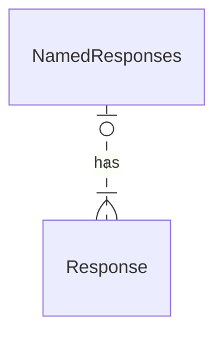

# Source: https://redocly.com/learn/openapi/openapi-visual-reference/named-responses.md

# Named responses

Responses may be reused with [reference objects](/learn/openapi/openapi-visual-reference/reference).

Responses can be defined explicitly for reuse in the components section.

See:

- Used in [Responses Map](/learn/openapi/openapi-visual-reference/responses).
- Composed of [Response Object](/learn/openapi/openapi-visual-reference/response).


## Visual

The named responses are intended for reuse by reference.
See visualizations of responses in the [Response Object](/learn/openapi/openapi-visual-reference/response) and [Responses Map](/learn/openapi/openapi-visual-reference/responses) topics.

## Types


```yaml
components:
  response:
    myStatus:
      # Response Object
```

- `NamedResponses`
- [`Response`](/learn/openapi/openapi-visual-reference/response)


