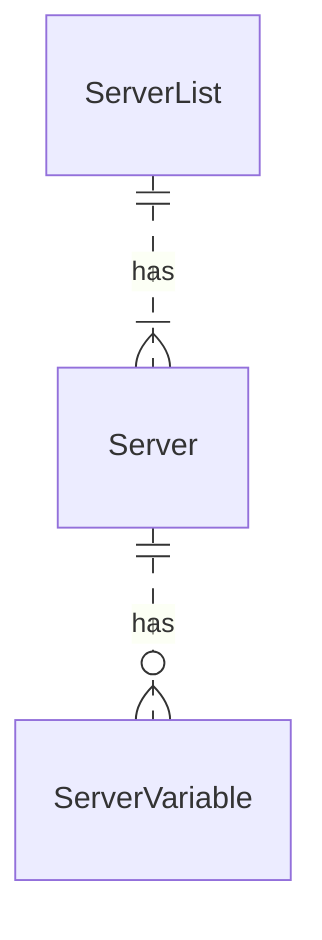

# Source: https://redocly.com/learn/openapi/openapi-visual-reference/servers.md

# `servers`

> A server object to be used by the target operation.


Type: List of Server Objects

| Field Name | Type | Description |
|  --- | --- | --- |
| url | `string` | **REQUIRED**. A URL to the target host. This URL supports Server Variables and MAY be relative, to indicate that the host location is relative to the location where the OpenAPI document is being served. Variable substitutions are made when a variable is named in `{` curly braces `}`. |
| description | `string` | An optional string describing the host designated by the URL. |
| variables | Map[`string`, [Server Variable Object](/learn/openapi/openapi-visual-reference/server-variables)] | A map between a variable name and its value. The value is used for substitution in the server's URL template. |


Servers can be defined at the definition root and also at the path item level.
The path item servers, if defined, take precedence over the definition root servers.

## Visuals

### Example with a single server

The following example is of a single server.


```yaml
servers:
  - url: https://api.redocly.com
```

### Example with two servers


```yaml
servers:
  - url: https://api.redocly.com
  - url: https://sandbox.redocly.com
```


### Example with description


```yaml
servers:
  - url: https://api.redocly.com
    description: Production
  - url: https://sandbox.redocly.com
    description: Sandbox
```


The servers can be displayed in the center panel by setting the `pathInMiddlePanel: true` option.


## Types

- `ServerList`
- `Server`
- `ServerVariable`


