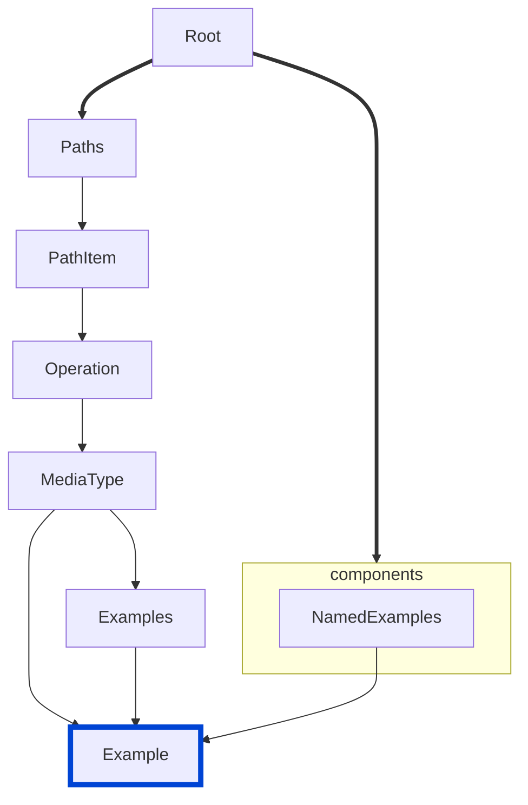

# Source: https://redocly.com/docs/cli/rules/oas/spec-example-values.md

# spec-example-values

Ensures that example objects have valid field combinations according to the OpenAPI 3.2.0 specification.

| OAS | Compatibility |
|  --- | --- |
| 2.0 | ❌ |
| 3.0 | ✅ |
| 3.1 | ✅ |
| 3.2 | ✅ |




## API design principles

According to the OpenAPI 3.2.0 specification, example objects have strict rules about which fields can be used together.
This rule ensures that only valid field combinations are used in example objects.

## Configuration

| Option | Type | Description |
|  --- | --- | --- |
| severity | string | Possible values: `off`, `warn`, `error`. Default `error` (in `recommended` configuration). |


An example configuration:


```yaml
rules:
  spec-example-values: error
```

## Examples

Given this configuration:


```yaml
rules:
  spec-example-values: error
```

Example of **incorrect** example objects:


```yaml
components:
  examples:
    InvalidDataValueAndValue:
      dataValue:
        name: John Doe
      value:
        name: Jane Doe
    InvalidSerializedValueAndValue:
      serializedValue: '{"name":"John Doe"}'
      value:
        name: Jane Doe
    InvalidExternalValueAndValue:
      externalValue: https://example.com/user-example.json
      value:
        name: Jane Doe
```

Example of **correct** example objects:


```yaml
components:
  examples:
    ValidDataValue:
      dataValue:
        name: John Doe
    ValidSerializedValue:
      serializedValue: '{"name":"John Doe"}'
    ValidExternalValue:
      externalValue: https://example.com/user-example.json
```

## Related rules

- [struct](/docs/cli/rules/common/struct)
- [no-example-value-and-externalValue](/docs/cli/rules/oas/no-example-value-and-externalValue)
- [spec-no-invalid-encoding-combinations](/docs/cli/rules/oas/spec-no-invalid-encoding-combinations)
- [spec-discriminator-defaultMapping](/docs/cli/rules/oas/spec-discriminator-defaultMapping)
- [spec-no-invalid-tag-parents](/docs/cli/rules/oas/spec-no-invalid-tag-parents)


## Resources

- [Rule source](https://github.com/Redocly/redocly-cli/blob/main/packages/core/src/rules/oas3/spec-example-values.ts)
- [Example object docs](https://redocly.com/docs/openapi-visual-reference/example/)