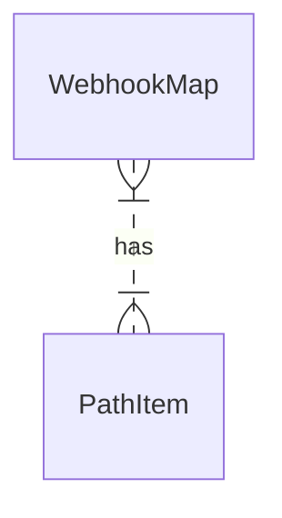

# Source: https://redocly.com/learn/openapi/openapi-visual-reference/webhooks.md

# Webhooks

> The incoming webhooks that MAY be received as part of this API and that the API consumer MAY choose to implement. Closely related to the callbacks feature, this section describes requests initiated other than by an API call, for example by an out of band registration. The key name is a unique string to refer to each webhook, while the (optionally referenced) [Path Item Object](/learn/openapi/openapi-visual-reference/path-item) describes a request that may be initiated by the API provider and the expected responses. An example is available.


## Visuals


```yaml

webhooks:
  resultPosted:
    $ref: ./webhooks/chess-result-posted.yaml
```

Redocly renders the webhook in the sidebar navigation with a badge named "Event" by default.
Redocly renders the badge with the full word "Webhook" with the operation summary.

The following image shows how Redocly renders webhooks in the sidebar navigation.


The following image shows how Redocly renders the summary heading.


The following image shows how Redocly renders the entire webhook operation.


## Types

- `WebhooksMap`
- [`PathItem`](/learn/openapi/openapi-visual-reference/path-item)


