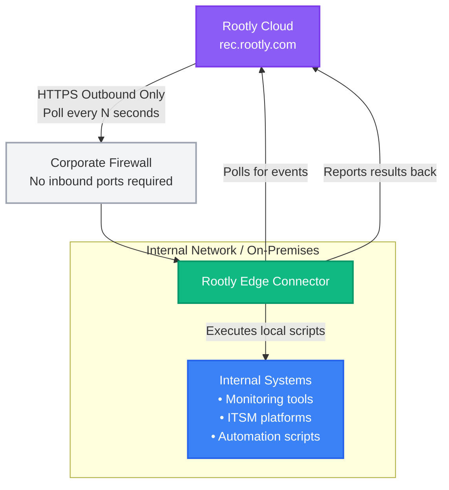

# Source: https://docs.rootly.com/edge-connectors.md

> ## Documentation Index
> Fetch the complete documentation index at: https://docs.rootly.com/llms.txt
> Use this file to discover all available pages before exploring further.

# Overview

> Securely integrate Rootly with internal systems that cannot accept inbound internet connections using outbound-only polling.

## Overview

The Rootly Edge Connector is a lightweight agent that enables secure, bidirectional integration between Rootly and internal or on-premises systems that cannot accept inbound internet connections. It uses an outbound-only polling model to listen for events from Rootly and execute local actions in response.

<Info>
  Edge Connectors are ideal for organizations with strict security requirements where opening inbound firewall ports is not permitted or desirable.
</Info>

## Key Benefits

* **Enhanced Security**: No inbound firewall rules required - only outbound HTTPS connections
* **Flexibility**: Execute any script or automation in response to Rootly events
* **Auditability**: Full Git-based configuration and comprehensive execution logs
* **Reliability**: Event queueing with retry logic ensures no missed actions
* **Seamless Integration**: Bridge cloud-based Rootly with on-premises systems

## How It Works

<Frame>
  
</Frame>

### Communication Flow

1. **Polling**: The Edge Connector polls Rootly's API at regular intervals for new events
2. **Event Processing**: When events are received, the connector maps them to configured actions
3. **Execution**: Whitelisted scripts are executed with event context as parameters
4. **Reporting**: Results and logs are sent back to Rootly for visibility and audit

## Security Model

### Why Outbound-Only is More Secure

**Traditional Webhook Approach** (Inbound):

* Requires exposing an endpoint to the internet
* Must configure and maintain TLS termination
* Attack surface for scanning, probing, and DDoS
* Firewall changes and security reviews required

**Edge Connector Approach** (Outbound):

* Only outbound HTTPS (same as normal web browsing)
* No exposed endpoints for attackers to discover
* No firewall changes needed
* Cannot be directly targeted from the internet

### Additional Security Features

* **API Key Scoping**: Create Edge Connector-specific API keys with minimal permissions
* **Script Whitelisting**: Only approved, version-controlled scripts can execute
* **Team-based Authorization**: Map Rootly teams to allowed local actions
* **Audit Trail**: Every action logged with full context (who, what, when)
* **Network Isolation**: Run the connector on a dedicated, isolated host

## Getting Started

### Prerequisites

* Rootly team with Edge Connector feature enabled
* Ability to run a service in your internal network
* API key with Edge Connector permissions

### Request Access

<Note>
  Edge Connector is an enterprise feature that requires enablement by Rootly administrators.
</Note>

To request access:

1. Navigate to **Settings** → **Edge Connectors** in Rootly
2. Click **Request Access**
3. Your team administrators will be notified
4. Contact [sales@rootly.com](mailto:sales@rootly.com) for feature enablement

### Setup Overview

1. **Create an Edge Connector in Rootly**
   * Navigate to Settings → Edge Connectors
   * Click "Create Edge Connector"
   * Configure name and event subscriptions
   * Generate an API key

2. **Install the Edge Connector Agent**
   * See the [Installation & Deployment](/edge-connectors-installation) guide for detailed setup instructions

3. **Configure Actions**
   * See the [Action Configuration](/edge-connectors-actions) guide to define your automations

4. **Monitor and Maintain**
   * View connector status in Rootly dashboard
   * Review execution logs
   * Update scripts as needed

<Info>
  **Quick Links:**

  * [Installation & Deployment](/edge-connectors-installation) - Install and run the Edge Connector
  * [Action Configuration](/edge-connectors-actions) - Define script and HTTP actions
  * [Template Syntax](/edge-connectors-templates) - Use dynamic values in actions
  * [Event Examples](/edge-connectors-event-examples) - See example event payloads
</Info>

## Action Types

Edge Connector actions fall into two categories:

### Automatic Actions

These run automatically in response to system events, without user interaction. Configured in the `on:` section of `actions.yml`.

**Examples:** Auto-restart services when alerts fire, send notifications when incidents are created, collect diagnostics automatically.

### Callable Actions

These are triggered manually by users from the Rootly UI with interactive buttons and forms. Configured in the `callable:` section of `actions.yml`.

**Examples:** Manual service restart, deploy hotfix, scale infrastructure, clear cache on demand.

<Info>
  For a detailed comparison including UI behavior, registration process, and configuration differences, see the [Action Configuration Guide](/edge-connectors-actions#automatic-vs-callable-actions).
</Info>

## Supported Event Types

Edge Connectors support two categories of events:

### Automatic Event Types

These events are triggered automatically by system events and can be subscribed to when configuring your Edge Connector:

**Alert Events:**

* `alert.created` - New alert from monitoring system
* `alert.updated` - Alert properties changed
* `alert.acknowledged` - Alert acknowledged by a user
* `alert.resolved` - Alert marked as resolved
* `alert.deleted` - Alert removed

**Incident Events:**

* `incident.created` - New incident started
* `incident.updated` - Incident properties changed
* `incident.in_triage` - Incident moved to triage status
* `incident.mitigated` - Incident mitigated
* `incident.resolved` - Incident marked resolved
* `incident.cancelled` - Incident cancelled
* `incident.deleted` - Incident deleted

### Manual Trigger Event Types

These events are triggered by user actions and are configured per action:

* `action.triggered` - Standalone action triggered by a user
* `alert.action_triggered` - Action triggered from an alert context
* `incident.action_triggered` - Action triggered from an incident context

<Info>
  You can configure which automatic events your Edge Connector subscribes to when creating or editing it in the Rootly UI. Manual trigger events are configured in your action definitions. For detailed payload examples and templating patterns, see the [Event Examples](/edge-connectors-event-examples) page.
</Info>

## Use Cases

### Automated Remediation

Automatically restart services or run diagnostic scripts when critical alerts are detected. Perfect for known issues that have established remediation procedures.

### Internal System Integration

Create tickets in internal ITSM systems that aren't accessible from the internet. Bridge Rootly with on-premises Jira, ServiceNow, or custom ticketing systems.

### Hybrid Cloud Orchestration

Run Ansible playbooks or other automation tools in response to incident lifecycle events. Trigger infrastructure changes, scaling operations, or deployment rollbacks.

### Diagnostic Collection

Automatically collect logs, metrics, and diagnostics when incidents occur. Gather context automatically to speed up incident investigation.

<Note>
  See the [Action Configuration](/edge-connectors-actions) guide for detailed examples of these use cases with complete action definitions.
</Note>

## Managing Edge Connectors

### Viewing Connector Status

In the Rootly dashboard, you can monitor:

* **Online Status**: Whether the connector is actively polling
* **Last Poll Time**: When the connector last checked for events
* **Events Pending**: Number of events waiting to be processed
* **Recent Executions**: Logs of recently executed actions

### API Key Management

Each Edge Connector requires an API key:

1. Navigate to **Settings** → **API Keys**
2. Create a new key with type **Edge Connector**
3. Associate it with your Edge Connector
4. Store the key securely on your connector host

<Warning>
  API keys should be rotated regularly and stored securely. Never commit API keys to version control.
</Warning>

## Documentation

* **[Installation & Deployment](/edge-connectors-installation)** - Install and configure the Edge Connector in your environment
* **[Action Configuration](/edge-connectors-actions)** - Define script and HTTP actions to automate responses
* **[Template Syntax](/edge-connectors-templates)** - Use Liquid templates for dynamic values in actions
* **[Event Examples](/edge-connectors-event-examples)** - Reference for event payload structures and fields

## Best Practices

**Security:**

* Run the Edge Connector on a dedicated, isolated host
* Store secrets in environment variables, never in configuration files
* Version control all scripts and review through pull requests
* Rotate API keys periodically

**Reliability:**

* Configure appropriate polling intervals (typically 10-30 seconds)
* Set reasonable script timeouts based on expected execution time
* Implement retry logic in your scripts for transient failures
* Monitor connector health and set up downtime alerts

**Configuration:**

* Use descriptive names for connectors and actions
* Document script requirements and dependencies
* Test actions thoroughly before production deployment
* Keep the connector software updated

For detailed troubleshooting, see the [Installation & Deployment](/edge-connectors-installation#troubleshooting) guide.

Built with [Mintlify](https://mintlify.com).