# Semantic Router Documentation

Source: https://docs.aurelio.ai/llms-full.txt

---

# null
Source: https://docs.aurelio.ai/aurelio-sdk/core-concepts


This page covers the fundamental concepts of the Aurelio SDK, explaining its key components and how they work together to provide powerful document processing capabilities.

## Document Processing

Document processing in the Aurelio SDK converts unstructured documents (PDFs) into easily readable markdown that can be further processed or used in AI applications.

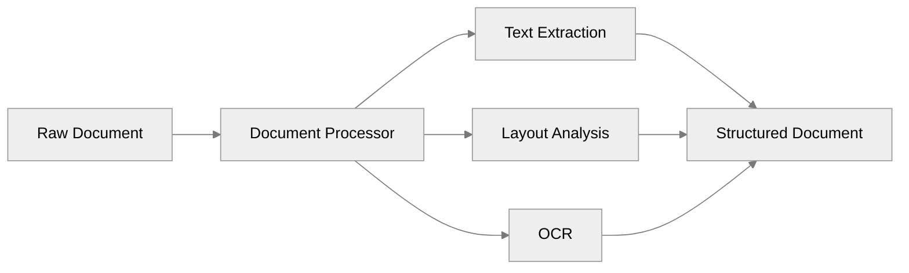

The processing pipeline:

1. **Ingestion**: Documents are uploaded either as local files or via URLs.
2. **Quality Selection**: Processing can be done in different quality modes:
   * `low`: Faster but less accurate
   * `high`: More accurate but slower
3. **Text Extraction**: The system identifies and extracts text content
4. **Structure Recognition**: Identifies document elements like headers, paragraphs, tables
5. **Metadata Extraction**: Retrieves document metadata when available

```python theme={null}
# Example of document processing
response = client.extract_file(
    file_path="document.pdf", 
    quality="high",
    wait=30
)
```

## Chunking

Chunking is the process of breaking long documents into smaller, semantically meaningful pieces that are optimized for downstream tasks like embedding and retrieval.

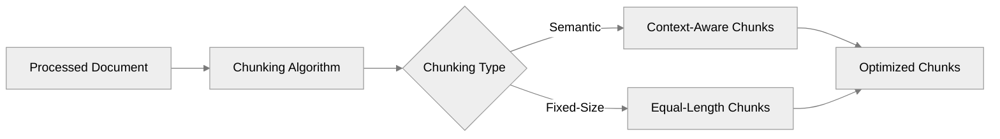

### Why Chunking Matters

1. **Token Limitations**: Most embedding models have maximum context windows
2. **Semantic Coherence**: Properly chunked documents maintain meaning and context
3. **Retrieval Precision**: Well-defined chunks improve retrieval accuracy
4. **Processing Efficiency**: Smaller chunks reduce computational overhead

The SDK supports different chunking strategies:

* **Semantic Chunking**: Creates chunks based on semantic boundaries (paragraphs, sections)
* **Fixed-Size Chunking**: Creates chunks of approximately equal size
* **Custom Chunking**: Configure chunking parameters to suit specific needs

```python theme={null}
# Example of custom chunking
chunking_options = ChunkingOptions(
    chunker_type="semantic",
    max_chunk_length=400,
    window_size=5
)

chunk_response = client.chunk(
    content=long_text, 
    processing_options=chunking_options
)
```

## Embedding

Embeddings are dense vector representations of text that capture semantic meaning in a form that machines can process efficiently. They enable semantic search, similarity comparison, and other NLP applications.

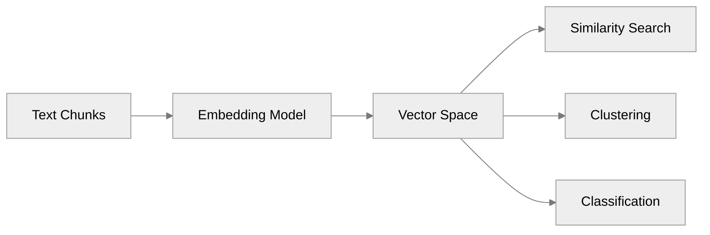

### Embedding Applications

1. **Semantic Search**: Find contextually similar content beyond keyword matching
2. **Information Retrieval**: Retrieve relevant document sections for RAG applications
3. **Document Similarity**: Compare documents based on meaning rather than exact wording
4. **Content Organization**: Cluster similar content automatically

The SDK supports multiple embedding models to suit different needs and balance between quality and performance.

```python theme={null}
# Example of generating embeddings
embedding_response = client.embedding(
    input=chunk_texts,
    model="bm25"  # Choose embedding model based on needs
)
```

## Async vs Sync Approaches

The Aurelio SDK offers both synchronous and asynchronous APIs to accommodate different usage patterns.

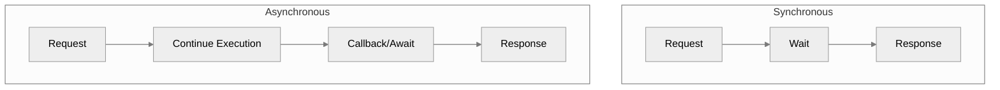

### When to Use Synchronous API

* **Simple Scripts**: For straightforward, linear processing flows
* **Small Documents**: When processing time is minimal
* **Development/Testing**: During initial development or debugging
* **Single Document Processing**: When handling one document at a time

```python theme={null}
# Synchronous API example
client = AurelioClient(api_key=os.environ["AURELIO_API_KEY"])
response = client.extract_file(file_path="document.pdf", wait=30)
```

### When to Use Asynchronous API

* **Production Applications**: For high-throughput systems
* **Large Documents**: When processing may take significant time
* **Batch Processing**: When handling multiple documents simultaneously
* **Web Applications**: To prevent blocking the main thread

```python theme={null}
# Asynchronous API example
async_client = AsyncAurelioClient(api_key=os.environ["AURELIO_API_KEY"])
async def process_document():
    response = await async_client.extract_file(file_path="document.pdf")
    return response
```

The async API provides significant performance improvements for concurrent processing scenarios, making it the preferred choice for production applications with substantial throughput requirements.


# null
Source: https://docs.aurelio.ai/aurelio-sdk/overview


The Aurelio SDK provides a streamlined interface to the Aurelio Platform's document processing capabilities. It enables developers to extract, chunk, and embed textual content from various sources with minimal effort.

## What is Aurelio SDK?

Aurelio SDK is a Python library that abstracts the complexity of document processing pipelines. It offers both synchronous and asynchronous clients to interact with the Aurelio Platform.

## Core Capabilities

### Document Extraction

Extract text from multiple sources including:

* PDF documents (local files or URLs)
* Video files with automatic transcription
* Web-based content

### Intelligent Chunking

Break down documents into meaningful segments using:

* Semantic chunking that respects content boundaries
* Configurable parameters for chunk size and overlap
* Window-based processing for context preservation

### Embeddings Generation

Transform text into vector representations using:

* Multiple embedding models including BM25
* Batch processing for efficiency
* Consistent vector formats for downstream applications

## When to Use Aurelio SDK

Aurelio SDK is particularly useful when:

* Building document processing pipelines that require extraction and structuring of content
* Implementing semantic search capabilities across large document collections
* Preparing text data for large language model applications
* Creating NLP workflows that need consistent text chunking and embedding

## Architecture

The SDK follows a client-based architecture:


This structure allows for clean separation of concerns, with the SDK handling authentication, request formatting, and response parsing, letting you focus on your application logic.

## Getting Started

To start using the SDK, continue to [Quickstart Guide](quickstart) for installation instructions and basic usage examples.


# null
Source: https://docs.aurelio.ai/aurelio-sdk/quickstart


This guide will get you up and running with the Aurelio SDK for document processing, chunking, and embedding generation.

## Installation

Install the Aurelio SDK using pip:

```bash theme={null}
pip install -qU aurelio-sdk
```

Or with Poetry:

```bash theme={null}
poetry add aurelio-sdk
```

## Authentication

The SDK requires an [API key](https://platform.aurelio.ai/) for authentication:

```python theme={null}
from aurelio_sdk import AurelioClient
import os

# Set your API key as an environment variable
# export AURELIO_API_KEY=your_api_key_here

# Initialize the client
client = AurelioClient(api_key=os.environ["AURELIO_API_KEY"])

# Or use the async client for better performance
from aurelio_sdk import AsyncAurelioClient
async_client = AsyncAurelioClient(api_key=os.environ["AURELIO_API_KEY"])
```

## Document Extraction

Extract text from a PDF file:

```python theme={null}
from aurelio_sdk import ExtractResponse

# Local PDF file
response = client.extract_file(
    file_path="document.pdf", 
    model="docling-base",  # Higher accuracy model (replaces quality="high")
    chunk=True,            # Automatically chunk the document
    wait=30                # Wait up to 30 seconds for processing
)

# Access the document ID for status checking
document_id = response.document.id

# If the document is still processing, wait for completion
if response.status != "complete":
    final_response = client.wait_for(document_id=document_id, wait=300)
    
# Access the chunks once processing is complete
for chunk in final_response.chunks:
    print(f"Chunk: {chunk.text[:100]}...")
```

For PDF URLs:

```python theme={null}
url_response = client.extract_url(
    url="https://arxiv.org/pdf/2305.10403.pdf",
    model="docling-base",  # More accurate model for complex PDFs
    chunk=True,
    wait=30
)
```

For video files (only supports aurelio-base model):

```python theme={null}
video_response = client.extract_file(
    file_path="video.mp4",
    model="aurelio-base",  # Only supported model for video
    chunk=True,
    wait=-1,
    processing_options={
        "chunking": {
            "chunker_type": "semantic"  # Better chunking for video content
        }
    }
)
```

## Intelligent Chunking

Chunk existing text with customized settings:

```python theme={null}
from aurelio_sdk import ChunkingOptions, ChunkResponse

# Define chunking parameters
chunking_options = ChunkingOptions(
    chunker_type="semantic",  # Uses semantic chunking
    max_chunk_length=400,     # Maximum token limit for one chunk
    window_size=5             # Rolling window context size
)

long_text = """Your long document text here..."""

# Perform chunking
chunk_response = client.chunk(
    content=long_text, 
    processing_options=chunking_options
)

# Process the chunks
for i, chunk in enumerate(chunk_response.chunks):
    print(f"Chunk {i+1}: {chunk.text[:50]}...")
```

## Embedding Generation

Generate embeddings for text or chunks:

```python theme={null}
from aurelio_sdk import EmbeddingResponse

# Generate embeddings for a single text
single_embedding = client.embedding(
    input="This is a sample text to embed",
    model="bm25"  # Choose your embedding model
)

# Generate embeddings for multiple texts (batch processing)
texts = [
    "First document to embed",
    "Second document to embed",
    "Third document to embed"
]

batch_embeddings = client.embedding(
    input=texts
)

# Access the embedding vectors
vectors = batch_embeddings.data
```

## Complete Pipeline Example

Extract, chunk, and embed a PDF in one workflow:

```python theme={null}
# 1. Extract and chunk a PDF
extract_response = client.extract_file(
    file_path="research_paper.pdf", 
    model="docling-base",
    chunk=True,
    wait=60
)

# Wait for completion if needed
if extract_response.status != "complete":
    extract_response = client.wait_for(document_id=extract_response.document.id, wait=300)

# 2. Get all chunk texts
chunk_texts = [chunk.text for chunk in extract_response.chunks]

# 3. Generate embeddings for all chunks
embedding_response = client.embedding(input=chunk_texts)

# 4. Now you have vectorized your PDF document
# Each vector corresponds to a chunk from the original document
vectors = embedding_response.data
```


# null
Source: https://docs.aurelio.ai/aurelio-sdk/user-guide/chunking


This guide provides detailed technical information about document chunking capabilities in the Aurelio SDK. Chunking is the process of dividing a document into smaller, semantically meaningful segments for improved processing and retrieval.

## Chunking Flow

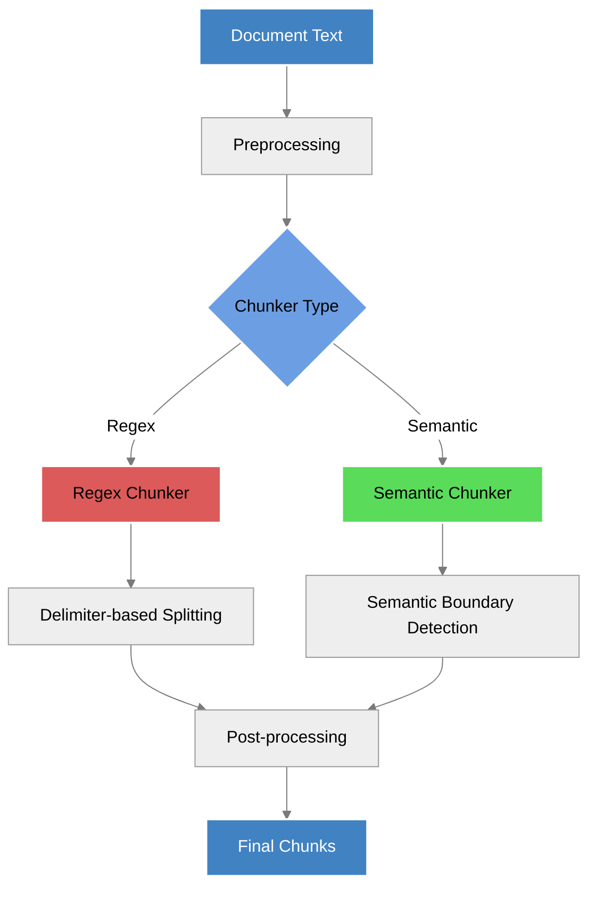

## Chunking Options

The SDK provides a flexible chunking API with several configurable parameters:

```python theme={null}
class ChunkingOptions(BaseModel):
    max_chunk_length: Optional[int] = Field(
        default=400, description="The maximum chunk length for the chunker"
    )
    chunker_type: Optional[Literal["regex", "semantic"]] = Field(
        default="regex",
        description="The chunker type, either regex or semantic",
    )
    window_size: Optional[int] = Field(
        default=1, description="The window size for the semantic chunker"
    )
    delimiters: Optional[List[str]] = Field(
        default_factory=list,
        description="Optional. The regex delimiters for the regex chunker",
    )
```

| Parameter          | Type        | Default   | Description                                   |
| ------------------ | ----------- | --------- | --------------------------------------------- |
| `max_chunk_length` | `int`       | `400`     | Maximum number of tokens per chunk            |
| `chunker_type`     | `str`       | `"regex"` | Chunking algorithm: `"regex"` or `"semantic"` |
| `window_size`      | `int`       | `1`       | Context window size for semantic chunking     |
| `delimiters`       | `List[str]` | `[]`      | Custom regex delimiters for regex chunking    |

## Chunking Methods

The SDK offers two primary methods for chunking documents:

1. **Direct chunking** of text content via the `chunk` function
2. **Chunking during file processing** via the \[]`extract` function]\(file-extraction)

### Direct Text Chunking

```python theme={null}
def chunk(
    self,
    content: str,
    max_chunk_length: int = 400,
    chunker_type: Literal["regex", "semantic"] = "regex",
    window_size: int = 1,
    delimiters: Optional[List[str]] = None,
) -> ChunkResponse:
    """Chunk text content into smaller, semantically-meaningful segments."""
```

#### Usage Example

```python theme={null}
from aurelio_sdk import AurelioClient

client = AurelioClient()

text = """
Long document text that needs to be chunked into smaller segments.
This could be multiple paragraphs of content that would benefit from
semantic chunking for better processing downstream.
"""

response = client.chunk(
    content=text,
    max_chunk_length=300,
    chunker_type="semantic",
    window_size=2
)

# Access the chunks
for chunk in response.document.chunks:
    print(f"Chunk {chunk.chunk_index}: {chunk.content[:50]}...")
    print(f"Token count: {chunk.num_tokens}")
```

### Chunking During Extraction

When processing files, chunking can be enabled with the `chunk=True` parameter:

```python theme={null}
response = client.extract_file(
    file_path="document.pdf",
    quality="high",
    chunk=True  # Enable chunking
)

# Access the chunks from the extraction response
for chunk in response.document.chunks:
    print(f"Chunk {chunk.chunk_index}: {chunk.content[:50]}...")
```

## Chunking Algorithms

The SDK supports two chunking algorithms, each with different characteristics and use cases.

### Regex Chunking

The default chunking method uses regular expressions to split text based on delimiters.

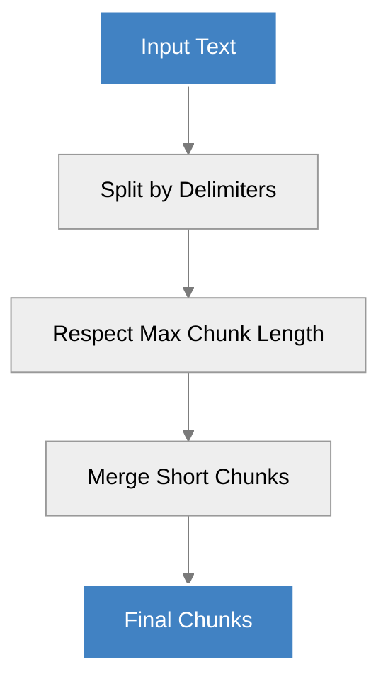

**Key characteristics:**

* Fast and deterministic
* Respects natural text boundaries like paragraphs
* Works well for well-structured documents
* Less compute-intensive than semantic chunking

**Best for:**

* Well-formatted text with clear paragraph breaks
* Large volumes of documents where processing speed is important
* Situations where chunk boundaries are less critical

**Example with custom delimiters:**

```python theme={null}
response = client.chunk(
    content=long_text,
    max_chunk_length=500,
    chunker_type="regex",
    delimiters=["\n\n", "\n###\s+", "\n##\s+", "\n#\s+"]  # Custom delimiters
)
```

### Semantic Chunking

A more advanced algorithm that attempts to preserve semantic meaning across chunk boundaries.

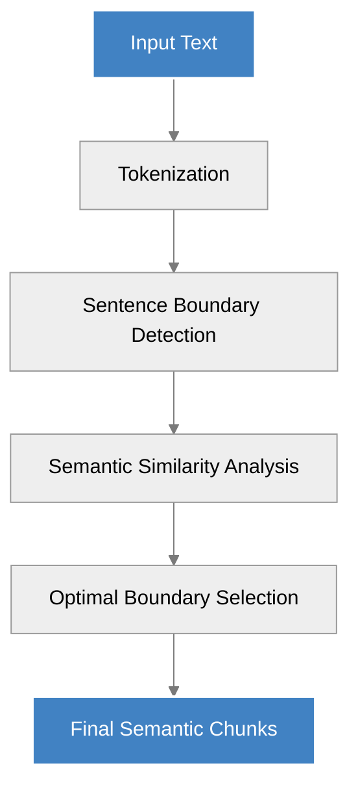

**Key characteristics:**

* Preserves semantic meaning across chunks
* More compute-intensive than regex chunking
* Creates more coherent chunks for complex content
* Better respects topical boundaries

**Best for:**

* Complex documents where semantic coherence is important
* Content that will be used for semantic search or LLM context
* Documents with varied formatting where regex may struggle

**Example with window size:**

```python theme={null}
response = client.chunk(
    content=complex_text,
    max_chunk_length=400,
    chunker_type="semantic",
    window_size=3  # Use larger context window for better semantic boundaries
)
```

The `window_size` parameter controls how much surrounding context is considered when determining chunk boundaries. Larger values preserve more context but increase processing time.

## Window-Based Processing

Semantic chunking uses a sliding window approach to maintain context across chunk boundaries.

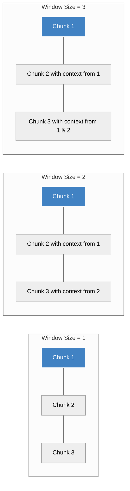

### Impact of Window Size

| Window Size | Context Preservation | Processing Speed | Use Case             |
| ----------- | -------------------- | ---------------- | -------------------- |
| 1 (default) | Minimal              | Fastest          | Basic chunking needs |
| 2-3         | Moderate             | Medium           | Balanced approach    |
| 4+          | Maximum              | Slower           | High-precision needs |

## Response Structure

The chunking response provides detailed information about each generated chunk:

```python theme={null}
class ChunkResponse(BaseModel):
    status: TaskStatus = Field(..., description="The status of the chunking process")
    usage: Usage = Field(..., description="Usage")
    message: Optional[str] = Field(None, description="Message")
    processing_options: ChunkingOptions = Field(
        ..., description="The processing options for the chunker"
    )
    document: ResponseDocument = Field(..., description="Processed document")
```

Each chunk contains:

```python theme={null}
class ResponseChunk(BaseModel):
    id: str = Field(..., description="ID of the chunk")
    content: str = Field(..., description="Content of the chunk")
    chunk_index: int = Field(..., description="Index of the chunk in the document")
    num_tokens: int = Field(..., description="Number of tokens in the chunk")
    metadata: Dict[str, Any] = Field(
        default_factory=dict, description="Metadata of the chunk"
    )
```

## Recommendations for Effective Chunking

### General Guidelines

* **Choose the right algorithm**: Use `regex` for speed, `semantic` for meaning preservation
* **Set appropriate chunk sizes**: 300-500 tokens works well for most applications
* **Customize for your content**: Adjust parameters based on document structure

### By Content Type

| Content Type            | Recommended Chunker | Max Chunk Length | Window Size | Notes                                             |
| ----------------------- | ------------------- | ---------------- | ----------- | ------------------------------------------------- |
| Technical documentation | `regex`             | 400              | 1           | Often has clear section breaks                    |
| Academic papers         | `semantic`          | 350              | 2           | Complex ideas need semantic coherence             |
| Legal documents         | `semantic`          | 300              | 3           | Precise context preservation is critical          |
| News articles           | `regex`             | 450              | 1           | Well-structured with clear paragraphs             |
| Transcripts             | `semantic`          | 500              | 2           | Spoken language benefits from semantic boundaries |

### Performance Considerations

* Regex chunking is significantly faster (5-10x) than semantic chunking
* Processing time increases with document size and window size
* For very large documents (>1MB of text), consider preprocessing into smaller segments

## Advanced Usage: Custom Delimiters

For regex chunking, you can provide custom delimiters to better match your document structure:

```python theme={null}
# Custom delimiters for Markdown documents
markdown_delimiters = [
    "\n##\s+",  # ## Headers
    "\n###\s+",  # ### Headers
    "\n\n",      # Double line breaks
    "\n\*\*\*\n" # *** Horizontal rules
]

response = client.chunk(
    content=markdown_text,
    chunker_type="regex",
    delimiters=markdown_delimiters
)
```

Common delimiter patterns:

* **Headers**: `"\n#{1,6}\s+"` (matches Markdown headers)
* **Paragraphs**: `"\n\s*\n"` (matches paragraph breaks)
* **List items**: `"\n\s*[-*•]\s"` (matches list markers)
* **Sections**: `"\n\d+\.\s+"` (matches numbered sections)

## Error Handling

```python theme={null}
from aurelio_sdk import AurelioClient, APIError

client = AurelioClient()

try:
    response = client.chunk(
        content=very_long_text,
        max_chunk_length=300,
        chunker_type="semantic"
    )
except APIError as e:
    print(f"Chunking error: {e.message}")
    # Fallback to regex chunking
    response = client.chunk(
        content=very_long_text,
        max_chunk_length=300,
        chunker_type="regex"
    )
```


# null
Source: https://docs.aurelio.ai/aurelio-sdk/user-guide/embeddings


This guide provides detailed technical information about embedding capabilities in the Aurelio SDK. Embeddings are vector representations of text that capture semantic meaning and are essential for building text retrieval and search systems.

## Embedding Flow

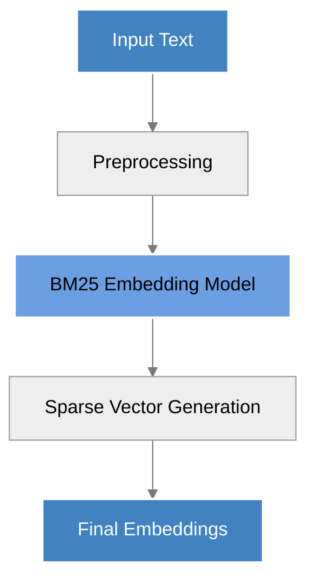

## Embedding Options

The SDK provides a focused embedding API with the following parameters:

```python theme={null}
def embedding(
    self,
    input: Union[str, List[str]],
    input_type: Annotated[str, Literal["queries", "documents"]],
    model: Annotated[str, Literal["bm25"]],
    timeout: int = 30,
    retries: int = 3,
) -> EmbeddingResponse:
    """Generate embeddings for the given input using the specified model."""
```

| Parameter    | Type                    | Default  | Description                                                 |
| ------------ | ----------------------- | -------- | ----------------------------------------------------------- |
| `input`      | `Union[str, List[str]]` | Required | Text or list of texts to embed                              |
| `input_type` | `str`                   | Required | Either "queries" or "documents" depending on use case       |
| `model`      | `str`                   | `"bm25"` | Embedding model to use (currently only "bm25" is available) |
| `timeout`    | `int`                   | `30`     | Maximum seconds to wait for API response                    |
| `retries`    | `int`                   | `3`      | Number of retry attempts for failed requests                |

## Sparse Embeddings

The Aurelio SDK uses sparse BM25-style embeddings, which differ from traditional dense embeddings:

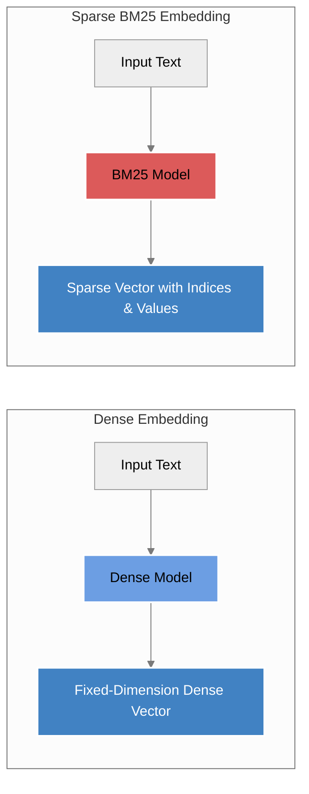

### Aurelio Sparse Implementation

The SDK's BM25 embedding model uses a single set of pretrained weights trained on a web-scale dataset to produce a "world model" set of BM25-like weights. These weights are transformed into sparse vector embeddings with the following characteristics:

* **Structure**: Each embedding contains index-value pairs, where indices represent specific terms/tokens and values represent their importance
* **Sparse Representation**: Only non-zero values are stored, making them memory-efficient
* **Exact Term Matching**: Excellent for capturing exact terminology for specialized domains
* **Domain-Specific Performance**: Well-suited for finance, medical, legal, and technical domains where specific terminology matters

### Input Types

The `input_type` parameter accepts two possible values:

| Input Type    | Use Case                             | Description                                                                             |
| ------------- | ------------------------------------ | --------------------------------------------------------------------------------------- |
| `"documents"` | Creating a searchable knowledge base | Optimizes embeddings for document representation in a vector database                   |
| `"queries"`   | Querying a knowledge base            | Optimizes embeddings for query representation when searching against embedded documents |

### Sparse Embedding Structure

```python theme={null}
class SparseEmbedding(BaseModel):
    indices: list[int]
    values: list[float]
```

The `indices` correspond to token positions in the vocabulary, while the `values` represent the importance of each token for the given text.

## Usage Examples

### Basic Embedding Generation

```python theme={null}
from aurelio_sdk import AurelioClient

client = AurelioClient(api_key="your_api_key")

# Embedding a single text
response = client.embedding(
    input="What is the capital of France?", 
    input_type="queries",
    model="bm25"
)

# Accessing the embedding
embedding = response.data[0].embedding
print(f"Indices: {embedding.indices[:5]}...")
print(f"Values: {embedding.values[:5]}...")
```

### Batch Embedding Generation

```python theme={null}
# Embedding multiple documents at once
documents = [
    "Paris is the capital of France.",
    "Berlin is the capital of Germany.",
    "Rome is the capital of Italy."
]

response = client.embedding(
    input=documents,
    input_type="documents",
    model="bm25"
)

# Process each embedding
for i, item in enumerate(response.data):
    embedding = item.embedding
    print(f"Document {i}: {len(embedding.indices)} non-zero elements")
```

### Async Embedding Generation

```python theme={null}
from aurelio_sdk import AsyncAurelioClient
import asyncio

async def generate_embeddings():
    client = AsyncAurelioClient(api_key="your_api_key")
    
    response = await client.embedding(
        input="Async embedding generation", 
        input_type="documents",
        model="bm25"
    )
    
    return response

embeddings = asyncio.run(generate_embeddings())
```

## Complete Workflow: Chunk and Embed

A common pattern is to chunk documents and then embed each chunk:

```python theme={null}
# 1. Extract and chunk a document
extract_response = client.extract_file(
    file_path="document.pdf", 
    quality="high",
    chunk=True
)

# 2. Get chunks from the document
chunks = [chunk.content for chunk in extract_response.document.chunks]

# 3. Generate embeddings for all chunks
embedding_response = client.embedding(
    input=chunks,
    input_type="documents",
    model="bm25"
)

# Now you can store these embeddings in a vector database
for i, chunk in enumerate(extract_response.document.chunks):
    embedding = embedding_response.data[i].embedding
    # Store chunk ID, content, and embedding in your vector store
```

## Response Structure

The embedding response contains detailed information:

```python theme={null}
class EmbeddingResponse(BaseModel):
    message: Optional[str]
    model: str      # The model used (e.g., "bm25")
    object: str     # Always "list"
    usage: EmbeddingUsage
    data: list[EmbeddingDataObject]
```

The `EmbeddingUsage` provides token consumption metrics:

```python theme={null}
class EmbeddingUsage(BaseModel):
    prompt_tokens: int
    total_tokens: int
```

Each embedding is contained in an `EmbeddingDataObject`:

```python theme={null}
class EmbeddingDataObject(BaseModel):
    object: str     # Always "embedding"
    index: int      # Position in the input array
    embedding: SparseEmbedding
```

## Advantages of Sparse Embeddings

### Sparse vs. Dense Embeddings

| Characteristic     | Sparse BM25 Embeddings                          | Dense Embeddings                              |
| ------------------ | ----------------------------------------------- | --------------------------------------------- |
| Representation     | Index-value pairs for non-zero elements         | Fixed-dimension vectors of continuous values  |
| Storage Efficiency | High (only stores non-zero values)              | Low (stores all dimensions)                   |
| Term Matching      | Excellent for exact term/keyword matching       | May miss exact terminology                    |
| Domain Adaptation  | Strong for specialized vocabulary domains       | May require fine-tuning for domains           |
| Interpretability   | Higher (indices correspond to vocabulary terms) | Lower (dimensions not directly interpretable) |

### When to Use Sparse

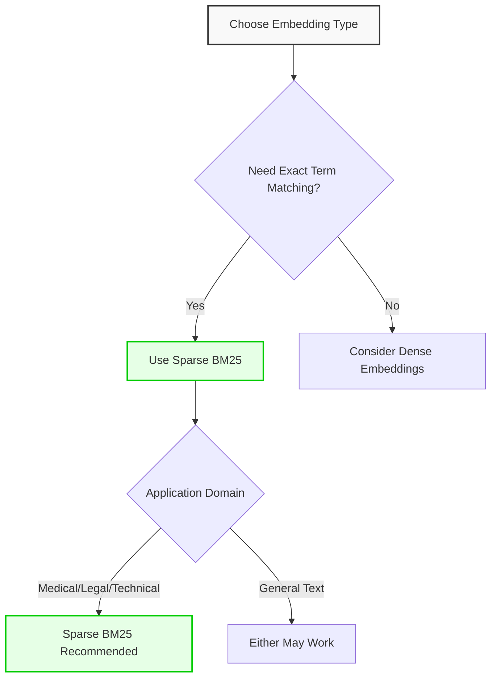

Sparse BM25 embeddings excel in scenarios where:

* You need to capture domain-specific terminology (medical, finance, legal, technical)
* Exact keyword matching is important
* You want higher interpretability of search results
* You're building systems where precision on terminology matters more than general semantic similarity

## Error Handling

```python theme={null}
from aurelio_sdk import AurelioClient, ApiError, ApiTimeoutError

client = AurelioClient(api_key="your_api_key")

try:
    response = client.embedding(
        input="Sample text", 
        input_type="documents",
        model="bm25"
    )
except ApiTimeoutError:
    print("Request timed out, try increasing the timeout parameter")
except ApiError as e:
    print(f"Error: {e.message}")
```

## Future Plans

The Aurelio SDK plans to enhance embedding capabilities with:

* Additional sparse embedding models
* User-trainable models for specific domains
* Advanced embedding customization options

Stay tuned for updates to the embedding API as these features become available.


# null
Source: https://docs.aurelio.ai/aurelio-sdk/user-guide/file-extraction


This guide provides technical details about processing different types of files with the Aurelio SDK, including PDFs, videos, and web content. It covers all available parameters, recommended configurations, and waiting strategies for large files.

## Processing Flow

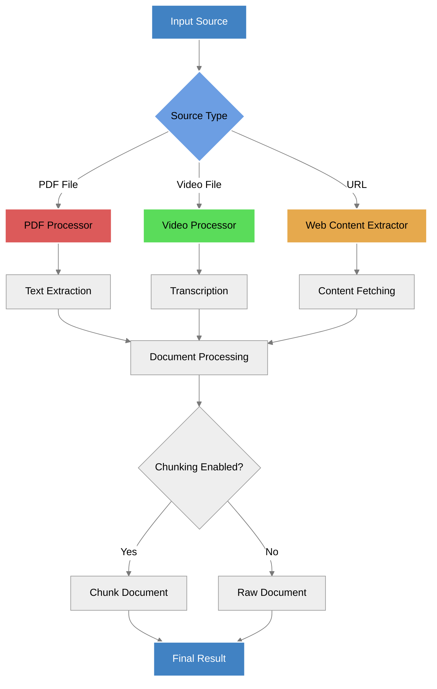

## Common Parameters

All file extraction methods accept these core parameters:

| Parameter            | Type                                                            | Default          | Description                                                                                                                               |
| -------------------- | --------------------------------------------------------------- | ---------------- | ----------------------------------------------------------------------------------------------------------------------------------------- |
| `model`              | `"aurelio-base"` \| `"docling-base"` \| `"gemini-2-flash-lite"` | `"aurelio-base"` | Model to use for processing. Different models have different capabilities and price points.                                               |
| `chunk`              | `bool`                                                          | `True`           | Whether to chunk the document using default chunking config.                                                                              |
| `wait`               | `int`                                                           | `30`             | Time in seconds to wait for processing completion. Set to `-1` to wait indefinitely. Set to `0` to return immediately with a document ID. |
| `polling_interval`   | `int`                                                           | `5`              | Time in seconds between status check requests. Set to `0` to disable polling.                                                             |
| `retries`            | `int`                                                           | `3`              | Number of retry attempts in case of API errors (5xx).                                                                                     |
| `processing_options` | `dict`                                                          | `None`           | Additional processing options for customizing extraction and chunking behavior.                                                           |

> **Note:** The `quality` parameter has been deprecated and replaced with the `model` parameter.
>
> * For PDF: `quality="low"` is equivalent to `model="aurelio-base"` (fastest, cheapest, best for clean PDFs)
> * For PDF: `quality="high"` is equivalent to `model="docling-base"` (code-based OCR for high precision)
> * For PDF: A new option `model="gemini-2-flash-lite"` uses a **V**ision **L**anguage **M**odel (VLM) for state-of-the-art text extraction. Note that VLMs can offer superior PDF-to-text performance but come with the risk of hallucinating PDF content <sup>[Y. Liu, et al.](https://arxiv.org/html/2305.07895v5)</sup>
> * For MP4: Both quality settings used `"aurelio-base"` but with different chunking methods, now specified in `processing_options`
> * MP4 files can only be processed with `model="aurelio-base"`

## Processing from PDF Files

The SDK enables extracting text from PDF documents stored as local files.

### Method Signature

```python theme={null}
def extract_file(
    self,
    file: Optional[Union[IO[bytes], bytes]] = None,
    file_path: Optional[Union[str, pathlib.Path]] = None,
    model: Literal["aurelio-base", "docling-base", "gemini-2-flash-lite"] = "aurelio-base",
    chunk: bool = True,
    wait: int = 30,
    polling_interval: int = 5,
    retries: int = 3,
    processing_options: Optional[Dict[str, Any]] = None,
) -> ExtractResponse:
    """Process a document from a file synchronously."""
```

### Usage Examples

#### From a file path:

```python theme={null}
from aurelio_sdk import AurelioClient

client = AurelioClient()
response = client.extract_file(
    file_path="path/to/document.pdf",
    model="aurelio-base",  # Fastest and cheapest option, best for clean PDF files
    chunk=True,
    wait=30
)
```

#### From file bytes:

```python theme={null}
with open("path/to/document.pdf", "rb") as f:
    file_bytes = f.read()

file_bytes_io = io.BytesIO(file_bytes)
file_bytes_io.name = "document.pdf"  # Name is important for content type detection

response = client.extract_file(
    file=file_bytes_io,
    model="docling-base",  # Better for complex documents requiring high precision
    chunk=True,
    wait=-1  # Wait until completion
)
```

### PDF Processing Recommendations

* Use `model="aurelio-base"` for faster processing of simple documents (equivalent to old `quality="low"`)
* Use `model="docling-base"` for complex documents with tables, diagrams, or mixed layouts (equivalent to old `quality="high"`)
* Use `model="gemini-2-flash-lite"` for state-of-the-art text extraction using a Vision Language Model
* For large PDFs (>100 pages) or image-heavy PDFs, consider increasing `wait` time or using `-1`
* The SDK automatically handles pagination and merges content across pages

## Processing from Video Files

The SDK can extract transcriptions from video files (MP4 format).

### Usage Examples

```python theme={null}
response = client.extract_file(
    file_path="path/to/video.mp4",
    model="aurelio-base",  # Only model supported for video processing
    chunk=True,
    wait=-1,         # Video processing can take longer
    polling_interval=15,
    processing_options={
        "chunking": {
            "chunker_type": "semantic"  # Use semantic chunking (previously achieved with quality="high")
        }
    }
)
```

### Video Processing Recommendations

* Only `model="aurelio-base"` is supported for video transcription
* Specify chunking preferences in `processing_options` (use "chunker\_type": "semantic" for better chunking, equivalent to old `quality="high"`)
* Set `wait=-1` for videos longer than 5 minutes
* Use a longer `polling_interval` (15-30 seconds) for videos to reduce API calls
* Video processing is more resource-intensive and may take several minutes for longer files

## Processing from URLs

Extract content from web-based URLs, including PDF documents and webpages.

### Method Signature

```python theme={null}
def extract_url(
    self,
    url: str,
    model: Literal["aurelio-base", "docling-base", "gemini-2-flash-lite"],
    chunk: bool,
    wait: int = 30,
    polling_interval: int = 5,
    retries: int = 3,
    processing_options: Optional[Dict[str, Any]] = None,
) -> ExtractResponse:
    """Process a document from a URL synchronously."""
```

### Usage Examples

```python theme={null}
# PDF URL
pdf_response = client.extract_url(
    url="https://example.com/document.pdf",
    model="aurelio-base",
    chunk=True,
    wait=30
)

# Web page URL
webpage_response = client.extract_url(
    url="https://example.com/blog/article",
    model="docling-base",
    chunk=True,
    wait=30
)

# Video URL (only supports aurelio-base)
video_response = client.extract_url(
    url="https://example.com/video.mp4",
    model="aurelio-base",
    chunk=True,
    wait=60,
    processing_options={
        "chunking": {
            "chunker_type": "semantic"
        }
    }
)
```

### URL Processing Recommendations

* For PDF URLs, follow the same model recommendations as for PDF files
* For web pages, use `model="docling-base"` to better preserve page structure
* For video URLs, only `model="aurelio-base"` is supported
* When extracting from dynamic websites, be aware that client-side rendered content may not be fully captured

## Waiting Strategies for Large Files

Processing large files (extensive PDFs or long videos) requires appropriate waiting strategies to handle longer processing times.

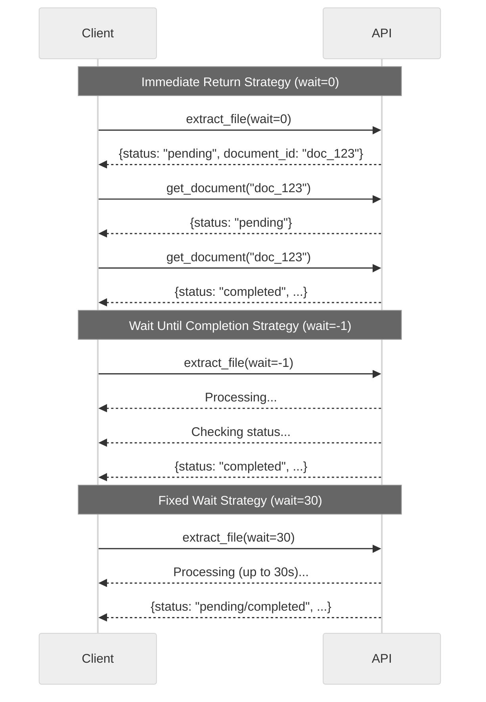

### Recommended Strategies

1. **Immediate Return (`wait=0`):**
   * Best for very large files where you want to process asynchronously
   * You must handle polling separately
   * Good for user-facing applications to avoid blocking

2. **Wait Until Completion (`wait=-1`):**
   * Simplest approach for backend processing
   * Blocks until processing completes
   * Use `polling_interval` to control how frequently to check status
   * Best for batch processing jobs or automation

3. **Fixed Wait Time (`wait=30`):**
   * Wait for a predefined time (default 30 seconds)
   * Returns with whatever status is available after that time
   * Good for medium-sized files where you expect processing to be quick

### Example: Progressive Polling with Timeout

For large files with uncertain processing times, implement a progressive polling strategy:

```python theme={null}
from aurelio_sdk import AurelioClient, TaskStatus

client = AurelioClient()

# First request returns immediately with document ID
response = client.extract_file(
    file_path="large_document.pdf",
    model="docling-base",
    chunk=True,
    wait=0
)

document_id = response.document.id
status = response.status
total_wait_time = 0
max_wait_time = 300  # 5 minutes
polling_interval = 10  # Start polling every 10 seconds

while status == TaskStatus.pending and total_wait_time < max_wait_time:
    # Wait before polling again
    time.sleep(polling_interval)
    total_wait_time += polling_interval
    
    # Get document status
    response = client.get_document(document_id)
    status = response.status
    
    # Increase polling interval for longer waits
    if total_wait_time > 60:
        polling_interval = 30
    
    print(f"Waited {total_wait_time}s, status: {status}")

if status == TaskStatus.completed:
    print("Processing completed successfully")
    document = response.document
else:
    print(f"Processing incomplete after {total_wait_time}s")
```

## Response Structure

The `ExtractResponse` object contains detailed information about the processed document:

```python theme={null}
class ExtractResponse(BaseModel):
    status: TaskStatus  # "pending", "completed", or "failed"
    usage: Usage        # Resource usage information
    message: Optional[str]  # Additional information (e.g., errors)
    processing_options: ExtractProcessingOptions  # Applied options
    document: ResponseDocument  # The processed document
```

The `ResponseDocument` contains:

```python theme={null}
class ResponseDocument(BaseModel):
    id: str           # Document ID
    content: str      # Full document content
    source: str       # Source filename or URL
    source_type: SourceType  # MIME type (application/pdf, video/mp4, etc.)
    num_chunks: int   # Number of chunks if chunking was enabled
    metadata: Dict[str, Any]  # User-definable metadata
    chunks: List[ResponseChunk]  # List of document chunks
```

## Error Handling

The SDK can raise several exceptions during file processing:

* `APITimeoutError`: Raised when the request exceeds the wait time
* `APIError`: General API error with details in the message
* `ApiRateLimitError`: Raised when API rate limits are exceeded

Example error handling:

```python theme={null}
from aurelio_sdk import AurelioClient, APIError, APITimeoutError, ApiRateLimitError

client = AurelioClient()

try:
    response = client.extract_file(
        file_path="document.pdf",
        model="docling-base",
        chunk=True,
        wait=30
    )
except APITimeoutError:
    print("Processing is taking longer than expected")
except ApiRateLimitError:
    print("Rate limit exceeded, try again later")
except APIError as e:
    print(f"API error: {e.message}")
```


# null
Source: https://docs.aurelio.ai/aurelio-sdk/user-guide/migration-v0.0.19


This guide helps you migrate your code from previous versions of the Aurelio SDK to v0.0.19, which introduces significant changes to the `extract` endpoint.

## Key Changes

### Deprecated: `quality` parameter

The `quality` parameter previously used with values `"low"` and `"high"` for both PDF and MP4 file extraction has been deprecated.

### New: `model` parameter

The new `model` parameter replaces `quality` and provides more granular control over the extraction process with different model options.

### New: Enhanced processing options for video files

For MP4 files, chunking preferences previously set through the `quality` parameter are now explicitly configured in the `processing_options` parameter.

## Migration Table

| File Type | Old Approach                   | New Approach                                                                            | Notes                                          |
| --------- | ------------------------------ | --------------------------------------------------------------------------------------- | ---------------------------------------------- |
| PDF       | `quality="low"`                | `model="aurelio-base"`                                                                  | Fastest, cheapest option for clean PDFs        |
| PDF       | `quality="high"`               | `model="docling-base"`                                                                  | Code-based OCR method for high precision       |
| PDF       | -                              | `model="gemini-2-flash-lite"`                                                           | **New!** State-of-the-art VLM-based extraction |
| MP4       | `quality="low"`, `chunk=True`  | `model="aurelio-base"`, `processing_options={"chunking": {"chunker_type": "regex"}}`    | Basic chunking for videos                      |
| MP4       | `quality="high"`, `chunk=True` | `model="aurelio-base"`, `processing_options={"chunking": {"chunker_type": "semantic"}}` | Semantic chunking for videos                   |

## Code Examples

### PDF Extraction

#### Before (pre-v0.0.19):

```python theme={null}
# Fast extraction for simple PDFs
response = client.extract_file(
    file_path="document.pdf",
    quality="low",
    chunk=True,
    wait=30
)

# Higher quality extraction for complex PDFs
response = client.extract_file(
    file_path="complex_document.pdf",
    quality="high",
    chunk=True,
    wait=30
)
```

#### After (v0.0.19+):

```python theme={null}
# Fast extraction for simple PDFs
response = client.extract_file(
    file_path="document.pdf",
    model="aurelio-base",  # Equivalent to the old quality="low"
    chunk=True,
    wait=30
)

# Higher quality extraction for complex PDFs
response = client.extract_file(
    file_path="complex_document.pdf",
    model="docling-base",  # Equivalent to the old quality="high"
    chunk=True,
    wait=30
)

# NEW: State-of-the-art extraction using VLM
response = client.extract_file(
    file_path="document.pdf",
    model="gemini-2-flash-lite",  # New option not available before
    chunk=True,
    wait=30
)
```

### Video Extraction

#### Before (pre-v0.0.19):

```python theme={null}
# Basic video extraction with regex chunking
response = client.extract_file(
    file_path="video.mp4",
    quality="low",
    chunk=True,
    wait=-1
)

# Video extraction with semantic chunking
response = client.extract_file(
    file_path="video.mp4",
    quality="high",
    chunk=True,
    wait=-1
)
```

#### After (v0.0.19+):

```python theme={null}
# Basic video extraction with regex chunking
response = client.extract_file(
    file_path="video.mp4",
    model="aurelio-base",  # Only supported model for videos
    chunk=True,
    wait=-1,
    processing_options={
        "chunking": {
            "chunker_type": "regex"  # Equivalent to old quality="low"
        }
    }
)

# Video extraction with semantic chunking
response = client.extract_file(
    file_path="video.mp4",
    model="aurelio-base",  # Only supported model for videos
    chunk=True,
    wait=-1,
    processing_options={
        "chunking": {
            "chunker_type": "semantic"  # Equivalent to old quality="high"
        }
    }
)
```

## URL Extraction

The changes for `extract_url` are identical to those for `extract_file` - replace the `quality` parameter with the appropriate `model` parameter, and for videos, specify chunking preferences in `processing_options`.

## VLM-based Extraction (New Feature)

The new `gemini-2-flash-lite` model uses a Vision Language Model to process PDF content, offering state-of-the-art accuracy. This can be especially valuable for:

* Scanned documents with complex layouts
* Documents with tables, charts, and diagrams
* Documents where context and visual understanding are important

```python theme={null}
response = client.extract_file(
    file_path="complex_scanned_document.pdf",
    model="gemini-2-flash-lite",
    chunk=True,
    wait=60  # May require longer processing time
)
```

**Note:** As mentioned in the [OCR in Large Multimodal Models paper](https://arxiv.org/html/2305.07895v5), VLMs like Gemini can occasionally hallucinate content. While hallucinations are rare, the model is designed for high-recall, potentially with lower precision than code-based OCR methods.

## Pricing Considerations

* `aurelio-base` pricing is equivalent to the old `low` quality setting
* Both `docling-base` and `gemini-2-flash-lite` are priced equivalent to the old `high` quality setting

## Transition Period

The `quality` parameter will continue to work during a transition period but will be removed in a future release. We recommend updating your code to use the new `model` parameter as soon as possible.


# graphai.callback
Source: https://docs.aurelio.ai/graphai/client-reference/callback


## GraphEvent Objects

```python theme={null}
@dataclass
class GraphEvent()
```

A graph event emitted for specific graph events such as start node or end node,

and used by the callback to emit user-defined events.

**Arguments**:

* `type` (`GraphEventType | str`): The type of event, can be start\_node, end\_node, callback, or a custom str.
* `identifier` (`str`): The identifier of the event, this is set typically by a callback
  handler and can be used to distinguish between different events. For example, a
  conversation/session ID could be used.
* `token` (`str | None`): The token associated with the event, such as LLM streamed output.
* `params` (`dict[str, Any] | None`): The parameters associated with the event, such as tool call parameters
  or event metadata.

#### encode

```python theme={null}
def encode(charset: str = "utf-8") -> bytes
```

Encodes the event as a JSON string, important for compatability with FastAPI

and starlette.

**Arguments**:

* `charset` (`str`): The character set to use for encoding the event.

## CallbackProtocol Objects

```python theme={null}
@runtime_checkable
class CallbackProtocol(Protocol)
```

Protocol defining the interface for callback handlers.

## Callback Objects

```python theme={null}
class Callback()
```

The original callback handler class. Outputs a stream of structured text
tokens. It is recommended to use the newer `EventCallback` handler instead.

#### aiter

```python theme={null}
async def aiter() -> AsyncIterator[str]
```

Used by receiver to get the tokens from the stream queue. Creates
a generator that yields tokens from the queue until the END token is
received.

#### start\_node

```python theme={null}
async def start_node(node_name: str, active: bool = True)
```

Starts a new node and emits the start token.

#### end\_node

```python theme={null}
async def end_node(node_name: str)
```

Emits the end token for the current node.

#### close

```python theme={null}
async def close()
```

Close the stream and prevent further tokens from being added.
This will send an END token and set the done flag to True.

## EventCallback Objects

```python theme={null}
class EventCallback()
```

The event callback handler class. Outputs a stream of structured text
tokens. It is recommended to use the newer `EventCallback` handler instead.

#### \_\_call\_\_

```python theme={null}
def __call__(token: str | None = None,
             type: GraphEventType | str = GraphEventType.CALLBACK,
             identifier: str | None = None,
             params: dict[str, Any] | None = None)
```

Builds a GraphEvent object and adds it to the queue.

#### acall

```python theme={null}
async def acall(token: str | None = None,
                type: GraphEventType | str = GraphEventType.CALLBACK,
                identifier: str | None = None,
                params: dict[str, Any] | None = None)
```

Builds a GraphEvent object and adds it to the queue.

#### aiter

```python theme={null}
async def aiter() -> AsyncIterator[GraphEvent]
```

Used by receiver to get the tokens from the stream queue. Creates
a generator that yields tokens from the queue until the END token is
received.

#### start\_node

```python theme={null}
async def start_node(node_name: str, active: bool = True)
```

Starts a new node and emits the start token.

#### end\_node

```python theme={null}
async def end_node(node_name: str)
```

Emits the end token for the current node.

#### close

```python theme={null}
async def close()
```

Close the stream and prevent further tokens from being added.
This will send an END token and set the done flag to True.


# graphai.graph
Source: https://docs.aurelio.ai/graphai/client-reference/graph


## NodeProtocol Objects

```python theme={null}
class NodeProtocol(Protocol)
```

Protocol defining the interface of a decorated node.

## Graph Objects

```python theme={null}
class Graph()
```

#### get\_state

```python theme={null}
def get_state() -> dict[str, Any]
```

Get the current graph state.

**Returns**:

The current graph state.

#### set\_state

```python theme={null}
def set_state(state: dict[str, Any]) -> Graph
```

Set the graph state.

**Arguments**:

* `state` - The new state to set for the graph.

**Returns**:

The graph instance.

#### update\_state

```python theme={null}
def update_state(values: dict[str, Any]) -> Graph
```

Update the graph state with new values.

**Arguments**:

* `values` - The new values to update the graph state with.

**Returns**:

The graph instance.

#### reset\_state

```python theme={null}
def reset_state() -> Graph
```

Reset the graph state to an empty dict.

#### add\_node

```python theme={null}
def add_node(node: NodeProtocol) -> Graph
```

Adds a node to the graph.

**Arguments**:

* `node` - The node to add to the graph.

**Raises**:

* `Exception` - If a node with the same name already exists in the graph.

#### add\_edge

```python theme={null}
def add_edge(source: NodeProtocol | str,
             destination: NodeProtocol | str) -> Graph
```

Adds an edge between two nodes that already exist in the graph.

**Arguments**:

* `source` - The source node or its name.
* `destination` - The destination node or its name.

#### add\_router

```python theme={null}
def add_router(sources: list[NodeProtocol], router: NodeProtocol,
               destinations: list[NodeProtocol]) -> Graph
```

Adds a router node, allowing for a decision to be made on which branch to
follow based on the `choice` output of the router node.

**Arguments**:

* `sources` - The list of source nodes for the router.
* `router` - The router node.
* `destinations` - The list of destination nodes for the router.

#### compile

```python theme={null}
def compile(*, strict: bool = False) -> Graph
```

Validate the graph:

* exactly one start node present (or Graph.start\_node set)
* at least one end node present
* all edges reference known nodes
* all nodes reachable from the start
  (optional) **no cycles** when strict=True
  Returns self on success; raises GraphCompileError otherwise.

#### execute\_many

```python theme={null}
async def execute_many(inputs: Iterable[dict[str, Any]],
                       *,
                       concurrency: int = 5) -> list[Any]
```

Execute the graph on many inputs concurrently.

**Arguments**:

* `inputs` (`Iterable[dict]`): An iterable of input dicts to feed into the graph.
* `concurrency` (`int`): Maximum number of graph executions to run at once.
* `state` (`Optional[Any]`): Optional shared state to pass to each execution.
  If you want isolated state per execution, pass None
  and the graph's normal semantics will apply.

**Returns**:

`list[Any]`: The list of results in the same order as `inputs`.

#### get\_callback

```python theme={null}
def get_callback()
```

Get a new instance of the callback class.

**Returns**:

`Callback`: A new instance of the callback class.

#### set\_callback

```python theme={null}
def set_callback(callback_class: type[Callback]) -> "Graph"
```

Set the callback class that is returned by the `get_callback` method and used

as the default callback when no callback is passed to the `execute` method.

**Arguments**:

* `callback_class` (`type[Callback]`): The callback class to use as the default callback.

#### add\_parallel

```python theme={null}
def add_parallel(source: NodeProtocol | str,
                 destinations: list[NodeProtocol | str])
```

Add multiple outgoing edges from a single source node to be executed in parallel.

**Arguments**:

* `source` - The source node for the parallel branches.
* `destinations` - The list of destination nodes for the parallel branches.

#### add\_join

```python theme={null}
def add_join(sources: list[NodeProtocol | str],
             destination: NodeProtocol | str)
```

Joins multiple parallel branches into a single branch.

**Arguments**:

* `sources` - The list of source nodes for the join.
* `destination` - The destination node for the join.

#### visualize

```python theme={null}
def visualize(*, save_path: str | None = None)
```

Render the current graph. If matplotlib is not installed,
raise a helpful error telling users to install the viz extra.
Optionally save to a file via `save_path`.


# graphai.utils
Source: https://docs.aurelio.ai/graphai/client-reference/utils


## StrEnum Objects

```python theme={null}
class StrEnum(str, Enum)
```

Backport of StrEnum for Python \< 3.11

## ColoredFormatter Objects

```python theme={null}
class ColoredFormatter(logging.Formatter)
```

Custom colored formatter for the logger using ANSI escape codes.

#### add\_coloured\_handler

```python theme={null}
def add_coloured_handler(logger)
```

Add a coloured handler to the logger.

#### setup\_custom\_logger

```python theme={null}
def setup_custom_logger(name)
```

Setup a custom logger.

## Parameter Objects

```python theme={null}
class Parameter(BaseModel)
```

Parameter for a function.

**Arguments**:

* `name` (`str`): The name of the parameter.
* `description` (`str | None`): The description of the parameter.
* `type` (`str`): The type of the parameter.
* `default` (`Any`): The default value of the parameter.
* `required` (`bool`): Whether the parameter is required.

#### to\_dict

```python theme={null}
def to_dict() -> dict[str, Any]
```

Convert the parameter to a dictionary for an standard dictionary-based function schema.

This is the most common format used by LLM providers, including OpenAI, Ollama, and others.

**Returns**:

`dict[str, Any]`: The parameter in dictionary format.

## FunctionSchema Objects

```python theme={null}
class FunctionSchema(BaseModel)
```

Class that consumes a function and can return a schema required by
different LLMs for function calling.

#### from\_callable

```python theme={null}
@classmethod
def from_callable(cls, function: Callable) -> "FunctionSchema"
```

Initialize the FunctionSchema.

**Arguments**:

* `function` (`Callable`): The function to consume.

#### from\_pydantic

```python theme={null}
@classmethod
def from_pydantic(cls, model: type[BaseModel]) -> "FunctionSchema"
```

Create a FunctionSchema from a Pydantic model class.

**Arguments**:

* `model` (`type[BaseModel]`): The Pydantic model class to convert

**Returns**:

`FunctionSchema`: FunctionSchema instance

#### to\_openai

```python theme={null}
def to_openai(api: OpenAIAPI = OpenAIAPI.COMPLETIONS) -> dict[str, Any]
```

Convert the function schema into OpenAI-compatible formats. Supports

both completions and responses APIs.

**Arguments**:

* `api` (`OpenAIAPI`): The API to convert to.

**Returns**:

`dict`: The function schema in OpenAI-compatible format.


# null
Source: https://docs.aurelio.ai/graphai/get-started/introduction


GraphAI is a minimalistic "AI framework" that aims to not be an AI framework at all. Instead, it provides a simple, flexible graph-based architecture that engineers can use to develop their own AI frameworks and projects.

## What is GraphAI?

GraphAI is a lightweight library built around the concept of a computational graph. It provides:

1. A **graph-based architecture** for connecting various components in a workflow
2. An **async-first design** to handle API calls efficiently
3. **Minimal abstractions** to avoid boxing developers into a specific AI implementation
4. **Flexible callback mechanisms** for streaming and communication between components

Unlike other AI libraries, GraphAI doesn't ship with predefined concepts of "LLMs", "Agents", or other high-level AI abstractions. Instead, it gives you the tools to build these concepts yourself, exactly how you want them.

## Why GraphAI?

Many existing AI frameworks impose their view of what AI applications should look like, creating a "local minimum" that constrains innovation. GraphAI takes a different approach:

* **Bring your own components**: Use any LLM provider, agent methodology, or telemetry system
* **Create your perfect workflow**: Build exactly the AI application architecture you need
* **Escape the box**: Don't be limited by someone else's conception of AI
* **Focus on flow, not frameworks**: Think about how data and processing should flow through your application

## Key Features

### Async-First

AI applications frequently rely on API calls that involve significant waiting time. GraphAI is built from the ground up to be async-first, allowing your Python code to efficiently handle these operations rather than wasting compute cycles while waiting for responses.

### Graph-Based Architecture

At its core, GraphAI provides a graph of connected nodes where:

* **Nodes** are processing units that perform specific tasks
* **Edges** connect nodes to define the flow of data
* **Routers** (special nodes) make decisions about the next execution path

This architecture makes complex workflows simple to understand and modify.

### Minimalist Design

GraphAI provides just what you need, nothing more:

* A `Graph` class for orchestrating execution
* `Node` and `Router` decorators for defining processing units
* `Callback` for streaming and communication
* `State` management for maintaining context

## When to Use GraphAI

Consider GraphAI when:

1. You need complete control over your AI application architecture
2. Existing frameworks feel too restrictive or opinionated
3. You want to combine components from different AI ecosystems
4. You prefer explicit, understandable code over magic abstractions
5. You're building something truly innovative that doesn't fit existing patterns


# null
Source: https://docs.aurelio.ai/graphai/get-started/quickstart


This guide will help you build a simple LLM-powered agent using GraphAI and the OpenAI API. By the end, you'll have a functional agent that can:

1. Determine whether to search for information or use memory
2. Execute the appropriate action
3. Generate a response to the user's query

## Prerequisites

* Python 3.9+
* An OpenAI API key
* Basic understanding of async Python

## Installation

```bash theme={null}
pip install graphai-lib
```

## Building a Simple Agent

Let's build a simple agent that can route user questions to either search or memory retrieval.

### Step 1: Set Up Your Dependencies

```python theme={null}
import os
from getpass import getpass
import ast
from graphai import router, node, Graph
from semantic_router.llms import OpenAILLM
from semantic_router.schema import Message
from pydantic import BaseModel, Field
import openai

# Set your OpenAI API key
os.environ["OPENAI_API_KEY"] = os.getenv("OPENAI_API_KEY") or getpass("Enter OpenAI API Key: ")

# Initialize the LLM
llm = OpenAILLM(name="gpt-4o-2024-08-06")  # Use your preferred model here
```

### Step 2: Define Your Tool Schemas

We'll create Pydantic models for our tools:

```python theme={null}
class Search(BaseModel):
    query: str = Field(description="Search query for internet information")

class Memory(BaseModel):
    query: str = Field(description="Self-directed query to search information from your long-term memory")
```

### Step 3: Define Your Nodes

GraphAI uses the concept of nodes to process information. Let's define our nodes:

```python theme={null}
@node(start=True)
async def node_start(input: dict):
    """Entry point for our graph."""
    return {"input": input}

@router
async def node_router(input: dict):
    """Routes the query to either search or memory."""
    query = input["query"]
    messages = [
        Message(
            role="system",
            content="You are a helpful assistant. Select the best route to answer the user query. ONLY choose one function.",
        ),
        Message(role="user", content=query),
    ]
    response = llm(
        messages=messages,
        function_schemas=[
            openai.pydantic_function_tool(Search),
            openai.pydantic_function_tool(Memory),
        ],
    )
    choice = ast.literal_eval(response)[0]
    return {
        "choice": choice["function_name"].lower(),
        "input": {**input, **choice["arguments"]},
    }

@node
async def memory(input: dict):
    """Retrieves information from memory."""
    query = input["query"]
    # In a real implementation, this would query a vector database
    return {"input": {"text": "The user is in Bali right now.", **input}}

@node
async def search(input: dict):
    """Searches for information."""
    query = input["query"]
    # In a real implementation, this would make a web search
    return {
        "input": {
            "text": "The most famous photo spot in Bali is the Uluwatu Temple.",
            **input,
        }
    }

@node
async def llm_node(input: dict):
    """Generates a response using the retrieved information."""
    chat_history = [
        Message(role=message["role"], content=message["content"])
        for message in input["chat_history"]
    ]

    messages = [
        Message(role="system", content="You are a helpful assistant."),
        *chat_history,
        Message(
            role="user",
            content=(
                f"Response to the following query from the user: {input['query']}\n"
                "Here is additional context. You can use it to answer the user query. "
                f"But do not directly reference it: {input.get('text', '')}."
            ),
        ),
    ]
    response = llm(messages=messages)
    return {"output": response}

@node(end=True)
async def node_end(input: dict):
    """Exit point for our graph."""
    return {"output": input["output"]}
```

### Step 4: Set Up the Graph

The Graph connects all the nodes and defines the flow of information:

```python theme={null}
# Initialize the graph
graph = Graph()

# Add nodes to the graph
graph.add_node(node_start())
graph.add_node(node_router())
graph.add_node(memory())
graph.add_node(search())
graph.add_node(llm_node())
graph.add_node(node_end())

# Add edges to create the flow
graph.add_edge(node_start, node_router)  # Start -> Router
graph.add_edge(search, llm_node)          # Search -> LLM
graph.add_edge(memory, llm_node)          # Memory -> LLM
graph.add_edge(llm_node, node_end)        # LLM -> End

# The router doesn't need explicit edges because it uses the 'choice' output to determine the next node
```

### Step 5: Execute the Graph

Now we can run our agent with a user query:

```python theme={null}
import asyncio

async def run_agent():
    # Define input with a query and empty chat history
    input_data = {
        "query": "What's the best photo spot in Bali?",
        "chat_history": [
            {"role": "user", "content": "I'm planning a trip to Bali."},
            {"role": "assistant", "content": "That's wonderful! Bali is a beautiful destination with rich culture, stunning beaches, and vibrant scenery. How can I help with your trip planning?"}
        ]
    }
    
    # Execute the graph
    result = await graph.execute(input_data)
    
    # Print the result
    print(result["output"])

# Run the async function
asyncio.run(run_agent())
```

## How It Works

1. The `node_start` node receives the initial input and passes it to the router.
2. The `node_router` uses an LLM to decide whether to use search or memory based on the query.
3. The chosen node (either `search` or `memory`) retrieves information.
4. The `llm_node` generates a response using the retrieved information.
5. The `node_end` node returns the final output.

This simple example demonstrates GraphAI's flexibility. By changing the node implementations, you can easily modify the agent's behavior without changing its overall structure.


# null
Source: https://docs.aurelio.ai/graphai/user-guide/components/callbacks


The Callback system in GraphAI provides a powerful mechanism for streaming data between nodes, particularly useful for handling streaming LLM outputs or other incremental data processing.

## Callback Basics

At its core, the Callback is an asyncio-based system that:

1. Provides a queue for passing streaming data between components
2. Handles special tokens to mark node start/end events
3. Structures streaming content for easy consumption by downstream processes
4. Can be integrated with any async compatible streaming system

## Creating a Callback

The Graph automatically creates a callback when needed, but you can also create and customize one:

```python theme={null}
from graphai import Callback

# Create a callback with default settings
callback = Callback()

# Create a callback with custom settings
callback = Callback(
    identifier="custom_id",  # Used for special tokens
    special_token_format="<{identifier}:{token}:{params}>",  # Format for special tokens
    token_format="{token}"  # Format for regular tokens
)
```

## Callback In Nodes

To use callbacks in a node, mark it with `stream=True`:

```python theme={null}
from graphai import node

@node(stream=True)
async def streaming_node(input: dict, callback):
    """This node receives a callback parameter because stream=True."""
    # Process input
    for chunk in process_chunks(input["data"]):
        # Stream output chunks
        await callback.acall(chunk)
    
    # Return final result
    return {"result": "streaming complete"}
```

Important points:

* The `stream=True` parameter tells GraphAI to inject a callback
* The node must have a `callback` parameter
* The callback can be used to stream output chunks

## Streaming from LLMs

A common use case is streaming output from an LLM:

```python theme={null}
@node(stream=True)
async def llm_node(input: dict, callback):
    """Stream output from an LLM."""
    from openai import AsyncOpenAI
    
    client = AsyncOpenAI()
    
    # Start streaming response
    stream = await client.chat.completions.create(
        model="gpt-4",
        messages=[
            {"role": "system", "content": "You are a helpful assistant."},
            {"role": "user", "content": input["query"]}
        ],
        stream=True
    )
    
    response_text = ""
    
    # Stream chunks through the callback
    async for chunk in stream:
        if chunk.choices[0].delta.content:
            content = chunk.choices[0].delta.content
            response_text += content
            await callback.acall(content)
    
    # Return the complete response
    return {"response": response_text}
```

## Callback Methods

The Callback provides several key methods:

### Streaming Content

```python theme={null}
# Synchronous callback (use in sync contexts)
callback(token="chunk of text")

# Async callback (preferred)
await callback.acall(token="chunk of text")
```

### Node Management

```python theme={null}
# Mark the start of a node
await callback.start_node(node_name="my_node")

# Mark the end of a node
await callback.end_node(node_name="my_node")

# Close the callback stream
await callback.close()
```

## Consuming a Callback Stream

You can consume a callback's stream using its async iterator:

```python theme={null}
async def consume_stream(callback):
    async for token in callback.aiter():
        # Process each token
        print(token, end="", flush=True)
```

This is especially useful for web applications that need to provide real-time updates.

## Special Tokens

GraphAI uses special tokens to mark events in the stream:

```
<graphai:node_name:start>  # Marks the start of a node
<graphai:node_name>        # Identifies the node
<graphai:node_name:end>    # Marks the end of a node
<graphai:END>              # Marks the end of the stream
```

These tokens can be customized using the `special_token_format` parameter.

## Example: Web Server with Streaming

Here's how to use callbacks with a FastAPI server:

```python theme={null}
from fastapi import FastAPI, Request
from fastapi.responses import StreamingResponse
from graphai import Graph, node
import asyncio

app = FastAPI()

@node(start=True, stream=True)
async def llm_stream(input: dict, callback):
    # Streaming LLM implementation...
    for chunk in get_llm_response(input["query"]):
        await callback.acall(chunk)
    return {"status": "complete"}

@node(end=True)
async def final_node(input: dict):
    return {"status": "success"}

# Create graph
graph = Graph()
graph.add_node(llm_stream())
graph.add_node(final_node())
graph.add_edge(llm_stream, final_node)

@app.post("/stream")
async def stream_endpoint(request: Request):
    data = await request.json()
    
    # Get a callback from the graph
    callback = graph.get_callback()
    
    # Start graph execution in background
    asyncio.create_task(graph.execute({"query": data["query"]}))
    
    # Return streaming response
    return StreamingResponse(
        callback.aiter(),
        media_type="text/event-stream"
    )
```

## Callback Configuration

You can customize the callback's behavior:

```python theme={null}
callback = Callback(
    # Custom identifier (default is "graphai")
    identifier="myapp",
    
    # Custom format for special tokens
    special_token_format="<[{identifier}|{token}|{params}]>",
    
    # Custom format for regular tokens
    token_format="TOKEN: {token}"
)
```

## Advanced: Custom Processing of Special Tokens

You can implement custom processing of special tokens:

```python theme={null}
async def process_stream(callback):
    current_node = None
    buffer = ""
    
    async for token in callback.aiter():
        # Check if it's a special token
        if token.startswith("<graphai:") and token.endswith(">"):
            # Handle node start
            if ":start" in token:
                node_name = token.split(":")[1].split(":start")[0]
                current_node = node_name
                # Handle node start event
                
            # Handle node end
            elif ":end" in token:
                # Handle node end event
                current_node = None
                
            # Handle stream end
            elif token == "<graphai:END>":
                # Handle end of stream
                break
                
        # Regular token
        else:
            # Process regular token
            buffer += token
            # Maybe do something with buffer
            
    return buffer
```

## Best Practices

1. **Use async whenever possible**: The callback system is built on asyncio
2. **Close the callback when done**: Always call `await callback.close()` when finished
3. **Keep streaming chunks small**: Don't stream large objects; break them into manageable chunks
4. **Handle special tokens correctly**: When consuming streams, handle special tokens appropriately

## Next Steps

* Learn about [Graphs](graphs.md) for orchestrating node execution
* Explore [Nodes](nodes.md) for processing logic
* Check out [State](state.md) for maintaining context across nodes


# null
Source: https://docs.aurelio.ai/graphai/user-guide/components/function-schema


The function schema functionality in GraphAI provides a powerful way to generate standardized function schemas that can be used with various LLM providers. This feature allows you to automatically generate function schemas from your Python functions, making it easier to integrate with LLM function calling capabilities.

## Overview

The `FunctionSchema` class is designed to consume Python functions and generate schemas that are compatible with different LLM providers (OpenAI, Ollama, LiteLLM, etc.). It automatically extracts:

* Function name
* Function description (from docstring)
* Function signature
* Return type
* Parameters (including types, defaults, and required status)

## Basic Usage

Here's a simple example of how to use the function schema functionality:

```python theme={null}
from graphai.utils import FunctionSchema

def scrape_webpage(url: str, name: str = "test") -> str:
    """Provides access to web scraping. You can use this tool to scrape a webpage.
    Many webpages may return no information due to JS or adblock issues, if this
    happens, you must use a different URL.
    """
    return "hello there"

# Generate schema from function
schema = FunctionSchema.from_callable(scrape_webpage)

# Convert to dictionary format (compatible with LLM providers)
schema_dict = schema.to_dict()
```

## Schema Structure

The generated schema follows a standardized format:

```python theme={null}
{
    "type": "function",
    "function": {
        "name": "function_name",
        "description": "function_description",
        "parameters": {
            "type": "object",
            "properties": {
                "param_name": {
                    "description": "param_description",
                    "type": "param_type"
                }
            },
            "required": ["required_param1", "required_param2"]
        }
    }
}
```

## Parameter Types

The schema automatically maps Python types to LLM-compatible types:

* `int` → `number`
* `float` → `number`
* `str` → `string`
* `bool` → `boolean`
* Other types → `object`

## Working with Multiple Functions

You can generate schemas for multiple functions at once using the `get_schemas` utility:

```python theme={null}
from graphai.utils import get_schemas

def function1(x: int) -> str:
    """First function"""
    return str(x)

def function2(y: str, z: bool = False) -> int:
    """Second function"""
    return len(y)

# Generate schemas for multiple functions
schemas = get_schemas([function1, function2])
```

## Pydantic Model Support

The function schema functionality also supports generating schemas from Pydantic models:

```python theme={null}
from pydantic import BaseModel
from graphai.utils import FunctionSchema

class SearchQuery(BaseModel):
    """A search query model"""
    query: str
    max_results: int = 10

# Generate schema from Pydantic model
schema = FunctionSchema.from_pydantic(SearchQuery)
```

## Best Practices

1. **Documentation**: Always include docstrings for your functions. The schema generator will use these as descriptions.
2. **Type Hints**: Use type hints for all parameters and return values to ensure proper type mapping.
3. **Default Values**: Consider using default values for optional parameters.
4. **Required Parameters**: Parameters without default values are automatically marked as required.

## Integration with LLM Providers

The generated schemas are compatible with major LLM interfaces such as OpenAI, LiteLLM, Ollama, and others. Most providers use the same schema format which can be generated with `to_dict`.


# null
Source: https://docs.aurelio.ai/graphai/user-guide/components/graphs


The `Graph` is the central orchestration component in GraphAI. It connects `Nodes` and `Routers` into a coherent workflow and manages the execution flow.

## Graph Basics

A graph consists of:

* **Nodes**: Processing units that perform specific tasks
* **Edges**: Connections between nodes that define the flow of data
* **State**: Shared context that persists throughout the execution

## Creating a Graph

```python theme={null}
from graphai import Graph

# Create a graph with default settings
graph = Graph()

# Create a graph with custom max steps and initial state
graph = Graph(max_steps=20, initial_state={"history": []})
```

### Parameters

* `max_steps` (int, default=10): Maximum number of steps to prevent infinite loops
* `initial_state` (Dict\[str, Any], optional): Initial state for the graph execution

## Adding Nodes

Nodes are the building blocks of your graph. Each node represents a discrete processing step:

```python theme={null}
# Add a node to the graph
graph.add_node(my_node())

# Add multiple nodes
graph.add_node(node_a())
graph.add_node(node_b())
graph.add_node(node_c())
```

Nodes can be:

* **Start nodes**: Entry points to the graph (only one allowed)
* **End nodes**: Exit points from the graph (multiple allowed)
* **Regular nodes**: Intermediate processing steps
* **Router nodes**: Decision points that determine execution flow

## Connecting Nodes with Edges

Edges define how data flows between nodes:

```python theme={null}
# Connect two nodes
graph.add_edge(source_node, destination_node)

# Can use node names instead of node objects
graph.add_edge("node_a", "node_b")
```

For linear workflows, you simply connect nodes in sequence:

```python theme={null}
graph.add_edge(node_a, node_b)
graph.add_edge(node_b, node_c)
```

## Working with Routers

Routers are special nodes that determine the next node to execute based on their output:

```python theme={null}
# Add a router with its sources and destinations
graph.add_router(
    sources=[node_a],  # Nodes that can lead to the router
    router=my_router(), # The router node itself
    destinations=[node_b, node_c]  # Possible destinations from the router
)
```

The router must return a dictionary containing a `"choice"` key with the name of the next node to execute:

```python theme={null}
@router
async def my_router(input: dict):
    # Decision logic
    if some_condition:
        return {"choice": "node_b", "data": processed_data}
    else:
        return {"choice": "node_c", "data": processed_data}
```

## Graph Execution

To execute a graph:

```python theme={null}
import asyncio

async def run_graph():
    # Define initial input
    input_data = {"query": "Hello, world!"}
    
    # Execute the graph
    result = await graph.execute(input_data)
    
    return result

# Run the async function
result = asyncio.run(run_graph())
```

### Execution Flow

1. The graph starts execution at the designated start node
2. Each node processes the input and returns an output
3. The output is merged with the current state and passed to the next node
4. If a router node is encountered, its `"choice"` output determines the next node
5. Execution continues until an end node is reached or max\_steps is exceeded

## State Management

The graph maintains a state dictionary that persists throughout execution:

```python theme={null}
# Get the current state
state = graph.get_state()

# Set the state
graph.set_state({"history": [], "context": "some context"})

# Update the state
graph.update_state({"new_key": "new_value"})

# Reset the state
graph.reset_state()
```

Each node receives the current state as an optional parameter:

```python theme={null}
@node
async def my_node(input: dict, state: dict):
    # Access the state
    history = state.get("history", [])
    
    # Update the state (changes won't persist outside this node)
    # For persistent changes, return them in the output
    return {"output": result, "history": history + [result]}
```

## Graph Validation

Before execution, you can validate that your graph is properly configured:

```python theme={null}
# Compile will raise exceptions if the graph is invalid
graph.compile()
```

The compile method checks for:

* Presence of a start node
* Presence of at least one end node
* Graph validity (e.g., no disconnected nodes)

## Visualization

GraphAI provides a method to visualize your graph (requires matplotlib and networkx):

```python theme={null}
# Visualize the graph
graph.visualize()
```

This generates a visual representation of your graph, making it easier to understand complex workflows.

## Next Steps

* Learn about [Nodes](nodes.md) to understand how to build processing units
* Explore [Parallel Execution](parallel-execution.md) for concurrent branch processing
* Explore [State](state.md) management for maintaining context
* Check out [Callbacks](callbacks.md) for implementing streaming


# null
Source: https://docs.aurelio.ai/graphai/user-guide/components/nodes


Nodes are the fundamental processing units in GraphAI. They encapsulate discrete pieces of functionality and can be connected to form complex workflows.

## Node Basics

A node in GraphAI is created by decorating an async function with the `@node` decorator:

```python theme={null}
from graphai import node

@node
async def process_data(input: dict):
    # Process the input data
    result = do_something(input["data"])
    return {"output": result}
```

All nodes must be async functions that:

1. Accept at least an `input` dictionary
2. Return a dictionary containing the processed results

## Creating Different Types of Nodes

GraphAI supports several types of nodes for different purposes:

### Standard Nodes

Standard nodes process data and pass it to the next node:

```python theme={null}
@node
async def standard_node(input: dict):
    # Process input
    return {"processed_data": result}
```

### Start Nodes

Start nodes mark the entry point to your graph:

```python theme={null}
@node(start=True)
async def entry_node(input: dict):
    # Initial processing
    return {"initialized_data": input}
```

A graph can have only one start node.

### End Nodes

End nodes mark the exit points from your graph:

```python theme={null}
@node(end=True)
async def exit_node(input: dict):
    # Final processing
    return {"final_result": processed_result}
```

A graph can have multiple end nodes.

### Streaming Nodes

Nodes that need to stream data (like LLM outputs) can use the `stream` parameter:

```python theme={null}
@node(stream=True)
async def streaming_node(input: dict, callback):
    # Process with streaming
    for chunk in process_chunks(input["data"]):
        await callback.acall(chunk)
    return {"result": "streaming complete"}
```

Streaming nodes receive a `callback` parameter that can be used to stream data.

## Node Return Values

Nodes must return a dictionary containing their output:

```python theme={null}
@node
async def my_node(input: dict):
    # Process input
    result = process(input["data"])
    
    # Return a dictionary with results
    return {
        "processed_data": result,
        "metadata": {"timestamp": time.time()}
    }
```

The returned dictionary is merged with the current state and passed to the next node.

## Accessing State

Nodes can access the graph's state by adding a `state` parameter:

```python theme={null}
@node
async def stateful_node(input: dict, state: dict):
    # Access state
    history = state.get("history", [])
    
    # Process with state awareness
    result = process_with_history(input["data"], history)
    
    # Return updated state (will be merged with current state)
    return {"result": result, "history": history + [result]}
```

## Router Nodes

Routers are special nodes that determine the next node to execute:

```python theme={null}
from graphai import router

@router
async def route_based_on_content(input: dict):
    # Analyze input and decide on next node
    if "query" in input and "question" in input["query"].lower():
        return {"choice": "question_node", "query": input["query"]}
    else:
        return {"choice": "statement_node", "statement": input["query"]}
```

Routers must return a dictionary with a `"choice"` key containing the name of the next node to execute.

### Router Example with LLM

Routers are often implemented using LLMs for intelligent routing:

```python theme={null}
@router
async def llm_router(input: dict):
    from semantic_router.llms import OpenAILLM
    from semantic_router.schema import Message
    import openai
    from pydantic import BaseModel, Field
    
    class SearchRoute(BaseModel):
        query: str = Field(description="Route to search when needing external information")
    
    class MemoryRoute(BaseModel):
        query: str = Field(description="Route to memory when information is likely known")
    
    llm = OpenAILLM(name="gpt-4")
    messages = [
        Message(role="system", content="Select the best route for the user query."),
        Message(role="user", content=input["query"])
    ]
    
    response = llm(
        messages=messages,
        function_schemas=[
            openai.pydantic_function_tool(SearchRoute),
            openai.pydantic_function_tool(MemoryRoute)
        ]
    )
    
    # Parse response to get route choice
    import ast
    choice = ast.literal_eval(response)[0]
    
    return {
        "choice": choice["function_name"].lower(),
        "input": {**input, **choice["arguments"]}
    }
```

## Advanced Node Features

### Named Nodes

You can provide explicit names for nodes:

```python theme={null}
@node(name="data_processor")
async def process_data(input: dict):
    # ...
    return {"processed": result}
```

This is useful when you need to refer to nodes by name in router decisions.

### Function Signatures

GraphAI automatically handles parameter mapping, so you only need to declare the parameters your node uses:

```python theme={null}
@node
async def selective_processor(query: str, metadata: dict = None):
    # Only uses query and metadata from the input
    # Other fields in the input dictionary are ignored
    result = process(query, metadata)
    return {"result": result}
```

The node will only receive the parameters it declares in its signature.

## Node Input Validation

GraphAI validates that nodes receive the required parameters:

```python theme={null}
@node
async def validated_node(required_param: str, optional_param: int = 0):
    # Will raise an error if required_param is not provided
    return {"result": process(required_param, optional_param)}
```

If a node's required parameters are missing, the graph execution will fail with a detailed error message.

## Next Steps

* Learn about [Graph](graphs.md) orchestration to connect your nodes
* Explore [State](state.md) management for maintaining context
* Check out [Callbacks](callbacks.md) for implementing streaming responses


# null
Source: https://docs.aurelio.ai/graphai/user-guide/components/parallel-execution


Parallel execution allows multiple branches of your graph to run concurrently, improving performance and enabling complex workflows where independent tasks can be processed simultaneously.

## Overview

GraphAI supports parallel execution in two main scenarios:

1. **Graph-level parallelism**: When a node has multiple outgoing edges, all successor nodes execute concurrently
2. **Router-level parallelism**: When a router returns multiple choices, all selected branches execute concurrently

## Parallel Branches with Edges

When you add multiple edges from a single source node to different destination nodes, those destinations will execute in parallel.

### Basic Example

```python theme={null}
from graphai import Graph, node

@node(start=True)
async def start(input: dict):
    return {}

@node
async def branch_a(input: dict):
    return {"a": 1}

@node
async def branch_b(input: dict):
    return {"b": 2}

@node(end=True)
async def end(input: dict):
    return {}

g = Graph()
g.add_node(start).add_node(branch_a).add_node(branch_b).add_node(end)

# Create parallel branches from start
g.add_edge(start, branch_a)
g.add_edge(start, branch_b)

# Both branches lead to end
g.add_edge(branch_a, end)
g.add_edge(branch_b, end)

result = await g.execute(input={"input": {}})
# result contains: {"a": 1, "b": 2}
```

In this example, `branch_a` and `branch_b` execute concurrently after `start` completes. Their outputs are merged into the final state.

### Using `add_parallel()`

For convenience, you can use the `add_parallel()` method to create multiple edges at once:

```python theme={null}
g = Graph()
g.add_node(start).add_node(branch_a).add_node(branch_b).add_node(end)

# Equivalent to adding edges individually
g.add_parallel(start, [branch_a, branch_b])

g.add_edge(branch_a, end)
g.add_edge(branch_b, end)
```

## Joining Parallel Branches

By default, when parallel branches converge to a common node, that node executes once for each incoming branch. To ensure the convergence node executes only once after all branches complete, use `add_join()`.

### Without Join (Multiple Executions)

```python theme={null}
@node(start=True)
async def start(input: dict, state: dict):
    state["history"] = ["start"]
    return {}

@node
async def branch_a(input: dict, state: dict):
    state["history"].append("branch_a")
    return {}

@node
async def branch_b(input: dict, state: dict):
    state["history"].append("branch_b")
    return {}

@node(end=True)
async def end(input: dict, state: dict):
    state["history"].append("end")
    return {}

g = Graph()
g.add_node(start).add_node(branch_a).add_node(branch_b).add_node(end)
g.add_edge(start, branch_a)
g.add_edge(start, branch_b)
g.add_edge(branch_a, end)
g.add_edge(branch_b, end)

await g.execute(input={"input": {}})
state = g.get_state()
# state["history"] contains TWO "end" entries because end runs for each branch
```

### With Join (Single Execution)

```python theme={null}
g = Graph()
g.add_node(start).add_node(branch_a).add_node(branch_b).add_node(end)
g.add_edge(start, branch_a)
g.add_edge(start, branch_b)

# Use add_join to synchronize branches
g.add_join([branch_a, branch_b], end)

await g.execute(input={"input": {}})
state = g.get_state()
# state["history"] contains only ONE "end" entry
```

The `add_join()` method ensures that:

* All specified branches must complete before the destination node executes
* The destination node executes exactly once
* State from all branches is merged before continuing

## Nested Parallel Execution

You can create parallel branches at multiple levels in your graph:

```python theme={null}
@node(start=True)
async def start(input: dict):
    return {}

@node
async def mid(input: dict):
    return {"mid": True}

@node
async def branch_a(input: dict):
    return {"a": 1}

@node
async def branch_b(input: dict):
    return {"b": 2}

@node(end=True)
async def end(input: dict):
    return {}

g = Graph()
g.add_node(start).add_node(mid).add_node(branch_a).add_node(branch_b).add_node(end)

# Linear edge to mid
g.add_edge(start, mid)

# Mid forks to two parallel branches
g.add_edge(mid, branch_a)
g.add_edge(mid, branch_b)

# Both branches converge at end
g.add_join([branch_a, branch_b], end)

result = await g.execute(input={"input": {}})
# result contains: {"mid": True, "a": 1, "b": 2}
```

## Router Parallel Execution

Routers can also trigger parallel execution by returning multiple choices instead of a single choice.

### Single Choice (Standard Behavior)

The standard router behavior selects one branch:

```python theme={null}
from graphai import router

@router
async def single_router(input: dict):
    return {"choice": "tool_a"}  # Only tool_a executes
```

### Multiple Choices (Parallel Execution)

Return `choices` (a list) instead of `choice` to execute multiple branches concurrently:

```python theme={null}
@router
async def parallel_router(input: dict):
    return {"choices": ["tool_a", "tool_b"]}  # Both execute in parallel
```

### Full Example

```python theme={null}
from graphai import Graph, node, router

@node(start=True)
async def start(input: dict):
    return {}

@router
async def parallel_router(input: dict):
    # Return multiple choices for parallel execution
    return {"choices": ["tool_a", "tool_b"]}

@node(name="tool_a")
async def tool_a(input: dict):
    return {"a_result": 1}

@node(name="tool_b")
async def tool_b(input: dict):
    return {"b_result": 2}

@node(name="tool_c")
async def tool_c(input: dict):
    return {"c_result": 3}

@node(end=True)
async def end(input: dict):
    return {}

g = Graph()
g.add_node(start).add_node(parallel_router).add_node(tool_a).add_node(tool_b).add_node(tool_c).add_node(end)
g.add_edge(start, parallel_router)
g.add_edge(parallel_router, tool_a)
g.add_edge(parallel_router, tool_b)
g.add_edge(parallel_router, tool_c)  # tool_c has an edge but is not in choices
g.add_join([tool_a, tool_b], end)

result = await g.execute({"input": {}})

# Results from parallel branches are merged into state
assert result["a_result"] == 1
assert result["b_result"] == 2
# tool_c is NOT executed because it's not in the choices array
assert "c_result" not in result
```

> **Note**: When a parallel router shares an edge with a node that is not included in the router's `choices` array, that node will not be executed. Only nodes whose names appear in the returned `choices` list will run. In the example above, `tool_c` has an edge from the router but is not included in `choices`, so it does not execute.

### Router with Join (Iterative Patterns)

Use `add_join()` to control where execution continues after parallel branches complete. This enables iterative workflows where a router can evaluate results and decide whether to run more parallel branches:

```python theme={null}
@node(start=True)
async def start(input: dict):
    return {}

@router(name="parallel_router")
async def parallel_router(input: dict, state: dict):
    iteration = state.get("iteration", 0)

    if iteration > 0:
        # After first iteration, proceed to end
        return {"choice": "end"}

    state["iteration"] = iteration + 1
    # Run tools in parallel, then return to this router via join
    return {"choices": ["tool_a", "tool_b"]}

@node(name="tool_a")
async def tool_a(input: dict):
    return {"a_result": 1}

@node(name="tool_b")
async def tool_b(input: dict):
    return {"b_result": 2}

@node(end=True)
async def end(input: dict):
    return {"final": "done"}

g = Graph()
g.add_node(start).add_node(parallel_router).add_node(tool_a).add_node(tool_b).add_node(end)
g.add_edge(start, parallel_router)
g.add_edge(parallel_router, tool_a)
g.add_edge(parallel_router, tool_b)
g.add_join([tool_a, tool_b], parallel_router)  # Return to router after parallel execution
g.add_edge(parallel_router, end)

result = await g.execute({"input": {}})
# Router is called twice: first returns choices, second returns choice to end
```

The join pattern with routers is useful for:

* Iterative workflows that may need multiple rounds of parallel execution
* Gathering results from parallel branches before deciding next steps
* Implementing tool-calling agents that can invoke multiple tools simultaneously

## State Merging

When parallel branches complete, their outputs are merged into the state:

1. **Output merging**: Each branch's return values are merged into the final state
2. **Conflict resolution**: If branches return the same key, the last branch to complete wins

```python theme={null}
result = await g.execute({"input": {}})

# Results from all branches merged into state
result["a_result"]  # From tool_a
result["b_result"]  # From tool_b
```

## Best Practices

1. **Use `add_join()` for convergence**: When multiple branches should synchronize before continuing, always use `add_join()` to prevent duplicate execution of downstream nodes.

2. **Keep parallel branches independent**: Parallel branches execute concurrently with copied state. Avoid relying on one branch's state changes being visible to another.

3. **Use `add_join()` for iterative patterns**: When a router needs to make decisions after parallel execution, use `add_join()` to route back to the router node. This keeps flow control in the graph structure rather than in node return values.

4. **Name nodes explicitly for routers**: When using router parallel execution, ensure destination nodes have explicit names that match the choices returned by the router.

## Next Steps

* Learn about [Graphs](graphs.md) for general graph construction
* Explore [State](state.md) management for understanding how state flows through parallel branches
* Check out [Callbacks](callbacks.md) for monitoring parallel execution progress


# null
Source: https://docs.aurelio.ai/graphai/user-guide/components/state


GraphAI provides a state management system that allows data to persist across node executions. This state is essential for maintaining context throughout the execution of a graph.

## State Basics

The graph state is a dictionary that:

1. Is initialized when the graph is created
2. Persists throughout the execution of the graph
3. Can be accessed by nodes during execution
4. Can be modified and updated as the graph executes

## Initializing State

You can initialize the graph state when creating a Graph:

```python theme={null}
from graphai import Graph

# Initialize a graph with initial state
graph = Graph(initial_state={
    "history": [],
    "context": "initial context",
    "metadata": {
        "user_id": "user123",
        "session_start": 1625097600
    }
})
```

If no initial state is provided, an empty dictionary is used.

## Accessing State Methods

The Graph class provides several methods for working with state:

```python theme={null}
# Get the current state
current_state = graph.get_state()

# Set a new state (replaces existing state)
graph.set_state({"new_state": "value"})

# Update the state (merges with existing state)
graph.update_state({"additional": "data"})

# Reset the state to an empty dictionary
graph.reset_state()
```

## Accessing State in Nodes

Nodes can access the graph state by including a `state` parameter in their function signature:

```python theme={null}
from graphai import node

@node
async def stateful_node(input: dict, state: dict):
    # Access the state
    history = state.get("history", [])
    context = state.get("context", "")
    
    # Use the state in processing
    processed_data = process_with_context(input["data"], context)
    
    # Return updated information
    return {"result": processed_data}
```

The state is passed automatically to any node that includes a `state` parameter.

## Modifying State

There are two ways to modify the graph state:

### 1. Return State Changes in Node Output

The most common way to modify state is to include state changes in the node's return value:

```python theme={null}
@node
async def update_history(input: dict, state: dict):
    # Get current history
    history = state.get("history", [])
    
    # Add new entry to history
    new_history = history + [input["query"]]
    
    # Return with updated history
    return {
        "result": process(input["query"]),
        "history": new_history  # This updates the state's history
    }
```

When the node returns, any keys in the return dictionary are merged with the current state.

### 2. Directly Update Graph State

For more complex workflows, you can use graph methods directly:

```python theme={null}
@node
async def complex_state_update(input: dict, graph):
    # Process data
    result = process(input["data"])
    
    # Get current state
    current_state = graph.get_state()
    
    # Make complex updates
    current_state["history"].append(input["query"])
    current_state["metadata"]["last_processed"] = datetime.now().isoformat()
    
    # Set the updated state
    graph.set_state(current_state)
    
    return {"result": result}
```

This approach is less common but provides more flexibility for complex state manipulations.

## State Persistence

The state persists for the lifetime of the graph object. If you need to persist state between graph executions:

```python theme={null}
# Save state after execution
result = await graph.execute(input_data)
saved_state = graph.get_state()

# Store saved_state somewhere (e.g., database)
store_state(saved_state)

# Later, restore state
restored_state = load_state()
graph.set_state(restored_state)
```

## State Scoping

State is scoped to the graph instance. If you create multiple graph instances, each will have its own independent state:

```python theme={null}
graph1 = Graph(initial_state={"id": "graph1"})
graph2 = Graph(initial_state={"id": "graph2"})

# These operate on different state objects
graph1.update_state({"value": 1})
graph2.update_state({"value": 2})
```

## State vs. Input

It's important to understand the difference between state and input:

* **Input**: Data passed to the current node execution
* **State**: Persistent data that's available across multiple node executions

For example:

```python theme={null}
@node
async def process_with_both(input: dict, state: dict):
    # Input is specific to this execution
    query = input["query"]
    
    # State persists across executions
    history = state.get("history", [])
    
    # Use both
    result = process_with_history(query, history)
    
    return {
        "result": result,
        "history": history + [query]  # Update state for future nodes
    }
```

## Best Practices

1. **Keep state serializable**: Only store data that can be easily serialized (e.g., dicts, lists, strings, numbers)
2. **Be selective**: Only use state for data that truly needs to persist across nodes
3. **Document state structure**: Create a clear structure for your state and document it
4. **Consider state size**: Don't let your state grow unbounded, especially for long-running applications

## Next Steps

* Learn about [Graphs](graphs.md) for orchestrating node execution
* Explore [Nodes](nodes.md) for processing logic
* Check out [Callbacks](callbacks.md) for implementing streaming


# null
Source: https://docs.aurelio.ai/graphai/user-guide/faqs


## TypeError: object dict can't be used in 'await' expression

This is a common mistake when defining the graph. The internals of `graphai` expect *all* nodes to be defined with `async def`. When defining a node with `def` we will see this error:

```
Traceback (most recent call last):
  File "/app/.venv/lib/python3.13/site-packages/graphai/graph.py", line 351, in execute
    output = await current_node.invoke(input=state, state=self.state)
             ^^^^^^^^^^^^^^^^^^^^^^^^^^^^^^^^^^^^^^^^^^^^^^^^^^^^^^^^
  File "/app/.venv/lib/python3.13/site-packages/graphai/nodes/base.py", line 152, in invoke
    out = await instance.execute(**input)
          ^^^^^^^^^^^^^^^^^^^^^^^^^^^^^^^
  File "/app/.venv/lib/python3.13/site-packages/graphai/nodes/base.py", line 74, in execute
    return await func(**params_dict)  # Pass only the necessary arguments
           ^^^^^^^^^^^^^^^^^^^^^^^^^
TypeError: object dict can't be used in 'await' expression
```

The solution is to always define nodes using `async def`. For example:

```python theme={null}

# WRONG:
@node
def my_node(input: dict) -> dict:
    return {"output": "Hello, world!"}

# DO THIS INSTEAD:
@node
async def my_node(input: dict) -> dict:
    return {"output": "Hello, world!"}
```


# null
Source: https://docs.aurelio.ai/graphai/user-guide/release-notes


See below for all notable changes to the GraphAI library.

## \[0.0.10] - TBD

### Added

* Direct Starlette support for `GraphEvent` and `EventCallback` objects
* Parallel node execution for graphs with multiple outgoing edges from a single node
  * Automatic concurrent execution when a node has multiple successors
  * State merging from parallel branches
  * Configurable through standard `add_edge()` calls
* New `add_join()` method for explicit convergence of parallel branches
  * Synchronizes multiple parallel branches to a single destination node
  * Ensures convergence node executes only once with merged state
  * Prevents duplicate execution of downstream nodes
* New `add_parallel()` convenience method for creating parallel branches
  * Syntactic sugar for adding multiple edges from one source to multiple destinations
* Parallel execution support for router nodes with multiple choices by returning `choices: list[str]` rather than `choice: str`

### Changed

* Enhanced `EventCallback.__call__()` and `EventCallback.acall()` method signatures
  * Removed legacy `node_name` parameter for cleaner API
  * Added `type` parameter to specify event type directly (defaults to `GraphEventType.CALLBACK`)
  * Added `identifier` parameter for custom event identification
  * Added `params` parameter for event metadata
  * Improved flexibility for custom event handling and streaming

## \[0.0.9] - 2025-09-05

### Added

* Enhanced `FunctionSchema.from_pydantic()` method with full Pydantic v2 support
  * Correctly extracts field types, descriptions, and default values from Pydantic models
  * Handles `Optional` types and complex type annotations
  * Properly identifies required vs optional fields using `PydanticUndefined`
* New `to_openai()` method on FunctionSchema for OpenAI API format support
  * Supports both `completions` and `responses` API endpoints
  * Export schemas for either nested or flat format structures
* New `EventCallback` class for object-based callback handling
  * Outputs structured `GraphEvent` objects instead of formatted strings
  * Provides `GraphEventType` enum for event type identification
  * Better structured data with `type`, `identifier`, `token`, and `params` fields
  * Maintains backward compatibility with existing callback interface
* Comprehensive graph compilation validation
  * Stricter validation of node connections and dependencies
  * Better error messages for graph construction issues
  * Cycle detection with clear `GraphCompileError` reporting
* New `execute_many()` method for concurrent graph execution
  * Execute the graph on multiple inputs concurrently
  * Configurable concurrency level to control parallel execution
  * Preserves input order in results for predictable output

### Changed

* Graph compilation now validates execution order at compile time
* Graphs with cycles now raise `GraphCompileError` during compilation to ensure predictable execution order

### Deprecated

* `Callback` class is deprecated and will be removed in v0.1.0 - use `EventCallback` instead
* `special_token_format` and `token_format` parameters in `EventCallback` exist for backwards compatibility but are deprecated and will be removed in v0.1.0

### Fixed

* Added Python 3.10 compatibility for `StrEnum` with fallback implementation
* Fixed type annotation issues with `default_factory` in Pydantic field definitions
* Improved type extraction for complex Pydantic field types including `Union` and `Optional`

## \[0.0.8] - 2025-08-16

### Added

* Graph constructor methods \[`add_node`, `add_router`, `add_edge`, `set_callback`, `set_state`, `update_state`, `reset_state`, `set_start_node`, `set_end_node`, `compile`] can now be chained
* Moved `Callback` class to top-level import, you can now import it with `from graphai import Callback`
* Environment variable `GRAPHAI_LOG_LEVEL` for controlling log output level (DEBUG, INFO, WARNING, ERROR, CRITICAL)

### Changed

* Dropped `networkx`, `matplotlib`, and `colorlog` dependencies (note if using `Graph.visualize` one of `networkx` or `matplotlib` must be installed)
* Updated documentation notebooks to use new callback pattern
* Updated old type annotations to use Python 3.10+ syntax, e.g., `List[str]` -> `list[str]` and `Optional[list]` -> `list | None`

## [0.0.7] - Removed

## [0.0.6] - 2025-05-28

### Added

* Explicit callback parameter in `execute()` method for better control over callback instances
* `NodeProtocol` type definition for improved type safety and IDE support
* Enhanced documentation examples demonstrating proper parallel execution patterns
* New `set_callback()` method for customizing default callback class

### Changed

* **BREAKING**: Refactored callback handling to eliminate shared state between parallel executions
* Modified `execute()` method signature to accept optional `callback` parameter
* Removed internal `self.callback` attribute
* Updated all documentation notebooks to use new callback pattern
* Improved type hints throughout codebase using `Type[Callback]`

### Fixed

* **Critical**: Fixed callback stream contamination when multiple graphs executed in parallel
* Resolved race conditions in multi-threaded environments
* Fixed inconsistent streaming behavior in concurrent scenarios
* Improved memory management and reduced callback-related memory leaks
* Better cleanup of callback resources after execution

### Security

* Enhanced thread-safety for parallel graph execution
* Eliminated shared state vulnerabilities in callback handling

### Migration Guide

For basic usage, no changes required - the API remains backwards compatible.
For custom callbacks, update from:

```python theme={null}
# Before (v0.0.5)
cb = graph.get_callback()
graph.callback = cb
result = await graph.execute(input=data)
```

To:

```python theme={null}
# After (v0.0.6)
cb = graph.get_callback()
result = await graph.execute(input=data, callback=cb)
```

## [0.0.5] - 2025-03-30

### Added

* New function schema functionality for generating standardized function schemas compatible with various LLM providers
* Built-in colored logger with support for different log levels and custom formatting
* Support for generating function schemas from Pydantic models

### Changed

* Removed dependency on semantic router library
* Improved type mapping for function parameters in schemas
* Enhanced documentation and code organization

### Fixed

* Various bug fixes and improvements

### Security

* No security-related changes in this release

[0.0.7]: https://github.com/aurelio-labs/graphai/compare/v0.0.6...v0.0.7

[0.0.6]: https://github.com/aurelio-labs/graphai/compare/v0.0.5...v0.0.6

[0.0.5]: https://github.com/aurelio-labs/graphai/compare/v0.0.4...v0.0.5

[0.0.4]: https://github.com/aurelio-labs/graphai/compare/v0.0.3...v0.0.4

[0.0.3]: https://github.com/aurelio-labs/graphai/compare/v0.0.2...v0.0.3

[0.0.2]: https://github.com/aurelio-labs/graphai/compare/v0.0.1...v0.0.2

[0.0.1]: https://github.com/aurelio-labs/graphai/releases/tag/v0.0.1


# semantic_router.encoders.aurelio
Source: https://docs.aurelio.ai/semantic-router/client-reference/encoders/aurelio


## AurelioSparseEncoder Objects

```python theme={null}
class AurelioSparseEncoder(SparseEncoder, AsymmetricSparseMixin)
```

Sparse encoder using Aurelio Platform's embedding API. Requires an API key from
[https://platform.aurelio.ai](https://platform.aurelio.ai)

#### \_\_init\_\_

```python theme={null}
def __init__(name: str | None = None, api_key: Optional[str] = None)
```

Initialize the AurelioSparseEncoder.

**Arguments**:

* `name` (`str | None`): The name of the model to use.
* `api_key` (`str | None`): The API key to use.

#### \_\_call\_\_

```python theme={null}
def __call__(docs: list[str]) -> list[SparseEmbedding]
```

Encode a list of queries using the Aurelio Platform embedding API. Documents
must be strings, sparse encoders do not support other types.

#### acall

```python theme={null}
async def acall(docs: list[str]) -> list[SparseEmbedding]
```

Asynchronously encode a list of documents using the Aurelio Platform

embedding API. Documents must be strings, sparse encoders do not support other
types.

:param docs: The documents to encode.
:type docs: list\[str]
:param input\_type:
:type semantic\_router.encoders.encode\_input\_type.EncodeInputType
:return: The encoded documents.
:rtype: list\[SparseEmbedding]

#### fit

```python theme={null}
def fit(docs: List[str])
```

Fit the encoder to a list of documents. AurelioSparseEncoder does not support

fit yet.

**Arguments**:

* `docs` (`list[str]`): The documents to fit the encoder to.


# semantic_router.encoders.azure_openai
Source: https://docs.aurelio.ai/semantic-router/client-reference/encoders/azure_openai


## AzureOpenAIEncoder Objects

```python theme={null}
class AzureOpenAIEncoder(DenseEncoder)
```

Encoder for Azure OpenAI API.

This class provides functionality to encode text documents using the Azure OpenAI API.
It supports customization of the score threshold for filtering or processing the embeddings.

#### \_\_init\_\_

```python theme={null}
def __init__(
        name: Optional[str] = None,
        azure_endpoint: str | None = None,
        api_version: str | None = None,
        api_key: str | None = None,
        azure_ad_token: str | None = None,
        azure_ad_token_provider: Callable[[], str] | None = None,
        http_client_options: Optional[Dict[str, Any]] = None,
        deployment_name: str = EncoderDefault.AZURE.value["deployment_name"],
        score_threshold: float = 0.82,
        dimensions: Union[int, NotGiven] = NotGiven(),
        max_retries: int = 3)
```

Initialize the AzureOpenAIEncoder.

**Arguments**:

* `azure_endpoint` (`str, optional`): The endpoint for the Azure OpenAI API.
  Example: `"https://accountname.openai.azure.com"`
* `api_version` (`str, optional`): The version of the API to use.
  Example: `"2025-02-01-preview"`
* `api_key` (`str, optional`): The API key for the Azure OpenAI API.
* `azure_ad_token` (`str, optional`): The Azure AD/Entra ID token for authentication.
  [https://www.microsoft.com/en-us/security/business/identity-access/microsoft-entra-id](https://www.microsoft.com/en-us/security/business/identity-access/microsoft-entra-id)
* `str, optional`0 (`str, optional`1): A callable function that returns an Azure AD/Entra ID token.
* `str, optional`2 (`str, optional`3): Dictionary of options to configure httpx client
  Example:
  `str, optional`4
* `str, optional`5 (`str, optional`): The name of the model deployment to use.
* `str, optional`7 (`str, optional`8): The score threshold for filtering embeddings.
  Default is `str, optional`9.
* `"https://accountname.openai.azure.com"`0 (`"https://accountname.openai.azure.com"`1): The number of dimensions for the embeddings. If not given, it defaults to the model's default setting.
* `"https://accountname.openai.azure.com"`2 (`"https://accountname.openai.azure.com"`1): The maximum number of retries for API calls in case of failures.
  Default is `"https://accountname.openai.azure.com"`4.

#### \_\_call\_\_

```python theme={null}
def __call__(docs: List[str]) -> List[List[float]]
```

Encode a list of documents into embeddings using the Azure OpenAI API.

**Arguments**:

* `docs` (`List[str]`): The documents to encode.

**Returns**:

`List[List[float]]`: The embeddings for the documents.

#### acall

```python theme={null}
async def acall(docs: List[str]) -> List[List[float]]
```

Encode a list of documents into embeddings using the Azure OpenAI API asynchronously.

**Arguments**:

* `docs` (`List[str]`): The documents to encode.

**Returns**:

`List[List[float]]`: The embeddings for the documents.


# semantic_router.encoders.base
Source: https://docs.aurelio.ai/semantic-router/client-reference/encoders/base


## DenseEncoder Objects

```python theme={null}
class DenseEncoder(BaseModel)
```

#### set\_score\_threshold

```python theme={null}
@field_validator("score_threshold")
def set_score_threshold(cls, v: float | None) -> float | None
```

Set the score threshold. If None, the score threshold is not used.

**Arguments**:

* `v` (`float | None`): The score threshold.

**Returns**:

`float | None`: The score threshold.

#### \_\_call\_\_

```python theme={null}
def __call__(docs: List[Any]) -> List[List[float]]
```

Encode a list of documents. Documents can be any type, but the encoder must

be built to handle that data type. Typically, these types are strings or
arrays representing images.

**Arguments**:

* `docs` (`List[Any]`): The documents to encode.

**Returns**:

`List[List[float]]`: The encoded documents.

#### acall

```python theme={null}
async def acall(docs: List[Any]) -> List[List[float]]
```

Encode a list of documents asynchronously. Documents can be any type, but the

encoder must be built to handle that data type. Typically, these types are
strings or arrays representing images.

**Arguments**:

* `docs` (`List[Any]`): The documents to encode.

**Returns**:

`List[List[float]]`: The encoded documents.

## SparseEncoder Objects

```python theme={null}
class SparseEncoder(BaseModel)
```

An encoder that encodes documents into a sparse format.

#### \_\_call\_\_

```python theme={null}
def __call__(docs: List[str]) -> List[SparseEmbedding]
```

Sparsely encode a list of documents. Documents can be any type, but the encoder must

be built to handle that data type. Typically, these types are strings or
arrays representing images.

**Arguments**:

* `docs` (`List[Any]`): The documents to encode.

**Returns**:

`List[SparseEmbedding]`: The encoded documents.

#### acall

```python theme={null}
async def acall(docs: List[Any]) -> List[SparseEmbedding]
```

Encode a list of documents asynchronously. Documents can be any type, but the

encoder must be built to handle that data type. Typically, these types are
strings or arrays representing images.

**Arguments**:

* `docs` (`List[Any]`): The documents to encode.

**Returns**:

`List[SparseEmbedding]`: The encoded documents.

## AsymmetricDenseMixin Objects

```python theme={null}
class AsymmetricDenseMixin()
```

#### encode\_queries

```python theme={null}
def encode_queries(docs: List[str]) -> List[List[float]]
```

Convert query texts to dense embeddings optimized for querying

#### encode\_documents

```python theme={null}
def encode_documents(docs: List[str]) -> List[List[float]]
```

Convert document texts to dense embeddings optimized for storage

#### aencode\_queries

```python theme={null}
async def aencode_queries(docs: List[str]) -> List[List[float]]
```

Async version of encode\_queries

#### aencode\_documents

```python theme={null}
async def aencode_documents(docs: List[str]) -> List[List[float]]
```

Async version of encode\_documents

## AsymmetricSparseMixin Objects

```python theme={null}
class AsymmetricSparseMixin()
```

#### encode\_queries

```python theme={null}
def encode_queries(docs: List[str]) -> List[SparseEmbedding]
```

Convert query texts to dense embeddings optimized for querying

#### encode\_documents

```python theme={null}
def encode_documents(docs: List[str]) -> List[SparseEmbedding]
```

Convert document texts to dense embeddings optimized for storage

#### aencode\_queries

```python theme={null}
async def aencode_queries(docs: List[str]) -> List[SparseEmbedding]
```

Async version of encode\_queries

#### aencode\_documents

```python theme={null}
async def aencode_documents(docs: List[str]) -> List[SparseEmbedding]
```

Async version of encode\_documents


# semantic_router.encoders.bedrock
Source: https://docs.aurelio.ai/semantic-router/client-reference/encoders/bedrock


This module provides the BedrockEncoder class for generating embeddings using Amazon's Bedrock Platform.

The BedrockEncoder class is a subclass of DenseEncoder and utilizes the TextEmbeddingModel from the
Amazon's Bedrock Platform to generate embeddings for given documents. It requires an AWS Access Key ID
and AWS Secret Access Key and supports customization of the pre-trained model, score threshold, and region.

Example usage:

from semantic\_router.encoders.bedrock\_encoder import BedrockEncoder

encoder = BedrockEncoder(access\_key\_id="your-access-key-id", secret\_access\_key="your-secret-key", region="your-region")
embeddings = encoder(\["document1", "document2"])

Classes:
BedrockEncoder: A class for generating embeddings using the Bedrock Platform.

## BedrockEncoder Objects

```python theme={null}
class BedrockEncoder(DenseEncoder)
```

Dense encoder using Amazon Bedrock embedding API. Requires an AWS Access Key ID
and AWS Secret Access Key.

The BedrockEncoder class is a subclass of DenseEncoder and utilizes the
TextEmbeddingModel from the Amazon's Bedrock Platform to generate embeddings for
given documents. It supports customization of the pre-trained model, score
threshold, and region.

Example usage:

```python theme={null}
from semantic_router.encoders.bedrock_encoder import BedrockEncoder

encoder = BedrockEncoder(
    access_key_id="your-access-key-id",
    secret_access_key="your-secret-key",
    region="your-region"
)
embeddings = encoder(["document1", "document2"])
```

#### \_\_init\_\_

```python theme={null}
def __init__(name: str = EncoderDefault.BEDROCK.value["embedding_model"],
             input_type: Optional[str] = "search_query",
             score_threshold: float = 0.3,
             client: Optional[Any] = None,
             access_key_id: Optional[str] = None,
             secret_access_key: Optional[str] = None,
             session_token: Optional[str] = None,
             region: Optional[str] = None)
```

Initializes the BedrockEncoder.

**Arguments**:

* `name` (`str`): The name of the pre-trained model to use for embedding.
  If not provided, the default model specified in EncoderDefault will
  be used.
* `input_type` (`str`): The type of input to use for the embedding.
  If not provided, the default input type specified in EncoderDefault will
  be used.
* `score_threshold` (`float`): The threshold for similarity scores.
* `access_key_id` (`str`): The AWS access key id for an IAM principle.
  If not provided, it will be retrieved from the access\_key\_id
  environment variable.
* `secret_access_key` (`str`): The secret access key for an IAM principle.
  If not provided, it will be retrieved from the AWS\_SECRET\_KEY
  environment variable.
* `str`0: The session token for an IAM principle.
  If not provided, it will be retrieved from the AWS\_SESSION\_TOKEN
  environment variable.
* `str`1 (`str`): The location of the Bedrock resources.
  If not provided, it will be retrieved from the AWS\_REGION
  environment variable, defaulting to "us-west-1"

**Raises**:

* `str`3: If the Bedrock Platform client fails to initialize.

#### \_\_call\_\_

```python theme={null}
def __call__(docs: List[Union[str, Dict]],
             model_kwargs: Optional[Dict] = None) -> List[List[float]]
```

Generates embeddings for the given documents.

**Arguments**:

* `docs` (`list[str]`): A list of strings representing the documents to embed.
* `model_kwargs` (`dict`): A dictionary of model-specific inference parameters.

**Raises**:

* `ValueError`: If the Bedrock Platform client is not initialized or if the
  API call fails.

**Returns**:

`list[list[float]]`: A list of lists, where each inner list contains the embedding values for a
document.

#### chunk\_strings

```python theme={null}
def chunk_strings(strings, MAX_WORDS=20)
```

Breaks up a list of strings into smaller chunks.

**Arguments**:

* `strings` (`list`): A list of strings to be chunked.
* `max_chunk_size` (`int`): The maximum size of each chunk. Default is 20.

**Returns**:

`list[list[str]]`: A list of lists, where each inner list contains a chunk of strings.

#### get\_env\_variable

```python theme={null}
@staticmethod
def get_env_variable(var_name, provided_value, default=None)
```

Retrieves environment variable or uses a provided value.

**Arguments**:

* `var_name` (`str`): The name of the environment variable.
* `provided_value` (`Optional[str]`): The provided value to use if not None.
* `default` (`Optional[str]`): The default value if the environment variable is not set.

**Raises**:

* `ValueError`: If no value is provided and the environment variable is not set.

**Returns**:

`str`: The value of the environment variable or the provided/default value.


# semantic_router.encoders.bm25
Source: https://docs.aurelio.ai/semantic-router/client-reference/encoders/bm25


## BM25Encoder Objects

```python theme={null}
class BM25Encoder(SparseEncoder, FittableMixin, AsymmetricSparseMixin)
```

BM25Encoder, running a vectorized version of ATIRE BM25 algorithm

Concept:

* BM25 uses scoring between queries & corpus to retrieve the most relevant documents ∈ corpus
* most vector databases (VDB) store embedded documents and score them versus received queries for retrieval
* we need to break up the BM25 formula into `encode_queries` and `encode_documents`, with the latter to be stored in VDB
* dot product of `encode_queries(q)` and `encode_documents([D_0, D_1, ...])` is the BM25 score of the documents `[D_0, D_1, ...]` for the given query `q`
* we train a BM25 encoder's normalization parameters on a sufficiently large corpus to capture target language distribution
* these trained parameter allow us to balance TF & IDF of query & documents for retrieval (read more on how BM25 fixes issues with TF-IDF)

ATIRE Paper: [https://www.cs.otago.ac.nz/research/student-publications/atire-opensource.pdf](https://www.cs.otago.ac.nz/research/student-publications/atire-opensource.pdf)
Pinecone Implementation: [https://github.com/pinecone-io/pinecone-text/blob/8399f9ff28c4652766c35165c0db9b0eff309077/pinecone\_text/sparse/bm25\_encoder.py](https://github.com/pinecone-io/pinecone-text/blob/8399f9ff28c4652766c35165c0db9b0eff309077/pinecone_text/sparse/bm25_encoder.py)

**Arguments**:

* `k1` (`float`): normalizer parameter that limits how much a single query term `q_i ∈ q` can affect score for document `D_n`
* `encode_documents`0 (`float`): normalizer parameter that balances the effect of a single document length compared to the average document length
* `encode_documents`2 (`encode_documents`3): number of documents in the trained corpus
* `encode_documents`4 (`encode_documents`5): float representing the average document length in the trained corpus
* `encode_documents`6 (`encode_documents`7numpy.ndarray`encode_documents`8): (1, tokenizer.vocab\_size) shaped array, denoting how many documents contain `encode_documents`9

#### fit

```python theme={null}
def fit(routes: List[Route]) -> "BM25Encoder"
```

Trains the encoder weights on the provided routes.

**Arguments**:

* `routes` (`List[Route]`): List of routes to train the encoder on.

#### encode\_queries

```python theme={null}
def encode_queries(queries: list[str]) -> list[SparseEmbedding]
```

Returns BM25 scores for queries using precomputed corpus scores.

**Arguments**:

* `queries` (`list`): List of queries to encode

**Returns**:

`list[SparseEmbedding]`: BM25 scores for each query against the corpus

#### encode\_documents

```python theme={null}
def encode_documents(documents: list[str],
                     batch_size: int | None = None) -> list[SparseEmbedding]
```

Returns document term frequency normed by itself & average trained corpus length

(This is the right-hand side of the BM25 equation, which gets matmul-ed with the query IDF component)

LaTeX: $\frac{f(d_i, D)}{f(d_i, D) + k_1 \times (1 - b + b \times \frac{|D|}{avgdl})}$
where:
f(d\_i, D) is frequency of term `d_i ∈ D`
|D| is the document length
avgdl is average document length in trained corpus

**Arguments**:

* `documents` (`list`): List of queries to encode

**Returns**:

`list[SparseEmbedding]`: Encoded queries (as either sparse or dict)

#### model

```python theme={null}
def model(docs: List[str]) -> list[SparseEmbedding]
```

Encode documents using BM25, with different encoding for queries vs documents to be indexed.

**Arguments**:

* `docs`: List of documents to encode
* `is_query`: If True, use query encoding, else use document encoding

**Returns**:

List of sparse embeddings


# semantic_router.encoders.clip
Source: https://docs.aurelio.ai/semantic-router/client-reference/encoders/clip


## CLIPEncoder Objects

```python theme={null}
class CLIPEncoder(DenseEncoder)
```

Multi-modal dense encoder for text and images using CLIP-type models via

HuggingFace.

**Arguments**:

* `name` (`str`): The name of the model to use.
* `tokenizer_kwargs` (`Dict`): Keyword arguments for the tokenizer.
* `processor_kwargs` (`Dict`): Keyword arguments for the processor.
* `model_kwargs` (`Dict`): Keyword arguments for the model.
* `device` (`Optional[str]`): The device to use for the model.
* `str`0 (`str`1): The tokenizer for the model.
* `str`2 (`str`1): The processor for the model.
* `str`4 (`str`1): The model.
* `str`6 (`str`1): The torch library.
* `str`8 (`str`1): The PIL library.

#### \_\_init\_\_

```python theme={null}
def __init__(**data)
```

Initialize the CLIPEncoder.

**Arguments**:

* `**data` (`Dict`): Keyword arguments for the encoder.

#### \_\_call\_\_

```python theme={null}
def __call__(docs: List[Any],
             batch_size: int = 32,
             normalize_embeddings: bool = True) -> List[List[float]]
```

Encode a list of documents. Can handle both text and images.

**Arguments**:

* `docs` (`List[Any]`): The documents to encode.
* `batch_size` (`int`): The batch size for the encoding.
* `normalize_embeddings` (`bool`): Whether to normalize the embeddings.

**Returns**:

`List[List[float]]`: A list of embeddings.


# semantic_router.encoders.cohere
Source: https://docs.aurelio.ai/semantic-router/client-reference/encoders/cohere


## CohereEncoder Objects

```python theme={null}
class CohereEncoder(LiteLLMEncoder)
```

Dense encoder that uses Cohere API to embed documents. Supports text only. Requires
a Cohere API key from [https://dashboard.cohere.com/api-keys](https://dashboard.cohere.com/api-keys).

#### \_\_init\_\_

```python theme={null}
def __init__(name: str | None = None,
             cohere_api_key: str | None = None,
             score_threshold: float = 0.3)
```

Initialize the Cohere encoder.

**Arguments**:

* `name` (`str`): The name of the embedding model to use such as "embed-english-v3.0" or
  "embed-multilingual-v3.0".
* `cohere_api_key` (`str`): The API key for the Cohere client, can also
  be set via the COHERE\_API\_KEY environment variable.
* `score_threshold` (`float`): The threshold for the score of the embedding.


# semantic_router.encoders.fastembed
Source: https://docs.aurelio.ai/semantic-router/client-reference/encoders/fastembed


## FastEmbedEncoder Objects

```python theme={null}
class FastEmbedEncoder(DenseEncoder)
```

Dense encoder that uses local FastEmbed to embed documents. Supports text only.

Requires the fastembed package which can be installed with `pip install 'semantic-router[fastembed]'`

**Arguments**:

* `name`: The name of the embedding model to use.
* `max_length`: The maximum length of the input text.
* `cache_dir`: The directory to cache the embedding model.
* `threads`: The number of threads to use for the embedding.

#### \_\_init\_\_

```python theme={null}
def __init__(score_threshold: float = 0.5, **data)
```

Initialize the FastEmbed encoder.

**Arguments**:

* `score_threshold` (`float`): The threshold for the score of the embedding.

#### \_\_call\_\_

```python theme={null}
def __call__(docs: List[str]) -> List[List[float]]
```

Embed a list of documents. Supports text only.

**Arguments**:

* `docs` (`List[str]`): The documents to embed.

**Raises**:

* `ValueError`: If the embedding fails.

**Returns**:

`List[List[float]]`: The vector embeddings of the documents.


# semantic_router.encoders.google
Source: https://docs.aurelio.ai/semantic-router/client-reference/encoders/google


## GoogleEncoder Objects

```python theme={null}
class GoogleEncoder(DenseEncoder)
```

GoogleEncoder class for generating embeddings using Google's AI Platform.

The GoogleEncoder class is a subclass of DenseEncoder and utilizes the TextEmbeddingModel from the
Google AI Platform to generate embeddings for given documents. It requires a Google Cloud project ID
and supports customization of the pre-trained model, score threshold, location, and API endpoint.

Example usage:

```python theme={null}
from semantic_router.encoders.google_encoder import GoogleEncoder

encoder = GoogleEncoder(project_id="your-project-id")
embeddings = encoder(["document1", "document2"])
```

**Attributes**:

* `client` - An instance of the TextEmbeddingModel client.
* `type` - The type of the encoder, which is "google".

#### \_\_init\_\_

```python theme={null}
def __init__(name: Optional[str] = None,
             score_threshold: float = 0.75,
             project_id: Optional[str] = None,
             location: Optional[str] = None,
             api_endpoint: Optional[str] = None)
```

Initializes the GoogleEncoder.

**Arguments**:

* `model_name` (`str`): The name of the pre-trained model to use for embedding.
  If not provided, the default model specified in EncoderDefault will
  be used.
* `score_threshold` (`float`): The threshold for similarity scores.
* `project_id` (`str`): The Google Cloud project ID.
  If not provided, it will be retrieved from the GOOGLE\_PROJECT\_ID
  environment variable.
* `location` (`str`): The location of the AI Platform resources.
  If not provided, it will be retrieved from the GOOGLE\_LOCATION
  environment variable, defaulting to "us-central1".
* `api_endpoint` (`str`): The API endpoint for the AI Platform.
  If not provided, it will be retrieved from the GOOGLE\_API\_ENDPOINT
  environment variable.

**Raises**:

* `str`0: If the Google Project ID is not provided or if the AI Platform
  client fails to initialize.

#### \_\_call\_\_

```python theme={null}
def __call__(docs: List[str]) -> List[List[float]]
```

Generates embeddings for the given documents.

**Arguments**:

* `docs` (`List[str]`): A list of strings representing the documents to embed.

**Raises**:

* `ValueError`: If the Google AI Platform client is not initialized or if the
  API call fails.

**Returns**:

`List[List[float]]`: A list of lists, where each inner list contains the embedding values for a
document.


# semantic_router.encoders.huggingface
Source: https://docs.aurelio.ai/semantic-router/client-reference/encoders/huggingface


This module provides the HFEndpointEncoder class to embeddings models using Huggingface's endpoint.

The HFEndpointEncoder class is a subclass of DenseEncoder and utilizes a specified Huggingface
endpoint to generate embeddings for given documents. It requires the URL of the Huggingface
API endpoint and an API key for authentication. The class supports customization of the score
threshold for filtering or processing the embeddings.

Example usage:

from semantic\_router.encoders.hfendpointencoder import HFEndpointEncoder

encoder = HFEndpointEncoder(
huggingface\_url="[https://api-inference.huggingface.co/models/BAAI/bge-large-en-v1.5](https://api-inference.huggingface.co/models/BAAI/bge-large-en-v1.5)",
huggingface\_api\_key="your-hugging-face-api-key"
)
embeddings = encoder(\["document1", "document2"])

Classes:
HFEndpointEncoder: A class for generating embeddings using a Huggingface endpoint.

## HuggingFaceEncoder Objects

```python theme={null}
class HuggingFaceEncoder(DenseEncoder)
```

HuggingFace encoder class for local embedding models. Models can be trained and
loaded from private repositories, or from the Huggingface Hub. The class supports
customization of the score threshold for filtering or processing the embeddings.

Example usage:

```python theme={null}
from semantic_router.encoders import HuggingFaceEncoder

encoder = HuggingFaceEncoder(
    name="sentence-transformers/all-MiniLM-L6-v2",
    device="cuda"
)
embeddings = encoder(["document1", "document2"])
```

#### \_\_call\_\_

```python theme={null}
def __call__(docs: List[str],
             batch_size: int = 32,
             normalize_embeddings: bool = True,
             pooling_strategy: str = "mean") -> List[List[float]]
```

Encode a list of documents into embeddings using the local Hugging Face model.

**Arguments**:

* `docs` (`List[str]`): A list of documents to encode.
* `batch_size`: The batch size for encoding.

## HFEndpointEncoder Objects

```python theme={null}
class HFEndpointEncoder(DenseEncoder)
```

HFEndpointEncoder class to embeddings models using Huggingface's inference endpoints.

The HFEndpointEncoder class is a subclass of DenseEncoder and utilizes a specified
Huggingface endpoint to generate embeddings for given documents. It requires the URL
of the Huggingface API endpoint and an API key for authentication. The class supports
customization of the score threshold for filtering or processing the embeddings.

Example usage:

```python theme={null}
from semantic_router.encoders import HFEndpointEncoder

encoder = HFEndpointEncoder(
    huggingface_url="https://api-inference.huggingface.co/models/BAAI/bge-large-en-v1.5",
    huggingface_api_key="your-hugging-face-api-key"
)
embeddings = encoder(["document1", "document2"])
```

#### \_\_init\_\_

```python theme={null}
def __init__(name: Optional[str] = "hugging_face_custom_endpoint",
             huggingface_url: Optional[str] = None,
             huggingface_api_key: Optional[str] = None,
             score_threshold: float = 0.8)
```

Initializes the HFEndpointEncoder with the specified parameters.

**Arguments**:

* `name` (`str`): The name of the encoder.
* `huggingface_url` (`str`): The URL of the Hugging Face API endpoint.
* `huggingface_api_key` (`str`): The API key for the Hugging Face API.
* `score_threshold` (`float`): A threshold for processing the embeddings.

**Raises**:

* `ValueError`: If either `huggingface_url` or `huggingface_api_key` is None.

#### \_\_call\_\_

```python theme={null}
def __call__(docs: List[str]) -> List[List[float]]
```

Encodes a list of documents into embeddings using the Hugging Face API.

**Arguments**:

* `docs` (`List[str]`): A list of documents to encode.

**Raises**:

* `ValueError`: If no embeddings are returned for a document.

**Returns**:

`List[List[float]]`: A list of embeddings for the given documents.

#### query

```python theme={null}
def query(payload, max_retries=3, retry_interval=5)
```

Sends a query to the Hugging Face API and returns the response.

**Arguments**:

* `payload` (`dict`): The payload to send in the request.

**Raises**:

* `ValueError`: If the query fails or the response status is not 200.

**Returns**:

`dict`: The response from the Hugging Face API.


# semantic_router.encoders.jina
Source: https://docs.aurelio.ai/semantic-router/client-reference/encoders/jina


This file contains the JinaEncoder class which is used to encode text using Jina

## JinaEncoder Objects

```python theme={null}
class JinaEncoder(LiteLLMEncoder)
```

Class to encode text using Jina. Requires a Jina API key from
[https://jina.ai/api-keys/](https://jina.ai/api-keys/)

#### \_\_init\_\_

```python theme={null}
def __init__(name: str | None = None,
             api_key: str | None = None,
             score_threshold: float = 0.4)
```

Initialize the JinaEncoder.

**Arguments**:

* `name`: The name of the embedding model to use such as "jina-embeddings-v3".
* `jina_api_key` (`str`): The Jina API key.


# semantic_router.encoders.litellm
Source: https://docs.aurelio.ai/semantic-router/client-reference/encoders/litellm


#### litellm\_to\_list

```python theme={null}
def litellm_to_list(embeds: litellm.EmbeddingResponse) -> list[list[float]]
```

Convert a LiteLLM embedding response to a list of embeddings.

**Arguments**:

* `embeds`: The LiteLLM embedding response.

**Returns**:

A list of embeddings.

## LiteLLMEncoder Objects

```python theme={null}
class LiteLLMEncoder(DenseEncoder, AsymmetricDenseMixin)
```

LiteLLM encoder class for generating embeddings using LiteLLM.

The LiteLLMEncoder class is a subclass of DenseEncoder and utilizes the LiteLLM SDK
to generate embeddings for given documents. It supports all encoders supported by LiteLLM
and supports customization of the score threshold for filtering or processing the embeddings.

#### \_\_init\_\_

```python theme={null}
def __init__(name: str | None = None,
             score_threshold: float | None = None,
             api_key: str | None = None)
```

Initialize the LiteLLMEncoder.

**Arguments**:

* `name` (`str`): The name of the embedding model to use. Must use LiteLLM naming
  convention (e.g. "openai/text-embedding-3-small" or "mistral/mistral-embed").
* `score_threshold` (`float`): The score threshold for the embeddings.

#### \_\_call\_\_

```python theme={null}
def __call__(docs: list[Any], **kwargs) -> list[list[float]]
```

Encode a list of text documents into embeddings using LiteLLM.

**Arguments**:

* `docs`: List of text documents to encode.

**Returns**:

List of embeddings for each document.

#### acall

```python theme={null}
async def acall(docs: list[Any], **kwargs) -> list[list[float]]
```

Encode a list of documents into embeddings using LiteLLM asynchronously.

**Arguments**:

* `docs`: List of documents to encode.

**Returns**:

List of embeddings for each document.


# semantic_router.encoders.local
Source: https://docs.aurelio.ai/semantic-router/client-reference/encoders/local


## LocalEncoder Objects

```python theme={null}
class LocalEncoder(DenseEncoder)
```

Local encoder using sentence-transformers for efficient local embeddings.

## LocalSparseEncoder Objects

```python theme={null}
class LocalSparseEncoder(SparseEncoder)
```

Local sparse encoder using sentence-transformers' SparseEncoder (e.g., SPLADE, CSR) for efficient local sparse embeddings.


# semantic_router.encoders.mistral
Source: https://docs.aurelio.ai/semantic-router/client-reference/encoders/mistral


This file contains the MistralEncoder class which is used to encode text using MistralAI

## MistralEncoder Objects

```python theme={null}
class MistralEncoder(LiteLLMEncoder)
```

Class to encode text using MistralAI. Requires a MistralAI API key from
[https://console.mistral.ai/api-keys/](https://console.mistral.ai/api-keys/)

#### \_\_init\_\_

```python theme={null}
def __init__(name: str | None = None,
             mistralai_api_key: str | None = None,
             score_threshold: float = 0.4)
```

Initialize the MistralEncoder.

**Arguments**:

* `name` (`str`): The name of the embedding model to use such as "mistral-embed".
* `mistralai_api_key` (`str`): The MistralAI API key.
* `score_threshold`: The score threshold for the embeddings.


# semantic_router.encoders.nvidia_nim
Source: https://docs.aurelio.ai/semantic-router/client-reference/encoders/nvidia_nim


This file contains the NimEncoder class which is used to encode text using Nim

## NimEncoder Objects

```python theme={null}
class NimEncoder(LiteLLMEncoder)
```

Class to encode text using Nvidia NIM. Requires a Nim API key from
[https://nim.ai/api-keys/](https://nim.ai/api-keys/)

#### \_\_init\_\_

```python theme={null}
def __init__(name: str | None = None,
             api_key: str | None = None,
             score_threshold: float = 0.4)
```

Initialize the NimEncoder.

**Arguments**:

* `name` (`str`): The name of the embedding model to use such as "nv-embedqa-e5-v5".
* `nim_api_key` (`str`): The Nim API key.


# semantic_router.encoders.ollama
Source: https://docs.aurelio.ai/semantic-router/client-reference/encoders/ollama


## OllamaEncoder Objects

```python theme={null}
class OllamaEncoder(DenseEncoder)
```

OllamaEncoder class for generating embeddings using OLLAMA.

[https://ollama.com/search?c=embedding](https://ollama.com/search?c=embedding)

Example usage:

```python theme={null}
from semantic_router.encoders.ollama import OllamaEncoder

encoder = OllamaEncoder(base_url="http://localhost:11434")
embeddings = encoder(["document1", "document2"])
```

**Attributes**:

* `client` - An instance of the TextEmbeddingModel client.
* `type` - The type of the encoder, which is "ollama".

#### \_\_init\_\_

```python theme={null}
def __init__(name: Optional[str] = None,
             score_threshold: float = 0.5,
             base_url: str | None = None)
```

Initializes the OllamaEncoder.

**Arguments**:

* `model_name` (`str`): The name of the pre-trained model to use for embedding.
  If not provided, the default model specified in EncoderDefault will
  be used.
* `score_threshold` (`float`): The threshold for similarity scores.
* `base_url` (`str`): The API endpoint for OLLAMA.
  If not provided, it will be retrieved from the `OLLAMA_BASE_URL` environment variable.

**Raises**:

* `ValueError`: If the hosted base url is not provided properly or if the ollama
  client fails to initialize.

#### \_\_call\_\_

```python theme={null}
def __call__(docs: List[str]) -> List[List[float]]
```

Generates embeddings for the given documents.

**Arguments**:

* `docs` (`List[str]`): A list of strings representing the documents to embed.

**Raises**:

* `ValueError`: If the Google AI Platform client is not initialized or if the
  API call fails.

**Returns**:

`List[List[float]]`: A list of lists, where each inner list contains the embedding values for a
document.


# semantic_router.encoders.openai
Source: https://docs.aurelio.ai/semantic-router/client-reference/encoders/openai


## OpenAIEncoder Objects

```python theme={null}
class OpenAIEncoder(DenseEncoder)
```

OpenAI encoder class for generating embeddings using OpenAI API.

The OpenAIEncoder class is a subclass of DenseEncoder and utilizes the OpenAI API
to generate embeddings for given documents. It requires an OpenAI API key and
supports customization of the score threshold for filtering or processing the embeddings.

#### token\_limit

default value, should be replaced by config

#### \_\_init\_\_

```python theme={null}
def __init__(name: Optional[str] = None,
             openai_base_url: Optional[str] = None,
             openai_api_key: Optional[str] = None,
             openai_org_id: Optional[str] = None,
             score_threshold: Optional[float] = None,
             dimensions: Union[int, NotGiven] = NotGiven(),
             max_retries: int = 3)
```

Initialize the OpenAIEncoder.

**Arguments**:

* `name` (`str`): The name of the embedding model to use.
* `openai_base_url` (`str`): The base URL for the OpenAI API.
* `openai_api_key` (`str`): The OpenAI API key.
* `openai_org_id` (`str`): The OpenAI organization ID.
* `score_threshold` (`float`): The score threshold for the embeddings.
* `str`0 (`str`1): The dimensions of the embeddings.
* `str`2 (`str`1): The maximum number of retries for the OpenAI API call.

#### \_\_call\_\_

```python theme={null}
def __call__(docs: List[str], truncate: bool = True) -> List[List[float]]
```

Encode a list of text documents into embeddings using OpenAI API.

**Arguments**:

* `docs`: List of text documents to encode.
* `truncate`: Whether to truncate the documents to token limit. If
  False and a document exceeds the token limit, an error will be
  raised.

**Returns**:

List of embeddings for each document.

#### acall

```python theme={null}
async def acall(docs: List[str], truncate: bool = True) -> List[List[float]]
```

Encode a list of text documents into embeddings using OpenAI API asynchronously.

**Arguments**:

* `docs`: List of text documents to encode.
* `truncate`: Whether to truncate the documents to token limit. If
  False and a document exceeds the token limit, an error will be
  raised.

**Returns**:

List of embeddings for each document.


# semantic_router.encoders.tfidf
Source: https://docs.aurelio.ai/semantic-router/client-reference/encoders/tfidf


## TfidfEncoder Objects

```python theme={null}
class TfidfEncoder(SparseEncoder, FittableMixin)
```

#### fit

```python theme={null}
def fit(routes: List[Route])
```

Trains the encoder weights on the provided routes.

**Arguments**:

* `routes` (`List[Route]`): List of routes to train the encoder on.


# semantic_router.encoders.vit
Source: https://docs.aurelio.ai/semantic-router/client-reference/encoders/vit


## VitEncoder Objects

```python theme={null}
class VitEncoder(DenseEncoder)
```

Encoder for Vision Transformer models.

This class provides functionality to encode images using a Vision Transformer
model via Hugging Face. It supports various image processing and model initialization
options.

#### \_\_init\_\_

```python theme={null}
def __init__(**data)
```

Initialize the VitEncoder.

**Arguments**:

* `**data` (`dict`): Additional keyword arguments for the encoder.

#### \_\_call\_\_

```python theme={null}
def __call__(imgs: List[Any], batch_size: int = 32) -> List[List[float]]
```

Encode a list of images into embeddings using the Vision Transformer model.

**Arguments**:

* `imgs` (`List[Any]`): The images to encode.
* `batch_size` (`int`): The batch size for encoding.

**Returns**:

`List[List[float]]`: The embeddings for the images.


# semantic_router.encoders.voyage
Source: https://docs.aurelio.ai/semantic-router/client-reference/encoders/voyage


This file contains the VoyageEncoder class which is used to encode text using Voyage

## VoyageEncoder Objects

```python theme={null}
class VoyageEncoder(LiteLLMEncoder)
```

Class to encode text using Voyage. Requires a Voyage API key from
[https://voyageai.com/api-keys/](https://voyageai.com/api-keys/)

#### \_\_init\_\_

```python theme={null}
def __init__(name: str | None = None,
             api_key: str | None = None,
             score_threshold: float = 0.4)
```

Initialize the VoyageEncoder.

**Arguments**:

* `name` (`str`): The name of the embedding model to use such as "voyage-embed".
* `voyage_api_key` (`str`): The Voyage API key.


# semantic_router.index.base
Source: https://docs.aurelio.ai/semantic-router/client-reference/index/base


## BaseIndex Objects

```python theme={null}
class BaseIndex(BaseModel)
```

Base class for indices using Pydantic's BaseModel.
This class outlines the expected interface for index classes.
Actual method implementations should be provided in subclasses.

#### add

```python theme={null}
def add(embeddings: List[List[float]],
        routes: List[str],
        utterances: List[Any],
        function_schemas: Optional[List[Dict[str, Any]]] = None,
        metadata_list: List[Dict[str, Any]] = [],
        **kwargs)
```

Add embeddings to the index.

This method should be implemented by subclasses.

**Arguments**:

* `embeddings` (`List[List[float]]`): List of embeddings to add to the index.
* `routes` (`List[str]`): List of routes to add to the index.
* `utterances` (`List[str]`): List of utterances to add to the index.
* `function_schemas` (`Optional[List[Dict[str, Any]]]`): List of function schemas to add to the index.
* `metadata_list` (`List[Dict[str, Any]]`): List of metadata to add to the index.

#### aadd

```python theme={null}
async def aadd(embeddings: List[List[float]],
               routes: List[str],
               utterances: List[str],
               function_schemas: Optional[Optional[List[Dict[str,
                                                             Any]]]] = None,
               metadata_list: List[Dict[str, Any]] = [],
               **kwargs)
```

Add vectors to the index asynchronously.

This method should be implemented by subclasses.

**Arguments**:

* `embeddings` (`List[List[float]]`): List of embeddings to add to the index.
* `routes` (`List[str]`): List of routes to add to the index.
* `utterances` (`List[str]`): List of utterances to add to the index.
* `function_schemas` (`Optional[List[Dict[str, Any]]]`): List of function schemas to add to the index.
* `metadata_list` (`List[Dict[str, Any]]`): List of metadata to add to the index.

#### get\_utterances

```python theme={null}
def get_utterances(include_metadata: bool = False) -> List[Utterance]
```

Gets a list of route and utterance objects currently stored in the

index, including additional metadata.

**Arguments**:

* `include_metadata` (`bool`): Whether to include function schemas and metadata in
  the returned Utterance objects.

**Returns**:

`List[Utterance]`: A list of Utterance objects.

#### aget\_utterances

```python theme={null}
async def aget_utterances(include_metadata: bool = False) -> List[Utterance]
```

Gets a list of route and utterance objects currently stored in the

index, including additional metadata.

**Arguments**:

* `include_metadata` (`bool`): Whether to include function schemas and metadata in
  the returned Utterance objects.

**Returns**:

`List[Utterance]`: A list of Utterance objects.

#### get\_routes

```python theme={null}
def get_routes() -> List[Route]
```

Gets a list of route objects currently stored in the index.

**Returns**:

`List[Route]`: A list of Route objects.

#### delete

```python theme={null}
def delete(route_name: str)
```

Deletes route by route name.

This method should be implemented by subclasses.

**Arguments**:

* `route_name` (`str`): Name of the route to delete.

#### adelete

```python theme={null}
async def adelete(route_name: str) -> list[str]
```

Asynchronously delete specified route from index if it exists. Returns the IDs

of the vectors deleted.
This method should be implemented by subclasses.

**Arguments**:

* `route_name` (`str`): Name of the route to delete.

**Returns**:

`list[str]`: List of IDs of the vectors deleted.

#### describe

```python theme={null}
def describe() -> IndexConfig
```

Returns an IndexConfig object with index details such as type, dimensions,

and total vector count.
This method should be implemented by subclasses.

**Returns**:

`IndexConfig`: An IndexConfig object.

#### is\_ready

```python theme={null}
def is_ready() -> bool
```

Checks if the index is ready to be used.

This method should be implemented by subclasses.

**Returns**:

`bool`: True if the index is ready, False otherwise.

#### ais\_ready

```python theme={null}
async def ais_ready() -> bool
```

Checks if the index is ready to be used asynchronously.

This method should be implemented by subclasses.

**Returns**:

`bool`: True if the index is ready, False otherwise.

#### query

```python theme={null}
def query(
    vector: np.ndarray,
    top_k: int = 5,
    route_filter: Optional[List[str]] = None,
    sparse_vector: dict[int, float] | SparseEmbedding | None = None
) -> Tuple[np.ndarray, List[str]]
```

Search the index for the query\_vector and return top\_k results.

This method should be implemented by subclasses.

**Arguments**:

* `vector` (`np.ndarray`): The vector to search for.
* `top_k` (`int`): The number of results to return.
* `route_filter` (`Optional[List[str]]`): The routes to filter the search by.
* `sparse_vector` (`dict[int, float] | SparseEmbedding | None`): The sparse vector to search for.

**Returns**:

`Tuple[np.ndarray, List[str]]`: A tuple containing the query vector and a list of route names.

#### aquery

```python theme={null}
async def aquery(
    vector: np.ndarray,
    top_k: int = 5,
    route_filter: Optional[List[str]] = None,
    sparse_vector: dict[int, float] | SparseEmbedding | None = None
) -> Tuple[np.ndarray, List[str]]
```

Search the index for the query\_vector and return top\_k results.

This method should be implemented by subclasses.

**Arguments**:

* `vector` (`np.ndarray`): The vector to search for.
* `top_k` (`int`): The number of results to return.
* `route_filter` (`Optional[List[str]]`): The routes to filter the search by.
* `sparse_vector` (`dict[int, float] | SparseEmbedding | None`): The sparse vector to search for.

**Returns**:

`Tuple[np.ndarray, List[str]]`: A tuple containing the query vector and a list of route names.

#### aget\_routes

```python theme={null}
def aget_routes()
```

Asynchronously get a list of route and utterance objects currently stored in the index.

This method should be implemented by subclasses.

**Raises**:

* `NotImplementedError`: If the method is not implemented by the subclass.

**Returns**:

`list[tuple]`: A list of tuples, each containing a route name and an associated utterance.

#### delete\_all

```python theme={null}
def delete_all()
```

Deletes all records from the index.

This method should be implemented by subclasses.

**Raises**:

* `NotImplementedError`: If the method is not implemented by the subclass.

#### delete\_index

```python theme={null}
def delete_index()
```

Deletes or resets the index.

This method should be implemented by subclasses.

**Raises**:

* `NotImplementedError`: If the method is not implemented by the subclass.

#### adelete\_index

```python theme={null}
async def adelete_index()
```

Deletes or resets the index asynchronously.
This method should be implemented by subclasses.

#### lock

```python theme={null}
def lock(value: bool,
         wait: int = 0,
         scope: str | None = None) -> ConfigParameter
```

Lock/unlock the index for a given scope (if applicable). If index

already locked/unlocked, raises ValueError.

**Arguments**:

* `scope` (`str | None`): The scope to lock.
* `wait` (`int`): The number of seconds to wait for the index to be unlocked, if
  set to 0, will raise an error if index is already locked/unlocked.

**Returns**:

`ConfigParameter`: The config parameter that was locked.

#### alock

```python theme={null}
async def alock(value: bool,
                wait: int = 0,
                scope: str | None = None) -> ConfigParameter
```

Lock/unlock the index for a given scope (if applicable). If index
already locked/unlocked, raises ValueError.

#### \_\_len\_\_

```python theme={null}
def __len__()
```

Returns the total number of vectors in the index. If the index is not initialized

returns 0.

**Returns**:

`int`: The total number of vectors.

#### alen

```python theme={null}
async def alen()
```

Async version of **len**. Returns the total number of vectors in the index.

Default implementation just calls the sync version.

**Returns**:

`int`: The total number of vectors.

#### parse\_route\_info

```python theme={null}
def parse_route_info(metadata: List[Dict[str, Any]]) -> List[Tuple]
```

Parses metadata from index to extract route, utterance, function

schema and additional metadata.

**Arguments**:

* `metadata` (`List[Dict[str, Any]]`): List of metadata dictionaries.

**Returns**:

`List[Tuple]`: A list of tuples, each containing route, utterance, function schema and additional metadata.


# semantic_router.index.hybrid_local
Source: https://docs.aurelio.ai/semantic-router/client-reference/index/hybrid_local


## HybridLocalIndex Objects

```python theme={null}
class HybridLocalIndex(LocalIndex)
```

#### add

```python theme={null}
def add(embeddings: List[List[float]],
        routes: List[str],
        utterances: List[str],
        function_schemas: Optional[List[Dict[str, Any]]] = None,
        metadata_list: List[Dict[str, Any]] = [],
        sparse_embeddings: Optional[List[SparseEmbedding]] = None,
        **kwargs)
```

Add embeddings to the index.

**Arguments**:

* `embeddings` (`List[List[float]]`): List of embeddings to add to the index.
* `routes` (`List[str]`): List of routes to add to the index.
* `utterances` (`List[str]`): List of utterances to add to the index.
* `function_schemas` (`Optional[List[Dict[str, Any]]]`): List of function schemas to add to the index.
* `metadata_list` (`List[Dict[str, Any]]`): List of metadata to add to the index.
* `List[List[float]]`0 (`List[List[float]]`1): List of sparse embeddings to add to the index.

#### aadd

```python theme={null}
async def aadd(embeddings: List[List[float]],
               routes: List[str],
               utterances: List[str],
               function_schemas: Optional[List[Dict[str, Any]]] = None,
               metadata_list: List[Dict[str, Any]] = [],
               sparse_embeddings: Optional[List[SparseEmbedding]] = None,
               **kwargs)
```

Add embeddings to the index - note that this is not truly async as it is a

local index and there is no sense to make this method async. Instead, it will
call the sync `add` method.

**Arguments**:

* `embeddings` (`List[List[float]]`): List of embeddings to add to the index.
* `routes` (`List[str]`): List of routes to add to the index.
* `utterances` (`List[str]`): List of utterances to add to the index.
* `function_schemas` (`Optional[List[Dict[str, Any]]]`): List of function schemas to add to the index.
* `metadata_list` (`embeddings`0): List of metadata to add to the index.
* `embeddings`1 (`embeddings`2): List of sparse embeddings to add to the index.

#### get\_utterances

```python theme={null}
def get_utterances(include_metadata: bool = False) -> List[Utterance]
```

Gets a list of route and utterance objects currently stored in the index.

**Arguments**:

* `include_metadata` (`bool`): Whether to include function schemas and metadata in
  the returned Utterance objects - HybridLocalIndex doesn't include metadata so
  this parameter is ignored.

**Returns**:

`List[Utterance]`: A list of Utterance objects.

#### query

```python theme={null}
def query(
    vector: np.ndarray,
    top_k: int = 5,
    route_filter: Optional[List[str]] = None,
    sparse_vector: dict[int, float] | SparseEmbedding | None = None
) -> Tuple[np.ndarray, List[str]]
```

Search the index for the query and return top\_k results.

**Arguments**:

* `vector` (`np.ndarray`): The query vector to search for.
* `top_k` (`int, optional`): The number of top results to return, defaults to 5.
* `route_filter` (`Optional[List[str]], optional`): A list of route names to filter the search results, defaults to None.
* `sparse_vector` (`dict[int, float]`): The sparse vector to search for, must be provided.

#### aquery

```python theme={null}
async def aquery(
    vector: np.ndarray,
    top_k: int = 5,
    route_filter: Optional[List[str]] = None,
    sparse_vector: dict[int, float] | SparseEmbedding | None = None
) -> Tuple[np.ndarray, List[str]]
```

Search the index for the query and return top\_k results. This method calls the

sync `query` method as everything uses numpy computations which is CPU-bound
and so no benefit can be gained from making this async.

**Arguments**:

* `vector` (`np.ndarray`): The query vector to search for.
* `top_k` (`int, optional`): The number of top results to return, defaults to 5.
* `route_filter` (`Optional[List[str]], optional`): A list of route names to filter the search results, defaults to None.
* `sparse_vector` (`dict[int, float]`): The sparse vector to search for, must be provided.

#### aget\_routes

```python theme={null}
def aget_routes()
```

Get all routes from the index.

**Returns**:

`List[str]`: A list of routes.

#### delete

```python theme={null}
def delete(route_name: str)
```

Delete all records of a specific route from the index.

**Arguments**:

* `route_name` (`str`): The name of the route to delete.

#### delete\_index

```python theme={null}
def delete_index()
```

Deletes the index, effectively clearing it and setting it to None.

**Returns**:

`None`: None


# semantic_router.index.local
Source: https://docs.aurelio.ai/semantic-router/client-reference/index/local


## LocalIndex Objects

```python theme={null}
class LocalIndex(BaseIndex)
```

#### add

```python theme={null}
def add(embeddings: List[List[float]],
        routes: List[str],
        utterances: List[str],
        function_schemas: Optional[List[Dict[str, Any]]] = None,
        metadata_list: List[Dict[str, Any]] = [],
        **kwargs)
```

Add embeddings to the index.

**Arguments**:

* `embeddings` (`List[List[float]]`): List of embeddings to add to the index.
* `routes` (`List[str]`): List of routes to add to the index.
* `utterances` (`List[str]`): List of utterances to add to the index.
* `function_schemas` (`Optional[List[Dict[str, Any]]]`): List of function schemas to add to the index.
* `metadata_list` (`List[Dict[str, Any]]`): List of metadata to add to the index.

#### get\_utterances

```python theme={null}
def get_utterances(include_metadata: bool = False) -> List[Utterance]
```

Gets a list of route and utterance objects currently stored in the index.

**Arguments**:

* `include_metadata`: Whether to include function schemas and metadata in
  the returned Utterance objects - LocalIndex now includes metadata if present.

**Returns**:

`List[Utterance]`: A list of Utterance objects.

#### describe

```python theme={null}
def describe() -> IndexConfig
```

Describe the index.

**Returns**:

`IndexConfig`: An IndexConfig object.

#### is\_ready

```python theme={null}
def is_ready() -> bool
```

Checks if the index is ready to be used.

**Returns**:

`bool`: True if the index is ready, False otherwise.

#### ais\_ready

```python theme={null}
async def ais_ready() -> bool
```

Checks if the index is ready to be used asynchronously.

**Returns**:

`bool`: True if the index is ready, False otherwise.

#### query

```python theme={null}
def query(
    vector: np.ndarray,
    top_k: int = 5,
    route_filter: Optional[List[str]] = None,
    sparse_vector: dict[int, float] | SparseEmbedding | None = None
) -> Tuple[np.ndarray, List[str]]
```

Search the index for the query and return top\_k results.

**Arguments**:

* `vector` (`np.ndarray`): The vector to search for.
* `top_k` (`int`): The number of results to return.
* `route_filter` (`Optional[List[str]]`): The routes to filter the search by.
* `sparse_vector` (`dict[int, float] | SparseEmbedding | None`): The sparse vector to search for.

**Returns**:

`Tuple[np.ndarray, List[str]]`: A tuple containing the query vector and a list of route names.

#### aquery

```python theme={null}
async def aquery(
    vector: np.ndarray,
    top_k: int = 5,
    route_filter: Optional[List[str]] = None,
    sparse_vector: dict[int, float] | SparseEmbedding | None = None
) -> Tuple[np.ndarray, List[str]]
```

Search the index for the query and return top\_k results.

**Arguments**:

* `vector` (`np.ndarray`): The vector to search for.
* `top_k` (`int`): The number of results to return.
* `route_filter` (`Optional[List[str]]`): The routes to filter the search by.
* `sparse_vector` (`dict[int, float] | SparseEmbedding | None`): The sparse vector to search for.

**Returns**:

`Tuple[np.ndarray, List[str]]`: A tuple containing the query vector and a list of route names.

#### aget\_routes

```python theme={null}
def aget_routes()
```

Get all routes from the index.

**Returns**:

`List[str]`: A list of routes.

#### delete

```python theme={null}
def delete(route_name: str)
```

Delete all records of a specific route from the index.

**Arguments**:

* `route_name` (`str`): The name of the route to delete.

#### adelete

```python theme={null}
async def adelete(route_name: str)
```

Delete all records of a specific route from the index. Note that this just points

to the sync delete method as async makes no difference for the local computations
of the LocalIndex.

**Arguments**:

* `route_name` (`str`): The name of the route to delete.

#### delete\_index

```python theme={null}
def delete_index()
```

Deletes the index, effectively clearing it and setting it to None.

**Returns**:

`None`: None

#### adelete\_index

```python theme={null}
async def adelete_index()
```

Deletes the index, effectively clearing it and setting it to None. Note that this just points

to the sync delete\_index method as async makes no difference for the local computations
of the LocalIndex.

**Returns**:

`None`: None


# semantic_router.index.pinecone
Source: https://docs.aurelio.ai/semantic-router/client-reference/index/pinecone


#### build\_records

```python theme={null}
def build_records(
    embeddings: List[List[float]],
    routes: List[str],
    utterances: List[str],
    function_schemas: Optional[Optional[List[Dict[str, Any]]]] = None,
    metadata_list: List[Dict[str, Any]] = [],
    sparse_embeddings: Optional[Optional[List[SparseEmbedding]]] = None
) -> List[Dict]
```

Build records for Pinecone upsert.

**Arguments**:

* `embeddings` (`List[List[float]]`): List of embeddings to upsert.
* `routes` (`List[str]`): List of routes to upsert.
* `utterances` (`List[str]`): List of utterances to upsert.
* `function_schemas` (`Optional[List[Dict[str, Any]]]`): List of function schemas to upsert.
* `metadata_list` (`List[Dict[str, Any]]`): List of metadata to upsert.
* `List[List[float]]`0 (`List[List[float]]`1): List of sparse embeddings to upsert.

**Returns**:

`List[List[float]]`2: List of records to upsert.

## PineconeRecord Objects

```python theme={null}
class PineconeRecord(BaseModel)
```

#### metadata

Additional metadata dictionary

#### \_\_init\_\_

```python theme={null}
def __init__(**data)
```

Initialize PineconeRecord.

**Arguments**:

* `**data` (`dict`): Keyword arguments to pass to the BaseModel constructor.

#### to\_dict

```python theme={null}
def to_dict()
```

Convert PineconeRecord to a dictionary.

**Returns**:

`dict`: Dictionary representation of the PineconeRecord.

## PineconeIndex Objects

```python theme={null}
class PineconeIndex(BaseIndex)
```

#### \_\_init\_\_

```python theme={null}
def __init__(api_key: Optional[str] = None,
             index_name: str = "index",
             dimensions: Optional[int] = None,
             metric: str = "dotproduct",
             cloud: str = "aws",
             region: str = "us-east-1",
             host: str = "",
             namespace: Optional[str] = "",
             base_url: Optional[str] = "https://api.pinecone.io",
             init_async_index: bool = False)
```

Initialize PineconeIndex.

**Arguments**:

* `api_key` (`Optional[str]`): Pinecone API key.
* `index_name` (`str`): Name of the index.
* `dimensions` (`Optional[int]`): Dimensions of the index.
* `metric` (`str`): Metric of the index.
* `cloud` (`str`): Cloud provider of the index.
* `Optional[str]`0 (`str`): Region of the index.
* `Optional[str]`2 (`str`): Host of the index.
* `Optional[str]`4 (`Optional[str]`): Namespace of the index.
* `Optional[str]`6 (`Optional[str]`): Base URL of the Pinecone API.
* `Optional[str]`8 (`Optional[str]`9): Whether to initialize the index asynchronously.

#### add

```python theme={null}
def add(embeddings: List[List[float]],
        routes: List[str],
        utterances: List[str],
        function_schemas: Optional[Optional[List[Dict[str, Any]]]] = None,
        metadata_list: List[Dict[str, Any]] = [],
        batch_size: int = 100,
        sparse_embeddings: Optional[Optional[List[SparseEmbedding]]] = None,
        **kwargs)
```

Add vectors to Pinecone in batches.

**Arguments**:

* `embeddings` (`List[List[float]]`): List of embeddings to upsert.
* `routes` (`List[str]`): List of routes to upsert.
* `utterances` (`List[str]`): List of utterances to upsert.
* `function_schemas` (`Optional[List[Dict[str, Any]]]`): List of function schemas to upsert.
* `metadata_list` (`List[Dict[str, Any]]`): List of metadata to upsert.
* `List[List[float]]`0 (`List[List[float]]`1): Number of vectors to upsert in a single batch.
* `List[List[float]]`2 (`List[List[float]]`3): List of sparse embeddings to upsert.

#### aadd

```python theme={null}
async def aadd(
        embeddings: List[List[float]],
        routes: List[str],
        utterances: List[str],
        function_schemas: Optional[Optional[List[Dict[str, Any]]]] = None,
        metadata_list: List[Dict[str, Any]] = [],
        batch_size: int = 100,
        sparse_embeddings: Optional[Optional[List[SparseEmbedding]]] = None,
        **kwargs)
```

Add vectors to Pinecone in batches.

**Arguments**:

* `embeddings` (`List[List[float]]`): List of embeddings to upsert.
* `routes` (`List[str]`): List of routes to upsert.
* `utterances` (`List[str]`): List of utterances to upsert.
* `function_schemas` (`Optional[List[Dict[str, Any]]]`): List of function schemas to upsert.
* `metadata_list` (`List[Dict[str, Any]]`): List of metadata to upsert.
* `List[List[float]]`0 (`List[List[float]]`1): Number of vectors to upsert in a single batch.
* `List[List[float]]`2 (`List[List[float]]`3): List of sparse embeddings to upsert.

#### delete

```python theme={null}
def delete(route_name: str) -> list[str]
```

Delete specified route from index if it exists. Returns the IDs of the vectors

deleted.

**Arguments**:

* `route_name` (`str`): Name of the route to delete.

**Returns**:

`list[str]`: List of IDs of the vectors deleted.

#### adelete

```python theme={null}
async def adelete(route_name: str) -> list[str]
```

Asynchronously delete specified route from index if it exists. Returns the IDs

of the vectors deleted.

**Arguments**:

* `route_name` (`str`): Name of the route to delete.

**Returns**:

`list[str]`: List of IDs of the vectors deleted.

#### delete\_all

```python theme={null}
def delete_all()
```

Delete all routes from index if it exists.

**Returns**:

`None`: None

#### describe

```python theme={null}
def describe() -> IndexConfig
```

Describe the index.

**Returns**:

`IndexConfig`: IndexConfig

#### is\_ready

```python theme={null}
def is_ready() -> bool
```

Checks if the index is ready to be used.

**Returns**:

`bool`: True if the index is ready, False otherwise.

#### query

```python theme={null}
def query(
    vector: np.ndarray,
    top_k: int = 5,
    route_filter: Optional[List[str]] = None,
    sparse_vector: dict[int, float] | SparseEmbedding | None = None
) -> Tuple[np.ndarray, List[str]]
```

Search the index for the query vector and return the top\_k results.

**Arguments**:

* `vector` (`np.ndarray`): The query vector to search for.
* `top_k` (`int, optional`): The number of top results to return, defaults to 5.
* `route_filter` (`Optional[List[str]], optional`): A list of route names to filter the search results, defaults to None.
* `sparse_vector` (`Optional[SparseEmbedding]`): An optional sparse vector to include in the query.
* `kwargs` (`Any`): Additional keyword arguments for the query, including sparse\_vector.

**Raises**:

* `np.ndarray`0: If the index is not populated.

**Returns**:

`np.ndarray`1: A tuple containing an array of scores and a list of route names.

#### aquery

```python theme={null}
async def aquery(
    vector: np.ndarray,
    top_k: int = 5,
    route_filter: Optional[List[str]] = None,
    sparse_vector: dict[int, float] | SparseEmbedding | None = None
) -> Tuple[np.ndarray, List[str]]
```

Asynchronously search the index for the query vector and return the top\_k results.

**Arguments**:

* `vector` (`np.ndarray`): The query vector to search for.
* `top_k` (`int, optional`): The number of top results to return, defaults to 5.
* `route_filter` (`Optional[List[str]], optional`): A list of route names to filter the search results, defaults to None.
* `kwargs` (`Any`): Additional keyword arguments for the query, including sparse\_vector.
* `sparse_vector` (`Optional[dict]`): An optional sparse vector to include in the query.

**Raises**:

* `np.ndarray`0: If the index is not populated.

**Returns**:

`np.ndarray`1: A tuple containing an array of scores and a list of route names.

#### aget\_routes

```python theme={null}
async def aget_routes() -> list[tuple]
```

Asynchronously get a list of route and utterance objects currently

stored in the index.

**Returns**:

`List[Tuple]`: A list of (route\_name, utterance) objects.

#### delete\_index

```python theme={null}
def delete_index()
```

Delete the index.

**Returns**:

`None`: None

#### adelete\_index

```python theme={null}
async def adelete_index()
```

Asynchronously delete the index.

#### ais\_ready

```python theme={null}
async def ais_ready(client_only: bool = False) -> bool
```

Checks if class attributes exist to be used for async operations.

**Arguments**:

* `client_only` (`bool, optional`): Whether to check only the client attributes. If False
  attributes will be checked for both client and index operations. If True
  only attributes for client operations will be checked. Defaults to False.

**Returns**:

`bool`: True if the class attributes exist, False otherwise.

#### \_\_len\_\_

```python theme={null}
def __len__()
```

Returns the total number of vectors in the index. If the index is not initialized

returns 0.

**Returns**:

`int`: The total number of vectors.

#### alen

```python theme={null}
async def alen()
```

Async version of **len**. Returns the total number of vectors in the index.

If the index is not initialized, initializes it first or returns 0.

**Returns**:

`int`: The total number of vectors.


# semantic_router.index.postgres
Source: https://docs.aurelio.ai/semantic-router/client-reference/index/postgres


## MetricPgVecOperatorMap Objects

```python theme={null}
class MetricPgVecOperatorMap(Enum)
```

Enum to map the metric to PostgreSQL vector operators.

#### dotproduct

inner product

#### euclidean

L2 distance

#### manhattan

L1 distance

#### parse\_vector

```python theme={null}
def parse_vector(vector_str: Union[str, Any]) -> List[float]
```

Parses a vector from a string or other representation.

**Arguments**:

* `vector_str` (`Union[str, Any]`): The string or object representation of a vector.

**Returns**:

`List[float]`: A list of floats representing the vector.

#### clean\_route\_name

```python theme={null}
def clean_route_name(route_name: str) -> str
```

Cleans and formats the route name by stripping spaces and replacing them with hyphens.

**Arguments**:

* `route_name` (`str`): The original route name.

**Returns**:

`str`: The cleaned and formatted route name.

## PostgresIndexRecord Objects

```python theme={null}
class PostgresIndexRecord(BaseModel)
```

Model to represent a record in the Postgres index.

#### \_\_init\_\_

```python theme={null}
def __init__(**data) -> None
```

Initializes a new Postgres index record with given data.

**Arguments**:

* `data` (`dict`): Field values for the record.

#### to\_dict

```python theme={null}
def to_dict() -> Dict
```

Converts the record to a dictionary.

**Returns**:

`Dict`: A dictionary representation of the record.

## PostgresIndex Objects

```python theme={null}
class PostgresIndex(BaseIndex)
```

Postgres implementation of Index.

#### \_\_init\_\_

```python theme={null}
def __init__(connection_string: Optional[str] = None,
             index_prefix: str = "semantic_router_",
             index_name: str = "index",
             metric: Metric = Metric.COSINE,
             namespace: Optional[str] = "",
             dimensions: int | None = None,
             init_async_index: bool = False)
```

Initializes the Postgres index with the specified parameters.

**Arguments**:

* `connection_string` (`Optional[str]`): The connection string for the PostgreSQL database.
* `index_prefix` (`str`): The prefix for the index table name.
* `index_name` (`str`): The name of the index table.
* `dimensions` (`int`): The number of dimensions for the vectors.
* `metric` (`Metric`): The metric used for vector comparisons.
* `Optional[str]`0 (`Optional[str]`): An optional namespace for the index.
* `Optional[str]`2 (`Optional[str]`3): Whether to initialize the index asynchronously.

#### setup\_index

```python theme={null}
@deprecated(
    "Use _init_index or sync methods such as `auto_sync` (read more "
    "https://docs.aurelio.ai/semantic-router/user-guide/features/sync). "
    "This method will be removed in 0.2.0")
def setup_index() -> None
```

Sets up the index by creating the table and vector extension if they do not exist.

**Raises**:

* `ValueError`: If the existing table's vector dimensions do not match the expected dimensions.
* `TypeError`: If the database connection is not established.

#### add

```python theme={null}
def add(embeddings: List[List[float]],
        routes: List[str],
        utterances: List[str],
        function_schemas: Optional[List[Dict[str, Any]]] = None,
        metadata_list: List[Dict[str, Any]] = [],
        **kwargs) -> None
```

Adds records to the index.

**Arguments**:

* `embeddings` (`List[List[float]]`): A list of vector embeddings to add.
* `routes` (`List[str]`): A list of route names corresponding to the embeddings.
* `utterances` (`List[Any]`): A list of utterances corresponding to the embeddings.
* `function_schemas` (`Optional[List[Dict[str, Any]]]`): A list of function schemas corresponding to the embeddings.
* `metadata_list` (`List[Dict[str, Any]]`): A list of metadata corresponding to the embeddings.

**Raises**:

* `List[List[float]]`0: If the vector embeddings being added do not match the expected dimensions.
* `List[List[float]]`1: If the database connection is not established.

#### aadd

```python theme={null}
async def aadd(embeddings: List[List[float]],
               routes: List[str],
               utterances: List[str],
               function_schemas: Optional[List[Dict[str, Any]]] = None,
               metadata_list: List[Dict[str, Any]] = [],
               batch_size: int = 100,
               **kwargs) -> None
```

Asynchronously adds records to the index in batches.

**Arguments**:

* `embeddings`: A list of vector embeddings to add.
* `routes`: A list of route names corresponding to the embeddings.
* `utterances`: A list of utterances corresponding to the embeddings.
* `function_schemas`: (Optional) List of function schemas.
* `metadata_list`: (Optional) List of metadata dictionaries.
* `batch_size`: Number of records per batch insert.

**Raises**:

* `ValueError`: If the vector embeddings don't match expected dimensions.
* `TypeError`: If connection is not an async Postgres connection.

#### delete

```python theme={null}
def delete(route_name: str) -> None
```

Deletes records with the specified route name.

**Arguments**:

* `route_name` (`str`): The name of the route to delete records for.

**Raises**:

* `TypeError`: If the database connection is not established.

#### adelete

```python theme={null}
async def adelete(route_name: str) -> list[str]
```

Asynchronously delete specified route from index if it exists. Returns the IDs

of the vectors deleted.

**Arguments**:

* `route_name` (`str`): Name of the route to delete.

**Returns**:

`list[str]`: List of IDs of the vectors deleted.

#### describe

```python theme={null}
def describe() -> IndexConfig
```

Describes the index by returning its type, dimensions, and total vector count.

**Returns**:

`IndexConfig`: An IndexConfig object containing the index's type, dimensions, and total vector count.

#### is\_ready

```python theme={null}
def is_ready() -> bool
```

Checks if the index is ready to be used.

**Returns**:

`bool`: True if the index is ready, False otherwise.

#### ais\_ready

```python theme={null}
async def ais_ready() -> bool
```

Checks if the index is ready to be used.

**Returns**:

`bool`: True if the index is ready, False otherwise.

#### query

```python theme={null}
def query(
    vector: np.ndarray,
    top_k: int = 5,
    route_filter: Optional[List[str]] = None,
    sparse_vector: dict[int, float] | SparseEmbedding | None = None
) -> Tuple[np.ndarray, List[str]]
```

Searches the index for the query vector and returns the top\_k results.

**Arguments**:

* `vector` (`np.ndarray`): The query vector.
* `top_k` (`int`): The number of top results to return.
* `route_filter` (`Optional[List[str]]`): Optional list of routes to filter the results by.
* `sparse_vector` (`dict[int, float] | SparseEmbedding | None`): Optional sparse vector to filter the results by.

**Raises**:

* `TypeError`: If the database connection is not established.

**Returns**:

`Tuple[np.ndarray, List[str]]`: A tuple containing the scores and routes of the top\_k results.

#### aquery

```python theme={null}
async def aquery(
    vector: np.ndarray,
    top_k: int = 5,
    route_filter: Optional[List[str]] = None,
    sparse_vector: dict[int, float] | SparseEmbedding | None = None
) -> Tuple[np.ndarray, List[str]]
```

Asynchronously search the index for the query vector and return the top\_k results.

**Arguments**:

* `vector` (`np.ndarray`): The query vector to search for.
* `top_k` (`int, optional`): The number of top results to return, defaults to 5.
* `route_filter` (`Optional[List[str]], optional`): A list of route names to filter the search results, defaults to None.
* `sparse_vector` (`dict[int, float] | SparseEmbedding | None`): An optional sparse vector to include in the query.

**Raises**:

* `TypeError`: If the database connection is not established.

**Returns**:

`Tuple[np.ndarray, List[str]]`: A tuple containing an array of scores and a list of route names.

#### delete\_all

```python theme={null}
def delete_all()
```

Deletes all records from the Postgres index.

**Raises**:

* `TypeError`: If the database connection is not established.

#### delete\_index

```python theme={null}
def delete_index() -> None
```

Deletes the entire table for the index.

**Raises**:

* `TypeError`: If the database connection is not established.

#### adelete\_index

```python theme={null}
async def adelete_index() -> None
```

Asynchronously delete the entire table for the index.

**Raises**:

* `TypeError`: If the async database connection is not established.

#### aget\_routes

```python theme={null}
async def aget_routes() -> list[tuple]
```

Asynchronously get a list of route and utterance objects currently

stored in the index.

**Raises**:

* `TypeError`: If the database connection is not established.

**Returns**:

`List[Tuple]`: A list of (route\_name, utterance) objects.

#### \_\_len\_\_

```python theme={null}
def __len__()
```

Returns the total number of vectors in the index. If the index is not initialized

returns 0.

**Returns**:

The total number of vectors.

#### alen

```python theme={null}
async def alen()
```

Async version of **len**. Returns the total number of vectors in the index.

**Returns**:

`int`: The total number of vectors.

#### close

```python theme={null}
def close()
```

Closes the psycopg connection if it exists.

#### has\_connection

```python theme={null}
def has_connection() -> bool
```

Returns True if there is an active and valid psycopg connection, otherwise False.


# semantic_router.index.qdrant
Source: https://docs.aurelio.ai/semantic-router/client-reference/index/qdrant


## QdrantIndex Objects

```python theme={null}
class QdrantIndex(BaseIndex)
```

The name of the collection to use

#### add

```python theme={null}
def add(embeddings: List[List[float]],
        routes: List[str],
        utterances: List[str],
        function_schemas: Optional[List[Dict[str, Any]]] = None,
        metadata_list: List[Dict[str, Any]] = [],
        batch_size: int = DEFAULT_UPLOAD_BATCH_SIZE,
        **kwargs)
```

Add records to the index.

**Arguments**:

* `embeddings` (`List[List[float]]`): The embeddings to add.
* `routes` (`List[str]`): The routes to add.
* `utterances` (`List[str]`): The utterances to add.
* `function_schemas` (`Optional[List[Dict[str, Any]]]`): The function schemas to add.
* `metadata_list` (`List[Dict[str, Any]]`): The metadata to add.
* `List[List[float]]`0 (`List[List[float]]`1): The batch size to use for the upload.

#### get\_utterances

```python theme={null}
def get_utterances(include_metadata: bool = False) -> List[Utterance]
```

Gets a list of route and utterance objects currently stored in the index.

**Arguments**:

* `include_metadata` (`bool`): Whether to include function schemas and metadata in
  the returned Utterance objects - QdrantIndex does not currently support this
  parameter so it is ignored. If required for your use-case please reach out to
  semantic-router maintainers on GitHub via an issue or PR.

**Returns**:

`List[Utterance]`: A list of Utterance objects.

#### delete

```python theme={null}
def delete(route_name: str)
```

Delete records from the index.

**Arguments**:

* `route_name` (`str`): The name of the route to delete.

#### describe

```python theme={null}
def describe() -> IndexConfig
```

Describe the index.

**Returns**:

`IndexConfig`: The index configuration.

#### is\_ready

```python theme={null}
def is_ready() -> bool
```

Checks if the index is ready to be used.

**Returns**:

`bool`: True if the index is ready, False otherwise.

#### query

```python theme={null}
def query(
    vector: np.ndarray,
    top_k: int = 5,
    route_filter: Optional[List[str]] = None,
    sparse_vector: dict[int, float] | SparseEmbedding | None = None
) -> Tuple[np.ndarray, List[str]]
```

Query the index.

**Arguments**:

* `vector` (`np.ndarray`): The vector to query.
* `top_k` (`int`): The number of results to return.
* `route_filter` (`Optional[List[str]]`): The route filter to apply.
* `sparse_vector` (`dict[int, float] | SparseEmbedding | None`): The sparse vector to query.

**Returns**:

`Tuple[np.ndarray, List[str]]`: A tuple of the scores and route names.

#### aquery

```python theme={null}
async def aquery(
    vector: np.ndarray,
    top_k: int = 5,
    route_filter: Optional[List[str]] = None,
    sparse_vector: dict[int, float] | SparseEmbedding | None = None
) -> Tuple[np.ndarray, List[str]]
```

Asynchronously query the index.

**Arguments**:

* `vector` (`np.ndarray`): The vector to query.
* `top_k` (`int`): The number of results to return.
* `route_filter` (`Optional[List[str]]`): The route filter to apply.
* `sparse_vector` (`dict[int, float] | SparseEmbedding | None`): The sparse vector to query.

**Returns**:

`Tuple[np.ndarray, List[str]]`: A tuple of the scores and route names.

#### aget\_routes

```python theme={null}
def aget_routes()
```

Asynchronously get all routes from the index.

**Returns**:

`List[str]`: A list of routes.

#### delete\_index

```python theme={null}
def delete_index()
```

Delete the index.

**Returns**:

`None`: None

#### convert\_metric

```python theme={null}
def convert_metric(metric: Metric)
```

Convert the metric to a Qdrant distance metric.

**Arguments**:

* `metric` (`Metric`): The metric to convert.

**Returns**:

`Distance`: The converted metric.

#### \_\_len\_\_

```python theme={null}
def __len__()
```

Returns the total number of vectors in the index. If the index is not initialized

returns 0.

**Returns**:

`int`: The total number of vectors.

#### adelete

```python theme={null}
async def adelete(route_name: str) -> list[str]
```

Asynchronously delete records from the index by route name.

**Arguments**:

* `route_name` (`str`): The name of the route to delete.

**Returns**:

`list[str]`: List of IDs of the vectors deleted (empty list, as Qdrant does not return IDs).

#### adelete\_index

```python theme={null}
async def adelete_index()
```

Asynchronously delete the index (collection) from Qdrant.

**Returns**:

`None`: None

#### ais\_ready

```python theme={null}
async def ais_ready() -> bool
```

Checks if the index is ready to be used asynchronously.

#### aadd

```python theme={null}
async def aadd(embeddings: List[List[float]],
               routes: List[str],
               utterances: List[str],
               function_schemas: Optional[List[Dict[str, Any]]] = None,
               metadata_list: List[Dict[str, Any]] = [],
               batch_size: int = DEFAULT_UPLOAD_BATCH_SIZE,
               **kwargs)
```

Asynchronously add records to the index, including metadata in the payload.

#### aget\_utterances

```python theme={null}
async def aget_utterances(include_metadata: bool = False) -> List[Utterance]
```

Asynchronously gets a list of route and utterance objects currently stored in the index, including metadata.


# semantic_router.linear
Source: https://docs.aurelio.ai/semantic-router/client-reference/linear


#### similarity\_matrix

```python theme={null}
def similarity_matrix(xq: np.ndarray, index: np.ndarray) -> np.ndarray
```

Compute the similarity scores between a query vector and a set of vectors.

**Arguments**:

* `xq`: A query vector (1d ndarray)
* `index`: A set of vectors.

**Returns**:

`np.ndarray`: The similarity between the query vector and the set of vectors.

#### top\_scores

```python theme={null}
def top_scores(sim: np.ndarray,
               top_k: int = 5) -> Tuple[np.ndarray, np.ndarray]
```

Get the top scores and indices from a similarity matrix.

**Arguments**:

* `sim`: A similarity matrix.
* `top_k`: The number of top scores to get.

**Returns**:

`Tuple[np.ndarray, np.ndarray]`: The top scores and indices.


# semantic_router.llms.base
Source: https://docs.aurelio.ai/semantic-router/client-reference/llms/base


## BaseLLM Objects

```python theme={null}
class BaseLLM(BaseModel)
```

Base class for LLMs typically used by dynamic routes.

This class provides a base implementation for LLMs. It defines the common
configuration and methods for all LLM classes.

#### \_\_init\_\_

```python theme={null}
def __init__(name: str, **kwargs)
```

Initialize the BaseLLM.

**Arguments**:

* `name` (`str`): The name of the LLM.
* `**kwargs` (`dict`): Additional keyword arguments for the LLM.

#### \_\_call\_\_

```python theme={null}
def __call__(messages: List[Message]) -> Optional[str]
```

Call the LLM.

Must be implemented by subclasses.

**Arguments**:

* `messages` (`List[Message]`): The messages to pass to the LLM.

**Returns**:

`Optional[str]`: The response from the LLM.

#### extract\_function\_inputs

```python theme={null}
def extract_function_inputs(
        query: str, function_schemas: List[Dict[str,
                                                Any]]) -> List[Dict[str, Any]]
```

Extract the function inputs from the query.

**Arguments**:

* `query` (`str`): The query to extract the function inputs from.
* `function_schemas` (`List[Dict[str, Any]]`): The function schemas to extract the function inputs from.

**Returns**:

`List[Dict[str, Any]]`: The function inputs.


# semantic_router.llms.cohere
Source: https://docs.aurelio.ai/semantic-router/client-reference/llms/cohere


## CohereLLM Objects

```python theme={null}
class CohereLLM(BaseLLM)
```

LLM for Cohere. Requires a Cohere API key from [https://dashboard.cohere.com/api-keys](https://dashboard.cohere.com/api-keys).

This class provides functionality to interact with the Cohere API for generating text responses.
It extends the BaseLLM class and implements the **call** method to generate text responses.

#### \_\_init\_\_

```python theme={null}
def __init__(name: Optional[str] = None, cohere_api_key: Optional[str] = None)
```

Initialize the CohereLLM.

**Arguments**:

* `name` (`Optional[str]`): The name of the Cohere model to use can also be set via the
  COHERE\_CHAT\_MODEL\_NAME environment variable.
* `cohere_api_key` (`Optional[str]`): The API key for the Cohere client. Can also be set via the
  COHERE\_API\_KEY environment variable.

#### \_\_call\_\_

```python theme={null}
def __call__(messages: List[Message]) -> str
```

Call the Cohere client.

**Arguments**:

* `messages` (`List[Message]`): The messages to pass to the Cohere client.

**Returns**:

`str`: The response from the Cohere client.


# semantic_router.llms.llamacpp
Source: https://docs.aurelio.ai/semantic-router/client-reference/llms/llamacpp


## LlamaCppLLM Objects

```python theme={null}
class LlamaCppLLM(BaseLLM)
```

LLM for LlamaCPP. Enables fully local LLM use, helpful for local implementation of
dynamic routes.

#### \_\_init\_\_

```python theme={null}
def __init__(llm: Any,
             name: str = "llama.cpp",
             temperature: float = 0.2,
             max_tokens: Optional[int] = 200,
             grammar: Optional[Any] = None)
```

Initialize the LlamaCPPLLM.

**Arguments**:

* `llm` (`Any`): The LLM to use.
* `name` (`str`): The name of the LLM.
* `temperature` (`float`): The temperature of the LLM.
* `max_tokens` (`Optional[int]`): The maximum number of tokens to generate.
* `grammar` (`Optional[Any]`): The grammar to use.

#### \_\_call\_\_

```python theme={null}
def __call__(messages: List[Message]) -> str
```

Call the LlamaCPPLLM.

**Arguments**:

* `messages` (`List[Message]`): The messages to pass to the LlamaCPPLLM.

**Returns**:

`str`: The response from the LlamaCPPLLM.

#### extract\_function\_inputs

```python theme={null}
def extract_function_inputs(
        query: str, function_schemas: List[Dict[str,
                                                Any]]) -> List[Dict[str, Any]]
```

Extract the function inputs from the query.

**Arguments**:

* `query` (`str`): The query to extract the function inputs from.
* `function_schemas` (`List[Dict[str, Any]]`): The function schemas to extract the function inputs from.

**Returns**:

`List[Dict[str, Any]]`: The function inputs.


# semantic_router.llms.mistral
Source: https://docs.aurelio.ai/semantic-router/client-reference/llms/mistral


## MistralAILLM Objects

```python theme={null}
class MistralAILLM(BaseLLM)
```

LLM for MistralAI. Requires a MistralAI API key from [https://console.mistral.ai/api-keys/](https://console.mistral.ai/api-keys/)

#### \_\_init\_\_

```python theme={null}
def __init__(name: Optional[str] = None,
             mistralai_api_key: Optional[str] = None,
             temperature: float = 0.01,
             max_tokens: int = 200)
```

Initialize the MistralAILLM.

**Arguments**:

* `name` (`Optional[str]`): The name of the MistralAI model to use.
* `mistralai_api_key` (`Optional[str]`): The MistralAI API key.
* `temperature` (`float`): The temperature of the LLM.
* `max_tokens` (`int`): The maximum number of tokens to generate.

#### \_\_call\_\_

```python theme={null}
def __call__(messages: List[Message]) -> str
```

Call the MistralAILLM.

**Arguments**:

* `messages` (`List[Message]`): The messages to pass to the MistralAILLM.

**Returns**:

`str`: The response from the MistralAILLM.


# semantic_router.llms.ollama
Source: https://docs.aurelio.ai/semantic-router/client-reference/llms/ollama


## OllamaLLM Objects

```python theme={null}
class OllamaLLM(BaseLLM)
```

LLM for Ollama. Enables fully local LLM use, helpful for local implementation of
dynamic routes.

#### \_\_init\_\_

```python theme={null}
def __init__(name: str = "openhermes",
             temperature: float = 0.2,
             max_tokens: Optional[int] = 200,
             stream: bool = False)
```

Initialize the OllamaLLM.

**Arguments**:

* `name` (`str`): The name of the Ollama model to use.
* `temperature` (`float`): The temperature of the LLM.
* `max_tokens` (`Optional[int]`): The maximum number of tokens to generate.
* `stream` (`bool`): Whether to stream the response.

#### \_\_call\_\_

```python theme={null}
def __call__(messages: List[Message],
             temperature: Optional[float] = None,
             name: Optional[str] = None,
             max_tokens: Optional[int] = None,
             stream: Optional[bool] = None) -> str
```

Call the OllamaLLM.

**Arguments**:

* `messages` (`List[Message]`): The messages to pass to the OllamaLLM.
* `temperature` (`Optional[float]`): The temperature of the LLM.
* `name` (`Optional[str]`): The name of the Ollama model to use.
* `max_tokens` (`Optional[int]`): The maximum number of tokens to generate.
* `stream` (`Optional[bool]`): Whether to stream the response.


# semantic_router.llms.openai
Source: https://docs.aurelio.ai/semantic-router/client-reference/llms/openai


## OpenAILLM Objects

```python theme={null}
class OpenAILLM(BaseLLM)
```

LLM for OpenAI. Requires an OpenAI API key from [https://platform.openai.com/api-keys](https://platform.openai.com/api-keys).

#### \_\_init\_\_

```python theme={null}
def __init__(name: Optional[str] = None,
             openai_api_key: Optional[str] = None,
             temperature: float = 0.01,
             max_tokens: int = 200)
```

Initialize the OpenAILLM.

**Arguments**:

* `name` (`Optional[str]`): The name of the OpenAI model to use.
* `openai_api_key` (`Optional[str]`): The OpenAI API key.
* `temperature` (`float`): The temperature of the LLM.
* `max_tokens` (`int`): The maximum number of tokens to generate.

#### async\_extract\_tool\_calls\_info

```python theme={null}
async def async_extract_tool_calls_info(
        tool_calls: List[ChatCompletionMessageToolCall]
) -> List[Dict[str, Any]]
```

Extract the tool calls information from the tool calls.

**Arguments**:

* `tool_calls` (`List[ChatCompletionMessageToolCall]`): The tool calls to extract the information from.

**Returns**:

`List[Dict[str, Any]]`: The tool calls information.

#### \_\_call\_\_

```python theme={null}
def __call__(messages: List[Message],
             function_schemas: Optional[List[Dict[str, Any]]] = None) -> str
```

Call the OpenAILLM.

**Arguments**:

* `messages` (`List[Message]`): The messages to pass to the OpenAILLM.
* `function_schemas` (`Optional[List[Dict[str, Any]]]`): The function schemas to pass to the OpenAILLM.

**Returns**:

`str`: The response from the OpenAILLM.

#### acall

```python theme={null}
async def acall(
        messages: List[Message],
        function_schemas: Optional[List[Dict[str, Any]]] = None) -> str
```

Call the OpenAILLM asynchronously.

**Arguments**:

* `messages` (`List[Message]`): The messages to pass to the OpenAILLM.
* `function_schemas` (`Optional[List[Dict[str, Any]]]`): The function schemas to pass to the OpenAILLM.

**Returns**:

`str`: The response from the OpenAILLM.

#### extract\_function\_inputs

```python theme={null}
def extract_function_inputs(
        query: str, function_schemas: List[Dict[str,
                                                Any]]) -> List[Dict[str, Any]]
```

Extract the function inputs from the query.

**Arguments**:

* `query` (`str`): The query to extract the function inputs from.
* `function_schemas` (`List[Dict[str, Any]]`): The function schemas to extract the function inputs from.

**Returns**:

`List[Dict[str, Any]]`: The function inputs.

#### async\_extract\_function\_inputs

```python theme={null}
async def async_extract_function_inputs(
        query: str, function_schemas: List[Dict[str,
                                                Any]]) -> List[Dict[str, Any]]
```

Extract the function inputs from the query asynchronously.

**Arguments**:

* `query` (`str`): The query to extract the function inputs from.
* `function_schemas` (`List[Dict[str, Any]]`): The function schemas to extract the function inputs from.

**Returns**:

`List[Dict[str, Any]]`: The function inputs.

#### get\_schemas\_openai

```python theme={null}
def get_schemas_openai(items: List[Callable]) -> List[Dict[str, Any]]
```

Get function schemas for the OpenAI LLM from a list of functions.

**Arguments**:

* `items` (`List[Callable]`): The functions to get function schemas for.

**Returns**:

`List[Dict[str, Any]]`: The schemas for the OpenAI LLM.


# semantic_router.llms.openrouter
Source: https://docs.aurelio.ai/semantic-router/client-reference/llms/openrouter


## OpenRouterLLM Objects

```python theme={null}
class OpenRouterLLM(BaseLLM)
```

LLM for OpenRouter. Requires an OpenRouter API key, see here for more information
[https://openrouter.ai/docs/api-reference/authentication#using-an-api-key](https://openrouter.ai/docs/api-reference/authentication#using-an-api-key)

#### \_\_init\_\_

```python theme={null}
def __init__(name: Optional[str] = None,
             openrouter_api_key: Optional[str] = None,
             base_url: str = "https://openrouter.ai/api/v1",
             temperature: float = 0.01,
             max_tokens: int = 200)
```

Initialize the OpenRouterLLM.

**Arguments**:

* `name` (`Optional[str]`): The name of the OpenRouter model to use.
* `openrouter_api_key` (`Optional[str]`): The OpenRouter API key.
* `base_url` (`str`): The base URL for the OpenRouter API.
* `temperature` (`float`): The temperature of the LLM.
* `max_tokens` (`int`): The maximum number of tokens to generate.

#### \_\_call\_\_

```python theme={null}
def __call__(messages: List[Message]) -> str
```

Call the OpenRouterLLM.

**Arguments**:

* `messages` (`List[Message]`): The messages to pass to the OpenRouterLLM.

**Returns**:

`str`: The response from the OpenRouterLLM.


# semantic_router.llms.zure
Source: https://docs.aurelio.ai/semantic-router/client-reference/llms/zure


## AzureOpenAILLM Objects

```python theme={null}
class AzureOpenAILLM(BaseLLM)
```

LLM for Azure OpenAI. Requires an Azure OpenAI API key.

#### \_\_init\_\_

```python theme={null}
def __init__(name: Optional[str] = None,
             openai_api_key: Optional[str] = None,
             azure_endpoint: Optional[str] = None,
             temperature: float = 0.01,
             max_tokens: int = 200,
             api_version="2023-07-01-preview")
```

Initialize the AzureOpenAILLM.

**Arguments**:

* `name` (`Optional[str]`): The name of the Azure OpenAI model to use.
* `openai_api_key` (`Optional[str]`): The Azure OpenAI API key.
* `azure_endpoint` (`Optional[str]`): The Azure OpenAI endpoint.
* `temperature` (`float`): The temperature of the LLM.
* `max_tokens` (`int`): The maximum number of tokens to generate.
* `Optional[str]`0 (`Optional[str]`1): The API version to use.

#### \_\_call\_\_

```python theme={null}
def __call__(messages: List[Message]) -> str
```

Call the AzureOpenAILLM.

**Arguments**:

* `messages` (`List[Message]`): The messages to pass to the AzureOpenAILLM.

**Returns**:

`str`: The response from the AzureOpenAILLM.


# semantic_router.route
Source: https://docs.aurelio.ai/semantic-router/client-reference/route


#### is\_valid

```python theme={null}
def is_valid(route_config: str) -> bool
```

Check if the route config is valid.

**Arguments**:

* `route_config` (`str`): The route config to check.

**Returns**:

`bool`: Whether the route config is valid.

## Route Objects

```python theme={null}
class Route(BaseModel)
```

A route for the semantic router.

**Arguments**:

* `name` (`str`): The name of the route.
* `utterances` (`Union[List[str], List[Any]]`): The utterances of the route.
* `description` (`Optional[str]`): The description of the route.
* `function_schemas` (`Optional[List[Dict[str, Any]]]`): The function schemas of the route.
* `llm` (`Optional[BaseLLM]`): The LLM to use.
* `str`0 (`str`1): The score threshold of the route.
* `str`2 (`str`3): The metadata of the route.

#### \_\_call\_\_

```python theme={null}
def __call__(query: Optional[str] = None) -> RouteChoice
```

Call the route. If dynamic routes have been provided the query must have been

provided and the llm attribute must be set.

**Arguments**:

* `query` (`Optional[str]`): The query to pass to the route.

**Returns**:

`RouteChoice`: The route choice.

#### acall

```python theme={null}
async def acall(query: Optional[str] = None) -> RouteChoice
```

Asynchronous call the route. If dynamic routes have been provided the query

must have been provided and the llm attribute must be set.

**Arguments**:

* `query` (`Optional[str]`): The query to pass to the route.

**Returns**:

`RouteChoice`: The route choice.

#### to\_dict

```python theme={null}
def to_dict() -> Dict[str, Any]
```

Convert the route to a dictionary.

**Returns**:

`Dict[str, Any]`: The dictionary representation of the route.

#### from\_dict

```python theme={null}
@classmethod
def from_dict(cls, data: Dict[str, Any])
```

Create a Route object from a dictionary.

**Arguments**:

* `data` (`Dict[str, Any]`): The dictionary to create the route from.

**Returns**:

`Route`: The created route.

#### from\_dynamic\_route

```python theme={null}
@classmethod
def from_dynamic_route(cls, llm: BaseLLM, entities: List[Union[BaseModel,
                                                               Callable]],
                       route_name: str)
```

Generate a dynamic Route object from a list of functions or Pydantic models

using an LLM.

**Arguments**:

* `llm` (`BaseLLM`): The LLM to use.
* `entities` (`List[Union[BaseModel, Callable]]`): The entities to use.
* `route_name`: The name of the route.


# semantic_router.routers.base
Source: https://docs.aurelio.ai/semantic-router/client-reference/routers/base


#### is\_valid

```python theme={null}
def is_valid(layer_config: str) -> bool
```

Make sure the given string is json format and contains the 3 keys:
\["encoder\_name", "encoder\_type", "routes"]

## RouterConfig Objects

```python theme={null}
class RouterConfig()
```

Generates a RouterConfig object that can be used for initializing routers.

#### \_\_init\_\_

```python theme={null}
def __init__(routes: List[Route] = [],
             encoder_type: str = "openai",
             encoder_name: Optional[str] = None)
```

Initialize a RouterConfig object.

**Arguments**:

* `routes` (`List[Route]`): A list of routes.
* `encoder_type` (`str`): The type of encoder to use.
* `encoder_name` (`Optional[str]`): The name of the encoder to use.

#### from\_file

```python theme={null}
@classmethod
def from_file(cls, path: str) -> "RouterConfig"
```

Initialize a RouterConfig from a file. Expects a JSON or YAML file with file

extension .json, .yaml, or .yml.

**Arguments**:

* `path` (`str`): The path to the file to load the RouterConfig from.

#### from\_tuples

```python theme={null}
@classmethod
def from_tuples(cls,
                route_tuples: List[Tuple[str, str, Optional[List[Dict[str,
                                                                      Any]]],
                                         Dict[str, Any]]],
                encoder_type: str = "openai",
                encoder_name: Optional[str] = None)
```

Initialize a RouterConfig from a list of tuples of routes and

utterances.

**Arguments**:

* `route_tuples` (`List[Tuple[str, str]]`): A list of tuples, each containing a route name and an
  associated utterance.
* `encoder_type` (`str, optional`): The type of encoder to use, defaults to "openai".
* `encoder_name` (`Optional[str], optional`): The name of the encoder to use, defaults to None.

#### from\_index

```python theme={null}
@classmethod
def from_index(cls,
               index: BaseIndex,
               encoder_type: str = "openai",
               encoder_name: Optional[str] = None)
```

Initialize a RouterConfig from a BaseIndex object.

**Arguments**:

* `index` (`BaseIndex`): The index to initialize the RouterConfig from.
* `encoder_type` (`str, optional`): The type of encoder to use, defaults to "openai".
* `encoder_name` (`Optional[str], optional`): The name of the encoder to use, defaults to None.

#### to\_dict

```python theme={null}
def to_dict() -> Dict[str, Any]
```

Convert the RouterConfig to a dictionary.

**Returns**:

`Dict[str, Any]`: A dictionary representation of the RouterConfig.

#### to\_file

```python theme={null}
def to_file(path: str)
```

Save the routes to a file in JSON or YAML format.

**Arguments**:

* `path` (`str`): The path to save the RouterConfig to.

#### to\_utterances

```python theme={null}
def to_utterances() -> List[Utterance]
```

Convert the routes to a list of Utterance objects.

**Returns**:

`List[Utterance]`: A list of Utterance objects.

#### add

```python theme={null}
def add(route: Route)
```

Add a route to the RouterConfig.

**Arguments**:

* `route` (`Route`): The route to add.

#### get

```python theme={null}
def get(name: str) -> Optional[Route]
```

Get a route from the RouterConfig by name.

**Arguments**:

* `name` (`str`): The name of the route to get.

**Returns**:

`Optional[Route]`: The route if found, otherwise None.

#### remove

```python theme={null}
def remove(name: str)
```

Remove a route from the RouterConfig by name.

**Arguments**:

* `name` (`str`): The name of the route to remove.

#### get\_hash

```python theme={null}
def get_hash() -> ConfigParameter
```

Get the hash of the RouterConfig. Used for syncing.

**Returns**:

`ConfigParameter`: The hash of the RouterConfig.

#### xq\_reshape

```python theme={null}
def xq_reshape(xq: List[float] | np.ndarray) -> np.ndarray
```

Reshape the query vector to be a 2D numpy array.

**Arguments**:

* `xq` (`List[float] | np.ndarray`): The query vector.

**Returns**:

`np.ndarray`: The reshaped query vector.

## BaseRouter Objects

```python theme={null}
class BaseRouter(BaseModel)
```

Base class for all routers.

#### \_\_init\_\_

```python theme={null}
def __init__(encoder: Optional[DenseEncoder] = None,
             sparse_encoder: Optional[SparseEncoder] = None,
             llm: Optional[BaseLLM] = None,
             routes: Optional[List[Route]] = None,
             index: Optional[BaseIndex] = None,
             top_k: int = 5,
             aggregation: str = "mean",
             auto_sync: Optional[str] = None,
             init_async_index: bool = False)
```

Initialize a BaseRouter object. Expected to be used as a base class only,

not directly instantiated.

**Arguments**:

* `encoder` (`Optional[DenseEncoder]`): The encoder to use.
* `sparse_encoder` (`Optional[SparseEncoder]`): The sparse encoder to use.
* `llm` (`Optional[BaseLLM]`): The LLM to use.
* `routes` (`Optional[List[Route]]`): The routes to use.
* `index` (`Optional[BaseIndex]`): The index to use.
* `Optional[DenseEncoder]`0 (`Optional[DenseEncoder]`1): The number of routes to return.
* `Optional[DenseEncoder]`2 (`Optional[DenseEncoder]`3): The aggregation method to use.
* `Optional[DenseEncoder]`4 (`Optional[DenseEncoder]`5): The auto sync mode to use.

#### check\_for\_matching\_routes

```python theme={null}
def check_for_matching_routes(top_class: str) -> Optional[Route]
```

Check for a matching route in the routes list.

**Arguments**:

* `top_class` (`str`): The top class to check for.

**Returns**:

`Optional[Route]`: The matching route if found, otherwise None.

#### \_\_call\_\_

```python theme={null}
def __call__(text: Optional[str] = None,
             vector: Optional[List[float] | np.ndarray] = None,
             simulate_static: bool = False,
             route_filter: Optional[List[str]] = None,
             limit: int | None = 1) -> RouteChoice | List[RouteChoice]
```

Call the router to get a route choice.

**Arguments**:

* `text` (`Optional[str]`): The text to route.
* `vector` (`Optional[List[float] | np.ndarray]`): The vector to route.
* `simulate_static` (`bool`): Whether to simulate a static route.
* `route_filter` (`Optional[List[str]]`): The route filter to use.
* `limit` (`int | None`): The number of routes to return, defaults to 1. If set to None, no
  limit is applied and all routes are returned.

**Returns**:

`Optional[str]`0: The route choice.

#### acall

```python theme={null}
async def acall(
    text: Optional[str] = None,
    vector: Optional[List[float] | np.ndarray] = None,
    limit: int | None = 1,
    simulate_static: bool = False,
    route_filter: Optional[List[str]] = None
) -> RouteChoice | list[RouteChoice]
```

Asynchronously call the router to get a route choice.

**Arguments**:

* `text` (`Optional[str]`): The text to route.
* `vector` (`Optional[List[float] | np.ndarray]`): The vector to route.
* `simulate_static` (`bool`): Whether to simulate a static route (ie avoid dynamic route
  LLM calls during fit or evaluate).
* `route_filter` (`Optional[List[str]]`): The route filter to use.

**Returns**:

`RouteChoice`: The route choice.

#### sync

```python theme={null}
def sync(sync_mode: str, force: bool = False, wait: int = 0) -> List[str]
```

Runs a sync of the local routes with the remote index.

**Arguments**:

* `sync_mode` (`str`): The mode to sync the routes with the remote index.
* `force` (`bool, optional`): Whether to force the sync even if the local and remote
  hashes already match. Defaults to False.
* `wait` (`int`): The number of seconds to wait for the index to be unlocked
  before proceeding with the sync. If set to 0, will raise an error if
  index is already locked/unlocked.

**Returns**:

`List[str]`: A list of diffs describing the addressed differences between
the local and remote route layers.

#### async\_sync

```python theme={null}
async def async_sync(sync_mode: str,
                     force: bool = False,
                     wait: int = 0) -> List[str]
```

Runs a sync of the local routes with the remote index.

**Arguments**:

* `sync_mode` (`str`): The mode to sync the routes with the remote index.
* `force` (`bool, optional`): Whether to force the sync even if the local and remote
  hashes already match. Defaults to False.
* `wait` (`int`): The number of seconds to wait for the index to be unlocked
  before proceeding with the sync. If set to 0, will raise an error if
  index is already locked/unlocked.

**Returns**:

`List[str]`: A list of diffs describing the addressed differences between
the local and remote route layers.

#### from\_json

```python theme={null}
@classmethod
def from_json(cls, file_path: str)
```

Load a RouterConfig from a JSON file.

**Arguments**:

* `file_path` (`str`): The path to the JSON file.

**Returns**:

`RouterConfig`: The RouterConfig object.

#### from\_yaml

```python theme={null}
@classmethod
def from_yaml(cls, file_path: str)
```

Load a RouterConfig from a YAML file.

**Arguments**:

* `file_path` (`str`): The path to the YAML file.

**Returns**:

`RouterConfig`: The RouterConfig object.

#### from\_config

```python theme={null}
@classmethod
def from_config(cls, config: RouterConfig, index: Optional[BaseIndex] = None)
```

Create a Router from a RouterConfig object.

**Arguments**:

* `config` (`RouterConfig`): The RouterConfig object.
* `index` (`Optional[BaseIndex]`): The index to use.

#### add

```python theme={null}
def add(routes: List[Route] | Route)
```

Add a route to the local SemanticRouter and index.

**Arguments**:

* `route` (`Route`): The route to add.

#### aadd

```python theme={null}
async def aadd(routes: List[Route] | Route)
```

Add a route to the local SemanticRouter and index asynchronously.

**Arguments**:

* `route` (`Route`): The route to add.

#### update

```python theme={null}
def update(name: str,
           threshold: Optional[float] = None,
           utterances: Optional[List[str]] = None)
```

Updates the route specified in name. Allows the update of

threshold and/or utterances. If no values are provided via the
threshold or utterances parameters, those fields are not updated.
If neither field is provided raises a ValueError.

The name must exist within the local SemanticRouter, if not a
KeyError will be raised.

**Arguments**:

* `name` (`str`): The name of the route to update.
* `threshold` (`Optional[float]`): The threshold to update.
* `utterances` (`Optional[List[str]]`): The utterances to update.

#### delete

```python theme={null}
def delete(route_name: str)
```

Deletes a route given a specific route name.

**Arguments**:

* `route_name`: the name of the route to be deleted

#### adelete

```python theme={null}
async def adelete(route_name: str)
```

Deletes a route given a specific route name asynchronously.

**Arguments**:

* `route_name`: the name of the route to be deleted

#### is\_synced

```python theme={null}
def is_synced() -> bool
```

Check if the local and remote route layer instances are

synchronized.

**Returns**:

`bool`: True if the local and remote route layers are synchronized,
False otherwise.

#### async\_is\_synced

```python theme={null}
async def async_is_synced() -> bool
```

Check if the local and remote route layer instances are

synchronized asynchronously.

**Returns**:

`bool`: True if the local and remote route layers are synchronized,
False otherwise.

#### get\_utterance\_diff

```python theme={null}
def get_utterance_diff(include_metadata: bool = False) -> List[str]
```

Get the difference between the local and remote utterances. Returns

a list of strings showing what is different in the remote when compared
to the local. For example:

\["  route1: utterance1",
"  route1: utterance2",
"- route2: utterance3",
"- route2: utterance4"]

Tells us that the remote is missing "route2: utterance3" and "route2:
utterance4", which do exist locally. If we see:

\["  route1: utterance1",
"  route1: utterance2",
"+ route2: utterance3",
"+ route2: utterance4"]

This diff tells us that the remote has "route2: utterance3" and
"route2: utterance4", which do not exist locally.

**Arguments**:

* `include_metadata` (`bool`): Whether to include metadata in the diff.

**Returns**:

`List[str]`: A list of strings showing the difference between the local and remote
utterances.

#### aget\_utterance\_diff

```python theme={null}
async def aget_utterance_diff(include_metadata: bool = False) -> List[str]
```

Get the difference between the local and remote utterances asynchronously.

Returns a list of strings showing what is different in the remote when
compared to the local. For example:

\["  route1: utterance1",
"  route1: utterance2",
"- route2: utterance3",
"- route2: utterance4"]

Tells us that the remote is missing "route2: utterance3" and "route2:
utterance4", which do exist locally. If we see:

\["  route1: utterance1",
"  route1: utterance2",
"+ route2: utterance3",
"+ route2: utterance4"]

This diff tells us that the remote has "route2: utterance3" and
"route2: utterance4", which do not exist locally.

**Arguments**:

* `include_metadata` (`bool`): Whether to include metadata in the diff.

**Returns**:

`List[str]`: A list of strings showing the difference between the local and remote
utterances.

#### get

```python theme={null}
def get(name: str) -> Optional[Route]
```

Get a route by name.

**Arguments**:

* `name` (`str`): The name of the route to get.

**Returns**:

`Optional[Route]`: The route.

#### group\_scores\_by\_class

```python theme={null}
def group_scores_by_class(query_results: List[Dict]) -> Dict[str, List[float]]
```

Group the scores by class.

**Arguments**:

* `query_results` (`List[Dict]`): The query results to group. Expected format is a list of
  dictionaries with "route" and "score" keys.

**Returns**:

`Dict[str, List[float]]`: A dictionary of route names and their associated scores.

#### set\_threshold

```python theme={null}
def set_threshold(threshold: float, route_name: str | None = None)
```

Set the score threshold for a specific route or all routes. A `threshold` of 0.0

will mean that the route will be returned no matter how low it scores whereas
a threshold of 1.0 will mean that a route must contain an exact utterance match
to be returned.

**Arguments**:

* `threshold` (`float`): The threshold to set.
* `route_name` (`str | None`): The name of the route to set the threshold for. If None, the
  threshold will be set for all routes.

#### to\_config

```python theme={null}
def to_config() -> RouterConfig
```

Convert the router to a RouterConfig object.

**Returns**:

`RouterConfig`: The RouterConfig object.

#### to\_json

```python theme={null}
def to_json(file_path: str)
```

Convert the router to a JSON file.

**Arguments**:

* `file_path` (`str`): The path to the JSON file.

#### to\_yaml

```python theme={null}
def to_yaml(file_path: str)
```

Convert the router to a YAML file.

**Arguments**:

* `file_path` (`str`): The path to the YAML file.

#### get\_thresholds

```python theme={null}
def get_thresholds() -> Dict[str, float]
```

Get the score thresholds for each route.

**Returns**:

`Dict[str, float]`: A dictionary of route names and their associated thresholds.

#### fit

```python theme={null}
def fit(X: List[str],
        y: List[str],
        batch_size: int = 500,
        max_iter: int = 500,
        local_execution: bool = False)
```

Fit the router to the data. Works best with a large number of examples for each

route and with many `None` utterances.

**Arguments**:

* `X` (`List[str]`): The input data.
* `y` (`List[str]`): The output data.
* `batch_size` (`int`): The batch size to use for fitting.
* `max_iter` (`int`): The maximum number of iterations to use for fitting.
* `local_execution` (`X`0): Whether to execute the fitting locally.

#### evaluate

```python theme={null}
def evaluate(X: List[str], y: List[str], batch_size: int = 500) -> float
```

Evaluate the accuracy of the route selection.

**Arguments**:

* `X` (`List[str]`): The input data.
* `y` (`List[str]`): The output data.
* `batch_size` (`int`): The batch size to use for evaluation.

**Returns**:

`float`: The accuracy of the route selection.

#### threshold\_random\_search

```python theme={null}
def threshold_random_search(
        route_layer: BaseRouter,
        search_range: Union[int, float]) -> Dict[str, float]
```

Performs a random search iteration given a route layer and a search range.

**Arguments**:

* `route_layer` (`BaseRouter`): The route layer to search.
* `search_range` (`Union[int, float]`): The search range to use.

**Returns**:

`Dict[str, float]`: A dictionary of route names and their associated thresholds.


# semantic_router.routers.hybrid
Source: https://docs.aurelio.ai/semantic-router/client-reference/routers/hybrid


## HybridRouter Objects

```python theme={null}
class HybridRouter(BaseRouter)
```

A hybrid layer that uses both dense and sparse embeddings to classify routes.

#### \_\_init\_\_

```python theme={null}
def __init__(encoder: DenseEncoder,
             sparse_encoder: Optional[SparseEncoder] = None,
             llm: Optional[BaseLLM] = None,
             routes: Optional[List[Route]] = None,
             index: Optional[HybridLocalIndex] = None,
             top_k: int = 5,
             aggregation: str = "mean",
             auto_sync: Optional[str] = None,
             alpha: float = 0.3,
             init_async_index: bool = False)
```

Initialize the HybridRouter.

**Arguments**:

* `encoder` (`DenseEncoder`): The dense encoder to use.
* `sparse_encoder` (`Optional[SparseEncoder]`): The sparse encoder to use.

#### add

```python theme={null}
def add(routes: List[Route] | Route)
```

Add a route to the local HybridRouter and index.

**Arguments**:

* `route` (`Route`): The route to add.

#### aadd

```python theme={null}
async def aadd(routes: List[Route] | Route)
```

Add a route to the local HybridRouter and index asynchronously.

**Arguments**:

* `routes` (`List[Route] | Route`): The route(s) to add.

#### \_\_call\_\_

```python theme={null}
def __call__(
    text: Optional[str] = None,
    vector: Optional[List[float] | np.ndarray] = None,
    simulate_static: bool = False,
    route_filter: Optional[List[str]] = None,
    limit: int | None = 1,
    sparse_vector: dict[int, float] | SparseEmbedding | None = None
) -> RouteChoice | list[RouteChoice]
```

Call the HybridRouter.

**Arguments**:

* `text` (`Optional[str]`): The text to encode.
* `vector` (`Optional[List[float] | np.ndarray]`): The vector to encode.
* `simulate_static` (`bool`): Whether to simulate a static route.
* `route_filter` (`Optional[List[str]]`): The route filter to use.
* `limit` (`int | None`): The number of routes to return, defaults to 1. If set to None, no
  limit is applied and all routes are returned.
* `Optional[str]`0 (`Optional[str]`1): The sparse vector to use.

**Returns**:

`Optional[str]`2: A RouteChoice or a list of RouteChoices.

#### acall

```python theme={null}
async def acall(
    text: Optional[str] = None,
    vector: Optional[List[float] | np.ndarray] = None,
    limit: int | None = 1,
    simulate_static: bool = False,
    route_filter: Optional[List[str]] = None,
    sparse_vector: dict[int, float] | SparseEmbedding | None = None
) -> RouteChoice | list[RouteChoice]
```

Asynchronously call the router to get a route choice.

**Arguments**:

* `text` (`Optional[str]`): The text to route.
* `vector` (`Optional[List[float] | np.ndarray]`): The vector to route.
* `simulate_static` (`bool`): Whether to simulate a static route (ie avoid dynamic route
  LLM calls during fit or evaluate).
* `route_filter` (`Optional[List[str]]`): The route filter to use.
* `sparse_vector` (`dict[int, float] | SparseEmbedding | None`): The sparse vector to use.

**Returns**:

`Optional[str]`0: The route choice.

#### fit

```python theme={null}
def fit(X: List[str],
        y: List[str],
        batch_size: int = 500,
        max_iter: int = 500,
        local_execution: bool = False)
```

Fit the HybridRouter.

**Arguments**:

* `X` (`List[str]`): The input data.
* `y` (`List[str]`): The output data.
* `batch_size` (`int`): The batch size to use for fitting.
* `max_iter` (`int`): The maximum number of iterations to use for fitting.
* `local_execution` (`bool`): Whether to execute the fitting locally.

#### evaluate

```python theme={null}
def evaluate(X: List[str], y: List[str], batch_size: int = 500) -> float
```

Evaluate the accuracy of the route selection.

**Arguments**:

* `X` (`List[str]`): The input data.
* `y` (`List[str]`): The output data.
* `batch_size` (`int`): The batch size to use for evaluation.

**Returns**:

`float`: The accuracy of the route selection.


# semantic_router.routers.semantic
Source: https://docs.aurelio.ai/semantic-router/client-reference/routers/semantic


## SemanticRouter Objects

```python theme={null}
class SemanticRouter(BaseRouter)
```

A router that uses a dense encoder to encode routes and utterances.

#### add

```python theme={null}
def add(routes: List[Route] | Route)
```

Add a route to the local SemanticRouter and index.

**Arguments**:

* `route` (`Route`): The route to add.

#### aadd

```python theme={null}
async def aadd(routes: List[Route] | Route)
```

Asynchronously add a route to the local SemanticRouter and index.

**Arguments**:

* `routes` (`List[Route] | Route`): The route(s) to add.


# semantic_router.schema
Source: https://docs.aurelio.ai/semantic-router/client-reference/schema


## EncoderType Objects

```python theme={null}
class EncoderType(Enum)
```

The type of encoder.

## EncoderInfo Objects

```python theme={null}
class EncoderInfo(BaseModel)
```

Information about an encoder.

## RouteChoice Objects

```python theme={null}
class RouteChoice(BaseModel)
```

A route choice typically output by the routers.

## Message Objects

```python theme={null}
class Message(BaseModel)
```

A message in a conversation, includes the role and content fields.

#### to\_openai

```python theme={null}
def to_openai()
```

Convert the message to an OpenAI-compatible format.

#### to\_cohere

```python theme={null}
def to_cohere()
```

Convert the message to a Cohere-compatible format.

#### to\_llamacpp

```python theme={null}
def to_llamacpp()
```

Convert the message to a LlamaCPP-compatible format.

#### to\_mistral

```python theme={null}
def to_mistral()
```

Convert the message to a Mistral-compatible format.

#### to\_voyage

```python theme={null}
def to_voyage()
```

Convert the message to a Voyage-compatible format.

#### to\_jina

```python theme={null}
def to_jina()
```

Convert the message to a Jina-compatible format.

#### \_\_str\_\_

```python theme={null}
def __str__()
```

Convert the message to a string.

## ConfigParameter Objects

```python theme={null}
class ConfigParameter(BaseModel)
```

A configuration parameter for a route. Used for remote router metadata such as
router hashes, sync locks, etc.

#### to\_pinecone

```python theme={null}
def to_pinecone(dimensions: int)
```

Convert the configuration parameter to a Pinecone-compatible format. Should

be used when upserting configuration parameters to a separate config namespace
within your Pinecone index.

**Arguments**:

* `dimensions` (`int`): The dimensions of the Pinecone index.

**Returns**:

`dict`: A Pinecone-compatible configuration parameter.

## Utterance Objects

```python theme={null}
class Utterance(BaseModel)
```

An utterance in a conversation, includes the route, utterance, function
schemas, metadata, and diff tag.

#### from\_tuple

```python theme={null}
@classmethod
def from_tuple(cls, tuple_obj: Tuple)
```

Create an Utterance object from a tuple. The tuple must contain

route and utterance as the first two elements. Then optionally
function schemas and metadata as the third and fourth elements
respectively. If this order is not followed an invalid Utterance
object will be returned.

**Arguments**:

* `tuple_obj` (`Tuple`): A tuple containing route, utterance, function schemas and metadata.

**Returns**:

`Utterance`: An Utterance object.

#### to\_tuple

```python theme={null}
def to_tuple()
```

Convert an Utterance object to a tuple.

**Returns**:

`Tuple`: A tuple containing (route, utterance, function schemas, metadata).

#### to\_str

```python theme={null}
def to_str(include_metadata: bool = False)
```

Convert an Utterance object to a string. Used for comparisons during sync

check operations.

**Arguments**:

* `include_metadata` (`bool`): Whether to include metadata in the string.

**Returns**:

`str`: A string representation of the Utterance object.

## SyncMode Objects

```python theme={null}
class SyncMode(Enum)
```

Synchronization modes for local (route layer) and remote (index) instances.

## UtteranceDiff Objects

```python theme={null}
class UtteranceDiff(BaseModel)
```

A list of Utterance objects that represent the differences between local and
remote utterances.

#### from\_utterances

```python theme={null}
@classmethod
def from_utterances(cls, local_utterances: List[Utterance],
                    remote_utterances: List[Utterance])
```

Create a UtteranceDiff object from two lists of Utterance objects.

**Arguments**:

* `local_utterances` (`List[Utterance]`): A list of Utterance objects.
* `remote_utterances` (`List[Utterance]`): A list of Utterance objects.

#### to\_utterance\_str

```python theme={null}
def to_utterance_str(include_metadata: bool = False) -> List[str]
```

Outputs the utterance diff as a list of diff strings. Returns a list

of strings showing what is different in the remote when compared to the
local. For example:

\["  route1: utterance1",
"  route1: utterance2",
"- route2: utterance3",
"- route2: utterance4"]

Tells us that the remote is missing "route2: utterance3" and "route2:
utterance4", which do exist locally. If we see:

\["  route1: utterance1",
"  route1: utterance2",
"+ route2: utterance3",
"+ route2: utterance4"]

This diff tells us that the remote has "route2: utterance3" and
"route2: utterance4", which do not exist locally.

**Arguments**:

* `include_metadata` (`bool`): Whether to include metadata in the string.

**Returns**:

`List[str]`: A list of diff strings.

#### get\_tag

```python theme={null}
def get_tag(diff_tag: str) -> List[Utterance]
```

Get all utterances with a given diff tag.

**Arguments**:

* `diff_tag` (`str`): The diff tag to filter by. Must be one of "+", "-", or " ".

**Returns**:

`List[Utterance]`: A list of Utterance objects.

#### get\_sync\_strategy

```python theme={null}
def get_sync_strategy(sync_mode: str) -> dict
```

Generates the optimal synchronization plan for local and remote instances.

**Arguments**:

* `sync_mode` (`str`): The mode to sync the routes with the remote index.

**Returns**:

`dict`: A dictionary describing the synchronization strategy.

## Metric Objects

```python theme={null}
class Metric(Enum)
```

The metric to use in vector-based similarity search indexes.

## SparseEmbedding Objects

```python theme={null}
class SparseEmbedding(BaseModel)
```

Sparse embedding interface. Primarily uses numpy operations for faster
operations.

#### from\_compact\_array

```python theme={null}
@classmethod
def from_compact_array(cls, array: np.ndarray)
```

Create a SparseEmbedding object from a compact array.

**Arguments**:

* `array` (`np.ndarray`): A compact array.

**Returns**:

`SparseEmbedding`: A SparseEmbedding object.

#### from\_vector

```python theme={null}
@classmethod
def from_vector(cls, vector: np.ndarray)
```

Consumes an array of sparse vectors containing zero-values.

**Arguments**:

* `vector` (`np.ndarray`): A sparse vector.

**Returns**:

`SparseEmbedding`: A SparseEmbedding object.

#### from\_aurelio

```python theme={null}
@classmethod
def from_aurelio(cls, embedding: BM25SparseEmbedding)
```

Create a SparseEmbedding object from an AurelioSparseEmbedding object.

**Arguments**:

* `embedding` (`BM25SparseEmbedding`): An AurelioSparseEmbedding object.

**Returns**:

`SparseEmbedding`: A SparseEmbedding object.

#### from\_dict

```python theme={null}
@classmethod
def from_dict(cls, sparse_dict: dict)
```

Create a SparseEmbedding object from a dictionary.

**Arguments**:

* `sparse_dict` (`dict`): A dictionary of sparse values.

**Returns**:

`SparseEmbedding`: A SparseEmbedding object.

#### from\_pinecone\_dict

```python theme={null}
@classmethod
def from_pinecone_dict(cls, sparse_dict: dict)
```

Create a SparseEmbedding object from a Pinecone dictionary.

**Arguments**:

* `sparse_dict` (`dict`): A Pinecone dictionary.

**Returns**:

`SparseEmbedding`: A SparseEmbedding object.

#### to\_dict

```python theme={null}
def to_dict()
```

Convert a SparseEmbedding object to a dictionary.

**Returns**:

`dict`: A dictionary of sparse values.

#### to\_pinecone

```python theme={null}
def to_pinecone()
```

Convert a SparseEmbedding object to a Pinecone dictionary.

**Returns**:

`dict`: A Pinecone dictionary.

#### items

```python theme={null}
def items()
```

Return a list of (index, value) tuples from the SparseEmbedding object.

**Returns**:

`list`: A list of (index, value) tuples.


# semantic_router.tokenizers
Source: https://docs.aurelio.ai/semantic-router/client-reference/tokenizers


## BaseTokenizer Objects

```python theme={null}
class BaseTokenizer()
```

Abstract Tokenizer class

#### vocab\_size

```python theme={null}
@property
def vocab_size() -> int
```

Returns the vocabulary size of the tokenizer

**Returns**:

`int`: Vocabulary size of tokenizer

#### config

```python theme={null}
@property
def config() -> dict
```

The tokenizer config

**Returns**:

`dict`: dictionary of tokenizer config

#### save

```python theme={null}
def save(path: str | Path) -> None
```

Saves the configuration of the tokenizer

Saves these files:

* tokenizer.json: saved configuration of the tokenizer

**Arguments**:

* `path` (`str, :class:`pathlib.Path\`\`): Path to save the tokenizer to

#### load

```python theme={null}
@classmethod
def load(cls, path: str | Path) -> "BaseTokenizer"
```

Returns a :class:`bm25_engine.tokenizer.BaseTokenizer` object from saved configuration

Requires these files:

* tokenizer.json: saved configuration of the tokenizer

**Arguments**:

* `path` (`str, :class:`pathlib.Path\`\`): Path to load the tokenizer from

**Returns**:

`BaseTokenizer`: Configured BaseTokenizer

## PretrainedTokenizer Objects

```python theme={null}
class PretrainedTokenizer(BaseTokenizer)
```

Wrapper for HuggingFace tokenizers, representing a pretrained tokenizer (i.e. bert-base-uncased).

Extends the :class:`semantic_router.tokenizers.BaseTokenizer` class.

**Arguments**:

* `tokenizer` (`class:`tokenizers.Tokenizer\`\`): Binding for HuggingFace Rust tokenizers
* `add_special_tokens` (`bool`): Whether to accept special tokens from the tokenizer (i.e. `[PAD]`)
* `pad` (`bool`): Whether to pad the input to a consistent length (using `[PAD]` tokens)
* `tokenizer`0 (`tokenizer`1): HuggingFace ID of the model (i.e. `tokenizer`2)

#### \_\_init\_\_

```python theme={null}
def __init__(model_ident: str,
             custom_normalizer: Any = None,
             add_special_tokens: bool = False,
             pad: bool = True) -> None
```

Constructor method

#### vocab\_size

```python theme={null}
@property
def vocab_size()
```

Returns the vocabulary size of the tokenizer

**Returns**:

`int`: Vocabulary size of tokenizer

#### config

```python theme={null}
@property
def config() -> dict
```

The tokenizer config

**Returns**:

`dict`: dictionary of tokenizer config

#### tokenize

```python theme={null}
def tokenize(texts: str | list[str], pad: bool = True) -> np.ndarray
```

Tokenizes a string or list of strings into a 2D :class:`numpy.ndarray` of token ids

**Arguments**:

* `texts` (`str, list`): Texts to be tokenized
* `pad` (`bool`): unused here (configured in the constructor)

**Returns**:

`class:`numpy.ndarray\`\`: 2D numpy array representing token ids

## TokenizerFactory Objects

```python theme={null}
class TokenizerFactory()
```

Tokenizer factory class

#### get

```python theme={null}
@staticmethod
def get(type_: str, **tokenizer_kwargs) -> BaseTokenizer
```

Get a configured :class:`bm25_engine.tokenizer.BaseTokenizer`

**Arguments**:

* `type_` (`str`): Tokenizer type to instantiate
* `\**kwargs`: kwargs to be passed to Tokenizer constructor

**Returns**:

`bm25_engine.tokenizer.BaseTokenizer`: Tokenizer


# semantic_router.utils.defaults
Source: https://docs.aurelio.ai/semantic-router/client-reference/utils/defaults


## EncoderDefault Objects

```python theme={null}
class EncoderDefault(Enum)
```

Default model names for each encoder type.


# semantic_router.utils.function_call
Source: https://docs.aurelio.ai/semantic-router/client-reference/utils/function_call


## Parameter Objects

```python theme={null}
class Parameter(BaseModel)
```

Parameter for a function.

**Arguments**:

* `name` (`str`): The name of the parameter.
* `description` (`Optional[str]`): The description of the parameter.
* `type` (`str`): The type of the parameter.
* `default` (`Any`): The default value of the parameter.
* `required` (`bool`): Whether the parameter is required.

#### to\_ollama

```python theme={null}
def to_ollama()
```

Convert the parameter to a dictionary for an Ollama-compatible function schema.

**Returns**:

`Dict[str, Any]`: The parameter in dictionary format.

## FunctionSchema Objects

```python theme={null}
class FunctionSchema()
```

Class that consumes a function and can return a schema required by
different LLMs for function calling.

#### \_\_init\_\_

```python theme={null}
def __init__(function: Union[Callable, BaseModel])
```

Initialize the FunctionSchema.

**Arguments**:

* `function` (`Union[Callable, BaseModel]`): The function to consume.

#### to\_ollama

```python theme={null}
def to_ollama()
```

Convert the FunctionSchema to an Ollama-compatible function schema dictionary.

**Returns**:

`Dict[str, Any]`: The function schema in dictionary format.

#### get\_schema\_list

```python theme={null}
def get_schema_list(
        items: List[Union[BaseModel, Callable]]) -> List[Dict[str, Any]]
```

Get a list of function schemas from a list of functions or Pydantic BaseModels.

**Arguments**:

* `items` (`List[Union[BaseModel, Callable]]`): The functions or BaseModels to get the schemas for.

**Returns**:

`List[Dict[str, Any]]`: A list of function schemas.

#### get\_schema

```python theme={null}
def get_schema(item: Union[BaseModel, Callable]) -> Dict[str, Any]
```

Get a function schema from a function or Pydantic BaseModel.

**Arguments**:

* `item` (`Union[BaseModel, Callable]`): The function or BaseModel to get the schema for.

**Returns**:

`Dict[str, Any]`: The function schema.

#### convert\_python\_type\_to\_json\_type

```python theme={null}
def convert_python_type_to_json_type(param_type: str) -> str
```

Convert a Python type to a JSON type.

**Arguments**:

* `param_type` (`str`): The type of the parameter.

**Returns**:

`str`: The JSON type.

#### route\_and\_execute

```python theme={null}
async def route_and_execute(query: str, llm: BaseLLM,
                            functions: List[Callable], layer) -> Any
```

Route and execute a function.

**Arguments**:

* `query` (`str`): The query to route and execute.
* `llm` (`BaseLLM`): The LLM to use.
* `functions` (`List[Callable]`): The functions to execute.
* `layer` (`Layer`): The layer to use.

**Returns**:

`Any`: The result of the function.


# semantic_router.utils.logger
Source: https://docs.aurelio.ai/semantic-router/client-reference/utils/logger


## CustomFormatter Objects

```python theme={null}
class CustomFormatter(colorlog.ColoredFormatter)
```

Custom formatter for the logger.

#### add\_coloured\_handler

```python theme={null}
def add_coloured_handler(logger)
```

Add a coloured handler to the logger.

#### setup\_custom\_logger

```python theme={null}
def setup_custom_logger(name)
```

Setup a custom logger.


# null
Source: https://docs.aurelio.ai/semantic-router/get-started/introduction


Semantic Router is a superfast decision-making layer for LLMs and agents. Instead of waiting for slow LLM generations to make tool-use decisions, it uses semantic vector space to route requests based on meaning.

## What is Semantic Router?

Semantic Router enables:

* **Faster decisions**: Make routing decisions in milliseconds rather than seconds
* **Lower costs**: Avoid expensive LLM inference for simple routing tasks
* **Better control**: Direct conversations, queries, and agent actions with precision
* **Full flexibility**: Use cloud APIs or run everything locally

## Key Features

* **Simple API**: Set up routes with just a few lines of code
* **Dynamic routes**: Generate parameters and trigger function calls
* **Multiple integrations**: Works with Cohere, OpenAI, Hugging Face, FastEmbed, and more
* **Vector store support**: Integrates with Pinecone and Qdrant for persistence
* **Multi-modal capabilities**: Route based on image content, not just text
* **Local execution**: Run entirely on your machine with no API dependencies

## Version 0.1 Released

Semantic Router v0.1 is now available! If you're migrating from an earlier version, please see our [migration guide](../user-guide/guides/migration-to-v1).

## Getting Started

For a quick introduction to using Semantic Router, check out our [quickstart guide](quickstart).

## Execution Options

Semantic Router supports multiple execution modes:

* **Cloud-based**: Using OpenAI, Cohere, or other API-based embeddings
* **Hybrid**: Combining local embeddings with API-based LLMs
* **Fully local**: Run everything on your machine with models like Llama and Mistral

## Resources

* [Documentation](https://docs.aurelio.ai/semantic-router/index.html)
* [GitHub Repository](https://github.com/aurelio-labs/semantic-router)
* [Online Course](https://www.aurelio.ai/course/semantic-router)


# null
Source: https://docs.aurelio.ai/semantic-router/get-started/quickstart


*Semantic-router* is a lightweight library that helps you intelligently route text to the right handlers based on meaning rather than exact keyword matching. It's perfect for building chatbots, classification systems, or any application that needs to understand user intent.

To get started with *semantic-router* we install it like so:

```bash theme={null}
pip install -qU semantic-router
```

> **Warning**
> If wanting to use a fully local version of semantic router you can use `HuggingFaceEncoder` and `LlamaCppLLM` (`pip install -qU "semantic-router[local]"`, see [here](../user-guide/guides/local-execution)). To use the `HybridRouteLayer` you must `pip install -qU "semantic-router[hybrid]"`.

## Defining Routes

We begin by defining a set of `Route` objects. A Route represents a specific topic or intent that you want to detect in user input. Each Route is defined by example utterances that serve as a semantic reference point.

Let's try two simple routes for now — one for talk on *politics* and another for *chitchat*:

```python theme={null}
from semantic_router import Route

# we could use this as a guide for our chatbot to avoid political conversations
politics = Route(
    name="politics",
    utterances=[
        "isn't politics the best thing ever",
        "why don't you tell me about your political opinions",
        "don't you just love the president",
        "they're going to destroy this country!",
        "they will save the country!",
    ],
)

# this could be used as an indicator to our chatbot to switch to a more
# conversational prompt
chitchat = Route(
    name="chitchat",
    utterances=[
        "how's the weather today?",
        "how are things going?",
        "lovely weather today",
        "the weather is horrendous",
        "let's go to the chippy",
    ],
)

# we place both of our decisions together into single list
routes = [politics, chitchat]
```

## Setting Up an Encoder

With our routes ready, now we initialize an embedding / encoder model. The encoder converts text into numerical vectors, allowing the system to measure semantic similarity. We currently support `CohereEncoder` and `OpenAIEncoder` — more encoders will be added soon.

To initialize them:

```python theme={null}
import os
from semantic_router.encoders import CohereEncoder, OpenAIEncoder

# for Cohere
os.environ["COHERE_API_KEY"] = "<YOUR_API_KEY>"
encoder = CohereEncoder()

# or for OpenAI
os.environ["OPENAI_API_KEY"] = "<YOUR_API_KEY>"
encoder = OpenAIEncoder()
```

## Creating a RouteLayer

With our `routes` and `encoder` defined we now create a `SemanticRouter`. The SemanticRouter is the decision-making engine that compares incoming text against your routes to find the best semantic match.

```python theme={null}
from semantic_router.routers import SemanticRouter

rl = SemanticRouter(encoder=encoder, routes=routes)
```

## Making Routing Decisions

We can now use our route layer to make super fast routing decisions based on user queries. Behind the scenes, the system converts both your example utterances and the incoming query into vectors and finds the closest match.

Let's try with two queries that should trigger our route decisions:

```python theme={null}
rl("don't you love politics?").name
```

```
[Out]: 'politics'
```

Correct decision, let's try another:

```python theme={null}
rl("how's the weather today?").name
```

```
[Out]: 'chitchat'
```

We get both decisions correct! The power of semantic routing is that it works even when queries don't exactly match your examples but are similar in meaning.

## Handling Unmatched Queries

Now let's try sending an unrelated query:

```python theme={null}
rl("I'm interested in learning about llama 2").name
```

```
[Out]:
```

In this case, no decision could be made as we had no semantic matches — so our route layer returned `None`! This feature is useful for creating fallback behavior or passthroughs in your applications when no intent is clearly matched.


# null
Source: https://docs.aurelio.ai/semantic-router/user-guide/changelog


### v0.1.10

The `0.1.10` release was primarily focused on expanding async support for `QdrantIndex`, `PostgresIndex`, and `HybridRouter`, alongside many synchronization and testing improvements.

#### Feature: Expanded Async Support

* **QdrantIndex**: Async methods have been brought inline with our other indexes, ensuring consistent behavior.
* **PostgresIndex**: Async methods have been added to the `PostgresIndex` for improved performance in async environments.
* **HybridRouter**: Async support for the `HybridRouter` is now aligned with the `SemanticRouter`, providing a more consistent experience.

#### Fixes and Optimizations

* **LocalIndex Bug Fix**: Added a `metadata` attribute to the local index. This fixes a bug where `LocalIndex` embeddings would always be recomputed, as reported in [issue #585](https://github.com/aurelio-labs/semantic-router/issues/585).
* Various other bug fixes and optimizations have been included in this release.
* The `urllib3` library has been upgraded.
* Test compatibility and synchronization have been optimized.

***

### v0.1.9

The `0.1.9` update focuses on improving support for our local deployment options. We have standardized the `PostgresIndex` to bring it in line with other index options and prepare it for future feature releases. For `local` extras (inclusing `transformers` and `llama_cpp` support) and `postgres` extras we have resolved issues making those extras unusable with Python 3.13.

Continue reading below for more detail.

#### Feature: Improvements to `postgres` Support

* **Upgrade from psycopg2 to v3 (psycopg)**: We've upgraded our PostgreSQL driver from psycopg2 to the newer psycopg v3, which provides better performance and modern Python compatibility.

* **Standardization of sync methods**: The `PostgresIndex` class now has standardized synchronous methods that integrate seamlessly into our standard pytest test suite, ensuring better testing coverage and reliability.

* **Addition of IndexType support**: We've introduced `IndexType` which includes `FLAT`, `IVFFLAT`, and `HNSW` index types. Both `FLAT` and `IVFFLAT` map to the `IVFFLAT` index in pgvector (pgvector does not currently support `FLAT` and so `IVFFLAT` is the closest approximation - but our other indexes do). `FLAT` is now the default index type. We recommend `HNSW` for high-scale use cases with many millions of utterances due to its higher memory requirements and complexity.

#### Feature: Configurable Logging

* **Environment variable log level control**: Logger now supports configurable log levels via environment variables. Set `SEMANTIC_ROUTER_LOG_LEVEL` or `LOG_LEVEL` to control logging verbosity (e.g., `DEBUG`, `INFO`, `WARNING`, `ERROR`). Defaults to `INFO` if not specified.

#### Fix: Local Installation for Python 3.13 and up

Python 3.13 and up had originally been incompatible with our local installations due to the lack of compatability with PyTorch and the (then) new version of Python. We have now added the following version support for `local` libraries:

```python theme={null}
local = [
    "torch>=2.6.0 ; python_version >= '3.13'",
    "transformers>=4.50.0 ; python_version >= '3.13'",
    "tokenizer>=0.20.2 ; python_version >= '3.13'",
    "llama-cpp-python>=0.3.0 ; python_version >= '3.13'",
]
```

#### Fix: Consistent Index Length Behavior

* **Standardized `__len__` method across all index implementations**: All index types now consistently return `0` when uninitialized, preventing potential `AttributeError` exceptions that could occur in `PineconeIndex` and `QdrantIndex` when checking the length of uninitialized indexes.

#### Chore: Broader and More Useful Tests

We have broken our tests apart into strict unit and integration test directories. Now, when incoming PRs are raised we will no longer trigger integration tests that require API keys to successfully run. To ensure we're still covering all components of the library we have broadened our testing suite to extensively test `LocalIndex`, `PineconeIndex` (via Pinecone Local), `PostgresIndex`, and `QdrantIndex` within those unit tests.


# null
Source: https://docs.aurelio.ai/semantic-router/user-guide/components/encoders


Encoders are essential components in Semantic Router that transform text (or other data) into numerical representations that capture semantic meaning. These numerical representations, called embeddings, allow the system to measure semantic similarity between texts, which is the core functionality of the routing process.

## Understanding Encoders

In Semantic Router, an encoder serves two primary purposes:

1. **Convert utterances from routes into embeddings** during initialization
2. **Convert incoming user queries into embeddings** during routing

By comparing these embeddings, Semantic Router can determine which route(s) best match the user's intent, even when the exact wording differs.

## Dense vs. Sparse Encoders

Semantic Router supports two main types of encoders:

### Dense Encoders

Dense encoders generate embeddings where every dimension has a value, resulting in a "dense" vector. These encoders typically:

* Produce fixed-size vectors (e.g., 1536 dimensions for OpenAI's text-embedding-3-small)
* Capture complex semantic relationships in the text
* Perform well on tasks requiring understanding of context and meaning

**Example usage**:

```python theme={null}
from semantic_router.encoders import OpenAIEncoder
import os

# Set up API key
os.environ["OPENAI_API_KEY"] = "your-api-key"

# Initialize the encoder
encoder = OpenAIEncoder()

# Generate dense embeddings for documents
embeddings = encoder(["How's the weather today?", "Tell me about politics"])
```

### Sparse Encoders

Sparse encoders generate embeddings where most dimensions are zero, with only a few dimensions having non-zero values. These encoders typically:

* Focus on specific words or tokens in the text
* Excel at keyword matching and term frequency
* Can be more interpretable than dense encoders (non-zero dimensions often correspond to specific words)

**Example usage**:

```python theme={null}
from semantic_router.encoders import AurelioSparseEncoder
from semantic_router import Route
import os

# Set up API key
os.environ["AURELIO_API_KEY"] = "your-api-key"

# Create some routes for routing
routes = [
    Route(name="weather", utterances=["How's the weather?", "Is it raining?"]),
    Route(name="politics", utterances=["Tell me about politics", "Who's the president?"])
]

# Initialize the sparse encoder
encoder = AurelioSparseEncoder()

# Generate sparse embeddings for documents
embeddings = encoder(["How's the weather today?", "Tell me about politics"])
```

## Hybrid Approaches

Semantic Router also allows combining both dense and sparse encoders in a hybrid approach through the `HybridRouter`. This can leverage the strengths of both encoding methods:

```python theme={null}
from semantic_router.routers import HybridRouter
from semantic_router.encoders import OpenAIEncoder, AurelioSparseEncoder
import os

# Set up API keys
os.environ["OPENAI_API_KEY"] = "your-openai-api-key"
os.environ["AURELIO_API_KEY"] = "your-aurelio-api-key"

# Create dense and sparse encoders
dense_encoder = OpenAIEncoder()
sparse_encoder = AurelioSparseEncoder()

# Initialize the hybrid router
router = HybridRouter(
    encoder=dense_encoder,
    sparse_encoder=sparse_encoder,
    routes=routes,
    alpha=0.5  # Balance between dense (0) and sparse (1) embeddings
)
```

## Supported Encoders

### Dense Encoders

| Encoder                                                                            | Description                               | Installation                               |
| ---------------------------------------------------------------------------------- | ----------------------------------------- | ------------------------------------------ |
| [OpenAIEncoder](https://semantic-router.aurelio.ai/api/encoders/openai)            | Uses OpenAI's text embedding models       | `pip install -qU semantic-router`          |
| [AzureOpenAIEncoder](https://semantic-router.aurelio.ai/api/encoders/azure_openai) | Uses Azure OpenAI's text embedding models | `pip install -qU semantic-router`          |
| [CohereEncoder](https://semantic-router.aurelio.ai/api/encoders/cohere)            | Uses Cohere's text embedding models       | `pip install -qU semantic-router`          |
| [HuggingFaceEncoder](https://semantic-router.aurelio.ai/api/encoders/huggingface)  | Uses local Hugging Face models            | `pip install -qU "semantic-router[local]"` |
| [HFEndpointEncoder](https://semantic-router.aurelio.ai/api/encoders/huggingface)   | Uses Hugging Face Inference API           | `pip install -qU semantic-router`          |
| [FastEmbedEncoder](https://semantic-router.aurelio.ai/api/encoders/fastembed)      | Uses FastEmbed for local embeddings       | `pip install -qU "semantic-router[local]"` |
| [MistralEncoder](https://semantic-router.aurelio.ai/api/encoders/mistral)          | Uses Mistral's text embedding models      | `pip install -qU semantic-router`          |
| [GoogleEncoder](https://semantic-router.aurelio.ai/api/encoders/google)            | Uses Google's text embedding models       | `pip install -qU semantic-router`          |
| [BedrockEncoder](https://semantic-router.aurelio.ai/api/encoders/bedrock)          | Uses AWS Bedrock embedding models         | `pip install -qU semantic-router`          |
| [VitEncoder](https://semantic-router.aurelio.ai/api/encoders/vit)                  | Vision Transformer for image embeddings   | `pip install -qU semantic-router`          |
| [CLIPEncoder](https://semantic-router.aurelio.ai/api/encoders/clip)                | Uses CLIP for image embeddings            | `pip install -qU semantic-router`          |

### Sparse Encoders

| Encoder                                                                         | Description                                                                     | Installation                               |
| ------------------------------------------------------------------------------- | ------------------------------------------------------------------------------- | ------------------------------------------ |
| [BM25Encoder](https://semantic-router.aurelio.ai/api/encoders/bm25)             | Implements BM25 algorithm for sparse embeddings                                 | `pip install -qU semantic-router`          |
| [TfidfEncoder](https://semantic-router.aurelio.ai/api/encoders/tfidf)           | Implements TF-IDF for sparse embeddings                                         | `pip install -qU semantic-router`          |
| [AurelioSparseEncoder](https://semantic-router.aurelio.ai/api/encoders/aurelio) | Uses Aurelio's API for BM25 sparse embeddings                                   | `pip install -qU semantic-router`          |
| **LocalSparseEncoder**                                                          | Uses local sentence-transformers SPLADE/CSR models for neural sparse embeddings | `pip install -qU "semantic-router[local]"` |

**Example usage:**

```python theme={null}
from semantic_router.encoders import LocalSparseEncoder

encoder = LocalSparseEncoder(name="naver/splade-v3")
embeddings = encoder(["How's the weather today?", "Tell me about politics"])
```

* This encoder uses sentence-transformers >=v5's SparseEncoder API to generate high-dimensional sparse vectors (e.g., SPLADE, CSR).
* No API key required; all computation is local (CPU, CUDA, or MPS).
* You can use any compatible sparse model from the Hugging Face Hub (e.g., naver/splade-v3, mixedbread-ai/mxbai-embed-large-v1, etc.).

## Using AutoEncoder

Semantic Router provides an `AutoEncoder` class that automatically selects the appropriate encoder based on the specified type:

```python theme={null}
from semantic_router.encoders import AutoEncoder
from semantic_router.schema import EncoderType

# Create an encoder based on type
encoder = AutoEncoder(type=EncoderType.OPENAI.value, name="text-embedding-3-small").model

# Use the encoder
embeddings = encoder(["How can I help you today?"])
```

## Considerations for Choosing an Encoder

When selecting an encoder for your application, consider:

1. **Accuracy**: Dense encoders typically provide better semantic understanding but may miss exact keyword matches
2. **Speed**: Local encoders are faster but may be less accurate than cloud-based ones
3. **Cost**: Cloud-based encoders (OpenAI, Cohere, Aurelio AI) incur API costs
4. **Privacy**: Local encoders keep data within your environment
5. **Use case**: Hybrid approaches may work best for balanced retrieval

For more detailed information on specific encoders, refer to their respective documentation pages.


# null
Source: https://docs.aurelio.ai/semantic-router/user-guide/components/indexes


Indexes are critical components in Semantic Router that store and retrieve embeddings efficiently. They act as the search backend that enables Semantic Router to find the most relevant routes for incoming queries.

## Understanding Indexes

In Semantic Router, an index serves several key purposes:

1. **Store embeddings** of route utterances
2. **Search for similar vectors** when routing queries
3. **Persist route configurations** across sessions
4. **Scale to handle large numbers** of routes and utterances

The choice of index can significantly impact the performance, scalability, and persistence capabilities of your semantic routing system.

## Local vs. Remote Indexes

Semantic Router supports both local (in-memory) and remote (cloud-based) indexes:

### Local Indexes

Local indexes store embeddings in memory, making them fast but ephemeral. They're perfect for development, testing, or applications with a small number of routes.

**Example usage**:

```python theme={null}
from semantic_router.index import LocalIndex
from semantic_router.routers import SemanticRouter
from semantic_router.encoders import OpenAIEncoder
import os

# Set up API key
os.environ["OPENAI_API_KEY"] = "your-api-key"

# Create routes
from semantic_router import Route
routes = [
    Route(name="weather", utterances=["How's the weather?", "Is it raining?"]),
    Route(name="politics", utterances=["Tell me about politics", "Who's the president?"])
]

# Initialize the local index
index = LocalIndex()

# Create a router with the local index
router = SemanticRouter(
    encoder=OpenAIEncoder(),
    routes=routes,
    index=index
)

# Use the router
result = router("What's the weather like today?")
print(result.name)  # "weather"
```

### Remote Indexes

Remote indexes store embeddings in cloud-based vector databases, making them persistent and scalable. They're ideal for production applications or systems with many routes.

**Example usage with Pinecone**:

```python theme={null}
from semantic_router.index import PineconeIndex
from semantic_router.routers import SemanticRouter
from semantic_router.encoders import OpenAIEncoder
import os

# Set up API keys
os.environ["OPENAI_API_KEY"] = "your-openai-api-key"
os.environ["PINECONE_API_KEY"] = "your-pinecone-api-key"

# Create routes
from semantic_router import Route
routes = [
    Route(name="weather", utterances=["How's the weather?", "Is it raining?"]),
    Route(name="politics", utterances=["Tell me about politics", "Who's the president?"])
]

# Initialize the Pinecone index
index = PineconeIndex(
    index_name="semantic-router",
    dimensions=1536  # Must match your encoder's dimension
)

# Create a router with the Pinecone index
router = SemanticRouter(
    encoder=OpenAIEncoder(),
    routes=routes,
    index=index,
    auto_sync="remote"  # Automatically sync routes to remote index
)

# Use the router
result = router("What's the weather like today?")
print(result.name)  # "weather"
```

## Hybrid Indexes

For advanced use cases, Semantic Router also provides a hybrid index that combines both dense and sparse embeddings:

```python theme={null}
from semantic_router.index import HybridLocalIndex
from semantic_router.routers import HybridRouter
from semantic_router.encoders import OpenAIEncoder, AurelioSparseEncoder
import os

# Set up API keys
os.environ["OPENAI_API_KEY"] = "your-openai-api-key"
os.environ["AURELIO_API_KEY"] = "your-aurelio-api-key"

# Initialize dense and sparse encoders
dense_encoder = OpenAIEncoder()
sparse_encoder = AurelioSparseEncoder()

# Create a hybrid index
index = HybridLocalIndex()

# Create a hybrid router
router = HybridRouter(
    encoder=dense_encoder,
    sparse_encoder=sparse_encoder,
    routes=routes,
    index=index,
    alpha=0.5  # Balance between dense (0) and sparse (1) embeddings
)
```

## Supported Indexes

| Index                                                                         | Description                                 | Installation                                  |
| ----------------------------------------------------------------------------- | ------------------------------------------- | --------------------------------------------- |
| [LocalIndex](https://semantic-router.aurelio.ai/api/index/local)              | In-memory index for development and testing | `pip install -qU semantic-router`             |
| [HybridLocalIndex](https://semantic-router.aurelio.ai/api/index/hybrid_local) | In-memory index supporting hybrid search    | `pip install -qU "semantic-router[hybrid]"`   |
| [PineconeIndex](https://semantic-router.aurelio.ai/api/index/pinecone)        | Pinecone vector database integration        | `pip install -qU "semantic-router[pinecone]"` |
| [QdrantIndex](https://semantic-router.aurelio.ai/api/index/qdrant)            | Qdrant vector database integration          | `pip install -qU "semantic-router[qdrant]"`   |
| [PostgresIndex](https://semantic-router.aurelio.ai/api/index/postgres)        | PostgreSQL with pgvector extension          | `pip install -qU "semantic-router[postgres]"` |

## Auto-Sync Feature

Semantic Router provides an auto-sync feature that keeps your routes in sync between local and remote indexes:

```python theme={null}
# Initialize router with auto-sync to remote index
router = SemanticRouter(
    encoder=encoder,
    routes=routes,
    index=remote_index,
    auto_sync="remote"  # Options: "local", "remote", None
)

# Add a new route - it will be automatically synced to the remote index
new_route = Route(name="greetings", utterances=["Hello there", "Hi, how are you?"])
router.add(new_route)
```

Auto-sync modes:

* `"local"`: Sync from remote to local (pull)
* `"remote"`: Sync from local to remote (push)
* `None`: No automatic syncing

## Considerations for Choosing an Index

When selecting an index for your application, consider:

1. **Persistence**: Local indexes are lost when your application restarts; remote indexes persist
2. **Scalability**: Remote indexes can handle millions of vectors; local indexes are limited by memory
3. **Latency**: Local indexes have lower latency; remote indexes add network overhead
4. **Setup complexity**: Local indexes require no setup; remote indexes require account creation and configuration
5. **Cost**: Local indexes are free; remote indexes may incur usage costs
6. **Hybrid search**: Only certain indexes support combined dense and sparse search

## Index Methods

All indexes in Semantic Router inherit from `BaseIndex` and implement these key methods:

* `add()`: Add embeddings to the index
* `query()`: Search for similar vectors
* `delete()`: Remove routes from the index
* `describe()`: Get information about the index
* `is_ready()`: Check if the index is initialized and ready for use

For detailed information on specific indexes and their configuration options, refer to their respective documentation pages.


# null
Source: https://docs.aurelio.ai/semantic-router/user-guide/components/routers


\=Routers are the core components of Semantic Router that actually perform the intelligent routing of text to the appropriate handlers. They combine encoders and indexes to create a powerful semantic classification system.

## Understanding Routers

In Semantic Router, routers serve several key functions:

1. **Process incoming queries** into semantic representations
2. **Match queries to routes** based on similarity
3. **Make decisions** about which handler should process a query
4. **Manage routes** (adding, updating, removing)
5. **Provide confidence scores** for routing decisions

The router is the main interface you'll interact with when using Semantic Router, as it brings together all the other components (routes, encoders, and indexes) into a cohesive system.

## Router Types

Semantic Router provides two main types of routers:

### SemanticRouter

The `SemanticRouter` is the standard router that uses dense embeddings to match queries to routes. It's the most common and widely used router type.

**Example usage**:

```python theme={null}
from semantic_router.routers import SemanticRouter
from semantic_router.encoders import OpenAIEncoder
from semantic_router.index import LocalIndex
from semantic_router import Route
import os

# Set up API key
os.environ["OPENAI_API_KEY"] = "your-api-key"

# Create routes
routes = [
    Route(name="weather", utterances=["How's the weather?", "Is it raining?"]),
    Route(name="politics", utterances=["Tell me about politics", "Who's the president?"])
]

# Initialize the router
router = SemanticRouter(
    encoder=OpenAIEncoder(),
    routes=routes,
    index=LocalIndex()
)

# Use the router to route a query
result = router("What's the weather like today?")
print(result.name)  # "weather"
print(result.score) # e.g., 0.92
```

### HybridRouter

The `HybridRouter` uses both dense and sparse embeddings for a more balanced approach, combining semantic understanding with keyword matching. This can improve accuracy in many cases, especially where exact keyword matching is important.

**Example usage**:

```python theme={null}
from semantic_router.routers import HybridRouter
from semantic_router.encoders import OpenAIEncoder, AurelioSparseEncoder
from semantic_router.index import HybridLocalIndex
from semantic_router import Route
import os

# Set up API keys
os.environ["OPENAI_API_KEY"] = "your-openai-api-key"
os.environ["AURELIO_API_KEY"] = "your-aurelio-api-key"

# Create routes
routes = [
    Route(name="weather", utterances=["How's the weather?", "Is it raining?"]),
    Route(name="politics", utterances=["Tell me about politics", "Who's the president?"])
]

# Initialize the router with both dense and sparse encoders
router = HybridRouter(
    encoder=OpenAIEncoder(),
    sparse_encoder=AurelioSparseEncoder(),
    routes=routes,
    index=HybridLocalIndex(),
    alpha=0.3  # Balance between dense (0) and sparse (1) embeddings
)

# Use the router 
result = router("What's the weather like today?")
print(result.name)  # "weather"
```

## Key Router Features

### Route Management

Routers make it easy to add, update, and manage routes:

```python theme={null}
# Adding a new route
new_route = Route(name="greetings", utterances=["Hello there", "Hi, how are you?"])
router.add(new_route)

# Getting a route by name
greeting_route = router.get("greetings")

# Listing all route names
route_names = router.list_route_names()
```

### Threshold Control

Control the sensitivity of your router by setting score thresholds:

```python theme={null}
# Global threshold for all routes
router = SemanticRouter(
    encoder=OpenAIEncoder(),
    routes=routes,
    score_threshold=0.75  # Only match if similarity is above 0.75
)

# Per-route threshold
weather_route = Route(
    name="weather", 
    utterances=["How's the weather?", "Is it raining?"],
    score_threshold=0.8  # Higher threshold for this specific route
)
```

### Asynchronous Operation

Both router types support asynchronous operation for improved performance in async environments:

```python theme={null}
# Async routing
result = await router.acall("What's the weather like today?")

# Async route addition
await router.aadd(new_route)
```

### Loading from Configuration

Routers can be loaded from configurations for easier deployment across environments:

```python theme={null}
# Create a router from a YAML configuration file
router = SemanticRouter.from_yaml("router_config.yaml")

# Or from a RouterConfig object
from semantic_router.routers import RouterConfig

config = RouterConfig(routes=routes, encoder_type="openai")
router = SemanticRouter.from_config(config)
```

## Considerations for Choosing a Router

When selecting a router for your application, consider:

1. **Accuracy requirements**: HybridRouter typically provides better accuracy by combining semantic and keyword matching
2. **Performance needs**: SemanticRouter is more lightweight and can be faster
3. **Query characteristics**: If your queries often contain specific keywords, HybridRouter may perform better
4. **Resource constraints**: HybridRouter requires more computational resources
5. **Infrastructure**: Make sure you have the required API keys for the encoders used by your selected router

## Advanced Usage: Auto-Sync

Both router types support syncing routes between local and remote indexes:

```python theme={null}
# Initialize router with auto-sync to remote index
router = SemanticRouter(
    encoder=encoder,
    routes=routes,
    index=remote_index,
    auto_sync="remote"  # Options: "local", "remote", None
)
```

## Advanced Usage: Hybrid Alpha

The `HybridRouter` allows fine-tuning the balance between dense and sparse embeddings:

```python theme={null}
# More weight to dense embeddings (semantic matching)
router = HybridRouter(
    encoder=OpenAIEncoder(),
    sparse_encoder=AurelioSparseEncoder(),
    routes=routes,
    alpha=0.2  # 80% dense, 20% sparse
)

# Equal weight to both
router = HybridRouter(
    encoder=OpenAIEncoder(),
    sparse_encoder=AurelioSparseEncoder(),
    routes=routes,
    alpha=0.5  # 50% dense, 50% sparse
)

# More weight to sparse embeddings (keyword matching)
router = HybridRouter(
    encoder=OpenAIEncoder(),
    sparse_encoder=AurelioSparseEncoder(),
    routes=routes,
    alpha=0.8  # 20% dense, 80% sparse
)
```

## Router Return Values

When you call a router with a query, it returns a `RouteChoice` object with these key attributes:

* `name`: The name of the matched route (or empty string if no match)
* `score`: The confidence score of the match
* `function_schema`: Optional function schema associated with the route
* `metadata`: Any additional metadata associated with the route

For detailed information on routers and their configuration options, refer to the API documentation.


# null
Source: https://docs.aurelio.ai/semantic-router/user-guide/concepts/architecture


# Semantic Router: Technical Architecture

## System Overview

Semantic Router is built around three core components that work together to enable intelligent routing of inputs based on semantic meaning.

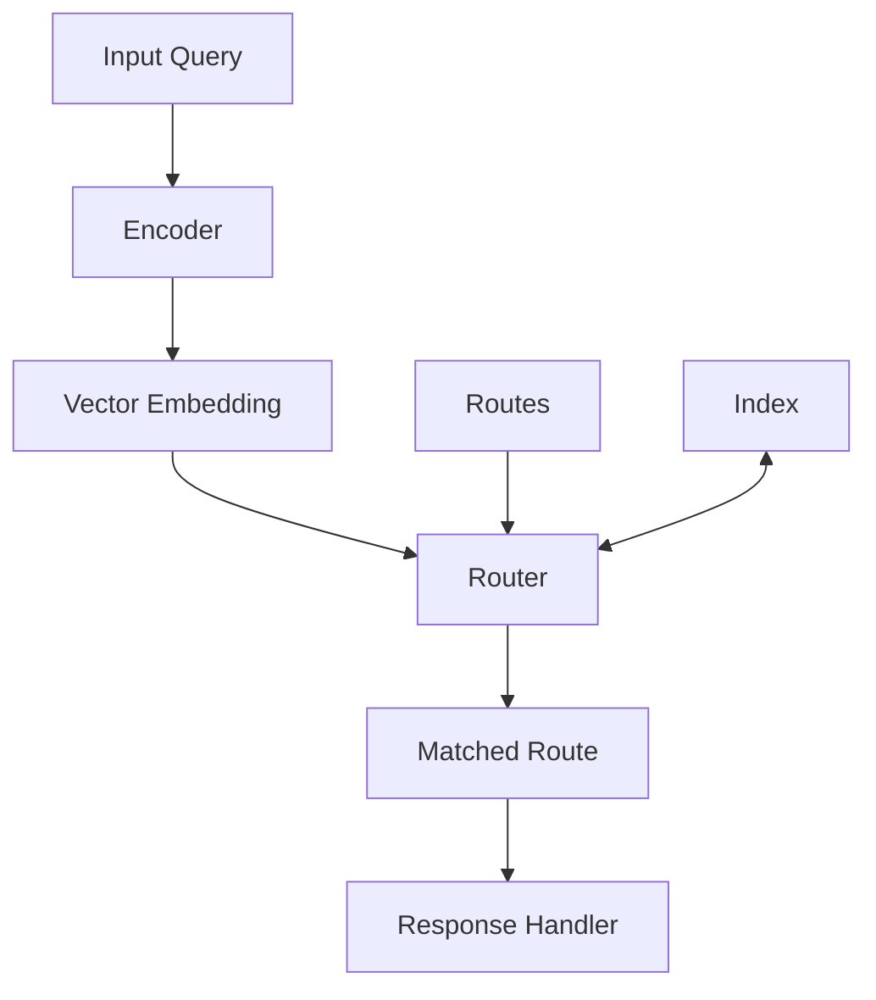

## Core Components

### 1. Encoders

Encoders transform inputs into vector representations in semantic space.

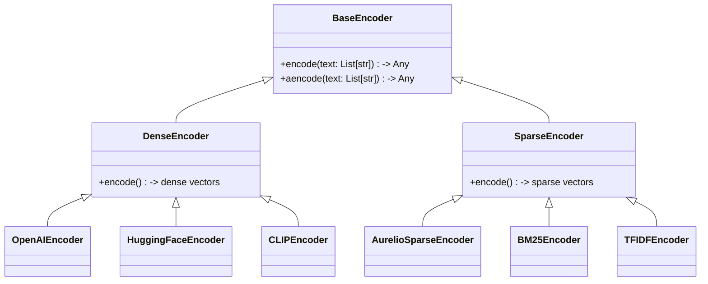

**Types of Encoders:**

* **Dense encoders**: Generate continuous vectors (OpenAI, HuggingFace, etc.)
* **Sparse encoders**: Generate sparse vectors (BM25, TFIDF, AurelioSparse, etc.)
* **Multimodal encoders**: Handle images and text (CLIP, ViT)

### 2. Routes

Routes define patterns to match against, with examples of inputs that should trigger them.

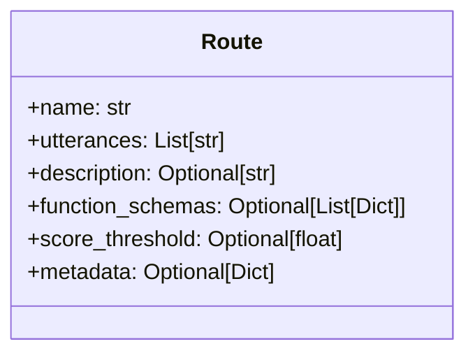

**Key properties:**

* **name**: Identifier for the route
* **utterances**: Example inputs that should match this route
* **function\_schemas**: Optional specifications for function calling
* **score\_threshold**: Minimum similarity score required to match

### 3. Indexing Systems

Indexes store and retrieve route vectors efficiently.

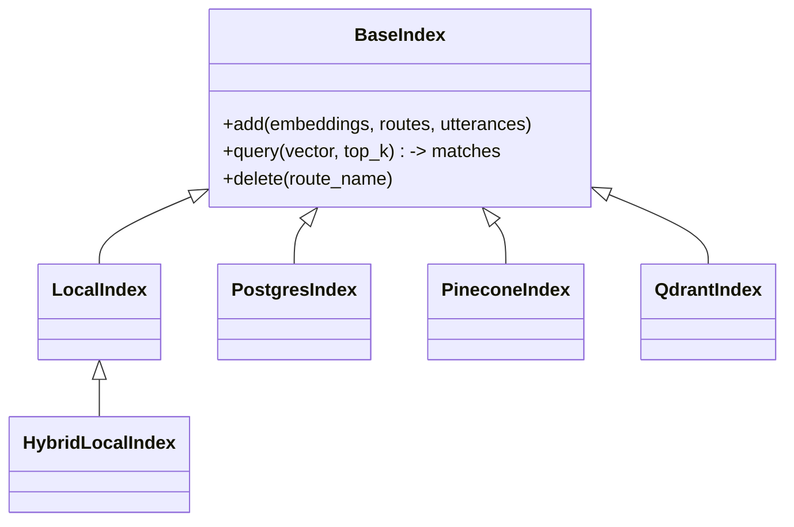

**Index types:**

* **LocalIndex**: In-memory vector storage for dense embeddings
* **HybridLocalIndex**: In-memory storage supporting both dense and sparse vectors
* **PineconeIndex/QdrantIndex**: Cloud-based vector DBs
* **PostgresIndex**: SQL-based vector storage

## Data Flow

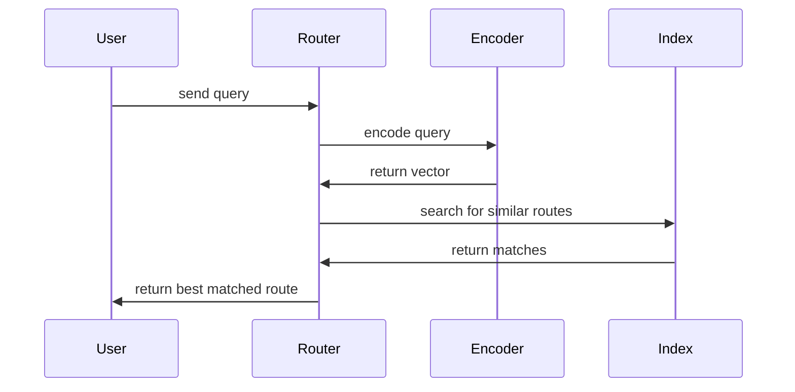

1. **Input Reception**: The system receives an input (text, image)
2. **Encoding**: The input is transformed into a vector representation
3. **Retrieval**: The vector is compared against stored route vectors
4. **Matching**: The best matching route is selected based on similarity
5. **Response**: The system returns the matched route, enabling appropriate handling

## Router Types

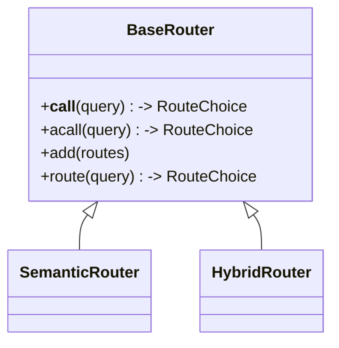

* **SemanticRouter**: Uses dense vector embeddings for semantic matching
* **HybridRouter**: Combines both dense and sparse vectors for enhanced accuracy

## Integration Example

```python theme={null}
from semantic_router import Route, SemanticRouter
from semantic_router.encoders import OpenAIEncoder

# 1. Define routes
weather_route = Route(name="weather", utterances=["What's the weather like?"])
greeting_route = Route(name="greeting", utterances=["Hello there!", "Hi!"])

# 2. Initialize encoder
encoder = OpenAIEncoder()

# 3. Create router with routes
router = SemanticRouter(encoder=encoder, routes=[weather_route, greeting_route])

# 4. Route an incoming query
result = router("What's the forecast for tomorrow?")
print(result.name)  # "weather"
```

## Performance Considerations

* **In-memory vs. Vector DB**: Choose based on scale and latency requirements
* **Encoder selection**: Balance accuracy vs. speed based on use case
* **Batch processing**: Use batch methods for higher throughput
* **Async support**: Available for high-concurrency environments and applications relying
  on heavy network use


# null
Source: https://docs.aurelio.ai/semantic-router/user-guide/concepts/overview


Semantic Routing is an approach to directing inputs (like text, images, or audio) to the appropriate handlers based on their meaning rather than rigid keyword matching or rule-based systems. It provides a more flexible and human-like understanding of content, allowing systems to gracefully handle the natural variability in how people express similar ideas.

## Semantic Space

Semantic space is a high-dimensional mathematical space where meaning is represented geometrically. Imagine a vast coordinate system where every point corresponds to a specific concept or idea. In this space, the sentence "I need help with my password" exists as a point near "Can't log in to my account" but far from "What's the weather forecast?" Semantic similarity becomes a measurable distance, transforming abstract meaning into computable relationships.

* Each point (vector) represents the meaning of a piece of content
* Distance between points represents semantic difference
* Content with similar meanings cluster together, regardless of exact wording

This approach allows us to capture the nuanced relationships between concepts, accommodating synonyms, paraphrases, and related ideas without explicitly programming each variation.

### Encoders

To place content in a semantic space, we need to convert it into vector representations – a process called **encoding**. This is handled by neural network models called **bi-encoders** (commonly known as embedding
models or encoders) which:

```mermaid theme={null}
flowchart LR
    A["Input Content<br/>(Text, Image, Audio)"] --> B["Bi-Encoder<br/>(Neural Net)"]
    B --> C["Vector Embedding<br/>[x₁, x₂, ..., xₙ]"]
    
    style A fill:#f5f5f5,stroke:#333,stroke-width:1px
    style B fill:#e3f2fd,stroke:#1565c0,stroke-width:2px
    style C fill:#f1f8e9,stroke:#558b2f,stroke-width:1px
```

1. Process the input content (text, image, etc.)
2. Analyze its features and semantic properties
3. Output a fixed-size vector of floating-point numbers (typically hundreds or thousands of dimensions)

For example, the sentence "How's the weather today?" might be encoded as a vector like `[0.12, -0.34, 0.56, ...]`, while "What's the temperature outside?" would produce a different but nearby vector, reflecting their similar meanings.

Semantic Router supports various encoder types:

* **Dense encoders** (like `OpenAIEncoder` or `HuggingFaceEncoder`): Generate vectors where every dimension has a value, capturing complex semantic relationships
* **Sparse encoders** (like `AurelioSparseEncoder` or `BM25Encoder`): Generate vectors where most dimensions are zero, excelling at keyword matching and term frequency

### Multimodal Routing

While text is the most common application, semantic routing works with any content that can be meaningfully encoded into vectors:

* **Images**: Using encoders like `CLIPEncoder` or `VitEncoder`, images can be placed in the same semantic space as text, enabling cross-modal comparisons and routing
* **Audio**: Speech or sound can be encoded and routed based on content, tone, or other semantic attributes
* **Hybrid content**: Combinations of text, images, and other modalities can be encoded together or separately

This multimodal capability enables powerful applications like routing based on the content of images, or understanding the combined meaning of text and images together.

### Making Routing Decisions

Once content is encoded into vectors, **semantic similarity** is used to make routing decisions. This is typically calculated using mathematical operations like:

* **Cosine similarity**: cos(θ) = (A·B)/(||A||·||B||)
* **Euclidean distance**: d(A,B) = √(Σ(Aᵢ-Bᵢ)²)
* **Dot product**: A·B = Σ(Aᵢ·Bᵢ)

Semantic Router compares incoming queries against predefined routes, each represented by one or more example utterances. The route with the highest similarity score above a configurable threshold is selected as the match.

## Implementation Workflow

1. **Define routes**: Create example utterances for each target category
2. **Select encoder**: Choose based on content type and performance requirements
3. **Configure router**: Connect encoder, routes, and vector index
4. **Implement handlers**: Define logic for each route
5. **Process inputs**: Transform, encode, and route based on similarity

```mermaid theme={null}
flowchart TD
    subgraph Setup["Setup Phase"]
        A[Define Routes] --> |Example utterances| B[Select Encoder]
        B --> |Based on content type| C[Configure Router]
        C --> |Connect components| D[Implement Handlers]
        D --> E[Precompute Route Embeddings]
    end
    
    subgraph Runtime["Runtime Phase"]
        F[Receive Input] --> G[Encode Input]
        G --> H[Calculate Similarity]
        H --> I{Best Match > Threshold?}
        I -->|Yes| J[Execute Matched Handler]
        I -->|No| K[Execute Default Handler]
    end
    
    E --> F
    
    classDef setup fill:#e1f5fe,stroke:#01579b,stroke-width:2px
    classDef runtime fill:#f3e5f5,stroke:#6a1b9a,stroke-width:2px
    class A,B,C,D,E setup
    class F,G,H,I,J,K runtime
```

## Getting Started with Semantic Router

Semantic Router makes implementing these capabilities straightforward:

1. **Define routes** with example utterances representing the concepts you want to detect
2. **Choose an encoder** appropriate for your content type and requirements
3. **Initialize a router** that connects your encoder, routes, and an index for storing embeddings
4. **Route incoming content** to appropriate handlers based on semantic similarity

The library handles the complex vector operations, similarity calculations, and decision-making process, allowing you to focus on defining meaningful routes and creating effective handlers for each case.


# null
Source: https://docs.aurelio.ai/semantic-router/user-guide/features/dynamic-routes


In semantic-router there are two types of routes that can be chosen. Both routes belong to the `Route` object, the only difference between them is that *static* routes return a `Route.name` when chosen, whereas *dynamic* routes use an LLM call to produce parameter input values.

For example, a *static* route will tell us if a query is talking about mathematics by returning the route name (which could be `"math"` for example). A *dynamic* route does the same thing, but it also extracts key information from the input utterance to be used in a function associated with that route.

For example we could provide a dynamic route with associated utterances:

```python theme={null}
"what is x to the power of y?"
"what is 9 to the power of 4?"
"calculate the result of base x and exponent y"
"calculate the result of base 10 and exponent 3"
"return x to the power of y"
```

and we could also provide the route with a schema outlining key features of the function:

```python theme={null}
def power(base: float, exponent: float) -> float:
    """Raise base to the power of exponent.

    Args:
        base (float): The base number.
        exponent (float): The exponent to which the base is raised.

    Returns:
        float: The result of base raised to the power of exponent.
    """
    return base ** exponent
```

Then, if the user's input utterance is "What is 2 to the power of 3?", the route will be triggered, as the input utterance is semantically similar to the route utterances. Furthermore, the route utilizes an LLM to identify that `base=2` and `exponent=3`. These values are returned in such a way that they can be used in the above `power` function. That is, the dynamic router automates the process of calling relevant functions from natural language inputs.

As with static routes, we must create a dynamic route before adding it to our router. To make a route dynamic, we need to provide the `function_schemas` as a list. Each function schema provides instructions on what a function is, so that an LLM can decide how to use it correctly.

```python theme={null}
from datetime import datetime
from zoneinfo import ZoneInfo


def get_time(timezone: str) -> str:
    """Finds the current time in a specific timezone.

    :param timezone: The timezone to find the current time in, should
        be a valid timezone from the IANA Time Zone Database like
        "America/New_York" or "Europe/London". Do NOT put the place
        name itself like "rome", or "new york", you must provide
        the IANA format.
    :type timezone: str
    :return: The current time in the specified timezone."""
    now = datetime.now(ZoneInfo(timezone))
    return now.strftime("%H:%M")
```

```python theme={null}
get_time("America/New_York")
```

To get the function schema we can use the `get_schemas_openai` function.

```python theme={null}
from semantic_router.llms.openai import get_schemas_openai

schemas = get_schemas_openai([get_time])
schemas
```

We use this to define our dynamic route:

```python theme={null}
from semantic_router import Route

time_route = Route(
    name="get_time",
    utterances=[
        "what is the time in new york city?",
        "what is the time in london?",
        "I live in Rome, what time is it?",
    ],
    function_schemas=schemas,
)
```

Then add the new route to a router.

## Full Example

[](https://colab.research.google.com/github/aurelio-labs/semantic-router/blob/main/docs/02-dynamic-routes.ipynb)
[](https://nbviewer.org/github/aurelio-labs/semantic-router/blob/main/docs/02-dynamic-routes.ipynb)

### Installing the Library

```python theme={null}
!pip install tzdata
!pip install -qU semantic-router>=0.1.5
```

### Initializing Routes and SemanticRouter

Dynamic routes are treated in the same way as static routes, let's begin by initializing a `SemanticRouter` consisting of static routes.

**⚠️ Note: We have a fully local version of dynamic routes available at [docs/05-local-execution.ipynb](https://github.com/aurelio-labs/semantic-router/blob/main/docs/05-local-execution.ipynb). The local version tends to outperform the OpenAI version we demo in this document, so we'd recommend trying [05-local-execution.ipynb](https://github.com/aurelio-labs/semantic-router/blob/main/docs/05-local-execution.ipynb)!**

```python theme={null}
from semantic_router import Route

politics = Route(
    name="politics",
    utterances=[
        "isn't politics the best thing ever",
        "why don't you tell me about your political opinions",
        "don't you just love the president", "don't you just hate the president",
        "they're going to destroy this country!",
        "they will save the country!",
    ],
)
chitchat = Route(
    name="chitchat",
    utterances=[
        "how's the weather today?",
        "how are things going?",
        "lovely weather today",
        "the weather is horrendous",
        "let's go to the chippy",
    ],
)

routes = [politics, chitchat]
```

We initialize our `SemanticRouter` with our `encoder` and `routes`. We can use popular encoder APIs like `CohereEncoder` and `OpenAIEncoder`, or local alternatives like `FastEmbedEncoder`.

```python theme={null}
import os
from semantic_router.routers import SemanticRouter
from semantic_router.encoders import OpenAIEncoder

# platform.openai.com
os.environ["OPENAI_API_KEY"] = "<YOUR_API_KEY>"

encoder = OpenAIEncoder()

sr = SemanticRouter(encoder=encoder, routes=routes, auto_sync="local")
```

We run the router with only static routes:

```python theme={null}
sr("how's the weather today?")
```

```
RouteChoice(name='chitchat', function_call=None, similarity_score=None)
```

### Creating a Dynamic Route

As with static routes, we must create a dynamic route before adding it to our router. To make a route dynamic, we need to provide the `function_schemas` as a list. Each function schema provides instructions on what a function is, so that an LLM can decide how to use it correctly.

```python theme={null}
from datetime import datetime
from zoneinfo import ZoneInfo


def get_time(timezone: str) -> str:
    """Finds the current time in a specific timezone.

    :param timezone: The timezone to find the current time in, should
        be a valid timezone from the IANA Time Zone Database like
        "America/New_York" or "Europe/London". Do NOT put the place
        name itself like "rome", or "new york", you must provide
        the IANA format.
    :type timezone: str
    :return: The current time in the specified timezone."""
    now = datetime.now(ZoneInfo(timezone))
    return now.strftime("%H:%M")
```

```python theme={null}
get_time("America/New_York")
```

```
'17:57'
```

To get the function schema we can use the `get_schemas_openai` function.

```python theme={null}
from semantic_router.llms.openai import get_schemas_openai

schemas = get_schemas_openai([get_time])
schemas
```

We use this to define our dynamic route:

```python theme={null}
time_route = Route(
    name="get_time",
    utterances=[
        "what is the time in new york city?",
        "what is the time in london?",
        "I live in Rome, what time is it?",
    ],
    function_schemas=schemas,
)
```

Add the new route to our router:

```python theme={null}
sr.add(time_route)
```

Now we can ask our router a time related question to trigger our new dynamic route.

```python theme={null}
response = sr("what is the time in new york city?")
response
```

```
RouteChoice(name='get_time', function_call=[{'function_name': 'get_time', 'arguments': {'timezone': 'America/New_York'}}], similarity_score=None)
```

```python theme={null}
print(response.function_call)
```

```
[{'function_name': 'get_time', 'arguments': {'timezone': 'America/New_York'}}]
```

```python theme={null}
import json

for call in response.function_call:
    if call["function_name"] == "get_time":
        args = call["arguments"]
        result = get_time(**args)
print(result)
```

```
17:57
```

Our dynamic route provides both the route itself *and* the input parameters required to use the route.

### Dynamic Routes with Multiple Functions

Routes can be assigned multiple functions. Then, when that particular Route is selected by the Router, a number of those functions might be invoked due to the users utterance containing relevant information that fits their arguments.

Let's define a Route that has multiple functions.

```python theme={null}
from datetime import datetime, timedelta
from zoneinfo import ZoneInfo


# Function with one argument
def get_time(timezone: str) -> str:
    """Finds the current time in a specific timezone.

    :param timezone: The timezone to find the current time in, should
        be a valid timezone from the IANA Time Zone Database like
        "America/New_York" or "Europe/London". Do NOT put the place
        name itself like "rome", or "new york", you must provide
        the IANA format.
    :type timezone: str
    :return: The current time in the specified timezone."""
    now = datetime.now(ZoneInfo(timezone))
    return now.strftime("%H:%M")


def get_time_difference(timezone1: str, timezone2: str) -> str:
    """Calculates the time difference between two timezones.
    :param timezone1: The first timezone, should be a valid timezone from the IANA Time Zone Database like "America/New_York" or "Europe/London".
    :param timezone2: The second timezone, should be a valid timezone from the IANA Time Zone Database like "America/New_York" or "Europe/London".
    :type timezone1: str
    :type timezone2: str
    :return: The time difference in hours between the two timezones."""
    # Get the current time in UTC
    now_utc = datetime.utcnow().replace(tzinfo=ZoneInfo("UTC"))

    # Convert the UTC time to the specified timezones
    tz1_time = now_utc.astimezone(ZoneInfo(timezone1))
    tz2_time = now_utc.astimezone(ZoneInfo(timezone2))

    # Calculate the difference in offsets from UTC
    tz1_offset = tz1_time.utcoffset().total_seconds()
    tz2_offset = tz2_time.utcoffset().total_seconds()

    # Calculate the difference in hours
    hours_difference = (tz2_offset - tz1_offset) / 3600

    return f"The time difference between {timezone1} and {timezone2} is {hours_difference} hours."


# Function with three arguments
def convert_time(time: str, from_timezone: str, to_timezone: str) -> str:
    """Converts a specific time from one timezone to another.
    :param time: The time to convert in HH:MM format.
    :param from_timezone: The original timezone of the time, should be a valid IANA timezone.
    :param to_timezone: The target timezone for the time, should be a valid IANA timezone.
    :type time: str
    :type from_timezone: str
    :type to_timezone: str
    :return: The converted time in the target timezone.
    :raises ValueError: If the time format or timezone strings are invalid.

    Example:
        convert_time("12:30", "America/New_York", "Asia/Tokyo") -> "03:30"
    """
    try:
        # Use today's date to avoid historical timezone issues
        today = datetime.now().date()
        datetime_string = f"{today} {time}"
        time_obj = datetime.strptime(datetime_string, "%Y-%m-%d %H:%M").replace(
            tzinfo=ZoneInfo(from_timezone)
        )

        converted_time = time_obj.astimezone(ZoneInfo(to_timezone))

        formatted_time = converted_time.strftime("%H:%M")
        return formatted_time
    except Exception as e:
        raise ValueError(f"Error converting time: {e}")
```

```python theme={null}
functions = [get_time, get_time_difference, convert_time]
```

```python theme={null}
# Generate schemas for all functions
from semantic_router.llms.openai import get_schemas_openai

schemas = get_schemas_openai(functions)
```

```python theme={null}
# Define the dynamic route with multiple functions
multi_function_route = Route(
    name="timezone_management",
    utterances=[
        # Utterances for get_time function
        "what is the time in New York?",
        "current time in Berlin?",
        "tell me the time in Moscow right now",
        "can you show me the current time in Tokyo?",
        "please provide the current time in London",
        # Utterances for get_time_difference function
        "how many hours ahead is Tokyo from London?",
        "time difference between Sydney and Cairo",
        "what's the time gap between Los Angeles and New York?",
        "how much time difference is there between Paris and Sydney?",
        "calculate the time difference between Dubai and Toronto",
        # Utterances for convert_time function
        "convert 15:00 from New York time to Berlin time",
        "change 09:00 from Paris time to Moscow time",
        "adjust 20:00 from Rome time to London time",
        "convert 12:00 from Madrid time to Chicago time",
        "change 18:00 from Beijing time to Los Angeles time"
        # All three functions
        "What is the time in Seattle? What is the time difference between Mumbai and Tokyo? What is 5:53 Toronto time in Sydney time?",
    ],
    function_schemas=schemas,
)
```

```python theme={null}
routes = [politics, chitchat, multi_function_route]
```

```python theme={null}
sr2 = SemanticRouter(encoder=encoder, routes=routes, auto_sync="local")
```

#### Function to Parse Router Responses

```python theme={null}
def parse_response(response: str):
    for call in response.function_call:
        args = call["arguments"]
        if call["function_name"] == "get_time":
            result = get_time(**args)
            print(result)
        if call["function_name"] == "get_time_difference":
            result = get_time_difference(**args)
            print(result)
        if call["function_name"] == "convert_time":
            result = convert_time(**args)
            print(result)
```

#### Testing the `multi_function_route` - Multiple Functions at Once

```python theme={null}
response = sr2(
    """
    What is the time in Prague?
    What is the time difference between Frankfurt and Beijing?
    What is 5:53 Lisbon time in Bangkok time?
"""
)
```

```python theme={null}
response
```

```
RouteChoice(name='timezone_management', function_call=[{'function_name': 'get_time', 'arguments': {'timezone': 'Europe/Prague'}}, {'function_name': 'get_time_difference', 'arguments': {'timezone1': 'Europe/Berlin', 'timezone2': 'Asia/Shanghai'}}, {'function_name': 'convert_time', 'arguments': {'time': '05:53', 'from_timezone': 'Europe/Lisbon', 'to_timezone': 'Asia/Bangkok'}}], similarity_score=None)
```

```python theme={null}
parse_response(response)
```

```
23:58
The time difference between Europe/Berlin and Asia/Shanghai is 6.0 hours.
11:53
```


# null
Source: https://docs.aurelio.ai/semantic-router/user-guide/features/route-filter


We can filter the routes that the `SemanticRouter` considers when making a classification. This can be useful if we want to restrict the scope of possible routes based on some context.

For example, we may have a router with several routes, `politics`, `weather`, `chitchat`, etc. We may want to restrict the scope of the classification to only consider the `chitchat` route. We can do this by passing a `route_filter` argument to our `SemanticRouter` calls like so:

```python theme={null}
sr("don't you love politics?", route_filter=["chitchat"])
```

In this case, the `SemanticRouter` will only consider the `chitchat` route for the classification.

## Full Example

[](https://colab.research.google.com/github/aurelio-labs/semantic-router/blob/main/docs/09-route-filter.ipynb)
[](https://nbviewer.org/github/aurelio-labs/semantic-router/blob/main/docs/00-introduction.ipynb)

We start by installing the library:

```python theme={null}
!pip install -qU semantic-router
```

We start by defining a dictionary mapping routes to example phrases that should trigger those routes.

```python theme={null}
from semantic_router import Route

politics = Route(
    name="politics",
    utterances=[
        "isn't politics the best thing ever",
        "why don't you tell me about your political opinions",
        "don't you just love the president",
        "don't you just hate the president",
        "they're going to destroy this country!",
        "they will save the country!",
    ],
)
```

Let's define another for good measure:

```python theme={null}
chitchat = Route(
    name="chitchat",
    utterances=[
        "how's the weather today?",
        "how are things going?",
        "lovely weather today",
        "the weather is horrendous",
        "let's go to the chippy",
    ],
)

routes = [politics, chitchat]
```

Now we initialize our embedding model:

```python theme={null}
import os
from getpass import getpass
from semantic_router.encoders import CohereEncoder, OpenAIEncoder

os.environ["COHERE_API_KEY"] = os.getenv("COHERE_API_KEY") or getpass(
    "Enter Cohere API Key: "
)
# os.environ["OPENAI_API_KEY"] = os.getenv("OPENAI_API_KEY") or getpass(
#     "Enter OpenAI API Key: "
# )

encoder = CohereEncoder()
# encoder = OpenAIEncoder()
```

Now we define the `SemanticRouter`. When called, the router will consume text (a query) and output the category (`Route`) it belongs to — to initialize a `SemanticRouter` we need our `encoder` model and a list of `routes`.

```python theme={null}
from semantic_router.routers import SemanticRouter

sr = SemanticRouter(encoder=encoder, routes=routes)
```

Now we can test it:

```python theme={null}
sr("don't you love politics?")
```

```
RouteChoice(name='politics', function_call=None, similarity_score=None)
```

```python theme={null}
sr("how's the weather today?")
```

```
RouteChoice(name='chitchat', function_call=None, similarity_score=None)
```

Both are classified accurately, what if we send a query that is unrelated to our existing `Route` objects?

```python theme={null}
sr("I'm interested in learning about llama 2")
```

```
RouteChoice(name=None, function_call=None, similarity_score=None)
```

In this case, we return `None` because no matches were identified.

## Demonstrating the Filter Feature

Now, let's demonstrate the filter feature. We can specify a subset of routes to consider when making a classification. This can be useful if we want to restrict the scope of possible routes based on some context.

For example, let's say we only want to consider the "chitchat" route for a particular query:

```python theme={null}
sr("don't you love politics?", route_filter=["chitchat"])
```

```
RouteChoice(name='chitchat', function_call=None, similarity_score=None)
```

Even though the query might be more related to the "politics" route, it will be classified as "chitchat" because we've restricted the routes to consider.

Similarly, we can restrict it to the "politics" route:

```python theme={null}
sr("how's the weather today?", route_filter=["politics"])
```

```
RouteChoice(name=None, function_call=None, similarity_score=None)
```

In this case, it will return `None` because the query doesn't match the "politics" route well enough to pass the threshold.


# null
Source: https://docs.aurelio.ai/semantic-router/user-guide/features/sync


The `SemanticRouter` class is the main class in the semantic router package. It contains the routes and allows us to interact with the underlying index. Both the `SemanticRouter` and the various index classes support synchronization strategies that allow us to synchronize the routes and utterances in the layer with the underlying index.

This functionality becomes increasingly important when using the semantic router in a distributed environment. For example, when using one of the *remote instances*, such as `PineconeIndex` or `QdrantIndex`. Deciding the correct synchronization strategy for these remote indexes will save application time and reduce the risk of errors.

Semantic router supports several synchronization strategies. Those strategies are:

* `error`: Raise an error if local and remote are not synchronized.

* `remote`: Take remote as the source of truth and update local to align.

* `local`: Take local as the source of truth and update remote to align.

* `merge-force-local`: Merge both local and remote keeping local as the priority. Remote utterances are only merged into local *if* a matching route for the utterance is found in local, all other route-utterances are dropped. Where a route exists in both local and remote, but each contains different `function_schema` or `metadata` information, the local version takes priority and local `function_schemas` and `metadata` is propagated to all remote utterances belonging to the given route.

* `merge-force-remote`: Merge both local and remote keeping remote as the priority. Local utterances are only merged into remote *if* a matching route for the utterance is found in the remote, all other route-utterances are dropped. Where a route exists in both local and remote, but each contains different `function_schema` or `metadata` information, the remote version takes priority and remote `function_schemas` and `metadata` are propagated to all local routes.

* `merge`: Merge both local and remote, merging also local and remote utterances when a route with same route name is present both locally and remotely. If a route exists in both local and remote but contains different `function_schemas` or `metadata` information, the local version takes priority and local `function_schemas` and `metadata` are propagated to all remote routes.

There are two ways to specify the synchronization strategy. The first is to specify the strategy when initializing the `SemanticRouter` object via the `auto_sync` parameter. The second is to trigger synchronization directly via the `SemanticRouter.sync` method.

***

## Using the `auto_sync` parameter

The `auto_sync` parameter is used to specify the synchronization strategy when initializing the `SemanticRouter` object. Depending on the chosen strategy, the `SemanticRouter` object will automatically synchronize with the defined index. As this happens on initialization, this will often increase the initialization time of the `SemanticRouter` object.

Let's see an example of `auto_sync` in action.

```python theme={null}
from semantic_router import Route, SemanticRouter
from semantic_router.encoders import OpenAIEncoder
from semantic_router.indexes import PineconeIndex

# we could use this as a guide for our chatbot to avoid political conversations
politics = Route(
    name="politics",
    utterances=[
        "isn't politics the best thing ever",
        "why don't you tell me about your political opinions",
        "don't you just love the president",
        "don't you just hate the president",
        "they're going to destroy this country!",
        "they will save the country!",
    ],
)

# this could be used as an indicator to our chatbot to switch to a more
# conversational prompt
chitchat = Route(
    name="chitchat",
    utterances=[
        "how's the weather today?",
        "how are things going?",
        "lovely weather today",
        "the weather is horrendous",
        "let's go to the chippy",
    ],
)

# we place both of our decisions together into single list
routes = [politics, chitchat]

encoder = OpenAIEncoder(openai_api_key=openai_api_key)

pc_index = PineconeIndex(
    api_key=pinecone_api_key,
    region="us-east-1",
    index_name="sync-example",
)
# before initializing the SemanticRouter with auto_sync we should initialize
# the index
pc_index.index = pc_index._init_index(force_create=True)

# now we can initialize the SemanticRouter with local auto_sync
sr = SemanticRouter(
    encoder=encoder, routes=routes, index=pc_index,
    auto_sync="local"
)
```

Now we can run `sr.is_synced()` to confirm that our local and remote instances are synchronized.

```python theme={null}
sr.is_synced()
```

## Checking for Synchronization

To verify whether the local and remote instances are synchronized, you can use the `SemanticRouter.is_synced` method. This method checks if the routes, utterances, and associated metadata in the local instance match those stored in the remote index.

The `is_synced` method works in two steps. The first is our *fast* sync check. The fast check creates a hash of our local route layer which is constructed from:

* `encoder_type` and `encoder_name`
* `route` names
* `route` utterances
* `route` description
* `route` function schemas (if any)
* `route` llm (if any)
* `route` score threshold
* `route` metadata (if any)

The fast check then compares this hash to the hash of the remote index. If the hashes match, we know that the local and remote instances are synchronized and we can return `True`. If the hashes do not match, we need to perform a *slow* sync check.

The slow sync check works by creating a `LayerConfig` object from the remote index and then comparing this to our local `LayerConfig` object. If the two objects match, we know that the local and remote instances are synchronized and we can return `True`. If the two objects do not match, we must investigate and decide how to synchronize the two instances.

To quickly sync the local and remote instances we can use the `SemanticRouter.sync` method. This method is equivalent to the `auto_sync` strategy specified when initializing the `SemanticRouter` object. So, if we assume our local `SemanticRouter` object contains the ground truth routes, we would use the `local` strategy to copy our local routes to the remote instance.

```python theme={null}
sr.sync(sync_mode="local")
```

After running the above code, we can check whether the local and remote instances are synchronized by rerunning `sr.is_synced()`, which should now return `True`.

## Investigating Synchronization Differences

We may often need to further investigate and understand *why* our local and remote instances have become desynchronized. The first step in further investigation and resolution of synchronization differences is to see the differences. We can get a readable diff using the `SemanticRouter.get_utterance_diff` method.

```python theme={null}
diff = sr.get_utterance_diff()
```

```python theme={null}
["- politics: don't you just hate the president",
"- politics: don't you just love the president",
"- politics: isn't politics the best thing ever",
'- politics: they will save the country!',
"- politics: they're going to destroy this country!",
"- politics: why don't you tell me about your political opinions",
'+ chitchat: how\'s the weather today?',
'+ chitchat: how are things going?',
'+ chitchat: lovely weather today',
'+ chitchat: the weather is horrendous',
'+ chitchat: let\'s go to the chippy']
```

The diff works by creating a list of all the routes in the remote index and then comparing these to the routes in our local instance. Any differences between the remote and local routes are shown in the above diff.

Now, to resolve these differences we will need to initialize an `UtteranceDiff` object. This object will contain the differences between the remote and local utterances. We can then use this object to decide how to synchronize the two instances. To initialize the `UtteranceDiff` object we need to get our local and remote utterances.

```python theme={null}
local_utterances = sr.to_config().to_utterances()
remote_utterances = sr.index.get_utterances()
```

We create an utterance diff object like so:

```python theme={null}
diff = UtteranceDiff.from_utterances(
    local_utterances=local_utterances, remote_utterances=remote_utterances
)
```

`UtteranceDiff` objects include all diff information inside the `diff` attribute (which is a list of `Utterance` objects). Each of our `Utterance` objects inside `UtteranceDiff.diff` now contain a populated `diff_tag` attribute, where:

* `diff_tag='+'` indicates the utterance exists in the remote instance *only*.
* `diff_tag='-'` indicates the utterance exists in the local instance *only*.
* `diff_tag=' '` indicates the utterance exists in both the local and remote instances.

After initializing an `UtteranceDiff` object we can get all utterances with each diff tag like so:

```python theme={null}
# all utterances that exist only in remote
diff.get_tag("+")

# all utterances that exist only in local
diff.get_tag("-")

# all utterances that exist in both local and remote
diff.get_tag(" ")
```

These can be investigated if needed. Once we're happy with our understanding of the issues we can resolve them by executing a synchronization by running the `SemanticRouter._execute_sync_strategy` method:

```python theme={null}
sr._execute_sync_strategy(sync_mode="local")
```

Once complete, we can confirm that our local and remote instances are synchronized by running `sr.is_synced()`:

```python theme={null}
sr.is_synced()
```

If the above returns `True` we are now synchronized!

```
                  .=                
                 :%%*               
                -%%%%#              
               =%%%%%%#.            
              +%%%%%%%+             
             *%%%%%%%=              
           .#%%%%%%%-               
          .#%%%%%%%: -%:            
         :%%%%%%%#. =%%%=           
        -%%%%%%%#  *%%%%%+          
       =%%%%%%%*  -%%%%%%%*         
      .-------:    -%%%%%%%#        
:*****************+ :%%%%%%%#.      
-%%%%%%%%%%%%%%%%%%%* .#%%%%%%%:     
=%%%%%%%%%%%%%%%%%%%%%#..#%%%%%%%-    
+%%%%%%%%%%%%%%%%%%%%%%%#. *%%%%%%%=   
                         +%%%%%%%+  
                          =#######+ 
```


# null
Source: https://docs.aurelio.ai/semantic-router/user-guide/features/threshold-optimization


Route score thresholds are what defines whether a route should be chosen. If the score we identify for any given route is higher than the `Route.score_threshold` it passes, otherwise it does not and *either* another route is chosen, or we return *no* route.

Given that this one `score_threshold` parameter can define the choice of a route, it's important to get it right — but it's incredibly inefficient to do so manually. Instead, we can use the `fit` and `evaluate` methods of our `SemanticRouter`. All we must do is pass a smaller number of *(utterance, target route)* examples to our methods, and with `fit` we will often see dramatically improved performance within seconds.

## Full Example

[](https://colab.research.google.com/github/aurelio-labs/semantic-router/blob/main/docs/06-threshold-optimization.ipynb) [](https://nbviewer.org/github/aurelio-labs/semantic-router/blob/main/docs/06-threshold-optimization)

```python theme={null}
!pip install -qU "semantic-router>=0.1.5"
```

## Define SemanticRouter

As usual we will define our `SemanticRouter`. The `SemanticRouter` requires just `routes` and an `encoder`. If using dynamic routes you must also define an `llm` (or use the OpenAI default).

We will start by defining four routes; *politics*, *chitchat*, *mathematics*, and *biology*.

```python theme={null}
from semantic_router import Route

# we could use this as a guide for our chatbot to avoid political conversations
politics = Route(
    name="politics",
    utterances=[
        "isn't politics the best thing ever",
        "why don't you tell me about your political opinions",
        "don't you just love the president" "don't you just hate the president",
        "they're going to destroy this country!",
        "they will save the country!",
    ],
)

# this could be used as an indicator to our chatbot to switch to a more
# conversational prompt
chitchat = Route(
    name="chitchat",
    utterances=[
        "Did you watch the game last night?",
        "what's your favorite type of music?",
        "Have you read any good books lately?",
        "nice weather we're having",
        "Do you have any plans for the weekend?",
    ],
)

# we can use this to switch to an agent with more math tools, prompting, and LLMs
mathematics = Route(
    name="mathematics",
    utterances=[
        "can you explain the concept of a derivative?",
        "What is the formula for the area of a triangle?",
        "how do you solve a system of linear equations?",
        "What is the concept of a prime number?",
        "Can you explain the Pythagorean theorem?",
    ],
)

# we can use this to switch to an agent with more biology knowledge
biology = Route(
    name="biology",
    utterances=[
        "what is the process of osmosis?",
        "can you explain the structure of a cell?",
        "What is the role of RNA?",
        "What is genetic mutation?",
        "Can you explain the process of photosynthesis?",
    ],
)

# we place all of our decisions together into single list
routes = [politics, chitchat, mathematics, biology]
```

For our encoder we will use the local `HuggingFaceEncoder`. Other popular encoders include `CohereEncoder`, `FastEmbedEncoder`, `OpenAIEncoder`, and `AzureOpenAIEncoder`.

```python theme={null}
from semantic_router.encoders import HuggingFaceEncoder

encoder = HuggingFaceEncoder()
```

Now we initialize our `SemanticRouter`.

```python theme={null}
from semantic_router import SemanticRouter

sr = SemanticRouter(encoder=encoder, routes=routes)
```

By default, we should get reasonable performance:

```python theme={null}
for utterance in [
    "don't you love politics?",
    "how's the weather today?",
    "What's DNA?",
    "I'm interested in learning about llama 2",
]:
    print(f"{utterance} -> {sr(utterance).name}")
```

```
don't you love politics? -> politics
how's the weather today? -> chitchat
What's DNA? -> biology
I'm interested in learning about llama 2 -> None
```

We can evaluate the performance of our route layer using the `evaluate` method. All we need is to pass a list of utterances and target route labels:

```python theme={null}
test_data = [
    ("don't you love politics?", "politics"),
    ("how's the weather today?", "chitchat"),
    ("What's DNA?", "biology"),
    ("I'm interested in learning about llama 2", None),
]

# unpack the test data
X, y = zip(*test_data)

# evaluate using the default thresholds
accuracy = sr.evaluate(X=X, y=y)
print(f"Accuracy: {accuracy*100:.2f}%")
```

```
Generating embeddings: 100%|██████████| 1/1 [00:00<00:00, 76.91it/s]
Accuracy: 100.00%
```

On this small subset we get perfect accuracy — but what if we try with a larger, more robust dataset?

*Hint: try using GPT-4 or another LLM to generate some examples for your own use-cases. The more accurate examples you provide, the better you can expect the routes to perform on your actual use-case.*

```python theme={null}
test_data = [
    # politics
    ("What's your opinion on the current government?", "politics"),
    ("Who do you think will win the next election?", "politics"),
    ("What are your thoughts on the new policy?", "politics"),
    ("How do you feel about the political situation?", "politics"),
    ("Do you agree with the president's actions?", "politics"),
    ("What's your stance on the political debate?", "politics"),
    ("How do you see the future of our country?", "politics"),
    ("What do you think about the opposition party?", "politics"),
    ("Do you believe the government is doing enough?", "politics"),
    ("What's your opinion on the political scandal?", "politics"),
    ("Do you think the new law will make a difference?", "politics"),
    ("What are your thoughts on the political reform?", "politics"),
    ("Do you agree with the government's foreign policy?", "politics"),
    # chitchat
    ("What's the weather like?", "chitchat"),
    ("It's a beautiful day today.", "chitchat"),
    ("How's your day going?", "chitchat"),
    ("It's raining cats and dogs.", "chitchat"),
    ("Let's grab a coffee.", "chitchat"),
    ("What's up?", "chitchat"),
    ("It's a bit chilly today.", "chitchat"),
    ("How's it going?", "chitchat"),
    ("Nice weather we're having.", "chitchat"),
    ("It's a bit windy today.", "chitchat"),
    ("Let's go for a walk.", "chitchat"),
    ("How's your week been?", "chitchat"),
    ("It's quite sunny today.", "chitchat"),
    ("How are you feeling?", "chitchat"),
    ("It's a bit cloudy today.", "chitchat"),
    # mathematics
    ("What is the Pythagorean theorem?", "mathematics"),
    ("Can you solve this quadratic equation?", "mathematics"),
    ("What is the derivative of x squared?", "mathematics"),
    ("Explain the concept of integration.", "mathematics"),
    ("What is the area of a circle?", "mathematics"),
    ("How do you calculate the volume of a sphere?", "mathematics"),
    ("What is the difference between a vector and a scalar?", "mathematics"),
    ("Explain the concept of a matrix.", "mathematics"),
    ("What is the Fibonacci sequence?", "mathematics"),
    ("How do you calculate permutations?", "mathematics"),
    ("What is the concept of probability?", "mathematics"),
    ("Explain the binomial theorem.", "mathematics"),
    ("What is the difference between discrete and continuous data?", "mathematics"),
    ("What is a complex number?", "mathematics"),
    ("Explain the concept of limits.", "mathematics"),
    # biology
    ("What is photosynthesis?", "biology"),
    ("Explain the process of cell division.", "biology"),
    ("What is the function of mitochondria?", "biology"),
    ("What is DNA?", "biology"),
    ("What is the difference between prokaryotic and eukaryotic cells?", "biology"),
    ("What is an ecosystem?", "biology"),
    ("Explain the theory of evolution.", "biology"),
    ("What is a species?", "biology"),
    ("What is the role of enzymes?", "biology"),
    ("What is the circulatory system?", "biology"),
    ("Explain the process of respiration.", "biology"),
    ("What is a gene?", "biology"),
    ("What is the function of the nervous system?", "biology"),
    ("What is homeostasis?", "biology"),
    ("What is the difference between a virus and a bacteria?", "biology"),
    ("What is the role of the immune system?", "biology"),
    # add some None routes to prevent excessively small thresholds
    ("What is the capital of France?", None),
    ("how many people live in the US?", None),
    ("when is the best time to visit Bali?", None),
    ("how do I learn a language", None),
    ("tell me an interesting fact", None),
    ("what is the best programming language?", None),
    ("I'm interested in learning about llama 2", None),
]
```

```python theme={null}
# unpack the test data
X, y = zip(*test_data)

# evaluate using the default thresholds
accuracy = sr.evaluate(X=X, y=y)
print(f"Accuracy: {accuracy*100:.2f}%")
```

```
Generating embeddings: 100%|██████████| 1/1 [00:00<00:00, 9.23it/s]
Accuracy: 34.85%
```

Ouch, that's not so good! Fortunately, we can easily improve our performance here.

## Router Optimization

Our optimization works by finding the best route thresholds for each `Route` in our `SemanticRouter`. We can see the current, default thresholds by calling the `get_thresholds` method:

```python theme={null}
route_thresholds = sr.get_thresholds()
print("Default route thresholds:", route_thresholds)
```

```
Default route thresholds: {'politics': 0.5, 'chitchat': 0.5, 'mathematics': 0.5, 'biology': 0.5}
```

These are all preset route threshold values. Fortunately, it's very easy to optimize these — we simply call the `fit` method and provide our training utterances `X`, and target route labels `y`:

```python theme={null}
# Call the fit method
sr.fit(X=X, y=y)
```

```
Generating embeddings: 100%|██████████| 1/1 [00:00<00:00, 9.21it/s]
Training: 100%|██████████| 500/500 [00:01<00:00, 419.45it/s, acc=0.89]
```

Let's see what our new thresholds look like:

```python theme={null}
route_thresholds = sr.get_thresholds()
print("Updated route thresholds:", route_thresholds)
```

```
Updated route thresholds: {'politics': 0.05050505050505051, 'chitchat': 0.32323232323232326, 'mathematics': 0.18181818181818182, 'biology': 0.21212121212121213}
```

These are vastly different thresholds to what we were seeing before — it's worth noting that *optimal* values for different encoders can vary greatly. For example, OpenAI's Ada 002 model, when used with our encoders will tend to output much larger numbers in the `0.5` to `0.8` range.

After training we have a final performance of:

```python theme={null}
accuracy = sr.evaluate(X=X, y=y)
print(f"Accuracy: {accuracy*100:.2f}%")
```

```
Generating embeddings: 100%|██████████| 1/1 [00:00<00:00, 8.89it/s]
Accuracy: 89.39%
```

That is *much* better. If we wanted to optimize this further we can focus on adding more utterances to our existing routes, analyzing *where* exactly our failures are, and modifying our routes around those. This extended optimization process is much more manual, but with it we can continue optimizing routes to get even better performance.


# null
Source: https://docs.aurelio.ai/semantic-router/user-guide/guides/configuration


# Configuration

This guide covers various configuration options available in semantic-router.

## Logging Configuration

Semantic-router uses Python's logging module for debugging and monitoring. You can control the verbosity of logs using environment variables.

### Setting Log Levels

You can configure the log level in two ways:

1. **Using the semantic-router specific variable (recommended):**
   ```bash theme={null}
   export SEMANTIC_ROUTER_LOG_LEVEL=DEBUG
   ```

2. **Using the general LOG\_LEVEL variable:**
   ```bash theme={null}
   export LOG_LEVEL=WARNING
   ```

The library checks for `SEMANTIC_ROUTER_LOG_LEVEL` first, then falls back to `LOG_LEVEL`. If neither is set, it defaults to `INFO`.

### Available Log Levels

* `DEBUG`: Detailed information for diagnosing problems
* `INFO`: General informational messages (default)
* `WARNING`: Warning messages for potentially problematic situations
* `ERROR`: Error messages for serious problems
* `CRITICAL`: Critical messages for very serious errors

### Example Usage

```python theme={null}
import os
# Set before importing semantic-router
os.environ["SEMANTIC_ROUTER_LOG_LEVEL"] = "DEBUG"

from semantic_router import Route, SemanticRouter
# Your debug logs will now be visible
```

This is particularly useful when:

* Debugging encoder or index issues
* Monitoring route matching decisions
* Troubleshooting performance problems
* Understanding the library's internal behavior


# null
Source: https://docs.aurelio.ai/semantic-router/user-guide/guides/local-execution


There are many reasons users might choose to roll their own LLMs rather than use a third-party service. Whether it's due to cost, privacy or compliance, Semantic Router supports the use of "local" LLMs through `llama.cpp`.

Using `llama.cpp` also enables the use of quantized GGUF models, reducing the memory footprint of deployed models, allowing even 13-billion parameter models to run with hardware acceleration on an Apple M1 Pro chip.

## Full Example

[](https://colab.research.google.com/github/aurelio-labs/semantic-router/blob/main/docs/05-local-execution.ipynb)
[](https://nbviewer.org/github/aurelio-labs/semantic-router/blob/main/docs/05-local-execution.ipynb)

Below is an example of using semantic router with **Mistral-7B-Instruct**, quantized to reduce memory footprint.

## Installing the library

> Note: if you require hardware acceleration via BLAS, CUDA, Metal, etc. please refer to the [abetlen/llama-cpp-python](https://github.com/abetlen/llama-cpp-python#installation-with-specific-hardware-acceleration-blas-cuda-metal-etc) repository README.md

```python theme={null}
pip install -qU "semantic-router[local]"
```

If you're running on Apple silicon you can run the following to compile with Metal hardware acceleration:

```bash theme={null}
CMAKE_ARGS="-DLLAMA_METAL=on" pip install -qU "semantic-router[local]"
```

## Download the Mistral 7B Instruct 4-bit GGUF files

We will be using Mistral 7B Instruct, quantized as a 4-bit GGUF file, a good balance between performance and ability to deploy on consumer hardware

```python theme={null}
!curl -L "https://huggingface.co/TheBloke/Mistral-7B-Instruct-v0.2-GGUF/resolve/main/mistral-7b-instruct-v0.2.Q4_0.gguf?download=true" -o ./mistral-7b-instruct-v0.2.Q4_0.gguf
!ls mistral-7b-instruct-v0.2.Q4_0.gguf
```

## Initializing Dynamic Routes

Similar to dynamic routes in other examples, we will be initializing some dynamic routes that make use of LLMs for function calling

```python theme={null}
from datetime import datetime
from zoneinfo import ZoneInfo

from semantic_router import Route
from semantic_router.utils.function_call import get_schema


def get_time(timezone: str) -> str:
    """Finds the current time in a specific timezone.

    :param timezone: The timezone to find the current time in, should
        be a valid timezone from the IANA Time Zone Database like
        "America/New_York" or "Europe/London". Do NOT put the place
        name itself like "rome", or "new york", you must provide
        the IANA format.
    :type timezone: str
    :return: The current time in the specified timezone."""
    now = datetime.now(ZoneInfo(timezone))
    return now.strftime("%H:%M")


time_schema = get_schema(get_time)
time = Route(
    name="get_time",
    utterances=[
        "what is the time in new york city?",
        "what is the time in london?",
        "I live in Rome, what time is it?",
    ],
    function_schemas=[time_schema],
)

politics = Route(
    name="politics",
    utterances=[
        "isn't politics the best thing ever",
        "why don't you tell me about your political opinions",
        "don't you just love the president" "don't you just hate the president",
        "they're going to destroy this country!",
        "they will save the country!",
    ],
)
chitchat = Route(
    name="chitchat",
    utterances=[
        "how's the weather today?",
        "how are things going?",
        "lovely weather today",
        "the weather is horrendous",
        "let's go to the chippy",
    ],
)

routes = [politics, chitchat, time]
```

## Encoders

You can use alternative Encoders, however, in this example we want to showcase a fully-local Semantic Router execution, so we are going to use a `HuggingFaceEncoder` with `sentence-transformers/all-MiniLM-L6-v2` (the default) as an embedding model.

```python theme={null}
from semantic_router.encoders import HuggingFaceEncoder

encoder = HuggingFaceEncoder()
```

## `llama.cpp` LLM

From here, we can go ahead and instantiate our `llama-cpp-python` `llama_cpp.Llama` LLM, and then pass it to the `semantic_router.llms.LlamaCppLLM` wrapper class.

For `llama_cpp.Llama`, there are a couple of parameters you should pay attention to:

* `n_gpu_layers`: how many LLM layers to offload to the GPU (if you want to offload the entire model, pass `-1`, and for CPU execution, pass `0`)
* `n_ctx`: context size, limit the number of tokens that can be passed to the LLM (this is bounded by the model's internal maximum context size, in this case for Mistral-7B-Instruct, 8000 tokens)
* `verbose`: if `False`, silences output from `llama.cpp`

> For other parameter explanation, refer to the `llama-cpp-python` [API Reference](https://llama-cpp-python.readthedocs.io/en/latest/api-reference/)

```python theme={null}
# In semantic-router v0.1.0, RouteLayer has been replaced with SemanticRouter
from semantic_router import SemanticRouter

from llama_cpp import Llama
from semantic_router.llms.llamacpp import LlamaCppLLM

enable_gpu = True  # offload LLM layers to the GPU (must fit in memory)

_llm = Llama(
    model_path="./mistral-7b-instruct-v0.2.Q4_0.gguf",
    n_gpu_layers=-1 if enable_gpu else 0,
    n_ctx=2048,
)
_llm.verbose = False
llm = LlamaCppLLM(name="Mistral-7B-v0.2-Instruct", llm=_llm, max_tokens=None)

# Initialize SemanticRouter with our encoder, routes, and LLM
router = SemanticRouter(encoder=encoder, routes=routes, llm=llm)
```

Let's test our router with some queries:

```python theme={null}
router("how's the weather today?")
```

This should output:

```
RouteChoice(name='chitchat', function_call=None, similarity_score=None)
```

Now let's try a time-related query that will trigger our function calling:

```python theme={null}
out = router("what's the time in New York right now?")
print(out)
get_time(**out.function_call[0])
```

This should output something like:

```
name='get_time' function_call=[{'timezone': 'America/New_York'}] similarity_score=None
'07:50'
```

Let's try more examples:

```python theme={null}
out = router("what's the time in Rome right now?")
print(out)
get_time(**out.function_call[0])
```

Output:

```
name='get_time' function_call=[{'timezone': 'Europe/Rome'}] similarity_score=None
'13:51'
```

```python theme={null}
out = router("what's the time in Bangkok right now?")
print(out)
get_time(**out.function_call[0])
```

Output:

```
name='get_time' function_call=[{'timezone': 'Asia/Bangkok'}] similarity_score=None
'18:51'
```

## Cleanup

Once done, if you'd like to delete the downloaded model you can do so with the following:

```bash theme={null}
rm ./mistral-7b-instruct-v0.2.Q4_0.gguf
```


# null
Source: https://docs.aurelio.ai/semantic-router/user-guide/guides/migration-to-v1


The v0.1 release of semantic router introduces several breaking changes to improve the API design and add new functionality. This guide will help you migrate your code to the new version.

## Key API Changes

### Module Imports and Class Renaming

* `from semantic_router import RouteLayer` → `from semantic_router.routers import SemanticRouter`

  The `RouteLayer` class has been renamed to `SemanticRouter` and moved to the `routers` module to better reflect its purpose and fit into the modular architecture.

### Method Signatures

* `SemanticRouter.add(route: Route)` → `SemanticRouter.add(routes: List[Route])`

  The `add` method now accepts a list of routes, making it easier to add multiple routes at once. However, it still supports adding a single route for backward compatibility.

  ```python theme={null}
  # Before
  route_layer = RouteLayer(encoder=encoder)
  route_layer.add(route1)
  route_layer.add(route2)

  # After
  semantic_router = SemanticRouter(encoder=encoder)
  semantic_router.add([route1, route2])  # Add multiple routes at once
  semantic_router.add(route3)  # Still works for a single route
  ```

* `RouteLayer.retrieve_multiple_routes()` → `SemanticRouter.__call__(limit=None)` or `SemanticRouter.acall(limit=None)`

  The `retrieve_multiple_routes` method has been removed. If you need similar functionality:

  * In versions 0.1.0-0.1.2: You can use the deprecated `_semantic_classify_multiple_routes` method
  * In version 0.1.3+ (0.1.5+ is recommended): Use the `__call__` or `acall` methods with appropriate `limit` parameter.

  ```python theme={null}
  # Before (v0.0.x)
  route_layer = RouteLayer(encoder=encoder, routes=routes)
  multiple_routes = route_layer.retrieve_multiple_routes(query_text)

  # Transitional (v0.1.0-0.1.2)
  # Using deprecated method (not recommended)
  semantic_router = SemanticRouter(encoder=encoder, routes=routes, auto_sync="local")
  query_results = semantic_router._query(query_text)
  multiple_routes = semantic_router._semantic_classify_multiple_routes(query_results)

  # After (v0.1.3+)
  semantic_router = SemanticRouter(encoder=encoder, routes=routes, auto_sync="local")
  # Return all routes that pass their score thresholds
  all_routes = semantic_router(query_text, limit=None)
  # Or return top N routes that pass their score thresholds
  top_routes = semantic_router(query_text, limit=3)

  # To get scores for all routes regardless of threshold
  semantic_router.set_threshold(threshold=0.0)  # Set all route thresholds to 0
  all_route_scores = semantic_router(query_text, limit=None)
  ```

  When `limit=1` (the default), a single `RouteChoice` object is returned.
  When `limit=None` or `limit > 1`, a list of `RouteChoice` objects is returned.

  > **Important Note About `top_k`**: The `top_k` parameter (default: 5) can still limit the number of routes returned, regardless of the `limit` parameter. When using `limit > 1`, we recommend setting `top_k` to a higher value such as 100 or more. If you're using `limit=None` to get all possible results, make sure to set `top_k` to be equal to or greater than the total number of utterances shared across all of your routes.
  >
  > ```python theme={null}
  > # Example: Setting top_k higher when retrieving multiple routes
  > semantic_router = SemanticRouter(encoder=encoder, routes=routes, top_k=100)
  > all_routes = semantic_router(query_text, limit=None)
  > ```

### Synchronization Strategy

* If expecting routes to sync between local and remote on initialization, use `SemanticRouter(..., auto_sync="local")`.

  The `auto_sync` parameter provides control over how routes are synchronized between local and remote indexes. Read more about `auto_sync` and [synchronization strategies](../features/sync).

  Available synchronization modes:

  * `error`: Raise an error if local and remote are not synchronized.
  * `remote`: Take remote as the source of truth and update local to align.
  * `local`: Take local as the source of truth and update remote to align.
  * `merge-force-local`: Merge both local and remote keeping local as the priority.
  * `merge-force-remote`: Merge both local and remote keeping remote as the priority.
  * `merge`: Merge both local and remote, with local taking priority for conflicts.

  ```python theme={null}
  # Example: Initialize with synchronization strategy
  semantic_router = SemanticRouter(
      encoder=encoder,
      routes=routes,
      index=PineconeIndex(...),
      auto_sync="local"  # Local routes will be used to update the remote index
  )
  ```

## Other Important Changes

### Router Configuration

The `RouterConfig` class has been introduced as a replacement for the `LayerConfig` class, providing a more flexible way to configure routers:

```python theme={null}
from semantic_router.routers import RouterConfig

# Create configuration for your router
config = RouterConfig(
    routes=[route1, route2],
    encoder_type="openai",
    encoder_name="text-embedding-3-small"
)

# Initialize a router from config
semantic_router = SemanticRouter.from_config(config)
```

### Advanced Router Options

The modular architecture now provides access to different router types:

* `SemanticRouter`: The standard router that replaces the old `RouteLayer`
* `HybridRouter`: A router that can combine dense and sparse embedding methods
* `BaseRouter`: An abstract base class for creating custom routers

## Migration Example

```python theme={null}
# Before (v0.0.x)
from semantic_router import RouteLayer, Route
from semantic_router.encoders import OpenAIEncoder

route = Route(name="example", utterances=["sample utterance"])
layer = RouteLayer(encoder=OpenAIEncoder())
layer.add(route)
result = layer("query text")

# After (v0.1.x)
from semantic_router import Route
from semantic_router.routers import SemanticRouter
from semantic_router.encoders import OpenAIEncoder

route = Route(name="example", utterances=["sample utterance"])
router = SemanticRouter(encoder=OpenAIEncoder())
router.add(route)  # Still works for a single route
result = router("query text")
```


# null
Source: https://docs.aurelio.ai/semantic-router/user-guide/guides/save-load-from-file


Route layers can be saved to and loaded from files. This can be useful if we want to save a route layer to a file for later use, or if we want to load a route layer from a file.

We can save and load route layers to/from YAML or JSON files. For JSON we do:

```python theme={null}
# save to JSON
router.to_json("router.json")
# load from JSON
new_router = SemanticRouter.from_json("router.json")
```

For YAML we do:

```python theme={null}
# save to YAML
router.to_yaml("router.yaml")
# load from YAML
new_router = SemanticRouter.from_yaml("router.yaml")
```

The saved files contain all the information needed to initialize new semantic routers. If you are using a remote index, you can use the [sync features](../features/sync) to keep the router in sync with the index.

## Full Example

[](https://colab.research.google.com/github/aurelio-labs/semantic-router/blob/main/docs/01-save-load-from-file.ipynb)
[](https://nbviewer.org/github/aurelio-labs/semantic-router/blob/main/docs/01-save-load-from-file.ipynb)

Here we will show how to save routers to YAML or JSON files, and how to load a router from file.

We start by installing the library:

```bash theme={null}
!pip install -qU semantic-router
```

## Define Route

First let's create a list of routes:

```python theme={null}
from semantic_router import Route

politics = Route(
    name="politics",
    utterances=[
        "isn't politics the best thing ever",
        "why don't you tell me about your political opinions",
        "don't you just love the president",
        "don't you just hate the president",
        "they're going to destroy this country!",
        "they will save the country!",
    ],
)
chitchat = Route(
    name="chitchat",
    utterances=[
        "how's the weather today?",
        "how are things going?",
        "lovely weather today",
        "the weather is horrendous",
        "let's go to the chippy",
    ],
)

routes = [politics, chitchat]
```

We define a semantic router using these routes and using the Cohere encoder.

```python theme={null}
import os
from getpass import getpass
from semantic_router import SemanticRouter
from semantic_router.encoders import CohereEncoder

# dashboard.cohere.ai
os.environ["COHERE_API_KEY"] = os.getenv("COHERE_API_KEY") or getpass(
    "Enter Cohere API Key: "
)

encoder = CohereEncoder()

router = SemanticRouter(encoder=encoder, routes=routes, auto_sync="local")
```

## Test Route

```python theme={null}
router("isn't politics the best thing ever")
```

Output:

```
RouteChoice(name='politics', function_call=None, similarity_score=None)
```

```python theme={null}
router("how's the weather today?")
```

Output:

```
RouteChoice(name='chitchat', function_call=None, similarity_score=None)
```

## Save To JSON

To save our semantic router we call the `to_json` method:

```python theme={null}
router.to_json("router.json")
```

## Loading from JSON

We can view the router file we just saved to see what information is stored.

```python theme={null}
import json

with open("router.json", "r") as f:
    router_json = json.load(f)

print(router_json)
```

It tells us our encoder type, encoder name, and routes. This is everything we need to initialize a new router. To do so, we use the `from_json` method.

```python theme={null}
router = SemanticRouter.from_json("router.json")
```

We can confirm that our router has been initialized with the expected attributes by viewing the `SemanticRouter` object:

```python theme={null}
print(
    f"""{router.encoder.type=}
{router.encoder.name=}
{router.routes=}"""
)
```

***

## Test Route Again

```python theme={null}
router("isn't politics the best thing ever")
```

Output:

```
RouteChoice(name='politics', function_call=None, similarity_score=None)
```

```python theme={null}
router("how's the weather today?")
```

Output:

```
RouteChoice(name='chitchat', function_call=None, similarity_score=None)
```


# null
Source: https://docs.aurelio.ai/semantic-router/user-guide/guides/semantic-router


The `SemanticRouter` is the main class of the semantic router. It is responsible
for making decisions about which route to take based on an input utterance.
A `SemanticRouter` consists of an `encoder`, an `index`, and a list of `routes`.
Route layers that include dynamic routes (i.e. routes that can generate dynamic
decision outputs) also include an `llm`.

To use a `SemanticRouter` we first need some `routes`. We can initialize them like
so:

```python theme={null}
from semantic_router import Route

politics = Route(
    name="politics",
    utterances=[
        "isn't politics the best thing ever",
        "why don't you tell me about your political opinions",
        "don't you just love the president",
        "don't you just hate the president",
        "they're going to destroy this country!",
        "they will save the country!",
    ],
)

chitchat = Route(
    name="chitchat",
    utterances=[
        "how's the weather today?",
        "how are things going?",
        "lovely weather today",
        "the weather is horrendous",
        "let's go to the chippy",
    ],
)
```

We initialize an encoder — there are many options available here, from local
to API-based. For now we'll use the `OpenAIEncoder`.

```python theme={null}
import os
from semantic_router.encoders import OpenAIEncoder

os.environ["OPENAI_API_KEY"] = "<YOUR_API_KEY>"

encoder = OpenAIEncoder()
```

Now we define the `RouteLayer`. When called, the route layer will consume text
(a query) and output the category (`Route`) it belongs to — to initialize a
`RouteLayer` we need our `encoder` model and a list of `routes`.

```python theme={null}
from semantic_router import SemanticRouter

sr = SemanticRouter(encoder=encoder, routes=routes, auto_sync="local")
```

Now we can call the `RouteLayer` with an input query:

```python theme={null}
sr("don't you love politics?")
```

```
[Out]: RouteChoice(name='politics', function_call=None, similarity_score=None)
```

The output is a `RouteChoice` object, which contains the name of the route,
the function call (if any), and the similarity score that triggered the route
choice.

We can try another query:

```python theme={null}
sr("how's the weather today?")
```

```
[Out]: RouteChoice(name='chitchat', function_call=None, similarity_score=None)
```

Both are classified accurately, what if we send a query that is unrelated to
our existing Route objects?

```python theme={null}
sr("I'm interested in learning about llama 3")
```

```
[Out]: RouteChoice(name=None, function_call=None, similarity_score=None)
```

In this case, the `RouteLayer` is unable to find a route that matches the
input query and so returns a `RouteChoice` with `name=None`.

We can also retrieve multiple routes with their associated score using
`retrieve_multiple_routes`:

```python theme={null}
sr.retrieve_multiple_routes("Hi! How are you doing in politics??")
```

```
[Out]: [RouteChoice(name='politics', function_call=None, similarity_score=0.859),
        RouteChoice(name='chitchat', function_call=None, similarity_score=0.835)]
```

If `retrieve_multiple_routes` is called with a query that does not match any
routes, it will return an empty list:

```python theme={null}
sr.retrieve_multiple_routes("I'm interested in learning about llama 3")
```

```
[Out]: []
```

You can find an introductory notebook for the [route layer here](https://github.com/aurelio-labs/semantic-router/blob/main/docs/00-introduction.ipynb).


