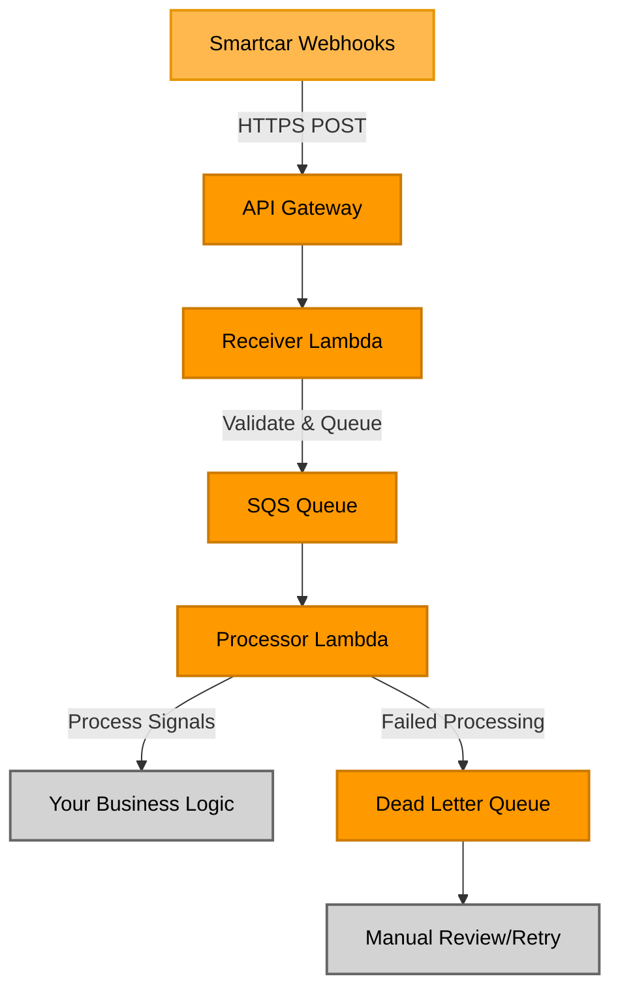

# Source: https://smartcar.com/docs/getting-started/tutorials/webhook-receiver-recipe.md

# Webhook Receiver Recipe

> Deploy a production-ready AWS serverless webhook receiver in minutes using our complete TypeScript template with built-in validation, error handling, and scalability.

<Info>
  **Quick Start**: Deploy a complete webhook receiver to AWS in under 10 minutes with our battle-tested TypeScript recipe. Perfect for production workloads and new webhook implementations.
</Info>

## Overview

The Webhook Receiver Recipe is a production-ready, AWS-based webhook receiver template that helps developers quickly implement robust webhook handling for Smartcar integrations. This TypeScript recipe provides a deployable starting point that makes adding custom business logic easy, eliminating much of the complexity of building webhook infrastructure from scratch.

* **Repository**: [smartcar/typescript-webhook-recipe](https://github.com/smartcar/typescript-webhook-recipe)
* **Deployment Target**: AWS (Lambda + API Gateway + SQS)
* **Language**: TypeScript/Node.js v22+
* **Infrastructure**: AWS CDK (Infrastructure as Code)

## What You Get

### Complete Serverless Architecture

* **API Gateway**: Public HTTPS endpoint for webhook delivery
* **Lambda Functions**: Serverless processing with automatic scaling
* **SQS Queues**: Asynchronous message processing with built-in retry logic
* **Dead Letter Queues**: Error handling and failed message recovery
* **CloudWatch**: Comprehensive logging and monitoring

### Production-Ready Features

* **Webhook Verification**: Automatic payload signature validation
* **Error Handling**: Graceful failure handling with retries
* **Scalability**: Automatic scaling to handle traffic spikes
* **Security**: IAM roles with least-privilege access
* **Monitoring**: Built-in CloudWatch logging
* **Type Safety**: Full TypeScript support with Smartcar types

### Infrastructure as Code

* Complete AWS CDK setup for repeatable deployments
* Environment-specific configurations (dev, staging, production)
* Easy customization and extension

## When to Use This Recipe

**Perfect for:**

* New webhook receiver implementations
* Teams using AWS as your cloud provider
* Production workloads requiring reliability and scale
* Teams wanting to deploy quickly without infrastructure complexity
* TypeScript/Node.js projects

## Architecture Overview

The recipe provides a complete serverless webhook receiver infrastructure on AWS. The diagram below shows the data flow from Smartcar webhooks through your deployment:



<Note>
  **Orange components** are provided by the recipe and deployed automatically. **Gray components** represent external systems where your custom business logic would live.
</Note>

### Key Components

1. **Receiver Lambda**: Validates incoming webhooks and queues them for processing
2. **SQS Queue**: Decouples receiving from processing for reliability
3. **Processor Lambda**: Processes webhook payloads and executes business logic
4. **Dead Letter Queue**: Captures failed messages for investigation
5. **CloudWatch**: Monitoring, logging, and alerting

## Quick Start

### Prerequisites

* AWS Account with CLI configured
* Node.js v22+ installed
* Git
* **Smartcar Application** configured in the [Dashboard](https://dashboard.smartcar.com/)
  * You'll need your **Application Management Token** (found in Dashboard → Configuration)
  * Learn how to [configure your application](/getting-started/configure-application)

### Deployment Steps

<Steps>
  <Step title="Clone the Repository">
    ```bash  theme={null}
    git clone https://github.com/smartcar/typescript-webhook-recipe.git
    cd typescript-webhook-recipe
    ```
  </Step>

  <Step title="Build the Project">
    ```bash  theme={null}
    make build
    ```
  </Step>

  <Step title="Deploy to AWS">
    The recipe uses AWS CDK for infrastructure deployment. First, create a secret to store your Application Management Token, then deploy the stack.

    ```bash  theme={null}
    # Step 1: Create the secret for your Application Management Token
    make create-secret appName=your-app-name amt=your_smartcar_application_management_token

    # Step 2: Deploy the infrastructure
    make deploy appName=your-app-name

    # Note the ApiEndpointUrl from the output
    # Example: https://abc123.execute-api.us-east-1.amazonaws.com/prod/
    ```

    <Note>
      Use the same `appName` value for both commands. This name will be used to identify your CloudFormation stack and associated resources.
    </Note>

    For detailed deployment instructions including environment-specific configuration, see the [GitHub repository README](https://github.com/smartcar/typescript-webhook-recipe#usage).
  </Step>

  <Step title="Configure Webhook in Dashboard">
    Now that your receiver is deployed, configure the webhook integration in Smartcar Dashboard:

    1. Go to your [Smartcar Dashboard](https://dashboard.smartcar.com/integrations)
    2. Click **+ Add Integration** and select **Webhooks**
    3. Configure your webhook:
       * **Webhook URL**: Use the deployed URL from the previous step
       * **Trigger**: Choose when to send webhooks (e.g., "State of charge changes")
       * **Signals**: Select the vehicle data you want to receive (e.g., battery level, location, odometer)
    4. Click **Save** - Smartcar will automatically verify your endpoint

    <Note>
      The recipe automatically handles webhook verification. If verification fails, check CloudWatch logs for errors.
    </Note>

    For detailed webhook configuration guidance, see [Webhooks Setup](/integrations/webhooks/overview).
  </Step>

  <Step title="Subscribe Vehicles (Optional)">
    Depending on your webhook configuration, you may need to manually subscribe vehicles:

    * **Auto-subscribe enabled**: New vehicle connections will automatically start sending webhook data
    * **Manual subscription**: Use the [Subscribe endpoint](/api-reference/webhooks/subscribe-webhook) or Dashboard to subscribe specific vehicles

    Learn more about [subscribing vehicles to webhooks](/integrations/webhooks/overview#subscribing-vehicles-to-a-webhook).
  </Step>
</Steps>

<Note>
  The deployment typically takes 2-3 minutes. The recipe will output your webhook URL and other important configuration details upon completion.
</Note>

## Customizing Your Webhook Processor

The recipe includes a sample processor that logs webhook data. To implement your business logic:

<CodeGroup>
  ```typescript src/lambdas/sqs/index.ts theme={null}
  import { Logger } from '@aws-lambda-powertools/logger';
  import { getSignalByCode, Signals, type TractionBatteryStateOfCharge } from "@smartcar/signals";
  import type { WebhookDataPayload } from '@smartcar/webhooks';
  import { parseEnvelope } from '@smartcar/webhooks';
  import { Context, SQSEvent, SQSHandler } from 'aws-lambda';

  const logger = new Logger();

  export const processor: SQSHandler = async (
    event: SQSEvent,
    context: Context
  ) => {
    const batchItemFailures: { itemIdentifier: string }[] = [];

    for (const record of event.Records) {
      try {
        const eventBody: WebhookDataPayload = parseEnvelope(record.body);
        const signals: Signals = eventBody.data.signals as Signals;
        const { errors } = eventBody.data;

        // Example: Process signals data
        if (signals && signals.length > 0) {
          const stateOfChargeSignal: TractionBatteryStateOfCharge | undefined = 
            getSignalByCode<TractionBatteryStateOfCharge>(signals, 'tractionbattery-stateofcharge');
          
          if (stateOfChargeSignal) {
            logger.info('State of Charge Signal', stateOfChargeSignal.body);
            
            // Replace with your business logic
            if (stateOfChargeSignal.body.value < 50) {
              logger.info('Battery below 50% - get charged!');
            }
          }
        }
        
        // Handle errors in webhook payload
        if (errors && errors.length > 0) {
          logger.warn('Errors in webhook payload', { errors });
        }
      } catch (err) {
        logger.error('Error during processing', { error: err, record });
        batchItemFailures.push({ itemIdentifier: record.messageId });
      }
    }

    return { batchItemFailures };
  };
  ```

  ```typescript External API Integration theme={null}
  // Example: Send data to external service
  async function sendToExternalAPI(payload: WebhookPayload) {
    const response = await fetch('https://your-api.com/webhook-data', {
      method: 'POST',
      headers: {
        'Content-Type': 'application/json',
        'Authorization': `Bearer ${process.env.API_TOKEN}`
      },
      body: JSON.stringify(payload)
    });
    
    if (!response.ok) {
      throw new Error(`API call failed: ${response.statusText}`);
    }
  }
  ```
</CodeGroup>

## Configuration Options

The recipe uses AWS CDK for infrastructure configuration. You can customize various aspects by modifying the CDK stack configuration in `lib/webhook-receiver-stack.ts`.

### Common Configuration Options

Use these CDK properties (not environment variables) to tune the stack. Their camelCase names match the props in `lib/webhook-receiver-stack.ts`.

| Configuration       | Description                             | Example                                                                                                                                              |
| ------------------- | --------------------------------------- | ---------------------------------------------------------------------------------------------------------------------------------------------------- |
| `logLevel`          | Logging verbosity for Lambda functions  | [See example](https://github.com/smartcar/typescript-webhook-recipe/blob/61485696ed459ee21ed5aa9d967373f5ecee651f/lib/webhook-receiver-stack.ts#L46) |
| `memorySize`        | Lambda function memory allocation in MB | [See example](https://github.com/smartcar/typescript-webhook-recipe/blob/61485696ed459ee21ed5aa9d967373f5ecee651f/lib/webhook-receiver-stack.ts#L41) |
| `visibilityTimeout` | SQS message visibility timeout          | [See example](https://github.com/smartcar/typescript-webhook-recipe/blob/61485696ed459ee21ed5aa9d967373f5ecee651f/lib/webhook-receiver-stack.ts#L29) |
| `maxReceiveCount`   | Max retries before dead letter queue    | [See example](https://github.com/smartcar/typescript-webhook-recipe/blob/61485696ed459ee21ed5aa9d967373f5ecee651f/lib/webhook-receiver-stack.ts#L30) |

For environment-specific configurations (dev, staging, production), you'll define these in your CDK code rather than using environment variables. This allows you to manage infrastructure differences across environments programmatically.

See the [GitHub repository](https://github.com/smartcar/typescript-webhook-recipe) for detailed configuration examples.

## Monitoring and Troubleshooting

### CloudWatch Logging

The recipe includes built-in CloudWatch logging for debugging and monitoring. You can:

* View Lambda execution logs
* Track webhook deliveries and failures
* Monitor SQS queue metrics

<Note>
  CloudWatch alarms are not included by default. You can add custom alarms on top of CloudWatch metrics based on your monitoring needs.
</Note>

### Common Issues

<AccordionGroup>
  <Accordion title="Webhook verification failing">
    * Check that your Smartcar Application Management Token is correct
    * Verify the webhook URL matches your deployed endpoint
    * Check CloudWatch logs for verification errors
  </Accordion>

  <Accordion title="Messages stuck in dead letter queue">
    * Review CloudWatch logs for processing errors
    * Check if external services (databases, APIs) are accessible
    * Verify IAM permissions for Lambda functions
  </Accordion>

  <Accordion title="High latency or timeouts">
    * Consider increasing Lambda memory allocation in CDK configuration
    * Optimize external API calls and database queries
    * Check for cold start issues in Lambda functions
  </Accordion>
</AccordionGroup>

### Debugging Commands

```bash  theme={null}
# Monitor queue depths
aws sqs get-queue-attributes --queue-url <queue-url> --attribute-names ApproximateNumberOfMessages

# Redrive messages from dead letter queue
aws sqs receive-message --queue-url <dlq-url> --max-number-of-messages 10
```

## Next Steps

After deploying your webhook receiver:

1. **Test Your Integration**: Use the [Smartcar Dashboard](https://dashboard.smartcar.com/) to test webhook delivery
2. **Monitor Performance**: Set up CloudWatch alarms for error rates and queue depths
3. **Scale as Needed**: Adjust Lambda memory and SQS settings based on usage patterns
4. **Add Features**: Extend the processor logic for your specific use cases

## Support and Contributing

* **Issues**: Report bugs or request features in the [GitHub repository](https://github.com/smartcar/typescript-webhook-recipe/issues)
* **Discussions**: Ask questions in [GitHub Discussions](https://github.com/smartcar/typescript-webhook-recipe/discussions)
* **Documentation**: Full setup and customization details in the [repository README](https://github.com/smartcar/typescript-webhook-recipe#readme)

***

<CardGroup cols={2}>
  <Card title="Repository" icon="github" href="https://github.com/smartcar/typescript-webhook-recipe">
    View the complete source code and documentation
  </Card>

  <Card title="Webhook Responses" icon="webhook" href="/integrations/webhooks/responses">
    Understand webhook payload structures
  </Card>
</CardGroup>
