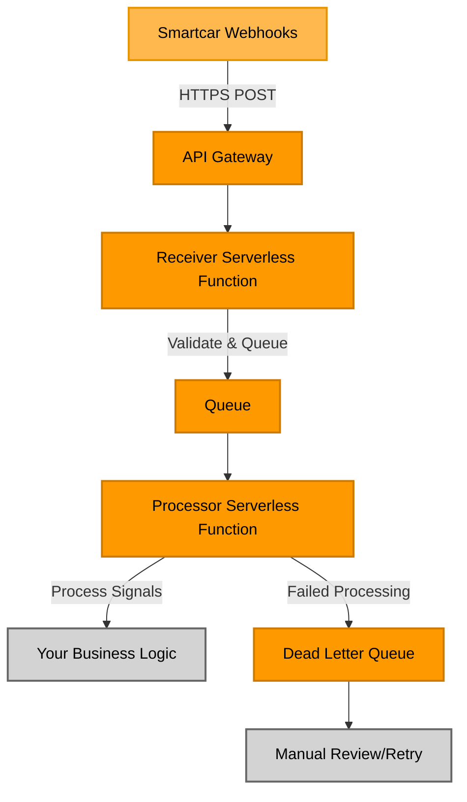

# Source: https://smartcar.com/docs/integrations/webhooks/webhook-receiver.md

# Building a Webhook Receiver

> Webhook payloads are sent from Smartcar to your receiving server. Your receiver must respond properly to ensure payloads are delivered without delay.

<Info>
  **Looking for a quick start?** Our [Webhook Receiver Recipe](/getting-started/tutorials/webhook-receiver-recipe) provides a production-ready AWS serverless webhook receiver that you can deploy in minutes. Perfect for new implementations!
</Info>

## How Webhooks are Sent

Webhook payloads are sent as HTTP requests to the `Vehicle data callback URI` you defined when you set up the webhook.

The HTTP request body consists of a JSON payload. Webhook payloads will be one of `VEHICLE_STATE` or `VEHICLE_ERROR` as defined in [Response Payloads](/integrations/webhooks/responses).

Optionally, you may configure a separate `Vehicle error callback URI` for `VEHICLE_ERROR` payloads. If this is not defined, all payloads will be sent to the primary URI.

## Verifying Your Receiver Endpoint

Before you can receive vehicle data, Smartcar will send a verification payload to your `Vehicle data callback URI` to validate that your receiver is reachable and responding appropriately.

Please see [Callback URI Verification](/integrations/webhooks/callback-verification) for details on how to correctly respond to this request.

## Responding to Webhook Deliveries

Smartcar expects your webhook receiver to return an HTTP `200` response within 15 seconds of each delivery. Any other status code, or responses that exceed this 15-second timeout, are treated as errors and the delivery will be marked unsuccessful.

Smartcar will attempt to re-deliver unsuccessful requests up to three times, with exponential backoff. If a timely `200` response code is not received for all attempts, the payload is dropped. Future deliveries will still be attempted as long as the webhook is active.

<Info>
  As a best practice, you should decouple webhook receiving and payload processing. If your receiver does not respond because of a processing issue, Smartcar will consider the payload undelivered and will send it again. Persist the payload first, then run any signal processing logic as a separate step.
</Info>

## Verifying Payloads

We recommend that you verify the payloads you receive to ensure they are legitimate and complete. Smartcar cryptographically signs each payload using a signature that can only be decoded with your Application Management Token. See [Payload verification](/integrations/webhooks/payload-verification) for details.

## Networking Considerations

* Webhook receivers must be accessible from the public internet so Smartcar can resolve your receiver URI.
* Receiver URIs must use HTTPS with a valid SSL certificate.
* Internal corporate network addresses or custom SSL certificates are not supported.
* Smartcar sends webhook payloads from public IPv4 addresses, which may change over time. Be careful when defining firewall rules.

## Webhook Best Practices

<AccordionGroup>
  <Accordion title="1. Decouple Receiving from Processing">
    The recipe uses SQS to separate webhook receipt from processing. This ensures:

    * Fast response times (\< 200ms) from your server to Smartcar
    * No timeouts from long-running business logic
    * Reliable delivery even during processing failures
  </Accordion>

  <Accordion title="2. Validate Webhook Signatures">
    Every webhook is cryptographically verified using HMAC-SHA256:

    * Confirms payloads come from Smartcar
    * Prevents replay attacks and tampering
    * Rejects invalid requests before processing
  </Accordion>

  <Accordion title="3. Implement Retry Logic">
    Built-in retry mechanisms handle transient failures:

    * Automatic retries for failed processing (up to 3 times)
    * 30-second visibility timeout between retries
    * Dead letter queue for manual investigation of persistent failures
  </Accordion>

  <Accordion title="4. Return 200 Quickly">
    The receiver lambda responds within milliseconds:

    * Acknowledges receipt immediately
    * Prevents Smartcar from retrying unnecessarily
    * Queues payload for asynchronous processing
  </Accordion>

  <Accordion title="5. Monitor and Alert">
    CloudWatch integration provides observability:

    * Track delivery success rates
    * Monitor queue depths and processing times
    * Alert on error rate thresholds
    * Debug issues with comprehensive logging
  </Accordion>

  <Accordion title="6. Scale Automatically">
    Serverless architecture handles traffic variability:

    * Lambda auto-scales with webhook volume
    * No capacity planning required
    * Pay only for actual usage
    * Handles traffic spikes seamlessly
  </Accordion>

  <Accordion title="7. Secure with Least Privilege">
    IAM policies enforce security best practices:

    * Each Lambda has minimal required permissions
    * No hardcoded credentials
    * AWS manages encryption at rest and in transit
    * Secrets stored securely in AWS Secrets Manager
  </Accordion>
</AccordionGroup>

## Recommended Webhook Receiver Pattern

This pattern is provides a complete serverless webhook receiver infrastructure on AWS. The diagram below shows the data flow from Smartcar webhooks through your deployment:

<Note>
  **Orange components** are provided by the recipe and deployed automatically. **Gray components** represent external systems where your custom business logic would live.
</Note>
