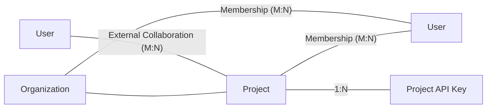

# Source: https://docs.together.ai/docs/identity-access-management.md

> ## Documentation Index
> Fetch the complete documentation index at: https://docs.together.ai/llms.txt
> Use this file to discover all available pages before exploring further.

# Together's IAM Model

Together's Identity and Access Management (IAM) model defines how users, credentials, and resources are organized across the platform.

<Note>
  Some IAM capabilities listed below are in early access or limited preview. See each section for availability details.
</Note>

## Core Concepts

### Organization

An Organization represents a single paying entity on Together. It comprises Projects for resource management and access control, members, and account-wide settings.

Every Together account has an Organization. See [Organizations](/docs/organizations) documentation for more details.

***

### Project (early access)

A Project is an isolated workspace within an Organization. Each Project owns its own resources, API keys, and defines who can access and manage them via user-level membership.

<Note>
  Every Organization has a default Project that, by default, all API keys and member-generated resources belong to. Creating and managing multiple Projects within an Organization and Project-level membership management are in early access and not yet available to all accounts. We'll be expanding availability of these features as we build out the full Project model.
</Note>

***

### Resource

A resource is anything you create on Together — Fine-Tuned Models, Dedicated Endpoints, Instant Clusters, Evaluations, and files.

Resources belong to Projects within your Organization and are accessible to all Project members with appropriate role-based permissions.

***

### Member

A Member is a user who has been granted access to an Organization or Project with a defined role.

Today, there are two roles — **Member** and **Admin** — with nearly identical permissions. Granular role-based access controls (RBAC) will roll out over time.

***

### Project API Key

A Project API Key is a secret credential used to authenticate requests to Together. Each Project has its own set of API keys, jointly managed by Project members.

A few things to know:

* API keys are shown only once at creation — copy them immediately.
* Keys can be revoked immediately or audited to see who created them and when they were last used.
* Keys persist within a Project even if the membership of the user who created it is revoked from the Project or parent Organization, or the user is deleted.

***

## Entity Relationships

Built with [Mintlify](https://mintlify.com).