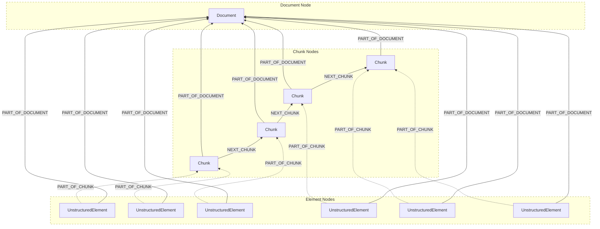
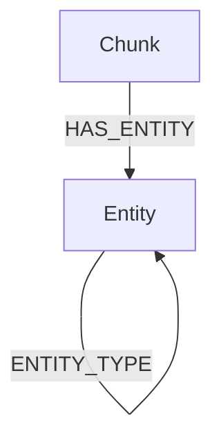

# Source: https://docs.unstructured.io/ui/destinations/neo4j.md

# Source: https://docs.unstructured.io/open-source/ingestion/destination-connectors/neo4j.md

# Source: https://docs.unstructured.io/api-reference/workflow/destinations/neo4j.md

# Neo4j

<Note>
  If you're new to Unstructured, read this note first.

  Before you can create a destination connector, you must first sign in to your Unstructured account:

  * If you do not already have an Unstructured account, [sign up for free](https://unstructured.io/?modal=try-for-free).
    After you sign up, you are automatically signed in to your new Unstructured **Let's Go** account, at [https://platform.unstructured.io](https://platform.unstructured.io).
    To sign up for a **Business** account instead, [contact Unstructured Sales](https://unstructured.io/?modal=contact-sales), or [learn more](/api-reference/overview#pricing).
  * If you already have an Unstructured **Let's Go**, **Pay-As-You-Go**, or **Business SaaS** account and are not already signed in, sign in to your account at
    [https://platform.unstructured.io](https://platform.unstructured.io). For other types of **Business** accounts, see your Unstructured account administrator for sign-in instructions,
    or email Unstructured Support at [support@unstructured.io](mailto:support@unstructured.io).

  After you sign in, the [Unstructured user interface](/ui/overview) (UI) appears, which you use to get your Unstructured API key.

  1. After you sign in to your Unstructured **Let's Go**, **Pay-As-You-Go**, or **Business** account, click **API Keys** on the sidebar.<br />

     For a **Business** account, before you click **API Keys**, make sure you have selected the organizational workspace you want to create an API key
     for. Each API key works with one and only one organizational workspace. [Learn more](/ui/account/workspaces#create-an-api-key-for-a-workspace).

  2. Click **Generate API Key**.<br />

  3. Follow the on-screen instructions to finish generating the key.<br />

  4. Click the **Copy** icon next to your new key to add the key to your system's clipboard. If you lose this key, simply return and click the **Copy** icon again.<br />

  After you create the destination connector, add it along with a
  [source connector](/api-reference/workflow/sources/overview) to a [workflow](/api-reference/workflow/overview#workflows).
  Then run the worklow as a [job](/api-reference/workflow/overview#jobs). To learn how, try out the
  [hands-on Workflow Endpoint quickstart](/api-reference/workflow/overview#quickstart),
  go directly to the [quickstart notebook](https://colab.research.google.com/github/Unstructured-IO/notebooks/blob/main/notebooks/Unstructured_Platform_Workflow_Endpoint_Quickstart.ipynb),
  or watch the two 4-minute video tutorials for the [Unstructured Python SDK](/api-reference/workflow/overview#unstructured-python-sdk).

  You can also create destination connectors with the Unstructured user interface (UI).
  [Learn how](/ui/destinations/overview).

  If you need help, email Unstructured Support at [support@unstructured.io](mailto:support@unstructured.io).

  You are now ready to start creating a destination connector! Keep reading to learn how.
</Note>

Send processed data from Unstructured to Neo4j.

The requirements are as follows.

* A [Neo4j deployment](https://neo4j.com/deployment-center/).

  * For the [Unstructured UI](/ui/overview) or the [Unstructured API](/api-reference/overview), local Neo4j deployments are not supported.
  * For [Unstructured Ingest](/open-source/ingestion/overview), local and non-local Neo4j deployments are supported.

  The following video shows how to set up a Neo4j Aura deployment:

  <iframe width="560" height="315" src="https://www.youtube.com/embed/fo8uDIm1zCE" title="YouTube video player" frameborder="0" allow="accelerometer; autoplay; clipboard-write; encrypted-media; gyroscope; picture-in-picture" allowfullscreen />

* The username and password for the user who has access to the Neo4j deployment. The default user is typically `neo4j`.

  * For a Neo4j Aura instance, the defaut user's is typically set when the instance is created.
  * For an AWS Marketplace, Microsoft Azure Marketplace, or Google Cloud Marketplace deployment of Neo4j, the default user is typically set during the deployment process.
  * For a local Neo4j deployment, you can [set the default user's initial password](https://neo4j.com/docs/operations-manual/current/configuration/set-initial-password/) or [recover an admin user and its password](https://neo4j.com/docs/operations-manual/current/authentication-authorization/password-and-user-recovery/).

* The connection URI for the Neo4j deployment, which starts with `neo4j://`, `neo4j+s://`, `bolt://`, or `bolt+s://`; followed by `localhost` or the host name; and sometimes ending with a colon and the port number (such as `:7687`). For example:

  * For a Neo4j Aura deployment, browse to the target Neo4j instance in the Neo4j Aura account and click **Connect > Drivers** to get the connection URI, which follows the format `neo4j+s://<host-name>`. A port number is not used or needed.
  * For an AWS Marketplace, Microsoft Azure Marketplace, or Google Cloud Marketplace deployment of Neo4j, see
    [Neo4j on AWS](https://neo4j.com/docs/operations-manual/current/cloud-deployments/neo4j-aws/),
    [Neo4j on Azure](https://neo4j.com/docs/operations-manual/current/cloud-deployments/neo4j-azure/), or
    [Neo4j on GCP](https://neo4j.com/docs/operations-manual/current/cloud-deployments/neo4j-gcp/)
    for details about how to get the connection URI.
  * For a local Neo4j deployment, the URI is typically `bolt://localhost:7687`
  * For other Neo4j deployment types, see the deployment provider's documentation.

  [Learn more](https://neo4j.com/docs/browser-manual/current/operations/dbms-connection).

* The name of the target database in the Neo4j deployment. A default Neo4j deployment typically contains two standard databases: one named `neo4j` for user data and another
  named `system` for system data and metadata. Some Neo4j deployment types support more than these two databases per deployment;
  Neo4j Aura instances do not.

  * [Create additional databases](https://neo4j.com/docs/operations-manual/current/database-administration/standard-databases/create-databases/)
    for a local Neo4j deployment that uses Enterprise Edition; or for Neo4j on AWS, Neo4j on Azure, or Neo4j on GCP deployments.
  * [Get a list of additional available databases](https://neo4j.com/docs/operations-manual/current/database-administration/standard-databases/listing-databases/)
    for a local Neo4j deployment that uses Enterprise Edition; or for Neo4j on AWS, Neo4j on Azure, or Neo4j on GCP deployments.

## Graph Output

The graph ouput of the Neo4j destination connector is represented in the following diagram:



[View the preceding diagram in full-screen mode](https://mermaid.live/view#pako:eNqFlN9vgjAQx_-Vps-6REEfeFiyFZYli7hskCyTxXS0ihFaU9oHo_7vq_IjgIzyxN330157d70TjDmh0IFbgQ8JeA4iBvSXq9_CQRhYuTxWGWUS-Br9KQC39pYOyki5VB5Tel2XS8H3dExwnmAh8NEBs4LohKA6hJfSOkJe7hh6k1XI9C4qlkpQUjK1Oh1UrUHVHlRng-p8QO1kgRqzoC8JxuPH8_vTR7BevqzdJQoXnh-cgVvf0wRYJsA2ATMTMP8f6FQz1tVEiWL7Vi3RpHBW5rRtWm3TbpmdnMbGnKIipb73FazRa-i_nXXAKvC9ZFWHuJfs6nrIUCVkKBIy1AjZpgTfGuWhwVRnnDT6ZFC3-vVpo0v6dKvRJH263eiRXh2OYEZFhndEj5nTlY6gTPSriaCjfwndYJXKCEbsolGsJP88shg6-onRERRcbRPobHCaa0sdCJbU3WHdbFmFHDD75jyrIUp2kotFMddu4-3yB3k-fcg).

In the preceding diagram:

* The `Document` node represents the source file.
* The `UnstructuredElement` nodes represent the source file's Unstructured `Element` objects, before chunking.
* The `Chunk` nodes represent the source file's Unstructured `Element` objects, after chunking.
* Each `UnstructuredElement` node has a `PART_OF_DOCUMENT` relationship with the `Document` node.
* Each `Chunk` node also has a `PART_OF_DOCUMENT` relationship with the `Document` node.
* Each `UnstructuredElement` node has a `PART_OF_CHUNK` relationship with a `Chunk` element.
* Each `Chunk` node, except for the "last" `Chunk` node, has a `NEXT_CHUNK` relationship with its "next" `Chunk` node.

Learn more about [document elements](/ui/document-elements) and [chunking](/ui/chunking).

Some related example Neo4j graph queries include the following.

Query for all available nodes and relationships:

```text  theme={null}
MATCH path=(source)-[relationship]->(target)
RETURN path
```

Query for `Chunk` to `Document` relationships:

```text  theme={null}
MATCH (chunk:Chunk)-[relationship:PART_OF_DOCUMENT]->(doc:Document)
RETURN chunk, relationship, doc
```

Query for `UnstructuredElement` to `Document` relationships:

```text  theme={null}
MATCH (element:UnstructuredElement)-[relationship:PART_OF_DOCUMENT]->(doc:Document)
RETURN element, relationship, doc
```

Query for `UnstructuredElement` to `Chunk` relationships:

```text  theme={null}
MATCH (element:UnstructuredElement)-[relationship:PART_OF_CHUNK]->(chunk:Chunk)
RETURN element, relationship, chunk
```

Query for `Chunk` to `Chunk` relationships:

```text  theme={null}
MATCH (this:Chunk)-[relationship:NEXT_CHUNK]->(previous:Chunk)
RETURN this, relationship, previous
```

Query for `UnstructuredElement` to `Chunk` to `Document` relationships:

```text  theme={null}
MATCH (element:UnstructuredElement)-[ecrelationship:PART_OF_CHUNK]-(chunk:Chunk)-[cdrelationship:PART_OF_DOCUMENT]->(doc:Document)
RETURN element, ecrelationship, chunk, cdrelationship, doc
```

Query for `UnstructuredElements` containing the text `jury`, and show their `Chunk` relationships:

```text  theme={null}
MATCH (element:UnstructuredElement)-[relationship:PART_OF_CHUNK]->(chunk:Chunk)
WHERE element.text =~ '(?i).*jury.*'
RETURN element, relationship, chunk
```

Query for the `Chunk` with the specified `id`, and show its `UnstructuredElement` relationships:

```text  theme={null}
MATCH (element:UnstructuredElement)-[relationship:PART_OF_CHUNK]->(chunk:Chunk)
WHERE chunk.id = '731508bf53637ce4431fe93f6028ebdf'
RETURN element, relationship, chunk
```

Additionally, for the [Unstructured UI](/ui/overview) and [Unstructured Workflow Endpoint](/api-reference/workflow/),
when a [Named entity recognition (NER)](/ui/enriching/ner) DAG node is added to a custom workflow,
any recognized entities are output as `Entity` nodes in the graph.

This additional graph ouput of the Neo4j destination connector is represented in the following diagram:



In the preceding diagram:

* The `Chunk` node represents one of the source file's Unstructured `Element` objects, after chunking.
* The `Entity` node represents a recognized entity.
* A `Chunk` node can have `HAS_ENTITY` relationships with `Entity` nodes.
* An `Entity` node can have `ENTITY_TYPE` relationships with other `Entity` nodes.

Some related example Neo4j graph queries include the following.

Query for all available nodes and relationships:

```text  theme={null}
MATCH path=(source)-[relationship]->(target)
RETURN path
```

Query for `Entity` to `Entity` relationships:

```text  theme={null}
MATCH (child:Entity)-[relationship:ENTITY_TYPE]->(parent:Entity)
RETURN child, relationship, parent
```

Query for `Entity` nodes containing the text `PERSON`, and show their `Entity` relationships:

```text  theme={null}
MATCH (child:Entity)-[relationship:ENTITY_TYPE]->(parent:Entity)
WHERE parent.id = 'PERSON'
RETURN child, relationship, parent
```

Query for `Entity` nodes containing the text `amendment`, and show their `Chunk` relationships:

```text  theme={null}
MATCH (element:Chunk)-[relationship:HAS_ENTITY]->(entity:Entity)
WHERE entity.id =~ '(?i).*amendment.*'
RETURN element, relationship, entity
```

QUERY FOR `Entity` nodes containing the text `PERSON`, and show their `Entity` to `Entity` to `Chunk` relationships:

```text  theme={null}
MATCH (chunk:Chunk)-[ccrelationship:HAS_ENTITY]-(child:Entity)-[cprelationship:ENTITY_TYPE]->(parent:Entity)
WHERE parent.id =~ 'PERSON'
RETURN chunk, ccrelationship, child, cprelationship, parent
```

To create a Neo4j destination connector, see the following examples.

<CodeGroup>
  ```python Python SDK theme={null}
  import os

  from unstructured_client import UnstructuredClient
  from unstructured_client.models.operations import CreateDestinationRequest
  from unstructured_client.models.shared import CreateDestinationConnector

  with UnstructuredClient(api_key_auth=os.getenv("UNSTRUCTURED_API_KEY")) as client:
      response = client.destinations.create_destination(
          request=CreateDestinationRequest(
              create_destination_connector=CreateDestinationConnector(
                  name="<name>",
                  type="neo4j",
                  config={
                      "uri": "<uri>",
                      "database": "<database>",
                      "username": "<username>",
                      "password": "<password>",
                      "batch_size": <batch-size>
                  }
              )
          )
      )

      print(response.destination_connector_information)
  ```

  ```bash curl theme={null}
  curl --request 'POST' --location \
  "$UNSTRUCTURED_API_URL/destinations" \
  --header 'accept: application/json' \
  --header "unstructured-api-key: $UNSTRUCTURED_API_KEY" \
  --header 'content-type: application/json' \
  --data \
  '{
      "name": "<name>",
      "type": "neo4j",
      "config": {
          "uri": "<uri>",
          "database": "<database>",
          "username": "<username>",
          "password": "<password>",
          "batch_size": <batch-size>
      }
  }'
  ```
</CodeGroup>

Replace the preceding placeholders as follows:

* `<name>` (*required*) - A unique name for this connector.
* `<uri>` (*required*) - The connection URI for the Neo4j deployment, which typically starts with `neo4j://`, `neo4j+s://`, `bolt://`, or `bolt+s://`; is followed by the host name; and ends with a colon and the port number (such as `:7473`, `:7474`, or `:7687`).
* `<database>` (*required*) - The name of the target database in the Neo4j deployment. A default Neo4j deployment typically contains a standard database named neo4j for user data.
* `<username>` (*required*) - The name of the user who has access to the Neo4j deployment. A default Neo4j deployment typically contains a default user named `neo4j`.
* `<password>` (*required*) - The password for the user.
* `<batch-size>` - The maximum number of nodes or relationships to be transmitted per batch. The default is `100` if not otherwise specified.
