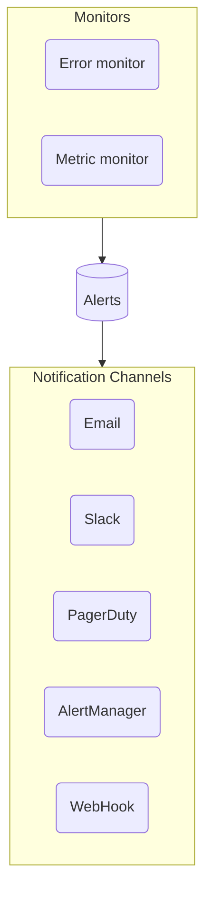

# Source: https://uptrace.dev/raw/features/alerting.md

# Monitoring and Alerts Configuration

> Configure metric and error monitors, define YAML thresholds, and connect Uptrace notifications to email, Slack, PagerDuty, or webhooks.

## Monitor Types

Uptrace supports two types of monitors: **metric** and **error** monitors.

[Metric monitors](#metric-monitors) allow you to create alerts when metric values meet certain conditions, for example:

- Number of requests exceeds 100 per minute for the last 5 minutes.
- Number of logs/errors exceeds 100 per minute for the last 3 minutes.

[Error monitors](#error-monitors) allow you to create alerts for specific errors (exceptions) and logs, for example:

- All logs/errors with a certain `log_severity`.
- All logs/errors with a certain `_display_name`, which is populated from `log.message` or `error.message` attributes.



## Metric Monitors

Uptrace allows you to create alerts when a monitored metric value meets certain conditions. For example, you can create an alert when the `system_filesystem_usage` metric exceeds 90%.

### Examples

Here are some examples of metric monitors you can create to monitor [OpenTelemetry host metrics](/opentelemetry/collector/host-metrics). You can create them using the UI:

1. Navigate to "Alerting" → "Monitors".
2. Click on "New monitor" → "From YAML".

To monitor CPU usage:

```yaml
metric_monitors:
  - name: CPU usage
    metrics:
      - system_cpu_load_average_15m as $load_avg_15m
      - system_cpu_time as $cpu_time
    query:
      - $load_avg_15m / uniq($cpu_time.cpu) as cpu_util
      - group by host_name
    column: cpu_util
    column_unit: utilization
    max_allowed_value: 3
    check_num_point: 10
```

To monitor filesystem usage:

```yaml
metric_monitors:
  - name: Filesystem usage
    metrics:
      - system_filesystem_usage as $fs_usage
    query:
      - $fs_usage{state='used'} / $fs_usage as fs_util
      - group by host_name, mountpoint
      - where mountpoint !~ "/snap"
    column: fs_util
    column_unit: utilization
    max_allowed_value: 0.9
    check_num_point: 3
```

To monitor the number of disk pending operations:

```yaml
metric_monitors:
  - name: Disk pending operations
    metrics:
      - system_disk_pending_operations as $pending_ops
    query:
      - $pending_ops
      - group by host_name, device
    max_allowed_value: 100
    check_num_point: 10
```

To monitor network errors:

```yaml
metric_monitors:
  - name: Network errors
    metrics:
      - system_network_errors as $net_errors
    query:
      - $net_errors
      - group by host_name
    max_allowed_value: 0
    check_num_point: 3
```

### Monitoring Spans, Logs, and Events

You can also monitor tracing data using the following system metrics created by Uptrace:

- `uptrace_tracing_spans` - Number of spans and their duration (excluding events and logs).
- `uptrace_tracing_logs` - Number of logs (excluding spans and events).
- `uptrace_tracing_events` - Number of events (excluding spans and logs).

You can use all available span attributes for filtering and grouping, for example, `where _status_code = 'error'` or `group by host_name`.

#### Examples

You can create the following examples using the UI:

1. Navigate to "Alerting" → "Monitors".
2. Click on "New monitor" → "From YAML".

To monitor average PostgreSQL `SELECT` query duration:

```yaml
metric_monitors:
  - name: PostgreSQL SELECT duration
    metrics:
      - uptrace_tracing_spans as $spans
    query:
      - avg($spans)
      - where _system = 'db:postgresql'
      - where db_operation = 'SELECT'
    max_allowed_value: 10000 # 10 milliseconds
    check_num_point: 5
```

To monitor median duration of all database operations:

```yaml
metric_monitors:
  - name: Database operations duration
    metrics:
      - uptrace_tracing_spans as $spans
    query:
      - p50($spans)
      - where _type = "db"
    max_allowed_value: 10000 # 10 milliseconds
    check_num_point: 5
```

To monitor the number of errors:

```yaml
metric_monitors:
  - name: Number of errors
    metrics:
      - uptrace_tracing_logs as $logs
    query:
      - perMin(sum($logs))
      - where _system in ("log:error", "log:fatal")
    max_allowed_value: 10
    check_num_point: 3
```

To monitor failed requests:

```yaml
metric_monitors:
  - name: Failed requests
    metrics:
      - uptrace_tracing_spans as $spans
    query:
      - perMin(count($spans{_status_code="error"})) as failed_requests
      - where _type = "httpserver"
    max_allowed_value: 0
```

## Error Monitors

Uptrace automatically creates an error monitor for logs with `log_severity` levels `ERROR` and `FATAL`.

You can use all available filters to include or exclude monitored logs, for example, `where _display_name contains "timeout"`. You can also customize default filters to monitor other log levels, for example, `_system in ("log:warn", "log:error", "log:fatal")`.

You can add `group by` clauses to customize the default error grouping and create separate alerts/notifications, for example, `group by _group_id, service_name, cloud_region`.

### Examples

You can create the following examples using the UI:

1. Navigate to "Alerting" → "Monitors".
2. Click on "New monitor" → "From YAML".

To monitor all errors:

```yaml
error_monitors:
  - name: Notify on all errors
    notify_everyone_by_email: true
    query:
      - group by _group_id
      - where _system in ("log:error", "log:fatal")
```

To monitor errors with a certain message:

```yaml
error_monitors:
  - name: Notify on "timeout" errors
    notify_everyone_by_email: true
    query:
      - group by _group_id
      - where _system in ("log:error", "log:fatal")
      - where _display_name contains "timeout"
```

To monitor exceptions:

```yaml
error_monitors:
  - name: Exceptions
    notify_everyone_by_email: true
    query:
      - group by _group_id
      - where _system in ("log:error", "log:fatal")
      - where exception_type exists
```

To monitor all errors in each environment except `dev`:

```yaml
error_monitors:
  - name: Notify on all errors except in "dev" environment
    notify_everyone_by_email: true
    query:
      - group by _group_id
      - group by deployment_environment
      - where _system in ("log:error", "log:fatal")
      - where deployment_environment != "dev"
```

## Alert Names

For metric monitors, Uptrace generates alert names using the monitor name and timeseries name, for example, "Disk usage: myhost+mydisk".

For error monitors, Uptrace generates alert names using the error (log) message, for example, "ERROR *fmt.wrapError: writeError failed".

You can customize alert names by specifying a Go template string as the monitor name when creating a monitor, for example, `{{ .Attrs.deployment_environment_name }}: {{ .DisplayName }}` will prefix the alert name with the deployment environment attribute.

You can use the following variables in templates:

<table>
<thead>
  <tr>
    <th>
      Variable
    </th>
    
    <th>
      Type
    </th>
    
    <th>
      Description
    </th>
  </tr>
</thead>

<tbody>
  <tr>
    <td>
      <code>
        {{ .DisplayName }}
      </code>
    </td>
    
    <td>
      String
    </td>
    
    <td>
      Same as <code>
        _display_name
      </code>
      
       when querying spans and logs.
    </td>
  </tr>
  
  <tr>
    <td>
      <code>
        {{ .Attrs  }}
      </code>
    </td>
    
    <td>
      map<span>
        string
      </span>
      
      any
    </td>
    
    <td>
      All available attributes, for example, <code>
        {{ .Attrs.service_name  }}
      </code>
      
      .
    </td>
  </tr>
</tbody>
</table>

## Notification Channels

You can create notification channels to receive notifications via email, Slack/Mattermost, Telegram, Microsoft Teams, PagerDuty, Opsgenie, AlertManager, and webhooks. You can specify which notification channels to use when creating a monitor.

To create a notification channel:

1. Go to the "Alerting" → "Channels" tab.
2. Click on "New channel" → "Slack" to open a form.

### Channel Conditions

When creating a channel, you can specify a condition to filter out notifications for certain alerts and monitors.

Uptrace uses the [Expr](https://expr-lang.org/docs/language-definition) language for writing conditions. In addition to built-in functions provided by Expr, Uptrace also supports the following functions:

<table>
<thead>
  <tr>
    <th>
      Function
    </th>
    
    <th>
      Comment
    </th>
  </tr>
</thead>

<tbody>
  <tr>
    <td>
      <code>
        monitorName() string
      </code>
    </td>
    
    <td>
      Returns the monitor name.
    </td>
  </tr>
  
  <tr>
    <td>
      <code>
        alertName() string
      </code>
    </td>
    
    <td>
      Returns the alert name.
    </td>
  </tr>
  
  <tr>
    <td>
      <code>
        alertType() string
      </code>
    </td>
    
    <td>
      Returns the alert type: <code>
        error
      </code>
      
      , <code>
        metric
      </code>
      
      .
    </td>
  </tr>
  
  <tr>
    <td>
      <code>
        attr(key string) string
      </code>
    </td>
    
    <td>
      Returns the alert attribute value.
    </td>
  </tr>
  
  <tr>
    <td>
      <code>
        hasAttr(key string) bool
      </code>
    </td>
    
    <td>
      Returns <code>
        true
      </code>
      
       if the alert attribute exists.
    </td>
  </tr>
</tbody>
</table>

To only send notifications for the `prod` environment:

```text
attr("deployment_environment") == "prod"
```

To only send notifications for host names that start with `prod-`:

```text
attr("host_name") startsWith "prod-"
```

To only send notifications for monitors that have `URGENT` in the name:

```text
monitorName() contains "URGENT"
```

## Notification Frequency

On the first occurrence, Uptrace creates an alert and sends a notification. If there are new occurrences, Uptrace will periodically remind you about the alert.

Uptrace uses an adaptive interval to wait before sending a notification again. The interval increases over time and differs for metric and error monitors.

- **Metric monitors** - The interval starts from 15 minutes and doubles every 3 notifications, e.g. 15m, 15m, 15m, 30m, 30m, 30m, 1h... The maximum interval is 24 hours.
- **Error monitors** - The interval starts from 1 hour and doubles every 2 notifications, e.g. 1h, 1h, 2h, 2h, 4h... The maximum interval is 1 week.

The total number of notifications is not limited. For example, if a metric monitor never recovers, you will receive notifications every 24 hours indefinitely.

When an alert is closed, Uptrace also sends a corresponding notification.

## Email Notifications

<alert type="info">

The information below is only relevant for the self-hosted version.

</alert>

To receive email notifications in the Uptrace Community version, ensure that users have correct email addresses and the [mailer](/get/hosted/config#sending-emails) option is properly configured and enabled.
