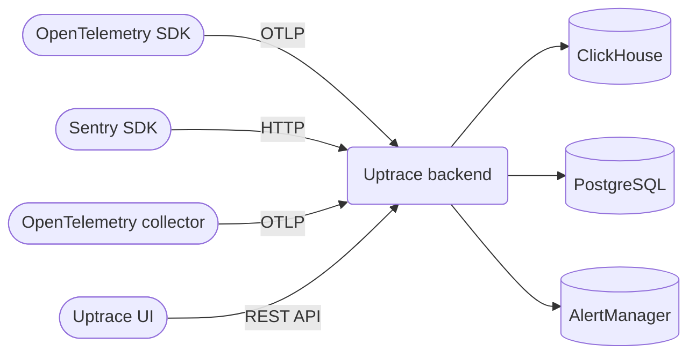

# Source: https://uptrace.dev/raw/opentelemetry/apm.md

# Forever free OpenTelemetry APM

> Uptrace is a forever free OpenTelemetry APM with open code that supports traces, metrics, and logs.

OpenTelemetry APM (Application Performance Monitoring) is a comprehensive observability solution that helps developers and DevOps teams monitor, debug, and optimize application performance using the OpenTelemetry framework. By providing deep insights into distributed systems, APM tools enable teams to identify bottlenecks, troubleshoot issues, and ensure optimal user experiences.

**Uptrace** is an [open source](https://github.com/uptrace/uptrace) OpenTelemetry APM built from the ground up to fully follow OpenTelemetry specifications and best practices. It provides a unified platform for collecting, storing, and analyzing traces, metrics, and logs from modern cloud-native applications.

## What is OpenTelemetry?

OpenTelemetry is a Cloud Native Computing Foundation (CNCF) project that provides a unified, vendor-neutral observability framework for modern applications. It solves the critical challenge of gaining visibility into complex, distributed systems without vendor lock-in.

OpenTelemetry enables developers to:

- **Diagnose Issues Faster**: Correlate traces, metrics, and logs to quickly identify root causes
- **Optimize Performance**: Identify and eliminate bottlenecks before they impact users
- **Understand System Behavior**: Gain visibility into complex interactions between microservices
- **Make Data-Driven Decisions**: Use observability data to guide architectural and optimization choices

## How Uptrace works?

Uptrace leverages a modern, scalable architecture designed for high-performance observability data processing:



### Storage Architecture

**ClickHouse Database**: Uptrace uses ClickHouse, a high-performance columnar database optimized for analytical workloads. This choice provides:

- **Real-time Analytics**: Query billions of events in milliseconds
- **Efficient Compression**: Advanced compression algorithms reduce storage costs by up to 90%
- **Horizontal Scaling**: Add nodes to handle increased data volume and query load
- **Time-series Optimization**: Native support for time-based partitioning and TTL policies

**PostgreSQL**: Stores metadata, configuration, and user data for optimal relational data management.

### Data Flow Example

1. **Instrumentation**: Your application code uses OpenTelemetry SDKs to generate traces and metrics
2. **Collection**: Data flows through OpenTelemetry Collector for processing and routing
3. **Ingestion**: Uptrace receives data via OTLP protocol and validates it
4. **Storage**: Time-series data goes to ClickHouse, metadata to PostgreSQL
5. **Analysis**: Query engine correlates traces, metrics, and logs for comprehensive insights
6. **Alerting**: Automated alerts trigger based on predefined thresholds or anomalies

## Why Choose Uptrace?

### Unified Observability Platform

- **Single Pane of Glass**: View traces, metrics, and logs in one integrated interface
- **Cross-Signal Correlation**: Automatically link related traces, metrics, and log entries
- **Consistent User Experience**: No context switching between different tools

### High Performance & Scalability

- **Efficient Ingestion**: Process over 10,000 spans per second on a single core
- **Superior Compression**: ZSTD compression reduces a 1KB span to under 40 bytes
- **Automatic Scaling**: Handle data growth with built-in horizontal scaling capabilities

### Cost-Effective Storage

- **S3 Integration**: Automatically archive cold data to cost-effective S3-compatible storage
- **Intelligent Tiering**: Keep hot data in fast storage, move cold data to cheaper tiers
- **Retention Policies**: Configure automatic data cleanup based on age or storage limits

### Intelligent Alerting

- **Multi-Channel Notifications**: Email, Slack, Telegram, PagerDuty, and webhook support
- **Smart Thresholds**: Machine learning-based anomaly detection
- **Alert Correlation**: Group related alerts to reduce noise and alert fatigue

## OpenTelemetry Compatibility

Uptrace provides best-in-class OpenTelemetry support with full protocol compatibility:

- **OTLP/gRPC**: High-performance binary protocol for production environments
- **OTLP/HTTP**: HTTP-based protocol for firewall-friendly deployments
- **Legacy Formats**: Support for Jaeger, Zipkin, and Prometheus formats

<home-distro-list>


</home-distro-list>

**Need help?** Join our community on [Telegram](https://t.me/uptrace), [Slack](https://join.slack.com/t/uptracedev/shared_invite/zt-3e35d4b0m-zfAew95ymE5Fv31LwvyuoQ), or [start a discussion](https://github.com/uptrace/uptrace/discussions) on GitHub.

## All-in-one APM

Uptrace transforms application monitoring by bringing traces, metrics, and logs together in one powerful interface. Instead of juggling multiple tools, developers can quickly spot performance bottlenecks—whether it's a sluggish database query or inefficient code—through visual request flows that show exactly where time is being spent.

What sets Uptrace apart is its proactive approach to application health. It centralizes all your log data for easy searching while smart alerts notify you the moment performance dips or anomalies appear. This means you can catch and fix issues before they frustrate your users, turning application monitoring from a reactive chore into a competitive advantage.

<partial path="uptrace-screenshots">


</partial>

## OpenTelemetry Demo

In less than 5 minutes, you try Uptrace with OpenTelemetry Astronomy Shop [demo app](https://github.com/uptrace/uptrace/tree/master/example/opentelemetry-demo), a microservice-based distributed system intended to illustrate the implementation of OpenTelemetry in a near real-world environment.

**Step 1**. Download the opentelemetry-demo using Git:

```shell
git clone https://github.com/uptrace/opentelemetry-demo.git
cd opentelemetry-demo
```

**Step 2**. Start the demo:

```shell
docker compose up --no-build
```

**Step 3**. Make sure Uptrace is running:

```shell
docker-compose logs uptrace
```

**Step 4**. Open Uptrace UI at [http://localhost:14318/overview/2](http://localhost:14318/overview/2)

If something is not working, check OpenTelemetry Collector logs:

```shell
docker-compose logs otelcol
```

## Instrumentations

OpenTelemetry Instrumentations are plugins for popular frameworks and libraries that use OpenTelemetry API to record important operations, for example, HTTP requests, DB queries, logs, errors, and more.

<home-framework-list>


</home-framework-list>

## What's next?

In just a few minutes, you can try Uptrace by visiting the [cloud demo](https://play.uptrace.dev/) (no login required) or running it locally with [Docker](/get/hosted/docker). The source code is available on [GitHub](https://github.com/uptrace/uptrace).
