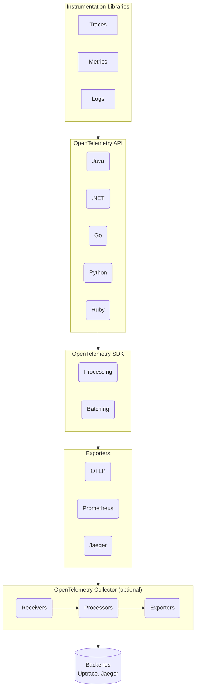

# Source: https://uptrace.dev/raw/opentelemetry/architecture.md

# OpenTelemetry Architecture

> OpenTelemetry architecture overview covering core components (API, SDK, Collector), observability signals (traces, metrics, logs, baggage), OTLP protocol, and W3C context propagation with architecture diagrams.

OpenTelemetry standardizes the collection and exchange of telemetry data across different programming languages and frameworks. It enables developers to instrument their code to generate telemetry data including traces, metrics, and logs.

## What is OpenTelemetry?

[OpenTelemetry](https://opentelemetry.io/) is an open-source observability framework hosted by the Cloud Native Computing Foundation. It resulted from merging the OpenCensus and OpenTracing projects. See [OpenTelemetry vs OpenTracing](/comparisons/opentelemetry-vs-opentracing) to learn how they compare.

OpenTelemetry streamlines application instrumentation for observability and provides a standardized approach to telemetry data collection. By promoting consistency across programming languages, frameworks, and environments, it enables developers to easily collect and analyze telemetry data for monitoring, debugging, and optimizing distributed systems.

## Architecture Overview

OpenTelemetry's architecture provides a standardized approach to collecting, transmitting, and processing telemetry data from applications and services. It consists of several key components that work together to enable observability in distributed systems.

## Observability Signals

OpenTelemetry captures four primary observability signals that work together to provide comprehensive system visibility:

- **Metrics** indicate when there is a problem
- **Traces** show where the problem is located
- **Logs** help identify the root cause
- **Baggage** carries contextual information across service boundaries

Additionally, two emerging signals are under active development:

- **Events** - a specific type of log for recording discrete events
- **Profiles** - performance profiling data (currently in development by the Profiling Working Group)

### Metrics

[OpenTelemetry Metrics](/opentelemetry/metrics) are quantitative measurements that help quantify system behavior. They provide information about the current state or rate of various aspects of an application, such as CPU usage, memory consumption, or request latency. OpenTelemetry enables you to define and record custom metrics to monitor your application's performance and health.

### Traces

[OpenTelemetry Traces](/opentelemetry/distributed-tracing) provide detailed records of requests' execution paths as they flow through distributed systems. They capture timing information for individual operations and their relationships, allowing you to understand request flows, identify bottlenecks, and troubleshoot performance issues. With OpenTelemetry, you can instrument your code to generate distributed traces and correlate them across services.

### Logs

[OpenTelemetry Logs](/opentelemetry/logs) are textual records of events or messages that occur during application execution. They help you understand application behavior, diagnose problems, and audit activities. OpenTelemetry provides mechanisms to capture structured logs from your application and enrich them with contextual information.

### Baggage

Baggage is contextual information that is passed between signals and services in a distributed system. Unlike trace context (which carries trace and span IDs), baggage allows you to propagate arbitrary key-value pairs across service boundaries.

Baggage is useful for:

- **Cross-cutting concerns**: Propagating user IDs, tenant IDs, or feature flags across services
- **Correlation**: Enriching telemetry with business context without changing service interfaces
- **Dynamic behavior**: Making downstream services aware of upstream decisions

**Important**: Baggage is transmitted in-band with requests (typically in HTTP headers), so keep baggage small to avoid performance overhead. Baggage data is not automatically included in telemetry—you must explicitly read baggage values and add them as attributes to your spans, metrics, or logs.

## Core Components

### Instrumentation Libraries

OpenTelemetry provides libraries for various programming languages that developers use to instrument their applications and collect telemetry data.

[OpenTelemetry instrumentations](/guides) are plugins for popular frameworks and libraries that use the OpenTelemetry API to record important operations such as HTTP requests, database queries, logs, and errors.

### OpenTelemetry SDK

The OpenTelemetry SDK (Software Development Kit) is a collection of libraries and tools that enable developers to instrument applications and collect telemetry data for monitoring purposes.

The SDK provides a standardized and extensible framework for integrating OpenTelemetry into various programming languages and environments.

### Exporters

OpenTelemetry exporters send telemetry data to external systems or backends for storage, analysis, and visualization.

OpenTelemetry offers various exporters that support different protocols and formats for exporting telemetry data. These exporters enable seamless integration with your preferred monitoring and analysis tools.

## OpenTelemetry Protocol (OTLP)

OpenTelemetry Protocol (OTLP) is an open-source, vendor-neutral protocol for collecting, transmitting, and exporting telemetry data from software systems and applications.

OTLP defines the wire format and structure of data exchanged between instrumented applications and backend systems. The current specification version is **v1.9.0**, with stable support for traces, metrics, and logs.

### Protocol Specification

OTLP specifies:

- **Encoding format**: Protocol Buffers (binary) or JSON
- **Data schema**: Standardized structure for metrics, traces, logs, and profiles
- **Transport rules**: How data moves across networks
- **Error handling**: Retryable vs non-retryable errors, partial success responses
- **Compression**: Support for gzip compression

### Transport Mechanisms

OTLP supports two primary transport options:

**gRPC Transport**:

- Default port: **4317**
- Uses unary request/response pattern
- Provides high throughput with concurrent requests
- Preferred for performance-critical deployments

**HTTP Transport**:

- Default port: **4318**
- Supports HTTP/1.1 and HTTP/2
- Allows both binary Protobuf and JSON encoding
- Implements retry with exponential backoff
- Easier to use through firewalls and proxies

The OTLP exporter transmits collected telemetry data to backends for processing and analysis. Most modern observability backends support OTLP natively, making it the recommended export format.

## Context Propagation

[Context propagation](/opentelemetry/context-propagation) ensures that relevant contextual data—such as trace IDs, span IDs, and other metadata—is consistently propagated across different services and application components.

By propagating context, OpenTelemetry ensures that telemetry collected from different services and components remains correlated, even in distributed and microservices architectures. This enables end-to-end tracing, making it easier to understand request flows, identify performance bottlenecks, and analyze system dependencies.

## Resources

Resource attributes are key-value pairs that provide metadata about monitored entities such as services, processes, or containers. They identify resources and provide additional information for filtering and grouping telemetry data.

By including resource information in telemetry data, OpenTelemetry enables better analysis, visualization, and understanding of system behavior. Resources help correlate and contextualize telemetry data from different sources, providing a comprehensive view of observed applications or services.

## OpenTelemetry Collector

The [OpenTelemetry Collector](/opentelemetry/collector) plays a critical role in the OpenTelemetry ecosystem by providing a flexible and scalable solution for collecting and processing telemetry data.

The Collector acts as a centralized intermediary, simplifying data collection complexity and enabling flexible integration with different backends and systems.

## OpenTelemetry in Kubernetes

OpenTelemetry provides powerful observability capabilities that seamlessly integrate into Kubernetes environments, offering comprehensive monitoring and tracing for containerized applications and microservices.

OpenTelemetry in Kubernetes enables you to:

1. Automatically inject [OpenTelemetry instrumentation](/guides) into your pods
2. Collect metrics, traces, and logs from both applications and Kubernetes infrastructure
3. Use the [OpenTelemetry Collector](/opentelemetry/collector) to process and export data to your preferred backend (such as Uptrace)
4. Implement [distributed tracing](/opentelemetry/distributed-tracing) across microservices in your cluster
5. Monitor the health and performance of Kubernetes nodes, pods, and services

### OpenTelemetry Operator

The [OpenTelemetry Operator](/opentelemetry/operator) is a Kubernetes-native solution for managing and configuring OpenTelemetry instrumentation in your cluster. It simplifies the deployment and management of OpenTelemetry components by:

1. Automating the injection of OpenTelemetry auto-instrumentation into applications
2. Managing the lifecycle of OpenTelemetry Collector instances
3. Providing custom resource definitions (CRDs) for easy configuration of OpenTelemetry components
4. Enabling dynamic updates to your OpenTelemetry setup without redeploying applications
5. Facilitating the collection of Kubernetes-specific metadata to enrich telemetry data

The OpenTelemetry Operator streamlines the implementation of [observability in Kubernetes](/get/kubernetes), making it easier to gain insights into containerized applications and infrastructure.

## Backend Systems

OpenTelemetry does not include a built-in backend or storage system for processing and analyzing data. Instead, it provides flexibility to select and integrate with various backend systems based on your specific needs and preferences.

Backend systems receive exported telemetry data from instrumented applications or the OpenTelemetry Collector. These systems store, analyze, and visualize the telemetry data.

See [OpenTelemetry backends](/blog/opentelemetry-backend) for details.

## Conclusion

OpenTelemetry's architecture promotes flexibility, interoperability, and extensibility, enabling developers and operators to adopt observability practices that suit their specific requirements and environments.

## Related Topics

- [OpenTelemetry sampling](/opentelemetry/sampling)
- [OpenTelemetry vs Prometheus](/comparisons/opentelemetry-vs-prometheus)
