# Source: https://uptrace.dev/raw/opentelemetry/backend-comparison.md

# OpenTelemetry Backend Comparison

> Complete comparison of OpenTelemetry backends. Compare Uptrace, Jaeger, SigNoz, SkyWalking, and OpenObserve for performance, features, and ease of use.

*For an overview of available OpenTelemetry backends, see Top OpenTelemetry backends for storage and visualization.*

## Backend Comparison

Implementing OpenTelemetry is just the first step. Choosing the right backend determines your observability success.

## Backend Decision Matrix

<table>
<thead>
  <tr>
    <th>
      Feature
    </th>
    
    <th>
      Jaeger
    </th>
    
    <th>
      SigNoz
    </th>
    
    <th>
      SkyWalking
    </th>
    
    <th>
      OpenObserve
    </th>
    
    <th>
      Uptrace
    </th>
  </tr>
</thead>

<tbody>
  <tr>
    <td>
      <strong>
        Setup Time
      </strong>
    </td>
    
    <td>
      4+ hours
    </td>
    
    <td>
      2 hours
    </td>
    
    <td>
      3 hours
    </td>
    
    <td>
      30 minutes
    </td>
    
    <td>
      ✅ 5 minutes
    </td>
  </tr>
  
  <tr>
    <td>
      <strong>
        Storage Backend
      </strong>
    </td>
    
    <td>
      Elasticsearch
    </td>
    
    <td>
      ClickHouse
    </td>
    
    <td>
      Elasticsearch/MySQL
    </td>
    
    <td>
      ClickHouse
    </td>
    
    <td>
      ✅ ClickHouse
    </td>
  </tr>
  
  <tr>
    <td>
      <strong>
        UI Experience
      </strong>
    </td>
    
    <td>
      Basic search
    </td>
    
    <td>
      Modern
    </td>
    
    <td>
      Rich but complex
    </td>
    
    <td>
      Modern
    </td>
    
    <td>
      ✅ Advanced SQL queries
    </td>
  </tr>
  
  <tr>
    <td>
      <strong>
        All-in-One
      </strong>
    </td>
    
    <td>
      Traces only
    </td>
    
    <td>
      Traces + Metrics
    </td>
    
    <td>
      Traces + Metrics
    </td>
    
    <td>
      Traces + Metrics + Logs
    </td>
    
    <td>
      ✅ Traces + Metrics + Logs
    </td>
  </tr>
  
  <tr>
    <td>
      <strong>
        Auto-Instrumentation
      </strong>
    </td>
    
    <td>
      Manual setup
    </td>
    
    <td>
      Basic guides
    </td>
    
    <td>
      Manual setup
    </td>
    
    <td>
      Manual setup
    </td>
    
    <td>
      ✅ 40+ ready integrations
    </td>
  </tr>
  
  <tr>
    <td>
      <strong>
        Enterprise Support
      </strong>
    </td>
    
    <td>
      Community only
    </td>
    
    <td>
      Community only
    </td>
    
    <td>
      Apache Foundation
    </td>
    
    <td>
      Community only
    </td>
    
    <td>
      ✅ Available
    </td>
  </tr>
  
  <tr>
    <td>
      <strong>
        Production Maturity
      </strong>
    </td>
    
    <td>
      High
    </td>
    
    <td>
      Medium
    </td>
    
    <td>
      High
    </td>
    
    <td>
      Low
    </td>
    
    <td>
      ✅ High
    </td>
  </tr>
  
  <tr>
    <td>
      <strong>
        Cost Model
      </strong>
    </td>
    
    <td>
      Infrastructure only
    </td>
    
    <td>
      Infrastructure only
    </td>
    
    <td>
      Infrastructure only
    </td>
    
    <td>
      Infrastructure only
    </td>
    
    <td>
      ✅ Transparent pricing
    </td>
  </tr>
</tbody>
</table>

## Detailed Backend Analysis

### Uptrace

**Best for**: Production systems requiring enterprise features and performance

✅ **Pros**:

- ClickHouse backend delivers 10x faster queries than Elasticsearch
- All-in-one solution: traces, metrics, and logs with automatic correlation
- 40+ ready-to-use integration guides versus generic setup instructions
- Enterprise features: SSO, RBAC, and custom retention policies
- Production-proven with 3+ years of optimization and customer feedback
- Transparent, usage-based pricing model
- 5-minute setup with single DSN configuration

❌ **Cons**:

- Commercial licensing required for advanced enterprise features

**Migration Effort**: Low (5-minute DSN setup plus comprehensive migration guides)

**Typical Use Cases**:

- Production systems requiring reliable performance at scale
- Teams that need all observability signals in one platform
- Organizations prioritizing developer productivity and time-to-value
- Companies requiring enterprise support and SLAs

### SkyWalking

**Best for**: Microservices architectures and service mesh environments

✅ **Pros**:

- Apache Foundation project with strong community backing
- Comprehensive APM capabilities with service topology mapping
- Native service mesh support (Istio, Envoy, Linkerd)
- Advanced profiling capabilities with minimal overhead (<3% CPU)
- Multi-language support with auto-instrumentation
- AI-powered anomaly detection and analysis

❌ **Cons**:

- Complex setup and configuration for advanced features
- Overloaded UI that can confuse beginners
- OpenTelemetry support requires collector configuration
- Limited log management compared to dedicated solutions
- Requires significant resources for large-scale deployments

**Migration Effort**: High (complex infrastructure setup and steep learning curve)

**Typical Use Cases**:

- Organizations running Kubernetes and service mesh architectures
- Teams needing continuous profiling in production
- Microservices environments requiring detailed dependency mapping
- DevOps teams with strong infrastructure expertise

### OpenObserve

**Best for**: Teams wanting modern observability with simple deployment

✅ **Pros**:

- Rust-based architecture for high performance and low memory usage
- All-in-one solution with logs, metrics, and traces
- Simple deployment with single binary or Docker container
- Modern UI with intuitive dashboards and alerting
- ClickHouse storage for efficient data compression and queries
- Kubernetes-native with Helm charts available

❌ **Cons**:

- Newer project with limited production validation (launched in 2023)
- Smaller community and ecosystem compared to established alternatives
- Limited enterprise features and commercial support options
- Documentation gaps for complex enterprise use cases
- Fewer integration examples and third-party plugins

**Migration Effort**: Low to Medium (simple setup but newer technology)

**Typical Use Cases**:

- Startups and teams wanting simple, all-in-one observability
- Organizations prioritizing resource efficiency and low overhead
- Teams comfortable adopting newer technologies
- Environments requiring quick setup without complex infrastructure

### Jaeger

**Best for**: Teams already familiar with Elasticsearch and simple tracing needs

✅ **Pros**:

- Most widely adopted OpenTelemetry backend
- Strong community support and extensive documentation
- CNCF graduated project with proven stability
- Supports multiple storage backends (Elasticsearch, Cassandra, Kafka)
- Battle-tested in production environments

❌ **Cons**:

- Complex Elasticsearch setup and ongoing maintenance overhead
- Basic UI with limited query capabilities and filtering options
- Traces only—no built-in metrics or logs correlation
- Performance bottlenecks at scale due to Elasticsearch limitations
- Requires significant DevOps expertise for production deployment

**Migration Effort**: High (complex infrastructure setup required)

**Typical Use Cases**:

- Large organizations with dedicated DevOps teams
- Environments already using the Elasticsearch ecosystem
- Teams prioritizing community support over convenience

### SigNoz

**Best for**: Small teams wanting modern UI without complexity

✅ **Pros**:

- Modern, intuitive user interface with excellent UX design
- OpenTelemetry-native architecture from the ground up
- ClickHouse backend for better query performance
- Growing community and active development
- Docker Compose setup for quick local development

❌ **Cons**:

- Newer project with less production validation (launched in 2021)
- Limited enterprise features and support options
- Smaller ecosystem compared to established alternatives
- Documentation gaps for complex use cases and troubleshooting
- Fewer integration examples for popular frameworks

**Migration Effort**: Medium (good documentation but limited enterprise features)

**Typical Use Cases**:

- Startups and small teams (<50 developers)
- Organizations comfortable with newer technologies
- Teams that prioritize UI/UX over enterprise features

## Technical Deep Dive

### Performance Comparison

<table>
<thead>
  <tr>
    <th>
      Metric
    </th>
    
    <th>
      Jaeger (Elasticsearch)
    </th>
    
    <th>
      SigNoz
    </th>
    
    <th>
      SkyWalking
    </th>
    
    <th>
      OpenObserve
    </th>
    
    <th>
      Uptrace
    </th>
  </tr>
</thead>

<tbody>
  <tr>
    <td>
      <strong>
        Query Speed
      </strong>
    </td>
    
    <td>
      Slow (complex queries)
    </td>
    
    <td>
      Fast
    </td>
    
    <td>
      Medium
    </td>
    
    <td>
      Fast
    </td>
    
    <td>
      ✅ Fastest (ClickHouse)
    </td>
  </tr>
  
  <tr>
    <td>
      <strong>
        Ingestion Rate
      </strong>
    </td>
    
    <td>
      10K spans/sec
    </td>
    
    <td>
      15K spans/sec
    </td>
    
    <td>
      20K spans/sec
    </td>
    
    <td>
      25K spans/sec
    </td>
    
    <td>
      ✅ 50K+ spans/sec
    </td>
  </tr>
  
  <tr>
    <td>
      <strong>
        Storage Efficiency
      </strong>
    </td>
    
    <td>
      High overhead
    </td>
    
    <td>
      Good compression
    </td>
    
    <td>
      Medium overhead
    </td>
    
    <td>
      Excellent compression
    </td>
    
    <td>
      ✅ 90% compression
    </td>
  </tr>
  
  <tr>
    <td>
      <strong>
        Memory Usage
      </strong>
    </td>
    
    <td>
      High (ES heap)
    </td>
    
    <td>
      Medium
    </td>
    
    <td>
      Medium
    </td>
    
    <td>
      ✅ Low (Rust)
    </td>
    
    <td>
      ✅ Optimized
    </td>
  </tr>
</tbody>
</table>

### Scalability Assessment

```mermaid
graph TD
    A[10K spans/day] --> B[All backends ✓]
    C[1M spans/day] --> D[All backends ✓]
    F[100M+ spans/day] --> G[Jaeger ⚠️]
    F --> H[SigNoz ⚠️]
    F --> I[SkyWalking ⚠️]
    F --> J[OpenObserve ⚠️]
    F --> K[Uptrace ✅]
```

## Recommendations

**Choose SkyWalking if:**

- You're running Kubernetes with service mesh (Istio, Linkerd, Consul Connect)
- You need advanced profiling capabilities in production
- You have strong DevOps expertise for complex infrastructure
- Apache Foundation backing and community support are important
- You prioritize comprehensive APM features over ease of setup

**Choose OpenObserve if:**

- You want a simple, all-in-one observability solution
- Resource efficiency and low memory usage are critical
- You're comfortable with newer technologies and smaller communities
- You need quick deployment without complex infrastructure setup
- Your team values modern UI/UX and fast query performance

**Choose Jaeger if:**

- You already have Elasticsearch expertise and infrastructure in-house
- You only need basic distributed tracing without metrics or logs
- You're comfortable with complex infrastructure management and maintenance
- Budget constraints require completely open-source solutions
- Your team has significant DevOps resources available

**Choose SigNoz if:**

- You want a modern UI but have a small team (<10 developers)
- You're willing to accept some risk for better user experience
- You don't need immediate enterprise support or SLAs
- You can contribute back to an evolving open-source project
- Your data volumes are moderate (<10M spans/day)

**Choose Uptrace if:**

- You need production-ready performance and reliability at any scale
- You want all observability signals (traces, metrics, logs) in one unified platform
- You value ready-to-use integrations and comprehensive documentation over DIY setup
- Enterprise features like SSO, RBAC, and SLAs are important for your organization
- You prefer predictable, transparent pricing over hidden infrastructure costs
- Developer productivity and time-to-value are priorities

## Conclusion

The OpenTelemetry backend landscape offers solutions for every need and budget. **Uptrace** offers a compelling balance of features, performance, and ease of use, while **SkyWalking** excels in microservices environments and **OpenObserve** provides modern simplicity.

**Key decision factors**:

- **Performance requirements**: Choose ClickHouse-based solutions (Uptrace, SigNoz, OpenObserve) for better query speed
- **Team size**: Smaller teams benefit from all-in-one solutions with ready integrations
- **Infrastructure expertise**: Complex solutions like SkyWalking require strong DevOps capabilities
- **Enterprise needs**: Advanced features like SSO and SLAs narrow choices to commercial solutions
- **Total cost of ownership**: Consider setup time, maintenance, and hidden infrastructure costs
