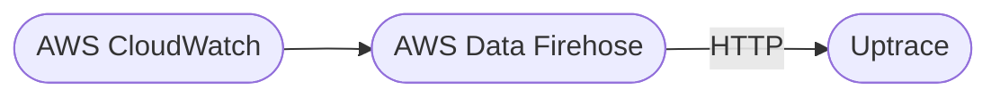

# Source: https://uptrace.dev/raw/ingest/cloudwatch.md

# AWS CloudWatch metrics and logs

> Ship AWS CloudWatch metrics and logs to Uptrace via Data Firehose or YACE, including IAM requirements and dimension mapping.

AWS CloudWatch allows you to forward metrics and logs to third-party destinations using AWS Data Firehose. Uptrace provides compatible HTTP endpoints so you can monitor your AWS infrastructure with Uptrace, an [open source APM tool](/get/hosted/open-source-apm) that supports distributed tracing, metrics, and logs.



## Choosing an approach

**Metrics:**

<table>
<thead>
  <tr>
    <th>
      Approach
    </th>
    
    <th>
      Pros
    </th>
    
    <th>
      Cons
    </th>
  </tr>
</thead>

<tbody>
  <tr>
    <td>
      <strong>
        Data Firehose
      </strong>
    </td>
    
    <td>
      Simplest setup, fully managed by AWS
    </td>
    
    <td>
      No AWS tags — only standard dimensions
    </td>
  </tr>
  
  <tr>
    <td>
      <strong>
        YACE + Prometheus
      </strong>
    </td>
    
    <td>
      Rich metadata (AWS tags as labels)
    </td>
    
    <td>
      Requires Prometheus and an AWS-accessible host
    </td>
  </tr>
</tbody>
</table>

**Logs:**

<table>
<thead>
  <tr>
    <th>
      Approach
    </th>
    
    <th>
      Pros
    </th>
    
    <th>
      Cons
    </th>
  </tr>
</thead>

<tbody>
  <tr>
    <td>
      <strong>
        Data Firehose
      </strong>
    </td>
    
    <td>
      Push-based, fully managed by AWS
    </td>
    
    <td>
      Requires subscription filter per log group
    </td>
  </tr>
  
  <tr>
    <td>
      <strong>
        OTel Collector
      </strong>
    </td>
    
    <td>
      Pull-based, supports autodiscovery and filtering
    </td>
    
    <td>
      Alpha stability, requires AWS credentials
    </td>
  </tr>
</tbody>
</table>

## Metrics via YACE + Prometheus

[CloudWatch Metrics](/glossary/cloudwatch-metrics) is a monitoring service provided by Amazon Web Services (AWS) that allows you to collect and track metrics in real-time. For developers looking to programmatically interact with CloudWatch Metrics, see our guide to [CloudWatch Metrics API](/tools/cloudwatch-custom-metrics-api).

[yet-another-cloudwatch-exporter](https://github.com/nerdswords/yet-another-cloudwatch-exporter/) (YACE) exports CloudWatch metrics as Prometheus metrics with AWS tags as labels. This gives you richer metadata than Data Firehose, which only provides access to [standard dimensions](https://docs.aws.amazon.com/AWSEC2/latest/UserGuide/viewing_metrics_with_cloudwatch.html#ec2-cloudwatch-dimensions) such as `InstanceId` and `InstanceType`.

<alert type="info">

YACE must run in an environment that has access to AWS (EC2, ECS, EKS, or a machine with configured AWS credentials).

</alert>

1. First, [install](https://github.com/nerdswords/yet-another-cloudwatch-exporter/blob/master/docs/installation.md) YACE by downloading a binary file or using Docker/Kubernetes.<br />

Use the following IAM policy to grant all the permissions required by YACE:```json
{
  "Version": "2012-10-17",
  "Statement": [
    {
      "Action": [
        "tag:GetResources",
        "cloudwatch:GetMetricData",
        "cloudwatch:GetMetricStatistics",
        "cloudwatch:ListMetrics",
        "apigateway:GET",
        "aps:ListWorkspaces",
        "autoscaling:DescribeAutoScalingGroups",
        "dms:DescribeReplicationInstances",
        "dms:DescribeReplicationTasks",
        "ec2:DescribeTransitGatewayAttachments",
        "ec2:DescribeSpotFleetRequests",
        "shield:ListProtections",
        "storagegateway:ListGateways",
        "storagegateway:ListTagsForResource",
        "iam:ListAccountAliases"
      ],
      "Effect": "Allow",
      "Resource": "*"
    }
  ]
}
```
2. Next, [configure](https://github.com/nerdswords/yet-another-cloudwatch-exporter/blob/master/docs/configuration.md) YACE using a YAML configuration file. To specify which configuration file to load, pass the `-config.file` flag on the command line.<br />

YACE supports automatic resource discovery via tags, but you can also use [static](https://github.com/nerdswords/yet-another-cloudwatch-exporter/blob/master/docs/configuration.md#static_job_config) and [custom namespace](https://github.com/nerdswords/yet-another-cloudwatch-exporter/blob/master/docs/configuration.md#custom_namespace_job_config) jobs.<br />

Here is an example config file for EC2, but you can find more on [GitHub](https://github.com/nerdswords/yet-another-cloudwatch-exporter/tree/master/examples):```yaml
apiVersion: v1alpha1
discovery:
  jobs:
    - type: AWS/EC2
      regions:
        - us-east-1
      period: 300
      length: 300
      metrics:
        - name: CPUUtilization
          statistics: [Average]
        - name: NetworkIn
          statistics: [Average, Sum]
        - name: NetworkOut
          statistics: [Average, Sum]
        - name: NetworkPacketsIn
          statistics: [Sum]
        - name: NetworkPacketsOut
          statistics: [Sum]
        - name: DiskReadBytes
          statistics: [Sum]
        - name: DiskWriteBytes
          statistics: [Sum]
        - name: DiskReadOps
          statistics: [Sum]
        - name: DiskWriteOps
          statistics: [Sum]
        - name: StatusCheckFailed
          statistics: [Sum]
        - name: StatusCheckFailed_Instance
          statistics: [Sum]
        - name: StatusCheckFailed_System
          statistics: [Sum]
```
3. Once you have YACE running, the Prometheus metrics should be available at [http://localhost:5000/metrics](http://localhost:5000/metrics).<br />

Now you need to add a corresponding job to your Prometheus configuration:```yaml
- job_name: 'yet-another-cloudwatch-exporter'
  metrics_path: '/metrics'
  static_configs:
    - targets: ['localhost:5000']
```
4. The final step is to [configure Prometheus](/ingest/prometheus) to export data to Uptrace using remote write or OpenTelemetry Collector. You can also use [Grafana integration](/features/grafana) to explore collected Prometheus metrics and create [dashboards](https://github.com/nerdswords/yet-another-cloudwatch-exporter/tree/master/mixin) provided by YACE.

## Metrics via Data Firehose

If you don't need AWS tags and only require [standard dimensions](https://docs.aws.amazon.com/AWSEC2/latest/UserGuide/viewing_metrics_with_cloudwatch.html#ec2-cloudwatch-dimensions), you can send CloudWatch metrics directly to Uptrace using AWS Data Firehose.

<alert type="warning">

Data Firehose does not export AWS tags. You only get standard dimensions such as `InstanceId` and `InstanceType`, but not `InstanceName`. If you need tags, use [YACE + Prometheus](#metrics-via-yace-prometheus) instead.

</alert>

You can configure Data Firehose using a [Terraform module](#terraform-module) or the [AWS Console](#aws-console).

### Terraform module

Uptrace provides a [Terraform module](https://github.com/uptrace/terraform-aws-integrations/tree/master/modules/cloudwatch-metrics) that configures AWS CloudWatch to send metrics to Uptrace. Refer to the module's readme for details.

### AWS Console

You can also configure CloudWatch manually using the AWS Console.

1. Create a new [Data Firehose Delivery Stream](https://docs.aws.amazon.com/firehose/latest/dev/basic-create.html) with the following details:
  - Stream source: **Direct PUT**
  - Endpoint: `https://api.uptrace.dev/api/v1/cloudwatch/metrics`
  - API Key: Enter the **Uptrace DSN** for your project.
  - Content Encoding: **GZIP**.
2. Create a new [CloudWatch Metric Stream](https://docs.aws.amazon.com/AmazonCloudWatch/latest/monitoring/CloudWatch-metric-streams-setup.html).
  1. Open the [CloudWatch AWS console](https://console.aws.amazon.com/cloudwatch/).
  2. Choose **Metrics → Streams**.
  3. Click the **Create metric stream** button.
  4. Choose CloudWatch metric namespaces to include in the metric stream.
  5. Choose **Select an existing Firehose owned by your account**, and select the Firehose Delivery Stream you created earlier.
  6. Specify an Output Format of `json`.
  7. Optionally, specify a name for this metric stream under **Metric Stream Name**.
  8. Click on the **Create metric stream** button.

## Logs via OpenTelemetry Collector

The [OpenTelemetry Collector](/ingest/collector) `awscloudwatch` receiver pulls CloudWatch logs via the AWS SDK, giving you autodiscovery of log groups and fine-grained filtering without managing subscription filters.

<alert type="warning">

The `awscloudwatch` receiver has **alpha** stability for logs only — it does not support metrics. Use Data Firehose or YACE for metrics.

</alert>

The receiver authenticates using standard AWS credentials (credentials file, IMDS on EC2, or environment variables such as `AWS_ACCESS_KEY_ID` and `AWS_SECRET_ACCESS_KEY`).

Here is an example configuration that autodiscovers log groups with a `/aws/eks/` prefix and forwards them to Uptrace:

```yaml
receivers:
  awscloudwatch:
    region: us-west-1
    logs:
      poll_interval: 1m
      groups:
        autodiscover:
          limit: 100
          prefix: /aws/eks/

processors:
  batch:
    send_batch_size: 10000
    timeout: 10s

exporters:
  otlp/uptrace:
    endpoint: api.uptrace.dev:4317
    headers:
      uptrace-dsn: '<FIXME>'

service:
  pipelines:
    logs:
      receivers: [awscloudwatch]
      processors: [batch]
      exporters: [otlp/uptrace]
```

You can also specify named log groups instead of autodiscovery:

```yaml
receivers:
  awscloudwatch:
    region: us-west-1
    logs:
      poll_interval: 5m
      groups:
        named:
          /aws/eks/dev-0/cluster:
```

## Logs via Data Firehose

[CloudWatch Logs](https://docs.aws.amazon.com/AmazonCloudWatch/latest/logs/aws-services-sending-logs.html) is a log management service provided by Amazon Web Services (AWS) that allows you to collect, monitor, and analyze log files from your applications and infrastructure.

You can forward CloudWatch logs to Uptrace using AWS Data Firehose. The flow is: CloudWatch log group → subscription filter → Data Firehose delivery stream → Uptrace HTTP endpoint.

### Terraform module

Uptrace provides a [Terraform module](https://github.com/uptrace/terraform-aws-integrations/tree/master/modules/cloudwatch-logs) that configures AWS CloudWatch to send logs to Uptrace. Refer to the module's readme for details.

### AWS Console

You can also configure CloudWatch manually using the AWS Console.

1. Create a new [Data Firehose Delivery Stream](https://docs.aws.amazon.com/firehose/latest/dev/basic-create.html) with the following details:
  - Stream source: **Direct PUT**
  - Endpoint: `https://api.uptrace.dev/api/v1/cloudwatch/logs`
  - API Key: Enter the **Uptrace DSN** for your project.
  - Content Encoding: **GZIP**.
2. Create a new [CloudWatch log group](https://docs.aws.amazon.com/AmazonCloudWatch/latest/logs/Working-with-log-groups-and-streams.html) using the Firehose Delivery Stream you created earlier.

## What's next?

- [Prometheus ingestion](/ingest/prometheus) - Required if using YACE for CloudWatch metrics
- [OpenTelemetry Collector](/ingest/collector) - General Collector configuration and pipeline setup
- [Grafana integration](/features/grafana) - Build dashboards from CloudWatch data
- [OpenTelemetry Go Lambda](/guides/opentelemetry-go-lambda)
- [OpenTelemetry Node.js Lambda](/guides/opentelemetry-node-lambda)
