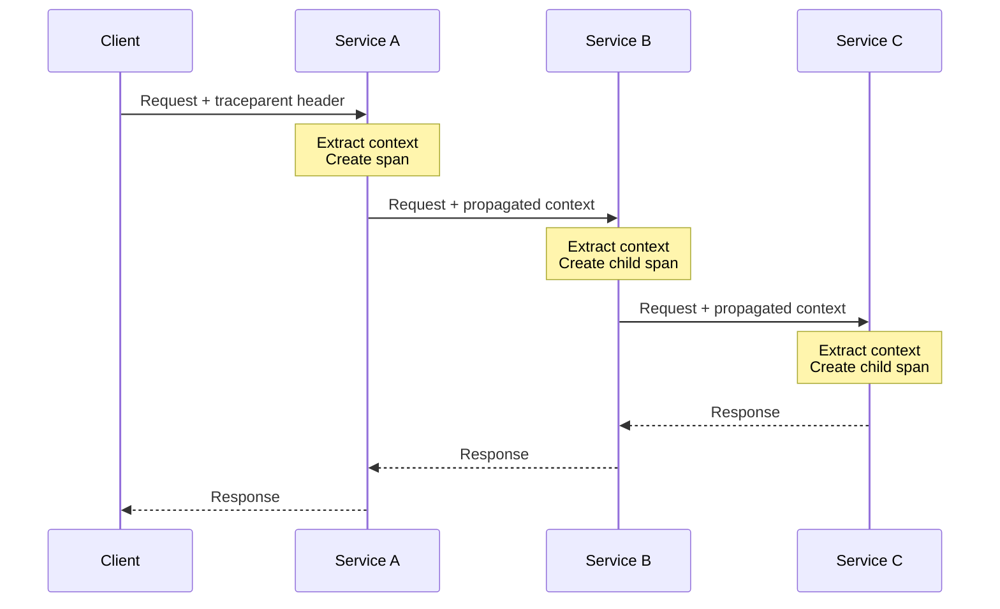

# Source: https://uptrace.dev/raw/opentelemetry/context-propagation.md

# OpenTelemetry Context Propagation: W3C TraceContext & Troubleshooting Guide

> Master OpenTelemetry context propagation across distributed systems. Learn W3C TraceContext, baggage, propagators, and how to troubleshoot broken traces in microservices.

Context propagation is the mechanism that enables [distributed tracing](/opentelemetry/distributed-tracing) by passing trace information (trace IDs, span IDs, and other metadata) across service boundaries. Without proper context propagation, traces fragment into disconnected spans, making it impossible to track requests through [microservices architectures](/blog/microservices-architecture).

[OpenTelemetry](/opentelemetry) implements context propagation through standardized protocols, primarily W3C Trace Context, ensuring trace continuity across services regardless of programming language or framework.

## How Context Propagation Works

When a request flows through a distributed system, each service needs to know which trace it belongs to. Context propagation solves this by:

1. **Serializing** trace context into a standard format (headers)
2. **Injecting** the serialized context into outgoing requests
3. **Extracting** context from incoming requests
4. **Deserializing** the context back into usable trace information



Without context propagation, each service would create an independent trace, losing the connection between related operations.

## W3C Trace Context

[W3C Trace Context](https://www.w3.org/TR/trace-context/) is the recommended standard for propagating trace information across services. It defines two HTTP headers:

### traceparent Header

The [`traceparent` header](/get/opentelemetry-go/propagation) carries the essential trace context information:

```text
traceparent: 00-0af7651916cd43dd8448eb211c80319c-b7ad6b7169203331-01
```

This header contains four fields separated by dashes:

<table>
<thead>
  <tr>
    <th>
      Field
    </th>
    
    <th>
      Example
    </th>
    
    <th>
      Description
    </th>
  </tr>
</thead>

<tbody>
  <tr>
    <td>
      <strong>
        version
      </strong>
    </td>
    
    <td>
      <code>
        00
      </code>
    </td>
    
    <td>
      Protocol version (currently always <code>
        00
      </code>
      
      )
    </td>
  </tr>
  
  <tr>
    <td>
      <strong>
        trace-id
      </strong>
    </td>
    
    <td>
      <code>
        0af7651916cd43dd8448eb211c80319c
      </code>
    </td>
    
    <td>
      128-bit trace identifier (32 hex characters)
    </td>
  </tr>
  
  <tr>
    <td>
      <strong>
        parent-id
      </strong>
    </td>
    
    <td>
      <code>
        b7ad6b7169203331
      </code>
    </td>
    
    <td>
      64-bit span identifier (16 hex characters)
    </td>
  </tr>
  
  <tr>
    <td>
      <strong>
        trace-flags
      </strong>
    </td>
    
    <td>
      <code>
        01
      </code>
    </td>
    
    <td>
      8-bit flags (01 = sampled, 00 = not sampled)
    </td>
  </tr>
</tbody>
</table>

**Breaking down the fields**:

- **Version**: Future-proofs the protocol by indicating which version of the specification is being used
- **Trace ID**: Globally unique identifier shared by all [spans](/opentelemetry/distributed-tracing#spans) in a single trace
- **Parent ID**: The span ID from the calling service, becomes the parent span ID for the new span
- **Trace Flags**: Indicates whether the trace is [sampled](/opentelemetry/sampling) (should be recorded) or not

### tracestate Header

The `tracestate` header carries vendor-specific trace information:

```text
tracestate: congo=t61rcWkgMzE,rojo=00f067aa0ba902b7
```

This header:

- Allows multiple vendors to add their own key-value pairs
- Entries are comma-separated
- Keys must be lowercase
- Maximum of 32 entries
- Used for vendor-specific features like additional sampling info

**Example with both headers**:

```http
GET /api/users/123 HTTP/1.1
Host: api.example.com
traceparent: 00-0af7651916cd43dd8448eb211c80319c-b7ad6b7169203331-01
tracestate: uptrace=t61rcWkgMzE,other=value123
```

## Propagators

Propagators are responsible for serializing and deserializing context across process boundaries. OpenTelemetry supports multiple propagator formats for compatibility with different systems.

### Built-in Propagators

#### TraceContext Propagator

The default W3C Trace Context propagator (recommended):

<code-group>

```go [Go]
import (
    "go.opentelemetry.io/otel"
    "go.opentelemetry.io/otel/propagation"
)

// Set W3C Trace Context as the global propagator
otel.SetTextMapPropagator(
    propagation.TraceContext{},
)
```

```python [Python]
from opentelemetry import trace
from opentelemetry.sdk.trace import TracerProvider
from opentelemetry.sdk.trace.export import BatchSpanProcessor
from opentelemetry.propagate import set_global_textmap
from opentelemetry.propagators.cloud_trace_propagator import (
    TraceContextTextMapPropagator,
)

# Set W3C Trace Context as the global propagator
set_global_textmap(TraceContextTextMapPropagator())
```

```javascript [Node.js]
const { W3CTraceContextPropagator } = require('@opentelemetry/core');
const { propagation } = require('@opentelemetry/api');

// Set W3C Trace Context as the global propagator
propagation.setGlobalPropagator(new W3CTraceContextPropagator());
```

```java [Java]
import io.opentelemetry.api.GlobalOpenTelemetry;
import io.opentelemetry.context.propagation.ContextPropagators;
import io.opentelemetry.extension.trace.propagation.W3CTraceContextPropagator;

// Set W3C Trace Context as the global propagator
GlobalOpenTelemetry.setPropagators(
    ContextPropagators.create(W3CTraceContextPropagator.getInstance())
);
```

</code-group>

#### Baggage Propagator

Propagates [baggage](#baggage) key-value pairs across services:

<code-group>

```go [Go]
import (
    "go.opentelemetry.io/otel"
    "go.opentelemetry.io/otel/propagation"
)

// Add baggage propagation
otel.SetTextMapPropagator(
    propagation.NewCompositeTextMapPropagator(
        propagation.TraceContext{},
        propagation.Baggage{},
    ),
)
```

```python [Python]
from opentelemetry.propagate import set_global_textmap
from opentelemetry.propagators.composite import CompositePropagator
from opentelemetry.propagators.cloud_trace_propagator import (
    TraceContextTextMapPropagator,
)
from opentelemetry.baggage.propagation import W3CBaggagePropagator

# Combine trace context and baggage propagation
set_global_textmap(
    CompositePropagator([
        TraceContextTextMapPropagator(),
        W3CBaggagePropagator(),
    ])
)
```

```javascript [Node.js]
const { W3CTraceContextPropagator, W3CBaggagePropagator } = require('@opentelemetry/core');
const { CompositePropagator } = require('@opentelemetry/core');
const { propagation } = require('@opentelemetry/api');

// Combine trace context and baggage propagation
propagation.setGlobalPropagator(
  new CompositePropagator({
    propagators: [
      new W3CTraceContextPropagator(),
      new W3CBaggagePropagator(),
    ],
  })
);
```

```java [Java]
import io.opentelemetry.api.GlobalOpenTelemetry;
import io.opentelemetry.context.propagation.ContextPropagators;
import io.opentelemetry.extension.trace.propagation.W3CTraceContextPropagator;
import io.opentelemetry.api.baggage.propagation.W3CBaggagePropagator;

// Combine trace context and baggage propagation
GlobalOpenTelemetry.setPropagators(
    ContextPropagators.create(
        TextMapPropagator.composite(
            W3CTraceContextPropagator.getInstance(),
            W3CBaggagePropagator.getInstance()
        )
    )
);
```

</code-group>

#### B3 Propagator

Legacy Zipkin B3 format for backward compatibility:

<code-group>

```go [Go]
import (
    "go.opentelemetry.io/contrib/propagators/b3"
    "go.opentelemetry.io/otel"
)

// Use B3 propagation (legacy Zipkin format)
otel.SetTextMapPropagator(b3.New())

// Or combine with W3C for compatibility
otel.SetTextMapPropagator(
    propagation.NewCompositeTextMapPropagator(
        propagation.TraceContext{},
        b3.New(),
    ),
)
```

```python [Python]
from opentelemetry.propagate import set_global_textmap
from opentelemetry.propagators.b3 import B3MultiFormat

# Use B3 propagation
set_global_textmap(B3MultiFormat())
```

```javascript [Node.js]
const { B3Propagator } = require('@opentelemetry/propagator-b3');
const { propagation } = require('@opentelemetry/api');

// Use B3 propagation
propagation.setGlobalPropagator(new B3Propagator());
```

```java [Java]
import io.opentelemetry.extension.trace.propagation.B3Propagator;

// Use B3 propagation
GlobalOpenTelemetry.setPropagators(
    ContextPropagators.create(B3Propagator.injectingMultiHeaders())
);
```

</code-group>

**B3 Header Format**:

```http
X-B3-TraceId: 0af7651916cd43dd8448eb211c80319c
X-B3-SpanId: b7ad6b7169203331
X-B3-Sampled: 1
X-B3-ParentSpanId: 00f067aa0ba902b7
```

### Choosing a Propagator

<table>
<thead>
  <tr>
    <th>
      Propagator
    </th>
    
    <th>
      Use When
    </th>
  </tr>
</thead>

<tbody>
  <tr>
    <td>
      <strong>
        W3C Trace Context
      </strong>
    </td>
    
    <td>
      Default choice for new systems
    </td>
  </tr>
  
  <tr>
    <td>
      <strong>
        W3C + Baggage
      </strong>
    </td>
    
    <td>
      Need to pass custom context data
    </td>
  </tr>
  
  <tr>
    <td>
      <strong>
        B3
      </strong>
    </td>
    
    <td>
      Integrating with legacy Zipkin systems
    </td>
  </tr>
  
  <tr>
    <td>
      <strong>
        Composite
      </strong>
    </td>
    
    <td>
      Supporting multiple propagation formats
    </td>
  </tr>
</tbody>
</table>

## Manual Context Propagation

While most [instrumentation libraries](/guides) handle propagation automatically, you may need manual propagation for:

- Custom protocols (WebSocket, [gRPC](/guides/opentelemetry-go-grpc) streams)
- [Message queues](/guides/opentelemetry-kafka)
- Unsupported frameworks
- Custom middleware

### HTTP Client Injection

Inject trace context into outgoing HTTP requests:

<code-group>

```go [Go]
import (
    "net/http"
    "go.opentelemetry.io/otel"
    "go.opentelemetry.io/otel/propagation"
)

func makeRequest(ctx context.Context, url string) error {
    // Create a span for this operation
    ctx, span := tracer.Start(ctx, "http_request")
    defer span.End()

    // Create HTTP request
    req, err := http.NewRequestWithContext(ctx, "GET", url, nil)
    if err != nil {
        return err
    }

    // Inject trace context into request headers
    otel.GetTextMapPropagator().Inject(ctx, propagation.HeaderCarrier(req.Header))

    // Make the request
    resp, err := http.DefaultClient.Do(req)
    if err != nil {
        span.RecordError(err)
        return err
    }
    defer resp.Body.Close()

    return nil
}
```

```python [Python]
from opentelemetry import trace
from opentelemetry.propagate import inject
import requests

tracer = trace.get_tracer(__name__)

def make_request(url: str):
    with tracer.start_as_current_span("http_request") as span:
        headers = {}

        # Inject trace context into headers
        inject(headers)

        # Make the request
        response = requests.get(url, headers=headers)

        if response.status_code >= 400:
            span.set_status(trace.Status(trace.StatusCode.ERROR))

        return response
```

```javascript [Node.js]
const { trace, context, propagation } = require('@opentelemetry/api');
const axios = require('axios');

async function makeRequest(url) {
  const span = tracer.startSpan('http_request');

  return context.with(trace.setSpan(context.active(), span), async () => {
    const headers = {};

    // Inject trace context into headers
    propagation.inject(context.active(), headers);

    try {
      const response = await axios.get(url, { headers });
      span.setStatus({ code: trace.SpanStatusCode.OK });
      return response;
    } catch (error) {
      span.recordException(error);
      span.setStatus({ code: trace.SpanStatusCode.ERROR });
      throw error;
    } finally {
      span.end();
    }
  });
}
```

```java [Java]
import io.opentelemetry.api.GlobalOpenTelemetry;
import io.opentelemetry.context.Context;
import io.opentelemetry.context.propagation.TextMapSetter;
import java.net.http.HttpClient;
import java.net.http.HttpRequest;

private static final TextMapSetter<HttpRequest.Builder> setter =
    (carrier, key, value) -> carrier.header(key, value);

public HttpResponse<String> makeRequest(String url) {
    Span span = tracer.spanBuilder("http_request").startSpan();

    try (Scope scope = span.makeCurrent()) {
        HttpRequest.Builder requestBuilder = HttpRequest.newBuilder()
            .uri(URI.create(url))
            .GET();

        // Inject trace context into request headers
        GlobalOpenTelemetry.getPropagators().getTextMapPropagator()
            .inject(Context.current(), requestBuilder, setter);

        HttpRequest request = requestBuilder.build();
        return httpClient.send(request, HttpResponse.BodyHandlers.ofString());
    } catch (Exception e) {
        span.recordException(e);
        span.setStatus(StatusCode.ERROR);
        throw new RuntimeException(e);
    } finally {
        span.end();
    }
}
```

</code-group>

### HTTP Server Extraction

Extract trace context from incoming HTTP requests:

<code-group>

```go [Go]
import (
    "net/http"
    "go.opentelemetry.io/otel"
    "go.opentelemetry.io/otel/propagation"
)

func handler(w http.ResponseWriter, r *http.Request) {
    // Extract trace context from incoming request headers
    ctx := otel.GetTextMapPropagator().Extract(r.Context(),
        propagation.HeaderCarrier(r.Header))

    // Create span with extracted context
    ctx, span := tracer.Start(ctx, "handle_request",
        trace.WithSpanKind(trace.SpanKindServer),
    )
    defer span.End()

    // Process request with traced context
    result := processRequest(ctx, r)

    w.WriteHeader(http.StatusOK)
    w.Write([]byte(result))
}
```

```python [Python]
from opentelemetry import trace
from opentelemetry.propagate import extract
from flask import Flask, request

app = Flask(__name__)
tracer = trace.get_tracer(__name__)

@app.route('/api/endpoint')
def handle_request():
    # Extract trace context from incoming headers
    ctx = extract(request.headers)

    # Create span with extracted context
    with tracer.start_as_current_span(
        "handle_request",
        context=ctx,
        kind=trace.SpanKind.SERVER,
    ) as span:
        # Process request with traced context
        result = process_request()
        return result
```

```javascript [Node.js]
const { trace, context, propagation, SpanKind } = require('@opentelemetry/api');
const express = require('express');

const app = express();

app.get('/api/endpoint', (req, res) => {
  // Extract trace context from incoming headers
  const extractedContext = propagation.extract(context.active(), req.headers);

  // Create span with extracted context
  const span = tracer.startSpan('handle_request', {
    kind: SpanKind.SERVER,
  }, extractedContext);

  context.with(trace.setSpan(extractedContext, span), () => {
    try {
      // Process request with traced context
      const result = processRequest(req);
      res.json(result);
      span.setStatus({ code: trace.SpanStatusCode.OK });
    } catch (error) {
      span.recordException(error);
      span.setStatus({ code: trace.SpanStatusCode.ERROR });
      res.status(500).json({ error: error.message });
    } finally {
      span.end();
    }
  });
});
```

```java [Java]
import io.opentelemetry.api.GlobalOpenTelemetry;
import io.opentelemetry.context.Context;
import io.opentelemetry.context.propagation.TextMapGetter;
import javax.servlet.http.HttpServletRequest;

private static final TextMapGetter<HttpServletRequest> getter =
    new TextMapGetter<HttpServletRequest>() {
        @Override
        public Iterable<String> keys(HttpServletRequest carrier) {
            return Collections.list(carrier.getHeaderNames());
        }

        @Override
        public String get(HttpServletRequest carrier, String key) {
            return carrier.getHeader(key);
        }
    };

public void handleRequest(HttpServletRequest request, HttpServletResponse response) {
    // Extract trace context from incoming headers
    Context extractedContext = GlobalOpenTelemetry.getPropagators()
        .getTextMapPropagator()
        .extract(Context.current(), request, getter);

    // Create span with extracted context
    Span span = tracer.spanBuilder("handle_request")
        .setParent(extractedContext)
        .setSpanKind(SpanKind.SERVER)
        .startSpan();

    try (Scope scope = span.makeCurrent()) {
        // Process request with traced context
        String result = processRequest(request);
        response.getWriter().write(result);
    } catch (Exception e) {
        span.recordException(e);
        span.setStatus(StatusCode.ERROR);
        throw e;
    } finally {
        span.end();
    }
}
```

</code-group>

### Message Queue Propagation

Propagate context through message queues:

<code-group>

```go [Go]
import (
    "go.opentelemetry.io/otel"
    "go.opentelemetry.io/otel/propagation"
)

// Producer: Inject context into message headers
func publishMessage(ctx context.Context, topic string, payload []byte) error {
    ctx, span := tracer.Start(ctx, "publish_message",
        trace.WithSpanKind(trace.SpanKindProducer),
    )
    defer span.End()

    headers := make(map[string]string)

    // Inject trace context into message headers
    otel.GetTextMapPropagator().Inject(ctx, propagation.MapCarrier(headers))

    // Publish message with headers
    return kafka.Publish(topic, payload, headers)
}

// Consumer: Extract context from message headers
func consumeMessage(msg *kafka.Message) error {
    // Extract trace context from message headers
    ctx := otel.GetTextMapPropagator().Extract(context.Background(),
        propagation.MapCarrier(msg.Headers))

    ctx, span := tracer.Start(ctx, "consume_message",
        trace.WithSpanKind(trace.SpanKindConsumer),
    )
    defer span.End()

    return processMessage(ctx, msg.Payload)
}
```

```python [Python]
from opentelemetry import trace
from opentelemetry.propagate import inject, extract

tracer = trace.get_tracer(__name__)

# Producer: Inject context into message headers
def publish_message(topic: str, payload: bytes):
    with tracer.start_as_current_span(
        "publish_message",
        kind=trace.SpanKind.PRODUCER,
    ) as span:
        headers = {}
        inject(headers)

        # Publish message with headers
        kafka_producer.send(topic, value=payload, headers=list(headers.items()))

# Consumer: Extract context from message headers
def consume_message(msg):
    # Extract trace context from message headers
    headers = dict(msg.headers())
    ctx = extract(headers)

    with tracer.start_as_current_span(
        "consume_message",
        context=ctx,
        kind=trace.SpanKind.CONSUMER,
    ) as span:
        process_message(msg.value())
```

```javascript [Node.js]
const { trace, context, propagation, SpanKind } = require('@opentelemetry/api');

// Producer: Inject context into message headers
async function publishMessage(topic, payload) {
  const span = tracer.startSpan('publish_message', {
    kind: SpanKind.PRODUCER,
  });

  return context.with(trace.setSpan(context.active(), span), async () => {
    const headers = {};
    propagation.inject(context.active(), headers);

    try {
      await kafka.producer.send({
        topic,
        messages: [{
          value: payload,
          headers,
        }],
      });
    } finally {
      span.end();
    }
  });
}

// Consumer: Extract context from message headers
async function consumeMessage(message) {
  const extractedContext = propagation.extract(context.active(), message.headers);

  const span = tracer.startSpan('consume_message', {
    kind: SpanKind.CONSUMER,
  }, extractedContext);

  await context.with(trace.setSpan(extractedContext, span), async () => {
    try {
      await processMessage(message.value);
    } finally {
      span.end();
    }
  });
}
```

</code-group>

## Baggage

Baggage is a context propagation mechanism for distributing arbitrary key-value pairs alongside trace context. Unlike span attributes (which only exist within a single span), baggage propagates across service boundaries.

### Use Cases

Baggage is useful for:

- **User identification**: Propagate user ID, tenant ID, or session ID
- **Feature flags**: Pass feature toggle states across services
- **Request metadata**: Carry custom request properties (API version, client type)
- **Business context**: Propagate order ID, transaction ID, or other domain identifiers in microservices monitoring

### Working with Baggage

<code-group>

```go [Go]
import (
    "go.opentelemetry.io/otel/baggage"
)

// Set baggage values
func setUserContext(ctx context.Context, userID, tier string) context.Context {
    member1, _ := baggage.NewMember("user.id", userID)
    member2, _ := baggage.NewMember("user.tier", tier)

    bag, _ := baggage.New(member1, member2)
    return baggage.ContextWithBaggage(ctx, bag)
}

// Retrieve baggage values
func getUserTier(ctx context.Context) string {
    bag := baggage.FromContext(ctx)
    return bag.Member("user.tier").Value()
}

// Use in a handler
func handler(w http.ResponseWriter, r *http.Request) {
    ctx := r.Context()

    // Set baggage
    ctx = setUserContext(ctx, "user-123", "premium")

    // Baggage automatically propagates to downstream services
    callDownstreamService(ctx)
}
```

```python [Python]
from opentelemetry import baggage

# Set baggage values
def set_user_context(user_id: str, tier: str):
    ctx = baggage.set_baggage("user.id", user_id)
    ctx = baggage.set_baggage("user.tier", tier, ctx)
    return ctx

# Retrieve baggage values
def get_user_tier() -> str:
    return baggage.get_baggage("user.tier")

# Use in a handler
@app.route('/api/endpoint')
def handler():
    # Set baggage
    ctx = set_user_context("user-123", "premium")

    # Baggage automatically propagates to downstream services
    with tracer.start_as_current_span("handler", context=ctx):
        call_downstream_service()
```

```javascript [Node.js]
const { propagation, context } = require('@opentelemetry/api');

// Set baggage values
function setUserContext(userID, tier) {
  return propagation.setBaggage(
    propagation.setBaggage(context.active(), 'user.id', userID),
    'user.tier',
    tier
  );
}

// Retrieve baggage values
function getUserTier() {
  return propagation.getBaggage(context.active(), 'user.tier');
}

// Use in a handler
app.get('/api/endpoint', (req, res) => {
  const ctx = setUserContext('user-123', 'premium');

  context.with(ctx, () => {
    // Baggage automatically propagates to downstream services
    callDownstreamService();
  });
});
```

</code-group>

### Baggage Best Practices

1. **Keep it small**: Baggage is transmitted with every request
  - Limit to essential data only
  - Avoid large values or many keys
  - Consider network overhead
2. **Sensitive data**: Never put secrets or PII in baggage
  - Baggage may be logged or exposed
  - Use encryption if necessary
  - Consider privacy regulations
3. **Naming conventions**: Use namespaced keys
  - `user.id`, `request.client_type`
  - Avoid generic names like `id` or `type`
4. **Size limits**: W3C Baggage spec recommends:
  - Maximum 180 characters per entry
  - Maximum 8KB total baggage size

## Troubleshooting Broken Traces

When traces don't connect properly across services in your [observability](/glossary/what-is-observability) setup, follow this systematic approach:

### Symptom: Disconnected Spans

**Problem**: Spans appear in the [tracing backend](/blog/opentelemetry-backend) but aren't connected into a single trace.

**Diagnosis**:

1. **Verify headers are present**:

```bash
# Check if traceparent header is being sent
curl -v http://your-service/endpoint 2>&1 | grep -i traceparent

# Or use this to inspect all headers
curl -v http://your-service/endpoint 2>&1 | grep -i "^> "
```

1. **Check propagator configuration**:

<code-group>

```go [Go]
// Add debug logging
import "go.opentelemetry.io/otel"

propagator := otel.GetTextMapPropagator()
fmt.Printf("Configured propagator: %T\n", propagator)

// Verify it's set to W3C Trace Context
// Output should be: *propagation.traceContext
```

```python [Python]
from opentelemetry import propagate

# Check configured propagator
propagator = propagate.get_global_textmap()
print(f"Configured propagator: {type(propagator)}")
```

```javascript [Node.js]
const { propagation } = require('@opentelemetry/api');

// Check configured propagator
const propagator = propagation.getGlobalPropagator();
console.log('Configured propagator:', propagator.constructor.name);
```

</code-group>

1. **Verify extraction/injection**:

<code-group>

```go [Go]
// Add logging to verify injection
func makeRequest(ctx context.Context, url string) {
    req, _ := http.NewRequestWithContext(ctx, "GET", url, nil)

    otel.GetTextMapPropagator().Inject(ctx, propagation.HeaderCarrier(req.Header))

    // Log headers to verify injection
    fmt.Printf("Outgoing headers: %v\n", req.Header)
    // Should see: traceparent: [00-...]
}

// Add logging to verify extraction
func handler(w http.ResponseWriter, r *http.Request) {
    // Log incoming headers
    fmt.Printf("Incoming headers: %v\n", r.Header)

    ctx := otel.GetTextMapPropagator().Extract(r.Context(),
        propagation.HeaderCarrier(r.Header))

    span := trace.SpanFromContext(ctx)
    fmt.Printf("Extracted span context: %v\n", span.SpanContext())
}
```

```python [Python]
import logging

# Add logging to verify injection
def make_request(url: str):
    headers = {}
    inject(headers)

    logging.info(f"Outgoing headers: {headers}")
    # Should see: {'traceparent': '00-...'}

    response = requests.get(url, headers=headers)

# Add logging to verify extraction
@app.route('/api/endpoint')
def handler():
    logging.info(f"Incoming headers: {dict(request.headers)}")

    ctx = extract(request.headers)
    span = trace.get_current_span(ctx)
    logging.info(f"Extracted span context: {span.get_span_context()}")
```

</code-group>

### Symptom: Missing traceparent Header

**Common Causes**:

1. **Propagator not configured globally**:

```go
// ❌ Bad: Propagator not set
// OpenTelemetry SDK initialized but propagator never configured

// ✅ Good: Set propagator globally
otel.SetTextMapPropagator(
    propagation.NewCompositeTextMapPropagator(
        propagation.TraceContext{},
        propagation.Baggage{},
    ),
)
```

1. **Custom HTTP client not instrumented**:

```go
// ❌ Bad: Using raw HTTP client
client := &http.Client{}
resp, err := client.Do(req)

// ✅ Good: Use instrumented client
import "go.opentelemetry.io/contrib/instrumentation/net/http/otelhttp"

client := &http.Client{
    Transport: otelhttp.NewTransport(http.DefaultTransport),
}
```

1. **Middleware order issues**:

```python
# ❌ Bad: Tracing middleware runs after request processing
app.middleware('http')(other_middleware)
app.middleware('http')(tracing_middleware)

# ✅ Good: Tracing middleware runs first
app.middleware('http')(tracing_middleware)
app.middleware('http')(other_middleware)
```

### Symptom: Context Lost in Async Operations

**Problem**: Traces break when using goroutines, threads, or async operations.

**Diagnosis and Fix**:

<code-group>

```go [Go]
// ❌ Bad: Context lost in goroutine
go func() {
    // This creates a new trace, not a child span
    ctx, span := tracer.Start(context.Background(), "async_work")
    defer span.End()
    doWork(ctx)
}()

// ✅ Good: Pass context explicitly
go func(ctx context.Context) {
    // This creates a child span of the parent trace
    ctx, span := tracer.Start(ctx, "async_work")
    defer span.End()
    doWork(ctx)
}(ctx)
```

```python [Python]
import asyncio
from opentelemetry import context

# ❌ Bad: Context lost in async task
async def handler():
    with tracer.start_as_current_span("parent"):
        # Context not passed to background task
        asyncio.create_task(background_work())

# ✅ Good: Pass context explicitly
async def handler():
    with tracer.start_as_current_span("parent"):
        ctx = context.get_current()
        asyncio.create_task(background_work(ctx))

async def background_work(ctx):
    token = context.attach(ctx)
    try:
        with tracer.start_as_current_span("background"):
            # Work here
            pass
    finally:
        context.detach(token)
```

```javascript [Node.js]
const { context } = require('@opentelemetry/api');

// ❌ Bad: Context lost in setTimeout
function handler() {
  const span = tracer.startSpan('parent');
  setTimeout(() => {
    // Context is lost here
    const childSpan = tracer.startSpan('async_work');
  }, 100);
}

// ✅ Good: Bind context
function handler() {
  const span = tracer.startSpan('parent');
  const ctx = context.active();

  setTimeout(() => {
    context.with(ctx, () => {
      // Context preserved
      const childSpan = tracer.startSpan('async_work');
    });
  }, 100);
}
```

</code-group>

### Symptom: Traces Break at Service Boundaries

**Problem**: Traces work within services but break between services.

**Diagnosis Checklist**:

1. **Verify both services use compatible propagators**:
  - Both should use W3C Trace Context
  - Or both should support the same legacy format (B3)
2. **Check HTTP client instrumentation**:

```bash
# Enable debug logging to see if headers are sent
export OTEL_LOG_LEVEL=debug

# Look for lines like:
# "Injecting context into headers: traceparent=00-..."
```

1. **Verify header passthrough in proxies/gateways**:

```nginx
# Nginx: Ensure headers are passed through
proxy_pass_request_headers on;
proxy_set_header traceparent $http_traceparent;
proxy_set_header tracestate $http_tracestate;
```

For Kubernetes environments, see [OpenTelemetry Kubernetes monitoring](/get/kubernetes) for proxy configuration.

1. **Check for header filtering**:

```go
// Some HTTP libraries filter "unsafe" headers
// Ensure traceparent and tracestate are allowed

// AWS API Gateway example - requires explicit configuration
// to forward traceparent headers
```

### Symptom: Inconsistent Trace IDs

**Problem**: Same request shows different trace IDs in different services.

**Root Causes**:

1. **Multiple propagators creating conflicts**:

```go
// ❌ Bad: Different propagators in different services
// Service A uses W3C Trace Context
// Service B uses B3 propagator
// Result: Incompatible, creates new traces

// ✅ Good: Use composite propagator in both
otel.SetTextMapPropagator(
    propagation.NewCompositeTextMapPropagator(
        propagation.TraceContext{},  // Primary format
        b3.New(),                     // Backward compatibility
    ),
)
```

1. **Service creating new trace instead of continuing**:

```python
# ❌ Bad: Creating new trace
@app.route('/api/endpoint')
def handler():
    # This creates a new trace, ignoring incoming context
    with tracer.start_as_current_span("handler"):
        process()

# ✅ Good: Extract and use incoming context
@app.route('/api/endpoint')
def handler():
    ctx = extract(request.headers)
    with tracer.start_as_current_span("handler", context=ctx):
        process()
```

### Debug Tools

For comprehensive troubleshooting in [polyglot microservices](/blog/monitoring-polyglot-microservices), use these debug tools:

**OpenTelemetry Debug Logging**:

Configure [OpenTelemetry environment variables](/opentelemetry/env-vars) to enable detailed logging:

<code-group>

```bash [Environment Variables]
# Enable debug logging (see OpenTelemetry env vars guide for more options)
export OTEL_LOG_LEVEL=debug

# Python specific
export OTEL_PYTHON_LOG_LEVEL=debug

# Go - set in code
```

```go [Go]
import (
    "go.opentelemetry.io/otel"
    "go.opentelemetry.io/otel/sdk/trace"
)

// Enable debug mode
tp := trace.NewTracerProvider(
    trace.WithSampler(trace.AlwaysSample()),
)
otel.SetTracerProvider(tp)

// Log all spans before export
type debugExporter struct{}

func (e *debugExporter) ExportSpans(ctx context.Context, spans []trace.ReadOnlySpan) error {
    for _, span := range spans {
        fmt.Printf("Span: %s, TraceID: %s, ParentID: %s\n",
            span.Name(),
            span.SpanContext().TraceID(),
            span.Parent().SpanID(),
        )
    }
    return nil
}
```

```python [Python]
import logging

# Configure OpenTelemetry logging
logging.basicConfig(level=logging.DEBUG)
logging.getLogger('opentelemetry').setLevel(logging.DEBUG)

# Log all propagation operations
import opentelemetry.propagate as propagate
original_inject = propagate.inject

def debug_inject(carrier, context=None, setter=None):
    result = original_inject(carrier, context, setter)
    logging.debug(f"Injected headers: {carrier}")
    return result

propagate.inject = debug_inject
```

</code-group>

**HTTP Header Inspection Tools**:

```bash
# tcpdump to inspect HTTP headers
sudo tcpdump -i any -A 'tcp port 80' | grep -A 10 traceparent

# mitmproxy for HTTPS inspection
mitmproxy --mode reverse:http://your-service:8080 --showhost

# curl with verbose output
curl -v -H "traceparent: 00-12345678901234567890123456789012-1234567890123456-01" \
  http://your-service/endpoint
```

## Best Practices

### 1. Always Use Composite Propagators

Support multiple formats for maximum compatibility across your [distributed tracing tools](/tools/distributed-tracing-tools):

```go
otel.SetTextMapPropagator(
    propagation.NewCompositeTextMapPropagator(
        propagation.TraceContext{},  // W3C standard
        propagation.Baggage{},       // Baggage support
    ),
)
```

### 2. Initialize Propagators Early

Set up propagation before any HTTP clients or servers start:

```go
func main() {
    // Initialize OpenTelemetry first
    initTracing()

    // Then start your application
    startServer()
}
```

### 3. Use Instrumentation Libraries

Prefer auto-instrumentation over manual propagation:

- HTTP: Use framework-specific OpenTelemetry middleware ([Express](/guides/opentelemetry-express), [Flask](/guides/opentelemetry-flask), [Gin](/guides/opentelemetry-gin))
- gRPC: Use [OpenTelemetry gRPC interceptors](/guides/opentelemetry-go-grpc)
- Message queues: Use instrumented client libraries ([Kafka](/guides/opentelemetry-kafka), [RabbitMQ](/guides/opentelemetry-rabbitmq))

### 4. Test Context Propagation

Add tests to verify propagation works:

<code-group>

```go [Go]
func TestContextPropagation(t *testing.T) {
    // Create a span
    ctx, span := tracer.Start(context.Background(), "test")
    defer span.End()

    // Create request and inject context
    req := httptest.NewRequest("GET", "/test", nil)
    otel.GetTextMapPropagator().Inject(ctx, propagation.HeaderCarrier(req.Header))

    // Verify traceparent header exists
    traceparent := req.Header.Get("traceparent")
    if traceparent == "" {
        t.Error("traceparent header not set")
    }

    // Verify trace ID matches
    if !strings.Contains(traceparent, span.SpanContext().TraceID().String()) {
        t.Error("trace ID mismatch")
    }
}
```

```python [Python]
def test_context_propagation():
    with tracer.start_as_current_span("test") as span:
        headers = {}
        inject(headers)

        # Verify traceparent header exists
        assert 'traceparent' in headers

        # Verify trace ID matches
        trace_id = span.get_span_context().trace_id
        assert f"{trace_id:032x}" in headers['traceparent']
```

</code-group>

### 5. Monitor Propagation Health

Track [metrics](/opentelemetry/metrics) to detect propagation issues:

- Percentage of traces with single span (broken propagation)
- Services reporting orphaned spans
- Mismatched trace ID counts between services

## Next Steps

Context propagation is fundamental to [distributed tracing](/opentelemetry/distributed-tracing). Once you have solid context propagation:

- Learn about [OpenTelemetry sampling](/opentelemetry/sampling) strategies
- Explore [OpenTelemetry architecture](/opentelemetry/architecture)
- Set up [OpenTelemetry Collector](/glossary/what-is-an-otel-collector) for advanced routing
- Review [OpenTelemetry APM tools](/opentelemetry/apm) for trace visualization
- Implement [structured logging](/glossary/structured-logging) to correlate logs with traces

For language-specific implementation details:

<home-distro-list page="propagation">


</home-distro-list>

For framework-specific guides:

- [Kubernetes monitoring](/get/kubernetes) with context propagation
- [Docker tracing](/guides/opentelemetry-docker) setup
- [Spring Boot Monitoring](/guides/opentelemetry-spring-boot) setup
