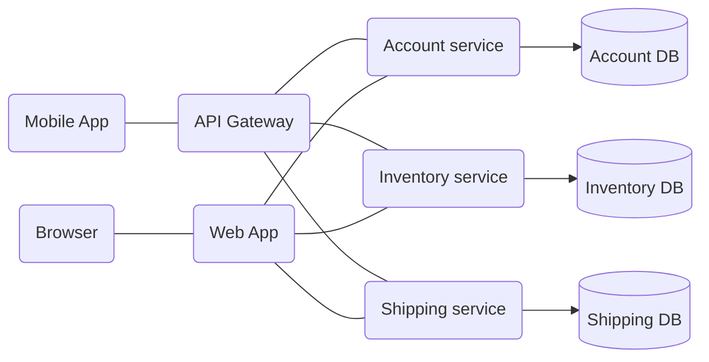
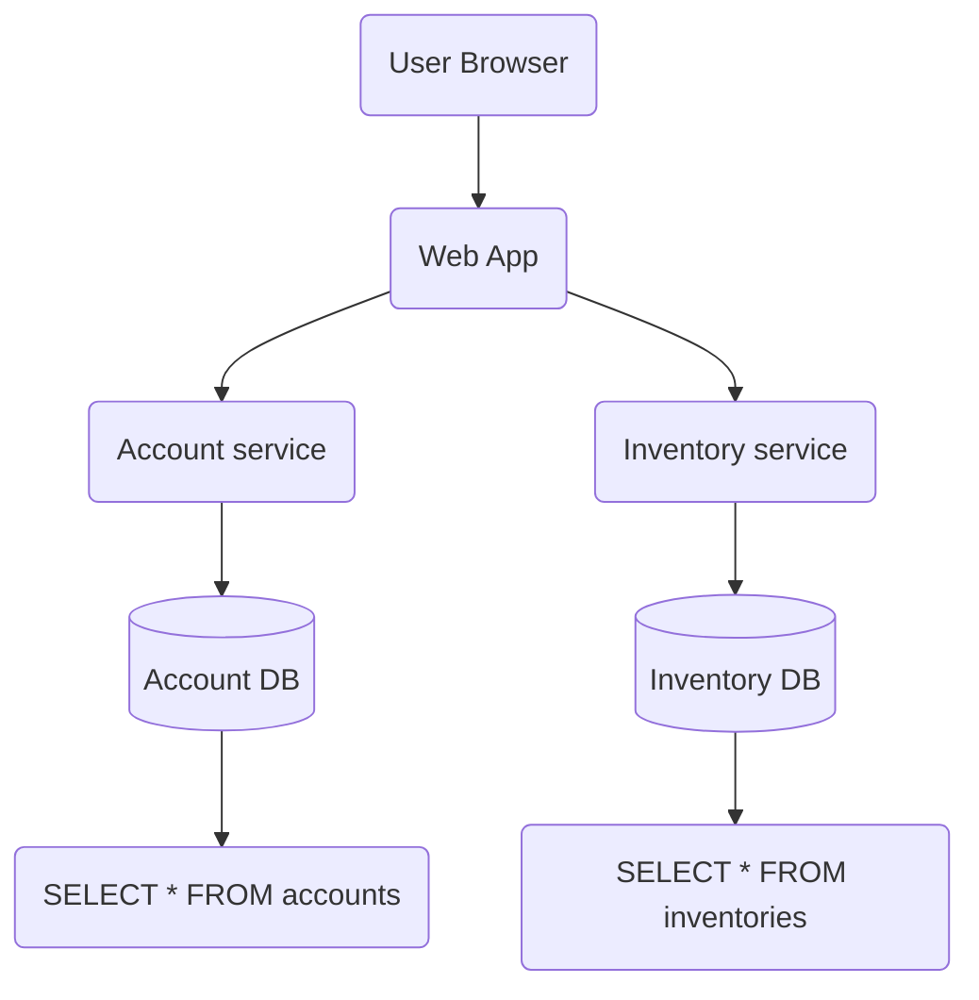

# Source: https://uptrace.dev/raw/opentelemetry/distributed-tracing.md

# What is Distributed Tracing and How It Works with OpenTelemetry

> Track requests across microservices with distributed tracing. Learn spans, traces, trace IDs, context propagation, and W3C TraceContext with OpenTelemetry examples.

**Quick Answer:** Distributed tracing tracks requests across microservices by creating a **trace** (complete request journey) composed of **spans** (individual operations). Each span has a unique span ID, shares a trace ID with related spans, and propagates context via HTTP headers (traceparent). OpenTelemetry provides standardized APIs for implementing tracing in any language.

**Key Concepts in 30 seconds:**

- **Trace**: Complete request path through your system (e.g., "user checkout: 500ms across 4 services")
- **Span**: Single operation within a trace (e.g., "query database: 50ms in payment service")
- **Trace ID**: Unique identifier shared by all spans in a trace (128-bit)
- **Span ID**: Unique identifier for each span (64-bit)
- **Context Propagation**: How trace IDs pass between services via traceparent header

Distributed tracing is an observability technique that creates a complete view of request flow through distributed systems, recording timing, dependencies, and failures across microservices, APIs, and databases. This visibility is essential for identifying performance bottlenecks, diagnosing issues, and understanding system behavior in microservices architectures.

## How Distributed Tracing Works

Modern applications built on microservices or serverless architectures rely on multiple services interacting to fulfill a single user request. This complexity makes it challenging to identify performance bottlenecks, diagnose issues, and analyze overall system behavior.

Distributed tracing addresses these challenges by creating a **trace**—a representation of a single request's journey through various services and components. Each trace consists of interconnected **spans**, where each span represents an individual operation within a specific service or component.

When a request enters a service, the [trace context](#context) propagates with the request through trace headers, allowing downstream services to participate in the same trace. As the request flows through the system, each service generates its own span and updates the trace context with information about the operation's duration, metadata, and relevant context.



[Distributed tracing tools](/tools/distributed-tracing-tools) use the generated trace data to provide visibility into system behavior, identify performance issues, assist with debugging, and help ensure the reliability and scalability of distributed applications.

## Distributed Tracing vs Logging

While both distributed tracing and logging are essential observability techniques, they serve different purposes and provide complementary insights into system behavior.

<table>
<thead>
  <tr>
    <th>
      Aspect
    </th>
    
    <th>
      Distributed Tracing
    </th>
    
    <th>
      Logging
    </th>
  </tr>
</thead>

<tbody>
  <tr>
    <td>
      <strong>
        Scope
      </strong>
    </td>
    
    <td>
      Tracks requests across multiple services
    </td>
    
    <td>
      Records events within a single service or process
    </td>
  </tr>
  
  <tr>
    <td>
      <strong>
        Structure
      </strong>
    </td>
    
    <td>
      Hierarchical tree of spans with parent-child relationships
    </td>
    
    <td>
      Independent, timestamped event records
    </td>
  </tr>
  
  <tr>
    <td>
      <strong>
        Context
      </strong>
    </td>
    
    <td>
      Maintains request context via trace IDs across service boundaries
    </td>
    
    <td>
      Local to individual service; requires correlation via trace ID
    </td>
  </tr>
  
  <tr>
    <td>
      <strong>
        Primary Use Case
      </strong>
    </td>
    
    <td>
      Understanding request flow, latency breakdown, service dependencies
    </td>
    
    <td>
      Debugging specific errors, auditing, application state inspection
    </td>
  </tr>
  
  <tr>
    <td>
      <strong>
        Data Volume
      </strong>
    </td>
    
    <td>
      Lower volume; samples percentage of requests
    </td>
    
    <td>
      Higher volume; all or most events recorded
    </td>
  </tr>
  
  <tr>
    <td>
      <strong>
        Query Pattern
      </strong>
    </td>
    
    <td>
      "Show me the path and timing of request X"
    </td>
    
    <td>
      "Show me all errors containing message Y"
    </td>
  </tr>
</tbody>
</table>

**When to use tracing**: Analyzing performance bottlenecks across services, understanding request dependencies, measuring end-to-end latency, identifying which service causes failures.

**When to use logging**: Debugging specific errors with detailed context, auditing user actions, capturing application state changes, detailed troubleshooting within a service.

**Best practice**: Use both together. [OpenTelemetry logs](/opentelemetry/logs) can include trace IDs and span IDs, allowing you to jump from a trace span directly to related log entries for detailed debugging. This combination provides both the "big picture" request flow (tracing) and granular details (logging).

## Distributed Tracing in Microservices

Microservices architectures present unique observability challenges that make distributed tracing essential rather than optional. When a monolithic application becomes dozens of independent services, understanding system behavior requires tracking requests across service boundaries.

**Why microservices need distributed tracing:**

- **Request path complexity**: A single user action may trigger calls to 5-15 different services. Without tracing, identifying which service caused a 500ms delay becomes guesswork.
- **Distributed failures**: When Service A fails, the root cause might be in Service C three hops away. Traces show the complete failure chain.
- **Cross-team ownership**: Different teams own different services. Shared trace IDs allow teams to collaborate on performance issues without accessing each other's logs.
- **Dynamic service mesh**: Services scale independently, run in containers, and change IP addresses. Traditional logging with static hostnames breaks; trace IDs remain consistent.

**Common microservices tracing patterns:**

- **API Gateway as root span**: Gateway creates the initial trace ID and propagates it to all downstream services
- **Service-to-service spans**: Each internal API call creates a CLIENT span in the caller and SERVER span in the callee
- **Async operations**: Producer/Consumer spans for message queues ensure background jobs appear in the same trace
- **Database instrumentation**: Client spans for SQL queries show which service caused expensive database operations

**Key benefits for microservices:**

1. **Latency attribution**: Trace waterfalls show exactly which service contributed how much latency to the total request time
2. **Dependency mapping**: Automatic service topology graphs based on observed span relationships
3. **Cascading failure analysis**: Identify which upstream service failure caused downstream 503 errors
4. **Cross-service debugging**: Navigate from a slow endpoint to the specific database query in a different service

For microservices running on Kubernetes, [OpenTelemetry Kubernetes Operator](/opentelemetry/operator) can automatically inject trace context propagation into all services without code changes.

## Span Kinds

OpenTelemetry defines five span kinds that describe how services interact within a trace:

<table>
<thead>
  <tr>
    <th>
      Span Kind
    </th>
    
    <th>
      Type
    </th>
    
    <th>
      When to Use
    </th>
    
    <th>
      Common Examples
    </th>
  </tr>
</thead>

<tbody>
  <tr>
    <td>
      <strong>
        Server
      </strong>
    </td>
    
    <td>
      Synchronous
    </td>
    
    <td>
      Handling incoming requests
    </td>
    
    <td>
      HTTP server, gRPC server, GraphQL resolvers
    </td>
  </tr>
  
  <tr>
    <td>
      <strong>
        Client
      </strong>
    </td>
    
    <td>
      Synchronous
    </td>
    
    <td>
      Making outbound requests
    </td>
    
    <td>
      HTTP client, database queries, Redis calls
    </td>
  </tr>
  
  <tr>
    <td>
      <strong>
        Producer
      </strong>
    </td>
    
    <td>
      Asynchronous
    </td>
    
    <td>
      Publishing messages (ends when message accepted)
    </td>
    
    <td>
      Kafka publish, RabbitMQ send, SQS enqueue
    </td>
  </tr>
  
  <tr>
    <td>
      <strong>
        Consumer
      </strong>
    </td>
    
    <td>
      Asynchronous
    </td>
    
    <td>
      Processing messages (from receive to completion)
    </td>
    
    <td>
      Kafka consume, background job processing
    </td>
  </tr>
  
  <tr>
    <td>
      <strong>
        Internal
      </strong>
    </td>
    
    <td>
      In-process
    </td>
    
    <td>
      Operations within a service (no network calls)
    </td>
    
    <td>
      Business logic, calculations, data transform
    </td>
  </tr>
</tbody>
</table>

Choosing the correct span kind ensures accurate visualization in trace waterfalls and helps backends understand service dependencies.

## Getting Started with OpenTelemetry Tracing

The easiest way to get started is to choose an OpenTelemetry APM and follow its documentation. Many vendors offer pre-configured OpenTelemetry distributions that simplify the setup process.

Some vendors, such as [Uptrace](https://play.uptrace.dev/) and [SkyWalking](http://demo.skywalking.apache.org/), allow you to try their products without creating an account.

Uptrace is an [open source APM](/opentelemetry/apm) for OpenTelemetry with an intuitive query builder, rich dashboards, automatic alerts, and integrations for most languages and frameworks. It helps developers and operators gain insight into the latency, errors, and dependencies of their distributed applications, identify performance bottlenecks, debug problems, and optimize overall system performance.

You can [get started](/get) with Uptrace by downloading a DEB/RPM package or a pre-compiled Go binary.

## Core Concepts

### Spans

A **span** represents a unit of work in a trace, such as a remote procedure call (RPC), database query, or in-process function call. Each span contains:

- A [span name](#span-names) (operation name)
- A parent span ID (except for root spans)
- A [span kind](#span-kind)
- Start and end timestamps
- A [status](#status-code) indicating success or failure
- Key-value [attributes](#attributes) describing the operation
- A timeline of [events](#events)
- Links to other spans
- A span [context](#context) that propagates trace ID and other data between services

A **trace** is a tree of spans showing the path of a request through an application. The root span is the first span in a trace.



### Span Names

[OpenTelemetry backends](/blog/opentelemetry-backend) use span names and attributes to group similar spans together. To ensure proper grouping, use short, concise names. Keep the total number of unique span names below 1,000 to avoid creating excessive span groups that can degrade performance.

**Good span names** (short, distinctive, and groupable):

<table>
<thead>
  <tr>
    <th>
      Span name
    </th>
    
    <th>
      Comment
    </th>
  </tr>
</thead>

<tbody>
  <tr>
    <td>
      <code>
        GET /projects/:id
      </code>
    </td>
    
    <td>
      Route name with parameter placeholders
    </td>
  </tr>
  
  <tr>
    <td>
      <code>
        select_project
      </code>
    </td>
    
    <td>
      Function name without arguments
    </td>
  </tr>
  
  <tr>
    <td>
      <code>
        SELECT * FROM projects WHERE id = ?
      </code>
    </td>
    
    <td>
      Database query with placeholders
    </td>
  </tr>
</tbody>
</table>

**Poor span names** (contain variable parameters):

<table>
<thead>
  <tr>
    <th>
      Span name
    </th>
    
    <th>
      Comment
    </th>
  </tr>
</thead>

<tbody>
  <tr>
    <td>
      <code>
        GET /projects/42
      </code>
    </td>
    
    <td>
      Contains variable parameter <code>
        42
      </code>
    </td>
  </tr>
  
  <tr>
    <td>
      <code>
        select_project(42)
      </code>
    </td>
    
    <td>
      Contains variable argument <code>
        42
      </code>
    </td>
  </tr>
  
  <tr>
    <td>
      <code>
        SELECT * FROM projects WHERE id = 42
      </code>
    </td>
    
    <td>
      Contains variable value <code>
        42
      </code>
    </td>
  </tr>
</tbody>
</table>

### Span Kind

Span kind describes the relationship between spans in a trace and helps systems understand how services interact. It must be one of the following values:

#### Server

Server spans represent synchronous request handling on the server side. The span covers the time from receiving a request to sending a response.

**Common use cases**:

- HTTP server request handlers
- gRPC server methods
- GraphQL resolvers
- Websocket message handlers

**Examples**:

<code-group>

```go [Go]
_, span := tracer.Start(ctx, "handle_request",
    trace.WithSpanKind(trace.SpanKindServer),
    trace.WithAttributes(
        semconv.HTTPMethod("GET"),
        semconv.HTTPRoute("/api/users/:id"),
    ))
defer span.End()
```

```python [Python]
with tracer.start_as_current_span(
    "handle_request",
    kind=trace.SpanKind.SERVER,
    attributes={
        "http.method": "GET",
        "http.route": "/api/users/:id",
    }
) as span:
    # Handle request
    pass
```

```js [Node.js]
const span = tracer.startSpan('handle_request', {
  kind: trace.SpanKind.SERVER,
  attributes: {
    'http.method': 'GET',
    'http.route': '/api/users/:id',
  }
});
// Handle request
span.end();
```

</code-group>

#### Client

Client spans represent synchronous outbound requests from the client side. The span covers the time from sending a request to receiving a response.

**Common use cases**:

- HTTP client requests
- gRPC client calls
- Database queries
- Cache operations (Redis, Memcached)

**Examples**:

<code-group>

```go [Go]
_, span := tracer.Start(ctx, "database_query",
    trace.WithSpanKind(trace.SpanKindClient),
    trace.WithAttributes(
        semconv.DBSystemPostgreSQL,
        semconv.DBQueryText("SELECT * FROM users WHERE id = ?"),
    ))
defer span.End()
```

```python [Python]
with tracer.start_as_current_span(
    "database_query",
    kind=trace.SpanKind.CLIENT,
    attributes={
        "db.system": "postgresql",
        "db.query.text": "SELECT * FROM users WHERE id = ?",
    }
) as span:
    # Execute query
    pass
```

```js [Node.js]
const span = tracer.startSpan('database_query', {
  kind: trace.SpanKind.CLIENT,
  attributes: {
    'db.system': 'postgresql',
    'db.query.text': 'SELECT * FROM users WHERE id = ?',
  }
});
// Execute query
span.end();
```

</code-group>

#### Producer

Producer spans represent asynchronous message creation and sending operations. The span ends when the message is accepted by the messaging system (not when it's consumed).

**Common use cases**:

- Publishing to Kafka topics
- Sending messages to RabbitMQ
- Publishing to AWS SQS/SNS
- Enqueueing background jobs

**Examples**:

<code-group>

```go [Go]
_, span := tracer.Start(ctx, "publish_event",
    trace.WithSpanKind(trace.SpanKindProducer),
    trace.WithAttributes(
        semconv.MessagingSystemKafka,
        semconv.MessagingDestinationName("user.events"),
    ))
defer span.End()
```

```python [Python]
with tracer.start_as_current_span(
    "publish_event",
    kind=trace.SpanKind.PRODUCER,
    attributes={
        "messaging.system": "kafka",
        "messaging.destination.name": "user.events",
    }
) as span:
    # Publish message
    pass
```

```js [Node.js]
const span = tracer.startSpan('publish_event', {
  kind: trace.SpanKind.PRODUCER,
  attributes: {
    'messaging.system': 'kafka',
    'messaging.destination.name': 'user.events',
  }
});
// Publish message
span.end();
```

</code-group>

#### Consumer

Consumer spans represent asynchronous message receipt and processing operations. The span covers the time from receiving a message to completing its processing.

**Common use cases**:

- Consuming from Kafka topics
- Processing messages from RabbitMQ
- Receiving from AWS SQS
- Background job processing

**Examples**:

<code-group>

```go [Go]
_, span := tracer.Start(ctx, "process_message",
    trace.WithSpanKind(trace.SpanKindConsumer),
    trace.WithAttributes(
        semconv.MessagingSystemKafka,
        semconv.MessagingOperationProcess,
    ))
defer span.End()
```

```python [Python]
with tracer.start_as_current_span(
    "process_message",
    kind=trace.SpanKind.CONSUMER,
    attributes={
        "messaging.system": "kafka",
        "messaging.operation.type": "process",
    }
) as span:
    # Process message
    pass
```

```js [Node.js]
const span = tracer.startSpan('process_message', {
  kind: trace.SpanKind.CONSUMER,
  attributes: {
    'messaging.system': 'kafka',
    'messaging.operation.type': 'process',
  }
});
// Process message
span.end();
```

</code-group>

#### Internal

Internal spans represent in-process operations that don't involve external services or network calls.

**Common use cases**:

- Application business logic
- Data transformation functions
- Internal calculations
- In-memory operations

**Examples**:

<code-group>

```go [Go]
_, span := tracer.Start(ctx, "calculate_total",
    trace.WithSpanKind(trace.SpanKindInternal),
    trace.WithAttributes(
        attribute.Int("item_count", len(items)),
    ))
defer span.End()
```

```python [Python]
with tracer.start_as_current_span(
    "calculate_total",
    kind=trace.SpanKind.INTERNAL,
    attributes={
        "item_count": len(items),
    }
) as span:
    # Calculate total
    pass
```

```js [Node.js]
const span = tracer.startSpan('calculate_total', {
  kind: trace.SpanKind.INTERNAL,
  attributes: {
    'item_count': items.length,
  }
});
// Calculate total
span.end();
```

</code-group>

**Span Kind in Traces**: In a typical trace waterfall, you'll see client and server spans paired together (the client span calling a service creates a server span on that service), with internal spans showing work within each service, and producer/consumer spans showing asynchronous message flows.

### Status Code

Status code indicates whether an operation succeeded or failed:

- `ok` – Success
- `error` – Failure
- `unset` – Default value, allowing backends to assign status

### Attributes

Attributes provide contextual information about spans. For example, an HTTP endpoint might have attributes like `http.method = GET` and `http.route = /projects/:id`.

While you can name attributes freely, use [semantic attribute conventions](/opentelemetry/semconv) for common operations to ensure consistency across systems.

### Events

Events are timestamped annotations with attributes that lack an end time (and therefore no duration). They typically represent exceptions, errors, logs, and messages, though you can create custom events as well.

### Context

Span context carries information about a span as it propagates through different components and services. It includes:

- **Trace ID**: Globally unique identifier for the entire trace (128-bit / 16 bytes, shared by all spans in the trace)
- **Span ID**: Unique identifier for a specific span within a trace (64-bit / 8 bytes)
- **Trace flags**: Properties such as sampling status (8-bit field, where `01` = sampled)
- **Trace state**: Optional vendor-specific or application-specific data

Context maintains continuity and correlation of spans within a distributed system, allowing services to associate their spans with the correct trace and providing end-to-end visibility.

### Span Structure Example

Here's a complete JSON representation of a span showing all key fields:

```json
{
  "traceId": "5b8efff798038103d269b633813fc60c",
  "spanId": "eee19b7ec3c1b174",
  "parentSpanId": "eee19b7ec3c1b173",
  "name": "GET /api/users/:id",
  "kind": "SERVER",
  "startTimeUnixNano": 1704067200000000000,
  "endTimeUnixNano": 1704067200150000000,
  "attributes": [
    {
      "key": "http.method",
      "value": { "stringValue": "GET" }
    },
    {
      "key": "http.route",
      "value": { "stringValue": "/api/users/:id" }
    },
    {
      "key": "http.status_code",
      "value": { "intValue": 200 }
    },
    {
      "key": "service.name",
      "value": { "stringValue": "user-service" }
    }
  ],
  "events": [
    {
      "timeUnixNano": 1704067200050000000,
      "name": "database.query.start",
      "attributes": [
        {
          "key": "db.statement",
          "value": { "stringValue": "SELECT * FROM users WHERE id = ?" }
        }
      ]
    },
    {
      "timeUnixNano": 1704067200100000000,
      "name": "cache.lookup",
      "attributes": [
        {
          "key": "cache.hit",
          "value": { "boolValue": true }
        }
      ]
    }
  ],
  "status": {
    "code": "STATUS_CODE_OK"
  },
  "resource": {
    "attributes": [
      {
        "key": "service.name",
        "value": { "stringValue": "user-service" }
      },
      {
        "key": "service.version",
        "value": { "stringValue": "1.2.3" }
      },
      {
        "key": "host.name",
        "value": { "stringValue": "prod-server-01" }
      }
    ]
  }
}
```

This span shows:

- **Duration**: 150ms (from start to end time)
- **Parent relationship**: Connected to parent span via `parentSpanId`
- **Attributes**: HTTP request details and service information
- **Events**: Two timestamped events during execution (database query and cache lookup)
- **Status**: Successful operation
- **Resource**: Service and host metadata

## Context Propagation

[Context propagation](/opentelemetry/context-propagation) ensures that trace IDs, span IDs, and other metadata consistently propagate across services and components. OpenTelemetry handles both in-process and distributed propagation.

### In-Process Propagation

- **Implicit**: Automatic storage in thread-local variables (Java, Python, Ruby, Node.js)
- **Explicit**: Manual passing of context as function arguments (Go)

### Distributed Propagation

OpenTelemetry supports several protocols for serializing and passing context data:

- **W3C Trace Context** (recommended, enabled by default): Uses `traceparent` header<br />


Example: `traceparent=00-84b54e9330faae5350f0dd8673c98146-279fa73bc935cc05-01`
- **B3 Zipkin**: Uses headers starting with `x-b3-`<br />


Example: `X-B3-TraceId`

#### W3C Trace Context Format

The `traceparent` header contains four fields separated by dashes:

```text
traceparent: 00-5b8efff798038103d269b633813fc60c-eee19b7ec3c1b174-01
             ││ │                                │                  └─ Trace flags (01 = sampled, 00 = not sampled)
             ││ │                                └──────────────────── Parent ID (16 hex chars, 8 bytes)
             ││ └───────────────────────────────────────────────────── Trace ID (32 hex chars, 16 bytes)
             │└─────────────────────────────────────────────────────── Version (00 - current W3C standard)
```

**Example HTTP Request with Context**:

```http
GET /api/users/123 HTTP/1.1
Host: api.example.com
traceparent: 00-5b8efff798038103d269b633813fc60c-eee19b7ec3c1b174-01
tracestate: uptrace=t61rcWkgMzE
```

Most OpenTelemetry instrumentation libraries automatically handle context propagation for HTTP requests, gRPC calls, and message queues. For manual propagation examples, message queue patterns, troubleshooting broken traces, and baggage usage, see the full [context propagation guide](/opentelemetry/context-propagation).

## Baggage

[Baggage](https://github.com/open-telemetry/opentelemetry-specification/blob/main/specification/baggage/api.md) propagates custom key-value pairs (user IDs, tenant IDs, feature flags) alongside trace context across service boundaries. Part of the W3C TraceContext specification, baggage enables cross-cutting concerns like multi-tenant filtering or A/B testing without modifying service APIs. See [context propagation guide](/opentelemetry/context-propagation#baggage) for usage examples and best practices.

## Instrumentation

OpenTelemetry instrumentations are plugins for popular frameworks and libraries that use the OpenTelemetry API to record important operations such as HTTP requests, database queries, logs, and errors.

### What to Instrument

Focus instrumentation efforts on operations that provide the most value:

- **Network operations**: HTTP requests, RPC calls
- **Filesystem operations**: Reading and writing files
- **Database queries**: Combined network and filesystem operations
- **Errors and logs**: Using [structured logging](/glossary/structured-logging)

### Manual Instrumentation

While automatic instrumentation covers common frameworks, manual instrumentation gives you fine-grained control over what gets traced. Here are comprehensive examples for creating and managing spans.

#### Creating Spans

<code-group>

```go [Go]
import (
    "context"
    "go.opentelemetry.io/otel"
    "go.opentelemetry.io/otel/attribute"
    "go.opentelemetry.io/otel/codes"
    "go.opentelemetry.io/otel/trace"
)

// Get tracer (typically done once at startup)
tracer := otel.Tracer("my-service")

func processOrder(ctx context.Context, orderID string) error {
    // Create a span
    ctx, span := tracer.Start(ctx, "process_order",
        trace.WithSpanKind(trace.SpanKindInternal),
    )
    defer span.End()

    // Add attributes
    span.SetAttributes(
        attribute.String("order.id", orderID),
        attribute.String("customer.tier", "premium"),
    )

    // Do work
    if err := validateOrder(ctx, orderID); err != nil {
        // Record error
        span.RecordError(err)
        span.SetStatus(codes.Error, "order validation failed")
        return err
    }

    // Record event
    span.AddEvent("order_validated",
        trace.WithAttributes(
            attribute.String("validation.result", "success"),
        ))

    span.SetStatus(codes.Ok, "order processed successfully")
    return nil
}
```

```python [Python]
from opentelemetry import trace
from opentelemetry.trace import Status, StatusCode

tracer = trace.get_tracer("my-service")

def process_order(order_id: str):
    with tracer.start_as_current_span(
        "process_order",
        kind=trace.SpanKind.INTERNAL,
    ) as span:
        # Add attributes
        span.set_attributes({
            "order.id": order_id,
            "customer.tier": "premium",
        })

        try:
            validate_order(order_id)

            # Record event
            span.add_event("order_validated", {
                "validation.result": "success"
            })

            span.set_status(Status(StatusCode.OK))

        except Exception as e:
            # Record error
            span.record_exception(e)
            span.set_status(Status(StatusCode.ERROR, "order validation failed"))
            raise
```

```js [Node.js]
const { trace } = require('@opentelemetry/api');
const { SpanStatusCode } = require('@opentelemetry/api');

const tracer = trace.getTracer('my-service');

function processOrder(orderId) {
  const span = tracer.startSpan('process_order', {
    kind: trace.SpanKind.INTERNAL,
  });

  // Add attributes
  span.setAttributes({
    'order.id': orderId,
    'customer.tier': 'premium',
  });

  try {
    validateOrder(orderId);

    // Record event
    span.addEvent('order_validated', {
      'validation.result': 'success'
    });

    span.setStatus({ code: SpanStatusCode.OK });

  } catch (error) {
    // Record error
    span.recordException(error);
    span.setStatus({
      code: SpanStatusCode.ERROR,
      message: 'order validation failed'
    });
    throw error;

  } finally {
    span.end();
  }
}
```

</code-group>

#### Creating Nested Spans

Nested spans show parent-child relationships and help visualize the breakdown of operations.

<code-group>

```go [Go]
func processOrder(ctx context.Context, orderID string) error {
    ctx, span := tracer.Start(ctx, "process_order")
    defer span.End()

    // Child span 1: Validate
    if err := validateOrder(ctx, orderID); err != nil {
        return err
    }

    // Child span 2: Calculate
    total, err := calculateTotal(ctx, orderID)
    if err != nil {
        return err
    }

    // Child span 3: Save
    return saveOrder(ctx, orderID, total)
}

func validateOrder(ctx context.Context, orderID string) error {
    ctx, span := tracer.Start(ctx, "validate_order")
    defer span.End()

    // Validation logic
    return nil
}

func calculateTotal(ctx context.Context, orderID string) (float64, error) {
    ctx, span := tracer.Start(ctx, "calculate_total")
    defer span.End()

    // Calculation logic
    return 99.99, nil
}

func saveOrder(ctx context.Context, orderID string, total float64) error {
    ctx, span := tracer.Start(ctx, "save_order",
        trace.WithSpanKind(trace.SpanKindClient),
    )
    defer span.End()

    span.SetAttributes(
        attribute.Float64("order.total", total),
        attribute.String("db.system", "postgresql"),
    )

    // Database save logic
    return nil
}
```

```python [Python]
def process_order(order_id: str):
    with tracer.start_as_current_span("process_order") as span:
        # Child span 1: Validate
        validate_order(order_id)

        # Child span 2: Calculate
        total = calculate_total(order_id)

        # Child span 3: Save
        save_order(order_id, total)

def validate_order(order_id: str):
    with tracer.start_as_current_span("validate_order"):
        # Validation logic
        pass

def calculate_total(order_id: str) -> float:
    with tracer.start_as_current_span("calculate_total"):
        # Calculation logic
        return 99.99

def save_order(order_id: str, total: float):
    with tracer.start_as_current_span(
        "save_order",
        kind=trace.SpanKind.CLIENT,
        attributes={
            "order.total": total,
            "db.system": "postgresql",
        }
    ):
        # Database save logic
        pass
```

```js [Node.js]
function processOrder(orderId) {
  const span = tracer.startSpan('process_order');

  try {
    // Child span 1: Validate
    validateOrder(orderId);

    // Child span 2: Calculate
    const total = calculateTotal(orderId);

    // Child span 3: Save
    saveOrder(orderId, total);
  } finally {
    span.end();
  }
}

function validateOrder(orderId) {
  const span = tracer.startSpan('validate_order');
  try {
    // Validation logic
  } finally {
    span.end();
  }
}

function calculateTotal(orderId) {
  const span = tracer.startSpan('calculate_total');
  try {
    // Calculation logic
    return 99.99;
  } finally {
    span.end();
  }
}

function saveOrder(orderId, total) {
  const span = tracer.startSpan('save_order', {
    kind: trace.SpanKind.CLIENT,
    attributes: {
      'order.total': total,
      'db.system': 'postgresql',
    }
  });
  try {
    // Database save logic
  } finally {
    span.end();
  }
}
```

</code-group>

The resulting trace will show:

```text
process_order (200ms)
├── validate_order (50ms)
├── calculate_total (30ms)
└── save_order (120ms)
```

#### Adding Semantic Attributes

Use [semantic conventions](/opentelemetry/semconv) for consistent attribute naming:

<code-group>

```go [Go]
import "go.opentelemetry.io/otel/semconv/v1.24.0"

// HTTP attributes
span.SetAttributes(
    semconv.HTTPMethod("GET"),
    semconv.HTTPRoute("/api/users/:id"),
    semconv.HTTPStatusCode(200),
)

// Database attributes
span.SetAttributes(
    semconv.DBSystemPostgreSQL,
    semconv.DBNamespace("production"),
    semconv.DBQueryText("SELECT * FROM users WHERE id = ?"),
)

// Messaging attributes
span.SetAttributes(
    semconv.MessagingSystemKafka,
    semconv.MessagingDestinationName("user.events"),
)

// RPC attributes
span.SetAttributes(
    semconv.RPCSystemGRPC,
    semconv.RPCService("UserService"),
    semconv.RPCMethod("GetUser"),
)
```

```python [Python]
from opentelemetry.semconv.trace import SpanAttributes

# HTTP attributes
span.set_attributes({
    SpanAttributes.HTTP_METHOD: "GET",
    SpanAttributes.HTTP_ROUTE: "/api/users/:id",
    SpanAttributes.HTTP_STATUS_CODE: 200,
})

# Database attributes
span.set_attributes({
    SpanAttributes.DB_SYSTEM: "postgresql",
    SpanAttributes.DB_NAMESPACE: "production",
    SpanAttributes.DB_QUERY_TEXT: "SELECT * FROM users WHERE id = ?",
})

# Messaging attributes
span.set_attributes({
    SpanAttributes.MESSAGING_SYSTEM: "kafka",
    SpanAttributes.MESSAGING_DESTINATION_NAME: "user.events",
})

# RPC attributes
span.set_attributes({
    SpanAttributes.RPC_SYSTEM: "grpc",
    SpanAttributes.RPC_SERVICE: "UserService",
    SpanAttributes.RPC_METHOD: "GetUser",
})
```

```js [Node.js]
const { SEMATTRS_HTTP_METHOD, SEMATTRS_HTTP_ROUTE, SEMATTRS_HTTP_STATUS_CODE,
        SEMATTRS_DB_SYSTEM, SEMATTRS_DB_NAMESPACE, SEMATTRS_DB_QUERY_TEXT,
        SEMATTRS_MESSAGING_SYSTEM, SEMATTRS_MESSAGING_DESTINATION_NAME,
        SEMATTRS_RPC_SYSTEM, SEMATTRS_RPC_SERVICE, SEMATTRS_RPC_METHOD
} = require('@opentelemetry/semantic-conventions');

// HTTP attributes
span.setAttributes({
  [SEMATTRS_HTTP_METHOD]: 'GET',
  [SEMATTRS_HTTP_ROUTE]: '/api/users/:id',
  [SEMATTRS_HTTP_STATUS_CODE]: 200,
});

// Database attributes
span.setAttributes({
  [SEMATTRS_DB_SYSTEM]: 'postgresql',
  [SEMATTRS_DB_NAMESPACE]: 'production',
  [SEMATTRS_DB_QUERY_TEXT]: 'SELECT * FROM users WHERE id = ?',
});

// Messaging attributes
span.setAttributes({
  [SEMATTRS_MESSAGING_SYSTEM]: 'kafka',
  [SEMATTRS_MESSAGING_DESTINATION_NAME]: 'user.events',
});

// RPC attributes
span.setAttributes({
  [SEMATTRS_RPC_SYSTEM]: 'grpc',
  [SEMATTRS_RPC_SERVICE]: 'UserService',
  [SEMATTRS_RPC_METHOD]: 'GetUser',
});
```

</code-group>

#### Recording Events and Errors

Events capture point-in-time occurrences within a span:

<code-group>

```go [Go]
// Record a simple event
span.AddEvent("cache_miss")

// Event with attributes
span.AddEvent("retry_attempt",
    trace.WithAttributes(
        attribute.Int("attempt.number", 3),
        attribute.String("retry.reason", "connection_timeout"),
    ))

// Record an error
if err != nil {
    span.RecordError(err,
        trace.WithAttributes(
            attribute.String("error.type", "ValidationError"),
        ))
    span.SetStatus(codes.Error, err.Error())
}
```

```python [Python]
# Record a simple event
span.add_event("cache_miss")

# Event with attributes
span.add_event("retry_attempt", {
    "attempt.number": 3,
    "retry.reason": "connection_timeout"
})

# Record exception with stack trace
try:
    risky_operation()
except Exception as e:
    span.record_exception(e)  # Automatically captures stack trace
    span.set_status(Status(StatusCode.ERROR))
    raise
```

```js [Node.js]
// Record a simple event
span.addEvent('cache_miss');

// Event with attributes
span.addEvent('retry_attempt', {
  'attempt.number': 3,
  'retry.reason': 'connection_timeout'
});

// Record an error
if (error) {
  span.recordException(error);
  span.setStatus({
    code: SpanStatusCode.ERROR,
    message: error.message
  });
}
```

</code-group>

## Challenges and Solutions

Implementing distributed tracing presents several common challenges. Understanding these issues and their solutions helps ensure a successful deployment.

### Performance Overhead

Adding tracing to production systems introduces latency and resource consumption. The key is balancing observability with performance.

**Challenge**: Application latency increases after enabling tracing, especially in high-throughput services processing thousands of requests per second.

**Solutions**:

- **Use asynchronous batch exporters**: Never block application threads waiting for span export. OpenTelemetry SDKs default to async batch exporters that queue spans in memory and export in batches.
- **Implement smart sampling**: Sample 1-5% of requests in high-traffic applications, 100% in low-traffic services. Consider [tail-based sampling](/opentelemetry/sampling#tail-based) to capture all errors while sampling successful requests.
- **Instrument selectively**: Focus on critical paths (API endpoints, database queries, external calls) rather than every function. Over-instrumentation creates more overhead than value.
- **Limit attribute sizes**: Cap string attribute lengths to prevent large payloads. Remove high-cardinality attributes like full SQL queries or request bodies.

### Data Volume and Cardinality

High cardinality in span names or attributes causes storage bloat and query performance degradation in tracing backends.

**Challenge**: Hundreds of thousands of unique span names appear because span names include variable data like IDs or timestamps.

**Solutions**:

- **Parameterize span names**: Use `GET /users/{id}` instead of `GET /users/12345`. Follow [semantic conventions](/opentelemetry/semconv) for consistent naming patterns.
- **Bucket attribute values**: Convert numeric values into ranges (e.g., `latency_bucket=100-200ms` instead of `latency=127ms`).
- **Avoid unique identifiers in span names**: Put request IDs, user IDs, and transaction IDs in attributes, not span names.

### Missing or Disconnected Spans

Incomplete traces make it difficult to understand request flow and identify bottlenecks.

**Challenge**: Expected spans don't appear, or spans appear disconnected across services instead of forming a single trace.

**Common causes and solutions**:

1. **SDK initialized too late**: Initialize OpenTelemetry before importing libraries that require instrumentation. Place initialization at application startup, before HTTP server or database connections start.
2. **Broken context propagation**: Context fails to propagate across service boundaries, creating orphaned spans.
  - Verify HTTP client/server instrumentation is active
  - Configure propagators globally: `otel.SetTextMapPropagator(propagation.TraceContext{})`
  - For async operations (goroutines, threads, workers), explicitly pass context
  - See [context propagation troubleshooting](/opentelemetry/context-propagation#troubleshooting-broken-traces) for detailed debugging steps
3. **Aggressive sampling**: Sampling drops spans before export. Temporarily set sampling to 100% during debugging to verify instrumentation works.
4. **Export failures**: Spans generate but fail to reach the backend due to network issues, authentication problems, or backend unavailability. Enable debug logging and monitor exporter metrics to identify export failures.

### Resource Management

Improper span lifecycle management leads to memory leaks and resource exhaustion.

**Challenge**: Memory usage grows over time or spans accumulate in buffers without being exported.

**Solutions**:

- **Always end spans**: Use `defer span.End()` (Go), `try-finally` (Java/Python), or `finally` blocks (JavaScript) to ensure spans close even when errors occur.
- **Configure appropriate export intervals**: Balance between real-time observability and export overhead. Default batch exporters typically export every 5 seconds or when buffer reaches 512 spans.
- **Monitor buffer sizes**: Set maximum queue sizes to prevent unbounded memory growth. Configure `OTEL_BSP_MAX_QUEUE_SIZE` environment variable.
- **Review span lifecycle**: Long-running spans (hours or days) hold memory until export. Consider splitting long operations into shorter spans.

## Next Steps

Distributed tracing provides valuable insights for understanding end-to-end application behavior, identifying performance issues, and optimizing system resources.

Explore the OpenTelemetry tracing API for your programming language:

<home-distro-list page="tracing">


</home-distro-list>
