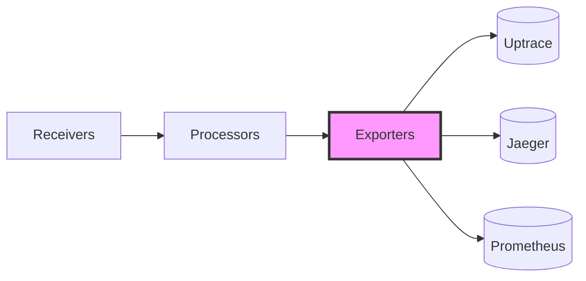

# Source: https://uptrace.dev/raw/opentelemetry/collector/exporters.md

# OpenTelemetry Collector Exporters

> Complete guide to OpenTelemetry Collector exporters. Configure OTLP, Uptrace, Jaeger, Prometheus, Zipkin, AWS X-Ray exporters for traces, metrics, and logs with production examples, retry configuration, and troubleshooting.

OpenTelemetry Collector exporters are responsible for sending processed telemetry data to observability backends. This guide covers everything you need to know about configuring exporters for traces, metrics, and logs in production environments.

## What are Collector Exporters?

Exporters are components in the [OpenTelemetry Collector](/opentelemetry/collector) that send telemetry data to backends for storage, analysis, and visualization. They sit at the end of the processing pipeline and handle the critical task of reliably delivering your observability data to its final destination.



### Exporters vs SDK Exporters

It's important to understand the difference between Collector exporters and SDK exporters:

<table>
<thead>
  <tr>
    <th>
      Aspect
    </th>
    
    <th>
      SDK Exporters
    </th>
    
    <th>
      Collector Exporters
    </th>
  </tr>
</thead>

<tbody>
  <tr>
    <td>
      <strong>
        Location
      </strong>
    </td>
    
    <td>
      Embedded in application
    </td>
    
    <td>
      Separate service/process
    </td>
  </tr>
  
  <tr>
    <td>
      <strong>
        Language
      </strong>
    </td>
    
    <td>
      Language-specific (Go, Python, Java)
    </td>
    
    <td>
      Language-agnostic
    </td>
  </tr>
  
  <tr>
    <td>
      <strong>
        Configuration
      </strong>
    </td>
    
    <td>
      Code or environment variables
    </td>
    
    <td>
      YAML configuration file
    </td>
  </tr>
  
  <tr>
    <td>
      <strong>
        Use Case
      </strong>
    </td>
    
    <td>
      Direct export from application
    </td>
    
    <td>
      Centralized data processing
    </td>
  </tr>
  
  <tr>
    <td>
      <strong>
        Flexibility
      </strong>
    </td>
    
    <td>
      Limited post-processing
    </td>
    
    <td>
      Full processing pipeline
    </td>
  </tr>
</tbody>
</table>

**When to use Collector exporters:**

- You need to process data before export (filtering, sampling, enrichment)
- Multiple applications send to the same backend
- You want to decouple application from backend changes
- You need advanced features like load balancing or retry logic

## Quick Start

The simplest way to export telemetry data using OTLP:

```yaml
exporters:
  otlp/uptrace:
    endpoint: api.uptrace.dev:4317
    headers:
      uptrace-dsn: '<FIXME>'

service:
  pipelines:
    traces:
      receivers: [otlp]
      processors: [batch]
      exporters: [otlp/uptrace]
    metrics:
      receivers: [otlp]
      processors: [batch]
      exporters: [otlp/uptrace]
    logs:
      receivers: [otlp]
      processors: [batch]
      exporters: [otlp/uptrace]
```

> 💡 **Backend Configuration:** This guide uses Uptrace as the primary example backend. OpenTelemetry is vendor-neutral - all configuration patterns work with Jaeger, Prometheus, Grafana Cloud, Datadog, or any [OTLP-compatible platform](/blog/opentelemetry-compatible-platforms).

Replace `<FIXME>` with your actual DSN and you're ready to start exporting data. This configuration:

- Accepts telemetry via OTLP protocol
- Batches data for efficient transmission
- Exports to Uptrace backend

## OTLP Exporters

The OpenTelemetry Protocol ([OTLP](https://opentelemetry.io/docs/specs/otel/protocol/)) is the native protocol for OpenTelemetry and the recommended choice for new deployments. OTLP exporters are designed to work seamlessly with the OpenTelemetry data model, preserving all telemetry information without loss.

### Why Choose OTLP?

- **Native protocol** - Designed specifically for OpenTelemetry data
- **No data loss** - Preserves all attributes, resource information, and context
- **Efficient** - Uses Protocol Buffers for compact serialization
- **Flexible** - Supports both gRPC and HTTP transports
- **Future-proof** - The standard protocol that all backends are adopting

### gRPC vs HTTP

OTLP supports two transport protocols:

<table>
<thead>
  <tr>
    <th>
      Feature
    </th>
    
    <th>
      gRPC
    </th>
    
    <th>
      HTTP
    </th>
  </tr>
</thead>

<tbody>
  <tr>
    <td>
      <strong>
        Performance
      </strong>
    </td>
    
    <td>
      Higher throughput, lower latency
    </td>
    
    <td>
      Slightly higher overhead
    </td>
  </tr>
  
  <tr>
    <td>
      <strong>
        Compatibility
      </strong>
    </td>
    
    <td>
      May have firewall issues
    </td>
    
    <td>
      Works everywhere
    </td>
  </tr>
  
  <tr>
    <td>
      <strong>
        Streaming
      </strong>
    </td>
    
    <td>
      Bidirectional streaming support
    </td>
    
    <td>
      Request/response only
    </td>
  </tr>
  
  <tr>
    <td>
      <strong>
        Default Port
      </strong>
    </td>
    
    <td>
      4317
    </td>
    
    <td>
      4318
    </td>
  </tr>
  
  <tr>
    <td>
      <strong>
        Best For
      </strong>
    </td>
    
    <td>
      High-volume production
    </td>
    
    <td>
      Firewall-restricted environments
    </td>
  </tr>
</tbody>
</table>

## Basic OTLP Configuration

OTLP exporters work with any backend that supports the OpenTelemetry Protocol. Here are common configurations for different transport protocols and authentication methods.

<code-group>

```yaml [gRPC (Default)]
exporters:
  otlp/uptrace:
    endpoint: api.uptrace.dev:4317
    headers:
      uptrace-dsn: '<YOUR_DSN>'
    compression: gzip
```

```yaml [HTTP]
exporters:
  otlphttp/uptrace:
    endpoint: https://api.uptrace.dev:4318
    headers:
      uptrace-dsn: '<YOUR_DSN>'
    compression: gzip
```

```yaml [Insecure (Dev Only)]
exporters:
  otlp/dev:
    endpoint: localhost:4317
    tls:
      insecure: true
```

</code-group>

For secure connections with TLS/mTLS, see [Authentication and Security](#authentication-and-security) below.

### Authentication and Security

#### Headers Authentication

Most backends use headers for authentication:

```yaml
exporters:
  otlp/uptrace:
    endpoint: api.uptrace.dev:4317
    headers:
      uptrace-dsn: '<YOUR_DSN>'
      api-key: '<YOUR_API_KEY>'
      custom-header: 'custom-value'
```

#### TLS Configuration

For secure communication with custom certificates:

```yaml
exporters:
  otlp/backend:
    endpoint: backend.company.com:4317
    tls:
      # Path to CA certificate
      ca_file: /path/to/ca.crt

      # Client certificate authentication
      cert_file: /path/to/client.crt
      key_file: /path/to/client.key

      # Disable for development only
      insecure: false

      # Skip certificate verification (not recommended)
      insecure_skip_verify: false
```

#### mTLS (Mutual TLS)

For environments requiring client certificate authentication:

```yaml
exporters:
  otlp/secure:
    endpoint: secure-backend.company.com:4317
    tls:
      ca_file: /etc/ssl/certs/ca.crt
      cert_file: /etc/ssl/certs/client.crt
      key_file: /etc/ssl/private/client.key
      min_version: "1.3"
```

### Compression

Compression reduces bandwidth usage and can significantly improve performance:

```yaml
exporters:
  otlp/uptrace:
    endpoint: api.uptrace.dev:4317
    # Options: gzip, snappy, zstd, none
    compression: gzip
```

**Compression comparison:**

<table>
<thead>
  <tr>
    <th>
      Algorithm
    </th>
    
    <th>
      Compression Ratio
    </th>
    
    <th>
      CPU Usage
    </th>
    
    <th>
      Speed
    </th>
    
    <th>
      Best For
    </th>
  </tr>
</thead>

<tbody>
  <tr>
    <td>
      <strong>
        none
      </strong>
    </td>
    
    <td>
      1x
    </td>
    
    <td>
      Lowest
    </td>
    
    <td>
      Fastest
    </td>
    
    <td>
      Low latency requirements
    </td>
  </tr>
  
  <tr>
    <td>
      <strong>
        gzip
      </strong>
    </td>
    
    <td>
      ~3-5x
    </td>
    
    <td>
      Medium
    </td>
    
    <td>
      Medium
    </td>
    
    <td>
      Balanced (recommended)
    </td>
  </tr>
  
  <tr>
    <td>
      <strong>
        snappy
      </strong>
    </td>
    
    <td>
      ~2x
    </td>
    
    <td>
      Low
    </td>
    
    <td>
      Fast
    </td>
    
    <td>
      CPU-constrained environments
    </td>
  </tr>
  
  <tr>
    <td>
      <strong>
        zstd
      </strong>
    </td>
    
    <td>
      ~4-6x
    </td>
    
    <td>
      Medium-High
    </td>
    
    <td>
      Fast
    </td>
    
    <td>
      High bandwidth costs
    </td>
  </tr>
</tbody>
</table>

### Signal-Specific Configuration

You can configure different endpoints for different signals:

```yaml
exporters:
  # Traces to one backend
  otlp/traces:
    endpoint: traces.backend.com:4317
    headers:
      api-key: '<TRACES_KEY>'

  # Metrics to another
  otlp/metrics:
    endpoint: metrics.backend.com:4317
    headers:
      api-key: '<METRICS_KEY>'

  # Logs to a third
  otlp/logs:
    endpoint: logs.backend.com:4317
    headers:
      api-key: '<LOGS_KEY>'

service:
  pipelines:
    traces:
      receivers: [otlp]
      processors: [batch]
      exporters: [otlp/traces]
    metrics:
      receivers: [otlp]
      processors: [batch]
      exporters: [otlp/metrics]
    logs:
      receivers: [otlp]
      processors: [batch]
      exporters: [otlp/logs]
```

## Backend Exporters

While OTLP is the recommended protocol, the Collector supports dedicated exporters for popular observability backends including Uptrace, Jaeger, Prometheus, Zipkin, and cloud provider exporters for AWS X-Ray, Google Cloud Trace, Azure Monitor, and Datadog.

### Uptrace

Uptrace is an [OpenTelemetry-native open source APM](/opentelemetry/apm) with built-in OTLP support.

**Basic configuration:**

```yaml
exporters:
  otlp/uptrace:
    endpoint: api.uptrace.dev:4317
    headers:
      uptrace-dsn: '<YOUR_UPTRACE_DSN>'
    compression: gzip

service:
  pipelines:
    traces:
      receivers: [otlp]
      processors: [batch]
      exporters: [otlp/uptrace]
    metrics:
      receivers: [otlp]
      processors: [batch]
      exporters: [otlp/uptrace]
    logs:
      receivers: [otlp]
      processors: [batch]
      exporters: [otlp/uptrace]
```

**Self-hosted Uptrace:**

```yaml
exporters:
  otlp/uptrace:
    endpoint: uptrace.company.com:14317
    headers:
      uptrace-dsn: 'https://token@uptrace.company.com/project_id'
    tls:
      insecure: false
```

For detailed Uptrace setup, see the [Uptrace documentation](/get).

### Jaeger

Jaeger natively supports OTLP since version 1.35, making it the recommended way to send traces to Jaeger.

**Using OTLP (recommended):**

```yaml
exporters:
  otlp/jaeger:
    endpoint: jaeger-collector:4317
    tls:
      insecure: true

service:
  pipelines:
    traces:
      receivers: [otlp]
      processors: [batch]
      exporters: [otlp/jaeger]
```

**Historical Note:**<br />


The native Jaeger exporter (`jaeger:` and `jaegerthrifthttpexporter:`) was removed from official Collector distributions after v0.85.0. Jaeger v2 (released in 2024) is now built on the OpenTelemetry Collector architecture and fully supports OTLP.

For Jaeger versions prior to v1.35, you need to enable OTLP support:

```bash
docker run -d --name jaeger \
  -e COLLECTOR_OTLP_ENABLED=true \
  -p 16686:16686 \
  -p 4317:4317 \
  -p 4318:4318 \
  jaegertracing/all-in-one:latest
```

### Prometheus

Prometheus integration works differently - the exporter exposes metrics in Prometheus format for scraping. For traces always use OTLP.

**Prometheus exporter:**

```yaml
exporters:
  prometheus:
    endpoint: "0.0.0.0:8889"
    namespace: "otel"
    const_labels:
      environment: production
    send_timestamps: true
    metric_expiration: 5m

service:
  pipelines:
    metrics:
      receivers: [otlp]
      processors: [batch]
      exporters: [prometheus]
```

Configure Prometheus to scrape this endpoint:

```yaml
# prometheus.yml
scrape_configs:
  - job_name: 'otel-collector'
    static_configs:
      - targets: ['collector:8889']
```

**Prometheus Remote Write:**

For direct push to Prometheus or compatible systems:

```yaml
exporters:
  prometheusremotewrite:
    endpoint: "http://prometheus:9090/api/v1/write"
    tls:
      insecure: true

    # Optional: Basic auth
    headers:
      Authorization: "Bearer <token>"

service:
  pipelines:
    metrics:
      receivers: [otlp]
      processors: [batch]
      exporters: [prometheusremotewrite]
```

For Prometheus integration details, see [OpenTelemetry Collector Prometheus](/opentelemetry/collector/prometheus).

### Zipkin

Zipkin exporter for legacy Zipkin deployments:

```yaml
exporters:
  zipkin:
    endpoint: "http://zipkin:9411/api/v2/spans"
    format: json  # or proto
    timeout: 30s

service:
  pipelines:
    traces:
      receivers: [otlp]
      processors: [batch]
      exporters: [zipkin]
```

### Cloud Provider Exporters

Most major cloud providers offer native OpenTelemetry support through OTLP exporters. These exporters integrate directly with cloud-native observability services, providing seamless telemetry collection in cloud environments.

**When to use cloud provider exporters:**

- You're already using the cloud provider's observability stack
- You want tight integration with cloud-native services
- You need IAM/managed identity authentication
- Cost optimization through native integrations

<code-group>

```yaml [AWS X-Ray]
exporters:
  awsxray:
    region: us-west-2
    # Uses IAM role or credentials from environment
    role_arn: "arn:aws:iam::123456789012:role/XRayRole"

service:
  pipelines:
    traces:
      receivers: [otlp]
      processors: [batch]
      exporters: [awsxray]
```

```yaml [Google Cloud]
exporters:
  googlecloud:
    project: my-gcp-project
    # Uses application default credentials
    credentials_file: /path/to/credentials.json

service:
  pipelines:
    traces:
      receivers: [otlp]
      processors: [batch]
      exporters: [googlecloud]
```

```yaml [Azure Monitor]
exporters:
  azuremonitor:
    connection_string: "${APPLICATIONINSIGHTS_CONNECTION_STRING}"

service:
  pipelines:
    traces:
      receivers: [otlp]
      processors: [batch]
      exporters: [azuremonitor]
    metrics:
      receivers: [otlp]
      processors: [batch]
      exporters: [azuremonitor]
```

```yaml [Datadog]
exporters:
  datadog:
    api:
      key: "${DD_API_KEY}"
      site: datadoghq.com

service:
  pipelines:
    traces:
      receivers: [otlp]
      processors: [batch]
      exporters: [datadog]
```

</code-group>

**Authentication notes:**

- AWS X-Ray uses IAM roles or environment credentials
- Google Cloud uses Application Default Credentials or service account keys
- Azure Monitor requires connection string from Application Insights
- Datadog requires API key from your Datadog account

### Debug Exporters

Debug exporters are important tools for development and troubleshooting. They help verify that data flows through the Collector correctly before configuring production backends.

**Use debug exporters when:**

- Testing Collector configuration locally
- Troubleshooting data collection issues
- Verifying data format before sending to backends
- Debugging pipeline processing logic

#### Console/Debug Exporter

Prints telemetry data directly to stdout/stderr for immediate visibility:

```yaml
exporters:
  debug:
    verbosity: detailed
    # Options: basic, normal, detailed
    sampling_initial: 5
    sampling_thereafter: 200

service:
  pipelines:
    traces:
      receivers: [otlp]
      exporters: [debug]
```

**Verbosity levels:**

- `basic` - Minimal output, just counts
- `normal` - Summary information
- `detailed` - Full span/metric data (can be verbose)

#### File Exporter

Writes telemetry data to files for offline analysis or long-term debugging:

```yaml
exporters:
  file:
    path: /var/log/otel/traces.json
    rotation:
      max_megabytes: 100
      max_days: 7
      max_backups: 3

service:
  pipelines:
    traces:
      receivers: [otlp]
      processors: [batch]
      exporters: [file]
```

**Useful for:**

- Capturing data samples for analysis
- Debugging intermittent issues
- Compliance or audit requirements
- Offline testing without backends

## Advanced Configuration

Advanced OpenTelemetry Collector exporter configurations enable production-ready deployments with multiple exporters, load balancing, retry mechanisms, and persistent queuing for reliable telemetry data delivery.

### Multiple Exporters

Send data to multiple backends simultaneously:

```yaml
exporters:
  otlp/uptrace:
    endpoint: api.uptrace.dev:4317
    headers:
      uptrace-dsn: '<YOUR_DSN>'

  otlp/jaeger:
    endpoint: jaeger:4317
    tls:
      insecure: true

  prometheus:
    endpoint: "0.0.0.0:8889"

service:
  pipelines:
    traces:
      receivers: [otlp]
      processors: [batch]
      # Send traces to both Uptrace and Jaeger
      exporters: [otlp/uptrace, otlp/jaeger]

    metrics:
      receivers: [otlp]
      processors: [batch]
      # Send metrics to both Uptrace and Prometheus
      exporters: [otlp/uptrace, prometheus]
```

### Load Balancing

Distribute load across multiple backend instances:

```yaml
exporters:
  loadbalancing/uptrace:
    protocol:
      otlp:
        timeout: 1s
    resolver:
      static:
        hostnames:
          - uptrace-1.company.com:4317
          - uptrace-2.company.com:4317
          - uptrace-3.company.com:4317

service:
  pipelines:
    traces:
      receivers: [otlp]
      processors: [batch]
      exporters: [loadbalancing/uptrace]
```

### Retry Configuration

Configure retry behavior for transient failures:

```yaml
exporters:
  otlp/uptrace:
    endpoint: api.uptrace.dev:4317
    headers:
      uptrace-dsn: '<YOUR_DSN>'

    retry_on_failure:
      enabled: true
      initial_interval: 5s
      max_interval: 30s
      max_elapsed_time: 300s

service:
  pipelines:
    traces:
      receivers: [otlp]
      processors: [batch]
      exporters: [otlp/uptrace]
```

### Queue Configuration

Configure sending queue to handle backpressure:

```yaml
exporters:
  otlp/uptrace:
    endpoint: api.uptrace.dev:4317
    headers:
      uptrace-dsn: '<YOUR_DSN>'

    sending_queue:
      enabled: true
      num_consumers: 10
      queue_size: 1000

      # Persistent queue for reliability
      storage: file_storage

    timeout: 30s

extensions:
  file_storage:
    directory: /var/lib/otelcol/queue
    timeout: 10s

service:
  extensions: [file_storage]
  pipelines:
    traces:
      receivers: [otlp]
      processors: [batch]
      exporters: [otlp/uptrace]
```

### Routing by Attributes

Route telemetry to different backends based on attributes:

```yaml
processors:
  routing:
    from_attribute: service.name
    table:
      - value: frontend
        exporters: [otlp/uptrace, otlp/jaeger]
      - value: backend
        exporters: [otlp/uptrace]
    default_exporters: [otlp/uptrace]

exporters:
  otlp/uptrace:
    endpoint: api.uptrace.dev:4317
    headers:
      uptrace-dsn: '<YOUR_DSN>'

  otlp/jaeger:
    endpoint: jaeger:4317
    tls:
      insecure: true

service:
  pipelines:
    traces:
      receivers: [otlp]
      processors: [routing]
      exporters: [otlp/uptrace, otlp/jaeger]
```

## Container Deployments

Running the Collector in containers requires specific configuration for networking, volumes, and environment variables. Here's how to deploy exporters in Docker and Kubernetes environments.

### Docker

Run Collector with exporters in Docker:

```yaml
# docker-compose.yml
version: '3.8'
services:
  otel-collector:
    image: otel/opentelemetry-collector-contrib:latest
    command: ["--config=/etc/otel-collector-config.yaml"]
    volumes:
      - ./otel-collector-config.yaml:/etc/otel-collector-config.yaml
    ports:
      - "4317:4317"   # OTLP gRPC
      - "4318:4318"   # OTLP HTTP
      - "8889:8889"   # Prometheus exporter
    environment:
      - UPTRACE_DSN=${UPTRACE_DSN}
```

### Kubernetes

Deploy Collector as a Deployment:

```yaml
apiVersion: v1
kind: ConfigMap
metadata:
  name: otel-collector-config
data:
  config.yaml: |
    exporters:
      otlp/uptrace:
        endpoint: api.uptrace.dev:4317
        headers:
          uptrace-dsn: '${UPTRACE_DSN}'

    service:
      pipelines:
        traces:
          receivers: [otlp]
          processors: [batch]
          exporters: [otlp/uptrace]
---
apiVersion: apps/v1
kind: Deployment
metadata:
  name: otel-collector
spec:
  replicas: 2
  selector:
    matchLabels:
      app: otel-collector
  template:
    metadata:
      labels:
        app: otel-collector
    spec:
      containers:
      - name: otel-collector
        image: otel/opentelemetry-collector-contrib:latest
        args: ["--config=/etc/otel/config.yaml"]
        volumeMounts:
        - name: config
          mountPath: /etc/otel
        env:
        - name: UPTRACE_DSN
          valueFrom:
            secretKeyRef:
              name: uptrace-secret
              key: dsn
        ports:
        - containerPort: 4317
        - containerPort: 4318
      volumes:
      - name: config
        configMap:
          name: otel-collector-config
```

For Kubernetes-specific setup, see [OpenTelemetry Operator](/opentelemetry/operator).

## Troubleshooting

### Connection Failures

**Problem:** Exporter can't connect to backend.

**Common causes:**

- Incorrect endpoint or port
- Network/firewall blocking connection
- TLS certificate issues
- Backend not running

**Solutions:**

```yaml
# Enable debug logging
service:
  telemetry:
    logs:
      level: debug

# Test connectivity
exporters:
  otlp/uptrace:
    endpoint: api.uptrace.dev:4317
    timeout: 10s  # Increase timeout
    retry_on_failure:
      enabled: true
      initial_interval: 5s
```

Check Collector logs:

```bash
# Docker
docker logs otel-collector

# Kubernetes
kubectl logs -l app=otel-collector -f

# Systemd
journalctl -u otelcol-contrib -f
```

### Authentication Errors

**Problem:** Backend rejects data with auth errors.

**Solutions:**

```yaml
# Verify headers are correct
exporters:
  otlp/uptrace:
    endpoint: api.uptrace.dev:4317
    headers:
      uptrace-dsn: '<VERIFY_THIS_VALUE>'

    # Enable verbose logging
    sending_queue:
      enabled: true

    retry_on_failure:
      enabled: false  # Temporarily disable to see exact error
```

**Verify DSN format:**

- Check for extra spaces or quotes
- Ensure environment variables are properly substituted
- Test with hardcoded value first

### Data Not Appearing

**Problem:** Collector runs but data doesn't reach backend.

**Common causes:**

- Exporter not included in pipeline
- Batch processor blocking data
- Sampling dropping all data
- Backend not configured correctly

**Solutions:**

```yaml
# Verify pipeline configuration
service:
  pipelines:
    traces:
      receivers: [otlp]
      processors: [batch]
      exporters: [otlp/uptrace]  # Ensure exporter is listed

# Reduce batch timeout for testing
processors:
  batch:
    timeout: 1s  # Send quickly for debugging
    send_batch_size: 1

# Use debug exporter temporarily
exporters:
  debug:
    verbosity: detailed

service:
  pipelines:
    traces:
      receivers: [otlp]
      processors: [batch]
      exporters: [debug, otlp/uptrace]  # Add debug to see data
```

### High Memory Usage

**Problem:** Collector consuming excessive memory.

**Solutions:**

```yaml
# Configure memory limiter
processors:
  memory_limiter:
    check_interval: 1s
    limit_mib: 512
    spike_limit_mib: 128

# Reduce queue size
exporters:
  otlp/uptrace:
    endpoint: api.uptrace.dev:4317
    sending_queue:
      queue_size: 100  # Reduce from default 1000

service:
  pipelines:
    traces:
      processors: [memory_limiter, batch]  # Add memory limiter first
```

### Slow Export Performance

**Problem:** Data export is slow or timing out.

**Solutions:**

```yaml
# Optimize batch processing
processors:
  batch:
    timeout: 10s
    send_batch_size: 512  # Increase batch size
    send_batch_max_size: 1024

# Enable compression
exporters:
  otlp/uptrace:
    endpoint: api.uptrace.dev:4317
    compression: gzip  # Reduce bandwidth

# Increase timeout
    timeout: 30s

# Add more queue consumers
    sending_queue:
      num_consumers: 20  # Increase parallelism
```

### TLS/Certificate Errors

**Problem:** TLS handshake failures or certificate errors.

**Solutions:**

```yaml
# For development: disable TLS verification (NOT for production)
exporters:
  otlp/backend:
    endpoint: backend.company.com:4317
    tls:
      insecure_skip_verify: true

# For production: specify correct certificates
    tls:
      ca_file: /etc/ssl/certs/ca.crt
      cert_file: /etc/ssl/certs/client.crt
      key_file: /etc/ssl/private/client.key

      # Verify server name matches certificate
      server_name_override: backend.company.com
```

## Quick Reference

Need to quickly switch backends? Here are the minimal configurations:

<table>
<thead>
  <tr>
    <th>
      Backend
    </th>
    
    <th>
      Endpoint
    </th>
    
    <th>
      Key Header
    </th>
  </tr>
</thead>

<tbody>
  <tr>
    <td>
      Uptrace
    </td>
    
    <td>
      <code>
        api.uptrace.dev:4317
      </code>
    </td>
    
    <td>
      <code>
        uptrace-dsn
      </code>
    </td>
  </tr>
  
  <tr>
    <td>
      Grafana Cloud
    </td>
    
    <td>
      <code>
        otlp-gateway.grafana.net:443
      </code>
    </td>
    
    <td>
      <code>
        authorization
      </code>
    </td>
  </tr>
  
  <tr>
    <td>
      Jaeger
    </td>
    
    <td>
      <code>
        jaeger:4317
      </code>
    </td>
    
    <td>
      none (local)
    </td>
  </tr>
  
  <tr>
    <td>
      Datadog
    </td>
    
    <td>
      <code>
        localhost:4317
      </code>
    </td>
    
    <td>
      <code>
        dd-api-key
      </code>
    </td>
  </tr>
</tbody>
</table>

## What's Next?

Now that you understand exporters, explore related topics:

- **OTel Arrow** - High-performance exporter with up to 50% bandwidth reduction
- **OpenTelemetry Collector Configuration** - Complete configuration guide
- **Filelog Receiver** - Collect logs from files
- **Host Metrics Receiver** - Collect system metrics
- **Prometheus Integration** - Deep dive into Prometheus
- **OpenTelemetry Operator** - Kubernetes deployment
