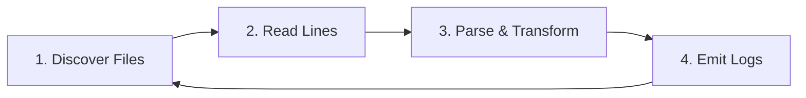

# Source: https://uptrace.dev/raw/guides/opentelemetry-filelog-receiver.md

# OpenTelemetry Filelog Receiver

> Full guide to using the OpenTelemetry Filelog Receiver for reliable log collection. Covers parsing, multiline handling, Kubernetes setup, and production optimization.

> 📋 **Part of the OpenTelemetry ecosystem:** The Filelog Receiver is a component of the [OpenTelemetry Collector](/opentelemetry/collector) that transforms file-based logs into structured OpenTelemetry format. New to OpenTelemetry? Start with [What is OpenTelemetry?](/opentelemetry)

Traditional log collection ties you to specific backends. The OpenTelemetry Filelog Receiver breaks this lock-in by converting file logs into vendor-neutral format, allowing you to send data to any compatible backend (Uptrace, Jaeger, Elasticsearch, Splunk).

This guide takes you from basic file tailing to production-grade log pipelines with parsing, multiline handling, and Kubernetes integration.

## What is Filelog Receiver

The Filelog Receiver reads log files from disk, parses their content, and converts them into [OpenTelemetry log records](https://opentelemetry.io/docs/specs/otel/logs/data-model/). It's part of the OpenTelemetry Collector Contrib distribution.

**Why OpenTelemetry format?**

OpenTelemetry provides a **vendor-neutral standard** for telemetry data. Instead of being locked into proprietary formats, your logs become portable:

- **Vendor-neutral**: Send logs to any backend without changing instrumentation
- **Structured**: Consistent format with timestamps, severity, attributes
- **Correlated**: Link logs to [distributed traces](/opentelemetry/distributed-tracing) and [metrics](/opentelemetry/metrics)
- **Standardized**: Part of [CNCF OpenTelemetry](https://opentelemetry.io/) specification

> 💡 **Learn more:** Read our [OpenTelemetry Architecture](/opentelemetry/architecture) guide to understand how components fit together.

**Core capabilities:**

- Tails log files continuously
- Handles log rotation automatically
- Parses JSON, regex, and structured formats
- Combines multiline entries (stack traces)
- Checkpoints file positions across restarts
- Enriches logs with metadata

**How it works - the 4-step loop:**



1. **Discover**: Scans filesystem using `include`/`exclude` patterns
2. **Read**: Opens files and reads new lines based on `start_at` setting
3. **Parse**: Applies operators to structure raw text
4. **Emit**: Sends structured logs to the pipeline

## Quick Start: Your First Log Collection

> 📚 **Prerequisites**: This guide assumes you have the OpenTelemetry Collector installed. Need help getting started? See our [Collector installation guide](/opentelemetry/collector#installation).

> 💡 **Backend Configuration:** Examples in this guide use Uptrace as the<br />
> 
> 
> observability backend. OpenTelemetry is vendor-neutral - you can send logs to<br />
> 
> 
> Jaeger, Grafana Cloud, Elasticsearch, Splunk, or any OTLP-compatible platform.<br />
> 
> 
> See [backend examples](#backend-examples) at the end of this guide.

Let's start simple. Imagine your app writes JSON logs to `/var/log/myapp.log`:

```json
{"time":"2026-02-07 14:30:00","level":"ERROR","message":"Connection failed","user_id":"123"}
```

Here's the minimal configuration:

```yaml
receivers:
  filelog:
    include: [/var/log/myapp.log]
    start_at: beginning
    operators:
      - type: json_parser
        timestamp:
          parse_from: attributes.time
          layout: '%Y-%m-%d %H:%M:%S'
        severity:
          parse_from: attributes.level

exporters:
  otlp/uptrace:  # OTLP = OpenTelemetry Protocol
    endpoint: api.uptrace.dev:4317
    headers:
      uptrace-dsn: 'YOUR_UPTRACE_DSN_HERE'

service:
  pipelines:
    logs:
      receivers: [filelog]
      exporters: [otlp/uptrace]
```

> 💡 **About OTLP:** [OpenTelemetry Protocol (OTLP)](https://opentelemetry.io/docs/specs/otlp/) is the standard protocol for transmitting telemetry data. Learn more about [configuring exporters](/opentelemetry/collector/config#exporter-deep-dive).

**What happens:**

- File is discovered and opened
- Each line is parsed as JSON
- `time` becomes the log timestamp
- `level` becomes severity
- All fields become attributes

**Result:** Structured logs sent to your [OpenTelemetry APM](/opentelemetry/apm).

## Understanding Operators

Operators are the building blocks of log processing. Each operator does one thing well:

```text
Raw Log → [Operator 1] → [Operator 2] → [Operator 3] → Structured Log
```

### Common Operators

**JSON Parser** - for structured JSON logs:

```yaml
receivers:
  filelog:
    include: [/var/log/app/*.json]
    operators:
      - type: json_parser
        timestamp:
          parse_from: attributes.timestamp
          layout: '%Y-%m-%dT%H:%M:%S.%fZ'
```

**Regex Parser** - for text logs:

```yaml
receivers:
  filelog:
    include: [/var/log/app.log]
    operators:
      - type: regex_parser
        regex: '^(?P<time>\d{4}-\d{2}-\d{2} \d{2}:\d{2}:\d{2}) \[(?P<level>\w+)\] (?P<message>.*)$'
        timestamp:
          parse_from: attributes.time
          layout: '2006-01-02 15:04:05'
        severity:
          parse_from: attributes.level
```

**Example log:**

```text
2026-02-07 14:30:00 [ERROR] Database connection timeout
```

**Add Attributes** - enrich with metadata:

```yaml
operators:
  - type: add
    field: attributes.environment
    value: production
  - type: add
    field: attributes.service.name
    value: payment-api
```

**Container Parser** - for Kubernetes (simplified):

```yaml
receivers:
  filelog:
    include: [/var/log/pods/*/*/*.log]
    include_file_path: true
    operators:
      - type: container  # Handles all container formats automatically
```

> 🔗 **Kubernetes Logs:** For complete Kubernetes log collection, see our [Kubernetes Log Management guide](/blog/kubectl-logs).

Automatically extracts:

- Kubernetes namespace, pod, container names
- Container runtime format (CRI-O, containerd, Docker)
- stdout/stderr stream

**Syslog Parser** - for syslog-formatted files:

```yaml
receivers:
  filelog:
    include: [/var/log/syslog]
    operators:
      - type: syslog_parser
        protocol: rfc3164
```

Supports both RFC 3164 (BSD) and RFC 5424 (IETF) syslog formats. Automatically extracts timestamp, severity, facility, hostname, and message.

## Multiline Logs: Stack Traces

Stack traces span multiple lines. Without configuration, each line becomes a separate log:

```text
2026-02-07 14:30:00 ERROR Exception occurred
    at com.example.App.main(App.java:42)
    at java.lang.Thread.run(Thread.java:829)
```

**Solution:** Use `multiline` to combine them:

```yaml
receivers:
  filelog:
    include: [/var/log/app/errors.log]
    multiline:
      line_start_pattern: '^\d{4}-\d{2}-\d{2}'  # New entry starts with date
    operators:
      - type: regex_parser
        regex: '^(?P<time>\S+) (?P<level>\w+) (?P<message>[\s\S]*)$'
```

Now the entire stack trace is captured as one log record.

**Common patterns:**

```yaml
# Java exceptions
line_start_pattern: '^(\d{4}-\d{2}-\d{2}|Exception|Caused by:)'

# Python tracebacks
line_start_pattern: '^(Traceback|\d{4}-\d{2}-\d{2})'

# Go panics
line_start_pattern: '^(panic:|\d{4}/\d{2}/\d{2})'
```

## Kubernetes Log Collection

> 🔗 **Integration Tip**: For automated deployment in Kubernetes, use the [OpenTelemetry Operator](/opentelemetry/operator) which simplifies Collector management and auto-instrumentation.

### Simple Method (Recommended)

Use the `container` operator for automatic parsing:

```yaml
receivers:
  filelog:
    include: [/var/log/pods/*/*/*.log]
    include_file_path: true
    operators:
      - type: container

processors:
  batch:
    timeout: 10s

exporters:
  otlp/uptrace:
    endpoint: api.uptrace.dev:4317
    headers:
      uptrace-dsn: 'YOUR_UPTRACE_DSN_HERE'

service:
  pipelines:
    logs:
      receivers: [filelog]
      processors: [batch]
      exporters: [otlp/uptrace]
```

This automatically:

- Detects container runtime format
- Parses timestamps and metadata
- Handles partial log lines
- Extracts Kubernetes metadata

### DaemonSet Deployment

Deploy as DaemonSet to collect from all nodes:

> 📖 **Full Kubernetes Setup:** See our complete [Kubernetes Monitoring with OpenTelemetry](/get/kubernetes) guide for cluster-wide observability.

```yaml
apiVersion: apps/v1
kind: DaemonSet
metadata:
  name: otel-collector
  namespace: monitoring
spec:
  selector:
    matchLabels:
      app: otel-collector
  template:
    metadata:
      labels:
        app: otel-collector
    spec:
      containers:
      - name: otel-collector
        image: otel/opentelemetry-collector-contrib:0.145.0
        volumeMounts:
        - name: varlog
          mountPath: /var/log
          readOnly: true
        - name: varlibdockercontainers
          mountPath: /var/lib/docker/containers
          readOnly: true
      volumes:
      - name: varlog
        hostPath:
          path: /var/log
      - name: varlibdockercontainers
        hostPath:
          path: /var/lib/docker/containers
```

## State Persistence: Never Lose Logs

Without persistence, restarting the Collector means:

- `start_at: beginning` → Re-read everything (duplicates!)
- `start_at: end` → Miss logs written during downtime

**Solution:** Checkpointing with storage extension:

```yaml
extensions:
  file_storage:
    directory: /var/lib/otelcol/file_storage
    timeout: 10s

receivers:
  filelog:
    include: [/var/log/app.log]
    storage: file_storage  # Link to storage extension

service:
  extensions: [file_storage]
  pipelines:
    logs:
      receivers: [filelog]
      exporters: [otlp/uptrace]
```

**What happens:**

- File positions saved to disk
- On restart, reading resumes from last position
- No duplicates, no data loss

**Essential for production!**

## Real-World Examples

### NGINX Access Logs

```yaml
receivers:
  filelog/nginx:
    include: [/var/log/nginx/access.log]
    operators:
      - type: regex_parser
        regex: '^(?P<remote_addr>\S+) - (?P<remote_user>\S+) \[(?P<time>[^\]]+)\] "(?P<method>\S+) (?P<path>\S+) (?P<protocol>\S+)" (?P<status>\d{3}) (?P<bytes_sent>\d+)'
        timestamp:
          parse_from: attributes.time
          layout: '02/Jan/2006:15:04:05 -0700'
        severity:
          parse_from: attributes.status
          mapping:
            "401": WARN
            "5": ERROR
```

**Handles:**

```text
192.168.1.1 - - [07/Feb/2026:14:30:00 +0000] "GET /api/users HTTP/1.1" 200 1234
```

### PostgreSQL Logs

```yaml
receivers:
  filelog/postgres:
    include: [/var/log/postgresql/*.log]
    multiline:
      line_start_pattern: '^\d{4}-\d{2}-\d{2} \d{2}:\d{2}:\d{2}'
    operators:
      - type: regex_parser
        regex: '^(?P<timestamp>\S+ \S+ \w+) \[(?P<pid>\d+)\] (?P<level>\w+):  (?P<message>[\s\S]*)$'
        timestamp:
          parse_from: attributes.timestamp
          layout: '2006-01-02 15:04:05.000 MST'
        severity:
          parse_from: attributes.level
```

### Application with Trace Context

```yaml
receivers:
  filelog/app:
    include: [/var/log/app/*.json]
    operators:
      - type: json_parser
        timestamp:
          parse_from: attributes.timestamp
          layout: '%Y-%m-%dT%H:%M:%S.%fZ'
        trace:
          trace_id:
            parse_from: attributes.trace_id
          span_id:
            parse_from: attributes.span_id
```

**Log example:**

```json
{
  "timestamp": "2026-02-07T14:30:00.123Z",
  "level": "error",
  "msg": "Payment failed",
  "trace_id": "4bf92f3577b34da6a3ce929d0e0e4736",
  "span_id": "00f067aa0ba902b7"
}
```

Trace context links logs to distributed traces!

## Troubleshooting

### Logs Not Appearing

**Problem:** No logs show up in your backend.

**Check 1: Permissions**

```bash
# Verify collector can read files
ls -la /var/log/myapp.log
# Check collector process user
ps aux | grep otelcol
```

**Fix:**

```bash
# Add collector user to log group
usermod -a -G adm otelcol
# Or adjust permissions
chmod 644 /var/log/myapp.log
```

**Check 2: start_at Setting**

Default is `end` (only new logs). For testing, use:

```yaml
start_at: beginning
```

**Check 3: File Glob Pattern**

```bash
# Test your pattern
ls /var/log/pods/*/*/*.log
# Verify files exist
find /var/log -name "*.log"
```

### Regex Not Matching

**Debug with test:**

```bash
# Test pattern locally
echo "2026-02-07 14:30:00 ERROR Test" | grep -P '^\d{4}-\d{2}-\d{2}'
```

**Add debug exporter:**

```yaml
exporters:
  debug:
    verbosity: detailed

service:
  pipelines:
    logs:
      receivers: [filelog]
      exporters: [debug]
```

**Check logs:**

```bash
journalctl -u otelcol -f | grep -i error
```

### Multiline Not Working

**Common mistake:**

```yaml
# Bad - pattern too specific
multiline:
  line_start_pattern: '^2026-02-07'

# Good - flexible pattern
multiline:
  line_start_pattern: '^\d{4}-\d{2}-\d{2}'
```

### High Memory Usage

**Cause:** Too many files or large entries.

**Solutions:**

1. Exclude unnecessary files:

```yaml
exclude:
  - /var/log/debug-*.log
  - /var/log/archive/*.log
```

1. Limit entry size:

```yaml
receivers:
  filelog:
    max_log_size: 1MiB
```

1. Add memory limiter:

```yaml
processors:
  memory_limiter:
    check_interval: 1s
    limit_mib: 512
```

## Performance Optimization

### Batching

Reduce network calls:

```yaml
processors:
  batch:
    timeout: 10s
    send_batch_size: 1024

service:
  pipelines:
    logs:
      receivers: [filelog]
      processors: [batch]
      exporters: [otlp/uptrace]
```

**Guidelines:**

- Low latency: `timeout: 1-5s`
- High volume: `send_batch_size: 1024-2048`
- Balance both for production

### Resource Limits

```yaml
processors:
  memory_limiter:
    check_interval: 1s
    limit_mib: 512
    spike_limit_mib: 128
  batch:
    timeout: 10s
```

**Important:** Memory limiter must be first processor!

### Polling Interval

```yaml
receivers:
  filelog:
    poll_interval: 500ms  # Default: 200ms
```

- Lower: More CPU, faster detection
- Higher: Less CPU, higher latency
- Default (200ms) good for most cases

## Advanced Features

### Compressed Files

```yaml
receivers:
  filelog:
    include: [/var/log/archive/*.log.gz]
    compression: auto  # or 'gzip'
```

### Header Metadata

```yaml
receivers:
  filelog:
    include: [/var/log/app.log]
    start_at: beginning
    header:
      pattern: '^# METADATA:.*$'
      metadata_operators:
        - type: regex_parser
          regex: 'version="(?P<app_version>[^"]+)"'
```

**File example:**

```text
# METADATA: version="1.2.3" env="production"
2026-02-07 14:30:00 INFO App started
```

Metadata added to **all logs** in the file.

### Router Operator

Route logs based on content:

```yaml
receivers:
  filelog:
    include: [/var/log/app.log]
    operators:
      - type: json_parser
      - type: router
        routes:
          - output: error_logs
            expr: 'attributes.level == "ERROR"'
          - output: default_logs
            expr: 'true'

      - id: error_logs
        type: add
        field: attributes.alert
        value: true

      - id: default_logs
        type: noop
```

## FAQ

1. **Why aren't my logs appearing?**<br />


Possible causes include:
  - Collector can't read files or directories due to permission issues.
  - `start_at: end` only reads new logs (use `beginning` for testing).
  - The glob pattern may not match files specified in the `include` setting.
2. **How do I handle log rotation?**<br />


Log rotation is handled automatically. The receiver tracks files by fingerprint, not filename.<br />


When `app.log` rotates to `app.log.1`, it finishes reading the old file and starts the new one.
3. **What's the difference between attributes and resource?**
  - **Attributes:** Log-level metadata (varies per log)
  - **Resource:** Service-level metadata (shared across all logs from the same service)```yaml
operators:
  - type: add
    field: attributes.request_id # Per-log
    value: "req-123"
  - type: add
    field: resource["service.name"] # Per-service
    value: "api"
```
4. **Can I parse logs from multiple services?**<br />


Yes. Use multiple receivers:```yaml
receivers:
  filelog/app1:
    include: [/var/log/app1/*.log]
    operators:
      - type: add
        field: attributes.service.name
        value: app1

  filelog/app2:
    include: [/var/log/app2/*.log]
    operators:
      - type: add
        field: attributes.service.name
        value: app2

service:
  pipelines:
    logs:
      receivers: [filelog/app1, filelog/app2]
      exporters: [otlp/uptrace]
```
5. **How do I test regex patterns?**<br />


Use [Regex101](https://regex101.com/) with the "Golang" flavor to match the Collector's regex engine.
6. **What if I have mixed compressed and uncompressed files?**```yaml
receivers:
  filelog:
    include: [/var/log/app/*.log, /var/log/app/*.log.gz]
    compression: auto  # Auto-detects .gz files
```
7. **How do I move attributes to resource?**```yaml
operators:
  - type: move
    from: attributes["file.name"]
    to: resource["log.file.name"]
```
8. **Can I filter logs before sending?**<br />


Yes. Use a filter processor:```yaml
processors:
  filter:
    logs:
      exclude:
        match_type: regexp
        record_attributes:
          - key: level
            value: DEBUG
```
9. **How do I parse key-value logs?**```yaml
operators:
  - type: key_value_parser
    parse_from: body
```

<br />

**Example:** `user=john status=200 duration=123ms`
10. **What's the max file size limit?**<br />


There's no hard limit, but you can use `max_log_size` to prevent memory issues:```yaml
receivers:
  filelog:
    max_log_size: 1MiB  # Per log entry
```

## Backend Examples

This guide uses Uptrace in examples, but OpenTelemetry works with any OTLP-compatible backend. Here are quick configuration examples for other platforms:

### Uptrace

```yaml
exporters:
  otlp/uptrace:
    endpoint: api.uptrace.dev:4317
    headers:
      uptrace-dsn: 'YOUR_UPTRACE_DSN'
```

### Grafana Cloud

```yaml
exporters:
  otlp:
    endpoint: otlp-gateway.grafana.net:443
    headers:
      authorization: "Bearer YOUR_GRAFANA_TOKEN"
```

### Jaeger

```yaml
exporters:
  otlp:
    endpoint: jaeger-collector:4317
    tls:
      insecure: true
```

### Datadog

```yaml
exporters:
  otlp:
    endpoint: trace.agent.datadoghq.com:4317
    headers:
      dd-api-key: "YOUR_DATADOG_API_KEY"
```

### New Relic

```yaml
exporters:
  otlp:
    endpoint: otlp.nr-data.net:4317
    headers:
      api-key: "YOUR_NEW_RELIC_LICENSE_KEY"
```

### Prometheus (metrics only)

```yaml
exporters:
  prometheus:
    endpoint: "0.0.0.0:8889"
```

### Multiple Backends

Send data to multiple platforms simultaneously:

```yaml
exporters:
  otlp/uptrace:
    endpoint: api.uptrace.dev:4317
    headers:
      uptrace-dsn: 'YOUR_UPTRACE_DSN'

  otlp/datadog:
    endpoint: trace.agent.datadoghq.com:4317
    headers:
      dd-api-key: "YOUR_DATADOG_API_KEY"

service:
  pipelines:
    traces:
      receivers: [otlp]
      processors: [batch]
      exporters: [otlp/uptrace, otlp/datadog]  # Send to both!
```

> **More backends:** See the [OpenTelemetry Vendors directory](https://opentelemetry.io/ecosystem/vendors/) for 40+ compatible platforms.

## What's next?

With the Filelog Receiver configured, you can collect, parse, and export logs from any file-based source.

Next steps to enhance your log pipeline:

- Learn about [OpenTelemetry Logs](/opentelemetry/logs) for the complete logging picture
- Follow [structured logging best practices](/glossary/structured-logging) to make parsing easier
- Add application-level log instrumentation with [slog](/guides/opentelemetry-slog), [Zap](/guides/opentelemetry-zap), or [Logrus](/guides/opentelemetry-logrus)
- Collect container logs with [Docker monitoring](/guides/opentelemetry-docker)
- Deploy on Kubernetes with the [OpenTelemetry Kubernetes guide](/get/kubernetes)
- Correlate logs with [distributed traces](/opentelemetry/distributed-tracing) for faster debugging
- See the [official Filelog Receiver docs](https://github.com/open-telemetry/opentelemetry-collector-contrib/tree/main/receiver/filelogreceiver) for all configuration options
