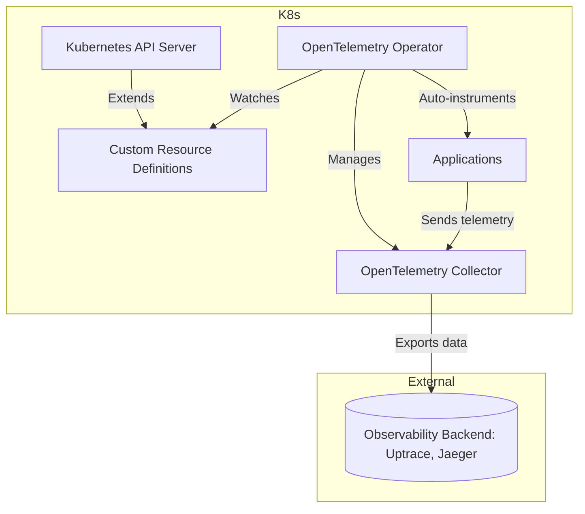

# Source: https://uptrace.dev/raw/opentelemetry/operator.md

# OpenTelemetry Operator for Kubernetes

> Step-by-step guide to deploying OpenTelemetry Operator in Kubernetes, setting up collectors, and enabling auto-instrumentation for full observability.

> ⚡ If you have already followed our guide on [Monitoring Kubernetes with OpenTelemetry Collector](/get/kubernetes), this article will show you how to automate the deployment and instrumentation of your applications using the OpenTelemetry Operator.<br />
> 
> 
> Learn how to easily manage Collectors, enable auto-instrumentation, and scale observability in Kubernetes without manually editing YAML files.

## What is OpenTelemetry Operator

The OpenTelemetry Operator simplifies deployment and management of OpenTelemetry components in Kubernetes. It automates the creation of Collectors, enables auto-instrumentation for workloads, and manages configurations using Kubernetes-native CRDs.

It leverages the Kubernetes Operator pattern to watch custom resources and maintain the desired state of your observability stack.

- [Official Operator repository](https://github.com/open-telemetry/opentelemetry-operator)

## How the Operator Works

The Operator observes resources and automatically manages telemetry collection:

- **OpenTelemetryCollector**: Configures collectors for metrics, logs, and traces.
- **Instrumentation**: Injects language-specific agents (Java, Python, Node.js, .NET, Go) into applications.
- **Annotations**: Applied to pods to trigger auto-instrumentation.



> **Note:** Starting with Kubernetes 1.29+, the Operator automatically uses native sidecar containers for better pod lifecycle management. This feature ensures sidecars start before the main container and shut down after it. The usage of native sidecars can be disabled with `--feature-gates=-sidecarcontainers.native` if needed.

## When to use OpenTelemetry Operator?

<table>
<thead>
  <tr>
    <th>
      Feature
    </th>
    
    <th>
      Operator
    </th>
    
    <th>
      Manual Deployment
    </th>
  </tr>
</thead>

<tbody>
  <tr>
    <td>
      Collector deployment
    </td>
    
    <td>
      Automated via CRDs
    </td>
    
    <td>
      Manual YAML files
    </td>
  </tr>
  
  <tr>
    <td>
      Auto-instrumentation
    </td>
    
    <td>
      Yes (Java, Python, Node.js, .NET, Go)
    </td>
    
    <td>
      No - requires code changes
    </td>
  </tr>
  
  <tr>
    <td>
      Configuration updates
    </td>
    
    <td>
      Automatic reconciliation
    </td>
    
    <td>
      Manual kubectl/helm commands
    </td>
  </tr>
  
  <tr>
    <td>
      Multi-collector management
    </td>
    
    <td>
      Simplified with CRDs
    </td>
    
    <td>
      Complex YAML management
    </td>
  </tr>
  
  <tr>
    <td>
      Best for
    </td>
    
    <td>
      Dynamic environments, auto-instrumentation needs
    </td>
    
    <td>
      Static setups, full control required
    </td>
  </tr>
</tbody>
</table>

The Operator is recommended when:

- You need auto-instrumentation without modifying application code
- Managing multiple collectors across different namespaces
- Want GitOps-friendly declarative configuration

Manual deployment is better when:

- Simple single-collector setup
- Need maximum control over every configuration detail
- Using custom deployment patterns not supported by Operator

## Prerequisites

- Kubernetes 1.27+
- kubectl access with cluster admin permissions
- Helm 3.16+ (if using Helm)
- cert-manager installed for admission webhooks:```bash
kubectl apply -f https://github.com/cert-manager/cert-manager/releases/download/v1.18.2/cert-manager.yaml
```

## Installing the Operator

To install OpenTelemetry Operator in your Kubernetes cluster, you can use Helm or kubectl. Here's how to install it:

### Using kubectl

```bash
kubectl apply -f https://github.com/open-telemetry/opentelemetry-operator/releases/latest/download/opentelemetry-operator.yaml
```

- [Learn more about OpenTelemetry Operator installation options](https://github.com/open-telemetry/opentelemetry-operator#getting-started)

### Using Helm

```bash
helm repo add open-telemetry https://open-telemetry.github.io/opentelemetry-helm-charts
helm repo update
helm install opentelemetry-operator open-telemetry/opentelemetry-operator \
  --namespace opentelemetry-operator-system \
  --create-namespace
```

Verify installation:

```bash
kubectl get pods -n opentelemetry-operator-system
```

- [Helm Documentation: Installing Charts](https://helm.sh/docs/intro/using_helm/#installing-a-chart)

## Helm Chart Configuration

The Operator Helm chart provides various configuration options to customize your deployment.

> 💡 **Complete Observability Stack:** For production deployments, explore our<br />
> 
> [Uptrace Helm Charts](https://github.com/uptrace/helm-charts) which provide a<br />
> 
> 
> complete solution including Uptrace APM, OpenTelemetry Operator & Collector,<br />
> 
> 
> ClickHouse storage, PostgreSQL, and Redis — everything needed for production<br />
> 
> 
> Kubernetes deployments. See the [deployment guide](/get/hosted/k8s)<br />
> 
> 
> for step-by-step instructions.

### Custom Values

Create a `values.yaml` file to customize the installation:

```yaml
# values.yaml
manager:
  resources:
    limits:
      cpu: 200m
      memory: 256Mi
    requests:
      cpu: 100m
      memory: 128Mi

  # Restrict operator to specific namespaces
  env:
    WATCH_NAMESPACE: "production,staging"

admissionWebhooks:
  create: true
  certManager:
    enabled: true

kubernetesClusterDomain: cluster.local
```

Install with custom values:

```bash
helm install opentelemetry-operator open-telemetry/opentelemetry-operator \
  --namespace opentelemetry-operator-system \
  --create-namespace \
  --values values.yaml
```

### Common Configuration Options

<table>
<thead>
  <tr>
    <th>
      Parameter
    </th>
    
    <th>
      Description
    </th>
    
    <th>
      Default
    </th>
  </tr>
</thead>

<tbody>
  <tr>
    <td>
      <code>
        manager.replicas
      </code>
    </td>
    
    <td>
      Number of operator replicas
    </td>
    
    <td>
      <code>
        1
      </code>
    </td>
  </tr>
  
  <tr>
    <td>
      <code>
        manager.resources
      </code>
    </td>
    
    <td>
      Resource limits and requests
    </td>
    
    <td>
      See values.yaml
    </td>
  </tr>
  
  <tr>
    <td>
      <code>
        manager.env.WATCH_NAMESPACE
      </code>
    </td>
    
    <td>
      Limit operator to specific namespaces
    </td>
    
    <td>
      <code>
        ""
      </code>
      
       (all)
    </td>
  </tr>
  
  <tr>
    <td>
      <code>
        admissionWebhooks.certManager.enabled
      </code>
    </td>
    
    <td>
      Use cert-manager for webhook certificates
    </td>
    
    <td>
      <code>
        true
      </code>
    </td>
  </tr>
  
  <tr>
    <td>
      <code>
        admissionWebhooks.autoGenerateCert.enabled
      </code>
    </td>
    
    <td>
      Auto-generate self-signed certificates
    </td>
    
    <td>
      <code>
        false
      </code>
    </td>
  </tr>
  
  <tr>
    <td>
      <code>
        kubernetesClusterDomain
      </code>
    </td>
    
    <td>
      Cluster domain name
    </td>
    
    <td>
      <code>
        cluster.local
      </code>
    </td>
  </tr>
</tbody>
</table>

> **Note:** When using `manager.env.WATCH_NAMESPACE`, you can specify multiple namespaces separated by commas (e.g., `"production,staging"`). Leave empty to watch all namespaces.

- [Full Helm Chart reference](https://github.com/open-telemetry/opentelemetry-helm-charts/tree/main/charts/opentelemetry-operator)

## Deploying a Collector

> 💡 **Backend Configuration:** This guide uses Uptrace as an example backend.<br />
> 
> 
> OpenTelemetry is vendor-neutral - you can use Jaeger, Grafana Cloud, Datadog,<br />
> 
> 
> Prometheus, or any [OTLP-compatible platform](https://opentelemetry.io/ecosystem/vendors/).<br />
> 
> 
> See [other backend examples](#backend-examples) below.

Define a Collector using CRDs:

```yaml
apiVersion: opentelemetry.io/v1alpha1
kind: OpenTelemetryCollector
metadata:
  name: otel-collector
spec:
  mode: deployment
  replicas: 2
  config: |
    receivers:
      otlp:
        protocols:
          grpc:
          http:
    processors:
      batch:
        timeout: 10s
        send_batch_size: 512
      resourcedetection:
        detectors: [env, system, k8snode]
    exporters:
      otlp/uptrace:
        endpoint: api.uptrace.dev:4317
        headers:
          uptrace-dsn: '<FIXME>'
    service:
      pipelines:
        traces:
          receivers: [otlp]
          processors: [batch]
          exporters: [otlp/uptrace]
        metrics:
          receivers: [otlp]
          processors: [resourcedetection, batch]
          exporters: [otlp/uptrace]
```

Apply:

```bash
kubectl apply -f collector.yaml
kubectl get otelcol
```

> **Note:** Adjust `batch.timeout` and `send_batch_size` in processors for high-throughput production workloads.

For file-based logs, see our guide on [Filelog Receiver](/guides/opentelemetry-filelog-receiver)

## Auto-Instrumentation

One of the powerful features of OpenTelemetry Operator is its ability to automatically instrument applications in your Kubernetes cluster. Enable by adding annotations to deployments:

<code-group>

```yaml [Java]
metadata:
  annotations:
    instrumentation.opentelemetry.io/inject-java: "true"
```

```yaml [Python]
metadata:
  annotations:
    instrumentation.opentelemetry.io/inject-python: "true"
```

```yaml [NodeJS]
metadata:
  annotations:
    instrumentation.opentelemetry.io/inject-nodejs: "true"
```

```yaml [.NET]
metadata:
  annotations:
    instrumentation.opentelemetry.io/inject-dotnet: "true"
```

```yaml [GO]
metadata:
  annotations:
    instrumentation.opentelemetry.io/inject-go: "true"
```

</code-group>

Supported languages: Java, Python, Node.js, .NET, Go.

> **Important:**
> 
> - Create the Instrumentation CRD before adding annotations to pods (see [Custom Resource Definitions](#custom-resource-definitions) section)
> - The OpenTelemetry Collector must be deployed and running before instrumentation works
> - Restart pods after adding annotations for auto-instrumentation to take effect: `kubectl rollout restart deployment/<your-app>`
> - Verify instrumentation by checking pod events: `kubectl describe pod <pod-name>`

## Custom Resource Definitions

The Operator introduces several CRDs for managing OpenTelemetry components.

### OpenTelemetryCollector CRD

Complete example with all common fields:

```yaml
apiVersion: opentelemetry.io/v1alpha1
kind: OpenTelemetryCollector
metadata:
  name: example-collector
spec:
  mode: deployment  # deployment, daemonset, statefulset, or sidecar
  replicas: 2
  image: otel/opentelemetry-collector-contrib:0.136.0

  # Environment variables
  env:
    - name: MY_POD_IP
      valueFrom:
        fieldRef:
          fieldPath: status.podIP

  # Resource configuration
  resources:
    limits:
      cpu: 500m
      memory: 512Mi
    requests:
      cpu: 100m
      memory: 128Mi

  # Volume mounts
  volumeMounts:
    - name: config
      mountPath: /conf

  volumes:
    - name: config
      configMap:
        name: extra-config

  # Collector configuration
  config: |
    receivers:
      otlp:
        protocols:
          grpc:
          http:

    processors:
      batch:
      memory_limiter:
        limit_mib: 512

    exporters:
      otlp/uptrace:
        endpoint: api.uptrace.dev:4317
        headers:
          uptrace-dsn: ''

    service:
      pipelines:
        traces:
          receivers: [otlp]
          processors: [memory_limiter, batch]
          exporters: [otlp/uptrace]
```

### Instrumentation CRD

Configure auto-instrumentation for multiple languages:

```yaml
apiVersion: opentelemetry.io/v1alpha1
kind: Instrumentation
metadata:
  name: my-instrumentation
spec:
  exporter:
    endpoint: http://otel-collector:4317

  propagators:
    - tracecontext
    - baggage

  sampler:
    type: parentbased_traceidratio
    argument: "1"

  # Language-specific configurations
  java:
    image: ghcr.io/open-telemetry/opentelemetry-operator/autoinstrumentation-java:latest
    env:
      - name: OTEL_JAVAAGENT_DEBUG
        value: "false"

  python:
    image: ghcr.io/open-telemetry/opentelemetry-operator/autoinstrumentation-python:latest

  nodejs:
    image: ghcr.io/open-telemetry/opentelemetry-operator/autoinstrumentation-nodejs:latest

  dotnet:
    image: ghcr.io/open-telemetry/opentelemetry-operator/autoinstrumentation-dotnet:latest
```

### List Available CRDs

```bash
kubectl get crd | grep opentelemetry.io
```

Output:

```text
instrumentations.opentelemetry.io
opentelemetrycollectors.opentelemetry.io
opampbridges.opentelemetry.io
```

Check resource status:

```bash
kubectl get otelcol example-collector -o yaml
kubectl describe instrumentation my-instrumentation
```

## Kubernetes Cluster & Monitoring

You can combine Operator with OpenTelemetry Kubernetes receivers (k8scluster, kubeletstats) for complete metrics:

- **Node metrics**: CPU, memory, disk, network
- **Pod metrics**: Resource usage, restarts, phase
- **Cluster events**: Deployments, scaling, health
- **Application metrics**: Latency, throughput, errors

## Deployment Patterns

DaemonSet collects node-level metrics and pod traces:

```yaml
apiVersion: apps/v1
kind: DaemonSet
metadata:
  name: otel-collector-daemonset
```

Deployment collects cluster-wide metrics:

```yaml
apiVersion: apps/v1
kind: Deployment
metadata:
  name: otel-collector-deployment
```

## Multi-Cluster Setup

Deploy the Operator in each cluster using the [main Collector configuration](#deploying-a-collector) as a base.

### Cluster-Specific Parameters

Adjust these parameters for each cluster:

<table>
<thead>
  <tr>
    <th>
      Parameter
    </th>
    
    <th>
      Production
    </th>
    
    <th>
      Staging
    </th>
    
    <th>
      Development
    </th>
  </tr>
</thead>

<tbody>
  <tr>
    <td>
      <code>
        replicas
      </code>
    </td>
    
    <td>
      3
    </td>
    
    <td>
      2
    </td>
    
    <td>
      1
    </td>
  </tr>
  
  <tr>
    <td>
      <code>
        namespace
      </code>
    </td>
    
    <td>
      <code>
        observability
      </code>
    </td>
    
    <td>
      <code>
        observability
      </code>
    </td>
    
    <td>
      <code>
        dev-observability
      </code>
    </td>
  </tr>
  
  <tr>
    <td>
      <code>
        cluster.name
      </code>
    </td>
    
    <td>
      <code>
        production
      </code>
    </td>
    
    <td>
      <code>
        staging
      </code>
    </td>
    
    <td>
      <code>
        development
      </code>
    </td>
  </tr>
  
  <tr>
    <td>
      <code>
        uptrace-dsn
      </code>
    </td>
    
    <td>
      <code>
        <PROD_DSN>
      </code>
    </td>
    
    <td>
      <code>
        <STAGING_DSN>
      </code>
    </td>
    
    <td>
      <code>
        <DEV_DSN>
      </code>
    </td>
  </tr>
</tbody>
</table>

### Add Cluster Identifier

Add this processor to your collector config:

```yaml
processors:
  batch:
  attributes:  # ← Add this processor
    actions:
      - key: cluster.name
        value: production  # Change per cluster
        action: insert
```

Update the pipeline to include the processor:

```yaml
service:
  pipelines:
    traces:
      receivers: [otlp]
      processors: [attributes, batch]  # ← Add attributes here
      exporters: [otlp/uptrace]
```

**Best Practices:**

- Use unique DSNs per cluster for filtering in Uptrace
- Add cluster identifiers using the `attributes` processor
- Deploy identical Operator versions across clusters
- Use GitOps (ArgoCD, Flux) to manage configurations

## Troubleshooting

- Check Operator pods:

```bash
kubectl logs -n opentelemetry-operator-system -l control-plane=controller-manager
```

- Verify collector status:

```bash
kubectl get otelcol
kubectl describe otelcol <name>
```

- Ensure RBAC and cert-manager are correctly configured.
- Confirm network connectivity to Kubernetes API and telemetry backends.

> **Common mistakes:**
> 
> - Forgetting to replace `<FIXME>` in DSN
> - Missing RBAC permissions
> - Pods not restarting after adding annotations
> - cert-manager webhook not ready
> - Collector CrashLoopBackOff due to incorrect batch or receiver configuration

## Backend Examples

This guide uses Uptrace in examples, but OpenTelemetry works with any OTLP-compatible backend. Here are quick configuration examples for other platforms:

**Grafana Cloud:**

```yaml
exporters:
  otlp:
    endpoint: otlp-gateway.grafana.net:443
    headers:
      authorization: "Bearer YOUR_TOKEN"
```

**Jaeger:**

```yaml
exporters:
  otlp:
    endpoint: jaeger-collector:4317
    tls:
      insecure: true
```

**Datadog:**

```yaml
exporters:
  otlp:
    endpoint: trace.agent.datadoghq.com:4317
    headers:
      dd-api-key: "YOUR_API_KEY"
```

**Prometheus (metrics):**

```yaml
exporters:
  prometheus:
    endpoint: "0.0.0.0:8889"
```

## Next Steps

- [OpenTelemetry APM Setup](/opentelemetry/apm)
- [Distributed Tracing](/opentelemetry/distributed-tracing)
- [OpenTelemetry Operator Docs](https://github.com/open-telemetry/opentelemetry-operator)
