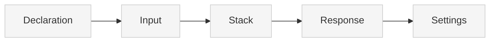

# Source: https://docs.xano.com/xanoscript/api.md

> ## Documentation Index
> Fetch the complete documentation index at: https://docs.xano.com/llms.txt
> Use this file to discover all available pages before exploring further.

# XanoScript for APIs

> Define APIs in XanoScript to build RESTful API endpoints

export const xanoscriptApiInputsDiagram = `
\`\`\`mermaid
flowchart TB
    A[Declaration] --> B[Input]
    B --> C[Stack]
    C --> D[Response]
    D --> E[Settings]
    style A fill:#cdeaff,stroke:#0077cc,stroke-width:2px
    style B fill:#f5f5f5,stroke:#ccc,stroke-width:1px
    style C fill:#f5f5f5,stroke:#ccc,stroke-width:1px
    style D fill:#f5f5f5,stroke:#ccc,stroke-width:1px
    style E fill:#f5f5f5,stroke:#ccc,stroke-width:1px
\`\`\`
`;

export function SideBySide({diagram, children}) {
  return <div style={{
    display: "flex",
    gap: "1rem",
    alignItems: "flex-start",
    flexWrap: "wrap"
  }}>
      <div style={{
    flex: "0 0 180px",
    minWidth: "150px"
  }}>
        <div>{mdx(diagram)}</div>
      </div>
      <div style={{
    flex: 1
  }}>
        {children}
      </div>
    </div>;
}

export const HoverImageCode = ({src, alt = "", width = "100%", maxWidth = "800px", className = "", defaultOpen = false, openOnHover = true, children}) => {
  const [open, setOpen] = useState(defaultOpen);
  const panelRef = useRef(null);
  const [maxHeight, setMaxHeight] = useState(0);
  useEffect(() => {
    if (panelRef.current) {
      setMaxHeight(open ? panelRef.current.scrollHeight : 0);
    }
  }, [open, children]);
  const handleMouseEnter = () => openOnHover && setOpen(true);
  const handleMouseLeave = () => openOnHover && setOpen(false);
  const handleClick = () => setOpen(s => !s);
  const handleImageClick = e => {
    e.stopPropagation();
    e.preventDefault();
    handleClick();
  };
  const prefersReducedMotion = typeof window !== "undefined" && window.matchMedia && window.matchMedia("(prefers-reduced-motion: reduce)").matches;
  const transition = prefersReducedMotion ? "none" : "max-height 300ms ease, opacity 300ms ease, transform 300ms ease";
  return <div className={`border rounded-md overflow-hidden ${className}`} style={{
    width,
    maxWidth
  }} onMouseEnter={handleMouseEnter} onMouseLeave={handleMouseLeave}>
      {}
      <div role="button" tabIndex={0} aria-label="Toggle code" aria-expanded={open} style={{
    cursor: "pointer"
  }}>
         {
    e.stopPropagation();
    e.preventDefault();
    handleClick();
  }} style={{
    display: "block",
    width: "100%",
    height: "auto"
  }} />
      </div>

      {}
      <div className="not-prose" ref={panelRef} style={{
    overflow: "hidden",
    maxHeight: `${maxHeight}px`,
    opacity: open ? 1 : 0,
    transform: open ? "translateY(0)" : "translateY(-6px)",
    transition
  }}>
        <div style={{
    padding: "0.75rem"
  }}>{children}</div>
      </div>
    </div>;
};

## Introduction

The `API` primitive lets you define REST endpoints using XanoScript.

Each API corresponds to an **endpoint** you could create in Xano’s visual builder — but expressed in code.

APIs will typically:

* Declare their **name** and **HTTP verb**
* Accept **inputs**
* Run one or more operations in a **stack**
* Return a **response**

***

## Anatomy

Every XanoScript API follows a predictable structure.

Here’s a quick visual overview of its main building blocks — from **declaration** at the top to **settings** at the bottom.<br /><br />You can find more detail about each section by continuing below.



### Declaration

Every API starts with a **declarative header** that specifies its type, name, and HTTP verb.

<div style={{ display: "flex", gap: "1rem", alignItems: "flex-start", flexWrap: "wrap" }}>
  <div style={{ flex: "0 0 180px", minWidth: "150px" }}>
    <div>
      ```mermaid  theme={null}
      flowchart TB
      A[Declaration] --> B[Input]
      B --> C[Stack]
      C --> D[Response]
      D --> E[Settings]
      style A fill:#cdeaff,stroke:#0077cc,stroke-width:2px
      style B fill:#f5f5f5,stroke:#ccc,stroke-width:1px
      style C fill:#f5f5f5,stroke:#ccc,stroke-width:1px
      style D fill:#f5f5f5,stroke:#ccc,stroke-width:1px
      style E fill:#f5f5f5,stroke:#ccc,stroke-width:1px
      ```
    </div>
  </div>

  <div style={{ flex: 1 }}>
    ```java XanoScript lines icon="code" theme={null}
    // <what this API does>
    query <api_name> verb=<VERB> {
    ...
    }
    ```

    | Element       | Required | Description                                                                    |
    | ------------- | -------- | ------------------------------------------------------------------------------ |
    | `query`       | ✅        | Declares an API primitive.                                                     |
    | `api_name`    | ✅        | The unique path for the endpoint (e.g., `auth/signup`).                        |
    | `verb`        | ✅        | HTTP verb to use (`GET`, `POST`, `PUT`, etc.).                                 |
    | `description` | no       | A short summary of the API. May also appear as a “//” comment above the block. |
  </div>
</div>

***

### Section 1: Inputs

The `input` block defines the data that will be sent to the API. You can declare types, optionality, and filters:

<div style={{ display: "flex", gap: "1rem", alignItems: "flex-start", flexWrap: "wrap" }}>
  <div className="stickyDiagram">
    ```mermaid  theme={null}
    flowchart TB
    A[Declaration] --> B[Input]
    B --> C[Stack]
    C --> D[Response]
    D --> E[Settings]
    style A fill:#f5f5f5,stroke:#ccc,stroke-width:1px
    style B fill:#cdeaff,stroke:#0077cc,stroke-width:2px
    style C fill:#f5f5f5,stroke:#ccc,stroke-width:1px
    style D fill:#f5f5f5,stroke:#ccc,stroke-width:1px
    style E fill:#f5f5f5,stroke:#cc c,stroke-width:1px
    ```
  </div>

  <div style={{ flex: 1 }}>
    <Frame caption="Hover over this image to see the XanoScript version">
      <HoverImageCode src="/images/apis-20251002-114901.png" alt="An image of the inputs section">
        ```java XanoScript lines icon="code" theme={null}
          input {
            text name?
            email email? filters=trim|lower
            text password?
          }
        ```
      </HoverImageCode>
    </Frame>

    For each input, you can:

    * Declare its type (`text`, `email`, `password`, etc.)
    * Mark it as optional (`?`)
    * Apply filters (`filters=trim|lower`)

    <Card title="Learn more about the available data types" icon="text" horizontal href="/xanoscript/data-types" />
  </div>
</div>

***

### Section 2: Stack

The `stack` block contains the actual logic that will be executed when the API is called.

<div style={{ display: "flex", gap: "1rem", alignItems: "flex-start", flexWrap: "wrap" }}>
  <div className="stickyDiagram">
    ```mermaid  theme={null}
    flowchart TB
    A[Declaration] --> B[Input]
    B --> C[Stack]
    C --> D[Response]
    D --> E[Settings]
    style A fill:#f5f5f5,stroke:#ccc,stroke-width:1px
    style C fill:#cdeaff,stroke:#0077cc,stroke-width:2px
    style B fill:#f5f5f5,stroke:#ccc,stroke-width:1px
    style D fill:#f5f5f5,stroke:#ccc,stroke-width:1px
    style E fill:#f5f5f5,stroke:#ccc,stroke-width:1px
    ```
  </div>

  <div style={{ flex: 1 }}>
    <Frame caption="Hover over this image to see the XanoScript version">
      <HoverImageCode src="/images/apis-20251002-114923.png" alt="Image of a function stack">
        ```java XanoScript lines icon="code" theme={null}
        stack {
            db.get user {
              field_name = "email"
              field_value = $input.email
            } as $user

            precondition ($user == null) {
              error_type = "accessdenied"
              error = "This account is already in use."
            }

            db.add user {
              data = {
                created_at: "now"
                name      : $input.name
                email     : $input.email
                password  : $input.password
              }
            } as $user

            security.create_auth_token {
              dbtable = "user"
              extras = {}
              expiration = 86400
              id = $user.id
            } as $authToken

        }

        ```
      </HoverImageCode>
    </Frame>

    <br />

    Each block inside stack corresponds to a **function** available in Xano’s visual builder:

    * `db.get` — Fetch a record from the database
    * `precondition` — Guard execution with a condition
    * `db.add` — Insert a new record into the database
    * `security.create_auth_token` — Generate an authentication token

    The syntax mirrors how you'd configure these functions visually, but expressed textually. The actual behavior is the same — refer to the function's existing docs for complete details.<br /><br /><Card title="Review all available functions and their XanoScript in the function reference" icon="function" horizontal href="/xanoscript/function-reference" />
  </div>
</div>

***

### Section 3: Response

The `response` block defines what data your API returns:

<div style={{ display: "flex", gap: "1rem", alignItems: "flex-start", flexWrap: "wrap" }}>
  <div className="stickyDiagram">
    ```mermaid  theme={null}
    flowchart TB
    A[Declaration] --> B[Input]
    B --> C[Stack]
    C --> D[Response]
    D --> E[Settings]
    style A fill:#f5f5f5,stroke:#ccc,stroke-width:1px
    style D fill:#cdeaff,stroke:#0077cc,stroke-width:2px
    style B fill:#f5f5f5,stroke:#ccc,stroke-width:1px
    style C fill:#f5f5f5,stroke:#ccc,stroke-width:1px
    style E fill:#f5f5f5,stroke:#ccc,stroke-width:1px
    ```
  </div>

  <div style={{ flex: 1 }}>
    <Frame caption="Hover over this image to see the XanoScript version">
      <HoverImageCode src="/images/apis-20251002-114953.png" alt="Image of a response block">
        ```java XanoScript lines icon="code" theme={null}
        response = {authToken: $authToken}
        ```
      </HoverImageCode>
    </Frame>

    * The `value` assignment determines the JSON returned to the client.
    * Variables captured in the stack (e.g., `$authToken`) can be returned here.
  </div>
</div>

***

## Settings

API primitives support several optional settings that control authentication, tagging, caching, and version history. These settings are defined at the root level of the API block, after the input, stack, and response blocks. They affect how the endpoint behaves, how it's documented, and how responses are cached.

<div style={{ display: "flex", gap: "0rem", alignItems: "flex-start", flexWrap: "wrap" }}>
  <div className="stickyDiagram">
    ```mermaid  theme={null}
    flowchart TB
    A[Declaration] --> B[Input]
    B --> C[Stack]
    C --> D[Response]
    D --> E[Settings]
    style A fill:#f5f5f5,stroke:#ccc,stroke-width:1px
    style E fill:#cdeaff,stroke:#0077cc,stroke-width:2px
    style B fill:#f5f5f5,stroke:#ccc,stroke-width:1px
    style D fill:#f5f5f5,stroke:#ccc,stroke-width:1px
    style C fill:#f5f5f5,stroke:#ccc,stroke-width:1px
    ```
  </div>

  <div style={{ flex: 1 }}>
    | Setting       | Type           | Required | Description                                                                                                                      |
    | ------------- | -------------- | -------- | -------------------------------------------------------------------------------------------------------------------------------- |
    | `description` | string         | no       | A short summary of the API. May also appear as a “//” comment above the block.                                                   |
    | `auth`        | string         | no       | Specifies the authentication level required for this endpoint.                                                                   |
    | `tags`        | array\[string] | no       | A list of tags used to categorize and organize the API in your workspace.                                                        |
    | `history`     | object         | no       | Configures version inheritance and history behavior. This field defaults to "inherit", which gets its values from the API group. |
    | `cache`       | object         | no       | Configures caching behavior for this API. See below for supported fields.                                                        |

    The `cache` block configures caching behavior for the API:

    | Field        | Type             | Description                                                                       |
    | ------------ | ---------------- | --------------------------------------------------------------------------------- |
    | `ttl`        | number (seconds) | Time-to-live for cache entries. A value of `0` disables caching.                  |
    | `input`      | boolean          | Whether the request body and query parameters are factored into the cache key.    |
    | `auth`       | boolean          | Whether authentication state (e.g., user ID) is included in the cache key.        |
    | `datasource` | boolean          | Whether the datasource context is factored into the cache key.                    |
    | `ip`         | boolean          | Whether the request IP address is included in the cache key.                      |
    | `headers`    | array\[string]   | A list of headers whose values should be included in the cache key.               |
    | `env`        | array\[string]   | A list of environment variables whose values should be included in the cache key. |
  </div>
</div>

***

## Detailed Example

Below, you'll see a complete example of a typical signup API endpoint.

```java XanoScript lines icon="code" theme={null}
// Signup and retrieve an authentication token
query auth/signup verb=POST {
  input {
    text name?
    email email? filters=trim|lower
    text password?
  }

  stack {
    db.get user {
      field_name = "email"
      field_value = $input.email
    } as $user

    precondition ($user == null) {
      error_type = "accessdenied"
      error = "This account is already in use."
    }

    db.add user {
      data = {
        created_at: "now"
        name      : $input.name
        email     : $input.email
        password  : $input.password
      }
    } as $user

    security.create_auth_token {
      table = "user"
      extras = {}
      expiration = 86400
      id = $user.id
    } as $authToken
  }

  response = {authToken: $authToken}
}

```

***

## What's Next

Now that you understand how to define APIs in XanoScript, here are a few great next steps:

<Card title="Explore the function reference" icon="function" horizontal href="/xanoscript/function-reference">
  Learn about the built-in functions available in the stack to start writing more complex logic.
</Card>

<Card title="Try it out in VS Code" icon="https://mintcdn.com/xano-997cb9ee/l34pjCw6QluB5NGI/images/icons/vscode.svg?fit=max&auto=format&n=l34pjCw6QluB5NGI&q=85&s=c9ca342a4c7cc10adcf78c89f822c596" horizontal href="/xanoscript/vs-code" width="100" height="100" data-path="images/icons/vscode.svg">
  Use the XanoScript VS Code extension with Copilot to write XanoScript in your favorite IDE.
</Card>

<Card title="Learn about Custom Functions" icon="cube" horizontal href="/xanoscript/custom-functions">
  They work just like APIs, but let you create reusable logic, and are a great next step when learning XanoScript.
</Card>


Built with [Mintlify](https://mintlify.com).