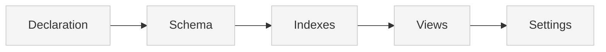

# Source: https://docs.xano.com/xanoscript/db.md

> ## Documentation Index
> Fetch the complete documentation index at: https://docs.xano.com/llms.txt
> Use this file to discover all available pages before exploring further.

# XanoScript for the Database

> Define database tables, schemas, indexes, and views using XanoScript

export const xanoscriptApiInputsDiagram = `
\`\`\`mermaid
flowchart TB
    A[Declaration] --> B[Input]
    B --> C[Stack]
    C --> D[Response]
    D --> E[Settings]
    style A fill:#cdeaff,stroke:#0077cc,stroke-width:2px
    style B fill:#f5f5f5,stroke:#ccc,stroke-width:1px
    style C fill:#f5f5f5,stroke:#ccc,stroke-width:1px
    style D fill:#f5f5f5,stroke:#ccc,stroke-width:1px
    style E fill:#f5f5f5,stroke:#ccc,stroke-width:1px
\`\`\`
`;

export function SideBySide({diagram, children}) {
  return <div style={{
    display: "flex",
    gap: "1rem",
    alignItems: "flex-start",
    flexWrap: "wrap"
  }}>
      <div style={{
    flex: "0 0 180px",
    minWidth: "150px"
  }}>
        <div>{mdx(diagram)}</div>
      </div>
      <div style={{
    flex: 1
  }}>
        {children}
      </div>
    </div>;
}

export const HoverImageCode = ({src, alt = "", width = "100%", maxWidth = "800px", className = "", defaultOpen = false, openOnHover = true, children}) => {
  const [open, setOpen] = useState(defaultOpen);
  const panelRef = useRef(null);
  const [maxHeight, setMaxHeight] = useState(0);
  useEffect(() => {
    if (panelRef.current) {
      setMaxHeight(open ? panelRef.current.scrollHeight : 0);
    }
  }, [open, children]);
  const handleMouseEnter = () => openOnHover && setOpen(true);
  const handleMouseLeave = () => openOnHover && setOpen(false);
  const handleClick = () => setOpen(s => !s);
  const handleImageClick = e => {
    e.stopPropagation();
    e.preventDefault();
    handleClick();
  };
  const prefersReducedMotion = typeof window !== "undefined" && window.matchMedia && window.matchMedia("(prefers-reduced-motion: reduce)").matches;
  const transition = prefersReducedMotion ? "none" : "max-height 300ms ease, opacity 300ms ease, transform 300ms ease";
  return <div className={`border rounded-md overflow-hidden ${className}`} style={{
    width,
    maxWidth
  }} onMouseEnter={handleMouseEnter} onMouseLeave={handleMouseLeave}>
      {}
      <div role="button" tabIndex={0} aria-label="Toggle code" aria-expanded={open} style={{
    cursor: "pointer"
  }}>
         {
    e.stopPropagation();
    e.preventDefault();
    handleClick();
  }} style={{
    display: "block",
    width: "100%",
    height: "auto"
  }} />
      </div>

      {}
      <div className="not-prose" ref={panelRef} style={{
    overflow: "hidden",
    maxHeight: `${maxHeight}px`,
    opacity: open ? 1 : 0,
    transform: open ? "translateY(0)" : "translateY(-6px)",
    transition
  }}>
        <div style={{
    padding: "0.75rem"
  }}>{children}</div>
      </div>
    </div>;
};

## Introduction

The `table` primitive lets you define database tables using XanoScript.

Each table corresponds to a **database table** you could create in Xano's visual builder — but expressed in code.

Tables will typically:

* Declare their **name** and **description**
* Define a **schema** with fields and data types
* Configure **indexes** for performance
* Create **views** for data access patterns
* Set **authentication** and **security** settings

***

## Anatomy

Every XanoScript table follows a predictable structure.

Here's a quick visual overview of its main building blocks — from **declaration** at the top to **settings** at the bottom.<br /><br />You can find more detail about each section by continuing below.



### Declaration

Every table starts with a **declarative header** that specifies its type, name, and basic configuration.

<div style={{ display: "flex", gap: "1rem", alignItems: "flex-start", flexWrap: "wrap" }}>
  <div style={{ flex: "0 0 180px", minWidth: "150px" }}>
    <div>
      ```mermaid  theme={null}
      flowchart TB
      A[Declaration] --> B[Schema]
      B --> C[Indexes]
      C --> D[Views]
      D --> E[Settings]
      style A fill:#cdeaff,stroke:#0077cc,stroke-width:2px
      style B fill:#f5f5f5,stroke:#ccc,stroke-width:1px
      style C fill:#f5f5f5,stroke:#ccc,stroke-width:1px
      style D fill:#f5f5f5,stroke:#ccc,stroke-width:1px
      style E fill:#f5f5f5,stroke:#ccc,stroke-width:1px
      ```
    </div>
  </div>

  <div style={{ flex: 1 }}>
    ```java XanoScript lines icon="code" theme={null}
    // <what this table stores>
    table <table_name> {
    auth = true
    ...
    }
    ```

    | Element       | Required | Description                                                                                                                                                 |
    | ------------- | -------- | ----------------------------------------------------------------------------------------------------------------------------------------------------------- |
    | `table`       | ✅        | Declares a table primitive.                                                                                                                                 |
    | `table_name`  | ✅        | The unique name for the table (e.g., `user`, `product`).                                                                                                    |
    | `description` | no       | Optional human-readable description of the table’s purpose. This field can also be represented as a comment starting with "//" right above the table block. |
    | `auth`        | no       | When `true`, enables authentication features for this table.                                                                                                |
  </div>
</div>

***

### Section 1: Schema

The `schema` block defines all fields (columns) in your table. Each field specifies its data type, constraints, and validation rules.

<div style={{ display: "flex", gap: "1rem", alignItems: "flex-start", flexWrap: "wrap" }}>
  <div className="stickyDiagram">
    ```mermaid  theme={null}
    flowchart TB
    A[Declaration] --> B[Schema]
    B --> C[Indexes]
    C --> D[Views]
    D --> E[Settings]
    style A fill:#f5f5f5,stroke:#ccc,stroke-width:1px
    style B fill:#cdeaff,stroke:#0077cc,stroke-width:2px
    style C fill:#f5f5f5,stroke:#ccc,stroke-width:1px
    style D fill:#f5f5f5,stroke:#ccc,stroke-width:1px
    style E fill:#f5f5f5,stroke:#ccc,stroke-width:1px
    ```
  </div>

  <div style={{ flex: 1 }}>
    ```java XanoScript lines icon="code" theme={null}
      schema {
        int id
        timestamp created_at?=now
        text name filters=trim
        email? email filters=trim|lower
        password? password filters=min:8|minAlpha:1|minDigit:1
        timestamp? last_login?
      }
    ```

    For each field, you can:

    * Declare its type (`int`, `text`, `email`, `password`, etc.)
    * Mark it as optional (`?`) or nullable (`?`)
    * Set default values (`?=default_value`)
    * Apply filters for validation and transformation (`filters=trim|lower`)

    <Warning>
      **Important**: Your schema **must** begin with an ID field. You can choose one of two types:

      ```js  theme={null}
      int id
      ```

      ```js  theme={null}
      uuid id
      ```

      **Changing your primary key type after table creation is not supported.**
    </Warning>

    <Card title="Learn more about the available data types" icon="text" horizontal href="/xanoscript/data-types" />
  </div>
</div>

***

### Section 2: Indexes

The `index` block defines database indexes to improve query performance and enforce constraints.

<div style={{ display: "flex", gap: "1rem", alignItems: "flex-start", flexWrap: "wrap" }}>
  <div className="stickyDiagram">
    ```mermaid  theme={null}
    flowchart TB
    A[Declaration] --> B[Schema]
    B --> C[Indexes]
    C --> D[Views]
    D --> E[Settings]
    style A fill:#f5f5f5,stroke:#ccc,stroke-width:1px
    style C fill:#cdeaff,stroke:#0077cc,stroke-width:2px
    style B fill:#f5f5f5,stroke:#ccc,stroke-width:1px
    style D fill:#f5f5f5,stroke:#ccc,stroke-width:1px
    style E fill:#f5f5f5,stroke:#ccc,stroke-width:1px
    ```
  </div>

  <div style={{ flex: 1 }}>
    ```java XanoScript lines icon="code" theme={null}
      index = [
        {type: "primary", field: [{name: "id"}]}
        {type: "btree", field: [{name: "created_at", op: "desc"}]}
        {type: "btree|unique", field: [{name: "email", op: "asc"}]}
      ]
    ```

    Index types include:

    * `primary` — Primary key constraint
    * `btree` — Standard B-tree index for fast lookups
    * `gin` — Generalized inverted index for complex queries
    * `unique` — Enforces uniqueness (use with `|` separator)

    Each index can:

    * Target single or multiple fields
    * Specify sort order (`asc`, `desc`)
    * Enforce uniqueness constraints
    * Span multiple fields for composite queries
  </div>
</div>

***

### Section 3: Views

The `views` block defines database views that control how data is presented and accessed.

<div style={{ display: "flex", gap: "1rem", alignItems: "flex-start", flexWrap: "wrap" }}>
  <div className="stickyDiagram">
    ```mermaid  theme={null}
    flowchart TB
    A[Declaration] --> B[Schema]
    B --> C[Indexes]
    C --> D[Views]
    D --> E[Settings]
    style A fill:#f5f5f5,stroke:#ccc,stroke-width:1px
    style D fill:#cdeaff,stroke:#0077cc,stroke-width:2px
    style B fill:#f5f5f5,stroke:#ccc,stroke-width:1px
    style C fill:#f5f5f5,stroke:#ccc,stroke-width:1px
    style E fill:#f5f5f5,stroke:#ccc,stroke-width:1px
    ```
  </div>

  <div style={{ flex: 1 }}>
    ```java XanoScript lines icon="code" theme={null}
    views = {
      sanitized_user_info: {
        alias: "sql_userinfo"
        hide : ["password", "id"]
        sort : {id: "asc"}
        id   : "1dca1ee2-9997-4fed-9d03-276bd6d68593"
      }
    }
    ```

    Views can:

    * **Hide sensitive fields** like passwords from API responses
    * **Create aliases** for direct SQL manipulation
    * **Set default sorting** for consistent data ordering
    * **Control data visibility** for different use cases
  </div>
</div>

***

## Settings

Table primitives support optional settings for organization and categorization. These settings are defined at the root level of the table block.

<div style={{ display: "flex", gap: "0rem", alignItems: "flex-start", flexWrap: "wrap" }}>
  <div className="stickyDiagram">
    ```mermaid  theme={null}
    flowchart TB
    A[Declaration] --> B[Schema]
    B --> C[Indexes]
    C --> D[Views]
    D --> E[Settings]
    style A fill:#f5f5f5,stroke:#ccc,stroke-width:1px
    style E fill:#cdeaff,stroke:#0077cc,stroke-width:2px
    style B fill:#f5f5f5,stroke:#ccc,stroke-width:1px
    style C fill:#f5f5f5,stroke:#ccc,stroke-width:1px
    style D fill:#f5f5f5,stroke:#ccc,stroke-width:1px
    ```
  </div>

  <div style={{ flex: 1 }}>
    | Setting | Type           | Required | Description                                                                 |
    | ------- | -------------- | -------- | --------------------------------------------------------------------------- |
    | `tags`  | array\[string] | no       | A list of tags used to categorize and organize the table in your workspace. |
  </div>
</div>

***

## Field Types and Modifiers

### Field Modifiers

Fields can be marked as **required**, **nullable**, and/or specify a default value:

| Option                  | Description                                   |
| ----------------------- | --------------------------------------------- |
| `<field_name>`          | Makes the field required and not nullable     |
|                         | **Example:** `text name`                      |
| `<field_name>?`         | Makes the field optional and not nullable     |
|                         | **Example:** `text name?`                     |
| `?<field_name>?`        | Makes the field required but nullable         |
|                         | **Example:** `text ?name?`                    |
| `?<field_name>`         | Makes the field required and nullable         |
|                         | **Example:** `text ?name`                     |
| `<field_name>?=<value>` | Makes the field optional with a default value |
|                         | **Example:** `text name?=defaultValue`        |

### Filters

Filters can be applied to fields for validation and data transformation:

```java XanoScript lines icon="code" theme={null}
email ?email filters=trim|lower
password ?password filters=min:8|minAlpha:1|minDigit:1
```

**Validation Filters**

* `min:n` — Enforces minimum length
* `max:n` — Enforces maximum length
* `minAlpha:n` — Requires minimum alphabetic characters
* `minDigit:n` — Requires minimum digits
* `pattern:regex` — Validates against regex pattern

**Transformation Filters**

* `trim` — Removes whitespace
* `lower` — Converts to lowercase
* `upper` — Converts to uppercase

**Character Filters**

* `alphaOk` — Whitelists alphabet characters (a-z, A-Z)
* `digitOk` — Whitelists numerical characters (0-9)
* `ok:chars` — Whitelists specific characters (e.g., `ok:.-_`)

**Restriction Filters**

* `startsWith:prefix` — Enforces prefix
* `prevent:blacklist` — Prevents blacklisted phrases

### Field Properties

Fields can have additional properties defined within braces. These properties provide metadata and configuration for the field:

```java XanoScript lines icon="code" theme={null}
int[] users_photos? {
  table = "photo"
}
```

Common field properties include:

* `table` — Specifies the related table for relationship fields
* `description` — Human-readable description of the field's purpose

### Multi-field Indexes

Indexes can span multiple fields for complex querying and performance optimization:

```java XanoScript lines icon="code" theme={null}
{
  type : "btree"
  field: [{name: "name", op: "asc"}, {name: "email", op: "asc"}]
}
```

Multi-field indexes are useful for:

* **Composite queries** — When you frequently query by multiple fields together
* **Performance optimization** — Faster lookups for complex WHERE clauses
* **Sorting efficiency** — Optimized ordering by multiple columns

Each field in a multi-field index can have its own sort order (`asc` or `desc`).

***

## Detailed Example

Below, you'll see a complete example of a typical user table.

```java XanoScript lines icon="code" theme={null}
// Contains basic user account information
table user {
  auth = true
  
  schema {
    int id
    timestamp created_at?=now
    text name filters=trim
    email? email filters=trim|lower
    password? password filters=min:8|minAlpha:1|minDigit:1
    timestamp? last_login?
    int[] users_photos? {
      table = "photo"
    }
  }

  index = [
    {type: "primary", field: [{name: "id"}]}
    {type: "btree", field: [{name: "created_at", op: "desc"}]}
    {type: "btree|unique", field: [{name: "email", op: "asc"}]}
    {
      type : "btree"
      field: [{name: "name", op: "asc"}, {name: "email", op: "asc"}]
    }
  ]

  views = {
    sanitized_user_info: {
      alias: "sql_userinfo"
      hide : ["password", "id"]
      sort : {id: "asc"}
      id   : "1dca1ee2-9997-4fed-9d03-276bd6d68593"
    }
  }

  tags = ["user data"]
}
```

***

## What's Next

Now that you understand how to define tables in XanoScript, here are a few great next steps:

<Card title="Learn about data types" icon="text" horizontal href="/xanoscript/data-types">
  Explore all the available field types and their specific properties.
</Card>

<Card title="Try it out in VS Code" icon="https://mintcdn.com/xano-997cb9ee/l34pjCw6QluB5NGI/images/icons/vscode.svg?fit=max&auto=format&n=l34pjCw6QluB5NGI&q=85&s=c9ca342a4c7cc10adcf78c89f822c596" horizontal href="/xanoscript/vs-code" width="100" height="100" data-path="images/icons/vscode.svg">
  Use the XanoScript VS Code extension with Copilot to write XanoScript in your favorite IDE.
</Card>

<Card title="Learn about APIs" icon="cube" horizontal href="/xanoscript/api">
  Create APIs that interact with your database tables to build complete backend functionality.
</Card>


Built with [Mintlify](https://mintlify.com).