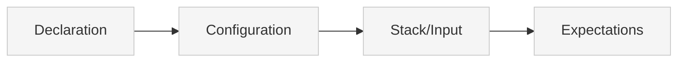

# Source: https://docs.xano.com/xanoscript/tests.md

> ## Documentation Index
> Fetch the complete documentation index at: https://docs.xano.com/llms.txt
> Use this file to discover all available pages before exploring further.

# XanoScript for Tests

> Define unit tests and workflow tests using XanoScript

export const xanoscriptApiInputsDiagram = `
\`\`\`mermaid
flowchart TB
    A[Declaration] --> B[Input]
    B --> C[Stack]
    C --> D[Response]
    D --> E[Settings]
    style A fill:#cdeaff,stroke:#0077cc,stroke-width:2px
    style B fill:#f5f5f5,stroke:#ccc,stroke-width:1px
    style C fill:#f5f5f5,stroke:#ccc,stroke-width:1px
    style D fill:#f5f5f5,stroke:#ccc,stroke-width:1px
    style E fill:#f5f5f5,stroke:#ccc,stroke-width:1px
\`\`\`
`;

export function SideBySide({diagram, children}) {
  return <div style={{
    display: "flex",
    gap: "1rem",
    alignItems: "flex-start",
    flexWrap: "wrap"
  }}>
      <div style={{
    flex: "0 0 180px",
    minWidth: "150px"
  }}>
        <div>{mdx(diagram)}</div>
      </div>
      <div style={{
    flex: 1
  }}>
        {children}
      </div>
    </div>;
}

export const HoverImageCode = ({src, alt = "", width = "100%", maxWidth = "800px", className = "", defaultOpen = false, openOnHover = true, children}) => {
  const [open, setOpen] = useState(defaultOpen);
  const panelRef = useRef(null);
  const [maxHeight, setMaxHeight] = useState(0);
  useEffect(() => {
    if (panelRef.current) {
      setMaxHeight(open ? panelRef.current.scrollHeight : 0);
    }
  }, [open, children]);
  const handleMouseEnter = () => openOnHover && setOpen(true);
  const handleMouseLeave = () => openOnHover && setOpen(false);
  const handleClick = () => setOpen(s => !s);
  const handleImageClick = e => {
    e.stopPropagation();
    e.preventDefault();
    handleClick();
  };
  const prefersReducedMotion = typeof window !== "undefined" && window.matchMedia && window.matchMedia("(prefers-reduced-motion: reduce)").matches;
  const transition = prefersReducedMotion ? "none" : "max-height 300ms ease, opacity 300ms ease, transform 300ms ease";
  return <div className={`border rounded-md overflow-hidden ${className}`} style={{
    width,
    maxWidth
  }} onMouseEnter={handleMouseEnter} onMouseLeave={handleMouseLeave}>
      {}
      <div role="button" tabIndex={0} aria-label="Toggle code" aria-expanded={open} style={{
    cursor: "pointer"
  }}>
         {
    e.stopPropagation();
    e.preventDefault();
    handleClick();
  }} style={{
    display: "block",
    width: "100%",
    height: "auto"
  }} />
      </div>

      {}
      <div className="not-prose" ref={panelRef} style={{
    overflow: "hidden",
    maxHeight: `${maxHeight}px`,
    opacity: open ? 1 : 0,
    transform: open ? "translateY(0)" : "translateY(-6px)",
    transition
  }}>
        <div style={{
    padding: "0.75rem"
  }}>{children}</div>
      </div>
    </div>;
};

## Introduction

Tests in XanoScript allow you to define automated testing for your application logic. Unlike other primitives, tests come in two different types, each serving different testing purposes.

XanoScript supports two types of tests:

* **Unit tests** — Test a single function stack or primitive
* **Workflow tests** — Test multiple functions or APIs together in sequence

Unit tests are embedded within the primitive they're testing, while workflow tests are standalone primitives that can test complex multi-step scenarios.

***

## Anatomy

Every XanoScript test follows a predictable structure, though the specific components vary by test type.

Here's a quick visual overview of the main building blocks — from **declaration** at the top to **expectations** at the bottom.<br /><br />You can find more detail about each section by continuing below.



### Declaration

Every test starts with a **declarative header** that specifies its type, name, and description.

<div style={{ display: "flex", gap: "1rem", alignItems: "flex-start", flexWrap: "wrap" }}>
  <div style={{ flex: "0 0 180px", minWidth: "150px" }}>
    <div>
      ```mermaid  theme={null}
      flowchart TB
      A[Declaration] --> B[Configuration]
      B --> C[Stack/Input]
      C --> D[Expectations]
      style A fill:#cdeaff,stroke:#0077cc,stroke-width:2px
      style B fill:#f5f5f5,stroke:#ccc,stroke-width:1px
      style C fill:#f5f5f5,stroke:#ccc,stroke-width:1px
      style D fill:#f5f5f5,stroke:#ccc,stroke-width:1px
      ```
    </div>
  </div>

  <div style={{ flex: 1 }}>
    ```java XanoScript lines icon="code" theme={null}
    // <what this test does>
    <test|workflow_test> <test_name> {
      ...
    }
    ```

    | Element       | Required | Description                                                                     |
    | ------------- | -------- | ------------------------------------------------------------------------------- |
    | `test_type`   | ✅        | Declares the test primitive type (`test` or `workflow_test`).                   |
    | `test_name`   | ✅        | The unique name for the test.                                                   |
    | `description` | no       | A short summary of the test. May also appear as a “//” comment above the block. |
  </div>
</div>

***

## Test Types

### Unit Tests

Unit tests are embedded within the primitive they're testing and focus on testing a single function stack or API endpoint.

```java XanoScript lines icon="code" theme={null}
// Tests whether a user can log in and be issued an auth token successfully
test "test successful login" {
  datasource = "live"
  input = {email: "chris@xano.com", password: "********"}
  expect.to_be_defined ($response.authToken)
}
```

**Unit Test Characteristics:**

* **Embedded** — Live inside the primitive being tested
* **Single focus** — Tests one function stack or API
* **Simple input** — Uses direct input values
* **Response testing** — Tests the response from the primitive

### Workflow Tests

Workflow tests are standalone primitives that can test multiple functions or APIs together in sequence.

```java XanoScript lines icon="code" theme={null}
// Tests login and incorrect password flow.
workflow_test "Basic user actions" {
  stack {
    api.call auth/login verb=POST {
      api_group = "Authentication"
      input = {email: "chris@xano.com", password: "password"}
    } as $endpoint1

    expect.to_be_defined ($endpoint1.authToken)
    // ... more test steps
  }

  tags = ["user actions"]
}
```

**Workflow Test Characteristics:**

* **Standalone** — Independent primitive
* **Multi-step** — Can test multiple functions/APIs in sequence
* **Complex logic** — Uses full stack with multiple operations
* **Sequential testing** — Tests can build on previous results

***

### Section 1: Configuration

The configuration section defines how the test should run and what data to use.

<div style={{ display: "flex", gap: "1rem", alignItems: "flex-start", flexWrap: "wrap" }}>
  <div className="stickyDiagram">
    ```mermaid  theme={null}
    flowchart TB
    A[Declaration] --> B[Configuration]
    B --> C[Stack/Input]
    C --> D[Expectations]
    style A fill:#f5f5f5,stroke:#ccc,stroke-width:1px
    style B fill:#cdeaff,stroke:#0077cc,stroke-width:2px
    style C fill:#f5f5f5,stroke:#ccc,stroke-width:1px
    style D fill:#f5f5f5,stroke:#ccc,stroke-width:1px
    ```
  </div>

  <div style={{ flex: 1 }}>
    **Unit Test Configuration:**

    ```java XanoScript lines icon="code" theme={null}
    // Tests whether a user can log in and be issued an auth token successfully.
    test "test successful login" {
      datasource = "live"
      input = {email: "chris@xano.com", password: "********"}
      // ... expectations
    }
    ```

    **Workflow Test Configuration:**

    ```java XanoScript lines icon="code" theme={null}
    // Tests login and incorrect password flow.
    workflow_test "Basic user actions" {
      // ... stack and expectations
      tags = ["user actions"]
    }
    ```

    **Configuration Options:**

    * `datasource` — Specifies which datasource to use for testing (`"live"`, `"draft"`, etc.)
    * `input` — Test input data (unit tests only)
    * `tags` — Categorization tags (workflow tests only)
  </div>
</div>

***

### Section 2: Stack/Input

This section varies significantly between test types.

<div style={{ display: "flex", gap: "1rem", alignItems: "flex-start", flexWrap: "wrap" }}>
  <div className="stickyDiagram">
    ```mermaid  theme={null}
    flowchart TB
    A[Declaration] --> B[Configuration]
    B --> C[Stack/Input]
    C --> D[Expectations]
    style A fill:#f5f5f5,stroke:#ccc,stroke-width:1px
    style C fill:#cdeaff,stroke:#0077cc,stroke-width:2px
    style B fill:#f5f5f5,stroke:#ccc,stroke-width:1px
    style D fill:#f5f5f5,stroke:#ccc,stroke-width:1px
    ```
  </div>

  <div style={{ flex: 1 }}>
    **Unit Test Input:**

    ```java XanoScript lines icon="code" theme={null}
    input = {email: "chris@xano.com", password: "password"}
    ```

    **Workflow Test Stack:**

    ```java XanoScript lines icon="code" theme={null}
    stack {
      api.call auth/login verb=POST {
        api_group = "Authentication"
        input = {email: "chris@xano.com", password: "password"}
      } as $endpoint1
      
      expect.to_be_defined ($endpoint1.authToken)
      
      api.call auth/login verb=POST {
        api_group = "Authentication"
        input = {
          email   : "incorrect@user.com"
          password: "incorrect Password"
        }
      } as $endpoint2
      
      expect.to_not_be_defined ($endpoint2.authToken)
    }
    ```

    **Key Differences:**

    * **Unit tests** use simple `input` objects
    * **Workflow tests** use full `stack` blocks with multiple operations
    * **Workflow tests** can call APIs, functions, and other primitives
    * **Workflow tests** can test multiple scenarios in sequence
  </div>
</div>

***

### Section 3: Expectations

The expectations section defines what the test should verify.

<div style={{ display: "flex", gap: "1rem", alignItems: "flex-start", flexWrap: "wrap" }}>
  <div className="stickyDiagram">
    ```mermaid  theme={null}
    flowchart TB
    A[Declaration] --> B[Configuration]
    B --> C[Stack/Input]
    C --> D[Expectations]
    style A fill:#f5f5f5,stroke:#ccc,stroke-width:1px
    style D fill:#cdeaff,stroke:#0077cc,stroke-width:2px
    style B fill:#f5f5f5,stroke:#ccc,stroke-width:1px
    style C fill:#f5f5f5,stroke:#ccc,stroke-width:1px
    ```
  </div>

  <div style={{ flex: 1 }}>
    **Expectation Syntax:**

    ```java XanoScript lines icon="code" theme={null}
    expect.to_be_defined ($response.authToken)
    expect.to_not_be_defined ($endpoint2.authToken)
    ```

    **Common Expectation Methods:**

    * `expect.to_be_defined` — Verifies a value exists and is not null/undefined
    * `expect.to_not_be_defined` — Verifies a value is null/undefined
    * `expect.to_equal` — Verifies a value equals an expected result
    * `expect.to_not_equal` — Verifies a value does not equal an expected result
    * `expect.to_contain` — Verifies a value contains expected content
    * `expect.to_be_true` — Verifies a value is true
    * `expect.to_be_false` — Verifies a value is false

    **Expectation Placement:**

    * **Unit tests** — Expectations are defined after the input configuration
    * **Workflow tests** — Expectations can be placed anywhere in the stack
  </div>
</div>

***

## Settings

Test primitives support optional settings for organization and configuration.

<div style={{ display: "flex", gap: "0rem", alignItems: "flex-start", flexWrap: "wrap" }}>
  <div className="stickyDiagram">
    ```mermaid  theme={null}
    flowchart TB
    A[Declaration] --> B[Configuration]
    B --> C[Stack/Input]
    C --> D[Expectations]
    style A fill:#f5f5f5,stroke:#ccc,stroke-width:1px
    style B fill:#cdeaff,stroke:#0077cc,stroke-width:2px
    style C fill:#f5f5f5,stroke:#ccc,stroke-width:1px
    style D fill:#f5f5f5,stroke:#ccc,stroke-width:1px
    ```
  </div>

  <div style={{ flex: 1 }}>
    | Setting       | Type           | Required | Description                                                                     |
    | ------------- | -------------- | -------- | ------------------------------------------------------------------------------- |
    | `description` | string         | no       | A short summary of the test. May also appear as a “//” comment above the block. |
    | `datasource`  | string         | no       | Specifies which datasource to use for testing.                                  |
    | `input`       | object         | no       | Test input data (unit tests only).                                              |
    | `tags`        | array\[string] | no       | A list of tags used to categorize and organize the test.                        |

    **Datasource Options:**

    * `"live"` — Uses the live datasource for testing
    * `"draft"` — Uses the draft datasource for testing
    * Other datasource names as configured in your workspace
  </div>
</div>

***

## Detailed Examples

### Unit Test Examples

```java XanoScript lines icon="code" theme={null}
// Tests whether a user can log in and be issued an auth token successfully.
test "test successful login" {
  datasource = "live"
  input = {email: "chris@xano.com", password: "password"}
  expect.to_be_defined ($response.authToken)
}

// Tests to ensure users are not issued an auth token on an incorrect password entry.
test "Incorrect password flow" {
  datasource = "live"
  input = {
    email   : "chris@xano.com"
    password: "incorrectpassword"
  }
  expect.to_not_be_defined ($response.authToken)
}
```

### Workflow Test Example

```java XanoScript lines icon="code" theme={null}
// Tests login and incorrect password flow.
workflow_test "Basic user actions" {
  stack {
    api.call auth/login verb=POST {
      api_group = "Authentication"
      input = {email: "chris@xano.com", password: "password"}
    } as $endpoint1
  
    expect.to_be_defined ($endpoint1.authToken)
    
    api.call auth/login verb=POST {
      api_group = "Authentication"
      input = {
        email   : "incorrect@user.com"
        password: "incorrect Password"
      }
    } as $endpoint2
  
    expect.to_not_be_defined ($endpoint2.authToken)
  }

  tags = ["user actions"]
}
```

***

## What's Next

Now that you understand how to define tests in XanoScript, here are a few great next steps:

<Card title="Explore the function reference" icon="function" horizontal href="/xanoscript/function-reference">
  Learn about the built-in functions available in the stack to start writing more complex test logic.
</Card>

<Card title="Try it out in VS Code" icon="https://mintcdn.com/xano-997cb9ee/l34pjCw6QluB5NGI/images/icons/vscode.svg?fit=max&auto=format&n=l34pjCw6QluB5NGI&q=85&s=c9ca342a4c7cc10adcf78c89f822c596" horizontal href="/xanoscript/vs-code" width="100" height="100" data-path="images/icons/vscode.svg">
  Use the XanoScript VS Code extension with Copilot to write XanoScript in your favorite IDE.
</Card>

<Card title="Learn about APIs" icon="cube" horizontal href="/xanoscript/api">
  Create APIs that you can test with your unit and workflow tests to ensure robust functionality.
</Card>


Built with [Mintlify](https://mintlify.com).