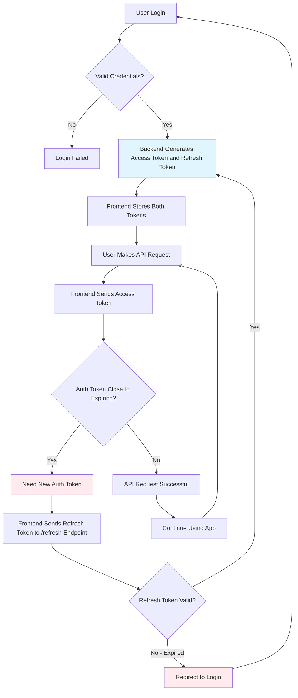

# Source: https://docs.xano.com/building-backend-features/user-authentication-and-user-data.md

> ## Documentation Index
> Fetch the complete documentation index at: https://docs.xano.com/llms.txt
> Use this file to discover all available pages before exploring further.

# User Auth & Data

## **Enable Authentication for a Table**

Authentication starts with enabling the function on a table that contains user data. Typically, this would just be your `user` table. You can also enable authentication on multiple tables if you want separate authentication methods for different user groups, such as normal users and administrators.

<Steps>
  <Step title="Click the ⋮ icon in the database table view and choose Settings.">
    <Frame>
      
    </Frame>
  </Step>

  <Step title="Use the dropdown to enable authentication.">
    <Frame>
      
    </Frame>
  </Step>
</Steps>

## **Enable Authentication on an API Request**

Once you've enabled authentication on a table, you can use each API endpoint's settings to note whether or not it requires authentication.

When a request is sent to API endpoints that require authentication, an authorization token is sent in the headers of the request, which Xano checks against the table with authentication enabled, before allowing the request to continue.

<Info>
  Still need a primer on the basics of an API? Read more
  [here](/before-you-begin/key-concepts#api).
</Info>

<Steps>
  <Step title="Click … to access the settings of the API you'd like to enable authentication on.">
    <Frame>
      
    </Frame>
  </Step>

  <Step title="Enable authentication for the endpoint in the dropdown.">
    This dropdown will list each table that you have authentication enabled on. Select the table you enabled authentication on.

    <Frame>
      
    </Frame>

    Once an API has authentication enabled, it will require an authentication token to be sent in the headers of the request.
  </Step>
</Steps>

## How does authentication work?

Authentication in Xano is powered by industry-standard JWE (JSON Web Encryption) tokens.

Once a token is generated (after login or signup), your app or website will send that token back to Xano for requests that require authentication.

A token is generated using the [**Create Authentication Token**](/the-function-stack/functions/security#create-authentication-token) function, and is typically used in conjunction with a standard login or signup authentication flow.

## Adding Pre-built Authentication Endpoints

<Steps>
  <Step title="Create an API group to hold your authentication endpoints." />

  <Step title="Click '+ Add API Endpoint' and choose Authentication to pick from the pre-built API endpoints.">
    <Frame>
      
    </Frame>
  </Step>

  <Step title="Choose the API that you'd like to add.">
    * **Login**

      * Accepts an email or username and password, and allows a user to log in

    * **Signup**

      * Accepts user information and creates an account for them

    * **auth/me**

      * Checks an authentication token and returns user information
  </Step>
</Steps>

## Building Sign-up and Login APIs

Below, you can review a **typical** login and signup flow — you are free to modify them to suit your needs. These are the same that Xano can add for you during signup

### Login

<Frame>
  
</Frame>

<Steps>
  <Step title="Get Record From user">
    First, we need to retrieve the record of the user trying to login.
  </Step>

  <Step title="Precondition: user ≠ null">
    We use a precondition step to check if a user record was returned in step 1.
    If it wasn't, we return an error and halt execution.
  </Step>

  <Step title="Validate Password">
    Because passwords stored in a Xano database are hashed and not human
    readable, we use a Validate Password function to check what the user has
    submitted against the password stored in the database. This function returns
    a `true` or `false` depending on the result.
  </Step>

  <Step title="Precondition: pass_result = true">
    We use another precondition step to check if the password was successfully
    validated. If not, we return an error and halt execution.
  </Step>

  <Step title="Create Authentication Token">
    Finally, all checks are passed, and we create and return the authentication
    token.
  </Step>
</Steps>

### Signup

<Frame>
  
</Frame>

<Steps>
  <Step title="Get Record From user">
    Checks if a user record already exists with the provided information.
  </Step>

  <Step title="Precondition: user = null">
    Checks to see if there is a user record returned in step 1. If so, we halt
    execution and return an error
  </Step>

  <Step title="Add Record In user">
    Add a new record for the user in the `user` table
  </Step>

  <Step title="Create Authentication Token">
    Creates an authentication token to be used in future API requests.
  </Step>
</Steps>

## Extras

The extras payload is an optional setting that allows you to store additional information securely inside the token, such as a user role or other additional information.

<Info>
  When testing endpoints with authentication enabled, the quick token generator
  will not include extras or any other customization present in your login or
  signup endpoints.
</Info>

## Refresh Tokens

Refresh tokens are like spare keys for your online accounts. When a user logs in, they are issued an authentication token. This token eventually expires for security reasons, assuming you've specified an expiry time in your Create Authentication Token functions.

Once this token expires, additional user requests will fail and your frontend would probably redirect them back to the login screen. You can utilize refresh tokens to avoid having your users log in again, while maintaining the shorter expiry that is standard for an authentication token. It's a dance of logic between your backend and frontend to make this work as expected.

Below, you'll find a flowchart that details this process, and an interactive tutorial for how to add refresh token support to your Xano backend.

<Frame>
  <iframe src="https://demo.arcade.software/R4QKSn4i8piWp5ZSIcar?embed&embed_mobile=tab&embed_desktop=inline&show_copy_link=true" title="Adding Refresh Token Support in Xano" frameborder="0" loading="lazy" webkitallowfullscreen mozallowfullscreen allowfullscreen allow="clipboard-write" />
</Frame>

<br />



## Additional Notes

#### Alternative Authentication Headers

If you need to provide a secondary authentication header that takes precedence over the original Xano authentication, you can do so by sending the \*\*X-Xano-Authorization-Only \*\*header along with your requests. This will allow you to move the Xano authentication token to its own header, keeping the original standard **Authorization** header for something else.

You would want to utilize the **X-Xano-Authorization-Only** header if you are sending requests to your Xano APIs from another source that uses the \*\*Authorization \*\*header key for something else on both public and authentication required endpoints that are using the **Authorization** header for something other than Xano authentication.

**Example:**

```sh {1-2} theme={null}
// For a public Xano endpoint that sends an Authorization header
curl "http://localhost:9999/api:elnQNVvy:v1/public_test" \
-H "X-Xano-Authorization-Only: true"

// For a private (authenticated) Xano endpoint that receives an Authorization header
that is not a Xano auth token
curl "http://localhost:9999/api:elnQNVvy:v1/private_test" \
-H "X-Xano-Authorization: Bearer ey...." \
-H "X-Xano-Authorization-Only: true"
```


Built with [Mintlify](https://mintlify.com).