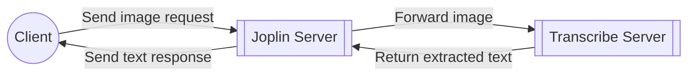
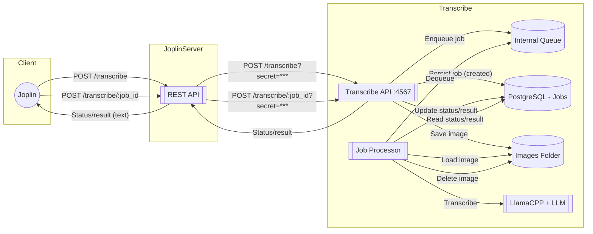

# Transcribe System Architecture

## 1. Context and Objectives

Currently, Joplin supports OCR functionality but only for printed text. Handwritten text recognition is not yet handled. The Transcribe server addresses this gap by enabling the extraction of handwritten text from images.

Recognising handwritten text is computationally demanding, which is why it requires a dedicated server separate from the main Joplin Server. Integrating Transcribe as a distinct component ensures that only one server is needed for Joplin while isolating the resource-intensive handwriting recognition process. This separation also increases stability: since Transcribe uses AI models that can unpredictably consume resources and potentially fail, running it independently means any issues won’t directly impact Joplin Server’s operation.

The main functional goals of the Transcribe server are to extract handwritten text to enable search and processing within Joplin, and to support smart notebook features by converting scanned handwritten pages into searchable text.

## 2. System Overview

The Transcribe server is part of a workflow that begins with the client making a request to the Joplin Server. The Joplin Server then forwards the request to the Transcribe Server, which processes the image containing handwritten text and returns the extracted text back to the Joplin Server. Finally, the processed text is sent back to the client.

### High-level Workflow

### Inputs and Outputs

* **Input:** Images containing handwritten text (e.g., scanned notes or photos)
* **Output:** Extracted handwritten text as plain text, ready for search or further processing

## 3. Functional Architecture

### Key components and responsibilities

* **Transcribe API (REST, port 4567; customisable):**

  * `POST /transcribe` (multipart/form-data): upload an image file to create a job; returns a job ID.
  * `POST /transcribe/:job_id`: check the status of a job; when completed, returns the extracted text.
  * **Auth:** Joplin Server authenticates using a shared secret **passed as a query parameter** (e.g. `?secret=...`) on requests to Transcribe.
* **Job store (PostgreSQL):**

  * Persists job metadata, status, timestamps, and results.
* **Internal queue:**

  * One job processed at a time to control load and ensure stability.
* **Job processor (worker):**

  * Dequeues jobs, runs transcription, updates status/result, and deletes the image after processing.
* **Transcription engine:**

  * LlamaCPP + LLM with a custom prompt for handwriting recognition.
* **Image storage:**

  * External folder mounted into the container; images deleted after processing.
* **Joplin Server (proxy):**

  * Exposes the same two endpoints, forwards requests to Transcribe with the shared secret query parameter, and proxies responses to the client.
* **Client:**

  * Uploads the image via Joplin Server and polls for job status until the result is ready.

### Component interaction diagram

### Job status lifecycle

* **created** – job has been registered but not yet started
* **retry** – job is scheduled to be reprocessed after a failure
* **active** – job is currently being processed
* **completed** – job finished successfully and the result is available
* **cancelled** – job was manually or automatically stopped before completion
* **failed** – job could not be completed after retries

### Typical HTTP responses

* **400 Bad Request** – invalid input or parameters
* **403 Forbidden** – missing or invalid shared secret
* **404 Not Found** – unknown job ID

## 4. Technical Architecture

### Technology stack

* **Containerisation:** Docker image for deployment; can run in any environment that supports Docker.
* **Runtime:** Node.js
* **Database:** PostgreSQL (for job storage and status tracking)
* **File storage:** Filesystem storage for uploaded images (mounted into the container)
* **Operating system:** Any system that supports Docker

### Deployment considerations

* **Separation of services:** We recommend deploying Transcribe on a **separate server** from Joplin Server due to the very different hardware requirements.
* External file storage folder must be mounted for image persistence during processing.
* Shared secret (query parameter) must be configured in both Joplin Server and Transcribe Server for authentication.
* For the full list of supported environment variables (including the shared secret) and their default values, refer to:
  [https://github.com/laurent22/joplin/blob/dev/packages/transcribe/src/env.ts](https://github.com/laurent22/joplin/blob/dev/packages/transcribe/src/env.ts)

### Hardware requirements

#### Joplin Server

Refer to the [Joplin Server hardware requirements](https://github.com/laurent22/joplin/blob/dev/readme/apps/joplin_server_business.md#technical-specifications)

#### Transcribe Server

* **Cost-effective configuration:**

  * CPU: Intel i7/i9
  * RAM: 64 GB
  * GPU: NVIDIA RTX 4070 (12 GB VRAM)

* **Fast / scalable configuration:**

  * CPU: 16-core processor
  * RAM: 128 GB
  * GPU: NVIDIA RTX 4090 (24 GB VRAM) or NVIDIA L4 (24 GB VRAM)

The GPU is recommended for efficient execution of the LlamaCPP-based transcription model.

## 5. Security and Constraints

### Access control and authentication

* A **shared secret** between Joplin Server and Transcribe Server is used to authenticate requests.
* The secret is passed as a query parameter from Joplin Server to Transcribe Server.
* **Recommendation:** Deploy the Transcribe Server in a **private network**, not directly exposed to the internet, and allow network access only from the Joplin Server host.

### Known limitations and risks

* **Model accuracy:** The LLM used for transcription is a relatively new technology and can occasionally produce unexpected or inaccurate results. However, this technology evolves quickly, and the model can be updated to a newer, more accurate version with minimal changes.
* **Security of LLM execution:** Risks such as prompt injection exist when running LLMs. To mitigate these:

  * LlamaCPP is run with very limited access to resources.
  * The model executes inside its own Docker container, preventing access to resources outside the container.
* **Operational costs:** GPU hardware is required for efficient processing. Depending on pricing and usage, GPU costs can be significant and should be monitored closely.

## 6. Deployment and Operation

### Deployment

* For installation instructions, refer to the official [Transcribe installation documentation](https://github.com/laurent22/joplin/blob/dev/packages/transcribe).
* Deployment can be performed using Docker directly or via Docker Compose.
* Environment variables, including the shared secret, should be configured as described in the [env.ts file](https://github.com/laurent22/joplin/blob/dev/packages/transcribe/src/env.ts).

### Monitoring, logging, and error handling

* The Transcribe Server writes all output to **stdout** and **stderr**, which can be redirected to any logging system for persistence and analysis.
* It is recommended to run Transcribe under a daemon process manager such as **PM2**, ensuring the service remains online and restarts automatically if it fails.
* Future versions may integrate PM2 directly into the Docker image for increased resilience.

### Backup and recovery

* Only the PostgreSQL database and environment variables require backup. Standard PostgreSQL tools such as `pg_dump` can be used.
* The database stores **ongoing jobs only**; completed results are delivered to the client and not persisted long-term.
* Losing the database would result in the loss of current jobs only. Clients can automatically re-submit jobs, so backups may not be critical in all deployments.

## 7. Future Plans and Limitations

### Planned improvements and new features

* **Automatic restart on failure:** Integrate a daemon process manager (e.g., PM2) directly into the Docker image, similar to Joplin Server, to automatically restart the service when it fails.
* **Model updates:** Periodically replace the LLM with more performant and accurate handwriting recognition models as they become available.
* **Audio transcription:** Extend the server’s capabilities to process audio files (e.g., speech-to-text) using Whisper or similar technologies, while keeping the same job creation and monitoring endpoints.

### Current limitations

* **Handwriting variability:** Accuracy may be lower for very messy handwriting, unusual scripts, or heavily stylised writing.
* **Image quality sensitivity:** Poor lighting, low resolution, or motion blur in images can reduce recognition accuracy.
* **File types:** Currently limited to image uploads; PDF pages, audio, or video are not supported.
* **Processing concurrency:** Only one job is processed at a time; high request volumes will queue and wait.
* **GPU dependency:** Performance and throughput are strongly dependent on GPU availability and capacity.
* **Network locality:** Designed for use on a private network; no built-in protection against internet-based threats if publicly exposed.