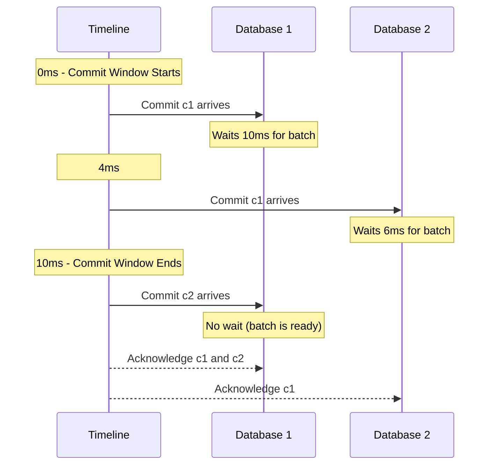

# Docs 3 Documentation

Source: https://docs.turso.tech/llms-full.txt

---

# List Audit Logs
Source: https://docs.turso.tech/api-reference/audit-logs/list

GET /v1/organizations/{organizationSlug}/audit-logs
Return the audit logs for the given organization, ordered by the `created_at` field in descending order.

<Warning>Audit Logs are limited to paid plans.</Warning>

<RequestExample>
  ```bash cURL theme={null}
  curl -L https://api.turso.tech/v1/organizations/{organizationSlug}/audit-logs \
    -H 'Authorization: Bearer TOKEN'
  ```
</RequestExample>


# Authentication
Source: https://docs.turso.tech/api-reference/authentication


The Turso API uses API tokens to authenticate requests. You can create and revoke API tokens using the [Turso CLI](/cli) and [Authentication API](/api-reference/tokens/create).

API tokens allow access to manage all API resources, including creating and destroying database.

* Use environment variables when working with API tokens.
* Never share your API token in public, including repositories, and CI/CD Actions.

Turso uses Bearer authentication, and requires your API token to be passed with all protected requests in the `Authorization` header:

```bash  theme={null}
Authorization: Bearer TOKEN
```

## Base URL

The Turso API is located at the following URL:

```bash  theme={null}
https://api.turso.tech
```


# Retrieve Database Configuration
Source: https://docs.turso.tech/api-reference/databases/configuration

GET /v1/organizations/{organizationSlug}/databases/{databaseName}/configuration
Retrieve an individual database configuration belonging to the organization or user.

<RequestExample>
  ```bash cURL theme={null}
  curl -L -X GET 'https://api.turso.tech/v1/organizations/{organizationSlug}/databases/{databaseName}/configuration' \
    -H 'Authorization: Bearer TOKEN'
  ```
</RequestExample>


# Create Database
Source: https://docs.turso.tech/api-reference/databases/create

POST /v1/organizations/{organizationSlug}/databases
Creates a new database in a group for the organization or user.

<RequestExample>
  ```bash cURL theme={null}
  curl -L -X POST 'https://api.turso.tech/v1/organizations/{organizationSlug}/databases' \
    -H 'Authorization: Bearer TOKEN' \
    -H 'Content-Type: application/json' \
    -d '{
        "name": "new-database",
        "group": "default"
    }'
  ```

  ```ts Node.js theme={null}
  import { createClient } from "@tursodatabase/api";

  const turso = createClient({
    org: "...",
    token: "",
  });

  const database = await turso.databases.create("new-database", {
    group: "default",
  });
  ```
</RequestExample>


# Generate Database Auth Token
Source: https://docs.turso.tech/api-reference/databases/create-token

POST /v1/organizations/{organizationSlug}/databases/{databaseName}/auth/tokens
Generates an authorization token for the specified database.

<RequestExample>
  ```bash cURL theme={null}
  curl -L -X POST 'https://api.turso.tech/v1/organizations/{organizationSlug}/databases/{databaseName}/auth/tokens?expiration=2w&authorization=full-access' \
    -H 'Authorization: Bearer TOKEN'
  ```

  ```ts Node.js theme={null}
  import { createClient } from "@tursodatabase/api";

  const turso = createClient({
    org: "...",
    token: "",
  });

  const token = await turso.databases.createToken("my-db", {
    expiration: "2w",
    authorization: "full-access",
  });
  ```
</RequestExample>

<ResponseExample>
  ```json  theme={null}
  {
    "jwt": "TOKEN"
  }
  ```
</ResponseExample>


# Delete Database
Source: https://docs.turso.tech/api-reference/databases/delete

DELETE /v1/organizations/{organizationSlug}/databases/{databaseName}
Delete a database belonging to the organization or user.

<RequestExample>
  ```bash cURL theme={null}
  curl -L -X DELETE 'https://api.turso.tech/v1/organizations/{organizationSlug}/databases/{databaseName}' \
    -H 'Authorization: Bearer TOKEN'
  ```

  ```ts Node.js theme={null}
  import { createClient } from "@tursodatabase/api";

  const turso = createClient({
    org: "...",
    token: "",
  });

  const database = await turso.databases.delete("my-db");
  ```
</RequestExample>


# Invalidate All Database Auth Tokens
Source: https://docs.turso.tech/api-reference/databases/invalidate-tokens

POST /v1/organizations/{organizationSlug}/databases/{databaseName}/auth/rotate
Invalidates all authorization tokens for the specified database.

<Warning>
  A short downtime is required to complete the changes.
</Warning>

<RequestExample>
  ```bash cURL theme={null}
  curl -L -X POST 'https://api.turso.tech/v1/organizations/{organizationSlug}/databases/{databaseName}/auth/rotate' \
  -H 'Authorization: Bearer TOKEN'
  ```

  ```ts Node.js theme={null}
  import { createClient } from "@tursodatabase/api";

  const turso = createClient({
    org: "...",
    token: "",
  });

  const response = await turso.databases.rotateTokens("my-db");
  ```
</RequestExample>


# List Databases
Source: https://docs.turso.tech/api-reference/databases/list

GET /v1/organizations/{organizationSlug}/databases
Returns a list of databases belonging to the organization or user.

<RequestExample>
  ```bash cURL theme={null}
  curl -L https://api.turso.tech/v1/organizations/{organizationSlug}/databases \
    -H 'Authorization: Bearer TOKEN'
  ```

  ```ts Node.js theme={null}
  import { createClient } from "@tursodatabase/api";

  const turso = createClient({
    org: "...",
    token: "",
  });

  const databases = await turso.databases.list();
  ```
</RequestExample>


# List Database Instances
Source: https://docs.turso.tech/api-reference/databases/list-instances

GET /v1/organizations/{organizationSlug}/databases/{databaseName}/instances
Returns a list of instances of a database. Instances are the individual primary or replica databases in each region defined by the group.

<RequestExample>
  ```bash cURL theme={null}
  curl -L https://api.turso.tech/v1/organizations/{organizationSlug}/databases/{databaseName}/instances \
    -H 'Authorization: Bearer TOKEN'
  ```

  ```ts Node.js theme={null}
  import { createClient } from "@tursodatabase/api";

  const turso = createClient({
    org: "...",
    token: "",
  });

  const instances = await turso.databases.listInstances("my-db");
  ```
</RequestExample>


# Retrieve Database
Source: https://docs.turso.tech/api-reference/databases/retrieve

GET /v1/organizations/{organizationSlug}/databases/{databaseName}
Returns a database belonging to the organization or user.

<RequestExample>
  ```bash cURL theme={null}
  curl -L 'https://api.turso.tech/v1/organizations/{organizationSlug}/databases/{databaseName}' \
  -H 'Authorization: Bearer TOKEN'
  ```

  ```ts Node.js theme={null}
  import { createClient } from "@tursodatabase/api";

  const turso = createClient({
    org: "...",
    token: "",
  });

  const database = await turso.databases.retrieve("my-db");
  ```
</RequestExample>


# Retrieve Database Instance
Source: https://docs.turso.tech/api-reference/databases/retrieve-instance

GET /v1/organizations/{organizationSlug}/databases/{databaseName}/instances/{instanceName}
Return the individual database instance by name.

<RequestExample>
  ```bash cURL theme={null}
  curl -L https://api.turso.tech/v1/organizations/{organizationSlug}/databases/{databaseName}/instances/{instanceName} \
    -H 'Authorization: Bearer TOKEN'
  ```

  ```ts Node.js theme={null}
  import { createClient } from "@tursodatabase/api";

  const turso = createClient({
    org: "...",
    token: "",
  });

  const instance = await turso.databases.retrieveInstance(
    "my-db",
    "instanceName",
  );
  ```
</RequestExample>


# Retrieve Database Stats
Source: https://docs.turso.tech/api-reference/databases/stats

GET /v1/organizations/{organizationSlug}/databases/{databaseName}/stats
Fetch the top queries of a database, including the count of rows read and written.

<RequestExample>
  ```bash cURL theme={null}
  curl -L -X GET 'https://api.turso.tech/v1/organizations/{organizationSlug}/databases/{databaseName}/stats' \
  -H 'Authorization: Bearer TOKEN'
  ```
</RequestExample>


# Update Database Configuration
Source: https://docs.turso.tech/api-reference/databases/update-configuration

PATCH /v1/organizations/{organizationSlug}/databases/{databaseName}/configuration
Update a database configuration belonging to the organization or user.

<RequestExample>
  ```bash cURL theme={null}
  curl -L -X PATCH 'https://api.turso.tech/v1/organizations/{organizationSlug}/databases/{databaseName}/configuration' \
    -H 'Authorization: Bearer TOKEN' \
    -H 'Content-Type: application/json' \
    -d '{
        "size_limit": "500mb",
        "delete_protection": true,
        "block_reads": false,
        "block_writes": false
    }'
  ```
</RequestExample>


# Retrieve Database Usage
Source: https://docs.turso.tech/api-reference/databases/usage

GET /v1/organizations/{organizationSlug}/databases/{databaseName}/usage
Fetch activity usage for a database in a given time period.

<RequestExample>
  ```bash cURL theme={null}
  curl -L -X GET 'https://api.turso.tech/v1/organizations/{organizationSlug}/databases/{databaseName}/usage?from=2023-01-01T00:00:00Z&to=2023-02-01T00:00:00Z' \
  -H 'Authorization: Bearer TOKEN'
  ```

  ```ts Node.js theme={null}
  import { createClient } from "@tursodatabase/api";

  const turso = createClient({
    org: "...",
    token: "",
  });

  const usageStatsWithDate = await turso.databases.usage("my-db");

  const usageStatsWithDate = await turso.databases.usage("my-db", {
    from: new Date("2023-01-01"),
    to: new Date("2023-02-01"),
  });

  const usageStatsWithString = await turso.databases.usage("my-db", {
    from: "2023-01-01T00:00:00Z",
    to: "2023-02-01T00:00:00Z",
  });
  ```
</RequestExample>


# Retrieve Group Configuration
Source: https://docs.turso.tech/api-reference/groups/configuration

GET /v1/organizations/{organizationSlug}/groups/{groupName}/configuration
Retrieve an individual group configuration belonging to the organization or user.

<RequestExample>
  ```bash cURL theme={null}
  curl -L -X GET 'https://api.turso.tech/v1/organizations/{organizationSlug}/groups/{groupName}/configuration' \
    -H 'Authorization: Bearer TOKEN'
  ```
</RequestExample>


# Create Group
Source: https://docs.turso.tech/api-reference/groups/create

POST /v1/organizations/{organizationSlug}/groups
Creates a new group for the organization or user.

<Warning>
  Creating more than one group is limited to Scaler, Pro and Enterprise plans.
</Warning>

<RequestExample>
  ```bash cURL theme={null}
  curl -L -X POST 'https://api.turso.tech/v1/organizations/{organizationSlug}/groups' \
  -H 'Authorization: Bearer TOKEN' \
  -H 'Content-Type: application/json' \
  -d '{
      "name": "new-group",
      "location": "lhr"
  }'
  ```

  ```ts Node.js theme={null}
  import { createClient } from "@tursodatabase/api";

  const turso = createClient({
    org: "...",
    token: "",
  });

  const group = await turso.groups.create("new-group", {
    location: "lhr",
    extensions: ["vector", "uuid"], // 'all'
  });
  ```
</RequestExample>


# Create Group Auth Token
Source: https://docs.turso.tech/api-reference/groups/create-token

POST /v1/organizations/{organizationSlug}/groups/{groupName}/auth/tokens
Generates an authorization token for the specified group.

<Info>
  Tokens cannot be retrieved once created, and cannot be revoked individually.
</Info>

<RequestExample>
  ```bash cURL theme={null}
  curl -L -X POST 'https://api.turso.tech/v1/organizations/{organizationSlug}/groups/{groupName}/auth/tokens?expiration=2w&authorization=full-access' \
  -H 'Authorization: Bearer TOKEN'
  ```

  ```ts Node.js theme={null}
  import { createClient } from "@tursodatabase/api";

  const turso = createClient({
    org: "...",
    token: "",
  });

  const token = await turso.groups.createToken("default", {
    expiration: "2w",
    authorization: "full-access",
  });
  ```
</RequestExample>

<ResponseExample>
  ```json  theme={null}
  {
    "jwt": "TOKEN"
  }
  ```
</ResponseExample>


# Delete Group
Source: https://docs.turso.tech/api-reference/groups/delete

DELETE /v1/organizations/{organizationSlug}/groups/{groupName}
Delete a group belonging to the organization or user.

<RequestExample>
  ```bash cURL theme={null}
  curl -L -X DELETE 'https://api.turso.tech/v1/organizations/{organizationSlug}/groups/{groupName}' \
  -H 'Authorization: Bearer TOKEN'
  ```

  ```ts Node.js theme={null}
  import { createClient } from "@tursodatabase/api";

  const turso = createClient({
    org: "...",
    token: "",
  });

  const group = await turso.groups.delete("new-group");
  ```
</RequestExample>


# Invalidate All Group Auth Tokens
Source: https://docs.turso.tech/api-reference/groups/invalidate-tokens

POST /v1/organizations/{organizationSlug}/groups/{groupName}/auth/rotate
Invalidates all authorization tokens for the specified group.

<RequestExample>
  ```bash cURL theme={null}
  curl -L -X POST 'https://api.turso.tech/v1/organizations/{organizationSlug}/groups/{groupName}/auth/rotate' \
  -H 'Authorization: Bearer TOKEN'
  ```

  ```ts Node.js theme={null}
  import { createClient } from "@tursodatabase/api";

  const turso = createClient({
    org: "...",
    token: "",
  });

  const response = await turso.groups.invalidateTokens("default");
  ```
</RequestExample>


# List Groups
Source: https://docs.turso.tech/api-reference/groups/list

GET /v1/organizations/{organizationSlug}/groups
Returns a list of groups belonging to the organization or user.

<RequestExample>
  ```bash cURL theme={null}
  curl -L https://api.turso.tech/v1/organizations/{organizationSlug}/groups \
    -H 'Authorization: Bearer TOKEN'
  ```

  ```ts Node.js theme={null}
  import { createClient } from "@tursodatabase/api";

  const turso = createClient({
    org: "...",
    token: "",
  });

  const groups = await turso.groups.list();
  ```
</RequestExample>


# Retrieve Group
Source: https://docs.turso.tech/api-reference/groups/retrieve

GET /v1/organizations/{organizationSlug}/groups/{groupName}
Returns a group belonging to the organization or user.

<RequestExample>
  ```bash cURL theme={null}
  curl -L 'https://api.turso.tech/v1/organizations/{organizationSlug}/groups/{groupName}' \
  -H 'Authorization: Bearer TOKEN'
  ```

  ```ts Node.js theme={null}
  import { createClient } from "@tursodatabase/api";

  const turso = createClient({
    org: "...",
    token: "",
  });

  const group = await turso.groups.retrieve("default");
  ```
</RequestExample>


# Transfer Group
Source: https://docs.turso.tech/api-reference/groups/transfer

POST /v1/organizations/{organizationSlug}/groups/{groupName}/transfer
Transfer a group to another organization that you own or a member of.

<Info>
  You can only transfer groups to organizations you own or are an admin.
</Info>

<Warning>
  Existing database URL and tokens will continue to work, but should update your application to use the new URL and token as soon as possible.
</Warning>

<RequestExample>
  ```bash cURL theme={null}
  curl -L -X POST 'https://api.turso.tech/v1/organizations/{organizationSlug}/groups/{groupName}/transfer' \
  -H 'Authorization: Bearer TOKEN' \
  -d '{
      "organization": "new-organization-slug"
  }'
  ```
</RequestExample>


# Unarchive Group
Source: https://docs.turso.tech/api-reference/groups/unarchive

POST /v1/organizations/{organizationSlug}/groups/{groupName}/unarchive
Unarchive a group that has been archived due to inactivity.

<Info>
  Databases get archived after 10 days of inactivity for users on a free plan — [learn more](/features/scale-to-zero). You can unarchive inactive groups using the API.
</Info>

<RequestExample>
  ```bash cURL theme={null}
  curl -L -X POST 'https://api.turso.tech/v1/organizations/{organizationSlug}/groups/{groupName}/unarchive' \
  -H 'Authorization: Bearer TOKEN' \
  ```
</RequestExample>


# Update Group Configuration
Source: https://docs.turso.tech/api-reference/groups/update-configuration

PATCH /v1/organizations/{organizationSlug}/groups/{groupName}/configuration
Update a group configuration belonging to the organization or user.

<RequestExample>
  ```bash cURL theme={null}
  curl -L -X PATCH 'https://api.turso.tech/v1/organizations/{organizationSlug}/groups/{groupName}/configuration' \
    -H 'Authorization: Bearer TOKEN' \
    -H 'Content-Type: application/json' \
    -d '{
        "delete_protection": true
    }'
  ```
</RequestExample>


# Turso Platform API
Source: https://docs.turso.tech/api-reference/introduction


The Turso API gives you everything needed to manage your organization and its members, groups, databases, and API tokens.

If you want to programatically create and manage databases, either for building a platform where you provide SQLite databases to your users or have a per-user SQLite database architecture, this is the API to do that.

<CardGroup cols={2}>
  <Card title="API Quickstart" icon="play" href="/api-reference/quickstart">
    Get started with the Turso API to create your first database.
  </Card>
</CardGroup>

## API Resources

Start integrating the Turso API with your platform in a few simple steps.

<Snippet file="platform-api-links.mdx" />


# Closest Region
Source: https://docs.turso.tech/api-reference/locations/closest-region

GET https://region.turso.io
Returns the closest region to the user's location.

#### Response

<ResponseField name="server" type="string">
  The location code for the server responding.
</ResponseField>

<ResponseField name="client" type="string">
  The location code for the client request.
</ResponseField>

<RequestExample>
  ```bash cURL theme={null}
  curl https://region.turso.io
  ```

  ```ts Node.js theme={null}
  import { createClient } from "@tursodatabase/api";

  const turso = createClient({
    org: "...",
    token: "",
  });

  const { server, client } = await turso.locations.closest();
  ```
</RequestExample>

<ResponseExample>
  ```json 200 theme={null}
  {
    "server": "lhr",
    "client": "lhr"
  }
  ```
</ResponseExample>


# List Locations
Source: https://docs.turso.tech/api-reference/locations/list

GET /v1/locations
Returns a list of locations where you can create or replicate databases.

<RequestExample>
  ```bash cURL theme={null}
  curl -L https://api.turso.tech/v1/locations \
    -H 'Authorization: Bearer TOKEN'
  ```

  ```ts Node.js theme={null}
  import { createClient } from "@tursodatabase/api";

  const turso = createClient({
    org: "...",
    token: "",
  });

  const locations = await turso.locations.list();
  ```
</RequestExample>


# Create Invite
Source: https://docs.turso.tech/api-reference/organizations/invites/create

POST /v1/organizations/{organizationSlug}/invites
Invite a user (who isn't already a Turso user) to an organization.

<Info>
  If you want to invite someone who is already a registered Turso user, you can [add them](/api-reference/organizations/members/add) instead.
</Info>

<Info>
  You must be an `owner` or `admin` to invite other users. **You can only invite users to a team and not your personal account.**
</Info>


# Delete Invite
Source: https://docs.turso.tech/api-reference/organizations/invites/delete

DELETE /v1/organizations/{organizationSlug}/invites/{email}
Delete an invite for the organization by email.

<RequestExample>
  ```bash cURL theme={null}
  curl -L -X DELETE https://api.turso.tech/v1/organizations/{organizationSlug}/invites/{email} \
    -H 'Authorization: Bearer TOKEN'
  ```
</RequestExample>


# List Invites
Source: https://docs.turso.tech/api-reference/organizations/invites/list

GET /v1/organizations/{organizationSlug}/invites
Returns a list of invites for the organization.

<RequestExample>
  ```bash cURL theme={null}
  curl -L https://api.turso.tech/v1/organizations/{organizationSlug}/invites \
    -H 'Authorization: Bearer TOKEN'
  ```

  ```ts Node.js theme={null}
  import { createClient } from "@tursodatabase/api";

  const turso = createClient({
    org: "...",
    token: "",
  });

  const invites = await turso.organizations.invites("mycompany");
  ```
</RequestExample>


# List Invoices
Source: https://docs.turso.tech/api-reference/organizations/invoices

GET /v1/organizations/{organizationSlug}/invoices
Returns a list of invoices for the organization.

<RequestExample>
  ```bash cURL theme={null}
  curl -L https://api.turso.tech/v1/organizations/{organizationSlug}/invoices \
    -H 'Authorization: Bearer TOKEN'
  ```
</RequestExample>


# List Organizations
Source: https://docs.turso.tech/api-reference/organizations/list

GET /v1/organizations
Returns a list of organizations the authenticated user owns or is a member of.

<RequestExample>
  ```bash cURL theme={null}
  curl -L https://api.turso.tech/v1/organizations \
    -H 'Authorization: Bearer TOKEN'
  ```

  ```ts Node.js theme={null}
  import { createClient } from "@tursodatabase/api";

  const turso = createClient({
    org: "...",
    token: "",
  });

  const organizations = await turso.organizations.list();
  ```
</RequestExample>


# Add Member
Source: https://docs.turso.tech/api-reference/organizations/members/add

POST /v1/organizations/{organizationSlug}/members
Add an existing Turso user to an organization.

<Info>
  If you want to add someone who is not a registered Turso user, you can [create an invite](/api-reference/organizations/invites/create) instead.
</Info>

<Info>
  You must be an `owner` or `admin` to add other members. **You can only add users to a team and not your personal account.**
</Info>


# List Members
Source: https://docs.turso.tech/api-reference/organizations/members/list

GET /v1/organizations/{organizationSlug}/members
Returns a list of members part of the organization.

<RequestExample>
  ```bash cURL theme={null}
  curl -L https://api.turso.tech/v1/organizations/{organizationSlug}/members \
    -H 'Authorization: Bearer TOKEN'
  ```

  ```ts Node.js theme={null}
  import { createClient } from "@tursodatabase/api";

  const turso = createClient({
    org: "...",
    token: "",
  });

  const members = await turso.organizations.members("mycompany");
  ```
</RequestExample>


# Remove Member
Source: https://docs.turso.tech/api-reference/organizations/members/remove

DELETE /v1/organizations/{organizationSlug}/members/{username}
Remove a user from the organization by username.

<RequestExample>
  ```bash cURL theme={null}
  curl -L -X DELETE https://api.turso.tech/v1/organizations/{organizationSlug}/members/{username} \
    -H 'Authorization: Bearer TOKEN'
  ```

  ```ts Node.js theme={null}
  import { createClient } from "@tursodatabase/api";

  const turso = createClient({
    org: "...",
    token: "",
  });

  const member = await turso.organizations.removeMember("mycompany", "iku");
  ```
</RequestExample>


# Retrieve Member
Source: https://docs.turso.tech/api-reference/organizations/members/retrieve

GET /v1/organizations/{organizationSlug}/members/{username}
Retrieve details of a specific member in the organization.

<RequestExample>
  ```bash  theme={null}
  curl -L https://api.turso.tech/v1/organizations/{organizationSlug}/members/{username} \
    -H 'Authorization: Bearer TOKEN'
  ```
</RequestExample>


# Update Member Role
Source: https://docs.turso.tech/api-reference/organizations/members/update

PATCH /v1/organizations/{organizationSlug}/members/{username}
Update the role of an organization member. Only organization admins or owners can perform this action.

<RequestExample>
  ```bash  theme={null}
  curl -L -X PATCH https://api.turso.tech/v1/organizations/{organizationSlug}/members/{username} \
    -H 'Authorization: Bearer TOKEN' \
    -H 'Content-Type: application/json' \
    -d '{
      "role": "member"
    }'
  ```
</RequestExample>


# List Plans
Source: https://docs.turso.tech/api-reference/organizations/plans

GET /v1/organizations/{organizationSlug}/plans
Returns a list of available plans and their quotas.

<RequestExample>
  ```bash cURL theme={null}
  curl -L https://api.turso.tech/v1/organizations/{organizationSlug}/plans \
    -H 'Authorization: Bearer TOKEN'
  ```
</RequestExample>


# Retrieve Organization
Source: https://docs.turso.tech/api-reference/organizations/retrieve

GET /v1/organizations/{organizationSlug}
Retrieve details of a specific organization.

<RequestExample>
  ```bash  theme={null}
  curl -L https://api.turso.tech/v1/organizations/{organizationSlug} \
    -H 'Authorization: Bearer TOKEN'
  ```
</RequestExample>


# Current Subscription
Source: https://docs.turso.tech/api-reference/organizations/subscription

GET /v1/organizations/{organizationSlug}/subscription
Returns the current subscription details for the organization.

<RequestExample>
  ```bash cURL theme={null}
  curl -L https://api.turso.tech/v1/organizations/{organizationSlug}/subscription \
    -H 'Authorization: Bearer TOKEN'
  ```
</RequestExample>


# Update Organization
Source: https://docs.turso.tech/api-reference/organizations/update

PATCH /v1/organizations/{organizationSlug}
Update an organization you own or are a member of.

<RequestExample>
  ```bash cURL theme={null}
  curl -L -X PATCH https://api.turso.tech/v1/organizations/{organizationSlug} \
    -H 'Authorization: Bearer TOKEN' \
    -H 'Content-Type: application/json' \
    -d '{
        "overages": true
    }'
  ```

  ```ts Node.js theme={null}
  import { createClient } from "@tursodatabase/api";

  const turso = createClient({
    org: "...",
    token: "",
  });

  const organization = await turso.organizations.update("mycompany", {
    overages: true,
  });
  ```
</RequestExample>


# Organization Usage
Source: https://docs.turso.tech/api-reference/organizations/usage

GET /v1/organizations/{organizationSlug}/usage
Fetch current billing cycle usage for an organization.

<RequestExample>
  ```bash cURL theme={null}
  curl -L https://api.turso.tech/v1/organizations/{organizationSlug}/usage \
    -H 'Authorization: Bearer TOKEN'
  ```
</RequestExample>


# Quickstart
Source: https://docs.turso.tech/api-reference/quickstart

Get started with Turso API in a few easy steps.

<Steps>
  <Step title="Signup or Login using the Turso CLI">
    Make sure to [install the Turso CLI](/cli/installation) if you haven't
    already.

    <CodeGroup>
      ```bash Signup theme={null}
      turso auth signup
      ```

      ```bash Login theme={null}
      turso auth login
      ```
    </CodeGroup>
  </Step>

  <Step title="Retrieve your account or organization slug">
    The Platform API can be used with your personal account or with an organization. You'll need the obtain the `slug` of your account or organization using using the Turso CLI:

    ```bash  theme={null}
    turso org list
    ```
  </Step>

  <Step title="Create a new Platform API Token">
    Now create a new API Token using the Turso CLI:

    ```bash  theme={null}
    turso auth api-tokens mint quickstart
    ```

    <Info>
      Make sure to save the token somewhere safe. We'll need it next.
    </Info>
  </Step>

  <Step title="Fetch available Locations">
    Before we can create a group or database in a specific region, we'll need to fetch the list of available regions:

    <CodeGroup>
      ```bash cURL theme={null}
      curl -L 'https://api.turso.tech/v1/locations' \
        -H 'Authorization: Bearer TOKEN' \
      ```

      ```ts Node.js theme={null}
      import { createClient } from "@tursodatabase/api";

      const turso = createClient({
        org: "...",
        token: "",
      });

      const locations = await turso.locations.list();
      ```
    </CodeGroup>

    <br />

    <Info>
      The `organizationSlug` is the name of your organization or personal account.
    </Info>
  </Step>

  <Step title="Create a Group">
    All databases belong to a group that can exist in one or more locations.

    Begin by creating a group, giving it a `name` and primary `location`:

    <CodeGroup>
      ```bash cURL theme={null}
      curl -L -X POST 'https://api.turso.tech/v1/organizations/{organizationSlug}/groups' \
        -H 'Authorization: Bearer TOKEN' \
        -H 'Content-Type: application/json' \
        -d '{
            "name": "default",
            "location": "lhr"
        }'
      ```

      ```ts Node.js theme={null}
      import { createClient } from "@tursodatabase/api";

      const turso = createClient({
        org: "...",
        token: "",
      });

      const group = await turso.groups.addLocation("default", "lhr");
      ```
    </CodeGroup>
  </Step>

  <Step title="Create a Database">
    Now create your first database in the group you created above:

    <CodeGroup>
      ```bash cURL theme={null}
      curl -L -X POST 'https://api.turso.tech/v1/organizations/{organizationSlug}/databases' \
        -H 'Authorization: Bearer TOKEN' \
        -H 'Content-Type: application/json' \
        -d '{
            "name": "my-db",
            "group": "default"
        }'
      ```

      ```ts Node.js theme={null}
      import { createClient } from "@tursodatabase/api";

      const turso = createClient({
        org: "...",
        token: "",
      });

      const database = await turso.databases.create("my-db", "ams");
      ```
    </CodeGroup>
  </Step>

  <Step title="Connect to your database">
    You now have a database, distributed across multiple regions that you can connect to using one of the official or experimental SDKs:

    <Snippet file="all-sdks.mdx" />
  </Step>
</Steps>


# Errors
Source: https://docs.turso.tech/api-reference/response-codes


The Turso API will respond with an HTTP status code, and in the event of an error, return an error message in the response body.

| Code  | Description                                                      |
| ----- | ---------------------------------------------------------------- |
| `200` | `OK` — Successful request                                        |
| `401` | `Unauthorized` — Invalid or expired auth token                   |
| `402` | `Payment required` — Check you have an active subscription       |
| `403` | `Forbidden` — You do not have permission to access this resource |
| `409` | `Conflict` — Resource already exists                             |


# Create API Token
Source: https://docs.turso.tech/api-reference/tokens/create

POST /v1/auth/api-tokens/{tokenName}
Returns a new API token belonging to a user.

<Warning>
  The `token` in the response is never revealed again. Store this somewhere safe, and never share or commit it to source control.
</Warning>

<RequestExample>
  ```bash cURL theme={null}
  curl -L -X POST https://api.turso.tech/v1/auth/api-tokens/{tokenName} \
    -H 'Authorization: Bearer TOKEN'
  ```

  ```ts Node.js theme={null}
  import { createClient } from "@tursodatabase/api";

  const turso = createClient({
    org: "...",
    token: "",
  });

  const apiToken = await turso.apiTokens.create("my-token");
  ```
</RequestExample>


# List API Tokens
Source: https://docs.turso.tech/api-reference/tokens/list

GET /v1/auth/api-tokens
Returns a list of API tokens belonging to a user.

<RequestExample>
  ```bash cURL theme={null}
  curl -L https://api.turso.tech/v1/auth/api-tokens \
    -H 'Authorization: Bearer TOKEN'
  ```

  ```ts Node.js theme={null}
  import { createClient } from "@tursodatabase/api";

  const turso = createClient({
    org: "...",
    token: "",
  });

  const apiTokens = await turso.apiTokens.list();
  ```
</RequestExample>


# Revoke API Token
Source: https://docs.turso.tech/api-reference/tokens/revoke

DELETE /v1/auth/api-tokens/{tokenName}
Revokes the provided API token belonging to a user.

<RequestExample>
  ```bash cURL theme={null}
  curl -L -X DELETE 'https://api.turso.tech/v1/auth/api-tokens/{tokenName}' \
  -H 'Authorization: Bearer TOKEN'
  ```

  ```ts Node.js theme={null}
  import { createClient } from "@tursodatabase/api";

  const turso = createClient({
    org: "...",
    token: "",
  });

  const response = await turso.apiTokens.revoke("my-token");
  ```
</RequestExample>


# Validate API Token
Source: https://docs.turso.tech/api-reference/tokens/validate

GET /v1/auth/validate
Validates an API token belonging to a user.

<RequestExample>
  ```bash cURL theme={null}
  curl -L 'https://api.turso.tech/v1/auth/validate' \
    -H 'Authorization: Bearer TOKEN'
  ```

  ```ts Node.js theme={null}
  import { createClient } from "@tursodatabase/api";

  const turso = createClient({
    org: "...",
    token: "",
  });

  const response = await turso.apiTokens.validate("...");
  ```
</RequestExample>


# auth api-tokens list
Source: https://docs.turso.tech/cli/auth/api-tokens/list


To list all API tokens for the current organization, run the following command:

```bash  theme={null}
turso auth api-tokens list
```


# auth api-tokens mint
Source: https://docs.turso.tech/cli/auth/api-tokens/mint


To create a new API token for the current organization, run the following command:

```bash  theme={null}
turso auth api-tokens mint <api-token-name>
```


# auth api-tokens revoke
Source: https://docs.turso.tech/cli/auth/api-tokens/revoke


To revoke an API token for the current organization, run the following command:

```bash  theme={null}
turso auth api-tokens revoke <api-token-name>
```


# auth login
Source: https://docs.turso.tech/cli/auth/login


To authenticate the Turso CLI with your account, run the following command:

```bash  theme={null}
turso auth login
```

<Note>
  If you're using Windows with WSL or a remote CI/CD environment, pass the --headless flag.
</Note>

## Flags

| Flag         | Description                                                       |
| ------------ | ----------------------------------------------------------------- |
| `--headless` | Useful when the CLI can't interact with the system's web browser. |


# auth logout
Source: https://docs.turso.tech/cli/auth/logout


To logout of the Turso CLI, run the following command:

```bash  theme={null}
turso auth logout
```

## Flags

| Flag        | Description                                   |
| ----------- | --------------------------------------------- |
| `-a, --all` | Invalidate all sessions for the current user. |


# auth signup
Source: https://docs.turso.tech/cli/auth/signup


To sign up for a new Turso account using the CLI, run the following command:

```bash  theme={null}
turso auth signup
```

<Note>
  If you're using Windows with WSL or a remote CI/CD environment, pass the --headless flag.
</Note>

## Flags

| Flag         | Description                                                       |
| ------------ | ----------------------------------------------------------------- |
| `--headless` | Useful when the CLI can't interact with the system's web browser. |


# auth token
Source: https://docs.turso.tech/cli/auth/token


You can obtain your current API token that is used to authenticate with the Turso Platform API by running the following command:

```bash  theme={null}
turso auth token
```


# auth whoami
Source: https://docs.turso.tech/cli/auth/whoami


You can obtain the username for the currently logged in user by running the following command:

```bash  theme={null}
turso auth whoami
```


# Authentication
Source: https://docs.turso.tech/cli/authentication


## `login`

The Turso CLI uses an access token to authenticate with Turso. You can login using the command:

```bash  theme={null}
turso auth login
```

This will open a browser window, asking you to log into your account with GitHub.

<Note>
  If you're using Windows with WSL or a remote CI/CD environment, pass the `--headless` flag.
</Note>

Once you're logged in, you can manage your account and databases. You can explore all of the commands via the docs, or by using the `--help` flag for each subcommand:

```bash  theme={null}
turso
```

<Info>
  The Turso CLI requires you to reauthenticate after one week. Don't share your token.
</Info>

## `signup`

If you're new to Turso, you can create an account using the Turso CLI:

```bash  theme={null}
turso auth signup
```

## `logout`

You can logout of the Turso CLI using the `logout` command:

```bash  theme={null}
turso auth logout
```


# contact bookmeeting
Source: https://docs.turso.tech/cli/contact/bookmeeting


You can book a meeting with the Turso team to discuss your project and requirements using the following command:

```bash  theme={null}
turso contact bookmeeting
```

<Info>
  You will be redirected to a webpage where you can select a date and time for the meeting.
</Info>


# contact feedback
Source: https://docs.turso.tech/cli/contact/feedback


You can send feedback to the Turso team by using the following command:

```bash  theme={null}
turso contact feedback
```


# db create
Source: https://docs.turso.tech/cli/db/create


You can create a new database in a specific group using the following command:

```bash  theme={null}
turso db create [database-name]
```

<Info>
  The `[database-name]` argument is optional. If you don't provide a name, the Turso team will use the name of your project.
</Info>

<Info>
  If you have more than one group, you will need to pass the `--group` flag.
</Info>

## Flags

| Flag                  | Description                                                                                                                                                                                                                           |
| --------------------- | ------------------------------------------------------------------------------------------------------------------------------------------------------------------------------------------------------------------------------------- |
| `--enable-extensions` | Enables experimental support for SQLite extensions.                                                                                                                                                                                   |
| `--from-csv`          | Create the database from a csv file.                                                                                                                                                                                                  |
| `--csv-table-name`    | Name of the table in the csv file.                                                                                                                                                                                                    |
| `--from-db`           | Select another database to copy data from.                                                                                                                                                                                            |
| `--timestamp`         | Set a point in time in the past to copy data from the selected database.<br /><br />Must be used with the 'from-db' flag. Must be in [RFC3339](https://datatracker.ietf.org/doc/html/rfc3339) format like '2023-09-29T10:16:13-03:00' |
| `--from-dump`         | Create the database from a local SQLite dump.                                                                                                                                                                                         |
| `--from-dump-url`     | Create the database from a remote SQLite dump.                                                                                                                                                                                        |
| `--from-file`         | Create the database from a local SQLite3-compatible file.                                                                                                                                                                             |
| `--group`             | Create the database in the specified group.                                                                                                                                                                                           |
| `--size-limit`        | The maximum size of the database in bytes. Values with units are also accepted, e.g. 1mb, 256mb, 1gb.                                                                                                                                 |
| `--canary`            | Use database canary build.                                                                                                                                                                                                            |
| `-w`, `--wait`        | Wait for the database to be ready to receive requests.                                                                                                                                                                                |
| `-h`, `--help`        | Get help for create.                                                                                                                                                                                                                  |

## Examples

The examples below outline the most common use cases for the `db create` command.

### Create database in a specific group

You can create a new database in a specific group using the `--group` flag:

```bash  theme={null}
turso db create [database-name] --group <group-name>
```

### Create database from SQLite file

You can create a new Turso database from an existing SQLite file using the `--from-file` flag:

```bash  theme={null}
turso db create [database-name] --from-file ./path/to/file.db
```

<Info>
  The file size is limited to 2GB.
</Info>

### Create database from SQLite dump

You can create a new database using the output of `.dump` using the `--from-dump` flag:

```bash  theme={null}
turso db create [database-name] --from-dump ./path/to/dump.sql
```

### Create database from another existing database

You can create a new Turso database from an existing database using the `--from-db` flag:

```bash  theme={null}
turso db create [database-name] --from-db <existing-database-name>
```

### Create database from a point in time

You can create a new Turso database from an existing database at a specific point in time using the `--from-db` and `--timestamp` flags:

```bash  theme={null}
turso db create [database-name] --from-db <existing-database-name> --timestamp 2024-01-01T10:10:10-10:00
```

### Create database from a CSV file

You can create a new Turso database from a CSV file using the `--from-csv` flag:

```bash  theme={null}
turso db create [database-name] --from-csv ./path/to/file.csv --csv-table-name <desired-table-name>
```

### Create a database with extensions enabled

You can create a database with experimental support for SQLite [extensions](/libsql#extensions) using the `--enable-extensions` flag:

```bash  theme={null}
turso db create [database-name] --enable-extensions
```

<Note>
  Using `--enable-extensions` will enable extensions on all databases in the group.
</Note>


# db destroy
Source: https://docs.turso.tech/cli/db/destroy


You can destroy a database by using the following command:

```bash  theme={null}
turso db destroy <database-name> [flags]
```

## Flags

| Flag          | Description                            |
| ------------- | -------------------------------------- |
| `-y`, `--yes` | Confirms the destruction the database. |


# db export
Source: https://docs.turso.tech/cli/db/export


Export a database snapshot from Turso to a SQLite file.

This command exports a snapshot of the current generation of a Turso database to a local SQLite file. Note that the exported file may not contain the latest changes. Use SDK to sync the database after exporting to ensure you have the most recent version.

```bash  theme={null}
turso db export <database> [flags]
```

## Flags

| Flag              | Description                                             |
| ----------------- | ------------------------------------------------------- |
| `--output-file`   | Specify the output file name (default: `<database>.db`) |
| `--overwrite`     | Overwrite output file if it exists                      |
| `--with-metadata` | Include metadata in the export                          |
| `-h`, `--help`    | Help for export                                         |


# db import
Source: https://docs.turso.tech/cli/db/import


You can import an existing SQLite file to Turso Cloud using the following command:

```bash  theme={null}
turso db import ~/path/to/database.db
```

<Info>
  Make sure the SQLite file has WAL journal mode enabled.
</Info>

<Info>
  If you have more than one group, you will need to pass the `--group` flag.
</Info>

## Flags

| Flag           | Description                                 |
| -------------- | ------------------------------------------- |
| `--group`      | Import the database in the specified group. |
| `-h`, `--help` | Get help for import.                        |


# db inspect
Source: https://docs.turso.tech/cli/db/inspect


You can inspect the usage of a database, including the total space used, rows read and written with the following command:

```bash  theme={null}
turso db inspect <database-name>
```

## Flags

| Flag        | Description                                                          |
| ----------- | -------------------------------------------------------------------- |
| `--queries` | Show database query statistics.                                      |
| `--verbose` | Show detailed information, including the location and instance type. |

## Examples

### Top Queries

You can fetch the most executed, resource-intensive SQL statements that have been run against your database using the Turso CLI:

<CodeGroup>
  ```bash Command theme={null}
  turso db inspect <database-name> --queries
  ```

  ```bash Response theme={null}
  SELECT * FROM Orders WHERE Status = 'Pending';
  SELECT COUNT(*), CustomerID FROM Orders GROUP BY CustomerID HAVING COUNT(*) > 5;
  SELECT Orders.OrderID, Customers.CustomerName FROM Orders INNER JOIN Customers ON Orders.CustomerID = Customers.CustomerID;
  UPDATE Products SET Price = Price * 1.10 WHERE Category = 'Electronics';
  ```
</CodeGroup>


# db list
Source: https://docs.turso.tech/cli/db/list


You can obtain a list of all databases for the current user or organization by running the following command:

```bash  theme={null}
turso db list
```

## Flags

| Flag                   | Description                |
| ---------------------- | -------------------------- |
| `--group <group-name>` | Filter databases by group. |


# db locations
Source: https://docs.turso.tech/cli/db/locations


You can fetch a list of supported locations where databases can be located by running the following command:

```bash  theme={null}
turso db locations
```

## Flags

| Flag                     | Description                                                               |
| ------------------------ | ------------------------------------------------------------------------- |
| `-l`, `--show-latencies` | Display latencies from your current location to each of Turso's locations |


# db shell
Source: https://docs.turso.tech/cli/db/shell


You can connect directly to a Turso database by using the following command:

```bash  theme={null}
turso db shell <database-name> [sql] [flags]
```

## Flags

| Flag                         | Description                                        |
| ---------------------------- | -------------------------------------------------- |
| `--instance <instance>`      | Connect to the specified database instance.        |
| `--location <location-code>` | Connect to the database at the specified location. |
| `--proxy <url>`              | The proxy to use when connecting to the database.  |

## Examples

### Execute SQL

You can execute SQL directly against a database using the shell:

```bash  theme={null}
turso db shell <database-name> "SELECT * FROM users"
```

### Database dump

You can dump the contents of a Turso database using the following command:

```bash  theme={null}
turso db shell <database-name> .dump > dump.sql
```

<Info>
  The `.dump` can be used to rebuild a database and doesn't contain any libSQL or SQLite internal tables.
</Info>

### Load from dump

You can load a dump file into a new database using the following command:

```bash  theme={null}
turso db shell <database-name> < dump.sql
```

### Shell with libSQL server

If you're using `turso dev` locally, you can use the shell by providing the URL to your database:

```bash  theme={null}
turso db shell http://127.0.0.1:8080
```


# db show
Source: https://docs.turso.tech/cli/db/show


You can obtain details about the database, including the name, ID, libSQL server version, group, size and location.

```bash  theme={null}
turso db show <database-name> [flags]
```

You can also obtain the different URLs for the database using the following:

## Flags

| Flag         | Description                              |
| ------------ | ---------------------------------------- |
| `--url`      | Show URL for the database HTTP API.      |
| `--http-url` | Show HTTP URL for the database HTTP API. |


# db tokens create
Source: https://docs.turso.tech/cli/db/tokens/create


You can create a new token that can be used to connect to one database using the command:

```bash  theme={null}
turso db tokens create <database-name> [flags]
```

## Flags

| Flag                 | Description                                                                     |
| -------------------- | ------------------------------------------------------------------------------- |
| `-e`, `--expiration` | The expiration time for a token, can be `never` or a value in days, e.g. `7d` . |
| `-r`, `--read-only`  | Restrict the token to read only access.                                         |

## Examples

The examples below outline the most common use cases for the `db tokens create` command.

### Create a token with read only access

You can create a token with read only access to a database using the following command:

```bash  theme={null}
turso db tokens create <database-name> --read-only
```

### Create a token with a specific expiration time

You can create a token with a specific expiration time using the following command:

```bash  theme={null}
turso db tokens create <database-name> --expiration 7d3h2m1s
```


# db tokens invalidate
Source: https://docs.turso.tech/cli/db/tokens/invalidate


You can invalidate all tokens for a database by running the following command:

```bash  theme={null}
turso db tokens invalidate <database-name> [flags]
```

## Flags

| Flag          | Description                                          |
| ------------- | ---------------------------------------------------- |
| `-y`, `--yes` | Confirms the invalidation of all existing db tokens. |

<Warning>
  All tokens in the group that provided database belongs will also be invalidated. This means that all existing tokens will no longer be valid and will need to be regenerated.
</Warning>


# dev
Source: https://docs.turso.tech/cli/dev


# group aws-migration abort
Source: https://docs.turso.tech/cli/group/aws-migration/abort


You can abort the AWS migration process by using the following command:

```bash  theme={null}
turso group aws-migration abort <group-name>
```


# group aws-migration info
Source: https://docs.turso.tech/cli/group/aws-migration/info


You can check the AWS migration details by using the following command:

```bash  theme={null}
turso group aws-migration info <group-name>
```


# group aws-migration start
Source: https://docs.turso.tech/cli/group/aws-migration/start


You can start the AWS migration process by using the following command:

```bash  theme={null}
turso group aws-migration start <group-name>
```


# group create
Source: https://docs.turso.tech/cli/group/create


You can create a new group of databases. Groups belong to a primary region.

```bash  theme={null}
turso group create <group-name> [flags]
```

<Warning>
  Creating more than one group is limited to Scaler, Pro and Enterprise plans.
</Warning>

<Info>
  Turso will automatically detect the closest region and use that as the primary region. You can override this by specifying the `--location` flag.
</Info>

## Flags

| Flag           | Description                                                                  |
| -------------- | ---------------------------------------------------------------------------- |
| `--canary`     | Use database canary build.                                                   |
| `--location`   | Create the group in the specified primary location using a three-digit code. |
| `-w`, `--wait` | Wait for group to be ready before exiting.                                   |


# group destroy
Source: https://docs.turso.tech/cli/group/destroy


You can destroy a group and all of its databases using the following command:

```bash  theme={null}
turso group destroy <group-name> [flags]
```

## Flags

| Flag          | Description                                                      |
| ------------- | ---------------------------------------------------------------- |
| `-y`, `--yes` | Confirms destroying the group, with all locations and databases. |


# group list
Source: https://docs.turso.tech/cli/group/list


You can obtain a list of all groups by using the following command:

```bash  theme={null}
turso group list
```


# group tokens create
Source: https://docs.turso.tech/cli/group/tokens/create


You can create a new token that can be used to connect to any database in the group using the command:

```bash  theme={null}
turso group tokens create <group-name> [flags]
```

## Flags

| Flag                 | Description                                                                     |
| -------------------- | ------------------------------------------------------------------------------- |
| `-e`, `--expiration` | The expiration time for a token, can be `never` or a value in days, e.g. `7d` . |
| `-r`, `--read-only`  | Restrict the token to read only access.                                         |

## Examples

The examples below outline the most common use cases for the `group tokens create` command.

### Create a token with read only access

You can create a token with read only access using the command:

```bash  theme={null}
turso group tokens create <group-name> --read-only
```

### Create a token with a specific expiration time

You can create a token with a specific expiration time using the command:

```bash  theme={null}
turso group tokens create <group-name> --expiration 7d
```


# group tokens invalidate
Source: https://docs.turso.tech/cli/group/tokens/invalidate


You can invalidate all tokens for a group by running the command:

```bash  theme={null}
turso group tokens invalidate <group-name> [flags]
```

## Flags

| Flag          | Description                                             |
| ------------- | ------------------------------------------------------- |
| `-y`, `--yes` | Confirms the invalidation of all existing group tokens. |


# group transfer
Source: https://docs.turso.tech/cli/group/transfer


You can transfer a group (including its databases) to an organization you're an admin or owner of using the following command:

```bash  theme={null}
turso group transfer <group-name> <organization-name> [flags]
```

<Warning>
  Existing database URL and tokens will continue to work, but should update your application to use the new URL and token as soon as possible.
</Warning>

## Flags

| Flag          | Description                                  |
| ------------- | -------------------------------------------- |
| `-y`, `--yes` | Confirms the transfer to a new organization. |


# group unarchive
Source: https://docs.turso.tech/cli/group/unarchive


You can unarchive inactive databases by running the following command:

```bash  theme={null}
turso group unarchive <group-name>
```

<Info>
  Databases get archived after 10 days of inactivity for users on a free plan — [learn more](/features/scale-to-zero).
</Info>


# group update
Source: https://docs.turso.tech/cli/group/update


You can update the group, including all databases the following command:

```bash  theme={null}
turso group update <group-name> [flags]
```

## Flags

| Flag                  | Description                                                                         |
| --------------------- | ----------------------------------------------------------------------------------- |
| `--extensions string` | Enable extensions by passing `all` or `none`.                                       |
| `--version string`    | Specify the version of the group to update to. Values include `latest` or `canary`. |
| `-y`, `--yes`         | Skip confirmation prompt and confirm.                                               |

## Examples

### Update a group to enable all extensions

You can update a group and all its databases to enable `all` extensions:

```bash  theme={null}
turso group update <group-name> --extensions all
```


# Headless Mode
Source: https://docs.turso.tech/cli/headless-mode


The Turso CLI will automatically attempt to open a browser, or wait for further instructions when interacting with various commands.

You can opt out of this behaviour by passing the `--headless` flag with operations:

```bash  theme={null}
turso auth login --headless
```

<Note>
  If you're using Windows with WSL or a remote CI/CD environment, pass the `--headless` flag.
</Note>


# Help
Source: https://docs.turso.tech/cli/help


You can always find a summary of all commands by running the following command:

```bash  theme={null}
turso help
```

You can also find out more about each command, as well as any required or optional arguments by passing the `--help` flag to the command:

```bash  theme={null}
turso auth --help
turso db create --help
```

If you require support integrating Turso into your project, [we can help](/support).


# Installation
Source: https://docs.turso.tech/cli/installation

Learn how to install the Turso CLI on Mac, Linux and Windows.

## macOS

To install the Turso CLI on macOS, we recommend that you use Homebrew:

```bash  theme={null}
brew install tursodatabase/tap/turso
```

If you don't use Homebrew, you can use the following command to execute a shell script that installs the CLI:

```bash  theme={null}
curl -sSfL https://get.tur.so/install.sh | bash
```

## Linux

Run the following command to execute a shell script that installs the CLI:

```bash  theme={null}
curl -sSfL https://get.tur.so/install.sh | bash
```

## Windows

Installing the Turso CLI on Windows requires that you have [WSL](https://learn.microsoft.com/en-us/windows/wsl/install) installed.

Once WSL is installed, run the following in PowerShell:

```bash  theme={null}
wsl
```

You can then execute the script to install the Turso CLI:

```bash  theme={null}
curl -sSfL https://get.tur.so/install.sh | bash
```

## Verify installation

You must open a new shell to verify the installation with the following command:

```bash  theme={null}
turso
```


# Introduction
Source: https://docs.turso.tech/cli/introduction


The Turso CLI gives you everything you need from the command line to manage your database, API tokens, inviting users, and launching the database shell. If you're waiting for a migration to run, there's also a relax command.

You can also programmatically manage your Turso account, including groups, databases, organizations and invites using the [Platform API](/api-reference).

<Steps>
  <Step title="Install">
    Begin by installing the Turso CLI:

    <CodeGroup>
      ```bash macOS theme={null}
      brew install tursodatabase/tap/turso
      ```

      ```bash Linux theme={null}
      curl -sSfL https://get.tur.so/install.sh | bash
      ```

      ```bash Windows (WSL) theme={null}
      curl -sSfL https://get.tur.so/install.sh | bash
      ```
    </CodeGroup>
  </Step>

  <Step title="Authenticate">
    Now signup or login:

    <CodeGroup>
      ```bash Signup theme={null}
      turso auth signup
      ```

      ```bash Login theme={null}
      turso auth login
      ```

      ```bash Signup (WSL) theme={null}
      turso auth signup --headless
      ```

      ```bash Login (WSL) theme={null}
      turso auth login --headless
      ```
    </CodeGroup>
  </Step>

  <Step title="Operate">
    The Turso CLI provides the following commands:

    | Command                     | Description                                                          |
    | --------------------------- | -------------------------------------------------------------------- |
    | [`auth`](/cli/auth)         | Authenticate and manage API tokens.                                  |
    | [`contact`](/cli/contact)   | Submit your feedback, ideas and create a meeting with the team.      |
    | [`db`](/cli/db)             | Create and manage databases, access tokens and connect to the shell. |
    | `dev`                       | Run Turso [locally](/local-development) for development.             |
    | [`group`](/cli/group)       | Create groups for databases with a shared location.                  |
    | [`org`](/cli/org)           | Manage billing and invite members.                                   |
    | [`plan`](/cli/plan)         | `overages`, `select`, `show`, `upgrade`                              |
    | [`quickstart`](/quickstart) | Get started with Turso in 5 minutes.                                 |
    | `relax`                     | Take some time out and relax with Turso.                             |
    | `update`                    | Update to the Turso CLI to the latest version with one command.      |
  </Step>
</Steps>


# org billing
Source: https://docs.turso.tech/cli/org/billing


To open the billing portal for your organization:

```bash  theme={null}
turso org billing
```


# org create
Source: https://docs.turso.tech/cli/org/create


To create a new organization that you own, run the following command:

```bash  theme={null}
turso org create <name>
```

<Info>
  You will be asked to add a payment method and subscribe to the Scaler plan to successfully create a new organization.
</Info>


# destroy
Source: https://docs.turso.tech/cli/org/destroy


To delete an existing organization that you own, run the following command:

```bash  theme={null}
turso org destroy <organization-slug>
```

<Info>
  You will need to transfer or delete any existing projects before you can delete an organization. Users cannot also destroy the a personal account or active organization.
</Info>


# org list
Source: https://docs.turso.tech/cli/org/list


To list organizations of which you are the owner or a member, run the following command:

```bash  theme={null}
turso org list
```


# org members add
Source: https://docs.turso.tech/cli/org/members/add


To add an existing Turso user as a member to the current active organization, run the following command:

```bash  theme={null}
turso org members add <username> [flags]
```

## Flags

| Flag            | Description               |
| --------------- | ------------------------- |
| `-a`, `--admin` | Add the user as an admin. |


# org members invite
Source: https://docs.turso.tech/cli/org/members/invite


To invite someone who isn't already a Turso user to the current active organization, run the following command:

```bash  theme={null}
turso org members invite <email> [flags]
```

## Flags

| Flag            | Description               |
| --------------- | ------------------------- |
| `-a`, `--admin` | Add the user as an admin. |


# org members list
Source: https://docs.turso.tech/cli/org/members/list


To list all members of the current active organization, run the following command:

```bash  theme={null}
turso org members list
```

<Info>
  This command is only available to active organizations, use [`org switch`](/cli/org/switch) if you're currently authenticated with your personal account.
</Info>


# org members rm
Source: https://docs.turso.tech/cli/org/members/rm


To remove a member from the current organization, use the following command:

```bash  theme={null}
turso org members rm <username>
```


# org switch
Source: https://docs.turso.tech/cli/org/switch


To switch the current active organization for the CLI, use the following command:

```bash  theme={null}
turso org switch <organization-slug>
```


# plan overages disable
Source: https://docs.turso.tech/cli/plan/overages/disable


You can disable overages for the current repository by running the following command:

```bash  theme={null}
turso plan overages disable
```

<Info>
  Any overages that have already been incurred will still be charged.
</Info>


# plan overages enable
Source: https://docs.turso.tech/cli/plan/overages/enable


You can enable overages for the current repository by running the following command:

```bash  theme={null}
turso plan overages enable
```


# plan select
Source: https://docs.turso.tech/cli/plan/select


You can switch your current plan at any time using the command:

```bash  theme={null}
turso plan select
```

<Info>
  You will need to add your credit card details to your account before you can upgrade to a paid plan. [Learn more](https://turso.tech/pricing) about pricing.
</Info>


# plan show
Source: https://docs.turso.tech/cli/plan/show


You can show the current plan usage and limits with the command:

```bash  theme={null}
turso plan show
```


# plan upgrade
Source: https://docs.turso.tech/cli/plan/upgrade


You can upgrade your account to a paid plan at any time using the command:

```bash  theme={null}
turso plan upgrade
```

<Info>
  You will need to add your credit card details to your account before you can upgrade to a paid plan.
</Info>


# Upgrading
Source: https://docs.turso.tech/cli/upgrading

Update the Turso CLI to the latest version to benefit from all the latest features, and fixes.

## macOS

```bash  theme={null}
brew update
brew upgrade
```

## Linux

```bash  theme={null}
turso update
```

## Windows

```bash  theme={null}
turso update
```


# Durability Guarantees
Source: https://docs.turso.tech/cloud/durability


The following are the durability guarantees provided by the Turso Cloud platform for users who registered or upgraded **after March 17, 2025**:

|                   | Durability    | Added commit latency |
| ----------------- | ------------- | -------------------- |
| **Free**          | 99.999999999% | up to 100ms          |
| **Developer**     | 99.999999999% | up to 50ms           |
| **Scaler**        | 99.999999999% | up to 25ms           |
| **Pro and above** | 99.999999999% | up to 10ms           |

For all Turso AWS regions, we employ a diskless architecture where data is backed by a combination of S3-Express One Zone and S3.

Commits are only acknowledged once data is safely stored in either S3 or S3-express. Compute nodes can come and go at any time, and local disks act as a local cache. Therefore, we can provide the same durability guarantees as AWS’s best-in-class S3 storage.

<Note>
  Pro and Enterprise customers can use their own S3 / S3-express buckets,
  guaranteeing that data lives inside their infrastructure. In our future
  roadmap, compute will also be runnable inside your account, for a full BYOC
  solution
</Note>

## Short term and long term guarantees

Any SQLite-compatible database has mainly two storage components: The Write-Ahead Log, or WAL, which contains the most recent commits, and the database file. Periodically, the data in the WAL is folded back into the main database file.

New commits to the database that are sent to the Turso Cloud are stored in S3-express One Zone before they are acknowledged to the application. Periodically, the data is folded back into the main database file and stored on S3. As per AWS service agreement, both technologies provide a 99.999999999% durability guarantee.

## Commit latency

One of the reasons why an S3-based architecture is not as popular for transactional workloads as it is for analytical workloads is the high cost of writing to object store. Due to Turso Cloud’s multi-tenant architecture, commits are batched across many databases to amortize this cost.

Furthermore, commits are also batched in time, that is the added commit latency as described in Table 1.

The commit latency is not the expected latency in every commit, but the ceiling of added latency in each commit.

To understand how this works, let's consider the following scenario:



Let's break it down:

* The first commit (c1) to database d1 that happens at the beginning of the 10ms commit window must wait the full 10ms
* The commit (c1) to database d2 that happens 4ms into the window only waits the remaining 6ms
* The second commit (c2) to database d1 that arrives exactly at the end of the commit window has no added latency

## Testing methodology

Turso Cloud server is written from the ground up to use Deterministic Simulation Testing. DST, for short, is a technique that automatically tests the code across a variety of possible, randomly generated inputs, and upon any failure generates a seed that deterministically reproduces the issue with all its preconditions.

In addition to our simulator, we rely on [Antithesis](https://antithesis.com) full-system Deterministic Simulation Hypervisor to test the interaction of the system with external components, like AWS S3 and S3-Express One Zone.

The combination of our ground-up DST server and Antithesis allows us to test years of possible combinations of unlikely scenarios over the course of mere hours, making sure the system works as specified.


# Migrate to Turso
Source: https://docs.turso.tech/cloud/migrate-to-turso

Learn how to import your existing SQLite database to Turso.

This guide will walk you through the process of migrating your existing SQLite database to Turso Cloud. You can choose between using the Turso CLI, or the Platform API.

<Frame>
    
</Frame>

## Preparing to Migrate

Before importing your SQLite database to Turso, you need to ensure it's compatible with Turso's requirements. Specifically, your SQLite database should be using WAL (Write-Ahead Logging) mode.

<Steps>
  <Step title="Open your SQLite database">
    Use the SQLite command-line tool or any SQLite client to open your database:

    ```bash  theme={null}
    sqlite3 path/to/your/database.db
    ```
  </Step>

  <Step title="Set WAL journal mode">
    Run the following command to switch your database to WAL mode:

    ```sql  theme={null}
    PRAGMA journal_mode='wal';
    ```

    This should return `wal` to confirm the change was successful.
  </Step>

  <Step title="Checkpoint and truncate the WAL file">
    Execute a checkpoint to ensure all changes are written to the main database file and truncate the WAL file:

    ```sql  theme={null}
    PRAGMA wal_checkpoint(truncate);
    ```
  </Step>

  <Step title="Verify the journal mode">
    Confirm that your database is now in WAL mode:

    ```sql  theme={null}
    PRAGMA journal_mode;
    ```

    This should return `wal`.
  </Step>

  <Step title="Close the database">
    Exit the SQLite shell:

    ```sql  theme={null}
    .exit
    ```

    Your database is now ready for migration to Turso.
  </Step>
</Steps>

## Using the CLI

You can create a new database from a local SQLite file using the Turso CLI:

<Steps>
  <Step title="Install the Turso CLI">
    Make sure you have the [Turso CLI installed](/cli/introduction), and you're authenticated.
  </Step>

  <Step title="Import your SQLite Database">
    Import your existing SQLite database file using the `db import` command:

    ```bash  theme={null}
    turso db import ~/path/to/my-database.db
    ```

    <Note>
      Your database will be named after the file (without the .db extension), and
      will import all your tables, data, and schema.
    </Note>
  </Step>

  <Step title="Connect to your database">
    You can now connect to your database using the shell:

    ```bash  theme={null}
    turso db shell <database-name>
    ```
  </Step>
</Steps>

## Using the Platform API

You can also use the Platform API to migrate your existing SQLite database:

<Steps>
  <Step title="Signup or Login using the Turso CLI">
    Make sure to [install the Turso CLI](/cli/installation) if you haven't
    already.

    <CodeGroup>
      ```bash Signup theme={null}
      turso auth signup
      ```

      ```bash Login theme={null}
      turso auth login
      ```
    </CodeGroup>
  </Step>

  <Step title="Create a new Platform API Token">
    Now create a new API Token using the Turso CLI:

    ```bash  theme={null}
    turso auth api-tokens mint quickstart
    ```

    <Info>
      Make sure to save the token somewhere safe. You'll need it to create a database and database token.
    </Info>
  </Step>

  <Step title="Retrieve your account or organization slug">
    The Platform API can be used with your personal account or with an organization. You'll need the obtain the `slug` of your account or organization using using the Turso CLI:

    ```bash  theme={null}
    turso org list
    ```
  </Step>

  <Step title="Create a Database for Import">
    First, create a database that's ready to receive an import:

    ```bash  theme={null}
    curl -X POST "https://api.turso.tech/v1/organizations/{organizationSlug}/databases" \
      -L \
      -H "Authorization: Bearer TOKEN" \
      -H "Content-Type: application/json" \
      -d '{
          "name": "new-database",
          "group": "default",
          "seed": { "type": "database_upload" }
      }'
    ```

    <Note>
      The `seed` parameter with `"type": "database_upload"` indicates that you plan to upload a database file. If you don't proceed to upload a database, this database will count towards your quota, but will not be usable.
    </Note>
  </Step>

  <Step title="Create a Database Token">
    Generate an authentication token for your database:

    ```bash  theme={null}
    curl -X POST "https://api.turso.tech/v1/organizations/{organizationSlug}/databases/{databaseName}/auth/tokens" \
      -L \
      -H "Authorization: Bearer TOKEN"
    ```

    This token will be used to authenticate your upload request, and future requests to the database.
  </Step>

  <Step title="Upload Your SQLite Database">
    Finally, upload your SQLite database file:

    ```bash  theme={null}
    curl -X POST "https://{databaseName}-{organizationSlug}.turso.io/v1/upload" \
      -H "Authorization: Bearer DATABASE_TOKEN" \
      --data-binary @/path/to/your/database.db
    ```

    <Note>
      The `Authorization` header uses the database token you generated in the
      previous step, not your Platform API token.
    </Note>
  </Step>
</Steps>

You're now ready to connect to your new Turso database using any of the Turso client libraries.

<Snippet file="all-sdks.mdx" />


# Private Endpoints
Source: https://docs.turso.tech/cloud/private-endpoints

Learn how to configure private endpoints for your Turso Database on AWS.

Set up an AWS VPC endpoint to securely access Turso databases through AWS PrivateLink, keeping all traffic within AWS's private network.

## Prerequisites

* Existing VPC in your target AWS region
* Subnets in supported availability zones (see region-specific requirements below)
* IAM permissions to create VPC endpoints and modify security groups
* Active Turso account with configured databases

## Quickstart

<Tabs>
  <Tab title="us-east-1">
    <Steps>
      <Step title="Create VPC Endpoint">
        Navigate to **VPC Dashboard** → **Endpoints** → **Create endpoint** and configure:

        <AccordionGroup>
          <Accordion title="Basic Settings">
            * **Name**: Enter a descriptive name (e.g., `turso-database-endpoint`)
            * **Service category**: Select "Other endpoint services"
            * **Service name**: Enter `com.amazonaws.vpce.us-east-1.vpce-svc-0608537f5fdfeaabc`
            * Click **Verify service**
          </Accordion>

          <Accordion title="Network Configuration">
            * Select your **VPC**
            * Enable **DNS name**
            * Choose **IPv4** for DNS record type
            * Select subnets in supported AZs (`use1-az4` and/or `use1-az6`)
            * Configure security groups and click **Create endpoint**
          </Accordion>
        </AccordionGroup>
      </Step>

      <Step title="Configure Security Groups">
        Update security groups to allow proper communication:

        **VPC Endpoint Security Group:**

        * Inbound: Allow HTTPS (port 443) from your application security groups

        **Application Security Groups:**

        * Outbound: Allow HTTPS (port 443) to the VPC endpoint security group
      </Step>

      <Step title="Update Application Connections">
        Replace public Turso endpoints with the new VPC endpoint URL format:

        ```bash  theme={null}
        curl -H "Host: <database-name>.turso.io" https://<database-name>.aws-us-east-1.turso.io
        ```
      </Step>

      <Step title="Verify Setup">
        Test your VPC endpoint configuration from within your VPC:

        ```bash  theme={null}
        # Test connectivity
        curl -v https://<your-database-name>.aws-us-east-1.turso.io

        # Verify private routing (should show traffic staying within AWS network)
        traceroute -T <your-database-name>.aws-us-east-1.turso.io
        ```
      </Step>
    </Steps>
  </Tab>

  <Tab title="us-west-2">
    <Steps>
      <Step title="Create VPC Endpoint">
        Navigate to **VPC Dashboard** → **Endpoints** → **Create endpoint** and configure:

        <AccordionGroup>
          <Accordion title="Basic Settings">
            * **Name**: Enter a descriptive name (e.g., `turso-database-endpoint`)
            * **Service category**: Select "Other endpoint services"
            * **Service name**: Enter `com.amazonaws.vpce.us-west-2.vpce-svc-01a19a1486d426228`
            * Click **Verify service**
          </Accordion>

          <Accordion title="Network Configuration">
            * Select your **VPC**
            * Enable **DNS name**
            * Choose **IPv4** for DNS record type
            * Select subnets in supported AZs (`usw2-az1` and/or `usw2-az3`)
            * Configure security groups and click **Create endpoint**
          </Accordion>
        </AccordionGroup>
      </Step>

      <Step title="Configure Security Groups">
        Update security groups to allow proper communication:

        **VPC Endpoint Security Group:**

        * Inbound: Allow HTTPS (port 443) from your application security groups

        **Application Security Groups:**

        * Outbound: Allow HTTPS (port 443) to the VPC endpoint security group
      </Step>

      <Step title="Update Application Connections">
        Replace public Turso endpoints with the new VPC endpoint URL format:

        ```bash  theme={null}
        curl -H "Host: <database-name>.turso.io" https://<database-name>.aws-us-west-2.turso.io
        ```
      </Step>

      <Step title="Verify Setup">
        Test your VPC endpoint configuration from within your VPC:

        ```bash  theme={null}
        # Test connectivity
        curl -v https://<your-database-name>.aws-us-west-2.turso.io

        # Verify private routing (should show traffic staying within AWS network)
        traceroute -T <your-database-name>.aws-us-west-2.turso.io
        ```
      </Step>
    </Steps>
  </Tab>

  <Tab title="eu-west-1">
    <Steps>
      <Step title="Create VPC Endpoint">
        Navigate to **VPC Dashboard** → **Endpoints** → **Create endpoint** and configure:

        <AccordionGroup>
          <Accordion title="Basic Settings">
            * **Name**: Enter a descriptive name (e.g., `turso-database-endpoint`)
            * **Service category**: Select "Other endpoint services"
            * **Service name**: Enter `com.amazonaws.vpce.eu-west-1.vpce-svc-0db830faddeef8109`
            * Click **Verify service**
          </Accordion>

          <Accordion title="Network Configuration">
            * Select your **VPC**
            * Enable **DNS name**
            * Choose **IPv4** for DNS record type
            * Select subnets in supported AZs (`euw1-az1` and/or `euw1-az3`)
            * Configure security groups and click **Create endpoint**
          </Accordion>
        </AccordionGroup>
      </Step>

      <Step title="Configure Security Groups">
        Update security groups to allow proper communication:

        **VPC Endpoint Security Group:**

        * Inbound: Allow HTTPS (port 443) from your application security groups

        **Application Security Groups:**

        * Outbound: Allow HTTPS (port 443) to the VPC endpoint security group
      </Step>

      <Step title="Update Application Connections">
        Replace public Turso endpoints with the new VPC endpoint URL format:

        ```bash  theme={null}
        curl -H "Host: <database-name>.turso.io" https://<database-name>.aws-eu-west-1.turso.io
        ```
      </Step>

      <Step title="Verify Setup">
        Test your VPC endpoint configuration from within your VPC:

        ```bash  theme={null}
        # Test connectivity
        curl -v https://<your-database-name>.aws-eu-west-1.turso.io

        # Verify private routing (should show traffic staying within AWS network)
        traceroute -T <your-database-name>.aws-eu-west-1.turso.io
        ```
      </Step>
    </Steps>
  </Tab>

  <Tab title="ap-south-1">
    <Steps>
      <Step title="Create VPC Endpoint">
        Navigate to **VPC Dashboard** → **Endpoints** → **Create endpoint** and configure:

        <AccordionGroup>
          <Accordion title="Basic Settings">
            * **Name**: Enter a descriptive name (e.g., `turso-database-endpoint`)
            * **Service category**: Select "Other endpoint services"
            * **Service name**: Enter `com.amazonaws.vpce.ap-south-1.vpce-svc-060ccc8cdcad96345`
            * Click **Verify service**
          </Accordion>

          <Accordion title="Network Configuration">
            * Select your **VPC**
            * Enable **DNS name**
            * Choose **IPv4** for DNS record type
            * Select subnets in supported AZs (`aps1-az1` and/or `aps1-az3`)
            * Configure security groups and click **Create endpoint**
          </Accordion>
        </AccordionGroup>
      </Step>

      <Step title="Configure Security Groups">
        Update security groups to allow proper communication:

        **VPC Endpoint Security Group:**

        * Inbound: Allow HTTPS (port 443) from your application security groups

        **Application Security Groups:**

        * Outbound: Allow HTTPS (port 443) to the VPC endpoint security group
      </Step>

      <Step title="Update Application Connections">
        Replace public Turso endpoints with the new VPC endpoint URL format:

        ```bash  theme={null}
        curl -H "Host: <database-name>.turso.io" https://<database-name>.aws-ap-south-1.turso.io
        ```
      </Step>

      <Step title="Verify Setup">
        Test your VPC endpoint configuration from within your VPC:

        ```bash  theme={null}
        # Test connectivity
        curl -v https://<your-database-name>.aws-ap-south-1.turso.io

        # Verify private routing (should show traffic staying within AWS network)
        traceroute -T <your-database-name>.aws-ap-south-1.turso.io
        ```
      </Step>
    </Steps>
  </Tab>

  <Tab title="ap-northeast-1">
    <Steps>
      <Step title="Create VPC Endpoint">
        Navigate to **VPC Dashboard** → **Endpoints** → **Create endpoint** and configure:

        <AccordionGroup>
          <Accordion title="Basic Settings">
            * **Name**: Enter a descriptive name (e.g., `turso-database-endpoint`)
            * **Service category**: Select "Other endpoint services"
            * **Service name**: Enter `com.amazonaws.vpce.ap-northeast-1.vpce-svc-09d2093f5110b9cb8`
            * Click **Verify service**
          </Accordion>

          <Accordion title="Network Configuration">
            * Select your **VPC**
            * Enable **DNS name**
            * Choose **IPv4** for DNS record type
            * Select subnets in supported AZs (`apne1-az4` and/or `apne1-az1`)
            * Configure security groups and click **Create endpoint**
          </Accordion>
        </AccordionGroup>
      </Step>

      <Step title="Configure Security Groups">
        Update security groups to allow proper communication:

        **VPC Endpoint Security Group:**

        * Inbound: Allow HTTPS (port 443) from your application security groups

        **Application Security Groups:**

        * Outbound: Allow HTTPS (port 443) to the VPC endpoint security group
      </Step>

      <Step title="Update Application Connections">
        Replace public Turso endpoints with the new VPC endpoint URL format:

        ```bash  theme={null}
        curl -H "Host: <database-name>.turso.io" https://<database-name>.aws-ap-northeast-1.turso.io
        ```
      </Step>

      <Step title="Verify Setup">
        Test your VPC endpoint configuration from within your VPC:

        ```bash  theme={null}
        # Test connectivity
        curl -v https://<your-database-name>.aws-ap-northeast-1.turso.io

        # Verify private routing (should show traffic staying within AWS network)
        traceroute -T <your-database-name>.aws-ap-northeast-1.turso.io
        ```
      </Step>
    </Steps>
  </Tab>
</Tabs>

## Important Notes

* Traffic remains within AWS's private network
* Standard AWS VPC endpoint pricing applies
* Applications can access the endpoint from any AZ in your VPC
* Each region has specific service names and supported availability zones


# Authorization Quickstart
Source: https://docs.turso.tech/connect/authorization


This guide shows you how to configure authorization for your Turso databases using JSON Web Key Sets (JWKS) and an authentication provider.

## Overview

Turso supports authorization through JWT tokens issued by your authentication provider. You can either:

* Create database or group tokens via Turso CLI
* Let your authentication provider issue tokens using JWKS

This quickstart focuses on the JWKS approach, which allows you to leverage your existing authentication infrastructure.

<Info>
  During the Turso Beta, we only support Clerk & Auth0 as OIDC providers.
</Info>

<Steps>
  <Step title="Setup Authentication Provider">
    First, configure your authentication provider to issue JWT tokens. This example uses [Clerk](https://clerk.com).

    ### Configure JWT Permissions

    Use the Turso CLI to generate a JWT template with fine-grained permissions:

    ```bash  theme={null}
    # Full access to all tables in a database
    turso org jwks template --database <database-name> --scope full-access

    # Read-only access to all tables in a group
    turso org jwks template --group <group-name> --scope read-only

    # Fine-grained permissions for specific tables in a database
    turso org jwks template \
      --database <database-name> \
      --permissions all:data_read \
      --permissions comments:data_add \
      --permissions posts:data_add,data_update
    ```

    Available flags:

    * `--database` or `-d`: Specify the database name (required if `--group` not specified)
    * `--group` or `-g`: Specify the group name (required if `--database` not specified)
    * `--scope` or `-s`: Set scope to `full-access` or `read-only`
    * `--permissions` or `-p`: Define table-level permissions in format `<table-name|all>:<action1>,<action2>`

    Available actions for `--permissions`:

    * `data_read` - Read data from tables
    * `data_update` - Update existing data
    * `data_add` - Insert new data
    * `data_delete` - Delete data
    * `schema_update` - Modify table schemas
    * `schema_add` - Create new tables
    * `schema_delete` - Drop tables

    <Note>
      `data_read` is allowed on SQLite system tables (e.g., `sqlite_master`,
      `sqlite_schema`) by default, allowing users to query database metadata.
    </Note>

    <Note>
      Either `--database` or `--group` must be specified when generating a JWT
      template.
    </Note>

    ### Configure JWT Template

    Set up a JWT template in your auth provider to include permissions based on user metadata. This allows you to control access at the table and action level.

    For example, you can configure your JWT template to:

    * Grant admin users `data_delete` permissions
    * Grant moderator users `data_update` and `data_read` permissions
    * Grant regular users `data_read` permissions only

    The permissions are based on user metadata (e.g., role, group membership) and embedded in the JWT token.

    <Warning>
      If you don't setup a JWT template with specific permissions, the generated
      tokens will have access to **all databases in all groups** by default.
    </Warning>
  </Step>

  <Step title="Add JWKS Endpoint to Turso">
    Add your authentication provider's JWKS endpoint to your Turso organization.

    ### Using the CLI

    ```bash  theme={null}
    turso org jwks save <name> <url>
    ```

    Example:

    ```bash  theme={null}
    turso org jwks save clerk https://your-app.clerk.accounts.dev/.well-known/jwks.json
    ```

    ### Using the Dashboard

    Navigate to your organization settings in the [Turso Dashboard](https://turso.tech/app) and add the JWKS endpoint URL.
  </Step>

  <Step title="Use Tokens in Your Application">
    Pass the JWT token from your authentication provider when creating the database client:

    ```javascript  theme={null}
    import { createClient } from "@tursodatabase/serverless";

    // Get the JWT token from your auth provider
    const authToken = await getAuthToken(); // e.g., from Clerk, Auth0, etc.

    const db = createClient({
      url: "https://<db>.turso.io",
      authToken, // Use the JWT from your auth provider
    });

    // Now all database operations use the authorization token
    const result = await db.execute("SELECT * FROM users");
    ```

    The `authToken` can be:

    * A JWT token issued by your authentication provider (via JWKS)
    * A database token created with `turso db tokens create <db>`
    * A group token for accessing multiple databases
  </Step>
</Steps>

## Managing JWKS Endpoints

### List JWKS Endpoints

```bash  theme={null}
turso org jwks list
```

### Remove JWKS Endpoint

```bash  theme={null}
turso org jwks remove <name>
```


# Connect to Turso using Dart
Source: https://docs.turso.tech/connect/dart


<Steps>
  <Step title="Install">
    Add the turso\_dart package to your `pubspec.yaml`:

    ```yaml  theme={null}
    dependencies:
      turso_dart:
    ```

    Then run:

    ```bash  theme={null}
    dart pub get
    ```
  </Step>

  <Step title="Connect">
    Create a client connection. You can connect to an in-memory database or a local file:

    ```dart  theme={null}
    import 'package:turso_dart/turso_dart.dart';

    // In memory
    final client = TursoClient.memory();

    // Or local file
    final client = TursoClient.local('/path/to/local.db');

    await client.connect();
    ```
  </Step>

  <Step title="Create table">
    Create a table for customers:

    ```dart  theme={null}
    await client.execute(
      "CREATE TABLE IF NOT EXISTS customers (id INTEGER PRIMARY KEY, name TEXT)"
    );
    ```
  </Step>

  <Step title="Insert data">
    Insert some data into the customers table:

    ```dart  theme={null}
    await client.query("INSERT INTO customers(name) VALUES ('John Doe')");
    await client.query("INSERT INTO customers(name) VALUES ('Jane Smith')");
    ```
  </Step>

  <Step title="Query data">
    Query all customers from the table:

    ```dart  theme={null}
    final result = await client.query("SELECT * FROM customers");
    print(result);
    ```
  </Step>

  <Step title="Prepared statements">
    Use prepared statements for better performance and security:

    ```dart  theme={null}
    final statement = await client.prepare("SELECT * FROM customers WHERE id = ?");
    final result = await statement.query(positional: [1]);
    print(result);
    ```
  </Step>
</Steps>


# Connect to Turso using Go
Source: https://docs.turso.tech/connect/go


<Steps>
  <Step title="Install">
    Add the Turso package to your Go project:

    ```bash  theme={null}
    go get github.com/tursodatabase/turso-go
    go install github.com/tursodatabase/turso-go
    ```
  </Step>

  <Step title="Connect">
    Here's how you can connect to a local SQLite database:

    ```go  theme={null}
    package main

    import (
        "database/sql"
        "fmt"
        _ "github.com/tursodatabase/turso-go"
    )

    func main() {
        conn, _ := sql.Open("turso", "sqlite.db")
        defer conn.Close()
    }
    ```
  </Step>

  <Step title="Create table">
    Create a table for users:

    ```go  theme={null}
    _, err := conn.Exec(`
      CREATE TABLE IF NOT EXISTS users (
        id INTEGER PRIMARY KEY AUTOINCREMENT,
        username TEXT NOT NULL
      )
    `)
    if err != nil {
        panic(err)
    }
    ```
  </Step>

  <Step title="Insert data">
    Insert some data into the users table:

    ```go  theme={null}
    _, err = conn.Exec("INSERT INTO users (username) VALUES (?)", "alice")
    if err != nil {
        panic(err)
    }

    _, err = conn.Exec("INSERT INTO users (username) VALUES (?)", "bob")
    if err != nil {
        panic(err)
    }
    ```
  </Step>

  <Step title="Query data">
    Query all users from the table:

    ```go  theme={null}
    stmt, _ := conn.Prepare("SELECT * FROM users")
    defer stmt.Close()

    rows, _ := stmt.Query()
    for rows.Next() {
        var id int
        var username string
        _ = rows.Scan(&id, &username)
        fmt.Printf("User: ID: %d, Username: %s\n", id, username)
    }
    ```
  </Step>
</Steps>


# Connect to Turso using Java
Source: https://docs.turso.tech/connect/java


<Steps>
  <Step title="Install">
    Currently, we have not published to the maven central. Instead, you can locally build the jar and deploy it to maven local to use it.

    Build jar and publish to maven local:

    ```bash  theme={null}
    cd bindings/java

    # Please select the appropriate target platform, currently supports `macos_x86`, `macos_arm64`, `windows` and `linux_x86`
    make macos_x86

    # deploy to maven local
    make publish_local
    ```

    Now you can use the dependency as follows:

    ```gradle  theme={null}
    dependencies {
        implementation("tech.turso:turso:0.0.1-SNAPSHOT")
    }
    ```
  </Step>
</Steps>


# Connect to Turso using JavaScript
Source: https://docs.turso.tech/connect/javascript


## Quickstart

<Steps>
  <Step title="Install">
    Add the Turso database package to your JavaScript project:

    ```bash  theme={null}
    npm i @tursodatabase/database
    ```
  </Step>

  <Step title="Connect">
    Here's how you can connect to a local SQLite database:

    ```javascript  theme={null}
    import { connect } from "@tursodatabase/database";

    const db = await connect("sqlite.db");
    ```
  </Step>

  <Step title="Create table">
    Create a table for users:

    ```javascript  theme={null}
    const createTable = db.prepare(`
      CREATE TABLE IF NOT EXISTS users (
        id INTEGER PRIMARY KEY AUTOINCREMENT,
        username TEXT NOT NULL
      )
    `);
    createTable.run();
    ```
  </Step>

  <Step title="Insert data">
    Insert some data into the users table:

    ```javascript  theme={null}
    const insertUser = db.prepare("INSERT INTO users (username) VALUES (?)");
    insertUser.run("alice");
    insertUser.run("bob");
    ```
  </Step>

  <Step title="Query data">
    Query all users from the table:

    ```javascript  theme={null}
    const stmt = db.prepare("SELECT * FROM users");
    const users = stmt.all();
    console.log(users);
    ```
  </Step>
</Steps>

## Examples

Explore these JavaScript examples to learn more about using Turso Database:

* [Node](https://github.com/tursodatabase/turso/blob/main/examples/javascript/database-node) — Node.js, local file database (no sync)
* [Wasm + Vite](https://github.com/tursodatabase/turso/blob/main/examples/javascript/database-wasm-vite) — Browser (WASM), local database in the browser


# Connect to Turso using Python
Source: https://docs.turso.tech/connect/python


<Steps>
  <Step title="Install">
    Add the Turso package to your Python project:

    ```bash  theme={null}
    uv pip install pyturso
    ```
  </Step>

  <Step title="Connect">
    Here's how you can connect to a local SQLite database:

    ```python  theme={null}
    import turso

    con = turso.connect("sqlite.db")
    cur = con.cursor()
    ```
  </Step>

  <Step title="Create table">
    Create a table for users:

    ```python  theme={null}
    cur.execute("""
      CREATE TABLE IF NOT EXISTS users (
        id INTEGER PRIMARY KEY AUTOINCREMENT,
        username TEXT NOT NULL
      )
    """)
    con.commit()
    ```
  </Step>

  <Step title="Insert data">
    Insert some data into the users table:

    ```python  theme={null}
    cur.execute("INSERT INTO users (username) VALUES (?)", ("alice",))
    cur.execute("INSERT INTO users (username) VALUES (?)", ("bob",))
    con.commit()
    ```
  </Step>

  <Step title="Query data">
    Query all users from the table:

    ```python  theme={null}
    res = cur.execute("SELECT * FROM users")
    users = res.fetchall()
    print(users)
    ```
  </Step>
</Steps>


# Connect to Turso using Rust
Source: https://docs.turso.tech/connect/rust


<Steps>
  <Step title="Install">
    Add the Turso crate to your Rust project:

    ```bash  theme={null}
    cargo add turso
    ```
  </Step>

  <Step title="Connect">
    Here's how you can connect to a local SQLite database:

    ```rust  theme={null}
    use turso::Builder;

    #[tokio::main]
    async fn main() -> Result<(), Box<dyn std::error::Error>> {
        let db = Builder::new_local("sqlite.db").build().await?;
        let conn = db.connect()?;

        Ok(())
    }
    ```
  </Step>

  <Step title="Create table">
    Create a table for users:

    ```rust  theme={null}
    conn.execute(
        "CREATE TABLE IF NOT EXISTS users (
            id INTEGER PRIMARY KEY AUTOINCREMENT,
            username TEXT NOT NULL
        )",
        ()
    ).await?;
    ```
  </Step>

  <Step title="Insert data">
    Insert some data into the users table:

    ```rust  theme={null}
    conn.execute("INSERT INTO users (username) VALUES (?)", ("alice",)).await?;
    conn.execute("INSERT INTO users (username) VALUES (?)", ("bob",)).await?;
    ```
  </Step>

  <Step title="Query data">
    Query all users from the table:

    ```rust  theme={null}
    let res = conn.query("SELECT * FROM users", ()).await?;
    println!("{:?}", res);
    ```
  </Step>
</Steps>


# Data & Connections
Source: https://docs.turso.tech/data-and-connections

Learn how data consistency and connections work with Turso databases.

Turso, an extension of [libSQL](/libsql) (a SQLite fork), modifies the consistency model due to its network-accessible and replicated nature, deviating from SQLite's strictly serializable standard.

## Establishing Connections

Database operations begin with a client establishing either an HTTP or websocket connection to a database. Following this, an internal SQLite database connection is set up within the server to facilitate the operations.

## Data Consistency

Database operations are tightly controlled to maintain order and data integrity.

### Primary Database Operations

* All operations are linearizable, maintaining an ordered history.
* Writes are fully serialized, with subsequent writes awaiting transaction completion.
* Users should exercise caution with long-running or abandoned transactions to prevent blocking other writes.

## Transactional Consistency

* Transactions in libSQL, encompassing both batch and interactive transactions, adhere to SQLite's transaction semantics.
* libSQL provides snapshot isolation for read operations, ensuring immediate visibility of writes within the same process. This guarantees serializability and isolation from other transactions.


# AI & Embeddings
Source: https://docs.turso.tech/features/ai-and-embeddings

Vector Similarity Search is built into Turso and libSQL Server as a native feature.

Turso and libSQL enable vector search capability without an extension.

## How it works

* Create a table with one or more vector columns (e.g. `FLOAT32`)
* Provide vector values in binary format or convert text representation to binary using the appropriate conversion function (e.g. `vector32(...)`)
* Calculate vector similarity between vectors in the table or from the query itself using dedicated vector functions (e.g. `vector_distance_cos`)
* Create a special vector index to speed up nearest neighbors queries (use the `libsql_vector_idx(column)` expression in the `CREATE INDEX` statement to create vector index)
* Query the index with the special `vector_top_k(idx_name, q_vector, k)` [table-valued function](https://www.sqlite.org/vtab.html#table_valued_functions)

# Vectors

### Types

LibSQL uses the native SQLite BLOB [storage class](https://www.sqlite.org/datatype3.html#storage_classes_and_datatypes) for vector columns. To align with SQLite [affinity rules](https://www.sqlite.org/datatype3.html#determination_of_column_affinity), all type names have two alternatives: one that is easy to type and another with a `_BLOB` suffix that is consistent with affinity rules.

<Info>
  We suggest library authors use type names with the `_BLOB` suffix to make
  results more generic and universal. For regular applications, developers can
  choose either alternative, as the type name only serves as a **hint** for
  SQLite and external extensions.
</Info>

<Info>
  As LibSQL does not introduce a new storage class, all metadata about vectors
  is also encoded in the `BLOB` itself. This comes at the cost of a few bytes
  per row but greatly simplifies the design of the feature.
</Info>

The table below lists six vector types currently supported by LibSQL. Types are listed from more precise and storage-heavy to more compact but less precise alternatives (the number of dimensions in vector $D$ is used to estimate storage requirements for a single vector).

| Type name                   | Storage (bytes)                 | Description                                                                                                                                                                                        |
| --------------------------- | ------------------------------- | -------------------------------------------------------------------------------------------------------------------------------------------------------------------------------------------------- |
| `FLOAT64` \| `F64_BLOB`     | $8D + 1$                        | Implementation of [IEEE 754 double precision format](https://en.wikipedia.org/wiki/Double-precision_floating-point_format) for 64-bit floating point numbers                                       |
| `FLOAT32` \| `F32_BLOB`     | $4D$                            | Implementation of [IEEE 754 single precision format](https://en.wikipedia.org/wiki/Single-precision_floating-point_format) for 32-bit floating point numbers                                       |
| `FLOAT16` \| `F16_BLOB`     | $2D + 1$                        | Implementation of [IEEE 754-2008 half precision format](https://en.wikipedia.org/wiki/Half-precision_floating-point_format) for 16-bit floating point numbers                                      |
| `FLOATB16` \| `FB16_BLOB`   | $2D + 1$                        | Implementation of [bfloat16 format](https://en.wikipedia.org/wiki/Bfloat16_floating-point_format) for 16-bit floating point numbers                                                                |
| `FLOAT8` \| `F8_BLOB`       | $D + 14$                        | LibSQL specific implementation which compresses each vector component to single `u8` byte `b` and reconstruct value from it using simple transformation: $\texttt{shift} + \texttt{alpha} \cdot b$ |
| `FLOAT1BIT` \| `F1BIT_BLOB` | $\lceil \frac{D}{8} \rceil + 3$ | LibSQL-specific implementation which compresses each vector component down to 1-bit and packs multiple components into a single machine word, achieving a very compact representation              |

<Info>
  For most applications, the `FLOAT32` type should be a good starting point, but
  you may want to explore more compact options if your table has a large number
  of rows with vectors.
</Info>

<Info>
  While `FLOAT16` and `FLOATB16` use the same amount of storage, they provide
  different trade-offs between speed and accuracy. Generally, operations over
  `bfloat16` are faster but come at the expense of lower precision.
</Info>

### Functions

To work with vectors, LibSQL provides several functions that operate in the vector domain. Each function understands vectors in binary format aligned with the six types described above or in text format as a single JSON array of numbers.

Currently, LibSQL supports the following functions:

| Function name                                                                      | Description                                                                                                                                                                  |
| ---------------------------------------------------------------------------------- | ---------------------------------------------------------------------------------------------------------------------------------------------------------------------------- |
| `vector64` \| `vector32` \| `vector16` \| `vectorb16` \| `vector8` \| `vector1bit` | Conversion function which accepts a valid vector and converts it to the corresponding target type                                                                            |
| `vector`                                                                           | Alias for `vector32` conversion function                                                                                                                                     |
| `vector_extract`                                                                   | Extraction function which accepts valid vector and return its text representation                                                                                            |
| `vector_distance_cos`                                                              | Cosine distance (1 - [cosine similarity](https://en.wikipedia.org/wiki/Cosine_similarity)) function which operates over vector of **same type** with **same dimensionality** |
| `vector_distance_l2`                                                               | Euclidean distance function which operates over vector of **same type** with **same dimensionality**                                                                         |

### Vectors usage

<Steps>
  <Step title="Create a table">
    Begin by declaring a column used for storing vectors with the `F32_BLOB` datatype:

    ```sql  theme={null}
    CREATE TABLE movies (
      title     TEXT,
      year      INT,
      embedding F32_BLOB(4) -- 4-dimensional f32 vector
    );
    ```

    The number in parentheses `(4)` specifies the dimensionality of the vector. This means each vector in this column will have exactly 4 components.
  </Step>

  <Step title="Generate and insert embeddings">
    Once you generate embeddings for your data (via an LLM), you can insert them into your table:

    ```sql  theme={null}
    INSERT INTO movies (title, year, embedding)
    VALUES
      ('Napoleon', 2023, vector32('[0.800, 0.579, 0.481, 0.229]')),
      ('Black Hawk Down', 2001, vector32('[0.406, 0.027, 0.378, 0.056]')),
      ('Gladiator', 2000, vector32('[0.698, 0.140, 0.073, 0.125]')),
      ('Blade Runner', 1982, vector32('[0.379, 0.637, 0.011, 0.647]'));
    ```

    Popular tools like [LangChain](https://www.langchain.com), [Hugging Face](https://huggingface.co) or [OpenAI](https://turso.tech/blog/how-to-generate-and-store-openai-vector-embeddings-with-turso) can be used to generate embeddings.
  </Step>

  <Step title="Perform a vector similarity search">
    You can now write queries combining vectors and standard SQLite data:

    ```sql  theme={null}
    SELECT title,
           vector_extract(embedding),
           vector_distance_cos(embedding, vector32('[0.064, 0.777, 0.661, 0.687]')) AS distance
    FROM movies
    ORDER BY distance ASC;
    ```
  </Step>
</Steps>

### Understanding Distance Results

The `vector_distance_cos` function calculates the cosine distance, which is defined as:

* Cosine Distance = 1 — [Cosine Similarity](https://en.wikipedia.org/wiki/Cosine_similarity)

The cosine distance ranges from 0 to 2, where:

* A distance close to 0 indicates that the vectors are nearly identical or exactly matching.
* A distance close to 1 indicates that the vectors are orthogonal (perpendicular).
* A distance close to 2 indicates that the vectors are pointing in opposite directions.

<Note>
  Very small negative numbers close to zero (for example, `-10^-14`) may
  occasionally appear due to floating-point arithmetic precision. These should
  be interpreted as effectively zero, indicating an exact or near-exact match
  between vectors.

  ```sql  theme={null}
  SELECT vector_distance_cos('[1000]', '[1000]');
  -- Output: -2.0479999918166e-09
  ```
</Note>

### Vector Limitations

* Euclidean distance is **not supported** for 1-bit `FLOAT1BIT` vectors
* LibSQL can only operate on vectors with no more than 65536 dimensions

## Indexing

Nearest neighbors (NN) queries are popular for various AI-powered applications ([RAG](https://en.wikipedia.org/wiki/Retrieval-augmented_generation) uses NN queries to extract relevant information, and recommendation engines can suggest items based on embedding similarity).

LibSQL implements [DiskANN](https://turso.tech/blog/approximate-nearest-neighbor-search-with-diskann-in-libsql) algorithm in order to speed up approximate nearest neighbors queries for tables with vector columns.

<Note>
  The DiskANN algorithm trades search accuracy for speed, so LibSQL queries may
  return slightly suboptimal neighbors for tables with a large number of rows.
</Note>

### Vector Index

LibSQL introduces a custom index type that helps speed up nearest neighbors queries against a fixed distance function (cosine similarity by default).

From a syntax perspective, the vector index differs from ordinary application-defined B-Tree indices in that it must wrap the vector column into a `libsql_vector_idx` marker function like this

```sql  theme={null}
CREATE INDEX movies_idx ON movies (libsql_vector_idx(embedding));
```

<Note>
  Vector index works only for column with one of the vector types described
  above
</Note>

The vector index is fully integrated into the LibSQL core, so it inherits all operations and most features from ordinary indices:

* An index created for a table with existing data will be automatically populated with this data
* All updates to the base table will be **automatically** reflected in the index
* You can rebuild index from scratch using `REINDEX movies_idx` command
* You can drop index with `DROP INDEX movies_idx` command
* You can create [partial](https://www.sqlite.org/partialindex.html) vector index with a custom filtering rule:

```sql  theme={null}
CREATE INDEX movies_idx ON movies (libsql_vector_idx(embedding))
WHERE year >= 2000;
```

### Query

At the moment vector index must be queried **explicitly** with special `vector_top_k(idx_name, q_vector, k)` [table-valued function](https://www.sqlite.org/vtab.html#table_valued_functions). The function accepts index name, query vector and amount of neighbors to return. This function searches for `k` approximate nearest neighbors and returns `ROWID` of these rows or `PRIMARY KEY` if base index [does not have ROWID](https://www.sqlite.org/withoutrowid.html).

In order for table-valued function to work query vector **must** have the same vector type and dimensionality.

### Settings

LibSQL vector index optionally can accept settings which must be specified as variadic parameters of the `libsql_vector_idx` function as strings in the format `key=value`:

```sql  theme={null}
CREATE INDEX movies_idx
ON movies(libsql_vector_idx(embedding, 'metric=l2', 'compress_neighbors=float8'));
```

At the moment LibSQL supports the following settings:

| Setting key          | Value type                                                          | Description                                                                                                                                                                                                                                                                              |
| -------------------- | ------------------------------------------------------------------- | ---------------------------------------------------------------------------------------------------------------------------------------------------------------------------------------------------------------------------------------------------------------------------------------- |
| `metric`             | `cosine` \| `l2`                                                    | Which distance function to use for building the index. <br /> Default: `cosine`                                                                                                                                                                                                          |
| `max_neighbors`      | positive integer                                                    | How many neighbors to store for every node in the DiskANN graph. The lower the setting -- the less storage index will use in exchange to search precision. <br /> Default: $3 \sqrt{D}$ where $D$ -- dimensionality of vector column                                                     |
| `compress_neighbors` | `float1bit`\|`float8`\|<br />`float16`\|`floatb16`\|<br />`float32` | Which vector type must be used to store neighbors for every node in the DiskANN graph. The more compact vector type is used for neighbors -- the less storage index will use in exchange to search precision. <br /> Default: **no compression** (neighbors has same type as base table) |
| `alpha`              | positive float $\geq 1$                                             | "Density" parameter of general sparse neighborhood graph build during DiskANN algorithm. The lower parameter -- the more sparse is DiskANN graph which can speed up query speed in exchange to lower search precision. <br />Default: `1.2`                                              |
| `search_l`           | positive integer                                                    | Setting which limits the amount of neighbors visited during vector search. The lower the setting -- the faster will be search query in exchange to search precision. <br />Default: `200`                                                                                                |
| `insert_l`           | positive integer                                                    | Setting which limits the amount of neighbors visited during vector insert. The lower the setting -- the faster will be insert query in exchange to DiskANN graph navigability properties. <br />Default: `70`                                                                            |

<Note>
  Vector index for column of type `T1` with `max_neighbors=M` and
  `compress_neighbors=T2` will approximately use $\texttt{N} (Storage(\texttt   {T1}) + \texttt{M} \cdot Storage(\texttt{T2}))$ storage bytes for `N` rows.
</Note>

### Index usage

<Steps>
  <Step title="Create a table">
    Begin by declaring a column used for storing vectors with the `F32_BLOB` datatype:

    ```sql  theme={null}
    CREATE TABLE movies (
      title     TEXT,
      year      INT,
      embedding F32_BLOB(4) -- 4-dimensional f32 vector
    );
    ```

    The number in parentheses `(4)` specifies the dimensionality of the vector. This means each vector in this column will have exactly 4 components.
  </Step>

  <Step title="Generate and insert embeddings">
    Once you generate embeddings for your data (via an LLM), you can insert them into your table:

    ```sql  theme={null}
    INSERT INTO movies (title, year, embedding)
    VALUES
      ('Napoleon', 2023, vector32('[0.800, 0.579, 0.481, 0.229]')),
      ('Black Hawk Down', 2001, vector32('[0.406, 0.027, 0.378, 0.056]')),
      ('Gladiator', 2000, vector32('[0.698, 0.140, 0.073, 0.125]')),
      ('Blade Runner', 1982, vector32('[0.379, 0.637, 0.011, 0.647]'));
    ```

    Popular tools like [LangChain](https://www.langchain.com), [Hugging Face](https://huggingface.co) or [OpenAI](https://turso.tech/blog/how-to-generate-and-store-openai-vector-embeddings-with-turso) can be used to generate embeddings.
  </Step>

  <Step title="Create an Index">
    Create an index using the `libsql_vector_idx` function:

    ```sql  theme={null}
    CREATE INDEX movies_idx ON movies(libsql_vector_idx(embedding));
    ```

    This creates an index optimized for vector similarity searches on the `embedding` column.

    <Note>
      The `libsql_vector_idx` marker function is **required** and used by libSQL to
      distinguish `ANN`-indices from ordinary B-Tree indices.
    </Note>
  </Step>

  <Step title="Query the indexed table">
    ```sql  theme={null}
    SELECT title, year
    FROM vector_top_k('movies_idx', vector32('[0.064, 0.777, 0.661, 0.687]'), 3)
    JOIN movies ON movies.rowid = id
    WHERE year >= 2020;
    ```

    This query uses the `vector_top_k` [table-valued function](https://www.sqlite.org/vtab.html#table_valued_functions) to efficiently find the top 3 most similar vectors to `[0.064, 0.777, 0.661, 0.687]` using the index.
  </Step>
</Steps>

### Index limitations

* Vector index works only for tables **with** `ROWID` or with singular `PRIMARY KEY`. Composite `PRIMARY KEY` without `ROWID` is not supported


# Attach Database (Deprecated)
Source: https://docs.turso.tech/features/attach-database

Attach and read data across multiple databases.

<Warning>
  This feature is now deprecated for all new users. Existing paid users can
  continue to use `ATTACH` — [read the
  announcement](https://turso.tech/blog/upcoming-changes-to-the-turso-platform-and-roadmap)
</Warning>

The `ATTACH` statement enables you to link multiple databases within a single transaction, which is ideal for:

* Organizing data in a modular way
* Streamlining data access and enhancing scalability
* Aggregating data

## How it works

1. You enable the `ATTACH` feature on the databases you want to connect to.
2. You retrieve the **Database ID** for the database you want to `ATTACH`.
3. You connect to the database
   * **CLI**: `--attach` flag to automatically create a token with the correct permissions.
   * **SDK**: Create a token with the `attach` permission for the database you want to attach.
4. You invoke `ATTACH` to connect to the other databases within the database shell or SDK.

## Usage

You can use the `ATTACH` statement to connect to other databases within a transaction using the CLI, or libSQL SDK. Once attached, you can query the attached databases as if they were part of the current database using the assigned alias.

### Turso CLI

Make sure you have the [Turso CLI](/cli/installation) installed, and [logged in](/cli/auth/login).

<Steps>
  <Step title="Enable attach on required databases">
    You will first need to enable the `ATTACH` feature on the database(s) you want to attach:

    ```bash  theme={null}
    turso db config attach allow <database-name>
    ```
  </Step>

  <Step title="Retrieve Database ID">
    You now need to retrieve the **Database ID** for the database you want to `ATTACH`:

    ```bash  theme={null}
    turso db show <database-name>
    ```
  </Step>

  <Step title="Connect to any database with attach">
    Now pass the names of the databases via the `--attach` flag when connecting to your database(s):

    ```bash  theme={null}
    turso db shell <database-name> --attach <...database-name(s)>
    ```
  </Step>

  <Step title="ATTACH">
    Now once connected to the database you can invoke an `ATTACH` statement to connect the other database(s):

    ```sql  theme={null}
    ATTACH "<database-id>" AS my_db;
    ```
  </Step>

  <Step title="Query">
    Execute a query using the alias for any attached database(s):

    ```sql  theme={null}
    SELECT * FROM my_db.my_table;
    ```
  </Step>
</Steps>

### libSQL SDKs

You can use one of the libSQL client SDKs with [TypeScript](/sdk/ts), [Rust](/sdk/rust), [Go](/sdk/go), [Python](/sdk/python), or over [HTTP](/sdk/http).

<Steps>
  <Step title="Enable attach on required databases">
    You will first need to enable the `ATTACH` feature on the database(s) you want to attach:

    ```bash  theme={null}
    turso db config attach allow <database-name>
    ```
  </Step>

  <Step title="Retrieve Database ID">
    You now need to retrieve the **Database ID** for the database you want to `ATTACH`:

    ```bash  theme={null}
    turso db show <database-name>
    ```
  </Step>

  <Step title="Create token with ATTACH permissions">
    Now create a token for the libSQL client with the `attach` permission for the database you want to attach:

    ```bash  theme={null}
    turso db tokens create <database-name> --attach <another-database-name>
    ```
  </Step>

  <Step title="Connect to any database with ATTACH">
    Use a [Client SDK](/sdk) to attach the desired database within a read transaction:

    <CodeGroup>
      ```ts @libsql/client theme={null}
      import { createClient } from "@libsql/client";

      const client = createClient({
        syncUrl: "libsql://...",
        authToken: "...",
      });

      const txn = await db.transaction("read");

      await txn.execute('ATTACH "<database-id>" AS my_db');

      const rs = await txn.execute("SELECT * FROM my_db.my_table");
      ```
    </CodeGroup>
  </Step>
</Steps>

## Things to know

* You can only attach databases that have the `attach` feature enabled.
* You can only attach databases belonging to a group, and in the same group.
* There is a maximum of 10 databases that can be attached to a single transaction.
* The attached databases are read only.
* `ATTACH` statement can be used only within transactions.
* `ATTACH` doesn't support [Embedded Replicas](/features/embedded-replicas)


# Branching
Source: https://docs.turso.tech/features/branching


A branch is a separate database instance that is created from an existing database. You can also create a branch from a [point-in-time](/features/point-in-time-recovery) snapshot of a database. Branches are useful for development and testing, because they allow you to make changes to the database without affecting the original database.

## How it works

1. You create a new database from an existing database using the CLI or API.
2. You connect to the new database using the group API token.
3. Make changes to the new schema using a migration tool (optional).
4. Apply the changes to the original database using a migration tool when merging using a GitHub Action (optional).
5. Delete the database when you no longer need it.

## Usage

You can create a new database from an existing database using the CLI or API:

<CodeGroup>
  ```bash CLI theme={null}
  turso db create my-new-database-branch --from-db my-existing-database
  ```

  ```bash Platform API theme={null}
  curl -L -X POST 'https://api.turso.tech/v1/organizations/{organizationSlug}/databases' \
    -H 'Authorization: Bearer TOKEN' \
    -H 'Content-Type: application/json' \
    -d '{
        "name": "new-database",
        "group": "default",
        "seed": {
          "type:": "database",
          "name": "my-existing-database"
        }
    }'
  ```
</CodeGroup>

Refer to the following references for more details about all arguments:

<CardGroup>
  <Card horizontal title="CLI Reference" icon="terminal" href="/cli/db/create" />

  <Card horizontal title="API Reference" icon="code" href="/api-reference/databases/create" />
</CardGroup>

## Things to know

* Database branches are completely separate from the original database. This means that you need to handle merging any schema changes or data manually using a migration tool.
* You will need to [create a new token](/cli/db/tokens/create) (or use a group token) to connect to the new database.
* You will need to manually delete the database branch when you no longer need it.
* Branches count towards your plan's database quota.

## CI/CD

Automating branching is useful for creating a new database for each pull request. This allows you to test changes without affecting the original database.

Here's an example of what that might look like using the [Platform API](/api-reference/databases/create):

```yml .github/workflows/create-database-branch.yml theme={null}
name: Create Database
on: create

jobs:
  triggerAPI:
    runs-on: ubuntu-latest
    steps:
      - name: Generate Branch Name
        id: branch_name
        run: |
          BRANCH_NAME=$(echo "${{ github.ref_name }}" | tr -cd '[:alnum:]' | sed 's/./\L&/g' | cut -c 1-32)
          echo "::set-output name=branch_name::$BRANCH_NAME"
      - name: Create Database
        run: |
          curl -X POST \
          -H "Authorization: Bearer ${{ secrets.API_TOKEN }}" \
          -H "Content-Type: application/json" \
          -d '{"name": "${{ steps.branch_name.outputs.branch_name }}", "group": "default", "seed": {"type": "database", "name": "${{ secrets.DATABASE_NAME }}"} }' \
          "https://api.turso.tech/v1/organizations/${{ secrets.ORGANIZATION_NAME }}/databases"
```


# Data Edge (Deprecated)
Source: https://docs.turso.tech/features/data-edge

Allow your users to reach local replicas of your database, wherever they are.

<Warning>
  This feature is now deprecated for all new users. Existing users can continue
  to use Edge Replicas on Fly — [read the
  announcement](https://turso.tech/blog/upcoming-changes-to-the-turso-platform-and-roadmap)
</Warning>

For those seeking the ultimate in speed, Turso enables the [embedding of databases](/features/embedded-replicas) directly within your application on the same node. This configuration eliminates inter-regional request hopping, effectively bringing latency down to zero.

<iframe src="https://www.youtube.com/embed/DyO4OP5v0IM" title="YouTube video player" frameBorder="0" allow="accelerometer; autoplay; clipboard-write; encrypted-media; gyroscope; picture-in-picture" allowFullScreen className="w-full aspect-video" />

## How it works

1. You create a database in a primary location
2. You add additional locations where data should be replicated
3. You query a single URL that automatically routes to the nearest edge

<Info>
  Turso automatically handles keeping replicas updated — [learn more](/data-and-connections).
</Info>

## Add replica location

You can add locations to your database group using the [Turso CLI](/cli/group/locations/add) or [Platform API](/api-reference/groups/add-location):

<CodeGroup>
  ```bash CLI theme={null}
  turso group locations add <group-name> <location-code>
  ```

  ```bash Platform API theme={null}
  curl -L -X POST 'https://api.turso.tech/v1/organizations/{organizationSlug}/groups/{groupName}/locations/{location}' \
    -H 'Authorization: Bearer TOKEN'
  ```
</CodeGroup>

## Remove replica location

You can remove locations from your database group using the [Turso CLI](/cli/group/locations/remove) or [Platform API](/api-reference/groups/remove-location):

<CodeGroup>
  ```bash CLI theme={null}
  turso group locations remove <group-name> <...location-codes>
  ```

  ```bash Platform API theme={null}
  curl -L -X DELETE 'https://api.turso.tech/v1/organizations/{organizationSlug}/groups/{groupName}/locations/{location}' \
    -H 'Authorization: Bearer TOKEN'
  ```
</CodeGroup>


# Embedded Replicas
Source: https://docs.turso.tech/features/embedded-replicas/introduction


Turso's embedded replicas are a game-changer for SQLite, making it more flexible and suitable for various environments. This feature shines especially for those using VMs or VPS, as it lets you replicate a Turso database right within your applications without needing to relying on Turso's [edge network](/features/data-edge). For mobile applications, where stable connectivity is a challenge, embedded replicas are invaluable as they allow uninterrupted access to the local database.

Embedded replicas provide a smooth switch between local and remote database operations, allowing the same database to adapt to various scenarios effortlessly. They also ensure speedy data access by syncing local copies with the remote database, enabling microsecond-level read operations — a significant advantage for scenarios demanding quick data retrieval.

## How it works

1. You configure a local file to be your main database.

   * The `url` parameter in the client configuration.

2. You configure a remote database to sync with.

   * The `syncUrl` parameter in the client configuration.

3. You read from a database:

   * Reads are always served from the local replica configured at `url`.

4. You write to a database:

   * Writes are sent to the remote primary database configured at `syncUrl` by default.
   * You can write locally if you set the `offline` config option to `true`.
   * Any write transactions with reads are also sent to the remote primary database.
   * Once the write is successful, the local database is updated with the changes automatically (read your own writes — can be disabled).

### Periodic sync

You can automatically sync data to your embedded replica using the periodic sync interval property. Simply pass the `syncInterval` parameter when instantiating the client:

```ts  theme={null}
import { createClient } from "@libsql/client";

const client = createClient({
  url: "file:path/to/db-file.db",
  authToken: "...",
  syncUrl: "...",
  syncInterval: 60,
  offline: true, // Optional: Enable offline mode (default: false)
});
```

### Read your writes

Embedded Replicas also will guarantee read-your-writes semantics. What that means in practice is that after a write returns successfully, the replica that initiated the write will always be able to see the new data right away, even if it never calls `sync()`.

Other replicas will see the new data when they call `sync()`, or at the next sync period, if [Periodic Sync](#periodic-sync) is used.


### Encryption at rest

Embedded Replicas support encryption at rest with one of the libSQL client SDKs. Simply pass the `encryptionKey` parameter when instantiating the client:

<CodeGroup>
  <Snippet file="encryption-at-rest-typescript.mdx" />

  <Snippet file="encryption-at-rest-golang.mdx" />

  <Snippet file="encryption-at-rest-rust.mdx" />

  <Snippet file="encryption-at-rest-python.mdx" />

  <Snippet file="encryption-at-rest-flutter.mdx" />
</CodeGroup>

<Note>The encryption key used should be generated and managed by you.</Note>

## Usage

To use embedded replicas, you need to create a client with a `syncUrl` parameter. This parameter specifies the URL of the remote Turso database that the client will sync with:

<CodeGroup>
  ```ts TypeScript theme={null}
  import { createClient } from "@libsql/client";

  const client = createClient({
    url: "file:replica.db",
    syncUrl: "libsql://...",
    authToken: "...",
  });
  ```

  ```go Go theme={null}
  package main

  import (
     "database/sql"
     "fmt"
     "os"
     "path/filepath"

     "github.com/tursodatabase/go-libsql"
  )

  func main() {
     dbName := "local.db"
     primaryUrl := "libsql://[DATABASE].turso.io"
     authToken := "..."

     dir, err := os.MkdirTemp("", "libsql-*")
     if err != nil {
        fmt.Println("Error creating temporary directory:", err)
        os.Exit(1)
     }
     defer os.RemoveAll(dir)

     dbPath := filepath.Join(dir, dbName)

     connector, err := libsql.NewEmbeddedReplicaConnector(dbPath, primaryUrl,
        libsql.WithAuthToken(authToken),
     )
     if err != nil {
        fmt.Println("Error creating connector:", err)
        os.Exit(1)
     }
     defer connector.Close()

     db := sql.OpenDB(connector)
     defer db.Close()
  }
  ```

  ```rust Rust theme={null}
  use libsql::{Builder};

  let build = Builder::new_remote_replica("file:replica.db", "libsql://...", "...")
     .build()
     .await?;
  let client = build.connect()?;
  ```

  ```php PHP theme={null}
  use Libsql\Database;

  $db = new Database(
      path: 'replica.db',
      url: getenv('TURSO_URL'),
      authToken: getenv('TURSO_AUTH_TOKEN'),
      syncInterval: 300 // Sync every 5 minutes
  );
  $conn = $db->connect();
  ```

  ```php Laravel theme={null}
  // config/database.php
  return [
      "default" => env("DB_CONNECTION", "libsql"),

      "connections" => [
          "libsql" => [
              "driver" => "libsql",
              "database" => database_path("database.db"),
              "url" => env("TURSO_DATABASE_URL"),
              "password" => env("TURSO_AUTH_TOKEN"),
              "sync_interval" => env("TURSO_SYNC_INTERVAL", 300),
          ],
          // ...
      ],
  ];

  // .env
  DB_CONNECTION=libsql
  TURSO_DATABASE_URL=libsql://...
  TURSO_AUTH_TOKEN=...
  TURSO_SYNC_INTERVAL=300
  ```
</CodeGroup>

You can sync changes from the remote database to the local replica manually:

<CodeGroup>
  ```ts TypeScript theme={null}
  await client.sync();
  ```

  ```go Go theme={null}
  if err := connector.Sync(); err != nil {
    fmt.Println("Error syncing database:", err)
  }
  ```

  ```rust Rust theme={null}
  client.sync().await?;
  ```

  ```php PHP theme={null}
  $db->sync();
  ```
</CodeGroup>

<br />

<Note>
  You should call `.sync()` in the background whenever your application wants to sync the remote and local embedded replica. For example, you can call it every 5 minutes or every time the application starts.
</Note>

## Things to know

* Do not open the local database while the embedded replica is syncing. This can lead to data corruption.
* In certain contexts, such as serverless environments without a filesystem, you can't use embedded replicas.
* There are a couple scenarios where you may sync more frames than you might
  expect.
  * A write that causes the internal btree to split at any node would cause many
    new frames to be written to the replication log.
  * A server restart that left the on-disk wal in dirty state would regenerate
    the replication log and sync additional frames.
  * Removing/invalidating the local files on disk could cause the embedded
    replica to re-sync from scratch.
* One frame equals 4kB of data (one on disk page frame), so if you write a 1
  byte row, it will always show up as a 4kB write since that is the unit in
  which libsql writes with.

## Deployment Guides

<CardGroup cols={2}>
  <Card href="/features/embedded-replicas/with-fly" title="Turso + Fly">
    Deploy a JavaScript project with Embedded Replicas to Fly.io
  </Card>

  <Card href="/features/embedded-replicas/with-koyeb" title="Turso + Koyeb">
    Deploy a JavaScript/Rust project with Embedded Replicas to Koyeb
  </Card>

  <Card href="/features/embedded-replicas/with-railway" title="Turso + Railway">
    Deploy a JavaScript/Rust project with Embedded Replicas to Railway
  </Card>

  <Card href="/features/embedded-replicas/with-render" title="Turso + Render">
    Deploy a JavaScript project with Embedded Replicas to Render
  </Card>

  <Card href="/features/embedded-replicas/with-akamai" title="Turso + Linode by Akamai">
    Deploy a JavaScript/Rust project with Embedded Replicas to Akamai
  </Card>
</CardGroup>


# Turso + Linode by Akamai
Source: https://docs.turso.tech/features/embedded-replicas/with-akamai

Deploy a JavaScript/Rust app using [Turso embedded replicas](/features/embedded-replicas) to [Akamai](https://www.linode.com/).


## Prerequisites

Before you start, make sure you:

* [Install the Turso CLI](/cli/installation)
* [Sign up or login to Turso](/cli/authentication#signup)
* Have an Akamai account - [create one](https://login.linode.com/signup)

<Steps>
  <Step title="Retrieve database credentials">
    You will need an existing database to continue. If you don't have one, [create one](/quickstart).

    <Snippet file="retrieve-database-credentials.mdx" />

    <Info>You will want to store these as environment variables.</Info>
  </Step>

  <Step>
    Fork one of the following embedded replica projects from GitHub

    <CardGroup cols={2}>
      <Card title="My Expenses Tracker - (Elysia + Bun)" icon="github" href="https://github.com/tursodatabase/embedded-replicas-with-js">
        See the full source code
      </Card>

      <Card title="Web Traffic API - (Rust)" icon="github" href="https://github.com/tursodatabase/embedded-replicas-with-rust">
        See the full source code
      </Card>
    </CardGroup>
  </Step>

  <Step title="Set up a Linode server">
    Configure and create a new linode. Then, [set up SSH authentication](https://www.linode.com/docs/guides/use-public-key-authentication-with-ssh/) to securely access the Linode server from your terminal.

    Prepare the newly created linode server environment by accessing and set it up for Rust/JavaScript development depending on the project you forked earlier. Install and set up [Git](https://git-scm.com/) too.
  </Step>

  <Step title="Transfer project to Linode server">
    SSH into your server, clone the project from GitHub, and follow its README instructions to set it up.
  </Step>

  <Step title="Deploy">
    Build, run the project, and set up load balancing for it.
    [pm2](https://www.npmjs.com/package/pm2) is one of the good candidates out there with built-in load balancing, log monitoring, and bug/exception alerts.

    <Info>
      You can go with your favorite options for where to buy domains, reverse proxy setup, and SSL certificates. [Caddy](https://caddyserver.com/) is another good option here.
    </Info>
  </Step>
</Steps>


# Embedded Replicas on Fly
Source: https://docs.turso.tech/features/embedded-replicas/with-fly

Deploy a JavaScript app using [Turso embedded replicas](/features/embedded-replicas) to [Fly.io](https://www.fly.io/).


## Prerequisites

Before you start, make sure you:

* [Install the Turso CLI](/cli/installation)
* [Sign up or login to Turso](/cli/authentication#signup)
* [Install the Fly.io CLI](https://fly.io/docs/hands-on/install-flyctl/)

<Steps>
  <Step title="Locate your application">
    You should have an application ready using your Turso database that you want to deploy to Fly.
  </Step>

  <Step title="Launch with Fly">
    Using the Fly CLI, launch it:

    ```bash  theme={null}
    fly launch
    ```

    Your application will automatically deploy to Fly, but we're not ready yet.
  </Step>

  <Step title="Create a shared volume">
    Now create a volume that will be used to store the embedded replica(s):

    ```bash  theme={null}
    fly volumes create libsql_data
    ```
  </Step>

  <Step title="Mount and configure volumes">
    The files `fly.toml` and `Dockerfile` created created when you launched previously.

    Update `fly.toml` this file to mount the new volume:

    ```toml  theme={null}
    [[mounts]]
    source = "libsql_data"
    destination = "/app/data"
    ```

    Then inside `Dockerfile`, make sure you install and update `ca-certificates`:

    ```dockerfile  theme={null}
    RUN apt-get update -qq && \
        apt-get install -y ca-certificates && \
        update-ca-certificates
    ```

    Make sure to also add the following line after any `COPY` commands to copy the certificates:

    ```dockerfile  theme={null}
    COPY --from=build /etc/ssl/certs/ca-certificates.crt /etc/ssl/certs/
    ```
  </Step>

  <Step title="Configure the libSQL client">
    You will want to change the `url` to point to a local file, and set the `syncUrl` to be your Turso database URL:

    ```ts  theme={null}
    import { createClient } from "@libsql/client";

    const client = createClient({
      url: "file:/app/data/local.db",
      syncUrl: process.env.TURSO_DATABASE_URL,
      authToken: process.env.TURSO_AUTH_TOKEN,
      syncInterval: 60,
    });
    ```
  </Step>

  <Step title="Deploy your updated app">
    ```bash  theme={null}
    fly deploy
    ```
  </Step>
</Steps>


# Turso + Koyeb
Source: https://docs.turso.tech/features/embedded-replicas/with-koyeb

Deploy a JavaScript/Rust app using [Turso embedded replicas](/features/embedded-replicas) to [Koyeb](https://www.koyeb.com/).


## Prerequisites

Before you start, make sure you:

* [Install the Turso CLI](/cli/installation)
* [Sign up or login to Turso](/cli/authentication#signup)
* Have a Koyeb account - [create one](https://app.koyeb.com/)

<Steps>
  <Step title="Retrieve database credentials">
    You will need an existing database to continue. If you don't have one, [create one](/quickstart).

    <Snippet file="retrieve-database-credentials.mdx" />

    <Info>You will want to store these as environment variables.</Info>
  </Step>

  <Step>
    Fork one of the following embedded replica project from GitHub

    <CardGroup cols={2}>
      <Card title="My Expenses Tracker - (Elysia + Bun)" icon="github" href="https://github.com/tursodatabase/embedded-replicas-with-js">
        See the full source code
      </Card>

      <Card title="Web Traffic API - (Rust)" icon="github" href="https://github.com/tursodatabase/embedded-replicas-with-rust">
        See the full source code
      </Card>
    </CardGroup>

    <Note>
      Or, you can:

      <Card title="Deploy to Koyeb with a single-click" href="https://app.koyeb.com/deploy?name=er-with-js&type=git&repository=tursodatabase/embedded-replicas-with-js&branch=main&env[PORT]=8000&env[TURSO_DATABASE_URL]=REPLACE_ME&env[TURSO_AUTH_TOKEN]=REPLACE_ME&env[LOCAL_DB]=file:expenses.db" />
    </Note>
  </Step>

  <Step title="Add a new Koyeb app">
    1. Create a new app in the Koyeb control panel.

    2. Select GitHub as the deployment option.

    3. Import the GitHub project to Koyeb.
  </Step>

  <Step title="Fill in the environment variables on Koyeb's deploy page">
        
  </Step>

  <Step title="Deploy">
    Click the **Deploy** button at the bottom to deploy your web service.
  </Step>
</Steps>


# Turso + Railway
Source: https://docs.turso.tech/features/embedded-replicas/with-railway

Deploy a JavaScript/Rust app using [Turso embedded replicas](/features/embedded-replicas) to [Railway](https://railway.app/).


## Prerequisites

Before you start, make sure you:

* [Install the Turso CLI](/cli/installation)
* [Sign up or login to Turso](/cli/authentication#signup)
* [Install the Railway CLI](https://docs.railway.app/guides/cli#installing-the-cli)

<Steps>
  <Step title="Retrieve database credentials">
    You will need an existing database to continue. If you don't have one, [create one](/quickstart).

    <Snippet file="retrieve-database-credentials.mdx" />

    <Info>You will want to store these as environment variables.</Info>
  </Step>

  <Step title="Get application code">
    Fork and clone the following embedded replica project from GitHub locally:

    <CardGroup cols={2}>
      <Card title="My Expenses Tracker - (Elysia + Bun)" icon="github" href="https://github.com/tursodatabase/embedded-replicas-with-js">
        See the full source code
      </Card>

      <Card title="Web Traffic API - (Rust)" icon="github" href="https://github.com/tursodatabase/embedded-replicas-with-rust">
        See the full source code
      </Card>
    </CardGroup>
  </Step>

  <Step title="Create a new Railway project">
    Run the following command to create a new Railway project. Provide the project's name when prompted.

    ```sh  theme={null}
    railway init
    ```
  </Step>

  <Step title="Add a service to the Railway project">
    [Create a new empty service](https://docs.railway.app/guides/services#creating-a-service) on your Railway project to act as your app's deployment target.
  </Step>

  <Step title="Link application to service">
    Run the following command to list and select the service to link to your application:

    ```sh  theme={null}
    railway service
    ```
  </Step>

  <Step title="Add database credentials">
    Open the service on your Railway dashboard and add your Turso database Credentials.

    ```sh  theme={null}
    TURSO_DATABASE_URL=libsql://[db-name]-[github-username].turso.io
    TURSO_AUTH_TOKEN=...
    LOCAL_DB=file:local-db-name.db
    ```
  </Step>

  <Step title="Deploy">
    Run the following command to deploy your application:

    ```sh  theme={null}
    railway up
    ```

    <Info>
      Make sure you [expose your application to the internet](https://docs.railway.app/guides/public-networking) to make it accessible from the public network.
    </Info>

    <Warning>
      If you are on a free plan, you'll need to connect your Railway account to GitHub to have access to code deployments.
    </Warning>
  </Step>
</Steps>


# Turso + Render
Source: https://docs.turso.tech/features/embedded-replicas/with-render

Deploy a JavaScript app using [Turso embedded replicas](/features/embedded-replicas) to [Render](https://render.com/).


## Prerequisites

Before you start, make sure you:

* [Install the Turso CLI](/cli/installation)
* [Sign up or login to Turso](/cli/authentication#signup)
* Have a Render account - [create one](https://dashboard.render.com/)

<Steps>
  <Step title="Retrieve database credentials">
    You will need an existing database to continue. If you don't have one, [create one](/quickstart).

    <Snippet file="retrieve-database-credentials.mdx" />

    <Info>You will want to store these as environment variables.</Info>
  </Step>

  <Step title="Get application code">
    Fork the following embedded replica project from GitHub locally:

    <Card title="My Expenses Tracker - (Elysia + Bun)" icon="github" href="https://github.com/tursodatabase/embedded-replicas-with-js">
      See the full source code
    </Card>

    <Note>
      Or, you can:

      <Card title="Deploy to Render with a single-click" href="https://render.com/deploy?repo=https://github.com/tursodatabase/embedded-replicas-with-js" />
    </Note>
  </Step>

  <Step title="Create a web service">
    Create a new Render **Web Service** by clicking on the "New Web Service" button on the Web Services card inside you Render dashboard.
  </Step>

  <Step title="Connect to Git repository">
    1. Select "build and deploy from a Git repository" and proceed to the next page.

    2. Click on "Connect" for your target project repository
  </Step>

  <Step title="Set project's environment variables">
    On the web service configuration page, under "Advanced" add **a secret file** and fill it in with your database secret credentials:

        
  </Step>

  <Step title="Deploy project">
    Scroll to the bottom of the web service configuration page and click on "Create Web Service".
  </Step>
</Steps>


# Multi-DB Schemas (Deprecated)
Source: https://docs.turso.tech/features/multi-db-schemas

Create and share a single schema across multiple databases.

<Warning>
  This feature is now deprecated for all new users. Existing paid users can
  continue to use Multi-DB Schemas — [read the
  announcement](https://turso.tech/blog/upcoming-changes-to-the-turso-platform-and-roadmap)
</Warning>

Turso allows you to create a single schema and share it across multiple databases. This is useful for creating a multi-tenant application where each tenant has their own database.

<Info>
  Try the [Turso Per User Starter](https://github.com/notrab/turso-per-user-starter) to get started with a multi-tenant application using Next.js, Drizzle, Clerk, libSQL, and Turso Multi-DB Schemas.
</Info>

## How it works

1. You create a database that is used as the parent schema database.
2. You create one or more databases that are used as the child databases.
3. You apply schema changes to the parent database, child databases are automatically updated with the new schema.

## Usage

You can create and manage parent or child databases using the [Turso CLI](/cli/db/create), and [Platform API](/api-reference/databases/create).

<iframe src="https://www.youtube.com/embed/Slacu1aGm8A" title="Multi database schema changes" frameBorder="0" allow="accelerometer; autoplay; clipboard-write; encrypted-media; gyroscope; picture-in-picture" allowFullScreen className="w-full aspect-video" />

### Turso CLI

Make sure you have the [Turso CLI](/cli/installation) installed, and [logged in](/cli/auth/login).

<Steps>
  <Step title="Create Parent Database">
    Create a single database using the `--type` flag set to `schema`:

    ```bash  theme={null}
    turso db create parent-db --type schema
    ```
  </Step>

  <Step title="Create Schema">
    Connect to your database using the shell to `CREATE TABLE`, `CREATE TRIGGER`, `CREATE VIEW`, and anything else to setup your schema:

    ```bash  theme={null}
    turso db shell parent-db
    ```
  </Step>

  <Step title="Create Child Database(s)">
    Create one or more child databases using the `--schema` flag with the name of the parent database:

    ```bash  theme={null}
    turso db create child-db --schema parent-db
    ```
  </Step>

  <Step title="Apply Additional Schema Changes">
    You can now apply additional schema changes to the parent database, and the child databases will be automatically updated:

    ```bash  theme={null}
    turso db shell parent-db "CREATE TABLE users (id INT PRIMARY KEY, name TEXT);"
    ```
  </Step>
</Steps>

### Platform API

Make sure you have an API Token, and know your Organization name:

<Steps>
  <Step title="Create Parent Database">
    Create a database and set the `is_schema` field to `true`:

    ```bash  theme={null}
    curl -L -X POST 'https://api.turso.tech/v1/organizations/{organizationSlug}/databases' \
      -H 'Authorization: Bearer TOKEN' \
      -H 'Content-Type: application/json' \
      -d '{
          "name": "parent-db",
          "group": "default",
          "is_schema": true
      }'
    ```
  </Step>

  <Step title="Create Schema">
    Connect to your database using the shell, [SDK](/sdk), or migration script to `CREATE TABLE`, `CREATE TRIGGER`, `CREATE VIEW`, and anything else to setup your schema:

    ```bash Turso CLI theme={null}
    turso db shell parent-db
    ```
  </Step>

  <Step title="Create Child Database(s)">
    Create one or more child databases and pass the `schema` field the name of your parent database:

    ```bash  theme={null}
    curl -L -X POST 'https://api.turso.tech/v1/organizations/{organizationSlug}/databases' \
      -H 'Authorization: Bearer TOKEN' \
      -H 'Content-Type: application/json' \
      -d '{
          "name": "child-db",
          "group": "default",
          "schema": "parent-db"
      }'
    ```
  </Step>

  <Step title="Apply Additional Schema Changes">
    You can now apply additional schema changes to the parent database, and the child databases will be automatically updated:

    ```bash  theme={null}
    turso db shell parent-db "CREATE TABLE users (id INT PRIMARY KEY, name TEXT);"
    ```
  </Step>
</Steps>

## Things to know

* Schema databases cannot be shared across groups or globally via an organization/account.
* You can (but not recommended) `INSERT` rows into the parent database that can be queried by the child database(s).
  * Be aware of any constraints that may conflict with the child database(s).
* You can't delete a parent database if it has one or more child databases.
* When a migration is applied to the schema database:
  * It's first run as a dry-run on the schema and all other associated databases.
  * If successful, a migration job is created.
  * Tasks are created for each database that references this schema.
  * The migration is then applied to each referencing database.
  * Finally, if all tasks succeed, the migration is applied to the schema database itself.
  * You can't create or delete a database if there are any migrations running.
* **During a migration, all databases are locked to write operations.**
* Make sure any application querying the child databases handle any databases not yet updated with the schema.
* You cannot apply schema changes to a child database directly. You must use the parent (schema) database.
* You can check the status of a migration using the `/jobs` endpoint — [learn more](/sdk/http/reference#schema-migration-jobs).


# Point-in-Time Recovery
Source: https://docs.turso.tech/features/point-in-time-recovery


Turso supports point-in-time recovery (PITR) for databases. PITR allows you to restore a database to a specific point in time. This is useful for recovering from user errors, such as dropping a table by mistake.

<Info>
  Backups are created automatically at `COMMIT`. Free plan users can restore to any point in time within the last 24 hours. Developer, Scaler, and Pro users can restore to any point in time within the last 10, 30, or 90 days, respectively.
</Info>

## How it works

1. You create a new database from the existing database using the CLI or API.
2. You update your application to use the new database connection string.
3. You delete the old database when you no longer need it.

<Info>
  The newly created database includes data only from periods prior to the specified timestamp. Additionally, there may be a gap of up to 15 seconds in the data immediately preceding the timestamp, as this depends on the timing of Turso's most recent periodic batch checkpoint.
</Info>

## Usage

<CodeGroup>
  ```bash CLI theme={null}
  turso db create my-new-database --from-db my-existing-database --timestamp 2024-01-01T00:00:00Z
  ```

  ```bash Platform API theme={null}
  curl -L -X POST 'https://api.turso.tech/v1/organizations/{organizationSlug}/databases' \
    -H 'Authorization: Bearer TOKEN' \
    -H 'Content-Type: application/json' \
    -d '{
        "name": "new-database",
        "group": "default",
        "seed": {
          "type:": "database",
          "name": "my-existing-database",
          "timestamp": "2024-01-01T00:00:00Z"
        }
    }'
  ```
</CodeGroup>

Refer to the following references for more details about all arguments:

<CardGroup>
  <Card horizontal title="CLI Reference" icon="terminal" href="/cli/db/create" />

  <Card horizontal title="API Reference" icon="code" href="/api-reference/databases/create" />
</CardGroup>

## Things to know

* Restoring from a PITR creates a new database. You will need to update your application to use the new database connection string.
* You cannot restore from a PITR to a database that already exists.
* You will need to [create a new token](/cli/db/tokens/create) (or use a group token) to connect to the new database.
* You will need to manually delete the old database when you no longer need it.
* Restores count towards your plan's database quota.


# Scale to Zero
Source: https://docs.turso.tech/features/scale-to-zero


<Warning>
  This feature is now deprecated for all new users. Existing free users will be
  moved from Fly to AWS, and receive no cold starts by default — [read the
  announcement](https://turso.tech/blog/upcoming-changes-to-the-turso-platform-and-roadmap)
</Warning>

For free Starter Plan users, Turso dynamically scales databases down to zero after an hour of no activity. This behaviour is how we can continue to provide hundreds of databases on the free plan.

When a request is made, the databases automatically scale back up to one. There may be a delay of up to `500ms` for databases that have been inactive.

<Info>
  [Database groups](/concepts#groups) with extended inactivity (**10 days**) will require a manual "unarchive" operation using the [CLI](/cli/group/unarchive) or API.
</Info>


# SQLite Extensions
Source: https://docs.turso.tech/features/sqlite-extensions

Learn how to use SQLite extensions with Turso.

Turso comes loaded with extensions that provide additional functionality to SQLite. Some plans will have more extensions preloaded.

<Info>
  If you're looking to enable vector extensions, you should instead consider
  using the native [libSQL vector datatype](/features/ai-and-embeddings).
</Info>

## Preloaded Extensions

The following extensions are always-on and available:

| Extension                                                                     | Version  | Description                                                                 |
| ----------------------------------------------------------------------------- | -------- | --------------------------------------------------------------------------- |
| [JSON](https://www.sqlite.org/json1.html)                                     | Built-in | Work with JSON data in SQLite.                                              |
| [FTS5](https://www.sqlite.org/fts5.html)                                      | Built-in | Full-text search and indexing.                                              |
| [R\*Tree](https://www.sqlite.org/rtree.html)                                  | Built-in | Indexing and querying spatial data.                                         |
| [SQLean Crypto](https://github.com/nalgeon/sqlean/blob/0.24.1/docs/crypto.md) | 0.24.1   | Hashing, message digest, encoding, and decoding.                            |
| [SQLean Fuzzy](https://github.com/nalgeon/sqlean/blob/0.24.1/docs/fuzzy.md)   | 0.24.1   | Fuzzy string matching and phonetics. A fork of Spellfix1 with improvements. |
| [SQLean Math](https://github.com/nalgeon/sqlean/blob/0.24.1/docs/math.md)     | 0.24.1   | Advanced mathematical calculations.                                         |
| [SQLean Stats](https://github.com/nalgeon/sqlean/blob/0.24.1/docs/stats.md)   | 0.24.1   | Common statistical functions with SQLite.                                   |
| [SQLean Text](https://github.com/nalgeon/sqlean/blob/0.24.1/docs/text.md)     | 0.24.1   | String manipulation (reverse, split) with SQLite.                           |
| [SQLean UUID](https://github.com/nalgeon/sqlean/blob/0.24.1/docs/uuid.md)     | 0.24.1   | Limited support for RFC 4122 compliant UUIDs.                               |

## Optional Extensions

The following extensions are also enabled in addition to the preloaded extensions on databases using the Fly Cloud Provider (Pro & Enterprise).

| Extension                                                                     | Version | Description                                  |
| ----------------------------------------------------------------------------- | ------- | -------------------------------------------- |
| [SQLean Regexp](https://github.com/nalgeon/sqlean/blob/0.24.1/docs/regexp.md) | 0.24.1  | Regular expressions with SQLite.             |
| [sqlite-vec](https://github.com/asg017/sqlite-vec/tree/v0.1.3)                | 0.1.3   | The Vector Search successor to `sqlite-vss`. |


# Agent Databases
Source: https://docs.turso.tech/guides/agent-databases


AI agents need databases to store context, track state, and maintain memory across executions. Turso Database offers two powerful approaches:

* **Embedded Databases** for local-first agent processing, and

* **Turso Sync** for distributed agent coordination with cloud persistence.

## Embedded Databases (Local-First)

Use embedded databases for agents that process data locally within a single workflow, need offline-capable access, or work with temporary data without sharing state with other agents.

Local data pipelines, on-device processing of sensitive data, development/testing workflows, and single-agent analysis tasks.

```javascript  theme={null}
import { connect } from "@tursodatabase/database";

// Create a local embedded database for this agent
const db = await connect("agent-workflow.db");

// Agent can now store and query data locally
const stmt = db.prepare(`
  CREATE TABLE IF NOT EXISTS steps (
    id INTEGER PRIMARY KEY AUTOINCREMENT,
    action TEXT NOT NULL,
    result TEXT,
    timestamp DATETIME DEFAULT CURRENT_TIMESTAMP
  )
`);
stmt.run();

// Track agent workflow steps
db.prepare("INSERT INTO steps (action, result) VALUES (?, ?)").run(
  "fetch_data",
  "success",
);
```

Benefit from zero network latency, full offline capability, complete data privacy, and simple single-file deployment.

<Info>
  Data is isolated to this agent instance with no built-in multi-agent collaboration or cross-session persistence (unless you manage the file yourself).
</Info>

## Turso Sync (Cloud-Connected)

Use Turso Sync for agents that need persistent memory across sessions, coordinate with other agents, or require cloud-backed durability for long-running workflows.

💡 Conversational agents with session memory, multi-agent coordination systems, long-running workflows with recovery needs, and agents reporting to central systems.

```javascript  theme={null}
import { connect } from "@tursodatabase/database";

// Connect to a synced database (embedded locally, synced to Turso Cloud)
const db = await connect({
  path: "agent-memory.db",
  url: "https://your-database.turso.io",
  authToken: "your-auth-token",
  sync: "full", // Bidirectional sync
});

// Agent can access data from previous sessions or other agents
const previousContext = db
  .prepare("SELECT * FROM conversation_history WHERE session_id = ?")
  .all("session-123");

// New data is automatically synced to cloud and other agent instances
db.prepare("INSERT INTO agent_actions (agent_id, action) VALUES (?, ?)").run(
  "agent-1",
  "processed_document",
);

// Manually trigger sync if needed
await db.sync();
```

💡 Persistent memory across restarts, multi-agent coordination via shared state, cloud backup and durability, with fast local reads and background sync.

<Info>
  **Sync modes:** `sync` (bidirectional), `pull` (cloud → agent), `push` (agent → cloud).
</Info>

## Multi-Agent Architectures

### Pattern 1: Isolated Agent Databases

Each agent gets its own embedded database. Best for independent agents with no shared state.

```javascript  theme={null}
// Agent 1
const agent1DB = await connect("agent-1.db");

// Agent 2
const agent2DB = await connect("agent-2.db");
```

<Info>
  Independent agents performing separate tasks with no coordination needs and maximum isolation.
</Info>

### Pattern 2: Shared Database with Sync

Multiple agents connect to the same synced database. Best for coordinated agent systems.

```javascript  theme={null}
// Agent 1 connects and writes tasks
const agent1DB = await connect({
  path: "agent-1-local.db",
  url: "https://shared-tasks.turso.io",
  authToken: process.env.TURSO_TOKEN,
  sync: "full",
});

agent1DB.prepare("INSERT INTO tasks (status) VALUES (?)").run("pending");

// Agent 2 connects to same database and reads tasks
const agent2DB = await connect({
  path: "agent-2-local.db",
  url: "https://shared-tasks.turso.io", // Same database
  authToken: process.env.TURSO_TOKEN,
  sync: "full",
});

const pendingTasks = agent2DB
  .prepare("SELECT * FROM tasks WHERE status = ?")
  .all("pending");
```

💡 Agents coordinating work through shared task queues or a common knowledge base.

### Pattern 3: Hub-and-Spoke

A central synced database with agents pushing results and pulling new tasks.

```javascript  theme={null}
// Worker agents push results only
const workerDB = await connect({
  path: "worker-local.db",
  url: "https://hub.turso.io",
  authToken: process.env.WORKER_TOKEN,
  sync: "push", // Only push results to cloud
});

// Coordinator agent pulls from all workers
const coordinatorDB = await connect({
  path: "coordinator-local.db",
  url: "https://hub.turso.io",
  authToken: process.env.COORDINATOR_TOKEN,
  sync: "pull", // Only pull data from cloud
});
```

💡 Many worker agents feeding results to a central coordinator for monitoring or aggregation with unidirectional data flow.

## Database-Per-Agent Pattern

For systems managing many agents, you can create individual databases for each agent using the [Platform API](https://docs.turso.tech/api-reference):

```javascript  theme={null}
import { createClient } from "@tursodatabase/api";

const turso = createClient({
  token: process.env.TURSO_PLATFORM_API_TOKEN,
  org: process.env.TURSO_ORG_NAME,
});

// Create a dedicated database for each agent
async function provisionAgentDatabase(agentId) {
  const database = await turso.databases.create(`agent-${agentId}`, {
    group: "default",
  });

  console.log(`Database created for agent ${agentId}: ${database.Name}`);
  return database;
}
```

<Info>
  Complete isolation between agents, independent scaling per agent, improved security (compromised agent only affects one database), and easy cleanup when agents are retired.
</Info>

## Examples

Explore these examples to see agent database patterns in action:

* [sync-node](https://github.com/tursodatabase/turso/blob/main/examples/javascript/sync-node) — Node.js with bidirectional sync to Turso Cloud
* [sync-wasm-vite](https://github.com/tursodatabase/turso/blob/main/examples/javascript/sync-wasm-vite) — Browser (WASM) with bidirectional sync to Turso Cloud
* [database-node](https://github.com/tursodatabase/turso/blob/main/examples/javascript/database-node) — Node.js, local file database (no sync)
* [database-wasm-vite](https://github.com/tursodatabase/turso/blob/main/examples/javascript/database-wasm-vite) — Browser (WASM), local database in the browser


# Usage & Billing
Source: https://docs.turso.tech/help/usage-and-billing


For the Starter and Scaler plans, Turso usage is limited monthly based on the following usage observations during each calendar month:

* Number of table [rows read](#rows-read)
* Number of table [rows written](#rows-written)
* Amount of [total storage](#total-storage)

<Info>
  In billing plans that include monthly quotas for row reads, row writes, and total storage, any query that exceeds these limits will result in a failure, indicated by the `BLOCKED` error code.
</Info>

## Rows Read

In SQLite, the term "row read" actually refers to a "row scan" during statement execution. Key points to remember with the Turso CLI metrics:

* **SQL Queries:** May scan more rows than returned.
* **SQL Updates:** Each updated row results in at least one row scan.

### Aggregate Function Impact

Using functions like `count`, `avg`, `min`, `max`, and `sum` results in a row scan for every row considered in the aggregation.

<Info>
  Improve query efficiency by storing aggregate values in a separate table and
  updating it transactionally with the base table changes.
</Info>

### Full Table Scans

Queries lacking index support perform a full table scan, incurring a row scan for each table row.

<Info>
  Seek strategies to minimize costly table scans.
</Info>

### Complex Query Costs

Table joins, subqueries, and compound queries incur a row scan for each considered row from all involved tables.

### Update Mechanics

SQL updates read (and write) each row they modify. Absent an index for row filtering, a full table scan is performed, adding a read for each table row, plus a write for each updated row.

### `ALTER TABLE` and Row Reads

`ALTER TABLE` operations, especially those rewriting row contents, necessitate a full table scan, incurring a read for each table row. However, not all `ALTER TABLE` actions, like `DROP COLUMN`, lead to full scans. Be mindful of potential row writes as well.

### Indexing Costs

Adding an index to an existing table triggers a full table scan, with one read per existing row.

### SQLite System Tables

Internal SQLite tables, like `dbstat` and those with `sqlite_` prefix, don't incur row reads in queries.

### Zero-Read Commands

Commands not involving row reads/writes, like `select 1`, default to one row read.

## Rows Written

In SQLite, a "row written" encompasses both the insertion of a new row and the update of an existing row.

### `ALTER TABLE` and Row Writes

`ALTER TABLE` operations can result in a row write for each existing row, especially if the row data is altered during the process. It's important to understand how different types of `ALTER TABLE` statements impact row writes.

### Implications of Aborted Transactions

Even if a transaction is not committed, any row that was inserted or updated during the transaction incurs a row write. This underscores the importance of transaction management in controlling database writes.

<Note>
  `ALTER TABLE` actions may also lead to row reads, adding another layer to consider when modifying table structures.
</Note>

## Total Storage

SQLite utilizes the virtual table [`dbstat`](https://www.sqlite.org/dbstat.html) to calculate the total space used by all tables and indexes. The base unit for this measurement is a database file page, which is 4KB.

<Note>
  In SQLite, the `VACUUM` command is a common tool for optimizing storage by compacting the database. However, it's important to note that this command is currently disabled in Turso. Future updates may introduce options for developers to efficiently manage and reduce the total storage footprint of their databases.
</Note>

## Reducing Usage

### Query Execution

Familiarizing yourself with the [SQLite query planner](https://www.sqlite.org/queryplanner.html) can significantly enhance your understanding of how your queries are executed. This knowledge is pivotal in optimizing query efficiency.

### Query Planning

Utilize the [`EXPLAIN QUERY PLAN`](https://www.sqlite.org/eqp.html) statement to gain insights into your query's execution plan. This tool is invaluable for identifying whether your query is performing a full table scan and if it's leveraging the most efficient index to reduce unnecessary reads.

### Indexing

Ensure that your queries are designed to take advantage of indexes for row filtering. The absence of suitable indexes forces SQLite to resort to full table scans, incrementally increasing the read count by one for each row in the table. Efficient indexing is key to minimizing this overhead.

Incorporating necessary indexes at the table creation stage is a best practice. Adding indexes to tables that already contain rows triggers a full table scan, with each existing row necessitating one read. Proactive index management is crucial for maintaining optimal database performance.


# Welcome to Turso
Source: https://docs.turso.tech/introduction

The small database to power your big dreams in the age of AI.

<Frame>
    
</Frame>

Turso is the small database to power your big dreams in the age of AI. The most efficient way to build for traditional applications, smart devices, embodied AI, agents, and anything in between.

## Get Started

Choose your path to get started with Turso:

<CardGroup cols={2}>
  <Card title="Turso Database (Embedded)" icon="microchip" href="/tursodb/quickstart">
    An embedded database engine that goes anywhere. Offline, in the browser, or
    on-device.
  </Card>

  <Card title="Turso Cloud" icon="cloud" href="/turso-cloud">
    Fully managed database platform with branching, analytics, backups,and more.
  </Card>
</CardGroup>

## Turso Database Features

The next evolution of SQLite, built for modern applications:

<CardGroup cols={3}>
  <Card title="Vector Search" icon="magnifying-glass">
    Native similarity search for AI apps and RAG workflows, no extensions
    required
  </Card>

  <Card title="Async Design" icon="bolt">
    Modern async primitives such as Linux io\_uring to keep your apps responsive
  </Card>

  <Card title="SQLite Compatible" icon="check">
    Fully backwards compatible with SQLite, but built for the next generation
  </Card>

  <Card title="Concurrent Writes" icon="arrows-rotate">
    Multiple writers, zero conflicts, without locking (coming soon)
  </Card>

  <Card title="Observability" icon="chart-line">
    Out of the box with open telemetry integration (coming soon)
  </Card>

  <Card title="Open Contribution" icon="code-branch">
    Take your seat at the table and contribute to the next evolution of SQLite
  </Card>
</CardGroup>

## Join Our Communities

Connect with developers and the Turso team:

<CardGroup cols={2}>
  <Card title="Turso Database Core Developers" icon="discord" href="https://discord.gg/jgjmyYgHwB">
    Join the core development community for Turso Database discussions
  </Card>

  <Card title="Turso Community" icon="discord" href="https://discord.gg/turso">
    Connect with users and get support for Turso Cloud
  </Card>
</CardGroup>

### Follow Us

<CardGroup cols={3}>
  <Card title="GitHub" icon="star" href="https://github.com/tursodatabase" />

  <Card title="X (Twitter)" icon="x-twitter" href="https://twitter.com/tursodatabase" />

  <Card title="LinkedIn" icon="linkedin" href="https://www.linkedin.com/company/turso" />
</CardGroup>


# libSQL
Source: https://docs.turso.tech/libsql

libSQL is SQLite for modern applications.

Turso is a distributed database built on [libSQL](https://github.com/tursodatabase/libsql/), a fork of SQLite. It's optimized for low query latency, making it suitable for global applications.

Postgres and MySQL have long vied for SQL dominance, while SQLite remains a favored choice due to its simplicity and reliability, often dubbed the "hello world" of databases.

libSQL is a fork of SQLite that aims to be a modern database, with a focus on low query latency and high availability. It's designed to be a drop-in replacement for SQLite, and scales globally with Turso over HTTP.

<CardGroup cols={2}>
  <Card title="tursodatabase/libsql" icon="github" href="https://github.com/tursodatabase/libsql/">
    Browse the libSQL source code on GitHub, report issues, feature requests and contribute using pull requests.
  </Card>

  <Card title="Discord" href="https://discord.gg/turso" icon="discord">
    Join the community on Discord to talk about the development of libSQL.
  </Card>
</CardGroup>

## Why fork SQLite?

SQLite is [open-source, not open-contribution](https://www.sqlite.org/copyright.html), which makes it difficult to innovate and evolve with it.

Turso is committed to the open-source community, and we welcome contributions to libSQL. We're also committed to keeping libSQL free and open-source, as well rejoining core SQLite if their policy changes.

Read the [libSQL Manifesto](https://turso.tech/libsql-manifesto) for more details.

## Turso vs. libSQL

Turso manages the distribution of libSQL instances, and provides a global HTTP API for querying and managing databases. It also provides a CLI, Web UI and HTTP API for managing databases, and team management.

When you use Turso, you don't need to worry about managing libSQL instances, or configuring replication. You can focus on building your application, and let Turso handle the rest.

[SDKs](/sdk) are fully compatible with libSQL, whether you use self-hosted or Turso-hosted libSQL.

## SQLite Compatibility

libSQL will remain SQLite compatible by providing the same API and file format, but with additional features and optimizations.

## Encryption at rest

libSQL introduces an essential feature for production environments: **encryption at rest**. This feature enhances data security by encrypting database files, making them inaccessible without the correct encryption key.

libSQL's encryption leverages existing, proven encryption solutions, integrating them directly into the fork of SQLite. The encryption is page-based, allowing for efficient data access without decrypting the entire file. Supported encryption standards include SQLCipher (default) and wxSQLite3's AES 256 Bit, with further options for customization per database.

<CodeGroup>
  <Snippet file="encryption-at-rest-typescript.mdx" />

  <Snippet file="encryption-at-rest-golang.mdx" />

  <Snippet file="encryption-at-rest-rust.mdx" />

  <Snippet file="encryption-at-rest-python.mdx" />

  <Snippet file="encryption-at-rest-flutter.mdx" />
</CodeGroup>

<Note>The encryption key used should be generated and managed by you.</Note>

## Extensions

<Info>
  If you're looking to enable vector extensions, you should instead consider
  using the native [libSQL vector datatype](/features/ai-and-embeddings).
</Info>

A full list of supported extensions can be found [here](/features/sqlite-extensions).


# Local Development
Source: https://docs.turso.tech/local-development

Build locally using SQLite, libSQL Server or Turso.

Developers can build locally with Turso using either of the following methods:

* [SQLite](#sqlite) — local SQLite database file
* [Turso CLI](#turso-cli) — managed libSQL server
* [Turso Database](#turso-database) — remote Turso database

## Using a dump locally

You can always dump your production database and use it locally for development:

<Steps>
  <Step title="Create a dump using the Turso CLI">
    ```bash  theme={null}
    turso db shell your-database .dump > dump.sql
    ```
  </Step>

  <Step title="Create SQLite file from dump">
    ```bash  theme={null}
    cat dump.sql | sqlite3 local.db
    ```
  </Step>

  <Step title="Connect to SQLite file">
    You can use any of the methods below with the `local.db` file, or you can use a new file name if you prefer to create a database from scratch.
  </Step>
</Steps>

## SQLite

There are a few things to keep in mind when using SQLite for local development:

* Doesn't have all the features of libSQL
* Works with non-serverless based Turso SDKs

When working with an [SDK](/sdk), you can pass it a `file:` URL to connect to a SQLite database file instead of a remote Turso database:

<CodeGroup>
  ```ts JavaScript theme={null}
  import { createClient } from "@libsql/client";

  const client = createClient({
    url: "file:local.db",
  });
  ```

  ```rust Rust theme={null}
  let client = libsql_client::Client::from_config(libsql_client::Config {
      url: url::Url::parse("file:local.db").unwrap(),
      auth_token: None,
  })
  .await
  .unwrap();
  ```

  ```go Go theme={null}
  package main

  import (
    "database/sql"
    "fmt"
    "os"

    _ "github.com/tursodatabase/go-libsql"
  )

  func main() {
    dbName := "file:./local.db"

    db, err := sql.Open("libsql", dbName)
    if err != nil {
      fmt.Fprintf(os.Stderr, "failed to open db %s", err)
      os.Exit(1)
    }
    defer db.Close()
  }
  ```

  ```python Python theme={null}
  import libsql_client

  client = libsql_client.create_client_sync(
      url="file:local.db"
  )
  ```
</CodeGroup>

<br />

<Info>
  You don't need to provide an `authToken` in development.
</Info>

<Info>
  It's recommended to use environment variables for both `url` and `authToken` for a seamless developer experience.
</Info>

## Turso CLI

If you're using [libSQL](/libsql) specific features like [extensions](/libsql#extensions), you should use the Turso CLI:

```bash  theme={null}
turso dev
```

This will start a local libSQL server and create a database for you. You can then connect to it using the `url` option in your SDK:

<CodeGroup>
  ```ts JavaScript theme={null}
  import { createClient } from "@libsql/client";

  const client = createClient({
    url: "http://127.0.0.1:8080",
  });
  ```

  ```rust Rust theme={null}
  let client = libsql_client::Client::from_config(libsql_client::Config {
      url: url::Url::parse("http://127.0.0.1:8080").unwrap(),
      auth_token: None,
  })
  .await
  .unwrap();
  ```

  ```python Python theme={null}
  import libsql_client

  client = libsql_client.create_client_sync(
      url="http://127.0.0.1:8080"
  )
  ```
</CodeGroup>

<br />

<Warning>
  Changes will be lost when you stop the server.
</Warning>

If you want to persist changes, or use a production dump, you can pass the `--db-file` flag with the name of the SQLite file:

```bash  theme={null}
turso dev --db-file local.db
```

## Turso Database

If you already have a database created with Turso, you can use that same one in development by passing the `url` option to your SDK.

<Warning>
  Keep in mind that using the Turso hosted database will incur platform costs and count towards your quota. Consider using [SQLite](#sqlite) or [Turso CLI](#turso-cli) for local development to avoid platform costs.
</Warning>

## Connecting a GUI

During development you can easily connect to a SQLite, libSQL, or Turso database using one of the tools below:

* [Beekeeper Studio](https://www.beekeeperstudio.io/db/libsql-client/) — macOS, Linux, and Windows
* [Outerbase](https://www.outerbase.com) — Runs in the browser
* [TablePlus](https://tableplus.com) — macOS, Windows, and Linux
* [Dataflare](https://dataflare.app) — Paid (with limited free version) macOS, Windows, and Linux
* [Outerbase Studio](https://libsqlstudio.com) - Runs in the browser
* [DBeaver](https://dbeaver.io) - macOS, Windows, and Linux


# Quickstart
Source: https://docs.turso.tech/quickstart

Welcome to Turso! Get started with Turso in minutes.

**In this quickstart you will learn how to:**

1. Install the Turso CLI
2. Signup to Turso
3. Create your first Turso Database
4. Connect to Database Shell

<Steps>
  <Step title="Install the Turso CLI">
    We'll be using the Turso CLI throughout this quickstart to manage databases, create replicas in other regions, and connect to the database shell.

    <CodeGroup>
      ```bash macOS theme={null}
      brew install tursodatabase/tap/turso
      ```

      ```bash Linux theme={null}
      curl -sSfL https://get.tur.so/install.sh | bash
      ```

      ```bash Windows (WSL) theme={null}
      curl -sSfL https://get.tur.so/install.sh | bash
      ```
    </CodeGroup>
  </Step>

  <Step title="Signup to Turso">
    The next command will open your browser to sign up:

    <CodeGroup>
      ```bash Signup theme={null}
      turso auth signup
      ```

      ```bash Login theme={null}
      turso auth login
      ```
    </CodeGroup>
  </Step>

  <Step title="Create a Database">
    Now create your first database in a location closest to you with the name `my-db`:

    ```bash  theme={null}
    turso db create my-db
    ```

    The Turso CLI automatically detected your closest region to create a database. It used this location to create a `default` "group" for your database, which you can inspect using the following command:

    ```bash  theme={null}
    turso db show my-db
    ```
  </Step>

  <Step title="Connect to Database Shell">
    Congratulations, you created a database! Now connect to it with the `shell` command:

    ```bash  theme={null}
    turso db shell my-db
    ```

    <Info>
      Replace `my-db` with the name of your database if you named it differently.
    </Info>

    <AccordionGroup>
      <Accordion title="Create table">
        Now create a table for `users` using SQL:

        ```sql  theme={null}
        CREATE TABLE users (
          ID INTEGER PRIMARY KEY AUTOINCREMENT,
          name TEXT
        );
        ```
      </Accordion>

      <Accordion title="Insert into new table">
        Then insert a row into the `users` table:

        ```sql  theme={null}
        INSERT INTO users (name) VALUES ("Iku");
        ```
      </Accordion>

      <Accordion title="Select all rows from table">
        Finally, query for all `users`:

        ```sql  theme={null}
        SELECT * FROM users;
        ```
      </Accordion>
    </AccordionGroup>

    When you're ready to move onto the next step, you'll want to to quit the shell:

    ```sql  theme={null}
    .quit
    ```
  </Step>

  <Step title="Connect your application to your database">
    You're now ready to connect your application to your database. Pick from one of the SDKs below to continue:

    <Snippet file="all-sdks.mdx" />
  </Step>
</Steps>


# Ruby on Rails + Turso
Source: https://docs.turso.tech/sdk/activerecord/guides/rails

Set up Turso in your Ruby on Rails project in minutes.

<Snippet file="technical-preview-banner.mdx" />

## Prerequisites

Before you start, make sure you:

* [Install the Turso CLI](/cli/installation)
* [Sign up or login to Turso](/cli/authentication#signup)
* Have a Rails app — [learn more](https://guides.rubyonrails.org/getting_started.html)

<Steps>
  <Step title="Install the libsql_activerecord Rubygem">
    Add the following to your Gemfile:

    ```ruby  theme={null}
    gem 'libsql_activerecord'
    ```

    Then run:

    ```bash  theme={null}
    bundle install
    ```
  </Step>

  <Step title="Configure database credentials">
    <Snippet file="retrieve-database-credentials.mdx" />

    Add your Turso credentials to your Rails credentials file or environment variables.
  </Step>

  <Step title="Use the libsql adapter">
    ```yml  theme={null}
    default: &default
      adapter: libsql
      pool: <%= ENV.fetch("RAILS_MAX_THREADS") { 5 } %>

    development:
      <<: *default
      url: <%= ENV['TURSO_DATABASE_URL'] %>
      auth_token: <%= ENV['TURSO_AUTH_TOKEN'] %>
      path: storage/development.sqlite3 # For embedded replica
    ```
  </Step>

  <Step title="Create and run migrations">
    Generate a migration:

    ```bash  theme={null}
    rails generate migration CreateProducts name:string description:text
    ```

    Run the migration:

    ```bash  theme={null}
    rails db:migrate
    ```
  </Step>

  <Step title="Define models">
    Create a model in `app/models/product.rb`:

    ```ruby  theme={null}
    class Product < ApplicationRecord
      validates :name, presence: true
    end
    ```
  </Step>

  <Step title="Use in controllers">
    In your controllers, you can now use ActiveRecord methods to interact with your Turso database:

    ```ruby  theme={null}
    class ProductsController < ApplicationController
      def index
        @products = Product.all
      end

      def create
        @product = Product.new(product_params)
        if @product.save
          redirect_to @product, notice: 'Product was successfully created.'
        else
          render :new
        end
      end

      private

      def product_params
        params.require(:product).permit(:name, :description)
      end
    end
    ```
  </Step>

  <Step title="Execute raw SQL (if needed)">
    You can also execute raw SQL queries:

    ```ruby  theme={null}
    results = ActiveRecord::Base.connection.execute("SELECT * FROM products")
    ```
  </Step>
</Steps>

## Examples

<CardGroup cols={2}>
  <Card title="Ruby on Rails App" icon="github" href="https://github.com/tursodatabase/libsql-activerecord/tree/main/examples/railsapp">
    See the full source code
  </Card>
</CardGroup>


# Turso Quickstart (ActiveRecord)
Source: https://docs.turso.tech/sdk/activerecord/quickstart

Get started with Turso and ActiveRecord in a few simple steps.

<Snippet file="technical-preview-banner.mdx" />

In this Ruby quickstart we will learn how to:

* Retrieve database credentials
* Install the libSQL ActiveRecord gem
* Connect to a local or remote Turso database
* Define and create models
* Perform basic CRUD operations
* Execute raw SQL queries
* Work with migrations

<Steps>
  <Step title="Retrieve database credentials">
    You will need an existing database to continue. If you don't have one, [create one](/quickstart).

    <Snippet file="retrieve-database-credentials.mdx" />
  </Step>

  <Step title="Install">
    In your Ruby project, add the following gems to your Gemfile:

    ```ruby  theme={null}
    gem 'libsql_activerecord'
    gem 'activerecord'
    ```

    Then run:

    ```bash  theme={null}
    bundle install
    ```
  </Step>

  <Step title="Connect">
    Create a Ruby file (e.g., `database.rb`) to set up the database connection:

    <AccordionGroup>
      <Accordion title="Embedded Replicas">
        ```rb  theme={null}
        require 'libsql_activerecord'
        require 'active_record'

        ActiveRecord::Base.establish_connection(
          adapter: 'libsql',
          url: ENV['TURSO_DATABASE_URL'],
          auth_token: ENV['TURSO_AUTH_TOKEN'],
          path: 'path/to/local/replica.db'
        )
        ```
      </Accordion>

      <Accordion title="Local only">
        ```rb  theme={null}
        require 'libsql_activerecord'
        require 'active_record'

        ActiveRecord::Base.establish_connection(
          adapter: 'libsql',
          path: 'path/to/local.db'
        )
        ```
      </Accordion>

      <Accordion title="Remote only">
        ```rb  theme={null}
        require 'libsql_activerecord'
        require 'active_record'

        ActiveRecord::Base.establish_connection(
          adapter: 'libsql',
          url: ENV['TURSO_DATABASE_URL'],
          auth_token: ENV['TURSO_AUTH_TOKEN']
        )
        ```
      </Accordion>

      <Accordion title="In-memory">
        ```rb  theme={null}
        require 'libsql_activerecord'
        require 'active_record'

        ActiveRecord::Base.establish_connection(adapter: 'libsql')
        ```
      </Accordion>
    </AccordionGroup>
  </Step>

  <Step title="Define models">
    Create model files for your database tables. For example, `product.rb`:

    ```rb  theme={null}
    class Product < ActiveRecord::Base
      validates :name, presence: true
    end
    ```
  </Step>

  <Step title="Create and execute a migration">
    Create a migration file (e.g., `001_create_products.rb`):

    ```rb  theme={null}
    class CreateProducts < ActiveRecord::Migration[8.0]
      def change
        create_table :products do |t|
          t.string :name
          t.text :description
          t.timestamps
        end
      end
    end
    ```

    Execute the migration:

    ```rb  theme={null}
    require_relative 'database'
    require_relative '001_create_products'

    CreateProducts.migrate(:up)
    ```
  </Step>

  <Step title="Execute">
    Perform some basic CRUD operations:

    <CodeGroup>
      ```rb Create theme={null}
      product = Product.create(name: 'Book', description: 'A book about books')
      ```

      ```rb Read theme={null}
      all_products = Product.all
      first_product = Product.first
      found_product = Product.find_by(name: 'Book')
      ```

      ```rb Update theme={null}
      product.update(description: 'An updated description')
      ```

      ```rb Delete theme={null}
      product.destroy
      ```

      ```rb Raw SQL theme={null}
      results = ActiveRecord::Base.connection.execute("SELECT * FROM products WHERE name LIKE '%Book%'")

      results.each do |row|
        puts row.inspect
      end
      ```
    </CodeGroup>
  </Step>

  <Step title="Work with associations">
    Define associations in your models:

    ```ruby  theme={null}
    class Author < ActiveRecord::Base
      has_many :books
    end

    class Book < ActiveRecord::Base
      belongs_to :author
    end
    ```

    Use associations in your code:

    ```ruby  theme={null}
    author = Author.create(name: 'Jane Doe')
    book = author.books.create(title: 'My First Book')

    puts author.books.count # => 1
    puts book.author.name # => "Jane Doe"
    ```
  </Step>
</Steps>


# Authentication
Source: https://docs.turso.tech/sdk/authentication


SDKs connect to Turso using the `libsql://` protocol, unless using the [HTTP API](/sdk/http).

## Database URL

You can find your database URL using the [Turso CLI](/cli/db/show) or [Platform API](/api-reference/databases/retrieve), it looks something like this:

<CodeGroup>
  ```bash libSQL theme={null}
  libsql://[DB-NAME]-[ORG-NAME].turso.io
  ```

  ```bash HTTPS theme={null}
  https://[DB-NAME]-[ORG-NAME].turso.io
  ```
</CodeGroup>

<br />

<Info>
  WebSockets generally offer better performance when maintaining an open socket for multiple queries, whereas HTTP is typically more efficient for single queries due to reduced client-server round trips — it's advisable to benchmark both to ascertain the best option for your specific needs.
</Info>

## Auth Tokens

SDKs require an auth token, unless [working locally](/local-development). You can create a new token for your database (or group) using the [Turso CLI](/cli) and [Platform API](/api-reference).

Using Turso CLI and Platform API you can:

* Create tokens for a one database or all databases in a group
* Create `full-access` and `read-only` tokens
* Set expiration for tokens
* Invalidate all tokens


# Turso Examples (C)
Source: https://docs.turso.tech/sdk/c/examples


| Example                                                                                     | Description                                                                             |
| ------------------------------------------------------------------------------------------- | --------------------------------------------------------------------------------------- |
| [local](https://github.com/tursodatabase/libsql-c/tree/master/examples/local)               | Uses libsql with a local SQLite file. Creates database, inserts data, and queries.      |
| [remote](https://github.com/tursodatabase/libsql-c/tree/master/examples/remote)             | Connects to a remote database. Requires environment variables for URL and auth token.   |
| [sync](https://github.com/tursodatabase/libsql-c/tree/master/examples/sync)                 | Demonstrates synchronization between local and remote databases.                        |
| [batch](https://github.com/tursodatabase/libsql-c/tree/master/examples/batch)               | Executes multiple SQL statements in a single batch operation.                           |
| [transactions](https://github.com/tursodatabase/libsql-c/tree/master/examples/transactions) | Shows transaction usage: starting, performing operations, and committing/rolling back.  |
| [memory](https://github.com/tursodatabase/libsql-c/tree/master/examples/memory)             | Uses an in-memory SQLite database for temporary storage or fast access.                 |
| [vector](https://github.com/tursodatabase/libsql-c/tree/master/examples/vector)             | Works with vector embeddings, storing and querying for similarity search.               |
| [encryption](https://github.com/tursodatabase/libsql-c/tree/master/examples/encryption)     | Creates and uses an encrypted SQLite database, demonstrating setup and data operations. |


# Turso Quickstart (C)
Source: https://docs.turso.tech/sdk/c/quickstart

Get started with Turso and C using the libSQL client in a few simple steps.

<Snippet file="technical-preview-banner.mdx" />

In this C quickstart we will learn how to:

* Retrieve database credentials
* Install the libSQL package
* Connect to a local or remote Turso database
* Execute a query using SQL
* Sync changes to local database (optional)

<Steps>
  <Step title="Retrieve database credentials">
    You will need an existing database to continue. If you don't have one, [create one](/quickstart).

    <Snippet file="retrieve-database-credentials.mdx" />

    <Snippet file="mobile-secrets-warning.mdx" />
  </Step>

  <Step title="Install">
    To use libSQL with C, you need to build the library from source:

    <Card title="libSQL C" href="https://github.com/tursodatabase/libsql">
      Build from source code
    </Card>

    After building, make sure to link against the library when compiling your C program:

    ```bash  theme={null}
    gcc -o your_program your_program.c -L/path/to/libsql/lib -llibsql
    ```
  </Step>

  <Step title="Connect">
    You must first initialize libSQL, create a `libsql_database_t` object, and then open a `libsql_connection_t` to it:

    <AccordionGroup>
      <Accordion title="Embedded Replicas">
        ```c  theme={null}
        #include "libsql.h"

        libsql_setup((libsql_config_t){0});

        libsql_database_t db = libsql_database_init((libsql_database_desc_t){
            .path = "local.db",
            .url = "TURSO_DATABASE_URL",
            .auth_token = "TURSO_AUTH_TOKEN",
            .sync_interval = 300
        });

        libsql_connection_t conn = libsql_database_connect(db);
        ```
      </Accordion>

      <Accordion title="Local only">
        ```c  theme={null}
        #include "libsql.h"

        libsql_setup((libsql_config_t){0});

        libsql_database_t db = libsql_database_init((libsql_database_desc_t){
            .path = "local.db"
        });

        libsql_connection_t conn = libsql_database_connect(db);
        ```
      </Accordion>

      <Accordion title="Remote only">
        ```c  theme={null}
        #include "libsql.h"

        libsql_setup((libsql_config_t){0});

        libsql_database_t db = libsql_database_init((libsql_database_desc_t){
            .url = "TURSO_DATABASE_URL",
            .auth_token = "TURSO_AUTH_TOKEN"
        });

        libsql_connection_t conn = libsql_database_connect(db);
        ```
      </Accordion>
    </AccordionGroup>
  </Step>

  <Step title="Execute">
    You can execute a SQL query against your existing database by preparing a statement and then executing it:

    ```c  theme={null}
    libsql_statement_t stmt = libsql_connection_prepare(conn, "SELECT * FROM users");
    libsql_rows_t rows = libsql_statement_query(stmt);
    ```

    If you need to use placeholders for values, you can do that:

    <CodeGroup>
      ```c Positional Query theme={null}
      libsql_statement_t stmt = libsql_connection_prepare(conn, "SELECT * FROM users WHERE id = ?");
      libsql_statement_bind_value(stmt, libsql_integer(1));
      libsql_rows_t rows = libsql_statement_query(stmt);
      ```

      ```c Positional Insert theme={null}
      libsql_statement_t stmt = libsql_connection_prepare(conn, "INSERT INTO users (id) VALUES (?)");
      libsql_statement_bind_value(stmt, libsql_integer(1));
      libsql_execute_t result = libsql_statement_execute(stmt);
      ```
    </CodeGroup>
  </Step>

  <Step title="Sync (Embedded Replicas only)">
    When using embedded replicas, you should call `libsql_database_sync()` on the database to sync your local database with the primary database, unless you are using `sync_interval` (though there is no issue with calling `sync` with `sync_interval` enabled):

    ```c  theme={null}
    libsql_sync_t sync = libsql_database_sync(db);
    if (sync.err) {
        fprintf(stderr, "Error syncing database: %s\n", libsql_error_message(sync.err));
    } else {
        printf("Sync completed. Frame number: %llu, Frames synced: %llu\n",
                (unsigned long long)sync.frame_no,
                (unsigned long long)sync.frames_synced);
    }
    ```
  </Step>
</Steps>


# C Reference
Source: https://docs.turso.tech/sdk/c/reference

libSQL C Reference

<Snippet file="technical-preview-banner.mdx" />

## Installing

To use the libSQL C bindings, you need to include the `libsql.h` header file in your project and link against the `liblibsql.so` shared library.

<Card title="libSQL C" href="https://github.com/tursodatabase/libsql">
  Build from source code
</Card>

Before using libSQL, you need to call the setup function:

```c  theme={null}
libsql_setup((libsql_config_t){0});
```

## In-Memory Databases

libSQL supports connecting to \[in-memory
databases]\([https://www.sqlite.org/inmemorydb.htm](https://www.sqlite.org/inmemorydb.htm) databases for cases where you don't require persistence:

```c  theme={null}
libsql_database_t db = libsql_database_init((libsql_database_desc_t){.path = ":memory:"});
libsql_connection_t conn = libsql_database_connect(db);
```

## Local Development

You can work locally using an SQLite file:

```c  theme={null}
libsql_database_t db = libsql_database_init((libsql_database_desc_t){.path = "local.db"});
libsql_connection_t conn = libsql_database_connect(db);
```

## Remote Databases

You can connect to remote databases using a URL and auth token:

```c  theme={null}
libsql_database_t db = libsql_database_init((libsql_database_desc_t){
    .url = "TURSO_DATABASE_URL",
    .auth_token = "TURSO_AUTH_TOKEN"
});
libsql_connection_t conn = libsql_database_connect(db);
```

## Embedded Replicas

You can work with embedded replicas that can sync from the remote URL and delegate writes to the remote primary database:

```c  theme={null}
libsql_database_t db = libsql_database_init((libsql_database_desc_t){
    .path = "local.db",
    .url = "TURSO_DATABASE_URL",
    .auth_token = "TURSO_AUTH_TOKEN"
});
libsql_connection_t conn = libsql_database_connect(db);
```

### Manual Sync

The `libsql_database_sync` function allows you to sync manually the local database with the remote counterpart:

```c  theme={null}
libsql_sync_t sync = libsql_database_sync(db);
```

### Sync Interval

The `sync_interval` parameter in the database description allows you to set an interval for automatic synchronization of the database in the background:

```c  theme={null}
libsql_database_t db = libsql_database_init((libsql_database_desc_t){
    .path = "local.db",
    .url = "TURSO_DATABASE_URL",
    .auth_token = "TURSO_AUTH_TOKEN",
    .sync_interval = 60000
});
```

### Read Your Own Writes

The `not_read_your_writes` parameter in the database description configures the database connection to ensure that writes are immediately visible to subsequent read operations initiated by the same connection. This is **enabled by default**, and you can disable it by setting `not_read_your_writes` to `true`:

```c  theme={null}
libsql_database_t db = libsql_database_init((libsql_database_desc_t){
    .path = "local.db",
    .url = "TURSO_DATABASE_URL",
    .auth_token = "TURSO_AUTH_TOKEN",
    .not_read_your_writes = true
});
```

## Simple query

You can use `libsql_connection_batch` for simple queries without parameters:

```c  theme={null}
libsql_batch_t batch = libsql_connection_batch(conn, "CREATE TABLE users (id INTEGER PRIMARY KEY, name TEXT)");
```

For queries with results, use `libsql_connection_prepare` and `libsql_statement_query`:

```c  theme={null}
libsql_statement_t stmt = libsql_connection_prepare(conn, "SELECT * FROM users");
libsql_rows_t rows = libsql_statement_query(stmt);
```

## Prepared Statements

You can prepare a statement using `libsql_connection_prepare` and then execute it with `libsql_statement_execute` or `libsql_statement_query`:

```c  theme={null}
libsql_statement_t stmt = libsql_connection_prepare(conn, "INSERT INTO users (name) VALUES (?)");
libsql_statement_bind_value(stmt, libsql_text("John Doe", 8));
libsql_execute_t result = libsql_statement_execute(stmt);
```

## Placeholders

libSQL supports the use of positional and named placeholders within SQL statements:

<CodeGroup>
  ```c Positional theme={null}
  libsql_statement_t stmt = libsql_connection_prepare(conn, "SELECT * FROM users WHERE id = ?");
  libsql_statement_bind_value(stmt, libsql_integer(1));
  ```

  ```c Named theme={null}
  libsql_statement_t stmt = libsql_connection_prepare(conn, "SELECT * FROM users WHERE id = :id");
  libsql_statement_bind_named(stmt, ":id", libsql_integer(1));
  ```
</CodeGroup>

## Transactions

libSQL supports transactions:

```c  theme={null}
libsql_transaction_t tx = libsql_connection_transaction(conn);
// Perform operations within the transaction
libsql_transaction_commit(tx); // or libsql_transaction_rollback(tx)
```

## Cleanup

Remember to clean up resources when you're done:

```c  theme={null}
libsql_statement_deinit(stmt);
libsql_connection_deinit(conn);
libsql_database_deinit(db);
```


# Examples
Source: https://docs.turso.tech/sdk/flutter/examples


# Drift + Turso / LibSQL
Source: https://docs.turso.tech/sdk/flutter/integrations/drift

Configure `drift` to work with `libsql_dart`

## Prerequisites

Before you start, make sure you:

* [Install the Turso CLI](/cli/installation)
* [Sign up or login to Turso](/cli/authentication#signup)

<Steps>
  <Step title="Add packages to your project">
    ```bash  theme={null}
    flutter pub add drift_libsql drift drift_flutter dev:build_runner dev:drift_dev
    ```
  </Step>

  <Step title="Retrieve database credentials">
    <Snippet file="retrieve-database-credentials.mdx" />
  </Step>

  <Step title="Create a table schema">
    ```dart  theme={null}
    class TaskTable extends Table {
      IntColumn get id => integer().autoIncrement()();
      TextColumn get title => text()();
      TextColumn get description => text()();
      BoolColumn get completed => boolean()();
    }
    ```
  </Step>

  <Step title="Create db class">
    ```dart  theme={null}
    @DriftDatabase(tables: [TaskTable])
    class AppDatabase extends _$AppDatabase {
      AppDatabase(super.e);

      @override
      int get schemaVersion => 1;
    }
    ```
  </Step>

  <Step title="Run build runner">
    ```bash  theme={null}
    dart run build_runner build
    ```
  </Step>

  <Step title="Create the db">
    ```dart  theme={null}
    final db = AppDatabase(DriftLibsqlDatabase(
        "${dir.path}/replica.db",
        syncUrl: url,
        authToken: token,
        readYourWrites: true,
        syncIntervalSeconds: 3,
      ));
    ```
  </Step>

  <Step title="Perform SQL operations">
    ```dart  theme={null}
    await db.into(db.taskTable).insert(TaskTableCompanion.insert(
    	title: task.title,
    	description: task.description,
    	completed: task.completed));
    ```
  </Step>
</Steps>


# Turso Quickstart (Flutter / Dart)
Source: https://docs.turso.tech/sdk/flutter/quickstart

Get started with Flutter and Dart using the libSQL client in a few simple steps

<Note>
  This SDK is community maintained and may not be officially supported by Turso, or up to date with the latest features. Join the `#libsql-dart` channel [on Discord](https://discord.gg/turso) for help and feedback.
</Note>

In this Flutter/Dart quickstart we will learn how to:

* Retrieve database credentials
* Install the Flutter/Dart libSQL client
* Connect to a local or remote Turso database
* Execute a query using SQL
* Sync changes to local database (optional)

<Steps>
  <Step title="Retrieve database credentials">
    You will need an existing database to continue. If you don't have one, [create one](/quickstart).

    <Snippet file="retrieve-database-credentials.mdx" />

    <Info>You will want to store these as environment variables.</Info>
  </Step>

  <Step title="Install libsql_dart">
    ```bash  theme={null}
    flutter pub add libsql_dart
    ```
  </Step>

  <Step title="Initialize">
    Now connect to your local or remote database using the `LibsqlClient` constructor:

    <AccordionGroup>
      <Accordion title="Embedded Replicas">
        ```dart  theme={null}
        final dir = await getApplicationCacheDirectory();
        final path = '${dir.path}/local.db';

        final client = LibsqlClient(path)
          ..authToken = '<TOKEN>'
          ..syncUrl = '<TURSO_OR_LIBSQL_URL>'
          ..syncIntervalSeconds = 5
          ..readYourWrites = true;
        ```
      </Accordion>

      <Accordion title="Local only">
        <CodeGroup>
          ```dart File theme={null}
          final dir = await getApplicationCacheDirectory();
          final path = '${dir.path}/local.db';

          final client = LibsqlClient(path);
          ```

          ```dart In-Memory theme={null}
          final client = LibsqlClient(":memory:");
          ```
        </CodeGroup>
      </Accordion>

      <Accordion title="Remote only">
        ```dart  theme={null}
        final client = LibsqlClient('<TURSO_OR_LIBSQL_URL>')
          ..authToken = '<TOKEN>';
        ```
      </Accordion>
    </AccordionGroup>
  </Step>

  <Step title="Connect">
    ```dart  theme={null}
    await client.connect();
    ```
  </Step>

  <Step title="Execute">
    <CodeGroup>
      ```dart Execute theme={null}
      await client.execute("create table if not exists customers (id integer primary key, name text);");
      ```

      ```dart Insert theme={null}
      await client.query("insert into customers(name) values ('John Doe')");
      ```

      ```dart Select theme={null}
      print(await client.query("select * from customers"));
      ```

      ```dart Batch theme={null}
      await client.batch("""insert into customers (name) values ('Jane Doe'); insert into customers (name) values ('Jake Doe');""");
      ```

      ```dart Prepared statement theme={null}
      final statement = await client
      	.prepare("select * from customers where id = ?");

      await statement.query(positional: [1])
      ```

      ```dart Interactive transaction theme={null}
      final tx = await client.transaction();

      await tx
      	.execute("update customers set name = 'John Noe' where id = 1");
      await tx
      	.execute("update customers set name = 'Jane Noe' where id = 2");
      print(await tx
      	.query("select * from customers where id = ?", positional: [1]));

      await tx.commit();
      ```
    </CodeGroup>

    If you need to use placeholders for values, you can do that:

    <CodeGroup>
      ```dart Positional theme={null}
      final statement = await client
        .prepare("select * from customers where id = ?");

      await statement.query(positional: [1])
      ```

      ```dart Named theme={null}
      final statement = await client
      	.prepare("select * from customers where id = :id");

      await statement.query(named: {"id": 1})
      ```
    </CodeGroup>
  </Step>

  <Step title="Sync (Embedded Replicas only)">
    When using embedded replicas you should call `sync()` on the connector to sync your local database with the primary database.

    ```dart  theme={null}
    await client.sync();
    ```
  </Step>
</Steps>


# Reference
Source: https://docs.turso.tech/sdk/flutter/reference

libSQL Flutter / Dart Reference

The libSQL package for Flutter / Dart contains everything you need to work with Turso / libSQL and works flawlessly with all features, because it’s build on top libSQL Rust crate and `flutter_rust_bridge` package, allowing for seamless communication between Rust and Dart.

## Add the package to your project

```bash  theme={null}
flutter pub add libsql_dart
```

Alternatively, manually add it to your project's `pubspec.yaml`

```yaml  theme={null}
libsql_dart:
```

## Initializing

Call `LibsqlClient` constructor to create the database client. Different configurations are supported, allowing connection to in-memory database, local sqlite file, remote Turso / libSQL database, or embedded replica.

## In-Memory Databases

libSQL supports connecting to [in-memory databases](https://www.sqlite.org/inmemorydb.html) for cases where you don't require persistence:

```dart  theme={null}
final client = LibsqlClient(":memory:");
```

## Local Development

You can work locally using an SQLite file and passing the path to `LibsqlClient`:

```dart  theme={null}
final dir = await getApplicationCacheDirectory();
final path = '${dir.path}/local.db';

final client = LibsqlClient(path);
```

## Remote

You can work with remote database by passing your Turso Database URL:

```dart  theme={null}
final client = LibsqlClient('<TURSO_OR_LIBSQL_URL>')
	..authToken = '<TOKEN>';
```

## Embedded Replicas

You can work with embedded replicas by passing your Turso Database URL to `syncUrl`:

```dart  theme={null}
final dir = await getApplicationCacheDirectory();
final path = '${dir.path}/local.db';

final client = LibsqlClient(path)
	..authToken = '<TOKEN>'
	..syncUrl = '<TURSO_OR_LIBSQL_URL>'
	..readYourWrites = true;
```

<Snippet file="embedded-replicas-warning.mdx" />

### Connect

```dart  theme={null}
await client.connect();
```

### Manual Sync

The `sync()` function allows you to sync manually the local database with the remote counterpart:

```ts  theme={null}
await client.sync();
```

### Periodic Sync

You can automatically sync at intervals by configuring the `syncIntervalSeconds` property when instantiating the client:

```dart  theme={null}
final dir = await getApplicationCacheDirectory();
final path = '${dir.path}/local.db';

final client = LibsqlClient(path)
	..authToken = '<TOKEN>'
	..syncUrl = '<TURSO_OR_LIBSQL_URL>'
	..syncIntervalSeconds = 5
	..readYourWrites = true;
```

### Encryption at rest

To enable encryption on a SQLite file, pass the `encryptionKey`:

```dart  theme={null}
final dir = await getApplicationCacheDirectory();
final path = '${dir.path}/local.db';

final client = LibsqlClient(path)..encryptionKey = '<KEY>';
```

Encrypted databases appear as raw data and cannot be read as standard SQLite databases. You must use the libSQL client for any operations — [learn more](/libsql#encryption-at-rest).

## Execute

Returns number of rows affected:

```dart  theme={null}
await client.execute("create table if not exists customers (id integer primary key, name text);");
```

## Query

Returns rows as `List<Map<String, dynamic>>`. Will returns empty list when is not performing select query:

```dart  theme={null}
await client.query("insert into customers(name) values ('John Doe')");

print(await client.query("select * from customers"));
```

## Placeholders

libSQL supports the use of positional and named placeholders within SQL statements:

<CodeGroup>
  ```dart Positional theme={null}
  final statement = await client
  	.prepare("select * from customers where id = ?");

  await statement.query(positional: [1])
  ```

  ```dart Named theme={null}
  final statement = await client
  	.prepare("select * from customers where id = :id");

  await statement.query(named: {"id": 1})
  ```
</CodeGroup>

<br />

<Info>
  libSQL supports the same named placeholder characters as SQLite — `:`, `@` and `$`.
</Info>

## Batch Transactions

A batch consists of multiple SQL statements executed sequentially within an implicit transaction. The backend handles the transaction: success commits all changes, while any failure results in a full rollback with no modifications.

```dart  theme={null}
await client.batch("""insert into customers (name) values ('Jane Doe'); insert into customers (name) values ('Jake Doe');""");
```

## Transaction Modes

| Mode                                  | SQLite command               | Description                                                                                                                                                                                        |
| ------------------------------------- | ---------------------------- | -------------------------------------------------------------------------------------------------------------------------------------------------------------------------------------------------- |
| `LibsqlTransactionBehavior.immediate` | `BEGIN IMMEDIATE`            | The transaction may execute statements that read and write data. Write transactions executed on a replica are forwarded to the primary instance, and can't operate in parallel.                    |
| `LibsqlTransactionBehavior.readOnly`  | `BEGIN TRANSACTION READONLY` | The transaction may only execute statements that read data (select). Read transactions can occur on replicas, and can operate in parallel with other read transactions.                            |
| `LibsqlTransactionBehavior.deferred_` | `BEGIN DEFERRED`             | The transaction starts in read mode, then changes to write as soon as a write statement is executed. This mode change may fail if there is a write transaction currently executing on the primary. |

## Interactive Transactions

Interactive transactions in SQLite ensure the consistency of a series of read and write operations within a transaction's scope. These transactions give you control over when to commit or roll back changes, isolating them from other client activity.

| Method       | Description                                                         |
| ------------ | ------------------------------------------------------------------- |
| `execute()`  | Similar to `execute()` except within the context of the transaction |
| `query()`    | Similar to `query()` except within the context of the transaction   |
| `commit()`   | Commits all write statements in the transaction                     |
| `rollback()` | Rolls back the entire transaction                                   |

```dart  theme={null}
final tx = await client.transaction();

await tx
	.execute("update customers set name = 'John Noe' where id = 1");
await tx
	.execute("update customers set name = 'Jane Noe' where id = 2");
print(await tx
	.query("select * from customers where id = ?", positional: [1]));

await tx.commit();
```

<br />

<Warning>
  Interactive transactions in libSQL lock the database for writing until
  committed or rolled back, with a 5-second timeout. They can impact performance
  on high-latency or busy databases.
</Warning>

## ATTACH

You can attach multiple databases to the current connection using the `ATTACH` attachment:

```dart  theme={null}
final tx = await client.transaction(behavior: LibsqlTransactionBehavior.readOnly);

await tx.execute("ATTACH "<database-id>" AS attached");

print(await tx.execute("SELECT * FROM attached.customers"));

await tx.commit();
```

<Info>
  Make sure to [allow `ATTACH`](/cli/db/config/attach/allow) and create a token
  with the permission to attach a database — [learn
  more](/features/attach-database)
</Info>


# Examples
Source: https://docs.turso.tech/sdk/go/examples


# Turso Quickstart (Go)
Source: https://docs.turso.tech/sdk/go/quickstart

Get started with Turso and Go using the libSQL client in a few simple steps.

The libSQL package is designed to work with [`database/sql`](https://pkg.go.dev/database/sql) to provide the usual methods you'd expect when working with databases in Go.

<Info>
  The `go-libsql` package uses CGO. You can use `github.com/tursodatabase/libsql-client-go/libsql` instead, but it doesn't support embedded replicas.
</Info>

In this Go quickstart we will learn how to:

* Retrieve database credentials
* Install Go libSQL
* Connect to a local or remote Turso database
* Execute a query using SQL
* Sync changes to local database (optional)

<Steps>
  <Step title="Retrieve database credentials">
    You will need an existing database to continue. If you don't have one, [create one](/quickstart).

    <Snippet file="retrieve-database-credentials.mdx" />

    <Info>You will want to store these as environment variables.</Info>
  </Step>

  <Step title="Install">
    First begin by adding libSQL to your project:

    <AccordionGroup>
      <Accordion title="Local / Embedded Replicas">
        ```bash  theme={null}
        go get github.com/tursodatabase/go-libsql
        ```
      </Accordion>

      <Accordion title="Remote only">
        ```bash  theme={null}
        go get github.com/tursodatabase/libsql-client-go/libsql
        ```
      </Accordion>
    </AccordionGroup>
  </Step>

  <Step title="Connect">
    Now connect to your local or remote database using the libSQL connector:

    <AccordionGroup>
      <Accordion title="Embedded Replicas">
        ```go  theme={null}
        package main

        import (
          "database/sql"
          "fmt"
          "os"
          "path/filepath"

          "github.com/tursodatabase/go-libsql"
        )

        func main() {
            dbName := "local.db"
            primaryUrl := "libsql://[DATABASE].turso.io"
            authToken := "..."

            dir, err := os.MkdirTemp("", "libsql-*")
            if err != nil {
                fmt.Println("Error creating temporary directory:", err)
                os.Exit(1)
            }
            defer os.RemoveAll(dir)

            dbPath := filepath.Join(dir, dbName)

            connector, err := libsql.NewEmbeddedReplicaConnector(dbPath, primaryUrl,
                libsql.WithAuthToken(authToken),
            )
            if err != nil {
                fmt.Println("Error creating connector:", err)
                os.Exit(1)
            }
            defer connector.Close()

            db := sql.OpenDB(connector)
            defer db.Close()
        }
        ```
      </Accordion>

      <Accordion title="Local only">
        ```go  theme={null}
        package main

        import (
          "database/sql"
          "fmt"
          "os"

          _ "github.com/tursodatabase/go-libsql"
        )

        func main() {
          dbName := "file:./local.db"

          db, err := sql.Open("libsql", dbName)
          if err != nil {
            fmt.Fprintf(os.Stderr, "failed to open db %s", err)
            os.Exit(1)
          }
          defer db.Close()
        }
        ```
      </Accordion>

      <Accordion title="Remote only">
        ```go  theme={null}
        package main

        import (
          "database/sql"
          "fmt"
          "os"

          _ "github.com/tursodatabase/libsql-client-go/libsql"
        )

        func main() {
          url := "libsql://[DATABASE].turso.io?authToken=[TOKEN]"

          db, err := sql.Open("libsql", url)
          if err != nil {
            fmt.Fprintf(os.Stderr, "failed to open db %s: %s", url, err)
            os.Exit(1)
          }
          defer db.Close()
        }
        ```
      </Accordion>
    </AccordionGroup>
  </Step>

  <Step title="Execute">
    You can execute a SQL query against your existing database. Create a function to query your database that accepts the pointer to `sql.DB` as an argument:

    ```go  theme={null}
    type User struct {
    	ID   int
    	Name string
    }

    func queryUsers(db *sql.DB)  {
      rows, err := db.Query("SELECT * FROM users")
      if err != nil {
        fmt.Fprintf(os.Stderr, "failed to execute query: %v\n", err)
        os.Exit(1)
      }
      defer rows.Close()

      var users []User

      for rows.Next() {
        var user User

        if err := rows.Scan(&user.ID, &user.Name); err != nil {
          fmt.Println("Error scanning row:", err)
          return
        }

        users = append(users, user)
        fmt.Println(user.ID, user.Name)
      }

      if err := rows.Err(); err != nil {
        fmt.Println("Error during rows iteration:", err)
      }
    }
    ```

    Now inside `func main()` call `queryUsers` and pass in the pointer to `sql.DB`:

    ```go  theme={null}
    queryUsers(db)
    ```
  </Step>

  <Step title="Sync (Embedded Replicas only)">
    When using embedded replicas you should call `Sync()` on the connector to sync your local database with the primary database.

    ```go  theme={null}
    if err := connector.Sync(); err != nil {
      fmt.Println("Error syncing database:", err)
    }
    ```

    The connector can automatically sync your database at a regular interval when using the `WithSyncInterval` option:

    ```go  theme={null}
    syncInterval := time.Minute

    connector, err := libsql.NewEmbeddedReplicaConnector(dbPath, primaryUrl,
        libsql.WithAuthToken(authToken),
        libsql.WithSyncInterval(syncInterval),
    )
    ```
  </Step>
</Steps>


# Reference
Source: https://docs.turso.tech/sdk/go/reference


## Embedded Replicas

You can work with [embedded replicas](/features/embedded-replicas) that can sync from the remote database to a local SQLite file, and delegate writes to the remote primary database:

```go  theme={null}
package main

import (
  "database/sql"
  "fmt"
  "os"
  "path/filepath"

  "github.com/tursodatabase/go-libsql"
)

func main() {
    dbName := "local.db"
    primaryUrl := "libsql://[DATABASE].turso.io"
    authToken := "..."

    dir, err := os.MkdirTemp("", "libsql-*")
    if err != nil {
        fmt.Println("Error creating temporary directory:", err)
        os.Exit(1)
    }
    defer os.RemoveAll(dir)

    dbPath := filepath.Join(dir, dbName)

    connector, err := libsql.NewEmbeddedReplicaConnector(dbPath, primaryUrl,
      libsql.WithAuthToken(authToken)
    )
    if err != nil {
        fmt.Println("Error creating connector:", err)
        os.Exit(1)
    }
    defer connector.Close()

    db := sql.OpenDB(connector)
    defer db.Close()
}
```

<Snippet file="embedded-replicas-warning.mdx" />

### Manual Sync

The `Sync` function allows you to sync manually the local database with the remote counterpart:

```go  theme={null}
if err := connector.Sync(); err != nil {
    fmt.Println("Error syncing database:", err)
}
```

### Periodic Sync

You can automatically sync at intervals using `WithSyncInterval` and passing a `time.Duration` as an argument. For example, to sync every minute, you can use the following code:

```go  theme={null}
syncInterval := time.Minute

connector, err := libsql.NewEmbeddedReplicaConnector(dbPath, primaryUrl,
    libsql.WithAuthToken(authToken),
    libsql.WithSyncInterval(syncInterval),
)
```

### Read Your Writes

By default, the database connection ensures that writes are immediately visible to subsequent read operations initiated by the same connection.

You can disable this behaviour using `WithReadYourWrites(false)`:

```go  theme={null}
connector, err := libsql.NewEmbeddedReplicaConnector(dbPath, primaryUrl,
    libsql.WithAuthToken(authToken),
    libsql.WithReadYourWrites(false),
)
```

## Encryption

To enable encryption on a SQLite file, pass the encryption key value as an argument to the constructor:

```go  theme={null}
encryptionKey := "SuperSecretKey"

connector, err := libsql.NewEmbeddedReplicaConnector(dbPath, primaryUrl,
    libsql.WithAuthToken(authToken),
    libsql.WithEncryption(encryptionKey),
)
```

<Info>
  Encrypted databases appear as raw data and cannot be read as standard SQLite databases. You must use the libSQL client for any operations — [learn more](/libsql#encryption-at-rest).
</Info>


# Turso Quickstart (HTTP)
Source: https://docs.turso.tech/sdk/http/quickstart

Get started with Turso using the libSQL remote protocol in a few simple steps.

In this HTTP quickstart we will learn how to:

* Obtain HTTP URL for a Turso database
* Create a database auth token
* Connect to a remote Turso database
* Execute a SQL using the [libSQL remote protocol](https://github.com/tursodatabase/libsql/blob/main/docs/HRANA_3_SPEC.md#hrana-over-http)

<Steps>
  <Step title="Create HTTP Database URL">
    Using the [Turso CLI](/cli) or [Platform API](/api-reference), fetch your database URL:

    ```bash  theme={null}
    turso db show <database-name> --http-url
    ```

    <Info>
      Append `/v2/pipeline` to the URL and continue.
    </Info>
  </Step>

  <Step title="Create Database Auth Token">
    Using the Turso CLI or Platform API, create a new auth token for your database:

    ```bash  theme={null}
    turso db tokens create <database-name>
    ```
  </Step>

  <Step title="Create JSON Request Payload">
    We'll be sending the query using JSON, so let's create a JSON payload that executes a SQL statement and closes the connection immediately:

    ```json  theme={null}
    {
      "requests": [
        { "type": "execute", "stmt": { "sql": "SELECT * FROM users" } },
        { "type": "close" }
      ]
    }
    ```

    <Info>
      Make sure to update the `stmt.sql` to select from a table you already have.

      Bound parameter examples included on the [Reference Page](/sdk/http/reference#parameter-binding),
    </Info>
  </Step>

  <Step title="Execute HTTP Request">
    Depending on your language, you can use a HTTP client library to send the request to the URL you created as well as the `Authorization` header set to the token you created, and the request body as JSON with your SQL statement.

    You must append to the Base URL the actual pipeline URL that accepts requests — `/v2/pipeline`.

    <CodeGroup>
      ```ts JavaScript (Fetch) theme={null}
      const url = "https://[databaseName]-[organizationSlug].turso.io/v2/pipeline";
      const authToken = "...";

      fetch(url, {
        method: "POST",
        headers: {
          Authorization: `Bearer ${authToken}`,
          "Content-Type": "application/json",
        },
        body: JSON.stringify({
          requests: [
            { type: "execute", stmt: { sql: "SELECT * FROM users" } },
            { type: "close" },
          ],
        }),
      })
        .then((res) => res.json())
        .then((data) => console.log(data))
        .catch((err) => console.log(err));
      ```

      ```ruby Ruby theme={null}
      require 'net/http'
      require 'json'
      require 'uri'

      url = "https://[databaseName]-[organizationSlug].turso.io/v2/pipeline"
      auth_token = "..."

      uri = URI(url)
      request = Net::HTTP::Post.new(uri)
      request["Authorization"] = "Bearer #{auth_token}"
      request["Content-Type"] = "application/json"
      request.body = JSON.generate({
        "requests": [
          { "type": "execute", "stmt": { "sql": "SELECT * FROM users" } },
          { "type": "close" }
        ]
      })

      begin
        response = Net::HTTP.start(uri.hostname, uri.port, use_ssl: uri.scheme == 'https') do |http|
          http.request(request)
        end

        puts JSON.parse(response.body)
      rescue => e
        puts e.message
      end
      ```
    </CodeGroup>

    <br />

    <Accordion title="Response">
      The response will be a JSON object with a `results` array containing the results of your query that looks something like this:

      ```json  theme={null}
      {
        "baton": null,
        "base_url": null,
        "results": [
          {
            "type": "ok",
            "response": {
              "type": "execute",
              "result": {
                "cols": [],
                "rows": [],
                "affected_row_count": 0,
                "last_insert_rowid": null,
                "replication_index": "1"
              }
            }
          },
          {
            "type": "ok",
            "response": {
              "type": "close"
            }
          }
        ]
      }
      ```
    </Accordion>

    If you need to use placeholders for values, you can do that:

    <CodeGroup>
      ```json Positional theme={null}
      {
        "type": "execute",
        "stmt": {
          "sql": "SELECT * FROM users WHERE id = ?",
          "args": [
            {
              "type": "integer",
              "value": "1"
            }
          ]
        }
      }
      ```

      ```json Named theme={null}
      {
        "type": "execute",
        "stmt": {
          "sql": "SELECT * FROM users WHERE name = :name OR name = $second_name OR name = @third_name",
          "named_args": [
            {
              "name": "name",
              "value": {
                "type": "text",
                "value": "Turso"
              }
            },
            {
              "name": "second_name",
              "value": {
                "type": "text",
                "value": "Not Turso"
              }
            },
            {
              "name": "third_name",
              "value": {
                "type": "text",
                "value": "Maybe Turso"
              }
            }
          ]
        }
      }
      ```
    </CodeGroup>

    <Info>
      The `type` field within each arg corresponds to the column datatype and can be one of the following: `null`, `integer`, `float`, `text`, or `blob`.
    </Info>

    <Note>
      In JSON, the `value` is a `String` to avoid losing precision, because some
      JSON implementations treat all numbers as 64-bit floats.
    </Note>
  </Step>
</Steps>


# libSQL Remote Protocol Reference
Source: https://docs.turso.tech/sdk/http/reference


Turso Databases can be accessed via HTTP. The API enable developers to perform SQL operations using the [libSQL remote protocol](https://github.com/tursodatabase/libsql/blob/main/docs/HTTP_V2_SPEC.md), retrieve server version information, and monitor the health status.

<Info>
  It's recommended you use a [native SDK](/sdk).
</Info>

## Base URL

Simply replace your database URL protocol `libsql://` with `https://`:

```bash  theme={null}
https://[databaseName]-[organizationSlug].turso.io
```

You can obtain your database base URL from the Turso CLI:

<Accordion title="Obtain HTTP URL using Turso CLI">
  ```bash  theme={null}
  turso db show <database-name> --http-url
  ```
</Accordion>

## Authentication

Turso uses Bearer authentication, and requires your API token to be passed with all protected requests in the `Authorization` header:

```bash  theme={null}
Authorization: Bearer TOKEN
```

<Accordion title="Create token using Turso CLI">
  ```bash  theme={null}
  turso db tokens create <database-name>
  ```
</Accordion>

## Endpoints

Your database has the endpoints available below:

### `POST /v2/pipeline`

You can use the `/v2/pipeline` endpoint to query a database. The endpoint accepts a series of operations to perform against a database connection. The supported operation types are:

* `execute`: execute a statement on the connection.
* `close`: close the connection.

#### Simple query

<CodeGroup>
  ```json Request theme={null}
  {
    "requests": [
      { "type": "execute", "stmt": { "sql": "CREATE TABLE users (name)" } },
      { "type": "close" }
    ]
  }
  ```

  ```json Response theme={null}
  {
    "baton": null,
    "base_url": null,
    "results": [
      {
        "type": "ok",
        "response": {
          "type": "execute",
          "result": {
            "cols": [],
            "rows": [],
            "affected_row_count": 0,
            "last_insert_rowid": null,
            "replication_index": "1"
          }
        }
      },
      {
        "type": "ok",
        "response": {
          "type": "close"
        }
      }
    ]
  }
  ```
</CodeGroup>

<br />

<Info>
  Connections are left open until they timeout, unless you close them explicitly in the request (as shown above). Every request made on a connection bumps the timeout. You should close the connection when it's no longer needed.
</Info>

#### Parameter binding

Queries with bound parameters come in two types:

1. Positional query parameters, bound by their position in the parameter list, and prefixed `?`. If the query uses positional parameters, the values should be provided as an array to the `args` field.

<CodeGroup>
  ```json Request theme={null}
  {
    "requests": [
      {
        "type": "execute",
        "stmt": {
          "sql": "SELECT * FROM users WHERE name = ?",
          "args": [
            {
              "type": "text",
              "value": "Turso"
            }
          ]
        }
      },
      {
        "type": "close"
      }
    ]
  }
  ```

  ```json Response theme={null}
  {
    "baton": null,
    "base_url": null,
    "results": [
      {
        "type": "ok",
        "response": {
          "type": "execute",
          "result": {
            "cols": [
              {
                "name": "name",
                "decltype": "TEXT"
              }
            ],
            "rows": [
              [
                {
                  "type": "text",
                  "value": "Turso"
                }
              ]
            ],
            "affected_row_count": 0,
            "last_insert_rowid": null
          }
        }
      },
      {
        "type": "ok",
        "response": {
          "type": "close"
        }
      }
    ]
  }
  ```
</CodeGroup>

<br />

2. Named bound parameters, where the parameter is referred to by a name and is prefixed with a `:`, a `@` or a `$`. If the query uses named parameters, then the `named_args` field of the query should be an array of objects mapping parameters to their values.

<CodeGroup>
  ```json Request theme={null}
  {
    "requests": [
      {
        "type": "execute",
        "stmt": {
          "sql": "SELECT * FROM users WHERE name = :name OR name = $second_name OR name = @third_name",
          "named_args": [
            {
              "name": "name",
              "value": {
                "type": "text",
                "value": "Turso"
              }
            },
            {
              "name": "second_name",
              "value": {
                "type": "text",
                "value": "Not Turso"
              }
            },
            {
              "name": "third_name",
              "value": {
                "type": "text",
                "value": "Maybe Turso"
              }
            }
          ]
        }
      },
      {
        "type": "close"
      }
    ]
  }
  ```

  ```json Response theme={null}
  {
    "baton": null,
    "base_url": null,
    "results": [
      {
        "type": "ok",
        "response": {
          "type": "execute",
          "result": {
            "cols": [
              {
                "name": "name",
                "decltype": "TEXT"
              }
            ],
            "rows": [
              [
                {
                  "type": "text",
                  "value": "Turso"
                }
              ]
            ],
            "affected_row_count": 0,
            "last_insert_rowid": null
          }
        }
      },
      {
        "type": "ok",
        "response": {
          "type": "close"
        }
      }
    ]
  }
  ```
</CodeGroup>

<br />

<Info>
  The `name` property of each `named_args` can match the prefix or omit the prefix. They were omitted in the example above, but both versions are valid.

  The `type` field within each arg corresponds to the column datatype and can be one of the following: `null`, `integer`, `float`, `text`, or `blob`.
</Info>

<Info>
  If using the `blob` type, replace the `value` property with `base64` and encode the argument into `base64` before sending the request.
</Info>

<Note>
  In JSON, the `value` is a `String` to avoid losing precision, because some
  JSON implementations treat all numbers as 64-bit floats.
</Note>

#### Interactive query

Sometimes, it may be desirable to perform multiple operation on the same connection, in multiple roundtrips. We can do this by not closing the connection right away:

<CodeGroup>
  ```json Body theme={null}
  {
    "requests": [{ "type": "execute", "stmt": { "sql": "BEGIN" } }]
  }
  ```

  ```json Response theme={null}
  {
    "baton": "m7lVVgEvknpf1P1irxHsHqrAqH7BLiwO4DQIAwr93PdZWGvdBNugLSokSsCZNkry",
    "base_url": null,
    "results": [
      {
        "type": "ok",
        "response": {
          "type": "execute",
          "result": {
            "cols": [],
            "rows": [],
            "affected_row_count": 0,
            "last_insert_rowid": null,
            "replication_index": "1"
          }
        }
      }
    ]
  }
  ```
</CodeGroup>

We can see that we have received a `baton` back. This is because we haven't closed the connection. We can now use this baton to perform more queries on the same connection:

```json Body theme={null}
{
  "baton": "m7lVVgEvknpf1P1irxHsHqrAqH7BLiwO4DQIAwr93PdZWGvdBNugLSokSsCZNkry",
  "requests": [
    { "type": "execute", "stmt": { "sql": "CREATE TABLE users (name)" } },
    {
      "type": "execute",
      "stmt": { "sql": "INSERT INTO users VALUES (\"iku\")" }
    },
    { "type": "execute", "stmt": { "sql": "COMMIT" } },
    { "type": "close" }
  ]
}
```

<Info>
  Note that both transactions and connections have timeouts. Transaction have a 5 seconds window to complete, while connections get closed after 10 seconds of idle time.
</Info>

#### Response types

The response contains the following fields:

| Field      | Type   | Description                                                                                                                          |
| ---------- | ------ | ------------------------------------------------------------------------------------------------------------------------------------ |
| `baton`    | string | The baton is used to identify a connection with the server so that it can be reused.                                                 |
| `base_url` | string | The base URL of the server that handled the request. This URL can be reused for subsequent requests to force routing to that server. |
| `results`  | array  | The results for each of the requests made in the pipeline.                                                                           |

The `results` array contains the results for each of the requests made in the pipeline. Each result has the following fields:

| Field                | Type    | Description                                                 |
| -------------------- | ------- | ----------------------------------------------------------- |
| `cols`               | array   | The list of columns for the returned rows.                  |
| `rows`               | array   | The rows returned for the query.                            |
| `affected_row_count` | integer | The number of rows affected by the query.                   |
| `last_insert_rowid`  | integer | The ID of the last inserted row.                            |
| `replication_index`  | string  | The replication timestamp at which this query was executed. |
| `rows_read`          | integer | The number of rows read by the query.                       |
| `rows_written`       | integer | The number of rows written by the query.                    |
| `query_duration_ms`  | float   | The duration of the query in milliseconds.                  |

### `GET /version`

To obtain the current version of the server running your database you can use the `/version` endpoint:

<CodeGroup>
  ```bash Request theme={null}
  curl -L -X GET 'https://[databaseName]-[organizationSlug].turso.io/version' \
    -H 'Authorization: Bearer TOKEN'
  ```

  ```text 200 theme={null}
  sqld 0.21.9 (67f3ea5d 2023-10-26)
  ```
</CodeGroup>

### `GET /health`

To check the health of your database, you can use the `/health` endpoint which returns an empty body with an HTTP status:

<CodeGroup>
  ```bash Request theme={null}
  curl -L -X GET 'https://[databaseName]-[organizationSlug].turso.io/health' \
    -H 'Authorization: Bearer TOKEN'
  ```

  ```text 200 theme={null}
  This response has no body data.
  ```
</CodeGroup>

### `GET /dump`

You can dump the database using the `/dump` endpoint:

<CodeGroup>
  ```bash Request theme={null}
  curl -L -X GET 'https://[databaseName]-[organizationSlug].turso.io/dump' \
    -H 'Authorization: Bearer TOKEN'
  ```

  ```text 200 theme={null}
  PRAGMA foreign_keys=OFF;
  BEGIN TRANSACTION;
  CREATE TABLE IF NOT EXISTS mytable (
  content TEXT,
  embedding FLOAT32(1536)
  );
  CREATE TABLE IF NOT EXISTS libsql_vector_index (type TEXT, name TEXT, vector_type TEXT, block_size INTEGER, dims INTEGER, distance_ops TEXT);
  INSERT INTO libsql_vector_index VALUES('diskann','mytable_idx','float32',128,1536,'cosine');
  CREATE INDEX mytable_idx USING diskann_cosine_ops ON mytable (embedding);
  COMMIT;
  ```
</CodeGroup>

If you're using [multi-db schemas](/features/multi-db-schemas), or vector databases, you will see statements that represent internally managed tables.

## Schema Migration Status

Turso provides a managed multi-tenant schema system — [Multi-DB Schemas](/features/multi-db-schemas). This feature allows you to create a single database that shares its schema automatically with any related child databases. Changes to the parent database automatically propogate to the related databases.

The `/v1/jobs` endpoint lets you monitor the status of schema migrations.

<Warning>
  Currently not available on AWS for Free, Developer and Scaler plans.
</Warning>

### `GET /v1/jobs`

Returns a summary of all migration jobs for a schema:

<CodeGroup>
  ```bash Request theme={null}
  curl -X GET 'https://[databaseName]-[organizationSlug].turso.io/v1/jobs' \
       -H 'Authorization: Bearer TOKEN'
  ```

  ```json Example Response theme={null}
  {
    "schema_version": 4,
    "migrations": [
      {
        "job_id": 43,
        "status": "RunSuccess"
      },
      {
        "job_id": 42,
        "status": "RunSuccess"
      },
      {
        "job_id": 39,
        "status": "RunSuccess"
      }
    ]
  }
  ```
</CodeGroup>

#### Response Fields

<ResponseField name="schema_version" type="number">
  Current version of the schema.
</ResponseField>

<ResponseField name="migrations" type="array">
  List of migration jobs

  <Expandable title="Migration Object">
    <ResponseField name="job_id" type="number">
      Unique ID for the migration job.
    </ResponseField>

    <ResponseField name="status" type="string">
      Current status of the job. Possible values: `WaitingDryRun`,
      `DryRunSuccess`, `DryRunFailure`, `WaitingRun`, `RunSuccess`, `RunFailure`
    </ResponseField>
  </Expandable>
</ResponseField>

### `GET /v1/jobs/:id`

Returns detailed information about a specific migration job.

<CodeGroup>
  ```bash Request theme={null}
  curl -X GET 'https://[databaseName]-[organizationSlug].turso.io/v1/jobs/:id' \
       -H 'Authorization: Bearer TOKEN'
  ```

  ```json Example Response theme={null}
  {
    "job_id": 1,
    "status": "RunSuccess",
    "error": null,
    "progress": [
      {
        "namespace": "db1",
        "status": "Success",
        "error": null
      },
      {
        "namespace": "db2",
        "status": "Failure",
        "error": "Connection lost"
      }
    ]
  }
  ```
</CodeGroup>

#### Path Parameters

<ParamField path="id" type="number" required>
  The ID of the migration job.
</ParamField>

#### Response Fields

<ResponseField name="job_id" type="number">
  Unique ID of the migration job.
</ResponseField>

<ResponseField name="status" type="string">
  Overall status of the job. Possible values are the same as in the `/v1/jobs`
  endpoint.
</ResponseField>

<ResponseField name="error" type="string">
  Error message if the job failed, null otherwise.
</ResponseField>

<ResponseField name="progress" type="array">
  List of migration statuses for the individual databases.

  <Expandable title="Progress Object">
    <ResponseField name="namespace" type="string">
      Name of the database.
    </ResponseField>

    <ResponseField name="status" type="string">
      Status of migration for this database. Possible values: `Enqueued`,
      `DryRunSuccess`, `DryRunFailure`, `Run`, `Success`, `Failure`
    </ResponseField>

    <ResponseField name="error" type="string">
      Error message if migration failed for this database, null otherwise.
    </ResponseField>
  </Expandable>
</ResponseField>

## Listen to changes

You can listen to changes committed to your database using the `/beta/listen` endpoint:

<Snippet file="technical-preview-banner.mdx" />

<Warning>Currently not available on AWS for Free, Developer and Scaler plans.</Warning>

<Info>
  Your database group must be using the version `v0.24.18` or greater — `turso group update <group-name> --version latest`
</Info>

### `GET /beta/listen`

```bash Request theme={null}
curl -L 'https://[primary-instance-id]-[databaseName]-[organizationSlug].turso.io/beta/listen?table=TABLE_NAME' \
-H 'Authorization: Bearer TOKEN'
```

#### Query Parameters

<ParamField query="table" type="string" required>
  The name of the table to listen to.
</ParamField>

<ParamField query="action" type="string" required>
  The name of the action to listen to — `insert`, `update`, or `delete`.
</ParamField>


# Turso Cloud SDKs
Source: https://docs.turso.tech/sdk/introduction


Turso provides multiple SDKs that you can use to connect a local SQLite file or remote Turso Cloud database, as well as support for embedded databases. If you're using a language or framework that isn't supported with an official driver, you can use Turso over HTTP.

## Official SDKs

Turso SDKs are fully compatible with [libSQL](/libsql), so you can use the same SDK to connect to a local database ([SQLite](/local-development#sqlite)), [libSQL server](/local-development#libsql-server), a remote database, or an [embedded replica](/features/embedded-replicas).

<Snippet file="official-sdks.mdx" />

## Community SDKs

These SDKs are community-driven and don't come with official Turso support.

<CardGroup cols={2}>
  <Card
    horizontal
    title="Flutter / Dart"
    icon={
  <svg xmlns="http://www.w3.org/2000/svg" viewBox="0 0 448 512">
    <path
      fill="#1ebca1"
      d="M429.5 236.3L291.7 374.1 429.5 512H272l-59.1-59.1-78.8-78.8L272 236.3H429.5zM272 0L16 256l78.8 78.8L429.5 0H272z"
    />
  </svg>
}
    href="/sdk/flutter/quickstart"
  />

  <Card
    horizontal
    title="Capacitor"
    icon={
  <svg xmlns="http://www.w3.org/2000/svg" viewBox="0 0 128 128">
    <path
      fill="#53b9ff"
      d="M19.93 27.059.156 46.859l30.496 30.59L0 108.191l19.715 19.813L50.43 97.25l30.547 30.531 19.777-19.8Zm0 0"
    />
    <path
      fill="#119eff"
      d="M70.258 77.45 50.43 97.25l30.547 30.531 19.777-19.8Zm0 0"
    />
    <path fill-opacity=".2" d="M70.258 77.45 50.43 97.25l7.633 7.59Zm0 0" />
    <path
      fill="#53b9ff"
      d="M97.285 50.492 128 19.738 108.215 0 77.512 30.691 46.957.156 27.184 19.957l80.82 80.922 19.777-19.8Zm0 0"
    />
    <path
      fill="#119eff"
      d="m57.68 50.492 19.828-19.8L46.957.155 27.184 19.957Zm0 0"
    />
    <path fill-opacity=".2" d="m57.68 50.492 19.828-19.8-7.633-7.594Zm0 0" />
  </svg>
}
    href="https://capawesome.io/plugins/libsql"
  />

  <Card horizontal title="React Native / OP-SQLite" icon="react" href="https://op-engineering.github.io/op-sqlite/" />

  <Card
    horizontal
    title="Laravel"
    icon={
  <svg
    xmlns="http://www.w3.org/2000/svg"
    preserveAspectRatio="xMidYMid"
    viewBox="0 0 256 264"
  >
    <path
      d="m255.9 59.6.1 1.1v56.6c0 1.4-.8 2.8-2 3.5l-47.6 27.4v54.2c0 1.4-.7 2.8-2 3.5l-99.1 57-.7.4-.3.1c-.7.2-1.4.2-2.1 0l-.4-.1-.6-.3L2 206c-1.3-.8-2.1-2.2-2.1-3.6V32.7l.1-1.1.2-.4.3-.6.2-.4.4-.5.4-.3c.2 0 .3-.2.5-.3L51.6.6c1.3-.8 2.9-.8 4.1 0L105.3 29c.2 0 .3.2.4.3l.5.3c0 .2.2.4.3.5l.3.4.3.6.1.4.2 1v106l41.2-23.7V60.7c0-.4 0-.7.2-1l.1-.4.3-.7.3-.3.3-.5.5-.3.4-.4 49.6-28.5c1.2-.7 2.8-.7 4 0L254 57l.5.4.4.3.4.5.2.3c.2.2.2.5.3.7l.2.3Zm-8.2 55.3v-47l-17.3 10-24 13.7v47l41.3-23.7Zm-49.5 85v-47l-23.6 13.5-67.2 38.4v47.5l90.8-52.3ZM8.2 39.9V200l90.9 52.3v-47.5l-47.5-26.9-.4-.4c-.2 0-.3-.1-.4-.3l-.4-.4-.3-.4-.2-.5-.2-.5v-.6l-.2-.5V63.6L25.6 49.8l-17.3-10Zm45.5-31L12.4 32.8l41.3 23.7 41.2-23.7L53.7 8.9ZM75 157.3l24-13.8V39.8l-17.3 10-24 13.8v103.6l17.3-10ZM202.3 36.9 161 60.7l41.3 23.8 41.3-23.8-41.3-23.8Zm-4.1 54.7-24-13.8-17.3-10v47l24 13.9 17.3 10v-47Zm-95 106 60.6-34.5 30.2-17.3-41.2-23.8-47.5 27.4L62 174.3l41.2 23.3Z"
      fill="#1ebca1"
    />
  </svg>
}
    href="https://github.com/richan-fongdasen/turso-laravel"
  />

  <Card horizontal title=".NET" icon="microsoft" href="https://github.com/tvandinther/libsql-client-dotnet" />

  <Card horizontal title="Java" icon="java" href="https://github.com/dbeaver/dbeaver-jdbc-libsql" />

  <Card horizontal title="Stateless libSQL" icon="github" href="https://github.com/DaBigBlob/libsql-stateless-easy" />
</CardGroup>

## Turso over HTTP

<CardGroup cols={2}>
  <Snippet file="http-sdk.mdx" />
</CardGroup>


# Turso Quickstart (Android)
Source: https://docs.turso.tech/sdk/kotlin/quickstart

Get started with Turso and Android using the libSQL client in a few simple steps.

<Snippet file="technical-preview-banner.mdx" />

<Note>
  This will only work with the Android Gradle Plugin for now. Fully Kotlin
  support is coming.
</Note>

In this Kotlin quickstart we will learn how to:

* Retrieve database credentials
* Add libSQL as a dependency in your Android Gradle project
* Connect to a local or remote Turso database
* Execute a query using SQL
* Sync changes to local database (optional)

<Steps>
  <Step title="Retrieve database credentials">
    You will need an existing database to continue. If you don't have one, [create one](/quickstart).

    <Snippet file="retrieve-database-credentials.mdx" />

    <Snippet file="mobile-secrets-warning.mdx" />
  </Step>

  <Step title="Install">
    Add libsql as a implementation dependency in Gradle:

    <Note>
      This will only work with the Android Gradle Plugin for now.
    </Note>

    ```kotlin  theme={null}
    dependencies {
        implementation("tech.turso.libsql:libsql:0.1.0")
    }
    ```
  </Step>

  <Step title="Connect">
    You must first create a `Database` object and then open a `Connection` to it:

    <AccordionGroup>
      <Accordion title="Embedded Replicas">
        ```kotlin  theme={null}
        import tech.turso.libsql.Libsql

        val db = Libsql.open(
            path = "./local.db",
            url = "TURSO_DATABASE_URL",
            authToken = "TURSO_AUTH_TOKEN",
        )

        val conn = db.connect()
        ```
      </Accordion>

      <Accordion title="Local only">
        ```kotlin  theme={null}
        import tech.turso.libsql.Libsql

        val db = Libsql.open(path = "./local.db")
        val conn = db.connect()
        ```
      </Accordion>

      <Accordion title="Remote only">
        ```kotlin  theme={null}
        import tech.turso.libsql.Libsql

        val db = Libsql.open(
            url = "TURSO_DATABASE_URL",
            authToken = "TURSO_AUTH_TOKEN",
        )

        val conn = db.connect()
        ```
      </Accordion>
    </AccordionGroup>
  </Step>

  <Step title="Execute">
    You can execute a SQL query against your existing database by calling `execute()`:

    ```kotlin  theme={null}
    db.connect().use {
        it.execute("INSERT INTO users (id) VALUES (1)")
    }
    ```

    If you need to use placeholders for values, you can do that:

    <CodeGroup>
      ```kotlin Positional theme={null}
      db.connect().use {
          it.query("SELECT * FROM users WHERE id = ?", 1)
      }
      ```

      ```kotlin Named theme={null}
      db.connect().use {
          it.query("INSERT INTO users (name) VALUES (:name)", mapOf(":name" to "Iku"))
      }
      ```
    </CodeGroup>
  </Step>

  <Step title="Sync (Embedded Replicas only)">
    When using embedded replicas you should call `sync()` on the database type to
    sync your local database with the primary database, unless you are using
    `syncInterval` (though there is no issue with calling `sync` with
    `syncInterval` enabled):

    ```kotlin  theme={null}
    db.sync()
    ```
  </Step>
</Steps>


# Android Reference
Source: https://docs.turso.tech/sdk/kotlin/reference

libSQL Android Reference

<Snippet file="technical-preview-banner.mdx" />

<Note>
  This will only work with the Android Gradle Plugin for now. Fully Kotlin
  support is coming.
</Note>

## Installing

Add libsql as a implementation dependency in Gradle:

```kotlin  theme={null}
dependencies {
    implementation("tech.turso.libsql:libsql:0.1.0")
}
```

## In-Memory Databases

libSQL supports connecting to [in-memory
databases](https://www.sqlite.org/inmemorydb.html) for cases where you don't
require persistence:

```kotlin  theme={null}
import tech.turso.libsql.Libsql

val db = Libsql.open(":memory:")
val conn = db.connect()
```

## Local Development

You can work locally using an SQLite file:

```kotlin  theme={null}
import tech.turso.libsql.Libsql

val db = Libsql.open(path = "./local.db")
val conn = db.connect()
```

## Embedded Replicas

You can work with embedded replicas that can sync from the remote URL and
delegate writes to the remote primary database:

```kotlin  theme={null}
import tech.turso.libsql.Libsql

val db = Libsql.open(
    path = "./local.db",
    url = "TURSO_DATABASE_URL",
    authToken = "TURSO_AUTH_TOKEN",
)

val conn = db.connect()
```

### Manual Sync

The `sync` function allows you to sync manually the local database with the
remote counterpart:

```kotlin  theme={null}
db.sync() // Call sync manually to update local database (only for EmbeddedReplicaDatabase)
```

## Simple query

You can pass a string to `query()` to invoke a SQL statement, as well as
optional arguments:

<CodeGroup>
  ```kotlin Execute theme={null}
  db.connect().use {
      it.execute("INSERT INTO users VALUES (?)", 1)
  }
  ```

  ```kotlin Query theme={null}
  db.connect().use {
      it.query("INSERT INTO users VALUES (?)", 1)
  }
  ```

  ```kotlin Arguments theme={null}
  db.connect().use {
      it.query("SELECT * FROM users WHERE id = ?", 1)
  }
  ```
</CodeGroup>

## Placeholders

libSQL supports the use of positional and named placeholders within SQL statements:

```kotlin Positional theme={null}
db.connect().use {
    it.query("SELECT * FROM users WHERE id = ?", 1)
}
```

```kotlin Named theme={null}
db.connect().use {
    it.query("SELECT * FROM users WHERE id = :id", mapOf(":id" to 1))
}
```

## Batch Transactions

A batch consists of multiple SQL statements executed sequentially within an
implicit transaction. The backend handles the transaction: success commits all
changes, while any failure results in a full rollback with no modifications.

```kotlin  theme={null}
db.connect().use {
    it.execute_batch("
      CREATE TABLE IF NOT EXISTS users (
        id INTEGER PRIMARY KEY,
        name TEXT NOT NULL
      );

      INSERT INTO users (name) VALUES ('Alice');
      INSERT INTO users (name) VALUES ('Bob');
    ")
}
```

## Transactions

Interactive transactions in SQLite ensure the consistency of a series of read
and write operations within a transaction's scope. These transactions give you
control over when to commit or roll back changes, isolating them from other
client activity.

```kotlin  theme={null}
db.connect().use {
    val tx = it.transaction();

    tx.execute("INSERT INTO users (name) VALUES (?)", "Iku");
    tx.execute("INSERT INTO users (name) VALUES (?)", "Iku 2");

    tx.commit() // or tx.rollback()
}
```


# Examples
Source: https://docs.turso.tech/sdk/php/examples


[View examples on GitHub](https://github.com/tursodatabase/libsql-client-ts/tree/main/packages/libsql-client/examples)


# Turso Quickstart (Laravel)
Source: https://docs.turso.tech/sdk/php/guides/laravel


In this Laravel quickstart we will learn how to:

* Install the Turso Laravel adapter
* Configure Laravel to use Turso
* Create a model and migration
* Perform CRUD operations using Eloquent

<Steps>
  <Step title="Retrieve database credentials">
    You will need an existing database to continue. If you don't have one, [create one](/quickstart).

    <Snippet file="retrieve-database-credentials.mdx" />

    <Info>You will want to store these as environment variables.</Info>
  </Step>

  <Step title="Install">
    Install the package to your Laravel project using Composer:

    ```console  theme={null}
    composer require turso/libsql-laravel
    ```

    <Info>Make sure to enable FFI in your PHP configuration to use the Laravel adapter.</Info>
  </Step>

  <Step title="Configure">
    Choose your preferred setup and configure accordingly:

    <AccordionGroup>
      <Accordion title="Local only">
        Update your `config/database.php`:

        ```php  theme={null}
        return [
            "default" => env("DB_CONNECTION", "libsql"),

            "connections" => [
                "libsql" => [
                    "driver" => "libsql",
                    "database" => database_path("database.db"),
                ],
                // ...
            ],
        ];
        ```

        This will use a local SQLite file with the libSQL adapter.
      </Accordion>

      <Accordion title="Remote only">
        Update your `config/database.php`:

        ```php  theme={null}
        return [
            "default" => env("DB_CONNECTION", "libsql"),

            "connections" => [
                "libsql" => [
                    "driver" => "libsql",
                    "url" => env("TURSO_DATABASE_URL"),
                    "password" => env("TURSO_AUTH_TOKEN"),
                ],
                // ...
            ],
        ];
        ```

        Then add to your `.env` file:

        ```
        DB_CONNECTION=libsql
        TURSO_DATABASE_URL=libsql://...
        TURSO_AUTH_TOKEN=...
        ```
      </Accordion>

      <Accordion title="Embedded Replicas">
        Update your `config/database.php`:

        ```php  theme={null}
        return [
            "default" => env("DB_CONNECTION", "libsql"),

            "connections" => [
                "libsql" => [
                    "driver" => "libsql",
                    "database" => database_path("database.db"),
                    "url" => env("TURSO_DATABASE_URL"),
                    "password" => env("TURSO_AUTH_TOKEN"),
                    "sync_interval" => env("TURSO_SYNC_INTERVAL", 300),
                ],
                // ...
            ],
        ];
        ```

        Then add to your `.env` file:

        ```
        DB_CONNECTION=libsql
        TURSO_DATABASE_URL=libsql://...
        TURSO_AUTH_TOKEN=...
        TURSO_SYNC_INTERVAL=300
        ```

        <Info>The `sync_interval` is optional and defaults to 300 seconds (5 minutes).</Info>
      </Accordion>
    </AccordionGroup>
  </Step>

  <Step title="Create a model and migration">
    Create a User model and migration:

    ```console  theme={null}
    php artisan make:model User -m
    ```

    Update the migration file:

    ```php  theme={null}
    public function up()
    {
        Schema::create('users', function (Blueprint $table) {
            $table->id();
            $table->string('name');
            $table->string('email')->unique();
            $table->timestamps();
        });
    }
    ```
  </Step>

  <Step title="Run migrations">
    Apply the migration to create the users table:

    ```console  theme={null}
    php artisan migrate
    ```
  </Step>

  <Step title="Execute CRUD operations">
    Now you can perform CRUD operations using Eloquent:

    <CodeGroup>
      ```php Create theme={null}
      use App\Models\User;

      $user = User::create([
          'name' => 'John Doe',
          'email' => 'john@example.com',
      ]);
      ```

      ```php Read theme={null}
      use App\Models\User;

      // Fetch all users
      $allUsers = User::all();

      // Find a specific user by ID
      $user = User::find(1);

      // Filter users
      $filteredUsers = User::where('name', 'John Doe')->get();
      ```

      ```php Update theme={null}
      use App\Models\User;

      // Update a single record
      $user = User::find(1);
      $user->name = 'Jane Doe';
      $user->save();

      // Update multiple records
      User::where('name', 'John Doe')->update(['name' => 'Jane Doe']);
      ```

      ```php Delete theme={null}
      use App\Models\User;

      // Delete a single record
      $user = User::find(1);
      $user->delete();

      // Delete multiple records
      User::where('name', 'Jane Doe')->delete();
      ```
    </CodeGroup>
  </Step>
</Steps>


# Turso + Doctrine DBAL
Source: https://docs.turso.tech/sdk/php/orm/doctrine-dbal

Set up Turso in your PHP + Doctrine DBAL project in minutes


## Prerequisites

Before you start, make sure you:

* [Install the Turso CLI](/cli/installation)
* [Sign up or login to Turso](/cli/authentication#signup)
* Have an PHP Application with Doctrine DBAL

<Snippet file="install-libsql-extension-php.mdx" />

<Steps>
  <Step title="Configure database credentials">
    Get the database URL:

    ```bash  theme={null}
    turso db show --url <database-name>
    ```

    Get the database authentication token:

    ```bash  theme={null}
    turso db tokens create <database-name>
    ```

    Assign credentials to the environment variables inside `.env`.

    ```bash  theme={null}
    TURSO_DATABASE_URL=
    TURSO_AUTH_TOKEN=
    ```

    <Info>Save this later when you need to connect to **Remote** and **Embedded Replica**</Info>
  </Step>

  <Step title="Create PHP Project">
    Create new directory:

    ```bash  theme={null}
    mkdir your-awesome-php-project
    cd your-awesome-php-project
    ```
  </Step>

  <Step title="Install Turso Doctrine DBAL">
    ```bash  theme={null}
    composer require tursodatabase/turso-doctrine-dbal
    ```
  </Step>

  <Step title="Configure database connection">
    Setup the environment variable in your Laravel application, choose what the type connection you need.

    <CodeGroup>
      ```php In-Memory Only theme={null}
      $params = [
          "url"               => ":memory:",
          'driverClass'       => \Turso\Doctrine\DBAL\Driver::class,
      ];
      ```

      ```php Local Only theme={null}
      $params = [
          "url"               => "database.db",
          'driverClass'       => \Turso\Doctrine\DBAL\Driver::class,
      ];
      ```

      ```php Remote Only theme={null}
      $params = [
          "auth_token"        => getenv('TURSO_AUTH_TOKEN'),
          "sync_url"          => getenv('TURSO_DATABASE_URL'),
          'driverClass'       => \Turso\Doctrine\DBAL\Driver::class,
      ];
      ```

      ```php Embedded Replica theme={null}
      $params = [
          "url"               => "database.db",
          "auth_token"        => getenv('TURSO_AUTH_TOKEN'),
          "sync_url"          => getenv('TURSO_DATABASE_URL'),
          'driverClass'       => \Turso\Doctrine\DBAL\Driver::class,
      ];
      ```
    </CodeGroup>

    **Other environment variables (Embedded Replica Only)**

    <Expandable title="Other environment variables (Embedded Replica Only)">
      <ResponseField name="sync_interval" type="integer">
        Integer value representing synchronization interval in seconds (optional, default: `5`).
      </ResponseField>

      <ResponseField name="read_your_writes" type="boolean">
        Boolean value indicating whether to read your writes (optional, default: `true`).
      </ResponseField>

      <ResponseField name="encryption_key" type="string">
        String value for encryption purposes (optional, default: empty).
      </ResponseField>
    </Expandable>
  </Step>

  <Step title="Project Structure Example">
    ```bash  theme={null}
    src/
    ├── helpers.php
    └── Todo.php
    vendor/
    composer.json
    composer.lock
    todo            # todo executable
    ```

    Here you simple php todo cli + Doctrine BDAL

    <CodeGroup>
      ```php todo theme={null}
      #!/usr/bin/env php
      <?php

      use Turso\Todo\CLI\Todo;

      require_once __DIR__ . '/vendor/autoload.php';

      $header = 'TODO CLI + TURSO';

      echo $header . PHP_EOL;
      function main()
      {
          echo str_repeat('-', WIDTH - 18) . "  Todo CLI - " . VERSION . PHP_EOL;

          while (true) {
              echo "[L] List | [A] Add | [E] Edit | [D] Delete | [X] Exit" . PHP_EOL;
              echo "command: ";

              $choice = trim(fgets(STDIN));

              $app = new Todo();

              switch (strtolower($choice)) {
                  case 'l':
                      $app->listTodos();
                      break;
                  case 'a':
                      $app->addTodo();
                      clearScreen();
                      break;
                  case 'e':
                      $app->editTodo();
                      clearScreen();
                      break;
                  case 'd':
                      $app->deleteTodo();
                      clearScreen();
                      break;
                  case 'x':
                      exit("Goodbye!" . PHP_EOL);
                  default:
                      echo "Invalid choice." . PHP_EOL;
                      clearScreen();
              }
          }

          echo PHP_EOL;
      }

      main();
      ```

      ```php src/helpers.php theme={null}
      <?php

      use Doctrine\DBAL\Connection;
      use Doctrine\DBAL\DriverManager;

      const WIDTH = 100;
      const VERSION = '1.0.0';

      function clearScreen()
      {
          if (strtoupper(substr(PHP_OS, 0, 3)) === 'WIN') {
              system('cls');
          } else {
              system('clear');
          }
      }

      function createConnection(): Connection
      {
          $params = [
              "auth_token"        => getenv('TURSO_AUTH_TOKEN'),
              "sync_url"          => getenv('TURSO_DATABASE_URL'),
              'driverClass'       => \Turso\Doctrine\DBAL\Driver::class,
          ];

          $db = DriverManager::getConnection($params);
          
          return $db;
      }
      ```

      ```php src/Todo.php theme={null}
      <?php

      namespace Turso\Todo\CLI;

      use Doctrine\DBAL\Connection;

      class Todo
      {

          private Connection $db;

          public function __construct()
          {
              $this->db = createConnection();
          }

          public function loadTodos(): array
          {
              $sql = "SELECT * FROM todos";
              return $this->db->fetchAllAssociative($sql);
          }

          public function saveTodo(string $todo): void
          {
              $sql = "INSERT INTO todos (name) VALUES (?)";
              $this->db->executeStatement($sql, [$todo]);
          }

          public function updateTodo(int $id, string $todo): void
          {
              $sql = "UPDATE todos SET name = ? WHERE id = ?";
              $this->db->executeStatement($sql, [$todo, $id]);
          }

          public function removeTodo(int $id): void
          {
              $sql = "DELETE FROM todos WHERE id = ?";
              $this->db->executeStatement($sql, [$id]);
          }

          public function listTodos()
          {
              $todos = $this->loadTodos();
              echo "\n" . "TODO-List   " . str_repeat('-', WIDTH - 12) . "\n\n";
              if (!empty($todos)) {
                  foreach ($todos as $todo) {
                      echo sprintf("[%d] %s\n", $todo['id'], $todo['name']);
                  }
              } else {
                  echo "Nothing...\n";
              }
              echo "\n" . str_repeat('-', WIDTH) . "\n";
          }

          public function addTodo()
          {
              echo "Enter the new To-Do: ";
              $todo = trim(fgets(STDIN));
              $this->saveTodo($todo);
              echo "To-Do added.\n";
          }

          public function editTodo()
          {
              $this->listTodos();
              echo "Enter the number of the To-Do to edit: ";
              $index = intval(trim(fgets(STDIN)));

              $findTodo = $this->db->executeQuery("SELECT * FROM todos WHERE id = ?", [$index])->fetchAssociative();

              if (!empty($findTodo)) {
                  echo "Enter the new value: ";
                  $todo = trim(fgets(STDIN));
                  $this->updateTodo($findTodo['id'], $todo);
                  echo "To-Do updated.\n";
              } else {
                  echo "Invalid index.\n";
              }
          }

          public function deleteTodo()
          {
              $this->listTodos();
              echo "Enter the number of the To-Do to delete: ";
              $index = intval(trim(fgets(STDIN)));
              $findTodo = $this->db->executeQuery("SELECT * FROM todos WHERE id = ?", [$index])->fetchAssociative();
              if (!empty($findTodo)) {
                  $this->removeTodo($findTodo['id']);
                  echo "To-Do deleted.\n";
              } else {
                  echo "Invalid index.\n";
              }
          }
      }
      ```
    </CodeGroup>
  </Step>

  <Step title="Your PHP Application Ready!">
    
  </Step>
</Steps>

## Examples

<CardGroup cols={2}>
  <Card title="PHP Todo CLI + Doctrine DBAL" icon="github" href="https://github.com/tursodatabase/example/php-todo-cli-doctrine-dbal/tree/master">
    See the full source code
  </Card>

  <Card title="Symfony Rest API CRUD" icon="github" href="https://github.com/tursodatabase/example/symfony7-rest-api-crud/tree/master">
    See the full source code
  </Card>
</CardGroup>


# Turso Quickstart (PHP)
Source: https://docs.turso.tech/sdk/php/quickstart

Get started with Turso and PHP using the libSQL client in a few simple steps.

In this PHP quickstart we will learn how to:

* Install libSQL with Composer
* Retrieve database credentials
* Connect to a Turso database
* Execute a query using SQL
* Sync changes to local database (optional)

<Steps>
  <Step title="Retrieve database credentials">
    You will need an existing database to continue. If you don't have one, [create
    one](/quickstart).

    <Snippet file="retrieve-database-credentials.mdx" />

    <Info>You will want to store these as environment variables.</Info>
  </Step>

  <Step title="Install">
    Install the package to your project using composer:

    ```console  theme={null}
    composer require turso/libsql
    ```
  </Step>

  <Step title="Connect">
    Now connect to your local or remote database using the libSQL connector:

    <AccordionGroup>
      <Accordion title="Embedded Replica">
        ```php  theme={null}
        use Libsql\Database;

        $db = new Database(
            path: 'test.db',
            url: getenv('TURSO_URL'),
            authToken: getenv('TURSO_AUTH_TOKEN')
            syncInterval: 100 // Sync every second
        );
        $conn = $db->connect();
        ```
      </Accordion>

      <Accordion title="Local only">
        ```php  theme={null}
        use Libsql\Database;

        $db = new Database(path: "database.db");
        ```

        Or just:

        ```php  theme={null}
        use Libsql\Database;

        $db = new Database("database.db");
        ```
      </Accordion>

      <Accordion title="Local only">
        ```php  theme={null}
        use Libsql\Database;

        $db = new Database(path: "database.db");
        ```

        Or just:

        ```php  theme={null}
        use Libsql\Database;

        $db = new Database("database.db");
        ```
      </Accordion>

      <Accordion title="Remote only">
        ```php  theme={null}
        use Libsql\Database;

        $db = new Database(
            url: getenv('TURSO_URL'),
            authToken: getenv('TURSO_AUTH_TOKEN'),
        )
        ```
      </Accordion>
    </AccordionGroup>
  </Step>

  <Step title="Execute">
    You can execute SQL queries against your existing database as follows:

    ```php  theme={null}
    $createUsers = "
      CREATE TABLE IF NOT EXISTS users (
          id INTEGER PRIMARY KEY AUTOINCREMENT,
          name TEXT,
          age INTEGER
      );
      INSERT INTO users (name, age) VALUES ('Prof. Ir. Onno Widodo Purbo, M.Eng., Ph.D', 61);
      INSERT INTO users (name, age) VALUES ('Jim Geovedi', 41);
      INSERT INTO users (name, age) VALUES ('Nasirun', 59);
    ";

    $db->executeBatch($createUsers);
    $db->query("SELECT * FROM users")->fetchArray();
    ```

    If you need to use placeholders for values, you can do that:

    <CodeGroup>
      ```php Positional theme={null}
      $db->query("SELECT * FROM users WHERE id = ?", [1])->fetchArray();
      ```

      ```php Named theme={null}
      $db->query("SELECT * FROM users WHERE id = :id", [":id" => 1])->fetchArray();
      ```
    </CodeGroup>
  </Step>

  <Step title="Sync (Embedded Replicas only)">
    When using embedded replicas you should call `sync()` on the database type
    to sync your local database with the primary database:

    ```php  theme={null}
    <?php

    $db->sync();
    ```
  </Step>
</Steps>


# Reference
Source: https://docs.turso.tech/sdk/php/reference

libSQL PHP Reference

## Installing

Install the package to your project using composer:

```console  theme={null}
composer require turso/libsql
```

## Initializing

Make sure to add `use Libsql\Database` to access the `Database` object.

```php  theme={null}
$db = new Database("local.db")
```

## In-Memory Databases

libSQL supports connecting to [in-memory
databases](https://www.sqlite.org/inmemorydb.html) for cases where you don't
require persistence:

```php  theme={null}
$db = new Database(":memory:");
```

Or the simpler:

```php  theme={null}
$db = new Database();
```

## Local Development

You can work locally by passing a path as the first parameter.

```php  theme={null}
$db = new Database("local.db")
```

Or more explicitly:

```php  theme={null}
$db = new Database(path: "local.db")
```

## Remote Only

You can use a remote only database by passing `url` and `authToken`.

```php  theme={null}
$db = new Database(
    url: getenv('TURSO_URL'),
    authToken: getenv('TURSO_AUTH_TOKEN'),
);
```

## Embedded Replicas

You can work with embedded replicas by passing a `path`, `url` and `authToken`.
Embedded replicas can sync from the remote URL and delegate writes to the
remote primary database:

```php  theme={null}
$db = new Database(
    path: 'test.db',
    url: getenv('TURSO_URL'),
    authToken: getenv('TURSO_AUTH_TOKEN'),
);
```

### Sync Interval

The `sync_interval` function allows you to set an interval for automatic synchronization of the database in the background:

```php  theme={null}
$db = new Database(
    path: 'test.db',
    url: getenv('TURSO_URL'),
    authToken: getenv('TURSO_AUTH_TOKEN'),
    syncInterval: 300, // Sync every 3 seconds
);
```

### Manual Sync

The `sync` function allows you to sync manually the local database with the
remote counterpart:

```php  theme={null}
$db->sync()
```

### Read Your Own Writes

The `readYourWrites` parameter configures the database connection to ensure
that writes are immediately visible to subsequent read operations initiated by
the same connection. This is **enabled by default**, and is particularly
important in distributed systems to ensure consistency from the perspective of
the writing process.

You can disable this behavior by passing `false`:

```php  theme={null}
$db = new Database(
    path: 'test.db',
    url: getenv('TURSO_URL'),
    authToken: getenv('TURSO_AUTH_TOKEN'),
    readYourWrites: false,
);
```

## Simple Query

You can acquire a connection from a database and call `query()` to invoke a
SQL statement, as well as optional arguments:

<CodeGroup>
  ```php Query theme={null}
  $rows = $conn->query("SELECT * FROM users");
  ```

  ```php Arguments theme={null}
  $rows = $conn->query("SELECT * FROM users WHERE id = ?1", [1]);
  ```

  ```php Named Arguments theme={null}
  $rows = $conn->query("SELECT * FROM users WHERE id = :id", [":id" => 1]);
  ```
</CodeGroup>

## Prepared Statements

You can prepare a cached statement using `prepare()`, bind parameters, and then
query it:

```php  theme={null}
$stmt = $conn->prepare("SELECT * FROM users where id = ?");
$rows = $stmt->bind([1])->query();
```

## Placeholders

libSQL supports the use of positional and named placeholders within SQL statements:

<CodeGroup>
  ```rust Positional theme={null}
  conn->query("SELECT * FROM users WHERE id = ?", [1]);
  ```

  ```rust Named theme={null}
  conn->execute("INSERT INTO users (name) VALUES (:name)", [ ":name" => "Iku" ]);
  ```
</CodeGroup>

## Batch Transactions

A batch consists of multiple SQL statements executed sequentially within an
implicit transaction. The backend handles the transaction: success commits all
changes, while any failure results in a full rollback with no modifications.

```php  theme={null}
$conn->execute_batch("
  CREATE TABLE IF NOT EXISTS users (
    id INTEGER PRIMARY KEY,
    name TEXT NOT NULL
  );

  INSERT INTO users (name) VALUES ('Alice');
  INSERT INTO users (name) VALUES ('Bob');
");
```

## Interactive Transactions

Interactive transactions in SQLite ensure the consistency of a series of read
and write operations within a transaction's scope. These transactions give you
control over when to commit or roll back changes, isolating them from other
client activity.

```php  theme={null}
$tx = conn->transaction();

$tx->execute("INSERT INTO users (name) VALUES (?1)", ["Iku"]);
$tx->execute("INSERT INTO users (name) VALUES (?1)", ["Iku 2"]);

tx->commit(); // or, $tx->rollback()
```


# Examples
Source: https://docs.turso.tech/sdk/python/examples


# Flask + Turso
Source: https://docs.turso.tech/sdk/python/guides/flask

Set up Turso in your Flask project in minutes


## Prerequisites

Before you start, make sure you:

* [Install the Turso CLI](/cli/installation)
* [Sign up or login to Turso](/cli/authentication#signup)
* Have a Flask app — [learn more](https://flask.palletsprojects.com/en/3.0.x/installation/#create-an-environment)

<Steps>
  <Step title="Install the libSQL dialect">
    ```bash  theme={null}
    pip install sqlalchemy-libsql python-dotenv
    ```
  </Step>

  <Step title="Retrieve database credentials">
    <Snippet file="retrieve-database-credentials.mdx" />
  </Step>

  <Step title="Create database models">
    ```python models.py theme={null}
    from sqlalchemy import String
    from sqlalchemy.orm import DeclarativeBase
    from sqlalchemy.orm import Mapped
    from sqlalchemy.orm import mapped_column

    class Base(DeclarativeBase):
        pass

    class Item(Base):
        __tablename__ = "items"
        id: Mapped[str] = mapped_column(primary_key=True)
        foo: Mapped[str] = mapped_column(String(255))
        bar: Mapped[str] = mapped_column(String(100))
        def __repr__(self) -> str:
            return f"Item(id={self.id!r}, foo={self.foo!r}, bar={self.bar!r})"
    ```
  </Step>

  <Step title="Query">
    ```python  theme={null}
    from dotenv import load_dotenv
    from sqlalchemy import create_engine
    from sqlalchemy.orm import Session
    from sqlalchemy import select
    from models import Item

    load_dotenv()

    # Get environment variables
    TURSO_DATABASE_URL = os.environ.get("TURSO_DATABASE_URL")
    TURSO_AUTH_TOKEN = os.environ.get("TURSO_AUTH_TOKEN")

    # construct special SQLAlchemy URL
    dbUrl = f"sqlite+{TURSO_DATABASE_URL}/?authToken={TURSO_AUTH_TOKEN}&secure=true"

    engine = create_engine(dbUrl, connect_args={'check_same_thread': False}, echo=True)

    @app.route("/", methods=(["GET"]))
    def home():
        session = Session(engine)

        # get & print items
        stmt = select(Item)

        for item in session.scalars(stmt):
            print(item)
    ```
  </Step>
</Steps>

## Examples

<CardGroup cols={2}>
  <Card title="Social App" icon="github" href="https://github.com/tursodatabase/examples/tree/master/app-find-me-on-python-htmx">
    See the full source code
  </Card>
</CardGroup>


# SQLAlchemy + Turso
Source: https://docs.turso.tech/sdk/python/orm/sqlalchemy

Configure SQLAlchemy to work with your Turso database


## Prerequisites

Before you start, make sure you:

* [Install the Turso CLI](/cli/installation)
* [Sign up or login to Turso](/cli/authentication#signup)

<Steps>
  <Step title="Install the libSQL dialect for SQLAlchemy">
    ```bash  theme={null}
    pip install sqlalchemy-libsql
    ```
  </Step>

  <Step title="Retrieve database credentials">
    <Snippet file="retrieve-database-credentials.mdx" />
  </Step>

  <Step title="Create database models">
    ```python models.py theme={null}
    from sqlalchemy import String
    from sqlalchemy.orm import DeclarativeBase
    from sqlalchemy.orm import Mapped
    from sqlalchemy.orm import mapped_column

    class Base(DeclarativeBase):
        pass

    class Foo(Base):
        __tablename__ = "foo"
        id: Mapped[str] = mapped_column(primary_key=True)
        bar: Mapped[str] = mapped_column(String(100))
        def __repr__(self) -> str:
            return f"Item(id={self.id!r}, bar={self.bar!r})"

    ```
  </Step>

  <Step title="Create engine">
    <AccordionGroup>
      <Accordion title="Embedded Replicas">
        ```python  theme={null}
        from dotenv import load_dotenv
        from sqlalchemy import create_engine

        TURSO_DATABASE_URL = os.environ.get("TURSO_DATABASE_URL")
        TURSO_AUTH_TOKEN = os.environ.get("TURSO_AUTH_TOKEN")

        engine = create_engine(
             "sqlite+libsql:///embedded.db",
             connect_args={
                 "auth_token": TURSO_AUTH_TOKEN,
                 "sync_url": TURSO_DATABASE_URL,
             },
        )
        ```
      </Accordion>

      <Accordion title="Remote only">
        ```python  theme={null}
        from dotenv import load_dotenv
        from sqlalchemy import create_engine

        TURSO_DATABASE_URL = os.environ.get("TURSO_DATABASE_URL")
        TURSO_AUTH_TOKEN = os.environ.get("TURSO_AUTH_TOKEN")

        engine = create_engine(
            f"sqlite+{TURSO_DATABASE_URL}?secure=true",
            connect_args={
                "auth_token": TURSO_AUTH_TOKEN,
            },
        )
        ```
      </Accordion>

      <Accordion title="Memory Only">
        ```python  theme={null}
        from sqlalchemy import create_engine

        engine = create_engine("sqlite+libsql://")
        ```
      </Accordion>

      <Accordion title="Local only">
        ```python  theme={null}
        from sqlalchemy import create_engine

        engine = create_engine("sqlite+libsql:///local.db")
        ```
      </Accordion>
    </AccordionGroup>
  </Step>

  <Step title="Query">
    ```py app.py theme={null}
    from sqlalchemy.orm import Session
    from sqlalchemy import select
    from models import Foo

    @app.route("/", methods=(["GET"]))
    def home():
        session = Session(engine)

        # get & print foos
        stmt = select(Foo)

        for item in session.scalars(stmt):
            print(item)

    ```
  </Step>
</Steps>


# Turso Quickstart (Python)
Source: https://docs.turso.tech/sdk/python/quickstart

Get started with Turso and Python using the libSQL client in a few simple steps.

In this Python quickstart we will learn how to:

* Retrieve database credentials
* Install the libSQL package
* Connect to a Turso database
* Execute a query using SQL
* Sync changes to local database (optional)

<Steps>
  <Step title="Retrieve database credentials">
    You will need an existing database to continue. If you don't have one, [create one](/quickstart).

    <Snippet file="retrieve-database-credentials.mdx" />

    <Info>You will want to store these as environment variables.</Info>
  </Step>

  <Step title="Install">
    First begin by adding libSQL to your project:

    ```bash  theme={null}
    pip install libsql
    ```
  </Step>

  <Step title="Connect">
    Then import the package:

    ```py  theme={null}
    import libsql
    ```

    Now connect to your local or remote database using the libSQL connector:

    <AccordionGroup>
      <Accordion title="Embedded Replicas">
        ```py  theme={null}
        url = os.getenv("TURSO_DATABASE_URL")
        auth_token = os.getenv("TURSO_AUTH_TOKEN")

        conn = libsql.connect("hello.db", sync_url=url, auth_token=auth_token)
        conn.sync()
        ```
      </Accordion>

      <Accordion title="Local only">
        ```py  theme={null}
        conn = libsql.connect("hello.db")
        cur = conn.cursor()
        ```
      </Accordion>
    </AccordionGroup>
  </Step>

  <Step title="Execute">
    You can execute SQL queries against your existing database as follows:

    ```py  theme={null}
    conn.execute("CREATE TABLE IF NOT EXISTS users (id INTEGER);")
    conn.execute("INSERT INTO users(id) VALUES (10);")

    print(conn.execute("select * from users").fetchall())
    ```
  </Step>

  <Step title="Sync (Embedded Replicas only)">
    When using embedded replicas you should call `sync()` on the connector to sync your local database with the primary database.

    ```py  theme={null}
    conn.execute("CREATE TABLE IF NOT EXISTS users (id INTEGER);")
    conn.execute("INSERT INTO users(id) VALUES (1);")
    conn.commit()

    conn.sync()

    print(conn.execute("select * from users").fetchall())
    ```
  </Step>
</Steps>


# Reference
Source: https://docs.turso.tech/sdk/python/reference


## Embedded Replicas

You can work with [embedded replicas](/features/embedded-replicas) that can sync from the remote database to a local SQLite file, and delegate writes to the remote primary database:

```py  theme={null}
import os

import libsql

conn = libsql.connect("local.db", sync_url=os.getenv("LIBSQL_URL"),
                      auth_token=os.getenv("LIBSQL_AUTH_TOKEN"))
conn.execute("CREATE TABLE IF NOT EXISTS users (id INTEGER);")
conn.execute("INSERT INTO users(id) VALUES (1);")
conn.commit()

print(conn.execute("select * from users").fetchall())
```

<Snippet file="embedded-replicas-warning.mdx" />

### Periodic Sync

You can automatically sync at intervals by passing time in seconds to the `sync_interval` option. For example, to sync every minute, you can use the following code:

```py  theme={null}
conn = libsql.connect("local.db", sync_interval=60, sync_url=os.getenv("LIBSQL_URL"),
                      auth_token=os.getenv("LIBSQL_AUTH_TOKEN"))
```

### Manual Sync

The `Sync` function allows you to sync manually the local database with the remote counterpart:

```py  theme={null}
conn.execute("INSERT INTO users(id) VALUES (2);")
conn.commit()
conn.sync()
```

## Encryption

To enable encryption on a SQLite file, pass the encryption secret to the `encryption_key` option:

```py  theme={null}
conn = libsql.connect("encrypted.db", sync_url=os.getenv("LIBSQL_URL"),
                      auth_token=os.getenv("LIBSQL_AUTH_TOKEN"),
                      encryption_key=os.getenv("ENCRYPTION_KEY"))
```

<Info>
  Encrypted databases appear as raw data and cannot be read as standard SQLite databases. You must use the libSQL client for any operations — [learn more](/libsql#encryption-at-rest).
</Info>


# Turso Examples (Ruby)
Source: https://docs.turso.tech/sdk/ruby/examples


| Example                                                                                        | Description                                                                             |
| ---------------------------------------------------------------------------------------------- | --------------------------------------------------------------------------------------- |
| [local](https://github.com/tursodatabase/libsql-ruby/tree/master/examples/local)               | Uses libsql with a local SQLite file. Creates database, inserts data, and queries.      |
| [remote](https://github.com/tursodatabase/libsql-ruby/tree/master/examples/remote)             | Connects to a remote database. Requires environment variables for URL and auth token.   |
| [sync](https://github.com/tursodatabase/libsql-ruby/tree/master/examples/sync)                 | Demonstrates synchronization between local and remote databases.                        |
| [transactions](https://github.com/tursodatabase/libsql-ruby/tree/master/examples/transactions) | Shows transaction usage: starting, performing operations, and committing/rolling back.  |
| [memory](https://github.com/tursodatabase/libsql-ruby/tree/master/examples/memory)             | Uses an in-memory SQLite database for temporary storage or fast access.                 |
| [vector](https://github.com/tursodatabase/libsql-ruby/tree/master/examples/vector)             | Works with vector embeddings, storing and querying for similarity search.               |
| [encryption](https://github.com/tursodatabase/libsql-ruby/tree/master/examples/encryption)     | Creates and uses an encrypted SQLite database, demonstrating setup and data operations. |


# Turso Quickstart (Ruby)
Source: https://docs.turso.tech/sdk/ruby/quickstart

Get started with Turso and Ruby using the libSQL client in a few simple steps.

<Snippet file="technical-preview-banner.mdx" />

In this Ruby quickstart we will learn how to:

* Retrieve database credentials
* Install the libSQL package
* Connect to a local or remote Turso database
* Execute a query using SQL
* Sync changes to local database (optional)

<Steps>
  <Step title="Retrieve database credentials">
    You will need an existing database to continue. If you don't have one, [create one](/quickstart).

    <Snippet file="retrieve-database-credentials.mdx" />

    <Snippet file="mobile-secrets-warning.mdx" />
  </Step>

  <Step title="Install">
    Inside your Ruby project, install the following Rubygem:

    ```bash  theme={null}
    bundle add turso_libsql
    ```
  </Step>

  <Step title="Connect">
    <AccordionGroup>
      <Accordion title="Embedded Replicas">
        ```rb  theme={null}
        require 'turso_libsql'

        db =Libsql::Database.new(
          path: 'local.db',
          url: ENV['TURSO_DATABASE_URL'],
          auth_token: ENV['TURSO_AUTH_TOKEN'],
          sync_interval: 100
        )
        ```
      </Accordion>

      <Accordion title="Local only">
        ```rb  theme={null}
        require 'turso_libsql'

        db = Libsql::Database.new(path: 'local.db')
        ```
      </Accordion>

      <Accordion title="Remote only">
        ```rb  theme={null}
        require 'turso_libsql'

        db = Libsql::Database.new(
          url: ENV['TURSO_DATABASE_URL'],
          auth_token: ENV['TURSO_AUTH_TOKEN']
        )
        ```
      </Accordion>
    </AccordionGroup>
  </Step>

  <Step title="Execute">
    You can execute a SQL query against your existing database by preparing a statement and then executing it:

    ```c  theme={null}
    db.connect do |conn|
      rows = conn.query 'SELECT * FROM users'
      rows.close
    end
    ```

    If you need to use placeholders for values, you can do that:

    <CodeGroup>
      ```c Positional theme={null}
      name = 'Iku'
      rows = conn.execute 'INSERT INTO users (id) VALUES (?)', [name]
      ```
    </CodeGroup>
  </Step>

  <Step title="Sync (Embedded Replicas only)">
    When using embedded replicas, you should call `sync` on the database to sync your local database with the primary database, unless you are using `sync_interval` (though there is no issue with calling `sync` with `sync_interval` enabled):

    ```rb  theme={null}
    db.sync
    ```
  </Step>
</Steps>


# Examples
Source: https://docs.turso.tech/sdk/rust/examples


# Turso + Actix
Source: https://docs.turso.tech/sdk/rust/guides/actix

Set up Turso in your Actix project in minutes


## Prerequisites

Before you start, make sure you:

* [Install the Turso CLI](/cli/installation)
* [Sign up or login to Turso](/cli/authentication#signup)
* Have an Actix app — [learn more](https://actix.rs/docs/getting-started)

<Steps>
  <Step title="Retrieve database credentials">
    You will need an existing database to continue. If you don't have one, [create one](/quickstart).

    <Snippet file="retrieve-database-credentials.mdx" />

    <Info>You will want to store these as environment variables.</Info>
  </Step>

  <Step title="Add the libsql crate to the project">
    ```sh  theme={null}
    cargo add libsql
    ```

    <Note>
      Optionally, you can add a package such as [`dotenvy`](https://docs.rs/dotenvy/latest/dotenvy) to help you work with `.env` files:

      ```sh  theme={null}
      cargo add dotenvy
      ```
    </Note>
  </Step>

  <Step title="Execute SQL">
    ```rust  theme={null}
    #[tokio::main]
    #[actix_web::main]
    async fn main() -> std::io::Result<()> {
        HttpServer::new(|| App::new().route("/", web::get().to(index)).route("/items", web::get().to(get_items)))
            .bind(("127.0.0.1", 8080))?
            .run()
            .await
    }

    async fn get_items() -> Result<HttpResponse, Error> {
        dotenv().expect(".env file not found");

        let db_url = env::var("TURSO_DATABASE_URL").unwrap();
        let auth_token = env::var("TURSO_AUTH_TOKEN").unwrap();
        let db_file = env::var("LOCAL_DB").unwrap();

        let db = Builder::new_remote_replica(db_file, url, auth_token)
        .read_your_writes(true)
        .build()
        .await
        .unwrap();

        let conn = db.connect().unwrap();

        let mut results = conn.query("SELECT * FROM items", ()).await.unwrap();

        let mut items: Vec<T> = Vec::new();

        while let Some(row) = results.next().await.unwrap() {
            let item: Item = Item {
                task: row.get(0).unwrap(),
            };
            items.push(item);
        }

        Ok(HttpResponse::Ok().json(items))
    }
    ```
  </Step>
</Steps>

## Examples

<CardGroup cols={2}>
  <Card title="Turso + Actix Web Traffic Tracker" icon="github" href="https://github.com/tursodatabase/examples/tree/master/app-web-traffic-tracker-actix">
    See the full source code
  </Card>
</CardGroup>


# Turso + Axum
Source: https://docs.turso.tech/sdk/rust/guides/axum

Set up Turso in your Axum project in minutes


## Prerequisites

Before you start, make sure you:

* [Install the Turso CLI](/cli/installation)
* [Sign up or login to Turso](/cli/authentication#signup)
* Have an Axum app — [learn more](https://github.com/tokio-rs/axum)

<Steps>
  <Step title="Retrieve database credentials">
    You will need an existing database to continue. If you don't have one, [create one](/quickstart).

    <Snippet file="retrieve-database-credentials.mdx" />

    <Info>You will want to store these as environment variables.</Info>
  </Step>

  <Step title="Add the libsql crate to the project">
    ```sh  theme={null}
    cargo add libsql
    ```

    <Note>
      Optionally, you can add a package such as [`dotenvy`](https://docs.rs/dotenvy/latest/dotenvy) to help you work with `.env` files:

      ```sh  theme={null}
      cargo add dotenvy
      ```
    </Note>
  </Step>

  <Step title="Execute SQL">
    ```rust  theme={null}
    use libsql::{Builder, Connection, Database, Result};

    #[tokio::main]
    async fn main() -> Result<()> {
        dotenv().ok();

        let db_url = std::env::var("TURSO_DATABASE_URL").expect("TURSO_DATABASE_URL must be set");
        let auth_token = std::env::var("TURSO_AUTH_TOKEN").expect("TURSO_AUTH_TOKEN must be set");

        let db = Builder::new_remote(db_url, auth_token)
            .build()
            .await?;

        let conn = db.connect()?;

        // Execute a query
        let mut rows = conn.query("SELECT * FROM users", ()).await?;

        while let Some(row) = rows.next().await? {
            let id: i64 = row.get(0)?;
            let name: String = row.get(1)?;
            println!("User: {} - {}", id, name);
        }

        Ok(())
    }
    ```
  </Step>

  <Step title="Use in an Axum handler">
    ```rust  theme={null}
    use axum::{
        extract::State,
        routing::get,
        Json, Router,
    };
    use libsql::{Builder, Connection, Database};
    use serde::Serialize;

    #[derive(Clone)]
    struct AppState {
        db: Database,
    }

    #[derive(Serialize)]
    struct User {
        id: i64,
        name: String,
    }

    async fn get_users(State(state): State<AppState>) -> Json<Vec<User>> {
        let conn = state.db.connect().unwrap();
        let mut rows = conn.query("SELECT id, name FROM users", ()).await.unwrap();

        let mut users = Vec::new();
        while let Some(row) = rows.next().await.unwrap() {
            users.push(User {
                id: row.get(0).unwrap(),
                name: row.get(1).unwrap(),
            });
        }

        Json(users)
    }

    #[tokio::main]
    async fn main() {
        let db_url = std::env::var("TURSO_DATABASE_URL").expect("TURSO_DATABASE_URL must be set");
        let auth_token = std::env::var("TURSO_AUTH_TOKEN").expect("TURSO_AUTH_TOKEN must be set");

        let db = Builder::new_remote(db_url, auth_token)
            .build()
            .await
            .unwrap();

        let app_state = AppState { db };

        let app = Router::new()
            .route("/users", get(get_users))
            .with_state(app_state);

        axum::Server::bind(&"0.0.0.0:3000".parse().unwrap())
            .serve(app.into_make_service())
            .await
            .unwrap();
    }
    ```

    This example creates a shared `Database` instance in the application state, which is then used in the handler to execute queries.
  </Step>
</Steps>


# Turso + Rocket
Source: https://docs.turso.tech/sdk/rust/guides/rocket

Set up Turso in your Rocket project in minutes


## Prerequisites

Before you start, make sure you:

* [Install the Turso CLI](/cli/installation)
* [Sign up or login to Turso](/cli/authentication#signup)
* Have a Rocket app — [learn more](https://rocket.rs/v0.5/guide/getting-started/)

<Steps>
  <Step title="Retrieve database credentials">
    You will need an existing database to continue. If you don't have one, [create one](/quickstart).

    <Snippet file="retrieve-database-credentials.mdx" />

    <Info>You will want to store these as environment variables.</Info>
  </Step>

  <Step title="Add the libsql crate to the project">
    ```sh  theme={null}
    cargo add libsql
    ```

    <Note>
      Optionally, you can add a package such as [`dotenvy`](https://docs.rs/dotenvy/latest/dotenvy) to help you work with `.env` files:

      ```sh  theme={null}
      cargo add dotenvy
      ```
    </Note>
  </Step>

  <Step title="Execute SQL">
    ```rust  theme={null}
    #[get("/todos")]
    async fn get_todos() -> Json<Vec<Todo>> {
        dotenv().expect(".env file not found");

        let url = env::var("TURSO_DATABASE_URL").expect("TURSO_DATABASE_URL not found!");
        let token = env::var("TURSO_AUTH_TOKEN").expect("TURSO_AUTH_TOKEN not found!");

        let db = Database::open_remote(url, token).unwrap();
        let conn = db.connect().unwrap();

        let mut response = conn.query("select * from todos", ()).await.unwrap();

        let mut todos: Vec<Todo> = Vec::new();
        while let Some(row) = response.next().unwrap() {
            let todo: Todo = Todo {
                task: row.get(0).unwrap(),
            };
            todos.push(todo);
        }

        Json(todos)
    }

    #[launch]
    fn rocket() -> _ {
        dotenv().ok();
        rocket::build().mount("/", routes![get_todos])
    }
    ```
  </Step>
</Steps>

## Examples

<CardGroup cols={2}>
  <Card title="Turso + Rocket Todo List" icon="github" href="https://github.com/tursodatabase/examples/tree/master/app-todo-rocket">
    See the full source code
  </Card>
</CardGroup>


# Tauri + Turso
Source: https://docs.turso.tech/sdk/rust/guides/tauri

Set up Turso in your Tauri project in minutes


## Prerequisites

Before you start, make sure you:

* [Install the Turso CLI](/cli/installation)
* [Sign up or login to Turso](/cli/authentication#signup)
* Have a Tauri app — [learn more](https://tauri.app/v1/guides/getting-started/setup)

<Steps>
  <Step title="Add the following crates to the Tauri project's dependencies">
    ```toml src-tauri/Cargo.toml theme={null}
    [dependencies]
    serde_json = "1.0"
    serde = { version = "1.0", features = ["derive"] }
    reqwest = { version = "0.11.22", features = ["json", "blocking"] }
    dotenvy = "0.15.7"
    tokio = { version = "1", features = ["full"] }
    libsql = { git = "https://github.com/tursodatabase/libsql" }
    tracing-subscriber = "0.3"
    tracing = "0.1.40"

    [patch.crates-io]
    sqlite3-parser = { git = "https://github.com/LucioFranco/lemon-rs" }
    ```
  </Step>

  <Step title="Fetch Rust dependencies inside the `src-tauri` directory.">
    ```bash  theme={null}
    cargo fetch
    ```
  </Step>

  <Step title="Configure database credentials">
    Get the database URL.

    ```bash  theme={null}
    turso db show --url <database-name>
    ```

    Get the database authentication token.

    ```bash  theme={null}
    turso db tokens create <database-name>
    ```

    Assign acquired credentials to the environment variables inside `src-tauri/.env`.

    ```bash src-tauri/.env theme={null}
    TURSO_SYNC_URL="..."
    TURSO_AUTH_TOKEN="..."
    DB_PATH=./my-data.db # embedded replica
    ```
  </Step>

  <Step title="Execute SQL">
    ```rust src-tauri/src/main.rs theme={null}
    use dotenvy::dotenv;
    use libsql::{params, Database};
    use serde::{Deserialize, Serialize};
    use std::env;

    use tracing::info;

    #[derive(Serialize, Debug)]
    struct Error {
        msg: String,
    }

    type Result<T> = std::result::Result<T, Error>;

    impl<T> From<T> for Error
    where
        T: std::error::Error,
    {
        fn from(value: T) -> Self {
            Self {
                msg: value.to_string(),
            }
        }
    }

    #[derive(Deserialize, Serialize, Debug)]
    pub struct Item {
        id: String,
        foo: String,
        bar: String,
    }

    #[tauri::command]
    async fn get_all_items() -> Result<Vec<Item>> {
        dotenv().expect(".env file not found");

        let db_path = env::var("DB_PATH").unwrap();
        let sync_url = env::var("TURSO_SYNC_URL").unwrap();
        let auth_token = env::var("TURSO_AUTH_TOKEN").unwrap();

        let db = Database::open_with_remote_sync(db_path, sync_url, auth_token).await?;

        let conn = db.connect()?;

        let mut results = conn
            .query("SELECT * FROM table_name", ())
            .await?;

        let mut items: Vec<Item> = Vec::new();
        while let Some(row) = results.next()? {
            let note: Item = Item {
                id: row.get(0)?,
                foo: row.get(1)?,
                bar: row.get(2)?,
            };
            items.push(item);
        }

        Ok(items)
    }

    fn main() {
        tracing_subscriber::fmt::init();

        tauri::Builder::default()
            .invoke_handler(tauri::generate_handler![
                get_all_items,
            ])
            .run(tauri::generate_context!())
            .expect("error while running tauri application");
    }
    ```
  </Step>
</Steps>

## Examples

<CardGroup cols={2}>
  <Card title="Personal Notes App" icon="github" href="https://github.com/tursodatabase/examples/tree/master/app-turso-notes">
    See the full source code
  </Card>
</CardGroup>


# Turso Quickstart (Rust)
Source: https://docs.turso.tech/sdk/rust/quickstart

Get started with Turso and Rust using the libSQL crate in a few simple steps

In this Rust quickstart we will learn how to:

* Retrieve database credentials
* Install the Rust libSQL crate
* Connect to a local or remote Turso database
* Execute a query using SQL
* Sync changes to local database (optional)

<Steps>
  <Step title="Retrieve database credentials">
    You will need an existing database to continue. If you don't have one, [create one](/quickstart).

    <Snippet file="retrieve-database-credentials.mdx" />

    <Info>You will want to store these as environment variables.</Info>
  </Step>

  <Step title="Install">
    First begin by installing the `libsql` [crate](https://crates.io/crates/libsql):

    ```bash  theme={null}
    cargo add libsql
    ```
  </Step>

  <Step title="Connect">
    You must first create a `Database` object and then open a `Connection` to it:

    <AccordionGroup>
      <Accordion title="Embedded Replicas">
        ```rust  theme={null}
        use libsql::Builder;

        let url = std::env::var("TURSO_DATABASE_URL").expect("TURSO_DATABASE_URL must be set");
        let token = std::env::var("TURSO_AUTH_TOKEN").expect("TURSO_AUTH_TOKEN must be set");

        let db = Builder::new_remote_replica("local.db", url, token)
            .build()
            .await?;
        let conn = db.connect()?;
        ```
      </Accordion>

      <Accordion title="Local only">
        ```rust  theme={null}
        use libsql::Builder;

        let db = Builder::new_local("local.db").build().await?;
        let conn = db.connect()?;
        ```
      </Accordion>

      <Accordion title="Remote only">
        ```rust  theme={null}
        use libsql::Builder;

        let url = std::env::var("TURSO_DATABASE_URL").expect("TURSO_DATABASE_URL must be set");
        let token = std::env::var("TURSO_AUTH_TOKEN").expect("TURSO_AUTH_TOKEN must be set");

        let db = Builder::new_remote(url, token)
            .build()
            .await?;
        let conn = db.connect()?;
        ```
      </Accordion>
    </AccordionGroup>
  </Step>

  <Step title="Execute">
    You can execute a SQL query against your existing database by calling `execute()`:

    ```rust  theme={null}
    conn.execute("SELECT * FROM users", ()).await?;
    ```

    If you need to use placeholders for values, you can do that:

    <CodeGroup>
      ```rust Positional theme={null}
      conn.execute("SELECT * FROM users WHERE id = ?1", libsql::params![1]).await?;
      ```

      ```rust Named theme={null}
      conn.execute("INSERT INTO users (name) VALUES (:name)", libsql::named_params! { ":name": "Iku" }).await?;
      ```
    </CodeGroup>

    To retrieve results from a query, you can use the `query()` method:

    ```rust  theme={null}
    let mut rows = conn.query("SELECT * FROM users", ()).await?;

    while let Some(row) = rows.next().await? {
        let id: i64 = row.get(0)?;
        let name: String = row.get(1)?;
        println!("User: {} - {}", id, name);
    }
    ```
  </Step>

  <Step title="Sync (Embedded Replicas only)">
    When using embedded replicas you should call `sync()` on the database type to sync your local database with the primary database:

    ```rust  theme={null}
    db.sync().await.unwrap();
    ```

    You can also set up automatic periodic syncing when creating the database:

    ```rust  theme={null}
    use std::time::Duration;

    let db = Builder::new_remote_replica("local.db", url, token)
        .sync_interval(Duration::from_secs(60))
        .build()
        .await?;
    ```

    This will automatically sync the database every 60 seconds.
  </Step>
</Steps>


# Reference
Source: https://docs.turso.tech/sdk/rust/reference

libSQL Rust Reference

The libSQL Rust crate contains everything you need to work with Turso and works flawlessly with popular async runtimes like `tokio`.

## Installing

Install the crate in your project using the following command:

```bash  theme={null}
cargo add libsql
```

### Conditional compilation

The libsql rust client supports [conditionally compiling](https://doc.rust-lang.org/cargo/reference/features.html#dependency-features) certain features to reduce compile times depending on what features you would like to use.

The following features are available:

| Feature       | Description                                                                                                                                                                                                                                          |
| ------------- | ---------------------------------------------------------------------------------------------------------------------------------------------------------------------------------------------------------------------------------------------------- |
| `remote`      | Enables the HTTP-only client, allowing communication with a remote sqld server using pure Rust. Does not require compiling C code for SQLite. Suitable for projects that only need to interact with a remote database.                               |
| `core`        | Enables the local database only, incorporating the C SQLite3 code into the build. This is the foundation for local database operations but does not include additional features like replication or encryption.                                      |
| `replication` | Combines core with additional code required for replication, enabling the embedded replica features.                                                                                                                                                 |
| `encryption`  | Enables encryption at rest support, adding the necessary code to compile encryption capabilities and expose functions for configuring it. **This is optional and not enabled by default**, catering to projects that require enhanced data security. |

```toml  theme={null}
[dependencies]
libsql = { version = "...", features = ["encryption"] }
```

<Note>
  Using `core` and `replication` features require a c compiler. The `encryption` feature requires `cmake` to be installed on your system.
</Note>

## Initializing

Make sure add the crate to your project at the top of your file:

```rust  theme={null}
use libsql::Builder;

let url = env::var("LIBSQL_URL").expect("LIBSQL_URL must be set");
let token = env::var("LIBSQL_AUTH_TOKEN").unwrap_or_default();

let mut db = Builder::new_remote_replica("local.db", &url, &token).build().await.unwrap();
let conn = db.connect().unwrap();
```

## In-Memory Databases

libSQL supports connecting to [in-memory databases](https://www.sqlite.org/inmemorydb.html) for cases where you don't require persistence:

```rust  theme={null}
use libsql::Builder;

let db = Builder::new_local(":memory:").build().await.unwrap();
let conn = db.connect().unwrap();
```

## Local Development

You can work locally using an SQLite file using `new_local`:

```rust  theme={null}
use libsql::Builder;

let mut db = Builder::new_local("local.db").build().await.unwrap();
let conn = db.connect().unwrap();
```

## Embedded Replicas

You can work with embedded replicas using `new_remote_replica` that can sync from the remote URL and delegate writes to the remote primary database:

```rust  theme={null}
use libsql::Builder;

let url = env::var("LIBSQL_URL").expect("LIBSQL_URL must be set");
let token = env::var("LIBSQL_AUTH_TOKEN").unwrap_or_default();

let mut db = Builder::new_remote_replica("local.db", &url, &token).build().await.unwrap();
let conn = db.connect().unwrap();
```

### Manual Sync

The `sync` function allows you to sync manually the local database with the remote counterpart:

```rust  theme={null}
use libsql::Builder;

let url = env::var("LIBSQL_URL").expect("LIBSQL_URL must be set");
let token = env::var("LIBSQL_AUTH_TOKEN").unwrap_or_default();

let mut db = Builder::new_remote_replica("local.db", &url, &token).build().await.unwrap();

let conn = db.connect().unwrap();

db.sync().await.unwrap(); // Call sync manually to update local database
```

<Info>
  If you require full control over how frames get from your instance of `sqld` (libSQL Server), you can do this using `new_local_replica` and `sync_frames`. Reach out to us [on Discord](https://discord.gg/turso) if you want to learn more.
</Info>

### Sync Interval

The `sync_interval` function allows you to set an interval for automatic synchronization of the database in the background:

```rust  theme={null}
use libsql::Builder;
use std::time::Duration;

let url = env::var("LIBSQL_URL").expect("LIBSQL_URL must be set");
let token = env::var("LIBSQL_AUTH_TOKEN").unwrap_or_default();

let mut db = Builder::new_remote_replica("local.db", &url, &token)
  .sync_interval(Duration::from_secs(300)) // Sync every 5 minutes
  .build()
  .await.unwrap();

let conn = db.connect().unwrap();
```

### Read Your Own Writes

The `read_your_writes` function configures the database connection to ensure that writes are immediately visible to subsequent read operations initiated by the same connection. This is **enabled by default**, and is particularly important in distributed systems to ensure consistency from the perspective of the writing process.

You can disable this behavior by passing `false` to the function:

```rust  theme={null}
use libsql::Builder;

let url = env::var("LIBSQL_URL").expect("LIBSQL_URL must be set");
let token = env::var("LIBSQL_AUTH_TOKEN").unwrap_or_default();

let mut db = Builder::new_remote_replica("local.db", &url, &token)
  .read_your_writes(false) // Disable reading your own writes
  .build()
  .await.unwrap();

let conn = db.connect().unwrap();
```

## Encryption

To enable encryption on a SQLite file (`new_local` or `new_remote_replica`), make sure you have the [`encryption` feature enabled](#conditional-compilation), and pass the `encryption_config`:

<Snippet file="encryption-at-rest-rust.mdx" />

<Info>
  Encrypted databases appear as raw data and cannot be read as standard SQLite databases. You must use the libSQL client for any operations — [learn more](/libsql#encryption-at-rest).
</Info>

## Simple query

You can pass a string to `execute()` to invoke a SQL statement, as well as optional arguments:

<CodeGroup>
  ```rust Query theme={null}
  conn.execute("SELECT * FROM users", ()).await?;
  ```

  ```rust Arguments theme={null}
  conn.execute("SELECT * FROM users WHERE id = ?1", [1]).await?;
  ```
</CodeGroup>

## Prepared Statements

You can prepare a cached statement using `prepare()` and then execute it with `query()`:

```rust  theme={null}
let mut stmt = db_conn.prepare("SELECT * FROM users").await?;

db_conn.query(&stmt, [&1]).await?;

// reset state when calling with different parameters
stmt.reset();

db_conn.query(&stmt, [&2]).await?;

```

## Placeholders

libSQL supports the use of positional and named placeholders within SQL statements:

<CodeGroup>
  ```rust Positional theme={null}
  conn.execute("SELECT * FROM users WHERE id = ?1", params![1]).await?;
  ```

  ```rust Named theme={null}
  conn.execute("INSERT INTO users (name) VALUES (:name)", libsql::named_params! { ":name": "Iku" }).await?;
  ```
</CodeGroup>

## Deserialization

You can use the `de::from_row` function to deserialize a row into a struct:

```rust  theme={null}
use libsql::{de, Builder};

let mut stmt = conn
  .prepare("SELECT * FROM users WHERE id = ?1")
  .await
  .unwrap();
let row = stmt
  .query([1])
  .await
  .unwrap()
  .next()
  .await
  .unwrap()
  .unwrap();

#[derive(Debug, serde::Deserialize)]
struct User {
  name: String,
  age: i64,
  vision: f64,
  avatar: Vec<u8>,
}

let user = de::from_row::<User>(&row).unwrap();
```

## Batch Transactions

A batch consists of multiple SQL statements executed sequentially within an implicit transaction. The backend handles the transaction: success commits all changes, while any failure results in a full rollback with no modifications.

```rust  theme={null}
conn.execute_batch(r#"
  CREATE TABLE IF NOT EXISTS users (
    id INTEGER PRIMARY KEY,
    name TEXT NOT NULL
  );

  INSERT INTO users (name) VALUES ('Alice');
  INSERT INTO users (name) VALUES ('Bob');
"#).await?;
```

## Interactive Transactions

Interactive transactions in SQLite ensure the consistency of a series of read and write operations within a transaction's scope. These transactions give you control over when to commit or roll back changes, isolating them from other client activity.

* `transaction()` — with default transaction behavior (`DEFFERED`)
* `transaction_with_behavior()` — with custom transaction behavior

<CodeGroup>
  ```rust Default theme={null}
  let mut tx = db_conn.transaction().await?;

  tx.execute("INSERT INTO users (name) VALUES (?1)", ["Iku"]).await?;
  tx.execute("INSERT INTO users (name) VALUES (?1)", ["Iku 2"]).await?;

  tx.commit().await?;
  ```

  ```rust Advanced control theme={null}
  let mut tx = db_conn.transaction_with_behavior(TransactionBehavior::Immediate).await?;

  tx.execute("UPDATE users SET age = age + 1 WHERE id = ?1", [1]).await?;
  tx.execute("DELETE FROM users WHERE id = ?1", [2]).await?;

  if operations_successful {
    tx.commit().await?;
  } else {
    tx.rollback().await?;
  }
  ```
</CodeGroup>


# Turso Quickstart (Swift)
Source: https://docs.turso.tech/sdk/swift/quickstart

Get started with Turso and Swift using the libSQL client in a few simple steps.

<Snippet file="technical-preview-banner.mdx" />

In this Swift quickstart we will learn how to:

* Retrieve database credentials
* Install the libSQL package
* Connect to a local or remote Turso database
* Execute a query using SQL
* Sync changes to local database (optional)

<Steps>
  <Step title="Retrieve database credentials">
    You will need an existing database to continue. If you don't have one, [create one](/quickstart).

    <Snippet file="retrieve-database-credentials.mdx" />

    <Snippet file="mobile-secrets-warning.mdx" />
  </Step>

  <Step title="Install">
    First begin by adding `libsql` as a package dependency in XCode using this repo:

    <Card title="libSQL Swift" href="https://github.com/tursodatabase/libsql-swift">
      Build from source code
    </Card>

    Or add it to your SwiftPM dependencies:

    ```swift  theme={null}
    import PackageDescription

    let package = Package(
        // ...
        dependencies: [
            .package(url: "https://github.com/tursodatabase/libsql-swift", from: "0.1.1"),
        ],
        // ...
    )
    ```
  </Step>

  <Step title="Connect">
    You must first create a `Database` object and then open a `Connection` to it:

    <AccordionGroup>
      <Accordion title="Embedded Replicas">
        ```swift  theme={null}
        import Libsql

        let db = try Database(
            path: "./local.db",
            url: "TURSO_DATABASE_URL",
            authToken: "TURSO_AUTH_TOKEN",
            syncInterval: 300
        )

        let conn = try db.connect()
        ```
      </Accordion>

      <Accordion title="Local only">
        ```swift  theme={null}
        import Libsql

        let db = try Database(
            path: "./local.db",
        )

        let conn = try db.connect()
        ```
      </Accordion>

      <Accordion title="Remote only">
        ```swift  theme={null}
        import Libsql

        let db = try Database(
            url: "TURSO_DATABASE_URL",
            authToken: "TURSO_AUTH_TOKEN"
        )

        let conn = try db.connect()
        ```
      </Accordion>
    </AccordionGroup>
  </Step>

  <Step title="Execute">
    You can execute a SQL query against your existing database by calling `query()`,
    or `execute()` when you expect the query to not yield any rows:

    ```swift  theme={null}
    let rows = try conn.query("SELECT * FROM users")
    ```

    If you need to use placeholders for values, you can do that:

    <CodeGroup>
      ```swift Positional Query theme={null}
      try conn.query("SELECT * FROM users WHERE id = ?", 1)
      ```

      ```swift Positional Insert theme={null}
      try conn.execute("INSERT INTO users (id) VALUES (?)", 1)
      ```

      <Note>Named arguments are not supported yet.</Note>
    </CodeGroup>
  </Step>

  <Step title="Sync (Embedded Replicas only)">
    When using embedded replicas you should call `sync()` on the database type to
    sync your local database with the primary database, unless you are using
    `sync_interval` (though there is no issue with calling `sync` with
    `sync_interval` enabled):

    ```swift  theme={null}
    try db.sync()
    ```
  </Step>
</Steps>


# Swift Reference
Source: https://docs.turso.tech/sdk/swift/reference

libSQL Swift Reference

<Snippet file="technical-preview-banner.mdx" />

## Installing

First begin by adding `libsql` as a package dependency in XCode using this repo:

<Card title="libSQL Swift" href="https://github.com/tursodatabase/libsql-swift">
  Build from source code
</Card>

Or add it to your SwiftPM dependencies:

```swift  theme={null}
import PackageDescription

let package = Package(
    // ...
    dependencies: [
        .package(url: "https://github.com/tursodatabase/libsql-swift", from: "0.1.1"),
    ],
    // ...
)
```

## In-Memory Databases

libSQL supports connecting to [in-memory
databases](https://www.sqlite.org/inmemorydb.html) for cases where you don't
require persistence:

```swift  theme={null}
import Libsql

let db = Database(":memory:")
let conn = try db.connect()
```

## Local Development

You can work locally using an SQLite file:

```swift  theme={null}
import Libsql

let db = Database("local.db")
let conn = try db.connect()
```

## Embedded Replicas

You can work with embedded replicas that can sync from the remote URL and
delegate writes to the remote primary database:

```swift  theme={null}
import Libsql

let db = try Database(
    path: "./local.db",
    url: "TURSO_DATABASE_URL",
    authToken: "TURSO_AUTH_TOKEN"
)

let conn = try db.connect()
```

### Manual Sync

The `sync` function allows you to sync manually the local database with the remote counterpart:

```swift  theme={null}
try db.sync() // Call sync manually to update local database
```

### Sync Interval

The `syncInterval` parameter allows you to set an interval for automatic
synchronization of the database in the background:

```swift  theme={null}
import Libsql

let db = try Database(
    path: "./local.db",
    url: "TURSO_DATABASE_URL",
    authToken: "TURSO_AUTH_TOKEN"
    syncInterval: 300 // Sync every 3 seconds
)

let conn = try db.connect()
```

### Read Your Own Writes

The `readYourWrites` parameter configures the database connection to ensure
that writes are immediately visible to subsequent read operations initiated by
the same connection. This is **enabled by default**, and is particularly
important in distributed systems to ensure consistency from the perspective of
the writing process.

You can disable this behavior by passing `false` to the function:

```swift  theme={null}
import Libsql

let db = try Database(
    path: "./local.db",
    url: <LIBSQL_URL>,
    authToken: <LIBSQL_AUTH_TOKEN>,
    readYourWrites: false
)

let conn = try db.connect()
```

## Simple query

You can pass a string to `query()` to invoke a SQL statement, as well as
optional arguments:

<CodeGroup>
  ```swift Execute theme={null}
  try conn.execute("INSERT INTO users VALUES (?)", [1])
  ```

  ```swift Query theme={null}
  try conn.query("SELECT * FROM users")
  ```

  ```swift Arguments theme={null}
  try conn.query("SELECT * FROM users WHERE id = ?", [1])
  ```
</CodeGroup>

## Prepared Statements

You can prepare a cached statement using `prepare()` and then execute it with
`query()`:

```swift  theme={null}
let stmt = try conn.prepare("SELECT * FROM users WHERE id = ?")
stmt.bind([1])
stmt.query()
```

## Placeholders

libSQL supports the use of positional and named placeholders within SQL statements:

<CodeGroup>
  ```swift Positional theme={null}
  try conn.query("SELECT * FROM users WHERE id = ?", [1])
  ```

  ```swift Named theme={null}
  try conn.query("SELECT * FROM users WHERE id = :id", [ ":id": 1 ])
  ```
</CodeGroup>


# Examples
Source: https://docs.turso.tech/sdk/ts/examples


# Astro + Turso
Source: https://docs.turso.tech/sdk/ts/guides/astro

Set up Turso in your Astro project in minutes.


## Prerequisites

To get the most out of this guide, you'll need to:

* [Install the Turso CLI](/cli/installation)
* [Sign up or login to Turso](/cli/authentication#signup)
* Have an Astro project — [learn more](https://docs.astro.build/en/install/auto/#1-run-the-setup-wizard)

<Steps>
  <Step title="Install the libSQL SDK">
    <Snippet file="install-libsql-client-ts.mdx" />
  </Step>

  <Step title="Configure database credentials">
    <Snippet file="retrieve-database-credentials.mdx" />
  </Step>

  <Step title="Configure libSQL client">
    ```ts src/turso.ts theme={null}
    import { createClient } from "@libsql/client/web";

    export const turso = createClient({
      url: import.meta.env.TURSO_DATABASE_URL!,
      authToken: import.meta.env.TURSO_AUTH_TOKEN,
    });
    ```

    <Note>
      Astro will soon introduce a new ENV API. [Take a
      look](https://docs.astro.build/en/reference/configuration-reference/#experimentalenv).
    </Note>
  </Step>

  <Step title="Execute SQL">
    ```ts  theme={null}
    ---
    import { turso } from './turso'

    const { rows } = await turso.execute('SELECT * FROM table_name')
    ---
    ```
  </Step>
</Steps>

## Examples

<CardGroup cols={2}>
  <Card title="Blog" icon="github" href="https://github.com/tursodatabase/examples/tree/master/app-tustro-blog">
    See the full source code
  </Card>
</CardGroup>


# Elysia + Turso
Source: https://docs.turso.tech/sdk/ts/guides/elysia

Set up Turso in your Elysia project in minutes.


## Prerequisites

Before you start, make sure you:

* [Install the Turso CLI](/cli/installation)
* [Sign up or login to Turso](/cli/authentication#signup)
* Have an Elysia app — [learn more](https://elysiajs.com/quick-start.html)

<Steps>
  <Step title="Install the libSQL SDK">
    <Snippet file="install-libsql-client-ts.mdx" />
  </Step>

  <Step title="Retrieve database credentials">
    <Snippet file="retrieve-database-credentials.mdx" />
  </Step>

  <Step title="Configure libSQL client">
    <Snippet file="configure-libsql-client-ts.mdx" />
  </Step>

  <Step title="Execute SQL">
    ```ts  theme={null}
    import { Elysia } from "elysia";
    import { turso } from "./lib/turso";

    const app = new Elysia().get("/items", async () => {
      const { rows } = await turso.execute("SELECT * FROM items");
      return rows;
    });
    ```
  </Step>
</Steps>

## Examples

<CardGroup cols={2}>
  <Card title="Expenses tracker app with Elysia & Turso" icon="github" href="https://github.com/tursodatabase/examples/tree/master/app-expenses-tracker-elysia">
    See the full source code
  </Card>
</CardGroup>


# Hono + Turso
Source: https://docs.turso.tech/sdk/ts/guides/hono

Set up Turso in your Hono project in minutes.


## Prerequisites

Before you start, make sure you:

* [Install the Turso CLI](/cli/installation)
* [Sign up or login to Turso](/cli/authentication#signup)
* Have a Hono app — [learn more](https://hono.dev/top#quick-start)

<Steps>
  <Step title="Install the libSQL SDK">
    <Snippet file="install-libsql-client-ts.mdx" />
  </Step>

  <Step title="Retrieve database credentials">
    <Snippet file="retrieve-database-credentials.mdx" />
  </Step>

  <Step title="Configure libSQL client">
    <Snippet file="configure-libsql-client-ts.mdx" />
  </Step>

  <Step title="Execute SQL">
    ```ts  theme={null}
    import { Hono } from "hono";
    import { turso } from "./lib/turso";

    const app = new Hono();

    app.get("/items", async (c) => {
      const { rows } = await turso.execute("SELECT * FROM items");

      return c.json({ rows });
    });
    ```
  </Step>
</Steps>

## Examples

<CardGroup cols={2}>
  <Card title="Expenses tracker app with Hono & Turso" icon="github" href="https://github.com/tursodatabase/examples/tree/master/app-expenses-tracker-hono">
    See the full source code
  </Card>
</CardGroup>


# Next.js + Turso
Source: https://docs.turso.tech/sdk/ts/guides/nextjs

Set up Turso in your Next.js project in minutes.


## Prerequisites

Before you start, make sure you:

* [Install the Turso CLI](/cli/installation)
* [Sign up or login to Turso](/cli/authentication#signup)
* Have a Next.js app — [learn more](https://nextjs.org/docs/getting-started/installation)

<Steps>
  <Step title="Install the libSQL SDK">
    <Snippet file="install-libsql-client-ts.mdx" />
  </Step>

  <Step title="Configure database credentials">
    <Snippet file="retrieve-database-credentials.mdx" />
  </Step>

  <Step title="Configure libSQL client">
    <Snippet file="configure-libsql-client-ts.mdx" />
  </Step>

  <Step title="Execute SQL">
    <CodeGroup>
      ```tsx App Router theme={null}
      import { turso } from "@/lib/turso";

      export default async function Page() {
        const { rows } = await turso.execute("SELECT * FROM table_name");

        return (
          <ul>
            {rows.map((row) => (
              <li key={row.id}>{row.id}</li>
            ))}
          </ul>
        );
      }
      ```

      ```ts Pages Directory theme={null}
      import type { InferGetServerSidePropsType, GetServerSideProps } from "next";

      import { turso } from "@/lib/turso";

      export const getServerSideProps = (async () => {
        const { rows } = await turso.execute("SELECT * FROM table_name");

        return {
          props: {
            rows,
          },
        };
      }) satisfies GetServerSideProps<{ rows: any[] }>;

      export default function Page({
        rows,
      }: InferGetServerSidePropsType<typeof getServerSideProps>) {
        return (
          <ul>
            {rows.map((row) => (
              <li key={row.id}>{row.id}</li>
            ))}
          </ul>
        );
      }
      ```
    </CodeGroup>
  </Step>
</Steps>

## Examples

<CardGroup cols={2}>
  <Card title="Full Stack App" icon="github" href="https://github.com/tursodatabase/nextjs-turso-starter">
    Build with Next.js, Turso, and Drizzle ORM.
  </Card>
</CardGroup>


# Nuxt + Turso
Source: https://docs.turso.tech/sdk/ts/guides/nuxt

Set up Turso in your Nuxt project in minutes


Before you start, make sure you:

* [Install the Turso CLI](/cli/installation)
* [Sign up or login to Turso](/cli/authentication#signup)
* Have a Nuxt app — [learn more](https://nuxt.com/docs/getting-started/installation#new-project)

<Steps>
  <Step title="Install the libSQL SDK">
    <Snippet file="install-libsql-client-ts.mdx" />
  </Step>

  <Step title="Configure database credentials">
    Get the database URL:

    ```bash  theme={null}
    turso db show --url <database-name>
    ```

    Get the database authentication token:

    ```bash  theme={null}
    turso db tokens create <database-name>
    ```

    Assign credentials to the environment variables inside `.env`.

    ```bash  theme={null}
    NUXT_TURSO_DATABASE_URL=
    NUXT_TURSO_AUTH_TOKEN=
    ```
  </Step>

  <Step title="Configure variables inside Nuxt's runtime config.">
    ```ts nuxt.config.ts theme={null}
    export default defineNuxtConfig({
      runtimeConfig: {
        turso: {
          databaseUrl: "",
          authToken: "",
        },
      },
    });
    ```

    <Note>
      Make sure that names of the keys in the `runtimeConfig` object match the names
      of your environment variables. Read more about this
      [here](https://nuxt.com/docs/guide/going-further/runtime-config).
    </Note>
  </Step>

  <Step title="Configure libSQL Client.">
    ```ts server/utils/turso.ts theme={null}
    import { createClient } from "@libsql/client";
    // You can optionally pass in the event to useRuntimeConfig
    // import { H3Event } from "h3";

    export function useTurso(/* event: H3Event */) {
      const { turso } = useRuntimeConfig(/* event */);

      return createClient({
        url: turso.databaseUrl,
        authToken: turso.authToken,
      });
    }
    ```
  </Step>

  <Step title="Execute SQL">
    ```ts server/api/items.get.ts theme={null}
    export default defineEventHandler(async (event) => {
      const client = useTurso(/* event */);
      const { rows } = await client.execute("select * from table_name");

      return {
        data: {
          items: rows,
        },
      };
    });
    ```
  </Step>
</Steps>

## Examples

<CardGroup cols={2}>
  <Card title="Website + App" icon="github" href="https://github.com/tursodatabase/examples/tree/master/app-top-web-frameworks">
    See the full source code
  </Card>
</CardGroup>


# Quasar + Turso
Source: https://docs.turso.tech/sdk/ts/guides/quasar

Set up Turso in your Quasar project in minutes


## Prerequisites

Before you start, make sure you:

* [Install the Turso CLI](/cli/installation)
* [Sign up or login to Turso](/cli/authentication#signup)
* Have a Quasar app — [learn more](https://quasar.dev/start/quick-start#step-1-create-a-project)

<Steps>
  <Step title="Install the libSQL SDK">
    <Snippet file="install-libsql-client-ts.mdx" />
  </Step>

  <Step title="Configure database credentials">
    Get the database URL:

    ```bash  theme={null}
    turso db show --url <database-name>
    ```

    Get the database authentication token:

    ```bash  theme={null}
    turso db tokens create <database-name>
    ```

    Assign credentials to the environment variables inside `.env.local`.

    ```bash  theme={null}
    VITE_TURSO_DATABASE_URL="..."
    VITE_TURSO_AUTH_TOKEN="..."
    ```
  </Step>

  <Step title="Configure libSQL Client">
    ```js  theme={null}
    import { createClient } from "@libsql/client/web";

    const turso = createClient({
      url: import.meta.env.VITE_TURSO_DATABASE_URL,
      authToken: import.meta.env.VITE_TURSO_AUTH_TOKEN,
    });
    ```

    <Info>
      Avoid a [gotcha
      moment](https://github.com/quasarframework/quasar/discussions/16071) by
      modifying the app configuration using the settings below.
    </Info>

    ```javascript quasar.config.js theme={null}
    {
      build: {
        target: {
          browser: [
            'es2020', 'edge88', 'firefox78', 'chrome87', 'safari13.1'
          ],
          node: 'node16'
        },
        extendViteConf(config) {
          config.optimizeDeps = {
            esbuildOptions: {
              target: 'es2020',
            }
          }
        }
      }
    }
    ```
  </Step>

  <Step title="Fetch data from Turso.">
    ```js IndexPage.vue theme={null}
    import { ref } from "vue";

    const items = ref();

    const { rows } = await turso.execute("select * from my-table");

    items.value = rows;
    ```
  </Step>
</Steps>

## Examples

<CardGroup cols={2}>
  <Card title="Todo App" icon="github" href="https://github.com/tursodatabase/examples/tree/master/quasar-todo-list">
    See the full source code
  </Card>
</CardGroup>


# Qwik + Turso
Source: https://docs.turso.tech/sdk/ts/guides/qwik

Set up Turso in your Qwik project in minutes


## Prerequisites

Before you start, make sure you:

* [Install the Turso CLI](/cli/installation)
* [Sign up or login to Turso](/cli/authentication#signup)
* Have a Qwik app — [learn more](https://qwik.builder.io/docs/getting-started/#create-an-app-using-the-cli)

<Steps>
  <Step title="Add Turso Integration">
    <CodeGroup>
      ```bash npm theme={null}
      npm run qwik add turso
      ```

      ```bash pnpm theme={null}
      pnpm qwik add turso
      ```

      ```bash yarn theme={null}
      yarn qwik add turso
      ```
    </CodeGroup>
  </Step>

  <Step title="Configure database credentials">
    Get the database URL:

    ```bash  theme={null}
    turso db show --url <database-name>
    ```

    Get the database authentication token:

    ```bash  theme={null}
    turso db tokens create <database-name>
    ```

    Assign credentials to the environment variables inside `.env.local`.

    ```bash  theme={null}
    PRIVATE_TURSO_DATABASE_URL="..."
    PRIVATE_TURSO_AUTH_TOKEN="..."
    ```
  </Step>

  <Step title="Execute SQL">
    ```ts  theme={null}
    import { tursoClient } from "~/utils/turso";

    export const useFrameworks = routeLoader$(
      async (requestEvent: RequestEventBase) => {
        const db = tursoClient(requestEvent["env"]);
        const { rows } = await db.execute("select * from table_name");

        return {
          items: rows,
        };
      },
    );
    ```
  </Step>
</Steps>

## Examples

<CardGroup cols={2}>
  <Card title="Social Website" icon="github" href="https://github.com/tursodatabase/examples/tree/master/app-find-me-on">
    See the full source code
  </Card>

  <Card title="Shopping Cart" icon="github" href="https://github.com/tursodatabase/examples/tree/master/app-turqw-store">
    See the full source code
  </Card>
</CardGroup>


# Remix + Turso
Source: https://docs.turso.tech/sdk/ts/guides/remix

Set up Turso in your Remix project in minutes


## Prerequisites

Before you start, make sure you:

* [Install the Turso CLI](/cli/installation)
* [Sign up or login to Turso](/cli/authentication#signup)
* Have a Remix app — [learn more](https://remix.run/docs/en/main/start/quickstart#quick-start)

<Steps>
  <Step title="Install the libSQL SDK">
    <Snippet file="install-libsql-client-ts.mdx" />
  </Step>

  <Step title="Configure database credentials">
    <Snippet file="retrieve-database-credentials.mdx" />
  </Step>

  <Step title="Configure libSQL Client.">
    <Snippet file="configure-libsql-client-ts.mdx" />
  </Step>

  <Step title="Execute SQL">
    ```ts app/routes/_index.ts theme={null}
    import type { LoaderFunction } from "@remix-run/node";

    import { turso } from "~/lib/turso";

    export const loader: LoaderFunction = async () => {
      const { rows } = await turso.execute("SELECT * from TABLE_NAME");

      return {
        items: rows,
      };
    };
    ```
  </Step>
</Steps>

## Examples

<CardGroup cols={2}>
  <Card title="E-commerce Store" icon="github" href="https://github.com/tursodatabase/examples/tree/master/app-the-mug-store">
    See the full source code
  </Card>

  <Card title="CRM App" icon="github" href="https://github.com/tursodatabase/examples/tree/master/app-turso-crm">
    See the full source code
  </Card>
</CardGroup>


# SvelteKit + Turso
Source: https://docs.turso.tech/sdk/ts/guides/sveltekit

Set up Turso in your SvelteKit project in minutes


## Prerequisites

Before you start, make sure you:

* [Install the Turso CLI](/cli/installation)
* [Sign up or login to Turso](/cli/authentication#signup)
* Have a SvelteKit app — [learn more](https://kit.svelte.dev/docs/creating-a-project)

<Steps>
  <Step title="Install the libSQL SDK">
    <Snippet file="install-libsql-client-ts.mdx" />
  </Step>

  <Step title="Configure database credentials">
    <Snippet file="retrieve-database-credentials.mdx" />
  </Step>

  <Step title="Configure libSQL Client.">
    <CodeGroup>
      ```ts Node.js / Serverless theme={null}
      import { TURSO_DATABASE_URL, TURSO_AUTH_TOKEN } from "$env/static/private";
      import { createClient } from "@libsql/client";

      export const turso = createClient({
        url: TURSO_DATABASE_URL,
        authToken: TURSO_AUTH_TOKEN,
      });
      ```

      ```ts Edge Runtimes theme={null}
      import { TURSO_DATABASE_URL, TURSO_AUTH_TOKEN } from "$env/static/private";
      import { createClient } from "@libsql/client/web";

      export const turso = createClient({
        url: TURSO_DATABASE_URL,
        authToken: TURSO_AUTH_TOKEN,
      });
      ```
    </CodeGroup>
  </Step>

  <Step title="Execute SQL">
    <CodeGroup>
      ```ts src/routes/+page.server.ts theme={null}
      import { turso } from "$lib/turso.server";

      export async function load() {
        const { rows } = await turso.execute("SELECT * FROM table_name");

        return { rows };
      }
      ```

      ```svelte src/routes/+page.svelte theme={null}
      <script lang="ts">
        export let data
      </script>

      <ul>
        {#each data.rows as row}
          <li>{row.id}</li>
        {/each}
      </ul>
      ```
    </CodeGroup>
  </Step>
</Steps>

## Examples

<CardGroup cols={2}>
  <Card title="Blog" icon="github" href="https://github.com/tursodatabase/examples/tree/master/app-at-the-polls">
    See the full source code
  </Card>
</CardGroup>


# Sentry
Source: https://docs.turso.tech/sdk/ts/integrations/sentry

Trace slow queries and capture SQL errors with Sentry.

The [Sentry](https://sentry.io/integrations/turso) integration for `@libsql/client` provides tracing, breadcrumbs, and error handling for SQL queries.

<Snippet file="technical-preview-banner.mdx" />

## Install

```bash  theme={null}
npm install sentry-integration-libsql-client
```

## Quickstart

Once you have a `@libsql/client` instance, you can integrate it with Sentry like this:

```ts  theme={null}
import * as Sentry from "@sentry/node";
import { createClient } from "@libsql/client";
import { libsqlIntegration } from "sentry-integration-libsql-client";

const libsqlClient = createClient({
  url: "libsql://...",
  authToken: "...",
});

Sentry.init({
  dsn: "...",
  integrations: [libsqlIntegration(libsqlClient, Sentry)],
});

await libsqlClient.execute("SELECT * FROM users");
```

## Options

By default, everything is turned on. You can configure what you want by passing a third argument to the `libsqlIntegration` function.

| Option        | Default | Description                            |
| ------------- | ------- | -------------------------------------- |
| `tracing`     | `true`  | Enable tracing for SQL queries.        |
| `breadcrumbs` | `true`  | Enable breadcrumbs for SQL queries.    |
| `errors`      | `true`  | Enable error handling for SQL queries. |

```ts  theme={null}
Sentry.init({
  dsn: "...",
  integrations: [
    libsqlIntegration(libsqlClient, Sentry, {
      tracing: false,
      breadcrumbs: false,
      errors: false,
    }),
  ],
});
```


# Drizzle + Turso
Source: https://docs.turso.tech/sdk/ts/orm/drizzle

Configure Drizzle to work with Turso


## Prerequisites

Before you start, make sure you:

* [Install the Turso CLI](/cli/installation)
* [Sign up or login to Turso](/cli/authentication#signup)

<Steps>
  <Step title="Install Drizzle and the libSQL SDK">
    <CodeGroup>
      ```bash npm theme={null}
      npm i drizzle-orm @libsql/client dotenv
      npm i -D drizzle-kit
      ```

      ```bash pnpm theme={null}
      pnpm add drizzle-orm @libsql/client dotenv
      pnpm add -D drizzle-kit
      ```

      ```bash yarn theme={null}
      yarn add drizzle-orm @libsql/client dotenv
      yarn add -D drizzle-kit
      ```
    </CodeGroup>

    Finish by updating `package.json` to include three new `scripts`:

    ```json  theme={null}
    {
      "scripts": {
        "db:generate": "drizzle-kit generate",
        "db:migrate": "drizzle-kit migrate",
        "db:studio": "drizzle-kit studio"
      }
    }
    ```
  </Step>

  <Step title="Retrieve database credentials">
    <Snippet file="retrieve-database-credentials.mdx" />
  </Step>

  <Step title="Create a Drizzle schema">
    ```ts db/schema.ts theme={null}
    import { sql } from "drizzle-orm";
    import { text, sqliteTable } from "drizzle-orm/sqlite-core";

    export const fooTable = sqliteTable("foo", {
      bar: text("bar").notNull().default("Hey!"),
    });
    ```
  </Step>

  <Step title="Configure Drizzle Kit">
    Create the file `drizzle.config.ts` in the root of your project with the following:

    ```ts drizzle.config.ts theme={null}
    require("dotenv").config();

    import type { Config } from "drizzle-kit";

    export default {
      schema: "./db/schema.ts",
      out: "./migrations",
      dialect: "turso",
      dbCredentials: {
        url: process.env.TURSO_DATABASE_URL!,
        authToken: process.env.TURSO_AUTH_TOKEN,
      },
    } satisfies Config;
    ```

    <Note>
      We're using `dotenv` above, but if you're using something like Next.js, Remix, Astro, or Vite, you can use their built-in environment variables manager to source these values.
    </Note>
  </Step>

  <Step title="Connect Drizzle with libSQL">
    <CodeGroup>
      ```ts Node.js / Serverless theme={null}
      import { drizzle } from "drizzle-orm/libsql";
      import { createClient } from "@libsql/client";

      const turso = createClient({
        url: process.env.TURSO_DATABASE_URL!,
        authToken: process.env.TURSO_AUTH_TOKEN,
      });

      export const db = drizzle(turso);
      ```

      ```ts Edge Runtimes theme={null}
      import { drizzle } from "drizzle-orm/libsql";
      import { createClient } from "@libsql/client/web";

      const turso = createClient({
        url: process.env.TURSO_DATABASE_URL!,
        authToken: process.env.TURSO_AUTH_TOKEN,
      });

      export const db = drizzle(turso);
      ```
    </CodeGroup>
  </Step>

  <Step title="Database migrations">
    Drizzle can generate and apply database migrations with `drizzle-kit`.

    Whenever you make changes to the schema, run `db:generate`:

    ```bash  theme={null}
    npm run db:generate
    ```

    Now apply these changes to the database with `db:migrate`:

    ```bash  theme={null}
    npm run db:migrate
    ```
  </Step>

  <Step title="Query">
    ```ts  theme={null}
    import { db } from "./db";
    import { fooTable } from "./schema";

    const result = await db.select().from(fooTable).all();
    ```
  </Step>

  <Step title="Connect Drizzle Studio">
    <CodeGroup>
      ```bash npm theme={null}
      npm run db:studio
      ```

      ```bash pnpm theme={null}
      pnpm run db:studio
      ```
    </CodeGroup>
  </Step>
</Steps>

## Vector Embeddings

You can extend Drizzle to support Turso's native vector — [learn more](/features/ai-and-embeddings).

<Steps>
  <Step title="Define custom vector type">
    Inside `db/schema.ts`, add the following:

    ```typescript  theme={null}
    import { sql } from "drizzle-orm";
    import { customType } from "drizzle-orm/sqlite-core";

    const float32Array = customType<{
      data: number[];
      config: { dimensions: number };
      configRequired: true;
      driverData: Buffer;
    }>({
      dataType(config) {
        return `F32_BLOB(${config.dimensions})`;
      },
      fromDriver(value: Buffer) {
        return Array.from(new Float32Array(value.buffer));
      },
      toDriver(value: number[]) {
        return sql`vector32(${JSON.stringify(value)})`;
      },
    });
    ```
  </Step>

  <Step title="Create a table with a vector column">
    Now where you define the schema, invoke `float32Array` to create a column that stores vectors:

    ```typescript  theme={null}
    import { sqliteTable, integer } from "drizzle-orm/sqlite-core";

    export const vectorTable = sqliteTable("vector_table", {
      id: integer("id").primaryKey(),
      vector: float32Array("vector", { dimensions: 3 }),
    });
    ```
  </Step>

  <Step title="Create a vector index">
    You will need to use raw SQL to create the index:

    ```typescript  theme={null}
    import { drizzle } from "drizzle-orm/libsql";
    import { createClient } from "@libsql/client";

    const client = createClient({
      url: process.env.TURSO_DATABASE_URL!,
      authToken: process.env.TURSO_AUTH_TOKEN,
    });

    const db = drizzle(client);

    await db.run(sql`
      CREATE INDEX IF NOT EXISTS vector_index
      ON vector_table(vector)
      USING vector_cosine(3)
    `);
    ```
  </Step>

  <Step title="Insert vector data">
    ```typescript  theme={null}
    await db
      .insert(vectorTable)
      .values([{ vector: sql`vector32(${JSON.stringify([1.1, 2.2, 3.3])})` }]);
    ```
  </Step>

  <Step title="Query vector data">
    Calculate vector distance:

    ```typescript  theme={null}
    const res = await db
      .select({
        distance: sql<number>`vector_distance_cos(${vectorTable.vector}, vector32(${JSON.stringify([2.2, 3.3, 4.4])}))`,
      })
      .from(vectorTable);

    console.log(res);
    ```

    Perform efficient nearest neighbor search:

    ```typescript  theme={null}
    const topK = await db
      .select({
        id: sql`id`,
        distance: sql`distance`,
      })
      .from(
        sql`vector_top_k('vector_index', vector32(${JSON.stringify([2.2, 3.3, 4.4])}), 5)`,
      )
      .leftJoin(vectorTable, sql`${vectorTable}.id = id`);

    console.log(topK);
    ```
  </Step>
</Steps>

Remember to create appropriate indexes for efficient vector operations and adjust vector dimensions as needed for your use case.


# Prisma + Turso
Source: https://docs.turso.tech/sdk/ts/orm/prisma

Configure Prisma to work with your Turso database


## Prerequisites

Before you start, make sure you:

* [Install the Turso CLI](/cli/installation)
* [Sign up or login to Turso](/cli/authentication#signup)
* Prisma versions 5.4.2 and later

<Steps>
  <Step title="Install the libSQL SDK and its Prisma driver">
    <CodeGroup>
      ```bash npm theme={null}
      npm install @libsql/client @prisma/adapter-libsql
      ```

      ```bash pnpm theme={null}
      pnpm add @libsql/client @prisma/adapter-libsql
      ```

      ```bash yarn theme={null}
      yarn add @libsql/client @prisma/adapter-libsql
      ```
    </CodeGroup>
  </Step>

  <Step title="Retrieve database credentials">
    <Snippet file="retrieve-database-credentials.mdx" />
  </Step>

  <Step title="Enable the `driverAdapters` preview feature flag:">
    ```js prisma/schema.prisma theme={null}
    generator client {
      provider        = "prisma-client-js"
      previewFeatures = ["driverAdapters"]
    }

    datasource db {
      provider = "sqlite"
      url      = "file:./dev.db"
    }
    ```
  </Step>

  <Step title="Generate Prisma client">
    <CodeGroup>
      ```sh npm theme={null}
      npx prisma generate
      ```

      ```sh pnpm theme={null}
      pnpm dlx prisma generate
      ```
    </CodeGroup>
  </Step>

  <Step title="Update your Prisma Client Instance">
    <CodeGroup>
      ```ts Node.js / Serverless theme={null}
      import { PrismaClient } from "@prisma/client";
      import { PrismaLibSQL } from "@prisma/adapter-libsql";

      const adapter = new PrismaLibSQL({
        url: process.env.TURSO_DATABASE_URL,
        authToken: process.env.TURSO_AUTH_TOKEN,
      })
      const prisma = new PrismaClient({ adapter })
      ```

      ```ts Edge Runtimes theme={null}
      import { PrismaClient } from "@prisma/client";
      import { PrismaLibSQL } from "@prisma/adapter-libsql";

      const adapter = new PrismaLibSQL({
        url: process.env.TURSO_DATABASE_URL,
        authToken: process.env.TURSO_AUTH_TOKEN,
      })
      const prisma = new PrismaClient({ adapter })
      ```
    </CodeGroup>
  </Step>

  <Step title="Database Migrations">
    Prisma Migrate and Introspection workflows are currently not supported when working with Turso — [learn more](https://www.prisma.io/docs/orm/overview/databases/turso#how-to-manage-schema-changes).

    First, generate a migration file using prisma migrate dev against a local SQLite database

    <CodeGroup>
      ```sh npm theme={null}
      npx prisma migrate dev --name init
      ```

      ```sh pnpm theme={null}
      pnpm dlx prisma migrate dev --name init
      ```
    </CodeGroup>

    Then, apply the migration to your Turso database using the Turso's CLI

    ```bash  theme={null}
    turso db shell turso-prisma-db < ./prisma/migrations/20230922132717_init/migration.sql
    ```

    <Info>
      Replace `20230922132717_init` with the name of your migration created from the `npx prisma migrate dev` command.
    </Info>
  </Step>

  <Step title="Query">
    ```ts  theme={null}
    const response = await prisma.table_name.findMany();
    ```
  </Step>
</Steps>


# Turso Quickstart (TypeScript / JS)
Source: https://docs.turso.tech/sdk/ts/quickstart

Get started with Turso and TypeScript using the libSQL client in a few simple steps

In this JavaScript quickstart we will learn how to:

* Retrieve database credentials
* Install the JavaScript libSQL client
* Connect to a remote Turso database
* Execute a query using SQL

<Steps>
  <Step title="Retrieve database credentials">
    You will need an existing database to continue. If you don't have one, [create one](/quickstart).

    <Snippet file="retrieve-database-credentials.mdx" />

    <Info>You will want to store these as environment variables.</Info>
  </Step>

  <Step title="Install @libsql/client">
    <Snippet file="install-libsql-client-ts.mdx" />
  </Step>

  <Step title="Initialize a new client">
    Next add your database URL and auth token:

    <Snippet file="configure-libsql-client-ts.mdx" />
  </Step>

  <Step title="Execute a query using SQL">
    You can execute a SQL query against your existing database by calling `execute()`:

    ```ts  theme={null}
    await turso.execute("SELECT * FROM users");
    ```

    If you need to use placeholders for values, you can do that:

    <CodeGroup>
      ```ts Positional theme={null}
      await turso.execute({
        sql: "SELECT * FROM users WHERE id = ?",
        args: [1],
      });
      ```

      ```ts Named theme={null}
      await turso.execute({
        sql: "INSERT INTO users VALUES (:name)",
        args: { name: "Iku" },
      });
      ```
    </CodeGroup>
  </Step>
</Steps>


# Reference
Source: https://docs.turso.tech/sdk/ts/reference

libSQL JavaScript and TypeScript Reference

The following runtime environments are known to be compatible:

* Node.js version 12 or later
* Deno
* CloudFlare Workers
* Netlify & Vercel Edge Functions

<Info>
  The JavaScript SDK comes with TypeScript bindings and supports environments where either language can be used. Both ESM and CJS modules are provided.
</Info>

## Installing

<Snippet file="install-libsql-client-ts.mdx" />

## Initializing

Import `createClient` to initialize a client that you can use to query your database:

<Snippet file="configure-libsql-client-ts.mdx" />

<br />

<Info>
  If you're using libsql locally or an sqlite file, you can ignore passing `authToken`.
</Info>

## In-Memory Databases

libSQL supports connecting to [in-memory databases](https://www.sqlite.org/inmemorydb.html) for cases where you don't require persistence:

```ts {4} theme={null}
import { createClient } from "@libsql/client";

const client = createClient({
  url: ":memory:",
});
```

## Local Development

You can work locally using an SQLite file and passing the path to `createClient`:

```ts {4} theme={null}
import { createClient } from "@libsql/client";

const client = createClient({
  url: "file:path/to/db-file.db",
  authToken: "...",
});
```

<Warning>
  The `@libsql/client/web` does not support local file URLs.
</Warning>

## Embedded Replicas

You can work with embedded replicas by passing your Turso Database URL to `syncUrl`:

```ts {5} theme={null}
import { createClient } from "@libsql/client";

const client = createClient({
  url: "file:path/to/db-file.db",
  syncUrl: "libsql://[databaseName]-[organizationSlug].turso.io",
  authToken: "...",
});
```

<Snippet file="embedded-replicas-warning.mdx" />

### Manual Sync

The `sync()` function allows you to sync manually the local database with the remote counterpart:

```ts  theme={null}
await client.sync();
```

### Periodic Sync

You can automatically sync at intervals by configuring the `syncInterval` (seconds) property when instantiating a new libSQL client:

```ts {6} theme={null}
import { createClient } from "@libsql/client";

const client = createClient({
  url: "file:path/to/db-file.db",
  syncUrl: "libsql://[databaseName]-[organizationSlug].turso.io",
  syncInterval: 60,
  authToken: "...",
});
```

## Encryption

To enable encryption on a SQLite file, pass the `encryptionKey`:

<Snippet file="encryption-at-rest-typescript.mdx" />

Encrypted databases appear as raw data and cannot be read as standard SQLite databases. You must use the libSQL client for any operations — [learn more](/libsql#encryption-at-rest).

## Concurrency

By default, the client performs up to `20` concurrent requests. You can set this option to a higher
number to increase the concurrency limit. You can also set this option to `undefined` to disable concurrency
completely:

```ts {4} theme={null}
import { createClient } from "@libsql/client";

const client = createClient({
  concurrency: 10,
});
```

## Response

Each method listed below returns a `Promise<ResultSet>`:

| Property          | Type                          | Description                                                                                                        |
| ----------------- | ----------------------------- | ------------------------------------------------------------------------------------------------------------------ |
| `rows`            | `Array<Row>`                  | An array of Row objects containing the row values, empty for write operations                                      |
| `columns`         | `Array<string>`               | An array of strings with the names of the columns in the order they appear in each Row, empty for write operations |
| `rowsAffected`    | `number`                      | The number of rows affected by a write statement, `0` otherwise                                                    |
| `lastInsertRowid` | `bigint         \| undefined` | The ID of a newly inserted row, or `undefined` if there is none for the statement                                  |

## Simple query

You can pass a string or object to `execute()` to invoke a SQL statement:

<CodeGroup>
  ```ts String theme={null}
  const result = await client.execute("SELECT * FROM users");
  ```

  ```ts Object theme={null}
  const result = await client.execute({
    sql: "SELECT * FROM users WHERE id = ?",
    args: [1],
  });
  ```
</CodeGroup>

## Placeholders

libSQL supports the use of positional and named placeholders within SQL statements:

<CodeGroup>
  ```ts Positional theme={null}
  const result = await client.execute({
    sql: "SELECT * FROM users WHERE id = ?",
    args: [1],
  });

  const result = await client.batch(
    [
      {
        sql: "INSERT INTO users VALUES (?)",
        args: ["Iku"],
      },
    ],
    "write",
  );
  ```

  ```ts Named theme={null}
  const result = await client.execute({
    sql: "INSERT INTO users VALUES (:name)",
    args: { name: "Iku" },
  });

  const result = await client.batch(
    [
      {
        sql: "INSERT INTO users VALUES (:name)",
        args: { name: "Iku" },
      },
    ],
    "write",
  );
  ```
</CodeGroup>

<br />

<Info>
  libSQL supports the same named placeholder characters as SQLite — `:`, `@` and `$`.
</Info>

## Transaction Modes

| Mode       | SQLite command               | Description                                                                                                                                                                                        |
| ---------- | ---------------------------- | -------------------------------------------------------------------------------------------------------------------------------------------------------------------------------------------------- |
| `write`    | `BEGIN IMMEDIATE`            | The transaction may execute statements that read and write data. Write transactions executed on a replica are forwarded to the primary instance, and can't operate in parallel.                    |
| `read`     | `BEGIN TRANSACTION READONLY` | The transaction may only execute statements that read data (select). Read transactions can occur on replicas, and can operate in parallel with other read transactions.                            |
| `deferred` | `BEGIN DEFERRED`             | The transaction starts in read mode, then changes to write as soon as a write statement is executed. This mode change may fail if there is a write transaction currently executing on the primary. |

## Batch Transactions

A batch consists of multiple SQL statements executed sequentially within an implicit transaction. The backend handles the transaction: success commits all changes, while any failure results in a full rollback with no modifications.

```ts  theme={null}
const result = await client.batch(
  [
    {
      sql: "INSERT INTO users VALUES (?)",
      args: ["Iku"],
    },
    {
      sql: "INSERT INTO users VALUES (?)",
      args: ["Iku 2"],
    },
  ],
  "write",
);
```

## Interactive Transactions

Interactive transactions in SQLite ensure the consistency of a series of read and write operations within a transaction's scope. These transactions give you control over when to commit or roll back changes, isolating them from other client activity.

| Method       | Description                                                         |
| ------------ | ------------------------------------------------------------------- |
| `execute()`  | Similar to `execute()` except within the context of the transaction |
| `commit()`   | Commits all write statements in the transaction                     |
| `rollback()` | Rolls back the entire transaction                                   |
| `close()`    | Immediately stops the transaction                                   |

<CodeGroup>
  ```ts Rollback Usage theme={null}
  try {
    const userId = "user123";
    const withdrawalAmount = 500;

    const transaction = await client.transaction("write");

    const balanceResult = await transaction.execute({
      sql: "SELECT balance FROM accounts WHERE userId = ?",
      args: [userId],
    });

    const currentBalance = balanceResult.rows[0]["balance"] as number;

    if (currentBalance >= withdrawalAmount) {
      await transaction.execute({
        sql: "UPDATE accounts SET balance = balance - ? WHERE userId = ?",
        args: [withdrawalAmount, userId],
      });
    } else {
      console.log("Insufficient funds");
      await transaction.rollback();
      return;
    }

    await transaction.commit();
  } catch (e) {
    console.error(e);
  }
  ```

  ```ts Batch Usage theme={null}
  let transaction: Transaction | null = null;

  try {
    const records = [
      { name: "Alice", age: 30 },
      { name: "Bob", age: 25 },
      { name: "Charlie", age: 35 },
    ];

    transaction = await client.transaction("write");

    for (const record of records) {
      await transaction.execute({
        sql: "INSERT INTO people (name, age) VALUES (?, ?)",
        args: [record.name, record.age],
      });
    }

    await transaction.commit();
  } catch (e) {
    console.error(e);
    if (transaction) await transaction.rollback();
  }
  ```

  ```ts Conditional Usage theme={null}
  try {
    const productId = "prod456";
    const newPrice = 150;

    const transaction = await client.transaction("write");

    const productResult = await transaction.execute({
      sql: "SELECT price FROM products WHERE productId = ?",
      args: [productId],
    });

    const currentPrice = productResult.rows[0]["price"] as number;

    if (currentPrice > newPrice) {
      await transaction.execute({
        sql: "UPDATE products SET price = ? WHERE productId = ?",
        args: [newPrice, productId],
      });
    } else {
      console.log("New price is not lower than current price");
      await transaction.rollback();
      return;
    }

    await transaction.commit();
  } catch (e) {
    console.error(e);
  }
  ```
</CodeGroup>

<br />

<Warning>
  Interactive transactions in libSQL lock the database for writing until
  committed or rolled back, with a 5-second timeout. They can impact performance
  on high-latency or busy databases.
</Warning>

## ATTACH

You can attach multiple databases to the current connection using the `ATTACH` attachment:

```ts  theme={null}
import { createClient } from "@libsql/client";

const client = createClient({
  url: process.env.TURSO_DATABASE_URL,
  authToken: process.env.TURSO_AUTH_TOKEN,
});

const txn = await db.transaction("read");

await txn.execute('ATTACH "<database-id>" AS attached');

const rs = await txn.execute("SELECT * FROM attached.users");
```

<Info>
  Make sure to [allow `ATTACH`](/cli/db/config/attach/allow) and create a token
  with the permission to attach a database — [learn
  more](/features/attach-database)
</Info>


# Sync with Turso Cloud
Source: https://docs.turso.tech/sync/turso-cloud


## Quickstart

<Steps>
  <Step title="Installation">
    Install the Turso Sync package:

    ```bash  theme={null}
    npm install @tursodatabase/sync
    ```
  </Step>

  <Step title="Getting Started">
    To sync a database hosted at Turso Cloud:

    ```javascript  theme={null}
    import { connect } from "@tursodatabase/sync";

    const db = await connect({
      path: "local.db", // path used as a prefix for local files created by sync-engine
      url: "https://<db>.turso.io", // URL of the remote database: turso db show <db>
      authToken: "...", // auth token issued from the Turso Cloud: turso db tokens create <db>
      clientName: "turso-sync-example", // arbitrary client name
    });
    ```
  </Step>

  <Step title="Sync Operations">
    The `db` object has the same functions as the `Database` class from `@tursodatabase/database` package but adds additional methods for sync:

    ```javascript  theme={null}
    // Pull changes from the remote database
    await db.pull();

    // Push local changes to the remote database
    await db.push();

    // Pull and push changes in one operation
    await db.sync();
    ```
  </Step>

  <Step title="Working with Data">
    You can perform regular database operations alongside sync:

    ```javascript  theme={null}
    // Execute SQL statements
    await db.execute(
      "CREATE TABLE IF NOT EXISTS users (id INTEGER PRIMARY KEY, name TEXT)",
    );

    // Insert data
    await db.execute("INSERT INTO users (name) VALUES (?)", ["Alice"]);

    // Query data
    const result = await db.execute("SELECT * FROM users");
    console.log(result.rows);

    // Sync changes with remote
    await db.sync();
    ```
  </Step>
</Steps>

## Examples

Explore these Sync examples to learn more about using Turso Sync + Cloud:

* [Node](https://github.com/tursodatabase/turso/blob/main/examples/javascript/sync-node) — Node.js with bidirectional sync to Turso Cloud
* [Wasm + Vite](https://github.com/tursodatabase/turso/blob/main/examples/javascript/sync-wasm-vite) — Browser (WASM) with bidirectional sync to Turso Cloud


# Turso Cloud Documentation
Source: https://docs.turso.tech/turso-cloud

Your fully managed SQLite-compatible database platform built on libSQL

<Note>
  Turso Cloud currently runs on **libSQL** (SQLite-compatible). The
  next-generation Turso Database engine is in alpha development and will be
  integrated into Turso Cloud in the future.
</Note>

Turso Cloud is your fully managed SQLite-compatible database platform, designed to scale from prototype to production. Built on [libSQL](/libsql), Turso Cloud provides the performance and reliability of SQLite with the convenience and scalability of a modern cloud database service.

<CardGroup cols={2}>
  <Card
    title="Vector Search"
    icon={
    <svg
      xmlns="http://www.w3.org/2000/svg"
      fill="none"
      viewBox="0 0 24 24"
      stroke-width="1.5"
      stroke="#1ebca1"
    >
      <path
        stroke-linecap="round"
        stroke-linejoin="round"
        d="M9.813 15.904 9 18.75l-.813-2.846a4.5 4.5 0 0 0-3.09-3.09L2.25 12l2.846-.813a4.5 4.5 0 0 0 3.09-3.09L9 5.25l.813 2.846a4.5 4.5 0 0 0 3.09 3.09L15.75 12l-2.846.813a4.5 4.5 0 0 0-3.09 3.09ZM18.259 8.715 18 9.75l-.259-1.035a3.375 3.375 0 0 0-2.455-2.456L14.25 6l1.036-.259a3.375 3.375 0 0 0 2.455-2.456L18 2.25l.259 1.035a3.375 3.375 0 0 0 2.456 2.456L21.75 6l-1.035.259a3.375 3.375 0 0 0-2.456 2.456ZM16.894 20.567 16.5 21.75l-.394-1.183a2.25 2.25 0 0 0-1.423-1.423L13.5 18.75l1.183-.394a2.25 2.25 0 0 0 1.423-1.423l.394-1.183.394 1.183a2.25 2.25 0 0 0 1.423 1.423l1.183.394-1.183.394a2.25 2.25 0 0 0-1.423 1.423Z"
      />
    </svg>
  }
    href="/features/ai-and-embeddings"
  >
    Native similarity search for AI apps and RAG workflows, no extensions
    required.
  </Card>

  <Card
    title="Replication & Sync"
    icon={
    <svg viewBox="0 0 216 216" xmlns="http://www.w3.org/2000/svg">
      <path
        d="m25.3 114.3 15.9 48c1.5 4.5 5 8 9.5 9.5l48 15.9c5.3 1.8 11.2.4 15.2-3.6l76.7-76.7c3-3 4.6-7.1 4.3-11.4l-3.7-64c-.3-5.5-4.7-10-10.3-10.3l-64-3.7c-4.2-.2-8.4 1.3-11.4 4.3l-76.6 76.8c-4 4-5.4 9.9-3.6 15.2z"
        fill="none"
        stroke="#1ebca1"
        stroke-miterlimit="10"
        stroke-width="19.2"
      />
      <path
        d="m119.2 82.2 6.5-1.5c2.9-.7 5.8 1.2 6.5 4.1.2.8.2 1.6 0 2.4l-1.5 6.5c-3.3 12.4-21.1 8.4-18.8-4.2.8-3.8 3.8-6.5 7.3-7.3z"
        fill="#1ebca1"
      />
      <path
        d="m21.1 191.8 99.8-99.8"
        fill="none"
        stroke="#1ebca1"
        stroke-linecap="round"
        stroke-linejoin="round"
        stroke-width="19.2"
      />
      <g fill="#1ebca1">
        <path d="m141.8 142.4c-1.4 1.4-3.5 1.9-5.4 1.3l-13.3-4.4c-2-.7-4.3-.1-5.8 1.4l-8.9 8.9c-1.8 1.8-1.1 4.8 1.3 5.6l20.6 6.8c8.9 2.9 18.4.6 25-5.9" />
        <path d="m107 177.2c-1.4 1.4-3.5 1.9-5.4 1.3l-14.6-4.8c-1.2-.4-2.5 0-3.4.8l-9.9 9.9c-1.8 1.8-1.1 4.8 1.3 5.6l20.6 6.8c8.9 2.9 18.4.6 25-5.9" />
        <path d="m175.2 109c-1.4 1.4-3.5 1.9-5.4 1.3l-13.3-4.4c-2-.7-4.3-.1-5.8 1.4l-8.9 8.9c-1.8 1.8-1.1 4.8 1.3 5.6l20.6 6.8c8.9 2.9 18.4.6 25-5.9" />
      </g>
    </svg>
  }
    href="/features/embedded-replicas/introduction"
  >
    Keep devices in sync with each other on demand with Turso Cloud.
  </Card>

  <Card
    title="Branching"
    icon={
    <svg
      xmlns="http://www.w3.org/2000/svg"
      fill="none"
      viewBox="0 0 24 24"
      stroke-width="1.5"
      stroke="#1ebca1"
    >
      <path
        stroke-linecap="round"
        stroke-linejoin="round"
        d="M11.48 3.499a.562.562 0 0 1 1.04 0l2.125 5.111a.563.563 0 0 0 .475.345l5.518.442c.499.04.701.663.321.988l-4.204 3.602a.563.563 0 0 0-.182.557l1.285 5.385a.562.562 0 0 1-.84.61l-4.725-2.885a.562.562 0 0 0-.586 0L6.982 20.54a.562.562 0 0 1-.84-.61l1.285-5.386a.562.562 0 0 0-.182-.557l-4.204-3.602a.562.562 0 0 1 .321-.988l5.518-.442a.563.563 0 0 0 .475-.345L11.48 3.5Z"
      />
    </svg>
  }
    href="/features/branching"
  >
    Create isolated Copy-on-Write branches super fast.
  </Card>

  <Card
    title="Analytics"
    icon={
    <svg
      xmlns="http://www.w3.org/2000/svg"
      fill="none"
      viewBox="0 0 24 24"
      stroke-width="1.5"
      stroke="#1ebca1"
    >
      <path
        stroke-linecap="round"
        stroke-linejoin="round"
        d="M3 13.125C3 12.504 3.504 12 4.125 12h2.25c.621 0 1.125.504 1.125 1.125v6.75C7.5 20.496 6.996 21 6.375 21h-2.25A1.125 1.125 0 0 1 3 19.875v-6.75ZM9.75 8.625c0-.621.504-1.125 1.125-1.125h2.25c.621 0 1.125.504 1.125 1.125v11.25c0 .621-.504 1.125-1.125 1.125h-2.25a1.125 1.125 0 0 1-1.125-1.125V8.625ZM16.5 4.125c0-.621.504-1.125 1.125-1.125h2.25C20.496 3 21 3.504 21 4.125v15.75c0 .621-.504 1.125-1.125 1.125h-2.25a1.125 1.125 0 0 1-1.125-1.125V4.125Z"
      />
    </svg>
  }
  >
    Monitor performance and usage across databases.
  </Card>

  <Card
    title="Team Access"
    icon={
    <svg
      xmlns="http://www.w3.org/2000/svg"
      fill="none"
      viewBox="0 0 24 24"
      stroke-width="1.5"
      stroke="#1ebca1"
    >
      <path
        stroke-linecap="round"
        stroke-linejoin="round"
        d="M15 19.128a9.38 9.38 0 0 0 2.625.372 9.337 9.337 0 0 0 4.121-.952 4.125 4.125 0 0 0-7.533-2.493M15 19.128v-.003c0-1.113-.285-2.16-.786-3.07M15 19.128v.106A12.318 12.318 0 0 1 8.624 21c-2.331 0-4.512-.645-6.374-1.766l-.001-.109a6.375 6.375 0 0 1 11.964-3.07M12 6.375a3.375 3.375 0 1 1-6.75 0 3.375 3.375 0 0 1 6.75 0Zm8.25 2.25a2.625 2.625 0 1 1-5.25 0 2.625 2.625 0 0 1 5.25 0Z"
      />
    </svg>
  }
  >
    Collaborate on databases with members, and manage access permissions.
  </Card>

  <Card
    title="Fully Managed"
    icon={
    <svg
      xmlns="http://www.w3.org/2000/svg"
      fill="none"
      viewBox="0 0 24 24"
      stroke-width="1.5"
      stroke="#1ebca1"
    >
      <path
        stroke-linecap="round"
        stroke-linejoin="round"
        d="M9 12.75 11.25 15 15 9.75m-3-7.036A11.959 11.959 0 0 1 3.598 6 11.99 11.99 0 0 0 3 9.749c0 5.592 3.824 10.29 9 11.623 5.176-1.332 9-6.03 9-11.622 0-1.31-.21-2.571-.598-3.751h-.152c-3.196 0-6.1-1.248-8.25-3.285Z"
      />
    </svg>
  }
  >
    We handle infrastructure, scaling, and security.
  </Card>

  <Card
    icon={
    <svg
      xmlns="http://www.w3.org/2000/svg"
      fill="none"
      viewBox="0 0 24 24"
      stroke-width="1.5"
      stroke="#1ebca1"
    >
      <path
        stroke-linecap="round"
        stroke-linejoin="round"
        d="M9 15 3 9m0 0 6-6M3 9h12a6 6 0 0 1 0 12h-3"
      />
    </svg>
  }
    title="Backups and Recovery"
    href="/features/point-in-time-recovery"
  >
    Restore your database to any point in time
  </Card>
</CardGroup>

## Start building

Learn how to manage, distribute and integrate your databases with the CLI, API and SDKs.

<CardGroup cols={2}>
  <Card title="Turso CLI" icon="terminal" href="/cli">
    Manage groups, databases, and API tokens with the Turso CLI.
  </Card>

  <Card title="Turso Platform API" icon="database" href="/api-reference">
    Programmatically manage groups and databases using the Platform API.
  </Card>

  <Card
    title="Client SDKs"
    icon={
    <svg viewBox="0 0 216 216" xmlns="http://www.w3.org/2000/svg">
      <path
        d="m25.3 114.3 15.9 48c1.5 4.5 5 8 9.5 9.5l48 15.9c5.3 1.8 11.2.4 15.2-3.6l76.7-76.7c3-3 4.6-7.1 4.3-11.4l-3.7-64c-.3-5.5-4.7-10-10.3-10.3l-64-3.7c-4.2-.2-8.4 1.3-11.4 4.3l-76.6 76.8c-4 4-5.4 9.9-3.6 15.2z"
        fill="none"
        stroke="#1ebca1"
        stroke-miterlimit="10"
        stroke-width="19.2"
      />
      <path
        d="m119.2 82.2 6.5-1.5c2.9-.7 5.8 1.2 6.5 4.1.2.8.2 1.6 0 2.4l-1.5 6.5c-3.3 12.4-21.1 8.4-18.8-4.2.8-3.8 3.8-6.5 7.3-7.3z"
        fill="#1ebca1"
      />
      <path
        d="m21.1 191.8 99.8-99.8"
        fill="none"
        stroke="#1ebca1"
        stroke-linecap="round"
        stroke-linejoin="round"
        stroke-width="19.2"
      />
      <g fill="#1ebca1">
        <path d="m141.8 142.4c-1.4 1.4-3.5 1.9-5.4 1.3l-13.3-4.4c-2-.7-4.3-.1-5.8 1.4l-8.9 8.9c-1.8 1.8-1.1 4.8 1.3 5.6l20.6 6.8c8.9 2.9 18.4.6 25-5.9" />
        <path d="m107 177.2c-1.4 1.4-3.5 1.9-5.4 1.3l-14.6-4.8c-1.2-.4-2.5 0-3.4.8l-9.9 9.9c-1.8 1.8-1.1 4.8 1.3 5.6l20.6 6.8c8.9 2.9 18.4.6 25-5.9" />
        <path d="m175.2 109c-1.4 1.4-3.5 1.9-5.4 1.3l-13.3-4.4c-2-.7-4.3-.1-5.8 1.4l-8.9 8.9c-1.8 1.8-1.1 4.8 1.3 5.6l20.6 6.8c8.9 2.9 18.4.6 25-5.9" />
      </g>
    </svg>
  }
    href="/sdk"
  >
    Connect and integrate Turso into your application with one of our libSQL
    drivers.
  </Card>

  <Card title="Tutorials" icon="newspaper" href="https://turso.tech/blog">
    Learn how to work with Turso and your favorite language or framework.
  </Card>
</CardGroup>

## Community

Join the Turso community to ask questions, share what you're working on, discuss best practices, and share tips on [Discord](https://discord.gg/turso), [Twitter](https://twitter.com/tursodatabase), and [LinkedIn](https://www.linkedin.com/company/turso).

<CardGroup cols={3}>
  <Card title="Discord" icon="discord" href="https://discord.gg/turso" />

  <Card title="GitHub" icon="star" href="https://github.com/tursodatabase" />

  <Card title="X (Twitter)" icon="x-twitter" href="https://twitter.com/tursodatabase" />
</CardGroup>


# Changelog
Source: https://docs.turso.tech/tursodb/changelog


# Encryption
Source: https://docs.turso.tech/tursodb/encryption


Turso Database provides native encryption for data at rest using industry-standard AEAD algorithms. Each database page is encrypted individually, ensuring data integrity and security across all environments.

* **Page-level encryption**: Each 4 KiB page is encrypted individually with a unique nonce
* **AEAD algorithms**: Support for AEGIS-256 (fast, modern) and AES-GCM (NIST-approved)
* **Data integrity**: Built-in authentication tags prevent tampering and corruption
* **High performance**: As little as 6% read overhead and 14% write overhead
* **In-memory keys**: Encryption keys are never stored on disk

Turso Database with encryption is perfect for:

<CardGroup cols={2}>
  <Card title="Fintech Applications" icon="credit-card">
    Meet regulatory requirements for sensitive financial data
  </Card>

  <Card title="Privacy-Focused Products" icon="user-shield">
    Build user trust with strong data protection
  </Card>

  <Card title="Healthcare Apps" icon="heart-pulse">
    Protect patient data and meet HIPAA compliance
  </Card>

  <Card title="AI/ML Applications" icon="brain">
    Secure training data and model outputs
  </Card>
</CardGroup>

## What's Encrypted

<CardGroup cols={2}>
  <Card title="Encrypted" icon="lock">
    * All database pages with your data - The database file - Write-Ahead Log
      (WAL) file
  </Card>

  <Card title="Not Encrypted" icon="lock-open">
    * The database header (first 100 bytes)
  </Card>
</CardGroup>

## Generate an Encryption Key

Generate a secure encryption key in hexadecimal format. The key size depends on the cipher you choose:

<Tabs>
  <Tab title="256-bit (32 bytes)">
    For AEGIS-256 variants and AES-256-GCM:

    ```bash  theme={null}
    openssl rand -hex 32
    ```

    Output example:

    ```
    2d7a30108d3eb3e45c90a732041fe54778bdcf707c76749fab7da335d1b39c1d
    ```
  </Tab>

  <Tab title="128-bit (16 bytes)">
    For AEGIS-128 variants and AES-128-GCM:

    ```bash  theme={null}
    openssl rand -hex 16
    ```

    Output example:

    ```
    5f3e2a8c9b1d4f6e7a2c8d4b9e1f3a6c
    ```
  </Tab>
</Tabs>

<Warning>
  **Store your key securely!** If you lose the encryption key, you will not be
  able to access your encrypted database. Keys are never stored on disk.
</Warning>

## Create an Encrypted Database

<Steps>
  <Step title="Launch with encryption">
    Use the `--experimental-encryption` flag and specify your cipher and key in the connection URI:

    ```bash  theme={null}
    tursodb --experimental-encryption "file:encrypted.db?cipher=aegis256&hexkey=YOUR_HEX_KEY"
    ```

    Replace `YOUR_HEX_KEY` with the key you generated above.
  </Step>

  <Step title="Create and insert data">
    Once in the interactive shell, create a table and insert some data:

    ```sql  theme={null}
    CREATE TABLE secrets (id INT, data TEXT);
    INSERT INTO secrets VALUES (1, 'sensitive information');
    INSERT INTO secrets VALUES (2, 'confidential data');
    ```
  </Step>

  <Step title="Verify encryption">
    Exit the shell (type `.quit`) and try to open the database without the key:

    ```bash  theme={null}
    tursodb encrypted.db
    ```

    You won't be able to access the data. The database is encrypted on disk.
  </Step>
</Steps>

## Open an Encrypted Database

To access an existing encrypted database, provide the same cipher and key used during creation:

```bash  theme={null}
tursodb --experimental-encryption "file:encrypted.db?cipher=aegis256&hexkey=YOUR_HEX_KEY"
```

Then query your data:

```sql  theme={null}
SELECT * FROM secrets;
```

## Supported Ciphers

Turso Database supports multiple variants of two AEAD encryption algorithms, offering different trade-offs between performance and compatibility.

### AES-GCM

NIST-approved standard for compliance requirements. Widely supported across industries.

| Cipher          | Key Size           | URI Value   | Use Case                             |
| --------------- | ------------------ | ----------- | ------------------------------------ |
| **AES-128-GCM** | 128-bit (16 bytes) | `aes128gcm` | Compliance with 128-bit requirements |
| **AES-256-GCM** | 256-bit (32 bytes) | `aes256gcm` | Maximum security for compliance      |

### AEGIS

Modern, high-performance cipher family optimized for speed. **Recommended for most use cases.**

| Cipher          | Key Size           | URI Value    | Use Case                               |
| --------------- | ------------------ | ------------ | -------------------------------------- |
| **AEGIS-128L**  | 128-bit (16 bytes) | `aegis128l`  | Balanced performance, 128-bit security |
| **AEGIS-128X2** | 128-bit (16 bytes) | `aegis128x2` | 2x parallel processing                 |
| **AEGIS-128X4** | 128-bit (16 bytes) | `aegis128x4` | 4x parallel processing, maximum speed  |
| **AEGIS-256**   | 256-bit (32 bytes) | `aegis256`   | Balanced 256-bit security              |
| **AEGIS-256X2** | 256-bit (32 bytes) | `aegis256x2` | 2x parallel processing, 256-bit        |
| **AEGIS-256X4** | 256-bit (32 bytes) | `aegis256x4` | 4x parallel, maximum speed & security  |

<Info>
  **Choosing a cipher:**

  * Use `aegis128L` for 128 bit encryption, `aegis256` for 256 bit encryption (default recommendation)
  * Use the other AEGIS variants if your hardware supports it `aegis128X2` `aegis128X4` `aegis256x2` `aegis256x4`
  * For AES, use `aes128gcm` for 128 bit encryption, `aes256gcm` for 256 bit encryption
</Info>

## URI Parameters

When creating or opening an encrypted database, use the following URI format:

```
file:database.db?cipher=CIPHER&hexkey=HEX_KEY
```

| Parameter | Required | Description                  | Values                                                   |
| --------- | -------- | ---------------------------- | -------------------------------------------------------- |
| `cipher`  | Yes      | Encryption algorithm         | See [Supported Ciphers](#supported-ciphers)              |
| `hexkey`  | Yes      | Encryption key in hex format | 32-character hex (128-bit) or 64-character hex (256-bit) |

**Example URIs:**

```bash  theme={null}
# AEGIS-256 with 256-bit key
file:encrypted.db?cipher=aegis256&hexkey=2d7a30108d3eb3e45c90a732041fe54778bdcf707c76749fab7da335d1b39c1d

# AES-128-GCM with 128-bit key
file:encrypted.db?cipher=aes128gcm&hexkey=5f3e2a8c9b1d4f6e7a2c8d4b9e1f3a6c

# AEGIS-256X4 (max performance) with 256-bit key
file:encrypted.db?cipher=aegis256x4&hexkey=2d7a30108d3eb3e45c90a732041fe54778bdcf707c76749fab7da335d1b39c1d
```

## Performance

Encryption overhead is minimal, especially for smaller databases:

* **Read operations**: \~6% overhead with AEGIS-256
* **Write operations**: \~14% overhead with AEGIS-256
* **Overall**: \~1-3% total time overhead for mixed workloads

For detailed benchmarks, see the [encryption announcement blog post](https://turso.tech/blog/introducing-fast-native-encryption-in-turso-database).

## Coming Soon

Future encryption features in development:

* **Key derivation from passphrases**: Use memorable passphrases instead of raw keys
* **Encrypt existing databases**: Migrate unencrypted databases to encrypted format
* **Key rotation**: Update encryption keys without data loss
* **`ATTACH` support**: Work with multiple encrypted databases simultaneously


# Quickstart
Source: https://docs.turso.tech/tursodb/quickstart


<Steps>
  <Step title="Install">
    <Tabs>
      <Tab title="macOS / Linux">
        ```bash  theme={null}
        curl --proto '=https' --tlsv1.2 -LsSf https://github.com/tursodatabase/turso/releases/latest/download/turso_cli-installer.sh | sh
        ```
      </Tab>

      <Tab title="Windows">
        Run the following command in PowerShell:

        ```powershell  theme={null}
        irm https://github.com/tursodatabase/turso/releases/latest/download/turso_cli-installer.ps1 | iex
        ```

        Alternatively, you can [download the Windows executable](https://github.com/tursodatabase/turso/releases/latest) and add it to your PATH.
      </Tab>
    </Tabs>
  </Step>

  <Step title="Launch">
    Then launch the interactive shell:

    ```bash  theme={null}
    tursodb
    ```

    This will start the Turso interactive shell where you can execute SQL statements:

    ```
    Turso
    Enter ".help" for usage hints.
    Connected to a transient in-memory database.
    Use ".open FILENAME" to reopen on a persistent database
    turso>
    ```
  </Step>

  <Step title="Execute">
    Now you can execute SQL statements in the interactive shell:

    <AccordionGroup>
      <Accordion title="Create a table">
        Create a table for users:

        ```sql  theme={null}
        CREATE TABLE users (id INT, username TEXT);
        ```
      </Accordion>

      <Accordion title="Insert data">
        Insert some data into the users table:

        ```sql  theme={null}
        INSERT INTO users VALUES (1, 'alice');
        INSERT INTO users VALUES (2, 'bob');
        ```
      </Accordion>

      <Accordion title="Query data">
        Query all users from the table:

        ```sql  theme={null}
        SELECT * FROM users;
        ```

        This will return:

        ```
        1|alice
        2|bob
        ```
      </Accordion>
    </AccordionGroup>
  </Step>
</Steps>

## Experimental Features

You can enable experimental features when launching `tursodb` using various flags such as `--experimental-encryption`, `--experimental-mvcc`, `--experimental-strict`, and `--experimental-views`.

**Note:** These features are not production ready, so do not use them for critical data right now.

For a complete list of available flags and options, see the [Turso manual](https://github.com/tursodatabase/turso).


