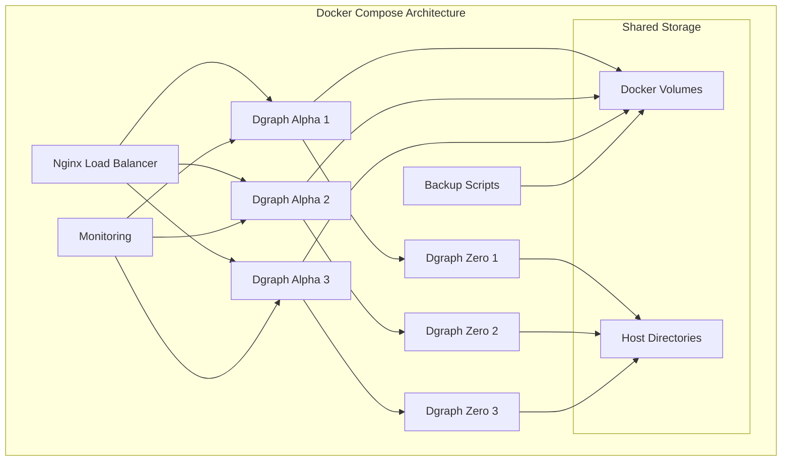

# Source: https://docs.hypermode.com/dgraph/self-managed/docker-compose.md

# Docker Compose Deployment

> Deploy your self-hosted Dgraph cluster using Docker Compose for development and testing environments

### Docker Compose Deployment



#### 1. Prepare Docker Compose Environment

<Steps>
  <Step title="Create Directory Structure">
    ```bash
    mkdir -p dgraph-compose/{data,config,backups,nginx}
    cd dgraph-compose
    ```
  </Step>

  <Step title="Create Docker Compose File">
    ```yaml docker-compose.yml
    version: '3.8'

    services:
      # Dgraph Zero nodes
      dgraph-zero-1:
        image: dgraph/dgraph:v23.1.0
        container_name: dgraph-zero-1
        ports:
          - "5080:5080"
          - "6080:6080"
        volumes:
          - ./data/zero1:/dgraph
        command: dgraph zero --my=dgraph-zero-1:5080 --replicas=3 --idx=1
        restart: unless-stopped
        networks:
          - dgraph-network

      dgraph-zero-2:
        image: dgraph/dgraph:v23.1.0
        container_name: dgraph-zero-2
        ports:
          - "5081:5080"
          - "6081:6080"
        volumes:
          - ./data/zero2:/dgraph
        command: dgraph zero --my=dgraph-zero-2:5080 --replicas=3 --peer=dgraph-zero-1:5080 --idx=2
        restart: unless-stopped
        networks:
          - dgraph-network
        depends_on:
          - dgraph-zero-1

      dgraph-zero-3:
        image: dgraph/dgraph:v23.1.0
        container_name: dgraph-zero-3
        ports:
          - "5082:5080"
          - "6082:6080"
        volumes:
          - ./data/zero3:/dgraph
        command: dgraph zero --my=dgraph-zero-3:5080 --replicas=3 --peer=dgraph-zero-1:5080 --idx=3
        restart: unless-stopped
        networks:
          - dgraph-network
        depends_on:
          - dgraph-zero-1

      # Dgraph Alpha nodes
      dgraph-alpha-1:
        image: dgraph/dgraph:v23.1.0
        container_name: dgraph-alpha-1
        ports:
          - "8080:8080"
          - "9080:9080"
        volumes:
          - ./data/alpha1:/dgraph
        command: dgraph alpha --my=dgraph-alpha-1:7080 --zero=dgraph-zero-1:5080,dgraph-zero-2:5080,dgraph-zero-3:5080 --security whitelist=0.0.0.0/0
        restart: unless-stopped
        networks:
          - dgraph-network
        depends_on:
          - dgraph-zero-1
          - dgraph-zero-2
          - dgraph-zero-3

      dgraph-alpha-2:
        image: dgraph/dgraph:v23.1.0
        container_name: dgraph-alpha-2
        ports:
          - "8081:8080"
          - "9081:9080"
        volumes:
          - ./data/alpha2:/dgraph
        command: dgraph alpha --my=dgraph-alpha-2:7080 --zero=dgraph-zero-1:5080,dgraph-zero-2:5080,dgraph-zero-3:5080 --security whitelist=0.0.0.0/0
        restart: unless-stopped
        networks:
          - dgraph-network
        depends_on:
          - dgraph-zero-1
          - dgraph-zero-2
          - dgraph-zero-3

      dgraph-alpha-3:
        image: dgraph/dgraph:v23.1.0
        container_name: dgraph-alpha-3
        ports:
          - "8082:8080"
          - "9082:9080"
        volumes:
          - ./data/alpha3:/dgraph
        command: dgraph alpha --my=dgraph-alpha-3:7080 --zero=dgraph-zero-1:5080,dgraph-zero-2:5080,dgraph-zero-3:5080 --security whitelist=0.0.0.0/0
        restart: unless-stopped
        networks:
          - dgraph-network
        depends_on:
          - dgraph-zero-1
          - dgraph-zero-2
          - dgraph-zero-3

      # Load Balancer
      nginx:
        image: nginx:alpine
        container_name: dgraph-nginx
        ports:
          - "80:80"
          - "443:443"
        volumes:
          - ./nginx/nginx.conf:/etc/nginx/nginx.conf
          - ./nginx/ssl:/etc/nginx/ssl
        restart: unless-stopped
        networks:
          - dgraph-network
        depends_on:
          - dgraph-alpha-1
          - dgraph-alpha-2
          - dgraph-alpha-3

      # Monitoring
      prometheus:
        image: prom/prometheus:latest
        container_name: dgraph-prometheus
        ports:
          - "9090:9090"
        volumes:
          - ./config/prometheus.yml:/etc/prometheus/prometheus.yml
        restart: unless-stopped
        networks:
          - dgraph-network

      grafana:
        image: grafana/grafana:latest
        container_name: dgraph-grafana
        ports:
          - "3000:3000"
        volumes:
          - ./data/grafana:/var/lib/grafana
        environment:
          - GF_SECURITY_ADMIN_PASSWORD=admin
        restart: unless-stopped
        networks:
          - dgraph-network

    networks:
      dgraph-network:
        driver: bridge

    volumes:
      dgraph-data:
    ```
  </Step>

  <Step title="Create Nginx Configuration">
    ```nginx nginx/nginx.conf
    events {
        worker_connections 1024;
    }

    http {
        upstream dgraph_alpha {
            least_conn;
            server dgraph-alpha-1:8080;
            server dgraph-alpha-2:8080;
            server dgraph-alpha-3:8080;
        }
        
        upstream dgraph_grpc {
            least_conn;
            server dgraph-alpha-1:9080;
            server dgraph-alpha-2:9080;
            server dgraph-alpha-3:9080;
        }

        server {
            listen 80;
            server_name localhost;

            location / {
                proxy_pass http://dgraph_alpha;
                proxy_set_header Host $host;
                proxy_set_header X-Real-IP $remote_addr;
                proxy_set_header X-Forwarded-For $proxy_add_x_forwarded_for;
            }
        }
        
        # HTTPS configuration (uncomment and configure as needed)
        # server {
        #     listen 443 ssl http2;
        #     server_name your-domain.com;
        #     
        #     ssl_certificate /etc/nginx/ssl/cert.pem;
        #     ssl_certificate_key /etc/nginx/ssl/key.pem;
        #     
        #     location / {
        #         proxy_pass http://dgraph_alpha;
        #         proxy_set_header Host $host;
        #         proxy_set_header X-Real-IP $remote_addr;
        #         proxy_set_header X-Forwarded-For $proxy_add_x_forwarded_for;
        #         proxy_set_header X-Forwarded-Proto $scheme;
        #     }
        # }
    }
    ```
  </Step>

  <Step title="Create Prometheus Configuration">
    ```yaml config/prometheus.yml
    global:
      scrape_interval: 15s

    scrape_configs:
      - job_name: 'dgraph-alpha'
        static_configs:
          - targets: 
            - 'dgraph-alpha-1:8080'
            - 'dgraph-alpha-2:8080'
            - 'dgraph-alpha-3:8080'
        metrics_path: '/debug/prometheus_metrics'
        
      - job_name: 'dgraph-zero'
        static_configs:
          - targets: 
            - 'dgraph-zero-1:6080'
            - 'dgraph-zero-2:6080'
            - 'dgraph-zero-3:6080'
        metrics_path: '/debug/prometheus_metrics'
    ```
  </Step>
</Steps>

#### 2. Deploy and Manage Docker Compose Cluster

<CodeGroup>
  ```bash Start Cluster
  # Start the entire cluster
  docker-compose up -d

  # Check status

  docker-compose ps

  # View logs

  docker-compose logs -f dgraph-alpha-1

  ```

  ```bash Scale Cluster
  # Add more alpha replicas
  docker-compose up -d --scale dgraph-alpha=5

  # Remove specific services
  docker-compose stop dgraph-alpha-3
  docker-compose rm dgraph-alpha-3
  ```

  ```bash Backup and Restore
  # Create backup script
  cat > backup.sh << 'EOF'
  #!/bin/bash
  DATE=$(date +%Y%m%d_%H%M%S)
  BACKUP_DIR="./backups/$DATE"
  mkdir -p $BACKUP_DIR

  # Export data
  docker exec dgraph-alpha-1 dgraph export --alpha localhost:9080 --destination /dgraph/export

  # Copy to backup directory
  docker cp dgraph-alpha-1:/dgraph/export $BACKUP_DIR/
  echo "Backup completed: $BACKUP_DIR"
  EOF

  chmod +x backup.sh
  ./backup.sh
  ```
</CodeGroup>
