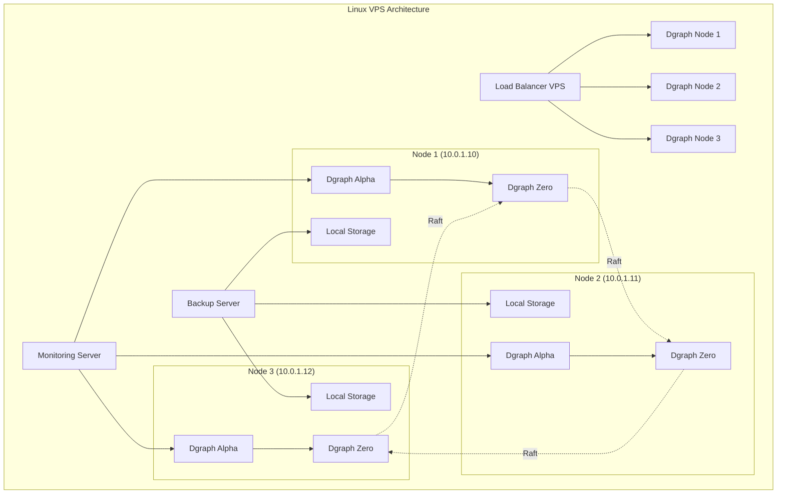

# Source: https://docs.hypermode.com/dgraph/self-managed/linux.md

# Linux Deployment

> Deploy your self-hosted Dgraph cluster on Linux Virtual Private Servers (VPS) using systemd services

## Linux deployment



#### 1. VPS Infrastructure Setup

<Steps>
  <Step title="Provision VPS Instances">
    Create 3-5 VPS instances with the following specifications: - **CPU**: 4-8
    cores - **RAM**: 16-32GB - **Storage**: 500GB+ SSD - **OS**: Ubuntu 22.04
    LTS - **Network**: Private networking enabled
  </Step>

  <Step title="Configure Base System">
    ````bash # Update system (run on all nodes) sudo apt update && sudo apt upgrade
    -y # Install required packages sudo apt install -y curl wget unzip htop iotop
    # Configure firewall sudo ufw allow ssh sudo ufw allow 8080 # Dgraph Alpha
    HTTP sudo ufw allow 9080 # Dgraph Alpha gRPC sudo ufw allow 5080 # Dgraph Zero
    sudo ufw allow 6080 # Dgraph Zero HTTP sudo ufw enable # Set up swap (if
    needed) sudo fallocate -l 4G /swapfile sudo chmod 600 /swapfile sudo mkswap
    /swapfile sudo swapon /swapfile echo '/swapfile none swap sw 0 0' | sudo tee
    -a /etc/fstab ```
    </Step>

    <Step title="Install Dgraph">
      ```bash
      # Download and install Dgraph (run on all nodes)
      curl -sSf https://get.dgraph.io | bash
      
      # Move to system path
      sudo mv dgraph /usr/local/bin/
      
      # Create dgraph user
      sudo useradd -r -s /bin/false dgraph
      
      # Create directories
      sudo mkdir -p /opt/dgraph/{data,logs}
      sudo chown -R dgraph:dgraph /opt/dgraph
    ````
  </Step>
</Steps>

#### 2. Configure Dgraph Services

<Tabs>
  <Tab title="Node 1 Configuration">
    ```bash
    # Create systemd service for Zero
    sudo tee /etc/systemd/system/dgraph-zero.service << 'EOF'
    [Unit]
    Description=Dgraph Zero
    After=network.target

    [Service]
    Type=simple
    User=dgraph
    Group=dgraph
    ExecStart=/usr/local/bin/dgraph zero --my=10.0.1.10:5080 --replicas=3 --idx=1 --wal=/opt/dgraph/data/zw --bindall
    WorkingDirectory=/opt/dgraph
    Restart=always
    RestartSec=5
    StandardOutput=journal
    StandardError=journal
    SyslogIdentifier=dgraph-zero

    [Install]
    WantedBy=multi-user.target
    EOF

    # Create systemd service for Alpha
    sudo tee /etc/systemd/system/dgraph-alpha.service << 'EOF'
    [Unit]
    Description=Dgraph Alpha
    After=network.target dgraph-zero.service
    Requires=dgraph-zero.service

    [Service]
    Type=simple
    User=dgraph
    Group=dgraph
    ExecStart=/usr/local/bin/dgraph alpha --my=10.0.1.10:7080 --zero=10.0.1.10:5080,10.0.1.11:5080,10.0.1.12:5080 --postings=/opt/dgraph/data/p --wal=/opt/dgraph/data/w --bindall --security whitelist=0.0.0.0/0
    WorkingDirectory=/opt/dgraph
    Restart=always
    RestartSec=5
    StandardOutput=journal
    StandardError=journal
    SyslogIdentifier=dgraph-alpha

    [Install]
    WantedBy=multi-user.target
    EOF

    # Enable and start services
    sudo systemctl daemon-reload
    sudo systemctl enable dgraph-zero dgraph-alpha
    sudo systemctl start dgraph-zero
    sleep 10
    sudo systemctl start dgraph-alpha
    ```
  </Tab>

  <Tab title="Node 2 Configuration">
    ```bash
    # Create systemd service for Zero
    sudo tee /etc/systemd/system/dgraph-zero.service << 'EOF'
    [Unit]
    Description=Dgraph Zero
    After=network.target

    [Service]
    Type=simple
    User=dgraph
    Group=dgraph
    ExecStart=/usr/local/bin/dgraph zero --my=10.0.1.11:5080 --replicas=3 --peer=10.0.1.10:5080 --idx=2 --wal=/opt/dgraph/data/zw --bindall
    WorkingDirectory=/opt/dgraph
    Restart=always
    RestartSec=5
    StandardOutput=journal
    StandardError=journal
    SyslogIdentifier=dgraph-zero

    [Install]
    WantedBy=multi-user.target
    EOF

    # Create systemd service for Alpha
    sudo tee /etc/systemd/system/dgraph-alpha.service << 'EOF'
    [Unit]
    Description=Dgraph Alpha
    After=network.target dgraph-zero.service
    Requires=dgraph-zero.service

    [Service]
    Type=simple
    User=dgraph
    Group=dgraph
    ExecStart=/usr/local/bin/dgraph alpha --my=10.0.1.11:7080 --zero=10.0.1.10:5080,10.0.1.11:5080,10.0.1.12:5080 --postings=/opt/dgraph/data/p --wal=/opt/dgraph/data/w --bindall --security whitelist=0.0.0.0/0
    WorkingDirectory=/opt/dgraph
    Restart=always
    RestartSec=5
    StandardOutput=journal
    StandardError=journal
    SyslogIdentifier=dgraph-alpha

    [Install]
    WantedBy=multi-user.target
    EOF

    # Enable and start services
    sudo systemctl daemon-reload
    sudo systemctl enable dgraph-zero dgraph-alpha
    sudo systemctl start dgraph-zero
    sleep 10
    sudo systemctl start dgraph-alpha
    ```
  </Tab>

  <Tab title="Node 3 Configuration">
    ```bash
    # Create systemd service for Zero
    sudo tee /etc/systemd/system/dgraph-zero.service << 'EOF'
    [Unit]
    Description=Dgraph Zero
    After=network.target

    [Service]
    Type=simple
    User=dgraph
    Group=dgraph
    ExecStart=/usr/local/bin/dgraph zero --my=10.0.1.12:5080 --replicas=3 --peer=10.0.1.10:5080 --idx=3 --wal=/opt/dgraph/data/zw --bindall
    WorkingDirectory=/opt/dgraph
    Restart=always
    RestartSec=5
    StandardOutput=journal
    StandardError=journal
    SyslogIdentifier=dgraph-zero

    [Install]
    WantedBy=multi-user.target
    EOF

    # Create systemd service for Alpha
    sudo tee /etc/systemd/system/dgraph-alpha.service << 'EOF'
    [Unit]
    Description=Dgraph Alpha
    After=network.target dgraph-zero.service
    Requires=dgraph-zero.service

    [Service]
    Type=simple
    User=dgraph
    Group=dgraph
    ExecStart=/usr/local/bin/dgraph alpha --my=10.0.1.12:7080 --zero=10.0.1.10:5080,10.0.1.11:5080,10.0.1.12:5080 --postings=/opt/dgraph/data/p --wal=/opt/dgraph/data/w --bindall --security whitelist=0.0.0.0/0
    WorkingDirectory=/opt/dgraph
    Restart=always
    RestartSec=5
    StandardOutput=journal
    StandardError=journal
    SyslogIdentifier=dgraph-alpha

    [Install]
    WantedBy=multi-user.target
    EOF

    # Enable and start services
    sudo systemctl daemon-reload
    sudo systemctl enable dgraph-zero dgraph-alpha
    sudo systemctl start dgraph-zero
    sleep 10
    sudo systemctl start dgraph-alpha
    ```
  </Tab>
</Tabs>

***
